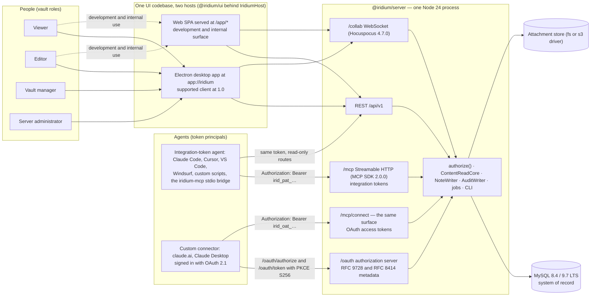
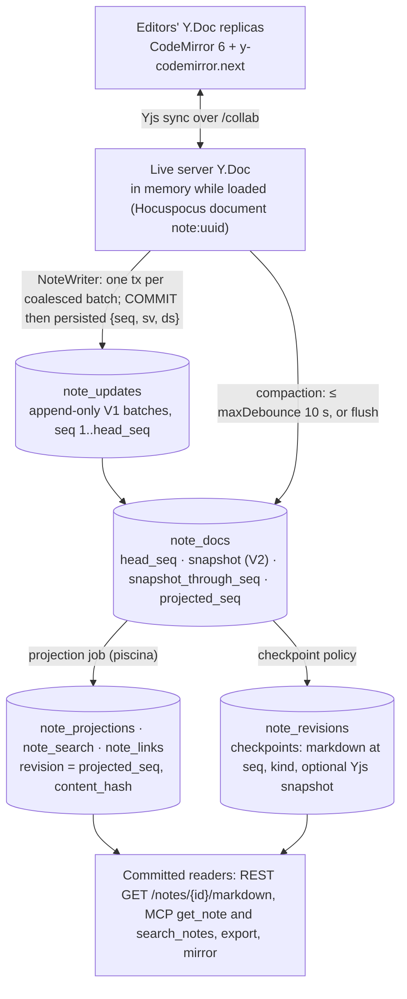

# Vision, scope, and principles

This is the first section of the Iridium development plan. It states what Iridium is, who it serves, what the objects in the system mean, what the first release contains and deliberately omits, which engineering principles every later section obeys, where and why the plan departs from the feature specification, and the vocabulary that every other section uses without redefining it. Everything here is settled; the sections that follow (02 through 14) refine the mechanisms and never reinterpret the semantics fixed here. Where this section names a table, column, endpoint, message, package or test, the name is the canonical one used across the plan.

## 1. Product vision

### 1.1 Statement

Iridium is a self-hosted, centrally administered documentation platform for organisations. It merges three things that have not shipped together in one product:

1. **Obsidian's vault model** — a vault is a tree of folders (categories) and plain Markdown notes; Markdown source is the document, not an export format; every note has a stable identity and a human-readable path; the workspace has the tree, tabs, quick switcher, command palette, source/reading/split modes and formatting shortcuts that Obsidian users carry in their hands.
2. **Google-Docs-style collaboration** — several people edit the same note at the same time with live cursors and presence, per-user undo, named versions and automatic checkpoints, and a "Saved" indicator that is true by construction because it is driven by a database commit and not by a socket state.
3. **Agent-native access** — AI agents (Claude Code, claude.ai, Claude Desktop, Cursor, VS Code, Windsurf, custom agents built on the Messages API or plain HTTP) are first-class readers of the vault through a built-in MCP server. A human grants that access in one of two ways: an integration token (`irid_pat_…`) presented at `/mcp`, or an OAuth 2.1 grant approved on Iridium's own consent screen and presented as `irid_oat_…` at `/mcp/connect`, which is the mount native claude.ai and Claude Desktop custom connectors use. Both credentials are user-granted, scoped to permissions and vaults, bounded by the granting user's live role, revocable with next-call effect, and read exactly the committed Markdown that humans see, tagged with stable ids and revisions.

The fourth property is not a feature but a constraint on the other three: Iridium is **enterprise-ready from the first release**. Accounts are administrator-provisioned, access is vault-level role-based and enforced on the server for every surface, every structural and administrative action is written to a tamper-evident audit log inside the same transaction as the change, every agent read is logged, revocation reaches already-open sessions, the deployment is one repeatable artefact set, and backup and restore are defined, scripted and rehearsed.

The system is one Node.js 24 process (`@iridium/server`, Fastify 5.12.4) that owns every byte of I/O — REST, WebSocket collaboration (Hocuspocus 4.7.0 embedded), the MCP endpoint, attachments, import/export, search, jobs and the operator CLI — over MySQL as the single system of record — 8.4 LTS and 9.7 LTS are both supported, required targets — with one React 19.3 UI (`@iridium/ui`) delivered as a browser SPA and inside a hardened Electron 44.3.0 shell. The desktop application is the supported client at 1.0; the browser SPA is a development and internal surface (section 4.6). The architecture is described in 02-system-architecture.md.

### 1.2 The four pillars and what each demands of the design

| Pillar | What a user experiences | What it forces on the architecture | Detailed in |
|---|---|---|---|
| Obsidian-style vault UX | Vault selector; collapsible category/note tree with drag-and-drop; preview and pinned tabs; quick switcher (`Mod-O`); command palette (`Mod-P`); source, reading and split modes; formatting shortcuts that edit Markdown source; relative links that resolve inside the vault; backlinks and unresolved-links panes; a per-vault attachment folder; import of an existing Markdown folder or ZIP with a report; export that opens cleanly in Obsidian | Markdown source lives inside a `Y.Text` and is never round-tripped through a rich-text document model; stable UUIDv7 ids with derived (never stored) paths; a per-vault link index (`note_links`) that exists from day one; a case-insensitive unique name per parent; byte-exact import/export round trip via recorded EOL/BOM metadata | 07-client-applications.md, 08-markdown-pipeline-import-export.md, 03-data-model.md |
| Google-Docs-style collaboration | Live cursors and a presence list with server-assigned colours; per-user undo; a status pill that reads Saved only when the edit is on disk; automatic checkpoints and user-named versions (`Mod-S`); coordinated version restore that does not disturb other editors; instant tree and membership updates in every open window | Yjs 13.6.32 CRDT state as the content of record; a per-note serialised writer (`NoteWriter`) that appends every update batch to `note_updates` in its own MySQL transaction and broadcasts `persisted {seq, sv, ds}` only after COMMIT; compaction into a V2 snapshot plus Markdown projection; a never-persisted `vault:<id>` realtime channel; awareness identity validated per message | 05-collaboration-and-durability.md |
| Agent-native access | A token created under Settings › Integrations with copy-paste config for every popular MCP client; six read-only tools and a resource template; search with snippets; revision pinning; a first-party stdio bridge (`iridium-mcp`) for clients that cannot send static headers; native claude.ai and Claude Desktop custom connectors that sign in with OAuth 2.1 on Iridium's own consent screen; an admin view of which agent read which notes | Personal access tokens (`irid_pat_…`) and OAuth access tokens (`irid_oat_…`) hashed at rest with permission-string scopes and a vault allowlist, effective rights bounded by the owner's live role; the identical MCP surface of the MCP TypeScript SDK 2.0.0 mounted twice — stateless `/mcp` for integration tokens and `/mcp/connect` for OAuth grants, because discovery is a property of a URL and not of a request — both serving both protocol eras; an OAuth 2.1 authorization server at issuer `<PUBLIC_ORIGIN>/oauth`; every tool a thin adapter over `ContentReadCore`; committed projections only; per-call `access_log` rows; kill switches at server and vault level | 06-mcp-and-agent-access.md, 04-auth-and-access-control.md |
| Enterprise-ready | Admin console for users, vaults, memberships, sessions, tokens, audit, settings, jobs, releases; step-up re-authentication for sensitive actions; HMAC-chained audit log with export and verification; live revocation across REST, WebSocket and MCP; one-container deployment behind Caddy or nginx; documented, scripted, nightly-drilled backup and restore; health, readiness and metrics | One `authorize()` function for every surface; `AuthzBus` + `CollabGateway` for revocation; audit rows written in the mutating transaction with triggers and least-privilege DB roles making them physically immutable to the app; fail-closed readiness; single limits policy; operator CLI shipped inside the image | 04-auth-and-access-control.md, 11-operations-and-deployment.md |

### 1.3 What Iridium is not

The spec calls the product "a focused internal documentation tool, not a complete Obsidian replacement". The plan keeps that stance and states the boundaries explicitly so that no section drifts across them:

- **Not an Obsidian replacement.** No plugin ecosystem, no graph view, no guaranteed Obsidian Flavored Markdown. Obsidian-specific syntax is detected, reported and indexed, and rendered as literal text in the MVP (see section 4 and 08-markdown-pipeline-import-export.md).
- **Not a rich-text editor.** The editor edits Markdown source in CodeMirror 6; the preview is a separate, sanitised render of that source. There is no WYSIWYG or live-preview mode that converts Markdown into an editor document model and back.
- **Not a file-sync product.** The server is the single home of a vault. Export produces a portable copy with a manifest; the optional filesystem mirror is read-only and never written back. There is no bidirectional filesystem or Git synchronisation.
- **Not a public wiki.** There is no anonymous principal, no "anyone with the link" sharing, no public registration. Every request is authenticated and authorised against explicit vault membership.
- **Not an AI product.** There is no built-in chatbot, AI editing or vector search. Agents are readers through MCP and the read-only REST surface; agent write access is a designed seam (`note_proposals`), not a feature.
- **Not a multi-server system.** One process owns all active documents. Every in-process singleton sits behind an interface so that a Redis-backed multi-process deployment is a later swap, but horizontal scaling is not an MVP requirement.

### 1.4 System context

Every arrow into the server is authenticated by one of the credential kinds 04-auth-and-access-control.md fixes (session, collaboration ticket, integration token, OAuth access token, one-time set-password link) and authorised by the same `authorize()` function — an OAuth principal and an integration-token principal reach `authorize()` in the same shape, which is what `oauth.principal-parity.prop` asserts. Nothing reaches MySQL or the attachment store except the server process.

### 1.5 Design north star

One principal model, one `authorize()` function, one committed-content read model, one wire-contract package. A human in a browser, the same human in the desktop app, that human's collaboration socket, and an agent's MCP tool call are all principals asking the same questions of the same core. Whenever two sections could answer a question differently, the answer that keeps this true is the one the plan takes.

## 2. Personas

Iridium distinguishes **roles** (what a membership grants inside one vault), the **server administrator flag** (server-wide trust), and **principal kinds** (how a request is authenticated: `user`, `token`, `system`). Personas are the people and programs behind those principals. The permission vocabulary below is the one fixed in the skeleton's permission matrix and implemented in `@iridium/contracts` and `apps/server/src/authz` (see 04-auth-and-access-control.md); it is repeated here because every later section assumes it.

Roles order strictly: `viewer < editor < manager`. Each role includes every permission of the role below it.

| Role | Permissions granted |
|---|---|
| `viewer` | `vault:read`, `note:read`, `search:read`, `history:read`, `attachment:read`, `export:read` |
| `editor` | viewer + `note:write`, `node:create`, `node:rename`, `node:move`, `node:trash`, `node:restore`, `attachment:write`, `revision:name` |
| `manager` | editor + `vault:manage_members`, `vault:settings`, `vault:archive`, `history:restore`, `node:purge`, `import:commit` |
| server administrator (`users.is_server_admin = 1`) | treated as `manager` on every vault (user principals only) + `server:users`, `server:vaults:create`, `server:settings`, `server:audit:all`, `server:tokens:all`, `server:sessions:all`, `server:jobs`, `server:releases` |

### 2.1 Persona summary

| Persona | How authenticated | Primary surfaces | What they are there to do | Hard limits |
|---|---|---|---|---|
| Viewer | Web cookie session or desktop bearer session; collaboration ticket for sockets | Desktop or web workspace (the desktop application is the supported client at 1.0, §4.6) — reading mode, read-only source view — search, history, export | Find and read documentation, follow links, download attachments, export copies | Cannot change content or metadata on any surface; socket is `readOnly`; every mutation route returns 403 |
| Editor | Same | Workspace editor (source/split), tree, attachments, history (name versions) | Write and co-edit notes, organise categories, manage attachments, name versions, trash and restore | Cannot manage members or settings, restore versions, purge, archive, or import into an existing vault |
| Vault manager | Same, plus step-up re-authentication for archive and version restore | Vault settings, members, audit view for the vault, history restore, trash purge, import wizard into an existing category | Own a vault: membership, policy, recovery | Cannot create vaults, manage users, or see other vaults they are not a member of |
| Server administrator | Same, plus step-up for every `/admin/*` mutation; also the `iridium` CLI at the host shell | Admin console, `/admin/*` API, operator CLI, import as a new vault | Provision users, create vaults, govern tokens and sessions, read and verify audit, tune policy, run jobs, publish desktop releases | Trusted with all content; every action audited and visible to affected vault managers; admin-owned tokens never inherit admin access |
| AI agent (via token) | `Authorization: Bearer irid_pat_…` created by a user at `/mcp`, or `Authorization: Bearer irid_oat_…` at `/mcp/connect` from an OAuth 2.1 grant the same user approved; never cookies | `POST /mcp` and `POST /mcp/connect` (the same six tools and resources), PAT-enabled read-only REST routes, `iridium-mcp` stdio bridge | Enumerate vaults and notes, read committed Markdown at a revision, search, list revisions and attachment metadata | Read-only; bounded by the owner's live explicit role and the token's vault scope; rate-limited; every read logged; cut off on revocation, expiry, membership removal, user disable or vault/server kill switch |

### 2.2 Viewer

A viewer is a member with `vault_members.role = 'viewer'`. The persona exists so that documentation can be broad in readership and narrow in authorship.

What the viewer can do, and where the plan guarantees it:

- Browse the tree and open any live note in the vault; the editor opens with the read-only compartment engaged and the status pill reads "Read-only (viewer)". The socket connection is `connection.readOnly = true`; any update the client sends is answered `SyncStatus(false)` and never applied (`collab.viewer-enforcement.integration`).
- Search titles and bodies (`GET /vaults/:vaultId/search`, `search:read`), follow relative links, hover-preview linked notes, read the backlinks pane.
- Read history: list retained revisions (`GET /notes/:noteId/revisions`, `history:read`) and read the Markdown at any retained revision (`GET /notes/:noteId/markdown?revision=`).
- Download attachments (`attachment:read`) and export a vault or a note (`export:read`), including "Export my text" for their own local text if they were ever downgraded mid-edit.
- Appear in presence: viewers keep awareness enabled (a null awareness breaks the provider's ping); their identity is validated per message like everyone else's, and they are listed in `participants` with `role: 'viewer'`.
- Create personal access tokens for the vaults they belong to. Token rights are the intersection of scopes and the owner's live role, so a viewer's token is exactly as read-only as the viewer.

What the viewer cannot do is enforced on the server, not in the client: every mutating REST route checks `authorize()` (`authz.rest-viewer.integration` covers each one), the collaboration protocol refuses writes at the wire level, and MCP tools carry only read permissions. Read-only controls in the UI are a convenience.

Expectations the persona brings: an upgrade to editor takes effect on the open connection (the server sends `{t:'role', role:'editor'}` and the client re-attaches a fresh provider, see 05-collaboration-and-durability.md); a downgrade to viewer while typing leaves the client in the `rejected` state with the local text recoverable, never silently discarded.

### 2.3 Editor

An editor is a member with `role = 'editor'`. This is the persona the collaboration pillar is built for.

- Co-edit any live note with other editors; see remote cursors and the presence list; undo only their own operations (`Y.UndoManager` with `captureTimeout 500`, never CodeMirror's `history()`).
- Trust the status pill: "Saved" appears only after a MySQL COMMIT containing the editor's updates and a `persisted` state vector that dominates the client's whole local vector and a canonical delete-set fingerprint equal to the client's (section 5, principle P5). "Saved · up to date for agents" appears after `flush {}` (`Mod-S`) once the projection is current.
- Create notes and categories (`POST /vaults/:vaultId/nodes`), rename and move them (`PATCH /nodes/:nodeId` with `If-Match`), see the rename-impact dialog computed from `note_links` before a move or rename breaks links, trash and restore (`POST /nodes/:nodeId/trash|restore`).
- Upload, paste and drag-drop attachments (`POST /vaults/:vaultId/attachments`), delete unreferenced ones.
- Name a version (`POST /notes/:noteId/revisions {label}`, `revision:name`), which forces compaction and writes a `named` checkpoint that is never thinned.
- Receive explicit conflicts instead of silent overwrites: `409 stale_version`, `409 name_conflict`, `409 invalid_move`, `409 category_not_empty`, `428 precondition_required`.

Editors cannot restore a version (`history:restore` is a manager permission because the spec calls it a coordinated content change), purge, archive, or change membership or settings.

### 2.4 Vault manager

A vault manager is a member with `role = 'manager'`. Managers own a vault's policy and recovery; they are the persona that enterprise access reviews talk to.

- Membership: add, change and remove members (`PUT/DELETE /vaults/:vaultId/members/:userId`, `vault:manage_members`). Every change bumps `vault_members.version` or `users.authz_version` and reaches open sessions through `AuthzBus` within a second (`collab.live-revocation.integration`).
- Settings (`PATCH /vaults/:vaultId`, `vault:settings`): name, description, `markdown_flavor`, `soft_breaks`, `attachment_folder`, `load_external_images`, `mcp_enabled`, `ai_guidance`, `trash_retention_days`, `auto_checkpoint_interval_min`.
- Archive and unarchive (`POST /vaults/:vaultId/archive|unarchive`, `vault:archive`, step-up): an archived vault is readable and exportable, all collaboration connections are closed with `vault-archived`, and every mutation returns `409 vault_archived`.
- Restore a version (`POST /notes/:noteId/revisions/:revisionId/restore {confirm:true}`, `history:restore`, step-up), which writes a `pre_restore` checkpoint of the current content first so the action is reversible.
- Purge trashed nodes (`DELETE /nodes/:nodeId?purge=true`, `node:purge`, step-up) and import a folder or ZIP into an existing category (`import:commit`).
- Read the vault's audit trail (`GET /vaults/:vaultId/audit`), including actions taken by server administrators inside the vault.

Managers cannot create vaults, manage user accounts, see vaults they are not members of, or see server-wide audit.

### 2.5 Server administrator

A server administrator is a user with `users.is_server_admin = 1`. The spec says this role "is explicitly trusted with all vault content"; the plan keeps that trust and surrounds it with evidence.

- For user principals, an administrator is treated as `manager` on every vault without appearing in `vault_members`, so membership lists remain meaningful for access reviews; `list_vaults` in the UI shows all vaults.
- `server:users` — create users without a password (`POST /admin/users` returns a one-time set-password link `irid_spl_…` delivered out of band), update, disable/enable, reset passwords, revoke sessions and tokens per user.
- `server:vaults:create` — create vaults (`POST /vaults`) and import as a new vault (`POST /imports {target:{newVault}}`).
- `server:tokens:all`, `server:sessions:all` — list and revoke any token or session, including revoke-all; OAuth access tokens, refresh-token families and consents are revoked by the same routes and by `/admin/oauth-clients` and `/admin/oauth-consents`.
- `server:audit:all` — search, export (JSONL/CSV), verify the HMAC chain, see chain status.
- `server:settings` — edit `server_settings` policy (session TTLs, PAT policy, `oauth_policy`, password policy, retention, `mcp_enabled`, desktop update policy); environment values remain floors.
- `server:jobs`, `server:releases` — trigger maintenance jobs, view system status (`GET /admin/system`), publish desktop update feeds.
- Every `/admin/*` mutation requires step-up re-authentication (`last_authenticated_at` within 10 minutes → otherwise `403 step_up_required`) and writes an audit event; vault-scoped admin actions are visible to that vault's managers.
- Tokens an administrator creates are `admin_owned` and never inherit administrator-implied access: they see only vaults the administrator is an explicit member of, `all_vaults` is refused, and creation shows a warning and audits `token.created {admin_owned:true}`.

The **operator** is this same persona at the host shell: `iridium migrate|doctor|config check|backup|restore --verify|audit verify-chain|audit export|audit archive|audit chain-status|access-log export|repair heads|repair content|repair projections|repair attachments|repair tree|repair search|reindex|admin …|tokens …|sessions …|keys rotate …|jobs run|trash purge|desktop-updates publish|mirror` (see 11-operations-and-deployment.md). CLI mutations are audited with `credential_type = 'cli'`. There is no separate operator role.

### 2.6 AI agent via token

An agent is a `token` principal, and it arrives with one of two credentials. An **integration token** is presented as `Authorization: Bearer irid_pat_…` on `POST /mcp` or on a PAT-enabled read-only REST route; it was created by a human user under Settings › Integrations (step-up required), shown once, and pasted into the agent's configuration using a generated snippet (`GET /me/tokens/:tokenId/snippets?client=`), or supplied to the `iridium-mcp` bridge through `--token-file` or `IRIDIUM_MCP_TOKEN`. An **OAuth access token** is presented as `Authorization: Bearer irid_oat_…` on `POST /mcp/connect`; no human ever sees it, because the user approved a standing grant on Iridium's consent screen and the client mints and refreshes tokens against `/oauth/token` until the grant is revoked under Settings › Integrations → Authorized applications. Each mount accepts exactly one of the two, which is what lets a static-header client and a connector that performs OAuth discovery work against the same server at the same time (06-mcp-and-agent-access.md).

What the agent sees and can do:

- `list_vaults` — the vaults in the token's scope that the owner is currently an explicit member of and that have `vaults.mcp_enabled = 1`, with each vault's `ai_guidance` appended.
- `list_notes` — a flat, cursor-paginated listing with stable `node_id`, derived `path`, display `title`, `revision` and `tree_version`, with `stale:true` when the tree changed between pages.
- `get_note` — the committed Markdown at the projection's `revision` (or a pinned retained revision), by id or by path, with line-range paging and a 100 000-character truncation notice; metadata-only `structuredContent`.
- `search_notes` — FULLTEXT search with `{line, text}` snippets located in Markdown source lines; results carry `revision`, and `get_note` may return a newer revision than the search showed.
- `list_note_revisions`, `list_attachments` (metadata only).
- Resources `iridium://vault/{vault_id}/note/{note_id}` (`text/markdown`, `?rev=<seq>`) and a per-vault `iridium://vault/{vault_id}` Markdown index.

What bounds the agent:

- Effective rights = `scopes ∩ permissionsOf(owner's live explicit role in that vault)` ∧ `vaultId ∈ allowlist` (or `all_vaults` over live explicit memberships) ∧ `server_settings.mcp_enabled` ∧ `vaults.mcp_enabled`. MVP scopes are the six read permissions only; write scopes are schema-valid but never granted. The expression is identical for an OAuth grant, because OAuth scope values *are* Iridium permission strings and the consented vault selection is copied from `oauth_consents` into `access_token_vaults` at every issuance.
- Not-found and forbidden are indistinguishable ("No note with that id or path is available to this token"); knowledge of an id grants nothing.
- Rate limits: 120 requests/min burst and 3 000/hour per token (`search_notes` costs 3 points), `x-ratelimit-*` and `retry-after` headers.
- Every read writes an `access_log` row with the token, user, vault, every returned note id, revision, bytes and client name; token lifecycle and denied presentations write `audit_events`.
- Revocation is immediate: the token row, the consent row and the membership are read fresh on every request (no principal cache in the MVP). Revoking the token, revoking the consent, disabling the client, removing the membership, disabling the user, expiry, or toggling `mcp_enabled` makes the next call fail with `401 unauthenticated` or an `isError` scope result. The `/mcp` 401 carries `WWW-Authenticate: Bearer realm="iridium", error="invalid_token"` and no discovery hint; the `/mcp/connect` 401 carries the same status and `error` value plus `resource_metadata` and `scope`, because that mount is the OAuth protected resource. `401 token_expired` is used only for a well-formed PAT past `expires_at` (so rotation can be explained), while a revoked, rotated-out or unknown credential is always the indistinguishable `401 unauthenticated`.
- Note content is untrusted input to the agent. `instructions.md` and every tool description say so; the MVP's read-only surface bounds the blast radius of indirect prompt injection.

The agent persona also uses REST: the same token authenticates the routes marked ★ in 09-api-reference.md (`GET /vaults`, `/vaults/:vaultId/nodes`, `/notes/:noteId`, `/notes/:noteId/markdown`, `/notes/:noteId/revisions`, search, attachment metadata and bytes) with identical authorisation and identical bytes; mutations with a token return `403 token_scope_insufficient`. Those REST routes accept an integration token only — an OAuth access token is bound to the canonical resource `<PUBLIC_ORIGIN>/mcp/connect` and is refused anywhere else. The MCP kill switches apply to both MCP mounts (`/mcp` and `/mcp/connect`); the REST read routes follow scopes and memberships alone.

### 2.7 Non-persona principals

Two principal kinds are not personas but appear in the same audit and content tables:

- **`system`** — the server acting on its own behalf: migrations, scheduled jobs (trash purge, update-log prune, revision thinning, partition management, audit archive, transfer cleanup, ticket sweep, `last_used` flush, reindex, unreferenced-attachment report), restore jobs and the `iridium doctor --repair-content` path. `note_updates.origin` records the path a content write took (`connection`, `create`, `import`, `restore`, `repair`); `actor_type = 'system'` is used only when no authenticated user is behind the write (scheduled jobs and the CLI repair path), while `create`, `import` and `restore` rows written on a user's request carry `actor_type = 'user'` and that user's id. Audit rows written by jobs carry `actor_type = 'system'`; CLI actions carry `credential_type = 'cli'`.
- **Collaboration connection** — a user principal presented through a single-use 60-second ticket (`irid_tkt_…`) bound to `{sessionId, userId}` instead of a cookie. The connection's `context` (`{sessionId, userId, vaultId, noteId?, role, authzEpoch}`) is the only source of authorship for `note_updates`, `note_revisions` and audit; awareness is never trusted for identity.
## 3. Core objects and their semantics

The spec's section 2 defines server, vault, category, note and attachment. The plan keeps those definitions and makes two of the spec's implicit objects explicit — the **revision** (section 8 "recoverable content checkpoints") and the **token** (section 7 "vault-scoped read-only integration credentials") — because both have identity, lifecycle and permissions of their own. The single rule that ties the object model together is **stable ids, mutable paths**: every object is addressed by a UUIDv7 (`BINARY(16)` in MySQL, canonical lowercase string on every API and MCP surface, generated in `@iridium/contracts/ids.ts`) that never changes on rename or move, and every human-readable path is derived at read time from the tree, never stored.

The DDL for every table named below is in 03-data-model.md; this section fixes what the rows mean.

### 3.1 Server

**Definition.** The server is the single Iridium deployment: one `@iridium/server` process, one MySQL database, one attachment store, one public origin. It owns user accounts, vaults, authorisation, persistence, projections, search, audit, jobs and the MCP endpoint. Clients connect to it; they never edit a shared folder and never reach MySQL or the attachment store.

| Aspect | Semantics |
|---|---|
| Identity | `PUBLIC_ORIGIN` (the only origin clients trust; the SPA is served from it; the WebSocket Origin allowlist and the MCP `hostHeaderValidation` are derived from it). `GET /meta` returns `{apiVersion, minClientVersion, serverVersion, features[], publicOrigin, collab, mcp, limits, policies}`; 09-api-reference.md §2.2 is authoritative for the member spellings, and the client reads its pre-flight numbers from `limits` and its local form validation from `policies`. `schema_meta` holds `iridium_version`, `api_version`, `min_client_version`, `pepper_version`, `audit_key_version`, `cursor_key_version`, `pipeline_version`, `last_backup_verified_at`. |
| Configuration | Environment (`EnvSchema`, zod, `*_FILE` secrets, unknown `IRIDIUM_*` keys rejected at boot) provides defaults and **floors**; `server_settings` (JSON policy under keys `session_policy`, `pat_policy`, `oauth_policy`, `password_policy`, `retention`, `mcp_enabled`, `desktop_update_policy`, `smtp` post-MVP) is admin-editable above those floors with `If-Match` on `version`. |
| Trust | The server process is the trust boundary. A server administrator is trusted with all content. The application's MySQL role (`iridium_app`) physically cannot alter audit history or run DDL; `iridium_migrator` and `iridium_backup` are separate roles. |
| States | *Serving*; *not ready* (`/readyz` 503 while migrations are pending, a pool cannot ping, durability settings are wrong under `READYZ_STRICT_DURABILITY`, the writer backlog is stale, or the loaded-document budget is exhausted); *draining* (SIGTERM → 503 on `/readyz`, `closing {reason:'shutdown'}` to connections, 20 s drain, writers flushed). |
| Surfaces | `/api/v1` REST, `/collab` WebSocket, `/mcp` and `/mcp/connect`, the `/oauth/*` authorization server with its RFC 9728 and RFC 8414 metadata under `/.well-known/`, `/app/*` SPA, `/desktop/updates/*` and `/desktop/tools/*` static feeds, `/healthz`, `/readyz`, `/metrics`, `/openapi.json` and `/docs` (admin or dev). The OAuth issuer is `<PUBLIC_ORIGIN>/oauth` and the canonical resource URI is `<PUBLIC_ORIGIN>/mcp/connect`; both are derived from `PUBLIC_ORIGIN` and neither is separately configurable. |
| Ownership | Created by installation (`iridium migrate` + `iridium admin create-user` for the first administrator); operated through the `iridium` CLI; upgraded forward-only. |

### 3.2 Vault

**Definition.** A vault is an independent collection of categories, notes and attachments with its own membership, settings and realtime channel. Users see only vaults they are explicit members of (server administrators see all). Permissions apply to the whole vault and are inherited by everything inside it — categories, notes, attachments, history, search results, exports, and agent access.

| Aspect | Semantics |
|---|---|
| Identity | `vaults.id` (UUIDv7). `name` is unique server-wide, case-insensitive (`uq_vaults_name`, `utf8mb4_0900_as_ci`), ≤ 120 characters. `slug` is an ASCII identifier derived once at creation, unique (`uq_vaults_slug`), used in export folder names; a rename changes `name` only. |
| Root | `root_node_id` points at a `nodes` row of `kind = 'category'` whose `parent_id = id` (the real root row). The root is never shown in paths, never renamed, moved or trashed. |
| Membership | `vault_members(vault_id, user_id, role, version, granted_by)`; one row per member; the `version` column is part of every connection's authorisation epoch so a role change reaches open sockets. Server administrators are not rows; they are computed as `manager`. |
| Status | `importing` — being created by an import job; invisible to everyone but the job; flips to `active` at commit. `active` — normal. `archived` — reads, search, history and export continue; every mutation returns `409 vault_archived`; all `note:*` and `vault:*` connections were closed with `vault-archived`; MCP still serves it read-only; `unarchive` returns it to `active`. `deleting` — invisible; set only by the aborted-import teardown (`POST /imports/:jobId/abort` on a vault still in `status='importing'`, and the `transfer_cleanup` job when `import_jobs.expires_at` passes) and by the root-row quarantine of `iridium doctor` check I-01; there is no user-facing hard-delete path for a vault that ever reached `active` (03-data-model.md §1.4). |
| Settings | `markdown_flavor ('gfm' \| 'obsidian-compat')` (rendering flag consumed post-MVP; detection always on), `soft_breaks` (preview only), `attachment_folder` (default `attachments`; taken from `.obsidian/app.json attachmentFolderPath` at import), `load_external_images ('never' \| 'click' \| 'always')`, `mcp_enabled`, `ai_guidance` (free text appended to `list_vaults` output for agents), `trash_retention_days` (30), `auto_checkpoint_interval_min` (10). |
| Structural version | `tree_version` is bumped by every structural transaction (create, rename, move, trash, restore, purge) and broadcast as `tree-changed {treeVersion, changes[]}` on the `vault:<id>` channel; it keys the future per-vault path cache and lets MCP `list_notes` mark later pages `stale:true`. |
| Realtime channel | `vault:<uuid>` is an empty, never-persisted Hocuspocus document that every open window subscribes to once; it carries `tree-changed`, `member-changed {userId, role\|null}`, `vault-updated {version}` and vault-level awareness `{id, activeNoteId}`; it is read-only for everyone and closed by the same revocation path as note connections. |
| Isolation | Every query is `WHERE vault_id = ?`; `nodes.vault_id` and `attachments.vault_id` are immutable, so cross-vault moves are rejected; a non-member receives 404 for every vault-scoped resource; search restricts `vault_id IN (accessible)` inside SQL; MCP cursors are bound to the token and the filter hash. |
| Lifecycle | Created by a server administrator (`POST /vaults`, creates the root node, audits `vault.created`) or by an import job in `importing` status; settings changed by managers (`vault.settings.changed`); archived/unarchived by managers with step-up (`vault.archived`, `vault.restored`). A vault that reached `active` has no deletion route in the MVP; the only removal is the aborted-import teardown of a vault still in `importing` status, which moves it to `deleting` and purges it. |
| Audit chain | Vault-scoped audit events form the chain `vault:<32-hex>` — `'vault:'` followed by the vault UUID **without hyphens**, produced only by `chainIdForVault()` and never the hyphenated form, which would not fit `audit_events.chain_id VARCHAR(40)` (03-data-model.md D03-05, invariant I-19). Managers read the chain at `GET /vaults/:vaultId/audit`. |

### 3.3 Category

**Definition.** A category is a folder-like container inside a vault. It holds notes and nested categories, has no Markdown body, and selecting it displays its children. Categories are organisational folders, not tags; a note belongs to exactly one category (or the vault root). A category overview is an ordinary note inside the category, not a separate document type.

| Aspect | Semantics |
|---|---|
| Storage | A `nodes` row with `kind = 'category'`. The tree is an adjacency list: `parent_id NOT NULL`, the root row has `parent_id = id`, and recursive CTEs stop at `id = parent_id`. |
| Naming | `name` ≤ 255 bytes, `COLLATE utf8mb4_0900_as_ci` (accent-sensitive, case-insensitive); unique among **live** siblings via `UNIQUE uq_sibling(parent_id, name, live)` where `live` is a virtual generated column that is `1` for live rows and `NULL` for trashed ones (trashed rows drop out of the uniqueness set). Rules: no `/`, `\` or control characters; no leading or trailing spaces or dots; not `.` or `..`; reserved Windows device names rejected. Violations return `422 invalid_name`. |
| Path | Derived per request by one recursive CTE from the root down; `path` is the `/`-joined names excluding the root. Never stored. Depth ≤ 64. |
| Identity | The id survives rename and move. Renaming a category changes `name`; moving changes `parent_id`; both bump `version` and `tree_version`. |
| Create | `POST /vaults/:vaultId/nodes {kind:'category', parentId, name}` (`node:create`). |
| Rename / move | `PATCH /nodes/:nodeId {name?, parentId?, dryRun?}` with `If-Match: "<version>"` required (`428 precondition_required` if absent). Moving a category into itself or a descendant → `409 invalid_move` (the ancestor walk of the target parent must not contain the moving id). Sibling name clash → `409 name_conflict`. `dryRun: true` returns `affectedLinks` for the subtree. Every structural transaction runs under the per-vault mutex (`SELECT … FROM vaults WHERE id = ? AND status = 'active' FOR UPDATE`) at REPEATABLE READ. |
| Trash | `POST /nodes/:nodeId/trash {recursive?}` (`node:trash`, `If-Match` required). A non-empty category without `recursive: true` → `409 category_not_empty`; with it the whole subtree is trashed in one transaction as one `trash_entries` cascade whose `cascade_root_id` is this category. Every open note in the subtree is closed with `note-trashed`. |
| Restore | `POST /nodes/:nodeId/restore {newName?, newParentId?}` (`node:restore`, `If-Match` required) restores the cascade; a name conflict at the original location must be resolved by the caller. |
| Purge | `DELETE /nodes/:nodeId?purge=true` (`node:purge`, step-up, trashed only) permanently removes the subtree; the `trash_purge` job does the same after `trash_retention_days`. |
| Broadcast | Every structural change is broadcast as `tree-changed` with one `{nodeId, parentId, kind, op, version}` entry per affected node. |

### 3.4 Note

**Definition.** A note is a Markdown document with a stable id, a filename (`name`) and a derived title, exactly one location (the vault root or a category), and one content of record: a Yjs document whose `Y.Text` named `'content'` holds the Markdown source. Notes cannot contain child notes.

| Aspect | Semantics |
|---|---|
| Storage | `nodes` row with `kind = 'note'` (location, name, `version`, `deleted_at`) + `notes` (metadata: `initialized_at`, `original_eol`, `had_bom`, `size_chars`, `oversize`, `content_invalid`, `last_edited_by/at`, `last_checkpoint_at`) + `note_docs` (persistence anchor: `head_seq`, V2 `snapshot`, `snapshot_sv`, `snapshot_through_seq`, `projected_seq`) + `note_updates` (append-only V1 update log keyed `(note_id, seq)`) + `note_revisions` (checkpoints) + `note_projections`, `note_search`, `note_links` (rebuildable projections). |
| Name vs title | `nodes.name` is the filename without `.md` and follows the category naming rules; it is what paths, exports and `path:`/`file:` search operators use. The **display title** is `COALESCE(note_projections.heading_title, nodes.name)` computed at read time, where `heading_title` is the note's first H1 (`NULL` if none). Renaming a note never rewrites its heading; editing the heading never renames the file. No derived title is ever stored in a mutable column; `note_search.title` is maintained inside the rename transaction only when `heading_title IS NULL`. |
| Identity | `nodes.id` (UUIDv7), exposed as `note_id`/`node_id`; MCP resource URI `iridium://vault/{vault_id}/note/{note_id}`; deep link `iridium://open?server=&note=&rev=`. |
| Content of record | The Yjs document (`createNoteDoc()` in `@iridium/crdt`, `gc: true`). The Markdown text is `getContent(doc).toString()`. It is **LF-only, BOM-free, with U+0000 replaced by U+FFFD**; `notes.original_eol ('lf' \| 'crlf' \| 'cr' \| 'mixed')` and `had_bom` remember what the source looked like so export can restore it (deviation F1). Everything else — frontmatter, code, whitespace, unsupported syntax — is preserved verbatim; opening or previewing never rewrites anything. |
| Initialisation | Exactly once, by `NoteService.initialize(noteId, markdown)` under `SELECT initialized_at FROM notes WHERE node_id = ? FOR UPDATE`, which writes `note_updates seq = 1` (`origin` `create` or `import`), `note_docs {head_seq: 1, snapshot, snapshot_through_seq: 1}`, a `note_revisions` row of kind `create` or `import`, the initial `note_projections` row and `initialized_at`, all in the creating transaction. A note's Y.Doc is never regenerated from Markdown afterwards; CI grep guards (`collab.initial-state-only-path.guard`, `collab.no-reinit.guard`) enforce it. |
| Editing | Only through `/collab` (`note:<uuid>` document) with a collaboration ticket, subject to the role; there is no REST route that replaces a note body. Server-side content changes (version restore, `iridium doctor --repair-content`) flow through a Hocuspocus `DirectConnection` as ordinary updates with `origin` `restore` or `repair`. |
| Persistence | Every applied update batch is appended by the note's `NoteWriter` (strict FIFO, one in-flight transaction, `note_docs FOR UPDATE` + `head_seq` compare-and-set) and acknowledged with `persisted {seq, sv, ds}` only after COMMIT. Compaction (≤ `maxDebounce` 10 s, or on `flush {}`) writes the V2 snapshot, the Markdown projection and checkpoints. Load = `applyUpdateV2(snapshot)` then `applyUpdate(update_v1)` for `seq > snapshot_through_seq`. |
| Reads | Every read surface — `GET /notes/:noteId/markdown`, `GET /notes/:noteId`, MCP `get_note`, search, export, the mirror — serves `note_projections.markdown` at `revision = projected_seq`, never the live Y.Doc; every read carries `revision` and `content_hash` (REST `ETag: "<revision>:<hash>"`, `If-None-Match` → 304). `?fresh=true` (`history:read`, ≤ 6/min per principal per note) or an editor's `flush` closes the ≤ 10 s projection lag. |
| Links | Outgoing references are indexed in `note_links` at `revision` with `kind ∈ {markdown, image, wikilink, embed, definition}`, `status ∈ {resolved, ambiguous, broken, external}`, source offsets, and the resolved node or attachment; backlinks are the inverse query. `GET /nodes/:nodeId/inbound-links` and `PATCH … {dryRun:true}` drive the rename-impact warning the spec requires. |
| Flags | `oversize = 1` when the text exceeds the soft cap of 1 000 000 UTF-16 units or the snapshot exceeds 8 MB → note read-only until reduced (`size-exceeded` message; hard cap 2 097 152 at create/import/restore/repair). `content_invalid = 1` when compaction finds `\r` or formatting attributes in the Y.Text → note read-only, `content-invalid` message, `note.content.invalid` audit, repaired by `iridium doctor --repair-content`. |
| Presence | Server-authoritative `participants {users:[{id, name, colorHue, role, mode?}]}` on join/leave; awareness carries only `{user:{id}, cursor, mode}` and is validated per message. |
| Lifecycle | *Created* (`create` or `import` checkpoint) → *live* (loaded while any connection is open, unloaded otherwise; a checkpoint at `head_seq` always exists for an unloaded note) → *trashed* (`deleted_at` set, `trash_entries` row, `trash` checkpoint, every connection closed with `note-trashed`, writer drops pending batches, `onAuthenticate`/`onLoadDocument` refuse it so a stale client cannot recreate it) → *restored* (`node.restored`) or *purged* (`node.purged`; the node and all its content rows are removed in one transaction; attachments are never purged implicitly). Trash expiry is `deleted_at + trash_retention_days`. |
| Permissions | Read: `note:read` (metadata and Markdown), `history:read` (revisions, `?fresh`), `search:read`. Write: `note:write` (collaboration), `node:*` (structure), `revision:name`; `history:restore` for restore. |

The content of a note therefore exists in up to five places with distinct meanings; the diagram fixes the flow and the glossary (section 7) fixes the words.

### 3.5 Attachment

**Definition.** An attachment is a server-managed binary file belonging to exactly one vault, referenced from Markdown by a vault-relative path, protected by that vault's permissions, and stored content-addressed so that identical bytes exist once per vault.

| Aspect | Semantics |
|---|---|
| Identity | `attachments.id` (UUIDv7) for API addressing; `sha256` for storage; `UNIQUE uq_attachment_vault_sha(vault_id, sha256)`. Uploading bytes that already exist in the vault returns the existing row (its `path_hint` and `markdownReference`), never a second row. |
| Path in Markdown | `path_hint` is the vault-relative path the Markdown uses — `<attachment_folder>/<original_name>` for uploads, the original relative path for imports — unique among live attachments per vault (`uq_attachment_path(vault_id, path_hint, live)`, `utf8mb4_0900_as_ci`). `resolveLink` in `@iridium/markdown` maps a relative link to `resolved_attachment_id` in `note_links`; the preview and the REST/Electron serving paths resolve by id, never by filesystem path. |
| Storage | `StorageDriver {put, get, delete, exists}` with `storage_key = '<vault_id>/<aa>/<sha256hex>'`; `fs` driver under `ATTACHMENTS_DIR` with atomic rename (default), `s3` driver optional (`@aws-sdk/client-s3 3.1131.0`). Files are immutable, so backups are superset-safe. `encryption`, `key_version`, `iv`, `auth_tag` columns are reserved for envelope encryption, which G4 (answered 2026-09-12) keeps out of the MVP in favour of volume or MySQL transparent data encryption. |
| Upload | `POST /vaults/:vaultId/attachments` (`attachment:write`, multipart, `UPLOAD_MAX_BYTES` 50 MiB, overridable by the environment key `MAX_UPLOAD_BYTES`). SHA-256 is computed while streaming; the MIME type is sniffed server-side and must be on the allow-list (images, audio, video, PDF, text, office); SVG is stored but always served with `attachment` disposition. Returns `{attachment, markdownReference}`; audits `attachment.uploaded`. |
| Serving | `GET /vaults/:vaultId/attachments/:attachmentId` (`attachment:read`) streams with `X-Content-Type-Options: nosniff`, `Content-Security-Policy: sandbox`, `Content-Disposition: inline` only for `image/png\|jpeg\|gif\|webp\|avif`, `Cache-Control: private, max-age=3600`, `ETag: <sha256>`. Web clients fetch with the same-origin session cookie; Electron fetches through `iridium-attachment://<vault>/<id>` handled in the main process so the renderer never holds a credential. `…/meta` returns metadata. |
| Deletion | Explicit only. `DELETE …/attachments/:attachmentId?force=` (`attachment:write`, `If-Match`) is refused with the list of referencing notes unless `force` is set; deletion is a soft delete (`deleted_at`). There is no heuristic garbage collection: `GET /admin/attachments/unreferenced` reports files with no live `note_links` reference and no reference in any retained revision's Markdown, and an administrator purges manually. |
| Import / export | Import deduplicates by SHA-256 and records `path_hint`; export writes each file at `path_hint` and lists `{attachment_id, path, sha256, size}` in `manifest.json`. |
| Agents | `list_attachments` returns metadata (`attachment_id, name, path, mime, size, sha256, referenced_by`); the bytes are available through the PAT-enabled REST route; MCP binary resources are post-MVP. |

### 3.6 Revision

The word *revision* carries two related meanings that the plan keeps distinct (see glossary 7.1):

- A **revision number** is a `seq` — the per-note, monotonically increasing counter of committed update batches (`note_updates.seq`, `note_docs.head_seq`). "Revision N of note X" is the content of X after the update with `seq = N` was applied. Every committed read (`GET /notes/:noteId`, `/markdown`, MCP `get_note`, `search_notes`, export manifest) reports the revision it reflects.
- A **revision row** (a **checkpoint**) is a `note_revisions` row: a materialised, LF-normalised Markdown copy of the note at one `seq`, with a `kind`, a `content_hash`, an optional Yjs snapshot, and the authenticated actor. The spec's "recoverable content checkpoints … separate from the binary state used for synchronization" are exactly these rows. Every checkpoint has a revision number; not every revision number has a checkpoint.

**Definition.** A revision row is a recoverable point in a note's history that can be read, compared, named and restored, independent of the Yjs update log.

| Kind | Written when | By whom | Yjs snapshot stored | Thinned |
|---|---|---|---|---|
| `create` | `NoteService.initialize` for a note created in the UI or API | the creating user | yes | never |
| `import` | `NoteService.initialize` during import commit | the importing user (`actor_type` user) | yes | never |
| `checkpoint` | compaction, when the content hash changed and ≥ `auto_checkpoint_interval_min` (10) elapsed since the last checkpoint | system (last editor recorded on `notes`) | when < 4 MB | yes |
| `unload` | the last client leaves and no checkpoint exists at `head_seq` (invariant: an unloaded note always has a checkpoint at head) | system | when < 4 MB | yes |
| `named` | `POST /notes/:noteId/revisions {label}` (`revision:name`; `Mod-S` "Name this version") — forces compaction first | the naming user | yes | never |
| `pre_restore` | immediately before a version restore captures the current content | the restoring user | yes | never |
| `restore` | after a version restore is applied; `restored_from_revision_id` points at the source row | the restoring user | yes | never |
| `trash` | when the note is trashed | the trashing user | yes | never |

Semantics that hold for every row:

- `seq` is the revision the row reflects; `UNIQUE (note_id, seq, kind)`.
- `markdown` is the LF text at `seq`; `content_hash = SHA-256(markdown)`; `size_chars` is UTF-16 units.
- `actor_type ∈ {user, token, system}` and `actor_id` come from the authenticated connection or request context, never from awareness.
- Thinning (`revision_thinning` job) applies only to `checkpoint` and `unload` kinds: keep everything from the last 24 hours, one per hour for 30 days, one per day thereafter. Named, restore, pre-restore, import, create and trash rows are retained for the life of the note.
- Reads: `GET /notes/:noteId/revisions?cursor=` and `GET /notes/:noteId/revisions/:revisionId` (`history:read`), `GET /notes/:noteId/markdown?revision=N`, MCP `list_note_revisions` and `get_note(revision=N)`, resource `?rev=N`. Asking for a revision that was thinned returns an explicit error naming the nearest retained revision; the plan never silently substitutes.
- Restore (`POST /notes/:noteId/revisions/:revisionId/restore {confirm:true}`, `history:restore`, step-up): (1) force compaction and write `pre_restore` at the current head; (2) compute `prefixSuffixDiff(current, target)` in `@iridium/crdt`; (3) apply the minimal replacement through a Hocuspocus `DirectConnection` with a non-tracked origin (`note_updates.origin = 'restore'`), so other participants keep their relative cursor positions and nobody's per-client undo captures it; (4) write the `restore` row; (5) audit `note.revision.restored`; (6) broadcast `checkpoint {seq, revisionId, kind}`. No `If-Match` on `head_seq` is required because restores must succeed during active editing; the `pre_restore` row makes every restore reversible.
- The `checkpoint` stateless message tells open clients that a row was created so the history rail updates without polling.

### 3.7 Token

**Definition.** A token (personal access token, PAT) is a user-granted, scoped, expiring, revocable credential for non-interactive access by agents and integrations. It is the credential the brief calls for: created in the UI, pasted into the agent's MCP configuration at setup time, hashed at rest, revocable with immediate effect.

| Aspect | Semantics |
|---|---|
| Format | `irid_pat_<id16 base62>_<secret43 base62><crc6 base62>`: `id16` is the public lookup id (`access_tokens.token_id`), the secret is 32 CSPRNG bytes, and the 6-character suffix is a CRC32 over everything before it so malformed strings are rejected offline. Published scanner regex `irid_(pat\|ses\|tkt\|spl\|oat\|ort\|oac)_[0-9A-Za-z]{16}_[0-9A-Za-z]{49}`, which covers the OAuth credentials as well so a leak into a configuration file or a browser history entry is findable. Shown exactly once at creation; `display_prefix` (`irid_pat_<token_id>_`) is what lists show afterwards. |
| At rest | `access_tokens.secret_hash = SHA-256(secret)` (a fast hash is correct for a 256-bit random secret); lookup by `token_id`, then `timingSafeEqual`. Rows are never deleted; revocation sets `revoked_at`. |
| Owner | `user_id`; created from a session with step-up (`POST /me/tokens`), recording `created_from_session_id`, `created_ip`, `created_user_agent`. |
| Scopes | Permission strings (`scopes JSON`). MVP issues one bundle, "Read" = `vault:read`, `note:read`, `search:read`, `history:read`, `attachment:read`, `export:read`. Write scopes are schema-valid (so the contract does not change later) but never granted or listed. |
| Vault scope | Either an explicit allowlist (`access_token_vaults`, ⊆ the owner's memberships at creation and re-checked at use) or `all_vaults = 1` meaning "every vault the owner is an explicit member of at call time". |
| Effective rights | `scopes ∩ permissionsOf(owner's live explicit role in the vault)` ∧ `vaultId ∈ scope` ∧ (on either MCP mount) `server_settings.mcp_enabled` ∧ `vaults.mcp_enabled`. Token principals have `isServerAdmin: false` always; a server administrator's token sees only explicit memberships, cannot use `all_vaults`, and is flagged `admin_owned` and audited at creation. A property test (`token.effective-permissions.prop`) asserts token rights ⊆ owner's live rights. |
| Expiry | `expires_at` is mandatory: default `pat_policy.defaultLifetimeDays` (90), ceiling `pat_policy.maxLifetimeDays` (366), `pat_policy.allowNoExpiry` false by default. Policy lives in the `pat_policy` row of `server_settings` (03-data-model.md §13.1); the skeleton's flat spellings `pat_max_lifetime_days`, `pat_allow_no_expiry` and `pat_rotation_overlap_max_hours` map onto those members and are not field names. |
| Rotation | `POST /me/tokens/:tokenId/rotate {overlapHours?}` issues a new secret (new row, `rotated_from_id`), revokes the old one immediately unless `overlapHours ≤ pat_policy.rotationOverlapMaxHours` (default max 24, default 0) sets `rotation_overlap_until`; audits `token.rotated`. |
| Revocation | By the owner (`DELETE /me/tokens/:tokenId`), by an administrator (`DELETE /admin/tokens/:tokenId`, `POST /admin/tokens/revoke-all`, `POST /admin/users/:userId/revoke-tokens`), or by the CLI (`iridium tokens revoke\|revoke-all`). An OAuth grant is revoked instead at the consent (`DELETE /me/oauth-consents/:consentId`, `DELETE /admin/oauth-consents/:consentId`, `iridium oauth consents revoke`) or at the client (`PATCH\|DELETE /admin/oauth-clients/:clientId`), which revokes that consent's access tokens and its whole refresh-token family in one transaction; `POST /me/tokens/revoke-all` revokes every live credential the caller owns, integration tokens and OAuth grants alike. Effective on the next request because the token row, the consent row, the user's status and the membership are read fresh on every call. Disabling the user, removing the membership, archiving the vault (reads continue), or toggling `mcp_enabled` cut access the same way. Password changes and resets do not touch tokens. |
| Use | `Authorization: Bearer` on `POST /mcp` and on PAT-enabled REST read routes; cookies are ignored when a bearer is present; a browser `Origin` on `/mcp` → 403; per-token limits 120/min burst and `rate_limit_per_hour` (default 3 000; `search_notes` costs 3); `last_used_at/ip`, `last_client` written asynchronously at most every 10 minutes; every read → `access_log`; every rejected presentation → `token.denied` audit. |
| MCP identity | The verifier implements `OAuthTokenVerifier.verifyAccessToken` → `AuthInfo {token, clientId, scopes, expiresAt, resource, extras: {principal}}`, where `clientId` is `'pat:' + id16` for an integration token and `'oauth:' + client_id` for an OAuth access token, and `resource` is `PUBLIC_ORIGIN + '/mcp'` or `PUBLIC_ORIGIN + '/mcp/connect'` to match the mount that accepted the credential. |
| Kinds | `access_tokens.kind ∈ {pat, oauth, scim}`; `pat` and `oauth` are both issued in the MVP — `oauth` rows are minted by Iridium's own OAuth 2.1 authorization server and verified by the same prefix dispatch; `scim` arrives with SCIM provisioning. |

Tokens belong to a family of seven credential kinds that share the format and the CRC but differ in purpose; only the PAT is a "token" in the plan's vocabulary, and the three OAuth kinds are always named in full:

| Kind | Prefix | Purpose | Lifetime | Stored |
|---|---|---|---|---|
| Personal access token | `irid_pat_` | agent and integration access at `/mcp` and on the PAT-enabled REST read routes | ≤ 366 days, default 90 | `access_tokens` with `kind='pat'` (SHA-256) |
| OAuth access token | `irid_oat_` | agent access at `/mcp/connect` under a consent grant | `oauth_policy.accessTokenTtlMinutes`, default 60 minutes | `access_tokens` with `kind='oauth'` (SHA-256) |
| OAuth refresh token | `irid_ort_` | minting the next access token for a live grant; rotated on every use, with family revocation on reuse | sliding `oauth_policy.refreshIdleDays` (30) within absolute `refreshAbsoluteDays` (90) | `oauth_refresh_tokens` (SHA-256) |
| OAuth authorization code | `irid_oac_` | one leg of the authorization-code flow, bound to client, redirect URI, resource and session | 60 s, one use | `oauth_authorization_codes` (SHA-256) |
| Session | `irid_ses_` | interactive web (cookie) or desktop (bearer held by the Electron main process) session | web idle 24 h / absolute 14 d; desktop idle 30 d / absolute 90 d | `sessions` (SHA-256) |
| Collaboration ticket | `irid_tkt_` | single-use WebSocket authentication bound to a session | 60 s, one use | in-process `TicketStore` |
| Set-password link | `irid_spl_` | one-time initial credential or reset, delivered out of band by an administrator | 24 h, one use | `password_setup_tokens` (SHA-256) |

### 3.8 Supporting objects

| Object | Table(s) | Meaning | Key rules |
|---|---|---|---|
| User | `users`, `user_credentials` | An administrator-provisioned account with email (unique, case-insensitive), display name, `is_server_admin`, `status ∈ {active, disabled, deleted}`, presence `color_hue`, `authz_version` | No public registration; `user_credentials` is absent until the user sets a password via a link; `authz_version` bumps on disable, password set/change, any membership change and admin session revoke |
| Membership | `vault_members` | The grant of a role to a user in a vault | Explicit rows only; `version` bumps on role change; part of the connection authz epoch |
| Session | `sessions` | An interactive login, `kind ∈ {web, desktop}`, with idle and absolute expiry, `last_authenticated_at` for step-up | New row per login; password change revokes other sessions; logout deletes the row |
| Ticket | in-process `TicketStore` | A single-use 60 s credential a session exchanges for a WebSocket connection, issued in batches (`POST /auth/collab-tickets {count: 1..50}`) | Never persisted; a restart invalidates outstanding tickets and providers fetch new ones |
| Node | `nodes` | The tree row shared by categories and notes: location, name, `version`, soft-delete | The only structural entity; `kind` decides whether a `notes` row exists |
| Trash entry | `trash_entries` | The record of a trashed subtree: `cascade_root_id` (restore unit), `original_parent_id`, `original_path`, `expires_at` | One row per trashed node; restore acts on the cascade root |
| Projection | `note_projections`, `note_search`, `note_links` | Rebuildable, derived views of committed content at `revision` | Writers guard with `WHERE revision < ?`; all three replaced in one transaction; `iridium reindex` rebuilds |
| Job | `jobs`, `import_jobs`, `export_jobs` | A unit of asynchronous work with status, progress and result | Single scheduler instance; `locked_by` reserved for leader election |
| Audit event | `audit_events`, `audit_chain_heads`, `audit_events_archive` | An append-only, HMAC-chained record of an administrative or structural action, written in the mutating transaction | Closed vocabulary in `@iridium/contracts/audit.ts`; triggers and grants make rows immutable to the app; chains `vault:<32-hex>` (`chainIdForVault()`, D03-05) and `server` |
| Access-log entry | `access_log` | One row per token-authenticated read, with every returned note id | Monthly partitions, 90-day retention by partition drop; high volume, not chained |
| Server setting | `server_settings` | Admin-editable policy above environment floors | `If-Match` on `version`; audited `admin.settings.changed` |
| Desktop release | `desktop_releases` | A published desktop update feed entry per channel | Published by `iridium desktop-updates publish` or `POST /admin/releases` |

### 3.9 Object invariants

| Object | Invariant | Asserted by |
|---|---|---|
| Vault | `root_node_id` refers to a category row with `parent_id = id`; `name` and `slug` unique server-wide | migrations, `hierarchy.model.prop` |
| Category / node | No cycle: the ancestor walk of any node reaches the root; depth ≤ 64; live sibling names unique case-insensitively; `vault_id` immutable | `tree.structural-concurrency.integration`, `hierarchy.model.prop`, `contracts.paths.prop` |
| Note | `note_docs.head_seq = GREATEST(snapshot_through_seq, COALESCE(MAX(note_updates.seq), 0))`; `snapshot_through_seq ≤ head_seq`; `projected_seq ≤ head_seq`; `initialized_at` set exactly once; a checkpoint exists at `head_seq` for every unloaded note; the text is LF-only without formatting attributes | `persistence.model.prop`, `iridium doctor`, `restore --verify`, `collab.lf-invariant.guard`, `collab.content-invalid.chaos`, `collab.no-reinit.guard` |
| Attachment | one row per `(vault_id, sha256)`; `path_hint` non-null and unique among live rows; `storage_key` present with matching SHA-256 | `attachments.security.integration`, `restore --verify` |
| Revision | `UNIQUE (note_id, seq, kind)`; named/restore/pre-restore/import/create/trash rows never thinned; `content_hash = SHA-256(markdown)` | `revisions.thinning.integration`, `revisions.restore.integration` |
| Token | effective rights ⊆ owner's live rights; `expires_at` always set; admin-owned tokens never see admin-implied vaults | `token.effective-permissions.prop`, `mcp.revocation.mcp`, `mcp.scopes.mcp` |
| Audit | each chain verifies from its head back to the first row; `iridium_app` cannot UPDATE or DELETE audit rows | `audit.chain.integration`, `db-grants.integration` |
## 4. MVP scope and non-goals

The MVP is the release Changesets tags `1.0.0` at the exit of milestone M8 (see 12-milestones.md). It is defined three ways, and the three must agree: the capability list in 4.1, the literal first-milestone gate in 4.2, and the nine acceptance rows of spec §9 mapped to named tests in 4.3. Everything spec §10 defers stays deferred (4.4), and every deferred item has a seam that already exists in the MVP codebase so that adding it later is additive rather than a rewrite (4.5).

### 4.1 What ships

| Area | In the MVP | Detailed in | Milestone |
|---|---|---|---|
| Server process | One Node 24.21.0 process, `@iridium/server` on Fastify 5.12.4: `/api/v1` REST with OpenAPI 3.1 generated from zod 4.6.2 schemas; `/collab` WebSocket with Hocuspocus 4.7.0 embedded as the `Hocuspocus` class; `/mcp` Streamable HTTP on `@modelcontextprotocol/server` 2.0.0, stateless, serving both the 2026-07-28 protocol and 2025-era clients; `/app/*` SPA; `/desktop/updates/*` and `/desktop/tools/*` feeds; `/healthz`, `/readyz`, `/metrics`; in-process job scheduler; the `iridium` operator CLI shipped in the same image | 02-system-architecture.md, 09-api-reference.md, 11-operations-and-deployment.md | M0–M8 |
| System of record | MySQL **8.4 LTS and 9.7 LTS, both required targets** (`mysql:8.4.11`, `mysql:9.7.2-oraclelinux9`), each merge-blocking in `ci.yml`; 48 forward-only migrations (`0001_users` … `0048_access_log_oauth_client`) run by kysely-ctl 0.21.0 under `GET_LOCK('iridium_migrate',60)`; three database roles (`iridium_app`, `iridium_migrator`, `iridium_backup`); Kysely 0.29.5 over mysql2 3.24.4 with separate `dbApp` (20) and `dbPersist` (4) pools | 03-data-model.md, 11-operations-and-deployment.md | M0 |
| Accounts and sessions | Administrator-provisioned users; argon2id via `@node-rs/argon2` 2.2.1 with a versioned pepper; one-time set-password links (`irid_spl_…`) for initial credentials and resets; web cookie sessions (`__Host-iridium_session`) and desktop bearer sessions held only by the Electron main process; step-up re-authentication; DB-backed login throttling; session listing and revocation for users and administrators | 04-auth-and-access-control.md | M1, M7 |
| Authorization | Roles `viewer < editor < manager` per vault plus the server-administrator flag; one static permission matrix and one `authorize()`; route policy declared on every route and asserted at boot; 404 for non-members; live revocation through `users.authz_version`, `vault_members.version`, `AuthzBus`, `CollabGateway`, per-message epoch checks and `onTokenSync` re-validation; CSRF guard for cookie principals; single-use collaboration tickets issued in batches | 04-auth-and-access-control.md | M1 |
| Vault structure | Vaults (create, settings, archive/unarchive), explicit memberships, categories and notes with UUIDv7 ids and derived paths, rename/move with mandatory `If-Match`, cycle and depth checks, name rules, case-insensitive sibling uniqueness, trash/restore/purge with per-vault retention, `tree_version`, and the `vault:<id>` realtime channel that broadcasts `tree-changed`, `member-changed`, `vault-updated` | 03-data-model.md, 05-collaboration-and-durability.md | M1, M2, M4 |
| Collaboration and durability | Yjs 13.6.32 as content of record; y-codemirror.next 0.3.6 binding; per-note `NoteWriter` with strict FIFO, `note_docs FOR UPDATE` and `head_seq` compare-and-set; append-only `note_updates` log; V2 snapshot compaction; the `persisted`/`baseline`/`persist-failed`/`projected` acknowledgement protocol; `flush` on `Mod-S`; role changes applied to live connections; backpressure and the loaded-document admission budget; per-message awareness identity validation; server-authoritative `participants`; graceful shutdown drain | 05-collaboration-and-durability.md | M1 |
| Revisions | Checkpoint kinds `create`, `import`, `checkpoint`, `unload`, `named`, `pre_restore`, `restore`, `trash`; automatic checkpoints every `auto_checkpoint_interval_min` when the content hash changed; user-named versions; thinning of automatic kinds only; coordinated restore through a `DirectConnection` applying `prefixSuffixDiff` after a `pre_restore` row | 05-collaboration-and-durability.md, 03-data-model.md | M2 |
| Markdown | `@iridium/markdown` unified pipeline (markdown-it 15.0.2 token engine behind a first-party positioned-mdast adapter, GFM table/footnote/strikethrough/task rules plus the linear mdast autolink transform, remark-rehype 11.1.2, fixed-registry lowlight 3.3.0 highlighting, rehype-sanitize 6.0.0 last); the spec's formatting set (headings, emphasis, lists, task lists, tables, blockquotes, fenced code with highlighting, links, images) plus strikethrough, footnotes and autolink literals; frontmatter parsed with yaml 2.9.1 and never re-serialised; relative link resolution and the `note_links` index; rename-impact warnings; Obsidian syntax detection and reporting with literal-text rendering; the hostile-content corpus asserted at hast level, in Chromium and in both hosts | 08-markdown-pipeline-import-export.md | M2, M4, M6 |
| Search | InnoDB FULLTEXT over the narrow `note_search` projection behind the `SearchIndex` interface; boolean-mode queries built server-side; `path:` and `file:` operators (`tag:` and `line:` reserved); `{line, text}` snippets located in Markdown source lines; ACL inside SQL; staleness hint for open notes with `projected_seq < head_seq` | 08-markdown-pipeline-import-export.md, 03-data-model.md | M2 |
| Attachments | Content-addressed storage (`UNIQUE(vault_id, sha256)`) behind `StorageDriver` (`fs` default, `s3` optional); streaming SHA-256 and server-side MIME sniffing against an allow-list; hardened serving headers; `path_hint` resolution through `note_links`; explicit deletion only with a referencing-notes check; administrator report of unreferenced files | 08-markdown-pipeline-import-export.md | M2, M6 |
| Import and export | Two-phase import (upload → scan → report → commit) into a new vault created in `importing` status or into an existing category; report codes from `@iridium/contracts/import-report.ts`; export as a streamed ZIP with `manifest.json` (`iridium-export/1`), original EOL/BOM restored, attachments at `path_hint`, `README-IRIDIUM.md`; single-note export; the read-only `iridium mirror` CLI | 08-markdown-pipeline-import-export.md | M6 |
| MCP and agents | Personal access tokens (`irid_pat_…`) with the "Read" scope bundle, explicit vault allowlist or `all_vaults`, mandatory expiry, rotation with optional overlap, admin-owned restrictions; token UI with per-client configuration snippets; six read-only tools (`list_vaults`, `list_notes`, `get_note`, `search_notes`, `list_note_revisions`, `list_attachments`); the `iridium://vault/{vault_id}/note/{note_id}` resource template and per-vault index resource; HMAC-signed cursors; per-token rate limits; `access_log` with returned note ids; server and vault kill switches; `instructions.md`; the `iridium-mcp` stdio bridge; PAT-enabled read-only REST routes; agent activity per token in the admin console. The same MCP surface is mounted twice: `/mcp` accepts integration tokens only, `/mcp/connect` accepts OAuth access tokens only, and an OAuth 2.1 authorization server at issuer `<PUBLIC_ORIGIN>/oauth` makes native claude.ai and Claude Desktop custom connectors work — authorization code with mandatory PKCE S256, the RFC 8707 `resource` parameter, RFC 9207 `iss`, refresh-token rotation with family revocation on reuse, RFC 7009 revocation, a server-rendered consent screen that selects vaults and scopes, RFC 9728 protected-resource metadata and RFC 8414 authorization-server metadata, client ID metadata documents and bounded dynamic client registration, Authorized applications under Settings › Integrations, and an OAuth-clients admin page | 06-mcp-and-agent-access.md, 04-auth-and-access-control.md, 09-api-reference.md | M3, M4, M7 |
| Clients | `@iridium/ui` (React 19.3.0, TanStack Router 1.170.35, TanStack Query 5.102.8, Zustand 5.0.15, Base UI 1.8.0 via shadcn, Tailwind 4.3.3) behind the `IridiumHost` seam; the desktop application is the supported client at 1.0 and the web host is a development and internal surface (§4.6); `apps/web` served at `/app/*` with a nonce CSP; `apps/desktop` (Electron 44.3.0) with the full hardening set, main-only credential custody, `app://iridium`, `iridium-attachment://`, deep links, native menu from the command registry, distributed at 1.0 as unsigned zip/tar.gz bundles with published SHA-256 checksums and an admin update policy that reports a manual download; workspace: vault selector, tree with drag-and-drop, preview and pinned tabs, split, quick switcher, command palette, source/reading/split editor, presence and cursors, status pill, search pane, backlinks and unresolved-links panes, hover preview, trash view, history rail with diff and named versions, settings (profile, sessions, integrations, appearance), vault settings and members, admin console; keyboard-complete with axe checks; typed string table | 07-client-applications.md | M4, M5, M7 |
| Operations and enterprise | `infra/compose.yaml` and `compose.prod.yaml` behind Caddy (nginx and systemd documented), hardened non-root image built from a pruned lockfile with SBOM and provenance; pino 10.3.1 with redaction; `@prometheus-io/client` metrics, Grafana dashboard and alert rules; fail-closed readiness; `iridium backup` and `iridium restore --verify` with the encrypted secrets bundle and blocking verification, nightly restore drill; key rotation; upgrade and rollback runbook; HMAC-chained audit log with verify/export/archive; threat model T1–T17 (04-auth-and-access-control.md §12, maintained as `docs/threat-model.md`) and the compliance checklist with test links; client/server compatibility policy (`apiVersion`, `minClientVersion`) | 11-operations-and-deployment.md, 04-auth-and-access-control.md | M0, M1, M2, M7, M8 |
| Quality | Vitest 5.0.0 projects (unit, component in Browser Mode, integration on Testcontainers, property with fast-check 4.10.0, chaos with Toxiproxy, contract with Schemathesis 4.26.1, mcp with the conformance suite), Playwright 1.63.0 for web and Electron on three OSes, Stryker 10 mutation lane, k6 2.2.0 load lane with SLOs, `@iridium/testkit`, guard tests that encode architecture rules, `ci.yml`/`nightly.yml`/`release.yml` with digest-pinned actions and a license scan | 10-testing-and-quality.md | M0–M8 |

### 4.2 The first milestone gate

Spec §10 states: "The first implementation milestone is one authenticated note, two editors, one viewer, MySQL persistence, and a server restart. Prove correct collaboration, authorization, and saving before expanding the vault-management UI." The plan takes that sentence literally as the exit condition of M1, encoded as `kernel.smoke.integration`:

1. An administrator created with `iridium admin create-user` provisions two editors and one viewer through `POST /admin/users`; each sets a password through an `irid_spl_…` link; a vault and three memberships are created.
2. Two `NoteClient`s from `@iridium/testkit` (real `@hocuspocus/provider` instances in Node, over a `ws` subclass that injects `Origin`) open the same `note:<uuid>` document with single-use tickets and edit concurrently, including at overlapping positions.
3. The viewer's connection is `readOnly`; an update it sends is answered `SyncStatus(false)` and never reaches the document or the log.
4. Each editor observes `persisted {seq, sv, ds}` messages whose state vector dominates its whole local vector and whose canonical delete-set fingerprint equals its local fingerprint before its `SaveStateMachine` reports `saved`.
5. The server process is killed with SIGKILL immediately after an acknowledgement and restarted; both editors reconnect, send `baseline {}`, and converge on identical content with no duplicated initial text; `note_docs.head_seq` equals the acknowledged `seq`.
6. After compaction, `GET /notes/:noteId/markdown` returns the same text at `revision = head_seq` to a session principal and, at M3, to a token principal.

"Headless" means no user interface is required for the gate. A minimal web editor may be demonstrated at M1, but it is not an exit criterion. The ordering is a deliberate scope decision: the kernel properties (principles P3, P5 and P6 in section 5) are proven and placed on the PR critical path before a single React component exists, so the UI milestones build on verified semantics instead of discovering them.

### 4.3 Acceptance rows that define done

The MVP is done when every row of spec §9 is green on PR and nightly for seven consecutive nightly runs, and a fresh-VM deployment following `docs/ops/deployment.md` verbatim reaches a working three-editor session and a working `claude mcp add`. The full test inventory is in 10-testing-and-quality.md; this table fixes which milestone owns each row. Every test is named in the canonical `<name>.<project>` form of that inventory — the Vitest project or Playwright lane (`.unit`, `.component`, `.integration`, `.prop`, `.chaos`, `.contract`, `.mcp`, `.e2e`, `.guard`) is part of the name, because the name is the file basename minus `.spec.ts[x]` (10-testing-and-quality.md, "Test file conventions") — so an acceptance row here, a milestone exit in 12-milestones.md and the inventory always resolve to one artefact. Where a row is proven in more than one host, the **desktop proof is the one that gates 1.0** and the browser proof is a development signal (§4.6). The *Green at* column names both, and 12-milestones.md §2.3 records which milestone retires the row on that basis; the ordering of the milestones themselves is unchanged. Where a lane in the name differs from the lane a reader expects, the inventory wins: the backpressure and content-invalid suites are `chaos`, and the tools-schema drift check is `unit`.

| Spec §9 row | Primary tests (named in the milestone exits) | Green at |
|---|---|---|
| Concurrent editing | `collab.convergence.integration`, `convergence.model.prop`; Playwright `three-editors.e2e` (web, development signal), `desktop.three-instances.e2e` (Electron, gates 1.0) | M1; M4; M5 |
| Initialization/reconnection | `collab.restart-no-duplication.integration`, `collab.initial-state-only-path.guard`, `collab.no-reinit.guard`, `collab.baseline-on-connect.integration`; `import.commit.integration` (once-only initialisation); `desktop.open-note.e2e` (Electron rendition) | M1; M6; M5 |
| Viewer enforcement | `collab.viewer-enforcement.integration`; `authz.rest-viewer.integration` (every mutating route); `mcp.scopes.mcp`; Playwright `viewer-readonly.e2e` (web, development signal), `desktop.viewer-readonly.e2e` (Electron, gates 1.0) | M1; M2; M3; M4; M5 |
| Vault isolation | `authz.vault-isolation.integration` (all routes); `mcp.isolation.mcp`; `mcp.cursor.mcp` (foreign cursors) | M2; M3 |
| Live revocation | `collab.live-revocation.integration` (removal, disable, downgrade → upgrade re-attach); `mcp.revocation.mcp`; Playwright `revocation-while-open.e2e` (web, development signal), `desktop.revocation-while-open.e2e` (Electron, gates 1.0) | M1; M3; M4; M5 |
| Durable saving | `collab.durable-ack.chaos` (kill-after-ack ×20, `store.throw`, crash-before-commit, crash-after-commit-before-ack, slow DB); `persistence.model.prop`; Playwright `saved-indicator.e2e` under a delayed-commit fault; `desktop.durable-save.e2e` (Electron rendition) | M1; M4; M5 |
| Structural concurrency | `tree.structural-concurrency.integration`, `tree.stale-resurrection.integration`, `hierarchy.model.prop`, `lock-order.integration` | M2 |
| Portability and safety | `markdown.roundtrip.prop`, `transfer.fixtures.integration`, `import.unsafe-paths.unit`, `export.manifest.integration`, `export-roundtrip.e2e`; `security.hostile-markdown.e2e` (web, development signal); `desktop.hostile-markdown.e2e` and `desktop.hardening.e2e` (Electron; the hostile-content clause gates 1.0 here) | M6; M4; M5 |
| Backup recovery | `ops.backup-restore.drill` (nightly, exactly the documented scripts), `restore --verify` blocking checks | M8 |

### 4.4 Explicit non-goals

Every item spec §10 defers stays deferred. The table states what the MVP does instead so that no implementer partially builds a deferred feature, and names the seam that already exists so that the later addition is additive.

| Deferred capability | What the MVP does instead | Seam kept in the MVP | Section |
|---|---|---|---|
| Plugin ecosystem | No plugin API, no third-party code in the renderer (nonce CSP, Electron fuses, `onlyLoadAppFromAsar`). The command registry (`packages/ui/src/commands/registry.ts`) drives the palette, keymaps, native menu and E2E, and is internal | The registry is the only extension-shaped surface; nothing loads code at runtime | 07-client-applications.md |
| Graph view | Backlinks and unresolved-links panes computed from `note_links` | `note_links` already holds every edge with `kind`, `status`, offsets and resolved targets | 03-data-model.md, 07-client-applications.md |
| Advanced WYSIWYG / live-preview editing | Source, reading and split modes; formatting shortcuts edit Markdown source through `StateCommand`s tagged `input.format` | The editor is CodeMirror 6 on a `Y.Text`; a future live preview is a decoration layer over the same source, never a second document model | 07-client-applications.md |
| Automatic link rewriting | The rename-impact dialog before a rename or move, from `PATCH /nodes/:nodeId {dryRun:true}` → `affectedLinks`, `GET /nodes/:nodeId/inbound-links` and `GET /notes/:noteId/rename-impact` | `note_links` records `start_offset`/`end_offset` per link so a future rewrite job can apply a minimal edit through a `DirectConnection` | 08-markdown-pipeline-import-export.md |
| Full Obsidian syntax compatibility | `detectObsidianSyntax()` produces import findings and per-note `obsidian_findings`; wikilinks and embeds are indexed in `note_links`; everything renders as literal text; the compatibility badge shows what a note relies on | `vaults.markdown_flavor ('gfm' \| 'obsidian-compat')`, `soft_breaks`, `attachment_folder` exist; the first-party `remarkWikiLink`, `remarkCallout`, `remarkHighlight`, `remarkComment` plugin seam is designed. G2 was answered **no** on 2026-09-12: read-only rendering of Obsidian syntax is not pulled into the MVP, so `markdown_flavor` and the plugin seam stay reserved and wikilinks, callouts, highlights and comments render as literal text | 08-markdown-pipeline-import-export.md |
| Per-note / per-category ACL overrides | Vault-level roles only; every permission is evaluated against the vault | `authorize(principal, permission, {vaultId?})` takes a context object; a node-level rule would be an additional deny inside the same function, never a bypass | 04-auth-and-access-control.md |
| Public sharing | No anonymous principal; every request is authenticated and authorised against explicit membership | The `Principal` union in `@iridium/contracts` is closed (`user`, `token`, `system`); adding a kind is a deliberate contract change | 04-auth-and-access-control.md |
| Cross-vault moves | `nodes.vault_id` and `attachments.vault_id` are immutable; a move whose target parent is in another vault is rejected | Export then import is the supported path; the manifest carries ids and revisions | 03-data-model.md |
| Bidirectional filesystem / Git sync | Export and import; the optional `iridium mirror --vault --dir` writes a read-only tree driven by `projected_seq` and never watches or writes back | The mirror reads the same `ContentReadCore` as everything else | 08-markdown-pipeline-import-export.md |
| Offline-first editing | Online-first: a detected disconnect pauses editing (read-only compartment), pending changes stay in the session, the client warns before closing with unsaved work, reconnection re-authorises before merging, rejected changes stay recoverable ("Export my text") | `SaveStateMachine` is pure and property-tested; `NoteSession` owns the `Y.Doc` so a local persistence provider could be attached later; `y-indexeddb` is not used | 05-collaboration-and-durability.md, 07-client-applications.md |
| Mobile clients | The desktop application is the supported client at 1.0 (§4.6); the web host runs in current Chrome and Edge on desktop-class screens as a development and internal surface; Firefox, WebKit and mobile browsers are out of scope, with no lane and no best-effort claim (owner decision on G6, 2026-09-12) | `IridiumHost` isolates every platform concern | 07-client-applications.md |
| Enterprise SSO | Password login only | All login methods finish through one session-issuing path; the deferred tables `auth_providers`, `identities`, `groups`, `group_members` are designed; `sessions.mfa_verified_at` is reserved; the `iridium://auth/callback` deep link is reserved | 04-auth-and-access-control.md |
| Multi-server collaboration | One process owns all active documents | `AuthzBus`, `TicketStore`, the rate-limit store, `CollabServer`, `CollabPersistence`, `SearchIndex` and `StorageDriver` are interfaces with in-process or MySQL implementations; `jobs.locked_by` is reserved for leader election | 02-system-architecture.md |
| Built-in AI features | None. Agents are readers through MCP and the read-only REST surface | `vaults.ai_guidance` is appended to `list_vaults`; the `note_proposals` table is designed for a later proposal flow | 06-mcp-and-agent-access.md |

Non-goals the plan fixes beyond spec §10, so that no section assumes them:

- **Agent write access of any kind.** Write scopes are schema-valid in `@iridium/contracts` so the contract does not change later, but they are never granted, listed or accepted — by an integration token or by an OAuth consent; `note_proposals` is the designed seam (see 4.5).
- **Firefox, WebKit and any browser outside current Chrome and Edge.** The desktop application is the supported client at 1.0 and the web host is a development and internal surface on Chromium-class browsers (§4.6). There is no cross-browser Playwright project, no nightly smoke run and no best-effort claim. The seams are `IridiumHost` and the feature-floor boot check of 07-client-applications.md §9.3, so adding a supported browser later is a Playwright project, a CI lane and a statement — not a port.
- **Enterprise single sign-on.** Iridium's OAuth 2.1 authorization server authorizes agents against Iridium's own accounts (G1, answered yes on 2026-09-12); it is not an identity provider for anything but Iridium's own API, and OIDC/SAML sign-in for people remains deferred to the post-1.0 roadmap (spec §10, and the Enterprise SSO row above).
- **MCP notifications, `subscriptions/listen`, SSE streams and `Mcp-Session-Id`.** The endpoint is stateless per POST.
- **MCP binary resources for attachments.** `list_attachments` returns metadata; bytes are served by the PAT-enabled REST route.
- **Comments and suggestions.** No data model beyond the relative positions revisions already carry.
- **SCIM, MFA and passkeys.** `access_tokens.kind='scim'` and `sessions.mfa_verified_at` are reserved columns only.
- **External search engines.** MySQL FULLTEXT only; Meilisearch is a later driver behind `SearchIndex`. No `VECTOR` column, `VECTOR_DIM` or `STRING_TO_VECTOR` appears anywhere — they are MySQL 9.x-only and therefore forbidden by the dialect rule that keeps 8.4 a required target (03-data-model.md). CJK n-gram indexing is settled by G5 (answered **no** on 2026-09-12): the default InnoDB full-text parser with `innodb_ft_min_token_size=2`, no ngram parser and no second index.
- **Application-level attachment encryption.** G4 (answered 2026-09-12) keeps this out: volume encryption or MySQL transparent data encryption is the documented posture, and the `attachments.encryption`, `key_version`, `iv`, `auth_tag` columns stay reserved.
- **Vault hard deletion.** Archive is the only retirement path; no MVP route, job or CLI command deletes a vault that ever reached `active`. `vaults.status='deleting'` is set only during the aborted-import teardown of a vault still in `status='importing'` (`POST /imports/:jobId/abort`, the `transfer_cleanup` job) and by `doctor`'s root-row quarantine.
- **Rendering of math, Mermaid, Dataview and query blocks.** They are highlighted as plain fenced code (`plainText`) and reported by the detector.
- **E-mail delivery.** Set-password links are delivered out of band by the administrator; `server_settings.smtp` is a reserved key.
- **Publishing `@iridium/mcp-bridge` to npm** (decision G7, 2026-09-12: no), **Yjs v14**, **electron-builder 27** and **Node 26**.
- **Signed desktop installers and in-application updates.** 1.0 distributes the desktop client as unsigned zipped bundles with a published SHA-256 per artefact (decision G8, 2026-09-12). Code signing (Apple Developer ID with notarisation, Azure Trusted Signing), installer formats (NSIS, MSI) and `electron-updater` are a single post-1.0 epic; MSIX is not planned in it. The seams are kept: the fuse set, `asar` integrity, the `protocols` declaration, the generic `publish` block that bakes `app-update.yml`, `desktop_releases`, `GET /desktop/update-policy` and the `/desktop/updates/<channel>/` feed all ship at 1.0 (07-client-applications.md §7.14, D07-43).

### 4.5 Post-MVP roadmap as seams

The roadmap order below is the one the skeleton fixes. Nothing in it is scheduled here; each row records only the seam the MVP must leave in place and what lands later. A section that touches one of these seams must keep it working (for example, `verifyAccessToken` dispatches on the credential prefix, which is what lets `irid_pat_` and `irid_oat_` share one verification path and what a later `scim` kind will use).

The OAuth 2.1 authorization server that earlier drafts carried as order 1 is no longer on this roadmap: G1 was answered **yes** on 2026-09-12 and it ships in the MVP at M3 (§4.1, 06-mcp-and-agent-access.md). The rows below are renumbered accordingly, so an order number quoted from an earlier draft does not resolve.

| Order | Item | Seam present in the MVP | What lands later | Gated by |
|---|---|---|---|---|
| 1 | Read-only rendering of Obsidian syntax | `vaults.markdown_flavor`, `note_links.kind ∈ {wikilink, embed}`, detector findings, the renderer plugin seam | First-party remark and lezer plugins, sanitizer schema additions (`details`/`summary`, `mark`), basename resolution in the preview worker, `[[` autocomplete | Decision G2, 2026-09-12 (no rendering in the MVP); nothing further gates it |
| 2 | OIDC SSO | Single session-issuing path; deferred `auth_providers`, `identities` tables; `iridium://auth/callback` reserved; system-browser flow designed for the desktop | Provider configuration in the admin console; SAML brokered through the IdP | — |
| 3 | SCIM provisioning | `access_tokens.kind='scim'`; `users.status`; deferred `groups`, `group_members` | `/scim/v2` routes with `kind='scim'` tokens; group-to-vault role mapping | — |
| 4 | MFA and passkeys | `sessions.mfa_verified_at`; password policy minimum drops from 15 to 8 characters once MFA exists | Enrolment, step-up on MFA, admin enforcement policy | — |
| 5 | Agent write scopes via proposals | Write scopes schema-valid but never granted; `note_proposals` designed; restore path already applies server-side edits through a `DirectConnection` with a non-tracked origin | `note:propose` tools with `destructiveHint`, proposal review UI, acceptance applied through the same `DirectConnection` path; never direct CRDT mutation by an agent | PAT bundles or OAuth consents — both credential paths exist at 1.0, so the design of the proposal flow is the only remaining gate |
| 6 | Comments | Revisions already store relative positions | Anchored comment threads with their own audit events | — |
| 7 | SIEM streaming | `iridium audit export --format jsonl` and the closed audit vocabulary | Push delivery of audit and access-log events | — |
| 8 | Multi-process collaboration | Interfaces `AuthzBus`, `TicketStore`, rate-limit store, `CollabServer`; `jobs.locked_by` | Redis-backed implementations, `@hocuspocus/extension-redis`, leader election for jobs | Measured need |
| 9 | Meilisearch | `SearchIndex {index, remove, query, rebuild}`; `iridium reindex` | A second driver; query routing | Measured need |
| 10 | Separate user-content origin for attachments | Attachments are already served by id with `Content-Security-Policy: sandbox` and `nosniff` | A second origin for attachment bytes | Security review |
| 11 | electron-builder 27, Node 26, Yjs v14 | Pinned versions with the Electron cadence policy; `note_docs.yjs_major` and `snapshot_format` columns; `@iridium/crdt` is the only package importing `yjs` | Migrations gated on spikes (Yjs v13↔v14 compatibility first) | Upstream releases |
| 12 | Desktop code signing, installers and in-application updates | `electron-builder.yml` with the full fuse set, `asar: true`, `protocols`, `extraResources` and the generic `publish` block that bakes a placeholder `app-update.yml`; `updater.ts`'s `setFeedURL` + origin-check design (D07-35); `desktop_releases` with `files[].sha512`; `GET /desktop/update-policy` with `policy`/`channel`/`minVersion`/`feedUrl`; the `/desktop/updates/<channel>/` static feed and its `latest*.yml` generator | Apple Developer ID + notarisation, Azure Trusted Signing with a fixed `publisherName`, NSIS + MSI, dmg, AppImage + deb + rpm, `electron-updater` 6.8.9 and the `downloading`/`downloaded`/`installing` states | Provisioning of the two signing identities (14-risks-and-open-questions.md ASM-07) |

Order 12 is the one row whose start condition is external: it is entered when the organisation has provisioned the two signing identities, not when order 11 completes, and it can therefore run beside any other row. Its number is this table's own — 12-milestones.md §14.2 numbers the same epic differently because its list carries offline-first editing as a row of its own; that mismatch is pre-existing and is not reconciled here.

### 4.6 Supported clients at 1.0

Iridium ships two hosts of one UI codebase, and they do not carry the same commitment. This section is the single statement of that commitment; every other section of the plan cites it rather than restating the matrix.

**The desktop application is Iridium's supported client at 1.0.** It is the client a site deploys to its people, the client the documentation tells a user to install, and the client whose proofs gate the release: where a spec §9 acceptance row is proven in both hosts, the Electron proof is the one that must be green for 1.0, and the browser proof is a development signal (§4.3). The supported platforms are the ones 07-client-applications.md §9.3 names — macOS 13+, Windows 10/11 (x64, arm64) and Linux x64/arm64 on Electron 44.3.0.

**The web host is a development and internal surface, not a supported product surface at 1.0.** `apps/web` is built, served at `/app/*`, hardened under the nonce CSP of 07-client-applications.md §6.2, and exercised by the full `chromium` end-to-end lane on every pull request, because it is how `@iridium/ui` is developed, how the component and web end-to-end suites run, and because the brief requires one UI codebase serving both hosts. It runs in current Chrome and Edge. It is not withdrawn, not deprecated and not broken; what it lacks is a support commitment — a site that puts it in front of users at 1.0 does so without one.

**Firefox and WebKit are out of scope.** There is no cross-browser Playwright project, no nightly smoke run and no best-effort claim; the plan states no behaviour in those engines, and `guards.non-goals.guard` fails the build if a lane for one appears. Mobile browsers stay out of scope as before (§4.4).

**What this does not change.** The single UI codebase and the `IridiumHost` seam are untouched: `@iridium/ui` still has zero Electron or Node imports, the three host implementations still satisfy one `hostContractCases()` suite, and two UIs remain forbidden by the brief. `apps/web` still ships inside the server image. Every web-specific security control — the nonce CSP, the `__Host-` cookie and CSRF rule, cross-tab coordination, attachment isolation on the application origin — is still required and still tested, because a surface that is served to anybody is attack surface whether or not it carries a support commitment. **The milestone order is unchanged**: the desktop shell mounts the shared UI bundle unchanged, so the UI milestone (M4) still precedes the desktop milestone (M5). A reader who expects the priorities to reorder the milestones should read that sentence twice: what changed is what each milestone commits to, not what is built first.

**Assumption.** The owner answered open question G6 on 2026-09-12 with "We can ignore browser for now — the primary MVP is desktop." The plan reads that as a change of commitment rather than a deletion: the brief requires one UI codebase serving both hosts, the browser host is how that codebase is developed and tested, and discarding either would cost more than it saves. If the owner meant that `apps/web` should not ship at all, that is a larger change and must come back as a question.
## 5. Engineering principles

These principles decide ties. When two sections could resolve a question differently, the resolution that satisfies the principle wins, and a decision that violates one must be recorded in 13-decision-log.md with the reason. Each principle is stated, then made concrete as rules an implementer can check, then tied to the tests or guards that enforce it. The first eight are the ones every section is written against; the supporting rules in 5.9 follow from them.

### 5.1 P1 — Best for the codebase, never the low-effort fix

**Statement.** Every design and implementation choice is the one that is most correct and most principled for the codebase. Implementation effort and elapsed time are not inputs to any decision, and the plan contains no time or effort estimates. When a proper fix and a local workaround both exist, the proper fix is implemented. "Unverified" is a reason to test carefully, not a reason to choose the lesser option.

**Rules.**

- An unverified but better design is validated by a spike with a recorded fallback, not replaced by the safer-looking option. M0 runs exactly such spikes: in-place V2 apply in `onLoadDocument` (fallback: V1 snapshots behind `snapshot_format`), Electron `app://iridium` WebSocket `Origin` on three OSes (fallback: `IpcWebSocket`), Stryker 10 on Vitest 5 (fallback: the `V4` lane), k6 with bundled yjs/lib0 (fallback: a Node generator), `EditorView.cspNonce` under strict `style-src`. Each spike ends in `docs/spikes/*.md` and the fallback is executed only if the spike fails.
- No band-aids around library gaps: Hocuspocus's stock database extension is replaced by Iridium's own persistence extension rather than patched; the mutation-testing lane gets its own TypeScript alias rather than running with `checkers: []`.
- Every in-process singleton (`AuthzBus`, `TicketStore`, rate-limit store, `SearchIndex`, `StorageDriver`, `CollabServer`, `CollabPersistence`) sits behind an interface with the MVP implementation in-process or in MySQL, so the single-process MVP never paints the codebase into a corner.
- One boot path (`buildApp({mode})`) serves Vitest, child-process chaos tests, containers and production; test seams are configuration (`IRIDIUM_FAULT` active only when `NODE_ENV=test`), never forks of the code.
- One version of every foundational library: `@iridium/crdt` is the only first-party package that imports `yjs` or `y-protocols`; pnpm `overrides`, Vite `resolve.dedupe`, a CI `pnpm why` check and a server startup guard enforce it.
- Forward-only migrations with the expand/contract rule; no data model shortcut that a later migration would have to undo.
- It is acceptable to mention a simpler alternative for awareness (the decision log records rejected alternatives), but the implemented option is always the best-for-codebase one unless the user explicitly chooses otherwise.

**Enforced by.** `docs/spikes/*.md` with executed fallbacks; `deps.single-instance.guard`; `authz.route-policy.boot.guard`; the boundary tags of 02-system-architecture.md (`turbo boundaries`, `import/no-cycle: error`); the decision log's "rejected alternatives" column.

### 5.2 P2 — Contracts first

**Statement.** Every wire contract — REST DTOs and errors, WebSocket stateless messages and close reasons, MCP tool input and output schemas and resource URIs, desktop IPC channels, deep links, the import report, the export manifest, the audit vocabulary, the search-query shape, ids, roles, permissions, token formats and limits — is a zod 4.6.2 schema in `@iridium/contracts`, and every derived artifact is generated from it and checked for drift in CI.

**Rules.**

- `@iridium/contracts` depends on zod only, is compiled, and is consumed by the server, the UI, the clients, the bridge and the test kit; nothing else defines a wire shape.
- `pnpm gen && git diff --exit-code` runs in CI and fails the build on drift for: `packages/contracts/openapi/openapi.json` (OpenAPI 3.1 from `app.swagger()`, linted by `@redocly/cli`), `packages/api-client/src/generated/paths.d.ts` (openapi-typescript 7.13.0), the kysely-codegen diff against the hand-written `apps/server/src/db/schema.ts`, `packages/contracts/mcp/tools.schema.json` (with a test asserting the live `tools/list` equals it in deterministic order), the `window.iridium` IPC typings from `contracts/desktop-ipc.ts`, and the msw 2.15.0 handler skeleton.
- Every Fastify route is typed with `ZodTypeProvider` and declares `config.auth`; a boot-time assertion fails the process if a route lacks it or if a mutating cookie-authenticated route is not CSRF-guarded.
- Every error is a `ProblemDetails {type, title, status, code, detail?, current?, requestId}` with a `code` from the closed list in 09-api-reference.md.
- Every integration and E2E response is asserted with `toMatchOpenApi(operationId, status)`; Schemathesis fuzzes the committed document (`--stateful=links`) on PRs (light) and nightly (full).
- Compatibility is additive-only: `GET /meta` returns an integer `apiVersion` and `minClientVersion`; removing or renaming a field, endpoint, stateless message type or IPC channel, changing semantics, or tightening validation bumps `apiVersion` and `minClientVersion`; the server supports N and N-1 for one release cycle; stateless messages carry `v:1`; one product version across server image, web bundle, desktop bundles and bridge.
- The additive-only rule binds from 1.0 outwards, not backwards through the plan: the `UpdateState` union that `iridium:updates:*` carries is fixed **before** 1.0 ships with `manual-download` as its update-available member and without `downloading`, `downloaded` and `installing`, so G8's decision removes nothing any released client ever saw and costs no `apiVersion` bump (07-client-applications.md §7.14). When the post-1.0 signing and updater epic (§4.5, order 12) adds those three members back, that is an addition and is additive by the same rule; narrowing the union at any later point would not be.

**Enforced by.** `gen.drift.guard`, `openapi.contract`, `mcp.tools-schema.contract`, `desktop.ipc-contract.e2e`, `authz.route-policy.boot.guard`, Schemathesis lanes, Redocly lint.

### 5.3 P3 — Single authorization core

**Statement.** There is one static permission matrix, one `Principal` model and one `authorize(principal, permission, {vaultId?})` function, and every surface — REST, the collaboration socket, MCP, jobs and the CLI — asks it the same question. Deny is the default. Knowledge of an id grants nothing.

**Rules.**

- Roles `viewer < editor < manager`; `users.is_server_admin` is treated as `manager` on every vault plus the `server:*` permissions **for user principals only**; the matrix lives in `@iridium/contracts` and is the only definition of what a role may do (section 2 lists it).
- `authorize()` returns `'allow'` or `{deny: 'not_found' | 'forbidden' | 'step_up_required'}`; non-members of a vault receive `not_found` (HTTP 404, or the shared MCP `isError` text), members lacking a permission receive `forbidden` (403), and sensitive actions require `last_authenticated_at` within 10 minutes.
- REST resolves the vault before the handler runs (`config.auth = {permission, vaultFrom}`); every vault-scoped query is `WHERE vault_id = ?`; `ContentReadCore` calls `authorize()` inside every method, so MCP tools, REST reads, UI reads, export and the mirror cannot bypass it; the collaboration `onAuthenticate` hook and the per-message epoch check reuse the same function.
- Token principals are always narrower than their owner: effective rights = `scopes ∩ permissionsOf(owner's live explicit role)` ∧ `vaultId ∈ allowlist` (or `all_vaults` over live explicit memberships) ∧ the MCP switches; `isServerAdmin` is always false for a token; admin-implied access never flows to a token.
- No principal or token cache in the MVP: REST performs two indexed lookups per request (session row, membership row); MCP reads the token row and the membership fresh on every call; the interface allows a version-checked cache later.
- Revocation is a first-class path, not a consequence of expiry: `users.authz_version` and `vault_members.version` bump inside the mutating transaction; `AuthzBus` publishes after COMMIT; `CollabGateway` closes or re-authorises every affected connection within one second; `onTokenSync` re-validates every 15 minutes ± 3 minutes.
- Client-side read-only controls are a convenience; the security boundary is the server.

**Enforced by.** `authz.matrix.unit` (100 % coverage), `authz.route-policy.boot.guard`, `authz.rest-viewer.integration` (every mutating route), `authz.vault-isolation.integration` (all routes), `token.effective-permissions.prop` (token rights ⊆ owner's live rights), `collab.viewer-enforcement.integration`, `collab.live-revocation.integration`, `mcp.scopes.mcp`, `mcp.isolation.mcp`, `mcp.revocation.mcp`; 100 % per-file coverage on `auth/**`, `authz/**` and `contracts/{tokens,paths,authz}`.

### 5.4 P4 — Committed-projection reads for agents

**Statement.** Everything outside the live editor — REST reads, MCP tools and resources, search, export, the mirror and the UI's own metadata and history views — reads committed content through `ContentReadCore`, never the live `Y.Doc`. The bytes an agent receives are exactly the bytes a human receives under the same authorization, and every read is tagged with the `revision` it reflects.

**Rules.**

- `apps/server/src/content/read/*` (`listVaults`, `listNodes`, `resolveNote`, `readNoteMarkdown`, `listRevisions`, `search`, `listAttachments`) is the only read path; there is no MCP-only or REST-only query. MCP tools in `apps/server/src/mcp/tools/*` are thin adapters over it and are unit-tested over an in-memory repository.
- Reads serve `note_projections.markdown` at `revision = projected_seq` with `content_hash`; REST returns `ETag: "<revision>:<hash>"` and honours `If-None-Match` → 304; MCP `structuredContent` carries `revision` and `content_hash`; the export manifest lists both per note.
- The freshness contract is explicit rather than hidden: projections lag the live document by at most `maxDebounce` (10 s); an editor's `flush {}` (`Mod-S`) or `GET /notes/:noteId/markdown?fresh=true` (`history:read`, 6 per minute per principal per note) closes the gap; `list_notes` marks later pages `stale:true` when `tree_version` changed; the UI shows an "index updating" hint for open notes with `projected_seq < head_seq`; `instructions.md` tells agents that `get_note` may return a newer `revision` than `search_notes` showed. There is no `fresh` flag on MCP because it would be a CPU amplifier under a token's control.
- Derived data is never stored where it can go stale silently: the display title is `COALESCE(note_projections.heading_title, nodes.name)` computed at read time; `note_search.title` is maintained inside the rename transaction only when the note has no H1.
- Revisions are addressable and honest: a thinned revision returns an explicit error naming the nearest retained one; the server never substitutes.
- Note content is untrusted data to an agent; `instructions.md` and every tool description say so, and the read-only MVP surface bounds the blast radius of indirect prompt injection.

**Enforced by.** `projection.monotonic.integration`, `projection.title-after-rename.integration`, `search.staleness-hint.integration`, `mcp.output-schema.mcp`, `mcp.dual-era.contract`, `bridge.parity.contract` (proxy output equals direct output), `export.manifest.integration`, `access-log.integration`.

### 5.5 P5 — Truthful Saved

**Statement.** The word "Saved" is shown only when a MySQL transaction containing the user's pending edits has committed and the server has told the client so with a state vector that dominates the client's entire local state vector and a canonical delete-set fingerprint equal to the client's. Being connected, being synchronised with the server's memory, or Hocuspocus's own `SyncStatus`/`synced` signals are never shown as Saved.

**Rules.**

- Every applied update is captured by Iridium's own `document.on('update')` listener with `svAfter = Y.encodeStateVector(doc)` taken synchronously, and enqueued to the note's `NoteWriter`; the writer commits coalesced batches as `note_updates` rows in a transaction that locks `note_docs FOR UPDATE`, drops the batch if the note is trashed, and advances `head_seq` with a compare-and-set asserting `numUpdatedRows === 1n` (a mismatch is a corruption alarm, never silent). `innodb_flush_log_at_trx_commit=1` and `sync_binlog=1` make COMMIT mean disk.
- Only after COMMIT does the server broadcast `persisted {seq, sv, ds}`; on failure it sends `persist-failed {reason, retryInMs}` and retries with backoff while the document stays loaded.
- After every provider `synced` event (initial connection and every reconnect) the client sends `baseline {}` and the server answers with the last persisted `{seq, sv, ds}`, so a client that opened without editing, or whose acknowledgement was lost in a crash-after-commit, still reaches a truthful state.
- The client's `SaveStateMachine` (`@iridium/collab-client`, pure, property-tested) computes `saved ⇔ socket connected ∧ provider.synced ∧ unsyncedChanges == 0 ∧ dominates(persistedSv, Y.encodeStateVector(ydoc)) ∧ persistedDs === deleteSetFingerprint(ydoc)`, where `dominates` checks every `(clientId, clock)` pair; exact delete-set equality also covers local and relayed deletions whose clocks do not change. `save-failed` appears when a `persist-failed` is newer than the last `persisted`, or when either vector dominance or delete-set equality is still missing 15 s after the last local edit.
- A Markdown checkpoint is **not** required for Saved (it trails by ≤ 10 s); the distinct pill text "Saved · up to date for agents" appears after `flush` once `projected {seq}` arrives.
- A viewer's or a downgraded editor's rejected updates are answered `SyncStatus(false)` and shown as `rejected` with the text recoverable; they are never silently discarded and never resent through an authorization bypass.

**Enforced by.** `collab.deletion-durability.integration` (local and relayed deletions held before COMMIT), `crdt.durability.unit`, `collab.durable-ack.chaos` (kill-after-ack ×20, `store.throw`, `store.crash-before-commit`, `store.crash-after-commit-before-ack`, `store.slow`), `collab.baseline-on-connect.integration`, `collab.backpressure.chaos`, `crdt.dominates.prop`, `persistence.model.prop`, `collab.live-revocation.integration` (downgrade → `rejected`), Playwright `saved-indicator.e2e` under a delayed-commit fault; coverage 95/90 on `collab/persistence/**` and `@iridium/crdt`.

### 5.6 P6 — Fail closed

**Statement.** When the system cannot prove that an action is safe, it refuses the action, says so explicitly, and alerts — it never degrades into an ambiguous or permissive state.

**Rules.**

- Readiness: `/readyz` returns 503 while migrations are pending, when either pool cannot ping, when `innodb_flush_log_at_trx_commit != 1` under `READYZ_STRICT_DURABILITY=true`, when the attachment store is not writable, when the oldest pending update is older than 30 s or any writer has been `failed` for 60 s, when the loaded-document budget is exhausted, and during the shutdown drain.
- Configuration: `EnvSchema` rejects unknown `IRIDIUM_*` keys and fails fast with a redacted summary; secrets arrive through `*_FILE`; the migrator runs under a separate role and refuses to start the server against a schema behind the code.
- Authentication and transport: an absent `Origin` on a WebSocket upgrade is 403 with no bypass knob; a browser `Origin` on either MCP mount is 403; a missing, invalid, unknown or revoked bearer is `401 unauthenticated` (`WWW-Authenticate: Bearer realm="iridium", error="invalid_token"`) and a well-formed PAT past `expires_at` is `401 token_expired`, both on `/mcp`, with no discovery hints (no `resource_metadata`, no protected-resource document), while `/mcp/connect` carries `resource_metadata` and `scope` because it is the OAuth mount; an MCP factory or handler throw becomes HTTP 500 `{"error":"server_error"}` with no details, a pino error carrying the request id and the `iridium_mcp_factory_errors_total` metric; per-argument scope failures inside tools are `isError` results, while a transport-level `403 insufficient_scope` on `/mcp/connect` starts a step-up flow the server can now finish.
- Data integrity: `ER_DUP_ENTRY` on `uq_sibling` becomes `409 name_conflict`; a `version` mismatch becomes `409 stale_version` with the current representation; a missing `If-Match` is `428 precondition_required`; `numUpdatedRows !== 1n` on any compare-and-set is an alarm; `restore --verify` fails the restore when any collaboration invariant (`head_seq == GREATEST(snapshot_through_seq, MAX(note_updates.seq))`, `snapshot_through_seq <= head_seq`) or audit chain check fails, and `iridium repair heads` (with `doctor --repair-heads` as a documented alias) is a separate, audited, explicit command that refuses to run unless `doctor` currently reports the matching finding.
- Capacity: the writer queue bound (5 000 updates or 32 MiB) makes the document read-only and sends `persist-failed {reason:'backpressure'}` rather than dropping updates; the admission budget (2 000 documents, 1 GiB) refuses a new load with the `capacity` close reason rather than evicting active editors; compaction refuses snapshots over 64 MB and makes the note read-only.
- Content: a note whose `Y.Text` contains `\r` or formatting attributes is flagged `content_invalid`, made read-only and audited, and is repaired only by the explicit `iridium doctor --repair-content` command; an oversize note is flagged and made read-only until reduced.
- Collaboration hooks: every Hocuspocus hook body is wrapped so that an exception becomes an explicit refusal or close reason (`unauthorized`, `note-not-found`, `too-large`, `protocol-error`, …) and never an unhandled rejection; `onAuthenticate` and `onLoadDocument` refuse unknown, trashed, foreign and archived notes; a boot-time sweep closes any loaded trashed document.
- Trust: the application database role cannot run DDL or alter audit rows; the renderer never holds a reusable credential; the UI's read-only controls are never the security boundary.

**Enforced by.** `readyz.integration`, `security.ws-origin.integration`, `security.csrf.integration`, `mcp.fail-closed.mcp`, `mcp.factory-error.mcp`, `collab.backpressure.chaos`, `collab.limits.integration`, `collab.content-invalid.chaos`, `collab.unload-after-veto.integration`, `db-grants.integration`, `logging-redaction.integration`, `ops.backup-restore.drill`, `desktop.web-preferences.guard`, `ipc.origin.guard`, `desktop.preload-surface.guard`.

### 5.7 P7 — No silent normalization

**Statement.** Iridium never rewrites, drops or guesses user content without telling the user and recording what it did. The single, bounded exception — normalising the text of record to LF, BOM-free, U+0000-free once at entry — is recorded per note and reversed on export.

**Rules.**

- The `Y.Text` of record is normalised exactly once, at `NoteService.initialize` (create or import), restore and repair, by exactly five transformations: CRLF/CR → LF, a leading BOM stripped, U+0000 → U+FFFD, unpaired surrogates → U+FFFD, and a UTF-16LE/BE source decoded to UTF-8; `notes.original_eol` and `notes.had_bom` remember the source. Export restores the original bytes by default (`restoreLineEndings: true`), and the round trip is property-tested per input class (08-markdown-pipeline-import-export.md §4.3): `restoreSource(normalizeSource(bytes)) === bytes` is byte-exact only for valid UTF-8 with uniform line endings, no U+0000 and no lone surrogate; a `mixed` EOL file exports LF with the manifest warning `eol_mixed_normalized`, and the NUL, lone-surrogate, invalid-UTF-8 and UTF-16 classes are idempotent after the substitution the import report recorded. Opening, previewing, projecting, searching or exporting a note never rewrites anything else — frontmatter, code, whitespace and unsupported syntax are preserved verbatim.
- Frontmatter is parsed (yaml 2.9.1 `parseDocument` with `maxAliasCount: 100`, `uniqueKeys: true`) and never re-serialised; `gray-matter` is banned and `remark-stringify` is banned by lint.
- The import report lists every finding, including `crlf_normalized`, `bom_stripped`, `filename_collision`, `unsafe_path`, `invalid_utf8`, and every Obsidian construct; collisions require an explicit decision (`suffix | skip | abort`); `.obsidian/**`, `.trash/`, `.canvas` and `.base` files are listed as skipped, never silently dropped; a vault is invisible until the commit succeeds.
- Export never overwrites a non-empty directory without explicit confirmation; the Electron main process owns the save dialog.
- MCP path resolution is forgiving in what it suggests and strict in what it does: an ambiguous or near-miss path returns candidates in the `isError` text and never guesses.
- A thinned revision returns an explicit error naming the nearest retained revision; version restore writes a `pre_restore` checkpoint first and applies a minimal prefix/suffix diff, so no restore is silent or irreversible.
- A note's `Y.Doc` is initialised exactly once and never regenerated from Markdown; `collab.initial-state-only-path.guard` and `collab.no-reinit.guard` grep guards enforce it; `iridium doctor --repair-content` rewrites content only on explicit invocation, audited as `note.content.repaired`.
- Renaming a note never rewrites its heading; editing the heading never renames the file; the display title is derived at read time.

**Enforced by.** `markdown.roundtrip.prop`, `collab.lf-invariant.guard`, `transfer.fixtures.integration`, `import.commit.integration`, `import-report.e2e`, `export-roundtrip.e2e`, `revisions.restore.integration`, `revisions.thinning.integration`, `collab.no-reinit.guard`, `collab.initial-state-only-path.guard`, lint bans on `gray-matter` and `remark-stringify`.

### 5.8 P8 — Limits everywhere

**Statement.** Every input, queue, connection, document and job has a named, server-enforced limit with an explicit error, a metric and, where the limit protects availability, an alert. The limits form one policy in `@iridium/contracts/limits.ts`; no surface invents its own number.

| Item | Value | Enforced where |
|---|---|---|
| WebSocket frame `maxPayload` | 2 MiB | `@fastify/websocket` options |
| Single Yjs update | ≤ 1 MiB | `beforeHandleMessage` (close `too-large`) |
| Yjs messages per connection | 200 per 10 s | `beforeHandleMessage` (close `rate-limited`) |
| Awareness messages per connection | 10 per s (excess dropped, not closed) | `beforeHandleAwareness` |
| Connections | 20 per user, 50 per IP, 5 000 per process | upgrade `preValidation` |
| Loaded documents / state bytes | 2 000 documents / 1 GiB | `onAuthenticate` (close `capacity`) |
| Note text | soft 1 000 000 UTF-16 units (client blocks pastes; server sets `notes.oversize` at compaction → read-only until reduced); hard 2 097 152 at create, import, restore and repair | client + server |
| V2 snapshot size | alert above 8 MB; compaction refuses above 64 MB (note read-only, admin alert) | compactor |
| Writer queue | 5 000 updates or 32 MiB → backpressure (`WRITER_QUEUE_MAX_UPDATES`, `WRITER_QUEUE_MAX_BYTES`) | `NoteWriter` |
| Writer batch | 512 updates or 8 MiB raw per transaction (`WRITER_BATCH_MAX_UPDATES`, `WRITER_BATCH_MAX_RAW_BYTES`); merged row ≤ 1 MiB (`YJS_UPDATE_MAX_BYTES`) | `NoteWriter` (`collab/persistence/writer.ts`), split at update boundaries (05-collaboration-and-durability.md D-05-01) |
| Compaction debounce / maximum | 2 000 / 10 000 ms (100 / 500 in integration tests) | Hocuspocus configuration |
| `flush` / `?fresh=true` | 6 per minute per connection, or per principal + note | `onStateless`, REST rate limit |
| Update-log retention after compaction | 7 days | maintenance job |
| Checkpoint cadence | content change ∧ ≥ 10 minutes (vault setting) + `unload`, `named`, `restore`, `import`, `trash` | compactor |
| Ticket TTL / reuse / batch / rate | 60 s / single use / ≤ 50 per request / 300 per minute per session, 1 000 per minute per IP | `TicketStore`, rate limit |
| Token re-validation | every 15 min ± 3 min jitter; 5 min reply grace | `onTokenSync` |
| REST | authenticated 600 per minute per principal; unauthenticated 60 per minute per IP; login 10 per minute per IP | `@fastify/rate-limit` |
| MCP / PAT | 120 per minute burst + 3 000 per hour per token (`search_notes` costs 3); process ceiling 600 per minute across `/mcp` and `/mcp/connect` combined, since both mounts share one handler | `mcp/rate-limit.ts` |
| Markdown projection | 2 MiB source (UTF-8 bytes, checked against the byte length before the note cap is checked against `text.length`), blockquote depth 32, list indent 64 columns, 20 000 lines per paragraph, 10 s server / 2 s client | `@iridium/markdown` pre-scan + workers |
| Upload | 50 MiB per attachment; import 2 GiB, 50 000 files, depth 64 | `@fastify/multipart`, import worker |
| Body limits | JSON 1 MiB (`/mcp` 1 MiB) | Fastify `bodyLimit` |
| Shutdown drain | 20 s | `main.ts` |
| Tree | depth ≤ 64 (`TREE_MAX_DEPTH`); names ≤ 255 bytes (`NODE_NAME_MAX_BYTES`); vault name ≤ 120 characters (`VAULT_NAME_MAX_CHARS`) | `tree/names.ts` and the migrations, from the constants |
| Login hardening | 5 failures per `email\|ip` (`LOGIN_FAILURES_PER_ACCOUNT_SOURCE`) → 15 min block (`LOGIN_BLOCK_BASE_SECONDS` 900) doubling to 24 h (`LOGIN_BLOCK_MAX_SECONDS` 86 400); 100 per IP per day (`LOGIN_FAILURES_PER_IP_PER_DAY`) | `auth/throttle.ts` (`RateLimiterMySQL` on `login_throttle`), from the constants |

**Rules.**

- Every row above is one named constant per value in `@iridium/contracts/limits.ts`, rendered for implementers in 02-system-architecture.md "The single limits policy" with the enforcing module and the environment overrides. **That rendering's constant column is the sole naming authority**: every section cites those exact identifiers, a differing spelling elsewhere is an error in that section rather than a second constant, and a section may add a limit (with its own enforcement site and `LimitId` member) but never rename one. Two spellings of one limit would make `limits.policy.unit` (10-testing-and-quality.md) unsatisfiable by construction — one spelling becomes an unreferenced constant and the other does not compile against the `LimitId` union. Environment keys are never constant names: `MAX_UPLOAD_BYTES` and `MAX_IMPORT_BYTES` override the constants `UPLOAD_MAX_BYTES` and `IMPORT_MAX_BYTES`, and the `NOTE_*` and `MARKDOWN_*` caps have no environment form at all. The tree and login-hardening rows are part of that policy like any other: `TREE_MAX_DEPTH`, `NODE_NAME_MAX_BYTES`, `VAULT_NAME_MAX_CHARS`, `LOGIN_FAILURES_PER_ACCOUNT_SOURCE`, `LOGIN_BLOCK_BASE_SECONDS`, `LOGIN_BLOCK_MAX_SECONDS` and `LOGIN_FAILURES_PER_IP_PER_DAY` are the canonical names, cited by 03-data-model.md for the name and depth rules and by 04-auth-and-access-control.md for the lockout buckets, and the `limits.single-source` guard rejects the literals `64`, `255`, `120`, `5`, `900`, `86400` and `100` appearing as limits in `tree/names.ts` or `auth/throttle.ts`.
- A limit that trips returns an explicit code — `payload_too_large`, `rate_limited`, `capacity`, `note_oversized`, `content_invalid`, `validation_failed` on REST; `too-large`, `rate-limited`, `capacity`, `protocol-error` as WebSocket close reasons; `isError` with `retry-after` guidance on MCP — and increments a metric (`iridium_mcp_rate_limited_total`, `iridium_persist_queue_depth`, `iridium_docs_loaded`, `iridium_projection_timeouts_total`, `iridium_note_state_bytes`).
- Client-side pre-checks (paste guard, upload size) exist for usability; the server check is the one that counts.
- Availability limits (backlog age, document budget, snapshot size, projection timeout rate) have alert rules in `infra/monitoring/alerts.yml` and warn at 80 % where a budget exists.
- CPU-heavy work (Markdown projection, import scans, unreferenced-attachment scans) runs in piscina 5.3.2 workers with a timeout and terminate/respawn, so hostile content cannot stall the WebSocket event loop; `@fastify/under-pressure` sheds load.
- Load tests calibrate the values against SLOs (`durable_ack_ms p95 < 1 s`, `yjs_propagation_ms p95 < 250 ms`, `projection_lag_ms p95 < 12 s`, MCP `get_note p95 < 300 ms`, RSS < 1.5 GB at 300 VUs on 4 vCPU) and any change to a value is a change to `limits.ts`, its test and its documentation together.

**Enforced by.** `collab.limits.integration`, `collab.backpressure.chaos`, `collab.awareness-identity.integration` (rate cap), `tickets.batch-and-limits.integration`, `mcp.rate-limit.mcp`, `markdown.pathological.unit`, `attachments.security.integration`, `import.unsafe-paths.unit`, the k6 nightly lane, `readyz.integration` (budget warnings).

### 5.9 Supporting rules

These follow from the eight principles and are stated once here so that later sections can cite them by number.

| # | Rule | Concretely | Sections |
|---|---|---|---|
| P9 | Stable ids, mutable paths | Every object has a UUIDv7 in `BINARY(16)` that never changes on rename or move; every path is derived per request by one recursive CTE and never stored; `tree_version` tells clients and agents when a derived listing may be stale | 03-data-model.md |
| P10 | Server-authoritative identity | Authorship for `note_updates`, `note_revisions` and `audit_events` comes from the authenticated connection or request context only; awareness carries `{user:{id}, cursor, mode}` and is validated per message; names and colours come from the `participants` message; CRDT client ids are not identity | 05-collaboration-and-durability.md, 04-auth-and-access-control.md |
| P11 | Every mutation is audited in its own transaction | `AuditWriter.record(trx, event)` runs inside the mutating transaction with the chain head locked last (`vault → nodes → audit_chain_heads`); rows are HMAC-chained per `chain_id`, protected by triggers and grants, drawn from the closed vocabulary in `@iridium/contracts/audit.ts`; token-authenticated reads write `access_log` rows with every returned note id | 11-operations-and-deployment.md, 03-data-model.md |
| P12 | One process now, interfaces for later | Single process owns all active documents (spec §6); every singleton is behind an interface (P1); `jobs.locked_by` is reserved; no code assumes that a second process cannot exist | 02-system-architecture.md |
| P13 | Real infrastructure, deterministic tests, executable architecture rules | Real Hocuspocus, real providers in Node, real MySQL in Testcontainers on both required images (`mysql:8.4.11` and `mysql:9.7.2-oraclelinux9`, with the harness selector `IRIDIUM_MYSQL_IMAGE` defaulting to `mysql:8.4.11` so a portability defect shows up in the ordinary development loop), Toxiproxy for faults; `retry: 0` for Vitest; Playwright retries only in CI with traces; guard tests (`deps.single-instance.guard`, `collab.initial-state-only-path.guard`, `collab.no-reinit.guard`, `collab.lf-invariant.guard`, `authz.route-policy.boot.guard`, `logging-redaction.integration`, `db-grants.integration`, `desktop.preload-surface.guard`, `desktop.web-preferences.guard`) turn architecture rules into build failures | 10-testing-and-quality.md |
| P14 | Markdown is untrusted; the renderer holds nothing valuable | `rehype-sanitize` runs last with `iridiumSchema`; no `dangerouslySetInnerHTML`; nonce CSP; Electron renderer sandboxed with context isolation, no Node integration, deny-by-default navigation, permissions and window opening; the renderer never holds a session secret, ticket or attachment credential; attachments are served with `sandbox` CSP and `nosniff` | 08-markdown-pipeline-import-export.md, 07-client-applications.md |
| P15 | Explicit conflicts, never last-writer-wins on metadata | `version` compare-and-set on every mutable metadata row, `If-Match` required on structural and membership mutations, per-vault mutex at REPEATABLE READ, `409 stale_version` with the current representation; only the note body is a CRDT | 03-data-model.md, 09-api-reference.md |
| P16 | Operators need no UI | Every operational action (migrate, doctor, config check, backup, restore, audit verify/export/archive/chain-status, access-log export, the `repair heads\|content\|projections\|attachments\|tree\|search` group, reindex, admin, tokens, sessions, keys, jobs, trash purge, desktop-updates, mirror) is an `iridium` CLI command shipped in the image, audited with `credential_type='cli'`; mutating repairs live in the explicit `repair` group rather than behind a diagnostic flag | 11-operations-and-deployment.md |
## 6. Deliberate deviations from the spec

The brief says the spec is a wishlist, not gospel: deviate where a more correct or more principled design exists, and say why. This section is the complete list. Each row quotes the spec, states what the plan does instead, gives the reasoning in full, and names the evidence that keeps the spec's underlying intent true. The numbering F1–F15 is shared with 13-decision-log.md and 14-risks-and-open-questions.md. Section 6.2 lists refinements that sharpen a spec statement without contradicting it, so that nobody mistakes them for deviations.

### 6.1 Deviations

| # | Spec statement | What the plan does instead | Reasoning | Evidence and intent preserved | Detailed in |
|---|---|---|---|---|---|
| F1 | §3 "Frontmatter, code, whitespace, and unsupported syntax must not be rewritten merely by opening or previewing a note"; §7 "Do not silently normalize or discard note content" | The `Y.Text` of record is LF-only, BOM-free, U+0000-free, surrogate-clean UTF-8, normalised exactly once at create, import, restore and repair by five transformations: CRLF/CR → LF, a leading BOM stripped, U+0000 → U+FFFD, unpaired surrogates → U+FFFD, and a UTF-16LE/BE source decoded to UTF-8. `notes.original_eol ('lf' \| 'crlf' \| 'cr' \| 'mixed')` and `notes.had_bom` record the source form; export restores the original bytes by default (`restoreLineEndings: true`) for a file with uniform line endings, a file recorded `original_eol = 'mixed'` is exported LF with the manifest warning `eol_mixed_normalized`, and a file that contained U+0000, a lone surrogate, invalid UTF-8 or a UTF-16 encoding is idempotent after the recorded substitution rather than byte-exact; the import report lists every normalised file (`crlf_normalized`, `cr_normalized`, `mixed_eol`, `bom_stripped`, `nul_replaced`, `lone_surrogate_replaced`, `invalid_utf8_replaced`, `utf16_decoded`). Opening, previewing and projecting never rewrite anything | CodeMirror 6 treats `\r\n` as a single position while `Y.Text` counts two UTF-16 units (y-codemirror.next issue #35): a CRLF note desynchronises cursor and edit positions between collaborators and can throw range errors, so a byte-exact CRDT would corrupt collaboration for every participant. micromark reports offsets relative to post-BOM text, which would misplace every `data-offset` and link range. U+0000 does not survive many downstream consumers (shells, filesystems, terminals) and would make export paths unsafe. Recording the source form and restoring it on export is the only design in which collaboration is correct **and** the byte-fidelity acceptance row holds | `markdown.roundtrip.prop` asserts `restoreSource(normalizeSource(bytes)) === bytes` over CRLF/CR/BOM/tab corpora for the byte-exact input class (valid UTF-8, uniform EOL, no U+0000, no lone surrogate) and idempotence after the recorded substitution for the mixed-EOL, NUL, lone-surrogate, invalid-UTF-8 and UTF-16 classes (08-markdown-pipeline-import-export.md §4.3); `collab.lf-invariant.guard`; `transfer.fixtures.integration` on the Obsidian sample vault with CRLF and BOM files; `import-report.e2e`; the client blocks `\r` insertion and strips it on paste; compaction flags any `\r` as `content_invalid` | 08-markdown-pipeline-import-export.md, 05-collaboration-and-durability.md |
| F2 | §5 "Saved means the server has durably persisted a state that includes the user's pending edits. Being connected or synchronized with the server's memory is not sufficient" (no latency, protocol or checkpoint definition) | Precise definition: a MySQL transaction containing the user's update as `note_updates` rows has COMMITTED, and the server has broadcast (or answered a `baseline` with) a state vector that dominates the client's whole local vector and a canonical delete-set fingerprint equal to the client's. A Markdown checkpoint is **not** required for Saved; it trails by ≤ 10 s, and `flush` (`Mod-S`) makes it current with a distinct pill text | The research verified that Hocuspocus's `SyncStatus` is sent after the in-memory apply and before the debounced store, and that a failed store is not retried, so no Hocuspocus signal can mean Saved. Per-update durability gives a truthful indicator at millisecond latency; requiring a Markdown checkpoint per edit burst would multiply write amplification by the document size. Full-vector dominance (every `(clientId, clock)` pair) covers inserted structs across client-id churn (Hocuspocus issue #845) and relayed updates; exact canonical delete-set fingerprint equality additionally covers deletion-only changes. The baseline reply closes two gaps a broadcast alone leaves open: a client that opened without editing, and a crash between COMMIT and the acknowledgement | `collab.durable-ack.chaos` (kill immediately after acknowledgement, twenty iterations; crash before commit; crash after commit before acknowledgement; slow database); `collab.baseline-on-connect.integration`; `crdt.dominates.prop`; `persistence.model.prop`; Playwright `saved-indicator.e2e` shows Saved only after the acknowledgement under a delayed-commit fault | 05-collaboration-and-durability.md |
| F3 | §6 "Hocuspocus and its matching client provider … a generic persistence extension with application-supplied fetch/store functions" | Hocuspocus 4.7.0 is used, but embedded as the `Hocuspocus` class inside Fastify (same port, same plugin tree) with Iridium's own extensions (`IridiumAuth`, `IridiumLimits`, `IridiumPersistence`, `IridiumVaultChannel`); `@hocuspocus/extension-database` is not used; the persistence listener is Iridium's own `document.on('update')` registered in `afterLoadDocument`, and `onStoreDocument` is used only to await compaction | The stock extension stores a full V1 state per debounced store with no compare-and-set, no per-update durability, no acknowledgement hook and no error handling, so it cannot implement F2 or per-note serialization. The spec itself says integrating persistence with MySQL is part of this project. Embedding in Fastify keeps ticket authentication, Origin checks and connection caps in one plugin tree, and the direct update listener avoids the fire-and-forget hook chain. Hocuspocus specifics stay behind `CollabServer` and `CollabPersistence` interfaces | The M0 spike S1 confirms in-place V2 apply and `afterLoadDocument` semantics; every `collab.*` suite runs against the real embedded server; `@hocuspocus/extension-database` never appears in the lockfile | 05-collaboration-and-durability.md, 02-system-architecture.md |
| F4 | §4 role table and §7 "vault-scoped read-only integration credentials" imply that a token carries its user's rights | Tokens carry permission-string scopes (MVP: the six-permission "Read" bundle), an explicit vault allowlist (`access_token_vaults`, ⊆ memberships at creation and re-checked at use) or `all_vaults` meaning "every vault I am an explicit member of at call time", mandatory expiry (default 90 days, ceiling `pat_policy.maxLifetimeDays` 366), rotation with an optional bounded overlap (`pat_policy.rotationOverlapMaxHours`), per-call `access_log` rows and per-token rate limits. Effective rights are `scopes ∩ permissionsOf(owner's live explicit role)`. A server administrator's token never inherits administrator-implied access, cannot use `all_vaults`, is flagged `admin_owned` and audited at creation | Least privilege for agents: a token can never exceed or outlive its owner, and revoking the person revokes every agent. Without the admin rule a single leaked token pasted into an agent configuration would read the whole server; with it an administrator's agent sees exactly the vaults the administrator explicitly joined. Mandatory expiry bounds the life of a leaked secret; rotation with overlap allows replacement without an outage; per-call logging answers "which agent read which notes", a standard enterprise question | `token.effective-permissions.prop` (token rights ⊆ owner's live rights); `mcp.scopes.mcp`; `mcp.revocation.mcp` (token revoke, membership removal, user disable, vault toggle, admin-owned restriction); `access-log.integration`; `token.created {admin_owned:true}` audit event | 04-auth-and-access-control.md, 06-mcp-and-agent-access.md |
| F5 | §3 "Nonempty categories cannot be deleted until their contents have been moved or explicitly trashed" | `POST /nodes/:nodeId/trash` on a non-empty category returns `409 category_not_empty` unless the body carries `{recursive: true}`, in which case the whole subtree is trashed in one transaction as one `trash_entries` cascade with this category as `cascade_root_id`; the UI asks with the count of affected notes and categories | The spec's intent is to prevent accidental subtree deletion, and the plan keeps that default. "Explicitly trashed" needs a concrete API: forcing users to trash each descendant individually would create N separate trash entries and N separate restore operations, whereas one cascade is one recoverable unit and one audit event. The recursive flag is the explicit confirmation the spec asks for | `tree.structural-concurrency.integration`, `tree.stale-resurrection.integration`, the trash suites of M2; `node.trashed` audit carries the cascade | 03-data-model.md, 09-api-reference.md |
| F6 | §5 "The UI shows connected participants and their cursors/selections" (Yjs awareness is self-reported) | Presence names and colours come from the server-authoritative `participants {users:[{id, name, colorHue, role}]}` stateless message sent on join and leave; awareness carries only `{user:{id}, cursor, mode}`; `beforeHandleAwareness` decodes every awareness update and closes the connection if any state's `user.id` differs from the authenticated `context.userId`; per-connection awareness is capped at 10 messages per second | Spec §8 forbids treating CRDT client identifiers or self-reported cursor names as proof of authorship. Validating on a sample or only on the first message leaves a window for impersonation in the presence list; validating every message (a cheap lib0 varint decode) removes the vector entirely. Server-sourced names and colours also give stable presence colours (`users.color_hue`) across sessions | `collab.awareness-identity.integration`; authorship for revisions and audit is read from `connection.context` only | 05-collaboration-and-durability.md |
| F7 | MCP specification (SHOULD): "a tool that returns structured content SHOULD also return the serialized JSON in a TextContent block" | `get_note` returns the Markdown as the text block and a metadata-only `structuredContent` (`note_id`, `vault_id`, `path`, `title`, `revision`, `content_hash`, `updated_at`, `line_count`, `returned_range`, `truncated`, `headings`, `frontmatter`, link counts) validated by the declared `outputSchema` | Duplicating the note body as JSON inside the same response doubles the token cost of every read for no information gain; the body is what the agent needs and the metadata is what its tooling needs. The deviation is from a SHOULD, is documented in `instructions.md`, and the conformance suite runs with an empty baseline | `mcp.output-schema.mcp`; the conformance suite (`@modelcontextprotocol/conformance` 0.1.16) with an empty baseline; the nightly real-client matrix | 06-mcp-and-agent-access.md |
| F8 | §7 "Import an existing Markdown directory or ZIP as a new vault" | Import also targets an existing category (`POST /imports {target:{vaultId, parentNodeId}}`, permission `import:commit`), and a new vault is created with `status='importing'`, invisible to everyone but the job, and flipped to `active` only at a successful commit; the import is a two-phase job (upload → scan → report → commit) with idempotent resume and an audited report hash | Managers need to bring existing folders into a vault they already own; forcing a new vault per import fragments documentation. A half-imported vault must never be visible: the `importing` status makes the commit atomic from every reader's point of view, and the stored report is auditable evidence of what was skipped or renamed | `import.commit.integration` (no half-visible vault, once-only initialisation, idempotent resume); `import.unsafe-paths.unit`; `import.committed` audit with the report hash | 08-markdown-pipeline-import-export.md |
| F9 | §6 "Start with one collaboration-server process owning active documents" | The same, and REST, collaboration, MCP and jobs run in that one process; but every in-process singleton — `AuthzBus`, `TicketStore`, the rate-limit store, `SearchIndex`, `StorageDriver`, `CollabServer`, `CollabPersistence` — is behind an interface with an in-memory or MySQL implementation, and `jobs.locked_by` is reserved for leader election | One process makes revocation, ticket validation, tombstones and the structural mutex exact with no message bus, which is why the MVP is single-process. The interfaces keep the codebase from being painted into a corner: the Redis phase (`@hocuspocus/extension-redis`, Redis-backed bus, ticket and rate-limit stores) is a swap of implementations, not a rewrite, and CPU-heavy work already runs in workers | Boundary tags and `dependents.allow: []` for `server`; interface contract tests for each store; the post-MVP roadmap in 4.5 | 02-system-architecture.md |
| F10 | §6 "A version restore is a confirmed, coordinated content change applied through the collaboration service and recorded as a new revision, not a silent replacement of the live CRDT state" | Implemented as: force compaction, write a `pre_restore` checkpoint of the current content, compute `prefixSuffixDiff(current, target)` in `@iridium/crdt`, apply the minimal replacement through a Hocuspocus `DirectConnection` with a non-tracked origin (`note_updates.origin='restore'`), write the `restore` row with `restored_from_revision_id`, audit `note.revision.restored`, broadcast `checkpoint`. Confirmation and step-up are required; no `If-Match` on `head_seq` | Replacing the whole text would move every other participant's cursor to the end, create tombstones for the entire document and be captured by every client's undo manager. A minimal diff keeps relative positions and per-client undo untouched, creates far fewer tombstones, and the `pre_restore` row makes every restore reversible. `If-Match` on `head_seq` is deliberately not required because `head_seq` changes with every keystroke of other editors and a restore must succeed during active editing | `revisions.restore.integration` (flows through the pipeline, `pre_restore` and `restore` rows present, other clients' positions preserved, per-client undo does not capture the restore); Playwright `restore-revision.e2e` | 05-collaboration-and-durability.md |
| F11 | §3 and §6 describe hierarchy changes through REST and transactions only; no live tree semantics are stated | A `vault:<uuid>` realtime channel — an empty, never-persisted Hocuspocus document that is read-only for everyone — broadcasts `tree-changed {treeVersion, changes[]}`, `member-changed {userId, role \| null}` and `vault-updated {version}` and carries vault-level awareness `{id, activeNoteId}`; every open window subscribes once per vault | Without it the tree, membership and "who is in this vault" are stale until a refresh, which reads as "not collaborative" in a product whose second pillar is collaboration. Polling wastes requests; SSE cannot carry the desktop bearer session; a second socket would need a second authentication and revocation path. The vault channel reuses the already-authenticated, already-revocable socket, the same tickets and the same `CollabGateway` closure path | Playwright `tree-live-updates.e2e`; `onStoreDocument` throws `SkipFurtherHooksError` for `vault:*` so nothing is ever persisted; `member-changed` is exercised by `collab.live-revocation.integration` | 05-collaboration-and-durability.md, 07-client-applications.md |
| F12 | §8 "Maintain recoverable content checkpoints and trash, separate from the binary state used for synchronization" | Checkpoints have kinds: automatic `checkpoint` (content hash changed ∧ ≥ `auto_checkpoint_interval_min`) and `unload` (last client left with no checkpoint at head), plus `create`, `import`, `named` (`Mod-S` → "Name this version"), `pre_restore`, `restore` and `trash`; thinning applies to `checkpoint` and `unload` only (all for 24 h, hourly for 30 days, daily thereafter); the Yjs snapshot is copied into `note_revisions` always for `create`, `import`, `named`, `pre_restore`, `restore` and `trash` rows, and for `checkpoint` and `unload` rows only when under 4 MB | Google-Docs users expect named versions, and the checkpoint table already exists — a name is a label column. Kinds give provenance (a `pre_restore` row explains why content changed; a `trash` row captures what was trashed). Thinning bounds growth while never touching rows a person deliberately created. Yjs `Y.snapshot` is not used because it requires `gc: false` and grows the live document without bound; Markdown checkpoints are independent of the binary state, exactly as the spec asks | `revisions.thinning.integration`; Playwright `history-named-version.e2e`; the invariant that an unloaded note always has a checkpoint at `head_seq` (`persistence.model.prop`, `iridium doctor`) | 05-collaboration-and-durability.md, 03-data-model.md |
| F13 | §4 "Authorization is enforced on the server … Knowledge of a note ID must not grant access" (403 is the conventional response) | Non-members receive 404 for every vault-scoped resource — vaults, nodes, notes, revisions, attachments, exports, search — and 403 only when a member lacks a permission; MCP returns one identical `isError` text for not-found and forbidden ("No note with that id or path is available to this token") | A 403 confirms that a guessed id exists, which leaks the existence and count of documents to anyone who can enumerate UUIDv7 ranges; the acceptance row "Vault isolation" requires that an unauthorized user cannot obtain metadata about another vault, and existence is metadata. The distinction between 404 and 403 for members keeps the UI's error messages useful | `authz.vault-isolation.integration` (all routes); `mcp.isolation.mcp`; `mcp.resources.mcp` (identical not-found codes in both protocol eras) | 04-auth-and-access-control.md, 09-api-reference.md |
| F14 | §7 "Permit vault-scoped read-only integration credentials for approved LLM tooling" (a permission, not a product surface) | A productised agent surface: a token UI under Settings › Integrations with generated per-client configuration snippets (`GET /me/tokens/:tokenId/snippets?client=`), six tools with `outputSchema` and `resource_link` blocks, resources and completions, HMAC-signed cursors, `instructions.md`, the first-party `iridium-mcp` stdio bridge, an OAuth 2.1 authorization server and a second mount at `/mcp/connect` so claude.ai and Claude Desktop connect as native custom connectors, PAT-enabled REST read routes sharing `ContentReadCore`, per-call `access_log` with every returned note id, an admin agent-activity view, server and vault kill switches (`server_settings.mcp_enabled`, `vaults.mcp_enabled`) and `vaults.ai_guidance` | The brief makes MCP a primary draw and calls agent enumeration and reading "absolutely imperative"; a bolt-on credential would not satisfy that. Snippets remove the most common failure (misconfigured headers); the bridge covers stdio-only clients, air-gapped sites and scripted use rather than being Claude Desktop's required route, which the connector mount now is; kill switches give incident response a lever over the `/mcp` transport without revoking every token, but they deliberately do not gate the PAT-enabled ★ REST read routes (skeleton D.1), so the complete lever for a compromised token is `DELETE /admin/tokens/:tokenId` or `iridium tokens revoke-all`; the activity view is what security reviews ask for | `mcp.dual-era.contract`, `mcp.tools-schema.contract`, `mcp.cursor.mcp`, `mcp.instructions.mcp`, `bridge.parity.contract`, `access-log.integration`, the nightly real-client matrix (Claude Code, VS Code, Cursor, the bridge, the OAuth audience against `/mcp/connect`, and the coexistence run in which both audiences are configured against one server) | 06-mcp-and-agent-access.md |
| F15 | §2 and §3 state no limits; §8 asks only for "upload/message size limits" | A single limits policy (`@iridium/contracts/limits.ts`, table in 5.8): note size caps, single-update and frame caps, message and awareness rates, connection caps, the loaded-document admission budget, writer backpressure, projection caps and timeouts, upload and import caps, per-principal and per-token rate limits, checkpoint and retention cadences | Denial of service by pathological Markdown (measured quadratic parser cases) and by CRDT growth (yjs issue #675: unbounded state size) is a real failure class for a multi-user server; without one policy, different surfaces would enforce contradictory numbers. Refusing new loads rather than evicting live documents keeps active editors safe; backpressure keeps memory bounded during a database outage while preserving the truthful acknowledgement | `collab.limits.integration`, `collab.backpressure.chaos`, `markdown.pathological.unit`, `mcp.rate-limit.mcp`, `tickets.batch-and-limits.integration`, the k6 SLO lane, `readyz` budget warnings and the alert rules | 05-collaboration-and-durability.md, 11-operations-and-deployment.md |

### 6.2 Refinements that are not deviations

These make a spec statement precise without changing its meaning. They are listed so that an implementer does not treat them as departures and so that reviewers can check the spec line by line.

| Spec statement | Precise form in the plan | Detailed in |
|---|---|---|
| §2 "Stable IDs do not change when a note or category is renamed or moved" | UUIDv7 in `BINARY(16)`, canonical lowercase strings on every API and MCP surface; paths derived by a recursive CTE and never stored; `iridium://vault/{vault_id}/note/{note_id}` resource URIs and `iridium://open?server=&note=&rev=` deep links use the ids | 03-data-model.md |
| §2 "Note filenames and the first Markdown heading are separate" | `nodes.name` is the filename without `.md`; `note_projections.heading_title` is the first H1 or `NULL`; display title = `COALESCE(heading_title, nodes.name)` at read time; neither side rewrites the other | 03-data-model.md |
| §3 "warns about affected links before a linked note is moved or renamed" | `PATCH /nodes/:nodeId {dryRun:true}` → `affectedLinks`; `GET /nodes/:nodeId/inbound-links`; `GET /notes/:noteId/rename-impact?name=&parentId=`; the rename-impact dialog in the UI; all from `note_links` | 08-markdown-pipeline-import-export.md, 07-client-applications.md |
| §3 "Conflicting names and invalid category moves … are rejected" | `409 name_conflict` (`ER_DUP_ENTRY` on `uq_sibling`), `409 invalid_move` (ancestor walk contains the moving id, or depth > 64), `422 invalid_name`; `If-Match` mandatory (`428 precondition_required`), `409 stale_version` with the current row | 03-data-model.md, 09-api-reference.md |
| §3 "title/content search within the current vault" | FULLTEXT over `note_search(title, body_text)`; `path:` and `file:` operators; `GET /search?q=` across accessible vaults as an addition; snippets with source line numbers | 08-markdown-pipeline-import-export.md |
| §4 "Server administrator … administer all vaults. This role is explicitly trusted with all vault content" | For user principals an administrator is computed as `manager` on every vault without a `vault_members` row, so membership lists stay meaningful for access reviews; every `/admin/*` mutation requires step-up and is audited; vault-scoped administrator actions are visible to that vault's managers | 04-auth-and-access-control.md |
| §4 "Revoking access or downgrading a role must affect already-open sessions" | Version columns bumped in the mutating transaction, `AuthzBus` after COMMIT, `CollabGateway` closes with `4403 revoked` or flips `readOnly` and sends `role`, per-message epoch check, `onTokenSync` every 15 minutes; closure within 1 s of COMMIT; MCP reads fresh rows per call | 04-auth-and-access-control.md |
| §5 "Undo and redo target the current user's editing operations" | `Y.UndoManager` with `captureTimeout 500` per `NoteSession`; CodeMirror's `history()` is never installed; server-side restores use a non-tracked origin so they are not captured | 07-client-applications.md |
| §5 "A detected disconnect pauses further editing, retains pending changes in the current session, and warns before closing" | `SaveStateMachine` states (`saved`, syncing, disconnected, `save-failed`, `rejected`, read-only, revoked, closing); the read-only compartment engages while disconnected; `beforeunload` warning while `unsyncedChanges > 0` or dominance is not reached; reconnection re-authenticates with a fresh ticket before the provider merges pending updates | 05-collaboration-and-durability.md, 07-client-applications.md |
| §5 "There is no unrestricted REST endpoint that replaces an active note" | No such route exists; `POST /vaults/:vaultId/nodes {kind:'note', markdown?}` initialises a new note once; restore and repair go through a `DirectConnection`; grep guards enforce the single initialisation path | 09-api-reference.md, 05-collaboration-and-durability.md |
| §6 "Serialize persistence per note so an older asynchronous save cannot overwrite a newer state" | One `NoteWriter` per loaded document, strict FIFO, one in-flight transaction, `note_docs FOR UPDATE` and a `head_seq` compare-and-set; compaction guarded by `snapshot_through_seq < ?`; projection writers guarded by `revision < ?` | 05-collaboration-and-durability.md |
| §6 "Note deletion closes editing sessions and prevents stale clients from recreating the note" | The trash transaction sets `deleted_at`; after COMMIT `CollabGateway.closeNote` sends `closing {reason:'note-trashed'}` and closes with `4404`; the writer drops pending batches under its own lock; `onAuthenticate` and `onLoadDocument` refuse trashed notes; a boot-time sweep closes any loaded trashed document | 05-collaboration-and-durability.md |
| §7 "include a manifest of note IDs, paths, and committed revisions" | `manifest.json {format:'iridium-export/1', vault:{id, name, flavor}, exported_at, notes:[{note_id, path, revision, content_hash, updated_at}], attachments:[{attachment_id, path, sha256, size}], warnings:[]}` plus `README-IRIDIUM.md` | 08-markdown-pipeline-import-export.md |
| §7 "Search and export use the same access rules as the application" | Both go through `ContentReadCore` with `authorize()` inside every method; ACL is applied inside SQL for search; export is audited and access-logged per note. The export job routes are session-only in the MVP, so a token's `export:read` gates only the single-note Markdown read route (06-mcp-and-agent-access.md, "Scopes and the Read bundle") | 08-markdown-pipeline-import-export.md |
| §8 "Record administrative and structural actions using authenticated identities" | HMAC-chained `audit_events` written inside the mutating transaction with a closed vocabulary; immutable to the application role by triggers and grants; `iridium audit verify-chain`; a separate partitioned `access_log` for token reads | 11-operations-and-deployment.md |
| §8 "Back up the database and attachments together using a documented recovery procedure, and test restoration" | The backup set is dump + attachment snapshot + encrypted secrets bundle + `manifest.json` + 7 days of binlogs; `iridium restore --verify` performs blocking verification (audit chains, sample Y.Doc reload against `content_hash`, attachment hashes, collaboration invariants, membership counts) and writes `admin.backup.verified`; a nightly drill runs exactly the documented scripts | 11-operations-and-deployment.md |
| §8 "Render Markdown as untrusted content … context isolation and sandboxing with a narrow, validated preload interface" | `rehype-sanitize` last with `iridiumSchema`; hast → React with no HTML strings; nonce CSP; Electron `webPreferences` snapshot-tested, `app.enableSandbox()`, fuses, deny-by-default handlers, IPC with sender-origin checks and zod payloads; hostile corpus asserted at three layers | 08-markdown-pipeline-import-export.md, 07-client-applications.md |
| §10 "The first implementation milestone is one authenticated note, two editors, one viewer, MySQL persistence, and a server restart" | M1 is literally that sentence, headless, with enterprise foundations (audit chain, configuration, readiness, database roles, CLI) folded in; UI milestones follow | 12-milestones.md |
## 7. Glossary

Every section of this plan uses the words below with exactly the meaning given here. Where two words are commonly used interchangeably in CRDT, collaboration or documentation products, this glossary separates them and names the confusion it is preventing. If a later section needs a new term, it defines it there and the finalizer adds it here; no section redefines a term that already appears in this glossary.

Conventions for the words themselves: database objects are written as `table.column`; REST and WebSocket payload fields are camelCase (`treeVersion`, `noteId`); MCP tool parameters and `structuredContent` fields are snake_case (`tree_version`, `note_id`); SQL identifiers are snake_case. 09-api-reference.md is authoritative for the exact spelling of every field on every surface.

### 7.1 Content states: persisted, projected, revision, checkpoint

These four words describe four different things about the same note. Mixing them up is the single most likely source of incorrect implementation in this codebase, because the truthful "Saved" indicator (principle P5) and the agent read contract (principle P4) depend on them being distinct.

| Term | Exact meaning | Where it lives | Who observes it | Not to be confused with |
|---|---|---|---|---|
| **Applied** | A Yjs update has been merged into the in-memory server `Y.Doc`. Hocuspocus's own `SyncStatus(true)` and the provider's `synced` event describe this state and nothing more. | server process memory | nobody, by design — the UI never shows an applied-but-not-committed state as anything other than "Syncing" | Persisted. An applied update is lost if the process dies. |
| **Persisted** | A MySQL transaction containing that update (as one or more `note_updates` rows) has COMMITTED, `note_docs.head_seq` has advanced to the row's `seq`, and the server has broadcast `persisted {seq, sv, ds}` (or answered a `baseline {}` with it). | `note_updates`, `note_docs.head_seq` | editors, via the status pill: "Saved" appears only when `persisted.sv` dominates the client's whole local state vector and `persisted.ds === localDs` | "Synced", "stored", "flushed". Persisted is a COMMIT, not a socket state and not a Markdown file. |
| **Projected** | The committed Markdown text and its derived metadata for a note have been recomputed from the Yjs state at some `seq` and written to `note_projections`, `note_search` and `note_links` in one transaction, and `note_docs.projected_seq` equals that `seq`. Signalled to open clients as `projected {seq}`. | `note_projections.revision`, `note_docs.projected_seq`, `note_search`, `note_links` | every reader outside the live editor: REST reads, MCP tools, search, export, the mirror, the UI's own metadata views | Persisted. A projection trails the persisted head by up to `maxDebounce` (10 s) and is **rebuildable** — `iridium reindex` can recreate it from the Yjs state at any time. Losing a projection loses nothing. |
| **Revision** | A number: the per-note `seq` of a committed update batch. "Revision 412 of note X" is the content of X after the batch with `seq = 412` was applied. Every committed read reports the revision it reflects. | `note_updates.seq`, `note_docs.head_seq`, `note_projections.revision`, `note_revisions.seq` | agents (`revision` in every tool result), ETags (`"<revision>:<hash>"`), the export manifest | A checkpoint row. Most revisions have no checkpoint. |
| **Checkpoint** | A row in `note_revisions`: a materialised LF Markdown copy of the note at one `seq`, with a `kind` (`create`, `import`, `checkpoint`, `unload`, `named`, `pre_restore`, `restore`, `trash`), a `content_hash`, an authenticated actor and usually a Yjs snapshot. These are the spec's "recoverable content checkpoints … separate from the binary state used for synchronization". | `note_revisions` | the history rail, `list_note_revisions`, `GET /notes/:noteId/markdown?revision=N`, restore | The Yjs snapshot in `note_docs.snapshot`, which is a sync-state optimisation, not history. Also not a backup. |

Plain-language rule of thumb: **applied** means the server saw it, **persisted** means the database has it, **projected** means readers and agents can see it, a **revision** is a point in the note's history, and a **checkpoint** is a revision someone or something deliberately kept.

The UI's status pill maps these states as follows (the full state machine is in 05-collaboration-and-durability.md and 07-client-applications.md):

| Pill text | Condition |
|---|---|
| Syncing | local or relayed edits lack vector dominance or `persisted.ds === localDs` |
| Saved | `dominates(persistedSv, localSv)` ∧ `persistedDs === localDs` ∧ connected ∧ synced ∧ `unsyncedChanges == 0` |
| Saved · up to date for agents | as Saved, and a `projected {seq ≥ persisted.seq}` arrived in response to an explicit `flush {}` (`Mod-S`); shown for 2 s, then the pill returns to Saved |
| Save failed | a `persist-failed` newer than the last `persisted`, or dominance not reached 15 s after the last local edit |
| Disconnected | socket closed; editing paused by the read-only compartment; pending changes retained |
| Read-only / Rejected | the role forbids writing; a rejected update's text stays recoverable ("Export my text") |

### 7.2 Counters and versions

Iridium keeps several independent monotonic numbers. They are never interchangeable, never compared across kinds, and never reused in a field that expects another kind.

| Name | Scope | Advances when | Used for |
|---|---|---|---|
| `seq` / **revision** | one note | a `NoteWriter` transaction commits a coalesced update batch (`note_updates.seq`), advancing `seq` by one per contiguous `(actor, session, origin)` run in that batch, so one COMMIT can advance it by more than one | durability acknowledgement (`persisted {seq, sv, ds}`), read tagging, revision addressing, compaction and projection guards |
| `note_docs.head_seq` | one note | same COMMIT, by compare-and-set (`numUpdatedRows === 1n` asserted) | the note's current revision; the CAS target that makes an older asynchronous save unable to overwrite a newer state |
| `note_docs.snapshot_through_seq` | one note | compaction writes a new V2 snapshot | load path: `applyUpdateV2(snapshot)` then the `note_updates` rows with `seq > snapshot_through_seq`; update-log pruning |
| `note_docs.projected_seq` | one note | the projection transaction commits | freshness signalling (`projected {seq}`, `?fresh=true`, the "index updating" hint) |
| `version` | one mutable metadata row (`vaults`, `nodes`, `vault_members`, `users`, `attachments`, `access_tokens`, `server_settings`) | any update to that row, as `SET version = version + 1 WHERE id = ? AND version = ?` | optimistic concurrency: REST `ETag: "<version>"`, mandatory `If-Match`, `409 stale_version` with the current representation, `428 precondition_required` when absent |
| `vaults.tree_version` | one vault | every structural transaction (create, rename, move, trash, restore, purge) | `tree-changed` broadcasts, MCP `list_notes` pagination stability (`stale: true`), the designated per-vault path-cache key |
| `users.authz_version`, `vault_members.version` | one user / one membership | disable, password change, admin session revoke; any membership insert, update or delete | the **authorization epoch** carried in a collaboration connection's `context.authzEpoch` and re-checked per message, so revocation reaches open sessions |
| `apiVersion`, `minClientVersion` | the server's wire contract | a breaking change (removing or renaming a field, endpoint, stateless message type or IPC channel; changing semantics; tightening validation) | client/server compatibility; `GET /meta`; N and N-1 support window |
| `pipeline_version` (`PIPELINE_VERSION`) | the Markdown pipeline | any change to `@iridium/markdown` output | identifies projections that need `iridium reindex` after an upgrade |
| `snapshot_format`, `yjs_major` | one stored Yjs blob | the encoding (2 = V2, 1 = V1 fallback) or Yjs major version that produced it changes | the V1 fallback from the M0 spike, and a future Yjs v14 migration |

A worked example of one note's counters, read together:

| Counter | Value | Reading |
|---|---|---|
| `head_seq` | 412 | 412 update rows have committed (fewer transactions than that, because one COMMIT writes one row per contiguous `(actor, session, origin)` run); the note's current revision is 412 |
| `snapshot_through_seq` | 400 | the stored V2 snapshot contains everything up to `seq` 400; loading replays rows 401–412 |
| `projected_seq` | 400 | agents and REST readers currently see the text at revision 400; `flush {}` or the next compaction moves this to 412 |
| latest `note_revisions` row | `seq = 400, kind = 'checkpoint'` | the newest recoverable checkpoint is at 400; revisions 401–412 exist as a revision number without a checkpoint |
| `nodes.version` | 7 | the note has been renamed or moved six times since creation; the next `PATCH /nodes/:nodeId` must send `If-Match: "7"` |

### 7.3 Identity, credentials and authorization

| Term | Meaning |
|---|---|
| **Principal** | The authenticated subject of a request or connection, and the only input `authorize()` takes besides the permission and the vault. A closed union of three kinds: `user` (a person through a session or a collaboration ticket), `token` (an integration token or an OAuth access token presented as a bearer, always `isServerAdmin: false`), `system` (the server itself: migrations, scheduled jobs, the CLI repair path). Adding a kind is a deliberate change to `@iridium/contracts`; there is no anonymous principal. |
| **Principal kind** | The `user` \| `token` \| `system` discriminator. Routes declare which kinds they accept (`config.auth.principalKinds`); `/mcp` and `/mcp/connect` accept `token` only, and each accepts exactly one credential kind. |
| **Role** | A membership level inside one vault: `viewer < editor < manager`, stored in `vault_members.role`. Roles are per vault and strictly ordered; each includes the one below. |
| **Server administrator** | A user with `users.is_server_admin = 1`. For **user principals only**, treated as `manager` on every vault without a `vault_members` row, plus the `server:*` permissions. Never a role; never inherited by a token. |
| **Permission** | An atomic capability string in the static matrix (`note:read`, `note:write`, `node:move`, `vault:manage_members`, `history:restore`, `server:users`, …). Permissions are what `authorize()` checks; roles are bundles of them. |
| **Scope** | The subset of permission strings a token carries (`access_tokens.scopes`), whether it was issued as a PAT or minted from an OAuth consent — an OAuth `scope` value *is* an Iridium permission string, so there is one vocabulary and no mapping table. A scope is an upper bound, never a grant: effective rights are `scopes ∩ permissionsOf(owner's live explicit role)`. |
| **Membership** | A `vault_members` row. "Explicit membership" means such a row exists — the qualifier matters because server-administrator access is computed, not stored, and tokens see explicit memberships only. |
| **Session** | An interactive login: a `sessions` row with `kind ∈ {web, desktop}`, idle and absolute expiry, and `last_authenticated_at`. Delivered as the `__Host-iridium_session` cookie on the web and as an `irid_ses_…` bearer held only by the Electron main process on the desktop. |
| **Step-up** | Re-authentication freshness: `sessions.last_authenticated_at` within 10 minutes, required for token creation/rotation/revocation, password and e-mail change, every `/admin/*` mutation, vault archive, version restore and purge. Missing freshness is `403 step_up_required`, answered by `POST /auth/reauthenticate`. |
| **Ticket** | A single-use, 60-second credential (`irid_tkt_…`) that a session exchanges for one WebSocket connection, bound to `{sessionId, userId}`, SHA-256 hashed in the in-process `TicketStore`, issued in batches of up to 50 by `POST /auth/collab-tickets`. Never persisted, never reusable, never a session. A ticket authenticates a connection; it does not authorise anything by itself. |
| **PAT** (personal access token, "integration token", "token") | A user-granted, scoped, expiring, revocable bearer credential (`irid_pat_…`) for non-interactive access by agents and integrations — the credential the brief requires for MCP, accepted at `/mcp` and on the PAT-enabled REST read routes. When this plan says "token" without qualification it means a PAT; every other credential kind is always named in full. |
| **OAuth grant** ("authorized application") | The standing authorization a user gives a client on Iridium's own consent screen: an `oauth_consents` row carrying the granted scopes and the vault selection. It is the OAuth counterpart of a PAT — user-granted, scoped, bounded by the owner's live role — but the secret is never shown to a person: `/oauth/token` mints short-lived `irid_oat_…` access tokens and rotating `irid_ort_…` refresh tokens from it, and revoking the grant (Settings › Integrations → Authorized applications) kills both with next-call effect. A grant does not expire on a schedule the way a PAT does; it ends when it is revoked. |
| **Set-password link** | A single-use 24-hour credential (`irid_spl_…`) for initial credential delivery and password reset, handed to the user out of band by an administrator. |
| **Credential kind** | One of `pat`, `oat`, `ort`, `oac`, `ses`, `tkt`, `spl` in the shared token format `irid_<kind>_<id16>_<secret43><crc6>`; `scim` is the only kind still reserved. The CRC suffix lets a malformed string be rejected without a database lookup, and the published scanner regex — which covers the three OAuth kinds as well as the original four — lets secret scanners find leaks. |
| **Authorization epoch** | `{userAuthzVersion, memberVersion}` captured in a collaboration connection's `context` at authentication and compared on every incoming message, so a revocation that bumped either version cannot be outlived by an open socket. |
| **`authorize()`** | The single authorization function, `authorize(principal, permission, {vaultId?}) → 'allow' \| {deny: 'not_found' \| 'forbidden' \| 'step_up_required'}`. Every surface calls it; `ContentReadCore` calls it inside every method. |
| **Actor** | The authenticated identity recorded on a written row (`actor_type ∈ {user, token, system}`, `actor_id`, and for audit rows `credential_type ∈ {session, pat, ticket, setpw, cli, system, none}`). Actors come from the request or connection context only — never from Yjs awareness, a CRDT client id or a self-reported cursor name. |

### 7.4 Structure

| Term | Meaning |
|---|---|
| **Server** | One Iridium deployment: one `@iridium/server` process, one MySQL database, one attachment store, one `PUBLIC_ORIGIN`. Not a host, not a cluster. |
| **Vault** | An independent collection of categories, notes and attachments with its own membership, settings, audit chain and realtime channel. The unit of permission inheritance and of isolation. |
| **Node** | A row in `nodes`: the tree entity shared by categories and notes, carrying location (`parent_id`), `name`, `version` and `deleted_at`. "Node" is used whenever a statement applies to both kinds. |
| **Category** | A node with `kind = 'category'`: a folder-like container with no Markdown body. Not a tag; a note belongs to exactly one category or to the vault root. |
| **Note** | A node with `kind = 'note'` plus its `notes`, `note_docs`, `note_updates`, `note_revisions` and projection rows. A Markdown document with one location and one content of record. |
| **Root** | The per-vault `nodes` row with `parent_id = id` referenced by `vaults.root_node_id`. Never shown in a path, never renamed, moved or trashed; recursive CTEs terminate at `id = parent_id`. |
| **Name** | `nodes.name`: for a note, the filename without `.md`; unique among live siblings, case-insensitive (`utf8mb4_0900_as_ci`). |
| **Title** | The display title, computed at read time as `COALESCE(note_projections.heading_title, nodes.name)` where `heading_title` is the note's first H1. Never stored in a mutable column. Renaming never rewrites a heading; editing a heading never renames a file. |
| **Path** | The `/`-joined names from the vault root (exclusive) to a node, derived per request by one recursive CTE. Never stored; maximum depth 64. |
| **Slug** | `vaults.slug`: an ASCII identifier derived once at vault creation, used in export folder names. A vault rename does not change it. |
| **Trash entry** | A `trash_entries` row for every trashed node, recording `cascade_root_id` (the node the user actually trashed — the restore unit), `original_parent_id`, `original_path` and `expires_at`. |
| **Cascade root** | The node a trash operation was invoked on; restoring acts on the whole cascade, not on individual descendants. |
| **Attachment** | A server-managed binary file belonging to one vault, content-addressed by `sha256`, addressed by `attachments.id` on every surface, referenced from Markdown by `path_hint`. |
| **`path_hint`** | The vault-relative path an attachment occupies in Markdown and in an export (`<attachment_folder>/<original_name>` for uploads, the original relative path for imports). Unique among live attachments per vault. It is a reference, not a storage location; bytes live at `storage_key`. |
| **Vault channel** | The `vault:<uuid>` Hocuspocus document: empty, never persisted, read-only for everyone, used only for `tree-changed`, `member-changed`, `vault-updated` and vault-level awareness. |

### 7.5 Collaboration mechanics

| Term | Meaning |
|---|---|
| **Content of record** | The Yjs document for a note, whose `Y.Text` named `'content'` holds the Markdown source. It is authoritative; Markdown files, projections and exports are views of it. |
| **Update** | A Yjs binary update: the wire unit of change. Stored as applied, V1-encoded, in `note_updates.update_v1`. |
| **Update batch** | The group of updates one `NoteWriter` transaction commits. The batch is split into contiguous `(actor, session, origin)` **runs**, and each run becomes one `note_updates` row (`Y.mergeUpdates`, ≤ 1 MiB per row), so one COMMIT writes `seq = head+1 … head+N` and performs a single `head_seq` compare-and-set to `head+N` (05-collaboration-and-durability.md D-05-01). Rows scale with commits and authorship changes, never with keystrokes. |
| **State vector** | `Y.encodeStateVector(doc)`: the per-client inserted-struct clock map; deleted ranges are represented separately by the canonical delete-set fingerprint. Carried in `persisted {seq, sv, ds}` and stored in `note_updates.sv_after` and `note_docs.snapshot_sv`. |
| **Dominance** | `dominates(a, b)` in `@iridium/crdt`: true when for every `(clientId, clock)` pair in `b`, `a` has a clock at least as high. The insertion half of the "Saved" witness, combined with exact canonical delete-set fingerprint equality for deletions; it compares every client ID, including relayed updates. |
| **Snapshot** (Yjs) | `Y.encodeStateAsUpdateV2(doc)` stored in `note_docs.snapshot` at compaction, plus the copies kept on some `note_revisions` rows. A load-time optimisation and, on revision rows, a restore aid. Not a checkpoint, not a backup, and explicitly not Yjs's `Y.snapshot()` (which would require `gc: false`). |
| **Compaction** | The job that, at most every `maxDebounce` (10 s) per note and on demand via `flush {}`, captures the state at the head of the note's writer FIFO and, in one unit of work: writes the V2 snapshot and `snapshot_sv`, advances `snapshot_through_seq`, runs the Markdown projection, writes a checkpoint if the cadence and hash rules call for one, scans for `\r` and formatting attributes, and updates `projected_seq`. Compaction jobs run in the same per-note FIFO as writes, which is what makes `flush` and the post-store unload check truthful. |
| **Projection** | Both the act of deriving committed data from the Yjs state and the derived rows themselves (`note_projections`, `note_search`, `note_links`). Always rebuildable by `iridium reindex`; every writer guards with `WHERE revision < ?` so an older projection can never overwrite a newer one. |
| **Thinning** | The retention job that keeps automatic checkpoints (`checkpoint` and `unload` kinds only) at full density for 24 hours, hourly for 30 days and daily thereafter. Deliberately created rows (`named`, `pre_restore`, `restore`, `import`, `create`, `trash`) are never thinned. |
| **Loaded / unloaded document** | A note is *loaded* while at least one connection holds it (Hocuspocus document `note:<uuid>`); it unloads when the last connection leaves (`unloadImmediately: true`), after the writer has drained and a checkpoint exists at `head_seq`. Loaded documents consume the admission budget (2 000 documents / 1 GiB). |
| **Admission budget** | The explicit ceiling on loaded documents and estimated state bytes. Exceeding it refuses a **new** load with the `capacity` close reason rather than evicting an active editor. |
| **Backpressure** | The `NoteWriter` queue bound (5 000 updates or 32 MiB). On trip the document becomes read-only for all connections and clients receive `persist-failed {reason:'backpressure'}` until the queue drains — updates are never dropped and "Saved" is never shown. |
| **Baseline** | The `baseline {}` stateless request a client sends after every provider `synced` event, answered with the last persisted `{seq, sv, ds}`. It covers the client that opened without editing and the client whose acknowledgement was lost in a crash between COMMIT and broadcast. |
| **Flush** | The `flush {}` stateless request (`Mod-S`, ≤ 6 per minute per connection) that forces compaction so the projection — what agents and REST readers see — becomes current, answered with `projected {seq}`. |
| **Stateless message** | A JSON application message carried over the Hocuspocus `Stateless` frame, versioned `v:1`, with schemas in `@iridium/contracts/collab.ts`. Server → client on notes: `persisted`, `persist-failed`, `projected`, `role`, `participants`, `closing`, `checkpoint`, `content-invalid`, `size-exceeded`. Server → client on vaults: `tree-changed`, `member-changed`, `vault-updated`. Client → server: `baseline`, `flush` only; anything else closes the connection with `protocol-error`. |
| **Close reason** | One of the `CollabCloseReason` strings the server attaches when it closes a connection: `unauthorized`, `revoked`, `note-not-found`, `note-trashed`, `note-closing`, `vault-archived`, `too-large`, `rate-limited`, `capacity`, `awareness-spoof`, `protocol-error`, `shutdown`. The client maps each to a user-visible state and a retry policy. |
| **Awareness** | Yjs's ephemeral presence channel. In Iridium it carries only `{user: {id}, cursor, mode}`, is validated against the authenticated `context.userId` on every message, and is never a source of names, colours or authorship. |
| **Participants** | The server-authoritative presence list (`participants {users:[{id, name, colorHue, role, mode?}]}`) the UI renders. Names and colours come from `users`, not from awareness. |
| **`DirectConnection`** | The Hocuspocus server-side handle used for the two server-originated content changes — version restore and `iridium doctor --repair-content` — so they flow through the same document, writer and broadcast path as a human edit, with `note_updates.origin ∈ {restore, repair}` and a non-tracked origin that no client's undo manager captures. |
| **Origin** (`note_updates.origin`) | How a committed change entered the document: `connection` (a client edit), `create`, `import`, `restore`, `repair`. Distinct from `actor_type`, which says who was responsible. |

### 7.6 Operations, audit and quality

| Term | Meaning |
|---|---|
| **Audit event** | An append-only `audit_events` row written **inside** the mutating transaction, HMAC-chained per `chain_id` (`vault:<32-hex>` — the vault UUID without hyphens, from `chainIdForVault()`; never the hyphenated form of the realtime channel name — or `server`) with the chain head locked last, drawn from the closed vocabulary in `@iridium/contracts/audit.ts`. Immutable to the application database role by triggers and grants. Verified by `iridium audit verify-chain`. |
| **Access log** | A separate, monthly-partitioned `access_log` row per token-authenticated read, recording the token, user, vault, every returned note id, revision, byte count and client name. High volume, 90-day retention by partition drop, not chained. It answers "which agent read which notes". |
| **Job** | A unit of asynchronous work in `jobs` (`import`, `export`, `reindex`, `trash_purge`, `update_log_prune`, `revision_thinning`, `access_log_partitions`, `audit_archive`, `transfer_cleanup`, `session_ticket_sweep`, `last_used_flush`, `attachment_unreferenced_report`), run by the single in-process scheduler; `jobs.locked_by` is reserved for later leader election. |
| **Projection lag** | `head_seq - projected_seq` for a note, and the `projection_lag_ms` SLO in aggregate. Bounded by `maxDebounce`, surfaced to users as the "index updating" hint and to agents in `instructions.md`. |
| **Reindex** | `iridium reindex` rebuilds `note_projections`, `note_search` and `note_links` from the Yjs state of record — the proof that projections are derived data. |
| **Mirror** | `iridium mirror --vault --dir`: a one-way, read-only export of committed Markdown to a directory, driven by `projected_seq`. It never watches the filesystem and never writes back. |
| **Backup set** | MySQL dump + attachment-store snapshot + encrypted secrets bundle + `manifest.json` + 7 days of binary logs. A Markdown export is a portability copy, never a backup. |
| **Restore verification** | The blocking checks `iridium restore --verify` performs before declaring a restore good: audit chains verify, sampled `Y.Doc` reloads match `content_hash`, attachment hashes match, collaboration invariants hold, membership counts match. Records `admin.backup.verified` and `schema_meta.last_backup_verified_at`. |
| **Drill** | The nightly automated rehearsal (`ops.backup-restore.drill`) that runs exactly the documented backup and restore scripts against a fresh database, so the runbook cannot rot. |
| **Fault point** | A named, test-only injection site (`IRIDIUM_FAULT`, active only when `NODE_ENV=test`) such as `store.throw`, `store.crash-before-commit`, `store.crash-after-commit-before-ack`, `store.slow`, used by the chaos suites. Test seams are configuration, never forks of production code. |
| **Guard test** | A test whose purpose is to turn an architecture rule into a build failure: `deps.single-instance.guard`, `authz.route-policy.boot.guard`, `collab.initial-state-only-path.guard`, `collab.no-reinit.guard`, `collab.lf-invariant.guard`, `logging-redaction.integration`, `db-grants.integration`, `desktop.preload-surface.guard`, `desktop.web-preferences.guard`, the generated-artifact drift job. |
| **Seam** | A designed extension point that exists in the MVP codebase with no MVP behaviour behind it — an interface, a reserved column, a reserved credential prefix, a closed union awaiting a member — so a deferred capability lands additively. Section 4.5 lists every seam the MVP must keep working. |
| **Spike** | A bounded M0 investigation with a predetermined fallback, ending in `docs/spikes/*.md`. Spikes exist so that "unverified" never becomes a reason to choose the lesser design (principle P1). |
| **Headless** | A milestone gate provable without any user interface: real providers in Node over `@iridium/testkit`'s `NoteClient`, real MySQL in Testcontainers. M1, M2 and M3 are headless. |

### 7.7 Words this plan avoids

To keep the vocabulary above unambiguous, the plan does not use the following phrasings, and a reviewer should treat their appearance as an editing defect.

| Avoid | Use instead | Because |
|---|---|---|
| "Save the note" (as a REST operation) | "edit through `/collab`"; "persist an update batch"; "write a checkpoint" | There is deliberately no endpoint that replaces a note body with a client snapshot (spec §5). |
| "Synced" as a synonym for saved | "applied", "synchronised with server memory", or "persisted" | Hocuspocus's `synced`/`SyncStatus` precede durability; conflating them breaks principle P5. |
| "Snapshot" without a qualifier | "V2 snapshot" (`note_docs.snapshot`), "revision snapshot" (`note_revisions.snapshot`), "attachment-store snapshot" (backup) | Three unrelated artefacts share the word. |
| "Version" for note content | "revision" (a `seq`) or "checkpoint" (a `note_revisions` row); reserve "version" for the `version` optimistic-concurrency column | `version` columns gate `If-Match`; note content has no `version`. |
| "Folder" / "directory" for a category | "category" (the object), "folder" only for filesystem paths in import, export and mirror | The spec names the object; filesystem words would imply filesystem semantics the server does not have. |
| "Tag" for a category | "category"; `fm_tags` only for frontmatter tags | Categories are containers, not labels (spec §2). |
| "File" for a note | "note"; "`.md` file" only for import, export and mirror artefacts | A note is a database-backed document; `.md` files are import and export forms of it. |
| "Latest" / "current" content without a number | "the committed text at revision N"; "the live document" | Every read is tagged with a revision; an untagged claim hides the projection lag. |
| "403" for an unauthorized vault | "404 for non-members, 403 for members lacking a permission" | Deviation F13: existence is metadata. |
| "Admin" as a role | "server administrator" (the `users.is_server_admin` flag) or "vault manager" (the `manager` role) | They are different things with different permissions and different audit visibility. |
| "Offline mode" | "online-first with a paused, recoverable disconnect" | Offline-first editing is a non-goal (spec §10, section 4.4). |
| "AI feature" | "agent access" | Iridium ships no AI itself; agents are external readers. |
## Decisions made in this section

The decision skeleton settles every technical choice this section depends on. The rows below are the decisions this section had to make in order to state the vision, the object semantics, the scope boundary and the vocabulary coherently, and which the skeleton did not fix. They are recorded here so that 13-decision-log.md can merge them as ADRs and so that no other section resolves the same question differently. None of them contradicts the skeleton; each either names something the skeleton left implicit or fixes a documentation rule the plan needs in order to stay consistent across fifteen files.

| # | Decision | Rationale |
|---|---|---|
| D01-01 | **Prose vocabulary for note history: "revision" is a number, "checkpoint" is a row, "version" is the user-facing word.** Across every section, *revision* means the per-note `seq` of a committed update batch, *checkpoint* means a `note_revisions` row, and the UI and documentation say *version* ("Name this version", the history rail). No identifier changes: the table stays `note_revisions`, the MCP tool stays `list_note_revisions`, and its result fields stay `revision_id` and `revision`. | The skeleton uses "revision" for both the number and the row, which is the single most dangerous ambiguity in the plan: principle P5 (truthful Saved) turns on the fact that a checkpoint is *not* required for Saved, and principle P4 (committed-projection reads) turns on every read carrying a revision number. Fifteen authors writing in parallel need one word per concept, while the wire and schema names must not drift from the skeleton. |
| D01-02 | **`Principal` is a closed discriminated union of exactly three kinds — `user`, `token`, `system` — with no anonymous kind.** Every route declares the kinds it accepts (`config.auth.principalKinds`); adding a kind is a deliberate change to `@iridium/contracts` that requires an ADR and an `apiVersion` review. | The skeleton fixes the parts (`actor_type ENUM('user','token','system')`, `principalKinds:['token']` on `/mcp`, "no public registration", 404 for non-members) without ever stating the union. Writing it down closes the door on an anonymous or "public share" principal being added as a convenience later, which is what the "not a public wiki" boundary in section 1.3 and the non-goal "public sharing" in section 4.4 depend on. |
| D01-03 | **Actor attribution for server-originated writes.** A content write that a person requested records that person: `note_updates.actor_type = 'user'` with their `actor_id` for `origin ∈ {create, import, restore}`. `actor_type = 'system'` is used only when no authenticated principal is behind the write — the scheduled jobs and `iridium doctor --repair-content`. CLI actions are audited with `credential_type = 'cli'`, `actor_type = 'system'`, and the command name, host and arguments (secrets redacted) in `audit_events.metadata`. | The skeleton defines the enums and `credential_type='cli'` but not which value applies to which path. Spec §8 requires administrative and structural actions to be recorded "using authenticated identities", so a user-requested import or restore must not be attributed to the machine; conversely a job must not borrow the identity of whoever last touched the note. `note_updates.origin` already records *how* the write arrived, so `actor_type` is free to record *who*. |
| D01-04 | **`vaults.status = 'deleting'` is reachable only by the aborted-import teardown and the root-row quarantine.** The two writers are `POST /imports/:jobId/abort` (and the `transfer_cleanup` job when `import_jobs.expires_at` passes) tearing down a vault still in `status='importing'`, and `iridium doctor`'s quarantine of a vault whose root row is missing (03-data-model.md §1.4, invariant I-01). A vault that ever reached `active` has no hard-delete path: archive is the only retirement. `iridium doctor` reports a `deleting` vault that has neither a live `import_jobs` row nor a root-row finding as an anomaly. | The skeleton includes the enum value and makes `deleting` vaults invisible, but names no writer. The import path needs one: a half-built vault must be removable, and `importing → deleting` teardown is the only removal the MVP designs cascade rules and audit semantics for. Naming exactly two writers prevents an implementer from wiring a partial hard-delete path for populated vaults (which would need cascade rules, attachment purging and audit semantics the MVP has deliberately not designed) while keeping every other occurrence of the state visible to `doctor` rather than silent. |
| D01-05 | **There is no separate operator persona or role.** The operator is the server administrator acting at the host shell through the `iridium` CLI; the CLI grants no capability the admin API lacks, and every CLI mutation is audited. | The skeleton gives the CLI a broad surface and an audit `credential_type`, but a plan that named "operator" as a distinct persona would imply a separate authorization path — exactly the thing principle P3 (single authorization core) forbids. Keeping them one persona also keeps access reviews honest: shell access *is* administrator access. |
| D01-06 | **Viewers participate in presence.** A viewer's connection keeps awareness enabled, is validated per message like any other, and is listed in `participants` with `role: 'viewer'`. | The skeleton specifies server-authoritative participants including `role` but does not say whether read-only connections appear. Showing readers is useful in a documentation product ("three people are reading this") and it avoids a special case in the provider and in the awareness validator; the security properties are unchanged because awareness carries only a validated id. |
| D01-07 | **01 owns the `P<n>` and `F<n>` handles.** `P1–P8` are the core principles, `P9–P16` the supporting rules, and `F1–F15` the deviations (matching skeleton §F). Other sections cite `F<n>` and the skeleton's `A<n>` routinely; `P<n>` is cited only where a section deliberately invokes a principle, and a bare `P<n>` in another file is never a cross-reference to this one unless it is written as a principle citation ("per P6"). One collision is worth naming: 14-risks-and-open-questions.md owns `R-P<n>` as *product-risk* ids, which are unrelated to these handles. Refinements that merely make a spec statement precise are listed in section 6.2 and deliberately receive **no** F-number. | Fifteen files need one way to cite a rule. Without stable numbers, "the fail-closed principle" would be re-argued in each section; with them, a section can write "per P6" and stop. Stating who cites what prevents a false claim of verbatim citation from being treated as a checkable fact, and naming the `R-P<n>` collision stops a reader searching for a principle citation from landing in the risk register. Withholding F-numbers from refinements keeps the deviation list exactly as long as the set of real departures from the spec, which is what a reviewer comparing plan to spec needs. |
| D01-08 | **"MVP" means precisely the release Changesets tags `1.0.0` at the exit of M8, and its three definitions are kept in agreement.** The capability list (4.1), the literal first-milestone gate (4.2) and the nine spec §9 acceptance rows mapped to named tests (4.3) are three views of one scope; a change to any one of them is a change to all three and to 12-milestones.md. | The skeleton fixes the milestone order and the `1.0.0` tag but never equates "MVP" with a specific artefact. An unanchored "MVP" invites scope drift in both directions — a feature added to 4.1 without a test in 4.3, or a test quietly dropped. Tying the word to a tagged release makes "is this in the MVP?" answerable by reading one table. |
| D01-09 | **The vocabulary discipline in 7.7 is binding on prose, UI strings and code comments.** The avoided phrasings ("save the note" as a REST operation, "synced" for saved, unqualified "snapshot", "version" for note content, "folder" for a category, "file" for a note, "admin" as a role, unqualified "latest") are treated as editing defects in review, including in `packages/ui/src/i18n/en.ts`. | The product's hardest guarantees are the ones users read as words: "Saved" must mean committed, a category must not read as a filesystem folder, and a 404 must not be described as a permission error. A shared avoid-list is the cheapest enforcement available for a property no test can assert, and it keeps user-visible strings aligned with the semantics the server actually implements. |
| D01-10 | **The non-goals beyond spec §10 listed at the end of 4.4 are binding, not indicative.** Agent write access of any kind, browsers outside current Chrome and Edge, enterprise single sign-on, MCP notifications/sessions/SSE/binary resources, comments, SCIM, MFA, external search engines, application-level attachment encryption, vault hard deletion, math/Mermaid/Dataview rendering, e-mail delivery and the packaging items decided under G7 and G8 on 2026-09-12 (no npm publish for the bridge; no installers, code signing or in-application updates at 1.0) are out of the MVP; a section may build the named **seam** but must not build the capability. G1 was answered **yes** on 2026-09-12, so the OAuth 2.1 authorization server is in scope for M3 and this list no longer covers it. | The skeleton implies each of these individually (post-MVP roadmap, A33, A34, G4, G5, G7, G8) but never collects them, which is exactly how a parallel-authored plan grows a half-implemented feature: a schema column here, a route there, no tests anywhere. One binding list means an implementer who finds a reserved column knows it is a seam, and a reviewer who finds new behaviour behind one knows it is out of scope. |
| D01-11 | **The tree and login-hardening limits are rows of the single limits policy, with these constant names.** `TREE_MAX_DEPTH = 64`, `NODE_NAME_MAX_BYTES = 255` and `VAULT_NAME_MAX_CHARS = 120` are enforced from `@iridium/contracts/limits.ts` in `tree/names.ts` and asserted by the migrations; `LOGIN_FAILURES_PER_ACCOUNT_SOURCE = 5`, `LOGIN_BLOCK_BASE_SECONDS = 900`, `LOGIN_BLOCK_MAX_SECONDS = 86_400` and `LOGIN_FAILURES_PER_IP_PER_DAY = 100` are enforced in `auth/throttle.ts`. 02-system-architecture.md carries them in its canonical rendering of the policy; 03-data-model.md and 04-auth-and-access-control.md cite the names rather than the numbers. | Principle P8 says no surface invents its own number, and the `limits.single-source` guard is written to fail on numeric literals adjacent to limit words. These seven values were the only ones in section 5.8 with no constant anywhere in the plan, so the tree module and the auth module would have had to hard-code exactly the literals the guard rejects. Naming them here — in the section that fixes canonical names — keeps depth 64 identical in the name rules, the recursive CTE bound, the import depth check and the migration comment. |
| D01-12 | **One naming authority for limit constants: the constant column of 02-system-architecture.md's canonical rendering of the limits policy.** Every section — this one included — cites those identifiers verbatim; a differing spelling is an error in the citing section, not a second constant. Environment keys are never constant names (`MAX_UPLOAD_BYTES` overrides `UPLOAD_MAX_BYTES`, `MAX_IMPORT_BYTES` overrides `IMPORT_MAX_BYTES`, `COLLAB_*` override the compaction and loaded-document constants). A section may add a limit — with a `LimitId` member and an enforcement site — but never rename one, and every row of the policy has an enforcement site (so `MARKDOWN_SOURCE_MAX_BYTES` is checked on the UTF-8 byte length and `NOTE_HARD_MAX_UTF16` on `text.length`, two distinct caps). | Principle P8's claim that "no surface invents its own number" is mechanical, not aspirational: `limits.single-source` and `limits.policy.unit` compare identifiers, not values. Two spellings of one limit make the latter unsatisfiable — one becomes an unreferenced constant and the other does not compile against the `LimitId` union — and a policy row with no enforcement site is a number nobody checks. Naming one authority lets parallel sections cite limits without negotiating spellings. |
| D01-13 | **Test names are written in 10-testing-and-quality.md's canonical `<name>.<project>` form everywhere in the plan.** The project or lane segment (`.unit`, `.component`, `.integration`, `.prop`, `.chaos`, `.contract`, `.mcp`, `.e2e`, `.guard`) is part of the name because the name is the file basename minus `.spec.ts[x]`; 10's inventory is the authority mapping name → path, and where the skeleton or another section names a test without its segment the canonical name is that name plus the lane of the project that runs it. Section 4.3's acceptance rows, section 5's "Enforced by" lines and section 7.6's guard list all use the suffixed spelling. | An acceptance row, a milestone exit record and the test inventory have to name the same artefact, and the lane is not guessable from the stem — the backpressure and content-invalid suites run in `chaos`, the tools-schema drift check in `unit`, and the grants and log-redaction guards need a live database or socket and so ship as `db-grants.integration` and `logging-redaction.integration`. Bare stems left each citation to be re-resolved by hand, which is how a gate ends up pointing at a test that does not exist. |
| D01-14 | **The desktop application is Iridium's supported client at 1.0; the web host is a development and internal surface with no support commitment; Firefox and WebKit are out of scope entirely.** §4.6 is the canonical statement and every other section cites it rather than restating the matrix. The single UI codebase, the `IridiumHost` seam, `apps/web` and its web-specific security controls all remain, and the milestone order is unchanged (M4 before M5). Where a spec §9 row is proven in both hosts, the Electron proof gates 1.0 and the browser proof is a development signal. | The owner answered open question G6 on 2026-09-12 with "We can ignore browser for now — the primary MVP is desktop", which re-orders the product's priorities rather than picking browsers. The brief still requires one UI codebase serving both hosts, and the browser host is how that codebase is developed and tested, so the answer changes the commitment, the CI lanes and the wording — not the architecture. Stating it in one place stops fifteen files from drifting into different support claims, and the 1.0-gating rule stops an acceptance row from being declared done on the strength of a proof in a host nobody is supported on. |
