# System architecture

This section is the implementer's map of Iridium: which processes exist, what runs inside each, how a request or a WebSocket connection travels through the server, how the repository is cut into packages, how the server is configured, which limits apply everywhere, which in-process singletons sit behind interfaces, and the conventions every module shares (identifiers, error envelope, versioning, logging). Data-model detail is in 03-data-model.md, the authentication and authorization rules in 04-auth-and-access-control.md, the persistence protocol in 05-collaboration-and-durability.md, the MCP surface in 06-mcp-and-agent-access.md, the clients in 07-client-applications.md, the markdown pipeline and transfer jobs in 08-markdown-pipeline-import-export.md, the wire contracts in 09-api-reference.md, the test names in 10-testing-and-quality.md, deployment in 11-operations-and-deployment.md, and the delivery order in 12-milestones.md. This section names those mechanisms and shows where they sit; it does not restate them.

Two reference conventions are used throughout. Identifiers of the form `A19` name a plan-wide settled decision and `F9` a deliberate deviation from the feature spec; both are catalogued in 13-decision-log.md. `§G-4` names one of the eight questions in section G of 14-risks-and-open-questions.md; the project owner answered all eight on 2026-09-12, so a `§G-n` reference now names a recorded decision and its consequences, never an open question. Identifiers of the form `ARCH-05` are decisions taken in this section and listed at its end.

## Architectural summary

Iridium is a single-server, multi-client system:

- **One server process** (`@iridium/server`, Node 24.21.0, Fastify 5.12.4) owns every I/O path: the REST API at `/api/v1`, the collaboration WebSocket at `/collab` (Hocuspocus 4.7.0 embedded as the `Hocuspocus` class), the MCP surface mounted twice at `/mcp` and `/mcp/connect` (`@modelcontextprotocol/server` 2.0.0 through `@modelcontextprotocol/fastify` 2.0.0), the OAuth 2.1 authorization server at `/oauth/*` with its metadata documents under `/.well-known/`, the static web bundle at `/app/*`, the desktop update feed at `/desktop/updates/*`, the operational endpoints `/healthz`, `/readyz`, `/metrics`, the in-process job scheduler, and the `iridium` operator CLI (same binary, different sub-command).
- **MySQL 8.4 LTS or MySQL 9.7 LTS** (`mysql:8.4.11` and `mysql:9.7.2-oraclelinux9`) is the only system of record — two required deployment targets, neither primary, every schema statement, query and operational procedure identical on both (§G-3): accounts, memberships, hierarchy, metadata, persisted Yjs state, the per-update durability log, revisions, audit and access logs, jobs, settings, and the rebuildable projections (Markdown text, search index, link index).
- **Attachment storage** is a content-addressed blob store behind `StorageDriver` (`fs` on a persistent volume by default; `s3` optional).
- **Caddy 2** (or nginx) terminates TLS in front of the server; an air-gapped profile lets Fastify terminate TLS itself.
- **Two client hosts, one UI**: `@iridium/web` (a Vite 8 entry served by the server) and `@iridium/desktop` (Electron 44.3.0: hardened main process, sandboxed preload, renderer loading `app://iridium/`) both mount the same `@iridium/ui` React application through the single `IridiumHost` seam. The two hosts carry different commitments and identical mechanisms: the desktop application is the supported client at 1.0 and the web host is a development and internal surface (§G-6, 01 §4.6, ARCH-29).
- **Agents** reach the server over Streamable HTTP on one of two mounts of the same MCP surface. `/mcp` accepts an integration token (`irid_pat_…`) and advertises no discovery: Claude Code, Cursor, VS Code, Windsurf, the Messages API connector, `curl`, CI jobs and the first-party stdio bridge `iridium-mcp` (`@iridium/mcp-bridge`) use it. `/mcp/connect` accepts an OAuth access token (`irid_oat_…`) issued by Iridium's own OAuth 2.1 authorization server and advertises discovery: the native claude.ai and Claude Desktop custom connectors use it. The bridge stays for stdio-only clients, air-gapped sites and scripted use; it is no longer the required path for Claude Desktop (§G-1, §G-7).

Three properties shape everything below:

1. **One process, many seams.** The MVP runs exactly one server process (spec §6), so live revocation, ticket consumption, rate limiting, the loaded-document set and the per-note persistence FIFO are all in-process and therefore exact. Each of those singletons sits behind an interface with an in-memory or MySQL implementation now and a documented Redis-backed replacement later (skeleton F9).
2. **One decision function, one read model.** Every surface (REST, WebSocket hooks, MCP tools, jobs, CLI) authenticates through `authenticate()` and authorizes through `authorize()`; every human and agent read of committed content goes through `ContentReadCore`. There is no second permission path and no second read path.
3. **Contracts first.** `@iridium/contracts` (zod 4.6.2) is the only package every other package depends on. REST DTOs, the `ProblemDetails` envelope, identifiers, the permission matrix, token formats, limits, collaboration stateless messages, MCP tool I/O, desktop IPC channels, import reports, export manifests and the audit vocabulary are defined there once; OpenAPI 3.1, the MCP tools schema, the API client types and the IPC typings are generated from it and diff-checked in CI (skeleton A3).

### Context diagram

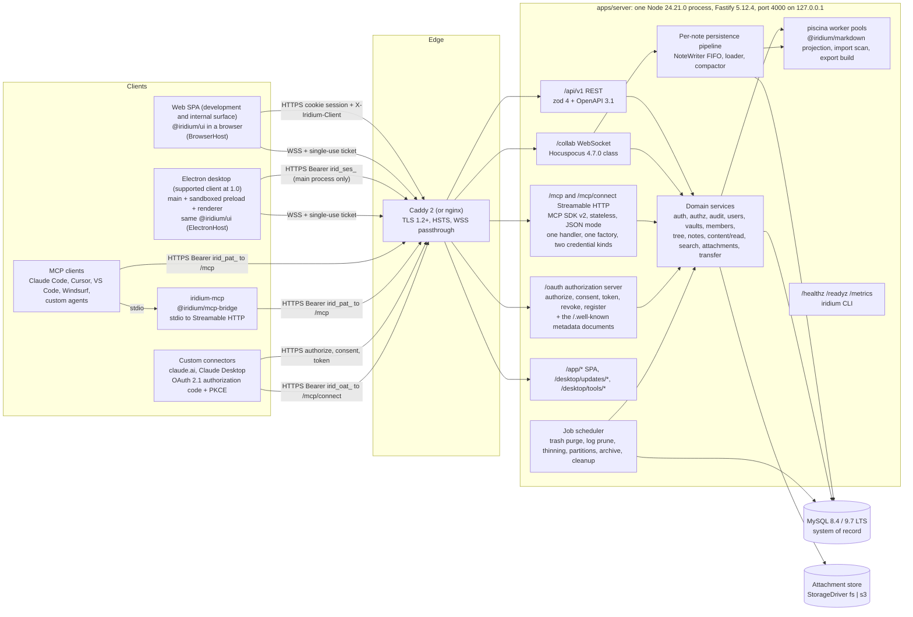

Clients never touch MySQL or the attachment store. The three content entry points — REST, `/collab` and the two MCP mounts — share one `authorize()` and one `ContentReadCore`; every surface above, the authorization server included, shares one `AuditWriter`, one configuration object, one HTTP server and one port.

## Component and process architecture

### Deployment units

| Unit | Artifact | Runtime | Responsibility |
|---|---|---|---|
| Server | `ghcr.io/<org>/iridium-server:<version>` (multi-stage image from `infra/docker/server.Dockerfile`; `dist/main.mjs` built by tsdown 0.23.0 with workspace packages inlined) | Node 24.21.0, non-root, read-only rootfs, `cap_drop: [ALL]` | REST, `/collab`, `/mcp` and `/mcp/connect`, the OAuth 2.1 authorization server at `/oauth/*` with its `/.well-known/` metadata, static web bundle, update feed, jobs, CLI (`iridium <command>`) |
| Database | `mysql:${MYSQL_TAG}` with `infra/docker/mysql/my.cnf` and `init/01_roles.sh` | MySQL 8.4 LTS or 9.7 LTS — both required targets, `mysql:8.4.11` and `mysql:9.7.2-oraclelinux9`, both merge-blocking in `ci.yml` | System of record; three roles `iridium_app`, `iridium_migrator`, `iridium_backup` |
| Attachment store | Docker volume `attachments-data` (fs driver) or an S3-compatible bucket (`s3` driver; SeaweedFS pinned tag in the compose `s3` profile) | — | Content-addressed immutable blobs `<vault_id>/<aa>/<sha256hex>` |
| Transfer volumes | `staging-data` (import staging under `STAGING_DIR/<jobId>`), `exports-data` (export artifacts, 24 h expiry), `updates-data` (desktop update feed) | — | Job scratch and served artifacts |
| Edge | `caddy` (pinned tag) from `infra/caddy/Caddyfile`, or nginx from `infra/nginx/iridium.conf` | — | TLS termination, HSTS, WebSocket passthrough, long idle timeouts on `/collab`, unbuffered `/mcp` (the `location /mcp` prefix covers `/mcp/connect` too), untouched `/oauth/*` and `/.well-known/*`, forwarding of `Mcp-Method`, `Mcp-Name`, `MCP-Protocol-Version` |
| Web client | Static bundle built by Vite 8.3.0 from `apps/web`, copied into the server image and served at `/app/*` with a per-response CSP nonce | Current Chrome and Edge; a development and internal surface at 1.0, not a supported product surface (01 §4.6) | The shared UI with `BrowserHost` |
| Desktop client | Unsigned application bundles from electron-builder 26.16.1 — `zip` on Windows and macOS, `tar.gz` on Linux, `x64` + `arm64`, named `Iridium-<version>-<win32\|darwin\|linux>-<arch>.<ext>` — downloaded from the site's own server with a published SHA-256 (07-client-applications.md §7.14, D07-43). Installers, code signing and in-application updates are the post-1.0 desktop distribution epic | Electron 44.3.0 — the supported client at 1.0 (01 §4.6) | The shared UI with `ElectronHost`; main-process credential custody; bundled `iridium-mcp` |
| stdio bridge | `dist/iridium-mcp.mjs` (tsdown single file with shebang), copied verbatim into the desktop package as `resources/bin/iridium-mcp.mjs` (electron-builder `extraResources`) and published as `GET /desktop/tools/iridium-mcp-<version>.mjs` with a `latest` alias and a published SHA-256 (06-mcp-and-agent-access.md D06-14). The `.mjs` extension travels with every copy because the generated Claude Desktop configuration invokes it as `node <path>`, and an extensionless file would leave the module kind to Node's syntax detection; `iridium-mcp` is the package's `bin` name (the npm/PATH alias), never a filename | Node 24 | Transparent stdio to Streamable HTTP proxy for MCP hosts that cannot send headers |

### Inside the server process

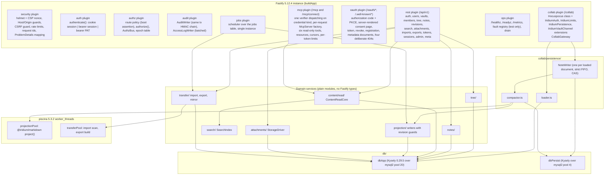

The persistence pipeline is the only code that touches `dbPersist`; everything else uses `dbApp`. REST bursts therefore cannot starve saves (skeleton A10), and the `/readyz` pool checks report the two pools separately.

### Boot sequence and plugin order

`apps/server/src/main.ts` is the CLI entry (`serve | migrate | doctor | config | backup | restore | audit | reindex | admin | tokens | sessions | keys | jobs | trash | desktop-updates | mirror`). `serve` calls `buildApp({ mode: 'container' })` from `apps/server/src/app.ts`; the integration harness calls `buildApp({ mode: 'in-process' })`; the chaos harness spawns the same binary with `serve --child` and calls `buildApp({ mode: 'child' })`. The three modes share one plugin tree and differ only in listening, signal handling and whether the scheduler starts:

| Mode | Listens | Signals | Scheduler | Fault registry | Used by |
|---|---|---|---|---|---|
| `container` | `BIND_ADDRESS:PORT` | SIGTERM/SIGINT drain | on | never (refused unless `NODE_ENV=test`) | production image, `compose.prod.yaml`, systemd |
| `child` | harness-reserved `PORT` (or `0` for a new ephemeral port), reported on stdout as `{"listening":<port>}` | SIGTERM drain; SIGKILL by the test | on unless `JOBS_ENABLED=false` | `IRIDIUM_FAULT` when `NODE_ENV=test` | `@iridium/testkit startServer({mode:'child'})`, chaos and E2E lanes |
| `in-process` | none (`app.inject()`, `app.injectWS()`, or `listen({port:0})` when a real socket is needed) | none | off by default (`jobs.run(type)` callable directly) | `IRIDIUM_FAULT` | Vitest `integration`, `contract`, `mcp` projects |

**ARCH-02 amendment (2026-09-20):** concurrent HTTP, boot and five-second periodic readiness probes share one serial evaluation; the next call after completion starts a fresh scan. Failed outcomes are not cached across later probes, and an evaluation finishing during drain cannot reopen admission. Fastify's plugin/onReady deadline is explicitly 60 seconds in all modes so the sixteen real checks can finish under CH-16's injected database latency. Listening still follows complete boot. Check thresholds, fail-closed behavior and chaos deadlines are unchanged. See [the ADR](../adr/arch-02-readiness-probe-lifecycle.md).

Boot order inside `buildApp` (each step fails fast with a redacted reason and a non-zero exit; nothing listens until the last step):

1. **config** — `config/env.ts` parses `process.env` once with the zod `EnvSchema` (`*_FILE` secrets read, unknown `IRIDIUM_*` keys rejected except the reserved harness namespaces of principle 5, `z.prettifyError` on failure), produces the frozen `IridiumConfig` object and logs the redacted summary. `iridium config check` stops here.
2. **db** — creates `dbApp` and `dbPersist` (Kysely 0.29.5 over mysql2 3.24.4), pings both, asserts the connection flags include `FOUND_ROWS` (skeleton A10), asserts the server version is `8.4.x` (≥ 8.4.11) or `9.7.x` (≥ 9.7.2) from `SELECT VERSION()` and exits `2` with `config.mysql_unsupported` otherwise, unless `IRIDIUM_ALLOW_UNTESTED_MYSQL=true` downgrades it to a logged warning and a permanent `/readyz` `mysql_version: warn` (11-operations-and-deployment.md OPS-60), asserts `innodb_flush_log_at_trx_commit = 1` (fatal when `READYZ_STRICT_DURABILITY=true`, warning otherwise), verifies the migration head from `kysely_migration` against the bundled migration list (when `IRIDIUM_MIGRATE_ON_BOOT=true` the pending migrations are applied here through the migrator wrapper under `DATABASE_MIGRATE_URL`; otherwise the process boots into the not-ready state described below and re-checks every 5 s), runs the Yjs single-instance guard (fails on "Yjs was already imported"), and loads `schema_meta` (`api_version`, `min_client_version`, `pepper_version`, `audit_key_version`, `cursor_key_version`, `pipeline_version`) and `server_settings` into the `SettingsStore`.
3. **security** — `@fastify/helmet` 13.1.1 with a per-response CSP nonce, `@fastify/cookie` 11.1.2, `@fastify/multipart` 10.1.1, `@fastify/under-pressure` 9.1.0, Host guard (`PUBLIC_HOST`), Origin guard, CSRF guard, `@fastify/rate-limit` 11.2.0 buckets, request-id generation, the `ProblemDetails` error handler and not-found handler, `trustProxy` from `TRUST_PROXY`.
4. **auth** — decorates `request.principal`; registers `authenticate()` as an `onRequest` hook; wires credentials (argon2id via `@node-rs/argon2` 2.2.1), sessions, the one token verifier `verifyToken` (`irid_pat_` and `irid_oat_`), `TicketStore`, set-password links, login throttling (`rate-limiter-flexible` 11.2.0 `RateLimiterMySQL` on `login_throttle`).
5. **authz** — permission matrix from `@iridium/contracts`, `authorize()`, the `AuthzBus` in-process implementation, the epoch table, and the **route-policy boot assertion**: after every route is registered (`onReady`), every route must declare `config.auth`, every mutating route with a cookie-capable principal must be CSRF-guarded unless `bearerOnly`, and every MCP route (`/mcp`, `/mcp/connect`) must be `bearerOnly` with `principalKinds:['token']` and must declare a `config.mcpAudience` whose credential kind matches its discovery posture (`'pat'` without discovery, `'oauth'` with it — the "one credential kind per mount" rule of 06-mcp-and-agent-access.md). The CSRF-exemption set is asserted to be exactly `{POST /mcp, POST /mcp/connect, POST /oauth/consent, POST /oauth/token, POST /oauth/revoke, POST /oauth/register}` — a closed enumeration (`CSRF_EXEMPT_ROUTES`, 04-auth-and-access-control.md D04-32), so a seventh exemption cannot be added silently. A violation aborts boot.
6. **audit** — `AuditWriter` and `AccessLogWriter`; verifies that the `audit_chain_heads` row for chain `server` exists (inserted with a genesis `last_hash` of 32 zero bytes when absent) and that the key version recorded in `schema_meta.audit_key_version` is present in the `AUDIT_HMAC_KEY_V<n>` keyring (see the configuration model below).
7. **oauth** — the OAuth 2.1 authorization server (`oauth/`), registered after `auth` and `audit` and before any route plugin so its routes already exist when the route-policy assertion walks `app.routes` at `onReady`. It registers the four metadata routes (`GET /.well-known/oauth-protected-resource/mcp/connect` for RFC 9728, and the RFC 8414 authorization-server document byte-identically at `GET /.well-known/oauth-authorization-server/oauth`, `GET /.well-known/openid-configuration/oauth` and `GET /oauth/.well-known/openid-configuration`), the four paths that must answer **404** as explicitly registered routes (`/.well-known/oauth-protected-resource`, `/.well-known/oauth-protected-resource/mcp`, `/.well-known/oauth-authorization-server`, `/.well-known/openid-configuration` — empty body, no `WWW-Authenticate`, registered rather than left to the not-found handler so the boot assertion and `oauth.discovery-split.contract` see a decision and not an accident), `GET /oauth/authorize`, `GET|POST /oauth/consent` with its server-rendered page, `POST /oauth/token`, `POST /oauth/revoke`, and `POST /oauth/register` only while `oauth_policy.allowDynamicClientRegistration` is true. It constructs the `ConsentRequestStore` singleton and derives the issuer (`<PUBLIC_ORIGIN>/oauth`) and the canonical resource URI (`<PUBLIC_ORIGIN>/mcp/connect`) from `PUBLIC_ORIGIN` alone, so no environment variable can disagree with a served metadata document (the ARCH-09 rule applied to metadata). `MCP_OAUTH_ENABLED=false` skips everything in this step except the four deliberate `404` routes, which stay registered so `oauth.discovery-split.contract` and `iridium doctor --oauth` still assert a decision rather than an accident, and leaves `/mcp` exactly as it is (06-mcp-and-agent-access.md; `docs/ops/oauth.md`).
8. **rest** — registers the `/api/v1` plugin tree, `@fastify/swagger` 9.8.1 (OpenAPI 3.1 via `fastify-type-provider-zod` 7.0.0), `@fastify/swagger-ui` 6.1.1 at `/docs`, `GET /openapi.json` rendering `app.swagger()`, and `@fastify/static` for `/app/*`, `/desktop/updates/*`, `/desktop/tools/*`. The two documentation routes are registered through Iridium's own wrapper rather than left to the plugin defaults, because the route-policy boot assertion of step 5 requires *every* registered route to carry `config.auth`: both declare `config.auth = {serverAdmin: true}` (relaxed to any principal when `NODE_ENV=development`), the operationIds `meta.openapi` and `meta.docs`, `Cache-Control: no-store`, and Swagger UI with "try it out" disabled outside development (09-api-reference.md §2.17, §2.18).
9. **collab** — constructs the `Hocuspocus` instance with the four Iridium extensions, mounts `app.get('/collab', { websocket: true, preValidation: [originAllowlist, connectionCaps] })`, starts the `CollabGateway`, performs the boot-time sweep that closes any loaded document whose note is trashed (skeleton A46 lock-order note).
10. **mcp** — verifies the SDK handler is constructible and registers `app.all('/mcp', …)` and, when `MCP_OAUTH_ENABLED` is true, `app.all('/mcp/connect', …)`: one `createMcpHandler` instance, one `buildIridiumMcpServer` factory, one `ContentReadCore` and one route handler, mounted twice. Each mount carries the route-level `onRequest` array `hostHeaderValidation(PUBLIC_HOST)`, `rejectBrowserOrigin`, `ignoreCookies`, `mcpIpGate`, the `preHandler` chain `patAuth` (`/mcp`) or `oauthAuth` (`/mcp/connect`) followed by `mcpKillSwitch` and `chargeRateLimit`, and the fail-closed `reply.hijack()` handler. The two mounts differ in exactly two declared things and in nothing else: `config.mcpAudience` (`'pat'` or `'oauth'`), which selects the `401` challenge and which the route-policy assertion reads, and the options the authentication preHandler hands the single `verifyToken` — `/mcp` accepts `irid_pat_…` and binds `resource: <PUBLIC_ORIGIN>/mcp`, `/mcp/connect` accepts `irid_oat_…` and binds `resource: <PUBLIC_ORIGIN>/mcp/connect`. A credential of the wrong kind for its mount is `401 invalid_token` whose `error_description` names the other URL (06-mcp-and-agent-access.md). Fastify concatenates instance-level hooks ahead of route-level ones, so `authenticate()` (step 4) and the `@fastify/cookie` parser (step 3) both run *before* this route's own `onRequest` array: what keeps a browser session from ever resolving to a principal here is the `bearerOnly` branch of `authenticate()` (04-auth-and-access-control.md §6.1), while `ignoreCookies` is the defence-in-depth layer that clears `req.headers.cookie` *and* the already-parsed `req.cookies` jar for every later phase (06-mcp-and-agent-access.md, "Mounting the two MCP routes on Fastify"). Neither may be dropped as redundant.
11. **ops** — `/healthz`, `/readyz`, `/metrics` (`@prometheus-io/client`, pinned at M0), the fault registry when `NODE_ENV=test`, and the shutdown drain hook.
12. **jobs** — the scheduler (container and child modes) claims due rows in the `jobs` table with `locked_by = <instanceId>`.

After step 12 the process calls `app.ready()` (which runs the route-policy assertion), then `listen`. `iridium_build_info{version,node,commit}` and `iridium_boot_timestamp` are set at that moment.

#### Not-ready gating

Between `listen` and full readiness the process is alive but must not serve business traffic. `ops/readiness.ts` owns one `ReadinessState` with three values: `starting` (until step 12 completes), `not_ready` (migrations pending, or a fail-closed `/readyz` check failing after boot, or draining) and `ready`. While the state is not `ready`, an `onRequest` hook registered by the ops plugin answers every route outside `/healthz`, `/readyz` and `/metrics` with 503 `ProblemDetails {code:'not_ready', detail}` and `Retry-After: 5`; `/collab` upgrades are refused with the same status before the WebSocket handshake. The migration re-check runs every 5 s so an operator applying `iridium migrate` from a sidecar brings the server up without a restart (the documented HA procedure in 11-operations-and-deployment.md). The same state machine drives the drain in the shutdown sequence below, which is why there is exactly one place that decides whether the process accepts work.

### Threads, pools and the event loop

| Resource | Sizing | What runs there | Why |
|---|---|---|---|
| Main event loop | 1 | Fastify routing, Hocuspocus message handling, `Y.applyUpdate` into loaded documents, `NoteWriter` transactions (I/O-bound), MCP tool handlers, job dispatch | Yjs documents are single-threaded by construction; `applyUpdate` on typical updates is microseconds |
| `projectionPool` (piscina 5.3.2) | `PROJECTION_WORKERS` = `max(1, cpus - 1)`; 10 s hard timeout per task, terminate and respawn on timeout | `@iridium/markdown` `project()` for compaction and reindex; `toPreviewTree` is never run server-side | Untrusted Markdown must not stall the loop that serves WebSockets (skeleton A42) |
| `transferPool` (piscina) | `TRANSFER_WORKERS` (default 1); no per-task timeout; cancellable through the job row | Import scan (yauzl streaming, zip-slip guards, `parseNote`, `detectObsidianSyntax`), export build (yazl streaming, manifest, EOL/BOM restore), unreferenced-attachment scan, restore verification sample loads | Long batch tasks must not compete with latency-bound projections for the same workers (decision ARCH-05) |
| libuv threadpool | `UV_THREADPOOL_SIZE=8` set explicitly in the image and documented for systemd | argon2id (`parallelism 1`), `fs`, DNS, `crypto.hash` streaming for uploads | Password hashing at 150–300 ms must not serialize on the default pool of 4 |
| `dbApp` pool | `DB_POOL_APP` = 20 | REST, MCP, jobs, loader, projections, tree, audit | |
| `dbPersist` pool | `DB_POOL_PERSIST` = 4; also the global writer concurrency (round-robin across notes) | `NoteWriter` append transactions and compaction transactions only | Saves keep progressing under REST bursts |

### Shutdown sequence

On SIGTERM (or `app.close()` in tests) the ops plugin runs the drain within `SHUTDOWN_DRAIN_MS` (20 s):

1. `/readyz` returns 503 immediately so the proxy and orchestrator stop routing new traffic; the listening socket keeps accepting for in-flight keep-alive requests but Fastify's `onRequest` answers new `/collab` upgrades and `/mcp` calls with 503 `not_ready` (`detail: 'draining'`); REST keeps being served so a user mid-operation is not cut off before the proxy stops routing.
2. Every `note:*` connection receives `{t:'closing', reason:'shutdown', graceMs}`; every `vault:*` connection is closed with `shutdown` (code 4205).
3. After `graceMs` (2 s) all remaining collaboration connections are closed with reason `shutdown`.
4. The persistence pipeline drains: every `NoteWriter` queue empties (transactions in flight complete, retries continue with backoff until the deadline); `hocuspocus.flushPendingStores()` awaits every pending compaction (which is truthful because `onStoreDocument` awaits the compaction job, skeleton A16); `hocuspocus.destroy()`.
5. The scheduler stops claiming jobs; running import/export jobs are marked `failed` with `error:'shutdown'` and are resumable (import) or re-requestable (export).
6. Worker pools are destroyed; pools `dbApp` and `dbPersist` are closed; the process exits 0. If the deadline expires with a writer still holding un-committed updates, the process exits 1 and logs `persist.drain_timeout` with the affected `noteId`s (exit 1 per the OPS-16 exit-code contract restated in ARCH-22: an unexpected internal condition, not a configuration or verification failure); the durable state is whatever committed, and reconnecting clients recover through the baseline protocol (05-collaboration-and-durability.md).

### The edge

Caddy 2 (pinned tag) is the reference reverse proxy; nginx is documented as an equivalent. Both terminate TLS 1.2+, emit nothing the app does not already emit (HSTS comes from helmet), pass WebSocket upgrades on `/collab` with an idle timeout of at least 120 s, disable response buffering on `/mcp` (`flush_interval -1` in Caddy, `proxy_buffering off` in nginx — the `location /mcp` prefix covers `/mcp/connect` without a second block), pass `Authorization` and leave `Cache-Control` alone on `/oauth/*` and `/.well-known/*`, never answer a `/.well-known/` path themselves (a proxy that serves its own `/.well-known/oauth-protected-resource` re-opens for `/mcp` exactly the client bug the two-mount split exists to avoid, which is why `iridium doctor --oauth` checks the four 404 paths *through* the public origin rather than in process), forward `X-Forwarded-For`, `X-Forwarded-Proto`, `X-Request-Id`, and forward the MCP headers `Mcp-Method`, `Mcp-Name`, `MCP-Protocol-Version` verbatim (a nightly test through the proxied stack asserts it). The server binds `127.0.0.1:4000` and sets `trustProxy` to the proxy's CIDR only; a request whose `Host` is not `PUBLIC_HOST` (the host of `PUBLIC_ORIGIN`) is refused with 421 `host_rejected`; only the ops routes (`/healthz`, `/readyz`, `/metrics`) are exempt so container health checks can address `127.0.0.1:4000` directly. The air-gapped profile replaces the proxy with Fastify `https: { key, cert }` (HTTP/1.1) and `TRUST_PROXY` unset. Exact configurations are in 11-operations-and-deployment.md.

### Clients

**Web host (`apps/web`).** A ~60-line Vite 8.3.0 entry that constructs a `BrowserHost` and mounts `@iridium/ui`. The bundle is served by the server at `/app/*` from the same origin as the API (`PUBLIC_ORIGIN`), which is why cookie sessions need no CORS and why the CSP can be strict (`script-src 'nonce-…'`, `connect-src 'self' wss:`, `img-src 'self' data:`, `frame-ancestors 'none'`). `GET /` redirects to `/app/` (decision ARCH-07). Routing uses `createBrowserHistory`; the API transport is `FetchTransport` (cookies + `X-Iridium-Client: web`); collaboration uses the browser `WebSocket`; attachments are same-origin cookie GETs. `apps/web` is a development and internal surface at 1.0: it ships in the server image, runs the merge-blocking `chromium` end-to-end lane on every pull request and is how `@iridium/ui` is developed, but the supported client at 1.0 is the desktop application (01 §4.6). Firefox and WebKit are out of scope, and no architecture decision in this section depends on them.

**Electron shell (`apps/desktop`).** Three build outputs: `src/main` (tsdown ESM; owns the session secret through `safeStorage`, performs every REST call through `net.fetch` with the Bearer session, relays collaboration tickets, serves `iridium-attachment://<vault>/<id>`, owns import/export transfers, the updater, deep links and the native menu), `src/preload` (tsdown single-file CJS, sandboxed, exposes fixed `window.iridium` wrappers for the channels in `@iridium/contracts/desktop-ipc.ts`), and `src/renderer` (the shared Vite config with `base:'./'`, loaded from `app://iridium/`, constructing an `ElectronHost` whose `api` is the `IpcTransport`). The renderer never holds a reusable credential. Collaboration normally uses the renderer's `WebSocket` directly against `wss://<server>/collab` with `Origin: app://iridium`; if the M0 Origin spike fails on any OS, the designed fallback `IpcWebSocket` (main opens the socket with `net.WebSocket`, frames relayed over `iridium:collab:{open,send,close}`) is switched on through `host.collab.webSocketFactory`. Hardening and IPC details are in 07-client-applications.md.

**stdio bridge (`packages/mcp-bridge`).** `iridium-mcp --server <origin> [--vault <id>] [--token-file <path>]` runs `serveStdio` from `@modelcontextprotocol/server` and forwards `tools/list`, `tools/call`, `resources/list`, `resources/templates/list`, `resources/read` and `completion/complete` to the remote `/mcp` through `@modelcontextprotocol/client`'s `StreamableHTTPClientTransport` with the PAT in `requestInit.headers.Authorization`. It caches nothing but the tool and resource lists (refreshed every 5 min), sends `User-Agent: iridium-mcp/<version>`, exits non-zero with a clear message on 401/403, and refuses `http://` unless `--allow-insecure-http`. Because the bridge is a transparent proxy, there is exactly one tool implementation and one audit surface (skeleton A36).

**The OAuth consent screen (`apps/server/src/oauth/consent-page.ts`).** One human-facing page is deliberately *not* part of `@iridium/ui`: `GET|POST /oauth/consent` is server-rendered HTML with no application JavaScript at all. It must work before any application bundle has loaded and without the SPA router, the single-use `request_id` must never enter client state or a history entry the SPA manages, and it is an OAuth browser surface quoted in the metadata document's `service_documentation` rather than a route of the workspace. It shares `packages/ui`'s CSS custom properties through the static stylesheet at `/app/assets/tokens.css` so it does not look foreign, and it is served under the nonce CSP with `frame-ancestors 'none'`, `X-Frame-Options: DENY`, `Cache-Control: no-store` and `Referrer-Policy: no-referrer`. This is the one exception to "two client hosts, one UI", and it is recorded as a decision rather than left as an inconsistency (06-mcp-and-agent-access.md D06-31, 07-client-applications.md).

### Entry points and protocols at a glance

| Path | Protocol | Credential | Guards on the way in | Handled by |
|---|---|---|---|---|
| `/api/v1/*` | HTTPS JSON (`application/problem+json` errors), `text/markdown` for note text, multipart for uploads, streams for attachments and exports | `__Host-iridium_session` cookie + `X-Iridium-Client: web` (web), `Authorization: Bearer irid_ses_…` (desktop main), `Bearer irid_pat_…` (only on the read-only routes flagged as PAT-enabled in 09-api-reference.md) | Host guard, rate limit, `authenticate()`, CSRF guard (cookie principals on unsafe methods), route policy, `authorize()` | `rest` plugin |
| `/collab` | WSS, Hocuspocus wire protocol (y-protocols sync V1, awareness, auth, stateless, syncStatus) plus Iridium stateless messages `v:1` | Single-use ticket `irid_tkt_…` in the Hocuspocus auth message (never in the URL) | Origin allowlist (absent Origin → 403), connection caps (20/user, 50/IP, 5 000/process), `onAuthenticate` | `collab` plugin |
| `/mcp` | HTTPS Streamable HTTP, MCP 2026-07-28 stateless and 2025-era legacy stateless, JSON response mode, POST only | `Authorization: Bearer irid_pat_…` **only** — an OAuth access token is refused here and the `401` names `/mcp/connect`; a session cookie never resolves to a principal here (`bearerOnly`), and `ignoreCookies` strips the header and the parsed jar for every phase after route-level `onRequest` | Host validation, any browser `Origin` → 403, `bodyLimit` 1 MiB, per-token and per-process rate limits, `patAuth` and `mcpKillSwitch` preHandlers, fail-closed on missing `AuthInfo`; the `401` challenge carries **no** `resource_metadata` | `mcp` plugin |
| `/mcp/connect` | identical transport to `/mcp` — the same handler, factory, tools, resources, cursors, limits and `access_log` rows | `Authorization: Bearer irid_oat_…` **only**, issued by `/oauth` for the canonical resource `<PUBLIC_ORIGIN>/mcp/connect`; an integration token is refused here and the `401` names `/mcp` | the `/mcp` chain with `oauthAuth` in place of `patAuth`, plus the audience check (`access_tokens.resource`) and the live-consent and active-client checks; the `401` carries `resource_metadata` and `scope`, and a token with none of the six read permissions gets `403 insufficient_scope` | `mcp` plugin (the same route handler, mounted twice) |
| `/oauth/authorize`, `/oauth/consent`, `/oauth/token`, `/oauth/revoke`, `/oauth/register` | HTTPS; `text/html` for the authorize bounce and the consent screen, `application/x-www-form-urlencoded` in and RFC 6749 §5.2 JSON out for token, revoke and register | a live browser session (with step-up) on `authorize` and `consent`; client authentication (`none` or `client_secret_basic`) on `token` and `revoke`; none on `register` | Host guard, rate limits (`OAUTH_DCR_PER_IP_PER_HOUR` on `register`), the single-use session-bound `request_id` as the consent POST's CSRF token, `Cache-Control: no-store`, and the enumerated CSRF exemption of the route-policy assertion | `oauth` plugin |
| `/.well-known/oauth-protected-resource/mcp/connect`, `/.well-known/oauth-authorization-server/oauth`, `/.well-known/openid-configuration/oauth`, `/oauth/.well-known/openid-configuration` | HTTPS JSON | none | public; `Cache-Control: public, max-age=3600`; the three authorization-server paths serve byte-identical bytes, validated against the `@modelcontextprotocol/core` 2.0.0 zod schemas by `oauth.metadata.contract` | `oauth` plugin |
| `/.well-known/oauth-protected-resource`, `/.well-known/oauth-protected-resource/mcp`, `/.well-known/oauth-authorization-server`, `/.well-known/openid-configuration` | HTTPS | none | **registered routes that answer `404` with an empty body and no `WWW-Authenticate`**: these are the probes a client configured against `/mcp` makes, and a `200` on any of them would pull a statically configured header client into an OAuth flow. `oauth.discovery-split.contract` and `iridium doctor --oauth` assert all four, the latter through the public origin so a proxy cannot answer them instead | `oauth` plugin |
| `/app/*` | HTTPS static | none | CSP nonce per response, `Cache-Control` by asset hash | `rest` plugin (`@fastify/static`) |
| `/desktop/updates/*` (feed artefacts and `SHA256SUMS`), `/desktop/tools/*`, `/desktop/update-policy` | HTTPS static / JSON | none. Artefacts are **unsigned** at 1.0 and nothing in the client verifies a signature; integrity rests on TLS to this server plus the SHA-256 published at `/desktop/updates/<channel>/SHA256SUMS` (11-operations-and-deployment.md OPS-60) | — | `rest` plugin |
| `/healthz`, `/readyz` | HTTPS JSON | none | — | `ops` plugin |
| `/metrics` | Prometheus text | `METRICS_TOKEN` bearer or `METRICS_ALLOW_CIDRS` | — | `ops` plugin |
| `/openapi.json`, `/docs` | HTTPS | admin session, or any when `NODE_ENV=development` | Host guard, rate limit, `authenticate()`, declared `config.auth = {serverAdmin: true}` (operationIds `meta.openapi`, `meta.docs`), `Cache-Control: no-store` | `rest` plugin |
## Request and connection flows

The diagrams use the module and message names of the skeleton so an implementer can grep for them. Every flow ends in a named test (10-testing-and-quality.md).

### REST request lifecycle (every `/api/v1` route)

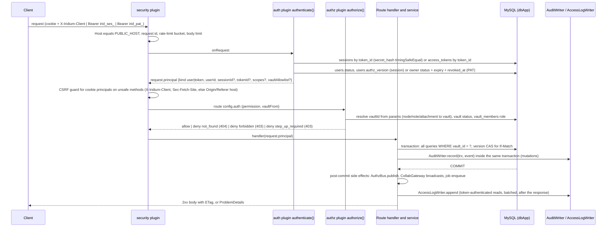

Rules encoded in this flow: bearer present means cookies are ignored entirely; non-members receive 404 for every vault-scoped resource and 403 only when they are members lacking a permission (skeleton A30, F13); audit rows are written inside the mutating transaction and never after it; `AuthzBus.publish` and collaboration broadcasts happen only after COMMIT so a subscriber can never observe an event whose row does not exist.

### Login

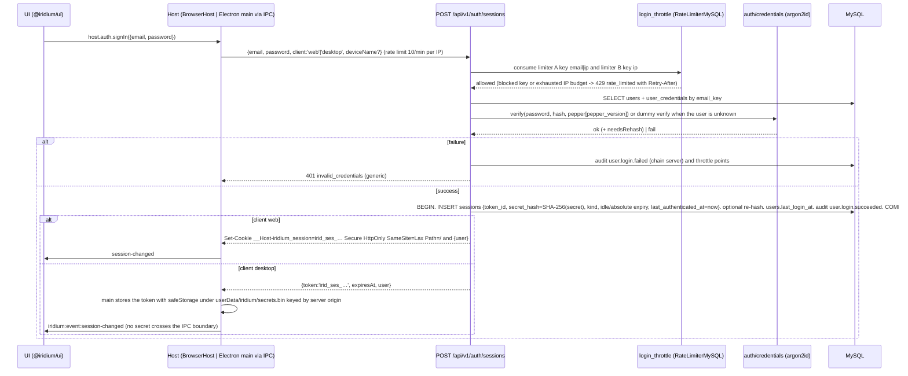

The renderer never sees `irid_ses_…` in the desktop case; every later REST call from the renderer is `iridium:api:request` over IPC, and main attaches `Authorization: Bearer` in `net.fetch`. Step-up (`POST /auth/reauthenticate`) reuses the same verification path and refreshes `sessions.last_authenticated_at` (04-auth-and-access-control.md).

### Open a note

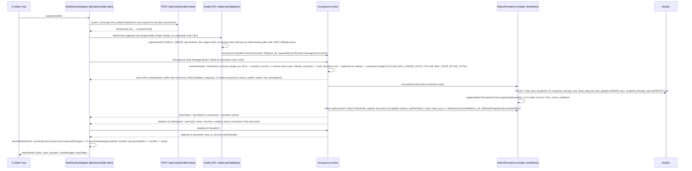

Two properties of this flow are load-bearing. First, the document is loaded exactly once per process lifetime while it stays loaded; a second tab or a second user attaching to the same `note:<uuid>` reuses the in-memory document. Second, the ticket is consumed before any document work happens, so a stolen ticket is worthless after one use and after 60 s. The `vault:<uuid>` channel is opened the same way (one provider per open vault per window) but `onLoadDocument` returns nothing and every connection is read-only.

### Edit to Saved

```mermaid
sequenceDiagram
  participant E as CodeMirror + yCollab
  participant N as NoteSession / SaveStateMachine
  participant K as Hocuspocus (loop)
  participant W as NoteWriter (per document FIFO)
  participant D as MySQL (dbPersist)
  E->>N: keystroke -> Y.Text change -> provider sends Update
  N->>K: sync message (Update)
  K->>K: beforeHandleMessage: authzEpoch tuple check, closing set, size <= 1 MiB, 200 msgs / 10 s
  K->>K: Y.applyUpdate into the document, relay to other connections
  K-->>N: SyncStatus(true) (in memory only, never shown as Saved)
  K->>W: update listener: svAfter = Y.encodeStateVector(doc) and dsAfter = deleteSetFingerprint(doc) captured synchronously, enqueue {update, svAfter, dsAfter, actor {userId, sessionId}, origin}
  W->>D: BEGIN. SELECT deleted_at FROM nodes WHERE id = ? FOR SHARE; SELECT node_id FROM notes WHERE node_id = ? FOR UPDATE; SELECT head_seq FROM note_docs WHERE note_id = ? FOR UPDATE
  W->>W: coalesce consecutive same-actor updates with Y.mergeUpdates (<= 1 MiB per row)
  W->>D: INSERT note_updates (seq = head+1..head+N, update_v1, sv_after, actor, origin)
  W->>D: UPDATE note_docs SET head_seq = head+N, updated_at = ? WHERE note_id = ? AND head_seq = head (numUpdatedRows === 1n else corruption alarm)
  D-->>W: COMMIT (innodb_flush_log_at_trx_commit = 1)
  W->>K: document.broadcastStateless({t:'persisted', seq: head+N, sv: base64(svAfter_last), ds: dsAfter_last}) and lastPersisted = {seq, sv, ds}
  K-->>N: stateless persisted
  N->>N: dominates(persistedSv, Y.encodeStateVector(ydoc)) over every (clientId, clock) and persistedDs == deleteSetFingerprint(ydoc) -> saved
  N-->>E: status pill Saved
  Note over W,D: later, after debounce 2000 / maxDebounce 10000 ms: onStoreDocument awaits the compaction job in the same FIFO -> snapshot V2, projection, checkpoint policy -> broadcast {t:'projected', seq}
```

Failure branches (`persist-failed` with `reason` and `retryInMs`, backpressure at 5 000 updates or 32 MiB, `failed` after 10 attempts/30 s, the `save-failed` client rule, `flush {}` for an immediate projection) are specified in 05-collaboration-and-durability.md. Architecturally the important points are: the acknowledgement is emitted only after COMMIT on `dbPersist`; the writer takes parent locks before `note_docs`, without entering the structural vault mutex (A46); and the baseline reply on every `synced` closes the "opened without editing" and "crash after COMMIT before ack" gaps.

### Agent read through MCP

```mermaid
sequenceDiagram
  participant AG as Agent (Claude Code | iridium-mcp bridge) or connector (claude.ai | Claude Desktop)
  participant F as Fastify ALL /mcp and ALL /mcp/connect
  participant V as auth/tokens/verify.ts verifyToken (pat at /mcp, oat at /mcp/connect)
  participant M as McpServer (per request factory)
  participant CR as ContentReadCore
  participant D as MySQL (dbApp)
  participant AL as AccessLogWriter
  AG->>F: POST /mcp with Bearer irid_pat_… (or POST /mcp/connect with Bearer irid_oat_…), MCP-Protocol-Version, Mcp-Method: tools/call
  F->>F: onRequest: hostGuard (PUBLIC_HOST), rejectBrowserOrigin (any Origin -> 403), ignoreCookies, bodyLimit 1 MiB, process ceiling 600/min
  F->>V: preHandler patAuth (/mcp) or oauthAuth (/mcp/connect): parse irid_pat_ or irid_oat_ <id16>_<secret43><crc6>, CRC check
  V->>D: access_tokens by token_id (LEFT JOIN oauth_consents, oauth_clients) -> timingSafeEqual(SHA-256(secret)) -> kind is the one this mount accepts -> revoked_at, expires_at, rotation_overlap_until -> resource matches the mount and consent live and client active (oauth only) -> owner users.status
  V->>V: per-token bucket 120/min burst + rate_limit_per_hour (search costs 3)
  V-->>F: request.mcpAuthInfo = AuthInfo {token, clientId:'pat:'+id16 or 'oauth:'+client_id, scopes, expiresAt, resource: PUBLIC_ORIGIN/mcp or PUBLIC_ORIGIN/mcp/connect, extras:{principal}}
  V-->>F: or 401 WWW-Authenticate Bearer realm="iridium", error="invalid_token" — no resource_metadata on /mcp, resource_metadata and scope on /mcp/connect
  F->>F: preHandler mcpKillSwitch (SettingsStore.effective().mcp_enabled, in-memory) -> 503 mcp_disabled
  F->>F: reply.hijack() then node(Object.assign(req.raw, {auth: req.mcpAuthInfo}), reply.raw, req.body)
  F->>M: createMcpHandler(buildIridiumMcpServer, {legacy:'stateless', responseMode:'json'}) builds a server for this request (both protocol eras)
  M->>M: tools/call get_note {note_id | vault_id+path, revision?, start_line?, end_line?, heading?}
  M->>CR: readNoteMarkdown(principal, noteId, opts)
  CR->>CR: authorize(tokenPrincipal, 'note:read', {vaultId}) = scopes ∩ permissionsOf(live explicit role) ∧ vaultId ∈ allowlist ∧ vaults.mcp_enabled
  CR->>D: note_projections (markdown, revision, content_hash) joined with nodes for the derived path (never the live Y.Doc)
  CR-->>M: {markdown, revision, content_hash, path, title, headings, ...}
  M-->>F: result: text block = Markdown, structuredContent = metadata only, ttlMs 0, cacheScope private
  F->>AL: access_log {token_id, oauth_client_id (verified, oauth only), surface:'mcp', action:'mcp.get_note', vault_id, note_ids:[id], revision, status, latency_ms, bytes_out, client_name/version}
  F-->>AG: 200 application/json (JSON-RPC result)
```

Factory or handler exceptions are caught by `onMcpHostError` and answered with HTTP 500 `{"error":"server_error"}` without details, logged with the request id and counted in `iridium_mcp_factory_errors_total`; per-argument scope failures inside a tool are `isError:true` results, never HTTP 403 (skeleton A32, A33). The one transport-level exception belongs to the OAuth mount: an access token whose granted scopes contain none of the six read permissions is refused at `/mcp/connect` with `403` and `WWW-Authenticate: Bearer error="insufficient_scope", scope="…", resource_metadata="…"`, because a re-authorization can actually fix that, while no re-authorization can grow a permission the owner's role does not carry (06-mcp-and-agent-access.md D06-36). Because a fresh token row, the owner's status and the membership are read from MySQL on every request, revocation is immediate without any cache. The one input that is deliberately *not* a query is the server-wide kill switch: `mcpKillSwitch` reads `server_settings.mcp_enabled` from the in-process `SettingsStore` (below), which the request that commits `PUT /admin/settings` reloads as a post-COMMIT effect, so a flip is effective on the very next `/mcp` call without adding a SELECT to every agent call. `vaults.mcp_enabled` stays a per-request database read because it arrives with the vault row `authorize()` already loads (06-mcp-and-agent-access.md "Kill switches", 04-auth-and-access-control.md §5.5).

### Live revocation

```mermaid
sequenceDiagram
  participant M as Manager UI
  participant R as DELETE /api/v1/vaults/:vaultId/members/:userId (If-Match)
  participant D as MySQL
  participant B as AuthzBus (in-process)
  participant G as CollabGateway
  participant K as Hocuspocus documents and connections
  participant V as Victim client (web or desktop)
  M->>R: If-Match "<memberVersion>"
  R->>D: BEGIN. SELECT vaults FOR UPDATE. DELETE vault_members WHERE version = ? (numUpdatedRows === 1n). UPDATE users SET authz_version = authz_version + 1. audit vault.member.removed (chain vault:<id>, head locked last). COMMIT
  R->>B: publish membership.removed {userId, vaultId} (after COMMIT only)
  B->>G: subscriber
  G->>G: epoch table: users[userId].authzVersion updated
  G->>K: for each document in hocuspocus.documents named note:* in the vault and vault:<vaultId>: for each connection with context.userId == userId: connection.close({code:4403, reason:'revoked'})
  K-->>V: close 4403 revoked on every affected note:* and vault:* connection
  V->>V: NoteSession state revoked: editor read-only, unsynced text kept and exportable (host.files.saveText)
  V->>R: any later REST call: authenticate() reloads users.authz_version, authorize() finds no membership -> 404
  V->>K: reconnect attempt -> onAuthenticate finds no membership -> close 4403
  Note over K: connections that raced the close are caught by beforeHandleMessage: context.authzEpoch {userAuthzVersion, memberVersion} differs from the epoch table -> re-evaluate from DB -> close
  Note over K: every connection also re-validates through onTokenSync (connection.requestToken every 15 min ± 3 min, 5 min grace)
```

The same path handles `user.disabled`, `user.password_changed`, `session.revoked` (close every connection of that session), `token.revoked` (the next MCP call fails; nothing to close), `membership.role_changed` (flip `connection.readOnly` and send `{t:'role'}`; on upgrade the client re-attaches a fresh provider, skeleton A20), `vault.archived` (close with `vault-archived`), `note.trashed` and `note.purged` (close with `note-trashed` after `{t:'closing'}`). Acceptance: closure within 1 s of COMMIT, reconnect refused, next MCP call fails (`collab.live-revocation`, `mcp.revocation`).

### Structural mutation and the vault channel

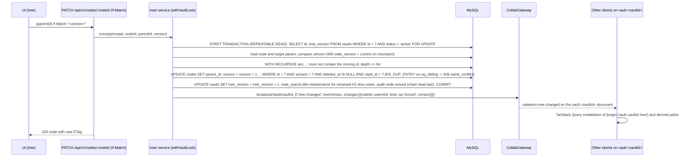

Trash fences affected writers, captures a durable `trash` checkpoint inside the structural transaction in parent-before-document order, and marks nodes deleted. After COMMIT `CollabGateway.closeNote()` sends the closing frame and closes connections. The writer, authentication and load paths all refuse trashed notes; boot closes any document left loaded by a crash between COMMIT and the side effect (A46).

### Import job

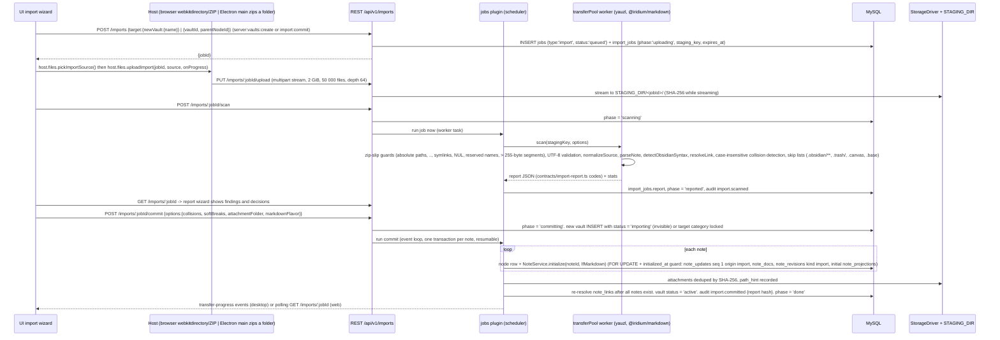

A half-imported vault is never visible (`status='importing'` is excluded by `authorize()` and every listing), commit is idempotent per note (`initialized_at` guard), `POST /imports/:jobId/abort` deletes the staging directory, and `jobs/transfer_cleanup` removes expired staging after `import_jobs.expires_at`. Export is the mirror image: `POST /vaults/:vaultId/exports` → `export_jobs` row → the transfer worker flushes loaded documents, streams a yazl ZIP from `note_projections.markdown` with EOL/BOM restored and `manifest.json` → `GET /exports/:jobId/download` (24 h). Details in 08-markdown-pipeline-import-export.md.

### Server restart and recovery

On boot no document is loaded; the first connection to a note triggers `onLoadDocument`, which rebuilds the Y.Doc from `note_docs.snapshot` (V2) plus `note_updates` rows after `snapshot_through_seq` (V1). The client's provider reconnects with a fresh ticket, performs SyncStep1/2 (every pending local update is merged), sends `{t:'baseline'}` and re-derives `saved` from the returned vector's dominance and exact equality of the returned canonical delete-set fingerprint with the local fingerprint. Restart therefore never duplicates initial content (acceptance "Initialization/reconnection", test `collab.restart-no-duplication`) and never loses an acknowledged revision (acceptance "Durable saving", `collab.durable-ack.chaos`).
## Monorepo layout and package responsibilities

### Workspace conventions

Scope `@iridium/*`, every package private, pnpm 12.4.1 workspaces (`apps/*`, `packages/*`, `tooling/*`, `spikes/*`, plus the one explicit path entry `packages/testkit/src/fixtures/hostile`, which makes the hostile corpus importable by `iso` and `browser` tests without pulling in the Node-only testkit runtime) with a single strict `catalog:` (`catalogMode: strict`, `saveExact: true`, `minimumReleaseAge: 4320`, `trustPolicy: no-downgrade`, explicit `allowBuilds: { electron, lefthook, @node-rs/argon2, esbuild }` — esbuild bundles the k6 load scripts, 10-testing-and-quality.md L9), Turborepo 2.10.12 for the task graph and `boundaries`, TypeScript 7.0.2 plain (no alias) repo-wide, oxlint 1.82.0 + oxlint-tsgolint 7.0.2001 type-aware, oxfmt 0.67.0, oxc-parser 0.148.0 for static TypeScript source guards (server devDependency), tsdown 0.23.0 for Node bundles, Vite 8.3.0 for browser bundles, Vitest 5.0.0, Playwright 1.63.0, Changesets 3.0.2 with one `fixed` group so the server image, web bundle, desktop bundles and bridge share one product version, lefthook 2.1.12, commitlint 21.2.2, knip 6.35.1, Renovate `config:best-practices`, `mise.toml` + `.node-version` (24.21.0), `.gitattributes * text=auto eol=lf`.

**The catalog carries every version a manifest declares, not every version this plan pins.** knip 6 reports an unused catalog entry, so a pin added ahead of the milestone that will declare it turns `ci.yml › static` red on the day it is added. The dependency table below is therefore the plan's forward-looking record and the catalog is the present tense: a version stays in that table until the milestone that declares it, and is added to `pnpm-workspace.yaml` in the same change as the manifest that uses it. Five pins were removed from the catalog on 2026-09-13 for exactly this reason and live only in the table until their milestone — `vite-plugin-electron`, `vitest-browser-react`, `electron-playwright-helpers`, `@modelcontextprotocol/conformance` and `@modelcontextprotocol/inspector` (the last two recorded by `docs/spikes/S14-mcp-dual-era-handler.md`, which used them from outside the workspace). The complementary rule lives in 10-testing-and-quality.md L0: where a dependency genuinely must be declared before its milestone, `knip.jsonc` carries it in that workspace's `ignoreDependencies`.

**Single-copy `overrides`.** `pnpm-workspace.yaml`'s `overrides` block pins to `catalog:` every package that must resolve to exactly one copy, and the list is longer than A14's CRDT and CodeMirror entries (`yjs`, `lib0`, `y-protocols`, `@codemirror/state`, `@codemirror/view`). It also carries `@types/node`, because transitive `@types/*` packages depend on `@types/node@*` and would otherwise drag `pnpm dedupe --check` after whatever is newest while Node 24 is the only runtime (A4); `fast-check`, because `@fast-check/vitest` declares its own range and the specs must import the same arbitraries the runner drives; and `axe-core`, because `vitest-axe` declares its own range and one accessibility rule set per run is the point. Every entry exists because two copies would be silently wrong rather than merely wasteful.

Two entries the catalog deliberately does **not** carry, both recorded here because their absence is load-bearing rather than accidental. `electron-updater` is not a 1.0 dependency: the 1.0 desktop build has no in-application updater (§G-8), and an unused dependency fails `knip --production` in `ci.yml › static`; the post-1.0 desktop distribution epic re-adds it at 6.8.9, the companion of electron-builder 26.16.1 (07-client-applications.md D07-43). No OAuth or JOSE library is added either — not `jose`, not `openid-client` — because Iridium's authorization server issues **opaque** credentials hashed with `node:crypto` and never a JWT, so there is no signature to produce, no key to distribute and no `jwks_uri` to serve (§G-1; 06-mcp-and-agent-access.md D06-28). The authorization server's only third-party dependencies are the ones the server already has, plus the zod metadata schemas exported by `@modelcontextprotocol/core` 2.0.0, which `oauth.metadata.contract` validates the served documents against so a hand-written field list cannot drift from the specification.

Language rules for every package: ESM-only (`"type": "module"`), explicit `.ts`/`.tsx` import extensions, `erasableSyntaxOnly`, `verbatimModuleSyntax`, `isolatedDeclarations`, `target es2024`, `exactOptionalPropertyTypes`, `noUncheckedIndexedAccess`. **Compiled** packages build with `tsc -b` (declaration + declarationMap, `dist/` with `.tsbuildinfo` inside `dist/`) and export `./dist/*`; **JIT** packages export `./src/*` and are compiled by the consuming Vite build so React Fast Refresh works across package boundaries. The root `tsconfig.json` is a solution file (`files: []`, `references` to every package) for `tsc -b --builders 8`.

**Compiler API exceptions (A2, amended 2026-09-20).** Exactly three isolated leaf manifests declare `"typescript": "npm:@typescript/typescript6@6.0.2"`: `tooling/mutation` for Stryker's checker, `tooling/api-codegen` for the OpenAPI type printer, and `spikes/s11-markdown` for the AST-based generator of the pinned `markdown-it` packaging patch. The S11 script uses `createSourceFile`, `factory`, transformations and `createPrinter` to split upstream capabilities without copying or rewriting grammar algorithms. The alias is never a workspace catalog or override entry, no product imports these leaves, and all product compilation and type checks stay on TypeScript 7. `guards.mutation-lane.guard` checks the exact three paths and rejects an unreviewed spike as well as a product package. The S11 exception is removed with the packaging patch when an equivalent upstream token entry satisfies the semantic and bundle gates.

### Layout

```
iridium/
  apps/
    server/        @iridium/server       Node 24 app: REST + /collab (Hocuspocus) + /mcp + jobs + CLI. tsdown → dist/main.mjs (workspace packages inlined). Docker image.
    web/           @iridium/web          ~60-line Vite 8 entry mounting @iridium/ui with BrowserHost. Static bundle served by the server at /app/*.
    desktop/       @iridium/desktop      Electron 44.3.0: src/main (tsdown ESM), src/preload (tsdown single-file CJS), src/renderer (Vite 8 entry + ElectronHost). electron-builder 26.16.1; 1.0 targets are zip/tar.gz only (D07-43).
    e2e/           @iridium/e2e          Playwright 1.63 projects: setup, chromium (web, 3 contexts), electron (3 OSes). Dev-only.
  packages/
    contracts/     @iridium/contracts    Single wire-contract package: zod 4 schemas + inferred types for REST DTOs, ProblemDetails + error codes, IDs (UUIDv7 generator, branded), roles/permissions matrix + Principal, token format/CRC/regex, limits, collab stateless messages + close reasons, MCP tool I/O + resource URIs + cursor payloads, desktop IPC channel map, deep links, import report, export manifest, audit vocabulary, search-query shape; generated artifacts openapi/openapi.json, mcp/tools.schema.json. Runtime dep: zod only. Compiled.
    crdt/          @iridium/crdt         THE ONLY first-party package importing yjs/y-protocols: createNoteDoc, getContent(doc) (Y.Text 'content'), loadState/encodeState (V1/V2 codec, branded V1Update/V2State/StateVector), dominates(), prefixSuffixDiff(), projectMarkdown(), LF/no-attributes guards, initialNoteState(markdown) (throwaway doc → V1 update). Isomorphic, compiled.
    markdown/      @iridium/markdown     Isomorphic unified pipeline: normalizeSource, restoreSource, parseNote, toPreviewTree (sanitized hast), project, detectObsidianSyntax, resolveLink, search/parseQuery, iridiumSanitizeSchema, PIPELINE_VERSION. DOM-free, Node-free. Compiled.
    markdown-react/@iridium/markdown-react hast → React 19 via hast-util-to-jsx-runtime with Iridium component overrides; preview worker client (comlink). Browser-only, JIT.
    api-client/    @iridium/api-client   openapi-fetch client over generated types; ApiTransport interface + FetchTransport (cookies + X-Iridium-Client) + IpcTransport (Electron); TicketSource; typed ProblemDetails errors. Isomorphic (Node via undici fetch), compiled.
    collab-client/ @iridium/collab-client NoteSession (Y.Doc + HocuspocusProvider + UndoManager), NoteSessionRegistry, SaveStateMachine (pure), VaultChannel client, stateless message codec, close-reason handling, WebSocket injection (ws polyfill in Node; IpcWebSocket in Electron fallback). Isomorphic, compiled. Depends on @hocuspocus/provider + @iridium/crdt.
    editor/        @iridium/editor       CodeMirror 6 + y-codemirror.next binding, markdown language + iridiumFrontmatter lezer block parser, formatting StateCommands, read-only compartment, theme, disposable-view lifecycle helpers. Browser-only, JIT.
    ui/            @iridium/ui           The whole React application (routes, workspace, tree, tabs, switcher, palette, editor host, preview, presence, status pill, search, trash, history, settings, tokens, admin) + IridiumHost interface + commands registry + i18n/en.ts. Browser-only, JIT.
    mcp-bridge/    @iridium/mcp-bridge   iridium-mcp stdio ⇄ Streamable HTTP transparent proxy (SDK v2 server + client). Node-only; tsdown single file with shebang; bundled into desktop resources.
    testkit/       @iridium/testkit      startTestEnv/startServer (in-process | child), Testcontainers MySQL/Toxiproxy helpers, NoteClient (ws subclass with Origin), vaultChannelClient, restClient, mcpClient(era), toMatchOpenApi matcher, fault-point constants, fixtures (demo vault, Obsidian sample vault, hostile corpus, CommonMark spec JSON), msw handlers. Node-only, dev.
    testkit/src/fixtures/hostile/ @iridium/testkit-fixtures  the canonical hostile Markdown bytes and expectations.json published as importable assets and nothing else (no code, no dependencies). Tagged `iso` so `@iridium/markdown` can assert the same corpus as the server without depending on the Node-only testkit; `@iridium/testkit` still owns and re-exports the same files by path.
  tooling/
    tsconfig/      @iridium/tsconfig     base.json, node.json, browser.json, react.json
    oxlint-config/ @iridium/oxlint-config shared oxlint.config.ts fragments (base, react, node, server)
    mutation/      @iridium/mutation     Stryker 10 lane: stryker.config.mjs (the committed config, whose `mutate` globs 10-testing-and-quality.md owns) + vitest.stryker.config.ts (unit project only) + run.mjs (runs Stryker from the repository root) + vitest-resolution.mjs (pins the lane's Vitest 4.1.11); its own `typescript` → @typescript/typescript6 alias
    api-codegen/   @iridium/api-codegen  openapi-typescript 7.13.0 host for `pnpm gen` step 3 (its printer drives `ts.factory`, absent from TypeScript 7); no sources, no scripts; its own `typescript` → @typescript/typescript6 alias (A2, amended 2026-09-13)
    sql/           @iridium/sql-policy   the committed SQL policy data: forbidden-constructs.json (the `db.dialect-floor.guard` denylist) and schema-fingerprint.json (what `migrations.parity.integration` compares the two engines against). A workspace package rather than a directory, so `apps/server`'s tests import both files through a declared dependency instead of by relative path
  spikes/                                Spike harnesses whose dependency set differs from any product package's (D12-5). Each is a leaf workspace tagged `spike` that nothing may depend on (`dependents.allow: []`), deleted with the milestone that absorbs it — except a leaf a shipped patch is regenerated and re-verified from, which is retained until that patch retires (D12-5 amended 2026-09-21).
    s04-editor-csp/ @iridium/spike-s04-editor-csp  the S4 nonce-CSP harness: a Vitest Browser Mode page and a Fastify host under the strict policy, plus the verified `remote-selections.ts` that `packages/editor` takes at M4
    s11-markdown/   @iridium/spike-s11-markdown   the S11 Markdown worker-cost and parser-packaging harness, retained past M2 under that exception: its AST generator and upstream differential checks are the only way to regenerate and re-verify `patches/markdown-it@15.0.2.patch`, and it retires with that patch and the A2 alias (A42)
  infra/
    compose.yaml  compose.prod.yaml  docker/server.Dockerfile  docker/mysql/{my.cnf,init/01_roles.sh}  caddy/Caddyfile  nginx/iridium.conf  systemd/{iridium.service,iridium-backup.service,iridium-backup.timer}  backup/{backup.sh,restore.sh}  monitoring/{dashboard.json,alerts.yml}
  docs/
    adr/NNNN-*.md  runbooks/*.md  ops/{deployment,configuration,backup-restore,upgrade,security,audit-log,mcp-clients}.md  agents/*.md  spikes/*.md  threat-model.md  compliance-checklist.md
  .github/workflows/{ci,nightly,release}.yml  turbo.json  pnpm-workspace.yaml  package.json  tsconfig.json (solution)  vitest.config.ts  playwright.config.ts  oxlint.config.ts  .oxfmtrc.jsonc  lefthook.yml  commitlint.config.ts  renovate.json  knip.jsonc  .changeset/  mise.toml  .node-version  .gitattributes  .editorconfig  SECURITY.md  CONTRIBUTING.md
```

### Package responsibilities, kinds, and dependencies

| Package | Kind | Tag | Runtime dependencies (first-party → third-party) | Consumers | Must never contain |
|---|---|---|---|---|---|
| `@iridium/contracts` | compiled | `core` | — → zod 4.6.2 | every package | anything platform-specific; no I/O; no `node:*`, `electron`, `react`, DOM |
| `@iridium/crdt` | compiled | `iso` | contracts → yjs 13.6.32, y-protocols 1.0.7, lib0 0.2.117 | server (persistence, initial state, restore diff), collab-client, editor (through collab-client) | anything that is not Yjs codec/guards; no network |
| `@iridium/markdown` | compiled | `iso` | contracts → unified 11.0.5, markdown-it 15.0.2 (pinned packaging patch), mdast-util-gfm-autolink-literal 2.0.1 (mdast transform only), remark-rehype 11.1.2 + mdast-util-to-hast 13.2.1, remark-breaks 4.0.0, lowlight 3.3.0 + highlight.js 11.12.0, rehype-sanitize 6.0.0 + hast-util-sanitize 5.0.2, rehype-stringify 10.0.1, github-slugger 2.0.0, yaml 2.9.1, mdast-util-to-string 4.0.0, vfile 6.0.3, @types/hast 3.0.5 + @types/mdast 4.0.4. remark-parse 11.0.0, remark-frontmatter 5.0.0 and the four `micromark-extension-gfm-*` packages are devDependencies only: after S11 executed A42 they are the development-only differential oracle, not the production graph (08-markdown-pipeline-import-export.md §2.2) | server (projection worker, import scan, export), markdown-react (through the worker), ui | DOM or Node APIs; a `markdown-it` import outside `src/markdown-it/` (the A42 confinement rule, enforced by oxlint); `remark-stringify` (banned by lint); `gray-matter` (banned) |
| `@iridium/api-client` | compiled | `iso` | contracts → openapi-fetch 0.17.0 (types from `openapi-typescript` 7.13.0 output) | ui, desktop main (`IpcTransport` server side), testkit (`restClient`), e2e | server (the server never consumes its own client) |
| `@iridium/collab-client` | compiled | `iso` | contracts, crdt → @hocuspocus/provider 4.7.0, @hocuspocus/common 4.7.0 | ui, editor host, testkit (`NoteClient`), k6/Node load generator | direct `yjs` imports (go through `@iridium/crdt`) |
| `@iridium/editor` | JIT | `browser` | contracts, crdt (types), collab-client → @codemirror/* 6.x pins, @lezer/* pins, y-codemirror.next 0.3.6, @codemirror/lang-yaml (pin at M0) | ui | `history()`/`historyKeymap` (per-client undo comes from `yUndoManagerKeymap`) |
| `@iridium/markdown-react` | JIT | `browser` | contracts, markdown → react 19.3.0, hast-util-to-jsx-runtime 2.3.6, comlink 4.4.2, dompurify 3.4.15 (HTML-string sinks only) | ui | `dangerouslySetInnerHTML` |
| `@iridium/ui` | JIT | `browser` | contracts, api-client, collab-client, editor, markdown, markdown-react → react/react-dom 19.3.0, @tanstack/react-router 1.170.35, @tanstack/react-query 5.102.8, zustand 5.0.15, @base-ui/react 1.8.0, tailwindcss 4.3.3, lucide-react 1.45.0, @headless-tree/core+react 1.7.0, @tanstack/react-virtual 3.14.12, @atlaskit/pragmatic-drag-and-drop 3.1.0, react-resizable-panels 4.12.4, @tanstack/react-form 1.33.5 | web, desktop renderer | `node:*`, `electron`, any credential |
| `@iridium/mcp-bridge` | compiled (tsdown single file) | `node` | contracts → @modelcontextprotocol/server 2.0.0, @modelcontextprotocol/client 2.0.0 | desktop (bundled binary), `/desktop/tools/` download | any tool logic (it is a transparent proxy) |
| `@iridium/testkit` | compiled, dev | `node` | contracts, crdt, api-client, collab-client → testcontainers 12.1.0, @testcontainers/mysql, @testcontainers/toxiproxy 12.1.0, ws 8.21.3, msw 2.15.0, ajv 8.20.0, @apidevtools/swagger-parser 13.0.0, @modelcontextprotocol/client 2.0.0 | server tests, e2e, load generator | production code paths |
| `@iridium/testkit-fixtures` | assets, dev | `iso` | — (no dependencies and no code: the hostile Markdown files and `expectations.json`) | markdown (devDependency); `@iridium/testkit` reaches the same files by path rather than through the package | anything executable — it exists so an `iso` or `browser` test can assert the same corpus bytes as the server without depending on the Node-only `@iridium/testkit` |
| `@iridium/server` | app (tsdown bundle) | `server` | contracts, crdt, markdown; testkit (dev only) → fastify 5.12.4 and plugins, @hocuspocus/server 4.7.0, @modelcontextprotocol/{server,node,fastify} 2.0.0, kysely 0.29.5, mysql2 3.24.4, pino 10.3.1, piscina 5.3.2, @node-rs/argon2 2.2.1, rate-limiter-flexible 11.2.0, @aws-sdk/client-s3 3.1131.0 (s3 driver), yauzl 3.4.0/yazl 3.3.1, file-type 22.1.0, `@prometheus-io/client` 0.16.1 (pinned by S8) | nothing (`dependents.allow: []`) | browser packages, `@iridium/api-client`, `@iridium/mcp-bridge` |
| `@iridium/web` | app (Vite) | `app` | contracts, ui (and transitively iso/browser) | nothing | server code |
| `@iridium/desktop` | app (tsdown + Vite) | `app` | contracts, ui, api-client, collab-client, mcp-bridge (bundled binary) → electron 44.3.0, electron-log 5.4.4 | nothing | server code; renderer-held credentials; `electron-updater` at 1.0 — the 1.0 build has no in-application updater, and an unused dependency would fail `knip --production` in `ci.yml › static`; the post-1.0 epic re-adds it at 6.8.9, the companion of electron-builder 26.16.1 (D07-43) |
| `@iridium/e2e` | app (Playwright) | `app` | testkit, contracts, api-client → @playwright/test 1.63.0, electron-playwright-helpers 3.1.2 | nothing | — |
| `@iridium/tsconfig`, `@iridium/oxlint-config`, `@iridium/mutation`, `@iridium/api-codegen`, `@iridium/sql-policy` | tooling | `tooling` | — (`@iridium/sql-policy` ships two JSON files and no code) | devDependencies of anything; `@iridium/sql-policy` is a devDependency of `@iridium/server` | — |
| `@iridium/spike-s04-editor-csp`, `@iridium/spike-s11-markdown` (and every later `spikes/*`) | harness, dev | `spike` | may depend on `core`/`iso`/`browser`/`node`/`tooling` and on third-party packages no product package declares | **nothing** — `turbo boundaries` refuses any dependency on a `spike` package, which is how D12-5's "impossible to inherit" is enforced rather than merely stated | product code, or anything another package needs |

### The first-party dependency graph

Every arrow below is an allowed first-party dependency; an arrow that does not appear here is a boundary violation and fails `turbo boundaries`. The graph is a DAG with `@iridium/contracts` as its single root, which is why a contract change is the only change that can ripple through the whole repository and why `pnpm gen && git diff --exit-code` is a CI gate.

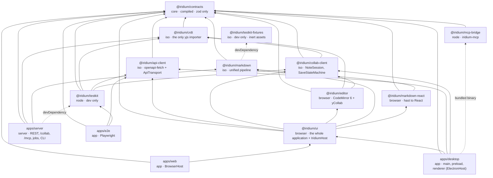

Four properties of this graph are worth stating explicitly because they are easy to break and expensive to repair:

| Property | Why it matters |
|---|---|
| `@iridium/crdt` is the only package that imports `yjs`, `y-protocols` or `lib0` | A second Yjs module instance silently breaks synchronization; confining the import to one package makes the `deps.single-instance` check and a future v14 migration tractable (A14) |
| `apps/server` depends on `@iridium/markdown` and `@iridium/crdt` but never on `@iridium/api-client` or `@iridium/ui` | The server is not a client of its own API, and no browser code can be pulled into the Node bundle by a careless import |
| `@iridium/ui` is the only package that knows the application's screens, and it reaches the platform only through `IridiumHost` | One UI codebase for web and Electron (the brief's hard requirement) is a property of the import graph, not of developer discipline |
| `@iridium/testkit` is a `node`-tagged dev package that both `apps/server` and `apps/e2e` consume | One harness definition for integration, chaos, contract, MCP and E2E lanes; knip `--production` fails if it leaks into a shipped path |

### `apps/server/src` module map

```
main.ts                      CLI entry: serve | migrate | doctor | config | backup | restore | audit | reindex | admin | tokens | sessions | keys | jobs | trash | desktop-updates | mirror
app.ts                       buildApp({ mode: 'in-process' | 'child' | 'container' }) — one boot path; plugin order: config → db → security → auth → authz → audit → oauth → rest → collab → mcp → ops → jobs
config/env.ts                zod EnvSchema, *_FILE secrets, fail-fast with z.prettifyError, redacted summary; unknown IRIDIUM_* keys rejected, reserved harness namespaces known-and-ignored
db/                          Kysely instances (dbApp, dbPersist), schema.ts (Database types, codegen-diffed), ids, withVaultLock(), migrator wrapper (GET_LOCK)
migrations/NNNN_<name>.ts    kysely-ctl migrations (one DDL per file, idempotent guards, forward-only in prod)
security/                    helmet/CSP nonces, Origin/Host guards, CSRF guard, rate limits, request ids, ProblemDetails mapping
auth/                        credentials (argon2id + pepper + policy + throttle), sessions (issue/verify/revoke/step-up), tokens (PAT format/verify → AuthInfo, rotation), tickets (TicketStore), setpw (one-time links), authenticate()
authz/                       permissions matrix (from contracts), authorize(), route-policy plugin (boot assertion), bus.ts (AuthzBus, in-process impl), epochs.ts (EpochTable), reconciler.ts (EpochReconciler)
audit/                       AuditWriter (same-txn chain, chain heads), AccessLogWriter (batched), verify-chain, export, archive
users/ vaults/ members/      admin & membership services (bump authz_version, publish AuthzBus after COMMIT)
tree/                        adjacency-list service: names, derived paths (CTE + tree_version cache seam), create/rename/move, cycle checks, trash/restore/purge, tree-changed broadcasts
notes/                       NoteService.initialize() (FOR UPDATE + initialized_at guard), lifecycle (markClosing/closeNote), revisions (list/name/restore via DirectConnection + prefixSuffixDiff), content-invalid repair
content/read/                ContentReadCore (listVaults, listNodes, resolveNote, readNoteMarkdown, listRevisions, search, listAttachments)
collab/
  server.ts                  Hocuspocus instance + Fastify /collab route (ticket auth, Origin allowlist, caps)
  hooks/                     onAuthenticate, onLoadDocument, afterLoadDocument, beforeHandleMessage, beforeHandleAwareness, onTokenSync, onStateless, onStoreDocument, beforeUnloadDocument, afterUnloadDocument
  gateway.ts                 CollabGateway: closeNote(), revokeUser(), changeRole(), broadcastVault(), openServerEdit(), participants
  vault-channel.ts           vault:<id> never-persisted documents
  persistence/               writer.ts (NoteWriter FIFO, CAS, coalescing, backpressure, retry, baseline), loader.ts, compactor.ts (snapshot + projection + checkpoints + content-invalid scan), initial-state.ts (thin wrapper over @iridium/crdt)
  limits.ts                  maxPayload, single-update cap, msgs/s, awareness cap, connection caps, admission budget
projection/                  piscina pool running @iridium/markdown project(); note_projections/note_projection_terms/note_search/note_links writers with revision guards; reindex
search/                      SearchIndex interface; MysqlFulltextSearch; boolean query builder; snippet locator
attachments/                 service, StorageDriver (fs, s3), MIME policy, serving headers, unreferenced report
transfer/                    import (upload/scan/report/commit/abort), export (zip stream, manifest, EOL restore), mirror
mcp/                         plugin.ts (both mounts, hijack, fail-closed), factory.ts (buildIridiumMcpServer), tools/*.ts, resources.ts, verifier.ts, cursor.ts, rate-limit.ts, snippets.ts, instructions.md
oauth/                       OAuth 2.1 authorization server: metadata.ts (the PRM and AS-metadata routes plus the four explicit 404 routes), authorize.ts, consent-page.ts (server-rendered, no application JavaScript), consent-store.ts (ConsentRequestStore), token.ts, revoke.ts, register.ts, redirect-uri.ts, cimd.ts (Client ID Metadata Document fetch under the SSRF guard), pkce.ts
jobs/                        scheduler (single instance): trash_purge, update_log_prune, revision_thinning, access_log_partitions, audit_archive, transfer_cleanup, session_ticket_sweep, last_used_flush, reindex, attachment_unreferenced_report
ops/                         /healthz, /readyz, /metrics, fault registry (NODE_ENV=test only), shutdown drain
cli/                         iridium command implementations
test/                        harness (via @iridium/testkit), integration/, chaos/, contract/, property/, mcp/
```

Module contracts an implementer must respect:

| Module | Owns | Exposes to other modules | Must not |
|---|---|---|---|
| `config/` | `EnvSchema`, `IridiumConfig`, secret loading, redaction | `loadConfig(env): IridiumConfig`, `redactConfig()` | read `process.env` anywhere else in the server (lint rule `no-process-env` outside `config/`) |
| `db/` | pools, `Database` types, `withVaultLock(trx, vaultId)`, `toBin/fromBin` id helpers, migrator wrapper with `GET_LOCK('iridium_migrate', 60)` | `dbApp`, `dbPersist`, `withVaultLock`, `Transaction` types | contain business logic |
| `security/` | helmet, Host/Origin/CSRF guards, rate-limit buckets, request ids, `ProblemDetails` mapping | Fastify hooks and decorators only | know about principals beyond `request.principal.kind` |
| `auth/` | credentials, sessions, the one token verifier (`irid_pat_` and `irid_oat_`), `TicketStore`, set-password links, `authenticate()` | `authenticate(request): Principal \| null`, `verifyToken(raw, {surface, resource})` — the single verification path for both credential kinds (04-auth-and-access-control.md D04-26) — `issueTickets()`, `consumeTicket()` | make permission decisions |
| `authz/` | permission matrix binding, `authorize()`, route policy plugin, `AuthzBus`, epoch table | `authorize(principal, permission, ctx)`, `AuthzBus`, `EpochTable` | query anything but `vaults`, `vault_members`, `users`, `access_token_vaults` |
| `audit/` | `AuditWriter.record(trx, event)`, `AccessLogWriter.append(row)`, chain verification/export/archive | those two writers and the CLI functions | be called outside a transaction for audit events |
| `users/`, `vaults/`, `members/` | account and membership services; `authz_version` bumps; post-COMMIT `AuthzBus.publish` | service functions taking a `Principal` | write to `nodes` or `note_*` tables |
| `tree/` | structural transactions under `withVaultLock`, derived paths, name rules, trash/restore/purge, `tree_version`, `tree-changed` broadcasts | `TreeService` | lock `note_docs` |
| `notes/` | `NoteService.initialize()` (the only Markdown→Y.Doc path), lifecycle (`markClosing`, `closeNote`), revisions and restore through `CollabGateway.openServerEdit()` | `NoteService`, `RevisionService` | construct a `Y.Doc` outside `@iridium/crdt` |
| `content/read/` | `ContentReadCore` over committed projections with `authorize()` inside every method | the seven read functions | read the live Y.Doc |
| `collab/` | Hocuspocus embedding, hooks, `CollabGateway`, vault channel, persistence pipeline, limits | `CollabServer`, `CollabPersistence`, `CollabGateway` interfaces | leak Hocuspocus types outside `collab/` |
| `projection/` | `projectionPool`, writers with `WHERE revision < ?` guards, `reindex` | `Projector.project(noteId, seq, markdown)` | write `note_projections` from anywhere else |
| `search/` | `SearchIndex` interface, `MysqlFulltextSearch`, boolean query builder, snippet locator | `SearchIndex` | bypass the `vault_id IN (accessible)` predicate |
| `attachments/` | `StorageDriver` (fs, s3), content addressing, MIME policy, serving headers, unreferenced report | `AttachmentService`, `StorageDriver` | serve a file without the hardening headers |
| `transfer/` | import/export/mirror job runners on `transferPool` | `ImportService`, `ExportService` | create a note other than through `NoteService.initialize()` |
| `mcp/` | the two mounts (`/mcp`, `/mcp/connect`), the shared route handler, per-request factory, tools, resources, cursors, per-token limits, snippets, `instructions.md` | nothing (leaf) | query tables directly (goes through `ContentReadCore`), or import `oauth/` — the only module the two share is `auth/tokens/verify.ts` |
| `oauth/` | the authorization server: both metadata documents, the four deliberate `404` routes, `/oauth/authorize\|consent\|token\|revoke\|register`, the server-rendered consent page, `ConsentRequestStore`, CIMD fetching under the SSRF guard, redirect-URI comparison, PKCE | the `oauth` plugin; nothing else imports it | mint a `Principal` or decide a permission of its own — a credential it issues is verified by `auth/tokens/verify.ts` and authorized by `authorize()` exactly like every other credential, and reading note content is not its business |
| `jobs/` | scheduler, job runners, `jobs` table claims | `JobScheduler.run(type, payload)` | run CPU-bound work on the event loop |
| `ops/` | health, readiness, metrics registry, fault registry, drain | `metrics` registry, `readiness.check()` | expose anything when `NODE_ENV !== 'test'` for faults |
| `cli/` | `iridium` commands; every mutation writes audit with `credential_type='cli'` | — | duplicate service logic (calls the same services) |

### Boundary tags and allowed dependencies

Tags are declared in each package's `turbo.json` (`"extends": ["//"], "tags": [...]`); rules live in the root `turbo.json` under `boundaries.tags`. oxlint `no-restricted-imports` enforces the banned-import column inside files; dependency-cruiser 18.2.0 is the fallback if `turbo boundaries` proves too immature.

| Tag | Packages | May depend on | Banned imports |
|---|---|---|---|
| `core` | contracts | tooling (zod is its only third-party runtime dependency) | `node:*`, `electron`, `react`, DOM globals |
| `iso` | crdt, markdown, api-client, collab-client, testkit-fixtures | core, iso | `node:*` (except type-only), `electron`, `react`, DOM globals |
| `browser` | editor, markdown-react, ui | core, iso, browser | `node:*`, `electron` |
| `node` | mcp-bridge, testkit | core, iso | `react`, DOM globals |
| `server` | apps/server | core, iso, testkit (dev only) | browser, `@iridium/api-client` (server never consumes its own client), `@iridium/mcp-bridge` |
| `app` | apps/web, apps/desktop, apps/e2e | core, iso, browser, node (desktop only, for the bundled bridge; e2e for testkit) | server |
| `tooling` | tsconfig, oxlint-config, mutation, api-codegen, sql | tooling, core, iso, node | — (devDependencies of anything) |
| `spike` | `spikes/*` (today `spike-s04-editor-csp` and `spike-s11-markdown`) | core, iso, browser, node, tooling | nothing is banned inside a harness; what is banned is **depending on one** — `dependents.allow: []` is what makes D12-5's "spike code can never be inherited by product code" a rule `turbo boundaries` checks rather than a convention |

Root `turbo.json` (the boundary rules verbatim; task definitions are in 10-testing-and-quality.md):

```jsonc
{
  "$schema": "https://turborepo.dev/schema.json",
  "ui": "tui",
  "envMode": "strict",
  "globalDependencies": ["tooling/tsconfig/*.json", ".oxfmtrc.jsonc", "oxlint.config.ts", "pnpm-workspace.yaml"],
  "globalPassThroughEnv": ["CI", "GITHUB_ACTIONS", "NODE_OPTIONS"],
  "boundaries": {
    "tags": {
      "core":    { "dependencies": { "allow": ["tooling"] } },
      "iso":     { "dependencies": { "allow": ["core", "iso", "tooling"] } },
      "browser": { "dependencies": { "allow": ["core", "iso", "browser", "tooling"], "deny": ["node", "server", "app"] } },
      "node":    { "dependencies": { "allow": ["core", "iso", "tooling"], "deny": ["browser", "server", "app"] } },
      "server":  { "dependencies": { "allow": ["core", "iso", "node", "tooling"], "deny": ["browser", "app"] }, "dependents": { "allow": [] } },
      "app":     { "dependencies": { "allow": ["core", "iso", "browser", "node", "tooling"], "deny": ["server"] }, "dependents": { "allow": [] } },
      "tooling": { "dependencies": { "allow": ["tooling", "core", "iso", "node"] } },
      "spike":   { "dependencies": { "allow": ["core", "iso", "browser", "node", "tooling"] }, "dependents": { "allow": [] } }
    }
  }
}
```

Every tag allows `tooling`, because a `tooling` package is a devDependency of anything and `@iridium/tsconfig` is a devDependency of nearly everything; `tooling` in turn allows `core`, `iso` and `node`, because `@iridium/sql-policy`'s consumers and `@iridium/mutation`'s Vitest project sit on that side. The `server` tag allows `node` only so that `@iridium/testkit` can be a devDependency; the package-level `no-restricted-imports` rule bans `@iridium/mcp-bridge` from the server explicitly, and knip 6.35.1 (`--production`) fails when a dev-only package leaks into a production import.

Invariants enforced in CI:

- Server-only code (DB, migrations, persistence, auth, audit, projections, MCP host) lives exclusively under `apps/server/src` and is never exported; `dependents.allow: []` for `server` and `app`.
- `import/no-cycle: error` inside every package.
- Every package is classified compiled (contracts, crdt, markdown, api-client, collab-client, mcp-bridge, testkit) or JIT (editor, markdown-react, ui); a package with both `dist` exports and `src` exports fails the `gen-drift` job.
- Turbo `envMode: strict` env lists are diffed against `EnvSchema` keys in CI (a key added to the schema without a Turbo env entry, or vice versa, fails the build).
- `deps.single-instance`: `pnpm why yjs`, `lib0`, `y-protocols`, `@codemirror/state`, `@codemirror/view` resolve to exactly one version; the Vite bundle analysis shows one copy; the server startup guard fails on "Yjs was already imported".
- `collab.initial-state-only-path`: `new Y.Doc(` appears only in `@iridium/crdt`, `collab/persistence/initial-state.ts` and tests; `no-reinit`: `getText('content').insert` appears only in `NoteService.initialize`, restore and repair.

### The `IridiumHost` seam

`packages/ui/src/host.ts` is the only platform seam. The UI receives one `IridiumHost` at mount time and never branches on `kind` outside the host implementations and a handful of feature flags derived from it (`updates !== null`, `collab.webSocketFactory !== undefined`).

```ts
interface IridiumHost {
  kind: 'web' | 'electron';
  server: { origin(): string; listProfiles(): Promise<ServerProfile[]>; select(id: string): Promise<void>; add(p: ServerProfile): Promise<void>; remove(id: string): Promise<void> };
  api: ApiTransport;                                   // FetchTransport | IpcTransport
  auth: { signIn(c: Credentials): Promise<Me>; signOut(): Promise<void>; me(): Promise<Me>; reauthenticate(password: string): Promise<void>; onSessionChanged(cb): Unsubscribe };
  collab: { ticketSource: TicketSource; websocketUrl(): string; webSocketFactory?: () => WebSocketLike };   // factory only in the Electron IPC fallback
  attachments: { urlFor(vaultId: string, attachmentId: string): string };
  files: { pickImportSource(): Promise<ImportSource | null>; uploadImport(jobId, source, onProgress): Promise<void>; exportVault(vaultId, jobId): Promise<ExportOutcome>; saveText(name: string, text: string): Promise<void> };
  shell: { openExternal(url: string): Promise<void>; copyText(t: string): Promise<void>; setTitle(t: string): void };
  links: { onDeepLink(cb: (l: DeepLink) => void): Unsubscribe };
  commands: { onNativeCommand(cb: (id: CommandId) => void): Unsubscribe; publishMenu(m: MenuManifest): void };
  updates: { check(): Promise<UpdateState>; onState(cb): Unsubscribe; install(): Promise<void> } | null;   // at 1.0 install() is registered and always rejects with updates_manual_only
  storage: KeyValueStorage;                            // per-profile UI prefs (localStorage | userData JSON)
}
```

| Member | `BrowserHost` (`apps/web/src/host/browser-host.ts`) | `ElectronHost` (`apps/desktop/src/renderer/electron-host.ts`) |
|---|---|---|
| `server` | single profile = `window.location.origin`; `listProfiles` returns it; `add/remove/select` are no-ops that resolve | `window.iridium.profiles.*` over `iridium:profiles:{list,get,add,remove,select}`; profiles `{origin (https only), displayName, pinnedCertSha256?}` persisted by main |
| `api` | `FetchTransport`: same-origin `fetch` with `credentials:'include'`, `X-Iridium-Client: web`, `X-Iridium-Client-Version` | `IpcTransport`: `iridium:api:request {method, path, headers, body}` → main `net.fetch` with `Authorization: Bearer` from `safeStorage`; streamed bodies for uploads/downloads go through `files.*` instead |
| `auth` | `POST /auth/sessions {client:'web'}`; `onSessionChanged` from 401 interception and `storage` events across tabs | `iridium:auth:{signIn,signOut,status,reauthenticate}`; `onSessionChanged` from `iridium:event:session-changed` |
| `collab.ticketSource` | `POST /auth/collab-tickets {count}` through `api` | `iridium:collab:tickets {count}` (main calls REST with the Bearer) |
| `collab.websocketUrl` | `wss://<origin>/collab` | `wss://<profile.origin>/collab` |
| `collab.webSocketFactory` | undefined | undefined, or the `IpcWebSocket` shim when the M0 spike recorded the fallback |
| `attachments.urlFor` | `/api/v1/vaults/<vaultId>/attachments/<id>` (cookie GET) | `iridium-attachment://<vaultId>/<id>` (main fetches with the Bearer, streams with the hardening headers) |
| `files` | `<input webkitdirectory>` or a ZIP `File`; multipart `PUT /imports/:jobId/upload`; export = navigate to `/exports/:jobId/download`; `saveText` = Blob download | main zips a picked folder and uploads; export streams to `showSaveDialog` with non-empty-directory confirmation; `saveText` via save dialog |
| `shell` | `window.open(url, '_blank', 'noopener')` for `https:`/`mailto:` only; `navigator.clipboard`; `document.title` | `iridium:shell:{openExternal,copyText}` (validated in main); `iridium:window:setTitle` |
| `links` | URL parsing of `/v/$vaultId/n/$noteId?rev=` on load | `iridium:event:deep-link` from `iridium://open?server=&note=&rev=` |
| `commands` | keyboard only; `publishMenu` no-op | native menu built from `MenuManifest` in main; `iridium:event:native-command` |
| `updates` | `null` | `iridium:updates:{check,install}` + `iridium:event:update-state`, policy from `GET /desktop/update-policy`. At 1.0 `check()` compares `latest.version` with `app.getVersion()` and resolves to `idle` or `manual-download`; `install()` is registered but always rejects with `updates_manual_only` because the 1.0 build has no updater (07-client-applications.md D07-44) |
| `storage` | `localStorage` namespaced by origin + user id | JSON under `userData/iridium/prefs/<profileId>.json` via IPC |

Both hosts run the shared `hostContractCases()` suite. The seam is runner-agnostic *data*, not a shared test file: the cases are plain async functions taking the host and an injected assertion facade (`Array<{ name: string; run(host: IridiumHost, assert: AssertFns): Promise<void> }>`), because the browser side executes under Vitest Browser Mode with `expect` from `vitest` while the Electron side executes under Playwright's `electron` project with `expect` from `@playwright/test`, and the two runners' assertion APIs cannot share a file. `packages/ui/src/host/host.contract.component.spec.tsx` iterates the cases against `BrowserHost` (and `MemoryHost`); `apps/e2e/electron/desktop.host-contract.e2e.spec.ts` iterates the same cases against `ElectronHost` through `electronApp.evaluate`. A case added without a passing run in both runners fails `guards.acceptance-map.guard` (10-testing-and-quality.md owns the case list and both harnesses). The renderer host never receives credentials: no `secrets` member exists, and the preload surface snapshot test fails if one appears.

### Build outputs and artifacts

| Package | Command | Output | Consumed by |
|---|---|---|---|
| compiled packages | `tsc -b` | `dist/**/*.js`, `.d.ts`, `.d.ts.map`, `dist/.tsbuildinfo` | Node consumers, tsgolint type-aware lint |
| `@iridium/server` | `tsdown` | `dist/main.mjs` (workspace packages inlined; `@node-rs/argon2`, `mysql2`, `piscina` workers and the SDK stay external), `dist/workers/*.mjs` (piscina entry points), `dist/public/` (copied web bundle), `migrations/` | Docker image, `startServer({mode:'child'})` |
| `@iridium/web` | `vite build` | `dist/` hashed assets + `index.html` template with the nonce placeholder | copied into the server image as `dist/public/` |
| `@iridium/desktop` | `tsdown` (main, preload) + `vite build` (renderer) + `electron-builder` | `release/` — six unsigned bundles (`Iridium-<version>-<win32\|darwin\|linux>-<arch>.<zip\|tar.gz>`), plus `bundles.json` and `SHA256SUMS` written by `tooling/release/write-bundle-manifest.ts`. No installers and no `.blockmap` files at 1.0; `latest.yml` / `latest-mac.yml` / `latest-linux.yml` are generated **by the server** from the `desktop_releases` row, not by electron-builder, and that generator is unchanged | release workflow, `iridium desktop-updates publish` |
| `@iridium/mcp-bridge` | `tsdown` | `dist/iridium-mcp.mjs` with shebang (`bin: {"iridium-mcp": "./dist/iridium-mcp.mjs"}`) | desktop `resources/bin/iridium-mcp.mjs`, `/desktop/tools/iridium-mcp-<version>.mjs` (+ `latest` alias, published SHA-256); `release.yml` asserts the two copies are byte-identical |
| `@iridium/contracts` | `pnpm gen` | `openapi/openapi.json` (from `app.swagger()`), `mcp/tools.schema.json` (from the zod tool schemas), `src/generated/desktop-ipc.d.ts` | `openapi-typescript` → `@iridium/api-client/src/generated/paths.d.ts`; Redocly lint; msw handler skeleton; drift job `pnpm gen && git diff --exit-code` |
## Runtime configuration model

### Principles

1. **Environment only.** The server is configured exclusively through environment variables (Compose `environment:`/`env_file:`, systemd `EnvironmentFile=`, CI job env). There is no YAML/TOML configuration file: a second source of truth would need its own precedence rules, its own secret handling and its own redaction, and every deployment target already delivers environment variables and files (decision ARCH-08).
2. **Parsed once, fail fast.** `apps/server/src/config/env.ts` parses `process.env` exactly once into a frozen `IridiumConfig`. A validation failure prints `z.prettifyError(error)` to stderr and exits with code 2 (configuration or usage error — see the CLI exit codes in the cross-cutting section and OPS-16 in 11-operations-and-deployment.md); nothing listens, no pool opens, no migration runs. `iridium config check` performs the same parse and stops.
3. **Secrets never travel as plain values when a file is available.** Every secret key accepts a `<NAME>_FILE` variant whose file content (trailing newline trimmed) replaces the value. Setting both `<NAME>` and `<NAME>_FILE` is a validation error, not a precedence question.
4. **No `process.env` outside `config/`.** The oxlint rule `no-process-env` (with `config/**` and `main.ts` as the only exceptions) makes every module receive its configuration slice through plugin options or constructor arguments. Tests build a config object directly; they never mutate `process.env` after boot.
5. **Typo protection, with reserved harness namespaces.** A variable starting with `IRIDIUM_` that the schema does not know is a fatal error (`config.unknown_key`, exit 2) — typo protection for the most sensitive knobs; variables without that prefix are ignored silently. The rule has one carve-out, and it is not a loophole but a requirement: the test harness owns several `IRIDIUM_*` names of its own (10-testing-and-quality.md D10-5), and the `child` harness mode spawns this same binary with the whole job environment, so a fatal unknown-key rule without the carve-out would kill the server in every CI lane that exports `IRIDIUM_PROP_RUNS` or `IRIDIUM_MYSQL_IMAGE` — including the chaos lane, the only lane that can prove the durability invariants. `EnvSchema` therefore lists these as **known-and-ignored**: the prefixes `IRIDIUM_TEST_*`, `IRIDIUM_PROP_*`, `IRIDIUM_CHAOS_*`, `IRIDIUM_E2E_*`, `IRIDIUM_FIXTURE_*`, `IRIDIUM_COVERAGE_*` and the exact names `IRIDIUM_MYSQL_IMAGE`, `IRIDIUM_USER_DATA`, `IRIDIUM_SERVER_URL`, `IRIDIUM_MCP_TOKEN` (the last two belong to the clients and the `iridium-mcp` bridge, never to the server). `iridium config check` prints them under "ignored harness keys" so an operator can see that a name was recognised and deliberately not used. No product key ever uses one of those prefixes, which is what keeps the carve-out from weakening typo protection: `IRIDIUM_MIGRATE_ON_BOOT`, `IRIDIUM_FAULT` and `IRIDIUM_E2E` are the only three `IRIDIUM_*` keys the server reads, and `IRIDIUM_E2E` (read by the desktop main process) is rejected with a hint rather than ignored. `IRIDIUM_ALLOW_NO_ORIGIN_WS` is listed explicitly as a rejected name so nobody reintroduces the Origin bypass (skeleton A24).
6. **Env values are floors of strictness.** Policy that administrators may edit at runtime lives in `server_settings` (skeleton C.10). The environment supplies both the default and the laxest value an administrator is allowed to choose: an admin may shorten a session TTL, shorten a PAT lifetime or raise the minimum password length, but never the reverse. The `SettingsStore` rejects a laxer value with 422 `validation_failed` (decision ARCH-10).
7. **The build is diffed against the schema.** Turborepo runs with `envMode: strict`; `apps/server/turbo.json` lists every key the server reads (as `passThroughEnv` on `dev`, the one task that starts the server; the cacheable tasks read no environment, so no key is a cache input, and an `IRIDIUM_*` wildcard keeps the schema's unknown-key rule fatal under strict mode), and the check `check-env-lists` (`scripts/check-env-lists.ts`, run by `ci.yml` › `static`) fails when the Turbo list and the `EnvSchema` keys differ in either direction (skeleton B.2).

### Loading pipeline

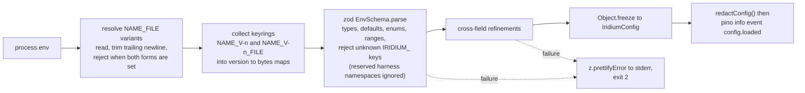

`loadConfig(env: Record<string, string | undefined>): IridiumConfig` is the only export used by `buildApp()`; `redactConfig(config)` returns the same shape with every secret replaced by `<set: versions v1,v2; sha256:ab12cd34>` (first eight hex characters of the SHA-256 of the material), a file-sourced value additionally naming its origin as `<set: file:/run/secrets/audit_hmac_v2; sha256:ab12cd34>`, and an unset optional secret as `<unset>`. That rendering — not a bare `***` — is what the `config.loaded` line and `iridium config check` print on every surface (11-operations-and-deployment.md uses the same format in its startup summary and its key-mismatch runbooks), because the fingerprint is the control an operator uses to confirm that two hosts carry the same key, and the file path is what tells them which mount to fix, neither of which reveals any material. `iridium config check [--json]` prints the redacted summary and the list of `server_settings` overrides currently in force.

Cross-field refinements (each produces a named error such as `PUBLIC_ORIGIN must use https outside development`):

| Rule | Reason |
|---|---|
| `PUBLIC_ORIGIN` must be `https:` unless `NODE_ENV=development` or `test`; no path, query or fragment; `PUBLIC_HOST` is derived from it | Cookies use the `__Host-` prefix, the WebSocket Origin allowlist and the MCP resource URI are built from it (skeleton A24, A26, A31) |
| `TRUST_PROXY` is a comma-separated list of IPs/CIDRs; the literal `true` is rejected | Trusting every hop lets any client spoof `X-Forwarded-For` (digest §5) |
| `TLS_CERT_FILE` and `TLS_KEY_FILE` are both set or both absent, and never together with `TRUST_PROXY` | The air-gapped profile terminates TLS in Fastify (HTTP/1.1) and has no proxy in front (skeleton A48) |
| `IRIDIUM_FAULT` and `DEV_ORIGINS` are rejected unless `NODE_ENV` is `test` (fault registry) or `development` (dev origins) | Fault points and relaxed origins must be impossible in production images |
| `ATTACHMENTS_DRIVER=s3` requires `S3_ENDPOINT`, `S3_REGION`, `S3_BUCKET`, `S3_ACCESS_KEY_ID`, `S3_SECRET_ACCESS_KEY`; `ATTACHMENTS_DRIVER=fs` requires `ATTACHMENTS_DIR` | Driver-specific keys are validated as a group |
| `ATTACHMENTS_ENCRYPTION=aes256gcm` requires an `ATTACHMENT_KEY_V<n>` keyring; the value `aes256gcm` is rejected, and the message says that envelope encryption is **not implemented** and that attachments are protected by volume or database encryption instead | The columns and the keyring are reserved; the feature is not built. §G-4 was answered on 2026-09-12 — volume and database encryption only — so the refusal states an unimplemented path, never an undecided question (skeleton A44) |
| `METRICS_ENABLED=true` requires `METRICS_TOKEN` or `METRICS_ALLOW_CIDRS` | `/metrics` is never anonymous on a routable interface (decision ARCH-04) |
| `DB_POOL_PERSIST >= 2`, `DB_POOL_APP >= 5`, `PROJECTION_WORKERS >= 1`, `TRANSFER_WORKERS >= 1` | Below these the writer fairness scheduler and the pools cannot make progress |
| `LOG_FORMAT=pretty` is rejected when `NODE_ENV=production` | Production logs are machine-parsed JSON |
| `UV_THREADPOOL_SIZE` is read back and a warning is logged when it is unset or below 8 | libuv reads it before any JavaScript runs, so the schema can only observe it (skeleton A29) |

The resulting object (the exact TypeScript shape lives in `config/env.ts`; slices are what plugins receive):

```ts
interface IridiumConfig {
  readonly env: 'development' | 'test' | 'production';
  readonly server: { bindAddress: string; port: number; publicOrigin: URL; publicHost: string; trustProxy: readonly string[] | false; tls: { certFile: string; keyFile: string } | null; devOrigins: readonly string[] };
  readonly db: { appUrl: string; migrateUrl: string | null; backupUrl: string | null; poolApp: number; poolPersist: number };
  readonly keys: { pepper: Keyring; auditHmac: Keyring; mcpCursor: Keyring; attachment: Keyring | null };   // current versions come from schema_meta at boot
  readonly auth: { sessionWebIdleHours: number; sessionWebAbsoluteDays: number; sessionDesktopIdleDays: number; sessionDesktopAbsoluteDays: number; stepUpWindowMinutes: number; argon2MemoryKib: number; argon2TimeCost: number; passwordMinLength: number };
  readonly tokens: { patDefaultLifetimeDays: number; patMaxLifetimeDays: number; patAllowNoExpiry: boolean; patRotationOverlapMaxHours: number };
  readonly mcp: { enabled: boolean; rateLimitPerHour: number; requestTimeoutMs: number; oauthEnabled: boolean };
  readonly oauth: { issuer: string; resource: string; accessTokenTtlMinutes: number; refreshIdleDays: number; refreshAbsoluteDays: number; defaultRateLimitPerHour: number; allowDynamicClientRegistration: boolean; allowClientIdMetadataDocuments: boolean; allowConsentWithoutStepUp: boolean };   // issuer = `${publicOrigin}/oauth`, resource = `${publicOrigin}/mcp/connect`: both derived, neither configurable
  readonly collab: { debounceMs: number; maxDebounceMs: number; maxLoadedDocs: number; maxStateBytesTotal: number; maxConnections: number; updateLogRetentionDays: number };
  readonly projection: { workers: number; timeoutMs: number };
  readonly transfer: { workers: number; stagingDir: string; exportsDir: string; exportTtlHours: number; importStagingTtlHours: number; maxUploadBytes: number; maxImportBytes: number };
  readonly storage: { driver: 'fs'; dir: string } | { driver: 's3'; endpoint: string; region: string; bucket: string; forcePathStyle: boolean; accessKeyId: string; secretAccessKey: string };
  readonly retention: { trashDaysDefault: number; auditDays: number; accessLogDays: number };
  readonly desktop: { updatesDir: string };
  readonly ops: { logLevel: 'fatal' | 'error' | 'warn' | 'info' | 'debug' | 'trace'; logFormat: 'json' | 'pretty'; metricsEnabled: boolean; metricsToken: string | null; metricsAllowCidrs: readonly string[]; readyzStrictDurability: boolean; shutdownDrainMs: number; jobsEnabled: boolean };
  readonly lifecycle: { migrateOnBoot: boolean; fault: string | null };
}
interface Keyring { readonly versions: ReadonlyMap<number, Uint8Array>; readonly highest: number }
```

### Configuration keys

Types: `int` (decimal), `bytes` (decimal integer or a suffixed value `50MiB`, `2GiB`, `1GB` parsed by `config/bytes.ts`), `bool` (`true|false`), `list` (comma-separated), `dur` (integer in the unit named by the key suffix). "Floor" marks values that `server_settings` may only tighten.

#### Process and network

| Key | Type | Default | Required | Notes |
|---|---|---|---|---|
| `NODE_ENV` | `development \| test \| production` | `production` | no | The image sets `production`; the test harness sets `test` |
| `BIND_ADDRESS` | IP | `127.0.0.1` | no | `0.0.0.0` only for the air-gapped profile or a container network where the proxy is another container (decision ARCH-03) |
| `PORT` | int 1–65535 | `4000` | no | `child` mode ignores it and picks an ephemeral port |
| `PUBLIC_ORIGIN` | origin URL | — | **yes** | Drives cookies, CSP, the WebSocket Origin allowlist, the MCP resource URI (`<PUBLIC_ORIGIN>/mcp`), share URLs and `GET /meta.publicOrigin` |
| `TRUST_PROXY` | list of IP/CIDR | unset | no | Exactly the reverse proxy's addresses (`172.20.0.0/24`, `127.0.0.1/32,::1/128`); `true` rejected |
| `TLS_CERT_FILE`, `TLS_KEY_FILE` | path | unset | no | Air-gapped in-process TLS (HTTP/1.1); PEM; reloaded only on restart |
| `DEV_ORIGINS` | list of origins | empty | no | Extra WebSocket/CSRF origins (Vite dev server `http://localhost:5173`); honoured only when `NODE_ENV=development` |

#### Database

| Key | Type | Default | Required | Notes |
|---|---|---|---|---|
| `DATABASE_URL` | `mysql://iridium_app:…@host:3306/iridium?…` | — | **yes** | Application role; both Kysely instances (`dbApp`, `dbPersist`) are built from it; TLS options travel as URL parameters (`ssl-mode`, `ssl-ca`). The server the URL points at must be a supported line (8.4.x ≥ 8.4.11 or 9.7.x ≥ 9.7.2); the check is part of the `db` plugin's boot sequence |
| `DATABASE_PASSWORD_FILE` | path | unset | no | Replaces the password component of `DATABASE_URL` |
| `DATABASE_MIGRATE_URL` (+ `_PASSWORD_FILE`) | URL | unset | for `migrate`, `restore`, `audit archive`, and `serve` with `IRIDIUM_MIGRATE_ON_BOOT=true` | Migrator role (`iridium_migrator`); `serve` never opens it otherwise (skeleton A7, A8) |
| `DATABASE_BACKUP_URL` (+ `_PASSWORD_FILE`) | URL | unset | for `iridium backup` | Backup role (`iridium_backup`); consumed by `infra/backup/backup.sh`, the thin wrapper around `iridium backup` that the shipped `infra/systemd/iridium-backup.{service,timer}` unit and the documented cron line invoke (11-operations-and-deployment.md specifies both the wrappers and the schedule; decision ARCH-20) |
| `DB_POOL_APP` | int ≥ 5 | `20` | no | REST, MCP, jobs, loader, projections, tree, audit |
| `DB_POOL_PERSIST` | int ≥ 2 | `4` | no | `NoteWriter` and compaction transactions only; also the global writer concurrency (skeleton A21) |

#### Secrets and keyrings

Every entry accepts `_FILE`. Keyrings are versioned families `<NAME>_V<n>` (`n` ≥ 1, contiguous versions are not required); the version in use is recorded in `schema_meta`, not in the environment (decision ARCH-09).

| Key | Format | Required | Used by |
|---|---|---|---|
| `AUTH_PASSWORD_PEPPER_V<n>` | 32 bytes, base64 | the version named by `schema_meta.pepper_version` must exist | argon2id `secret` parameter (`auth/credentials`); older versions stay loaded so their hashes verify and re-hash transparently on login (skeleton A29) |
| `AUDIT_HMAC_KEY_V<n>` | 32 bytes, base64 | the version named by `schema_meta.audit_key_version` must exist | `AuditWriter` HMAC chain and `audit verify-chain` (every version referenced by a stored row must be present to verify) |
| `MCP_CURSOR_KEY_V<n>` | 32 bytes, base64 | the version named by `schema_meta.cursor_key_version` must exist | `mcp/cursor.ts` signing; the previous version is accepted for the 1 h cursor lifetime after rotation |
| `ATTACHMENT_KEY_V<n>` | 32 bytes, base64 | reserved — §G-4 was answered on 2026-09-12 with volume and database encryption only, so no version is required and none is loaded | rejected unless `ATTACHMENTS_ENCRYPTION=aes256gcm`, which is itself rejected |
| `METRICS_TOKEN` | ≥ 32 characters | when `METRICS_ENABLED` and no `METRICS_ALLOW_CIDRS` | `/metrics` bearer |
| `S3_ACCESS_KEY_ID`, `S3_SECRET_ACCESS_KEY` | strings | when `ATTACHMENTS_DRIVER=s3` | `@aws-sdk/client-s3` credentials |

#### Authentication policy (floors)

| Key | Type | Default | Floor | Notes |
|---|---|---|---|---|
| `SESSION_WEB_IDLE_HOURS` | int | `24` | yes | Sliding idle expiry of web sessions (skeleton A26) |
| `SESSION_WEB_ABSOLUTE_DAYS` | int | `14` | yes | |
| `SESSION_DESKTOP_IDLE_DAYS` | int | `30` | yes | |
| `SESSION_DESKTOP_ABSOLUTE_DAYS` | int | `90` | yes | |
| `STEP_UP_WINDOW_MINUTES` | int | `10` | yes | `last_authenticated_at` freshness for `step_up_required` routes |
| `PASSWORD_MIN_LENGTH` | int 8–128 | `15` | yes | `password_policy.min_length` may only raise it |
| `ARGON2_MEMORY_KIB` | int | `65536` | no | Calibrated by `iridium doctor --argon2` to 150–300 ms |
| `ARGON2_TIME_COST` | int | `3` | no | |

#### Integration tokens and MCP

| Key | Type | Default | Floor | Notes |
|---|---|---|---|---|
| `PAT_DEFAULT_LIFETIME_DAYS` | int | `90` | yes | Pre-filled in the token dialog |
| `PAT_MAX_LIFETIME_DAYS` | int | `366` | yes | `pat_policy.max_lifetime_days` may only lower it |
| `PAT_ALLOW_NO_EXPIRY` | bool | `false` | yes | `true` here does not enable it; it permits an admin to enable it |
| `PAT_ROTATION_OVERLAP_MAX_HOURS` | int | `24` | yes | Maximum `overlapHours` on `POST /me/tokens/:id/rotate` |
| `MCP_ENABLED` | bool | `true` | yes | Server-wide kill switch floor (`server_settings.mcp_enabled` may only disable) |
| `MCP_RATE_LIMIT_PER_HOUR` | int | `3000` | no | Default per-token hourly budget; `access_tokens.rate_limit_per_hour` overrides per token |
| `MCP_REQUEST_TIMEOUT_MS` | int | `30000` | no | Server-side tool call timeout (skeleton A32) |
| `MCP_OAUTH_ENABLED` | bool | `true` | — | Mounts `/mcp/connect` and the four metadata routes, and with them the `/oauth/*` endpoints; `false` unmounts `/mcp/connect`, all four metadata routes and every `/oauth/*` endpoint, leaving `/mcp` exactly as it is and the four `404` routes still registered, which is the posture for a site that wants no OAuth surface at all. It takes effect at a restart, and no `server_settings` row can change it either way |
| `OAUTH_ACCESS_TOKEN_TTL_MINUTES` | int | `60` | yes | Floor for `oauth_policy.accessTokenTtlMinutes`; the lifetime of an `irid_oat_…` access token |
| `OAUTH_REFRESH_IDLE_DAYS` | int | `30` | yes | Floor for `oauth_policy.refreshIdleDays`; the sliding window a rotation advances |
| `OAUTH_REFRESH_ABSOLUTE_DAYS` | int | `90` | yes | Floor for `oauth_policy.refreshAbsoluteDays`; the refresh family's `absolute_expires_at`, which no rotation advances past |
| `OAUTH_DEFAULT_RATE_LIMIT_PER_HOUR` | int | `3000` | yes | Floor for `oauth_policy.defaultRateLimitPerHour`, the hourly budget an OAuth access token inherits when its `access_tokens.rate_limit_per_hour` is `NULL` |
| `OAUTH_ALLOW_DYNAMIC_CLIENT_REGISTRATION` | bool | `true` | yes | Permissive flag: `false` here forbids an administrator from enabling RFC 7591 registration, and removes both `POST /oauth/register` and `registration_endpoint` from the served metadata. The default is `true` because the cloud connectors register themselves, and a `false` default would make "the connectors work out of the box" untrue |
| `OAUTH_ALLOW_CLIENT_ID_METADATA_DOCUMENTS` | bool | `true` | yes | Permissive flag for the preferred client identity mechanism (a `client_id` that is an HTTPS URL, fetched under the SSRF guard of 06-mcp-and-agent-access.md) |
| `OAUTH_ALLOW_CONSENT_WITHOUT_STEP_UP` | bool | `false` | yes | Permissive flag, spelled as permission-to-skip so the `SettingsStore`'s existing logical-AND merge gives the strict answer: `false` (the default) makes the consent screen ask for the password again outside `STEP_UP_WINDOW_MINUTES`, exactly as `POST /auth/reauthenticate` does |

There is deliberately **no `OAUTH_ISSUER` and no `OAUTH_RESOURCE`**: the issuer is `<PUBLIC_ORIGIN>/oauth` and the canonical resource URI is `<PUBLIC_ORIGIN>/mcp/connect`, both derived from `PUBLIC_ORIGIN`, for the same reason there is no `AUDIT_KEY_VERSION` (ARCH-09) — a served metadata document that can disagree with the origin it is served from is a misconfiguration waiting to happen. The issuer's path component is not cosmetic either: it is what keeps the root `/.well-known/oauth-authorization-server` and `/.well-known/openid-configuration` answering 404, which is what keeps a statically configured client out of the discovery chain (06-mcp-and-agent-access.md D06-27). The authorization server's operational caps — `OAUTH_CODE_TTL_SECONDS`, `OAUTH_CONSENT_REQUEST_TTL_SECONDS`, `OAUTH_MAX_PENDING_CONSENTS`, `OAUTH_CIMD_MAX_BYTES`, `OAUTH_CIMD_TIMEOUT_MS`, `OAUTH_CIMD_CACHE_SECONDS`, `OAUTH_DCR_PER_IP_PER_HOUR`, `OAUTH_MAX_UNUSED_CLIENTS`, `OAUTH_UNUSED_CLIENT_TTL_DAYS` and `OAUTH_MAX_REDIRECT_URIS` — are constants in `@iridium/contracts/limits.ts` with no environment form at all, listed in the limits table below (ARCH-16, invariant 6).

#### Collaboration and persistence

| Key | Type | Default | Notes |
|---|---|---|---|
| `COLLAB_DEBOUNCE_MS` | int | `2000` | Hocuspocus `debounce`; the integration harness sets `100`, the chaos harness deliberately keeps the production value |
| `COLLAB_MAX_DEBOUNCE_MS` | int | `10000` | Hocuspocus `maxDebounce`; the integration harness sets `500`, the chaos harness keeps `10000` because the failure windows it aims at must be the real ones |
| `COLLAB_MAX_LOADED_DOCS` | int | `2000` | Admission budget (skeleton A50) |
| `COLLAB_MAX_STATE_BYTES_TOTAL` | bytes | `1GiB` | Admission budget estimated from `note_docs.snapshot_size` |
| `COLLAB_MAX_CONNECTIONS` | int | `5000` | Per-process WebSocket cap; per-user (20) and per-IP (50) caps are contract constants |
| `UPDATE_LOG_RETENTION_DAYS` | int | `7` | `jobs/update_log_prune` |
| `PROJECTION_WORKERS` | int ≥ 1 | `max(1, cpus - 1)` | `projectionPool` size |
| `PROJECTION_TIMEOUT_MS` | int | `10000` | Per-task hard timeout, worker terminated and respawned |
| `REINDEX_RATE_PER_SECOND` | int ≥ 1 | `20` | Shared maintenance/CLI projection rebuild admission rate |
| `TRANSFER_WORKERS` | int ≥ 1 | `1` | `transferPool` size (decision ARCH-05) |

#### Storage, transfer and retention

| Key | Type | Default | Notes |
|---|---|---|---|
| `ATTACHMENTS_DRIVER` | `fs \| s3` | `fs` | `StorageDriver` selection (skeleton A44) |
| `ATTACHMENTS_DIR` | path | `/data/attachments` | Must be writable; `/readyz` probes it |
| `S3_ENDPOINT`, `S3_REGION`, `S3_BUCKET`, `S3_FORCE_PATH_STYLE` | string, string, string, bool | —, `us-east-1`, —, `true` | SeaweedFS/MinIO need path style |
| `ATTACHMENTS_ENCRYPTION` | `none \| aes256gcm` | `none` | `aes256gcm` is rejected because envelope encryption is not implemented: §G-4 was answered on 2026-09-12 with volume and database encryption only, and the columns and keyring stay reserved |
| `STAGING_DIR` | path | `/data/staging` | Import staging `STAGING_DIR/<jobId>/` |
| `EXPORTS_DIR` | path | `/data/exports` | Export artifacts |
| `EXPORT_TTL_HOURS` | int | `24` | `export_jobs.expires_at` |
| `IMPORT_STAGING_TTL_HOURS` | int | `72` | `import_jobs.expires_at` for un-committed imports |
| `MAX_UPLOAD_BYTES` | bytes | `50MiB` | Per attachment; overrides the constant `UPLOAD_MAX_BYTES` and is exposed at `GET /meta.limits.uploadBytes` (field spelling per 09-api-reference.md §2.2) |
| `MAX_IMPORT_BYTES` | bytes | `2GiB` | Per import upload; overrides the constant `IMPORT_MAX_BYTES` and is exposed at `GET /meta.limits.importBytes` |
| `DESKTOP_UPDATES_DIR` | path | `/data/desktop-updates` | Desktop release feed root served at `/desktop/updates/*`: the published bundles, the generated `SHA256SUMS`, and the `latest*.yml` files the post-1.0 in-application updater will consume |
| `TRASH_RETENTION_DAYS_DEFAULT` | int | `30` | Default for `vaults.trash_retention_days` |
| `AUDIT_RETENTION_DAYS` | int | `400` | Export-then-archive threshold (skeleton A46) |
| `ACCESS_LOG_RETENTION_DAYS` | int | `90` | Partition drop threshold |

#### Logging, metrics, operations

| Key | Type | Default | Notes |
|---|---|---|---|
| `LOG_LEVEL` | pino level | `info` | |
| `LOG_FORMAT` | `json \| pretty` | `json` | `pretty` (pino-pretty transport, pinned at M0) only outside production |
| `METRICS_ENABLED` | bool | `true` | |
| `METRICS_TOKEN` (+ `_FILE`) | string | unset | `Authorization: Bearer` on `/metrics` |
| `METRICS_ALLOW_CIDRS` | list | empty | Alternative to the token for scrapers on an internal network |
| `READYZ_STRICT_DURABILITY` | bool | `true` | `innodb_flush_log_at_trx_commit != 1` fails `/readyz` (warns when `false`) |
| `SHUTDOWN_DRAIN_MS` | int | `20000` | Drain deadline |
| `JOBS_ENABLED` | bool | `true` | The harness disables the scheduler and calls `jobs.run(type)` directly |
| `UV_THREADPOOL_SIZE` | int | `8` (set by the image) | Observed, not parsed |

#### Lifecycle and test-only

| Key | Type | Default | Notes |
|---|---|---|---|
| `IRIDIUM_MIGRATE_ON_BOOT` | bool | `false` | `true` in `infra/compose.yaml` (dev); documented off for HA (skeleton A7) |
| `IRIDIUM_FAULT` | string | unset | Fault registry key (`store.throw`, `store.crash-after-commit-before-ack`, …); `NODE_ENV=test` only |
| `IRIDIUM_E2E` | — | — | **Rejected by name, in every environment**, with a hint. It is honoured by two other processes and never by this one: the `vite build` of the web bundle for the E2E lane, and the desktop main process, which Playwright launches with `IRIDIUM_E2E: '1'` to disable the updater and the single-instance lock. The server in that lane needs only `NODE_ENV=test` |
| `IRIDIUM_TEST_*`, `IRIDIUM_PROP_*`, `IRIDIUM_CHAOS_*`, `IRIDIUM_E2E_*`, `IRIDIUM_FIXTURE_*`, `IRIDIUM_COVERAGE_*`, `IRIDIUM_MYSQL_IMAGE`, `IRIDIUM_USER_DATA`, `IRIDIUM_SERVER_URL`, `IRIDIUM_MCP_TOKEN` | — | — | **Known and ignored** (principle 5): harness, fixture, client and bridge namespaces that the `child` mode inherits from the job environment; listed in the schema so they are not fatal, printed by `config check` as "ignored harness keys", and never used by a product key |
| `IRIDIUM_ALLOW_NO_ORIGIN_WS` | — | — | **Rejected**: there is no bypass for the absent-Origin rule |

Client build-time variables (Vite, not part of `EnvSchema`): `VITE_APP_VERSION` (injected from the fixed Changesets version) and `VITE_DEFAULT_SERVER_ORIGIN` (desktop development only; ignored in packaged builds).

### Secrets handling

| Concern | Mechanism |
|---|---|
| Delivery | Compose `secrets:` mounted at `/run/secrets/<name>` and referenced through `<NAME>_FILE`; systemd `LoadCredential=` with the same convention; never baked into images (the Dockerfile has no `ARG` for secrets and `infra/` has a gitleaks-style pattern for the `irid_` credential regex in pre-commit via lefthook) |
| Memory | Key material is held as `Uint8Array` inside the frozen config and the `Keyring` objects; no module copies it into strings; the redacted summary is the only representation that reaches logs |
| Redaction | pino `redact` covers `*.secret`, `*.token`, `*.password`, `req.headers.authorization`, `req.headers.cookie`, `res.headers["set-cookie"]`; `logging-redaction.test` greps captured logs for fixture markers of every secret kind (skeleton A49) |
| Errors and metrics | `ProblemDetails` never carries configuration values; `/metrics` exposes key *versions* and never material: the gauge `iridium_key_version{kind}` with the closed label set `kind ∈ {pepper, audit_hmac, mcp_cursor}` (the reserved attachment keyring would join it only if envelope encryption were ever implemented, which §G-4's answer of 2026-09-12 says it is not) carries the version currently used for new writes, which is the series a dashboard compares against `schema_meta` after a restore or rotation (catalogued in 11-operations-and-deployment.md) |
| Rotation | Two commands, deliberately split so that generating a key and putting it in charge are separate audited acts: `iridium keys rotate pepper\|audit\|cursor\|attachment` writes files only (no database access, no role URL needed), and `iridium keys promote <kind> --to <n>` (migrator role) flips the version. (1) `keys rotate` generates `<NAME>_V<n+1>`, writes it `0400` and prints the env lines; the operator adds them and restarts, so both versions are loaded. (2) `keys promote <kind> --to <n+1>` verifies the new version is present in the running configuration, then updates `schema_meta.<kind>_version` in one transaction with a `system.key.rotated {kind, version}` audit event (chain `server`) — the environment never selects the in-use version (ARCH-09), so there is no `AUTH_PEPPER_VERSION`-style key to drift; for the pepper this triggers transparent re-hash on next login, for the audit key it starts the new chain segment (rows record `key_version`), for the cursor key it invalidates nothing (old cursors verify under `V<n>` until they expire within the hour). The boot `config.key_version_downgrade` check refuses to start when a restored or stale env file lacks the version `schema_meta` names. (3) The old version is removed from the environment only after `iridium doctor` reports no hash, row or cursor still depends on it (pepper: no `user_credentials.pepper_version = n`; audit: rows keep `key_version`, so audit keys are never removed, only retired) |
| Backup | The secrets bundle (`age`, pinned at M0) in every backup contains every loaded keyring version and the `schema_meta` versions; `restore --verify` refuses to proceed when the environment lacks a version the dump references (skeleton A47) |
| Fingerprints | `iridium config check` prints `sha256:<8 hex>` per key version so two hosts can be compared without revealing material |
| Bootstrap | The first server administrator is created by `iridium admin create-user --email <e> --admin`, which prints a one-time set-password link (skeleton A28); no bootstrap secret exists in the environment |

### Admin-editable settings

`server_settings` rows (`key`, JSON `value`, `version` for `If-Match`) are read into the in-process `SettingsStore` at boot and reloaded after every `PUT /admin/settings` COMMIT (see the singletons section). Effective policy is computed as `tighten(envFloor, adminValue)` per field, and `GET /admin/settings` returns both the effective value and the floor so the console can grey out what cannot be loosened.

Every consumer therefore reads admin policy through `SettingsStore.effective()` — an in-memory read, never a per-request SELECT. `mcp_enabled` is the switch where that matters most: the `mcpKillSwitch` preHandler evaluates `SettingsStore.effective().mcp_enabled` on every `/mcp` call, and because `PUT /admin/settings` is the row's only writer (there is no CLI or direct-SQL path) and its `reload()` runs as a post-COMMIT effect of the same request, the flip is still a next-call property with no restart — the property 06-mcp-and-agent-access.md and 04-auth-and-access-control.md depend on. A direct `UPDATE server_settings` is invisible to the running process, which is why `mcp.revocation.mcp` flips the switch through the endpoint (10-testing-and-quality.md). In the post-MVP multi-process deployment the reload is fanned out on the `settings.changed` channel so a server-wide switch stays server-wide instead of becoming per process.

The row keys in the left column are `server_settings.key` values and stay `snake_case` like every other database identifier. **The JSON stored in `value` is the same object the wire carries**, so its members are `camelCase` (ARCH-17) and are spelled exactly as the `ServerSettings` zod schema in 09-api-reference.md §4 declares them — that schema is a `z.strictObject`, so a row written with `snake_case` members is rejected by `PUT /admin/settings` with `422 validation_failed` and would be unreadable by `SettingsStore` at boot. 09-api-reference.md is authoritative for the spelling; the table below is its projection onto the storage layer, one row per top-level group.

| Key | JSON shape (all fields optional) | Env floors |
|---|---|---|
| `session_policy` | `{webIdleHours, webAbsoluteDays, desktopIdleDays, desktopAbsoluteDays, stepUpMinutes}` | `SESSION_*`, `STEP_UP_WINDOW_MINUTES` |
| `pat_policy` | `{defaultLifetimeDays, maxLifetimeDays, allowNoExpiry, rotationOverlapMaxHours}` | `PAT_*` |
| `password_policy` | `{minLength}` (composition rules are deliberately absent, skeleton A29) | `PASSWORD_MIN_LENGTH` |
| `retention` | `{trashDaysDefault, auditDays, accessLogDays}` | `TRASH_RETENTION_DAYS_DEFAULT`, `AUDIT_RETENTION_DAYS`, `ACCESS_LOG_RETENTION_DAYS` — retention floors are *minimums*: an admin may keep records longer than the deployed value, never shorter |
| `mcp_enabled` | `boolean` | `MCP_ENABLED` (may only disable) |
| `oauth_policy` | `{accessTokenTtlMinutes, refreshIdleDays, refreshAbsoluteDays, defaultRateLimitPerHour, allowDynamicClientRegistration, allowClientIdMetadataDocuments, allowConsentWithoutStepUp}` — the four numbers merge with the stricter (smaller) value; the three booleans are **permissive** flags and merge by logical AND, which is why `allowConsentWithoutStepUp` is spelled as a permission to skip step-up rather than a requirement to perform it. There is deliberately no all-vaults member: an OAuth consent reuses `pat_policy.allowAllVaultsForNonAdmins`, because one policy about who may scope a credential to every vault is better than two that can disagree | `OAUTH_*` |
| `desktop_update_policy` | `{mode:'disabled'\|'prompt'\|'silent', channel:'stable'\|'beta', minVersion, requireSecureStorage}` — the member is `mode` (03-data-model.md §13.1 is authoritative; `policy` is the *wire* field of `GET /desktop/update-policy`, 09-api-reference.md §2.16). `requireSecureStorage` is the desktop `safeStorage` requirement of skeleton A26 and lives here, not in `session_policy`. At 1.0 `mode:'silent'` cannot be honoured — the desktop build carries no in-application updater (§G-8) — so it is presented exactly like `prompt` and the About card says so, while `mode:'disabled'` is the setting for a centrally managed fleet (07-client-applications.md D07-44, 11-operations-and-deployment.md OPS-60) | none |
| `smtp` | reserved (post-MVP set-password link delivery) | none |

### How configuration reaches the code

- `buildApp({ mode, config })` receives the parsed object; each plugin is registered with its slice (`fastify.register(collabPlugin, { collab: config.collab, limits: LIMITS })`). Nothing reads the whole config except `app.ts` and the ops plugin (which renders `GET /admin/system` and the redacted summary).
- Services are plain modules constructed once in `app.ts` with explicit dependencies (`new TreeService({ db: dbApp, audit, gateway, clock })`); there is no dependency-injection container. The integration harness constructs the same services with Testcontainers pools.
- The web and desktop clients receive no server configuration except through `GET /meta` (`apiVersion`, `minClientVersion`, `serverVersion`, `features`, `publicOrigin`, `collab`, `mcp`, `limits`, `policies`), whose exact field spellings are 09-api-reference.md §2.2's `Meta` schema and nothing else.
- The CLI (`main.ts`) loads the same config; commands that need the migrator or backup role read `DATABASE_MIGRATE_URL`/`DATABASE_BACKUP_URL` and fail with exit 2 (usage error: a required key is absent) when the required URL is absent.
## The single limits policy

Skeleton A.1 is the one place limits are decided; this table is its canonical rendering for implementers. Every value is a named constant in `@iridium/contracts/limits.ts` (`export const LIMITS = { … } as const`, decision ARCH-16) so the client, the server and the tests read the same number. A small operational subset may be overridden by environment (marked in the last column); every override is validated against the constant's documented bounds, and the two overrides that a client must know before sending a request (`MAX_UPLOAD_BYTES`, `MAX_IMPORT_BYTES`) are published additively at `GET /meta.limits` under the wire names `uploadBytes` and `importBytes`.

Three naming rules make the "single policy" claim of 01 §5.8 mechanically true rather than aspirational, because `limits.single-source` and `limits.policy.unit` (10-testing-and-quality.md) both compare identifiers, not values:

1. **The third column is the sole naming authority.** Every other section of this plan cites these exact identifiers for these limits — `NOTE_SOFT_MAX_UTF16`, `NOTE_HARD_MAX_UTF16`, `MARKDOWN_SOURCE_MAX_BYTES`, `MARKDOWN_BLOCKQUOTE_MAX_DEPTH`, `MARKDOWN_LIST_INDENT_MAX_COLS`, `MARKDOWN_LINES_PER_PARAGRAPH_MAX`, `PROJECTION_TIMEOUT_SERVER_MS`, `PROJECTION_TIMEOUT_CLIENT_MS`, `UPLOAD_MAX_BYTES`, `IMPORT_MAX_BYTES`, `IMPORT_MAX_FILES`, `IMPORT_MAX_DEPTH` — and a differing spelling elsewhere is an error in that section, not a second constant. Two spellings of one limit make `limits.policy.unit` unsatisfiable by construction: one of them is an unreferenced constant and the other does not compile against the `LimitId` union.
2. **Environment and constant names are separate vocabularies, with three explicit public exceptions.** The last column lists environment variables. The already documented keys `WS_MAX_PAYLOAD_BYTES`, `UPDATE_LOG_RETENTION_DAYS`, and `SHUTDOWN_DRAIN_MS` intentionally share their constant names; the policy test asserts exactly this intersection and their bounds. Every other environment name differs from its constant name. `MAX_UPLOAD_BYTES` and `MAX_IMPORT_BYTES` are the env keys that override the constants `UPLOAD_MAX_BYTES` and `IMPORT_MAX_BYTES`; `COLLAB_DEBOUNCE_MS`/`COLLAB_MAX_DEBOUNCE_MS` override `COMPACTION_DEBOUNCE_MS`/`COMPACTION_MAX_DEBOUNCE_MS`; `COLLAB_MAX_LOADED_DOCS` overrides `LOADED_DOCS_MAX`. The note-size and Markdown caps have no environment form at all, so `NOTE_*` and `MARKDOWN_*` never appear in `EnvSchema`.
3. **A section may add a limit, never rename one.** Caps that A.1 does not cover — 08-markdown-pipeline-import-export.md's `MARKDOWN_MAX_FOOTNOTE_REFS` and `MARKDOWN_MAX_BRACKETS` (decision D08-03), its `PREVIEW_DEBOUNCE`, `SNIPPET_*`, `IMPORT_UPLOAD_BATCH_*` and `FM_*` constants, 05-collaboration-and-durability.md's `INSERT_CHUNK_MAX_BYTES` (D05-16) and its per-transaction `WRITER_BATCH_MAX_UPDATES` and `WRITER_BATCH_MAX_RAW_BYTES`, and 06-mcp-and-agent-access.md's `MCP_GET_NOTE_MAX_CHARS` together with its `OAUTH_*` authorization-server caps — live in the same `LIMITS` object, are added to the `LimitId` union with an enforcement owner and first enforcing milestone, and are listed by their owning section *and* as a row of the table below, which is what keeps this rendering canonical. Nothing outside `limits.ts` declares a number.

The exhaustive `satisfies Record<LimitId, Enforcement>` in `apps/server/src/limits.policy.unit.spec.ts` assigns every identifier an owner, expected outcome, and first enforcing milestone. Missing or invented identifiers fail type checking. Runtime assertions require an actual code reference for every active owner and check configuration-to-consumer wiring; comments and quoted examples do not count. The suite runs M1 policies immediately, then ratchets with the exited milestone or the explicit exit-rehearsal target. M1 covers collaboration, durability and update-log pruning, authentication, REST creation, and shutdown; M2 adds Markdown projection, search, frontmatter and uploads; M3 adds MCP, PAT/OAuth administration and access-log bounds; M4 adds preview scheduling; M6 adds import. A future row is a declared obligation, not evidence of a shipped enforcement site. Exact boundary tests and the corresponding real-wire suites prove the outcomes.

| Item | Value | Constant in `limits.ts` | Enforced where (module) | Client behaviour | Env override |
|---|---|---|---|---|---|
| WebSocket frame `maxPayload` | 2 MiB | `WS_MAX_PAYLOAD_BYTES` | `@fastify/websocket` options (`collab/server.ts`); frames above are closed by `ws` with 1009 | Provider reconnects; the client never produces frames this large because updates are capped first | `WS_MAX_PAYLOAD_BYTES`, 1..2 147 483 647 bytes; zero and signed-32-bit overflow are refused because they disable the receiver cap |
| Single Yjs update | ≤ 1 MiB | `YJS_UPDATE_MAX_BYTES` | `beforeHandleMessage` (`collab/hooks`), close `too-large` (1009) | Paste guard at the soft note cap makes this unreachable through the editor | no |
| Insertion chunk | 256 KiB of UTF-8 | `INSERT_CHUNK_MAX_BYTES` | `insertChunked()` in `@iridium/crdt` (`insert-chunked.ts`), the only way first-party code inserts a large string into a `Y.Text` — called by `@iridium/editor` paste/drop, the tree-item-drop link insert, import fix-ups and the server's fenced `ServerEdit.insertChunked` restore/repair paths outside any enclosing transaction; `assertWithinCaps({insert})` (`crdt/guards.ts`) refuses a larger single insertion with `insert-too-large` | none — invisible to the user; this is what makes the update cap above unreachable rather than merely enforced (05-collaboration-and-durability.md D05-16) | no |
| Yjs messages per connection | 200 / 10 s | `YJS_MESSAGES_PER_WINDOW`, `YJS_MESSAGE_WINDOW_MS` | `beforeHandleMessage` sliding window, close `rate-limited` | `NoteSession` batches through the provider's default flush; a close is surfaced as `disconnected` and retried with backoff | no |
| Awareness messages per connection | 10 / s (excess dropped, not closed) | `AWARENESS_MESSAGES_PER_SECOND` | pre-dispatch, keyed by physical socket and validated canonical document name | Cursor updates are throttled to 4 Hz in the editor | no |
| Awareness windows per physical socket | 100 active document names; each expires after 1 s | `AWARENESS_DOCUMENTS_PER_SOCKET` | pre-dispatch admission; excess new-name awareness is dropped; one socket timer expires idle entries | Sync and authentication continue; authentication refusal cannot reset the quota | no |
| Multiplexed document session suffix | 64 ASCII characters from `[A-Za-z0-9_-]`, after one optional NUL separator | `COLLAB_SESSION_ID_MAX_CHARS` | full raw routing key validated before limiter or Hocuspocus retention; malformed keys close the physical socket with `protocol-error` | Iridium protocol bound for multiplexed attachment ids | no |
| Connections | 20 per user, 50 per IP, 5 000 per process | `CONNECTIONS_PER_USER`, `CONNECTIONS_PER_IP`, `CONNECTIONS_PER_PROCESS` | `/collab` `preValidation: connectionCaps` (IP and process before the handshake; user after ticket binding in `onAuthenticate`) | "Too many open windows" notice; `NoteSessionRegistry` releases idle sessions 60 s after the last tab closes | `COLLAB_MAX_CONNECTIONS` (process cap only) |
| Loaded documents / state bytes | 2 000 docs / 1 GiB | `LOADED_DOCS_MAX`, `LOADED_STATE_BYTES_MAX` | `onAuthenticate` admission budget (`collab/limits.ts`), close `capacity`; metric + readyz warning at 80 % | "Server busy — retrying" with backoff | `COLLAB_MAX_LOADED_DOCS`, `COLLAB_MAX_STATE_BYTES_TOTAL` |
| Note text | soft 1 000 000 UTF-16 units; hard 2 097 152 | `NOTE_SOFT_MAX_UTF16`, `NOTE_HARD_MAX_UTF16` | Soft: client paste guard + compactor flags `notes.oversize` (note read-only, stateless `size-exceeded`); hard: `NoteService.initialize`, restore, repair and import refuse with 422 `note_oversized` | Editor blocks the paste and explains; oversize notes open read-only with a banner | no |
| V2 snapshot size | alert > 8 MB; compaction refuses > 64 MB | `SNAPSHOT_ALERT_BYTES`, `SNAPSHOT_REFUSE_BYTES` | `collab/persistence/compactor.ts`; refusal sets `notes.oversize`, alerts, audits | Same read-only banner | no |
| Writer queue | 5 000 updates or 32 MiB → backpressure | `WRITER_QUEUE_MAX_UPDATES`, `WRITER_QUEUE_MAX_BYTES` | `NoteWriter` (`collab/persistence/writer.ts`): document read-only for all connections + `persist-failed {reason:'backpressure'}` until drained | Status pill `save-failed` with the backpressure reason; edits paused | no |
| Writer batch | 512 updates or 8 MiB of raw update bytes per transaction; a merged `note_updates` row ≤ 1 MiB | `WRITER_BATCH_MAX_UPDATES`, `WRITER_BATCH_MAX_RAW_BYTES`, `YJS_UPDATE_MAX_BYTES` | `NoteWriter` (`collab/persistence/writer.ts`): the queue head is taken up to these caps and split at `(actor, session, origin)` run boundaries, one `head_seq` CAS per transaction (05-collaboration-and-durability.md, "Coalescing") | none — invisible to the client; only the cadence of `persisted` changes | no |
| Compaction debounce / max | 2 000 / 10 000 ms (100 / 500 ms in the integration project only; the chaos project runs the production values, 10-testing-and-quality.md) | `COMPACTION_DEBOUNCE_MS`, `COMPACTION_MAX_DEBOUNCE_MS` | Hocuspocus constructor options (`collab/server.ts`) | Determines the ≤ 10 s projection lag shown as "index updating" | `COLLAB_DEBOUNCE_MS`, `COLLAB_MAX_DEBOUNCE_MS` |
| `flush` / `?fresh=true` | 6 / min per connection, or per principal + note | `FLUSH_PER_MINUTE` | `onStateless` (`flush`), `@fastify/rate-limit` bucket on `GET /notes/:id/markdown?fresh=true` | Ctrl/Cmd+S beyond the budget shows "already saving" without sending | no |
| Update-log retention after compaction | 7 days | `UPDATE_LOG_RETENTION_DAYS` | `jobs/update_log_prune` (rows with `seq <= snapshot_through_seq` only) | — | `UPDATE_LOG_RETENTION_DAYS` |
| Checkpoint cadence | content change ∧ ≥ 10 min (vault setting) + unload/named/restore/import/trash | `CHECKPOINT_MIN_INTERVAL_MIN` (default for `vaults.auto_checkpoint_interval_min`) | Compactor checkpoint policy | History rail shows automatic and named versions | per vault (`PATCH /vaults/:id`) |
| Ticket TTL / reuse / batch / rate | 60 s / single use / ≤ 50 per request / 300 per min per session, 1 000 per min per IP | `TICKET_TTL_S`, `TICKET_BATCH_MAX`, `TICKETS_PER_MINUTE_PER_SESSION`, `TICKETS_PER_MINUTE_PER_IP` | `TicketStore` (`auth/tickets.ts`) + `@fastify/rate-limit` buckets on `POST /auth/collab-tickets` | `TicketSource` requests one batch per reconnect; provider `token` getter retries 3× on 429/network | no |
| Token re-validation | every 15 min ± 3 min jitter; 5 min reply grace | `TOKEN_REVALIDATION_MS`, `TOKEN_REVALIDATION_JITTER_MS`, `TOKEN_REVALIDATION_GRACE_MS` | `onTokenSync` timer per connection (`collab/hooks`) | Provider answers `requestToken()` with a fresh ticket | no |
| REST | authenticated 600/min per principal; unauthenticated 60/min per IP; login 10/min per IP | `REST_AUTHENTICATED_PER_MINUTE`, `REST_UNAUTHENTICATED_PER_MINUTE`, `LOGIN_PER_MINUTE_PER_IP` | `@fastify/rate-limit` (`security/rate-limits.ts`), keyed `u:<id>` / `tok:<id>` / IP; 429 `rate_limited` + `Retry-After` | `api-client` honours `Retry-After` for idempotent GETs | no |
| REST rate-limit key cache | 5 000 entries per global or per-route store | `REST_RATE_LIMIT_CACHE_MAX_ENTRIES` | `security/rate-limit-store.ts`: least-recently-used eviction when a new key fills the bounded cache; existing counts survive a dynamic maximum change | none | no |
| REST/MCP page cursor | 4 096 characters | `CURSOR_MAX_CHARS` | the `cursor` query member of every paginated route (`contracts/rest/*.ts`), refused `422 validation_failed` at schema validation before the signature is verified | `api-client` echoes the `nextCursor` it was given and never constructs one | no |
| Login hardening | 5 consecutive failures per `email_key\|ip` → a block of 900 s doubling per block to a ceiling of 86 400 s; 100 failures per IP per day | `LOGIN_FAILURES_PER_ACCOUNT_SOURCE`, `LOGIN_BLOCK_BASE_SECONDS`, `LOGIN_BLOCK_MAX_SECONDS`, `LOGIN_FAILURES_PER_IP_PER_DAY` | `auth/throttle.ts`: the two `rate-limiter-flexible` 11.2.0 `RateLimiterMySQL` limiters on `login_throttle` (+ `RateLimiterMemory` insurance) of 04-auth-and-access-control.md §10.1; 429 `rate_limited` + `Retry-After` | Sign-in form shows "too many attempts — try again in …" from `Retry-After`, never which factor failed | no |
| MCP / PAT | 120/min burst + 3 000/h per token (search costs 3); `/mcp` process ceiling 600/min | `MCP_TOKEN_BURST_PER_MINUTE`, `MCP_TOKEN_PER_HOUR`, `MCP_SEARCH_COST`, `MCP_PROCESS_PER_MINUTE` | `mcp/rate-limit.ts` (token buckets keyed by token id; `x-ratelimit-*` + `retry-after`) and the route-level bucket | Agents receive `isError` "rate limited, retry after …" inside the tool result, HTTP 429 only for the process ceiling | `MCP_RATE_LIMIT_PER_HOUR` (hourly default only) |
| OAuth authorization server | authorization code 60 s, single use; consent request 600 s with at most 1 000 pending; CIMD fetch ≤ 32 KiB in ≤ 5 s, cached 24 h; dynamic registration 10 per IP per hour, at most 1 000 clients that never completed an authorization, unused clients swept after 7 days; at most 8 redirect URIs per client | `OAUTH_CODE_TTL_SECONDS`, `OAUTH_CONSENT_REQUEST_TTL_SECONDS`, `OAUTH_MAX_PENDING_CONSENTS`, `OAUTH_CIMD_MAX_BYTES`, `OAUTH_CIMD_TIMEOUT_MS`, `OAUTH_CIMD_CACHE_SECONDS`, `OAUTH_DCR_PER_IP_PER_HOUR`, `OAUTH_MAX_UNUSED_CLIENTS`, `OAUTH_UNUSED_CLIENT_TTL_DAYS`, `OAUTH_MAX_REDIRECT_URIS` | `oauth/` (`authorize.ts`, `consent-store.ts`, `cimd.ts`, `register.ts`, `redirect-uri.ts`), the `@fastify/rate-limit` bucket on `POST /oauth/register`, and the `session_ticket_sweep` job that deletes expired codes and unused clients | A connector that exceeds one of them receives an OAuth error object (`invalid_grant`, `access_denied`), never a `ProblemDetails` | no |
| Markdown projection | 2 MiB source (UTF-8 bytes), blockquote depth 32, list indent 64 cols, 20 000 lines/paragraph, 10 s server / 2 s client | `MARKDOWN_SOURCE_MAX_BYTES`, `MARKDOWN_BLOCKQUOTE_MAX_DEPTH`, `MARKDOWN_LIST_INDENT_MAX_COLS`, `MARKDOWN_LINES_PER_PARAGRAPH_MAX`, `PROJECTION_TIMEOUT_SERVER_MS`, `PROJECTION_TIMEOUT_CLIENT_MS` | `@iridium/markdown` pre-scan, whose first check is `MARKDOWN_SOURCE_MAX_BYTES` against the UTF-8 byte length of the source (`Buffer.byteLength`/`TextEncoder`) — a distinct cap from `NOTE_HARD_MAX_UTF16`, which the pre-scan checks next against `text.length` in UTF-16 code units, so both rows of the policy have an enforcement site; then the three complexity caps (`too_large`/`too_complex` status), the `projectionPool` timeout (`timeout` status) and the preview worker's `PROJECTION_TIMEOUT_CLIENT_MS` race | Preview shows a "too complex to render" banner; the source editor is unaffected | `PROJECTION_TIMEOUT_MS` (server only) |
| Upload | 50 MiB per attachment; import 2 GiB, 50 000 files, depth 64 | `UPLOAD_MAX_BYTES`, `IMPORT_MAX_BYTES`, `IMPORT_MAX_FILES`, `IMPORT_MAX_DEPTH` | `@fastify/multipart` limits on the two upload routes; import worker counts files/depth while staging | Pre-flight check against `GET /meta.limits` before the upload starts | `MAX_UPLOAD_BYTES`, `MAX_IMPORT_BYTES` |
| Tree | depth ≤ 64; node name ≤ 255 bytes (UTF-8); vault name ≤ 120 characters | `TREE_MAX_DEPTH`, `NODE_NAME_MAX_BYTES`, `VAULT_NAME_MAX_CHARS` | `tree/names.ts` and `@iridium/contracts/paths.ts` (422 `invalid_name`, 409 `invalid_move` when a move would exceed the depth), the ancestor CTE's depth bound and the `nodes.name`/`vaults.name` column widths asserted by the migrations (03-data-model.md §6.5); `IMPORT_MAX_DEPTH` is the import scanner's separate copy of the same ceiling | Name field validates before sending and states the rule inline; the tree refuses a drop that would exceed the depth | no |
| Body limits | JSON 1 MiB (`/mcp` 1 MiB) | `BODY_MAX_BYTES_JSON`, `BODY_MAX_BYTES_MCP` | Fastify `bodyLimit` globally and on the `/mcp` route; 413 `payload_too_large` | — | no |
| Shutdown drain | 20 s | `SHUTDOWN_DRAIN_MS` | `ops/shutdown.ts` | Clients see `{t:'closing', reason:'shutdown'}` then reconnect | `SHUTDOWN_DRAIN_MS` |

Rules that keep this the *single* policy:

Additional M2 bounds below name the existing Markdown and attachment caps from section 08,
the worker resource policy, and the maximum valid structural notification. They are enforced
at M2 and participate in the same exhaustive limits register.

| Item | Value | Constant in `limits.ts` | Enforced where (module) | Client behaviour | Env override |
|---|---|---|---|---|---|
| reject excessive YAML alias expansion | 100 | `YAML_MAX_ALIAS_COUNT` | `packages/markdown/src` | Bounded processing or documented refusal | no |
| reject oversized link targets | 2048 | `LINK_TARGET_MAX_CHARS` | `packages/markdown/src` | Bounded processing or documented refusal | no |
| bound maintenance job inputs | 200 | `JOB_LIST_MAX` | `packages/contracts/src/rest/jobs.ts` | Validated before job admission | no |
| bound maintenance job inputs | 50 | `JOB_LIST_DEFAULT` | `packages/contracts/src/rest/jobs.ts` | Validated before job admission | no |
| bound maintenance job inputs | 200 | `JOB_REINDEX_NOTE_MAX` | `packages/contracts/src/rest/jobs.ts` | Validated before job admission | no |
| projection rebuild admission | 20 notes/s | `REINDEX_RATE_PER_SECOND` | `apps/server/src/config/env.ts` and `apps/server/src/projection/reindex.ts` | Throttle worker admission | `REINDEX_RATE_PER_SECOND` |
| maintenance lifetime and batch policy | 900000 | `JOB_LOCK_TIMEOUT_MS` | `apps/server/src/jobs` | Bounded job processing and retained history | no |
| maintenance lifetime and batch policy | 30000 | `JOB_HEARTBEAT_MS` | `apps/server/src/jobs` | Bounded job processing and retained history | no |
| maintenance lifetime and batch policy | 5 | `JOB_MAX_ATTEMPTS` | `apps/server/src/jobs` | Bounded job processing and retained history | no |
| maintenance lifetime and batch policy | 1000 | `JOB_PROGRESS_INTERVAL_MS` | `apps/server/src/jobs` | Bounded job processing and retained history | no |
| maintenance lifetime and batch policy | 1000 | `JOB_POLL_INTERVAL_MS` | `apps/server/src/jobs` | Bounded job processing and retained history | no |
| maintenance lifetime and batch policy | 100 | `JOB_BATCH_SIZE` | `apps/server/src/jobs` | Bounded job processing and retained history | no |
| maintenance lifetime and batch policy | 1000 | `JOB_ARCHIVE_BATCH_SIZE` | `apps/server/src/jobs` | Bounded job processing and retained history | no |
| maintenance lifetime and batch policy | 30 | `JOB_RETENTION_DAYS` | `apps/server/src/jobs` | Bounded job processing and retained history | no |
| maintenance lifetime and batch policy | 30 | `SESSION_ROW_RETENTION_DAYS` | `apps/server/src/jobs` | Bounded job processing and retained history | no |
| maintenance lifetime and batch policy | 3600000 | `ATTACHMENT_TEMP_RETENTION_MS` | `apps/server/src/jobs` | Bounded job processing and retained history | no |
| maintenance lifetime and batch policy | 24 | `REVISION_KEEP_ALL_HOURS` | `apps/server/src/jobs` | Bounded job processing and retained history | no |
| maintenance lifetime and batch policy | 30 | `REVISION_HOURLY_DAYS` | `apps/server/src/jobs` | Bounded job processing and retained history | no |
| bound search input | 512 | `SEARCH_QUERY_MAX_CHARS` | `packages/contracts/src/rest/search.ts` | Enforced by shared query schema or bounded cache | no |
| bound search pages | 100 | `SEARCH_LIMIT_MAX` | `packages/contracts/src/rest/search.ts` | Enforced by shared query schema or bounded cache | no |
| default search page | 20 | `SEARCH_LIMIT_DEFAULT` | `packages/contracts/src/rest/search.ts` | Enforced by shared query schema or bounded cache | no |
| bound explicit search vaults | 50 | `SEARCH_VAULTS_MAX` | `packages/contracts/src/rest/search.ts` | Enforced by shared query schema or bounded cache | no |
| minimum requested snippet length | 80 | `SNIPPET_CHARS_MIN` | `packages/contracts/src/rest/search.ts` | Enforced by shared query schema or bounded cache | no |
| maximum requested snippet length | 1000 | `SNIPPET_CHARS_MAX` | `packages/contracts/src/rest/search.ts` | Enforced by shared query schema or bounded cache | no |
| bound mapped snippet cache | 500 | `SNIPPET_CACHE_MAX` | `apps/server/src/search` | Enforced by shared query schema or bounded cache | no |
| expire mapped snippets | 120000 | `SNIPPET_CACHE_TTL_MS` | `apps/server/src/search` | Enforced by shared query schema or bounded cache | no |
| bound revision pages | 200 | `REVISION_LIST_MAX` | `packages/contracts/src/rest/revisions.ts` | Enforced by shared query schema or bounded cache | no |
| default revision page | 50 | `REVISION_LIST_DEFAULT` | `packages/contracts/src/rest/revisions.ts` | Enforced by shared query schema or bounded cache | no |
| bound checkpoint labels | 200 | `REVISION_LABEL_MAX` | `packages/contracts/src/rest/revisions.ts` | Enforced by shared query schema or bounded cache | no |
| bound persisted link fragments | 255 | `LINK_FRAGMENT_MAX_CHARS` | `packages/markdown/src` | `broken` link on overflow | no |
| bound links extracted from one note | 10000 | `MARKDOWN_LINKS_MAX` | `packages/markdown/src` | `too_complex` projection on overflow | no |
| bound ambiguous link suggestions | 5 | `LINK_CANDIDATES_MAX` | `packages/markdown/src` | Bounded processing or documented refusal | no |
| bound code language metadata | 32 | `CODE_LANGUAGE_MAX_CHARS` | `packages/markdown/src` | Bounded processing or documented refusal | no |
| bound distinct code languages | 50 | `CODE_LANGUAGES_MAX` | `packages/markdown/src` | Bounded processing or documented refusal | no |
| bound finding source excerpts | 120 | `OBSIDIAN_FINDING_MAX_CHARS` | `packages/markdown/src` | Bounded processing or documented refusal | no |
| bound per-code finding samples | 200 | `OBSIDIAN_FINDINGS_PER_CODE_MAX` | `packages/markdown/src` | Bounded processing or documented refusal | no |
| bound total finding samples | 1000 | `OBSIDIAN_FINDINGS_MAX` | `packages/markdown/src` | Bounded processing or documented refusal | no |
| bound detector summaries | 20 | `OBSIDIAN_SAMPLE_MAX` | `apps/server/src/projection/derived.ts` | Bounded processing or documented refusal | no |
| truncate complete heading graphemes | 255 | `HEADING_TITLE_MAX_CODEPOINTS` | `packages/markdown/src` | Bounded processing or documented refusal | no |
| refuse excess queued projections | 1000 | `PROJECTION_QUEUE_MAX` | `apps/server/src/projection/pool.ts` | Bounded processing or documented refusal | no |
| bound worker heap | 512 | `PROJECTION_WORKER_HEAP_MB` | `apps/server/src/projection/pool.ts` | Bounded processing or documented refusal | no |
| bound worker stack | 8 | `PROJECTION_WORKER_STACK_MB` | `apps/server/src/projection/pool.ts` | Bounded processing or documented refusal | no |
| release idle workers | 60000 | `PROJECTION_WORKER_IDLE_MS` | `apps/server/src/projection/pool.ts` | Bounded processing or documented refusal | no |
| bound MIME signature prefix | 4100 | `ATTACHMENT_SNIFF_BYTES` | `apps/server/src/attachments` | Bounded processing or documented refusal | no |
| refuse oversized filenames | 255 | `ATTACHMENT_NAME_MAX_BYTES` | `apps/server/src/attachments` | Bounded processing or documented refusal | no |
| bound stored attachment paths | 760 | `ATTACHMENT_PATH_MAX_CHARS` | `apps/server/src/attachments` | Bounded processing or documented refusal | no |
| bound collision suffix attempts | 50 | `ATTACHMENT_NAME_COLLISION_ATTEMPTS` | `apps/server/src/attachments` | Bounded processing or documented refusal | no |
| bound simultaneous uploads | 8 | `ATTACHMENT_UPLOAD_CONCURRENCY` | `apps/server/src/attachments` | Bounded processing or documented refusal | no |
| refuse excess uploads | 60 | `ATTACHMENT_UPLOADS_PER_MINUTE` | `apps/server/src/attachments` | Bounded processing or documented refusal | no |
| switch to bounded S3 multipart streaming | 8388608 | `ATTACHMENT_MULTIPART_THRESHOLD_BYTES` | `apps/server/src/attachments` | Bounded processing or documented refusal | no |
| bound reference report examples | 50 | `ATTACHMENT_REFERENCE_SAMPLE_MAX` | `apps/server/src/attachments` | Bounded processing or documented refusal | no |
| bound referenced-delete response | 20 | `ATTACHMENT_DELETE_REFERENCE_SAMPLE_MAX` | `apps/server/src/attachments` | Bounded processing or documented refusal | no |
| bound retained-reference scan batches | 100 | `ATTACHMENT_SCAN_BATCH` | `apps/server/src/attachments` | Bounded processing or documented refusal | no |
| bound attachment pages | 200 | `ATTACHMENT_LIST_MAX` | `packages/contracts/src/rest/attachments.ts` | Bounded processing or documented refusal | no |
| default attachment page size | 100 | `ATTACHMENT_LIST_DEFAULT` | `packages/contracts/src/rest/attachments.ts` | Bounded processing or documented refusal | no |
| bound maximum-depth paths including Markdown suffix | 16387 | `NODE_PATH_MAX_CHARS` | `packages/contracts/src/collab.ts` | Bounded processing or documented refusal | no |
| bound changes per vault frame | 500 | `TREE_CHANGES_MAX` | `packages/contracts/src/collab.ts` | Bounded processing or documented refusal | no |


- No module defines a numeric limit of its own; the guard test `limits.single-source` greps `apps/server/src`, `packages/collab-client`, `packages/editor` and `packages/ui` for numeric literals adjacent to the words `limit`, `max`, `cap` outside `limits.ts` and fails on new occurrences (an allowlist file records the few legitimate ones such as CodeMirror viewport sizes).
- The `collab.limits` integration test drives every WebSocket limit to its boundary and asserts the exact close reason; `security.rate-limits` does the same for the REST buckets; `mcp.rate-limit` for the token buckets; `attachments.security` for uploads; `markdown.pathological` for the projection caps.
- Changing a value is a contracts change: it bumps nothing in `apiVersion` (limits are not part of the wire shape) but the `GET /meta.limits` object always reflects the running server, so a client that pre-validates never disagrees with the server it talks to.
- Every limit that closes a connection or refuses a request emits a metric (`iridium_ws_closes_total{reason}`, `iridium_http_requests_total{status="413"|"429"}`, `iridium_mcp_rate_limited_total`) and, where the cause is a capacity budget, an alert (skeleton A49).
## In-process singletons behind interfaces

The MVP runs one server process (spec §6, skeleton F9), which makes several things exact that would otherwise be eventually consistent: a ticket is consumed once, a revocation closes every affected socket within one event-loop turn, a rate-limit bucket is a single counter, and one `NoteWriter` owns each loaded note. Each of these lives behind an interface with the in-process implementation as the only MVP binding. The interfaces are not speculative abstraction: every one has a named second implementation on the post-MVP roadmap (skeleton E, "Redis-backed `AuthzBus`/`TicketStore`/rate-limit stores + `@hocuspocus/extension-redis` → Meilisearch behind `SearchIndex`"), and each ships with a contract test suite (`<name>.contract.spec.ts`, decision ARCH-19) that a future implementation must pass unchanged.

### The interfaces

```ts
// authz/bus.ts
type AuthzEvent =
  | { type: 'user.disabled'; userId: UserId }
  | { type: 'user.password_changed'; userId: UserId; keepSessionId: SessionId | null }
  | { type: 'session.revoked'; userId: UserId; sessionId: SessionId }
  | { type: 'token.revoked'; userId: UserId; tokenId: TokenId }
  | { type: 'membership.removed'; userId: UserId; vaultId: VaultId }
  | { type: 'membership.role_changed'; userId: UserId; vaultId: VaultId; role: Role; memberVersion: number }
  | { type: 'vault.archived'; vaultId: VaultId }
  | { type: 'note.trashed'; noteId: NoteId; vaultId: VaultId }
  | { type: 'note.purged'; noteId: NoteId; vaultId: VaultId };
interface AuthzBus {
  publish(event: AuthzEvent): void;                 // called only after COMMIT (services enforce this: publish() takes the committed event object returned by the transaction helper)
  subscribe(handler: (e: AuthzEvent) => void): Unsubscribe;
}

// auth/tickets.ts
interface TicketStore {
  issue(binding: { sessionId: SessionId; userId: UserId }, count: number): Promise<Ticket[]>;   // returns plaintext tickets once
  consume(tokenId: string, secret: string): Promise<{ sessionId: SessionId; userId: UserId } | null>;   // single use; null on unknown/expired/used/mismatch
  revokeSession(sessionId: SessionId): Promise<void>;                                             // drops outstanding tickets of a revoked session
  sweep(now: Date): Promise<number>;                                                              // expired entries removed; jobs/session_ticket_sweep
}

// oauth/consent-store.ts
interface ConsentRequestStore {
  create(entry: { clientId: OAuthClientId; userId: UserId; sessionId: SessionId; redirectUri: string; state: string | null; codeChallenge: string; resource: string; scopes: readonly Permission[] }): Promise<string>;   // returns the single-use request_id
  consume(requestId: string): Promise<ConsentRequest | null>;   // deleted before validation, exactly as TicketStore.consume
  sweep(now: Date): Promise<number>;                            // OAUTH_CONSENT_REQUEST_TTL_SECONDS; jobs/session_ticket_sweep
}

// security/rate-limits.ts and mcp/rate-limit.ts share one primitive
interface RateLimitStore {
  consume(bucket: string, key: string, points: number, now: number): Promise<{ allowed: boolean; remaining: number; resetAt: number }>;
  reset(bucket: string, key: string): Promise<void>;
}

// search/index.ts
interface SearchIndex {
  index(doc: { noteId: NoteId; vaultId: VaultId; title: string; bodyText: string; revision: bigint }, trx: Transaction): Promise<void>;
  remove(noteId: NoteId, trx: Transaction): Promise<void>;
  query(q: ParsedQuery, scope: { vaultIds: VaultId[]; pathPrefix?: string }, page: { cursor?: string; limit: number }): Promise<SearchPage>;
  rebuild(vaultId?: VaultId): Promise<void>;
}

// attachments/storage.ts
interface StorageDriver {
  put(key: string, body: Readable, expected: { sha256: Uint8Array; size: number }): Promise<void>;   // atomic: temp + rename (fs) or single PUT with checksum (s3)
  get(key: string, range?: { start: number; end: number }): Promise<Readable>;
  delete(key: string): Promise<void>;
  exists(key: string): Promise<boolean>;
  healthcheck(): Promise<void>;                                                                    // used by /readyz
}
```

### Catalogue

| Singleton | Interface (module) | MVP implementation | State it holds | Lost on restart? | Later implementation | What changes when it does |
|---|---|---|---|---|---|---|
| Authorization event bus | `AuthzBus` (`authz/bus.ts`) | `InProcessAuthzBus`: synchronous fan-out to subscribers (`CollabGateway`, `EpochTable`, metrics) on the event loop, called after COMMIT | none (fire-and-forget) | nothing to lose; connections re-validate through `onTokenSync` and the epoch check anyway | `RedisAuthzBus` (pub/sub channel `iridium:authz`) publishing the same JSON events; subscribers unchanged | Other processes learn about revocations; the local subscriber set is unchanged. Acceptance stays "closure ≤ 1 s after COMMIT" |
| Epoch table | `EpochTable` (`authz/epochs.ts`) | `Map<UserId, number>` and `Map<'${VaultId}:${UserId}', number \| 'removed'>`, **seeded at `onAuthenticate` and `onTokenSync`** from the very rows those hooks already read (so `beforeHandleMessage` performs no I/O in steady state), updated by `AuthzBus` events through `EpochReconciler`, and re-seeded by `reauthorizeConnection()` on the fail-safe path so a missing entry self-heals instead of re-reading per message; refcounted per user (`retain()` on authenticate, `release()` on connection close, entries dropped at zero) | per-user and per-membership version numbers | yes — and harmlessly: every connection re-authenticates after a restart, which re-seeds the table (a live connection can never outlive it in the single-process MVP, F9) | fed by `RedisAuthzBus`; no shared store needed because the DB is the source of truth | a missing entry stops being impossible once several processes share the bus, which is why it is defined as stale-and-re-seed rather than an assertion (04-auth-and-access-control.md §8.6) |
| Collaboration tickets | `TicketStore` (`auth/tickets.ts`) | `MemoryTicketStore`: `Map<tokenId, {secretHash, sessionId, userId, expiresAt}>`, `sweep` every 30 s | outstanding single-use tickets (≤ 60 s) | yes — by design; providers fetch new tickets on reconnect (skeleton C.1) | `RedisTicketStore`: `SET key value NX EX 60`, `GETDEL` for single use, `SREM` by session on revoke | A restart no longer invalidates tickets; single use remains atomic |
| OAuth consent requests | `ConsentRequestStore` (`oauth/consent-store.ts`) | `MemoryConsentRequestStore`: `Map<requestId, {clientId, userId, sessionId, redirectUri, state, codeChallenge, resource, scopes, expiresAt}>`, single use enforced by `Map.delete` before validation, at most `OAUTH_MAX_PENDING_CONSENTS` (1 000) with the oldest evicted, swept on the same timer as `TicketStore`. It mirrors `TicketStore` deliberately: no new signing key, and the entry's `sessionId` binding is what makes `POST /oauth/consent` immune to cross-site submission | pending authorization requests awaiting a consent decision (≤ 600 s), never persisted | yes — and visibly: a restart drops pending consent requests and the user restarts the authorization flow, which `docs/ops/oauth.md` states | `RedisConsentRequestStore` with the rest of F9's singletons: `SET key value NX EX 600` and `GETDEL` for single use | A restart no longer interrupts a half-finished authorization; single use stays atomic |
| Rate-limit stores | `RateLimitStore` (`security/rate-limit-store.ts`) | `InMemoryRateLimitStore` with fixed-window policies supplied at construction, bounded LRU keys and an injected `Clock`; the real `FastifyFixedWindowStore` backend shares its counter logic through generic `consume` / `reset` operations and preserves counts when a dynamic maximum changes. `rate-limiter-flexible` 11.2.0 `RateLimiterMySQL` on `login_throttle` remains persistent with `RateLimiterMemory` insurance; M3 adds MCP token buckets | counters and bucket levels | REST and MCP counters yes (a restart briefly relaxes limits, acceptable); login throttle no | `@fastify/rate-limit` Redis store; `RateLimiterRedis`; MCP buckets in Redis with Lua token-bucket | Limits become fleet-wide instead of per-process |
| Search | `SearchIndex` (`search/index.ts`) | `MysqlFulltextSearch` over `note_search` with the boolean-mode query builder; writes happen inside the projection transaction (`WHERE revision < ?` guard) | none (the index is the table) | no | `MeilisearchIndex`: `index()` enqueues an outbox row inside the same transaction, a job pushes documents; `query()` calls Meilisearch with the `vault_id IN (…)` filter | ACL predicate moves from SQL to the engine's filter; the outbox keeps writes transactional |
| Attachment storage | `StorageDriver` (`attachments/storage.ts`) | `FsStorageDriver` (`<ATTACHMENTS_DIR>/<vault_id>/<aa>/<sha256hex>`, write to `.tmp-<uuid>` then `rename`) | none | no | `S3StorageDriver` (`@aws-sdk/client-s3` 3.1131.0, path-style, `ChecksumSHA256`) — already an MVP option | none; both ship in MVP behind `ATTACHMENTS_DRIVER` |
| Settings cache | `SettingsStore` (`config/settings-store.ts`) | in-process copy of `server_settings` + computed effective policy; `reload()` called by the admin settings service after COMMIT | effective policy object | rebuilt at boot from the table | `reload()` triggered by a `settings.changed` pub/sub message (a separate channel, not an `AuthzEvent`) | none for callers |
| Loaded documents and writers | `CollabServer` / `CollabPersistence` (`collab/`) | the `Hocuspocus` instance's `documents` map; one `NoteWriter` per loaded document; admission budget counters | live Y.Docs, per-note FIFO queues, `lastPersisted` | yes — the durable state is in MySQL; clients recover through SyncStep1/2 + baseline | `@hocuspocus/extension-redis` for cross-process update fan-out **plus** document affinity (consistent hashing of `note:<id>` to a process at the proxy, or a single writer elected per note) | The `note_docs` row lock + `head_seq` CAS already make concurrent writers *safe* (a stale process cannot corrupt the log); affinity makes them *efficient*. The `persisted` broadcast must then be relayed through Redis so every process forwards it |
| Job scheduler | `JobScheduler` (`jobs/scheduler.ts`) | polls `jobs` every 5 s, claims `queued` rows with `UPDATE … SET locked_by=<instanceId>, locked_at=NOW(6) WHERE status='queued' AND (locked_at IS NULL OR locked_at < NOW(6) - INTERVAL 10 MINUTE)`; cron-like maintenance jobs are enqueued by the scheduler itself using `INSERT … ON DUPLICATE KEY` on a per-type schedule key | claimed job ids | in-flight jobs are reclaimed after the lock expiry (import commit is idempotent per note; exports are re-requested) | the same row-claim protocol works for N processes without change; a leader is needed only for *enqueueing* the periodic jobs, taken with `GET_LOCK('iridium_jobs_leader', 0)` | none for job runners |
| Worker pools | `projectionPool`, `transferPool` (`projection/pool.ts`, `transfer/pool.ts`) | piscina 5.3.2 `worker_threads` pools | queued tasks | yes (tasks are re-derived: projections from `note_docs`, transfers from job rows) | per-process; nothing shared | none |
| Metrics registry | `metrics` (`ops/metrics.ts`) | `@prometheus-io/client` 0.16.1 default registry per process, labelled `instance` | counters/gauges | yes (scrape semantics) | scrape every process | none |
| Fault registry | `ops/faults.ts` | `Set<string>` from `IRIDIUM_FAULT`, `NODE_ENV=test` only | active fault points | — | — | never exists in production |

### What a second process would need

The order below is the documented scale-out path; nothing in it changes a wire contract, a table, or a client:

1. **Affine collaboration routing.** The document name arrives in the first Hocuspocus message, not in the URL, so a proxy cannot hash on it; pinning would require the client to add the note id as a query parameter on the `/collab` URL purely as a routing hint. The preferred option is therefore the second one: `@hocuspocus/extension-redis` fans updates out between processes, and a single writer per note — elected with `GET_LOCK('iridium_note_<id>', 0)` held for the document's loaded lifetime — performs persistence. That keeps `NoteWriter` untouched; a non-owner process forwards updates and relays the `persisted` and `projected` messages it receives over Redis.
2. **Redis for the three ephemeral stores.** `AuthzBus`, `TicketStore` and `RateLimitStore` get Redis implementations; the interface tests already exist. Redis is *not* a system of record: losing it loses tickets (re-issued) and counters (reset).
3. **Leader for periodic enqueueing.** `JobScheduler` takes `GET_LOCK('iridium_jobs_leader', 0)` before enqueueing scheduled maintenance; runners stay symmetric.
4. **Shared attachment store.** `s3` driver (already in MVP) or a shared volume for `fs`; `STAGING_DIR` and `EXPORTS_DIR` must be shared or the import/export routes pinned to the process that owns the job (`jobs.locked_by`).
5. **Search.** `MysqlFulltextSearch` remains multi-process safe (it is the database); Meilisearch is a capacity decision, not a scale-out requirement.
6. **Per-process identity.** `instanceId = <hostname>:<pid>:<boot-uuid-short>` already labels logs, metrics and `jobs.locked_by`.

Until then the single process is a deliberate, tested configuration: the admission budget (skeleton A50), backpressure (A21), load shedding (`@fastify/under-pressure`) and the k6 SLOs (A51) define its envelope, and `/readyz` reports when it is approached.
## Cross-cutting concerns

### Identifiers

Every entity that appears on a wire surface is identified by a UUIDv7 (RFC 9562) generated in the application, stored as `BINARY(16)` and rendered as the canonical lowercase 36-character string on REST, WebSocket, MCP, IPC and in `iridium://` URIs (skeleton A11).

| Aspect | Rule |
|---|---|
| Generator | `@iridium/contracts/ids.ts` `newId()` with no dependency: 48-bit Unix millisecond timestamp, `ver = 7`, 12-bit `rand_a` used as a per-process monotonic counter that is re-seeded randomly on every new millisecond and increments within the same millisecond (RFC 9562 §6.2 method 1, so ids created in one transaction sort in creation order), `var = 10`, 62 random bits from `globalThis.crypto.getRandomValues` (available in Node 24 and every supported browser, so the `core` package needs no `node:*` import). If the counter would overflow within one millisecond the generator waits for the next millisecond rather than reordering (decision ARCH-13) |
| Types | Branded string types per entity: `UserId`, `SessionId`, `TokenId` (the `access_tokens.id` UUID; the 16-character base62 `token_id` lookup key is `TokenLookupId`), `VaultId`, `NodeId`, `NoteId` (a `NodeId` whose node is a note), `AttachmentId`, `JobId`, `RequestId`, `InstanceId`. zod schemas `idSchema('vault')` accept the canonical form case-insensitively and normalise to lowercase (agents and humans paste uppercase ids; rejecting them would be hostile), and the inferred type carries the brand. Output is always lowercase |
| Database | `db/ids.ts` `toBin(id): Buffer` / `fromBin(buf): string` are the only conversion points; Kysely column types for id columns are declared as `Buffer` and the row mappers convert at the repository edge, never in handlers. Time ordering keeps InnoDB clustered inserts local |
| Non-UUID identifiers | `note_updates.seq` and `note_docs.head_seq` (per-note `BIGINT UNSIGNED`, called `revision` on the wire), `note_revisions.id` and `note_links.id` (`AUTO_INCREMENT`, internal; `revision_id` on the wire), `audit_events.id` (`AUTO_INCREMENT`, chain position), credential lookup ids (`CHAR(16)` base62 inside `irid_<kind>_…`), `vaults.slug` (ASCII, export folder names), MCP cursors (opaque signed strings). None of these are ever interpreted by a client beyond equality and ordering |
| URIs | `iridium://vault/{vault_id}/note/{note_id}` (MCP resources) and `iridium://open?server=&note=&rev=` (deep links) embed the lowercase UUID; both are validated with the same zod schema before use |
| Request ids | Also UUIDv7 (see logging) so a request id sorts with the audit and access rows it produced |

### Error envelope

Every REST error body is a `ProblemDetails` object (RFC 9457) with `Content-Type: application/problem+json`; the zod schema and the closed `ErrorCode` enum live in `@iridium/contracts/errors.ts` and are emitted into the OpenAPI document for every `4xx`/`5xx` response (skeleton A6).

```ts
const ProblemDetails = z.object({
  type: z.string(),            // 'urn:iridium:problem:<code>' — stable, never a resolvable URL that could change per deployment (decision ARCH-12)
  title: z.string(),           // human summary of the code, fixed per code
  status: z.number().int(),
  code: ErrorCode,             // machine-readable; the only field clients switch on
  detail: z.string().optional(),      // request-specific, safe to show; never stack traces or SQL
  instance: z.string().optional(),    // the request path
  requestId: z.string(),              // always present; echoed in the X-Request-Id header
  current: z.unknown().optional(),    // only with stale_version: the current representation (with its version)
  errors: z.array(z.object({ path: z.string(), message: z.string(), code: z.string() })).optional(),   // only with validation_failed
});
```

| HTTP status | `code` | Emitted by | Extra headers / fields |
|---|---|---|---|
| 400 | `validation_failed` | zod type-provider failures (body, params, query, headers), malformed JSON | `errors[]` with zod issue paths |
| 401 | `unauthenticated` | missing/invalid/expired session; missing bearer on bearer-only routes | `WWW-Authenticate: Bearer realm="iridium"` for bearer principals; web clients treat it as "signed out" |
| 401 | `invalid_credentials` | `POST /auth/sessions`, `POST /auth/reauthenticate`, `POST /auth/set-password` (generic, no user enumeration) | — |
| 401 | `token_expired` | PAT past `expires_at` or a rotated token past `rotation_overlap_until` | `WWW-Authenticate: Bearer realm="iridium", error="invalid_token"` (never `resource_metadata`: the ★ REST routes are not an OAuth protected resource; that parameter appears only on `/mcp/connect`) |
| 403 | `csrf_rejected` | cookie principal on an unsafe method without `X-Iridium-Client: web` / acceptable Fetch Metadata | — |
| 403 | `step_up_required` | `last_authenticated_at` older than the step-up window on a step-up route | — |
| 403 | `token_scope_insufficient` | PAT on a mutating route or a route outside its scopes | — |
| 403 | `forbidden` | member lacking the permission (skeleton F13) | — |
| 404 | `not_found` | unknown route; any vault-scoped resource for a non-member; trashed/purged/`importing` resources for non-managers | — |
| 409 | `stale_version` | `If-Match` mismatch | `current` field + `ETag` of the current row |
| 409 | `name_conflict`, `invalid_move`, `category_not_empty`, `vault_archived` | structural rules (skeleton A12, A13) | — |
| 409 | `node_trashed` | a metadata write whose target row was trashed between the read and the `UPDATE` (`numUpdatedRows === 0n` with `deleted_at IS NOT NULL`; 03-data-model.md §7.4) | `current` representation |
| 409 | `token_not_rotatable` | `POST /me/tokens/:tokenId/rotate` on an already revoked or expired token (decision D06-01, 06-mcp-and-agent-access.md); a rotate of a token belonging to someone else is `404 not_found`, not this code | — |
| 413 | `payload_too_large` | Fastify `bodyLimit`, multipart limits | — |
| 415 | `unsupported_media` | wrong `Content-Type`, disallowed attachment MIME | — |
| 421 | `host_rejected` | `Host` header is not `PUBLIC_HOST` (decision ARCH-03) | — |
| 422 | `invalid_name`, `note_oversized`, `content_invalid` | semantic validation of names; note text above the hard cap or a note flagged oversize/invalid | — |
| 428 | `precondition_required` | missing `If-Match` on a route that requires it | — |
| 429 | `rate_limited` | any rate-limit bucket | `Retry-After`, `X-RateLimit-Limit`, `X-RateLimit-Remaining`, `X-RateLimit-Reset` |
| 503 | `not_ready` | migrations pending, fail-closed readiness failure, draining (decision ARCH-02). **This is the only code for "the process is up but not serving"** — no surface answers that condition with `server_error`, `unavailable` or `busy` | `Retry-After: 5` |
| 503 | `capacity` | admission budget refusals reachable over REST (`?fresh=true` on a note that cannot be loaded; import/export when the transfer pool is saturated beyond its queue) | `Retry-After` |
| 503 | `busy` | `withTransaction` exhausted its retry budget on `ER_LOCK_WAIT_TIMEOUT` (1205) or `ER_LOCK_DEADLOCK` (1213): a contended row, not a saturated server (03-data-model.md §7.4, decision ARCH-24) | `Retry-After: 1` |
| 500 | `server_error` | anything unexpected; also the MCP host error path | body never contains details; the log line with the same `requestId` does |

**Two route families are exempt from this envelope**, and both exemptions are exactly as narrow as their CSRF exemptions. The **MCP mounts** (`/mcp` and `/mcp/connect`) answer transport-level failures with the OAuth-shaped object an MCP client's error path reads and never `application/problem+json`: `401 {"error":"invalid_token","error_description":…}` with `WWW-Authenticate: Bearer realm="iridium", error="invalid_token"` for *every* credential failure — missing header, wrong scheme, unknown id, wrong secret, revoked, overlap elapsed, expired, inactive owner, the wrong credential kind for this mount, an audience mismatch, a revoked consent, a disabled client, all deliberately indistinguishable — with `resource_metadata` and `scope` on `/mcp/connect`'s challenge and neither on `/mcp`'s; `403 {"error":"insufficient_scope",…}` with the matching challenge on `/mcp/connect` when a token carries none of the six read permissions; `503 {"error":"mcp_disabled",…}` with `Retry-After: 60` when the server-wide switch is off; and `500 {"error":"server_error"}` (09-api-reference.md §4.6, 06-mcp-and-agent-access.md). The **OAuth endpoints** answer `/oauth/token`, `/oauth/revoke` and `/oauth/register` failures with the RFC 6749 §5.2 object `{error, error_description}` at `400`, or `401` with `WWW-Authenticate: Basic realm="iridium"` for `invalid_client`; `/oauth/authorize` and `/oauth/consent` answer a browser with a redirect carrying `error`, `error_description`, `state` and `iss`, or with an HTML error page when the `redirect_uri` could not be validated and a redirect would therefore be an open redirect. Everything else is `ProblemDetails`. The rows above are therefore what the PAT-enabled ★ REST read routes return for the same conditions (`token_expired` for a well-formed PAT past its expiry or overlap, `unauthenticated` otherwise); `invalid_token` is an RFC 6750 `WWW-Authenticate` parameter and is deliberately **not** a member of the closed `ErrorCode` enum, and neither are the RFC 6749 / 6750 / 8707 OAuth values (`invalid_request`, `invalid_client`, `invalid_grant`, `unauthorized_client`, `unsupported_grant_type`, `unsupported_response_type`, `invalid_scope`, `invalid_target`, `access_denied`, `insufficient_scope`), whose disjointness from the enum `security/problem.unit.test.ts` asserts.

The error handler in `security/problem.ts` maps in this order: `ProblemError` (thrown deliberately by services with a code) → Fastify validation errors → Fastify built-in errors (`FST_ERR_CTP_BODY_TOO_LARGE` → 413, `FST_ERR_CTP_INVALID_MEDIA_TYPE` → 415, `FST_ERR_NOT_FOUND` → 404) → `@fastify/rate-limit` errors → everything else → 500. Unknown errors are logged at `error` level with the stack; the response gets only the request id. Every `4xx` on a mutating route is also visible in the audit or access log where the vocabulary has an entry (`authz.denied`, `token.denied`, `collab.write.rejected`), so a security reviewer never needs the application log to reconstruct a denial.

The same envelope crosses every other boundary:

| Surface | Error representation |
|---|---|
| WebSocket `/collab` | Connection-level: close code + `CollabCloseReason` string (`unauthorized`, `revoked`, `note-not-found`, `note-trashed`, `note-closing`, `vault-archived`, `too-large`, `rate-limited`, `capacity`, `awareness-spoof`, `protocol-error`, `shutdown`); operation-level: stateless messages `persist-failed {reason, retryInMs}`, `content-invalid`, `size-exceeded` (09-api-reference.md §3.4, with the hook contract in §3.8) |
| MCP `/mcp` | Transport: HTTP 401 (`WWW-Authenticate`) and HTTP 500 `{"error":"server_error"}` only; protocol: JSON-RPC errors for malformed requests, unknown tools and `-32602` with `data.uri` for unknown resources; domain: `isError:true` results with one text block (not-found and forbidden share one text; never HTTP 403) |
| Desktop IPC | `iridium:api:request` resolves `{ok:true, status, headers, body}` or `{ok:false, problem: ProblemDetails}`; `IpcTransport` re-throws `ProblemDetailsError` so `@iridium/ui` handles web and desktop errors through one class |
| CLI | Exit codes (the seven-code contract of OPS-16, restated in ARCH-22): `0` success, `1` unexpected internal error, `2` configuration or usage error, `3` refused precondition, `4` pre-flight integrity failure, `5` verification failure (`restore --verify`, `audit verify-chain`), `6` diagnostic findings (`doctor`); `--json` prints a `ProblemDetails`-shaped object on every failure; every mutation audited with `credential_type='cli'` (decision ARCH-22) |

### Versioning and compatibility

| Layer | Mechanism | Rule |
|---|---|---|
| REST URL space | `/api/v1` is the fixed prefix for the life of the product's first major | The prefix changes only for a redesign of the whole surface; ordinary breaking changes are handled by `apiVersion`, not by a new prefix |
| API compatibility counter | `GET /meta.apiVersion` (integer, build constant `API_VERSION` in `@iridium/contracts/version.ts`) and `minClientVersion` (semver) | Breaking = removing/renaming a field, endpoint, stateless message type or IPC channel, changing semantics, tightening validation → `apiVersion + 1` and a `minClientVersion` bump; non-breaking = additive optional fields, endpoints, messages, `features` entries (skeleton A54) |
| Compatibility window | The server keeps serving shape N-1 for one release cycle: removed fields keep being emitted, renamed endpoints keep an alias route, both marked `deprecated: true` in the OpenAPI document with `x-iridium-removed-in` | Desktop fleets lag servers by policy; the web bundle is always served by the same server that runs the API |
| Client identification | `X-Iridium-Client: web \| desktop \| bridge \| cli` and `X-Iridium-Client-Version: <semver>` on every request; MCP clients are identified by `clientInfo` and `User-Agent` | A desktop client below `minClientVersion` receives 200 from `/meta` (so it can read the requirement) and shows the "update required" screen; every other route answers 426 is *not* used — the client gates itself, the server never breaks on version alone The version header is optional for unversioned callers; explicit malformed SemVer is `422 validation_failed`, while a valid version below the live `schema_meta.min_client_version` floor is `426 client_outdated`. Host/readiness, authentication and CSRF run first; `GET /meta` and operational probes remain exempt (09 §7.1). |
| Stateless messages | Every `/collab` stateless payload carries `v: 1` | A new `v` is a breaking change; unknown `t` values are ignored by clients, unknown `v` closes with `protocol-error` |
| Desktop IPC | No skew: renderer, preload and main ship in one bundle; channel map generated from `contracts/desktop-ipc.ts` | A changed channel is caught by the generated typings at build time |
| MCP | Both protocol eras served per request (skeleton A32); `tools/list` order and schemas frozen in `contracts/mcp/tools.schema.json` with a drift test | Adding a tool or an optional parameter is additive; renaming a tool is breaking for agents' saved prompts and is treated like an API break (`apiVersion + 1`) |
| Stored formats | `note_docs.snapshot_format` / `yjs_major`, `note_projections.pipeline_version` (`PIPELINE_VERSION` in `@iridium/markdown`), `audit_events.schema_version`, `manifest.json` `format: 'iridium-export/1'`, cursor `v: 1`, `iridium-export/1` | Readers accept every format they have ever written; writers write only the current one; `iridium reindex --pipeline-version` and `iridium doctor` migrate derived data in the background |
| Product version | One Changesets `fixed` group: server image, web bundle, desktop bundles and bridge share `serverVersion` | `schema_meta.iridium_version`, `api_version` and `min_client_version` are written at every boot so a database dump records which server last ran against it (`restore --verify` compares them, decision ARCH-18) |
| Schema | kysely-ctl forward-only migrations with expand/contract across releases | A column is dropped one release after the code stops using it (skeleton A7) |

Naming across surfaces (decision ARCH-17): REST bodies, WebSocket stateless messages and IPC payloads use `camelCase` (`treeVersion`, `expiresIn`, `restoreLineEndings`); MCP tool inputs, outputs, resource URIs and cursors use `snake_case` (`note_id`, `tree_version`) because that is what the MCP ecosystem and model prompts expect; database columns are `snake_case`. The translation happens once, at the edge: `mcp/tools/*.ts` map `ContentReadCore` results to the MCP schemas, and the REST route modules map to the REST DTOs. No other module converts case.

### Time

All timestamps are set by the application (`clock.now()` injected for tests; never SQL `NOW()` except in the job-claim statement where the database's clock is deliberately the arbiter), stored as `DATETIME(6)` UTC, and rendered on every wire as RFC 3339 UTC with millisecond precision (`2026-09-11T10:12:13.456Z`). `/readyz` fails when the database clock and the process clock differ by more than 30 s (skeleton A49) because ticket expiry, session expiry and cursor expiry compare application timestamps with rows written by other requests.

### Logging context

pino 10.3.1 writes one JSON object per line to stdout; the proxy, Compose and systemd forward it unchanged. Hocuspocus runs with `quiet: true`; Fastify runs with `disableRequestLogging: true` and one `http.request` line per response written by an `onResponse` hook so every request produces exactly one line (decision ARCH-15).

| Field | Present on | Value |
|---|---|---|
| `time`, `level` | all | ISO timestamp, pino level label (`level` formatter emits the label, not the number) |
| `service`, `version`, `instanceId` | all | `iridium-server`, product version, `<hostname>:<pid>:<boot-uuid-short>` |
| `event` | every deliberate log call | `<domain>.<object>.<verb>` from the closed SIEM list: `auth.login.succeeded\|failed`, `auth.session.revoked`, `authz.denied`, `collab.connection.opened\|closed\|rejected`, `collab.write.rejected`, `persist.committed` (debug), `persist.failed`, `persist.recovered`, `persist.drain_timeout`, `projection.timeout`, `mcp.call`, `job.started\|finished\|failed`, `backup.*`, `migration.applied`, `config.loaded`, `http.request` |
| `requestId` | HTTP, MCP, IPC-originated REST | UUIDv7; taken from `X-Request-Id` only when the request arrived from a `TRUST_PROXY` address and the value matches `^[A-Za-z0-9._-]{8,128}$`, otherwise generated (decision ARCH-14); echoed as `X-Request-Id` on every response and carried in `ProblemDetails.requestId`, `audit_events.context.request_id`, `access_log.request_id` |
| `method`, `route`, `status`, `durationMs`, `bytesOut` | `http.request` | `route` is the route template (`/api/v1/nodes/:nodeId`), never the concrete path, so ids never appear in a label |
| `principalKind`, `principalId`, `sessionId` \| `tokenId` | after `authenticate()` | ids only; never emails, names, secrets |
| `vaultId`, `noteId`, `nodeId` | vault-scoped routes, collab, jobs | ids only |
| `connectionId`, `docName` | collab | `connectionId` is a UUIDv7 per socket; `docName` is `note:<uuid>` or `vault:<uuid>` |
| `seq`, `updateBytes`, `queueDepth`, `latencyMs` | persistence | numbers only; the update bytes and the Markdown never appear (`redact` also covers `*.markdown` and `*.update` defensively) |
| `jobId`, `jobType` | jobs | |
| `tool`, `era`, `clientName`, `clientVersion` | `mcp.call` | `clientName` is untrusted text and is length-capped at 64 |
| `command`, `credentialType: 'cli'` | CLI | |
| `err` | error level | pino serializer (`type`, `message`, `stack`); stacks never leave the log |

Child loggers carry the context: the security plugin creates `request.log = baseLog.child({ requestId })`, the auth plugin adds principal fields once known, the collab plugin creates a logger per connection and per document, the job runner per job, and the worker pools relay their log records to the main thread over `parentPort` with the originating `jobId`/`noteId` so a worker never writes to stdout on its own (interleaved partial lines from threads would break the one-object-per-line guarantee). Services receive the logger inside the `CallContext`:

```ts
// security/request-context.ts — passed explicitly; there is no AsyncLocalStorage (decision ARCH-11)
interface CallContext {
  readonly requestId: RequestId;
  readonly log: Logger;
  readonly principal: Principal;                 // user | token | system | cli
  readonly credential: { type: 'session' | 'pat' | 'ticket' | 'setpw' | 'cli' | 'system' | 'none'; id: string | null };
  readonly client: { name: string | null; version: string | null; ip: string | null; userAgent: string | null; mcpClient?: string };
  readonly clock: Clock;
}
```

Read services take a `Principal` (as in the skeleton's `ContentReadCore` signatures) because reads do not audit; mutating services take a `CallContext` because `AuditWriter.record(trx, event)` needs the request id, credential and client fields for `audit_events.context`. The CLI and the job runner construct a `CallContext` with `credential.type = 'cli' | 'system'`.

Metrics follow the same discipline: every name is prefixed `iridium_`, base units are seconds and bytes, counters end in `_total`, and labels are drawn from closed sets (`route` template, `status`, `tool`, `pool`, `type`, `reason`, `kind`); no label ever carries an id. `iridium_build_info{version,node,commit}` and `iridium_boot_timestamp_seconds` are set at `listen` (skeleton A49 lists the rest).

## Concurrency and transaction discipline

Iridium has exactly two kinds of mutation: **structural** changes to metadata (vaults, memberships, nodes, tokens, jobs, settings), which are serialized by database transactions with explicit version checks, and **content** changes to a note body, which are merged by the CRDT and appended to a per-note log by a single writer. The two never share a transaction and never take each other's locks. Every rule below is architectural: it constrains every service, not only the collaboration code.

### Transaction rules

| Rule | Detail |
|---|---|
| Isolation level | `REPEATABLE READ` (the MySQL default) everywhere. No module raises or lowers it; the `FOR UPDATE` locks below, not the isolation level, provide the serialization the plan relies on |
| One helper | Every transaction is opened through `db/transaction.ts` `withTransaction(db, ctx, fn)`. Nested calls are a type error (the inner function receives a `Transaction`, which has no `withTransaction` method), so there is no accidental savepoint nesting |
| Structural transactions start with the vault | `withVaultLock(trx, vaultId)` issues `SELECT id, tree_version FROM vaults WHERE id = ? AND status = 'active' FOR UPDATE` as the first statement of every transaction that touches `nodes`, `vault_members`, `attachments` or `vaults` itself (A12). A vault is therefore the unit of structural serialization: two vaults mutate in parallel, one vault's tree mutates one transaction at a time |
| Optimistic concurrency inside the lock | Every mutable metadata row carries `version`; updates are `… SET version = version + 1 WHERE id = ? AND version = ?` and assert `numUpdatedRows === 1n`. A mismatch is `409 stale_version` with the `current` representation, never a silent retry (A13) |
| Assertions are never optional | Every single-row `UPDATE`/`DELETE` whose correctness depends on matching exactly one row asserts `numUpdatedRows === 1n`. In the persistence writer's `head_seq` CAS a mismatch is a corruption alarm, not a retry (A19): it logs `persist.failed` with `reason:'cas_mismatch'`, increments `iridium_persist_failures_total{reason="cas_mismatch"}` — `cas_mismatch` is therefore a member of that metric's closed `reason` label set — and fires `IridiumPersistCasMismatch` off that series. A zero-row CAS is an application condition, never a MySQL error, so it is never counted in `iridium_db_query_errors_total`, whose `code` label carries MySQL error codes only (11-operations-and-deployment.md) |
| No non-MySQL I/O inside a transaction | No HTTP call, no `StorageDriver` call, no worker dispatch, no WebSocket send happens between `BEGIN` and `COMMIT` (decision ARCH-23). Attachment bytes are written to the store *before* the metadata row commits — content addressing makes an orphan blob harmless and a dangling row impossible |
| Side effects run after COMMIT | `withTransaction` returns `{ result, effects }`; the helper runs `effects` only after a successful COMMIT. `AuthzBus.publish`, `CollabGateway` broadcasts and closes, job enqueues, `SettingsStore.reload()` and `AccessLogWriter` appends are all effects. A subscriber can therefore never observe an event whose row does not exist, and a rolled-back transaction cannot revoke a live session |
| Audit is the exception that must be inside | `AuditWriter.record(trx, event)` takes the transaction because the HMAC chain must be gap-free and atomic with the mutation it describes (A46). It is the only writer that is called from inside a transaction by design, and it is always the last statement |
| Retries | `ER_LOCK_DEADLOCK` (1213) and `ER_LOCK_WAIT_TIMEOUT` (1205) are retried up to 3 times with 20–200 ms jittered backoff by `withTransaction`, but only for transactions declared `idempotent: true` (structural operations are, because they re-read and re-check versions inside the transaction). A retry budget exhaustion surfaces as `503 busy` with `Retry-After: 1` on REST (never `capacity`, which is reserved for admission-budget refusals) and `persist-failed {reason:'db_error'}` on `/collab` (decision ARCH-24) |
| Lock wait timeouts are short | Every pooled connection is initialised with `SET SESSION innodb_lock_wait_timeout = 10` on `dbApp` and `= 5` on `dbPersist`. A writer that cannot get its row lock quickly should fail, back off and retry with the truthful-ack protocol rather than hold a request thread for the server default of 50 s (decision ARCH-24) |
| Advisory locks | `GET_LOCK('iridium_migrate', 60)` wraps a migration run (A7); `GET_LOCK('iridium_note_<id>', 0)` and `GET_LOCK('iridium_jobs_leader', 0)` are reserved for the multi-process path and unused in MVP. Advisory locks are never taken inside a transaction that also holds row locks |

### Lock order

**Lock order is normative**, declared in `02-system-architecture.md` section "Lock order": owner-generation fence → `vaults` (exclusive for structural changes, shared for projection publication) → `nodes` → `notes` → `note_docs` → `note_updates` → `note_projections` → `note_projection_terms` → `note_search` → `note_links` → `note_revisions` → `trash_entries` → `audit_chain_heads`. All serving writes first hold the captured owner-generation fence. Publication takes the known immutable vault id through `lockProjectionVault()` immediately afterward, before any consistent snapshot read or source-note lock, and holds that shared gate through COMMIT. This serializes target lookup with rename, trash and purge while allowing concurrent publishers. Raw update appends and explicit revision checkpoints omit the vault gate. Every note persistence path then locks the source `nodes` row `FOR SHARE`, parent `notes` row `FOR UPDATE`, and `note_docs` row `FOR UPDATE` through `lockNoteParents()`, in that order. Explicit parent locks account for foreign-key locks; joined SQL is not a lock-order guarantee. Audit heads remain last.

Trash fences affected writers, locks subtree node, note and document rows through sorted unique-key point reads under `withVaultLock()` (a small-table `IN (...) FOR UPDATE` scan can lock unrelated keys), and captures a protected durable `trash` revision before marking nodes deleted. It may therefore lock a live note's `note_docs`. Purge validates the trashed subtree and starts synchronous local writer fencing while holding a short vault lock, waits for disposal after releasing it, then reacquires the vault lock and repeats all authorization, CAS and tombstone checks before deleting in FK-safe order. No wait for a publisher holding vault-S occurs under vault-X. Queued writers recheck their local lifetime after acquiring the locked head, so a concurrent restore cannot revive a pre-fence queue. Closing marks are owned and balanced. Authentication/load recheck durable tombstones, and post-COMMIT session closure plus startup reconciliation repair missed notifications. `withVaultLock()` refuses a pre-existing child transaction. `tree.purge-fence.integration`, `projection.target-lifecycle.integration` and `lock-order.integration` prove the critical interleavings against MySQL.

The non-audit derived writes commit in projection, term memberships, search, then link order; `projected_seq` is updated last. CPU projection work runs before the transaction, and only broadcasts run after COMMIT. Existing row locks remain held until COMMIT even when a later statement updates an already-locked parent.

### What runs where

| Work | Thread / context | Concurrency control |
|---|---|---|
| REST handler | main event loop, `dbApp` | one transaction per request; vault lock for structural changes |
| `Y.applyUpdate` into a loaded document | main event loop | Yjs documents are single-threaded; Hocuspocus serializes message handling per connection, and the document is a single in-memory object |
| Note append | main event loop, `dbPersist` | one `NoteWriter` per note, strict FIFO, at most one in-flight transaction per note; global concurrency capped at `DB_POOL_PERSIST` with round-robin scheduling so no note starves (A21) |
| Compaction | enqueued into the *same* per-note FIFO as appends, awaited by `onStoreDocument` while Hocuspocus holds its `saveMutex` | ordering with appends is structural, not advisory: a compaction can never interleave with an append of the same note (A16) |
| Markdown projection | `projectionPool` worker thread | pure function of `(markdown, revision)`; writers guard with `WHERE revision < ?` so an older projection can never overwrite a newer one |
| Import scan / export build | `transferPool` worker thread | one job row claimed by one process; import commit is one transaction per note with an `initialized_at` guard, so a resumed commit is idempotent |
| Scheduled maintenance | main event loop, `dbApp` | `jobs` row claim with `locked_by`/`locked_at`; expired claims are reclaimable |
| CLI command | a separate short-lived process against the same database | takes the same locks in the same order; mutations audited with `credential_type='cli'` |

Two operational consequences follow, and both are measured: the only unbounded queue in the system is the per-note writer queue, which is bounded at 5 000 updates or 32 MiB before it turns the document read-only (A21); and the only work that can block the event loop for longer than a database round trip is `Y.applyUpdate` on a 1 MiB update, which the message cap makes the worst case.

## Architectural invariants and their guard tests

An architectural rule that no test enforces is a comment. Every invariant this section establishes is therefore paired with an automated check; the test names belong to 10-testing-and-quality.md, which owns their configuration, and are listed here so an implementer can see that each rule is falsifiable.

| # | Invariant | Enforced by |
|---|---|---|
| 1 | One boot path: `container`, `child` and `in-process` modes differ only in listening, signals and the scheduler | `app.boot-modes.integration` boots all three from `buildApp` and asserts identical route tables and plugin order |
| 2 | Every route declares `config.auth`; every mutating cookie-capable route is CSRF-guarded; both MCP mounts are `bearerOnly` and each accepts exactly the one credential kind its discovery posture advertises; the CSRF-exemption set is a closed enumeration of six routes | route-policy boot assertion (aborts boot) plus `authz.route-policy.boot`, which registers a deliberately unpolicied route and asserts the boot failure, and asserts both the exemption enumeration and the audience-per-mount rule |
| 3 | Nothing outside `config/` reads `process.env` | oxlint `no-process-env` with `config/**` and `main.ts` exempt |
| 4 | The Turborepo `envMode: strict` key lists and `EnvSchema` keys agree in both directions | CI job `check-env-lists` |
| 5 | Unknown `IRIDIUM_*` variables are rejected, the reserved harness namespaces are known-and-ignored rather than fatal, and `IRIDIUM_ALLOW_NO_ORIGIN_WS` is rejected by name | `config.env-schema.test` (it asserts all three: a typo such as `IRIDIUM_MIGRATE_ON_BOT` exits 2, an environment carrying every name of principle 5's ignored list boots, and the bypass name is refused) |
| 6 | No numeric limit exists outside `@iridium/contracts/limits.ts` | `limits.single-source` grep guard with an explicit allowlist file |
| 7 | Every limit that closes a connection or refuses a request produces the documented reason | `collab.limits`, `security.rate-limits`, `mcp.rate-limit`, `attachments.security`, `markdown.pathological` |
| 8 | Exactly one Yjs, `lib0`, `y-protocols`, `@codemirror/state` and `@codemirror/view` instance | `deps.single-instance` (`pnpm why` + bundle analysis) and the server startup guard that fails on "Yjs was already imported" |
| 9 | `new Y.Doc(` appears only in `@iridium/crdt`, `collab/persistence/initial-state.ts` and tests | `collab.initial-state-only-path` |
| 10 | `getText('content').insert` appears only in `NoteService.initialize`, restore and repair | `no-reinit` |
| 11 | Package boundaries hold (banned imports, allowed tags, no cycles, `dependents.allow: []` for `server` and `app`) | `turbo boundaries`, oxlint `no-restricted-imports`, `import/no-cycle`, dependency-cruiser 18.2.0 as the fallback |
| 12 | No dev-only package reaches a production import path | `knip --production` |
| 13 | Generated artifacts match their sources (OpenAPI, MCP tool schema, API client types, IPC typings, Kysely schema) | `pnpm gen && git diff --exit-code`, `kysely-codegen` diff, Redocly lint, the live `tools/list` equality test |
| 14 | Both hosts satisfy `IridiumHost` behaviourally, and the renderer never receives credentials | the shared `hostContractCases()` suite run by `host.contract.component` (Vitest Browser Mode, `BrowserHost` + `MemoryHost`) and `desktop.host-contract.e2e` (Playwright electron, `ElectronHost`), plus `preload-surface.snapshot`, the `webPreferences` snapshot and `ipc-origin` |
| 15 | Every singleton interface has one contract suite that any future implementation must pass | `authz-bus.contract.spec.ts`, `ticket-store.contract.spec.ts`, `rate-limit-store.contract.spec.ts`, `search-index.contract.spec.ts`, `storage-driver.contract.spec.ts`, `settings-store.contract.spec.ts`, `consent-request-store.contract.spec.ts`, `job-claim.contract.spec.ts` (decision ARCH-19) |
| 16 | Side effects never precede COMMIT, and audit rows never follow it | `db.transaction-effects.test` (a fault point rolls back after the effects are collected and asserts none ran) and the audit chain verification in `ops.backup-restore.drill` |
| 17 | The lock order holds under concurrency | `tree.structural-concurrency.property` (concurrent rename/move/trash against a live writer, asserting no deadlock escapes as a 500 and no resurrection) |
| 18 | `iridium_app` cannot alter or delete audit rows | `db-grants.integration.test` |
| 19 | Logs contain no secret, no note content and no id-bearing metric label | `logging-redaction.test`, `metrics.labels.test` |
| 20 | A restart loses no acknowledged revision and duplicates no initial content | `collab.durable-ack.chaos`, `collab.restart-no-duplication` |
| 21 | Revocation closes every affected socket within 1 s of COMMIT and the next agent call fails | `collab.live-revocation`, `mcp.revocation` |
| 22 | The single process stays inside its envelope at the declared load | k6 SLOs (`ws_connecting` p95 < 500 ms, `yjs_propagation_ms` p95 < 250 ms, `durable_ack_ms` p95 < 1 s, `projection_lag_ms` p95 < 12 s, MCP `get_note` p95 < 300 ms, RSS < 1.5 GB at 300 VUs / 60 documents on 4 vCPU) |

### How this architecture is built up

The component set above is not delivered all at once; the order is owned by 12-milestones.md, and the architectural reading of it is that every milestone adds a *surface* to an already-proven core rather than a new core:

| Milestone | Architectural addition |
|---|---|
| M0 | Repository, boundaries, harnesses, the spikes that de-risk `onLoadDocument` V2 application, the Electron WebSocket `Origin` question and the k6 Yjs generator |
| M1 | `buildApp`, config, db, security, auth, authz, audit, `/collab` with the persistence pipeline, readiness, drain — the whole vertical for one note, headless |
| M2 | `tree/`, `notes/`, `projection/`, `search/`, revisions — structural concurrency on top of the proven kernel |
| M3 | `mcp/` plugin on both mounts, the single token verifier dispatching on credential kind, the `oauth/` plugin (authorization server, metadata documents, server-rendered consent page), `ContentReadCore` consumers, the stdio bridge |
| M4 | `@iridium/ui` + `apps/web`, the `vault:<id>` channel, `IridiumHost` in its `BrowserHost` binding |
| M5 | `apps/desktop`, the second `IridiumHost` binding, main-process credential custody |
| M6 | `transfer/`, `attachments/` UI, the Obsidian report |
| M7 | Admin surface over the already-existing services |
| M8 | Operations hardening: backup/restore verification, alert rules, release pipeline |

No milestone introduces a new process, a new datastore, a new authentication path or a second read model. The OAuth 2.1 authorization server of M3 is not an exception: it issues a second *credential kind*, which resolves through the same `verifyToken`, produces the same `TokenPrincipal` and is authorized by the same unchanged `authorize()` — a branch on `tokenKind` inside `authz/` would be a defect, and `oauth.principal-parity.prop` is the test that says so. That is the property this section exists to protect.
## Decisions made in this section

Every row below is a choice the consolidated decision set does not make explicitly. Each is consistent with it, is used consistently throughout this section, and is offered to 13-decision-log.md for numbering as an ADR.

| Id | Decision | Rationale |
|---|---|---|
| ARCH-01 | `buildApp()` modes have fixed semantics: `container` listens on `BIND_ADDRESS:PORT`, drains on SIGTERM/SIGINT, runs the scheduler; `child` listens on an harness-reserved `PORT` (or `0` for a new ephemeral port), reported on stdout as `{"listening":<port>}`, drains on SIGTERM, runs the scheduler unless `JOBS_ENABLED=false`; `in-process` never listens by default, never installs signal handlers, and leaves the scheduler off so tests call `jobs.run(type)` directly | One boot path (skeleton B.1) still needs unambiguous behaviour per harness; the chaos lane must be able to SIGKILL a real process while the integration lane stays in-process |
| ARCH-02 | A single `ReadinessState` (`starting → not_ready ↔ ready`) in `ops/readiness.ts` gates all non-ops routes with 503 `not_ready` + `Retry-After: 5` while migrations are pending, a fail-closed readiness check fails, or the process drains; the migration check re-runs every 5 s; `/healthz`, `/readyz`, `/metrics` are exempt from that gate, from the Host guard and from rate limits | Skeleton A7 wants `/readyz` 503 while migrations are pending, which requires the process to be up; one state machine prevents two places from disagreeing about whether the process accepts work |
| ARCH-03 | Network keys are `BIND_ADDRESS` (default `127.0.0.1`) and `PORT` (4000); the only accepted `Host` is `PUBLIC_HOST`, derived from `PUBLIC_ORIGIN` (no multi-host allowlist), enforced with 421 `host_rejected`; `DEV_ORIGINS` adds WebSocket/CSRF origins in development only | `__Host-` cookies and the Origin allowlist are single-origin by construction, so a second public host could never work correctly; deriving the host removes a key that could drift from `PUBLIC_ORIGIN` |
| ARCH-04 | `/metrics` is protected by `METRICS_TOKEN` (bearer) or `METRICS_ALLOW_CIDRS`; `METRICS_ENABLED=true` without either is a configuration error | Skeleton A49 names both options; refusing an anonymous metrics endpoint keeps loaded-document counts and token counts private |
| ARCH-05 | Two piscina pools: `projectionPool` (`PROJECTION_WORKERS = max(1, cpus-1)`, 10 s task timeout, terminate + respawn) for `@iridium/markdown` `project()`, and `transferPool` (`TRANSFER_WORKERS = 1`, no per-task timeout, job-row cancellation) for import scan, export build, unreferenced-attachment scan and restore verification | Latency-bound projections (≤ 10 s freshness contract) must never queue behind a 2 GiB import scan |
| ARCH-06 | Shutdown sequence: readiness → `not_ready`; `{t:'closing', reason:'shutdown', graceMs: 2000}` to note connections and immediate close of vault connections; close remaining sockets; drain every `NoteWriter` and `flushPendingStores()`; stop the scheduler (running transfers marked `failed`/`shutdown`, resumable); destroy pools and close DB pools; exit 0, or exit 1 with `persist.drain_timeout` and the affected note ids when `SHUTDOWN_DRAIN_MS` expires (ARCH-22/OPS-16); REST keeps being served during the drain while new `/collab` upgrades and `/mcp` calls get 503 `not_ready` | The truthful-ack protocol (A19) means an un-flushed writer holds acknowledged work only in MySQL, never in memory; the ordering guarantees that no `persisted` message is sent for a transaction that did not commit and that operators can distinguish a clean stop from a truncated one |
| ARCH-07 | `GET /` responds 302 to `/app/` | The SPA is the only human entry point on the origin; a 404 at the root is a support ticket |
| ARCH-08 | Configuration is environment-only with the canonical key set in this section (no config file); parsing happens once in `config/env.ts`; `no-process-env` is enforced outside `config/`; `bytes` values accept `50MiB`-style suffixes | One source of truth for precedence, secrets and redaction across Compose, systemd and CI |
| ARCH-09 | Secrets that rotate are keyrings `<NAME>_V<n>` (`AUTH_PASSWORD_PEPPER_V<n>`, `AUDIT_HMAC_KEY_V<n>`, `MCP_CURSOR_KEY_V<n>`, reserved `ATTACHMENT_KEY_V<n>`); the *current* version is recorded in `schema_meta` (`pepper_version`, `audit_key_version`, `cursor_key_version`) and flipped only by `iridium keys promote <kind> --to <n>` (migrator role, one transaction with the `system.key.rotated` audit event), never by an environment variable. There is therefore **no** `AUTH_PEPPER_VERSION`, `AUDIT_KEY_VERSION` or `MCP_CURSOR_KEY_PREVIOUS` key: a keyring loads every configured `<NAME>_V<n>`, verification accepts any loaded version, and `iridium keys rotate` only generates key files | Skeleton A47 requires restore to verify key versions against the dump; a single authoritative version in the database makes rotation an audited transaction instead of an unverifiable env edit, and an env-selected version would give two sources of truth that the boot `config.key_version_downgrade` check could not arbitrate |
| ARCH-10 | Environment values for editable policy are floors of strictness: `SettingsStore` computes `tighten(envFloor, adminValue)` per field and rejects laxer admin values with 422 `validation_failed`; retention floors are minimums; the store is reloaded after every settings COMMIT. **Admin policy is always read from the store in memory, never re-queried per request** — including `server_settings.mcp_enabled`, which `mcpKillSwitch` evaluates as `SettingsStore.effective().mcp_enabled`; `PUT /admin/settings` is the row's only writer and its `reload()` is a post-COMMIT effect of the same request, so "effective on the next call" holds without a SELECT per `/mcp` call, and a direct `UPDATE server_settings` is by definition invisible to the running process | Gives the skeleton's "env values are floors" (A26) an exact, testable meaning that never lets a console user weaken what the operator deployed; naming the read source once stops other sections from specifying a per-request query that A23's "no cached authorization state" was never about (A23 forbids caching principal, membership and token state, not admin policy reloaded inside the transaction that changes it) |
| ARCH-11 | No `AsyncLocalStorage`: request context travels as an explicit `CallContext` (`requestId`, `log`, `principal`, `credential`, `client`, `clock`); read services take a `Principal`, mutating services take a `CallContext` | Explicit parameters keep services unit-testable without Fastify and make the audit context provenance visible at every call site |
| ARCH-12 | `ProblemDetails.type` is `urn:iridium:problem:<code>`; `instance` is the request path; `errors[]` accompanies `validation_failed`; `X-Request-Id` is echoed on every response; the code→status table above is normative and adds six codes to skeleton D.1: `unauthenticated` (401), `node_trashed` (409), `token_not_rotatable` (409, decision D06-01), `host_rejected` (421), `not_ready` (503) and `busy` (503). That table and the closed `ErrorCode` enum in `@iridium/contracts/errors.ts` (rendered in 09-api-reference.md §1.5) are the same set; `security/problem.unit.test.ts` asserts every code thrown by `apps/server/src` is in the enum, and no surface invents a synonym — "up but not serving" is always `not_ready`, lock contention is always `busy`, and admission-budget refusal is always `capacity`. Two route families are exempt: the MCP mounts (`/mcp`, `/mcp/connect`) with their OAuth-shaped `{error, error_description}` bodies (`invalid_token`, `insufficient_scope`, `mcp_disabled`, `server_error`) that 09-api-reference.md §4.6 fixes, and the OAuth endpoints (`/oauth/token`, `/oauth/revoke`, `/oauth/register`) with their RFC 6749 §5.2 bodies. Both exemptions are enumerated, `invalid_token` is an RFC 6750 challenge parameter rather than an `ErrorCode` member, and `security/problem.unit.test.ts` additionally asserts that the OAuth error vocabulary and the closed `ErrorCode` enum are disjoint | RFC 9457 wants a stable `type`; a URN never depends on the deployment's hostname; the six codes cover states the skeleton describes but leaves unnamed, and one code per condition is what makes the closed-enum test and the generated error vocabulary satisfiable |
| ARCH-13 | UUIDv7 generator with a per-millisecond monotonic 12-bit counter and Web Crypto randomness in `@iridium/contracts/ids.ts`; id schemas accept mixed case and normalise to lowercase; `db/ids.ts` is the only Buffer conversion point; branded id types enumerated above | Monotonic ids inside one transaction sort by creation; tolerant parsing avoids gratuitous agent errors; a single conversion point keeps `BINARY(16)` handling out of handlers |
| ARCH-14 | Request ids are UUIDv7; an inbound `X-Request-Id` is honoured only from a `TRUST_PROXY` address and only when it matches `^[A-Za-z0-9._-]{8,128}$`; the id is echoed on the response and stored in audit and access rows | Correlation across proxy, log, audit and access log without letting clients inject log content |
| ARCH-15 | Logging contract: pino fields and the SIEM `event` grammar `<domain>.<object>.<verb>` as tabulated; `disableRequestLogging` with one `http.request` line per response; child loggers per request/connection/document/job; worker threads relay records through `parentPort`; `LOG_FORMAT=pretty` outside production only; metric labels are closed sets and never ids; `iridium_build_info` and `iridium_boot_timestamp_seconds` at `listen` | One object per line with bounded cardinality is what SIEMs and Prometheus need; relayed worker logs prevent interleaving |
| ARCH-16 | All limits are constants in `@iridium/contracts/limits.ts`, and **the "Constant in `limits.ts`" column of the limits table in this section is the plan's sole naming authority** for those identifiers: every other section cites the same spelling, environment-variable names (`MAX_UPLOAD_BYTES`, `COLLAB_DEBOUNCE_MS`, …) are separate from constant names except the documented public keys `WS_MAX_PAYLOAD_BYTES`, `UPDATE_LOG_RETENTION_DAYS`, and `SHUTDOWN_DRAIN_MS`, and a section that adds a limit of its own registers it in the same object and in the `LimitId` union. Only the operational subset is env-overridable. `GET /meta` gains an additive `limits` object and an additive `policies` object whose members are spelled as 09-api-reference.md §2.2 declares them — `limits: {uploadBytes, importBytes, importFiles, importDepth, noteSoftChars, noteHardChars, wsMaxPayloadBytes, bodyBytes}` and `policies: {passwordMinLength, passwordMaxLength, patMaxLifetimeDays, patAllowNoExpiry, patRotationOverlapMaxHours}` — which are *wire* names and deliberately not the constant names. `limits.single-source` bans stray numeric limits and `limits.policy.unit` (10-testing-and-quality.md) registers every constant in an exhaustive `Record<LimitId, Enforcement>` and asserts the actual binding by its first enforcing milestone | Clients must pre-validate against the same numbers and the same field names the server publishes; one naming authority is what makes `limits.single-source` and the exhaustive `LimitId` enforcement register satisfiable instead of contradictory, and 01 §7 already makes 09 authoritative for wire field spelling, so constants and wire fields are two deliberately separate vocabularies |
| ARCH-17 | `camelCase` on REST, WebSocket stateless and IPC payloads; `snake_case` on MCP tool I/O, resource URIs and cursors; database columns `snake_case`; case translation only in `mcp/tools/*.ts` and the REST route modules. **A stored JSON document that is also a wire body follows the wire spelling, not the column spelling**: `server_settings.key` is `snake_case` (it is an identifier) while the members of `server_settings.value` are `camelCase`, spelled exactly as the `ServerSettings` DTO in 09-api-reference.md §4, because `GET/PUT /admin/settings` read and write that document verbatim through a `z.strictObject` | Matches each ecosystem's expectations and keeps the translation in one place per surface; a settings row written in column case would be rejected by its own strict schema with `422 validation_failed`, so there is no room for a second spelling |
| ARCH-18 | Application-set timestamps rendered as RFC 3339 UTC with millisecond precision; `clock` injected; boot writes `schema_meta.iridium_version`, `api_version`, `min_client_version` | Deterministic tests and a dump that documents the server version that last ran against it |
| ARCH-19 | Every singleton interface (`AuthzBus`, `EpochTable`, `TicketStore`, `ConsentRequestStore`, `RateLimitStore`, `SearchIndex`, `StorageDriver`, `SettingsStore`, `JobScheduler` claim protocol) ships with a parameterised `<name>.contract.spec.ts` run against the MVP implementation; a future Redis/S3/Meilisearch implementation must pass the same suite | Makes the "interface now, scale later" promise of skeleton F9 verifiable rather than aspirational |
| ARCH-20 | `DATABASE_BACKUP_URL` (backup role) exists alongside `DATABASE_URL` (app role) and `DATABASE_MIGRATE_URL` (migrator role); `serve` opens only the app role unless `IRIDIUM_MIGRATE_ON_BOOT=true`; CLI commands fail with exit 2 when their role URL is absent (ARCH-22) | Three MySQL roles (A8) need three credentials; the serving process should never hold the DDL or dump credentials; the three roles exist identically on both required MySQL lines (§G-3), so `init/01_roles.sh` is one script for 8.4 and 9.7 |
| ARCH-21 | Repo-wide TypeScript strictness adds `exactOptionalPropertyTypes` and `noUncheckedIndexedAccess` to the skeleton's `erasableSyntaxOnly`, `verbatimModuleSyntax`, `isolatedDeclarations`, `target es2024` | Both flags catch real defects in zod-inferred DTOs and cursor/array handling; at M0 there is no existing code to adapt, whereas turning them on later is a repo-wide migration |
| ARCH-22 | CLI exit codes are the single seven-code contract of OPS-16 (11-operations-and-deployment.md), restated here because this section's boot and drain paths use it: `0` success or a verified no-op, `1` unexpected internal error (also the shutdown-drain timeout, logged as `persist.drain_timeout`), `2` configuration or usage error including an `EnvSchema` parse failure, an unknown `IRIDIUM_*` key and a missing role URL, `3` refused precondition (migration lock held, `migrate down` in production, `keys rotate` onto an existing file, missing `--yes` in a non-TTY, `not_implemented`), `4` pre-flight integrity failure (backup dump hash mismatch, a key version missing from the bundle, a non-clean restore target), `5` verification failure (`restore --verify` invariant broken, `audit verify-chain` chain broken), `6` diagnostic findings (`doctor` found problems it reports correctly); `--json` prints a `ProblemDetails`-shaped object on failure. OPS-16 owns the table; this row is the same contract and no other section may define a second one | The wrapper scripts `infra/backup/{backup.sh,restore.sh}`, the `infra/systemd/iridium-backup.{service,timer}` unit and its documented cron equivalent, the systemd `ExecStartPre` chain and the CI drills all branch on these numbers, so "wrong config" (2), "refused" (3), "corrupt input" (4) and "verification failed" (5) must be distinguishable; an earlier four-code draft of this row assigned 2 and 3 the opposite meanings and is superseded |
| ARCH-23 | One transaction helper, `withTransaction(db, ctx, fn)`, opens every transaction, forbids nesting by type, and returns collected `effects` that run only after COMMIT; no HTTP, `StorageDriver`, worker-dispatch or WebSocket call happens between `BEGIN` and `COMMIT`; `AuditWriter.record(trx, event)` is the single deliberate in-transaction writer and is always the last statement | A19/A46 require that `persisted` broadcasts, `AuthzBus` events and revocation closes describe committed facts only; making "after COMMIT" a property of the helper rather than of each call site removes a whole class of phantom-event bugs, and keeping non-MySQL I/O out of transactions keeps lock hold times bounded |
| ARCH-24 | `withTransaction` retries `ER_LOCK_DEADLOCK` (1213) and `ER_LOCK_WAIT_TIMEOUT` (1205) up to 3 times with 20–200 ms jittered backoff for transactions declared `idempotent: true`; every pooled connection sets `SET SESSION innodb_lock_wait_timeout = 10` on `dbApp` and `= 5` on `dbPersist`; exhaustion surfaces as `503 busy` with `Retry-After: 1` on REST and `persist-failed {reason:'db_error'}` on `/collab`; the global lock order starts with the owner fence, then `vaults` when structural, `nodes → notes → note_docs`, derived children, and `audit_chain_heads` with `audit_chain_heads` always last | Per-vault serialization (A12) plus the writer's `note_docs` lock (A19) make deadlocks rare but not impossible under concurrent structural operations; MySQL's 50 s default lock wait would hold request threads and mask the condition, and a declared retry policy turns a transient conflict into a retry instead of a user-visible 500 |
| ARCH-25 | `EnvSchema` reserves the prefixes `IRIDIUM_TEST_*`, `IRIDIUM_PROP_*`, `IRIDIUM_CHAOS_*`, `IRIDIUM_E2E_*`, `IRIDIUM_FIXTURE_*`, `IRIDIUM_COVERAGE_*` and the exact names `IRIDIUM_MYSQL_IMAGE`, `IRIDIUM_USER_DATA`, `IRIDIUM_SERVER_URL`, `IRIDIUM_MCP_TOKEN` for harnesses, fixtures, clients and the bridge: they are known-and-ignored rather than fatal, `iridium config check` prints them as "ignored harness keys", and no product key may use those prefixes. Every other unknown `IRIDIUM_*` variable stays fatal (`config.unknown_key`, exit 2), and `IRIDIUM_ALLOW_NO_ORIGIN_WS` stays rejected by name | The `child` harness mode spawns the production binary with the job environment, so an unqualified fatal rule would make the chaos and E2E lanes unable to start a server as soon as a job exported one of the test knobs of 10-testing-and-quality.md D10-5 — the lanes that prove the durability invariants. Reserving namespaces keeps typo protection exact for the keys that matter while making the harness contract explicit rather than accidental |
| ARCH-26 | The `IridiumHost` behavioural contract is runner-agnostic data, not a shared test file: `hostContractCases(): Array<{ name; run(host, assert): Promise<void> }>` is iterated by `host.contract.component` under Vitest Browser Mode (`BrowserHost`, `MemoryHost`) and by `desktop.host-contract.e2e` under Playwright's `electron` project (`ElectronHost`), each injecting its own assertion facade; a case without a passing run in both runners fails `guards.acceptance-map.guard` | One file cannot execute under two runners whose `expect` and test APIs are incompatible, and the shared cases cannot live in `@iridium/testkit` because the testkit is not a devDependency of `packages/ui` (the `browser` tag forbids it). Expressing the contract as data is the only form that keeps a single definition — which is the entire point of the test |
| ARCH-27 | The documentation surfaces are ordinary Iridium-registered routes, not plugin defaults: `GET /openapi.json` (operationId `meta.openapi`) and `GET /docs` (`meta.docs`) are registered by the `rest` plugin with an explicit `config.auth = {serverAdmin: true}` (any principal when `NODE_ENV=development`), `Cache-Control: no-store`, and Swagger UI's "try it out" disabled outside development; they are part of the M1 route set and of the `openapi.contract` coverage list like every other operation | The route-policy boot assertion refuses to boot on a route without `config.auth`, and `openapi.coverage.contract` fails on a documented `(operationId, status)` pair that no test exercises — so a documentation route that nobody registers deliberately is either a boot failure or a red coverage job, never a harmless omission |
| ARCH-28 | One redacted-configuration rendering for every surface: each secret prints as `<set: versions v1,v2; sha256:ab12cd34>` (eight hex characters of the SHA-256 of the material), a file-sourced value adds its origin (`<set: file:/run/secrets/audit_hmac_v2; sha256:…>`), an unset optional secret prints `<unset>`, and `iridium config check` additionally lists the `server_settings` overrides in force and the ignored harness keys. The `config.loaded` log line, the CLI and the operations runbooks all use this exact format — a bare `***` is not an accepted rendering | The fingerprint is an operator control (comparing two hosts, or a host against a restored dump, after a rotation or a key-mismatch incident) and the file path is what identifies the mount to fix; both are useless if one surface prints them and another masks them, and neither reveals key material |
| ARCH-29 | The two hosts of `@iridium/ui` carry different **commitments** and identical **mechanisms**: the Electron host is the supported client at 1.0 and the web host is a development and internal surface (01 §4.6). No architectural element changes — `IridiumHost`, the three host implementations, the boundary tags, the shared `hostContractCases()` suite and `apps/web`'s place in the server image are all unchanged. | The owner's G6 answer (2026-09-12) re-prioritises the product, and this section is where a reader looks to find out whether that re-prioritisation removed a component. Recording it here, with "no architectural element changes" stated in the decision itself, prevents a later contributor from "simplifying" the seam or dropping `apps/web` from the image on the strength of a product priority. |
