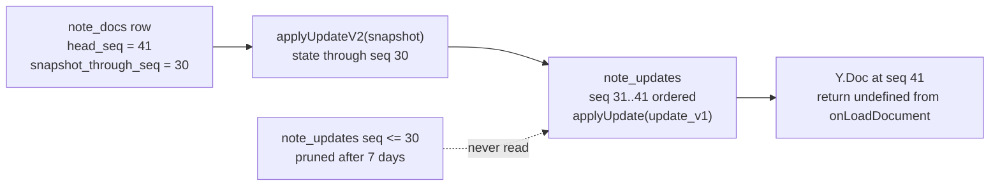
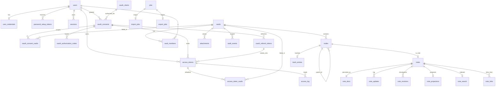

# Data model

This section is the definitive description of Iridium's MySQL schema: every table, column, key, index, generated column, foreign key and deletion rule; the three database roles and their grants; the tree model; the optimistic-concurrency contract; the Yjs storage model with its sequence/CAS invariants; revisions and their retention; the rebuildable projections; attachments, jobs, audit and access logs; the credential tables of the OAuth 2.1 authorization server; settings and metadata; the initial migration set and the migration policy; the entity-relationship diagram; the invariants and the tool that verifies each; and the growth formulas. Behaviour that lives above the schema (services, protocols, endpoints) is referenced by section, not repeated: the collaboration write path is in `05-collaboration-and-durability.md`, authorization in `04-auth-and-access-control.md`, the read model and MCP in `06-mcp-and-agent-access.md`, projections and import/export in `08-markdown-pipeline-import-export.md`, operations in `11-operations-and-deployment.md`.

## 1. Scope, engine and conventions

### 1.1 Engine and server configuration the schema depends on

Iridium supports **two** MySQL server lines, and both are required deployment targets: **MySQL 8.4 LTS** (`mysql:8.4.11`, premier support to 2029-04-30, extended to 2032-04-30) and **MySQL 9.7 LTS** (`mysql:9.7.2-oraclelinux9`, GA 2026-04-21, support to ~2034-04-21). InnoDB only, `utf8mb4`. 8.4.11 is the **compatibility floor** and the image that every unset selector resolves to — `IRIDIUM_MYSQL_IMAGE` in the test harness, `MYSQL_TAG` in `infra/.env` — because a portability defect must surface in the ordinary development loop rather than in a lane somebody has to go and read. 9.7.2 is the reference production image that `infra/compose.prod.yaml` and `docs/ops/deployment.md` ship. Neither line is primary; both are merge-blocking in `ci.yml` (`10-testing-and-quality.md`, CI lanes).

MySQL **8.0** is not a target: it reached end of life on 2026-04-30 (last release 8.0.46) and the server refuses to start against it. Neither are the 9.0–9.6 innovation releases (roughly three months of support each) nor the 26.x innovation line that the Docker `latest` tag points at.

**Assumption.** The project owner's requirement was stated as "MySQL 8". This plan reads that as **8.4 LTS**, because 8.0 is end of life and 8.4 is the only supported 8.x line. If 8.0 was meant literally that is a larger constraint — an end-of-life engine, a floor below `CREATE TRIGGER IF NOT EXISTS` (8.0.29+), and a `my.cnf` that would need a per-line variant because `default_authentication_plugin` exists on 8.0 and is removed on 8.4 — and it returns to the owner as a question rather than being assumed here.

**The MySQL dialect rule.** Every SQL statement Iridium executes must have identical semantics on **MySQL 8.4.11 and MySQL 9.7.2**. "Every statement" means: the DDL in `apps/server/migrations/**`, every query Kysely builds, every raw `sql` tagged template, `infra/docker/mysql/init/**`, the generated `docs/ops/db-grants.sql` and `docs/ops/access-log-partitions.sql`, and every client command line exported from `apps/server/src/ops/**`. The floor is **8.4.11**, not 8.0.13: a construct that requires 9.x is forbidden, and a construct that 8.4 merely deprecates is forbidden too, because a deprecation is a removal with a date on it. Nothing in Iridium is written against MySQL 8.0; 8.0 is end of life and the server refuses to start against it.

The rule is enforced by four mechanisms rather than by this paragraph: `db.dialect-floor.guard` (a committed denylist, `ci.yml › static`), the `db.version-floor.boot` refusal in the `db` plugin, the two-entry `ci.yml › integration` and `ci.yml › chaos-core` matrices, and `migrations.parity.integration`, which asserts that the schema the migrations produce on the two engines is **identical**, not merely legal on each.

The following `infra/docker/mysql/my.cnf` settings are prerequisites of the schema, not tuning: they must be in effect before migration `0001` runs because some are baked into index structures at creation time.

| Setting | Value | Why the schema depends on it |
|---|---|---|
| `character_set_server` / `collation_server` | `utf8mb4` / `utf8mb4_0900_ai_ci` | Default collation of every column that does not declare one |
| `innodb_ft_min_token_size` | `2` | Read at FULLTEXT index build time; two-letter tokens must be searchable (`ft_note_search`) |
| `innodb_ft_enable_stopword` | `OFF` | Stopword list is frozen into the FULLTEXT index at creation; documentation vaults are full of "stopwords" (`the`, `not`, `if`) that must match |
| `innodb_flush_log_at_trx_commit` | `1` | The `persisted` acknowledgement (see `05-collaboration-and-durability.md`) is only truthful if COMMIT means fsync; `/readyz` verifies this value |
| `sync_binlog` / `log_bin` / `binlog_expire_logs_seconds` | `1` / `ON` / `604800` | Point-in-time recovery for the documented backup set |
| `log_bin_trust_function_creators` | `ON` | Required, not a relaxation. With binary logging on — which the row above makes mandatory — MySQL refuses `CREATE TRIGGER` from any account without `SUPER` (ER_1419), and only `root` holds `SUPER` (§2). Migration `0028` and `iridium migrate ensure-guards` create the four audit-immutability triggers as `iridium_migrator`, so without this line the append-only guarantee could never be installed by the role that installs it. The blast radius is exactly those triggers: Iridium defines no stored functions and no procedures, and only `root` and `iridium_migrator` hold any privilege to create a stored program |
| `max_allowed_packet` | `256M` | `LONGBLOB` snapshots, `MEDIUMBLOB` update batches and JSON columns are bounded by this **on the server**. Client tools do not inherit it — this file is mounted into the MySQL container only, and the server/ops image ships no `my.cnf` and no `[client]` section — so `mysqldump`, `mysql` and `mysqlbinlog` each pass `--max-allowed-packet=1G` per invocation (`mysqldump`'s own default is 24 MB and the `mysql` client's is 16 MB, `--hex-blob` doubles a blob, and a single row can never be split across packets, so one 64 MB snapshot becomes a 128 MB `INSERT`; see `11-operations-and-deployment.md` §"Backup set") |
| `innodb_redo_log_capacity` | `2G` | Sustained blob inserts from the persistence writer |
| `sql_require_primary_key` | `ON` | Every table below declares a primary key; the setting makes a forgotten one a migration failure |
| `cte_max_recursion_depth` | `200` | Tree CTEs recurse to tree depth (≤ `TREE_MAX_DEPTH`, 64 — §6.5), never to node count; 200 leaves headroom for diagnostics |
| `max_connections` | `200` | `dbApp` 20 + `dbPersist` 4 + `dbMaint` 1, the CLI-only `dbBackup`, and operator sessions (§1.3) |
| *(version floor, not a `my.cnf` line)* | server is `8.4.x` (≥ 8.4.11) or `9.7.x` (≥ 9.7.2) | Checked at boot by the `db` plugin from `SELECT VERSION()`; anything else exits `2` with `config.mysql_unsupported` (`11-operations-and-deployment.md` OPS-62). Every DDL below is written to the 8.4.11 floor |

Authentication plugin is `caching_sha2_password` for all three roles on **both** lines. `mysql_native_password` was deprecated in 8.0.34, is disabled by default in 8.4 and is removed in 9.0 and later — so on 9.x it cannot be used at all, while on 8.4 a site could load the component back and create a role Iridium did not intend. The rule is therefore asserted rather than assumed: `infra/docker/mysql/init/01_roles.sh` creates each role `IDENTIFIED WITH caching_sha2_password` and then fails the container's initialisation if `SELECT COUNT(*) FROM mysql.user WHERE user IN ('iridium_app','iridium_migrator','iridium_backup') AND plugin <> 'caching_sha2_password'` is non-zero, and `db.auth-plugin.integration` re-asserts it on both images. mysql2 3.24.4 speaks `caching_sha2_password` on both.

### 1.2 Column and naming conventions

| Convention | Rule |
|---|---|
| Identifiers | UUIDv7 generated in the application (`@iridium/contracts/ids.ts`, branded per entity: `UserId`, `VaultId`, `NodeId`, `NoteId`, `AttachmentId`, `TokenId`, `JobId`, `SessionId`, `RevisionId` for the `BIGINT` revision rows), stored as `BINARY(16)`, rendered as canonical lowercase UUID strings on every REST/MCP/IPC surface. Time-ordered UUIDs keep clustered inserts local; the ASCII form is stable for `iridium://` URIs. |
| Timestamps | `DATETIME(6)` in UTC, always set by the application (`new Date()` → `YYYY-MM-DD HH:MM:SS.ffffff`); no column defaults of `CURRENT_TIMESTAMP`, so a row never carries a database clock that differs from the application's. |
| Optimistic concurrency | Every mutable metadata row carries `version INT UNSIGNED NOT NULL DEFAULT 1` (see §7). |
| Soft delete | `deleted_at DATETIME(6) NULL` plus a virtual generated `live TINYINT` column that is `1` for live rows and `NULL` for deleted rows, so a `UNIQUE` key that includes `live` constrains only live rows (MySQL treats `NULL`s as distinct in unique indexes). |
| Name collation | Columns that must be unique among siblings or globally as user-visible names (`nodes.name`, `vaults.name`, `attachments.path_hint`) use `COLLATE utf8mb4_0900_as_ci` (case-insensitive, accent-sensitive), mirroring Windows/macOS filesystems and Obsidian vaults so an export never produces two files that collide on disk. Everything else uses the server default `utf8mb4_0900_ai_ci`. |
| Opaque identifiers in credentials | `CHAR(16) CHARACTER SET ascii COLLATE ascii_bin` for public token ids embedded in credential strings; `CHAR(26)` ASCII for display prefixes. |
| Hashes | `BINARY(32)` (SHA-256 or HMAC-SHA-256). |
| Yjs binary | Snapshots `LONGBLOB`; update-log rows `MEDIUMBLOB` (single update ≤ 1 MiB, coalesced batch ≤ 1 MiB per row); state vectors `VARBINARY(4096)`. |
| JSON | `JSON` columns, parsed by mysql2 (`jsonStrings:false`); the application never stores note bodies in JSON. |
| Enumerations | MySQL `ENUM` with a closed vocabulary mirrored by a zod enum in `@iridium/contracts`; adding a value is an expand migration (`ALTER TABLE … MODIFY … ENUM(...)`, additive at the end of the list only). |
| Booleans | `TINYINT(1)`; mysql2 `typeCast` maps `TINYINT(1)` to boolean in `db/index.ts`. |
| Key names | `PRIMARY`, `uq_<table>_<cols>`, `ix_<table>_<cols>`, `ft_<table>`, `fk_<short>_<ref>`. |
| Foreign keys | Declared wherever the referenced row is never hard-deleted while the referencing row exists; `ON DELETE RESTRICT` (the MySQL default) everywhere; no `ON DELETE CASCADE` (see §1.4). |

### 1.3 Query layer and generated types

- Kysely 0.29.5 over mysql2 3.24.4. Four Kysely instances in `apps/server/src/db/index.ts` (`11-operations-and-deployment.md` OPS-12): `dbApp` (pool `connectionLimit 20`, `iridium_app`, REST/MCP/jobs/projections), `dbPersist` (pool `connectionLimit 4`, `iridium_app`, reserved for the persistence writer and the compactor so REST bursts cannot starve saves), `dbMaint` (pool 1, lazily created and only when `DATABASE_MIGRATE_URL` is configured, `iridium_migrator` — migrations, `access_log` partition DDL (§12.5), the audit archive (§12.4) and `migrate ensure-guards`) and the CLI-only `dbBackup` (pool 1, `iridium_backup` — `iridium backup`, `doctor --backup-role`). Pool options, identical on all four: `supportBigNumbers:true, bigNumberStrings:false, jsonStrings:false, decimalNumbers:false, enableKeepAlive:true, idleTimeout:60000, typeCast: tinyint1ToBoolean`. `ParseJSONResultsPlugin` and `CamelCasePlugin` are **not** used (mysql2 parses JSON; column names are snake_case end to end and the `Database` interface mirrors them).
- The mysql2 default client flag `FOUND_ROWS` is asserted at boot (`db/assertFoundRows.ts` runs `UPDATE schema_meta SET value = value WHERE \`key\` = 'iridium_version'` and expects `numUpdatedRows === 1n`); every compare-and-set in this section relies on "matched rows", not "changed rows".
- Serving pool acquisition and each SQL command on `dbApp` / `dbPersist` have the `DB_QUERY_TIMEOUT_MS` deadline (10 000 ms by default; operations env table is authoritative). A timed-out command destroys its physical connection before propagating the error, and pool occupancy drops with that connection. A late acquisition is released. Idle dedicated owner connections are not expired. A COMMIT timeout is an unknown outcome, resolved by committed replay and the persistence head-sequence checks; it is never itself evidence of rollback. Maintenance and backup connections are outside this deadline.
- `apps/server/src/db/schema.ts` is the hand-written `Database` interface; CI runs kysely-codegen 0.20.0 against the migrated schema and fails on any diff (`A3`). Type mapping: `BINARY(16)`/`BINARY(32)`/`VARBINARY`/`*BLOB` → `Buffer`; `DATETIME(6)` → `Date`; `BIGINT UNSIGNED` → `number` (all sequence counters stay far below 2^53; the boot assertion `supportBigNumbers && !bigNumberStrings` guarantees numbers, never strings); `JSON` → the typed shape declared per column in `schema.ts`; `TINYINT(1)` → `boolean`; `ENUM` → string-literal union imported from `@iridium/contracts`. Every sequence counter (`note_docs.head_seq`, `snapshot_through_seq`, `projected_seq`, `note_updates.seq`, `note_revisions.seq`, `note_projections.revision`) is therefore a JS `number` end to end — `Seq` in `packages/contracts/src/collab.ts` is `z.number().int().nonnegative()`, asserted in `contracts/ids.unit.test.ts`, so nothing converts at the wire boundary — and Kysely's own `numUpdatedRows` is the **only** `bigint` anywhere in the persistence path. `guards.seq-is-number.guard.spec.ts` fails on any `BigInt(`, `bigint` annotation or numeric `…n` literal under `apps/server/src/collab/**`, `apps/server/src/notes/**` and `apps/server/src/db/schema.ts` except in a comparison against `numUpdatedRows`: mixing the two representations is a runtime `TypeError` (`number + bigint`) inside the one write path that produces the durable acknowledgement, so it is a data-loss-adjacent invariant rather than a style rule.
- Raw `sql` templates are used only where Kysely has no builder: FULLTEXT `MATCH … AGAINST`, recursive CTEs, `GET_LOCK`, generated columns, functional/multi-valued indexes, triggers, partitions, grants.

Serving ownership is a durable transaction precondition. A request captures its owner's immutable generation before asynchronous authentication; a loaded document captures one for its complete lifetime. Every serving REST mutation, persistence transaction and owner-executed authorization command takes `SELECT generation FROM collab_owner_fence WHERE id=1 FOR SHARE` as its **first transaction statement**, compares that generation with the captured and currently held local generation, and holds the shared lock through COMMIT. A successor takes the exclusive row lock and commits a new random generation before advertising ownership. The lock order is owner-generation row → operation-specific parent/mutex rows → child rows → final audit head/event. A process that lost the lease cannot reuse an old request or document under a newly acquired generation (§13.6; D10-33). Independent offline CLI operations acquire the same owner lease when they can affect existing live authorization or documents; creation of a new principal has no live connection to invalidate.

### 1.4 Foreign keys and deletion policy

All foreign keys are `ON DELETE RESTRICT`. Nothing in Iridium is deleted implicitly by the database; every hard delete is an explicit, ordered, audited statement sequence so that the audit row, the collaboration side effects and the search/link projections are all handled by the same service. The four hard-delete paths and their order are:

| Path | Trigger | Order of `DELETE` statements (children first) |
|---|---|---|
| Note purge | trash expiry (`trash_purge` job) or `DELETE /nodes/:id?purge=true` | `note_links` (`from_note_id`) → `note_search` → `note_projection_terms` → `note_projections` → `note_revisions` → `note_updates` → `note_docs` → `notes` → `trash_entries` → `nodes`; then `UPDATE note_links SET resolved_node_id = NULL, status = 'broken' WHERE vault_id = ? AND resolved_node_id = ?` for links from other notes |
| Category purge | same | descendants ordered by depth descending (deepest first), each note as above, each category `trash_entries` → `nodes` |
| Aborted-import vault | `POST /imports/:jobId/abort` (the import's requester, `09-api-reference.md` §2.12) on a vault still in `status='importing'`, or `transfer_cleanup` when `import_jobs.expires_at` passes | vault status → `deleting`; every node as above; `attachments` rows of the vault; `vault_members`; `access_token_vaults`; `oauth_consent_vaults`; `vaults` |
| Short-lived credential housekeeping | `session_ticket_sweep` job | `sessions` rows past `absolute_expires_at` or `revoked_at` by more than `SESSION_ROW_RETENTION_DAYS` (30); `password_setup_tokens` consumed or expired by more than 30 days; the three OAuth rows of §4A's retention table — `oauth_authorization_codes` 24 h past `expires_at`, `oauth_refresh_tokens` 30 days past the later of `absolute_expires_at` and `revoked_at`, and never-used dynamically registered `oauth_clients` after `OAUTH_UNUSED_CLIENT_TTL_DAYS` (7) |

Users are never hard-deleted (`admin.user.deleted` anonymises: `status='deleted'`, `email` replaced by `deleted+<id>@invalid`, `display_name` replaced, credentials and sessions removed, tokens revoked; audit rows keep the id). Vaults that reached `active` are never hard-deleted in the MVP (archive is soft). `access_tokens` rows are never deleted (`A31`), and neither are `oauth_consents` or `oauth_consent_vaults` rows: a revoked consent is the record of what a user once granted a connector (§4A). Attachment blobs are deleted only by explicit attachment deletion or the confirmed unreferenced-attachment purge (`A44`). `desktop_releases` rows are never deleted either: unpublishing a release stamps `withdrawn_at`/`withdrawn_by` and regenerates the update feed without it (§13.3).

Tables that deliberately carry **no** foreign key, and why:

| Table / column | Reason |
|---|---|
| `access_log` (all columns) | Partitioned InnoDB tables do not support foreign keys; rows must also survive anything the referenced rows do |
| `session_revocation_commands` (user, actor and result session ids) | Durable operator request and outcome evidence survives session housekeeping and user anonymisation; referenced ids are attribution, not ownership constraints (§13.5) |
| `audit_events`, `audit_events_archive` (all columns) | Append-only evidence; must never block or be blocked by any other row's lifecycle; users are anonymised, not deleted, so `actor_id` stays meaningful |
| `note_links.resolved_node_id`, `resolved_attachment_id` | Targets may be trashed (row kept, link still displayed as "in trash") or purged (reference nulled and `status='broken'` in the purge transaction) |
| `jobs.vault_id`, `jobs.requested_by`, `import_jobs.target_vault_id`, `export_jobs.vault_id` | A job record outlives an aborted-import vault and is itself part of the operational record |
| `vaults.root_node_id` | Circular with `nodes.vault_id`; enforced as an application invariant (`iridium doctor` check I-05) |
| `password_setup_tokens.issued_by`, `access_tokens.revoked_by`, `nodes.created_by/updated_by`, `vault_members.granted_by`, `attachments.uploaded_by`, `vaults.created_by`, `server_settings.updated_by`, `desktop_releases.published_by`, `trash_entries.deleted_by`, `note_updates.actor_id/session_id`, `note_revisions.actor_id`, `access_tokens.created_from_session_id`, `access_tokens.rotated_from_id`, `access_tokens.refresh_id`, `oauth_clients.created_by_user_id/disabled_by`, `oauth_consents.granted_session_id/revoked_by`, `oauth_authorization_codes.session_id`, `oauth_refresh_tokens.rotated_from_id` | Attribution columns: sessions are swept, users are anonymised in place; a constraint here would either block housekeeping or require nulling attribution, which is worse for the audit trail. `oauth_authorization_codes.session_id` is the same shape for a different reason — it is re-checked live at code exchange, and a swept session must make the exchange fail rather than make the sweep fail (§4A) |

## 2. Database roles and grants

Three MySQL accounts are created by `infra/docker/mysql/init/01_roles.sh` (executed once by the image entrypoint from `/docker-entrypoint-initdb.d`, passwords read from the `*_FILE` secrets) and documented verbatim in `docs/ops/deployment.md` for DBAs who provision MySQL themselves. The file is a shell script rather than a plain `.sql` for two reasons that are both load-bearing: only a script can read a secret out of a `*_FILE` path instead of embedding it, and only a script can fail the container's initialisation on the authentication-plugin assertion of §1.1. The application never holds a credential that can alter schema or audit history.

```sql
-- the statements infra/docker/mysql/init/01_roles.sh pipes into mysql (passwords read from the *_FILE secrets)
CREATE DATABASE IF NOT EXISTS iridium CHARACTER SET utf8mb4 COLLATE utf8mb4_0900_ai_ci;

CREATE USER IF NOT EXISTS 'iridium_app'@'%'      IDENTIFIED WITH caching_sha2_password BY '${IRIDIUM_DB_APP_PASSWORD}';
CREATE USER IF NOT EXISTS 'iridium_migrator'@'%' IDENTIFIED WITH caching_sha2_password BY '${IRIDIUM_DB_MIGRATOR_PASSWORD}';
CREATE USER IF NOT EXISTS 'iridium_backup'@'%'   IDENTIFIED WITH caching_sha2_password BY '${IRIDIUM_DB_BACKUP_PASSWORD}';

-- migrator: schema owner inside the iridium schema only; can grant subsets of its own privileges to iridium_app
GRANT SELECT, INSERT, UPDATE, DELETE, CREATE, DROP, ALTER, INDEX, REFERENCES, TRIGGER,
      CREATE VIEW, SHOW VIEW, CREATE TEMPORARY TABLES, LOCK TABLES, EVENT
  ON iridium.* TO 'iridium_migrator'@'%' WITH GRANT OPTION;

-- backup: read everything, take consistent dumps, stream closed binary logs
GRANT SELECT, LOCK TABLES, SHOW VIEW, TRIGGER, EVENT ON iridium.* TO 'iridium_backup'@'%';
GRANT RELOAD, PROCESS, REPLICATION CLIENT, REPLICATION SLAVE, BACKUP_ADMIN, SHOW_ROUTINE
  ON *.* TO 'iridium_backup'@'%';

-- iridium_app receives table-level grants from migration 0034_grants (tables must exist first)
```

The backup role holds three privileges beyond `A8`'s list (`SELECT, LOCK TABLES, RELOAD, PROCESS, REPLICATION CLIENT, SHOW VIEW, TRIGGER, EVENT`), each demanded by one flag of the dump command `iridium backup` actually runs (`11-operations-and-deployment.md` OPS-26): `REPLICATION SLAVE` is what lets `mysqlbinlog --read-from-remote-server` stream the closed binary logs of the point-in-time-recovery set (`RELOAD` only covers the `FLUSH BINARY LOGS` that closes them); `BACKUP_ADMIN` is required because `--single-transaction` combined with `--source-data` takes an instance backup lock (`LOCK INSTANCE FOR BACKUP`) on MySQL 8.0.21 and later, which is true on both required lines, 8.4.11 and 9.7.2; and `SHOW_ROUTINE` is what `--routines` needs from a role that deliberately has no global `SELECT`. The shipped command is therefore the specification of this grant set, which is why verification (e) below executes that exact command string rather than a shorter hand-written one (decision D03-21).

Table-level grants for `iridium_app` are applied by migration `0034_grants` (and by a companion `NNNN_<table>_grants` migration for every table created later), because MySQL cannot restrict a database-level grant per table and grants on non-existent tables require `CREATE`. A missing `GRANT OPTION` or role account records a skipped grant application; the migration may still be recorded as applied. Forward migration `0054_grants_provenance` reapplies the current matrix for tables already installed at its migration boundary and records each table in `schema_meta` under `acl.<table>` with `{applied, skipped?, fingerprint}`. The fingerprint binds the evidence to the canonical table grant. Unknown, stale or skipped evidence is a readiness warning, never proof that privileges exist. A rolled-back serving-role probe of the critical audit, revocation-command and owner-fence privileges takes precedence and fails readiness when a privilege is missing. The DBA applies `docs/ops/db-grants.sql`; restored privileges recover a failure to the honest warning when historical skip metadata remains. Earlier migration files and history are not rewritten. The shared grant executor intersects the requested matrix with installed base tables before applying grants or recording provenance; future tables receive no premature success record. Migration `0034` retains its original table scope, and each later table has its own companion grant migration.

**One rendered source.** The matrix below is not written twice. `apps/server/src/db/grants.ts` exports `GRANT_MATRIX` (table → role → privilege list); `0034_grants`, every later `NNNN_<table>_grants` and `iridium migrate ensure-guards` execute it, and `pnpm gen` renders both `docs/ops/db-grants.sql` and the committed fixture `apps/server/test/fixtures/db-grants.snapshot.sql` that `db-grants.integration` compares against `SHOW GRANTS`. `pnpm gen && git diff --exit-code` (the `gen-drift` step of the `static` CI job) therefore fails on any drift between the code, the DBA script, the fixture and this table. `11-operations-and-deployment.md` prints the `iridium_app` column of the same matrix; the migrator and backup columns here are the schema-wide grants of `01_roles.sql` above.

| Table(s) | `iridium_app` | `iridium_migrator` | `iridium_backup` |
|---|---|---|---|
| `users`, `user_credentials`, `password_setup_tokens`, `sessions`, `login_throttle`, `access_tokens`, `access_token_vaults`, `oauth_clients`, `oauth_consents`, `oauth_consent_vaults`, `oauth_authorization_codes`, `oauth_refresh_tokens`, `vaults`, `vault_members`, `nodes`, `trash_entries`, `notes`, `note_docs`, `note_projections`, `note_projection_terms`, `note_search`, `note_links`, `attachments`, `jobs`, `import_jobs`, `export_jobs`, `server_settings`, `schema_meta`, `desktop_releases` | `SELECT, INSERT, UPDATE, DELETE` | all (schema owner) | `SELECT, LOCK TABLES, TRIGGER, SHOW VIEW` |
| `session_revocation_commands` | `SELECT, INSERT, UPDATE (result, delivered_at)`; request fields are immutable and completed command evidence is retained in M1 | all | `SELECT, LOCK TABLES, TRIGGER, SHOW VIEW` |
| `collab_owner_fence` | `SELECT, UPDATE (generation)`; the application cannot insert or delete the singleton | all | `SELECT, LOCK TABLES, TRIGGER, SHOW VIEW` |
| `note_updates` | `SELECT, INSERT, DELETE` — no `UPDATE`: the log is append-only and rows leave only through `update_log_prune` (§8.4) | all | `SELECT, LOCK TABLES, TRIGGER, SHOW VIEW` |
| `note_revisions` | `SELECT, INSERT, DELETE, UPDATE (id)` — a column-scoped grant (`GRANT SELECT, INSERT, DELETE, UPDATE (id) ON iridium.note_revisions TO 'iridium_app'@'%'`). `DELETE` is the thinning job; `UPDATE (id)` is exactly what keeps the idempotent checkpoint insert (`INSERT … ON DUPLICATE KEY UPDATE id = id`, §8.7) working while leaving `markdown`, `snapshot`, `content_hash`, `size_chars`, `kind`, `seq`, `label` and `actor_id` physically unwritable by the application role | all | `SELECT, LOCK TABLES, TRIGGER, SHOW VIEW` |
| `audit_chain_heads` | `SELECT, INSERT, UPDATE` — no `DELETE`: deleting a head and re-inserting a genesis row would restart a chain that `verify-chain` would then accept (§12.2) | all | `SELECT, LOCK TABLES, TRIGGER, SHOW VIEW` |
| `audit_events`, `audit_events_archive` | `SELECT, INSERT` | all; `DELETE` on `audit_events` is additionally gated by the trigger in §12.2 | `SELECT, LOCK TABLES, TRIGGER` |
| `access_log` | `SELECT, INSERT` — no `UPDATE`/`DELETE` (rows leave only by partition drop) and no DDL; monthly partition maintenance runs under the migrator role (§12.5) | all | `SELECT, LOCK TABLES` |
| `kysely_migration`, `kysely_migration_lock` | `SELECT` (so `/readyz` can compare applied migrations with the bundled list) | all | `SELECT, LOCK TABLES` |

No account other than `root` holds `SUPER`, `FILE`, `CREATE USER`, `SYSTEM_VARIABLES_ADMIN` or any global DDL privilege. `iridium_app` therefore physically cannot `UPDATE`/`DELETE` audit rows, delete an `audit_chain_heads` row, rewrite a committed `note_updates` row, rewrite any column of a `note_revisions` row except re-assigning `id` to itself, execute any DDL, drop the tamper triggers, change server variables or read files. Each of those is a privilege the application has no code path for, which is why removing it costs nothing and closes the corresponding tamper route (`T10`).

Verification: `apps/server/test/integration/db-grants.integration.test.ts` connects as each role and asserts (a) `iridium_app` gets `ER_TABLEACCESS_DENIED_ERROR` on `UPDATE audit_events`, `DELETE FROM audit_events`, `CREATE TABLE`, `DROP TRIGGER`, (b) the `BEFORE UPDATE` trigger fires for `iridium_migrator` (`SQLSTATE 45000`), (c) `iridium_app` gets `ER_TABLEACCESS_DENIED_ERROR` on `ALTER TABLE access_log REORGANIZE PARTITION` and on `ALTER TABLE audit_events`, while `iridium_migrator` can reorganize and drop `access_log` partitions, (d) `iridium_app`'s effective per-table privileges, read from `information_schema.TABLE_PRIVILEGES` **and** `information_schema.COLUMN_PRIVILEGES`, equal the `iridium_app` column above for every table in `information_schema.TABLES WHERE TABLE_SCHEMA='iridium'` — the second view is required because a column-scoped grant such as `note_revisions.UPDATE (id)` does not appear in the first, and a table present with no matching grant fails the test, (d2) the **schema-level** grants of `iridium_migrator` and `iridium_backup` are compared as `SHOW GRANTS FOR '<role>'@'%'` against the committed `db-grants.snapshot.sql` fixture, because a grant issued `ON iridium.*` (or `ON *.*`) produces no `TABLE_PRIVILEGES` rows at all and an `information_schema`-only check would report both roles as holding no privileges whatsoever, and (e) `iridium_backup` can run the **exact** dump command the ops code ships — one exported constant (`MYSQLDUMP_ARGV` in `apps/server/src/db/grants.ts`) is executed against the fixture database, so a flag added later (`--routines`, `--events`, `--source-data=2`, …) cannot outrun the role's grants and first fail in a drill. It also asserts the four narrowed rows in both directions, so an over-tightened grant fails the test rather than production:

| Statement as `iridium_app` | Expected |
|---|---|
| `DELETE FROM audit_chain_heads WHERE chain_id = ?` | `ER_TABLEACCESS_DENIED_ERROR` (1142) |
| `UPDATE note_updates SET update_v1 = ? WHERE note_id = ? AND seq = ?` | `ER_TABLEACCESS_DENIED_ERROR` (1142) |
| `UPDATE note_revisions SET markdown = ? WHERE id = ?` | `ER_COLUMNACCESS_DENIED_ERROR` (1143) |
| `UPDATE access_log SET status = ?` / `DELETE FROM access_log` | `ER_TABLEACCESS_DENIED_ERROR` (1142) |
| `INSERT INTO note_revisions (…) VALUES (…) ON DUPLICATE KEY UPDATE id = id` on an existing `(note_id, seq, kind)` | succeeds, affects 0 rows |
| `UPDATE audit_chain_heads SET last_id = ?, last_hash = ? WHERE chain_id = ?` | succeeds |
| `DELETE FROM note_updates WHERE note_id = ? AND seq <= ?` (prune) and `DELETE FROM note_revisions WHERE id = ?` (thinning) | succeed |

`iridium doctor --db-roles` (the flag name is fixed by the CLI inventory of `11-operations-and-deployment.md`, which `cli.contract.spec.ts` compares against the generated command list) performs the same checks in production: both `information_schema` views for `iridium_app`'s per-table rights, and `SHOW GRANTS FOR` each of the three roles against the committed fixture for the schema-level and global ones. `iridium doctor --backup-role` runs the same `MYSQLDUMP_ARGV` probe as verification (e), so "the role holds exactly the grants in the matrix" and "the shipped dump command works" are one assertion rather than two that can disagree.

## 3. Identity and authentication

```sql
CREATE TABLE users (
  id               BINARY(16)   NOT NULL PRIMARY KEY,
  email            VARCHAR(320) NOT NULL,
  email_key        VARCHAR(320) GENERATED ALWAYS AS (LOWER(email)) STORED,
  display_name     VARCHAR(120) NOT NULL,
  is_server_admin  TINYINT(1)   NOT NULL DEFAULT 0,
  status           ENUM('active','disabled','deleted') NOT NULL DEFAULT 'active',
  color_hue        SMALLINT UNSIGNED NOT NULL,                 -- presence colour, golden-angle sequence at creation
  authz_version    INT UNSIGNED NOT NULL DEFAULT 1,            -- bumped on disable, password change/set, any membership change, admin session revoke
  version          INT UNSIGNED NOT NULL DEFAULT 1,
  created_at       DATETIME(6)  NOT NULL,
  updated_at       DATETIME(6)  NOT NULL,
  last_login_at    DATETIME(6)  NULL,
  UNIQUE KEY uq_users_email_key (email_key)
);

CREATE TABLE user_credentials (                               -- absent until the user sets a password via a setup link
  user_id             BINARY(16)   NOT NULL PRIMARY KEY,
  password_hash       VARCHAR(255) NOT NULL,                  -- argon2id PHC string
  pepper_version      TINYINT UNSIGNED NOT NULL,
  password_changed_at DATETIME(6)  NOT NULL,
  CONSTRAINT fk_cred_user FOREIGN KEY (user_id) REFERENCES users(id)
);

CREATE TABLE password_setup_tokens (                          -- one-time set-password links (irid_spl_…)
  id            BINARY(16)  NOT NULL PRIMARY KEY,
  token_id      CHAR(16) CHARACTER SET ascii COLLATE ascii_bin NOT NULL,
  secret_hash   BINARY(32)  NOT NULL,
  user_id       BINARY(16)  NOT NULL,
  purpose       ENUM('initial','reset') NOT NULL,
  issued_by     BINARY(16)  NOT NULL,                         -- admin user
  expires_at    DATETIME(6) NOT NULL,                         -- issued_at + 24 h
  consumed_at   DATETIME(6) NULL,
  created_at    DATETIME(6) NOT NULL,
  UNIQUE KEY uq_spl_token_id (token_id),
  KEY ix_spl_user (user_id, consumed_at),
  CONSTRAINT fk_spl_user FOREIGN KEY (user_id) REFERENCES users(id)
);

CREATE TABLE sessions (
  id                    BINARY(16)  NOT NULL PRIMARY KEY,
  token_id              CHAR(16) CHARACTER SET ascii COLLATE ascii_bin NOT NULL,   -- public id embedded in irid_ses_…
  secret_hash           BINARY(32)  NOT NULL,                 -- SHA-256(secret); the secret is never stored
  user_id               BINARY(16)  NOT NULL,
  kind                  ENUM('web','desktop') NOT NULL,
  created_at            DATETIME(6) NOT NULL,
  last_seen_at          DATETIME(6) NOT NULL,                 -- written at most once per 60 s
  idle_expires_at       DATETIME(6) NOT NULL,
  absolute_expires_at   DATETIME(6) NOT NULL,
  last_authenticated_at DATETIME(6) NOT NULL,                 -- step-up window
  mfa_verified_at       DATETIME(6) NULL,                     -- reserved (MFA post-MVP)
  ip                    VARBINARY(16) NULL,
  user_agent            VARCHAR(255) NULL,
  client_name           VARCHAR(64)  NULL,                    -- 'web' | 'desktop'
  device_name           VARCHAR(120) NULL,
  client_version        VARCHAR(32)  NULL,
  revoked_at            DATETIME(6) NULL,
  revoked_reason        ENUM('logout','admin','password_change','user_disabled','expired','replaced') NULL,
  UNIQUE KEY uq_sessions_token_id (token_id),
  KEY ix_sessions_user (user_id, revoked_at),
  KEY ix_sessions_absolute (absolute_expires_at),
  CONSTRAINT fk_sessions_user FOREIGN KEY (user_id) REFERENCES users(id)
);

CREATE TABLE login_throttle (                                 -- rate-limiter-flexible RateLimiterMySQL store
  `key`   VARCHAR(191) NOT NULL PRIMARY KEY,
  points  INT NOT NULL,
  expire  BIGINT UNSIGNED NULL
);
```

Column and lifecycle notes:

| Item | Detail |
|---|---|
| `users.email_key` | Stored generated column; the unique key is on it, not on `email`, so the display form keeps the user's casing while uniqueness is case-insensitive regardless of collation choices. |
| `users.color_hue` | `(ordinal × 137.508) mod 360` where `ordinal` is the count of existing users at creation; clients derive presence colours from this value via the `participants` message, never from awareness. |
| `users.authz_version` | Part of the collaboration connection's authz epoch tuple `{userAuthzVersion, memberVersion}` (`A23`); bumped inside the same transaction as the change that invalidates open sessions. |
| `users.status='deleted'` | Anonymised in place (see §1.4); the row and its id remain so audit rows and `created_by`/`updated_by` attribution stay resolvable. |
| `user_credentials` | Absent until the first `POST /auth/set-password`; `pepper_version` selects the pepper for verification; transparent re-hash on login rewrites `password_hash` and `pepper_version` when either the argon2 parameters or the pepper version drift (`A29`). |
| `password_setup_tokens` | Credential string `irid_spl_<token_id>_<secret><crc>`; lookup by `token_id`, then `timingSafeEqual(secret_hash, SHA-256(secret))`; `consumed_at` set in the same transaction that inserts/updates `user_credentials`; `ix_spl_user` lets the admin UI show whether an outstanding link exists. Issuing a new link expires every outstanding link for that user across both purposes by setting `expires_at = now`; `consumed_at` means actually used. Issuance runs at `READ COMMITTED` and locks the parent `users` primary-key row before token rows, so concurrent issuers leave only one valid link (04-auth-and-access-control.md §3.3). |
| `sessions` | One row per login; secret never stored; `kind` selects the delivery channel (cookie vs desktop bearer, `A26`). `last_seen_at` is written at most once per 60 s to bound write amplification. `DELETE /auth/sessions/current` deletes the row; other revocation paths set `revoked_at` + `revoked_reason` so the admin sessions view and the audit trail can show what happened. `ix_sessions_absolute` drives the sweep. |
| `login_throttle` | Pre-created by migration `0005` (the app role has no DDL, so `RateLimiterMySQL` runs with `tableCreated:true`, `tableName:'login_throttle'`); keys are `login:<email_key>\|<ip>` and `login-ip:<ip>` hashed to ≤ 191 bytes by the limiter wrapper. |

Collaboration tickets (`irid_tkt_…`) are **not** persisted: `TicketStore` is an in-process `Map<tokenId, {secretHash, sessionId, userId, expiresAt}>` with a 60 s TTL and single use, behind an interface (Redis implementation later). A restart invalidates outstanding tickets; providers fetch new ones (`A24`).

## 4. Integration tokens

```sql
CREATE TABLE access_tokens (
  id                      BINARY(16)  NOT NULL PRIMARY KEY,
  token_id                CHAR(16) CHARACTER SET ascii COLLATE ascii_bin NOT NULL,   -- public lookup id inside irid_pat_…
  secret_hash             BINARY(32)  NOT NULL,               -- SHA-256(secret)
  user_id                 BINARY(16)  NOT NULL,
  kind                    ENUM('pat','oauth','scim') NOT NULL DEFAULT 'pat',        -- 'pat' and 'oauth' are issued; 'scim' is reserved
  name                    VARCHAR(120) NOT NULL,
  display_prefix          CHAR(26)    NOT NULL,               -- 'irid_pat_<token_id>_' or 'irid_oat_<token_id>_' shown in lists
  scopes                  JSON        NOT NULL,               -- ["vault:read","note:read","search:read","history:read","attachment:read","export:read"]
  all_vaults              TINYINT(1)  NOT NULL DEFAULT 0,     -- 1 = every vault the owner is an explicit member of at call time; never for server admins
  admin_owned             TINYINT(1)  NOT NULL DEFAULT 0,     -- owner was a server admin at creation (audited)
  expires_at              DATETIME(6) NOT NULL,
  last_used_at            DATETIME(6) NULL,                   -- async, ≤ every 10 min
  last_used_ip            VARBINARY(16) NULL,
  last_client             VARCHAR(120) NULL,                  -- MCP clientInfo.name/version or User-Agent (informational)
  rate_limit_per_hour     INT UNSIGNED NULL,                  -- NULL = server default
  created_at              DATETIME(6) NOT NULL,
  created_from_session_id BINARY(16)  NULL,
  created_ip              VARBINARY(16) NULL,
  created_user_agent      VARCHAR(255) NULL,
  rotated_from_id         BINARY(16)  NULL,
  rotation_overlap_until  DATETIME(6) NULL,                   -- old token accepted until this instant after rotation
  client_id               BINARY(16)  NULL,                   -- oauth_clients.id;  NULL for kind='pat'
  consent_id              BINARY(16)  NULL,                   -- oauth_consents.id; NULL for kind='pat'
  refresh_id              BINARY(16)  NULL,                   -- the oauth_refresh_tokens row that minted this token; no FK, see below
  resource                VARCHAR(255) NULL,                  -- RFC 8707 audience; NULL for kind='pat'
  revoked_at              DATETIME(6) NULL,
  revoked_by              BINARY(16)  NULL,
  revoke_reason           VARCHAR(120) NULL,
  version                 INT UNSIGNED NOT NULL DEFAULT 1,
  UNIQUE KEY uq_tokens_token_id (token_id),
  KEY ix_tokens_user (user_id, revoked_at, expires_at),
  KEY ix_tokens_expires (expires_at),
  KEY ix_tokens_consent (consent_id, revoked_at),
  KEY ix_tokens_client (client_id, revoked_at),
  CONSTRAINT fk_tokens_user           FOREIGN KEY (user_id)    REFERENCES users(id),
  CONSTRAINT fk_tokens_oauth_client   FOREIGN KEY (client_id)  REFERENCES oauth_clients(id),
  CONSTRAINT fk_tokens_oauth_consent  FOREIGN KEY (consent_id) REFERENCES oauth_consents(id)
);

CREATE TABLE access_token_vaults (                            -- explicit allowlist when all_vaults = 0
  token_id  BINARY(16) NOT NULL,
  vault_id  BINARY(16) NOT NULL,
  PRIMARY KEY (token_id, vault_id),
  KEY ix_atv_vault (vault_id),
  CONSTRAINT fk_atv_token FOREIGN KEY (token_id) REFERENCES access_tokens(id),
  CONSTRAINT fk_atv_vault FOREIGN KEY (vault_id) REFERENCES vaults(id)
);
```

The block above is the **resulting** shape of the table. `access_tokens` is created by migration `0008`, long before the OAuth tables exist; the four OAuth columns and their two foreign keys arrive by `0046_access_tokens_oauth_columns` and the two indexes by `0047_access_tokens_oauth_indexes` (§14.1), because a foreign key cannot be declared against a table that has not been created yet.

`refresh_id` deliberately carries **no** foreign key, and the reason is a real conflict rather than an oversight: token rows are never deleted (`A31`) while `oauth_refresh_tokens` rows are swept 30 days after the family expires (§4A), so a `RESTRICT` constraint here would make that sweep a dead letter — every refresh row would be pinned forever by the access tokens it minted. It is a provenance column of exactly the same kind as `rotated_from_id`, which has carried no foreign key since `0008` for the same reason, and it is listed with the other attribution columns in §1.4. A swept refresh row leaves `refresh_id` pointing at nothing, which is harmless: by then the family is long expired and the only reader — the reuse-detection sweep — works forward from a live refresh row, never backward from an access token.

Semantics that the schema encodes (the verifier and lifecycle live in `04-auth-and-access-control.md`):

- **Lookup path**: `irid_pat_<token_id>_<secret43><crc6>` (or `irid_oat_…` for an OAuth access token) → CRC check offline → `SELECT … FROM access_tokens WHERE token_id = ?` (unique index, O(1)) → `timingSafeEqual(secret_hash, SHA-256(secret))` → `revoked_at IS NULL` (or `rotation_overlap_until > now` for a rotated-out token) → `expires_at > now` → owner `status='active'` → memberships. Every MCP call performs this fresh; there is no principal cache in the MVP (`A23`). One verification path serves both kinds: the OAuth additions are two primary-key `LEFT JOIN`s on the same statement, not a second round trip.
- **`kind`** is live in two of its three values. `pat` is an integration token a user created in Settings › Integrations; `oauth` is an access token the authorization server of §4A minted for a connector. `scim` is reserved and never issued. The token format is the same family — `irid_pat_…` and `irid_oat_…` — so `tokens.format.unit` and the published leak-scanner regex cover both.
- **`resource`** is `NULL` for a PAT and the RFC 8707 canonical URI of the mount the token was issued for (`<PUBLIC_ORIGIN>/mcp/connect`) for an OAuth token. It is compared against the route's own canonical URI at verification: a token presented at a mount it was not issued for is `401 invalid_token`, which is the audience check the MCP specification requires of a resource server and the reason the column is a plain `VARCHAR` comparison rather than a parsed claim.
- **`consent_id` and `client_id`** are what a consent revocation and a client disable sweep on: revoking `oauth_consents.id = X` revokes every `access_tokens` row with `consent_id = X` in the same transaction, and disabling or deleting an `oauth_clients` row does the same through `client_id`. **`refresh_id`** is what a refresh-family revocation sweeps on when reuse of a rotated refresh token is detected (§4A). `ix_tokens_consent (consent_id, revoked_at)` and `ix_tokens_client (client_id, revoked_at)` exist for exactly those three sweeps and for nothing else; without them each is a full scan of a table whose rows are never deleted.
- **`name` uniqueness among the owner's live tokens applies to `kind='pat'` rows only.** An OAuth row's `name` is the client's `client_name`, is not unique, and never produces the `409 name_conflict` that a duplicate PAT name produces — two connectors from the same vendor are two legitimate rows. `display_prefix` for an OAuth access token is `irid_oat_<token_id>_`, the same `CHAR(26)`.
- **`expires_at` stays `NOT NULL`** for an OAuth row and is `now + oauth_policy.accessTokenTtlMinutes` (§13.1, default 60 minutes); the "never expires" sentinel is never used for an OAuth token. `rate_limit_per_hour` is `NULL`, resolving to `oauth_policy.defaultRateLimitPerHour`, and the existing `PATCH /admin/tokens/:tokenId` route changes it for a single OAuth token exactly as for a PAT. `admin_owned` and `all_vaults` obey the PAT rules, except that `all_vaults` is refused for a server administrator at the consent step rather than at token creation, with `all_vaults_admin_forbidden`.
- **`scopes`** is a JSON array of permission strings validated against `@iridium/contracts/authz.ts`; the MVP issues exactly the six read permissions. Reserved write scopes are schema-valid but never granted or listed.
- **Vault scope** is either the explicit `access_token_vaults` allowlist (each id must be a vault the owner is an explicit member of at creation and is re-checked at use) or `all_vaults=1`, which resolves to "every vault the owner is an explicit member of at call time". `all_vaults` is refused for server admins; `admin_owned=1` records that the owner was an admin when the token was created (audited as `token.created {admin_owned:true}`); token principals never inherit admin-implied access.
- **Rotation**: `POST /me/tokens/:id/rotate` inserts a new row with `rotated_from_id` = the old id and sets the old row's `revoked_at` (immediately) or `rotation_overlap_until` (when an overlap ≤ `pat_policy.rotationOverlapMaxHours` was requested — the grouped form of the skeleton's `pat_rotation_overlap_max_hours`, §13.1); the old row is never deleted, so the chain of rotations is queryable.
- **`last_used_*`** are written by the `last_used_flush` job from an in-memory map at most every 10 minutes per token; they are informational and never part of authorization.
- **Rows are never deleted**, for OAuth access tokens exactly as for PATs; `ix_tokens_user (user_id, revoked_at, expires_at)` serves the settings list ("active" = `revoked_at IS NULL AND expires_at > now`), `ix_tokens_expires` the expiry sweep that audits `token.revoked {reason:'expired'}` without touching the row's `revoked_at` (expiry is derived, not written). Keeping the OAuth rows is what keeps every `access_log` row resolvable to the credential that made the call, even after an hour-long access token has expired and the connector has refreshed twice.

## 4A. The OAuth 2.1 authorization server

Iridium ships its own OAuth 2.1 authorization server so that claude.ai and Claude Desktop custom connectors work natively, alongside integration tokens rather than instead of them (`06-mcp-and-agent-access.md` carries the protocol, the endpoints, the consent flow and the two MCP mounts; this section carries only the tables). It is placed here, immediately after §4, because it is the same credential family: an OAuth access token **is** an `access_tokens` row with `kind='oauth'`, verified by the same statement and resolved to the same principal, and the four tables and one join table below exist to record who authorized what, for which client, with which vaults, and how the grant is refreshed and revoked.

```sql
CREATE TABLE oauth_clients (
  id                         BINARY(16)  NOT NULL PRIMARY KEY,
  client_id                  VARCHAR(512) NOT NULL,               -- the CIMD https URL, or a 32-char base62 id for DCR/manual
  registration_kind          ENUM('cimd','dynamic','manual') NOT NULL,
  client_name                VARCHAR(120) NOT NULL,
  client_uri                 VARCHAR(512) NULL,
  logo_uri                   VARCHAR(512) NULL,                   -- stored, never rendered
  application_type           ENUM('native','web') NOT NULL,
  token_endpoint_auth_method ENUM('none','client_secret_basic') NOT NULL DEFAULT 'none',
  client_secret_hash         BINARY(32)  NULL,                    -- SHA-256; manual confidential clients only
  client_secret_prefix       CHAR(26)    NULL,
  redirect_uris              JSON        NOT NULL,                -- ≤ OAUTH_MAX_REDIRECT_URIS entries
  grant_types                JSON        NOT NULL,                -- ["authorization_code","refresh_token"]
  scopes                     JSON        NULL,                    -- NULL = every READ_BUNDLE scope
  cimd_document              JSON        NULL,
  cimd_fetched_at            DATETIME(6) NULL,
  cimd_etag                  VARCHAR(120) NULL,
  status                     ENUM('active','disabled') NOT NULL DEFAULT 'active',
  created_at                 DATETIME(6) NOT NULL,
  created_by_user_id         BINARY(16)  NULL,                    -- NULL for cimd and dynamic
  last_authorized_at         DATETIME(6) NULL,                    -- NULL = never used; drives the unused-client sweep
  disabled_at                DATETIME(6) NULL,
  disabled_by                BINARY(16)  NULL,
  version                    INT UNSIGNED NOT NULL DEFAULT 1,
  UNIQUE KEY uq_oauth_clients_client_id (client_id(191)),
  KEY ix_oauth_clients_status (status, created_at),
  KEY ix_oauth_clients_unused (last_authorized_at, created_at)
);

CREATE TABLE oauth_consents (
  id                 BINARY(16)  NOT NULL PRIMARY KEY,
  user_id            BINARY(16)  NOT NULL,
  client_id          BINARY(16)  NOT NULL,
  scopes             JSON        NOT NULL,
  all_vaults         TINYINT(1)  NOT NULL DEFAULT 0,
  admin_owned        TINYINT(1)  NOT NULL DEFAULT 0,
  granted_at         DATETIME(6) NOT NULL,
  granted_session_id BINARY(16)  NULL,
  updated_at         DATETIME(6) NOT NULL,
  last_authorized_at DATETIME(6) NULL,
  revoked_at         DATETIME(6) NULL,
  revoked_by         BINARY(16)  NULL,
  revoke_reason      VARCHAR(120) NULL,
  version            INT UNSIGNED NOT NULL DEFAULT 1,
  live_consent_key   VARBINARY(32) GENERATED ALWAYS AS
        (IF(revoked_at IS NULL, CONCAT(user_id, client_id), NULL)) VIRTUAL,
  KEY ix_oauth_consents_user (user_id, revoked_at),
  KEY ix_oauth_consents_client (client_id, revoked_at),
  CONSTRAINT fk_oauth_consents_user   FOREIGN KEY (user_id)   REFERENCES users(id),
  CONSTRAINT fk_oauth_consents_client FOREIGN KEY (client_id) REFERENCES oauth_clients(id)
);
-- own migration, per the 0011 precedent:
ALTER TABLE oauth_consents ADD UNIQUE KEY uq_oauth_consents_live (live_consent_key);

CREATE TABLE oauth_consent_vaults (
  consent_id BINARY(16) NOT NULL,
  vault_id   BINARY(16) NOT NULL,
  PRIMARY KEY (consent_id, vault_id),
  KEY ix_ocv_vault (vault_id),
  CONSTRAINT fk_ocv_consent FOREIGN KEY (consent_id) REFERENCES oauth_consents(id),
  CONSTRAINT fk_ocv_vault   FOREIGN KEY (vault_id)   REFERENCES vaults(id)
);

CREATE TABLE oauth_authorization_codes (
  id                    BINARY(16)  NOT NULL PRIMARY KEY,
  code_id               CHAR(16) CHARACTER SET ascii COLLATE ascii_bin NOT NULL,
  secret_hash           BINARY(32)  NOT NULL,
  client_id             BINARY(16)  NOT NULL,
  user_id               BINARY(16)  NOT NULL,
  consent_id            BINARY(16)  NOT NULL,
  session_id            BINARY(16)  NOT NULL,          -- the session that authorized; re-checked live at exchange
  redirect_uri          VARCHAR(512) NOT NULL,
  code_challenge        CHAR(43)    NOT NULL,
  code_challenge_method ENUM('S256') NOT NULL,
  resource              VARCHAR(255) NOT NULL,
  scopes                JSON        NOT NULL,
  issued_at             DATETIME(6) NOT NULL,
  expires_at            DATETIME(6) NOT NULL,
  consumed_at           DATETIME(6) NULL,
  UNIQUE KEY uq_oauth_codes_code_id (code_id),
  KEY ix_oauth_codes_expires (expires_at),
  CONSTRAINT fk_oauth_codes_client  FOREIGN KEY (client_id)  REFERENCES oauth_clients(id),
  CONSTRAINT fk_oauth_codes_user    FOREIGN KEY (user_id)    REFERENCES users(id),
  CONSTRAINT fk_oauth_codes_consent FOREIGN KEY (consent_id) REFERENCES oauth_consents(id)
);

CREATE TABLE oauth_refresh_tokens (
  id                  BINARY(16)  NOT NULL PRIMARY KEY,
  token_id            CHAR(16) CHARACTER SET ascii COLLATE ascii_bin NOT NULL,
  secret_hash         BINARY(32)  NOT NULL,
  family_id           BINARY(16)  NOT NULL,
  rotated_from_id     BINARY(16)  NULL,
  client_id           BINARY(16)  NOT NULL,
  user_id             BINARY(16)  NOT NULL,
  consent_id          BINARY(16)  NOT NULL,
  resource            VARCHAR(255) NOT NULL,
  scopes              JSON        NOT NULL,
  issued_at           DATETIME(6) NOT NULL,
  expires_at          DATETIME(6) NOT NULL,           -- sliding
  absolute_expires_at DATETIME(6) NOT NULL,           -- family cap
  last_used_at        DATETIME(6) NULL,
  rotated_at          DATETIME(6) NULL,
  revoked_at          DATETIME(6) NULL,
  revoke_reason       VARCHAR(120) NULL,
  UNIQUE KEY uq_oauth_refresh_token_id (token_id),
  KEY ix_oauth_refresh_family (family_id, revoked_at),
  KEY ix_oauth_refresh_consent (consent_id, revoked_at),
  KEY ix_oauth_refresh_expires (absolute_expires_at),
  CONSTRAINT fk_oauth_refresh_client  FOREIGN KEY (client_id)  REFERENCES oauth_clients(id),
  CONSTRAINT fk_oauth_refresh_user    FOREIGN KEY (user_id)    REFERENCES users(id),
  CONSTRAINT fk_oauth_refresh_consent FOREIGN KEY (consent_id) REFERENCES oauth_consents(id)
);
```

**One live consent per `(user, client)`, expressed as an index.** `oauth_consents` keeps every grant a user ever made — a revoked consent is the record of what was granted and is never deleted — so `(user_id, client_id)` cannot simply be unique. `live_consent_key` is a `VIRTUAL` generated column that is `CONCAT(user_id, client_id)` while `revoked_at IS NULL` and `NULL` once the consent is revoked, and `uq_oauth_consents_live` over it constrains only live rows, because MySQL treats `NULL`s in a unique index as distinct. This is exactly the `nodes.live` / `uq_sibling` pattern of §1.2, and like that pattern the unique key is its own migration (`0038`) after the table's own (`0037`), for the reason migration `0011` is separate from `0010`: a unique key over a generated column is a distinct schema object with its own failure mode — a pre-existing duplicate — and must be individually re-runnable. The consent service then upserts under `revoked_at IS NULL` and never has to read-then-write to decide whether a grant already exists.

**Lookup paths.** Every OAuth credential is the same `irid_<kind>_<id16>_<secret43><crc6>` string the rest of the plan uses, with three new kinds — `oac` (authorization code), `oat` (access token) and `ort` (refresh token) — so one format, one CRC check and one comparison rule cover them all. An authorization code is found by `uq_oauth_codes_code_id` and a refresh token by `uq_oauth_refresh_token_id`, in both cases a single unique-index lookup followed by `timingSafeEqual(secret_hash, SHA-256(secret))`; nothing is ever found by scanning a secret. Access tokens are **not** here: they are `access_tokens` rows with `kind='oauth'` (§4), which is what makes revocation a next-call property for a connector exactly as it is for a PAT, with no second mechanism and no signing key to distribute or rotate.

**The refresh chain, and what reuse detection revokes.** Every refresh token belongs to a `family_id` — the first token of a grant starts a family and every rotation stays in it. Using a refresh token rotates it: the presented row gets `rotated_at = now`, a new row is inserted with the same `family_id` and `rotated_from_id` pointing at the presented row, and the new secret is returned. Presenting a row that already has `rotated_at` or `revoked_at` set is the theft signal, and the response is one transaction: every row of that `family_id` is revoked, every `access_tokens` row whose `refresh_id` belongs to the family is revoked, and `400 invalid_grant` is returned. `ix_oauth_refresh_family (family_id, revoked_at)` is what makes the refresh half of that a single indexed sweep; the access-token half is driven from `ix_tokens_consent (consent_id, revoked_at)` — the family's rows all share one `consent_id`, so the candidate set is the consent's live tokens and the `refresh_id IN (…family…)` filter is applied to a handful of rows. That is why `access_tokens.refresh_id` needs no index of its own. `expires_at` slides forward to `now + oauth_policy.refreshIdleDays` on each rotation but never past `absolute_expires_at`, which is fixed when the family starts at `now + oauth_policy.refreshAbsoluteDays`; `ix_oauth_refresh_expires` drives the sweep over that column.

**`oauth_consent_vaults` mirrors `access_token_vaults` deliberately.** It is the same two-column shape — `PRIMARY KEY (consent_id, vault_id)` against `access_token_vaults`'s `(token_id, vault_id)`, `ix_ocv_vault` against `ix_atv_vault` — and the consent's selection is copied into `access_token_vaults` at every issuance rather than joined at read time. That is the point: `authorize()` reads one table shape for every token principal and contains no branch on where the vault list came from, so an OAuth principal and a PAT principal with the same user, scopes and vaults produce the identical decision. A consent with `all_vaults = 1` carries **no** `oauth_consent_vaults` rows at all (invariant I-26), exactly as an `all_vaults` PAT carries no `access_token_vaults` rows.

**Attribution and foreign keys.** `oauth_authorization_codes.session_id`, `oauth_consents.granted_session_id`, `oauth_consents.revoked_by`, `oauth_clients.created_by_user_id` and `oauth_clients.disabled_by` deliberately carry no foreign key, for the reason §1.4 gives for every other attribution column: sessions are swept on their own schedule and users are anonymised rather than deleted, so a constraint here would either block housekeeping or force attribution to be nulled. `session_id` in particular is a live re-check, not a reference: at code exchange the server looks the session up and refuses the exchange if it is gone, which is a stronger property than a constraint would give.

**Both engines.** Every statement above runs unchanged on MySQL 8.4.11 and 9.7.2 under the dialect rule of §1.1. The only features used are `ENUM`, `JSON`, a `VIRTUAL` generated column with a unique key over it, and `ALGORITHM=INSTANT` `ADD COLUMN` at the end of a partitioned table (§12.5) — all inside the 8.4.11 floor, and all asserted by `migrations.parity.integration` on both images rather than by this paragraph.

**Retention and cleanup** are added to the existing `session_ticket_sweep` job (§11.1) rather than to a new one, because it already sweeps the two other short-lived credential tables:

| Row | Deleted when |
|---|---|
| `oauth_authorization_codes` | 24 hours after `expires_at`, consumed or not |
| `oauth_refresh_tokens` | 30 days after `absolute_expires_at` or after `revoked_at`, whichever is later |
| `oauth_clients` with `registration_kind='dynamic'` and `last_authorized_at IS NULL` | `OAUTH_UNUSED_CLIENT_TTL_DAYS` (7) after `created_at`; audited `oauth.client.expired` |
| `access_tokens` with `kind='oauth'` | **never** — the existing rule that token rows are never deleted holds (`A31`), so `access_log` rows stay resolvable |
| `oauth_consents`, `oauth_consent_vaults` | never; a revoked consent is the record of what was granted |

The client sweep is the only one of the three that deletes a row other rows may point at, and the two windows are sized so that it cannot: a code row lives 60 seconds and is swept 24 hours after it expires, a client is swept 7 days after registration, and a client that ever reached the consent screen has `last_authorized_at` set and is therefore never a candidate. The `RESTRICT` constraints on `oauth_authorization_codes.client_id`, `oauth_refresh_tokens.client_id` and `oauth_consents.client_id` are what make that reasoning checkable rather than assumed: if the windows are ever changed so they overlap, the sweep fails loudly instead of leaving an orphan, and `oauth.sweep.integration` covers the ordering.

## 5. Vaults and membership

```sql
CREATE TABLE vaults (
  id                          BINARY(16)   NOT NULL PRIMARY KEY,
  name                        VARCHAR(120) COLLATE utf8mb4_0900_as_ci NOT NULL,
  slug                        VARCHAR(64)  CHARACTER SET ascii COLLATE ascii_bin NOT NULL,   -- derived at creation; used in export folder names
  description                 VARCHAR(500) NULL,
  root_node_id                BINARY(16)   NULL,              -- set right after the root category row is inserted; NOT NULL thereafter (app invariant)
  status                      ENUM('importing','active','archived','deleting') NOT NULL DEFAULT 'active',
  archived_at                 DATETIME(6)  NULL,
  markdown_flavor             ENUM('gfm','obsidian-compat') NOT NULL DEFAULT 'gfm',        -- rendering flag consumed post-MVP; detection/index always on
  soft_breaks                 TINYINT(1)   NOT NULL DEFAULT 0,
  attachment_folder           VARCHAR(255) NOT NULL DEFAULT 'attachments',
  load_external_images        ENUM('never','click','always') NOT NULL DEFAULT 'click',
  mcp_enabled                 TINYINT(1)   NOT NULL DEFAULT 1,
  ai_guidance                 TEXT         NULL,
  trash_retention_days        SMALLINT UNSIGNED NOT NULL DEFAULT 30,
  auto_checkpoint_interval_min SMALLINT UNSIGNED NOT NULL DEFAULT 10,
  tree_version                BIGINT UNSIGNED NOT NULL DEFAULT 0,   -- bumped by every structural transaction; broadcast on vault:<id>
  version                     INT UNSIGNED NOT NULL DEFAULT 1,
  created_by                  BINARY(16)   NOT NULL,
  created_at                  DATETIME(6)  NOT NULL,
  updated_at                  DATETIME(6)  NOT NULL,
  UNIQUE KEY uq_vaults_name (name),
  UNIQUE KEY uq_vaults_slug (slug),
  KEY ix_vaults_status (status)
);

CREATE TABLE vault_members (
  vault_id    BINARY(16) NOT NULL,
  user_id     BINARY(16) NOT NULL,
  role        ENUM('viewer','editor','manager') NOT NULL,
  version     INT UNSIGNED NOT NULL DEFAULT 1,                -- bumped on role change; part of the connection authz epoch
  granted_by  BINARY(16) NOT NULL,
  created_at  DATETIME(6) NOT NULL,
  updated_at  DATETIME(6) NOT NULL,
  PRIMARY KEY (vault_id, user_id),
  KEY ix_members_user (user_id),
  CONSTRAINT fk_members_vault FOREIGN KEY (vault_id) REFERENCES vaults(id),
  CONSTRAINT fk_members_user FOREIGN KEY (user_id) REFERENCES users(id)
);
```

| Item | Detail |
|---|---|
| Vault creation | One transaction: `INSERT vaults (root_node_id NULL)` → `INSERT nodes` root row (`id = parent_id`, `kind='category'`, `name=''`) → `UPDATE vaults SET root_node_id = ?` → `INSERT vault_members` for the creator when the creator is not a server admin (admins are implied managers and get no row unless added explicitly) → audit `vault.created`. |
| `status` | `importing` vaults are invisible to every listing and every authorization decision until the import commit flips them to `active`; `archived` vaults accept reads only (`A30`), and every collaboration connection is closed with `vault-archived`; `deleting` is reachable by exactly two paths and no user-facing route: the aborted-import teardown (`POST /imports/:jobId/abort`, or `transfer_cleanup` once `import_jobs.expires_at` passes, §1.4) and `iridium doctor`'s quarantine of a vault that has lost its root row (I-01). A vault that ever reached `active` is never hard-deleted in the MVP, so no route, job or CLI command sets `deleting` on one. `ix_vaults_status` serves the listings' `status IN ('active','archived')` filter and the cleanup job. |
| `slug` | ASCII, derived once from `name` (`[a-z0-9-]`, collision suffix `-2`, `-3`, …); immutable so export folder names and manifest paths stay stable across renames. |
| Settings columns | Stored as typed columns rather than a JSON blob so each has a default, a type and an `ENUM` vocabulary the admin UI and `PATCH /vaults/:id` validate against; `trash_retention_days` feeds `trash_entries.expires_at` at trash time (a later change does not move existing expiries); `auto_checkpoint_interval_min` is read by the compactor's checkpoint policy (§8.6). |
| `tree_version` | Bumped (`tree_version = tree_version + 1`) by every structural transaction while the vault row is locked; returned by tree/list endpoints and MCP `list_notes`, broadcast as `tree-changed {treeVersion}` on `vault:<id>`, and used as the key of the designated per-vault path cache (§6.3). It is independent of `version`, which covers the vault's own settings. |
| `vault_members` | The only source of a user's vault role; `is_server_admin` is evaluated by `authorize()` for user principals, never materialised here. `version` participates in the connection authz epoch; `granted_by` is attribution. Removal deletes the row inside a transaction that also bumps `users.authz_version` for the removed user and writes `vault.member.removed`. |

## 6. Tree

### 6.1 Tables

```sql
CREATE TABLE nodes (
  id          BINARY(16)   NOT NULL PRIMARY KEY,
  vault_id    BINARY(16)   NOT NULL,                          -- immutable; cross-vault moves rejected
  parent_id   BINARY(16)   NOT NULL,                          -- root row: parent_id = id
  kind        ENUM('category','note') NOT NULL,               -- the root row is a category
  name        VARCHAR(255) COLLATE utf8mb4_0900_as_ci NOT NULL,   -- notes: filename without '.md'
  deleted_at  DATETIME(6)  NULL,
  live        TINYINT GENERATED ALWAYS AS (IF(deleted_at IS NULL, 1, NULL)) VIRTUAL,
  version     INT UNSIGNED NOT NULL DEFAULT 1,
  created_by  BINARY(16)   NOT NULL,
  updated_by  BINARY(16)   NOT NULL,
  created_at  DATETIME(6)  NOT NULL,
  updated_at  DATETIME(6)  NOT NULL,
  UNIQUE KEY uq_sibling (parent_id, name, live),               -- trashed rows drop out (live = NULL)
  KEY ix_nodes_vault_parent (vault_id, parent_id, kind),
  KEY ix_nodes_vault_deleted (vault_id, deleted_at),
  KEY ix_nodes_vault_name (vault_id, name),                    -- quick switcher / resolveNote by basename
  CONSTRAINT fk_nodes_vault FOREIGN KEY (vault_id) REFERENCES vaults(id),
  CONSTRAINT fk_nodes_parent FOREIGN KEY (parent_id) REFERENCES nodes(id)
);

CREATE TABLE trash_entries (
  node_id            BINARY(16)  NOT NULL PRIMARY KEY,        -- every trashed node has a row; cascade members point at the root of the trashed subtree
  vault_id           BINARY(16)  NOT NULL,
  cascade_root_id    BINARY(16)  NOT NULL,                    -- the node the user actually trashed (restore unit)
  deleted_by         BINARY(16)  NOT NULL,
  deleted_at         DATETIME(6) NOT NULL,
  original_parent_id BINARY(16)  NOT NULL,
  original_path      TEXT        NOT NULL,                    -- for display and restore-conflict messages
  expires_at         DATETIME(6) NOT NULL,                    -- deleted_at + vault trash_retention_days
  KEY ix_trash_vault_expires (vault_id, expires_at),
  KEY ix_trash_vault_root (vault_id, cascade_root_id),
  CONSTRAINT fk_trash_node FOREIGN KEY (node_id) REFERENCES nodes(id)
);
```

`uq_sibling` is created by its own migration (`0011_nodes_uq_sibling`) because a unique key over a virtual generated column is a distinct schema object with its own failure mode (a pre-existing duplicate) and must be individually re-runnable.

### 6.2 The root-row convention

Every vault has exactly one root row in `nodes`: `kind='category'`, `name=''`, `parent_id = id`, referenced by `vaults.root_node_id`. The root is never listed, renamed, moved or trashed; it exists so that:

- `parent_id` can be `NOT NULL`, which is what makes `uq_sibling (parent_id, name, live)` enforce uniqueness for top-level children (a `NULL` parent would make every top-level name distinct in a unique index);
- the self-referential foreign key `fk_nodes_parent` holds for every row;
- recursive CTEs have a natural termination condition (`id = parent_id`) instead of a `NULL` test.

Consequences every query must respect (enforced by `tree/queries.ts` helpers, never hand-written elsewhere):

- **Children listing** excludes the root itself: `WHERE parent_id = :parent AND id <> parent_id AND deleted_at IS NULL`.
- **Ancestor walks** stop at `anc.id <> anc.parent_id`; **descendant walks** stop at `n.id <> n.parent_id`.
- `INSERT` of the root row (`id = parent_id` in the same row) is valid under InnoDB's immediate foreign-key check; `tree.root-row.integration.test.ts` asserts it on both MySQL lanes so a driver or server change that breaks it fails CI.

### 6.3 Derived paths

Paths are never stored. Every read that needs paths (tree endpoints, `GET /vaults/:id/nodes`, MCP `list_notes`, export, rename-impact) derives them with one recursive CTE from the vault root downward:

```sql
WITH RECURSIVE t AS (
  SELECT n.id, n.parent_id, n.kind, n.name, n.version, n.updated_at, n.updated_by,
         CAST('' AS CHAR(16383)) AS path, 0 AS depth
  FROM nodes n
  WHERE n.id = :rootId
  UNION ALL
  SELECT n.id, n.parent_id, n.kind, n.name, n.version, n.updated_at, n.updated_by,
         CONCAT(t.path, '/', n.name), t.depth + 1
  FROM nodes n JOIN t ON n.parent_id = t.id
  WHERE n.id <> n.parent_id AND n.deleted_at IS NULL AND t.depth < 64
)
SELECT id, parent_id, kind, name, version, updated_at, updated_by, path, depth
FROM t
WHERE id <> :rootId
ORDER BY path, id;
```

- `path` is `'/'`-joined names excluding the root (`'/Guides/Onboarding'`); a note's exported filename is `<path>.md`. Names are ≤ `NODE_NAME_MAX_BYTES` (255) bytes and depth ≤ `TREE_MAX_DEPTH` (64) — the literal `64` in `t.depth < 64` above is `LIMITS.TREE_MAX_DEPTH` in the interpolated query (§6.5) — so a path is ≤ 16 383 bytes, which is why the anchor member casts to `CHAR(16383)` (the non-recursive member fixes the column width of a recursive CTE).
- `path_prefix` filters (`GET /vaults/:id/nodes?pathPrefix=`, MCP `list_notes`) are applied in the outer query with `WHERE path = :prefix OR path LIKE CONCAT(:prefixEscaped, '/%')`; `recursive=false` adds `depth = :prefixDepth + 1`.
- Resolving a path to a node (`resolveNote({vaultId, path})`) walks segment by segment from the root using `ix_nodes_vault_parent` plus `uq_sibling` (`WHERE vault_id = ? AND parent_id = ? AND name = ? AND deleted_at IS NULL`), which is case-insensitive and accent-sensitive by collation; MCP's forgiving resolution additionally uses `ix_nodes_vault_name` for basename candidates.
- Trashed subtrees are excluded by `n.deleted_at IS NULL` in the recursive member; `includeTrashed=true` (history scope) runs the same CTE without that predicate and joins `trash_entries` for `original_path`.
- The designated optimisation, added only when the measured p95 of `list_notes` exceeds 200 ms at 20 000 nodes, is an in-process per-vault path cache keyed by `vaults.tree_version` (invalidated by the broadcast that every structural transaction already emits). The cache changes no query contract.

### 6.4 Structural transaction protocol (`apps/server/src/db/withVaultLock.ts`)

Every create, rename, move, trash, restore and purge runs through one helper so the lock order and the CAS discipline cannot diverge between call sites:

```mermaid
sequenceDiagram
  participant S as TreeService
  participant DB as MySQL (dbApp)
  participant A as AuditWriter
  participant X as post-COMMIT side effects
  S->>DB: START TRANSACTION (REPEATABLE READ)
  S->>DB: SELECT id, tree_version FROM vaults WHERE id=? AND status='active' FOR UPDATE
  Note over S,DB: per-vault mutex taken BEFORE any consistent read
  S->>DB: load target rows; compare version with If-Match
  S-->>S: mismatch → 409 stale_version (+ current row)
  S->>DB: move only: ancestor CTE of new parent must not contain the moving id; depth check
  S->>DB: UPDATE nodes SET …, version=version+1, updated_by=?, updated_at=? WHERE id=? AND version=? AND deleted_at IS NULL AND vault_id=?
  S-->>S: numUpdatedRows !== 1n → 409 stale_version; ER_DUP_ENTRY on uq_sibling → 409 name_conflict
  S->>DB: UPDATE vaults SET tree_version = tree_version + 1 WHERE id=?
  S->>DB: note_search.title maintenance for renamed notes without an H1
  S->>A: record(trx, event)  — locks audit_chain_heads LAST
  S->>DB: COMMIT
  S->>X: tree-changed broadcast · CollabGateway.closeNote (trash) · AuthzBus
```

1. `START TRANSACTION` at `REPEATABLE READ`; the **first** statement is `SELECT id, tree_version FROM vaults WHERE id = ? AND status = 'active' FOR UPDATE`. The lock is taken before the transaction's first consistent read so the snapshot is established after the lock; a `FOR UPDATE` on a recursive CTE would not lock the base rows the CTE read, which is why serialisation is per vault and not per subtree. An archived, importing or deleting vault returns no row → `409 vault_archived` / `404`.
2. Load the target rows and compare `version` with the request's `If-Match`; mismatch → `409 stale_version` with the current representation (`A13`).
3. **Move**: the ancestor walk of the new parent must not contain the moving node:
   ```sql
   WITH RECURSIVE anc AS (
     SELECT id, parent_id FROM nodes WHERE id = :newParent
     UNION ALL
     SELECT n.id, n.parent_id FROM nodes n JOIN anc ON n.id = anc.parent_id WHERE anc.id <> anc.parent_id
   )
   SELECT 1 FROM anc WHERE id = :moving LIMIT 1;
   ```
   A row → `409 invalid_move`. Depth is checked with the same walk (`COUNT(*)` of ancestors of the new parent) plus the moving subtree's own depth (`MAX(depth)` of a descendant CTE rooted at the moving node); the result must be ≤ `TREE_MAX_DEPTH` (64) or `409 invalid_move {reason:'depth'}`. The new parent must be a live category of the same vault (`vault_id` is immutable; a different vault → `409 invalid_move {reason:'cross_vault'}`).
4. `UPDATE nodes SET parent_id = ?, name = ?, version = version + 1, updated_by = ?, updated_at = ? WHERE id = ? AND version = ? AND deleted_at IS NULL AND vault_id = ?` and assert `numUpdatedRows === 1n` (CAS); `ER_DUP_ENTRY` on `uq_sibling` → `409 name_conflict`.
5. `UPDATE vaults SET tree_version = tree_version + 1, updated_at = ? WHERE id = ?`.
6. For a renamed note whose `note_projections.heading_title IS NULL`, `UPDATE note_search SET title = ? WHERE note_id = ?` (display title is `COALESCE(heading_title, nodes.name)`, so the search projection must follow the name).
7. `AuditWriter.record(trx, …)` locks `audit_chain_heads` last. The full owner/vault/parent/derived order is normative in `02-system-architecture.md` section "Lock order" (`A46`). Structural mutations take vault-X; projection publication takes vault-S before any snapshot read; raw updates and explicit checkpoints omit that gate. Trash uses sorted unique-key parent/document locks and can capture live `note_docs`. Purge starts local writer fencing under a short admission lock, awaits disposal outside that lock, then revalidates the target under vault-X before deleting children.
8. `COMMIT`, then side effects (`tree-changed` broadcast with `{treeVersion, changes[]}`, `CollabGateway.closeNote` for trashed notes, `AuthzBus` events). Side effects are idempotent; a crash between COMMIT and side effect is repaired because `onAuthenticate`/`onLoadDocument` refuse trashed notes and a boot-time sweep closes any loaded trashed document.

### 6.5 Name rules

Validated by `@iridium/contracts/paths.ts` (shared by the UI, the REST schemas and the import scanner) before any SQL runs: no `/`, `\` or control characters; no leading/trailing spaces or dots; not `.` or `..`; ≤ `NODE_NAME_MAX_BYTES` (255) bytes in UTF-8; NFC-normalised; Windows reserved names (`CON`, `PRN`, `AUX`, `NUL`, `COM1`–`COM9`, `LPT1`–`LPT9`, with or without extension) rejected; the empty string is reserved for the root row. Notes store the filename without `.md`. Sibling uniqueness is decided by the database collation (`utf8mb4_0900_as_ci`), so `Readme` and `readme` collide while `resume` and `résumé` do not; the import scanner reproduces the same comparison to report `filename_collision` before commit.

The three numbers in these rules are rows of the single limits policy, not constants of the tree module: `NODE_NAME_MAX_BYTES = 255`, `TREE_MAX_DEPTH = 64` and `VAULT_NAME_MAX_CHARS = 120` live in `@iridium/contracts/limits.ts` (canonically rendered in `02-system-architecture.md` "The single limits policy"; `01-vision-scope-and-principles.md` D01-11) and are read from there by every site that enforces them — `@iridium/contracts/paths.ts` and `tree/names.ts` for the byte length, the `t.depth < LIMITS.TREE_MAX_DEPTH` bound of §6.3 and the move check of §6.4 step 3, `PATCH /vaults/:id`'s name validation, and the `nodes.name VARCHAR(255)` / `vaults.name VARCHAR(120)` widths of migrations `0010_nodes` and `0006_vaults`, whose comments cite the constant name next to the width. `tree/names.ts` and `paths.ts` are therefore the enforcement sites `limits.policy.unit` (10-testing-and-quality.md) matches against those three `LimitId` members, and the `limits.single-source` guard rejects the bare literals `255`, `64` and `120` in them. `IMPORT_MAX_DEPTH` is the import scanner's separate copy of the same depth ceiling and is listed in the same policy.

### 6.6 Trash semantics encoded by `trash_entries`

- Trashing node `T` sets `deleted_at` on `T` and every live descendant (descendant CTE) in one structural transaction and inserts one `trash_entries` row per affected node, each with `cascade_root_id = T`, its own `original_parent_id`, its `original_path` as derived at trash time, and `expires_at = deleted_at + INTERVAL trash_retention_days DAY` (the vault setting read inside the same transaction). A non-empty category without `{recursive:true}` → `409 category_not_empty` (spec deviation F5).
- Because `live` becomes `NULL`, trashed rows leave `uq_sibling`; a new node may reuse the name immediately.
- **Restore** of a cascade root restores every row with that `cascade_root_id` (clears `deleted_at`, deletes the `trash_entries` rows) and re-validates `uq_sibling` at `original_parent_id`; a conflict or a trashed/purged original parent → `409 name_conflict` / `409 invalid_move` and the client supplies `{newName?, newParentId?}`. Restore of a cascade member on its own is allowed with the same rules (it re-parents under `original_parent_id` when that node is live, otherwise requires `newParentId`); the remaining members keep their `cascade_root_id`.
- **Purge** (job after `expires_at`, or manager-initiated with step-up) hard-deletes in the order of §1.4 and audits `node.purged` with `targets` listing every purged id. A purged note can never be resurrected because `onAuthenticate`/`onLoadDocument` refuse unknown ids and Hocuspocus documents are created only for known live notes.
- Trash listings use `ix_trash_vault_root` to group members under their cascade root; the purge job uses `ix_trash_vault_expires`.

## 7. Concurrency control: version columns and monotonic counters

Iridium uses exactly four concurrency mechanisms, and every table belongs to exactly one of them. Mixing them is the failure mode this section prevents.

| Mechanism | Applies to | Rule |
|---|---|---|
| Row `version` compare-and-set | every mutable metadata row | `UPDATE … SET version = version + 1 WHERE id = ? AND version = ?`, assert `numUpdatedRows === 1n` |
| Per-vault mutex + `tree_version` | structural changes to `nodes` | `SELECT … FROM vaults WHERE id = ? AND status = 'active' FOR UPDATE` first, `tree_version + 1` last (§6.4) |
| Per-note row lock + `head_seq` CAS | note content (`note_docs`, `note_updates`) | `SELECT deleted_at FROM nodes WHERE id = ? FOR SHARE; SELECT node_id FROM notes WHERE node_id = ? FOR UPDATE; SELECT head_seq FROM note_docs WHERE note_id = ? FOR UPDATE` (`A19`; the join is what makes the trash check part of the same lock), then `UPDATE note_docs … WHERE note_id = ? AND head_seq = ?` (§8.4) |
| Monotonic guard | rebuildable projections | `UPDATE … WHERE revision < ?` / `WHERE snapshot_through_seq < ?`; an out-of-order writer simply writes nothing (§9.2) |

### 7.1 `version` column inventory

`version INT UNSIGNED NOT NULL DEFAULT 1` exists on exactly these tables, and on nothing else:

| Table | What a bump means | Where the value is published (`09-api-reference.md` §1.2) |
|---|---|---|
| `users` | profile fields, `status`, `is_server_admin`, `email`, `display_name` | `ETag: "<version>"` on `GET /auth/me` and `GET /admin/users/:userId` (validators for `PATCH /me` and `PATCH /admin/users/:userId`) |
| `vaults` | vault settings (name, description, flavor, retention, `mcp_enabled`, `ai_guidance`, …) — **not** `tree_version`, which is its own counter | `ETag: "<version>"` on `GET /vaults/:vaultId` |
| `vault_members` | role change (also the membership half of the collaboration authz epoch) | `version` in the `Member` body of `GET /vaults/:vaultId/members`; member rows carry no `ETag` (collection route), and the body value is the validator for `PUT`/`DELETE /vaults/:vaultId/members/:userId` |
| `nodes` | rename, move, trash, restore | `ETag: "<version>"` on `GET /nodes/:nodeId`; weak `W/"<version>:<revision>"` on `GET /notes/:noteId`, whose body carries the `version` clients send as `If-Match` |
| `attachments` | metadata change (`path_hint`, `original_name`), soft delete | `ETag: "<version>"` on `GET /vaults/:vaultId/attachments/:attachmentId/meta` |
| `access_tokens` | revocation and rotation; `rate_limit_per_hour` through `PATCH /admin/tokens/:tokenId` (`06-mcp-and-agent-access.md` D06-02). `name` is fixed at creation — no route changes it | `version` in the `Token` body of `GET /me/tokens/:tokenId` and `GET /admin/tokens/:tokenId`; token rows carry no `ETag` |
| `oauth_clients` | registration metadata change (a re-fetched CIMD document, an administrator's edit), `status` flipped to `disabled` | `version` in the client body of `GET /admin/oauth-clients/:clientId`, and the `If-Match` validator for `PATCH`/`DELETE /admin/oauth-clients/:clientId` |
| `oauth_consents` | a widened or narrowed scope set, a changed vault selection, revocation | `version` in the grant body of `GET /me/oauth-consents`; consent rows carry no `ETag` |
| `server_settings` | any policy change to that group's row (§13.1) | `GET /admin/settings` publishes the grouped document with `ETag: "<version>"` = the maximum of the underlying row versions, and `PUT /admin/settings` applies per-row CAS (09 D09-10). There is no per-key route |

Deliberately **without** a `version` column:

| Table | Why |
|---|---|
| `notes`, `note_docs`, `note_updates`, `note_revisions` | content is a CRDT; `head_seq` is the only ordering authority and the log/revision tables are append-only (`A13`: the note body is exempt from `If-Match`) |
| `note_projections`, `note_search`, `note_links` | rebuildable; concurrency is the `revision` monotonic guard, and a rebuild must never be blocked by a stale version |
| `trash_entries` | immutable between trash and restore/purge; the lifecycle is carried by `nodes.version` |
| `user_credentials`, `password_setup_tokens`, `sessions`, `login_throttle`, `oauth_authorization_codes`, `oauth_refresh_tokens` | single-writer credential rows mutated only by the authentication or authorization service under its own predicates (`consumed_at IS NULL`, `revoked_at IS NULL`, `rotated_at IS NULL`); the code exchange additionally locks its row `FOR UPDATE`, which is a stronger guarantee than a version column would give and is what makes single use provable |
| `oauth_consent_vaults` | a pure join table with no mutable column: the consent's selection is replaced wholesale inside the transaction that bumps `oauth_consents.version` |
| `audit_events`, `audit_events_archive`, `access_log` | append-only; `UPDATE` is refused by grant and, for `audit_events`, by trigger |
| `jobs`, `import_jobs`, `export_jobs` | claimed with `UPDATE jobs SET status='running', locked_by=?, locked_at=? WHERE id=? AND status='queued'` — the status predicate *is* the CAS (§11.2) |
| `schema_meta`, `desktop_releases` | `schema_meta` is operator/migration state written under the migration lock; a release row's published fields are immutable (`(version, channel)` is the primary key), and the single mutation it admits — withdrawal — carries its own CAS predicate (`UPDATE desktop_releases SET withdrawn_at = ?, withdrawn_by = ? WHERE version = ? AND channel = ? AND withdrawn_at IS NULL`, §13.3) |

### 7.2 The compare-and-set statement contract

Every mutating service uses one of three statement shapes, all asserting matched rows rather than changed rows. This is why the `FOUND_ROWS` client flag is verified at boot (§1.3): without it an update that sets a column to its current value reports `0` and would be misread as a conflict.

```sql
-- 1. versioned metadata update
UPDATE nodes
   SET name = :name, parent_id = :parent, version = version + 1,
       updated_by = :actor, updated_at = :now
 WHERE id = :id AND version = :expected AND deleted_at IS NULL AND vault_id = :vault;
-- numUpdatedRows must be 1n; 0n -> re-read the row and answer 409 stale_version with the current representation

-- 2. content head CAS (persistence writer only)
UPDATE note_docs
   SET head_seq = :head + :n, updated_at = :now
 WHERE note_id = :id AND head_seq = :head;
-- numUpdatedRows must be 1n; 0n is corruption, never a retry (§8.4)

-- 3. monotonic snapshot/projection guard
UPDATE note_docs
   SET snapshot = :state, snapshot_sv = :sv, snapshot_format = 2, yjs_major = 13,
       snapshot_through_seq = :through, snapshot_size = :size, snapshot_at = :now, updated_at = :now
 WHERE note_id = :id AND snapshot_through_seq < :through;
-- 0n means a newer snapshot already landed: skip silently, this is the designed outcome
```

Rule: **no service may use an unqualified `UPDATE … WHERE id = ?`** on a table listed in §7.1. `apps/server/test/unit/db.cas-discipline.test.ts` scans `apps/server/src/**/*.ts` for `updateTable('<versioned table>')` expressions whose `where` chain contains neither `version` nor an explicit status/seq predicate, and fails with the offending file and line.

### 7.3 Counters that are not row versions

These are separate, deliberately named counters. None of them is an `If-Match` value, and none is ever compared with another.

| Counter | Column | Domain | Monotonic | Reset / rebuild |
|---|---|---|---|---|
| Tree generation | `vaults.tree_version BIGINT UNSIGNED` | one vault's structure | +1 per structural transaction | never reset; clients compare values, never interpret them |
| Authorization epoch (user half) | `users.authz_version INT UNSIGNED` | one user's effective rights | +1 per invalidating change | never reset |
| Authorization epoch (membership half) | `vault_members.version` | one (vault, user) role | +1 per role change | row deletion ends the epoch |
| Content sequence | `note_docs.head_seq`, `note_updates.seq` | one note's update log | dense from 1 | only `iridium doctor --repair-heads` (audited) |
| Snapshot coverage | `note_docs.snapshot_through_seq` | one note | ≤ `head_seq` | recomputed by compaction |
| Projection coverage | `note_docs.projected_seq`, `note_projections.revision`, `note_search.revision`, `note_links.revision` | one note | ≤ `head_seq` | `iridium reindex` rewrites them from the current state |
| Markdown pipeline generation | `note_projections.pipeline_version SMALLINT UNSIGNED` + `schema_meta['pipeline_version']` | whole install | bumped by a release | `iridium reindex --pipeline-version` |
| Key generations | `schema_meta['pepper_version' \| 'audit_key_version' \| 'cursor_key_version']`, `user_credentials.pepper_version`, `audit_events.key_version`, `attachments.key_version` | whole install | bumped by rotation | `iridium keys rotate …` |
| API generation | `schema_meta['api_version']`, `schema_meta['min_client_version']` | whole install | release-controlled | `A54` |
| Audit chain position | `audit_events.id`, `audit_chain_heads.last_id` | one chain | dense per chain by insertion order | never |

The authorization epoch is a **tuple** `{userAuthzVersion, memberVersion}` compared component-wise, never summed, so two independent bumps cannot cancel out (`A23`).

### 7.4 Failure mapping

Database-level outcomes and the errors they become. Wire details are in `09-api-reference.md`; codes live in `@iridium/contracts/errors.ts`. Two of the codes below are contributed by this section and must be present in that closed enum (`09-api-reference.md` §1.5, D09-1) or `security/problem.unit.test.ts` fails: `busy` (503, lock-wait timeout, `Retry-After: 1`) and `node_trashed` (409).

| Database outcome | Error | Payload |
|---|---|---|
| `If-Match` absent on a route that requires it | `428 precondition_required` | — |
| `numUpdatedRows === 0n` on a versioned update, row still live | `409 stale_version` | `current` = the freshly read representation |
| `numUpdatedRows === 0n`, row now `deleted_at IS NOT NULL` | `409 node_trashed` | `current` |
| `ER_DUP_ENTRY` on `uq_sibling` | `409 name_conflict` | `{ parentId, name }` |
| `ER_DUP_ENTRY` on `uq_vaults_name` / `uq_vaults_slug` | `409 name_conflict` | `{ name }` |
| `ER_DUP_ENTRY` on `uq_attachment_path` | `409 name_conflict` | `{ pathHint }` |
| `ER_DUP_ENTRY` on `uq_attachment_vault_sha` | not an error — the existing row is returned (content-addressed dedupe, §10.3) | `{ attachmentId }` |
| Ancestor CTE returns a row, depth > 64, or a foreign `vault_id` | `409 invalid_move` | `{ reason: 'cycle' \| 'depth' \| 'cross_vault' \| 'parent_not_category' }` |
| Live children exist and `recursive` was not requested | `409 category_not_empty` | `{ liveChildren: n }` |
| Vault row not returned by the `FOR UPDATE` select (archived / importing / deleting) | `409 vault_archived` or `404 not_found` | — |
| `ER_LOCK_WAIT_TIMEOUT` (1205) | `503 busy` with `Retry-After: 1` | mutations are never retried server-side |
| `ER_LOCK_DEADLOCK` (1213) | the whole transaction is retried once by `withVaultLock` with a fresh read, then `503 busy` | increments `iridium_db_deadlocks_total` and logs the statement order |
| `numUpdatedRows === 0n` on the `head_seq` CAS | no HTTP error — `persist-failed {reason:'db_error'}` on the socket, `iridium_persist_failures_total`, alert | never silently ignored (§8.4) |
| `PROTOCOL_SEQUENCE_TIMEOUT`, connection/transport or acquisition failure, or a closed pool | `503 unavailable` | Check current state before retrying a write. The outcome may be unknown after COMMIT; the response never asserts rollback. |

Every `dbApp` and `dbPersist` connection sets both `innodb_lock_wait_timeout` and `lock_wait_timeout` to `floor(DB_QUERY_TIMEOUT_MS / 2000)` seconds. The SQL deadline has a 3000 ms minimum: a one-second lock wait, up to one additional second for the regular InnoDB timeout sweep, and one response second. The earlier 2000 ms minimum left no response margin after that sweep (OPS-12, 2026-09-20). `withVaultLock` and persistence scopes cap the current InnoDB wait at 5 and 10 seconds respectively, never raise a lower baseline, and restore the prior session value. At the default 10 000 ms deadline both serving pools therefore wait at most 5 seconds for a lock. This puts each individual server lock wait below the command deadline, leaving headroom for `ER_LOCK_WAIT_TIMEOUT` and the retryable `503 busy` mapping; accumulated waits or network stalls can still exhaust the total deadline, and an uncertain command/COMMIT timeout remains `503 unavailable`. `lock-order.integration.test.ts` (M2 exit) runs concurrent trash, rename, edit and audit traffic against one vault and asserts no deadlock is observed over the run and that every conflict surfaces as one of the explicit errors above.

## 8. Note content of record: Yjs state, update log, revisions

The persisted Yjs state is the content of record (spec §6). Markdown is the readable text inside that state, never an independently writable master. Four tables implement this: `notes` (metadata about the body), `note_docs` (the persistence anchor and the writer's CAS target), `note_updates` (the append-only durability log), `note_revisions` (recoverable checkpoints, deliberately separate from the synchronisation state per spec §8). The protocol that drives them — hooks, acknowledgement, backpressure, retries — is in `05-collaboration-and-durability.md`; this section defines the storage, its invariants and its retention.

### 8.1 Tables

```sql
CREATE TABLE notes (                                          -- 1:1 with nodes(kind='note'); metadata only
  node_id         BINARY(16)  NOT NULL PRIMARY KEY,
  vault_id        BINARY(16)  NOT NULL,
  initialized_at  DATETIME(6) NULL,                           -- set exactly once by NoteService.initialize() under FOR UPDATE (double-init guard)
  original_eol    ENUM('lf','crlf','cr','mixed') NOT NULL DEFAULT 'lf',
  had_bom         TINYINT(1)  NOT NULL DEFAULT 0,
  size_chars      INT UNSIGNED NOT NULL DEFAULT 0,            -- UTF-16 units at last compaction
  oversize        TINYINT(1)  NOT NULL DEFAULT 0,             -- > soft cap or snapshot > 8 MB → read-only until reduced
  content_invalid TINYINT(1)  NOT NULL DEFAULT 0,             -- compaction found \r or formatting attributes (A22)
  last_edited_by  BINARY(16)  NULL,
  last_edited_at  DATETIME(6) NULL,
  last_checkpoint_at DATETIME(6) NULL,
  created_at      DATETIME(6) NOT NULL,
  updated_at      DATETIME(6) NOT NULL,
  KEY ix_notes_vault (vault_id),
  CONSTRAINT fk_notes_node FOREIGN KEY (node_id) REFERENCES nodes(id),
  CONSTRAINT fk_notes_vault FOREIGN KEY (vault_id) REFERENCES vaults(id)
);

CREATE TABLE note_docs (                                      -- persistence anchor; the writer's CAS target (§8.4)
  note_id               BINARY(16)      NOT NULL PRIMARY KEY,
  head_seq              BIGINT UNSIGNED NOT NULL DEFAULT 0,   -- last committed note_updates.seq (CAS target)
  snapshot_format       TINYINT UNSIGNED NOT NULL DEFAULT 2,  -- Yjs update encoding of `snapshot` (2 = V2; 1 = V1 fallback)
  yjs_major             TINYINT UNSIGNED NOT NULL DEFAULT 13, -- library major that produced the snapshot (v14 migration marker)
  snapshot              LONGBLOB        NULL,                 -- Y.encodeStateAsUpdateV2(doc) at compaction
  snapshot_sv           VARBINARY(4096) NULL,                 -- Y.encodeStateVector(doc) captured with the snapshot
  snapshot_through_seq  BIGINT UNSIGNED NOT NULL DEFAULT 0,   -- snapshot contains every update with seq <= this
  snapshot_size         INT UNSIGNED    NOT NULL DEFAULT 0,
  snapshot_at           DATETIME(6)     NULL,
  projected_seq         BIGINT UNSIGNED NOT NULL DEFAULT 0,   -- seq the committed projection reflects (= note_projections.revision)
  updated_at            DATETIME(6)     NOT NULL,
  CONSTRAINT fk_docs_note FOREIGN KEY (note_id) REFERENCES notes(node_id)
);

CREATE TABLE note_updates (                                   -- append-only durability log (V1 wire bytes as applied)
  note_id     BINARY(16)      NOT NULL,
  seq         BIGINT UNSIGNED NOT NULL,                       -- monotonic per note; == note_docs.head_seq after COMMIT
  update_v1   MEDIUMBLOB      NOT NULL,                       -- coalesced batch (Y.mergeUpdates), <= 1 MiB
  yjs_major   TINYINT UNSIGNED NOT NULL DEFAULT 13,
  sv_after    VARBINARY(4096) NOT NULL,                       -- state vector after applying this row (what the ack carries)
  actor_type  ENUM('user','system') NOT NULL,
  actor_id    BINARY(16)      NULL,                           -- authenticated user from connection context; never awareness
  session_id  BINARY(16)      NULL,
  origin      ENUM('connection','create','import','restore','repair') NOT NULL,
  created_at  DATETIME(6)     NOT NULL,
  PRIMARY KEY (note_id, seq),
  KEY ix_updates_created (created_at),
  CONSTRAINT fk_updates_note FOREIGN KEY (note_id) REFERENCES notes(node_id)
);

CREATE TABLE note_revisions (                                 -- recoverable checkpoints, separate from sync state (spec §8)
  id                      BIGINT UNSIGNED NOT NULL AUTO_INCREMENT PRIMARY KEY,
  note_id                 BINARY(16)      NOT NULL,
  seq                     BIGINT UNSIGNED NOT NULL,           -- the note_updates.seq this checkpoint reflects (== revision)
  kind                    ENUM('create','import','checkpoint','unload','named','pre_restore','restore','trash') NOT NULL,
  label                   VARCHAR(200)    NULL,
  markdown                MEDIUMTEXT      NOT NULL,           -- LF-normalised text at seq
  content_hash            BINARY(32)      NOT NULL,           -- SHA-256(markdown)
  size_chars              INT UNSIGNED    NOT NULL,
  snapshot                LONGBLOB        NULL,               -- Yjs state at seq (always for create/import/named/pre_restore/restore/trash; checkpoint and unload only when < 4 MB, §8.7)
  snapshot_format         TINYINT UNSIGNED NULL,
  yjs_major               TINYINT UNSIGNED NULL,
  snapshot_sv             VARBINARY(4096) NULL,
  actor_type              ENUM('user','token','system') NOT NULL,
  actor_id                BINARY(16)      NULL,
  restored_from_revision_id BIGINT UNSIGNED NULL,
  created_at              DATETIME(6)     NOT NULL,
  UNIQUE KEY uq_revisions_note_seq_kind (note_id, seq, kind),
  KEY ix_revisions_note_created (note_id, created_at),
  CONSTRAINT fk_revisions_note FOREIGN KEY (note_id) REFERENCES notes(node_id)
);
```

### 8.2 `notes` — metadata about the body

| Column | Written by | Notes |
|---|---|---|
| `node_id` | note creation | Primary key *and* foreign key to `nodes(id)`; there is no separate note id. `kind='note'` on the `nodes` row and the existence of the `notes` row are the same fact, asserted by invariant I-03 (§16). |
| `vault_id` | note creation | Denormalised from `nodes` so that `ix_notes_vault` answers per-vault counts, the unreferenced-attachment scan and the reindex job without a tree walk. It is immutable for the same reason `nodes.vault_id` is (cross-vault moves are rejected), so the denormalisation cannot drift; invariant I-04 compares the two columns. |
| `initialized_at` | `NoteService.initialize()` only | The double-initialisation guard. `NULL` means "row exists, body not yet created", a state that exists only inside the creating transaction. |
| `original_eol`, `had_bom` | create / import | Record the bytes the content arrived as, so export can restore them (`F1`). The Y.Text of record is always LF and BOM-free. `mixed` means the source used more than one terminator; export then writes LF. |
| `size_chars` | compaction | UTF-16 units of the projected Markdown at the last compaction — the value the soft cap (1 000 000) is measured against. It lags the live document by at most `maxDebounce`; the authoritative live value lives in the loaded document. |
| `oversize` | compaction | Set when `size_chars` exceeds the soft cap or the V2 snapshot exceeds 8 MB; while set, the note is read-only for every connection and the editor shows the `size-exceeded` banner. Cleared by the first compaction that finds the note back under the cap. |
| `content_invalid` | compaction scan (`A22`) | Set when `ytext.toDelta()` contained anything but `{insert: string}` entries, or the projected Markdown contained `\r`. While set the note is read-only, the projection row carries `status='invalid_content'`, and `iridium doctor --repair-content` is the only way out (audited `note.content.repaired`). |
| `last_edited_by`, `last_edited_at` | compaction | Taken from the most recent coalesced batch in the window. They are **not** written per update: the writer already locks `notes` to prevent implicit FK lock inversions, but metadata remains a single compaction write to limit amplification (D03-14). They therefore lag by at most `maxDebounce`, which is exactly what tree listings and "recently updated" orderings need (decision D03-14). The writer carries the value forward in memory (`NoteWriter.lastEditor`) and the compaction transaction writes it in the single `UPDATE notes` of §8.6 step 4. |
| `last_checkpoint_at` | compaction | Drives the checkpoint cadence (`vaults.auto_checkpoint_interval_min`). |
| `updated_at` | compaction | Mirrors the content clock; `nodes.updated_at` tracks the *structural* clock. The two are deliberately separate so a rename does not look like an edit and an edit does not bump the tree. |

### 8.3 `note_docs` — the persistence anchor

One row per note, inserted by `NoteService.initialize()` in the creating transaction, never deleted until the note is purged. It is the row the persistence writer's guard locks and CASes (together with the note's `nodes` row that the guard's `JOIN` covers, `A19`), and it is the reason the content path stays out of every structural transaction on a live note.

| Column group | Purpose |
|---|---|
| `head_seq` | The compare-and-set target of the write transaction and the single authority on "how far the log goes". Equals `MAX(note_updates.seq)` whenever any log row survives, and equals `snapshot_through_seq` on a freshly pruned, never-since-edited note. |
| `snapshot`, `snapshot_format`, `yjs_major`, `snapshot_sv`, `snapshot_through_seq`, `snapshot_size`, `snapshot_at` | The compacted state. `snapshot` is `Y.encodeStateAsUpdateV2(doc)` (`snapshot_format = 2`); the recorded fallback from the M0 spike is V1 snapshots written through the same column with `snapshot_format = 1`, a one-function change in `@iridium/crdt` because the loader dispatches on the column (`A15`). `yjs_major = 13` marks which library major produced the bytes and is the filter a future Yjs v14 migration selects on. |
| `projected_seq` | The seq the committed projection reflects, always equal to `note_projections.revision`. Updated last inside the compaction transaction so a crash can only leave it behind, never ahead (§9.2). |

`snapshot` is `NULL` only between the `INSERT` and the first `UPDATE` inside `NoteService.initialize()`; after that transaction commits, every note has a snapshot. A `NULL` snapshot on a note with `initialized_at IS NOT NULL` is invariant violation I-06.

### 8.4 `note_updates` — the append-only durability log

Rows are the durability unit: the `persisted` acknowledgement that makes the UI say "Saved" is broadcast only after the transaction that inserted them has COMMITTED with `innodb_flush_log_at_trx_commit = 1` (`F2`).

The write transaction, on `dbPersist`, one note at a time (full protocol in `05-collaboration-and-durability.md`):

```sql
BEGIN;
SELECT d.head_seq, n.deleted_at
  FROM note_docs d JOIN nodes n ON n.id = d.note_id
 WHERE d.note_id = :noteId
   FOR UPDATE;                      -- trashed → drop the batch and close the document `note-trashed`

INSERT INTO note_updates (note_id, seq, update_v1, yjs_major, sv_after,
                          actor_type, actor_id, session_id, origin, created_at)
VALUES (:noteId, :head + 1, …), (:noteId, :head + 2, …), …;

UPDATE note_docs SET head_seq = :head + :n, updated_at = :now
 WHERE note_id = :noteId AND head_seq = :head;   -- must match exactly 1 row
COMMIT;
```

| Property | Detail |
|---|---|
| `PRIMARY KEY (note_id, seq)` | The clustered key. All of one note's log rows are physically contiguous and in seq order, so the load scan (`WHERE note_id = ? AND seq > ?`) is one index range read. There is no surrogate key: `(note_id, seq)` is the natural identity and makes a duplicate seq a primary-key violation rather than a silent fork. |
| `update_v1` | The V1 wire bytes **as applied to the server document**, never re-encoded. The y-protocols sync protocol is V1-only, so the log stores exactly what crossed the wire; only the compacted snapshot is V2 (`A15`). A burst is coalesced with `Y.mergeUpdates` into one row per commit, capped at 1 MiB, so rows scale with commits, not keystrokes (`A16`). |
| `sv_after` | `Y.encodeStateVector(doc)` captured synchronously when the update was applied — the insertion-clock half of the `persisted` witness. `afterLoadDocument` initializes `lastPersisted` from the fully replayed committed document, including its mandatory canonical delete-set fingerprint; `sv_after` alone cannot reconstruct that deletion witness. |
| `actor_type`, `actor_id`, `session_id` | Authorship from `connection.context`, never from awareness (spec §8). `actor_type='system'` with `actor_id` of the acting user is used for server-originated edits whose origin is `restore` or `repair`; `actor_id` is `NULL` only for `origin='import'` batches written by a job on behalf of an import the audit log already attributes. |
| `origin` | Distinguishes `connection` (a client edit) from the four server-side writers: `create`, `import`, `restore`, `repair`. Every non-`connection` origin has a matching `note_revisions` row and a matching audit event, which is what makes "who changed this and how" answerable without reading blobs. |
| `ix_updates_created` | Serves only the pruning job (`created_at < now - 7 days`) and operator forensics. |
| Retention | Rows with `seq <= note_docs.snapshot_through_seq` older than 7 days are deleted by the `update_log_prune` job. Loading never depends on pruned rows by construction (§8.5), and the 7-day window exists so that an operator investigating a reported content loss can still replay the individual updates. |

**State-vector width.** `VARBINARY(4096)` holds roughly 450 `(clientId, clock)` pairs. A note edited in thousands of separate browser sessions can exceed that, because Yjs keeps an entry per client that ever inserted content. The codec in `@iridium/crdt` therefore treats 4096 bytes as a declared limit rather than an assumption, and exports the degradation as named API so both sides share one definition instead of an inline ternary per call site:

```ts
export const SV_STORED_MAX_BYTES = 4096;                 // the VARBINARY(4096) width of note_updates.sv_after / note_docs.snapshot_sv
export function storedSv(sv: StateVector): StateVector;   // sv when byteLength <= SV_STORED_MAX_BYTES, else a zero-length StateVector ("not recorded")
export function recordedSv(recorded: Uint8Array | null | undefined, doc: Y.Doc): StateVector;  // zero-length or NULL → stateVector(doc)
```

The writer stores `storedSv(svAfter)` and the compactor `storedSv(sv)`, so an oversized vector becomes a **zero-length** `sv_after` / `snapshot_sv` instead of an `ER_DATA_TOO_LONG` that would turn into an unbounded write retry. Each call site (never the side-effect-free codec) increments `iridium_state_vector_oversize_total` — no labels, per the "labels are never ids" rule of `11-operations-and-deployment.md` OPS-20 — and logs `collab.state_vector.oversize {noteId, bytes}`. Every reader goes through `recordedSv`, which treats zero length (and the `NULL` that `note_docs.snapshot_sv` permits) as "not recorded" and computes the vector from the loaded document instead; that yields exactly the same value because the document has applied everything up to `head_seq`. The acknowledgement on the wire always carries the full vector captured for its committed prefix, paired with that prefix's canonical delete-set fingerprint, so client-side dominance and deletion equality (`A19`) are unaffected — and because `Base64Sv` is `z.string().min(4).max(87_400).regex(…)` (an encoded vector is never shorter than one varuint: `AA==` for an empty document), a degraded "not recorded" value can never be mistaken for a wire value. The wire bound is deliberately far above the stored `VARBINARY(4096)` width — 87 400 characters is the base64 form of a 64 KiB vector, roughly 7 000 client entries — because the `persisted` message carries the complete in-memory vector precisely in the case where `sv_after` was stored zero-length; a wire schema sized to the column would reject the only case this degradation exists for (`05-collaboration-and-durability.md` D-05-19). The 4 KiB stateless-payload cap (`09-api-reference.md` §3.10) bounds client→server frames, which never carry a state vector, and does not apply to the server's `persisted` broadcast. `iridium doctor --oversize` reports every note whose newest `sv_after` or `snapshot_sv` is zero length; the recorded follow-up if the counter is ever non-zero in the field is an expand migration widening both columns to `VARBINARY(16384)` (decision D03-01).

### 8.5 Load path



- `onLoadDocument` applies the snapshot with `Y.applyUpdateV2` (or `Y.applyUpdate` when `snapshot_format = 1`), then every row with `seq > snapshot_through_seq` in ascending seq order with `Y.applyUpdate`, and **returns `undefined`** — it never hands bytes back to Hocuspocus (`A15`).
- Applying a row the snapshot already contains is harmless: Yjs updates are idempotent, commutative and associative. Over-inclusion is therefore safe; under-inclusion is impossible by construction, because the compactor captures state at the head of the per-note FIFO, after every earlier row's transaction has committed.
- Unknown, trashed, foreign-vault or archived-vault notes are refused before any load, so Hocuspocus can never create a phantom document (`D.2` hook contract).
- The loader never reconstructs a document from `note_projections.markdown`. `collab.initial-state-only-path` greps for `new Y.Doc(` outside `@iridium/crdt`, `collab/persistence/initial-state.ts` and their tests, and `no-reinit` greps for `getText('content').insert` outside `NoteService.initialize`, the restore path and the repair path.

### 8.6 Compaction

Compaction is a job in the same per-note FIFO as the writes, enqueued by `onStoreDocument` and awaited while the Hocuspocus `saveMutex` is held, so `flushPendingStores()` and the post-store unload check are truthful (`A16`). At the head of the queue it captures `{stateV2, sv, throughSeq = lastCommittedSeq, markdown, sizeChars}` synchronously from the loaded document, prepares the pure Markdown projection outside SQL, then runs one transaction:

| Step | Statement | Guard |
|---|---|---|
| 0 | `SELECT deleted_at FROM nodes WHERE id = ? FOR SHARE; SELECT node_id FROM notes WHERE node_id = ? FOR UPDATE; SELECT head_seq FROM note_docs WHERE note_id = ? FOR UPDATE` | the same guard shape as the write transaction. `deleted_at IS NOT NULL` → the transaction writes **nothing** and the job resolves (§8.6.1) |
| 1 | `UPDATE note_docs SET snapshot = …, snapshot_sv = …, snapshot_format = 2, yjs_major = 13, snapshot_through_seq = :through, snapshot_size = …, snapshot_at = :now, updated_at = :now WHERE note_id = ? AND snapshot_through_seq < :through` | monotonic; `0n` = a newer snapshot won, skip the rest |
| 2 | `note_projections` upsert + `note_search` + `note_links` replacement | `WHERE revision < :through` (§9.2) |
| 3 | `INSERT INTO note_revisions …` when the checkpoint policy fires | `uq_revisions_note_seq_kind` makes it idempotent |
| 4 | one `UPDATE notes SET size_chars = ?, oversize = ?, content_invalid = ?, last_edited_by = ?, last_edited_at = ?, last_checkpoint_at = ?, updated_at = ? WHERE node_id = ?` | single writer per note; exactly one `notes` row lock per compaction transaction (D03-14) |
| 5 | `UPDATE note_docs SET projected_seq = :through WHERE note_id = ? AND projected_seq < :through` | written **last** so a crash leaves `projected_seq` behind, never ahead |

After COMMIT the compactor broadcasts `{t:'projected', seq}`. The piscina result was prepared before the transaction and its raw projection, search and link rows committed atomically. A full worker queue commits raw source with `status='pending'`; hourly reindex retries it.

#### 8.6.1 How a compaction ends, and what each outcome still commits

Only the step that genuinely cannot run is skipped; the transaction always reaches COMMIT and the job always **resolves**. This matters because `beforeUnloadDocument` vetoes while no `note_revisions` row exists at `head_seq` (invariant I-10) and the recovery path is "run the final compaction, then unload": an outcome that wrote no checkpoint would pin the document — and its admission-budget entry — for the life of the process.

| Outcome | Skipped | Still committed |
|---|---|---|
| Normal | — | steps 1–5 |
| **Content scan failed** (`A22`: `ytext.toDelta()` held anything but `{insert: string}`, or the projected Markdown contained `\r`) | step 2's new projection and step 5. `note_projections` keeps its previous `revision`/`markdown` with `status='invalid_content'`, so readers keep serving the last valid text, and `projected_seq` stays behind `head_seq` | steps 1, 3 and 4 — including the checkpoint. On `trigger='unload'` the row is `note_revisions(kind='unload', seq=head_seq, label='head-unverified', markdown = projectMarkdown(document), content_hash = SHA-256(markdown), snapshot attached below 4 MB)`, the same precedent the repair CLI already sets with its `pre_restore`/`pre-repair` row: the head state stays recoverable even though it is invalid. `notes.content_invalid = 1`, `{t:'content-invalid', reason}` is broadcast, the document is closed read-only |
| **Snapshot above 64 MB** | step 1 only — the refusal is scoped to the **blob**, not to the transaction. `snapshot_through_seq` stays where it was, which is exactly what keeps `update_log_prune` (`seq <= snapshot_through_seq`) away from the rows the loader still needs, so nothing is lost and the note reloads by replaying the log | steps 2–5, including the projection, the checkpoint at `head_seq` and the `oversize` latch. The note becomes read-only, `collab.snapshot.refused` alerts, and `iridium_compactions_total{trigger,status="refused"}` increments |

In neither aborted case does the job reject, so the writer stays `idle` rather than entering `retrying`/`failed` — a rejection would trip veto condition 2 and `IridiumWriterStuck` for what is a single oversized or invalid note. A rejected compaction means an I/O or SQL failure only, and there the document deliberately stays in memory. Snapshot size policy in full: an alert fires above 8 MB, and the 64 MB ceiling refuses the blob as above; `notes.oversize` also latches from the `size_chars` soft cap (1 000 000).

A trashed note (step 0) is the degenerate fourth outcome: its durable content is frozen at the `trash` revision written by the trash transaction. No `snapshot`/`snapshot_through_seq`, no `note_projections` row, no `notes` metadata write and no `note_revisions` row is ever produced for a note whose `nodes.deleted_at` is set, because after a `NoteTrashedDuringWrite` drop the loaded `Y.Doc` is ahead of the committed log and is no longer a faithful projection of it (`05-collaboration-and-durability.md` §"Failure handling"). The job resolves with `iridium_compactions_total{trigger,status="skipped_trashed"}`, and the unload's missing-checkpoint case is served from the committed log (I-10).

### 8.7 `note_revisions` — checkpoints and their retention

A revision row is a Markdown checkpoint at a particular `seq`, optionally carrying the Yjs state at that seq. `seq` is the `revision` number exposed by REST, MCP and the export manifest; `id` is the `revision_id` used to address a specific row.

| `kind` | Written when | Carries `snapshot` | Thinned |
|---|---|---|---|
| `create` | note created through the UI or API | yes | never |
| `import` | note created by an import commit | yes | never |
| `checkpoint` | compaction finds the content hash changed **and** at least `vaults.auto_checkpoint_interval_min` (default 10) elapsed since `notes.last_checkpoint_at` | when < 4 MB | yes |
| `unload` | the last client left and no checkpoint exists at `head_seq`; also written by the aborted compaction outcomes of §8.6.1, with `label='head-unverified'` when the content scan failed | when < 4 MB | yes |
| `named` | a user names a version (`Ctrl/Cmd+S` → flush → name) | yes | never |
| `pre_restore` | the content the restore replaced, captured inside the restore's own writer job and written at the seq that text corresponds to (§8.9) | yes | never |
| `restore` | the content produced by a restore, with `restored_from_revision_id` | yes | never |
| `trash` | the content at the moment a note was trashed | yes | never |

- `UNIQUE (note_id, seq, kind)` makes every checkpoint write idempotent: a retried compaction, a replayed job or a second unload at the same seq inserts nothing (`INSERT … ON DUPLICATE KEY UPDATE id = id`). It also permits a `named` row and a `checkpoint` row to coexist at the same seq, which is what naming the current version does.
- `markdown MEDIUMTEXT` holds 16 777 215 bytes. The hard note cap of 2 097 152 UTF-16 units cannot exceed 6 291 456 UTF-8 bytes, so the column cannot overflow; the pre-insert assertion in `revisions/write.ts` states the bound explicitly rather than relying on it.
- `content_hash` is `SHA-256(markdown)` over the LF-normalised text and is what the checkpoint policy compares, what `restore --verify` compares against a re-projected document, and what the export manifest publishes.
- Thinning (`revision_thinning` job) applies **only** to `checkpoint` and `unload` rows: keep every row from the last 24 hours, one per hour for 30 days, one per day thereafter. Within a bucket the newest row is kept. `named`, `pre_restore`, `restore`, `import`, `create` and `trash` rows are never thinned and never pruned, so every restore is reversible for the life of the note. `list_note_revisions` therefore returns a dense recent history and a sparse older one; `get_note(revision=N)` for a thinned seq answers `isError` with the nearest retained revision (`D.3`).
- A revision row is **never** updated after insert, and the grant matrix of §2 makes that physical: `iridium_app` holds `UPDATE (id)` on `note_revisions` and nothing more, so the only write the column-scoped privilege admits is the `id = id` self-assignment of the idempotent checkpoint insert. `label` is fixed at insert time (there is no label-edit route in `09-api-reference.md` §2.9, in MCP, or in the CLI); a rename of a named version would therefore be a new decision, a new route and a widened grant (`UPDATE (id, label)`), not an implementation detail.
- Invariant: every **unloaded** note has a revision row at `head_seq` (the `unload` kind guarantees it, in all three compaction outcomes of §8.6.1), so the latest content is always recoverable from a text checkpoint without decoding Yjs.

### 8.8 The single initialisation path

`NoteService.initialize(noteId, markdown)` is the **only** code path that turns Markdown into a Y.Doc (`A15`, `A16`). Everything else — load, restore, repair — operates on an existing document.

```
BEGIN (dbApp, inside the creating structural transaction)
  SELECT initialized_at FROM notes WHERE node_id = :id FOR UPDATE     -- refuse if already set
  update := initialNoteState(lf(markdown))                            -- @iridium/crdt: throwaway Y.Doc → V1 update
  INSERT note_updates (note_id, seq = 1, update_v1 = update, sv_after, actor…, origin = 'create' | 'import')
  INSERT note_docs    (note_id, head_seq = 1, snapshot = encodeStateAsUpdateV2(doc),
                       snapshot_sv, snapshot_through_seq = 1, snapshot_size, snapshot_at,
                       projected_seq = 1, snapshot_format = 2, yjs_major = 13)
  INSERT note_revisions (seq = 1, kind = 'create' | 'import', markdown, content_hash, size_chars, snapshot)
  INSERT note_projections / note_search / note_links (revision = 1)
  UPDATE notes SET initialized_at = :now, size_chars, original_eol, had_bom
COMMIT
```

Both the log row and the snapshot are written at seq 1, so a note is loadable from either and the invariants of §16 hold from the first instant. CI grep tests (`collab.initial-state-only-path`, `no-reinit`) enforce the exclusivity of this path; `convergence.model.prop` asserts that no sequence of restarts and reloads ever duplicates the initial content, which is the spec's "Initialization/reconnection" acceptance row.

### 8.9 Server-originated content changes

Version restore and content repair do not write the log directly. They open a `DirectConnection` on the loaded document and transact with origin `{source:'local', context:{reason:'restore'|'repair'}}`, which makes the resulting update flow through the same `update` listener, the same writer, the same CAS and the same acknowledgement as a client edit — with `note_updates.origin` set accordingly (`F10`). A restore is **one item in the note's writer FIFO** (`NoteWriter.enqueueRestore`), not a checkpoint job followed by a separate edit: at the head of the queue it captures the current text, computes `prefixSuffixDiff(current, target)` and applies it through the `DirectConnection` with no `await` between those steps, then commits one `dbPersist` transaction that writes the queued client-update rows, the `pre_restore` revision at the seq the captured text corresponds to, the restore's own `note_updates` row (`origin='restore'`), the `head_seq` CAS, and the `restore` revision at the new head. `uq_revisions_note_seq_kind` is satisfied because the two revision rows sit at consecutive seqs, and a crash can never leave a persisted restore whose `pre_restore` row is missing. That single-transaction shape is what makes the `pre_restore`/`restore` pair of §8.7 a truthful "this is exactly what was replaced, and by what" record while other people are typing (`A13`: a restore still needs no `If-Match`); the full flow is in `05-collaboration-and-durability.md`. The storage consequence is that there is exactly one way content reaches MySQL, so the invariants of §16 need to hold for exactly one writer.

## 9. Rebuildable projections: Markdown, search, links

Three tables are pure derivations of the Yjs state plus the `@iridium/markdown` pipeline. Every one of them can be dropped and rebuilt without data loss, and nothing in the system treats them as a source of truth. They exist so that reads never decode Yjs: REST `GET /notes/:id/markdown`, MCP `get_note`, export, search and the link graph all read committed projections (`A37`).

### 9.1 Tables

```sql
CREATE TABLE note_projections (
  note_id           BINARY(16)      NOT NULL PRIMARY KEY,
  revision          BIGINT UNSIGNED NOT NULL,                 -- note_updates.seq the projection reflects; monotonic guard on write
  markdown          MEDIUMTEXT      NOT NULL,                 -- LF text; what REST /markdown, MCP get_note and export return
  content_hash      BINARY(32)      NOT NULL,
  heading_title     VARCHAR(255)    NULL,                     -- first H1 only; display title = COALESCE(heading_title, nodes.name)
  frontmatter_raw   MEDIUMTEXT      NULL,                     -- preserves the containing source's full byte budget
  frontmatter       JSON            NULL,                     -- yaml 2.9 core schema
  frontmatter_error VARCHAR(500)    NULL,
  fm_tags           JSON            NULL,                     -- normalised list
  fm_aliases        JSON            NULL,                     -- normalised list
  headings          JSON            NULL,                     -- [{depth,text,slug,line,offset}]
  tasks             JSON            NULL,                     -- [{line,offset,checked}]
  code_langs        JSON            NULL,
  obsidian_findings JSON            NULL,                     -- per-note detector output (compatibility badge)
  word_count        INT UNSIGNED    NULL,
  line_count        INT UNSIGNED    NULL,
  status            ENUM('ok','pending','too_large','too_complex','timeout','error','invalid_content') NOT NULL,
  pipeline_version  SMALLINT UNSIGNED NOT NULL,
  projected_at      DATETIME(6)     NOT NULL,
  KEY ix_proj_pipeline (pipeline_version),
  CONSTRAINT fk_proj_note FOREIGN KEY (note_id) REFERENCES notes(node_id)
);

CREATE TABLE note_projection_terms (                          -- published atomically with its projection
  note_id    BINARY(16) NOT NULL,
  vault_id   BINARY(16) NOT NULL,
  kind       ENUM('tag','alias') NOT NULL,
  term_hash  BINARY(32) NOT NULL,                              -- SHA-256 of the normalized lookup key
  PRIMARY KEY (note_id, kind, term_hash),
  KEY ix_projection_terms_lookup (vault_id, kind, term_hash, note_id),
  CONSTRAINT fk_projection_term_projection FOREIGN KEY (note_id)
    REFERENCES note_projections(note_id) ON DELETE RESTRICT
);

CREATE TABLE note_search (                                    -- FULLTEXT projection, deliberately narrow
  note_id    BINARY(16)      NOT NULL PRIMARY KEY,
  vault_id   BINARY(16)      NOT NULL,                        -- mandatory filter in every query
  title      VARCHAR(255)    NOT NULL,                        -- effective title (heading_title else node name); maintained on rename
  body_text  MEDIUMTEXT      NOT NULL,                        -- mdast-util-to-string minus yaml/html nodes
  revision   BIGINT UNSIGNED NOT NULL,
  updated_at DATETIME(6)     NOT NULL,
  KEY ix_search_vault (vault_id),
  CONSTRAINT fk_search_note FOREIGN KEY (note_id) REFERENCES notes(node_id)
);
-- migration 0020_note_search_fulltext:
CREATE FULLTEXT INDEX ft_note_search ON note_search (title, body_text);

CREATE TABLE note_links (                                     -- outgoing references at `revision`; backlinks = query by resolved_node_id
  id                     BIGINT UNSIGNED NOT NULL AUTO_INCREMENT PRIMARY KEY,
  from_note_id           BINARY(16)   NOT NULL,
  vault_id               BINARY(16)   NOT NULL,
  revision               BIGINT UNSIGNED NOT NULL,
  ordinal                INT UNSIGNED NOT NULL,
  kind                   ENUM('markdown','image','wikilink','embed','definition') NOT NULL,
  raw_target             VARCHAR(2048) NOT NULL,
  resolved_node_id       BINARY(16)   NULL,
  resolved_attachment_id BINARY(16)   NULL,
  fragment               VARCHAR(255) NULL,
  status                 ENUM('resolved','ambiguous','broken','external') NOT NULL,
  start_offset           INT UNSIGNED NOT NULL,
  end_offset             INT UNSIGNED NOT NULL,
  line                   INT UNSIGNED NOT NULL,               -- 1-based Markdown source line of the reference start
  UNIQUE KEY uq_links_from_ordinal (from_note_id, ordinal),
  KEY ix_links_target_node (vault_id, resolved_node_id),
  KEY ix_links_target_attachment (resolved_attachment_id),
  KEY ix_links_status (vault_id, status),
  CONSTRAINT fk_links_note FOREIGN KEY (from_note_id) REFERENCES notes(node_id)
);
```

### 9.2 The monotonic write contract

Projection publication runs through `projection/write.ts` and `projection/derived.ts`: source, term memberships, search and links share one transaction. Structural renames update filename-derived search titles and inbound resolution inside their own fenced transaction; purge removes dependent rows explicitly.

```sql
BEGIN;
-- 1. the text projection, guarded (row-alias form: `VALUES(col)` is deprecated and is banned by the dialect rule)
INSERT INTO note_projections (note_id, revision, markdown, …)
VALUES (…) AS new
ON DUPLICATE KEY UPDATE
  markdown = IF(new.revision >= note_projections.revision, new.markdown, note_projections.markdown),
  …,
  revision = IF(new.revision >= note_projections.revision, new.revision, note_projections.revision);
-- 2. replace note_projection_terms memberships for this note
-- 3. upsert the narrow search row (same revision guard; equal-revision rebuild preserves updated_at)
-- 4. DELETE FROM note_links WHERE from_note_id = ? ; then INSERT the new ordinals
-- 5. UPDATE note_docs SET projected_seq = :revision WHERE note_id = ? AND projected_seq < :revision;
COMMIT;
```

| Rule | Reason |
|---|---|
| The upsert uses `… VALUES (…) AS new ON DUPLICATE KEY UPDATE col = IF(new.col …, note_projections.col)`, never `VALUES(col)` | `VALUES(col)` is a deprecated function on both supported lines; the row alias is the supported spelling from MySQL 8.0.19 onward. `db.dialect-floor.guard` bans the token and `projection.monotonic.integration` proves the guard's behaviour is unchanged on both images |
| Assign `revision` last within the upsert (clarified 2026-09-17) | MySQL evaluates assignments left to right. Every guarded payload field must compare against the prior revision; advancing it first makes strict guards keep stale text under a newer revision. `projection.text-monotonic.integration` proves the M1 text row on both engines; the M2 projection suite extends it to derived tables |
| The guard is `revision < :new` for a live compaction and `revision <= :new` for an idempotent re-run (`reindex`, a retried job) | A live projection must never move backwards; a rebuild at the same revision must be allowed to rewrite the row after a pipeline change |
| `note_search` and `note_links` are replaced in the **same transaction** as `note_projections` | A search hit whose text does not match the returned Markdown, or a backlink that points at a revision that was never published, is observable inconsistency |
| `note_docs.projected_seq` is written **last** | A crash between statements leaves `projected_seq` behind the projection, which `iridium doctor --stale-projections` and `reindex --stale` repair idempotently. The reverse would make a stale projection look fresh |
| `note_links` rows are deleted and re-inserted rather than diffed | The `ordinal` is positional; a diff would have to renumber anyway, and the row count per note is small (a note with 10 000 links is a `too_complex` projection) |
| A failed `A22` content scan writes **only** `status = 'invalid_content'` and `projected_at` on the existing `note_projections` row, touches neither `note_search` nor `note_links`, and skips statement 4 | No projection is ever produced from invalid content (§8.6.1), so the last valid `revision`/`markdown` keeps serving reads and `projected_seq` stays behind `head_seq` — which is what marks the note stale for `doctor` and for the "index updating" hint |
| The pipeline itself runs in a worker (piscina, 10 s timeout), never inside the transaction | A pathological document must not hold a transaction open; a timeout produces `status='timeout'` with the raw `markdown` still stored |

The idempotent checkpoint insert of §8.7 and §2 (`INSERT … ON DUPLICATE KEY UPDATE id = id`) uses no `VALUES()` and is **unchanged**; the column-scoped `UPDATE (id)` grant continues to cover it, because the row alias changes only how the *new* row's values are named.

`status` values and what each means for readers:

| `status` | `markdown` | Derived columns | Reader behaviour |
|---|---|---|---|
| `ok` | current | populated | normal |
| `pending` | present (previous revision) | previous | only between an import commit and the first projection run; readers see the older `revision` and the staleness hint |
| `too_large` | current | `NULL` | source exceeded the 2 MiB pipeline cap: text is served, outline/links/search body are absent |
| `too_complex` | current | `NULL` | pre-scan caps tripped (blockquote depth 32, list indent 64 columns, 20 000 lines per paragraph) |
| `timeout` | current | `NULL` | worker exceeded 10 s; retried once by the next compaction |
| `error` | current | `NULL` | pipeline threw; logged with the note id, never with the body |
| `invalid_content` | present (previous revision) | previous | the `A22` scan failed, so nothing was re-projected: readers get the last valid text at the older `revision` with the staleness hint, and the note is read-only until `iridium doctor --repair-content` runs |

MCP and REST surface the degraded cases as documented errors rather than pretending the derived fields exist (`D.3` error contract); the raw Markdown is always returned because it is stored before the derivations are attempted.

### 9.3 `note_projections` column semantics

| Column | Detail |
|---|---|
| `markdown` | The committed Markdown at `revision`, LF-normalised, BOM-free. `MEDIUMTEXT` (16 777 215 bytes) with the same headroom argument as `note_revisions.markdown` (§8.7). This is the single byte-source for REST `/markdown`, MCP `get_note`, export entries, snippet location and the diff view. |
| `content_hash` | `SHA-256(markdown)`. Part of the REST `ETag` (`"<revision>:<hash>"`), the export manifest and `restore --verify`. |
| `heading_title` | The text of the **first H1 only**, flattened to plain text and truncated to 255 characters at a grapheme-cluster boundary (decision D03-13); `NULL` when the note has none. Nothing stores a computed display title: readers compute `COALESCE(heading_title, nodes.name)` (`A38`), which is why a rename needs no projection rebuild. |
| `frontmatter_raw` | The frontmatter block exactly as it appears in the source (`MEDIUMTEXT`, with the containing source's byte budget). M2 widens the original `TEXT` column because legal combined Unicode tag/alias maxima exceed 65 535 bytes. It is stored for display and diagnostics and is **never** re-serialised — `gray-matter` and `remark-stringify` are banned by lint (`A42`). |
| `frontmatter` | The parsed YAML core-schema value (`yaml 2.9.1`, `parseDocument(raw, {maxAliasCount:100, uniqueKeys:true})`). Parse failure leaves `frontmatter` `NULL` and fills `frontmatter_error` with the parser message, truncated to 500 characters; the note is still fully readable. |
| `fm_tags` | Normalised JSON array: `tags`/`tag` keys, string or list form, split on commas, `#` stripped, NFC-normalised, lower-cased and de-duplicated; at most 200 entries of 64 Unicode code points. Over-limit values produce `tag_invalid` findings and remain in raw frontmatter. The JSON array is authoritative; derived lookup keys live in `note_projection_terms`. |
| `fm_aliases` | Same normalisation with a 255-character bound (the quick switcher matches aliases); longer entries are dropped with the same finding. |
| `headings` | `[{depth, text, slug, line, offset}]` with `github-slugger` slugs (the rendered ids carry the `user-content-` prefix the sanitizer requires). Drives the outline, the preview scroll sync, `get_note(include_outline)` and `get_note(heading)` extraction. |
| `tasks` | `[{line, offset, checked}]` for GFM task list items — the data a post-MVP task view needs, and already used by the compatibility report. |
| `code_langs` | Distinct fenced-code languages, used by the Obsidian compatibility badge (`dataview`, `mermaid`, `query` blocks are rendered as plain text in MVP) and by the import report. |
| `obsidian_findings` | `{counts, sample}` with complete detector counts and the first 20 findings in document order (08 section 6). The full bounded detector result remains available to the import pipeline; the persisted summary never rewrites source. |
| `word_count`, `line_count` | Cheap display/paging values; `line_count` bounds `get_note(start_line, end_line)` paging. |
| `pipeline_version` | The `PIPELINE_VERSION` constant of `@iridium/markdown` that produced the row. `ix_proj_pipeline` makes "which notes are behind the current pipeline" an index scan, which is exactly the work list of `iridium reindex --pipeline-version`. |

Migration 0018 originally created two multi-valued indexes. M2's maximum-metadata proof showed that MySQL's MVI record budget cannot hold the published counts and Unicode lengths. Migration 0056 atomically drops those indexes and widens `frontmatter_raw`; 0057 creates `note_projection_terms`, 0058 applies its grants, and 0059 backfills existing JSON arrays in frozen 500-note keyset pages with atomic per-note replacement. Each DDL file contains one atomic statement; interrupted backfill is safe to repeat. The table rebuild and backfill require explicit `--allow-long-running`. M1 never read these indexes and wrote NULL derived metadata, as the immutable v0.1.0 projection writer confirms; retaining the underlying JSON columns preserves its writes and the expand/contract rollback surface. Lookup restricts `(vault_id, kind, term_hash)` through `ix_projection_terms_lookup` and postchecks original JSON values using the same NFC/lowercase fold, so hash collisions and database collation cannot change classification. Projection, terms, search and links publish in one transaction. `tag:` remains reserved for post-MVP (`A39`).

### 9.4 `note_search` — narrow by design

| Decision | Reason |
|---|---|
| Separate table rather than a FULLTEXT index on `note_projections.markdown` | The indexed text is *not* the Markdown source: `body_text` is `mdast-util-to-string` output with YAML and raw-HTML nodes removed, so searches do not match frontmatter keys, HTML attributes or link syntax. Keeping it in its own narrow table also keeps the FULLTEXT index off a table that holds several large JSON columns |
| `vault_id` duplicated here | Every query filters by vault **inside SQL** (`A30`, `A39`); the optimiser must be able to combine the FULLTEXT scan with the vault restriction without a join to `notes` |
| `title` duplicated here | Ranking weights title matches, and `MATCH()` requires the exact column list of the index, so title must live in the same index as the body |
| Index name `ft_note_search` over `(title, body_text)` | One name for one object; `A39` refers to the same index as the title+body FULLTEXT index (decision D03-11) |

FULLTEXT facts this design depends on, all verified against **both** required server lines — MySQL 8.4.11 and MySQL 9.7.2 — and reproduced in `search.*` tests, which run on both entries of the `ci.yml › integration` matrix (§1.1). A fact established on one line only would not be established for the floor, and the floor is what the migrations are written to:

- `MATCH()`'s column list must exactly equal the index definition, and `AGAINST()` takes a constant — the boolean-mode expression is therefore built server-side by `@iridium/markdown/search/parseQuery.ts` and bound as one parameter.
- DML on FULLTEXT-indexed columns is applied at COMMIT, so a search only ever sees committed projections. This is the mechanism behind the "index updating" hint for notes whose `projected_seq < head_seq` (`A38`).
- `innodb_ft_min_token_size = 2` and `innodb_ft_enable_stopword = OFF` are frozen into the index **when it is created** (§1.1). Migration `0020` therefore runs immediately after `0019` on an empty table, which also means no `FTS_DOC_ID` column needs predefining: InnoDB's hidden doc id is added during an instant rebuild of an empty table. Any future change to token size, stopwords or the parser is a documented rebuild migration (`ALTER TABLE note_search DROP INDEX ft_note_search`, change the server setting, recreate), scheduled as an operator task in `docs/ops/upgrade.md`, never as an online migration.
- FULLTEXT indexes are not supported on partitioned tables, which is one reason `note_search` is not partitioned and `access_log` carries no text index.
- `OPTIMIZE TABLE note_search` with `innodb_optimize_fulltext_only = ON` compacts the FTS auxiliary tables; it is an operator command in the maintenance runbook, not a job.
- One-character tokens cannot be indexed by the default parser; the query builder answers them with a `title LIKE ?` union, which is why `title` is a plain `VARCHAR(255)` column and not only index content.
- CJK support (a second `WITH PARSER ngram` index and query routing) is **out of the MVP by decision**: `G5` was answered *no* on 2026-09-12 (`14-risks-and-open-questions.md` §G), so the shipped configuration is the default InnoDB parser with `innodb_ft_min_token_size = 2`, one FULLTEXT index (`ft_note_search`), no `ngram_token_size` line in `infra/docker/mysql/my.cnf` and one code path in the query builder. The table needs no change to gain CJK later, but the **parser choice is not free later**, and the answer makes that warning more load-bearing rather than less: `ngram_token_size` is read at index-build time exactly like `innodb_ft_min_token_size`, and both the `my.cnf` bake and migration `0020` are M0 deliverables (`12-milestones.md` §4.2), so the decided default is frozen at M0 and every vault indexed after it carries that parser. Reversing the decision later costs an expand migration adding a second `FULLTEXT … WITH PARSER ngram` index, an `infra/docker/mysql/my.cnf` change with a server restart on both supported lines, and a full `iridium reindex` over existing rows under the expand-only rule of `A7` — an operator procedure in `docs/ops/upgrade.md`, never an online migration. The `SearchIndex {index, remove, query, rebuild}` seam is the other exit, and it stays.

`title` maintenance is the one place a structural change touches a projection: when a note is renamed and its `note_projections.heading_title IS NULL`, the rename transaction also runs `UPDATE note_search SET title = ?, updated_at = ? WHERE note_id = ?` (§6.4 step 6). This does not move `revision`, because the body did not change. `projection.title-after-rename` is the regression test.

### 9.5 `note_links` — the link graph

One row per outgoing reference in the note's committed Markdown, in source order.

| Column | Detail |
|---|---|
| `ordinal` | Zero-based position of the reference in the source. `uq_links_from_ordinal (from_note_id, ordinal)` is what makes the delete-and-reinsert rewrite safe: a partially applied rewrite cannot produce two rows claiming the same position |
| `kind` | `markdown` (inline or reference link), `image`, `wikilink`, `embed` (`![[…]]`), `definition` (link reference definition). Wikilinks and embeds are indexed from day one even though MVP renders them as literal text (`A43`), so the compatibility report, the rename-impact dialog and the unresolved-links pane are complete for Obsidian imports |
| `raw_target` | The target exactly as written, `VARCHAR(2048)` (longer targets are truncated and the row is marked `status='broken'`) |
| `resolved_node_id`, `resolved_attachment_id` | Set by `resolveLink()` against the tree and the attachment `path_hint` at projection time. Exactly one of them is non-`NULL` for a `resolved` row — including a valid same-note `#heading` anchor, which is recorded as a reference to its own note (`resolved_node_id = from_note_id`, `fragment` set), so the rule holds for anchors without an `anchor` value in `status`, whose vocabulary `A43` closes; an anchor whose fragment matches none of the note's own heading slugs is `broken` (`08-markdown-pipeline-import-export.md` D08-31). Neither column has a foreign key: a target may be trashed (the row stays, the UI shows "in trash") or purged (the purge transaction sets `resolved_node_id = NULL, status = 'broken'`, §1.4) |
| `fragment` | The `#heading` or `#^block` part, kept separately so the preview can scroll and so block references can be reported as unsupported |
| `status` | `resolved`, `ambiguous` (a wikilink basename matching several notes — the candidates are reported, never guessed), `broken` (nothing matches), `external` (`http`, `https`, `mailto`; no resolution attempted) |
| `start_offset`, `end_offset` | UTF-16 offsets into `note_projections.markdown` at `revision`, so the client can highlight and the rename-impact dialog can quote the exact text |
| `line` | The 1-based Markdown source line the reference starts on, taken by `collectLinks()` from the mdast `position.start.line` (`08-markdown-pipeline-import-export.md` §5.3). It is stored rather than derived because every link-facing DTO addresses lines, not offsets — `Link` in `09-api-reference.md` §2.0 and the `affectedLinks.samples[]` of the rename-impact response both require it — and computing it per row at read time would mean re-scanning `note_projections.markdown` for every backlink listing (decision D03-18) |

Queries this shape is designed for:

| Question | Query |
|---|---|
| Outgoing links of a note | `WHERE from_note_id = ?` (clustered by the unique key) |
| Backlinks of a note | `WHERE vault_id = ? AND resolved_node_id = ? AND from_note_id <> resolved_node_id` via `ix_links_target_node` — the last predicate drops the note's own same-note anchors, which point at themselves |
| Rename/move impact before the change | the backlinks query plus `WHERE vault_id = ? AND status = 'ambiguous'` for candidates that would become resolvable |
| Unresolved-links pane | `ix_links_status (vault_id, status)` |
| Is this attachment referenced | `ix_links_target_attachment`, joined with retained revisions' Markdown for the unreferenced report (§10.5) |

`revision` on each row records the projection the rows came from; it is not used for filtering (all rows of a note always share one revision) but makes a partially applied rewrite detectable by `iridium doctor`.

### 9.6 What rebuilds what

| Trigger | Rebuilds | Mechanism |
|---|---|---|
| A compaction at seq N | all three tables for that note | §8.6, inside the compaction transaction |
| `GET /notes/:id/markdown?fresh=true` or the `flush` stateless message | all three for that note | forces a compaction for a loaded document, rate-limited to 6/min (`A38`) |
| Import commit | all three for every imported note, links re-resolved after all notes exist | `A45` |
| Note rename with no H1 | `note_search.title` only | §6.4 step 6 |
| Note purge | deletes all three rows, then nulls inbound links from other notes | §1.4 |
| `PIPELINE_VERSION` bump in a release | every note whose `pipeline_version` is behind | `iridium reindex --pipeline-version`, background, throttled, ordered by `ix_proj_pipeline` |
| `projected_seq < head_seq` found by a checker | that note — **unless** `notes.content_invalid = 1` or `note_projections.status = 'invalid_content'`, in which case the note is stale by design (§8.6.1) and is reported with the `iridium repair content` remedy rather than counted as a reindex or restore failure | `iridium reindex --stale`, also the repair `restore --verify` prescribes |
| Operator request | a whole vault or the whole install | `iridium reindex [--vault <id>]`, which loads each note's state into a throwaway Y.Doc in the worker pool and re-runs the pipeline |
| Total loss of the projections | everything | the three tables are truncatable; `iridium reindex` rebuilds them from `note_docs` + `note_updates` alone, which is what makes them legitimately "rebuildable projections" in the spec's sense |

A reindex never touches `note_docs.head_seq`, `note_updates` or `note_revisions`, and never opens a collaboration document; it reads state, projects, and writes under the same guards as a live compaction.

## 10. Attachments

```sql
CREATE TABLE attachments (
  id             BINARY(16)   NOT NULL PRIMARY KEY,
  vault_id       BINARY(16)   NOT NULL,
  sha256         BINARY(32)   NOT NULL,                        -- content-addressed storage key
  size_bytes     BIGINT UNSIGNED NOT NULL,
  mime           VARCHAR(127) NOT NULL,                        -- sniffed server-side, allow-listed
  original_name  VARCHAR(255) NOT NULL,
  path_hint      VARCHAR(760) COLLATE utf8mb4_0900_as_ci NULL,  -- vault-relative path used in Markdown (e.g. 'attachments/diagram.png'); width bounded by the index key limit, see §10.1
  storage_key    VARCHAR(512) NOT NULL,                        -- '<vault_id>/<aa>/<sha256hex>' for fs and s3
  encryption     ENUM('none','aes256gcm') NOT NULL DEFAULT 'none',   -- reserved seam; always 'none' in the product (§10.2)
  key_version    TINYINT UNSIGNED NULL,
  iv             VARBINARY(12) NULL,
  auth_tag       VARBINARY(16) NULL,
  uploaded_by    BINARY(16)   NOT NULL,
  created_at     DATETIME(6)  NOT NULL,
  deleted_at     DATETIME(6)  NULL,
  live           TINYINT GENERATED ALWAYS AS (IF(deleted_at IS NULL, 1, NULL)) VIRTUAL,
  version        INT UNSIGNED NOT NULL DEFAULT 1,
  UNIQUE KEY uq_attachment_vault_sha (vault_id, sha256),
  UNIQUE KEY uq_attachment_path (vault_id, path_hint, live),   -- path_hint is NOT NULL for every uploaded/imported file (app invariant)
  KEY ix_attachments_vault (vault_id, deleted_at),
  CONSTRAINT fk_att_vault FOREIGN KEY (vault_id) REFERENCES vaults(id)
);
```

### 10.1 Identity, dedupe and the two unique keys

An attachment has two identities and the schema keeps them apart deliberately:

| Identity | Key | Consequence |
|---|---|---|
| Content | `uq_attachment_vault_sha (vault_id, sha256)` | Bytes are stored once per vault. Uploading the same file twice, or importing a folder that contains the same image under two names, returns the existing row instead of a second blob. Dedupe is scoped **per vault** so that deleting a vault's attachments can never remove bytes another vault's notes reference, and so that a cross-vault SHA-256 collision reveals nothing about another vault's content |
| Location in Markdown | `uq_attachment_path (vault_id, path_hint, live)` | The vault-relative path a note writes (`attachments/diagram.png`) resolves to exactly one live attachment. `live` is the same virtual generated column trick as `nodes.uq_sibling` (§1.2): a soft-deleted row leaves the index, so the path can be reused immediately |

The pair means one set of bytes can be reachable under only one live path. When an upload's bytes already exist under a different path, the API returns the existing row and its existing `path_hint`; the editor inserts a reference to that path rather than creating a second name for the same image. `attachments.dedupe.integration.test.ts` covers upload-twice, import-duplicate and upload-after-delete.

`path_hint` is `VARCHAR(760)` rather than a rounder `VARCHAR(1024)` because it is part of a unique index: InnoDB caps an index key at 3072 bytes, `utf8mb4` costs 4 bytes per character, and `vault_id` (16) plus `live` (1) consume 17 of them, leaving 763 characters. A relative attachment path longer than 760 characters is rejected at upload and reported by the import scanner as `unsafe_path`, which is far beyond any real vault (the scanner already caps each path segment at 255 bytes and depth at 64). The alternative — a stored `BINARY(32)` hash of a lower-cased path as the index key — was rejected because a hash cannot reproduce the collation's equality rules, and path uniqueness must mean exactly what the collation means (decision D03-04).

`path_hint` is nullable in the DDL only because `uq_attachment_path` must tolerate the millisecond inside the upload transaction before the final path is decided; every committed row has it set, which is invariant I-15. The path is `<vaults.attachment_folder>/<sanitised name>` for uploads (the folder comes from the vault setting, seeded from `.obsidian/app.json` at import, `A43`) and the file's original relative path for imports.

### 10.2 Storage key and the driver boundary

`storage_key` is `'<vault_id>/<aa>/<sha256hex>'` where `<aa>` is the first two hex characters of the digest — a two-level fan-out that keeps directory sizes manageable on the `fs` driver and produces the same key for the `s3` driver (`A44`). It is stored rather than derived so that a future driver or layout change is a data migration on one column instead of a code path with two conventions. `StorageDriver {put, get, delete, exists}` is the only code that reads it.

Because the key is content-derived, stored objects are immutable: a backup taken after the database dump is always a superset of what the dump references, which is what makes the documented backup order (dump first, then attachment snapshot) consistent without locking (`A47`).

`encryption`, `key_version`, `iv` and `auth_tag` are a **reserved seam, not a feature**. `G4` was answered on 2026-09-12 (`14-risks-and-open-questions.md` §G): attachment bytes are protected by volume encryption or MySQL transparent data encryption — both configured outside Iridium and documented in `11-operations-and-deployment.md` — and application-level envelope encryption is not built. No code path in the MVP writes any value but `'none'`, no route or setting selects `'aes256gcm'`, and `schema_meta['attachment_key_version']` (§13.2) is seeded but unused. The four columns stay in the schema from migration `0022` so that adding envelope encryption later is a `StorageDriver` wrapper plus a backfill job rather than a table rewrite on a populated store. With the default (`none`) the other three are `NULL`; `iridium doctor` asserts that `encryption = 'none'` implies all three are `NULL` and that `encryption = 'aes256gcm'` implies all three are set (invariant I-16), which is what keeps a half-built future feature from committing an unreadable row.

### 10.3 Column semantics

| Column | Detail |
|---|---|
| `sha256` | Computed while streaming the upload, before the bytes are handed to the driver; the same digest is the `ETag` on the download route and the value the export manifest and `restore --verify` compare |
| `size_bytes` | `BIGINT UNSIGNED` although `MAX_UPLOAD_BYTES` is 50 MiB — the column must not be the thing that has to change if the limit is raised |
| `mime` | Server-sniffed (never the client's `Content-Type`) and checked against the allow-list: images, audio, video, PDF, plain text and office formats. SVG is stored but always served with `Content-Disposition: attachment` |
| `original_name` | The filename as uploaded, for display and for the `Content-Disposition` filename; not unique and not used for resolution |
| `uploaded_by` | Attribution only, no foreign key (§1.4) |
| `deleted_at` / `live` | Soft delete. The row stays so that a retained revision's Markdown can still explain what a broken image reference used to be, and so that the unreferenced-attachment report can distinguish "deleted but still referenced by an old revision" from "never existed" |
| `version` | `If-Match` on the metadata route (rename of `path_hint`, delete) |

### 10.4 Deletion policy

`DELETE` on an attachment is refused with `409 attachment_referenced` and the list of referencing notes unless `{force:true}` is supplied (`A44`). The referencing set is the live link index:

```sql
SELECT DISTINCT l.from_note_id
  FROM note_links l
 WHERE l.vault_id = :vaultId AND l.resolved_attachment_id = :attachmentId;
```

A forced delete sets `deleted_at`, bumps `version`, deletes the stored object through the driver, and leaves the referencing `note_links` rows alone — the next projection of each referencing note re-resolves them to `status='broken'`, which is the state the unresolved-links pane exists to show. There is no heuristic garbage collection: bytes are removed only by an explicit delete or by a confirmed purge from the unreferenced report.

### 10.5 The unreferenced report

`GET /admin/attachments/unreferenced` runs in a worker because it must consider retained history, not just the live link index. An attachment is reported only when **both** of the following hold:

1. no live `note_links` row resolves to it (`ix_links_target_attachment`), and
2. its `path_hint` does not occur in the `markdown` of any retained `note_revisions` row of the same vault, and does not occur in any `note_projections.markdown` of the vault.

The second condition is a scan, which is why it is a report rather than a job that deletes anything. The output is a list with ids, paths, sizes and last-reference information; a manager or administrator purges from it explicitly, with step-up, and every purge is audited as `attachment.deleted`. `attachments.unreferenced-report` is the M2 exit test and includes a case where the only reference lives in a `named` revision, which must **not** be reported.

## 11. Jobs, import, export

```sql
CREATE TABLE jobs (
  id           BINARY(16)  NOT NULL PRIMARY KEY,
  type         VARCHAR(48) NOT NULL,                           -- import | export | reindex | trash_purge | audit_archive | attachment_unreferenced_report | … (§11.1 lists every value)
  status       ENUM('queued','running','succeeded','failed','cancelled') NOT NULL,
  vault_id     BINARY(16)  NULL,
  requested_by BINARY(16)  NULL,
  payload      JSON        NOT NULL,
  progress     JSON        NULL,
  result       JSON        NULL,
  error        TEXT        NULL,
  attempts     TINYINT UNSIGNED NOT NULL DEFAULT 0,
  locked_by    VARCHAR(64) NULL,                               -- process id; single instance now, leader election later
  locked_at    DATETIME(6) NULL,
  created_at   DATETIME(6) NOT NULL,
  started_at   DATETIME(6) NULL,
  finished_at  DATETIME(6) NULL,
  KEY ix_jobs_status (status, created_at),
  KEY ix_jobs_vault_type (vault_id, type)
);

CREATE TABLE import_jobs (
  job_id          BINARY(16)  NOT NULL PRIMARY KEY,
  target_vault_id BINARY(16)  NULL,                            -- existing vault, or the new vault once created (status 'importing')
  target_parent_id BINARY(16) NULL,
  source_kind     ENUM('zip','files') NOT NULL,
  source_sha256   BINARY(32)  NULL,
  staging_key     VARCHAR(512) NOT NULL,
  phase           ENUM('uploading','scanning','reported','committing','done','failed','aborted') NOT NULL,
  report          JSON        NULL,                            -- dry-run report (contracts/import-report)
  options         JSON        NULL,                            -- decisions at commit
  stats           JSON        NULL,
  committed_at    DATETIME(6) NULL,
  expires_at      DATETIME(6) NOT NULL,                        -- staging cleanup
  CONSTRAINT fk_import_job FOREIGN KEY (job_id) REFERENCES jobs(id)
);

CREATE TABLE export_jobs (
  job_id            BINARY(16)  NOT NULL PRIMARY KEY,
  vault_id          BINARY(16)  NOT NULL,
  scope_node_id     BINARY(16)  NULL,                          -- NULL = whole vault
  format            ENUM('zip') NOT NULL,
  restore_eol       TINYINT(1)  NOT NULL DEFAULT 1,
  include_attachments TINYINT(1) NOT NULL DEFAULT 1,
  include_trashed   TINYINT(1)  NOT NULL DEFAULT 0,            -- requires the history:read scope; persisted so a restart cannot change scope
  manifest          JSON        NULL,
  artifact_key      VARCHAR(512) NULL,
  artifact_sha256   BINARY(32)  NULL,
  size_bytes        BIGINT UNSIGNED NULL,
  expires_at        DATETIME(6) NOT NULL,                      -- retention.exportHours after completion (default 24)
  CONSTRAINT fk_export_job FOREIGN KEY (job_id) REFERENCES jobs(id)
);
```

### 11.1 One table for every asynchronous unit of work

Every job — user-requested or scheduled, in-process or triggered by `iridium jobs run <type>` — gets a `jobs` row, so the admin jobs view, the CLI and the metrics all read one place. `import_jobs` and `export_jobs` are 1:0..1 extensions keyed by `job_id`, holding the fields that only those types need; the generic `payload`/`progress`/`result` JSON carries everything else.

| `type` | Requested by | `payload` | `vault_id` | Notes |
|---|---|---|---|---|
| `import` | `POST /imports` | `{target, sourceKind}` | target vault once known | extension row in `import_jobs` (§11.3) |
| `export` | `POST /vaults/:id/exports` | `{scope, options}` | the vault | extension row in `export_jobs` (§11.4) |
| `reindex` | CLI / admin | `{vaultId?, mode:'all'\|'stale'\|'pipeline-version', fromNoteId?}` | optional | resumable via `progress.cursor` |
| `trash_purge` | schedule / CLI | `{vaultId?, dryRun}` | optional | hard-deletes expired `trash_entries` subtrees (§1.4) |
| `update_log_prune` | schedule | `{}` | — | deletes `note_updates` rows with `seq <= snapshot_through_seq` older than 7 days |
| `revision_thinning` | schedule | `{}` | — | applies the §8.7 retention curve to `checkpoint`/`unload` rows only |
| `access_log_partitions` | schedule / CLI | `{leadMonths, retentionDays}` | — | runs under the migrator role (§12.5) |
| `audit_archive` | CLI | `{beforeDate}` | — | copies rows into `audit_events_archive` and deletes the originals under the migrator role (§12.4) |
| `transfer_cleanup` | schedule | `{}` | — | expired import staging, expired export artifacts, job-row retention (§11.5) |
| `session_ticket_sweep` | schedule | `{}` | — | deletes `sessions`, `password_setup_tokens`, `oauth_authorization_codes`, `oauth_refresh_tokens` and never-used dynamically registered `oauth_clients` rows past their retention (§1.4, §4A) |
| `last_used_flush` | schedule | `{}` | — | writes the in-memory `access_tokens.last_used_*` map, at most every 10 minutes per token |
| `attachment_unreferenced_report` | admin | `{vaultId}` | the vault | writes the report into `result` (§10.5) |

`ix_jobs_status (status, created_at)` is the scheduler's ready-queue scan; `ix_jobs_vault_type (vault_id, type)` answers "what has run for this vault" in the admin view and lets the import flow find an in-flight import for a vault.

### 11.2 Claim protocol and lifecycle

There is no separate lock table: the status transition *is* the claim.

```sql
UPDATE jobs
   SET status = 'running', locked_by = :processId, locked_at = :now,
       started_at = COALESCE(started_at, :now), attempts = attempts + 1
 WHERE id = :id AND status = 'queued';
-- numUpdatedRows === 1n → this process owns the job; 0n → someone else took it, skip
```

| Rule | Detail |
|---|---|
| Enqueue | `status='queued'`, `payload` complete, `attempts=0`. A scheduled type is enqueued only when no row of the same `(type, vault_id)` is `queued` or `running` — checked against `ix_jobs_vault_type` inside the enqueue transaction. With one server process this is exact; the designed expand migration for a multi-process era is a stored generated column `active_key` (`type` + `vault_id` while `status IN ('queued','running')`, `NULL` otherwise) carrying a `UNIQUE` key, the same technique `nodes.live` uses |
| Heartbeat | a long job refreshes `locked_at` every 30 s while running, so a stale lock is distinguishable from a slow job |
| Stale lock | a `running` row whose `locked_at` is older than `JOB_LOCK_TIMEOUT` (15 minutes) is reclaimable: the same CAS with `WHERE id = ? AND status = 'running' AND locked_at < ?`. On boot the server reclaims rows stamped with its own former process id first, which is the normal restart case |
| Retry | a failed attempt writes `error`, sets `status='queued'` and leaves `attempts` incremented; when `attempts >= JOB_MAX_ATTEMPTS` (5) the row becomes `failed` and stays for inspection |
| Progress | `progress` is a typed JSON object per type (`{phase, done, total, cursor?}`); it is written at most once per second, and it is what the UI polls and what makes a `reindex` or `import` resumable after a restart |
| Result | `result` holds the type's outcome contract (`{noteCount, warnings}`, the unreferenced report, the manifest hash); it is never used to carry note content |
| Cancellation | `status='cancelled'` is set by the requester or an administrator; the worker checks a cancellation flag at each unit boundary and leaves partial work in a documented state (an import stays `phase='reported'`; a reindex simply stops with its cursor recorded) |
| Audit | every job a user or administrator triggers writes `admin.job.triggered` (or the type's own event, e.g. `import.committed`) with the job id, so the audit trail and the job row cross-reference each other |

### 11.3 `import_jobs`

The two-phase import of `A45` is a state machine on `phase`, and the row is the resume point.

| `phase` | Meaning | What the row holds |
|---|---|---|
| `uploading` | staging accepted, bytes arriving | `staging_key` = `STAGING_DIR/<jobId>` (or the object prefix), `source_kind`, `expires_at`, and `stats.upload` rewritten after every upload batch |
| `scanning` | the worker is walking the staged tree | `progress` on the parent job row |
| `reported` | the dry-run report is ready and awaits the user's decisions | `report` JSON: the full `@iridium/contracts/import-report.ts` document — counts per finding code, per-file findings, the detected `.obsidian` configuration, and `source_sha256` for a ZIP so a re-upload is recognised |
| `committing` | notes are being created | `options` = the user's decisions (`collisions`, `softBreaks`, `attachmentFolder`, `markdownFlavor`), `target_vault_id` = the new vault created in `status='importing'` or the existing target, `target_parent_id` for an into-category import |
| `done` | vault flipped to `active` (or the category import finished) | `committed_at` and the commit counters of `stats` (below) |
| `failed` / `aborted` | commit failed, or the user aborted | staging removed by `transfer_cleanup`; a partially created `importing` vault is torn down per §1.4 |

**`stats` has exactly one field set, and it is defined here.** The column is the only durable record of import progress, so its shape is fixed in this section and *mirrored* — never re-invented — by `ImportJob` in `09-api-reference.md` §2.12 and by the upload handler of `08-markdown-pipeline-import-export.md`:

| Member | Type | Written by |
|---|---|---|
| `upload` | `{files: int, bytes: int, sha256: string \| null}` | the upload handler, after every batch, recomputed from the staged `manifest.jsonl` (or from the archive for a `zip` source). `sha256` is the archive digest — the hex rendering of `source_sha256` — for `zip`, the digest over `manifest.jsonl` for `files`, and `null` while no complete source is staged. It exists from `phase='uploading'` onwards, which is what lets `GET /imports/:jobId` report the same counts after a restart and lets a resumed upload skip parts that are already staged; no upload counter lives only in the request handler |
| `replaced` | `boolean` | the upload handler, when a repeated path arrived with a different SHA-256 and replaced the staged entry |
| `notes`, `categories`, `attachments`, `bytes` | int | the commit, counting the `nodes`/`notes` rows, the category rows, the `attachments` rows and the attachment bytes it created |
| `skipped` | int | the commit, for entries the report or the user's `collisions` decision excluded |
| `collisionsResolved` | int | the commit, for filename collisions it had to resolve at all |
| `renamed` | int | the commit, for the subset of those collisions it resolved by writing the entry under a new name (a collision resolved by skipping counts in `skipped` and `collisionsResolved`, never here) |

The commit counters are absent until `committed_at` is set, which is why `ImportJob.stats` is nullable on the wire while `ImportJob.upload` — this object's `upload` member, hoisted to a DTO member of its own — is not (decision D03-20).

`target_vault_id` deliberately carries no foreign key: the job record must survive the teardown of an aborted-import vault (§1.4). `report` and `options` are the only place a user's import decisions are recorded, and they are quoted verbatim in the `import.committed` audit event's `metadata` together with the report's hash, so an auditor can tell which report a commit was based on.

### 11.4 `export_jobs`

| Column | Detail |
|---|---|
| `scope_node_id` | `NULL` = the whole vault; otherwise the subtree root. Paths inside the archive are relative to the scope |
| `restore_eol` | Default 1: `notes.original_eol` / `had_bom` are re-applied when writing each `.md` entry, so a round trip is byte-exact (`F1`, property-tested by `markdown.roundtrip.prop`) |
| `include_trashed` | Default 0. `POST /vaults/:vaultId/exports {includeTrashed:true}` requires the `history:read` scope (`09-api-reference.md` §2.13); each trashed note is then written at its `trash_entries.original_path`. The column records the decision, so a resumed worker or a re-download can never produce an artifact with a different scope than the request that was audited (`08-markdown-pipeline-import-export.md` D08-23, decision D03-19) |
| `manifest` | The `manifest.json` the archive contains, stored in the row as well so the download can be audited and verified without re-reading the artifact: `{format:'iridium-export/1', vault:{id,name,flavor}, exported_at, notes:[{note_id, path, revision, content_hash, updated_at}], attachments:[{attachment_id, path, sha256, size}], warnings:[]}` |
| `artifact_key`, `artifact_sha256`, `size_bytes` | The generated ZIP in the exports volume, its digest (which the download route serves as the `ETag`) and its size |
| `expires_at` | `retention.exportHours` (default 24) after completion; `transfer_cleanup` deletes the artifact and nulls `artifact_key`, keeping the row and its manifest as the record that the export happened |

Every note included in an export is written to `access_log` as `surface='export'` with its `revision`, which is what makes "what did this person take" answerable (`A46`).

### 11.5 Retention of job rows and artifacts

`transfer_cleanup` applies three rules:

| Object | Rule |
|---|---|
| Import staging | deleted when `import_jobs.expires_at` has passed and `phase` is not `committing` |
| Export artifacts | deleted when `export_jobs.expires_at` has passed |
| Job rows | `jobs` rows in a terminal state (`succeeded`, `failed`, `cancelled`) whose `finished_at` is older than `JOB_RETENTION_DAYS` (30) are deleted together with their `import_jobs` / `export_jobs` extension rows |

Job rows are an operational record, not evidence: what must be kept forever is in `audit_events`, which references the job id. Deleting the row therefore loses nothing auditable, and keeping the table small keeps the scheduler's ready-queue scan cheap.

## 12. Audit events and the access log

Two separate logs with deliberately different properties:

| | `audit_events` | `access_log` |
|---|---|---|
| Records | administrative and structural actions, authentication events, every mutation of metadata or membership | every token-authenticated read (MCP, token-authenticated REST, export) and the four OAuth grant steps (§12.6) |
| Volume | low (bounded by human and admin activity) | high (bounded by agent activity) |
| Integrity | HMAC-chained per `chain_id`, `UPDATE`/`DELETE` refused by grant and trigger | append-only by grant; rows leave only by partition drop |
| Retention | `AUDIT_RETENTION_DAYS` (400) with export-then-archive | `ACCESS_LOG_RETENTION_DAYS` (90) by dropping monthly partitions |
| Written | inside the mutating transaction | batched, outside the request transaction |

### 12.1 Tables

```sql
CREATE TABLE audit_events (                                   -- append-only, HMAC-chained per chain_id
  id              BIGINT UNSIGNED NOT NULL AUTO_INCREMENT PRIMARY KEY,
  occurred_at     DATETIME(6)  NOT NULL,
  schema_version  SMALLINT UNSIGNED NOT NULL DEFAULT 1,
  chain_id        VARCHAR(40)  NOT NULL,                       -- 'vault:<32 hex>' or 'server'
  action          VARCHAR(64)  NOT NULL,                       -- closed vocabulary (§12.6)
  actor_type      ENUM('user','token','system') NOT NULL,
  actor_id        BINARY(16)   NULL,
  actor_display   VARCHAR(160) NULL,
  on_behalf_of_user_id BINARY(16) NULL,
  credential_type ENUM('session','pat','oauth','ticket','setpw','cli','system','none') NOT NULL,
  credential_id   BINARY(16)   NULL,
  vault_id        BINARY(16)   NULL,
  target_type     VARCHAR(32)  NULL,
  target_id       BINARY(16)   NULL,
  targets         JSON         NULL,
  outcome         ENUM('success','failure') NOT NULL,
  reason          VARCHAR(128) NULL,
  context         JSON         NOT NULL,                       -- {ip, user_agent, request_id, client, mcp_client}
  metadata        JSON         NULL,                           -- before/after of non-content fields; never note bodies
  prev_hash       BINARY(32)   NOT NULL,
  hash            BINARY(32)   NOT NULL,                       -- HMAC-SHA256(AUDIT_HMAC_KEY[key_version], prev_hash || canonicalJSON(row))
  key_version     TINYINT UNSIGNED NOT NULL,
  KEY ix_audit_chain (chain_id, id),
  KEY ix_audit_vault_time (vault_id, occurred_at),
  KEY ix_audit_actor_time (actor_id, occurred_at),
  KEY ix_audit_action_time (action, occurred_at)
);

CREATE TABLE audit_chain_heads (
  chain_id   VARCHAR(40)     NOT NULL PRIMARY KEY,
  last_id    BIGINT UNSIGNED NOT NULL,
  last_hash  BINARY(32)      NOT NULL
);

CREATE TABLE audit_events_archive (LIKE audit_events);        -- identical DDL, triggers and grants; filled by `iridium audit archive`
```

`chain_id` is `'server'` or `'vault:'` followed by the vault UUID **without hyphens** (32 lowercase hex characters), which is 38 characters and therefore fits the declared `VARCHAR(40)`; the canonical hyphenated form would be 42 characters and would not (decision D03-05). `@iridium/contracts/audit.ts` exports `chainIdForVault(vaultId)` and `vaultIdFromChainId(chainId)` so no call site formats it by hand, and a zod refinement rejects any other shape.

### 12.2 The chain

`AuditWriter.record(trx, event)` runs **inside the transaction that performs the mutation it describes** (`A46`). There is no asynchronous audit path; an action that cannot be audited does not happen.

```
SELECT last_id, last_hash FROM audit_chain_heads WHERE chain_id = :chain FOR UPDATE   -- serialises the chain
  (absent → INSERT the genesis head: last_id = 0, last_hash = 32 zero bytes)
payload   := canonicalJSON({ prev_id: last_id, occurred_at, schema_version, chain_id, action,
                             actor_type, actor_id, actor_display, on_behalf_of_user_id,
                             credential_type, credential_id, vault_id, target_type, target_id,
                             targets, outcome, reason, context, metadata })
hash      := HMAC-SHA256(AUDIT_HMAC_KEY[key_version], last_hash || utf8(payload))
INSERT INTO audit_events (…, prev_hash = last_hash, hash, key_version)
UPDATE audit_chain_heads SET last_id = LAST_INSERT_ID(), last_hash = :hash WHERE chain_id = :chain
```

| Design point | Detail |
|---|---|
| Why a locked head row | A per-row `prev_hash` computed from "the last row I can see" forks under concurrency: two transactions read the same predecessor and both claim it. The head row is the serialisation point, and it is cheap because audited mutations are low-rate |
| Why one chain per vault plus one server chain | Concurrent work in different vaults never contends, and a vault manager can be shown a verifiable chain for their own vault without access to server-wide events |
| Lock order | Follow the owner fence → optional vault gate → explicit node/note/document parents → derived children order in `02-system-architecture.md`. Projection publication holds vault-S before snapshot reads; raw updates and explicit checkpoints omit it. Structural changes hold vault-X, and purge awaits writer disposal outside that lock before revalidating. Audit heads are last. `lock-order.integration` and `projection.target-lifecycle.integration` exercise actual InnoDB contention; ordering is a tested protocol, not a claim that foreign-key locks cannot deadlock |
| Canonicalisation | RFC 8785 (JSON Canonicalization Scheme): keys sorted by UTF-16 code unit, no insignificant whitespace, shortest round-trip number forms. Binary ids are lowercase canonical UUID strings, timestamps are `YYYY-MM-DDTHH:MM:SS.ffffffZ`, absent fields are omitted rather than serialised as `null`. Implemented in `audit/canonical.ts` with a fixed vector suite plus a property test asserting that re-canonicalising a parsed payload is a fixed point |
| Why `prev_id` is inside the payload and `id` is not | `id` is assigned by `AUTO_INCREMENT` after the pre-image is computed, so it cannot be covered; including the predecessor's id instead binds each row to a position in its chain, so a deletion or a re-ordering is detectable even if an attacker could forge `id` values |
| `key_version` | Selects the HMAC key. `iridium keys rotate audit` installs a new version and writes `system.key.rotated` as the first row under it; verification picks the key by the row's own `key_version`, so every historical key must stay in the encrypted secrets bundle of the backup set (`A47`) |
| `targets` | Used when one action affects many rows (a recursive trash, a purge, `token.revoked_all`): `[{type, id, path?}]` — element for element the shape `AuditEvent.targets` publishes in `09-api-reference.md`, so a stored row needs no translation on read and the strict DTO cannot reject one; `path` carries the derived path for tree targets and is absent for targets that have none (a token, a session) — capped at 1 000 entries with a `truncated` marker, so a bulk action is one verifiable event rather than thousands |
| `metadata` | Before/after values of non-content fields only. Note bodies, Markdown, frontmatter values, passwords and token secrets are never written here; `logging-redaction.test` greps captured audit rows for fixture markers from the hostile corpus |
| `context` | `{ip, user_agent, request_id, client, mcp_client}`; `request_id` ties an audit row to the structured log lines and, for token reads, to `access_log.request_id` |

Verification (`iridium audit verify-chain [--chain <id>] [--include-archive]`, also a blocking step of `restore --verify`): for each chain, walk `ix_audit_chain (chain_id, id)` in ascending `id`, carry `(prev_id, prev_hash)`, recompute the HMAC for each row and compare, assert `prev_hash` equals the carried value and the payload's `prev_id` equals the carried id, and finish by comparing the last row with `audit_chain_heads`. The command reports the first divergence with its `id`, `occurred_at` and `action`, exits non-zero, and updates the `iridium_audit_chain_verified_timestamp` metric on success.

### 12.3 Immutability

Three independent mechanisms, because each fails differently:

1. **Grants** — `iridium_app` holds `SELECT, INSERT` only on `audit_events` and `audit_events_archive` (§2). An application-level bug cannot express an update.
2. **Triggers** — migration `0028_audit_events_triggers` creates `BEFORE UPDATE` and `BEFORE DELETE` triggers on both tables that raise `SIGNAL SQLSTATE '45000' SET MESSAGE_TEXT = 'audit_events is append-only'`. These bind even the migrator role, so an operator mistake is caught too. The archive job therefore runs its `DELETE` step with the triggers temporarily dropped and re-created inside the same migration-style unit (§12.4), which is the only sanctioned path and is itself audited.
3. **The chain** — anything that does get through by circumventing both (direct file access, a restore from a tampered dump) breaks the HMAC chain and fails `verify-chain`.

`db-grants.integration.test.ts` asserts all three: the denied privilege, the firing trigger, and a detected tamper after a privileged row rewrite in a scratch database.

### 12.4 Retention and archiving

Retention is `AUDIT_RETENTION_DAYS` (400) and is implemented as **export-then-archive**, never as a silent delete:

1. `iridium audit export --from --to --format jsonl|csv` writes the rows (and their hashes) to an operator-chosen destination.
2. `iridium audit archive --before <date>` runs under the migrator role: `INSERT INTO audit_events_archive (id, occurred_at, …, prev_hash, hash, key_version) SELECT … FROM audit_events WHERE occurred_at < :before` — **listing `id` explicitly** so archived rows keep their original ids and the `prev_id`/`prev_hash` linkage stays verifiable — then verifies the copied range, drops the `BEFORE DELETE` trigger, deletes the copied rows, re-creates the trigger, and writes `admin.job.triggered` plus one `system.audit.archived` event on the `server` chain recording `{chain_id, from_id, to_id, rows, export_path, export_sha256}` (§12.6).
3. `verify-chain --include-archive` reads both tables in one ordered walk, so a chain that spans the archive boundary still verifies end to end.

The archive table is never queried by the application; the admin audit viewer reads `audit_events` and tells the operator when a requested range predates the archive boundary.

### 12.5 `access_log`

```sql
CREATE TABLE access_log (                                     -- every token-authenticated read (MCP + REST) and the OAuth grant steps; high volume
  id           BIGINT UNSIGNED NOT NULL AUTO_INCREMENT,
  occurred_at  DATETIME(6)  NOT NULL,
  token_id     BINARY(16)   NULL,                              -- NULL only for action IN ('oauth.authorize','oauth.consent'), which happen before a token exists
  user_id      BINARY(16)   NOT NULL,
  surface      ENUM('mcp','rest','export','oauth') NOT NULL,
  action       VARCHAR(64)  NOT NULL,                          -- mcp.get_note | mcp.resources.read | rest.notes.markdown | oauth.token.issue | …
  vault_id     BINARY(16)   NULL,
  note_ids     JSON         NULL,                              -- JSON array of every note id returned by a list/search/read, de-duplicated
  note_ids_truncated TINYINT(1) NOT NULL DEFAULT 0,            -- 1 = the call returned more than LIMITS.ACCESS_LOG_MAX_NOTE_IDS ids
  revision     BIGINT UNSIGNED NULL,
  status       ENUM('ok','denied','not_found','error','rate_limited') NOT NULL,
  latency_ms   INT UNSIGNED NOT NULL,
  bytes_out    INT UNSIGNED NULL,
  client_name  VARCHAR(64)  NULL,                              -- MCP clientInfo.name or User-Agent (untrusted)
  client_version VARCHAR(32) NULL,
  oauth_client_id BINARY(16) NULL,                             -- oauth_clients.id for an OAuth-authenticated call; the verified identity
  ip           VARBINARY(16) NULL,
  request_id   BINARY(16)   NULL,
  PRIMARY KEY (id, occurred_at),
  KEY ix_access_token_time (token_id, occurred_at),
  KEY ix_access_vault_time (vault_id, occurred_at)
)
PARTITION BY RANGE COLUMNS (occurred_at) (
  PARTITION p2026_09 VALUES LESS THAN ('2026-10-01 00:00:00.000000'),
  PARTITION p2026_10 VALUES LESS THAN ('2026-11-01 00:00:00.000000'),
  /* … created ahead by the access_log_partitions job … */
  PARTITION p_overflow VALUES LESS THAN (MAXVALUE)
);
```

| Design point | Detail |
|---|---|
| `PRIMARY KEY (id, occurred_at)` | InnoDB requires every unique key of a partitioned table to contain every partitioning column. `id` stays first so it is still the `AUTO_INCREMENT` column and still gives a total insertion order |
| No foreign keys | Partitioned InnoDB tables do not support them, and the log must outlive everything it references anyway (§1.4) |
| `token_id` nullable, `surface` includes `oauth` | The OAuth grant steps of §4A are per-call traffic with a client, a latency and a status, and they belong in the same log as the calls they lead to — an operator reading one connector's story wants authorize → consent → token issue → reads → refresh in one indexed place. Two of the four have no token yet, so `token_id` is `NULL` exactly for `oauth.authorize` and `oauth.consent` and non-`NULL` for everything else, including `oauth.token.issue` and `oauth.token.refresh`, which log the token they just minted. `user_id` is always present: both pre-token actions run behind a live session and are not logged at all if there is no user to attribute them to. The `NULL`s cost nothing in `ix_access_token_time (token_id, occurred_at)`, which is only ever probed with a concrete token id |
| `p_overflow` | A `MAXVALUE` catch-all so an insert can never fail with "table has no partition for value" if maintenance has not run. It is normally empty |
| Partition maintenance | The `access_log_partitions` job keeps `ACCESS_LOG_PARTITION_LEAD_MONTHS` (3) months of future partitions by `ALTER TABLE access_log REORGANIZE PARTITION p_overflow INTO (PARTITION pYYYY_MM VALUES LESS THAN (…), PARTITION p_overflow VALUES LESS THAN (MAXVALUE))` — cheap because `p_overflow` is empty — and drops partitions entirely older than `ACCESS_LOG_RETENTION_DAYS` (90) with `ALTER TABLE access_log DROP PARTITION pYYYY_MM`. A partition drop reclaims space instantly and writes no row-level undo, which is exactly why the table is partitioned |
| Who runs it | Both statements are DDL, and `iridium_app` deliberately holds no DDL privilege (§2). The job runs them on `dbMaint` (the migrator role, §1.3), which exists only when `DATABASE_MIGRATE_URL` is configured. When it is not, the job records `skipped_no_ddl_credential`, emits `iridium_jobs_total{type="access_log_partitions",status="skipped"}`, and the `access_log_partitions` readiness check of `/readyz` reports `warn` once the newest partition boundary is less than 30 days ahead (never `fail` — the `p_overflow` catch-all keeps inserts working); the operator then runs `iridium jobs run access_log_partitions` or applies the rendered `docs/ops/access-log-partitions.sql` (decision D03-03) |
| Writes | `AccessLogWriter` batches rows in memory on the `onResponse` hook and inserts them with a multi-row `INSERT` every 500 ms or every 500 rows, outside the read's own transaction, so an agent's read latency does not include a log commit. The queue is bounded at 10 000 rows and drops oldest on overflow; a batch that fails is retried once and then dropped. Either drop increments `iridium_access_log_dropped_total` with a throttled `WARN`, and the queue is flushed during the shutdown drain. Silently blocking reads on an operational log would be worse, and the security-relevant subset (denials) is additionally in the tamper-evident audit chain, which is never dropped. These are the same parameters as `06-mcp-and-agent-access.md` D06-11 |
| `note_ids` | Every note id a list, search, read or export returned — de-duplicated, and the column that answers "what did this agent actually see", which is the question the brief's MCP-first posture makes unavoidable. Capped at `LIMITS.ACCESS_LOG_MAX_NOTE_IDS` (2 000) ids per row: a call that would exceed it stores the first 2 000 and sets `note_ids_truncated = 1`. The marker is its own `TINYINT(1)` column rather than a wrapper object so `note_ids` stays a plain JSON array and the operator query `WHERE :noteId MEMBER OF (note_ids)` keeps working. The cap is reachable only through `list_attachments`, whose 200 attachments × 50 `referenced_by` ids can exceed it; every other tool is bounded by its own `limit` cap (`06-mcp-and-agent-access.md`) |
| `client_name`, `client_version` | Copied from MCP `clientInfo` or the `User-Agent`; untrusted, informational, never used for authorization |
| `oauth_client_id` | The **verified** client identity — the first column in this plan that has one. It is set only for a call authenticated by an OAuth access token, and its value is `access_tokens.client_id`, which the authorization server wrote when it minted the token; nothing a caller sends can influence it. `client_name`/`client_version` stay the untrusted self-report, and the admin activity view labels the two differently ("Claude · verified connector" versus "self-reported"), because presenting a self-declared name beside a verified one with no distinction is how a log stops being evidence. The column carries **no** foreign key for the same reason the rest of the table does not (partitioned table, and the row must outlive the client), and it arrives by migration `0048` as `ALTER TABLE access_log ADD COLUMN oauth_client_id BINARY(16) NULL, ALGORITHM=INSTANT, LOCK=NONE` — an `ADD COLUMN` at the end of the row is `INSTANT` on both 8.4.11 and 9.7.2, so a populated partitioned log is not rewritten |
| `request_id` | Correlates with `audit_events.context.request_id` and the structured logs |

Reads: the per-token activity view uses `ix_access_token_time`, the per-vault agent-activity view uses `ix_access_vault_time`, and both always bound `occurred_at` so the optimiser prunes partitions.

### 12.6 Closed action vocabulary

`audit_events.action` values come from a closed list in `@iridium/contracts/audit.ts`; a zod enum validates every write, and `audit.vocabulary.test.ts` asserts that every value the server can emit is in the list and that every listed value is emitted by at least one test (so a dead action cannot linger).

| Domain | Actions |
|---|---|
| Authentication | `user.login.succeeded`, `user.login.failed`, `user.logout`, `user.reauth.succeeded`, `user.password.set`, `user.password.changed`, `session.revoked`, `session.revoked_all` |
| Tokens | `token.created`, `token.rotated`, `token.revoked`, `token.revoked_all`, `token.denied` |
| OAuth | `oauth.client.registered`, `oauth.client.disabled`, `oauth.client.deleted`, `oauth.client.expired`, `oauth.consent.granted`, `oauth.consent.updated`, `oauth.consent.revoked`, `oauth.refresh.reuse_detected`, `oauth.code.replayed`, `oauth.authorize.denied` |
| Vaults | `vault.created`, `vault.updated`, `vault.archived`, `vault.restored`, `vault.settings.changed`, `vault.member.added`, `vault.member.role_changed`, `vault.member.removed` |
| Structure | `node.created`, `node.renamed`, `node.moved`, `node.trashed`, `node.restored`, `node.purged` |
| Content | `note.revision.named`, `note.revision.restored`, `note.content.invalid`, `note.content.repaired` |
| Attachments | `attachment.uploaded`, `attachment.deleted` |
| Transfer | `export.created`, `import.scanned`, `import.committed`, `import.aborted` |
| Administration | `admin.user.created`, `admin.user.updated`, `admin.user.disabled`, `admin.user.enabled`, `admin.user.deleted`, `admin.user.password_reset`, `admin.settings.changed`, `admin.job.triggered`, `admin.backup.verified`, `admin.release.published`, `admin.release.withdrawn` (added for the soft withdrawal of §13.3, decision D03-17) |
| Agents and collaboration | `mcp.access.denied`, `collab.connection.rejected`, `collab.write.rejected` |
| System | `system.migration.applied`, `system.key.rotated`, `system.audit.archived` (written on the `server` chain by `iridium audit archive` / the `audit_archive` job with `{chain_id, from_id, to_id, rows, export_path, export_sha256}`, so the live chain itself explains where its earlier rows went — `11-operations-and-deployment.md` OPS-32; decision D03-22) |

Chain assignment: every action carrying a `vault_id` goes to `vault:<hex>`; everything else goes to `server`. A vault manager may read their vault's chain, including the administrative actions that touched it (`A46`), which is why membership and settings events are vault-scoped rather than server-scoped. Every `oauth.*` action is server-scoped: a grant is made against an account and a client, not inside a vault, even when the vault selection it records names several.

`access_log.action` has its own, separate vocabulary — the same closed-list discipline, a different list, because the two tables record different things (§12). Its values are `<surface>.<operation>`: `mcp.<tool or method>` for MCP calls, `rest.<resource>.<operation>` for token-authenticated REST reads, `export.<operation>` for export streaming, and four values for the authorization server itself — `oauth.authorize`, `oauth.consent`, `oauth.token.issue` and `oauth.token.refresh`. The OAuth four are logged here rather than only in `audit_events` because they are per-call operational traffic with a latency, a status and a client, which is exactly what this table is shaped for; the decisions those calls represent (a consent granted, a client registered, a code replayed) are separately and permanently in the audit chain above.

## 13. Settings, metadata, desktop releases, migration bookkeeping

```sql
CREATE TABLE server_settings (                                -- admin-editable policy; env values are the baseline
  `key`      VARCHAR(64) NOT NULL PRIMARY KEY,
  value      JSON        NOT NULL,
  updated_by BINARY(16)  NULL,
  updated_at DATETIME(6) NOT NULL,
  version    INT UNSIGNED NOT NULL DEFAULT 1
);

CREATE TABLE schema_meta (
  `key`  VARCHAR(32)  NOT NULL PRIMARY KEY,
  value  VARCHAR(255) NOT NULL
);

CREATE TABLE desktop_releases (
  version       VARCHAR(32) NOT NULL,
  channel       ENUM('stable','beta') NOT NULL,
  published_at  DATETIME(6) NOT NULL,
  published_by  BINARY(16)  NULL,
  notes         TEXT        NULL,
  files         JSON        NOT NULL,                          -- [{platform, arch, name, sha256, sha512, size, blockmap}]
  withdrawn_at  DATETIME(6) NULL,                              -- unpublished: dropped from latest*.yml, row and artefacts kept
  withdrawn_by  BINARY(16)  NULL,
  PRIMARY KEY (version, channel)
);

-- kysely_migration, kysely_migration_lock: created and owned by kysely-ctl (§14).
```

### 13.1 `server_settings`

One row per policy group, each holding a zod-validated JSON object. A group is the unit of the `admin.settings.changed` audit event, whose `metadata` records the before/after of the group with secrets elided, and of the per-row CAS that `PUT /admin/settings` performs; the REST surface presents all groups as **one** document whose `ETag` is the maximum row `version` (09 D09-10), so `If-Match` is taken once for the whole set.

This table is the single definition of the settings vocabulary: `ServerSettings` in `09-api-reference.md` §2.15.3 mirrors it group for group and field for field (camelCase keys, same names, no additions), and `settings.contract.spec` asserts that the zod objects of `@iridium/contracts/settings.ts` are the only shape either surface accepts.

| `key` | Shape (zod in `@iridium/contracts/settings.ts`) | Consumed by |
|---|---|---|
| `session_policy` | `{webIdleHours, webAbsoluteDays, desktopIdleDays, desktopAbsoluteDays, stepUpMinutes}` | session issue/verify, step-up, desktop login (`A26`) |
| `pat_policy` | `{defaultLifetimeDays, maxLifetimeDays, allowNoExpiry: false, rotationOverlapMaxHours, defaultRateLimitPerHour, allowAllVaultsForNonAdmins: boolean}` | token creation and rotation (`A31`) |
| `oauth_policy` | `{accessTokenTtlMinutes, refreshIdleDays, refreshAbsoluteDays, defaultRateLimitPerHour, allowDynamicClientRegistration: boolean, allowClientIdMetadataDocuments: boolean, allowConsentWithoutStepUp: boolean}` | the OAuth 2.1 authorization server (`06-mcp-and-agent-access.md`) |
| `password_policy` | `{minLength, maxLength, checkBreachedList: boolean, setupLinkHours}` | credential service (`A29`), set-password links (`A28`) |
| `retention` | `{auditDays, accessLogDays, accessLogPartitionLeadMonths, updateLogDays, jobDays, sessionRowDays, defaultTrashDays, exportHours, revisionThinning:{keepAllHours, hourlyDays}}` | the maintenance jobs (§8.7, §11.5, §12.4, §12.5) |
| `mcp_enabled` | `{enabled: boolean}` | the global MCP kill switch (`A33`); per-vault switch is `vaults.mcp_enabled` |
| `desktop_update_policy` | `{mode:'disabled'\|'prompt'\|'silent', channel:'stable'\|'beta', minVersion?, requireSecureStorage: boolean}` | `GET /desktop/update-policy` (`A53`); `requireSecureStorage` is the desktop-login refusal when `safeStorage.isEncryptionAvailable()` is false (`A26`). At 1.0 `mode: 'silent'` cannot be honoured — there is no in-application updater to download anything silently — so the desktop shell presents `silent` exactly as `prompt` and says so on the card (`07-client-applications.md` D07-44). `mode: 'disabled'` is the correct setting for a fleet whose software is pushed centrally, because the card would otherwise tell a user to do something the site's policy forbids |
| `smtp` | reserved, post-MVP: `{host, port, secure, from, username, secretRef}` — never the password itself | out-of-band credential delivery (`A28`) |

**Flat names in the skeleton map to these fields.** The skeleton and the sections that quote it name individual settings in flat form; every one of them is a field of a group above, and only the grouped name exists in the schema, in `@iridium/contracts/settings.ts` and on the wire:

| Flat name as written elsewhere | Grouped field |
|---|---|
| `server_settings.pat_max_lifetime_days` (366) | `pat_policy.maxLifetimeDays` |
| `pat_allow_no_expiry` (false) | `pat_policy.allowNoExpiry` |
| `pat_rotation_overlap_max_hours` (max 24, default 0) | `pat_policy.rotationOverlapMaxHours` |
| `server_settings.desktop.require_secure_storage` | `desktop_update_policy.requireSecureStorage` — the desktop group, never `session_policy`: `09-api-reference.md` §2.15.3 publishes it as `desktopUpdatePolicy.requireSecureStorage`, and that DTO is authoritative for field spelling |
| `server_settings.mcp_enabled` | `mcp_enabled.enabled` |
| `SESSION_ROW_RETENTION_DAYS`, `JOB_RETENTION_DAYS`, `ACCESS_LOG_PARTITION_LEAD_MONTHS`, `ACCESS_LOG_RETENTION_DAYS`, `AUDIT_RETENTION_DAYS`, `UPDATE_LOG_RETENTION_DAYS` | `retention.sessionRowDays`, `.jobDays`, `.accessLogPartitionLeadMonths`, `.accessLogDays`, `.auditDays`, `.updateLogDays` (the upper-case forms are the `EnvSchema` baseline names, merged by the resolution rule below) |

Two field names in particular must not drift, because both have been written both ways: the update-policy discriminator is `desktop_update_policy.mode` (never `policy`), and the global MCP kill switch is the object `mcp_enabled = {enabled: boolean}` (never a bare boolean).

Resolution against the environment: `resolvePolicy(key)` merges the `EnvSchema` baseline with the stored row field by field, taking whichever value is **stricter**, with the direction declared per field in the schema (`stricter:'min'` for TTLs, lifetimes and rate limits; `stricter:'max'` for `minLength`; booleans by logical AND for permissive flags). An administrator can therefore tighten policy from the console but never loosen what the operator pinned in the deployment, and the console shows both values with the effective one highlighted. A missing row means "use the environment baseline", so a fresh install needs no seeding.

`oauth_policy` follows that rule without extending it. `accessTokenTtlMinutes`, `refreshIdleDays`, `refreshAbsoluteDays` and `defaultRateLimitPerHour` merge with `stricter:'min'`. All three booleans are **permissive** flags and merge by logical AND, which is why `allowConsentWithoutStepUp` is spelled as a permission to skip step-up rather than as a requirement to perform it: with the existing AND rule, an operator who pins `false` in the deployment cannot have it turned back on from the console, and no new merge mode has to exist. There is deliberately no `allowAllVaultsForNonAdmins` member — the OAuth consent screen reuses `pat_policy.allowAllVaultsForNonAdmins`, because one policy about who may scope a credential to every vault is better than two that can disagree.

### 13.2 `schema_meta`

Single-valued install state, deliberately a narrow key/value table rather than a one-row table, so a migration can add a key without an `ALTER`. Values are strings; the accessor in `db/meta.ts` parses and brands them.

| `key` | Written by | Read by |
|---|---|---|
| `iridium_version` | release migration / boot | `/meta`, `/readyz`, the backup manifest |
| `api_version` | release migration | `/meta`, client compatibility (`A54`) |
| `min_client_version` | release migration / admin; `0055_min_client_version` seeds `0.0.0` only when absent and never lowers an existing value | `/meta` and the server compatibility gate read the committed value on each applicable request; the desktop "update required" screen consumes it |
| `acl.<table>` | `0054_grants_provenance` / `applyGrants` | `readGrantProvenance` and readiness: JSON applied/skipped outcome plus canonical table-grant fingerprint; an unknown or stale fingerprint is unverified |
| `admin_users_lock` | M1 migration `0049_admin_users_lock` seeds `1`; never updated | dedicated row mutex acquired before user creation counts the creation ordinal or an administrator-status mutation locks its target user; serializes distinct creation colors and preserves the last active administrator without multi-user FK lock inversions |
| `pepper_version` | `iridium keys rotate pepper` | credential verification and transparent re-hash (`A29`) |
| `audit_key_version` | `iridium keys rotate audit` | `AuditWriter` (new rows), `verify-chain` (per-row `key_version`) |
| `cursor_key_version` | `iridium keys rotate cursor` | MCP/REST cursor signing (`A35`) |
| `attachment_key_version` | `iridium keys rotate attachment` | nothing in the product: seeded and kept so the reserved envelope-encryption seam of §10.2 needs no migration, but `G4` was answered "volume and database encryption only" on 2026-09-12, so no reader exists |
| `pipeline_version` | release migration | `reindex --pipeline-version`, the stale-projection check |
| `last_backup_verified_at` | `restore --verify`, the nightly drill | `/readyz` warning, `iridium_backup_last_verified_timestamp`, the admin system page |

It also carries the boot probe target for the `FOUND_ROWS` assertion (§1.3), which is why `iridium_version` is guaranteed to exist from migration `0032` onwards.

### 13.3 `desktop_releases`

The release feed served at `/desktop/updates/<channel>/` is generated from this table by `iridium desktop-updates publish <dir>` (or the equivalent `POST /admin/releases`), which validates and copies the artefacts into the updates volume and inserts the row. At 1.0 the artefacts are unsigned bundles and the feed's consumer is a person following a download link; the generated `latest*.yml` files are written all the same, unread, so the post-1.0 in-application updater is a client change only.

`files` is `[{platform:'win32'|'darwin'|'linux', arch:'x64'|'arm64', name, sha256, sha512, size, blockmap?}]`, using the same platform vocabulary as `process.platform` and as `09-api-reference.md` (`win32|darwin|linux`, never `win|mac`), so an artefact list round-trips through the column and the API unchanged. Two digests are stored deliberately and neither is redundant. `sha512` is base64 and exists because `electron-updater` requires it in `latest*.yml` for the delta path the post-1.0 epic switches on; nothing reads it at 1.0. `sha256` is 64 lowercase hexadecimal characters and is the value a human verifies by hand — it is what `GET /desktop/updates/<channel>/SHA256SUMS` and `GET /api/v1/desktop/update-policy`'s `latest.artifacts[].sha256` publish, and at 1.0 it is the only integrity anchor the product offers, because the artefacts are unsigned (`11-operations-and-deployment.md` OPS-60, `09-api-reference.md` D09-28). Both are computed and verified by the server while the artefact is streamed to `DESKTOP_UPDATES_DIR/<channel>/`; a mismatch on either writes nothing.

A published row's own fields are immutable: `(version, channel)` is the primary key and a republish of the same version is refused. The one lifecycle change a release admits is **withdrawal**, which is a soft flag rather than a delete, because `desktop_releases` is part of the release record and because a client mid-download must not get a hard failure: `DELETE /admin/releases/:channel/:version` runs `UPDATE desktop_releases SET withdrawn_at = ?, withdrawn_by = ? WHERE version = ? AND channel = ? AND withdrawn_at IS NULL`, regenerates `latest.yml` / `latest-mac.yml` / `latest-linux.yml` without that version and regenerates `SHA256SUMS` without that version's artefacts, and keeps both the row and the artefacts. `GET /admin/releases` returns withdrawn rows with the flag set; the generated feed and `GET /desktop/update-policy` ignore them. A withdrawn release is therefore invisible to updaters while staying visible to auditors, and the emergency lever is unchanged: raise `schema_meta['min_client_version']`. Publishing writes `admin.release.published` with the file digests and withdrawal writes `admin.release.withdrawn` with `{version, channel}`, so the feed's contents are auditable in both directions (decision D03-17).

### 13.4 Migration bookkeeping

`kysely_migration` (`name`, `timestamp`) and `kysely_migration_lock` are created and owned by kysely-ctl. They are the only tables Iridium does not define, and the only tables `iridium_app` holds `SELECT`-only access to (§2) — the application reads them so `/readyz` can compare the applied set with the migration list bundled in the image and fail closed on a mismatch (§14.3).

### 13.5 `session_revocation_commands`

A separate `iridium sessions revoke-all` process submits intent; the current serving owner executes the mutation and local fan-out. This avoids an authorization change committing in a process whose in-memory epoch table owns no live sockets (04-auth-and-access-control.md §8.3.1).

```sql
CREATE TABLE session_revocation_commands (
  id BINARY(16) NOT NULL PRIMARY KEY,
  user_id BINARY(16) NULL,
  actor_type ENUM('user','token','system') NOT NULL,
  actor_id BINARY(16) NULL,
  actor_display VARCHAR(120) NULL,
  context JSON NOT NULL,
  created_at DATETIME(6) NOT NULL,
  result JSON NULL,
  delivered_at DATETIME(6) NULL,
  KEY ix_session_commands_pending (delivered_at, created_at, id)
) ENGINE=InnoDB;
```

`user_id=NULL` means every user holding sessions **at execution**, not a target list captured by the CLI. `context` preserves the operator's request id, host, OS user and redacted argument shape. The CLI prints the generated command id before INSERT so a lost INSERT response still leaves a recovery key. Normal discovery scans only `delivered_at IS NULL` through the covering-order index, oldest first, one command at a time, on deadline-bound `dbApp`; completed history does not increase each poll's work.

The owner locks the command row, locks affected user PKs in deterministic order, revokes the sessions and increments each changed user's epoch. It writes `result={ok:true,users,sessions:[{userId,sessionId}]}` in that transaction, then records `session.revoked_all` with the original CLI attribution as the **last** audited operation. An uncertain COMMIT keeps the in-memory admission fence: a fresh `FOR UPDATE` on the same command row waits for the original transaction to commit or roll back. A non-null result is replayed without mutating again; a still-null result after that locking read is changed to `{ok:false}`. A failed resolution retains the fence and retries resolution, never the original mutation.

`delivered_at` is set only after every affected session's `AuthzBus.publishAndWait` succeeds, or after rollback is proved. Delivery failure retains the command and admission fence; restart reads the stored result and repeats only idempotent invalidation. Completed rows are retained in M1 as operator recovery evidence alongside their audit event; no timer purges them and the app role has no DELETE privilege. After a lost CLI response, inspect this row by the printed id and its correlated audit event before issuing a new command. A pending or unavailable result is not evidence of rollback.

### 13.6 `collab_owner_fence`

```sql
CREATE TABLE collab_owner_fence (
  id TINYINT UNSIGNED NOT NULL PRIMARY KEY,
  generation BINARY(16) NOT NULL,
  CONSTRAINT chk_collab_owner_fence_singleton CHECK (id = 1)
) ENGINE=InnoDB;
```

Migration `0052` creates the singleton `id=1` with an all-zero generation. `0053` grants the application SELECT and column-scoped UPDATE on `generation`, never INSERT or DELETE. The named schema lease chooses the owner; after acquiring it, a claimant exclusively updates this row to a new random immutable generation and commits before serving product traffic. The shared-lock check of §1.3 orders every old writer, REST mutation and authorization command before that takeover or rejects it afterward. Live lease loss closes product admission and fences the old document lifetime; a standby serves health, readiness and metrics only. Named-lock ownership alone is insufficient because MySQL may release that lock while an old process still has pooled transactions in flight.

## 14. Migrations

### 14.1 The initial migration set

`apps/server/migrations/NNNN_<name>.ts`, applied in this order. Every file contains **one** DDL statement, because MySQL performs an implicit commit for DDL: a file with two statements can leave the schema half-changed with nothing recorded, whereas one statement per file means the applied set and the schema can only ever disagree about a single object, which an idempotent guard then resolves on re-run.

| # | Name | Creates | Why it is its own file |
|---|---|---|---|
| 0001 | `users` | `users` incl. the `email_key` stored generated column and `uq_users_email_key` | root of every FK chain |
| 0002 | `user_credentials` | `user_credentials` | FK → `users` |
| 0003 | `password_setup_tokens` | `password_setup_tokens` | FK → `users` |
| 0004 | `sessions` | `sessions` | FK → `users` |
| 0005 | `login_throttle` | `login_throttle` | pre-created because `iridium_app` has no DDL and `RateLimiterMySQL` must run with `tableCreated:true` |
| 0006 | `vaults` | `vaults` | referenced by tokens, nodes, attachments |
| 0007 | `vault_members` | `vault_members` | FK → `vaults`, `users` |
| 0008 | `access_tokens` | `access_tokens` | FK → `users` |
| 0009 | `access_token_vaults` | `access_token_vaults` | FK → `access_tokens`, `vaults` |
| 0010 | `nodes` | `nodes` with the `live` virtual generated column and the self-referencing `fk_nodes_parent` | must exist before the unique key over its generated column |
| 0011 | `nodes_uq_sibling` | `UNIQUE uq_sibling (parent_id, name, live)` | a unique key over a virtual generated column is a distinct schema object with its own failure mode (a pre-existing duplicate) and must be individually re-runnable |
| 0012 | `trash_entries` | `trash_entries` | FK → `nodes` |
| 0013 | `notes` | `notes` | FK → `nodes`, `vaults` |
| 0014 | `note_docs` | `note_docs` | FK → `notes` |
| 0015 | `note_updates` | `note_updates` | FK → `notes` |
| 0016 | `note_revisions` | `note_revisions` | FK → `notes` |
| 0017 | `note_projections` | `note_projections` without the multi-valued indexes | a table create and a functional index have different rollback stories |
| 0018 | `note_projections_fm_indexes` | `ix_proj_fm_tags`, `ix_proj_fm_aliases` (multi-valued, `CAST(… ARRAY)`, raw `sql`) | multi-valued index support is 8.0.17+, so it is inside the 8.4.11 floor; verified separately on both required images by `migrations.parity.integration` |
| 0019 | `note_search` | `note_search` | must be empty when the FULLTEXT index is added |
| 0020 | `note_search_fulltext` | `CREATE FULLTEXT INDEX ft_note_search ON note_search (title, body_text)` (raw `sql`) | freezes `innodb_ft_min_token_size` and the stopword setting at build time (§9.4); runs on an empty table so no `FTS_DOC_ID` predefinition and no rebuild cost |
| 0021 | `note_links` | `note_links` | FK → `notes` |
| 0022 | `attachments` | `attachments` incl. its `live` column and both unique keys | — |
| 0023 | `jobs` | `jobs` | referenced by the two extension tables |
| 0024 | `import_jobs` | `import_jobs` | FK → `jobs` |
| 0025 | `export_jobs` | `export_jobs` | FK → `jobs` |
| 0026 | `audit_events` | `audit_events` | must exist before its triggers and before the archive copy |
| 0027 | `audit_chain_heads` | `audit_chain_heads` | — |
| 0028 | `audit_events_triggers` | `BEFORE UPDATE` / `BEFORE DELETE` triggers raising `SIGNAL SQLSTATE '45000'` (raw `sql`) | re-applied by `iridium migrate` after a restore, which is why the trigger lives in a migration and not in the dump (`A47`) |
| 0029 | `audit_events_archive` | `CREATE TABLE audit_events_archive LIKE audit_events` plus its own triggers | identical DDL by construction; a hand-written copy would drift |
| 0030 | `access_log` | `access_log` with monthly `RANGE COLUMNS` partitions and `p_overflow` (raw `sql`) | partition definitions cannot be expressed by the builder |
| 0031 | `server_settings` | `server_settings` | — |
| 0032 | `schema_meta` | `schema_meta`, seeded with `iridium_version`, `api_version`, `pipeline_version` and the key versions | the boot `FOUND_ROWS` probe targets this row |
| 0033 | `desktop_releases` | `desktop_releases` | — |
| 0034 | `grants` | the `iridium_app` table-level grants of §2 (raw `sql`) | must run after every table exists; skipped with a logged warning when the migrating account lacks `GRANT OPTION`, in which case the DBA applies the generated `docs/ops/db-grants.sql` |

Every later table gets its own `NNNN_<table>` migration plus a companion `NNNN_<table>_grants`, and `db-grants.integration.test.ts` fails if a table exists in `information_schema.TABLES` without a matching grant (§2), so the pair cannot be forgotten.

Added by the OAuth 2.1 authorization server (§4A), in this order, one DDL statement per file and each new table followed by its `_grants` companion:

| # | Name | Creates |
|---|---|---|
| 0035 | `oauth_clients` | `oauth_clients` |
| 0036 | `oauth_clients_grants` | the `iridium_app` grants for it |
| 0037 | `oauth_consents` | `oauth_consents` incl. the `live_consent_key` virtual generated column; FK → `users`, `oauth_clients` |
| 0038 | `oauth_consents_uq_live` | `UNIQUE uq_oauth_consents_live (live_consent_key)` — its own file for the reason `0011` is its own file |
| 0039 | `oauth_consents_grants` | the grants |
| 0040 | `oauth_consent_vaults` | `oauth_consent_vaults`; FK → `oauth_consents`, `vaults` |
| 0041 | `oauth_consent_vaults_grants` | the grants |
| 0042 | `oauth_authorization_codes` | `oauth_authorization_codes`; FK → `oauth_clients`, `users`, `oauth_consents` |
| 0043 | `oauth_authorization_codes_grants` | the grants |
| 0044 | `oauth_refresh_tokens` | `oauth_refresh_tokens`; FK → `oauth_clients`, `users`, `oauth_consents` |
| 0045 | `oauth_refresh_tokens_grants` | the grants |
| 0046 | `access_tokens_oauth_columns` | `client_id`, `consent_id`, `refresh_id`, `resource` and the two foreign keys `fk_tokens_oauth_client` and `fk_tokens_oauth_consent` on `access_tokens` (§4; `refresh_id` carries none) — an `ALTER` rather than part of `0008`, because the referenced tables do not exist until `0044` |
| 0047 | `access_tokens_oauth_indexes` | `ix_tokens_consent`, `ix_tokens_client` |
| 0048 | `access_log_oauth_client` | `ALTER TABLE access_log ADD COLUMN oauth_client_id BINARY(16) NULL, ALGORITHM=INSTANT, LOCK=NONE` (§12.5) — no grants companion, because `access_log`'s grants are table-level and already in place |

M1 adds forward migrations after that immutable M0 set:

| ID | Name | Contents |
|---|---|---|
| 0049 | `admin_users_lock` | Seed the `schema_meta` mutex for user creation ordinals and last-administrator checks |
| 0050 | `session_revocation_commands` | Durable owner-executed session command requests and transactional outcomes (§13.5) |
| 0051 | `session_revocation_commands_grants` | Narrow command-table grants (§2) |
| 0052 | `collab_owner_fence` | Singleton owner generation, seeded before serving (§13.6) |
| 0053 | `collab_owner_fence_grants` | SELECT and column-scoped UPDATE of the owner generation (§2) |
| 0054 | `grants_provenance` | Reapply the grant matrix for installed tables and persist table-specific applied/skipped evidence and fingerprints in `schema_meta` (§2), without rewriting earlier migrations |
| 0055 | `min_client_version` | Seed the compatibility floor without lowering an existing deployment value |

M2 adds forward migrations after the immutable M1 set:

| ID | Name | Contents |
|---|---|---|
| 0056 | `projection_alias_lookup` | One atomic ALTER drops the unused historical metadata MVIs and widens raw frontmatter to `MEDIUMTEXT`; marked long-running |
| 0057 | `projection_terms` | One replay-safe CREATE for bounded indexed tag/alias memberships |
| 0058 | `projection_terms_grants` | Application DML grants and provenance for the installed `note_projection_terms` table |
| 0059 | `projection_terms_backfill` | Frozen bounded keyset backfill with per-note atomic replacement; restart-safe and marked long-running |

Every one of the fourteen statements runs unchanged on MySQL 8.4.11 and 9.7.2 under the dialect rule of §1.1: the only features they use are `ENUM`, `JSON`, a `VIRTUAL` generated column with a unique key over it, and `INSTANT` `ADD COLUMN` at the end of a partitioned table. `credential_type`'s `'oauth'` value is **not** among them — `audit_events` is created by `0026` with the value already in its `ENUM` (§12.1), because the whole authorization server ships in the same release and an `ALTER` to a table created eight migrations earlier in the same set would be ceremony, not safety.

Designed but **not** created in the MVP — each has a written column sketch in `docs/adr` so the MVP schema does not paint them into a corner:

| Table | Purpose | Post-MVP milestone |
|---|---|---|
| `auth_providers`, `identities` | OIDC SSO: provider configuration and the external-subject ↔ `users.id` binding | OIDC SSO |
| `groups`, `group_members` | group-based vault membership (`vault_members` gains a nullable `group_id`) | SCIM / SSO |
| `note_proposals` | agent write access as reviewable proposals rather than direct CRDT mutation | agent write scopes |

### 14.2 File conventions

| Rule | Detail |
|---|---|
| One DDL statement per file | Above. `migrations.one-ddl.test.ts` parses each file and fails on a second DDL statement |
| Idempotent guards | `CREATE TABLE IF NOT EXISTS` where available — and `CREATE TRIGGER IF NOT EXISTS`, which is MySQL 8.0.29+ and therefore inside the 8.4.11 floor but **outside** the 8.0.13 subset earlier drafts claimed; this is one of the reasons the floor is stated as a supported release rather than as a patch level nobody runs. Otherwise an `information_schema` probe (`SELECT 1 FROM information_schema.STATISTICS WHERE …`) before the statement. A re-run of an interrupted migration must be a no-op, not an error |
| `up` only in production | `down` is implemented where it is genuinely reversible and is used by the test harness and local development. Production is forward-only (`A7`); a mistake is fixed by a new forward migration |
| Raw `sql` templates | FULLTEXT indexes, functional and multi-valued indexes, generated columns, triggers, partition definitions and grants. Everything else uses the Kysely schema builder so the types stay checkable |
| Data migrations | separate files with the same numbering, written to be resumable and throttled, and never in the same file as a DDL change |
| `transactionMode: 'per-migration'` | kysely-ctl wraps each file; with a single DDL statement the wrapper contributes nothing on MySQL but keeps data migrations atomic |
| Naming | zero-padded four digits, then the object: the file order **is** the apply order, and the number is recorded in `kysely_migration` |

### 14.3 Running migrations

| Aspect | Decision |
|---|---|
| Credential | `DATABASE_MIGRATE_URL` (the `iridium_migrator` role). The application's own `DATABASE_URL` (`iridium_app`) cannot execute DDL at all, so a runaway application can never migrate |
| Mutual exclusion | the migrator wraps the whole run in `SELECT GET_LOCK('iridium_migrate', 60)` and releases it in a `finally`, on top of kysely-ctl's own `kysely_migration_lock`. Two operators, or two container entrypoints racing during a rolling restart, serialise rather than interleave |
| Commands | `iridium migrate status` (applied vs bundled, exit 1 when pending), `iridium migrate up` (all pending), `iridium migrate to <name>` (up to a point; never down in production) |
| On boot | the image entrypoint migrates only when `IRIDIUM_MIGRATE_ON_BOOT=true` — the default in `compose.yaml` and for local development, documented off for any deployment with more than one server process or an operator-controlled change window |
| Readiness | `/readyz` compares `kysely_migration` with the migration list compiled into the image and returns `503` with `{migrations:'pending'}` while they differ. This is **fail closed**: a server whose schema is older than its code never serves traffic (`A7`) |
| Audit | every successful run writes `system.migration.applied` to the `server` chain with the applied names and the resulting schema head, using `credential_type='cli'` |
| Verification | `restore --verify` runs `iridium migrate` as one of its steps, which is how triggers and grants are re-established after a dump that deliberately excluded them (`A47`) |

### 14.4 Evolving the schema

Expand/contract, with the contract step at least one release after the code that used the column is gone (`A7`):

| Change | How |
|---|---|
| Add a column | nullable or with a default, in its own migration; code starts writing it in the same release, starts requiring it in the next |
| Add an `ENUM` value | `ALTER TABLE … MODIFY … ENUM(...)` with the new value **appended** at the end of the list, so existing rows' internal ordinals do not shift; the matching zod enum is extended in the same change |
| Remove a column | release N stops reading and writing it; release N+1 drops it |
| Rename a column | never in place: add, backfill, switch, drop |
| Add an index | its own migration; on a large table, the runbook prescribes the maintenance window and the `ALGORITHM=INPLACE` check |
| Change a FULLTEXT parser or token size | drop the index, change the server setting, re-create, `iridium reindex` — an operator task with a documented window, never an online migration (§9.4) |
| Widen a state-vector or path column | plain `ALTER`, additive; the recorded candidates are `VARBINARY(16384)` for state vectors (§8.4) |
| Partition maintenance | not a migration: the `access_log_partitions` job under the migrator role (§12.5) |

`apps/server/src/db/schema.ts` is hand-written and is the type source for every query; CI runs kysely-codegen against the freshly migrated database and fails on any difference (`A3`), so a migration that forgets its type change cannot merge, and a type change with no migration cannot merge either.

## 15. Entity relationships



Every edge, the column that implements it, and what enforces it:

| Relationship | Column | Foreign key | Cardinality notes |
|---|---|---|---|
| `users` → `user_credentials` | `user_credentials.user_id` (also PK) | `fk_cred_user`, RESTRICT | Absent until the user sets a password (`A28`) |
| `users` → `password_setup_tokens` | `user_id` | `fk_spl_user`, RESTRICT | At most one live link per user across both purposes; older unconsumed rows are expired |
| `users` → `sessions` | `user_id` | `fk_sessions_user`, RESTRICT | One row per login; swept after retention |
| `users` → `access_tokens` | `user_id` | `fk_tokens_user`, RESTRICT | Rows are never deleted, only revoked |
| `access_tokens` → `access_token_vaults` | `token_id` | `fk_atv_token`, RESTRICT | Empty when `all_vaults = 1` |
| `vaults` → `access_token_vaults` | `vault_id` | `fk_atv_vault`, RESTRICT | A vault cannot be hard-deleted while a token lists it; the aborted-import teardown deletes these rows first (§1.4) |
| `users` → `oauth_consents` | `user_id` | `fk_oauth_consents_user`, RESTRICT | At most one **live** row per `(user, client)`, enforced by `uq_oauth_consents_live` over the `live_consent_key` generated column; revoked rows accumulate and are never deleted |
| `oauth_clients` → `oauth_consents` | `client_id` | `fk_oauth_consents_client`, RESTRICT | A client row cannot be hard-deleted while any consent references it; `DELETE /admin/oauth-clients/:clientId` revokes rather than deletes, and the unused-client sweep only reaches clients that never completed an authorization and therefore have no consent |
| `oauth_consents` → `oauth_consent_vaults` | `consent_id` | `fk_ocv_consent`, RESTRICT | Empty when `all_vaults = 1` (invariant I-26) |
| `vaults` → `oauth_consent_vaults` | `vault_id` | `fk_ocv_vault`, RESTRICT | Same rule as `access_token_vaults`: the aborted-import teardown deletes these rows before the vault (§1.4) |
| `oauth_consents` → `oauth_authorization_codes` / `oauth_refresh_tokens` | `consent_id` | `fk_oauth_codes_consent`, `fk_oauth_refresh_consent`, RESTRICT | Short-lived rows; swept by `session_ticket_sweep` well before any consent could be considered for removal, which is never |
| `oauth_consents` / `oauth_clients` → `access_tokens` | `consent_id`, `client_id` | `fk_tokens_oauth_consent`, `fk_tokens_oauth_client`, RESTRICT | Both `NULL` for `kind='pat'`, both set for `kind='oauth'`, together with `resource` (invariant I-24). RESTRICT costs nothing here because neither referenced row is ever hard-deleted |
| `oauth_refresh_tokens` → `access_tokens` | `refresh_id` | **no** foreign key | Provenance only, `NULL` for a PAT and for an OAuth token issued to a client whose `grant_types` exclude `refresh_token`. A constraint would pin every refresh row forever, because token rows are never deleted (§4) |
| `vaults` → `vault_members` | `vault_id` | `fk_members_vault`, RESTRICT | Server admins have no row (admin rights are computed, not materialised) |
| `users` → `vault_members` | `user_id` | `fk_members_user`, RESTRICT | PK is `(vault_id, user_id)` |
| `vaults` → `nodes` | `nodes.vault_id` | `fk_nodes_vault`, RESTRICT | Immutable per row; cross-vault moves are rejected |
| `nodes` → `nodes` | `parent_id` | `fk_nodes_parent`, RESTRICT | The root row satisfies it with `parent_id = id`; purges delete deepest-first because of RESTRICT |
| `nodes` → `notes` | `notes.node_id` (also PK) | `fk_notes_node`, RESTRICT | Exists exactly when `nodes.kind = 'note'` (invariant I-03) |
| `nodes` → `trash_entries` | `trash_entries.node_id` (also PK) | `fk_trash_node`, RESTRICT | Exists exactly when `nodes.deleted_at IS NOT NULL` (invariant I-14) |
| `notes` → `note_docs` | `note_docs.note_id` (also PK) | `fk_docs_note`, RESTRICT | Strictly 1:1 after `NoteService.initialize()` commits |
| `notes` → `note_updates` | `(note_id, seq)` | `fk_updates_note`, RESTRICT | Dense from 1 up to `head_seq`, minus pruned prefix rows |
| `notes` → `note_revisions` | `note_id` | `fk_revisions_note`, RESTRICT | ≥ 1 always (the `create`/`import` row is never thinned) |
| `notes` → `note_projections` | `note_id` (also PK) | `fk_proj_note`, RESTRICT | 1:1 after initialization; rebuilds upsert without truncating the serving table |
| `note_projections` → `note_projection_terms` | `note_id` | `fk_projection_term_projection`, RESTRICT | 0..300 distinct tag/alias memberships, explicitly deleted before a projection |
| `notes` → `note_search` | `note_id` (also PK) | `fk_search_note`, RESTRICT | Same as above |
| `notes` → `note_links` | `from_note_id` | `fk_links_note`, RESTRICT | 0..n; `resolved_node_id` / `resolved_attachment_id` are deliberately **unconstrained** (§1.4) |
| `vaults` → `attachments` | `vault_id` | `fk_att_vault`, RESTRICT | Content deduped per vault |
| `jobs` → `import_jobs` / `export_jobs` | `job_id` (also PK) | `fk_import_job`, `fk_export_job`, RESTRICT | Extension rows; deleted with the job row at retention |
| `vaults` → `audit_events` | `vault_id`, `chain_id` | **no** foreign key | Evidence must never be blocked by another row's lifecycle (§1.4) |
| `access_tokens` → `access_log` | `token_id` | **no** foreign key | Partitioned table; also must outlive the token |

Tables with no relationships at all — `login_throttle`, `server_settings`, `schema_meta`, `desktop_releases`, `audit_chain_heads`, `audit_events_archive`, `kysely_migration`, `kysely_migration_lock` — are standalone by design: three are install-level singletons, one is a rate-limiter store keyed by an opaque string, one is the audit chain's head pointer, one is the audit cold store, and two belong to the migration tool.

## 16. Invariants and who verifies them

Three enforcement layers, and every invariant is assigned to exactly one primary layer:

| Layer | Mechanism | Failure looks like |
|---|---|---|
| Database | primary and unique keys, foreign keys, generated columns, `ENUM`s, `NOT NULL`, triggers, `sql_require_primary_key` | the statement fails; the service maps it to an explicit error (§7.4) |
| Transaction protocol | `withVaultLock`, the writer's `FOR UPDATE` + CAS, the projection guards, the audit chain head lock | a conflicting operation is rejected, never silently merged |
| Checker | `iridium doctor` (read-only, safe on a live system), `iridium restore --verify` (blocking, on a restored copy), property and integration tests in CI | reported with ids, exit code, and a named repair command |

### 16.1 The invariant register

`iridium doctor` runs checks I-01 … I-26 in order, prints one line per check with a count, and exits non-zero on any violation. `restore --verify` runs the same register plus the blocking content and attachment comparisons of `A47`, and refuses the restore on violation.

| Id | Invariant | Primary layer | Verified by | Repair |
|---|---|---|---|---|
| I-01 | Every vault in `status IN ('active','archived')` has exactly one root row: `kind='category'`, `name=''`, `parent_id = id`, and no other row of that vault has `parent_id = id` | protocol (vault creation) | `doctor`, `restore --verify`, `tree.root-row.integration` | manual; a vault without a root is quarantined by setting `status='deleting'` |
| I-02 | Every non-root node's parent is in the same vault, is `kind='category'`, and the ancestor walk terminates at the root within 64 steps (no cycles) | protocol (`withVaultLock` ancestor CTE) | `doctor`, `hierarchy.model.prop` | `doctor` reports the cycle members; repair is an explicit re-parent |
| I-03 | `notes` has a row exactly when `nodes.kind='note'` (`COUNT` of the anti-joins in both directions is 0) | database (FK + protocol) | `doctor` | create the missing `notes` row is **not** offered: a note without content is reported for manual triage |
| I-04 | `notes.vault_id = nodes.vault_id` for every note | protocol (both immutable) | `doctor` | single `UPDATE` offered by `doctor --repair-denormalised` |
| I-05 | `vaults.root_node_id` is non-`NULL` for every vault past creation and points at that vault's root row | protocol | `doctor` | re-point from the root row |
| I-06 | `notes.initialized_at IS NOT NULL` implies a `note_docs` row with `head_seq >= 1` and `snapshot IS NOT NULL`; and conversely a `note_docs` row implies `initialized_at IS NOT NULL` | protocol (one initialisation path) | `doctor`, `collab.initial-state-only-path`, `no-reinit` | none automatic; a note in this state is reported and can be restored from its `create`/`import` revision |
| **I-07** | `note_docs.head_seq = GREATEST(snapshot_through_seq, COALESCE(MAX(note_updates.seq), 0))` for every note | protocol (writer CAS) | `doctor`, `restore --verify` (**blocking**), `persistence.model.prop` | `iridium doctor --repair-heads` (explicit, audited) |
| **I-08** | `note_docs.snapshot_through_seq <= head_seq` and `projected_seq <= head_seq` | protocol (monotonic guards) | same as I-07 | `--repair-heads`; a projection ahead of the head is a hard stop |
| I-09 | `note_updates` contains no gap above the snapshot: for every note, the seqs greater than `snapshot_through_seq` form the contiguous range `(snapshot_through_seq, head_seq]` | database (PK) + protocol | `doctor`, `persistence.model.prop` | none: a gap means lost durability and is escalated, not patched |
| I-10 | Every note with no loaded document has a `note_revisions` row at `head_seq` — with no exception for `oversize`, `content_invalid` or trashed notes: all three compaction outcomes of §8.6.1 still commit the checkpoint, and for a trashed note the unload path writes the row from the **committed log** (a throwaway `Y.Doc` built by `loader.load(noteId)`) rather than from the live document, which after a `NoteTrashedDuringWrite` drop is ahead of the log | protocol (`unload` checkpoint) | `doctor --checkpoint-stale`, `revisions.*`, `collab.unload-after-veto` and `collab.trash-during-write` integration tests | `iridium repair checkpoints [--note <id>] [--dry-run]` rebuilds each state with `loader.load(noteId)` — never through a collaboration connection, since `onAuthenticate`/`onLoadDocument` refuse trashed notes — and writes the missing `unload` row; `doctor --checkpoint-stale` is the read-only detection it refuses to run without |
| I-11 | `note_projections.revision = note_search.revision = note_links.revision = note_docs.projected_seq` for every note | protocol (one transaction) | `doctor --stale-projections` | `iridium reindex --stale` |
| I-12 | `SHA-256(note_projections.markdown) = note_projections.content_hash`, and for a sampled set the Markdown re-projected from `note_docs` matches that hash | protocol | `doctor` (hash only, cheap), `restore --verify` (**blocking**, sampled re-projection into throwaway `Y.Doc`s) | `reindex` |
| **I-13** | Live sibling uniqueness: no two rows share `(parent_id, name)` with `deleted_at IS NULL`, compared under `utf8mb4_0900_as_ci` | database (`uq_sibling` over the `live` generated column) | the index itself; `doctor` re-checks after a restore because a dump load could in principle predate the index | rename one of the duplicates, reported with both ids |
| I-14 | `trash_entries` has a row exactly when `nodes.deleted_at IS NOT NULL`, and every row's `cascade_root_id` is itself a trashed node of the same vault | database (FK) + protocol | `doctor` | `doctor --repair-trash` reconstructs missing rows with `cascade_root_id = node_id` and the derived path |
| I-15 | Live attachment path uniqueness, and `path_hint IS NOT NULL` for every live row | database (`uq_attachment_path`) | index + `doctor` | reported; the manager renames |
| I-16 | `attachments.encryption='none'` implies `key_version`, `iv` and `auth_tag` are all `NULL`; `'aes256gcm'` implies all three are set | database (`ENUM`) + checker | `doctor` | none. `G4` was answered "volume and database encryption only" (2026-09-12), so every live row is `'none'` and a non-`'none'` row is a defect to report, not a state to repair; the check guards the reserved seam of §10.2 |
| I-17 | Every live attachment's `storage_key` exists in the store with a matching SHA-256 | checker | `restore --verify` (**blocking**), `doctor --attachments` | reported per attachment; a missing object is a restore failure |
| **I-18** | Audit chain continuity: for every `chain_id`, walking `ix_audit_chain` in ascending `id` reproduces every `hash` from `prev_hash` + the canonical payload, each row's `prev_hash` equals the previous row's `hash`, and the last row matches `audit_chain_heads` | protocol (chain-head lock) + database (triggers, grants) | `iridium audit verify-chain [--include-archive]`, `restore --verify` (**blocking**), `audit.chain.integration` (concurrent writers) | none: a break is an incident, reported with the first divergent row |
| I-19 | Every `audit_events.action` is in the closed vocabulary and every `chain_id` matches `^(server\|vault:[0-9a-f]{32})$` | database (`VARCHAR` + zod at write) | `doctor`, `audit.vocabulary.test` | none |
| I-20 | `access_log` has partitions covering the current month and the next `retention.accessLogPartitionLeadMonths`, none older than `retention.accessLogDays`, and `p_overflow` is empty | protocol (maintenance job) | `doctor`, the `access_log_partitions` check of `/readyz` (`warn` below 30 days of lead, never `fail`) | `iridium jobs run access_log_partitions` |
| I-21 | Token consistency: `expires_at IS NOT NULL` for every row; `admin_owned = 1` implies `all_vaults = 0`; `rotated_from_id` chains are acyclic and reference rows of the same `user_id`; a revoked row has `revoked_at` and, when the revocation had an actor, `revoked_by` | database (`NOT NULL`) + checker | `doctor`, `token.effective-permissions.prop` | reported |
| I-22 | Session consistency: `absolute_expires_at > created_at`, `idle_expires_at <= absolute_expires_at`, and `revoked_at IS NULL` ⟺ `revoked_reason IS NULL` | checker | `doctor` | reported; the sweep removes the rows |
| I-23 | Schema hygiene: every table in the `iridium` schema has a primary key, has an `iridium_app` grant matching the matrix of §2, and `information_schema` reports `ENGINE='InnoDB'` and a `utf8mb4` charset | database (`sql_require_primary_key`) + checker | `doctor --db-roles`, `db-grants.integration` | add the missing grants migration |
| I-24 | Credential-kind consistency: every `access_tokens` row with `kind='oauth'` has non-`NULL` `client_id`, `consent_id` and `resource`, and every row with `kind='pat'` has all three `NULL` | checker (the columns are individually nullable because one table serves both kinds) | `doctor`, `oauth.principal-parity.prop` | reported per token; a row in this state is refused at verification anyway, so the repair is revocation, not a backfill |
| I-25 | Refresh-chain consistency: within one `family_id`, at most one live row (`revoked_at IS NULL AND rotated_at IS NULL`) exists, every `rotated_from_id` names a row of the same family, the chain is acyclic, and no row's `expires_at` exceeds its family's `absolute_expires_at` | protocol (rotation in one transaction) + checker | `doctor`, `oauth.refresh-rotation.integration` | none automatic: two live rows in a family is the reuse signal the rotation path exists to detect, so `doctor` reports the family and the operator revokes it |
| I-26 | `oauth_consent_vaults` is empty for every consent with `all_vaults = 1`; and `admin_owned = 1` implies `all_vaults = 0`, the same pairing I-21 asserts for a token | checker | `doctor` | delete the stray rows — `all_vaults` wins, exactly as it does for a token's `access_token_vaults` |

`doctor` is designed to be safe on a live system: every check is a `SELECT`, reads are chunked by note id with `LIMIT`, and the expensive ones (I-12's re-projection, I-17's store walk) run only when explicitly requested or as part of `restore --verify`. `iridium doctor --db-roles` is the check added for I-23 (decision D03-02). `A57`'s own breadth list covers `--argon2`, `--stale-projections`, `--yjs-instances`, `--repair-heads` and `--repair-content`; the remaining flags this register cites — `--db-roles`, `--attachments`, `--oversize`, `--checkpoint-stale`, `--repair-denormalised`, `--repair-trash`, `--sizes` — and the mutating twins they prescribe are specified in `11-operations-and-deployment.md`, under OPS-17 (a mutation lives in the `iridium repair …` group, requires `--yes`, is audited, and refuses to run unless `doctor` currently reports the matching finding) and OPS-39 (the commands added beyond `A57`).

### 16.2 The four load-bearing invariants in SQL

These four are the ones a restore must prove before the system is allowed to serve traffic, so they are written out exactly as the checker runs them.

```sql
-- I-07 / I-08: head, snapshot coverage and projection coverage
SELECT d.note_id, d.head_seq, d.snapshot_through_seq, d.projected_seq, COALESCE(MAX(u.seq), 0) AS max_seq
  FROM note_docs d
  LEFT JOIN note_updates u ON u.note_id = d.note_id
 GROUP BY d.note_id, d.head_seq, d.snapshot_through_seq, d.projected_seq
HAVING d.head_seq <> GREATEST(d.snapshot_through_seq, COALESCE(MAX(u.seq), 0))
    OR d.snapshot_through_seq > d.head_seq
    OR d.projected_seq       > d.head_seq;
-- must return zero rows

-- I-13: live sibling uniqueness (belt-and-braces re-check after a dump load)
SELECT parent_id, name, COUNT(*) AS n
  FROM nodes
 WHERE deleted_at IS NULL
 GROUP BY parent_id, name
HAVING n > 1;
-- must return zero rows

-- I-18: chain continuity, structural half (the HMAC half is recomputed in the CLI)
SELECT a.chain_id, a.id
  FROM audit_events a
  LEFT JOIN audit_events p
    ON p.chain_id = a.chain_id
   AND p.id = (SELECT MAX(x.id) FROM audit_events x WHERE x.chain_id = a.chain_id AND x.id < a.id)
 WHERE (p.id IS NULL     AND a.prev_hash <> UNHEX(REPEAT('00', 32)))
    OR (p.id IS NOT NULL AND a.prev_hash <> p.hash);
-- must return zero rows; then compare each chain's last row with audit_chain_heads
```

### 16.3 Property tests that own the model

Three fast-check suites (`A51`) keep the invariants true against generated histories rather than fixed cases:

| Suite | Model | Oracles |
|---|---|---|
| `persistence.model.prop.spec` | a model of `note_docs` + `note_updates` + compaction driven by generated update/compact/prune/crash/restart command sequences | I-07, I-08, I-09; loading the persisted rows always yields the model's text; a crash at any point never loses an acknowledged update |
| `hierarchy.model.prop.spec` | an in-memory tree mirrored against the real tables under generated create/rename/move/trash/restore/purge sequences, including concurrent interleavings | I-01, I-02, I-13, I-14; derived paths equal the model's paths; no operation ever produces a cycle or a duplicate live sibling |
| `token.effective-permissions.prop.spec` | generated users, memberships, role changes, token scopes and allowlists | a token's effective rights are always a subset of its owner's live rights (`F4`), and I-21 |

`restore --verify` and `doctor` share their check implementations with these tests through `apps/server/src/db/invariants.ts`, so a checker fix is a test fix and neither can drift from the other.

## 17. Size and growth, as formulas

Capacity is expressed as formulas over measurable inputs. The constants marked *calibrated* are measured by the M8 load lane on representative content and published in `docs/ops/capacity.md`; nothing here is a projection over time.

### 17.1 Symbols

| Symbol | Meaning | Where it is observable |
|---|---|---|
| `V`, `G`, `N` | live vaults, categories, notes | `COUNT` over `vaults` / `nodes` |
| `n̄` | mean node name length in bytes | `AVG(LENGTH(name))` |
| `C̄` | mean note size in UTF-16 units | `AVG(notes.size_chars)` |
| `β` | UTF-8 bytes per UTF-16 unit (1.0 ASCII, ≈1.05 Western prose, up to 3 worst case) | derived |
| `B̄ = β·C̄` | mean note bytes | — |
| `σ` | snapshot expansion: `snapshot_size / B̄` (*calibrated*; grows with cumulative deletions, not with current text) | `AVG(note_docs.snapshot_size)`, metric `iridium_note_state_bytes` |
| `κ` | committed batches per note inside the prune window | `COUNT` over `note_updates` |
| `ū` | mean coalesced update bytes per commit | `AVG(LENGTH(update_v1))` |
| `ρ` | retained revisions per note after thinning | `COUNT` over `note_revisions` |
| `φ` | fraction of retained revisions carrying a snapshot | `AVG(snapshot IS NOT NULL)` |
| `λ` | links per note | `COUNT` over `note_links` |
| `A`, `S̄ₐ` | live attachments and their mean size | `attachments` |
| `M` | retained audited mutations | `COUNT` over `audit_events` |
| `T`, `ι` | token-authenticated reads per day, note ids per logged read | `access_log` |
| `k_ft` | InnoDB FULLTEXT auxiliary-table overhead relative to indexed text (*calibrated*, ≈1.0–1.5) | `information_schema` |

### 17.2 Per-area formulas

| Area | Bytes | Notes |
|---|---|---|
| Tree (`nodes`) | `(N + G + V) × (254 + 3·n̄)` | row plus four indexes, each storing its key and the 16-byte primary key |
| Trash (`trash_entries`) | `trashed_nodes × (180 + path_bytes)` | bounded by `trash_retention_days` |
| Content of record (`notes` + `note_docs`) | `N × (270 + σ·B̄)` | the snapshot dominates; bounded per note by the compactor's 64 MB refusal, with an alert at 8 MB |
| Update log (`note_updates`) | `N × κ × (ū + 140 + 2·\|sv\|)` | `κ` is bounded by the 7-day prune window plus the uncompacted tail, and the tail is bounded by the writer queue cap (5 000 updates / 32 MiB per note) |
| Revisions (`note_revisions`) | `N × ρ × (B̄ + 200) + N × ρ × φ × σ·B̄` | with the thinning curve, `ρ ≤ 144 + 720 + max(0, age_days − 31)` for a continuously edited note (24 h of 10-minute checkpoints, then hourly for 30 days, then daily) plus its never-thinned rows |
| Markdown projection (`note_projections`) | `N × (B̄ + J)` with `J ≈ 0.15·B̄` for the JSON columns | one copy of the text per note |
| Search projection (`note_search` + index) | `N × 0.8·B̄ × (1 + k_ft)` | `body_text` is plain text, typically ≈ 80 % of the Markdown source |
| Link index (`note_links`) | `N × λ × 170` | row plus three secondary indexes |
| Attachments | store: `A × S̄ₐ` (after per-vault SHA-256 dedupe); database: `A × 400` | content-addressed, so re-uploads cost nothing |
| Audit (`audit_events`) | `M × (450 + \|metadata\|) × 1.5` | the 1.5 covers four secondary indexes; bounded by `AUDIT_RETENTION_DAYS` with export-then-archive |
| Access log (`access_log`) | per month: `T × 30 × (150 + 40·ι) × 1.4` | one partition per month; `DROP PARTITION` reclaims a whole month at once |
| Jobs | `jobs_in_retention × (300 + \|payload\| + \|result\|)` | `JOB_RETENTION_DAYS` |
| Backup dump | `2 × (blob bytes) + 1.1 × (text bytes) + row syntax` | `mysqldump --hex-blob` hex-encodes binary, so snapshots and the update log **double** in the dump file; the attachment store and binlogs are separate artefacts (`A47`) |

`sv` is the state-vector width, ≤ 4096 bytes and typically a few dozen (§8.4).

### 17.3 Reading the formulas

Two consequences matter for the schema rather than for operations:

1. **Revision snapshots are the dominant term.** `N × ρ × φ × σ·B̄` exceeds every other term for any vault with an active editing history, which is exactly why `checkpoint` and `unload` rows carry a snapshot only below 4 MB and are the only kinds that get thinned (§8.7). The designated growth lever, if a deployment's measured total exceeds its budget, is to stop storing snapshots on `checkpoint`/`unload` rows entirely: a restore reconstructs content by applying a minimal prefix/suffix text diff to the **live** document (`F10`), so it never reads a historical Yjs snapshot. Those snapshots exist only for exact-state inspection and forensics, and dropping them weakens no invariant in §16. The levers, in the order they should be pulled: shorten the thinning curve, then drop `checkpoint`/`unload` snapshots, then lower `auto_checkpoint_interval_min` sensitivity per vault.
2. **The text is stored three times in the live schema** — once inside the Yjs snapshot, once as `note_projections.markdown`, once as `note_search.body_text` — plus once per retained revision. This is deliberate: the projections are what make every read path (REST, MCP, export, search) avoid decoding CRDT state, and they are rebuildable, so the duplication costs disk and never correctness. A deployment that wants the disk back can truncate the projections and reindex, at the cost of read latency.

`iridium doctor --sizes` prints the measured value of every symbol above from `information_schema.TABLES` and the aggregate queries named in §17.1, which is the input an operator brings to a capacity conversation.

## Decisions made in this section

Decisions this section had to make because the skeleton does not cover them (or, where noted, because the skeleton's own text could not be implemented as written). Each is used consistently above and is offered to `13-decision-log.md` for merging. Ids follow the plan-wide `D<NN>-<n>` form with a two-digit section number, so this section owns `D03-01` … `D03-24`; a cross-reference written `D3-<n>` in another section denotes the same row.

| Id | Decision | Rationale |
|---|---|---|
| D03-01 | When `Y.encodeStateVector(doc)` exceeds the declared `VARBINARY(4096)`, the writer stores a **zero-length** `note_updates.sv_after` / `note_docs.snapshot_sv`. The degradation lives in one named `@iridium/crdt` API — `SV_STORED_MAX_BYTES`, `storedSv()` on both write paths, `recordedSv()` on every read path — not as an inline test per call site; each call site increments the label-free `iridium_state_vector_oversize_total` and logs `collab.state_vector.oversize {noteId, bytes}`; readers treat zero length (or `NULL`) as "not recorded" and compute the vector from the loaded document. `Base64Sv` carries `.min(4)` so a degraded value can never be mistaken for a wire value, and `.max(87_400)` — a bound on the *wire* form, not on the column — so the full in-memory vector the acknowledgement carries is always representable. Recorded follow-up: widen both columns to `VARBINARY(16384)` if the counter is ever non-zero in the field | The column width bounds the number of distinct Yjs client ids a note has ever seen, which is unbounded in principle. A truncated state vector would corrupt the durable-ack dominance check; a failed `INSERT` would break saving. Computing the vector from the loaded document yields exactly the same value, because the document has applied everything up to `head_seq`, so the degradation is semantically free |
| D03-02 | Add the grant matrix check to `iridium doctor --db-roles` (the flag name of the CLI inventory in `11-operations-and-deployment.md`), render `docs/ops/db-grants.sql` from the same grant matrix with `pnpm gen`, and make `db-grants.integration.test.ts` fail when any table in `information_schema.TABLES` lacks a matching grant | `A8` requires least-privilege roles but nothing checked that a newly added table got its grant; a forgotten grants migration would otherwise surface as a runtime `ER_TABLEACCESS_DENIED_ERROR` in production |
| D03-03 | `access_log` partition maintenance (`REORGANIZE`/`DROP PARTITION`) runs under the migrator role on `dbMaint`, the table carries a `p_overflow VALUES LESS THAN (MAXVALUE)` catch-all, and `/readyz` carries an `access_log_partitions` check that reports `warn` (never `fail`) when the newest boundary is less than 30 days ahead so an operator can run `iridium jobs run access_log_partitions` | `A8` gives `iridium_app` no DDL privilege, but partition maintenance is DDL. Granting `ALTER` on one table would have punched a hole in the least-privilege model; the catch-all partition means a missed maintenance run degrades performance instead of failing inserts |
| D03-04 | `attachments.path_hint` is `VARCHAR(760)`, not `VARCHAR(1024)` | It is part of `uq_attachment_path`, and `16 + 4×1024 + 1` bytes exceeds InnoDB's 3072-byte index key limit — the index could not be created as written. A hashed key column was rejected because path uniqueness must mean exactly what the `utf8mb4_0900_as_ci` collation means (§10.1) |
| D03-05 | `audit_events.chain_id` for a vault is `'vault:' + 32 lowercase hex characters` (no hyphens), produced only by `chainIdForVault()` | `'vault:<canonical uuid>'` is 42 characters and does not fit the declared `VARCHAR(40)`; the hex form is 38. Changing the column width instead would have changed the index and the archive table for no benefit |
| D03-06 | Job lifecycle: the status transition is the claim (`WHERE id = ? AND status = 'queued'`), `locked_at` heartbeat every 30 s, `JOB_LOCK_TIMEOUT` 15 minutes for reclaiming a stale `running` row, `JOB_MAX_ATTEMPTS` 5 before `failed`, one active run per `(type, vault_id)` enforced at enqueue, with a stored `active_key` generated column + unique key as the designed expand migration for a multi-process era | `A56`/`B.1` name the jobs but not their lifecycle; without explicit rules a restart mid-job either duplicates work or wedges the queue |
| D03-07 | The audit pre-image is `prev_hash (32 raw bytes) \|\| utf8(canonicalJSON(payload))` where `canonicalJSON` is RFC 8785 (JCS) and `payload` includes the predecessor's `prev_id` but **not** the row's own `id` | `A46` specifies the HMAC but not the canonicalisation, and two implementations of "canonical JSON" that disagree make a chain unverifiable. `id` is assigned by `AUTO_INCREMENT` after the pre-image is computed, so `prev_id` is what binds a row to its position |
| D03-08 | No `ON DELETE CASCADE` anywhere; four explicit hard-delete paths with a fixed statement order (§1.4); attribution columns (`created_by`, `uploaded_by`, `actor_id`, …) and the evidence tables deliberately carry no foreign key | `A7`/`C` say "RESTRICT unless stated" without listing the delete paths. Cascades would let the database delete rows the application must also un-index, close sockets for, and audit; FK-less attribution keeps housekeeping (session sweeps, user anonymisation) from having to erase authorship |
| D03-09 | `resolvePolicy(key)` merges the `EnvSchema` baseline with the `server_settings` row field by field, taking whichever value is **stricter**, with the direction (`min`/`max`/logical AND) declared per field in the zod schema; a missing row means "use the baseline" | `A26` says "env values are floors" without defining the direction for each field; a TTL and a minimum password length are strict in opposite directions, and an administrator must never be able to loosen what the operator pinned |
| D03-10 | Retention constants the skeleton left open: `SESSION_ROW_RETENTION_DAYS` 30 (and consumed/expired setup links after 30 days), `JOB_RETENTION_DAYS` 30, `ACCESS_LOG_PARTITION_LEAD_MONTHS` 3 | Every other retention window in the plan is explicit; leaving these implicit would let three tables grow without bound. All three are fields of the `retention` settings group — `retention.sessionRowDays`, `retention.jobDays`, `retention.accessLogPartitionLeadMonths` (§13.1) — so an operator can change them through `PUT /admin/settings` without a migration, which is only true because the group's shape names them explicitly |
| D03-11 | The FULLTEXT index on `note_search (title, body_text)` is named `ft_note_search` | The skeleton names the same object twice (`ft_note_search` in the DDL, `ft_title_body` in `A39`); one object needs one name, and the DDL form matches the `ft_<table>` naming convention |
| D03-12 | `fm_tags` entries longer than 64 characters and `fm_aliases` entries longer than 255 characters are **dropped from the projection** and reported with the existing `tag_invalid` finding; the raw values stay in `frontmatter`/`frontmatter_raw` | The bounds are the published metadata contract. M2 replaces both metadata multi-valued indexes with `note_projection_terms` after proving their per-record budget rejects legal maximum metadata; lookup hashes narrow candidates and JSON values are postchecked. The source text is never modified, which keeps `F1` true |
| D03-13 | `note_projections.heading_title` and `note_search.title` hold the first H1 flattened to plain text and truncated to 255 characters at a grapheme-cluster boundary | The columns are `VARCHAR(255)` and headings are unbounded; truncating mid-grapheme would corrupt display and mid-surrogate would corrupt the column |
| D03-14 | `notes.last_edited_by`, `last_edited_at`, `size_chars`, `oversize`, `content_invalid`, `last_checkpoint_at` and `updated_at` are written by compaction in one `UPDATE notes`; the raw writer carries the last editor in memory | All content transactions explicitly lock the `nodes` and `notes` parents before `note_docs` to account for implicit foreign-key locks. The per-append writer leaves derived metadata to compaction because its freshness follows the published projection, not each log append |
| D03-15 | One invariant register (`I-01` … `I-26`) implemented once in `apps/server/src/db/invariants.ts` and consumed by `iridium doctor`, `iridium restore --verify` and the three model property suites | `A47` and `C.5` name overlapping invariant sets for different tools; a single implementation is the only way the checker and the tests cannot drift |
| D03-16 | `iridium_app`'s DML is narrowed below `A8`'s blanket "DML on all tables" on four tables — `access_log` `SELECT, INSERT`; `note_updates` no `UPDATE`; `note_revisions` `UPDATE (id)` only (a column-scoped grant); `audit_chain_heads` no `DELETE` — and the whole matrix is rendered from one source, `apps/server/src/db/grants.ts`, into the migrations, `docs/ops/db-grants.sql` and the `db-grants.snapshot.sql` fixture | This is `A8`'s least-privilege intent applied per write path: every removed privilege is one the application has no code path for, and each closes a real tamper route — deleting a chain head and re-inserting a genesis row would restart a chain that `verify-chain` accepts, and `UPDATE` on the log or on a revision's text would rewrite history the durability and restore guarantees rest on. `UPDATE (id)` rather than no `UPDATE` at all is what keeps the idempotent `ON DUPLICATE KEY UPDATE id = id` checkpoint insert legal; switching that statement to `INSERT IGNORE` was rejected because it would also swallow foreign-key, `NOT NULL` and truncation errors. One rendered source is what stops this section, `11-operations-and-deployment.md` and the test fixture from drifting into three mutually failing matrices |
| D03-17 | Unpublishing a desktop release is a **soft withdrawal** (`withdrawn_at`, `withdrawn_by`, set under a `withdrawn_at IS NULL` predicate) that regenerates `latest*.yml` without the version and keeps the row and the artefacts; `admin.release.withdrawn` is added to the closed audit vocabulary | `09-api-reference.md` D09-8 adds `DELETE /admin/releases/:channel/:version`, and a row delete would contradict both the "four hard-delete paths" enumeration of §1.4 and the release record itself, while breaking clients mid-download. A flag keeps the feed correct for updaters and the history correct for auditors, and the audit vocabulary needs a value for the action or the event cannot be written at all |
| D03-18 | `note_links` carries `line INT UNSIGNED NOT NULL` (1-based Markdown source line of the reference start, from the mdast `position.start.line`) in addition to `start_offset`/`end_offset` | The skeleton's `note_links` DDL stores offsets only, but every link-facing DTO addresses lines: `Link` in `09-api-reference.md` §2.0 makes `line` required and the rename-impact response's `affectedLinks.samples[]` repeats it, so four routes (`/notes/:noteId/links`, `/backlinks`, `/nodes/:nodeId/inbound-links`, `PATCH /nodes/:nodeId`) could not be built from the projection at all. Deriving it at read time would mean re-scanning `note_projections.markdown` per backlink listing; the projection already has the number in hand |
| D03-19 | `export_jobs` carries `include_trashed TINYINT(1) NOT NULL DEFAULT 0` | `POST /vaults/:vaultId/exports` accepts `includeTrashed` (gated on `history:read`), and an option with no column is lost on the worker's first restart — the artifact would silently change scope relative to the request the `export.created` event audited. The same argument the skeleton already applies to `restore_eol` and `include_attachments` |
| D03-20 | `import_jobs.stats` has one field set, defined in §11.3: `upload {files, bytes, sha256\|null}` and `replaced` written during `phase='uploading'`, and `notes, categories, attachments, bytes, skipped, collisionsResolved, renamed` written by the commit | The skeleton declares the column but no shape, and three documents had grown three incompatible field lists. The upload half must live in the column rather than in the request handler, because the import flow is explicitly designed to resume after a restart; the commit half is absent until `committed_at`, which is exactly why `ImportJob.stats` is nullable on the wire while `ImportJob.upload` is not |
| D03-21 | `iridium_backup` additionally holds `REPLICATION SLAVE`, `BACKUP_ADMIN` and `SHOW_ROUTINE` globally, and the grant verification — `db-grants.integration.test.ts` assertion (e) and `iridium doctor --backup-role` — executes the shipped dump command from one exported constant (`MYSQLDUMP_ARGV`) rather than a shorter hand-written command | `A8`'s privilege list predates the dump command the plan now ships: `--single-transaction` with `--source-data` takes `LOCK INSTANCE FOR BACKUP` (needs `BACKUP_ADMIN`) on MySQL 8.0.21+, `--routines` needs `SHOW_ROUTINE` without global `SELECT`, and `mysqlbinlog --read-from-remote-server` needs `REPLICATION SLAVE`. A test that exercises a shorter command would pass while `iridium backup` failed in production or in a drill, which is the one failure mode a backup role must not have |
| D03-22 | `system.audit.archived` is part of the closed audit vocabulary (§12.6), written on the `server` chain by the archive path with `{chain_id, from_id, to_id, rows, export_path, export_sha256}` | `11-operations-and-deployment.md`'s archive procedure emits it, and the vocabulary is enforced by a zod enum plus `audit.vocabulary.test.ts`: without the value, step 5 of the documented procedure throws and `iridium audit archive` cannot complete. Recording where a chain's earlier rows went is also what keeps a prefix-archived chain self-explanatory to an auditor |
| D03-23 | MySQL 8.4 LTS (`mysql:8.4.11`) and MySQL 9.7 LTS (`mysql:9.7.2-oraclelinux9`) are equal required targets; 8.4.11 is the compatibility floor and the default of every unset image selector; the dialect rule of §1.1 governs every statement the product executes; the `note_projections` upsert uses the row-alias `ON DUPLICATE KEY UPDATE` form rather than the deprecated `VALUES(col)`; and the rule is held by `db.dialect-floor.guard`, the `db.version-floor.boot` refusal, the two-entry `ci.yml` matrices and `migrations.parity.integration` rather than by review | The owner made MySQL 8 a requirement (2026-09-12), read here as 8.4 LTS because 8.0 is end of life. Two required targets with a declared "primary" produce one engine that is really tested and one that is nominally tested, which is the state this change exists to leave. Making the floor the default an unset selector resolves to moves detection into the development loop; making the parity of the *produced schema* a test rather than the legality of each statement catches the class prose cannot — a construct legal on both engines that yields a different index, collation or generated-column shape on each. The upsert rewrite is the one statement in this section that a supported version merely deprecates rather than rejects, and a deprecation is a removal with a date on it |
| D03-24 | Two columns the OAuth design (§4A) touches deviate from the shape it would otherwise imply, and both deviations are deliberate: `access_tokens.refresh_id` carries **no** foreign key to `oauth_refresh_tokens`, and `access_log.token_id` becomes nullable while `access_log.surface` gains the value `oauth` | Each resolves a contradiction between the OAuth tables and a rule this section already owns, and resolving it in the schema is the only place it can be resolved once. A `RESTRICT` foreign key on `refresh_id` would make §4A's refresh-token retention rule unreachable, because token rows are never deleted (`A31`): every refresh row would be pinned by the access tokens it minted, forever. `refresh_id` is provenance of exactly the kind `rotated_from_id` already is, and §1.4 lists both. For the log, two of the four OAuth actions (`oauth.authorize`, `oauth.consent`) happen before any token exists, so a `NOT NULL` `token_id` would have forced them into a separate table or out of the log entirely; keeping them here is what lets an operator read one connector's whole story — authorize, consent, issue, read, refresh — from one partitioned, indexed place, and the `NULL` is confined by a stated rule (§12.5) rather than left as a general nullable column |
