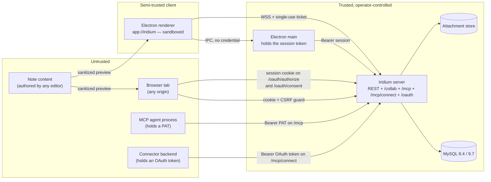

# Authentication, authorization, and access control

## 1. Scope and design stance

This section is the definitive specification of how Iridium identifies principals, issues and verifies credentials, decides what a principal may do, enforces that decision on every surface (REST, WebSocket collaboration, MCP, attachments, search, history, export, jobs, CLI), revokes access from already-open sessions, and records what happened. It covers skeleton decisions A23–A31 and A57 in full and is consumed by 02-system-architecture.md (placement), 03-data-model.md (tables), 05-collaboration-and-durability.md (hook bodies that are not authorization), 06-mcp-and-agent-access.md (tool semantics under the token principal), 07-client-applications.md (host-side custody), 09-api-reference.md (exact request/response shapes) and 10-testing-and-quality.md (test lanes).

Design stance, fixed by the skeleton and not revisited here:

| Principle | Consequence |
|---|---|
| One first-party auth core, no framework | `apps/server/src/auth/*` and `apps/server/src/authz/*` built on `node:crypto` (`randomBytes`, `createHash`, `timingSafeEqual`, `createHmac`) and `@node-rs/argon2 2.2.1`; better-auth, Passport and Lucia rejected (A29/ADR-09). |
| One `Principal`, one `authorize()` | Five credential kinds (password, session, collab ticket, integration token, OAuth access token) resolve to one `Principal` type from `@iridium/contracts/authz.ts`; every surface calls the single `authorize()` in `apps/server/src/authz/authorize.ts` (A30). The authorization server G1 added does not widen this: an OAuth token produces the same `TokenPrincipal` a personal access token produces, and `authorize()` gained no branch (§5.4, D04-31). |
| Deny by default, 404 for non-members | Every route declares `config.auth`; the server refuses to boot otherwise; non-members of a vault receive `404 not_found` for every vault-scoped resource; members lacking a permission receive `403 forbidden` (A30, F13). |
| Renderer never holds a reusable credential | Web: `__Host-` HttpOnly cookie. Electron: the session token lives only in the main process; the renderer sees only single-use 60 s collab tickets (A26). |
| No caches on the authorization path in MVP | REST = two indexed lookups per request; MCP = fresh token row + membership per call; WebSocket = version epochs + in-process bus + periodic re-validation (A23). |
| Everything security-relevant has a named test | See §14 and 10-testing-and-quality.md; coverage on `auth/**`, `authz/**`, `contracts/{tokens,paths,authz}` is 100 % per file (A51). |

Module placement (from skeleton §B.1):

| Module | Responsibility |
|---|---|
| `apps/server/src/auth/credentials/` | `hasher.ts` (argon2id + pepper + calibration + concurrency), `phc.ts` (PHC parse, re-hash decision), `policy.ts` (password rules, blocklist), `throttle.ts` (rate-limiter-flexible limiters), `blocklist.txt` |
| `apps/server/src/auth/sessions/` | `issuer.ts` (`SessionIssuer.issue`), `verify.ts`, `revoke.ts`, `stepup.ts`, cookie helpers |
| `apps/server/src/auth/tokens/` | PAT format helpers (re-exported from contracts), `verify.ts` (→ `Principal` + MCP `AuthInfo`; the single verification path, wrapped but never duplicated by `mcp/verifier.ts`), `lifecycle.ts` (create/rotate/revoke), `last-used.ts` (`LastUsedTracker`: one live map bounded by `TOKEN_LAST_USED_PENDING_MAX`, its own cadence `TOKEN_LAST_USED_FLUSH_INTERVAL_MS` in every token-verifying process, a final flush in the `auth` plugin's `onClose`; no SQL), `last-used-store.ts` (its sink — `oauth_consents.last_used_at`, then the monotonic `access_tokens` last-used columns, through the credential-transaction helper — constructed and imported only by the `auth` plugin, 06-mcp-and-agent-access.md D06-49), `budget.ts` (`TokenBudget`: the per-credential burst and hourly budget, the only `weightOf` and the header rendering, §10.1) |
| `apps/server/src/auth/tickets/` | `TicketStore` interface + `InMemoryTicketStore`, issuance route |
| `apps/server/src/auth/oauth/` | the credential half of the authorization server, beside the other credential modules and importable by `oauth/`, `rest/`, `cli/`, `jobs/` and `auth/tokens/` (06-mcp-and-agent-access.md D06-46): `codes.ts` (issue and consume `irid_oac_`, code-replay provenance), `refresh.ts` (families, rotation, reuse detection), `access-tokens.ts` (mint `kind='oauth'` rows, copying the consent's vault selection and setting `refresh_id`), `clients.ts` (`oauth_clients` persistence: live lookup; dynamic, CIMD and manual creation; `irid_ocs_` secrets and their constant-time Basic verification; disable; retire; the `first_authorized_at` stamp; the unused-client sweep query), `grants.ts` (consent upsert and revocation, client-scoped cascades, the OAuth half of `revokeAll`), `retention.ts` (`sweepOAuth`: codes, then refresh rows, then clients) and `redirect-uri.ts` (the one redirect-URI function, used by dynamic, CIMD and manual registration and by authorize-time exact matching). Credential transactions run through `auth/credential-transaction.ts` in the lock order of 02-system-architecture.md "Lock order" (A46) |
| `apps/server/src/oauth/` | the protocol half, registered by `app.ts` at boot step 7 through `plugin.ts`, the only module of the directory anything else in `apps/server/src` imports (D06-46): `metadata.ts` (the two discovery documents and the four explicit `404` routes), `authorize.ts`, `consent.ts` (the `GET`/`POST /oauth/consent` handlers), `consent-page.ts` (a pure HTML renderer, no client script), `consent-request-store.ts` (`ConsentRequestStore` and its in-memory implementation), `token.ts`, `revoke.ts`, `register.ts`, `client-resolution.ts` (`client_id` → live row or CIMD, behind the policy gate), `cimd.ts` (the Client ID Metadata Document policy: identifier rules, address classification, byte and time caps, validation and cache, with no I/O) and `cimd-transport.ts` (its pinned HTTPS transport, the only network I/O under `oauth/`, D06-44), `pkce.ts`, `scope-mapping.ts`, `errors.ts` (every authorization-server error body, 09-api-reference.md D09-30) and `access-log.ts` (the `surface='oauth'` `access_log` producer). Every module reads the policy from `SettingsStore.effective().oauthPolicy`; there is no `oauth/policy.ts`. 06-mcp-and-agent-access.md is the specification; this section states only what authentication and authorization guarantee about it |
| `apps/server/src/auth/setpw/` | one-time set-password links |
| `apps/server/src/auth/authenticate.ts` | `authenticate(request)` — cookie or bearer → `Principal \| null` |
| `apps/server/src/authz/` | `permissions.ts` (matrix re-export), `authorize.ts`, `decide.ts` (pure core, re-exported from contracts), `route-policy.ts` (Fastify plugin + boot assertion), `bus.ts` (`AuthzBus`), `epochs.ts` (epoch table), `reconciler.ts` (`EpochReconciler`, §8.6), `accessible-vaults.ts` (`accessibleVaultIds()` for search and listings) |
| `apps/server/src/security/` | CSRF guard, Origin/Host guards, rate-limit registration, request ids, error-envelope dispatch (`ProblemDetails`, and the renderers the `oauth` and `mcp` plugins register, 09-api-reference.md D09-30) |
| `apps/server/src/collab/hooks/` | `onAuthenticate`, `beforeHandleMessage`, `beforeHandleAwareness`, `onTokenSync` (authorization parts specified here; persistence parts in 05-collaboration-and-durability.md) |
| `apps/server/src/collab/gateway.ts` | `CollabGateway` — revocation sweeps over live connections |
| `packages/contracts/src/authz.ts`, `tokens.ts` | `Principal`, `Permission`, `Role`, matrix, `decide()`, token format/CRC/regex, `RouteAuth` |

## 2. Credentials and the shared token format

### 2.1 Credential kinds

| Credential | Wire format | At rest | Delivered how | Lifetime | Verified in |
|---|---|---|---|---|---|
| Password | any Unicode string, 15–128 code points | `user_credentials.password_hash` (argon2id PHC string, peppered), `pepper_version` | login form (`POST /auth/sessions`), `POST /auth/reauthenticate`, `POST /me/password` | until changed | `auth/credentials/hasher.ts` |
| Set-password link | `irid_spl_<id16>_<secret43><crc6>` inside `<PUBLIC_ORIGIN>/set-password#<token>` | `password_setup_tokens.secret_hash = SHA-256(secret)`, `token_id` | admin copies the link out of band (MVP); SMTP is a post-MVP `server_settings.smtp` seam | 24 h, single use | `auth/setpw/` |
| Web session | `irid_ses_<id16>_<secret43><crc6>` | `sessions.secret_hash = SHA-256(secret)`, `kind='web'` | `__Host-iridium_session` cookie: `Secure; HttpOnly; SameSite=Lax; Path=/` | idle 24 h sliding / absolute 14 d | `auth/sessions/verify.ts` |
| Desktop session | same format, `kind='desktop'` | same table | `Authorization: Bearer irid_ses_…` sent by the Electron **main** process only | idle 30 d sliding / absolute 90 d | same |
| Collab ticket | `irid_tkt_<id16>_<secret43><crc6>` | in-process `TicketStore` (SHA-256 of the secret → `{sessionId, userId, expiresAt}`), never persisted | Hocuspocus provider `token` (auth message after socket open, never the URL) | 60 s, single use | `auth/tickets/`, `collab/hooks/onAuthenticate.ts` |
| Personal access token (PAT) | `irid_pat_<id16>_<secret43><crc6>` | `access_tokens.secret_hash = SHA-256(secret)`, `token_id`, scopes, allowlist | `Authorization: Bearer` on `POST /mcp` and on the ★ read-only REST routes | required expiry, default 90 d, max `pat_policy.maxLifetimeDays` (366) | `auth/tokens/verify.ts` |
| OAuth authorization code | `irid_oac_<id16>_<secret43><crc6>` | `oauth_authorization_codes.secret_hash = SHA-256(secret)`, `code_id`, bound to client, `redirect_uri`, `resource`, `code_challenge` and the authorizing `session_id` | `302` to the client's registered redirect URI as the `code` parameter; in flight only, never stored by Iridium after exchange | 60 s, single use | `auth/oauth/codes.ts` |
| OAuth access token | `irid_oat_<id16>_<secret43><crc6>` | `access_tokens.secret_hash = SHA-256(secret)` with `kind='oauth'`, plus `client_id`, `consent_id`, `refresh_id`, `resource` | response body of `POST /oauth/token`; presented as `Authorization: Bearer` on `POST /mcp/connect` **only** | `oauth_policy.accessTokenTtlMinutes` (60 min) | `auth/tokens/verify.ts` |
| OAuth refresh token | `irid_ort_<id16>_<secret43><crc6>` | `oauth_refresh_tokens.secret_hash = SHA-256(secret)`, `token_id`, `family_id`, `rotated_from_id` | response body of `POST /oauth/token`; presented only to `POST /oauth/token` and `POST /oauth/revoke` | sliding `oauth_policy.refreshIdleDays` (30) inside absolute `oauth_policy.refreshAbsoluteDays` (90), rotated on every use | `auth/oauth/refresh.ts` |
| OAuth client secret | `irid_ocs_<id16>_<secret43><crc6>` | `oauth_clients.client_secret_hash = SHA-256(secret43)` with the display prefix `client_secret_prefix = 'irid_ocs_<id16>_'` | shown once in the `201 {client, clientSecret}` response of `POST /admin/oauth-clients`, which creates a manual confidential client (06-mcp-and-agent-access.md D06-45); presented only as the password of `Authorization: Basic` (RFC 6749 §2.3.1 form-urlencoding) to `POST /oauth/token` and `POST /oauth/revoke`, never as a bearer | the client's lifetime; there is no rotation route | `auth/oauth/clients.ts`, in constant time |

The four OAuth kinds are live in MVP: G1 was answered yes on 2026-09-12, so Iridium ships its own OAuth 2.1 authorization server for native claude.ai and Claude Desktop connectors (06-mcp-and-agent-access.md). Three of them are the grant's credentials; the fourth, `ocs`, is issued only to a manual confidential client and authenticates that client at the token and revocation endpoints (D04-36). The one remaining reserved kind (schema-valid, never issued in MVP) is `scim` (SCIM provisioning bearer, `kind='scim'`).

### 2.2 The `irid_` format (`@iridium/contracts/tokens.ts`)

```
irid_<kind>_<id16>_<secret43><crc6>
```

| Part | Content | Generation |
|---|---|---|
| `kind` | `pat` \| `ses` \| `tkt` \| `spl` \| `oac` \| `oat` \| `ort` \| `ocs` (reserved `scim`) — `TOKEN_KINDS` | literal |
| `id16` | public identifier, 16 base62 characters (≈ 95 bits) | 16 characters drawn uniformly from `0-9A-Za-z` by rejection sampling over `randomBytes`; stored verbatim in the `token_id CHAR(16) ascii_bin` column of the owning table |
| `secret43` | 32 CSPRNG bytes encoded as a base62 big integer, left-padded to 43 characters | `randomBytes(32)` |
| `crc6` | CRC-32 (IEEE, `node:zlib` `crc32`) over the ASCII bytes of `irid_<kind>_<id16>_<secret43>`, encoded base62 and left-padded to 6 characters (62⁶ > 2³²) | computed at issuance |

Properties and rules:

- Every kind is three letters, so every credential is exactly 75 characters long — the OAuth kinds included, which is why the format needed no change to carry them. Underscores are not base62 characters, so a double-click selects the whole token in terminals and editors.
- Published secret-scanning regex: `irid_(pat|ses|tkt|spl|oat|ort|oac|ocs)_[0-9A-Za-z]{16}_[0-9A-Za-z]{49}`, exported as `SCANNER_REGEX_SOURCE` and imported, never re-typed, by the redaction spec. The CRC lets scanners and the server reject malformed strings offline; a string that fails the regex or the CRC never touches the database (this is the first line of the login/verification pipelines and bounds the cost of credential floods).
- `parseToken(raw): { kind, tokenId, secret } | null` is a pure function in `@iridium/contracts/tokens.ts`; `secretHash(secret) = SHA-256(ascii(secret43))` — the hash is taken over the base62 string, not the decoded bytes, so every store and verifier computes the same value.
- Lookup is by `token_id` (unique index), then `timingSafeEqual(secretHash(secret), row.secret_hash)`. When no row exists the verifier still runs `timingSafeEqual` against a constant 32-byte buffer so the response time does not distinguish "unknown id" from "wrong secret".
- SHA-256 without a pepper is correct for 256-bit random secrets (A31): a database dump yields hashes that cannot be inverted or forged into usable credentials. Passwords, which are low-entropy, use argon2id with a pepper (§3.5).
- `display_prefix` for PATs is `irid_pat_<id16>_` (26 characters), shown in lists; the remainder is shown exactly once at creation. An OAuth access token uses the same `CHAR(26)` column with the prefix `irid_oat_<id16>_`, but no part of it is ever shown to a human: the credential is delivered to a client program by `POST /oauth/token`, and the prefix exists so the admin token list and `access_log` stay joinable.
- Property test `tokens.format.prop` (fast-check): for every generated token `parseToken(format(t)) = t`; flipping any single character invalidates the CRC or the regex; two issuances never share an `id16`.

## 3. Identity and accounts

### 3.1 The `users` row

Columns are defined in 03-data-model.md (skeleton §C.1). The semantics that matter for authentication and authorization:

| Column | Meaning here |
|---|---|
| `email`, `email_key` | Login identifier; `email_key = LOWER(email)` is the unique key and the login lookup key, so login is case-insensitive without a collation dependency. |
| `status` | `active` is the only status that authenticates. `disabled` and `deleted` fail every credential check (session, PAT, ticket, set-password link) and are answered exactly like an unknown credential on that surface: `401 invalid_credentials` on the password routes (`POST /auth/sessions`, `POST /auth/reauthenticate`, `POST /me/password`), `401 unauthenticated` for a session or an integration token on `/api/v1`, the MCP envelope's `401 invalid_token` on the MCP mounts, `410 invalid_link` on `POST /auth/set-password`, and the §6.4 close reason for a `/collab` ticket. The one exception follows from the verifier's order, which checks revocation, rotation overlap and expiry before owner status (06-mcp-and-agent-access.md, the verifier; D06-50): an integration token that is also past `expires_at` answers `401 token_expired` on `/api/v1`, exactly as it would for an active owner, so the answer reveals nothing about the owner's status. |
| `is_server_admin` | Server-level flag, not a vault role. For **user** principals it grants `server:*` and is treated as `manager` on every vault. It never flows to token principals (§9). |
| `authz_version` | Revocation epoch (§8). Bumped in the same transaction as: disable, password set/change, any `vault_members` insert/update/delete for the user, admin session revocation. |
| `color_hue` | Presence colour assigned at creation (golden-angle sequence); shipped to other clients only through the server-authoritative `participants` message (A25). |

### 3.2 Administrator-created accounts and the first administrator

There is no registration route. Accounts are created by server administrators (`POST /admin/users`, `server:users`, step-up) or by the operator CLI (`iridium admin create-user --email <email> --display-name <name> [--server-admin]`). Both paths run the same `users/service.ts#createUser` and return a one-time set-password link; the CLI prints it to the terminal. The first administrator of a deployment is created with `iridium admin create-user --server-admin` inside the server container; there is no environment-variable bootstrap of an admin password, because no plaintext password may ever transit an operator or an environment (A28).

`POST /admin/users` body: `{email, displayName, isServerAdmin?: boolean}` → `201 {user, setPasswordLink: '<PUBLIC_ORIGIN>/set-password#irid_spl_…', expiresAt}`. The new row has `status='active'`, no `user_credentials` row (the account cannot log in yet), and audit `admin.user.created` (chain `server`) with `metadata:{isServerAdmin}`.

### 3.3 One-time set-password links (`irid_spl_…`)

Table `password_setup_tokens` (03-data-model.md §C.1). One code path serves both initial credential delivery and administrator-driven reset.

| Step | Behaviour |
|---|---|
| Issue | `auth/setpw/issue.ts`: generate an `irid_spl_` token, insert `{token_id, secret_hash, user_id, purpose:'initial'\|'reset', issued_by, expires_at = now + password_policy.setupLinkHours}` (24 h by default, 03-data-model.md §13.1). In one `READ COMMITTED` transaction, lock the parent `users` row by primary key, then expire every outstanding link of that user across both purposes with `expires_at = now`, then insert (only the newest link is valid; `consumed_at` keeps its meaning "used"). The transaction helper owns isolation and gives callers a scoped issuer; account creation joins that transaction and appends its audit event last. An arbitrary caller-owned transaction cannot issue a link. |
| Deliver | The link is `<PUBLIC_ORIGIN>/set-password#<token>`. The token is in the URL **fragment**, so it never reaches server logs, reverse-proxy logs or `Referer` headers; the SPA reads `location.hash` and immediately replaces the history entry. The desktop login screen has a "Paste set-password link" action that parses the same URL. |
| Consume | `POST /auth/set-password {token, password}` (public; login rate bucket; CSRF guard per §4.4). Locate the owner with an unlocked token lookup, then in one transaction lock that `users` primary-key row before re-reading `password_setup_tokens WHERE token_id=? FOR UPDATE` → `timingSafeEqual` → `consumed_at IS NULL AND expires_at > now` → user `status='active'` → password policy (§3.4) → `INSERT … ON DUPLICATE KEY UPDATE user_credentials {password_hash, pepper_version, password_changed_at}` → `consumed_at = now` → `users.authz_version + 1` → audit `user.password.set {purpose}` (chain `server`, `credential_type='setpw'`, `credential_id = password_setup_tokens.id`). Response `204`. Invalid, expired, consumed or superseded links all return `410 invalid_link` (one message, no distinction). Policy violations return `422 validation_failed` with `errors[].code` ∈ {`too_short`, `too_long`, `breached`, `context_word`} (§3.4). |
| After consume | No automatic login: the client navigates to the login form with the email pre-filled. Keeping one login path (A29) means one throttle, one audit shape and one session issuer. |
| Reset | `POST /admin/users/:userId/reset-password` (`server:users`, step-up): in one transaction delete the `user_credentials` row (the old password stops working immediately — a reset may be a compromise response), revoke every session of the user (`revoked_reason='admin'`), bump `authz_version`, issue a new `purpose='reset'` link, clear login-throttle limiter A keys for that `email_key` (§3.7), audit `admin.user.password_reset`; after COMMIT publish `session.revoked` for each revoked session (§8). PATs are untouched (A28) — the admin UI shows the user's active tokens next to the reset button and offers `POST /admin/users/:userId/revoke-tokens` as a separate, separately audited action. |

**Concurrency clarification (2026-09-17).** Issuance and consumption always lock users before token rows. Issuance uses `READ COMMITTED` because a `REPEATABLE READ` update of an empty, non-unique `user_id` range takes gap locks that deadlock concurrent first-link inserts for different users. The parent lock serializes links for one user without serializing unrelated users. This exception covers credential issuance and revocation: set-password links, and the integration-token and OAuth grant tables of the credential path (02-system-architecture.md "Lock order", A46 as amended 2026-09-25), whose serialisation likewise comes from parent-row locks and which run at `READ COMMITTED` through the one helper `auth/credential-transaction.ts` (06-mcp-and-agent-access.md D06-50); vault mutations retain `withVaultLock()` at `REPEATABLE READ`. `setpw-link.integration` covers parallel account creation, concurrent same-user reissue, and consumption racing reissue on both supported MySQL lines. This clarification supersedes the former per-purpose/mark-consumed wording in 03-data-model.md.

Unconsumed links are removed by the `session_ticket_sweep` job 7 days after expiry (rows are not needed for audit; the audit event carries the link id).

### 3.4 Password policy (`auth/credentials/policy.ts`)

The policy follows NIST SP 800-63B-4 and the OWASP Authentication Cheat Sheet (digest §6.2) and is applied identically by `POST /auth/set-password` and `POST /me/password`.

| Rule | Value |
|---|---|
| Normalisation | Unicode NFC applied before every length check and before hashing (both at set and at verify), so the same password typed on different platforms produces the same hash. |
| Minimum length | 15 Unicode code points (`password_policy.minLength`, floor 15; drops to 8 once MFA exists, a post-MVP setting). |
| Maximum length | 128 code points (bounds argon2 input; longer inputs are rejected, never truncated). |
| Character rules | None: any Unicode, spaces included; no composition or rotation rules. |
| Breached/common list | `auth/credentials/blocklist.txt` — the SecLists `10-million-password-list-top-100000` list (MIT), pinned by SHA-256 at M0 and bundled in the image; loaded into a `Set` of NFC-lowercased entries at boot; the candidate is rejected if its lowercased form is in the set. Checked offline — no network call. An optional HIBP k-anonymity check is a post-MVP `password_policy.hibp` setting. |
| Context words | Rejected when the lowercased candidate equals or contains the user's email local part (when ≥ 4 characters) or the literal `iridium`. |
| Error shape | `422 validation_failed` with `errors[].code` ∈ {`too_short`, `too_long`, `breached`, `context_word`} (09-api-reference.md §1.5); the UI shows strength guidance, never a composition checklist. |

Server administrators edit `password_policy.minLength` (≥ 15) and `password_policy.checkBreachedList` in the `password_policy` row of `server_settings` (03-data-model.md §13.1 is the single definition of the settings vocabulary, and only the grouped camelCase names exist in the schema and on the wire); env values are floors (A26 pattern). `password_policy` is an M7 group (AG12): the server honours the row from M7, in the change that rewires its consumer, and until then the minimum length reads `PASSWORD_MIN_LENGTH`, the breached-list check is always applied, and a `PUT /admin/settings` naming the group is `422 validation_failed`.

### 3.5 Password hashing (`auth/credentials/hasher.ts`)

Library: `@node-rs/argon2 2.2.1` (prebuilt napi binary; no node-gyp; identical PHC output to the reference implementation — A29). Iridium uses only `hash(password, options)` and `verify(hashed, password, options)` from it. The re-hash decision ("`needsRehash`" in the skeleton's words) is implemented by Iridium's own `phc.ts`, which parses the PHC string (`$argon2id$v=19$m=…,t=…,p=…$<salt>$<hash>`) and compares its parameters with the configured ones, so the decision never depends on a library helper and behaves identically if the binding is ever swapped for `argon2` 0.45.1.

| Parameter | Value | Note |
|---|---|---|
| `algorithm` | `Algorithm.Argon2id` | |
| `memoryCost` | 65536 KiB (`ARGON2_MEMORY_KIB`) | exceeds the OWASP minimum (19456 KiB, t=2) |
| `timeCost` | 3 (`ARGON2_TIME_COST`) | |
| `parallelism` | 1 | each hash costs exactly one libuv thread-pool slot; calibration is predictable |
| `hashLength` | 32 bytes | passed as the binding's `outputLen` option |
| `version` | `0x13` | |
| `secret` | the pepper `Buffer` for the credential's `pepper_version` (§3.6) | never stored in the database |
| salt | 16 bytes generated by the library per hash | inside the PHC string |

Stored form: the PHC string (`$argon2id$v=19$m=65536,t=3,p=1$<salt>$<hash>`) in `user_credentials.password_hash VARCHAR(255)` plus `pepper_version`.

Operational rules:

- **Calibration**: `iridium doctor --argon2` measures hash latency on the target host and prints `ARGON2_MEMORY_KIB`/`ARGON2_TIME_COST` values that land in the 150–300 ms window; operators set them in the environment; `iridium config check` warns when the measured latency falls outside the window.
- **Thread pool**: the image sets `UV_THREADPOOL_SIZE=8` explicitly (A29). `hasher.ts` additionally serialises hashing behind an in-process semaphore of `ARGON2_CONCURRENCY` (default 4) so a burst of logins cannot occupy every thread-pool slot that DNS, `fs` and `zlib` also need; excess callers wait (they are already inside the login rate limits of §10).
- **Timing equalisation**: at boot the hasher creates one dummy PHC hash of a random password with the current parameters. When a login names an unknown email, a disabled user or a user without a credential row, the same `verify()` runs against the dummy hash and the result is discarded, so the response time is independent of account existence. The response is always `401 invalid_credentials`.
- **Re-hash on login** (`phc.ts`): after a successful `verify`, `parsePhc(hash).params` is compared with the current parameters and `row.pepper_version` with `schema_meta.pepper_version`; any difference triggers a transparent `hash()` with the current pepper and parameters and an `UPDATE user_credentials SET password_hash=?, pepper_version=? WHERE user_id=? AND password_hash=?` (the `WHERE` on the old hash makes concurrent logins idempotent). The re-hash happens inside the login request after the session is issued and is logged (`auth.credential.rehashed`, no secrets), never audited (no security decision changed).
- **Verify never throws on mismatch**: `verify()` resolves `false`; malformed stored strings are treated as mismatches and logged at `error` level with the user id only.

### 3.6 Pepper versioning and rotation

| Element | Definition |
|---|---|
| Configuration | `AUTH_PASSWORD_PEPPER_V<n>[_FILE]` for every version `n ≥ 1` still needed to verify some credential; `AUTH_PASSWORD_PEPPER[_FILE]` is an alias of `_V1`. Each value is 32 bytes base64. `*_FILE` mounts are preferred (OWASP secrets guidance; 11-operations-and-deployment.md). |
| Current version | `schema_meta.pepper_version` — the version used for every **new** hash. Boot fails fast when the current version, or any `pepper_version` present in `user_credentials`, has no configured pepper (`config/env.ts` + a startup query `SELECT DISTINCT pepper_version FROM user_credentials`). |
| Rotation | `iridium keys rotate pepper --to <n>` (A57): verifies `AUTH_PASSWORD_PEPPER_V<n>` is configured and differs from every older version, sets `schema_meta.pepper_version = n`, audits `system.key.rotated {key:'pepper', from, to}` (chain `server`, `credential_type='cli'`). No credential is re-hashed by the command (the server never has plaintext passwords); each credential migrates at its owner's next successful login (§3.5). |
| Progress | `iridium doctor --argon2` prints the histogram of `user_credentials.pepper_version`. When the count for an old version reaches zero the operator removes that variable; until then it stays. Users who never log in again can be moved by an admin reset link, which deletes the stale credential. |
| Backup | Every configured pepper and the current version number are part of the encrypted secrets bundle; `restore --verify` refuses a bundle whose key versions do not match the dump (A47). |

The same `key_version` pattern (`AUDIT_HMAC_KEY_V<n>`, `MCP_CURSOR_KEY_V<n>`, ARCH-09) applies to the audit chain and MCP cursors; their rotation commands are specified in 11-operations-and-deployment.md.

### 3.7 Login (`POST /auth/sessions`) and throttling

Request `{email, password, client:'web'|'desktop', deviceName?}`; the `X-Iridium-Client-Version` header is recorded on the session (A54). One code path for both clients:

```
1. rate limit: login bucket 10/min per IP (§10)                         → 429 rate_limited
2. CSRF guard (§4.4; applies although no principal exists yet)           → 403 csrf_rejected
3. channel agreement: request.headers['x-iridium-client'] === body.client → else 403 csrf_rejected
   (no Set-Cookie, no session row, no argon2 work; this is 09-api-reference.md §2's
    "`client:'web'` requires `X-Iridium-Client: web` … `client:'desktop'` requires
    `X-Iridium-Client: desktop` and never sets a cookie" made enforceable, so the
    cookie-setting path is unreachable through the guard's desktop branch)
4. keyA = `${email_key}|${ip}`; resA = await limiterA.get(keyA)
   if resA && resA.remainingPoints <= 0                                  → 429 rate_limited, Retry-After = ceil(msBeforeNext/1000)
   resB = await limiterB.get(ip); same check                             → 429 rate_limited
   either refusal: pino auth.login.throttled; metric iridium_login_failures_total{reason="throttled"};
                   never audited (§11.4)
5. row = SELECT u.*, c.password_hash, c.pepper_version FROM users u LEFT JOIN user_credentials c … WHERE u.email_key = LOWER(?)
6. ok = row && row.status === 'active' && row.password_hash
        ? await hasher.verify(row.password_hash, nfc(password), pepper(row.pepper_version))
        : await hasher.verifyDummy(nfc(password))              // always runs; result discarded
7. if !ok:
     await limiterA.consume(keyA); await limiterB.consume(ip)
     if limiterA is now exhausted: n = (await blocks.penalty(keyA)).consumedPoints
                                    await limiterA.block(keyA, min(900 * 2 ** (n - 1), 86400))
     audit user.login.failed (bounded, §11); pino auth.login.failed; metric iridium_login_failures_total
     → 401 invalid_credentials
8. await limiterA.delete(keyA); await blocks.delete(keyA)       // limiter B is never cleared
9. session = SessionIssuer.issue(user, {kind: client, ip, userAgent, deviceName, clientVersion})   // §4
   UPDATE users SET last_login_at = now
   re-hash if needed (§3.5)
   audit user.login.succeeded {kind, method:'password'}
10. web:     Set-Cookie __Host-iridium_session=…; Cache-Control: no-store → 200 {user}
    desktop: Cache-Control: no-store → 200 {token:'irid_ses_…', expiresAt, user}
```

Throttle implementation (`auth/credentials/throttle.ts`, `rate-limiter-flexible 11.2.0`):

| Limiter | Store | Key | Points / duration | Effect |
|---|---|---|---|---|
| A — consecutive failures per account+source | `RateLimiterMySQL({storeClient: mysql2 pool of dbApp, dbName, tableName:'login_throttle', keyPrefix:'login'})` with `insuranceLimiter: new RateLimiterMemory(...)` | `<email_key>\|<ip>` | 5 points / 24 h window | after the 5th failure `block(key, 900 · 2^(n−1))` where `n` is the number of blocks already applied to this key (limiter `blocks`, `keyPrefix:'loginblocks'`, 24 h duration, counted with `penalty()`); 15 min → 30 min → 1 h → … capped at 24 h |
| B — failures per source per day | same store, `keyPrefix:'loginip'` | `<ip>` | 100 points / 86 400 s | blocks every login from that source until the window ends |
| Fastify route bucket | `@fastify/rate-limit` | IP | 10 / min | cheap first gate before any DB access |

Keys are read with `get()` before the password is verified (so a blocked pair never pays for argon2), consumed only on failure, and limiter A + `blocks` are deleted on success (documented pattern, digest §6.2). Keying A on `email|ip` rather than on the account alone means an attacker cannot lock a legitimate user out from the user's own network. All three tables share `login_throttle` (`key`, `points`, `expire`) created by migration `0005_login_throttle`; `RateLimiterMySQL` is constructed with `tableCreated: true` so it never issues DDL under the `iridium_app` role. `POST /auth/reauthenticate` and `POST /me/password` consume limiter A with the same key on a wrong password (a stolen session must not become an offline password oracle). Limiter A keys for an `email_key` (all IPs) are cleared by an admin reset (§3.3); there is no separate unlock route in MVP.

Throttled responses are `429 rate_limited` with `Retry-After`; the account-existence question is never answered because the key is `email|ip` and the block only reflects the caller's own failures.

### 3.8 Account lifecycle events and their authentication effects

| Action (route / CLI) | Same transaction | After COMMIT (`AuthzBus`, §8) | Integration credentials (PATs and OAuth grants) |
|---|---|---|---|
| `POST /me/password {currentPassword, newPassword}` (self, step-up) | verify current (limiter A on failure) → policy → new hash → `password_changed_at` → revoke every other session of the user (`revoked_reason='password_change'`) → `authz_version+1` → audit `user.password.changed` | `user.password_changed {userId, keepSessionId}` → gateway closes all WS connections of the user except those of the current session | PATs, OAuth grants and consents untouched (A28/D13-6); the settings UI offers "also revoke my integration tokens and authorized applications", which issues `POST /me/tokens/revoke-all` as a second call under the same step-up window |
| `POST /admin/users/:id/disable` (`server:users`, step-up) | `status='disabled'` → revoke all sessions (`user_disabled`) → `authz_version+1` → audit `admin.user.disabled` | `user.disabled {userId}` → every WS connection closed `revoked` | rows untouched; verification step 9 rejects because `users.status ≠ 'active'` → `401` on the next call for a PAT **and** for an OAuth access token, and the next refresh is `400 invalid_grant` (spec §7 "revocation also stops integration access") |
| `POST /admin/users/:id/enable` | `status='active'`, audit `admin.user.enabled` | none (nothing to revoke) | resume working on the next call |
| `PATCH /admin/users/:id` (`If-Match`, step-up) | email/display name/`is_server_admin`; changing `is_server_admin` bumps `authz_version`; audit `admin.user.updated` | `membership.role_changed` is published for every vault where the user has a live WS connection and no explicit membership (admin-implied access is a role) | unaffected (tokens never carry admin power) |
| `DELETE /admin/users/:id` (soft: `status='deleted'`) | as disable + anonymisation rules from 03-data-model.md, plus every live access token (both kinds), refresh row and consent of the user revoked through the shared `revokeAll` with `revoke_reason='user_deleted'` (rows kept, A31); one audit `admin.user.deleted {anonymised, accessTokensRevoked, consentsRevoked}` whose capped `targets` list the revoked consents and access tokens (§11.3) | `user.disabled`, then one `token.revoked` per revoked access token | revoked in the deletion transaction, and rejected by verification step 9 in any case; deletion removes the password and every session so the account can never authenticate again, and live-looking credentials would misreport an access review |
| `POST /admin/users/:userId/revoke-tokens`, `POST /admin/tokens/revoke-all`, `iridium tokens revoke-all [--user <email>] [--vault <id>]` | every **live** credential in scope revoked in one transaction — live meaning active or rotated (`deriveTokenStatus`, 06-mcp-and-agent-access.md D06-50) — the `access_tokens` rows of `kind='pat'` **and** `kind='oauth'`, and each OAuth grant whole: its `oauth_consents` row, its `oauth_refresh_tokens` family and its access tokens, because revoking only an access token is undone at the next refresh. The scope is the target user for the users route and for `POST /admin/tokens/revoke-all` with `userId`, the whole server for `POST /admin/tokens/revoke-all` without it, and for the CLI its two flags, which may be combined: `--vault` selects every credential whose effective reach includes the vault — a PAT that allowlists it, an `all_vaults` PAT whose owner holds a live explicit membership of it, and an OAuth grant whose selection reaches it the same way — resolved by a non-locking read of `vault_members`, `access_token_vaults` and `oauth_consent_vaults`. The transaction runs at `READ COMMITTED` through `auth/credential-transaction.ts` and locks in the credential order of 02-system-architecture.md "Lock order" (A46): the vault `FOR SHARE` for `--vault`, the user's row `FOR UPDATE` for a user scope, then the in-scope live consents (ascending id), their refresh tokens and the in-scope live access tokens (ascending id), each taken `FOR UPDATE OF` its credential table with liveness re-checked under the lock, then the audit head; it never locks `vault_members`, and the CLI takes no owner fence and no lease. It revokes what is in scope when its locks are taken; a membership granted afterwards is a later grant. Every consent and access token it revokes carries the path's `revoke_reason`: `revoke_all_user` for the users route and for `POST /admin/tokens/revoke-all` with `userId`, `revoke_all_server` for `POST /admin/tokens/revoke-all` without it, and `cli` for the CLI. One audit `token.revoked_all` whose capped `targets` list the revoked consents and access tokens (03-data-model.md §12.2), with no per-token or per-consent row; the admin routes' free text is `metadata.note` | one `token.revoked` per access token | every agent the user configured stops on its next call; a connector's next refresh is `400 invalid_grant` and it must be re-authorized from the consent screen |
| `POST /admin/users/:id/revoke-sessions`, `DELETE /admin/sessions/:sessionId`, `POST /admin/sessions/revoke-all`, `iridium sessions revoke-all [--user]` | `revoked_at/revoked_reason='admin'`, `authz_version+1` per affected user, audit `session.revoked` / `session.revoked_all` | `session.revoked {sessionId, userId}` per session | untouched |
| `DELETE /me/sessions/:sessionId` (self) | `revoked_reason='logout'`, audit `session.revoked` | `session.revoked` | untouched |
| `DELETE /auth/sessions/current` (logout) | `revoked_reason='logout'`, audit `user.logout`; response clears the cookie, `Cache-Control: no-store`, `Clear-Site-Data: "cookies","storage"` | `session.revoked` | untouched |

## 4. Session model

### 4.1 One table, two delivery channels

| Property | Web (`kind='web'`) | Desktop (`kind='desktop'`) |
|---|---|---|
| Issued by | `POST /auth/sessions {client:'web'}` | `POST /auth/sessions {client:'desktop', deviceName}` |
| Delivery | `Set-Cookie: __Host-iridium_session=irid_ses_…; Secure; HttpOnly; SameSite=Lax; Path=/; Max-Age=<seconds to absolute expiry>` | response body `{token:'irid_ses_…', expiresAt}` |
| Holder | browser cookie jar (script cannot read it) | Electron **main** process only (§4.5) |
| Presented as | cookie on every same-origin request (`fetch(credentials:'include')` from the SPA at `PUBLIC_ORIGIN`) | `Authorization: Bearer irid_ses_…` added by main's `net.fetch` |
| Channel binding | a `kind='web'` session is accepted **only** from the cookie; a `kind='desktop'` session **only** as a bearer. A desktop token pasted into a cookie (or a cookie value sent as a bearer) fails verification. | |
| Idle / absolute | 24 h sliding / 14 d | 30 d sliding / 90 d |
| CSRF | custom header + Fetch Metadata + SameSite (§4.4) | bearer requests skip the guard; the two pre-login calls (`POST /auth/sessions`, `POST /auth/set-password`) pass on `X-Iridium-Client: desktop` with no cookie (§4.4) |
| Attachments | `` with the cookie | `iridium-attachment://<vault>/<id>` handled in main with the bearer (07-client-applications.md) |
| Collab | tickets from `POST /auth/collab-tickets` with the cookie | tickets requested by main over IPC `collab:tickets` |

Both kinds are rows in `sessions` (03-data-model.md §C.1) and share `SessionIssuer.issue(user, {kind, method, ip, userAgent, deviceName, clientVersion})` — the single function every present and future login method (password now; OIDC, SAML, MFA later) finishes through. `issue()` creates a fresh row on every login (there is no pre-login session, so fixation is structurally impossible), sets `last_authenticated_at = created_at`, and applies the per-user cap: at most 20 live sessions per user per kind; when exceeded, the oldest by `last_seen_at` is revoked with `revoked_reason='replaced'`. A desktop login with the same `deviceName` for the same user also revokes the previous session of that device as `replaced`.

TTLs are policy: the `session_policy` row of `server_settings` — exactly the five members 03-data-model.md §13.1 declares, `{webIdleHours, webAbsoluteDays, desktopIdleDays, desktopAbsoluteDays, stepUpMinutes}` (03-data-model.md §13.1 is authoritative for the spelling; the row key stays `snake_case` and the JSON members stay camelCase, 02-system-architecture.md §7; the desktop `safeStorage` requirement is **not** a member here — it is `desktopUpdatePolicy.requireSecureStorage`) — editable by server admins. `session_policy` is an M7 group (AG12): the server honours the row from M7, in the change that rewires its consumers, and until then the session TTLs and the step-up window read the environment values below, and a `PUT /admin/settings` naming the group is `422 validation_failed`. The environment values (`SESSION_WEB_IDLE_HOURS` 24, `SESSION_WEB_ABSOLUTE_DAYS` 14, `SESSION_DESKTOP_IDLE_DAYS` 30, `SESSION_DESKTOP_ABSOLUTE_DAYS` 90, `STEP_UP_WINDOW_MIN` 10) are the security floor in the sense used by A26 and §C.10: an administrator may tighten the policy (shorter idle/absolute lifetimes, a shorter step-up window) but never loosen it beyond the environment value. Changing the policy applies to sessions issued afterwards; existing rows keep their stored expiry columns.

### 4.2 Verification (`auth/sessions/verify.ts`)

The module exports **two** entry points over one shared row check, because two callers need it: an HTTP request presents a raw credential, while `/collab` has already proved ownership of a session through a ticket and holds only its id (§6.4, §7.3, §8.7).

```
checkLiveRow(row): Principal | { dead: 'revoked' | 'expired' | 'user_inactive' }
  if row.revoked_at                                                               → { dead:'revoked' }
  if now >= row.idle_expires_at || now >= row.absolute_expires_at:
        UPDATE sessions SET revoked_at = now, revoked_reason = 'expired'
        WHERE id = ? AND revoked_at IS NULL                                       → { dead:'expired' }
  if row.status !== 'active'                                                      → { dead:'user_inactive' }
  if now - row.last_seen_at >= 60 s:
        UPDATE sessions SET last_seen_at = now,
               idle_expires_at = LEAST(now + idle(kind), absolute_expires_at) WHERE id = ?   (awaited; one cheap PK update)
  return { kind:'user', userId, sessionId: row.id, sessionKind: row.kind,
           isServerAdmin: row.is_server_admin === 1, authzVersion: row.authz_version,
           lastAuthenticatedAt: row.last_authenticated_at }

verifySession(raw: string, channel: 'cookie' | 'bearer'): Principal | null
  p = parseToken(raw); if !p || p.kind !== 'ses'                                  → null (no DB access)
  row = SELECT s.*, u.status, u.is_server_admin, u.authz_version
        FROM sessions s JOIN users u ON u.id = s.user_id WHERE s.token_id = ?
  if !row: timingSafeEqual(secretHash(p.secret), ZERO32)                          → null
  if !timingSafeEqual(secretHash(p.secret), row.secret_hash)                      → null
  if (row.kind === 'web') !== (channel === 'cookie')                              → null
  r = checkLiveRow(row); return ('dead' in r) ? null : r        // REST never distinguishes the reasons

loadLiveSession(sessionId: SessionId): Principal | { dead: 'revoked' | 'expired' | 'user_inactive' } | null
  row = SELECT s.*, u.status, u.is_server_admin, u.authz_version
        FROM sessions s JOIN users u ON u.id = s.user_id WHERE s.id = ?           // PRIMARY KEY point lookup
  if !row                                                                         → null
  return checkLiveRow(row)                                                        // no secret comparison, no channel binding
```

`loadLiveSession` skips exactly two steps of `verifySession`, and both are already proved by the caller rather than assumed: the `TicketStore` entry binds `{sessionId, userId}` and can only have been created by `POST /auth/collab-tickets`, which is itself authenticated by `verifySession` with the correct channel (§7.2), so the ticket carries the evidence of both secret ownership and channel binding. Everything that can change *after* issuance — revocation, idle expiry, absolute expiry, `users.status`, `is_server_admin`, `authz_version` — is in the shared `checkLiveRow`, so the collab path can never accept a session REST would reject. It returns the dead *reason* rather than `null` because `/collab` maps an expired session and a revoked one to different close codes (§6.4); REST collapses both into `401 unauthenticated`.

The `last_seen_at`/`idle_expires_at` refresh stays inside the shared block and is not a loophole in either direction: a ticket lives 60 s and the `TicketSource` pool is refilled by `POST /auth/collab-tickets`, which runs `verifySession` and refreshes the row, so at consumption `now − last_seen_at` is almost always under 60 s and the write is skipped. The collab path therefore neither extends an idle window that REST would not have extended, nor lets the window lapse while a socket is genuinely in use.

Session verification is the first of the "two indexed lookups per request" (A23); the second is the membership lookup inside `authorize()` (§5.5). Nothing about a session is cached in process memory. Rows that expired without being touched are finalised by the `session_ticket_sweep` job (`revoked_reason='expired'`), and rows older than `absolute_expires_at + 30 d` are deleted by the same job (the audit log, not the sessions table, is the record).

### 4.3 Web specifics

- Cookie name `__Host-iridium_session` implies `Secure`, `Path=/` and no `Domain` (OWASP session guidance; digest §6.2). The SPA is served by the same Fastify origin (`PUBLIC_ORIGIN`), so there is no CORS configuration for cookie auth at all. `SameSite=Lax` (not `Strict`) so a deep link to a note opens signed in; Lax still blocks cookies on cross-site `POST`s and on cross-site WebSocket handshakes (digest §6.2).
- `Max-Age` equals the seconds until `absolute_expires_at`, so the browser keeps the cookie across restarts for exactly the absolute lifetime; idle expiry is enforced server-side and is not represented in the cookie (no cookie re-issue on sliding).
- Logout: `DELETE /auth/sessions/current` → revoke row → `Set-Cookie` with `Max-Age=0` → `Cache-Control: no-store` → `Clear-Site-Data: "cookies","storage"` (clears any browser-stored UI state — theme, last vault, open tabs, tree expansion, unsent dialog text). Iridium persists no note content in the browser: there is no `y-indexeddb` and no draft store (01-vision-scope-and-principles.md, offline-first non-goal), so there is nothing to clear beyond the in-memory `Y.Doc`, which is discarded when the tab closes. That in-memory text is deliberately kept until the user leaves the page, so `export.myText` still works after a `revoked` close (A40).
- Every `/api/v1/*` response carries `Cache-Control: no-store` (set by the security plugin); attachment responses override with `private, max-age=3600` (A44).
- The `/collab` upgrade never reads cookies: authentication there is by ticket only (§7). Neither MCP mount reads cookies: `authenticate()` reads no credential on an MCP path (§6.1), and the route-level `ignoreCookies` hook strips the header and the parsed jar for the phases that follow (A32). The `/oauth/*` browser routes are the deliberate opposite — `/oauth/authorize` and `/oauth/consent`, the `browser` surface of `OAUTH_ROUTE_SURFACES` (§6.1, D04-33), are the only places outside the SPA where a session cookie authenticates a person, which is why the consent page carries its own framing, caching and referrer headers (06-mcp-and-agent-access.md).

### 4.4 CSRF for cookie sessions (`security/csrf.ts`)

No per-request synchronizer token. The guard is the OWASP custom-header pattern plus Fetch Metadata resource isolation with the mandatory `Origin`/`Referer` fallback, and `SameSite=Lax` as defence in depth (A27). A URL that matches no route never reaches the guard: boot step 3's routing branch answers it `404 not_found`, or `405 method_not_allowed` with `Allow` when another method is registered for the path, before body parsing and before any credential is read.

```
csrfGuard(request):
  if request.method ∈ {GET, HEAD, OPTIONS}                       → pass
  if request.headers.authorization                               → pass   (bearer: no ambient credential)
  path = requestPath(request)                                    // security/paths.ts
  if isMcpPath(path) || isOAuthClientPath(path)                  → pass   (exempt by path, matched or not: no credential is read there, §6.1)
  if route.config.csrfExempt                                     → pass   (declared by POST /oauth/consent alone, §6.2)
  client = request.headers['x-iridium-client']
  if client !== 'web' && client !== 'desktop'                    → 403 csrf_rejected   (absent, or any other value)
  if client === 'desktop':
        if request.headers.cookie                                → 403 csrf_rejected   (D04-06 channel binding: a desktop host never sends cookies)
        if !route.config.auth.public                             → 403 csrf_rejected   (a desktop caller on an authenticated route must present a bearer; `authenticate()` has already answered 401, so this is a belt-and-braces assertion)
        else                                                     → pass
  // client === 'web' from here — the Fetch-Metadata and Origin/Referer branches below apply to browsers only
  sfs = request.headers['sec-fetch-site']
  if sfs !== undefined:
        if sfs ∈ {'same-origin', 'none'}                         → pass
        else                                                     → 403 csrf_rejected
  origin = request.headers.origin ?? originOf(request.headers.referer)
  if origin === PUBLIC_ORIGIN                                    → pass
  else                                                           → 403 csrf_rejected
```

Rules that follow from it:

- The guard runs in the `onRequest` phase, before body parsing, so it covers multipart uploads (`POST /vaults/:id/attachments`, `PUT /imports/:id/upload`) and any future form-encoded route; it is policy by route, not by content type.
- It applies to **every** state-changing request that is not bearer-authenticated, including the public `POST /auth/sessions` and `POST /auth/set-password`. The accepted header values are exactly `{web, desktop}` (digest §6.2: the custom header is `X-Iridium-Client: web|desktop`); anything else, including an absent header, is `403 csrf_rejected`. A27's own scope is cookie principals; the two public pre-login routes are covered as an extension of it, because they are the only state-changing routes a client reaches before any credential exists. The Fetch-Metadata, `Origin` and `Referer` comparisons are **`web`-only** — a main-process `net.fetch` sends none of those headers, so applying them to a desktop request would reject every desktop login. The only non-bearer requests a desktop host ever issues are those two public routes, and they pass on `X-Iridium-Client: desktop` with no `Cookie` header (§4.5).
- `X-Iridium-Client` is a custom header: a cross-origin sender can only add it via a CORS preflight, and the server has no CORS handler for `PUBLIC_ORIGIN`, so the preflight fails — for *either* value. Login CSRF (forcing a victim into an attacker's account) therefore stays blocked without a pre-session token, and a `desktop` request carries no cookie, so it has no ambient credential to abuse in the first place (a `desktop` header arriving *with* a `Cookie` is rejected). Test clients that use cookies send `X-Iridium-Client: web` and an `Origin` equal to `PUBLIC_ORIGIN`; there is no bypass switch.
- `PUBLIC_ORIGIN` comparison is an exact string comparison against the serialised origin (`scheme://host[:port]`, lower-cased host); `originOf(referer)` extracts the origin with `new URL()` and rejects unparsable values.
- The exemption is no longer "`/mcp` only", and it is a closed set rather than a special case. `CSRF_EXEMPT_ROUTES` in `@iridium/contracts/authz.ts` has six members — `POST /mcp`, `POST /mcp/connect`, `POST /oauth/consent`, `POST /oauth/token`, `POST /oauth/revoke`, `POST /oauth/register`. `security/csrf.ts#isCsrfExempt(method, path, csrfExempt)` exempts a non-safe request if and only if its request path is an MCP path or an OAuth client-endpoint path (`/oauth/token`, `/oauth/revoke`, `/oauth/register`), whether or not a route matched, or its route declares `csrfExempt`, which `POST /oauth/consent` alone does. The MCP mounts and the three client endpoints are exempt by path because `authenticate()` reads no credential on them (§6.1): the mounts accept only a bearer, and the client endpoints authenticate the client, not a user. `/oauth/consent` is a browser-form surface that carries its own single-use, session-bound `request_id` (06-mcp-and-agent-access.md D06-32). The mounts register `POST` only, so there is no legacy `GET` or `DELETE` to exempt: every other method on `/mcp` or `/mcp/connect` is the routing branch's `405` with `Allow: POST`. The boot assertion (`authz.route-policy.boot.guard`, §6.2) computes the served exemption set with `isCsrfExempt` over the registered non-safe routes and requires it to equal `CSRF_EXEMPT_ROUTES` when `MCP_OAUTH_ENABLED` is true and `{'POST /mcp'}` when it is false; per route, it refuses `csrfExempt` outside the constant, on a safe method, and on a route its path already exempts, where the guard would never read the flag. `security.csrf.integration` covers the consent POST.
- Rejections are logged as the SIEM event `authz.csrf_rejected` with request id and IP (a member of the closed `LOG_EVENTS` vocabulary, 11-operations-and-deployment.md "Named events"); they are not audit events (unauthenticated noise must not touch the chain).
- `@fastify/csrf-protection 8.0.1` is deliberately not used (digest §6.1).

### 4.5 Desktop specifics: main-process custody

The renderer of the Electron app must never hold a reusable credential (A26, ADR-10, T12). Concretely:

| Concern | Design |
|---|---|
| Sign-in | Renderer `host.auth.signIn(credentials)` → IPC `iridium:auth:signIn` → main calls `POST /auth/sessions {client:'desktop', deviceName: os.hostname()}` via `net.fetch`, with `X-Iridium-Client: desktop` and no cookie (§4.4) → main keeps `irid_ses_…`; the renderer receives `{user}` only. The "Paste set-password link" action calls `POST /auth/set-password` the same way. |
| Storage | `safeStorage.encryptStringAsync(token)` written to `<userData>/iridium/secrets.bin` as a JSON map keyed by server origin (one entry per server profile). When `safeStorage.isEncryptionAvailable()` is false, or on Linux `getSelectedStorageBackend() === 'basic_text'`, the token is kept in memory only and the UI shows a persistent warning; the admin policy `desktop_update_policy.requireSecureStorage` (the `desktopUpdatePolicy.requireSecureStorage` member of the M7 `desktopUpdatePolicy` group, whose spelling 03-data-model.md §13.1 fixes — it lives there rather than in `session_policy`; published by `GET /desktop/update-policy` as `requireSecureStorage`) makes main refuse to sign in at all in that state. `decryptStringAsync` results with `shouldReEncrypt=true` are re-encrypted immediately. On macOS at 1.0 this path is not reached: `safeStorage` is backed by the Keychain, the Keychain binds an item to a stable code signature, and the 1.0 macOS bundle is ad-hoc signed rather than Developer ID signed, so `isEncryptionAvailable()` reports `false` and the desktop client runs in memory-only mode on every macOS installation (07-client-applications.md §7.6, §7.14). A site that sets `requireSecureStorage = true` therefore makes the macOS client unable to sign in at all until the post-1.0 signing epic ships. This is stated here rather than discovered at deployment. |
| REST | `IpcTransport` (`@iridium/api-client`) → `iridium:api:request {method, path, query, body, headers}` (zod-validated, path must start with `/api/v1/`) → main `net.fetch(origin + path)` adding `Authorization: Bearer`, `X-Iridium-Client: desktop`, `X-Iridium-Client-Version` and `Accept`; the response body and status are relayed; the bearer never appears in any renderer-visible structure (test `desktop.attachments-no-token-in-renderer.e2e`, `desktop.preload-surface.guard`). Main also sends `X-Iridium-Client: desktop` on the two **pre-login** calls where no bearer exists — `POST /auth/sessions` and `POST /auth/set-password` — which is what carries them past the CSRF guard's desktop branch (§4.4). Every `net.fetch` uses `session: iridiumSession, useSessionCookies: false` (07-client-applications.md §7.6), so the "a desktop host never sends a `Cookie`" invariant holds structurally rather than by convention. |
| Tickets | `iridium:collab:tickets {count}` → main `POST /auth/collab-tickets {count}` with the bearer → the tickets (single-use, 60 s) are the only credential the renderer ever receives. |
| WebSocket | The renderer opens `wss://<host>/collab` itself (Origin `app://iridium`, §7.5); if the M0 spike shows the upgrade does not carry that Origin, the `IpcWebSocket` fallback moves socket ownership to main, which still relays tickets and forwards frames verbatim (A53). |
| Attachments | `iridium-attachment://<vault>/<id>` protocol handler in main fetches with the bearer and streams bytes, re-emitting `FORWARDED_ATTACHMENT_HEADERS` verbatim — the one shared constant beside the served-header table of 08-markdown-pipeline-import-export.md §9.4, applied by the handler in 07-client-applications.md §7.7, and it includes `Content-Security-Policy: sandbox` and `Referrer-Policy: no-referrer` — plus a re-asserted `X-Content-Type-Options: nosniff`, and it forwards the renderer's `Range` header so `206`/`Content-Range` seeking works in both hosts. `Cross-Origin-Resource-Policy` is deliberately omitted: the custom scheme is cross-origin to `app://iridium` by construction, so a verbatim `same-origin` value would fail the very no-cors `` fetch the scheme exists for (07-client-applications.md §7.7). The desktop is therefore never the surface with *fewer* protections than the web, and a hardening header added to 08 §9.4 cannot silently stop reaching it. |
| Sign-out | `iridium:auth:signOut` → main `DELETE /auth/sessions/current` → wipe the entry from `secrets.bin` → `session.clearStorageData()` **and `session.clearCache()`** for the renderer partition (`clearStorageData` does not flush Chromium's HTTP cache, which holds attachment bytes for up to 3 600 s — §8.9). The same pair runs when a REST `401` ends the session, and `clearCache()` alone runs on a 4403 `revoked` close. |
| Session end from the server | Any `401` from `iridium:api:request` → main erases the `secrets.bin` entry for that origin and emits `iridium:event:session-changed {state:'expired', me:null, origin}` (the payload schema of 09-api-reference.md §D.4, whose `state` member — never `status` — is the discriminator every host reads; this path sets no `reason`, so a renderer listening for `reason:'revoked'` never fires on a plain expiry). **A `revoked` WS close never touches `secrets.bin`**: a WebSocket close is never an authority on session validity — only a REST `401` is. The close is scoped to one document and is shared by four causes (§8.4), so `@iridium/collab-client` re-checks the session with exactly one `GET /auth/me` (05-collaboration-and-durability.md, per-document close) and only the `401` from *that* call ends the session, through this same row. In the `IpcWebSocket` fallback (§7.5, A53) main relays `collab-close` verbatim and takes no credential action. |
| Multiple servers | one active profile per window; switching profiles reloads the window and clears session storage; secrets are keyed by origin so a token is never sent to a different server. |

The desktop session has no access/refresh split (rejected alternative in A26): a single hashed opaque token with per-request server-side verification already gives immediate revocation and one token model for the whole system.

### 4.6 Step-up ("sudo mode")

`sessions.last_authenticated_at` is set at login and refreshed by `POST /auth/reauthenticate {password}` (session-authenticated, CSRF-guarded, limiter A on failure, audit `user.reauth.succeeded`). A route declared `stepUp: true` requires `now − last_authenticated_at ≤` the step-up window (`session_policy.stepUpMinutes` from M7; `STEP_UP_WINDOW_MIN` until then; 10 by default, and from M7 admin-configurable downward, §4.1); otherwise the route policy answers `403 step_up_required` **after** authorization succeeded (a caller who is not allowed at all still gets 404/403 first, so step-up never leaks whether an action would be permitted). The client shows the password dialog and retries. Token principals can never satisfy step-up; every step-up route is user-only by construction.

Step-up is required for (A26): creating, rotating and revoking PATs (`POST /me/tokens`, `POST /me/tokens/:id/rotate`, `DELETE /me/tokens/:id`, `POST /me/tokens/revoke-all`); `POST /me/password`; every `/admin/*` mutation; `POST /vaults/:id/archive|unarchive`; `POST /notes/:id/revisions/:rev/restore`; `DELETE /nodes/:id?purge=true`; `PUT /admin/settings`; and, for the authorization server, `DELETE /me/oauth-consents/:consentId` plus the `/admin/oauth-clients` and `/admin/oauth-consents` mutations (which the `/admin/*` rule already covers).

Granting an OAuth authorization needs the same freshness but cannot use the same mechanism, and the deviation is stated rather than left to be discovered: `POST /oauth/consent` is reached by a server-rendered page with no application JavaScript, so there is no dialog to raise and no request to retry. The consent page therefore renders a password field when `now − last_authenticated_at >` the same step-up window (`session_policy.stepUpMinutes` from M7; `STEP_UP_WINDOW_MIN` until then) and `oauth_policy.allowConsentWithoutStepUp` is false, and a wrong password consumes login limiter A on the key `login:<email_key>|<ip>` exactly as `POST /auth/reauthenticate` does (D04-07). The requirement is identical; only the surface that collects the proof differs. `sessions.mfa_verified_at` is reserved so that a later MFA milestone can make step-up require a second factor without changing the route contract.

### 4.7 Listing and revoking sessions

- `GET /me/sessions` → `[{id, kind, deviceName, clientName, clientVersion, ip, userAgent, createdAt, lastSeenAt, lastAuthenticatedAt, current:boolean}]` (never the secret or its hash). `DELETE /me/sessions/:sessionId` (self; no step-up) revokes one of the caller's own sessions.
- `GET /admin/sessions?userId=&cursor=`, `DELETE /admin/sessions/:sessionId`, `POST /admin/sessions/revoke-all`, `POST /admin/users/:id/revoke-sessions` (`server:sessions:all`, step-up) and the CLI `iridium sessions revoke-all [--user <email>]` (audited with `credential_type='cli'`) — effects per §3.8.
- Revoking a session invalidates its outstanding collab tickets (a ticket is consumed only if its session is still live, §7.3) and closes its WebSocket connections through the `AuthzBus` (§8).
## 5. Roles, permissions and the single `authorize()` function

### 5.1 Principals

`Principal` is a discriminated union in `@iridium/contracts/authz.ts`. It is the only input describing "who" anywhere in the server; no handler, tool or hook ever looks at a request, a cookie, a header or a Hocuspocus connection to decide something.

```ts
// packages/contracts/src/authz.ts
export type Principal =
  | {
      kind: 'user';
      userId: UserId;
      sessionId: SessionId;
      sessionKind: 'web' | 'desktop';
      isServerAdmin: boolean;
      authzVersion: number;              // users.authz_version at authentication time
      lastAuthenticatedAt: Date;         // step-up window
    }
  | TokenPrincipal
  | { kind: 'system'; job: string; onBehalfOf?: UserId };

type TokenPrincipalBase = {
  kind: 'token';
  tokenId: TokenId;                    // access_tokens.id
  publicTokenId: string;               // access_tokens.token_id (the id16 in the credential)
  userId: UserId;
  scopes: readonly Permission[];       // permission strings stored on the row
  vaultScope: { all: true } | { vaultIds: readonly VaultId[] };
  isServerAdmin: false;                // structurally impossible to be true (§9.2)
  adminOwned: boolean;
  surface: 'mcp' | 'rest';
  expiresAt: Date;
};

export type TokenPrincipal =           // discriminated on which credential produced it (§9.1)
  | (TokenPrincipalBase & {
      tokenKind: 'pat';
      rateLimitPerHour: number | null; // access_tokens.rate_limit_per_hour; null = the effective patPolicy default (§10.1)
    })
  | (TokenPrincipalBase & {
      tokenKind: 'oauth';
      clientId: string;                // oauth_clients.client_id (a CIMD URL or a registered id)
      consentId: string;               // oauth_consents.id: the grant, which keys its budget (§10.1)
      resource: string;                // the RFC 8707 audience the token was issued for
    });
```

The PAT variant carries no client, consent or resource member and the OAuth variant no `rateLimitPerHour`: an OAuth grant's hourly budget is the effective `oauthPolicy.defaultRateLimitPerHour`, resolved at charge time, and `access_tokens.rate_limit_per_hour` stays NULL on every OAuth row (D04-37). Every member `authorize()` reads is on the shared base, so the union adds no branch to it (§5.4).

| Kind | Produced by | Used on |
|---|---|---|
| `user` | `auth/sessions/verify.ts` (cookie or desktop bearer), `collab/hooks/onAuthenticate.ts` (after ticket consumption) | REST, `/collab`, desktop IPC, admin console, CLI (`system` acting `onBehalfOf` an operator is used instead where no session exists) |
| `token` | `auth/tokens/verify.ts` (PAT or OAuth bearer) | `/mcp`, `/mcp/connect`, the ★ read-only REST routes of 09-api-reference.md |
| `system` | job scheduler, migrations, `iridium` CLI, server-originated collaborative edits (§6.9) | internal only; never constructed from a request |

`system` principals are allowed by construction — they exist so that `AuditWriter` and `ContentReadCore` have an actor for internal work, not to bypass checks. Every `system` principal carries the job name, which lands in `audit_events.actor_type='system'` / `context.job`. The CLI constructs `{kind:'system', job:'cli:<command>', onBehalfOf: <operator user id if resolvable>}` and writes `credential_type='cli'` (A57).

### 5.2 The permission vocabulary

Permissions are strings, not bitmasks or role comparisons, because they are also PAT scopes (A31) and must be readable in a token-creation dialog and in an audit row. The vocabulary is closed and exhaustive; adding one is a code change in `@iridium/contracts/authz.ts` plus a row in the matrix test.

| Group | Permission | Scope | Meaning |
|---|---|---|---|
| read | `vault:read` | vault | See the vault, its settings that are not secrets, its tree and members list |
| read | `note:read` | vault | Read note metadata and committed Markdown |
| read | `search:read` | vault | Query the search index |
| read | `history:read` | vault | List revisions, read a pinned revision, use `?fresh=true` |
| read | `attachment:read` | vault | List and download attachments |
| read | `export:read` | vault | Create and download vault/subtree/note exports |
| write | `note:write` | vault | Send Yjs updates on `note:<id>` (the collaborative write permission) |
| write | `node:create` | vault | Create a note or category |
| write | `node:rename` | vault | Rename a node |
| write | `node:move` | vault | Re-parent a node inside the same vault |
| write | `node:trash` | vault | Move a node to trash |
| write | `node:restore` | vault | Restore a trashed node |
| write | `attachment:write` | vault | Upload and delete attachments |
| write | `revision:name` | vault | Create a named revision (`Ctrl/Cmd+S`) |
| manage | `vault:manage_members` | vault | Add, change and remove memberships |
| manage | `vault:settings` | vault | Edit vault settings (flavour, soft breaks, attachment folder, `mcp_enabled`, `ai_guidance`, retention, checkpoint interval) |
| manage | `vault:archive` | vault | Archive and unarchive the vault |
| manage | `history:restore` | vault | Restore a revision (coordinated content change) |
| manage | `node:purge` | vault | Permanently delete a trashed node |
| manage | `import:commit` | vault | Commit an import into this vault |
| server | `server:users` | server | Create, update, disable, enable, delete users; issue reset links |
| server | `server:vaults:create` | server | Create vaults and import into a new vault |
| server | `server:settings` | server | Read and write `server_settings` |
| server | `server:audit:all` | server | Read and export the audit log across all vaults and the `server` chain |
| server | `server:tokens:all` | server | List, inspect and revoke any user's integration tokens and OAuth grants, including revoke-all; set a token's rate limit; read and export server-wide agent activity; and register, list, disable, re-enable and delete OAuth clients |
| server | `server:sessions:all` | server | List and revoke any user's sessions |
| server | `server:jobs` | server | View and trigger maintenance jobs |
| server | `server:releases` | server | Publish desktop releases and the update feed |

`@iridium/contracts/authz.ts` also exports the machine-readable shape the enforcement layer depends on:

```ts
export const PERMISSIONS = [...] as const;
export type Permission = (typeof PERMISSIONS)[number];
export const PERMISSION_SCOPE: Record<Permission, 'vault' | 'server'> = { … };
export const READ_BUNDLE: readonly Permission[] =
  ['vault:read', 'note:read', 'search:read', 'history:read', 'attachment:read', 'export:read'];
```

`PERMISSION_SCOPE` is what makes a missing vault id impossible to ignore: `authorize()` throws a programming error (`AuthzUsageError`, 500, logged, never a deny) when a `'vault'`-scoped permission arrives without a `vaultId`, and when a `'server'`-scoped permission arrives with one. The route-policy boot assertion (§6.2) proves statically that every route supplies what its permission needs, so the throw can only fire from hand-written service code and is covered by `authz.usage.unit`.

### 5.3 The matrix

One static module, `apps/server/src/authz/permissions.ts`, re-exporting the table from `@iridium/contracts/authz.ts`. It is the only place in the system where a role maps to permissions. Roles are ordered `viewer < editor < manager` and are **per vault** (`vault_members.role`); `users.is_server_admin` is a server-level flag, not a fourth role.

| Action (permission) | viewer | editor | manager | server admin (user principal) |
|---|:--:|:--:|:--:|:--:|
| `vault:read` | ✓ | ✓ | ✓ | ✓ |
| `note:read` | ✓ | ✓ | ✓ | ✓ |
| `search:read` | ✓ | ✓ | ✓ | ✓ |
| `history:read` | ✓ | ✓ | ✓ | ✓ |
| `attachment:read` | ✓ | ✓ | ✓ | ✓ |
| `export:read` | ✓ | ✓ | ✓ | ✓ |
| `note:write` | — | ✓ | ✓ | ✓ |
| `node:create` | — | ✓ | ✓ | ✓ |
| `node:rename` | — | ✓ | ✓ | ✓ |
| `node:move` | — | ✓ | ✓ | ✓ |
| `node:trash` | — | ✓ | ✓ | ✓ |
| `node:restore` | — | ✓ | ✓ | ✓ |
| `attachment:write` | — | ✓ | ✓ | ✓ |
| `revision:name` | — | ✓ | ✓ | ✓ |
| `vault:manage_members` | — | — | ✓ | ✓ |
| `vault:settings` | — | — | ✓ | ✓ |
| `vault:archive` | — | — | ✓ | ✓ |
| `history:restore` | — | — | ✓ | ✓ |
| `node:purge` | — | — | ✓ | ✓ |
| `import:commit` | — | — | ✓ | ✓ |
| `server:users` | — | — | — | ✓ |
| `server:vaults:create` | — | — | — | ✓ |
| `server:settings` | — | — | — | ✓ |
| `server:audit:all` | — | — | — | ✓ |
| `server:tokens:all` | — | — | — | ✓ |
| `server:sessions:all` | — | — | — | ✓ |
| `server:jobs` | — | — | — | ✓ |
| `server:releases` | — | — | — | ✓ |

Notes on the matrix that are part of the contract:

- **Server admin = manager on every vault, plus `server:*`, for user principals only.** This is the spec's "explicitly trusted with all vault content" (§4). It is implemented inside `decide()` as "effective role = `max(explicitRole ?? 'none', isServerAdmin ? 'manager' : 'none')`", not as a bypass branch, so every admin action goes through the same matrix and the same audit path. Token principals never receive it (§9.2).
- **Vault managers do not get `server:audit:all`.** They read audit events scoped to their own vault through `GET /vaults/:vaultId/audit` under `vault:manage_members` (A46: "vault managers see admin actions inside their vault"). That route's `config.auth` is `{permission:'vault:manage_members', vaultFrom:'params.vaultId', allowArchived:true}` (the flag is required because `vault:manage_members` is outside `READ_BUNDLE`, §5.6); the handler filters `chain_id = chainIdForVault(vaultId)` (`'vault:' + 32 hex`, §11.1). `GET /vaults/:vaultId/agent-activity` carries `allowArchived` for the same reason (`vault:settings` is outside `READ_BUNDLE`).
- **There is no note-level or category-level permission.** Spec §4: permissions apply to the whole vault and are inherited by categories, notes, attachments, history, search results and exports. `note_*`/`node_*` permissions are vault-scoped; the node id only selects *which* vault is consulted.
- **There is no `vault:delete`.** Vaults are archived (`vault:archive`); `status='deleting'` is set only by the aborted-import teardown — `POST /imports/:jobId/abort` by the import's requester, or the `transfer_cleanup` job when `import_jobs.expires_at` passes (03-data-model.md §1.4) — and by the operator quarantine of a structurally broken vault (`iridium doctor`, invariant I-01). Such vaults are invisible to everyone (§5.6), and there is no route that deletes a vault that ever reached `active`.
- **Deny by default.** `decide()` looks the permission up in the matrix; an unmatched permission denies. `authz.matrix.unit` enumerates the full cross-product (4 role states × every permission, plus the `none` role) and is required to be 100 % branch-covered; adding a permission without a matrix row fails the exhaustiveness test at compile time (`Record<Permission, …>`) and at run time.

### 5.4 `authorize()` — inputs, outputs, algorithm

```ts
// apps/server/src/authz/authorize.ts
export type Decision =
  | 'allow'
  | { deny: 'not_found' }           // → REST 404, MCP isError "no such …", WS close 4404 / 4401
  | { deny: 'forbidden' }           // → REST 403 forbidden, MCP isError, WS readOnly or close 4403
  | { deny: 'step_up_required' };   // → REST 403 step_up_required (user principals only)

export interface AuthzScope {
  vaultId?: VaultId;
  /** Pre-loaded row when the caller already holds it inside a transaction. */
  vault?: Pick<VaultRow, 'id' | 'status' | 'mcp_enabled'>;
  /** Pre-loaded membership when the caller already holds it (structural transactions do). */
  member?: { role: Role; version: number } | null;
  /** Set by the route policy for routes declared `stepUp: true`. */
  requireStepUp?: boolean;
  /** 'mcp' applies the MCP kill switches (§9.4). */
  surface?: 'rest' | 'collab' | 'mcp' | 'internal';
}

export async function authorize(
  principal: Principal,
  permission: Permission,
  scope: AuthzScope = {},
): Promise<Decision>;
```

The function is `async` because it may perform exactly one query (the membership/vault lookup). It performs **no caching** (A23), and it never throws for an authorization outcome — only for usage errors (§5.2) and for database failures, which surface as `503`/`server_error` and are never converted into a deny.

Algorithm, in order. Every early return is a deny; there is no fall-through to allow.

```
1. principal.kind === 'system'                        → 'allow'
2. if PERMISSION_SCOPE[permission] === 'server':
     principal.kind !== 'user'                        → {deny:'forbidden'}   // tokens have no server scope
     !principal.isServerAdmin                         → {deny:'forbidden'}
     matrix.serverAdmin[permission] !== true          → {deny:'forbidden'}
     step-up check (5)                                → 'allow' | {deny:'step_up_required'}
3. vault-scoped. vault = scope.vault ?? SELECT id, status, mcp_enabled FROM vaults WHERE id = :vaultId
     !vault                                           → {deny:'not_found'}
     vault.status === 'importing' | 'deleting'        → {deny:'not_found'}   // invisible, A30
4. member = scope.member ?? SELECT role, version FROM vault_members WHERE vault_id=? AND user_id=:principal.userId
   explicitRole   = member?.role ?? null
   effectiveRole  = principal.kind === 'user' && principal.isServerAdmin
                      ? maxRole(explicitRole, 'manager')
                      : explicitRole
     effectiveRole === null                           → {deny:'not_found'}   // non-member: the vault does not exist for you (F13)
     vault.status === 'archived' && !isRead(permission) → {deny:'forbidden'}  // archived vaults are read-only
     !matrix[effectiveRole][permission]               → {deny:'forbidden'}
5. token principals only — §9.2:
     permission ∉ principal.scopes                    → {deny:'forbidden'}
     vaultId ∉ allowedVaults(principal)               → {deny:'not_found'}
     explicitRole === null                            → {deny:'not_found'}   // admin-implied access never flows to a token
     !matrix[explicitRole][permission]                → {deny:'forbidden'}
     scope.surface === 'mcp' && !(settings.mcpEnabled.enabled && vault.mcp_enabled) → {deny:'not_found'}
6. step-up (user principals, scope.requireStepUp):
     now − principal.lastAuthenticatedAt > stepUpWindow → {deny:'step_up_required'}
                                          // session_policy.stepUpMinutes from M7; STEP_UP_WINDOW_MIN until then (§4.6)
7. 'allow'
```

The algorithm is **unchanged** by the OAuth authorization server. An OAuth access token resolves to a `TokenPrincipal` with the same `scopes`, `vaultScope`, `isServerAdmin: false` and `surface` members a personal access token produces, so step 5 decides both kinds with one code path and no branch on `tokenKind` exists anywhere in `authz/`. `oauth.principal-parity.prop` is the proof obligation: a property in the unit project (`apps/server/src/authz/oauth.principal-parity.prop.spec.ts`, at the testkit's `PROP` budget) over random `(role, scopes, vaultScope as an allowlist or all_vaults, vault status, vault mcp_enabled, server mcpEnabled, permission, surface)`, run against the real `createAuthorizer()` with an injected `MembershipLookup` and `mcpServerEnabled`, in which an OAuth and a PAT principal built from identical inputs produce the identical `Decision`. Its reach is exactly `authorize()`'s own input resolution — `vaultAllowedFor` over the given `vaultScope`, the membership lookup, both MCP switches and `decide()`. How the verifier builds a `TokenPrincipal` (the allowlist load, `all_vaults`, the scopes) lies outside `createAuthorizer` and is proven by `token.effective-permissions.prop` over OAuth and PAT principals minted through the product; neither test claims the other's half (D04-31). Consent and client status are **credential** properties, checked at verification steps 5b and 5a (§9.1), not authorization properties — they live with expiry and revocation, where the rest of the credential's liveness lives.

`settings.mcpEnabled.enabled` in step 5 is `SettingsStore.effective().mcpEnabled.enabled` — an in-memory read of the snapshot the store has installed, not a query. `PUT /admin/settings` (the only API writer of the row, which holds the object `{enabled}`) installs, after its transaction, the complete snapshot it read under the `schema_meta` `server_settings_version` lock, with no re-read after COMMIT (02-system-architecture.md ARCH-10, AG12), so the read adds no third lookup and the switch is effective on the very next call. `vault.mcp_enabled` is the column of the vault row step 3 already read — which is why `AuthzScope.vault` requires all three columns: a caller that pre-loads a row it locked inside a transaction must select `id, status, mcp_enabled`, and on `surface:'mcp'` an absent `mcp_enabled` is an `AuthzUsageError` (§5.2), never an implicit allow. `decide()`'s single `mcpEnabled` input is the AND of the two. The route-level `mcpKillSwitch` preHandler evaluates the same in-memory flag earlier and answers `503 mcp_disabled` before the SDK runs (06-mcp-and-agent-access.md); step 5 re-reads it so a non-route caller on `surface:'mcp'` cannot bypass the server-wide switch.

Three properties of this order matter and are tested:

1. **Existence is decided before permission.** A non-member always receives `not_found`, whatever the permission, so probing `PATCH /nodes/:id` versus `GET /nodes/:id` cannot distinguish "exists but forbidden" from "does not exist" across vault boundaries (`authz.vault-isolation.integration`, spec acceptance row "Vault isolation").
2. **Step-up is evaluated last.** A caller who is not a member, or lacks the permission, gets `404`/`403 forbidden` *before* `403 step_up_required`, so the step-up prompt never reveals that an action would otherwise be allowed (`authz.step-up.order.unit`).
3. **Token rights are the intersection, computed live.** Step 5 recomputes the owner's current explicit role on every call; no part of a token's effective rights is stored anywhere except the scope list and the vault allowlist. `token.effective-permissions.prop` (fast-check) asserts, over random users, memberships, scopes and allowlists, that `effective(token) ⊆ effective(owner as user principal)` and that removing the owner's membership empties the token's rights for that vault.

`decide(...)` in `@iridium/contracts/authz.ts` is the pure core of steps 2, 4 (matrix part), 5 (matrix part) and 6: a total function of `{principalKind, isServerAdmin, explicitRole, vaultStatus, permission, scopes, vaultAllowed, mcpEnabled, stepUpOk}` to `Decision`. It is exported from the contracts package so the client can grey out controls with exactly the server's logic (A30: read-only controls in the client are convenience, not the boundary) and so the matrix can be property-tested without a database.

### 5.5 The two lookups, and why there is no cache

For a REST request the complete authorization cost is:

| # | Query | Index |
|---|---|---|
| 1 | `SELECT s.*, u.status, u.is_server_admin, u.authz_version FROM sessions s JOIN users u ON u.id = s.user_id WHERE s.token_id = ?` | `uq_sessions_token_id` |
| 1′ | On `/collab` only, `loadLiveSession` replaces query 1 with `SELECT s.*, u.status, u.is_server_admin, u.authz_version FROM sessions s JOIN users u ON u.id = s.user_id WHERE s.id = ?` — the cheaper of the two shapes, so the "two indexed lookups" accounting holds for `onAuthenticate`/`onTokenSync` as literally as it does for REST | `sessions` PRIMARY KEY |
| 1″ | For a bearer credential, query 1 is the `access_tokens` statement of §9.1 instead. For an OAuth access token it is the **same** statement with `LEFT JOIN oauth_consents` and `LEFT JOIN oauth_clients` added on their primary keys, so consent liveness and client status arrive with the token row rather than in a second round trip and the accounting stays at two indexed lookups | `uq_tokens_token_id` + two primary keys |
| 2 | `SELECT vm.role, vm.version, v.status, v.mcp_enabled FROM vaults v LEFT JOIN vault_members vm ON vm.vault_id = v.id AND vm.user_id = ? WHERE v.id = ?` | primary key + `PRIMARY KEY (vault_id, user_id)` |

All of them are primary-key or unique-index point lookups on small rows in the InnoDB buffer pool. Query 2 is a single statement producing the vault row and the membership in one round trip, so `authorize()` never issues two queries. The MCP server switch adds no third query either: it is an in-memory `SettingsStore` read (§5.4 step 5). Routes whose `vaultFrom` is a node, note or attachment id resolve the owning vault first (§6.3), which is one additional point lookup on a table the handler needs anyway; the resolved `{vaultId, kind}` is attached to the request and reused by the handler, so the vault is never resolved twice per request. There is no cache of consent or client state either: both arrive as columns on a row read fresh per call, which is what makes revoking an authorization a next-call property (§8.10).

Deliberately absent: a principal cache, a membership cache, a TTL cache, a negative cache, an LRU. The spec requires revocation to affect already-open sessions; a cache with any TTL makes "immediate" a lie, and a cache with invalidation is a second source of truth to get wrong. The `SettingsStore` is not an exception to A23: A23 forbids caching *principal, membership and token* state, and the store holds administrator policy that the committing `PUT /admin/settings` installs after its transaction, from the snapshot it read under the settings validator lock, and that each readiness evaluation refreshes when `schema_meta` `server_settings_version` has advanced (02-system-architecture.md ARCH-10, ARCH-19, ARCH-31), so it has no TTL and no staleness window for a change made through the API. Before the store's first load `effective()` throws `SettingsNotLoadedError`, and the fail-closed `server_settings` readiness check keeps every non-ops route at `503 not_ready`, so an unloaded policy is never observable over HTTP. The measured cost (load budget in 10-testing-and-quality.md: two point lookups, p95 well inside the `get_note p95 < 300 ms` MCP SLO) does not justify it. The optimisation that *is* designated, if measurement ever demands one, is the per-vault derived-path cache keyed by `vaults.tree_version` (A12) — a projection cache, not an authorization cache.

### 5.6 Vault status and visibility

`vaults.status` participates in every decision:

| `status` | Non-member | Member (any role) | Server admin (user principal) | Token principal |
|---|---|---|---|---|
| `active` | `not_found` | matrix | manager on the vault | scopes ∩ explicit role |
| `archived` | `not_found` | reads allowed, writes `forbidden` (`vault_archived` problem code on REST routes that mutate) | reads allowed, writes `forbidden` — archiving is not a trap door for admins either | reads allowed (a read-only token is unaffected) |
| `importing` | `not_found` | `not_found` — a half-imported vault is invisible until it flips to `active` (A45, F8) | `not_found` for content routes; visible only in `GET /admin/vaults` and the import job status | `not_found` |
| `deleting` | `not_found` | `not_found` | `not_found` for content routes; visible in `GET /admin/vaults` | `not_found` |

The archived-vault rule is `isRead(permission)`, defined as `READ_BUNDLE.includes(permission)`. `POST /vaults/:vaultId/unarchive` is the primary exception: its `config.auth` is `{permission:'vault:archive', vaultFrom:'params.vaultId', allowArchived:true, stepUp:true}`, and `POST /vaults/:vaultId/archive` carries the same policy.

`allowArchived` is the only flag that lifts step 4's archived check, and the set of routes carrying it is closed and enumerated in `@iridium/contracts/authz.ts`:

```ts
export const ALLOW_ARCHIVED_ROUTES = [
  'POST /vaults/:vaultId/archive',           // vault:archive — the handler answers an archived vault 409 invalid_state (09-api-reference.md §2.5)
  'POST /vaults/:vaultId/unarchive',         // vault:archive — the way out of the freeze
  'GET /vaults/:vaultId/audit',              // vault:manage_members — M7; a read whose permission is not in READ_BUNDLE
  'GET /vaults/:vaultId/agent-activity',     // vault:settings — M3; a read whose permission is not in READ_BUNDLE
] as const;
```

A route carries the flag **if and only if** its permission is outside `READ_BUNDLE` *and* it is either (a) a `GET`/`HEAD` read of that vault's administrative data, or (b) one of the two archive-state transitions, whose handler answers the archived state itself. Two routes qualify under (a): the vault manager's audit view, whose permission is `vault:manage_members` (§5.3 notes), and the vault's agent-activity view, `REST_ROUTE_POLICIES['vaults.agentActivity'] = {permission:'vault:settings', vaultFrom:'params.vaultId', allowArchived:true}` — without the flag a manager could not read the `vault:<32-hex>` chain, or which tokens read which notes, of a vault they had just archived, which this table's `archived` row ("reads allowed") and A46 both require. Two qualify under (b): archiving, whose handler refuses an already-archived vault with `409 invalid_state` rather than the freeze's `409 vault_archived`, and unarchiving itself. Every ordinary read route carries a READ_BUNDLE permission, so `allowArchived` on one would be a dead flag; the boot assertion rejects it there, and it also refuses a vault-scoped `GET`/`HEAD` route whose permission is outside `READ_BUNDLE` and which lacks the flag, so "reads allowed" holds by construction (§6.2, D04-12).

`authz.archived-vault.integration` asserts that the set of routes carrying `allowArchived` is exactly `ALLOW_ARCHIVED_ROUTES`; that the mounted safe-method, vault-scoped routes whose permission is outside `READ_BUNDLE` are exactly the mounted `GET` members of that set, and each answers `200` to the vault's manager on an archived vault; that every READ_BUNDLE route answers `200` on an archived vault; and, for the write partitions, that every mutating vault-scoped route except archive and unarchive answers `409 vault_archived`.

### 5.7 `accessibleVaultIds()` — authorization inside SQL

Search, cross-vault listings (`GET /vaults`, `GET /search`, `list_vaults`) and the audit viewer must not post-filter results: a result that is filtered after the fact has already been counted, paginated and possibly scored against inaccessible data. `apps/server/src/authz/accessible-vaults.ts` exports the one helper every such query uses:

```ts
accessibleVaultIds(principal, opts: { permission: Permission; surface: 'rest' | 'mcp' }): Promise<VaultId[]>
```

| Principal | Result |
|---|---|
| `user`, not admin | `SELECT vault_id FROM vault_members vm JOIN vaults v ON v.id = vm.vault_id WHERE vm.user_id = ? AND v.status IN ('active','archived') AND matrixAllows(vm.role, permission)` — the role filter is expressed as an `IN (…)` list of roles computed from the matrix in TypeScript, so the matrix stays the single source of truth |
| `user`, server admin | all vaults with `status IN ('active','archived')` |
| `token` | the same query for the owner, additionally intersected with `access_token_vaults` (or all explicit memberships when `all_vaults=1`) and, when `surface:'mcp'`, with `v.mcp_enabled = 1` in SQL; the server-wide switch is not a SQL predicate — a `false` from `SettingsStore.effective().mcpEnabled.enabled` short-circuits the helper to `[]` before any query runs |
| `system` | all vaults |

The returned ids go into the query as `vault_id IN (?)` (Kysely parameter list), so the ACL is part of the SQL plan, never a `.filter()` in JavaScript. An empty list short-circuits to an empty page without touching the index. `search.acl.integration` asserts that a FULLTEXT query for a term that exists only in a foreign vault returns zero rows and zero `total`, and that the generated SQL contains the `vault_id IN` predicate (asserted on the compiled query, not on the result).
## 6. Enforcement points

Every surface authenticates, then authorizes through §5, then queries with the vault id in the `WHERE` clause. The table is the map; the subsections are the contract.

| Surface | Authentication | Authorization | Failure shape |
|---|---|---|---|
| REST `/api/v1/*` | `onRequest` → `authenticate(request)`: cookie → `verifySession(raw,'cookie')`, `Authorization: Bearer irid_ses_…` → `verifySession(raw,'bearer')`, `Bearer irid_pat_…` → `verifyToken(raw, {mount:'rest'})` | `preHandler` → `routePolicy`: resolve vault from `config.auth.vaultFrom`, call `authorize()`, attach `request.principal` / `request.vault` | `ProblemDetails` 401 `unauthenticated` (`token_expired` for a PAT past `expires_at`) · 403 `forbidden` / `csrf_rejected` / `step_up_required` / `token_scope_insufficient` · 404 `not_found` |
| WebSocket upgrade `/collab` | none yet — `preValidation` only checks Origin and the IP/process socket caps; `Host` was already checked by boot step 3's Host guard (§7.5) | — | HTTP 403 (Origin), 421 `host_rejected` (Host) or 429 `rate_limited` (socket caps) before the upgrade completes |
| WebSocket document | Hocuspocus `onAuthenticate`: consume ticket → `loadLiveSession` (§4.2) → resolve `note:`/`vault:` → `authorize('note:read'\|'vault:read')` | same call sets `connection.readOnly = authorize('note:write') !== 'allow'` | throw → close 4401 `unauthorized` / 4403 `revoked` / 4404 `note-not-found`, `note-trashed` or `note-closing`; storage unavailable → retryable 4503 `unavailable` |
| WebSocket message | connection context (already authenticated) | `beforeHandleMessage`: epoch check (§8.6), closing set (`note-closing`), size and rate caps; `readOnly` enforced by Hocuspocus itself | close 4403 `revoked`, 4404 `note-closing`, 1009 `too-large`, close `rate-limited`, `SyncStatus(false)` for a read-only client's update |
| WebSocket awareness | connection context | `beforeHandleAwareness`: decoded `user.id === context.userId`, rate cap | close `awareness-spoof`; excess dropped silently |
| MCP `POST /mcp` (integration tokens) and `POST /mcp/connect` (OAuth connectors) | `authenticate()` reads no credential on an MCP path (§6.1); `onRequest` Host, `Origin` and cookie guards plus `mcpIpGate`, then `preHandler` `patAuth` (`/mcp`) or `oauthAuth` (`/mcp/connect`), both `mcpAuth(audience)` calling `verifyToken(raw, {mount: 'mcp' \| 'mcp-connect'})` → `request.mcpAuthInfo`, `request.principal`; a failure consumes the `mcpip:<ip>` budget, counts in `iridium_token_auth_failures_total` and, for a real token row, writes the bounded `token.denied` row | every tool and resource handler calls `authorize(principal, …, {vaultId, surface:'mcp'})` through `ContentReadCore` — identically on both mounts; the route policy attaches no `preHandler` to the MCP-mount arm (§6.2) | HTTP 401 `invalid_token` in the MCP envelope with `WWW-Authenticate` when the bearer is missing, invalid or of the kind the other mount accepts (`/mcp/connect` adds `resource_metadata` and `scope`, §6.5); `503 unavailable` when the database fails during verification, never `401`; `isError` content for every in-tool denial |
| Attachments | as REST | `attachment:read` / `attachment:write` with `vaultFrom:'params.vaultId'`; the attachment row must also match that vault id | 404 `not_found` |
| Search | as REST / MCP | `search:read` per vault; `accessibleVaultIds()` inside the SQL (§5.7) | empty page, never a partial one |
| History / revisions | as REST / MCP | `history:read` to list and read; `history:restore` (+ step-up) to restore | 403 `forbidden` |
| Export / import | as REST | `export:read`; `import:commit` or `server:vaults:create`; job ownership re-checked at every poll and at run | 403 `forbidden` / 404 `not_found` |
| Jobs and server-originated edits | `system` principal carrying the initiating user | the initiating principal is re-authorized at run time, not only at enqueue | job fails with `authz_revoked`, audited |
| CLI | operator shell access on the server host | `system` principal; commands that act on content require explicit ids and are audited with `credential_type='cli'` | non-zero exit + audit row |

### 6.1 `authenticate(request)`

`apps/server/src/auth/authenticate.ts` runs as a single `onRequest` hook registered by the `auth` plugin, after boot step 3's Host guard and routing branch and before the CSRF guard and body parsing. An unmatched URL never reaches it: the routing branch has already answered `404 not_found` or `405 method_not_allowed`.

```
authenticate(request): Principal | null
  path = requestPath(request)                                          // security/paths.ts: the matched route's pattern
  if isMcpPath(path) || isOAuthClientPath(path)                        → null      (no credential read: patAuth/oauthAuth verify after
                                                                                    mcpIpGate, §6.5; the client endpoints authenticate
                                                                                    their clients, 09-api-reference.md §2.19.4)
  if route.config.auth.oauth === 'browser':                            // GET /oauth/authorize, GET and POST /oauth/consent
      principal = cookie '__Host-iridium_session' present ? verifySession(cookieValue, 'cookie') : null
      request.principal = principal; return                            // Authorization never parsed; null when absent or dead, never 401
  if route.config.auth.oauth                                           → null      (metadata and absent routes: no credential read)
  if route.config.auth.public && no credential present                → null      (anonymous)
  if request.headers.authorization:
      [scheme, raw] = split; scheme must be 'Bearer' (case-insensitive)
      parsed = parseToken(raw)                                         // CRC + shape, no DB
      if !parsed                                                       → 401 unauthenticated
      if parsed.kind === 'ses':  principal = verifySession(raw,'bearer')
      elif parsed.kind === 'pat' || parsed.kind === 'oat':
            principal = verifyToken(raw, { mount: 'rest' })            // an irid_oat_ fails step 5 here (wrong_kind_for_route)
      else                                                             → 401 unauthenticated   // 'tkt'/'spl'/'oac'/'ort'/'ocs' are not HTTP credentials
      // cookies are ignored entirely on this request (A26)
  else if cookie '__Host-iridium_session' present:
      principal = verifySession(cookieValue, 'cookie')
  if !principal && !route.config.auth.public                           → 401 unauthenticated   // token_expired for a PAT past expires_at
  request.principal = principal
```

A refusal here is `401 unauthenticated`, or `401 token_expired` only when the verifier reached the expiry check with `now ≥ expires_at`; an elapsed rotation overlap is `unauthenticated`, exactly like a rotation with overlap 0, even when `expires_at` has also passed. The verifier checks revocation, then the rotation overlap, then expiry, then owner status (06-mcp-and-agent-access.md D06-50), so a superseded token never reports `token_expired`, and a disabled owner's expired PAT does (§3.1). No `/api/v1` `401` carries `WWW-Authenticate`. `invalid_credentials` stays the answer of a failed login, re-authentication or password change.

Rules that follow:

- **A request never mixes credential channels.** The presence of `Authorization` suppresses cookie reading completely, so a stolen cookie cannot be combined with a low-privilege bearer or vice versa, and the CSRF guard's "bearer requests skip" rule cannot be abused by sending both. The rule governs every route that reads a bearer. On the OAuth browser routes no bearer is ever read, so `Authorization` is ignored there and only the cookie is read (D04-33); on the client, registration, metadata and absent routes nothing is read, so no `/oauth` or `/.well-known` route can hold a token principal.
- **A credential kind is bound to a route.** `route.config.auth.mcpAudience` on the MCP-mount arm (§6.2) says which kind a mount accepts, and the verifier's `mount` option (`'mcp'`, `'mcp-connect'` or `'rest'`) fixes the accepted kind (§9.1). Presenting the other kind on a mount is `401 invalid_token` with an `error_description` naming the correct endpoint, never a different status and never a distinguishable shape (§6.5, `oauth.audience.contract`). `/mcp` accepts `pat`, `/mcp/connect` accepts `oat`, and the ★ REST read routes accept `pat` only — an OAuth token is issued for the `/mcp/connect` audience and RFC 8707 audience validation refuses it anywhere else.
- **Collab tickets, set-password links, authorization codes, refresh tokens and client secrets are not HTTP credentials.** `irid_tkt_` is accepted only inside the Hocuspocus auth message; `irid_spl_` only in the `POST /auth/set-password` body; `irid_oac_` only in the `code` form field of `POST /oauth/token`; `irid_ort_` only in the `refresh_token` or `token` form field of `POST /oauth/token` and `POST /oauth/revoke`; `irid_ocs_` only as the password of `Authorization: Basic` on `POST /oauth/token` and `POST /oauth/revoke`, verified by `auth/oauth/clients.ts` (D04-36). Presenting any of them as a bearer is `401` through the same unknown-kind branch, in `authenticate()` and in `verifyToken` alike, and none of them is consumed (a probe cannot burn a victim's link or code).
- **The MCP path skip is load-bearing, not cosmetic.** It is the only thing that stops a `__Host-iridium_session` cookie from producing a principal on either MCP mount, because `authenticate()` is an instance-level `onRequest` hook (registered by the `auth` plugin in boot step 4) and Fastify runs instance-level hooks *before* a route's own `onRequest` array — so the mounts' `ignoreCookies` has not yet run when this function executes. `ignoreCookies` is defence in depth for every later phase, and the `FAULT.mcpSkipIgnoreCookies` case of `mcp.auth.mcp` proves the skip carries the property alone. The skip cannot hide a cookie route: an unmatched URL is answered by the routing branch before this hook, and the boot assertion keeps the MCP-mount arm on the MCP paths and nowhere else (§6.2), so the path reading equals the route reading. Removing the skip in the belief that `ignoreCookies` already covers the case would reopen the CSRF surface on the mounts (§6.5, 06-mcp-and-agent-access.md "Mounting the two MCP routes on Fastify").
- **Malformed credentials cost nothing, and well-formed unknown ones cost a bounded read.** The CRC and shape check in `parseToken` happens before any query; `security.credential-flood.integration` asserts that 10 000 malformed bearers produce zero queries on `dbApp`, counted with `countQueries(fn)` from `packages/testkit/src/db/query-counter.ts`. A well-formed unknown bearer costs one indexed read. On the MCP mounts that cost is bounded by `mcpIpGate`'s failure budget: from one IP, at most `MCP_AUTH_FAILURES_PER_IP_PER_MINUTE` failed verifications per window reach `access_tokens`, after which `mcpIpGate` answers `429` with no query (§10.1), which the same suite asserts. On REST it is bounded by the unauthenticated rate-limit tier.
- `401` responses carry `WWW-Authenticate: Bearer realm="iridium"` only on the two MCP mounts, and the two challenges differ deliberately, because discovery is a property of a URL rather than of a request (06-mcp-and-agent-access.md). `/mcp` carries exactly `realm`, `error` and `error_description` and **no** `resource_metadata` (A33) — that omission is what keeps a client configured with a static header out of the OAuth discovery chain. `/mcp/connect` carries `realm`, `error`, `error_description`, `resource_metadata="<PUBLIC_ORIGIN>/.well-known/oauth-protected-resource/mcp/connect"` and `scope="vault:read note:read search:read history:read attachment:read export:read"`. `/mcp/connect` is also the one route that can answer `403` with `WWW-Authenticate: Bearer error="insufficient_scope", scope="…", resource_metadata="…"` (§6.5). Every header value is ASCII-only, because several HTTP stacks mangle non-ASCII in `WWW-Authenticate`, so the UI's `›` becomes `>` in the header and stays `›` in the JSON body. No `ProblemDetails` response carries the header — the `/api/v1` tree, `/openapi.json`, `/docs` and the `/oauth` browser routes alike — so a browser never shows a native auth dialog; the `ProblemDetails` renderer drops a `WWW-Authenticate` handed to it and logs a defect. `/oauth/token` and `/oauth/revoke` answer `invalid_client` with the RFC 6749 §5.2 client-authentication challenge instead, which is not a user one: `Basic realm="iridium"` for a failed Basic attempt or a confidential client that presented none, and the scheme the client used for an attempt in any other scheme (`Bearer realm="iridium"` for a Bearer header), echoed only when it is a valid RFC 9110 token — otherwise the header is malformed and answers `400 invalid_request`. Such a credential is never parsed, verified or audited as `token.denied`, and `POST /oauth/register` reads no `Authorization` header at all (09-api-reference.md §2.19.4). The application therefore emits `WWW-Authenticate` in exactly three places: the two mounts' Bearer challenges and the token and revocation endpoints' client-authentication challenge; `/metrics`'s bare `401` carries none. `oauth.discovery-split.contract` parses both mount challenges with a header parser and asserts the exact parameter set of each.

### 6.2 The route policy and the boot assertion

Every Fastify route declares `config.auth`. The type is in `@iridium/contracts/authz.ts`:

```ts
export type RouteAuth =
  | { public: true; oauth?: OAuthRouteSurface }          // oauth: exactly the surface OAUTH_ROUTE_SURFACES assigns
  | 'test-only'                                          // only the reserved test namespace
  | { session: true; stepUp?: boolean; principalKinds?: readonly ('user' | 'token')[] }
  | { self: true; stepUp?: boolean }                       // operates only on the caller's own rows
  | { serverAdmin: true; permission?: Permission; stepUp?: boolean }
  | {
      permission: Permission;
      vaultFrom:
        | 'params.vaultId'
        | 'node:params.nodeId'
        | 'note:params.noteId'
        | 'attachment:params.attachmentId'
        | 'job:params.jobId'
        | 'body.vaultId';
      stepUp?: boolean;
      allowArchived?: boolean;
      principalKinds?: readonly ('user' | 'token')[];      // default ['user']; ★ routes add 'token'
    }
  | {                                                      // the MCP-mount arm, legal only on MCP_MOUNT_ROUTES
      bearerOnly: true;
      principalKinds: readonly ['token'];
      mcpAudience: 'pat' | 'oauth';                        // which credential kind the mount accepts (§6.1)
    };

export type OAuthRouteSurface = 'metadata' | 'absent' | 'browser' | 'client' | 'registration';

export const MCP_MOUNT_ROUTES = [
  { method: 'POST', path: '/mcp',         operationId: 'mcp.endpoint', mcpAudience: 'pat' },
  { method: 'POST', path: '/mcp/connect', operationId: 'mcp.connect',  mcpAudience: 'oauth' },
] as const;
```

The MCP-mount arm carries no `permission`, no `vaultFrom` and no `stepUp`: authorization on the mounts is per tool call through `ContentReadCore` (§6.5 layer 3), and the arm's read-only property is its tool set rather than its method, because `POST` is the transport method of the protocol, not a write. The closed `OAUTH_ROUTE_SURFACES` table beside it assigns every `/oauth/*` and `/.well-known/*` route its surface (D04-33): `metadata` — the four RFC 9728 and RFC 8414 document routes; `absent` — the four deliberate `404`s, the constant `OAUTH_ABSENT_ROUTES`, registered hidden and never in `openapi.json`; `browser` — `GET /oauth/authorize`, `GET /oauth/consent` and `POST /oauth/consent`; `client` — `POST /oauth/token` and `POST /oauth/revoke`; `registration` — `POST /oauth/register`. Browser handlers decide from the cookie principal of §6.1 (the login bounce, the consent page, step-up through its password field) and answer a browser with a redirect or HTML, never `ProblemDetails` or `401`; client handlers authenticate the OAuth client themselves (`client_secret_basic`, or a public `client_id`) and answer RFC 6749 bodies; the registration handler authenticates nothing.

`session` addresses the authenticated caller or a cross-vault listing without resolving a single vault. It defaults to user principals; only safe read methods may explicitly admit tokens, and their query must apply `accessibleVaultIds()` or the caller's own credential view. This shape does not grant token scopes by itself. The method/kind guard runs before every policy-shape return, both at boot and at request time. `serverAdmin.permission` may be absent only on the closed `ADMIN_FLAG_ONLY_ROUTES` set (`GET /docs`, `GET /openapi.json`). Public policies never imply step-up, so a public mutating administrator route fails boot. A token cannot satisfy step-up in any policy branch: a token principal on a step-up policy is refused `403 token_scope_insufficient` in every branch, including a policy used directly without the boot assertion (D04-10).

`apps/server/src/authz/route-policy.ts` is a Fastify plugin that, for every route with a non-`public` policy except the MCP-mount arm, registers a `preHandler` which:

1. reads `request.principal` (set by §6.1) — absent → `401`;
2. rejects a principal kind the route does not list → `403 token_scope_insufficient` for a token on a user-only route (this is how every non-public mutating REST route refuses a PAT, A31; a public non-safe route refuses it in the public branch below, D04-34);
3. resolves the vault:
   - `params.vaultId` → the path parameter;
   - `node:params.nodeId` / `note:params.noteId` → `SELECT vault_id, kind, deleted_at FROM nodes WHERE id = ?` (a missing row is `404 not_found`, identical to a foreign row);
   - `attachment:params.attachmentId` → `SELECT vault_id FROM attachments WHERE id = ?`, and the resolved vault must equal `params.vaultId` when both are present (the attachment routes are nested under the vault) — a mismatch is `404`;
   - `job:params.jobId` → the job row's `vault_id` plus the requester check of §6.8;
   - `body.vaultId` → after validation, for `POST /imports` with an existing-vault target;
4. calls `authorize(principal, permission, {vaultId, requireStepUp: stepUp, surface})`;
5. on `allow`, attaches `request.vault = {id, status, role}` and `request.vaultRole`, which handlers and response serialisers reuse (`GET /vaults/:vaultId` returns the caller's role from it);
6. on deny, maps the decision to `ProblemDetails` through one function (`security/problem.ts`), so the body shape, the `code` and the logged SIEM event are identical everywhere.

The MCP-mount arm gets no policy `preHandler`: the plugin's `onRoute` hook skips it, and its authorization is `authorize(principal, …, {surface:'mcp'})` inside the tools and resources (§6.5 layer 3). For the arm, `routePrincipalKinds` returns `['token']`, `requiresStepUp` returns `false` and `routePermission` returns `null`, each handled explicitly, so every consumer of the union — the boot checks, the OpenAPI security and legend, the CSRF and `authenticate()` predicates — has to decide rather than fall through.

Public routes get a separate **public branch** when they are non-safe and carry no OAuth marker: an anonymous or user principal passes, and a token principal answers `403 token_scope_insufficient` (D04-34). So every non-safe `/api/v1` route refuses a PAT, public ones included; the OAuth surfaces never hold a token principal (§6.1), and the MCP-mount arm is not public.

The boot assertion **throws, refusing to start the server**, when any of the rows below hold. It runs at `onReady`, after every plugin has registered its routes, over the routes the plugin's `onRoute` hook collected, in two passes: `assertRoutePolicies(routes)` checks each route on its own, and `assertRouteInventory(routes, {oauthEnabled})` then checks the rows marked *(inventory)*, which are properties of the registered set as a whole. `authz.route-policy.boot.guard` drives both, and drives `assertRouteInventory` on the real application built with `MCP_OAUTH_ENABLED` true and false and on a tampered inventory for each refusal.

| Assertion | Why |
|---|---|
| A route has no `config.auth` | Deny by default must be impossible to forget (A30) |
| A route declares `csrfExempt` outside `CSRF_EXEMPT_ROUTES`, on a safe method, or on a path the guard already exempts (§4.4) | A27; a flag the guard would never read invites the belief that it matters |
| *(inventory)* The served CSRF exemption set — `isCsrfExempt` over the registered non-safe routes — is not exactly `CSRF_EXEMPT_ROUTES` when `MCP_OAUTH_ENABLED` is true, or `{'POST /mcp'}` when it is false (§4.4) | six routes legitimately need the exemption, so it must be an enumeration rather than a special case that can be widened silently (D04-32) |
| The MCP-mount arm appears outside `MCP_MOUNT_ROUTES` or with an audience other than that member's, or declares `csrfExempt` | the arm is bearer-only and authorized inside the tools, so it is legal only where the protocol is served (D04-30) |
| *(inventory)* A route on an MCP path does not carry the MCP-mount arm, or a route elsewhere does | keeps `authenticate()`'s path skip (§6.1) equal to a route reading, so the skip can never hide a cookie route |
| *(inventory)* `/mcp` is not registered, or `/mcp/connect` is registered while `MCP_OAUTH_ENABLED` is false or missing while it is true | the connector mount exists exactly when the authorization server does |
| *(inventory)* A mount whose `config.auth.mcpAudience` is `'oauth'` has no registered `GET /.well-known/oauth-protected-resource<path>` carrying the `metadata` surface, or a `'pat'` mount has one (its `/.well-known/oauth-protected-resource/mcp` route is the `absent` surface) | the credential a route accepts must equal the credential its discovery posture advertises; this is the assertion that makes the two-mount split a decision rather than an accident (06-mcp-and-agent-access.md) |
| A route under `/oauth/` or `/.well-known/` does not declare `{public: true, oauth}` with the surface `OAUTH_ROUTE_SURFACES` assigns, or a route elsewhere carries `oauth` | `authenticate()` never parses `Authorization` on these routes, so no `/oauth` route can hold a token principal and none can mint or revoke a grant for one (D04-33) |
| *(inventory)* An `OAUTH_ROUTE_SURFACES` route is not registered according to `MCP_OAUTH_ENABLED`, or one of the four `absent` routes of `OAUTH_ABSENT_ROUTES` — `/.well-known/oauth-protected-resource`, `/.well-known/oauth-protected-resource/mcp`, `/.well-known/oauth-authorization-server` and `/.well-known/openid-configuration` — is missing in either mode | each of those four paths is a probe a client makes before it sends any credential; they must 404 by decision, and an absent route cannot be asserted |
| `config.auth.permission` is `'vault'`-scoped but `vaultFrom` is absent, or `'server'`-scoped but `vaultFrom` is present | §5.2 |
| `serverAdmin: true` with a non-`server:*` permission, or vice versa | keeps the two concepts aligned |
| A route lists `'token'` in `principalKinds` but its method is not `GET`/`HEAD`, or its permission is not in `READ_BUNDLE` — except the MCP-mount arm, which is `POST` by protocol and read-only by its tool set (`mcp.no-write-imports.unit`, the non-goals writable-tool assertion, `mcp.tools-schema.contract`) | MVP tokens are read-only (A31, F4) |
| A `/admin/*` route lacks `stepUp: true` on a mutating method | A26 |
| `allowArchived` on a route outside `ALLOW_ARCHIVED_ROUTES` (§5.6) | archiving must actually freeze a vault |
| `allowArchived` on a route whose `permission` is in `READ_BUNDLE` | the flag would be a no-op there; a dead flag invites the belief that the freeze was lifted |
| A `GET`/`HEAD` route with `vaultFrom` whose `permission` is outside `READ_BUNDLE` does not carry `allowArchived` (a `HEAD` twin is judged as its `GET`, so `exposeHeadRoute` cannot trip it) | §5.6: an archived vault still answers reads; without the flag such a read answers `409 vault_archived` (D04-12) |
| Two routes resolve to the same method+path | catches a duplicated registration that could shadow a policy |
| *(inventory)* A registered route on an MCP path or an OAuth client-endpoint path does not carry the envelope its path gives (`isMcpPath` → `mcp`, `isOAuthClientPath` → `oauth-json`), routes sharing a path derive different envelopes from their `config.auth` (`errorEnvelopeOf`), or an envelope a registered route uses has no registered renderer | an unmatched URL is answered in its path's envelope and a method refusal in the envelope of the routes at its path, so both must equal the matched routes' envelope, or a surface that `MCP_OAUTH_ENABLED=false` leaves unregistered would answer differently from its enabled-mode refusal (09-api-reference.md D09-30) |

Both passes run in every test that builds the app (all integration tests use `buildApp()`), so they are continuously enforced rather than checked once.

### 6.3 REST specifics

- **Vault-scoped queries.** Every handler query includes the vault id even when the primary key is globally unique: `WHERE id = ? AND vault_id = ?`. This is belt-and-braces behind `authorize()`, and it is enforced by review plus the `authz.vault-isolation.integration` suite, which, for every route in `openapi.json` that takes an id, issues the request as a member of another vault with a valid id from the first vault and asserts `404` with an empty body (no `current` representation, no `ETag`).
- **`If-Match` and authorization are independent.** A stale `If-Match` is `409 stale_version`, a missing one on a route that requires it is `428 precondition_required` (A13) — both only *after* `authorize()` allowed, so version information never leaks to a non-member.
- **`GET /auth/me`** returns 09-api-reference.md §2.0's `Me`, `{user, isServerAdmin, principalKind, sessionKind?, sessionId?, lastAuthenticatedAt?}`; for a token principal it additionally returns `token: {id, name, scopes, allVaults, vaultIds, expiresAt}` so an agent can discover its own rights without probing.
- **Read-only PAT routes (★).** `principalKinds: ['user','token']` on exactly the routes marked ★ in 09-api-reference.md. Any non-safe `/api/v1` route reached with a PAT, public ones included, is `403 token_scope_insufficient` — not `401`, because the credential is valid; not `404`, because hiding the route from a legitimate owner of the vault would be confusing and leaks nothing. Every safe `/api/v1` route that is neither ★ nor public answers a PAT the same `403` at step 2 of the route policy; a public safe route serves a valid PAT the same body it serves an anonymous request, the principal only selecting the rate-limit bucket; and every ★ route answers a PAT with the same status and body bytes it gives a session of the same non-administrator owner whose PAT reach equals that owner's live memberships (`all_vaults`, or an allowlist naming every membership). There are two exceptions: `auth.me`'s body describes the principal (09-api-reference.md §2.1), and the `nextCursor` of a paginated response is bound to its principal (09-api-reference.md §1.6), so a cursor presented by the other principal answers `422 validation_failed` with `errors[0].code='cursor_invalid'`. The owner is a non-administrator because an administrator's session carries admin-implied reach that a token never inherits (A31). A token `403` on `/api/v1` writes no product or audit row and exactly one `access_log` row with `status='denied'` (03-data-model.md D03-25). This universe is the `/api/v1` tree (D04-34): the MCP mounts, `/oauth/*` and `/.well-known/*` hold no token principal of this kind (§6.1), and `authz.rest-token.integration` enumerates the `/api/v1` routes only.
- **`no-store`.** The security plugin sets `Cache-Control: no-store` on every `/api/v1/*` response except attachment bytes (`private, max-age=3600`, A44) and conditional `304`s, so an intermediary cannot serve an authorized response to a later, unauthorized request.

### 6.4 WebSocket enforcement

Authorization on `/collab` happens at four moments. The persistence-related halves of these hooks are specified in 05-collaboration-and-durability.md; what follows is the authorization contract only.

**(1) Upgrade — `preValidation: [originAllowlist, connectionCaps]`.** Runs before any WebSocket frame exists, on the HTTP request, and therefore with no identity: it checks Origin (HTTP `403 forbidden`) and the per-IP/per-process **socket** caps (HTTP `429 rate_limited`); `Host` has already been checked by boot step 3's Host guard, which answers `421 host_rejected` (§7.5). No WebSocket handshake completes and no close code is sent. The per-user cap is a document-connection cap and is enforced in `onAuthenticate`, where the ticket has bound a user (§7.6). See §7.5 for Origin and §7.6 for caps.

**(2) `onAuthenticate({token, documentName, requestHeaders, connection, socketId})`.** Hocuspocus calls this once per document per connection with the auth message payload.

```
onAuthenticate:
  1. ticket = TicketStore.consume(token)                    // single use, 60 s, §7.3
       none → throw Unauthorized('unauthorized')            // close 4401
  2. res = loadLiveSession(ticket.sessionId)                 // by PK (§4.2); the row must still be live
       null | { dead:'expired' }            → throw Unauthorized('unauthorized')   // close 4401
       { dead:'revoked' | 'user_inactive' } → throw Unauthorized('revoked')         // close 4403
       principal = res
     if principal.userId !== ticket.userId  → throw Unauthorized('unauthorized')
          + SIEM authz.denied {reason:'ticket_session_mismatch'}    // a TicketStore bug can never cross users
  3. parse documentName:  /^(note|vault):([0-9a-f-]{36})$/
       malformed → throw Unauthorized('protocol-error')
  4. note:<id>  →  row = SELECT n.vault_id, n.kind, n.deleted_at, v.id, v.status, v.mcp_enabled
                         FROM nodes n JOIN vaults v ON v.id = n.vault_id WHERE n.id = ?
                   // all three vault columns, so the row satisfies AuthzScope.vault (§5.4) as loaded
         missing | kind != 'note'                → throw 'note-not-found'     (4404)
         deleted_at != null                      → throw 'note-trashed'       (4404)
         gateway.isClosing(id)                   → throw 'note-closing'       (4404)
       vault:<id> → row = SELECT id, status, mcp_enabled FROM vaults WHERE id = ?
         missing                                 → throw 'note-not-found'     (4404)
  5. d = await authorize(principal, 'note:read' | 'vault:read', {vaultId, vault: row, surface:'collab'})
       d !== 'allow' → throw Unauthorized(d.deny === 'not_found' ? 'note-not-found' : 'unauthorized')
  6. write = await authorize(principal, 'note:write', {vaultId, vault: row, member: <reused>, surface:'collab'})
     connection.readOnly = (documentName starts with 'vault:') || write !== 'allow'
  7. admission budget (A50): loaded docs / state bytes  → throw 'capacity'
  8. seed the epoch table (§8.6) with the SAME values the context carries:
       epochTable.retain(userId)                              // refcount; released on connection close
       epochTable.user(userId, principal.authzVersion)
       epochTable.member(vaultId, userId, member?.version ?? 0)
     return context: {
       sessionId, userId, vaultId, noteId?, role,
       authzEpoch: { userAuthzVersion: principal.authzVersion, memberVersion: member?.version ?? 0 },
       isServerAdmin: principal.isServerAdmin,
     }
```

Details that are part of the contract:

- The two `authorize()` calls reuse one membership lookup (`scope.member` is threaded through), so authentication of a document costs one session lookup plus one vault/membership lookup — the same two queries as a REST request.
- **Step 8 is the epoch table's only seeding point besides `onTokenSync`.** Writing the table here — from rows the hook has already read, so it costs no extra query — is what makes `beforeHandleMessage` I/O-free in steady state (§8.6); a connection that has never been the subject of an `AuthzBus` event would otherwise be permanently "stale" and re-authorize on every inbound message. The membership sentinel is the numeric `0`, never `'removed'`: a server admin with no `vault_members` row is authorized as manager (A30, F4) and its context carries `memberVersion: 0`, and `vault_members.version` starts at `DEFAULT 1` (03-data-model.md), so `0` unambiguously means "no membership row" while `'removed'` stays reserved for the reconciler's post-deletion write and therefore never equals a numeric context value.
- `connection.readOnly = true` is the **only** write boundary for viewers. The client's CodeMirror read-only compartment is UX. With `readOnly` set, Hocuspocus refuses the client's `SyncStep2`/`Update` messages and answers `SyncStatus(false)`, which the client surfaces as the `rejected` save state (A20) with the text still exportable. `collab.viewer-enforcement.integration` drives a raw `NoteClient` that sends a well-formed update as a viewer and asserts the server's Y.Doc is unchanged, the DB has no new `note_updates` row, and `collab.write.rejected` is audited.
- `vault:<id>` documents are read-only for everyone (A18), so a manager cannot write to the channel either; all channel traffic is server-originated `broadcastStateless`.
- Every `throw` is an `Unauthorized` carrying one of the `CollabCloseReason` strings of D.2, and the provider surfaces only that string. An authorization refusal of an identified session on a resolved vault — step 5's deny — is audited as `collab.connection.rejected` (bounded per §11.4); the vault travels on the refusal itself (`CollabRejection.auditVaultId`, set only by that deny branch), so a refusal raised later cannot inherit it. The only other audited refusal is step 7's admission-budget `capacity` refusal, which `IridiumLimits` raises after `IridiumAuth` has authenticated the connection (reason `capacity_<refusal>`, at most one row per `(reason, document)` per `AUDIT_DEDUP_SHORT_WINDOW_MS`, §7.6, §11.3). Every other refusal, including one raised on a fence retry after the vault was resolved, is logged as `collab.connection.rejected` and counted, never audited (D04-16).
- The context type is `IridiumCollabContext`, declared once and used as the Hocuspocus generic, so every later hook has `context.userId` typed.

**(3) `beforeHandleMessage({documentName, connection, context, update})`.** Authorization work: the epoch check of §8.6, the closing-set check (a trash or purge of this note is being coordinated → the transient `note-closing`, 4404; once the trash has committed the refusal comes from `nodes.deleted_at` as `note-trashed`), and the limits of A.1 (single update ≤ 1 MiB → close 1009 `too-large`; 200 messages per 10 s → close `rate-limited`). The hook never decodes the Yjs update for authorization purposes; identity comes from `context`, and content legality is checked at compaction (A22).

**(4) `beforeHandleAwareness({connection, context, update})`.** Decodes the awareness update with the `y-protocols/awareness` helpers (varint header + JSON states, cheap) and asserts, for every state in the message, that `state.user.id === context.userId`. A mismatch closes the connection with `awareness-spoof` and audits `collab.write.rejected {reason:'awareness_spoof'}`. A per-connection cap of 10 awareness messages per second drops excess messages without closing (a fast mouse is not an attack). Awareness carries only `{user:{id}, cursor?, mode?}`; names and colours are never read from it — the UI uses the server-authoritative `participants` message (A25, F6). Viewers keep awareness enabled, since a null awareness breaks Hocuspocus ping handling.

**(5) `onTokenSync`.** Periodic re-validation; §8.7.

### 6.5 MCP enforcement

Three layers, all fail-closed (A32, A33), over **two mounts**. Iridium serves the identical MCP surface at `POST /mcp`, which accepts integration tokens only and advertises no OAuth discovery, and at `POST /mcp/connect`, which accepts OAuth access tokens only and publishes Protected Resource Metadata; 06-mcp-and-agent-access.md specifies why one URL cannot serve both audiences and what each mount advertises. Everything below applies byte-identically to both: the same transport guards, the same kill switches, the same rate limiter, the same `createMcpHandler` instance, the same `ContentReadCore` and the same per-call authorization. The only differences are which credential kind the mount accepts and what its `401` challenge carries.

Each mount is one `POST` route; every other method on `/mcp` or `/mcp/connect` is the routing branch's `405` with `Allow: POST` in the MCP envelope (§4.4). Its `config.auth` is the MCP-mount arm of §6.2, it declares `config.rateLimit: false` (§10.1) and no `csrfExempt`, and Fastify runs exactly this chain on it: `onRequest` [`hostHeaderValidation`, `rejectBrowserOrigin`, `ignoreCookies`, `mcpIpGate`], then `preHandler` [`patAuth` or `oauthAuth`, `mcpKillSwitch`, `chargeRateLimit`]. There is no route-policy `preHandler`, because authorization happens per call in layer 3 (06-mcp-and-agent-access.md "Mounting the two MCP routes on Fastify"). Every product-layer refusal on an MCP path is the MCP envelope `{"error": <code>, "error_description"?: <text>}`, never `ProblemDetails`.

1. **Transport guards** in `onRequest`, in the order the route declares them (`hostHeaderValidation`, `rejectBrowserOrigin`, `ignoreCookies`, `mcpIpGate` — the per-IP failed-verification budget of §10.1, last so a rebinding probe is refused without consuming anyone's budget): `hostHeaderValidation([publicOrigin.hostname])` from `@modelcontextprotocol/fastify` — a foreign or absent `Host` never reaches it, because boot step 3's Host guard has already answered `421 host_rejected` under RFC 9110 §4.2.3's equivalence (§7.5), so the hook is a second layer whose own `403` is asserted only in isolation — `rejectBrowserOrigin` (the **presence** of any `Origin` header → `403 origin_not_allowed`; the predicate is `request.headers.origin !== undefined`, never a scheme or value heuristic — MCP clients send no `Origin`, so the check needs no allowlist and removes the DNS-rebinding/CSWSH class for both mounts — including `/mcp/connect`, where a browser-based connector would otherwise be the one plausible source of an `Origin` header, and is not one: the connector's requests originate from the connector's own server, never from a page. The guard's name is historical: `https://evil.example`, `<PUBLIC_ORIGIN>`, `app://iridium` and the literal `null` are all refused alike. Asserted by `mcp.host-guard.contract`: `Origin: https://evil.example` → 403, `Origin: <PUBLIC_ORIGIN>` → 403 (same-origin is not an exemption), `Origin: app://iridium` → 403, `Origin: null` → 403, no `Origin` header → passes to `patAuth`; `mcp.host-guard.contract.spec` covers the `Host` check), and `ignoreCookies` (deletes `req.headers.cookie` **and** empties the `req.cookies` jar that the `@fastify/cookie` `onRequest` parser has already filled). Because route-level `onRequest` hooks run *after* instance-level ones, this hook runs after `authenticate()`: the guarantee that no ambient credential can authenticate an MCP call comes from `authenticate()`'s skip of every MCP path (§6.1), and `ignoreCookies` is defence in depth for everything downstream — `mcpIpGate`, `patAuth`, `mcpKillSwitch`, `chargeRateLimit`, the route handler and the SDK. Neither layer is redundant and neither may be dropped.
2. **`patAuth` (on `/mcp`) and `oauthAuth` (on `/mcp/connect`) preHandlers**: two registrations of one function, `mcpAuth(audience)` in `mcp/verifier.ts`, and the only verification on the mounts. It runs after `mcpIpGate`, parses the bearer (a malformed one costs no query) and calls `verifyToken(raw, {mount})` — the single verification path of D04-26, with `mount` `'mcp'` or `'mcp-connect'` — which derives the canonical resource from the mount (§9.1). On success it sets `request.mcpAuthInfo = AuthInfo{token, clientId, scopes, expiresAt, resource, extra:{principal}}`, `request.principal` and `request.principalKey`. The two registrations differ only in what the mount fixes: on `/mcp`, `config.auth.mcpAudience: 'pat'`, `clientId: 'pat:' + id16` and `resource` `<PUBLIC_ORIGIN>/mcp`, which fills `AuthInfo.resource` and is never compared; on `/mcp/connect`, `mcpAudience: 'oauth'`, `clientId: 'oauth:' + oauth_clients.client_id` and `resource` `<PUBLIC_ORIGIN>/mcp/connect`, which is also the value RFC 8707 audience validation compares against (§9.1 step 5a). Absent, invalid, expired, revoked or **of the wrong kind for this mount** → `401 invalid_token` in the MCP envelope with the challenge of §6.1 — on `/mcp` deliberately **without** a `resource_metadata` parameter (A33), on `/mcp/connect` with it and with `scope`. Every failure also consumes the `mcpip:<ip>` failure budget, increments `iridium_token_auth_failures_total{reason}` and, for a real token row, writes the bounded `token.denied` audit row (§11.4); a real token presented at the wrong mount therefore stays an audited `wrong_kind_for_route` denial, because the kind and mount check follows the row read and the secret comparison. A database failure during verification is `503 unavailable`, never `401`. All five failures share one status, one header and one `error` value; only `error_description` differs, and for a wrong-kind presentation it names the other endpoint so a misconfigured client can be fixed without a support ticket. The shared handler re-checks `req.mcpAuthInfo` and answers the mount's `401` challenge without hijacking when it is absent, so a hook ordering mistake cannot produce an unauthenticated MCP session; `mcp.fail-closed.mcp` asserts a `401` when the preHandler is disabled by a test fault, on both mounts.
3. **Per-call authorization** inside every tool and resource handler: the handler reads `ctx.http.authInfo.extra.principal` and calls into `ContentReadCore`, whose every method begins with `authorize(principal, <permission>, {vaultId, surface:'mcp'})`. There is no tool that reads without going through `ContentReadCore`, and no `ContentReadCore` method that takes a pre-authorized flag.

The refuse-any-`Origin` form is deliberately stricter than the MCP specification, which only requires a 403 on a present-and-*invalid* `Origin` (digest item 8 sketched "present ⇒ must equal `PUBLIC_ORIGIN`"). Iridium takes the stricter form from digest §363 because `/mcp` is bearer-only with cookies stripped, so no legitimate browser caller exists: an allowlist would be dead code, and dead code here invites exactly the scheme heuristic this guard must not contain.

Denials inside a tool are `isError: true` results with a single shared text for *both* not-found and forbidden ("No note with that id or path is available to this token"), never HTTP `403`. The rule that used to be "never 403, because a 403 starts an OAuth step-up flow Iridium cannot complete" now splits, because Iridium **can** complete one. A **transport-level** scope failure — a credential whose granted scopes contain none of the six Read permissions — answers `403` on `/mcp/connect` with `WWW-Authenticate: Bearer error="insufficient_scope", scope="…", resource_metadata="…"`, because a re-authorization can actually fix it. A **per-argument** scope failure inside a tool (`include_trashed` without `history:read`) stays an `isError` result on both mounts, because the tool-registration filter means a tool whose scope is missing is not registered at all, and no re-authorization makes a narrowed consent grow a permission the owner's role does not carry. No MVP flow produces the transport-level case, since the only grantable bundle is Read; `oauth.insufficient-scope.contract` drives it by writing a narrowed scope set into a consent through the test database, so the seam is exercised rather than merely asserted. Protocol-level failures (unknown tool, malformed params) remain JSON-RPC errors. Every request on either mount that `patAuth` or `oauthAuth` authenticated writes exactly one `access_log` row with `note_ids` (§11.5), whatever happens afterwards, refused calls included; its `status` is the one the canonical `mcp/errors.ts` text the caller received declares, so a refusal answered with the shared not-found text is `not_found`, as a REST `404` is, and `denied` is kept for the server kill switch, a scope refusal and a cursor refusal. An unauthenticated refusal writes none.

### 6.6 Attachments, search, history, export

| Surface | Enforcement detail |
|---|---|
| Attachment download | `GET /vaults/:vaultId/attachments/:attachmentId` with `attachment:read`; the row's `vault_id` must equal the path's; bytes stream with `X-Content-Type-Options: nosniff`, `Content-Security-Policy: sandbox`, `Content-Disposition: inline` only for `image/png\|jpeg\|gif\|webp\|avif` (A44). There are no signed or unauthenticated attachment URLs in MVP: the web client loads `` with the session cookie, the desktop through `iridium-attachment://` in the main process. A shared link to an attachment is therefore useless to a non-member — `attachments.security.integration` asserts `404` for a foreign attachment id and `403`/`404` for a revoked member. |
| Attachment upload/delete | `attachment:write`; delete is refused (`409`, referencing notes listed) unless `force`, and `force` still requires `attachment:write` |
| Search | `search:read`; `accessibleVaultIds()` is part of the SQL (§5.7); snippets are produced from `note_projections.markdown` of rows that passed the ACL, so no snippet can come from an inaccessible note |
| Title/path listings | `GET /vaults/:vaultId/nodes` and `list_notes` are `vault:read`; trashed nodes require `history:read` (`include_trashed`), because the trash reveals deleted titles |
| Revisions | list/read `history:read`; restore `history:restore` **plus step-up plus `{confirm:true}`**, and the restore itself flows through a `DirectConnection` whose origin carries the authenticated principal so `note_updates.actor_id` is the restoring user (§6.9) |
| `?fresh=true` on `GET /notes/:id/markdown` | `history:read` in addition to `note:read`, rate-limited 6/min per principal per note (A38) — it forces server work, so it is not a plain read; a user principal only: a token principal's `fresh=true` answers `403 token_scope_insufficient`, because forcing a compaction is work on the live document, which a read-only token never causes (09-api-reference.md §2.8; `authz.rest-token.integration`) |
| Export | `export:read` to create and to download; the download route re-checks the job's requester **and** re-authorizes `export:read` on the vault at download time, so a membership removed between creation and download blocks the download (`export.revocation.integration`) |
| Import | `POST /imports` with a new-vault target needs `server:vaults:create`; with an existing-vault target `import:commit`; `PUT /imports/:id/upload`, `scan`, `commit`, `abort` are restricted to the requesting principal (§6.8) and re-authorize the target on `commit` |

### 6.7 Desktop IPC

The Electron main process is a *client*, not a second policy layer: every IPC call ends in an HTTP request that the server authorizes normally. What the IPC layer enforces is custody and shape (A53):

- every `ipcMain.handle` validates `event.senderFrame?.origin === 'app://iridium'` (plus the Vite dev origin when unpackaged) synchronously on receipt, then parses the payload with the zod schema from `@iridium/contracts/desktop-ipc.ts`;
- `iridium:api:request` accepts only paths matching `^/api/v1/`, rejects absolute URLs, and never lets the renderer set `Authorization`, `Cookie`, `X-Iridium-Client-Version` or `Host` — main sets those itself;
- `iridium:collab:tickets` takes only `{count: 1..50}`;
- the preload exposes fixed wrappers only; there is no generic `invoke` and no `secrets` member on `IridiumHost` (B.3).

Tests: `ipc.origin.guard`, `desktop.preload-surface.guard`, `desktop.ipc-contract.e2e`, `desktop.attachments-no-token-in-renderer.e2e`.

### 6.8 Jobs, transfers and long-running work

Authorization is re-evaluated when work runs, not only when it is requested, because a job can outlive a membership.

| Moment | Check |
|---|---|
| Enqueue | `authorize()` on the route; the job row records `requested_by_user_id`, `requested_by_session_id`, `vault_id` and the permission that authorized it |
| Poll (`GET /imports/:jobId`, `GET /exports/:jobId`) | requester must equal `request.principal.userId` (or `server:jobs`); plus `authorize()` on the recorded permission — a revoked member cannot watch the progress of their own job |
| Run (worker picks the job up) | `system` principal, but the **recorded** principal is rebuilt from the database (`userId` + live membership) and re-authorized; a failed check fails the job with `authz_revoked`, audits `import.aborted` / `export.created {outcome:'failure', reason:'authz_revoked'}`, and deletes staging output |
| Download (`GET /exports/:jobId/download`) | requester + live `export:read` (§6.6) |
| Scheduled maintenance jobs | `system` principal, no user authorization involved; `admin.job.triggered` is audited when a server admin triggers one manually (`server:jobs` + step-up) |

### 6.9 Server-originated collaborative writes

Two operations make the server write into a live Y.Doc: revision restore and import-time initialisation. Both go through `CollabGateway.openServerEdit(noteId, principal, permission)` which:

1. calls `authorize(principal, permission, {vaultId})` — `history:restore` for a restore, `import:commit`/`server:vaults:create` for an import — and refuses otherwise;
2. opens a Hocuspocus `DirectConnection`, transacts with origin `{source:'local', context:{reason:'restore'|'import'|'repair', principal}}`;
3. causes the persistence writer to record `note_updates.actor_id = principal.userId` and `actor_kind='user'`, so authorship in revisions and audit is the authenticated human, never a CRDT client id (spec §8);
4. audits `note.revision.restored` / `import.committed` inside the structural transaction.

`iridium doctor --repair-content` uses the same path with `{kind:'system', job:'cli:doctor'}` and `reason:'repair'` (A22), which is why the repair is audited as `note.content.repaired` with `credential_type='cli'`.

### 6.10 What is *not* an enforcement point

Stated explicitly so no implementer adds a second policy layer that can drift:

- The client's read-only editor compartment, disabled buttons and hidden menu items are convenience (spec §4).
- Hocuspocus's own `readOnly` handling is a mechanism Iridium sets; it is not a separate decision.
- The reverse proxy performs no authorization. It terminates TLS, forwards `X-Forwarded-For` (trusted only from `TRUST_PROXY` CIDRs) and the MCP headers; it has no auth rules, so a direct connection to the Node port (bound to `127.0.0.1:4000`) is not a bypass.
- MySQL roles (A8) limit what the application process can do to the database (notably: it cannot alter audit rows). They are defence in depth for integrity, not user-level authorization.
## 7. Collaboration tickets, Origin handling and connection admission

### 7.1 Why tickets and not the session credential

The WebSocket endpoint deliberately accepts neither the session cookie nor the desktop session bearer (A24):

| Rejected option | Why |
|---|---|
| Cookie on the upgrade | Cookies are ambient: a cross-site page can open `wss://iridium.example/collab` and the browser attaches the cookie (cross-site WebSocket handshakes are not covered by `SameSite` in every engine, and the upgrade is not a "request" the Fetch Metadata guard can fully classify). That is textbook CSWSH (T9). |
| Session bearer in the WebSocket URL | Browsers cannot set headers on `WebSocket`, so the credential would have to travel in the query string, where it lands in proxy logs, `Referer`-style telemetry and error reports. |
| A JWT minted from the session | A self-contained token cannot be revoked before it expires, which contradicts the spec's live-revocation requirement, and introduces a second key to rotate. |
| The desktop session bearer handed to the renderer | Breaks main-process-only custody (A26, T12). |

A ticket is a short-lived, single-use, server-side-stored credential that is presented **inside the Hocuspocus auth message** after the socket is open. It is not ambient (a hostile page cannot obtain one: `POST /auth/collab-tickets` is CSRF-guarded), not replayable (single use, 60 s), and it binds the connection to a concrete session so the revocation machinery of §8 can address it.

### 7.2 Issuance — `POST /auth/collab-tickets`

```
POST /api/v1/auth/collab-tickets
  auth: { self: true }            // session principal, cookie or desktop bearer
  csrf: enforced for cookie principals
  body: { count: number }         // 1..50, default 1
  200: { tickets: string[], expiresIn: 60 }
```

| Property | Value |
|---|---|
| Secret | 32 CSPRNG bytes per ticket, formatted as `irid_tkt_<id16>_<secret43><crc6>` (§2.2) |
| Storage | in-process `TicketStore`: `Map<tokenId, {secretHash, sessionId, userId, expiresAt}>`, SHA-256 of the secret, never persisted (C.1) |
| TTL | 60 s, swept by a 10 s interval timer and lazily on lookup |
| Binding | `{sessionId, userId}` — **not** to a document name |
| Uses | exactly one |
| Batch | up to 50 per request; the response order is irrelevant, the client pops from the batch |

**Why a batch** (A24): a desktop window with 12 open note tabs plus the vault channel needs 13 tickets the instant the network returns. Issuing them one at a time turned the per-session rate limit into a self-inflicted outage in the reconnect storm that the limit was meant to contain. With batches, a full reconnect of 20 documents is one request.

**Why not bound to a document** (deviation from the risk-first draft, settled by A24): binding a ticket to a note id would require the client to know which document it is about to open *before* it asks — which is exactly backwards for the reconnect path, where the provider asks for a token per document as it re-syncs — and it would add nothing, because `onAuthenticate` re-resolves the document and re-authorizes against the live database anyway (§6.4). The ticket proves "this socket belongs to live session S of user U"; the document decision is always fresh.

Client side (`@iridium/collab-client`, `TicketSource`): one `TicketSource` per window holds a small pool, requests `count = max(1, openProviders + 2)` when the pool runs dry, and dedupes concurrent requests into a single in-flight call. The Hocuspocus provider's `token` getter is `async () => ticketSource.take()`; it retries 3 times with exponential backoff on `429` and on network errors, because a transient ticket failure must never close an otherwise healthy connection (A24). On the desktop the pool lives in the renderer but is filled through IPC `iridium:collab:tickets`, so the renderer holds only single-use 60 s credentials (A26).

### 7.3 Consumption

`TicketStore.consume(raw)` is the first statement of `onAuthenticate`:

```
consume(raw):
  p = parseToken(raw); if !p || p.kind !== 'tkt'        → null
  entry = map.get(p.tokenId); if !entry                 → null
  map.delete(p.tokenId)                                 // delete first: a replay of the same ticket always fails,
                                                        // even if the checks below throw
  if !timingSafeEqual(secretHash(p.secret), entry.secretHash) → null
  if now >= entry.expiresAt                             → null
  return entry                                          // {sessionId, userId}
```

The delete-before-verify order is deliberate: an attacker who has observed a ticket id cannot keep the entry alive by submitting wrong secrets, and a racing double-use (two sockets, same ticket) resolves to exactly one winner because `Map.delete` is atomic in the single-threaded event loop. After consumption, the session itself is re-loaded from the database by primary key (`loadLiveSession(ticket.sessionId)`, §4.2) and must still be live, so a ticket issued one second before `DELETE /me/sessions/:id` is useless; the loaded `userId` is additionally compared with the ticket's.

A process restart empties the store; outstanding tickets become invalid and providers simply fetch new ones (their `token` getter is called again on every connection attempt). `tickets.batch-and-limits.integration` covers: single use, expiry, wrong secret, foreign session, replay after revocation, batch size bounds, the 429 path, a ticket whose session idle-expired between issuance and consumption (`ManualClock.advance` → close `unauthorized`, row left `revoked_reason='expired'`), a ticket whose owner was disabled in the same window (close `revoked`), and a ticket whose `userId` does not match the loaded session (refused, with `ticket_session_mismatch` logged).

### 7.4 Ticket economics and tolerant re-validation

| Limit | Value | Rationale |
|---|---|---|
| Tickets per request | ≤ 50 | covers the connection cap of 20 documents twice over |
| Tickets per minute per session | 300 | a 20-document reconnect loop at the provider's maximum backoff cannot exhaust it |
| Tickets per minute per IP | 1 000 | allows a shared-NAT office while bounding a script |
| Ticket TTL | 60 s | long enough for a slow handshake, short enough that a leaked ticket is worthless |
| Re-validation interval | 15 min ± 3 min jitter, per connection | spreads the load of `onTokenSync` across a fleet instead of producing a synchronised spike |
| Re-validation grace | 5 min after `requestToken()` before closing | a browser tab that is throttled in the background must not lose its session |

The jitter is computed per connection at `afterLoadDocument` (`15 min + random(−3, +3) min`) and stored on the connection, so two tabs of the same user do not re-validate in lockstep.

### 7.5 Origin handling on the upgrade

`originAllowlist` runs as `preValidation` on `app.get('/collab', {websocket:true, …})`, i.e. on the HTTP upgrade request, and replies `403` before any WebSocket handshake completes.

```
originAllowlist(request):
  origin = request.headers.origin
  if origin === undefined                       → 403        // absent Origin is always rejected (A24)
  allowed = [ PUBLIC_ORIGIN, 'app://iridium' ]
          ∪ (NODE_ENV === 'development' ? DEV_ORIGINS : [])  // e.g. http://localhost:5173
  if !allowed.includes(origin)                  → 403
  → pass
```

| Client | Origin sent | Notes |
|---|---|---|
| Web SPA | `PUBLIC_ORIGIN` (the SPA is served from it) | exact string compare against the serialised origin |
| Electron renderer | `app://iridium` | the renderer is loaded from the privileged `app://iridium` scheme registered with `corsEnabled:true` (A53); requests from it carry that literal Origin |
| `iridium-mcp` bridge, MCP clients | n/a | they never connect to `/collab` |
| Tests | `PUBLIC_ORIGIN`, injected | `@iridium/testkit`'s `NoteClient` is a `ws` subclass that sets the `Origin` header explicitly |

**Absent `Origin` is rejected, with no bypass switch.** Non-browser clients can always set the header, and an environment flag such as `IRIDIUM_ALLOW_NO_ORIGIN_WS` would inevitably be enabled in production "to make the desktop work" and would then accept any CLI or server-side attacker that reaches the port. This is settled in A24; `security.ws-origin.integration` asserts 403 for an absent Origin, for `https://evil.example`, for a case-mutated `PUBLIC_ORIGIN` with a different port, and 101 for the two allowed values.

**The Electron contingency — resolved.** Spike S3 (`docs/spikes/S03-electron-ws-origin.md`) ran on 2026-09-13 and **passed**: a renderer loaded from `app://iridium/` sent `Origin: app://iridium` — the bare 21-byte serialised origin, no trailing slash, no port — on all 50 observations, across `fetch` and the WebSocket upgrade, against plain and TLS listeners. The desktop renderer therefore opens `/collab` itself, `ElectronHost` does not define `collab.webSocketFactory`, the `iridium:collab:open|send|close` channels are never registered, and this row of the allowlist stands as written with no bypass. The evidence is Windows-only, so the three-OS guarantee is a standing test rather than a spike: `desktop.launch.e2e` asserts the header on ubuntu, windows and macos in `e2e-electron` on every pull request (07-client-applications.md §7.10). **If that assertion ever fails on a platform,** A53's designed fallback is what executes: socket ownership moves to the main process (`IpcWebSocket`), main opens the socket with Electron 44's `net.WebSocket` carrying an explicit `Origin: app://iridium` header on the profile's session, plus the bearer-authenticated ticket relay, and the renderer talks to main over `iridium:collab:open|send|close` with `iridium:event:collab-message|collab-close`. The allowlist does not change and no bypass is introduced: main is a trusted process that can legitimately assert the renderer's own origin.

**Host header.** Boot step 3's Host guard runs before this chain on every request outside the ops paths, the upgrade included. It compares `Host` with `PUBLIC_HOST` — the host of `PUBLIC_ORIGIN`, derived and never configured (ARCH-03; a set `PUBLIC_HOST` variable refuses boot) — under RFC 9110 §4.2.3's equivalence (`security/host.ts#isPublicHost`: the `uri-host [":" port]` form only, the hostname compared case-insensitively, the scheme's default port equal to none), treats an absent `Host` as foreign, and answers `421 host_rejected`. This closes DNS rebinding against the loopback-bound Node port.

### 7.6 Connection caps and admission

| Limit | Value | Where |
|---|---|---|
| Concurrent `/collab` **document** connections per user | 20 (`CONNECTIONS_PER_USER`, env `COLLAB_MAX_CONNECTIONS_PER_USER`) | `IridiumLimits.onAuthenticate`, after `TicketStore.consume` has bound `{sessionId, userId}` — the upgrade itself carries no credential (§7.1, §7.3), so the cap cannot be evaluated there — counted over the live Hocuspocus `note:*` + `vault:*` connections whose `context.userId` matches. Refusal throws `rate-limited`, which sends `PermissionDenied('rate-limited')` for that document only while the socket and the window's other documents keep syncing; logged as `collab.connection.rejected`, never audited |
| Concurrent `/collab` sockets per IP | 50 (`CONNECTIONS_PER_IP`, env `COLLAB_MAX_CONNECTIONS_PER_IP`) | `connectionCaps` `preValidation` on the upgrade, from the per-IP counter in `collab/limits.ts` — incremented when the upgrade is accepted, decremented on socket `close`, and including `pendingUpgrades`, the sockets whose first `onAuthenticate` has not yet completed → HTTP `429` `ProblemDetails{code:'rate_limited'}` with `retry-after` |
| Concurrent `/collab` sockets per process | 5 000 (`CONNECTIONS_PER_PROCESS`, env `COLLAB_MAX_CONNECTIONS_PER_PROCESS`) | same counter, same `429` |
| Loaded documents / total state bytes | 2 000 / 1 GiB | `onAuthenticate` (A50) → close `capacity` |
| WebSocket frame | 2 MiB | `@fastify/websocket` `maxPayload` |
| `maxPendingDocuments` | 100 | Hocuspocus option (A17) |

**The counting unit is a document connection, not a socket.** One `HocuspocusProviderWebsocket` (one OS socket) serves a whole window, but every `HocuspocusProvider` on it — one per open note plus one per open vault — is a separately authenticated document connection and counts against the 20. A window with 12 live note sessions plus its vault channel therefore holds 13 of them. The desktop shell is exactly one `BrowserWindow` (07-client-applications.md D07-16) and caps itself at `MAX_LIVE_NOTE_SESSIONS = 12` (D07-15), so it cannot exceed 13; the web SPA opened in several browser tabs, or web plus desktop at once, can legitimately approach 20. `NoteSessionRegistry` releasing a note session 60 s after its last tab closes (A41) is what keeps closed tabs from counting and bounds churn. The value stays at 20 (skeleton §A.1; §7.4's ticket batch, `MAX_LIVE_NOTE_SESSIONS`, D07-15 and `collab.limits.integration` are all sized to it); a fleet that needs more raises `COLLAB_MAX_CONNECTIONS_PER_USER` (11-operations-and-deployment.md §env).

Upgrade rejections carry a `ProblemDetails` body: HTTP `429` `code:'rate_limited'` with `retry-after` for the IP and process socket caps (the error catalogue of 09-api-reference.md §2 binds `rate_limited` to `429`), HTTP `403` `code:'forbidden'` for the Origin guard, and HTTP `421` `code:'host_rejected'` from boot step 3's Host guard, which runs before the upgrade's own chain (§7.5). The per-user document cap is not an upgrade rejection at all — it closes one document with `rate-limited` and leaves the socket alive. Origin and Host refusals are logged as `authz.origin_rejected`, the socket caps as `collab.connection.rejected {reason:rate_limited, cap}`, and the per-user cap as `collab.connection.rejected`; none of them is audited, because none carries an identified session on a resolved vault — an unauthenticated upgrade must never reach the chain — and cap rejections are an operational signal rather than a security event. The one admission refusal that is audited is the loaded-document budget's `capacity` refusal of a connection `IridiumAuth` already authenticated (§11.3, bounded per §11.4).
## 8. Live revocation

Spec §4: *"Revoking access or downgrading a role must affect already-open sessions, not just the next login. The server must stop unauthorized future reads/writes and disconnect or reauthorize affected collaboration sessions."* This section specifies the mechanism that makes that true, with numbers.

### 8.1 The mechanisms and what each one covers

| # | Mechanism | Covers |
|---|---|---|
| 1 | **No caches on the authorization path** (§5.5) | REST and MCP: the *next* request after COMMIT is already decided on fresh rows. Latency of revocation: zero. |
| 2 | **Version epochs** — `users.authz_version`, `vault_members.version` | Detecting that a live WebSocket connection's authorization is out of date, without a query per message. |
| 3 | **`AuthzBus`** — in-process publish after COMMIT | Turning a database change into an action on live connections. |
| 4 | **`CollabGateway`** — sweeps live connections | Closing, downgrading and upgrading connections; closing documents on trash/archive. |
| 5 | **`onTokenSync`** — periodic re-validation every 15 min ± 3 min | Backstop: catches anything the bus missed (a dropped subscriber, a future multi-process deployment, a connection created during a race). |
| 6 | **Owner admission and writer-drain fence** | Prevents new apply and settles previously admitted writes before an authorization mutation can COMMIT; remains held while its outcome or fan-out is uncertain. |

Mechanisms 2 and 5 exist because 3 and 4 are best-effort in principle: a sweep iterates a set that can change while it iterates, and in a multi-process future the bus becomes a network hop. Correctness never depends on the sweep alone — the epoch check makes any *write* from a stale connection impossible, and the token sync bounds how long a silent, stale connection can linger.

### 8.2 Epochs

| Column | Bumped when | Read by |
|---|---|---|
| `users.authz_version` | user disabled, user deleted, password set or changed, `is_server_admin` changed, any `vault_members` INSERT/UPDATE/DELETE for that user, admin session revocation | `verifySession`, `verifyToken`, `onAuthenticate` (stored in the connection context) |
| `vault_members.version` | role change on that membership (also `version+1` on the row that is inserted, starting at 1) | `authorize()` (returned by the membership lookup), `onAuthenticate` |

A connection's `authzEpoch` is the **tuple** `{userAuthzVersion, memberVersion}`, never a sum (A23). A sum is not injective: `authz_version 4 + memberVersion 2` equals `5 + 1`, so a simultaneous membership bump and role change could cancel out and leave a stale connection looking current. The in-process epoch table therefore stores two independent counters and the comparison is `a.userAuthzVersion !== b.userAuthzVersion || a.memberVersion !== b.memberVersion`.

Every bump happens **inside the same transaction** as the change it describes, next to the `audit_events` insert, so there is no window in which the change is committed and the epoch is not.

### 8.3 `AuthzBus`

```ts
// apps/server/src/authz/bus.ts
export type AuthzEvent =
  | { type: 'user.disabled';          userId: UserId }
  | { type: 'user.password_changed';  userId: UserId; keepSessionId?: SessionId }
  | { type: 'session.revoked';        userId: UserId; sessionId: SessionId; reason: RevokedReason }
  | { type: 'token.revoked';          userId: UserId; tokenId: TokenId }
  | { type: 'membership.removed';     userId: UserId; vaultId: VaultId; userAuthzVersion: number }
  | { type: 'membership.role_changed'; userId: UserId; vaultId: VaultId; role: Role;
                                       userAuthzVersion: number; memberVersion: number }
  | { type: 'vault.archived';         vaultId: VaultId }
  | { type: 'note.trashed';           vaultId: VaultId; noteId: NoteId }
  | { type: 'note.purged';            vaultId: VaultId; noteId: NoteId };

export interface AuthzBus {
  publish(event: AuthzEvent): void;                     // synchronous invocation, observes async failures
  publishAndWait(event: AuthzEvent): Promise<boolean>;   // joins all subscribers, false on any failure
  subscribe(handler: (e: AuthzEvent) => unknown): Unsubscribe;
}
```

Rules:

- **Publish after COMMIT, never inside the transaction.** Authorization mutations fence the affected principal and drain admitted writes before their transaction; the committed result supplies their deferred events. Publishing inside the transaction would close a user's connections for a change that then rolled back. `authz.bus-after-commit.unit` injects a rollback and asserts no event is published.
- **Synchronous invocation, acknowledged completion.** Every subscriber starts in registration order on the same tick, including when a preceding subscriber returns a Promise. `publishAndWait` waits for all of them and returns false on any synchronous or asynchronous failure; every failure is logged and counted by `iridium_authz_bus_handler_errors_total`. One failed subscriber cannot skip the others or produce an unhandled rejection. A revoking mutation retains its principal fence until delivery succeeds or authoritative reconciliation proves each connection's current rights; a committed mutation with failed delivery may return `503 unavailable`, never a claim that the mutation rolled back.
- **One serving owner in M1.** Only the process holding the schema owner lease accepts product traffic. A separate operator CLI hands its session mutation to that owner through the durable command protocol below. Any future distributed bus must preserve the pre-COMMIT admission and drain barrier; periodic token revalidation does not grant a stale-write window.
- **Subscribers, in registration order:** (1) `EpochReconciler` (§8.6) — updates the in-process epoch table; (2) `CollabGateway` (§8.4) — acts on connections; (3) `TicketStore` — drops outstanding tickets of a revoked session; (4) metrics/SIEM logging. The reconciler is first so that a connection sending a message during the gateway's sweep already sees the new epoch.

### 8.3.1 Owner-executed CLI session commands

`iridium sessions revoke-all [--user <email>]` prints a command UUID before inserting immutable intent into `session_revocation_commands` (03-data-model.md §13.5). The request includes its original operator attribution and audit context. A serving owner discovers undelivered commands every 250 ms on its deadline-bound `dbApp` pool; a standby does not consume them. Discovery delay occurs **before** revocation, never as a post-COMMIT authorization grace period. A global request resolves every user holding sessions at execution and delivers every affected session in the same fan-out; row batching cannot extend an already-committed user's close deadline.

If no server owns the schema lease, the CLI acquires that same lease and runs the same command executor locally. It also retries acquisition while waiting, so an owner exiting does not strand the command. The CLI returns success only after mutation and live delivery are confirmed. After 30 s it returns a pending outcome and the durable id; the command is not cancelled. A lost INSERT, COMMIT or result response must be resolved by that id and its stored result before issuing another request. Completed rows are retained as recovery evidence, with no M1 purge scheduler.

The executor begins a principal fence before awaiting anything: scoped commands cover one user, global commands cover all users. That fence synchronously relatches affected native connections read-only, and `drainForUser` settles every already-admitted FIFO update from those principals before the authorization transaction begins. This includes accepted edits still queued in a note writer; closing the socket alone cannot remove them. The transaction captures the owner generation and takes its shared singleton lock first, locks its command row and affected users, revokes sessions and bumps each changed user's epoch once, writes its result, then records the original CLI audit as the final operation. Structural transactions retain their existing isolation; session commands use READ COMMITTED with user-PK serialization.

A successful COMMIT is followed by acknowledged `session.revoked` fan-out, then fence release and `delivered_at`. On an uncertain COMMIT, the fence remains. A later transaction locks the same command row, waiting for the earlier transaction to end: an existing result is delivered without repeating the mutation; a null result then proves rollback and is stored as `{ok:false}`. Database or subscriber failure retains the fence and retries only outcome resolution or delivery. Known rollback resumes the same authorized connection without a false revoked close. A restart loads the durable result; it cannot execute the session mutation or audit twice.

The same principal barrier surrounds serving REST revocations and permission changes. A body-complete REST transaction whose COMMIT reply is lost waits on its target user's lock before reconciliation. Reconciliation reads **each actual connection's own session** and current user/membership policy, independently of the shared epoch entry; a sibling reseeding that entry cannot hide a revoked session. Known denial closes that connection; unavailable storage keeps the fence. Concurrent overlapping barriers remain composed until all of their outcomes are safe.

Authentication, token sync and stale-epoch reads record the fence revision and repeat their authority reads when an entire begin/finish pair races the read. An existing blocked message waits and reloads its session before continuing. Native `readOnly` is checked synchronously at Yjs apply, and every close latches it permanently before removing the connection. Role refresh and writer recovery cannot clear a principal fence, an owner-loss fence or an independent document lock. The ordinary message path remains memory-only; background command discovery is separate control traffic.

`cli.live-revocation.integration` exercises the separately spawned CLI, global and scoped invalidation, offline owner acquisition, final audit failure rollback, durable result replay, and real MySQL command-row lock resolution on both required engines. Its `auth.command-after-commit:<ms>` fault delays live delivery after an independently visible COMMIT and sends a hostile update while the wire connection remains open: no live or committed state may contain it. This one-shot fault is available only in the existing test fault registry and is inert outside `NODE_ENV=test`. `authz.session-command-fence.unit`, `authz.session-revocations.unit` and `collab.auth-hook.unit` cover overlapping barriers, uncertain outcomes and per-connection read races.

### 8.4 `CollabGateway`

`apps/server/src/collab/gateway.ts` is the only module allowed to touch live connections. Its public surface:

```ts
class CollabGateway {
  revokeUser(userId, opts: { vaultId?: VaultId; sessionId?: SessionId; reason: CollabCloseReason }): void;
  changeRole(userId, vaultId, role, epoch: { userAuthzVersion; memberVersion }): void;
  closeNote(noteId, reason: 'note-trashed' | 'note-closing'): void;
  closeVault(vaultId, reason: 'vault-archived'): void;
  broadcastVault(vaultId, message: VaultChannelMessage): void;
  openServerEdit(noteId, principal, permission): Promise<DirectConnection>;   // §6.9
  participants(noteId): ParticipantsMessage;
  markClosing(noteId): void;                       // enters the closing set; called by tree/trash.ts BEFORE its transaction
  isClosing(noteId): boolean;                      // read by onAuthenticate, onLoadDocument, beforeHandleMessage
  clearClosing(noteId): void;                      // released in tree/trash.ts's `finally`, on success and on failure
}
```

The sweep is a bounded iteration over `hocuspocus.documents` (a `Map`), and for each document over `document.getConnections()`:

```
revokeUser(userId, {vaultId, sessionId, reason}):
  for (const [name, doc] of hocuspocus.documents) {
    if (vaultId && docVaultId(name) !== vaultId) continue        // note:* and vault:* both carry a vault
    for (const conn of doc.getConnections()) {
      const c = conn.context as IridiumCollabContext
      if (c.userId !== userId) continue
      if (sessionId && c.sessionId !== sessionId) continue
      conn.close({ code: 4403, reason })                          // 'revoked' | 'vault-archived'
    }
  }
```

`docVaultId(name)` reads the vault id from the gateway's own document→vault index, maintained in `afterLoadDocument`/`afterUnloadDocument`, so the sweep never queries the database and never parses a note id into a vault lookup. A document with no matching connections costs one `Map` iteration step; with the loaded-document budget of 2 000 (A50) the worst-case sweep is 2 000 map steps plus the matching connections — microseconds, well inside the request that triggered it.

| Event | Gateway action |
|---|---|
| `membership.removed` | `revokeUser(userId, {vaultId, reason:'revoked'})` — every `note:*` and the `vault:*` connection of that user in that vault |
| `user.disabled` | `revokeUser(userId, {reason:'revoked'})` — all vaults |
| `session.revoked` | `revokeUser(userId, {sessionId, reason:'revoked'})` — that session's connections only; the user's other devices keep working |
| `user.password_changed` | `revokeUser(userId, {reason:'revoked'})` for every session except `keepSessionId` (the session that performed the change) |
| `membership.role_changed` (downgrade) | `changeRole()`: `connection.readOnly = true` + `connection.sendStateless({v:1, t:'role', role})`; pending viewer updates are answered `SyncStatus(false)` → client state `rejected` (A20) |
| `membership.role_changed` (upgrade) | `changeRole()`: `connection.readOnly = false` + `{t:'role', role}`; the **client** then detaches and re-attaches a fresh provider on the same `Y.Doc` (A20) because a provider that has had updates rejected keeps `unsyncedChanges > 0` and will not resend them; `forceSync()` alone is not sufficient and is not used |
| `vault.archived` | `closeVault()`: `sendStateless({t:'closing', reason:'vault-archived', graceMs:0})` then close 4403 `vault-archived` on every connection in the vault |
| `note.trashed` / `note.purged` | `closeNote()`: `{t:'closing', reason:'note-trashed', graceMs}` then close 4404 `note-trashed`, alongside the `tree-changed` broadcast. `markClosing(noteId)` is **not** part of this reaction: it ran in `tree/trash.ts` before the transaction opened and is released by the same function's `finally` whether the transaction committed or failed (05-collaboration-and-durability.md *Trash*, 09-api-reference.md §2.7), so a refused trash leaves no note unopenable. While the id is in the closing set, `onAuthenticate` and `beforeHandleMessage` answer the transient `note-closing` (4404); from COMMIT on, `nodes.deleted_at` is the authoritative refusal in `onAuthenticate`/`onLoadDocument`, so a stale client cannot resurrect the note (spec acceptance "Structural concurrency") |
| `token.revoked` | nothing on WebSockets (PATs never authenticate `/collab`); the `TicketStore` subscriber is a no-op for tokens |

`changeRole()` also writes the new epoch onto every affected connection's context, so the connection is consistent again and the epoch check of §8.6 does not re-trigger on the next message.

Role changes do **not** close the connection. Closing a downgraded editor would discard in-flight local edits with no way to export them; `readOnly = true` plus the `role` message keeps the document open, the text readable and exportable ("Export my text", A40), and the save state honestly `rejected`.

### 8.5 Sequence: removing a member while they are editing

```mermaid
sequenceDiagram
  autonumber
  participant Mgr as Manager (web)
  participant API as REST handler
  participant DB as MySQL
  participant Bus as AuthzBus
  participant Rec as EpochReconciler
  participant GW as CollabGateway
  participant WS as B's note:N connection
  participant Cli as B's client
  participant MCP as /mcp (B's PAT)

  Mgr->>API: DELETE /api/v1/vaults/V/members/B with If-Match
  API->>API: authorize Mgr vault:manage_members on V = allow
  API->>GW: fence user B and drain already-admitted writer updates
  API->>DB: BEGIN at REPEATABLE READ
  API->>DB: SELECT generation FROM collab_owner_fence WHERE id=1 FOR SHARE
  API->>DB: SELECT id FROM users WHERE id=B FOR UPDATE
  API->>DB: SELECT id FROM vaults WHERE id=V AND status='active' FOR UPDATE
  API->>DB: DELETE FROM vault_members WHERE vault_id=V AND user_id=B — assert 1 row, version CAS
  API->>DB: UPDATE users SET authz_version=authz_version+1 WHERE id=B
  API->>DB: audit_chain_heads FOR UPDATE → INSERT audit_events vault.member.removed → UPDATE head
  API->>DB: COMMIT
  API->>Bus: publishAndWait membership.removed userId=B vaultId=V userAuthzVersion=k+1
  Bus->>Rec: epoch table — user B becomes k+1, membership V/B becomes removed
  Bus->>GW: sweep documents of vault V
  GW->>WS: connection.close code=4403 reason=revoked
  Bus->>GW: TicketStore keeps the session — it is still valid for other vaults
  API->>GW: release the settled principal fence
  API-->>Mgr: 204 No Content
  WS-->>Cli: onClose code=4403 reason=revoked
  Cli->>Cli: NoteSession destroyed; "Access to this vault was removed"; tabs closed; no reconnect
  Cli--xAPI: reconnect → onAuthenticate → authorize denies not_found → close 4404
  MCP->>DB: next tools/call → verifyToken then authorize → V not in live memberships → isError
```

### 8.6 The epoch check and `EpochReconciler` (closing the commit-to-sweep race)

There is a window — microseconds, but real — between COMMIT and the gateway's `close()`. A Yjs update that arrives inside it must not be persisted. The pre-COMMIT principal fence and writer drain close that window, including queued updates; `beforeHandleMessage` and the native apply latch enforce it without a query per ordinary message.

`apps/server/src/authz/epochs.ts` holds the in-process epoch table:

```ts
class EpochTable {
  private users = new Map<UserId, number>();                    // userId → authz_version
  private members = new Map<`${VaultId}:${UserId}`, number | 'removed'>();
  private refs = new Map<UserId, number>();                     // live connections per user
  user(userId, v: number): void;                   // seeded by onAuthenticate/onTokenSync, updated by the reconciler
  member(vaultId, userId, v: number | 'removed'): void;
  isStale(ctx: IridiumCollabContext): boolean;
  retain(userId): void;                            // onAuthenticate
  release(userId): void;                           // connection close / afterUnloadDocument; calls forget() at zero
  private forget(userId): void;                    // drops the users entry and every members entry of that user
}
```

- Entries exist **only** for users that currently have at least one live `/collab` connection, and the bookkeeping is **refcounted**: `onAuthenticate` calls `retain(userId)`, the connection-close path and `afterUnloadDocument` call `release(userId)`, and only the transition to zero runs the private `forget()`, which drops that user's `users` entry and all of their `members` entries. A refcount rather than a "last connection?" scan is what keeps a second window of the same user from having its table entry dropped underneath it — a premature `forget()` would re-create exactly the per-message database amplifier this section exists to prevent. The table is bounded by the connection cap (5 000 connections → at most 5 000 user entries), not by the user count.
- Both a seeding path and a refresh path write the table: `onAuthenticate` step 8 and `onTokenSync` seed it from rows they have already read (§6.4, §8.7), and `EpochReconciler` — the first `AuthzBus` subscriber — writes the new `userAuthzVersion`/`memberVersion` (or `'removed'`) from the event payload, which is why every membership event carries the post-commit version numbers. `reauthorizeConnection()` writes both the table and the connection context, so the fail-safe lazy path self-heals instead of repeating per message.
- `beforeHandleMessage` then runs, per message, in constant time:

```
beforeHandleMessage({documentName, connection, context, update}):
  if principalFence.blocked(context.userId)
       await its settled outcome; reload this connection's session; reject if revoked
  if gateway.isClosing(context.noteId)                → throw 'note-closing'          (4404)
  if epochTable.isStale(context):
        d = await reauthorizeConnection(connection, context)      // exceptional stale-epoch path
        if d === 'closed'                             → throw 'revoked'               (4403)
        // d === 'updated' → context epoch refreshed, readOnly possibly flipped, continue
  if update.byteLength > 1 MiB                        → throw 'too-large'             (1009)
  if messageRateLimiter.hit(connection) > 200 / 10 s  → throw 'rate-limited'
  → proceed (Hocuspocus enforces connection.readOnly for sync messages)
```

Database availability is an operational failure, never proof that a credential or note disappeared. Initial authentication, token synchronization, a resumed principal-fence wait and a stale-epoch reread map the shared native database-unavailable classification and explicit missing-store errors to `unavailable` (4503). The failed operation applies no update and seeds no successful authorization result. Actual missing, expired, revoked or forbidden identities retain their documented denial reasons; uncertain-COMMIT reconciliation instead propagates failed reads and keeps its principal fence until each connection can be checked. `collab.auth-hook.unit` covers these distinct boundaries.

`reauthorizeConnection()` repeats steps 4–6 of `authorize()` from the database, updates `connection.readOnly`, writes the re-read `{userAuthzVersion, memberVersion}` **both** into the epoch table (`user()` + `member()`) and onto `connection.context.authzEpoch`, sends `{t:'role', role}` if the role changed, and returns `'closed'` when the user is no longer allowed to read. Writing both sides is what makes the fail-safe path converge: after one re-authorization the connection and the table agree again, so the next message performs no I/O. It costs two point lookups and runs only on a genuine epoch mismatch — in steady state the hook performs no I/O at all. `auth.slow:<ms>` delays initial authentication for the CH-14 race. The separate `auth.command-after-commit:<ms>` fault delays command fan-out; `cli.live-revocation.integration` proves that the principal fence rejects an update in that post-COMMIT interval and leaves no `note_updates` row.

`isStale()` returns true when the connection's tuple differs from the table in either component, or when the membership entry is `'removed'`, or when there is **no** entry for that user. A missing entry means the table and the connection disagree — a bookkeeping bug, or a future multi-process/`RedisAuthzBus` deployment where the table was not the one that authenticated this socket — so re-validating **and re-seeding** (the `reauthorizeConnection()` write above) is the fail-safe answer, and it is self-limiting: one message pays two lookups, the rest pay nothing. In the single-process MVP (F9) a restart drops every socket, so no live connection outlives the table, and every connection re-authenticates — which re-seeds it.

### 8.7 Periodic re-validation (`onTokenSync`)

Per connection, a timer set at `afterLoadDocument` fires every 15 min ± 3 min and calls `connection.requestToken()`. Hocuspocus sends an `AuthMessageType.Token` frame; the provider re-invokes its `token` getter (a fresh ticket from `TicketSource`) and answers with `sendToken()`; the server runs `onTokenSync`, which performs the **same checks as `onAuthenticate`** (`TicketStore.consume`, `loadLiveSession(ticket.sessionId)` with the same reason split as §6.4, note still present and untrashed, `authorize('note:read')`, `readOnly` from `note:write`, and an epoch refresh that re-seeds the table entry *and* rewrites the connection context, §8.6) and throws to close the connection on any failure.

| Case | Result |
|---|---|
| Fresh ticket, still authorized | epoch re-seeded in the table and on the context, `readOnly` re-derived, connection continues |
| Fresh ticket, role changed since | `readOnly` flipped + `{t:'role'}` sent; no reconnect |
| Fresh ticket, session idle- or absolute-expired | close 4401 `unauthorized` (the client fetches fresh tickets and retries once, then shows sign-in) |
| Storage acquisition, connection or query deadline fails during authentication, token refresh or epoch/session reread | close/refuse 4503 `unavailable`; retain the local document and retry with backoff, without treating the session as invalid |
| Fresh ticket, membership gone / user disabled / session revoked | close 4403 `revoked` |
| Ticket unknown, expired or already used | close 4401 `unauthorized` |
| No answer within the 5 min grace | close 4401 `unauthorized` (09-api-reference.md §3.6 lists the elapsed grace under `unauthorized`; the client reconnects if it is actually alive) |
| Ticket request fails transiently (429, offline) | the provider retries 3× with backoff; the grace window absorbs it |

This is the backstop that makes the design safe under a lossy bus: even if every `AuthzBus` subscriber were removed, no unauthorized connection could survive longer than 15 + 3 + 5 = **23 minutes**, and it could never *write* during that time because of §8.6. With the bus in place the observed bound is milliseconds.

### 8.8 Timing guarantees

| Path | Guarantee | Verified by |
|---|---|---|
| REST (next request) | Denied on the first request issued after COMMIT. No cache, no TTL, no grace. | `authz.revocation-rest.integration` |
| MCP (next call) | Denied on the first `tools/call` after COMMIT, including a call already in flight when it re-enters `ContentReadCore` for a second vault. | `mcp.revocation.mcp` |
| MCP over `/mcp/connect` (next call) | Denied on the first call after COMMIT for a revoked token, consent or client, and the next refresh is refused. | `oauth.revocation.mcp` |
| WebSocket write from a revoked principal | Impossible after COMMIT: previously admitted writes drained before it, and the principal fence/native apply latch blocks later writes until confirmed delivery or authoritative reconciliation. | `collab.live-revocation.integration`, `collab.revocation-race.chaos`, `cli.live-revocation.integration` (with command delivery artificially delayed) |
| WebSocket connection closure | Test budget **≤ 1 s** from COMMIT; measured p99 in-process is single-digit milliseconds. The budget is deliberately loose so the test is not flaky on CI. | `collab.live-revocation.integration` asserts `onClose` within 1 s |
| Refused reconnect | The next `onAuthenticate` denies; the client does not retry after `revoked` (A20 close-reason handling). | same test |
| Silent stale connection (bus failure) | ≤ 23 min (15 + 3 jitter + 5 grace); no writes possible in that window. | `collab.token-sync.integration` with the bus subscriber detached |
| Attachment / export download in flight | A stream already being written is not aborted; the next request **that reaches the server** is denied. A response already sitting in the viewer's private cache is not recalled (§8.9). | `export.revocation.integration` |

### 8.9 What revocation cannot do (stated, per spec §4)

The spec is explicit that the server "cannot retract content a user already viewed or exported". Iridium adds precision:

- **Bytes already delivered are gone.** An export ZIP already downloaded, a note already rendered, an `access_log`-recorded MCP read — all irretrievable. The audit and access logs record exactly what was read and by which credential, which is the answer to "what did they take" (§11.5).
- **An in-flight response completes.** A range of an attachment or export already streaming is not killed mid-stream; the connection is not a policy checkpoint once the handler has started writing. The window is bounded by the response duration.
- **A cached attachment response can be replayed for up to 3 600 s.** Attachment bytes are the one authenticated response not served `no-store`: A44 settles `Cache-Control: private, max-age=3600` with the `sha256` ETag, so a viewer whose membership was removed can still render an image already in their own browser cache, or in the Electron `persist:iridium` partition cache, until that entry expires — no request reaches the server, so no check runs. The server refuses every new request immediately, and no *new* attachment of that vault can be fetched. The separate user-content origin (A44, post-MVP) does not shorten this window: it addresses same-origin active content, not caching. Three things narrow it. (1) The clients evict on the revocation signal — the web workspace resets the TanStack Query cache and reloads the affected `` elements on a 4403 `revoked`, and the Electron main process calls `session.fromPartition('persist:iridium').clearCache()` on a 4403 `revoked` close and on sign-out (§4.5) — which is best-effort hygiene on a machine the user controls, never a guarantee. (2) An operator who needs a hard bound overrides the header at the reverse proxy for `/api/v1/vaults/*/attachments/*` (nginx `proxy_hide_header Cache-Control` plus `add_header Cache-Control "private, max-age=60" always`; Caddy `header … Cache-Control "private, max-age=60"`), documented in `docs/ops/security.md` with its cost of one revalidation per image view. (3) The content-addressed ETag makes that revalidation cheap (`304`, no bytes) for operators who take it.
- **Local client state is not remotely wiped.** The web client clears its caches on `revoked` (TanStack Query cache reset; browser-stored **UI** state — not note content, of which none is persisted — cleared on logout via `Clear-Site-Data`, §4.3); the desktop main process erases the stored token on any REST `401` — never on a WebSocket close, which is not an authority on session validity (§4.5). Neither is a security guarantee against a user who controls their own machine.
- **A rotated PAT's overlap window is honoured.** If an operator set `rotation_overlap_until`, the old secret keeps working until that instant (A31); revoking the rotated token (`DELETE /me/tokens/:tokenId`, `iridium tokens revoke --id <tokenId>`) or any revoke-all, which selects rotated tokens as live (§3.8), ends it immediately.

### 8.10 OAuth grants

An OAuth grant introduces **no new revocation mechanism**. The access token is an `access_tokens` row, so mechanism 1 (no caches on the authorization path) covers it exactly as it covers a personal access token; the consent and client rows arrive on the same statement (§5.5 query 1″), so revoking either is also a next-call property. Mechanisms 2–5 (epochs, `AuthzBus`, `CollabGateway`, `onTokenSync`) are untouched: no OAuth credential ever authenticates a WebSocket.

| Trigger | Effect on OAuth sessions | Latency |
|---|---|---|
| `DELETE /me/oauth-consents/:consentId` (self, step-up) | in one transaction: `oauth_consents.revoked_at`, every `access_tokens` row with that `consent_id` revoked (`revoke_reason='consent_revoked'`), every `oauth_refresh_tokens` row with that `consent_id` revoked; after COMMIT one `AuthzBus` `token.revoked` per access token | Next call `401`; the next refresh `400 invalid_grant` |
| `POST /me/tokens/revoke-all` (self, step-up) | now revokes **every** live credential of the caller: PATs, OAuth access tokens, refresh tokens and consents. `{count}` counts access tokens; the response gains `{consentsRevoked}` | Next call `401` |
| `PATCH /admin/oauth-clients/:clientId {status:'disabled'}` and `DELETE /admin/oauth-clients/:clientId` (admin, step-up), `iridium oauth clients disable\|delete` | every consent, refresh token and access token for that client revoked in the same transaction with `revoke_reason` `client_disabled` or `client_deleted`; one `oauth.client.disabled` or `.deleted` row lists them in its capped `targets`, with no per-consent row (§11.3) | Next call `401` |
| `DELETE /admin/oauth-consents/:consentId` (admin, step-up) | as the self route, `revoke_reason='admin'` | Next call |
| `POST /admin/users/:userId/revoke-tokens`, `POST /admin/tokens/revoke-all`, `iridium tokens revoke-all` | include OAuth rows and consents | Next call |
| `DELETE /admin/tokens/:tokenId` | revokes one OAuth access token; the refresh token survives, so the connector re-mints within an hour. The admin UI says so and offers "Revoke the whole authorization" beside it | Next call, then re-minted |
| User disabled | verification step 9 (`users.status`), unchanged; the rows stay untouched, so re-enabling restores them | Next call |
| User deleted | verification step 9 refuses, and the deletion transaction also revokes every live access token, refresh row and consent of the user with `revoke_reason='user_deleted'` (rows kept, A31), listed in the one `admin.user.deleted` row's capped `targets` (§3.8) | Next call `401`; the next refresh `400 invalid_grant` |
| Membership removed, role downgraded, vault archived | `authorize()` steps 3–5, unchanged | Next call |
| `vaults.mcp_enabled = 0`, `server_settings.mcp_enabled.enabled = false` | unchanged; both mounts read the same flags | Next call |
| Password change | consents and tokens **untouched**, exactly as PATs are (A28). The settings dialog's existing offer becomes "also revoke my integration tokens and authorized applications" and issues `POST /me/tokens/revoke-all` | — |
| The authorizing session is revoked | outstanding **authorization codes** from that session become unusable (the code row carries `session_id`, re-checked live at exchange); already-issued access and refresh tokens are **not** revoked, because a grant is a separate credential with its own lifetime, exactly like a PAT created in that session. This is stated rather than left to inference | — |

"Next call" is exact for the same reason it is exact for a PAT: nothing is cached, and the consent and client status arrive on the two `LEFT JOIN`s of the existing token statement. `oauth.revocation.mcp` is the OAuth twin of `mcp.revocation.mcp` and drives every row above, each followed by an immediate `/mcp/connect` call that fails in the documented way **and** a refresh attempt that fails.
## 9. Token principals on the authorization path

Integration tokens are specified end to end in 06-mcp-and-agent-access.md: credential format, storage, the verification steps, scopes and the Read bundle, vault allowlists, expiry, rotation, revocation, last-used tracking, per-token rate limits, the REST surface and the UI. This section states only what the **authorization layer** guarantees about them, because those guarantees are invariants of `authorize()` rather than of the token feature.

### 9.1 Where a token principal comes from

`auth/tokens/verify.ts` — one module, one exported entry point:

```ts
verifyToken(raw: string, opts: { mount: 'mcp' | 'mcp-connect' | 'rest' })   // BearerMount
  : Promise<{ ok: true; principal: TokenPrincipal; authInfo: AuthInfo } | { ok: false; publicReason: string }>
```

It is `verifyToken` rather than `verifyPat` because it dispatches on the credential prefix: `irid_pat_…` and `irid_oat_…` both arrive here and both leave as a `TokenPrincipal`. That dispatch is live, not reserved — the OAuth authorization server ships in M3 (G1, answered yes on 2026-09-12) — which is why a PAT-specific name would now be wrong. `apps/server/src/mcp/verifier.ts` only wraps it — the SDK's two `OAuthTokenVerifier` instances, `makeVerifier('mcp')` and `makeVerifier('mcp-connect')`, differ only in the mount, and `mcpAuth(audience)` is the mounts' preHandler — so there remains exactly one verification path (D04-26, D04-30).

It is called by `authenticate()` (§6.1) with `mount: 'rest'` whenever a bearer parses as `kind === 'pat'` or `kind === 'oat'` on a path that is neither an MCP path nor an OAuth client-endpoint path, and by `patAuth` and `oauthAuth` on the two mounts (§6.5). It performs one indexed read of `access_tokens` joined to `users`, plus the allowlist read, on **every** request — the "fresh token row per call" of A23. For an OAuth token the same statement carries two further primary-key `LEFT JOIN`s (`oauth_consents`, `oauth_clients`), so the cost stays one lookup (§5.5 query 1″). `mount` is set by the authenticating hook and fixes three things (`MOUNT_ACCEPTED_KIND`): the accepted credential kind, the principal's `surface` (`'mcp'` for both mounts, `'rest'` for the ★ read routes) and the canonical resource URI. The resource is not a caller input: `TokenVerifier` is constructed once with `config.mcp.resource` (`<PUBLIC_ORIGIN>/mcp`) and `config.oauth.resource` (`<PUBLIC_ORIGIN>/mcp/connect`), both derived from `PUBLIC_ORIGIN` alone and both printed by `iridium config check`, so a mismatched mount and resource cannot be expressed. On `/mcp` the resource fills `AuthInfo.resource` and is never compared; on `/mcp/connect` step 5a compares it with `access_tokens.resource`; the ★ REST reads have none. Nothing else in the server constructs a token principal.

06-mcp-and-agent-access.md holds the full ordered verification table; three of its steps exist because a credential can now be OAuth, and all three answer the surface's one `401` — `invalid_token` in the MCP envelope on the mounts, `unauthenticated` on the ★ REST reads — with the same body shape and never a distinguishable status:

| Step | Check | Failure |
|---|---|---|
| 5 (amended) | `row.kind === (parsed.kind === 'pat' ? 'pat' : 'oauth')` **and** the presented kind is the one this mount accepts (`'mcp'` → `pat`, `'mcp-connect'` → `oat`, `'rest'` → `pat`) | `401 invalid_token`; metric `iridium_token_auth_failures_total{reason="wrong_kind_for_route"}`; `error_description` names the other endpoint |
| 5a (OAuth only) | `row.resource` equals the mount's canonical URI, which the verifier derives from the mount (`<PUBLIC_ORIGIN>/mcp/connect`). This is RFC 8707's MUST on audience validation | `401 invalid_token`; `reason="audience_mismatch"`; audit `token.denied {reason:'audience_mismatch'}` |
| 5b (OAuth only) | `consent_revoked_at IS NULL` **and** `client_status = 'active'` | `401 invalid_token`; `reason="consent_revoked"` / `"client_disabled"`; audit `token.denied` |

The principal it then builds is the `TokenPrincipal` variant of its kind (§5.1): both variants carry the same `scopes`, `vaultScope`, `isServerAdmin: false` and `surface`; the PAT variant adds the row's `rateLimitPerHour` (NULL when the row has no override) and the OAuth variant its non-null `clientId`, `consentId` and `resource`. The verifier takes no default rate; the per-credential budget resolves capacity itself (§10.1). `AuthInfo.clientId` is `` `pat:${id16}` `` for a PAT and `` `oauth:${oauth_clients.client_id}` `` for an OAuth token; `AuthInfo.resource` is `new URL(PUBLIC_ORIGIN + '/mcp')` for a PAT and `new URL(PUBLIC_ORIGIN + '/mcp/connect')` for an OAuth token.

### 9.2 The five invariants `authorize()` enforces

| Invariant | Mechanism (step 5 of §5.4) | Test |
|---|---|---|
| **A token can never exceed its owner's live rights.** Effective permissions are `scopes ∩ permissionsOf(live explicit role)`, recomputed per call. | The membership row is read fresh; there is no stored copy of the owner's role on the token. | `token.effective-permissions.prop` — for random `(role, scopes, allowlist)` triples, `effective(token) ⊆ effective(owner)`; removing the membership empties the set; from M3 it runs over PAT and OAuth principals minted through the product, so it also covers how the verifier builds each principal (D04-31) |
| **A token never inherits server-admin power.** `isServerAdmin` is the literal `false` on the principal, and step 5 requires an **explicit** `vault_members` row even for an administrator's token. | `authorize()` reaches step 5 only after step 4 computed `effectiveRole`; step 5 then re-checks `explicitRole`, ignoring the admin-implied elevation. | `tokens.admin-owned.integration`, `authz.no-mcp-admin-implied.guard` |
| **A token never exceeds its own surface.** MVP tokens hold only read permissions; a mutating REST route rejects any token principal at the route-policy stage (`403 token_scope_insufficient`), and no MCP tool exists that writes. | `principalKinds` on the route (§6.2), the boot assertion that `'token'` appears only on `GET`/`HEAD` routes with `READ_BUNDLE` permissions, and the public branch that refuses a token on every public non-safe route without an OAuth marker (D04-34). The MCP-mount arm is exempt from the `GET`/`HEAD` rule; its read-only property is its tool set (`mcp.no-write-imports.unit`, the non-goals writable-tool assertion, `mcp.tools-schema.contract`). | `authz.route-policy.boot.guard`, `authz.rest-token.integration`, `mcp.scopes.mcp` |
| **A token cannot outlive its owner's account or its own expiry.** `expires_at` is mandatory; owner `status !== 'active'` fails verification. | Verification steps 6–9 (06-mcp-and-agent-access.md) run before any authorization. | `mcp.revocation.mcp` (token revoke, membership removal, user disable); the per-vault switch biting on the next call on both mounts is `vaults.settings.integration` |
| **A token can only be used at the resource it was issued for.** `access_tokens.resource` is compared with the route's canonical URI; a token issued for `/mcp/connect` is refused at `/mcp` and vice versa — RFC 8707 §2's MUST on audience validation, and the property that makes the two-mount split safe rather than merely convenient. | Verification step 5a (§9.1) runs before any authorization; a PAT carries `resource = NULL` and is accepted only where `config.auth.mcpAudience` is `'pat'` and on the ★ REST reads. | `oauth.audience.contract` |

### 9.3 Surface differences that belong to authorization

| Aspect | `/mcp` and `/mcp/connect` (`surface:'mcp'`) | ★ REST read routes (`surface:'rest'`) |
|---|---|---|
| Kill switches | both are part of the decision, from two different sources: `server_settings.mcp_enabled` (the object `{enabled}`) through the in-memory `SettingsStore.effective().mcpEnabled.enabled`, and `vaults.mcp_enabled` from the per-request vault row (§5.4 step 5) → a disabled vault is `not_found` for the token | not applied (D.1): a token used against the REST read API is governed by scopes and membership only |
| Denial shape | shared `isError` text for not-found and forbidden; HTTP `403` only for the transport-level `insufficient_scope` case on `/mcp/connect` (§6.5), never for an in-tool denial (A33) | `ProblemDetails`: `404 not_found` for out-of-scope vaults, `403 forbidden` for a missing scope, `403 token_scope_insufficient` for a mutating route |
| Cookies | never resolved: `authenticate()` reads no credential on an MCP path (§6.1); `ignoreCookies` additionally strips the header and the parsed jar for every later phase | ignored whenever `Authorization` is present (§6.1) |
| `Origin` header | present at all → `403 origin_not_allowed` (no allowlist, no value heuristic, §6.5) | normal same-origin rules; bearer requests skip the CSRF guard |
| Logging | `access_log` row per call with `note_ids`, `bytes_out`, `client_name` | `access_log` row per token-authenticated read (`surface='rest'`) |

The middle column covers **both** MCP mounts, because authorization does not distinguish them. Exactly three things do, and none of them is an authorization property: the credential kind the mount accepts (`config.auth.mcpAudience`, §6.2), what its `401` challenge carries (§6.1), and whether a transport-level `403 insufficient_scope` is reachable there (`/mcp/connect` only). Everything in this table's middle column — the two kill switches, the shared `isError` text, the cookie suppression, the `Origin` refusal and the per-call `access_log` row — is identical on `/mcp` and `/mcp/connect`, which is what `oauth.principal-parity.prop` and the extended `mcp.*` suites hold in place.

Both surfaces share one authorization function, one membership lookup and one `access_log` writer, which is why "search and export use the same access rules as the application" (spec §7) is structurally true rather than a policy that has to be kept in sync.

### 9.4 Step-up and tokens

Token principals can never satisfy step-up: `lastAuthenticatedAt` does not exist for them. Step 6 of §5.4 is therefore unreachable for a token, because every `stepUp: true` route is user-only by the boot assertion (`principalKinds` defaults to `['user']` and a `stepUp` route may not list `'token'`). A token presented to such a route is rejected at step 2 of the route policy with `403 token_scope_insufficient` — not `403 step_up_required`, which would suggest a retry that can never succeed — and the refusal holds in every policy branch, including one applied without the boot assertion (D04-10).
## 10. Rate limiting, lockout and load shedding

The single limits policy of the plan (skeleton A.1, constants in `@iridium/contracts/limits.ts`) is reproduced in 02-system-architecture.md. What follows is the authentication-and-authorization slice of it: the buckets that exist to protect credentials, the keys they use, and the exact responses.

### 10.1 The buckets

| Bucket | Store | Key | Budget | Response on exhaustion |
|---|---|---|---|---|
| Global unauthenticated | `@fastify/rate-limit` 11.2.0, in-memory, `onRequest` | IP (from `X-Forwarded-For` only when the peer is inside `TRUST_PROXY`) | 60 / min (`REST_UNAUTHENTICATED_PER_MINUTE`) | `429 rate_limited` + `retry-after`, `x-ratelimit-*` |
| Global authenticated | same | `principalKeyOf(principal)`: `ses:<sessionId>` \| `pat:<tokenId>` \| `ocn:<consentId>`; a ★ request the per-credential budget charged is exempt through the `allowList` | 600 / min (`REST_AUTHENTICATED_PER_MINUTE`) | same |
| Login | same, route-level | IP | 10 / min (`LOGIN_PER_MINUTE_PER_IP`) | same; evaluated **before** any database access |
| Login failures per account+source | `rate-limiter-flexible` 11.2.0 `RateLimiterMySQL` on `login_throttle` (+ `RateLimiterMemory` insurance), in `auth/credentials/throttle.ts` | `login:<email_key>\|<ip>` | 5 points / 24 h (`LOGIN_FAILURES_PER_ACCOUNT_SOURCE`) | block `LOGIN_BLOCK_BASE_SECONDS · 2^(n−1)` = `900 · 2^(n−1)` s, capped at `LOGIN_BLOCK_MAX_SECONDS` = 86 400 s; `429 rate_limited` + `Retry-After` |
| Login failures per source per day | same store, `keyPrefix:'loginip'` | `<ip>` | 100 / 86 400 s (`LOGIN_FAILURES_PER_IP_PER_DAY`) | `429 rate_limited` until the window ends |
| Blocks counter | same store, `keyPrefix:'loginblocks'` | `login:<email_key>\|<ip>` | counts prior blocks (24 h) | drives the doubling above |
| Set-password link redemption | `@fastify/rate-limit`, route-level | IP | 10 / min | `429`; a wrong link token also consumes login limiter A keyed `spl:<token_id>\|<ip>` (5 / 24 h) so link guessing is bounded |
| Re-authentication (`POST /auth/reauthenticate`) | login limiter A | `login:<email_key>\|<ip>` | shares the login budget | `429`; a stolen session must not become an offline password oracle |
| Password change (`POST /me/password`) | login limiter A on a wrong current password | same | shares the login budget | `429` |
| Consent step-up (`POST /oauth/consent`) | login limiter A on a wrong password in the consent page's step-up field; `GET` and `POST /oauth/consent` declare no route limiter and stay under the global tiers | same | shares the login budget | `429`; the consent page re-renders with the throttle message, and the `request_id` is **not** consumed by a wrong password. A global-tier `429` or a `413` on either consent route renders the script-free HTML error page with the status and `Retry-After`, never `ProblemDetails` and never a redirect; `GET /oauth/consent` exposes no `HEAD` twin (below) |
| Collab tickets | `@fastify/rate-limit`, route-level, two keys | `ses:<sessionId>` and IP | 300 / min per session, 1 000 / min per IP | `429`; the provider's `token` getter retries 3× with backoff (§7.2) |
| WebSocket socket caps | `connectionCaps` `preValidation` | IP, process | 50 / 5 000 concurrent sockets | HTTP `429 rate_limited` + `retry-after` before the handshake |
| WebSocket document connections per user | `IridiumLimits.onAuthenticate` (after ticket binding) | user | 20 concurrent `note:*` + `vault:*` connections | close that document with `rate-limited`; the socket and its other documents stay up |
| Yjs messages | `beforeHandleMessage` | connection | 200 / 10 s | close `rate-limited` |
| Awareness messages | `beforeHandleAwareness` | connection | 10 / s | excess dropped, connection kept |
| `/oauth/token` and `/oauth/revoke`, each its own bucket | `@fastify/rate-limit`, route-level (appended after the route's own and every instance-level `onRequest` hook) | IP, `TRUST_PROXY`-resolved | 60 / min per route (`OAUTH_TOKEN_ENDPOINT_PER_IP_PER_MINUTE`) | `429` + `Retry-After` + `Cache-Control: no-store`; the body is the RFC 6749 error object `{"error":"temporarily_unavailable","error_description":"Too many requests; retry after <n> seconds."}`, rendered by the `oauth-json` envelope, never `ProblemDetails` (06-mcp-and-agent-access.md D06-47) |
| `/oauth/authorize` | `@fastify/rate-limit`, one route limiter that replaces the global tiers on the route | `principalKey ?? ip`: `ses:<sessionId>` for a signed-in browser, otherwise the IP | 30 / h per session (`OAUTH_AUTHORIZE_PER_SESSION_PER_HOUR`); 60 / min per IP without a session (`REST_UNAUTHENTICATED_PER_MINUTE`) | `429` rendered as the script-free HTML error page with `Retry-After`, never a redirect, because the limiter runs before `redirect_uri` is validated; counted as `iridium_oauth_authorize_denied_total{reason="rate_limited"}`, never chained (§11.4); a client looping through authorization requests cannot make the consent screen a denial-of-service primitive. The route exposes no `HEAD` twin: `HEAD` answers the routing branch's `405` with `Allow` before any handler or bucket |
| `/oauth/register` | `@fastify/rate-limit`, route-level, no `allowList` | IP | 10 / h (`OAUTH_DCR_PER_IP_PER_HOUR`) | `429` + `Retry-After` with the RFC 6749 error object `{"error":"temporarily_unavailable"}`; open dynamic client registration is additionally bounded by the unused-client ceiling and the 7-day sweep (06-mcp-and-agent-access.md). While the effective policy disables registration, `registrationPolicyGate` — declared first in the route's own `onRequest` array, so it runs before the limiter and before any body work — answers `404` with an empty body and `Cache-Control: no-store`, counts `iridium_oauth_registration_refused_total{reason="policy_disabled"}` and consumes no budget, so the route is limited exactly as the same path is when it is unregistered: not at all (D06-33) |
| `/mcp/connect` | the same `mcpIpGate` and process ceiling as `/mcp`, and the same per-credential budget | `mcpip:<ip>` for failed verifications, `ocn:<consentId>` for the grant's two budget layers | shared with `/mcp`, not doubled | as the `/mcp` rows below |
| `/mcp` failed verification | `mcp/rate-limit.ts`, *checked* by `mcpIpGate` (`onRequest`, after the transport guards and **before** `patAuth`), *consumed* by `patAuth` or `oauthAuth` on each failed verification | `mcpip:<ip>` | 60 failed verifications / min (`MCP_AUTH_FAILURES_PER_IP_PER_MINUTE`) | HTTP `429` `rate_limited` in the MCP envelope + `retry-after` only, from `mcpIpGate`, before any database read; no `access_log` row (no token to attribute it to), metric `iridium_mcp_rate_limited_total{layer="ip"}` |
| Per-credential (PAT or OAuth grant) | `TokenBudget.charge(principal, operation)` in `auth/tokens/budget.ts`, constructed by the `auth` plugin over its own bounded store (D04-37): on the mounts `chargeRateLimit` (`preHandler`, after `patAuth` / `oauthAuth` — the first phase that knows the credential) calls it; on the ★ REST reads an instance-level `onRequest` hook after `authenticate()` charges it, and the global limiter's `allowList` exempts the request it charged | `principalKeyOf(principal)`: `pat:<tokenId>` for a PAT, `ocn:<consentId>` for an OAuth grant, which every refresh keeps | a `burst` layer of 120 / min, consumed first at 1 point per request whatever the weight, and an `hourly` layer of the credential's capacity (a PAT's `rate_limit_per_hour`, else the effective `pat_policy.defaultRateLimitPerHour` 3 000; an OAuth grant's effective `oauth_policy.defaultRateLimitPerHour`), resolved at charge time so a policy change reaches live credentials on their next call; a burst refusal costs no hourly points. `TokenBudget.charge` takes a closed operation — an MCP operation or a ★ REST operationId — and `weightOf` in `budget.ts` is the only place a cost is decided: `search_notes`, `search.vault` and `search.all` cost `MCP_SEARCH_COST` (3); the discovery-class MCP operations `tools.list`, `resources.list`, `resources.templates.list`, `server.discover`, `subscriptions.listen`, `initialize`, `ping` and notifications cost 0 hourly points (the hourly layer is read, not consumed); everything else costs 1, an unknown method or tool included; on the mounts the operation comes from the parsed body only | every evaluated response carries `x-ratelimit-limit` / `-remaining` / `-reset` for the burst layer and `x-ratelimit-hour-limit` / `-remaining` / `-reset` for the hourly layer; on the mounts burst, and the hourly budget on any method other than `tools/call`, answer HTTP `429` + `retry-after`, and an hourly-exhausted `tools/call` answers `200` with an MCP `isError` result carrying the retry hint (A33/A34, 06-mcp-and-agent-access.md); on REST `429 rate_limited` with `access_log` status `rate_limited`; metric `iridium_token_budget_refused_total{surface,layer}` |
| MCP process ceiling | `mcp/rate-limit.ts`, charged by `chargeRateLimit` on the two mounts only | process | 600 / min, shared by both mounts | HTTP `429` + `retry-after`; metric `iridium_mcp_rate_limited_total{layer="process"}` |
| `flush` / `?fresh=true` | `onStateless` / route limit | connection, or principal + note | 6 / min | stateless no-op / `429` |

`@fastify/rate-limit` is registered once with a `keyGenerator` that prefers the principal over the IP, so a shared-NAT office is not one bucket, and `trustProxy` is set to the proxy CIDR — never `true` — so a client cannot spoof its own key with a forged `X-Forwarded-For` (A48, digest §6.2).

A `GET` with its own route limiter exposes no `HEAD` twin. Fastify registers a `GET`'s twin through its own `onRoute` pass with a copy of the route options, so the twin would get a second bucket — a `HEAD` twin of `/oauth/authorize` would double the per-session bound — and would run the `GET` handler; `GET /oauth/authorize` and `GET /oauth/consent` therefore declare `exposeHeadRoute: false`, and the security plugin's `onRoute` check refuses, with a named error, any `HEAD` route whose config carries an object `rateLimit` (D06-47).

The two MCP mounts share one process ceiling of 600 requests per minute, and share the `mcpip:<ip>` failure budget and the per-credential budget, because a bucket protects the process or a credential — not a URL. A connector and a scripted client belonging to the same user therefore draw on the same budget only when they present the same credential, which they never do: the two mounts accept different credential kinds, so each PAT gets its own `pat:` key and each OAuth grant its own `ocn:` key, which every refresh keeps. A PAT's budget is the one budget of that credential on every surface that accepts it, `/mcp` and the ★ REST reads alike.

The two MCP routes are the ones that opt out of that plugin: each declares `config.rateLimit: false`, the only value `@fastify/rate-limit` 11.2.0 treats as no limiter. The plugin evaluates in a route-level `onRequest` hook, where `patAuth` (a `preHandler`) has not run and `principalKey` is still null, so a principal `keyGenerator` there would silently degrade to an IP key and the documented per-credential budgets would not exist; `mcp.rate-limit.mcp` proves the global tier is absent on each mount. The two MCP-local layers therefore live in `apps/server/src/mcp/rate-limit.ts` behind the `RateLimitStore` interface, registered once and mounted on both routes — the per-IP *failure* budget checked by `mcpIpGate` in `onRequest` and consumed by `patAuth` or `oauthAuth` on its `401` path, and the process ceiling charged by `chargeRateLimit` in the `preHandler` — while the two credential-keyed layers live in `auth/tokens/budget.ts`, which `chargeRateLimit` and the ★ REST hook both call, so REST never imports `mcp/`. That is the arrangement 06-mcp-and-agent-access.md specifies (D06-20) and the one the route-policy boot assertion reads off the route.

### 10.2 Lockout semantics

| Property | Decision |
|---|---|
| What is locked | the pair `(email_key, source IP)`, never the account alone |
| Why | an attacker who knows an address must not be able to lock the legitimate user out from the user's own network; account-only lockout is a denial-of-service primitive (NIST SP 800-63B-4 prefers throttling over lockout) |
| Escalation | 5 consecutive failures → 15 min, then 30 min, 1 h, 2 h, 4 h, 8 h, 16 h, capped at 24 h; the counter of prior blocks lives 24 h |
| Reset | any successful login deletes limiter A and the block counter for that key; limiter B (per IP per day) is never cleared by a success |
| Admin unlock | `POST /admin/users/:id/reset-password` clears limiter A keys for that `email_key` across all IPs (§3.3). There is no separate unlock route in MVP: the operator action that unblocks a genuinely locked-out user is the same action that gives them a working credential |
| Enumeration | the response is `429 rate_limited` with `Retry-After` regardless of whether the account exists; blocks reflect only the caller's own failures, so a probe learns nothing about other users |
| Observability | `iridium_login_failures_total`, counting failures and throttled attempts; SIEM events `auth.login.failed {emailKeyHash, ip, blocked}` and `auth.login.throttled`; audit `user.login.failed` (bounded, §11.4; a throttled attempt is never audited); the alert rule fires on a sustained failure rate rather than on single events |

`RateLimiterMySQL` is constructed with `tableCreated: true` so it never issues DDL under the `iridium_app` role (A8), and the table is created by migration `0005_login_throttle`. The `RateLimiterMemory` insurance limiter keeps login throttling working if MySQL is briefly unavailable — fail-closed in the sense that matters: when the store is down, the in-memory limiter still blocks, and a login that cannot verify a credential fails anyway.

### 10.3 Cost control before authentication

Order of work on an unauthenticated request, cheapest first, so that a flood is rejected before it costs anything expensive:

```
1. TLS + proxy               (outside the process)
2. @fastify/rate-limit       in-memory counter                        → 429
3. body limit                1 MiB JSON (Fastify bodyLimit)           → 413 payload_too_large
4. zod validation            shape only                               → 422 validation_failed
5. CSRF guard                header + Fetch Metadata comparisons      → 403 csrf_rejected
6. parseToken / regex + CRC  pure function, no I/O                    → 401 unauthenticated
7. login limiter get()       one indexed MySQL read                   → 429
8. credential lookup         one indexed MySQL read
9. argon2id verify           150–300 ms, semaphore of ARGON2_CONCURRENCY (4)
```

Steps 1–6 are I/O-free apart from the socket, and step 9 — the only expensive one — is reachable only after the two throttles agreed. `@fastify/under-pressure` 9.1.0 adds event-loop-delay-based load shedding in front of everything (503 with `Retry-After` when the loop lag exceeds the threshold), which protects the collaboration path from a login flood and vice versa.

### 10.4 Shapes

Every throttled response is a `ProblemDetails` body with `code: 'rate_limited'` — except on the MCP paths, where it is the MCP envelope `{"error":"rate_limited",…}`; on the three OAuth client endpoints, where it is the RFC 6749 object `{"error":"temporarily_unavailable"}`; and on the OAuth browser routes, where it is the script-free HTML error page, never a redirect (the consent page's step-up throttle re-renders the consent page instead) — plus `Retry-After` (seconds, integer) and `x-ratelimit-limit` / `x-ratelimit-remaining` / `x-ratelimit-reset`, which, for a request the per-credential budget charged, describe its burst bucket beside `x-ratelimit-hour-limit` / `-remaining` / `-reset` for its hourly bucket. Every limiter returns the same `ProblemError('rate_limited')`, and the renderer of the route's error envelope translates it (09-api-reference.md D09-30). WebSocket throttling produces an HTTP body only at the upgrade, where the socket caps answer `429 rate_limited` with `retry-after` before the handshake; the per-user document cap and the in-session message limits both close with the `rate-limited` reason. The two are surfaced differently by the client, because only one of them can be fixed by waiting: the in-session message cap is a socket-level close that the provider retries with backoff ("Connection rate-limited — retrying"), while a `rate-limited` refusal of a *single* document makes that note session dormant with "Too many notes open on this account — pause a note in another window" and is never retried automatically (reusing 07-client-applications.md D07-15's dormancy machinery). On `/mcp` the split is by *method*, not by layer: the burst bucket, the process ceiling, the per-IP failure budget and an hourly exhaustion on any method other than `tools/call` all answer HTTP `429`; only an hourly-exhausted `tools/call` answers `200` with an `isError` result carrying the retry hint, because several clients read an HTTP error on a tool call as a transport failure and drop the session, whereas an `isError` keeps the agent's session alive (A33/A34, 06-mcp-and-agent-access.md D06-20).
## 11. Audit and access logging from the auth surfaces

The audit log itself — the HMAC chain, `audit_chain_heads`, the lock order, the triggers and grants, retention, export and `verify-chain` — is specified in 11-operations-and-deployment.md (A46). This section fixes **which events the authentication and authorization flows emit, with which fields**, because an event that is not emitted here can never be reconstructed later.

### 11.1 Rules that apply to every auth event

| Rule | Consequence |
|---|---|
| Written by `AuditWriter.record(trx, event)` **inside** the transaction that made the change | the audit row and the change commit or roll back together; there is no "we did it but did not log it" state |
| `chain_id` | `vault:<32-hex>` for vault-scoped events (membership, vault settings, archive) — the vault UUID **without** hyphens, 32 lowercase hex characters, produced only by `chainIdForVault()`, never the hyphenated UUID (which would be 42 characters and would not fit `VARCHAR(40)`; see 03-data-model.md D03-05 and invariant I-19 `^(server\|vault:[0-9a-f]{32})$`); `server` for identity, session, token and admin events |
| Actor | from the authenticated principal only. `actor_type='user'` + `actor_id` for sessions, `'token'` + the token's owner in `on_behalf_of_user_id`, `'system'` for jobs and CLI. For the two grant events (`oauth.code.replayed`, `oauth.refresh.reuse_detected`) the token is the presented code or refresh token — `actor_id` is its row id — and the owner is the grant's user; `actor_display` is absent, as for every token actor. Never a CRDT client id, never an awareness name (spec §8) |
| `credential_type` | `session` \| `pat` \| `oauth` \| `ticket` \| `setpw` \| `cli` \| `system` \| `none` (the last for pre-authentication failures and for a dynamic registration), fixed per event (§11.2–§11.3). `oauth` is the value for anything an OAuth credential presented by a client did: an access token's calls, a replayed code, a reused refresh token. The consent events are the human's decision and carry `session` (or `cli`) |
| `credential_id` | `sessions.id`, `access_tokens.id` (either kind), `password_setup_tokens.id`, `oauth_authorization_codes.id` (`oauth.code.replayed`) or `oauth_refresh_tokens.id` (`oauth.refresh.reuse_detected`) — so "which credential did this" is answerable without guessing |
| `context` | `{ip, user_agent, request_id, client, mcp_client, os_user, host, argv_shape}`, every member optional, `os_user`, `host` and `argv_shape` written only by CLI mutations (03-data-model.md §12.2, OPS-19); `ip` is `VARBINARY(16)`, `user_agent` truncated to 255 bytes on a UTF-8 boundary. `mcp_client` is the request's `clientLabelOf` label (`name/version`, or `name`), the same spelling as `access_tokens.last_client` and as the `access_log` row's `client_name`/`client_version` for that request; every recorded client value is derived by the one module `apps/server/src/auth/user-agent.ts` (06-mcp-and-agent-access.md D06-23) |
| `metadata` | before/after of non-content fields only (role, status, flags, names), in camelCase with the fixed shape each event states (§11.2–§11.3), because it is served verbatim as `AuditEvent.metadata` (ARCH-17). Never a password, never a token secret, never note text. `logging-redaction.integration` greps captured audit JSON for fixture markers. The writer owns one reserved stored key, `targets_truncated`, set when it caps `targets`; `record()` refuses producer metadata that carries it, and the M7 read path exposes it as `AuditEvent.targetsTruncated` |
| `targets` | typed at write against the closed `AUDIT_TARGET_TYPES` of `@iridium/contracts/audit.ts` and read as open strings; `token` stays the spelling for an `access_tokens` row, because deployed chains hold it. A bulk revocation lists the revoked consents (`oauth_consent`) and then the revoked access tokens (`token`), each in id order, capped at `AUDIT_TARGETS_MAX` (1 000) |
| Vocabulary | closed, from `@iridium/contracts/audit.ts` (C.9). Adding an event is a code change plus a test |
| Failures | audited when they are security-relevant *and* attributable; unauthenticated noise is logged (pino SIEM events) but does not enter the chain, so the chain cannot be flooded by an anonymous caller |

### 11.2 Events emitted by identity and session flows

| Event | Emitted when | Chain | `credential_type` | Key `metadata` |
|---|---|---|---|---|
| `user.login.succeeded` | successful `POST /auth/sessions` | `server` | `session` (the new session) | `{kind:'web'\|'desktop', method:'password', deviceName?, clientVersion?}` |
| `user.login.failed` | failed login, bounded per §11.4 | `server` | `none` | `{reason:'invalid_credentials'\|'user_disabled'\|'no_credential'\|'blocked', emailKeyHash, attemptsInWindow, blockedUntil?}` — the email is recorded as a salted hash plus the full address in `actor_display` **only** when the account exists, so a typo-storm does not create rows naming non-existent people |
| `user.logout` | `DELETE /auth/sessions/current` | `server` | `session` | `{sessionId}` |
| `user.reauth.succeeded` | `POST /auth/reauthenticate` | `server` | `session` | `{}` |
| `user.password.set` | `POST /auth/set-password` consumed a link | `server` | `setpw` | `{purpose:'initial'\|'reset'}` |
| `user.password.changed` | `POST /me/password` | `server` | `session` | `{revokedSessionCount}` |
| `session.revoked` | one session revoked (self, admin, password change, expiry finalisation) | `server` | `session` \| `cli` \| `system` | `{sessionId, targetUserId, reason}` |
| `session.revoked_all` | `POST /admin/sessions/revoke-all`, `POST /admin/users/:id/revoke-sessions`, `iridium sessions revoke-all` | `server` | `session` \| `cli` | `{targetUserId?, count}` |
| `admin.user.created` | `POST /admin/users`, `iridium admin create-user` | `server` | `session` \| `cli` | `{isServerAdmin, setupTokenId}` — the link id, never the secret |
| `admin.user.updated` | `PATCH /admin/users/:id` | `server` | `session` | before/after of `{email, displayName, isServerAdmin}` |
| `admin.user.disabled` / `.enabled` | disable/enable | `server` | `session` \| `cli` | `{revokedSessionCount}` |
| `admin.user.deleted` | soft delete | `server` | `session` | `{anonymised, accessTokensRevoked, consentsRevoked}`; the deletion revokes every live credential of the user with `revoke_reason='user_deleted'` (§3.8), and the capped `targets` list the revoked consents and access tokens |
| `admin.user.password_reset` | `POST /admin/users/:id/reset-password` | `server` | `session` \| `cli` | `{setupTokenId, revokedSessionCount, credentialDeleted:true}` |

### 11.3 Events emitted by authorization and membership flows

| Event | Emitted when | Chain | Notes |
|---|---|---|---|
| `vault.member.added` | `PUT /vaults/:id/members/:userId` (new) | `vault:<id>` | `metadata:{role, targetUserId}`; also bumps the target's `authz_version` |
| `vault.member.role_changed` | `PUT …` (existing) | `vault:<id>` | `metadata:{from, to, targetUserId}` |
| `vault.member.removed` | `DELETE /vaults/:id/members/:userId` | `vault:<id>` | `metadata:{previousRole, targetUserId}` |
| `vault.archived` / `vault.restored` | archive / unarchive | `vault:<id>` | `metadata:{closedConnections}` — the number of collaboration connections the gateway closed, which is the evidence that live sessions were affected |
| `token.created` | a token is created | `server` | `credential_type` `session` through REST, `cli` through the CLI; target the token; `metadata:{name, scopes, allVaults, vaultIds, expiresAt, adminOwned}` |
| `token.rotated` | a token is rotated | `server` | `session` or `cli`; target the rotated-out token; `metadata:{oldTokenId, newTokenId, overlapHours}` |
| `token.revoked` | one token is revoked: `DELETE /me/tokens/:tokenId`, `DELETE /admin/tokens/:tokenId` or `iridium tokens revoke --id` | `server` | `session` or `cli`; target the token; `metadata:{reason, note?}` — `reason` equals the row's `revoke_reason`, `note` is an administrator's free text from `DELETE /admin/tokens/:tokenId {reason?}` |
| `token.revoked_all` | a bulk revocation: `POST /me/tokens/revoke-all`, `POST /admin/users/:userId/revoke-tokens`, `POST /admin/tokens/revoke-all`, and `iridium tokens revoke-all` at every scope | `server`, with the row's `vault_id` NULL even at scope `vault` | `session` or `cli`; target the owner (`user`) at scope `user`, the vault (`vault`) at scope `vault` (the vault is its target, not its chain), and nothing at scope `server`; `metadata:{scope:'user'\|'vault'\|'server', userId?, vaultId?, count, consentsRevoked, note?}`; one row per operation whose capped `targets` list the revoked consents and access tokens, with no per-token `token.revoked` and no per-consent `oauth.consent.revoked` row (D04-19) |
| `token.denied` | a presented token was refused at a verification step that names a real row | `server` | `credential_type` the presented kind (`pat` or `oauth`); target the token; `metadata:{reason, surface}`; bounded per §11.4 |
| `collab.connection.rejected` | `IridiumAuth`'s read decision denied an identified session on a resolved active vault, or `IridiumLimits` refused such an authenticated connection for the admission budget | `vault:<id>` (the chain scope stays `vault`; every other refusal is logged, never chained) | `reason` column `deny_<decision>` or `capacity_<refusal>`; target the note or the vault; `credential_type='ticket'` with the session id; no metadata; the audit vault travels on the refusal (`CollabRejection.auditVaultId`), so a refusal raised on a fence retry cannot inherit a vault from an earlier iteration; bounded per §11.4 |
| `collab.write.rejected` | a read-only connection's update was refused, an awareness spoof was detected, or an epoch re-check closed a connection | `vault:<id>` | `metadata:{noteId, reason:'read_only'\|'awareness_spoof'\|'revoked'\|'too_large'}`; bounded per §11.4 |
| `mcp.access.denied` | an authenticated MCP tool call was refused for scope, vault-scope, membership, kill-switch or cursor reasons (06-mcp-and-agent-access.md, audit vocabulary) | `vault:<id>` when the call named a vault that `authorize()`'s vault lookup resolved, else `server` (chain scope `vault_or_server`) | `credential_type` `pat` or `oauth`; `metadata:{reason, vaultId?, tool?}`, where `vaultId` is the resolved id and never an unresolved id the arguments named, so no caller-supplied id reaches a vault chain; a cursor refusal is `{reason:'cursor', vaultId?, tool}`; bounded per §11.4; the paired `access_log` row always exists and carries the tool in `action` |
| `system.key.rotated` | `iridium keys rotate pepper\|audit\|cursor\|attachment` | `server` | `credential_type='cli'`, `metadata:{key, from, to}` |
| `oauth.client.registered` | a client row is created: by the first Allow for a CIMD `client_id` (in the consent transaction, before `oauth.consent.granted`), by `POST /oauth/register` or by `POST /admin/oauth-clients` | `server` | `credential_type` `none` for a dynamic registration, `session` for a CIMD Allow or a manual creation; target `oauth_client`; `metadata:{kind:'cimd'\|'dynamic'\|'manual', clientId, clientName, applicationType, redirectUris}`; resolving a CIMD client, viewing its consent page or pressing Cancel writes no row; a dynamic registration is marked unverified everywhere it is shown |
| `oauth.client.disabled` / `.deleted` | `PATCH /admin/oauth-clients/:clientId {status:'disabled'}`, `DELETE /admin/oauth-clients/:clientId`, `iridium oauth clients disable\|delete` | `server` | `session` or `cli`; target `oauth_client`; `metadata:{clientId, consentsRevoked, accessTokensRevoked, refreshTokensRevoked}`; one row per cascade whose capped `targets` list the revoked consents and access tokens, with no per-consent `oauth.consent.revoked` row |
| `oauth.client.enabled` (M7) | `PATCH /admin/oauth-clients/:clientId {status:'active'}` re-enables a disabled client | `server` | `credential_type='session'`; target `oauth_client`; `metadata:{clientId}`; joins the code vocabulary with its route at M7 |
| `oauth.client.expired` | the unused-client sweep removed a dynamically registered client that was never authorized (`first_authorized_at IS NULL`) and is not disabled | `server` | `credential_type='system'`; target `oauth_client`; `metadata:{kind, clientId, clientName, registeredAt}` |
| `oauth.consent.granted` / `.updated` | the consent screen was submitted with Allow: a new grant, or a change to an existing one. A silent re-authorization is the `access_log` `oauth.authorize` row, never a chained event | `server` — a consent spans vaults, so it is not a vault-chain event | `credential_type='session'`; target `oauth_consent`; `.granted` `metadata:{clientId, scopes, allVaults, vaultIds}`, `.updated` `metadata:{clientId, scopesAdded, vaultIdsAdded, vaultIdsRemoved, allVaults?}`; this is the chained record of the human decision |
| `oauth.consent.revoked` | one consent was revoked by its owner, by an administrator, or by `iridium oauth consents revoke`, which writes one row per consent it revokes | `server` | `session` or `cli`; target `oauth_consent`; `metadata:{clientId, reason, note?, accessTokensRevoked, refreshTokensRevoked}` — `reason` equals the row's `revoke_reason`, `note` is an administrator's free text from `DELETE /admin/oauth-consents/:consentId {reason?}`; a bulk revocation writes its own single row instead |
| `oauth.refresh.reuse_detected` | an already-rotated refresh token, or one of a family already revoked as a theft response (`REUSE_SIGNAL_REVOKE_REASONS`: `refresh_reuse`, `code_replayed`), was presented. A refresh token revoked by a person, an administrator, the client or a cascade is an ordinary `invalid_grant` and writes no row | `server` | `credential_type='oauth'`, attributed to the presented refresh row (§11.1); target `oauth_consent`; `metadata:{clientId, familyId, accessTokensRevoked, refreshTokensRevoked}`; **bounded by first detection** (§11.4) |
| `oauth.code.replayed` | an already-consumed authorization code was presented, with its secret, at the token endpoint | `server` | `credential_type='oauth'`, attributed to the presented code row (§11.1); target `oauth_consent`; `metadata:{clientId, codeId, accessTokensRevoked, refreshTokensRevoked}`; the replay revokes the code's access token and its refresh family (03-data-model.md D03-26); **bounded by first detection** (§11.4) |
| `oauth.authorize.denied` | a signed-in authorization request whose `client_id` resolved to a live client was refused, before or after the redirect decision | `server` | `credential_type='session'`; target `oauth_client`; `metadata:{clientId, reason}`; bounded per §11.4. An unresolved `client_id` (a CIMD client with no row whose per-user fetch budget ran out included), every sessionless refusal (`no_sign_in_surface` included, AG9) and a limiter `429` write no chained row (§11.4) |

Access-token issuance and refresh are deliberately **not** chained events: a connector mints a token every hour, and one `audit_events` row per hour per connector would trade the chain's readability for nothing. They are `access_log` rows (`action='oauth.token.issue'`, `'oauth.token.refresh'`) plus `iridium_oauth_tokens_issued_total{grant}`, whose closed `grant` set is `authorization_code` | `refresh_token` (11-operations-and-deployment.md "Metrics"); the chained event is `oauth.consent.granted`, which is where the human decision happened. RFC 7009 revocation through `POST /oauth/revoke` is the same class of traffic: it writes `revoke_reason='client_revoked'` on the rows it revokes and no chained row. Token expiry is never audited either — it is derived, never written, and auditing it would chain the hourly expiry of every OAuth access token; presenting an expired token is `token.denied {reason:'expired'}`, which is bounded.

**Rows per operation are a constant bound** (03-data-model.md §12.2). One operation writes one `revoke_reason` on every consent, refresh and access-token row it revokes, drawn from the closed tuples of `@iridium/contracts/tokens.ts`, and that value is the `reason` column of its chained row. A single revocation writes one row: `token.revoked` for one token, `oauth.consent.revoked` for one consent. Every bulk operation — the three REST revoke-alls, `iridium tokens revoke-all` at every scope, the client cascades and user deletion — writes exactly one chained row (`token.revoked_all`, `oauth.client.disabled` or `.deleted`, `admin.user.deleted`) whose capped `targets` list what it revoked and whose metadata carries the totals, so the `server` chain head is taken once per operation however many credentials it touches. `AuthzBus` still publishes one `token.revoked` per revoked access token after COMMIT (§8.3).

Vault managers can read the `vault:<id>` chain for their own vault (`GET /vaults/:vaultId/audit`, §5.3 notes), which is how "who removed my colleague from this vault" is answerable without a server administrator.

### 11.4 Bounding failure events (deliberate, and required)

Every audit insert takes `SELECT … FROM audit_chain_heads WHERE chain_id=? FOR UPDATE` (A46). An unauthenticated attacker who could force one insert per request would serialise every writer on the `server` chain — a denial-of-service through the audit log. Failure events are therefore **deduplicated in a small in-process window**, and the counters that are never dropped carry the volume:

| Event | Bounding rule | What is never lost |
|---|---|---|
| `user.login.failed` | at most one unforced row per `(email_key, ip)` per `AUDIT_DEDUP_SHORT_WINDOW_MS` (60 s), written for the first failure of a key in a window, plus one forced row each time a block is applied (its `blockedUntil` records the lift, which writes no row of its own); an attempt the throttle refuses is never audited | `iridium_login_failures_total` (failures and throttled attempts), one pino `auth.login.failed` line per attempt that reached the password check and one `auth.login.throttled` line per throttled attempt, `login_throttle` counters |
| `token.denied` | at most one row per `token_id` per `AUDIT_DEDUP_LONG_WINDOW_MS` (10 min) (a revoked token left in an agent's config retries forever) | `iridium_token_auth_failures_total{reason}`, counting every refused presentation; a refused credential has no principal, so it writes no `access_log` row (§6.5, §10.1, §11.5) |
| `collab.connection.rejected` | only identified sessions on resolved active vaults are candidates (§11.3); then at most one row per `(reason, session)` per `AUDIT_DEDUP_SHORT_WINDOW_MS` (60 s) for an authorization refusal, and per `(reason, document)` for an admission refusal | `iridium_ws_connections`, pino `collab.connection.rejected` per attempt |
| `collab.write.rejected` | at most one row per `(reason, connection)` per `AUDIT_DEDUP_SHORT_WINDOW_MS` (60 s), and per `(reason, note)` for a refusal the note's writer raises (`note_trashed`, once per document, 05-collaboration-and-durability.md); a read-only connection's first refused write is audited and its later ones are not | pino `collab.write.rejected` (`collab.awareness.spoof` for a spoof); every refused write is still refused, answered `SyncStatus(false)` on a read-only connection (§6.4) |
| `mcp.access.denied` | at most one row per `(token_id, resolved vault_id or NULL, reason)` per `AUDIT_DEDUP_LONG_WINDOW_MS` (10 min) — `vault_id` is the id `authorize()`'s vault lookup resolved, and NULL for denials raised before a vault is named (`mcpKillSwitch`, scope) or when the named id did not resolve: an id that does not resolve never becomes a chain or a key, cursor refusals included. `tool` is recorded in the written row's `metadata` but is deliberately **not** part of the key, because a looping agent retries the same tool. `vault_id` must be in the key because §11.3 puts this event on the `vault:<32-hex>` chain when a named vault resolved and on `server` otherwise, so a key without it would suppress rows belonging to a different HMAC chain | `access_log` row per call (`action` names the tool; `status` as the caller was answered, §11.5), `iridium_mcp_calls_total{operation,status}` |
| `oauth.authorize.denied` | chained only for a request with a live session whose `client_id` resolved to a live client, and then at most one row per `(user_id, oauth_clients.id, reason)` per `AUDIT_DEDUP_LONG_WINDOW_MS` (10 min), the gate itself bounded by `AUDIT_DEDUP_KEYS_MAX` — a connector configured against the wrong endpoint, or one whose redirect URI no longer matches, retries on a timer exactly as a revoked PAT does. `user_id` keeps the attribution per user while the key space stays users × resolved clients × reasons, and how many clients one user can make resolve is bounded by the route's per-session limit (`OAUTH_AUTHORIZE_PER_SESSION_PER_HOUR`, §10.1), the CIMD fetch caps and DCR's per-IP limit (`OAUTH_DCR_PER_IP_PER_HOUR`). An unresolved `client_id`, every sessionless refusal (`no_sign_in_surface` included) and a limiter `429` raised before the client is resolved are never chained, which keeps caller-chosen text out of the tamper-evident chain | `iridium_oauth_authorize_denied_total{reason}`, over the closed reason set 11-operations-and-deployment.md "Metrics" defines, `unknown_client`, `rate_limited` and `no_sign_in_surface` included; one pino `authz.denied {reason:'oauth_authorize'}` line per attempt, carrying `surface` for `no_sign_in_surface`; for a signed-in refusal, the `access_log` `oauth.authorize` row |
| `oauth.refresh.reuse_detected`, `oauth.code.replayed` | **bounded by first detection**: chained exactly once per presented code or refresh row, by the transaction that performs the NULL→now transition of `replay_detected_at` or `reuse_detected_at` under the row lock it already holds — at most one row per issued grant credential, safely across processes, with zero counts included, so a replay after the consent was revoked is still recorded | nothing is dropped: every detection writes one pino error line carrying `firstDetection` and increments `iridium_oauth_code_replay_total` or `iridium_oauth_refresh_reuse_total` |
| Malformed credentials, CSRF rejections, Origin and Host rejections, rate-limit rejections | **never** audited | pino SIEM events `authz.denied {reason}` with request id and IP — `authz.csrf_rejected` for a CSRF rejection (§4.4) and `authz.origin_rejected` for an Origin or Host refusal (§7.6) — plus metrics |

Every failure-audit gate is itself bounded: it holds at most `AUDIT_DEDUP_KEYS_MAX` (10 000) keys and expires them in insertion order — a written key is deleted and re-inserted, so the oldest key is always at the head and expiry stops at the first live one — and a full gate evicts its oldest key, which can only add an audit row, never suppress one (D04-16). The suppression window is per process and is reset on restart (a restart is itself an `audit`-visible event through `system.migration.applied`/startup logging). From M3, `audit.bounded-failures.integration` carries the login, MCP and OAuth cases below beside its M1 cases, and every case that reads `access_log` reads it through `srv.accessLog`.

- **Login**, on a fresh login-tier window: a dedicated user, so limiter A's `(email_key, ip)` key is unused, and, before the first attempt, a `ManualClock` advance of more than 60 s past the file's last request to a login-tier route (`POST /auth/sessions`, `POST /auth/reauthenticate`, `POST /auth/set-password`), so the tier's 10-per-minute window is unspent. Then 20 wrong-password attempts with no clock movement: attempts 1–5 reach the password check (5 pino `auth.login.failed` lines, the fifth applying the block); attempts 6–10 are refused by the throttle (`429 rate_limited` with `Retry-After`, 5 pino `auth.login.throttled` lines); attempts 11–20 answer `429 rate_limited` from the per-IP login tier before the handler, with no `auth.login.*` line. Exactly 2 `user.login.failed` rows exist — the unforced first-failure row and the forced block row with `blockedUntil` — `iridium_login_failures_total` rises by 10 (5 failures, 5 throttled), and the chain verifies. After a further `ManualClock` advance of more than 60 s, 10 attempts for the same key are all throttled (the block runs on the throttle's own wall-clock timer, well inside its 900 s): 10 `auth.login.throttled` lines and no new row, proving a throttled attempt is never audited.
- **MCP**: one token makes 200 denied `/mcp` tool calls spread over two vaults, two reasons and three tools inside a 10-minute `ManualClock` window, paced at no more than 100 calls per `ManualClock` minute so the 120-per-minute burst bucket never answers first. The test asserts exactly 4 `audit_events` rows with `action='mcp.access.denied'` (one per distinct `(token_id, vault_id, reason)`), 200 `access_log` rows with `status='denied'`, `iridium_mcp_calls_total{status="denied"}` at 200, and a still-verifying chain; a 201st call after the clock passes 10 minutes adds exactly one row.
- **OAuth, resolved clients**: 200 signed-in `GET /oauth/authorize` refusals of one user inside 10 minutes, spread over seven sessions so each stays under `OAUTH_AUTHORIZE_PER_SESSION_PER_HOUR`, naming two registered clients with two reasons (`invalid_target` from a wrong `resource`, `invalid_scope` from an unknown scope), each refused after `client_id` and `redirect_uri` validation, give exactly 4 `oauth.authorize.denied` rows, one per `(client, reason)`; the metric sums to 200, the pino output has 200 lines and the chain verifies; a 201st refusal after the window adds exactly one row.
- **OAuth, unresolved clients**: 200 signed-in requests of the same user naming 200 distinct unresolvable `client_id` values, spread over sessions the same way, write no `oauth.authorize.denied` row; the metric counts 200 under the reason `unknown_client`, and the pino output has 200 lines.
- **OAuth, no session**: a request without a session never writes `oauth.authorize.denied`, whatever it is answered (the error page, the error redirect or the sign-in bounce); each refusal it receives counts in the metric and writes its pino line (§11.1).

Successful and privileged actions are **never** bounded — they are low-rate by nature and are exactly what an auditor needs.

### 11.5 `access_log`: what agents and token clients read

Every token-authenticated request writes exactly one `access_log` row (C.9, partitioned monthly, 90-day retention), regardless of outcome — each request on either MCP mount that `patAuth` or `oauthAuth` authenticated, whatever happens afterwards, and each token-authenticated REST request, a token `403` included (D04-34), while an unauthenticated refusal writes none — and so does every step of the authorization server that a signed-in person or a client takes:

| Column | Auth-relevant content |
|---|---|
| `surface` | `mcp` \| `rest` \| `export` \| `oauth` |
| `action` | `mcp.get_note`, `mcp.search_notes`, `mcp.resources.read`, `rest.notes.getMarkdown`, `oauth.authorize`, `oauth.consent`, `oauth.token.issue`, `oauth.token.refresh`, …; an MCP action is `mcp.` plus a member of the closed `MCP_OPERATIONS`, so a legacy JSON-array batch is one `mcp.batch` row and an unknown method or tool is `mcp.other`, never the caller's string |
| `token_id`, `user_id` | the credential and its owner; `token_id` is NULL on the `oauth.authorize` and `oauth.consent` rows, which are written only for a signed-in request |
| `oauth_client_id` | on a call made with an OAuth access token and on `oauth.token.issue` / `oauth.token.refresh`, the **verified**, token-bound client identity (`access_tokens.client_id`) — the first identity in this plan the server established rather than accepted; on `oauth.authorize` and `oauth.consent`, the client row the authorization server resolved and validated `redirect_uri` against, NULL when the `client_id` did not resolve; NULL on a PAT call. The id stays as recorded when the unused-client sweep later removes the row — the removal is itself chained as `oauth.client.expired` — and `AccessLogEntry` carries the raw `oauthClientId` beside the resolved `oauthClient`, so every activity view renders a non-null id whose row is gone as "removed client" with the short id, never as an error. `client_name` and `client_version` below stay the untrusted self-report, and every activity view labels the token-bound identity, the resolved identity and the self-report differently ("Claude · verified connector" versus "self-reported") |
| `note_ids JSON` | **every** note id returned by a list, search or read — the answer to "what did this agent see" |
| `status` | `ok` \| `denied` \| `not_found` \| `error` \| `rate_limited` — what the caller was answered. An MCP row's status is the one declared by the canonical `mcp/errors.ts` text the caller received, so a refusal answered with the shared not-found text (an allowlist, membership or MCP-disabled-vault refusal) is `not_found`, as a REST `404` is; `denied` is only the server kill switch, a scope refusal and a cursor refusal |
| `client_name`, `client_version` | derived by `apps/server/src/auth/user-agent.ts`: the declared identity (MCP `clientInfo`, or `X-Iridium-Client` and its version on REST), else the first RFC 9110 product token of the `User-Agent`, else NULL; cut on a code-point boundary to 64 and 32 code points — untrusted, informational, and labelled as such in the admin UI |
| `bytes_out`, `latency_ms`, `revision`, `request_id`, `ip` | volume and correlation |

`access_log` rows are written by `AccessLogWriter` (`audit/access-log-writer.ts`, 06-mcp-and-agent-access.md D06-11) off the request path — they are telemetry, not tamper-evident history, and they are explicitly **not** part of the audit chain, so their volume cannot slow a mutation down. Each producer appends a row exactly once, at the earlier of the point just before the response's last byte and the socket's `close`, so a flush after a response always sees its row; the writer inserts batches at `ACCESS_LOG_FLUSH_INTERVAL_MS` or `ACCESS_LOG_FLUSH_ROWS`, from a queue bounded by `ACCESS_LOG_QUEUE_MAX_ROWS` and `ACCESS_LOG_QUEUE_MAX_BYTES` that drops the oldest row and counts every lost row in `iridium_access_log_dropped_total{reason}`. The activity views read them through one shared reader — `GET /me/tokens/:tokenId/activity` and `GET /vaults/:vaultId/agent-activity` from M3, the admin agent-activity views from M7 (06-mcp-and-agent-access.md).

### 11.6 Operational (non-audit) security events

pino SIEM events emitted by this section's code, consumed by log-based alerting (A49): `auth.login.succeeded`, `auth.login.failed`, `auth.login.throttled`, `auth.setpw.consumed`, `auth.reauth.failed`, `auth.session.expired`, `authz.denied {reason:'forbidden'|'not_found'|'step_up'|'token_scope'|'ticket_session_mismatch'|'oauth_authorize'}`, `authz.csrf_rejected` (a CSRF rejection, §4.4), `authz.origin_rejected` (an Origin or Host refusal, §7.6), `authz.revocation.swept {event, connectionsClosed, durationMs}`, `collab.connection.rejected`, `collab.write.rejected`, `token.auth.failed {reason}` — whose `reason` vocabulary gains `wrong_kind_for_route`, `audience_mismatch`, `consent_revoked` and `client_disabled` (§9.1). All of them carry `request_id` and principal ids only; `redact` strips `authorization`, `cookie`, `set-cookie`, `*.password`, `*.token`, `*.secret` (A49), and the metric `iridium_authz_bus_handler_errors_total` exists so a silently failing revocation subscriber is visible.
## 12. Threat model (T1–T20)

Adopted per A57 as a plan section. **This section is where the `T<n>` namespace lives** (14-risks-and-open-questions.md D14-01 registers `T<n>` against 04-auth-and-access-control.md §12): every `T1`–`T20` citation anywhere in the plan resolves against the table below, and `docs/threat-model.md` is the shipped form of *this* table, not a second source. The control-to-evidence map that pairs with it is a different table — the compliance checklist of 11-operations-and-deployment.md, shipped as `docs/compliance-checklist.md` — and it cross-links to these rows rather than restating them. 14-risks-and-open-questions.md's `R-T<n>` rows are a third, unrelated namespace (risks, not threats). Each row names the threat, the mechanisms that mitigate it (with the section or file that specifies them), and the named automated tests that hold the mitigation in place. Rows T1, T2, T11–T15 and T17 are mitigated mostly outside this section, and T18–T20 are mitigated mostly in 06-mcp-and-agent-access.md, which specifies the authorization server; they are listed in full because the table is the artefact security reviewers read, and because "not my section" is not an acceptable gap in a threat model.

| # | Threat | Mitigations | Verified by |
|---|---|---|---|
| **T1** | Hostile Markdown executes script or exfiltrates data (XSS, DOM clobbering, `javascript:`/`data:` URLs, SVG/MathML, CSS injection) | `remark-rehype` with `allowDangerousHtml:false`; `rehype-sanitize` **last** with `iridiumSchema` (`clobberPrefix:''`, restricted `href`/`src` schemes, no `style`); hast → React with no `dangerouslySetInnerHTML`; DOMPurify only at HTML-string sinks; strict CSP with per-response nonces; attachments served `nosniff` + `Content-Security-Policy: sandbox`, SVG never inlined; Electron sandbox + `contextIsolation` (08-markdown-pipeline-import-export.md, 07-client-applications.md) | `markdown.xss-corpus.unit`, `security.hostile-markdown.e2e` (web + electron E2E), `attachments.security.integration` |
| **T2** | Pathological Markdown stalls the server (quadratic emphasis, autolink blowup, deep nesting) | pre-scan caps (2 MiB source, blockquote depth 32, list indent 64 cols, 20 000 lines/paragraph); piscina worker isolation with a 10 s timeout and worker kill/respawn; browser preview in a dedicated Web Worker with a 2 s timeout; linear autolink transform only (A42, A.1) | `markdown.pathological.unit`, `projection.hostile.integration` |
| **T3** | Hostile client writes as a viewer (forged Yjs update, `SyncStep2` carrying new content, direct REST mutation, MCP write attempt) | `connection.readOnly` set from `authorize('note:write')` in `onAuthenticate` (§6.4) — enforced by Hocuspocus at the protocol level, `SyncStatus(false)` back to the client; route policy with `principalKinds` and the boot assertion (§6.2); no REST endpoint replaces a note body (spec §5); MVP tokens carry read scopes only and reserved write scopes are inert (§9.2) | `collab.viewer-enforcement.integration`, `authz.rest-viewer.integration` (every mutating route), `mcp.scopes.mcp`, `token.reserved-scopes-inert.unit` |
| **T4** | ID guessing across vaults (notes, nodes, attachments, history, search, exports, MCP resources) | `authorize()` decides existence before permission and returns `not_found` for non-members (§5.4, F13); every handler query carries `vault_id`; `accessibleVaultIds()` puts the ACL inside the SQL (§5.7); MCP not-found and forbidden share one `isError` text (§6.5); cursors are HMAC-signed and bound to the caller's principal key (`ses:<sessionId>`, `pat:<tokenId>`, or the OAuth grant's refresh-stable `ocn:<consentId>`), so a cursor crosses neither principals nor mounts (A35, amended 2026-09-25) | `authz.vault-isolation.integration` (every id-taking route), `search.acl.integration`, `mcp.isolation.mcp`, `mcp.cursor.mcp`, Schemathesis `--stateful=links` |
| **T5** | Stale client resurrects a trashed note or overwrites newer state | the `markClosing()` closing set consulted by `onAuthenticate`, `onLoadDocument` and `beforeHandleMessage` (§8.4, transient `note-closing`); `closeNote()` on trash/purge; per-note `head_seq` CAS in the writer; projection `revision` guards; boot-time sweep closing any loaded trashed document (A46) | `tree.stale-resurrection.integration`, `tree.structural-concurrency.integration`, `persistence.model.prop` |
| **T6** | Awareness spoofing (fake participant names, cursors attributed to someone else) | `beforeHandleAwareness` decodes every awareness update and closes the connection when `state.user.id !== context.userId`; awareness carries only `{user:{id}, cursor, mode}`; names/colours come from the server-authoritative `participants` message; revision and audit authorship from `connection.context` only (§6.4, A25, F6) | `collab.awareness-identity.integration`, `collab.participants.integration` |
| **T7** | Token leakage (agent config files, shell history, logs, URLs, database dump) | SHA-256 at rest with `token_id` lookup; secret displayed once; never in a URL (PAT in a header, ticket in the auth message); pino redaction; published secret-scanning regex `irid_(pat\|ses\|tkt\|spl\|oat\|ort\|oac\|ocs)_[0-9A-Za-z]{16}_[0-9A-Za-z]{49}` with an offline CRC check, so an OAuth access or refresh token, or a confidential client's `ocs` secret, leaked into a client's configuration file is findable by the same scanner; the client secret is stored as SHA-256 with its display prefix, shown once, presented only as `Authorization: Basic` to `/oauth/token` and `/oauth/revoke`, verified in `auth/oauth/clients.ts` and refused as a bearer (D04-36); mandatory expiry; rotation with bounded overlap; per-token rate limit and `access_log`; `tokens revoke-all`; snippets use environment indirection instead of literals (§2.2, §9, 06-mcp-and-agent-access.md) | `tokens.format.prop`, `logging-redaction.integration`, `mcp.auth.mcp`, `tokens.rotation.integration` |
| **T8** | Session theft (cookie exfiltration, CSRF, fixation, renderer credential theft) | `__Host-` prefixed `HttpOnly; Secure; SameSite=Lax` cookie; custom header + Fetch Metadata CSRF guard on every mutating cookie request including multipart (§4.4); new session row per login (fixation impossible); idle + absolute expiry; channel binding (web cookie-only, desktop bearer-only); desktop token held only by the Electron main process, encrypted with `safeStorage`; renderer holds only single-use 60 s tickets (§4.5, §7); on macOS at 1.0 the desktop credential is never written to disk at all (memory-only mode, §4.5), which removes the at-rest exposure and adds a re-authentication on every launch | `security.csrf.integration`, `auth.sessions-web.integration`, `auth.sessions-desktop.integration`, `desktop.preload-surface.guard`, `desktop.attachments-no-token-in-renderer.e2e`, `desktop.macos-secure-storage.e2e` |
| **T9** | Cross-site WebSocket hijacking (CSWSH) | `/collab` never reads cookies; single-use 60 s tickets obtained through a CSRF-guarded endpoint; strict Origin allowlist on the upgrade with **absent Origin rejected** and no bypass flag; `Host` validation; per-user/IP/process connection caps (§7.5, §7.6) | `security.ws-origin.integration` (absent, foreign, port-mutated origins), `tickets.batch-and-limits.integration` |
| **T10** | Insider administrator abuse or audit tampering | every privileged action requires step-up and is audited inside its own transaction; HMAC chain per `chain_id` with locked heads; `BEFORE UPDATE/DELETE` triggers `SIGNAL SQLSTATE '45000'`; `iridium_app` holds only `INSERT, SELECT` on `audit_events`; `iridium audit verify-chain`; vault managers see admin actions inside their vault; admin-owned tokens get no implied access (§9.2, §11, A8, A46) | `audit.chain.integration`, `db-grants.integration`, `admin.*.integration`, `authz.no-mcp-admin-implied.guard` |
| **T11** | Supply-chain compromise (malicious package, postinstall script, typosquat) | pnpm `allowBuilds` allowlist (`electron`, `lefthook`, `@node-rs/argon2` only), `minimumReleaseAge 4320`, `trustPolicy no-downgrade`, exact pins with `saveExact`, Renovate `config:best-practices`, digest-pinned GitHub Actions and container images, licence allow/deny scan, SBOM + provenance on release (A1, A52) | CI `static` job (audit, dedupe, licence scan), `release.yml` SBOM step |
| **T12** | Electron escape (Node access from the renderer, navigation to remote content, deep-link injection, privileged-scheme CORS bugs of the CVE-2026-70604 class) | `sandbox:true`, `contextIsolation:true`, `nodeIntegration:false`, `webviewTag:false`; `app://iridium` registered with `corsEnabled:true`; `will-navigate` and `setWindowOpenHandler` deny; permission/device handlers deny-by-default; electron-builder fuses; zod-validated IPC with a synchronous `senderFrame.origin` check; zod-validated deep links; main-only credential custody (§6.7, A53). The 1.0 desktop bundle is unsigned, so ASAR integrity validation and `enableCookieEncryption` are configured but cannot be honoured by the operating system; the fuses stay set so the post-1.0 signing epic changes nothing here, and 07-client-applications.md §7.14 states which of them are inert at 1.0 and why | `desktop.web-preferences.guard`, `ipc.origin.guard`, `desktop.ipc-contract.e2e`, `desktop.hardening.e2e` (3 OSes), `desktop.deep-link-fuzz.e2e` |
| **T13** | Denial of service via CRDT growth, message floods, upload floods or credential floods | the single limits policy (A.1): frame 2 MiB, update 1 MiB, 200 msgs/10 s, awareness 10/s, connection caps, loaded-document budget (2 000 docs / 1 GiB) with refusal rather than eviction, writer queue backpressure, upload and import caps; REST/login/ticket/PAT rate limits (§10); `@fastify/under-pressure` load shedding; malformed credentials rejected before any query (§10.3) | `collab.limits.integration`, `collab.backpressure.chaos`, `security.credential-flood.integration`, k6 nightly load lane |
| **T14** | Data loss on crash, or a "Saved" indicator that lies | durable ack only after COMMIT with `innodb_flush_log_at_trx_commit=1`; append-only update log with `head_seq` CAS; baseline on every reconnect; explicit `rejected` / `save-failed` states with "Export my text"; unsaved-work warning before close (A19, 05-collaboration-and-durability.md) | `collab.durable-ack.chaos` (kill-after-ack ×20 plus fault points), `saved-indicator.e2e` |
| **T15** | Backup restore incomplete or inconsistent (including a restore that loses the audit chain or the peppers) | defined backup set with `manifest.json`; encrypted secrets bundle carrying pepper, audit HMAC and cursor key versions; `restore --verify` blocks on audit-chain verification, CRDT↔projection hash comparison, attachment presence and collaboration invariants; nightly drill; key versions must match the dump (A47) | `ops.backup-restore.drill` (the nightly drill in the `chaos` project, `apps/server/test/chaos/ops.backup-restore.drill.spec.ts`), `keys-rotate.integration` |
| **T16** | Prompt injection reaching an agent through note content | MCP `instructions.md` and every tool description state that note content is untrusted data; tools are read-only with `readOnlyHint:true` and `openWorldHint:false`; no agent write path exists in MVP (future writes go through `note_proposals`, never direct CRDT mutation); per-vault `ai_guidance` is administrator-authored, not note-authored; per-call `access_log` makes agent reads reviewable (A34, 06-mcp-and-agent-access.md) | `mcp.instructions.mcp` (asserts the warning text is present), `mcp.tools-schema.contract` |
| **T17** | Secrets in the environment, logs, metrics or error bodies | `*_FILE` secret loading for every secret (peppers, audit keys, cursor key, DB passwords, metrics token); redacted configuration summary at boot; pino `redact` list; `ProblemDetails` never echoes credentials; `/metrics` behind a bearer token or internal CIDR; unknown `IRIDIUM_*` keys rejected at boot (A49, 11-operations-and-deployment.md) | `config.env.unit`, `logging-redaction.integration`, `security.problem-details.unit` |
| **T18** | OAuth authorization-flow attacks (redirect-URI manipulation, open redirection, authorization-code interception and replay, CSRF on the consent POST, clickjacking of the consent screen) | exact-match redirect-URI validation against a registered set with no wildcards, prefix or substring matching; `client_id` and `redirect_uri` are validated **before** any redirect can happen, so an invalid value renders an error page instead of bouncing the browser; a browser with no session is bounced to the relative `/app/login?return_to=<encodeURIComponent of the authorize request's own path and query>` only when the boot-time sign-in surface is `spa` (from M4, AG9), and the SPA honours `return_to` only when it begins with the literal `/oauth/authorize?` and parses to the page's own origin and the `/oauth/authorize` pathname — a valid `return_to` takes precedence over `/login`'s `redirect`, and an invalid one is ignored (07-client-applications.md §3.2); with no sign-in surface (every M3 build) the browser instead receives, after `client_id` and `redirect_uri` are validated, the RFC 6749 `access_denied` error redirect with `iss` and `state`, so the server never redirects to a route it does not serve; PKCE S256 is required on every authorization request with no `plain` and no exemption for confidential clients; the code lives 60 s, is single-use under a locked row, and is bound to `client_id`, `redirect_uri`, `resource` and the authorizing `session_id`; replaying a consumed code revokes every token minted from it (the code's access token and its refresh family, 03-data-model.md D03-26; a code id without its secret revokes nothing) and audits `oauth.code.replayed` once per code; the consent POST's CSRF defence is its single-use, session-bound 10-minute `request_id`, and `/oauth/consent` is a named member of the closed `CSRF_EXEMPT_ROUTES` set (§4.4); the consent page carries `frame-ancestors 'none'`, `X-Frame-Options: DENY`, `Referrer-Policy: no-referrer` and `Cache-Control: no-store`, requires step-up, and shows the destination origin (06-mcp-and-agent-access.md) | `oauth.redirect-uri.unit`, `oauth.pkce.unit`, `oauth.authorization-code.integration`, `oauth.consent.integration`, `oauth.consent-page.integration`, `security.csrf.integration`, `authz.route-policy.boot.guard`, `login.return-to.component` (the SPA-side `return_to` rule), `oauth.connector.e2e` (the bounce end to end, a foreign `return_to` refused) |
| **T19** | OAuth client identity and confused deputy (client impersonation, SSRF through the Client ID Metadata Document fetch, token audience confusion, token passthrough) | a `client_id` is treated as a CIMD URL only when it is an ASCII `https` URL of at most `OAUTH_CLIENT_ID_MAX_CHARS` (512) with a non-empty path and no userinfo, fragment, query or dot segments; its document must name that `client_id` byte for byte, is fetched only for a request carrying a live session while the CIMD policy is on and within the requesting user's `OAUTH_CIMD_FETCHES_PER_USER_PER_HOUR` (20), follows no redirect (draft-02 §5), has no URL inside it fetched, and is capped at 32 KiB / 5 s; every resolved address must be globally reachable — IPv6 inside `2000::/3` with only `::ffff:0:0/96`, `64:ff9b::/96` and `2002::/16` unwrapped to the IPv4 rule, and both IANA special-purpose registries applied as deny lists with no re-admission — and must then pass the tighten-only `OAUTH_CIMD_DENY_CIDR` for the deployment's own routable internal space, with the socket pinned to the checked address and network egress policy the primary control for address space the server cannot classify; the fetcher is a policy module over an injected `CimdTransport` that resolves every address and performs exactly one pinned HTTPS exchange per request, returning a `3xx` rather than following it, and that network edge is replaceable only in an in-process test boot (`buildApp({ cimdTransport })`, refused in every other mode or role), so no environment variable, `NODE_ENV` branch or policy knob relaxes the guard; the production transport's pinning, SNI and all-address resolution are unit-tested against a loopback TLS listener (06-mcp-and-agent-access.md D06-44); an anonymous request with a missing or stale cache is bounced to sign in before any client redirect (from M4) or, at M3, answered from the cached document or with the error page, so no anonymous request fetches or creates a CIMD row; a dynamically registered client is marked unverified on the consent screen, in the user's authorized-applications list and in the admin console; `logo_uri` is stored but never rendered; the client name is HTML-escaped and truncated to 120 code points where `oauth_clients` rows are written, never refused; the RFC 8707 `resource` parameter is required on both requests and must equal the canonical URI, and `access_tokens.resource` is compared at verification step 5a (§9.1), so a token issued for `/mcp/connect` is refused at `/mcp` and vice versa; Iridium never forwards a token it received to another service and never accepts one it did not issue | `oauth.cimd.unit`, `oauth.cimd-transport.unit`, `oauth.audience.contract`, `oauth.consent-page.integration`, `mcp.verifier.dispatch.unit` |
| **T20** | OAuth credential-lifetime abuse (refresh-token theft and replay, open-registration abuse, consent phishing) | refresh tokens rotate on every use inside one transaction, and presenting a rotated one, or one of a family already revoked as a theft response, revokes the whole `family_id` and every access token issued with it, audits `oauth.refresh.reuse_detected` once per presented row and answers `400 invalid_grant`, while a refresh token revoked by a person, an administrator, the client or a cascade is an ordinary `invalid_grant`; the sliding idle window never advances past the family's absolute expiry; registration is bounded by a per-IP rate limit, an unused-client ceiling that counts active never-authorized dynamic registrations, a 7-day sweep of dynamic registrations that were never authorized and are not disabled, the rule that a CIMD client is stored only after an Allow, an administrator kill switch that also removes `registration_endpoint` from the served metadata, and the refusal to issue a secret to a public client; consent requires a live session plus step-up, names the client and the destination origin, and carries the ⚠ line for a self-registered client; every grant is revocable per consent from Settings › Integrations with next-call effect (§8.10) | `oauth.refresh-rotation.integration`, `oauth.revoke-endpoint.integration`, `oauth.dcr.integration`, `oauth.revocation.mcp`, `oauth.sweep.integration` |

### 12.1 Assets, trust boundaries and assumed adversaries

The rows above are the checklist; this is the model they come from.



| Asset | Why it matters | Primary controls |
|---|---|---|
| Note content and attachments | the product; confidential internal documentation | vault RBAC, 404-for-non-members, ACL in SQL, hardened attachment serving |
| Credentials (passwords, sessions, tickets, PATs, OAuth access and refresh tokens, OAuth client secrets) | grant everything the owner has | argon2id + pepper, SHA-256 for high-entropy secrets, one-time links, main-process custody, mandatory expiry, revocation |
| OAuth grants and client registrations | a standing grant is a credential that renews itself | exact redirect-URI matching, PKCE S256, refresh rotation with reuse detection, step-up consent, per-consent revocation, bounded registration |
| Audit history | the only record of who did what | same-transaction HMAC chain, triggers, least-privilege DB role, verify-chain |
| Availability of the collaboration path | a stalled writer means lost trust in "Saved" | limits policy, admission control, backpressure, load shedding |
| The server host | everything | least-privilege DB roles, read-only container rootfs, loopback bind, no shell in the image |

Assumed adversaries: (1) a curious or malicious **employee with a valid account** in some vault — the main adversary the RBAC and isolation tests target; (2) an **unauthenticated network attacker** reaching the public HTTPS endpoint; (3) a **hostile note author** trying to escape the renderer or the agent; (4) a **compromised agent host** holding a PAT or an OAuth refresh token; (5) a **self-registered OAuth client** that a user is persuaded to authorize (T19, T20); (6) an **honest-but-careless operator** (secrets in the wrong place, a forgotten token or a standing grant nobody reviews). Explicitly out of scope for MVP: a compromised server host, a malicious database administrator, and a compromised end-user workstation — each of which is documented in `docs/threat-model.md` with the operational controls (disk encryption, MySQL TDE guidance, backups, and the published SHA-256 checksum a site administrator verifies out of band on the 1.0 desktop bundles, which are unsigned until the post-1.0 signing epic) that reduce, but do not eliminate, the exposure.
## 13. Extension seams (post-MVP, designed now)

Spec §10 defers enterprise SSO. Nothing below is built in MVP. Each item is listed with the seam that already exists, so adding it is additive and does not touch `authorize()`, the route contract or the collaboration hooks.

The OAuth 2.1 authorization server was the first row of this table until G1 was answered yes on 2026-09-12. It is now built in M3 and specified in `06-mcp-and-agent-access.md`; what remains here are the seams it did **not** consume. The distinction matters and is easy to lose: Iridium's authorization server authenticates Iridium's own accounts to Iridium's own MCP surface. It is not single sign-on, it does not make Iridium an identity provider for anything else, and the OIDC row below is still an unbuilt extension — one that will let a corporate IdP authenticate the *human* who reaches the consent screen, which is the opposite direction of travel.

| Extension | Seam that exists in MVP | What the extension adds | Ordering |
|---|---|---|---|
| **Enterprise-Managed Authorization for MCP** | the authorization server, the Protected Resource Metadata document and the consent screen exist (06-mcp-and-agent-access.md); `oauth_clients.registration_kind` already distinguishes a managed client from a self-registered one | the EMA extension's metadata and the cross-app-access grant, so a corporate IdP rather than Iridium authenticates the connector's user | With OIDC SSO |
| **OIDC single sign-on** | `SessionIssuer.issue(user, {kind, method, …})` is the single funnel every login method ends in (§4.1); `auth_providers` and `identities` tables are designed (C.11); `users.status`/`authz_version` already drive revocation; the desktop deep-link scheme `iridium://` is registered (A53) | `openid-client` 6.8.8 with PKCE S256, discovery, nonce/state; `POST /auth/oidc/start` + `/auth/oidc/callback`; JIT provisioning into `users` + `identities`; domain routing; desktop flow = system browser → `iridium://auth/callback?code=…` exchanged for a desktop session | First |
| **SAML 2.0** | same `SessionIssuer` funnel and `auth_providers.type='saml'` | preferably brokered through an OIDC IdP; native support only via `@node-saml/node-saml` or `samlify` with strict signature validation and a standing dependency-alert policy (both had critical 2025 signature-bypass CVEs) | After OIDC, on demand |
| **SCIM 2.0 provisioning** | `access_tokens.kind='scim'` is a valid enum value; `users.status` transitions (`active` → `disabled`) already revoke sessions, close connections and stop token access through `AuthzBus`; `groups` / `group_members` and a nullable `vault_members.group_id` are designed (C.11) | `/scim/v2/Users` and `/scim/v2/Groups` with a per-connection `kind='scim'` bearer, hand-written resource mapping plus `scim2-parse-filter` for filters, `users.managed_by='scim'` and `external_id`, deactivate-vs-delete semantics, drift reconciliation | After SSO |
| **MFA and passkeys** | `sessions.mfa_verified_at` exists and is unused; step-up is already a route flag, so making it require a second factor changes one function, not every route; the password policy already has the "min 8 once MFA exists" branch | TOTP (`otplib`) and WebAuthn (`@simplewebauthn/server`), enrolment UI, server-policy enforcement, recovery codes, `authz_version` bump on factor changes | After SCIM |
| **Group-based vault access** | `authorize()` resolves an `explicitRole` from one lookup; making that lookup a union of direct and group-derived memberships is a change inside `authz/` only, and `vault_members.version` generalises to a per-principal epoch | `groups`, `group_members`, `vault_members.group_id`, and a role-resolution query that takes the maximum of direct and group roles | With SCIM |
| **Agent write access** | `RESERVED_WRITE_SCOPES` are already schema-valid and inert; `note_proposals` is designed (C.11); `openServerEdit()` is the only server-side write path into a live document and already requires a principal and a permission | `note:propose` scope, a proposal review UI, and application of an accepted proposal through `openServerEdit()` — never direct CRDT mutation by an agent. The scope value would be grantable on the consent screen exactly as the six Read scopes are, so the authorization server needs no change for it | After OIDC SSO |
| **Redis-backed multi-process** | `AuthzBus`, `TicketStore`, `SettingsStore` and the rate-limit stores are interfaces with in-process implementations (F9); the epoch check and `onTokenSync` already make correctness independent of a lossy bus (§8.1) | `RedisAuthzBus` (pub/sub), `RedisTicketStore`, `RateLimiterRedis`, `@hocuspocus/extension-redis`, and a `settings.changed` fan-out carrying `(snapshot, version)` to `SettingsStore.install()` in every process, with the `server_settings_version` refresh as the bounded backstop for a missed message (02-system-architecture.md singleton catalogue, ARCH-10), so the server-wide MCP switch stays a next-call property server-wide instead of per process; revocation latency becomes bus latency, bounded by the same 23-minute backstop | When horizontal scaling is required |
| **SIEM streaming of audit events** | closed audit vocabulary, `schema_version` on every row, `iridium audit export --format jsonl` | outbound webhook/streaming with retries and a cursor | Any time |

Two rules keep these seams honest: (1) every new login method must end in `SessionIssuer.issue()`, and (2) every new credential kind must produce a `Principal` and go through `authorize()`. The authorization server is the first thing to leave this table by being built, and it obeyed rule 2 to the letter: an OAuth access token produces the same `TokenPrincipal` a PAT produces, and `authorize()` gained no branch (§5.4, `oauth.principal-parity.prop`). That is the standard the remaining rows are held to. `authz.seams.unit` asserts that the `Principal` union and the `RouteAuth` type have not grown a bypass shape (a route policy with neither `public`, `self`, `serverAdmin` nor `permission` fails to type-check).

## 14. Verification matrix

Every mechanism in this section has at least one named automated test. The lanes and runners are defined in 10-testing-and-quality.md; the milestone in which each test first runs green is from §E.

| Area | Tests | Lane | Milestone |
|---|---|---|---|
| Token format and CRC | `tokens.format.prop`, `tokens.format.unit` | unit, property | M1 |
| Password hashing, PHC, re-hash, pepper drift | `auth.hasher.unit`, `auth.phc.unit`, `auth.pepper-rotation.integration` | unit, integration | M1 |
| Password policy | `auth.policy.unit` (length, NFC, blocklist hit, context word), `auth.policy.blocklist-hash.unit` | unit | M1 |
| Login path and throttling | `auth.login.integration`, `auth.throttle.integration` (5 → block, doubling, reset on success, limiter B), `auth.login-timing.unit` (unknown user vs wrong password) | integration | M1 |
| Set-password links | `setpw-link.integration` (consume, expiry, replay, superseded, reset flow, policy failure) | integration | M1 |
| Sessions | `auth.sessions-web.integration`, `auth.sessions-desktop.integration` (issue, sliding idle, absolute cap, channel binding, per-user cap eviction, expiry finalisation), `auth.logout.integration` (`Clear-Site-Data`, cookie cleared), `auth.session-verify-parity.unit` (table-driven over the row states {live, revoked, idle-expired, absolute-expired, owner disabled, owner deleted}: `verifySession` and `loadLiveSession` accept and reject the identical set, so the shared `checkLiveRow` cannot drift; `loadLiveSession` never accepts a raw `irid_ses_…` string and `verifySession` never accepts a bare session id) | integration, unit | M1 |
| CSRF | `security.csrf.integration` (missing header, unknown value such as `cli`, cross-site `Sec-Fetch-Site`, foreign `Origin`, missing `Referer`, multipart, bearer skip, login CSRF; desktop login passes with `X-Iridium-Client: desktop`, no cookie, no `Sec-Fetch-*` and no `Origin`; desktop `POST /auth/set-password` passes; `desktop` plus a `Cookie` header → `403`; `desktop` on a mutating non-public route with no bearer → 401/403, never 2xx; a header/body `client` mismatch on `POST /auth/sessions` → `403` with no `Set-Cookie` and no session row) | integration | M1 |
| Step-up | `auth.step-up.integration`, `authz.step-up.order.unit` (deny before step-up) | integration, unit | M1 |
| Permission matrix | `authz.matrix.unit` (full cross-product, 100 % coverage), `authz.usage.unit` (missing/extra vault id throws) | unit | M1 |
| Route policy | `authz.route-policy.boot.guard` (every assertion of §6.2), `authz.rest-viewer.integration`, `authz.vault-isolation.integration` | integration | M1/M2 |
| Token principals | `token.effective-permissions.prop`, `authz.no-mcp-admin-implied.guard`, `token.reserved-scopes-inert.unit`, `tokens.self-revoke-all.integration` (the REST contract: two live PATs → `200 {count: 2, consentsRevoked: 0}`; each token's next call on a ★ REST route (`GET /api/v1/auth/me`) answers `401 unauthenticated` through the same `verifyToken` row read the mounts use; one `token.revoked_all {scope:'user', userId, count:2, consentsRevoked:0}` row with both ids in `targets` and no per-token `token.revoked` rows; a second call `200 {count: 0, consentsRevoked: 0}`; a token principal refused `403 token_scope_insufficient`; without step-up `403 step_up_required`; the MCP consequence for PATs stays in `mcp.revocation.mcp` and for grants in `oauth.revocation.mcp`) | property, unit, integration | M1/M3 |
| Tickets | `tickets.batch-and-limits.integration` (single use, replay, expiry, foreign session, batch bounds, 429, session idle-expired between issuance and consumption → `unauthorized`, owner disabled in the same window → `revoked`, `userId` mismatch → `ticket_session_mismatch`) | integration | M1 |
| WebSocket Origin and caps | `security.ws-origin.integration` (absent, foreign, port-mutated), `collab.limits.integration` (the 21st *document* connection of one user is refused with `rate-limited` while that socket's other documents keep syncing; the 51st socket from one IP is refused with `429 rate_limited` at the upgrade, before any Hocuspocus state exists), `limits.policy.unit` (enforcement-site mapping: `CONNECTIONS_PER_USER` → `collab/limits.ts`'s `onAuthenticate` path, `CONNECTIONS_PER_IP`/`_PER_PROCESS` → the `connectionCaps` hook) | integration, unit | M1 |
| Viewer enforcement on the wire | `collab.viewer-enforcement.integration` | integration | M1 |
| Awareness identity | `collab.awareness-identity.integration` | integration | M1 |
| Live revocation | `collab.live-revocation.integration` (removal, disable, session revoke, downgrade → upgrade re-attach, delayed-sweep race, refused reconnect, ≤ 1 s), `collab.epoch-steady-state.integration` (`apps/server/test/integration/collab.epoch-steady-state.integration.spec.ts`: (a) a seeded editor connection sends 200 updates with no intervening authz event and the query count on `dbApp` across all 200 `beforeHandleMessage` invocations is zero; (b) the same for a server-admin connection with no `vault_members` row, pinning the `?? 0` sentinel; (c) after one `corruptDeliberately('bump-authz-version')` the next message performs exactly two lookups and the message after it performs none, proving the re-seed — counted with `countQueries(fn)` from `packages/testkit/src/db/query-counter.ts` over the `dbApp` Kysely instance, the same helper `security.credential-flood.integration` uses), `authz.revocation-rest.integration`, `collab.token-sync.integration` (bus detached), `authz.bus-after-commit.unit` | integration, unit | M1 |
| MCP authorization | `mcp.scopes.mcp`, `mcp.isolation.mcp`, `mcp.revocation.mcp` (including the server switch flipped **through `PUT /admin/settings` with a step-up session** — a direct `UPDATE server_settings` is invisible to the in-process `SettingsStore` until `schema_meta` `server_settings_version` is incremented above the installed version, and then it is observed within `READINESS_RECHECK_MS` (or at once by a `PUT` that reads the table), and must not be used — with the effect asserted on the very next `/mcp` call, no restart and no reload allowance), `mcp.fail-closed.mcp`, `mcp.auth.mcp` (401 shapes on `/mcp`, still **without** `resource_metadata` — the two-mount split of §6.1 depends on that omission; plus the three cookie cases that pin both layers of §6.5 step 1: a request carrying a valid `__Host-iridium_session` cookie and no `Authorization` is `401 invalid_token` and never a session principal; the same request with the fault point `FAULT.mcpSkipIgnoreCookies` armed is still `401`, proving `authenticate()`'s MCP path skip (§6.1) carries the property alone; and inside the handler both `req.headers.cookie` and `req.cookies` are empty), `mcp.host-guard.contract` (every `Origin` value refused, no header passes); each of these runs against **both** mounts, and `oauth.discovery-split.contract` and `oauth.audience.contract` carry the parts that only exist on `/mcp/connect` | mcp, contract | M3 |
| OAuth authorization server | `oauth.discovery-split.contract`, `oauth.metadata.contract`, `oauth.authorization-code.integration`, `oauth.pkce.unit`, `oauth.redirect-uri.unit`, `oauth.refresh-rotation.integration`, `oauth.token-endpoint.integration`, `oauth.consent.integration`, `oauth.consent-page.integration`, `oauth.cimd.unit`, `oauth.cimd-transport.unit`, `oauth.dcr.integration`, `admin.oauth-client-create.integration`, `oauth.audience.contract`, `oauth.insufficient-scope.contract`, `oauth.revocation.mcp`, `oauth.revoke-endpoint.integration`, `oauth.principal-parity.prop`, `oauth.scope-mapping.unit`, `oauth.sweep.integration` | contract, integration, mcp, unit, property | M3 |
| Audit from auth flows | `audit.chain.integration`, `audit.bounded-failures.integration`, `db-grants.integration`, `access-log.integration` | integration | M1/M3 |
| Rate limits | `security.rate-limits.integration`, `security.credential-flood.integration` | integration | M2 |
| Desktop custody | `desktop.preload-surface.guard`, `ipc.origin.guard`, `desktop.ipc-contract.e2e`, `desktop.attachments-no-token-in-renderer.e2e`, `desktop.sign-in.e2e` (main's pre-login `POST /auth/sessions` and `POST /auth/set-password` carry `X-Iridium-Client: desktop` and no `Cookie`, so a desktop sign-in cannot regress into `403 csrf_rejected`), `desktop.revocation-while-open.e2e` (sign-out calls both `clearStorageData()` and `clearCache()` on `persist:iridium`, and a previously rendered attachment no longer loads offline) | unit, electron E2E | M5 |
| End-to-end authorization behaviour | `viewer-readonly.e2e`, `revocation-while-open.e2e` (after `DELETE /api/v1/vaults/V/members/B`: the `__Host-iridium_session` cookie is still present, exactly one `GET /auth/me` was issued and returned `200`, the banner reads "Access to this note was removed" with no "Sign in again" control, and a note in a second vault still reaches `saved`), `desktop.revocation-while-open.e2e` (`apps/e2e/electron/desktop.revocation-while-open.e2e.spec.ts`: after the same `DELETE`, `secrets.bin` still holds the entry for that origin, `iridium:auth:status` still answers `state:'signed-in'`, no `iridium:event:session-changed` was emitted, and a note in a second vault reaches `saved`; then `DELETE /admin/sessions/:sessionId` and the opposite — the entry is gone and `session-changed {state:'expired'}` fired once), `admin.e2e` (step-up dialogs), `desktop.sign-in.e2e` | Playwright | M4/M5/M7 |
| Fuzzing and drift | Schemathesis `--stateful=links` against `openapi.json` (401/403/404 shapes), `openapi.contract` | contract | M2 |

Coverage gates: 100 % per-file line and branch coverage on `apps/server/src/auth/**`, `apps/server/src/authz/**`, `apps/server/src/oauth/**` and `packages/contracts/src/{authz,tokens}.ts`, and all four are inside Stryker's mutate scope; the mutation score is ≥ 70 on those paths at M1, raised to ≥ 80 by M8 (A2, A51). `apps/server/src/oauth/**` is in the gate for the PKCE comparison, the CIMD address classifier and the pinned CIMD transport: exactly the kind of code a mutant that flips `===` to `!==` must not survive, each with no ambiguity about what the test should assert. The redirect-URI matcher lives in `auth/oauth/redirect-uri.ts` and is gated through `apps/server/src/auth/**`. The mutation lane is what keeps `authorize()` honest: a mutant that turns a `!==` into `===` in the epoch comparison, or drops the `explicitRole === null` check in step 5, must be killed by an existing test.

## Decisions made in this section

Decisions the skeleton does not cover, made here, used consistently above, and offered to 13-decision-log.md for merging. Skeleton rows are the authority wherever they speak; none of the following contradicts one.

| id | Decision | Rationale |
|---|---|---|
| D04-01 | **Per-user session cap of 20 live sessions per kind**, enforced in `SessionIssuer.issue()`; the oldest by `last_seen_at` is revoked with `revoked_reason='replaced'`. A desktop login with the same `deviceName` for the same user also replaces that device's previous session. | Bounds the blast radius of a stolen password, keeps `GET /me/sessions` readable, and gives `replaced` (already in the `revoked_reason` enum) a defined producer. |
| D04-02 | **Set-password links travel in the URL fragment** (`/set-password#<token>`), and issuing a new link supersedes every outstanding link of that user by setting `expires_at = now`. | A fragment never reaches server logs, proxy logs or `Referer` headers; superseding removes the "two valid links, one leaked" state without a second column. |
| D04-03 | **`ARGON2_CONCURRENCY` semaphore (default 4)** in `auth/credentials/hasher.ts`, in addition to `UV_THREADPOOL_SIZE=8`. | A login burst must not occupy every libuv thread-pool slot that DNS, `fs` and `zlib` also need; the queue is already bounded by the login rate limits. |
| D04-04 | **Password inputs are NFC-normalised** before length checks and before hashing, at set and at verify; the policy additionally rejects a candidate containing the user's email local part (≥ 4 chars) or the literal `iridium`; the breached list is the SecLists top-100 000 file pinned by SHA-256 at M0. | The same typed password must hash identically across platforms; context words are the cheapest high-value rule that NIST permits; pinning the list by hash makes the bundled artefact auditable. |
| D04-05 | **Peppers are versioned as `AUTH_PASSWORD_PEPPER_V<n>[_FILE]`** with `schema_meta.pepper_version` naming the current one; boot fails when the current version, or any `pepper_version` present in `user_credentials`, has no configured value. | Makes rotation (A29's "pepper-version drift → transparent re-hash") operable and fail-fast rather than silently unverifiable. |
| D04-06 | **Channel binding of sessions**: a `kind='web'` session is accepted only from the cookie, a `kind='desktop'` session only as a bearer. | Removes the whole class of "cookie value replayed as a bearer to skip the CSRF guard" and vice versa. |
| D04-07 | **`POST /auth/reauthenticate` and `POST /me/password` consume login limiter A** on a wrong password, and an administrator reset clears limiter A for that `email_key` across all IPs. | A stolen session must not become an unthrottled offline password oracle; the reset is the operator action that already restores access, so it is also the unlock. |
| D04-08 | **`authorize()` is a single async function with an explicit `AuthzScope`** that may carry a pre-loaded vault row and membership, and `PERMISSION_SCOPE` makes a missing or superfluous `vaultId` a thrown usage error (500), never a deny. | Lets structural transactions reuse rows they already locked without a second query, while making "forgot the vault id" impossible to mistake for "denied". |
| D04-09 | **Step-up is evaluated last**, after existence and permission. | The step-up prompt must not reveal that an action would otherwise be allowed. |
| D04-10 | **Token principals are refused on step-up routes with `403 token_scope_insufficient`**, never `403 step_up_required`. **Amended 2026-09-25:** the refusal holds in every policy branch, including a policy applied without the boot assertion. | A token can never satisfy step-up; suggesting a retry that cannot succeed is a worse API. |
| D04-11 | **`accessibleVaultIds(principal, {permission, surface})`** is the only way a cross-vault query obtains its ACL, and the role filter is derived from the matrix rather than hard-coded as `IN ('viewer','editor','manager')`. | Keeps the matrix the single source of truth and keeps the ACL inside the SQL plan, so no result is ever post-filtered. |
| D04-12 | **`allowArchived` route flag**, permitted only on the two routes of `ALLOW_ARCHIVED_ROUTES` (`POST /vaults/:vaultId/unarchive`, `GET /vaults/:vaultId/audit`) — the escape hatch and the one read whose permission is outside `READ_BUNDLE` — is the single exception to the archived-vault write freeze, and the boot assertion both enumerates its users and rejects it on any route whose permission is already in `READ_BUNDLE`. **Amended 2026-09-25:** `ALLOW_ARCHIVED_ROUTES` is the closed set of four — `POST /vaults/:vaultId/archive`, `POST /vaults/:vaultId/unarchive`, `GET /vaults/:vaultId/audit` and `GET /vaults/:vaultId/agent-activity` (`vault:settings`, M3). A route carries `allowArchived` if and only if its permission is outside `READ_BUNDLE` and it is either a `GET`/`HEAD` read of the vault's administrative data or one of the two archive-state transitions, whose handler answers the archived state itself (`409 invalid_state`, 09-api-reference.md §2.5). The boot assertion also refuses a vault-scoped `GET`/`HEAD` route whose permission is outside `READ_BUNDLE` and which lacks the flag, so §5.6's "reads allowed" holds by construction. | Unarchiving must be possible without weakening the freeze for anything else, including server administrators; a no-op flag on a read route would suggest the freeze had been lifted where it had not. |
| D04-13 | **The in-process epoch table holds entries only for users with live `/collab` connections**; it is seeded at `onAuthenticate`/`onTokenSync` from the rows those hooks already read, updated by `EpochReconciler` from the `AuthzBus` payload (which therefore carries post-commit version numbers), re-seeded by `reauthorizeConnection()` on the fail-safe path, refcounted per user (`retain`/`release`, private `forget()` at zero), and treats a missing entry for a live connection as stale. | Bounds memory by the connection cap rather than the user count, keeps `beforeHandleMessage` I/O-free in steady state (an unseeded entry would make every inbound message re-authorize), and fails safe when table and connection disagree. |
| D04-14 | **`AuthzBus` invocation is synchronous and after COMMIT**, with awaitable completion, isolated subscriber failures and fixed order (`EpochReconciler` → `CollabGateway` → `TicketStore` → telemetry). Owner-executed durable CLI commands and serving REST mutations fence admission and drain accepted writes before COMMIT; uncertain outcomes remain fenced until authoritative resolution. | Preserves immediate post-COMMIT write denial across a separate CLI process, queued writer updates, asynchronous fan-out and lost COMMIT responses without per-message database queries. |
| D04-15 | **`CollabGateway` keeps its own document→vault index** (maintained in `afterLoadDocument`/`afterUnloadDocument`) so a revocation sweep performs no database query. | A sweep runs inside the request that triggered it; it must be microseconds and must not be able to fail on a database hiccup. |
| D04-16 | **Bounded failure auditing**: `user.login.failed`, `token.denied`, `collab.connection.rejected`, `mcp.access.denied` and `oauth.authorize.denied` are deduplicated per key per window (60 s for `user.login.failed` and `collab.connection.rejected`; 10 min for `token.denied`, `mcp.access.denied` and `oauth.authorize.denied`, which are keyed by credential or client and are retried indefinitely by a misconfigured agent), always writing the block/lift transitions; `oauth.refresh.reuse_detected` and `oauth.code.replayed` are deliberately exempt from bounding; malformed credentials, CSRF, Origin and rate-limit rejections are never audited, only logged and counted. **Amended 2026-09-25:** the windows are the named limits `AUDIT_DEDUP_SHORT_WINDOW_MS` (`user.login.failed`, `collab.connection.rejected`, `collab.write.rejected`) and `AUDIT_DEDUP_LONG_WINDOW_MS` (`token.denied`, `mcp.access.denied`, `oauth.authorize.denied`). `oauth.authorize.denied` is chained only for a request with a live session whose `client_id` resolved to a live client, keyed `(user_id, oauth_clients.id, reason)` with metadata `{clientId, reason}`; an unresolved `client_id`, every sessionless refusal — AG9's `no_sign_in_surface` included — and a limiter `429` are a log line and a counter, never a chained row. `mcp.access.denied` is keyed on the resolved vault id or NULL, so an id that does not resolve never becomes a chain or a key. `oauth.code.replayed` and `oauth.refresh.reuse_detected` are no longer unbounded: each is chained exactly once per presented credential, by the transaction that stamps its detection column (`replay_detected_at`, `reuse_detected_at`), with every detection still logged and counted; and reuse is only a rotated refresh row or a row of a family already revoked as a theft response. Every failure-audit gate is bounded by `AUDIT_DEDUP_KEYS_MAX` with insertion-ordered expiry and oldest-key eviction, which can only add a row. `collab.connection.rejected` is chained only for a connection whose ticket identified a live session and whose document resolved to an active vault, on that vault's chain, in two cases: an `IridiumAuth` authorization refusal (`deny_<decision>`), at most one row per `(reason, session)` per window, and an `IridiumLimits` admission-budget refusal of a connection `IridiumAuth` authenticated (`capacity_<refusal>`), at most one per `(reason, document)`. Every other collaboration refusal — ticket and session failures, including one raised on a fence retry after the vault was resolved, bad document names, unknown, trashed or closing notes, inactive vaults, the per-user cap, Origin and Host refusals, socket caps, re-validation closures and server-side load refusals — is logged and counted, never chained. The audit vault travels on the refusal (`CollabRejection.auditVaultId`, set only by the deny branch), replacing a shared mutable trace that could chain a retry's session or note refusal. `user.login.failed` writes at most one unforced row per `(email_key, ip)` per window, for the first failure of the key in it, plus one forced row each time a block is applied; the forced row's `blockedUntil` records the lift, which writes no row, so "always writing the block/lift transitions" is withdrawn, and a throttled attempt is never audited. From M3 `audit.bounded-failures.integration` carries the login case (exact counts at the password-check, throttle and request-tier layers in one `ManualClock` window that starts unspent), the paced MCP case and the OAuth cases, replacing the unrealisable 500-login claim (§11.4). | Every audit insert locks a chain head; an unauthenticated attacker must not be able to serialise all writers or flood the tamper-evident history. Metrics and pino keep the full volume. |
| D04-17 | **`user.login.failed` records a salted hash of the submitted address** and names the account in `actor_display` only when it exists. | A typo storm or an enumeration attempt must not fill the permanent audit history with third-party email addresses. |
| D04-18 | **Job authorization is re-evaluated at run and at download**, from the recorded principal rebuilt against live memberships, not only at enqueue. | An import or export can outlive a membership; "revocation stops further reads" has to include work already queued. |
| D04-19 | **`POST /me/tokens/revoke-all`** exists alongside the admin route, offered in the settings UI next to a password change. Contract, so the other surfaces can carry it verbatim: `auth: {self: true, stepUp: true}`, request `{}` → `200 {count: int}` (`0` when nothing was live; idempotent), setting `revoked_at = now`, `revoked_by = the caller` and `revoke_reason = 'revoke_all_self'` on every live token of the **caller** — a value distinct from the admin path's `'revoke_all_user'`, so a user's own action stays forensically distinguishable from an administrator's; one audit `token.revoked_all {scope:'user', user_id, count}` with the affected token ids in `targets`, plus a per-token `token.revoked {reason:'revoke_all_self'}` row; after COMMIT one `token.revoked` `AuthzBus` event per token. Errors: `403 step_up_required`; a PAT principal is refused (`403 token_scope_insufficient`, §9.4). Registered in 06-mcp-and-agent-access.md's token REST table and 09-api-reference.md (operation id `me.tokens.revokeAll`, recorded in D09-8 as a route 09 adds beyond the skeleton); the service function is the shared `revokeAll({userId, actor:'self'\|'admin'\|'cli'})`. Asserted by `tokens.self-revoke-all.integration`. G1 widens what the one action covers without changing its shape: the same call now revokes the caller's OAuth access tokens, refresh tokens and consents as well, `{count}` still counts access tokens, and the response gains `{consentsRevoked}` (§8.10). **Amended 2026-09-25:** every revoke-all, and every other bulk revocation (the client cascades, user deletion), writes exactly one chained row whose capped `targets` list the revoked consents and access tokens (03-data-model.md §12.2); the per-token `token.revoked {reason:'revoke_all_self'}` rows are withdrawn, and `tokens.self-revoke-all.integration` asserts one `token.revoked_all` and no per-token row. `token.revoked_all` carries `{scope:'user'\|'vault'\|'server', userId?, vaultId?, count, consentsRevoked, note?}`; `POST /admin/tokens/revoke-all` writes `revoke_all_user` with `userId` and `revoke_all_server` without it; the CLI's `--vault` selects every credential whose effective vault set includes the vault. `AuthzBus` still publishes one `token.revoked` per revoked token. The response is `{count, consentsRevoked}`. Every revoke-all selects live credentials only (active or rotated, 06-mcp-and-agent-access.md D06-50), revokes each OAuth grant whole and writes its path's `revoke_reason` on every consent and access token it revokes, and its metadata is camelCase (`userId`, never `user_id`, D04-35). Verification is split by surface: `tokens.self-revoke-all.integration` asserts the REST contract — two live PATs give `200 {count: 2, consentsRevoked: 0}`, each token's next ★ REST call (`GET /api/v1/auth/me`) answers `401 unauthenticated` through the same `verifyToken` row read the mounts use, and a second call gives `200 {count: 0, consentsRevoked: 0}` — while the agent-visible consequence is asserted by `mcp.revocation.mcp` for PATs and by `oauth.revocation.mcp` for grants, the latter including the response for a caller holding one PAT and one grant (`count` 2, counting both access tokens, `consentsRevoked` 1, the consent in `targets`, the next refresh refused). | A user who suspects compromise needs one action that stops every agent they configured, without an administrator; `revoke_reason` is free text (`VARCHAR(120) NULL`) and `token.revoked_all` is already in the closed audit vocabulary, so nothing settled has to change. |
| D04-20 | **Set-password link redemption is throttled on the link id** (`spl:<token_id>\|<ip>`, 5 per 24 h) in addition to the per-IP route limit. | The link secret is high-entropy, but a throttle makes the id space uninteresting to probe and bounds the cost of a flood. |
| D04-21 | **`system` principals are constructed only by the job scheduler, migrations, the CLI and `openServerEdit()`**, always with a job name, and the CLI additionally records `onBehalfOf` when an operator identity is resolvable. | Keeps "allowed by construction" narrow, and keeps every internal write attributable in the audit log. |
| D04-22 | **The CSRF guard accepts `X-Iridium-Client ∈ {web, desktop}`**, applies the Fetch-Metadata/`Origin`/`Referer` comparisons to `web` only, rejects a `desktop` value that arrives with a `Cookie` header or on a non-public route, and requires the `client` field of `POST /auth/sessions` to equal the header. | A27's own scope is cookie principals, but the guard also covers the two public pre-login routes, and the desktop main process reaches them with no bearer and no browser headers: a `web`-only test rejects every desktop sign-in and every desktop "Paste set-password link". The digest's header definition is `web\|desktop`; neither value can be forged cross-origin (no CORS handler), and a cookie-less `desktop` request has no ambient credential to abuse. |
| D04-23 | **`auth/sessions/verify.ts` exports two entry points over one shared row check** — `verifySession(raw, channel)` for HTTP and `loadLiveSession(sessionId)` for `/collab` after ticket consumption — with `checkLiveRow` holding revocation, idle/absolute expiry, `users.status` and the `last_seen_at` refresh; `loadLiveSession` returns the dead reason so the close code can differ. | Ticket consumption yields a session id, not a secret, so calling the raw-token verifier with an id was unimplementable and invited a second, divergent session-validation path. One shared block plus a parity test is the only way "the collab path checks exactly what REST checks" stays true. |
| D04-24 | **The per-user `/collab` cap of 20 counts document connections and is enforced in `onAuthenticate`** (after the ticket binds a user), refusing one document with `rate-limited` while the socket keeps syncing; the per-IP (50) and per-process (5 000) caps count sockets, are enforced in the upgrade `preValidation`, and answer `429 rate_limited` with `retry-after`. | The upgrade carries no credential, so a per-user cap cannot be evaluated there; and one socket multiplexes many documents, so "sockets" and "document connections" are different units with a 13-to-1 ratio in a single window. `429` is what the error catalogue binds `rate_limited` to; `403` is reserved for Origin; a foreign or absent `Host` is boot step 3's `421 host_rejected` (§7.5). |
| D04-25 | **A WebSocket close is never an authority on session validity; only a REST `401` is.** A `revoked` close triggers exactly one `GET /auth/me`, and only that call's `401` erases the desktop `secrets.bin` entry or ends the web session. | `revoked` is deliberately shared by four causes (membership removed, user disabled, session revoked, password changed elsewhere), so treating it as a session end logs a user out of the whole application when one vault membership was removed — and destroys their stored credential. |
| D04-26 | **One bearer-verification module and one symbol**: `apps/server/src/auth/tokens/verify.ts` exporting `verifyToken(raw, { surface: 'mcp' \| 'rest' })`, wrapped (never duplicated) by `apps/server/src/mcp/verifier.ts`. D04-30 extends the option bag with `resource` and the accepted kinds with `oat`; the module and the symbol are unchanged, which is the point. **Amended 2026-09-25:** the option bag is `{mount: 'mcp' \| 'mcp-connect' \| 'rest'}` and nothing else. The resource is not a caller input: `TokenVerifier` is constructed once with `config.mcp.resource` and `config.oauth.resource`, both derived from `PUBLIC_ORIGIN`, and derives the resource from the mount, so a mismatched mount and resource cannot be expressed (§9.1). | The plan named the same module `verifier.ts` and `verify.ts` and the same function `verifyPat` and `verifyToken`; with `mcp/verifier.ts` already fixed by A32, the auth-side name must be `verify.ts`, and a credential-neutral symbol survives the `irid_oat_…` branch that §13 designs. |
| D04-27 | **Attachment bytes are the one authenticated response with a private cache window, and it is stated rather than papered over**: §8.9 documents the ≤ 3 600 s replay, the clients evict on a 4403 `revoked` (Electron main also calls `session.clearCache()`, which sign-out does too), and the reverse-proxy override is documented for operators who need a hard bound. | A44's `private, max-age=3600` is settled, so "the next request is denied" can only be true of requests that reach the server. `clearStorageData()` alone does not flush Chromium's HTTP cache, so sign-out was leaving readable attachment bytes behind. |
| D04-28 | **`bearerOnly` is the primary mechanism that keeps a browser session off `/mcp` — and, identically, off `/mcp/connect`; `ignoreCookies` is defence in depth, and neither may be dropped.** Fastify merges instance-level hooks ahead of route-level ones, so `authenticate()` (registered at root scope in boot step 4) and the `@fastify/cookie` parser both run *before* `/mcp`'s own `onRequest` array: the property "no ambient credential authenticates an MCP call" comes from the `bearerOnly` branch of §6.1, while `ignoreCookies` deletes `req.headers.cookie` **and** empties the parsed `req.cookies` jar for every later phase (`mcpIpGate`, `patAuth`, `mcpKillSwitch`, `chargeRateLimit`, the handler, the SDK). Pinned by the three cookie cases of `mcp.auth.mcp`, one of which arms `FAULT.mcpSkipIgnoreCookies`. **Amended 2026-09-25:** `authenticate()` reads no credential on any request whose request path is an MCP path or an OAuth client-endpoint path; that skip, not a `bearerOnly` branch, is the primary guarantee that a browser session never authenticates an MCP call, `ignoreCookies` remains defence in depth, and the boot assertion keeps the MCP-mount arm on the MCP paths only. The route policy registers no `preHandler` for the arm and exempts it from the token-on-mutating-method rules, because every operation behind it is a read authorized inside the tools. `patAuth` and `oauthAuth` (`mcp/verifier.ts`) are the only verification on the mounts: they run after `mcpIpGate`, call `verifyToken(raw, {mount})`, consume the IP failure budget on failure and answer the mount's challenge, so the cost of well-formed unknown bearers is bounded by that budget. `authenticate()` refuses with `401 unauthenticated` (`token_expired` for a PAT past `expires_at`). | The plan previously justified the property with hook ordering Fastify does not provide, which invites an implementer to delete `bearerOnly` as redundant and reopen the CSRF surface on `/mcp`. A32 fixes `ignoreCookies` in the route-level array, so the fix is to state the real order and test both layers, not to move the hook. |
| D04-29 | **A23's "no caches on the authorization path" is about principal, membership and token state; the `SettingsStore` is not an exception to it.** The server-wide MCP switch is read as `SettingsStore.effective().mcp_enabled` — an in-memory read of a store that `PUT /admin/settings` (the row's only writer) reloads inside the committing request — so it has no TTL and no staleness window, and it adds no third query to `authorize()`. The vault switch stays a per-request database read because it arrives with the vault row (§5.5 query 2, now `SELECT id, status, mcp_enabled`). **Amended 2026-09-25:** the switch is read as `SettingsStore.effective().mcpEnabled.enabled`, the `mcp_enabled` row being the object `{enabled}` (03-data-model.md §13.1). The store is not reloaded inside the committing request: `PUT /admin/settings` installs, after its transaction, the complete snapshot it read under the `schema_meta` `server_settings_version` lock, with no re-read after COMMIT, and each readiness evaluation refreshes the store when that validator has advanced, so the switch is a next-call property in the writing process and a direct `server_settings` change reaches a process only through the validator. Before the first load `effective()` throws and the fail-closed `server_settings` readiness check keeps every non-ops route at `503 not_ready`; post-MVP, the `settings.changed` fan-out installs `(snapshot, version)` in every process (02-system-architecture.md ARCH-10, AG12). | Saying "read per request, no cache" of a value that lives in an in-process store was simply false, and it left a reader unable to tell where the flag is read; saying "cached" would contradict A23. Naming the scope of A23 keeps both statements true and makes the post-MVP multi-process obligation explicit: without the `settings.changed` fan-out a server-wide switch would become per process. |
| D04-30 | **`verifyToken` accepts both `irid_pat_` and `irid_oat_` and takes the route's canonical URI as a `resource` option**; the credential kind a route accepts is declared as `config.mcpAudience` and asserted at boot (§6.2). One verification path, one place where a kind is bound to a URL. | Two verifiers would be two places for the audience check to be forgotten, and the MCP specification's audience-validation MUST (RFC 8707 §2) has to be enforced where the row is read, not where the route is written. Declaring the binding on the route makes it readable by the boot assertion, so "the credential a route accepts is exactly the one its discovery posture advertises" is checked rather than believed. **Amended 2026-09-25:** the binding lives inside `config.auth`, on a dedicated `RouteAuth` arm `{bearerOnly: true, principalKinds: ['token'], mcpAudience: 'pat' \| 'oauth'}` that carries no permission and no `vaultFrom` and is legal only on the closed `MCP_MOUNT_ROUTES` (`POST /mcp` `pat`, `POST /mcp/connect` `oauth`); the route policy attaches no `preHandler` to it, and the token read-only rules exempt exactly this arm, whose read-only property is its tool set. Per-route checks run in `assertRoutePolicies`, registration checks in `assertRouteInventory(routes, {oauthEnabled})`. The verifier takes the mount rather than the URI (D04-26), and the two SDK verifier instances differ only in the mount. |
| D04-31 | **`authorize()` is unchanged by the authorization server**, and a branch on `tokenKind` inside `authz/` is a defect that `oauth.principal-parity.prop` fails on. Consent and client liveness are **credential** properties checked at verification steps 5a and 5b (§9.1), not authorization properties. **Amended 2026-09-25:** `oauth.principal-parity.prop` runs in the unit project against `createAuthorizer()` in `apps/server/src/authz` with an injected membership lookup, so `authorize()`'s own input resolution (`vaultAllowedFor` over the principal's `vaultScope`, the membership lookup, both MCP switches and `decide()`) is inside the property; how the verifier builds the `TokenPrincipal` (allowlist load, `all_vaults`, scopes) is proven by `token.effective-permissions.prop` over OAuth and PAT principals minted through the product, and neither test claims the other's half. | The whole value of one `Principal` and one `authorize()` (A30) is lost the moment a second credential kind earns its own branch; and consent revocation belongs next to expiry and token revocation, where "is this credential still live" is already decided, rather than duplicated inside the permission decision. |
| D04-32 | **The CSRF exemption set becomes a closed, enumerated constant (`CSRF_EXEMPT_ROUTES`) asserted at boot**, instead of the single special case `/mcp`. **Amended 2026-09-25:** the constant keeps its six members. The guard exempts a non-safe request whose request path is an MCP path or an OAuth client-endpoint path, whether or not a route matched, or whose route declares `csrfExempt`, which `POST /oauth/consent` alone does (`security/csrf.ts#isCsrfExempt`). The served set, computed over the registered routes in `assertRouteInventory`, must equal the constant when `MCP_OAUTH_ENABLED` is true and `{'POST /mcp'}` otherwise; every route on an MCP path carries the MCP-mount arm and none elsewhere does; the mounts register `POST` only, so no legacy `GET` or `DELETE` needs an exemption, and every other method answers the routing branch's `405`. | Five more routes legitimately need the exemption, and a rule stated as "only `/mcp`" would have been quietly widened instead of re-stated — which is precisely how a CSRF hole is introduced by someone who believed they were following the plan. |
| D04-33 | **Every `/oauth/*` and `/.well-known/*` route declares `{public: true, oauth: 'metadata' \| 'absent' \| 'browser' \| 'client' \| 'registration'}`**, assigned by the closed `OAUTH_ROUTE_SURFACES` table (the four `absent` routes are `OAUTH_ABSENT_ROUTES` beside it) and asserted in both directions at boot: per route, the surface a route declares is the one the table assigns and no route elsewhere carries `oauth`; per inventory, every assigned route is registered according to `MCP_OAUTH_ENABLED` and the absent routes always. `authenticate()` never parses `Authorization` on these routes. On `browser` routes (`GET /oauth/authorize`, `GET /oauth/consent`, `POST /oauth/consent`) it resolves only the session cookie — null when absent or dead, never `401` — so handlers answer a browser with a redirect or HTML and the limiter keys a signed-in user per principal; on `client` (`POST /oauth/token`, `POST /oauth/revoke`), `registration` (`POST /oauth/register`), `metadata` and `absent` routes it reads no credential. | The one stated exception to "`Authorization` suppresses the cookie" governs routes that read a bearer, and these never do, so it does not weaken the rule. Reading no credential on the client endpoints lets `client_secret_basic` reach the token endpoint, keeps registration open by policy, and makes the four deliberate `404`s answer `404` whatever a probing client sends; and no `/oauth` route can hold a token principal, because none is ever verified there. |
| D04-34 | **A public branch of the route policy refuses a token principal with `403 token_scope_insufficient` on every public non-safe route that carries no OAuth marker**, so every non-safe `/api/v1` route refuses a PAT, public ones included; a public safe route serves a PAT the same body it serves an anonymous request, and every ★ route returns the same bytes for a PAT and for a session principal with the same role (a non-administrator owner, except `auth.me`'s principal description and the principal-bound `nextCursor`). A token `403` on `/api/v1` writes no product or audit row and exactly one `access_log` row with `status='denied'` (03-data-model.md D03-25). The token-refusal universe is the `/api/v1` tree: outside it no token principal exists, because the MCP mounts accept exactly their own credential and the OAuth surfaces read none (D04-33). | MVP tokens are read-only (A31), and a guarantee that holds only on non-public routes leaves the public mutating routes — sign-in and set-password among them — reachable by a credential the rest of the API refuses. One rule over the whole tree, enforced in the route policy rather than per handler, is what lets `authz.rest-token.integration` enumerate the routes instead of trusting them. |
| D04-35 | **Audit rows of the token and OAuth flows have fixed shapes.** Target types are validated at write against the closed `AUDIT_TARGET_TYPES` and read as open strings (`token` stays the access-token spelling). `credential_type` is fixed per event, and the two grant events are attributed to the presented code or refresh row (actor `token`, on behalf of the grant's user). Metadata and log fields are camelCase with the fixed shapes of §11.2–§11.3; the writer's one reserved stored key `targets_truncated` is exposed as `AuditEvent.targetsTruncated`, and `AuditEvent.context` carries all eight stored members, translated at the REST edge. One `revoke_reason` per operation comes from closed tuples with exact sources, including `client_revoked` (RFC 7009) and `user_deleted` (soft deletion revokes every credential of the user, disable does not); an administrator's free text is `metadata.note` on `token.revoked`, `token.revoked_all` and `oauth.consent.revoked`. Consent events are chained only for the human decision. `access_log.oauth_client_id` is token-bound on OAuth-token and token-endpoint rows and the requested client on authorize and consent rows. Token expiry is never audited. `oauth.client.enabled {clientId}` is the M7 re-enable action, added to the code vocabulary with its route. | `metadata` is served verbatim as `AuditEvent.metadata` (ARCH-17), so its casing and shape are wire contract. `token` is what deployed chains already hold, so a second spelling would split one kind in two. Deleting an account removes its password and sessions, and live-looking credentials on it would misreport an access review. Auditing expiry would chain the hourly expiry of every OAuth access token, the issuance traffic §11.3 keeps out of the chain, and a vocabulary member lands with its first producer. |
| D04-36 | **An OAuth client secret is an `irid_ocs_<id16>_<secret43><crc6>` credential.** It is issued only to a manual confidential client by `POST /admin/oauth-clients` (06-mcp-and-agent-access.md D06-45) and shown once in the `201` response; it is stored as `oauth_clients.client_secret_hash = SHA-256(secret43)` with the display prefix `client_secret_prefix = 'irid_ocs_<id16>_'`; `TOKEN_KINDS` and the published scanner regex carry `ocs` in every printing, and the redaction spec imports `SCANNER_REGEX_SOURCE` rather than re-typing the regex. It is never accepted as a bearer: `authenticate()` and `verifyToken` refuse it through their existing unknown-kind branch. A `client_secret_basic` client presents it only as `Authorization: Basic`, decoded per RFC 6749 §2.3.1's form-urlencoding, to `POST /oauth/token` and `POST /oauth/revoke`, where `auth/oauth/clients.ts` compares it in constant time; every other presentation is `401 invalid_client` with the client-authentication challenge of §6.1. There is no rotation route. | M3 advertises `client_secret_basic`, and its exit tests need a confidential client made through the product path, so the secret needs the format, CRC, scanner coverage and at-rest rule every other high-entropy credential has rather than a second format. A secret leaked into a configuration file must be findable by the same regex, and one that authenticated as a bearer would be a credential with no audience. |
| D04-37 | **One budget per credential grant, keyed and sized by the same entity, weighted and rendered in one place.** `principalKeyOf` returns `ses:<sessionId>`, `pat:<tokenId>` or `ocn:<consentId>`; each credential key has one burst and one hourly bucket, charged by every surface that accepts the credential (the ★ REST reads and `/mcp` for a PAT, `/mcp/connect` for an OAuth grant). `TokenBudget` (`auth/tokens/budget.ts`) is constructed only by the `auth` plugin, over a dedicated bounded `RateLimitStore` and a settings-bound `hourlyDefault` that `app.ts` injects, and is called by `mcp/rate-limit.ts`'s `chargeRateLimit` and the ★ REST `onRequest` hook with a closed operation (an MCP operation or a ★ REST operationId). `weightOf` is the only place a cost is decided: `search_notes`, `search.vault` and `search.all` cost `MCP_SEARCH_COST`, discovery-class MCP operations cost 0 hourly points, everything else 1. Burst is consumed first, 1 point per request; a burst refusal costs no hourly points; a weight-0 operation reads the hourly layer without consuming it. The verdict carries both layers on every outcome, and one rendering sets `x-ratelimit-*` (burst) and `x-ratelimit-hour-*` (hourly) on every response the budget evaluated; the global REST limiter's `allowList` exempts a request the ★ hook marked budget-charged, so a PAT on a ★ route sees one bucket's headers. A PAT's hourly capacity is its row's `rate_limit_per_hour`, else the effective `patPolicy.defaultRateLimitPerHour`; an OAuth grant's is the effective `oauthPolicy.defaultRateLimitPerHour`; both resolve at charge time through `RateLimitStore.consumeWithPolicy` and `readWithPolicy`, which keep counts across a capacity change. `TokenPrincipal` is a union on `tokenKind` (§5.1): the PAT variant carries `rateLimitPerHour: number \| null`, the OAuth variant non-null `clientId`, `consentId` and `resource`. OAuth access-token rows never carry a budget; M7's per-connector override is a grant attribute, and `admin.tokens.update` refuses an OAuth token. A PAT revoke resets its buckets and nothing else does. Refusals are counted in `iridium_token_budget_refused_total{surface,layer}`. | An `oat:<tokenId>` key would reset a connector's budget on every hourly refresh, and a grant-keyed bucket sized by whichever access token presents it has no single capacity. Weights decided at each call site, a budget in `security/` (whose hooks are principal-agnostic) or in `mcp/` (a second surface charges it), a verdict without header data, and an `allowList` that re-derives which requests the budget owns would each put one decision in two places. |
