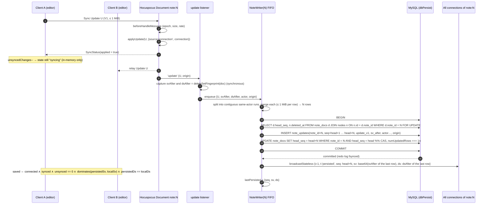
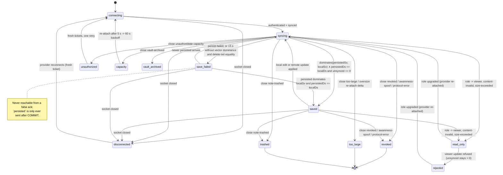

# Collaboration and durability

This section is the definitive specification of everything between a keystroke and the word *Saved*: the pinned CRDT stack, how Hocuspocus 4.7.0 is embedded inside the Fastify server, how a note's Yjs state is initialized exactly once and reloaded thereafter, the per-note persistence writer, the exact *Saved* acknowledgement protocol, compaction and checkpoints, hostile-content detection, how trash/restore/version-restore/role changes coordinate with live sessions, reconnection and restart semantics, admission control, limits, and presence. Everything here is implemented under `apps/server/src/collab/**`, `apps/server/src/notes/**`, `packages/crdt` and `packages/collab-client` (see 02-system-architecture.md for the module map and 03-data-model.md for the tables referenced below). The REST and WebSocket surfaces this section relies on are catalogued in 09-api-reference.md; the tests named at the end are specified in 10-testing-and-quality.md; the decisions behind the choices are recorded as A14–A25 and A50 in 13-decision-log.md.

## Scope and guarantees

| Guarantee | Meaning in Iridium | Where enforced |
|---|---|---|
| Convergence | Every client and the persisted state of a note agree after synchronization; no whole-document replacement ever happens through REST | Yjs CRDT + Hocuspocus sync protocol; no REST body write path exists for note content |
| Truthful *Saved* | *Saved* is shown only when a MySQL transaction containing the user's updates has COMMITted (`innodb_flush_log_at_trx_commit=1`) and the server has broadcast a state vector that dominates the client's whole local state vector and a canonical delete-set fingerprint equal to the client's | `NoteWriter` + `persisted` stateless message + `SaveStateMachine` |
| Single history | A note's Y.Doc is built from Markdown exactly once (`NoteService.initialize`) and reloaded from persisted binary state thereafter; Markdown projections are output, never input | `initialized_at` guard, CI grep tests `collab.initial-state-only-path` and `no-reinit` |
| Ordered persistence | At most one in-flight transaction per note; an older save can never overwrite a newer state | `NoteWriter` strict FIFO, `note_docs FOR UPDATE` + `head_seq` CAS |
| Authorization on the socket | Every connection is authenticated with a single-use ticket, authorized per document, re-validated periodically, and closed on revocation | `IridiumAuth` hooks + `CollabGateway` (see 04-auth-and-access-control.md) |
| Bounded resources | Loaded documents, state bytes, queue depth, frame size, update size, message rate and awareness rate are all capped | `IridiumLimits`, `NoteWriter` backpressure, admission budget (`@iridium/contracts/limits.ts`) |
| Content integrity | The Y.Text of record contains only plain LF text; formatting attributes, embeds and `\r` are detected at every compaction and repaired through an audited CLI | `scanHostileContent` in the compactor, `iridium doctor --repair-content` |
| Recoverability | Markdown checkpoints (`note_revisions`) exist independently of sync state; every restore is reversible; an unloaded note always has a checkpoint at its head | Compactor checkpoint policy, `pre_restore` rows, `beforeUnloadDocument` |

## Pinned collaboration stack and the single-instance rule

### Versions

All versions are exact pins in the pnpm catalog (`catalog:` strict, `saveExact`); none use carets.

| Package | Version | Role | Notes |
|---|---|---|---|
| `yjs` | 13.6.32 | CRDT engine, server and clients | Stable v13 line. `@y/y` 14.0.0-rc.26 is a release candidate with undocumented v13↔v14 compatibility and is explicitly excluded |
| `y-protocols` | 1.0.7 | Sync/awareness wire protocol (V1 only) | Peer of Hocuspocus and y-codemirror.next |
| `lib0` | 0.2.117 | Encoding primitives (transitive) | Pinned so no `lib0` 1.0.0-rc leaks in from a v14-line package |
| `y-codemirror.next` | 0.3.6 | CodeMirror 6 binding (client only) | Binds a `Y.Text` only; per-client undo via `Y.UndoManager` |
| `@hocuspocus/server` | 4.7.0 | Collaboration backend (embedded `Hocuspocus` class) | Node ≥ 22; peers `yjs ^13.6.8`, `y-protocols ^1.0.6`; deps `async-mutex`, `crossws`, `lib0` |
| `@hocuspocus/provider` | 4.7.0 | Client provider (`HocuspocusProviderWebsocket` + `HocuspocusProvider`) | Multiplexes many documents over one socket |
| `@hocuspocus/common` | 4.7.0 | `MessageType`, close codes, `SkipFurtherHooksError` | Server only |
| `@codemirror/state` / `@codemirror/view` | 6.7.4 / 6.43.11 | Editor core (client only) | Pinned and deduplicated alongside Yjs because duplicate copies silently stop the binding from syncing |
| `@fastify/websocket` | 11.3.0 | WebSocket upgrade on the Fastify server | `options.maxPayload = 2 MiB`; `preValidation` hooks for Origin allowlist and connection caps |
| `ws` | 8.21.3 | Node WebSocket (transitive; test client subclass in `@iridium/testkit`) | The test subclass injects `Origin: <PUBLIC_ORIGIN>` |
| `mysql2` / `kysely` | 3.24.4 / 0.29.5 | `dbPersist` pool (4 connections) used exclusively by the writer and compactor | `FOUND_ROWS` flag asserted at boot so `numUpdatedRows === 1n` is meaningful |

`@hocuspocus/extension-database` is **not** used (it stores a full V1 state per debounced store, has no CAS, no durable acknowledgement and no error handling; see 13-decision-log.md, A17). `@hocuspocus/extension-redis` is not used in the MVP (a single process owns all live documents; the seam for it is the `CollabServer` interface, see below).

### Both MySQL lines are targets for everything in this section

Iridium requires **MySQL 8.4 LTS** (`mysql:8.4.11`, the compatibility floor) and **MySQL 9.7 LTS** (`mysql:9.7.2-oraclelinux9`). Neither is primary and both are merge-blocking. 03-data-model.md §1 states the dialect rule once — identical semantics on both lines, written to the 8.4.11 floor, no construct that 9.x introduces and none that 8.4 merely deprecates — and every statement specified below is bound by it: the writer's `SELECT … FOR UPDATE` plus `head_seq` CAS, steps 0–5 of the compaction transaction, `loader.load`, the children-first purge delete order, and the `jobs/update_log_prune` / `jobs/revision_thinning` batches.

The rule is restated here because this is the section where the hand-written durability SQL lives, and a portability defect in it is not recoverable by a reindex. What the path actually depends on is small and old: row locking at `REPEATABLE READ`, the `CLIENT_FOUND_ROWS` matched-row count that makes `numUpdatedRows === 1n` meaningful, the `MEDIUMBLOB`, `VARBINARY(4096)` and `TINYINT` columns the durability tables use, and the `performance_schema` lock tables `lock-order.integration` samples — all of which behave identically on 8.4.11 and 9.7.2, so the constraint forbids nothing this section already does. It exists so that a later contributor cannot reach for a 9.x-only optimiser hint or JSON construct in the writer or the compactor: the collaboration integration, property and chaos suites named at the end of this section run against both images, so such a reach is a merge failure rather than a nightly advisory (10-testing-and-quality.md, CI lanes).

### The single-instance rule

Yjs sets `globalThis['__ $YJS$ __']` and logs `Yjs was already imported. This breaks constructor checks and will lead to issues!` when two copies load; `@codemirror/state` throws `Unrecognized extension value in extension set` for the same reason, and the Yjs community reports `y-codemirror.next` silently stops syncing when two `@codemirror/view` copies resolve. Iridium therefore enforces one module instance for each of `yjs`, `lib0`, `y-protocols`, `@codemirror/state` and `@codemirror/view`:

1. `pnpm-workspace.yaml` `catalog:` pins plus `overrides` for the five packages, so any transitive request resolves to the pinned version.
2. `packages/ui`, `apps/web` and `apps/desktop/src/renderer` Vite configs set `resolve.dedupe` for the same five packages.
3. CI job `deps.single-instance`: `pnpm why yjs lib0 y-protocols @codemirror/state @codemirror/view` must resolve to exactly one version each, and the renderer bundle analysis asserts one chunk owner per package.
4. Server startup guard (`apps/server/src/collab/server.ts`): `console.error` is intercepted during module load; if the Yjs duplicate-import message appears the process exits non-zero before listening. The Node server is pure ESM so `yjs` resolves once to `dist/yjs.mjs`.
5. `@iridium/crdt` is the **only** first-party package that imports `yjs` or `y-protocols`. The server persistence code (`apps/server/src/collab/persistence/**`), `@iridium/collab-client` and `@iridium/editor` consume `@iridium/crdt`'s API. The Electron preload never imports any of these packages (it is a sandboxed single-file CJS bundle with no CRDT code). A lint rule (`oxlint no-restricted-imports`) fails the build on any other `yjs`/`y-protocols` import.

The Yjs v14 migration is a deliberate post-MVP project gated on a stable release and a v13→v14 state-compatibility spike; because of rule 5 it is a one-package change plus the `note_docs.yjs_major` marker (see 12-milestones.md, post-MVP roadmap).

### `@iridium/crdt` public API

`packages/crdt/src/index.ts` (isomorphic, compiled, no DOM, no `node:*`):

```ts
export type V1Update   = Uint8Array & { readonly __brand: 'V1Update' };   // wire-format update (y-protocols sync, note_updates.update_v1)
export type V2State    = Uint8Array & { readonly __brand: 'V2State' };    // Y.encodeStateAsUpdateV2 output (note_docs.snapshot with snapshot_format=2)
export type StateVector = Uint8Array & { readonly __brand: 'StateVector' };

export const CONTENT_KEY = 'content';
export const LOAD_ORIGIN: unique symbol;                       // transaction origin used while loading persisted state
export const INIT_ORIGIN = { source: 'init' } as const;        // origin used inside initialNoteState()

export function createNoteDoc(opts?: { gc?: boolean }): Y.Doc;   // gc defaults true
export function getContent(doc: Y.Doc): Y.Text;                  // doc.getText(CONTENT_KEY)

export function encodeState(doc: Y.Doc, format: 1 | 2, from?: StateVector): V1Update | V2State;   // 2 → encodeStateAsUpdateV2, 1 → encodeStateAsUpdate; `from` (optional) encodes only the delta a peer at that state vector is missing
export function loadState(doc: Y.Doc, blob: Uint8Array, format: 1 | 2, origin: unknown): void;   // applyUpdateV2 | applyUpdate
export function applyV1(doc: Y.Doc, update: V1Update, origin: unknown): void;
export function mergeV1(updates: V1Update[]): V1Update;         // Y.mergeUpdates
export function stateVector(doc: Y.Doc): StateVector;           // Y.encodeStateVector
export function decodeStateVector(sv: StateVector): Map<number, number>;
export function deleteSetFingerprint(doc: Y.Doc): string;        // SHA-256 of canonical delete-set encoding, lowercase hex64
export const EMPTY_DELETE_SET_FINGERPRINT: string;
export const SV_STORED_MAX_BYTES = 4096;                        // the VARBINARY(4096) width of note_updates.sv_after / note_docs.snapshot_sv
export function storedSv(sv: StateVector): StateVector;         // sv when byteLength <= SV_STORED_MAX_BYTES, else a zero-length StateVector ("not recorded", 03-data-model.md D03-01)
export function recordedSv(recorded: Uint8Array | null | undefined, doc: Y.Doc): StateVector;   // zero length or NULL → stateVector(doc)
export function dominates(persisted: StateVector | Map<number, number>, local: StateVector | Map<number, number>): boolean;
export function prefixSuffixDiff(current: string, target: string): { start: number; deleteLength: number; insert: string };
export function insertChunked(ytext: Y.Text, index: number, text: string, origin: unknown, beforeChunk?: () => void): void;   // splits at code-point boundaries into ≤ INSERT_CHUNK_MAX_BYTES UTF-8 pieces, one Y.Text.insert transaction each
export function projectMarkdown(doc: Y.Doc): string;            // getContent(doc).toString(); asserts the LF invariant in tests
export function scanHostileContent(doc: Y.Doc): { ok: true } | { ok: false; reason: 'cr' | 'attributes' };   // toDelta() must contain only {insert: string}; no '\r'
export function initialNoteState(markdownLf: string): { update: V1Update; snapshot: V2State; sv: StateVector; sizeChars: number };   // throwaway Y.Doc, destroyed before return
export function peekFrame(bytes: Uint8Array): { documentName: string; type: number };   // Hocuspocus frame header (varstring + varuint) for pre-dispatch limits
export function decodeAwarenessStates(update: Uint8Array): Array<{ clientId: number; clock: number; state: unknown | null }>;   // lib0 varint + JSON, for beforeHandleAwareness
```

`dominates(persisted, local)` returns `true` iff for every `(clientId, clock)` in `local`, `persisted.get(clientId) ?? 0 >= clock`. It is property-tested (`crdt.dominates.prop`) against random vectors, including vectors with clientIDs absent from `persisted` (never dominated) and with the local clientID changed mid-session (Hocuspocus issue #845 defence).

`prefixSuffixDiff(current, target)` computes the longest common prefix and suffix (in UTF-16 units, never splitting a surrogate pair) and returns the single middle edit that turns `current` into `target`; applying `delete(start, deleteLength)` then `insert(start, insert)` on a `Y.Text` whose `toString()` equals `current` yields exactly `target` (property `crdt.prefixSuffixDiff.prop`).

`insertChunked(ytext, index, text, origin)` is the **only** way first-party code inserts a large string into a `Y.Text`. It splits `text` at code-point boundaries — never inside a surrogate pair, or a chunk seam would manufacture lone surrogates and trip `scanHostileContent`/`normalizeSource` — into pieces of at most `INSERT_CHUNK_MAX_BYTES` (256 KiB) of UTF-8 and applies each in its own transaction, so every update the pipeline produces stays below `YJS_UPDATE_MAX_BYTES` (1 MiB). `crdt.insert-chunking.prop` asserts that every emitted update is within the cap, that the concatenation equals the input and that no chunk boundary splits a surrogate pair, over random astral-plane and CJK text. Call sites: `@iridium/editor` paste and drop handling (07-client-applications.md §5.7), the tree-item-drop link insert, import fix-ups, and the server's fenced `ServerEdit.insertChunked` restore and repair paths below. The helper refuses an active enclosing Yjs transaction with `nested-transaction` before mutating; otherwise Yjs would combine all chunks into one update and discard their origins. Server edits perform deletion/format cleanup in a separate transaction, then call `ServerEdit.insertChunked` outside `DirectConnection.transact`. The gateway checks ownership before each chunk and supplies the captured trusted actor/origin context. A failed partial repair keeps `content_invalid` set.

`storedSv`/`recordedSv` are where D03-01's degradation lives, so the writer, the compactor and the loader share one definition of "not recorded" instead of repeating an inline ternary. The package stays side-effect-free (it is isomorphic, no `node:*`): the `iridium_state_vector_oversize_total` counter and the `collab.state_vector.oversize` log line belong to the two call sites, not to the codec.

### Document model

- Exactly one `Y.Doc` per note; the body is the single `Y.Text` under the fixed key `content`. Never `Y.XmlFragment`, never `Y.Map` metadata (metadata lives in MySQL), never formatting attributes or embeds — `Y.Text.toString()` drops `ContentFormat`/`ContentEmbed` silently, which would make projections, search and export diverge from the CRDT. `scanHostileContent` enforces this at every compaction (see "Hostile CRDT content" below).
- The Y.Text content is LF-only, BOM-free Unicode with U+0000 replaced by U+FFFD, normalised once at the four text-entry points (create, import, version restore, repair) by `normalizeSource()` from `@iridium/markdown` (see 08-markdown-pipeline-import-export.md). CodeMirror treats `\r\n` as one position while `Y.Text` counts two UTF-16 units (y-codemirror.next issue #35); any `\r` in the text desynchronises positions. The client also strips `\r` on paste.
- `yDocOptions.gc` stays `true` on the server: deleted content becomes GC structs, keeping snapshots small. History is therefore never based on `Y.snapshot` (which requires `gc:false`); it is based on `note_revisions` Markdown checkpoints plus optional V2 blobs (see "Compaction and V2 snapshots").
- Relative positions (`Y.RelativePosition`) are used for remote cursors, caret restoration after an `EditorView` rebuild and undo selection restore; they may resolve to `null` after GC of their anchor, and every consumer handles `null`.
- Server-side clientIDs: each Hocuspocus `Document` has its own clientID but the server never authors content except through a `DirectConnection` (version restore, repair). Each client window's `NoteSession` owns one Y.Doc with a random 32-bit clientID for the life of the session.
- Transaction origins are the routing key of the whole pipeline. Every origin the server can observe on a note document, and what each consumer does with it:

| Origin | Produced by | Persisted by the writer? | Captured by client `UndoManager`s? |
|---|---|---|---|
| `LOAD_ORIGIN` (symbol) | `onLoadDocument` applying `note_docs.snapshot` and `note_updates` rows | No (already persisted) | Never reaches clients as a distinct origin (it is the initial sync) |
| `{source:'connection', connection}` | Hocuspocus applying a client update | Yes, `origin='connection'`, `actor` from `connection.context` | Local edits: yes (origin is the `YSyncConfig`); remote edits: no (origin is the provider instance) |
| `{source:'local', context:{reason:'restore', revisionId, userId}}` | `DirectConnection.transact` in a version restore | Yes, `origin='restore'` | No (provider origin on the client) |
| `{source:'local', context:{reason:'repair', userId?}}` | `iridium doctor --repair-content` | Yes, `origin='repair'`, `actor_type='system'` unless a user is given | No |
| `INIT_ORIGIN` | `initialNoteState()` on a throwaway doc | Persisted as `note_updates seq=1` with `origin='create'` or `'import'` by `NoteService.initialize`, never through the writer | Not applicable |


## Hocuspocus 4.7.0 embedded in Fastify

Hocuspocus is used through the `Hocuspocus` class (never the `Server` class, which owns its own `http.Server` and port). It is instantiated once per process in `apps/server/src/collab/server.ts` and mounted on the same Fastify instance, origin and port as REST and MCP, so the collaboration socket shares the session model, the Origin allowlist, the proxy configuration and the shutdown drain of the rest of the server.

### Instance configuration

```ts
// apps/server/src/collab/server.ts
export const hocuspocus = new Hocuspocus({
  name: 'iridium',
  timeout: 60_000,                                   // app-level Ping(9)/Pong(10); proxies must idle out later than this (see 11-operations-and-deployment.md)
  debounce: env.COLLAB_DEBOUNCE_MS,                  // 2 000 in production; 100 in the integration project; the production value in the chaos project
  maxDebounce: env.COLLAB_MAX_DEBOUNCE_MS,           // 10 000 in production; 500 in the integration project; the production value in the chaos project
  unloadImmediately: true,                           // last client gone → pending store runs now → unload (subject to the writer's veto)
  yDocOptions: { gc: true, gcFilter: () => true },
  maxPendingDocuments: 100,
  maxUnauthenticatedQueueSize: 5 * 1024 * 1024,      // Hocuspocus defaults, kept explicit
  maxUnauthenticatedQueueMessages: 1000,
  flushDelay: 0,                                     // provider/server batching stays off; measured in M8 before ever enabling
  quiet: true,                                       // Hocuspocus logging replaced by pino events
  extensions: [iridiumAuth, iridiumLimits, iridiumPersistence, iridiumVaultChannel],
});
```

The four extensions are plain objects implementing the Hocuspocus `Extension` interface; hooks chain in array order, sequentially, and a throwing hook aborts the chain for that event. Every hook body is wrapped by `safeHook(name, fn)` which catches synchronous throws and promise rejections, logs `collab.hook.error {hook, documentName}` with the request id, increments `iridium_collab_hook_errors_total{hook}` and rethrows **only** the typed marker `CollabRejection(reason)`, and only from the hooks whose contract Hocuspocus defines as "throw to reject" (`onAuthenticate`, `onLoadDocument`, `onTokenSync`, `beforeHandleMessage`, `beforeHandleAwareness`, `beforeUnloadDocument`, `onStoreDocument`); for every other hook, and for any other error value from any hook, the error is swallowed after logging. This is the sense in which 14-risks-and-open-questions.md D14-09 says a hook body "can never reject": `collab.hooks-never-reject.unit` enumerates every registered hook and asserts that nothing but a `CollabRejection` from those seven escapes `safeHook`.

`onStateless` is deliberately **not** on the rethrow list, and does not signal by throwing at all: the note and vault handlers close the connection themselves with `connection.close({ code: 4403, reason: 'protocol-error' })`, which (Hocuspocus 4.7) removes that document's connection and sends `MessageType.CLOSE(7)` with the reason to that provider only, leaving the other documents multiplexed on the socket untouched — the per-document close semantics "Reconnection semantics" and 09-api-reference.md §3.6 specify. A rejection from `onStateless` is therefore always a bug: counted in `iridium_collab_hook_errors_total{hook="onStateless"}` and swallowed. The M0 spike S2 (`docs/spikes/S02-fastify-websocket-hocuspocus.md`) records the verified behaviour (a `close` from inside `onStateless` closes only that document connection and the socket survives for the vault provider) rather than assuming that a *throw* would close anything. This is also the defence against Hocuspocus issue #754 (hook rejections are unhandled promise rejections, which terminate Node 24 by default). `onChange` is deliberately not implemented by any extension — it is invoked without `await` or `catch`, and persistence uses Iridium's own `document.on('update')` listener instead (below).

### Mounting on `/collab`

```ts
// apps/server/src/collab/server.ts (route registration, inside the collab plugin)
app.register(fastifyWebsocket, { options: { maxPayload: 2 * 1024 * 1024 } });   // A.1: frame cap
app.get('/collab', {
  websocket: true,
  config: { auth: { public: true, wsUpgrade: true },        // the route-policy boot assertion knows this is ticket-authenticated inside the protocol
            rateLimit: collabUpgradeBucket },              // declared deliberately: the root limiter counts upgrades (see below)
  preValidation: [originAllowlist, connectionCaps],          // absent Origin → 403 always; 50 sockets per IP, 5 000 sockets per process (20 document attachments per user*)
}, (socket, req) => {
  const webRequest = new Request(`${env.PUBLIC_ORIGIN}${req.url}`, { headers: toHeaders(req.headers) });
  const cc = hocuspocus.handleConnection(socket as WebSocketLike, webRequest, { ip: req.ip, requestId: req.id });
  const awarenessBuckets = new Map<DocName, TokenBucket>();          // one per document connection; dies with the socket
  socket.on('message', (data) => {
    const bytes = toUint8Array(data);
    const { documentName, type } = peekFrame(bytes);                 // @iridium/crdt: header varstring + varuint, no decode
    if (type === MessageType.Awareness /* 1 */ && !bucketFor(awarenessBuckets, documentName).take()) {
      metrics.collabMessages.inc({ type: 'awareness_dropped' });
      return;                                                        // pre-dispatch drop: never forwarded, never a close
    }
    cc.handleMessage(bytes);
  });
  socket.on('close', (code, reason) => cc.handleClose({ code, reason: reason.toString() }));
  socket.on('error', (err) => log.warn({ err, requestId: req.id }, 'collab.socket.error'));
});
```

The pre-dispatch filter is the **only** place a frame is dropped, and it drops exactly one message type. The `@hocuspocus/common` `MessageType` values are Sync 0, Awareness 1, Auth 2, QueryAwareness 3, Stateless 5, CLOSE 7, SyncStatus 8, Ping 9, Pong 10; only type 1 is ever filtered, so the 60 s app-level `Ping(9)`/`Pong(10)` liveness pair and `Auth(2)` can never be dropped by the limiter. The bucket is keyed on `(socket, documentName)` rather than on the socket, because `NoteSessionRegistry` multiplexes one provider per open note over one socket (A41) and a socket-wide bucket would shrink the effective cap as the user opens more notes, contradicting the "per connection" wording of the limit in 02-system-architecture.md, 04-auth-and-access-control.md and 13-decision-log.md (A25). The value is `AWARENESS_MESSAGES_PER_SECOND` imported from `@iridium/contracts/limits.ts`, so the "every enforcement site imports its constant" grep guard still passes.

**The boot-step-3 chain runs on every upgrade request**, which spike S2 measured and which the route declaration above answers. `@fastify/rate-limit`'s global bucket — the unauthenticated tier, 60 per minute per IP — counted every upgrade in that run, so `/collab` declares `config.rateLimit` deliberately rather than inheriting a limit that would refuse a window's reconnect storm as if it were an anonymous REST flood; the per-IP and per-process socket caps in `collab/limits.ts` are a separate mechanism and neither replaces the other. This is the same explicitness 06-mcp-and-agent-access.md applies to `/mcp`. The `Host` guard applies to upgrades too: a foreign `Host` is answered `421 host_rejected` before `preValidation` runs, which is why `403 forbidden` stays reserved for the Origin check.

`*` The per-user cap is enforced in `IridiumAuth.onAuthenticate`, per document, after `TicketStore.consume` has bound `{sessionId, userId}` — the upgrade itself carries no credential, so `context.userId` does not exist in `preValidation`, where only the per-IP and per-process **socket** counters (`collab/limits.ts`, incremented when an upgrade is accepted, decremented on socket `close`, and including sockets whose first `onAuthenticate` has not yet completed) can be checked; those refuse the upgrade with HTTP `429 ProblemDetails{code:'rate_limited'}` plus `retry-after`, while `403 forbidden` stays reserved for the Origin/Host check. The M0 spike S2 (`docs/spikes/S02-fastify-websocket-hocuspocus.md`, registered in 12-milestones.md §4.4) confirms `handleConnection`/`handleMessage`/`handleClose` wiring with `@fastify/websocket` 11.3.0, that `onRequest`/`onUpgrade`/`onListen` do not fire in this mode (they are not used), and that a `close` from the socket while `onAuthenticate` is in flight is handled without a leaked document. The same note also records two hook behaviours the plan must not assume: that `connection.close({code:4403, reason:'protocol-error'})` called from inside `onStateless` closes only that document connection while the socket survives for the vault provider, and that a throw from `beforeHandleAwareness` both prevents the awareness state from being applied and broadcast **and** closes only that document connection. The recorded fallback for the second: `IridiumAuth.beforeHandleAwareness` also calls the verified `connection.close({code: 4403, reason: 'awareness-spoof'})`, and if the throw proves not to suppress the state, the spoof check moves to the same pre-dispatch point as the awareness rate cap and decodes there with `decodeAwarenessStates`. Cookies are never read on `/collab`; the only credential is the single-use ticket carried in the Hocuspocus auth message (see 04-auth-and-access-control.md).

### The interfaces that confine Hocuspocus

Hocuspocus types (`Document`, `Connection`, hook payloads, `DirectConnection`) appear only in `apps/server/src/collab/{server,hooks/*,gateway,vault-channel}.ts` and `persistence/*`. Everything else in the server talks to three interfaces:

```ts
// apps/server/src/collab/types.ts
export interface CollabServer {
  start(): Promise<void>;
  stop(opts: { drainMs: number }): Promise<void>;                       // shutdown sequence, see "Server restart and recovery"
  loadedDocuments(): Iterable<LoadedDocumentInfo>;                       // {name, connections, stateBytes, writerState}
  closeDocument(name: DocName, reason: CollabCloseReason, opts?: { graceMs?: number }): Promise<void>;
  closeUser(userId: UserId, reason: CollabCloseReason, opts?: { sessionId?: SessionId; vaultId?: VaultId }): Promise<void>;
  setRole(userId: UserId, vaultId: VaultId, role: VaultRole): Promise<void>;
  broadcast(name: DocName, message: ServerNoteMessage | ServerVaultMessage): void;
  openServerEdit(name: NoteDocName, ctx: ServerEditContext): Promise<ServerEdit>;   // DirectConnection wrapper
  participants(name: DocName): Participant[];
}

export interface CollabPersistence {
  load(noteId: NoteId): Promise<LoadedState>;                            // snapshot + rows > snapshot_through_seq + head_seq + lastPersisted
  attach(document: HocuspocusDocument, loaded: LoadedState): NoteWriter; // registers the update listener; returns the writer
  compactNow(noteId: NoteId, opts: CompactOptions): Promise<CompactResult>;   // enqueues a compaction job in the FIFO and awaits it, bounded by COMPACTION_AWAIT_TIMEOUT_MS
  writerOf(noteId: NoteId): NoteWriter | undefined;
  baselineOf(noteId: NoteId): Promise<{ seq: number; sv: StateVector; ds: string }>;      // the same read afterLoadDocument performs, for a baseline with no attached writer
}

export interface CollabGateway {                                          // called by REST services after COMMIT (never inside a transaction)
  markClosing(noteId: NoteId): void;                                    // enters the closing set; called by tree/trash.ts BEFORE its transaction
  isClosing(noteId: NoteId): boolean;                                   // read by onAuthenticate, onLoadDocument, beforeHandleMessage
  clearClosing(noteId: NoteId): void;                                   // released in tree/trash.ts's `finally`, on success and on failure
  closeNote(noteId: NoteId, reason: 'note-trashed' | 'note-closing'): Promise<void>;
  revokeUser(userId: UserId, opts?: { sessionId?: SessionId }): Promise<void>;
  removeFromVault(userId: UserId, vaultId: VaultId): Promise<void>;
  changeRole(userId: UserId, vaultId: VaultId, role: VaultRole): Promise<void>;
  archiveVault(vaultId: VaultId): Promise<void>;
  broadcastVault(vaultId: VaultId, message: ServerVaultMessage): void;
  openServerEdit(noteId: NoteId, ctx: ServerEditContext): Promise<ServerEdit>;
  participants(noteId: NoteId): Participant[];
}
```

`CollabGateway` is what `users/`, `vaults/`, `members/`, `tree/` and `notes/` call; it subscribes to the `AuthzBus` events published after COMMIT (`user.disabled`, `user.password_changed`, `session.revoked`, `membership.removed`, `membership.role_changed`, `vault.archived`, `note.trashed`, `note.purged` — see 04-auth-and-access-control.md) and translates each into connection operations. A future multi-process deployment replaces the in-process `AuthzBus` and adds `@hocuspocus/extension-redis`; the `CollabServer`/`CollabPersistence` interfaces do not change.

### Extensions and every hook they use

Extension order is fixed: `IridiumAuth` → `IridiumLimits` → `IridiumPersistence` → `IridiumVaultChannel`. Each hook implementation first checks the document-name prefix (`note:` or `vault:`) and returns immediately for names it does not own, so the order between `IridiumPersistence` and `IridiumVaultChannel` carries no semantics; the order between `IridiumAuth` and `IridiumLimits` does (identity is resolved before budgets are checked).

**`IridiumAuth`** (`collab/hooks/auth.ts`) — identity, authorization, revocation:

| Hook | What it does |
|---|---|
| `onAuthenticate` | Consumes the ticket from the auth message (`TicketStore.consume(token)` → `{sessionId, userId}` or throw `unauthorized`); re-loads the session **by primary key** with `loadLiveSession(ticket.sessionId)` (04-auth-and-access-control.md §4.2 — the ticket carries no secret, so the raw-token `verifySession` is not the entry point here) and splits the outcome the way 09-api-reference.md §3.6 requires: `null` or `{dead:'expired'}` → throw `unauthorized` (4401), `{dead:'revoked'｜'user_inactive'}` → throw `revoked` (4403), and a loaded `userId` that differs from `ticket.userId` → throw `unauthorized` plus the SIEM event `authz.denied {reason:'ticket_session_mismatch'}`; parses the document name (`note:<uuid>` → resolve `nodes` + `notes` + `vaults` in one query; `vault:<uuid>` → `vaults`); refuses unknown/foreign/trashed notes and `importing\|deleting` vaults with `note-not-found`, archived vaults with `vault-archived`; loads `vault_members` (server admins are treated as `manager`); sets `connection.readOnly = role === 'viewer'` for `note:*` and `connection.readOnly = true` for every `vault:*` connection; consults the closing set (`CollabGateway.isClosing(noteId)` → throw `note-closing`); enforces the cap of **20 concurrent document attachments per user**, counted over the live `note:*` + `vault:*` connections whose `context.userId` matches (throw `rate-limited`, which refuses this document only — the upgrade carries no credential, so the per-user leg cannot be checked in `preValidation`); returns the `IridiumCollabContext` below (`{sessionId, userId, vaultId, noteId, role, isServerAdmin, authzEpoch:{userAuthzVersion, memberVersion}, ip, requestId, connectedAt, clientName, clientVersion}`). Throwing sends `PermissionDenied(reason)` for that document only; the socket stays open for the provider's other documents. Every rejection is audited as `collab.connection.rejected` |
| `onTokenSync` | Runs when the connection answers a `connection.requestToken()` issued by the re-validation timer (every 15 min ± 3 min jitter per connection; 5 min grace before an unanswered request closes the connection). Consumes the fresh ticket, re-runs `loadLiveSession(ticket.sessionId)` and the membership checks with the **same reason split as `onAuthenticate`** — an unknown or idle/absolute-expired session closes `unauthorized` (4401) so the client fetches fresh tickets and re-attaches once, while a revoked session, a disabled user or a removed membership closes `revoked` (4403) and is terminal — then updates `context.authzEpoch` and `connection.readOnly`; a downgrade or upgrade sends `{t:'role'}` (see "Role change on a live connection"). Any other failure closes the document connection with `revoked` |
| `beforeHandleMessage` | Before any inbound frame for a document: compares the connection's `authzEpoch` tuple with the in-process epoch table (`{userAuthzVersion, memberVersion}` — a tuple, never a sum); on mismatch re-evaluates from the DB (`users.authz_version`, `vault_members.version`, `vault_members.role`) and applies the result (close `revoked`, or flip `readOnly` + `{t:'role'}`); rejects frames for a note in the closing set with close reason `note-closing`; validates every raw awareness entry, identity and removal ownership before Hocuspocus can collapse duplicate ids or discard nulls (presence rules below) |
| `beforeHandleAwareness` | Rechecks every non-null awareness state passed by Hocuspocus and closes the connection with `awareness-spoof` if any non-null state's `user.id !== context.userId` or the state does not match the schema `{user:{id}, cursor?:{anchor, head}, mode?}` (`note:*`) / `{user:{id}, activeNoteId?}` (`vault:*`). Audited as `collab.write.rejected {reason:'awareness-spoof'}` |
| `connected` | Fires after `onAuthenticate` and document load for that connection — and, spike S2 measured, **after the connection's first queued message has been handled**, so a client's `SyncStep1` is replayed before this hook runs and the broadcast below must not assume the first sync has not happened: records the participant (`connection.context`) in the gateway's per-document participant table and broadcasts `{t:'participants'}` to every connection of the document |
| `onDisconnect` | Removes the participant and broadcasts `{t:'participants'}`; cancels the re-validation timer of that connection |

**`IridiumLimits`** (`collab/hooks/limits.ts`, constants from `@iridium/contracts/limits.ts`) — sizes, rates, budgets:

| Hook | What it does |
|---|---|
| `onAuthenticate` | Runs after `IridiumAuth.onAuthenticate` (same event, next extension). For a `note:*` name whose document is not yet loaded, checks the admission budget: `loadedDocs + 1 ≤ COLLAB_MAX_LOADED_DOCS` (2 000) and `loadedStateBytes + note_docs.snapshot_size ≤ COLLAB_MAX_STATE_BYTES_TOTAL` (1 GiB); on refusal throws `capacity` (client shows "Server busy — retrying" and retries with backoff) and raises the `collab.capacity` alert. Reserves the estimate until `afterLoadDocument` replaces it with the measured value |
| `beforeHandleMessage` | Rejects a frame whose `payload.update` exceeds 1 MiB with close reason `too-large` (close code 1009); applies the per-connection token bucket of 200 messages per 10 s to every non-awareness message type (sync, stateless, auth, query-awareness) → close `rate-limited`; counts `iridium_collab_messages_total{type}` using `peekFrame` |
| `beforeHandleAwareness` | Nothing for the rate cap. A hook cannot skip an awareness update: a hook that resolves lets Hocuspocus apply and broadcast the update, and the only way for it to object is to throw, which closes the connection. The 10/s per-document-connection cap is therefore enforced **pre-dispatch** in the `/collab` plugin (see "Awareness: minimal, validated, rate-capped"); identity and shape validation stay in `IridiumAuth.beforeHandleAwareness`, which throws to close with `awareness-spoof` |
| `afterLoadDocument` | Replaces the admission reservation with `Y.encodeStateAsUpdateV2(document).byteLength` measured once at load; updates `iridium_docs_loaded` and `iridium_note_state_bytes` |
| `afterUnloadDocument` | Releases the document's budget entry |

**`IridiumPersistence`** (`collab/hooks/persistence.ts` + `collab/persistence/{loader,writer,compactor,initial-state}.ts`) — durability:

| Hook | What it does |
|---|---|
| `onLoadDocument` | `note:*` only. `loader.load(noteId)` reads `note_docs` (snapshot, `snapshot_format`, `snapshot_through_seq`, `head_seq`) and `note_updates WHERE seq > snapshot_through_seq ORDER BY seq`; applies `loadState(document, snapshot, snapshot_format, LOAD_ORIGIN)` then `applyV1(document, row.update_v1, LOAD_ORIGIN)` for each row; verifies `yjs_major === 13`; **returns `undefined`** (returning bytes would make Hocuspocus `applyUpdate` them as V1). Throws `unavailable` for classified database acquisition, timeout or transport failures, `no-owner-lease` for a lost ownership generation, and `note-not-found` for a note without a `note_docs` row (an uninitialised note is a bug, never an empty document) — Hocuspocus 4.7 then destroys the phantom document and closes its connections |
| `afterLoadDocument` | `persistence.attach(document, loaded)`: creates the `NoteWriter`, registers `document.on('update', listener)` — the listener ignores `LOAD_ORIGIN` and accepts `{source:'connection'}` and `{source:'local'}` origins — initialises `lastPersisted = {seq: head_seq, sv: recordedSv(last note_updates.sv_after ?? snapshot_sv, document), ds: deleteSetFingerprint(document)}`, i.e. from the recorded vector, or from `stateVector(document)` when the recorded value is zero length or `NULL` (state vector wider than `VARBINARY(4096)`; 03-data-model.md, D03-01), and asserts (in test builds) that it dominates `stateVector(document)`; runs `scanHostileContent` once and, if the note is already flagged `content_invalid`/`oversize`, sets every connection read-only and broadcasts `{t:'content-invalid'}` / `{t:'size-exceeded'}` |
| `onStateless` | `note:*` only. Parses the payload with the client-message schema; `baseline {}` → `connection.sendStateless(persisted{seq, sv, ds})` from `lastPersisted`, or from `persistence.baselineOf(noteId)` when no writer is attached; `flush {}` → `compactNow(noteId, {trigger:'flush'})` then `connection.sendStateless(projected{seq})`, rate-limited to 6 per minute per connection (excess answered with the current `projected {seq}` without work — never `persist-failed`, never a close) and answered `persist-failed {reason:'db_unavailable', retryInMs}` only when the compaction genuinely cannot reach the FIFO head; anything else → the handler closes that document connection itself with `protocol-error` (it never throws) |
| `onStoreDocument` | `note:*` only. Called by Hocuspocus's per-document debounce inside `document.saveMutex`. Enqueues a compaction job into the writer's FIFO with `trigger: payload.clientsCount === 0 ? 'unload' : 'debounce'` and **awaits it**, so `flushPendingStores()` and the post-store unload check are truthful. Three outcomes: it resolves when the job COMMITs (including the refused-snapshot and invalid-content outcomes, which still commit); it rejects `CompactionUnavailable`/`CompactionTimeout` when the writer cannot drain to the FIFO head (a MySQL outage); it rejects when the job itself failed. In every rejection `safeHook` rethrows, Hocuspocus logs its "Document stays in memory to avoid data loss", keeps the document loaded and re-schedules on the next change; the enqueued job stays in the FIFO and commits when MySQL returns |
| `beforeUnloadDocument` | Throws (vetoes) while the writer's queue is non-empty, a transaction is in flight, the writer is in `retrying`, `failed` or `backpressure`, or no `note_revisions` row exists at `head_seq` (the unload-checkpoint invariant). The writer remembers `unloadRequested = true`; when it later drains with `document.getConnectionsCount() === 0` it calls `hocuspocus.unloadDocument(document)` itself, so vetoed unloads always complete |
| `afterUnloadDocument` | Disposes the writer (clears timers, releases the queue), removes the participant table entry, and drops the closing marker for that note when `nodes.deleted_at IS NULL`. That last step is a **safety net, not the primary release** — `tree/trash.ts`'s `finally` is (see "Trash"), because a note with no loaded document never reaches this hook |

**`IridiumVaultChannel`** (`collab/vault-channel.ts`) — the never-persisted `vault:<uuid>` documents:

| Hook | What it does |
|---|---|
| `onLoadDocument` | `vault:*` only: returns `undefined` without touching the DB (the document stays empty) |
| `onStoreDocument` | `vault:*` only: throws `SkipFurtherHooksError` so nothing is stored and the document may unload |
| `beforeHandleMessage` | `vault:*` only: rejects any Yjs sync `Update`/`SyncStep2` frame carrying content (belt-and-braces over `connection.readOnly`, which already answers `SyncStatus(false)`) with close reason `protocol-error` |
| `beforeHandleAwareness` | `vault:*` only: validates the vault awareness shape `{user:{id}, activeNoteId?: uuid}` after `IridiumAuth` validated identity |
| `onStateless` | `vault:*` only: clients never send stateless messages on the vault channel, so any payload makes the handler call `connection.close({code: 4403, reason: 'protocol-error'})` itself (it never throws) |

Hooks not used by any extension: `onConfigure`, `onListen`, `onUpgrade`, `onConnect` (do not fire or carry nothing in embedded mode), `onCreateDocument` (`yDocOptions` are global), `afterHandleMessage`, `beforeBroadcastStateless`, `beforeSync`, `onChange` (see above), `afterStoreDocument` (the compaction result is awaited directly), `onAwarenessUpdate` (participants come from connection contexts, not awareness), `onRequest`, `onDestroy` (the shutdown sequence is owned by `main.ts`).

### Connection context and document names

`IridiumCollabContext` (typed end-to-end as the Hocuspocus context generic):

```ts
interface IridiumCollabContext {
  sessionId: SessionId; userId: UserId; vaultId: VaultId;
  noteId: NoteId | null;                       // null on a vault:<uuid> connection
  role: 'viewer' | 'editor' | 'manager';       // a server admin is resolved to 'manager' here, never as a later bypass
  isServerAdmin: boolean;
  authzEpoch: { userAuthzVersion: number; memberVersion: number };
  ip: string; requestId: string; connectedAt: number;
  clientName: string | null; clientVersion: string | null;   // from the session row, for the access log
}
```

This is the same `CollabContext` 09-api-reference.md §3.4 documents; 05 owns the shape and 09 renders it.

Document names are `note:<uuid>` and `vault:<uuid>` (canonical lowercase UUIDv7 strings). `parseDocName()` in `@iridium/contracts/collab.ts` rejects anything else before any DB access. Authorship for `note_updates.actor_id`, audit events and revisions is taken exclusively from `connection.context` (or `lastTransactionOrigin.context` for server edits), never from awareness.

### Client-side topology (summary; details in 07-client-applications.md)

One `HocuspocusProviderWebsocket` per application window (`wss://<PUBLIC_HOST>/collab`, `messageReconnectTimeout 30000`, default exponential backoff with jitter, `maxAttempts 0`); one `HocuspocusProvider` per open note per window, owned by `NoteSessionRegistry.acquire(noteId)` in `@iridium/collab-client` and shared by every tab and split pane showing that note (`sessionAwareness:false`; attaching the same document name twice throws, so the registry is the only path to a provider); one provider for `vault:<id>` while a vault is open. The provider's `token` option is an async getter over `TicketSource` (batch tickets from `POST /auth/collab-tickets`, 3 retries with backoff on 429/network errors); awareness is always enabled, including for viewers, because a `null` awareness breaks the Hocuspocus ping handling. `WebSocketPolyfill` is a **WebSocket class**, not a factory: `HocuspocusProviderWebsocket` calls `new WebSocketPolyfill(url)` (digest, verified). In Node (tests, load generator) it is therefore the `ws` subclass that injects `Origin`. In the Electron `IpcWebSocket` fallback `@iridium/collab-client` never passes `ElectronHost.collab.webSocketFactory` (a zero-argument `() => WebSocketLike`) directly — an arrow function is not a constructor and a plain function would receive no URL — it wraps it: `class IpcWebSocketPolyfill { constructor(_url: string) { return host.collab.webSocketFactory!(); } }` is what gets passed as `WebSocketPolyfill`, so Hocuspocus's `new` call works unchanged and the URL argument is ignored because the Electron main process already holds the active profile's origin (07-client-applications.md §7.10). `collab.ipc-websocket.spec` asserts that the class is constructible with `new`, that the constructed value is the `IpcWebSocket` the factory returned, and that the discarded URL argument changes nothing.

## Document naming and the vault realtime channel

| Name | Persisted | Who may write | Purpose |
|---|---|---|---|
| `note:<noteId>` | Yes (`note_docs`, `note_updates`) | Editors and managers (`connection.readOnly=false`); viewers read-only | The note body (`Y.Text 'content'`), note awareness (cursors, mode), note stateless messages |
| `vault:<vaultId>` | Never (`onLoadDocument` returns nothing, `onStoreDocument` throws `SkipFurtherHooksError`) | Nobody (`connection.readOnly=true` for everyone) | `broadcastStateless` of `tree-changed`, `member-changed`, `vault-updated`; vault awareness `{user:{id}, activeNoteId?}` |

The vault channel exists so the tree, membership and "who is in this vault" are fresh without polling and without a second transport: it is authenticated with the same tickets, carries the same `authzEpoch`, and is closed by the same `CollabGateway` revocation path as note documents (a user removed from a vault loses both channels within the same gateway call). Vault-channel presence names are not taken from awareness: the UI maps the validated `user.id` to the member record from the `GET /vaults/:vaultId/members` cache, which `member-changed` invalidates — and whose `displayName`/`colorHue` let the client patch that cache in place instead of refetching. The tree service broadcasts `tree-changed {treeVersion, changes[]}` after every structural COMMIT (see 03-data-model.md, structural transaction protocol); `vaults.tree_version` in the message lets the client detect gaps (a missed message → refetch), and a commit touching more than 500 nodes (an import commit) sends `changes: []` with the new `treeVersion`, which means "refetch" rather than "nothing changed". The vault channel is adopted by the shared UI in M4; the server side ships with M1 because `CollabGateway` needs it for `member-changed`.

## Note initialization and the load path

### Why a note's Y.Doc is built from Markdown exactly once

A Yjs document is not a string; it is a set of item identities `(clientID, clock)` with parent/left/right links. Two Y.Docs built independently from the same Markdown produce *disjoint* identity sets: merging them concatenates the text instead of converging, and a client whose local state references the first identity set cannot reconcile with a server that has rebuilt the second. This is exactly the failure mode the spec's acceptance row "Initialization/reconnection" targets ("two clients open an imported note simultaneously, reconnect, and reopen after a server restart without duplicated initial content"), and it is why Hocuspocus warns against regenerating document state during persistence.

Iridium therefore treats the persisted Yjs state as the content of record and Markdown as a projection *out of* it:

| Direction | Allowed? | Path |
|---|---|---|
| Markdown → Y.Doc | Exactly once per note, inside the transaction that creates the note | `NoteService.initialize(noteId, markdown, origin)` |
| Markdown → Y.Doc, afterwards | Never as a rebuild. Only as an *edit* inside the existing document: the minimal prefix/suffix diff applied through a `DirectConnection` | version restore, `iridium doctor --repair-content` |
| Y.Doc → Markdown | Continuously (committed projections and checkpoints) | compactor → `note_projections`, `note_revisions`, `note_search` |

Two CI guard tests make this structural rather than a convention:

- `collab.initial-state-only-path` — greps `apps/server/src/**` and `packages/**` for `new Y.Doc(` and fails unless the occurrence is inside `packages/crdt/src/**`, `apps/server/src/collab/persistence/initial-state.ts`, or a test file.
- `no-reinit` — greps for `getText('content')` / `getContent(` immediately followed by `.insert(` and fails unless the occurrence is inside `packages/crdt/src/initial-state.ts`, `apps/server/src/notes/revisions.ts` (restore), `apps/server/src/notes/repair.ts`, or a test file.

Consequence for operators: `note_projections.markdown` and `note_search.body_text` are **rebuildable derivatives** (`iridium reindex`), while `note_docs.snapshot`, `note_updates` and `note_revisions` are **irreplaceable**. The backup set and the restore verification treat them accordingly (see 11-operations-and-deployment.md).

### `NoteService.initialize` — the single Markdown → Y.Doc path

`initialize` is called from exactly three places and always inside the caller's existing transaction (it never opens its own): note creation (`POST /api/v1/vaults/:vaultId/nodes` with `kind:'note'`), import commit (one transaction per note, see 08-markdown-pipeline-import-export.md), and restore-from-trash of a note whose `initialized_at` is still `NULL` (a node left behind by a crashed import). It runs on the `dbApp` pool, not `dbPersist`, because it is part of a structural transaction.

```ts
// apps/server/src/notes/service.ts
export async function initialize(
  trx: Transaction<Database>,
  noteId: NoteId,
  markdownRaw: string,
  origin: 'create' | 'import',
  actor: { userId: UserId; sessionId: SessionId | null; actorType: 'user' | 'system' },
  now: Date,
): Promise<{ seq: 1; contentHash: Buffer; sizeChars: number }> {
  // 1. Double-initialization guard — a row lock, not an application flag.
  const row = await trx.selectFrom('notes')
    .select(['node_id', 'initialized_at', 'vault_id'])
    .where('node_id', '=', noteId).forUpdate().executeTakeFirstOrThrow();
  if (row.initialized_at !== null) throw new AlreadyInitializedError(noteId);

  // 2. Normalise once: LF only, BOM stripped, U+0000 → U+FFFD. Hard cap enforced here.
  const { text, eol, hadBom } = normalizeSource(markdownRaw);           // @iridium/markdown
  if (text.length > LIMITS.NOTE_HARD_MAX_UTF16) throw new ProblemError('note_oversized', { max: LIMITS.NOTE_HARD_MAX_UTF16 });

  // 3. Throwaway Y.Doc, destroyed before the call returns.
  const { update, snapshot, sv, sizeChars } = initialNoteState(text);   // @iridium/crdt

  // 4. seq 1 of the durability log.
  await trx.insertInto('note_updates').values({
    note_id: noteId, seq: 1, update_v1: Buffer.from(update), yjs_major: 13,
    sv_after: Buffer.from(storedSv(sv)), actor_type: actor.actorType, actor_id: actor.userId,
    session_id: actor.sessionId, origin, created_at: now,
  }).execute();

  // 5. Persistence anchor, already compacted through seq 1.
  await trx.insertInto('note_docs').values({
    note_id: noteId, head_seq: 1, snapshot_format: 2, yjs_major: 13,
    snapshot: Buffer.from(snapshot), snapshot_sv: Buffer.from(storedSv(sv)),
    snapshot_through_seq: 1, snapshot_size: snapshot.byteLength, snapshot_at: now,
    projected_seq: 1, updated_at: now,
  }).execute();

  // 6. First checkpoint (kind = origin) and the first committed projection.
  await insertRevision(trx, { noteId, seq: 1, kind: origin, markdown: text, snapshot, sv, actor, now });
  await writeProjection(trx, { noteId, revision: 1, markdown: text, ...parseNote(text) });

  // 7. Flip the guard last, inside the same transaction.
  await trx.updateTable('notes').set({
    initialized_at: now, original_eol: eol, had_bom: hadBom ? 1 : 0,
    size_chars: sizeChars, updated_at: now,
  }).where('node_id', '=', noteId).where('initialized_at', 'is', null).execute();
}
```

Properties this buys:

- **Atomic with the node row.** The `nodes` row, the `notes` row, `note_docs`, `note_updates seq=1`, the `create`/`import` checkpoint and the first projection all commit together. There is no window in which a note exists without state, so `onLoadDocument` may treat a missing `note_docs` row as corruption rather than as "a new empty note".
- **Idempotent under retry.** An import job that crashes after COMMIT and resumes re-reads `initialized_at` and skips the note (`AlreadyInitializedError` is caught by the import committer and recorded as "already imported"); an import job that crashes before COMMIT leaves nothing behind.
- **Concurrency-safe.** Two requests racing to initialise the same node serialise on `SELECT … FOR UPDATE`; the loser sees `initialized_at` set and fails. `initialized_at` is never cleared, not even by trash or purge-and-recreate (a recreated note is a new `nodes.id`).
- **`projected_seq = 1` from the start**, so a note that is created and never opened still answers `GET /api/v1/notes/:noteId/markdown` and the MCP `get_note` tool with committed text at revision 1.

`initialNoteState` in `@iridium/crdt` is the only function in the codebase that creates a document from text:

```ts
// packages/crdt/src/initial-state.ts
export function initialNoteState(markdownLf: string): { update: V1Update; snapshot: V2State; sv: StateVector; sizeChars: number } {
  assertLfOnly(markdownLf);                                  // throws on '\r' or BOM — defence in depth behind normalizeSource
  const doc = new Y.Doc({ gc: true });
  try {
    doc.transact(() => { doc.getText(CONTENT_KEY).insert(0, markdownLf); }, INIT_ORIGIN);
    return {
      update: Y.encodeStateAsUpdate(doc) as V1Update,        // V1: the log is always wire format
      snapshot: Y.encodeStateAsUpdateV2(doc) as V2State,     // V2: snapshots are always compacted
      sv: Y.encodeStateVector(doc) as StateVector,
      sizeChars: markdownLf.length,
    };
  } finally { doc.destroy(); }
}
```

An empty note (`markdown === ''`) still produces a valid `note_updates` row: `Y.encodeStateAsUpdate` of a document whose `Y.Text` was created but left empty is a small non-empty update that registers the type. `seq` therefore always starts at 1; `head_seq = 0` never occurs for an initialised note, and a `head_seq` of 0 with `initialized_at` set is an invariant violation that `iridium doctor` reports.

### Loading a document (`onLoadDocument` → `loader.load`)

```ts
// apps/server/src/collab/persistence/loader.ts
export async function load(noteId: NoteId, vaultId: VaultId): Promise<LoadedState> {
  const row = await dbPersist.selectFrom('note_docs as d')
    .innerJoin('notes as t', 't.node_id', 'd.note_id')
    .innerJoin('nodes as n', 'n.id', 'd.note_id')
    .select(['d.snapshot', 'd.snapshot_format', 'd.snapshot_sv', 'd.snapshot_through_seq',
             'd.head_seq', 'd.yjs_major', 'd.snapshot_size', 'd.projected_seq',
             'n.deleted_at', 'n.vault_id', 't.initialized_at', 't.content_invalid', 't.oversize'])
    .where('d.note_id', '=', noteId).executeTakeFirst();

  if (!row || row.initialized_at === null) throw new CollabRefusal('note-not-found');
  if (!idEquals(row.vault_id, vaultId))    throw new CollabRefusal('note-not-found');   // never confirms existence
  if (row.deleted_at !== null)             throw new CollabRefusal('note-trashed');
  if (row.yjs_major !== 13)                throw new CollabRefusal('note-not-found', { alarm: 'yjs_major_mismatch' });

  const updates = await dbPersist.selectFrom('note_updates')
    .select(['seq', 'update_v1', 'sv_after', 'yjs_major'])
    .where('note_id', '=', noteId).where('seq', '>', row.snapshot_through_seq)
    .orderBy('seq', 'asc').execute();

  return { ...row, updates };
}
```

`onLoadDocument` then applies the state **in place** and returns `undefined`:

```ts
// apps/server/src/collab/hooks/persistence.ts
async onLoadDocument({ documentName, document, context }) {
  if (!documentName.startsWith('note:')) return undefined;          // vault channel is owned by IridiumVaultChannel
  const loaded = await loader.load(context.noteId!, context.vaultId);
  if (loaded.snapshot) loadState(document, loaded.snapshot, loaded.snapshot_format, LOAD_ORIGIN);
  for (const u of loaded.updates) applyV1(document, u.update_v1 as V1Update, LOAD_ORIGIN);
  loadedStateCache.set(documentName, loaded);                        // consumed by afterLoadDocument
  return undefined;                                                  // MUST NOT return bytes
}
```

Three details are load-bearing:

1. **Return `undefined`, never bytes.** Hocuspocus applies a returned `Uint8Array` with `Y.applyUpdate` (V1 only). A V2 snapshot passed through that path is mis-decoded. Iridium's hook signature narrows the return type to `Promise<void>` so the mistake cannot compile, and the M0 spike S1 (`docs/spikes/S01-onloaddocument-v2-apply.md`) confirms that the in-place `applyUpdateV2` + `applyUpdate` sequence yields a document whose `encodeStateVector` equals `note_docs.snapshot_sv` merged with the `sv_after` of the last replayed row.
2. **Order and idempotence.** The V2 snapshot first, then V1 rows in `seq` order. Re-applying a row the snapshot already contains is a no-op in Yjs, so over-inclusion is harmless; under-inclusion is impossible by construction because the compactor captures the snapshot at the head of the writer FIFO, after every lower-`seq` row has committed (see "Compaction, V2 snapshots and checkpoints").
3. **Refusal destroys the phantom document.** Hocuspocus creates an in-memory document for *any* requested name; Hocuspocus 4.7 destroys the document and closes its connections when `onLoadDocument` throws. `onAuthenticate` and `onLoadDocument` both check existence, trash state and vault ownership, so a stale or probing client can never create a phantom note, and neither distinguishes "does not exist" from "not yours" (both → `note-not-found`).

`afterLoadDocument` completes the attachment:

```ts
async afterLoadDocument({ document, documentName }) {
  const loaded = loadedStateCache.take(documentName)!;
  const writer = persistence.attach(document, loaded);              // NoteWriter + document.on('update', …)
  const recorded = loaded.updates.at(-1)?.sv_after ?? loaded.snapshot_sv;   // zero length or NULL = "not recorded" (03, D03-01)
  writer.lastPersisted = { seq: loaded.head_seq, sv: recordedSv(recorded, document), ds: deleteSetFingerprint(document) };
  if (process.env.NODE_ENV === 'test') {
    assert(dominates(writer.lastPersisted.sv, stateVector(document)) &&
           writer.lastPersisted.ds === deleteSetFingerprint(document),
           'persisted baseline must cover the freshly loaded document');
  }
  const scan = scanHostileContent(document);
  if (!scan.ok || loaded.content_invalid) lockDocumentReadOnly(document, 'content-invalid', scan);
  if (loaded.oversize)                    lockDocumentReadOnly(document, 'size-exceeded');
  budget.confirm(documentName, encodeState(document, 2).byteLength);
}
```

The `lastPersisted` baseline is what makes "opened a note and typed nothing" show *Saved* immediately instead of *Syncing* forever, and what lets a crash between COMMIT and the `persisted` broadcast heal itself on reconnect (see "The Saved protocol").

A zero-length recorded vector means "not recorded" (03-data-model.md, D03-01: the state vector was wider than `VARBINARY(4096)`, and `note_docs.snapshot_sv` is `NULL`-able in any case), so the baseline then carries `stateVector(document)` — which equals the recorded value would-be, because the document has applied everything through `head_seq`. Without that fallback an empty vector would dominate nothing, every client opening such a note would sit in `syncing` and flip to `save-failed` after 15 s for content that is entirely committed, and the `Base64Sv` regex would not catch it because it accepts the empty string. The test-build `dominates` assertion above therefore holds by construction rather than by luck.

### Why `note_docs` is a separate table from `notes`

`notes` is metadata that other transactions touch (`last_edited_*`, `size_chars`, `oversize`, `content_invalid`, `last_checkpoint_at` from the compactor; nothing from structural operations, which touch `nodes`). Keeping them apart is what gives the lock-order rule its teeth: the writer's guard locks exactly two rows — the note's `note_docs` row and, through the `JOIN nodes` that skeleton A19 mandates, the note's `nodes` row — and never `notes`, `vaults` or `audit_chain_heads`; it never participates in a structural transaction. Structural transactions take the declared chain of 02-system-architecture.md §"Lock order" (`vaults` → `nodes` → `notes` → `note_docs` → `note_updates` → `note_projections` → `note_search` → `note_links` → `note_revisions` → `trash_entries` → `audit_chain_heads`, always last), and **no structural transaction on a live note locks `note_docs`**: rename, move, trash, restore and role changes never touch it (A46), `NoteService.initialize` inserts it inside the create transaction before any writer for that note can exist, and purge deletes it only for a trashed subtree whose documents are closed and whose writers are disposed. The writer's pair therefore cannot cycle with the chain even though its guard acquires `note_docs` before `nodes`, so concurrent "trash a note someone is editing" cannot deadlock (asserted by `lock-order.integration`, see 10-testing-and-quality.md). The **compaction** transaction runs in the same FIFO and opens with the same guard, then takes `note_projections`/`note_search`/`note_links`/`note_revisions` and exactly one `notes` row. It is covered by the same named exception (`dbPersist` writer *and* compactor) and rests on the same argument: it never takes `vaults` or `audit_chain_heads`, and no `dbApp` transaction on a live note ever waits on `note_docs`, so it has nothing to cycle with — which is also why the `notes` write must be one statement per compaction rather than one per commit.

## The NoteWriter

`apps/server/src/collab/persistence/writer.ts` is the single component responsible for turning in-memory Yjs updates into committed rows. Exactly one `NoteWriter` exists per loaded document, created in `afterLoadDocument` and disposed in `afterUnloadDocument`. Nothing else in the server writes `note_updates` or `note_docs.head_seq` (`NoteService.initialize` writes the `seq=1` row directly, but only before any writer for that note can exist).

### Responsibilities

| Responsibility | Mechanism |
|---|---|
| Strict per-document ordering | One FIFO queue; at most one in-flight transaction per note |
| Durability | One MySQL transaction per batch on `dbPersist` with `innodb_flush_log_at_trx_commit=1` |
| Ordering proof against its own past | `SELECT … FOR UPDATE` on `note_docs` + `head_seq` compare-and-set asserting `numUpdatedRows === 1n` |
| Bounded write amplification | Coalescing consecutive same-actor updates with `Y.mergeUpdates` |
| Bounded memory | Queue cap of 5 000 updates or 32 MiB → backpressure |
| No note starvation | Global round-robin scheduler with a concurrency budget equal to `DB_POOL_PERSIST` (4) |
| Truthful acknowledgement | `persisted {seq, sv, ds}` broadcast only *after* COMMIT resolves |
| Truthful failure signalling | `persist-failed {seq?, reason, retryInMs}` plus its own retry/backoff (Hocuspocus has none) |
| Compaction ordering | Compaction jobs are enqueued in the same FIFO, so a snapshot can never be taken mid-batch |
| Correct unload | Vetoes `beforeUnloadDocument` while work remains, then completes the unload itself |

### Writer state

Every sequence counter (`note_docs.head_seq`, `snapshot_through_seq`, `projected_seq`, `note_updates.seq`, `note_revisions.seq`, `note_projections.revision`) is a JS `number` per 03-data-model.md §1.3 — all stay far below 2^53, asserted in `contracts/ids.unit.test.ts` — so `Seq` in `packages/contracts/src/collab.ts` is `z.number().int().nonnegative()` and no conversion happens at the wire boundary. Kysely's `numUpdatedRows` is the only `bigint` in the persistence path, which is why the CAS assertion compares against `1n`. The guard test `guards.seq-is-number.guard.spec.ts` fails the build on any `BigInt(`, `bigint` or numeric `…n` literal under `apps/server/src/collab/**`, `apps/server/src/notes/**` and `apps/server/src/db/schema.ts` except in a comparison against `numUpdatedRows`.

```ts
// apps/server/src/collab/persistence/writer.ts
type WriterState = 'idle' | 'writing' | 'retrying' | 'failed' | 'backpressure' | 'trashed' | 'disposed';

interface PendingUpdate {
  update: V1Update;                 // bytes exactly as applied to the document
  svAfter: StateVector;             // Y.encodeStateVector(doc) captured synchronously after the apply
  dsAfter: string;                  // canonical delete-set fingerprint captured at the same boundary
  actor: { userId: UserId | null; sessionId: SessionId | null; actorType: 'user' | 'system' };
  origin: 'connection' | 'restore' | 'repair';
  bytes: number;                    // update.byteLength, for the queue byte budget
  enqueuedAt: number;               // monotonic ms, feeds iridium_persist_backlog_age_seconds
}

type QueueItem =
  | { kind: 'updates' }
  | { kind: 'compact'; trigger: CompactTrigger; resolve: (r: CompactResult) => void; reject: (e: unknown) => void }
  | { kind: 'restore'; target: string; revisionId: RevisionId; actor: Principal;
      resolve: (r: RestoreResult) => void; reject: (e: unknown) => void };

class NoteWriter {
  readonly noteId: NoteId;
  readonly documentName: NoteDocName;
  private readonly queue: PendingUpdate[] = [];     // head = oldest
  private readonly jobs: QueueItem[] = [];          // interleaving marker stream: see "Compaction shares the FIFO"
  private queueBytes = 0;
  state: WriterState = 'idle';
  lastPersisted: { seq: number; sv: StateVector; ds: string };  // initialised in afterLoadDocument
  lastCommittedSeq: number;                         // === lastPersisted.seq; kept separate for readability
  lastEditor: { userId: UserId | null; at: Date } | null = null;   // last committed batch's actor; read by the next compaction (D03-14)
  attempt = 0;                                      // retry counter of the current head batch
  failedSince: number | null = null;
  unloadRequested = false;
  closing = false;                                  // set by CollabGateway.markClosing
}
```

### Capturing an update (the `update` listener)

Persistence is driven by Iridium's own `document.on('update', …)` listener, registered in `afterLoadDocument`. `onChange` is deliberately unused: Hocuspocus invokes it without `await` and without `catch`, so a rejection there becomes an unhandled rejection that terminates Node 24 (Hocuspocus issue #754).

```ts
// registered once per document in persistence.attach()
document.on('update', (update: Uint8Array, origin: unknown) => {
  try {
    if (origin === LOAD_ORIGIN) return;                       // replaying persisted state
    const mapped = mapOrigin(origin);                          // see the origin table in "Document model"
    if (!mapped) return;                                       // unknown origin: never persisted, logged once per document
    const svAfter = stateVector(document);                     // synchronous: ordering is guaranteed by Yjs
    const dsAfter = deleteSetFingerprint(document);             // same applied-update boundary
    writer.enqueue({ update: update as V1Update, svAfter, dsAfter, ...mapped, bytes: update.byteLength, enqueuedAt: performance.now() });
  } catch (err) {
    log.error({ err, documentName }, 'collab.update-listener.error');
    metrics.persistFailures.inc({ reason: 'listener' });
    writer.markFailed('db_error');                             // never rethrow into Yjs
  }
});
```

Two invariants come from capturing `{svAfter, dsAfter}` inside the listener rather than reading the live document after COMMIT:

- The vector and delete-set fingerprint are captured **synchronously after the apply**. `svAfter_k` dominates `svAfter_j` for every `j < k`, while `dsAfter_k` identifies the deleted ranges of that same prefix. A coalesced batch retains its final member's pair through retries and acknowledges that committed FIFO prefix. A later deletion must never enter an earlier batch's acknowledgement.
- Updates enter the queue in exactly the order Yjs applied them, which is the order in which they must be written for `onLoadDocument`'s replay to reconstruct the same document.

`enqueue` is O(1) and never awaits. It applies the queue bound (below) and schedules the writer with the global scheduler.

### Coalescing

Before a transaction starts, the writer takes a *batch* from the head of the queue and splits it into *runs*:

1. Take items from the head while the total batch stays within `LIMITS.WRITER_BATCH_MAX_UPDATES` (512) updates and `LIMITS.WRITER_BATCH_MAX_RAW_BYTES` (8 MiB) of raw update bytes (so one transaction is bounded even after a long DB stall).
2. Split the batch into maximal **contiguous runs** of equal `(actor.userId, actor.sessionId, origin)`.
3. Merge each run with `mergeV1(updates)` (`Y.mergeUpdates`); a single-item run skips the merge. If a merged run would exceed 1 MiB (`LIMITS.YJS_UPDATE_MAX_BYTES` — the same cap `beforeHandleMessage` enforces on inbound frames, so a stored row can always be re-sent as one frame), the run is split at update boundaries into several rows.
4. Each run's `sv_after` is the `svAfter` of its **last** member; the batch's acknowledged `sv` is the `sv_after` of the last run.

A burst of keystrokes from one editor therefore becomes one row, and `note_updates` grows with *commits*, not keystrokes: a sustained editing session produces roughly one row per writer turnaround (single-digit milliseconds on a healthy DB) rather than one per character, and fewer when the DB is momentarily slow — the queue grows, and the next batch merges more. Updates from different actors are never merged into one row, because `note_updates.actor_id` is the authorship record used by `list_note_revisions` and the audit trail.

Interleaving is preserved: coalescing only ever merges *contiguous* runs, so the row sequence is an ordered partition of the update sequence and replaying rows in `seq` order is equivalent to replaying updates in arrival order.

### The transaction

```ts
// Prepare once; retain this exact attempt (including timestamps and queue prefix) across retries.
const attempt = this.writeAttempt ??= prepareAttempt(batch, this.lastCommittedSeq);
await store.runWrite(async (tx) => {
  // runWrite asserts the current owner generation in this transaction.
  const row = await tx.lockHead(this.noteId);
  if (row.deletedAt !== null) throw new NoteTrashedDuringWrite(this.noteId);
  if (row.headSeq !== attempt.fromSeq) {
    // A live process can lose the COMMIT reply after the database made this attempt durable.
    if (attempt.submitted && row.headSeq === attempt.fromSeq + attempt.rows.length &&
        await tx.matchesUpdates(attempt.rows)) return;
    throw new HeadSeqCasViolation({ table: 'note_docs', id: this.noteId, expected: attempt.fromSeq });
  }
  attempt.submitted = true;
  await tx.insertUpdates(attempt.rows);
  if (!await tx.casHead(attempt.fromSeq, attempt.fromSeq + attempt.rows.length, attempt.at)) {
    throw new HeadSeqCasViolation({ table: 'note_docs', id: this.noteId, expected: attempt.fromSeq });
  }
});
// Test-only faults: process death, or a live lost-result exception after the actual COMMIT.
faults.hit('store.crash-after-commit-before-ack');
faults.hit('store.throw-after-commit-before-ack');
this.lastCommittedSeq = attempt.fromSeq + attempt.rows.length;
const committedWitness = attempt.runs.at(-1);
this.lastPersisted = { seq: this.lastCommittedSeq, sv: committedWitness.svAfter, ds: committedWitness.dsAfter };
this.writeAttempt = null;
// Remove only this attempt's original queue prefix; later arrivals are still pending.
// Broadcast persisted only after COMMIT or exact durable reconciliation, never after an error.
```

Notes on the SQL:

- **N rows, one CAS.** A batch is written as `seq = head+1 … head+N`, where `N` is the number of actor-runs in the batch (usually 1), and `head_seq` advances to `head+N` with a **single** compare-and-set. One `persisted` message carries the final run's captured `{svAfter, dsAfter}` pair and acknowledges the whole committed prefix. Vector dominance covers inserted structs; exact fingerprint equality covers deleted ranges. Per-row `actor_id`/`session_id` stay exact, which is what `list_note_revisions` and the audit trail need.
- **Owner fencing, locked head, exact reconciliation and CAS work together.** A retained attempt fixes the original queue prefix, sequence range, merged bytes, state-vector bytes, actor/session/origin, Yjs major and timestamp. If a retry sees an advanced head, it succeeds only when the attempt was submitted, the head equals its exact end, and every stored row equals that retained attempt. This covers a committed write whose reply was lost while the owner process stayed alive; it neither duplicates rows nor acknowledges later queued edits. Any unexplained advancement remains a corruption alarm, as does a failed head CAS. Generation fencing inside the transaction prevents a displaced owner from reconciling or writing. `collab.commit-reconcile.integration` executes a real COMMIT and then drops its result at the store/writer boundary without killing the process; it is an application-boundary lost-result test, not a claimed dropped MySQL wire packet.
- **The trashed check is inside the lock.** If the structural transaction that trashed the note committed first, the writer sees `deleted_at` and drops the batch (below). If the writer committed first, the trash transaction proceeds and the gateway closes the document; nothing is lost because the revision written at trash time reflects the committed head.
- **The writer never touches `notes`.** `notes.last_edited_by`/`last_edited_at`, `size_chars`, `oversize`, `content_invalid`, `last_checkpoint_at` and `updated_at` are all written by the compaction transaction in one `UPDATE notes` (03-data-model.md §8.6 step 4, D03-14); the writer writes only `note_updates` and `note_docs`. Keeping `notes` out of the hot durability path is what makes the writer's lock set the two rows its guard statement covers and nothing else. The last editor of a committed batch is carried in memory as `NoteWriter.lastEditor` and handed to the next compaction in `Captured`, which is why `last_edited_*` lags by at most `maxDebounce` (D03-14).
- **`sv_after` is clamped by `storedSv`.** A state vector wider than `SV_STORED_MAX_BYTES` (4096, the `VARBINARY(4096)` width) is stored zero length, meaning "not recorded" (03-data-model.md, D03-01), and `iridium_state_vector_oversize_total` plus the `collab.state_vector.oversize` log line record it. The stored value is only a hint for the next load; the wire always carries the full in-memory vector, so client dominance (A19) is unaffected.

### Failure handling, retry and `persist-failed`

Hocuspocus does not retry a failed store and does not retry anything at all for Iridium's own writer; the pipeline owns recovery.

| Failure | Immediate action | Retry | Client signal |
|---|---|---|---|
| Connection/pool error, deadlock, lock-wait timeout, server gone (`db_unavailable`) | Batch stays at the head of the queue | Exponential backoff 200 ms → 5 s with full jitter, unbounded while the document is loaded | `persist-failed {seq: head+1, reason:'db_unavailable', retryInMs}` |
| Any other SQL error (`db_error`) | Same, plus `pino` error with the SQL state | Same | `persist-failed {… reason:'db_error' …}` |
| `HeadSeqCasViolation` | Writer → `failed`, document read-only, alert | Stops (manual `iridium doctor --repair-heads`) | `persist-failed {… reason:'db_error' …}` |
| `NoteTrashedDuringWrite` | Writer → terminal `trashed` state: the batch and the whole queue are dropped, `enqueue` becomes a no-op, every pending and future compaction job resolves without opening a transaction; `CollabGateway.closeNote(noteId, 'note-trashed')`; audit `collab.write.rejected {reason:'note_trashed'}` once per document (not per update) | No | `persist-failed {reason:'note_trashed', retryInMs: 0}` then close `note-trashed` |
| A single indivisible update > 1 MiB (unreachable from a client because `insertChunked()` bounds every insertion, and from the server for the same reason; it survives as a defence against a future unchunked call site) | Written as its own row up to the `MEDIUMBLOB` limit, with the `collab.oversized-update` alert | No | none (transparent) unless the update exceeds 16 MiB → `persist-failed {reason:'too_large', retryInMs:0}` and the writer → `failed` |
| An update arrives for a note flagged `content_invalid` | Persisted only when its origin is `repair`; any other origin is refused | No | `persist-failed {reason:'content_invalid', retryInMs: 0}` to that connection |
| Queue bound exceeded | Document read-only for all connections, writer → `backpressure`, alert | Drains normally | `persist-failed {reason:'backpressure', retryInMs}` |
| Compaction job failure (I/O or SQL error only) | Job rejects; `onStoreDocument` rethrows so Hocuspocus keeps the document in memory and re-schedules on the next change; updates keep committing | Next debounce, or `flush` | none (a stale `projected` seq is visible in the UI as "index updating") |
| Compaction cannot reach the FIFO head (writer `retrying`/`failed`/`backpressure`, e.g. a MySQL outage) | `enqueueCompaction` rejects fast with `CompactionUnavailable`, or with `CompactionTimeout` after `COMPACTION_AWAIT_TIMEOUT_MS`; the job **stays queued** and commits when the writer recovers | When the writer recovers | the already-sent `persist-failed`; a `flush` is answered `persist-failed {reason:'db_unavailable', retryInMs}`, and `GET /notes/:noteId/markdown?fresh=true` answers `503 unavailable` with `Retry-After` |
| A refused snapshot (> 64 MB) or a failed content scan | The compaction **resolves** after COMMIT with `status="refused"` / the projection skipped; the writer stays `idle` and the document is closed read-only | Next debounce (the condition is latched in `notes`) | `size-exceeded` / `content-invalid` broadcast; never `persist-failed` |

Escalation: after 10 consecutive failed attempts **or** 30 s in `retrying`, the writer enters `failed`: it emits one `collab.persist.failed` SIEM log line, sets `iridium_persist_failures_total`, keeps retrying every 30 s, and `/readyz` reports unhealthy (`writer failed > 60 s`). When a retry finally succeeds the writer logs `collab.persist.recovered`, broadcasts the normal `persisted`, and returns to `idle`. Clients do not need to do anything on recovery: the `SaveStateMachine` leaves `save-failed` once a `persisted` newer than the last `persist-failed` dominates the local state vector and its canonical delete-set fingerprint equals `localDs`.

The writer **never** drops an update except for a trashed note. Pending edits are not lost on a DB outage; they sit in the queue (bounded, below) and in every client's Y.Doc, and the clients correctly show *Not saved — retrying*.

What each caller of a compaction does when the await ends in `CompactionUnavailable`/`CompactionTimeout`, all reusing existing vocabularies rather than inventing codes:

| Caller | Outcome |
|---|---|
| `onStoreDocument` | `safeHook` rethrows (it is on the rethrow list); Hocuspocus logs its "Document stays in memory to avoid data loss", keeps the document loaded and re-schedules on the next change. Nothing else is skipped, because `afterStoreDocument` is unused |
| `flush {}` in `onStateless` | answered `persist-failed {reason:'db_unavailable', retryInMs}` instead of `projected {seq}` |
| `GET /api/v1/notes/:noteId/markdown?fresh=true` | `503 unavailable` with `Retry-After` (the code 09-api-reference.md already assigns to "DB unreachable") |
| Version restore and trash | the post-COMMIT compaction is best-effort currency, not part of the durable outcome: the handler proceeds, the revision row reflects the last committed head, and the response carries the stale `revision`. The restore handler's `finally { await edit.disconnect() }` is bounded the same way, because `DirectConnection.disconnect()` awaits `storeDocumentHooks` and would otherwise hang the request after the restore has already committed |
| `iridium doctor --repair-content` | reports "repair committed, projection pending" and exits 0 rather than blocking on the re-verification compaction |

### Bounded queue and backpressure

Unbounded queuing turns a DB outage into an OOM. The bound is per writer:

```
queue.length > 5_000  ||  queueBytes > 32 MiB   →   state = 'backpressure'
```

On entering `backpressure` the writer:

1. Sets `connection.readOnly = true` on every connection of the document (so further client updates are answered `SyncStatus(false)` and remain visibly unsaved on the client rather than silently accumulating);
2. Broadcasts `persist-failed {reason:'backpressure', retryInMs}`;
3. Raises the `collab.backpressure` alert and increments `iridium_persist_queue_depth` / `iridium_persist_backlog_age_seconds` (both already exported continuously).

It leaves `backpressure` when the queue is below half of both bounds and, once every other write latch has cleared, restores `readOnly` from each connection's role and broadcasts `role {role, recovered:true}`. Clients replace their provider on the same Y.Doc even when the role is unchanged, because updates refused while blocked are still in that document and need a fresh SyncStep1/SyncStep2 exchange. Reaching the bound at all means MySQL has been unavailable for a long time; the state is observable, reversible, and never silently lossy.

### Global fairness and the persist pool

`dbPersist` has 4 connections, reserved for the writer and the compactor so REST bursts cannot starve saves. A single global `WriterScheduler` owns those 4 slots:

- Writers that have work are kept in a FIFO *ready ring*. A writer that is scheduled takes one slot, runs exactly one batch (or one compaction job), releases the slot and, if it still has work, goes to the **back** of the ring.
- This is round-robin at batch granularity: with 60 busy documents and 4 slots, no document waits longer than `ceil(60/4)` batch latencies, and one pathological note cannot monopolise the pool.
- A writer in `retrying` is parked on a timer and does not hold a slot.
- `iridium_persist_queue_depth` is exported per writer (summed) and the scheduler exports `iridium_db_pool_in_use{pool="persist"}`.

The scheduler is also the seam for a future multi-process deployment: it is the only component that knows about cross-document concurrency.

### Compaction shares the FIFO

Compaction is not a separate pipeline. `onStoreDocument` calls `writer.enqueueCompaction(trigger)` and awaits the returned promise, which resolves when the job has committed. Because the job is an item in the same ordered stream as the update batches, it runs only when every earlier update has committed — which is precisely what makes the captured `throughSeq = lastCommittedSeq` honest and `snapshot_through_seq <= head_seq` an invariant rather than a hope.

Ordering is maintained by a single cursor over the interleaved stream: `enqueue` appends to `queue`; `enqueueCompaction` appends a marker that records `queue.length` at the moment of enqueue, and the drain loop processes update batches until that many updates have been written before running the compaction job. `enqueueRestore` (see "Coordinated version restore") uses the same cursor, which is what makes a restore's capture-and-diff one indivisible FIFO item. A second compaction request arriving while one is pending coalesces into the pending job (the trigger is upgraded: `debounce` < `flush` < `unload`, the strongest wins) so `flush` spam cannot multiply work.

**The await is bounded, once, at the writer boundary.** A job only reaches the FIFO head after every earlier batch has committed, so during a MySQL outage an unbounded await would neither resolve nor reject for as long as the outage lasts — and because Hocuspocus runs `onStoreDocument` inside `document.saveMutex.runExclusive` and `shouldUnloadDocument` requires that mutex to be unlocked, the document could never unload, while `flushPendingStores()` in the shutdown drain would await the same promise and turn the 20 s budget into a guaranteed timeout for every loaded note. `NoteWriter.enqueueCompaction(trigger)` and `IridiumPersistence.compactNow` therefore return a promise that:

- rejects immediately with `CompactionUnavailable{reason}` when the writer is already in `retrying`, `failed` or `backpressure`, because the job provably cannot reach the FIFO head until the writer recovers; and
- otherwise rejects with `CompactionTimeout` after `COMPACTION_AWAIT_TIMEOUT_MS` (15 000; 1 000 in the integration project, matching the 100 / 500 ms debounce there; the production 15 000 in the chaos project, which runs production debounce values and arms `FAULT.storeSlow` at 1 500–5 000 ms, none of which may be mistaken for the deadline).

In both cases the enqueued job **stays in the FIFO**, coalescing exactly as specified, and commits when MySQL returns — no compaction is lost and `snapshot_through_seq` monotonicity is untouched. This does not weaken skeleton A16: the hook still awaits its job, and the deadline changes behaviour only in the state where no await could be truthful, where the hook rejects rather than resolving falsely. Every caller's outcome is specified in "Failure handling, retry and `persist-failed`".

### Unload, veto, and completing the unload

`beforeUnloadDocument` throws — vetoing the unload — while any of the following hold:

- the update queue is non-empty, or a transaction is in flight;
- the writer is in `retrying`, `failed` or `backpressure`;
- no `note_revisions` row exists at `head_seq` (the unload-checkpoint invariant: an unloaded note always has a Markdown checkpoint at its head).

A veto in Hocuspocus only aborts *that* unload attempt, and nothing re-attempts it for a document with zero connections — so the writer records `unloadRequested = true` before any asynchronous checkpoint read and, when it next drains to empty with `document.getConnectionsCount() === 0`, runs the final compaction (which writes the `unload` checkpoint if needed) and then calls `hocuspocus.unloadDocument(document)` itself. `afterUnloadDocument` disposes the writer: clears timers, releases its scheduler ring entry, releases the admission budget, removes the participant table entry. `collab.unload-after-veto` is the integration test for this path. The request stays set until disposal; a failed checkpoint lookup or unload callback arms one bounded retry timer even when there is no queue work. Rejoining clients suppress unload until the document is empty again. A transient read failure therefore cannot consume the only retry intent or leak admission capacity.

**The completion path always terminates.** The last-client compaction ends in exactly one of the three ways listed under "The compaction job" — committed normally, snapshot refused, or content invalid — and each of them commits a `note_revisions` row at `head_seq` and resolves rather than rejecting. Condition 3 is therefore satisfiable after a single attempt and conditions 1–2 are not re-armed by the attempt itself, so a document is never pinned for the life of the process, its admission-budget entry (document count plus state bytes) is always released, and `iridium_docs_loaded` cannot drift upward. This is what keeps invariant I-10 ("every note with no loaded document has a `note_revisions` row at `head_seq`") satisfiable for exactly the notes that most need operator attention. The blocking restore check `projection_freshness` (`projected_seq = head_seq` for every note on a cold deployment, 11-operations-and-deployment.md) then holds too — except for notes with `content_invalid = 1` or `note_projections.status='invalid_content'`, which are reported with the `doctor --content-invalid` remedy rather than failing the restore, because `reindex --stale` cannot make an invalid note current and the nightly drill fixture deliberately seeds one.

**A writer in `trashed` is the one case that cannot compact.** Step 0 of the compaction transaction refuses to write anything for a note whose `nodes.deleted_at` is set, so `beforeUnloadDocument` evaluates the checkpoint condition against the database instead: if a `note_revisions` row exists at `head_seq` — normally the `trash` row, because the trash flow forces `compactNow(flush)` before it opens its transaction — the unload proceeds. Otherwise the writer writes the missing `note_revisions(kind='unload', seq=head_seq)` from a throwaway `Y.Doc` built by `persistence.load(noteId)` — **the committed log, never the live document**, because after a `NoteTrashedDuringWrite` drop the live document contains updates that will never be logged — and then calls `hocuspocus.unloadDocument(document)`. The same rule governs `iridium doctor --checkpoint-stale` / `iridium repair checkpoints`, which build the state through `loader.load(noteId)` rather than through a collab connection (`onAuthenticate`/`onLoadDocument` refuse trashed notes, so a connection-based repair is unexecutable for precisely these rows).

### Writer state reference

| State | Meaning | Client-visible effect | Exit |
|---|---|---|---|
| `idle` | No pending work | — | `enqueue` |
| `writing` | A batch or compaction job is in flight | — | COMMIT or error |
| `retrying` | Last attempt failed, backoff timer armed | `save-failed` after the first `persist-failed` | success → `idle`; 10 attempts / 30 s → `failed` |
| `failed` | Persistent failure (incl. CAS violation) | `save-failed`, document read-only, alert, `/readyz` unhealthy after 60 s | success → `idle`; CAS violation requires `iridium doctor --repair-heads` |
| `backpressure` | Queue bound reached | `save-failed`, document read-only | drained below half the bounds |
| `trashed` | `NoteTrashedDuringWrite`: the note was trashed under the writer's own lock. Queue and `queueBytes` dropped, `enqueue` a no-op (the `document.on('update')` listener discards), every pending and future compaction job resolves without opening a transaction | `persist-failed {reason:'note_trashed'}` then close `note-trashed` | terminal; the only exit is `disposed` |
| `disposed` | Document unloaded | — | — |

## The Saved protocol

### Definition

> **Saved** (for note N, on one client, at one instant) ⇔ the client's WebSocket is connected **and** the provider reports `synced === true` **and** `unsyncedChanges === 0` **and** the most recent `persisted` message's state vector **dominates** the client's entire local state vector **and** its canonical delete-set fingerprint equals the client's.
>
> The server sends `persisted {seq, sv, ds}` only after a MySQL transaction containing the corresponding `note_updates` row has COMMITted, with `innodb_flush_log_at_trx_commit = 1`.

This is the spec §5 requirement ("Saved means the server has durably persisted a state that includes the user's pending edits") turned into something mechanically checkable. Two things it deliberately is **not**:

- It is **not** Hocuspocus's `SyncStatus(true)` / `provider.synced` / `unsyncedChanges === 0`. Those say the server applied the update to the in-memory Y.Doc; the server may die one millisecond later and the update is gone. They are inputs to *Syncing*, never to *Saved*.
- It is **not** "a Markdown checkpoint exists". Checkpoints (`note_revisions`) and projections (`note_projections`) trail the live document by at most `maxDebounce` (10 s) and are what agents and exports read. *Saved* means the CRDT state is durable; *up to date for agents* is a separate, explicitly requested state reached with `flush` (deviation F2, see 01-vision-scope-and-principles.md).

**Whole-vector dominance and deletion equality.** `dominates(persistedSv, localSv)` is true iff for every `(clientId, clock)` present in `localSv`, `persistedSv.get(clientId) ?? 0 >= clock`. Comparing only the client's own `clientID` clock was rejected: Hocuspocus issue #845 (still open) reports the client ID changing around `maxDebounce` flushes, and a client that has *seen* a remote edit but whose own clock is acknowledged would claim *Saved* for content the server has not committed. Full dominance is strictly more conservative and costs nothing extra, because every update a client has applied reached the same writer in the same order. `crdt.dominates.prop` property-tests it, including vectors with clientIDs absent from `persistedSv` (never dominated) and a local clientID that changes mid-session. Deletions have a separate requirement: `persisted.ds === localDs`, as specified in the A19 amendment below.

### End-to-end flow



Step by step, with the guarantees each step contributes:

| # | Step | Guarantee |
|---|---|---|
| 1 | Client sends a Yjs `Update` frame on `note:<id>` | Size and rate capped by `IridiumLimits.beforeHandleMessage`; authorization epoch re-checked |
| 2 | Server applies it; Hocuspocus replies `SyncStatus(true)` | In-memory convergence only. A viewer's update is *not* applied and is answered `SyncStatus(false)`, leaving `unsyncedChanges > 0` — the spec's "rejected changes remain visibly unsaved" |
| 3 | Iridium's `update` listener captures `svAfter` and `dsAfter` synchronously and enqueues | Capture order == apply order, so `svAfter_k` dominates `svAfter_j` for `j < k` |
| 4 | `NoteWriter` coalesces and runs one transaction: row lock, INSERT of `N` rows, one `head_seq` CAS | Strict per-note ordering; an older write can never overwrite a newer head; a trashed note is detected under the lock |
| 5 | COMMIT resolves | Durable: the redo log is fsynced (`innodb_flush_log_at_trx_commit=1`) |
| 6 | **Only then** `document.broadcastStateless({t:'persisted', seq, sv, ds})` | Killing the process between 5 and 6 loses the *acknowledgement*, not the *data*; the baseline (below) repairs the client's view on reconnect |
| 7 | Every connection of the document recomputes its state | One message acknowledges all earlier updates, for every participant, not just the author |
| 8 | On failure: `{t:'persist-failed', seq, reason, retryInMs}`, batch stays at the head, backoff 200 ms → 5 s with jitter | No false *Saved*; the failure is visible and the retry is the pipeline's, not Hocuspocus's |
| 9 | `flush {}` (Ctrl/Cmd+S, ≤ 6/min per connection) runs compaction + projection now and replies `{t:'projected', seq}` | The save reflex gets a truthful meaning: "committed **and** what agents and exports read is current" |

**A19 amendment, 2026-09-18: deletion-aware durability.** Yjs state vectors count inserted structs; a pure deletion can leave every clock unchanged. The previous vector-only predicate could therefore show Saved, and suppress the close warning, after Hocuspocus accepted a deletion but before its MySQL COMMIT. `persisted.ds` is now mandatory: the 64 lowercase hexadecimal characters of SHA-256 over `Y.encodeSnapshot(Y.createSnapshot(Y.snapshot(doc).ds, new Map()))`, implemented only in `@iridium/crdt` using the existing `lib0/hash/sha256` dependency. Yjs sorts client ids and merges deleted ranges, so replay order and garbage collection preserve this encoding. No deleted content or synthetic metadata enters the witness.

The writer captures the vector and fingerprint synchronously with each accepted update. Coalescing uses the final member's pair, and a retained retry keeps that same pair; a later deletion cannot enter an earlier batch's acknowledgement. Saved requires both vector dominance and exact fingerprint equality. Equality is deliberately conservative when the server has additional deletions not yet relayed to this client. The predicate also governs `warnsBeforeUnload` and the 15 s deadline. A missing or malformed fingerprint is rejected before client state changes; there is no empty-delete default on the wire. This is a pre-release correction to v1, and clients and servers must ship together.

The witness is derived from committed CRDT state, not stored as another SQL column. On load it is computed after snapshot/log replay; without an attached writer, `baselineOf` captures the head and replays only its contiguous prefix. A newly appended tail is excluded, and missing rows during a concurrent compaction/prune refuse the baseline for retry. The retained queue/wire cost is fixed at 64 characters per witness, regardless of deletion history. `collab.deletion-durability.integration` holds a real MySQL transaction before COMMIT and exercises both local and relayed deletions; the client and writer suites also cover stale acknowledgements, retry prefixes and reconnects.

### The baseline: `persisted` on demand

A broadcast-only protocol has two gaps, both closed by one mechanism:

1. A client that opens a note and edits nothing never receives a `persisted` message, so it would sit in *Syncing* forever although everything is durable.
2. If the server crashes between COMMIT and the broadcast (chaos fault `store.crash-after-commit-before-ack`), the client reconnects with local state the server already has, but with no acknowledgement for it.

After **every** `synced` event — the initial connect and every reconnect — the client sends the stateless message `{v:1, t:'baseline'}`. The server answers on that connection only:

```ts
// IridiumPersistence.onStateless, note:* branch
case 'baseline': {
  const w = persistence.writerOf(context.noteId!);
  let base: { seq: number; sv: StateVector; ds: string };
  try { base = w?.lastPersisted ?? await persistence.baselineOf(context.noteId!); }
  catch { connection.sendStateless(encodeStateless({ v: 1, t: 'persist-failed', reason: 'db_error', retryInMs: 1000 })); return; }
  connection.sendStateless(encodeStateless({ v: 1, t: 'persisted', seq: base.seq, sv: b64(base.sv), ds: base.ds }));
  if (w && (w.state === 'failed' || w.state === 'backpressure')) {
    connection.sendStateless(encodeStateless({ v: 1, t: 'persist-failed', reason: w.lastFailureReason, retryInMs: w.nextRetryInMs }));
  }
  return;
}
```

`lastPersisted` is initialised in `afterLoadDocument` from `note_docs.head_seq` plus the `sv_after` of the last `note_updates` row (falling back to `note_docs.snapshot_sv` when the snapshot is at the head, and to `stateVector(document)` when the recorded value is zero length — state vector wider than `VARBINARY(4096)`, 03-data-model.md D03-01), with `ds` computed from the fully replayed committed document; recorded vectors alone never supply the deletion witness. The baseline is therefore correct even for a document loaded fresh after a restart. Because the answer is sent on one connection rather than broadcast, a reconnect storm does not fan out.

Two invariants make the answer total rather than best-effort:

- **A `baseline` is answered on every connection of a loaded document.** When no writer is attached — a `baseline` racing `afterLoadDocument`, or a connection still draining after `afterUnloadDocument` disposed the writer — the answer is read from `note_docs.head_seq` plus the last `note_updates.sv_after` and a delete-set witness by replaying the complete committed prefix through `persistence.baselineOf`, and only a failure of *that read* is answered with a retryable `persist-failed {reason:'db_error', retryInMs: 1000}`. A `baseline` is never silently dropped, and a missing writer is never reported as `persist-failed`: the `reason` vocabulary is closed by skeleton A19(7) (`db_unavailable`, `db_error`, `note_trashed`, `too_large`, `backpressure`, `content_invalid`) and none of those means "writer not attached", while rule 8 of the client state machine would turn such a message straight into `save-failed` for state that is already committed. Dropping the answer instead is just as bad: the client's only self-heal is one re-request after 5 s (D05-05), after which it reports `save-failed` for a fully durable note.
- **An unparseable, unknown or oversized (> 4 KiB) client stateless payload closes that document's connection with `protocol-error`**, never merely logs — the handler calls `connection.close` itself, which is why `onStateless` is not on the `safeHook` rethrow list.

`baseline` is also the client's self-healing path for a dropped broadcast: `SaveStateMachine` re-requests the baseline if it has been in `syncing` for 5 s with `unsyncedChanges === 0` (one request, then back to waiting), which turns a lost stateless frame into a one-round-trip delay instead of a stuck indicator.

### Message schemas

All collaboration stateless payloads are JSON strings validated by zod in both directions, in `packages/contracts/src/collab.ts`. **This block is the single source for that module**; 09-api-reference.md §3.4/§3.5 render the same schemas as wire tables and add no fields of their own. Every message carries `v: 1`; a message with an unknown `v` or an unknown `t` is ignored by clients (forward compatibility, per the additive-only rule in A54) and closes the connection with `protocol-error` on the server (clients are never newer than the server in a supported deployment; see 07-client-applications.md). A client stateless payload larger than 4 KiB is also a `protocol-error` close.

```ts
// packages/contracts/src/collab.ts
import { z } from 'zod';
import { Sha256Hex } from './rest/common.ts';

export const V = z.literal(1);
export const Seq       = z.number().int().nonnegative();          // note_updates.seq as a JS number (safe: < 2^53)
export const Base64Sv  = z.string().min(4).max(87_400).regex(/^[A-Za-z0-9+/]*={0,2}$/);
// base64 V1 state vector. No 4096-byte assumption: the wire always carries the FULL in-memory vector even when
// note_updates.sv_after was stored zero length (03-data-model.md D03-01), so the bound is the hard one (87 400
// characters ≈ 64 KiB of vector, independent of the 4 KiB client stateless cap, which applies to client → server
// payloads only). min(4) because an encoded vector is never shorter than one varuint ('AA==' for an empty
// document), so a degraded "not recorded" value can never be mistaken for a wire value.
export const Uuid      = z.string().uuid();                        // canonical lowercase UUIDv7
export const VaultRole = z.enum(['viewer', 'editor', 'manager']);

/* ---------- server → client, document `note:<uuid>` ---------- */
export const PersistedMsg = z.object({ v: V, t: z.literal('persisted'), seq: Seq, sv: Base64Sv, ds: Sha256Hex }).strict();

export const PersistFailedReason = z.enum([
  'db_unavailable', 'db_error', 'note_trashed', 'too_large', 'backpressure', 'content_invalid',
]);
export const PersistFailedMsg = z.object({
  v: V, t: z.literal('persist-failed'),
  seq: Seq.optional(),                                   // the seq the writer attempted, when known
  reason: PersistFailedReason,
  retryInMs: z.number().int().nonnegative(),             // 0 = will not retry
}).strict();

export const ProjectedMsg = z.object({ v: V, t: z.literal('projected'), seq: Seq }).strict();

export const RoleMsg = z.object({ v: V, t: z.literal('role'), role: VaultRole }).strict();

export const ParticipantsMsg = z.object({
  v: V, t: z.literal('participants'),
  users: z.array(z.object({
    id: Uuid,
    name: z.string().min(1).max(160),
    colorHue: z.number().int().min(0).max(359),
    role: VaultRole,
    mode: z.enum(['source', 'reading', 'split']).optional(),
  }).strict()).max(64),
}).strict();

export const ClosingMsg = z.object({
  v: V, t: z.literal('closing'),
  reason: z.enum(['note-trashed', 'vault-archived', 'shutdown']),
  graceMs: z.number().int().min(0).max(60_000),
}).strict();

export const CheckpointMsg = z.object({
  v: V, t: z.literal('checkpoint'),
  seq: Seq,
  revisionId: z.number().int().positive(),               // note_revisions.id
  kind: z.enum(['create', 'import', 'checkpoint', 'unload', 'named', 'pre_restore', 'restore', 'trash']),
  label: z.string().max(200).optional(),                 // present for kind = 'named'
}).strict();

export const ContentInvalidMsg = z.object({
  v: V, t: z.literal('content-invalid'),
  reason: z.enum(['cr', 'attributes']),
}).strict();

export const SizeExceededMsg = z.object({
  v: V, t: z.literal('size-exceeded'),
  size: z.number().int().nonnegative(),                  // UTF-16 units at the last compaction
  max: z.number().int().positive(),                      // LIMITS.NOTE_SOFT_MAX_UTF16
}).strict();

export const ServerNoteMessage = z.discriminatedUnion('t', [
  PersistedMsg, PersistFailedMsg, ProjectedMsg, RoleMsg, ParticipantsMsg,
  ClosingMsg, CheckpointMsg, ContentInvalidMsg, SizeExceededMsg,
]);

/* ---------- server → client, document `vault:<uuid>` ---------- */
export const TreeChangedMsg = z.object({
  v: V, t: z.literal('tree-changed'),
  treeVersion: z.number().int().nonnegative(),           // vaults.tree_version after the commit
  changes: z.array(z.object({
    nodeId: Uuid, parentId: Uuid,
    kind: z.enum(['category', 'note']),
    name: z.string().min(1).max(200),                    // nodes.name after the commit
    path: z.string().max(4096),                          // materialised path after the commit
    op: z.enum(['created', 'renamed', 'moved', 'trashed', 'restored', 'purged']),
    version: z.number().int().positive(),                // nodes.version after the commit
  }).strict()).max(500),                                 // an empty array means "more than 500 changes: refetch"
}).strict();

export const MemberChangedMsg = z.object({
  v: V, t: z.literal('member-changed'),
  userId: Uuid,
  role: VaultRole.nullable(),                            // null = removed from the vault
  displayName: z.string().min(1).max(160),               // users.display_name
  colorHue: z.number().int().min(0).max(359),            // users.color_hue
}).strict();

export const VaultUpdatedMsg = z.object({
  v: V, t: z.literal('vault-updated'),
  version: z.number().int().positive(),                  // vaults.version
  changed: z.array(z.string()).optional(),               // the setting keys that moved, so a client invalidates only those
}).strict();

export const ServerVaultMessage = z.discriminatedUnion('t', [TreeChangedMsg, MemberChangedMsg, VaultUpdatedMsg]);

/* ---------- client → server, document `note:<uuid>` ---------- */
export const BaselineMsg = z.object({ v: V, t: z.literal('baseline') }).strict();
export const FlushMsg    = z.object({ v: V, t: z.literal('flush') }).strict();
export const ClientNoteMessage = z.discriminatedUnion('t', [BaselineMsg, FlushMsg]);
// Clients send nothing on `vault:<uuid>`; any stateless payload there closes the connection.

/* ---------- close reasons ---------- */
export const CollabCloseReason = z.enum([
  'unauthorized', 'revoked', 'note-not-found', 'note-trashed', 'note-closing', 'vault-archived',
  'too-large', 'rate-limited', 'capacity', 'awareness-spoof', 'protocol-error', 'shutdown',
  'unavailable', 'no-owner-lease',
]);
```

Server-side close codes (from `@hocuspocus/common`) and the reason strings they carry:

| Situation | Code | Reason string |
|---|---|---|
| Ticket invalid/expired/reused, session dead | 4401 `Unauthorized` | `unauthorized` |
| Membership removed, user disabled, session revoked, vault archived | 4403 `Forbidden` | `revoked`, `vault-archived` |
| Unknown / foreign / trashed note | 4404 | `note-not-found`, `note-trashed`, `note-closing` |
| Update frame over 1 MiB | 1009 `MessageTooBig` | `too-large` |
| Message-rate cap, per-user connection cap | 4403 | `rate-limited` |
| Admission budget exhausted | 4403 | `capacity` |
| Dependency or pool unavailable | 4503 | `unavailable` |
| Schema owner lease not held | 4503 | `no-owner-lease` |
| Awareness identity mismatch, malformed stateless payload | 4403 | `awareness-spoof`, `protocol-error` |
| Graceful shutdown / reset | 4205 `ResetConnection` | `shutdown` |

The provider hard-codes `code: 1000` on a per-document close and propagates only the reason string, so **the reason string is the contract**; `@iridium/collab-client` parses it with `CollabCloseReason` and maps an unknown reason to a generic "connection closed by the server" state rather than guessing.

### Client state machine

`SaveStateMachine` lives in `packages/collab-client/src/save-state.ts`. Its state function is a pure function of its inputs — no timers inside, no Yjs calls, no provider references — and the module's only memory is the input accumulator `reduceSaveInput`, which is itself pure. That split is what makes the module unit- and property-testable and what lets the component tests drive it with a fake provider.

```ts
export interface SaveStateInput {
  socket: 'connecting' | 'connected' | 'disconnected';
  authenticated: boolean;            // provider 'authenticated' seen since the last open
  synced: boolean;                   // provider.synced (initial sync completed)
  unsynced: number;                  // provider.unsyncedChanges
  localSv: StateVector;              // Y.encodeStateVector(ydoc), recomputed on every local update
  localDs: string;                   // canonical delete-set fingerprint, recomputed on every local or relayed update
  persisted: { seq: number; sv: StateVector; ds: string } | null;
  persistFailed: { seq?: number; reason: PersistFailedReason; at: number } | null;
  projectedSeq: number | null;
  role: 'viewer' | 'editor' | 'manager';
  contentInvalid: boolean;
  oversize: boolean;
  oversizeDelta: boolean;            // the re-attach delta exceeded YJS_UPDATE_MAX_BYTES (see "Reconnection semantics")
  closeReason: CollabCloseReason | null;
  closeVia: 'close-frame' | 'auth-denied' | null;   // how the refusal arrived: a CLOSE(7)/socket frame, or PermissionDenied from a hook throw
  lastLocalEditAt: number | null;
  now: number;
}
export type SaveState =
  | 'connecting' | 'syncing' | 'saved' | 'save-failed' | 'disconnected'
  | 'read-only' | 'rejected' | 'revoked' | 'unauthorized' | 'capacity'
  | 'vault-archived' | 'too-large' | 'trashed' | 'closed';

export function saveState(i: SaveStateInput): SaveState;       // first matching rule wins

/** The only stateful part of the module: it folds provider and wire events into the next input snapshot.
 *  `saveState` itself stays memoryless, so every property about "sticky", "terminal" or "until" is a
 *  property of this accumulator plus the rule order, never of a hidden transition table. */
export type SaveEvent =
  | { e: 'open' } | { e: 'authenticated' } | { e: 'synced' }
  | { e: 'localUpdate'; localSv: StateVector; localDs: string; at: number }
  | { e: 'syncStatus'; applied: boolean }                       // applied:false never decrements `unsynced` (see below)
  | { e: 'unsyncedChanges'; n: number }
  | { e: 'persisted'; seq: number; sv: StateVector; ds: string }
  | { e: 'persistFailed'; seq?: number; reason: PersistFailedReason }
  | { e: 'projected'; seq: number }
  | { e: 'role'; role: 'viewer' | 'editor' | 'manager' }
  | { e: 'contentInvalid' } | { e: 'sizeExceeded' } | { e: 'oversizeDelta' }
  | { e: 'close'; reason: CollabCloseReason; via: 'close-frame' | 'auth-denied' }
  | { e: 'baselineSent' }
  | { e: 'tick'; now: number };                                 // the only source of `now`: no timer lives inside the module

export function reduceSaveInput(prev: SaveStateInput, ev: SaveEvent): SaveStateInput;
```

`reduceSaveInput` is what `save-state.machine.prop` (10-testing-and-quality.md) generates event sequences against: fast-check folds a sequence into successive `SaveStateInput` snapshots — including `tick`, so the 15 s dominance deadline of rule 12 is exercised — and the properties are asserted over the resulting state sequence rather than over a `(state, event)` reducer that this module deliberately does not have.

Rules, in evaluation order. Each close reason gets the state whose retry policy 09-api-reference.md §3.6 requires, which is why `unauthorized`, `capacity` and `vault-archived` are their own states rather than presentations of `revoked`: two of them must auto-recover, and folding them into a terminal state would stop the client retrying on every routine ticket expiry.

| Order | State | Condition | Retry policy | UI (see 07-client-applications.md §4.10) |
|---|---|---|---|---|
| 1 | `revoked` | `closeReason ∈ {revoked, awareness-spoof, protocol-error}` | **Terminal.** Never retried; the provider is destroyed | Editor locked, banner with the reason, **Export my text** offered |
| 2 | `unauthorized` | `closeReason === 'unauthorized'` | Fetch fresh tickets and re-attach **once**; a second `unauthorized` shows the sign-in screen | "Access revoked" / "Sign in again"; read-only meanwhile |
| 3 | `capacity` | `closeReason === 'capacity'` | Re-attach that document with 5 s → 60 s backoff (D05-06); the window's other notes are unaffected | "Server busy — retrying", **Export my text** |
| 4 | `vault-archived` | `closeReason === 'vault-archived'` | No retry for writing; the workspace is read-only and reading/export continue | "Vault archived — read-only", **Back to vaults** |
| 5 | `too-large` | `closeReason === 'too-large' ∨ oversizeDelta` | **Terminal for that document.** The provider is destroyed, never reconnected, because the same undeliverable bytes would be re-sent (see "Reconnection semantics") | "Pending changes too large to send", **Export my text** / **Discard my changes** |
| 6 | `trashed` | `closeReason === 'note-trashed'` | No retry | Tab shows "moved to trash", link to the trash view, **Export my text** |
| 7 | `closed` | `closeReason ∈ {shutdown, note-closing, note-not-found, rate-limited}` | Transient: `shutdown`/`note-closing` re-attach after a backoff; `rate-limited` from a CLOSE(7) frame backs off once; `rate-limited` from a `PermissionDenied` (the document-attachment cap) never re-attaches automatically; `note-not-found` stops | "Disconnected by the server — reconnecting" (the provider reconnects on the socket, not per document), except the attachment-cap refusal, which is presented as a dormant note session (see the mapping table below) |
| 8 | `disconnected` | `closeReason === 'unavailable' ∨ socket !== 'connected'` | Dependency refusal: per-document 5 s → 60 s backoff; socket loss: provider 1 s → 30 s backoff | Editing paused (read-only compartment), "Reconnecting…", `beforeunload` warns while `unsynced > 0 ∨ ¬dominates ∨ persisted.ds !== localDs` |
| 9 | `connecting` | `socket === 'connected' ∧ (¬authenticated ∨ ¬synced)` | — | Spinner in the pill; editor read-only until the first sync completes |
| 10 | `rejected` | `role === 'viewer' ∧ unsynced > 0` | — | "Read-only — your changes were not accepted", **Export my text** / **Discard my changes** |
| 11 | `read-only` | `role === 'viewer' ∨ contentInvalid ∨ oversize` | — | Pill "Read-only" with the cause in a tooltip |
| 12 | `save-failed` | `persistFailed` newer than `persisted`, **or** `(¬dominates(persisted.sv, localSv) ∨ persisted.ds !== localDs) ∧ now − lastLocalEditAt > 15 000` | The writer's own retry; no client action | Red pill "Not saved — retrying", tooltip with the reason, **Export my text** |
| 13 | `syncing` | `unsynced > 0 ∨ persisted === null ∨ ¬dominates(persisted.sv, localSv) ∨ persisted.ds !== localDs` | — | Pill "Syncing…" |
| 14 | `saved` | otherwise | — | Pill "Saved"; "Saved · up to date for agents" for 2 s when `projectedSeq === persisted.seq` after a `flush` |

This ordered table is the **single normative definition** of the client save state; 09-api-reference.md §3.9 maps the wire and provider signals onto the `SaveStateInput` fields above and adds no second definition. Rule 10 is the observable form of skeleton A20's `SyncStatus(false)` → `rejected`: the provider emits **no per-update rejection event** (its event set is `open`, `connect`, `authenticated`, `authenticationFailed`, `status`, `synced`, `unsyncedChanges`, `stateless`, `close`, `disconnect`, `destroy`, `maxAttemptsFailed`, `awarenessUpdate`/`awarenessChange`, and `MessageReceiver.applySyncStatusMessage` decrements `unsyncedChanges` only on `SyncStatus(applied === true)`), so a viewer's refused write is observable only as `unsynced` staying above zero — the role plus the unsynced count is therefore the rule, and "a local update was answered `SyncStatus(false)`" is not implementable from the provider's public surface.

Every input fold first samples the injected monotonic clock. Replacing a provider retains the last pending-local-edit time and the prior dominance baseline while discarding its acknowledgement, so re-attachment cannot restart or disarm the 15 s deadline for existing unsaved work. An already-expired deadline is evaluated immediately. Incoming `persisted.sv` must be a canonical Yjs state vector as well as valid base64, and `persisted.ds` must be exactly 64 lowercase hexadecimal characters, before any input is retained; malformed witnesses cannot poison later folds.

The close-reason column of 09-api-reference.md §3.6 maps onto these rules one-to-one, and `@iridium/collab-client` implements exactly this and nothing else. One reason string carries two policies and is therefore keyed on `closeVia` as well:

| `closeReason` | `SaveState` | What the client does |
|---|---|---|
| `unauthorized` | `unauthorized` | Fetch fresh tickets and retry once; on a second failure show the sign-in screen |
| `revoked` | `revoked` | Stop retrying; keep the buffered text visible and exportable |
| `note-not-found` | `closed` | Stop; close the tab with an explanation |
| `note-trashed` | `trashed` | Stop; show the trash notice and offer the export |
| `note-closing` | `closed` | Re-attach after `graceMs` |
| `vault-archived` | `vault-archived` | Switch the workspace to read-only |
| `too-large` | `too-large` | Do **not** retry the same update; offer **Export my text** / **Discard my changes** |
| `rate-limited` via `close-frame` (the 200-messages-per-10 s cap, 4403) | `closed` | Back off and re-attach once |
| `rate-limited` via `auth-denied` (`PermissionDenied` from the 20-document-attachment cap in `onAuthenticate`; the socket and the window's other documents keep syncing) | `closed` | Do **not** re-attach automatically — the cap is still full, so a retry would loop. `NoteSessionRegistry` makes that note session **dormant** with D07-15's machinery (provider detached, the last rendered text kept as a read-only snapshot) and the tab shows "Too many notes open on this account — pause a note in another window"; closing or pausing a note in another window or profile frees an attachment and re-opening this one succeeds |
| `capacity` | `capacity` | "Server busy — retrying", re-attach with 5 s → 60 s backoff |
| `unavailable` | `disconnected` | Dependency or pool unavailable; preserve local text and undo, re-attach with 5 s → 60 s backoff without treating the session as expired |
| `no-owner-lease` | `capacity` | Process has no schema ownership; re-attach with 5 s → 60 s backoff |
| `awareness-spoof` | `revoked` | Do not retry; log — a client bug or an attack |
| `protocol-error` | `revoked` | Do not retry; report the client version |
| `shutdown` | `closed` | Re-attach with backoff |



Five properties of the machine are property-tested in `collab-client/save-state.prop.spec.ts` (10-testing-and-quality.md's `save-state.machine.prop`), over input snapshots produced by folding generated `SaveEvent` sequences through `reduceSaveInput`:

- **No false positives.** For every input sequence, `saved` implies a `persisted` whose `sv` dominates `localSv` and whose `ds` equals `localDs` at that instant. (Generated sequences interleave local edits, remote updates, acks with arbitrary delays, reconnects and clientID changes.)
- **Liveness.** Given a connected socket, `synced`, no failures and a `persisted` for the latest update, the machine reaches `saved` without further input.
- **Monotone recovery.** Once a `persisted` with `seq = S` has been seen, no later input makes the machine claim less than durability through `S` (an older `persisted` arriving out of order is ignored by `seq` comparison).
- **`too-large` is terminal.** No input sequence leads from `too-large` back to `connecting` or `syncing` for the same document, so an undeliverable update can never produce a close/reconnect loop.
- **A `projected` never unsettles `saved`.** No sequence containing a `projected {seq}` moves the state out of `saved`. This is what makes the over-budget `flush` answer safe: the 7th `flush` in a minute is answered with the *current* `projected {seq}` and never `persist-failed`, so a redundant Ctrl/Cmd+S on a fully committed note cannot produce a red "Not saved — retrying" pill (see "Forcing currency").

### Why not the obvious alternatives

| Alternative | Why rejected |
|---|---|
| Acknowledge from `afterStoreDocument` | The ack would arrive at debounce latency (2–10 s) instead of milliseconds, and `afterStoreDocument` is skipped entirely when `onStoreDocument` throws — the failure case would silently never acknowledge |
| Use `provider.synced` / `unsyncedChanges === 0` as *Saved* | Verified: `SyncStatus(true)` is sent immediately after the in-memory apply, before any store. Labelling that "Saved" is precisely what spec §5 forbids |
| Compare only the client's own clientID clock | Hocuspocus #845 (clientID changes around `maxDebounce`) plus relayed remote updates make it unsound |
| A monotonically increasing server counter instead of a state vector | A counter cannot express "contains *these* edits" when updates arrive from several clients; the state vector is the CRDT's own notion of containment and is exactly what the loader can reconstruct |
| Full-state store per debounce with CAS (the `@hocuspocus/extension-database` shape) | Write amplification proportional to document size on every debounce, no per-update durability, no truthful ack, no error handling |

## Compaction, V2 snapshots and checkpoints

Three different durable artefacts are produced from one live document, and conflating them is the most common way this kind of system goes wrong:

| Artefact | Table/column | Encoding | Purpose | Rebuildable? |
|---|---|---|---|---|
| Append log | `note_updates.update_v1` | Yjs **V1** update, the bytes as applied | Durability and the `Saved` acknowledgement | No |
| Compacted state | `note_docs.snapshot` (+ `snapshot_sv`, `snapshot_through_seq`) | Yjs **V2** (`encodeStateAsUpdateV2`) | Fast load, bounded log growth, backup size | No (but re-derivable from the log while the log is retained) |
| Markdown checkpoint | `note_revisions.markdown` (+ optional `snapshot`) | LF text + SHA-256 | Human/agent-visible history, restore source, spec §8 "recoverable content checkpoints … separate from the binary state used for synchronization" | Yes from the log, while retained |
| Committed projection | `note_projections.markdown`, `note_search`, `note_links` | LF text + parsed metadata | What REST, MCP and export read | Yes (`iridium reindex`) |

### V1 log, V2 snapshots

`note_updates.update_v1` is always V1 because that is what arrives on the wire, what `Y.mergeUpdates` consumes, and what `Y.applyUpdate` replays. `note_docs.snapshot` is always V2 because V2 encoding of a compacted document is smaller, and compaction has to load the state into a Y.Doc anyway, so there is no extra cost on the write side. **Re-scored 2026-09-13 by spike S1** (`docs/spikes/S01-onloaddocument-v2-apply.md`): on a typing-shaped 1 MiB history with `gc: true`, V2 is **1.6–1.75× smaller** than V1, not an order of magnitude (V1 snapshot 295 900 B against V2's 183 837 B). V2 stays the right choice — it is smaller, marginally faster to load, and the log is what actually dominates, the merged V1 log being 3.0× and the raw log 5.7× the V2 snapshot — but the M8 storage and compaction budgets use the measured ratio, and S11 re-measures it on the pilot corpus.

Mixing the two encodings is a real corruption risk, so the mixing surface is reduced to one module and made type-visible:

- Branded types `V1Update`, `V2State`, `StateVector` in `@iridium/crdt`; a `V2State` cannot be passed to `applyV1` and vice versa.
- The only functions that choose an encoder/decoder are `encodeState(doc, format)` and `loadState(doc, blob, format, origin)`, both in `packages/crdt/src/codec.ts`.
- `note_docs.snapshot_format` (`TINYINT`, `2` = V2, `1` = V1) and `note_revisions.snapshot_format` record the encoding **per row**, so a format change is a data migration-free switch.
- `note_docs.yjs_major` / `note_updates.yjs_major` / `note_revisions.yjs_major` record the library major (`13`). The loader refuses a row with a different major rather than guessing, which is the marker a future Yjs v14 migration uses (see the post-MVP roadmap in 12-milestones.md).

The M0 spike S1 (`docs/spikes/S01-onloaddocument-v2-apply.md`) proves the path before any of this is built: apply a V2 snapshot in place plus V1 rows in `onLoadDocument`, return `undefined`, and assert that the resulting `encodeStateVector` matches the recorded `sv_after`, that a client syncing against the loaded document converges to byte-identical text, and that `afterLoadDocument`/`document.isLoading` fire in the expected order. **Recorded fallback if the spike fails:** store V1 snapshots (`snapshot_format = 1`) — a one-line change in `compactor.ts` (`encodeState(doc, 1)`) and nothing else, because every reader already dispatches on `snapshot_format`.

### The compaction job

`onStoreDocument` fires on Hocuspocus's per-document trailing debounce (`debounce` 2 000 ms, `maxDebounce` 10 000 ms; 100 / 500 ms in the integration project; the **production** 2 000 / 10 000 ms in the chaos project, which exists to survive the real windows — 10-testing-and-quality.md's chaos fixture) inside `document.saveMutex`, so store hooks for one document never overlap. Iridium's hook does no I/O of its own: it enqueues a compaction job into the `NoteWriter` FIFO and **awaits** it.

```ts
// IridiumPersistence.onStoreDocument
async onStoreDocument({ documentName, document, clientsCount }) {
  if (!documentName.startsWith('note:')) return;                 // vault channel: IridiumVaultChannel throws SkipFurtherHooksError
  const writer = persistence.writerOf(parseNoteName(documentName))!;
  await writer.enqueueCompaction(clientsCount === 0 ? 'unload' : 'debounce');
  // resolves on COMMIT (including the refused-snapshot and invalid-content outcomes);
  // rejects only on an I/O failure or when the writer cannot drain → Hocuspocus keeps the doc in memory
}
```

Awaiting matters for three reasons: `hocuspocus.flushPendingStores()` (used by the shutdown drain) becomes truthful; Hocuspocus's post-store unload check sees the real state; and a compaction that failed **for I/O reasons** leaves the document in memory instead of unloading a note whose head has no checkpoint. The refused-snapshot and invalid-content outcomes are deliberately *not* failures — they commit their checkpoint and resolve — because a rejection there would pin the document through the writer-`failed` veto instead of protecting anything.

When the job reaches the head of the FIFO — which means every lower-`seq` update has committed — it captures everything **synchronously**, then runs one transaction:

```ts
// apps/server/src/collab/persistence/compactor.ts
function capture(document: Y.Doc, writer: NoteWriter): Captured {
  const stateV2 = encodeState(document, 2) as V2State;
  const sv      = stateVector(document);
  const throughSeq = writer.lastCommittedSeq;            // head of the committed log at this instant
  const markdown   = projectMarkdown(document);          // getContent(doc).toString()
  const scan       = scanHostileContent(document);
  return { stateV2, sv, throughSeq, markdown, sizeChars: markdown.length, scan,
           contentHash: sha256(markdown), lastEditor: writer.lastEditor };
}
```

Transaction steps, in order, on `dbPersist`. The order is 03-data-model.md §8.6's, and `note_docs.projected_seq` is written **last** so a crash leaves it behind, never ahead (skeleton §C, "`note_docs.projected_seq` is updated last"):

0. **Trashed guard.** `SELECT d.head_seq, n.deleted_at FROM note_docs d JOIN nodes n ON n.id = d.note_id WHERE d.note_id = ? FOR UPDATE` — the same statement shape the writer uses, so the compactor's lock set is the writer's. If `deleted_at IS NOT NULL` the transaction writes **nothing** and the job **resolves** (it must never reject: `onStoreDocument` rethrows a rejection and Hocuspocus would then keep a trashed document in memory forever), incrementing `iridium_compactions_total{trigger,status="skipped_trashed"}`. A trashed note's durable content is frozen at the `trash` revision written by the trash transaction: no `note_docs.snapshot`/`snapshot_through_seq`, no `note_projections` row, no `notes.size_chars`/`oversize`/`content_invalid` write and no `note_revisions` row is ever produced for a note whose `nodes.deleted_at` is set — including step 3's `unload`/`checkpoint` row — because after a `NoteTrashedDuringWrite` drop the loaded `Y.Doc` is ahead of the committed log and is no longer a faithful projection of it. The unload path for such a note is specified in "Unload, veto, and completing the unload".
1. **Snapshot (monotonic guard).**
   `UPDATE note_docs SET snapshot=?, snapshot_sv=?, snapshot_format=2, yjs_major=13, snapshot_size=?, snapshot_at=?, snapshot_through_seq=?, updated_at=? WHERE note_id=? AND snapshot_through_seq < ?` — a no-op (0 rows) is legal and means a newer snapshot already exists. `snapshot_sv` is `storedSv(sv)`, so a state vector wider than `SV_STORED_MAX_BYTES` is stored zero length ("not recorded", 03-data-model.md D03-01) with `iridium_state_vector_oversize_total` and `collab.state_vector.oversize` recording it. A snapshot above `SNAPSHOT_REFUSE_BYTES` (64 MB) **refuses the blob only**: step 1 is skipped, `snapshot_through_seq` stays behind (which is exactly what keeps `jobs/update_log_prune` off the rows the loader still needs), and steps 2–5 run normally — the projection, the checkpoint and the `oversize` latch all commit. The note is closed read-only, the `collab.snapshot.refused` alert fires, `compaction.refused` is logged, and the job resolves with `status="refused"`.
2. **Committed projection (guarded upsert).** `note_projections` is written with `WHERE revision < ?`, then `note_search` and `note_links` rows are replaced in the same transaction. The *parsing* of Markdown into headings/links/frontmatter happens in the piscina worker pool (10 s timeout), which is why the compaction job writes the cheap part (`markdown`, `content_hash`, `heading_title`, `status='pending'`) inline and schedules the derived part after COMMIT (step 7) — details in 08-markdown-pipeline-import-export.md. **Skipped when `scan.ok === false`**: no projection is ever written from invalid content, so the row keeps its previous `revision`/`markdown` and is marked `status='invalid_content'`, the audit event `note.content.invalid` is written in this transaction, and `{t:'content-invalid', reason}` is broadcast after COMMIT (see "Hostile CRDT content").
3. **Checkpoint policy** (below) — insert at most one `note_revisions` row. **This step always runs**, whatever steps 1 and 2 did, because the unload-checkpoint invariant has no exceptions (skeleton A16, 03's I-10). When the scan failed and `trigger='unload'`, the row is written from the captured text anyway as `note_revisions(kind='unload', seq=throughSeq, label='head-unverified', markdown=projectMarkdown(document), content_hash=sha256(markdown))` with its V2 snapshot attached when `< 4 MB` — and on an `unload` trigger `throughSeq` *is* `head_seq`, because the job only runs at the FIFO head with a drained queue and no connections, which is what makes this row satisfy the unload-checkpoint condition — the same precedent as the repair CLI's `pre_restore`/`pre-repair` row, which is also written from an invalid head so that state stays recoverable. The V2 blob makes the row exact where `toString()` is lossy, and `label='head-unverified'` together with `notes.content_invalid`/`oversize` is what lets `GET /api/v1/notes/:noteId/revisions` and MCP `list_note_revisions` mark it.
4. **`notes` metadata, one statement.** `UPDATE notes SET size_chars=?, oversize=?, content_invalid=?, last_edited_by=?, last_edited_at=?, last_checkpoint_at=?, updated_at=? WHERE node_id=?` — one `notes` lock per compaction transaction and the only place these columns are written (03-data-model.md §8.6 step 4, D03-14). `oversize = sizeChars > LIMITS.NOTE_SOFT_MAX_UTF16 (1 000 000) OR snapshot_size > SNAPSHOT_ALERT_BYTES (8 MB)`, and a snapshot refused above 64 MB also latches it. `last_edited_by`/`last_edited_at` come from `Captured.lastEditor`, i.e. from the most recent coalesced batch in the window; `content_invalid` is `1` when the scan failed and `0` when a repaired document scans clean. A newly oversize note broadcasts `{t:'size-exceeded', size, max}` after COMMIT and is read-only until reduced.
5. **`UPDATE note_docs SET projected_seq=? WHERE note_id=? AND projected_seq < ?`** — written last, and **skipped when step 2 was skipped**, so an invalid-content note keeps `projected_seq < head_seq` and keeps serving the last known-good revision.
6. **COMMIT.**
7. **After COMMIT:** schedule the derived projection job (piscina) and broadcast `{t:'projected', seq: throughSeq}` when step 2 ran; broadcast `{t:'checkpoint', seq, revisionId, kind}` if a revision row was written; broadcast `{t:'content-invalid'}` / `{t:'size-exceeded'}` when those latched, and close the document read-only for a refused snapshot or an invalid scan; update `iridium_compactions_total{trigger,status}`, `iridium_note_state_bytes`, `iridium_projection_duration_seconds`.

Because step 1's guard is `snapshot_through_seq < ?`, step 2's is `revision < ?` and step 5's is `projected_seq < ?`, compaction is idempotent and safe to redo after a crash: the work is simply repeated at the next debounce.

**The three terminal outcomes.** A compaction job that reaches step 0 ends in exactly one of three ways, and each of them **resolves** the job (a rejection is reserved for I/O failures, see "Failure handling"): committed normally (`status="ok"`); snapshot refused above 64 MB (`status="refused"`, everything except the blob committed); or content invalid (`status="ok"` with the projection skipped). The writer therefore stays `idle` in the refusal and invalid cases and never enters `retrying`/`failed` — which matters because writer `failed` is itself an unload veto, so an oversized note could otherwise pin its document for the life of the process and drive `iridium_persist_writers_failed` > 0 → `IridiumWriterStuck` → `/readyz` unhealthy. All three outcomes write a `note_revisions` row at `head_seq` when the trigger is `unload`, which is what makes the unload-checkpoint condition satisfiable after a single attempt.

One subtlety worth stating explicitly: the live document may already contain updates with `seq > throughSeq` by the time the transaction commits (clients keep typing), so the snapshot may contain the *effects* of updates whose rows are not yet committed. That is harmless: those rows commit at `seq > snapshot_through_seq`, the loader replays them, and Yjs replay is idempotent (see `onLoadDocument` detail 2). What must never happen is a snapshot, projection or revision containing an update that will **never** be logged at all — possible only through the `NoteTrashedDuringWrite` drop, which step 0 forbids.

### Checkpoint policy

`note_revisions` is the history surface: it is what `GET /api/v1/notes/:noteId/revisions`, the history rail, the MCP `list_note_revisions` tool and version restore read. It holds **Markdown**, not CRDT state, for the kinds that must survive any future CRDT change; a V2 snapshot blob is attached where cheap so a restore can be exact.

| Kind | Written when | `snapshot` attached | Thinned? |
|---|---|---|---|
| `create` | `NoteService.initialize` for a new note | Always | Never |
| `import` | `NoteService.initialize` during an import commit | Always | Never |
| `checkpoint` | Compaction, when `content_hash` differs from the newest revision **and** ≥ `vaults.auto_checkpoint_interval_min` (default 10) have passed since `notes.last_checkpoint_at` | When `snapshot_size < 4 MB` | Yes |
| `unload` | Compaction with `trigger='unload'` (the last client left) when no row exists at `head_seq` or the hash changed; also written by the aborted compaction outcomes above, with `label='head-unverified'` when the content scan failed | When `< 4 MB` | Yes |
| `named` | `POST /api/v1/notes/:noteId/revisions {label}` (Ctrl/Cmd+S → *Name this version*), which forces a `flush` first | Always | Never |
| `pre_restore` | In the restore job's own transaction, at the seq of the last update the capture contains — never as a separate earlier job (see "Coordinated version restore") | Always | Never |
| `restore` | In the same transaction, at the new head, with `restored_from_revision_id` | Always | Never |
| `trash` | In the trash flow, from the current head (forcing a compaction first if the document is loaded) | Always | Never |

`UNIQUE KEY uq_revisions_note_seq_kind (note_id, seq, kind)` makes every kind at most once per `seq`, so repeated compactions at the same head cannot multiply rows, and a retried trash is idempotent.

Two invariants enforced by `beforeUnloadDocument` and checked by `iridium doctor` / `restore --verify`:

- **An unloaded note always has a `note_revisions` row at its `head_seq`.** Consequence: the Markdown of every note not currently being edited is recoverable from `note_revisions` alone, independently of the CRDT state. This is the concrete meaning of spec §8's "checkpoints … separate from the binary state used for synchronization".
- **Every restore is reversible**, because the `pre_restore` row is written in the restore's own transaction, at the seq its captured text corresponds to — so restoring that row reproduces exactly the text the restore replaced, with no window in which a concurrent edit could fall outside both revisions.

`{t:'checkpoint'}` broadcasts let the history rail appear live without polling; the UI inserts the row optimistically and reconciles on the next `GET /notes/:noteId/revisions`.

### Thinning

`jobs/revision_thinning` (in-process scheduler, single instance, see 11-operations-and-deployment.md) bounds history growth without ever touching a row a human asked for:

- Eligible kinds: **`checkpoint` and `unload` only**.
- Policy: keep **every** eligible row from the last 24 h; keep **one per hour** for rows 24 h – 30 d old; keep **one per day** beyond 30 d. Within a bucket the **newest** row is kept. A row is also kept when it is the only row at the note's current `head_seq`, when it is referenced by `restored_from_revision_id`, or when its `content_hash` differs from both neighbours retained around it (so a short-lived but distinct state is not erased).
- `named`, `pre_restore`, `restore`, `import`, `create` and `trash` rows are never thinned.
- The job runs in batches with a row cap per run, logs `job.revision_thinning {notes, removed}`, and is triggerable by `iridium jobs run revision_thinning`.

Agent-visible consequence: `get_note(revision = N)` for a thinned revision returns an `isError` result naming the nearest retained revision, never a silent substitution (see 06-mcp-and-agent-access.md).

### Update-log pruning

`jobs/update_log_prune` deletes `note_updates` rows where `seq <= note_docs.snapshot_through_seq` **and** `created_at < NOW() - INTERVAL 7 DAY` (`COLLAB_UPDATE_LOG_RETENTION_DAYS`). Loading never depends on pruned rows, because the snapshot that covers them is committed in the same transaction that advanced `snapshot_through_seq`. The seven-day window exists for forensics and for the ability to re-derive a lost snapshot: while the window holds, a corrupt `note_docs.snapshot` can be rebuilt by replaying the log from an older revision's snapshot (`iridium doctor --repair-heads` reports such cases; repair itself is an explicit, audited operation).

The job deletes in `seq`-ordered batches to keep InnoDB purge work bounded, and never prunes a note whose writer is in `failed` or `backpressure` state.

### Forcing currency: `flush` and `?fresh=true`

Compaction is debounced, so the committed projection trails the live document by at most `maxDebounce`. Two explicit, rate-limited ways exist to make it current:

| Trigger | Surface | Limit | Effect |
|---|---|---|---|
| `flush {}` | Stateless message on `note:<id>`, bound to Ctrl/Cmd+S in the editor | 6 / min per connection | Upgrades the pending compaction job's trigger to `flush` (or enqueues one), awaits it, replies `{t:'projected', seq}`; the status pill shows "Saved · up to date for agents" for 2 s |
| `?fresh=true` | `GET /api/v1/notes/:noteId/markdown` (`history:read`) | 6 / min per principal per note | Runs the compaction job for a loaded document; a no-op when `projected_seq === head_seq`; unloaded notes are already current |

There is deliberately **no** MCP equivalent: a `fresh` flag on an agent tool is a CPU amplifier any agent would set by default. Agents get the documented contract instead — `search_notes` results carry `revision`, and `get_note` may return a newer `revision` than a search showed (see 06-mcp-and-agent-access.md).

Excess `flush` messages are answered with the current `{t:'projected', seq}` without doing work, so the client's indicator still settles; only the 7th+ message per minute is cheap rather than rejected. It is **never** answered with `persist-failed` and never with a close: `persist-failed` newer than the last `persisted` is rule 12 of the `SaveStateMachine`, so answering a *refusal* with it would paint a red "Not saved — retrying" pill on a note that is fully committed — a false data-loss signal on the one indicator the spec constrains. `persist-failed {reason:'backpressure'}` belongs to the writer's queue bound alone (see "Bounded queue and backpressure"), and `persist-failed {reason:'db_unavailable'}` to a `flush` whose compaction genuinely cannot reach the FIFO head. 09-api-reference.md §3.4 and §3.10 render this row; they add no second answer.

## Hostile CRDT content: detection and repair

### The failure class

Iridium's content of record is a plain `Y.Text` whose `toString()` **is** the Markdown source. `Y.Text`, however, is a rich-text type: it can carry formatting attributes (`ContentFormat`) and embedded objects (`ContentEmbed`), and `toString()` **silently drops both**. A client that speaks the Yjs protocol correctly but the Iridium contract incorrectly — a hostile build, a mis-wired Tiptap editor, a buggy script using `@hocuspocus/provider` directly, or a future Iridium version with a bug — can therefore produce a document where:

- the CRDT holds content that no projection, search index, export or agent read will ever show (divergence between what editors see and what the system of record reports); or
- the text contains `\r`, which desynchronises positions permanently: CodeMirror treats `\r\n` as a single position while `Y.Text` counts two UTF-16 units (y-codemirror.next #35), so every remote cursor and every relative position after the first `\r` drifts, and the note becomes unusable for collaboration even though no single operation was invalid.

Neither case is caught by the sync protocol, because both are *valid CRDT operations*. Decoding and inspecting every inbound update would be the obvious defence and is rejected: it costs a full decode per keystroke on the hot path. Iridium checks at compaction instead — cheap, bounded, and early enough that the divergence is caught before it reaches any projection.

### The scan

```ts
// packages/crdt/src/scan.ts
export function scanHostileContent(doc: Y.Doc): { ok: true } | { ok: false; reason: 'cr' | 'attributes' } {
  const delta = getContent(doc).toDelta();
  for (const op of delta) {
    if (typeof op.insert !== 'string') return { ok: false, reason: 'attributes' };   // embed
    if (op.attributes !== undefined)   return { ok: false, reason: 'attributes' };   // formatting
  }
  const text = getContent(doc).toString();
  if (text.includes('\r')) return { ok: false, reason: 'cr' };
  return { ok: true };
}
```

`toDelta()` on a plain text document returns a single `{insert: string}` entry, so the normal case is O(1) allocations plus one string scan for `\r` — and the `\r` scan runs on the same string the compactor is about to hash and store anyway.

Where it runs:

| Point | Purpose |
|---|---|
| Every compaction (`compactor.capture`) | The detection guarantee: no projection is ever written from invalid content |
| `afterLoadDocument` | A note flagged `content_invalid` in a previous life, or a state that became invalid before the flag was persisted, is caught at load and locked before any client can build on it |
| `iridium doctor --repair-content` | Verification before and after the repair |
| `packages/crdt` property tests | `crdt.scan.prop` asserts no false positives on random plain text (including lone `\n`, astral-plane characters, and surrogate pairs split across inserts) and no false negatives on injected attributes/embeds/`\r` |

### Consequences of a violation

In the compaction transaction (step 2 of the compaction job), before any projection is written:

1. `UPDATE notes SET content_invalid = 1 WHERE node_id = ?`
2. `note_projections.status = 'invalid_content'` (the row keeps its previous `revision` and `markdown`, so REST/MCP/export continue to serve the last known-good committed text rather than nothing)
3. `AuditWriter.record(trx, { action: 'note.content.invalid', target_type: 'note', target_id: noteId, outcome: 'failure', reason: scan.reason, … })` — in the same transaction, chained (see 11-operations-and-deployment.md)
4. COMMIT, then: broadcast `{v:1, t:'content-invalid', reason:'cr'|'attributes'}`, set `connection.readOnly = true` on every connection of the document, increment `iridium_content_invalid_total{reason}`, fire the `collab.content.invalid` alert.

Client effect: the editor for that note goes read-only with the banner "This note's content is in an unexpected format and has been locked. An administrator can repair it." The local text remains exportable. Editing is blocked rather than allowed-and-diverging, because the alternative is a note whose visible text and stored text disagree.

### Defences at the entry points

Detection is the backstop; four layers keep valid content valid in the first place:

| Layer | Enforcement |
|---|---|
| Text entry into a Y.Doc | `normalizeSource()` (LF only, BOM stripped, `U+0000 → U+FFFD`) at all four entry points: create, import, version restore, repair. `initialNoteState` additionally calls `assertLfOnly(text)` |
| Client insertion | `@iridium/editor` strips `\r` on paste and on drop; the paste guard refuses any paste or drop that would push the document past `NOTE_SOFT_MAX_UTF16` (1 000 000 UTF-16 units) and reports the current size; independently, every insertion goes through `insertChunked()` so no single update exceeds `YJS_UPDATE_MAX_BYTES`. `iridiumFormattingKeymap` commands edit the *Markdown source* and never set `Y.Text` attributes |
| Wire level | `y-codemirror.next` is bound to a `Y.Text` and only ever inserts/deletes plain strings; no rich-text schema is configured anywhere in the client |
| Server-side edits | `DirectConnection` edits (restore, repair) go through `prefixSuffixDiff` + `Y.Text.delete` / `insertChunked` with plain strings only — the chunking matters here too, because a restore of a large revision would otherwise produce one oversize update |

The LF invariant additionally has its own guard test (`collab.lf-invariant`): it drives a note through create → concurrent edits → restore → import round trip and asserts no `\r` ever appears in `note_updates`-reconstructed text, `note_projections.markdown` or `note_revisions.markdown`.

### The repair CLI

```
iridium doctor --repair-content <note-id> [--dry-run] [--actor <user-id>]
```

Repair is an explicit, audited, operator-initiated operation — never automatic, because it changes content. It runs inside the server process (the CLI shares `buildApp({mode:'in-process'})`, so the document may be live with editors connected) and uses the same coordinated-edit path as a version restore:

1. **Load and verify.** Open a `DirectConnection` for `note:<id>` (which loads the document if it is not loaded) and run `scanHostileContent`. If it is clean, report "nothing to repair" and exit 0.
2. **Capture the target text.** `repaired = normalizeSource(flattenDelta(getContent(doc).toDelta())).text`, where `flattenDelta` concatenates every `{insert}` — a string insert as-is, an embed as the empty string (recorded in the report as a dropped embed) — and formatting attributes are discarded, i.e. formatted spans survive as plain text. `normalizeSource` then removes `\r` and any `U+0000`.
3. **Pre-repair checkpoint.** Write `note_revisions(kind='pre_restore', label='pre-repair')` from the current head, with its V2 snapshot, so the pre-repair state is recoverable even though it is invalid.
4. **`--dry-run`** stops here and prints a unified diff of `current → repaired`, the scan reason, the number of dropped embeds and attribute runs, and the byte/char delta.
5. **Apply.** Inside `conn.transact`, compute `prefixSuffixDiff(current, repaired)` and apply `delete` + `insert` on the `Y.Text` with origin `{source:'local', context:{reason:'repair', userId}}`. The writer persists it with `note_updates.origin = 'repair'` and `actor_type = 'system'` (or `'user'` when `--actor` is given), and every connected client receives the change through the normal sync protocol, so no one is left holding a diverged document.
6. **Re-verify and clear.** Force a compaction (`compactNow(noteId, {trigger:'flush'})`). The scan now passes, so the compactor clears `notes.content_invalid = 0`, writes a fresh projection, and the connections are returned to their role-derived `readOnly`. A `restore`-kind revision is **not** written (the operation is a repair, not a restore); the compaction's own `checkpoint` row records the result.
7. **Audit.** `note.content.repaired` with `metadata {reason, dropped_embeds, attribute_runs, chars_before, chars_after, dry_run:false}` and `credential_type='cli'`.

If a repair is impossible — the scan still fails after the rewrite, which would indicate a Yjs-level problem rather than a content-level one — the command exits non-zero, leaves the note locked, and points at the `pre_restore` checkpoint plus the update log for manual recovery. Nothing is deleted.

Bulk discovery is a set of read-only `iridium doctor` checks (mutations live under `iridium repair`, per OPS-17): `--stale-projections` lists notes whose `projected_seq < head_seq`; `--checkpoint-stale` lists notes with no loaded document and no `note_revisions` row at `head_seq`, grouped by age, which is the detection invariant I-10 cites and whose mutating twin is `iridium repair checkpoints [--note <id>] [--dry-run]`; `--oversize` reports notes with `oversize = 1` and notes whose newest `note_updates.sv_after` (or `note_docs.snapshot_sv`) is zero length — a state vector wider than `VARBINARY(4096)` (D03-01), whose remedy is the recorded expand migration to `VARBINARY(16384)`. `iridium doctor` without flags reports every note with `content_invalid = 1` or `oversize = 1` together with the collaboration invariants of A47 (`head_seq = GREATEST(snapshot_through_seq, MAX(note_updates.seq))`, `snapshot_through_seq <= head_seq`, `projected_seq <= head_seq`, a revision at head for unloaded notes, excluding notes with `content_invalid = 1` or `note_projections.status='invalid_content'` from the `projected_seq = head_seq` freshness check, which `reindex --stale` cannot satisfy for an invalid note).

### Tests

`collab.content-invalid.chaos` (CH-12 in 10-testing-and-quality.md) is the end-to-end proof and is written against a deliberately hostile client built on `@hocuspocus/provider` in `@iridium/testkit`:

1. A hostile client inserts a formatted span (`ytext.format(0, 3, {bold:true})`) and, in a second case, `\r\n` line endings.
2. The next compaction flags the note, audits `note.content.invalid`, broadcasts `content-invalid`, and every connection becomes read-only; the projection and `projected_seq` stay where they were, and the unload compaction still writes `note_revisions(kind='unload', label='head-unverified')` at `head_seq`, so the document unloads instead of being pinned by the checkpoint veto.
3. A legitimate client's subsequent update is answered `SyncStatus(false)`; the committed projection still serves the previous good revision through REST and MCP.
4. `iridium doctor --repair-content` with `--dry-run` prints the expected diff and changes nothing.
5. The real repair rewrites the text, clears the flag, restores write access with the same explicit `role {role, recovered:true}` signal, produces a projection whose `content_hash` matches the repaired text, and leaves exactly one `pre_restore` revision plus one `note.content.repaired` audit event with a verifying chain.

## Coordinating structural changes with live sessions

Structural changes (trash, restore, purge, archive, role change, version restore) are REST operations in MySQL transactions. They become *safe* only because each has a defined interaction with the live documents. The rules are uniform:

- Every structural transaction is a `withVaultLock()` transaction and takes the single declared chain of 02-system-architecture.md §"Lock order" — `vaults` → `nodes` → `notes` → `note_docs` → `note_updates` → `note_projections` → `note_search` → `note_links` → `note_revisions` → `trash_entries` → `audit_chain_heads` (always last). Two named exceptions carry their own no-cycle arguments: the persistence writer and compactor (`dbPersist`), whose guard SQL acquires `note_docs` before `nodes` and cannot cycle because no structural transaction on a *live* note locks `note_docs`; and purge, which deletes children-first (`note_links` → `note_search` → `note_projections` → `note_revisions` → `note_updates` → `note_docs` → `notes` → `trash_entries` → `nodes`) under the vault lock for a trashed subtree whose documents are already closed.
- **No side effect ever runs inside the transaction.** `CollabGateway` calls happen after COMMIT, driven by `AuthzBus` events published post-COMMIT (see 04-auth-and-access-control.md).
- The database is the source of truth; in-memory sets (the closing set, the epoch table) are *latency optimisations* whose loss is repaired by re-reading the DB.

### Trash

```mermaid
sequenceDiagram
  autonumber
  participant U as Editor (REST)
  participant N as notes/lifecycle.ts
  participant GW as CollabGateway
  participant DB as MySQL (dbApp)
  participant W as NoteWriter(N)
  participant D as Document note:N
  participant C as Connected clients

  U->>N: POST /api/v1/nodes/N/trash  (If-Match: "<version>")
  N->>GW: markClosing(noteIds)                     %% in-memory: new frames for these notes are refused
  N->>W: compactNow(N, {trigger:'flush'})          %% only if loaded: the `trash` revision must reflect the head
  N->>DB: BEGIN; vaults FOR UPDATE; version CAS on nodes; UPDATE nodes SET deleted_at (subtree)
  N->>DB: INSERT trash_entries (cascade_root_id, original_path, expires_at)
  N->>DB: INSERT note_revisions(kind='trash') per note from the committed projection
  N->>DB: UPDATE vaults SET tree_version = tree_version + 1; audit node.trashed; COMMIT
  N->>GW: closeNote(N, 'note-trashed') for each note   %% AuthzBus: note.trashed
  GW->>D: broadcastStateless {t:'closing', reason:'note-trashed', graceMs:0}
  GW->>D: connection.close({code:4404, reason:'note-trashed'}) for every connection
  D->>W: beforeUnloadDocument vetoes until the writer drains
  W->>D: hocuspocus.unloadDocument(document) once drained with 0 connections
  N->>GW: broadcastVault(vaultId, {t:'tree-changed', …})
  N->>GW: clearClosing(noteIds)                    %% in tree/trash.ts's `finally`: runs on failure too
  C->>C: SaveStateMachine → `trashed`; "Export my text" offered
```

Details that matter:

- **`markClosing` runs before the transaction; `clearClosing` runs in a `finally` in `tree/trash.ts`.** While a note id is in the closing set, `onAuthenticate` refuses new connections with the transient `note-closing` (4404) and `beforeHandleMessage` refuses frames for it, which closes the window in which a client's update is applied to a document whose note is being trashed in a concurrent transaction. On success the `finally` runs after the gateway side effects, by which time `nodes.deleted_at` is the authoritative refusal in `onAuthenticate`/`onLoadDocument`. **On failure the same `finally` releases the marker** — `409 category_not_empty`, `409 invalid_state`, `409 stale_version`, `409 name_conflict`, `409 vault_archived`, `428 precondition_required`, or `503 busy` from an exhausted `ER_LOCK_WAIT_TIMEOUT`/`ER_LOCK_DEADLOCK` retry budget (03-data-model.md §error mapping, 02-system-architecture.md ARCH-24) — so a trash that never happened cannot leave a note permanently unopenable: the note is immediately openable again and any editor closed with the transient `note-closing` re-attaches on its next backoff. Only a process crash between the two can leave a marker behind, and the set is in-memory, so a restart clears it; the durable refusal is `nodes.deleted_at` plus `collab/gateway.ts#sweepTrashedOnBoot`. The writer's own `deleted_at` check under `note_docs FOR UPDATE` is the second line of defence, and the one that holds even if the process restarted between the two steps.
- **The `trash` revision is written from the committed projection** (forcing a `flush` first for a loaded document), so a trashed note's history contains its final content. The trash transaction does **not** lock `note_docs`; the forced compaction happens *before* the transaction opens, and it is best-effort currency: if it rejects with `CompactionUnavailable`/`CompactionTimeout` the trash proceeds and the `trash` revision reflects the last committed head. After the trash COMMITs, no compaction for that note writes anything at all (step 0 of the compaction transaction), so this is the last artefact its content produces.
- **Nothing about the CRDT state is deleted.** `note_docs`, `note_updates` and `note_revisions` survive trash untouched, which is what makes restore exact.
- **A stale client cannot resurrect the note.** After the close, a reconnect is refused by `onAuthenticate`/`onLoadDocument` because `nodes.deleted_at` is set; the client's pending local edits stay in its Y.Doc and are offered for export. There is no REST path that writes note content, so there is no other resurrection vector (`tree.stale-resurrection` is the test).
- **Crash between COMMIT and the gateway call** leaves a trashed note with a loaded document. This self-repairs: `onAuthenticate`/`onLoadDocument` refuse trashed notes for any *new* connection, and a boot-time sweep (`collab/gateway.ts#sweepTrashedOnBoot`) closes any loaded document whose note is trashed. On a single-process deployment the sweep finds nothing after a clean boot (no documents are loaded yet); it exists for the in-process CLI and for future multi-process deployments.
- **Non-empty categories**: `POST /nodes/:id/trash` on a category with children returns `409 category_not_empty` unless `{recursive:true}` is sent (deviation F5). With `recursive:true`, every descendant note is closed by the same gateway pass and every descendant gets a `trash_entries` row pointing at `cascade_root_id` = the node the user actually trashed.

### Restore from trash

`POST /api/v1/nodes/:nodeId/restore` (`node:restore`, `If-Match` required) clears `deleted_at` for the cascade subtree, deletes the `trash_entries` rows, re-validates sibling names against `uq_sibling` (`409 name_conflict` with the conflicting path, so the UI can offer a rename), bumps `tree_version`, audits `node.restored`, and COMMITs. After COMMIT: `clearClosing` (defensive), `tree-changed` broadcast. No collaboration action is needed — clients simply open the note again and the persisted Yjs state loads unchanged. A note whose `initialized_at` is still `NULL` (a crashed import) is initialised on restore via `NoteService.initialize` with its staged Markdown if available, otherwise with an empty body.

### Purge

Purge is either the scheduled job (`jobs/trash_purge`, rows past `trash_entries.expires_at`) or an explicit manager action (`node:purge`). Order: `markClosing(noteId)` and `CollabGateway.closeNote(noteId, 'note-trashed')` first (defensive — the note should have no live document), with `clearClosing(noteId)` in the **same per-note `finally`** the trash path uses, so a purge transaction that fails leaves no marker behind either; then one transaction per note deleting `note_links`, `note_search`, `note_projections`, `note_revisions`, `note_updates`, `note_docs`, `notes`, `trash_entries`, `nodes`, plus the audit event `node.purged`, then the dereferenced-attachment report (attachments are never auto-deleted; see 08-markdown-pipeline-import-export.md). `AuthzBus` publishes `note.purged` so any lingering connection is closed. `iridium trash purge --vault <id> --dry-run` prints exactly what a run would delete.

### Vault archive

`POST /api/v1/vaults/:vaultId/archive` (manager, step-up, `If-Match`) sets `status='archived'`. After COMMIT, `AuthzBus` publishes `vault.archived` and `CollabGateway.archiveVault(vaultId)` broadcasts `{t:'closing', reason:'vault-archived', graceMs: 0}` and closes every `note:*` connection **and** the `vault:<id>` channel for that vault. `onAuthenticate` then allows read-only access only: archived vaults resolve, but `connection.readOnly` is forced `true` regardless of role, so reading history and exporting continue to work while editing does not.

### Coordinated version restore

Spec §6 requires a restore to be "a confirmed, coordinated content change applied through the collaboration service and recorded as a new revision, not a silent replacement of the live CRDT state". Iridium implements it as a **minimal diff applied through a `DirectConnection`**, which is the only way to keep other participants' cursors and relative positions meaningful (deviation F10).

```
POST /api/v1/notes/:noteId/revisions/restore   { revision: <seq> }
  auth: perm:history:restore  (manager)   + step-up ("sudo") within 10 min
  NO If-Match — head_seq changes on every keystroke, so a precondition on it would make restore
  impossible during active editing. The UI's confirmation dialog plus the diff preview are the
  guard, and `pre_restore` makes the operation reversible.
```

The interlock that makes `pre_restore` truthful is internal to the writer FIFO, not a client precondition, so `If-Match` on `head_seq` stays absent (A13) and a restore still succeeds while others are typing — it is never answered `409 busy`.

```ts
// apps/server/src/notes/revisions.ts
export async function restore(principal: Principal, noteId: NoteId, revisionSeq: number) {
  await authorize(principal, 'history:restore', { noteId });             // 404 for non-members, 403 for editors
  const rev = await loadRevision(noteId, revisionSeq);                    // 404 if thinned/absent → names the nearest retained
  const target = normalizeSource(rev.markdown).text;                     // LF invariant at the entry point

  // 1. Coordinated edit through the collaboration service.
  const edit = await gateway.openServerEdit(noteId, {
    userId: principal.userId, sessionId: principal.sessionId,
    reason: 'restore', revisionId: rev.id,
  });                                                                    // hocuspocus.openDirectConnection('note:<id>', ctx)
  try {
    // 2. ONE writer job: capture → pre_restore → minimal diff → restore row, with no window in between.
    const result = await edit.captureAndRestore(target, { revisionId: rev.id });
    //  → writer.enqueueRestore(…) → { seq, preRestoreRevisionId, restoreRevisionId, changed }

    await audit('note.revision.restored', { noteId, revision: revisionSeq, revisionId: rev.id, seq: result.seq });
    // 3. Currency, not durability: a deadline here does not fail the restore.
    await persistence.compactNow(noteId, { trigger: 'flush' }).catch(logCompactionDeadline);
    return { revision: result.seq };
  } finally {
    await edit.disconnect();                                             // bounded by COMPACTION_AWAIT_TIMEOUT_MS: disconnect() awaits storeDocumentHooks
  }
}
```

**Why the capture and the diff are one FIFO item.** Capturing `pre_restore` as its own job and computing the diff afterwards leaves a window: the writer FIFO keeps accepting client updates between the two, so the `pre_restore` revision would describe seq S0 while the diff was computed against the document at some later S1 > S0, and reversing the restore would silently discard every edit committed in between — while `restored_from_revision_id` gave no way to detect the loss. `captureAndRestore` is therefore a third `QueueItem` kind (`{kind:'restore'}`, enqueued by `NoteWriter.enqueueRestore` with the same drain cursor `enqueueCompaction` uses), and `captureCheckpoint` is removed from the `ServerEdit` surface — the restore was its only caller.

At the head of the FIFO the job does the following **with no `await` between any two steps**, because an `await` here is exactly the defect:

1. Record `pending = queue.length`. Those updates arrived after the job was enqueued, are already applied to the live document, and are therefore part of the text about to be captured.
2. Capture `{ markdown: current, stateV2, sv, contentHash }` with the compactor's own `capture(document, writer)` helper.
3. Compute `prefixSuffixDiff(current, target)` from **that** string and apply `t.delete(start, deleteLength)` in `conn.transact`, then call the fenced `ServerEdit.insertChunked(start, insert)` outside that transaction, with each chunk carrying origin `{source:'local', context:{reason:'restore', revisionId, userId}}`, keeping `assert(t.toString() === target, 'restore must reproduce the revision text exactly')`. The `document.on('update')` listener appends the restore update immediately behind those `pending` items, so the FIFO order is fixed before control returns to the event loop.

The job then runs a **single** `dbPersist` transaction, reusing `writeBatch`'s guard `SELECT … FOR UPDATE` and its one `head_seq` CAS: the `pending` client-update rows under the normal actor-run coalescing → `note_revisions(kind='pre_restore')` at the seq of the **last** of those rows (the seq the captured text actually corresponds to — not `lastCommittedSeq` as observed before the job ran, which predates the queued updates the capture already contains) → the restore's bounded `note_updates` rows with `origin='restore'`, `actor_type='user'`, `actor_id = principal.userId` → the `head_seq` CAS to the new head → `note_revisions(kind='restore', restored_from_revision_id)` at the new head. `uq_revisions_note_seq_kind` is satisfied because the pre-restore revision is at the last pending-client row and the restore revision is at the final restore row; a large restore can span several bounded update rows. After COMMIT, unchanged: `{t:'persisted', seq, sv, ds}`, two `{t:'checkpoint'}` broadcasts, `compactNow(noteId, {trigger:'flush'})`, `audit('note.revision.restored')`. The crash property is explicit: a crash can never leave a persisted restore whose `pre_restore` row is missing.

Because the capture and the diff are one item, the **no-op restore** (the captured text already equals the target) is decided before anything is written: the job writes neither revision row and returns the current head with `changed: false`, which is the case 09-api-reference.md's response shape allows by making `restored` and `preRestore` absent while `revision` carries the current head.

Why each piece is the way it is:

| Piece | Reason |
|---|---|
| `DirectConnection` rather than writing rows directly | The live document must contain the change *now*; every connected client receives it through the sync protocol in the same instant, and the update goes through the same writer, so the restore is acknowledged with the same truthful `persisted` protocol |
| `prefixSuffixDiff` rather than delete-all + insert-all | A whole-document replacement invalidates every relative position (all remote cursors jump to the start, every `Y.RelativePosition` resolves to `null`) and creates a tombstone for every deleted character, inflating the state permanently. The prefix/suffix diff touches only the changed middle, so participants editing elsewhere keep their carets and selections |
| Origin `{source:'local', context:{reason:'restore', …}}` | Client `UndoManager`s track only their own local origin, so **no user can "undo" someone else's restore**; the restore is reversed by restoring the `pre_restore` revision, which is an audited, authorised operation. `revisions.restore.integration` asserts both halves |
| `pre_restore` and `restore` written in the restore job's own transaction | The capture and the diff are one FIFO item, so no client update can land between them. An update that arrives later is ordered *after* the restore and merges onto the restored text through the CRDT. Every edit is therefore either contained in the `pre_restore` revision — and returns if the restore is reversed — or survives the restore; none is silently discarded, and the history shows exactly what was replaced and by what |
| Step-up required, `If-Match` not | A restore is a destructive content operation, so it needs a fresh authentication; but it must succeed while three people are typing, so it cannot be gated on `head_seq` (A13) |
| Forced compaction afterwards | The restored text is what agents and exports must see; `flush` makes `projected_seq` catch up immediately instead of within `maxDebounce` |
| The `assert` on the resulting text | A restore that does not reproduce the revision byte-for-byte is a bug, not a merge outcome; it fails loudly before the audit event is written |

Restoring a revision that has been thinned is impossible by construction (`named`, `pre_restore`, `restore`, `import`, `create`, `trash` are never thinned; `checkpoint`/`unload` rows may be), and the API answers `404` naming the nearest retained revision rather than silently restoring something else.

`openServerEdit` is also the path used by `iridium doctor --repair-content` (`reason:'repair'`) and by import fix-ups that need to touch an already-initialised note. Historic Hocuspocus issue #832 (a `DirectConnection` on a document with no WebSocket clients orphaning the freshly loaded document during the debounce window) was fixed in PR #834 and is covered by `revisions.restore.integration` running the restore both with and without connected clients.

### Role change on a live connection

Membership changes must affect already-open sessions (spec §4). The mechanism is the `AuthzBus` event `membership.role_changed`, published after COMMIT, consumed by `CollabGateway.changeRole(userId, vaultId, role)`.

**Downgrade (editor/manager → viewer)** is straightforward:

1. For every connection of that user in that vault (note documents and the vault channel): `connection.readOnly = true`, `context.role = 'viewer'`, `context.authzEpoch.memberVersion` updated.
2. `connection.sendStateless({v:1, t:'role', role:'viewer'})`.
3. Any update already in flight from that connection is *not applied* and is answered `SyncStatus(false)`, so the provider's `unsyncedChanges` stays above zero and the client's state machine reports `rejected` — the spec's "rejected changes remain visibly unsaved and recoverable for review". The local text is offered as **Export my text** and can be discarded explicitly; it is never silently dropped and never re-sent through an authorization bypass.
4. `collab.write.rejected` is audited once per connection (not per frame).

**Upgrade (viewer → editor/manager)** needs more than flipping the flag, and this is the non-obvious part:

- Setting `connection.readOnly = false` makes *future* updates acceptable, but the provider has already counted its rejected updates in `unsyncedChanges` and **will not resend them**. `unsyncedChanges` stays permanently above zero, so the client would be stuck in `syncing`/`rejected` for the rest of the session even though it is now allowed to write, and the rejected text would never reach the server.
- `provider.forceSync()` does not fix this: it re-runs `SyncStep1`, but the accounting of already-rejected updates is not reset.

So the upgrade path is:

1. Server: `connection.readOnly = false`, `context.role = role`, epoch updated, `connection.sendStateless({v:1, t:'role', role})`.
2. Client (`NoteSessionRegistry` in `@iridium/collab-client`): on a `role` message that upgrades the session, **detach and destroy the `HocuspocusProvider` and attach a fresh one on the same `Y.Doc`** — a new auth ticket, a full `SyncStep1`/`SyncStep2` exchange that merges every local update the Y.Doc still holds (including the previously rejected ones, because they are in the document, not in a provider-side buffer), and `unsyncedChanges` reset to a correct value.
3. The client then sends `{t:'baseline'}` after the new `synced` event, so the indicator resolves to `saved` as soon as the writer has committed the merged edits.
4. The `Y.Doc`, the `UndoManager`, the `EditorView` and the caret are untouched by the re-attach, so the user sees the editor become writable and their pending text get saved, with no content loss and no visual jump.

`collab.live-revocation` covers downgrade → rejected → upgrade → re-attach → saved as one test, and asserts that the text the viewer typed while read-only is exactly the text that ends up committed after the upgrade.

**Removal from the vault, user disable, session revoke** (`membership.removed`, `user.disabled`, `user.password_changed`, `session.revoked`) close every affected connection with `{code: 4403, reason: 'revoked'}` on both `note:*` and `vault:*` documents, and a reconnect is refused at `onAuthenticate`. The acceptance target is closure within 1 s of COMMIT. Between the event and the close, `beforeHandleMessage`'s epoch check is the guard: the connection's `authzEpoch` tuple `{userAuthzVersion, memberVersion}` no longer matches the in-process epoch table, so the connection is re-evaluated from the DB before its frame is processed. The tuple is compared element-wise and never summed — summing two counters allows a compensating pair of bumps to hide a change.

## Reconnection, restart, admission control and limits

### Reconnection semantics

Iridium is online-first (spec §5). A detected disconnect pauses editing, retains pending changes in the session, and warns before closing with unsaved work; reconnection re-checks authorization before merging pending changes.

Provider configuration (one `HocuspocusProviderWebsocket` per window):

| Option | Value | Effect |
|---|---|---|
| `messageReconnectTimeout` | 30 000 ms | No traffic for 30 s → the socket is considered dead and reconnect starts (the app-level `Ping(9)`/`Pong(10)` keepalive of Hocuspocus 4 keeps a healthy idle socket alive) |
| `delay` / `initialDelay` / `factor` / `minDelay` / `maxDelay` / `jitter` | 1 000 / 0 / 2 / 1 000 / 30 000 / true | Exponential backoff with jitter, 1 s → 30 s |
| `maxAttempts` | 0 | Unlimited: a laptop closed overnight reconnects when it wakes |
| `token` | async getter over `TicketSource` | A **fresh single-use 60 s ticket** on every socket open; 3 retries with backoff on 429/network errors so a transient ticket failure never kills a healthy session |
| Server `timeout` | 60 000 ms | Must be *shorter* than every proxy idle timeout (`/collab` idle ≥ 120 s in the Caddy/nginx configs, see 11-operations-and-deployment.md) |

What happens on reconnect, in order:

0. **The delta is measured before the provider is attached.** `insertChunked()` bounds every *update* the pipeline produces, but it does not bound a *re-attach*: y-protocols 1.0.7 `writeSyncStep2` emits one `Y.encodeStateAsUpdate(doc, sv)`, so an offline session of many small chunked edits still merges into a single frame. `NoteSessionRegistry` in `@iridium/collab-client` therefore measures `encodeState(ydoc, 1, lastKnownServerSv).byteLength` before attaching or re-attaching the provider for a note; if it exceeds `YJS_UPDATE_MAX_BYTES` it does **not** attach that document, sets `oversizeDelta` (terminal `too-large`, rule 5), increments `iridium_collab_oversize_delta_total` and fires `collab.oversize-frame {kind:'sync-step-2'}`. This is the only point at which the client can act before the provider owns the handshake; it keeps the shared socket alive so the window's other notes keep syncing, and it turns an undeliverable delta into one human decision — **Export my text** or **Discard my changes** — instead of an unbounded close/reconnect loop.
1. Socket opens. The provider calls the `token` getter → `POST /api/v1/auth/collab-tickets {count:N}` returns a batch, so a window with N open documents needs **one** request rather than N (this is why the ticket rate limits are 300/min per session rather than 10–30/min).
2. `onAuthenticate` runs **per document**: ticket consumed, session verified live, membership and role re-read from MySQL, `note:*`/`vault:*` resolved, trash/archive/closing checked, admission budget checked, `connection.readOnly` set from the *current* role. This is the spec's "reconnection rechecks authorization before merging pending changes".
3. `SyncStep1`/`SyncStep2` exchange. Every local update the Y.Doc still holds — including updates made while offline and updates previously rejected — is included in the client's `SyncStep2` and merged by the server if the connection is writable.
4. The merged updates flow through the `update` listener → writer → COMMIT → `persisted`.
5. The client sends `{t:'baseline'}` after `synced`, so the indicator resolves even when nothing needed persisting.

What happens to pending edits, exhaustively:

| Scenario | Pending local edits | Client state | Recovery |
|---|---|---|---|
| Socket drops, reconnect succeeds, role unchanged | Merged by `SyncStep2`, committed, acknowledged | `disconnected` → `connecting` → `syncing` → `saved` | Automatic |
| Socket drops, reconnect succeeds, role downgraded to viewer | Sent, **not applied**, answered `SyncStatus(false)`; retained in the Y.Doc | `rejected` | **Export my text** (saves the local `Y.Text` as `.md`); **Discard my changes** reloads from the server |
| Socket drops, membership removed | `onAuthenticate` refuses → `authenticationFailed` | `revoked` | **Export my text** |
| Note trashed while the client was offline | Refused with `note-trashed` | `trashed` | **Export my text**, link to the trash view |
| Vault archived while offline | Reconnects read-only | `read-only` | Read and export continue |
| Server restarted while offline | Reconnects normally; the document is loaded lazily from `note_docs` + `note_updates`; local updates merge idempotently | `syncing` → `saved` | Automatic; no duplicated initial content because the persisted state is applied to an empty document and never regenerated from Markdown |
| Admission budget full on reconnect | Refused with `capacity` | `capacity` (rule 3), shown as "Server busy — retrying" | The client retries the document with backoff (5 s → 60 s) rather than giving up |
| Offline edits whose merged delta exceeds `YJS_UPDATE_MAX_BYTES` | Retained in the Y.Doc; the provider is **never attached**, so nothing is sent and nothing is rejected | `too-large` (rule 5), terminal for that note; the window's other notes stay `saved` | **Export my text** (writes the local `Y.Text` to a `.md` file) or **Discard my changes** (reload from the server). Never a reconnect loop |
| **Client process crash** with unacknowledged edits | Lost — the Y.Doc lived in memory only | — | Out of MVP scope (spec §5 explicitly). The seam exists: a `y-indexeddb` local persistence layer can be added per window without touching the server protocol |

While `disconnected`:

- The editor's `readOnlyCompartment` flips to read-only, so further editing is paused (spec §5). The note is still readable and scrollable, remote cursors are cleared, and the pill shows "Reconnecting…".
- `beforeunload` (web) and the `close` handler (Electron) warn when the state is not one of `saved` / `read-only`, i.e. whenever `unsynced > 0` or dominance has not been reached.
- The Y.Doc keeps the pending changes for the life of the tab. `NoteSessionRegistry` keeps the session alive for 60 s after the last tab closes precisely so that closing and reopening a tab does not discard unsaved work.

On a **per-document** close (revocation, trash) the provider surfaces `{code: 1000, reason}` (Hocuspocus hard-codes the code and propagates only the reason string) and does **not** re-authenticate until the socket itself reopens. `@iridium/collab-client` therefore handles the close explicitly: it parses the reason with `CollabCloseReason` and follows the per-reason policy of the mapping table in "Client state machine" — destroy the provider for the terminal reasons (`revoked`, `awareness-spoof`, `protocol-error`, `too-large`, `note-trashed`, `note-not-found`), re-attach a fresh provider after a backoff for the transient ones (`note-closing`, `shutdown`, `capacity` with 5 s → 60 s, `rate-limited` once **when it arrived as a CLOSE(7) frame**), re-attach exactly once with fresh tickets for `unauthorized`, and switch the workspace read-only for `vault-archived`. A `rate-limited` that arrives instead as a `PermissionDenied` (`authenticationFailed`, i.e. `closeVia === 'auth-denied'` — the 20-document-attachment cap refusing this document while the socket keeps serving the window's other notes) is **never** re-attached automatically: the registry makes that note session dormant per D07-15 and surfaces "Too many notes open on this account — pause a note in another window", because a cap that is still full would refuse every retry. A `too-large` close is never retried: the provider would re-derive the same diff from the same `Y.Doc` and be closed again, so the client logs a `pino` error, fires `collab.oversize-frame {kind:'update'}` and offers **Export my text** / **Discard my changes** — the plan's "treat as a bug report, never a retryable close" intent, in a state that cannot loop.

### Server restart and recovery

**Graceful shutdown (SIGTERM / SIGINT)** is implemented in `apps/server/src/ops/shutdown.ts` and invoked from `apps/server/src/main.ts` (skeleton §module map: the drain lives under `ops/`), with a total budget of `SHUTDOWN_DRAIN_MS` (20 s). **This sequence is canonical for the collaboration side**; 02-system-architecture.md ARCH-06 states the same order for the process as a whole and 11-operations-and-deployment.md mirrors it for the operator — none of the three may define a second order.

1. `ReadinessState` flips to `not_ready`, so `/readyz` returns 503 and new `/collab` upgrades and calls to **both** MCP mounts — `/mcp` and the connector mount `/mcp/connect` (06-mcp-and-agent-access.md) — are refused with 503 `not_ready` (`detail: 'draining'`) while REST keeps being served (ARCH-06). The gate is the readiness state, not a route list (02-system-architecture.md ARCH-02), so a mount added later is drained without a second change here; both are named because the two mounts are one surface behind two credentials (06-mcp-and-agent-access.md), and a drain that refused one and served the other would keep half the agent traffic arriving at a process whose worker pool and database pools are being torn down.
2. `broadcastStateless({t:'closing', reason:'shutdown', graceMs: 2000})` on every loaded `note:*` document, so clients can show "Reconnecting…" and copy unsent text out before the socket dies rather than after; every `vault:*` connection is closed immediately with `{code: 4205, reason: 'shutdown'}` (it carries no unsent content).
3. **After `graceMs` (2 000 ms — the same value ARCH-06 fixes, and the reason 09-api-reference.md §3.4 can define `graceMs` as "how long the client has to copy unsent text out")**, close every remaining connection with `{code: 4205, reason: 'shutdown'}` (`ResetConnection`). Clients begin their normal reconnect backoff. Closing *before* the writers drain is what makes each document's pending store fire with `clientsCount === 0`, so the compaction trigger is `unload` rather than `debounce` and the `unload` checkpoint is written; the reverse order would leave every note edited in the last `auto_checkpoint_interval_min` without a `note_revisions` row at `head_seq`.
4. **Drain every `NoteWriter`**: `await Promise.all(writers.map(w => w.drain()))`. Any update that had been applied to a document is committed here — but note carefully that *no `persisted` ack was ever sent for an uncommitted update*, so a client's view is never wrong even if the drain times out.
5. `hocuspocus.flushPendingStores()` — because `onStoreDocument` awaits its compaction job, this completes every compaction the writers can commit inside the budget (with their `unload` checkpoints) rather than only firing them. A writer that cannot drain rejects its job at `COMPACTION_AWAIT_TIMEOUT_MS` instead of hanging the drain, so the budget is spent on the notes that can still commit; the note ids that could not be flushed are logged and the exit code is non-zero (step 7).
6. `await hocuspocus.destroy()`, which waits until `getDocumentsCount() === 0` (verified 4.7.0 behaviour) and is therefore the step that lets a writer complete an unload that `beforeUnloadDocument` vetoed on a missing head checkpoint. After it, **every note that was loaded has a `note_revisions` row at its `head_seq`** — invariant I-10 of 03-data-model.md. Then stop the scheduler (running import/export jobs marked `failed {error:'shutdown'}`, per 02's step 5), destroy the piscina pool, close `dbPersist` and `dbApp`, flush the pino stream, and exit 0.
7. Steps 4–6 race the `SHUTDOWN_DRAIN_MS` deadline timer — a writer stuck in `failed`/`backpressure` keeps vetoing its unload, so `destroy()` must never be awaited unbounded. If the budget is exceeded, the process logs `persist.drain_timeout` at `error` with the note ids that still have queued updates and exits `1` — one event name and one exit code, per OPS-16 in 11-operations-and-deployment.md and ARCH-06/ARCH-22 in 02-system-architecture.md (exit `2` means "nothing was started because the configuration was wrong" and cannot describe a server that ran for days). Nothing is corrupted: the uncommitted updates were never acknowledged.

**Crash (SIGKILL, OOM, power loss).** Nothing in memory matters:

- Every update whose `persisted` message was sent had COMMITted with `innodb_flush_log_at_trx_commit = 1` and `sync_binlog = 1`, so it survived the crash.
- Any update applied in memory but not yet committed was never acknowledged, and the clients still hold it in their Y.Docs; it is merged on reconnect.
- Pending compaction is simply redone at the next debounce; the snapshot's monotonic guard makes the redo idempotent.
- Nothing is replayed eagerly at boot. Documents load lazily when the first client connects, which keeps startup O(1) regardless of vault size.

**Restart with clients still connected** is the interesting acceptance case (spec §9 "Initialization/reconnection"), and it is covered by two chaos tests:

| Test | What it does |
|---|---|
| `collab.durable-ack.chaos` | Kills the child-process server **synchronously inside the client's `persisted` handler** (fault `ws.drop-after-ack`), 20 iterations on PR / 200 nightly; restarts; asserts `note_docs.head_seq >= acked seq`, that replaying snapshot + log reproduces text containing each marker **exactly once**, and that the reconnecting client reaches `saved` without re-sending |
| `collab.restart-no-duplication` | Two clients open an imported note, the server restarts (graceful and hard), both reconnect and reopen the note; the text contains the imported content exactly once, and `note_updates` has no duplicate `seq` |

Additional fault points exercised (registry active only when `NODE_ENV=test`): `store.throw`, `store.crash-before-commit`, `store.crash-after-commit-before-ack`, `store.slow:<ms>`, `compact.throw`, `compact.snapshot-oversize` (arms the 64 MB guard without a 64 MB document), `sv.not-recorded` (forces `storedSv` to degrade), `ws.drop-after-ack`, `auth.slow:<ms>`, plus Toxiproxy latency/bandwidth/timeout toxics between the server and MySQL. Each name appears both in 10-testing-and-quality.md §"Fault injection: `IRIDIUM_FAULT`" and as `FAULT.compactSnapshotOversize` / `FAULT.svNotRecorded` in `@iridium/testkit/faults/points.ts`, because `guards.fault-registry.guard.spec.ts` asserts the two lists are identical. `store.crash-after-commit-before-ack` is the one that proves the baseline mechanism: the client reconnects with no ack for a committed update, requests the baseline, and reaches `saved` immediately.

### Admission control: the loaded-document budget

All active Y.Docs live in the server process, so the memory bound has to be explicit rather than emergent.

| Knob | Default | Meaning |
|---|---|---|
| `COLLAB_MAX_LOADED_DOCS` | 2 000 | Maximum number of simultaneously loaded documents (`note:*` and `vault:*`) |
| `COLLAB_MAX_STATE_BYTES_TOTAL` | 1 GiB | Maximum sum of estimated/measured Yjs state bytes across loaded documents |

Accounting, implemented in `collab/limits.ts`:

1. `IridiumLimits.onAuthenticate` (running after `IridiumAuth.onAuthenticate` in the same event) checks, for a document that is **not yet loaded**, whether `loadedDocs + 1 <= COLLAB_MAX_LOADED_DOCS` and `loadedStateBytes + note_docs.snapshot_size <= COLLAB_MAX_STATE_BYTES_TOTAL`. It **reserves** the estimate keyed by document name.
2. On refusal it throws, which sends `PermissionDenied('capacity')` for that document only — the socket and the window's other documents are unaffected. The client shows "Server busy — retrying" and retries that document with backoff. The `collab.capacity` alert fires immediately, because this condition means the deployment is under-provisioned.
3. `afterLoadDocument` replaces the reservation with the measured `encodeState(document, 2).byteLength`; `afterUnloadDocument` releases the entry.
4. `iridium_docs_loaded` and `iridium_note_state_bytes` are exported continuously; `/readyz` warns at 80 % of either budget and reports unhealthy at 100 %.

**No LRU eviction.** Evicting a live document would either disconnect people who are actively editing or (worse) unload a document with a non-empty writer queue. Refusing a *new* load is predictable, visible and safe; the operator's response is to raise the budget or add capacity, which is a decision with an owner rather than a silent degradation. Idle documents leave memory on their own through `unloadImmediately: true` plus the writer's completion of vetoed unloads.

The vault channel participates in the document count but contributes ~0 state bytes (it is never persisted and holds no content).

### Limits relevant to collaboration

The single limits policy lives in `packages/contracts/src/limits.ts` and is reproduced in full in 02-system-architecture.md. The rows that the collaboration path enforces:

| Item | Value | Enforced where | On violation |
|---|---|---|---|
| WebSocket frame `maxPayload` | 2 MiB (`WS_MAX_PAYLOAD_BYTES`) | `@fastify/websocket` `options.maxPayload` | `ws` closes the socket (1009) |
| Single Yjs update | ≤ 1 MiB (`YJS_UPDATE_MAX_BYTES`) | `IridiumLimits.beforeHandleMessage` (via `peekFrame`, before decoding) | close `too-large` (1009), terminal for that document |
| Insertion chunk | 256 KiB of UTF-8 (`INSERT_CHUNK_MAX_BYTES`) | `insertChunked()` in `@iridium/crdt`, called by `@iridium/editor` paste/drop, the tree-item-drop link insert, import fix-ups and the server's fenced `ServerEdit.insertChunked` restore/repair paths outside enclosing transactions | — (this is what makes the update cap unreachable rather than merely enforced) |
| Re-attach delta | ≤ `YJS_UPDATE_MAX_BYTES` | `NoteSessionRegistry` measures `encodeState(ydoc, 1, lastKnownServerSv)` before attaching | the document is not attached; terminal `too-large` with **Export my text** / **Discard my changes** |
| Yjs messages per connection | 200 / 10 s | `beforeHandleMessage` token bucket, all non-awareness message types | close `rate-limited` |
| Awareness messages per document connection | 10 / s (`AWARENESS_MESSAGES_PER_SECOND`) | pre-dispatch filter in the `/collab` plugin (`peekFrame`, type 1 only), keyed `(socket, documentName)` | **dropped** before Hocuspocus sees the frame, counter only, never a close |
| Connections / document attachments | 20 **document attachments** per user (`CONNECTIONS_PER_USER`, env `COLLAB_MAX_CONNECTIONS_PER_USER`) — one per open note plus one per open vault, since a window holds a single multiplexed socket; 50 **sockets** per IP; 5 000 sockets per process | `IridiumAuth.onAuthenticate` (user, after `TicketStore.consume`); upgrade `preValidation` (IP, process) | `429 rate_limited` with `retry-after` at the upgrade (IP/process); `PermissionDenied('rate-limited')` for that document only (user), the socket and the window's other documents unaffected |
| Loaded documents / state bytes | 2 000 / 1 GiB | `IridiumLimits.onAuthenticate` | close `capacity` + alert |
| Note text | soft 1 000 000 UTF-16 units (`NOTE_SOFT_MAX_UTF16`); hard 2 097 152 (`NOTE_HARD_MAX_UTF16`) | client paste guard + compactor flag (`notes.oversize`, read-only until reduced); hard cap at create/import/restore/repair | `size-exceeded` broadcast; `413 note_oversized` on REST entry |
| V2 snapshot size | alert > 8 MB (`SNAPSHOT_ALERT_BYTES`); the snapshot **blob** is refused > 64 MB (`SNAPSHOT_REFUSE_BYTES`) | compactor | alert; note read-only + `collab.snapshot.refused`; the projection and the checkpoint still commit and the job resolves `status="refused"` |
| Stateless payload (client → server) | 4 KiB | `onStateless` | close `protocol-error` |
| Writer batch | 512 updates or 8 MiB raw per transaction (`WRITER_BATCH_MAX_UPDATES`, `WRITER_BATCH_MAX_RAW_BYTES`); merged row ≤ `YJS_UPDATE_MAX_BYTES` | `NoteWriter` (`collab/persistence/writer.ts`) | — (the run is split at update boundaries) |
| Writer queue | 5 000 updates or 32 MiB (`WRITER_QUEUE_MAX_UPDATES`, `WRITER_QUEUE_MAX_BYTES`) | `NoteWriter.enqueue` | `persist-failed {reason:'backpressure'}`, document read-only |
| Compaction await | 15 s (`COMPACTION_AWAIT_TIMEOUT_MS`; 1 s in the integration project, the production 15 s in the chaos project) | `NoteWriter.enqueueCompaction` / `compactNow` | caller-specific rejection (see "Failure handling"); the job stays queued and the document stays in memory |
| Compaction debounce / max | 2 000 / 10 000 ms (100 / 500 in the integration project; the production values in the chaos project, which exists to survive the real windows) | Hocuspocus `debounce` / `maxDebounce` | — |
| `flush` | 6 / min per connection | `onStateless` | excess answered with the current `projected {seq}` |
| Update-log retention after compaction | 7 days | `jobs/update_log_prune` | — |
| Checkpoint cadence | content change ∧ ≥ 10 min (`vaults.auto_checkpoint_interval_min`) | compactor | — |
| Ticket TTL / reuse / batch / rate | 60 s / single use / ≤ 50 per request / 300 per min per session, 1 000 per min per IP | `TicketStore`, `@fastify/rate-limit` | `401` at `onAuthenticate`; `429` on issuance |
| Token re-validation | every 15 min ± 3 min jitter; 5 min reply grace | `onTokenSync` timer per connection | close `revoked` |
| Shutdown drain | 20 s (`SHUTDOWN_DRAIN_MS`) | `ops/shutdown.ts`, invoked from `main.ts` | `persist.drain_timeout` at `error` with the affected note ids, exit `1` |

Two limits deserve a note on *why* they are what they are. The **awareness** cap drops rather than closes because awareness is best-effort presence data and a burst is normal when someone drags a selection across a large document; closing a connection over presence traffic would be a self-inflicted denial of service. The **message-rate** cap closes because a client exceeding 20 messages per second sustained is not a human typing — it is a bug or an attack, and the per-connection ordered message queue is the resource being protected.

## Awareness and presence

Presence is split deliberately into two channels with different trust levels: **awareness** carries volatile, per-keystroke data and is treated as untrusted; **the `participants` message** carries identity and is server-authoritative.

### Awareness: minimal, validated, rate-capped

Awareness state shapes (the only shapes accepted; anything else closes the connection):

```ts
// note:<uuid>
{ user: { id: Uuid }, cursor?: { anchor: RelativePositionJson; head: RelativePositionJson }, mode?: 'source' | 'reading' | 'split' }
// vault:<uuid>
{ user: { id: Uuid }, activeNoteId?: Uuid }
```

- **No names, no colours, no email, no role.** Those come from `participants`. Awareness holds the bare minimum needed to place a caret.
- `cursor.anchor`/`cursor.head` are Yjs **relative positions** (as produced by `y-codemirror.next`), not offsets, so a remote caret survives concurrent edits. A relative position may resolve to `null` after garbage collection of its anchor; every consumer (`yRemoteSelections`, the caret-restore path after an `EditorView` rebuild, undo selection restore) handles `null` by dropping the decoration rather than throwing.
- `beforeHandleMessage` validates **every raw entry** before awareness dispatch, including duplicate client ids. Non-null states must match the authenticated user and schema; an active client id cannot be taken over from another connection. Null removals may only remove ids owned by that connection; absent ids are allowed only when the stored clock proves an existing no-op, so removals cannot poison another client's future clock. `beforeHandleAwareness` retains the non-null identity/shape check as defence in depth. The pinned Hocuspocus awareness patch described by A17 removes its synthetic scratch state and preserves explicit null removals without undoing hook suppression. The raw decoder is `decodeAwarenessEntries` (lib0 varint framing plus one `JSON.parse` per state, with no Yjs document work); a mismatch closes the connection with `awareness-spoof`. Sampling or validating only the first message was rejected: impersonation is a one-message attack. The rejection is audited once as `collab.write.rejected {reason:'awareness-spoof'}`.
- Rate cap: 10 awareness messages per second per document connection; excess is **dropped**, not closed (see the reasoning in "Limits relevant to collaboration"). A Hocuspocus hook cannot express "drop this one message": a hook that resolves lets the chain continue and the update is applied and broadcast, and the only way to object is to throw, which closes the connection. The cap is therefore enforced **before dispatch**, in the `/collab` plugin's `socket.on('message')` handler: `peekFrame(bytes)` reads the frame header, and an `Awareness` (type 1) frame for a document whose per-`(socket, documentName)` bucket is empty is not forwarded to `cc.handleMessage` at all. Drops are counted as `iridium_collab_messages_total{type="awareness_dropped"}` with **no per-drop log line** (a flood would self-DoS the log); forwarded awareness frames are still counted `{type="awareness"}` in `beforeHandleMessage`. No close, no `collab.limit.exceeded` event, and `collab.awareness-rate` is the test.
- The provider adapter publishes only its own `Y.Doc.clientID`, including its null removal. Remote presence and its local timeouts are received and rendered but never rebroadcast as another client's removal. The server owns peer removal.
- Viewers keep awareness **enabled**. A `null` awareness instance breaks Hocuspocus's ping/pong handling, and a viewer's caret is legitimately useful ("someone is reading this section"); the UI renders viewer carets in a muted "viewing" style.
- Awareness timeouts are the y-protocols defaults (a state is considered outdated after 30 s, re-broadcast every 15 s), so a client that vanishes without a close frame disappears from the participant list within 30 s even if the socket lingers.
- Load budget: the k6 scenario models awareness churn at **4 Hz per virtual user**, which is what the message caps and the CPU budget were sized against (see 10-testing-and-quality.md for the SLOs).

### `participants`: server-authoritative identity

`CollabGateway` keeps a per-document participant table built from `connection.context` — i.e. from what `onAuthenticate` proved, never from anything a client said:

```ts
interface Participant { id: UserId; name: string; colorHue: number; role: VaultRole; sessionId: SessionId; mode?: 'source' | 'reading' | 'split' }
```

- `name` comes from `users.display_name`, `colorHue` from `users.color_hue` (assigned at user creation, stable, so the same person is the same colour for everyone), `role` from the live membership.
- The `connected` hook adds the participant and broadcasts `{v:1, t:'participants', users:[…]}` to every connection of the document. Hocuspocus 4.7.0 fires it *after* the connection's first queued message is handled (spike S2), so the broadcast is never the first thing that connection sees and must not be written as if it were; `onDisconnect` removes it and broadcasts again. A role change (`changeRole`) also re-broadcasts, so the list reflects the current role immediately.
- Multiple connections of the same user (several windows) collapse into **one** entry; `mode` is taken from the most recently active connection.
- The list is capped at 64 entries in the schema; documents with more connections send the 64 most recently active and a `+N` count is derived by the client from the omitted remainder (the cap exists so a pathological broadcast cannot grow unbounded).
- The UI maps `awareness.user.id → Participant` to label a caret. An awareness id with no matching participant is rendered as an anonymous caret and never as a guessed name — the two channels are joined by id, and identity only ever flows from the server.

Consequence for the audit trail: authorship for `note_updates.actor_id`, `note_revisions.actor_id` and every audit event comes from `connection.context` (or `lastTransactionOrigin.context` for `DirectConnection` edits) only. Spec §8's "do not treat CRDT client identifiers or self-reported cursor names as proof of authorship" is satisfied structurally — the code paths that write authorship have no access to awareness data.

The vault channel's awareness (`{user:{id}, activeNoteId?}`) drives the "who is in this vault / who is on this note" indicators in the tree. Names for those indicators come from the `GET /api/v1/vaults/:vaultId/members` cache, which the `member-changed` message invalidates.

## Observability of the collaboration path

Metrics (`@prometheus-io/client`, `/metrics`; the full registry is in 11-operations-and-deployment.md):

| Metric | Type | Purpose |
|---|---|---|
| `iridium_ws_connections` | gauge | Live collaboration connections |
| `iridium_docs_loaded` | gauge | Loaded documents (against the 2 000 budget) |
| `iridium_note_state_bytes` | gauge | Sum of measured Yjs state bytes (against the 1 GiB budget) |
| `iridium_persist_latency_seconds` | histogram | Enqueue → COMMIT, i.e. the latency of *Saved* |
| `iridium_persist_failures_total{reason}` | counter | `db_unavailable`, `db_error`, `cas`, `listener`, `too_large`, `backpressure` |
| `iridium_persist_queue_depth` | gauge | Summed writer queue depth |
| `iridium_persist_writers_failed` | gauge | Writers in `failed` (drives `IridiumWriterStuck` and `/readyz`); an aborted compaction must never contribute to it |
| `iridium_persist_backlog_age_seconds` | gauge | Age of the oldest pending update across writers (drives `/readyz`) |
| `iridium_compactions_total{trigger,status}` | counter | `debounce`/`flush`/`unload` × `ok`/`refused`/`skipped_trashed`/`error` |
| `iridium_projection_duration_seconds{status}` / `iridium_projection_timeouts_total` | histogram / counter | Derived-projection worker health |
| `iridium_collab_messages_total{type}` | counter | Frame volume by type: `sync`, `awareness`, `awareness_dropped` (counted at the pre-dispatch filter, the only place a frame is dropped), `stateless`, `auth`, `query_awareness` |
| `iridium_state_vector_oversize_total` | counter | A state vector exceeded `SV_STORED_MAX_BYTES` and was stored zero length (D03-01); the note id appears in the `collab.state_vector.oversize` log line, **never as a label** (OPS-20: labels are never ids) |
| `iridium_collab_oversize_delta_total` | counter | A re-attach delta exceeded `YJS_UPDATE_MAX_BYTES`, so the document was not attached and the client entered the terminal `too-large` state |
| `iridium_collab_hook_errors_total{hook}` | counter | `safeHook` catches (should stay at 0) |
| `iridium_content_invalid_total{reason}` | counter | Hostile-content detections |
| `iridium_db_pool_in_use{pool="persist"}` | gauge | Persist pool saturation |

Named log events (pino, JSON, `markdown`/`update` fields redacted so note content never reaches the log): `collab.connection.opened|rejected|closed`, `collab.write.rejected`, `collab.hook.error`, `persist.failed`, `persist.recovered`, `persist.cas_violation`, `persist.drain_timeout`, `compaction.refused`, `collab.state_vector.oversize`, `collab.oversize-frame`, `collab.capacity`, `collab.backpressure`, `collab.content.invalid`. Audit events (chained, closed vocabulary): `collab.connection.rejected`, `collab.write.rejected`, `note.content.invalid`, `note.content.repaired`, `note.revision.named`, `note.revision.restored`, `node.trashed`, `node.restored`, `node.purged`.

`/readyz` collaboration checks (fail-closed): writer backlog age < 30 s, no writer in `failed` for more than 60 s, loaded-document and state-byte budgets below 100 % (warning at 80 %), worker pool responsive, `innodb_flush_log_at_trx_commit == 1` (fatal when `READYZ_STRICT_DURABILITY=true`, otherwise a warning — a deployment that has turned durability off must not be able to hide it).

Alert rules shipped in `infra/monitoring/alerts.yml`: persist failures > 0 for 5 min; backlog age > 30 s; any snapshot > 8 MB; projection timeout rate > 1 %; loaded-document budget > 80 %; `content_invalid` count increasing.

## What is tested and how

Full specifications live in 10-testing-and-quality.md; this is the map from the guarantees above to the tests that hold them.

| Guarantee | Test(s) | Layer |
|---|---|---|
| Three clients converge, including overlapping positions | `collab.convergence`, `convergence.model.prop` | integration, property |
| *Saved* is never claimed for uncommitted state | `collab.deletion-durability.integration` (local and relayed deletions remain pending before COMMIT), `crdt.durability.unit`, `collab.durable-ack.chaos` (kill inside the `persisted` handler; `store.throw`, `store.crash-before-commit`, `store.crash-after-commit-before-ack`, `store.slow`; its oracle "a `note_updates` row with `seq` exists and `sv_after` equals the acked `sv`" also accepts a zero-length `sv_after` when the vector exceeded `SV_STORED_MAX_BYTES`), `desktop.durable-save.e2e` (Playwright `electron`, the run that gates 1.0) and `saved-indicator.e2e` (Playwright `chromium`, delayed-commit fault) | chaos, E2E |
| The client state machine is sound and live | `collab-client/save-state.prop.spec` (no false `saved`, liveness, monotone recovery), component tests with a fake provider | property, component |
| Baseline closes the "opened without editing", "crash before ack", "degraded state vector" and "no writer attached" gaps | `collab.baseline-on-connect.integration` — including *a note whose newest `sv_after` is zero length* (seeded fixture row, or `FAULT.svNotRecorded` forcing `storedSv` to degrade) reaching `saved` from the baseline alone with a non-empty `persisted.sv` and a matching `persisted.ds`, and *a `baseline` racing `afterLoadDocument`/`afterUnloadDocument`* (arm a load delay, send `baseline` before `synced`) settling with exactly one `persisted` | integration |
| Client stateless payloads are refused, never ignored | `collab.stateless-protocol.integration` — unknown `t`, unknown `v`, non-JSON, a payload over 4 KiB, and any client stateless frame on `vault:<id>` each close with `reason: 'protocol-error'`, using the declared `NoteClient.sendStateless(payload: unknown)`, with `iridium_collab_hook_errors_total{hook="onStateless"} === 0` after each (the close is a protocol decision, not a hook error) | integration |
| Ordering and CAS | `persistence.model.prop` (random interleavings of updates, compactions, restarts against a model of `head_seq`/`snapshot_through_seq`/`projected_seq`; invariant "a degraded zero-length `sv_after`/`snapshot_sv` never weakens the baseline"; invariant "every `note_revisions.content_hash` equals the SHA-256 of the text reconstructed from the log at that row's `seq`"; `TrashNote{whileQueued}` followed by `Compact` changes nothing), `collab.restart-no-duplication` | property, integration |
| Sequence counters are JS numbers | `guards.seq-is-number.guard.spec` (no `BigInt(`/`bigint`/`…n` literal under `collab/**`, `notes/**`, `db/schema.ts` except against `numUpdatedRows`) | static |
| One Yjs instance | `deps.single-instance` (pnpm why + bundle analysis + startup guard) | static/unit |
| Documents are never rebuilt from Markdown | `collab.initial-state-only-path`, `no-reinit` (grep guards), `import.commit.integration` (once-only init, idempotent resume) | static, integration |
| Viewer enforcement on the socket | `collab.viewer-enforcement` (update refused, `SyncStatus(false)`, text still exportable) | integration |
| Live revocation, downgrade and upgrade | `collab.live-revocation` (removal, disable, session revoke, downgrade → `rejected` → upgrade → re-attach → `saved`, closure ≤ 1 s after COMMIT) | integration |
| Awareness cannot impersonate | `collab.awareness-identity` | integration |
| The awareness rate cap actually drops | `collab.awareness-rate` — the 11th awareness frame within one second is not broadcast to a second connection on the same document, `iridium_collab_messages_total{type="awareness_dropped"}` increments by exactly 1, no CLOSE(7) frame is sent, a Sync `Update` sent immediately afterwards still applies (only type 1 is filtered), a `Ping(9)` still gets its `Pong`, and a second note open on the same socket keeps its own full budget | integration |
| Limits | `collab.limits.integration` (frame size, update size, message rate, awareness frames dropped pre-dispatch and never closed, the 4 KiB stateless cap; *the 21st **document attachment** of one user is refused with `PermissionDenied('rate-limited')` while that socket's other documents keep syncing and no socket is closed*; *the 51st socket from one IP is refused with `429 rate_limited` at the upgrade, before any Hocuspocus state exists*; *the 7th `flush` in a minute is answered with the current `projected {seq}` — never `persist-failed`, no compaction runs (`iridium_compactions_total` unchanged) and the `SaveStateMachine` stays `saved`*; *a 2 MB CJK paste is chunked and fully persisted*; *an `Update` frame over `YJS_UPDATE_MAX_BYTES` closes only that document connection and the client does not reconnect it*), `collab.backpressure.chaos`, `collab.admission-budget.integration`, `crdt.insert-chunking.prop`, `collab.reconnect.oversize-delta.integration` (an offline delta above the cap reaches the terminal `too-large` state with Export/Discard offered while the window's other notes stay `saved`) | integration, property, chaos |
| Unload correctness | `collab.unload-after-veto` (vetoed unload completes; checkpoint at head exists) with two further cases: *refused snapshot still unloads* (an `unload` row at `head_seq`, `projected_seq = head_seq`, `snapshot_through_seq` unchanged, writer not `failed`, `iridium_docs_loaded` back to its pre-test value) and *content-invalid note unloads* (the `unload` row labelled `head-unverified` at `head_seq` while `note_projections` still serves the previous revision and `projected_seq < head_seq`); `collab.trash-during-write.integration` (drive the `NoteTrashedDuringWrite` drop with `store.slow:<ms>`, then assert writer state `trashed`, the unload completes, and every artefact matches the `trash` revision) | integration |
| Compaction deadlines never hang a caller | `collab.db-outage.chaos` case 6 — during the disabled-proxy window a `flush` and a `GET …/markdown?fresh=true` are each answered (`persist-failed {reason:'db_unavailable'}` / `503 unavailable`) within `COMPACTION_AWAIT_TIMEOUT_MS` rather than hanging, `iridium_collab_hook_errors_total{hook="onStoreDocument"}` increases with no unhandled rejection in stderr, and after recovery the coalesced compaction commits exactly once, a `note_revisions` row exists at `head_seq`, and the document unloads once the last client leaves | chaos |
| LF invariant and hostile content | `collab.lf-invariant`, `collab.content-invalid.chaos` (detect, lock, dry-run, repair, unlock; step 2 also asserts the `head-unverified` row) | integration, chaos |
| Trash/restore coordination and stale clients | `tree.stale-resurrection` (asserting the CRDT path as well as the Markdown one: after a restore, loading `note_docs.snapshot` plus `note_updates` into a Y.Doc must produce a `toString()` equal to the `trash` revision's `markdown`), `tree.structural-concurrency` (including *trash with a stale `If-Match` while an editor is connected* → `409 stale_version`, after which `gateway.isClosing(noteId) === false`, a fresh `onAuthenticate` on `note:<id>` succeeds instead of being refused `note-closing`, and an update from that connection commits a `note_updates` row), `notes.lifecycle.closing-set.unit` (a trash transaction made to throw by a failing `withVaultLock` leaves the closing set empty), `lock-order.integration` (the `dbApp` chain plus the writer's declared `note_docs`+`nodes` pair, sampled from `performance_schema`) | integration, unit |
| Version restore | `revisions.restore.integration` (flows through the pipeline, `pre_restore` + `restore` rows, other clients' relative positions preserved, per-client undo does not capture it, works with and without connected clients; *concurrent edits during a restore are never lost* — a `NoteClient` typing continuously through a restore whose window is widened with the `store.slow:<ms>` fault, asserting every keystroke committed before the capture appears in the `pre_restore` revision's `markdown`, every later keystroke is present after the restore, and restoring `pre_restore` reproduces exactly the replaced text by `content_hash` equality; *a restore whose post-COMMIT `compactNow` times out still returns 200 with the committed `revision`*) | integration |
| Checkpoints and thinning | `revisions.thinning`, `projection.monotonic` | integration |
| Graceful shutdown | `collab.graceful-shutdown.chaos` (every acked state on disk, clients reconnect to identical content) | chaos |
| Capacity | admission-control refusal in `collab.admission-budget.integration`; `perf.workspace` and the k6 SLOs (`durable_ack_ms p95 < 1 s`, `yjs_propagation_ms p95 < 250 ms`, `projection_lag_ms p95 < 12 s`, RSS < 1.5 GB at 300 VUs / 60 docs) | integration, load |
| End-to-end in the desktop application — the supported client at 1.0 | `desktop.three-instances.e2e`, `desktop.open-note.e2e`, `desktop.viewer-readonly.e2e`, `desktop.revocation-while-open.e2e` (plus `desktop.durable-save.e2e`, above) | E2E |
| End-to-end in the browser host — development signal | `three-editors.e2e`, `viewer-readonly.e2e`, `revocation-while-open.e2e`, `disconnect-pause.e2e`, `restore-revision.e2e`, `undo-isolation.e2e` (plus `saved-indicator.e2e`, above) | E2E |

**Which host's proof gates 1.0.** G6 was answered on 2026-09-12 (14-risks-and-open-questions.md §G): the desktop application is the supported client at 1.0 and the browser host is a development and internal surface, not a supported product surface. Where a guarantee above is proven in both hosts, the **desktop** run is the proof a 1.0 claim rests on and the browser run is a development signal — it is still the run that usually catches a collaboration regression first, because three browser contexts cost far less than three application instances, but it is no longer what the guarantee is certified by. Only the commitment changes: no test in this section is deleted or moved, the shared `@iridium/collab-client` and `@iridium/editor` still serve both hosts, and the milestone order is untouched (the shared UI still lands before the shell). Which lanes run where is 10-testing-and-quality.md's to state; what this section fixes is which run a guarantee above is claimed from.

**Assumption.** The three browser flows with no desktop twin — `disconnect-pause.e2e`, `restore-revision.e2e` and `undo-isolation.e2e` — are assumed to exercise behaviour that lives entirely in the shared packages and is therefore host-independent, so a browser-only proof is sufficient for them. This is an assumption about where the behaviour lives, not a claim that the desktop host was checked: if a host-specific regression is ever found in one of the three, the remedy is to add that flow's desktop twin, never to promote the browser run to the gating proof.

Coverage gates for this area: 95 % statements / 90 % branches on `apps/server/src/collab/persistence/**` and `@iridium/crdt`; Stryker mutation score ≥ 70 on those paths at M1, rising to 80 by M8.

## Decisions made in this section

Decisions the skeleton does not settle, made here for consistency and listed for the decision log and the finalizer.

| ID | Decision | Rationale |
|---|---|---|
| D05-01 | A writer batch is split into contiguous `(actor, session, origin)` **runs**; each run becomes one `note_updates` row (`seq = head+1 … head+N`) and the transaction performs a **single** `head_seq` CAS to `head+N`. A batch is capped at `WRITER_BATCH_MAX_UPDATES` (512) updates / `WRITER_BATCH_MAX_RAW_BYTES` (8 MiB) of raw update bytes, a merged row at `YJS_UPDATE_MAX_BYTES` (1 MiB) — three named constants in `@iridium/contracts/limits.ts`, listed in 02-system-architecture.md §"The single limits policy", because the `limits.single-source` guard fails on a numeric literal next to a cap and `limits.policy.unit` requires every constant to have an enforcement site. | Keeps per-row authorship exact (needed by `list_note_revisions` and audit) while keeping the ordering proof to one CAS per transaction; the caps bound one transaction's work after a long DB stall. |
| D05-02 | The global `WriterScheduler` does round-robin at **batch granularity** (a writer releases its pool slot after one batch or one compaction job and re-queues at the back of the ready ring); writers in `retrying` park on a timer and hold no slot. | Gives the A21 fairness requirement a concrete, testable scheduling rule and bounds worst-case wait to `ceil(activeNotes / DB_POOL_PERSIST)` batch latencies. |
| D05-03 | `NoteWriter` leaves `backpressure` only when the queue is below **half** of both bounds (hysteresis), then restores per-connection `readOnly` from role and broadcasts `role`. | Prevents oscillation between read-only and writable at the bound; the explicit `role` re-broadcast is what re-enables the client editors. |
| D05-04 | A `HeadSeqCasViolation` puts the writer into `failed` permanently (no retry) and requires the audited `iridium doctor --repair-heads`. | A CAS mismatch means two writers or a corrupted head; retrying could duplicate or lose updates. Loud failure plus an explicit repair is the only safe response. |
| D05-05 | The client re-requests `{t:'baseline'}` once after 5 s in `syncing` with `unsynced === 0`, and again on every provider `synced` event. | Turns a lost stateless broadcast into a one-round-trip delay instead of a permanently stuck indicator, without polling. |
| D05-06 | A document refused with `capacity` is retried by the client per document with 5 s → 60 s backoff, rather than surfacing as a terminal error. | Admission refusal is a transient capacity condition; the user's other open notes are unaffected and the note opens as soon as capacity frees up. |
| D05-07 | Compaction requests coalesce into the pending job with trigger strength `debounce < flush < unload`; the strongest wins. | Makes `flush` idempotent and prevents `flush` spam from multiplying compaction work while keeping the unload path's stronger semantics. |
| D05-08 | An update whose transaction origin is not one of the four known origins is **never persisted**; it is counted and logged once per document. | Fails closed against a future code path that mutates a note document without declaring provenance, instead of writing rows with an unknown actor. |
| D05-09 | An update for a note flagged `content_invalid` is persisted **only** when its origin is `repair`; anything else is answered `persist-failed {reason:'content_invalid', retryInMs:0}`. | Gives the `content_invalid` reason (present in the D.2 enum) its precise meaning and lets the repair path work on a locked note. |
| D05-10 | Revision thinning keeps the **newest** row per bucket and additionally never removes a row at the current `head_seq`, a row referenced by `restored_from_revision_id`, or a row whose `content_hash` differs from both retained neighbours. | Makes the thinning policy deterministic and prevents it from erasing the only record of a short-lived but distinct state. |
| D05-11 | `iridium doctor --repair-content` writes a `pre_restore` revision labelled `pre-repair`, supports `--dry-run` (unified diff, no writes) and `--actor`, and does **not** write a `restore` revision; formatted spans survive as plain text and embeds are dropped and counted. | A repair must be reversible and reviewable before it runs, and it is not a restore — conflating the kinds would corrupt the history semantics. |
| D05-12 | `CheckpointMsg` carries an optional `label` (present for `kind:'named'`), and the graceful-shutdown `closing` message uses **`graceMs: 2000`** — the value 02-system-architecture.md ARCH-06 fixes — with the close actually waiting that long before the 4205 frames go out; `vault:*` connections are closed immediately instead, and 11-operations-and-deployment.md refers to this value rather than restating a number. | Lets the history rail show a named version without an extra fetch. One value, defined once: 09-api-reference.md documents `graceMs` as "how long the client has to copy unsent text out", which is only true if the close waits, and 2 000 ms buys that without spending a quarter of the 20 s drain budget before the writers start draining. |
| D05-13 | The `participants` list is capped at 64 entries (most recently active) and collapses multiple connections of one user into one entry. | Bounds the broadcast payload on a pathologically popular document while keeping the presence list meaningful. |
| D05-14 | Above `SNAPSHOT_REFUSE_BYTES` (64 MB) the `note_docs.snapshot` **blob** is refused — step 1 of the compaction transaction is skipped, `snapshot_through_seq` stays where it was, and the projection, the checkpoint and the `oversize` latch still commit; the note is locked read-only, the alert fires and the job resolves `status="refused"` rather than rejecting. | Above that size writing the blob would itself become an availability risk, while refusing the *whole transaction* would leave the note with no checkpoint at `head_seq` and therefore an unloadable document (an unload veto that never clears). Scoping the refusal to the blob loses nothing: the update log stays durable and the note reloads by replaying it. |
| D05-15 | Every sequence counter (`head_seq`, `snapshot_through_seq`, `projected_seq`, `note_updates.seq`, `note_revisions.seq`, `note_projections.revision`) is a JS `number` per 03-data-model.md §1.3; Kysely's `numUpdatedRows` is the only `bigint` in the persistence path, and `guards.seq-is-number.guard.spec.ts` fails the build on any `BigInt(`, `bigint` or numeric `…n` literal under `apps/server/src/collab/**`, `apps/server/src/notes/**` and `apps/server/src/db/schema.ts` outside a `numUpdatedRows` comparison. | `number + bigint` is a runtime `TypeError` inside the only write path that produces the durable acknowledgement, and a `1n` literal bound to a `number` column is a silent type hole. The representation is a data-loss-adjacent invariant, so it gets a mechanical guard rather than review attention. |
| D05-16 | `insertChunked()` in `@iridium/crdt` (`INSERT_CHUNK_MAX_BYTES` = 256 KiB, split at code-point boundaries) is the only way first-party code inserts a large string into a `Y.Text`, and `NoteSessionRegistry` measures `encodeState(ydoc, 1, lastKnownServerSv)` before attaching a provider. An update or delta that is still oversize closes that document connection **terminally** (`too-large`), never into a reconnect. | The 1 MiB update cap was previously enforced but unreachable only by a UTF-16 paste guard, so one 900 000-character CJK paste produced an update the client re-sent on every reconnect: an unbounded close/reconnect loop with permanently unsavable text. Bounding the producer makes the cap a backstop, and a terminal state with **Export my text** turns the residual case into one human decision. |
| D05-17 | `SaveState` carries one member per close-reason policy (`revoked`, `unauthorized`, `capacity`, `vault-archived`, `too-large`, `trashed`, `closed`) instead of folding six reasons into a terminal `revoked`. | `unauthorized` is raised on ordinary ticket expiry and must fetch fresh tickets and retry once; `capacity` is transient admission pressure and must retry with backoff (D05-06). One state with one retry policy per reason is the only shape in which 09-api-reference.md §3.6's client-behaviour column and 07's pill table can both be implemented literally. |
| D05-18 | The 10/s awareness cap is enforced **pre-dispatch** in the `/collab` plugin (`peekFrame`, `MessageType.Awareness` only, bucket keyed `(physical socket, validated canonical documentName)`), not in `beforeHandleAwareness`. The complete raw routing key is validated before any retention: one canonical note/vault name plus at most one NUL and a 1–64 character `[A-Za-z0-9_-]` attachment suffix. At most `AWARENESS_DOCUMENTS_PER_SOCKET` (100) one-second windows are retained, one timer removes expired windows even on an idle socket, and new-name awareness is dropped while full; sync/auth are unaffected. Authentication refusal does not reset the quota. | A Hocuspocus hook that resolves lets the update be applied and broadcast, and the only way for it to object is to throw, which closes the connection — so a hook-based "drop" is a no-op and the cap would not exist. Pre-dispatch is the one place a frame can be discarded without a close, and a per-document key keeps the cap from shrinking as a user opens more notes. |
| D05-19 | D03-01's zero-length degradation lives in three named `@iridium/crdt` exports (`SV_STORED_MAX_BYTES`, `storedSv`, `recordedSv`) used by the writer, the compactor and the loader; the wire always carries the full in-memory vector, and `Base64Sv` is bounded at 87 400 characters with `min(4)`. | Writers and readers must share one definition of "not recorded", or an unclamped insert fails with `Data too long for column 'sv_after'` and a zero-length read makes a fully durable note report `save-failed` forever. Bounding the contract at the *wire* size rather than the *column* width is what keeps the degradation representable. |
| D05-20 | `enqueueCompaction`/`compactNow` reject with `CompactionUnavailable` when the writer is in `retrying`/`failed`/`backpressure` and with `CompactionTimeout` after `COMPACTION_AWAIT_TIMEOUT_MS` (15 s; 1 s in the integration project, the production 15 s in the chaos project, which runs production debounce values); the job stays in the FIFO and commits when MySQL returns. | `onStoreDocument` awaits its job inside `document.saveMutex`, and a job only reaches the FIFO head after every earlier batch has committed — so an unbounded await during a DB outage never settles, the document can never unload, and `flushPendingStores()` turns the 20 s drain into a guaranteed timeout for every loaded note. Bounding it once at the writer boundary covers every caller. |
| D05-21 | A version restore is a single writer-FIFO job (`{kind:'restore'}`, `enqueueRestore`/`captureAndRestore`) that captures the text, writes `pre_restore`, applies `prefixSuffixDiff` and writes `restore` in one transaction, with no `await` between the capture and the diff; `captureCheckpoint` is removed from `ServerEdit`. | With the capture as a separate earlier job, client updates land between the two steps, so `pre_restore` describes an older state than the diff was computed against and reversing the restore discards those edits. The interlock is internal to the writer, so `If-Match` stays absent and a restore still succeeds during active editing (A13). |
| D05-22 | `NoteTrashedDuringWrite` puts the writer into a terminal `trashed` state, and step 0 of the compaction transaction writes nothing for a note whose `nodes.deleted_at` is set (job resolves, `status="skipped_trashed"`); a trashed note's missing checkpoint at `head_seq` is written from `persistence.load(noteId)`, never from the live document. | After the queue is dropped the loaded `Y.Doc` is ahead of the committed log, so any snapshot, projection or revision taken from it would claim content that will never be logged — which is how a restore-from-trash would resurrect edits every client was told had failed. |
| D05-23 | A compaction transaction always reaches COMMIT and always runs the checkpoint step and the single `UPDATE notes`; only the step that genuinely cannot run is skipped (the projection on an invalid scan, the snapshot blob above 64 MB), and both aborted outcomes **resolve** the job. | `beforeUnloadDocument` vetoes while no `note_revisions` row exists at `head_seq` and the recovery path re-runs the same compaction, so an outcome that wrote no checkpoint — or that rejected and left the writer `failed` — pinned the document, its admission budget and `iridium_docs_loaded` for the life of the process. The invariant is settled without exception (A16, I-10), so the outcomes had to change instead. |
| D05-24 | A `baseline` with no attached writer is answered from `persistence.baselineOf(noteId)` (`note_docs.head_seq` plus the last `sv_after`), and only a failure of that read is answered `persist-failed {reason:'db_error', retryInMs:1000}`; a `baseline` is never dropped and "no writer" is never a `persist-failed` reason. | The old non-null assertion threw inside a hook whose errors are swallowed, so a `baseline` racing `afterLoadDocument` or arriving on a draining connection got no answer at all and the client reported `save-failed` for fully durable content. The `persist-failed` vocabulary is closed by A19(7) and none of its members means "writer not attached". |
| D05-25 | `SaveStateInput` carries `closeVia: 'close-frame' \| 'auth-denied' \| null`, so the one reason string `rate-limited` can carry two policies: a CLOSE(7) frame (the 200-messages-per-10 s cap) backs off and re-attaches once, while a `PermissionDenied` from the 20-document-attachment cap in `onAuthenticate` makes that note session dormant per 07-client-applications.md D07-15 and is never re-attached automatically. | The per-user cap refuses one *document* on a socket that stays healthy, so the socket-level "Disconnected by the server — reconnecting" presentation is both wrong and a loop: the cap is still full, so every automatic retry is refused again. Adding the arrival channel to the inputs is what keeps the status pill a pure function of the machine's inputs instead of requiring a hidden provider reference. |
| D05-26 | `packages/collab-client/src/save-state.ts` exports the memoryless `saveState(i: SaveStateInput)` **and** the accumulator `reduceSaveInput(prev, ev: SaveEvent)`; `now` enters only through a `tick` event, so no timer lives in the module. Property suites fold generated event sequences through `reduceSaveInput` and assert over the resulting state sequence. | Every "sticky", "terminal" or "N seconds after" property needs memory, and a pure function of a snapshot has none — without a named accumulator the test suite has to invent an unspecified `(state, event)` reducer, which is a second, divergent definition of the save state. Naming it puts the memory in one testable place and keeps the rule table decidable from a snapshot. |
| D05-27 | The Electron fallback never passes `ElectronHost.collab.webSocketFactory` to Hocuspocus. `@iridium/collab-client` wraps it in `class IpcWebSocketPolyfill { constructor(_url: string) { return host.collab.webSocketFactory!(); } }` and passes **that class** as `WebSocketPolyfill`. | `HocuspocusProviderWebsocket` calls `new WebSocketPolyfill(url)` (digest, verified): the option is a WebSocket *class*, so handing it the settled zero-argument factory throws at runtime and the only fallback that keeps the desktop client working if the S3 spike fails would never run. The wrapper keeps the settled seam shape and leaves `@hocuspocus/provider` unpatched. |
| D05-28 | The graceful-shutdown order in "Server restart and recovery" is canonical for the collaboration side and is mirrored, not re-derived, by 02-system-architecture.md ARCH-06 and 11-operations-and-deployment.md: connections close (after the 2 000 ms grace) **before** the writers drain, `flushPendingStores()` runs after the drain, and `await hocuspocus.destroy()` is the last collaboration step. The drain is implemented in `apps/server/src/ops/shutdown.ts` and invoked from `main.ts`. | Draining or flushing while clients are still connected makes every pending store fire with `clientsCount > 0`, so the trigger is `debounce` and the `checkpoint` kind additionally requires 10 minutes to have passed — no `note_revisions` row is written at `head_seq` for a recently edited note, the later unload is vetoed on the missing checkpoint, and the pools close before the writer can complete it: I-10 is violated on every graceful restart. `destroy()` waiting for `getDocumentsCount() === 0` is what lets those vetoed unloads finish. |
