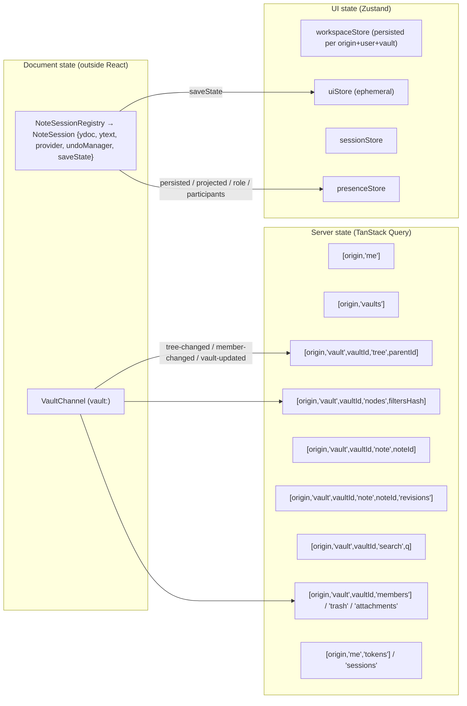
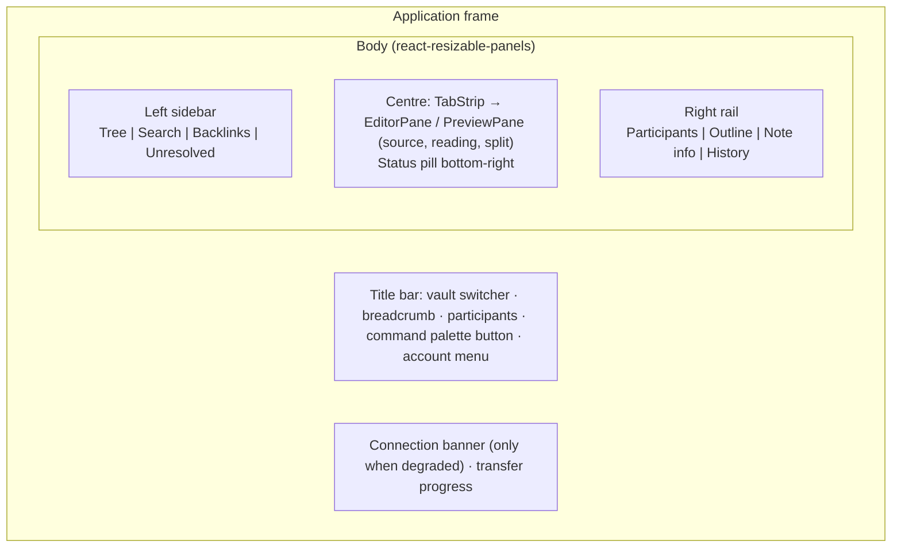
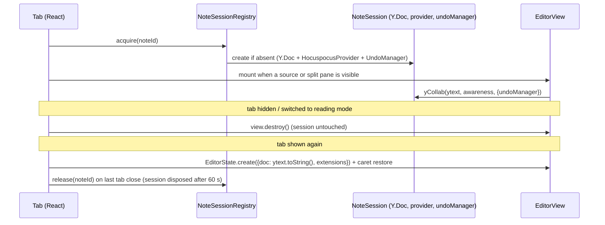
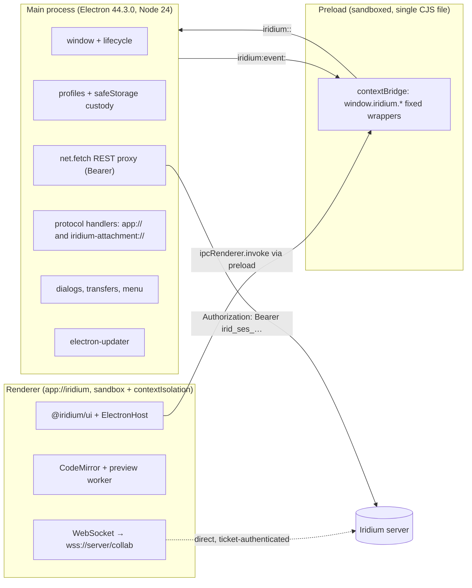

# Client applications (shared UI, web host, Electron shell)

## 1. Scope and reading guide

This section is the build specification for everything a person sees and touches: the single React application in `packages/ui`, the browser-only packages it composes (`@iridium/editor`, `@iridium/markdown-react`), the isomorphic client libraries it consumes (`@iridium/api-client`, `@iridium/collab-client`), the web host `apps/web`, and the Electron shell `apps/desktop`. It covers the host seam that keeps one UI codebase running in two environments, the UI stack and state architecture, every workspace surface, the editor and preview, link and attachment handling, the web host's security headers, the Electron shell's process model and hardening checklist, the preload/IPC contract, desktop credential custody, server profiles and certificates, packaging and updates, the client/server compatibility rule, and the accessibility, internationalisation and browser-support commitments.

What it deliberately does not re-explain:

| Topic | Where it lives |
|---|---|
| Wire contract of `note:*` / `vault:*` stateless messages, `SaveStateMachine` rules, `NoteSession` internals, ticket economics | 05-collaboration-and-durability.md |
| Session cookie, desktop session token, CSRF rule, step-up, permission matrix | 04-auth-and-access-control.md |
| REST route list, error codes, IPC channel map as published contracts | 09-api-reference.md |
| The unified/remark pipeline, sanitizer schema, import/export jobs, attachment storage | 08-markdown-pipeline-import-export.md |
| Test runners, projects, coverage thresholds | 10-testing-and-quality.md |
| Update-feed hosting, signing secrets in CI, deployment | 11-operations-and-deployment.md |
| Ordering of M4 (shared UI + web host), M5 (Electron), M6 (import/export UI), M7 (admin console) | 12-milestones.md |

Every version below is an exact pin from the decision skeleton; items marked "pin at M0" are not covered by the research digest and receive an exact pin plus a license check during bootstrap.

## 2. One UI codebase, two hosts

### 2.1 Package map and boundary tags

The whole application is `@iridium/ui`. It has zero Electron or Node imports; that rule is enforced by the `browser` boundary tag (`turbo boundaries` plus the oxlint `no-restricted-imports` fragment in `@iridium/oxlint-config`, dependency-cruiser 18.2.0 as the fallback checker) and by the fact that the only platform-specific object the application ever sees is an `IridiumHost` instance passed in at mount time.

| Package | Tag | Compiled / JIT | Role in the client |
|---|---|---|---|
| `packages/ui` (`@iridium/ui`) | browser | JIT | Routes, workspace, tree, tabs, switcher, palette, editor host, preview surface, presence, status pill, search, trash, history, settings, tokens, admin; `IridiumHost` interface; command registry; `i18n/en.ts` |
| `packages/editor` (`@iridium/editor`) | browser | JIT | CodeMirror 6 + y-codemirror.next binding, `iridiumFrontmatter` lezer block parser, formatting `StateCommand`s, read-only compartment, theme, disposable-view lifecycle helpers, remote-selection plugin |
| `packages/markdown-react` (`@iridium/markdown-react`) | browser | JIT | hast → React 19 via hast-util-to-jsx-runtime 2.3.6 with Iridium overrides; preview worker client (comlink 4.4.2) |
| `packages/api-client` (`@iridium/api-client`) | iso | compiled | openapi-fetch 0.17.0 over generated `paths.d.ts`; `ApiTransport` interface with `FetchTransport` and `IpcTransport`; `TicketSource`; typed `ProblemDetails` errors |
| `packages/collab-client` (`@iridium/collab-client`) | iso | compiled | `NoteSession`, `NoteSessionRegistry`, `SaveStateMachine`, `VaultChannel`, stateless message codec, close-reason handling, WebSocket injection (`ws` polyfill in Node; `IpcWebSocket` in the Electron fallback) |
| `packages/crdt` (`@iridium/crdt`) | iso | compiled | The only first-party importer of `yjs`/`y-protocols` (A14); the UI never imports `yjs` directly |
| `packages/markdown` (`@iridium/markdown`) | iso | compiled | The pipeline executed inside the preview worker |
| `packages/contracts` (`@iridium/contracts`) | core | compiled | zod schemas for REST DTOs, collab messages, MCP, desktop IPC (`desktop-ipc.ts`), deep links, limits, command manifest |
| `apps/web` (`@iridium/web`) | app | — | ~60-line Vite 8 entry mounting `@iridium/ui` with `BrowserHost`; served by the server at `/app/*` |
| `apps/desktop` (`@iridium/desktop`) | app | — | Electron 44.3.0 main (tsdown ESM), preload (tsdown single-file CJS), renderer (Vite 8 entry + `ElectronHost`) |
| `apps/e2e` (`@iridium/e2e`) | app | — | Playwright 1.63.0 `chromium` and `electron` projects driving both hosts |

JIT packages export `./src/*` and are compiled by the consuming Vite build, so React Fast Refresh works across package boundaries. The renderer bundle is deduplicated by Vite `resolve.dedupe: ['yjs', 'lib0', 'y-protocols', '@codemirror/state', '@codemirror/view']` and a bundle-analysis assertion in CI proves one copy of each (A14).

### 2.2 The `IridiumHost` seam

`packages/ui/src/host.ts` is the only platform seam. It is reproduced here from the skeleton — verbatim except for the `storage` comment, which the skeleton leaves as a choice of two backends and which decision D07-06 narrows to one — because every host implementation and the contract suite are written against it:

```ts
interface IridiumHost {
  kind: 'web' | 'electron';
  server: { origin(): string; listProfiles(): Promise<ServerProfile[]>; select(id: string): Promise<void>; add(p: ServerProfile): Promise<void>; remove(id: string): Promise<void> };
  api: ApiTransport;                                   // FetchTransport | IpcTransport
  auth: { signIn(c: Credentials): Promise<Me>; signOut(): Promise<void>; me(): Promise<Me>; reauthenticate(password: string): Promise<void>; onSessionChanged(cb): Unsubscribe };
  collab: { ticketSource: TicketSource; websocketUrl(): string; webSocketFactory?: () => WebSocketLike };   // factory only in the Electron IPC fallback
  attachments: { urlFor(vaultId: string, attachmentId: string): string };
  files: { pickImportSource(): Promise<ImportSource | null>; uploadImport(jobId, source, onProgress): Promise<void>; exportVault(vaultId, jobId): Promise<ExportOutcome>; saveText(name: string, text: string): Promise<void> };
  shell: { openExternal(url: string): Promise<void>; copyText(t: string): Promise<void>; setTitle(t: string): void };
  links: { onDeepLink(cb: (l: DeepLink) => void): Unsubscribe };
  commands: { onNativeCommand(cb: (id: CommandId) => void): Unsubscribe; publishMenu(m: MenuManifest): void };
  updates: { check(): Promise<UpdateState>; onState(cb): Unsubscribe; install(): Promise<void> } | null;
  storage: KeyValueStorage;                            // per-profile UI prefs; localStorage in both hosts (D07-06), never a userData JSON file
}
```

Member semantics that both implementations must honour:

| Member | Contract |
|---|---|
| `kind` | Drives only presentational differences (server step on the login screen, native-menu publishing, the "Updates" settings card). Feature logic never branches on `kind`; it branches on the presence of optional members (`updates === null`, `webSocketFactory` undefined). |
| `server.origin()` | The active server origin (`https://…`, no trailing slash). On the web this is `location.origin`; on Electron it is the active profile's origin. Every TanStack Query key is prefixed with it. |
| `server.listProfiles/select/add/remove` | On the web `listProfiles()` resolves to a single implicit profile `{id:'web', origin: location.origin, displayName: location.host}` and `select/add/remove` reject with `HostError('unsupported')`. On Electron they are IPC calls to `iridium:profiles:*`; `select` reloads the window. |
| `api` | An `ApiTransport` (see 3.4). The UI never calls `fetch` directly for API traffic. |
| `auth.signIn` | Web: `POST /auth/sessions {client:'web'}` sets the cookie and returns `Me`. Electron: IPC `iridium:auth:signIn`; the main process stores the session token; the renderer receives `Me` only. |
| `auth.signOut` | Web: `DELETE /auth/sessions/current`, then the transport drops in-memory state. Electron: IPC `iridium:auth:signOut`; main revokes the session server-side and erases the stored secret. |
| `auth.me` | `GET /auth/me` through `api`; used by the session gate on boot and after `session-changed`. |
| `auth.reauthenticate` | `POST /auth/reauthenticate {password}` (web) or IPC `iridium:auth:reauthenticate` (Electron); called by the step-up dialog. |
| `auth.onSessionChanged` | Fires the payload of 09 §5.8 — `{state:'signed-in' \| 'signed-out' \| 'expired', me: Me \| null, origin}` — when the credential changes or becomes unusable (a REST `401` from any request, explicit sign-out, admin revocation observed on a request, desktop profile switch). A collaboration close never fires it (4.10). The UI reacts by tearing down providers and query caches and routing to `/login`. |
| `collab.ticketSource` | `TicketSource { acquire(count: number): Promise<string[]> }` backed by `POST /auth/collab-tickets` (web, through `api`) or IPC `iridium:collab:tickets` (Electron). The batching pool lives in `@iridium/collab-client` and is host-agnostic. |
| `collab.websocketUrl()` | `wss://<host>/collab` derived from `server.origin()` (`ws://` only when the origin is `http://`, which exists only in development and the desktop `--allow-insecure-server` mode). |
| `collab.webSocketFactory` | Defined only by `ElectronHost` when spike S3 (`docs/spikes/S03-electron-ws-origin.md`) recorded the `IpcWebSocket` fallback (see 7.10). When defined, `@iridium/collab-client` wraps it in a constructor class and passes *that* as `HocuspocusProviderWebsocket`'s `WebSocketPolyfill`; the factory itself is never handed to the option, because the provider calls `new WebSocketPolyfill(url)` (7.10). |
| `attachments.urlFor` | Web: `/api/v1/vaults/<vaultId>/attachments/<attachmentId>` (same-origin cookie GET). Electron: `iridium-attachment://<vaultId>/<attachmentId>`. |
| `files.*` | Import source picking, import upload, export saving and "Export my text" (see 4.13 and 7.13). Paths never cross into the UI: `ImportSource` carries an opaque `sourceId`, and main keeps the `sourceId → path` map. The wizard passes the picker kind as an optional `mode` argument (`'directory' \| 'zip'`): the Electron host forwards it as `iridium:files:pickImportSource {mode}` (09 §5.6), the browser host ignores it and renders its own chooser, and the zero-argument form of the seam stays valid because `mode` defaults to `'directory'`. `uploadImport(jobId, source, onProgress)` sends only `source.sourceId` over IPC, and both hosts resolve to the same `ExportOutcome { saved, path, bytes, cancelled }`. |
| `shell.openExternal` | Web: `window.open(url, '_blank', 'noopener,noreferrer')` after the same `https:`/`mailto:` validation the desktop applies. Electron: IPC `iridium:shell:openExternal`, validated again in main. |
| `shell.copyText` | Web: `navigator.clipboard.writeText`. Electron: IPC `iridium:shell:copyText` → `clipboard.writeText` in main (Electron 44 removed the renderer clipboard module). |
| `shell.setTitle` | Web: `document.title`. Electron: IPC `iridium:window:setTitle`. Format: `<note title> — <vault name> — Iridium`. |
| `links.onDeepLink` | Web: the router itself handles `https://<origin>/app/v/<vault>/n/<note>`; the callback never fires. Electron: `iridium:event:deep-link`. |
| `commands.onNativeCommand` / `publishMenu` | Web: no-ops (menu is the command palette). Electron: `iridium:event:native-command` and `iridium:commands:publishMenu` (see 7.13 and decision D07-05). |
| `updates` | `null` on the web and in the desktop `IRIDIUM_E2E=1` / `--allow-insecure-server` modes; otherwise IPC-backed (see 7.15). |
| `storage` | `KeyValueStorage { get(key): Promise<string \| null>; set(key, value): Promise<void>; remove(key): Promise<void> }` namespaced per server origin and per user id. Web: `localStorage` with the key prefix `iridium:<origin>:<userId>:`. Electron: the renderer’s own `localStorage` inside the `persist:iridium` partition, with the same key prefix; there is deliberately no `storage:*` IPC channel (decision D07-06). |

The renderer host has no `secrets` member and never will (A26): nothing that can be replayed as a credential exists in the renderer of either host.

### 2.3 Host implementations

| Concern | `BrowserHost` (`apps/web/src/host/browser.ts`) | `ElectronHost` (`apps/desktop/src/renderer/host/electron.ts`) | `MemoryHost` (`packages/ui/src/host/memory.ts`) |
|---|---|---|---|
| `kind` | `'web'` | `'electron'` | `'web'` (behaves like the browser host) |
| `api` | `FetchTransport` (cookies, `X-Iridium-Client: web`, `X-Iridium-Client-Version`) | `IpcTransport` over `window.iridium.api.request` | `FetchTransport` against msw 2.15.0 handlers generated from `openapi.json` (A3) |
| Tickets | `RestTicketSource(api)` | `window.iridium.collab.tickets` | Fake tickets accepted by the in-memory fake provider |
| Session events | 401 detection inside `FetchTransport` | `window.iridium.on('session-changed')` | Test-controlled emitter |
| Attachments | same-origin REST URL | `iridium-attachment://` | `blob:` URLs from fixtures |
| Files | `<input webkitdirectory>` / ZIP `<input type=file>`; `fetch` upload with `ReadableStream` progress; browser download for export; `saveText` = Blob download | `window.iridium.files.*` (main-owned dialogs and transfers) | Records calls for assertions |
| Shell | `window.open` (validated), `navigator.clipboard`, `document.title` | IPC | Records calls |
| Deep links / native commands / menu | no-ops | IPC events | Test-controlled emitters |
| Updates | `null` | IPC-backed (or `null` under `IRIDIUM_E2E=1`) | `null` |
| Storage | `localStorage` | `localStorage` in `persist:iridium` | `Map` |

`MemoryHost` is not a product artefact: it is the fixture for Vitest Browser Mode component tests (the skeleton dropped the in-house workbench, A3) and for the `host.contract.spec.ts` self-check. It uses msw handlers for REST and a fake `HocuspocusProvider`-shaped object from `@iridium/testkit` so status-pill and presence tests can drive `synced`, `unsyncedChanges`, `persisted`, `role` and `participants` deterministically.

### 2.4 The contract suite

`packages/ui/test/host.contract.spec.ts` is a parameterised suite executed three times: against `MemoryHost` (Vitest Browser Mode), against `BrowserHost` (Playwright chromium project, test `host.contract` in M4) and against `ElectronHost` (Playwright electron project, test `host.contract` in M5). It asserts, for every member: type shape (a snapshot of `Object.keys` per namespace), rejection behaviour for unsupported members, that `attachments.urlFor` never embeds a credential, that `shell.openExternal` refuses `javascript:`, `file:`, `data:` and `http:` URLs, that `collab.websocketUrl()` is derived from `server.origin()`, that `storage` round-trips UTF-8 and survives a reload, and that `auth.onSessionChanged` fires exactly once per sign-out.

### 2.5 Mount entry points

`packages/ui/src/index.tsx` exports `createIridiumApp(host: IridiumHost): { mount(el: HTMLElement): void; unmount(): void }`. The two product entries are:

```ts
// apps/web/src/main.tsx
import { createIridiumApp } from '@iridium/ui';
import { createBrowserHost } from './host/browser.ts';
createIridiumApp(createBrowserHost()).mount(document.getElementById('root')!);

// apps/desktop/src/renderer/main.tsx
import { createIridiumApp } from '@iridium/ui';
import { createElectronHost } from './host/electron.ts';
createIridiumApp(createElectronHost(window.iridium)).mount(document.getElementById('root')!);
```

`createIridiumApp` builds, in order: `HostProvider` → `ThemeProvider` → `QueryClientProvider` (one `QueryClient` per app; cache cleared on `session-changed`) → `CompatibilityGate` (8) → `SessionGate` → `RouterProvider` (history chosen by `host.kind`) → `ToastProvider`. Nothing outside `createIridiumApp` touches globals, which is what makes the Electron renderer and the browser tab identical from React's point of view.

## 3. UI stack and state architecture

### 3.1 Pinned stack

| Concern | Package(s) | Version | Notes |
|---|---|---|---|
| Framework | react, react-dom | 19.3.0 | React Compiler enabled through `@vitejs/plugin-react` 6.1.1 (oxc transform path; the babel path with `babel-plugin-react-compiler` 1.0.0 is the documented fallback) |
| Bundler | vite, @vitejs/plugin-react | 8.3.0, 6.1.1 | Rolldown; one shared `vite.renderer.config.ts` for web and desktop |
| Routing | @tanstack/react-router | 1.170.35 | `createBrowserHistory` (web), `createMemoryHistory` (Electron); zod-validated search params |
| Server state | @tanstack/react-query | 5.102.8 | Keys prefixed by origin; invalidated by vault-channel events |
| UI state | zustand | 5.0.15 | `workspaceStore` persisted via `host.storage`; others in memory |
| Primitives | @base-ui/react via shadcn CLI | 1.8.0 via 4.21.0 | `shadcn init --template vite -b base-ui`; generated components committed under `packages/ui/src/components` |
| Styling | tailwindcss | 4.3.3 | CSS-variable themes; no runtime style injection except CodeMirror (nonce) |
| Icons | lucide-react | 1.45.0 | |
| Tree | @headless-tree/core, @headless-tree/react | 1.7.0 | `asyncDataLoaderFeature`, `selectionFeature`, `hotkeysCoreFeature`, `dragAndDropFeature`, `keyboardDragAndDropFeature`, `renamingFeature`, `searchFeature`, `expandAllFeature` |
| Virtualisation | @tanstack/react-virtual | 3.14.12 | Tree, search results, switcher and palette lists |
| Drag and drop | @atlaskit/pragmatic-drag-and-drop | 3.1.0 | Tab reorder and tab-to-split; tree moves go through headless-tree's DnD feature |
| Panes | react-resizable-panels | 4.12.4 | Sidebar / centre / rail, source / preview split |
| Forms | @tanstack/react-form | 1.33.5 | Login, server profile, token creation, vault settings, admin forms; zod schemas from `@iridium/contracts` |
| Editor | see 5 | | |
| Diff view | diff (jsdiff) | pin at M0 | Line-level Myers diff for the history rail (decision D07-08) |
| Preview worker RPC | comlink | 4.4.2 | |
| Schemas | zod | 4.6.2 | Every DTO, search param, IPC payload and deep link |

### 3.2 Routing

Typed routes (from A40), the history each host uses, and what each route loads:

| Route | Guard | Search params (zod) | Loader / data |
|---|---|---|---|
| `/login` | signed-out only | `redirect?: string` (same-origin route path only) | Electron shows the server step first when no profile is active |
| `/set-password` | public | `token` read from `location.hash` (`#irid_spl_…`), never from a query string, so it never reaches server logs or `Referer` | `POST /auth/set-password`; on success routes to `/login` |
| `/` | signed-in | — | `GET /vaults`; vault selector |
| `/v/$vaultId` | signed-in, member (404 → "Vault not available") | `tab?: noteId`, `mode?: 'source' \| 'reading' \| 'split'`, `rev?: number` | `GET /vaults/:vaultId`, first tree page, opens the vault channel |
| `/v/$vaultId/n/$noteId` | as above | `mode?`, `rev?` | Opens (or focuses) the note tab; `rev` opens the read-only revision view |
| `/v/$vaultId/trash` | as above | `cursor?` | `GET /vaults/:vaultId/trash` |
| `/v/$vaultId/settings` | manager | `section?: 'general' \| 'members' \| 'integrations' \| 'audit'` | `GET /vaults/:vaultId`, `GET /vaults/:vaultId/members` |
| `/settings/profile` · `/settings/sessions` · `/settings/integrations` · `/settings/appearance` | signed-in | — | `/me`, `/me/sessions`, `/me/tokens` |
| `/admin/users` · `/admin/vaults` · `/admin/tokens` · `/admin/agent-activity` · `/admin/audit` · `/admin/settings` · `/admin/releases` · `/admin/system` | server admin | per page (filters, cursor) | `/admin/*` (see 11-operations-and-deployment.md for the console's operational content) |

Rules:

- The web host uses `createBrowserHistory` with `basepath: '/app'` so `https://<origin>/app/v/<vault>/n/<note>` is the canonical shareable URL; the server serves `index.html` for every `/app/*` path (SPA fallback). Electron uses `createMemoryHistory({ initialEntries: ['/'] })`; the memory stack is not persisted across launches (the workspace store restores open tabs instead).
- `packages/ui/src/router/toShareUrl.ts` maps a route to `https://<origin>/app/v/<vault>/n/<note>` (both hosts) and, on Electron, additionally offers `iridium://open?server=<origin>&note=<id>[&rev=<n>]` in the "Copy link" menu.
- `deepLinkToRoute(link)` resolves `noteId → vaultId` with `GET /notes/:noteId` before navigating, because deep links carry only the note id (see 7.12).
- Route guards read `sessionStore`; a 401 during any loader triggers `auth.onSessionChanged` handling rather than a per-route redirect.
- Search params are validated with zod `validateSearch`; invalid values are dropped, never thrown to the user.

### 3.3 Three state domains



Server state (TanStack Query 5.102.8). Every key begins with `host.server.origin()`; the whole cache is cleared on `session-changed` and on profile switch. Invalidation is event-driven rather than polled:

| Vault-channel event (A18) | Queries invalidated |
|---|---|
| `tree-changed {treeVersion, changes[]}` | `['vault',vaultId,'tree',parentId]` for every `parentId` named in `changes` (old and new parents of moved nodes), `['vault',vaultId,'nodes']`, `['vault',vaultId,'trash']` when any change is `trashed`/`restored`/`purged`, and `['vault',vaultId,'note',nodeId]` for renamed notes. The same handler calls `patchVaultIndex` on the preview worker (5.9.1) — invalidation alone would not fix the worker's copy, which is not part of the query cache |
| Attachment upload or delete (mutation success, no channel event) | `['vault',vaultId,'attachments']`, plus `patchVaultIndex` for the added or removed `pathHint` (5.9.1) |
| `member-changed {userId, role \| null}` | `['vault',vaultId,'members']`; if `userId` is the current user: refetch `['vault',vaultId]` (role badge) — the collab side effect (re-attach or lock) is handled by `NoteSession` per A20 |
| `vault-updated {version}` | `['vault',vaultId]`, `['vaults']` |

`staleTime` defaults: tree pages 30 s, note metadata 10 s, vault list 60 s, search 0 (always refetch on query change), tokens/sessions 0. Mutations carry `If-Match` from the cached `version` and, on `409 stale_version`, replace the cached row with the `current` representation from the ProblemDetails body and surface an inline "Reload and retry" affordance (A13).

UI state (Zustand 5.0.15), one file per store under `packages/ui/src/state/`:

| Store | Persisted | Contents |
|---|---|---|
| `workspaceStore` | yes, `host.storage` key `workspace:<vaultId>` (JSON, debounced 500 ms) | open tabs `{noteId, pinned, mode, scrollLine}`, active tab, right-pane tab set when split, tree expansion set, sidebar visibility and widths, rail tab (participants / outline / info / history), last-opened vault (`workspace:last-vault`) |
| `uiStore` | no | palette/switcher open state, active dialogs, pending step-up continuation, connection banner text, "index updating" hints |
| `sessionStore` | no | `Me`, `isServerAdmin`, principal kind, compatibility state from `/meta`, secure-storage warning (desktop) |
| `presenceStore` | no | per note: `participants` map `id → {name, colorHue, role, mode}` from the server-authoritative message; per vault: `{id, activeNoteId}` from vault awareness |
| `commandStore` | no | registry runtime: enabled/checked flags per `CommandId`, recent commands (persisted separately under `commands:recent`) |

Document state lives outside React in `NoteSessionRegistry` (`@iridium/collab-client`): React components subscribe through `useSyncExternalStore` to `session.saveState` and `session.role`, never re-render on keystrokes, and never hold a `Y.Doc` in state.

### 3.4 API client

`@iridium/api-client` wraps openapi-fetch 0.17.0 over `packages/api-client/src/generated/paths.d.ts` (regenerated by `pnpm gen`, drift-checked in CI, A3). Its transport abstraction is the reason the same hooks work in both hosts:

```ts
interface ApiTransport {
  request(req: { method: HttpMethod; path: `/api/v1/${string}`; query?: Record<string, string | number | boolean | undefined>;
                 headers?: Record<string, string>; body?: JsonValue | FormData }): Promise<ApiResponse>;
}
interface ApiResponse { status: number; headers: Record<string, string>; body: JsonValue | string | null }
```

| Transport | Credential | Mandatory headers | Errors |
|---|---|---|---|
| `FetchTransport` (web, Node tests, MemoryHost) | cookie (`credentials: 'include'`) | `X-Iridium-Client: web`, `X-Iridium-Client-Version: <product version>`, `Accept: application/json` (`text/markdown` for `/markdown`) | non-2xx → `ApiError` carrying the parsed `ProblemDetails {type,title,status,code,detail?,current?,requestId}`; network failure → `ApiError{code:'network'}` |
| `IpcTransport` (Electron renderer) | none in the renderer; main adds `Authorization: Bearer irid_ses_…` | main adds `X-Iridium-Client: desktop` and the version header | identical `ApiError` shape (main returns the ProblemDetails body untouched) |

Shared behaviours: `ETag` values are returned on the typed response so mutation hooks can send `If-Match`; a `403 step_up_required` is turned into a `StepUpRequired` error that the `uiStore` turns into the step-up dialog and then replays the original mutation; `429 rate_limited` surfaces `retry-after` to the toast; a `426 client_outdated` becomes a `ClientOutdated` error that re-runs the compatibility gate at once (4.18, 8.2); a `401` on any request fires the session-changed path (web) or is reported by main (Electron). Multipart bodies (`FormData`) are supported only by `FetchTransport`; on Electron, uploads are main-owned (`files.uploadImport`, attachments through `iridium:api:request` with a 1 MiB JSON cap are not allowed — attachment uploads on Electron go through `iridium:files:uploadAttachment`, see 7.7 and decision D07-07).

### 3.5 Command registry and keyboard shortcuts

`@iridium/contracts/commands.ts` holds the pure data manifest: `CommandId` union, `title` i18n key, `defaultKeys: { electron: string[]; web: string[] }` (the two hosts share a binding wherever they can; they differ only where the browser reserves the chord, see the reserved table below, and the strings carry `Mod`/`Alt`/`Shift` so the platform substitution happens at render time), `scope ∈ {global, vault, workspace, note, editor}` and `menu` placement. `packages/ui/src/commands/registry.ts` binds each id to `{ when(): boolean; run(ctx): void | Promise<void> }`. The same manifest drives the command palette, the CodeMirror keymaps (`format.*`, `undo`/`redo` are exported to `@iridium/editor` as a keymap built from `defaultKeys`), the Electron application menu (main reads the manifest from `@iridium/contracts`, see 7.13) and the E2E tests, which invoke commands by id through a `data-command` attribute on palette rows.

| Command id | Default keys, Electron host (Mod = Ctrl on Windows/Linux, Cmd on macOS) | Scope |
|---|---|---|
| `switcher.open` | Mod-O | global |
| `palette.open` | Mod-P | global |
| `note.new` | Mod-N | vault |
| `category.new` | Mod-Shift-N | vault |
| `search.open` | Mod-Shift-F | vault |
| `sidebar.toggle` | Mod-Shift-B | vault |
| `editor.toggleMode` (source ⇄ reading) | Mod-E | note |
| `editor.split` (split source/preview in place) | Mod-Shift-E | note |
| `pane.splitRight` | Mod-\ | note |
| `tab.close` / `tab.reopen` / `tab.next` / `tab.prev` | Mod-W / Mod-Shift-T / Ctrl-Tab / Ctrl-Shift-Tab | workspace |
| `tab.pin` | Mod-Shift-P | workspace |
| `tab.moveLeft` / `tab.moveRight` (reorder the active tab inside its pane, the keyboard equivalent of the drag in 4.5 and the accessibility commitment in 9.1) | Mod-Shift-← / Mod-Shift-→ | workspace |
| `note.saveNow` (flush + optional name) | Mod-S | note |
| `history.open` | Mod-Shift-H | note |
| `format.bold` / `format.italic` / `format.strikethrough` | Mod-B / Mod-I / Mod-Shift-X | editor |
| `format.inlineCode` / `format.codeBlock` | Mod-Backquote / Mod-Shift-C | editor |
| `format.link` | Mod-K | editor |
| `format.heading1` … `format.heading6` | Mod-Alt-1 … Mod-Alt-6 | editor |
| `format.bulletList` / `format.orderedList` / `format.taskList` | Mod-Shift-8 / Mod-Shift-7 / Mod-Shift-9 | editor |
| `format.toggleCheckbox` | Mod-L | editor |
| `format.blockquote` | Mod-Shift-. | editor |
| `format.table` | palette only | editor |
| `attachment.insert` ("Insert attachment…", 4.14: the picker, the upload and the `markdownReference` insertion at the caret; `when()` requires a focused source or split pane, and on the desktop the picker is `dialog.showOpenDialog` in main, 7.7) | palette / context menu | note |
| `undo` / `redo` | Mod-Z / Mod-Y and Mod-Shift-Z (`yUndoManagerKeymap`) | editor |
| `link.copy` | palette / context menu | note |
| `note.rename` (notes and categories) | F2 | tree |
| `node.move` (opens `MoveToDialog`, 4.4) | palette / context menu | tree |
| `note.trash` (recursive for a category, 4.11) | Delete (tree focus) | tree |
| `export.open` (opens `ExportDialog` for the vault or the selected subtree, 4.13) | palette / context menu | vault |
| `export.note` (single note through `GET /notes/:noteId/markdown`, 4.13) | palette | note |
| `export.myText` | palette (visible in every `SaveState` except `saved`, `syncing` and `connecting` — 4.10 rule 3) | note |
| `app.settings` | Mod-, | global |
| `zoom.in` / `zoom.out` / `zoom.reset` (`setZoomFactor` in steps, persisted per profile, 7.2) | Mod-+ / Mod-- / Mod-0 — **Electron only**, because the browser owns these chords and its own page zoom is the correct web behaviour | global |

The source plans bound inline code to Mod-E while also binding Mod-E to the mode toggle; the two cannot coexist inside the editor, so inline code moves to Mod-Backquote (decision D07-04). Bindings are not user-configurable in MVP; the manifest format already carries `defaultKeys` so a later preferences page is additive. Shortcuts are registered once at the app root through a keymap dispatcher that respects scope (editor-scoped keys are registered as CodeMirror keymaps only, so they never fire outside a focused editor).

**Chords the browser owns.** Chrome and Edge — the supported browsers (9.3) — consume the following chords before any `keydown` handler runs, so `preventDefault()` has no effect on them and a web binding on one of them is dead code that also destroys the user's session (Mod-W closes the browser tab). The manifest therefore carries a different `defaultKeys.web` for exactly these ids (decision D07-32):

| Reserved chord | Reserved for | Iridium command | `defaultKeys.web` |
|---|---|---|---|
| Mod-N | new browser window | `note.new` | Mod-Alt-N |
| Mod-Shift-N | new incognito window | `category.new` | Mod-Alt-Shift-N |
| Mod-W | close browser tab | `tab.close` | Mod-Alt-W |
| Mod-Shift-T | reopen closed browser tab | `tab.reopen` | Mod-Alt-T |
| Ctrl-Tab / Ctrl-Shift-Tab | next / previous browser tab | `tab.next` / `tab.prev` | Mod-Alt-] / Mod-Alt-[ |
| Mod-+ / Mod-- / Mod-0 | browser page zoom | `zoom.in` / `zoom.out` / `zoom.reset` | — (Electron only; the browser's own page zoom is what a web user gets, and `setVisualZoomLevelLimits(1, 1)` in 7.2 exists only because the desktop shell owns the chord) |
| Mod-1 … Mod-9 | switch to browser tab *n* | — (never bound in either host) | — |
| Mod-Alt-← / Mod-Alt-→ | next / previous tab in Chrome on macOS | — (never bound on the web, which is why tab cycling uses the bracket keys) | — |

Every other binding in the table above is identical in both hosts: Mod-O, Mod-P, Mod-S, Mod-Shift-F and Mod-, are browser menu accelerators but are delivered to the page and cancellable, and the editor-scoped `format.*` chords never collide because they are CodeMirror keymaps inside a focused editor. The palette and the hover hints render `defaultKeys[host.kind]`, so a user never reads a shortcut that cannot fire in the host they are in (4.7). `commands.reserved-chords.spec` holds the reserved set as data and fails when any `defaultKeys.web` entry matches it, when a `defaultKeys.electron` entry is missing for a command that has a web binding, or when a `CommandId` has neither binding nor a palette-only marker.

### 3.6 Directory layout of `packages/ui/src`

```
packages/ui/src/
  index.tsx                createIridiumApp(host)
  host.ts                  IridiumHost + KeyValueStorage, ServerProfile, ImportSource, ExportOutcome, UpdateState, MenuManifest types
  host/memory.ts           MemoryHost (component tests)
  app/                     HostProvider, ThemeProvider, CompatibilityGate, SessionGate, ToastProvider, ErrorBoundary
  router/                  routeTree.tsx, search schemas, toShareUrl.ts, deepLinkToRoute.ts
  api/                     query/mutation hooks per resource (useVaults, useTreePage, useNodes, useNote, useRevisions, useSearch, useTokens, useMembers, useTrash, useAttachments, admin/*), invalidation.ts (vault-channel → keys)
  state/                   workspaceStore.ts, uiStore.ts, sessionStore.ts, presenceStore.ts, commandStore.ts
  commands/registry.ts     CommandId → when/run; keymap derivation
  i18n/en.ts, i18n/t.ts    typed string table, t(), Intl helpers
  theme/                   tokens.css, light.css, dark.css, high-contrast.css, useTheme.ts
  components/              shadcn-generated Base UI wrappers (button, dialog, menu, context-menu, tabs, tooltip, toast, popover, select, scroll-area, autocomplete)
  features/
    auth/                  LoginPage, ServerStep, SetPasswordPage, StepUpDialog
    vaults/                VaultSelectorPage, VaultCard, CreateVaultDialog
    workspace/             WorkspaceLayout, Sidebar, CentrePanes, RightRail
    tree/                  VaultTree, TreeItem, TreeContextMenu, InlineRename, nameRules.ts, MoveToDialog, RenameImpactDialog, TrashConfirmDialog
    tabs/                  TabStrip, Tab, useTabs.ts
    editor/                EditorHost, EditorPane, useEditorView.ts, ModeToggle, PasteGuard
    preview/               PreviewPane, PreviewWorkerProvider, buildVaultIndex.ts, LinkHoverCard, LinkCandidatesCard, ExternalImagePlaceholder, ScrollSync
    presence/              ParticipantsStack, VaultPresenceList, presenceColor.ts
    status/                StatusPill, ConnectionBanner, ExportMyTextAction
    search/                SearchPane, ResultRow, QueryHelp, IndexUpdatingHint
    switcher/              QuickSwitcher
    palette/               CommandPalette
    links/                 BacklinksPane, UnresolvedLinksPane, OutlinePane, NoteInfoPane
    history/               HistoryRail, RevisionList, RevisionDiff, NameVersionDialog, RestoreConfirmDialog, RevisionView
    trash/                 TrashPage, RestoreConflictDialog
    attachments/           AttachmentsPane, UploadDropzone, useAttachmentUpload.ts, DeleteAttachmentDialog
    transfer/              ImportWizard, ImportReport, ExportDialog, TransferProgress
    settings/              ProfilePage, SessionsPage, IntegrationsPage, TokenCreateDialog, TokenSecretReveal, SnippetsPanel, TokenActivityPanel, VaultAgentActivityPanel, AppearancePage, VaultSettingsPage, MembersPage
    admin/                 UsersPage, VaultsPage, TokensPage, TokenDetailDrawer, AgentActivityPage, AuditPage, SettingsPage, ReleasesPage, SystemPage, JobsPage
  lib/                     cn.ts, format.ts, problemToToast.ts, ids.ts
```
## 4. The workspace

This section specifies every surface of the application. Each subsection states what the surface shows, which queries or collaboration messages feed it, which commands and keyboard paths operate it, and which test names cover it. Server semantics (permissions, error codes, concurrency rules) are not restated here; see 04-auth-and-access-control.md, 05-collaboration-and-durability.md and 09-api-reference.md.

### 4.1 Anatomy



| Region | Component | Persisted state (`workspaceStore`) |
|---|---|---|
| Title bar | `WorkspaceLayout` header | — |
| Left sidebar | `Sidebar` with four panes as a vertical tab set | visibility, width, active pane, tree expansion set |
| Centre | `CentrePanes` → one or two `EditorPane`s | open tabs, active tab per pane, split ratio, per-tab mode and scroll line |
| Right rail | `RightRail` with four panes | visibility, width, active pane |
| Bottom | `ConnectionBanner`, `TransferProgress` | — |

Layout rules: the sidebar and rail collapse to icon strips below 1100 px and to off-canvas sheets below 760 px; the centre never collapses; split view degrades to tabs below 900 px (the mode silently renders as `source` with a "Preview" toggle button, and the stored mode is not changed so the split returns when the window grows). The frame is a CSS grid with `min-width: 0` on every track so long note names cannot push horizontal scroll onto the page.

Electron adds nothing to the frame except a drag region: the window uses the native frame on Windows and Linux and `titleBarStyle: 'hiddenInset'` on macOS, where the title-bar row carries `-webkit-app-region: drag` with `no-drag` on every interactive child. The same component tree renders in the browser with a normal header.

### 4.2 Server connection and sign-in

| Step | Web | Electron |
|---|---|---|
| Choose a server | implicit: `location.origin` | `ServerStep` first: profile list from `host.server.listProfiles()`, "Add server" form (origin, display name, optional SHA-256 certificate fingerprint), validation `https://` only (`http://` accepted only when the shell was started with `--allow-insecure-server`, which also disables credential persistence and updates) |
| Compatibility probe | `GET /meta` before the login form renders (8) | same, through `IpcTransport`, per selected profile |
| Sign in | `POST /auth/sessions {email, password, client:'web'}` with `X-Iridium-Client: web` → `__Host-iridium_session` cookie | `host.auth.signIn` → IPC → main performs `POST /auth/sessions {client:'desktop', deviceName: os.hostname()}` with `X-Iridium-Client: desktop`, `session: iridiumSession` and `useSessionCookies: false`, so the request carries no `Cookie` at all — which is exactly what the CSRF guard accepts on the two public pre-login routes (04-auth-and-access-control.md §4.4: the body `client` and the header must agree, and a `desktop` request carrying a cookie is refused). Main stores the returned `irid_ses_…` (7.6); the renderer receives only `Me` |
| Set password | `/set-password` with the token in `location.hash`; the form enforces the server's published policy (`policies.passwordMinLength` / `policies.passwordMaxLength` from `GET /meta`, 8.1) and shows the server's `validation_failed` details verbatim | the same route; a `/set-password` deep link is pasted into the desktop login screen ("I have a set-up link") which parses the fragment locally, and main issues the pre-login `POST /auth/set-password` with the same `X-Iridium-Client: desktop` and no cookie as sign-in |
| Step-up | `StepUpDialog` on `403 step_up_required`: password field, `POST /auth/reauthenticate`, then the original mutation is replayed once | identical (IPC) |
| Sign out | `DELETE /auth/sessions/current`, clear query cache, route `/login` | IPC; main revokes the session and erases the stored secret |

The login form is a single `@tanstack/react-form` form with zod validation; it never reveals whether an email exists (the server returns one `invalid_credentials` code) and it renders the throttling message from `429 rate_limited` with `retry-after` formatted through `Intl.RelativeTimeFormat`. "Remember this browser" is not offered, because session lifetime is a server policy (A26).

Because the SPA lives under `/app/*` but set-password links are published as `<PUBLIC_ORIGIN>/set-password#<token>` (A28), the server answers `GET /set-password` and `GET /login` with `302` to `/app/set-password` and `/app/login`; browsers re-attach the fragment to the redirect target, so the token never appears in a query string, a log line or a `Referer` header (decision D07-09).

`SessionGate` renders one of four states: `checking` (skeleton frame), `signed-out` (`/login`), `signed-in`, and `blocked` (compatibility failure or `user.disabled` observed on a request). A `session-changed` event with `state: 'expired'` shows a modal explaining the session ended, keeps any unsaved text reachable through `export.myText`, and then routes to `/login` — it never silently redirects while an editor holds unsaved text. Only a REST `401` produces that event; a `revoked` collaboration close does not (4.10), so losing one vault membership never signs the user out of the others.

### 4.3 Vault selector

Route `/` renders `VaultSelectorPage`: a card grid from `GET /vaults` with name, description, the caller's role badge, note count, last activity, and (when the vault channel for that vault is already open) the avatars of people currently connected. Server admins see "Create vault" (`POST /vaults`) and "Import vault" (4.13); vault managers see "Import into a vault". Cards for vaults with `status='archived'` are rendered greyed with a "Read-only — archived" badge; vaults in `importing` or `deleting` status are not returned by the server and therefore never appear.

`workspaceStore` remembers the last opened vault per profile and user (`workspace:last-vault`); the selector is skipped on launch when that vault is still accessible, with a breadcrumb back to `/`. A vault that has disappeared (404) clears the key and shows "That vault is no longer available to you".

### 4.4 The tree

`VaultTree` is `@headless-tree/core` + `@headless-tree/react` 1.7.0 with the features `asyncDataLoaderFeature`, `selectionFeature`, `hotkeysCoreFeature`, `dragAndDropFeature`, `keyboardDragAndDropFeature`, `renamingFeature`, `searchFeature` and `expandAllFeature`, rendered through `@tanstack/react-virtual` 3.14.12 over the flat item list the tree produces.

| Concern | Implementation |
|---|---|
| Data | `asyncDataLoader.getChildren(parentId)` → `useTreePage(vaultId, parentId)` → `GET /vaults/:vaultId/tree?parent=&cursor=` (children page with `version` per row and the vault's `treeVersion`); `getItem(id)` reads the same cache. Pages are requested lazily per expanded folder and concatenated while `nextCursor` is present and the folder is visible. |
| Sorting | categories before notes, then `Intl.Collator(undefined, {numeric:true, sensitivity:'base'})` on `name`, which matches the server's `utf8mb4_0900_as_ci` sibling uniqueness closely enough for display; the server is the authority for conflicts. |
| Virtualisation | fixed row height 28 px, `overscan: 12`; the 10 000-node fixture scrolls at ≥ 55 fps (`perf.workspace`, 9.4). |
| Expansion | persisted per vault in `workspaceStore.treeExpanded` (a `Set` of node ids, capped at 2 000 entries, trimmed least-recently-used). |
| Keyboard | arrows, Home/End, type-ahead search, `Enter` opens, `F2` renames, `Delete` trashes, `Space` toggles selection, `Mod-Shift-↑/↓` starts keyboard drag; all provided by headless-tree features and asserted by `tree-keyboard` component tests. |
| Inline rename | `renamingFeature` with client-side validation from `nameRules.ts` (a direct port of A12's rules: no `/`, `\` or control characters, no leading or trailing space or dot, not `.` or `..`, ≤ 255 bytes UTF-8, Windows reserved names rejected) before the request is sent; the server's `409 name_conflict` / `invalid_name` is shown inline on the still-editing row. |
| Move | drag and drop (and keyboard drag) call `PATCH /nodes/:nodeId {parentId}` with `If-Match: "<version>"`. Before the call, `RenameImpactDialog` runs when the subtree has inbound links (4.4.1). Invalid drops (into a descendant, cross-vault, onto a note) are rejected by the drop target itself so the server's `409 invalid_move` is a backstop, not the primary UX. |
| Conflicts | `409 stale_version` replaces the cached row with `ProblemDetails.current` and shows an inline "Changed by someone else — reload and retry" affordance; `409 category_not_empty` opens the recursive-trash confirmation with the child count. |
| Live updates | `tree-changed` on the vault channel invalidates exactly the affected parents (3.3) and flashes the touched rows for 600 ms (`prefers-reduced-motion` replaces the flash with a static marker for 2 s). |
| Context menu | New note (`note.new`), New category (`category.new`), Rename (`note.rename`), Move to… (`node.move`), Copy link (`link.copy`), Export… (`export.open`), Move to trash (`note.trash`) — every entry is a command id from the manifest in 3.5, so the palette, the context menu and the Electron menu expose exactly the same set and the E2E tests can invoke any of them by id. A context-menu entry with no command id is a build error (`commands.menu-coverage.spec` compares the rendered entries against `CommandId`). "Duplicate" is deliberately absent: note duplication is in no scope table (01 §4.1) and in no spec sentence (spec §3 enumerates create, rename and move), and a menu entry with no route, no naming rule for the copy and no audit story is worse than its absence. |
| Trashed nodes | never shown in the tree; the trash view (4.11) is the only surface. |

`MoveToDialog` is the keyboard-first alternative to dragging: a filterable list of categories (from `GET /vaults/:vaultId/nodes?kinds=category`) with the same validation and the same impact dialog.

#### 4.4.1 Warn before move or rename

The spec defers automatic link rewriting, so the client must make the consequence visible before the change lands.

| Trigger | Request | Dialog content |
|---|---|---|
| Rename a note | `GET /notes/:noteId/rename-impact?name=<new>` | the count and list of notes whose links will break, each row opening the source note in a preview tab; buttons "Rename anyway", "Cancel" |
| Move a note | `GET /notes/:noteId/rename-impact?parentId=<new>` | same |
| Rename or move a category | `GET /nodes/:nodeId/inbound-links` for the subtree | grouped by target note, with a total count |
| Dry run from the palette ("Check link impact") | `PATCH /nodes/:nodeId {name?, parentId?, dryRun:true}` → `affectedLinks` | read-only report, no mutation |

The dialog is skipped when the impact list is empty. The choice is never remembered: a "don't ask again" switch would make silent breakage the default. After a confirmed rename or move, a toast offers "Show affected notes" which opens the `UnresolvedLinksPane` filtered to the changed target.

### 4.5 Document tabs and panes

The tab model is Obsidian-flavoured and lives entirely in `workspaceStore`:

| Concept | Rule |
|---|---|
| Preview tab | a single click in the tree, a search result or the switcher opens the note in the pane's *preview* tab (title in italics). The next preview open replaces it. |
| Pinned tab | double-click, `tab.pin` (Mod-Shift-P), middle-click on the tree row, or the first edit in the note promotes the preview tab to a pinned tab. |
| Reorder | `@atlaskit/pragmatic-drag-and-drop` 3.1.0 within a pane and between the two panes. |
| Split | `pane.splitRight` (Mod-\\) or dragging a tab to the right edge creates the second pane; closing its last tab removes it. At most two panes in MVP. |
| Cycling | most-recently-used order inside the focused pane: `Ctrl-Tab` / `Ctrl-Shift-Tab` in the Electron host (`Ctrl` on macOS too, because `Cmd-Tab` belongs to the OS), `Mod-Alt-]` / `Mod-Alt-[` in the web host, where the browser owns `Ctrl-Tab` (3.5). |
| Close and reopen | `tab.close` (Mod-W on the desktop, Mod-Alt-W on the web), middle-click, or the tab's close affordance; `tab.reopen` (Mod-Shift-T / Mod-Alt-T) restores the last ten closed tabs per vault from a session-only ring buffer. |
| Per-tab state | `mode ∈ {source, reading, split}`, `scrollLine`, `rev` (a revision view is a distinct read-only tab), selection anchor for the editor restore path (5.2). |
| Title | note name; a trailing "·" while the note is `syncing`, a warning glyph in `save-failed`/`rejected`, a lock glyph when read-only, a clock glyph for a revision tab. `shell.setTitle` publishes `<note> — <vault> — Iridium`. |
| Restore on launch | tabs are restored from `workspaceStore`; each restored tab resolves its note with `GET /notes/:noteId` first, and tabs whose note is gone (404) or trashed are dropped with one toast naming them. |

Collaboration sessions are attached per *visible* note, not per tab. Opening a tab calls `NoteSessionRegistry.acquire(noteId)`; closing the last tab for a note releases it 60 s later (A41). A window holds exactly one multiplexed socket (`HocuspocusProviderWebsocket`, 05-collaboration-and-durability.md *Client-side topology*), so the resource the workspace has to budget is not sockets but **document attachments**: the server admits at most 20 concurrent document attachments per user (A.1, counted per user in `onAuthenticate`; the IP and process legs are counted at the upgrade), and each open note plus each open vault is one attachment. The workspace therefore keeps at most `MAX_LIVE_NOTE_SESSIONS = 12` live sessions per window: when a thirteenth note is opened, the least-recently-focused background tab becomes *dormant* — its provider is detached and its `Y.Doc` destroyed, the tab stays in the strip with a "paused" glyph, and focusing it re-acquires a session and rebuilds the view (decision D07-15). Dormancy never applies to a tab with unsaved local changes (`saveState ≠ saved`); if every background tab has unsaved changes the new open is refused with "Too many notes open — close one first", which is truthful instead of silently dropping text.

### 4.6 Quick switcher

`QuickSwitcher` (Mod-O) is a Base UI `Dialog` + `Autocomplete` (`inline`, `open`, `virtualized`) over the flat node list (`GET /vaults/:vaultId/nodes?kinds=note,category`, cached with `staleTime` 30 s and invalidated by `tree-changed`). Matching is a first-party fuzzy scorer in `packages/ui/src/lib/fuzzy.ts` over name, path and frontmatter aliases — `note.fmAliases`, which `NoteSummary` carries on every row of the nodes listing (09 §2.7, D09-20; read from `note_projections.fm_aliases` in the same statement, `[]` while `projectionStatus` is `pending`), so there is no `detailed` variant and no per-note request. The switcher pages the listing with `limit=500` until `nextCursor` is absent and caches the result under `[origin,'vault',vaultId,'nodes',filtersHash]` (3.3), which is the same page set the tree and the preview index already fetch; `note.fmTags` from the same rows feeds the tag affordance. Recency boosting comes from `commandStore.recentNotes`. `Enter` opens in the preview tab, `Mod-Enter` in a new pinned tab, `Alt-Enter` in the other pane, `Shift-Enter` creates a note with the typed name in the current category (A40) after name validation. The list shows the derived path under each name so duplicate titles are distinguishable.

### 4.7 Command palette

`CommandPalette` (Mod-P) renders the command registry (3.5) filtered by `when()`; each row shows the title, the shortcut resolved for the current host and platform (`defaultKeys[host.kind]` with `Mod` substituted, so the web host never advertises a browser-reserved chord) and the scope. Disabled commands are listed with a reason ("needs editor permission", "no note open") rather than hidden, which makes the palette a discoverability surface and keeps E2E selectors stable. Recently used commands float to the top (persisted under `commands:recent`, max 20). Every row carries `data-command="<id>"`, which is how Playwright and the component tests invoke commands without simulating platform-specific chords.

The palette is also the only place where commands with no default binding live (insert table, insert attachment, check link impact, copy note id, copy `iridium://` link, rebuild preview, show keyboard shortcuts, export this note, report a problem).

### 4.8 Search

`SearchPane` (Mod-Shift-F) is a sidebar pane, not a modal, so results stay visible while notes are opened from it.

| Aspect | Behaviour |
|---|---|
| Request | `GET /vaults/:vaultId/search?q=&cursor=&limit=` (current vault) or `GET /search?q=` from the vault selector (all accessible vaults); 250 ms debounce; in-flight requests are aborted on a new keystroke. |
| Query help | an inline help popover documents the operators the server supports in MVP (`path:`, `file:`, `"phrases"`, `-negation`) and states plainly that `tag:` and `line:` are reserved and currently ignored. The parser lives server-side (A39); the client never reinterprets the query. |
| Results | grouped by note: title, derived path, score order, and `{line, text}` snippets with the matched terms highlighted by offset (the server returns plain snippet text; highlighting is done client-side with a literal-term scan, never with `innerHTML`). |
| Navigation | ↑/↓ moves, `Enter` opens the note at the snippet's line (the editor scrolls to that line; reading mode scrolls to the mapped block), `Mod-Enter` opens in a new tab, "Open all" opens up to 10 tabs. |
| Staleness | results carry `revision`; a result whose note has `projected_seq < head_seq` (known from the note's own `projected`/`persisted` messages when a session is open, or from the search payload otherwise) shows an "index updating" chip, and the pane header shows "Results reflect the last committed version of each note" (A38). |
| Paging | cursor paging with an "Load more" row; the cursor module is the server's (A35). |
| Empty and error states | "No matches in this vault" with the parsed query echoed; `400 validation_failed` shows the operator help inline; `429 rate_limited` shows a countdown. |

In-note search is separate and belongs to CodeMirror (`@codemirror/search` panel, Mod-F inside the editor), which never hits the server.

### 4.9 Presence and participants

Presence has two sources and the UI never mixes them up:

| Source | Carries | Used for |
|---|---|---|
| `participants` stateless message (server-authoritative, A25) | `{id, name, colorHue, role, mode?}` per connection on the note | the avatar stack, the participants rail, the read-only badges, any text that names a person |
| Awareness (validated, id only) | `{user:{id}, cursor?, mode?}` | remote carets and selections in the source editor, "viewing" markers in reading mode |

`presenceStore` keeps `participants` keyed by note id and resolves awareness client ids to display identity through it; an awareness entry whose `user.id` is not in `participants` renders as an anonymous caret for at most 5 s and is then dropped (the server closes spoofing connections, so this is only a race window). Colours come from `users.color_hue` via the server message: `hsl(var(--hue) 65% 45%)` in light themes and `hsl(var(--hue) 70% 65%)` in dark, which keeps contrast ≥ 4.5:1 against both editor backgrounds; the hue is never derived client-side from a name.

| Surface | Content |
|---|---|
| `ParticipantsStack` (tab header) | up to five avatars (initials), then "+N"; hover card shows name, role and mode; click scrolls to that person's caret when it is in view |
| `VaultPresenceList` (right rail, vault scope) | everyone connected to the vault from the vault-channel awareness `{id, activeNoteId}`, grouped by note, click opens the note |
| Remote carets | `y-codemirror.next` remote-selection decorations themed through CSS variables; the name flag fades after 3 s of caret inactivity and reappears on movement |
| Reading mode | "viewing" avatars only; no carets |

`GET /notes/:noteId/participants` is used once when a note opens before the first stateless message arrives, so the avatar stack is correct immediately.
### 4.10 Status indicator

The status pill is the single most load-bearing UI element in Iridium: the spec requires that "saved" mean durably persisted. Its state is computed only by `SaveStateMachine` in `@iridium/collab-client` (the fourteen `SaveState` values, the `SaveStateInput` fields and the ordered rules are in 05-collaboration-and-durability.md, *Client state machine*); the component is a pure function of `saveState(i)`, the `SaveStateInput` fields a row names to select the cause or presentation inside one state — `closeReason`, `contentInvalid`, `oversize`, `oversizeDelta` and `projectedSeq` — and the session's `sessionAlive` flag, and of nothing else. No component may derive "saved" from `provider.synced`, `unsyncedChanges` or a timer.

`sessionAlive` is the result of the single `GET /auth/me` probe `@iridium/collab-client` performs after a terminal `revoked` or `unauthorized` close (05-collaboration-and-durability.md, *Reconnection semantics*): a WebSocket close is never an authority on session validity, because `revoked` is shared by four unrelated causes (04-auth-and-access-control.md §8.4) — only a REST `401` ends a session, and it does so through `session-changed`, never through the pill.

Each row below names the `SaveState` it renders and the 05 rule that produces it, so the mapping is total in both directions: every `SaveState` has at least one row, and every row is reachable from `SaveStateInput` plus `sessionAlive` alone. Several rows share a state because a state carries a cause (`read-only` carries three, `revoked` and `unauthorized` split on `sessionAlive`, `closed` carries a close reason); the pill renders the cause, never an invented state.

| Pill row | `saveState(i)` result ← the inputs that select it | Pill text | Appearance | Editor | Actions |
|---|---|---|---|---|---|
| `connecting` | `connecting` (rule 9) ← `socket === 'connected' ∧ (¬authenticated ∨ ¬synced)` | "Connecting…" | subtle, animated dot (static under reduced motion) | read-only until the first sync completes | — (the first open of a note always passes through this row, which is why the editor is never writable before `synced`) |
| `saved` | `saved` (rule 14) ← `unsynced === 0 ∧ dominates(persisted.sv, localSv) ∧ closeReason === null` | "Saved" | neutral, check glyph | editable | tooltip: "Committed to the server database at <time>" |
| `saved` + projected (2 s) | `saved` ← additionally `projectedSeq === persisted.seq` within 2 s of an explicit `flush` | "Saved · up to date for agents" | neutral, check glyph | editable | tooltip explains that search and MCP now see this text |
| `syncing` | `syncing` (rule 13) ← `unsynced > 0 ∨ persisted === null ∨ ¬dominates(persisted.sv, localSv)` | "Syncing…" | subtle, animated dot (static under reduced motion) | editable | — |
| `save-failed` | `save-failed` (rule 12) ← `persistFailed` newer than `persisted`, or `¬dominates ∧ now − lastLocalEditAt > 15 000` | "Not saved — retrying" | danger, alert glyph | editable | "Export my text", "Details" (reason from `persistFailed.reason`: `db_unavailable`, `db_error`, `too_large`, `backpressure`, `content_invalid`), retry countdown |
| `disconnected` | `disconnected` (rule 8) ← `socket !== 'connected'` | "Disconnected — editing paused" | warning, unplugged glyph | read-only compartment on | "Reconnect now", "Export my text"; a `beforeunload`/`before-quit` guard warns while pending changes exist |
| `read-only` (viewer) | `read-only` (rule 11) ← `role === 'viewer' ∧ unsynced === 0`; also the presentation for a revision tab, which attaches no provider at all (5.6) | "Read-only (viewer)" | neutral, lock glyph | read-only | "Request access" is **not** offered in MVP (no such endpoint); the tooltip names the vault manager list |
| `content-invalid` | `read-only` (rule 11) ← `contentInvalid` (set by the `content-invalid {reason}` stateless message, A22) | "Note locked — invalid content" | danger | read-only | "Details" explains that an administrator must run `iridium doctor --repair-content`; "Export my text" |
| `size-exceeded` | `read-only` (rule 11) ← `oversize` (set by `size-exceeded {size, max}`) | "Note too large — shorten it to continue editing" | danger | read-only | shows the current and maximum size; "Export my text" |
| `rejected` | `rejected` (rule 10) ← `role === 'viewer' ∧ unsynced > 0` (a downgrade while editing, A20) | "Changes rejected — your text is still here" | danger, lock glyph | read-only | "Export my text", "Discard my changes" (reloads from the server after an explicit confirm) |
| `revoked` (note or vault scope) | `revoked` (rule 1) ← `closeReason === 'revoked' ∧ sessionAlive === true` | "Access to this note was removed" | danger | read-only | "Export my text", "Back to vaults" |
| `revoked` (session ended) | `revoked` (rule 1) ← `closeReason === 'revoked' ∧ sessionAlive === false` | "Your session ended" | danger | read-only | "Export my text"; the sign-in route is owned by `SessionGate`, which the `session-changed` event drives (4.2) — the pill never offers "Sign in again" itself |
| `unauthorized` (re-authorising) | `unauthorized` (rule 2) ← `closeReason === 'unauthorized' ∧ sessionAlive === true` — routine ticket expiry, reuse or `onTokenSync` grace elapse | "Reconnecting — re-checking your access" | warning | read-only | automatic: fresh tickets and exactly one re-attach; "Export my text" |
| `unauthorized` (session ended) | `unauthorized` (rule 2) ← `closeReason === 'unauthorized' ∧ sessionAlive === false` | "Your session ended" | danger | read-only | "Export my text"; `SessionGate` owns the sign-in route, as above |
| `vault-archived` | `vault-archived` (rule 4) ← `closeReason === 'vault-archived'` | "Vault archived — read-only" | warning | read-only | "Back to vaults", "Export my text" |
| `capacity` | `capacity` (rule 3) ← `closeReason === 'capacity'` (A50) — the reason is transient, so `@iridium/collab-client` re-attaches a fresh provider per document on a 5 s → 60 s backoff (05 D-05-06) | "Server busy — retrying" | warning | read-only | automatic retry with backoff and jitter; "Export my text" |
| `protocol-error` / `awareness-spoof` | `revoked` (rule 1) ← `closeReason` is that value | "Connection closed — <reason>" | danger | read-only | "Details" with the reason string and a "Report a problem" action that copies the request/session ids |
| `too-large` | `too-large` (rule 5) ← `closeReason === 'too-large' ∨ oversizeDelta` — terminal for that document: the provider is destroyed rather than reconnected, because the same undeliverable bytes would be re-sent (05, *Reconnection semantics*) | "Pending changes too large to send" | danger | read-only | "Export my text", "Discard my changes" (reloads from the server after an explicit confirm), "Report a problem"; the window's other notes keep syncing on the shared socket |
| `note-trashed` | `trashed` (rule 6) ← `closeReason === 'note-trashed'` | "This note was moved to trash" | warning | read-only | "Export my text", "Open trash" |
| `server-closing` | `closed` (rule 7) ← `closeReason === 'shutdown'`, preceded by `closing {reason:'shutdown', graceMs}` | "Server restarting — reconnecting" | warning | read-only until reconnected | automatic reconnect with backoff; the pill returns to `connecting` → `syncing` → `saved` |
| `note-closing` | `closed` (rule 7) ← `closeReason === 'note-closing'` (idle unload) | "Reconnecting…" | subtle | read-only until re-attached | automatic re-attach; no user action |
| `closed` (other) | `closed` (rule 7) ← `closeReason ∈ {rate-limited, note-not-found}` | "Connection closed — <reason>" | danger | read-only | "Details" with the reason string, "Export my text", and "Report a problem" |

Rules that the component enforces and `status-pill` component tests assert:

1. `saved` is reachable only through the dominance check; a fake provider that reports `synced` with no `persisted` message must keep the pill in `syncing` (test `saved-requires-dominance`).
2. A `persist-failed` immediately overrides `saved` and `syncing`; a later `persisted` with a higher `seq` clears it.
3. Every state that makes the editor read-only also exposes `export.myText`, which writes `ytext.toString()` through `host.files.saveText()` — on the web a Blob download, on the desktop a `showSaveDialog` stream. This is the "nothing is silently lost" guarantee; it never requires the server.
4. The pill never shows a spinner for more than 15 s without escalating to `save-failed`.
5. Tooltips carry timestamps via `Intl.DateTimeFormat`, never relative strings that can go stale without re-render.
6. The pill holds no state of its own. `status-pill.states.spec` enumerates every `SaveState`, every `CollabCloseReason` reachable from `SaveStateInput` and both values of `sessionAlive`, asserts that exactly one row renders for each combination, and fails when a `SaveState` or close reason has no row — which is what keeps this table and 05's rule table from drifting apart. It also asserts that no row in a terminal state offers a control that starts a retry, and that `too-large` is never followed by `connecting` for the same note.
7. A note-scope `revoked` also implies a vault the user has just lost: the gateway closed that vault's `vault:*` connection in the same call (04-auth-and-access-control.md §8.4), so no `member-changed` event will arrive for the removed user. The note-scope branch therefore invalidates `['vaults']` and `['vault',vaultId]` explicitly (the invalidation table in 3.3) and the tree pane for that vault shows "That vault is no longer available to you" (4.3), while notes in the user's other vaults keep syncing.

`ConnectionBanner` is separate and window-scoped: it appears when the vault channel or any note socket is down for > 3 s ("Reconnecting to <server>…"), when the client is behind `minClientVersion` (8), or when the server's `/readyz` probe reported degraded persistence through a `persist-failed` on any note ("Saving is degraded on this server — an administrator has been alerted"). The banner is an `aria-live="polite"` region; the pill is `aria-live="polite"` with `role="status"`, and only `save-failed`, `revoked` and `content-invalid` escalate to `aria-live="assertive"`.

### 4.11 Trash

`/v/$vaultId/trash` lists `GET /vaults/:vaultId/trash` with original path, kind, who trashed it, when, and the purge date derived from the vault's `trash_retention_days`. Actions: "Restore" (`POST /nodes/:nodeId/restore` with `If-Match`; on `409 name_conflict` the `RestoreConflictDialog` offers a new name or a new parent, pre-filling a suffixed name), "Delete permanently" (manager only, `DELETE /nodes/:nodeId?purge=true`, step-up, typed confirmation of the note name) and "Open read-only" (a revision tab on the last retained checkpoint, so a trashed note's content can be read before restoring). Trashing a non-empty category from the tree sends `{recursive:true}` only after the confirmation dialog states the exact child count, which is how F5 is surfaced.

### 4.12 History and revisions

The history rail (`history.open`, Mod-Shift-H) is the client face of the revision model (05-collaboration-and-durability.md, A16).

| Element | Detail |
|---|---|
| Revision list | `GET /notes/:noteId/revisions?cursor=` → rows `{revision, kind, label?, createdAt, author, sizeChars, contentHash}`; `kind` is rendered with its own glyph and plain-English label (`create` "Created", `import` "Imported", `checkpoint` "Auto-saved version", `unload` "Version at close", `named` the user's label, `pre_restore` "Before a restore", `restore` "Restored", `trash` "Before trashing"); thinned-away revisions are simply absent and the list explains the retention policy inline. |
| Diff view | selecting a row fetches `GET /notes/:noteId/markdown?revision=<n>` and diffs it against the current committed text (or against the previously selected row) with jsdiff (pin at M0, decision D07-08) at line granularity, rendered side-by-side above 1100 px and unified below, with word-level intra-line highlighting computed from the same library. The diff is computed in the preview worker, not on the main thread, because revisions can be megabytes. |
| Revision view | "Open this version" opens a read-only tab (`?rev=<n>`), which renders through the normal preview pipeline and is explicitly labelled "Version from <date> — read-only". |
| Restore | "Restore this version" opens `RestoreConfirmDialog`: it states that the restore is applied through the live collaboration session, that everyone editing will see the change, and that a `pre_restore` checkpoint of the current text is taken first; it requires step-up (`403 step_up_required` → `StepUpDialog`), sends `POST /notes/:noteId/revisions/:revisionId/restore {confirm:true}` (no `If-Match`, A13), and then waits for the `checkpoint {kind:'restore'}` stateless message before reporting success. |
| Name a version | `note.saveNow` (Mod-S) opens a small popover with an optional label: empty label sends the stateless `flush {}` only; a label also sends `POST /notes/:noteId/revisions {label}` (requires `revision:name`). Viewers get only the flush. This is the reflex-save affordance promised in A19(9). |
| Rate limits | Mod-S is debounced client-side to at most 6 flushes per minute per note to match the server's limit, with the pill showing "Already up to date" when `projected_seq === head_seq`. |

### 4.13 Import and export UI

Both flows are server jobs; the client is a wizard over the job's state (`08-markdown-pipeline-import-export.md` owns the job semantics and report codes).

`ImportWizard` steps: (1) **Target** — "New vault" (server admin; name field) or "Into this vault" (manager; category picker). (2) **Source** — the step asks "Folder" or "ZIP archive" and passes that choice to `host.files.pickImportSource(mode)`: on the web it selects between `<input webkitdirectory>` and `<input accept=".zip">`; on the desktop it becomes the `mode` of the native picker (09 §5.6), with the main process zipping a folder before upload. (3) **Upload** — `PUT /imports/:jobId/upload` with progress (web: `fetch` upload stream progress; desktop: `transfer-progress` IPC events), cancellable (`POST /imports/:jobId/abort`). (4) **Scan** — `POST /imports/:jobId/scan`, then poll `GET /imports/:jobId` with a 1 s interval and exponential backoff to 5 s. (5) **Report** — the findings grouped by severity: blocking (`unsafe_path`, `too_large`, `invalid_utf8`), decisions (`filename_collision` → suffix / skip / abort), compatibility (`canvas`, `bases`, `dataview`, `dataviewjs`, `query_block`, `block_ref`, `embed`, `callout`, `math`, `mermaid`, `wikilink`-related findings), normalisation notices (`crlf_normalized`, `bom_stripped`, `non_gfm_task_state`, `soft_break_reliance`, `deprecated_frontmatter_key`) and skips (`obsidian_config_skipped`, `obsidian_trash_skipped`, `unsupported_file`). Each group is a virtualised, filterable table with the file path, the finding code, a one-sentence explanation from `i18n/en.ts` keyed by the code, and (for content findings) a "Show source line" expander. A "Download report (JSON)" action writes the raw report through `host.files.saveText`. (6) **Options and commit** — collision policy, `softBreaks`, `attachmentFolder` (pre-filled from the detected `.obsidian/app.json` value), `markdownFlavor` (`gfm` default; `obsidian-compat` is selectable and is documented in the dialog as affecting detection and the future renderer, not MVP rendering, per A43/G2), then `POST /imports/:jobId/commit`. (7) **Result** — counts, the compatibility badge, and "Open vault"; a new vault appears only after the server flips it to `active`.

`ExportDialog` (from the vault menu, the tree context menu for a subtree, or the palette): scope (whole vault or the selected category subtree), `includeAttachments`, `restoreLineEndings` (default on, explained as "write files back with their original line endings"), then `POST /vaults/:vaultId/exports` and job polling. Delivery differs by host: the web opens `GET /exports/:jobId/download` in a new tab (authenticated by cookie, `Content-Disposition: attachment`); the desktop calls `host.files.exportVault(vaultId, jobId)` so the main process streams the ZIP to a `showSaveDialog` path and never overwrites a non-empty target without explicit confirmation. Single-note export (`export this note`) is a direct `GET /notes/:noteId/markdown` saved through `host.files.saveText`, which is also the path used by "Export my text" in failure states — the difference is that "Export my text" uses the in-memory `ytext`, not the server projection.

`TransferProgress` is a bottom-anchored, collapsible list of active import/export jobs for the window, persisted nowhere: a reload loses the view but not the job, and an "Active transfers" palette command re-opens the list from `GET /imports/:jobId` / `GET /exports/:jobId`.

### 4.14 Attachments

| Surface | Behaviour |
|---|---|
| `AttachmentsPane` (right rail, vault scope) | `GET /vaults/:vaultId/attachments?cursor=` with name, size, MIME, the notes that reference it (`referenced_by`), and a thumbnail for displayable image types; filter by "referenced by this note". |
| Upload | drag and drop onto the editor or the pane, paste from the clipboard, or the `attachment.insert` command ("Insert attachment…", 3.5). Web: `POST /vaults/:vaultId/attachments` as `multipart/form-data` through `FetchTransport`. Desktop: `iridium:files:uploadAttachment` (7.7) because `FormData` cannot cross the context bridge. Both show per-file progress and insert `` at the caret (or a plain link for non-image types) once the server returns `markdownReference`. |
| Limits | `UPLOAD_MAX_BYTES` (50 MiB per file, the constant name of 02 §7's limits policy; `MAX_UPLOAD_BYTES` is only its environment override) and the server's MIME allow-list are mirrored in `@iridium/contracts/limits.ts`, and the effective server value is pre-flighted from `GET /meta.limits.uploadBytes` (8.1), so the client rejects early with a specific message instead of a generic 413. |
| Delete | `DELETE /vaults/:vaultId/attachments/:attachmentId` with `If-Match`; a refusal lists the referencing notes, each opening in a preview tab, and only then offers `?force=true` behind a typed confirmation. |
| Display and download | 5.14. |
| Unreferenced report | linked from the pane for server admins (`GET /admin/attachments/unreferenced`), read-only, with a "Purge" action per row; see 11-operations-and-deployment.md. |

### 4.15 Token management (Settings › Integrations)

This page is the product surface of MCP access (A31, A34, F14) and is specified in full here because it is where a user hands an agent its credential.

| Element | Detail |
|---|---|
| Token list | `GET /me/tokens`: name, display prefix `irid_pat_<id16>`, scopes ("Read" in MVP), vault scope ("3 vaults" or "All vaults I am a member of"), created, expires (with a warning chip inside 14 days), last used (time and client name from `access_log`), rate limit, status (`active`, `expired`, `revoked`, `rotation overlap until <time>`). |
| Create | `TokenCreateDialog` (step-up required): name, scope bundle (only "Read" is selectable; reserved write scopes are not listed), vault selection (multi-select of the user's memberships, or the "All vaults I am a member of" switch), expiry (30 / 90 / 180 / 365 days, filtered by `policies.patMaxLifetimeDays` from `GET /meta`; "no expiry" is offered only when `policies.patAllowNoExpiry` is true). Server admins see the `all_vaults` switch disabled with the explanation from F4 ("integration tokens never inherit administrator access; select the vaults you are an explicit member of") and a warning banner that the token will be audited as admin-owned. |
| Secret reveal | `TokenSecretReveal` shows the full `irid_pat_…` exactly once, with "Copy", a "Copied — store it in your password manager" confirmation, and a permanent note that Iridium cannot show it again. The value lives in component state only; it is never written to `host.storage`, never logged, and the component clears it on unmount or after 10 minutes. |
| Snippets | `SnippetsPanel` renders per-client configuration from `GET /me/tokens/:tokenId/snippets` (omitting `client` fetches every client), whose response is `{serverOrigin, mcpUrl, snippets: Snippet[]}` (09 §2.4). The tab set is `SnippetClientSchema.options` from `@iridium/contracts/src/tokens.ts` — the one definition of the client enum (06-mcp-and-agent-access.md D06-22) — iterated at render time rather than copied into the UI, so a client added there gets a tab with no client change and the `?client=` value can never be one the server rejects. The panel groups the tabs into cards: "Claude Code" (`claude-code`, the `claude mcp add --transport http` command, plus `claude-code-mcp-json`, a committable `.mcp.json` using an environment variable), "Claude Desktop" (`claude-desktop` through the bundled bridge, with `mcp-remote` beneath it as the pinned documented alternative), "Editors" (`cursor`, `vscode`, `windsurf`), "API and scripts" (`messages-api`, `curl`, `custom-mcp-client`) and "claude.ai connector" (`claude-ai-connector`, shown with the reachability note the response carries, since it needs a public origin). Each snippet renders `Snippet.title`, its `format` (`shell` / `json` / `text`), `Snippet.file` as the one-line "where this file lives" hint (`null` for a shell command or prose), and every string in `Snippet.notes`; the secret is substituted **client-side** for the `{{IRIDIUM_MCP_TOKEN}}` placeholder in `Snippet.template` by the copy-with-secret action inside the reveal dialog, so the server never returns it again. The stdio tabs use the bundled bridge: the desktop substitutes `<bridge-path>` with the absolute `resources/bin/iridium-mcp.mjs` path from `iridium:app:info.bridgePath`, and the web links to `GET /desktop/tools/iridium-mcp-<version>.mjs` (with its `latest` alias and published SHA-256) and substitutes the downloaded file's path. The `.mjs` extension is part of the contract in both places, because the generated snippet runs the file as `node <bridge-path>` (06 D06-14); `iridium-mcp` is the package's `bin` name, never a filename. |
| Rotate | step-up; optional overlap hours bounded by `policies.patRotationOverlapMaxHours` from `GET /meta` (the published projection of `server_settings.pat_rotation_overlap_max_hours`, 8.1), with the dialog stating exactly when the old secret stops working; the new secret goes through the same reveal component. |
| Revoke | step-up; confirmation states that agents using it lose access immediately (A23). |
| Activity | per-token "Recent reads" from `GET /me/tokens/:tokenId/activity` (route id `me.tokens.activity`, 06 D06-02): the owner's own `access_log` rows — time, action, the notes read resolved to their current titles and paths, revision, status and client — with cursor paging, plus a one-line reminder that note content an agent has read cannot be recalled. Server-wide activity belongs to the admin console (4.17); this page never shows another owner's rows. |

### 4.16 Settings and vault settings

| Route | Contents |
|---|---|
| `/settings/profile` | display name (`PATCH /me` with `If-Match`), email (read-only in MVP), change password (`POST /me/password`, step-up, policy text from the server, warning that other sessions are signed out), colour hue preview (read-only; assigned by the server) |
| `/settings/sessions` | `GET /me/sessions`: device name, client kind (web/desktop), created, last seen, IP prefix; "Revoke" per row (`DELETE /me/sessions/:sessionId`); the current session is labelled and revoking it signs out |
| `/settings/integrations` | 4.15 |
| `/settings/appearance` | theme (light / dark / system), editor font family and size, line numbers, soft wrap, tab-indent width, reduced-motion override, "show frontmatter in reading mode", and the preview image policy note (5.14). All values live in `host.storage` per user and profile; none of them touch the server |
| `/v/$vaultId/settings` (manager) | general (name, description, `markdown_flavor`, `soft_breaks`, `attachment_folder`, `load_external_images` — a three-way radio "Never / Ask each time / Always", defaulting to "Ask each time", with the sentence "Loading an image from another website tells that website which of your notes was opened" beside it — `mcp_enabled`, `ai_guidance`, `trash_retention_days`, `auto_checkpoint_interval_min`) with `If-Match`; members (add by user picker, change role, remove — each with the live-revocation warning that open sessions are affected); integrations — which tokens currently reach this vault (read-only) and, beneath them, the vault-scoped agent-activity table from `GET /vaults/:vaultId/agent-activity` (`vaults.agentActivity`, permission `vault:settings`): `(occurredAt, token owner, token name, action, notes read, revision, status, client)` with cursor paging and a per-row expansion resolving `noteIds` to current paths, which is the manager's half of the surface 06-mcp-and-agent-access.md designs and the reason no `agents` value is added to the `section` enum; archive/unarchive (step-up, with the consequence stated: every open session is closed and the vault becomes read-only) |

Every form shows server validation verbatim from `ProblemDetails.detail` and marks the offending field from the zod issue path; nothing is silently coerced.

### 4.17 Admin console

The admin pages live in the same codebase under `/admin/*` and are gated by `sessionStore.isServerAdmin` (the server enforces `serverAdmin:true` on every route; the gate is convenience, per spec §4). This section owns only their client shape; their operational content is specified in 11-operations-and-deployment.md and their endpoints in 09-api-reference.md.

| Route | Client shape | Server surface |
|---|---|---|
| `/admin/users` | table with filters, create dialog that surfaces the single-use set-password link with a "Copy link" action and the instruction to deliver it out of band (A28), disable/enable, reset password, revoke sessions, revoke tokens | `/admin/users*` |
| `/admin/vaults` | list with status, create, archive/unarchive, membership editor | `/admin/vaults`, `/vaults` |
| `/admin/tokens` | every token in the server with owner, vault scope, last used and computed status; a row opens the token drawer (`GET /admin/tokens/:tokenId` plus `GET /admin/tokens/:tokenId/activity`), whose only editable field is the hourly budget (`PATCH /admin/tokens/:tokenId {rateLimitPerHour}` with `If-Match` and step-up — the one route that changes a live token's budget, A31); revoke per token and revoke-all per user | `/admin/tokens*`, `/admin/users/:userId/revoke-tokens` |
| `/admin/agent-activity` | the server-wide `access_log` view: filter bar (token, user, vault, surface, status, time range), counters for the selected range (calls, notes read, denials, rate-limited), virtualised table, row-detail drawer (action, vault, note ids resolved to paths and titles at read time, revision, latency, bytes, client name and version, IP, request id) and "Export" behind step-up | `/admin/agent-activity`, `/admin/agent-activity/export` |
| `/admin/audit` | filter bar (vault, actor, action from the closed vocabulary, date range), virtualised table, row detail drawer, JSONL/CSV export, chain status with a "Verify now" action | `/admin/audit*` |
| `/admin/settings` | grouped policy forms (session TTLs, PAT policy, password policy, retention, MCP kill switch, desktop update policy) with `If-Match`, step-up, and an explicit note on each field whose environment value is a floor | `/admin/settings` |
| `/admin/system` | two tabs: **Status** (versions, readiness checklist, documents loaded, writer queue depth, last verified restore) and **Jobs** (job list with last run, next run, "Run now" behind step-up) | `/admin/system`, `/readyz`, `/admin/jobs*` |
| `/admin/releases` | desktop release list and publish form (upload artifacts, channel, notes) | `/admin/releases` |

Vault managers get two admin-flavoured views without the `/admin` prefix, both on existing `section` values of `/v/$vaultId/settings`: the "Audit" tab rendering their vault's events (`GET /vaults/:vaultId/audit`) and the "Integrations" tab's vault-scoped agent-activity table (`GET /vaults/:vaultId/agent-activity`, 4.16). Neither reveals a row from another vault.

### 4.18 Loading, empty, error and degraded states

| Situation | Presentation |
|---|---|
| Route loading | skeleton placeholders that match final layout geometry (no spinners inside lists), `aria-busy` on the region |
| Empty vault | an explanatory empty state with "Create your first note" and "Import a folder" |
| `404 not_found` on a vault or note | "That item is not available to you" with no existence hint (F13) and a link back to the vault selector |
| `403 forbidden` | the action's control is disabled in advance where the role is known, and the toast explains the required role |
| `409 stale_version` | inline "Changed by someone else" with the fresh value from `ProblemDetails.current` and a one-click retry |
| `426 client_outdated` | the transport raises `ClientOutdated` carrying `minClientVersion` from `ProblemDetails.detail`; it re-runs `CompatibilityGate` immediately with that value instead of waiting for the next `/meta` probe, so the whole window switches to the `client-too-old` screen (8.2) the first time any route answers 426 after a server upgrade. In-flight mutations are not retried, forms keep their values, and `export.myText` stays reachable from the blocking screen |
| `428 precondition_required` | treated as a client bug: the error boundary logs it with the request id and shows "Please reload" (a mutation hook that forgets `If-Match` fails a contract test) |
| `429 rate_limited` | toast with a countdown from `retry-after`; search and palette inputs keep their text |
| `5xx` / `server_error` | toast "Something went wrong on the server" plus the `requestId`, and a "Copy diagnostics" action that copies request id, route, client version and server version |
| Network offline | the connection banner; REST mutations are not queued (the MVP is online-first, spec §5), and the affected form keeps its values so nothing is lost |
| Unhandled render error | `ErrorBoundary` per route and per pane: the pane shows "This view crashed" with "Reload view" and a diagnostics copy action; the editor pane's boundary never destroys the `NoteSession`, so text survives a preview crash |

`problemToToast.ts` is the single mapping from `ProblemDetails.code` to a localised message key, and a unit test asserts that every code in `@iridium/contracts` has one (so a new server error code cannot ship without client copy).
## 5. The editor, the preview, links and attachments

### 5.1 Pinned editor stack

`@iridium/editor` is a browser-only JIT package with no React dependency in its core: it exports plain CodeMirror extensions, `StateCommand`s and a small lifecycle helper, so it can be unit-tested with `EditorState` alone and mounted by `packages/ui/src/features/editor/useEditorView.ts`.

| Package | Version | Purpose |
|---|---|---|
| `@codemirror/state` | 6.7.4 | state, transactions, compartments, `changeByRange` |
| `@codemirror/view` | 6.43.11 | `EditorView`, decorations, `EditorView.cspNonce` |
| `@codemirror/language` | 6.12.4 | syntax tree access, highlighting, indentation |
| `@codemirror/commands` | 6.11.0 | `defaultKeymap`, `indentWithTab` (never `history`) |
| `@codemirror/search` | 6.7.2 | in-note find/replace panel |
| `@codemirror/autocomplete` | 6.20.3 | fenced-language completion, closeBrackets for markdown emphasis pairs |
| `@codemirror/lang-markdown` | 6.5.2 | markdown language, `commonmarkLanguage`, `markdownKeymap` |
| `@lezer/markdown` | 1.7.2 | GFM extension set, the `iridiumFrontmatter` block parser |
| `@lezer/common`, `@lezer/highlight` | 1.5.2, 1.2.3 | tree walking, highlight tags |
| `@codemirror/lang-yaml` | pin at M0 | nested YAML highlighting inside the frontmatter block |
| `y-codemirror.next` | 0.3.6 | `yCollab`, `yUndoManagerKeymap`, remote selections |
| `yjs`, `y-protocols`, `lib0` | 13.6.32, 1.0.7, 0.2.117 | reached only through `@iridium/crdt` (A14); `@iridium/editor` imports `yjs` types only via that package's re-exports, and `y-codemirror.next` receives the `Y.Text`/`Y.UndoManager` instances it needs |

`@codemirror/state` and `@codemirror/view` are in the pnpm catalog with `overrides`, in Vite's `resolve.dedupe`, and in the CI single-instance check, because two copies of either silently break `yCollab` (digest Topic 1.4).

### 5.2 `NoteSession` and the disposable `EditorView` policy

`y-codemirror.next` issue #36 is a hard architectural constraint: `ySync` is a `ViewPlugin`, so an `EditorState` carrying `yCollab` that is not currently mounted in a live `EditorView` stops receiving remote updates and cannot recover. Iridium therefore treats `EditorView` as disposable and `NoteSession` as the durable object.



| Rule | Detail |
|---|---|
| One session per note per window | `NoteSessionRegistry.acquire(noteId)` reference-counts; `sessionAwareness:false` on the provider (A41) so awareness is per document, not per provider pool. |
| One view per *visible* note | Each pane mounts at most one `EditorView`; reading mode mounts none. Two panes showing the same note share the session and run two views over the same `Y.Text`. |
| One awareness owner per note | Every `yCollab` instance publishes the local selection into the *same* awareness local state, so two views over one session would overwrite each other's `cursor` field on every keystroke and focus change, and remote participants would see the caret flip between panes. Exactly one view is therefore the awareness owner — the focused one: `buildExtensions` receives `awareness: opts.awareness` for the owner and `awareness: null` for the other, which omits the remote-selection plugins entirely (digest: `yCollab(ytext, awareness, …)` with `awareness = null` installs no selection plugins). Ownership moves on focus change by reconfiguring a dedicated `awarenessCompartment` in both views in one pair of dispatches, never by rebuilding a view. `editor.two-panes-one-note.component.spec` asserts that only one `cursor` field is ever published, that it follows focus, and that both panes still show the same text and remote edits. |
| Destroy on hide | `useEditorView` destroys the view in its effect cleanup (tab hidden, mode switched to `reading`, pane closed, window unmounted). Nothing caches an `EditorState`. |
| Rebuild on show | the state is rebuilt from `ytext.toString()`; there is no attempt to reuse a serialised state. |
| Caret and scroll restore | before destroying, the helper stores `lastSelection` on the session as a Yjs *relative* position pair (`Y.createRelativePositionFromTypeIndex` for anchor and head) plus `scrollLine`. On rebuild, `Y.createAbsolutePositionFromRelativePosition` is resolved; a `null` result (the anchored item was garbage-collected, which is possible because `gc:true`, A17) falls back to `Math.min(previousOffset, doc.length)` and then to the stored `scrollLine`. The `null` path is an explicit unit test (`editor.caret-restore-null.spec`). |
| Undo across rebuilds | the `Y.UndoManager` lives on the session (`captureTimeout: 500`), so undo history survives tab switches, mode switches and reconnects — which is exactly what users expect and what a per-view CM history could not provide. |
| Dormancy | when the workspace makes a tab dormant (4.5) the view is destroyed *and* the session released; re-focusing rebuilds both. The tab keeps the last rendered text as a read-only snapshot so the tab is not blank. |
| Cost control | rebuilding a view for a 100 KB note must stay inside the 300 ms "note open" budget (9.4); the measurement is part of `perf.workspace`. |

### 5.3 LF-only documents

`y-codemirror.next` issue #35: CodeMirror splits input on `/\r\n?|\n/` and writes `\n`, while `Y.Text` counts `\r\n` as two units, so any `\r` inside the shared text permanently desynchronises positions and can throw `RangeError`. The content of record is therefore LF-only, BOM-free, with `U+0000` mapped to `U+FFFD` (F1). The client's obligations:

| Boundary | Guard |
|---|---|
| Paste | the paste handler strips `\r` before the text reaches a transaction (`Prec.high` `EditorView.domEventHandlers.paste`), and `clipboardInputFilter` normalises any path that bypasses the handler. |
| Drop of text | same filter through `EditorState.transactionFilter`, which rejects any change whose inserted text contains `\r` (in development it throws; in production it strips and logs once per session). |
| IME and autocomplete | both go through transactions, so the transaction filter is the single choke point. |
| Programmatic inserts | every formatting command builds its insertion from `\n`-joined strings; a lint rule bans the literal `\r` in `@iridium/editor` and `@iridium/ui`. |
| Typed guard | `@iridium/crdt` exports `assertLfOnly(text)`; the editor package calls it in development builds after every transaction (cheap, because only inserted slices are checked). |
| Server backstop | compaction scans for `\r` and locks the note (`content-invalid`, A22); the client's `content-invalid` state (4.10) is the visible consequence. |

The same transaction filter enforces the "no attributes, no embeds" rule: `Y.Text` in Iridium carries plain text only, so the editor never calls a formatting-attribute API, and the filter rejects any change that would come from a rich-text extension. `collab.lf-invariant` (integration) and `editor.plain-text-only.spec` (unit) cover both.

### 5.4 Extension stack and order

The order below is normative (A41); each line has a reason, and a unit test snapshots the resolved extension list for a source pane, a read-only pane and a split pane.

```ts
// packages/editor/src/buildExtensions.ts
export function buildExtensions(opts: EditorOptions): Extension[] {
  return [
    Prec.high(keymap.of(yUndoManagerKeymap)),          // 1 Yjs undo wins over everything
    keymap.of(iridiumFormattingKeymap(opts.commands)), // 2 beats defaultKeymap's Mod-i/selectParentSyntax
    markdown({                                         // 3 language + GFM + frontmatter
      base: commonmarkLanguage,
      extensions: [GFM, iridiumFrontmatter],           //   flavour plugins are post-MVP (A43)
      codeLanguages: iridiumCodeLanguages,             //   ~20 languages, lazily loaded
      addKeymap: true,                                 //   list continuation, Mod-Enter etc.
      completeHTMLTags: false,                         //   no HTML affordances in a sanitized product
    }),
    opts.awarenessCompartment.of(                      // 4 binding + remote carets
      yCollab(opts.ytext, opts.isAwarenessOwner ? opts.awareness : null, { undoManager: opts.undoManager })
    ),                                                 //   null for the non-owning pane (5.2)
    opts.readOnly.of(readOnlyExtension(opts.initialReadOnly)),              // 5 compartment (5.6)
    opts.lineNumbersCompartment.of(opts.lineNumbers ? lineNumbers() : []),  // 6 appearance prefs
    opts.wrapCompartment.of(opts.softWrap ? EditorView.lineWrapping : []),
    keymap.of([...defaultKeymap, indentWithTab]),      // 7 after the app keymaps
    search({ top: true }), keymap.of(searchKeymap),    // 8 in-note find; search() installs no bindings
    closeBrackets(), keymap.of(closeBracketsKeymap),   //   the keymap is what makes Backspace delete a pair
    autocompletion({ activateOnTyping: true, override: [fencedLanguageCompletion] }),
    EditorState.allowMultipleSelections.of(true),      // 9 defaults to false; multi-cursor needs it
    highlightActiveLine(), highlightSelectionMatches(), drawSelection(), rectangularSelection(),
    syntaxHighlighting(iridiumHighlightStyle),
    iridiumTheme(opts.theme),                          // CSS-variable driven, light/dark/high-contrast
    EditorView.cspNonce.of(opts.cspNonce),             // strict style-src (6.2, 7.3)
    EditorView.contentAttributes.of({
      'aria-label': opts.a11yLabel, spellcheck: 'true', autocapitalize: 'off', autocorrect: 'off',
    }),
    lfOnlyTransactionFilter, plainTextOnlyFilter, pasteGuard(opts.limits),  // 5.3, 5.7
    selectionTracker(opts.session),                    // keeps session.lastSelection current (5.2)
    scrollTracker(opts.onScrollLine),                  // feeds workspaceStore.scrollLine and scroll sync
  ];
}
```

Notes on individual choices:

- **No `history()`/`historyKeymap`.** Two undo systems would let a user undo a remote edit. `yUndoManagerKeymap` binds Mod-Z, Mod-Y and Mod-Shift-Z; the registry's `undo`/`redo` commands dispatch into the same manager so the palette and the Electron Edit menu behave identically.
- **`Prec.high` on the formatting keymap** is required because `defaultKeymap` binds Mod-I to `selectParentSyntax` (digest Topic 1.4).
- **`iridiumFrontmatter`** is a `@lezer/markdown` block parser that recognises a leading `---` fence at position 0, yields a `Frontmatter` node, and nests a YAML parse (`@codemirror/lang-yaml`) inside it. It exists so `markdownKeymap` does not continue the fence as a setext heading and so the frontmatter is highlighted as YAML rather than as markdown. The parser is unit-tested against the fixtures shared with `@iridium/markdown`.
- **`codeLanguages`** resolves lazily (dynamic import per language) to keep the initial bundle inside the 900 KB budget; unknown languages fall back to plain text, matching the preview pipeline's `plainText` list.
- **Autocompletion** in MVP offers fenced-code language names only. Wikilink completion is explicitly not shipped (A43/G2); the hook exists in `fencedLanguageCompletion`'s neighbour file with a `// post-MVP` marker referenced from 14-risks-and-open-questions.md.
- **Keymaps that the feature extensions do not install.** `search()` adds the panel, the highlighting and the search state but no key bindings — `searchKeymap` is a separate export, which is why `basicSetup` lists both — so without it the Mod-F panel promised in 4.8 could only be opened from the palette. `closeBrackets()` inserts the closing bracket but `closeBracketsKeymap` is what makes Backspace and Escape treat the pair as a unit. `EditorState.allowMultipleSelections` defaults to `false`, and without it `rectangularSelection()` produces nothing and §5.5's "commands operate on every range of a multi-cursor selection" is unobservable on a real view. All three are therefore explicit lines above, and the resolved-extension snapshot test asserts the presence of `searchKeymap`, `closeBracketsKeymap` and `allowMultipleSelections` in each of the three configurations it snapshots (source, read-only, split).
- **`EditorView.cspNonce`** is fed from the page nonce (web: injected into `index.html`, 6.2; Electron: generated per window load, 7.3). M0 spike S4 (`docs/spikes/S04-editor-csp-nonce.md`, 12-milestones.md §4.4) — CodeMirror, the remote-selection theme, `rehype-highlight` classes and Base UI positioning under `style-src 'self' 'nonce-<n>'` with zero `securitypolicyviolation` events — is what makes this safe to rely on; its recorded fallback is a build-time static stylesheet extracted from the theme, with `style-src` staying `'self' 'nonce-…'` and never gaining `'unsafe-inline'`.

### 5.5 Formatting commands are source edits

Every formatting affordance is a `StateCommand` that rewrites Markdown source through `state.changeByRange`, tagged `Transaction.userEvent.of('input.format')`, so it flows through `yCollab` as an ordinary local transaction and is captured by the per-client `UndoManager`. There is no intermediate document model, which is what keeps the spec's "not a rich-text editor that converts Markdown back and forth" promise.

```ts
// packages/editor/src/commands/toggleBold.ts
export const toggleBold: StateCommand = ({ state, dispatch }) => {
  const spec = state.changeByRange((range) => {
    const tree = syntaxTree(state);
    const strong = enclosingNode(tree, range, 'StrongEmphasis');   // '**' or '__'
    if (strong) return unwrapMarker(state, range, strong, 2);       // remove the two delimiters
    const target = range.empty ? wordAt(state, range.head) : range; // empty selection → current word
    return wrapMarker(state, target, '**');                         // insert delimiters, keep selection
  });
  dispatch(state.update(spec, { scrollIntoView: true, userEvent: 'input.format' }));
  return true;
};
```

| Command | Source transformation | Notes |
|---|---|---|
| `toggleBold`, `toggleItalic`, `toggleStrikethrough` | wrap/unwrap `**`, `*`, `~~` | detection via `syntaxTree` node type, not regex; `__`/`_` variants are recognised for unwrapping and normalised to `**`/`*` when wrapping |
| `toggleInlineCode` | wrap in backticks, widening the fence to `` `` `` when the selection contains a backtick | |
| `toggleFencedCode` | wrap selected lines in ```` ``` ```` fences, preserving indentation; on an existing fence, remove it | inserts a language placeholder only when the selection is empty |
| `insertLink` | `[selection](url)` with the caret in the URL slot; when the clipboard holds an http(s) URL it is pre-filled | with an empty selection inserts `[](url)` and selects the text slot |
| `setHeading(1..6)` | replace the leading `#{1,6} ` run on every selected line; the same level toggles back to plain | ATX only; setext headings are left untouched when encountered |
| `toggleBulletList`, `toggleOrderedList`, `toggleTaskList` | add or remove `- `, `1. ` (renumbering from the first item), `- [ ] ` per line, preserving nesting indentation | mixed selections are normalised to the target marker |
| `toggleCheckbox` | flip `- [ ]` ⇄ `- [x]` on every selected task line | the same command backs preview checkbox clicks (5.10) |
| `toggleBlockquote` | add or remove a single `> ` level per line | respects existing depth; capped at the pipeline's blockquote depth limit of 32 |
| `insertTable` | insert a 3×2 GFM table skeleton with the caret in the first header cell | palette only |

Rules: commands operate on every range of a multi-cursor selection; they never touch text outside the selected ranges or the current word; they never reflow or reformat surrounding markdown; and they are pure `EditorState` functions, which is why `editor.formatting.*.spec` unit tests can assert the exact resulting document string for every command (including no-op cases inside code fences and frontmatter, where formatting commands are disabled by checking the enclosing node).

### 5.6 Read-only, rejected and revoked editing modes

One compartment carries the read-only decision so that a single dispatch flips the editor without rebuilding it:

```ts
const readOnlyExtension = (ro: boolean) => [EditorState.readOnly.of(ro), EditorView.editable.of(!ro)];
view.dispatch({ effects: readOnlyCompartment.reconfigure(readOnlyExtension(true)) });
```

| Cause | Source of truth | Client effect |
|---|---|---|
| Viewer role | `role` stateless message or `GET /vaults/:id` role | compartment read-only, lock glyph, formatting commands disabled through `when()` |
| Downgrade while editing | `role {role:'viewer'}` (A20) | compartment read-only immediately; pending local changes are kept in the `Y.Doc`, the pill goes to `rejected`, "Export my text" is offered |
| Upgrade while open | `role {role:'editor'\|'manager'}` | the session re-attaches a fresh provider (05-collaboration-and-durability.md) and then the compartment is flipped back to editable; the view is *not* rebuilt |
| Disconnected | provider status | compartment read-only ("editing paused", spec §5) with a tooltip explaining that pending changes are kept |
| Revision view (`?rev=`) | route search param | compartment read-only permanently; no provider is attached at all — the tab renders the fetched revision text in a plain `EditorView` (or reading mode) |
| `content-invalid`, `size-exceeded`, `capacity`, `unauthorized`, `too-large`, `note-trashed`, `vault-archived` | stateless messages and close reasons | compartment read-only with the matching pill state (4.10); `too-large` stays read-only permanently, because its provider is destroyed rather than reconnected |

The client compartment is never the security boundary: the server's `connection.readOnly` is (spec §4). A component test drives a fake provider through downgrade → rejected → upgrade → editable and asserts both the compartment state and that the document text was preserved throughout.

### 5.7 Paste, drop and input guards

| Input | Behaviour |
|---|---|
| Large text paste | two independent rules, both stated the same way in 05-collaboration-and-durability.md. (1) The paste guard refuses any paste or drop that would push the document past `NOTE_SOFT_MAX_UTF16` (1 000 000 UTF-16 units, `@iridium/contracts/limits.ts`) and reports the current size. (2) Every accepted insertion goes through `insertChunked(ytext, index, text, origin)` from `@iridium/crdt` (`INSERT_CHUNK_MAX_BYTES` = 256 KiB of UTF-8, split at code-point boundaries so a seam can never manufacture a lone surrogate), so no single Yjs update can exceed `YJS_UPDATE_MAX_BYTES` (1 MiB). The second rule is not a duplicate of the first: a 900 000-character CJK paste passes the UTF-16 guard and is ~2.7 MB of UTF-8, which as one update would be closed `too-large` and re-sent on every reconnect (05 D-05-16). Pastes that fit but exceed 64 KB show a one-line "Pasted 128 KB" toast because the resulting sync burst is visible in the status pill |
| `\r` in pasted text | stripped (5.3) |
| Image or file paste | intercepted before CodeMirror sees it: each item becomes an attachment upload (4.14) and the caret receives `` (images) or `[name](<attachment_folder>/<name>)` (other types) once the server returns `markdownReference`; the upload placeholder is a temporary decoration, not document text, so a failed upload leaves no broken markdown |
| URL paste over a selection | becomes `[selection](url)` (`pasteURLAsLink` behaviour), matching the `insertLink` command |
| File drop onto the editor | same as image paste; on the desktop the path comes from `webUtils.getPathForFile` inside the preload (7.13) so the renderer never sees a filesystem path |
| Text drop | ordinary CodeMirror drop through the LF filter |
| Drop of a tree item | moves the note reference: inserts a relative Markdown link to the dropped note through `insertChunked`, like every other first-party insertion |
| Middle-click paste (X11) | inherits CodeMirror behaviour and the same filters |
| Composition (IME) | untouched; the transaction filters run after composition ends, and `editor.ime.spec` composes Hiragana in Browser Mode to prove no `\r` or attribute leaks |
### 5.8 Reading mode and split preview

Three modes per tab, stored in `workspaceStore` and reflected in the route search param `mode`:

| Mode | Composition | Presence | Notes |
|---|---|---|---|
| `source` | one `EditorView` | remote carets and selections | the default for editors |
| `reading` | `PreviewPane` only, no `EditorView` mounted | "viewing" avatars, no carets | the default for viewers and for revision tabs |
| `split` | `EditorView` left, `PreviewPane` right inside a `react-resizable-panels` group (ratio persisted) | carets in the source half | below 900 px the split renders as `source` with a Preview button (4.1) |

`Mod-E` toggles `source ⇄ reading`; `Mod-Shift-E` toggles `split`. In every mode the preview renders from the *live* `Y.Text` of the session (`ytext.observe` → debounced worker call), not from the server projection, so what is previewed is what the user sees in the editor. Revision tabs are the single exception: they render fetched revision text.

Mode changes never destroy the `NoteSession`; switching to `reading` destroys the `EditorView` (5.2) and switching back rebuilds it with the caret restored. Awareness publishes `mode` so other participants see who is reading and who is editing.

### 5.9 The preview worker

Parsing, sanitizing and highlighting never run on the main thread. `@iridium/markdown-react` owns a worker client; the pipeline itself is `@iridium/markdown` (see 08-markdown-pipeline-import-export.md).

| Aspect | Decision |
|---|---|
| Worker creation | `new Worker(new URL('./preview.worker.ts', import.meta.url), { type: 'module', name: 'iridium-preview' })`, bundled by Vite 8 with `worker.format: 'es'`; CSP allows it via `worker-src 'self' blob:` |
| Count | exactly one worker per window (decision D07-12), shared by every pane, with a request queue keyed by `{noteId, seq}` — `seq` is the generation, taken from the `Y.Text` observation that triggered the render — and only the newest pending request per note is kept; an older one is dropped before it is dispatched |
| RPC | comlink 4.4.2 transporting the `PreviewWorkerApi` interface defined in 08-markdown-pipeline-import-export.md §2.11 verbatim — `configure({flavor, softBreaks})`, `setVaultIndex(snapshot)`, `patchVaultIndex(delta)`, `render({noteId, notePath, source, seq})` → `PreviewResult { seq, blocks, outline, diagnostics, timing }`, `project({source})`. The client drops a `PreviewResult` whose `seq` is older than the last one it rendered, `blocks` is what §5.10 memoises and keys, `outline` feeds §5.11, `diagnostics` the unresolved-links and Obsidian-finding surfaces, and `timing` the measurements in 5.15 and 9.4. There is no separate `links` field: link classification travels as `data-*` attributes inside `blocks` (08 §2.6) |
| Debounce | 150 ms up to 64 KB, 500 ms up to 512 KB, 1.5 s (idle-triggered via `requestIdleCallback`, fallback `setTimeout`) above (A42) |
| Timeout | 2 s per request; on timeout the worker is terminated, respawned, and the pane shows "Preview unavailable — this note is too complex to preview" with a "Try again" action. The editor keeps working; a preview failure never blocks editing |
| Cold start | the worker is created when the first note opens, not at app boot, and is kept alive for the window's lifetime; a `warm()` call parses a tiny document so the first real preview does not pay module-init cost |
| Other users | the same worker renders the history diff (4.12) and the hover page preview (5.12), which is why it is one shared worker rather than one per pane |
| Failure isolation | a worker `error` event marks the worker unhealthy, respawns once, and after a second failure the pane falls back to a plain-text `<pre>` rendering of the source with a banner — never to unsanitized HTML |

#### 5.9.1 Feeding the worker its vault index

`resolveLink` cannot classify a relative link or an attachment path without a `VaultIndex`, and the preview renders the live `Y.Text`, so the server's `note_links` rows cannot stand in: the browser worker must hold its own `VaultIndexSnapshot` (08 §5.2) or every internal link and every attachment image renders `broken`. `PreviewWorkerProvider` owns that lifecycle:

| Step | Behaviour |
|---|---|
| Build | on vault open, `packages/ui/src/features/preview/buildVaultIndex.ts` assembles the snapshot from `GET /vaults/:vaultId/nodes?kinds=category&kinds=note&recursive=true&limit=500` (paged until `nextCursor` is absent; `items[].path` and `items[].name` give `notes` and `basenames`) and `GET /vaults/:vaultId/attachments?limit=200` (paged the same way; `pathHint` gives `attachments`). Both queries already exist in the query cache as `['vault',vaultId,'nodes',filtersHash]` and `['vault',vaultId,'attachments']` (3.3), so the tree, the switcher and the index share one fetch. |
| Key | `(treeVersion, attachmentsVersion)` — `treeVersion` from the nodes response, `attachmentsVersion` as the maximum `version` over the attachment page rows — which is the same key the server caches its copy under (08 §3.1). |
| Push | `setVaultIndex(snapshot)` immediately after `configure(...)` and before the first `render`; a `render` issued before the first `setVaultIndex` is queued, never dispatched with an empty index. |
| Patch | `patchVaultIndex(delta)` on every vault-channel `tree-changed` event (the `changes[]` entries name the created, renamed, moved, trashed and restored nodes) and after every attachment upload or delete, so a link to a note created seconds ago resolves without a refetch. |
| Re-sync | when a `tree-changed` event's `treeVersion` is more than one ahead of the snapshot's, the delta is discarded and a full snapshot is rebuilt and re-pushed; the same rebuild runs after a worker respawn (timeout or crash), which replays `configure` + `setVaultIndex` before the retried `render`. |
| Aliases | the snapshot's `aliases` array stays empty at MVP, because `resolveLink` consults it only for wikilink targets (08 §5.1 `notesByFoldedAlias`) and wikilink rendering is post-MVP (G2). The quick switcher reads aliases from `NoteSummary.fmAliases` on the nodes listing it already pages (4.6), not from the worker. |
| Very large vaults | above `VAULT_INDEX_MAX_ENTRIES` (100 000, 08 §5.2) the client does not ship a snapshot at all: `PreviewWorkerProvider` puts the worker in lazy mode, in which `resolveLink` marks every relative target `unresolved-deferred` and the `a`/`img` overrides resolve on demand from `GET /notes/:noteId/links` for the open note (one request per note, cached with the note's `revision`). The pane shows no banner, because the only visible difference is that a link's class arrives a frame later. |

`preview.vault-index.component.spec` asserts that a note created in another tab resolves in the preview after one `tree-changed` patch, that a `treeVersion` gap triggers exactly one full rebuild, and that a respawned worker never renders with a stale index.

### 5.10 Rendered component overrides

`hast-util-to-jsx-runtime` 2.3.6 renders the sanitized hast with `passNode`, `passKeys` and `tableCellAlignToStyle: false`. There is no `dangerouslySetInnerHTML` anywhere on the preview path; DOMPurify 3.4.15 appears only where an HTML *string* is unavoidable (print view and HTML export preview), with an explicit configuration including `CUSTOM_ELEMENT_HANDLING` (A42).

| Element | Override behaviour |
|---|---|
| `a` | reads `data-link-kind` — all seven values the pipeline emits (`vault`, `attachment`, `anchor`, `external`, `broken`, `ambiguous`, `blocked`, 08 §2.6) — plus `data-note-id`, `data-attachment-id`, `data-fragment` and `data-candidates`; behaviour in 5.12; keyboard-focusable with a visible focus ring; external links always get `rel="noopener noreferrer"` and never a `target`, because the click is intercepted in both hosts (5.12); an unknown `data-link-kind` renders as literal text, so a pipeline addition cannot produce a live link the client has no rule for |
| `img` | `data-link-kind="attachment"` → `host.attachments.urlFor(vaultId, attachmentId)`; external `src` → `ExternalImagePlaceholder`, which applies the vault's `load_external_images` policy (5.14) and is the only component allowed to put a remote URL in a `src`; `loading="lazy"`, `decoding="async"`, intrinsic size from the attachment metadata when known to avoid layout shift |
| `input[type=checkbox]` | the sanitized hast always carries `disabled` on every `input` (08 §2.8 makes it `required`), so `PreviewCheckbox` is the only thing that can produce a live checkbox: it re-renders an enabled input when the session role permits writes and leaves the disabled one untouched for viewers and revision tabs — hostile content therefore cannot emit an enabled control. Reading and split mode behave identically; the mode never changes interactivity. A click reads the **enclosing `li`**'s `data-offset` (the synthesized `input` has no source position, so it carries no `data-*` of its own, 08 §2.6), maps it to that source line and dispatches `toggleCheckbox` over the line's range, so the change is an ordinary source edit that flows through Yjs (decision D07-13) |
| `pre` | adds a copy button (clipboard through `host.shell.copyText`), the detected language as a corner label, and horizontal scrolling inside the block |
| `code` | inline code keeps `hljs-*` classes from the pipeline; no client-side highlighting runs |
| `table` | wrapped in an `overflow-x: auto` container with `role="region"` and an accessible name from the preceding heading |
| `h1`–`h6` | carry the pipeline's `user-content-` prefixed ids and render a hover anchor link that copies a deep link to that heading |
| `blockquote`, `ul`, `ol`, `li`, `p` | memoised at the top level by `(startOffset, sourceSliceHash)` so typing in one paragraph does not re-render the document (A42) |
| `details`/`summary` | not allowed by the MVP sanitizer schema; the elements appear literally as text. The schema addition is part of the post-MVP callout work (A43/G2) |
| Frontmatter | rendered as a collapsed metadata card when the appearance preference "show frontmatter in reading mode" is on, otherwise hidden entirely; it is never re-serialised (F1) |

Every override is a plain React component in `packages/markdown-react/src/components/`, and `preview.inertness.spec` renders the shared hostile-markdown corpus (from `@iridium/testkit`) in Browser Mode asserting that no script executes, no `javascript:` URL survives, no external request is issued (the corpus vault is fixed at `load_external_images: 'never'`, so this stays an absolute assertion), and no element carries inline styles.

### 5.11 Scroll sync, outline and heading anchors

The pipeline stamps `data-line` (1-based source line) and `data-offset` (character offset) on every block-level node, which gives three features with one mechanism:

| Feature | Mechanism |
|---|---|
| Split scroll sync | the visible anchor is computed from the editor's top visible line and mapped to the nearest preceding `data-line` element (binary search over a cached sorted array rebuilt on each preview render); scrolling is applied with `scrollTop` interpolation between the anchor and the next element. Sync is bidirectional with a `programmaticScroll` guard flag so the two panes cannot oscillate, and it is disabled while a pointer drag is active in either pane |
| Jump from search / outline | the source pane uses `EditorView.scrollIntoView` on the line; the preview pane scrolls the matching `data-line` element with `scrollIntoView({ block: 'start' })` |
| Outline pane | headings come from the worker result (`PreviewResult.outline`, entries `{depth, text, line, slug}`) for a rendered note and from `project({source})` for a note the rail is showing without a mounted preview, never from the DOM; clicking scrolls both panes; the active heading is tracked with one `IntersectionObserver` over heading elements in reading mode and from the editor's viewport in source mode |
| Heading deep links | `#user-content-<slug>` in a vault link scrolls to that heading after the note opens; an unresolved slug shows a toast "That heading no longer exists" and leaves the note at the top |

### 5.12 Link handling

Link classification happens once, in the pipeline (`resolveLink`, `note_links`), so the client never parses Markdown to decide what a link is.

| `data-link-kind` | Click | Modified click | Hover |
|---|---|---|---|
| `vault` (resolved, carries `data-note-id`) | open in the pane's preview tab | `Mod`-click → new pinned tab; `Alt`-click → other pane | page preview card: title, path, and the first 30 lines from `GET /notes/:noteId/markdown?lines=1-30` (the route validates `lines` against `^\d+-\d+$` as a 1-based inclusive range, 09 §2.7) rendered through the shared worker (cached 60 s per note); the response's `X-Iridium-Returned-Lines` and `X-Iridium-Line-Count` headers drive the "…more" affordance at the foot of the card |
| `anchor` | scroll within the current note | — | the target heading text |
| `attachment` | 5.14 | — | name, size, MIME |
| `external` | `host.shell.openExternal(url)` after validation (`https:` and `mailto:` only); the first time a given origin is opened in a session the client shows a confirm dialog naming the full URL and offering "Always allow this site" (stored per profile in `host.storage`) | — | the full URL, so nothing is opened blind |
| `broken` | opens a hover card, not a navigation: "No note matches `<target>`" with "Create note here" (creates the note at the link's implied path after name validation and then opens it) and "Show all unresolved links" | — | as above |
| `ambiguous` | opens a chooser card listing the candidate notes from `data-candidates` (≤ 5 ids, resolved to title and path from the nodes cache), one row per candidate, each opening that note; the card also offers "Show all unresolved links" | `Mod`-click opens the first candidate in a new pinned tab | the same candidate list |
| `blocked` | no navigation of any kind: the sanitizer has already removed `href`, and the `a` override renders the link text as literal text with a tooltip naming the rejected scheme | — | the raw target, unlinked, so a reader can see what the note actually contains |

Rules: the preview never performs a navigation itself — every click is intercepted, `preventDefault`ed and routed through TanStack Router or `host.shell.openExternal`, and the `a` override never emits a `target` attribute in either host, because a `target="_blank"` anchor plus `preventDefault` is a contradiction whose failure mode is opening the URL without the per-origin confirmation below. A hostile `href` therefore cannot navigate the web page or the Electron window (7.4 denies navigation as a second layer). `javascript:`, `data:`, `file:` and unknown schemes never reach the DOM because the sanitizer drops them; if one appears, the `a` override refuses to render it as a link and shows the literal text (defence in depth, asserted in the XSS corpus test).

### 5.13 Backlinks and unresolved links

Two sidebar panes read `note_links` through REST and are refreshed by the note's `projected` message and by `tree-changed`:

| Pane | Query | Contents |
|---|---|---|
| `BacklinksPane` | `GET /notes/:noteId/backlinks` | notes linking to the open note, grouped by source note with the matching source line as a snippet; clicking opens the source note at that line |
| `UnresolvedLinksPane` | `GET /notes/:noteId/links` filtered to `status ∈ {broken, ambiguous}`, plus a vault-wide mode | every unresolved target in the open note (or the vault), with "Create note" and "Copy target" actions; ambiguous wikilink targets list the candidates when a vault is in `obsidian-compat` |

Both panes state plainly that Iridium does not rewrite links automatically (spec §3) and link to the impact dialog described in 4.4.1.

### 5.14 Attachment display, download and external images

| Case | Web | Electron |
|---|---|---|
| Displayable image (`image/png`, `jpeg`, `gif`, `webp`, `avif`) | `/attachments/<attachmentId>">` — a same-origin authenticated GET carried by the session cookie; the server sends `Content-Disposition: inline`, `X-Content-Type-Options: nosniff`, `Content-Security-Policy: sandbox` and `Cache-Control: private, max-age=3600` (A44) | `/<attachmentId>">`; the main process fetches the same route with the bearer session token and streams the response together with the same hardening headers, `FORWARDED_ATTACHMENT_HEADERS` being the one list both surfaces read (7.7). The renderer never holds a credential for images |
| Any other type (pdf, office, video, audio, svg, text) | rendered as a link chip with name, size and type; clicking downloads through the same authenticated URL (`Content-Disposition: attachment`) | clicking calls `iridium:files:saveAttachment`, and the main process streams the bytes to a `showSaveDialog` path. Downloaded files are never opened with the OS handler automatically (decision D07-23) |
| SVG | never displayed inline (the server forces `attachment` disposition); the chip explains why | same |
| External `http(s)` image in Markdown | governed by `vaults.load_external_images` (`never` \| `click` \| `always`, default `click`), read from `Vault.loadExternalImages` on the open vault: `never` → no request is ever made and the `img` override renders a placeholder card with the host name, "Open image in browser" (through `openExternal`) and "Copy URL"; `click` → the same placeholder card plus a "Load image" action that loads that one image for the life of the tab; `always` → loaded immediately (decision D07-21) | same |
| Broken attachment reference | a chip "Attachment not found" with the raw path, plus "Show in attachments", which filters the pane by that name | same |

The per-vault policy, not the CSP, is the enforcement point for remote images, because an SPA switches vaults without a reload and a response header cannot be re-issued per navigation. Both hosts therefore allow `https:` in `img-src` — never `http:`, so a remote image can never downgrade the page — and `ExternalImagePlaceholder` decides whether a request happens at all (6.2, 7.3). Every remote image the policy permits is rendered with `referrerpolicy="no-referrer"` (the same intent as the `Referrer-Policy: no-referrer` on the attachment route, 08-markdown-pipeline-import-export.md §5.4), no `crossorigin` attribute (so the request is no-CORS and carries no credentials), `loading="lazy"` and `decoding="async"`. `preview.external-images.component.spec` asserts zero network requests under `never` and `click`, exactly one request after an explicit "Load image" click, and immediate loading under `always`; the value is set per vault in `/v/$vaultId/settings` (4.16).

Image caching is left to the HTTP layer on the web (`private, max-age=3600` with the `sha256` ETag) and to Chromium's cache in Electron; the client never builds `blob:` URLs for attachments, so revoking membership stops image loads on the next request.

### 5.15 Editor and preview instrumentation

Three client-side measurements exist because the budgets in 9.4 have to be provable:

| Metric | How it is measured | Where it is asserted |
|---|---|---|
| Note open (tree click → editor ready) | `performance.mark('iridium:note-open:start')` in the tab-open command and `performance.mark('iridium:note-open:ready')` when the view's first `updateListener` fires after the initial state, measured between them | `perf.workspace` Playwright test on the 100 KB fixture (budget < 300 ms, median of 10) |
| Preview render | `PreviewResult.timing` carries `prescanMs`, `parseMs`, `hastMs` and `sanitizeMs` from the worker; the client adds the React commit duration measured with a `PerformanceObserver` on long tasks | `perf.workspace` (p95 < 100 ms for a 100 KB note) and, on regression, the parser switch criterion recorded in A42 |
| Tree scroll | `requestAnimationFrame` timestamps collected in the page over a 2 s programmatic scroll of the 10 000-node fixture, asserted on the 5th-percentile frame interval | `perf.workspace` (≥ 55 fps) |

None of these send telemetry anywhere: the marks exist for tests and for the `perf.overlay` development-only palette command, and there is no analytics client in either host.
## 6. The web host (`apps/web`)

### 6.1 The entry and the shared Vite build

`apps/web` contains almost nothing: the `index.html` shell, `src/main.tsx` (2.5), `src/host/browser.ts` and a Vite config that extends the shared renderer config used by the desktop renderer too.

```ts
// packages/ui/vite.renderer.config.ts (shared)  — apps/web and apps/desktop both extend this
export const rendererConfig = defineConfig({
  plugins: [react({ reactCompiler: true }), tailwindcss()],
  resolve: { dedupe: ['yjs', 'lib0', 'y-protocols', '@codemirror/state', '@codemirror/view'] },
  worker: { format: 'es' },
  build: {
    target: 'chrome150',                 // web; the desktop config narrows this to chrome152 (9.3)
    sourcemap: 'hidden',                 // maps are built and archived by CI, never served
    cssCodeSplit: true,
    rolldownOptions: {
      output: { manualChunks: { editor: ['@iridium/editor'], vendor: ['react', 'react-dom'] } },
    },
  },
  define: { __IRIDIUM_VERSION__: JSON.stringify(productVersion) },
});
```

| Concern | Decision |
|---|---|
| Bundler | Vite 8.3.0 (Rolldown) with `@vitejs/plugin-react` 6.1.1 and the React Compiler enabled through the plugin's oxc transform; the documented fallback is `@rolldown/plugin-babel` + `babel-plugin-react-compiler` 1.0.0 if the oxc path regresses |
| Base path | `base: '/app/'` for the web build (the SPA is served from `/app/*`), `base: './'` for the desktop renderer (loaded from `app://iridium/`) — the only build difference between the two hosts |
| Chunking | one editor chunk (CodeMirror + binding), one vendor chunk, one preview-worker chunk, route-level lazy chunks for `/admin/*`, the import wizard and the history diff; the login route pulls none of them |
| Budget | the renderer bundle is asserted at ≤ 900 KB gzip total and ≤ 350 KB gzip for the initial route chunk (A40, 9.4) by `scripts/check-bundle-budget.ts`, which reads the Vite manifest for `apps/web/dist` and `apps/desktop/dist/renderer`, sums gzip sizes per entry and compares them against `bundle-budget.json`; the assertion names the offending chunk on failure and is the one client budget that blocks a pull request |
| Environment | the web bundle has **no** runtime configuration: the server origin is `location.origin`, everything else comes from `GET /meta`. `import.meta.env` is used only for `__IRIDIUM_VERSION__` and `DEV`; there is no `.env` file in `apps/web` and no way to inject a secret into the bundle |
| Source maps | built with `sourcemap: 'hidden'`, uploaded as CI artefacts, never deployed, so stack traces can be symbolised by developers without exposing sources to users |
| Fonts and icons | bundled locally (`font-src 'self'`); no Google Fonts, no CDN, no remote asset of any kind, which is what lets the CSP be as tight as it is |
| Dev server | `vite dev` on `http://localhost:5173` with `server.proxy` forwarding `/api`, `/collab`, `/desktop` and `/openapi.json` to `http://localhost:4000`; the server accepts that origin only when `NODE_ENV=development` (A24) |

### 6.2 Serving, headers and the CSP nonce

The server owns the response headers; `apps/web`'s build output is copied into the server image and served from `/app/*` (`@fastify/static`, pinned at M0) with an SPA fallback to `index.html`.

| Response | Cache | Notes |
|---|---|---|
| `/app/index.html` (and every SPA fallback) | `Cache-Control: no-store` | carries the per-request nonce, so it must never be cached |
| `/app/assets/*` (content-hashed) | `Cache-Control: public, max-age=31536000, immutable` | hashed names make this safe |
| `/app/favicon*`, manifest-like files | `public, max-age=3600` | |

The nonce is injected by substitution, not by templating engine: at boot the server reads `index.html` once, splits it on the literal placeholder `__IRIDIUM_CSP_NONCE__` (emitted by the Vite HTML transform into the `<meta name="iridium-csp-nonce" content="…">` tag and into any `<style>`/`<script>` attribute that needs it), and per request writes the pieces with `@fastify/helmet`'s generated nonce (decision D07-10). The application reads the nonce from the meta tag and passes it to `EditorView.cspNonce` (5.4). A boot assertion fails if the placeholder is absent from the built HTML, so a build-configuration change cannot silently ship a nonce-less page.

Headers on `/app/*`. The policy string below is the **single normative** web CSP (decision D07-41): 02-system-architecture.md §B, 10-testing-and-quality.md's `security.headers` assertion and 12-milestones.md's M4 row point at it rather than restating it, and `security.headers.integration` compares the response against the one committed fixture rendered from it — the nonce matched by pattern and `<PUBLIC_HOST>` substituted from the test environment — so a policy change is a one-place edit and cannot pass a test that asserts a different string:

```
Content-Security-Policy: default-src 'none'; script-src 'self'; style-src 'self' 'nonce-<n>';
  img-src 'self' data: blob: https:; font-src 'self'; connect-src 'self' wss://<PUBLIC_HOST>;
  worker-src 'self' blob:; manifest-src 'self'; frame-src 'none'; object-src 'none';
  base-uri 'none'; form-action 'self'; frame-ancestors 'none'
Strict-Transport-Security: max-age=31536000; includeSubDomains
Referrer-Policy: strict-origin-when-cross-origin
X-Content-Type-Options: nosniff
Cross-Origin-Opener-Policy: same-origin
Cross-Origin-Resource-Policy: same-origin
Cross-Origin-Embedder-Policy: credentialless
Permissions-Policy: camera=(), microphone=(), geolocation=(), usb=(), serial=(), hid=(), payment=(), idle-detection=()
```

Notes and consequences:

- `img-src` admits `https:` but never `http:`, because the settled data model ships a per-vault external-image policy (`vaults.load_external_images`, default `click`) that a per-response header cannot express in an SPA that switches vaults without reloading. The CSP is the outer bound; the `img` override is the policy enforcement point and issues no request at all under `never` or an unclicked `click` (5.14).
- `Cross-Origin-Embedder-Policy: credentialless` rather than `require-corp`: `require-corp` would block every remote image whose host does not send `Cross-Origin-Resource-Policy`, which makes the `click` and `always` policy values unreachable on the web. `credentialless` keeps the document cross-origin-isolated (so the `SharedArrayBuffer` door stays open for the preview worker) while letting a no-CORS image load without credentials. It is a Chromium-class feature, which is exactly the support commitment in 9.3; on a best-effort browser without it, remote images simply do not load and the placeholder stays. `security.headers` pins the value so a future third-party embed cannot regress it silently.
- `connect-src` names the WebSocket origin explicitly; the desktop equivalent is generated per profile (7.3).
- `script-src 'self'` with no nonce and no `unsafe-inline`: the SPA ships no inline script. The nonce exists for `style-src` because CodeMirror injects `<style>` elements at runtime through style-mod.
- `font-src 'self'`, `manifest-src 'self'` and the `blob:` in `worker-src` are load-bearing, not decoration, because `default-src 'none'` grants nothing by default: without `font-src` the locally bundled fonts of 6.1 do not load (there is no remote font to allow), without `manifest-src` the icon manifest of 6.4 is blocked, and without `blob:` the preview worker cannot be instantiated from the built worker entry (5.9), which silently disables every preview. A directive dropped from the string is therefore a product break, which is why the string has exactly one home.
- Trusted Types (`require-trusted-types-for 'script'`) is **not** enabled at MVP: React 19.3 supports it, but CodeMirror 6, `y-codemirror.next` and Base UI have not been verified against it. It is an M8 evaluation item and is recorded as decision D07-11 rather than left implicit.
- `/openapi.json` and `/docs` are admin- or development-only (D.1) and carry `no-store`.
- The attachment route has its own header set (A44) and is not covered by this CSP.

### 6.3 Cookies, CSRF and session behaviour in the browser

The browser host is cookie-only; no bearer credential ever exists in a tab (A26).

| Concern | Behaviour |
|---|---|
| Cookie | `__Host-iridium_session`, `Secure`, `HttpOnly`, `SameSite=Lax`, `Path=/`; set by `POST /auth/sessions`; the client cannot read it and never tries |
| CSRF | `FetchTransport` sends `X-Iridium-Client: web` on **every** request (not only unsafe ones, so a missing header is a bug caught by the first request) plus `X-Iridium-Client-Version`; the server additionally requires `Sec-Fetch-Site ∈ {same-origin, none}` with an `Origin`/`Referer` fallback (A27) |
| Multipart | attachment and import uploads are `FormData` through the same transport, so they carry the same header and are CSRF-guarded like JSON requests |
| No CORS | the SPA is served from `PUBLIC_ORIGIN`; there is no cross-origin credentialed path to the API from a browser, and the client never sets `mode: 'cors'` explicitly |
| WebSocket | `wss://<host>/collab` with the collaboration ticket passed in the Hocuspocus auth message (never in the URL, A24); the browser attaches the cookie to the upgrade automatically, and the server validates `Origin` |
| Session expiry | any `401` fires `auth.onSessionChanged` once (the transport de-duplicates concurrent 401s), which clears the query cache, detaches every provider, keeps note text in memory for `export.myText`, and routes to `/login?redirect=<current route>` |
| Cross-tab coordination | a `BroadcastChannel('iridium')` publishes `signed-out`, `signed-in` and `vault-archived` so a sign-out in one tab does not leave sibling tabs showing stale data; the fallback for browsers without `BroadcastChannel` is a `storage` event on a dedicated key (decision D07-24). No application data crosses the channel — only the event kind |
| Logout | `DELETE /auth/sessions/current`; the server sends `Cache-Control: no-store` and `Clear-Site-Data`, and the client also clears its own `localStorage` namespace for that user (keeping per-profile appearance settings, which are not user data) |
| Multiple accounts | one session per browser profile; signing in as another user replaces the cookie, and the client namespaces `localStorage` by user id so workspace layouts do not bleed between accounts |

### 6.4 Browser-specific host capabilities

| `IridiumHost` member | Browser implementation |
|---|---|
| `files.pickImportSource(mode)` | `mode: 'directory'` mounts `<input type="file" webkitdirectory multiple>` (collecting `webkitRelativePath` for each entry), `mode: 'zip'` mounts `<input type="file" accept=".zip">`; returns an `ImportSource` with an opaque `sourceId` held in a module-level map, never a path |
| `files.uploadImport(jobId, source, onProgress)` | a `fetch` `PUT` with a `ReadableStream` body built from the selected files (multipart frames generated incrementally) and `duplex: 'half'`; progress from bytes enqueued. A browser without request-stream support (not a supported target, 9.3) falls back to a `FormData` upload without progress |
| `files.exportVault(vaultId, jobId)` | navigates a hidden anchor to `GET /exports/:jobId/download`, which downloads with the session cookie; returns the same `ExportOutcome` shape as the desktop (`{ saved: true, path: null, bytes: null, cancelled: false }` — the browser owns the path, so it is `null` rather than a second outcome type) |
| `files.saveText(name, text)` | `Blob` + `URL.createObjectURL` + anchor click, revoking the URL afterwards, with the same `ExportOutcome` |
| `shell.openExternal(url)` | validates `https:`/`mailto:` with `new URL`, then `window.open(url, '_blank', 'noopener,noreferrer')`; a blocked popup falls back to a toast with a copyable URL |
| `shell.copyText(text)` | `navigator.clipboard.writeText` with a `document.execCommand` fallback behind a feature check for non-secure development contexts |
| `shell.setTitle(t)` | `document.title` |
| `links.onDeepLink` | never fires; the router handles `https://<origin>/app/...` directly |
| `commands.publishMenu` / `onNativeCommand` | no-ops |
| `updates` | `null`; the browser gets new code by reloading (6.5) |
| `storage` | `localStorage` under `iridium:<origin>:<userId>:`, with a quota guard that drops the least-recently-used workspace layout when a write throws `QuotaExceededError` |

Deliberate absences: no service worker, no PWA manifest beyond an icon, no offline cache. The MVP is online-first (spec §5) and a service worker caching an authenticated SPA is a correctness and security liability (stale bundles against a newer API, cached authenticated responses). This is recorded as decision D07-25 so a future offline milestone starts from an explicit reversal.

### 6.5 New server versions and reloads

The web host has no updater, so version skew is handled by the compatibility gate (8) plus one extra affordance: the client compares `__IRIDIUM_VERSION__` with `serverVersion` from `GET /meta` (fetched at boot and re-fetched when the app regains focus after more than 10 minutes, and on every reconnect of the vault channel). When they differ and the difference is not merely a patch, the connection banner shows "A new version of Iridium is available — reload to update" with a "Reload" action; the reload is never automatic while a note has unsaved changes. If the server reports `apiVersion` beyond what the bundle supports, the gate blocks the app instead of offering a reload option (8).
## 7. The Electron desktop shell (`apps/desktop`)

The shell is deliberately thin: it supplies platform capabilities the browser cannot (native pickers, a secret store, a protocol handler, an updater, deep links, a native menu) and it holds the only reusable credential in the product. Every hardening item below is mandatory and has a named test; nothing in this section is optional configuration.

### 7.1 Process model and build configuration



```
apps/desktop/
  src/main/
    main.ts            app lifecycle, single instance, fuse-independent runtime asserts
    window.ts          BrowserWindow factory (hardened webPreferences), window-state persistence
    scheme.ts          registerSchemesAsPrivileged + protocol.handle('app') + CSP per load
    attachments.ts     protocol.handle('iridium-attachment')
    profiles.ts        server profiles (JSON in userData), certificate pins, active profile
    secrets.ts         safeStorage custody of irid_ses_… per origin
    api.ts             net.fetch REST proxy, header policy, 401 → session-changed
    tickets.ts         collab ticket batch relay
    transfers.ts       import zip+upload, export download, attachment upload/save, saveText
    menu.ts            Menu.buildFromTemplate from @iridium/contracts/commands
    deeplinks.ts       iridium:// parsing (zod) and routing
    updater.ts         electron-updater + policy from the server
    ipc.ts             ipcMain.handle registry: origin check → zod → service → ProblemDetails
    log.ts             electron-log, redacted, no note content
  src/preload/index.cts  contextBridge surface (the only file in the preload bundle)
  src/renderer/
    main.tsx           createIridiumApp(createElectronHost(window.iridium)).mount(...)
    host/electron.ts   ElectronHost, IpcTransport, IpcWebSocket (fallback only)
  electron-builder.yml  targets, fuses, protocols, extraResources, publish
  tsdown.main.config.ts  tsdown.preload.config.ts  vite.renderer.config.ts
```

| Artefact | Builder | Settings |
|---|---|---|
| `main` | tsdown 0.23.0 | ESM (`format: 'esm'`, `platform: 'node'`, `target: 'node24'`), `deps.neverBundle: ['electron']`, workspace packages inlined, output `dist/main/main.mjs`, sourcemap hidden |
| `preload` | tsdown 0.23.0 | **single-file CJS** (`format: 'cjs'`, `inlineDynamicImports: true`, no code splitting), `external: ['electron']`, output `dist/preload/index.cjs`. A sandboxed preload cannot be ESM and cannot `require` a second file (digest Topic 4), so the build asserts exactly one emitted file |
| `renderer` | Vite 8.3.0 | the shared renderer config (6.1) with `base: './'` and `build.target: 'chrome152'` (Electron 44's Chromium) |
| Orchestration | `vite-plugin-electron` 1.1.2 | development only: watches the three configs, restarts main, reloads the renderer. Never `electron-vite` 5/6, never Forge 7/8 (A53). Because the three configs are plain and independent, swapping the orchestrator later is a config-only change |
| Packaging | electron-builder 26.16.1 (`v26` dist tag) | 7.14 |

The main bundle is ESM, which changes one thing that matters: `import` evaluation is asynchronous, so `main.ts` performs every dynamic import and awaits it *before* `app.whenReady()` resolves work that depends on it, and calls `protocol.registerSchemesAsPrivileged` and `app.enableSandbox()` at module top level (both must run before `ready`). `desktop.boot-order.spec` asserts the ordering by loading `main.ts` with a stubbed `electron` module and recording the call sequence.

Development runs `electron .` against the Vite dev server (`http://localhost:5173`) with no fuses applied, because `onlyLoadAppFromAsar` makes unpackaged code unloadable. The window still runs with the full `webPreferences` set, the sandbox on and the IPC origin check active (the dev origin is accepted only while `!app.isPackaged`), so hardening regressions surface in development rather than at packaging time.

### 7.2 Lifecycle, windows and crash handling

| Concern | Decision |
|---|---|
| Window count | exactly one `BrowserWindow` in MVP (decision D07-16). A profile switch reloads that window; "New window" is not offered, which keeps CSP generation, credential scope, single-instance deep-link routing and the connection budget (4.5) unambiguous. Multi-window is a post-MVP item recorded in 14-risks-and-open-questions.md |
| Window state | bounds, maximised and full-screen state persisted in `userData/iridium/window-state.json`, validated against the current display layout on restore (off-screen windows are recentred) |
| Single instance | `app.requestSingleInstanceLock()`; the second instance's `argv` is scanned for an `iridium://` URL (never `argv.pop()`), the first instance focuses and handles it. `IRIDIUM_E2E=1` disables the lock so Playwright can run three instances on one machine (A53) |
| macOS | `open-url` registered at module top level, before `ready`; `window-all-closed` does not quit; `activate` re-creates the window; `titleBarStyle: 'hiddenInset'` with a drag region (4.1) |
| Quit guard | `before-quit` asks the renderer with the `iridium:event:can-quit-request` push whether any note has unsaved changes and waits for one `iridium:app:canQuitAnswer {canQuit}` (at most one request is outstanding, so the answer needs no correlation id, and no answer inside the window is treated as "cannot quit cleanly"); if so a `safeDialogs` dialog offers "Wait", "Export my text" and "Quit anyway". This is the desktop half of the spec's "warns before closing with unsaved work" |
| Renderer crash | `render-process-gone` shows a dialog with the reason and a "Reload" action; the collaboration sessions are gone with the renderer, so the dialog states plainly that unsaved text may have been lost, and the reason is logged (`electron-log`, no content) |
| Unresponsive | `unresponsive` shows a "Iridium is not responding" dialog with "Wait" and "Reload"; `responsive` dismisses it |
| Child process | `child-process-gone` (utility/GPU) is logged; the app continues |
| Power and sleep | on `powerMonitor.resume` the renderer is told to re-check `/meta` and re-validate sessions (the provider's own reconnect handles the socket) |
| Zoom and shortcuts | `webContents.setVisualZoomLevelLimits(1, 1)` (pinch zoom off) while `Mod-+`/`Mod--`/`Mod-0` map to the registry's `zoom.in` / `zoom.out` / `zoom.reset` commands (3.5, Electron-only bindings), which set `setZoomFactor` in steps and persist the factor per profile |

### 7.3 The `app://iridium` scheme, renderer loading and per-load CSP

The renderer is never loaded from `file://` and never from a remote origin.

```ts
// src/main/scheme.ts (top level, before ready)
protocol.registerSchemesAsPrivileged([
  { scheme: 'app', privileges: { standard: true, secure: true, supportFetchAPI: true, corsEnabled: true, stream: true, codeCache: true } },
  { scheme: 'iridium-attachment', privileges: { standard: true, secure: true, supportFetchAPI: true, corsEnabled: true, stream: true } },
]);

// after ready, per session
protocol.handle('app', async (request) => {
  const url = new URL(request.url);                       // app://iridium/<path>
  if (url.host !== 'iridium') return new Response('not found', { status: 404 });
  const root = path.join(import.meta.dirname, '../renderer');   // ESM bundle: never __dirname
  const resolved = path.resolve(root, '.' + path.posix.normalize(url.pathname));
  const rel = path.relative(root, resolved);
  if (rel.startsWith('..') || path.isAbsolute(rel)) return new Response('forbidden', { status: 403 });
  const file = (await exists(resolved)) && (await isFile(resolved)) ? resolved : path.join(root, 'index.html');
  const res = await net.fetch(pathToFileURL(file).toString());
  const headers = new Headers(res.headers);
  headers.set('Content-Type', contentTypeFor(file));
  if (file.endsWith('index.html')) {
    const nonce = randomBytes(16).toString('base64');
    headers.set('Content-Security-Policy', cspFor(activeProfile(), nonce));
    return new Response((await res.text()).replaceAll('__IRIDIUM_CSP_NONCE__', nonce), { headers });
  }
  return new Response(res.body, { headers });
});
```

The renderer root is resolved with `import.meta.dirname`, not `__dirname`, because the main bundle is ESM (7.1) and `__dirname` is undefined there — a packaged build that used it would fail to load the renderer at all.

`corsEnabled: true` is explicit and load-bearing: schemes registered with `supportFetchAPI` but without it leaked cross-origin reads before CVE-2026-70604 (digest Topic 4), and the current Electron line is a support requirement (7.14). Pages on the scheme send `Origin: app://iridium`, which is exactly the literal string the server's WebSocket origin allowlist contains (A24).

The CSP is generated per load from the active profile so the server origin is never hard-coded:

```
default-src 'none'; script-src 'self'; style-src 'self' 'nonce-<n>';
img-src 'self' data: blob: https: iridium-attachment:; font-src 'self';
connect-src https://<server-host> wss://<server-host>; worker-src 'self' blob:;
frame-src 'none'; object-src 'none'; base-uri 'none'; form-action 'none'
```

| Difference from the web CSP (6.2) | Why |
|---|---|
| `img-src` adds `iridium-attachment:` | attachments are fetched through the main-process protocol handler (7.7) |
| `img-src` keeps `https:` and no COEP header is set | the per-vault `vaults.load_external_images` policy is enforced by the `img` override in both hosts (5.14); the renderer's origin is a custom scheme, so there is no cross-origin isolation to preserve and remote images need no `credentialless` opt-in |
| `connect-src` names the profile's origin, not `'self'` | the renderer's origin is `app://iridium`, so the server is cross-origin by construction |
| `form-action 'none'` | the shell has no HTML form posts at all |
| No HSTS/COOP/CORP | meaningless for a custom scheme; the server still sends them for its own responses |

When `collab.webSocketFactory` is in use (7.10), `wss:` is removed from `connect-src` entirely, because the renderer no longer opens a socket. The development CSP adds the Vite dev origin, its `ws://` HMR endpoint and the React refresh preamble; it is produced by a separate function that is unreachable when `app.isPackaged`, and `desktop.csp.spec` asserts both variants (including that the packaged variant contains no `localhost`).

### 7.4 Hardening checklist

Every row is mandatory. "Test" names the automated check; all of them run in CI (10-testing-and-quality.md owns the suites).

| # | Control | Implementation | Test |
|---|---|---|---|
| H1 | Sandbox everywhere | `app.enableSandbox()` at module top level; `webPreferences.sandbox: true` | `desktop.webPreferences` |
| H2 | Context isolation | `contextIsolation: true`, `nodeIntegration: false`, `nodeIntegrationInWorker: false` | `desktop.webPreferences` |
| H3 | No webview, no drag-drop navigation | `webviewTag: false`, `navigateOnDragDrop: false` | `desktop.webPreferences` |
| H4 | DevTools only unpackaged | `devTools: !app.isPackaged` | `desktop.webPreferences` |
| H5 | Safe dialogs | `safeDialogs: true` (blocks dialog spam from content) | `desktop.webPreferences` |
| H6 | Dedicated session | `partition: 'persist:iridium'`; logout clears that partition's cookies, cache storage, IndexedDB, WebSQL and service workers, and the renderer clears only the signed-out user's `localStorage` key range (7.6) | `desktop.session.spec` |
| H7 | Renderer origin | `app://iridium` privileged scheme with traversal guard and SPA fallback (7.3) | `desktop.scheme.spec` (`../` and absolute paths → 403) |
| H8 | CSP | per-load header from the active profile; nonce for `style-src` | `desktop.csp.spec`, `hardening` E2E |
| H9 | Navigation lock | `will-navigate` → `preventDefault()` unless the target origin is `app://iridium` (parsed with `new URL`) | `hardening` E2E (a hostile link cannot navigate) |
| H10 | Window opening | `setWindowOpenHandler` → `{ action: 'deny' }`; `https:`/`mailto:` routed to the validated `shell.openExternal` | `hardening` E2E |
| H11 | External URL validation | `new URL(...)`; allow `https:`, `mailto:`; reject `file:`, `data:`, `javascript:`, `http:` and everything else, with an audit-style log line | `desktop.openExternal.spec` |
| H12 | Permissions | `setPermissionRequestHandler` and `setPermissionCheckHandler` deny by default, allow only `clipboard-sanitized-write`, `notifications`, `fullscreen`; `setDevicePermissionHandler` denies hid/serial/usb | `desktop.permissions.spec` |
| H13 | IPC origin | every `ipcMain.handle` reads `event.senderFrame?.origin` synchronously at the top and requires `app://iridium` (plus the Vite dev origin when `!app.isPackaged`) | `ipc-origin` |
| H14 | IPC payloads | zod parse from `@iridium/contracts/desktop-ipc.ts` before any service call; failures return a `ProblemDetails` with `validation_failed` and are logged | `ipc-contract` |
| H15 | Preload surface | fixed wrappers only; no `ipcRenderer` pass-through, no channel parameter reaching `invoke`, `event` stripped from every callback | `preload-surface` (snapshot of exposed keys + a grep assertion) |
| H16 | Fuses | `runAsNode:false`, `enableCookieEncryption:true`, `enableNodeOptionsEnvironmentVariable:false`, `enableNodeCliInspectArguments:false`, `enableEmbeddedAsarIntegrityValidation:true`, `onlyLoadAppFromAsar:true`, `grantFileProtocolExtraPrivileges:false` | `desktop.fuses.spec` reads the packaged binary's fuse wire |
| H17 | No credential in the renderer | `window.iridium` exposes no token getter; `iridium-attachment://` and `IpcTransport` keep the bearer in main; the scheme handler re-emits `FORWARDED_ATTACHMENT_HEADERS` verbatim and omits `Cross-Origin-Resource-Policy` (7.7) | `attachments-no-token-in-renderer` E2E (including the `Range` → `206` case); `hardening` E2E asserts the forwarded header set |
| H18 | TLS | OS trust store plus optional per-profile fingerprint pin in `setCertificateVerifyProc`; no `ignore-certificate-errors`, no blanket `certificate-error` handler | `desktop.tls.spec`, grep guard for the banned switches |
| H19 | Deep links | zod-validated, never navigate the window, unknown server prompts | `deep-link-fuzz` E2E |
| H20 | Content untrusted | hostile-markdown corpus rendered in the packaged app | `hostile-markdown` E2E (electron) |
| H21 | Logging | `electron-log` with the same redaction list as the server; note content, tokens and cookies never logged | `desktop.log-redaction.spec` |
| H22 | Electron currency | new stable major adopted within four weeks; never ship outside the three-version window (A53); Renovate raises the bump, `desktop.electron-version.spec` fails when the pinned version leaves the supported window | CI |

Two anti-patterns are banned by lint-level greps in CI, because they are the usual way hardening rots: `app.commandLine.appendSwitch('ignore-certificate-errors')` (and any `--disable-web-security`, `--allow-running-insecure-content`) and `webSecurity: false`.

### 7.5 Preload bridge and the IPC contract

The preload is the only place where Electron APIs meet the renderer, and it exposes a fixed object — never a channel-taking function.

```ts
// src/preload/index.cts  (single CJS file, sandboxed)
const { contextBridge, ipcRenderer, webUtils } = require('electron');
const invoke = <T>(channel: string, payload?: unknown) => ipcRenderer.invoke(channel, payload) as Promise<T>;
const on = (name: string, cb: (data: unknown) => void) => {
  const listener = (_event: unknown, data: unknown) => cb(data);       // event never crosses
  ipcRenderer.on(`iridium:event:${name}`, listener);
  return () => ipcRenderer.off(`iridium:event:${name}`, listener);
};
contextBridge.exposeInMainWorld('iridium', {
  app:      { info: () => invoke('iridium:app:info'),
              canQuitAnswer: (canQuit: boolean) => invoke('iridium:app:canQuitAnswer', { canQuit }) },
  profiles: { list: () => invoke('iridium:profiles:list'), get: (id: string) => invoke('iridium:profiles:get', { id }),
              add: (p) => invoke('iridium:profiles:add', p), remove: (id: string) => invoke('iridium:profiles:remove', { id }),
              select: (id: string) => invoke('iridium:profiles:select', { id }) },
  auth:     { signIn: (c) => invoke('iridium:auth:signIn', c), signOut: () => invoke('iridium:auth:signOut'),
              status: () => invoke('iridium:auth:status'),
              reauthenticate: (password: string) => invoke('iridium:auth:reauthenticate', { password }) },
  api:      { request: (req) => invoke('iridium:api:request', req),
              abort: (requestId: string) => invoke('iridium:api:abort', { requestId }) },
  collab:   { tickets: (count: number) => invoke('iridium:collab:tickets', { count }),
              open: (req) => invoke('iridium:collab:open', req), send: (req) => invoke('iridium:collab:send', req),
              close: (req) => invoke('iridium:collab:close', req) },
  files:    { pickImportSource: (mode: 'directory' | 'zip') => invoke('iridium:files:pickImportSource', { mode }),
              uploadImport: (req) => invoke('iridium:files:uploadImport', req),
              exportVault: (req) => invoke('iridium:files:exportVault', req),
              saveText: (req) => invoke('iridium:files:saveText', req),
              uploadAttachment: (req) => invoke('iridium:files:uploadAttachment', req),
              saveAttachment: (req) => invoke('iridium:files:saveAttachment', req),
              pathForDroppedFile: (file: File) => webUtils.getPathForFile(file) },
  shell:    { openExternal: (url: string) => invoke('iridium:shell:openExternal', { url }),
              copyText: (text: string) => invoke('iridium:shell:copyText', { text }) },
  window:   { setTitle: (title: string) => invoke('iridium:window:setTitle', { title }) },
  updates:  { check: () => invoke('iridium:updates:check'), install: () => invoke('iridium:updates:install') },
  commands: { publishMenu: (menu) => invoke('iridium:commands:publishMenu', { menu }) },
  on,
});
```

The main-process handler shape is identical for every channel, which is what makes H13/H14 auditable:

```ts
// src/main/ipc.ts
export function handle<C extends IpcChannel>(channel: C, schema: ZodType<IpcRequest<C>>, service: (req: IpcRequest<C>) => Promise<IpcResponse<C>>) {
  ipcMain.handle(channel, async (event, raw) => {
    const origin = event.senderFrame?.origin;                       // read synchronously (frame may detach)
    if (!isAllowedOrigin(origin)) { log.warn({ channel, origin }, 'ipc origin rejected'); throw ipcError('forbidden'); }
    const parsed = schema.safeParse(raw);
    if (!parsed.success) throw ipcError('validation_failed', z.prettifyError(parsed.error));
    try { return await service(parsed.data); }
    catch (e) { throw ipcError(mapToProblemCode(e), redact(e)); }
  });
}
```

09-api-reference.md §5 is the normative shape of every channel — one zod request schema and one zod response schema per channel in `@iridium/contracts/desktop-ipc.ts`, from which `window.iridium`'s typings are generated. The table below is that same contract seen from the shell, with the mapping to the `IridiumHost` seam where the two differ (`ExportOutcome = { saved, path, bytes, cancelled }`):

| Channel | Request → response | Notes |
|---|---|---|
| `iridium:app:info` | `{}` → `{ appVersion, electronVersion, chromeVersion, nodeVersion, platform: 'win32'\|'darwin'\|'linux', arch, packaged, bridgePath: string\|null, updatesEnabled, secureStorage: 'available'\|'weak'\|'unavailable' }` | drives the desktop "About" panel, the compatibility gate's client version and the bundled bridge path printed by 4.15; the UI locale comes from `navigator.language`, not from this channel (9.2) |
| `iridium:app:canQuitAnswer` | `{ canQuit: boolean }` → `{ ok: true }` | the reply to the `can-quit-request` event (7.2) |
| `iridium:profiles:list` | `{}` → `{ profiles: ServerProfile[], selectedId: string \| null }` | feeds `ServerStep` (4.2) |
| `iridium:profiles:get\|add\|remove\|select` | `{ id }` → `{ profile }` · `{ origin, displayName, pinnedCertSha256? }` → `{ profile }` · `{ id }` → `{ removed: boolean }` · `{ id }` → `{ profile, meta }` | `add` validates the origin (`https:` unless `--allow-insecure-server`) and optional `pinnedCertSha256` (64 hex chars); `select` fetches `/meta` first, so the compatibility verdict is known before the switch, then persists the choice and reloads the window |
| `iridium:auth:signIn` | `{ origin, email, password, deviceName? }` → `{ me: Me }` | main performs `POST /auth/sessions {client:'desktop', deviceName}` with `X-Iridium-Client: desktop` and no cookie (4.2), stores the secret (7.6) and returns only the user; the password is never retained |
| `iridium:auth:signOut` | `{}` → `{ ok: true }` | revokes server-side, erases the stored secret and clears the partition's credential-bearing storage, never its `localStorage` (7.6) |
| `iridium:auth:status` | `{}` → `{ state: 'signed-out'\|'signed-in'\|'expired'\|'locked', me: Me \| null, secureStorage }` | used by the renderer on boot; `locked` is reserved for a future OS-keychain unlock prompt and is never produced at MVP |
| `iridium:auth:reauthenticate` | `{ password }` → `{ lastAuthenticatedAt, stepUpExpiresAt }` | step-up; the returned pair is what lets `StepUpDialog` say how long the window lasts instead of guessing |
| `iridium:api:request` | `{ requestId, method, path, headers?, body?, idempotencyKey?, timeoutMs }` → `{ status, headers, body }` | 7.8. `IpcTransport` generates `requestId` and folds the `ApiTransport` `query` object (3.4) into `path`, because the channel carries path and query as one string; JSON bodies are capped at 1 MiB and binary bodies are refused (dedicated channels exist) |
| `iridium:api:abort` | `{ requestId }` → `{ ok: true }` | cancels an in-flight `api:request`; an unknown id is a no-op (decision D07-26) |
| `iridium:collab:tickets` | `{ count: 1..50 }` → `{ tickets, expiresIn: 60 }` | batch relay (A24) |
| `iridium:collab:open\|send\|close` | see 7.10 | registered only when the `IpcWebSocket` fallback is active |
| `iridium:files:pickImportSource` | `{ mode: 'directory' \| 'zip' }` → `{ source: ImportSource \| null }` | native folder or ZIP picker, chosen by the wizard's Source step (4.13); `ImportSource` is `{ kind, sourceId, name, files?, bytes }` and **never a path** — main keeps the `sourceId → absolute path` map and drops entries when the job reaches a terminal phase, the profile switches or the window reloads |
| `iridium:files:uploadImport` | `{ jobId, sourceId }` → `{ ok: true }` | main resolves the `sourceId`, zips a folder (yazl) if needed and streams the upload, emitting `transfer-progress`; an unknown `sourceId` is `validation_failed` |
| `iridium:files:exportVault` | `{ vaultId, jobId, suggestedName }` → `{ outcome: ExportOutcome }` | `showSaveDialog` then streamed download; refuses to overwrite a non-empty directory without confirmation |
| `iridium:files:saveText` | `{ suggestedName, text, mime: 'text/markdown' \| 'text/plain' \| 'application/json' }` → `{ outcome: ExportOutcome }` | "Export my text", single-note export, report download |
| `iridium:files:uploadAttachment` | `{ vaultId, source: { kind:'path', path } \| { kind:'bytes', name, mime, bytes: Uint8Array } }` → `{ attachment, markdownReference }` | decision D07-07; `bytes` is capped at `UPLOAD_MAX_BYTES` and transferred once (structured clone), `path` comes from `webUtils.getPathForFile` |
| `iridium:files:saveAttachment` | `{ vaultId, attachmentId, suggestedName }` → `{ outcome: ExportOutcome }` | streams to `showSaveDialog`; never opens the file |
| `iridium:shell:openExternal` | `{ url }` → `{ opened: boolean }` | validated again in main (H11); `opened: false` is a refusal the UI reports rather than swallowing |
| `iridium:shell:copyText` | `{ text }` → `{ ok: true }` | `clipboard.writeText` in main (Electron 44 removed the renderer clipboard module) |
| `iridium:window:setTitle` | `{ title }` → `{ ok: true }` | the title is length-capped (300 characters) and control characters are stripped |
| `iridium:updates:check\|install` | `{}` → `{ state: UpdateState }` · `{}` → `{ ok: true }` | 7.15; `install` is valid only in state `downloaded` |
| `iridium:commands:publishMenu` | `{ menu: MenuManifest }` → `{ ok: true }` | enable/visible/checked state only (7.13) |

Events (main → renderer, `iridium:event:<name>`, the complete set of 09 §5.8): `session-changed` (`{state:'signed-in'\|'signed-out'\|'expired', me, origin}`), `deep-link`, `native-command`, `can-quit-request`, `transfer-progress`, `update-state`, `collab-message`, `collab-close` (the last two only in the fallback). Every payload has a zod schema in the same contracts file, and the renderer parses incoming events too — a compromised main process is out of scope, but a version-skew bug should surface as a validation error, not as undefined behaviour deep in the UI.

There is no synchronous IPC (`ipcRenderer.sendSync`) anywhere, and `ipc-contract` asserts that the set of registered `ipcMain` channels equals the set in `@iridium/contracts/desktop-ipc.ts` — neither side can add a channel unilaterally.

### 7.6 Credential custody in the main process

The desktop session secret (`irid_ses_…`, A26) is the only reusable credential in Iridium's clients, and it exists only in the main process.

| Aspect | Decision |
|---|---|
| Storage | `userData/iridium/secrets.bin`: a JSON envelope `{ version: 1, entries: { "<origin>": { ciphertext: base64, deviceName, createdAt, keyBackend } } }` where each `ciphertext` is `safeStorage.encryptStringAsync(secret)`; the file is written atomically (temp + rename) with mode `0600` |
| Keying | one entry per server origin, so multiple profiles never share a credential; removing a profile deletes its entry and revokes the session server-side first |
| Availability check | after `ready`, `safeStorage.isEncryptionAvailable()` and, on Linux, `safeStorage.getSelectedStorageBackend()`. `gnome_libsecret`/`kwallet*` → normal operation; `basic_text` or unavailable → **memory-only mode**: the secret lives in the main process for the session, the renderer shows a persistent warning ("This computer cannot store your sign-in securely; you will sign in again after quitting"), and nothing is written to disk |
| Policy | `requireSecureStorage` from `GET /desktop/update-policy` (the public projection of `server_settings.desktop.require_secure_storage`, 09 §6), fetched by main at startup before the login screen renders and refreshed with the update policy, makes memory-only mode a refusal instead of a warning: the shell explains what the administrator requires and how to fix it (install a keyring, sign in to the desktop session). Reading it before sign-in is the point — the refusal has to happen before a credential exists to store |
| Rotation | `decryptStringAsync` returns `{ result, shouldReEncrypt }`; when `shouldReEncrypt` is true the entry is re-encrypted and rewritten immediately |
| Lifetime | the secret is read into a module-scoped variable on demand and never passed to the renderer, never logged, never included in crash reports (`crashReporter` is configured without extra parameters and with `uploadToServer: false`) |
| Erasure | sign-out, profile removal and a `401` that main cannot recover all delete that origin's entry and clear the credential-bearing storage of the partition — `session.clearStorageData({ storages: ['cookies', 'cachestorage', 'indexdb', 'websql', 'serviceworkers'] })`. `localstorage` is deliberately **not** in that list: the partition is shared by every profile (D07-06), so wiping it wholesale would destroy the workspace layout and appearance settings of every other server and every other user on the machine. Instead the renderer removes exactly the `iridium:<origin>:<userId>:` key range in the same sign-out path the web host uses (6.3), which keeps the two hosts identical and needs no `storage:*` IPC channel |
| macOS requirement | Keychain access (and the `enableCookieEncryption` fuse) require a signed app; unsigned local builds therefore behave like memory-only mode, which the login screen states so developers do not misread it as a bug |
| Windows and Linux caveats | DPAPI isolates per user, not per application, and Linux backends vary; the security documentation says so plainly rather than implying the secret is safe from local malware (11-operations-and-deployment.md, `docs/ops/security.md`) |

`desktop.secrets.spec` covers: a round trip with a stubbed `safeStorage`; memory-only mode when `isEncryptionAvailable()` is false; refusal under the policy; `shouldReEncrypt` rewriting the file; erasure on sign-out, which clears the partition's cookies and caches but leaves its `localStorage` — and therefore another profile's workspace layout — intact; that a fallback `collab-close {code: 4403, reason: 'revoked'}` (7.10) leaves the file untouched, because only a REST `401` ends a session (4.10, 04-auth-and-access-control.md §4.5); and a grep assertion that no code path sends `secrets.bin` content or a token string over IPC.
### 7.7 Attachments: the `iridium-attachment://` scheme and uploads

Images in notes must render without the renderer ever holding a credential, so the desktop resolves them through a privileged scheme handled in main.

```ts
// src/main/attachments.ts
protocol.handle('iridium-attachment', async (request) => {
  const url = new URL(request.url);                     // iridium-attachment://<vaultId>/<attachmentId>
  const vaultId = url.host, attachmentId = url.pathname.replace(/^\//, '');
  if (!isUuid(vaultId) || !isUuid(attachmentId)) return new Response('bad request', { status: 400 });
  const profile = activeProfile(); const secret = currentSessionSecret();
  if (!profile || !secret) return new Response('unauthorized', { status: 401 });
  const upstream = await net.fetch(`${profile.origin}/api/v1/vaults/${vaultId}/attachments/${attachmentId}`, {
    session: iridiumSession, useSessionCookies: false,
    headers: {
      Authorization: `Bearer ${secret}`, 'X-Iridium-Client': 'desktop', 'X-Iridium-Client-Version': appVersion,
      ...(request.headers.get('range') ? { Range: request.headers.get('range')! } : {}),
    },
  });
  const headers = new Headers();
  for (const h of FORWARDED_ATTACHMENT_HEADERS) {   // the one list, from @iridium/contracts/attachments.ts (08 §9.4)
    const v = upstream.headers.get(h); if (v) headers.set(h, v);
  }
  headers.set('X-Content-Type-Options', 'nosniff');
  return new Response(upstream.body, { status: upstream.status, headers });   // streamed, never buffered
});
```

| Rule | Reason |
|---|---|
| Only `GET` is handled; any other method returns 405 | the scheme is a read surface |
| `Set-Cookie` and `Authorization` are never forwarded back to the renderer | nothing credential-shaped crosses into the page |
| The upstream status is forwarded verbatim (401/403/404) | the `img` override renders the "Attachment not found" chip from the status, and a revoked membership stops images immediately |
| The body is streamed, never buffered in main | a 50 MiB attachment must not spike main-process memory |
| `Cache-Control: private, max-age=3600` and the `sha256` ETag pass through | Chromium caches per partition, and the content-addressed ETag makes that safe |
| The hardening headers of 08 §9.4 (`Content-Security-Policy: sandbox`, `Referrer-Policy: no-referrer`, `X-Permitted-Cross-Domain-Policies: none`) are forwarded verbatim, because `FORWARDED_ATTACHMENT_HEADERS` (`@iridium/contracts/attachments.ts`, beside the MIME table) is the single list the server's serve path and this handler both read | the desktop must not be the one surface where an attachment arrives with fewer protections than the web, and a new hardening header added to 08 §9.4 cannot silently stop reaching the desktop. `X-Content-Type-Options: nosniff` is additionally re-asserted after the loop in case an intermediary stripped it |
| `Cross-Origin-Resource-Policy` and `Vary: Authorization` are deliberately **not** in that list | the renderer's origin is `app://iridium` and the response's is `iridium-attachment://<vaultId>`, so a verbatim `same-origin` CORP would fail the cross-origin no-cors `` fetch the scheme exists for — the same reasoning as the "No HSTS/COOP/CORP" row in 7.3 — and `Vary` has no meaning for a response the renderer never re-requests with an `Authorization` header |
| The renderer's `Range` header is forwarded upstream and a `206` with `Accept-Ranges`/`Content-Range` is relayed | `<audio>`/`<video>` seeking (08 §9.4, 09 D09-17) must work identically in both hosts |

Uploads take the reverse path, because `FormData` and streams cannot cross the context bridge (digest Topic 4):

| Source in the renderer | Channel payload | Main behaviour |
|---|---|---|
| Dropped file | `{ kind:'path', path }` from `webUtils.getPathForFile` in the preload | `createReadStream(path)` piped into a multipart body through `net.fetch`, progress events by bytes read |
| Pasted image or in-memory file | `{ kind:'bytes', name, mime, bytes: Uint8Array }` (capped at `UPLOAD_MAX_BYTES` = 50 MiB, checked in the renderer first) | one structured-clone transfer, then the same multipart upload |
| `attachment.insert` ("Insert attachment…", 3.5) | no payload; main shows `dialog.showOpenDialog` and uses the `path` route | |

The server remains the authority on MIME sniffing, size and the allow-list; the client-side cap exists to give an immediate, specific error instead of a 413 after a long upload. `saveAttachment` is the download counterpart: main streams the authenticated response into the path chosen by `showSaveDialog` and never invokes the OS handler for the saved file (decision D07-23).

### 7.8 `IpcTransport`: REST through the main process

Every REST call from the desktop renderer is an IPC round trip; the renderer has no network identity of its own for the API.

| Aspect | Behaviour |
|---|---|
| Fetch | `net.fetch` (Chromium network stack: system proxy, PAC/WPAD, Kerberos/NTLM, OS certificate handling) against `activeProfile().origin`, with `session: iridiumSession` and `useSessionCookies: false` so cookies are never used for the desktop credential |
| Headers added by main | `Authorization: Bearer irid_ses_…`, `X-Iridium-Client: desktop`, `X-Iridium-Client-Version: <app version>`, `Accept`; the renderer may set only a small allow-list of headers (`If-Match`, `If-None-Match`, `Accept`, `Content-Type`) and anything else is dropped with a warning log (so the renderer cannot forge client identity or inject an `Authorization`) |
| Path validation | the request path must match `^/api/v1/[A-Za-z0-9._~\-/%?=&:]*$` after zod parsing; absolute URLs are rejected, which prevents the renderer from using main as an open proxy |
| Bodies | JSON up to 1 MiB; binary bodies are refused (7.7 provides the dedicated channels) |
| Cancellation | `AbortSignal` cannot cross the bridge, so `iridium:api:request` carries a renderer-generated `requestId` and `iridium:api:abort {requestId}` cancels the in-flight `net.fetch` through its `AbortController`; `IpcTransport` wires the two so `openapi-fetch` cancellation (search typing, palette queries) behaves exactly as on the web (decision D07-26) |
| Timeouts | 30 s default; 10 minutes for the transfer endpoints, which stream instead of buffering |
| `401` | main erases the `secrets.bin` entry for that origin, emits `session-changed {state:'expired', me:null, origin}` (09 §5.8), and returns the response to the caller so the renderer can also surface it. This is the **only** path that destroys the stored credential: a `revoked` collaboration close never touches `secrets.bin`, in either the direct or the `IpcWebSocket` mode (04-auth-and-access-control.md §4.5, 4.10) |
| `403 step_up_required`, `409`, `428`, `429` | passed through untouched (including `retry-after` and the `current` representation) so the shared UI logic is identical in both hosts |
| Network failure | mapped to the same `ApiError{code:'network'}` shape the web transport produces, with the underlying Chromium error name in `detail` |
| Proxy authentication | `app.on('login')` is handled **only** for proxy challenges: it shows a modal credential dialog scoped to that proxy host and passes the result to the callback; server-side `401`s are never answered by this handler, and the credentials are not persisted (decision D07-27) |
| Logging | request method, path, status, duration and request id; never bodies, never headers |

### 7.9 Collaboration tickets and the WebSocket `Origin`

The renderer opens the collaboration socket itself in the default configuration: `wss://<server-host>/collab` from the `app://iridium` origin, authenticated by a single-use 60 s ticket passed in the Hocuspocus auth message (A24). Tickets are fetched by **main** (`iridium:collab:tickets`, batch of up to 50) because obtaining one requires the session bearer; a ticket is safe to hand to the renderer because it is single-use, short-lived and bound to `{sessionId, userId}`. The ticket pool, its retry policy (3 attempts with backoff on 429/network) and the re-validation flow live in `@iridium/collab-client` and are identical in both hosts (05-collaboration-and-durability.md).

The one uncertainty is what `Origin` Chromium sends on a WebSocket handshake initiated from a custom privileged scheme. The documented expectation is the literal `app://iridium`, and the server's allowlist contains exactly that string with "absent Origin → 403 always" and no bypass knob (A24). Because a wrong assumption here would break the desktop client entirely, M0 runs spike S3 (`docs/spikes/S03-electron-ws-origin.md`, 12-milestones.md §4.4) on Windows, macOS and Linux, and its recorded fallback is 7.10.

### 7.10 The `IpcWebSocket` fallback

Adopted only if spike S3 (7.9) shows that the renderer's handshake does not carry `app://iridium` (A53). It moves the socket into main without touching the collaboration protocol, the ticket model or the revocation path.

| Piece | Detail |
|---|---|
| Renderer | `ElectronHost.collab.webSocketFactory` returns an `IpcWebSocket`: a `WebSocketLike` shim (`readyState`, `binaryType='arraybuffer'`, `send`, `close`, `addEventListener`/`on*` for `open`/`message`/`close`/`error`) implemented over `iridium:collab:open\|send\|close` and the `collab-message`/`collab-close` events |
| Adapter | `HocuspocusProviderWebsocket` instantiates its polyfill with `new WebSocketPolyfill(url)`, so the zero-argument factory can never be passed to that option directly (an arrow function is not a constructor). `@iridium/collab-client` wraps it: `class IpcWebSocketPolyfill { constructor(_url: string) { return host.collab.webSocketFactory!(); } }`, and *that class* is the `WebSocketPolyfill` value. Hocuspocus's `new` call works unchanged and the URL argument is deliberately ignored, because main already holds the active profile's origin and builds the real socket from it. `collab.ipc-websocket.spec` asserts that the value handed to `HocuspocusProviderWebsocket` is constructible, that `new` on it yields the shim, and that a URL passed by the provider is never used |
| Main | `net.WebSocket` (added in Electron 44) with an explicit `Origin: app://iridium` header, per-socket ids, and the profile's session for TLS and proxy behaviour |
| Frames | binary frames are forwarded both ways as `Uint8Array` over structured clone; ordering is guaranteed because each socket uses one channel and IPC preserves order per channel; text frames are never used by the protocol |
| Close | codes and reasons are forwarded verbatim, which matters because the client maps them to `CollabCloseReason` states (4.10); main relays the close and takes **no** credential action on it, so a `4403 revoked` in fallback mode leaves `secrets.bin` untouched exactly as in the direct mode (7.6) |
| Backpressure | main reports `bufferedAmount` on each ack so the provider's flush logic behaves as with a real socket; a socket whose buffer exceeds 8 MiB is closed with `1009` and surfaced as a *socket* close (`disconnected`, 05 rule 8), never as a per-document `too-large` — the terminal `too-large` state comes only from a per-document close reason or from the pre-attach delta measurement (4.10), so one oversize buffer cannot terminally kill every note in the window |
| CSP | `wss:` is removed from `connect-src` (7.3), since the renderer no longer opens a socket — a strictly tighter policy |
| Tests | `collab.ipc-websocket.spec` (unit, against a stub main), `host.contract` (electron) parameterised over both modes, and the `three-instances` E2E run in fallback mode in the nightly matrix so the path never rots even if it is not the default |

### 7.11 Server profiles, TLS and certificates

```ts
// @iridium/contracts/desktop-ipc.ts — 09-api-reference.md §5.2 is the normative shape
const ServerProfile = z.strictObject({
  id: z.string().uuid(),                            // UUIDv7 generated locally
  origin: z.url().refine(isHttpsOrigin),            // absolute, no path/query/fragment; http:// only under --allow-insecure-server
  displayName: z.string().min(1).max(120),
  pinnedCertSha256: z.string().regex(/^[0-9a-f]{64}$/).nullable(),
  lastUsedAt: Timestamp.nullable(),
  userEmail: z.string().nullable(),                 // last signed-in identity, for the profile picker only
});
```

Profiles live in `userData/iridium/profiles.json` (mode `0600`), one entry per server, with exactly one active profile per installation (7.2). Adding a profile validates the origin, probes `GET /meta` (which also produces the compatibility verdict, 8) and stores nothing until the probe succeeds. Selecting a profile persists the choice and reloads the window so the CSP, the query cache and the credential scope are rebuilt from scratch. Removing a profile revokes its session server-side first, then erases the secret entry and its UI state.

`--allow-insecure-server` is the only way to reach an `http://` origin. It is a developer affordance with teeth: it disables credential persistence (memory-only, 7.6), disables the updater entirely (7.15), and paints a permanent warning strip in the title bar. `desktop.insecure-mode.spec` asserts all three effects.

Certificate handling:

| Layer | Behaviour |
|---|---|
| Default trust | Chromium's verifier plus the OS trust store. Enterprise roots are picked up from the Windows certificate store (GPO-deployed), the macOS Keychain (MDM profile) and — on Linux — the NSS shared database `~/.pki/nssdb` (`certutil -d sql:$HOME/.pki/nssdb -A -t "C,," -n "Corp Root" -i corp-root.crt`), not `/etc/ssl/certs`. `docs/ops/deployment.md` carries the per-OS instructions; M0 spike S7 (`docs/spikes/S07-electron-enterprise-ca.md`, 12-milestones.md §4.4) verifies all three with a private CA |
| Optional pin | `session.setCertificateVerifyProc((request, callback) => …)` returns `0` **only** when `request.hostname === new URL(activeProfile().origin).hostname` **and** the SHA-256 fingerprint of `request.certificate` equals `activeProfile().pinnedCertSha256`; every other case returns `-3` (defer to Chromium). Returning `0` also disables Certificate Transparency checks and the result is cached by the network service, which is precisely why the exception is scoped to one host and one fingerprint |
| Never | `app.commandLine.appendSwitch('ignore-certificate-errors')`, a blanket `certificate-error` allow, or `webSecurity: false`. A CI grep fails the build if any of them appears (7.4) |
| Failure UX | a TLS failure shows a blocking screen naming the host, the Chromium error string and the presented certificate's SHA-256 fingerprint, with two actions: "Get help" (links to the admin documentation) and "Pin this certificate", which requires the administrator-supplied fingerprint to be **pasted and matched** against the presented one before it is stored. There is no one-click "trust anyway" (decision D07-28) |
| Updater and transfers | `electron-updater` and `net.fetch` use the same Chromium stack, so a pinned or OS-trusted certificate covers updates, uploads and attachment fetches with no second configuration surface |
### 7.12 Deep links

| Aspect | Decision |
|---|---|
| Scheme | `iridium://`, registered by `app.setAsDefaultProtocolClient('iridium')` (with the `process.execPath` + resolved script form when `process.defaultApp`, i.e. Windows development) and declared for packaging in `electron-builder.yml` `protocols: [{ name: 'Iridium', schemes: ['iridium'] }]`, which produces the macOS `CFBundleURLTypes` entry and the Linux `x-scheme-handler/iridium` MIME association |
| Shapes | `iridium://open?server=<origin>&note=<uuid>[&rev=<n>]` and the reserved `iridium://auth/callback?...` (present in the contract so the post-MVP SSO milestone adds no new surface). Anything else is logged and ignored |
| Parsing | one zod schema (`DeepLink` in `@iridium/contracts`): `server` must be a valid `https:` origin, `note` a UUID, `rev` a positive integer. Parsing happens in main; a failure never reaches the renderer |
| Delivery | main **never** navigates the window. It emits `iridium:event:deep-link` with the parsed object; the renderer resolves `note → vault` with `GET /notes/:noteId` and then routes (3.2). A link received before the renderer is ready is queued (bounded to the last 5) and flushed when the renderer announces readiness |
| Platform plumbing | macOS `open-url` registered at module top level before `ready`; Windows and Linux handled through `requestSingleInstanceLock` + `second-instance`, scanning `argv` for the first entry starting with `iridium://` (argv order is not stable, so never `argv.pop()`) |
| Foreign server | when `server` differs from the active profile: if a matching profile exists, a dialog offers to switch (which reloads the window and then routes); if not, the dialog offers to **add** the server, showing the origin prominently, and adding it requires the normal profile flow including the `GET /meta` probe. A deep link never silently creates a profile, never carries a credential, and never signs anyone in |
| Not signed in | the link is remembered as the post-login redirect for that profile and applied after sign-in |
| Testing | `deep-link-fuzz` (Playwright electron) drives several hundred generated URLs — wrong scheme, missing parameters, `note=../`, huge values, embedded newlines, `javascript:` inside parameters, duplicated keys, percent-encoding tricks — and asserts that the window never navigates, no profile is created, no unhandled rejection occurs, and exactly the valid links produce a route change |

### 7.13 Native menu, dialogs and main-owned transfers

**Menu.** The application menu is built in main with `Menu.buildFromTemplate` from the static command manifest in `@iridium/contracts/commands.ts` plus the standard `role` items (undo/redo/cut/copy/paste/selectAll in Edit, the macOS app menu, Window, Help). The renderer never sends a template; it sends only runtime state (`enabled`, `checked`, `visible` per command id) through `iridium:commands:publishMenu`, which main applies to the existing items (decision D07-05). This keeps a hostile or buggy renderer from injecting menu labels or accelerators, and it keeps one source of truth for shortcuts: manifest → palette, CodeMirror keymaps and menu accelerators. A menu click emits `iridium:event:native-command {id}`; the renderer runs the same registry entry the palette would.

Help contains documentation links (opened through the validated `openExternal`), "Copy diagnostics", "Show logs folder" (`shell.showItemInFolder` on the log file) and "Check for updates" (hidden when the policy disables updates). `app.addRecentDocument` is deliberately not used: note titles in an OS-level recent list would leak vault content outside the product's access control (decision D07-29).

**Context menus.** All in-app context menus are rendered by the UI (Base UI `ContextMenu`) so they behave identically in both hosts. One exception: spell-checking suggestions are only available in main, so the `context-menu` event builds a small native menu when `params.misspelledWord` is non-empty, containing `params.dictionarySuggestions` (each replacing the word through `webContents.replaceMisspelling`) plus "Add to dictionary" (`session.addWordToSpellCheckerDictionary`), and nothing else (decision D07-30). `spellcheck: true` with the OS languages is on because Iridium is a writing tool; the dictionary lives in the session's own storage.

**Dialogs and transfers.** Everything that touches the filesystem happens in main:

| Flow | Implementation |
|---|---|
| Import source | `dialog.showOpenDialog({ properties: ['openDirectory'] })` or `{ properties: ['openFile'], filters: [{ name: 'ZIP archive', extensions: ['zip'] }] }`; a folder is zipped with yazl (pin at M0) into the OS temp directory with a per-job name, and the archive is deleted when the job ends or is aborted |
| Import upload | streamed with `net.fetch` (`PUT /imports/:jobId/upload`) with `transfer-progress` events throttled to 4 Hz; aborting the wizard cancels the request and posts `POST /imports/:jobId/abort` |
| Export | `dialog.showSaveDialog` with a suggested `<vault>-<date>.zip`; the server's ZIP is streamed to the chosen path through a temp file plus rename so a cancelled or failed download never leaves a truncated archive in place; an existing file is only overwritten after the OS dialog's own confirmation, and a non-empty *directory* target is refused outright (A45) |
| Attachment upload/save | 7.7 |
| `saveText` | `dialog.showSaveDialog` with a suggested name derived from the note title (sanitised for the platform) and UTF-8 without BOM |
| Dropped files | the preload's `webUtils.getPathForFile` is the only path-exposing API in the bridge, and its result is passed straight back to main in the next channel call; the renderer stores it in a `WeakMap` keyed by the `File` object and never renders it |

### 7.14 Packaging, fuses, signing and notarisation

The essentials of `apps/desktop/electron-builder.yml`:

```yaml
appId: com.iridium.desktop
productName: Iridium
copyright: © Iridium
directories: { output: release, buildResources: build }
files: ["dist/**", "package.json"]
extraResources: [{ from: "../../packages/mcp-bridge/dist/iridium-mcp.mjs", to: "bin/iridium-mcp.mjs" }]
asar: true                       # integrity validation enabled via fuses; asar.disableIntegrity never set
protocols: [{ name: Iridium, schemes: [iridium] }]
electronFuses:
  runAsNode: false
  enableCookieEncryption: true
  enableNodeOptionsEnvironmentVariable: false
  enableNodeCliInspectArguments: false
  enableEmbeddedAsarIntegrityValidation: true
  onlyLoadAppFromAsar: true
  grantFileProtocolExtraPrivileges: false
win:
  target: [{ target: nsis, arch: [x64, arm64] }, { target: msi, arch: [x64, arm64] }]
  azureSignOptions: { publisherName: "<legal entity, fixed before the first external build>", endpoint: "...", codeSigningAccountName: "...", certificateProfileName: "..." }
nsis: { oneClick: false, perMachine: true, allowElevation: true, differentialPackage: true }
mac:
  target: [{ target: dmg, arch: [x64, arm64] }, { target: zip, arch: [x64, arm64] }]
  category: public.app-category.productivity
  hardenedRuntime: true
  entitlements: build/entitlements.mac.plist
  notarize: true
linux:
  target: [{ target: AppImage, arch: [x64, arm64] }, { target: deb, arch: [x64, arm64] }, { target: rpm, arch: [x64, arm64] }]
  category: Office
publish: [{ provider: generic, url: "https://updates.invalid/desktop/updates/${channel}/", channel: stable }]   # placeholder; the real feed comes from setFeedURL at runtime (7.15)
```

| Item | Detail |
|---|---|
| Platforms | macOS 13+ (x64 + arm64), Windows 10/11 (x64 + arm64), Linux (x64 + arm64). Electron 44 dropped Windows ia32 and Linux armv7l, and electron-builder rejects those architectures for Electron ≥ 44, so they are not offered |
| Windows installers | NSIS assisted (`oneClick: false`) with `perMachine` for managed deployment, plus MSI for SCCM/Intune. MSIX is open question G8 |
| Signing (Windows) | Azure Trusted Signing through `win.azureSignOptions`. The `publisherName` is embedded in `app-update.yml` and verified by `electron-updater` on every future update, so the identity must be final before the first externally distributed build — this is the highest-consequence irreversible decision in the desktop track and is listed in G8 |
| Signing (macOS) | Developer ID Application certificate, hardened runtime, entitlements, `notarize: true` with `APPLE_ID`/`APPLE_APP_SPECIFIC_PASSWORD`/`APPLE_TEAM_ID` in CI; both `dmg` and `zip` are produced because Squirrel.Mac auto-update requires the zip |
| Signing (Linux) | no OS-level signing; artefacts are published with SHA-512 sums in the feed and the release checksums file |
| Fuses | flipped by electron-builder **before** signing (otherwise the signature breaks). `enableCookieEncryption` and macOS Keychain access both require a signed app, which is why unsigned local builds behave like memory-only credential mode (7.6) |
| Test-signed E2E variant | a second electron-builder config identical except `enableNodeCliInspectArguments: true` (Playwright's `_electron` launcher needs it) and a test signing identity; the *final* artefacts are smoke-tested unmodified in `release.yml`, so the fuse difference never ships |
| ASAR integrity | enabled on macOS and Windows (the only platforms that support it); `asar.disableIntegrity` is never set, and `desktop.fuses.spec` reads the packaged binary to prove the wire |
| Bundled bridge | `resources/bin/iridium-mcp.mjs` — the stdio bridge from `packages/mcp-bridge`, copied verbatim from its single build artefact `dist/iridium-mcp.mjs` (02-system-architecture.md) and byte-identical to the server download `GET /desktop/tools/iridium-mcp-<version>.mjs` (06 D06-14). The `.mjs` extension travels with the desktop copy because the generated Claude Desktop snippet invokes it as `node <bridge-path>`, so the module kind must not depend on Node's syntax detection; `iridium-mcp` is the package's `bin` name (the npm/PATH alias) and never a filename. The absolute path is reported by `iridium:app:info.bridgePath` so the Integrations page can print a ready-to-paste stdio configuration (4.15) |
| Supply chain | SBOM and provenance for the installers are produced in `release.yml` (11-operations-and-deployment.md); the desktop build consumes only workspace packages plus the pinned dependency set |
| electron-builder 27 | an explicit post-MVP migration milestone (`migrate-schema`, `win.sign`, `mac.sign`, nested `asar`, `files[]`-only feeds, `quitAndInstall({})`), not attempted during MVP (A53) |

### 7.15 Updates

| Aspect | Decision |
|---|---|
| Mechanism | `electron-updater` 6.8.9 with the **generic** provider pointed at the active profile's `https://<origin>/desktop/updates/<channel>/`, served as public static files by the Iridium server itself (A48). There is no third-party update service and no public GitHub dependency |
| Feed URL | `electron-builder` bakes `publish.url` into `app-update.yml` at build time, but Iridium is self-hosted, so the build-time value is a placeholder and the real origin is only known at runtime. `updater.ts` therefore calls `autoUpdater.setFeedURL({ provider: 'generic', url: policy.feedUrl, channel: policy.channel })` before every check, using the `feedUrl` from `GET /desktop/update-policy`, and refuses a `feedUrl` whose origin differs from the active profile's origin (the refusal is logged and the updater reports `unsupported`, so a compromised or misconfigured policy response cannot redirect a fleet to a foreign feed). `publisherName` and `verifyUpdateCodeSignature` come from the baked configuration and are never overridden at runtime |
| Feed contents | `latest.yml`, `latest-mac.yml`, `latest-linux[-arch].yml`, installers and `.blockmap` files, published by an administrator through `/admin/releases` or by CI through `iridium desktop-updates publish <dir>` |
| Policy | `GET /desktop/update-policy` returns `{ policy: 'disabled' \| 'prompt' \| 'silent', channel: 'stable' \| 'beta', minVersion, latest: { version, publishedAt, notesUrl } \| null, feedUrl, requireSecureStorage }` (09 §6); it is public, `Cache-Control: public, max-age=300`, fetched by main at startup *before* sign-in and then every 6 hours. `autoDownload` is always `false`; `prompt` asks before downloading and before installing; `silent` downloads in the background and installs on quit (`autoInstallOnAppQuit`); `disabled` hides every update affordance and never contacts the feed. `mandatory` is derived in main: the offered version is at or above `minVersion` while the running version is below it |
| Verification | Windows `verifyUpdateCodeSignature: true` with the fixed `publisherName`; macOS updates require the signed and notarized zip; Linux AppImage updates in place, while deb/rpm show an informational card telling the user the package manager owns updates |
| UI | `UpdateState` (`idle`, `checking`, `available {version, notes}`, `downloading {percent}`, `downloaded`, `installing`, `error {message}`, `unsupported`) is exposed through `host.updates` and rendered as a card in Settings › About plus a banner when an update is required by `minClientVersion` (8). Release notes come from the feed and are rendered through the sanitizing preview pipeline, never as raw HTML |
| Install | `install()` runs the same unsaved-work guard as quit (7.2) before `quitAndInstall` |
| Disabled paths | unpackaged builds, `IRIDIUM_E2E=1`, `--allow-insecure-server`, `policy: 'disabled'`, deb/rpm installs. In each case `host.updates` is `null` or reports `unsupported`, and the UI hides the card rather than showing a dead button |
| Tests | `update-check-local-feed` (Playwright electron) serves a temporary static feed from a local HTTP server and asserts the full state machine including a refusal when the feed advertises a version whose signature subject does not match; `desktop.update-policy.spec` covers the three policies and the `minVersion` interaction |

### 7.16 Desktop test matrix

| Test | Kind | Runs on |
|---|---|---|
| `desktop.webPreferences` | unit snapshot of the options object | ubuntu, windows, macos |
| `desktop.fuses.spec` | packaged-binary fuse wire | the release matrix |
| `preload-surface` | snapshot of `window.iridium` keys + grep for channel pass-through | ubuntu |
| `ipc-origin` | rejects a handler call from a foreign origin and from a detached frame | ubuntu |
| `ipc-contract` | every channel validates payloads; registered channels equal the contract set | ubuntu |
| `desktop.boot-order.spec` | `enableSandbox`/`registerSchemesAsPrivileged` before `ready` | ubuntu |
| `desktop.scheme.spec`, `desktop.csp.spec` | traversal guard, SPA fallback, per-load CSP (packaged variant has no `localhost`) | ubuntu |
| `desktop.permissions.spec`, `desktop.openExternal.spec`, `desktop.tls.spec` | deny-by-default handlers, URL validation, pinning logic | ubuntu |
| `desktop.secrets.spec`, `desktop.insecure-mode.spec` | custody, memory-only mode, policy refusal, insecure-flag effects | ubuntu, windows, macos |
| `hardening` (E2E) | navigation and window-open denial, CSP present, no Node in the renderer, and an in-page `fetch('iridium-attachment://…')` whose response carries `Content-Security-Policy: sandbox`, `X-Content-Type-Options: nosniff`, `Referrer-Policy: no-referrer` and `X-Permitted-Cross-Domain-Policies: none`, carries **no** `Cross-Origin-Resource-Policy`, and whose `` in the rendered preview actually decodes (the header name set is read from `FORWARDED_ATTACHMENT_HEADERS`, so a new hardening header without a forward fails the suite) | ubuntu (xvfb), windows, macos |
| `sign-in`, `open-note`, `three-instances` | real flows against a real server (`@iridium/testkit` child-process mode); `sign-in` additionally asserts that main's pre-login `POST /auth/sessions` and `POST /auth/set-password` carry `X-Iridium-Client: desktop`, no `Cookie` and no `Origin`, and are accepted by the CSRF guard (04-auth-and-access-control.md §4.4) | ubuntu, windows, macos |
| `hostile-markdown` (E2E) | the shared corpus renders inert in the packaged shell | ubuntu, windows, macos |
| `desktop.revocation-while-open` (E2E) | after `DELETE /api/v1/vaults/V/members/B`: `secrets.bin` still holds the entry for that origin, `iridium:auth:status` still answers `state:'signed-in'`, no `session-changed` was emitted, the pill reads "Access to this note was removed" with no "Sign in again" control, and a note in a second vault still reaches `saved`; then, after `DELETE /admin/sessions/:sessionId`, the entry is gone and `session-changed {state:'expired'}` fired exactly once | ubuntu |
| `attachments-no-token-in-renderer` | the renderer's network log shows no `Authorization` header and no token string anywhere in `window`; a `Range: bytes=0-1023` fetch through the scheme returns `206` with `Content-Range` | ubuntu |
| `deep-link-fuzz` | 7.12 | ubuntu, windows, macos |
| `update-check-local-feed`, `desktop.update-policy.spec` | 7.15 | ubuntu |
| `host.contract` (electron) | the parameterised host suite (2.4), including the `IpcWebSocket` mode | ubuntu, windows, macos |
| packaged smoke | launches the signed artefact, signs in, opens a note, quits | the release matrix |

Playwright's electron project runs with `IRIDIUM_E2E=1` (no single-instance lock, no updater) against a server started by `@iridium/testkit`; macOS runners provision MySQL with `shogo82148/actions-setup-mysql@v1` at 9.7 (A51).
## 8. Client/server compatibility

The web bundle is served by the server it talks to, so browser skew exists only inside a deploy-and-reload window. Desktop installations, however, lag the server by fleet policy, which makes an explicit compatibility contract mandatory (A54).

### 8.1 The contract

`GET /meta` (public, no authentication) returns:

```json
{ "apiVersion": 1, "minClientVersion": "1.0.0", "serverVersion": "1.2.3",
  "features": ["mcp", "desktop-updates", "attachments", "import", "export", "search"],
  "publicOrigin": "https://iridium.example.com",
  "collab": { "path": "/collab", "ticketBatchMax": 50 },
  "mcp": { "path": "/mcp", "enabled": true },
  "limits": { "uploadBytes": 52428800, "importBytes": 2147483648, "importFiles": 50000, "importDepth": 64,
              "noteSoftChars": 1000000, "noteHardChars": 2097152, "bodyBytes": 1048576,
              "wsMaxPayloadBytes": 2097152 },
  "policies": { "passwordMinLength": 15, "passwordMaxLength": 128, "patMaxLifetimeDays": 366,
                "patAllowNoExpiry": false, "patRotationOverlapMaxHours": 24 } }
```

The field spellings are 09-api-reference.md §2.2's and no other: that schema is the single definition of the body (01 §7, 09 D09-19), the OpenAPI document is generated from it, and `gen-drift` fails CI on a divergence. `limits` is the client-visible subset of `@iridium/contracts/limits.ts` (A.1, 02 ARCH-16) — the wire names deliberately differ from the constant names, so a form reads `limits.noteSoftChars` while the editor's guard reads `NOTE_SOFT_MAX_UTF16` — and `policies` is the client-visible projection of `server_settings` (A26, A31, A29). Both exist so forms can enforce the same rules the server enforces instead of guessing them or discovering them through a `validation_failed` response (decision D07-31): the login and set-password forms read `policies.passwordMinLength` / `passwordMaxLength`, `TokenCreateDialog` reads `policies.patMaxLifetimeDays`, `patAllowNoExpiry` and `patRotationOverlapMaxHours`, and the upload and paste paths pre-flight against `limits.uploadBytes` and `limits.noteSoftChars`. Neither object carries a secret or an administrative value, and both are additive, so publishing more of them later is a non-breaking change.

Every client request carries `X-Iridium-Client: web|desktop` and `X-Iridium-Client-Version: <product version>`; collaboration stateless messages carry `v: 1`; the desktop IPC contract has no skew at all, because the renderer and main ship inside one installer.

| Change | Classification | Consequence |
|---|---|---|
| Adding an optional field, a route, a stateless message type, a feature string or an IPC channel | non-breaking | `apiVersion` unchanged; older clients ignore what they do not know |
| Removing or renaming a field, route, message type or IPC channel; changing semantics of an existing field; tightening validation | breaking | `apiVersion + 1` and `minClientVersion` raised |
| Support window | the server supports `apiVersion` N and N-1 for one release cycle | a client built against N-1 keeps working through one server upgrade |
| Product versioning | Changesets keeps one product version across the server image, the web bundle, the installers and the bridge (A1) | "server 1.2.3 with desktop 1.2.1" is a comparison of the same number line |

### 8.2 `CompatibilityGate` in the client

The gate runs before the session gate, because an incompatible client must not attempt authenticated calls. The bundle carries two constants: `SUPPORTED_API_VERSIONS` (the set it was built against, normally `[N, N-1]`) and `__IRIDIUM_VERSION__`.

| Verdict | Condition | UI |
|---|---|---|
| `ok` | `server.apiVersion ∈ SUPPORTED_API_VERSIONS` and `__IRIDIUM_VERSION__ ≥ minClientVersion` | the app renders; `features[]` is stored in `sessionStore` |
| `client-too-old` | `__IRIDIUM_VERSION__ < minClientVersion`, or `server.apiVersion > max(SUPPORTED_API_VERSIONS)` | a full-screen "Update required" screen naming both versions. Desktop: the update affordance appropriate to the policy (7.15) — "Download update" under `prompt`, an automatic download under `silent`, and instructions to contact an administrator under `disabled`. Web: "Reload" (6.5), because reloading fetches the matching bundle |
| `server-too-old` | `server.apiVersion < min(SUPPORTED_API_VERSIONS)` | "This server is older than this app" with the server version and a pointer to the administrator; the desktop offers to select a different server profile |
| `unreachable` | `/meta` fails | the server-selection screen (desktop) or a retry screen with the Chromium error (web); no cached verdict is reused, so a server that is merely restarting resolves on retry |

Rules: the verdict is recomputed on every window focus after 10 minutes idle, on every reconnect of the vault channel, after a profile switch, and — without waiting for any of those — the moment a request answers `426 client_outdated`, whose `ProblemDetails.detail` carries the new `minClientVersion` (4.18). That last trigger is the one that matters in practice: an administrator upgrading the server raises `minClientVersion` under a long-running session, and every route except `GET /meta` starts answering 426 immediately, so a client that only re-probed on focus would show generic server-error toasts until the user happened to switch windows. A `client-too-old` verdict reached while a note has unsaved text keeps "Export my text" reachable on the blocking screen — the gate never traps text. Feature strings gate affordances rather than requests: with `mcp` absent, Settings › Integrations renders "Integration tokens are disabled on this server" instead of letting a user create a token that cannot be used; with `import` absent, the import entry points are hidden.

Tests: `compat.gate.spec` (component, all four verdicts with a stubbed `/meta`), `meta.contract` (integration, asserting the shape and that `apiVersion` is an integer), and `compat-blocked` (Playwright, web and electron) which serves a `/meta` with a raised `minClientVersion` and asserts the blocking screen plus a working "Export my text", and additionally raises `minClientVersion` *mid-session* so the next mutation answers `426` — asserting that the blocking screen appears on that response alone, with no generic error toast and no retried mutation.

## 9. Accessibility, internationalisation, browser support and budgets

### 9.1 Accessibility

The commitment is keyboard-complete operation, zero serious or critical axe-core findings, and high-contrast and reduced-motion support on every surface in 4 and 5. WCAG 2.2 AA is the design reference consulted when a requirement is ambiguous, not a conformance claim: a conformance level implies an audit the plan has not commissioned, so the plan states the testable guarantees instead (D13-10, and the same wording as the questionnaire row C49 in 11-operations-and-deployment.md). It is enforced three ways: Base UI primitives supply correct roles and focus behaviour, axe-core runs inside component tests and per-route in E2E, and the keyboard paths are themselves test cases.

| Area | Requirements |
|---|---|
| Keyboard completeness | every action in the command registry is reachable without a pointer; the tree, tab strip, palette, switcher, search results, revision list and admin tables are fully operable (arrows, Home/End, type-ahead, Enter, Escape); drag-and-drop has a keyboard equivalent (headless-tree's `keyboardDragAndDropFeature` for moves, `MoveToDialog` as the explicit alternative, and tab reordering via `tab.moveLeft` / `tab.moveRight`, Mod-Shift-←/→, 3.5) |
| Focus management | dialogs trap focus and restore it to the invoking element; route changes move focus to the new main region and announce the route name; a "Skip to editor" link is the first tabbable element in the workspace; focus rings are always visible (no `outline: none` anywhere — a lint rule enforces it) |
| Roles | `WorkspaceLayout` uses `banner`/`navigation`/`main`/`complementary` landmarks; the tree is a `tree`/`treeitem` structure with `aria-expanded`, `aria-level` and `aria-selected`; the tab strip is a `tablist` with `aria-selected` and `aria-controls`; the palette and switcher are `combobox`+`listbox` with `aria-activedescendant`; the status pill is `role="status"` |
| Live regions | the status pill and connection banner are polite live regions, escalating to assertive for `save-failed`, `revoked` and `content-invalid` (4.10); toasts are polite; presence changes are **not** announced (they would be constant noise) |
| Contrast and themes | all colour comes from CSS variables in `theme/tokens.css`; light, dark and high-contrast themes each pass 4.5:1 for body text and 3:1 for large text and UI borders, including remote-cursor hues (4.9), and a unit test computes the ratios from the token values so a palette edit cannot regress contrast |
| Motion | `prefers-reduced-motion` removes the tree flash, the pill animation, dialog transitions and scroll smoothing |
| Zoom and reflow | the layout is usable at 200% zoom and at 320 px logical width (4.1), with no two-dimensional scrolling except inside tables, code blocks and the diff view |
| Editor | CodeMirror's content area carries an `aria-label` naming the note, `aria-multiline`, and `spellcheck`; line numbers are decorative (`aria-hidden`); formatting commands are announced through a polite live region ("Bold applied"); the known limitation that a large document's caret position is not announced per keystroke is documented rather than papered over |
| Preview | headings, lists, tables and code keep their semantics from the sanitized hast; the copy button and the checkbox inputs have accessible names; images use the Markdown alt text and are marked decorative when the alt text is empty |
| Diff view | the side-by-side diff is `role="table"` with row headers naming the line numbers; below 1100 px it becomes a single unified column, which is also the screen-reader-preferred presentation |
| Verification | axe-core (pin at M0) in component tests with **zero** serious or critical findings allowed; per-route axe scans in the web E2E project; manual passes with NVDA on Windows and VoiceOver on macOS at M4 and again at M8, recorded in `docs/ops/accessibility.md` |

### 9.2 Internationalisation

| Decision | Detail |
|---|---|
| String table | every user-visible string lives in `packages/ui/src/i18n/en.ts` as a typed record (`as const`), so `t('workspace.status.saved')` is checked at compile time and an unused or missing key is a build error (A55) |
| No runtime library | `t()` is ~40 lines: key lookup, `{placeholder}` interpolation with React nodes allowed, and `Intl.PluralRules` for count variants (decision D07-17). No `i18next`, no ICU compiler — the product ships one locale at MVP and the table is the only thing a future translation pipeline needs |
| Formatting | dates and times through `Intl.DateTimeFormat`, relative times through `Intl.RelativeTimeFormat`, numbers and byte sizes through `Intl.NumberFormat` (with `notation: 'compact'` where space is tight), name lists through `Intl.ListFormat`, all using `navigator.language` in both hosts — in the Electron renderer that value already follows `app.getLocale()`, so `iridium:app:info` carries no locale field (7.5) |
| Sorting | `Intl.Collator` with `numeric: true` for the tree and lists, matching the server's case-insensitive sibling rules closely enough for display (4.4) |
| Lint rule | an oxlint rule forbids literal strings in JSX text positions and in `aria-*`/`title`/`placeholder` attributes inside `packages/ui`, with an allow-list for punctuation and product names |
| RTL readiness | layout uses logical CSS properties (`padding-inline`, `margin-block`, `inset-inline-start`) and never physical directions for spacing, so an RTL locale needs a `dir` attribute switch rather than a stylesheet rewrite; only `ltr` ships at MVP |
| Content vs chrome | note content is user data and is never transformed by i18n; the editor is direction-neutral and respects the OS input language |

### 9.3 Browser and platform support

| Target | Commitment at 1.0 |
|---|---|
| Chrome and Edge (current stable and the two preceding releases) | supported; PR-blocking E2E (`chromium` project, 4 shards) |
| Firefox and WebKit | best-effort; nightly smoke only (A55, open question G6). Failures are triaged but do not block a release |
| Electron renderer | Chromium 152 via Electron 44.3.0, on macOS 13+, Windows 10/11 (x64, arm64), Linux x64/arm64 |
| Mobile browsers | out of scope (spec §10 defers mobile clients); the layout degrades gracefully but is not tested or supported |
| Build targets | web bundle `build.target: 'chrome150'`, desktop renderer `'chrome152'` (decision D07-18) |
| Feature floor | ES2024, `structuredClone`, module workers, `BroadcastChannel`, `ResizeObserver`, `IntersectionObserver`, `Intl.PluralRules`/`ListFormat`/`RelativeTimeFormat`, `:focus-visible`, CSS nesting and container queries, `AbortController`. `requestIdleCallback` and request-body streams are used with fallbacks (5.9, 6.4) |
| Unsupported-browser handling | detection is by **feature test**, never by user-agent string (decision D07-18): a boot check for the floor above renders a static, dependency-free "This browser is not supported" page listing the supported browsers, and never attempts to run the SPA |

### 9.4 Performance budgets

The client budget table is owned by 10-testing-and-quality.md ("Client budgets"); it is reproduced here because the surfaces in 4 and 5 are built against it, and the two must stay identical.

| Budget | Value | Measured by |
|---|---|---|
| First workspace paint, warm cache | < 1.5 s | the `iridium:workspace-ready` mark, median of 5 loads |
| Note open (tree click → editor ready) | < 300 ms for a 100 KB note | the mark pair `iridium:note-open:start` / `iridium:note-open:ready`, median of 10 (5.15) |
| Preview render | p95 < 100 ms for a 100 KB note | `PreviewResult.timing` reported by the worker over 20 renders; breaching it after mitigations triggers the parser re-evaluation recorded in A42 |
| Preview worker cold start | < 250 ms | first render after page load |
| Tree scroll | ≥ 55 fps over a 2 s programmatic scroll of the 10 000-node tree | `requestAnimationFrame` timestamps, asserted on the 5th-percentile frame interval |
| Typing latency | p95 keystroke → DOM update < 32 ms in a 100 KB note with 3 remote participants | CDP `Input.dispatchKeyEvent` against a `MutationObserver` |
| Quick switcher | first results < 100 ms over 10 000 nodes | mark pair |
| Renderer bundle | ≤ 900 KB gzip total and ≤ 350 KB gzip for the initial route chunk | `scripts/check-bundle-budget.ts` over the Vite manifest against `bundle-budget.json` |
| Desktop cold start (launch → first window interactive) | < 3 s on the reference runner | `desktop.perf.e2e` with `_electron.launch` timestamps and the same `workspace-ready` mark |
| Memory after 30 note opens | heap growth < 50 MB, zero retained `EditorView` instances | CDP heap-snapshot diff plus the `WeakRef` registry the editor host exposes under `IRIDIUM_E2E=1` |
| Live note sessions per window | ≤ 12 (4.5) | `tabs-lifecycle` E2E |

The renderer bundle budget blocks the pull request, because it is deterministic. The timing budgets are measured on every pull request and reported as warning annotations, and they block the nightly `perf` job, where the runner class is fixed (decision D07-19). A timing gate on shared PR runners would be a flakiness generator and would end up disabled, which is strictly worse than an honest nightly gate; A42's parser-switch criterion is tied to the nightly measurement for the same reason. The harness runs against the fixed demo vault fixture plus the generated 10 000-node tree from `@iridium/testkit`, on the CI runner class named in 10-testing-and-quality.md, so numbers are comparable across commits.

## Decisions made in this section

These are decisions the skeleton does not settle. Each is consistent with the skeleton's rows and is used consistently throughout this section; the decision-log author should fold them into 13-decision-log.md.

| id | Decision | Rationale | Where |
|---|---|---|---|
| D07-01 | Three host implementations — `BrowserHost`, `ElectronHost`, `MemoryHost` — with one parameterised `host.contract.spec.ts` executed against all three (Vitest Browser Mode, Playwright chromium, Playwright electron). `MemoryHost` is a test fixture, never shipped. | A3 dropped the in-house component workbench in favour of Vitest Browser Mode, which still needs a host implementation with deterministic REST (msw) and a fake provider; one contract suite keeps the three hosts honest. | 2.3, 2.4 |
| D07-02 | `ApiTransport` is a single `request()` method over plain JSON DTOs returning `{status, headers, body}`, with `ETag` surfaced to callers and non-2xx mapped to a typed `ApiError` carrying `ProblemDetails`. | `contextBridge` copies values and cannot pass `Request`/`Response`, streams or `AbortSignal`, so the seam must be a plain-data method; surfacing `ETag` is what lets shared mutation hooks send `If-Match` (A13) in both hosts. | 3.4, 7.8 |
| D07-03 | UI state is split into exactly five Zustand stores (`workspaceStore` persisted through `host.storage`, `uiStore`, `sessionStore`, `presenceStore`, `commandStore`), and document state lives outside React in `NoteSessionRegistry`, consumed through `useSyncExternalStore`. | A40 fixes the libraries but not the decomposition; keeping only workspace layout persistent and keeping `Y.Doc` out of React state is what keeps keystrokes from re-rendering the app. | 3.3 |
| D07-04 | `format.inlineCode` is bound to Mod-Backquote, not Mod-E; Mod-E remains the source/reading toggle and Mod-Shift-E the split toggle. | The source plans bound both to Mod-E; inside a focused editor only one can win, and the mode toggle is the more frequent action. | 3.5 |
| D07-05 | The Electron menu template is built in main from the static manifest in `@iridium/contracts/commands.ts`; the renderer publishes only runtime state (enabled/checked/visible) through `iridium:commands:publishMenu`. | Keeps labels and accelerators out of renderer control (a hostile renderer cannot forge menu items) while preserving one source of truth for shortcuts. | 3.5, 7.13 |
| D07-06 | Desktop UI preferences use the renderer's own `localStorage` inside the `persist:iridium` partition with the same key prefix as the web; there is no `storage:*` IPC channel. | The skeleton allows either backend; reusing `localStorage` keeps `host.storage` identical in both hosts, adds no IPC surface to audit, and stores nothing sensitive (layout only). The declined alternative — a per-profile JSON file in `userData` — is reachable only from main, so it would require a `storage:*` channel that `@iridium/contracts/desktop-ipc.ts` does not declare and that `ipc-contract` (7.5) would fail the build over. | 2.2, 7.5 |
| D07-07 | Desktop attachment uploads use a dedicated `iridium:files:uploadAttachment` channel taking either `{kind:'path'}` (from `webUtils.getPathForFile`) or `{kind:'bytes'}` (clipboard images), and downloads use `iridium:files:saveAttachment`. | `FormData` and streams cannot cross the context bridge, and routing 50 MiB through the 1 MiB JSON `api:request` channel is not an option; main already owns transfers and the bearer credential. | 7.5, 7.7 |
| D07-08 | The history diff is computed with jsdiff (`diff`, exact version pinned at M0 with a license check) at line granularity with word-level intra-line refinement, executed in the preview worker. | The skeleton requires a diff UI but names no library; jsdiff is MIT, dependency-free and deterministic, and running it in the worker keeps megabyte revisions off the main thread. | 3.1, 4.12 |
| D07-09 | The server answers bare `GET /set-password` and `GET /login` with `302` to `/app/set-password` and `/app/login`; the token stays in the URL fragment. | A28 publishes links at `<PUBLIC_ORIGIN>/set-password#<token>` while the SPA is served from `/app/*`; browsers re-attach fragments across redirects, so the token never enters a query string, a log or a `Referer`. | 4.2 |
| D07-10 | The CSP nonce is injected into `index.html` by literal placeholder substitution (`__IRIDIUM_CSP_NONCE__`) performed by the server per request, with a boot assertion that the placeholder exists in the built HTML. | The bundle is static but the nonce is per-request; substitution needs no template engine and the boot assertion prevents shipping a nonce-less page after a build-config change. | 6.2, 7.3 |
| D07-11 | Trusted Types (`require-trusted-types-for 'script'`) is not enabled at MVP; it is an M8 evaluation item. | React 19.3 supports it, but CodeMirror 6, `y-codemirror.next` and Base UI have unverified `innerHTML`/`DOMParser` usage; enabling it blindly would break the editor, and the sanitizer already blocks the XSS corpus. | 6.2 |
| D07-12 | Exactly one preview worker per window, shared by all panes, the history diff and hover previews, with a per-note request queue and newer-request cancellation. | Bounds memory and CPU with many open tabs; the pipeline is stateless per call, so one worker is sufficient and makes the timeout/respawn policy simple. | 5.9 |
| D07-13 | Clicking a task checkbox dispatches the same `toggleCheckbox` source edit on the source line named by the enclosing `li`'s `data-offset`, identically in reading and split mode. Interactivity is a renderer decision: the sanitized `input` is always `disabled` (08 §2.8), and `PreviewCheckbox` re-renders an enabled one only when the session role permits writes, so viewers and revision tabs keep the inert control. | Keeps the "formatting is a source edit" invariant — the preview never mutates a separate document model — while giving the expected interaction. The synthesized `input` has no source position, so the offset has to come from the list item; and because the sanitizer schema makes `disabled` `required`, an enabled control can only ever come from the override, never from note content. Making the two modes behave the same avoids a checkbox that looks live in one mode and is inert in the other. | 5.10 |
| D07-14 | Scroll sync anchors on `data-line` attributes via a cached sorted array and binary search, is bidirectional, and is suppressed by a `programmaticScroll` guard and during pointer drags. | The pipeline already emits line positions; an anchor-based mapping is stable under different block heights and cannot oscillate with the guard. | 5.11 |
| D07-15 | At most 12 live `NoteSession`s per window; additional open tabs become dormant (provider detached, read-only snapshot shown) in least-recently-focused order, and a tab with unsaved changes is never made dormant. | The server admits at most 20 concurrent document attachments per user (A.1, counted in `onAuthenticate`), and each open note plus each open vault is one attachment — the window itself uses a single multiplexed socket, so sockets are never the scarce resource. An explicit dormancy policy is truthful, while silently refused attachments would not be. | 4.5 |
| D07-16 | The desktop shell runs exactly one `BrowserWindow`; profile switching reloads it; additional windows are post-MVP. | One window keeps per-profile CSP generation, credential scope, deep-link routing and the connection budget unambiguous; the E2E `three-instances` scenario uses three app instances instead. | 7.2 |
| D07-17 | No runtime i18n library: a typed `en.ts` table plus a small `t()` helper and the `Intl` APIs, with a lint rule banning literal strings in JSX. | One locale ships at MVP; the typed table is exactly what a future translation pipeline consumes, and avoiding a library keeps the bundle and the type story simple. | 9.2 |
| D07-18 | Build targets are `chrome150` (web) and `chrome152` (desktop renderer); unsupported browsers are detected by feature test, never by user-agent, and are shown a static dependency-free page. | A55 commits to current Chrome/Edge and Electron 44 pins Chromium 152; feature tests do not rot as UA strings change and cannot mis-block a compliant browser. | 6.1, 9.3 |
| D07-19 | The renderer bundle budget blocks the pull request (a deterministic, byte-exact assertion over the Vite manifest); the timing budgets are measured on every pull request as warning annotations and block the nightly `perf` job on the fixed runner class. | A40 states budgets without an enforcement mechanism. Splitting them by determinism is what makes them survive: a PR-blocking timing gate on shared runners generates flakiness and gets disabled, while the bundle size cannot flake. A42's parser-switch criterion reads the nightly numbers, which are the trustworthy ones. | 5.15, 9.4 |
| D07-20 | The accessibility commitment is stated as keyboard-complete operation, zero serious or critical axe-core findings, and high-contrast and reduced-motion support, with manual NVDA and VoiceOver passes at M4 and M8. WCAG 2.2 AA is the design reference used to settle ambiguous requirements and is explicitly **not** claimed as conformance. | A55 requires keyboard completeness, axe checks, themes and reduced motion and deliberately names no level; a conformance level implies an external audit, which D13-10 refuses to imply and which the questionnaire row C49 in 11-operations-and-deployment.md does not claim. The listed guarantees are the ones CI can fail on. | 9.1 |
| D07-21 | Remote (`https:`) images in note content follow the vault's `load_external_images` setting (default `click`: a placeholder card with the host name, "Load image", "Open image in browser" and "Copy URL"); `never` is the hardened setting a manager can choose and `always` loads immediately. The `img` override is the enforcement point, both CSPs admit `https:` (never `http:`) in `img-src`, permitted images carry `referrerpolicy="no-referrer"` and no `crossorigin`, and the web host sends `Cross-Origin-Embedder-Policy: credentialless` so a no-CORS remote image can load without credentials while the document stays cross-origin-isolated. | The skeleton settles `vaults.load_external_images ENUM('never','click','always') NOT NULL DEFAULT 'click'`, so a policy that never loads would ship a dead column and a default that silently behaves as `never`. A per-response CSP cannot express a per-vault policy in an SPA that switches vaults without reloading, and `require-corp` would block exactly the images the default permits; putting the decision in the override keeps the tracking-vector concern answerable per vault and testable. | 4.16, 5.14, 6.2, 7.3 |
| D07-22 | The hover page preview fetches the committed projection (`GET /notes/:noteId/markdown?lines=1-30`, the route's 1-based inclusive range form) and caches it for 60 s per note, rather than opening a collaboration session. | Hovering must not consume a document attachment from the per-user budget (4.5) or load a document on the server; slightly stale preview text is the correct trade for a hover affordance. | 5.12 |
| D07-23 | Non-image attachments are only ever saved to a user-chosen path; the desktop never opens a downloaded file with the OS handler, and SVG is never displayed inline. | Auto-opening a file from a vault would turn a documentation platform into an execution vector; the server already forces `attachment` disposition for those types (A44). | 5.14, 7.7 |
| D07-24 | Browser tabs coordinate through `BroadcastChannel('iridium')` carrying only event kinds (`signed-out`, `signed-in`, `vault-archived`), with a `storage`-event fallback. | A sign-out or revocation in one tab must not leave siblings showing stale authenticated data; sending only event kinds keeps content out of a cross-tab channel. | 6.3 |
| D07-25 | No service worker, no offline cache, no PWA install path at MVP. | The MVP is online-first (spec §5); a service worker caching an authenticated SPA creates stale-bundle-against-new-API failures and cached authenticated responses. A future offline milestone starts from an explicit reversal of this decision. | 6.4 |
| D07-26 | `iridium:api:request` carries a renderer-generated `requestId` and `iridium:api:abort {requestId}` cancels the in-flight `net.fetch`, so `AbortSignal` semantics survive the IPC boundary. | Search, palette and switcher queries abort in-flight requests on every keystroke; without cancellation the desktop would issue strictly more server load than the web for identical interactions. | 7.5, 7.8 |
| D07-27 | `app.on('login')` is handled only for proxy authentication (modal dialog, credentials not persisted); server `401`s are never answered by it. | Enterprise deployments sit behind authenticating proxies, and Chromium surfaces those challenges through this event; answering application `401`s there would bypass the product's own authentication flow. | 7.8 |
| D07-28 | A TLS failure screen shows the presented certificate's SHA-256 fingerprint and requires the administrator-supplied fingerprint to be pasted and matched before a per-profile pin is stored. There is no one-click "trust anyway". | A53 allows an optional pin but not a bypass; requiring the fingerprint to arrive out of band keeps the pin an informed administrative action rather than a click-through. | 7.11 |
| D07-29 | `app.addRecentDocument` (OS recent-documents list) is not used. | Note titles in an OS-level list would leak vault content outside the product's access control and outside its audit surface. | 7.13 |
| D07-30 | The only native context menu is the spell-check suggestion menu (shown when `params.misspelledWord` is non-empty); every other context menu is rendered by the shared UI. | Spelling suggestions and dictionary additions are main-process APIs with no renderer equivalent, while app-rendered menus keep the two hosts behaviourally identical and testable in Browser Mode. | 7.13 |
| D07-31 | `GET /meta` additionally publishes `policies` (`passwordMinLength`, `passwordMaxLength`, `patMaxLifetimeDays`, `patAllowNoExpiry`, `patRotationOverlapMaxHours`) alongside the `limits` object (`uploadBytes`, `importBytes`, `importFiles`, `importDepth`, `noteSoftChars`, `noteHardChars`, `bodyBytes`, `wsMaxPayloadBytes`), in exactly the spellings of 09-api-reference.md §2.2, and both clients read them to validate forms locally. | Login, set-password, token-creation and upload forms must enforce exactly the server's rules; without a published projection they would hard-code values that drift from `server_settings` or rely on a rejected request to teach the user the rule. One zod schema in 09 is the only definition, so the generated client, the OpenAPI document and the forms cannot disagree; the wire names stay distinct from the `limits.ts` constant names (02 ARCH-16). Additive, so it is a non-breaking change under A54. | 4.2, 4.15, 8.1 |
| D07-32 | `defaultKeys` in the command manifest is `{ electron, web }`, and the browser-reserved chord set (Mod-N, Mod-Shift-N, Mod-W, Mod-Shift-T, Ctrl-Tab, Ctrl-Shift-Tab, Mod-1…9, and Mod-Alt-←/→ on macOS Chrome) lives in the same file as data, asserted by `commands.reserved-chords.spec`. The web host binds Mod-Alt variants for `note.new`, `category.new`, `tab.close`, `tab.reopen`, `tab.next` and `tab.prev`. | Chrome and Edge consume those chords before any `keydown` handler, so a shared binding would register a handler that can never fire while the documented keystroke closes the user's browser tab. Keeping the reserved set as data means a new binding is checked by a test rather than by memory, and the palette can render the host's real binding. | 3.5, 4.5, 4.7 |
| D07-33 | The client owns the preview worker's `VaultIndexSnapshot`: built from the nodes and attachments listings on vault open, keyed `(treeVersion, attachmentsVersion)`, patched from every `tree-changed` event and attachment mutation, fully rebuilt on a version gap or worker respawn, and replaced by on-demand `GET /notes/:noteId/links` resolution above `VAULT_INDEX_MAX_ENTRIES`. | `resolveLink` needs an index to classify anything as `vault` or `attachment`, and the preview renders the live `Y.Text`, so the server's `note_links` rows cannot substitute; without a named owner and lifecycle every internal link in the preview renders `broken`. The queries are ones the tree and switcher already make, so the index costs no extra round trip. | 3.3, 5.9.1 |
| D07-34 | When one note is mounted in both panes, exactly one `EditorView` owns awareness — the focused one — through an `awarenessCompartment`; the other is built with `awareness: null`, which omits the remote-selection plugins. | Every `yCollab` instance writes the local selection into the same awareness local state, so two views over one session overwrite each other's `cursor` field and remote participants see the caret flip between panes. Focus is the only meaningful owner, and compartment reconfiguration avoids rebuilding a view on every focus change. | 5.2, 5.4 |
| D07-35 | The packaged `app-update.yml` carries a placeholder feed URL; `updater.ts` calls `autoUpdater.setFeedURL` with `feedUrl` from `GET /desktop/update-policy` before every check and refuses a `feedUrl` whose origin differs from the active profile's. `publisherName` and `verifyUpdateCodeSignature` are never overridden at runtime. | `electron-builder` bakes `publish.url` at build time, but a self-hosted product only learns its server origin at runtime from the active profile, so a baked URL points at a host that does not exist. The origin check keeps the runtime feed from becoming a redirection primitive, and leaving the signature settings baked keeps update verification out of the policy response's reach. | 7.14, 7.15 |
| D07-36 | Every tree context-menu entry is a `CommandId` from the manifest, enforced by `commands.menu-coverage.spec`; `node.move`, `export.open` and `export.note` are added to the manifest for the entries that had none, and "Duplicate" is not offered at MVP. | 07 claimed menu-to-registry parity while listing three entries with no id, and duplication additionally has no REST surface, no copy-naming rule, no audit event and no place in 01 §4.1 or spec §3. Registering the two real actions and dropping the unspecified one makes the claim true; duplication can be added later as a client-composed read-then-create once it is in a scope table. | 3.5, 4.4 |
| D07-37 | The desktop attachment handler re-emits the shared `FORWARDED_ATTACHMENT_HEADERS` list (`@iridium/contracts/attachments.ts`, 08 §9.4) verbatim — content headers, cache/ETag pair, range pair and the document-level hardening headers — re-asserts `X-Content-Type-Options: nosniff`, forwards the renderer's `Range` upstream, and deliberately omits `Cross-Origin-Resource-Policy` and `Vary: Authorization`. | A hand-maintained copy of the header list is how the desktop silently became the one surface serving attachments with fewer protections than the web; one exported constant read by both the server's serve path and the protocol handler makes a new hardening header reach both or fail the suite. CORP must be omitted rather than forwarded because `iridium-attachment://<vaultId>` is cross-origin to `app://iridium` by construction, so a verbatim `same-origin` value would break every desktop image — the same reasoning as the "No HSTS/COOP/CORP" row of 7.3 — and `Vary` is meaningless for a response the renderer never re-requests with an `Authorization` header. | 7.4, 7.7 |
| D07-38 | Every command any section invokes exists in the manifest of 3.5: `attachment.insert` (palette and context menu), `tab.moveLeft` / `tab.moveRight` (Mod-Shift-←/→) and `zoom.in` / `zoom.out` / `zoom.reset` (Mod-+ / Mod-- / Mod-0, Electron only) are registered rows, and the zoom chords join the browser-reserved set as data. | The manifest is the single source for the palette, the CodeMirror keymaps, the Electron menu and the E2E selectors, so a command referenced in prose but absent from it is unreachable from the palette and the native menu — attachment insertion is how the spec's image affordance is delivered, and tab reordering is part of the keyboard-completeness commitment in 9.1. The browser consumes the zoom chords before any handler runs, so a web binding would be dead code. | 3.5, 4.7, 4.14, 7.2, 9.1 |
| D07-39 | Desktop sign-out, profile removal and an unrecoverable `401` clear the `persist:iridium` partition's cookies, cache storage, IndexedDB, WebSQL and service workers, and never its `localStorage`; the renderer removes only the `iridium:<origin>:<userId>:` key range, exactly as the web host does. | The partition is deliberately shared by every profile and user on the machine (D07-06), so a wholesale `clearStorageData` would destroy other people's and other servers' workspace layout and appearance settings — data that is not a credential and not user content — while the web host keeps them. Scoping the erasure to the key range keeps the two hosts identical and needs no `storage:*` IPC channel. | 7.4, 7.6 |
| D07-40 | A collaboration close is never an authority on session validity. The desktop credential is destroyed only by a REST `401`; `@iridium/collab-client` answers a terminal `revoked`/`unauthorized` close with exactly one `GET /auth/me`, records `sessionAlive`, and the pill splits those two states on it; the sign-in route is owned by `SessionGate` through `session-changed {state:'expired'}`, never by the pill. | `revoked` is deliberately shared by four causes (membership removed, user disabled, session revoked, password changed elsewhere), so treating the close as a session end logs a user out of every vault because they lost one membership, and destroys a credential the server still considers valid. A single probe turns the ambiguous close into a checkable fact, and keeping the sign-in route in one owner stops two components racing to route. | 4.2, 4.10, 7.6, 7.8 |
| D07-41 | The policy string printed in 6.2 is the single normative web CSP. 02-system-architecture.md §B, 10-testing-and-quality.md's `security.headers` assertion and 12-milestones.md's M4 row reference it instead of paraphrasing it, and `security.headers.integration` asserts the response against one committed fixture rendered from that string, with the nonce matched by pattern and `<PUBLIC_HOST>` substituted from the environment. `script-src` carries no nonce, and `font-src 'self'`, `manifest-src 'self'` and `worker-src 'self' blob:` are part of the string. | Four "exact" variants of the header existed across the plan, and the one a test asserted added a `script-src` nonce the SPA has no use for while omitting `font-src` — which under `default-src 'none'` blocks the self-hosted fonts of 6.1, so the suite would have passed on a policy that breaks the product. One normative string plus one fixture makes a policy change a single edit and keeps the assertion honest instead of merely strict. | 6.1, 6.2 |
| D07-42 | The agent-activity surfaces of 06-mcp-and-agent-access.md D06-02 render inside this chapter's existing route shapes: `/admin/agent-activity` joins the typed admin route set, the per-token drawer and the hourly-budget edit live on `/admin/tokens`, the owner's own rows on `/settings/integrations`, and the vault-manager view on the existing `integrations` value of `/v/$vaultId/settings`'s `section` enum — no `agents` section is added. | 06 designs three access-log surfaces; without naming where each one lands, the vault-manager view had no route in the client chapter and the `section` enum would have grown a fifth value to carry one table, which the route guard, the settings layout and every `validateSearch` schema would have had to absorb. Reusing `integrations` keeps all three unchanged, and putting the rate-limit edit inside the token drawer keeps the only writable admin token field beside the activity that justifies changing it. | 3.2, 4.15, 4.16, 4.17 |
