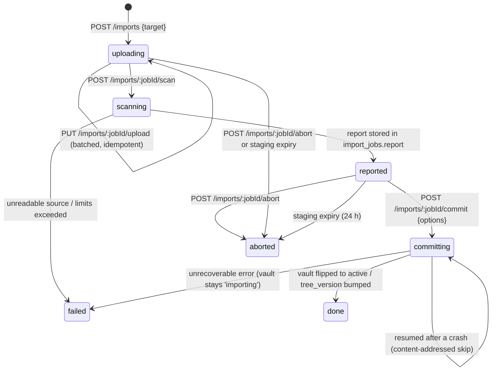

# Markdown pipeline, import/export, and attachments

This section is the build specification for everything that touches Markdown text outside the CRDT: the isomorphic `@iridium/markdown` package and its React renderer, the server-side projections that feed REST, MCP, search and export, the normalization contract for note text, link resolution and the link index, the Obsidian syntax detector, the two-phase import job, the export job, and the attachment subsystem. Collaboration and persistence semantics (how `note_projections.markdown` gets written by the compactor) are in `05-collaboration-and-durability.md`; the DDL of every table named here is in `03-data-model.md`; the route table and message schemas are in `09-api-reference.md`; the import wizard, preview pane and attachment UI are in `07-client-applications.md`.

## 1. Invariants that this section enforces

| # | Invariant | Where it is enforced | Test |
|---|---|---|---|
| I1 | The note text of record (the Y.Text `content`) is LF-only, BOM-free, contains no U+0000, and is never rewritten by parsing, previewing, projecting, importing or exporting | `normalizeSource` at create/import/restore/repair; client `\r` guard; compaction scan (`05-collaboration-and-durability.md`) | `markdown.no-rewrite.prop`, `collab.lf-invariant`, `markdown.roundtrip.prop` |
| I2 | No AST→Markdown serializer exists anywhere in the codebase; every mutation of note text is a text edit driven by mdast offsets | oxlint `no-restricted-imports` bans `remark-stringify`, `mdast-util-to-markdown`, `gray-matter` repo-wide | `deps.banned-imports` |
| I3 | `rehype-sanitize` with `iridiumSanitizeSchema` is the single security boundary for rendered Markdown and runs identically in the browser worker and in the server worker; nothing runs after it except the hast→React mapping | `toPreviewTree` is the only exported renderer entry point and its last stage is the sanitizer | `markdown.sanitize-schema.snapshot`, `markdown.xss.spec` |
| I4 | Untrusted Markdown is never parsed on the Node main thread or on the browser UI thread | server piscina pool, browser Web Worker; lint rule bans `@iridium/markdown` parse imports outside worker entry files | `projection.worker-isolation.unit` |
| I5 | Every consumer of "what the note says" (REST `GET /notes/:id/markdown`, MCP `get_note`, export, search, mirror) reads `note_projections.markdown` at a recorded `revision`; never the live Y.Doc | `ContentReadCore` (A37) | `content.read-model.integration` |
| I6 | Original bytes are restorable: `notes.original_eol` and `notes.had_bom` are recorded once and export restores them by default | `NoteService.initialize`, export job | `markdown.roundtrip.prop`, `export-roundtrip.e2e` |
| I7 | Obsidian-specific syntax is detected, reported and indexed, never emulated or rewritten in MVP | `detectObsidianSyntax`, import report, `note_links.kind` | `markdown.obsidian-detector.spec`, `transfer.fixtures.integration` |
| I8 | Attachments are content-addressed, immutable, served only through the server with hardening headers, and deleted only by an explicit decision | `attachments/*`, `StorageDriver` | `attachments.security`, `attachments.unreferenced-report` |
| I9 | The server never writes to a directory outside its own volumes; overwrite decisions belong to the desktop host and the user | export job writes only under `EXPORTS_DIR`; Electron main handles the save dialog | `export-roundtrip.e2e` (desktop) |

## 2. The `@iridium/markdown` package

### 2.1 Package shape

`packages/markdown` is a compiled, isomorphic, DOM-free and Node-free ESM package (boundary tag `iso`, see `02-system-architecture.md`). It has no runtime dependency on React, `node:*`, `window` or `document`; the only globals it uses are `TextDecoder`, `TextEncoder`, `crypto.subtle` (for `contentHash` in the browser) and `structuredClone`-compatible plain objects. Everything it returns is plain JSON so it can cross a `postMessage` boundary unchanged.

```
packages/markdown/
  package.json                     "@iridium/markdown", type: module, exports: { ".", "./search", "./schema" }
  src/index.ts                     public API (below)
  src/version.ts                   export const PIPELINE_VERSION = 1
  src/normalize.ts                 normalizeSource, restoreSource, detectEol
  src/prescan.ts                   prescan(text) → caps check before any parsing
  src/processor.ts                 createProcessor({flavor, softBreaks}) — unified pipeline factory (memoised per flavor tuple)
  src/plugins/remark-gfm-iridium.ts
  src/plugins/remark-frontmatter-iridium.ts   remark-frontmatter(['yaml']) + yaml 2.9.1 diagnostics
  src/plugins/rehype-iridium-ids.ts           heading ids (github-slugger, 'user-content-' prefix)
  src/plugins/rehype-iridium-positions.ts     data-line / data-offset / data-end-offset
  src/plugins/rehype-iridium-links.ts         link classification via resolveLink → data-link-kind …
  src/plugins/rehype-highlight-iridium.ts     rehype-highlight with the fixed language registry
  src/sanitize/schema.ts                      iridiumSanitizeSchema (exported as "./schema")
  src/parse.ts                                parseNote(text, opts) → ParsedNote
  src/preview.ts                              toPreviewTree(parsed, ctx) → PreviewTree (sanitized hast + blocks)
  src/project.ts                              project(parsed, text, opts) → NoteProjection
  src/body-text.ts                            toBodyText(mdast, text) → { bodyText, lineCount }
  src/links/resolve.ts                        resolveLink, normalizeLinkTarget, VaultIndex interface
  src/links/collect.ts                        collectLinks(mdast, text) → RawLink[]
  src/obsidian/detect.ts                      detectObsidianSyntax(text, mdast, ctx) → ObsidianFindings
  src/obsidian/catalogue.ts                   one entry per construct (code, matcher, severity)
  src/obsidian/wikilink.ts                    parseWikilinkTarget('[[Folder/Note#Heading|Alias]]')
  src/search/parseQuery.ts                    search query grammar (path:, file:, "phrases", -neg) — exported as "./search"
  src/flavors.ts                              FlavorPlugin interface, gfmFlavor, obsidianCompatFlavor
  src/html.ts                                 renderHtml(hast) via rehype-stringify — fixtures/tests and future HTML export only
  test/                                       commonmark/, golden/, xss/, pathological/, obsidian/, prop/
  fixtures/                                   commonmark-0.31.2.json, golden/*.md + .mdast.json + .hast.json + .html, hostile/*.md, obsidian-vault/
```

Public API (all pure functions; no I/O; no timers):

```ts
export function normalizeSource(input: Uint8Array | string, opts?: { invalidUtf8?: 'reject' | 'replace' }): NormalizedSource;
export function restoreSource(text: string, meta: { hadBom: boolean; originalEol: Eol }): Uint8Array;
export function prescan(text: string): PrescanResult;                    // caps, ≈4 ms/MB
export function parseNote(text: string, opts?: ParseOptions): ParsedNote; // mdast + frontmatter
export function toPreviewTree(parsed: ParsedNote, ctx: PreviewContext): PreviewTree;   // sanitized
export function project(parsed: ParsedNote, text: string, opts: ProjectOptions): NoteProjection;
export function detectObsidianSyntax(text: string, mdast: Root, ctx?: DetectContext): ObsidianFindings;
export function resolveLink(raw: string, note: NoteContext, index: VaultIndex): ResolvedLink;
export function normalizeLinkTarget(raw: string, note: NoteContext): NormalizedTarget;
export function createProcessor(opts: ProcessorOptions): Processor;        // for tests and the worker entry files
export { iridiumSanitizeSchema } from './sanitize/schema.ts';
export { PIPELINE_VERSION } from './version.ts';
export { gfmFlavor, obsidianCompatFlavor, type FlavorPlugin } from './flavors.ts';
```

Consumers: `@iridium/markdown-react` (browser worker + React mapping), `apps/server/src/projection/worker.ts` (piscina), `apps/server/src/transfer/import-scan.worker.ts` (piscina), `apps/server/src/search/snippets.ts` (query parser only), `@iridium/editor` (none — the editor uses `@lezer/markdown`, see `07-client-applications.md`).

### 2.2 Dependency pins

All versions are exact (`saveExact`, `catalog:` strict) and come from the research digest of 2026-09-11.

| Package | Version | Role | Notes |
|---|---|---|---|
| unified | 11.0.5 | processor core | |
| remark-parse | 11.0.0 | Markdown → mdast (mdast-util-from-markdown 2.0.3, micromark 4.0.2) | |
| remark-frontmatter | 5.0.0 | `yaml` node with raw value and position | only at offset 0 |
| micromark-extension-gfm-table | 2.1.2 | tables | with mdast-util-gfm-table 2.0.0 |
| micromark-extension-gfm-strikethrough | 2.1.0 | `~~` only (`singleTilde:false`) | with mdast-util-gfm-strikethrough 2.0.0 |
| micromark-extension-gfm-footnote | 2.1.0 | `[^id]` footnotes | with mdast-util-gfm-footnote 2.1.0 |
| micromark-extension-gfm-task-list-item | 2.1.0 | `- [ ]` / `- [x]` | with mdast-util-gfm-task-list-item 2.0.0 |
| mdast-util-gfm-autolink-literal | 2.0.1 | **mdast transform only** (linear) | the micromark syntax extension is quadratic per paragraph and is never registered |
| remark-rehype | 11.1.2 | mdast → hast (`allowDangerousHtml:false`, mdast-util-to-hast 13.2.1) | |
| rehype-highlight | 7.0.2 | lowlight 3.3.0 / highlight.js 11.12.0, class output | `detect:false` |
| highlight.js | 11.12.0 | language grammars (BSD-3-Clause) | registered individually, never `lib/common` |
| rehype-sanitize | 6.0.0 | hast-util-sanitize 5.0.2 | **last stage** |
| rehype-stringify | 10.0.1 | hast → HTML string | fixtures and future HTML export only |
| github-slugger | 2.0.0 | heading slugs | one slugger instance per document |
| yaml | 2.9.1 | frontmatter (`parseDocument`, core schema) | `gray-matter` is banned |
| mdast-util-to-string | 4.0.0 | heading text, alt text | not used for `body_text` (§3.2) |
| unist-util-visit | 5.1.0 | tree walks | |
| remark-breaks | 4.0.0 | soft line breaks (`vaults.soft_breaks`, preview only) | |
| @types/mdast 4.0.4, @types/hast 3.0.5 | | types | |
| hast-util-to-jsx-runtime | 2.3.6 | hast → React 19 (`@iridium/markdown-react`) | `tableCellAlignToStyle:false` |
| comlink | 4.4.2 | browser worker RPC (`@iridium/markdown-react`) | Apache-2.0 |
| piscina | 5.3.2 | server worker pool (`apps/server`) | |
| dompurify | 3.4.15 | browser HTML-string sinks only (`@iridium/markdown-react`) | never on the server; explicit `CUSTOM_ELEMENT_HANDLING` |

Banned by lint and by the CI license scan: `remark-gfm` as a black box (its autolink syntax extension), `gray-matter`, `remark-stringify`, `mdast-util-to-markdown`, `markdown-it`, `shiki`, `isomorphic-dompurify`, `remark-obsidian` (GPL-3.0) and any GPL/AGPL/LGPL remark/rehype plugin. `remark-math`, `rehype-katex`, `mermaid` are post-MVP and not installed.

### 2.3 Pipeline stages

```mermaid
flowchart LR
  A[bytes or string] --> N[normalizeSource<br/>LF, no BOM, U+0000→U+FFFD]
  N --> P[prescan<br/>size / nesting caps]
  P -->|too_large / too_complex| S[status only,<br/>raw markdown kept]
  P --> R[remark-parse + remarkGfmIridium<br/>+ remark-frontmatter]
  R --> M[(mdast)]
  M --> PJ[project<br/>outline · body text · links · tasks · findings]
  M --> RH[remark-rehype<br/>allowDangerousHtml:false]
  RH --> T1[rehype-iridium-ids]
  T1 --> T2[rehype-iridium-positions]
  T2 --> T3[rehype-iridium-links<br/>resolveLink]
  T3 --> H[rehype-highlight<br/>fixed registry]
  H --> Z[rehype-sanitize<br/>iridiumSanitizeSchema — LAST]
  Z --> V[(sanitized hast + blocks)]
  V --> RE[hast-util-to-jsx-runtime<br/>@iridium/markdown-react]
```

The same `createProcessor({flavor, softBreaks})` builds the processor in every context. The processor is memoised per `(flavor, softBreaks)` tuple inside a worker; a processor is stateless between runs (the slugger and footnote counters are per `run`).

Stage table:

| # | Stage | Input → output | Configuration |
|---|---|---|---|
| 0 | `normalizeSource` | bytes/string → `{text, hadBom, originalEol, warnings}` | §4 |
| 1 | `prescan` | text → ok / `too_large` / `too_complex` | `MARKDOWN_SOURCE_MAX_BYTES` 2 MiB of UTF-8, `NOTE_HARD_MAX_UTF16` 2 097 152 UTF-16 code units, blockquote depth ≤ 32, list indent ≤ 64 columns, ≤ 20 000 lines per paragraph (A.1) |
| 2 | remark-parse + `remarkGfmIridium` + `remarkFrontmatterIridium` | text → mdast | §2.4, §2.5 |
| 3 | `remark-breaks` | mdast → mdast | only when `softBreaks` is true and only in `toPreviewTree` (never in `project`) |
| 4 | remark-rehype | mdast → hast | `allowDangerousHtml:false`, `clobberPrefix:'user-content-'` (default), `footnoteLabel:'Footnotes'`, `footnoteLabelId:'user-content-footnote-label'`, `footnoteLabelTagName:'h2'`, `footnoteLabelProperties:{className:['sr-only']}`, `footnoteBackLabel` default |
| 5 | `rehypeIridiumIds` | heading `id` | §2.6 |
| 6 | `rehypeIridiumPositions` | `data-line`, `data-offset`, `data-end-offset` on every element with a position | §2.6 |
| 7 | `rehypeIridiumLinks` | `a`/`img` classification | §2.6, §5 |
| 8 | `rehypeHighlightIridium` | `code.language-*` → `span.hljs-*` | §2.7 |
| 9 | rehype-sanitize | hast → sanitized hast | `iridiumSanitizeSchema`, §2.8 |

`project()` stops after stage 2 (it works on mdast and the source text); `toPreviewTree()` runs all stages. Both are pure and deterministic: identical input and options produce identical output (asserted by golden fixtures and by the `PIPELINE_VERSION` policy in §2.13).

### 2.4 `remarkGfmIridium`

A first-party unified plugin (`src/plugins/remark-gfm-iridium.ts`) that registers, on `this.data()`:

```ts
micromarkExtensions: [gfmTable(), gfmStrikethrough({ singleTilde: false }), gfmFootnote(), gfmTaskListItem()]
fromMarkdownExtensions: [gfmTableFromMarkdown(), gfmStrikethroughFromMarkdown(), gfmFootnoteFromMarkdown(), gfmTaskListItemFromMarkdown(), gfmAutolinkLiteralFromMarkdown()]
```

Only the `fromMarkdown` extension of `mdast-util-gfm-autolink-literal` is registered; its `transforms` pass converts `https://…`, `www.…` and `mailto:` literals inside text nodes after parsing in linear time. The micromark autolink-literal syntax extension is not installed. `singleTilde:false` matches Obsidian and GFM as written by humans (`~one~` stays text). No `toMarkdown` extension is registered anywhere (I2).

Task list items: GFM semantics only — `- [ ]` unchecked, `- [x]`/`- [X]` checked. Any other bracket content (`- [/]`, `- [-]`) is ordinary list text and is reported by the Obsidian detector as `non_gfm_task_state`.

### 2.5 Frontmatter

`remark-frontmatter(['yaml'])` recognises a YAML block only at offset 0 of the normalized text (which is why the BOM is stripped first). The resulting `yaml` mdast node carries the raw block and its position. `parseNote` returns:

```ts
interface ParsedNote {
  mdast: Root;
  frontmatter: null | {
    raw: string;                       // exact source between the fences, never re-serialised
    range: { start: number; end: number; endLine: number };   // offsets of the whole block incl. fences
    data: Record<string, unknown> | null;                      // yaml 2.9.1 core schema, toJS()
    diagnostics: Array<{ code: string; message: string; line: number; col: number }>;
  };
  diagnostics: Array<{ code: 'frontmatter_invalid' | 'prescan' ; message: string; line?: number }>;
}
```

Parsing uses `yaml` 2.9.1 `parseDocument(raw, { maxAliasCount: 100, uniqueKeys: true, schema: 'core' })`: dates and `yes`/`no` stay strings (matching Obsidian's property storage), duplicate keys and alias bombs become diagnostics. `doc.errors.length > 0` → `data = null`, `frontmatter_error` is set in the projection, the note remains searchable and renderable (the block is simply not rendered). The raw block is never rewritten; property edits (post-MVP) are text edits inside `range`.

Normalisation for the index only (never written back): `tags` (and deprecated `tag`) → array of strings, comma-separated strings split, leading `#` stripped, NFC, lowercased, entries longer than 64 characters or more than 200 entries dropped with a diagnostic; `aliases` (and deprecated `alias`) → array of strings, NFC, entries longer than 255 characters dropped, at most 100. These caps exist because `note_projections` indexes `fm_tags` as `CAST(fm_tags AS CHAR(64) ARRAY)` and `fm_aliases` as `CHAR(255) ARRAY`.

### 2.6 Iridium rehype transforms

`rehypeIridiumIds`: for every `h1`–`h6`, `id = 'user-content-' + slugger.slug(headingText)` where `headingText = toString(node)` over the mdast heading (so inline code and emphasis contribute their text) and `slugger` is a fresh `GithubSlugger` per run (dedupe counters `-1`, `-2`). The same slugs are stored in the outline projection (§3.4) so anchors in the preview, `#fragment` link resolution, MCP `heading` addressing and `data-fragment` all agree.

`rehypeIridiumPositions`: every element whose hast node has `position` receives `data-line` (1-based start line), `data-offset` (UTF-16 start offset in the normalized text) and `data-end-offset`. Top-level children of the root are the **blocks** used for memoisation (§2.9) and for editor⇄preview scroll sync (`07-client-applications.md`). micromark reports offsets as UTF-16 code units after the BOM is removed, which is exactly the unit Y.Text and CodeMirror use, so `data-offset` addresses Y.Text positions directly (I1 makes this true).

`rehypeIridiumLinks`: for every `a` (href) and `img` (src), `resolveLink(raw, noteContext, vaultIndex)` (§5.1) classifies the target and sets:

| `data-link-kind` | Meaning | Additional attributes | What the React override does |
|---|---|---|---|
| `vault` | resolves to a live note | `data-note-id`, `data-fragment?` | navigates in-app (`/v/$vaultId/n/$noteId#fragment`) |
| `attachment` | resolves to a live attachment | `data-attachment-id` | `img`: rewrites `src` to `host.attachments.urlFor(vaultId, attachmentId)`; `a`: download link through the same URL |
| `anchor` | `#fragment` in the same note | `data-fragment` | scrolls to `user-content-<slug>` |
| `external` | `http:`/`https:`/`mailto:` | none | `rel="noopener noreferrer"`; **no `target`** — the override intercepts the click and calls `host.shell.openExternal` in both hosts (`07-client-applications.md` §5.12), which is what makes the per-origin first-use confirmation unavoidable; `img`: click-to-load placeholder per `vaults.load_external_images` |
| `broken` | relative target that resolves to nothing | none | rendered as a dashed span with the raw target as title; no navigation |
| `ambiguous` | basename fallback matched several nodes | `data-candidates` (JSON, ≤ 5 ids) | dashed span with a chooser |
| `blocked` | any other scheme (`javascript:`, `data:`, `file:`, `tel:`, `msteams:` …) | none | the sanitizer removes `href`/`src`; the override renders plain text |

The transform runs **before** the sanitizer; the sanitizer then enforces the protocol allowlist independently, so a classification bug can never widen what reaches the DOM (defence in depth: the data attributes are hints for navigation, the sanitizer is the boundary).

### 2.7 Highlighting

`rehypeHighlightIridium` wraps `rehype-highlight` 7.0.2 with `detect:false`, `prefix:'hljs-'`, `plainText:['txt','text','plaintext','plain','mermaid','math','latex','dataview','dataviewjs','query','base','canvas']` and a fixed `languages` registry built from `highlight.js/lib/languages/*` (never `lib/common`):

`javascript, typescript, xml (html/xml/svg/jsx/tsx via aliases), json, yaml, bash, python, java, csharp, go, rust, sql, css, markdown, diff, ini (toml alias), powershell, dockerfile, c, cpp, plaintext` — 21 grammars, measured ≈35 KB gzip in the preview worker.

Aliases (`aliases` option): `{ javascript: ['js','mjs','cjs','jsx'], typescript: ['ts','mts','cts','tsx'], xml: ['html','xhtml','svg','rss','atom','vue'], bash: ['sh','shell','zsh','console'], python: ['py'], csharp: ['cs'], rust: ['rs'], powershell: ['ps1','pwsh'], dockerfile: ['docker'], markdown: ['md'], json: ['jsonc','json5'], ini: ['toml'], yaml: ['yml'], plaintext: ['txt','text'] }`.

Unknown languages are left unhighlighted with `class="hljs language-<x>"` (rehype-highlight warns, never throws); the raw highlighter is never called with user-supplied names. The language class survives the sanitizer through the `code[className]` rule below; all colour comes from CSS classes (CSP-friendly, no inline styles). `code_langs` in the projection records the raw (lowercased, ≤ 32 chars) info strings so vault statistics can show which languages people use.

### 2.8 Sanitization — the security boundary

`iridiumSanitizeSchema` (`src/sanitize/schema.ts`) is derived from `defaultSchema` of hast-util-sanitize 5.0.2 by spreading it and then **replacing** `tagNames`, `attributes`, `protocols`, `ancestors`, `required` and `clobberPrefix` with the explicit values below. Because remark-rehype runs with `allowDangerousHtml:false`, raw HTML never reaches hast (it is rendered as escaped text), so the allowlist is exactly the set of elements and attributes the pipeline itself emits; anything else is unreachable and therefore removed by construction.

```ts
import { defaultSchema, type Schema } from 'hast-util-sanitize';

const ID = /^user-content-[^\s"'<>&]+$/;

export const iridiumSanitizeSchema: Schema = {
  ...defaultSchema,
  clobberPrefix: '',                 // remark-rehype already prefixed footnote ids; '' avoids 'user-content-user-content-fn-1'
  clobber: ['id', 'name', 'ariaDescribedBy', 'ariaLabelledBy'],
  strip: ['script'],
  allowComments: false,
  allowDoctypes: false,
  tagNames: [
    'a', 'blockquote', 'br', 'code', 'del', 'em', 'h1', 'h2', 'h3', 'h4', 'h5', 'h6', 'hr',
    'img', 'input', 'li', 'ol', 'p', 'pre', 'section', 'span', 'strong', 'sup',
    'table', 'tbody', 'td', 'th', 'thead', 'tr', 'ul',
  ],
  attributes: {
    '*': ['dataLine', 'dataOffset', 'dataEndOffset', 'dataLinkKind', 'dataNoteId', 'dataAttachmentId', 'dataFragment', 'dataCandidates'],
    a: ['href', 'title', ['id', ID], ['ariaDescribedBy', ID], 'ariaLabel', 'dataFootnoteRef', 'dataFootnoteBackref', ['className', 'data-footnote-backref']],
    img: ['src', 'alt', 'title'],
    input: [['type', 'checkbox'], ['disabled', true], 'checked'],
    code: [['className', /^language-[\w+#.-]{1,32}$/, 'hljs']],
    span: [['className', /^hljs-[\w-]{1,40}$/]],
    h1: [['id', ID]], h2: [['id', ID], ['className', 'sr-only']], h3: [['id', ID]], h4: [['id', ID]], h5: [['id', ID]], h6: [['id', ID]],
    li: [['id', ID], ['className', 'task-list-item']],
    ul: [['className', 'contains-task-list']],
    ol: ['start', ['className', 'contains-task-list']],
    td: [['align', 'left', 'center', 'right']],
    th: [['align', 'left', 'center', 'right']],
    section: ['dataFootnotes', ['className', 'footnotes']],
  },
  protocols: { href: ['http', 'https', 'mailto'], src: ['http', 'https'] },
  ancestors: { li: ['ol', 'ul'], tbody: ['table'], td: ['table'], th: ['table'], thead: ['table'], tr: ['table'] },
  required: { input: { type: 'checkbox', disabled: true } },
};
```

Exact decisions encoded above:

| Decision | Value | Rationale |
|---|---|---|
| Elements | the 30 tag names listed; `details`, `summary`, `mark`, `div` are **not** allowed in MVP (they join through the `obsidian-compat` flavor extension, §2.12) | deny-by-default; every allowed element has a producing stage |
| Attributes | no `style`, no `name`, no `target`, no `rel`, no event handlers, no `srcset`, no `width`/`height`; `id` only when it matches `^user-content-` | DOM clobbering and CSS injection impossible; `rel` is added by the React override for external links, not by content, and no `target` is ever set in either host because the override intercepts the click (§2.6) |
| `data-*` | only the eight Iridium hints | `data-*` wildcard is not used. The eight names in the `'*'` list are exactly the attributes `@iridium/markdown-react` reads (`data-note-id`, not `data-node-id` — the `ResolvedLink.nodeId` *field* keeps its name, the *attribute* is the one A42 and `07-client-applications.md` §5.10/§5.12 name); `preview.data-attributes.spec` asserts that the schema list equals the set the overrides consume, so dropping a hint from the schema fails the build instead of silently disabling navigation |
| URL schemes | `href`: `http`, `https`, `mailto`; `src`: `http`, `https`; relative URLs allowed (needed for vault links and attachment references); `irc`, `ircs`, `xmpp` (defaults) dropped; `tel:` and enterprise schemes (`msteams:`, `slack:`) not allowed in MVP | explicit allowlist; anything else becomes `blocked` |
| Footnote ids | remark-rehype prefixes `fn-`/`fnref-` with `user-content-`; `footnoteLabelId` is set to `user-content-footnote-label` so **every** id in the document matches `ID` | one regex enforces clobber safety |
| Checkboxes | `input` must be `type=checkbox disabled` (`required`) | the sanitized hast always carries `disabled`; `PreviewCheckbox` re-renders an enabled input when the session role permits writes (`07-client-applications.md` D07-13), so interactivity is a renderer decision and hostile content can never emit an enabled control |
| Comments / doctype | removed | |
| `ancestors` | table parts require `table`; `li` requires `ol`/`ul` | structural sanity |

`hast-util-sanitize` applies protocol checks after percent-decoding and whitespace/control-character stripping, and the XSS corpus (`fixtures/hostile/*.md`) asserts at the hast level that: `javascript:`, `vbscript:`, `data:`, `file:`, `ftp:`, `tel:` hrefs and `data:image/*` srcs are removed; raw `<script>`, ``, `<iframe>`, `<svg onload>`, `<math>`, `<meta http-equiv>`, `<base>`, `<form>` are escaped text; ids not prefixed `user-content-` are dropped; `%0A`, `&#x6A;avascript:`, tab/newline-embedded schemes, fullwidth colons and RTL overrides do not smuggle a scheme through; 10 000 nested `>` and 200 000-line paragraphs are rejected by `prescan` before parsing. The same corpus runs in Chromium component tests (`preview.component.test.tsx`, real DOM, no script executes, no navigation, `window.iridium` unreachable) and in the web and Electron E2E suites (`security.hostile-markdown`).

DOMPurify 3.4.15 is not on the render path. It exists only in `@iridium/markdown-react/src/html-sink.ts` for any future HTML-string sink (mermaid `srcdoc`, HTML export preview) with the fixed configuration `{ USE_PROFILES: { html: true }, FORBID_TAGS: ['form','input','style','math','svg','iframe','object','embed'], FORBID_ATTR: ['style'], CUSTOM_ELEMENT_HANDLING: { tagNameCheck: null, attributeNameCheck: null, allowCustomizedBuiltInElements: false }, ALLOWED_URI_REGEXP: /^(?:https?:|mailto:|iridium-attachment:|\/api\/v1\/vaults\/)/i, RETURN_TRUSTED_TYPE: false }`. No MVP feature calls it (printing renders the React tree); the module ships with its own test so the first consumer cannot introduce it unconfigured.

### 2.9 hast → React (`@iridium/markdown-react`)

`packages/markdown-react` (JIT, browser-only, boundary tag `browser`) contains:

- `src/render.tsx` — `renderPreview(tree: PreviewTree, ctx: RenderContext): ReactNode` using `toJsxRuntime(hast, { Fragment, jsx, jsxs, passNode: true, passKeys: true, tableCellAlignToStyle: false, components })` from `react/jsx-runtime`. `tableCellAlignToStyle:false` keeps the `align` attribute so a strict `style-src` CSP holds; CSS styles `td[align=center]`.
- `src/components/` — the only overrides: `PreviewLink` (`a`), `PreviewImage` (`img`), `PreviewCheckbox` (`input`), `PreviewCodeBlock` (`pre`, adds the copy button and the language label from `code.className`). Overrides read the `data-*` hints; they never read `href`/`src` for navigation decisions.
- `src/blocks.tsx` — block memoisation: the worker returns `blocks: Array<{ key, startOffset, endOffset, hash, hast }>` where `key = startOffset + ':' + hash` and `hash` is FNV-1a of the source slice; `<PreviewBlock>` is `React.memo` keyed by `key`, so unchanged blocks keep their element identity across re-renders and only edited blocks touch the DOM.
- `src/worker/preview.worker.ts` + `src/worker/client.ts` — the Web Worker (§2.11).
- `src/html-sink.ts` — the DOMPurify helper (§2.8), unused by MVP features.

There is no `dangerouslySetInnerHTML` anywhere in `@iridium/markdown-react` or `@iridium/ui` (lint rule `react/no-danger: error`, plus a grep guard test `no-inner-html.unit`).

### 2.10 Pre-scan caps and pathological input

`prescan(text)` is a single linear pass (≈4 ms/MB) run before any parse in every context. Every constant below is the one named in the limits policy of `02-system-architecture.md` §7, which is the sole naming authority for `@iridium/contracts/limits.ts`; this section defines no number and no name of its own beyond the two caps of D08-03:

| Check | Limit (from `@iridium/contracts/limits.ts`) | Result |
|---|---|---|
| UTF-8 byte length of the source (`new TextEncoder().encode(text).length`, counted in the same pass) | `MARKDOWN_SOURCE_MAX_BYTES = 2_097_152` bytes | `too_large` (`detail: 'source_bytes'`) |
| `text.length` | `NOTE_HARD_MAX_UTF16 = 2_097_152` UTF-16 code units | `too_large` |
| leading `>` count per line (after up to 3 spaces of indentation, repeated) | `MARKDOWN_BLOCKQUOTE_MAX_DEPTH = 32` | `too_complex` (`detail: 'blockquote_depth', line`) |
| leading indentation columns of a list-marker line (tabs = 4 columns) | `MARKDOWN_LIST_INDENT_MAX_COLS = 64` | `too_complex` (`detail: 'list_indent'`) |
| consecutive non-blank lines outside fenced code | `MARKDOWN_LINES_PER_PARAGRAPH_MAX = 20_000` | `too_complex` (`detail: 'paragraph_lines'`) |
| number of `[^` footnote references | `MARKDOWN_FOOTNOTE_REFS_MAX = 10_000` | `too_complex` (`detail: 'footnotes'`) |
| number of `[` characters (link/reference candidates) | `MARKDOWN_BRACKETS_MAX = 200_000` | `too_complex` (`detail: 'brackets'`) |

The byte check is what gives the "2 MiB source" row of the limits policy an enforcement site: the two 2 097 152 caps are not the same limit, because 2 097 152 UTF-16 code units of CJK text are about 6 MiB of UTF-8. `NOTE_HARD_MAX_UTF16` governs whether a note may *exist* (`NoteService.initialize`, restore, repair, import commit → `422 note_oversized`); `MARKDOWN_SOURCE_MAX_BYTES` governs whether it is *parsed*, so a note that is legal but too large in bytes keeps its text and carries `status='too_large'` instead of being refused.

Rejected notes are never parsed: the projection row gets `status='too_large'|'too_complex'`, `note_projections.markdown` still holds the text (REST, MCP, search on raw text via the source-line scan, and export keep working), derived fields are `NULL`, the preview shows "Preview unavailable: document exceeds the complexity limit" with the detail, and a metric `iridium_projection_duration_seconds{status}` counts it. The known micromark worst cases (unbalanced `*a_` emphasis at 20 000 repetitions, ~13–20 s; 3 000-deep `>`; 1 000-deep lists) are covered either by these caps or by the worker timeout in §2.11; the pathological suite (`test/pathological/*.spec.ts`) asserts that every corpus entry is rejected by `prescan` or completes/aborts inside the budget.

### 2.11 Worker isolation

**Browser (`@iridium/markdown-react/src/worker/`)** — one dedicated module Worker per window, created with `new Worker(new URL('./preview.worker.ts', import.meta.url), { type: 'module' })` so Vite 8 emits a separate chunk for both the web bundle and the Electron renderer (same code, `app://iridium` origin, CSP `worker-src 'self'`). The API is exposed with comlink 4.4.2:

```ts
interface PreviewWorkerApi {
  configure(opts: { flavor: MarkdownFlavor; softBreaks: boolean }): void;
  setVaultIndex(snapshot: VaultIndexSnapshot): void;             // full replace, keyed by tree_version
  patchVaultIndex(delta: VaultIndexDelta): void;                 // from vault-channel tree-changed / attachment events
  render(req: { noteId: string; notePath: string; source: string; seq: number }): Promise<PreviewResult>;
  project(req: { source: string }): Promise<Pick<NoteProjection, 'headings' | 'tasks' | 'wordCount'>>;   // outline pane
}
```

The client (`client.ts`) debounces `render` by source size — 150 ms ≤ 64 KB, 500 ms ≤ 512 KB, 1.5 s above (idle-triggered) — keeps only the newest pending request per note, and enforces `PROJECTION_TIMEOUT_CLIENT_MS = 2_000` per request with `Promise.race`; on timeout it calls `worker.terminate()`, respawns the worker, replays `configure` + `setVaultIndex`, and the preview pane shows the "Preview unavailable: document too complex" banner with a retry button. The UI thread never imports `@iridium/markdown` parse entry points (lint rule + `preview.worker-only.unit`). `PreviewResult` is `{ seq, blocks, outline, diagnostics, timing: { prescanMs, parseMs, hastMs, sanitizeMs } }`; timings feed the `preview p95 < 100 ms` performance budget measured in CI.

**Server (`apps/server/src/projection/pool.ts`)** — one piscina 5.3.2 pool for the whole process:

```ts
new Piscina({
  filename: new URL('./worker.mjs', import.meta.url).href,   // separate tsdown entry: apps/server/src/projection/worker.ts
  minThreads: 1,
  maxThreads: env.PROJECTION_WORKERS,                         // default max(1, os.availableParallelism() - 1)
  idleTimeout: 60_000,
  maxQueue: 1_000,
  resourceLimits: { maxOldGenerationSizeMb: 512, stackSizeMb: 8 },
});
pool.run(task, { signal: AbortSignal.timeout(env.PROJECTION_TIMEOUT_MS) });   // default 10_000
```

An aborted task terminates its worker thread (piscina semantics) and the pool respawns; the caller records `status='timeout'` and increments `iridium_projection_timeouts_total`. `maxQueue` overflow rejects the enqueue; the note keeps `status='pending'` and is picked up by the `reindex --stale` sweep (§3.7) — nothing is lost because the raw markdown was already committed by the compactor. The same pool serves the import scan worker (`transfer/import-scan.worker.ts`) and the attachment reference scan (`attachments/reference-scan.worker.ts`); each is its own tsdown entry with `@iridium/markdown` inlined, so a worker can never run a different `PIPELINE_VERSION` than the server that spawned it.

### 2.12 Flavors and the plugin seam

`vaults.markdown_flavor ENUM('gfm','obsidian-compat')`, `vaults.soft_breaks` and `vaults.attachment_folder` exist from the first migration (A43). In MVP both flavors render identically; the flag is stored, shown in vault settings and the import wizard, and consumed by the seam:

```ts
export interface FlavorPlugin {
  id: MarkdownFlavor;
  remark: Array<Pluggable>;               // extra remark plugins (custom mdast node types allowed)
  rehype: Array<Pluggable>;               // extra rehype transforms, all placed BEFORE the sanitizer
  sanitizeExtension: Partial<Schema>;     // merged additively into iridiumSanitizeSchema (tagNames/attributes only; protocols never widened)
  detectorOverrides?: Partial<Record<ObsidianCode, 'silence'>>;   // constructs the flavor renders natively stop being reported as "renders literally"
}
export const gfmFlavor: FlavorPlugin = { id: 'gfm', remark: [], rehype: [], sanitizeExtension: {} };
export const obsidianCompatFlavor: FlavorPlugin = { ...gfmFlavor, id: 'obsidian-compat' };   // MVP: identical rendering
```

`createProcessor` composes `[remarkParse, remarkGfmIridium, remarkFrontmatterIridium, ...flavor.remark, softBreaks ? remarkBreaks : null, remarkRehype, rehypeIridiumIds, rehypeIridiumPositions, rehypeIridiumLinks, ...flavor.rehype, rehypeHighlightIridium, [rehypeSanitize, mergeSchema(iridiumSanitizeSchema, flavor.sanitizeExtension)]]`. `mergeSchema` refuses to add `style`, `name`, event-handler attributes or any protocol (unit-tested), so a flavor cannot weaken the boundary. The seam is prepared but unused at MVP by decision rather than by default: **G2 was answered *no* on 2026-09-12** (`14-risks-and-open-questions.md` §G), so read-only rendering of Obsidian syntax does not ship in MVP and `obsidianCompatFlavor` stays `{ ...gfmFlavor, id: 'obsidian-compat' }` — `remark: []`, `rehype: []`, `sanitizeExtension: {}` — for the whole of 1.0, so the two flavors render identically and `markdown_flavor` changes what a vault is *recorded* as and nothing else. `markdown.flavor-parity.unit` asserts exactly that, so the seam cannot acquire a plugin without a deliberate change. When the post-MVP flavor flag is built it adds the first-party MIT plugins `remarkWikiLink`, `remarkCallout`, `remarkHighlight`, `remarkComment` and extends `tagNames` with `details`, `summary`, `mark`, `div`; the shape is fixed now so that work touches no MVP file except `flavors.ts` and the sanitizer extension it merges.

### 2.13 `PIPELINE_VERSION`

`PIPELINE_VERSION` is an integer in `src/version.ts` and is written into every `note_projections.pipeline_version` row and into `schema_meta.pipeline_version`. Bump rule: any change that alters the output of `project()` or `toPreviewTree()` for at least one golden fixture (the golden test fails until either the fixture or the version is updated; a CI check refuses a fixture change without a version bump, `markdown.pipeline-version.guard`). On boot, if `schema_meta.pipeline_version < PIPELINE_VERSION`, the server writes the new value and enqueues `reindex --pipeline-version` (background, throttled to `REINDEX_RATE_PER_SECOND` default 20 notes/s, oldest projections first). Dependency upgrades of micromark/remark/rehype/highlight.js/yaml always bump the version because they can change output.

## 3. Server-side projections

### 3.1 Who calls the projection and with what

Projections are **derived, rebuildable data**. The Yjs state in `note_docs`/`note_updates` is the content of record; every projection row can be dropped and recomputed from it. There are exactly three producers:

| Producer | Trigger | Path |
|---|---|---|
| Compactor | after a compaction transaction COMMITs (`05-collaboration-and-durability.md`) | `projection/enqueue.ts` → piscina → `projection/writer.ts` |
| `NoteService.initialize` | note creation and import commit | the worker runs before the creating transaction commits and its result is written with `revision = 1` inside that transaction |
| `iridium reindex` | `--vault`, `--stale`, `--pipeline-version`, `--note`, or the hourly maintenance sweep | same pool, throttled |

The task payload is self-contained so the worker needs no database access:

```ts
interface ProjectionTask {
  noteId: string;                  // canonical lowercase UUID
  vaultId: string;
  revision: number;                // note_updates.seq the markdown reflects
  markdown: string;                // already LF-normalised text taken from the Y.Text
  note: NoteContext;               // { noteId, vaultId, path, parentPath, name }
  vault: { flavor: MarkdownFlavor; softBreaks: boolean; attachmentFolder: string };
  index: VaultIndexSnapshot;       // §5.2 — note paths, basenames, attachment path hints, aliases
  pipelineVersion: number;         // asserted equal to PIPELINE_VERSION inside the worker
}
```

`VaultIndexSnapshot` is built by `projection/index-snapshot.ts` (one recursive CTE over `nodes` plus one query over live `attachments`) and cached in-process keyed by `(vaultId, tree_version, attachmentsVersion)`, where `attachmentsVersion = MAX(version)` over the vault's live attachment rows. A tree or attachment change invalidates it; the `tree-changed` broadcast already carries `treeVersion`, so the browser preview worker invalidates its own copy by the same key (`07-client-applications.md`).

The worker returns one value:

```ts
interface NoteProjection {
  status: 'ok' | 'too_large' | 'too_complex' | 'timeout' | 'error';
  pipelineVersion: number;
  contentHash: string;             // hex SHA-256 of the LF markdown
  sizeChars: number;               // UTF-16 code units
  lineCount: number;
  wordCount: number;
  headingTitle: string | null;     // first H1 only, collapsed, <= 255 code points
  frontmatter: { raw: string; data: Record<string, unknown> | null; error: string | null } | null;
  fmTags: string[];                // normalised, <= 200 entries, <= 64 chars each
  fmAliases: string[];             // normalised, <= 100 entries, <= 255 chars each
  headings: Array<{ depth: 1 | 2 | 3 | 4 | 5 | 6; text: string; slug: string; line: number; offset: number }>;
  tasks: Array<{ line: number; offset: number; checked: boolean }>;
  codeLangs: string[];             // lowercased info strings, <= 32 chars, deduplicated, <= 50 entries
  bodyText: string;                // §3.2 — what FULLTEXT indexes
  bodyRuns: TextRun[];             // §3.3 — plain-text to source offset map (not persisted)
  links: RawLink[];                // §5.3
  obsidian: ObsidianFindings;      // §6
  timings: { prescanMs: number; parseMs: number; projectMs: number };
}
```

Field-to-column mapping (the writer only copies and guards):

| `NoteProjection` field | Column |
|---|---|
| `status`, `pipelineVersion`, `contentHash`, `headingTitle` | `note_projections.status`, `.pipeline_version`, `.content_hash`, `.heading_title` |
| `frontmatter.raw`, `frontmatter.data`, `frontmatter.error` | `note_projections.frontmatter_raw`, `.frontmatter`, `.frontmatter_error` |
| `fmTags`, `fmAliases`, `headings`, `tasks`, `codeLangs`, `wordCount`, `lineCount` | `note_projections.fm_tags`, `.fm_aliases`, `.headings`, `.tasks`, `.code_langs`, `.word_count`, `.line_count` |
| `obsidian` (reduced form, §6.4) | `note_projections.obsidian_findings` |
| `ProjectionTask.markdown` | `note_projections.markdown` |
| `bodyText`, effective title | `note_search.body_text`, `note_search.title` |
| `links` | `note_links` rows |
| `bodyRuns` | not persisted — recomputed on demand (§3.6) |
| `sizeChars` | `notes.size_chars` (written by the compactor, not by the projection writer) |

### 3.2 Plain text for search (`note_search.body_text`)

`mdast-util-to-string` is **not** used for the search body: it includes `yaml` and raw `html` values, carries no offsets, and concatenates adjacent nodes without separators so a phrase can straddle two blocks. `toBodyText(mdast, source)` in `src/body-text.ts` is a single depth-first walk with explicit rules:

| mdast node | Contribution to `bodyText` |
|---|---|
| `text` | its `value`, verbatim; one run mapped to `node.position.start.offset` |
| `inlineCode` | its `value` (code is searchable, as in Obsidian); run mapped past the opening backticks |
| `code` (fenced or indented) | its `value`; the info string is excluded (it lives in `code_langs`) |
| `image` | its `alt`, when non-empty; run mapped to the node start |
| `link`, `linkReference`, `emphasis`, `strong`, `delete`, `footnoteReference` | nothing of their own; children are visited |
| `definition`, `footnoteDefinition` label | nothing (link definitions are not prose; footnote bodies are visited as blocks) |
| `yaml` | **skipped entirely** |
| `html` | **skipped entirely** (it is not rendered either) |
| `break`, `thematicBreak` | a single `\n`, synthetic run |
| every other block node (`paragraph`, `heading`, `listItem`, `tableCell`, `blockquote`, `footnoteDefinition`) | a single `\n` after its children, synthetic run |

Deliberate consequences: a heading term is indexed both in `note_search.title` and in `body_text`, so it ranks twice; table cells are separated so `"alpha beta"` cannot match two neighbouring cells; frontmatter is reachable only through `fm_tags`/`fm_aliases` and the `path:`/`file:` operators, never as prose (`tag:` and `line:` operators are reserved in `@iridium/markdown/search/parseQuery.ts`).

`note_search.title` is the **effective title** `headingTitle ?? nodes.name`, read in the same transaction as the write; for notes without an H1 a structural rename also updates it (A38).

No truncation is applied: `body_text` is `MEDIUMTEXT` (16 MiB) and the hard note cap of 2 097 152 UTF-16 units yields at most about 6 MiB of UTF-8, well inside `max_allowed_packet = 256M`.

### 3.3 The plain-text to source offset map

Matches are found in `body_text`, but every user-facing artefact (snippet line numbers, jump-to-match, agent line ranges) must address the **Markdown source**. `toBodyText` therefore emits a monotonic run map:

```ts
/** [bodyOffset, sourceOffset, length] — both coordinates are UTF-16 code units, both strictly increasing. */
export type TextRun = readonly [number, number, number];

export interface BodyTextResult { text: string; runs: TextRun[]; lineCount: number }

/** Maps a bodyText offset back to a source offset; synthetic separators map to the end of the preceding run. */
export function sourceOffsetOf(runs: TextRun[], bodyOffset: number): number;    // binary search
export function lineOf(lineStarts: Int32Array, sourceOffset: number): number;   // 1-based, binary search
```

One run per contributing node value keeps the map small (a 100 KB note yields a few thousand runs). The map is **not stored**: it is fully derivable from `note_projections.markdown` plus `PIPELINE_VERSION`, and persisting it would add a second artefact to keep consistent for no read benefit. It is recomputed in the projection worker only when the snippet locator needs it (§3.6). `markdown.body-text-map.prop` asserts, for generated documents, that `markdown.slice(sourceOffsetOf(runs, i), …)` starts with the character at `bodyText[i]` for every non-synthetic offset `i`.

### 3.4 Outline, tasks and statistics

`headings` is built in document order with one `GithubSlugger` per run, so outline slugs are byte-identical to the `id` attributes the preview emits (§2.6) and to the fragments `resolveLink` validates (§5.1). `text` is the heading's plain text with internal whitespace collapsed; `line` is the 1-based line of the heading marker; `offset` is the UTF-16 offset of the heading node start.

`headingTitle` is the `text` of the first `depth === 1` heading, whitespace-collapsed, trimmed, truncated to 255 **code points** (MySQL `VARCHAR(255)` counts code points; truncation never splits a surrogate pair or a combining sequence). It is `NULL` when the note has no H1 — the only reason the column is nullable, and the reason the display title is computed as `COALESCE(heading_title, nodes.name)` at read time rather than stored (A38).

`tasks` records every GFM task list item as `{ line, offset, checked }` where `offset` points at the `[`. Toggling a checkbox from the preview is a text edit at `offset + 1` (`07-client-applications.md`), which is why the offset is part of the projection.

`wordCount` counts matches of `/[\p{L}\p{N}\p{M}_’']+/gu` over `bodyText`; CJK text is counted per character by that rule and the limitation is documented in `docs/agents/note-metadata.md`. `lineCount` is `1 + (number of \n in markdown)`. `codeLangs` holds the deduplicated, lowercased first tokens of fenced-code info strings, each capped at 32 characters, at most 50 entries.

### 3.5 The projection write transaction

`projection/writer.ts` runs one transaction on `dbApp` per note:

```sql
START TRANSACTION;
SELECT projected_seq FROM note_docs WHERE note_id = ? FOR UPDATE;
-- continue only when projected_seq < :revision (or <= :revision for an idempotent reindex)
INSERT INTO note_projections (note_id, revision, markdown, content_hash, /* … */) VALUES (/* … */) AS new
  ON DUPLICATE KEY UPDATE revision = new.revision, markdown = new.markdown /* … */;
REPLACE INTO note_search (note_id, vault_id, title, body_text, revision, updated_at) VALUES (/* … */);
DELETE FROM note_links WHERE from_note_id = ?;
INSERT INTO note_links (from_note_id, vault_id, revision, ordinal, kind, raw_target, /* … */) VALUES /* … */;
UPDATE note_docs SET projected_seq = ? WHERE note_id = ? AND projected_seq < ?;
COMMIT;
```

Rules:

- **Monotonic guard.** An older revision can never overwrite a newer one; `projection.monotonic` asserts it with deliberately interleaved out-of-order writes. `projected_seq` advances last, so a crash mid-transaction leaves `projected_seq` behind the data and the next sweep redoes the work idempotently.
- **`note_links` is replaced wholesale** for the note. Diffing would buy nothing, and `uq_links_from_ordinal` turns a stale ordinal into a hard error instead of a silent duplicate.
- **`note_search` uses `REPLACE`**, which also covers the case where a partially completed purge removed the row.
- The transaction touches only `note_docs` (one row lock) plus the three projection tables, so it cannot deadlock with a structural transaction (`vaults` → `nodes` → `audit_chain_heads`, A46) or with the persistence writer (`note_docs` only). `lock-order.integration` covers the three-way interleaving.
- On worker failure the row keeps its **previous** revision (reads stay self-consistent), `status` is set to `error` or `timeout` with a structured pino event and the `iridium_projection_duration_seconds{status}` / `iridium_projection_timeouts_total` metrics, and `iridium doctor --stale-projections` lists the note. `frontmatter_error` is reserved for YAML diagnostics and is never used for pipeline errors.

### 3.6 Search snippets

`search/snippets.ts` returns `{ line, text, ranges }` entries per hit. Snippets address **Markdown source lines** (A38), which is what the UI highlights and what an agent can re-fetch with `get_note(lines: …)`.

Stage 1 — source scan (the default, no worker):

1. `parseQuery(q)` yields positive terms and phrases; negations and the `path:`/`file:` operators are excluded from snippet matching.
2. The locator walks `note_projections.markdown` line by line, skipping the frontmatter block when `frontmatter_raw` is present, comparing NFC-folded lowercase substrings.
3. The first `SNIPPET_MAX_LINES = 3` matching lines are returned; each is trimmed to `SNIPPET_MAX_CHARS = 240` centred on its first match with `…` markers, and match ranges are returned as offsets **into the returned text** so the client never re-matches.

Stage 2 — mapped fallback, used only when stage 1 finds nothing although FULLTEXT matched. InnoDB matched a token in `body_text` that does not exist as a contiguous string in the source: `**ter**m`, a hard-wrapped phrase, a setext heading, a table cell, an image `alt`. The locator enqueues a `snippet` task on the projection pool; the worker re-runs `parseNote` + `toBodyText` on the stored markdown, finds the term in `bodyText`, maps it with `sourceOffsetOf`, converts it to a line with `lineOf`, and returns the same shape. Results are memoised in an in-process LRU keyed `(noteId, revision, queryHash)` (500 entries, 2 minutes) so paging a result set re-parses nothing. When stage 2 also fails, the row carries `snippet: null` and the UI shows the note title with a "match in formatted text" hint.

Every search row carries `revision`; the staleness signal for notes with `projected_seq < head_seq` is defined in A38 and surfaced by `09-api-reference.md` and `07-client-applications.md`.

### 3.7 Rebuilding, reindexing and `PIPELINE_VERSION`

| Command | Selection | Throttle |
|---|---|---|
| `iridium reindex --vault <id>` | every live note of the vault | `REINDEX_RATE_PER_SECOND` (default 20 notes/s) |
| `iridium reindex --stale` | `note_docs.projected_seq < head_seq`, or `note_projections.status IN ('pending','timeout','error')` | same |
| `iridium reindex --pipeline-version` | `note_projections.pipeline_version < PIPELINE_VERSION`, oldest `projected_at` first | same |
| `iridium reindex --note <id>` | one note | — |
| maintenance job `reindex` | the `--stale` selection, hourly | same |

A reindex never reads the live Y.Doc. It reads `note_projections.markdown` when `projected_seq == head_seq`; otherwise the note is loaded, so it asks the compactor for a flush first and projects the flushed text. Reindexing therefore stays a projection-layer operation that cannot disturb an editing session. Progress and cancellation go through the `jobs` row (`type='reindex'`).

On boot, `schema_meta.pipeline_version < PIPELINE_VERSION` enqueues the `--pipeline-version` job automatically. Rows upgrade in the background while reads keep serving the previous projection, because every read carries the `revision` it reflects and no consumer depends on `pipeline_version`.

## 4. Normalization and byte-exact restoration

### 4.1 Why the text of record is normalized at all

The spec (§3, §7) demands that frontmatter, code, whitespace and unsupported syntax are not rewritten by opening or previewing a note, and that import does not silently normalize content. Three verified facts make a *literally* byte-preserving note body impossible in a CRDT editor:

1. CodeMirror 6 treats `\r\n` as a single document position while `Y.Text` counts two UTF-16 units, so a CRLF document desynchronizes the binding as soon as two clients edit it (y-codemirror.next #35).
2. micromark silently consumes a leading BOM but reports node offsets relative to the text **after** the BOM, so every `data-offset`, every link range and every task offset would be off by one for BOM-carrying notes.
3. CommonMark 0.31.2 §2.3 requires U+0000 to be replaced by U+FFFD before parsing, and MySQL `utf8mb4` columns plus JSON wire encodings do not accept lone surrogates.

Iridium therefore normalizes **once, at the four entry points**, records what it changed, and restores it on export. This is deviation F1 in `01-vision-scope-and-principles.md`; the acceptance row "Markdown/frontmatter/code survive import and export without unintended changes" stays true because restoration is byte-exact for uniform line endings and is property-tested.

The four entry points — the only places `normalizeSource` is called on note text — are:

| Entry point | Caller | Recorded in |
|---|---|---|
| Note creation (`POST /vaults/:vaultId/nodes` with `markdown`) | `NoteService.initialize` | `notes.original_eol = 'lf'`, `had_bom = 0` unless the client sent bytes with a BOM |
| Import commit | `transfer/import-commit.ts` → `NoteService.initialize` | `notes.original_eol`, `notes.had_bom` from the scan report |
| Revision restore | `notes/revisions.ts` (the restore target text) | unchanged (restore never alters the recorded original) |
| `iridium doctor --repair-content` | `notes/content-repair.ts` (A22) | unchanged |

After initialization the live text can only change through CRDT updates, and three independent guards keep it normalized: the editor strips `\r` on paste and blocks `\r` insertion (A41), the compactor rejects a document whose markdown contains `\r` or whose `toDelta()` carries attributes or embeds (A22, `notes.content_invalid`), and `collab.lf-invariant` asserts it end to end.

### 4.2 `normalizeSource`

```ts
type Eol = 'lf' | 'crlf' | 'cr' | 'mixed';

interface NormalizedSource {
  text: string;               // LF-only, BOM-free, no U+0000, no lone surrogates
  hadBom: boolean;
  originalEol: Eol;
  encoding: 'utf-8' | 'utf-16le' | 'utf-16be';
  warnings: Array<{ code: NormalizeWarning; count: number; firstLine?: number }>;
}

type NormalizeWarning =
  | 'bom_stripped' | 'crlf_normalized' | 'cr_normalized' | 'mixed_eol'
  | 'nul_replaced' | 'lone_surrogate_replaced' | 'invalid_utf8_replaced' | 'utf16_decoded';
```

Steps, in order:

| # | Step | Rule |
|---|---|---|
| 1 | Encoding | `Uint8Array` input: `FF FE` / `FE FF` prefix → decode with `TextDecoder('utf-16le' \| 'utf-16be')` and warn `utf16_decoded`; otherwise `TextDecoder('utf-8', { ignoreBOM: true, fatal: opts.invalidUtf8 === 'reject' })`. `fatal` throws `InvalidUtf8Error` (the scanner turns it into the report code `invalid_utf8`); with `replace` the decoder substitutes U+FFFD and warns `invalid_utf8_replaced`. String input skips this step. |
| 2 | BOM | A leading U+FEFF is removed and `hadBom = true` (warning `bom_stripped`). A U+FEFF anywhere else is left alone (it is a legal zero-width no-break space). |
| 3 | EOL detection | Count CRLF, lone CR and lone LF occurrences. `crlf` when only CRLF, `cr` when only lone CR, `lf` when only LF or when the text has no line break at all, `mixed` when more than one kind is present (warning `mixed_eol`). |
| 4 | EOL conversion | `text.replace(/\r\n?/g, '\n')`. Warnings `crlf_normalized` / `cr_normalized` carry the count and first line. |
| 5 | U+0000 | Replaced with U+FFFD (CommonMark §2.3), warning `nul_replaced`. |
| 6 | Lone surrogates | Unpaired high or low surrogates replaced with U+FFFD, warning `lone_surrogate_replaced`. Valid pairs are untouched. |
| 7 | Everything else | Untouched. In particular: no Unicode normalization (no NFC/NFD), no tab expansion, no trailing-whitespace trimming, no final-newline insertion or removal, no control-character stripping (U+000B, U+000C, U+001B, U+007F survive verbatim), no U+2028/U+2029 conversion, no zero-width or bidi-control removal. |

Unicode normalization is deliberately excluded from the body: NFC would rewrite user content (invariant I1), would break byte-exact restoration, and would silently merge visually identical but distinct identifiers in code blocks. NFC folding is applied **only to derived index keys** — frontmatter tags and aliases, the link path fold key (§5.1) and the snippet comparison — never to stored text.

### 4.3 `restoreSource`

```ts
function restoreSource(text: string, meta: { hadBom: boolean; originalEol: Eol }): Uint8Array;
```

`lf` and `mixed` emit `\n`; `crlf` emits `\r\n`; `cr` emits `\r`. `hadBom` prepends `EF BB BF`. The result is UTF-8 encoded. Nothing else is changed, so a note that was never edited after import restores to its original bytes.

Round-trip guarantees, asserted by `markdown.roundtrip.prop` (fast-check, 5 000 runs nightly):

| Input class | Guarantee |
|---|---|
| Valid UTF-8, uniform EOL, no U+0000, no lone surrogate, optional leading BOM | `restoreSource(normalizeSource(bytes)) === bytes` — byte-exact |
| Mixed EOL | `normalizeSource(restoreSource(normalizeSource(b))).text === normalizeSource(b).text` — idempotent, not byte-exact (see §4.4) |
| Contains U+0000 or a lone surrogate | idempotent after the documented substitution; the import report lists the file |
| Invalid UTF-8 | rejected by default (`invalid_utf8` finding); with the operator's `replace` decision, idempotent after substitution |
| UTF-16 source | re-emitted as UTF-8 with a BOM if one was present; the import report lists the file |

### 4.4 Mixed line endings

A file that mixes CRLF and LF cannot be restored byte-exactly without storing a per-line map, and a per-line EOL map would be a second copy of the document that every edit invalidates. Iridium records `original_eol = 'mixed'`, exports LF, and says so in three places: the import report finding `crlf_normalized` with `detail: { kind: 'mixed', crlf, lf, cr }`, the export manifest `warnings[]` entry `eol_mixed_normalized` naming the note, and the `README-IRIDIUM.md` shipped inside the export. This is honest by construction: the note the user edits *is* LF, so there is no hidden original to lose.

### 4.5 Where the recorded metadata is used

| Consumer | Use |
|---|---|
| Export job (`restoreLineEndings: true`, the default) | `restoreSource` per note before writing the ZIP entry |
| Export job (`restoreLineEndings: false`) | writes LF and records `warnings[] = eol_not_restored` |
| `GET /notes/:noteId/markdown`, MCP `get_note`, `note_revisions.markdown` | always LF, never restored — the API contract is LF text, which keeps `content_hash` comparable across surfaces |
| `iridium mirror` | restores EOL/BOM like the export (a mirror is meant to be opened by desktop tools) |
| Import re-scan of an Iridium export | sees the restored bytes and records the same `original_eol`/`had_bom`, so a full export-import-export cycle is stable |

`notes.original_eol` and `notes.had_bom` are written exactly once, by `NoteService.initialize`, and are never updated afterwards: they describe the bytes that entered the system, not the current text. A note created in the web or desktop editor is `lf` / `had_bom = 0`.

## 5. Links, resolution rules and attachment URLs

### 5.1 `resolveLink`

One function, in `packages/markdown/src/links/resolve.ts`, is the single authority for "what does this reference point at". It is used by the preview transform (§2.6), by `project()` when it fills `note_links`, by the import scanner, and by the rename-impact query. Being pure and isomorphic, it produces identical answers in the browser worker, the server worker and the importer.

```ts
interface NoteContext {
  vaultId: string;
  noteId: string;
  path: string;            // vault-relative path of the note WITHOUT the .md extension, e.g. 'Projects/Iridium/Plan'
  parentPath: string;      // '' for a note at the vault root, else 'Projects/Iridium'
  attachmentFolder: string;// vaults.attachment_folder, e.g. 'attachments'
  headingSlugs: string[];  // slugs of this note's own headings (for anchor validation)
  headingTexts: string[];  // collapsed heading texts (for the Obsidian-style secondary rule)
}

interface VaultIndex {
  noteByFoldedPath(folded: string): string | null;        // exact after folding; unique by construction
  attachmentByFoldedPath(folded: string): string | null;
  notesByFoldedBasename(folded: string): string[];        // wikilinks only
  notesByFoldedAlias(folded: string): string[];           // wikilinks only, from fm_aliases
}

type ResolvedLink =
  | { kind: 'vault';      nodeId: string; fragment: string | null; via: 'path' | 'basename' | 'alias' }
  | { kind: 'attachment'; attachmentId: string; fragment: string | null }
  | { kind: 'anchor';     fragment: string; valid: boolean }
  | { kind: 'external';   href: string; scheme: 'http' | 'https' | 'mailto' }
  | { kind: 'broken';     reason: 'empty' | 'escapes_vault' | 'not_found' | 'bad_target' }
  | { kind: 'ambiguous';  candidates: string[] }          // <= 5 node ids
  | { kind: 'blocked';    scheme: string };
```

Algorithm, in order (each step returns, so earlier rules win):

| # | Condition | Result |
|---|---|---|
| 1 | target is empty or whitespace only | `broken: 'empty'` |
| 2 | target starts with `#` | `anchor` — `valid` when the fragment matches one of `headingSlugs`, or case-insensitively one of `headingTexts` (the Obsidian-style secondary rule) |
| 3 | target matches `/^[a-z][a-z0-9+.\-]*:/i` | scheme in `{http, https, mailto}` → `external`; anything else (`javascript`, `data`, `file`, `vbscript`, `tel`, `msteams`, …) → `blocked` |
| 4 | target contains a NUL, a raw control character, or more than 2 048 characters | `broken: 'bad_target'` |
| 5 | otherwise it is a path reference | continue with 6 |
| 6 | split the fragment at the **last** `#` that is not percent-encoded; percent-decode the path part with a guarded `decodeURIComponent` (malformed sequences fall back to the raw string); do **not** strip a `?` (a relative filename may legitimately contain one) | — |
| 7 | leading `/` → resolve from the vault root; otherwise resolve against `note.parentPath` | — |
| 8 | normalize `.` and `..` segments; a `..` that would leave the vault root | `broken: 'escapes_vault'` |
| 9 | fold the result: `path.split('/').map(s => s.normalize('NFC').toLowerCase()).join('/')` | — |
| 10 | `attachmentByFoldedPath(folded)` hits | `attachment` |
| 11 | `noteByFoldedPath(folded)`, then `folded` with a trailing `.md` removed, then `folded + '.md'` removed of its extension — in practice: try `folded`, then `folded.replace(/\.md$/, '')` | `vault`, `via: 'path'` |
| 12 | wikilink mode only (the importer and the detector, never a standard Markdown link): basename lookup when the target has no `/`, then alias lookup | one hit → `vault` with `via: 'basename' \| 'alias'`; several hits → `ambiguous` |
| 13 | nothing matched | `broken: 'not_found'` |

Two decisions inside this table deserve to be stated plainly:

- **Folding is case-insensitive and NFC-based.** `nodes.name` is `utf8mb4_0900_as_ci` and `uq_sibling(parent_id, name, live)` is enforced by MySQL, so two live siblings can never differ only by case. A case-insensitive path lookup is therefore unique by construction, which makes `Projects/plan.md` resolve to `Projects/Plan` exactly as it does on Windows and macOS — the behaviour users bring from Obsidian — without ever guessing. `attachments.path_hint` uses the same collation and the same folding.
- **Basename ("shortest path") resolution applies to wikilinks only.** The spec says standard relative Markdown links resolve within the vault; resolving a standard `[x](Plan.md)` by scanning the whole vault for a basename would invent semantics CommonMark does not have and would make a link's meaning depend on unrelated notes elsewhere. Wikilinks are Obsidian syntax, are not rendered in MVP, and are reported by the detector, so their Obsidian resolution rules live where they belong: in the import report.

Fragments on cross-note links are recorded (`note_links.fragment`) but never validated, because validating them would require every target note's outline inside the projection of the source note. Only same-note anchors are validated, where the slugs are already at hand.

### 5.2 `VaultIndexSnapshot`

The worker-transferable form of the index, built once per batch (§3.1) and shipped by `postMessage`/piscina:

```ts
interface VaultIndexSnapshot {
  vaultId: string;
  treeVersion: number;
  attachmentsVersion: number;
  notes: Array<[foldedPath: string, nodeId: string]>;            // sorted, deduplicated
  basenames: Array<[foldedBasename: string, nodeIds: string[]]>;
  aliases: Array<[foldedAlias: string, nodeIds: string[]]>;      // from note_projections.fm_aliases
  attachments: Array<[foldedPathHint: string, attachmentId: string]>;
}
```

The worker turns the arrays into `Map`s on receipt (`createVaultIndex(snapshot)`); the arrays exist because a `Map` is structured-cloneable but arrays keep the payload smaller and diffable. The server rebuilds the whole snapshot on version change (it is a single CTE and is cached).

Where each host's copy comes from:

| Host | Initial snapshot | Maintenance |
|---|---|---|
| Server worker | `projection/index-snapshot.ts`, cached by `(vaultId, treeVersion, attachmentsVersion)` and shipped inside every `ProjectionTask` (§3.1) | rebuilt when either version changes |
| Browser preview worker | built by the client on vault open from `GET /vaults/:vaultId/nodes` (paged) plus `GET /vaults/:vaultId/attachments`, then pushed with `setVaultIndex`; the lifecycle, the paging and the query invalidation belong to `07-client-applications.md` §5.9 | `patchVaultIndex` on every vault-channel `tree-changed` event and after every attachment upload or delete; the snapshot is replayed after a worker respawn (§2.11), and a `treeVersion` gap makes the client discard its copy and request a full snapshot rather than patch forward from an unknown state |

The browser copy omits `basenames` and `aliases`: those two maps serve only step 12 of §5.1, which is wikilink mode, and the preview never resolves in wikilink mode (wikilinks render as literal text in MVP, §6.1). A 20 000-note vault snapshot measures well under 4 MB in JSON even with them, which is acceptable for a per-batch transfer.

Above `VAULT_INDEX_MAX_ENTRIES` (100 000 entries) each host degrades explicitly rather than truncating silently:

- **Server** — that vault switches to per-link resolution (`resolveLink` called with a lazy `VaultIndex` backed by an indexed query per lookup) and logs a capacity warning. The fallback sits behind the same `VaultIndex` interface, so no call site changes.
- **Browser** — the client stops holding an index for that vault and the preview resolves by `raw_target` against `GET /notes/:noteId/links` for the open note, whose rows already carry the resolved ids at the projected revision (the response is cached per `(noteId, revision)` and invalidated by the note's `projected` message). The documented consequence is that a link *typed since the last projection* renders `broken` in such a vault until the note is projected; it is the honest degradation for a vault that large, and it needs no route that does not already exist.

Both fallbacks are asserted by `links.index-fallback.integration` so the behaviour is observable rather than theoretical.

### 5.3 `note_links` rows

`collectLinks(mdast, source)` walks the tree in document order and emits one `RawLink` per reference:

```ts
interface RawLink {
  ordinal: number;                                  // document order, 0-based
  kind: 'markdown' | 'image' | 'wikilink' | 'embed' | 'definition';
  rawTarget: string;                                // as written, before decoding, <= 2048 chars
  startOffset: number; endOffset: number;           // UTF-16 offsets of the whole reference
  line: number;                                     // 1-based source line of the reference start
  resolved: ResolvedLink;
}
```

`line` comes from the mdast `position.start.line` of the node the reference was collected from (for a source-scanned wikilink or embed, from `lineOf(lineStarts, startOffset)`), and is stored in `note_links.line`. It exists because every link-facing DTO addresses source lines, not offsets: the `Link` schema of `09-api-reference.md` §2.0 and the `affectedLinks.samples[]` of the rename-impact response both require it, and deriving it per row at read time would mean re-scanning `note_projections.markdown` for every backlink listing.

| mdast source | `kind` |
|---|---|
| `link`, `linkReference` (resolved through its `definition`) | `markdown` |
| `image`, `imageReference` | `image` |
| `definition` that is never referenced | `definition` |
| `[[…]]` found by the source scan (§6) | `wikilink` |
| `![[…]]` found by the source scan | `embed` |

Mapping to the `note_links.status` enum — A43 fixes that vocabulary at `{resolved, ambiguous, broken, external}`, so there is no `anchor` status to add:

| `ResolvedLink.kind` | `note_links.status` | `resolved_node_id` | `resolved_attachment_id` |
|---|---|---|---|
| `vault` | `resolved` | the target node id | `NULL` |
| `attachment` | `resolved` | `NULL` | the target attachment id |
| `anchor` with `valid: true` | `resolved` | `from_note_id` (the note references itself) | `NULL` |
| `anchor` with `valid: false` | `broken` | `NULL` | `NULL` |
| `external` | `external` | `NULL` | `NULL` |
| `ambiguous` | `ambiguous` | `NULL` | `NULL` |
| `broken`, `blocked` | `broken` | `NULL` | `NULL` |

A valid same-note anchor is recorded as a reference to its own note rather than as a row with no target, which keeps `03-data-model.md` §9.5's rule ("exactly one of the two columns is non-`NULL` for a `resolved` row") true for every row the projection writes, and keeps `iridium doctor`'s link check and the backlinks query written against one shape. An anchor whose fragment matches none of the note's own heading slugs or texts is `broken`, so a stale `#heading` shows up in the unresolved-links pane instead of silently claiming to resolve. `fragment` is always recorded when present. Because an anchor row points at its own note, every query that means "who links *here* from somewhere else" carries `from_note_id <> resolved_node_id`. Wikilink and embed rows are written even in `gfm` flavor (A43: indexing is always on), so backlinks and rename impact already understand Obsidian vaults before any Obsidian rendering ships.

Consumers:

| Query | Route / use |
|---|---|
| `WHERE vault_id = ? AND resolved_node_id = ? AND from_note_id <> resolved_node_id` | `GET /notes/:noteId/backlinks`, backlinks pane (the predicate drops the note's own anchors) |
| `WHERE vault_id = ? AND resolved_node_id IN (subtree ids) AND from_note_id <> resolved_node_id` | `GET /nodes/:nodeId/inbound-links`, rename/move impact and `PATCH /nodes/:nodeId` with `dryRun: true` — a note's own `#heading` links carry no path and are unaffected by a rename, so counting them would overstate the impact |
| `WHERE vault_id = ? AND status = 'broken'` | unresolved-links pane, import report follow-up |
| `WHERE resolved_attachment_id = ?` | attachment deletion guard (§9.5), unreferenced report |

Automatic link rewriting on rename or move is deferred by the spec (§3, §10). Iridium warns instead: the rename dialog lists the affected links from `note_links`, and the operation proceeds only on confirmation. Because the index is per-revision and replaced wholesale, there is never a stale "who links here" answer for a projected revision.

### 5.4 What an attachment reference looks like in each context

The Markdown source always holds a **relative path**, so a note stays portable and an export opens in Obsidian or VS Code unchanged. Only the renderer substitutes a platform URL, and only after `resolveLink` matched the reference to a live attachment row.

| Context | What the reference is |
|---|---|
| Markdown source, `note_projections.markdown`, `note_revisions.markdown`, REST `GET /notes/:noteId/markdown`, MCP `get_note`, export ZIP, mirror | `` — relative, percent-encoded, never rewritten |
| `note_links` | `raw_target = 'attachments/diagram%20v2.png'`, `resolved_attachment_id` set |
| Sanitized hast (both hosts) | `src` still the relative path (the sanitizer allows relative URLs), plus `data-link-kind="attachment"` and `data-attachment-id` |
| Web preview DOM | `PreviewImage` swaps `src` for `host.attachments.urlFor(vaultId, attachmentId)` = `/api/v1/vaults/<vaultId>/attachments/<attachmentId>` (same-origin GET, `__Host-iridium_session` cookie) |
| Electron preview DOM | the same call returns `iridium-attachment://<vaultId>/<attachmentId>`, handled in the main process with the bearer token (`07-client-applications.md`) |
| External image (`http(s)`) | rendered as a click-to-load placeholder when `vaults.load_external_images = 'click'`, blocked when `'never'`, loaded when `'always'` |
| Unresolved relative image | dashed placeholder with the raw target as its title; never a network request |

A PAT or session token never appears in a URL in any of these paths, and `Referrer-Policy: no-referrer` on the attachment route keeps a `http(s)` image in the same note from learning the note URL.

### 5.5 Inserting a reference from the editor

When a user uploads, pastes or drops a file (`07-client-applications.md`), the server returns `markdownReference` and the editor inserts exactly that string. It is built by `attachments/reference.ts`:

1. `relativePath = <vaults.attachment_folder>/<stored file name>` (the folder is not created as a category; it is a path prefix inside `path_hint`).
2. Percent-encode the path with a restricted encoder: every character outside `[A-Za-z0-9._~!$&+,;=:@/-]` is percent-encoded, and `(`, `)`, `#`, `?`, `%`, `[`, `]` are always encoded even though some of them are otherwise legal. Angle-bracket destinations (``) are deliberately **not** used: Obsidian requires percent-encoded spaces in Markdown-style links, and a percent-encoded path is the form every other tool reads.
3. Images (`image/*`) become ``; everything else becomes `[<original name>](<path>)`.

`resolveLink` percent-decodes before folding (step 6 above), so the inserted reference resolves immediately, and `markdown.attachment-reference.prop` asserts the encode/decode pair round-trips for generated file names including spaces, brackets, `#`, CJK and emoji.

## 6. Obsidian syntax: detect, report, index — never emulate

### 6.1 Position

MVP renders CommonMark 0.31.2 plus the GFM subset of §2.4 and nothing else. Every Obsidian-specific construct renders as the literal text it is (verified behaviour of the chosen pipeline), is **detected** and reported, and — for links and embeds — is **indexed** in `note_links` so backlinks, rename impact and the compatibility badge work from day one. `vaults.markdown_flavor`, `vaults.soft_breaks` and `vaults.attachment_folder` exist from the first migration and the renderer seam is designed (§2.12), so the post-MVP flag that switches rendering on touches `flavors.ts` and the sanitizer extension only. This is the spec §10 deferral, and it is now a settled decision rather than a working default: **G2 was answered *no* on 2026-09-12** (`14-risks-and-open-questions.md` §G). Detect-report-index is therefore the whole of the MVP commitment on Obsidian syntax, no milestone in `12-milestones.md` carries wikilink, callout, highlight or comment *rendering*, and the sanitizer schema and the preview worker are not re-opened after their security sign-off at M4.

### 6.2 Detector mechanics

`detectObsidianSyntax(text, mdast, ctx)` never runs a regex over raw source blindly. Two verified pitfalls force a masked scan:

- `[[Note]]` whose inner text matches a link definition parses as `text` + `linkReference` + `text`, so text-node scanning alone misses or mis-attributes wikilinks.
- A `#tag`-looking string inside a fenced code block, an inline code span, a link destination or the frontmatter block is not a tag.

The detector therefore:

1. Builds a `Uint8Array` mask over the source from mdast positions, marking the spans of `code`, `inlineCode`, `yaml`, `html`, `definition` destinations, and every `link`/`image` destination and title. `maskedIndexOf` and `maskedMatchAll` helpers skip masked ranges.
2. Runs the catalogue (§6.3) over the unmasked source with sticky, anchored regular expressions — each bounded by a maximum match length so no pattern can backtrack catastrophically (`detector.pathological.spec` runs the corpus from §2.10 through the detector and asserts a linear time budget).
3. Adds mdast-derived findings that need structure rather than text: `non_gfm_task_state` (a `listItem` whose first child paragraph starts with `[x]`-shaped brackets that GFM did not turn into a task), `soft_break_reliance` (a heuristic: at least three consecutive lines inside one paragraph, each shorter than 60 characters — counted per note, reported once), `deprecated_frontmatter_key` and `frontmatter_link_unquoted` from the parsed frontmatter.
4. Resolves wikilink and embed targets against the `VaultIndex` in wikilink mode (§5.1 step 12) so the finding says *resolved*, *ambiguous* (with up to five candidate ids) or *broken*.

```ts
interface ObsidianFinding {
  code: ObsidianCode;
  severity: 'info' | 'warn';
  line: number;            // 1-based
  offset: number; endOffset: number;
  text: string;            // the matched construct, truncated to 120 chars
  detail?: Record<string, string | number | boolean | string[]>;
}

interface ObsidianFindings {
  counts: Record<ObsidianCode, number>;     // every occurrence is counted even when not listed
  findings: ObsidianFinding[];              // capped, see §6.4
  truncated: boolean;
}
```

### 6.3 The catalogue

`src/obsidian/catalogue.ts` holds one entry per construct: `{ code, severity, match, describe, reportCode }`. `reportCode` is the import-report code the finding maps to (`—` means the construct is counted in `summary.obsidian` but produces no separate report row, §6.4).

| `ObsidianCode` | Construct and matcher | Example | Severity | Renders in MVP as | `reportCode` |
|---|---|---|---|---|---|
| `wikilink` | `[[target]]`, `[[target#Heading]]`, `[[target#^blockid]]`, `[[target\|Alias]]`; target resolved in wikilink mode | `[[Projects/Plan#Scope\|the plan]]` | info | literal text | — (`ambiguous_wikilink` / `broken_link` when resolution fails) |
| `embed` | `![[…]]` in every wikilink form, including size and page params | `![[Diagram.png\|300]]`, `![[Doc.pdf#page=3]]` | warn | literal text | `embed` |
| `block_id` | `^[A-Za-z0-9-]{1,64}` at the end of a block or on its own line | `Some paragraph. ^a1b2c3` | info | literal text | — |
| `block_ref` | a wikilink or embed whose fragment starts with `^` | `![[Note#^a1b2c3]]` | warn | literal text | `block_ref` |
| `callout` | `>` (repeatable) then `[!type]` with optional `+`/`-` and title; type matched case-insensitively against the 25 documented types and aliases, unknown types recorded in `detail.type` | `> [!warning]- Careful` | warn | ordinary blockquote whose first line is literal `[!warning]- Careful` | `callout` |
| `tag` | `#` followed by at least one non-numeric character from letters, digits, `_`, `-`, `/` and non-ASCII, outside masked spans and not at a heading start | `#inbox/to-read` | info | literal text | — |
| `tag_invalid` | `#` followed only by digits, or containing a space or a forbidden character | `#1984` | info | literal text | `tag_invalid` |
| `highlight` | `==text==` | `==important==` | info | literal text | — |
| `comment` | `%%inline%%` and multi-line `%%` blocks | `%%draft note%%` | warn | literal text (the comment is **visible**) | — |
| `inline_footnote` | `^[text]` not preceded by `[` | `Claim^[the source]` | warn | literal text | `inline_footnote` |
| `math_inline` / `math_block` | `$…$` with no space after the opening `$`, `$$…$$` | `$E=mc^2$`, `$$\int_0^1$$` | warn | literal text | `math` |
| `mermaid` | fenced block with info string `mermaid` | ```` ```mermaid ```` | warn | plain code block (`plainText`, §2.7) | `mermaid` |
| `dataview` | fenced `dataview` block, or inline code starting with `= ` | ```` ```dataview ```` | warn | plain code block | `dataview` |
| `dataviewjs` | fenced `dataviewjs` block, or inline code starting with `$= ` | ```` ```dataviewjs ```` | warn | plain code block, never executed | `dataviewjs` |
| `query_block` | fenced `query` block | ```` ```query ```` | warn | plain code block | `query_block` |
| `image_size_syntax` | `![alt\|100]` or `![alt\|100x145]` in a Markdown image, and the same inside an embed | `` | info | the pipe and size are part of the alt text | `image_size_syntax` |
| `non_gfm_task_state` | list item bracket content other than ` `, `x`, `X` | `- [/] partially done` | info | ordinary list item | `non_gfm_task_state` |
| `soft_break_reliance` | three or more consecutive short lines in one paragraph | address block, poem | info | reflowed into one paragraph unless `soft_breaks` is on | `soft_break_reliance` |
| `deprecated_frontmatter_key` | frontmatter keys `tag`, `alias`, `cssclass` | `tag: draft` | info | kept verbatim; indexed as `tags`/`aliases` | `deprecated_frontmatter_key` |
| `frontmatter_link_unquoted` | a frontmatter scalar containing `[[` that YAML did not quote | `home: [[Index]]` | warn | frontmatter parse error or a nested-list value | `deprecated_frontmatter_key` with `detail.reason='unquoted_link'` |
| `strict_line_breaks_off` | vault-level: `.obsidian/app.json` has `strictLineBreaks: false` or is absent | — | info | — | `soft_break_reliance` (vault-level row) |
| `canvas` | vault-level: a `*.canvas` file (JSON Canvas 1.0) | `Board.canvas` | warn | not imported | `canvas` |
| `bases` | vault-level: a `*.base` file | `Table.base` | warn | not imported | `bases` |
| `obsidian_config` | vault-level: anything under `.obsidian/` (or the folder named by `Override config folder`), enumerated one level deep: `app.json`, `appearance.json`, `hotkeys.json`, `core-plugins.json`, `community-plugins.json`, `graph.json`, `workspace.json`, `plugins/`, `themes/`, `snippets/` | `.obsidian/plugins/dataview` | warn | never imported, never executed | `obsidian_config_skipped` |
| `obsidian_trash` | vault-level: `.trash/` | `.trash/Old note.md` | info | not imported | `obsidian_trash_skipped` |

Two values are extracted from `.obsidian/app.json` when it is present, and are the only thing the importer ever *reads* from that folder (never executes, never stores): `attachmentFolderPath` → the suggested `vaults.attachment_folder` (`./` and `/` map to the vault root, a leading `./` is stripped), and `strictLineBreaks` → the suggested `vaults.soft_breaks`. `useMarkdownLinks` and `newLinkFormat` are reported in the wizard as information only. The wizard also proposes `markdown_flavor = 'obsidian-compat'` when the folder exists, so the post-MVP renderer flag is already correct for imported vaults.

### 6.4 Caps, storage and the compatibility badge

Detection runs on **every projection**, not only at import: it is a masked source scan that costs a fraction of the parse it follows, and it keeps the per-note compatibility badge and the per-vault `obsidian-compat` picture live as notes are edited. The digest leaves per-import versus per-revision detection open; this section answers it **per revision** for that reason. Since **G2 was answered *no* on 2026-09-12** (`14-risks-and-open-questions.md` §G), the badge is not a stopgap that a rendering flag retires a milestone later: it is the product's standing answer to Obsidian syntax through 1.0, so it is worth keeping accurate on every edit rather than only on the day a vault arrives. `vaults.markdown_flavor = 'obsidian-compat'` continues to record what an imported vault *is* without changing how it renders (§2.12).

| Artefact | Content | Cap |
|---|---|---|
| `note_projections.obsidian_findings` | `{ counts, sample }` where `sample` is the first 20 findings in document order | JSON stays under ~4 KB per note |
| Import report `findings[]` | one row per finding whose `reportCode` is defined, at most 5 per code per file (each carrying `detail.count` for that file) | 5 000 rows per report, then `truncated: true` |
| Import report `summary.obsidian` | the summed `counts` map across the whole import, every code included | — |
| `ObsidianFindings.findings` in memory | 200 per code, 1 000 per note, then `truncated` | — |

The detector vocabulary (`ObsidianCode`) is a **superset** of the closed import-report code list of A45: codes without a `reportCode` are carried as counts, not as report rows. This keeps the report vocabulary stable for `@iridium/contracts/import-report.ts` consumers while letting the detector be as precise as the badge and the docs need.

The per-note compatibility badge in the UI is derived only from `counts`: no findings → no badge; only `info` codes → a neutral "Obsidian syntax detected" chip; any `warn` code → an amber chip whose tooltip lists the top three codes with counts and links to `docs/agents/obsidian-compatibility.md`. The badge never changes the note text and never offers a "fix" action in MVP.

## 7. Import

### 7.1 Shape of the feature

Import is a **two-phase job**: scan produces a report and changes nothing; commit applies exactly the decisions the user made on that report. A new vault is created in `status='importing'` and is invisible to every listing and every authorization check until the commit finishes, so a half-imported vault can never be browsed, searched, exported or read by an agent. Import into an existing category is also supported (deviation F8) because managers need to bring a folder into a vault that already exists.



`jobs` carries the generic row (`type='import'`, `status`, `progress`, `result`), `import_jobs` the transfer-specific state (`phase`, `report`, `options`, `stats`, `staging_key`, `expires_at`). Phase transitions are written in the same transaction as the `jobs.status` change.

### 7.2 Authorization and targeting

| Target | Permission | Effect |
|---|---|---|
| `{ newVault: { name, description? } }` | `server:vaults:create` (server administrator) | a `vaults` row in `status='importing'` is created at **commit** time, not at job creation; the name is checked against `uq_vaults_name` at commit |
| `{ vaultId, parentNodeId }` | `import:commit` on that vault (manager) | entries are created under `parentNodeId`, which must be a live category of that vault; the vault stays `active` throughout |

Every subsequent call on the job (`upload`, `scan`, `commit`, `abort`, `GET`) requires the **same principal** that created it (`jobs.requested_by`) or a server administrator; a PAT can never drive an import (`bearerOnly` routes are read-only, A31). Only one import job may be in `uploading|scanning|reported|committing` per target vault at a time; a second request returns `409 name_conflict` with `detail: 'import_in_progress'`. Both phases are audited: `import.scanned` with the report hash, `import.committed` with the report hash and the decision set, `import.aborted`.

### 7.3 Sources and the upload protocol

| Host | Source | How it reaches the server |
|---|---|---|
| Web | a folder picked with `<input webkitdirectory>` | the browser streams the files as multipart parts, batched (§below); `file.webkitRelativePath` is the entry path |
| Web | a `.zip` the user picked | streamed as a single part, `source_kind='zip'` |
| Electron | a folder picked with `dialog.showOpenDialog({properties:['openDirectory']})` | the **main process** zips it with yazl and uploads the archive with `net.fetch` + bearer, reporting progress over IPC |
| Electron | a `.zip` | uploaded by main unchanged |
| CLI/ops | a `.zip` on the server host | `iridium jobs run import --file <path>` stages the file directly (server administrator only) |

`PUT /imports/:jobId/upload` accepts multipart and may be called repeatedly. The web host batches at `IMPORT_UPLOAD_BATCH_FILES = 200` parts or `IMPORT_UPLOAD_BATCH_BYTES = 64 MiB` per request, whichever comes first, so a proxy read timeout costs one batch rather than the whole vault, and progress is reported per batch. Each part carries its vault-relative path in `filename`. The handler is **idempotent per path**: a repeated path with the same SHA-256 is a no-op, a repeated path with a different hash replaces the staged entry and sets `replaced: true`. A ZIP source accepts exactly one part; a second ZIP upload replaces the archive and resets `phase` to `uploading`.

Upload progress is durable, not in-memory: after each batch the handler updates `import_jobs.stats` — whose field set is defined once in `03-data-model.md` §11.3 and echoed by `ImportJob` in `09-api-reference.md` §2.12 — with `upload = { files, bytes, sha256 }` recomputed from `manifest.jsonl` (or from the staged archive for a ZIP source). That is what lets `GET /imports/:jobId` report the same `upload.files`/`upload.bytes` after a server restart, and what lets a resumed upload skip parts that are already staged. No counter lives only in the request handler.

Limits (A.1, enforced in the handler and in the scan worker, under the constant names of `02-system-architecture.md` §7): `IMPORT_MAX_BYTES` 2 GiB total, `IMPORT_MAX_FILES` 50 000, `IMPORT_MAX_DEPTH` 64 path segments, 255 bytes per segment, `UPLOAD_MAX_BYTES` 50 MiB per individual attachment, and per note `NOTE_HARD_MAX_UTF16` after decoding. Exceeding a limit fails the request with `413 payload_too_large` (upload) or records a finding and skips the entry (scan). A note that is inside the hard cap but above `MARKDOWN_SOURCE_MAX_BYTES` is imported and carries `status='too_large'` with no derived fields (§2.10, §7.9) — the source cap never drops content.

### 7.4 Staging

Everything lands under `STAGING_DIR/<jobId>/` on the server's staging volume (never inside the attachment store, never inside the export store), with `0700` permissions and a random path component from the job id:

```
STAGING_DIR/<jobId>/
  source.zip                 # zip sources only
  files/<aa>/<sha256hex>     # content-addressed blobs, 'files' sources only
  manifest.jsonl             # one {path, size, sha256, mtime} per staged file, append-only
  report.json                # written by the scan phase (also stored in import_jobs.report)
```

Both shapes are read through one interface so scan and commit never branch on the source kind:

```ts
interface StagedEntry { path: string; size: number; sha256?: string; isDirectory: boolean; isSymlink: boolean; unsafe?: UnsafeReason }
interface StagedSource {
  kind: 'zip' | 'files';
  entries(): AsyncIterable<StagedEntry>;      // deterministic order: byte-wise ascending path
  open(entry: StagedEntry): Promise<Readable>;
  close(): Promise<void>;
}
```

The ZIP reader is yauzl in streaming mode (`lazyEntries: true`, `decodeStrings: false` so names are decoded by Iridium, `validateEntrySizes: true`); the files reader walks `manifest.jsonl`. Exact pins and license checks for yauzl and yazl land in M0 (`12-milestones.md`). Staging is deleted by `abort`, by the `transfer_cleanup` job after `expires_at` (24 h), and after a successful commit.

### 7.5 Path safety

Every entry path is validated before it is used for anything, in the scan worker and again in the committer (belt and braces, because the commit reads from staging a second time). A rejected entry produces the finding `unsafe_path` with the reason and is skipped; it is never opened and never written.

| Reason | Rule |
|---|---|
| `absolute` | starts with `/` or `\` |
| `drive_letter` | matches `^[A-Za-z]:` |
| `unc` | starts with `\\` or `//` |
| `traversal` | any segment equals `..` (checked after NFC folding, so `..%2f` and a Unicode look-alike cannot slip through) |
| `current_dir` | any segment equals `.` |
| `nul_or_control` | contains U+0000 or any character below U+0020, or U+007F |
| `symlink` | ZIP external attributes mark the entry as a symlink or hard link; directory entries that are links |
| `reserved_name` | a segment whose base name (before the first `.`) case-insensitively equals `CON`, `PRN`, `AUX`, `NUL`, `COM1`–`COM9`, `LPT1`–`LPT9` |
| `trailing_space_or_dot` | a segment ends with a space or a `.` |
| `segment_too_long` | a segment longer than 255 bytes in UTF-8 |
| `too_deep` | more than 64 segments |
| `empty_segment` | two consecutive `/` |
| `invalid_name` | a segment that the tree name rules reject for any other reason (A12) |

Archive-level guards, all producing job failure rather than findings when they indicate an attack rather than a bad file: an encrypted entry (`unsupported_file` finding, skipped), a declared uncompressed size that disagrees with the streamed size (`validateEntrySizes`, job fails), a total uncompressed size above 2 GiB or a compression ratio above 100:1 with more than 256 MiB expanded (job fails with `payload_too_large`, logged as a possible ZIP bomb), duplicate entry names (second occurrence becomes a `filename_collision` finding), more than 50 000 entries (job fails). `import.unsafe-paths` runs the whole table with POSIX and Windows fixtures.

### 7.6 Classification

| Entry | Treated as | Report |
|---|---|---|
| `.md`, `.markdown` | note (name = file name without the extension) | — |
| `.canvas` | skipped | `canvas` |
| `.base` | skipped | `bases` |
| anything under `.obsidian/` or the folder named by `Override config folder` | skipped, enumerated one level deep | `obsidian_config_skipped` |
| anything under `.trash/` | skipped | `obsidian_trash_skipped` |
| `.DS_Store`, `Thumbs.db`, `desktop.ini`, `.gitkeep`, anything under `.git/` | skipped | `unsupported_file` with `detail.reason='noise'` |
| extension and sniffed MIME in the attachment allow-list (§9.3) | attachment | — |
| everything else, including `.mdx`, `.txt`, `.org`, `.docx` without an allow-list entry, and files with no extension | skipped | `unsupported_file` with the sniffed MIME |
| a `manifest.json` at the archive root, even an Iridium export manifest | skipped | `unsupported_file` with `detail.reason='iridium_manifest'` |
| an empty directory | created as a category | — |

`.mdx` is not a note: it is JSX-bearing content that this pipeline neither parses nor renders, and silently importing it as Markdown would produce visible `<Component />` text with no warning. `.txt` is not a note either, for the same honesty reason — both are listed so the operator can rename them and re-run.

An Iridium export manifest is deliberately **not** interpreted. Round-trip fidelity comes from the files themselves (paths, bytes, EOL and BOM restored at export), so re-importing an export produces the same tree without Iridium having to trust ids or revisions from an arbitrary uploaded file.

### 7.7 Names, collisions and the note-versus-category case

A file name becomes a node name by removing the `.md`/`.markdown` extension and nothing else: no case change, no space collapsing, no transliteration. The name is then validated against the tree rules (A12: no `/`, `\` or control characters, no leading or trailing space or dot, not `.` or `..`, at most 255 bytes, no reserved Windows base name) — a failure is an `unsafe_path` finding with `detail.rule`.

Collisions are detected with the NFC-lowercase fold key (§5.1), which approximates `utf8mb4_0900_as_ci`; the database unique index `uq_sibling(parent_id, name, live)` remains the authority at commit, and an `ER_DUP_ENTRY` there is turned into the same finding so a collision the fold key missed still cannot corrupt the tree.

| Collision | `detail.kind` | Example |
|---|---|---|
| two files whose names fold equally | `note_vs_note` | `Plan.md` and `plan.md` in one folder |
| two directories whose names fold equally | `category_vs_category` | `Docs/` and `docs/` |
| a directory and a note file that fold equally — **`uq_sibling` does not include `kind`, so these do collide** | `note_vs_category` | `Notes/` and `Notes.md` in one folder |
| an existing sibling in the target category (import into an existing vault) | `existing_sibling` | importing `Plan.md` next to an existing `Plan` |

`options.collisions` decides what happens, for every collision uniformly:

| Value | Behaviour |
|---|---|
| `suffix` (wizard default) | the second and later entries get ` (2)`, ` (3)`, … appended to the name before the extension; the report lists every rename as `filename_collision` with `detail.renamedTo` |
| `skip` | later entries are not imported; each is listed |
| `abort` | the commit refuses to start while any `filename_collision` finding exists |

### 7.8 Scan phase

`transfer/import-scan.worker.ts` (its own tsdown entry, `@iridium/markdown` inlined, running on the projection piscina pool) performs a single pass:

1. Enumerate `StagedSource.entries()` in deterministic path order; validate paths (§7.5); classify (§7.6).
2. Build the directory skeleton and the note/attachment plan, applying name rules and collision policy speculatively for the report.
3. For every note entry, stream the bytes (bounded by the note cap), `normalizeSource` (recording `bom_stripped`, `crlf_normalized`, `invalid_utf8`, `nul_replaced`, `mixed_eol`), `prescan` (`too_large`, `too_complex`), `parseNote`, `detectObsidianSyntax`, and `collectLinks`.
4. For every attachment entry, hash while streaming and sniff the MIME type (§9.3); over-limit files become `too_large`, disallowed types `unsupported_file`.
5. Build the provisional `VaultIndex` from the plan (including the existing tree when importing into an existing vault) and resolve every collected link and wikilink: unresolved relative Markdown links become `broken_link`, ambiguous wikilinks `ambiguous_wikilink`.
6. Write `report.json` to staging and `import_jobs.report`, set `phase='reported'`, audit `import.scanned` with `sha256(report)`.

The scan reads every note once and never writes to the database except for the report and progress. It is restartable: re-running `scan` discards the previous report.

### 7.9 The report

`@iridium/contracts/import-report.ts`:

```ts
interface ImportReport {
  version: 1;
  jobId: string;
  source: { kind: 'zip' | 'files'; bytes: number; entries: number; sha256?: string };
  summary: {
    notes: number; categories: number; attachments: number; skipped: number;
    bytes: number; largestNoteBytes: number;
    obsidian: Record<ObsidianCode, number>;        // §6.4
    normalization: { bomStripped: number; crlfNormalized: number; mixedEol: number; nulReplaced: number; invalidUtf8: number };
  };
  suggestions: { softBreaks: boolean; attachmentFolder: string; markdownFlavor: MarkdownFlavor };
  findings: ImportFinding[];
  truncated: boolean;
  generatedAt: string;
  pipelineVersion: number;
}

interface ImportFinding {
  code: ImportReportCode;
  severity: 'info' | 'warn' | 'error';
  path: string;                                     // the entry path as it appeared in the source
  line?: number; offset?: number;
  detail?: Record<string, string | number | boolean | string[]>;
  candidates?: string[];                            // ambiguous_wikilink: up to 5 target paths
}
```

The code vocabulary is exactly the closed list of A45, with the severity and the default effect fixed here:

| Code | Severity | Default effect on commit |
|---|---|---|
| `filename_collision` | warn | renamed per `options.collisions` |
| `unsafe_path` | error | entry skipped, always |
| `invalid_utf8` | error | entry skipped unless `options.invalidUtf8 = 'replace'` |
| `broken_link` | info | imported as written; `note_links.status='broken'` |
| `ambiguous_wikilink` | info | imported as written; `note_links.status='ambiguous'` |
| `unsupported_file` | info | skipped |
| `obsidian_config_skipped`, `obsidian_trash_skipped` | warn / info | skipped |
| `canvas`, `bases` | warn | skipped |
| `embed`, `block_ref`, `callout`, `math`, `mermaid`, `dataview`, `dataviewjs`, `query_block`, `non_gfm_task_state`, `image_size_syntax`, `inline_footnote`, `tag_invalid`, `deprecated_frontmatter_key` | info/warn per §6.3 | imported verbatim, rendered literally |
| `soft_break_reliance` | info | drives the `softBreaks` suggestion |
| `bom_stripped`, `crlf_normalized` | info | normalized, restorable on export (§4) |
| `too_large`, `too_complex` | warn | imported; the note has no derived projection fields until it is reduced |

The report is stored on the job, rendered by the wizard (`07-client-applications.md`), and downloadable as JSON and as Markdown (`GET /imports/:jobId` with `Accept: text/markdown`) so it can be attached to a migration ticket. `findings` is capped at 5 000 rows with `truncated: true`; the `summary` counts are always complete.

### 7.10 Commit

`POST /imports/:jobId/commit { options }`:

```ts
interface ImportOptions {
  collisions: 'suffix' | 'skip' | 'abort';
  invalidUtf8: 'skip' | 'replace';
  softBreaks: boolean;
  attachmentFolder: string;
  markdownFlavor: MarkdownFlavor;
  vaultName?: string;          // new-vault target only; defaults to the name given at creation
}
```

The committer is a job step, not a request handler; the request only validates the options against the report (a decision for a finding that no longer exists is a `409 stale_version`, because the source or the report changed) and flips `phase='committing'`.

Order of work:

1. **Vault** — new-vault target: one transaction inserts `vaults` with `status='importing'`, the root `nodes` row, `root_node_id`, the membership of the requesting administrator as `manager`, and the audit row. Existing-vault target: the target category is re-read under `withVaultLock` and verified live.
2. **Categories** — one transaction per directory level, under `withVaultLock`, creating the skeleton top-down in deterministic path order. Depth and name rules are re-checked.
3. **Notes** — one transaction per note: `nodes` + `notes` rows, `NoteService.initialize(noteId, normalizedText)` (the only Markdown-to-Y.Doc path, A15/C.5: it writes `note_updates seq=1 origin='import'`, `note_docs` with the V2 snapshot, `note_revisions(kind='import')`, `notes.original_eol/had_bom`, and the initial `note_projections`/`note_search` rows), then the audit row. One transaction per note keeps a 50 000-note import from holding a single enormous transaction and makes resumption natural.
4. **Attachments** — streamed from staging into the `StorageDriver` by SHA-256, deduplicated on `(vault_id, sha256)`, `path_hint` set to the entry path exactly as it appeared in the source so relative references keep resolving, `original_name` and sniffed `mime` recorded.
5. **Link re-resolution** — after every note and attachment exists, the committer enqueues a projection for every imported note with the final `VaultIndexSnapshot`, which rewrites `note_links` with real ids. Wikilink rows keep `status='ambiguous'`/`'broken'` where resolution failed.
6. **Finish** — new-vault target: one transaction sets `vaults.status='active'`, `markdown_flavor`, `soft_breaks`, `attachment_folder`, bumps `tree_version`, writes `import.committed` with `sha256(report)` and the options, and publishes the `AuthzBus`/vault-channel events after COMMIT. Existing-vault target: the same transaction bumps `tree_version` and broadcasts `tree-changed`.

**Resumption is content-addressed, not counter-based.** A crash during step 3 leaves some notes created. On resume the committer walks the same deterministic plan and skips an entry when a live node already exists at its target path **and** `notes.initialized_at IS NOT NULL` **and** the `note_revisions` row with `kind='import'` has the staged file's content hash. Anything else is a conflict the operator must resolve (`iridium jobs run transfer_cleanup --job <id>` reports it). `jobs.progress = { phase, total, done, lastPath }` is advisory for the UI only. `import.commit.integration` kills the process at three points in step 3 and asserts the resumed commit produces exactly one note per file, one `origin='import'` update each, and no visible vault until step 6.

Failure inside the commit leaves a new vault in `status='importing'` (invisible, therefore harmless) and the job `failed` with the error; `POST /imports/:jobId/abort` then deletes the partially built vault (a `deleting`-status purge job) and the staging directory. An existing-vault import that fails leaves the successfully created notes in place — they are ordinary notes — and the report tells the operator exactly which entries were committed.

## 8. Export

### 8.1 Request, job and authorization

```
POST /api/v1/vaults/:vaultId/exports
{ "format": "zip", "scope": { "kind": "vault" }, "restoreLineEndings": true,
  "includeAttachments": true, "includeTrashed": false }
→ 202 { "jobId": "…", "status": "queued" }
GET  /api/v1/exports/:jobId            → job state + manifest summary
GET  /api/v1/exports/:jobId/download   → the artifact
```

`export:read` on the vault (every role has it, including `viewer` — the spec grants viewers download/export). The request body is the one shape defined in `09-api-reference.md` §2.13, which is A45's: `scope` is the discriminated union `{ kind: 'vault' } | { kind: 'node', nodeId }` (the `node` form must name a live category of the vault; a note id is rejected with `422 validation_failed` because a single note is served by `GET /notes/:noteId/markdown`), and the resolved subtree root is persisted as `export_jobs.scope_node_id`. `includeTrashed` requires `history:read` and defaults to `false` (§8.3). An archived vault can still be exported (reads are allowed on archived vaults, A30) — this is the documented escape hatch for decommissioning.

Only the requester (`jobs.requested_by`) or a server administrator may poll or download the job. Every export writes an audit event `export.created` with the scope and the option set, and one `access_log` row whose `note_ids` lists every note included, so "who took a copy of what" is answerable (A46, F14). `iridium_jobs_total{type="export",status}` tracks throughput.

Concurrency, stated identically here and in `09-api-reference.md` §2.13: at most `EXPORT_MAX_CONCURRENT` (default 2) export jobs *run* per process and at most one per vault; further requests queue, and a third concurrent job for the same principal is refused with `429 rate_limited` rather than queued behind the first two. Each artifact expires `retention.exportHours` after completion (the `server_settings.retention` field, default 24 h, written to `export_jobs.expires_at` when the job succeeds) and is deleted by the `transfer_cleanup` job, which nulls `artifact_key` and keeps the row and its manifest as the record that the export happened.

### 8.2 Consistency model

An export is a **per-note committed snapshot**, not a global point in time, and the manifest says so.

1. The job resolves the scope with one recursive CTE and records `vaults.tree_version`.
2. It asks `CollabGateway` to flush every loaded note in scope: each flush runs the compaction job at the head of that note's FIFO and awaits it, exactly like the `flush` stateless message (A19), so the export includes edits that were durably persisted before the job started.
3. It then walks the notes in path order, reading `note_projections.markdown` and `revision` per note. A note edited during the walk is exported at the revision the row held when it was read, and that revision is what the manifest records.
4. If `vaults.tree_version` changed during the walk, the manifest gains the warning `tree_changed_during_export` with both versions. The ZIP is still valid; it simply mixes two structural states, which is the honest description of a long-running export of a live vault.

This is stated in `manifest.json`-adjacent `README-IRIDIUM.md` and in `docs/ops/backup-restore.md`, together with the sentence the spec asks for: a Markdown export is a portability copy, not a backup (A47).

### 8.3 Layout

```
<vault-slug>/
  <category path>/<note name>.md
  <attachment path_hint>                 # e.g. attachments/diagram v2.png
  manifest.json
  README-IRIDIUM.md
```

Rules:

- The single root folder is `vaults.slug` (ASCII, unique, derived at vault creation), so extracting two exports side by side never merges them and no root name needs sanitizing.
- Note and category names are used verbatim, with one exception: characters that are legal in an Iridium name but illegal in a Windows path (`: * ? " < > |`) are replaced with `_`, and the substitution is recorded as a `path_sanitized` warning carrying `{ note_id, from, to }`. If two sanitized names collide inside one folder, the later entries get ` (2)`, ` (3)`, …, also recorded. Everything else about the name survives, including Unicode, spaces and dots.
- Notes get the `.md` extension. A note whose name already ends in `.md` (possible: `name` has no extension semantics in the tree) becomes `<name>.md` anyway, and the manifest records the exact entry path, so a re-import round-trips to a note named `<name>.md`. That is faithful rather than clever.
- Attachments are written at `path_hint`. A row with a `NULL` `path_hint` (not reachable through the normal upload path, but possible after a manual repair) is written to `attachments/<original_name>`, suffixed on collision, with a `attachment_path_generated` warning.
- Nothing else is written: no `.obsidian`, no index note, no dot-files. Trashed notes are not exported unless the request sets `includeTrashed: true`, which requires `history:read` (`09-api-reference.md` §2.13) and is recorded in the `export.created` audit event's option set: the default is off because an export of trash would be a surprising data leak into an unmanaged copy, and trashed notes are recoverable in-product. When the flag is on, each trashed note is written at its `trash_entries.original_path` under the same root folder, with the ordinary sanitization and collision suffixing, and `export_jobs.include_trashed` records the decision so a resumed or re-downloaded job cannot change scope.

### 8.4 Bytes

| Aspect | Rule |
|---|---|
| Content source | `note_projections.markdown` at the recorded `revision` — the same bytes REST and MCP return, so an export can be diffed against `GET /notes/:id/markdown` |
| EOL / BOM | `restoreSource(markdown, { hadBom: notes.had_bom, originalEol: notes.original_eol })` when `restoreLineEndings` is true (the default); LF when false, with the manifest warning `eol_not_restored`; `mixed` always writes LF with `eol_mixed_normalized` (§4.4) |
| Trailing newline | never added and never removed |
| Frontmatter | byte-identical to the source (it was never re-serialised, I2) |
| Notes with `status` `too_large`/`too_complex`/`timeout`/`error` | exported: the markdown is present and intact; the manifest warns `projection_incomplete` so the reader knows derived data was unavailable |
| Notes with `notes.content_invalid = 1` (A22) | exported with the warning `content_invalid`; the bytes are what the CRDT holds |
| Empty categories | exported as empty directories (a ZIP directory entry), so the structure round-trips |

### 8.5 `manifest.json`

```json
{
  "format": "iridium-export/1",
  "vault": { "id": "0192f3…", "name": "Platform Docs", "flavor": "gfm" },
  "exported_at": "2026-09-12T09:41:08.412Z",
  "notes": [
    { "note_id": "0192f4…", "path": "Platform Docs/Runbooks/Restore.md", "revision": 4172,
      "content_hash": "9f86d0…", "updated_at": "2026-09-11T16:02:55.010Z" }
  ],
  "attachments": [
    { "attachment_id": "0192f5…", "path": "Platform Docs/attachments/topology.png",
      "sha256": "3fdba3…", "size": 184203 }
  ],
  "warnings": [
    { "code": "eol_mixed_normalized", "note_id": "0192f6…", "path": "Platform Docs/Legacy.md" }
  ]
}
```

The key set is fixed (A45). `path` values are the entry paths as written in the archive, including the root folder and any sanitization, so a consumer can map a file back to a stable id without re-deriving anything. `content_hash` is the SHA-256 of the **LF** markdown, which is why it matches `note_projections.content_hash` and the REST `ETag` even when the file on disk has CRLF. Warning codes: `eol_not_restored`, `eol_mixed_normalized`, `path_sanitized`, `attachment_path_generated`, `projection_incomplete`, `content_invalid`, `attachment_missing_bytes`, `attachments_excluded`, `tree_changed_during_export`.

`README-IRIDIUM.md` is generated, not templated verbatim: it states the server version and export time, explains that ids and revisions live in `manifest.json`, lists the Obsidian constructs actually found in the exported notes (aggregated from `note_projections.obsidian_findings`) with the note counts, names the EOL decisions taken, and repeats that this archive is a portability copy rather than a backup.

### 8.6 Streaming and packaging

`transfer/export-job.ts` streams with yazl (pin at M0) straight into `EXPORTS_DIR/<jobId>.zip` while hashing, then records `artifact_key`, `artifact_sha256` and `size_bytes`:

| Aspect | Decision |
|---|---|
| Compression | `deflate` level 6 for `.md`, `manifest.json` and `README-IRIDIUM.md`; `store` for attachments whose MIME is already compressed (`image/jpeg`, `image/png`, `image/gif`, `image/webp`, `image/avif`, every `audio/*` and `video/*`, `application/zip` and OOXML) — measurable time saved, no size cost |
| Zip64 | enabled automatically by entry and archive size; a 2 GiB+ export is valid |
| Encoding | UTF-8 names with the general-purpose bit 11 set |
| Entry mtime | the row timestamp (`notes.updated_at`, `attachments.created_at`) in UTC, so extracted files carry meaningful dates |
| Order | deterministic: `manifest.json`, `README-IRIDIUM.md`, then notes and attachments in byte-wise ascending entry path. Two exports of an unchanged vault differ only in `exported_at` |
| Memory | one entry at a time; note text streams from the MySQL row, attachments from `StorageDriver.get()` as a `Readable` |
| Progress | `jobs.progress = { total, done, bytes }`, updated every 200 entries |

Download: `GET /exports/:jobId/download` sets `Content-Type: application/zip`, `Content-Length`, `Content-Disposition: attachment; filename*=UTF-8''<slug>-<YYYYMMDD-HHmm>.zip`, `Cache-Control: no-store`, `X-Content-Type-Options: nosniff`, and supports `If-None-Match` against `artifact_sha256`. Range requests are supported so an interrupted download resumes.

### 8.7 Writing to the user's disk

The server never writes outside its own volumes (invariant I9). Turning the ZIP into a folder tree, and every overwrite decision, belongs to the host:

| Host | Flow |
|---|---|
| Web | `format: 'zip'` only; the browser downloads the artifact. "Folder tree" is presented as "download a ZIP and extract it" |
| Electron | `host.files.exportVault(vaultId, jobId)` in the main process: `dialog.showSaveDialog` for a ZIP, or `dialog.showOpenDialog({properties:['openDirectory','createDirectory']})` for a folder tree, where main streams the ZIP and expands it |
| Electron, non-empty target directory | main lists the conflicting relative paths and returns `ExportOutcome { status: 'needs-decision', conflicts }`; the renderer asks for `merge` (write, overwriting only the listed files), `replace` (refuse unless the directory contains nothing but a previous Iridium export — detected by a `manifest.json` with `format: 'iridium-export/1'`) or `cancel`. Without an explicit decision nothing is written, which is the spec §7 requirement |
| Electron, single note | `host.files.saveText(name, markdown)` from `GET /notes/:noteId/markdown` |

Expansion in main applies the same path safety table as the importer (§7.5) to entry names it did not itself create, because a ZIP handed to `exportVault` could in principle come from elsewhere.

### 8.8 `iridium mirror`

An optional operator CLI for teams that want a read-only filesystem copy for grep, static site generators or backup scanners:

```
iridium mirror --vault <id> --dir <path> [--adopt] [--include-attachments] [--restore-eol]
```

- Writes only what changed: state lives in `<dir>/.iridium-mirror.json` (`{ vaultId, treeVersion, notes: { <noteId>: { path, revision, contentHash } }, attachments: { … } }`).
- A note is rewritten when `projected_seq`/`revision` or `content_hash` differs; a note that moved is written at the new path and the old path is removed **only if the state file tracked it**; a note that no longer exists is removed under the same condition. A file the mirror never wrote is never touched or deleted.
- Refuses a non-empty directory unless `--adopt` is given (which adopts existing files into the state file after hashing them).
- Never watches, never reads back, never writes to the server. The mirror is not an input to anything: there is no filesystem-to-vault path in Iridium (spec §10 defers bidirectional sync).
- Runs as an ordinary authenticated CLI operation with `export:read` semantics, and writes one `export.created` audit event per run with `detail.kind='mirror'`.

## 9. Attachments

### 9.1 Model and storage driver

An attachment is an **immutable, content-addressed blob** owned by exactly one vault, referenced from Markdown by a relative path and protected by that vault's permissions. Immutability is what makes backups consistent: a dump taken before the attachment directory snapshot can only reference blobs that already exist (A47), and no blob is ever rewritten in place.

```ts
interface StorageDriver {
  put(key: string, body: Readable, opts: { sizeBytes: number; mime: string }): Promise<void>;  // atomic, idempotent
  get(key: string, range?: { start: number; end: number }): Promise<Readable>;
  delete(key: string): Promise<void>;
  exists(key: string): Promise<boolean>;
}
```

| Driver | Implementation |
|---|---|
| `fs` (default) | `<ATTACHMENTS_DIR>/<vault_id>/<aa>/<sha256hex>` where `aa` is the first two hex characters. `put` writes to `<…>/.tmp/<random>` on the same filesystem and `rename`s into place (atomic, so a crash never leaves a short file); an existing key is a successful no-op. Directory mode `0700`, file mode `0600`, `fsync` on the file and the containing directory before the rename returns. |
| `s3` (optional) | `@aws-sdk/client-s3` 3.1131.0, same key layout under a configured prefix; `put` uses a multipart upload above 8 MiB; exercised in CI by the compose `s3` profile against SeaweedFS (numeric tag pinned at M0). |

`storage_key` is stored on the row so a driver change is a migration of a string column, not a re-hash. The key contains the vault id, so an attachment can never be served from another vault's directory even if a row were corrupted, and deleting a vault's blobs is a directory removal.

### 9.2 Upload pipeline

`POST /api/v1/vaults/:vaultId/attachments` (`attachment:write`, multipart via `@fastify/multipart` 10.1.1, CSRF-guarded for cookie principals, `UPLOAD_MAX_BYTES = 50 MiB`):

1. **Stream, never buffer.** The part is piped through a SHA-256 hasher and a byte counter into a temporary file under `ATTACHMENTS_DIR/.tmp/`. Exceeding the size limit aborts the stream and returns `413 payload_too_large`; the temporary file is unlinked in a `finally`.
2. **Sniff.** The first 4 100 bytes are passed to `attachments/sniff.ts` (magic-byte detector pinned at M0) → `{ mime, ext }`.
3. **Decide** with the policy table of §9.3. A rejected upload returns `415 unsupported_media` with the sniffed type in `ProblemDetails.detail` and is never stored.
4. **Deduplicate.** `SELECT id, path_hint FROM attachments WHERE vault_id = ? AND sha256 = ?`. A live row means the bytes already exist: no new blob is written, the existing row is returned with `deduplicated: true`, and the temporary file is discarded. A soft-deleted row is revived (`deleted_at = NULL`, `version + 1`) rather than duplicated.
5. **Name and path.** `original_name` is the client-supplied filename, sanitized to a single path segment (path separators and control characters removed, leading/trailing dots and spaces trimmed, truncated to 255 bytes preserving the extension, empty → `file`). `path_hint = <vaults.attachment_folder>/<name>`; if `uq_attachment_path(vault_id, path_hint, live)` is taken by different bytes, the base name gets ` (2)`, ` (3)`, … until it is free (bounded at 50 attempts, then `409 name_conflict`).
6. **Store, then insert.** `StorageDriver.put` runs first; the row is inserted afterwards in a single transaction with the audit event `attachment.uploaded`. Ordering matters: a row can never reference missing bytes, while an unreferenced blob (crash between put and insert) is inert and is listed by the unreferenced report.
7. **Respond** with `{ attachment, markdownReference, deduplicated }` where `markdownReference` is built by §5.5.

Import commit uses the same service with the staged file as the source, `path_hint` taken from the archive entry path instead of the attachment folder.

### 9.3 Type policy

The sniffed type is authoritative; the declared `Content-Type` and the extension are hints. Acceptance rules, in order:

1. Sniffed MIME is in the allow-list → accept with the sniffed MIME.
2. Sniffing yields nothing, the extension maps to a text type in the allow-list, and the bytes decode as valid UTF-8 (or are empty) → accept with the mapped text MIME.
3. Sniffed MIME is `application/zip` **and** the extension is `docx`/`xlsx`/`pptx`/`odt`/`ods`/`odp` **and** the first local file header names `[Content_Types].xml` (OOXML) or `mimetype` (ODF) → accept with the office MIME for that extension. A ZIP that fails this check is rejected, so `.docx`-named arbitrary archives cannot enter the store.
4. Sniffed MIME is `application/x-cfb`/`application/x-ole-storage` and the extension is `doc`/`xls`/`ppt`/`msg` → accept with the legacy office MIME.
5. Anything else → `415 unsupported_media`.

| Class | Accepted | Notes |
|---|---|---|
| Raster images | `image/png`, `image/jpeg`, `image/gif`, `image/webp`, `image/avif`, `image/bmp` | the only types ever served `inline` |
| Vector images | `image/svg+xml` | stored; always served with `Content-Disposition: attachment` (§9.4) |
| Audio | `audio/flac`, `audio/mpeg`, `audio/mp4`, `audio/ogg`, `audio/wav`, `audio/webm`, `audio/3gpp` | Range requests supported |
| Video | `video/mp4`, `video/webm`, `video/ogg`, `video/quicktime`, `video/x-matroska` | Range requests supported |
| Documents | `application/pdf` | |
| Text | `text/plain`, `text/markdown`, `text/csv`, `application/json`, `text/xml` | accepted through rule 2; note that `.md` files uploaded as attachments stay attachments and are not imported as notes |
| Office | `openxmlformats-officedocument` word/sheet/presentation, `oasis.opendocument` text/spreadsheet/presentation, `msword`, `ms-excel`, `ms-powerpoint` | rules 3 and 4 |
| **Rejected always** | `text/html`, `application/xhtml+xml`, `image/svg+xml` **declared but not sniffable as SVG**, any executable (`application/x-dosexec`, ELF, Mach-O), `application/x-msdownload`, `application/vnd.microsoft.portable-executable`, `application/java-archive`, `.lnk`, `.scr`, `.ps1`, `.bat`, `.cmd`, `.sh`, `.jse`, any archive other than the office cases (`application/zip`, `gzip`, `x-tar`, `x-7z-compressed`, `x-rar`) | HTML is rejected because a same-origin HTML attachment is an XSS vector even behind `CSP: sandbox`; archives are rejected because they defeat content inspection and invite "upload a zip of a vault" instead of import |

The allow-list lives in `@iridium/contracts/attachments.ts` as a single table (MIME → `{ extensions, inline, precompressed }`) so serving, export compression and the import classifier all read the same source of truth. Malware scanning is out of MVP scope and is named as an integration point (`docs/ops/security.md`: an ICAP/ClamAV hook in `attachments/sniff.ts` before step 4).

### 9.4 Serving

`GET /api/v1/vaults/:vaultId/attachments/:attachmentId` (`attachment:read`, PAT-enabled, vault resolved before the handler; the row must belong to that vault or the response is `404`):

| Header | Value | Why |
|---|---|---|
| `Content-Type` | the stored, sniffed `mime` | never the client-declared type |
| `X-Content-Type-Options` | `nosniff` | no MIME confusion |
| `Content-Security-Policy` | `sandbox` | a navigated attachment gets no origin privileges |
| `Content-Disposition` | `inline; filename*=UTF-8''…` only for `image/png\|jpeg\|gif\|webp\|avif`; `attachment; filename*=UTF-8''…` for everything else, including SVG and PDF | `inline` is granted only to formats that cannot script |
| `Cache-Control` | `private, max-age=3600` (A44) | never shared caches; the revocation window this private cache opens — a response already in the viewer's own browser or Electron partition cache is not recalled, so no request reaches the server to be denied — is stated in `04-auth-and-access-control.md` §8.9, together with the reverse-proxy override an operator can use to shorten it |
| `ETag` | `"<sha256hex>"` | content-addressed, so `If-None-Match` → `304` is exact and permanent |
| `Accept-Ranges` / `Content-Range` | single-range requests honoured | `<video>`/`<audio>` seeking works without buffering the whole file |
| `Cross-Origin-Resource-Policy` | `same-origin` | another site cannot embed vault media |
| `X-Permitted-Cross-Domain-Policies` | `none` | no Flash/PDF cross-domain policy inheritance |
| `Referrer-Policy` | `no-referrer` | a referer never leaks a note URL to an external image host |
| `Vary` | `Authorization` | a cookie response and a PAT response are never conflated by an intermediary |

`GET …/attachments/:attachmentId/meta` returns the row without bytes (used by the UI list and by MCP `list_attachments`, which is metadata-only). Web `` loads are same-origin GETs carrying the `__Host-iridium_session` cookie; Electron loads go through `iridium-attachment://<vaultId>/<attachmentId>` handled in the main process with the bearer token, so the renderer never holds a credential (A26, `07-client-applications.md`). A dedicated user-content origin is recorded as post-MVP hardening (A44).

A row whose blob is missing (restored database without its attachment volume) returns `503` with `ProblemDetails.code = 'server_error'`, logs `attachment.bytes_missing` with the storage key, and increments a metric — never a `404`, which would look like a deleted attachment and invite a destructive "clean up" decision.

### 9.5 Reference tracking and deletion

References live in `note_links.resolved_attachment_id`, written by every projection (§5.3). That makes "who uses this file" an indexed query rather than a text scan.

`DELETE /api/v1/vaults/:vaultId/attachments/:attachmentId` (`attachment:write`, `If-Match` on `attachments.version`):

1. Query the live references: `SELECT DISTINCT from_note_id FROM note_links WHERE resolved_attachment_id = ?` joined to live nodes.
2. Any reference and no `?force=true` → `409` with `ProblemDetails.detail` listing up to 20 referencing notes (`{ noteId, path }`) and the total count. The UI shows that list and asks explicitly.
3. `?force=true`, or no references → soft delete: `deleted_at = NOW(6)`, `version + 1`, audit `attachment.deleted` with the reference count at the time of deletion. The blob stays.
4. Every subsequent serve returns `404`; the preview renders a "missing attachment" placeholder using the still-resolvable `path_hint` from `note_links.raw_target`.

Bytes are removed only by an explicit operator action, never by a heuristic collector — the failure mode "images randomly disappeared" is unacceptable in a documentation system:

```
iridium attachments purge --vault <id> [--deleted-before <duration>] [--attachment <id>] [--dry-run]
```

The purge re-checks, per candidate: no live `note_links` reference, no other live `attachments` row sharing the `sha256` in that vault, and no **retained revision** whose `note_revisions.markdown` contains the `path_hint` (a text scan performed in a worker, bounded per vault). Only then is `StorageDriver.delete` called and the row hard-deleted, with an audit event. `--dry-run` prints the plan.

### 9.6 The unreferenced report

`GET /api/v1/admin/attachments/unreferenced?vaultId=` (server administrator) runs the same analysis as a read-only job on the projection pool and returns:

```ts
interface UnreferencedReport {
  vaultId: string; generatedAt: string; scannedRevisions: number;
  rows: Array<{ attachmentId: string; pathHint: string; sizeBytes: number; mime: string;
                createdAt: string; uploadedBy: string;
                referencedByRevisionOnly: boolean; }>;
  orphanBlobs: Array<{ storageKey: string; sizeBytes: number }>;   // bytes with no row at all
  totals: { rows: number; bytes: number; orphanBlobs: number; orphanBytes: number };
}
```

`orphanBlobs` catches the crash-between-put-and-insert case of §9.2 step 6 by listing the storage directory and subtracting known keys. The report never deletes anything; it is the input to `iridium attachments purge`, and it is the only garbage-collection mechanism in the product.

### 9.7 Limits, metrics and audit

| Item | Value |
|---|---|
| Per-file size | `UPLOAD_MAX_BYTES` = 50 MiB (A.1), overridable by the `MAX_UPLOAD_BYTES` environment key and published at `GET /meta.limits` |
| Uploads per principal | inside the standard authenticated REST budget (600/min), plus `ATTACHMENT_UPLOAD_RATE` = 60/min per principal per vault |
| Concurrent multipart streams | `@fastify/under-pressure` sheds load; `ATTACHMENT_MAX_CONCURRENT_UPLOADS` = 8 per process |
| Temporary files | `ATTACHMENTS_DIR/.tmp`, swept by the `transfer_cleanup` job after 1 h |
| Metrics | `iridium_attachment_bytes_total{vault}`, `iridium_attachment_uploads_total{status}`, `iridium_attachment_serve_bytes_total`, `iridium_attachment_bytes_missing_total` |
| Audit | `attachment.uploaded`, `attachment.deleted` (both vault-chained, A46); every PAT-authenticated serve also writes an `access_log` row with `bytes_out` |
| Quotas | not in MVP; storage growth is an alert on `iridium_attachment_bytes_total`, and per-vault quotas are named in the post-MVP roadmap |

Encryption at rest is decided, not open: **G4 was answered on 2026-09-12** (`14-risks-and-open-questions.md` §G) as **volume and database encryption only**. Attachment bytes are protected by the encrypted volume that carries `attachments-data` — and note rows by the encrypted volume that carries `mysql-data`, plus InnoDB tablespace encryption where the deployed MySQL build offers it — with the exact steps in `docs/ops/security.md` and `11-operations-and-deployment.md` §C28. The limit of that posture is stated rather than glossed: it defends a stolen disk, a snapshot and a decommissioned volume, and it defends nothing against a reader who already has the running host or a live database session — which is why a compromised server host and a malicious database administrator stay out of scope in the threat model of `04-auth-and-access-control.md` §12. Iridium therefore writes and reads every attachment through the plain `StorageDriver`: `attachments.encryption` is `'none'` on every row Iridium writes, and the `encryption`, `key_version`, `iv` and `auth_tag` columns stay **reserved** rather than becoming a second unused code path. The seam is kept: the `StorageDriver` interface is deliberately the place an `EnvelopeEncryptingDriver` decorator would wrap, so choosing application-level AES-256-GCM later changes one factory line, `iridium keys rotate attachment` and the restore verification — no call site. No attachment key family exists in MVP, so the encrypted secrets bundle and `iridium keys rotate|promote|status` are unchanged by this section.

## 10. Configuration owned by this section

Environment keys (validated by `config/env.ts`, listed in `docs/ops/configuration.md`, diffed against the Turbo `env` lists in CI):

| Key | Default | Meaning |
|---|---|---|
| `PROJECTION_WORKERS` | `max(1, availableParallelism() - 1)` | piscina `maxThreads` for projection, import scan, snippet fallback and attachment reference scans |
| `PROJECTION_TIMEOUT_MS` | `10000` | per-task abort; task terminates the thread, pool respawns |
| `PROJECTION_QUEUE_MAX` | `1000` | piscina `maxQueue`; overflow leaves the note `pending` for the stale sweep |
| `REINDEX_RATE_PER_SECOND` | `20` | throttle for every `iridium reindex` selection |
| `STAGING_DIR` | `/var/lib/iridium/staging` | import staging volume (`staging-data`) |
| `EXPORTS_DIR` | `/var/lib/iridium/exports` | export artifacts volume (`exports-data`) |
| `ATTACHMENTS_DIR` | `/var/lib/iridium/attachments` | `fs` storage driver root (`attachments-data`) |
| `ATTACHMENTS_DRIVER` | `fs` | `fs` \| `s3` |
| `ATTACHMENTS_S3_*` | — | endpoint, region, bucket, prefix, credentials (file-based secrets) |
| `MAX_UPLOAD_BYTES` | `52428800` | per attachment (A.1) |
| `IMPORT_MAX_BYTES` | `2147483648` | per import job |
| `IMPORT_MAX_FILES` | `50000` | per import job |
| `IMPORT_STAGING_TTL_HOURS` | `24` | import staging expiry (`import_jobs.expires_at`). The export artifact TTL is **not** this key: it is the `retention.exportHours` server setting (§8.1) |
| `EXPORT_MAX_CONCURRENT` | `2` | per process; one per vault regardless |
| `ATTACHMENT_MAX_CONCURRENT_UPLOADS` | `8` | per process |
| `ATTACHMENT_UPLOAD_RATE` | `60` | uploads per minute per principal per vault |
| `VAULT_INDEX_MAX_ENTRIES` | `100000` | above this a vault uses lazy link resolution (§5.2) |

Constants in `@iridium/contracts/limits.ts` (shared by client and server, single source for the limits policy of A.1). The names are exactly those of the canonical limits table in `02-system-architecture.md` §7 — this section introduces no synonym, because `limits.single-source` and `limits.policy.unit` both check names, not values: `NOTE_HARD_MAX_UTF16 = 2_097_152`, `NOTE_SOFT_MAX_UTF16 = 1_000_000`, `MARKDOWN_SOURCE_MAX_BYTES = 2_097_152`, `MARKDOWN_BLOCKQUOTE_MAX_DEPTH = 32`, `MARKDOWN_LIST_INDENT_MAX_COLS = 64`, `MARKDOWN_LINES_PER_PARAGRAPH_MAX = 20_000`, `MARKDOWN_FOOTNOTE_REFS_MAX = 10_000`, `MARKDOWN_BRACKETS_MAX = 200_000`, `PROJECTION_TIMEOUT_SERVER_MS = 10_000` (env-overridable as `PROJECTION_TIMEOUT_MS`), `PROJECTION_TIMEOUT_CLIENT_MS = 2_000`, `PREVIEW_DEBOUNCE = [[65_536, 150], [524_288, 500], [Infinity, 1_500]]`, `SNIPPET_MAX_LINES = 3`, `SNIPPET_MAX_CHARS = 240`, `UPLOAD_MAX_BYTES = 52_428_800` (env-overridable as `MAX_UPLOAD_BYTES`), `IMPORT_UPLOAD_BATCH_FILES = 200`, `IMPORT_UPLOAD_BATCH_BYTES = 67_108_864`, `FM_TAG_MAX_LEN = 64`, `FM_TAGS_MAX = 200`, `FM_ALIAS_MAX_LEN = 255`, `FM_ALIASES_MAX = 100`.

## 11. Fixtures and tests

### 11.1 Fixture corpora

All fixtures live in the repository and are consumed by both `@iridium/markdown` unit tests and `@iridium/testkit` integration fixtures, so the same bytes are asserted at every layer.

| Corpus | Location | Contents |
|---|---|---|
| CommonMark | `packages/markdown/fixtures/commonmark-0.31.2.json` | the 652 spec examples, run through `remark-parse` + `remark-rehype` + sanitize; deviations recorded in a checked-in allowlist with a reason per entry |
| Golden | `packages/markdown/fixtures/golden/*.md` with `.mdast.json`, `.hast.json`, `.html`, `.projection.json` | one file per feature (headings, tables, task lists, footnotes, autolinks, frontmatter variants, nested lists, code fences, images, reference links, hard breaks) |
| Hostile | `packages/markdown/fixtures/hostile/*.md` | the XSS corpus of §2.8 plus DOM-clobbering ids, CSS injection attempts, percent/entity/Unicode scheme smuggling, RTL overrides |
| Pathological | `packages/markdown/fixtures/pathological/*.md` | `*a_` × 20 000, 10 000 nested `>`, 1 000-deep lists, 200 000-line paragraph, 10 000 footnote refs, 200 000 `[` |
| Obsidian sample vault | `packages/testkit/fixtures/obsidian-vault/` | every catalogue construct of §6.3, `.obsidian/` with `app.json` (`attachmentFolderPath`, `strictLineBreaks:false`), `plugins/`, `themes/`, `.trash/`, a `.canvas`, a `.base`, CRLF and CR files, a BOM file, a mixed-EOL file, an invalid-UTF-8 file, case-colliding siblings, a `Notes/` + `Notes.md` pair, a zip-slip archive variant, a 60 MiB attachment, an unsupported `.exe`, and a `manifest.json` |
| Export round-trip | `packages/testkit/fixtures/roundtrip/` | byte-exact input/output pairs used by `markdown.roundtrip.prop` seeds and `export-roundtrip.e2e` |

### 11.2 Test matrix

| Test | Layer | Asserts |
|---|---|---|
| `markdown.commonmark.spec` | unit | spec conformance with an explicit deviation allowlist |
| `markdown.golden.spec` | unit | mdast, hast, HTML and projection outputs are byte-stable |
| `markdown.xss.spec` | unit (hast) | every hostile fixture is inert after sanitize: no disallowed element, attribute, scheme or unprefixed id |
| `markdown.sanitize-schema.snapshot` | unit | the resolved schema is snapshotted, so widening it is a reviewable diff |
| `markdown.flavor-parity.unit` | unit | `obsidianCompatFlavor` contributes no remark plugin, no rehype transform and no sanitizer extension, and `createProcessor` produces identical output for both flavors over the golden corpus — the MVP consequence of G2 being answered *no* (§2.12) |
| `markdown.pathological.spec` | unit | every pathological fixture is rejected by `prescan` or finishes inside the budget |
| `markdown.frontmatter.spec` | unit | raw block preserved; diagnostics for bad YAML, duplicate keys, alias bombs; tag/alias normalization and caps |
| `markdown.no-rewrite.prop` | property | `parseNote`/`project`/`toPreviewTree` never mutate the input string; no serializer is reachable |
| `markdown.roundtrip.prop` | property | `restoreSource(normalizeSource(bytes)) === bytes` for the uniform-EOL class; idempotence for the rest (§4.3) |
| `markdown.body-text-map.prop` | property | every non-synthetic `bodyText` offset maps to the matching source character |
| `markdown.attachment-reference.prop` | property | reference encoding/decoding round-trips for generated file names |
| `links.resolve.prop` | property | resolution is total (always one `ResolvedLink`), never throws, never leaves the vault, and is stable under path folding |
| `preview.data-attributes.spec` | unit | the `'*'` attribute list of `iridiumSanitizeSchema` equals the set of `data-*` hints the `@iridium/markdown-react` overrides consume (§2.8), so `data-note-id` can never be dropped from the schema while the renderer still reads it |
| `links.anchor-rows.unit` | unit | a valid same-note anchor projects `status='resolved'` with `resolved_node_id = from_note_id`; an invalid one projects `broken`; no row ever has both target columns `NULL` while `resolved` (§5.3) |
| `links.index-fallback.integration` | integration | above `VAULT_INDEX_MAX_ENTRIES` the server resolves per link through the lazy `VaultIndex` and the preview resolves through `GET /notes/:noteId/links`, with identical classifications for a projected note (§5.2) |
| `markdown.obsidian-detector.spec` | unit | one case per catalogue row, including masked negatives (`#tag` in code, `[[x]]` colliding with a definition) |
| `detector.pathological.spec` | unit | detector time is linear on the pathological corpus |
| `markdown.pipeline-version.guard` | unit | a golden-fixture change without a `PIPELINE_VERSION` bump fails |
| `deps.banned-imports` | unit (grep) | no `remark-stringify`, `mdast-util-to-markdown`, `gray-matter`, `markdown-it`, `shiki`, `isomorphic-dompurify`, `remark-obsidian` anywhere |
| `no-inner-html.unit` | unit (grep) | no `dangerouslySetInnerHTML` in `@iridium/markdown-react` or `@iridium/ui` |
| `preview.worker-only.unit` | unit (grep) | no UI-thread import of the parse entry points |
| `projection.worker-isolation.unit` | unit | the server never calls `parseNote` outside a piscina worker entry |
| `preview.component.test.tsx` | component (Chromium) | hostile fixtures render inert in a real DOM: no script, no navigation, no `window.iridium` reach; axe clean |
| `projection.monotonic` | integration | out-of-order projection writes never regress a revision; `projected_seq` advances last |
| `projection.title-after-rename` | integration | `note_search.title` follows a rename for notes without an H1 |
| `projection.reindex.integration` | integration | `--stale`, `--pipeline-version` and `--note` selections, throttling, and flush-before-project for loaded notes |
| `search.snippets` | integration | stage 1 line numbers and ranges are exact |
| `snippet.fallback.integration` | integration | `**ter**m`, a wrapped phrase, a table cell and an image `alt` all produce a mapped snippet |
| `search.acl`, `search.staleness-hint` | integration | vault filter in SQL; the stale hint for `projected_seq < head_seq` |
| `content.read-model.integration` | integration | REST, MCP and export return byte-identical markdown for the same revision |
| `lock-order.integration` | integration | concurrent trash + edits + projections + audits never deadlock |
| `transfer.fixtures.integration` | integration | the Obsidian sample vault scans and commits with the expected report, tree, attachments and links |
| `import.unsafe-paths` | integration | every row of §7.5, with POSIX and Windows fixtures |
| `transfer.zip-bomb.unit` | unit | ratio and expanded-size guards fire before expansion |
| `import.classification.unit` | unit | the classification table of §7.6, including `.mdx`, `.txt`, noise files and an Iridium manifest |
| `import.commit.integration` | integration | one note per file, `origin='import'` exactly once, no visible vault before the flip, idempotent resume after three kill points, collision policies |
| `export.manifest` | integration | manifest keys, per-note revisions and hashes, warning codes, deterministic entry order |
| `export.sanitized-paths.unit` | unit | Windows-illegal name mapping and collision suffixing |
| `attachments.mime-policy.unit` | unit | the acceptance rules of §9.3, including OOXML/ODF/CFB and every rejected class |
| `attachments.security` | integration | header table of §9.4, cross-vault id access returns 404, SVG never `inline`, missing bytes return 503 |
| `attachments.range.integration` | integration | single-range requests, `If-None-Match` → 304, `ETag` stability |
| `attachments.unreferenced-report` | integration | rows, revision-only references and orphan blobs; purge respects every guard |
| `mirror.integration` | integration | incremental writes, move handling, refusal on a non-empty directory, `--adopt` |
| `import-report.e2e`, `export-roundtrip.e2e`, `attachments.e2e` | E2E (web + Electron) | the wizard, the decisions, the download/save flows, overwrite protection, paste/drag-drop upload |
| `security.hostile-markdown` | E2E (web + Electron) | hostile notes execute nothing and reach no desktop privilege |

### 11.3 Budgets measured in CI

| Budget | Value | Where |
|---|---|---|
| Preview p95 (pilot p95 note size) | < 100 ms end to end in the worker | `perf.workspace` Playwright project; the documented switch criterion to markdown-it (A42) |
| `prescan` throughput | ≥ 250 MB/s (≈4 ms/MB) | unit benchmark |
| Projection of a 100 KB note | < 400 ms in the worker | integration benchmark |
| Preview worker bundle | ≤ 120 KB gzip (pipeline ≈ 50 KB + highlight ≈ 35 KB) | bundle assertion in `ci.yml` |
| Import scan | ≥ 200 notes/s on the sample vault (4 vCPU) | `transfer.fixtures.integration` timing assertion |
| Export | ≥ 20 MB/s of ZIP output | `export.manifest` timing assertion |
| Projection timeout rate | < 1 % (alert rule) | `iridium_projection_timeouts_total` |

### 11.4 Milestone obligations

| Milestone | What this section owes |
|---|---|
| M0 | exact pins and license checks for yauzl, yazl, the MIME sniffer, comlink and `@codemirror/lang-yaml`; `@iridium/markdown` package skeleton with `PIPELINE_VERSION`, `normalizeSource`/`restoreSource` and their property tests |
| M1 | `normalizeSource` on the `NoteService.initialize` path, the LF invariant test, the initial `note_projections` row written in the creating transaction |
| M2 | the complete pipeline, sanitize schema, all corpora, projections, `note_links`, `note_search`, snippets, `ContentReadCore` reads, attachments service and serving, the unreferenced report |
| M6 | import (upload/scan/report/commit/abort) and export (job, manifest, restoration, download and save flows), attachment UI paths, compatibility badge, `iridium mirror` |
| M8 | the pipeline switch criterion re-measured on pilot data; export/import rehearsed as part of the upgrade runbook |

Cross-references: the compaction and flush semantics that drive projections are in `05-collaboration-and-durability.md`; table DDL in `03-data-model.md`; route and error contracts in `09-api-reference.md`; the wizard, preview pane, attachment UI and host file dialogs in `07-client-applications.md`; permissions in `04-auth-and-access-control.md`; volumes, backup interaction and alert rules in `11-operations-and-deployment.md`; the full test-harness configuration in `10-testing-and-quality.md`.

## Decisions made in this section

Decisions the skeleton does not settle. Ids are section-scoped for merge into `13-decision-log.md`.

| Id | Decision | Rationale |
|---|---|---|
| D08-01 | `toBodyText` emits a monotonic `TextRun[]` map (plain-text offset → source offset) that is **not persisted**; snippet location is two-stage — a source-line scan first, then a worker-side re-projection that uses the map | A38 fixes snippets to source lines, but FULLTEXT matches live in `body_text`; a derivable map keeps the guarantee without a second stored artefact to keep consistent |
| D08-02 | `body_text` is built by a first-party walker instead of `mdast-util-to-string`: `yaml` and `html` skipped, `code`/`inlineCode` included, `image` alt included, a `\n` separator emitted after every block | the util has no offsets, includes frontmatter and raw HTML, and lets phrases straddle blocks; code must be searchable in a documentation tool |
| D08-03 | Two additional pre-scan caps, named in the convention of the canonical limits table: `MARKDOWN_FOOTNOTE_REFS_MAX = 10_000` and `MARKDOWN_BRACKETS_MAX = 200_000` | the A.1 caps do not cover the footnote and link-reference blow-ups measured in the digest |
| D08-04 | Note text is never Unicode-normalized; NFC folding applies only to derived keys (tags, aliases, link path fold key, snippet comparison) | NFC would rewrite user content (I1) and break byte-exact restoration |
| D08-05 | Unpaired surrogates are replaced with U+FFFD during normalization, alongside U+0000 | `utf8mb4` columns and JSON wire encodings reject lone surrogates; failing late would corrupt a note mid-import |
| D08-06 | UTF-16 BOM inputs are decoded as UTF-16 and reported; strict UTF-8 decoding is the default and `options.invalidUtf8 = 'replace'` is an explicit operator decision | real Windows vaults contain UTF-16 files; silently importing mojibake is worse than a report row |
| D08-07 | `original_eol = 'mixed'` is declared **not** byte-restorable: export writes LF and emits `eol_mixed_normalized` in the manifest, the report and `README-IRIDIUM.md` | a per-line EOL map would be a second document copy invalidated by every edit; the note the user edits is LF, so nothing is hidden |
| D08-08 | Link path resolution folds with `NFC` + `toLowerCase()`, matching `uq_sibling`'s `utf8mb4_0900_as_ci`; the database unique index stays the authority at import commit | siblings cannot differ only by case, so a case-insensitive lookup is unique by construction and matches what users expect from Windows/macOS vaults |
| D08-09 | Basename and alias ("shortest path") resolution applies to wikilinks only; standard Markdown links resolve by path | CommonMark links must not change meaning because of an unrelated note elsewhere; wikilinks are Obsidian syntax and belong to the detector/report |
| D08-10 | Cross-note fragments are recorded but never validated; only same-note anchors are checked | validating them would pull every target note's outline into every projection |
| D08-11 | `VaultIndexSnapshot` is an array-based, structured-cloneable payload cached by `(vaultId, tree_version, attachmentsVersion)`; the browser copy is built from `GET /vaults/:vaultId/nodes` + `GET /vaults/:vaultId/attachments`, omits the wikilink-only `basenames`/`aliases` maps, and is patched from `tree-changed` and attachment events; above `VAULT_INDEX_MAX_ENTRIES` the server switches to lazy per-link resolution behind the same interface and the browser resolves through `GET /notes/:noteId/links` | one index shape for browser worker, server worker and importer, with a named source and a measured escape hatch on both sides — an unsupplied index would make every internal link in the preview `broken` |
| D08-12 | Editor-inserted attachment references are percent-encoded relative paths (spaces as `%20`, plus `()[]#?%`); angle-bracket destinations are not used | Obsidian and most tools expect percent-encoded Markdown links; one encoding rule keeps `resolveLink` symmetric |
| D08-13 | The Obsidian detector runs on **every** projection (not only at import); its code vocabulary is a superset of the closed import-report list; findings are capped (20 sampled per note in `obsidian_findings`, 5 per code per file and 5 000 per report) | keeps the compatibility badge live and the report vocabulary stable, with bounded JSON |
| D08-14 | The importer reads exactly two values from `.obsidian/app.json` (`attachmentFolderPath`, `strictLineBreaks`) as wizard suggestions, and proposes `markdown_flavor = 'obsidian-compat'` when the folder exists; nothing else in `.obsidian/` is read, stored or executed | the spec forbids importing configuration as functionality, but these two settings decide whether the imported notes render as their authors saw them |
| D08-15 | Staged sources are read through one `StagedSource` interface: ZIP via streaming yauzl, uploaded files via a content-addressed staging tree plus append-only `manifest.jsonl` | scan and commit never branch on the source kind, and the commit can re-read the source for its safety re-check |
| D08-16 | Upload is batched (≤ 200 files or 64 MiB per request) and idempotent per relative path; re-uploading a path replaces the staged entry | a proxy timeout costs one batch, not a 50 000-file vault; retries need no server-side session state |
| D08-17 | Classification is explicit and nothing is silent: `.md`/`.markdown` are notes, `.mdx`/`.txt`/unknown types are reported `unsupported_file`, noise files (`.DS_Store`, `Thumbs.db`, `desktop.ini`, `.git/**`) are reported with `detail.reason='noise'`, and an Iridium `manifest.json` is ignored rather than interpreted | the spec forbids silent discarding; trusting ids from an uploaded manifest would be an authorization hole |
| D08-18 | A directory and a note file whose names fold equally (`Notes/` vs `Notes.md`) are a real collision, reported as `filename_collision` with `detail.kind='note_vs_category'` and handled by the chosen policy | `uq_sibling(parent_id, name, live)` does not include `kind`, so both rows compete for one name |
| D08-19 | Import commit resumption is content-addressed: an entry is skipped when a live node exists at the target path, `notes.initialized_at` is set, and the `kind='import'` revision hash matches the staged bytes; `jobs.progress` is advisory only | a counter would re-create or skip the wrong entries after a crash; the hash makes resumption provably exactly-once |
| D08-20 | At most one active import per target vault, and every job call is restricted to `jobs.requested_by` or a server administrator; PATs can never drive a transfer | two concurrent imports into one tree would race on collision decisions; agent tokens are read-only by design |
| D08-21 | Export entry names replace Windows-illegal characters (`: * ? " < > \|`) with `_`, de-duplicate with ` (2)` suffixes, and record every substitution as a `path_sanitized` manifest warning | Iridium name rules are deliberately more permissive than Windows paths; an archive must extract everywhere, and the mapping must be auditable |
| D08-22 | Export is a per-note committed snapshot after flushing loaded documents; a `tree_version` change during the walk adds `tree_changed_during_export`; packaging is deterministic (fixed entry order, deflate 6 for text, store for precompressed media, row timestamps as mtimes, UTF-8 name flag, automatic Zip64) | honest consistency semantics plus byte-stable archives that diff cleanly between runs |
| D08-23 | Exports exclude trashed notes by default and preserve empty categories as directory entries; `includeTrashed: true` (needs `history:read`, persisted as `export_jobs.include_trashed`) writes them at their `trash_entries.original_path` | trash is recoverable in-product, so leaking it into an unmanaged copy by default is a surprise, while losing empty folders breaks structural round-trips; the opt-in exists because a decommissioning export must be able to take everything, and persisting the flag keeps the option from being lost on a worker restart |
| D08-24 | Attachment acceptance: sniffed MIME wins; text types may be accepted by extension when the bytes are valid UTF-8; OOXML/ODF are accepted only after a container peek confirms `[Content_Types].xml`/`mimetype`; legacy CFB office files by extension; HTML, executables and all other archives are always rejected. The allow-list is one table in `@iridium/contracts/attachments.ts` | closes the "rename an executable to `.docx`" hole while keeping real office files usable; one table keeps serving, export compression and import classification in agreement |
| D08-25 | Attachment serving adds single-range support, `Cross-Origin-Resource-Policy: same-origin`, `X-Permitted-Cross-Domain-Policies: none`, `Referrer-Policy: no-referrer` and `Vary: Authorization`, and answers `503` (never `404`) when a row's bytes are missing | media seeking needs ranges; the extra headers close embedding and referer leaks; a `404` for missing bytes would invite a destructive cleanup |
| D08-26 | Deletion is soft; bytes are removed only by `iridium attachments purge`, which re-checks live links, other rows sharing the hash, and retained revision markdown. `GET /admin/attachments/unreferenced` also lists orphan blobs with no row | A44 forbids heuristic GC; purging still needs a safe, auditable path, and the crash window between `put` and `insert` must be observable |
| D08-27 | `iridium mirror` keeps its own `.iridium-mirror.json` state, only ever touches files it wrote, and refuses a non-empty directory without `--adopt` | a mirror must never delete a user's unrelated files, and must be resumable without re-writing the whole vault |
| D08-28 | Frontmatter index normalization caps: tags ≤ 64 characters and ≤ 200 entries, aliases ≤ 255 characters and ≤ 100 entries, NFC-folded and lowercased for tags; the raw block is never rewritten | the multi-valued indexes on `fm_tags`/`fm_aliases` are declared as `CHAR(64) ARRAY` / `CHAR(255) ARRAY`, so over-long values must be dropped with a diagnostic rather than silently truncated |
| D08-29 | The highlighting registry is a fixed set of 21 grammars with an explicit alias map and `plainText` for `mermaid`, `math`, `dataview`, `dataviewjs`, `query`, `base`, `canvas`; no auto-detection, no lazy per-language loading in MVP | bounded bundle (≈35 KB gzip), deterministic output, and unknown languages degrade to plain code instead of throwing |
| D08-30 | The sanitizer schema replaces (never extends) `tagNames`, `attributes`, `protocols`, `ancestors` and `required`: 30 elements, no `data-*` wildcard, no `style`/`name`/`target`/`rel`, ids only under `^user-content-`, `href` limited to `http`/`https`/`mailto` and `src` to `http`/`https`, `tel:` and enterprise schemes excluded | deny-by-default against the exact element set the pipeline produces; every future widening is a reviewable diff against `markdown.sanitize-schema.snapshot` |
| D08-31 | A valid same-note anchor is stored as `status='resolved'` with `resolved_node_id = from_note_id`; an anchor whose fragment matches none of the note's own headings is `broken`; every "who links here" query therefore carries `from_note_id <> resolved_node_id` | A43 closes the `note_links.status` vocabulary, so `anchor` cannot become a status, and `03-data-model.md` §9.5 requires exactly one resolved target on a `resolved` row — pointing an anchor at its own note satisfies both without a nullable-target special case in `doctor`, the backlinks query or the DTO |
| D08-32 | The limits table of `02-system-architecture.md` §7 is the sole naming authority for `@iridium/contracts/limits.ts`; this section introduces no synonym, and `prescan` gains an explicit `MARKDOWN_SOURCE_MAX_BYTES` check on the UTF-8 byte length alongside the UTF-16 `NOTE_HARD_MAX_UTF16` check | `limits.single-source` and `limits.policy.unit` match on constant *names*, so two names for one limit make one of them an unreferenced constant and the other a compile error. The two 2 097 152 caps are genuinely different limits (bytes versus UTF-16 units); without the byte check the "2 MiB source" row of the policy had no enforcement site at all |
| D08-33 | `note_links` stores `line` (1-based source line of the reference start, from mdast `position.start.line`) next to `start_offset`/`end_offset` | every link-facing DTO — `Link`, `affectedLinks.samples[]` — addresses source lines; deriving the line at read time would mean re-scanning `note_projections.markdown` on every backlinks, links, inbound-links and rename-impact response |
