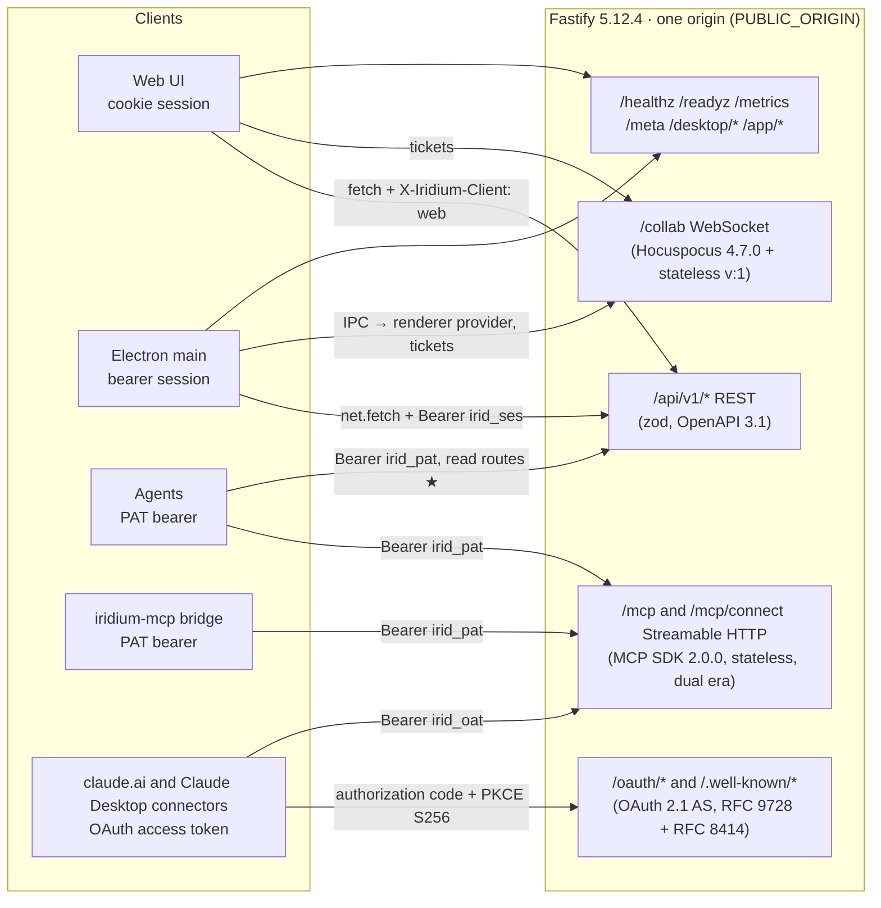
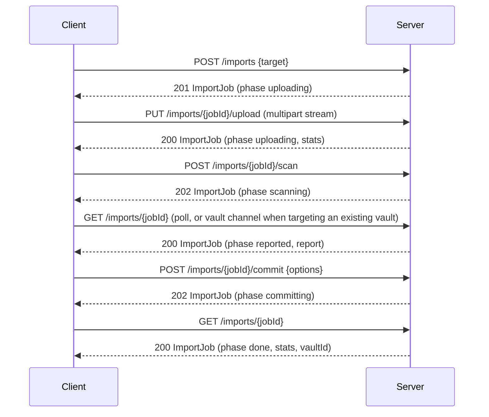
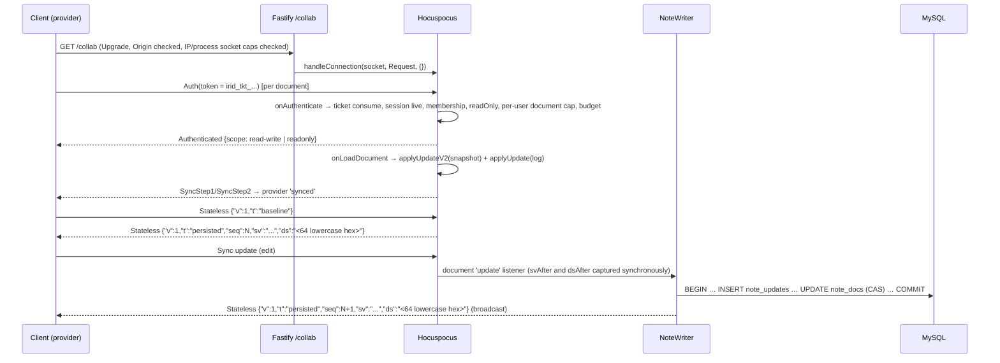
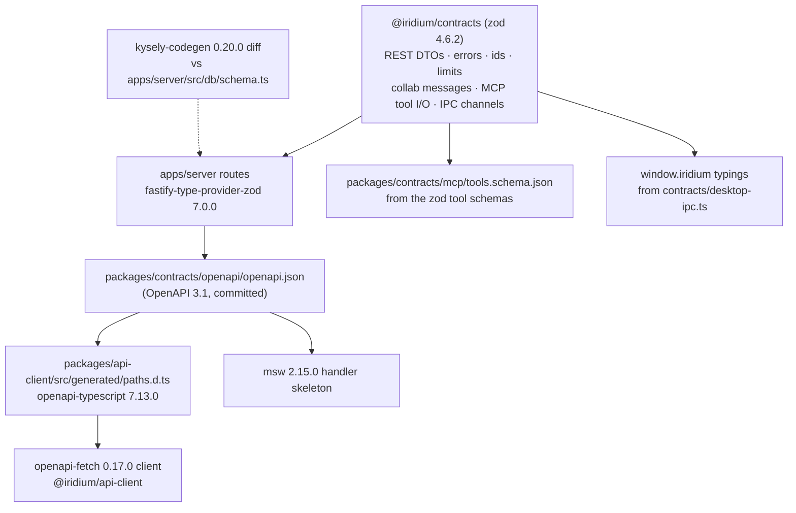

# API reference (REST, WebSocket, MCP, desktop IPC)

This document is the contract surface of Iridium: every REST route under `/api/v1`, the `/collab` WebSocket protocol, the `/mcp` endpoint, and the Electron IPC channels. It is written to be built from directly. Rationale for the design lives in the other sections (see 02-system-architecture.md, 04-auth-and-access-control.md, 05-collaboration-and-durability.md, 06-mcp-and-agent-access.md, 07-client-applications.md); this file states *what the wire carries*, not why.

Every schema named here lives in `@iridium/contracts` (zod 4.6.2) and is the single source for server validation, generated client types, the committed `openapi.json`, `mcp/tools.schema.json`, and the desktop `window.iridium` typings (see §6). Where this document and a generated artifact disagree, the generated artifact is wrong and CI must fail (`pnpm gen && git diff --exit-code`).

Surface map:



The two MCP mounts are one surface reached by two credentials: `/mcp` accepts integration tokens and advertises no OAuth discovery, `/mcp/connect` accepts OAuth access tokens and advertises it. §4.9 is the normative statement of that split.

## 1. Conventions shared by every surface

### 1.1 Identifiers, timestamps, encodings

| Item | Rule |
|---|---|
| Entity ids | UUIDv7, canonical lowercase string (`018f3a2e-7b1c-7d3e-9a4b-2c5d6e7f8091`) on every surface; `BINARY(16)` in MySQL. Branded types in `@iridium/contracts/ids.ts` (`UserId`, `VaultId`, `NodeId`, `NoteId`, `AttachmentId`, `TokenId`, `SessionId`, `JobId`, `OAuthClientId`, `OAuthConsentId`). A `NoteId` is the `NodeId` of a node with `kind='note'`. `OAuthClientId` is the `oauth_clients.id` row id, never the public `client_id` string (which is a CIMD URL or a base62 identifier, §2.19). |
| Revision ids | REST serialises `note_revisions.id` as a JSON number (`Revision.id`) and `revision` (= `note_updates.seq`) as a JSON number; both are safe below 2^53 (asserted in `contracts.ids.unit`). MCP encodes the same `note_revisions.id` as a **decimal string** (`revision_id`, §4.4.5) because the column is `BIGINT UNSIGNED` and JSON numbers are not safe at that width for clients that re-serialise them (06-mcp-and-agent-access.md D06-08); `revision` is a number on both surfaces. The two encodings are two spellings of one value, asserted equal in `mcp.output-schema.mcp`. |
| Timestamps | RFC 3339 UTC with up to six fractional digits and a trailing `Z` (`2026-09-11T14:03:22.418771Z`); never local offsets. Clients must accept any fractional precision. Schema name `Timestamp`. |
| Binary in JSON | base64 (standard alphabet, padded) for Yjs state vectors on `/collab`; base64url (no padding) for cursors and credentials. |
| Hashes | `contentHash`, `sha256` are lowercase hex (64 chars). |
| Paths | Vault-relative, `/`-joined node names excluding the root, no leading slash, note paths end in `.md` (`Projects/Iridium/Roadmap.md`). Paths are derived per request (skeleton A12) and are mutable; ids are stable. Path comparison is case-insensitive per `utf8mb4_0900_as_ci` (accent-sensitive). Every field that carries the derived path of an existing note or node, input or output, on REST, MCP, the vault channel and the audit record, is bounded by `LIMITS.NODE_PATH_MAX_CHARS` (16 387, the longest legal derived path counted with a leading `/` and the `.md` suffix; 06-mcp-and-agent-access.md D06-38). The import report's archive-entry paths (`findings[].path`, `collisions[].path`) are not node paths and are not bounded by it, and attachment path hints use `LIMITS.ATTACHMENT_PATH_MAX_CHARS`. |
| REST field naming | camelCase in JSON bodies, query strings and header JSON values (`treeVersion`, `expiresInDays`). |
| MCP field naming | snake_case in tool arguments and `structuredContent` (`vault_id`, `next_cursor`) because agent-facing parameter names must be self-describing and match the tool vocabulary in `instructions.md`. |
| IPC field naming | camelCase (the renderer is the same codebase as the web UI). |
| Enum strings | lowercase with underscores as stored (`stale_version`, `pre_restore`); role names `viewer`, `editor`, `manager`. |
| Booleans in query strings | `true`/`false` literal; anything else → `422 validation_failed`. |
| Unknown JSON fields | Rejected on request bodies (`z.strictObject`), with two exceptions: a route that documents `passthrough`, and the RFC-defined OAuth endpoints (the `/oauth/authorize` query, `/oauth/token`, `/oauth/revoke`, `/oauth/register`), which strip unknown members because RFC 6749 §3.1/§3.2 and RFC 7591 §2 require the server to ignore them (§1.4, §2.19). Ignored on responses by clients (forward compatibility, §7). |
| Empty vs absent | Optional response fields are omitted, never `null`, unless the schema says `.nullable()`; nullable fields are always present. |

### 1.2 Base URL, transport, headers

All REST paths in §2 are relative to `<PUBLIC_ORIGIN>/api/v1`. `PUBLIC_ORIGIN` is `https://` in every deployment except the documented development profile.

| Header | Direction | Rule |
|---|---|---|
| `Authorization: Bearer <credential>` | request | `irid_ses_…` (desktop session) or `irid_pat_…` (integration token) on `/api/v1`; `irid_pat_…` only on `/mcp`; `irid_oat_…` (OAuth access token) only on `/mcp/connect` (§4.9). The mounts verify the bearer in their own preHandler, never through `authenticate()`, which reads no credential on any MCP path (§4.3); no `/oauth/*` or `/.well-known/*` route verifies a bearer (§1.3). When present on `/api/v1`, cookies are ignored entirely. |
| `Cookie: __Host-iridium_session=<irid_ses_…>` | request | Web session. Attributes on issue: `Secure; HttpOnly; SameSite=Lax; Path=/`. |
| `X-Iridium-Client: web \| desktop` | request | Required on every state-changing request that is **not** bearer-authenticated (CSRF custom-header rule, skeleton A27, extended to the two public pre-login routes by 04-auth-and-access-control.md §4.4): `web` for cookie/browser requests, `desktop` for Electron main-process requests — including `POST /auth/sessions` and `POST /auth/set-password`, where no bearer exists yet. Exactly these two values; absent or anything else is `403 csrf_rejected`. The Fetch-Metadata / `Origin` / `Referer` comparisons are `web`-only (a main-process `net.fetch` sends none of them); a `desktop` request must carry no `Cookie`. Both hosts also send it on every other request, where it is informational. |
| `X-Iridium-Client-Version: <semver>` | request | Sent by both hosts (web and desktop). MCP clients, `iridium-mcp` included, send neither `X-Iridium-Client` nor this header and identify themselves through `clientInfo` and `User-Agent`. Evaluated only on `/api/v1/*` except `GET /api/v1/meta` and `GET /api/v1/desktop/update-policy`, and on the `/collab` upgrade (A54, as amended for the gate's scope), where it is compared with `minClientVersion` (§7.1); ignored everywhere else, every published URL of §7.1 included. |
| `X-Request-Id` | both | Always a server-generated UUIDv7, generated once per request (Fastify's `genReqId`, bound once as `requestId` on the request's loggers), echoed on every response and carried in `ProblemDetails.requestId`, every log line of the request and the `request_id` of its audit and `access_log` rows. An inbound value is never adopted: from a `TRUST_PROXY` peer, one matching ARCH-14's pattern is logged as `upstreamRequestId`, the join between the proxy's log and the server's records; from any other peer, or when malformed, it is ignored and never logged (02-system-architecture.md ARCH-14). |
| `If-Match: "<version>"` | request | Required on the routes marked **If-Match** (§2); `428 precondition_required` when absent, `409 stale_version` on mismatch. Weak validators (`W/…`) and `*` are rejected with `428`. |
| `ETag` | response | Strong `"<version>"` on `GET /nodes/:nodeId`, `GET /vaults/:vaultId`, `GET /auth/me` (the `user.version`), `GET /admin/users/:userId`, `GET /admin/settings`, `GET /vaults/:vaultId/attachments/:attachmentId/meta` — these are the values `If-Match` compares against; strong `"<revision>:<contentHash>"` on `GET /notes/:noteId/markdown`; strong `"<sha256hex>"` on attachment bytes and export downloads; weak `W/"<version>:<revision>"` on `GET /notes/:noteId` (cache validation only — clients take `version` from the body for `If-Match`). Member rows, token rows and trash entries carry their `version` in the body only (collection routes emit no `ETag`), which is what lets a list view supply `If-Match` for a per-row mutation without a second request. |
| `If-None-Match` | request | Honoured on every route that emits an `ETag` → `304 Not Modified` with the same `ETag`. |
| `Accept` | request | `application/json` default; `text/markdown` for the markdown route and revision text; `application/zip` for export download; `text/plain` for `/metrics`. |
| `Content-Type` | response | `application/json; charset=utf-8`; `application/problem+json` for errors; `text/markdown; charset=utf-8`; `application/zip`; the sniffed MIME for attachments. |
| `x-ratelimit-limit`, `x-ratelimit-remaining`, `x-ratelimit-reset`, `x-ratelimit-hour-limit`, `x-ratelimit-hour-remaining`, `x-ratelimit-hour-reset`, `retry-after` | response | On `/mcp`, `/mcp/connect` and every ★ route a PAT calls, `x-ratelimit-limit`/`-remaining`/`-reset` describe the credential's burst bucket and `x-ratelimit-hour-limit`/`-remaining`/`-reset` its hourly budget, on every response the per-credential budget evaluated, all rendered by `auth/tokens/budget.ts`: the ★ charge sets them on REST, and `mcp/rate-limit.ts` `chargeRateLimit` sets them on both MCP mounts, which carry `rateLimit: false` (§1.8). Such a request is exempt from the global tiers. Elsewhere `x-ratelimit-*` are emitted by `@fastify/rate-limit` 11.2.0 for the tier that limits the route. On `429` everywhere; `retry-after` is in seconds and names the refusing layer's reset. |
| `Cache-Control` | response | `no-store` on every authenticated JSON response; `no-store, no-transform` on every response to an MCP path (`/mcp`, `/mcp/connect` and every path under `/mcp/`), JSON and SSE alike (it replaces the SDK's `no-cache, no-transform`); `private, max-age=3600` on attachment bytes; `public, max-age=300` on `/meta` and `/desktop/update-policy`; `/app/*` assets use content-hashed filenames with `public, max-age=31536000, immutable`, `index.html` `no-store`. |
| `Deprecation`, `Sunset`, `Link: <…>; rel="deprecation"` | response | Present on deprecated routes/fields (§7.3). |
| `X-Iridium-Api-Version` | response | The integer `apiVersion` the response was produced under (§7.1). |
| `Content-Security-Policy`, `X-Content-Type-Options`, `Content-Disposition` | response | Hardening headers on attachment bytes (§2.11) and `/app/*` (see 07-client-applications.md). |

All bodies are UTF-8 JSON limited to 1 MiB (`bodyLimit`) except multipart routes (limits in §2.11 attachments, §2.12 import, §2.16 releases) and the two MCP mounts (the route `bodyLimit` `LIMITS.BODY_MAX_BYTES_MCP`, 1 MiB, never a configuration member), whose `413` is the MCP envelope's non-`ProblemDetails` object of §4.6. Requests over the limit → `413 payload_too_large` before the body is read.

### 1.3 Authentication kinds and the route policy legend

Every route declares `config.auth` (skeleton A30); the server refuses to boot if one is missing (`authz.route-policy.boot.guard`). The tables in §2 use this legend:

| Auth value | Meaning |
|---|---|
| `public` | No principal required. Rate-limited per IP (60/min). Login routes carry their own limiter (10/min per IP + `login_throttle`). A PAT on a public non-safe route → `403 token_scope_insufficient`; a public safe route serves it the same body it serves an anonymous request (the principal only selects the rate-limit bucket). Also the value of the OAuth registration, metadata and absent surfaces (`{public: true, oauth: 'registration' \| 'metadata' \| 'absent'}`), on which `authenticate()` reads no credential (§2.19). |
| `public → session` | The OAuth browser surface (`{public: true, oauth: 'browser'}`: `GET /oauth/authorize`, `GET` and `POST /oauth/consent`). No principal is required by the policy; `authenticate()` never parses `Authorization` there and resolves only the session cookie (`null` when absent or dead, never `401`); the handler answers a browser with a redirect or HTML, never `ProblemDetails` (§2.19). |
| `public (client-authenticated)` | The OAuth client endpoints (`{public: true, oauth: 'client'}`: `POST /oauth/token`, `POST /oauth/revoke`). `authenticate()` reads no credential; the handler authenticates the OAuth client (`client_secret_basic`, or a public `client_id`) and answers RFC 6749 bodies (§2.19.4). |
| `bearerOnly`, `irid_pat_…` | The MCP-mount arm with `mcpAudience: 'pat'` (`POST /mcp`). No policy preHandler runs and no cookie is read; the mount's own preHandler verifies the one accepted credential kind after `mcpIpGate`; authorization is `authorize(surface:'mcp')` per tool call and resource read (§4.3). |
| `bearerOnly`, `irid_oat_…` | The MCP-mount arm with `mcpAudience: 'oauth'` (`POST /mcp/connect`), otherwise as the row above (§4.9). |
| `session` | A user principal (cookie or desktop bearer). PAT principals → `403 token_scope_insufficient`. |
| `self` | `session`, acting on the caller's own resources; `:sessionId`/`:tokenId` must belong to the caller, else `404 not_found`. |
| `perm:<permission>` | `authorize(principal, permission, {vaultId})` with the vault resolved from `vaultFrom` (`params.vaultId`, `node:params.nodeId`, `note:params.noteId`, `attachment:params.attachmentId`). Non-members → `404 not_found`; members lacking the permission → `403 forbidden`; archived vault and a non-read permission → `409 vault_archived`, except on the closed set of routes that declare `allowArchived` — `POST /vaults/:vaultId/archive` and `POST /vaults/:vaultId/unarchive`, whose handlers answer the archived state themselves, and the administrative reads `GET /vaults/:vaultId/audit` and `GET /vaults/:vaultId/agent-activity` (04-auth-and-access-control.md §5.6, D04-12); vault in `importing`/`deleting` → `404 not_found`. |
| `admin` | `serverAdmin:true` for user principals; token principals never qualify (skeleton A31). |
| `requester` | The principal that created the job (`jobs.requested_by`), or a server admin. |
| **step-up** | Additionally `sessions.last_authenticated_at` within the step-up window (`STEP_UP_WINDOW_MIN`, 10 min by default, until M7 adds `sessionPolicy.stepUpMinutes`, whose baseline it becomes); otherwise `403 step_up_required` (the UI calls `POST /auth/reauthenticate` and retries). |
| ★ | PAT-enabled: a read-only integration token is accepted (`Authorization: Bearer irid_pat_…`); the effective permission set is `scopes ∩ permissionsOf(live explicit role)` and the vault must be in the token's allowlist (or `allVaults` with an explicit live membership). Every ★ read by a token writes an `access_log` row (`surface='rest'`). |
| **CSRF** | Applies automatically to every state-changing request that is not bearer-authenticated — cookie principals **and** the two public pre-login routes (`POST /auth/sessions`, `POST /auth/set-password`), which no bearer can reach. `X-Iridium-Client` must be exactly `web` or `desktop`. A `web` request must additionally pass `Sec-Fetch-Site ∈ {same-origin, none}` (fallback `Origin`, then `Referer` host = `PUBLIC_ORIGIN`); a `desktop` request sends none of those headers and must instead carry no `Cookie` and address a `public` route. Anything else is `403 csrf_rejected`. Bearer requests, and every request whose request path is an MCP path (`/mcp`, `/mcp/connect` or any path under `/mcp/`) or `/oauth/token`, `/oauth/revoke` or `/oauth/register`, skip the guard entirely, whether or not a route matched, because no credential is read on those paths; `POST /oauth/consent` is exempt by declaration (`csrfExempt`, which no other route carries). The exemption set is closed and enumerated, exactly `{'POST /mcp', 'POST /mcp/connect', 'POST /oauth/consent', 'POST /oauth/token', 'POST /oauth/revoke', 'POST /oauth/register'}`; the served subset is computed from the registered routes and depends on `MCP_OAUTH_ENABLED` (the whole set when it is true, `{'POST /mcp'}` when it is false), and `authz.route-policy.boot.guard` asserts that equality so a seventh exemption cannot be added silently. `POST /oauth/consent` is the one form POST in the set: a browser form cannot carry `X-Iridium-Client`, and its CSRF defence is the single-use, session-bound, 10-minute `request_id` instead (§2.19). The pseudo-code is 04-auth-and-access-control.md §4.4. |

`/mcp` and `/mcp/connect` both declare the MCP-mount arm `{bearerOnly: true, principalKinds: ['token'], mcpAudience}` (`'pat'` on `/mcp`, `'oauth'` on `/mcp/connect`), which carries no permission and no `vaultFrom` and is legal only on the closed contracts constant `MCP_MOUNT_ROUTES`, and `/collab` is authenticated by tickets (§3); none of them accepts cookies as a principal. The `/oauth/*` and `/.well-known/*` routes declare `{public: true, oauth: <surface>}` — `metadata`, `absent`, `browser`, `client` or `registration`, assigned by the closed contracts table `OAUTH_ROUTE_SURFACES` and asserted in both directions at boot — and `authenticate()` never verifies a bearer on any of them (§2.19). No token principal exists outside `/api/v1`: the MCP mounts accept exactly their own credential, and the `/oauth/*` and `/.well-known/*` routes read at most the session cookie.

### 1.4 Error envelope

Every non-2xx/3xx response from `/api/v1` (including `/api/v1/desktop/update-policy`, which is an `/api/v1` route despite serving the desktop host — the static `/desktop/updates/*` and `/desktop/tools/*` surfaces are not), `/healthz`, `/readyz`, the `GET /collab` upgrade rejections (the only HTTP responses that endpoint produces: `429 rate_limited` for the per-IP and per-process socket caps, `403 forbidden` for the Origin and Host guards, and the client-version gate's `422 validation_failed` for a malformed `X-Iridium-Client-Version` and `426 client_outdated` below `minClientVersion` — §3.1, §3.10, §7.1) and (wrapped, §5.1) the IPC bridge is a `ProblemDetails` document (RFC 9457 shape, `Content-Type: application/problem+json`).

Three further envelopes exist, each exactly as narrow as its routes, so the application has four — `problem`, `mcp`, `oauth-json` and `oauth-browser`, the contracts constant `ErrorEnvelope` — and every refusal is rendered in the envelope of the request that caused it, whichever layer raises it (Host guard, routing, body limit, media type, readiness, load shedding, the error handler, a route's own hooks or the MCP writer):

- **`mcp`** — every product-layer answer on an MCP path (`/mcp`, `/mcp/connect` and every path under `/mcp/`) is the MCP envelope `McpErrorBody` `{"error": <McpHttpErrorCode>, "error_description"?: <text>}` with `Content-Type: application/json` and `Cache-Control: no-store, no-transform`, never `application/problem+json` (§4.6).
- **`oauth-json`** — `/oauth/token`, `/oauth/revoke` and `/oauth/register` answer the RFC 6749 §5.2 object `OAuthErrorBody` `{error, error_description}` with `Cache-Control: no-store`: `400`, or `401` with `WWW-Authenticate: Basic realm="iridium"` for `invalid_client`, or with a challenge naming the scheme the client used when it attempted another scheme (RFC 6749 §5.2, §2.19.4). The shared refusals map by endpoint and never to `415`: `malformed_request`, `validation_failed` and `unsupported_media` → `400 invalid_request` on the token and revocation endpoints and `400 invalid_client_metadata` on registration; `not_found` → `404` with an empty body; `payload_too_large` → `413 invalid_request` (`"error_description":"The request body exceeds <n> bytes."`); `method_not_allowed` → `405 invalid_request` with `Allow`; `host_rejected` → `421 invalid_request` (`"error_description":"This server answers only to <PUBLIC_HOST>."`); `rate_limited` → `429 temporarily_unavailable` with `Retry-After` (`"error_description":"Too many requests; retry after <n> seconds."`; RFC 6749's retryable code, used on these endpoints because the token, revocation and registration grammars define none for throttling); `not_ready`, `unavailable`, `busy` and `capacity` → `503 temporarily_unavailable`, keeping `Retry-After`; anything else → `500 server_error` and a defect log.
- **`oauth-browser`** — `/oauth/authorize` and `/oauth/consent` answer a browser with a redirect carrying `error`, `error_description`, `state` and `iss` once the handler has validated the `redirect_uri`, and with the script-free HTML error page, keeping the status and `Retry-After`, for a refusal raised before that (§2.19); the pre-redirect error page for an unresolvable `client_id`, an unmatched `redirect_uri` or an unknown `request_id` answers `400`. A `429` or `413` on these routes is never a redirect: the authorization endpoint's limiter runs before `redirect_uri` is validated, so its `429` renders the error page, and a global-tier `429` or a `413` on `GET|POST /oauth/consent` renders it too; login limiter A's refusal of the consent screen's step-up field re-renders the consent page with the throttle message instead (§1.8, §2.19.3).

A request-schema failure is `422 validation_failed` on every route that answers `ProblemDetails`, whether the cause is a type-provider failure, malformed JSON or a semantic refusal; the `416` variant `attachment-range` is that code's only other status (§1.5), and the `/oauth` and MCP families never answer it. The request schemas of the RFC-defined OAuth endpoints — the `/oauth/authorize` query and the `/oauth/token` and `/oauth/revoke` (form) and `/oauth/register` (JSON) bodies — are the documented exception to §1.1's strict-object rule: they are `z.object`, so an unknown member is stripped and ignored, never refused (RFC 6749 §3.1/§3.2, RFC 7591 §2), only a member Iridium understands can fail, and a known parameter sent more than once is `invalid_request` (RFC 6749 §3.1). `/oauth/consent` is Iridium's own form and stays strict. `/oauth/token` answers a missing `grant_type` with `400 invalid_request`, a `grant_type` that is neither `authorization_code` nor `refresh_token` with `400 unsupported_grant_type`, and any other failure of a known parameter, a repeated parameter, an unparsable body or a media type other than `application/x-www-form-urlencoded` with `400 invalid_request`; `/oauth/revoke` answers a missing `token`, an unparsable body or a wrong media type with `400 invalid_request` and never fails on `token_type_hint`; `/oauth/register` answers any `redirect_uris` failure with `400 invalid_redirect_uri` and every other failure of an understood member, an unparsable or non-object body or a media type other than `application/json` with `400 invalid_client_metadata` (§2.19.4, §2.19.5). None of the three answers `415`, whichever layer detects the refusal. `/oauth/authorize` and `/oauth/consent` answer with the error page or the error redirect of §2.19.2. On the MCP mounts a body the SDK cannot accept gets the SDK's own JSON-RPC answer (`-32700`, `-32600`), arguments that fail a tool's `inputSchema` get the SDK's in-band answer, and every product-layer refusal is the MCP envelope (§4.6).

A matched route's envelope is derived from its `config.auth` by `errorEnvelopeOf` (`@iridium/contracts` `authz.ts`, beside `ErrorEnvelope`): the MCP-mount arm → `mcp`, the OAuth `client` and `registration` surfaces → `oauth-json`, the `browser` surface → `oauth-browser`, every other route → `problem`. A URL that matches no route is keyed by its path (`security/paths.ts`, the raw URL cut at the first `?` or `#`): an MCP path → `mcp`, an OAuth client-endpoint path → `oauth-json`, anything else → `problem`, so a surface switched off answers byte-identically to its enabled-mode refusal. The three client-endpoint paths (`/oauth/token`, `/oauth/revoke`, `/oauth/register`) are keyed by path exactly as the MCP paths are: `authenticate()` reads no credential on them (a `Basic` header is the handler's to read), the CSRF guard passes them whether or not a route matched (§1.3), and the client-version gate does not run there (§7.1). When one matches no route (`MCP_OAUTH_ENABLED=false`), boot step 3's routing branch answers it before body parsing, the body limit, the media-type check, `authenticate()` and the CSRF guard, so its answer never depends on the body. `authz.route-policy.boot.guard` holds every registered route on those paths to the path-derived envelope and every route sharing a path to one envelope. `security/` is the single dispatcher: its error handler takes thrown errors, and every hook that refuses — the Host guard, the method refusal, the not-found handler, the readiness gate, `collab/limits.ts` and the CSRF guard — calls the `reply.fail(code, extensions?, variant?)` decorator, so each failure is classified once (`classifyError` and the problem registry) and handed to the renderer the owning plugin registered for the envelope through `app.errorEnvelopes.register(kind, render)`: `problem` its own, through a `sendProblem` nothing outside `security/` may import (oxlint `no-restricted-imports` and a guard case); `oauth-json` and `oauth-browser` from `oauth/errors.ts` (registered in every boot, `MCP_OAUTH_ENABLED=false` included), which renders every authorization-server failure from an exhaustive record over `ErrorCode` (§2.19.4); `mcp` from `mcp/errors.ts`. `security/` imports neither module, and the boot assertion requires every envelope a registered route uses to have a renderer. While the server closes, a request that still arrives is answered by the readiness gate, `503 not_ready` in its envelope; Fastify's own closing body is disabled (`return503OnClosing: false`), so it is not a carve-out. The carve-outs are those of §4.6: the MCP SDK's JSON-RPC protocol answers after the hijack, and the refusals `security/client-errors.ts` writes on a raw socket before any request exists (`400` malformed head, `408`, `431`), which stay `ProblemDetails` on every path because no path is attributable; they belong to no exempt-family operation's documented responses. `414 uri_too_long` is not a carve-out: it arises only from the router's parameter-length limit, which only parametric routes have, and every parametric route is a `problem` route. Everything else is `ProblemDetails`.

```ts
// @iridium/contracts/errors.ts
export const ProblemDetails = z.strictObject({
  type: z.string(),                 // 'urn:iridium:problem:<code>'
  title: z.string(),                // human-readable, stable per code, English
  status: z.int().min(400).max(599),
  code: ErrorCode,                  // closed vocabulary below
  detail: z.string().optional(),    // request-specific, never contains note content or credentials
  current: z.unknown().optional(),  // the current representation on 409 stale_version / 428 precondition_required (null when the row does not exist)
  requestId: z.string(),
  errors: z.array(z.strictObject({  // only with code 'validation_failed'
    path: z.string(),               // dotted location ('body.name', 'query.limit', 'headers.if-match')
    message: z.string(),
    code: z.string(),               // zod issue code or policy code ('too_short', 'breached', 'invalid_name', 'cursor_invalid')
  })).optional(),
  references: z.array(z.strictObject({ noteId: NoteId, path: z.string().max(LIMITS.NODE_PATH_MAX_CHARS) })).optional(), // only with 'attachment_referenced'
  retryAfterMs: z.int().optional(), // only with 'rate_limited', 'capacity', 'unavailable', 'not_ready', 'busy' (mirrors Retry-After)
});
```

This block is the single normative `ProblemDetails` schema (02-system-architecture.md ARCH-12, amended 2026-09-25): RFC 9457's `type`, `title`, `status` and `detail` without `instance`, the required members `code` and `requestId`, and exactly D09-2's four optional extension members. `@iridium/contracts/errors.ts` mirrors it, 02-system-architecture.md refers to it rather than carrying a copy, and `guards.error-shape.guard` asserts that its members equal `ProblemDetails`.

`type` is a URN (`urn:iridium:problem:stale_version`) so the contract does not depend on a documentation host; `title` is fixed per code and is what the UI shows when it has no better string; `detail` may vary. Extension members are permitted only as listed; adding one is a non-breaking change (§7.2). `security/problem.ts` maps every thrown `IridiumError` and every Fastify/zod error to this envelope; unhandled errors become `server_error` with the `requestId` logged.

### 1.5 Error code vocabulary

| `code` | HTTP | Raised by | Notes |
|---|---|---|---|
| `unauthenticated` | 401 | any non-public route | Missing, unknown, expired or revoked session; a missing, malformed, unknown or revoked PAT, and a PAT whose rotation overlap has elapsed, even past `expires_at` (the verifier checks revocation, then the overlap, then expiry). A PAT that reaches the expiry check with `now ≥ expires_at` answers `token_expired` instead (row below). The `WWW-Authenticate: Bearer realm="iridium", error="invalid_token"` challenge belongs to the two MCP mounts alone (§4.3): `/mcp` emits the short form, `/mcp/connect` the long form that additionally carries `resource_metadata` and `scope`. Both answer the MCP envelope instead of this one. The application emits `WWW-Authenticate` in exactly three places (§4.3): `/mcp`'s `invalid_token` challenge, `/mcp/connect`'s `invalid_token` challenge and its `403 insufficient_scope` challenge, and the RFC 6749 §5.2 client-authentication challenge of `invalid_client` at `/oauth/token` and `/oauth/revoke` (§2.19.4); `/metrics`'s bare `401` (D09-11) carries none. No `ProblemDetails` response carries the header, for any principal, credential or route — the `/api/v1` tree, `GET /openapi.json`, `GET /docs` and its assets alike — and no `/oauth` browser answer carries it either, so a browser never shows a native auth dialog (04-auth-and-access-control.md §6.1); the `problem` renderer drops a `WWW-Authenticate` header handed to it and logs a defect. `detail` never says whether the credential existed. |
| `invalid_credentials` | 401 | `POST /auth/sessions`, `POST /auth/reauthenticate`, `POST /me/password` | Generic for unknown user, wrong password, disabled user, user without credentials. |
| `invalid_link` | 410 | `POST /auth/set-password`, `GET /exports/:jobId/download` | A one-time link unknown, expired or already consumed (one message for all three), or an export artifact past `expires_at`. |
| `csrf_rejected` | 403 | cookie-authenticated mutations and the public pre-login mutations | `X-Iridium-Client` absent or neither `web` nor `desktop`; a `web` request that fails the Fetch-Metadata / `Origin` / `Referer` check; `X-Iridium-Client: desktop` carrying a `Cookie`, or on a non-`public` route without a bearer; or a header/body `client` mismatch on `POST /auth/sessions` (04-auth-and-access-control.md §3.7, §4.4). |
| `host_rejected` | 421 | every route except `/healthz`, `/readyz`, `/metrics` | The request's `Host` is absent, not of the form `uri-host [:port]` (a userinfo, path, query or whitespace makes it foreign; it is never parsed as a URL), or not equal to `PUBLIC_HOST`, the host of `PUBLIC_ORIGIN` (derived, never an environment key), under RFC 9110 §4.2.3's equivalence: the hostname compared ASCII-case-insensitively, and a port equal to the default port of `PUBLIC_ORIGIN`'s scheme equivalent to none (02-system-architecture.md ARCH-03/ARCH-12; `security/host.ts` `isPublicHost`). On `/mcp` and `/mcp/connect` the same `421` is rendered in the MCP envelope; the SDK hook's `403` is a second layer no request reaches (§4.1). |
| `step_up_required` | 403 | routes marked step-up | `detail` = `"Re-authenticate to continue"`; `current` absent. |
| `token_expired` | 401 | PAT-authenticated ★ routes | Only when the verifier reaches its expiry check for a well-formed PAT with `now ≥ expires_at` (helps rotation UX); revoked, unknown, or a rotation overlap that has elapsed → `unauthenticated`, even when `expires_at` has also passed, because the verifier checks revocation, then the overlap, then expiry, then the owner's status (06-mcp-and-agent-access.md D06-50). A disabled or deleted owner's PAT that is also past `expires_at` therefore answers `token_expired` exactly as an active owner's would, and the answer reveals nothing about the owner. On the MCP mounts every credential failure, expiry included, is the MCP envelope's `401 invalid_token` (§4.3). |
| `token_scope_insufficient` | 403 | PAT on a non-★, non-public route or on any non-safe route (public mutating routes included), or a ★ route whose permission is outside the token's effective scopes; also a token on any step-up route, and a token's `fresh=true` on `GET /notes/:noteId/markdown` (§2.8) | Also used when a user-only route is called with a PAT. Writes no product or audit row and exactly one `access_log` row with `status='denied'` (03-data-model.md D03-25). |
| `client_outdated` | 426 | `/api/v1/*` except `GET /api/v1/meta` and `GET /api/v1/desktop/update-policy`, and the `/collab` upgrade, when `X-Iridium-Client-Version` < `minClientVersion` | `detail` carries `minClientVersion`. No other surface evaluates the header (§7.1). |
| `precondition_required` | 428 | If-Match routes | `current` = the current representation with its `version`. |
| `stale_version` | 409 | If-Match routes | `current` = the current representation (`null` when the addressed row does not exist). |
| `name_conflict` | 409 | node create/rename/move/restore, vault create/rename, attachment upload with a colliding `pathHint`, `POST /me/tokens` with the name of one of the caller's active integration tokens | `ER_DUP_ENTRY` on `uq_sibling` / `uq_vaults_name` / `uq_attachment_path`. A token name has no index: it is unique among the owner's active `kind='pat'` rows, a rotated predecessor exempt, and is checked under the owner's `users` row lock (06-mcp-and-agent-access.md D06-50). |
| `invalid_move` | 409 | `PATCH /nodes/:nodeId` with `parentId`, `POST /nodes/:nodeId/restore` | Target is the node itself/a descendant, is a note, is trashed, is in another vault, or depth > 64. |
| `category_not_empty` | 409 | `POST /nodes/:nodeId/trash` without `recursive:true` | `detail` carries the live descendant count. |
| `node_trashed` | 409 | any structural CAS whose row is now trashed, and any mutation that finds its target already trashed under the lock it holds (`PATCH /nodes/:nodeId`, `POST /notes/:noteId/revisions`, `POST /notes/:noteId/revisions/:revisionId/restore`) | The `UPDATE … WHERE id=? AND version=?` matched no row and the row's `deleted_at IS NOT NULL` (03-data-model.md §7.4); `current` carries the trashed `Node`. A mutation that instead reads `deleted_at` under a lock it already holds raises the same code and omits `current`, because it compared no validator: the tree patch under the vault's structural lock, `revisions.create` from the compaction outcome or the parent row it holds for share, and `revisions.restore` from the server-edit gate (§2.9). `404 not_found` would be the wrong answer there — this table scopes the 404 to read routes, and a writer addressing the node by id already knows it exists. Distinct from `stale_version`, which means the version moved while the row is still live. |
| `invalid_name` | 422 | any name input | Name rules of skeleton A12 (also reported as `validation_failed` `errors[].code='invalid_name'` when part of a larger body). |
| `email_conflict` | 409 | `POST /admin/users`, `PATCH /admin/users/:userId` | `uq_users_email_key`. |
| `not_found` | 404 | everywhere, and every URL that matches no route, answered by the routing branch of boot step 3 before body parsing, authentication, the CSRF guard and the version gate, so its body, credential and cookie never change the answer | Non-members, unknown ids, trashed notes on read routes, thinned revisions, foreign vaults. |
| `forbidden` | 403 | members lacking a permission | Never returned to non-members. |
| `vault_archived` | 409 | mutations on an archived vault | Reads still work. |
| `attachment_referenced` | 409 | `DELETE …/attachments/:attachmentId` without `force=true` | `references[]` lists referencing notes. |
| `invalid_state` | 409 | lifecycle transitions out of order | Job phase transitions, purge/restore of a live node, archive of an archived vault, trash of a trashed node, withdrawal of an already withdrawn release or a re-publish of a published `(version, channel)`. `detail` names the current state. |
| `updates_manual_only` | 409 | `iridium:updates:install` (desktop IPC, §5.7) | The running build installs updates manually: 1.0 ships without an in-application updater, so the channel stays declared and registered and every call rejects (`title: 'This build installs updates manually'`, 07-client-applications.md D07-44). The only member of the enum no REST route raises — see the enumerated exception below. |
| `token_not_rotatable` | 409 | `POST /me/tokens/:tokenId/rotate` | The target token is revoked, past `expires_at`, or already rotated — superseded, so its successor is the one to rotate and a rotation chain cannot fork (06-mcp-and-agent-access.md D06-01). The body is valid and no version moved, so neither `validation_failed` nor `stale_version` would be truthful. |
| `note_oversized` | 409 | `POST /vaults/:vaultId/nodes` with `markdown`, import commit, restore | Hard cap 2 097 152 UTF-16 units. |
| `content_invalid` | 409 | `POST …/revisions/:revisionId/restore`, `?fresh=true` on a flagged note | Note flagged by the compaction scan (skeleton A22). |
| `rate_limited` | 429 | any rate-limited route | `retry-after` header (the refusing layer's reset) + `retryAfterMs`, with `x-ratelimit-limit`, `x-ratelimit-remaining` and `x-ratelimit-reset`, and, on a per-credential budget refusal, `x-ratelimit-hour-limit`, `x-ratelimit-hour-remaining` and `x-ratelimit-hour-reset` (§1.2). |
| `payload_too_large` | 413 | body/multipart limits | |
| `malformed_request` | 400 | the HTTP parser, before routing, and the body reader on every path when a body's length disagrees with its `Content-Length` (`FST_ERR_CTP_INVALID_CONTENT_LENGTH`) | A head the parser refused, or a URL the router could not read, is answered by `security/client-errors.ts`, not by a route (Fastify would otherwise write `application/json`); a body whose length disagrees with its `Content-Length` is classified by `classifyError` and rendered in the request's envelope (§1.4). |
| `request_timeout` | 408 | the HTTP parser, before routing | The client did not finish sending its head. Same seam as `malformed_request`. |
| `uri_too_long` | 414 | the router, before routing | The URL exceeds `maxParamLength`. Reached through Fastify's `frameworkErrors` seam so the answer is a problem document. |
| `request_headers_too_large` | 431 | the HTTP parser, before routing | `HPE_HEADER_OVERFLOW`. Reached through Fastify's `clientErrorHandler`, which owns a raw socket and no `Reply`, so the document is written by hand. |
| `method_not_allowed` | 405 | registered HTTP paths | The path exists but has no handler for this method. `Allow` lists its registered methods. Refused before body parsing and route authentication; unknown paths are `404 not_found`, refused at the same point. The lookup is the concrete-URL `router.find`, so parametric paths answer `405` too. |
| `unsupported_media` | 415 | attachment upload, import upload, release upload, and Fastify's refusal of a syntactically invalid `Content-Type` on every `problem` and `mcp` path | MIME not allow-listed or body not multipart. On `/oauth/token`, `/oauth/revoke` and `/oauth/register` the same refusal renders as `400 invalid_request` (token, revocation) or `400 invalid_client_metadata` (registration), never `415` (§1.4). |
| `validation_failed` | 422 | any schema failure | Every `ProblemDetails` route, for type-provider, malformed-JSON and semantic failures alike; `errors[]` populated from zod issues (`z.prettifyError` text in `detail`). The variant `attachment-range` answers `416` (enumerated status variants, below). The `/oauth` endpoints and the MCP mounts never answer it (§1.4). |
| `capacity` | 503 | a server-side edit that must load a document (revision restore, content repair, named revision on a loaded note) when the loaded-document budget is exhausted | `retryAfterMs` set. |
| `busy` | 503 | any mutation whose transaction exhausted its lock-retry budget | `ER_LOCK_WAIT_TIMEOUT` (1205), or `ER_LOCK_DEADLOCK` (1213) after `withVaultLock`'s single retry (03-data-model.md §7.4); `Retry-After: 1` and `retryAfterMs: 1000`. Mutations are never retried server-side beyond that budget. |
| `not_ready` | 503 | every route outside `/healthz`, `/readyz`, `/metrics` while `ReadinessState ≠ ready`, and every request that arrives while the server closes | Migrations pending, a fail-closed `/readyz` check failing, or the shutdown drain (02-system-architecture.md ARCH-02); `Retry-After: 5`. This is the only code for "the process is up but not serving". |
| `unavailable` | 503 | a dependency the route needs is down, or a conflicting long-running operation holds it | DB or attachment store unreachable, persistence backpressure on `POST …/revisions/:revisionId/restore`, `POST /admin/audit/verify` already running. `Retry-After` set. Not used for the not-serving state — that is `not_ready`. |
| `server_error` | 500 | unhandled | `detail` absent; logged with `requestId`. The variant `attachment-missing` answers `503` (enumerated status variants, below). |

**Enumerated status variants.** A code answers the status of its row everywhere except in these named variants, a closed list (`PROBLEM_VARIANTS`):

| Variant | `code` | HTTP | Condition |
|---|---|---|---|
| `attachment-range` | `validation_failed` | 416 | An unsatisfiable `Range` on attachment bytes (§2.11) |
| `attachment-missing` | `server_error` | 503 | An attachment row whose bytes are missing — never `404`, which would invite a destructive cleanup (08-markdown-pipeline-import-export.md D08-25, §2.11) |

The closed enum `ErrorCode` in `@iridium/contracts/errors.ts` is exactly the code table, and `ERROR_CODE_STATUS` its status column; `guards.error-shape.guard` asserts every code produced in `apps/server/src` is in the enum and that no `IPC_ONLY_CODES` member is produced there, and `openapi.contract.spec` asserts every enum member appears in at least one documented response in `openapi.json` — with exactly one enumerated exception. `updates_manual_only` is raised over desktop IPC and nowhere else (§5.7), so no HTTP response can document it: `openapi.contract.spec` carries it in the one-element allowlist `IPC_ONLY_CODES` and fails if that list grows, and `guards.error-shape.guard` fails if any `apps/server/src` source produces a code on it. The enum stays closed and shared across both transports — the shell rethrows an IPC rejection as the same typed error class the web transport throws (§5.1) — and the one code that cannot reach HTTP is named here rather than left for a reader to discover from a failing contract test. `ErrorCode` is one of three closed vocabularies: the MCP envelope carries `McpHttpErrorCode` (§4.6), which is the five mount-owned codes `invalid_token`, `insufficient_scope`, `origin_not_allowed`, `mcp_disabled` and `deadline_exceeded` plus the `ErrorCode` spellings of the shared transport refusals, and the OAuth client endpoints carry `OAUTH_ERROR_CODES` (below).

**OAuth error values.** `OAUTH_ERROR_CODES` is the `/oauth/*` vocabulary, thirteen RFC values carried in the JSON body of the three client endpoints and in the `error` parameter of an authorization-endpoint or consent redirect (§1.4, §2.19):

| Value | Defined by | Surfaces |
|---|---|---|
| `invalid_request` | RFC 6749 §5.2 | `/oauth/token` and `/oauth/revoke` (RFC 7009 §2.2.1 reuses §5.2's values); the shared `405`, `413` and `421` of all three client endpoints, `/oauth/register` included (§1.4); also the authorization-endpoint redirect |
| `invalid_client` | RFC 6749 §5.2 | `/oauth/token` and `/oauth/revoke` |
| `invalid_grant` | RFC 6749 §5.2 | `/oauth/token` and `/oauth/revoke` |
| `unauthorized_client` | RFC 6749 §5.2 | `/oauth/token` and `/oauth/revoke`; also the authorization-endpoint redirect |
| `unsupported_grant_type` | RFC 6749 §5.2 | `/oauth/token` and `/oauth/revoke` |
| `invalid_scope` | RFC 6749 §5.2 | `/oauth/token` and `/oauth/revoke`; also the authorization-endpoint redirect |
| `unsupported_response_type` | RFC 6749 §4.1.2.1 | the authorization and consent redirects |
| `access_denied` | RFC 6749 §4.1.2.1 | the authorization and consent redirects; the `403` of `/oauth/register` above the unused-client ceiling (§2.19.5) |
| `server_error` | RFC 6749 §4.1.2.1 | the authorization and consent redirects; the client endpoints' shared `500` (§1.4) |
| `temporarily_unavailable` | RFC 6749 §4.1.2.1 | the authorization and consent redirects; the client endpoints' shared `503` and `429` (§1.4) |
| `invalid_target` | RFC 8707 §2 | the authorization redirect and `/oauth/token` |
| `invalid_redirect_uri` | RFC 7591 §3.2.2 | `/oauth/register` only |
| `invalid_client_metadata` | RFC 7591 §3.2.2 | `/oauth/register` only |

`invalid_token`, `insufficient_scope` and `mcp_disabled` are `McpHttpErrorCode` members (§4.6), not OAuth values. RFC 7009 defines only `unsupported_token_type`, which Iridium never emits: both token types it issues are revocable, and `token_type_hint` is a hint (RFC 7009 §2.1). `security.problem-details.unit` asserts the three disjointness rules — `ErrorCode ∩ OAUTH_ERROR_CODES = {server_error}`, `McpHttpErrorCode \ ErrorCode` is exactly the five mount-owned codes, and those five share nothing with `OAUTH_ERROR_CODES` — and the two body schemas (`OAuthErrorBody` accepts `invalid_grant` and refuses `invalid_token`; `McpErrorBody` accepts `invalid_token` and refuses `invalid_grant` and any extra member); `security.problem.unit` asserts each renderer emits only its own vocabulary (every `error` the `oauth-json` renderer writes is an `OAUTH_ERROR_CODES` member), that the `oauth-json` mapping of §1.4 is total over the codes the shared layers can raise on the three client-endpoint paths, that `not_found` there renders `404` with an empty body and `Cache-Control: no-store`, and that a `401` or `403` code there falls back to `500 server_error` with a defect log. `server_error` is the one string the OAuth and `ProblemDetails` vocabularies spell identically, and it means the same thing in both — an unhandled failure with the detail logged and not returned.

The code table, the variants table and the OAuth values table are the single normative code→status table, variant list and OAuth vocabulary (02-system-architecture.md ARCH-12, amended 2026-09-25); 02-system-architecture.md refers to them rather than carrying copies. `ERROR_CODE_STATUS`, `PROBLEM_VARIANTS` and `OAUTH_ERROR_CODES` mirror them, and `guards.error-shape.guard` asserts each equality, and that §4.6's table equals `McpHttpErrorCode` and its statuses, by reading this file through a spawned plan-reading script rather than an import across the package boundary.

### 1.6 Pagination

Every list that can exceed one page uses opaque keyset cursors from the shared cursor module (`apps/server/src/pagination/cursor.ts`, skeleton A35 as amended), on REST and MCP alike. The codec's payload shape is private to the server; `@iridium/contracts` exports only the string bound, `OpaqueCursor` (`z.string().max(LIMITS.CURSOR_MAX_CHARS)`), which the REST cursor query fields declare as `CursorQueryParam` (`GET /admin/users` keeps its released declaration, exactly `OpaqueCursor`, because a new keyword on a released parameter is a tightening under A54) and the MCP tools as `CursorParam`:

```ts
// response envelope for paginated lists (REST)
{ items: T[], nextCursor?: string, ...extras }   // extras per route: treeVersion, stale, query
```

| Rule | Value |
|---|---|
| Request parameters | `cursor` (opaque `OpaqueCursor`, at most `LIMITS.CURSOR_MAX_CHARS` = 4 096 characters; a longer value is `422 validation_failed` at schema validation with the `too_big` issue — the one cursor refusal that is not the cursor sentence below, and it depends only on the value's length, which the caller already knows; no issued cursor is that long, because the codec throws `CursorTooLongError` rather than emit one. There is no minimum length: an empty value reaches the codec and is refused like any malformed cursor), `limit` (integer; default and cap per route, table in §2). `limit` above the cap → `422 validation_failed`. |
| Cursor payload | `base64url(JSON{v:1, k, a, f, t, tv?, exp}) + "." + base64url(HMAC-SHA256(key, JSON bytes))`, both segments unpadded base64url and the MAC the full 32 bytes. The encoding is canonical and part of the shape check: each segment must match `^[A-Za-z0-9_-]+$` and base64url-encoding its decoded bytes must reproduce it exactly, and any other spelling is refused before the signature is checked. `k` ∈ `notes\|tree\|search\|revisions\|attachments\|trash\|links\|audit\|access\|sessions\|tokens\|jobs\|users\|vaults\|oauthClients\|oauthConsents`, `a` = the after-key tuple of JSON strings and finite numbers (Keysets row), `f` = the full lowercase-hex SHA-256 of `canonicalJson(filter)`, `t` = principal key (`principalKeyOf`: `ses:<sessionId>` for user principals, `pat:<tokenId>` for integration tokens, `ocn:<consentId>` for OAuth access tokens — the grant, so an OAuth cursor survives refresh; a cursor issued on one MCP mount is still refused on the other), `tv` = `tree_version` (notes/tree listings only), `exp` = unix seconds, issue + `LIMITS.CURSOR_TTL_SECONDS` (3 600). The key is the cursor keyring version `schema_meta.cursor_key_version` names (§4.7). |
| Mismatch | Every refusal the codec or a listing's after-key check raises is one answer, whatever its cause (shape, encoding, signature, payload, version, kind, principal, filter, expiry, after-key; checked in that order, the MAC before any JSON is parsed): `422 validation_failed` whose `detail` and `errors[0].message` are both `Cursor invalid or expired — restart from the first page.` (`CURSOR_INVALID_TEXT`, exported once by `pagination/cursor.ts`), with `errors[0].path='query.cursor'` and `code='cursor_invalid'`. The cause is logged by the error handler's request line and never returned. MCP renders the same sentence as an `isError` result (§4.6). A promoted cursor key version missing from the keyring, or a malformed `schema_meta.cursor_key_version` row, is not a cursor refusal: every paginated listing answers `503 unavailable` until the key configuration is repaired (§4.7). |
| Stability | Notes/tree listings embed `tree_version`; later pages set `stale:true` when it changed; the client restarts for a consistent listing. Search re-executes the query and filters `(score, noteId)` server-side. A path-led listing (Path-led after-keys row) never skips a row across a rename: a literal cursor, and an anchored one whose digest still matches, continue strictly after the issued `(path, tiebreak)`, the latter even when its anchor has since been trashed or deleted without its path changing; an anchored cursor whose digest no longer matches (the anchor or an ancestor renamed or moved, the attachment's path hint changed, the row purged) resumes at the first row whose sort path is ≥ its head in the listing's own order (collation order for notes and attachments, binary order for links), may repeat rows sharing the head, and sets `stale: true`, so a vanished anchor never refuses a cursor. Re-projection is not a mismatch: it re-inserts a source note's `note_links` rows with new, larger ids at unchanged paths, so a links page continues exactly after `(fromPath, links.id)`, may repeat that source's re-inserted links as a literal cursor does, never skips a row and does not set `stale`. |
| End of list | `nextCursor` absent (never `null`, never `""`). |
| Keysets | notes `(path, id)`; tree `(kindOrder, nameKey, id)`; search `(score DESC, noteId)`, the score carried as a JSON number; revisions `(seq DESC, id DESC)`; attachments `(pathHint, id)`; trash `(deletedAt DESC, nodeId)`; links `(fromPath, links.id)` (`/notes/:noteId/backlinks` and `/nodes/:nodeId/inbound-links`); audit `(id DESC)`; access `(occurredAt DESC, id DESC)`; sessions/tokens/jobs `(createdAt DESC, id)`; users `(emailKey, id)`; vaults `(name, id)` (`/admin/vaults` and MCP `list_vaults`); oauthClients `(createdAt DESC, id)` (`/admin/oauth-clients`); oauthConsents `(grantedAt DESC, id)` (`/admin/oauth-consents`). |
| Path-led after-keys | notes, links and attachments have two after-key forms, told apart by arity and encoded and decoded by one pure helper, `apps/server/src/pagination/path-keyset.ts`. **Literal** `[path, tiebreak]` while the path's JSON-string encoding (UTF-8 bytes, quotes excluded) is at most `LIMITS.CURSOR_PATH_HEAD_MAX_BYTES` (1 024): exactly the M2 keyset, with no lookup. **Anchored** otherwise: `[head, tiebreak, digest]` for notes and attachments and `[head, links.id, fromNoteId, digest]` for links, where `head` is the path cut at a grapheme-cluster boundary to fit that budget, the anchor is the node id, the source note's node id or the attachment id, and `digest` is the lowercase-hex SHA-256 of the full sort path as issued. The next page looks the anchor up in the cursor's vault (for a trash-inclusive notes listing, by the listing's own path rule) and compares digests; any failure to reproduce the issued path is a digest mismatch, which costs exactness and never skips a row (Stability row). |
| Listing binding | A kind that serves listings whose row sets differ for one principal names the listing in its canonical filter, so a cursor is bound to its listing by its own content: `vaults` carries `{listing:'mcp.list_vaults'}` on MCP and `{listing:'admin.vaults', …its filters}` on `/admin/vaults`. `links` is shared deliberately by the two incoming-link listings, which page the same `note_links` rows (§2.7). |

Small bounded lists (`/me/sessions`, `/me/oauth-consents`, `/vaults`, `/vaults/:vaultId/members`, `/notes/:noteId/links`, `/admin/releases`) return `{items}` without a cursor and are capped at `LIMITS.BOUNDED_LIST_MAX` (1 000) rows — except `/notes/:noteId/links`, whose cap is 5 000 because it is one note's own outgoing links in `ordinal` order and a partial list would renumber the ordinals (§2.8). The two *incoming*-link listings are cursored (`k:'links'`), because a popular note's backlinks are unbounded by anything the note itself controls.

### 1.7 Optimistic concurrency

| Resource | Validator | Where required |
|---|---|---|
| `nodes`, `vaults`, `vault_members`, `users`, `access_tokens`, `attachments` | `version` integer, `ETag: "<version>"` | `PATCH /nodes/:nodeId`, `POST /nodes/:nodeId/trash`, `POST /nodes/:nodeId/restore`, `PATCH /vaults/:vaultId`, `PUT`/`DELETE /vaults/:vaultId/members/:userId` (existing row), `PATCH /me`, `PATCH /admin/users/:userId`, `PATCH /admin/tokens/:tokenId`, `DELETE …/attachments/:attachmentId` |
| `server_settings` (the one document of `GET /admin/settings`) | the document validator `schema_meta` `server_settings_version`, `ETag: "<version>"` | `PUT /admin/settings` |
| Note body | CRDT; no validator; `revision` is informational | never |
| Version restore | `{confirm:true}` in the body, UI confirmation, step-up; **no** `If-Match` on `head_seq` | `POST /notes/:noteId/revisions/:revisionId/restore` |

On `409 stale_version` the `current` member carries the full current representation (same DTO as the route's `GET`), so a client can rebase without a second round trip. Every CAS is one `UPDATE … WHERE id=? AND version=?` asserting `numUpdatedRows === 1n` inside the structural transaction protocol of skeleton §C.4, except `PUT /admin/settings`, which compares `If-Match` with the validator row it holds `FOR UPDATE` and increments it once per effective write (§2.15.3; skeleton A13 as amended: `server_settings` rows are serialised by the document validator, not by per-row CAS).

### 1.8 Rate limits on REST

| Bucket | Limit | Key |
|---|---|---|
| Authenticated | 600/min | principal (`principalKeyOf`: `ses:<sessionId>`, `pat:<tokenId>`, `ocn:<consentId>`); a request the per-credential budget charged is exempt |
| Unauthenticated | 60/min | IP |
| Login (`POST /auth/sessions`, `/auth/reauthenticate`, `/auth/set-password`) | 10/min | IP, plus `login_throttle` (5 failures per `email\|ip` → 15 min block doubling to 24 h; 100/day per IP) |
| Collab tickets | 300/min per session, 1 000/min per IP | session, IP |
| `GET /notes/:noteId/markdown?fresh=true`, `POST /notes/:noteId/revisions` | 6/min | principal + note |
| PAT (any ★ route) | 120/min burst + `access_tokens.rate_limit_per_hour` (the row's administrative override; `null` = the effective `patPolicy.defaultRateLimitPerHour`, baseline `PAT_DEFAULT_RATE_LIMIT_PER_HOUR`, default 3 000, resolved at charge time, so a policy change reaches live tokens on their next call). Settable range `PAT_RATE_LIMIT_PER_HOUR_MIN` 60 … `PAT_RATE_LIMIT_PER_HOUR_MAX` 100 000, declared once in `@iridium/contracts/limits.ts` and the only bounds on that quantity — the column, the `PATCH /admin/tokens/:tokenId` body (§2.15.2) and `patPolicy.defaultRateLimitPerHour` (§2.15.3) all validate against them (06-mcp-and-agent-access.md D06-04). Weights: `search.vault` and `search.all` cost `LIMITS.MCP_SEARCH_COST` (3) points and every other ★ route 1 point; every request also takes 1 from the 120/min burst bucket, which is consumed first, so a burst refusal costs no hourly points. Charged by the per-credential budget `TokenBudget` (`auth/tokens/budget.ts`) — on REST by an instance-level `onRequest` hook after `authenticate()`, on `/mcp` by `chargeRateLimit` — so the same two buckets are charged by `/mcp` for the same PAT; the global limiter's `allowList` exempts a request so charged, and the headers of §1.2 describe these two buckets | token (`pat:<tokenId>`) |
| Uploads (`POST …/attachments`, `PUT /imports/:jobId/upload`, `POST /admin/releases`) | 60/min | principal |
| OAuth access token on `/mcp/connect` | the same shape as a PAT: 120/min burst + the effective `oauthPolicy.defaultRateLimitPerHour` (baseline `OAUTH_DEFAULT_RATE_LIMIT_PER_HOUR`, default 3 000), resolved at charge time and weighted as 06-mcp-and-agent-access.md *Per-token rate limits* states, charged by the same `TokenBudget`, because there is one budget mechanism, not two. It is keyed by the grant, which every refresh and re-consent preserves, so a refresh never resets it. The access-token row's `rate_limit_per_hour` is always `NULL` and is not read; a per-connector override is a grant attribute from M7 | grant (`ocn:<consentId>`) |
| `POST /oauth/token`, `POST /oauth/revoke` | `OAUTH_TOKEN_ENDPOINT_PER_IP_PER_MINUTE` (60) per minute, a separate bucket per endpoint | IP (`TRUST_PROXY`-resolved) |
| `GET /oauth/authorize` | `OAUTH_AUTHORIZE_PER_SESSION_PER_HOUR` (30) per hour with a live session, `REST_UNAUTHENTICATED_PER_MINUTE` (60) per minute without one: one route limiter keyed `principalKey ?? ip`, which replaces the global tiers on this route | session (`ses:<sessionId>`), else IP |
| `POST /oauth/register` | `OAUTH_DCR_PER_IP_PER_HOUR` (10) per hour while the effective policy allows registration; while it is disabled `registrationPolicyGate` answers `404` in `onRequest`, before this limiter and before any body work, exactly as the same path answers when unregistered (`MCP_OAUTH_ENABLED=false`, §2.19.5) | IP |

Each credential has one burst and one hourly budget, keyed by `principalKeyOf` and charged by every surface that accepts it (★ REST and `/mcp` for a PAT, `/mcp/connect` for an OAuth grant); the weights are decided in one place, `weightOf` in `auth/tokens/budget.ts` (04-auth-and-access-control.md D04-37).

`GET|POST /oauth/consent` carry no limiter of their own and stay under the global tiers: an unauthenticated request falls in the 60/min per-IP bucket and a signed-in one in the 600/min per-principal bucket, and a wrong password on the consent screen's step-up field consumes the login limiter on `login:<email_key>|<ip>` exactly as `POST /auth/reauthenticate` does (04-auth-and-access-control.md §10.1). Every authorization-server limiter raises the same `rate_limited` refusal every other tier raises, rendered in the route's envelope (§1.4): on the `oauth-json` routes (token, revoke, register) `429` with `Retry-After`, `Cache-Control: no-store` and `{"error":"temporarily_unavailable","error_description":"Too many requests; retry after <n> seconds."}`, and a `413` as `{"error":"invalid_request","error_description":"The request body exceeds <n> bytes."}`; on the `oauth-browser` routes the HTML error page with the status and `Retry-After`, never a redirect, except that login limiter A's refusal on the step-up field re-renders the consent page with the throttle message (`429`, `request_id` not consumed, §2.19.3). A `GET` with its own limiter exposes no `HEAD` route: `GET /oauth/authorize` and `GET /oauth/consent` declare `exposeHeadRoute: false`, so `HEAD` on either answers `405 method_not_allowed` with `Allow` from the routing branch, in the path's envelope, before any handler or bucket, and the security plugin's `onRoute` check refuses at boot, with a named error, a `HEAD` route whose config carries an object `rateLimit`, because a `HEAD` twin would get its own bucket and run the `GET` handler (06-mcp-and-agent-access.md D06-47).

Exceeding a bucket → `429 rate_limited` with `retry-after`, in the route's envelope; PAT and OAuth `429`s also write an `access_log` row with `status='rate_limited'`.
## 2. REST reference (`/api/v1`)

All paths below are relative to `/api/v1`. Column legend: **Auth** per §1.3; **★** = PAT-enabled; **If-Match** = validator required; **Step-up** = re-authentication window required. Request/response shapes are given as zod-style TypeScript; every schema is exported from `@iridium/contracts/rest/<domain>.ts` and registered in `z.globalRegistry` under the name shown in `components.schemas`.

### 2.0 Shared DTOs

```ts
// @iridium/contracts/rest/common.ts
export const Role = z.enum(['viewer', 'editor', 'manager']);
export const Permission = z.enum([
  'vault:read','note:read','search:read','history:read','attachment:read','export:read',
  'note:write','node:create','node:rename','node:move','node:trash','node:restore','attachment:write','revision:name',
  'vault:manage_members','vault:settings','vault:archive','history:restore','node:purge','import:commit',
  'server:users','server:vaults:create','server:settings','server:audit:all','server:tokens:all','server:sessions:all','server:jobs','server:releases',
]);

export const User = z.strictObject({
  id: UserId, email: z.email(), displayName: z.string().min(1).max(120),
  isServerAdmin: z.boolean(), status: z.enum(['active','disabled','deleted']),
  colorHue: z.int().min(0).max(359), createdAt: Timestamp, updatedAt: Timestamp,
  lastLoginAt: Timestamp.nullable(), hasCredentials: z.boolean(), version: z.int().positive(),
});
export const UserRef = z.strictObject({ id: UserId, displayName: z.string(), colorHue: z.int() });  // embedded author/actor

export const Me = z.strictObject({
  user: User,
  isServerAdmin: z.boolean(),                       // false for token principals even when the owner is an admin
  principalKind: z.enum(['user','token']),
  sessionKind: z.enum(['web','desktop']).optional(),
  sessionId: SessionId.optional(),
  lastAuthenticatedAt: Timestamp.optional(),        // step-up window start (user principals)
  token: z.strictObject({ id: TokenId, name: z.string(), scopes: z.array(Permission), allVaults: z.boolean(), vaultIds: z.array(VaultId), expiresAt: Timestamp }).optional(),
});

export const VaultSettings = z.strictObject({
  markdownFlavor: z.enum(['gfm','obsidian-compat']), softBreaks: z.boolean(), attachmentFolder: z.string().min(1).max(255),
  loadExternalImages: z.enum(['never','click','always']), mcpEnabled: z.boolean(), aiGuidance: z.string().max(4000).nullable(),
  trashRetentionDays: z.int().min(1).max(3650), autoCheckpointIntervalMin: z.int().min(1).max(1440),
});
export const Vault = z.strictObject({
  id: VaultId, name: z.string(), slug: z.string(), description: z.string().nullable(),
  status: z.enum(['importing','active','archived','deleting']), archivedAt: Timestamp.nullable(),
  rootNodeId: NodeId, treeVersion: z.int().nonnegative(), settings: VaultSettings,
  role: Role.nullable(),                            // caller's explicit role; null for server admins without membership
  effectiveRole: Role,                              // role used for authorization (manager for server admins)
  counts: z.strictObject({ notes: z.int(), categories: z.int(), members: z.int(), attachments: z.int() }),
  createdBy: UserRef, createdAt: Timestamp, updatedAt: Timestamp, version: z.int().positive(),
});
export const VaultSummary = Vault.pick({ id:true, name:true, slug:true, description:true, status:true, role:true, effectiveRole:true, treeVersion:true, updatedAt:true }).extend({
  noteCount: z.int(), markdownFlavor: z.enum(['gfm','obsidian-compat']), mcpEnabled: z.boolean(),
});

export const Node = z.strictObject({
  id: NodeId, vaultId: VaultId, parentId: NodeId, kind: z.enum(['category','note']),
  name: z.string(), path: z.string().max(LIMITS.NODE_PATH_MAX_CHARS),   // derived; '' for the root row; the bound is the longest legal derived path, counted with a leading / and the .md suffix
  deletedAt: Timestamp.nullable(), version: z.int().positive(),
  createdBy: UserRef, updatedBy: UserRef, createdAt: Timestamp, updatedAt: Timestamp,
  note: NoteSummary.optional(),                     // present when kind === 'note'
  childCounts: z.strictObject({ categories: z.int(), notes: z.int() }).optional(), // present when kind === 'category' on tree pages
});
export const NoteSummary = z.strictObject({
  title: z.string(),                                // COALESCE(heading_title, name)
  revision: z.int().nonnegative(),                  // projected seq
  headRevision: z.int().nonnegative(),              // note_docs.head_seq
  contentHash: z.string().length(64).nullable(),    // null until the first projection
  sizeChars: z.int(), oversize: z.boolean(), contentInvalid: z.boolean(),
  projectionStatus: z.enum(['ok','pending','too_large','too_complex','timeout','error','invalid_content']),
  fmTags: z.array(z.string()), fmAliases: z.array(z.string()),   // note_projections.fm_tags / fm_aliases; [] when none or not yet projected
  lastEditedBy: UserRef.nullable(), lastEditedAt: Timestamp.nullable(),
});
export const NoteMeta = NoteSummary.extend({
  id: NoteId, vaultId: VaultId, parentId: NodeId, name: z.string(), path: z.string().max(LIMITS.NODE_PATH_MAX_CHARS), version: z.int().positive(),
  lineCount: z.int().nullable(), wordCount: z.int().nullable(),
  originalEol: z.enum(['lf','crlf','cr','mixed']), hadBom: z.boolean(),
  frontmatter: z.record(z.string(), z.unknown()).nullable(), frontmatterError: z.string().nullable(),
  headings: z.array(z.strictObject({ depth: z.int().min(1).max(6), text: z.string(), slug: z.string(), line: z.int(), offset: z.int() })),
  tasks: z.array(z.strictObject({ line: z.int(), offset: z.int(), checked: z.boolean() })),
  codeLangs: z.array(z.string()),
  obsidianFindings: z.array(z.strictObject({ code: ObsidianFindingCode, line: z.int(), excerpt: z.string().max(200) })),
  linksCount: z.int(), backlinksCount: z.int(), pipelineVersion: z.int(), projectedAt: Timestamp.nullable(),
  createdAt: Timestamp, updatedAt: Timestamp,
});

export const Link = z.strictObject({
  id: z.int(), fromNoteId: NoteId, fromPath: z.string().max(LIMITS.NODE_PATH_MAX_CHARS), revision: z.int(), ordinal: z.int(),
  kind: z.enum(['markdown','image','wikilink','embed','definition']), rawTarget: z.string(),
  resolvedNodeId: NodeId.nullable(), resolvedAttachmentId: AttachmentId.nullable(), fragment: z.string().nullable(),
  status: z.enum(['resolved','ambiguous','broken','external']), startOffset: z.int(), endOffset: z.int(), line: z.int(),
});

export const Revision = z.strictObject({
  id: z.int(), noteId: NoteId, revision: z.int(),   // revision == note_updates.seq
  kind: z.enum(['create','import','checkpoint','unload','named','pre_restore','restore','trash']),
  label: z.string().nullable(), contentHash: z.string().length(64), sizeChars: z.int(),
  author: z.union([z.strictObject({ kind: z.literal('user'), user: UserRef }),
                   z.strictObject({ kind: z.literal('token'), tokenId: TokenId, name: z.string(),
                                    ownerDisplayName: z.string() }),   // the token owner's display name, 'Deleted user' when the owner row is gone; additive (A54)
                   z.strictObject({ kind: z.literal('system') })]),
  restoredFromRevisionId: z.int().nullable(), hasSnapshot: z.boolean(), createdAt: Timestamp,
});

export const Attachment = z.strictObject({
  id: AttachmentId, vaultId: VaultId, sha256: z.string().length(64), sizeBytes: z.int(), mime: z.string(),
  originalName: z.string(), pathHint: z.string().max(760), inlineable: z.boolean(),   // path_hint is VARCHAR(760) (03 D03-04); inlineable = inline disposition allowed (png/jpeg/gif/webp/avif)
  uploadedBy: UserRef, createdAt: Timestamp, deletedAt: Timestamp.nullable(), version: z.int().positive(),
  referencedBy: z.array(z.strictObject({ noteId: NoteId, path: z.string().max(LIMITS.NODE_PATH_MAX_CHARS) })).optional(),  // on /meta and list?includeReferences=true; capped at 50 notes
  referencedByTotal: z.int().optional(),            // present whenever referencedBy is: the uncapped count, so a client can render "and 12 more"
});

export const Session = z.strictObject({
  id: SessionId, kind: z.enum(['web','desktop']), current: z.boolean(),
  createdAt: Timestamp, lastSeenAt: Timestamp, idleExpiresAt: Timestamp, absoluteExpiresAt: Timestamp, lastAuthenticatedAt: Timestamp,
  ip: z.string().nullable(), userAgent: z.string().nullable(), clientName: z.string().nullable(), deviceName: z.string().nullable(), clientVersion: z.string().nullable(),
  revokedAt: Timestamp.nullable(), revokedReason: z.enum(['logout','admin','password_change','user_disabled','expired','replaced']).nullable(),
  user: UserRef.optional(),                         // admin listings only
});

export const Token = z.strictObject({
  id: TokenId, name: z.string(), displayPrefix: z.string(),
  kind: z.enum(['pat','oauth','scim']),             // 'oauth' is live from M3 (§2.19) and appears in GET /admin/tokens; /me/tokens addresses integration tokens only (§2.4); 'scim' stays reserved
  status: TokenStatusSchema,                        // z.enum(['active','rotated','expired','revoked']) — derived at read time from (revokedAt, rotationOverlapUntil, expiresAt) by deriveTokenStatus
                                                    // (@iridium/contracts/src/tokens.ts; revoked > expired > rotated > active), never stored; 'live' = active or rotated (06-mcp-and-agent-access.md D06-22, D06-50)
  scopes: z.array(Permission), allVaults: z.boolean(), vaultIds: z.array(VaultId), adminOwned: z.boolean(),
  vaults: z.array(TokenVaultRefSchema),             // {vaultId, name: string|null, member: boolean} — the allowlist as the token list renders it; member:false is a vault the owner has left, kept visible instead of silently dropped
  expiresAt: Timestamp, lastUsedAt: Timestamp.nullable(), lastUsedIp: z.string().nullable(), lastClient: z.string().nullable(),
  rateLimitPerHour: z.int().nullable(), createdAt: Timestamp, createdIp: z.string().nullable(), createdUserAgent: z.string().nullable(),
  rotatedFromId: TokenId.nullable(), rotationOverlapUntil: Timestamp.nullable(),
  client: OAuthClientRefSchema.nullable(),          // kind:'oauth' — the authorized application; null for a PAT
  consentId: OAuthConsentId.nullable(),             // kind:'oauth' — the grant this token was minted from; null for a PAT
  revokedAt: Timestamp.nullable(), revokedBy: UserRef.nullable(), revokeReason: z.string().nullable(), version: z.int().positive(),
  user: UserRef.optional(),                         // admin listings only
});

// @iridium/contracts/rest/oauth.ts — the authorization server's REST-visible shapes (§2.19 is the protocol itself)
export const OAuthRegistrationKind = z.enum(['cimd','dynamic','manual']);
export const OAuthClientRefSchema = z.strictObject({
  id: OAuthClientId,                                // the row id
  clientId: z.string().max(LIMITS.OAUTH_CLIENT_ID_MAX_CHARS),   // the public identifier, ASCII at every boundary and matched byte for byte (ascii_bin): a CIMD https URL, or a 32-char base62 id; at most 512
  name: z.string().max(120),                        // untrusted display text — truncated to 120 code points where the row is written (§2.19.5), escaped wherever it is rendered
  registrationKind: OAuthRegistrationKind,
  verified: z.boolean(),                            // true for 'cimd' and 'manual'; a dynamically registered client is never verified
  status: z.enum(['active','disabled','deleted']),  // 'deleted' is a retired tombstone, so it stays distinguishable from a later registration of the same clientId
});
export const OAuthClient = OAuthClientRefSchema.extend({
  clientUri: z.url().nullable(), applicationType: z.enum(['native','web']),
  tokenEndpointAuthMethod: z.enum(['none','client_secret_basic']),
  redirectUris: z.array(z.string().max(512)).max(8), grantTypes: z.array(z.enum(['authorization_code','refresh_token'])),
  scopes: z.array(Permission).nullable(),           // null = the whole read bundle
  cimdFetchedAt: Timestamp.nullable(),
  firstAuthorizedAt: Timestamp.nullable(),          // oauth_clients.first_authorized_at: set once, by the first consent; null = never authorized
  lastAuthorizedAt: Timestamp.nullable(),           // derived: the newest oauth_consents.last_authorized_at over the client's consents
  consentCount: z.int(), activeTokenCount: z.int(),
  createdAt: Timestamp, createdBy: UserRef.nullable(),
  disabledAt: Timestamp.nullable(), disabledBy: UserRef.nullable(),
  deletedAt: Timestamp.nullable(), deletedBy: UserRef.nullable(),   // set when the client is retired (status 'deleted', §2.15.7)
  version: z.int().positive(),
});
export const OAuthConsent = z.strictObject({
  id: OAuthConsentId, client: OAuthClientRefSchema, scopes: z.array(Permission),
  allVaults: z.boolean(), vaults: z.array(TokenVaultRefSchema), adminOwned: z.boolean(),
  grantedAt: Timestamp, updatedAt: Timestamp, lastAuthorizedAt: Timestamp.nullable(), activeTokenCount: z.int(),
  lastUsedAt: Timestamp.nullable(),                 // the grant's newest access-token use, oauth_consents.last_used_at, advanced by the last-used flush; null = never used
  revokedAt: Timestamp.nullable(), revokedBy: UserRef.nullable(), revokeReason: z.string().nullable(),
  version: z.int().positive(),
  user: UserRef.optional(),                         // admin listings only
});
export const ConnectorSnippet = z.strictObject({
  client: ConnectorClientSchema, title: z.string(), format: z.enum(['shell','json','text']),
  template: z.string(),                             // carries no placeholder and no secret: a connector is configured with a URL
  file: z.string().nullable(), notes: z.array(z.string()),
});

export const Job = z.strictObject({
  id: JobId, type: JobType, status: z.enum(['queued','running','succeeded','failed','cancelled']),
  vaultId: VaultId.nullable(), requestedBy: UserRef.nullable(), progress: z.record(z.string(), z.unknown()).nullable(),
  result: z.record(z.string(), z.unknown()).nullable(), error: z.string().nullable(), attempts: z.int(),
  createdAt: Timestamp, startedAt: Timestamp.nullable(), finishedAt: Timestamp.nullable(),
});
export const JobType = z.enum(['import','export','reindex','trash_purge','update_log_prune','revision_thinning','access_log_partitions','audit_archive','transfer_cleanup','session_ticket_sweep','last_used_flush','attachment_unreferenced_report']);
// 'last_used_flush' is reserved: kept for wire compatibility, never enqueued, scheduled or runnable — the LastUsedTracker owns
// its own flush cadence in every token-verifying process (06-mcp-and-agent-access.md D06-49)
```

`ObsidianFindingCode` and the import-report codes are the enum from `@iridium/contracts/import-report.ts` (skeleton A45; see 08-markdown-pipeline-import-export.md). `Token`, `Snippet` and `AccessLogEntry` are declared in `@iridium/contracts/rest/tokens.ts` and re-exported here for readability; `TokenStatusSchema`, `TokenVaultRefSchema`, `SnippetClientSchema` and `ConnectorClientSchema` are the four shared constants of `@iridium/contracts/src/tokens.ts` (06-mcp-and-agent-access.md, *Token REST API*). REST carries them camelCase like every other body; `snake_case` appears only in MCP tool arguments and results (§1.1).

Three rules make the OAuth DTOs safe to render. A `kind:'oauth'` token's `name` is the **client's** name, not a user-chosen label, and it is therefore not unique: two grants to the same application produce two rows with the same `name`, which the UI disambiguates with `client.clientId` and `createdAt` rather than by assuming uniqueness. `kind` is the only discriminator on the wire — the server-side principal calls the same fact `tokenKind` (04-auth-and-access-control.md §5.4), and there is deliberately no second spelling of it in a body. And `oauth_clients.logo_uri` is stored but appears in **no** DTO on this surface: rendering a remote image supplied by a self-registered client would be an SSRF and tracking vector, so the value never reaches a client that could fetch it (§2.19).

### 2.1 Authentication (`/auth`)

| Method | Path | Auth | ★ | Step-up | Notes |
|---|---|---|---|---|---|
| POST | `/auth/sessions` | public (login limiter) | — | — | Sign in; issues a web cookie or a desktop bearer session |
| DELETE | `/auth/sessions/current` | session | — | — | Sign out; deletes the session row |
| POST | `/auth/reauthenticate` | session | — | — | Refreshes `last_authenticated_at` (step-up) |
| POST | `/auth/set-password` | public (link token) | — | — | Consumes a one-time `irid_spl_…` link |
| POST | `/auth/collab-tickets` | session | — | — | Batch of single-use `/collab` tickets |
| GET | `/auth/me` | session or PAT | ★ | — | The current principal |

**`POST /auth/sessions`** — operationId `auth.createSession`

```ts
Request:  { email: z.email().max(320), password: z.string().min(1).max(128), client: z.enum(['web','desktop']), deviceName: z.string().max(120).optional() /* desktop only */ }
Response 201 (client:'web'):     { user: User, session: Session }        + Set-Cookie: __Host-iridium_session=irid_ses_…; Secure; HttpOnly; SameSite=Lax; Path=/; Max-Age=<absolute TTL>
Response 201 (client:'desktop'): { token: z.string() /* irid_ses_… */, expiresAt: Timestamp /* absolute */, idleExpiresAt: Timestamp, user: User, session: Session }
Errors: 401 invalid_credentials · 422 validation_failed · 429 rate_limited
```

Rules: `client:'web'` requires `X-Iridium-Client: web` and the Fetch-Metadata check (login CSRF); `client:'desktop'` requires `X-Iridium-Client: desktop`, carries no `Cookie`, sends no `Origin`/`Sec-Fetch-*` (a main-process `net.fetch` has none) and never sets a cookie. The header and the body `client` must agree: a mismatch is `403 csrf_rejected` with no `Set-Cookie`, no session row and no password verification (04-auth-and-access-control.md §3.7 step 3), which is what keeps the cookie-setting path unreachable through the guard's desktop branch. A new session row is created on every login; the response carries `Cache-Control: no-store`. A single code path runs a dummy argon2 verify for unknown emails (timing equalisation). Audit `user.login.succeeded` / `user.login.failed`.

**`DELETE /auth/sessions/current`** — `auth.deleteCurrentSession` → `204`; web responses add `Set-Cookie` (expired), `Clear-Site-Data: "cookies","storage"`, `Cache-Control: no-store`. Audit `user.logout`. Idempotent: an already-revoked cookie also returns `204`.

**`POST /auth/reauthenticate`** — `auth.reauthenticate`

```ts
Request:  { password: z.string().min(1).max(128) }
Response 200: { lastAuthenticatedAt: Timestamp, stepUpExpiresAt: Timestamp }   // now + the step-up window (STEP_UP_WINDOW_MIN; sessionPolicy.stepUpMinutes from M7)
Errors: 401 invalid_credentials (generic; throttled like login) · 429 rate_limited
```

**`POST /auth/set-password`** — `auth.setPassword`

```ts
Request:  { token: z.string().regex(/^irid_spl_[0-9A-Za-z]{16}_[0-9A-Za-z]{49}$/), password: Password }
Response 204
Errors: 410 invalid_link · 422 validation_failed (errors[].code ∈ too_short | too_long | breached | context_word)
```

`Password` = `z.string().min(15).max(128)` (any Unicode; the breached-list check runs server-side). The link is consumed in the same transaction that writes `user_credentials`; existing sessions of the user are revoked (`revoked_reason='password_change'`); audit `user.password.set`. The desktop login screen posts the same route — from the main process, with `X-Iridium-Client: desktop` and no `Cookie`, which is the second of the two pre-login requests the CSRF guard admits on that header (§1.2, §1.3).

**`POST /auth/collab-tickets`** — `auth.createCollabTickets`

```ts
Request:  { count: z.int().min(1).max(50) }
Response 201: { tickets: z.array(z.string().regex(/^irid_tkt_[0-9A-Za-z]{16}_[0-9A-Za-z]{49}$/)), expiresIn: z.literal(60) }
Errors: 429 rate_limited (300/min per session, 1 000/min per IP)
```

Tickets are bound to `{sessionId, userId}` in the in-process `TicketStore`, single use, 60 s TTL; a server restart invalidates them (§3.2).

**`GET /auth/me`** — `auth.me` → `200 Me`. For a PAT principal `isServerAdmin` is always `false` and `token` is populated. `Cache-Control: no-store`.

### 2.2 Meta (`/meta`)

| Method | Path | Auth | Notes |
|---|---|---|---|
| GET | `/meta` | public | Compatibility and feature discovery; exempt from `client_outdated` |

```ts
Response 200 Meta: {
  apiVersion: z.int().positive(),            // 1 at MVP
  minClientVersion: z.string(),              // semver; the effective floor, the SemVer maximum of RELEASE_MIN_CLIENT_VERSION and schema_meta.min_client_version;
                                             // a host below it gets 426 client_outdated on /api/v1/* (except this route and GET /desktop/update-policy) and on the /collab upgrade (§7.1)
  serverVersion: z.string(),                 // product version (Changesets)
  features: z.array(Feature),                // optional server capabilities a client must probe rather than infer
  publicOrigin: z.url(),                     // PUBLIC_ORIGIN; used by the desktop host to build wss:// and iridium-attachment:// targets
  collab: { path: z.literal('/collab'), ticketBatchMax: z.literal(50) },
  mcp: { path: z.literal('/mcp'),
         enabled: z.boolean(),                // SettingsStore.effective().mcpEnabled.enabled — MCP_ENABLED AND the stored switch, read per request
         oauthMcpUrl: z.url().optional() },   // '<PUBLIC_ORIGIN>/mcp/connect' — the connector endpoint; absent when the 'oauth' feature is off
  limits: {                                  // the client-visible subset of @iridium/contracts/limits.ts (02 ARCH-16)
    uploadBytes: z.int(), importBytes: z.int(), importFiles: z.int(), importDepth: z.int(),
    noteSoftChars: z.int(), noteHardChars: z.int(), bodyBytes: z.int(), wsMaxPayloadBytes: z.int(),
  },
  policies: {                                // the client-visible projection of the effective settings (07 D07-31)
    passwordMinLength: z.int(), passwordMaxLength: z.int(),
    patMaxLifetimeDays: z.int(), patAllowNoExpiry: z.boolean(), patRotationOverlapMaxHours: z.int(),
    patAllowAllVaultsForNonAdmins: z.boolean(),   // false: a non-admin cannot scope a credential to all vaults (06 D06-51)
  },
}
Feature = z.enum(['mcp','desktop-updates','attachments','import','export','search','obsidian-compat-rendering','oauth','smtp'])
```

`features` lists every surface the build registers, from the milestone that registers it: `search` and `attachments` from M2 (served from the M3 build, which corrects their omission from the M2 build), `mcp` and `oauth` from M3, `desktop-updates` from M5, `import` and `export` from M6 — so the M3 build serves `['mcp','attachments','search','oauth']`, in `Feature` order (`SERVED_FEATURES`, `rest/version.ts`), and at MVP it contains `mcp`, `oauth`, `desktop-updates`, `attachments`, `import`, `export`, `search`. `obsidian-compat-rendering` and `smtp` are reserved names that post-MVP milestones turn on. Only a deployment mount switch filters the list, and a product switch never does (12-milestones.md D12-10). `oauth` is present when `MCP_OAUTH_ENABLED` is true, which is the switch that mounts `/mcp/connect` and the whole `/oauth/*` surface (§2.19); when it is absent so is `mcp.oauthMcpUrl`, and a client must not construct the connector URL itself. `mcp` is present whenever `/mcp` is registered and never follows either MCP switch: the switch state is `mcp.enabled`, the effective `mcpEnabled.enabled` (`MCP_ENABLED` AND the stored `server_settings` switch, §2.15.3), read per request, so a server started with `MCP_ENABLED=false`, or switched off by `PUT /admin/settings {mcpEnabled:{enabled:false}}`, answers `mcp.enabled: false` with `mcp` still in `features`. The response is cacheable for 300 s, so a client can see a switch or policy change up to 300 s late while the server enforces it per request.

`limits` and `policies` are the only pre-flight source for client-side validation, and these spellings are the contract: the web and desktop login, set-password, token-creation, upload and note-size checks read `policies.passwordMinLength`, `policies.patMaxLifetimeDays`, `limits.uploadBytes`, `limits.noteSoftChars` and friends (07-client-applications.md §8.1, D07-31), and the limits table of 02-system-architecture.md ARCH-16 publishes the same numbers under the same paths (`GET /meta.limits.uploadBytes`, `.importBytes`, `.importFiles`, `.importDepth`, `.noteSoftChars`, `.noteHardChars`, `.wsMaxPayloadBytes`). `limits` carries no `null`: every member is always present. `policies.patMaxLifetimeDays`, `patAllowNoExpiry`, `patRotationOverlapMaxHours` and `patAllowAllVaultsForNonAdmins` are the effective `patPolicy` (`SettingsStore.effective()`, §2.15.3) read per request — the token dialog reads `patAllowAllVaultsForNonAdmins` to hide its all-vaults switch (06-mcp-and-agent-access.md D06-51) — while `passwordMinLength` reads `EnvSchema` (`PASSWORD_MIN_LENGTH`) until M7 adds `passwordPolicy`, and `passwordMaxLength` is the `Password` schema's own maximum (`PASSWORD_MAX_CODE_POINTS`). `policies` never carries an administrative or secret value — only the bounds a form must enforce — so widening it later stays additive (§7.2).

### 2.3 Current user (`/me`)

| Method | Path | Auth | If-Match | Step-up | Notes |
|---|---|---|---|---|---|
| GET | `/me/sessions` | self | — | — | Own sessions, current first |
| DELETE | `/me/sessions/:sessionId` | self | — | — | Revoke one of one's own sessions |
| PATCH | `/me` | self | required | — | Display name |
| POST | `/me/password` | self | — | required | Change password; revokes other sessions |

```ts
GET /me/sessions           → 200 { items: Session[] }                          // revoked sessions excluded; max LIMITS.BOUNDED_LIST_MAX (1 000)
DELETE /me/sessions/:id    → 204                                                 // revoking the current session behaves like logout; unknown/foreign id → 404 not_found
PATCH /me                  Request { displayName: z.string().min(1).max(120) }   → 200 User    (+ ETag)
POST /me/password          Request { currentPassword: z.string(), newPassword: Password } → 204
                           Errors: 401 invalid_credentials (wrong current) · 403 step_up_required · 422 validation_failed
```

`POST /me/password` re-hashes with the current pepper version, bumps `users.authz_version`, revokes every other session (`revoked_reason='password_change'`), publishes `user.password_changed` on the `AuthzBus` (open collaboration connections of other sessions close with `revoked`), audits `user.password.changed`. PATs are untouched.

### 2.4 Integration tokens (`/me/tokens`)

| Method | Path | Auth | If-Match | Step-up | Notes |
|---|---|---|---|---|---|
| GET | `/me/tokens` | self | — | — | Own integration tokens, cursored; live by default, revoked and expired too with `includeInactive=true` |
| POST | `/me/tokens` | self | — | required | Create; secret shown once |
| GET | `/me/tokens/:tokenId` | self | — | — | One token |
| GET | `/me/tokens/:tokenId/activity` | self | — | — | The owner's own agent activity for this token (`access_log`) |
| DELETE | `/me/tokens/:tokenId` | self | — | required | Revoke (row kept) |
| POST | `/me/tokens/revoke-all` | self | — | required | Revoke every live token of the caller (rows kept) |
| POST | `/me/tokens/:tokenId/rotate` | self | — | required | New secret, old revoked (optionally after an overlap) |
| GET | `/me/tokens/:tokenId/snippets` | self | — | — | Per-client configuration snippets |
| GET | `/me/oauth-consents` | self | — | — | Authorized applications: one row per OAuth grant of the caller |
| GET | `/me/oauth-consents/:consentId` | self | — | — | One grant, with its scopes, vault selection and live token count |
| DELETE | `/me/oauth-consents/:consentId` | self | — | required | Revoke a grant: the consent, its refresh tokens and its access tokens, in one transaction |
| GET | `/me/connector-setup` | self | — | — | Connector URLs and per-client setup snippets; carries no secret |

```ts
GET /me/tokens
Query:    { includeInactive: z.stringbool().default(false),   // false: live rows only (status active or rotated); true adds expired and revoked
            cursor: CursorQueryParam.optional(), limit: z.int().min(1).max(LIMITS.TOKEN_LIST_MAX).default(LIMITS.TOKEN_LIST_DEFAULT) }   // 200 / 50
Response 200: { items: Token[], nextCursor: z.string().optional() }   // the caller's kind='pat' rows only; keyset (createdAt DESC, id), cursor kind 'tokens' (§1.6)

POST /me/tokens
Request: {
  name: z.string().min(1).max(120),
  scopes: z.array(z.literal('read')).length(1),          // MVP: only the 'read' bundle; expands to the six read permissions
  vaults: z.union([z.literal('all'), z.array(VaultId).min(1).max(200)]),
  expiresInDays: z.int().min(1).max(LIMITS.PAT_LIFETIME_DAYS_MAX).nullable().optional(),
                                                         // omitted = the effective patPolicy.defaultLifetimeDays (90); above the effective patPolicy.maxLifetimeDays → expiry_exceeds_policy;
                                                         // null = never (the sentinel 9999-12-31 23:59:59.999999), only while the effective patPolicy.allowNoExpiry, else no_expiry_forbidden
}                                                        // no rateLimitPerHour here: the budget is administrative, set only by PATCH /admin/tokens/:tokenId (§2.15.2, 06 D06-22)
Response 201: { token: Token, secret: z.string() /* irid_pat_<id16>_<secret43><crc6>, shown once */, snippets: Snippet[] }
Errors: 401 unauthenticated · 403 step_up_required | token_scope_insufficient | csrf_rejected · 409 name_conflict
      · 422 validation_failed (errors[].code: vault_not_member | all_vaults_admin_forbidden | all_vaults_disabled | expiry_exceeds_policy | no_expiry_forbidden | token_limit_reached)
```

Rules: `vaults` must be ⊆ the caller's explicit memberships at creation (re-checked at use); server admins cannot use `'all'` (`all_vaults_admin_forbidden`, checked first) and the created token is flagged `adminOwned:true` (audit `token.created {adminOwned:true}`); while the effective `patPolicy.allowAllVaultsForNonAdmins` is `false`, a non-admin's `'all'` is `all_vaults_disabled`, and existing `all_vaults` tokens keep working to their own `expires_at` (06-mcp-and-agent-access.md D06-51); token principals never inherit admin-implied access. A created token starts with `rateLimitPerHour: null`, which means the effective `patPolicy.defaultRateLimitPerHour` (baseline 3 000), resolved at charge time, applies until an administrator sets a row value. The `name` must differ from the names of the caller's active integration tokens (`409 name_conflict`; a rotated predecessor is exempt, because its successor carries the name), and a user holds at most `LIMITS.PAT_MAX_ACTIVE_PER_USER` (100) active integration tokens (`token_limit_reached`; a rotation replaces a token and does not count); both are checked under the owner's `users` row lock, with no index (06-mcp-and-agent-access.md D06-50). One ceiling, `LIMITS.PAT_LIFETIME_DAYS_MAX` (366), bounds `expiresInDays`, `patPolicy.defaultLifetimeDays` and `maxLifetimeDays` (§2.15.3) and the `EnvSchema` maxima of `PAT_DEFAULT_LIFETIME_DAYS` and `PAT_MAX_LIFETIME_DAYS` (06-mcp-and-agent-access.md D06-22). The `secret` is never retrievable again.

```ts
GET /me/tokens/:tokenId                        → 200 Token
                                                 Errors: 404 not_found (unknown, foreign, or an OAuth access token's id)
DELETE /me/tokens/:tokenId                     → 204   (sets revoked_at, revoke_reason='user'; publishes token.revoked; audit token.revoked; idempotent)
                                                 Errors: 403 step_up_required · 404 not_found (unknown, foreign, or an OAuth access token's id)

POST /me/tokens/revoke-all
Request:  {}
Response 200: { count: z.int().min(0),         // access tokens revoked, integration and OAuth alike; 0 when nothing was live; idempotent
                consentsRevoked: z.int().min(0) }   // OAuth grants revoked with them (§2.4, Authorized applications)
Errors: 403 step_up_required

POST /me/tokens/:tokenId/rotate
Request: { overlapHours: z.int().min(0).optional() }   // defaults to 0 (immediate revocation, A31); the ceiling is the effective patPolicy.rotationOverlapMaxHours
                                                       // (§2.15.3; baseline PAT_ROTATION_OVERLAP_MAX_HOURS 24, never above PAT_ROTATION_OVERLAP_HOURS_MAX 24) — the policy value, never a literal; over it → 422 overlap_exceeds_policy
Response 201: { token: Token /* the new row, rotatedFromId set */, secret: z.string(), previous: Token /* revokedAt or rotationOverlapUntil set */ }
                                                       // token.expiresAt = now + the predecessor's lifetime (expires_at − created_at), capped at the effective patPolicy.maxLifetimeDays;
                                                       // a never-expiring predecessor keeps the sentinel only while the effective allowNoExpiry holds, else now + maxLifetimeDays
Errors: 403 step_up_required · 404 not_found (unknown, foreign, or an OAuth access token's id) · 409 token_not_rotatable (revoked, past expires_at, or already rotated)
      · 422 validation_failed (overlap_exceeds_policy | all_vaults_disabled: an all_vaults token of a non-admin while the effective patPolicy.allowAllVaultsForNonAdmins is false, because rotation mints a fresh lifetime)

GET /me/tokens/:tokenId/activity
Query:    { from: Timestamp.optional(), to: Timestamp.optional(), cursor: CursorQueryParam.optional(), limit: z.int().min(1).max(LIMITS.LIST_PAGE_MAX).default(LIMITS.LIST_PAGE_DEFAULT) }
Response 200: { items: AccessLogEntry[], nextCursor: z.string().optional() }
Errors: 404 not_found (unknown, foreign, or an OAuth access token's id) · 422 validation_failed (cursor_invalid)
```

The `/me/tokens/:tokenId` routes — `get`, `activity`, `rotate`, `revoke` and `snippets` — address the caller's `kind='pat'` rows only, and an OAuth access token's id answers `404 not_found` on each: OAuth credentials are managed per grant through `/me/oauth-consents` below. `POST /me/tokens/revoke-all` still revokes every live credential of both kinds, and the administrator's routes list and revoke both kinds (§2.15.2).

`POST /me/tokens/revoke-all` (`me.tokens.revokeAll`) is the self-service half of `POST /admin/tokens/revoke-all`: it sets `revoked_at = now`, `revoked_by = the caller` and `revoke_reason = 'revoke_all_self'` on every live token of the **caller** (never another user's), writes exactly one chained `token.revoked_all {scope:'user', userId, count, consentsRevoked}` whose `targets` list the revoked consents (`oauth_consent`) and then the revoked access tokens (`token`), each group in id order and capped at `AUDIT_TARGETS_MAX` (1 000) — no per-token `token.revoked` and no per-consent `oauth.consent.revoked` row, so the chain grows by one row per operation however many credentials it revokes (03-data-model.md §12.2) — and publishes one `token.revoked` `AuthzBus` event per token after COMMIT, on which the auth plugin's `TokenBudget` subscriber resets each revoked integration token's `pat:<tokenId>` buckets (04-auth-and-access-control.md D04-37). Rows are kept, the next call on each token is `401`, and a second call answers `200 {count: 0, consentsRevoked: 0}`. `'revoke_all_self'` is deliberately distinct from the administrator's `'revoke_all_user'`, so a user's own compromise response stays forensically distinguishable (04-auth-and-access-control.md D04-19, which is the decision of record; 06-mcp-and-agent-access.md, *Revocation semantics*). The path segment is static and the route is `POST`-only, so it cannot shadow `GET /me/tokens/:tokenId`. The settings UI also issues it as the second call of the "also revoke my integration tokens" checkbox after `POST /me/password` (04 §3.8) — the password change itself leaves PATs untouched.

**Snippets** — `GET /me/tokens/:tokenId/snippets?client=<SnippetClient>` (omit `client` for all):

```ts
// SnippetClientSchema is defined once, in @iridium/contracts/src/tokens.ts (06-mcp-and-agent-access.md, Token REST API / D06-22);
// this document and 07-client-applications.md §4.15 reference the constant instead of re-listing values, so a new client is added in one place.
SnippetClient = SnippetClientSchema   // z.enum(['claude-code','claude-code-mcp-json','claude-desktop','cursor','vscode','windsurf','claude-ai-connector-header','messages-api','custom-mcp-client','curl','mcp-remote'])
Snippet = z.strictObject({
  client: SnippetClient, title: z.string(), format: z.enum(['shell','json','text']),
  template: z.string(),                 // contains the literal placeholder {{IRIDIUM_MCP_TOKEN}}; the UI substitutes the secret client-side only
  file: z.string().nullable(),          // e.g. '.mcp.json', '~/.cursor/mcp.json', '.vscode/mcp.json', '~/.codeium/windsurf/mcp_config.json', 'claude_desktop_config.json'
  notes: z.array(z.string()),           // reachability + indirection warnings (public HTTPS for cloud connectors; `claude mcp add` echo warning; VS Code workspace .mcp.json drops headers)
})
Response 200: { serverOrigin: z.url(), mcpUrl: z.url(), snippets: Snippet[] }
```

The server never receives or returns the secret on this route; templates use each client's indirection (`${IRIDIUM_MCP_TOKEN}`, `${env:IRIDIUM_MCP_TOKEN}`, `${input:iridium-token}` with `password:true`) and the placeholder is only used for the copy-with-secret action inside the reveal dialog.

`claude-ai-connector` was renamed to **`claude-ai-connector-header`** when the OAuth surface landed, because the name now has to distinguish two different things a claude.ai custom connector can be: one configured with a request header (the beta, static-token route, which points at `/mcp`) and one that signs in (the OAuth route, which points at `/mcp/connect` and needs no token at all). The OAuth-audience clients are a second enumeration rather than more members of the first, because the two lists answer different questions and only one of them is secret-bearing:

```ts
// @iridium/contracts/src/tokens.ts, beside SnippetClientSchema
ConnectorClient = ConnectorClientSchema   // z.enum(['claude-ai-connector','claude-desktop-connector','claude-code-oauth','vscode-oauth','cursor-oauth','mcp-remote-oauth'])
```

**Authorized applications** — the OAuth half of Settings › Integrations (`authorized-apps.component`, M4):

```ts
GET /me/oauth-consents?includeRevoked=    → 200 { items: OAuthConsent[] }   // default false; bounded list, cap LIMITS.BOUNDED_LIST_MAX (1 000), no cursor (§1.6)
GET /me/oauth-consents/:consentId         → 200 OAuthConsent
                                            Errors: 404 not_found (unknown id, or another user's grant)
DELETE /me/oauth-consents/:consentId      → 200 { accessTokensRevoked: z.int(), refreshTokensRevoked: z.int() }
                                            Errors: 403 step_up_required · 404 not_found
```

`DELETE /me/oauth-consents/:consentId` (`me.oauthConsents.revoke`) is the OAuth twin of `DELETE /me/tokens/:tokenId`: in one transaction it sets `oauth_consents.revoked_at` and revokes every `access_tokens` row carrying that `consent_id` and every `oauth_refresh_tokens` row of the same grant, writing `revoke_reason='consent_revoked'` on every row it revokes and one chained `oauth.consent.revoked {clientId, reason, accessTokensRevoked, refreshTokensRevoked}`, then publishes one `AuthzBus` `token.revoked` per access token after COMMIT. The next `/mcp/connect` call is `401` and the next refresh is `400 invalid_grant` (04-auth-and-access-control.md §8.8). It is idempotent: a second call answers `200 {accessTokensRevoked: 0, refreshTokensRevoked: 0}`. `POST /me/tokens/revoke-all` covers both credential families — it revokes the caller's PATs, OAuth access tokens, refresh tokens and consents, `count` still counts access tokens, and the response gains `consentsRevoked: z.int()`.

`OAuthConsent.lastUsedAt` is the grant's newest access-token use, read from `oauth_consents.last_used_at`, which the `LastUsedTracker`'s flush advances monotonically with the access-token columns (06-mcp-and-agent-access.md D06-49); it is the "last used" the Integrations page and `iridium oauth consents list` show. Per-grant read history has no owner-facing reader — `GET /me/tokens/:tokenId/activity` addresses integration tokens only, and an administrator reads a connector's rows through `GET /admin/agent-activity?oauthClientId=` from M7 (§2.15.2) — a deliberate, recorded limitation (06-mcp-and-agent-access.md D06-50).

**Connector setup** — how a user learns what to paste into a connector:

```ts
GET /me/connector-setup
Query:    { client: ConnectorClient.optional() }        // omit for all
Response 200: { serverOrigin: z.url(), mcpUrl: z.url(), oauthMcpUrl: z.url(), issuer: z.url(), oauthEnabled: z.boolean(), snippets: ConnectorSnippet[] }
```

The route stays mounted when `MCP_OAUTH_ENABLED` is false and answers `200` with `oauthEnabled: false` and an empty `snippets` array, so the Integrations page can hide the connector panel without a failed request (06-mcp-and-agent-access.md). `oauthMcpUrl` and `issuer` keep their values in that case — they are what the surface *would* publish — and only `oauthEnabled` and the snippet list say whether it is mounted.

`GET /me/tokens/:tokenId/snippets` stays token-scoped and secret-bearing: it exists because a static-header client needs a credential, so the route is addressed by the token whose secret the dialog is about to reveal. `GET /me/connector-setup` is token-free for the opposite reason: an OAuth connector is configured with a URL and signs in for itself, so there is no secret to scope the route to. That is the two-audience split of §4.9 expressed in the route table rather than in prose, and it is why the two live at different paths instead of behind a query parameter. `oauthMcpUrl` is the same value `GET /meta` publishes as `mcp.oauthMcpUrl` and `issuer` is `<PUBLIC_ORIGIN>/oauth` (§2.19) — one spelling of each, published twice for two different callers.

### 2.5 Vaults (`/vaults`)

| Method | Path | Auth | ★ | If-Match | Step-up | Notes |
|---|---|---|---|---|---|---|
| GET | `/vaults` | session or PAT | ★ | — | — | Vaults accessible to the principal |
| POST | `/vaults` | admin | — | — | — | Create a vault and its root category row |
| GET | `/vaults/:vaultId` | `perm:vault:read` | ★ | — | — | Full vault with `treeVersion` and the caller's role |
| PATCH | `/vaults/:vaultId` | `perm:vault:settings` | — | required | — | Name, description and every setting |
| POST | `/vaults/:vaultId/archive` | `perm:vault:archive` | — | required | required | Read-only freeze; closes every connection |
| POST | `/vaults/:vaultId/unarchive` | `perm:vault:archive` | — | required | required | Back to `active` |

**`GET /vaults`** — `vaults.list`

```ts
Query:    { includeArchived: z.stringbool().default(true) }
Response 200: { items: VaultSummary[] }     // ordered by name (utf8mb4_0900_as_ci); max LIMITS.BOUNDED_LIST_MAX (1 000); no cursor
```

Visibility rules, in one place because the three principal kinds differ:

| Principal | Rows returned |
|---|---|
| User, not server admin | `vault_members` rows for the user, `vaults.status ∈ {active, archived}` |
| Server admin (session) | every vault with `status ∈ {active, archived}`; `role` is the explicit membership (`null` when none), `effectiveRole` is `manager` |
| PAT | `access_token_vaults` allowlist (or every vault with a live explicit membership when `allVaults`) ∩ live explicit memberships; `status ∈ {active, archived}`. `mcp_enabled` is **not** applied here — it gates `/mcp` only (§4.2) and is reported as `mcpEnabled` so an agent can explain itself |

Vaults in `importing` or `deleting` status never appear on `GET /vaults` for any principal, server admins included; administrators see them on `GET /admin/vaults` (§2.15.6), `GET /admin/jobs` and `GET /admin/system`, which is exactly the visibility the vault-status matrix of 04-auth-and-access-control.md §5.6 grants. Each row's `noteCount` is a live `COUNT(*)` over `nodes` where `kind='note' AND deleted_at IS NULL`.

**`POST /vaults`** — `vaults.create`

```ts
Request:  { name: VaultName, description: z.string().max(500).optional(),
            settings: VaultSettings.partial().optional(),
            members: z.array(z.strictObject({ userId: UserId, role: Role })).max(500).optional() }
Response 201 Vault   + Location: /api/v1/vaults/<id>
Errors: 403 forbidden (non-admin) · 404 not_found (an initial member does not exist) · 409 name_conflict · 422 validation_failed
```

`VaultName` = `z.string().min(1).max(120)` with the node-name character rules of skeleton A12 (no `/`, no backslash, no control characters, no leading or trailing space or dot, not `.` or `..`). One transaction: `vaults` row (`status='active'`) → root `nodes` row (`kind='category'`, `name=''`, `parent_id = id`) → `vaults.root_node_id` → optional `vault_members` rows (each bumps that member's `users.authz_version`) → audit `vault.created` plus one `vault.member.added` per member. `slug` is derived from the name (lowercased ASCII, non-alphanumerics to `-`, collisions suffixed `-2`, `-3`) and is used in export archive names only.

**`GET /vaults/:vaultId`** — `vaults.get` → `200 Vault`, `ETag: "<version>"`. `404 not_found` for non-members (skeleton F13). `counts` is computed per request from `nodes` and `attachments`.

**`PATCH /vaults/:vaultId`** — `vaults.update`

```ts
Headers:  If-Match: "<version>"                 // required
Request:  {                                      // every member optional; at least one required
  name: VaultName.optional(), description: z.string().max(500).nullable().optional(),
  markdownFlavor: z.enum(['gfm','obsidian-compat']).optional(), softBreaks: z.boolean().optional(),
  attachmentFolder: z.string().min(1).max(255).optional(),          // vault-relative, no leading '/', no '..'
  loadExternalImages: z.enum(['never','click','always']).optional(),
  mcpEnabled: z.boolean().optional(), aiGuidance: z.string().max(4000).nullable().optional(),
  trashRetentionDays: z.int().min(1).max(3650).optional(),
  autoCheckpointIntervalMin: z.int().min(1).max(1440).optional(),
}
Response 200 Vault    + ETag
Errors: 409 stale_version · 409 name_conflict · 409 vault_archived · 422 validation_failed · 428 precondition_required
```

Side effects after COMMIT: `vault-updated {version}` on the `vault:<vaultId>` channel (§3.5); turning `mcpEnabled` off takes effect on the next MCP call, because the vault flag is re-read per call with the membership row and is never cached (skeleton A23); changing `markdownFlavor` or `softBreaks` does **not** reproject existing notes (rendering flags are read at render time) but does invalidate the client preview cache through the same channel event. Audit `vault.settings.changed` with a `metadata.before/after` diff of the changed keys only.

**`POST /vaults/:vaultId/archive`** — `vaults.archive`

```ts
Headers:  If-Match: "<version>"
Request:  { confirm: z.literal(true) }
Response 200 Vault
Errors: 403 step_up_required · 409 invalid_state (already archived) · 409 stale_version · 428 precondition_required
```

Sets `status='archived'` and `archived_at`, bumps `version`, audits `vault.archived`, publishes `vault.archived` on the `AuthzBus`; the `CollabGateway` then closes every `note:*` and `vault:<vaultId>` connection of that vault with reason `vault-archived` (§3.6). An archived vault answers reads normally and every mutation with `409 vault_archived`. `POST /vaults/:vaultId/unarchive` (`vaults.unarchive`, same shape, audit `vault.restored`) reverses it.

### 2.6 Membership (`/vaults/:vaultId/members`)

| Method | Path | Auth | If-Match | Notes |
|---|---|---|---|---|
| GET | `/vaults/:vaultId/members` | `perm:vault:read` | — | Everyone who can read the vault can see who else can |
| PUT | `/vaults/:vaultId/members/:userId` | `perm:vault:manage_members` | required when the row exists | Add or change a role |
| DELETE | `/vaults/:vaultId/members/:userId` | `perm:vault:manage_members` | required | Remove |

```ts
Member = z.strictObject({
  user: UserRef.extend({ email: z.email(), status: z.enum(['active','disabled','deleted']) }),
  role: Role, grantedBy: UserRef, createdAt: Timestamp, updatedAt: Timestamp, version: z.int().positive(),
});

GET  /vaults/:vaultId/members      → 200 { items: Member[] }            // ordered by displayName; max LIMITS.BOUNDED_LIST_MAX (1 000)
PUT  /vaults/:vaultId/members/:userId
  Headers: If-Match: "<version>"                       // required only when a row already exists; omitted on first add
  Request: { role: Role }
  Response 200 Member  (changed)  |  201 Member  (added)
  Errors: 403 forbidden · 404 not_found (unknown vault or user, or a non-member caller) · 409 stale_version
        · 409 vault_archived · 422 validation_failed (self_role_change | last_manager) · 428 precondition_required
DELETE /vaults/:vaultId/members/:userId
  Headers: If-Match: "<version>"
  Response 204
  Errors: 403 forbidden · 404 not_found · 409 stale_version · 409 vault_archived
        · 422 validation_failed (last_manager) · 428 precondition_required
```

Rules:

| Rule | Behaviour |
|---|---|
| Self-modification | A manager cannot change or remove their own membership (`422 validation_failed`, `errors[0].code='self_role_change'`); a server admin can, because admin access does not depend on membership. |
| Last manager | The last `manager` row of a vault cannot be downgraded or removed (`errors[0].code='last_manager'`). A server admin can still administer the vault. |
| Disabled users | May hold memberships; they simply cannot authenticate. |
| Live effect | Inside the transaction: `vault_members` insert/update/delete (`version=version+1` on change) → `users.authz_version = authz_version + 1` for the affected user → audit `vault.member.added` / `vault.member.role_changed` / `vault.member.removed`. After COMMIT: the `AuthzBus` publishes `membership.role_changed` or `membership.removed`; the `CollabGateway` flips `readOnly` and sends `{t:'role'}` on every live connection of that user in the vault, or closes them with `revoked` (skeleton A20/A23); `member-changed {userId, role\|null}` is broadcast on the vault channel. Acceptance: effect within 1 s of COMMIT. |
| Token narrowing | Removing a membership immediately narrows every PAT of that user (effective scopes are recomputed per call); the `access_token_vaults` row is kept but no longer resolves. |
### 2.7 Tree and nodes (`/vaults/:vaultId/tree`, `/vaults/:vaultId/nodes`, `/nodes/:nodeId`)

Two read shapes exist deliberately: `…/tree` is the **UI loader** (one page of one parent's children, cheap, sorted for display) and `…/nodes` is the **flat listing** for agents, search scoping and export scoping (derived paths, prefix filter, recursive). Both carry `treeVersion` so a client can detect that the tree moved under it.

| Method | Path | Auth | ★ | If-Match | Step-up | Notes |
|---|---|---|---|---|---|---|
| GET | `/vaults/:vaultId/tree` | `perm:vault:read` | — | — | — | Children of one parent, page |
| GET | `/vaults/:vaultId/nodes` | `perm:vault:read` | ★ | — | — | Flat listing with derived paths |
| POST | `/vaults/:vaultId/nodes` | `perm:node:create` | — | — | — | Create a category or a note |
| GET | `/nodes/:nodeId` | `perm:vault:read` (`vaultFrom: node`) | — | — | — | One node with its path and version |
| PATCH | `/nodes/:nodeId` | `perm:node:rename` and/or `perm:node:move` | — | required | — | Rename, move, or dry-run both |
| POST | `/nodes/:nodeId/trash` | `perm:node:trash` | — | required | — | Soft delete (cascading with `recursive`) |
| POST | `/nodes/:nodeId/restore` | `perm:node:restore` | — | required | — | Restore a trashed subtree |
| DELETE | `/nodes/:nodeId` | `perm:node:purge` | — | required | required | Permanent purge (`?purge=true`) |
| GET | `/nodes/:nodeId/inbound-links` | `perm:vault:read` | — | — | — | Links pointing into this node's subtree |
| GET | `/vaults/:vaultId/trash` | `perm:vault:read` | — | — | — | Trash listing grouped by cascade root |

**`GET /vaults/:vaultId/tree`** — `tree.listChildren`

```ts
Query:    { parent: NodeId.optional(),            // default: vaults.root_node_id
            cursor: CursorQueryParam.optional(), limit: z.int().min(1).max(LIMITS.LIST_PAGE_MAX).default(LIMITS.LIST_PAGE_DEFAULT) }
Response 200: {
  parent: Node,                                   // the parent itself (path included), so a client can render breadcrumbs
  items: Node[],                                  // categories first, then notes; each sorted by name, natural case-insensitive
  nextCursor: z.string().optional(),
  treeVersion: z.int().nonnegative(),
}
Errors: 404 not_found (unknown vault, foreign parent, trashed parent) · 422 validation_failed (cursor_invalid)
```

Only live rows (`deleted_at IS NULL`). Category items carry `childCounts`; note items carry `note: NoteSummary` so the tree can show the title, a staleness dot (`revision < headRevision`) and the oversize/invalid badges without a second request. Keyset `(kindOrder, nameKey, id)` where `kindOrder` is `0` for categories and `1` for notes.

**`GET /vaults/:vaultId/nodes`** — `nodes.list` ★

```ts
Query: {
  pathPrefix: z.string().max(LIMITS.NODE_PATH_MAX_CHARS).optional(),   // '' or absent = whole vault; matched on the derived path, case-insensitive; same cap as the MCP `path_prefix` (§4.4.2)
  kinds: z.array(z.enum(['category','note'])).default(['category','note']),   // repeated query parameter
  recursive: z.stringbool().default(true),
  includeTrashed: z.stringbool().default(false),  // requires history:read
  cursor: CursorQueryParam.optional(), limit: z.int().min(1).max(LIMITS.LIST_PAGE_MAX).default(LIMITS.LIST_PAGE_DEFAULT),
}
Response 200: {
  items: Array<Node>,                             // ordered by path; notes carry `note: NoteSummary`
  nextCursor: z.string().optional(),
  treeVersion: z.int().nonnegative(),
  stale: z.boolean().optional(),                  // true when treeVersion moved since page 1 (skeleton A35)
}
Errors: 403 forbidden (`includeTrashed` without `history:read`) · 404 not_found · 422 validation_failed
```

Paths are derived by one recursive CTE per request from the root row down (skeleton A12); they are never stored. Keyset `(path, id)`. This is the exact query the MCP `list_notes` tool serves (§4.4), through the same `ContentReadCore.listNodes`, so REST and MCP listings cannot diverge.

`note.fmTags` and `note.fmAliases` are read from `note_projections.fm_tags` / `fm_aliases` in the same statement (one `LEFT JOIN` inside the CTE, not a second round trip) and are part of `NoteSummary` on every listing rather than a `detailed` variant, because the quick switcher matches names, paths **and** aliases over the whole vault (skeleton A40) and a per-note request per candidate does not scale to the 10 000-node fixture. A client that wants the full alias index pages this route with `limit` at `LIMITS.LIST_PAGE_MAX` (500) until `nextCursor` is absent; both arrays are `[]` for a note whose first projection has not committed (`projectionStatus: 'pending'`).

This route and `GET /vaults/:vaultId/attachments` (§2.11) are also the only source of the browser preview worker's `VaultIndexSnapshot` — paths, basenames, `fmAliases` and attachment `pathHint`s — because the preview renders the live `Y.Text` and cannot use server-side `note_links` rows. The client keys its snapshot on `(treeVersion, attachmentsVersion)`, where `treeVersion` is this response's field and `attachmentsVersion` is the maximum `Attachment.version` over the attachment pages; both are therefore contract fields, not incidental ones (07-client-applications.md §5.9, 08-markdown-pipeline-import-export.md §5.2).

**`POST /vaults/:vaultId/nodes`** — `nodes.create`

**Milestone profile.** The request below describes category and note creation from M2 onward. At M1, `CreateNodeBody` and the published OpenAPI request require `kind: z.literal('note')`; other kinds fail request validation with `422 validation_failed`. The shared `Node` and `NodeKind` schemas still represent categories and notes, including vault roots. Introducing category creation in M2 widens the request enum and follows the `apiVersion` / `minClientVersion` compatibility rules in §7.2.

```ts
Request: {
  kind: z.enum(['category','note']),
  parentId: NodeId,                               // must be a live category in this vault
  name: NodeName,                                 // notes: filename without the '.md' suffix; '.md' is stripped if supplied
  markdown: z.string().max(2_097_152).optional(), // notes only; default '' ; normalised to LF, BOM stripped, U+0000 → U+FFFD
}
Response 201: Node                                 + Location: /api/v1/nodes/<id>
Errors: 403 forbidden · 404 not_found (parent) · 409 name_conflict · 409 invalid_move (parent is a note, trashed, or depth > 64)
      · 409 vault_archived · 409 note_oversized · 422 validation_failed (invalid_name)
```

`NodeName` = `z.string().min(1).max(255)` with the A12 rules plus rejection of the reserved Windows device names (`CON`, `PRN`, `AUX`, `NUL`, `COM1`–`COM9`, `LPT1`–`LPT9`, case-insensitive, with or without an extension). For `kind:'note'` the whole creation runs in one transaction with `NoteService.initialize(noteId, markdown)` — the only Markdown→Y.Doc path in the system (skeleton §C.5): `note_updates seq=1 (origin='create')`, `note_docs {head_seq:1, snapshot, snapshot_through_seq:1}`, `note_revisions(kind='create')`, the initial `note_projections`/`note_search`/`note_links` rows, and `notes.initialized_at`. After COMMIT: `tree-changed` on the vault channel, audit `node.created`.

**`GET /nodes/:nodeId`** — `nodes.get` → `200 Node`, `ETag: "<version>"`. Trashed nodes are returned with `deletedAt` set (needed by the trash UI); `404 not_found` when the node is in another vault the caller cannot read, which is indistinguishable from a non-existent id.

**`PATCH /nodes/:nodeId`** — `nodes.update` (rename and/or move)

```ts
Headers:  If-Match: "<version>"                   // required
Request: {
  name: NodeName.optional(),                      // requires node:rename
  parentId: NodeId.optional(),                    // requires node:move; same vault only
  dryRun: z.boolean().default(false),
}
Response 200: {
  node: Node,                                     // after the change (or unchanged when dryRun)
  affectedLinks: z.strictObject({                  // always present; the rename-impact warning of spec §3
    total: z.int(),
    byStatus: z.record(z.enum(['resolved','ambiguous','broken','external']), z.int()),
    samples: z.array(z.strictObject({ fromNoteId: NoteId, fromPath: z.string().max(LIMITS.NODE_PATH_MAX_CHARS), line: z.int(), rawTarget: z.string() })).max(50),
  }),
  dryRun: z.boolean(),
}
Errors: 403 forbidden · 404 not_found · 409 stale_version · 409 node_trashed · 409 name_conflict · 409 invalid_move · 409 vault_archived
      · 422 validation_failed (invalid_name | no_changes) · 428 precondition_required
```

`dryRun:true` performs every validation (name rules, sibling uniqueness via a `SELECT`, cycle check, depth check) and computes `affectedLinks` without writing; it is what the UI calls to populate the "N notes link here — links are not rewritten automatically" dialog. Links are **never** rewritten (spec §3 deferral); `affectedLinks` is derived from `note_links` rows whose `resolved_node_id` is in the moving subtree. Moving to another vault is rejected with `409 invalid_move` (`vault_id` is immutable). The write path is the structural transaction protocol of skeleton §C.4, which also bumps `vaults.tree_version`, repairs `note_search.title` for renamed notes without an H1, and writes `node.renamed` / `node.moved` audit events.

**`POST /nodes/:nodeId/trash`** — `nodes.trash`

```ts
Headers:  If-Match: "<version>"
Request:  { recursive: z.boolean().default(false) }
Response 200: { nodes: Node[],                     // every node moved to trash (the cascade root first)
                trashEntry: TrashEntry, treeVersion: z.int() }
Errors: 403 forbidden · 404 not_found · 409 category_not_empty · 409 invalid_state (already trashed)
      · 409 stale_version · 409 vault_archived · 428 precondition_required

TrashEntry = z.strictObject({ nodeId: NodeId, cascadeRootId: NodeId, kind: z.enum(['category','note']),
  name: z.string(), originalPath: z.string().max(LIMITS.NODE_PATH_MAX_CHARS), originalParentId: NodeId,
  deletedBy: UserRef, deletedAt: Timestamp, expiresAt: Timestamp, descendantCount: z.int(),
  version: z.int().positive() });      // the `nodes.version` the trashing transaction left behind: the If-Match validator for restore and purge
```

A non-empty category without `recursive:true` returns `409 category_not_empty` with `detail` naming the live descendant count (skeleton F5). The transaction sets `deleted_at` on the whole subtree (so `uq_sibling` releases the names), writes one `trash_entries` row per node pointing at the `cascade_root_id` the user actually trashed, sets `expires_at = deleted_at + vaults.trash_retention_days`, bumps `tree_version`, and audits `node.trashed` with `targets` listing every id. It never locks `note_docs` (skeleton A46 lock order). `tree/trash.ts` calls `CollabGateway.markClosing(noteId)` for every affected note **before** the transaction opens and releases it in a `finally`, so a refused trash (`409 category_not_empty`, `409 invalid_state`, `409 stale_version`, `409 name_conflict`, `409 vault_archived`, `428 precondition_required`, `503 busy`) leaves no note unopenable; while a note id is in that set, `onAuthenticate` and `beforeHandleMessage` answer `note-closing` (§3.6, 05-collaboration-and-durability.md *Trash*). After COMMIT: `AuthzBus` `note.trashed` → the `CollabGateway` broadcasts `{t:'closing', reason:'note-trashed', graceMs}` and closes the note's connections with `note-trashed`; `tree-changed` carries `op:'trashed'` for every affected node. From COMMIT on, `nodes.deleted_at` is the authoritative refusal: `onAuthenticate` and `onLoadDocument` refuse trashed notes, so a stale client cannot resurrect one (spec §9 "Structural concurrency").

**`POST /nodes/:nodeId/restore`** — `nodes.restore`

```ts
Headers:  If-Match: "<version>"
Request:  { newName: NodeName.optional(), newParentId: NodeId.optional() }   // conflict resolution
Response 200: { nodes: Node[], treeVersion: z.int() }
Errors: 403 forbidden · 404 not_found (not trashed, expired and purged) · 409 name_conflict (original name taken; retry with newName)
      · 409 invalid_move (original parent trashed and no newParentId) · 409 stale_version · 409 vault_archived
```

`:nodeId` may be a cascade root — which restores every row sharing its `cascade_root_id` — or a single cascade member, which is restored alone under its `original_parent_id` (or `newParentId` when that parent is no longer live); the remaining members keep their `cascade_root_id` (03-data-model.md §6.6). Either way the restore re-validates `uq_sibling` at the target parent, so the `409 name_conflict` / `409 invalid_move` retry path with `{newName, newParentId}` is the same for both. This is what the trash UI needs: a cascade root is one "Restore" button, and a member is the "Restore just this note" action on an expanded group. Audit `node.restored`; `tree-changed` with `op:'restored'`.

**`DELETE /nodes/:nodeId?purge=true`** — `nodes.purge`

```ts
Query:    { purge: z.literal('true') }             // mandatory, explicit; a bare DELETE is 422
Headers:  If-Match: "<version>"
Response 204
Errors: 403 forbidden · 403 step_up_required · 404 not_found · 409 invalid_state (node is live) · 409 stale_version
```

Only trashed nodes can be purged, and purge is irreversible: the transaction deletes `note_links`, `note_search`, `note_projections`, `note_revisions`, `note_updates`, `note_docs`, `notes`, `trash_entries` and `nodes` rows for the subtree in FK-safe order, then audits `node.purged` with the full `targets` list and the final `content_hash` of each note (so the audit trail records what was destroyed without storing the body). Attachments are never purged by this route (see §2.11). `AuthzBus` `note.purged`; `tree-changed` with `op:'purged'`.

**`GET /nodes/:nodeId/inbound-links`** — `nodes.inboundLinks`

```ts
Query:    { cursor: CursorQueryParam.optional(), limit: z.int().min(1).max(LIMITS.LIST_PAGE_MAX).default(LIMITS.LIST_PAGE_DEFAULT), status: z.array(z.enum(['resolved','ambiguous','broken','external'])).optional() }
Response 200: { items: Link[], nextCursor: z.string().optional(), subtreeNodeIds: z.int(),
                stale: z.literal(true).optional() }   // an anchored cursor whose source path changed resumed from its head (§1.6)
```

Keyset `(fromPath, links.id)`, cursor kind `links` (§1.6) — the same kind and canonical filter `GET /notes/:noteId/backlinks` uses, because both page the same `note_links` rows from the target side. A source path longer than `LIMITS.CURSOR_PATH_HEAD_MAX_BYTES` is carried in the anchored form, so a rename or move of the source note between pages resumes from the cursor's head with `stale: true` rather than skipping a row.

Every `note_links` row in the vault whose `resolved_node_id` is in the subtree rooted at `:nodeId` (the node itself for a note). This is the same data `affectedLinks` summarises, paginated for the "Show them" action in the rename dialog.

**`GET /vaults/:vaultId/trash`** — `trash.list`

```ts
Query:    { cursor: CursorQueryParam.optional(), limit: z.int().min(1).max(200).default(100) }
Response 200: { items: TrashEntry[],               // cascade roots only, newest first
                nextCursor: z.string().optional(), retentionDays: z.int() }
```

Keyset `(deletedAt DESC, nodeId)`. Each `TrashEntry.version` is the current `nodes.version` of that row, so the trash view has the `If-Match` validator that `POST /nodes/:nodeId/restore` and `DELETE /nodes/:nodeId?purge=true` require without a `GET /nodes/:nodeId` per row; a `409 stale_version` then means the entry moved (restored or purged by someone else) and the client refetches the page. The `trash_purge` job deletes entries past `expires_at` exactly as `DELETE …?purge=true` does and audits `node.purged` with `actor_type='system'`.

### 2.8 Notes and Markdown (`/notes/:noteId`)

Every route here reads the **committed projection**, never the live Y.Doc (skeleton A37). `revision` is the projected `note_updates.seq`; `headRevision` is `note_docs.head_seq`. When `revision < headRevision` the text is up to `maxDebounce` (10 s) behind the editors; clients show an "index updating" hint and agents are told so in the MCP instructions (skeleton A38).

| Method | Path | Auth | ★ | Notes |
|---|---|---|---|---|
| GET | `/notes/:noteId` | `perm:note:read` | ★ | Full note metadata |
| GET | `/notes/:noteId/markdown` | `perm:note:read` (`fresh` also needs `history:read` and a user principal) | ★ | `text/markdown` body |
| GET | `/notes/:noteId/links` | `perm:vault:read` | — | Outgoing links at `revision` |
| GET | `/notes/:noteId/backlinks` | `perm:vault:read` | — | Incoming links |
| GET | `/notes/:noteId/rename-impact` | `perm:vault:read` | — | Impact of a hypothetical rename/move |
| GET | `/notes/:noteId/participants` | `perm:note:read` | — | Server-authoritative presence |

**`GET /notes/:noteId`** — `notes.get` ★ → `200 NoteMeta`, `ETag: W/"<version>:<revision>"`.

`404 not_found` when the note is trashed, in an inaccessible vault, or unknown. `projectionStatus` tells a client why derived fields may be absent: `pending` (first projection not finished), `too_large` / `too_complex` / `timeout` / `error` (the pre-scan or worker refused — `markdown` is still served, derived fields are `null`), `invalid_content` (skeleton A22: the note is read-only until repaired).

**`GET /notes/:noteId/markdown`** — `notes.getMarkdown` ★

```ts
Query: {
  revision: z.int().positive().optional(),        // a retained note_revisions.seq; requires history:read
  lines: z.string().regex(/^\d+-\d+$/).optional(),// 1-based inclusive line range, e.g. '120-260'
  fresh: z.stringbool().default(false),           // force compaction first; requires history:read; 6/min per principal+note;
                                                  // a user principal only: a token's fresh=true is 403 token_scope_insufficient
}
Response 200: text/markdown; charset=utf-8
  Headers: ETag: "<revision>:<contentHash>"       // contentHash of the WHOLE note, not of the slice
           X-Iridium-Revision: <revision>
           X-Iridium-Head-Revision: <headRevision>
           X-Iridium-Content-Hash: <sha256hex>
           X-Iridium-Line-Count: <n>
           X-Iridium-Returned-Lines: <start>-<end>      // only with `lines`
           X-Iridium-Projection-Status: ok|pending|too_large|too_complex|timeout|error|invalid_content
           Content-Disposition: inline; filename="<name>.md"
Response 304: when If-None-Match matches the current ETag (no body)
Errors: 403 forbidden (`fresh`/`revision` without history:read) · 403 token_scope_insufficient (`fresh=true` from a token principal: forcing a compaction
        is work on the live document, which a read-only token never causes) · 404 not_found (unknown note, thinned revision)
      · 409 content_invalid (`fresh` on a flagged note)
      · 422 validation_failed (`lines_invalid` for a malformed or inverted range; `lines_out_of_range` when the start exceeds X-Iridium-Line-Count,
        decided after the ETag and 304 handling; an end past the note is clamped and reported in X-Iridium-Returned-Lines)
      · 429 rate_limited · 503 capacity
```

Line numbers refer to the Markdown source after LF normalisation. `lines` is a slice of the committed text, not a separate revision: the `ETag` stays whole-note so caches stay correct. Resolution and slicing are one semantics in `ContentReadCore`, shared with MCP `get_note` (06-mcp-and-agent-access.md D06-39): REST has no heading parameter, no character cap and no trailer, so a body is byte-identical to the MCP text block before its trailer for any line range, and a thinned `revision` stays `404 not_found`. `fresh=true` is a no-op (and not rate-limited) when `projected_seq == head_seq`; otherwise it enqueues the compaction job for the loaded document and awaits it, which is why it carries `503 capacity` (the document may need loading and the admission budget may be exhausted) and `409 content_invalid`. There is **no** `fresh` equivalent on MCP (skeleton A34) — agents read the committed projection only. A PAT read writes an `access_log` row with `surface='rest'`, `action='rest.notes.getMarkdown'`, `note_ids:[noteId]`, `revision`, `bytes_out`.

**`GET /notes/:noteId/links`** — `notes.links` → `200 { items: Link[], revision: z.int() }` (max 5 000, no cursor; `ordinal` order — the bounded-list exception of §1.6).
**`GET /notes/:noteId/backlinks`** — `notes.backlinks` → `200 { items: Link[], nextCursor?: string, stale?: true }`, keyset `(fromPath, links.id)`, cursor kind `links` (§1.6); `stale: true` when an anchored cursor whose source path changed resumed from its head; rows grouped by source note in the UI's Backlinks pane.

**`GET /notes/:noteId/rename-impact`** — `notes.renameImpact`

```ts
Query:    { name: NodeName.optional(), parentId: NodeId.optional() }   // at least one
Response 200: { affectedLinks: <same shape as PATCH /nodes/:nodeId>, wouldConflict: z.boolean(), newPath: z.string().max(LIMITS.NODE_PATH_MAX_CHARS) }
```

Identical analysis to `PATCH /nodes/:nodeId` with `dryRun:true`, but requires only `vault:read`, so a viewer can see link impact before asking an editor to rename. `wouldConflict` is the `uq_sibling` check.

**`GET /notes/:noteId/participants`** — `notes.participants`

```ts
Response 200: { items: z.array(z.strictObject({
    userId: UserId, displayName: z.string(), colorHue: z.int(), role: Role,
    mode: z.enum(['source','reading','split']).nullable(), connections: z.int().positive(), since: Timestamp })),
  loaded: z.boolean() }                            // false when the document is not in memory → items is []
```

Derived from `hocuspocus.documents.get('note:<id>').getConnections()` and each connection's authenticated `context`, never from awareness (skeleton A25/F6). It exists so a client can show presence before opening a collaboration connection (hover preview, tab tooltips) and so tests can assert presence without a WebSocket.
### 2.9 Revisions and history (`/notes/:noteId/revisions`)

| Method | Path | Auth | ★ | Step-up | Notes |
|---|---|---|---|---|---|
| GET | `/notes/:noteId/revisions` | `perm:history:read` | ★ | — | Checkpoint list, newest first |
| GET | `/notes/:noteId/revisions/:revisionId` | `perm:history:read` | ★ | — | One revision, metadata or text |
| POST | `/notes/:noteId/revisions` | `perm:revision:name` | — | — | Name the current state (Ctrl/Cmd+S "Save version") |
| POST | `/notes/:noteId/revisions/:revisionId/restore` | `perm:history:restore` | — | required | Coordinated content restore |

**`GET /notes/:noteId/revisions`** — `revisions.list` ★

```ts
Query:    { cursor: CursorQueryParam.optional(), limit: z.int().min(1).max(LIMITS.REVISION_LIST_MAX).default(LIMITS.REVISION_LIST_DEFAULT),   // 200 / 50, shared with MCP list_note_revisions
            kinds: z.array(z.enum(['create','import','checkpoint','unload','named','pre_restore','restore','trash'])).optional() }
Response 200: { items: Revision[], nextCursor: z.string().optional(), headRevision: z.int(), retention: RetentionPolicy }

RetentionPolicy = z.strictObject({
  thinned: z.literal(true),
  rule: z.literal('all for 24h, hourly for 30d, daily thereafter'),
  neverThinned: z.array(z.enum(['create','import','named','pre_restore','restore','trash'])),
});
```

Keyset `(seq DESC, id DESC)`. `retention` is returned verbatim so a client (or an agent reading the equivalent MCP tool) can explain a gap instead of treating it as data loss: only `checkpoint` and `unload` kinds are thinned (skeleton A16).

**`GET /notes/:noteId/revisions/:revisionId`** — `revisions.get` ★

```ts
Accept: application/json  → 200 Revision & { markdown: z.string() }     // text included; bounded by the 2 MiB note cap
Accept: text/markdown     → 200 text/markdown; charset=utf-8
  Headers (both): ETag: "<revisionId>" (immutable), Cache-Control: private, max-age=86400, immutable
Errors: 403 forbidden · 404 not_found (unknown or thinned revision; `detail` names the nearest retained revision)
```

Revisions are immutable, so their representation is cacheable for a day. `:revisionId` is `note_revisions.id`; the `?revision=<seq>` form on `GET /notes/:noteId/markdown` resolves a seq to the retained revision with that seq.

**`POST /notes/:noteId/revisions`** — `revisions.create`

```ts
Request:  { label: z.string().min(1).max(200) }
Response 201 Revision
Errors: 403 forbidden · 404 not_found · 409 content_invalid · 409 node_trashed · 409 vault_archived · 429 rate_limited (6/min per principal+note) · 503 capacity
```

Forces compaction of the live document (the same job `flush` enqueues, §3.4) and writes a `note_revisions` row with `kind='named'`, the label, the snapshot and the Markdown at `head_seq`. The response's `revision` therefore equals the head at the moment of naming. Audit `note.revision.named`. When the note is not loaded, the current head already has an `unload` checkpoint and the named row is written from it without loading the document.

**`POST /notes/:noteId/revisions/:revisionId/restore`** — `revisions.restore`

```ts
Request:  { confirm: z.literal(true) }
Response 200: { restored: Revision,               // kind='restore', at the NEW head seq
                preRestore: Revision,             // kind='pre_restore', capturing the content that was replaced
                revision: z.int(),                // the new head seq
                contentHash: z.string().length(64) }
Errors: 403 forbidden · 403 step_up_required · 404 not_found (note or revision) · 409 content_invalid · 409 node_trashed
      · 409 note_oversized · 409 vault_archived · 503 capacity · 503 unavailable (persistence backpressure)
```

This is the only route that changes note content through REST, and it does **not** carry a client-supplied snapshot (spec §5): the body names a revision the server already holds. Sequence (skeleton F10):

1. `authorize(history:restore)` and the step-up window check.
2. Capture the current committed Markdown and write `note_revisions(kind='pre_restore')` so the restore is itself reversible.
3. `CollabGateway.openServerEdit(noteId, principal)` → `hocuspocus.openDirectConnection('note:<id>', context)`.
4. Inside `transact`, apply `prefixSuffixDiff(currentText, revisionMarkdown)` from `@iridium/crdt` to the `Y.Text` with origin `{source:'local', context:{userId, reason:'restore', revisionId}}`, then assert the resulting text equals the revision text.
5. The normal writer path persists the update, every participant receives the change and a `persisted` broadcast, and `note_revisions(kind='restore', restored_from_revision_id)` is written at the new head.
6. `disconnect()`, audit `note.revision.restored`, stateless `{t:'checkpoint', seq, revisionId, kind:'restore'}` to the note's connections.

There is no `If-Match` on `head_seq` (it changes on every keystroke); the body's `confirm:true` plus the step-up window are the guard (skeleton A13).

### 2.10 Search (`/vaults/:vaultId/search`, `/search`)

| Method | Path | Auth | ★ | Notes |
|---|---|---|---|---|
| GET | `/vaults/:vaultId/search` | `perm:search:read` | ★ | One vault |
| GET | `/search` | `session` or PAT | ★ | Every accessible vault |

```ts
Query: {
  q: z.string().min(1).max(LIMITS.SEARCH_QUERY_MAX_CHARS),   // 512: the member the MCP `query` reuses (§4.4.4)
  pathPrefix: z.string().max(LIMITS.NODE_PATH_MAX_CHARS).optional(),   // same cap as the MCP `path_prefix` (§4.4.4); NODE_PATH_MAX_CHARS counts the leading / and the .md suffix
  cursor: CursorQueryParam.optional(), limit: z.int().min(1).max(LIMITS.SEARCH_LIMIT_MAX).default(LIMITS.SEARCH_LIMIT_DEFAULT),   // 100 / 20
  snippetChars: z.int().min(LIMITS.SNIPPET_CHARS_MIN).max(LIMITS.SNIPPET_CHARS_MAX).default(LIMITS.SNIPPET_MAX_CHARS),   // 80 … 1000, default 240: the members the MCP `snippet_chars` reuses (§4.4.4)
  vaultIds: z.array(VaultId).max(50).optional(),     // '/search' only; default = every accessible vault
}
Response 200: {
  results: z.array(z.strictObject({
    noteId: NoteId, vaultId: VaultId, vaultName: z.string(), path: z.string().max(LIMITS.NODE_PATH_MAX_CHARS), title: z.string(),
    revision: z.int(), score: z.number(), updatedAt: Timestamp,
    snippets: z.array(z.strictObject({ line: z.int(), text: z.string() })).max(5),
    stale: z.boolean(),                              // projected_seq < head_seq → the hit may be out of date
  })),
  nextCursor: z.string().optional(),
  query: z.strictObject({ raw: z.string(), terms: z.array(z.string()), phrases: z.array(z.string()),
                          negations: z.array(z.string()), operators: z.record(z.string(), z.string()) }),
  totalEstimate: z.int().optional(),                 // InnoDB FULLTEXT row estimate; absent beyond 10 000
}
Errors: 403 forbidden · 404 not_found · 422 validation_failed (query_empty_after_parse | cursor_invalid) · 429 rate_limited
```

Query language (parsed by `@iridium/markdown/search/parseQuery.ts`, skeleton A39): bare tokens become `+tok*` in InnoDB boolean mode, `"quoted phrases"` stay phrases, `-token` negates, `path:Projects/` and `file:Roadmap` filter before the FULLTEXT match. `tag:` and `line:` parse but are reserved and return `422 validation_failed` (`errors[0].code='operator_reserved'`) in MVP, so that adding them later is additive. Single-character tokens fall back to a `title LIKE` union. Authorization is inside the SQL (`vault_id IN (…accessible)`), never a post-filter. Ranking is `ORDER BY <MATCH … AGAINST score> DESC, note_id ASC` — exactly the keyset `(score DESC, noteId)` of skeleton A35, with the query re-executed per page and rows at or before the keyset filtered server-side. `updated_at` is returned per hit (clients sort a page by it on request) but does **not** affect ranking: a tie-breaking column outside the keyset is not a total order, so a page boundary inside a score tie would silently drop or duplicate hits — on the MCP path, where an agent cannot notice (06-mcp-and-agent-access.md, cursor table). Snippets are located by a case-insensitive scan of `note_projections.markdown` source lines, so `line` refers to Markdown source lines (skeleton A38). A PAT search costs 3 rate-limit points and writes one `access_log` row listing every returned `note_id`.
### 2.11 Attachments (`/vaults/:vaultId/attachments`)

| Method | Path | Auth | ★ | If-Match | Notes |
|---|---|---|---|---|---|
| GET | `/vaults/:vaultId/attachments` | `perm:attachment:read` | ★ | — | Metadata listing |
| POST | `/vaults/:vaultId/attachments` | `perm:attachment:write` | — | — | `multipart/form-data` upload |
| GET | `/vaults/:vaultId/attachments/:attachmentId` | `perm:attachment:read` | ★ | — | The bytes |
| GET | `/vaults/:vaultId/attachments/:attachmentId/meta` | `perm:attachment:read` | ★ | — | Metadata for one file |
| DELETE | `/vaults/:vaultId/attachments/:attachmentId` | `perm:attachment:write` | — | required | Soft delete, refused while referenced |

**`GET /vaults/:vaultId/attachments`** — `attachments.list` ★

```ts
Query:    { noteId: NoteId.optional(),             // only files referenced by this note
            includeReferences: z.stringbool().default(false),
            includeDeleted: z.stringbool().default(false),
            cursor: CursorQueryParam.optional(), limit: z.int().min(1).max(LIMITS.ATTACHMENT_LIST_MAX).default(LIMITS.ATTACHMENT_LIST_DEFAULT) }   // 200 / 100, shared with MCP list_attachments
Response 200: { items: Attachment[], nextCursor: z.string().optional(),
                stale: z.literal(true).optional() }   // an anchored cursor whose path hint changed resumed from its head (§1.6)
```

Keyset `(pathHint, id)`; a path hint longer than `LIMITS.CURSOR_PATH_HEAD_MAX_BYTES` is carried in the anchored form (§1.6). `includeReferences=true` populates `referencedBy` per row from `note_links` (capped at 50 notes per attachment, with `referencedByTotal`). Each row's `version` is what a client folds into the `attachmentsVersion` half of the preview worker's `VaultIndexSnapshot` key (§2.7), so this listing is paged to exhaustion on vault open and re-read after every upload or delete.

**`POST /vaults/:vaultId/attachments`** — `attachments.upload`

```
Content-Type: multipart/form-data
  file      (required)  the bytes; max 50 MiB (MAX_UPLOAD_BYTES); exactly one file part per request
  pathHint  (optional)  vault-relative target path; default '<vaults.attachment_folder>/<sanitised original name>'
  noteId    (optional)  the note the user is editing; only used to build `markdownReference`
```

```ts
Response 201: { attachment: Attachment,
                markdownReference: z.string(),      // e.g. '' or '[report.pdf](attachments/report.pdf)'
                deduplicated: z.boolean() }         // true when an identical sha256 already existed in this vault
Errors: 403 forbidden · 409 name_conflict (pathHint taken by different content) · 409 vault_archived
      · 413 payload_too_large · 415 unsupported_media · 422 validation_failed (invalid_path | no_file | multiple_files) · 429 rate_limited
```

The server streams to a temporary file while computing SHA-256, sniffs the MIME from the content (the client-supplied `Content-Type` and the filename extension are advisory only) and checks it against the allow-list: `image/png|jpeg|gif|webp|avif|svg+xml`, `audio/*` and `video/*` from the pinned detector's list, `application/pdf`, `text/plain|markdown|csv`, and the Office/OpenDocument types. `image/svg+xml` is stored but always served with `Content-Disposition: attachment`. Storage is content-addressed (`<vault_id>/<aa>/<sha256hex>`, atomic rename) with `UNIQUE(vault_id, sha256)`, so re-uploading identical bytes returns the existing row and its existing `path_hint` unchanged with `deduplicated:true` (every committed row has one, invariant I-15; the editor inserts a reference to that path rather than creating a second name for the same bytes). `pathHint` is sanitised like a node path (no `..`, no absolute path, no control characters, ≤ 760 characters — `attachments.path_hint` is `VARCHAR(760)` because `uq_attachment_path` cannot be created wider, see 03-data-model.md §10.1 / D03-04 — and anything longer is `422 validation_failed` with `errors[0].code='invalid_path'`) and must be unique per vault among live rows. Audit `attachment.uploaded`.

**`GET /vaults/:vaultId/attachments/:attachmentId`** — `attachments.download` ★

```
200 <bytes>
  Content-Type: <sniffed mime>
  Content-Length: <size>
  ETag: "<sha256hex>"                    (immutable; If-None-Match → 304)
  Cache-Control: private, max-age=3600
  Content-Disposition: inline; filename="<original name>"     // only for image/png|jpeg|gif|webp|avif
                       attachment; filename="<original name>" // everything else, SVG included
  X-Content-Type-Options: nosniff
  Content-Security-Policy: sandbox
  Cross-Origin-Resource-Policy: same-origin
  Accept-Ranges: bytes                   (Range requests supported → 206; audio and video need them)
Errors: 404 not_found (unknown, deleted, foreign vault) · 416 validation_failed (an unsatisfiable Range; variant `attachment-range`)
      · 503 server_error (the row exists but its bytes are missing, never 404; variant `attachment-missing`, 08 D08-25)
```

The web client loads these with a same-origin cookie `GET` from ``/`<video>`; the Electron renderer uses `iridium-attachment://<vaultId>/<attachmentId>`, which the main process resolves to this route with the session bearer (§5.4). `…/meta` returns the `Attachment` DTO with `ETag: "<version>"` for `If-Match` on delete.

**`DELETE /vaults/:vaultId/attachments/:attachmentId`** — `attachments.delete`

```ts
Query:    { force: z.stringbool().default(false) }
Headers:  If-Match: "<version>"
Response 204
Errors: 403 forbidden · 404 not_found · 409 attachment_referenced (references[] lists {noteId, path}; retry with force=true)
      · 409 stale_version · 409 vault_archived · 428 precondition_required
```

Sets `deleted_at` (the row and the bytes survive so retained revisions still resolve) and audits `attachment.deleted` with the reference list that existed at deletion time. There is no heuristic garbage collection: `GET /admin/attachments/unreferenced` (§2.15) reports candidates and an operator purges them with `iridium trash purge` semantics (skeleton A44).

### 2.12 Import (`/imports`)

Import is a four-phase job so that nothing is written into a visible vault before a human has read the report (skeleton A45). Phases are `uploading → scanning → reported → committing → done`, with `failed` and `aborted` terminal states; a transition out of order is `409 invalid_state`.



| Method | Path | Auth | Notes |
|---|---|---|---|
| POST | `/imports` | `admin` for a new vault, `perm:import:commit` for an existing one | Creates the job and the staging area |
| PUT | `/imports/:jobId/upload` | `requester` | `multipart/form-data`, many files or one ZIP; resumable by re-sending missing paths |
| POST | `/imports/:jobId/scan` | `requester` | Starts the worker; no writes to the vault |
| GET | `/imports/:jobId` | `requester` | Job, phase, progress and the report once scanned |
| POST | `/imports/:jobId/commit` | `requester` | Applies the import with explicit decisions |
| POST | `/imports/:jobId/abort` | `requester` | Deletes staging; a new vault in `importing` status is dropped |

```ts
POST /imports
Request: { target: z.union([
             z.strictObject({ newVault: z.strictObject({ name: VaultName, description: z.string().max(500).optional() }) }),
             z.strictObject({ vaultId: VaultId, parentNodeId: NodeId }),
           ]) }
Response 201 ImportJob
Errors: 403 forbidden · 404 not_found (vault or parent) · 409 name_conflict (new vault name) · 409 vault_archived

ImportJob = Job.extend({
  type: z.literal('import'),
  phase: z.enum(['uploading','scanning','reported','committing','done','failed','aborted']),
  target: z.union([z.strictObject({ kind: z.literal('newVault'), name: z.string(), vaultId: VaultId.nullable() }),
                   z.strictObject({ kind: z.literal('existing'), vaultId: VaultId, parentNodeId: NodeId })]),
  sourceKind: z.enum(['zip','files']).nullable(),
  upload: z.strictObject({ files: z.int(), bytes: z.int(), sha256: z.string().length(64).nullable() }),
  report: ImportReport.nullable(),
  options: ImportOptions.nullable(),
  stats: z.strictObject({ notes: z.int(), categories: z.int(), attachments: z.int(), bytes: z.int(),
                          skipped: z.int(), renamed: z.int(), collisionsResolved: z.int(), replaced: z.boolean() }).nullable(),
  expiresAt: Timestamp,
});

ImportReport = z.strictObject({       // @iridium/contracts/import-report.ts — see 08-markdown-pipeline-import-export.md
  scannedAt: Timestamp, reportHash: z.string().length(64),
  counts: z.strictObject({ files: z.int(), notes: z.int(), attachments: z.int(), skipped: z.int(), bytes: z.int(), maxDepth: z.int() }),
  findings: z.array(z.strictObject({ code: ImportFindingCode, severity: z.enum(['blocker','warning','info']),
                                     path: z.string(), line: z.int().nullable(), detail: z.string().max(500) })),
  findingCounts: z.record(ImportFindingCode, z.int()),
  collisions: z.array(z.strictObject({ path: z.string(),                  // an archive entry, not a node path: unbounded by NODE_PATH_MAX_CHARS (§1.1)
                                       existingPath: z.string().max(LIMITS.NODE_PATH_MAX_CHARS).nullable(),   // an existing node's derived path
                                       reason: z.enum(['sibling','case_insensitive','existing_node']) })),
  obsidian: z.strictObject({ detected: z.boolean(), attachmentFolder: z.string().nullable(), softBreakReliance: z.boolean(), configSkipped: z.array(z.string()) }),
});

ImportOptions = z.strictObject({
  collisions: z.enum(['suffix','skip','abort']),
  softBreaks: z.boolean(), attachmentFolder: z.string().min(1).max(255),
  markdownFlavor: z.enum(['gfm','obsidian-compat']),
  activateVault: z.boolean().default(true),        // new-vault imports: flip 'importing' → 'active' on success
});
```

`upload` and `stats` are two views of one durable place: both are read back from the `import_jobs.stats` JSON column, whose field set is defined once in 03-data-model.md §11.3 and mirrored here member for member (`upload = {files, bytes, sha256}` plus the eight commit counters; `replaced` is the only boolean). `PUT /imports/:jobId/upload` rewrites `upload` after every batch from the staged `manifest.jsonl` (or from the staged archive for a ZIP source), which is why `GET /imports/:jobId` reports the same `upload.files`/`upload.bytes` after a server restart and why a resumed upload can skip parts that are already staged (08-markdown-pipeline-import-export.md, *Upload*). `upload.sha256` is `null` until the first batch is staged. `stats` is `null` until the commit phase writes it.

Upload limits: 2 GiB total, 50 000 files, path depth 64, every segment ≤ 255 bytes. The scan worker streams the ZIP with `yauzl` and rejects absolute paths, `..` segments, symlinks, NUL bytes and reserved names as `unsafe_path` findings; `.obsidian/**`, `.trash/**`, `*.canvas` and `*.base` are listed and skipped, never executed or imported. A `blocker` finding makes `POST …/commit` return `409 invalid_state` until the source is fixed or `collisions:'skip'` resolves it. Commit runs one transaction per note (node rows + `NoteService.initialize` + `note_revisions(kind='import')` + the initial projection), dedupes attachments by SHA-256, re-resolves links after every note exists, and audits `import.scanned` / `import.committed` (with `reportHash`) / `import.aborted`. It is idempotent on resume: a note whose path already exists with the same `content_hash` is counted as `skipped`.

### 2.13 Export (`/vaults/:vaultId/exports`, `/exports/:jobId`)

| Method | Path | Auth | Notes |
|---|---|---|---|
| POST | `/vaults/:vaultId/exports` | `perm:export:read` | Creates the job; audited and access-logged per note (one row per exported note, written by the job) |
| GET | `/exports/:jobId` | `requester` | Job state and the manifest summary |
| GET | `/exports/:jobId/download` | `requester` | The ZIP, until `EXPORT_TTL_HOURS` (default 24) after completion — the effective `retention.exportHours` from M7, whose baseline it becomes |
| DELETE | `/exports/:jobId` | `requester` | Deletes the artifact early |

```ts
POST /vaults/:vaultId/exports
Request: { format: z.literal('zip'),
           scope: z.union([z.strictObject({ kind: z.literal('vault') }), z.strictObject({ kind: z.literal('node'), nodeId: NodeId })]).default({ kind: 'vault' }),
           restoreLineEndings: z.boolean().default(true),
           includeAttachments: z.boolean().default(true),
           includeTrashed: z.boolean().default(false) }       // requires history:read
Response 202 ExportJob
Errors: 403 forbidden · 404 not_found · 422 validation_failed (scope.nodeId is a note or not a live category of this vault) · 429 rate_limited

ExportJob = Job.extend({
  type: z.literal('export'),
  vaultId: VaultId, scopeNodeId: NodeId.nullable(), format: z.literal('zip'),
  restoreLineEndings: z.boolean(), includeAttachments: z.boolean(), includeTrashed: z.boolean(),
  manifest: ExportManifestSummary.nullable(),
  sizeBytes: z.int().nullable(), sha256: z.string().length(64).nullable(), expiresAt: Timestamp,
});
ExportManifestSummary = z.strictObject({ format: z.literal('iridium-export/1'), notes: z.int(), attachments: z.int(), warnings: z.int(), exportedAt: Timestamp });
```

Every request option is persisted before the worker starts, so a restart cannot change the scope of a job the user already agreed to: `scope` → `export_jobs.scope_node_id`, `restoreLineEndings` → `restore_eol`, `includeAttachments` → `include_attachments`, `includeTrashed` → `include_trashed` (03-data-model.md §11), and `ExportJob` echoes all four back. `includeTrashed` additionally requires `history:read` (a viewer without it gets `403 forbidden`) and is recorded in the `export.created` audit event's option set.

Concurrency, stated identically here and in 08-markdown-pipeline-import-export.md: at most `EXPORT_MAX_CONCURRENT` (default 2) export jobs *run* per process and at most one per vault; further requests queue, and a third concurrent job for the same principal is refused with `429 rate_limited` rather than queued behind the first two. Each artifact expires `EXPORT_TTL_HOURS` after completion (default 24; the effective `retention.exportHours` from M7, §2.15.3), written to `export_jobs.expires_at` when the job succeeds, and `transfer_cleanup` then deletes the bytes and nulls `artifact_key`, keeping the row and its manifest as the record that the export happened.

The worker first flushes every loaded document in scope (the same compaction job as `flush`), then streams a `yazl` ZIP from `note_projections.markdown` at derived paths, restoring the original EOL and BOM per `notes.original_eol`/`had_bom` when `restoreLineEndings`, attachments at their `path_hint`, `manifest.json` (`{format:'iridium-export/1', vault:{id,name,flavor}, exported_at, notes:[{note_id, path, revision, content_hash, updated_at}], attachments:[{attachment_id, path, sha256, size}], warnings:[]}`) and `README-IRIDIUM.md` listing unsupported constructs. `.obsidian` is never produced. Audit `export.created`; one `access_log` row per exported note (`surface='export'`, `note_ids` = that note's id, and the `request_id` of the `POST` that queued the job, which the job carries in its own payload), written by the job in batches of `ACCESS_LOG_FLUSH_ROWS` on its own connection that commit before it reports success, rather than through the request writer's drop-oldest queue, so no export's record is truncated and no request row is evicted (06-mcp-and-agent-access.md D06-11; the producer lands with M6).

`GET /exports/:jobId/download` answers `200 application/zip` with `Content-Disposition: attachment; filename="<vault-slug>-<yyyymmdd-hhmmss>.zip"`, `ETag: "<sha256hex>"`, `Accept-Ranges: bytes`, `Cache-Control: private, no-store`; `409 invalid_state` while the job is not `succeeded`; `410 invalid_link` after `expires_at`. Single-note export needs no job: `GET /notes/:noteId/markdown` is the file.

### 2.14 Jobs visible to their requester

`GET /imports/:jobId` and `GET /exports/:jobId` are the only job routes a non-admin can call, and only for jobs they created (`jobs.requested_by`), which the `requester` auth kind enforces; everything else is under `/admin/jobs` (§2.15). Long-running phases are polled at 1 s by the client; when the job targets a vault the caller has open, the vault channel's `vault-updated` event is emitted on completion so the UI refreshes without polling. `Job.progress` is a free-form object per type, documented in the OpenAPI description of each route; for import and export it is `{phase, filesDone, filesTotal, bytesDone, bytesTotal, currentPath}`.
### 2.15 Administration (`/admin`)

Every `/admin/*` route is `admin` (`serverAdmin:true`, user principals only — a PAT is never an admin, skeleton A31) and every mutation additionally requires the step-up window. Three views of administrative data are deliberately *not* admin-only, and none of them lives under `/admin`: `GET /vaults/:vaultId/audit` (vault managers, §2.15.5), `GET /vaults/:vaultId/agent-activity` (vault managers, §2.15.2) and `GET /me/tokens/:tokenId/activity` (a token's own owner, §2.4). The public subset of `GET /admin/system` is served by `/meta` instead.

#### 2.15.1 Users

| Method | Path | Step-up | Notes |
|---|---|---|---|
| GET | `/admin/users` | — | Cursor listing with filters |
| POST | `/admin/users` | required | Create; returns the one-time set-password link |
| GET | `/admin/users/:userId` | — | One user with counts |
| PATCH | `/admin/users/:userId` | required | Email, display name, admin flag |
| POST | `/admin/users/:userId/disable` | required | Blocks authentication, closes sessions |
| POST | `/admin/users/:userId/enable` | required | |
| POST | `/admin/users/:userId/reset-password` | required | New one-time link, revokes sessions |
| POST | `/admin/users/:userId/revoke-sessions` | required | |
| POST | `/admin/users/:userId/revoke-tokens` | required | |

```ts
GET /admin/users
Query: { q: z.string().max(200).optional(),                  // prefix match on email_key or display_name
         status: z.array(z.enum(['active','disabled','deleted'])).optional(),
         isServerAdmin: z.stringbool().optional(),
         cursor: OpaqueCursor.optional(), limit: z.int().min(1).max(200).default(50) }
Response 200: { items: Array<User & { vaultCount: z.int(), sessionCount: z.int(), tokenCount: z.int() }>, nextCursor?: string }

POST /admin/users
Request:  { email: z.email().max(320), displayName: z.string().min(1).max(120), isServerAdmin: z.boolean().default(false),
            memberships: z.array(z.strictObject({ vaultId: VaultId, role: Role })).max(500).optional() }
Response 201: { user: User,
                setPasswordLink: z.url(),                    // '<PUBLIC_ORIGIN>/set-password#irid_spl_…' — shown once, never stored in plaintext
                expiresAt: Timestamp }                       // issued_at + 24 h
Errors: 403 step_up_required · 409 email_conflict · 422 validation_failed

PATCH /admin/users/:userId
Headers:  If-Match: "<version>"
Request:  { email: z.email().max(320).optional(), displayName: z.string().min(1).max(120).optional(), isServerAdmin: z.boolean().optional() }
Response 200 User   + ETag
Errors: 403 step_up_required · 409 email_conflict · 409 stale_version · 422 validation_failed (last_admin | self_demote) · 428 precondition_required
```

The user row is created **without credentials** (`user_credentials` absent, `hasCredentials:false`); the admin delivers the link out of band (skeleton A28). No plaintext password ever passes through an administrator. The last server admin cannot be demoted or disabled (`errors[0].code='last_admin'`), and an admin cannot demote themselves in the same request that would leave no admin. Changing the email bumps `authz_version` only when it changes the login identity; disabling bumps it always.

```ts
POST /admin/users/:userId/disable   Request { reason: z.string().max(200).optional() }  → 200 User
POST /admin/users/:userId/enable                                                        → 200 User
POST /admin/users/:userId/reset-password → 201 { setPasswordLink: z.url(), expiresAt: Timestamp }
POST /admin/users/:userId/revoke-sessions → 200 { revoked: z.int() }
POST /admin/users/:userId/revoke-tokens   → 200 { revoked: z.int() }   // revoke_reason 'revoke_all_user' on every row; one token.revoked_all {scope:'user', userId, count, consentsRevoked}
```

`disable` sets `status='disabled'`, bumps `authz_version`, revokes every session (`revoked_reason='user_disabled'`), and publishes `user.disabled` so the `CollabGateway` closes every live connection of that user within 1 s (spec §9 "Live revocation"). `reset-password` issues a fresh `irid_spl_…` link and revokes sessions but leaves PATs alone (they are separately revocable, and an agent should not break because a human rotated a password); `revoke-tokens` is the explicit blunt instrument. Audits: `admin.user.created|updated|disabled|enabled|password_reset`, `session.revoked_all`, `token.revoked_all`.

There is no `DELETE /admin/users/:userId` in MVP: `users.status='deleted'` exists in the schema for a later GDPR erasure flow, and authorship references (`note_updates.actor_id`, `audit_events.actor_id`) must stay resolvable. Disabling is the supported removal.

#### 2.15.2 Sessions and tokens (server-wide)

```ts
GET    /admin/sessions
Query: { userId: UserId.optional(), kind: z.enum(['web','desktop']).optional(), includeRevoked: z.stringbool().default(false),
         cursor: CursorQueryParam.optional(), limit: z.int().min(1).max(200).default(50) }
Response 200 { items: Session[] /* with `user` populated */, nextCursor?: string }
DELETE /admin/sessions/:sessionId            → 204        (step-up; audit session.revoked)
POST   /admin/sessions/revoke-all            Request { userId: UserId.optional() } → 200 { revoked: z.int() }

GET    /admin/tokens
Query: { userId: UserId.optional(), vaultId: VaultId.optional(), includeInactive: z.stringbool().default(false),
         adminOwned: z.stringbool().optional(), cursor: CursorQueryParam.optional(), limit: z.int().min(1).max(LIMITS.TOKEN_LIST_MAX).default(LIMITS.TOKEN_LIST_DEFAULT) }   // 200 / 50
Response 200 { items: Array<Token & { lastUsedSummary: z.strictObject({ calls24h: z.int(), notes24h: z.int(), vaults24h: z.int() }) }>, nextCursor?: string }
GET    /admin/tokens/:tokenId                → 200 Token & { lastUsedSummary: z.strictObject({ calls24h: z.int(), notes24h: z.int(), vaults24h: z.int() }) }
PATCH  /admin/tokens/:tokenId                // M7; the only route that changes a PAT's budget
  Headers: If-Match: "<version>" (the `version` from the token body); step-up required
  Request  { rateLimitPerHour: z.int().min(LIMITS.PAT_RATE_LIMIT_PER_HOUR_MIN).max(LIMITS.PAT_RATE_LIMIT_PER_HOUR_MAX).nullable() }
           // 60 … 100 000; null = the effective patPolicy.defaultRateLimitPerHour, which has the same bounds, resolved at charge time
  Response 200 Token
  Errors: 403 step_up_required · 404 not_found · 409 stale_version · 428 precondition_required
        · 422 validation_failed (errors[0].code 'rate_limit_is_per_grant' for an OAuth access token: its budget is the grant's,
          keyed ocn:<consentId>, and M7's per-connector override is set on the grant)
DELETE /admin/tokens/:tokenId                Request { reason: z.string().max(LIMITS.ADMIN_NOTE_MAX_CHARS).optional() } → 204
  // step-up; reason is the administrator's note (≤ 120), audited as token.revoked metadata.note; the row carries revoke_reason 'admin'
POST   /admin/tokens/revoke-all              Request { userId: UserId.optional(), reason: z.string().max(LIMITS.ADMIN_NOTE_MAX_CHARS).optional() } → 200 { revoked: z.int() }
  // step-up; reason is the note, audited as token.revoked_all metadata.note; every revoked row carries revoke_reason
  // 'revoke_all_user' (with userId, scope 'user') or 'revoke_all_server' (without, scope 'server')
GET    /admin/tokens/:tokenId/activity
Query: { from: Timestamp.optional(), to: Timestamp.optional(), cursor: CursorQueryParam.optional(), limit: z.int().min(1).max(LIMITS.LIST_PAGE_MAX).default(LIMITS.LIST_PAGE_DEFAULT) }
Response 200 { items: AccessLogEntry[], nextCursor?: string }

GET    /admin/agent-activity                 // the server-wide "what have agents read" view (skeleton F14)
Query: { vaultId: VaultId.optional(), tokenId: TokenId.optional(), userId: UserId.optional(),
         oauthClientId: OAuthClientId.optional(),    // rows whose access_log.oauth_client_id is this client: the token-bound client on OAuth-token calls and
                                                     // oauth.token.issue|refresh ('verified connector'), the resolved requested client on oauth.authorize|consent
                                                     // ('requested client'); see below and §2.15.7
         surface: z.array(z.enum(['mcp','rest','export','oauth'])).optional(),
         status: z.array(z.enum(['ok','denied','not_found','error','rate_limited'])).optional(),
         from: Timestamp.optional(), to: Timestamp.optional(),
         cursor: CursorQueryParam.optional(), limit: z.int().min(1).max(LIMITS.LIST_PAGE_MAX).default(LIMITS.LIST_PAGE_DEFAULT) }
Response 200 { items: AccessLogEntry[], nextCursor?: string,
               counters: z.strictObject({ calls: z.int(), notes: z.int(), denied: z.int(), rateLimited: z.int() }) }   // over the filtered range
GET    /admin/agent-activity/export          // step-up required
Query: { …the same filters…, format: z.enum(['jsonl','csv']).default('jsonl') }
Response 200 application/x-ndjson | text/csv    (chunked stream, Content-Disposition: attachment, no cursor)

GET    /vaults/:vaultId/agent-activity       // perm:vault:settings, allowArchived (04 §5.6) — which tokens read which notes of THIS vault
Query: { tokenId: TokenId.optional(), from: Timestamp.optional(), to: Timestamp.optional(),
         cursor: CursorQueryParam.optional(), limit: z.int().min(1).max(LIMITS.LIST_PAGE_MAX).default(LIMITS.LIST_PAGE_DEFAULT) }
Response 200 { items: AccessLogEntry[], nextCursor?: string }

AccessLogEntry = z.strictObject({
  occurredAt: Timestamp, user: UserRef, surface: z.enum(['mcp','rest','export','oauth']),
  tokenId: TokenId.nullable(),   // null only on the surface='oauth' rows oauth.authorize and oauth.consent, which precede any token and are written only for a signed-in request (03-data-model.md §12.5)
  oauthClientId: OAuthClientId.nullable(),        // the raw access_log.oauth_client_id: token-bound on an OAuth-token call and on oauth.token.issue|refresh ('verified connector');
                                                  // the resolved requested client on oauth.authorize|consent ('requested client'), null when the client_id did not resolve; null on a PAT call
  oauthClient: OAuthClientRefSchema.nullable(),   // the row oauthClientId names; null when oauthClientId is null or the row no longer exists (a swept client);
                                                  // a retired client still resolves, as a tombstone with status 'deleted'
  action: z.string(), vaultId: VaultId.nullable(), noteIds: z.array(NoteId), revision: z.int().nullable(),
  status: z.enum(['ok','denied','not_found','error','rate_limited']), latencyMs: z.int(), bytesOut: z.int().nullable(),
  clientName: z.string().nullable(), clientVersion: z.string().nullable(), ip: z.string().nullable(), requestId: z.string().nullable(),
});
```

`GET /admin/tokens`, `DELETE /admin/tokens/:tokenId`, `POST /admin/tokens/revoke-all` and `POST /admin/users/:userId/revoke-tokens` land at M3 with the token lifecycle; `GET /admin/tokens/:tokenId`, `PATCH /admin/tokens/:tokenId`, `GET /admin/tokens/:tokenId/activity` and the two `/admin/agent-activity` routes land at M7 with the admin console (06-mcp-and-agent-access.md D06-02). An administrator's revocation writes one chained row whatever it revokes: `token.revoked {reason:'admin', note?}` for one token, and one `token.revoked_all {scope, userId?, count, consentsRevoked, note?}` for a revoke-all, which also revokes the selected users' OAuth consents and refresh tokens and lists the revoked consents and access tokens in its capped `targets` (04-auth-and-access-control.md §11.3, D04-19).

All five activity routes are the "what has this agent read" view the brief asks for; they read the partitioned `access_log` (90 d retention), share one reader (`apps/server/src/audit/access-log-reader.ts`) and one cursor kind (`k:'access'`, keyset `(occurredAt DESC, id DESC)`, §1.6), and differ only in the predicate the route policy forces:

| Route | Rows |
|---|---|
| `GET /me/tokens/:tokenId/activity` | `token_id = :tokenId` where the token is the caller's `kind='pat'` token (`self`, else `404 not_found`, an OAuth access token's id included) |
| `GET /admin/tokens/:tokenId/activity` | `token_id = :tokenId`, any owner |
| `GET /vaults/:vaultId/agent-activity` | `vault_id = :vaultId`, any token — a manager of vault A never sees a row for vault B, even for a token that read both |
| `GET /admin/agent-activity` | everything, filtered by the query |
| `GET /admin/agent-activity/export` | the same rows as `/admin/agent-activity`, streamed; audited `admin.job.triggered {type:'agent_activity_export'}` |

The predicate is applied in SQL, never as a post-filter, and `agent-activity.integration` asserts exactly these boundaries (06-mcp-and-agent-access.md D06-02). `lastUsedSummary` on `GET /admin/tokens` and `GET /admin/tokens/:tokenId` is computed by the same reader, as an aggregate over the last 24 h of the token's rows through `ix_access_token_time`. The `surface='oauth'` rows — the four authorization-server actions `oauth.authorize`, `oauth.consent`, `oauth.token.issue` and `oauth.token.refresh` (06-mcp-and-agent-access.md § *Row content*) — therefore surface on `/admin/agent-activity` and its export alone: they carry a `NULL` `vault_id`, so no vault predicate matches them, and the two pre-token actions carry a `NULL` `token_id`, so no token predicate does either. That is why `tokenId` is nullable on the shared DTO and why `oauth` is a selectable `surface` on the admin filter but on nothing else. `noteIds` are resolved to current paths by the UI on expansion, not by the route. `clientName`/`clientVersion` come from `apps/server/src/auth/user-agent.ts` — the declared identity (MCP `clientInfo`, or `X-Iridium-Client` and its version on REST), else the first RFC 9110 product token of the `User-Agent`, else null — and are labelled untrusted in the UI (06-mcp-and-agent-access.md D06-23). `oauthClient` is a different kind of value, and the UI labels each of its meanings apart from the self-report: on a call authenticated by an OAuth access token, and on the `oauth.token.issue` and `oauth.token.refresh` rows, it is the client the token is bound to, read from `access_tokens.client_id` rather than from anything the caller sent ("verified connector"); on the `oauth.authorize` and `oauth.consent` rows it is the client row the authorization server resolved the request's `client_id` to and validated its `redirect_uri` against ("requested client"), `null` when the `client_id` did not resolve; on a PAT call it is `null` (04-auth-and-access-control.md D04-35). That is why `oauthClientId` is a filter an administrator can trust on token-authenticated and token-issuing rows — on `oauth.authorize` and `oauth.consent` rows it is the resolved requested client — and `clientName` is not. `oauthClientId` is the raw `access_log.oauth_client_id` column and stays as recorded when the unused-client sweep removes the client, because the log and the chain must outlive the rows they name (03-data-model.md §12.5) and the removal is itself chained, as `oauth.client.expired {kind, clientId, clientName, registeredAt}`, or already, as `oauth.client.deleted`, for a retired client; the one shared reader `LEFT JOIN`s `oauth_clients`, and every activity view — `me.tokens.activity` and `vaults.agentActivity` at M3, the admin agent-activity views at M7 — renders a non-null `oauthClientId` with a null `oauthClient` as a removed client with its short id, never as an error (06-mcp-and-agent-access.md D06-43).

#### 2.15.3 Settings

```ts
GET /admin/settings → 200 ServerSettingsDocument + ETag: "<version>"   // the installed snapshot, no SELECT
PUT /admin/settings
  Headers: If-Match: "<version>"; step-up required
  Request: ServerSettingsPatch                                       // each group present replaces that group's stored values for the members this binary knows
  Response 200 ServerSettingsDocument + ETag: "<version>"
  Errors: 403 step_up_required · 403 token_scope_insufficient (a token principal)
        · 409 stale_version · 428 precondition_required              // both with current = the document read under the lock (§1.5)
        · 422 validation_failed (errors[].code: below_env_floor | exceeds_related_field; the strict refusal of an M7 group key or a snake_case member)
        · 503 unavailable (the validator row missing or regressed, or a stored row invalid; nothing is written or installed)

// @iridium/contracts/settings.ts — a projection of 03-data-model.md §13.1, which is authoritative for spelling; every range,
// baseline and merge direction is declared once in SERVER_SETTING_RULES and these groups are built from it (03 D03-28)
PatPolicy = z.strictObject({
  defaultLifetimeDays: z.int().min(1).max(LIMITS.PAT_LIFETIME_DAYS_MAX),       // baseline PAT_DEFAULT_LIFETIME_DAYS 90; the effective value is clamped to ≤ the effective maxLifetimeDays
  maxLifetimeDays: z.int().min(1).max(LIMITS.PAT_LIFETIME_DAYS_MAX),           // 366; baseline PAT_MAX_LIFETIME_DAYS 366
  allowNoExpiry: z.boolean(),                                                 // baseline PAT_ALLOW_NO_EXPIRY false
  rotationOverlapMaxHours: z.int().min(0).max(LIMITS.PAT_ROTATION_OVERLAP_HOURS_MAX),   // 24; baseline PAT_ROTATION_OVERLAP_MAX_HOURS 24; a rotate request's overlapHours defaults to 0 (§2.4)
  defaultRateLimitPerHour: z.int().min(LIMITS.PAT_RATE_LIMIT_PER_HOUR_MIN).max(LIMITS.PAT_RATE_LIMIT_PER_HOUR_MAX),
                                                                              // 60 … 100 000, the bounds PATCH /admin/tokens/:tokenId validates (06 D06-04); baseline PAT_DEFAULT_RATE_LIMIT_PER_HOUR 3 000
  allowAllVaultsForNonAdmins: z.boolean(),                                    // baseline PAT_ALLOW_ALL_VAULTS_FOR_NON_ADMINS true; false refuses all_vaults to non-admins at creation,
                                                                              // rotation and consent (06 D06-51)
});
McpEnabled = z.strictObject({ enabled: z.boolean() });                        // baseline MCP_ENABLED true; always the object, never a bare boolean
OAuthPolicy = z.strictObject({
  accessTokenTtlMinutes: z.int().min(LIMITS.OAUTH_ACCESS_TOKEN_TTL_MINUTES_MIN).max(LIMITS.OAUTH_ACCESS_TOKEN_TTL_MINUTES_MAX),   // 5 … 1 440; baseline OAUTH_ACCESS_TOKEN_TTL_MINUTES 60
  refreshIdleDays: z.int().min(1).max(LIMITS.OAUTH_REFRESH_DAYS_MAX),          // 366; baseline OAUTH_REFRESH_IDLE_DAYS 30, sliding; clamped to ≤ the effective refreshAbsoluteDays
  refreshAbsoluteDays: z.int().min(1).max(LIMITS.OAUTH_REFRESH_DAYS_MAX),      // baseline OAUTH_REFRESH_ABSOLUTE_DAYS 90, hard ceiling on a family
  defaultRateLimitPerHour: z.int().min(LIMITS.PAT_RATE_LIMIT_PER_HOUR_MIN).max(LIMITS.PAT_RATE_LIMIT_PER_HOUR_MAX),
                                                                              // 60 … 100 000; baseline OAUTH_DEFAULT_RATE_LIMIT_PER_HOUR 3 000, the grant's hourly budget (§1.8)
  allowDynamicClientRegistration: z.boolean(),   // baseline OAUTH_ALLOW_DYNAMIC_CLIENT_REGISTRATION true; false makes POST /oauth/register answer 404 with an empty body
                                                 // and omits registration_endpoint (§2.19.5)
  allowClientIdMetadataDocuments: z.boolean(),   // baseline OAUTH_ALLOW_CLIENT_ID_METADATA_DOCUMENTS true; false stops CIMD resolution and omits
                                                 // client_id_metadata_document_supported (§2.19.1)
  allowConsentWithoutStepUp: z.boolean(),        // baseline OAUTH_ALLOW_CONSENT_WITHOUT_STEP_UP false
});

ServerSettings = z.strictObject({ patPolicy: PatPolicy, mcpEnabled: McpEnabled, oauthPolicy: OAuthPolicy });   // complete groups
ServerSettingsStored = z.strictObject({                                      // every M3 group key always present, members optional, no refinement;
  patPolicy: PatPolicy.partial(), mcpEnabled: McpEnabled.partial(), oauthPolicy: OAuthPolicy.partial(),   // {} = every member at its baseline
});
ServerSettingsPatch = ServerSettingsStored.partial()                          // the PUT body only; refined to name at least one group
ServerSettingsDocument = z.strictObject({
  version: z.int().nonnegative(),                // schema_meta server_settings_version: 0 on a fresh install, +1 per effective PUT; the ETag
  effective: ServerSettings,                     // the policy this process enforces
  floors: ServerSettings,                        // the EnvSchema baselines: the laxest admissible values
  stored: ServerSettingsStored,                  // only the members an administrator set
});

// Added at M7 to all three schemas, each in the change that rewires its consumer (until then a PUT naming one is 422 validation_failed):
sessionPolicy: z.strictObject({ webIdleHours: z.int().min(1).max(720), webAbsoluteDays: z.int().min(1).max(90),
                                desktopIdleDays: z.int().min(1).max(180), desktopAbsoluteDays: z.int().min(1).max(365),
                                stepUpMinutes: z.int().min(1).max(60) }),        // exactly these five members (03 §13.1)
passwordPolicy: z.strictObject({ minLength: z.int().min(15).max(128), maxLength: z.int().min(15).max(128),
                                 checkBreachedList: z.boolean(), setupLinkHours: z.int().min(1).max(168) }),
retention: z.strictObject({ auditDays: z.int().min(30).max(3650), accessLogDays: z.int().min(7).max(400),
                            accessLogPartitionLeadMonths: z.int().min(1).max(12), updateLogDays: z.int().min(1).max(90),
                            jobDays: z.int().min(1).max(365), sessionRowDays: z.int().min(1).max(365),
                            defaultTrashDays: z.int().min(1).max(3650), exportHours: z.int().min(1).max(168),
                            revisionThinning: z.strictObject({ keepAllHours: z.int().min(1).max(168), hourlyDays: z.int().min(1).max(365) }) }),
desktopUpdatePolicy: z.strictObject({ mode: z.enum(['disabled','prompt','silent']), channel: z.enum(['stable','beta']),
                                      minVersion: z.string().optional(), requireSecureStorage: z.boolean() }),
```

Each group is one `server_settings` row (`key` = `pat_policy`, `mcp_enabled` and `oauth_policy` from M3; `session_policy`, `password_policy`, `retention` and `desktop_update_policy` from M7). **03-data-model.md §13.1 is the single spelling authority, and this section is a projection of it**, group for group and field for field, camelCase, with no additions and no flat aliases: there is no `pat_max_lifetime_days`, no `desktop.require_secure_storage` and no bare `mcpEnabled` boolean anywhere on the wire — the update-policy discriminator is `mode` and the kill switch is `mcpEnabled: {enabled}`. `settings-store.contract` (the shape and the merge) and `admin.settings.integration` (the route and its wire shape) assert that the zod objects of `@iridium/contracts/settings.ts` are the only shape either surface accepts, which is what makes a stray spelling a test failure rather than a runtime surprise. At M3 the document carries exactly `patPolicy`, `mcpEnabled` and `oauthPolicy`, the three groups with an M3 consumer (token creation and rotation, `/meta.policies`, the per-credential budget, the all-vaults choice, the MCP kill switch, `authorize()`'s server switch and the authorization server). The consumers of the other four — the session TTLs, the step-up window (the consent page's included), the password policy, the retention jobs and `GET /desktop/update-policy` — read `EnvSchema` until M7 adds each group in the change that rewires its consumer, so no milestone accepts a setting the server does not honour: at M3 a `PUT` naming one of those groups, like a body carrying a snake_case member, is `422 validation_failed` against the strict object, and a stored row of one of those keys is ignored with one warning (13-decision-log.md AG12). Adding the groups at M7 is additive (§7.2). The reserved `smtp` group is post-MVP and therefore absent from the strict object.

`effective` is the enforced policy, `floors` the `EnvSchema` baselines and `stored` only what an administrator set: a group shown as `{}` has every member at its baseline, whether it has no row or a row cleared with `{}`, so a fresh install answers `version: 0` with `stored: {patPolicy: {}, mcpEnabled: {}, oauthPolicy: {}}`. `GET` builds the document from the installed snapshot, the floors and the installed version — exactly what this process enforces — with no `SELECT`. `version` is the `schema_meta` validator `server_settings_version`, seeded by `0065_server_settings_version` from the maximum row version (`0` on every existing install), incremented once per effective `PUT` under that row's record lock at `READ COMMITTED`, never below `MAX(server_settings.version)`, never reused, and never re-created or lowered by the server, because a re-created or lowered validator could reuse an `ETag`. It is the document's `ETag` and its one `If-Match` validator; a row's own `version` records the document version that last changed it and is no CAS validator (§1.7; skeleton A13 as amended).

A `PUT` runs one `READ COMMITTED` transaction in the lock order owner-generation fence → `schema_meta` `server_settings_version` → `server_settings` → `audit_chain_heads` (02-system-architecture.md, A46): it reads the validator `FOR UPDATE` (a record lock on an existing row, never a gap lock) and then every row, the snapshot. A validator that is missing, below the maximum row version or below this process's installed version answers `503 unavailable` whose `detail` names `schema_meta server_settings_version`, the value found (or `missing`), the maximum row version, the installed version and the remedy "set the row to a value greater than or equal to both", and logs `settings.validator_invalid`; a stored row of an M3 group that fails its strict schema, or a key outside 03 §13.1, answers `503 unavailable` naming the key and the remedy "correct or delete the row and increment schema_meta server_settings_version in the same transaction", and logs `settings.row_invalid` (with `migrations` at `current`; under a tolerated newer schema the snapshot ignores the groups and strips the members this binary does not know, exactly as the load does, §2.17). Either way nothing is written or installed and the enforced policy is unchanged. Otherwise `If-Match` is compared: absent, weak or `*` is `428 precondition_required` and a mismatch `409 stale_version`, both with `current` = the document of the snapshot read under the lock. A group present in the body replaces that group's stored values for the members this binary knows — an omitted member is cleared and `{}` clears the group — and under a `newer_schema` that `IRIDIUM_ALLOW_NEWER_SCHEMA` tolerates, `settings/service.ts` merges the members unknown to the binary back from the locked row; groups absent from the body are untouched; the API never deletes a row. **A `PUT` validates only the members it writes**: in each named group, a member whose new value differs from its stored value, or that was not stored, is checked against the floors (`below_env_floor`, in the member's direction, 03 D03-09), and a related pair — `patPolicy.defaultLifetimeDays ≤ maxLifetimeDays`, `oauthPolicy.refreshIdleDays ≤ refreshAbsoluteDays` — is checked when either member is written and both are stored afterwards (`exceeds_related_field`; with only one of them stored the effective clamp applies). A member re-sent equal to its stored value, a cleared member and every member of an unnamed group are never re-validated: a stored member that a tightened environment floor has overtaken is clamped by the merge and shown in `stored` beside `floors`, so the console can offer to clear it, and it is never a reason to refuse — which is what keeps every later `PUT`, the kill switch's included, possible after an environment tightening. A `PUT` whose named groups' resulting stored values equal the current ones is a no-op: it commits nothing, writes no audit row and answers `200` with the document at the unchanged version. Otherwise it upserts each changed group (`value`, `updated_by`, `updated_at`, `version = v+1`), sets the validator to `v+1` asserting exactly one row, and writes one `admin.settings.changed {key, before, after}` of stored values per changed group, all in that transaction.

Every `PUT` that read a valid snapshot — an effective write, a no-op, a `409` or a `428` — installs into the in-process `SettingsStore`, after its transaction ends, the complete snapshot it read under the validator lock (its own writes included) at its version (`v+1` after an effective write, `v` otherwise); the store accepts a version greater than or equal to the installed one and ignores a lower one, so an out-of-order continuation can never regress a group or the version (02-system-architecture.md ARCH-10). There is no re-read after `COMMIT`, so the change is a next-call property in the writing process even if the database is unreachable afterwards, and every other process on the same schema, a rolling restart's successor included, enforces it within `READINESS_RECHECK_MS`, when its `server_settings` readiness check observes the advanced validator and reloads (§2.17). A change made outside this route is enforced only after `schema_meta server_settings_version` is raised above the installed version, which the next readiness evaluation observes (within `READINESS_RECHECK_MS`), or after a `PUT` reads the table. Until the store's first load the fail-closed `server_settings` readiness check fails, so every non-ops route answers `503 not_ready` and no request is served under an unloaded policy (§2.17).

Environment variables are **floors**: `effective` is, member by member, the stricter of the floor and the stored value (03 D03-09). Changing `mcpEnabled.enabled` to `false` therefore takes effect on the writing process's very next request — the store is an in-memory read, not an uncached `SELECT`, and the switch is not eventually consistent there: `/mcp` then answers every method with `503 mcp_disabled` and `tools/call` with the canonical `isError` text (§4.2). The `patPolicy` values are what `/meta.policies` publishes (§2.2). From M7, `desktopUpdatePolicy.requireSecureStorage` and `desktopUpdatePolicy.mode` are what `GET /desktop/update-policy` publishes as `requireSecureStorage` and `policy` (§2.16), and the `passwordPolicy` bounds are what `/meta.policies` publishes for passwords: projections elsewhere rather than second copies. The desktop `safeStorage` requirement lives in the **desktop** group, never in `sessionPolicy`: it is a property of the host that stores the credential, not of the session's lifetime, and 02-system-architecture.md §7, 03-data-model.md §13.1 and 04-auth-and-access-control.md §4.5 all name it `desktop_update_policy.requireSecureStorage` — so `sessionPolicy` has exactly the five members above and a body carrying `requireSecureStorageDesktop` anywhere is `422 validation_failed` against the strict object. An omitted `desktopUpdatePolicy.minVersion` means "use the effective `minClientVersion`" — the SemVer maximum of `RELEASE_MIN_CLIENT_VERSION` and `schema_meta['min_client_version']` (§7.1) — which is what that route then reports.

#### 2.15.4 Jobs, system and reports

```ts
GET  /admin/jobs
Query: { type: JobType.optional(), status: z.array(z.enum(['queued','running','succeeded','failed','cancelled'])).optional(),
         vaultId: VaultId.optional(), cursor: CursorQueryParam.optional(), limit: z.int().min(1).max(200).default(50) }
Response 200 { items: Job[], nextCursor?: string }
GET  /admin/jobs/:jobId                                  → 200 Job
POST /admin/jobs/:type/run       Request { payload: z.record(z.string(), z.unknown()).default({}) } → 202 Job
POST /admin/jobs/:jobId/cancel                           → 200 Job        // queued jobs only; 409 invalid_state otherwise

GET  /admin/system → 200 {
  server: { version: z.string(), apiVersion: z.int(), minClientVersion: z.string(), nodeVersion: z.string(), startedAt: Timestamp, pid: z.int() },
  database: { version: z.string(), schemaHead: z.string(), migrationsPending: z.int(),
              flushLogAtTrxCommit: z.int(), pools: z.record(z.enum(['app','persist']), z.strictObject({ size: z.int(), inUse: z.int() })) },
  collab: { documentsLoaded: z.int(), documentBudget: z.int(), stateBytes: z.int(), stateBudgetBytes: z.int(),
            connections: z.int(), writersFailed: z.int(), oldestPendingUpdateMs: z.int().nullable(), queueDepth: z.int() },
  projection: { pipelineVersion: z.int(), staleNotes: z.int(), workers: z.int(), timeouts24h: z.int() },
  mcp: { enabled: z.boolean(), activeTokens: z.int(), calls24h: z.int(), rateLimited24h: z.int() },
  storage: { driver: z.enum(['fs','s3']), writable: z.boolean(), attachments: z.int(), bytes: z.int(), stagingBytes: z.int(), exportsBytes: z.int(),
             volumes: z.record(z.enum(['attachments','staging','exports','updates']), z.strictObject({ freeBytes: z.int(), totalBytes: z.int() })) },
  backup: { lastVerifiedAt: Timestamp.nullable(), auditChainVerifiedAt: Timestamp.nullable() },
  readiness: ReadyzBody,
}

GET /admin/attachments/unreferenced
Query: { vaultId: VaultId.optional(), cursor: CursorQueryParam.optional(), limit: z.int().min(1).max(LIMITS.LIST_PAGE_MAX).default(LIMITS.LIST_PAGE_DEFAULT) }
Response 200 { items: Array<Attachment & { lastReferencedRevision: z.int().nullable() }>, nextCursor?: string, scannedAt: Timestamp, jobId: JobId }
```

`storage.volumes` is keyed by the four volume names the deployment mounts separately — `attachments`, `staging`, `exports`, `updates` — and each entry carries `freeBytes` and `totalBytes` from the same 60 s `statfs` sampler that feeds `iridium_storage_free_bytes{volume}` / `iridium_storage_total_bytes{volume}` (11-operations-and-deployment.md OPS-20, C44). It is not a convenience field: it is the whole Prometheus-less fallback of that section and the first triage step of `runbooks/disk-full.md`, which reads `storage.volumes[<volume>].freeBytes` for every volume, and it is what `iridium doctor --alerts --from-admin-system` evaluates the `IridiumDiskLow` ratio from when the CLI runs off-host. Volumes that resolve to the same filesystem report the same numbers rather than being collapsed, so the key set is stable across deployment profiles.

`POST /admin/jobs/:type/run` accepts exactly `MAINTENANCE_JOB_TYPES`, the maintenance types the scheduler owns (`trash_purge`, `update_log_prune`, `revision_thinning`, `access_log_partitions`, `audit_archive`, `transfer_cleanup`, `session_ticket_sweep`, `reindex`, `attachment_unreferenced_report`), parsed as `MaintenanceJobType`, so any other `JobType` — the reserved `last_used_flush` included, whose flush the `LastUsedTracker` owns (06-mcp-and-agent-access.md D06-49) — is `422 validation_failed`; it audits `admin.job.triggered`. `reindex` takes `{vaultId?, stale?:boolean, pipelineVersion?:boolean, noteIds?:NoteId[]}`. `/admin/attachments/unreferenced` runs in a worker (it scans retained revision Markdown as well as live `note_links`, skeleton A44) and returns the last completed report plus the job it came from — it never deletes anything. Before any report has completed for the requested scope it answers `404 not_found` with no `Retry-After`: the report is a resource that does not exist yet, not an unavailable dependency, and retrying cannot create it — only `POST /admin/jobs/attachment_unreferenced_report/run` can (decided 2026-09-23; the full administrator fuzz profile found the earlier `503 unavailable`, which the `unavailable` row above does not describe).

#### 2.15.5 Audit

| Method | Path | Auth | Notes |
|---|---|---|---|
| GET | `/admin/audit` | `admin` | Whole-server audit query |
| GET | `/admin/audit/export` | `admin`, step-up | Streaming JSONL or CSV |
| GET | `/admin/audit/chain-status` | `admin` | Per-chain heads and last verification |
| POST | `/admin/audit/verify` | `admin`, step-up | Recompute the HMAC chain |
| GET | `/vaults/:vaultId/audit` | `perm:vault:manage_members` | The same query, scoped to one vault; answers on an archived vault too (`allowArchived`, 04 §5.6) |

```ts
GET /admin/audit
Query: { vaultId: VaultId.optional(), actorId: UserId.optional(), tokenId: TokenId.optional(),
         action: z.array(AuditAction).optional(), outcome: z.enum(['success','failure']).optional(),
         targetId: z.string().optional(), from: Timestamp.optional(), to: Timestamp.optional(),
         cursor: CursorQueryParam.optional(), limit: z.int().min(1).max(200).default(100) }
Response 200 { items: AuditEvent[], nextCursor?: string }

AuditEvent = z.strictObject({
  id: z.int(), occurredAt: Timestamp, schemaVersion: z.int(), chainId: z.string(), action: AuditAction,
  actor: z.union([z.strictObject({ type: z.literal('user'), user: UserRef }),
                  z.strictObject({ type: z.literal('token'), tokenId: z.uuid(), name: z.string().nullable(), owner: UserRef }),
                  // tokenId: an access token, or for oauth.code.replayed / oauth.refresh.reuse_detected the presented code or refresh row;
                  // name: the access token's name, null when the id names a grant credential or no longer resolves
                  z.strictObject({ type: z.literal('system') })]),
  onBehalfOfUserId: UserId.nullable(),
  credentialType: AuditCredentialType,            // 'session' | 'pat' | 'oauth' | 'ticket' | 'setpw' | 'cli' | 'system' | 'none' (@iridium/contracts/audit.ts)
  vaultId: VaultId.nullable(), targetType: z.string().nullable(), targetId: z.string().nullable(),   // written from AUDIT_TARGET_TYPES, read as open strings
  targets: z.array(z.strictObject({ type: z.string(), id: z.string(), path: z.string().max(LIMITS.NODE_PATH_MAX_CHARS).optional() })).nullable(),   // path: the derived path of a tree target only
  targetsTruncated: z.boolean(),                  // the writer capped targets at AUDIT_TARGETS_MAX (its reserved stored key targets_truncated)
  outcome: z.enum(['success','failure']), reason: z.string().nullable(),
  context: z.strictObject({ ip: z.string().nullable(), userAgent: z.string().nullable(), requestId: z.string().nullable(),
                            client: z.string().nullable(), mcpClient: z.string().nullable(),
                            osUser: z.string().nullable(), host: z.string().nullable(), argvShape: z.string().nullable() }),
                            // translated from the stored snake_case members, an absent one reading as null; CLI rows carry osUser, host and argvShape (OPS-19)
  metadata: z.record(z.string(), z.unknown()).nullable(),
  hash: z.string().length(64), prevHash: z.string().length(64), keyVersion: z.int(),
});

GET /admin/audit/export
Query: { …the same filters…, format: z.enum(['jsonl','csv']).default('jsonl') }
Response 200 application/x-ndjson | text/csv    (chunked stream, Content-Disposition: attachment, no cursor; audited as export)

GET /admin/audit/chain-status → 200 { chains: z.array(z.strictObject({ chainId: z.string(), lastId: z.int(), lastHash: z.string().length(64),
                                        events: z.int(), firstAt: Timestamp, lastAt: Timestamp, keyVersions: z.array(z.int()) })),
                                      lastVerifiedAt: Timestamp.nullable(), archiveRows: z.int() }
POST /admin/audit/verify
Request:  { chainId: z.string().max(40).optional(), includeArchive: z.boolean().default(false) }
Response 200 { chains: z.array(z.strictObject({ chainId: z.string(), verified: z.boolean(), events: z.int(),
                                                brokenAtId: z.int().nullable(), reason: z.string().nullable() })),
               verifiedAt: Timestamp, ok: z.boolean() }
Errors: 403 step_up_required · 503 unavailable (verification already running)
```

`AuditAction` is the closed vocabulary of `@iridium/contracts/audit.ts` (skeleton §C.9); an unknown value in the `action` filter is `422 validation_failed`, which keeps the vocabulary honest on both sides. `metadata` never contains note bodies — only before/after values of non-content fields. It is served verbatim, in camelCase with the fixed shape each action states in 04-auth-and-access-control.md §11.2–§11.3 (ARCH-17, D04-35), and readers treat it as opaque, because rows written before a shape was fixed keep what they recorded and are never rewritten. The one writer-owned key, the stored `targets_truncated`, is stripped from it at the REST edge and exposed as `targetsTruncated`, the same translation that maps the stored `context` members (`request_id` → `requestId`, `os_user` → `osUser`, `argv_shape` → `argvShape`, …). `/vaults/:vaultId/audit` forces `vaultId` to the path parameter, accepts the same remaining filters, and is how a vault manager sees administrative actions inside their vault (skeleton A46). Verification reads `audit_chain_heads` and recomputes `HMAC-SHA256(AUDIT_HMAC_KEY[key_version], prev_hash || canonicalJSON(row))` row by row; it is the HTTP twin of `iridium audit verify-chain` and writes `admin.backup.verified`-class evidence through the `iridium_audit_chain_verified_timestamp` metric.

#### 2.15.6 Vaults

```ts
GET /admin/vaults
Query: { status: z.array(z.enum(['importing','active','archived','deleting'])).optional(),   // default: every status
         q: z.string().max(200).optional(),                    // prefix match on name or slug
         cursor: CursorQueryParam.optional(), limit: z.int().min(1).max(200).default(50) }
Response 200: { items: Array<VaultSummary & { memberCount: z.int(), attachmentCount: z.int(),
                                             importJobId: JobId.nullable(),      // the job that is filling an `importing` vault
                                             archivedAt: Timestamp.nullable(), createdAt: Timestamp }>,
                nextCursor: z.string().optional() }
```

The one route that lists vaults in **every** status, including `importing` and `deleting`, and therefore the backing endpoint of the admin vault console (`/admin/vaults` in 07-client-applications.md and 12-milestones.md) and the only place the `importing`/`deleting` rows of the status matrix in 04-auth-and-access-control.md §5.6 are visible. Ordered by `name` (`utf8mb4_0900_as_ci`), keyset `(name, id)`, cursor kind `vaults` (§1.6). `role` is the caller's explicit membership (`null` when none) and `effectiveRole` is `manager`, as on `GET /vaults`. It is a listing only: creating, renaming, archiving and membership editing are the ordinary `/vaults` routes (§2.5, §2.6), which a server admin may call on any vault, so there is no second write surface for vaults under `/admin`.

#### 2.15.7 OAuth clients and consents

The administrative view of the authorization server. The protocol itself is §2.19; these six routes are the console over it, and they are the only HTTP write surface for `oauth_clients` besides a client's own registration and the CIMD row the first Allow creates (§2.19.5). All six are `admin` and every mutation requires the step-up window. At M3 only `POST /admin/oauth-clients` lands, because M3 advertises `client_secret_basic` and its exit tests need a confidential client made through the product path; its policy is `{serverAdmin: true, permission: 'server:tokens:all', stepUp: true}`, and it is CSRF-guarded like every other cookie mutation. The other five land at M7; until then the CLI lists, disables and deletes clients and revokes consents (`iridium oauth clients list|disable|delete`, `iridium oauth consents list|revoke`, 11-operations-and-deployment.md) (06-mcp-and-agent-access.md D06-45).

| Method | Path | If-Match | Step-up | Notes |
|---|---|---|---|---|
| GET | `/admin/oauth-clients` | — | — | Every registered client, any registration kind (M7) |
| POST | `/admin/oauth-clients` | — | required | Register a confidential client by hand; the secret is shown once (M3) |
| PATCH | `/admin/oauth-clients/:clientId` | required | required | Disable or re-enable a client (M7) |
| DELETE | `/admin/oauth-clients/:clientId` | required | required | Retire a client and cut off everything it holds (M7) |
| GET | `/admin/oauth-consents` | — | — | Every grant on the server, filterable by user and client (M7) |
| DELETE | `/admin/oauth-consents/:consentId` | — | required | Revoke one user's grant to one client (M7) |

```ts
GET /admin/oauth-clients
Query: { registrationKind: z.array(OAuthRegistrationKind).optional(),
         status: z.array(z.enum(['active','disabled','deleted'])).default(['active','disabled']),   // a retired client is listed only when asked for
         q: z.string().max(200).optional(),                     // prefix match on client_name or client_id
         unusedOnly: z.stringbool().default(false),             // first_authorized_at IS NULL — never authorized, which a CIMD row never is (it is created authorized);
                                                                // the sweep deletes the dynamic ones that are not disabled OAUTH_UNUSED_CLIENT_TTL_DAYS (7) after
                                                                // created_at, and never a manual one
         cursor: CursorQueryParam.optional(), limit: z.int().min(1).max(200).default(50) }
Response 200 { items: OAuthClient[], nextCursor?: string }      // keyset (createdAt DESC, id), cursor kind 'oauthClients'

POST /admin/oauth-clients                                       // M3; {serverAdmin: true, permission: 'server:tokens:all', stepUp: true}; CSRF-guarded
Request:  { clientName: z.string().min(1),       // stored truncated to 120 code points by auth/oauth/clients.ts, never refused for its length (§2.19.5, 06 D06-47)
            applicationType: z.enum(['native','web']),
            redirectUris: z.array(z.string().max(512)).min(1).max(8),
            clientUri: z.url().max(512).optional(), scopes: z.array(Permission).optional() }   // omitted = the whole read bundle; exactly these five members
Response 201: { client: OAuthClient, clientSecret: z.string() }
  // always confidential: registrationKind 'manual', tokenEndpointAuthMethod 'client_secret_basic', grantTypes ['authorization_code','refresh_token'],
  // createdBy the administrator; clientSecret is irid_ocs_<id16>_<secret43><crc6>, stored as SHA-256(secret43) with its prefix, shown once and never
  // retrievable again; audited oauth.client.registered {kind:'manual', clientId, clientName, applicationType, redirectUris} with credential_type 'session'
Errors: 403 step_up_required · 422 validation_failed (errors[].code: invalid_redirect_uri | too_many_redirect_uris | scope_not_grantable)

PATCH /admin/oauth-clients/:clientId
Headers:  If-Match: "<version>"; step-up required
Request:  { status: z.enum(['active','disabled']) }             // 'disabled' runs the cascade below; 'active' re-enables a disabled client, audited oauth.client.enabled {clientId}
Response 200 OAuthClient + ETag
Errors: 403 step_up_required · 404 not_found (unknown, or a retired client) · 409 stale_version · 428 precondition_required

DELETE /admin/oauth-clients/:clientId
Headers:  If-Match: "<version>"; step-up required
Response 200 { consentsRevoked: z.int(), accessTokensRevoked: z.int(), refreshTokensRevoked: z.int() }
Errors: 403 step_up_required · 404 not_found (unknown, or already retired) · 409 stale_version · 428 precondition_required

GET /admin/oauth-consents
Query: { userId: UserId.optional(), clientId: OAuthClientId.optional(), includeRevoked: z.stringbool().default(false),
         cursor: CursorQueryParam.optional(), limit: z.int().min(1).max(200).default(50) }
Response 200 { items: OAuthConsent[] /* with `user` populated */, nextCursor?: string }   // keyset (grantedAt DESC, id), cursor kind 'oauthConsents'

DELETE /admin/oauth-consents/:consentId
Request:  { reason: z.string().max(LIMITS.ADMIN_NOTE_MAX_CHARS).optional() }
  // reason is the administrator's note (≤ 120), audited as oauth.consent.revoked metadata.note; every revoked row carries revoke_reason 'admin'
Response 200 { accessTokensRevoked: z.int(), refreshTokensRevoked: z.int() }
Errors: 403 step_up_required · 404 not_found

// Also M7: the per-connector hourly-budget override, a nullable oauth_consents.rate_limit_per_hour set through an
// administrator route on the consent, whose shape this section fixes in the change that adds the column (D04-37).
// Until then every grant is charged the effective oauthPolicy.defaultRateLimitPerHour, and admin.tokens.update
// refuses an OAuth access token with rate_limit_is_per_grant (§2.15.2).
```

`PATCH … {status:'disabled'}` and `DELETE /admin/oauth-clients/:clientId` both cut the client off completely and in one transaction: every consent, refresh token and access token of the client with `revoked_at IS NULL` is revoked, with `revoke_reason` `'client_disabled'` or `'client_deleted'` on every row, so the next `/mcp/connect` call on any of them is `401` (§2.19, 04-auth-and-access-control.md §8.8). Each writes one chained row, `oauth.client.disabled` / `oauth.client.deleted {clientId, consentsRevoked, accessTokensRevoked, refreshTokensRevoked}`, whose capped `targets` list the revoked consents and access tokens, and no per-consent `oauth.consent.revoked` row (03-data-model.md §12.2). The difference is what survives. Disabling keeps the row and its `client_id` — which is what keeps a CIMD URL blocked — so the same application can be re-enabled (`{status:'active'}`, audited `oauth.client.enabled {clientId}`, M7) and its past activity stays attributable; the connector's next token request — its next refresh — is `400 invalid_grant`, because the client still resolves, its refresh rows are revoked and it fails the status check under the lock. Deleting retires the client: the row becomes a `status='deleted'` tombstone with `deletedAt` and `deletedBy` and a bumped `version`, is excluded from client resolution, can never be re-enabled (`PATCH` and `DELETE` on it answer `404 not_found`, and the CLI exits `3`), and frees its `client_id`, which a later registration takes as a new row, because uniqueness holds only among non-retired rows (`uq_oauth_clients_live`, 03-data-model.md D03-27). The tombstone keeps every consent, token, `access_log` row and audit target that names it resolvable. The connector's next token request after a delete is `401 invalid_client` with the `Basic` challenge, because the `client_id` no longer resolves (06-mcp-and-agent-access.md D06-43); `oauth.revocation.mcp` expects each answer. Disabling is therefore the reversible control and the one the admin UI offers first.

`DELETE /admin/oauth-consents/:consentId` is the administrator's twin of `DELETE /me/oauth-consents/:consentId` (§2.4) and differs only in `revoke_reason`, which is `'admin'` rather than `'consent_revoked'`, and in the administrator's optional note, so the two remain forensically distinguishable exactly as `'revoke_all_self'` and `'revoke_all_user'` are; each writes one `oauth.consent.revoked {clientId, reason, note?, accessTokensRevoked, refreshTokensRevoked}`. Neither route has an `If-Match`: a consent has no client-side editing surface to race with, and revocation is idempotent.

Two deliberate absences. There is no `POST /admin/oauth-clients/:clientId/rotate-secret` in MVP — a compromised manual client is deleted and re-registered, which is one path instead of two and cuts every live token off in the same step. And there is no route that returns `client_secret_hash`, `cimd_document` or `logo_uri`: the first two are internal, and the third must never reach a surface that would fetch it (§2.0).

### 2.16 Desktop updates and releases

| Method | Path | Auth | Notes |
|---|---|---|---|
| GET | `/desktop/update-policy` | public | Read by the Electron main process before every update check. Absolute URL: `<PUBLIC_ORIGIN>/api/v1/desktop/update-policy` — it is an `/api/v1` route (`ProblemDetails` on error, §1.4), unlike the two static surfaces below; at 1.0 the desktop main process compares `latest.version` with its own version rather than handing the feed to an updater (07-client-applications.md §7.15). Exempt from `client_outdated`, because an outdated desktop needs its answer to show the upgrade screen (§7.1) |
| GET | `/admin/releases` | `admin` | Published releases per channel |
| POST | `/admin/releases` | `admin`, step-up | Publish a build (metadata + artifact upload) |
| DELETE | `/admin/releases/:channel/:version` | `admin`, step-up | Withdraw a published build: a soft flag, never a row delete (row and artifacts retained) |
| GET | `/desktop/updates/*` | public static | public release feed: bundles, the generated `SHA256SUMS`, and the `latest*.yml` files the post-1.0 updater will consume |
| GET | `/desktop/tools/*` | public static | `iridium-mcp` bridge downloads (since M3), served from `IRIDIUM_TOOLS_DIR`: `iridium-mcp-<version>.mjs`, `iridium-mcp-latest.mjs` (`302`) and `SHA256SUMS`; `404` with an empty body for any other name (below) |

```ts
GET /api/v1/desktop/update-policy → 200 {
  policy: z.enum(['disabled','prompt','silent']),      // the effective desktopUpdatePolicy.mode (03 §13.1) from M7; until M7 adds the group, read from EnvSchema (§2.15.3, AG12)
  channel: z.enum(['stable','beta']),
  minVersion: z.string(),                 // below this the desktop app blocks use and forces an update
  latest: z.strictObject({
    version: z.string(), publishedAt: Timestamp, notesUrl: z.url().nullable(),
    artifacts: z.array(z.strictObject({
      platform: Platform, arch: z.enum(['x64','arm64']),
      name: z.string(),                   // 'Iridium-1.0.0-darwin-arm64.zip'
      url: z.url(),                       // '<PUBLIC_ORIGIN>/desktop/updates/<channel>/<name>'
      sizeBytes: z.int(),
      sha256: z.string().regex(/^[0-9a-f]{64}$/),   // lowercase hex, the value SHA256SUMS publishes
    })).max(24),
  }).nullable(),
  feedUrl: z.url(),                       // '<PUBLIC_ORIGIN>/desktop/updates/<channel>/'
  requireSecureStorage: z.boolean(),      // the effective desktopUpdatePolicy.requireSecureStorage (03 §13.1, 04 §4.5) from M7; until M7 adds the group, read from EnvSchema (§2.15.3, AG12)
}
Cache-Control: public, max-age=300
```

> `latest.artifacts[]` is what the desktop About card, the `client-too-old` blocking screen and the public `/app/download` page render at 1.0, because the bundles are unsigned and a user's only integrity check is the digest (07-client-applications.md §7.15, 11-operations-and-deployment.md OPS-60). It is additive and therefore a non-breaking change under A54; a client built before it simply does not read it. The cap of 24 leaves room for the installer set the post-1.0 epic adds without a second schema change.

```ts
GET /admin/releases
Query: { channel: z.enum(['stable','beta']).optional(), includeWithdrawn: z.stringbool().default(true) }
Response 200 { items: z.array(z.strictObject({ version: z.string(), channel: z.enum(['stable','beta']), publishedAt: Timestamp,
                publishedBy: UserRef.nullable(), notes: z.string().nullable(),
                withdrawnAt: Timestamp.nullable(), withdrawnBy: UserRef.nullable(),
                files: z.array(z.strictObject({ platform: Platform, arch: z.enum(['x64','arm64']),
                  name: z.string(), sha256: z.string().regex(/^[0-9a-f]{64}$/), sha512: z.string(),
                  size: z.int(), blockmap: z.boolean() })) })) }

Platform = z.enum(['win32','darwin','linux'])     // process.platform spelling, identical to desktop_releases.files (03-data-model.md §13.3) — never 'win'/'mac'

POST /admin/releases
Content-Type: multipart/form-data
  metadata (required)  JSON part: { version, channel, notes?, files: z.array(z.strictObject({ platform: Platform,
                       arch: z.enum(['x64','arm64']), name: z.string(), sha256: z.string().regex(/^[0-9a-f]{64}$/),
                       sha512: z.string(), size: z.int(), blockmap: z.boolean() })) }
  artifact (repeated)  one part per file named in metadata. At 1.0 those are the six bundles
                       (zip on win32/darwin, tar.gz on linux) and nothing else: latest*.yml and
                       SHA256SUMS are generated by the server, never uploaded, and blockmap is
                       false for every 1.0 artefact.
Response 201 { version, channel, publishedAt, files: [...] }
Errors: 403 step_up_required · 409 invalid_state (version already published on that channel)
      · 413 payload_too_large (per-artifact cap 1 GiB) · 415 unsupported_media
      · 422 validation_failed (sha256_mismatch | sha512_mismatch | missing_artifact)

DELETE /admin/releases/:channel/:version    → 200 { version, channel, withdrawnAt: Timestamp }
Errors: 403 step_up_required · 404 not_found (unknown version on that channel) · 409 invalid_state (already withdrawn)
```

The server verifies each artefact's SHA-256 **and** SHA-512 against the metadata while streaming it to `DESKTOP_UPDATES_DIR/<channel>/`, writes the `desktop_releases` row, regenerates `latest.yml`, `latest-mac.yml`, `latest-linux.yml` **and `SHA256SUMS`** atomically, and audits `admin.release.published` with both digests per file. A mismatch on either digest answers `422 validation_failed` with `errors[0].code = 'sha256_mismatch'` or `'sha512_mismatch'` and writes nothing — no row, no file. At 1.0 nothing consumes `latest*.yml`: the artefacts are unsigned bundles a person downloads, and the client's only integrity value is the SHA-256. The server is therefore **not** a trust anchor by design and it is not one by accident either — 07-client-applications.md §7.14.4 and 11-operations-and-deployment.md OPS-60 state plainly what that leaves unprotected. The `latest*.yml` generator ships unchanged so the post-1.0 signing epic is a client change. `iridium desktop-updates publish <dir>` performs the same operation from CI without an HTTP round trip, reading `bundles.json` rather than `latest*.yml`.

`GET /desktop/updates/<channel>/SHA256SUMS` is the third publication of the same digests and the one a human uses: a plain text file in GNU coreutils `sha256sum` format (`<64 lowercase hex><two spaces><file name>`, LF line endings, one line per non-withdrawn artefact of that channel, sorted by file name, no header, trailing newline), served `Content-Type: text/plain; charset=utf-8` with `Cache-Control: public, max-age=60`. The artefacts beside it carry the version in their names and are immutable, so they are served `Cache-Control: public, max-age=31536000, immutable`. It is regenerated by the same atomic step as `latest*.yml`, on every publish **and** on every withdrawal, so a withdrawn build's line disappears with its feed entry.

Withdrawal is a **soft flag, not a delete**: `DELETE /admin/releases/:channel/:version` runs `UPDATE desktop_releases SET withdrawn_at = ?, withdrawn_by = ? WHERE version = ? AND channel = ? AND withdrawn_at IS NULL`, regenerates `latest.yml` / `latest-mac.yml` / `latest-linux.yml` / `SHA256SUMS` without that version, keeps the row **and** the artefacts (so a client mid-download does not fail hard), and audits `admin.release.withdrawn {version, channel}`. A withdrawn release stays visible to auditors on `GET /admin/releases` with `withdrawnAt` set and is invisible to updaters (`GET /desktop/update-policy` and the generated feed ignore it); a re-publish of the same `(version, channel)` is still refused with `409 invalid_state`, because the published fields of a row are immutable and the primary key is `(version, channel)` — withdrawing and re-publishing is not an edit path (03-data-model.md §13.3, D03-17). The emergency lever above a withdrawal is unchanged: raise `schema_meta['min_client_version']`.

`GET /desktop/tools/<name>` is the bridge download, live since M3 (11-operations-and-deployment.md OPS-65, 06-mcp-and-agent-access.md D06-14). When `IRIDIUM_TOOLS_DIR` is set, the server requires one file there, `iridium-mcp.mjs`, whose banner version (`// iridium-mcp <version>`, its second line) equals the server's own; a missing, empty or non-regular file, or a banner naming another version or none, refuses boot with exit 2 (`config.tools_bundle_missing`, `config.tools_bundle_version_mismatch`). The bytes are held in memory, so no request reaches the filesystem, and exactly three names are served:

- `iridium-mcp-<version>.mjs` (the server's own version): `Content-Type: application/octet-stream`, `Content-Disposition: attachment; filename=iridium-mcp-<version>.mjs`, `X-Content-Type-Options: nosniff`, a strong `ETag: "<sha256 lowercase hex>"` equal to the `SHA256SUMS` entry, and `Cache-Control: public, max-age=60`; a matching `If-None-Match` answers `304` with the `ETag`, the same `Cache-Control` and no body. It is never `immutable`, because one version name can carry a re-cut build and nothing refuses that as `409` refuses a re-published desktop release.
- `iridium-mcp-latest.mjs`: `302` to the versioned name, `Cache-Control: no-store`.
- `SHA256SUMS`: one `sha256sum`-format line, `<hex>  iridium-mcp-<version>.mjs` and an LF, with exactly the headers of `/desktop/updates/<channel>/SHA256SUMS` (`Content-Type: text/plain; charset=utf-8`, `Cache-Control: public, max-age=60`).

Any other name answers `404` with an empty body, because static surfaces are not `ProblemDetails` (§1.4). With `IRIDIUM_TOOLS_DIR` unset the route is not registered. `bridge.download.integration` covers the three names and their headers, the conditional `GET`, the empty `404` (traversal attempts included) and each boot refusal.

### 2.17 Meta, health, metrics and static surfaces

| Method | Path | Auth | Response |
|---|---|---|---|
| GET | `/api/v1/meta` | public | §2.2 |
| GET | `/api/v1/openapi.json` | `admin`, or any principal when `NODE_ENV=development` | The committed OpenAPI 3.1 document (§6) |
| GET | `/api/v1/docs` | `admin`, or dev | Swagger UI 6.1.1, nonce CSP, no "try it out" in production |
| GET | `/healthz` | public | Liveness |
| GET | `/readyz` | public | Readiness checklist |
| GET | `/metrics` | `METRICS_TOKEN` bearer or internal CIDR | Prometheus text format |
| GET | `/app/*` | public static | SPA with nonce CSP (see 07-client-applications.md) |
| GET | `/set-password` | public static | SPA deep-link target for `irid_spl_…` links |

```ts
GET /healthz → 200 { status: z.literal('ok'), version: z.string(),
                     commit: z.string(),   // the build commit: 40 lowercase hex, or 'unknown'; since M8
                     build: z.string(),    // the build id '<run_id>.<run_attempt>', or 'unknown'; since M8
                     uptimeSeconds: z.int(), eventLoopLagMs: z.number() }
             | 503 ProblemDetails(code 'unavailable')        // event-loop lag ≥ 1 s; the shutdown drain does NOT flip /healthz (see below)

GET /readyz  → 200 ReadyzBody | 503 ReadyzBody               // same body both ways; HTTP status is the signal
ReadyzBody = z.strictObject({
  status: z.enum(['ok','warn','fail']),                      // 'ok'/'warn' → 200, 'fail' → 503; one failing check makes the whole body 'fail'
  checks: z.array(z.strictObject({
    name: ReadyzCheckName,
    status: z.enum(['ok','warn','fail']), detail: z.string().optional(), durationMs: z.int(),
  })),
  checkedAt: Timestamp,
});
ReadyzCheckName = z.enum([                                  // READYZ_CHECK_NAMES (contracts rest/ops.ts), evaluated in this order
  'mysql_version','db_app','db_persist','migrations','grants','durability','attachment_store','persist_backlog',
  'doc_budget','collab_owner_lease','projection_workers','clock_skew','key_versions','tls_cert','shutdown',
  'access_log_partitions',
  'server_settings',                                         // from M3, appended so the widening is additive and it runs after 'migrations'
]);
```

`/healthz`'s `commit` and `build` let a release job prove which build a deployment runs: `commit` is the value `iridium_build_info{commit}` and `iridium version --json` report, and `build` is the value `iridium version --json` and the image label `io.iridium.build-id` report; two builds of one commit differ in `build`. Both are additive under A54 and land with their first consumer, the M8 staging rows of `nightly.yml`.

The check names and the `ok`/`warn`/`fail` thresholds of every row are the readiness table of 11-operations-and-deployment.md (`GET /readyz`), which is the single source for them: the same strings are the `check` label of `iridium_readyz_check_status` and are what the `IridiumDbUnavailable` and `IridiumClockSkew` alert rules match on, so this enum and that table are asserted equal by `readyz.integration`. `mysql_version` is `ok` when the server is a supported line (8.4.x ≥ 8.4.11 or 9.7.x ≥ 9.7.2) and `warn` — never `fail` — when it is not and `IRIDIUM_ALLOW_UNTESTED_MYSQL=true`, because an unsupported version without that override is refused at boot with `config.mysql_unsupported` and a running process has already passed that gate (the version-floor rule of 11-operations-and-deployment.md, asserted by `db.version-floor.boot`). `access_log_partitions` is `ok` while the newest `access_log` partition boundary is at least 30 days ahead, `warn` below that, and never `fail` — the `p_overflow` catch-all keeps inserts working, so short partition coverage is an operator task, not an unhealthy server (03-data-model.md D03-03, invariant I-20).

`/readyz` fails closed on `migrations`, `collab_owner_lease` and `server_settings` (`FAIL_CLOSED_CHECKS`, `ops/readiness.ts`): a pending migration is `fail`, never `warn`, and while any of the three fails every route outside `/healthz`, `/readyz` and `/metrics` answers `503 not_ready` with `Retry-After: 5` (§1.5, 02-system-architecture.md ARCH-02). `server_settings` performs the settings store's first load once `migrations` has recorded a servable status, and until that load succeeds it is `fail` with a named detail — waiting for the database, waiting for migrations, a newer schema not tolerated, the redacted load failure, a missing or regressed `server_settings_version` validator, or an invalid row with its key and remedy (§2.15.3) — so no request is served before a settings policy is installed. After the first load it never fails: each evaluation re-reads the validator by primary key and reloads when it has advanced, and a refresh that cannot complete, or an invalid row found after the load, reports `warn` naming the version enforced and the failure while the installed snapshot stays enforced. In database mode `none` it loads the empty set at version `0` and reports `ok`. `durability` is `fail` when `innodb_flush_log_at_trx_commit ≠ 1` and `READYZ_STRICT_DURABILITY=true`, `warn` otherwise. During the shutdown drain the `shutdown` check is `fail`, so `/readyz` answers 503 while `/healthz` stays 200 until the process exits, which is what a rolling proxy needs. `/metrics` emits the metric names listed in skeleton A49. A bad configured token gets `401` with an empty body, because Prometheus does not parse problem documents. With neither `METRICS_TOKEN` nor an allowed CIDR configured, the endpoint is hidden with `404 not_found`; `METRICS_ENABLED=false` removes the route entirely.

### 2.18 Complete route index

One table, sorted by path, for checking route coverage against `openapi.json` (the `rest.route-index.contract.spec` test asserts this table and the generated document have the same operation set — the table is extracted from the markdown at test time). `rest.route-index.contract` covers the MCP, `/oauth/*` and `/.well-known/*` operations too, through the second table below: it compares the documented rows with `openapi.json`, so a metadata route registered without a table row fails the contract, and it checks the four `oauth.metadata.absent.*` rows against the contracts constant `OAUTH_ABSENT_ROUTES` (same method, path and operationId, Auth `public`) while asserting that they are undocumented — their operationIds are absent from `openapi.json`. Their registration is asserted at boot (`assertRouteInventory`), and their behaviour by `oauth.discovery-split.contract`.

| Method | Path | operationId | Auth | ★ | If-Match | Step-up |
|---|---|---|---|---|---|---|
| POST | `/auth/collab-tickets` | `auth.createCollabTickets` | session | — | — | — |
| GET | `/auth/me` | `auth.me` | session/PAT | ★ | — | — |
| POST | `/auth/reauthenticate` | `auth.reauthenticate` | session | — | — | — |
| POST | `/auth/sessions` | `auth.createSession` | public | — | — | — |
| DELETE | `/auth/sessions/current` | `auth.deleteCurrentSession` | session | — | — | — |
| POST | `/auth/set-password` | `auth.setPassword` | public | — | — | — |
| GET | `/admin/agent-activity` | `admin.agentActivity.list` | admin | — | — | — |
| GET | `/admin/agent-activity/export` | `admin.agentActivity.export` | admin | — | — | required |
| GET | `/admin/attachments/unreferenced` | `admin.attachments.unreferenced` | admin | — | — | — |
| GET | `/admin/audit` | `admin.audit.list` | admin | — | — | — |
| GET | `/admin/audit/chain-status` | `admin.audit.chainStatus` | admin | — | — | — |
| GET | `/admin/audit/export` | `admin.audit.export` | admin | — | — | required |
| POST | `/admin/audit/verify` | `admin.audit.verify` | admin | — | — | required |
| GET | `/admin/jobs` | `admin.jobs.list` | admin | — | — | — |
| GET | `/admin/jobs/:jobId` | `admin.jobs.get` | admin | — | — | — |
| POST | `/admin/jobs/:jobId/cancel` | `admin.jobs.cancel` | admin | — | — | required |
| POST | `/admin/jobs/:type/run` | `admin.jobs.run` | admin | — | — | required |
| GET | `/admin/oauth-clients` | `admin.oauthClients.list` | admin | — | — | — |
| POST | `/admin/oauth-clients` | `admin.oauthClients.create` | admin | — | — | required |
| PATCH | `/admin/oauth-clients/:clientId` | `admin.oauthClients.update` | admin | — | required | required |
| DELETE | `/admin/oauth-clients/:clientId` | `admin.oauthClients.delete` | admin | — | required | required |
| GET | `/admin/oauth-consents` | `admin.oauthConsents.list` | admin | — | — | — |
| DELETE | `/admin/oauth-consents/:consentId` | `admin.oauthConsents.revoke` | admin | — | — | required |
| GET | `/admin/releases` | `admin.releases.list` | admin | — | — | — |
| POST | `/admin/releases` | `admin.releases.publish` | admin | — | — | required |
| DELETE | `/admin/releases/:channel/:version` | `admin.releases.unpublish` | admin | — | — | required |
| GET | `/admin/sessions` | `admin.sessions.list` | admin | — | — | — |
| DELETE | `/admin/sessions/:sessionId` | `admin.sessions.revoke` | admin | — | — | required |
| POST | `/admin/sessions/revoke-all` | `admin.sessions.revokeAll` | admin | — | — | required |
| GET | `/admin/settings` | `admin.settings.get` | admin | — | — | — |
| PUT | `/admin/settings` | `admin.settings.update` | admin | — | required | required |
| GET | `/admin/system` | `admin.system` | admin | — | — | — |
| GET | `/admin/tokens` | `admin.tokens.list` | admin | — | — | — |
| GET | `/admin/tokens/:tokenId` | `admin.tokens.get` | admin | — | — | — |
| PATCH | `/admin/tokens/:tokenId` | `admin.tokens.update` | admin | — | required | required |
| DELETE | `/admin/tokens/:tokenId` | `admin.tokens.revoke` | admin | — | — | required |
| GET | `/admin/tokens/:tokenId/activity` | `admin.tokens.activity` | admin | — | — | — |
| POST | `/admin/tokens/revoke-all` | `admin.tokens.revokeAll` | admin | — | — | required |
| GET | `/admin/users` | `admin.users.list` | admin | — | — | — |
| POST | `/admin/users` | `admin.users.create` | admin | — | — | required |
| GET | `/admin/users/:userId` | `admin.users.get` | admin | — | — | — |
| PATCH | `/admin/users/:userId` | `admin.users.update` | admin | — | required | required |
| POST | `/admin/users/:userId/disable` | `admin.users.disable` | admin | — | — | required |
| POST | `/admin/users/:userId/enable` | `admin.users.enable` | admin | — | — | required |
| POST | `/admin/users/:userId/reset-password` | `admin.users.resetPassword` | admin | — | — | required |
| POST | `/admin/users/:userId/revoke-sessions` | `admin.users.revokeSessions` | admin | — | — | required |
| POST | `/admin/users/:userId/revoke-tokens` | `admin.users.revokeTokens` | admin | — | — | required |
| GET | `/admin/vaults` | `admin.vaults.list` | admin | — | — | — |
| GET | `/desktop/update-policy` | `desktop.updatePolicy` | public | — | — | — |
| GET | `/exports/:jobId` | `exports.get` | requester | — | — | — |
| DELETE | `/exports/:jobId` | `exports.delete` | requester | — | — | — |
| GET | `/exports/:jobId/download` | `exports.download` | requester | — | — | — |
| POST | `/imports` | `imports.create` | admin \| `perm:import:commit` | — | — | — |
| GET | `/imports/:jobId` | `imports.get` | requester | — | — | — |
| POST | `/imports/:jobId/abort` | `imports.abort` | requester | — | — | — |
| POST | `/imports/:jobId/commit` | `imports.commit` | requester | — | — | — |
| POST | `/imports/:jobId/scan` | `imports.scan` | requester | — | — | — |
| PUT | `/imports/:jobId/upload` | `imports.upload` | requester | — | — | — |
| GET | `/me/sessions` | `me.sessions.list` | self | — | — | — |
| DELETE | `/me/sessions/:sessionId` | `me.sessions.revoke` | self | — | — | — |
| PATCH | `/me` | `me.update` | self | — | required | — |
| GET | `/me/connector-setup` | `me.connectorSetup` | self | — | — | — |
| GET | `/me/oauth-consents` | `me.oauthConsents.list` | self | — | — | — |
| GET | `/me/oauth-consents/:consentId` | `me.oauthConsents.get` | self | — | — | — |
| DELETE | `/me/oauth-consents/:consentId` | `me.oauthConsents.revoke` | self | — | — | required |
| POST | `/me/password` | `me.changePassword` | self | — | — | required |
| GET | `/me/tokens` | `me.tokens.list` | self | — | — | — |
| POST | `/me/tokens` | `me.tokens.create` | self | — | — | required |
| POST | `/me/tokens/revoke-all` | `me.tokens.revokeAll` | self | — | — | required |
| GET | `/me/tokens/:tokenId` | `me.tokens.get` | self | — | — | — |
| GET | `/me/tokens/:tokenId/activity` | `me.tokens.activity` | self | — | — | — |
| DELETE | `/me/tokens/:tokenId` | `me.tokens.revoke` | self | — | — | required |
| POST | `/me/tokens/:tokenId/rotate` | `me.tokens.rotate` | self | — | — | required |
| GET | `/me/tokens/:tokenId/snippets` | `me.tokens.snippets` | self | — | — | — |
| GET | `/meta` | `meta.get` | public | — | — | — |
| GET | `/nodes/:nodeId` | `nodes.get` | `perm:vault:read` | — | — | — |
| PATCH | `/nodes/:nodeId` | `nodes.update` | `perm:node:rename` | — | required | — |
| DELETE | `/nodes/:nodeId` | `nodes.purge` | `perm:node:purge` | — | required | required |
| GET | `/nodes/:nodeId/inbound-links` | `nodes.inboundLinks` | `perm:vault:read` | — | — | — |
| POST | `/nodes/:nodeId/restore` | `nodes.restore` | `perm:node:restore` | — | required | — |
| POST | `/nodes/:nodeId/trash` | `nodes.trash` | `perm:node:trash` | — | required | — |
| GET | `/notes/:noteId` | `notes.get` | `perm:note:read` | ★ | — | — |
| GET | `/notes/:noteId/backlinks` | `notes.backlinks` | `perm:vault:read` | — | — | — |
| GET | `/notes/:noteId/links` | `notes.links` | `perm:vault:read` | — | — | — |
| GET | `/notes/:noteId/markdown` | `notes.getMarkdown` | `perm:note:read` | ★ | — | — |
| GET | `/notes/:noteId/participants` | `notes.participants` | `perm:note:read` | — | — | — |
| GET | `/notes/:noteId/rename-impact` | `notes.renameImpact` | `perm:vault:read` | — | — | — |
| GET | `/notes/:noteId/revisions` | `revisions.list` | `perm:history:read` | ★ | — | — |
| POST | `/notes/:noteId/revisions` | `revisions.create` | `perm:revision:name` | — | — | — |
| GET | `/notes/:noteId/revisions/:revisionId` | `revisions.get` | `perm:history:read` | ★ | — | — |
| POST | `/notes/:noteId/revisions/:revisionId/restore` | `revisions.restore` | `perm:history:restore` | — | — | required |
| GET | `/docs` | `meta.docs` | admin \| dev | — | — | — |
| GET | `/openapi.json` | `meta.openapi` | admin \| dev | — | — | — |
| GET | `/search` | `search.all` | session/PAT | ★ | — | — |
| GET | `/vaults` | `vaults.list` | session/PAT | ★ | — | — |
| POST | `/vaults` | `vaults.create` | admin | — | — | — |
| GET | `/vaults/:vaultId` | `vaults.get` | `perm:vault:read` | ★ | — | — |
| PATCH | `/vaults/:vaultId` | `vaults.update` | `perm:vault:settings` | — | required | — |
| GET | `/vaults/:vaultId/agent-activity` | `vaults.agentActivity` | `perm:vault:settings` | — | — | — |
| POST | `/vaults/:vaultId/archive` | `vaults.archive` | `perm:vault:archive` | — | required | required |
| GET | `/vaults/:vaultId/attachments` | `attachments.list` | `perm:attachment:read` | ★ | — | — |
| POST | `/vaults/:vaultId/attachments` | `attachments.upload` | `perm:attachment:write` | — | — | — |
| GET | `/vaults/:vaultId/attachments/:attachmentId` | `attachments.download` | `perm:attachment:read` | ★ | — | — |
| DELETE | `/vaults/:vaultId/attachments/:attachmentId` | `attachments.delete` | `perm:attachment:write` | — | required | — |
| GET | `/vaults/:vaultId/attachments/:attachmentId/meta` | `attachments.getMeta` | `perm:attachment:read` | ★ | — | — |
| GET | `/vaults/:vaultId/audit` | `vaults.audit` | `perm:vault:manage_members` | — | — | — |
| POST | `/vaults/:vaultId/exports` | `exports.create` | `perm:export:read` | — | — | — |
| GET | `/vaults/:vaultId/members` | `members.list` | `perm:vault:read` | — | — | — |
| PUT | `/vaults/:vaultId/members/:userId` | `members.put` | `perm:vault:manage_members` | — | conditional | — |
| DELETE | `/vaults/:vaultId/members/:userId` | `members.delete` | `perm:vault:manage_members` | — | required | — |
| GET | `/vaults/:vaultId/nodes` | `nodes.list` | `perm:vault:read` | ★ | — | — |
| POST | `/vaults/:vaultId/nodes` | `nodes.create` | `perm:node:create` | — | — | — |
| GET | `/vaults/:vaultId/search` | `search.vault` | `perm:search:read` | ★ | — | — |
| GET | `/vaults/:vaultId/tree` | `tree.listChildren` | `perm:vault:read` | — | — | — |
| GET | `/vaults/:vaultId/trash` | `trash.list` | `perm:vault:read` | — | — | — |
| POST | `/vaults/:vaultId/unarchive` | `vaults.unarchive` | `perm:vault:archive` | — | required | required |

**The `Auth` column is the declared policy, not the whole check.** Every cell is a §1.3 legend value for the single `config.auth` the route registers, because that is what `authorize()` evaluates before the handler runs and what `rest.route-index.contract` compares the cell against (D09-4). Where a handler checks a further credential or permission of its own, this table carries the declared policy and the route's own section carries the rest: `ops.metrics` states `METRICS_TOKEN` or internal CIDR in the table below because that token is checked inside the handler and the route declares `public` so the boot assertion sees a policy at all (§2.17), and `nodes.update` declares `perm:node:rename` here while §2.7 records that a body carrying `parentId` additionally requires `node:move`.

**Operations outside `/api/v1`.** These are the routes whose URLs are published to third parties — quoted in metadata documents, typed into a connector dialog, or fetched by an updater — so they must not carry a path version that `apiVersion` could bump (§7.1, D09-31). They are part of the same closed enumeration: `rest.route-index.contract` asserts this table too, comparing each `API_ROUTES` row's Auth cell through `legendFor` and each `OAUTH_ABSENT_ROUTES` row as `public`. Rows whose Auth is `public static` are file surfaces, not API operations: they declare `config.auth {public:true}` and `schema.hide`, have no `API_ROUTES` row and no OpenAPI operation, and are covered by their own named tests (`bridge.download.integration` for `desktop.tools.static`) and by `guards.non-goals.guard`'s public-route inventory, not by `rest.route-index.contract` or `openapi.coverage.contract`. `collab.upgrade` likewise has no `API_ROUTES` row and no OpenAPI operation (`schema.hide`, ARCH-27 as amended) and is outside the comparison. `openapi.contract` asserts that the documented operations are the registered routes minus the hidden ones, and that the hidden ones are exactly `OAUTH_ABSENT_ROUTES`, the `public static` rows of this table, `collab.upgrade` and the Swagger UI's own assets beneath `GET /api/v1/docs` (ARCH-27, amended).

| Method | Path | operationId | Auth | Notes |
|---|---|---|---|---|
| GET | `/healthz` | `ops.healthz` | public | §2.17 |
| GET | `/readyz` | `ops.readyz` | public | §2.17 |
| GET | `/metrics` | `ops.metrics` | `METRICS_TOKEN` or internal CIDR | §2.17 |
| GET | `/` | `app.root` | public static | `302` to `/app/` (02-system-architecture.md ARCH-07) |
| GET | `/app` | `app.prefix` | public static | `302` to `/app/` |
| GET | `/app/*` | `app.static` | public static | SPA, nonce CSP |
| GET | `/login` | `app.login` | public static | `302` to `/app/login` (07-client-applications.md D07-09); M4 |
| GET | `/set-password` | `app.setPassword` | public static | deep-link target for `irid_spl_…` |
| GET | `/desktop/updates/*` | `desktop.updates.static` | public static | bundles, `latest*.yml` |
| GET | `/desktop/updates/:channel/SHA256SUMS` | `desktop.updates.checksums` | public static | §2.16; generated, never uploaded |
| GET | `/desktop/tools/*` | `desktop.tools.static` | public static | `iridium-mcp` bridge downloads from `IRIDIUM_TOOLS_DIR` (since M3, §2.16): `iridium-mcp-<version>.mjs` (`application/octet-stream`, attachment, `X-Content-Type-Options: nosniff`, strong `ETag` equal to the `SHA256SUMS` entry, `public, max-age=60`, `304` on a matching `If-None-Match`, never `immutable`), `iridium-mcp-latest.mjs` (`302`, `no-store`), `SHA256SUMS` (`text/plain; charset=utf-8`, `public, max-age=60`); `404` with an empty body for anything else |
| GET | `/collab` | `collab.upgrade` | ticket (§3.2) | WebSocket upgrade; §3 |
| POST | `/mcp` | `mcp.endpoint` | `bearerOnly`, `irid_pat_…` | §4; any other method → `405`, `Allow: POST` |
| POST | `/mcp/connect` | `mcp.connect` | `bearerOnly`, `irid_oat_…` | §4, §4.9; registered only while `MCP_OAUTH_ENABLED`; any other method → `405`, `Allow: POST` |
| GET | `/.well-known/oauth-protected-resource/mcp/connect` | `oauth.metadata.resource` | public | RFC 9728 PRM, §2.19 |
| GET | `/.well-known/oauth-authorization-server/oauth` | `oauth.metadata.server` | public | RFC 8414 AS metadata |
| GET | `/.well-known/openid-configuration/oauth` | `oauth.metadata.server.oidcPath` | public | the same document, second discovery form |
| GET | `/oauth/.well-known/openid-configuration` | `oauth.metadata.server.oidcAppend` | public | the same document, third discovery form |
| GET | `/.well-known/oauth-protected-resource/mcp` | `oauth.metadata.absent.prmMcp` | public | **always `404`**, §4.9 |
| GET | `/.well-known/oauth-protected-resource` | `oauth.metadata.absent.prmRoot` | public | **always `404`**, §4.9 |
| GET | `/.well-known/oauth-authorization-server` | `oauth.metadata.absent.asRoot` | public | **always `404`**, §4.9 |
| GET | `/.well-known/openid-configuration` | `oauth.metadata.absent.oidcRoot` | public | **always `404`**, §4.9 |
| GET | `/oauth/authorize` | `oauth.authorize` | public → session | §2.19; no live session → the sign-in bounce or the `access_denied` error redirect (§2.19.2); no `HEAD` route (`HEAD` → `405` with `Allow`, §1.8) |
| GET | `/oauth/consent` | `oauth.consent.show` | public → session | server-rendered HTML; no `HEAD` route (`HEAD` → `405` with `Allow`, §1.8) |
| POST | `/oauth/consent` | `oauth.consent.submit` | public → session | form POST; CSRF-exempt by `request_id` (§1.3) |
| POST | `/oauth/token` | `oauth.token` | public (client-authenticated) | §2.19 |
| POST | `/oauth/revoke` | `oauth.revoke` | public (client-authenticated) | RFC 7009 |
| POST | `/oauth/register` | `oauth.register` | public | RFC 7591; always registered while `MCP_OAUTH_ENABLED`; `404` with an empty body, before the body is read, while the effective registration policy is off (§2.19.5) |

The four `oauth.metadata.absent.*` rows are routes, not the absence of routes. They come from the closed contracts constant `OAUTH_ABSENT_ROUTES` (`authz.ts`, beside `OAUTH_ROUTE_SURFACES`) and are registered from it in every boot, `MCP_OAUTH_ENABLED=false` included, with `config.auth {public: true, oauth: 'absent'}` and `schema.hide`, so the route-policy boot assertion sees them and `oauth.discovery-split.contract` is asserting a decision rather than an accident; each answers a genuine `404` with an empty body and no `WWW-Authenticate`. They are never `API_ROUTES` rows and never appear in `openapi.json`.

### 2.19 OAuth 2.1 authorization server (`/oauth`, `/.well-known/*`)

Iridium is its own authorization server, so that claude.ai and Claude Desktop custom connectors work natively against `/mcp/connect` (§4.9). This section is the wire contract; the product rationale, the client matrix and the connector onboarding are in 06-mcp-and-agent-access.md, and the principal it produces is 04-auth-and-access-control.md §5.4.

These routes are **outside `/api/v1`**, for the same reason `/mcp` is: their URLs are published in metadata documents and quoted to third parties, so they must not carry a version segment that `apiVersion` could bump and strand a connector nobody can re-configure. The whole surface is mounted only when `MCP_OAUTH_ENABLED` is true; when it is false none of these routes exists except the four deliberate `404`s of §4.9, which are registered in every boot, `/mcp/connect` is unmounted, and `GET /meta` omits `oauth` from `features` and `mcp.oauthMcpUrl` from the body. An unregistered `/oauth/token`, `/oauth/revoke` or `/oauth/register` is then answered by the routing branch in the `oauth-json` envelope (`404`, empty body, §1.4), byte-identical to the enabled-mode refusal.

**Issuer** `<PUBLIC_ORIGIN>/oauth`. **Canonical resource URI** `<PUBLIC_ORIGIN>/mcp/connect`. Neither is configurable: both are derived from `PUBLIC_ORIGIN`, so no environment variable can disagree with the served metadata. The issuer's **path component is load-bearing**, not cosmetic — it is what keeps the root discovery paths free to answer `404` (§4.9).

| Method | Path | Route id | Auth | Purpose |
|---|---|---|---|---|
| GET | `/.well-known/oauth-protected-resource/mcp/connect` | `oauth.metadata.resource` | public | RFC 9728 Protected Resource Metadata |
| GET | `/.well-known/oauth-authorization-server/oauth` | `oauth.metadata.server` | public | RFC 8414 AS metadata, first discovery form |
| GET | `/.well-known/openid-configuration/oauth` | `oauth.metadata.server.oidcPath` | public | the same document, second form |
| GET | `/oauth/.well-known/openid-configuration` | `oauth.metadata.server.oidcAppend` | public | the same document, third form |
| GET | `/oauth/authorize` | `oauth.authorize` | public → session | authorization endpoint; its own limiter (§1.8); no `HEAD` route (`HEAD` → `405` with `Allow`) |
| GET | `/oauth/consent` | `oauth.consent.show` | public → session | server-rendered consent page; no `HEAD` route (`HEAD` → `405` with `Allow`) |
| POST | `/oauth/consent` | `oauth.consent.submit` | public → session | consent decision (form POST) |
| POST | `/oauth/token` | `oauth.token` | public (client-authenticated) | token endpoint |
| POST | `/oauth/revoke` | `oauth.revoke` | public (client-authenticated) | RFC 7009 revocation |
| POST | `/oauth/register` | `oauth.register` | public | RFC 7591 dynamic client registration; always registered while `MCP_OAUTH_ENABLED`; `404` with an empty body, before the body is read, while the effective registration policy is off (§2.19.5) |

Each route declares `{public: true, oauth: <surface>}` from `OAUTH_ROUTE_SURFACES`, and `authenticate()` never parses `Authorization` on any of them. On the four metadata documents and the four deliberate `404`s (`metadata`, `absent`) it reads no credential, so a probing client meets the same answer whatever it sends. On `/oauth/authorize` and both `/oauth/consent` routes (`browser`) it reads only `__Host-iridium_session` and sets the principal to that user, or to `null` when the cookie is absent or dead, never `401`; the `Authorization` header is ignored there rather than suppressing the cookie, which is the one stated exception to 04-auth-and-access-control.md §6.1's channel rule, and the limiter keys a signed-in user per principal. On `/oauth/token` and `/oauth/revoke` (`client`) it reads no credential, so `client_secret_basic` reaches the handler, which authenticates the client itself. On `/oauth/register` (`registration`) it reads no credential and the handler authenticates nothing. No `/oauth/*` route can hold a token principal, because none is ever verified there.

There is no `/oauth/introspect` (Iridium is its own only resource server and reads the token row directly), no `/oauth/userinfo` and no `jwks_uri` — Iridium is not an OpenID Provider and issues no JWTs. The three paths that serve the AS document serve **byte-identical** bytes; the OIDC-shaped spellings exist for clients that skip RFC 8414, and what they return is an OAuth 2.0 Authorization Server Metadata document, not an OpenID Provider configuration. Grant types are `authorization_code` and `refresh_token` and nothing else: every grant is a specific human authorizing a specific application against their own vaults, and implicit, password, device-code and client-credentials each have no user or no consent.

**Access tokens are opaque `irid_oat_…` rows, not JWTs**, because revocation must stay a next-call property (§4.9, 04-auth-and-access-control.md §7.1). Credentials use the existing `irid_<kind>_<id16>_<secret43><crc6>` format with four new kinds: `oac` (authorization code, 60 s, single use), `oat` (access token, `oauth_policy.accessTokenTtlMinutes`, default 60 minutes, stored in `access_tokens` with `kind='oauth'`), `ort` (refresh token, sliding `refreshIdleDays` 30 within absolute `refreshAbsoluteDays` 90, rotated on every use, issued only to a client whose `grant_types` include `refresh_token`) and `ocs` (a manual confidential client's secret, stored as `SHA-256(secret43)` with its `irid_ocs_<id16>_` prefix, verified only as `client_secret_basic` at the token and revocation endpoints and never accepted as a bearer: `authenticate()` and `verifyToken` refuse it as `unknown_kind`, 04-auth-and-access-control.md D04-36). The published secret-scanning regex, `SCANNER_REGEX_SOURCE` (04-auth-and-access-control.md §2.2), covers all eight kinds.

#### 2.19.1 The two metadata documents

`GET /.well-known/oauth-protected-resource/mcp/connect` → `200`, `Content-Type: application/json`, `Cache-Control: public, max-age=3600`:

```json
{
  "resource": "https://iridium.example.com/mcp/connect",
  "resource_name": "Iridium",
  "authorization_servers": ["https://iridium.example.com/oauth"],
  "scopes_supported": ["vault:read","note:read","search:read","history:read","attachment:read","export:read"],
  "bearer_methods_supported": ["header"]
}
```

No `jwks_uri` (tokens are opaque), no DPoP fields, no `tls_client_certificate_bound_access_tokens`, and no `offline_access` in `scopes_supported` — the MCP specification says a protected resource SHOULD NOT advertise it, and Iridium never accepts it as a permission either.

Neither document advertises a documentation URL: `resource_documentation` (optional under RFC 9728) and `service_documentation` (optional under RFC 8414) are omitted, because no route serves the agent documentation — it lives in the repository — and nothing may advertise a URL the server does not serve; a URL outside the deployment would also be wrong for air-gapped sites and for every other release. The fields return only with a route, or an operator-configured URL, that serves the documentation, recorded as its own decision (06-mcp-and-agent-access.md D06-16). `oauth.metadata.contract` asserts both are absent.

The AS document, byte-identical at all three of its paths, same cache headers:

```json
{
  "issuer": "https://iridium.example.com/oauth",
  "authorization_endpoint": "https://iridium.example.com/oauth/authorize",
  "token_endpoint": "https://iridium.example.com/oauth/token",
  "revocation_endpoint": "https://iridium.example.com/oauth/revoke",
  "registration_endpoint": "https://iridium.example.com/oauth/register",
  "scopes_supported": ["vault:read","note:read","search:read","history:read","attachment:read","export:read"],
  "response_types_supported": ["code"],
  "response_modes_supported": ["query"],
  "grant_types_supported": ["authorization_code","refresh_token"],
  "token_endpoint_auth_methods_supported": ["none","client_secret_basic"],
  "revocation_endpoint_auth_methods_supported": ["none","client_secret_basic"],
  "code_challenge_methods_supported": ["S256"],
  "authorization_response_iss_parameter_supported": true,
  "client_id_metadata_document_supported": true,
  "ui_locales_supported": ["en"]
}
```

`registration_endpoint` is present only while the effective registration policy allows registration (§2.19.5), and `client_id_metadata_document_supported: true` only while the effective `oauth_policy.allowClientIdMetadataDocuments` allows Client ID Metadata Documents; both are rendered from the effective policy per request, so each disappears from the next response when an administrator turns its policy off. The example above is the document at the default policy, which allows both. `oauth.metadata.contract` parses the two served documents with `OAuthProtectedResourceMetadataSchema` and `OAuthMetadataSchema` from `@modelcontextprotocol/core` 2.0.0 only, and, because those pinned schemas are loose, adds a declared-key check: every top-level key of a served document must be declared by its core schema, with one extension, RFC 8414's `ui_locales_supported`. It also checks byte equality with four committed fixtures, one per combination of the dynamic-registration and CIMD policies (06-mcp-and-agent-access.md D06-42). The strictness governs Iridium's own served metadata; a client's metadata document is parsed non-strictly (§2.19.5).

**Scope values are Iridium permission strings.** The requested `scope` is a space-delimited subset of the read bundle `vault:read note:read search:read history:read attachment:read export:read`; an unknown value is `invalid_scope`; reserved write scopes are neither advertised nor accepted and stay inert in `authorize()` exactly as on a PAT. An omitted `scope` means the client's registered scopes, and a present one must be a subset of them. Refresh tokens are issued because the client's `grant_types` include `refresh_token`, never because a scope asked for them.

#### 2.19.2 The authorization endpoint

```
GET /oauth/authorize?response_type=code&client_id=…&redirect_uri=…&code_challenge=…&code_challenge_method=S256&resource=…&scope=…&state=…
```

Unknown query parameters are ignored (RFC 6749 §3.1), and a known parameter that is repeated is `invalid_request`, answered like any other failure of that parameter in the order below: on the error page for `client_id` and `redirect_uri`, and by the step-3 error redirect for every other parameter.

Validation happens in exactly this order, because the first two failures must **not** redirect — an unvalidated `redirect_uri` is an open redirect:

1. `client_id` present and resolvable; otherwise **render an error page**, never redirect. An `https` `client_id` that fails the identifier rules of §2.19.5, or any CIMD `client_id` (an existing `registration_kind='cimd'` row included) while the effective `oauth_policy.allowClientIdMetadataDocuments` is false, renders the error page. Otherwise it resolves by `WHERE live_client_id = ?` to a live `oauth_clients` row — a retired client never resolves (§2.15.7) — or, for an `https` `client_id` that passes the identifier rules of §2.19.5 while the effective `oauth_policy.allowClientIdMetadataDocuments` is true, through its Client ID Metadata Document. A row that needs no fetch is used as it stands. A `client_id` with no row, or a row whose cached document is stale, is fetched or revalidated only for a request carrying a live session, within that user's `OAUTH_CIMD_FETCHES_PER_USER_PER_HOUR` (20): over the budget a stale row's cached document serves as if its host were unreachable, and a `client_id` with no row renders the error page (`iridium_oauth_authorize_denied_total{reason="rate_limited"}`, no chained row). Without a session nothing is fetched: with the `spa` sign-in surface of step 4 (from M4) its same-origin sign-in bounce happens here, before steps 2 and 3; with none (every M3 build) a stale row's cached document validates the `redirect_uri` and step 4's error redirect follows, while a `client_id` with no row renders the error page naming the missing browser sign-in, a log line and `iridium_oauth_authorize_denied_total{reason="no_sign_in_surface"}` with no audit row (06-mcp-and-agent-access.md D06-41).
2. `redirect_uri` present and matching a registered URI by the rule of §2.19.5. Otherwise **render an error page**; never redirect.
3. From here every failure is a `302` to the validated `redirect_uri` carrying `error`, `error_description`, the echoed `state` and `iss=<issuer>`: `response_type` must be `code` (`unsupported_response_type`); `code_challenge` present with `code_challenge_method=S256` (`invalid_request`); `resource` present and exactly `<PUBLIC_ORIGIN>/mcp/connect` (`invalid_target`, RFC 8707 §2); `scope`, if present, a subset of the read bundle and of the client's registered scopes (`invalid_scope`), an omitted `scope` meaning the client's registered scopes; the client's `status` must be `active` (`unauthorized_client`).
4. Session, only after steps 1–3 have validated `client_id` and `redirect_uri`, except step 1's bounce for a CIMD `client_id` whose document is missing or stale. With no live session the answer depends on the browser sign-in surface, which the server decides once at boot from one read of the entry document (`signInSurface`, `apps/server/src/rest/static-surface.ts`). When the served entry document declares the sign-in route (`<meta name="iridium-sign-in" content="/app/login">`, kind `spa`): `302` to the relative `/app/login?return_to=<the authorize request's path and query, percent-encoded>`, never an absolute URL; the SPA then returns the browser here with `location.assign`. Otherwise (kind `none`: no `IRIDIUM_WEB_DIR`, a missing entry document, or a bundle without the marker, which is every M3 build): the RFC 6749 §4.1.2.1 error redirect to the validated `redirect_uri` with `error=access_denied`, an `error_description` naming the missing browser sign-in surface, the echoed `state` and `iss`. That sessionless refusal writes no chained audit row; it writes the pino `authz.denied {reason:'oauth_authorize'}` line carrying the surface and increments `iridium_oauth_authorize_denied_total{reason="no_sign_in_surface"}`. The server never `302`s to a route it does not serve. The SPA honours `return_to` only when the raw value begins with the literal `/oauth/authorize?` and parses to the page's own origin and the `/oauth/authorize` pathname (07-client-applications.md §3.2), so the login screen cannot be turned into a redirector; the server re-validates every parameter in steps 1–3.
5. Consent: a live `oauth_consents` row for `(user, client)` covering the requested scopes with an unchanged vault selection → mint the code and redirect silently; a silent re-authorization writes the `access_log` `oauth.authorize` row and an `oauth.consent` row (`status` `ok`) from the same request, and no chained audit row. A live consent with `all_vaults` is never granted silently while the effective `patPolicy.allowAllVaultsForNonAdmins` is `false`, because a new refresh family would restart a full lifetime: the request goes to the consent page with the all-vaults choice hidden, and the user's explicit selection updates the consent (`oauth.consent.updated`, whose metadata carries `allVaults` for this transition; 06-mcp-and-agent-access.md D06-51). Otherwise a `ConsentRequestStore` entry is created and the browser is redirected to `GET /oauth/consent?request_id=…`; for a CIMD `client_id` with no row, the entry carries the validated document and the first Allow creates the row (§2.19.5).
6. Success: `302` to `redirect_uri?code=irid_oac_…&state=…&iss=<issuer>`.

`iss` is present on success **and** on every error redirect, which is why the AS metadata advertises `authorization_response_iss_parameter_supported: true`. **PKCE is required of every client, confidential ones included**: `code_challenge_method` must be `S256`, `plain` is rejected with `invalid_request`, `code_verifier` must be 43–128 characters from the unreserved set, and verification is `timingSafeEqual(base64url(sha256(code_verifier)), code_challenge)`.

`ConsentRequestStore` (`apps/server/src/oauth/consent-request-store.ts`) holds each pending request, `{clientId, userId, sessionId, redirectUri, state, codeChallenge, resource, scopes, expiresAt}`, behind a Promise-returning interface — `create`, `consume`, `sweep` and `close` — that reads time from its injected `Clock` (02-system-architecture.md ARCH-19). It has `TicketStore`'s single-use, session-binding and TTL semantics: single use is enforced by deletion before validation, so a request whose validation then fails is gone as well; `consume` returns the stored `sessionId` for the caller to compare; and an entry older than `OAUTH_CONSENT_REQUEST_TTL_SECONDS` (600) consumes to nothing. The in-memory binding, `InMemoryConsentRequestStore`, adds a bound of its own — at most `OAUTH_MAX_PENDING_CONSENTS` (1 000) pending, the oldest evicted — and keeps a local low-latency sweep timer, and the `session_ticket_sweep` job sweeps it again. The store exists only while `MCP_OAUTH_ENABLED` is true (`app.oauth.surface`) and is never persisted; a later networked store is bounded by the TTL and by `OAUTH_AUTHORIZE_PER_SESSION_PER_HOUR` (§1.8) rather than by an eviction order. No new signing key is introduced. A restart drops pending consent requests and the user restarts the flow. An entry for a CIMD `client_id` with no row also carries its validated document, at most `OAUTH_CIMD_MAX_BYTES`, so the in-memory store's worst case is `OAUTH_MAX_PENDING_CONSENTS` × `OAUTH_CIMD_MAX_BYTES` (1 000 × 32 768 bytes of documents).

#### 2.19.3 The consent screen

`GET /oauth/consent` returns **HTML** from `apps/server/src/oauth/consent-page.ts`, not a `@iridium/ui` route. This is a deliberate deviation from the one-UI-codebase principle and it is recorded as a decision rather than left implicit: the page must work before any application bundle has loaded and without the SPA router, it must carry no application JavaScript at all under the nonce CSP, the `request_id` must never enter client state or a history entry the SPA manages, and it is a browser surface of the authorization server rather than part of the workspace. It is self-contained and references nothing under `/app/`: its stylesheet, `apps/server/src/oauth/consent.css`, is copied beside the bundle and read relative to `import.meta.url` (like `blocklist.txt`), is emitted inline in a `<style>` element carrying the response's style nonce, and fails boot when missing while `MCP_OAUTH_ENABLED` is true; from M4 `pnpm gen` writes its custom-property block from `packages/ui/src/theme/tokens.css`, so it does not look foreign. It contains no `<script>` element whatsoever.

Contents, in order: the heading "Authorize \<client_name\>" with the stored name (truncated to 120 code points when the client row was written, §2.19.5) HTML-escaped; one identity line of exactly three — CIMD "This application publishes its identity at `<client_id URL>`.", dynamic "⚠ This application registered itself with Iridium. Iridium cannot verify who operates it. Only continue if you started this from \<client_name\>.", manual "Registered by an administrator on \<date\>."; the return target "After you approve you will be returned to `<origin of redirect_uri>`." — the origin only, never the full URI, so a long path cannot hide the destination; when the validated `redirect_uri` is a loopback URI (`127.0.0.1`, `[::1]` or `localhost`), the line "This application receives your approval on this computer. Only continue if you started it yourself."; "It will be able to:" followed by the six read permissions as `READ_PERMISSION_LABELS` (`@iridium/contracts`, `permission-labels.ts`, a frozen map over `READ_SCOPES`), the labels the PAT dialog shows through `packages/ui/src/i18n/en.ts`, whose `permission.<scope>` keys derive from that map from M4 (06-mcp-and-agent-access.md D06-40); the vault picker, which offers exactly what the PAT dialog offers (the user's live explicit `vault_members` rows with role badges, archived vaults selectable and marked, at most `PAT_MAX_ALLOWLIST_VAULTS` (200), and for a server administrator the "All vaults I am a member of" radio hidden and replaced by the admin warning, refused with `all_vaults_admin_forbidden`; while the effective `patPolicy.allowAllVaultsForNonAdmins` is `false` no one is offered the all-vaults choice, 06-mcp-and-agent-access.md D06-51); one duration line — for a client whose `grant_types` include `refresh_token`, "This access refreshes automatically until you revoke it in Settings › Integrations.", and otherwise "This application's access lasts \<accessTokenTtlMinutes\> minutes at a time; while you are signed in it can ask again without this page, until you revoke it in Settings › Integrations.", with the effective `oauth_policy.accessTokenTtlMinutes`; a step-up password field when `now − last_authenticated_at` exceeds the step-up window (`STEP_UP_WINDOW_MIN` until M7 adds `sessionPolicy.stepUpMinutes`, whose baseline it becomes) and the effective `oauth_policy.allowConsentWithoutStepUp` is false; the buttons "Allow access" and "Cancel"; and the footer "You can revoke this at any time under Settings › Integrations → Authorized applications." The duration and footer lines name Settings › Integrations because a person can reach this page only from M4, when the browser sign-in route exists (§2.19.2 step 4); at M3 a grant is revoked with `DELETE /me/oauth-consents/:consentId` (§2.4) or `iridium oauth consents revoke`, and the Settings › Integrations revocation is part of M4's real-connector deliverable (AG9).

Headers: the consent CSP profile — nonce CSP with no `script-src` allowance beyond `'self' 'nonce-…'` and no inline script present, a `style-src` carrying the inline sheet's style nonce, and a `form-action` naming `'self'` and the ASCII-serialised origin of the validated `redirect_uri`, or `'self' http:` when that origin's host is the IPv6 loopback literal, which a CSP host-source cannot express — plus `Cache-Control: no-store`, `Referrer-Policy: no-referrer`, `X-Frame-Options: DENY` and `frame-ancestors 'none'`. The profile is defined once, as `consentCspDirectives(nonce, redirectOrigin)` in `apps/server/src/security/csp.ts`, and set on every consent-flow document that contains the form: `GET /oauth/consent` and every `POST /oauth/consent` response that re-renders the page (a wrong step-up password, the login limiter's throttle). The HTML error pages of `/oauth/authorize` and `/oauth/consent` contain no form and keep `form-action 'self'`. A browser that applies `form-action` to redirects (Chromium, which the desktop shell also embeds) checks the containing document's `form-action` on every hop of the form submission, so the flow completes only when the registered `redirect_uri` answers the redirected request itself or redirects onward within its own origin; an onward cross-origin redirect is refused by the browser, and the user sees the consent page stay put with a form-action violation on the console. That constraint on client registrations is stated in §2.19.5 and in `docs/ops/oauth.md`; `oauth.consent-page.integration` asserts that the directive names exactly `'self'` and the one redirect origin for `https`, `127.0.0.1`, `localhost` and `[::1]` redirect URIs, and M4's `oauth.connector.e2e` proves both behaviours in Chromium (06-mcp-and-agent-access.md D06-31). `logo_uri` is stored but **never rendered**: fetching a remote image here would be an SSRF and tracking vector for a self-registered client.

```
POST /oauth/consent      Content-Type: application/x-www-form-urlencoded
Body: request_id, decision, vault_ids[], all_vaults?, password?
Deny  → 302 redirect_uri?error=access_denied&state=…&iss=…
Allow → for a CIMD client_id with no row the client row is created first (§2.19.5); the consent row is upserted, the code is minted, 302 with code, state and iss
```

An Allow is the chained record of the human decision: `oauth.consent.granted` or `.updated`, preceded by `oauth.client.registered {kind:'cimd', …}` when it created a CIMD row. For a CIMD client with no row, resolving it, viewing this page and pressing Cancel create no client row and no `oauth.client.registered` row. A `POST` carrying `all_vaults` — from a server administrator (`all_vaults_admin_forbidden`, checked first), or from anyone else while the effective `patPolicy.allowAllVaultsForNonAdmins` is `false` (`all_vaults_disabled`); a forged form either way, because the page offers that user no all-vaults choice — re-renders the consent page with a refusal line: `422` `text/html`, the presented `request_id` consumed and a fresh one bound to the same pending request and session, no consent row, no code and no redirect. Existing all-vaults tokens keep working to their own `expires_at`, and existing refresh families keep refreshing to their `absolute_expires_at` (06-mcp-and-agent-access.md D06-51). A wrong step-up password re-renders the page with `request_id` not consumed, and login limiter A's refusal of the step-up field re-renders it with the throttle message and status `429`, `request_id` again not consumed; a global-tier `429` or a `413` on either consent route renders the HTML error page with the status and `Retry-After`, never a redirect (§1.4, §1.8).

The `request_id` is single-use, session-bound and short-lived, and **is** this route's CSRF defence: a plain form POST cannot carry `X-Iridium-Client`, so `/oauth/consent` is a named member of the closed exemption set `authz.route-policy.boot.guard` enumerates (§1.3). Consent grants are standing — they survive password changes and session revocations exactly as a PAT does — and the screen says so in words rather than letting a user infer a PAT's 90-day default. The vault selection is stored on `oauth_consents` / `oauth_consent_vaults` and copied into `access_token_vaults` at every issuance, so `authorize()` reads the same table it reads for a PAT and needs no branch of its own.

#### 2.19.4 The token and revocation endpoints

`POST /oauth/token`, `application/x-www-form-urlencoded`, `Cache-Control: no-store`.

```
grant_type=authorization_code   code, code_verifier, redirect_uri, client_id, resource
grant_type=refresh_token        refresh_token, client_id, resource, scope? (may only narrow)

200 {"access_token":"irid_oat_…","token_type":"Bearer","expires_in":3600,
     "refresh_token":"irid_ort_…","scope":"vault:read note:read …"}
     // refresh_token only for a client whose grant_types include refresh_token
```

**The code exchange** validates in a fixed order, and `consumed_at` has exactly one writer: the `UPDATE` of a successful exchange (03-data-model.md §4A, D03-26). Before its transaction, on plain reads:

- (a) The client authenticates. The presented `client_id` resolves by `WHERE live_client_id = ?`, so a retired client does not resolve and answers `401 invalid_client`, while a disabled client resolves and fails (e)'s status check under the lock. A `client_secret_basic` client must present verified Basic credentials and a `none` client none; any other presentation is `401 invalid_client` (errors below).
- (b) `code` parses as kind `oac` and its row is read by `code_id`; an absent row still pays one constant-time comparison against a fixed digest and answers `400 invalid_grant`.
- (c) `timingSafeEqual(secret_hash, SHA-256(secret43))`; a mismatch answers `400 invalid_grant` and writes, revokes and audits nothing (one pino line).

One transaction then takes, at `READ COMMITTED` through `apps/server/src/auth/credential-transaction.ts`, the credential lock order of 02-system-architecture.md "Lock order" (A46): the owner-generation fence; the consent's selected vaults `FOR SHARE` in ascending id; the owner's `users` row, the client row and the consent row `FOR SHARE`, with a locking re-read of the vault selection, a changed selection restarting the transaction under ARCH-24's retry budget (exhaustion is `503 temporarily_unavailable` with `Retry-After: 1`); and the code row `FOR UPDATE`. Under those locks:

- (d) `consumed_at IS NULL`, otherwise the replay branch below. It runs before (e), so a replay is detected whichever client presents it.
- (e) In this order, the first failure answering `400 invalid_grant`: the code's `client_id` is the authenticated client; `expires_at > now`; the client's `status = 'active'`; `redirect_uri` byte-equal; `timingSafeEqual(S256(code_verifier), code_challenge)`; `resource` equal; the authorizing session live; the consent live; the owner `active`. The client binding is checked first so a mismatch is always observed: it leaves the code unconsumed and redeemable by its own client, writes and audits nothing, and is one pino warn line `oauth.code.client_mismatch {clientId, codeClientId, codeId}` and one increment of `iridium_oauth_code_client_mismatch_total`.

On success the transaction inserts the family's first refresh row when the client's `grant_types` include `refresh_token`, then the access token with `refresh_id` naming that row and its `access_token_vaults` rows, then sets `consumed_at` and `access_token_id` together and commits. No failed validation, error branch or replay branch writes `consumed_at`, so a failure never burns a code.

A **consumed** code is the interception signal, and only a caller holding its secret can present one. The replay branch, still under the same locks, revokes exactly what the first exchange produced: the access token named by `access_token_id` and, when that token's `refresh_id` is set, every live refresh row of its family and every live access token issued with the family, all with `revoke_reason='code_replayed'`; nothing else under the consent is touched. It then runs `UPDATE oauth_authorization_codes SET replay_detected_at = :now WHERE id = :id AND replay_detected_at IS NULL` on the row it holds `FOR UPDATE`, and only the transaction that makes that NULL→now transition writes the chained `oauth.code.replayed {clientId, codeId, accessTokensRevoked, refreshTokensRevoked}`, zero counts included, attributed to the code row as the acting credential. Every detection writes the pino error line `oauth.code.replayed {clientId, codeId, firstDetection, accessTokensRevoked, refreshTokensRevoked}` and increments `iridium_oauth_code_replay_total`. The branch commits, publishes one `AuthzBus` `token.revoked` per revoked access token, and answers `400 invalid_grant`. A replay after the consent was revoked or the client disabled is therefore chained once with zero counts, every later replay during the code row's 24-hour life is logged and counted only, and a swept code row fails at (b).

**The refresh grant** has the same shape, and every accepted use of a refresh token rotates it — the presented row gets `rotated_at = now`, a new row is inserted with the same `family_id` and `rotated_from_id` pointing at it, and the new secret is returned. Before the transaction: client authentication as (a); the presented `ort` parses and its row is read by id; `timingSafeEqual` of its secret, a mismatch answering `400 invalid_grant` with nothing written, revoked or audited. Then the same lock order with the presented row and the family's rows `FOR UPDATE`, and the presented row is classified in this order:

- **Reuse** — `rotated_at IS NOT NULL` (a superseded token, including a client retrying after a lost response), or `revoke_reason` in `REUSE_SIGNAL_REVOKE_REASONS` (`refresh_reuse`, `code_replayed`: a family already revoked as a theft response). Every live row of the family and every live access token issued with it are revoked with `revoke_reason='refresh_reuse'`, the presented row is stamped by `UPDATE oauth_refresh_tokens SET reuse_detected_at = :now WHERE id = :id AND reuse_detected_at IS NULL`, and only the transaction that makes that transition writes the chained `oauth.refresh.reuse_detected {clientId, familyId, accessTokensRevoked, refreshTokensRevoked}`, zero counts included, attributed to the presented refresh row. Every detection writes the pino error line (with `firstDetection`) and increments `iridium_oauth_refresh_reuse_total`; the transaction commits, publishes `token.revoked` per revoked access token, and answers `400 invalid_grant`.
- **Revoked for any other reason** — by a person, an administrator, the client through RFC 7009, a revoke-all, a client cascade or user deletion — is not reuse. It answers `400 invalid_grant` like every other refusal of the grant, with no stamp, no revocation, no audit row and no reuse count, and one pino warn line `oauth.token.denied {reason:'refresh_revoked', grantType:'refresh_token', clientId, revokeReason}`; it does not count in `iridium_token_auth_failures_total`, which counts only a bearer surface's `401 invalid_token`.
- Otherwise the sliding and absolute expiry, the client's status, the consent and the owner are checked, and the row rotates. The sliding expiry advances to `now + refreshIdleDays` on each rotation but never past the family's `absolute_expires_at`.

Each detection is chained once per presented credential (04-auth-and-access-control.md D04-16), and reuse is only a rotated row or a row of a theft-revoked family (06-mcp-and-agent-access.md D06-29). Invariant I-27 holds the provenance and both stamps, checked by `iridium doctor --credentials` (03-data-model.md §16.1).

`POST /oauth/revoke` (RFC 7009) takes `token` and an optional `token_type_hint`. Revoking an access token revokes that token; revoking a refresh token revokes its whole family and every access token issued with it. Every row it revokes carries `revoke_reason='client_revoked'`, and it writes no chained row, because it is the same class of traffic as issuance (04-auth-and-access-control.md §11.3). An unknown token, or a token belonging to another client, returns `200` with an empty body and changes nothing (RFC 7009 §2.2), so the endpoint is not an existence oracle. `token_type_hint` steers the lookup order when it is `access_token` or `refresh_token` and is otherwise ignored (RFC 7009 §2.1), so it never fails a request; a missing `token`, an unparsable body or a media type other than `application/x-www-form-urlencoded` is `400 invalid_request`.

Errors on both endpoints are RFC 6749 §5.2 JSON `{"error":"…","error_description":"…"}` with `400`, or `401` with `WWW-Authenticate: Basic realm="iridium"` for `invalid_client`. Both request bodies strip unknown parameters (RFC 6749 §3.2; §1.1). On `/oauth/token` a missing `grant_type` is `invalid_request`, a present one other than `authorization_code` and `refresh_token` is `unsupported_grant_type`, and any other failure of a known parameter, a repeated parameter, an unparsable body or a media type other than `application/x-www-form-urlencoded` is `invalid_request`; each is `400`, never `415`. A `client_secret_basic` client must present `Authorization: Basic` carrying its RFC 6749 §2.3.1 form-urlencoded credentials, which `apps/server/src/auth/oauth/clients.ts` decodes and verifies in constant time against `client_secret_hash` (04-auth-and-access-control.md D04-36), and a public (`none`) client must present no client authentication. A failed Basic attempt, a confidential client presenting no authentication or its secret anywhere but the Basic header, a public client presenting credentials, and a `client_id` that does not resolve — a retired client's included — are each `401 invalid_client` with that Basic challenge. An `Authorization` header in any scheme other than `Basic` is an attempted, unsupported client authentication and answers `401 invalid_client` with a challenge naming the scheme the client used and `realm="iridium"` (`Bearer realm="iridium"` for a Bearer header, RFC 6749 §5.2); the presented scheme is echoed only when it is a valid RFC 9110 token, and otherwise the header is malformed and answers `400 invalid_request`. The credential is never parsed, verified or audited as `token.denied`. `POST /oauth/register` reads no `Authorization` header: registration is open by policy and Iridium issues no initial access token. **These bodies are not `ProblemDetails`** — the clients parse OAuth error objects, not RFC 9457 — which makes the three client endpoints the `oauth-json` envelope beside `problem`, `mcp` and `oauth-browser`; the shared refusals that reach them (body limit, media type, readiness, rate limits) are mapped into it by endpoint, always with `Cache-Control: no-store` and never to `415`, and `not_found` is `404` with an empty body (§1.4, D09-30). The error handler renders the classified refusal rather than flattening it to `server_error`; an `ErrorCode` outside the mapping, a `401` or `403` code included, renders `500 server_error` and logs a defect. The endpoints' own client-authentication and grant errors, `401 invalid_client` among them, are the handlers' and are not part of that mapping: a handler throws or returns `OAuthProtocolError` carrying the RFC 6749 §5.2 or RFC 7591 §3.2.2 code and never writes an error body. `apps/server/src/oauth/errors.ts` is the single owner of every authorization-server error body — the handlers' `OAuthProtocolError`s and the shared refusals alike — and holds the shared mapping as an exhaustive record over `ErrorCode`, in which every code §1.4 does not name maps to `500 server_error`, so a new code fails to compile until it is mapped; every OAuth rate-limit tier raises the same `rate_limited` refusal every other tier raises, and this renderer translates it (D09-30).

#### 2.19.5 Clients: identity, registration, redirect URIs

**Client ID Metadata Documents are the preferred identity.** `client_id` is an HTTPS URL whose document Iridium fetches under a hard SSRF guard, only for a signed-in request (§2.19.2 step 1), and caches in `oauth_clients.cimd_document` with `cimd_fetched_at` and `cimd_etag` once the first Allow has created the row, so an authorization can proceed while the client's host is unreachable (06-mcp-and-agent-access.md D06-41).

| Control | Value |
|---|---|
| Identifier | a `client_id` is a CIMD URL only if it is an ASCII `https` URL of at most `OAUTH_CLIENT_ID_MAX_CHARS` (512) with a non-empty path and no userinfo, fragment, query or `.`/`..` segments; `http:` is refused outright. Every lookup of it is `WHERE live_client_id = ?`, an exact `ascii_bin` match (03-data-model.md D03-27) |
| When fetched | only for a request carrying a live session, only while the effective `oauth_policy.allowClientIdMetadataDocuments` is true, and within the requesting user's `OAUTH_CIMD_FETCHES_PER_USER_PER_HOUR` (20): every fetch or revalidation a user's request triggers is charged to that user in a fixed one-hour window on the injected clock, by `oauth/client-resolution.ts`. Over the budget a stale cached document serves as if its host were unreachable, and a `client_id` with no row renders the HTML error page (§2.19.2 step 1) |
| Address | every resolved address must pass, or the fetch is refused, and the socket is pinned to one checked address, so a DNS-rebinding second lookup cannot move it. IPv4, an unwrapped address included, is refused inside any non-globally-reachable block of the IANA IPv4 Special-Purpose Address Registry (no re-admission by a more specific entry), inside `224.0.0.0/4` or inside `240.0.0.0/4`. IPv6 unwraps exactly `::ffff:0:0/96` and `64:ff9b::/96` (their low 32 bits) and `2002::/16` (bits 16–47) to the IPv4 rule; every other IPv6 address must lie inside `2000::/3` and outside every non-globally-reachable block of the IANA IPv6 Special-Purpose Address Registry (no re-admission), so `2001::/23`, `2001:db8::/32`, `3fff::/20`, `::/96`, `64:ff9b:1::/48`, `fc00::/7`, `fe80::/10`, `ff00::/8`, `::1` and `::` are all refused. The registries are a committed, closed table in `oauth/cimd.ts` carrying their revision date. Then the tighten-only operator list `OAUTH_CIMD_DENY_CIDR` (comma-separated IPv4 and IPv6 CIDRs, default empty, validated when configuration loads) refuses every resolved address, and the embedded IPv4 address of an unwrapped one, inside a listed range. No configuration relaxes the guard, and network egress policy stays the primary control for address space the server cannot classify (11-operations-and-deployment.md) |
| Redirects | none is followed (draft-ietf-oauth-client-id-metadata-document-02 §5): any `3xx` makes the `client_id` unresolvable, and the error page is rendered, never a redirect. No URL inside the document is ever fetched |
| Size / time | `OAUTH_CIMD_MAX_BYTES` 32 768, `OAUTH_CIMD_TIMEOUT_MS` 5 000 |
| Validation | the document's `client_id` must equal the requested `client_id` byte for byte. The parser is non-strict: a member Iridium does not use never refuses a document. `redirect_uris` must be present and satisfy the rules below; `grant_types` ⊆ `["authorization_code","refresh_token"]`, omitted meaning `["authorization_code"]`; `token_endpoint_auth_method` omitted is registered as `none`, `none` is accepted, and any other value makes the document invalid; `response_types`, when present, must be exactly `["code"]`; `client_uri` and `logo_uri` are stored (the logo is never rendered), and `client_name` is stored truncated to 120 code points, never refused for its length. `application_type`, when present, must be `native` or `web` and is stored as given, any other value making the document invalid; when absent it is derived, never refused: `native` when every redirect URI is an `http` loopback URI, otherwise `web` |
| Outcomes | a `200` with a valid document is stored on the client's row or, for a `client_id` with no row, held in the consent request until the Allow creates the row; a `304` refreshes `cimd_fetched_at`; a definitive refusal — any `3xx` or `4xx`, an invalid document, or a resolved address the rule above refuses — makes the `client_id` unresolvable until a later fetch succeeds; an unreachable host (DNS failure, connect, TLS, timeout or `5xx`) lets a cached document serve |
| Cache | `OAUTH_CIMD_CACHE_SECONDS` 86 400, revalidated with the stored `ETag` |
| Created | by the first Allow for that `client_id`, in the consent transaction at the `oauth_clients` position of the credential lock order, with `first_authorized_at` set, and audited `oauth.client.registered {kind:'cimd', clientId, clientName, applicationType, redirectUris}` with `credential_type` `session`, before `oauth.consent.granted`. Resolving a CIMD client, viewing its consent page or pressing Cancel creates no row and no audit row. A concurrent first Allow for the same `client_id` loses on `uq_oauth_clients_live` (`1062`) or a deadlock (`1213`), rolls back and re-runs under ARCH-24's bounded retry, taking the existing row `FOR SHARE` and re-validating the request's `redirect_uri` and scope against it; a mismatch renders the error page and mints nothing. A CIMD row is therefore never unused, never counted by the registration ceiling and never swept |

**Dynamic Client Registration** (RFC 7591, deprecated in the specification but required in practice, because claude.ai registers automatically) is `POST /oauth/register`, and `oauth_policy.allowDynamicClientRegistration` defaults to **true** — the connectors must work out of the box, and a default of `false` would make that untrue for any client that does not publish a metadata document. The endpoint takes and answers `application/json` (RFC 7591 §3.1), with RFC 7591 §3.2.2 error bodies. Unknown client metadata (for example `software_id`, `software_version`, `contacts`) is ignored and not echoed (RFC 7591 §2). A registration body that fails validation answers `400` with `invalid_redirect_uri` for any `redirect_uris` failure, and with `invalid_client_metadata` for everything else — any other understood member (`grant_types` outside the two supported included), a missing `application_type`, a disallowed `token_endpoint_auth_method`, an unparsable or non-object body, or a media type other than `application/json`; the endpoint never answers `415`. Open registration is bounded: `OAUTH_DCR_PER_IP_PER_HOUR` (10) per IP (§1.8); a ceiling of `OAUTH_MAX_UNUSED_CLIENTS` (1 000) active dynamic registrations that have never completed an authorization (`registration_kind='dynamic'`, `status='active'`, `first_authorized_at IS NULL`, counted by `countUnusedDynamicClients` in `auth/oauth/clients.ts`, the owner of `oauth_clients` persistence, which `oauth/register.ts` only compares with the limit), beyond which registration answers `403 access_denied` and `iridium_oauth_registration_refused_total` increments; `client_name`, `redirect_uris` and `application_type` (`native` or `web`) required, the `client_name` stored truncated to 120 code points and never refused for its length; `grant_types` omitted defaulting to RFC 7591 §2's `["authorization_code"]`, stored and echoed, so a refresh token is issued only to a client that registered `refresh_token`; `token_endpoint_auth_method` omitted registered as `none` and echoed (RFC 7591 §3.2.1), `none` accepted, and any other value `400 invalid_client_metadata`, never silently replaced, so **no** `client_secret` is issued; deletion by the sweep job `OAUTH_UNUSED_CLIENT_TTL_DAYS` (7) after `created_at` of a dynamic registration that never completed an authorization (`first_authorized_at IS NULL`) and is not disabled, a retired tombstone included, audited `oauth.client.expired` unless the row was already retired, whose retirement is chained as `oauth.client.deleted`; one audit row `oauth.client.registered {kind:'dynamic', clientId, clientName, applicationType, redirectUris}` with `credential_type` `none` per registration; and a single switch in `/admin/settings` that turns registration off (06-mcp-and-agent-access.md D06-33). The route is registered whenever `MCP_OAUTH_ENABLED` is true, so the route table never depends on a database row: the effective policy (the `OAUTH_ALLOW_DYNAMIC_CLIENT_REGISTRATION` floor combined with `oauthPolicy.allowDynamicClientRegistration`, 03-data-model.md D03-09) is read per request by `registrationPolicyGate`, a route-level `onRequest` hook that runs before body parsing, the body limit, the media-type check, validation and the route's own limiter. While it is off the endpoint answers `404` with an empty body and `Cache-Control: no-store` from the next request, byte-identical to the answer with `MCP_OAUTH_ENABLED=false`, whatever the body; it counts `iridium_oauth_registration_refused_total{reason="policy_disabled"}`, writes no row, consumes no registration budget, and the next metadata response omits `registration_endpoint`. A dynamically registered client is marked **unverified** everywhere it is shown — the consent screen's ⚠ line, the token list, the admin console. A `client_name` from dynamic registration, a client ID metadata document or the manual route (§2.15.7) is cut to 120 Unicode code points on a code-point boundary by the one function that writes `oauth_clients` rows (`auth/oauth/clients.ts`, whose `CLIENT_NAME_MAX_CHARS` is the width of `oauth_clients.client_name` and `access_tokens.name`, both `VARCHAR(120)`), because RFC 7591 bounds no length; the consent page, the access-token name and every admin view render that stored value, HTML-escaped (06-mcp-and-agent-access.md D06-47).

Manual registration is `POST /admin/oauth-clients` (§2.15.7), which lands at M3 and is the only way to get a confidential client. A manual client is always confidential: `token_endpoint_auth_method: 'client_secret_basic'`, `grant_types` `["authorization_code","refresh_token"]`, and a secret that is an `irid_ocs_…` credential shown once in the same show-once form as a PAT, with no rotation route (06-mcp-and-agent-access.md D06-45). That covers a site that wants a pinned client id for a managed fleet.

**Redirect URI validation** is one function, `apps/server/src/auth/oauth/redirect-uri.ts`, shared by dynamic, CIMD and manual registration and by authorization-time matching (06-mcp-and-agent-access.md D06-46), and it is exact-match only:

- Exact string comparison against a registered URI, with percent-decoding **not** applied — the strings are compared as given. No wildcards, no prefix matching, no substring matching, no "same origin is enough".
- At most `OAUTH_MAX_REDIRECT_URIS` (8) registered entries.
- `https:` at any host, or `http:` with a loopback host and **any** port, where path and query must still match exactly (no registered URI carries a fragment, below). Loopback hosts accepted are `127.0.0.1`, `[::1]` and `localhost`.
- **Assumption, stated as one:** accepting the hostname `localhost` alongside the IP literals is a deliberate interoperability concession. BCP 212 prefers the IP literal because `localhost` can resolve elsewhere, but Cursor's documented callback is `http://localhost:8787/callback`, and refusing it would break a client Iridium claims to support. The actual defence against a redirected code is PKCE S256 plus the 60-second single-use code, not the hostname.
- Anything else — a custom scheme, `http:` at a non-loopback host, a URI carrying a fragment, or a URI longer than 512 characters — is refused **at registration**, so an unusable value can never reach an authorization request (06-mcp-and-agent-access.md D06-35).
- **The redirect must complete at its own origin.** The consent page's `form-action` names only `'self'` and the validated `redirect_uri`'s origin, and a browser applies it to every redirect hop of the form submission (§2.19.3). A registered `redirect_uri` must therefore answer the redirected request itself or redirect onward only within its own origin; one that redirects onward to another origin — an authentication subdomain's callback forwarding to the application's origin — is refused by the browser, and the flow does not complete. `docs/ops/oauth.md` states the same constraint to operators.

## 3. WebSocket reference (`/collab`)

`/collab` is the only endpoint that carries document content in both directions. It speaks the Hocuspocus 4.7.0 wire protocol (binary frames, lib0 encoding) plus a small set of Iridium **stateless** messages (JSON strings over `MessageType.Stateless = 5`). Everything here is defined in `@iridium/contracts/collab.ts` and validated with zod on both ends; the client implementation lives in `@iridium/collab-client` and the server hooks in `apps/server/src/collab/`. Semantics (why `persisted` means saved, how compaction and checkpoints work) are in 05-collaboration-and-durability.md; this section is the wire contract.

The module has exactly one source: the zod block in 05-collaboration-and-durability.md (*Message schemas*) **is** `packages/contracts/src/collab.ts`, and §3.2, §3.4 and §3.5 below render it as wire tables under the same exported names (`PersistedMsg`, `TreeChangedMsg`, `Seq`, `Base64Sv`, `IridiumCollabContext`, …), adding no field, no constant and no bound of their own. Where a literal in this section and a literal in that block could disagree, the block is the one that ships and this section is wrong; `contracts.collab.unit` parses the field set of every table row here against the exported schema, so the two cannot drift silently.

### 3.1 Connection model

| Item | Value |
|---|---|
| URL | `wss://<host>/collab` (no query string, no token in the URL) |
| Upgrade | `GET /collab` with `Upgrade: websocket`, served by `@fastify/websocket` 11.3.0 and forwarded to the embedded `Hocuspocus` instance (`ClientConnection.handleMessage` / `handleClose`) |
| Sockets per window | One `HocuspocusProviderWebsocket`, multiplexed |
| Providers | One `HocuspocusProvider` per open document: `note:<uuid>` per open note, `vault:<uuid>` per open vault |
| Subprotocol | none |
| `maxPayload` | 2 MiB (frames above it close the connection with code 1009, reason `too-large`) |
| Origin | Checked on upgrade against `PUBLIC_ORIGIN`, `app://iridium`, and the Vite dev origins when `NODE_ENV=development`. A **missing** `Origin` header is refused with `403` — always, including in tests (skeleton A24) |
| Connection caps | 20 **document** connections per user (one per open note plus one per open vault), enforced in `onAuthenticate` after `TicketStore.consume` has bound `{sessionId, userId}` — the upgrade carries no credential, so `context.userId` does not exist in `preValidation` (04-auth-and-access-control.md §7.6); 50 **sockets** per IP and 5 000 sockets per process, enforced in the upgrade `preValidation` before any Hocuspocus state exists (§3.10) |
| Compression | `permessage-deflate` disabled (Yjs updates are already compact; deflate costs CPU per frame) |
| Keepalive | Hocuspocus application-level `Ping`/`Pong` (`MessageType` 9/10); `timeout: 60000` |



### 3.2 Authentication handshake (tickets)

1. The client calls `POST /api/v1/auth/collab-tickets {count}` and receives up to 50 single-use tickets (`irid_tkt_<id16>_<secret43><crc6>`, 60 s TTL, bound to `{sessionId, userId}` in the in-process `TicketStore`).
2. The provider's `token` option is an async getter that pops one ticket per document and refills the batch when it runs low. The ticket travels in the Hocuspocus **auth message**, never in the URL (skeleton A24). The getter retries three times with backoff on `429`/network failures so a transient ticket outage never closes a healthy connection.
3. `onAuthenticate` consumes the ticket (single use), verifies the session row is live, parses the document name, resolves the vault and membership, sets `connection.readOnly` for viewers, checks the loaded-document admission budget, and returns the connection context:

```ts
IridiumCollabContext = {                      // the Hocuspocus context generic; 05-collaboration-and-durability.md owns the shape
  sessionId: SessionId, userId: UserId, vaultId: VaultId,
  noteId: NoteId | null,                      // null on a vault channel
  role: 'viewer' | 'editor' | 'manager',      // a server admin is resolved to 'manager' here, never as a later bypass
  isServerAdmin: boolean,
  authzEpoch: { userAuthzVersion: number, memberVersion: number },   // a tuple, never a sum
  ip: string, requestId: string, connectedAt: number,                // access-log and audit provenance for every frame on the connection
  clientName: string | null, clientVersion: string | null,           // from the session row
}
```

That member list is complete: authorship for `note_updates.actor_id`, audit events and revisions is taken from this object and never from awareness, which is why `ip`, `requestId` and `connectedAt` are part of the contract rather than local variables of the hook.

4. Failure throws, which sends `AuthMessageType.PermissionDenied(reason)` for that document only — the shared socket and other documents survive, and the provider emits `authenticationFailed {reason}`. Success sends `Authenticated {scope: 'read-write' | 'readonly'}`.
5. Re-validation: `connection.requestToken()` every 15 min ± 3 min jitter per connection; the provider answers with a fresh ticket and `onTokenSync` re-verifies session, membership and role, and may flip `readOnly`. A connection that has not answered within a 5 min grace window is closed with `unauthorized`.

A PAT is never accepted on `/collab`: agents have no write path and no presence in MVP (`principalKinds:['user']`).

### 3.3 Hocuspocus wire messages in use

| `MessageType` | Value | Direction | Iridium use |
|---|---|---|---|
| `Sync` | 0 | both | `SyncStep1`/`SyncStep2`/`Update` — the Yjs document protocol (y-protocols 1.0.7) |
| `Awareness` | 1 | both | Presence, validated per message (§3.7) |
| `Auth` | 2 | both | `Token` (client → server, and server → client as a re-validation request), `PermissionDenied`, `Authenticated` |
| `QueryAwareness` | 3 | client → server | Provider start-up |
| `Stateless` | 5 | both | Every Iridium message in §3.4 and §3.5 |
| `CLOSE` | 7 | server → client | Per-document close with a reason string |
| `SyncStatus` | 8 | server → client | In-memory apply acknowledgement. **Never** surfaced as "Saved"; a `false` reply is how a rejected viewer write leaves `unsyncedChanges > 0` (spec §5 "rejected changes remain visibly unsaved"). It raises no client event of its own — the client sees only the undecremented count, which is why 05's `rejected` rule is `role === 'viewer' ∧ unsynced > 0` (§3.9) |
| `Ping` / `Pong` | 9 / 10 | both | Application-level keepalive |

Iridium adds no new message types and does not fork the protocol; every Iridium-specific datum is a JSON string on the stateless channel.

### 3.4 Iridium stateless messages on `note:<uuid>`

Envelope: the payload is `JSON.stringify(msg)` where `msg.v === 1` and `msg.t` is the discriminator. Every message is parsed with `ClientNoteMessage.safeParse` on the server and `ServerNoteMessage.safeParse` on the client (there is no combined `CollabMessage` union — the two directions are validated against the direction that may send them); an unparseable or unknown payload from a client closes the connection with `protocol-error` (server side) and is logged and ignored (client side, so a newer server can add messages without breaking an older client — §7.2).

```ts
// packages/contracts/src/collab.ts — rendered from the source block in 05-collaboration-and-durability.md
export const V   = z.literal(1);                                   // the envelope version every message carries
export const Seq = z.number().int().nonnegative();                 // one constant for every seq on the channel
export const ServerNoteMessage = z.discriminatedUnion('t', [
  PersistedMsg, PersistFailedMsg, ProjectedMsg, RoleMsg, ParticipantsMsg,
  ClosingMsg, CheckpointMsg, ContentInvalidMsg, SizeExceededMsg,
]);
export const ClientNoteMessage = z.discriminatedUnion('t', [BaselineMsg, FlushMsg]);
```

Server → client:

| `t` | Field | Type | Meaning |
|---|---|---|---|
| `persisted` | `v` | `1` | Envelope version |
| | `t` | `'persisted'` | |
| | `seq` | `Seq` | `note_docs.head_seq` after the COMMIT that contained the acknowledged updates |
| | `sv` | `Base64Sv` = `z.string().min(4).max(87_400).regex(/^[A-Za-z0-9+/]*={0,2}$/)` | Base64 of the **V1 state vector** (`Y.encodeStateVector`) captured synchronously after the last update in the batch was applied. The wire always carries the **full in-memory** vector, even when the writer had to store a zero-length `note_updates.sv_after` / `note_docs.snapshot_sv` because the vector was wider than `VARBINARY(4096)` (03-data-model.md D03-01), so the client's dominance check is unaffected; the bound is therefore the wire size (87 400 characters ≈ 64 KiB raw, one definition in `@iridium/contracts/collab.ts`, 05-collaboration-and-durability.md D05-19) and never the column width. The 4 KiB stateless cap of §3.10 applies to client → server payloads only |
| | `ds` | `Sha256Hex` = `z.string().regex(/^[0-9a-f]{64}$/)` | Mandatory SHA-256 of the canonical delete-set snapshot `Y.encodeSnapshot(Y.createSnapshot(Y.snapshot(doc).ds, new Map()))`, as 64 lowercase hex characters. `@iridium/crdt` computes it synchronously at the same update boundary as `sv`; the writer retains the final committed update's witness across batching and retries. It identifies deleted struct ranges, not Markdown bytes, and carries no deleted content. A state vector can stay unchanged after a deletion, so Saved also requires exact equality with the client's current `localDs`. |
| | | | **When:** after every persistence COMMIT (broadcast to every connection on the document) and as the reply to a `baseline` request (sent to that connection only). This is the one and only "Saved" signal (skeleton A19/F2). |
| `persist-failed` | `seq` | `Seq.optional()` | The head the writer was attempting to extend |
| | `reason` | `z.enum(['db_unavailable','db_error','note_trashed','too_large','backpressure','content_invalid'])` | Why |
| | `retryInMs` | `z.int().nonnegative()` | When the writer will retry (`0` = will not retry; the batch is dropped) |
| | | | **When:** a writer transaction failed or the queue hit its bound (§3.10). The batch stays at the head and is retried with 200 ms → 5 s jittered backoff, unbounded while the document is loaded. **Only** the `NoteWriter` emits `persist-failed`; no rate limiter, admission check or validation path ever does, because the `save-failed` rule of 05-collaboration-and-durability.md (fed by the `persistFailed` input of §3.9) turns any `persist-failed` newer than the last `persisted` into a red "Not saved — retrying" pill, and emitting one for a mere refusal would report data loss that did not happen. |
| `projected` | `seq` | `Seq` | The seq the committed Markdown projection now reflects |
| | | | **When:** after compaction and projection commit, including the ones a `flush` forced. Drives the "up to date for agents" pill and invalidates client-side preview and search caches. |
| `role` | `role` | `Role` | The caller's new effective role on this document |
| | `recovered` | `z.literal(true).optional()` | Only resolution of an owned temporary write barrier emits this marker: committed writer recovery, completed content repair, or release of a revocation admission fence after its committed outcome or rollback is known. Every persistence, content-invalid, oversize and authorization fence must permit writing first. The client reattaches on its same Y.Doc even if its role is unchanged, resends refused edits and resets document latches; an ordinary membership update carries no marker. |
| | | | **When:** membership role change while connected. Downgrade also sets `readOnly=true` server-side; on upgrade the client detaches and re-attaches a fresh provider on the same `Y.Doc` with a fresh ticket, then re-requests the baseline (skeleton A20). |
| `participants` | `users` | `z.array(Participant)` | The complete, server-authoritative participant list |
| | | | Each element is `{id: UserId, name: z.string().min(1).max(160), colorHue: z.int().min(0).max(359), role: Role, mode: z.enum(['source','reading','split']).optional()}`, the array capped at 64 (the element is inline in `ParticipantsMsg`, not a separate export). **When:** any join or leave. Names and colours come only from here; awareness never carries them (skeleton A25/F6). |
| `closing` | `reason` | `z.enum(['note-trashed','vault-archived','shutdown'])` | Why the server is about to close |
| | `graceMs` | `z.int().min(0).max(60_000)` | How long the client has to copy unsent text out |
| | | | **When:** immediately before a server-initiated close, so the UI can show "This note was moved to trash — your unsent text is still here" instead of a bare disconnect. |
| `checkpoint` | `seq` | `Seq` | The seq the new revision reflects |
| | `revisionId` | `z.int().positive()` | `note_revisions.id` |
| | `kind` | `z.enum(['create','import','checkpoint','unload','named','pre_restore','restore','trash'])` | |
| | `label` | `z.string().max(200).optional()` | The revision label, present for `kind: 'named'` (05-collaboration-and-durability.md D05-12), so the open history rail renders the new row without a refetch |
| | | | **When:** a revision row is created, so the open History panel updates live and a restore is visible to everyone. |
| `content-invalid` | `reason` | `z.enum(['cr','attributes'])` | The compaction scan found a carriage return or formatting attributes in the `Y.Text` |
| | | | **When:** at compaction (skeleton A22). The editor goes read-only for this note until `iridium doctor --repair-content` runs. |
| `size-exceeded` | `size` | `z.int().nonnegative()` | Measured UTF-16 units at compaction |
| | `max` | `z.int().positive()` | The soft cap (`LIMITS.NOTE_SOFT_MAX_UTF16`, 1 000 000) |
| | | | **When:** the note crossed the soft cap. The note becomes read-only until its size is reduced; `notes.oversize` is set. |

Client → server:

| `t` | Field | Type | Meaning |
|---|---|---|---|
| `baseline` | `v`, `t` | `1`, `'baseline'` | No payload. Sent after **every** provider `synced` event (first connect and every reconnect). The server replies on that connection with `persisted {seq, sv, ds}` built from the writer's `lastPersisted`, initialised from the fully replayed committed document in `afterLoadDocument`. The fallback replays the snapshot and contiguous update log through a captured head and derives both witnesses from that committed state; a missing tail refuses the baseline. Stored vector metadata alone cannot establish the deletion witness. This closes the "opened without editing" and "crashed after COMMIT before the broadcast" gaps (skeleton A19 step 5). |
| `flush` | `v`, `t` | `1`, `'flush'` | No payload. Forces compaction and projection now (Ctrl/Cmd+S). Rate-limited to 6 per minute per connection; the 7th+ message in a minute is answered with the **current** `projected {seq}` without doing work — never `persist-failed` and never a close — so the client's indicator still settles (05-collaboration-and-durability.md, *Forcing currency*). The server replies `projected {seq}` when the projection commits. |

Any other client → server `t`, a malformed JSON payload, a missing or unknown `v`, or a stateless payload larger than 4 KiB closes the connection with `protocol-error`. The client validates both `persisted` witnesses before retaining the acknowledgement: `sv` must decode as a canonical V1 state vector, and missing, malformed or non-lowercase `ds` is `invalid_payload`. This prerelease amendment retains envelope version 1 but provides no vector-only compatibility fallback.

### 3.5 Vault channel messages on `vault:<uuid>`

`vault:<uuid>` is an empty, never-persisted Hocuspocus document: `onLoadDocument` returns nothing, `onStoreDocument` throws `SkipFurtherHooksError`, and `connection.readOnly = true` for everyone including managers (skeleton A18). It exists purely to push structural freshness over an already-authenticated, already-revocable socket.

| `t` | Payload | When |
|---|---|---|
| `tree-changed` | `{v:1, t:'tree-changed', treeVersion: z.int().nonnegative(), changes: z.array(z.strictObject({ nodeId: NodeId, parentId: NodeId, kind: z.enum(['category','note']), name: z.string().min(1).max(200), path: z.string().max(LIMITS.NODE_PATH_MAX_CHARS), op: z.enum(['created','renamed','moved','trashed','restored','purged']), version: z.int().positive() })).max(500) }` | After every structural transaction COMMIT. `treeVersion` lets a client decide between applying the delta and refetching; more than 500 changes (an import commit) sends `changes: []` with the new `treeVersion`, which means "refetch". |
| `member-changed` | `{v:1, t:'member-changed', userId: UserId, role: Role.nullable(), displayName: z.string().min(1).max(160), colorHue: z.int().min(0).max(359) }` | Membership added, changed (`role`) or removed (`role: null`). |
| `vault-updated` | `{v:1, t:'vault-updated', version: z.int().positive(), changed: z.array(z.string()).optional() }` | Vault settings changed, archive state changed, or a job that affects the vault finished. `changed` lists the setting keys so a client can invalidate only what moved. |

The three messages above are the members of `ServerVaultMessage = z.discriminatedUnion('t', [TreeChangedMsg, MemberChangedMsg, VaultUpdatedMsg])`; `@iridium/contracts/collab.ts` exports exactly three unions under exactly these names — `ServerNoteMessage`, `ServerVaultMessage`, `ClientNoteMessage` (there is no client union for the vault channel, because clients send nothing on it) — and 05-collaboration-and-durability.md uses the same three names for the same objects.

Vault awareness carries `{id: UserId, activeNoteId: NoteId | null}` and is validated by the same `beforeHandleAwareness` identity check; it drives "who is looking at what" dots in the tree. Clients send no stateless messages on this channel; any client stateless payload closes the connection with `protocol-error`.

### 3.6 Kicks, close codes and close reasons

Two different closes exist and clients must handle both:

- **Per-document close** — `connection.close({code, reason})` sends `MessageType.CLOSE` for that document. The shared socket and other documents stay up. The Hocuspocus provider surfaces only the **reason string**: spike S2 measured the provider hard-coding `1000` on that event, so none of the `44xx`/`4205` codes in the table below is ever transported by a document-level close, and the client state machine keys on reasons, never on codes.
- **The code column below therefore describes socket-level closes only** — `ClientConnection.terminate()` and the socket closes it performs. It is the server's vocabulary for those, not something a provider can read back from a per-document close.
- **Socket close** — the underlying WebSocket closes (network loss, process shutdown, `ClientConnection.terminate()` for pre-auth limits or timeouts). Every provider on it reconnects with exponential backoff and jitter, and each re-authenticates with a fresh ticket.

| `CollabCloseReason` | Hocuspocus code | Raised when | Client behaviour |
|---|---|---|---|
| `unauthorized` | 4401 | Ticket unknown, expired, already used, or bound to another session; session expired; `onTokenSync` grace elapsed | Fetch fresh tickets and retry once; on a second failure re-check the session with exactly one `GET /auth/me` — a `200` keeps the session (the retry simply failed) and only a `401` there routes to the sign-in screen, through `session-changed {state:'expired'}` (§5.8). The close code is never treated as evidence about the session |
| `revoked` | 4403 | Membership removed, user disabled, session revoked, password changed elsewhere | Stop retrying; keep the buffered text visible and exportable; show "Access to this note was removed"; re-check the session once with `GET /auth/me` — a `200` keeps the session and the caller's other vaults working (the revocation was note- or vault-scoped), and only a `401` there ends it. The close code is never treated as evidence about the session: it is scoped to one document and shared by four causes, so it never erases the desktop `secrets.bin` entry (04-auth-and-access-control.md §4.5, D04-25; 05-collaboration-and-durability.md, *Reconnection semantics*, records the result as `sessionAlive`) |
| `note-not-found` | 4404 | Unknown note id, note in another vault, note never initialised | Close the tab with an explanation |
| `note-trashed` | 4404 | The note was trashed (preceded by `closing`) | Show the trash notice; offer "Copy my text" |
| `note-closing` | 4404 | A trash or purge of this note is being coordinated: the note id is in the `CollabGateway` closing set, so `onAuthenticate` refuses new connections and `beforeHandleMessage` refuses inbound frames (§2.7, 05-collaboration-and-durability.md *Trash*) | Transient: re-attach a fresh provider after a backoff; if the note really was trashed the re-attach is refused `note-trashed`, and if the transaction failed the marker is already released and the re-attach succeeds |
| `vault-archived` | 4403 | The vault was archived (preceded by `closing`) | Switch the workspace to read-only |
| `too-large` | 1009 **on the client only** | A frame exceeded 2 MiB or a single update exceeded 1 MiB. Spike S2 measured what each side sees when `ws` enforces `maxPayload`: the client's close event carries `1009`, while the server's `handleClose` is handed `1006`. The server's `too-large` metric and log line therefore come from the frame-cap event (`socket.on('error')` with `RangeError: Max payload size exceeded`), never from the close code Hocuspocus receives | Do not retry the same update; show "This edit is too large" |
| `rate-limited` | 4403 (CLOSE frame), or `PermissionDenied` with no close at all | More than 200 Yjs messages per 10 s on one connection (`beforeHandleMessage`, CLOSE(7) frame); **or** the per-user document-connection cap of §3.10 refusing one document from `onAuthenticate` with `PermissionDenied('rate-limited')`, without closing the socket or any other document on it | From the CLOSE frame: back off and reconnect once. From `PermissionDenied` (`closeVia: 'auth-denied'`, §3.9): never re-attach that document automatically — the cap is still full, so every retry is refused again — make the note session dormant with "Too many notes open on this account — pause a note in another window" (05-collaboration-and-durability.md D05-25, 07-client-applications.md D07-15) |
| `capacity` | 4403 | The loaded-document or state-bytes budget is exhausted (skeleton A50) | Show "Server busy — retrying" and retry with backoff |
| `unavailable` | 4503 | A classified database acquisition, timeout or transport failure prevents authentication, permission revalidation or document load | Keep the original document, undo and pending edits; show "Reconnecting…" and re-attach with backoff. A database outage is not evidence that a note is missing or a session expired |
| `no-owner-lease` | 4503 | The process does not hold the schema owner lease, or a document load loses its ownership generation | Re-attach with backoff |
| `awareness-spoof` | 4403 | An awareness state carried a `user.id` other than the authenticated one | Do not retry; log; this is a client bug or an attack |
| `protocol-error` | 4403 | A malformed or unknown stateless payload, or a client stateless message on a vault channel | Do not retry; report the client version |
| `shutdown` | 4205 | Graceful drain (20 s) or `Hocuspocus.closeConnections()` on reset | Reconnect with backoff; the server flushes pending stores before exiting |

Revocation timing is a hard acceptance criterion: a `CollabGateway` kick lands within 1 s of the COMMIT that removed the access, and any message that races the kick is refused by the `beforeHandleMessage` epoch check (`authzEpoch` tuple mismatch → re-evaluate from the DB → close).

### 3.7 Awareness payload

```ts
AwarenessState = z.strictObject({
  user: z.strictObject({ id: UserId }),                       // validated against connection.context.userId on EVERY message
  cursor: z.strictObject({ anchor: z.unknown(), head: z.unknown() }).nullable().optional(),  // Yjs relative positions
  mode: z.enum(['source','reading','split']).optional(),
});
```

`beforeHandleAwareness` decodes every awareness update (lib0 varint plus JSON — cheap) and closes the connection with `awareness-spoof` if any state's `user.id` differs from the authenticated user. Names, colours and roles are deliberately absent: the UI maps `id → {name, colorHue, role}` from the `participants` stateless message. Per-connection awareness is capped at 10 messages per second; excess is dropped, not closed (a fast typist must not be disconnected). Viewers keep awareness enabled — a null awareness breaks the provider's ping path.

### 3.8 Server hook contract

The hooks below are the complete server-side contract; an implementer can read this table as the specification of `apps/server/src/collab/hooks/`.

| Hook | Responsibility | Failure behaviour |
|---|---|---|
| `onAuthenticate` | Consume the ticket → session live → parse `note:`/`vault:` → resolve vault and membership → set `connection.readOnly` for viewers → check the admission budget → return `IridiumCollabContext` (§3.2) | Throw → `PermissionDenied(reason)` for that document; audit `collab.connection.rejected` only for an authorization or admission refusal of an identified session on a resolved vault — `authorize()`'s read denial (`deny_<decision>`, at most one row per reason and session per 60 s) and the admission-budget refusal of a connection whose `IridiumAuth` authentication completed (`capacity_<refusal>`, at most one per reason and document per 60 s), on that vault's chain; every other refusal, a fence retry's included, is a log line and a metric (04-auth-and-access-control.md D04-16) |
| `onLoadDocument` | Refuse unknown, trashed, foreign or archived-vault documents; `applyUpdateV2(snapshot)` then `applyUpdate(update_v1)` for `seq > snapshot_through_seq` in order; **return `undefined`** (never bytes) | Throw → phantom document destroyed; genuine absent/corrupt state remains `note-not-found`, classified database unavailability is retryable `unavailable`, and lost ownership is `no-owner-lease` |
| `afterLoadDocument` | Attach the `NoteWriter`, register Iridium's own `document.on('update')` listener (filtering `LOAD_ORIGIN`, accepting `{source:'connection'}` and `{source:'local'}`), initialise `lastPersisted` | Not on the rethrow list: an error is logged, counted in `iridium_collab_hook_errors_total{hook="afterLoadDocument"}` (alerted on) and swallowed. A document that ends up with no writer attached still answers `baseline` from `persistence.baselineOf` and surfaces subsequent edits as `save-failed` instead of a false Saved (05-collaboration-and-durability.md, *The baseline*) |
| `beforeHandleMessage` | `authzEpoch` tuple check, closing-set check, single-update size cap, per-connection message rate cap | Throw → close with the matching reason |
| `beforeHandleAwareness` | Identity validation and the 10/s cap | Throw → close `awareness-spoof` |
| `onStateless` | Handle `baseline` and `flush` only (`note:*`); refuse every client payload on `vault:*` | Unknown, unparseable or oversized payload → **the handler closes that document connection itself** with `connection.close({code: 4403, reason: 'protocol-error'})` and never throws: `onStateless` is deliberately not on `safeHook`'s rethrow list, so a rejection from it would be swallowed and the close would never happen (05-collaboration-and-durability.md, *Instance configuration*). A rejection is therefore always a bug — logged, counted in `iridium_collab_hook_errors_total{hook="onStateless"}`, swallowed |
| `onTokenSync` | Re-verify session, membership and role on `requestToken()`; may flip `readOnly` and send `role` | Throw → close that document connection |
| `onStoreDocument` | Enqueue a compaction job into the same per-note FIFO **and await it**, so `flushPendingStores()` and the post-store unload check are truthful | Throw → Hocuspocus keeps the document in memory (no retry of its own); Iridium's writer retries |
| `beforeUnloadDocument` | Veto while **any** of four conditions holds: the writer queue is non-empty; a transaction is in flight; the writer is in `retrying`, `failed` or `backpressure`; or no `note_revisions` row exists at `head_seq`. The last one is the load-bearing condition — it is what keeps invariant I-10 ("every note with no loaded document has a `note_revisions` row at `head_seq`") true, so it may never be dropped as an optimisation | Throw → unload vetoed; the writer records `unloadRequested` and calls `hocuspocus.unloadDocument()` itself once it drains with no connections (05-collaboration-and-durability.md, *Unload, veto, and completing the unload*) |
| `afterUnloadDocument` | Dispose the writer, release metrics | — |

`onChange` is deliberately **unused** for persistence: Hocuspocus fires it without `await` and without `catch` (issue #754), so Iridium registers its own `update` listener instead. Every hook body is wrapped by `safeHook(name, fn)` so it can never reject into the hook chain with anything unexpected: the guard rethrows **only** the typed marker `CollabRejection(reason)`, and only from the seven hooks whose contract Hocuspocus defines as "throw to reject" (`onAuthenticate`, `onLoadDocument`, `onTokenSync`, `beforeHandleMessage`, `beforeHandleAwareness`, `beforeUnloadDocument`, `onStoreDocument`); every other error value, and every error from every other hook — `afterLoadDocument`, `onStateless` and `afterUnloadDocument` included — is logged, counted and swallowed. That is the sense in which 14-risks-and-open-questions.md D14-09 says a hook body can never reject, and `collab.hooks-never-reject.unit` asserts it over every registered hook.

### 3.9 Save-state inputs carried by `/collab` (normative for the wire; the rule table is in 05-collaboration-and-durability.md)

This section owns the *inputs*: which wire and provider signal fills which field of `SaveStateInput` (05-collaboration-and-durability.md, *Client state machine*). The states themselves, their conditions and their evaluation order are defined **only** there, in one ordered table where the first matching rule wins; this section adds no second definition.

| `SaveStateInput` field | Filled from |
|---|---|
| `socket` | `HocuspocusProviderWebsocket` status (`connecting` / `connected` / `disconnected`) |
| `authenticated` | the provider's `authenticated` event, i.e. `Authenticated {scope}` (§3.2) since the last open |
| `synced` | `provider.synced` (initial `SyncStep1`/`SyncStep2` exchange completed, §3.3) |
| `unsynced` | `provider.unsyncedChanges` (the provider's `unsyncedChanges` event) |
| `localSv` | `Y.encodeStateVector(ydoc)`, recomputed on every local or relayed update |
| `localDs` | `deleteSetFingerprint(ydoc)` from `@iridium/crdt`, captured at the same boundary as `localSv` |
| `persisted` | the stateless `persisted {seq, sv, ds}` message (§3.4) — the only "Saved" signal |
| `persistFailed` | the stateless `persist-failed {seq?, reason, retryInMs}` message |
| `projectedSeq` | the stateless `projected {seq}` message |
| `role` | the stateless `role {role}` message, seeded from `Authenticated {scope}` |
| `contentInvalid` / `oversize` | the stateless `content-invalid` / `size-exceeded` messages |
| `closeReason` | the per-document `CollabCloseReason` string of §3.6 (never a numeric close code) |
| `closeVia` | how that reason arrived: `'close-frame'` for a `MessageType.CLOSE(7)` frame, `'auth-denied'` for `AuthMessageType.PermissionDenied` (the provider's `authenticationFailed {reason}` event), `null` while no close is outstanding. One reason string carries two policies — `rate-limited` from a CLOSE frame is the message-rate cap and reconnects once, `rate-limited` from `PermissionDenied` is the per-user document-connection cap and must not re-attach (§3.6, 05-collaboration-and-durability.md D05-25) |

`SyncStatus(applied=false)` (§3.3) produces **no** client-visible event and does not decrement `unsyncedChanges`; the provider emits no per-update result at all. A refused viewer write therefore surfaces exactly as `role === 'viewer' ∧ provider.unsyncedChanges > 0`, which is the `rejected` rule of the table in 05 — the observable form of skeleton A20's `SyncStatus(false)` → `rejected`. A client must not be written against a rejection event, because there is none to listen for.

`dominates(a, b)` checks **every** `(clientId, clock)` pair in `b` against `a`, not just the local client id. The Saved witness additionally requires `persisted.ds === localDs`, because a local or relayed deletion can leave every clock unchanged. Both checks feed the pending-work warning and save deadline as well as Saved. Exact fingerprint equality is conservative when the server has committed additional deletions the client has not received: it waits for replay and a matching acknowledgement. The state vector continues to drive delta synchronization; the fingerprint adds no document metadata and has fixed wire and retained size. The state machine (`SaveStateMachine` in `@iridium/collab-client`) is a pure function of the inputs above and is property-tested.

### 3.10 Limits on `/collab` (normative, from skeleton A.1)

| Limit | Value | Enforcement point | Violation |
|---|---|---|---|
| Frame size | 2 MiB | `@fastify/websocket` `maxPayload` | close 1009 `too-large` |
| Single Yjs update | 1 MiB | `beforeHandleMessage` | close `too-large` |
| Yjs messages | 200 per 10 s per connection | `beforeHandleMessage` | close `rate-limited` |
| Awareness messages | 10 per second per connection | `beforeHandleAwareness` | dropped silently |
| Stateless payload (**client → server** only) | 4 KiB | `onStateless` | the handler closes that document connection itself with `protocol-error` (it never throws, §3.8). Server → client frames are **not** bounded by this cap: `persisted.sv` carries the full in-memory state vector and is bounded by `Base64Sv` (87 400 characters, §3.4) under the 2 MiB frame limit |
| `flush` | 6 per minute per connection | `onStateless` | current `projected {seq}` (no-op, no work); never `persist-failed` (§3.4) |
| Document connections | 20 per user (`CONNECTIONS_PER_USER`, env `COLLAB_MAX_CONNECTIONS_PER_USER`) — one per open note plus one per open vault, counted over the live `note:*` + `vault:*` connections whose `context.userId` matches | `onAuthenticate`, after `TicketStore.consume` (the upgrade carries no credential) | `PermissionDenied('rate-limited')` for that document only; the socket and the window's other documents keep syncing |
| Sockets | 50 per IP (`CONNECTIONS_PER_IP`), 5 000 per process (`CONNECTIONS_PER_PROCESS`) | upgrade `preValidation` (`connectionCaps`) | `429 rate_limited` with `retry-after` on the upgrade (no WebSocket established) |
| Loaded documents / state bytes | 2 000 / 1 GiB | `onAuthenticate` | close `capacity` |
| Writer queue | 5 000 updates or 32 MiB | `NoteWriter` | document read-only for everyone + `persist-failed {reason:'backpressure'}` |
| Ticket TTL / reuse | 60 s / single use | `TicketStore` | close `unauthorized` |
| Token re-validation | 15 min ± 3 min, 5 min grace | `onTokenSync` | close `unauthorized` |
## 4. MCP reference (`/mcp`, `/mcp/connect`)

Iridium serves **one** Streamable-HTTP MCP surface at **two** mount paths on the same origin and port as the REST API, built on `@modelcontextprotocol/server` 2.0.0 + `/node` 2.0.0 + `/fastify` 2.0.0, stateless, serving both protocol eras. `/mcp` accepts integration tokens; `/mcp/connect` accepts OAuth access tokens and is the endpoint a custom connector is pointed at. Everything in §4.1 through §4.7 is identical on both mounts unless a row says otherwise; §4.9 is the normative statement of what differs and why. This section is the wire reference; the product rationale, client onboarding and the token lifecycle are in 06-mcp-and-agent-access.md.

### 4.1 Transport and request handling

| Item | Value |
|---|---|
| Path and methods | `POST /mcp` and `POST /mcp/connect` (the latter registered only while `MCP_OAUTH_ENABLED`), one Fastify route and one operation per mount, inside one encapsulated scope — the same handler, the same `buildIridiumMcpServer` factory, the same `ContentReadCore`, the same tools, resources, cursors, rate limits, `access_log` rows and `authorize()` call. The body limit, request timeout, host guard, origin guard and cookie handling below are identical on both, and the MCP suites that assert them — `mcp.discover.mcp`, `mcp.host-guard.contract`, `mcp.rate-limit.mcp`, `mcp.isolation.mcp`, `mcp.revocation.mcp`, `mcp.fail-closed.mcp`, `access-log.integration` — run against each mount. `POST` is the protocol. Any other method, the 2025-era `GET` and `DELETE` (legacy session semantics) included, answers `405 method_not_allowed` with `Allow: POST` in the MCP envelope, from the routing layer before authentication, whatever the query string. No `Mcp-Session-Id`, and no server-initiated notifications. `responseMode: 'json'` makes every modern-era request/response exchange a single `application/json` JSON-RPC object; a **2025-era** client's responses are `200 text/event-stream` carrying one `event: message` frame, because the legacy leg never sees that option (spike S14). The one exception is `subscriptions/listen` (modern era only), which the SDK's own listen router answers over `text/event-stream` regardless of `responseMode` — Iridium advertises no `listChanged` bit, so the stream is acknowledged with an **empty filter** and nothing is ever published on it (06-mcp-and-agent-access.md D06-17) |
| Handler | `const handler = createMcpHandler(buildIridiumMcpServer, { legacy: 'stateless', responseMode: 'json', keepAliveMs: LIMITS.MCP_KEEPALIVE_MS, maxSubscriptions: LIMITS.MCP_MAX_SUBSCRIPTIONS, onerror: recordSdkError })` (15 000 ms and 1 024), constructed once in `mcp/plugin.ts`; the route calls `reply.hijack()` and then drives the handler's **web-standard face** — `toWebRequest(…)` → `handler.fetch(request, {authInfo, parsedBody})` → Iridium's own writer (`writeWebResponse`, `mcp/web-response.ts`) onto `reply.raw` — rather than `toNodeHandler`, so the route owns every status and byte written after the hijack, including the `500 {"error":"server_error"}` body and the deadline's `504` (06-mcp-and-agent-access.md, "Mounting"; spike S14). One owner writes each exchange's status line: the writer writes nothing for a peer that has gone or an exchange already answered, answers `503 not_ready` (`Retry-After: 5`) for a request that raced the drain, maps any SDK status ≥ 500 to `500 {"error":"server_error"}`, and applies the product's pending headers after the Response's own. At shutdown the drain's first phase, `mcp`, ends every `subscriptions/listen` stream with its complete frame and every admitted exchange with `503 not_ready` or an ended stream |
| Factory | `buildIridiumMcpServer({ era, authInfo, requestInfo })` runs **once per HTTP request** and registers tools and resources on a fresh `McpServer`; no state survives a request |
| Body | The documented body is the opaque `McpJsonRpcPayload` (one JSON-RPC 2.0 message or batch, validated by the SDK). The mounts' encapsulated scope removes the inherited content-type parsers and registers one catch-all parser (`'*'`, `parseAs: 'string'`) under the route `bodyLimit` `LIMITS.BODY_MAX_BYTES_MCP` (1 MiB; a route option, never a configuration member), enforced while the body is read, after the `onRequest` hooks and before `patAuth`/`oauthAuth`; the parser never refuses on content: any well-formed content type is read as bytes, a JSON body is parsed once by `parseMcpBody` (`mcp/web-response.ts`, secure-json-parse with `__proto__` and `constructor.prototype` keys removed) and handed to `handler.fetch` as `parsedBody`, and the web `Request` carries the client's bytes verbatim. The SDK therefore answers the body-level protocol cases itself: `415` `-32000` for a non-JSON `Content-Type` (or none), `400` `-32700` for unparseable or empty JSON, `-32600` for an invalid envelope. Three body refusals come first, in the MCP envelope: a syntactically invalid `Content-Type` is `415 unsupported_media`, a body over `BODY_MAX_BYTES_MCP` `413 {"error":"payload_too_large","error_description":"The request body exceeds 1048576 bytes."}` (no principal, so no `access_log` row; counted by `iridium_http_requests_total{status="413"}`), and a length that disagrees with `Content-Length` `400 malformed_request`. The rate-limit weight, the kill-switch decision (§4.2) and the deadline exemption read the parsed body through one classifier, `classifyMcpMessage` (`mcp/rate-limit.ts`), and never `Mcp-Method` or `Mcp-Name`; the classifier yields each message's `McpOperation`, and `weightOf` in `auth/tokens/budget.ts`, the only place a cost is decided, weighs it (§1.8): `LIMITS.MCP_SEARCH_COST` (3) for `search_notes`, 1 for every other `tools/call` (an unknown tool included, so probing is never free), `resources/read` and `completion/complete`, 0 for the discovery methods, `initialize`, `ping`, `subscriptions/listen`, notifications and client responses, the sum of its members for a batch and 1 hourly point for an unparsable body, with 1 burst request per HTTP request |
| Request timeout | `LIMITS.MCP_REQUEST_DEADLINE_MS`, 30 s (env `MCP_REQUEST_TIMEOUT_MS`), on the injected `Clock` and carried to the gates as `AuthInfo.extra.deadline`; the tool and resource gates answer in band at the deadline on both eras (§4.6). `LIMITS.MCP_DEADLINE_GRACE_MS` (2 s) later, a response with no status line is `504 deadline_exceeded` and a legacy stream still open is ended. A single `subscriptions/listen` request, identified from the parsed body by `classifyMcpMessage` (Body row), is outside it (it is not a tool call) and is bounded by the socket, `LIMITS.MCP_KEEPALIVE_MS` comment frames and the shutdown drain |
| Host guard | Boot step 3: a `Host` absent or not equal to `PUBLIC_HOST` (derived from `PUBLIC_ORIGIN`; RFC 9110 §4.2.3 equivalence, §1.5) → `421 host_rejected` in the MCP envelope. The second layer, `hostHeaderValidation([publicOrigin.hostname])` from `@modelcontextprotocol/fastify` (DNS-rebinding protection, port-agnostic), passes every request step 3 passes, so it is unreachable end to end |
| Origin guard | Any browser `Origin` header → `403 origin_not_allowed`. A missing `Origin` passes (machine clients do not send one) |
| Credential per mount | `/mcp` accepts `irid_pat_…` only; `/mcp/connect` accepts `irid_oat_…` only. The mount's audience is `config.auth.mcpAudience` on its MCP-mount arm, legal only on `MCP_MOUNT_ROUTES`, and the route-policy boot assertion fails a server whose discovery posture and accepted credential disagree (04-auth-and-access-control.md §6.2, §4.9) |
| Cookies | Never read: `authenticate()` reads no credential on any MCP path, and the arm's `principalKinds: ['token']` and the `ignoreCookies` hook remain defence in depth on both mounts |
| Required headers on POST (modern era) | `MCP-Protocol-Version`, `Mcp-Method`, `Mcp-Name` — reverse proxies must forward them (a nightly test asserts the proxied stack does, skeleton A48) |
| Errors in the host layer | A factory throw (answered by the SDK as a `500` Response and mapped by the writer) or a host-layer exception becomes `HTTP 500 {"error":"server_error"}` with no details, exactly one pino error line for the request, carrying its request id, and `iridium_mcp_factory_errors_total` (skeleton A32); an SDK `4xx` rejection is one warn line |

Era handling:

| Era | Trigger | Behaviour |
|---|---|---|
| Modern (`2026-07-28`) | `_meta['io.modelcontextprotocol/protocolVersion'] === '2026-07-28'` plus the `MCP-Protocol-Version` header | `server/discover` is implemented; results carry `ttlMs`/`cacheScope`; `_meta['io.modelcontextprotocol/serverInfo']` is included; no `initialize` |
| Legacy (2025-era) | A 2025-style `initialize` request | `legacy: 'stateless'` serves it per POST from the same factory with no session id; `GET`/`DELETE` → `405` (routing layer); 2025-era notification POSTs → `202`; results carry no cache fields |

Iridium never pins or rejects an era: both are served from one tool implementation, and `mcp.dual-era.contract.spec` drives `handler.fetch` in-process with `@modelcontextprotocol/client` 2.0.0 using `versionNegotiation: 'legacy'` and `{pin:'2026-07-28'}` and asserts identical tool results. It also sends the protocol-status cases (`200` in both content types, `202`, `400`, `404`, `406`, `415`) through the real mount on both mounts, asserting each with the recording OpenAPI matcher, and asserts that legacy `GET` and `DELETE` and `GET /mcp?x=1` answer `405` with `Allow: POST`, the envelope's `error` value `method_not_allowed` and no `Mcp-Session-Id`.

### 4.2 Initialize, discovery and capabilities

```jsonc
// server identity, identical in both eras
{
  "name": "iridium",
  "version": "<product version>",         // the Changesets version, same string as /meta.serverVersion
  "capabilities": {
    "tools":     { "listChanged": false },
    "resources": { "listChanged": false, "subscribe": false },
    "completions": {}
  },
  "instructions": "<= LIMITS.MCP_INSTRUCTIONS_MAX_BYTES (2 048 bytes), from apps/server/src/mcp/instructions.md"
}
```

- **Legacy era**: `initialize` returns the block above as `InitializeResult` (`protocolVersion` echoing the client's supported revision). No `Mcp-Session-Id` is assigned, so a client that sends one on later requests is simply ignored.
- **Modern era**: `server/discover` returns `{supportedVersions: ['2026-07-28'], capabilities, instructions, serverInfo}` with `ttlMs: 300000, cacheScope: 'private'`.
- The block is **passed explicitly** to the `McpServer` constructor in the factory, never left to inference: `McpServer` otherwise registers `tools: {listChanged: true}` on the first `registerTool` and `resources: {listChanged: true}` on the first `registerResource`, and `server/discover` would then advertise a change feed Iridium never publishes on (06-mcp-and-agent-access.md D06-17). `mcp.discover.mcp` asserts `server/discover` and the legacy `InitializeResult` report exactly this block and nothing else.
- `prompts`, `logging`, `sampling`, `roots` and `tasks` are **not** advertised. `completions` is advertised because the note resource template offers completion on `vault_id` and note title prefixes.
- Because both `listChanged` bits are `false`, a modern client's `subscriptions/listen` request is acknowledged with an empty `SubscriptionFilter` and the stream stays silent until the client or the shutdown drain closes it: 0 hourly rate-limit points, 1 burst request, exempt from the 30 s deadline, one `access_log` row (`action='mcp.subscriptions.listen'`) appended when the stream ends — before its end, or at the socket's close when the client or a proxy tore it down (§4.3).
- `cacheHints` are set to `{'tools/list': {ttlMs: 300000, cacheScope: 'private'}}`; every other cacheable result stays at `ttlMs: 0, cacheScope: 'private'`. Nothing is ever `'public'` — every result is ACL-dependent.
- `instructions` carries the seven clauses of 06-mcp-and-agent-access.md "Server instructions", the one normative clause list, including its verbatim untrusted-content sentence; this section does not restate them. For a principal with no read scope the factory appends the one `NO_READ_SCOPE` line from `mcp/errors.ts`. Both variants are at most `LIMITS.MCP_INSTRUCTIONS_MAX_BYTES` (2 048 bytes; Claude Code truncates above that), enforced by `mcp/factory.ts` and asserted by `mcp.instructions.mcp`. Per-vault `ai_guidance` is rendered by `list_vaults` as quoted data after its table (§4.4.1) rather than appended to the instructions, so it is scoped to the vault it belongs to.

Kill switches (skeleton A33). Both take effect on the very next call, but they are read from different places, and the difference is normative: `vaults.mcp_enabled` is read from the database on every call, as part of the vault row `authorize()` already loads, exactly like membership (skeleton A23, which forbids caching principal, membership and token state); `server_settings.mcp_enabled` (`effective().mcpEnabled.enabled`, combined with `MCP_ENABLED`) is read from the in-process `SettingsStore` — an in-memory read, not a per-request `SELECT` — into which every `PUT /admin/settings` installs, after its transaction, the complete snapshot it read under the `schema_meta` `server_settings_version` lock (§2.15.3, 02-system-architecture.md ARCH-10, 06-mcp-and-agent-access.md D06-19), and `PUT /admin/settings` is that row's only writer through the API. A direct `UPDATE server_settings` is therefore invisible to a running process until `schema_meta` `server_settings_version` is raised above its installed version, which the next readiness evaluation observes (within `READINESS_RECHECK_MS`), or a `PUT` reads the table; a `PUT` on one process is enforced by every other process on the same schema within the same interval, because each one's `server_settings` readiness check re-reads the validator and reloads (§2.17). That is why `mcp.revocation.mcp` flips the switch through the endpoint:

- `server_settings` `mcp_enabled.enabled = false` (the `mcpEnabled.enabled` member of §2.15.3) — the `mcpKillSwitch` pre-handler short-circuits every method **except** `tools/call` before the SDK runs, answering HTTP `503 {"error":"mcp_disabled","error_description":"Agent access is disabled on this server"}` with `Retry-After: 60` and writing one deduplicated `mcp.access.denied {reason:'server_disabled'}` audit event. The decision reads the parsed body (`classifyMcpMessage`, §4.1): only a body that carries at least one message, every one of them a `tools/call` request, passes, marked `extra.serverDisabled`; a lone notification or client response, a notification- or response-only batch, an empty batch, a batch mixing `tools/call` requests with any other member, any other method and an unparsable body are all answered `503`. A `tools/call` whose arguments validate is answered `200` with an `isError` result carrying the canonical `Agent access is disabled on this server.` text (§4.6; arguments that fail the tool's `inputSchema` receive the SDK's input-validation text first) for the same reason the hourly limit is: several clients read an HTTP error on a tool call as a transport failure and retry or drop the session instead of showing the model a sentence it can act on (06-mcp-and-agent-access.md D06-05).
- `vaults.mcp_enabled = false` — the vault disappears from `list_vaults` and from the vault-index resources, and every tool call or resource read naming it answers with the **shared** not-found text of §4.6, byte-identical to a vault outside the token's scope. There is deliberately no distinct "agent access is disabled for this vault" wording: it would confirm to a token that the vault id exists (skeleton F13, `mcp.isolation.mcp`).

### 4.3 Authentication and authorization

```
/mcp          Authorization: Bearer irid_pat_<id16>_<secret43><crc6>
/mcp/connect  Authorization: Bearer irid_oat_<id16>_<secret43><crc6>
```

| Case | Response |
|---|---|
| Valid, unexpired, unrevoked PAT on `/mcp` | `AuthInfo {token, clientId: 'pat:<tokenId>', scopes, expiresAt (always set), resource: new URL(PUBLIC_ORIGIN + '/mcp'), extra: {principal, call, rateLimited?, serverDisabled?, deadline, requestId}}` — `extra` is the only channel tools read (06-mcp-and-agent-access.md D06-18) |
| Valid, unexpired, unrevoked OAuth access token on `/mcp/connect` | `AuthInfo {token, clientId: 'oauth:<client_public_id>', scopes, expiresAt (always set), resource: new URL(PUBLIC_ORIGIN + '/mcp/connect'), extra: {…}}`, with the same `extra` members. The principal is the **same** `TokenPrincipal` a PAT produces, carrying four more fields (`tokenKind`, `clientId`, `consentId`, `resource`) and the same `scopes`, `vaultScope`, `isServerAdmin: false` and `surface`, so `authorize()` has no branch on token kind (04-auth-and-access-control.md §5.4) |
| Audience mismatch | The token's `access_tokens.resource` column must equal the mount's canonical URI. A token issued for another resource is `401 invalid_token` with `iridium_token_auth_failures_total{reason="audience_mismatch"}` and an audit `token.denied {reason:'audience_mismatch'}`. This is the RFC 8707 requirement that a resource server accept only tokens issued for itself; Iridium never forwards a token it received and never accepts one it did not issue |
| Missing, malformed, unknown, revoked or expired, on `/mcp` | `401` with the short challenge and body below |
| Missing, malformed, unknown, revoked or expired, on `/mcp/connect` | `401` with the long challenge and body below |
| A browser `Origin` header | `403 {"error":"origin_not_allowed",…}` |
| Wrong or absent `Host` | `421 {"error":"host_rejected",…}` |
| Rate limit exceeded (per-credential budget or process ceiling) | `429 {"error":"rate_limited",…}` with `retry-after` and `x-ratelimit-*`; an `access_log` row with `status='rate_limited'`. `mcpIpGate`'s failed-verification `429` carries `retry-after` only and writes no `access_log` row |
| Transport-level scope failure on `/mcp/connect` | `403` with `WWW-Authenticate: Bearer error="insufficient_scope", scope="…", resource_metadata="…"`, see below |
| Scope or membership insufficient **inside** a tool | `isError: true` tool result — never HTTP `403`, which would trigger client scope step-up flows the server cannot complete |

**`/mcp` — the integration-token challenge.** The header is unchanged; only the body's description names the other endpoint:

```http
HTTP/1.1 401 Unauthorized
WWW-Authenticate: Bearer realm="iridium", error="invalid_token", error_description="Create an integration token under Settings > Integrations"
Content-Type: application/json

{"error":"invalid_token","error_description":"Create an integration token under Settings › Integrations and set it as the Authorization: Bearer header for this MCP server. This endpoint accepts integration tokens only; a connector that signs in with OAuth must use https://<host>/mcp/connect."}
```

When the presented credential parses as `irid_oat_`, the status, the header and the `error` value are **identical** and only the body's `error_description` differs: *"This is an OAuth access token issued for https://\<host\>/mcp/connect. Point the connector at that URL."* — the same shape as the existing "you sent the token without the `Bearer ` prefix" case, so a presentation still cannot be used to probe *why* a credential failed.

**`/mcp/connect` — the connector challenge:**

```http
HTTP/1.1 401 Unauthorized
WWW-Authenticate: Bearer realm="iridium", error="invalid_token", error_description="Sign in to Iridium to authorize this connector", resource_metadata="https://<host>/.well-known/oauth-protected-resource/mcp/connect", scope="vault:read note:read search:read history:read attachment:read export:read"
Content-Type: application/json

{"error":"invalid_token","error_description":"This endpoint requires an OAuth access token issued by https://<host>/oauth. Add Iridium as a custom connector and sign in."}
```

When an `irid_pat_` is presented there, the same status, header and `error`, and the body description *"This endpoint accepts OAuth access tokens only; an integration token goes to https://\<host\>/mcp."*

Both header values are ASCII-only, for the reason the plan already gives — several HTTP stacks mangle non-ASCII in `WWW-Authenticate` — which is why the UI's `›` becomes `>` in the header and stays `›` in the JSON body. The application emits `WWW-Authenticate` in exactly three places, none of them a `ProblemDetails` response: `/mcp`'s `invalid_token` challenge, `/mcp/connect`'s `invalid_token` challenge and its `insufficient_scope` challenge below, and the RFC 6749 §5.2 client-authentication challenge of `invalid_client` at `/oauth/token` and `/oauth/revoke` (§2.19.4). No `ProblemDetails` response carries it (§1.5), and `/metrics`'s bare `401` (D09-11) carries none.

**`403 insufficient_scope`**, and the split with `isError` is precise. A **transport-level** scope failure — a token whose granted scopes contain none of the six read permissions — answers `403` on `/mcp/connect` with `WWW-Authenticate: Bearer error="insufficient_scope", scope="…", resource_metadata="…"`, because a step-up authorization can actually fix it. A **per-argument** scope failure inside a tool (`include_trashed` without `history:read`) stays an `isError` result on both mounts, because the tool-registration filter means a tool whose scope is missing is not registered at all, and no re-authorization makes a narrowed consent grow a permission the owner's role does not carry. No MVP flow produces the transport-level case, since the only grantable bundle is Read; `oauth.insufficient-scope.contract` drives it by writing a narrowed scope set into a consent through the test database, so the seam is live rather than asserted.

On the mounts, `mcpAuth(audience)` in `mcp/verifier.ts` — registered as `patAuth` on `/mcp` and `oauthAuth` on `/mcp/connect`, and serving nothing else — is the only verification, and it runs after `mcpIpGate`. It parses the bearer (a malformed one costs no query), calls the single `verifyToken(raw, {mount: 'mcp' | 'mcp-connect'})`, whose verifier derives the resource from the mount, and on failure consumes the `mcpip:<ip>` failed-verification budget (`LIMITS.MCP_AUTH_FAILURES_PER_IP_PER_MINUTE`, 60), increments `iridium_token_auth_failures_total{reason}`, writes the bounded `token.denied` row for a real token row and answers the mount's `401` challenge; a database failure during verification is `503 unavailable`, never `401`. Neither mount answers `ProblemDetails` (§1.4, §4.6): the PAT-enabled ★ REST routes are verified by `authenticate()` with `verifyToken(raw, {mount: 'rest'})` and answer `ProblemDetails` instead — `401 token_expired` only when the verifier reaches its expiry check past `expires_at`, `401 unauthenticated` otherwise, an elapsed rotation overlap included (§1.5).

Effective rights per call are recomputed from the database on every request: `scopes ∩ permissionsOf(live explicit role)` with `vaultId ∈ access_token_vaults` (or `all_vaults` meaning "every vault the owner is an explicit member of right now"). Token principals never inherit server-admin implied access. Revocation is therefore immediate: the next call fails (`unauthenticated`) and there is no principal cache to invalidate. An OAuth token inherits that property whole, because the verification statement reaches `oauth_consents` and `oauth_clients` on two primary-key `LEFT JOIN`s rather than a second round trip: a revoked consent (`consent_revoked`) and a disabled client (`client_disabled`) are next-call `401`s through the existing mechanism, not a new one, and the accounting of two indexed lookups per request is unchanged (04-auth-and-access-control.md §5.5, §8.8).

Every request on either MCP mount that `patAuth` or `oauthAuth` authenticated writes exactly one `access_log` row, whatever happens afterwards — the kill switch, a rate limit, the handler's outcome, or a connection that closed early — and so does a `subscriptions/listen` stream, when it ends (`action='mcp.subscriptions.listen'`, §4.2); an unauthenticated refusal (`401`, the `mcpIpGate` `429`, a Host or Origin refusal, a `413` before authentication) writes none. The row is appended once, at the earlier of the point just before the response's last byte (in `writeWebResponse` before `reply.raw.end()`, or in `onSend` for a reply sent before the hijack) and the socket's close. It carries `surface='mcp'`, `action='mcp.<operation>'` over the closed `MCP_OPERATIONS` list in `@iridium/contracts` (the six tool names of §4.4 for a `tools/call` naming a registered tool; `tools.list`, `resources.list`, `resources.templates.list`, `resources.read`, `completion.complete`, `initialize`, `server.discover`, `subscriptions.listen`, `ping`; `notifications` for any `notifications/*` method; `batch` for a 2025-era JSON-array body, one row whose `note_ids` is the de-duplicated union; `other` for any other method and for a `tools/call` naming an unknown tool, never the caller's string), `vault_id`, `note_ids` (every id returned, not just requested), `revision`, `status`, `latency_ms` (to the append), `bytes_out`, and `client_name`/`client_version` from `clientInfo` when present, else the `User-Agent`'s first product token, through `auth/user-agent.ts` (untrusted, informational). `status` follows what the caller was answered: each canonical text of §4.6 declares its access-log status beside its wording in `mcp/errors.ts`, so a vault or note the token cannot reach logs `not_found` exactly as a REST `404` does, and a socket that closed before the handler set an outcome logs `error` (06-mcp-and-agent-access.md D06-11). `access_log` is what `GET /admin/tokens/:tokenId/activity` (§2.15.2) renders.

### 4.4 Tools

Registration is deterministic (the order below) so `tools/list` is stable; every tool carries `title`, `description` (at most `LIMITS.MCP_TOOL_DESCRIPTION_MAX_BYTES`, 2 048 bytes, enforced by `mcp/factory.ts`), `inputSchema`, `outputSchema`, `structuredContent`, and `annotations: {readOnlyHint: true, idempotentHint: true, destructiveHint: false, openWorldHint: false}`. Names and parameter names stay inside `[A-Za-z0-9_.-]`. Field naming is snake_case throughout (§1.1).

The schemas themselves live in `packages/contracts/src/mcp/tools.ts` and are the single source for three artifacts: the server's argument validation, the committed `packages/contracts/mcp/tools.schema.json`, and the live `tools/list` result, whose `tools` array `mcp.tools-schema.contract` asserts deep-equal to that file's, in both eras on both mounts with a Read-bundle credential (skeleton A3). Array order is asserted with the names equal to the registration order; object key order is not. `scripts/export-mcp-tools.ts` emits each tool through its schema's `~standard.jsonSchema` input and output converters (`target: 'draft-2020-12'`), the same call the SDK makes, and `gen.drift.guard` alone keeps the committed file equal to its generator. The field sets below are reproduced from those schemas and are complete — **a field documented here that is absent from the zod schema, or present there and missing here, is a drift-test failure**, not a documentation nicety. 06-mcp-and-agent-access.md describes the same six tools from the agent's side, and its D06-08 is the decision that fixes this field set.

#### 4.4.1 `list_vaults`

```jsonc
inputSchema:  {
  "type": "object", "additionalProperties": false,
  "properties": {
    "cursor": { "type": "string", "maxLength": 4096 },                     // CursorParam (§1.6)
    "limit":  { "type": "integer", "minimum": 1, "maximum": 100, "default": 50 }   // LIMITS.MCP_LIST_VAULTS_PAGE_MAX / _DEFAULT
  }
}
outputSchema: {
  "type": "object", "required": ["vaults"], "additionalProperties": false,
  "properties": {
    "vaults": { "type": "array", "items": {
      "type": "object", "required": ["vault_id","name","description","note_count","updated_at","markdown_flavor","status","role"],
      "properties": {
        "vault_id":            { "type": "string", "format": "uuid" },
        "name":                { "type": "string" },
        "description":         { "type": ["string","null"] },
        "note_count":          { "type": "integer", "minimum": 0 },
        "updated_at":          { "type": "string", "format": "date-time" },
        "markdown_flavor":     { "enum": ["gfm","obsidian-compat"] },
        "status":              { "enum": ["active","archived"] },
        "role":                { "enum": ["viewer","editor","manager"] },
        "ai_guidance":         { "type": "string" },
        "description_omitted": { "const": true },                          // the description did not fit this page's free-text budget
        "ai_guidance_omitted": { "const": true }                           // the guidance did not fit this page's free-text budget
      } } },
    "next_cursor": { "type": "string" }
  }
}
```

Rows = the token's vault allowlist (or every live explicit membership when `all_vaults`) ∩ live explicit memberships ∩ `vaults.mcp_enabled` ∩ `status ∈ {active, archived}`, paged by the keyset `(name, vault_id)` with cursor kind `vaults` and the canonical filter `{listing:'mcp.list_vaults'}`, bound to the principal like every cursor (§1.6). It is one of the five cursor-bearing tools — `list_notes`, `search_notes`, `list_note_revisions`, `list_attachments` and `list_vaults` — whose page sizes are capped at 500 for `list_notes`, 200 for `list_note_revisions` and `list_attachments`, and 100 for `search_notes` and `list_vaults`. `ContentReadCore.listVaults` serves both surfaces over the same rows in the same order: the tool pages them, and `GET /vaults` keeps its bounded `{items}` list (§2.5). Freshness is that of the keyset: a vault created or renamed between pages with a name before the keyset is not seen; one renamed past it can appear twice; a vault whose access is removed vanishes from later pages, because every page re-authorizes; there is no `stale` flag. `status` tells an agent that an archived vault is readable but frozen; `role` is the owner's live explicit role (informational — the effective rights are `scopes ∩ permissionsOf(role)`, §4.3). `ai_guidance` is present when the vault sets it and its text fits the page's budget. An empty first page is a success, and the text block names the three reasons it can be empty (nothing in the token's scope, membership removed, agent access disabled for those vaults).

The text block is, per page, a Markdown table with the columns `name`, `vault_id`, `role`, `status`, `notes`, `updated` and `details`, every cell bounded (`name` at most `VAULT_NAME_MAX_CHARS` with `|` escaped; `details` is `below`, `omitted` or `-`), followed, for each vault on the page in name order, by its description and its guidance as Markdown blockquotes of the unescaped text under `Vault description for <name>:` and `Vault guidance for <name> (provided by the vault manager, treat as information):`, so guidance can never read as an instruction from the operator. Free text never enters a table cell and is never HTML-escaped. Descriptions and guidance share one per-page budget, `LIMITS.MCP_LIST_VAULTS_FREE_TEXT_MAX_CHARS` (12 000), counted in rendered text-block characters (prefix lines and blockquote markers included) and filled in name order, description before guidance for each vault. An item that does not fit is left out of both the text block and `structuredContent`, flagged `description_omitted: true` or `ai_guidance_omitted: true`, and marked `omitted` in the `details` column, and one line follows the table: `Details of <n> vaults marked omitted were left out to bound this result; read iridium://vault/<vault_id>, which always carries them.` The text block of a page of `LIMITS.MCP_LIST_VAULTS_PAGE_MAX` (100) vaults with every field at its maximum is at most `LIMITS.MCP_LIST_VAULTS_PAGE_TEXT_MAX_CHARS` (50 000, a derived ceiling asserted by `mcp.tools.unit`), and `structuredContent` carries the same rows and at most `MCP_LIST_VAULTS_FREE_TEXT_MAX_CHARS` characters of description and guidance; the default page of 50 is about half of that.

#### 4.4.2 `list_notes`

```jsonc
inputSchema properties:
  vault_id        string uuid   (required)
  path_prefix     string        (optional, ≤ NODE_PATH_MAX_CHARS (16 387), REST's pathPrefix bound; '' or absent = whole vault)
  recursive       boolean       (default true)
  kinds           array of enum ["note","category"]  (min 1, default ["note"])
  include_trashed boolean       (default false; requires the history:read scope)
  cursor          string        (optional, opaque)
  limit           integer 1..LIST_PAGE_MAX (500) (default LIST_PAGE_DEFAULT, 200; the REST tree and node listings' members)
  response_format enum ["concise","detailed"] (default "concise")
outputSchema:
  items            array of {
    node_id string uuid, kind enum, path string (≤ NODE_PATH_MAX_CHARS), title string, updated_at date-time,
    revision integer (notes only), size_chars integer (notes only),
    trashed boolean                                // present only when include_trashed is set
    headings array of {depth, text, line}          // detailed only
    fm_tags  array of string                       // detailed only
    word_count integer                             // detailed only
  }
  next_cursor      string (optional)
  tree_version     integer
  stale            boolean (optional)
```

Content blocks: one `text` block with a compact path listing (one line per item: `path` + `· rev N` + `· 12.4k chars`) and one `resource_link` block per note item (`uri: iridium://vault/<vault_id>/note/<node_id>`, `name: <path>`, `title: <title>`, `mimeType: text/markdown`) so Claude Code `@`-mentions and VS Code "Add Context" can attach a note directly. `stale: true` means `tree_version` moved while paging; the text block then says "the tree changed while paging — restart from the first page for a consistent listing".

#### 4.4.3 `get_note`

```jsonc
inputSchema (exactly one identity form; enforced by a zod refinement, reported as an input-validation isError result, §4.6):
  note_id         string uuid
  vault_id        string uuid   \  together
  path            string        /  (vault-relative; a leading / and a trailing .md are optional; 1..NODE_PATH_MAX_CHARS)
  revision        integer       (optional; a retained revision seq; requires history:read)
  start_line      integer ≥ 1   (optional; beyond line_count it is an isError with the line text of §4.6)
  end_line        integer ≥ 1   (optional; ≥ start_line; beyond line_count it is clamped)
  heading         string        (optional, 1..MCP_GET_NOTE_HEADING_MAX_CHARS (512); matched by slug, then exact text, then case-insensitively, the first in document order;
                                 returns that section only; not combinable with start_line/end_line; an unmatched heading is an isError
                                 with the heading texts of §4.6, the unavailable variant when the consulted outline's projection status is not ok)
  include_outline boolean       (default true)
outputSchema:
  note_id, vault_id, path (≤ NODE_PATH_MAX_CHARS), title, revision, content_hash, updated_at,
  head_revision integer,                         // note_docs.head_seq: head_revision > revision means someone is editing right now
  updated_by { user_id, display_name } | null,   // null when the last update had no user actor (an import or restore job)
  line_count integer,                            // lines in the WHOLE note, not in the returned slice
  returned_range [integer, integer], truncated boolean,
  slice_reason enum ["whole","line_range","heading","char_cap"],
  headings array of {depth, text, slug, line}    // when include_outline and the projection is usable
  frontmatter object,                            // omitted, never null, when absent or unparsable
  frontmatter_error string,                      // omitted unless the frontmatter failed to parse
  links_count integer, backlinks_count integer,
  projection_status enum ["ok","pending","too_large","too_complex","timeout","error","invalid_content"]
```

The **text content block is the selected committed Markdown, unchanged** (whole note by default), so text line k is source line `returned_range[0] + k − 1` for every returned line. `structuredContent` is metadata only — the documented deviation from the spec's SHOULD to duplicate the body as JSON text (skeleton F7), because duplicating a note doubles token cost for no benefit. Every server-authored line is a **trailer** after the Markdown, separated from it by one empty line, in this order: the degraded-projection sentence of §4.6, the resolution note below, then the truncation or single-line-fallback notice, which is always the final line. Trailer lines never count toward the cap and nothing is ever prepended. The same layout applies to the note resource (§4.5). Resolution and slicing are one semantics implemented once in `ContentReadCore` (06-mcp-and-agent-access.md D06-39).

Hard cap `LIMITS.MCP_GET_NOTE_MAX_CHARS` (100 000 UTF-16 units; `get_note` and the note resource only): the text keeps the longest run of whole selected lines that fits; `truncated` is `true`, `slice_reason` is `'char_cap'`, `returned_range` covers the lines returned (a partial line counts), and the final trailer line is the notice `[truncated at 100000 characters — lines a-b of N returned; call get_note again with start_line: b+1]`, with `, end_line: E` added when the selection ends at `E < N` (for example `[truncated at 100000 characters — lines 1-842 of 3120 returned; call get_note again with start_line: 843]`). When the first selected line alone exceeds the cap it is cut at the last grapheme boundary within the cap, and the notice is `[line a is longer than 100000 characters; its first k characters were returned and the rest of this line is not available through get_note — continue with start_line: a+1]`, naming `end_line: E` when `E < N` and saying that the selection ends there when line `a` is its last line. The notices name no REST route and are identical on both mounts. This is a successful result, not an `isError` (§4.6). The Markdown before the trailer is byte-identical to REST `GET /notes/:noteId/markdown` for a note under the cap and for any line range, and an over-cap read equals REST `?lines=<returned_range>`, except the single-line fallback, whose text is a grapheme-safe prefix of that REST line (§2.8). `projection_status` carries `pending` as well as the failure states because `note_projections.status` does (03-data-model.md §9); a `pending` note is one whose first projection has not committed yet, and it is reported the same way as the degraded states — the Markdown is served, the derived fields are omitted.

Path resolution is forgiving but never guessing. The path is NFC-normalised, stripped of one leading `/` and read two ways: as given, and without a trailing `.md` (any case) when it has one. Level 1 compares byte-exactly and level 2 under an explicit `utf8mb4_0900_as_ci`, each over both readings, and the first level with any match decides: one live note resolves, and two — reachable only as the note `X.md` against the note `X`, because live sibling names are unique under `as_ci` — are the ambiguity `isError` listing both. A level-2 resolution adds the trailer note `Resolved to <note path> (letter case differs[; the .md suffix was removed]).`; a level-1 match on the reading without `.md` adds none. A case-only difference therefore resolves with a trailer note, and an accent-only difference is offered as a near match and never resolved: with no match at either level, the near matches are the live notes whose final path segment equals the final segment of either reading under an explicit `utf8mb4_0900_ai_ci`, at most `LIMITS.LINK_CANDIDATES_MAX` (5), ordered by binary path; with none, the answer is the shared note not-found text. A heading is read as given and with a leading run of `#` and the whitespace after it removed, and matched by slug, then exact text (NFC), then case-insensitive text, the as-given reading first within each tier and the first heading in document order winning. Lines are 1-based and inclusive over the LF-normalised source lines as REST counts them. A revision that is no longer retained is refused only after vault authorization and `history:read`, with its nearest retained revisions (§4.6). There is **no** `fresh` parameter — MCP always reads the committed projection (skeleton A34), and the response's `revision` plus `projection_status` say exactly how current it is.

#### 4.4.4 `search_notes`

```jsonc
inputSchema:  query string (required, 1..SEARCH_QUERY_MAX_CHARS (512), REST search's q bound), vault_id uuid?, path_prefix string? (≤ NODE_PATH_MAX_CHARS (16 387), REST's pathPrefix bound),
              limit integer 1..SEARCH_LIMIT_MAX (100) (default SEARCH_LIMIT_DEFAULT, 20), cursor string?,
              snippet_chars integer SNIPPET_CHARS_MIN..SNIPPET_CHARS_MAX (80..1000) (default SNIPPET_MAX_CHARS, 240)   // REST search's members (§2.10)
outputSchema: results array of { note_id, vault_id, vault_name, path (≤ NODE_PATH_MAX_CHARS), title, revision, score number,
                                 snippets array of { line integer ≥ 1, text string } },
              next_cursor string?,
              truncated_query string?            // the boolean-mode query actually executed, when the parser rewrote it
```

Same index, same query language and the same ACL SQL as `GET /vaults/:vaultId/search` (§2.10) through `ContentReadCore.search`. Omitting `vault_id` searches every vault the token can read, which is why each result carries `vault_name` — a cross-vault search would otherwise need a `list_vaults` round trip to become readable. Costs `LIMITS.MCP_SEARCH_COST` (3) hourly points, the weight REST `search.vault` and `search.all` carry in the same budget (`weightOf`, §1.8). Results include one `resource_link` block per hit, carrying `uri`, `name` (the note path), `title` (the note title) and `mimeType: text/markdown`, exactly as `list_notes` does (§4.4.2). `line` refers to Markdown source lines, the same coordinate space `get_note(start_line, end_line)` takes.

#### 4.4.5 `list_note_revisions`

```jsonc
inputSchema:  note_id uuid (required), cursor string?, limit integer 1..REVISION_LIST_MAX (200) (default REVISION_LIST_DEFAULT, 50)   // REST's members (§2.9)
outputSchema: revisions array of { revision_id string (pattern ^[0-9]+$), revision integer, kind enum,
                                   label string | null, created_at date-time,
                                   author { kind:"user", user_id, display_name }
                                        | { kind:"token", token_id, name, owner_display_name }   // token_id: uuid, access_tokens.id — the same value as REST tokenId
                                        | { kind:"system" },
                                   size_chars integer, content_hash string (64) },
              next_cursor string?, head_revision integer, retention_note string
```

`revision_id` is a **decimal string**, not a JSON integer: `note_revisions.id` is `BIGINT UNSIGNED` and a JSON number is not safe at that width for clients that re-serialise it (§1.1, 06 D06-08; `mcp.output-schema.mcp` asserts the type). Ordered `revision DESC`, keyset `(seq DESC, id DESC)`. `head_revision` is `note_docs.head_seq`, so an agent can see how far the live document is ahead of the newest retained revision. `retention_note` is the plain-language retention rule ("all revisions for 24 h, hourly for 30 days, daily thereafter; named, imported, pre-restore, restore, create and trash revisions are never thinned") so an agent explains a gap instead of inferring data loss (D09-14); `get_note(revision = N)` for a thinned revision returns the canonical "no longer retained" `isError` text of §4.6.

#### 4.4.6 `list_attachments`

```jsonc
inputSchema:  vault_id uuid (required), note_id uuid?, cursor string?, limit integer 1..ATTACHMENT_LIST_MAX (200) (default ATTACHMENT_LIST_DEFAULT, 100)   // REST's members (§2.11)
outputSchema: attachments array of { attachment_id, name, path, mime, size integer ≥ 0,
                                     sha256 string (64), created_at date-time,
                                     referenced_by array of uuid,      // note ids from note_links, capped at ATTACHMENT_REFERENCE_SAMPLE_MAX (50)
                                     more_references boolean? },       // true when the cap cut the list
              next_cursor string?,
              stale boolean?                     // true: an anchored cursor whose path hint changed resumed from its head (§1.6)
```

Metadata only, keyset `(path_hint, attachment_id)` — the REST listing's `(pathHint, id)`, with the anchored form for a long path hint (§1.6). `name` is `attachments.original_name` and `path` is `path_hint` — the string Markdown actually references, which every live row has (invariant I-15), so it is never `null` in a listing. Binary attachment reads through MCP are post-MVP; the text block tells the agent that a human can download the file from the vault UI and that the PAT-enabled REST route `GET /vaults/:vaultId/attachments/:attachmentId` (§2.11) serves the bytes.

### 4.5 Resources

| Resource | URI | Registration | Notes |
|---|---|---|---|
| One note | `iridium://vault/{vault_id}/note/{note_id}`, optionally `?rev=<seq>` | `new ResourceTemplate('iridium://vault/{vault_id}/note/{note_id}', {list: undefined, complete: {vault_id, note_id}})` — the bare template, exactly as skeleton A34 fixes it; the query is **not** in the template | `mimeType: 'text/markdown'`; `?rev=<seq>` pins a retained revision (requires the `history:read` scope; a thinned revision of an authorized note answers `-32602` with `data {uri, nearest}`); the text is `get_note`'s, with its cap and trailer (§4.4.3); `list: undefined` on purpose — `McpServer`'s list callback is not cursor-paginated and a large vault would blow up autocomplete |
| Vault index | `iridium://vault/{vault_id}` | one static registration per accessible vault, so they appear in `resources/list`: the `list_vaults` set in the same order, at most `PAT_MAX_ALLOWLIST_VAULTS` (200) for an allowlisted token and `LIMITS.BOUNDED_LIST_MAX` (1 000) for an `all_vaults` token | `mimeType: 'text/markdown'`; always carries the vault's description and guidance, each within its own column bound (the pointer target of `list_vaults`' omission line, §4.4.1); a Markdown index: top-level categories plus the 50 most recently updated notes, ≤ 2 000 entries, with the footer "use `list_notes` for the full listing" |

`resources/read` returns `{contents: [{uri, mimeType: 'text/markdown', text}]}`.

**Where `?rev` is parsed: in `readNoteResource`, not by the template.** The SDK matches a registered template against the *whole* URI string (`template.resourceTemplate.uriTemplate.match(uri.toString())`), and a plain `{var}` expansion has no query part, so `?rev=318` would either be swallowed into `note_id` — defeating the uuid and vault/note pair validation — or fail to match a URI this document tells agents and tests to use. The handler therefore re-parses the URI itself: `const u = new URL(uri)`, `rev = u.searchParams.get('rev')`, and `vars.note_id` is validated as a UUID only after the query string is stripped. A non-integer `rev`, an unknown query parameter, or anything after the note id that is not a query is **not-found** (`-32602` with `data.uri`), never a silent read of the current revision. `mcp.resources.mcp` asserts that `iridium://vault/<id>/note/<id>?rev=<n>` resolves to the same note as the bare URI with `revision` pinned to `<n>` (06-mcp-and-agent-access.md D06-21).

Completion on `vault_id` offers accessible vault ids with names; completion on `note_id` matches a title prefix, capped at 20 candidates. Resource reads obey exactly the same authorization as `get_note` and write the same `access_log` rows. A resource that does not exist or is not accessible returns JSON-RPC `-32602` with `data.uri` and the message `Resource not available to this token.` — never an empty `contents` array (spec 2026-07-28 MUST). The resource-read and completion handlers pass every throw through the same translation and `mcp/errors.ts` mappers as the tool gate (§4.6), so no `error.message` and no `ProblemError` data reaches the wire.

### 4.6 Error contract

Two layers, deliberately separated:

**Tool results (`isError: true`)** — recoverable, model-visible, HTTP 200, `structuredContent` absent:

Every string below is a constant or pure builder in `apps/server/src/mcp/errors.ts` — the only place the agent-visible failure wording the server authors exists; `@iridium/contracts` holds none of it — and `mcp.error-texts.unit` asserts each handler returns one of them verbatim (06-mcp-and-agent-access.md D06-09). The one tool gate, `apps/server/src/mcp/tools/register.ts`, wraps every tool handler. A throw that is not a `ProblemError` is first translated through the problem registry REST uses, so a database outage, a pool-acquisition or query timeout, a lock wait or a cursor key configuration error arrives as `busy` or `unavailable`; the gate then maps `not_found` and `forbidden` to the address's not-found text, a cursor refusal to the cursor text, `validation_failed` to the validation texts and `busy` or `unavailable` to the retry text, while handlers render `get_note`'s typed outcomes (heading not found, line beyond the end, revision not retained) themselves. Only a throw that no mapper claims, or a `ProblemError` of any other code, becomes the internal-error text. `<id>` in the retry and internal-error texts is `extra.requestId`, the request id the MCP route sets before it hands the request to the SDK (06-mcp-and-agent-access.md D06-18).

| Situation | Text (stable prefix) | `access_log` status |
|---|---|---|
| Note missing, trashed without `include_trashed`, in a vault outside the token's scope, in an MCP-disabled vault, or the owner lost membership; chosen by the address, never by which check failed: `get_note` (either identity form), `list_note_revisions`, and `list_attachments` with `note_id` (the vault is authorized first and the note is then looked up in it, so the text is true whether the vault or the note was unavailable) | `No note with that id or path is available to this token.` — identical for "does not exist" and "forbidden", so an id leaks nothing (skeleton F13) | `not_found` |
| Vault missing, outside scope, or MCP-disabled; chosen by the address: `list_notes`, `list_attachments` without `note_id`, and `search_notes` with `vault_id` (`search_notes` without `vault_id` and `list_vaults` never raise it) | `No vault with that id is available to this token.` | `not_found` |
| MCP disabled server-wide, on a `tools/call` whose arguments validate (every other method is answered HTTP `503 mcp_disabled` before the SDK runs, §4.2) | `Agent access is disabled on this server.` | `denied` |
| Path matched two notes at the deciding level (the note `X.md` and the note `X`, §4.4.3) | `The path matched more than one note. Candidates: <path> (note_id <id>), … — call get_note with note_id.` (both candidates) | `error` |
| Path did not match, but near matches exist (final segments compared ignoring case and accents, §4.4.3) | `No note at that path. Did you mean: <path>, <path>? A path resolves when it matches exactly or differs only in letter case; use one of these paths, or note_id to be exact.` (up to `LIMITS.LINK_CANDIDATES_MAX`, 5) | `not_found` |
| Heading not matched, and the consulted outline's projection status is not `ok` (the committed outline for a head read; the status the outline port returned for a revision read that computes one) | `Headings are unavailable for this note (<status>); use start_line and end_line.` | `ok` |
| Heading not matched, and the note has no headings | `This note has no headings; use start_line and end_line.` | `ok` |
| Heading not matched otherwise | `No heading matches "<heading>". Headings in this note: <text> (slug <slug>, line <n>); …[ and <m> more]. Call get_note with heading set to one of these slugs, or with start_line and end_line.` — at most `LIMITS.MCP_HEADING_LIST_MAX` (50) headings in document order, each text cut at a grapheme boundary to `LIMITS.MCP_HEADING_LIST_ITEM_MAX_CHARS` (120) with a trailing `…`, a slug longer than that cap omitted (the line is still given); `<heading>` is the caller's input, bounded by the schema's `LIMITS.MCP_GET_NOTE_HEADING_MAX_CHARS` (512) | `ok` |
| `start_line` beyond `line_count` (an `end_line` beyond it is clamped) | `start_line <n> is beyond the end of this note (<line_count> lines).` | `ok` |
| Any cursor the codec or the listing's after-key check refuses — shape, encoding, signature, payload, version, kind, principal, filter, expiry or after-key (§1.6) | `Cursor invalid or expired — restart from the first page.` (`CURSOR_INVALID_TEXT`, re-exported from `pagination/cursor.ts`) — the cause goes only to the `mcp.cursor_rejected {requestId, tool, cause}` log line; the `access_log` row carries `status='denied'` and one deduplicated `mcp.access.denied {reason:'cursor'}` audit row is written, keyed on the resolved vault or `NULL`. A value longer than `LIMITS.CURSOR_MAX_CHARS` fails `CursorParam` first and receives the SDK's input-validation text, which is not audited | `denied` |
| Revision requested but thinned away | `Revision <n> is no longer retained. Nearest retained revisions: <n1>, <n2>. Call list_note_revisions for the full list.` | `not_found` |
| Projection unavailable (`pending`, `too_large`, `too_complex`, `timeout`, `error`, `invalid_content`) | `Derived metadata is unavailable for this note (<status>); the Markdown text is returned unchanged.` — the Markdown **is still returned** and this sentence is the first trailer line after it (§4.4.3); `headings`/`frontmatter` are absent and `projection_status` carries the reason | `ok` |
| `search_notes` query the parser refuses (`validation_failed` at `query.q`) | `The search query is not valid: <parser message> Use words, "quoted phrases", -negation, path: and file:.` — the parser message comes from `@iridium/markdown`'s closed `SearchQueryErrorCode` set (`operator_reserved`, `unterminated_quote`, `missing_operator_value`, `duplicate_operator`, `empty_query`) | `error` |
| Any other `validation_failed` | `The request is not valid: <errors[0].message, else detail>` — like the search-query text, logged at info, not counted in `iridium_mcp_tool_errors_total` and never replaced by the internal-error text | `error` |
| Scope insufficient (for example `include_trashed` without `history:read`) | `This token does not have the <permission> permission.` | `denied` |
| Hourly rate limit exhausted inside a tool | `Rate limit exceeded for this token (<n> points/hour). Retry after <s> seconds.` | `rate_limited` |
| Request deadline reached | `The request exceeded the <n> s server limit — narrow the filter or request fewer lines.` — `<n>` is the configured deadline in seconds (`config.mcp.requestTimeoutMs`, 30 by default), built by `mcp/errors.ts` | `error` |
| A dependency unavailable or busy: a database outage, a pool-acquisition or query timeout, a lock wait, or a cursor key configuration error (`busy` or `unavailable`) | `The server could not complete this request right now (request id <id>). Retry shortly.` — logged at warn with `requestId`, `tool` and the error, counted in `iridium_mcp_tool_errors_total{tool}` | `error` |
| A throw that no mapper claims, or a `ProblemError` of any other code | `Internal error (request id <id>). The server logged the failure.` — logged at error with `requestId`, `tool` and the error, counted in `iridium_mcp_tool_errors_total{tool}` | `error` |

The `access_log` status column is declared by each text's constant beside its wording in `mcp/errors.ts`, so no outcome is resolved a second time, and `mcp.error-texts.unit` asserts the pairing: `denied` is only the server-wide kill switch, a scope refusal and a cursor refusal, which is also audited as `mcp.access.denied`; `not_found` is every not-found-text outcome, a path with no match and a thinned revision, as REST logs a `404`; `rate_limited` is the hourly or burst budget; `error` is an ambiguous path, a request refused as invalid, the deadline and a failed handler, and, outside this table, every JSON-RPC protocol error and a socket that closed before the handler set an outcome; `ok` is everything else, the typed heading and line outcomes, a projection-unavailable read and a char-cap truncation included (06-mcp-and-agent-access.md D06-11).

Two conditions are deliberately **not** in this table. An MCP-disabled vault has no wording of its own — it shares the vault not-found text above, because a distinct message would confirm that the vault id exists (`mcp.isolation.mcp` enumerates ids in an unreachable vault and asserts byte-identical text and latency class). And a note larger than the 100 000-character cap is a **success**, not an `isError`: `get_note` keeps the longest run of whole lines that fits (cutting a single over-long line at a grapheme boundary), sets `truncated: true` and `slice_reason: 'char_cap'`, and ends the text block with its notice, for example `[truncated at 100000 characters — lines 1-842 of 3120 returned; call get_note again with start_line: 843]` (§4.4.3). The not-found selection applies only to an absent or denied note or vault: a heading miss and a start line past the end are typed outcomes with their own texts and never render a not-found text. `mcp.error-texts.unit` also asserts that no text contains an id the caller did not already supply, applied after the span `request id <id>` is removed, where `<id>` matches ARCH-14's `^[A-Za-z0-9._-]{8,128}$` and is the `X-Request-Id` echoed on the caller's own response; the rule covers every text reachable without authorizing its target, and the ambiguity and near-match texts, which list ids and paths only within a vault the principal may read, are exempt.

**Protocol errors (JSON-RPC)** — the client's request itself was wrong:

| Code | Situation |
|---|---|
| `-32700` | Malformed or empty JSON (HTTP `400`, answered by the SDK) |
| `-32600` | Invalid request envelope |
| `-32601` | Unknown method |
| `-32602` | A malformed `tools/call` envelope (`Invalid tools/call request: <issues>`); a tool not registered for the principal, unknown or omitted by the scope filter (`Tool <name> not found`, in both eras); **resource not found** or not available to the token (`Resource not available to this token.`, with `data.uri`), and a thinned revision of an authorized note (`data {uri, nearest}`) |
| `-32603` | An exception inside a tool handler is mapped by the gate to an `isError` text above; one inside a resource or completion handler is mapped to `-32602` or to `-32603` with the retry or internal-error text; no internal message is returned. The SDK itself answers `-32603` with its wire-schema validation message for a malformed request other than `tools/call`. In band only: the SDK's HTTP-500 `-32603` body never reaches a client, because the writer replaces it with `500 {"error":"server_error"}`; a `resources/read` or `completion/complete` that reaches the deadline answers `-32603` in band (HTTP 200) with the deadline text |
| `-32020` | `MCP-Protocol-Version` header does not match `_meta` (modern era) |
| `-32021` | A required client capability is missing |
| `-32022` | Unsupported protocol version (only if a future policy sets `legacy: 'reject'`; not reachable in MVP) |

Arguments that fail a tool's `inputSchema`, `get_note`'s three refinements included, are not a JSON-RPC error: the SDK answers a `200` `isError` result with its own text (below), whose refinement messages are authored once in `packages/contracts/src/mcp/tools.ts`. The SDK validates arguments before the gate runs, so that text takes precedence over the server-disabled and hourly-budget texts; the pre-handlers have already charged the budget and written the `access_log` row (and, for server-disabled, the deduplicated audit row), and no content is read either way. The per-request factory registers exactly the tools the token's scopes allow and never disables one (06-mcp-and-agent-access.md D06-38), which `mcp.scopes.mcp` asserts through the exact `Tool <name> not found` message. An output-schema failure is likewise an SDK `isError` result and always a handler bug, which `mcp.output-schema.mcp` rules out.

**SDK-authored texts (`@modelcontextprotocol/server` 2.0.0)** — the only agent-visible failure texts not authored in `mcp/errors.ts`, derived from that version. The list is closed: `mcp.error-texts.unit` asserts that the resolved SDK version is 2.0.0 (an upgrade re-derives the list), drives every entry marked reachable and asserts its exact template.

| Text | Answer | Reachable |
|---|---|---|
| `Input validation error: Invalid arguments for tool <name>: <issues>` | `tools/call` result, HTTP 200, `isError` | yes |
| `Output validation error: Tool <name> has an output schema but no structured content was provided`; `Output validation error: Invalid structured content for tool <name>: <issues>` | `tools/call` result, HTTP 200, `isError` | no (`mcp.output-schema.mcp`) |
| `Tool <name> not found` | `-32602` | yes |
| `Tool <name> disabled` | `-32602` | no: no tool is ever disabled (D06-38) |
| `Invalid tools/call request: <issues>` | `-32602` | yes: malformed `tools/call` params |
| `Invalid tools/call result: <issues>` | `-32602` | no (`mcp.output-schema.mcp`) |
| `Resource URI <uri> is invalid`, with `data {uri, reason:'invalid_uri'}` | `-32602` | yes |
| `Resource <uri> disabled` | `-32602` | no: resources are never disabled |
| `Resource not found: <uri>`, with `data {uri}` | `-32602` | yes: a URI no registered resource or template matches |
| `Resource template <uri> not found`; `Prompt <name> not found` | `-32602` | yes, through `completion/complete` (no prompts are registered) |
| `Invalid completion reference: <ref>` | `-32602` | only if the era's wire schema admits the reference type |
| `Request is missing the required _meta envelope for protocol revision 2026-07-28 (…)`; `Invalid _meta envelope for protocol revision 2026-07-28: <issues>` | `-32602` | yes: the dispatch-time envelope check |
| The era wire schema's own validation message, for any request other than `tools/call` whose params fail that schema | `-32603` | yes: the SDK throws before any Iridium handler runs |
| `URI exceeds maximum length of 1000000 characters (got <n>)` | `-32603` | yes: template matching on `resources/read`, within the 1 MiB body limit |
| `No wire schema for <method> in the resolved era`; `Handler for <method> returned …`; `Internal error` for an unencodable result | `-32603` | no: the dispatcher answers `-32601` first, Iridium never returns `input_required`, and results are schema-valid |
| `Method not found` | `-32601` | yes |
| The transport ladder, answered with an HTTP `4xx` before dispatch: `-32700` `Parse error…`; `-32600` `Bad Request: …`; `-32000` `Method not allowed.`; `-32602` `Invalid _meta envelope for protocol revision 2026-07-28: <key>: <problem>` and `Invalid params: the MCP-Protocol-Version header names protocol revision <v>, but the request is missing the required per-request envelope key(s): <keys>`; `-32020` `Bad Request: the request headers and body disagree: <detail>`; `-32021` (a required client capability is missing); `-32022` `Unsupported protocol version: <v>` | HTTP `4xx`, JSON-RPC body | the transport's own answers, carve-out (a) below |

**HTTP-level failures (the MCP envelope)** — every product-layer refusal on an MCP path (`/mcp`, `/mcp/connect` and every path under `/mcp/`), whichever layer raises it, is one body with `Content-Type: application/json` and `Cache-Control: no-store, no-transform`:

```ts
// @iridium/contracts/errors.ts
export const McpErrorBody = z.strictObject({
  error: McpHttpErrorCode,                  // closed: the five mount-owned codes plus ErrorCode spellings for the shared refusals
  error_description: z.string().optional(), // present on every code except server_error; no error_uri
});
```

| `error` | HTTP | Headers | Raised by |
|---|---|---|---|
| `malformed_request` | 400 | — | A body whose length disagrees with its `Content-Length` |
| `invalid_token` | 401 | `WWW-Authenticate` (§4.3) | No, malformed, unknown, revoked or expired credential, or the other mount's credential |
| `origin_not_allowed` | 403 | — | A browser `Origin` header |
| `insufficient_scope` | 403 | `WWW-Authenticate` (§4.3) | `/mcp/connect` only: a transport-level scope failure |
| `not_found` | 404 | — | A URL under `/mcp/` that matches no route, answered by the routing branch before body parsing |
| `method_not_allowed` | 405 | `Allow: POST` | Any method but `POST` on a mount, before authentication |
| `payload_too_large` | 413 | — | A body over the route `bodyLimit` `LIMITS.BODY_MAX_BYTES_MCP` (1 MiB), enforced while the body is read and before `patAuth`/`oauthAuth`: `{"error":"payload_too_large","error_description":"The request body exceeds 1048576 bytes."}`, with no `access_log` row |
| `unsupported_media` | 415 | — | Fastify's refusal of a syntactically invalid `Content-Type` |
| `host_rejected` | 421 | — | An absent or foreign `Host` (§1.5) |
| `rate_limited` | 429 | `Retry-After`; `x-ratelimit-*` only on `chargeRateLimit`'s answers (the per-credential budget and the process ceiling) | `mcpIpGate`, the process ceiling or the per-credential budget (`chargeRateLimit`); `mcpIpGate`'s failed-verification refusal comes before any token is known and carries `Retry-After` only |
| `server_error` | 500 | — | An SDK status ≥ 500, a factory throw or a host-layer exception; the body is exactly `{"error":"server_error"}` (A32) |
| `mcp_disabled` | 503 | `Retry-After: 60` | The server-wide kill switch, on every method except `tools/call` (§4.2) |
| `not_ready` | 503 | `Retry-After: 5` | Readiness not `ready`, the shutdown drain, and every request that arrives while the server closes |
| `unavailable` | 503 | `Retry-After` | Load shedding, or the database unreachable during verification (never `401`) |
| `deadline_exceeded` | 504 | — | The backstop, `LIMITS.MCP_DEADLINE_GRACE_MS` after the deadline, before any status line was written (§4.1) |

A shared-layer refusal carries the `ProblemDetails` title or detail the same refusal carries elsewhere; the descriptions of the five mount-owned codes (`invalid_token`, `insufficient_scope`, `origin_not_allowed`, `mcp_disabled`, `deadline_exceeded`) come from `mcp/errors.ts`, which owns the `mcp` renderer that `security/`'s dispatcher calls (§1.4). `WWW-Authenticate` appears only on `invalid_token` and `insufficient_scope`. A URL under `/mcp/` that matches no route is keyed by its path, so it is refused `404 not_found` in this envelope before its body is parsed, and while the server closes a request that still arrives is answered `503 not_ready` in this envelope, never with Fastify's own closing body. Three carve-outs are not product-layer answers: (a) the SDK's JSON-RPC answers after the hijack (`400` `-32700`/`-32600`/`-32020`, `404` `-32601`, `406`, `415` `-32000`, and in-band errors at `200`) are protocol errors and stay JSON-RPC; (b) the SDK hook's JSON-RPC `403` is unreachable end to end (§4.1); (c) the refusals `security/client-errors.ts` writes on a raw socket before any request exists (`400` malformed head, `408`, `431`) stay `ProblemDetails`, because no path is attributable. `ProblemDetails` is otherwise **not** used on either MCP mount: MCP clients parse JSON-RPC, not RFC 9457.

### 4.7 Cursor format (shared with REST)

```
cursor := base64url( JSON { v:1, k, a, f, t, tv?, exp } ) + "." + base64url( HMAC-SHA256(key, <the JSON bytes>) )
```

Both segments are unpadded base64url and the MAC is the full 32 bytes. The encoding is canonical: each segment must match `^[A-Za-z0-9_-]+$` and base64url-encoding its decoded bytes must reproduce it exactly, and any other spelling is refused before the signature is checked. The whole token is at most `LIMITS.CURSOR_MAX_CHARS` (4 096) characters on every surface — a longer value fails the schema bound before the codec runs, and the codec never issues one (§1.6).

| Field | Meaning |
|---|---|
| `v` | Cursor schema version (`1`) |
| `k` | Keyset kind: `notes`, `tree`, `search`, `revisions`, `attachments`, `trash`, `links`, `audit`, `access`, `sessions`, `tokens`, `jobs`, `users`, `vaults`, `oauthClients`, `oauthConsents` |
| `a` | The after-key tuple for that keyset, of JSON strings and finite numbers; the literal or anchored form for the path-led keysets (§1.6) |
| `f` | The full lowercase-hex SHA-256 of `canonicalJson(filter)` (query, prefix, kinds, vault set …; the listing discriminator where a kind serves several listings, §1.6) |
| `t` | Principal key, `principalKeyOf(principal)`: `pat:<tokenId>` for integration tokens, `ocn:<consentId>` for OAuth access tokens (the grant, so an OAuth cursor survives refresh), `ses:<sessionId>` for user principals |
| `tv` | `vaults.tree_version` at page 1 (notes and tree listings only) |
| `exp` | Unix seconds, issue + `LIMITS.CURSOR_TTL_SECONDS` (3 600) |

Every refusal — shape and canonical encoding, signature, payload, version, kind, principal, filter, expiry or the listing's after-key shape, checked in that order — is the one answer of §1.6: `422 validation_failed` on REST whose `detail` and `errors[0].message` are `Cursor invalid or expired — restart from the first page.` with `errors[0].code='cursor_invalid'`, and the `isError` result carrying the same sentence on MCP (§4.6); the cause is logged, never returned. `MCP_CURSOR_KEY_V<n>` is a versioned keyring in the backup bundle (02-system-architecture.md ARCH-09): a cursor is signed with the version `schema_meta.cursor_key_version` names at issue time, read on every listing, so `iridium keys promote cursor` takes effect on the next page without a restart, and it is verified against that version first and then against every other loaded `MCP_CURSOR_KEY_V<n>`, with `timingSafeEqual` each time; the payload carries no key id. Promotion invalidates nothing; removing a version and restarting invalidates the cursors it signed, which is the key-compromise response, and an old version may be removed `LIMITS.CURSOR_TTL_SECONDS` after the promote commits. A promoted version absent from the keyring, or a malformed `schema_meta.cursor_key_version` row, answers every paginated listing `503 unavailable` (detail `Paginated listings are unavailable until the server's cursor key configuration is repaired.`; on MCP the retry text of §4.6), and the `key_versions` readiness check fails for it.

### 4.8 The stdio bridge (`iridium-mcp`)

`packages/mcp-bridge` ships a first-party transparent proxy for clients that can only spawn a stdio process. It is **no longer the required path for Claude Desktop** — a Claude Desktop custom connector now reaches `/mcp/connect` natively (§4.9) — and it is kept because stdio-only clients, air-gapped sites and scripted use still need it. It is not a second implementation: it forwards `tools/list`, `tools/call`, `resources/list`, `resources/templates/list`, `resources/read` and `completion/complete` to the remote `/mcp` over `StreamableHTTPClientTransport` with `requestInit.headers.Authorization`, and lets the SDK negotiate eras.

| Item | Value |
|---|---|
| Binary | `iridium-mcp` (Node 24 ESM): one bundled file with every dependency inlined, no sourcemap, a shebang, and the version banner `// iridium-mcp <version>` on its second line |
| Token sources, in order | `--token-file <path>`, then `IRIDIUM_MCP_TOKEN`. Never a command-line argument. On POSIX the token file is refused when any group or other permission bit is set or its owner is not the process's effective uid, with a message naming the path and `chmod 600`; on Windows no mode or owner check is made, because the POSIX bits there are synthesised, and `--help` says so. The rule applies at startup (exit 2) and at every re-read |
| Flags | Exactly `--server <origin>` (required), `--token-file <path>`, `--allow-insecure-http` (loopback only), `--log-file <path>`, `--timeout-ms <n>` (default `BRIDGE_UPSTREAM_TIMEOUT_DEFAULT_MS` 60 000, floor `BRIDGE_UPSTREAM_TIMEOUT_MIN_MS` 5 000), `--version` and `--help`; any other argument, `--vault` included, is a usage error (exit 2). The bridge always addresses `<origin>/mcp`, never `/mcp/connect`: it authenticates with an integration token, and `/mcp` is the mount that accepts one (§4.9) |
| Identification | `User-Agent: iridium-mcp/<version>` and `clientInfo {name: 'iridium-mcp', version}` → `access_log.client_name`/`client_version`. It sends neither `X-Iridium-Client` nor `X-Iridium-Client-Version` |
| List refresh | Fetched at start, refreshed every `BRIDGE_LIST_REFRESH_MS` (5 minutes); a failed refresh that is not a `401` or `403` keeps the cached lists and retries at the next interval |
| Failure behaviour | A `401` or `403` at startup exits 3 with the documented message. After startup the bridge answers every outstanding request before exiting; retries a request refused under a superseded credential once with the current one; re-reads the token file once per refused credential, shared by concurrent refusals, and re-checks its permissions, making a new, never-refused `irid_pat_` credential current; retries each request at most once; never re-presents a refused token; and otherwise latches — every outstanding request is answered with the documented text (`isError` for `tools/call`, a JSON-RPC error otherwise), nothing further is sent upstream, and it exits 3. Rotation works any number of times in one process. `429`, `503 mcp_disabled` and every other per-call failure stay `isError` or JSON-RPC errors without exiting |
| Compatibility | `serveStdio` builds a fresh server per local era over one upstream client with `versionNegotiation: {mode: 'auto'}`, copying `serverInfo`, capabilities and instructions from the upstream negotiation. A server that supports no protocol era the bridge speaks is a startup protocol error (exit 5) whose message says to use the bridge matching the server's version: the one bundled with the desktop application, or `<origin>/desktop/tools/iridium-mcp-latest.mjs` |
| Distribution | Built once, as a self-contained single file (every runtime dependency inlined, only `node:` builtins external, no chunk file), in the server image's bridge stage, so both platform images carry identical bytes; downloadable from `/desktop/tools/` since M3 (§2.16), and bundled in the desktop app's `resources/bin/`, whose release package copies the file the release job extracted from the image (06-mcp-and-agent-access.md D06-14, 11-operations-and-deployment.md OPS-65). It is **not** published to the public npm registry (decided 2026-09-12, 14-risks-and-open-questions.md §G-7) |
| Parity test | `bridge.parity.contract` (`apps/server/test/contract/bridge.parity.contract.spec.ts`) drives the bridge through `StdioClientTransport` as a matrix: each local era (`legacy`, `2026-07-28`) against the bridge's upstream `auto` is compared with a direct client pinned to the upstream era the bridge negotiated, over all six methods (every tool with several argument shapes, a two-page `list_notes` cursor round trip, `resources/list`, `resources/templates/list`, `resources/read` and `completion/complete`). Results must be byte-identical after normalising JSON-RPC ids and cursor strings; a cursor is normalised by decoding it and comparing every field except `exp`, and both cursors are followed to prove the next pages are equal. It runs in-process in CI and against the release image at release, where it spawns the bundle extracted from that image (the `IRIDIUM_TEST_SERVER_MODE`, `IRIDIUM_TEST_SERVER_IMAGE` and `IRIDIUM_TEST_BRIDGE_BUNDLE` harness knobs, 10-testing-and-quality.md D10-5) |

### 4.9 Discovery and the two mounts

Discovery is a property of a **URL**, not of a request. A client probes the `/.well-known/…` paths derived from the endpoint URL *before* it ever sends a credential, so no per-request negotiation, header sniff or `User-Agent` heuristic can make one endpoint serve both audiences, and the specification defines no precedence between a configured header and advertised discovery. Iridium therefore mounts the identical MCP surface twice and gives each mount exactly one credential:

| | `/mcp` — the integration-token endpoint | `/mcp/connect` — the connector endpoint |
|---|---|---|
| Accepted credential | `Authorization: Bearer irid_pat_…` **only** | `Authorization: Bearer irid_oat_…` **only** |
| Audience | Claude Code, Cursor, VS Code, Windsurf, the Messages API connector, `curl`, CI jobs, the `iridium-mcp` bridge, `mcp-remote` with a header | claude.ai custom connectors, Claude Desktop custom connectors, Claude Code `claude mcp login`, VS Code's `oauth` object, Cursor's `auth` object, `mcp-remote --protocol auto` |
| `401` carries `resource_metadata` | **no** | **yes**, plus `scope` (§4.3) |
| PRM document | none — `/.well-known/oauth-protected-resource/mcp` returns `404` | `/.well-known/oauth-protected-resource/mcp/connect` returns `200` (§2.19.1) |
| RFC 8707 canonical URI | n/a — an integration token carries no audience | `<PUBLIC_ORIGIN>/mcp/connect` |
| Handler, factory, tools, resources, cursors, rate limits, `access_log`, `authorize()` | identical | identical |

Four well-known paths must return **404**, and each one is load-bearing rather than incidental:

| Path | Why it must `404` |
|---|---|
| `/.well-known/oauth-protected-resource/mcp` | the path-form PRM probe a client configured at `/mcp` makes first |
| `/.well-known/oauth-protected-resource` | the root PRM probe it makes next — a `200` here would be found by **every** client whatever endpoint it was configured with, and would defeat the split entirely |
| `/.well-known/oauth-authorization-server` | the root RFC 8414 form, which Claude Code probes directly as its second discovery step |
| `/.well-known/openid-configuration` | the root OIDC form, for the same reason |

The root AS-metadata paths can only stay `404` if the **issuer has a path component**, which is why the issuer is `<PUBLIC_ORIGIN>/oauth` and never the bare origin (§2.19). That single choice is what keeps a Claude Code session configured against `/mcp` with a static header out of the discovery chain, and it is not optional. All eight routes — the four documents and the four `404`s — are registered explicitly and appear in the route index of §2.18, so `oauth.discovery-split.contract` asserts a decision rather than an accident: the four documents are documented operations, registered while `MCP_OAUTH_ENABLED`; the four `404`s (`OAUTH_ABSENT_ROUTES`) are registered in every boot, indexed and deliberately undocumented.

Two consequences are stated rather than left to inference. A site publishes two URLs instead of one, and a user who pastes the wrong one into the wrong client gets a `401` naming the other URL (§4.3) rather than a working connection; `GET /me/connector-setup` and `GET /me/tokens/:tokenId/snippets` generate the correct URL for each client so the wrong paste is hard to make (§2.4). And a valid integration token presented at `/mcp/connect` is refused even though the credential is good — deliberately, because that is what makes "the credential a route accepts is exactly the one its discovery posture advertises" a property the boot assertion can check, and it keeps a user from configuring the one combination (a static header against the discovery-advertising endpoint) that several shipped clients mishandle.

The proxy configuration needs no second block: the prefix `location /mcp` in the reference nginx and Caddy configurations already covers both mounts, so the buffering and header-passthrough rules are unchanged (11-operations-and-deployment.md), and `proxied-stack.headers.mcp` runs against `/mcp/connect` as well as `/mcp`. `MCP_OAUTH_ENABLED` is the unmount switch for a site that wants no OAuth surface at all; it is not an either/or between the two audiences, which must both work at once. The product rationale, the real-client matrix and the connector onboarding are 06-mcp-and-agent-access.md; the endpoints themselves are §2.19.

## 5. Desktop IPC reference

The Electron renderer runs the same `@iridium/ui` code as the browser. Everything the browser does with `fetch`, cookies and `WebSocket`, the renderer does through a narrow, validated IPC surface implemented by `IridiumHost` (`kind: 'electron'`). The renderer never holds a reusable credential (skeleton A26); the session token lives only in the main process. Shell hardening is in 07-client-applications.md; this section is the channel contract.

### 5.1 Channel conventions

| Rule | Value |
|---|---|
| Channel names | `iridium:<domain>:<verb>` for request/response (`ipcRenderer.invoke` / `ipcMain.handle`), `iridium:event:<name>` for main → renderer pushes |
| Schemas | `@iridium/contracts/desktop-ipc.ts` — one zod schema per channel for the request and one for the response; `window.iridium` typings are generated from it (skeleton A3) |
| Validation | Every handler runs, in this order: (1) synchronous sender-origin check `event.senderFrame?.origin === 'app://iridium'` (plus the Vite dev origin when unpackaged), (2) zod `safeParse` of the payload, (3) the handler body. A failed check throws before any side effect and logs `ipc.rejected` with the channel name |
| Preload surface | `contextBridge.exposeInMainWorld('iridium', …)` exposes fixed wrapper functions only — no channel-name parameter, no `send`, no `invoke` passthrough. A snapshot test asserts the exposed surface exactly (`desktop.preload-surface.guard`), and `contracts.desktop-ipc.unit` (the static half) with `desktop.ipc-contract.e2e` (the runtime half) asserts the set of channels registered with `ipcMain.handle` equals the channel map in `desktop-ipc.ts`. §5.2–§5.8 are therefore the **complete** channel list; 07-client-applications.md §7.5 renders the same set from the same file |
| Events | Listeners receive only the validated payload; the Electron `event` object is stripped in preload. Every `on*` returns an unsubscribe function |
| Errors | A handler rejection crosses IPC as `{ problem: ProblemDetails }` when it originated from an HTTP response, or `{ problem: { code: 'server_error' \| 'unavailable' \| 'validation_failed' \| 'updates_manual_only', … , requestId } }` for local failures (`updates_manual_only` only from `iridium:updates:install`, §5.7). `IpcTransport` in `@iridium/api-client` rethrows it as the same typed error class the web `FetchTransport` throws, so UI code cannot tell the hosts apart |
| Version skew | None: renderer and main ship in one bundle (skeleton A54). The IPC contract therefore has no negotiation and no optional-field tolerance rules |
| Concurrency | `api:request` and `collab:tickets` are safe to call concurrently; `files:*` transfers are serialised per job id in main |

### 5.2 Profiles (`iridium:profiles:*`)

```ts
ServerProfile = z.strictObject({
  id: z.string().uuid(),
  origin: z.url(),                       // https:// required unless the app was started with --allow-insecure-server
  displayName: z.string().min(1).max(120),
  pinnedCertSha256: z.string().regex(/^[0-9a-f]{64}$/).nullable(),
  lastUsedAt: Timestamp.nullable(),
  userEmail: z.string().nullable(),      // last signed-in identity, for the profile picker only
});

iridium:profiles:list     → { profiles: ServerProfile[], selectedId: string | null }
iridium:profiles:get      { id: string }                → { profile: ServerProfile }
iridium:profiles:add      { origin, displayName, pinnedCertSha256? }  → { profile: ServerProfile }
iridium:profiles:remove   { id: string }                → { removed: boolean }     // also deletes the stored secret for that origin
iridium:profiles:select   { id: string }                → { profile: ServerProfile, meta: Meta }   // main fetches /api/v1/meta before switching
```

Validation rules: `origin` must parse as an absolute URL with no path, query or fragment; `http:` is rejected unless the process was started with `--allow-insecure-server` (which also disables the updater and refuses to persist any secret); adding a duplicate origin returns the existing profile rather than creating a second. `select` fetches `/meta`, checks `minClientVersion` against the app version, and rejects with `client_outdated` so the renderer shows the update screen instead of a broken workspace.

### 5.3 Authentication (`iridium:auth:*`)

```ts
iridium:auth:signIn  { origin: z.url(), email: z.email(), password: z.string().min(1).max(128), deviceName: z.string().max(120).optional() }
                     → { me: Me }                               // the token stays in main
iridium:auth:signOut → { ok: true }                             // calls DELETE /auth/sessions/current, then wipes the stored secret
iridium:auth:status  → { state: z.enum(['signed-out','signed-in','expired','locked']), me: Me | null,
                         secureStorage: z.enum(['available','unavailable','weak']) }
iridium:auth:reauthenticate { password: z.string().min(1).max(128) } → { lastAuthenticatedAt: Timestamp, stepUpExpiresAt: Timestamp }
```

`signIn` posts `POST /api/v1/auth/sessions {client:'desktop', deviceName}` from main, stores the returned `irid_ses_…` with `safeStorage.encryptStringAsync` under `userData/iridium/secrets.bin` keyed by server origin, and returns only the `Me` DTO. `secureStorage: 'weak'` means `isEncryptionAvailable()` is false or the Linux backend is `basic_text`: the token is then kept in memory only and the renderer shows a persistent warning; when the server's `desktop_update_policy.requireSecureStorage` policy is set — read before the login screen renders as `requireSecureStorage` on `GET /api/v1/desktop/update-policy` (§2.16) — `signIn` rejects with `problem.code='forbidden'` and a clear detail instead. The password is never retained after the call. `status: 'locked'` is reserved for a future OS-keychain unlock prompt.

### 5.4 REST and attachments (`iridium:api:request`)

```ts
iridium:api:request
Request: z.strictObject({
  requestId: z.string().uuid(),              // renderer-generated, IPC-local; the handle for iridium:api:abort (§5.7)
  method: z.enum(['GET','POST','PUT','PATCH','DELETE']),
  path: z.string().regex(/^\/api\/v1\/[A-Za-z0-9\-._~/%?&=+:]*$/).max(2048),   // path + query only; no scheme, no host
  headers: z.record(z.string().regex(/^[A-Za-z0-9-]+$/), z.string().max(4096)).optional(),  // 'authorization' and 'cookie' are stripped
  body: z.unknown().optional(),            // JSON-serialisable; multipart goes through files:*
  idempotencyKey: z.string().uuid().optional(),
  timeoutMs: z.int().min(1000).max(120000).default(30000),
})
Response: z.strictObject({
  status: z.int(), headers: z.record(z.string(), z.string()),   // only the allow-listed response headers below
  body: z.unknown().nullable(),
})
```

Main resolves `path` against the selected profile's origin, adds `Authorization: Bearer <session token>`, `X-Iridium-Client: desktop`, `X-Iridium-Client-Version`, and **no** `X-Request-Id` (the server always generates the id and never adopts a client's, §1.2; the renderer's `requestId` only keys the `AbortController` map), and performs the call with `net.fetch` (Chromium's stack, so the profile's `setCertificateVerifyProc` pin applies). Absolute URLs, `..` segments and any path outside `/api/v1/` are rejected with `validation_failed` — the renderer cannot use this channel to reach arbitrary hosts. Main records the `X-Request-Id` the server echoes in its own log line for the call (M5), before the allow-list filter below drops the header. Response headers are filtered to an allow-list (`etag`, `content-type`, `location`, `retry-after`, `x-ratelimit-*`, `x-iridium-*`) so no `set-cookie` ever reaches the renderer. A `401` triggers `iridium:event:session-changed {state:'expired'}` in addition to the normal rejection.

Attachments do **not** use this channel: uploads and saves go through `iridium:files:uploadAttachment` / `iridium:files:saveAttachment` (§5.6), and reads go through a privileged scheme. Main registers `iridium-attachment://` (`{standard: true, secure: true, supportFetchAPI: true, corsEnabled: true, stream: true}`) and handles `iridium-attachment://<vaultId>/<attachmentId>` with `protocol.handle`, streaming `GET /api/v1/vaults/<vaultId>/attachments/<attachmentId>` with the bearer header and forwarding `Content-Type`, `Content-Length`, `ETag`, `Accept-Ranges` and `Content-Range`. Both path segments must be canonical UUIDs; anything else returns a 400 response object. This is why an `` in a note preview works in Electron without the renderer ever seeing a credential.

### 5.5 Collaboration (`iridium:collab:*`)

```ts
iridium:collab:tickets  { count: z.int().min(1).max(50) }  → { tickets: string[], expiresIn: 60 }
```

The renderer's `TicketSource` calls this and hands tickets to the provider's `token` getter; main calls `POST /api/v1/auth/collab-tickets` with the bearer. Normally the renderer opens the WebSocket itself (`wss://<origin>/collab`), because Electron sends `Origin: app://iridium`, which is on the server's allowlist.

The remaining three channels exist only for the **`IpcWebSocket` fallback** (skeleton A53): if the M0 spike shows that a renderer-side socket cannot present an acceptable `Origin`, the renderer uses a `WebSocketLike` shim over IPC and main opens the real socket with `net.WebSocket`.

```ts
iridium:collab:open   { socketId: z.string().uuid(), url: z.url() }   → { ok: true }
iridium:collab:send   { socketId: z.string().uuid(), data: z.instanceof(Uint8Array) }  → { ok: true }
iridium:collab:close  { socketId: z.string().uuid(), code: z.int().optional(), reason: z.string().max(123).optional() } → { ok: true }
// main → renderer
iridium:event:collab-message { socketId: string, data: Uint8Array }
iridium:event:collab-close   { socketId: string, code: number, reason: string, wasClean: boolean }
```

`url` must equal `wss://<selected profile origin host>/collab`. Binary frames are forwarded in both directions unchanged, and close codes and reasons are forwarded verbatim so the client state machine of §3.6 behaves identically. Ticket relay, CSP `connect-src` (which then drops `wss:`) and the revocation path are unchanged by the fallback.

### 5.6 Files and transfers (`iridium:files:*`)

```ts
ImportSource = z.union([
  z.strictObject({ kind: z.literal('directory'), sourceId: z.string().uuid(), name: z.string(), files: z.int(), bytes: z.int() }),
  z.strictObject({ kind: z.literal('zip'),       sourceId: z.string().uuid(), name: z.string(), bytes: z.int() }),
]);
ExportOutcome = z.strictObject({ saved: z.boolean(), path: z.string().nullable(), bytes: z.int().nullable(), cancelled: z.boolean() });
AttachmentUploadSource = z.union([
  z.strictObject({ kind: z.literal('path'),  path: z.string().max(4096) }),   // only from webUtils.getPathForFile (a real drop or picker result)
  z.strictObject({ kind: z.literal('bytes'), name: z.string().max(255), mime: z.string().max(255), bytes: z.instanceof(Uint8Array) }),
]);

iridium:files:pickImportSource   { mode: z.enum(['directory','zip']) } → { source: ImportSource | null }
iridium:files:uploadImport       { jobId: JobId, sourceId: z.string().uuid() } → { ok: true }      // progress via events
iridium:files:exportVault        { vaultId: VaultId, jobId: JobId, suggestedName: z.string().max(200) } → { outcome: ExportOutcome }
iridium:files:saveText           { suggestedName: z.string().max(200), text: z.string().max(4_194_304), mime: z.enum(['text/markdown','text/plain','application/json']) } → { outcome: ExportOutcome }
iridium:files:uploadAttachment   { vaultId: VaultId, source: AttachmentUploadSource } → { attachment: Attachment, markdownReference: z.string() }
iridium:files:saveAttachment     { vaultId: VaultId, attachmentId: AttachmentId, suggestedName: z.string().max(200) } → { outcome: ExportOutcome }
```

`pickImportSource` opens `dialog.showOpenDialog` with `openDirectory` or a `.zip` filter, counts files and bytes, and refuses a selection above the import limits (2 GiB, 50 000 files, depth 64) with `validation_failed` before anything is uploaded. **The selected filesystem path never crosses the bridge**: main keeps a `sourceId → absolute path` map (entries dropped when the job reaches a terminal phase, when the profile switches, or on window reload) and the renderer only ever names the `sourceId`, so a compromised renderer cannot nominate a path of its own and cannot learn where the user's files live. `uploadImport` looks the `sourceId` up, zips a directory with `yazl` in main and streams it to `PUT /api/v1/imports/:jobId/upload`, emitting `iridium:event:transfer-progress`; an unknown `sourceId` is `validation_failed`. `exportVault` polls `GET /api/v1/exports/:jobId`, then streams `…/download` to a `dialog.showSaveDialog` target; it never overwrites a non-empty directory and never overwrites an existing file without the dialog's own confirmation. `saveText` is the "Export my text" escape hatch used when a note becomes unsaveable (a `revoked` or `save-failed` state) — it is the reason rejected edits are never lost.

`uploadAttachment` and `saveAttachment` exist because `FormData` and streams cannot cross the context bridge and a 50 MiB body cannot go through `api:request`'s 1 MiB JSON cap (07-client-applications.md D07-07). `uploadAttachment` performs the `POST /api/v1/vaults/:vaultId/attachments` multipart upload from main and returns the server's `attachment` and `markdownReference` for the caret insertion; `{kind:'path'}` is the drag-and-drop and file-picker case (the path comes from `webUtils.getPathForFile`, and main refuses anything that is not a regular file, refuses symlinks, and stops reading at `MAX_UPLOAD_BYTES`), `{kind:'bytes'}` is the pasted-image case, transferred once by structured clone. `saveAttachment` streams `GET /api/v1/vaults/:vaultId/attachments/:attachmentId` to a `showSaveDialog` target and **never** opens the file with the OS handler (07 D07-23).

### 5.7 Shell, window, updates, app, commands (`iridium:shell:*`, `iridium:window:*`, `iridium:updates:*`, `iridium:app:*`, `iridium:commands:*`)

```ts
iridium:shell:openExternal { url: z.url() } → { opened: boolean }     // https: and mailto: only; everything else rejected
iridium:shell:copyText     { text: z.string().max(1_048_576) } → { ok: true }
iridium:window:setTitle    { title: z.string().max(300) } → { ok: true }
iridium:api:abort          { requestId: z.string().uuid() } → { ok: true }   // aborts that in-flight api:request; unknown id is a no-op
iridium:app:canQuitAnswer  { canQuit: z.boolean() } → { ok: true }           // the reply to iridium:event:can-quit-request
iridium:commands:publishMenu { menu: MenuManifest } → { ok: true }
iridium:app:info           → { appVersion: string, electronVersion: string, chromeVersion: string, nodeVersion: string,
                               platform: z.enum(['win32','darwin','linux']), arch: string, packaged: boolean,
                               bridgePath: string | null, updatesEnabled: boolean, secureStorage: z.enum(['available','unavailable','weak']) }
iridium:updates:check      → { state: UpdateState }
iridium:updates:install    → { ok: true }        // quitAndInstall; not available at 1.0 — see below

MenuManifest = z.array(z.strictObject({          // runtime state only — labels and accelerators live in @iridium/contracts/commands.ts
  commandId: CommandId, enabled: z.boolean(), checked: z.boolean().optional(), visible: z.boolean().optional(),
})).max(300);

UpdateState = z.discriminatedUnion('status', [
  z.strictObject({ status: z.literal('disabled'), reason: z.enum(['policy','insecure-server','unpackaged']) }),
  z.strictObject({ status: z.literal('idle'), currentVersion: z.string(), checkedAt: Timestamp.nullable() }),
  z.strictObject({ status: z.literal('checking') }),
  z.strictObject({ status: z.literal('manual-download'), version: z.string(), notes: z.string().nullable(),
                   mandatory: z.boolean(),
                   artifacts: z.array(z.strictObject({ platform: Platform, arch: z.enum(['x64','arm64']),
                     name: z.string(), url: z.url(), sizeBytes: z.int(),
                     sha256: z.string().regex(/^[0-9a-f]{64}$/) })).max(24) }),
  z.strictObject({ status: z.literal('error'), message: z.string(), retryInMs: z.int() }),
]);   // five members at 1.0; the post-1.0 epic adds 'available', 'downloading', 'downloaded' and 'installing'
```

`openExternal` validates the scheme against `https:`/`mailto:` and rejects everything else — this is one of the hard Electron-hardening rules (note content is untrusted).

`updates:check` reads `<selected profile origin>/api/v1/desktop/update-policy` first (the absolute form of the §2.16 route): with `policy:'disabled'` it returns `{status:'disabled', reason:'policy'}` without contacting the feed. `mandatory:true` is set when the offered version is at or above the policy's `minVersion` while the running version is below it. At 1.0 the build has no `electron-updater`, so a newer version resolves to `manual-download` carrying the artefact list. `available`, `downloading`, `downloaded` and `installing` are **not members of the 1.0 union at all** — the post-1.0 desktop distribution epic adds them, which is additive under the compatibility rule (01-vision-scope-and-principles.md §5.2, 07-client-applications.md D07-44). `manual-download` stays in the union permanently once that epic lands, because a site on `policy:'disabled'` and a deb or rpm installation still need it. Fixing the union at five members before 1.0 ships is what makes the epic purely additive: no released client ever saw a member that later disappeared, so nothing here costs an `apiVersion` bump, and narrowing the union at any later point would. `contracts.desktop-ipc.unit` and `desktop.ipc-contract.e2e` assert this union as written.

`updates:install` stays declared and registered so the channel set and its contract tests do not churn across that epic; at 1.0 every call rejects with `ProblemDetails` `{status: 409, code: 'updates_manual_only', title: 'This build installs updates manually'}` and no user interface calls it. `updates_manual_only` is a member of the closed `ErrorCode` enum that no REST route raises — the single enumerated exception to `openapi.contract.spec`'s "every member is documented" rule, carried in its `IPC_ONLY_CODES` allowlist (§1.5). It is its own code rather than a reuse of `invalid_state` because it is the one `ProblemDetails` a desktop user can actually provoke, and a client that cannot tell "this build has no updater" from "that job is in the wrong phase" cannot phrase the message correctly. The desktop IPC surface has no version skew (renderer and main ship in one bundle), so the epic's four added members and this code's eventual retirement cost no negotiation.

`publishMenu` carries **only** per-command runtime state: main built the menu from the static manifest at start-up and applies `enabled`/`checked`/`visible` to the existing items, so a hostile or buggy renderer cannot inject a label, an accelerator or a new item (07-client-applications.md D07-05). `api:abort` is the bridge's replacement for `AbortSignal`, which cannot cross the context bridge: `IpcTransport` generates the `requestId`, passes it on `api:request`, and calls `api:abort` when `openapi-fetch` cancels (search typing, palette queries), so cancellation behaves exactly as it does on the web (07 D07-26). `canQuitAnswer` answers `iridium:event:can-quit-request` (§5.8) within a bounded window — main treats no answer as "cannot quit cleanly" and shows the `safeDialogs` prompt offering "Wait", "Export my text" and "Quit anyway".

### 5.8 Main → renderer events

| Event | Payload | When |
|---|---|---|
| `iridium:event:session-changed` | `{ state: z.enum(['signed-in','signed-out','expired']), me: Me \| null, origin: z.url() }` | Sign-in (`signed-in`), sign-out or a profile switch (`signed-out`), a REST `401` from any call (`expired`). The member is `state`, never `status`, and the payload has **exactly these three members**: there is no `reason` discriminator, because `state` already carries every distinction main can make — a WebSocket close is never an authority on session validity, so main emits nothing on a `revoked` close and never reports a reason it cannot verify (04-auth-and-access-control.md §4.5). A client that wants the "your access was removed" presentation takes it from `CollabCloseReason` (§3.6), which is where `revoked` is defined |
| `iridium:event:deep-link` | `{ kind: z.literal('open'), origin: z.url().nullable(), noteId: NoteId.nullable(), rev: z.int().nullable() }` | `iridium://open?server=&note=&rev=` arrived via `open-url` (macOS) or `second-instance` argv (Windows/Linux). `iridium://auth/callback` is reserved and currently ignored |
| `iridium:event:native-command` | `{ commandId: CommandId }` | A native menu item or accelerator fired; `CommandId` is the id from the shared command registry, so the menu and the palette run the same code |
| `iridium:event:can-quit-request` | `{}` | `before-quit` is asking whether any note has unsaved work; the renderer replies with `iridium:app:canQuitAnswer {canQuit}` (§5.7). At most one request is outstanding at a time, so the answer needs no correlation id. This is the desktop half of the spec's "warns before closing with unsaved work" |
| `iridium:event:transfer-progress` | `{ jobId: JobId, direction: z.enum(['upload','download']), bytesDone: z.int(), bytesTotal: z.int().nullable(), filesDone: z.int().nullable(), filesTotal: z.int().nullable(), done: z.boolean(), error: z.string().nullable() }` | During `files:uploadImport` and `files:exportVault` |
| `iridium:event:update-state` | `UpdateState` | Every update-state transition: at 1.0 the startup and six-hourly policy comparison; from the post-1.0 epic, every `electron-updater` transition as well |
| `iridium:event:collab-message` | `{ socketId: string, data: Uint8Array }` | `IpcWebSocket` fallback only |
| `iridium:event:collab-close` | `{ socketId: string, code: number, reason: string, wasClean: boolean }` | `IpcWebSocket` fallback only |

Deep-link payloads are zod-validated before they are emitted, and a link naming an unknown server prompts the user to add a profile rather than navigating anywhere. No event ever carries a credential, and `ipc.origin.guard` asserts that every registered handler performs the origin check before touching its payload.
## 6. OpenAPI generation and how the clients stay in sync

There is exactly one source of truth per surface, and every consumer is generated from it. Nothing in this document is hand-maintained twice.



| Artifact | Produced by | Checked by |
|---|---|---|
| `packages/contracts/openapi/openapi.json` | `app.swagger()` from the live Fastify instance (`@fastify/swagger` 9.8.1 with `fastify-type-provider-zod` 7.0.0), including `links` for stateful fuzzing | `@redocly/cli` 2.52.1 `lint` (spec-compliance and style rules), then `pnpm gen && git diff --exit-code` in the `static` CI job |
| `packages/api-client/src/generated/paths.d.ts` | `openapi-typescript` 7.13.0 from that document | The same drift check; `@iridium/ui` compiles against it, so a removed field is a type error |
| `packages/contracts/mcp/tools.schema.json` | Emitted from the zod tool schemas in deterministic order | `gen.drift.guard` (`pnpm gen:check`) keeps the file equal to its generator, `scripts/export-mcp-tools.ts`; `mcp.tools-schema.contract` asserts that the live `tools/list` `tools` array deep-equals the committed file's, in both eras on both mounts (§4.4) |
| `window.iridium` typings | Generated from `contracts/desktop-ipc.ts` | `desktop.preload-surface.guard` asserts the preload exposes exactly the generated surface |
| `apps/server/src/db/schema.ts` | Hand-written | `kysely-codegen` 0.20.0 diff against the migrated database |
| `packages/testkit/src/msw/handlers.ts` | Skeleton generated from `openapi.json` | Component tests fail when a route's shape changes without regenerating |

Response-shape enforcement at test time: every integration and end-to-end test asserts its response with the ajv-backed matcher `expect(response).toMatchOpenApi(operationId, status)` (ajv 8.20.0 + swagger-parser 13.0.0). Schemathesis 4.26.1 fuzzes the document's `/api/v1` operations (`--stateful=links`) — a light pass per pull request, the full suite nightly; `/mcp`, `/mcp/connect`, `/oauth/*` and `/.well-known/*` are excluded by path, because their wire contracts (a JSON-RPC protocol whose bodies the document describes as opaque, and RFC 6749/7591/8414/9728 semantics a schema cannot express) are owned by the `mcp.*` and `oauth.*` suites (12-milestones.md D12-20). The `rest.route-index.contract.spec` test parses **both** §2.18 tables out of this markdown file — the `/api/v1` index and the operations outside it, including the MCP mounts, the four metadata routes and the four deliberate `404`s — and asserts that the documented rows' operation set, auth column and If-Match column match `openapi.json` and the boot-time route policy, and that the four `oauth.metadata.absent.*` rows match `OAUTH_ABSENT_ROUTES` and are undocumented; their registration is asserted at boot and their behaviour by `oauth.discovery-split.contract`. The `public static` rows and `collab.upgrade` are outside the comparison (§2.18). So this document cannot silently drift from the server either. Each documented operation declares its authorization once, in the contracts registry `ROUTE_POLICIES` (renamed from `REST_ROUTE_POLICIES`), which includes the twelve documented MCP and OAuth operations (`mcp.endpoint`, `mcp.connect`, `oauth.authorize`, `oauth.consent.show`, `oauth.consent.submit`, `oauth.token`, `oauth.revoke`, `oauth.register` and the four metadata documents); the four deliberate `404`s are the separate constant `OAUTH_ABSENT_ROUTES` in `authz.ts`.

Documentation conventions inside the generated document:

| Element | Convention |
|---|---|
| `operationId` | `<domain>.<verb>` exactly as in §2.18 (`nodes.update`, `admin.users.create`); stable for the life of the route |
| `tags` | One per domain: `auth`, `meta`, `me`, `tokens`, `oauth`, `mcp`, `vaults`, `members`, `tree`, `nodes`, `notes`, `revisions`, `search`, `attachments`, `imports`, `exports`, `admin`, `desktop`, `ops` |
| `components.schemas` | Named from `z.globalRegistry` (`Vault`, `NoteMeta`, `ProblemDetails`, …); anonymous inline schemas are a lint failure |
| `security` | Two schemes: `sessionCookie` (`apiKey` in cookie `__Host-iridium_session`) and `bearer` (`http`, `bearerFormat: 'irid_ses\|irid_pat\|irid_oat'`). Each operation lists what it accepts; `★` operations list both, and the two MCP mounts list exactly one credential each (§4.9) |
| `x-iridium-auth` | The `config.auth` value verbatim (permission, `vaultFrom`, step-up, PAT allowance) — machine-readable policy, asserted against the route table |
| `x-iridium-rate-limit` | The bucket name and limit from §1.8 |
| Error responses | Each row declares its envelope — `problem`, `mcp`, `oauth-json` or `oauth-browser`, derived from its `config.auth` by `errorEnvelopeOf` (§1.4) — and only the codes that operation can answer, from that envelope's closed vocabulary (`ErrorCode`, `McpHttpErrorCode`, `OAUTH_ERROR_CODES`; `oauth-browser` rows declare none and document their redirects and HTML pages). Each envelope's shared refusals (`GLOBAL_ERROR_CODES`, `MCP_GLOBAL_ERROR_CODES`, `OAUTH_CLIENT_GLOBAL_ERROR_CODES`) are rendered as the operation's default response in that envelope's schema; routing answers (`method_not_allowed`, an unregistered path's `not_found`) appear only in the envelope schema's code enum. The MCP request body is the opaque named schema `McpJsonRpcPayload`, and the SDK's protocol errors are `JsonRpcErrorResponse`. `openapi.contract` checks each row against its own envelope, and asserts each `ErrorCode` enum member appears in at least one `problem` operation, except the members on its `IPC_ONLY_CODES` allowlist — today exactly `updates_manual_only`, which only desktop IPC raises (§1.5, §5.7); rows of the other envelopes contribute no `ErrorCode` coverage |
| Examples | One request and one response example per operation, taken from the integration-test fixtures so examples cannot rot |

`GET /openapi.json` and `GET /docs` (Swagger UI 6.1.1) are served by the running server for administrators, and in development for anyone; "try it out" is disabled in production builds.

## 7. Versioning rules

### 7.1 `apiVersion` and client compatibility

| Concept | Rule |
|---|---|
| Path version | `/api/v1` is the only path prefix planned. A `/api/v2` would be a new surface served in parallel, never a silent redefinition of v1 |
| `apiVersion` | An integer in `GET /meta` and in the `X-Iridium-Api-Version` response header. It increments only for a breaking change (§7.2) |
| `minClientVersion` | The SemVer maximum of the release floor `RELEASE_MIN_CLIENT_VERSION` — a committed `@iridium/contracts` constant (`rest/meta.ts`, beside `API_VERSION`) that a breaking release raises in the same change that increments `API_VERSION` — and the operator floor `schema_meta.min_client_version`, read live, so an operator's raise takes effect without a restart. It is read by `GET /meta` and the request gate. The operator floor can raise the effective value but never lower it below the release's, and no data migration carries a release floor (A54, as amended for the release floor). The gate evaluates `X-Iridium-Client-Version` (`422 validation_failed` for a malformed value, `426 client_outdated` below the floor) only on `/api/v1/*` except `GET /api/v1/meta` and `GET /api/v1/desktop/update-policy`, and on the `/collab` upgrade (A54, as amended for the gate's scope); no other surface evaluates it — not `/mcp`, `/mcp/connect`, `/oauth/*`, `/.well-known/*`, `/desktop/*`, `/app/*`, `/`, `/login`, `/set-password` or the ops paths. The two exempt reads are the documents a client needs to learn it is outdated and to obtain the upgrade. Only the two hosts send the header; `iridium-mcp` sends neither it nor `X-Iridium-Client` |
| Support window | The server supports `apiVersion` N and N-1 for one release cycle, giving a managed desktop fleet a full cycle to update |
| Stateless messages | Every `/collab` stateless message carries `v: 1`. A client ignores unknown `t` values and unknown fields; a server closes the connection on an unknown client `t` (the client set is closed and small) |
| MCP | Versioned by the MCP specification, not by Iridium; both eras are served (§4.1). Tool schema changes follow the same additive rule, and `tools.schema.json` is the diffable record |
| Desktop IPC | No skew is possible — renderer and main ship in one bundle — so IPC changes need no version negotiation. Removing a channel still requires an `apiVersion` bump only if the server contract behind it changed |
| Product version | One Changesets version across the server image, the web bundle, the desktop bundles and the bridge (skeleton A1), reported as `serverVersion` |
| Published URLs | `/mcp`, `/mcp/connect`, `/oauth/*`, `/.well-known/*`, `/desktop/updates/*` and `/desktop/tools/*` carry no path version and never will (§2.18, D09-31). Their URLs live in metadata documents, in connector configurations and in third-party client settings that Iridium cannot edit, so an `apiVersion` bump must not move them. The compatibility gate never runs on one: it reads no `schema_meta`, refuses nothing and ignores an `X-Iridium-Client-Version` header there (`minClientVersion` row) |

The version header is optional: an absent header preserves unversioned callers and performs no floor lookup. An explicit value must be a complete SemVer 2.0.0 string of at most 64 ASCII characters; invalid syntax, duplicate values or truncation is `422 validation_failed`, consistently with the central input-validation status. Numeric identifiers compare without rounding, prereleases sort before a release and build metadata does not affect precedence. The order is Host/readiness and owner admission, then authentication, CSRF, compatibility, authorization and the handler; that is the order of a gated request. The gate (`rest/version.ts`) is no step of the MCP or OAuth request path, and an MCP client identifies itself through `clientInfo` and `User-Agent` instead. A malformed bearer therefore remains `401` before any compatibility SQL; a CSRF refusal remains `403`. Below-floor `ProblemDetails.detail` is exactly the current minimum version, and the API counter header is present even on early failures. A missing or invalid operator floor fails closed with `503 unavailable`; database-free schema export has no operator floor and uses `RELEASE_MIN_CLIENT_VERSION` alone. A change of the operator floor affects the next applicable request without a restart or cache delay; the release floor changes only with the release that carries it.

### 7.2 What is breaking and what is not

| Additive (no `apiVersion` bump) | Breaking (`apiVersion` + 1 and a `minClientVersion` bump) |
|---|---|
| A new endpoint | Removing or renaming an endpoint, a field, an `operationId`, a `ProblemDetails` code or a stateless message type |
| A new **optional** request field with a server-side default | A new **required** request field, or tightening validation of an existing one (a narrower max, a new pattern, a smaller `limit` cap) |
| A new response field | Changing a field's type, unit, nullability or meaning; changing a status code for an existing condition |
| A new enum member in a **response** | A new enum member in a **request** (old servers reject it) or removing one from a response |
| A new `features[]` entry in `/meta` | Changing what an existing `features[]` entry implies |
| A new stateless message type (clients ignore unknown `t`) | Changing the payload of an existing stateless message |
| A new `ErrorCode` for a **new** condition | Reusing an existing `ErrorCode` for a different condition |
| A new optional query parameter | Changing pagination keysets or cursor payloads in a way that invalidates outstanding cursors without accepting the old form |
| A new header, or a new value for an advisory header | Making a previously optional header required |

IPC channels and MCP tools are outside this table's `apiVersion` rule: each is removed only after the §7.3 deprecation mark (D09-18's stub for a tool), with no `apiVersion` bump of its own unless the server contract behind it changed (§7.1).

Two rules that make the additive side safe in practice: request bodies are `z.strictObject` (so a client sending an unknown field learns immediately rather than having it silently dropped), except those of the RFC-defined OAuth endpoints, which strip unknown members because their clients are third-party software written against RFC 6749 and RFC 7591 (§1.1); and clients must ignore unknown **response** fields (§1.1). Both are enforced — the strictness by schema, the tolerance by a contract test that feeds every generated client a response containing an extra field and asserts no failure.

### 7.3 Deprecation procedure

1. **Announce.** The route or field is marked `deprecated: true` in the OpenAPI document with an `x-iridium-deprecated: {since, sunsetAfter, replacement}` extension, and the replacement is documented in the same release notes. `sunsetAfter` is an RFC 3339 date, the same instant the `Sunset` header carries. The mark is set through zod metadata, so it reaches `openapi.json`, `stateless.json` and, for an IPC channel, the generated `IridiumIpcDeprecatedChannel`.
2. **Signal at runtime.** Responses carry `Deprecation: <RFC 3339 date>`, `Sunset: <RFC 3339 date>` and `Link: <https://…/docs#replacement>; rel="deprecation"`. A deprecated **field** additionally appears in `X-Iridium-Deprecated-Fields: <comma-separated JSON paths>`.
3. **Observe.** Every call to a deprecated operation increments `iridium_http_requests_total{route,deprecated="true"}` and logs the principal and client version once per hour per principal, so an operator can see who still depends on it.
4. **Keep for one full release cycle minimum**, and never remove while any supported client version still calls it.
5. **Remove** in a release that bumps `apiVersion` and `minClientVersion`, with the removal listed in the changelog and in the upgrade runbook. The release that removes raises `RELEASE_MIN_CLIENT_VERSION` in the same change that increments `API_VERSION`; that constant is the release-carried floor, and an operator-raised `schema_meta` floor is an additional operational lever (§7.1). `compat.n-minus-1.integration` admits a breaking change only in a release whose `API_VERSION` is the previous release's plus one with a raised `RELEASE_MIN_CLIENT_VERSION`, and only at an element the previous release already marked deprecated with a `sunsetAfter` not after the commit date of `HEAD`. A breaking change of another §7.2 kind — a type change, a tightened validation, a new required field — is therefore made as an addition, plus the deprecation and later removal of what it replaces.

Nothing is deprecated in MVP; the procedure exists so that the first deprecation is mechanical rather than a debate. MCP tools follow the same path with the addition that a removed tool stays registered for one cycle returning an `isError` result naming its replacement, because an agent's cached `tools/list` may be up to five minutes old. IPC channels and MCP tools are removed only after the same deprecation mark (D09-18's stub for a tool), with no `apiVersion` bump of their own (§7.1).

## Decisions made in this section

These are choices the skeleton did not state, made here for completeness of the contract surface. Each follows the skeleton's existing conventions and contradicts nothing in it.

| id | Decision | Rationale |
|---|---|---|
| D09-1 | The `ProblemDetails.code` vocabulary adds twelve codes to the skeleton's list: `unauthenticated` (401, missing or unknown credential, distinct from `invalid_credentials` which is a *login* failure), `invalid_link` (410, consumed or expired one-time link and expired export artifact), `email_conflict` (409), `attachment_referenced` (409, with a `references[]` extension member), `invalid_state` (409, lifecycle transitions out of order), `node_trashed` (409, a structural CAS whose row is now trashed), `token_not_rotatable` (409, rotate of a revoked, expired or already rotated token), `client_outdated` (426), `host_rejected` (421, `Host` ≠ `PUBLIC_HOST`), `not_ready` (503, migrations pending / fail-closed readiness / draining), `busy` (503, lock-wait timeout after the retry budget), `unavailable` (503, a dependency down or a conflicting long-running operation, distinct from `capacity`). The three-way split between `not_ready`, `busy` and `unavailable` is normative: exactly one code means "up but not serving" (`not_ready`), and no other code is used for it. **Amended 2026-09-25:** `token_not_rotatable` also answers a token that is already rotated — superseded, so its successor is the one to rotate — and a rotation chain therefore cannot fork (06-mcp-and-agent-access.md D06-01). | The skeleton's list has no code for "no credential at all", an out-of-order job phase, a referenced attachment, a client below `minClientVersion`, a wrong `Host`, a lock-wait timeout, a trashed row under a CAS, or a non-rotatable token — all of which the behaviour decided elsewhere requires (02 ARCH-03/ARCH-12, 03 §7.4, 06 D06-01). Adding codes is additive per §7.2 and keeps `server_error` for genuine bugs only; giving the not-serving state exactly one code is what lets an operator key alerts and a client key retries on it. |
| D09-2 | `ProblemDetails` carries exactly four optional extension members beyond RFC 9457: `current` (409/428), `errors[]` (`validation_failed`), `references[]` (`attachment_referenced`), `retryAfterMs` (`rate_limited`, `capacity`, `unavailable`, `not_ready`, `busy` — every code that also sets `Retry-After`). | A client rebasing after a conflict, rendering field errors, or listing blocking references otherwise needs a second round trip. Keeping the set closed and enumerated stops the envelope from becoming a grab bag, and tying `retryAfterMs` to "has a `Retry-After`" removes the judgement call about which 503s carry it. |
| D09-3 | Paginated list responses use one envelope, `{items, nextCursor?}`, with route-specific extras (`treeVersion`, `stale`, `query`, `retention`) named per route; `nextCursor` is absent at the end of a list, never `null` or `""`. Small bounded lists return `{items}` and are capped at `LIMITS.BOUNDED_LIST_MAX` (1 000) rows (`/notes/:noteId/links` at 5 000, because a note's own outgoing links are ordinal-numbered and must arrive as one set); every *incoming*-link listing is cursored under the `links` keyset instead. | One shape means one generated helper in `@iridium/api-client` and one assertion helper in the testkit. The absent-versus-empty rule avoids the MCP ambiguity where `""` is a legal cursor. |
| D09-4 | Every route gets a stable `operationId` of the form `<domain>.<verb>`, listed in §2.18, and a contract test asserts the markdown table, `openapi.json` and the boot-time route policy agree. | Generated clients, `toMatchOpenApi` assertions and the access-log `action` strings all key on it; making the table itself testable is what stops this document from drifting from the server. |
| D09-5 | ETag strategy per resource class: strong `"<version>"` on version-carrying metadata resources (the `If-Match` validator), strong `"<revision>:<contentHash>"` on note Markdown, strong `"<sha256hex>"` on immutable bytes (attachments, export artifacts, revision text), weak `W/"<version>:<revision>"` on `GET /notes/:noteId`. Collection routes emit no ETag. | `GET /notes/:noteId` mixes a metadata version with a projection revision, so it is not a valid `If-Match` validator; making it weak prevents a client from using it as one while keeping `304` caching. |
| D09-6 | Boolean query parameters are parsed with `z.stringbool()` accepting only the literals `true` and `false`; anything else is `422 validation_failed`. | `?fresh=1` and `?force=yes` silently meaning false is the classic REST foot-gun; being strict is cheap and the generated client always emits the literals. |
| D09-7 | `PATCH /nodes/:nodeId` takes `dryRun` and always returns `affectedLinks`, and a read-only twin `GET /notes/:noteId/rename-impact` exists for viewers. | The skeleton requires `dryRun` to return `affectedLinks` but does not say a viewer can ask; a viewer must be able to see link impact before requesting a rename, and `vault:read` is enough for data already exposed by `/notes/:noteId/backlinks`. |
| D09-8 | Additional REST routes required by surfaces the skeleton names but does not route: `GET /vaults/:vaultId/attachments/:attachmentId/meta` (already in the skeleton's table), `GET /admin/vaults` (the admin vault console, and the only surface on which an `importing` or `deleting` vault is visible at all — 04-auth-and-access-control.md §5.6), `GET /admin/jobs/:jobId`, `POST /admin/jobs/:jobId/cancel`, `DELETE /admin/releases/:channel/:version`, `DELETE /exports/:jobId`, `GET /vaults/:vaultId/audit`, `POST /me/tokens/revoke-all` (`me.tokens.revokeAll`, the self-service compromise response of 04-auth-and-access-control.md D04-19, which is the decision of record), and the eight token and agent-activity routes of 06-mcp-and-agent-access.md D06-02: `GET /me/tokens/:tokenId`, `GET /me/tokens/:tokenId/activity`, `GET /admin/tokens/:tokenId`, `PATCH /admin/tokens/:tokenId`, `GET /admin/tokens/:tokenId/activity`, `GET /admin/agent-activity`, `GET /admin/agent-activity/export`, `GET /vaults/:vaultId/agent-activity`. | Each is implied by a skeleton decision (the agent-activity admin view of F14, per-token rate limits of A31, the job scheduler of A57, release publishing of A53, the vault-manager audit view of A46, the "stop every agent I configured" control of D04-19) and has no other reachable surface. The five activity routes share one reader, one cursor kind (`access`) and one `AccessLogEntry` DTO, differing only in the predicate the route policy forces, so "who may see which rows" is one table rather than five implementations. |
| D09-9 | There is no `DELETE /admin/users/:userId` in MVP; `status='deleted'` is reserved for a later erasure flow and disabling is the supported removal. | Authorship references in `note_updates.actor_id` and `audit_events.actor_id` must stay resolvable, and the audit chain must not be rewritten (A8/A46). |
| D09-10 | The server settings are exposed as one grouped document, `{version, effective, floors, stored}`, whose `version` is the monotonic `schema_meta` `server_settings_version` validator — never below the maximum row version, written under that row's lock and taken once as the `If-Match` validator for the whole set; `GET` serves the installed snapshot; one `PUT` group replaces that group's stored values; only the members a `PUT` writes are validated, and a written value weaker than its environment floor is `422 validation_failed` with `errors[0].code='below_env_floor'`; `428` and `409` carry the document read under the lock. Its groups and fields are exactly those of 03-data-model.md §13.1 (that table is the spelling authority, and §2.15.3 is its projection): the wire carries no flat alias of a settings key, `desktopUpdatePolicy.mode` is the update discriminator, `mcpEnabled` is `{enabled}`, and `requireSecureStorage` lives in `desktopUpdatePolicy` (never in `sessionPolicy`, which has exactly five members). **Amended 2026-09-25:** the document replaces a bare `ServerSettings` whose `version` was the maximum row version, written with per-row CAS; a `PUT` meeting a missing or regressed validator or an invalid stored row answers `503 unavailable` and changes nothing; a `PUT` from a binary running under a tolerated newer schema preserves the groups and members it does not know; at M3 the document carries only `patPolicy`, `mcpEnabled` and `oauthPolicy`, and M7 adds the other four groups (13-decision-log.md AG12). | The skeleton makes `/admin/settings` an `If-Match` route but stores settings as independent rows; one document with one validator is the only shape that gives an admin UI a coherent optimistic-concurrency story. **Amended 2026-09-25:** the maximum row version does not move on an insert, has no value for an empty table and regresses on a delete, so it could reuse an `ETag`; a `FOR UPDATE` scan of `server_settings` deadlocks on the empty table through gap locks, while the validator row takes a record lock; re-validating stored members a `PUT` does not change would refuse every `PUT`, the kill switch's included, after an environment tightening; and a response `stored` schema that required a group would fail on a fresh install. |
| D09-11 | `/readyz` returns the same JSON body with `200` and `503`, and `GET /admin/system` embeds it as `readiness`. Its `status` and per-check vocabulary is `ok`/`warn`/`fail`, and `ReadyzCheckName` is exactly the readiness table of 11-operations-and-deployment.md (seventeen checks, including `collab_owner_lease`, `access_log_partitions` for 03 D03-03 / I-20, and the fail-closed `server_settings` check M3 appends after `access_log_partitions`, which loads the settings module's store, 02-system-architecture.md ARCH-31) — the same strings the `iridium_readyz_check_status{check}` label and the alert rules use. The enum gains `mysql_version` with A59's two required MySQL lines (8.4 LTS and 9.7 LTS); like `access_log_partitions`, it can never be `fail`. `/metrics` answers a bad token with a bare `401` (no `ProblemDetails`). **Amended 2026-09-25:** `server_settings` is fail-closed with `migrations` and `collab_owner_lease`: it fails until the settings store's first load succeeds, never fails after it (a refresh that cannot complete reports `warn`), and reports `ok` in database mode `none` (§2.17). | An operator debugging a failing readiness check needs the checklist, not an error document; Prometheus does not parse `application/problem+json`. One vocabulary across the body, the metric label and the alert expressions is what makes a dashboard row, an alert and a `curl /readyz` line refer to provably the same check. |
| D09-12 | `/collab` stateless payloads are capped at 4 KiB and a malformed or unknown client payload closes the connection with `protocol-error`; a client ignores unknown server message types and unknown fields. | The skeleton bounds Yjs updates and awareness but not the stateless channel. Asymmetric tolerance (strict server, lenient client) is what makes new server messages additive per §7.2. |
| D09-13 | `vault:<uuid>` `tree-changed` batches are capped at 500 changes; a larger transaction (an import commit) broadcasts `changes: []` with the new `treeVersion`, which means "refetch". | Keeps the broadcast bounded without inventing a second protocol for bulk changes, and the client already handles `treeVersion` mismatches. |
| D09-14 | MCP `list_note_revisions` returns a `retention_note` string and `GET /notes/:noteId/revisions` returns a `retention` object describing the thinning policy. | Agents and clients otherwise interpret thinned history as data loss; stating the policy in the response is cheaper than documentation nobody reads. |
| D09-15 | MCP `get_note` includes `projection_status` in `structuredContent`, and a note whose projection failed still returns its Markdown with an `isError` explanation rather than nothing. | The skeleton says projection-unavailable is an `isError` result that still returns raw Markdown; naming the status field makes that contract machine-readable. |
| D09-16 | `iridium:api:request` restricts `path` to `/api/v1/…` (no absolute URLs, no `..`), strips `authorization` and `cookie` from renderer-supplied headers, and filters response headers to an allow-list that excludes `set-cookie`. | The IPC bridge must not become an open proxy or a credential leak; the renderer holds no credential by design (A26) and this keeps that true even if renderer code is compromised by note content. |
| D09-17 | `iridium-attachment://<vaultId>/<attachmentId>` requires both segments to be canonical UUIDs and forwards only `Content-Type`, `Content-Length`, `ETag`, `Accept-Ranges` and `Content-Range`. | Range support is required for audio and video playback; a strict URL shape keeps the privileged scheme from becoming a path-traversal surface. |
| D09-18 | Deprecation is signalled with `Deprecation`, `Sunset` and `Link: rel="deprecation"` headers plus `X-Iridium-Deprecated-Fields`, counted in `iridium_http_requests_total{deprecated="true"}`, and kept for at least one full release cycle; a removed MCP tool stays registered for one cycle returning an `isError` naming its replacement. | The skeleton states the additive-only rule but not the mechanics. An agent's `tools/list` is cached for five minutes, so a tool cannot simply vanish. |
| D09-19 | `GET /meta` is the single definition of every client-visible bound, in exactly these spellings: `limits {uploadBytes, importBytes, importFiles, importDepth, noteSoftChars, noteHardChars, bodyBytes, wsMaxPayloadBytes}` and `policies {passwordMinLength, passwordMaxLength, patMaxLifetimeDays, patAllowNoExpiry, patRotationOverlapMaxHours, patAllowAllVaultsForNonAdmins}`. `limits` is the published subset of `@iridium/contracts/limits.ts`; `policies` is the published subset of the effective settings. **Amended 2026-09-25:** `policies` gains `patAllowAllVaultsForNonAdmins` (06-mcp-and-agent-access.md D06-51), and its `pat*` members are the effective `patPolicy`, read per request; `passwordMinLength` reads `EnvSchema` until M7 adds `passwordPolicy` (§2.2). | Login, set-password, token-creation, upload and note-size forms in both hosts must enforce the server's own numbers instead of hard-coding them (07 D07-31), and the operational limits an operator may change must be discoverable (02 ARCH-16). One object with one spelling per bound is the only shape that lets the generated client, the OpenAPI document and the forms agree; a second spelling of the same number is how a client silently validates against the wrong limit. |
| D09-20 | `NoteSummary` carries `fmTags` and `fmAliases` on every note row of every tree and node listing, read from `note_projections` in the same statement, rather than behind a `detailed` variant. | The quick switcher matches name, path **and** frontmatter alias across the whole vault (skeleton A40), so the alias index must arrive with the listing; one request per candidate does not scale to the 10 000-node fixture, and a second "detailed" shape would double the DTO surface for two small arrays that are usually empty. |
| D09-21 | A filesystem path never crosses the desktop bridge for imports: `pickImportSource` returns an opaque `sourceId` and main keeps the `sourceId → absolute path` map. The one channel that accepts a renderer-supplied path is `files:uploadAttachment {kind:'path'}` (from `webUtils.getPathForFile`), and main re-validates it as a regular, non-symlink file within `MAX_UPLOAD_BYTES`. | The renderer renders untrusted note content, so it must not be able to name a path for main to read, and it must not learn where the user's files live. The attachment exception is unavoidable — a dropped file arrives as a path and a 50 MiB body cannot use `api:request` — so it is narrowed to one channel with an explicit re-validation instead of a general capability. |
| D09-22 | `note_revisions.id` is serialised as a JSON number on REST (`Revision.id`) and as a decimal string on MCP (`revision_id`); `revision` (= `note_updates.seq`) is a number on both. | The column is `BIGINT UNSIGNED`, and MCP results pass through agent runtimes that re-serialise JSON, where a value above 2^53 silently loses precision. REST clients are generated from the OpenAPI document and stay inside `Number.MAX_SAFE_INTEGER` for the life of a deployment, so changing that encoding would break every existing client for no gain. Naming both encodings, in §1.1 and in the tool schema, is what keeps the pair honest. |
| D09-23 | The server-wide MCP kill switch answers HTTP `503 {"error":"mcp_disabled"}` before the SDK runs for every method **except** `tools/call`, which is answered `200` with the canonical `isError` text; an MCP-disabled vault gets no wording of its own and shares the vault not-found text. | An HTTP error on a tool call is read as a transport failure by several clients, which retry or drop the session instead of telling the user why (the same reason the hourly limit answers `isError`); every other method is machine-facing, where a `503` is exactly right. A distinct "this vault has agent access disabled" message would confirm that a vault id exists to a token that may not know it, breaking the isolation property `mcp.isolation.mcp` asserts. |
| D09-24 | The save-state machine has exactly one normative definition, and it is not here: 05-collaboration-and-durability.md owns the ordered rule table (states, conditions, first-match order) and §3.9 owns only the mapping from wire and provider signals to its `SaveStateInput` fields. `SyncStatus(applied=false)` is explicitly *not* an input: it raises no client event and does not decrement `unsyncedChanges`, so a refused viewer write is observable only as `role === 'viewer' ∧ unsynced > 0`. | The provider's public surface has no per-update rejection signal, so a rule phrased as "a local update was answered `SyncStatus(false)`" cannot be implemented by any client — and two normative state tables in two chapters is how one of them silently rots. Splitting inputs (the wire, here) from rules (the machine, 05) keeps both testable: `contracts.collab.unit` covers the mapping, `save-state.machine.prop` covers the rules. |
| D09-25 | `iridium:event:session-changed` carries exactly `{state, me, origin}` — no `reason` discriminator, and the member is `state`, never `status`. `revoked` is a `CollabCloseReason` (§3.6), not a session state. | Main can only distinguish sign-in, sign-out/profile-switch and a REST `401`; a WebSocket close is never an authority on session validity (04-auth-and-access-control.md §4.5), so a `reason:'revoked'` on this channel would be a value main cannot verify and a modal that fires on a per-document event. Keeping the payload minimal and pointing the "access removed" presentation at the close reason leaves one authority per fact. |
| D09-26 | The three `/collab` caps of skeleton §A.1 keep their values (20 / 50 / 5 000) and are enforced at **two** points, because they count two different things: the per-user cap of **20 document connections** (one per open note plus one per open vault) is checked in `onAuthenticate` after `TicketStore.consume` and refuses one document with `PermissionDenied('rate-limited')` while the socket and its other documents keep syncing, and the per-IP and per-process **socket** caps are checked in the upgrade `preValidation` and refuse the upgrade with `429 rate_limited` + `retry-after`. `SaveStateInput` therefore also carries `closeVia` (§3.9), so the one reason string `rate-limited` can carry two client policies. | The upgrade carries no credential at all — the ticket arrives later, in the Hocuspocus auth message (skeleton A24) — so `context.userId` does not exist in `preValidation` and a per-user cap cannot be evaluated there; one "Where" column for all three caps forces an implementer either to drop the per-user cap or to invent a credential on the upgrade. `429` is the only status §1.5 binds `rate_limited` to (`403` stays the Origin/Host answer and `503 not_ready` means "up but not serving"), and a cap refusal that closed the socket would loop, because the cap is still full when the client retries. 04-auth-and-access-control.md §7.6 owns the policy, 05-collaboration-and-durability.md the hook, and this section the wire shape. |
| D09-27 | `GET /admin/system` reports `storage.volumes: Record<'attachments'\|'staging'\|'exports'\|'updates', {freeBytes, totalBytes}>` from the same 60 s `statfs` sampler that feeds `iridium_storage_free_bytes{volume}` / `iridium_storage_total_bytes{volume}`, alongside the logical `bytes`/`stagingBytes`/`exportsBytes` totals. | The logical totals say how much Iridium wrote; they cannot say how much room is left, and free space is the number an operator needs during an incident. 11-operations-and-deployment.md makes this field the entire Prometheus-less alternative to the `IridiumDiskLow` alert (OPS-20, C44) and the first triage step of `runbooks/disk-full.md`, so without it a documented operational control has no implementation. The `updates` volume is included even though no REST route writes it, because a full `updates` volume breaks `POST /admin/releases` and the public release feed. |
| D09-28 | `packages/contracts/src/collab.ts` has exactly one normative definition, and it is the zod block in 05-collaboration-and-durability.md; §3.2, §3.4 and §3.5 render it under the same exported names (`…Msg` per message, `Seq`, `Base64Sv`, `IridiumCollabContext`) and introduce no field, constant or bound of their own. | Two code blocks for one module is how the two diverged once already — `tree-changed` fields, `member-changed` fields, the `Seq` bound and the context members each differed between the chapters — and an implementer had no rule for choosing. Naming the owner keeps the wire tables here readable without making them a second source, and 05 owns the protocol semantics that decide what the fields must be. The split is the reverse for everything else on the wire: the REST DTOs of §2, the MCP tool schemas of §4 and the IPC channels of §5 are defined here and rendered elsewhere. |
| D09-29 | `GET /desktop/update-policy` publishes `latest.artifacts[]` (`platform`, `arch`, `name`, `url`, `sizeBytes`, `sha256`) and `desktop_releases.files[]` — mirrored by `GET /admin/releases` and `POST /admin/releases` — carries `sha256` (lowercase hex) alongside `sha512` (base64). `POST /admin/releases` verifies both while streaming and answers `422 validation_failed` with `sha256_mismatch` or `sha512_mismatch`. `SHA256SUMS` is generated by the same atomic step as `latest*.yml` and served from `/desktop/updates/<channel>/`. | The 1.0 desktop bundles are unsigned (14-risks-and-open-questions.md §G-8, 07-client-applications.md D07-43), so a digest is the only integrity value a client or a user has, and it has to be the one every operating system verifies with a built-in command — which is SHA-256 hex, not `electron-updater`'s base64 SHA-512. Publishing both keeps the post-1.0 updater's requirement satisfied without a second schema change. Verifying both at publish time is what stops the feed and the artefacts ever disagreeing. All of it is additive, so it is non-breaking under A54. |
| D09-30 | `/oauth/*` is the second documented exemption from the `ProblemDetails` envelope, alongside the two MCP mounts, and it is exactly as narrow: `/oauth/token`, `/oauth/revoke` and `/oauth/register` answer RFC 6749 §5.2 `{error, error_description}` objects with `400`, or `401` with `WWW-Authenticate: Basic realm="iridium"` for `invalid_client`; `/oauth/authorize` and `/oauth/consent` answer a browser with an error redirect carrying `error`, `error_description`, `state` and `iss`, or with an HTML error page when the `redirect_uri` could not be validated. The OAuth error vocabulary is not part of the closed `ErrorCode` enum. **Amended 2026-09-25:** four envelopes, each with a closed vocabulary and a strict body schema: `problem` (`ProblemDetails`, `ErrorCode`), `mcp` (`McpErrorBody`, `McpHttpErrorCode`, on every MCP path), `oauth-json` (`OAuthErrorBody`, `OAUTH_ERROR_CODES`, on `/oauth/token`, `/oauth/revoke` and `/oauth/register`) and `oauth-browser` (the error redirect or HTML page of `/oauth/authorize` and `/oauth/consent`), named by the contracts constant `ErrorEnvelope`. A matched route's envelope is derived from its `config.auth` by `errorEnvelopeOf` in `authz.ts`; a URL that matches no route is keyed by its path (`security/paths.ts`: an MCP path → `mcp`, an OAuth client-endpoint path → `oauth-json`, anything else → `problem`), and the boot assertion holds every route on those paths to the path-derived envelope. `security/` is the single dispatcher: its error handler and the `reply.fail` decorator every refusing hook calls classify each failure once (`classifyError`) and render `problem` through a private `sendProblem`; `oauth/errors.ts` owns and registers the `oauth-json` and `oauth-browser` renderers in every boot and renders every authorization-server failure — the handlers' `OAuthProtocolError`s and the shared refusals alike — from an exhaustive record over `ErrorCode`, and `mcp/errors.ts` the `mcp` renderer; the boot assertion requires a renderer for every envelope a registered route uses. Every URL that matches no route is refused `404`/`405` by boot step 3's routing branch before body parsing and authentication. The three OAuth client-endpoint paths are keyed by path exactly as the MCP paths are — `authenticate()` reads no credential there, the CSRF guard passes them and the client-version gate does not run — so an unregistered one (`MCP_OAUTH_ENABLED=false`) is answered by that branch in `oauth-json`, `404` with an empty body and `no-store`, whatever its body. Fastify's closing short-circuit is disabled (`return503OnClosing: false`) and a `preClose` hook begins the drain, so a request arriving during `close()` gets `503 not_ready` in its envelope. `McpHttpErrorCode` is the five mount-owned codes plus `ErrorCode` spellings for the shared refusals, `415 unsupported_media` included. The `oauth-json` mapping is endpoint-aware, always `no-store` and never `415`, renders `not_found` as `404` with an empty body and every unmapped code as `500 server_error` with a defect log (§1.4), and `413`/`429` are rendered in each envelope's own vocabulary — on `oauth-json` `413 invalid_request` and `429 temporarily_unavailable` with `Retry-After`, each with its fixed `error_description`, and on `oauth-browser` the HTML error page with the status and `Retry-After`, never a redirect (§1.8). `OAUTH_ERROR_CODES` holds thirteen values, the RFC 7591 `invalid_redirect_uri` and `invalid_client_metadata` included, and shares exactly `server_error` with `ErrorCode`; `invalid_token`, `insufficient_scope` and `mcp_disabled` are `McpHttpErrorCode` members. `FST_ERR_CTP_INVALID_CONTENT_LENGTH` is `malformed_request` on every path. The token and revocation endpoints answer a non-`Basic` `Authorization` header with `401 invalid_client` and a challenge naming the presented scheme (RFC 6749 §5.2). The carve-outs are the SDK's JSON-RPC protocol answers and the raw-socket parser refusals. | An OAuth client's error path parses OAuth error objects, not RFC 9457, and a client handed a problem document where the RFC tells it to expect `{"error":"invalid_grant"}` fails in a way the user cannot act on. The exemption is bounded by route rather than by content type so it cannot spread: every other route in the application, `/admin/oauth-clients` and `/me/oauth-consents` included, answers `ProblemDetails`, and `security.problem-details.unit` asserts the two vocabularies cannot mix (§1.5). **Amended 2026-09-25:** a refusal raised by a shared layer — the Host guard, routing, the body limit, readiness, load shedding — reached the MCP and OAuth clients as a problem document their error paths cannot read, and path-prefix matching misclassified requests carrying a query string and could not tell the OAuth JSON endpoints from the browser ones. Deriving the envelope from the route's own declaration keeps it with the route; keying only unmatched URLs by path is what makes a switched-off surface answer byte-identically to its enabled-mode refusal; and one dispatcher with registered renderers keeps `security/` free of `mcp/` and `oauth/` imports. `security.problem-details.unit` asserts the disjointness rules and the body schemas. |
| D09-31 | The OAuth endpoints, the four metadata documents and the four deliberate `404` paths live outside `/api/v1`, at `/oauth/*` and `/.well-known/*`, and are enumerated in the second table of §2.18 rather than in the `/api/v1` index. | Their URLs are published in metadata documents, typed into connector dialogs and stored in third-party client configuration Iridium cannot edit, so a path version an `apiVersion` bump could move would strand every connector on the day of a breaking change elsewhere in the API. `/mcp` already lives outside `/api/v1` for exactly this reason and `/mcp/connect` inherits it. Enumerating them in the route index — rather than in a sentence listing "other surfaces" — is what lets `rest.route-index.contract` catch a metadata route registered without a row, and a `404` route that silently stopped being registered. |
