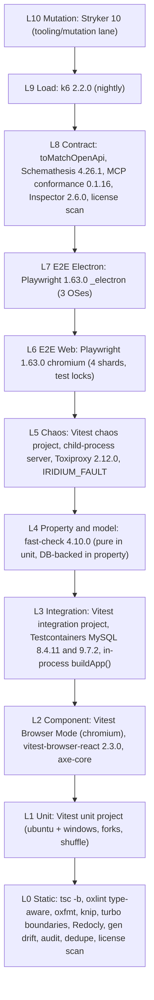

# Testing and quality strategy

This section is the definitive description of how Iridium proves itself: which runner owns which layer, what `@iridium/testkit` provides, the named test inventory mapped to every acceptance row of the feature spec (section 9), to the plan's hard properties and to the specified rules that are neither — including the completeness table that resolves every test name used anywhere in the plan to a file, a project and a tag, and the single guard that holds the declared non-goals to the built route, tool, command, capability and schema inventories — the step-by-step chaos and durability procedures, the property-based suites, the Electron security suite, the performance budgets, the CI lanes and their merge-blocking rules, the coverage and mutation thresholds, and the fixture policy. Architecture, data model, protocols and milestone gating are described in their own sections and are only referenced here (see 02-system-architecture.md, 03-data-model.md, 05-collaboration-and-durability.md, 06-mcp-and-agent-access.md, 07-client-applications.md, 12-milestones.md).

## Principles

1. **The hard properties are proven before any UI exists and stay on the PR critical path forever.** The kernel milestone (M1, see 12-milestones.md) exits only on the headless suites listed below; the UI milestones add browser-level proof on top of them, never instead of them.
2. **Real infrastructure, one boot path.** Integration, chaos, contract and MCP suites run the real Fastify 5.12.4 application built by `buildApp()` against the required image matrix `mysql:8.4.11` and `mysql:9.7.2-oraclelinux9` in Testcontainers — an unset `IRIDIUM_MYSQL_IMAGE` resolves to the floor, `mysql:8.4.11` — real Hocuspocus 4.7.0 and real `@hocuspocus/provider` 4.7.0 clients in Node. The server boots in-process (Vitest), as a child process (SIGKILL chaos) or in a container (load, Schemathesis, compose boot) from the same `buildApp({ mode })`; test seams are configuration and the `IRIDIUM_FAULT` registry, never forks of the boot path. The persistence writer, the loader, the compactor, `authorize()`, the audit writer and the MCP host are never mocked outside the `unit` project.
3. **One runner per layer.** Vitest 5.0.0 owns every non-browser and component layer through `test.projects`; Playwright 1.63.0 owns web and Electron end-to-end; fast-check 4.10.0 owns property and model tests inside Vitest; k6 2.2.0 owns load; Stryker 10.0.0 owns mutation in its isolated lane; Schemathesis 4.26.1 owns black-box OpenAPI fuzzing; `@modelcontextprotocol/conformance` 0.1.16 and Inspector 2.6.0 own MCP wire conformance. No second runner is ever added for convenience (no Jest, WebdriverIO, Artillery, jest-openapi, Pact).
4. **Determinism over retries.** Vitest `retry: 0` everywhere; Playwright `retries: 2` only in CI with `trace: 'on-first-retry'`. A flaky test is quarantined with an issue and an entry in `apps/e2e/QUARANTINE.md`; it is never retried into green. Time is injected (`Clock`), Hocuspocus debounce values are configuration, property tests print their seed, unit tests shuffle with a printed seed.
5. **Every acceptance row, every hard property and every specified rule has named tests in named layers.** The map in "Named test inventory" is machine-checked by `guards.acceptance-map.guard.spec.ts`, which fails when a row id, a hard-property id or a rule id of "Specified rules outside the nine rows" is no longer referenced by at least one test in each required layer whose milestone has arrived. A rule the spec states but no row covers — the move/rename link warning, the `invalid_move` reason vocabulary, vault settings, single-process document ownership, the declared non-goals — is checked the same way, because a rule held by prose alone is a rule nothing fails on.
6. **Security-relevant drift is a build failure.** Generated OpenAPI, MCP tool schemas, IPC typings, Kysely types, the Yjs single-instance check, route policy, `webPreferences`, the preload surface, redaction and DB grants are all asserted by tests or CI steps that block merges.
7. **Coverage numbers are a floor, mutation scores are the signal.** Security and durability modules carry 100 % / 95 % per-file coverage gates and are the Stryker mutation scope; everything else carries the global thresholds.
8. **Tests exercise the product's own paths.** Seeding goes through the CLI and REST, fixtures are imported through the import job, backups are taken with `iridium backup`, and revocation is triggered through the admin routes. Direct database writes in tests exist only to corrupt state deliberately (doctor and restore tests) and are wrapped in a helper that says so.

## Hard properties under test

01-vision-scope-and-principles.md states the product principles; the five properties below are their test-facing form and are referred to throughout this section by id. Each maps to the acceptance rows of the spec (section 9) and to named tests in "Named test inventory".

| Id | Property | Testable statement | Primary evidence |
|---|---|---|---|
| HP-1 | Saved truthfulness | The client shows `saved` only when a MySQL transaction containing every local update has COMMITTED (`innodb_flush_log_at_trx_commit=1`) and the server has broadcast a state vector that dominates the client's whole local vector and a canonical delete-set fingerprint equal to the client's (skeleton A19, deviation F2). A failed or crashed persistence never produces a `persisted` message for the affected updates. | `collab.durable-ack.chaos`, `collab.deletion-durability.integration`, `collab.baseline-on-connect.integration`, `save-state.machine.prop`, `crdt.durability.unit`, `crdt.dominates.prop`, `saved-indicator.e2e` |
| HP-2 | Restart recovery | After any kill (SIGKILL after ack, crash before or after COMMIT) or graceful restart, reloading a note yields exactly the acknowledged content: no lost acknowledged update, no duplicated initial content, and `head_seq = GREATEST(snapshot_through_seq, MAX(note_updates.seq))`, `snapshot_through_seq <= head_seq`, `projected_seq <= head_seq` hold. | `collab.restart-no-duplication.integration`, `collab.durable-ack.chaos`, `collab.graceful-shutdown.chaos`, `persistence.model.prop`, `ops.backup-restore.drill` |
| HP-3 | Revocation timing | Membership removal, role downgrade, user disable, session revoke, token revoke, OAuth consent revoke, OAuth client disable, vault archive and note trash affect already-open connections within 1 s of COMMIT, refuse reconnection, and make the next REST or MCP call fail; a role upgrade re-attaches cleanly with every pending local update merged. | `collab.live-revocation.integration`, `collab.revocation-race.chaos`, `mcp.revocation.mcp`, `oauth.revocation.mcp`, `revocation-while-open.e2e` |
| HP-4 | Hostile content inertness | Hostile Markdown (scripts, `javascript:`/`data:`/`vbscript:` URLs, iframes, meta refresh, SVG scripts, event handlers, DOM clobbering, CSS injection, pathological nesting) cannot execute, navigate, open windows, reach `window.iridium`, Node or the network in the web client, the Electron renderer, the server projection worker or the sanitized hast. | `markdown.xss-corpus.unit`, `markdown.sanitize.prop`, `markdown.pathological.unit`, `preview.inertness.component`, `security.hostile-markdown.e2e` (web), `desktop.hostile-markdown.e2e`, `desktop.hardening.e2e` |
| HP-5 | Limits enforcement | Every limit in the single limits policy (skeleton A.1) is enforced at the stated place with the stated outcome (close reason, `413`/`429` ProblemDetails, backpressure, refusal) and never by the client alone. | `collab.limits.integration`, `collab.backpressure.chaos`, `collab.admission-budget.integration`, `security.rate-limits.integration`, `mcp.rate-limit.mcp`, `attachments.security.integration`, `markdown.pathological.unit`, `limits.policy.unit`, `ops.load.slo` |

**Every evidence cell here, in "Hard properties → required layers" and in the nine-row overview names a test, never a lane, a runner or a phrase.** The rule is mechanical rather than stylistic: `scripts/build-acceptance-map.ts` parses these cells into the `rowId` and `hpId` entries of `docs/acceptance-map.json`, and `guards.acceptance-map.guard` can only check an entry whose members are map keys. A cell reading "k6 nightly", "the nightly load job" or "Schemathesis" generates an entry the guard silently skips, which is worse than an empty cell: the hard property looks discharged, and nothing fails on the day the check is deleted. So HP-5's load evidence is `ops.load.slo` — the named gate specified in "Ops, restore, release and the seam contract suites", whose lane column is where "k6, nightly" belongs — and the same substitution applies to any cell added later: name the test, and let the inventory row carry the runner and the lane. The four workflow gates that have no spec file (`release.bundle-integrity`, `supply-chain.sbom`, `ops.compose-prod.clean-vm`, `ops.load.slo`) are still names in an inventory table and therefore still legal evidence; a tool or a job name is not. The enumeration was six until the 1.0 distribution decision retired `release.signing` — whose fuse read and artefact assertions moved into `release.bundle-integrity` — and `desktop.update-from-previous`, which has no 1.0 successor because 1.0 ships no in-application updater; it was five until `proxied-stack.headers.mcp` became a Vitest spec in the nightly-only `mcp-clients` project (D10-43), which gave it a file; the count is stated rather than implied so that retiring a gate is a visible edit here and not a quiet subtraction.

A cell may **narrow** a named test to one of its cases, in the form `` `test.name.layer` `` followed by `(incl. case *case name*, @M<n>)` — row 4 does this for *foreign-vault revision history*. The case name is italic prose, never a code span, so `scripts/build-acceptance-map.ts` reads the map member from the code span exactly as before and the parenthetical stays documentation for the section that cites it. That is deliberate: a case is not separately gateable, because `guards.acceptance-map.guard` resolves map members to files and a case is a `describe` block inside one. What holds a cited case in existence is the test's own exhaustiveness construction — the `satisfies Record<…>` case tables this section uses throughout — which fails at compile time rather than at map-generation time, and is therefore the stronger guarantee.

## Testing pyramid and the one-runner-per-layer policy



| Layer | Runner / project | What it proves | Where the tests live | Gate |
|---|---|---|---|---|
| L0 Static | `tsc -b --builders 8` (TypeScript 7.0.2), oxlint 1.82.0 + oxlint-tsgolint 7.0.2001, oxfmt 0.67.0 `--check`, knip 6.35.1 `--production` with `ignoreExportsUsedInFile` (see below), `turbo boundaries` (dependency-cruiser 18.2.0 fallback), `@redocly/cli 2.52.1 lint`, `pnpm gen && git diff --exit-code` (which now also regenerates `docs/non-goals.json` and `docs/acceptance-map.json`), `pnpm audit --audit-level high`, `pnpm why` dedupe check, license scan | Types, boundaries, formatting, dead code, generated-artifact freshness, supply chain, licenses | repo root scripts, `tooling/`, `scripts/` | PR (`static` job) |
| L1 Unit | Vitest 5.0.0 projects `unit` and `guard` (`environment: 'node'`, `pool: 'forks'`, `isolate: true`, `sequence.shuffle: true`, `retry: 0`) on ubuntu and windows; pure property tests (`*.prop.spec.ts` co-located under `src/`) run here with `IRIDIUM_PROP_RUNS` | Pure logic: permission matrix, token format/CRC/hash, name and path rules, tree rules, `dominates`, codec, `SaveStateMachine`, `NoteWriter` coalescing and backoff over a fake `CollabPersistence`, cursor signing, markdown pipeline, Obsidian detector, sanitizer schema, MCP tools over an in-memory `ContentReadCore`, formatting `StateCommand`s over `EditorState`, config parsing, IPC handlers, `webPreferences` snapshot | `packages/*/src/**/*.{unit,prop}.spec.ts`, `apps/*/src/**/*.{unit,prop}.spec.ts`; the `guard` project adds `apps/server/test/guards/*.guard.spec.ts` and the package-local `*.guard.spec.ts` files | PR (`unit` job, both OSes; the `guard` project in `static`) |
| L2 Component | Vitest project `component`: Browser Mode with `@vitest/browser-playwright 5.0.0`, `provider: playwright({ launchOptions: { channel: 'chromium' } })`, `instances: [{ browser: 'chromium' }]`, vitest-browser-react 2.3.0, axe-core (pinned at M0) | Real-Chromium behaviour of `@iridium/editor`, `@iridium/markdown-react`, `@iridium/ui`: yCollab across two in-memory Y.Docs, remote cursors, undo isolation, formatting edits source only, status pill transitions from a fake provider, preview inertness, tree keyboard/DnD, tabs, switcher, palette, token dialog, accessibility | `packages/{ui,editor,markdown-react}/src/**/*.component.spec.tsx`, `packages/*/test/**/*.component.spec.tsx` (the `host.contract.component` harness of the `IridiumHost` contract suite of 07-client-applications.md §2.4 lives in `packages/ui/src/host/`), `apps/web/src/**/*.component.spec.tsx` | PR (`unit` job, ubuntu) |
| L3 Integration | Vitest project `integration`: `globalSetup` starts `MySqlContainer(<the required image matrix entry>)` — `mysql:8.4.11` and `mysql:9.7.2-oraclelinux9`, with an unset `IRIDIUM_MYSQL_IMAGE` resolving to the floor, `mysql:8.4.11` — with tmpfs and the role init script; each worker migrates its own schema `iridium_w<VITEST_WORKER_ID>`; server in-process via `startServer({ mode: 'in-process' })` | Every server behaviour that touches MySQL, Hocuspocus or REST: collaboration harness suites, REST with `toMatchOpenApi`, tree/trash/restore, revisions, projections, search, attachments, audit chain, tickets, CSRF, rate limits, jobs, readiness, migrations | `apps/server/test/integration/**/*.integration.spec.ts` | PR (`integration` job) |
| L4 Property / model | Pure properties in `unit` at `PROP` (PR `numRuns: 200`, nightly `5000` + soak — the skeleton A51 figures, and the strength at which every model also runs over its in-memory mirror); DB-backed model tests in Vitest project `property` (`testTimeout: 900_000`, MySQL globalSetup) carry their own `PROP_DB` budget (PR `numRuns: 200` × `maxCommands: 60`, nightly `5000` × `300`) because each command there is a MySQL round trip; fast-check 4.10.0 + `@fast-check/vitest 0.5.0` | Convergence model (`SimNet` with the real `NoteWriter`), persistence model, hierarchy model against real MySQL, markdown round trip and no-rewrite, sanitizer, token effective permissions, save-state machine, cursor, name rules, deep-link parsing | `packages/*/src/**/*.prop.spec.ts` (pure), `apps/server/test/property/**/*.prop.spec.ts` (DB-backed) | PR light, nightly heavy |
| L5 Chaos | Vitest project `chaos` (`fileParallelism: false`, `retry: 0`, `testTimeout: 180_000`); server as a child process; MySQL and `/collab` behind `ToxiProxyContainer('ghcr.io/shopify/toxiproxy:2.12.0')`; `IRIDIUM_FAULT` registry | HP-1, HP-2, HP-3, HP-5 under kills, DB outages, latency, resets, bandwidth caps, socket drops, shutdown, backpressure; backup/restore drill | `apps/server/test/chaos/**/*.chaos.spec.ts` | PR core (`chaos-core`, 20 kill iterations), nightly extended (200 iterations, all toxics) |
| L6 E2E web | Playwright 1.63.0 projects `setup` and `chromium` (4 shards, test locks, three-context `collab` fixture) against the built web bundle served by the built server | Every UI flow of 07-client-applications.md and the browser rendition of the acceptance rows. It is the development signal for the shared UI, not the 1.0 acceptance gate for a row that also has an Electron proof (01-vision-scope-and-principles.md §4.6) | `apps/e2e/web/**/*.e2e.spec.ts` | PR (`e2e-web` job, all shards) |
| L7 E2E Electron | Playwright project `electron` (`_electron.launch`) on ubuntu (xvfb), windows, macos; MySQL from `shogo82148/actions-setup-mysql@v1` (`mysql-version: '8.4'`); E2E fuse variant in `release.yml` | The supported client at 1.0: shell hardening, sign-in, open note, three-instance collaboration, hostile Markdown, deep-link fuzz, attachment custody, the manual-download update card, keyboard-only operation, host contract | `apps/e2e/electron/**/*.e2e.spec.ts` | PR (`e2e-electron`, 3 OSes, the `@smoke` acceptance subset), nightly full, release packaged smoke |
| L8 Contract | Vitest projects `contract`, `mcp` and the nightly-only `mcp-clients` (D10-43); `toMatchOpenApi` (ajv 8.20.0 + `@apidevtools/swagger-parser 13.0.0`) applied to every REST response; Schemathesis 4.26.1 `--phases=examples,coverage,fuzzing,stateful`; MCP dual-era through `handler.fetch` and the real `/mcp` and `/mcp/connect` routes; the OAuth discovery split and metadata documents; conformance 0.1.16 with zero unexplained failures against its typed baseline and Inspector 2.6.0 `--cli`, both run from the `tooling/mcp-conformance` leaf; `bridge.parity.contract` over `StdioClientTransport`; the headless real-client matrix; license scan | Wire contracts never drift from committed artifacts; protocol conformance in both MCP eras; real clients reach both mounts over real TLS; dependency licenses stay inside the allowlist | `apps/server/test/contract/**/*.contract.spec.ts`, `apps/server/test/mcp/**/*.mcp.spec.ts`, `apps/e2e/mcp-clients/**/*.mcp.spec.ts` (nightly only), `scripts/check-licenses.ts` | PR light, nightly full |
| L9 Load | k6 2.2.0 with bundled yjs 13.6.32 / y-protocols 1.0.7 / lib0 0.2.117 (M0 spike S6, pass; fallback Node `worker_threads` generator on `@iridium/collab-client` not taken). The lane belongs to `apps/server`, so its tools do too: `esbuild` 0.28.2, `@types/k6` 2.2.0 and the three CRDT libraries are **devDependencies of `@iridium/server`** — neither Vite 8 nor tsdown carries esbuild any more, both bundling with rolldown, and under pnpm's strict layout the CRDT libraries are not otherwise resolvable from the lane. Scripts are bundled `--format=cjs --platform=browser --external:k6*`, and the four `k6/*` modules the binary provides (which no manifest can declare) are `boundaries.implicitDependencies: ["k6"]` in `apps/server/turbo.json`. Two rules bind every script in the lane: **every `Y.Doc` takes its `clientID` from the script**, never from `lib0` (k6 2.2.0's `crypto.getRandomValues` fills one byte per element, so a `lib0`-drawn id carries 8 bits — R-T22); and **propagation is measured from `Y.Text.observe` deltas**, not from a wire event | SLOs of "Performance budgets"; RSS ceiling; no dropped iterations | `apps/server/test/load/**`, the M8 lane built from `apps/server/test/load/spikes/s06/` | nightly; M8 gate |
| L10 Mutation | Stryker 10.0.0 (`@stryker-mutator/core`, `vitest-runner`, `typescript-checker`) in `tooling/mutation` with its own `typescript` → `@typescript/typescript6` alias, `incremental`, unit project only | Tests on security and durability modules actually detect defects | `tooling/mutation/` | nightly; PR when mutate-scope paths change; thresholds in "Coverage and mutation thresholds" |

The pyramid is deliberately heavy at L3–L5: the properties that matter most (HP-1, HP-2, HP-3) are only observable with a real database, a real WebSocket server and a killable process. L1 exists to make mutation testing and 100 % per-file coverage meaningful on the modules where a single wrong branch is a security or data-loss bug.

## Runner configuration

### Vitest 5.0.0 root configuration

One root `vitest.config.ts` declares every project inline (Vitest 5 inherits the root config into inline projects and shares one Vite server). Project selection is by directory for server-side test trees and by file suffix for co-located tests, so a file's path alone says which runner semantics apply.

```ts
// vitest.config.ts (repo root)
import { defineConfig } from 'vitest/config';
import { playwright } from '@vitest/browser-playwright';

const seed = Number(process.env.IRIDIUM_TEST_SEED ?? Date.now());
console.info(`[vitest] sequence seed ${seed}`);            // printed so order-coupling failures replay

export default defineConfig({
  test: {
    retry: 0,
    clearMocks: true,                                       // Vitest 5 default, stated explicitly
    sequence: { shuffle: true, seed },
    reporters: process.env.CI ? ['default', 'blob'] : ['default'],
    coverage: {
      provider: 'v8',
      include: ['packages/*/src/**/*.{ts,tsx}', 'apps/server/src/**/*.ts',
                // `*.ts` only: the preload body is `index.cts`, which no Vitest project can run and
                // which the v8 provider's uncovered-file remap cannot parse (see "Coverage").
                'apps/desktop/src/{preload,shared}/**/*.ts', 'apps/web/src/**/*.{ts,tsx}'],
      exclude: ['**/*.spec.*', '**/generated/**', '**/*.d.ts', '**/testing/**', 'apps/server/src/migrations/**',
                'apps/desktop/src/main/**'],   // proven by the Playwright `electron` project, which emits no Vitest coverage
      reporter: ['text', 'json-summary', 'lcov'],
      reportOnFailure: true,
      thresholds: {
        statements: 85, lines: 85, branches: 80, functions: 85,
        'apps/desktop/src/{preload,shared}/**':           { 100: true, perFile: true },
        'apps/server/src/auth/**':                        { 100: true, perFile: true },
        'apps/server/src/authz/**':                       { 100: true, perFile: true },
        'apps/server/src/oauth/**':                       { 100: true, perFile: true },
        'packages/contracts/src/{tokens,paths,authz}.ts': { 100: true, perFile: true },
        'apps/server/src/collab/persistence/**':          { lines: 95, branches: 90, perFile: true },
        'packages/crdt/src/**':                           { lines: 95, branches: 90, perFile: true },
      },
    },
    projects: [
      { test: { name: 'unit', environment: 'node', pool: 'forks', isolate: true, testTimeout: 10_000,
                include: ['packages/*/src/**/*.{unit,prop}.spec.ts', 'apps/*/src/**/*.{unit,prop}.spec.ts'] } },
      { test: { name: 'guard', environment: 'node', pool: 'forks', isolate: true, testTimeout: 30_000,
                include: ['apps/server/test/guards/*.guard.spec.ts',            // selected by PATH, never by test title
                          'packages/*/src/**/*.guard.spec.ts', 'packages/*/test/**/*.guard.spec.ts',
                          'apps/*/src/**/*.guard.spec.ts'] } },
      { test: { name: 'component', include: ['packages/{ui,editor,markdown-react}/src/**/*.component.spec.tsx',
                                             'packages/*/test/**/*.component.spec.tsx',   // package-level component trees
                                             'apps/web/src/**/*.component.spec.tsx'],
                setupFiles: ['packages/ui/test/setup.browser.ts'],
                browser: { enabled: true, headless: true, provider: playwright({ launchOptions: { channel: 'chromium' } }),
                           instances: [{ browser: 'chromium' }] } } },
      { test: { name: 'integration', environment: 'node', pool: 'forks', hookTimeout: 120_000, testTimeout: 30_000,
                globalSetup: ['packages/testkit/src/global/mysql.global.ts'],
                setupFiles: ['packages/testkit/src/global/worker-schema.setup.ts'],
                include: ['apps/server/test/integration/**/*.integration.spec.ts'] } },
      { test: { name: 'property', environment: 'node', pool: 'forks', testTimeout: 900_000, hookTimeout: 120_000,
                globalSetup: ['packages/testkit/src/global/mysql.global.ts'],
                setupFiles: ['packages/testkit/src/global/worker-schema.setup.ts'],
                include: ['apps/server/test/property/**/*.prop.spec.ts'] } },
      { test: { name: 'chaos', environment: 'node', pool: 'forks', fileParallelism: false, testTimeout: 180_000, hookTimeout: 180_000,
                globalSetup: ['packages/testkit/src/global/mysql.global.ts', 'packages/testkit/src/global/toxiproxy.global.ts'],
                include: ['apps/server/test/chaos/**/*.{chaos,drill}.spec.ts'] } },   // `drill` is a layer of this project
      { test: { name: 'contract', environment: 'node', pool: 'forks', testTimeout: 60_000,
                globalSetup: ['packages/testkit/src/global/mysql.global.ts'],
                setupFiles: ['packages/testkit/src/global/worker-schema.setup.ts'],
                include: ['apps/server/test/contract/**/*.contract.spec.ts'] } },   // bridge.parity.contract included
      { test: { name: 'mcp', environment: 'node', pool: 'forks', testTimeout: 30_000,
                globalSetup: ['packages/testkit/src/global/mysql.global.ts', 'packages/testkit/src/global/toxiproxy.global.ts'],
                setupFiles: ['packages/testkit/src/global/worker-schema.setup.ts'],
                include: ['apps/server/test/mcp/**/*.mcp.spec.ts'] } },
      // The real-client matrix (D10-43): run only by `nightly.yml › mcp-clients`, never by a ci.yml job.
      // Files one at a time and rows never concurrent, because every row shares one matrix server and
      // one source address; the chaos project's long timeouts, because a row drives a real client.
      { test: { name: 'mcp-clients', environment: 'node', pool: 'forks', fileParallelism: false,
                testTimeout: 180_000, hookTimeout: 180_000,
                globalSetup: ['packages/testkit/src/global/mysql.global.ts'],
                setupFiles: ['packages/testkit/src/global/worker-schema.setup.ts'],
                include: ['apps/e2e/mcp-clients/**/*.mcp.spec.ts'] } },
    ],
  },
});
```

Vitest 5 rules every author must know (each is enforced by an oxlint rule or a guard test where possible): `test.sequential` no longer exists (use `{ concurrent: false }`); `expect.poll()` rejects on timeout, which is exactly what eventual-state assertions need; un-awaited `.resolves`/`.rejects`/`toMatchFileSnapshot` fail the test; `vi.mock`/`vi.hoisted` must be top level; `VITEST_WORKER_ID` is 1-based (schema names use it); glob thresholds do not inherit `perFile`, hence `perFile: true` repeated per glob; `coverage.include` is mandatory or untested files are invisible; `toHaveTextContent` is strict equality in Browser Mode (use `toMatchTextContent` for patterns); config files are not searched in parent directories, so every package script passes `--config ../../vitest.config.ts --project <name>`; `globalSetup` receives a `TestProject` and hands values to workers with `project.provide()` / `inject()` (typed through `declare module 'vitest' { interface ProvidedContext { … } }`).

Per-project invocation is the norm: `pnpm test --project unit`, `pnpm test --project integration`, and so on. `pnpm test:all` runs the projects that need no Docker on the developer machine (`unit`, `guard`, `component`), and `pnpm test:docker` runs the rest (`integration`, `property`, `chaos`, `contract`, `mcp`); `mcp-clients` is selected only by `nightly.yml › mcp-clients`, because its rows drive third-party clients that exist only in the nightly job's install (D10-43). The property runs read `IRIDIUM_PROP_RUNS` (200 on PR, 5000 nightly), `IRIDIUM_PROP_DB_RUNS` / `IRIDIUM_PROP_DB_COMMANDS` for the MySQL-backed models (200 × 60 on PR, 5 000 × 300 nightly) and `IRIDIUM_PROP_SIZE` (`'='` on PR, `'+2'` nightly); `IRIDIUM_MYSQL_IMAGE` selects one of the two required images, `mysql:8.4.11` or `mysql:9.7.2-oraclelinux9`, and resolves to the floor, `mysql:8.4.11`, when it is unset — so a construct that only works on 9.x fails in the developer's own `pnpm test:docker` rather than in a lane somebody has to go and read.

### Playwright 1.63.0 configuration

```ts
// playwright.config.ts (repo root)
import { defineConfig, devices } from '@playwright/test';
const CI = !!process.env.CI;
export default defineConfig({
  testDir: 'apps/e2e',
  fullyParallel: true,
  forbidOnly: CI,
  retries: CI ? 2 : 0,
  workers: CI ? 4 : undefined,
  reporter: CI ? [['blob'], ['github']] : [['html', { open: 'never' }]],
  timeout: 60_000,
  expect: { timeout: 10_000 },
  use: { baseURL: process.env.IRIDIUM_E2E_ORIGIN ?? 'http://127.0.0.1:4000', trace: 'on-first-retry', video: 'retain-on-failure',
         extraHTTPHeaders: { 'X-Iridium-Client-Version': process.env.IRIDIUM_E2E_CLIENT_VERSION ?? '0.0.0-e2e' } },
  webServer: process.env.IRIDIUM_E2E_EXTERNAL_SERVER ? undefined : {
    command: 'node apps/server/dist/main.mjs serve',                     // the built bundle, never the Vite dev server
    url: 'http://127.0.0.1:4000/readyz', reuseExistingServer: !CI, timeout: 120_000,
    env: { NODE_ENV: 'test', PUBLIC_ORIGIN: 'http://127.0.0.1:4000', COLLAB_DEBOUNCE_MS: '100', COLLAB_MAX_DEBOUNCE_MS: '500' },
  },
  projects: [
    { name: 'setup', testMatch: /apps\/e2e\/setup\/.*\.setup\.ts/ },
    { name: 'chromium', testMatch: /apps\/e2e\/web\/.*\.e2e\.spec\.ts/, dependencies: ['setup'], use: { ...devices['Desktop Chrome'] } },
    { name: 'electron', testMatch: /apps\/e2e\/electron\/.*\.e2e\.spec\.ts/, dependencies: ['setup'], workers: 1 },
  ],
});
```

- The `setup` project creates the bootstrap server administrator with the production CLI (`iridium admin create-user --server-admin`), then creates `editorA`, `editorB`, `viewer`, `outsider` through `POST /api/v1/admin/users` and consumes their set-password links through `POST /auth/set-password`, imports the demo vault fixture through the real import job (`POST /imports` → `PUT /imports/:jobId/upload` → `POST /imports/:jobId/scan` → `POST /imports/:jobId/commit`), signs each role in through `POST /auth/sessions` and saves `apps/e2e/.auth/<role>.json` as `storageState`. No test-only seeding CLI exists in the product.
- The `collab` fixture (`apps/e2e/fixtures/collab.ts`) extends `test` with `editors: [Page, Page, Page]` and `viewer: Page`, each from `browser.newContext({ storageState })`. Tests that touch a shared fixture note declare `{ lock: 'note:<fixture-id>' }` (Playwright 1.63 test locks), never `serial` mode.
- Web tests run against the production-shaped bundle: `apps/web/dist` served at `/app/*` by the built server with the nonce CSP in force. The Vite dev server is never the E2E target.
- **There are exactly three Playwright projects, and `@smoke` means one thing.** Firefox and WebKit are out of scope at 1.0 (01-vision-scope-and-principles.md §4.6), so no `devices['Desktop Firefox']` or `devices['Desktop Safari']` project exists and `guards.non-goals.guard` (case *Cross-browser support*) fails the build if one appears. `@smoke` selects the subset of `apps/e2e/electron/**` that the merge-blocking `e2e-electron` job runs on every pull request; no spec under `apps/e2e/web/**` carries the tag, because nothing selects it there — the `chromium` project runs the whole web suite, sharded.
- **`IRIDIUM_E2E` is never passed to the server process.** It is a *build-time* flag of the web bundle (the `vite build` that produces `apps/web/dist` for the E2E lane, where it gates the `window.__iridiumHostContract` runner and the editor host's `WeakRef` registry) and a *launch-time* flag of the Electron main process (updater and single-instance lock off, 07-client-applications.md §7.15). `apps/server/dist/main.mjs serve` needs only `NODE_ENV=test`, which is what enables the fault registry and the `/__test__` namespace; the server's `EnvSchema` knows the name `IRIDIUM_E2E` and handles it explicitly rather than ignoring it (02-system-architecture.md, "Configuration"; 11-operations-and-deployment.md, "Configuration and secrets"), so the harness neither sets it on the server nor relies on it being tolerated there. Every other harness knob in this section carries a reserved harness prefix (D10-5), for the same reason: the `child` and `container` modes spawn the production binary with the whole job environment.
- The `electron` project launches `apps/desktop/dist/main/index.mjs` with `_electron.launch({ args, env: { IRIDIUM_SERVER_URL, IRIDIUM_E2E: '1', IRIDIUM_USER_DATA: <tmp> }, timeout: 30_000 })`; `IRIDIUM_E2E=1` disables the updater and the single-instance lock so three instances can run on one machine. Linux runs under `xvfb-run --auto-servernum` after `npx playwright install-deps chromium`. `electron-playwright-helpers 3.1.2` is used only for `stubDialog`/`stubMultipleDialogs`, menu clicks and `waitForWindowByTitle`; its `ipcRenderer*`/`ipcMain*` helpers require `nodeIntegration: true` and are banned by lint (`no-restricted-imports` on those named exports).
- **Frame counters must relay to the real server.** `page.routeWebSocket` *intercepts socket creation*: a route handler that does not call `ws.connectToServer()` mocks the socket, and the page then talks to nobody. A naive "count the frames" handler would therefore give `viewer-readonly.e2e` an editor that never syncs and a test that passes for the wrong reason. The one sanctioned form lives in `apps/e2e/fixtures/frame-counter.ts` and every test uses it:

  ```ts
  export async function countFrames(page: Page) {
    const count = { in: 0, out: 0, routed: 0 };
    await page.routeWebSocket(/\/collab/, ws => {
      count.routed++;
      const server = ws.connectToServer();                       // required: relay, never mock
      ws.onMessage(m => { count.out++; server.send(m); });
      server.onMessage(m => { count.in++; ws.send(m); });
    });
    return count;
  }
  ```

  `viewer-readonly.e2e` asserts `count.out` does not grow across a keystroke while collaboration keeps working; `vault-isolation.e2e` asserts `count.routed === 0` — that the handler was never invoked at all, which is the honest form of "no socket was opened", since a counter can only count frames on a socket that exists.
- Sharding: `--shard=i/4` for `chromium` in CI; blob reports merged by `playwright merge-reports` in the `merge-reports` job.

### Test file conventions

| Convention | Rule |
|---|---|
| File name | `<area>.<subject>.<layer>.spec.ts[x]` where `layer ∈ {unit, component, integration, prop, chaos, contract, mcp, e2e, guard, drill}` — `drill` is a rehearsal of a shipped operator command and runs in the `chaos` project, whose `include` glob is therefore `*.{chaos,drill}.spec.ts` (`ops.backup-restore.drill`, `ops.restore-verify.chaos`, `ops.key-rotation.drill`, `ops.upgrade-rehearsal.drill`). The skeleton (A47) spells the drill `ops.backup-restore.drill.spec`, which is that basename plus the `.spec` file suffix, so the canonical *name* is `ops.backup-restore.drill` and no `.chaos` variant of it exists. A test's name is its file basename minus `.spec.ts[x]`, so the skeleton's dotted names are basenames. **Amended 2026-09-21** — the M2 tree closed three further shapes the original clause did not admit, so the exception set is now stated as a closed list of three kinds, all of them co-located: a file that omits the area prefix its own directory or package already supplies (`crdt.dominates.prop` in `packages/crdt/src/dominates.prop.spec.ts`, `collab.writer.restore.unit` in `apps/server/src/collab/persistence/writer.restore.unit.spec.ts`); a file whose basename names the module under test while the plan cites the test by the area that owns the behaviour (`search.query-parser.unit` in `packages/markdown/src/markdown.search-query.unit.spec.ts`, whose subject is `packages/markdown/src/search/parse-query.ts` but whose name is the one 11-operations-and-deployment.md, 13-decision-log.md, 15-requirements-traceability.md and `docs/adr/0039-search.md` all cite; `markdown.parser-adapter.unit` in `packages/markdown/src/markdown-it/adapter.unit.spec.ts`; `tree.notification.unit` in `apps/server/src/collab/tree-notification.unit.spec.ts`; `harness.drain-clock.unit` in `apps/server/src/ops/harness-drain-clock.unit.spec.ts`). Every one of them is enumerated with its path in "Inventory completeness", which is the authority mapping name → path; a name outside these two kinds is a rename, not an exception. **One file declares exactly one test name**, and that is not a matter of taste: `guards.acceptance-map.guard` reads the *first* top-level `describe` of a file and nothing else, so a second top-level `describe` is invisible to every rule the guard enforces — it can be neither selected, nor tagged, nor scheduled, nor named by an inventory row, and a row naming it would fail the guard as an undeclared test. A second suite in a file is therefore either a nested `describe` under the file's own name, or its own file. Where another section names a test without its layer segment (12-milestones.md §13.5's `status-pill.transitions`, `preview.inertness`, `markdown.commonmark`), the canonical name is that name plus the layer of the project that runs it. |
| Location | Unit, pure property and component tests co-located under `src/`; server integration/chaos/contract/mcp/property trees under `apps/server/test/<project>/`; guard tests either under `apps/server/test/guards/` or co-located as `*.guard.spec.ts` in the package whose invariant they protect (both are collected by the `guard` project, which selects by path); E2E under `apps/e2e/{setup,web,electron,perf}/`; the nightly-only real-client matrix under `apps/e2e/mcp-clients/`, whose `.mcp` files belong to the `mcp-clients` project rather than to `mcp` and state their path in their inventory rows (D10-43); load under `apps/server/test/load/`. |
| Requirement tags | The top-level `describe` title carries `[spec:<row-id>]` for spec rows (`concurrent-editing`, `initialization-reconnection`, `viewer-enforcement`, `vault-isolation`, `live-revocation`, `durable-saving`, `structural-concurrency`, `portability-and-safety`, `backup-recovery`) and `[hp:HP-n]` for hard properties; a test that defends neither carries `[area:<name>]` instead (`[area:ops]`, `[area:jobs]`, `[area:admin]`, `[area:links]`, `[area:vaults]`, `[area:non-goals]`, `[area:docs]`, `[area:oauth]`, `[area:a11y]`, `[area:clients]`, …), which satisfies the "every file is tagged" rule without claiming a row it does not prove. Playwright tests use `{ tag: ['@spec-<row-id>', '@hp-n', '@area-<name>'] }`. `guards.acceptance-map.guard.spec.ts` parses these tags; only `[spec:…]` and `[hp:…]` are checked against the map. |
| Eventual state | `expect.poll(...)` or a testkit `waitFor` with an explicit timeout; `setTimeout` sleeps are banned in test files by oxlint `no-restricted-syntax` (the `ManualClock` and Toxiproxy toxics replace them). From M3 `access_log` rows are the exception: they are read once, only through `srv.accessLog`, which flushes the writer first — in-process directly, in `child` mode through the test namespace, in `container` mode only after `stop()` —, and never with `expect.poll`; a test that closed its own MCP streams passes `afterStreamsClosed`; partition and metadata observations use `db/inspect.ts` and `db/maintenance-observations.ts` (D06-11 as amended; `guards.test-table-access.guard`). |
| Mocks | `vi.mock` only in the `unit` and `component` projects, and only for I/O adapters and host seams — the `component` project's own inventory depends on them (the fake provider behind `status-pill.transitions.component`, the injected `host.shell.openExternal` spy behind `preview.inertness.component`, the msw handlers behind `MemoryHost`). The `integration`/`chaos`/`contract`/`mcp`/`property` projects never mock first-party modules: `guards.no-mocks-outside-unit.guard.spec.ts` greps for `vi.mock(` and for `vi.spyOn(` on a first-party module specifier, and for any `msw` import, outside `*.{unit,component}.spec.ts[x]`. |
| Snapshots | File snapshots (`await expect(x).toMatchFileSnapshot(...)`) for golden hast/mdast/OpenAPI/`webPreferences`/preload-surface artefacts; inline snapshots banned for anything larger than one line; CI runs with `--update=false` semantics (obsolete or mismatched snapshots fail). |
| Lint | oxlint `vitest` and `jest` plugin rules (`no-focused-tests`, `no-disabled-tests` except with an issue URL, `expect-expect`, `no-conditional-expect`, `require-to-throw-message`, `valid-expect`) and Playwright rules (`no-wait-for-timeout`, `no-networkidle`, `expect-expect`, `no-conditional-in-test`). |
## `@iridium/testkit`

`packages/testkit` is the single entry point for every harness. It is a private workspace package with the boundary tag `node` (see 02-system-architecture.md): it may import `@iridium/contracts`, `@iridium/crdt`, `@iridium/markdown`, `@iridium/collab-client` and `@iridium/api-client`, and it is a `devDependency` of `apps/server`, `apps/e2e` and `tooling/mutation` only. `apps/server`'s production code never imports it (`turbo boundaries` + `knip --production` enforce this), and the package publishes no runtime behaviour that exists in the product — it only *drives* the product. The consequence for test placement is explicit: a spec file may import `@iridium/testkit` only if it lives in `apps/server`, `apps/e2e` or `tooling/mutation`, which is why the `unit`-project mirrors of the persistence and convergence models sit under `apps/server/src/collab/persistence/` rather than in `packages/crdt`.

### File layout

```
packages/testkit/
  src/
    index.ts                          public barrel
    env/start-test-env.ts             startTestEnv()
    env/mysql.ts                      MySqlContainer + template schema + per-worker clones
    env/toxiproxy.ts                  ToxiProxyContainer + named proxies
    global/mysql.global.ts            Vitest globalSetup (integration | property | chaos | contract | mcp)
    global/toxiproxy.global.ts        Vitest globalSetup (chaos | mcp)
    global/worker-schema.setup.ts     Vitest setupFiles: per-worker schema + truncation
    global/worker-state.ts            worker-level shared state (Symbol.for), including the live-server registry
    server/start-server.ts            startServer({ mode }) → TestServer
    server/in-process.ts              buildApp({ mode: 'in-process' }) + listen(0)
    server/child.ts                   spawn(process.execPath, ['dist/main.mjs','serve'])
    server/container.ts               docker compose / single container for load + Schemathesis
    clients/origin-ws.ts              OriginWebSocket: `ws` subclass that injects Origin
    clients/note-client.ts            NoteClient (real NoteSession + SaveStateMachine)
    clients/vault-channel-client.ts   VaultChannelClient
    clients/rest-client.ts            restClient(principal) over openapi-fetch
    clients/mcp-client.ts             mcpClient(token, era) — handler.fetch and real socket
    clients/stdio-bridge-client.ts    bridgeClient() over StdioClientTransport
    clients/oauth-client.ts           oauthClient({ registration: 'dynamic' | 'cimd' }) — the scripted OAuth client
    clients/cimd-host.ts              TestCimdTransport — the in-memory client-ID-metadata-document host behind cimdTransport
    mcp/toolchain.ts                  resolves the conformance and Inspector bins from tooling/mcp-conformance
    seed/seed.ts                      product-path seeding (CLI + REST + import job)
    seed/kernel.ts                    the M1 kernel cast and vault
    seed/agents.ts                    seed.token and seed.agents — product-path tokens and 12 §7.2's cast
    seed/oauth-grants.ts              seed.oauthGrants — grants through the scripted authorization-code flow
    auth/tickets.ts                   ticket helpers (batch, expire, reuse)
    auth/sessions.ts                  web cookie jar + desktop bearer sessions, step-up
    harness/sim-net.ts                SimNet — socketless multi-client Yjs harness
    harness/converge.ts               convergence oracles
    harness/test-ca.ts                per-run CA and leaf certificate for the in-process TLS profile
    faults/points.ts                  FAULT constants (mirrors apps/server/src/ops/faults.ts)
    faults/control.ts                 fault arming/disarming over the test-only control route
    clock/manual-clock.ts             ManualClock implements @iridium/contracts Clock
    db/invariants.ts                  assertNoteInvariants(), assertAuditChain()
    db/corrupt.ts                     named deliberate raw-write probes, using caller-owned I/O
    db/inspect.ts                     read-only SQL observations; assertions stay in the spec
    db/maintenance-observations.ts    partition and metadata observations (inspectAccessLogPartitions, …)
    db/access-log.ts                  accessLogReader — the one reader of access_log rows, flushing first
    matchers/to-match-openapi.ts      expect().toMatchOpenApi(operationId, status)
    matchers/to-dominate.ts           expect(sv).toDominate(otherSv)
    fixtures/index.ts                 typed fixture accessors
    fixtures/vaults/demo/**           42-note demo vault (markdown + attachments)
    fixtures/vaults/obsidian-sample/**Obsidian export with .obsidian/, .trash/, .canvas
    fixtures/hostile/**               hostile Markdown corpus (.md + expectations.json)
    fixtures/commonmark/spec.json     CommonMark 0.31.2 examples (vendored from commonmark-spec)
    fixtures/gfm/**                   cmark-gfm extension examples for tables/tasks/strikethrough/footnotes
    fixtures/pathological/**          quadratic / deep-nesting inputs with size and time budgets
    msw/handlers.ts                   msw 2.15.0 handlers generated from openapi/openapi.json
```

**How L0 runs knip, and what the configuration may contain.** `knip --production` analyses only the entry points suffixed `!` in `knip.jsonc` and the files those reach, so a `src/index.ts` export that exists solely for a spec is dead code by that measure. Three rules keep the report meaningful rather than suppressed:

- `ignoreExportsUsedInFile` is on, so a helper a module exports only to make it testable inside the same file is not reported.
- An export that exists **only** for tests carries `@internal` in its doc comment. That is the declaration, and it is what a reviewer reads to decide whether an export belongs in the public surface at all.
- A dependency that 12-milestones.md §4.2 has a package declare **ahead of** the milestone that imports it — the declare-the-final-shape rule that makes `turbo boundaries`, the single-copy `overrides` and `pnpm dedupe --check` exercise the real graph from the first commit — is listed in that workspace's `ignoreDependencies` in `knip.jsonc`, by name and nothing broader. These lists are temporary by construction: `knip.jsonc` sets `treatConfigHintsAsErrors`, so an entry that product code has started importing fails `static` in the commit that adds the import and is deleted in that commit, and a package a milestone completes leaves that milestone with no declared-ahead entry — a dependency still unimported then is removed from its manifest rather than ignored. A list that survives its milestone is the failure this rule exists to prevent.

### Environment: `startTestEnv`

`startTestEnv` is called once per Vitest run from a `globalSetup` and hands its coordinates to workers with `project.provide()`. It never starts a server.

```ts
export interface TestEnvOptions {
  mysqlImage?: string;          // default process.env.IRIDIUM_MYSQL_IMAGE ?? 'mysql:8.4.11'  (the floor)
  toxiproxy?: boolean;          // chaos project only
  network?: StartedNetwork;     // shared Docker network when toxiproxy is on
}

export interface TestEnv {
  mysql: { rootUri: string; host: string; port: number; templateSchema: string };
  mysqlViaToxiproxy?: ProxyHandle;        // upstream mysql:3306 on the shared network
  toxiproxy?: { client: Toxiproxy; createProxy(name: string, upstream: string): Promise<ProxyHandle> };
  stop(): Promise<void>;
}

export interface ProxyHandle {
  uri: string;                                       // connection string through the proxy
  setEnabled(enabled: boolean): Promise<void>;
  addToxic(t: ToxicSpec): Promise<{ remove(): Promise<void> }>;
  removeAllToxics(): Promise<void>;
}
```

- The container is `new MySqlContainer(image).withDatabase('iridium').withUsername('iridium').withUserPassword(...).withRootPassword(...).withTmpFs({ '/var/lib/mysql': 'rw' })` plus `withCopyFilesToContainer` for `infra/docker/mysql/my.cnf` and `infra/docker/mysql/init/01_roles.sh` (OPS-11 renamed that artefact from `01_roles.sql`), so the three MySQL roles of skeleton A8 (`iridium_app`, `iridium_migrator`, `iridium_backup`) exist in tests exactly as in production. `tmpfs` is what makes a migrate-per-worker strategy affordable. The same fixture runs on both required images; `startTestEnv` reads `IRIDIUM_MYSQL_IMAGE` and defaults to `mysql:8.4.11`, so a construct that only works on 9.x fails in the developer's own `pnpm test:docker` rather than in a lane.
- `withReuse()` is never used. Schema names are per run and per worker.
- Migrations run once into the template schema `iridium_tpl` with the `iridium_migrator` credentials through the product's own `iridium migrate up` code path (not a raw SQL file), then `project.provide('mysql', …)`.
- `global/worker-schema.setup.ts` runs in each worker: it creates `iridium_w${process.env.VITEST_WORKER_ID}` (1-based in Vitest 5) by `CREATE DATABASE` + `iridium migrate up`, and registers an `afterEach` that truncates every table in FK-safe order unless the test file opted into `keepSchema()`. Truncation preserves `kysely_migration`, `kysely_migration_lock`, `schema_meta` and `collab_owner_fence` (`PRESERVED_TABLES`) and never `server_settings`, whose missing row is the baseline, so the settings validator in `schema_meta` stays monotonic across truncation (AG12). A suite that changes settings on a server that outlives a test restores them through `PUT /admin/settings` in its own `afterEach`, which Vitest runs before the setup file's truncating one, or boots its own server; the validator row `schema_meta 'server_settings_version'` is changed only through `db/corrupt.ts`'s `settings-version-row` operation and restored in `finally`, and a raw settings row only through its `settings-row` operation. Cloning by `mysqldump | mysql` from the template is the documented fallback if per-worker migration becomes the dominant cost; the decision point is measured, not assumed.
- Toxiproxy is `new ToxiProxyContainer('ghcr.io/shopify/toxiproxy:2.12.0')` on the same `Network()` as MySQL; proxies are named `mysql` (upstream `mysql:3306`) and `collab` (upstream `server:<port>` for the child-process server, created after the server starts).

### Server boot: `startServer`

One boot path, three modes, identical code — this is principle 2 made concrete.

```ts
export type ServerMode = 'in-process' | 'child' | 'container';

export interface StartServerOptions {
  mode: ServerMode;
  env: TestEnv;
  db?: 'direct' | 'toxiproxy';                    // which DATABASE_URL the server gets
  collab?: { debounceMs?: number; maxDebounceMs?: number; ticketTtlS?: number };
  limits?: Partial<LimitsOverrides>;              // only the knobs @iridium/contracts/limits exposes as env
  faults?: FaultSpec[];                           // IRIDIUM_FAULT value, child/container modes
  clock?: 'real' | ManualClock;                   // in-process only
  tls?: { certFile: string; keyFile: string };    // serve PUBLIC_ORIGIN over the in-process TLS profile
  cimdTransport?: TestCimdTransport;              // in-process only: the one CIMD test seam (D06-44)
  extraEnv?: Record<string, string>;
}

export interface TestServer {
  origin: string;                  // http://127.0.0.1:<port>, https:// under the tls option
  wsUrl: string;                   // ws://127.0.0.1:<port>/collab, wss:// under the tls option
  port: number;
  mode: ServerMode;
  db: Kysely<Database>;            // iridium_app credentials, for assertions
  dbRoot: Kysely<Database>;        // iridium_migrator, for corruptDeliberately() only
  rest(p: Principal | Credentials): RestClient;
  mcp(token: string, era?: McpEra): Promise<McpTestClient>;
  oauthClient(o: { registration: 'dynamic' | 'cimd'; user: SeededUser }): Promise<OAuthTestClient>;  // 'cimd' in-process only
  accessLog: AccessLogReader;      // flushes the AccessLogWriter before every read (D06-11 as amended)
  client(user: SeededUser, noteId: string, o?: NoteClientOptions): Promise<NoteClient>;
  vaultChannel(user: SeededUser, vaultId: string): Promise<VaultChannelClient>;
  tickets: TicketHelpers;
  sessions: SessionHelpers;
  faults: FaultControl;
  seed: SeedApi;
  metrics(): Promise<Record<string, number>>;     // parsed /metrics
  waitReady(): Promise<void>;                     // polls /readyz
  kill(signal?: 'SIGKILL' | 'SIGTERM'): Promise<void>;
  stop(): Promise<void>;                          // graceful; in-process calls app.close()
  restart(o?: { faults?: FaultSpec[]; collab?: StartServerOptions['collab'];
                extraEnv?: Record<string, string> }): Promise<void>;   // child/container only
  stdout: string[]; stderr: string[];             // child mode, for assertions on fail-fast messages
}
```

`restart()` is the "kill, then bring it back exactly as it was" primitive the durability suites and the M1 gate are written against: it re-spawns (or re-runs the container) on the **same** schema, the same port and the same attachment directory, optionally with a different fault or debounce set, and resolves only after `waitReady()`. It exists in `child` and `container` modes only — `in-process` cannot be `SIGKILL`ed, so a restart there is `stop()` plus a fresh `startServer` and the tests say which they mean. `kernel.smoke.integration` (the literal spec §10 sentence, whose last two steps are `srv.kill()` then `srv.restart()`) and the child-process half of `collab.restart-no-duplication.integration` therefore run in child mode inside the `integration` project; every other file in that project uses `in-process`.

| Mode | How it starts | What it is for | Limitations |
|---|---|---|---|
| `in-process` | `const app = await buildApp({ mode: 'in-process' }); await app.listen({ port: 0, host: '127.0.0.1' })` | `integration`, `property`, `contract`, `mcp` projects; fastest; gives direct access to singletons for white-box assertions (`app.collab.gateway`, `app.authzBus`) | cannot be `SIGKILL`ed; `clock: ManualClock` and an injected `cimdTransport` only work here |
| `child` | `spawn(process.execPath, ['apps/server/dist/main.mjs', 'serve', '--child'], { env })` after `turbo run build --filter=@iridium/server`; readiness by polling `/readyz` | the whole `chaos` project — the only mode that can prove HP-1/HP-2, because it can be killed mid-transaction — plus `kernel.smoke.integration` and the child-process half of `collab.restart-no-duplication.integration` in the `integration` project, which is why that job builds the server too (L3's "server in-process" is the default, not an exclusive) | no in-process handles; faults must be passed as `IRIDIUM_FAULT` at spawn time or armed over the control route |
| `container` | `docker compose -f infra/compose.yaml --profile full up` (load), the `iridium-server:ci` image the `integration` job builds (Schemathesis light) or the release image (Schemathesis full, compose-boot nightly, backup/restore drill) | k6 load, Schemathesis full, `compose.prod` clean-VM boot, backup/restore drill, the release run of `bridge.parity.contract`, the real-client matrix and the milestone-exit run of `oauth.authorization-code.integration` | slowest; no fault points (`NODE_ENV=production` disables the registry) |

**Two options change what a server serves rather than how it starts.** `tls` serves `PUBLIC_ORIGIN` over the product's in-process TLS profile (`TLS_CERT_FILE`, `TLS_KEY_FILE`; 11-operations-and-deployment.md) with the CA and leaf `harness/test-ca.ts` generates per run with the runner's `openssl` — SANs `IP:127.0.0.1` and `DNS:localhost`, valid for 90 days, beyond the 30-day `tls_cert` readiness warning, and no added dependency. The paths are passed in `in-process` and `child` mode, and in `container` mode both files are copied into the container readable by uid 10001; `ops.tls-profile.integration` and the real-client matrix use it (AG10). `cimdTransport` is the one client-ID-metadata-document test seam: the `buildApp` option through which a scripted client's metadata document is resolved without a public HTTPS URL, accepted by `startServer({ mode: 'in-process' })` only, because no environment variable and no `NODE_ENV` value relaxes the SSRF guard of the CIMD fetch (D06-44). `buildApp` refuses the option with `BuildOptionRefusedError` in any mode other than `in-process` or any role other than `server`, and `startServer` forwards it only in `in-process` mode, refusing it for `child` and `container` with a named testkit error. The value the testkit passes is its CIMD host (`clients/cimd-host.ts`), a `TestCimdTransport` declared structurally identical to the server's `CimdTransport` without importing the server — assignability is checked at compile time where `apps/server/test/support` hands it to `buildApp` — which resolves every registered test host to one fixed, globally reachable unicast literal, declared once as a testkit constant and never dialled, outside every IANA special-purpose and documentation block, and serves registered documents, `ETag`/`304` and scripted `3xx`, `4xx`, `5xx`, slow and oversized answers from memory, following no redirect. `oauthClient({ registration })` drives the scripted authorization-code flow with `registration` one of `oauth_clients.registration_kind`'s values: `'dynamic'` works in all three modes, and `'cimd'` is refused outside `in-process` with a named testkit error.

A guard test, `guards.one-boot-path.guard.spec.ts`, greps `apps/server/src` for a second `Fastify(` / `new Hocuspocus(` construction site and for `NODE_ENV === 'test'` branches outside `src/ops/faults.ts` and `src/config/env.ts`, so test-only behaviour cannot leak into the product boot path. From M3 it also holds the CIMD seam to its one boot: `cimdTransport` is consumed only by `app.ts`, which takes the type through `oauth/plugin.ts`'s type-only re-export, and by `oauth/`, and is passed by neither `main.ts` nor `cli/`; and `createCimdTransport(` appears in product code only in `oauth/plugin.ts`, called with no argument — each rule with an in-file refusal (D06-44).

### Fault injection: `IRIDIUM_FAULT`

The registry lives in the product (`apps/server/src/ops/faults.ts`) and is inert unless `NODE_ENV === 'test'`; `config/env.ts` **refuses to start** when `IRIDIUM_FAULT` is set and `NODE_ENV === 'production'` (asserted by `config.refuses-faults-in-prod.unit.spec.ts`). Points are referenced through `FAULT` constants in `@iridium/testkit/faults/points.ts`, never as string literals in tests, and `guards.fault-registry.guard.spec.ts` asserts the two lists are identical.

| Fault point | Spec | Where it fires | What it proves |
|---|---|---|---|
| `store.throw` | `store.throw[:n]` — throw on the next `n` writer transactions (default ∞ until disarmed) | `NoteWriter.flush()` before `BEGIN` | HP-1: a failed persistence never yields `persisted`; `persist-failed {reason:'db_error'}` reaches the client; Hocuspocus keeps the document and the writer retries |
| `store.crash-before-commit` | one-shot | inside the writer transaction, after the `INSERT … note_updates` and before `COMMIT` | HP-2: restart shows no row and no ack; the client's update is still unsaved and resends on reconnect |
| `store.crash-after-commit-before-ack` | one-shot | after `COMMIT`, before `broadcastStateless({t:'persisted'})` | HP-1/HP-2: the row exists, the client never saw `saved`, and the post-restart sync makes it `saved` — the ack is conservative, never optimistic |
| `store.slow:<ms>` | e.g. `store.slow:3000` | `await delay(ms)` inside the transaction, after the insert, before `COMMIT` | HP-1 ordering: `saved` never precedes COMMIT (the test compares the ack's monotonic timestamp with the row's first visibility on a second `READ COMMITTED` connection; see CH-5) |
| `store.hold-before-commit` | no argument, one-shot; explicit disarm releases the held caller | Holds one writer transaction after the insert and before `COMMIT`; subsequent callers proceed normally | HP-5 fills the real 5,001-update queue without racing a wall-clock delay, proves an independent writer commits while it remains held, then releases and verifies recovery. `disarmAll()` also releases held callers during cleanup. |
| `auth.command-after-commit:<ms>` | e.g. `auth.command-after-commit:500` | after a durable session command commits, before its acknowledged live delivery | HP-3: the serving owner's synchronous admission fence rejects a hostile raw update throughout delayed post-COMMIT delivery; the CLI remains pending until delivery completes |
| `store.kill-after-ack` | one-shot | the `/collab` socket layer, immediately after `persisted` is written to the wire and before returning to the event loop | HP-1/HP-2: the process dies with the ack on the wire and **no further server code executed** — a deterministic kill window, which a test-side kill cannot be (see CH-1) |
| `compact.throw` | `compact.throw[:n]` | `Compactor.run()` before writing the snapshot | projections/revisions fail without affecting durability: `projected` is absent, `persisted` still arrives, `note_docs.projected_seq` unchanged, `/readyz` stays green, `projection_timeouts_total` unchanged but `compaction_failures_total` increments |
| `ws.drop-after-ack` | one-shot per connection | the `/collab` socket layer, after `persisted` is written to the wire | the client's reconnect + `baseline` restores the correct `saved` state without a duplicate write |
| `auth.slow:<ms>` | | `onAuthenticate` | ticket TTL and admission-budget races; revocation landing during authentication |
| `tree.crash-after-commit-before-notify` | one-shot | after the trash transaction commits, before note-closing and tree notifications | HP-2: durable tombstones, protected checkpoints and audit evidence survive an exact-window process kill; stale and fresh clients cannot reopen the trashed note after restart |
| `tree.hold-after-commit-before-notify` | no argument, one-shot; disarm releases the caller | same post-COMMIT boundary while the process remains alive | retained-document reconciliation closes a loaded tombstoned document using durable reads, without acting on a replaced document identity |
| `mcp.factory-throw` | one-shot | inside `buildIridiumMcpServer`, before the per-request server is returned | **M3** — a host error on either mount answers HTTP `500` `{"error":"server_error"}` in the MCP envelope with one error line (`mcp.factory-error.mcp`) |
| `mcp.tool-stall` | one-shot; explicit disarm releases the held tool | inside a tool handler, which ignores `extra.deadline` | **M3** — the deadline backstop: the deadline `isError` text, then `504 deadline_exceeded` or an ended legacy stream past deadline + grace (`mcp.fail-closed.mcp`) |

Crash points call `process.kill(process.pid, 'SIGKILL')` so the process dies with no `finally`, no drain and no `Server.destroy()` flush — the only honest way to test HP-2 (`Server.destroy()` flushes pending stores, which would make the test vacuous). The `fault.fired` line a crash point writes is part of what the kill discards: about one iteration in twenty it never reaches the harness. A test therefore observes a crash point by the process exiting without a clean status (`waitCrashFault`), which is the stronger evidence in any case — nothing else ends that server, and only a fired point reaches the kill. The ten points that leave the process alive are still observed by the logged consumption (`waitFault`).

Faults can be set at spawn (`IRIDIUM_FAULT=store.slow:3000,ws.drop-after-ack`) or armed at runtime through a control route that exists **only** when `NODE_ENV === 'test'`: `POST /__test__/faults {point, arg?, count?, ack?}` and `DELETE /__test__/faults`. `faults.arm(FAULT.storeThrow, { count: 1 })` wraps it and returns a disposable handle; `routes.test-namespace-absent.integration.spec.ts` asserts the whole `/__test__` prefix returns 404 when `NODE_ENV=production`, and the route-policy boot assertion (skeleton A27) refuses to start if any `/__test__` route lacks `config.auth = 'test-only'`.

**D10-6 amendment (2026-09-20):** the two post-ack wire points optionally accept the runtime selector `ack: { noteId, afterSeq }`. The registry normalizes the UUIDv7, requires a non-negative safe-integer baseline, and consumes the fault only when the actual decoded outbound `persisted` frame names that note and a strictly newer sequence. Older baseline replies and other notes leave it armed. Without a selector the existing behavior and lifetimes remain unchanged. Other fault points reject the selector, and environment serialization refuses it rather than silently dropping it. CH-1 uses the pre-edit committed head for both this selector and its client-side acknowledgement observation. This preserves the synchronous wire kill while the real client's five-second baseline probe remains active under nightly database latency. See [the ADR](../adr/d10-6-targeted-ack-faults.md).

### Multi-client collaboration harness

Two harnesses with different fidelity, used for different questions.

**`NoteClient` — real wire, real server.** Built on `@iridium/collab-client`'s `NoteSession`, so integration and chaos tests exercise the exact provider, codec and `SaveStateMachine` that ship in the UI.

```ts
export interface NoteClient {
  userId: string; sessionId: string;
  ydoc: Y.Doc; text: Y.Text; provider: HocuspocusProvider; undo: Y.UndoManager;
  saveState: SaveState;                                  // the real SaveStateMachine's current state
  states: SaveState[];                                   // full transition log, for ordering assertions
  stateless: StatelessMessage[];                         // every decoded server → client message, in order
  closes: { code: number; reason: CollabCloseReason }[];

  typeAt(pos: number, s: string): void;
  deleteAt(pos: number, len: number): void;
  marker(tag: string): string;                           // inserts and returns `⟦tag:<n>⟧`
  markerCount(tag: string): number;

  waitFor(state: SaveState | ((s: SaveState) => boolean), o?: { timeoutMs?: number }): Promise<void>;
  waitForAck(seq?: bigint): Promise<{ seq: bigint; sv: Uint8Array }>;   // resolves on `persisted`
  waitForStateless<T extends StatelessType>(t: T): Promise<Extract<StatelessMessage, { t: T }>>;
  waitSynced(): Promise<void>;
  waitClosed(): Promise<{ code: number; reason: CollabCloseReason }>;

  sv(): Uint8Array;                                      // Y.encodeStateVector(ydoc)
  disconnectSocket(): Promise<void>;                     // socket-level, keeps pending updates
  reconnectSocket(): Promise<void>;
  sendRaw(bytes: Uint8Array): void;                      // hostile-client tests
  sendStateless(payload: unknown): void;                  // malformed stateless payloads
  setAwareness(state: unknown): void;                     // awareness spoofing tests
  close(): Promise<void>;
}
```

- The WebSocket is `OriginWebSocket`, a `ws` 8.21.3 subclass that injects `Origin: <PUBLIC_ORIGIN>` (browsers send it; `ws` does not), so the CSWSH guard is exercised rather than bypassed. `new NoteClient(..., { origin: null })` omits the header and is used by `security.ws-origin.integration.spec.ts` to prove an absent `Origin` is rejected.
- Tickets are obtained through the real `POST /auth/collab-tickets` with the client's real session. There is no test-only authentication path: `guards.no-test-auth.guard.spec.ts` greps `apps/server/src/auth` for any branch keyed on `NODE_ENV`.
- `saveState` is the product's `SaveStateMachine`, not a reimplementation, so a bug in the indicator is a test failure rather than a divergence between harness and UI.
- `provider.configuration.flushDelay` (update batching) and Hocuspocus `debounce`/`maxDebounce` are set through options, never monkey-patched.

**`SimNet` — socketless, deterministic, for property tests.** A port of Yjs's own `tests/testHelper.js` design into a form fast-check can drive: N peer `Y.Doc`s, per-peer inbound queues, a server `Y.Doc`, and the **real** `NoteWriter` + loader + compactor running against either MySQL (project `property`) or an in-memory `CollabPersistence` double (project `unit`).

```ts
export interface SimNet {
  peers: SimPeer[];                    // { id, doc, text, undo, queue }
  server: { doc: Y.Doc; head(): bigint; loadedFromDb: boolean };
  insert(peer: number, pos: number, s: string): void;
  delete(peer: number, pos: number, len: number): void;
  undo(peer: number): void; redo(peer: number): void;
  deliverOne(peer: number): void;      // pops one queued message
  deliverAll(): void;                  // drains every queue until quiescent
  disconnect(peer: number): void; reconnect(peer: number): void;   // y-protocols sync on reconnect
  persist(): Promise<void>;            // runs the real writer FIFO to completion
  compact(): Promise<void>;            // runs the real compactor (snapshot + projection)
  restartServer(): Promise<void>;      // drop the server doc, reload from persisted state
  reloadClient(peer: number): Promise<void>;  // fresh Y.Doc, sync from server state
  oracles(): ConvergenceReport;
}
```

### Seeding, tickets, sessions

Seeding goes through the product's own paths (principle 8); `SeedApi` is a thin recorder of what it created.

```ts
export interface SeedApi {
  admin(): Promise<SeededUser>;                          // `iridium admin create-user --server-admin` (CLI)
  user(o: { email: string; role?: 'member' }): Promise<SeededUser>;  // POST /admin/users + POST /auth/set-password
  vault(o: { name: string; members: Array<[SeededUser, VaultRole]> }): Promise<SeededVault>;  // POST /vaults + PUT members
  note(o: { vault: SeededVault; parentId?: string; name: string; markdown?: string }): Promise<SeededNote>;  // POST /vaults/:id/nodes
  importFixture(o: { fixture: 'demo' | 'obsidian-sample'; target: ImportTarget; decisions?: ImportDecisions }): Promise<ImportOutcome>;
  kernel(): Promise<KernelSeed>;                         // admin, editorA, editorB, viewer, outsider; vault V; note N
  token(o: { owner: SeededUser; vaults: 'all' | SeededVault[]; name?: string;
             expiresInDays?: number | null }): Promise<SeededToken>;   // POST /me/tokens with a step-up session
  agents(o: { clock: SteppableClock }): Promise<AgentsSeed>;          // 12 §7.2's cast, in-process only (M3)
  oauthGrants(o: OAuthGrantOptions): Promise<OAuthGrantSeed>;         // the scripted authorization-code flow (M3);
                                                                       // {kind:'manual'} registers through POST /admin/oauth-clients
}
```

`kernel()` is the cast used by the whole M1 suite and by the Playwright `setup` project: server admin `admin@iridium.test`, `editorA@`, `editorB@`, `editorC@`, `viewer@` (all members of vault `V` with the obvious roles) and `outsider@` (member of nothing). `note N` is created by importing a one-file fixture containing the marker `⟦IMPORT-MARK⟧`, so the "duplicated initial content" bug class is detectable by a marker count in every test that touches it.

**Credential rows from M3.** Spec and support files create token and grant rows only through `seed.token`, `seed.agents` and `seed.oauthGrants`, and `guards.test-table-access.guard` fails on any write to `access_tokens`, `access_token_vaults`, `oauth_clients`, `oauth_consents`, `oauth_consent_vaults`, `oauth_authorization_codes` or `oauth_refresh_tokens` outside `db/corrupt.ts`, through a Kysely builder or raw SQL. Revoked and rotated-with-overlap members come from the product routes; expired and overlap-elapsed members come from the in-process server's `ManualClock`, which is why `seed.agents` takes `clock` as the testkit's structural `SteppableClock` — `{ now(): number; stall(ms: number): Promise<void> }`, with neither `advance` nor `jump`, which `apps/server`'s `ManualClock` satisfies without the testkit importing it. `seed.agents` builds the cast in one order: it signs in the owner and mints the to-be-expired PAT first (`expiresInDays: 1`); steps the clock with `stall()` 1 ms past that token's `expires_at`; clears the server's cached web sessions and re-establishes every cast session by a fresh sign-in, which also restores step-up; and only then mints the remaining members and revokes the revoked one. Before returning it probes the cast — the expired member must answer `401 token_expired` on a ★ REST read and every live member `200` — and throws `SeedClockMismatchError` otherwise, so a clock that does not drive this server cannot yield a cast whose expired member is live. It refuses `child` and `container` modes, and a worker where the per-test reset of `global/worker-schema.setup.ts` is not installed, with a named usage error, and it refuses to run once the current test has issued any credential: every `TestServer` counts, within the current test, each call of `signInWeb`, `signInDesktop`, a `current()` that signs in, `tickets.issue`, `seed.token` and `seed.oauthGrants`, and `seed.agents` throws `SeedOrderError` when the count is not zero. The count is per test: `startServer` registers each live server in the worker-level registry of `global/worker-state.ts` (its `Symbol.for` form, so importing the testkit registers no hook) and `stop()` unregisters it, and the `afterEach` of `global/worker-schema.setup.ts` — the boundary that already truncates the worker schema — resets every registered server's count and, when it truncated, clears that server's cached web sessions. `seed.oauthGrants` is called after `seed.agents`. The step delivers each overdue periodic timer once, at the new instant: jobs run once and may still be in flight when `stall()` resolves, so a suite asserting a job's side effect awaits it with `expect.poll`, and `/readyz` reports `clock_skew` `fail` for the rest of the suite, the app clock being a day ahead of MySQL `NOW()` — a check that is not fail-closed, so product routes keep serving. Suites in `child` or `container` mode (`bridge.parity.contract`, the chaos suites) use `seed.token` and revocation only, never an expired or overlap-elapsed member. An audience-mismatched OAuth token comes from the product as an operator produces it: a grant completed on one in-process server is presented to a second, started over the same schema on a freshly reserved port, whose `PUBLIC_ORIGIN` and therefore canonical resource differ. States the product cannot reach at the current milestone come only from `db/corrupt.ts`'s named, logged operations (D10-8): `token-scopes`, which sets an existing PAT row's scopes to a strict subset of `READ_BUNDLE` or to a set including a reserved write scope; `consent-scopes`, which narrows a consent to no read scope; and `promote-server-admin`, which sets `users.is_server_admin=1` and bumps `users.authz_version`, turning a non-administrator's `all_vaults` token into the admin-owned, `admin_owned=0` state M7's promotion reaches. Manual OAuth clients need no operation, because `POST /admin/oauth-clients` ships at M3 (D06-45) and `seed.oauthGrants({kind:'manual'})` goes through it; nor does expiry, which the product reaches with a clock.

```ts
export interface TicketHelpers {
  issue(user: SeededUser, count?: number): Promise<string[]>;      // POST /auth/collab-tickets
  expire(ticket: string): Promise<void>;                            // advances the TicketStore clock past TTL
  reuse(ticket: string): Promise<{ firstOk: boolean; secondOk: boolean }>;
}
export interface SessionHelpers {
  signInWeb(c: Credentials): Promise<CookieJar>;                    // POST /auth/sessions {client:'web'}
  signInDesktop(c: Credentials): Promise<{ token: string }>;         // {client:'desktop'}
  stepUp(jar: CookieJar, password: string): Promise<void>;           // POST /auth/reauthenticate
  revokeAll(user: SeededUser): Promise<void>;                        // POST /admin/users/:id/revoke-sessions
  ageOut(user: SeededUser, field: 'idle' | 'absolute' | 'lastAuthenticatedAt'): Promise<void>;
}
```

`ageOut` is the one place that writes to `sessions` directly; it is implemented inside `db/corrupt.ts`'s audited helper (`corruptDeliberately('age-session', …)`) and logs a line so a reviewer can see that the test is manipulating state the product would not.

### Deterministic time

`@iridium/contracts` exports `interface Clock { now(): Date; monotonicMs(): number; setTimeout(fn, ms): Disposable }` and every server module takes it by injection (`guards.no-direct-date.guard.spec.ts` bans `Date.now()`/`new Date()`/bare `setTimeout`/`AbortSignal.timeout(...)` in `apps/server/src` outside `ops/clock.ts`, which owns `deadlineSignal(clock, ms)` for the MCP request deadline). `ManualClock` implements it:

```ts
const clock = new ManualClock({ start: '2026-09-11T12:00:00.000Z' });
await clock.advance(61_000);     // fires due timers in order and awaits their microtasks
await clock.stall(86_400_000);   // one step: each overdue timer delivered once, at the new instant
clock.jump('2026-09-12T00:00:00.000Z');
```

`ManualClock` drives ticket expiry, session idle/absolute expiry, token expiry, the 15-minute ± 3-minute `onTokenSync` re-validation, retention jobs (trash purge, update-log prune, audit archive, access-log partitions), the `AccessLogWriter`'s flush every `ACCESS_LOG_FLUSH_INTERVAL_MS` (D06-11 as amended) and the `LastUsedTracker`'s `last_used_at` flush every `TOKEN_LAST_USED_FLUSH_INTERVAL_MS` (D06-49) without any sleeping. A step that crosses periodic timers uses `stall(ms)`, which delivers each overdue timer once at the new instant and reschedules a periodic one from it; `advance(ms)` is for a step whose every intermediate firing the test wants, since it replays each missed period, and `jump()` alone leaves every timer overdue for the next `advance()` to replay one period at a time. `vi.useFakeTimers()` is permitted only in the `unit` project for debounce/backoff logic; in every DB-backed project the clock is injected, because fake timers and a real mysql2 pool do not coexist. Tests that genuinely must observe wall-clock behaviour (the ≤ 1 s revocation bound of HP-3) use `expect.poll` with an explicit deadline and a real clock, and that is stated in the test name.

### Matchers and oracles

| Helper | Shape | Used by |
|---|---|---|
| `toMatchOpenApi(operationId, status)` | `SwaggerParser.dereference()` of `packages/contracts/openapi/openapi.json` once per worker; per-`(operationId, status)` ajv 8.20.0 validators (`ajv-formats`, `strict: false`, OpenAPI-3.1 `$dynamicRef` support); asserts status, `content-type` and body, and fails when the spec has no such operation/status (so an undocumented response is a test failure) | every REST assertion in `integration`, `contract` and Playwright API calls |
| `toDominate(other)` | `@iridium/crdt.dominates(a, b)` with a readable diff of the first offending `clientID → clock` pair | HP-1 assertions |
| `toConverge()` | runs every oracle in `harness/converge.ts` over a `SimNet` or a set of `NoteClient`s | convergence suites |
| `assertNoteInvariants(db, noteId)` | the C.5 invariants: `head_seq = GREATEST(snapshot_through_seq, MAX(seq))`, `snapshot_through_seq <= head_seq`, `projected_seq <= head_seq`, exactly one `initialized_at`, a revision row at `head_seq` for unloaded notes, no `\r` in `note_projections.markdown` | every chaos test teardown, `ops.backup-restore.drill` |
| `assertAuditChain(db, chainId?)` | recomputes the HMAC chain exactly as `iridium audit verify-chain` does and compares `audit_chain_heads` | `audit.chain.integration`, restore drill |

`afterEach` in the `integration`, `property` and `chaos` projects runs `assertNoteInvariants` for every note the test touched and fails the test if an invariant broke, so invariant violations are attributed to the test that caused them instead of surfacing later as a mystery.

---
## Named test inventory — the nine acceptance rows

The feature spec's section 9 table is the contract. Each row has a stable id, named tests in named layers, and a milestone at which the row turns green (milestone scope and gating live in 12-milestones.md). `guards.acceptance-map.guard.spec.ts` reads this table from `docs/acceptance-map.json` — generated by `scripts/build-acceptance-map.ts`, which parses the overview, hard-property and "Specified rules outside the nine rows" tables of `plan/10-testing-and-quality.md` plus the guard table and the "Inventory completeness" tables into JSON, and which is a step of `pnpm gen`, so `gen.drift.guard` fails whenever the prose table and the committed JSON disagree — then walks every `*.spec.ts[x]` file collecting `[spec:<row-id>]`, `[hp:HP-n]` and `[area:<name>]` tags from top-level `describe` titles and Playwright `{ tag: [...] }` annotations, and fails when:

1. a row id has no test in a required layer **that is due** — every map entry is `{rowId, layer, sinceMilestone, tests[]}` and the guard compares `sinceMilestone` against the effective test target (`IRIDIUM_TEST_TARGET_MILESTONE` when set; otherwise the last exited milestone in `docs/milestones/CURRENT`), so a layer whose milestone has arrived and whose test list is empty fails, while a layer that is not due yet does not,
2. a test claims a `[spec:…]` row id or an `[hp:…]` property id that the map does not list,
3. a hard-property id has no test in a required layer that is due (same `sinceMilestone` rule),
4. a file under `apps/e2e/` or `apps/server/test/` carries neither a `[spec:…]`, an `[hp:…]` nor an `[area:…]` tag (untagged tests are allowed only in the `guard` project),
5. a case name in `hostContractCases()` has no recorded pass in every host-contract harness whose milestone has arrived (decision ARCH-26 of 02-system-architecture.md; see "The `IridiumHost` contract suite"),
6. a rule id in "Specified rules outside the nine rows" names a test that does not exist, or whose file does not carry the `[area:…]`/`[hp:…]`/`[spec:…]` tag that table states. `ruleId` is the map's third id namespace alongside `rowId` and `hpId`, and it exists because several rules the spec states plainly — the move/rename link warning, the `invalid_move` reason vocabulary, vault settings, single-process document ownership, the declared non-goals — are neither acceptance rows nor hard properties, and prose is exactly how a rule goes untested.
7. a row whose map entry declares a **gating layer** names a test that no merge-blocking lane selects — each map entry `{rowId, layer, sinceMilestone, tests[]}` may carry `gating: true`, set for the layer named in 12-milestones.md §2.3's *Gates 1.0* column, and the guard fails when such an entry's `sinceMilestone` has arrived and any of its tests is not selected by the lane that blocks a merge. For `L7` that means the spec file's `{ tag: [...] }` array contains `@smoke`, which is the `e2e-electron` selector. The rule exists because the desktop proof is what gates 1.0 for a row proven in both hosts (01-vision-scope-and-principles.md §4.6), and a gate that only runs nightly is not a gate.

Rules 1–4, 6 and 7 are pure and filesystem-only, so they run in the `static` job. Rule 5 needs evidence produced by three different jobs, so the same guard spec runs a second time in `merge-reports` with `IRIDIUM_TEST_HOST_CONTRACT_REPORTS=reports/host-contract` pointing at the merged artifacts; with the variable unset the rule is skipped, and `merge-reports` asserts that it was set, so "skipped" can never be the silent default.

The milestone axis is what makes the guard runnable on every PR: rows 1, 3, 5, 6 and 8 require L6/L7/L8 layers whose tests do not exist before M3–M5, and a guard that is red from M1 to M4 would be turned off long before it caught anything. The `[area:…]` form exists because a large part of the server suite defends no spec row and no hard property — `readyz.integration`, `metrics.integration`, `migrations.integration`, `jobs.scheduler.integration`, `admin.releases.integration`, `access-log.integration`, `compat.n-minus-1.integration` — and rule 4 must still apply to them; `[area:ops]` or `[area:jobs]` is a legal tag that rule 2 does not police, so those files are tagged honestly instead of being forced to claim a row they do not defend.

`docs/milestones/CURRENT` contains one milestone name (for example, `M4`) and records the **last exited** milestone. Only its exit commit advances this committed progress pointer. A validation run may set `IRIDIUM_TEST_TARGET_MILESTONE` to enforce the next exit before changing CURRENT; otherwise the guards use CURRENT. The shared CI setup defaults the target to the later of M1 and CURRENT, and refuses a target older than CURRENT. Selecting a test target neither advances the milestone nor claims an exit. The guard runs in `static`, so due names and layers are checked during the rehearsal as well as after the pointer advances.

### Overview

| # | Spec row (`row-id`) | Layers required (`L<n>@<milestone>`) | Named tests | Green at |
|---|---|---|---|---|
| 1 | Concurrent editing (`concurrent-editing`) | L3@M1, L4@M1, L6@M4, L7@M5† | `collab.convergence.integration`, `convergence.model.prop`, `three-editors.e2e`, `desktop.three-instances.e2e` | M1 headless, M4 in browser, M5 in the desktop host (gates 1.0) |
| 2 | Initialization/reconnection (`initialization-reconnection`) | L3@M1, L4@M1, L5@M1 | `collab.restart-no-duplication.integration`, `collab.baseline-on-connect.integration`, `collab.unload-reopen.integration`, `convergence.model.prop`, `collab.restart.chaos` | M1 |
| 3 | Viewer enforcement (`viewer-enforcement`) | L1@M1, L3@M1, L8@M3, L6@M4, L7@M5† | `authz.matrix.unit`, `collab.viewer-enforcement.integration`, `authz.rest-viewer.integration`, `mcp.scopes.mcp`, `viewer-readonly.e2e`, `desktop.viewer-readonly.e2e` | M1 (WS + core REST), M2 (all routes), M3 (MCP), M4 (UI), M5 (desktop host) |
| 4 | Vault isolation (`vault-isolation`) | L3@M1, L8@M3, L6@M4 | `authz.vault-isolation.integration` (incl. case *foreign-vault revision history*, @M2), `search.acl.integration`, `mcp.isolation.mcp` (incl. case *foreign-vault revision history*, @M3), `transfer.isolation.integration`, `vault-isolation.e2e` | M1 (core REST), M2 (all routes and note history), M3 (MCP) |
| 5 | Live revocation (`live-revocation`) | L3@M1, L5@M1, L8@M3, L6@M4, L7@M5† | `collab.live-revocation.integration`, `collab.revocation-race.chaos`, `authz.revocation-rest.integration`, `mcp.revocation.mcp`, `oauth.revocation.mcp`, `revocation-while-open.e2e`, `desktop.revocation-while-open.e2e` | M1, M3, M4, M5 |
| 6 | Durable saving (`durable-saving`) | L4@M1, L5@M1, L6@M4, L7@M5 | `collab.durable-ack.chaos`, `collab.graceful-shutdown.chaos`, `persistence.model.prop`, `save-state.machine.prop`, `saved-indicator.e2e`, `desktop.durable-save.e2e` | M1 headless, M4 in browser, M5 in the desktop host |
| 7 | Structural concurrency (`structural-concurrency`) | L1@M2, L3@M2, L4@M2 | `contracts.paths.unit`, `tree.structural-concurrency.integration`, `tree.invalid-move.integration`, `tree.stale-resurrection.integration`, `contracts.paths.prop`, `hierarchy.model.prop`, `lock-order.integration` | M2 |
| 8 | Portability and safety (`portability-and-safety`) | L1@M2, L3@M2, L4@M2, L2@M4, L6@M4, L7@M5† | `markdown.roundtrip.prop`, `markdown.commonmark.unit`, `markdown.xss-corpus.unit`, `markdown.sanitize.prop`, `markdown.pathological.unit`, `projection.hostile.integration`, `preview.inertness.component`, `transfer.fixtures.integration`, `import.unsafe-paths.unit`, `export.manifest.integration`, `security.hostile-markdown.e2e`, `desktop.hostile-markdown.e2e`, `desktop.hardening.e2e` | M4/M5 (hostile content), M6 (portability) |
| 9 | Backup recovery (`backup-recovery`) | L5@M8, **on `nightly.yml › backup-restore-drill` only** | `ops.backup-restore.drill`, `ops.restore-verify.chaos`, `ops.pitr.chaos`, `ops.cross-line-restore.drill` | M8 |

† marks the **gating layer**: the layer whose test must be green for 1.0 where a row is proven in more than one host (01-vision-scope-and-principles.md §4.6). `scripts/build-acceptance-map.ts` emits `gating: true` for these entries and rule 7 of `guards.acceptance-map.guard` checks that each of their tests is selected by a merge-blocking lane. The browser proof of a daggered row stays in the map and stays merge-blocking as a development signal; it simply is not what retires the row. Row 6 (Durable saving) keeps its `L7@M5` **without** a dagger and row 2 (Initialization/reconnection) carries no L7 layer at all: both are retired headlessly at M1 by the chaos and property suites, so a desktop proof of them is a rendition rather than the gate. Row 4 (Vault isolation) and row 7 (Structural concurrency) have no host-specific layer to dagger, and row 9 (Backup recovery) is an operator rehearsal with no client at all.

Row 9 is the one row whose lane is not `ci.yml`. Each of its four tests provisions its own MySQL container (`ops.cross-line-restore.drill` two, one per required image), runs the shipped `iridium backup`/`restore` commands and re-verifies a whole restored deployment, so its iteration budget below is "skipped" on a pull request by design; the row turns green on the nightly `backup-restore-drill` job and in `release.yml › drill`, and the M8 release gate reads it there (12-milestones.md §12.4). Rows 1–8 are green on `ci.yml` for every pull request from the milestone in their "Green at" column.

### 1. Concurrent editing — `[spec:concurrent-editing]`

**`apps/server/test/integration/collab.convergence.integration.spec.ts`**

| Case | Procedure | Oracle |
|---|---|---|
| three editors converge at identical offsets | `editorA/B/C` open `note N`; all three `typeAt(0, …)` in the same macrotask; `deliverAll` via `Promise.all(waitForAck())` | all three `text.toString()` equal; `sv()` equal pairwise under `toDominate` in both directions; `Y.mergeUpdates(all note_updates.update_v1)` applied to a fresh doc equals each client |
| adjacent and nested deletions | A deletes `[5,10)` while B inserts at `7` and C deletes `[3,12)` | converged text contains no partial grapheme; no client throws; `note_docs.head_seq` equals the number of committed coalesced rows |
| no whole-file replacement exists | grep the generated `openapi.json` for any operation whose request body contains a full `markdown` field on a note-update path | only `POST /vaults/:vaultId/nodes` (creation) and `POST /notes/:noteId/revisions/:revisionId/restore` accept content; no `PUT /notes/:id` exists |
| persisted projection matches clients | after `flush {}` on one connection, read `GET /notes/:id/markdown` | body equals every client's `text.toString()`; `ETag` equals `note_docs.head_seq`; `note_projections.revision === note_docs.projected_seq` |
| updates are incremental, not snapshots | sum of `LENGTH(note_updates.update_v1)` after 200 single-character insertions | total bytes < 10 % of `LENGTH(note_docs.snapshot)` × 200, proving the log stores deltas, and row count ≤ 200 (coalescing may reduce it, never increase it) |
| six editors, mixed roles | five editors + one viewer open the note; the viewer types | the five converge; the viewer's local doc diverges locally, its `saveState` becomes `rejected`, and the server state never contains the viewer's text |

**`apps/server/test/property/convergence.model.prop.spec.ts`** — see "Property and model suites".

**`apps/e2e/web/three-editors.e2e.spec.ts`** — three browser contexts from the `collab` fixture, `{ lock: 'note:kernel-N' }`; each context types at a different offset in `.cm-content`; oracle: identical `.cm-content` text content in all three, identical `data-revision` on the status pill, three distinct remote-caret decorations visible in each context, and `GET /notes/:id/markdown` equal to the editor text after the `Saved` pill appears.

**`apps/e2e/electron/desktop.three-instances.e2e.spec.ts`** — the row's gating layer from M5: three `_electron.launch` instances against one server (the single-instance lock disabled by `IRIDIUM_E2E=1`), the same oracle as the browser spec, driven through `ElectronHost` and the main process's stored credential. It carries `@smoke`, so `e2e-electron` runs it on ubuntu, windows and macos on every pull request.

### 2. Initialization/reconnection — `[spec:initialization-reconnection]`

**`apps/server/test/integration/collab.restart-no-duplication.integration.spec.ts`**

| Case | Procedure | Oracle |
|---|---|---|
| two clients open an imported note simultaneously | `seed.importFixture` creates `note N` containing `⟦IMPORT-MARK⟧`; `Promise.all([server.client(editorA, N), server.client(editorB, N)])` | `markerCount('IMPORT-MARK') === 1` in both docs; `notes.initialized_at` set exactly once; exactly one `note_updates` row with `origin='import'` |
| socket disconnect/reconnect | `a.disconnectSocket()`, type while offline, `a.reconnectSocket()` | marker count still 1; the offline edit appears exactly once; `a.saveState` goes `disconnected` → `syncing` → `saved` |
| restart with clients connected | 20 in-process restarts (`server.stop()` then a new `startServer` on the same schema) and 5 child-mode restarts through `srv.restart()`; both clients reconnect after each | marker count 1 in both clients and in `note_projections.markdown`; `note_updates` has no gap |
| restart with no clients connected | close both clients (triggers `unloadImmediately` store + unload), then restart, then reopen | marker count 1; a `note_revisions` row of kind `unload` exists at `head_seq` |
| cold load path is the only initializer | arm `FAULT.storeThrow` during the import commit | the vault stays in `importing` status, the note is not visible, and a retried commit is idempotent (`import.commit.integration` covers the full matrix) |
| reload from snapshot + tail | force a compaction (`flush`), then append 30 more updates, then restart | loaded text equals pre-restart text; the loader applied `applyUpdateV2(snapshot)` then exactly the rows with `seq > snapshot_through_seq` (asserted from the `collab_load_updates_applied` metric) |

**`apps/server/test/integration/collab.baseline-on-connect.integration.spec.ts`** — on every `synced`, the client sends `baseline {}` and the server replies `persisted {seq, sv, ds}` reflecting committed state; a client that connects with purely local unsynced updates reaches `saved` only after its own updates commit, never on the baseline alone; a client with no local updates reaches `saved` immediately from the baseline.

**`apps/server/test/integration/collab.unload-reopen.integration.spec.ts`** — last-client disconnect stores and unloads (`getDocumentsCount()` drops to 0); reopening loads from MySQL, not from a cached doc; `beforeUnloadDocument` vetoes on **each** of the four conditions of 05-collaboration-and-durability.md — a non-empty update queue, a transaction in flight, a writer in `retrying`/`failed`/`backpressure`, and no `note_revisions` row at `head_seq` — and the checkpoint-at-head condition is the one that keeps invariant I-10 true, so it is asserted as its own case rather than folded into the queue case (`collab.unload-after-veto.integration.spec.ts` asserts each veto, the writer's `unloadRequested` completion path, and the eventual unload).

**`apps/server/test/chaos/collab.restart.chaos.spec.ts`** — the same matrix against a `SIGKILL`ed child process instead of a graceful restart.

### 3. Viewer enforcement — `[spec:viewer-enforcement]`

**`packages/contracts/src/authz.matrix.unit.spec.ts` (`authz.matrix.unit`)** — the full role × permission matrix of skeleton A30 as a table-driven test over every `(role, permission)` pair including `is_server_admin`, plus the negative direction: a permission absent from the matrix throws at compile time (branded `Permission` type) and at runtime. 100 % per-file coverage gate; in Stryker's mutate scope.

**`apps/server/test/integration/collab.viewer-enforcement.integration.spec.ts`**

| Case | Oracle |
|---|---|
| viewer update over `/collab` | `connection.readOnly === true`; the viewer receives `SyncStatus(false)`; `note_updates` gains no row; other clients' text unchanged; the viewer's `saveState === 'rejected'` and its text remains locally readable (exportable) |
| viewer forges a SyncStep2 containing new content | `sendRaw` a hand-built sync-step-2 message; server applies nothing, connection stays open, no row written |
| viewer sends `flush` | allowed (read-only operation) but rate-limited; no write |
| viewer awareness with an editor's user id | connection closed `awareness-spoof` |
| viewer after promotion to editor | `role {role:'editor'}` arrives, `readOnly` flips, the previously rejected text merges and reaches `saved` without a reload |

**`apps/server/test/integration/authz.rest-viewer.integration.spec.ts`** — data-driven over the route table of skeleton D.1, and scoped by what the `viewer` role actually holds rather than by HTTP method: for every route whose `config.auth` is `perm:<a permission the viewer does not hold>`, call it as the viewer and assert `403 forbidden` with a ProblemDetails body matching `toMatchOpenApi(operationId, 403)` **and** a row-count snapshot of every business and audit table unchanged across the call. The snapshot covers the complete schema; `access_log` is the sole observational exception and must contain exactly one denied attempt without resolved foreign resource identifiers; for every route whose required permission the viewer *does* hold, assert its documented 2xx — which includes the mutating `POST /vaults/:vaultId/exports` (`perm:export:read` is a viewer permission per 01-vision-scope-and-principles.md §2) and every `session`/`self`/`public` route such as `POST /auth/collab-tickets` and `POST /me/tokens`. A blanket "every mutating route returns 403" would contradict both the permission matrix and `export.access-control.integration`, so the scoping is the permission, never the verb.

The route set is read from the Fastify instance (`app.routes()`) **and** from `packages/contracts/openapi/openapi.json`; the test first asserts the two sets are equal — an undocumented route is a failure, because a route the specification does not mention is exactly the one nobody remembers to guard — and then exercises every member. A new editor-or-above route therefore fails the test whether it was forgotten in the spec or in the test.

**`apps/server/test/mcp/mcp.scopes.mcp.spec.ts`** — a read-only PAT lists exactly the six read tools of skeleton D.3 and no others; `tools/list` is byte-identical across calls (deterministic registration order); a viewer-owned Read token reads, and `include_trashed: true` succeeds for it, because every role holds `history:read` (`PERMISSION_MATRIX`). A token's scope set is therefore the only way to lack `history:read`, so the cases below narrow the token itself through the named `token-scopes` operation of `db/corrupt.ts`, keyed by `access_tokens.id`, and run on `/mcp`. The permission text comes from the tool handler's own check of the token's scopes; `ContentReadCore` authorizes `history:read` itself as well, and its not-found answer on a deny is `authz.read-core.unit`'s (A37 as amended).

| Case | Oracle |
|---|---|
| `READ_BUNDLE` minus `history:read` | `tools/list` lists the other five tools in registration order; `tools/call` of `list_note_revisions` answers exactly JSON-RPC `-32602` `Tool list_note_revisions not found`, with no `isError` result, in both eras (D06-38); `list_notes` with `include_trashed: true` and `get_note` with `revision: N` each answer the `isError` text `This token does not have the history:read permission.` without reading anything; `resources/read` of the note URI with `?rev=N` answers `-32602` `Resource not available to this token.` carrying `data.uri` |
| `['vault:read']` | `result.tools` names exactly `list_vaults` and `list_notes` |
| `[]` | `tools/list` succeeds — never `-32601` — and `result.tools` deep-equals `[]`; the envelope is asserted per era: on `2026-07-28` `resultType: 'complete'`, `ttlMs: 300000` and `cacheScope: 'private'` as the SDK stamps the cache hints, on the 2025 era none of the three; the instructions carry the no-read-scope line |
| a reserved write scope injected into the row | `tools/list` is unchanged, with six tools, and `authorize()` ignores the scope |

**`apps/e2e/web/viewer-readonly.e2e.spec.ts`** — the viewer context sees a read-only CodeMirror (`.cm-content[contenteditable="false"]`), a "Read-only (viewer)" status pill, no create/rename/trash affordances in the tree context menu, and a keystroke into the editor produces no document change and no outbound network frame (asserted with the relaying `countFrames` fixture of the Playwright configuration subsection, so the viewer's collaboration socket still works and still renders remote edits while the count stays flat).

**`apps/e2e/electron/desktop.viewer-readonly.e2e.spec.ts`** (`{ tag: ['@spec-viewer-enforcement'] }`, `electron` project, three operating systems, from M5) — the browser twin proves what the user sees; this one proves the **shell**, which is the process that holds the session credential. It is the row's L7 layer, replacing the manual parity entry that used to discharge it.

| Assertion | How |
|---|---|
| the renderer is read-only | `electronApp.firstWindow()` shows `.cm-content[contenteditable="false"]` and a "Read-only (viewer)" pill; a keystroke changes no document text |
| the refusal is the server's, not the shell's | the read-only compartment is defeated in-page through the `IRIDIUM_E2E=1` hook (the same flag that exposes the host-contract runner), the update is dispatched anyway, and the oracle is `collab.viewer-enforcement.integration`'s: `SyncStatus(false)` arrives, `saveState` becomes `rejected`, no `note_updates` row appears, and the other instance's text is unchanged — reached through the desktop's own socket rather than a Node client's |
| the native menu is disabled, not merely hidden | `getApplicationMenu()` through `electronApp.evaluate`: the `node.rename`, `node.move`, `node.trash` and `revision.restore` items report `enabled: false`. The menu is built in the **main** process from `packages/ui/src/commands/registry.ts`, so an item hidden only in React would still be clickable from the operating system's menu bar, and `clickMenuItemById` is used to prove that activating it does nothing |
| credential custody is the main process's | the renderer holds nothing: `window.iridium` exposes no `secrets` member, and `localStorage`, `sessionStorage`, IndexedDB and the `persist:iridium` cookie jar contain no `irid_` string (the enumeration of `desktop.attachments-no-token-in-renderer.e2e`, re-run here because a viewer's own session is what a reader would try to escalate); the credential is found only through a main-process probe over the `safeStorage`-backed store, and that probe returns a boolean, never the value |
| the fallback transport refuses identically | the first three assertions are repeated with `IpcWebSocket` forced on, so the viewer rule does not depend on which transport carries the socket (`desktop.ipc-websocket-fallback.e2e` still owns the fallback pass of `hostContractCases()`) |

### 4. Vault isolation — `[spec:vault-isolation]`

**`apps/server/test/integration/authz.vault-isolation.integration.spec.ts`** — `outsider` holds a valid session but no membership. The test enumerates every route that takes a vault, node, note, attachment or job id from `app.routes()` **and** from `packages/contracts/openapi/openapi.json`, asserts the two sets are equal before exercising either (an undocumented id-bearing route is the most dangerous case for "knowledge of a note id must not grant access", and only the `app.routes()` side can see it), then calls each member with (a) the real ids of vault `V` and (b) syntactically valid random UUIDv7 ids, asserting:

- status `404` with `code: 'not_found'` for both, byte-identical bodies apart from `requestId` (no existence leak; deviation F13),
- no `ETag` header, no `Last-Modified`, no timing difference beyond noise (the test records both latencies and fails if the median ratio exceeds 2×, which catches an authorization check placed after an expensive load),
- `access_log` records the denial with the principal and the route, and `audit_events` records nothing (reads are not audit events).

Specifically covered: `/vaults/:id`, `/vaults/:id/tree`, `/vaults/:id/nodes`, `/nodes/:id`, `/nodes/:id/inbound-links`, `/notes/:id`, `/notes/:id/markdown`, `/notes/:id/links`, `/notes/:id/backlinks`, `/notes/:id/rename-impact`, `/notes/:id/revisions`, `/notes/:id/revisions/:revId`, `/notes/:id/participants`, `/vaults/:id/search`, `/search`, `/vaults/:id/trash`, `/vaults/:id/attachments`, `/vaults/:id/attachments/:aid`, `/vaults/:id/attachments/:aid/meta`, `POST /vaults/:id/exports` (the only method 09-api-reference.md §2.13 defines on that path; export jobs are *read* through `/exports/:jobId`), `/exports/:jobId`, `/exports/:jobId/download`, `/imports/:jobId`, `/vaults/:id/members`, `/vaults/:id/audit`.

**Named cases the enumeration cannot reach.** The enumeration calls every route once, with path parameters and no query string, which is the right shape for "knowledge of an id must not grant access" and the wrong shape for anything gated on a *parameter*. Where a permission is carried by a query parameter rather than by the route, the enumerated call exercises the weaker permission and passes, and the stronger one is never tried. The cases below are therefore named individually, are cited by name from the spec §9 mapping table, and run in the same file against the same `outsider`.

| Case | Oracle |
|---|---|
| *foreign-vault revision history* | every `history:read`-gated surface of vault `V`, called by `outsider` with `V`'s real note id and revision id and again with syntactically valid random ids: `GET /notes/:noteId/revisions`, `GET /notes/:noteId/revisions/:revisionId`, `GET /notes/:noteId/markdown?revision=<seq>`, `GET /vaults/:vaultId/nodes?includeTrashed=true`, `GET /vaults/:vaultId/trash`, and the two mutating history routes `POST /notes/:noteId/revisions` and `POST /notes/:noteId/revisions/:revisionId/restore`. All seven answer `404 not_found` with bodies byte-identical apart from `requestId`, no `ETag` and no `Last-Modified`, never `403 forbidden` — a `403` would confirm the note exists and would be the existence leak deviation F13 forbids, and it is the plausible wrong answer here because the outsider genuinely lacks `history:read`. The two mutating routes additionally write no `note_revisions` row and emit no `AuthzBus` event, asserted by a row-count snapshot of `note_revisions`, `note_updates` and `audit_events` across the call. The revision id used is real, so a `404` cannot be explained by the id not existing; the test seeds `V` with a named revision and a restored revision first, so the retained set is non-empty and the thinning job cannot empty it |
| *history parameters are proven, not assumed* | the case table is declared `satisfies Record<HistoryGatedSurface, Case>` over a union exported from `@iridium/contracts/authz.ts` that lists every surface whose required permission is `history:read` or stronger, so a route or parameter added to that union without a case here does not compile. The union is the same one `authz.rest-viewer.integration` scopes its viewer expectations by, which is what keeps the two files from disagreeing about what "history" means |

`revisions.named.integration`, `revisions.restore.integration` and `revisions.thinning.integration` own revision *behaviour* and deliberately carry no isolation assertions of their own: three partial copies of one rule is how the copies drift, and the union above is what makes the single copy exhaustive. This is the same division `tree.invalid-move.integration` has with `tree.structural-concurrency.integration` — one file owns the vocabulary exhaustively, the others own behaviour.

**`apps/server/test/integration/collab.isolation.integration.spec.ts`** — `onAuthenticate` refuses `note:<id>` and `vault:<id>` for a non-member with close reason `unauthorized` (4401) for an unknown note and the *same* reason for a real note in a foreign vault; a ticket issued for user X cannot be used by a connection claiming user Y; a ticket is single-use.

**`apps/server/test/integration/search.acl.integration.spec.ts`** — identical note bodies in vault `V` (member) and vault `W` (non-member); `GET /vaults/W/search` → 404, `GET /search?q=` returns only `V` hits; the generated boolean-mode query always carries `vault_id IN (…)` from the live membership set (asserted by intercepting the SQL through a Kysely plugin in the test, not by string-matching application code).

**`apps/server/test/mcp/mcp.isolation.mcp.spec.ts`** — `list_vaults` omits `W`; `get_note` by `W`'s real note id and by a random id produce the same `isError` text; `search_notes` with `vault_id: W` errors identically; every tool's refusal for `W` is byte-identical to the same tool's refusal for a random id — the vault text for `list_notes`, `list_attachments` without `note_id` and `search_notes`, the note text for `get_note`, `list_note_revisions` and `list_attachments` with `note_id`, chosen by the address the arguments give and never by the check that failed (D06-09, amended 2026-09-25); `resources/read` of `iridium://vault/<W>/note/<id>` → `-32602` with `data.uri`; a cursor minted against `V` cannot be replayed against `W` (the HMAC binds the filter hash and the principal key).

**The MCP surface needs its own history case, and it is here rather than in `authz.vault-isolation.integration`.** `list_note_revisions` is a tool, not a route: it does not appear in `app.routes()` or in `openapi.json`, so the REST enumeration cannot see it, and the tools are registered per token by scope, so a token without `history:read` does not have the tool at all — a different failure mode from a `404` and one that must not be mistaken for isolation. This case, added with the same name as its REST twin so the matrix can cite the pair, closes it:

| Case | Oracle |
|---|---|
| *foreign-vault revision history* | with a token whose allowlist covers `V` and whose scope bundle **includes** `history:read` — so the tool is registered and the refusal is authorization rather than absence — `list_note_revisions` on `W`'s real note id, `get_note` with `W`'s note id and a real `revision`, `list_notes` with `vault_id: W` and `include_trashed: true`, and `resources/read` of `iridium://vault/<W>/note/<id>?rev=<seq>` all refuse: each tool with the refusal it gives a random id, byte for byte — the vault text for `list_notes`, the note text for `get_note` and `list_note_revisions`, chosen by address (D06-09, amended 2026-09-25) — and the resource with `-32602` carrying `data.uri` and no `data.nearest` — because the nearest-retained hint of a legitimate thinned-revision request is itself history metadata and must not leak for a vault the token cannot reach. Repeated with a token whose bundle **omits** `history:read` — the token's own scopes narrowed through the named `token-scopes` operation of `db/corrupt.ts`, because every role holds the permission and only the scope set can lack it: `list_note_revisions` is then absent from `tools/list` and calling it answers JSON-RPC `-32602` `Tool list_note_revisions not found` in both eras (D06-38), which the case asserts is *not* accepted as proof of isolation |

**`apps/server/test/integration/transfer.isolation.integration.spec.ts`** — export/import job ids belonging to another principal return 404 on `GET /exports/:jobId`, `/download`, `/imports/:jobId` and on every import sub-route.

**`apps/e2e/web/vault-isolation.e2e.spec.ts`** — the `outsider` context navigating directly to `/v/<V>/n/<N>` lands on a "not found" view, the vault selector lists nothing, and no collaboration socket is opened at all (`countFrames`'s `routed` counter is zero — the route handler was never invoked).

### 5. Live revocation — `[spec:live-revocation]`

**`apps/server/test/integration/collab.live-revocation.integration.spec.ts`** — every trigger, each asserted with a deadline of 1 s measured from the COMMIT of the administrative change (HP-3):

| Trigger | Call | Expected on open connections |
|---|---|---|
| membership removed | `DELETE /vaults/:id/members/:userId` | every connection of that user on that vault closes with `revoked` (4403) within 1 s; reconnect refused in `onAuthenticate`; pending local updates stay in the client's doc and `saveState === 'revoked'` with text still exportable |
| role downgraded editor→viewer | `PUT /vaults/:id/members/:userId {role:'viewer'}` | `readOnly = true` + `role {role:'viewer'}` stateless; the next update answers `SyncStatus(false)`; no row written |
| role upgraded viewer→editor | `PUT … {role:'editor'}` | `readOnly = false` + `role {role:'editor'}`; the client re-attaches and every pending local update merges and reaches `saved` |
| user disabled | `POST /admin/users/:id/disable` | all of that user's connections across all vaults close `revoked`; REST → `401`; MCP → `401`; `users.authz_version` bumped |
| password changed | `POST /me/password` | other sessions' connections close `revoked`; the changing session survives |
| session revoked | `DELETE /me/sessions/:id`, `POST /admin/sessions/revoke-all` | connections bound to that `sessionId` close `revoked`; others survive |
| token revoked | `DELETE /me/tokens/:id` | next MCP call `401`; `/collab` unaffected (tokens do not open sockets) |
| vault archived | `POST /vaults/:id/archive` | all connections on that vault close `vault-archived` after a `closing {reason:'vault-archived', graceMs}` message |
| note trashed | `POST /nodes/:id/trash` | connections on that note receive `closing {reason:'note-trashed'}` then close `note-trashed`; reopen refused |
| epoch drift without a bus event | bump `users.authz_version` directly via `corruptDeliberately` | the next inbound message fails the `beforeHandleMessage` epoch check and closes `revoked`, proving the bus is an optimisation and not the only guard |
| periodic re-validation | `ManualClock.advance(15 min + jitter)` on a connection whose membership vanished while the bus was stubbed out | `onTokenSync` re-verification closes the connection |

**`apps/server/test/chaos/collab.revocation-race.chaos.spec.ts`** — `FAULT.authSlow` on `onAuthenticate` while the membership is deleted mid-authentication (both orders, 50 iterations): the outcome is always refusal or an immediately-closed connection, never an authorized connection; and `Promise.all([revoke, client.typeAt(...)])` never grants the pending client an authorized write path. After an independent connection observes the committed removal, real victim providers are closed as revoked; fresh local markers remain exportable and never appear in independent committed replays, while still-authorized observer markers do. The actor-row timestamp check is an additional stricter diagnostic, not a substitute for observing COMMIT: both `note_updates.created_at` and `audit_events.occurred_at` precede their transactions' commits.

**`apps/server/test/integration/authz.revocation-rest.integration.spec.ts`** — after each trigger above, the previously working REST call returns the right status (`404` for lost membership, `401` for disabled user/revoked session) on the *next* request with no cache warm-up allowance.

**`apps/server/test/mcp/mcp.revocation.mcp.spec.ts`** — token revoke → `401 invalid_token`; owner's membership removed → tool results become not-found; owner disabled → `401`; `vaults.settings.mcp_enabled = false` → the vault vanishes from `list_vaults` and its notes read as not found; the server-wide switch turned off through `PUT /admin/settings {mcpEnabled:{enabled:false}}` → the next `/mcp` call returns the fail-closed response, which exercises the `install()` that follows the `PUT`, and the suite restores the switch in its own `afterEach`; an admin-owned token never gains server-admin-implied access (deviation F4).

**`apps/e2e/web/revocation-while-open.e2e.spec.ts`** — editorB's tab shows "Access revoked", the editor becomes read-only, an "Export my text" action is offered and produces the pre-revocation text, and a reload lands on the vault selector without that vault. Deadline asserted with `expect.poll({ timeout: 2000 })` around a 1 s expectation to keep the test honest under CI jitter while still failing on a regression to "next login".

**`apps/e2e/electron/desktop.revocation-while-open.e2e.spec.ts`** (`{ tag: ['@spec-live-revocation', '@hp-3'] }`, `electron` project, three operating systems, from M5) — the row's L7 layer, and the sharper of the three desktop additions: the desktop host is the process that *stores* the session credential, so what happens to that credential on revocation is a claim only an Electron test can make. The administrative call is issued from the test with Playwright's `request` fixture, and every deadline is measured from that call's response with `expect.poll({ timeout: 2000 })` around the 1 s expectation, exactly as in the web twin.

| Trigger | What this test asserts in the desktop host |
|---|---|
| membership removed (`DELETE /vaults/:vaultId/members/:userId`) | the collaboration socket closes with code `4403` and reason `revoked` within 1 s — observed in the **main** process, not inferred from the banner; the renderer shows "Access revoked", the editor becomes read-only, and "Export my text" through `host.files.saveText` (with `stubDialog`) writes the pre-revocation text; the stored credential is **kept**, because the session is still valid for the user's other vaults — asserted by a main-process probe that the `safeStorage` entry still exists and by a relaunch that lands in the workspace with that vault absent from the selector, never on the sign-in screen |
| session revoked (`DELETE /me/sessions/:id`) and user disabled (`POST /admin/users/:id/disable`) | every collaboration socket of that session closes `revoked`; the next REST call made through the host answers `401`; the main process **erases** the `safeStorage` entry and calls `session.fromPartition('persist:iridium').clearCache()` (both asserted with main-process spies); the window lands on the sign-in screen and a relaunch does not restore a session. This is the failure a checklist cannot catch: a desktop credential that outlives its session looks identical to a working application until the next launch |
| the socket is closed, not merely ignored | after each trigger, `electronApp.evaluate` over the main process's socket registry — in fallback mode, the `IpcWebSocket` channel table — reports zero open collaboration sockets, so a "revoked" banner drawn over a live socket cannot pass |
| nothing is silently replayed | a local update typed shortly before the revocation is still present in the document and still exportable, and no `note_updates` row carries it (read back through `request`), which is the desktop rendition of the pending-edit rule of 05-collaboration-and-durability.md |

### 6. Durable saving — `[spec:durable-saving]`

Procedures are in "Chaos and durability procedures"; the named tests are `apps/server/test/chaos/collab.durable-ack.chaos.spec.ts` (six cases), `collab.graceful-shutdown.chaos.spec.ts`, `collab.db-outage.chaos.spec.ts`, `collab.backpressure.chaos.spec.ts`, plus `apps/server/test/property/persistence.model.prop.spec.ts`, `packages/collab-client/src/save-state.machine.prop.spec.ts` and `apps/e2e/web/saved-indicator.e2e.spec.ts`.

`saved-indicator.e2e` is the user-visible half: with `FAULT.storeSlow` armed at 3000 ms (armed over the test control route, which the E2E server exposes because it runs with `NODE_ENV=test`), typing produces `Syncing…` for ≥ 3 s and `Saved` only after the write has committed. No route exposes `note_updates` and a Playwright test has no `srv.db` handle, so the commit is observed through the projected head instead: the test polls `GET /api/v1/notes/:noteId` with Playwright's `request` fixture and reads `headRevision` (= `note_docs.head_seq`, which advances only inside the writer's committed transaction), records the monotonic time at which `headRevision` first exceeds the pre-edit value, and fails if the `Saved` pill was observed before that moment. The pill is watched with a `MutationObserver` installed before the first keystroke, so "observed before" means observed, not sampled.

**`apps/e2e/electron/desktop.durable-save.e2e.spec.ts`** (`{ tag: ['@spec-durable-saving', '@hp-1'] }`, `electron` project, three operating systems, from M5) — CH-1's kill-after-acknowledgement recovery driven end to end through the desktop client instead of a Node `NoteClient`. It is this row's L7 layer and HP-1's L7 cell; the reason it exists rather than being declared "covered transitively by the shared `@iridium/collab-client`" is step 4, which is a property of the host and of nothing else.

1. Launch with `IRIDIUM_SERVER_URL` pointing at a **child-process** server the fixture started from `apps/server/dist/main.mjs`, because the in-process server cannot be `SIGKILL`ed. Debounce values are the production ones (decision D10-24), so the kill is aimed at the real window.
2. Type in the renderer and wait for the `Saved` pill with a `MutationObserver` installed before the first keystroke; record the text and the monotonic time at which the pill appeared.
3. `SIGKILL` the server, restart it on the same schema, and let the desktop client reconnect on its own.
4. Assert that the reopened note's `.cm-content` equals the recorded text, that `GET /notes/:noteId/markdown` agrees, and that the reconnection used the credential held in the main process — no sign-in screen, no re-authentication prompt, no `auth.onSessionChanged` event. A host that dropped its credential when the server went away would fail here while every headless durability suite stayed green, which is precisely the gap this test closes.
5. The negative, so that "durable" is never confused with "optimistic": with `FAULT.storeSlow` armed at 3 000 ms over the test control route, the pill stays `Syncing…`; a `SIGKILL` inside that window is followed by a reopen whose content equals the **pre-edit** content by byte equality — not "some earlier text" — and the pill is never observed as `Saved` before the kill.
6. Iterations: 3 on the PR `e2e-electron` smoke and 20 in the nightly `e2e-electron-full` job (`--repeat-each`), because one desktop launch costs far more than one Node client and the statistical weight of kill-after-ack belongs to CH-1, which runs 20 on a pull request and 200 nightly.

**What the manual parity checklist still carries.** With these three specs and `desktop.three-instances.e2e` (§1), no spec §9 acceptance row is discharged by hand. Rows 1, 3, 5 and 6 carry an `L7@M5` layer in the overview table above — and on rows 1, 3 and 5 that layer is the daggered gating layer — while `docs/acceptance/host-parity.md` keeps only the breadth claim it is actually good at: that every route and command of M4 is *reachable* in the shell, walked over the command registry and the router's route table. That claim is not an acceptance row, and it has an automated core of its own: `desktop.host-contract.e2e` proves the `IridiumHost` seam case by case, `desktop.native-menu.e2e` proves the registry drives the menu, `desktop.a11y-keyboard-only.e2e` proves every command has a keyboard path in the supported client, and `a11y.keyboard-only.e2e` proves the same of the shared UI in the browser. The checklist is therefore a review artifact for the M5 exit record (12-milestones.md §13.4) and is named in no `docs/acceptance-map.json` entry, so nothing in the map can be satisfied by a human signature.

### 7. Structural concurrency — `[spec:structural-concurrency]`

**`apps/server/test/integration/tree.structural-concurrency.integration.spec.ts`** — each case runs the two operations with `Promise.all` from two independent principals, 25 repetitions, and asserts the post-state with one recursive-CTE read:

| Pair | Allowed outcomes |
|---|---|
| rename + rename (same node, both with the same `If-Match`) | exactly one `200`, one `409 stale_version` |
| rename + rename (two siblings to the same new name) | one `200`, one `409 name_conflict` |
| move + move (same node, two parents) | one `200`, one `409 stale_version` |
| move + trash (same node) | `200` + `200` in either order with a consistent final tree, or one `409 stale_version` |
| trash + restore | one `200`, one `409 stale_version`; never both visible and trashed |
| move A under B + move B under A | at least one `409 invalid_move`; the tree stays acyclic |
| trash a non-empty category without `recursive` | `409 category_not_empty` with the child count in `detail` (deviation F5) |
| create + create (same name, same parent) | one `201`, one `409 name_conflict`; the loser leaves no orphan `notes`/`note_docs` row |
| purge + restore | one succeeds; `409 stale_version` otherwise; no dangling `note_updates` |
| rename while an editor is connected | `tree-changed` arrives on `vault:<id>` with the new `treeVersion`; the note's `/collab` connection is undisturbed |

Universal oracles after every case: the tree is acyclic (the recursive CTE terminates and covers every row), `uq_sibling(parent_id, name, live)` holds, no response is `5xx`, `vaults.tree_version` increased exactly once per successful mutation, and one `audit_events` row exists per successful mutation with a verifying chain.

**`apps/server/test/integration/tree.stale-resurrection.integration.spec.ts`** — a client holds an open `note:<id>` session; the note is trashed; the client's queued update is refused, the connection closes `note-trashed`, `onLoadDocument` refuses a reopen, and `POST /nodes/:id/restore` returns exactly the content persisted before the trash (compared by `content_hash` against the `trash`-kind revision). A second variant purges instead of trashing and asserts the note cannot be restored and that `note_updates`/`note_docs`/`note_projections`/`note_search`/`note_links` rows are gone.

**`packages/contracts/src/paths.unit.spec.ts` (`contracts.paths.unit`)** — name validation: empty, whitespace-only, `.`/`..`, path separators, NUL and control characters, trailing dot/space (Windows), reserved device names (`CON`, `PRN`, `AUX`, `NUL`, `COM1`–`COM9`, `LPT1`–`LPT9`, case-insensitive, with and without extensions), length in UTF-16 units vs bytes, Unicode confusables under `utf8mb4_0900_as_ci` (accent-sensitive, case-insensitive: `Note` vs `note` collide, `Note` vs `Noté` do not), and NFC/NFD pairs. Runs on ubuntu **and** windows. 100 % per-file coverage; in Stryker's scope.

**`packages/contracts/src/paths.prop.spec.ts` (`contracts.paths.prop`)** — the property half of the same subject (also listed under "Other pure properties"): `safePath` accepts only names the tree can store, and the rejected set is closed under the transformations an attacker controls — percent-encoding, Unicode normalisation, case, trailing dots and spaces, alternate separators. The two files are **one subject in two layers, not two spellings of one test**: the `unit` file pins the named cases a reviewer can read (`CON`, `COM9`, `Note` versus `Noté`), the `prop` file pins closure over generated inputs, and neither subsumes the other.

**Canonical names for the contracts primitives.** 12-milestones.md §13.5 and its M0/M2 exit tables name the same two subjects as a bare `tree.name-rules` plus an added layer, and the id primitives as a bare subject plus an added layer. Those spellings are superseded; the canonical set is exactly four names, two subjects × two layers:

| Canonical name | File | Layer | Covers |
|---|---|---|---|
| `contracts.paths.unit` | `packages/contracts/src/paths.unit.spec.ts` | L1 (`unit`, ubuntu + windows) | the named name-and-path cases enumerated above: empty and whitespace-only names, `.`/`..`, separators, NUL and control characters, trailing dot or space, the reserved Windows device names, UTF-16 versus byte length, `utf8mb4_0900_as_ci` confusables, NFC/NFD pairs |
| `contracts.paths.prop` | `packages/contracts/src/paths.prop.spec.ts` | L4 pure (runs in `unit` at the `PROP` budget) | closure of the rejected set under attacker-controlled transformations, and that `safePath` accepts nothing the tree cannot store |
| `contracts.ids.unit` | `packages/contracts/src/ids.unit.spec.ts` | L1 (`unit`) | the UUIDv7 helpers, `BINARY(16)` ↔ canonical-string conversion, and the 2^53 bound on `note_revisions.id` and `revision` |
| `contracts.ids.prop` | `packages/contracts/src/ids.prop.spec.ts` | L4 pure (runs in `unit` at the `PROP` budget) | monotonicity within a millisecond, 16 bytes, version and variant bits, lossless lowercase round trip, and `BINARY(16)` ordering matching timestamp ordering |

The direction is the Location convention of "Test file conventions": a name follows its file, and the area prefix of a co-located file is the package that supplies it. The rules live in `packages/contracts/src/paths.ts`, not in `apps/server/src/tree/`, so the area is `contracts` — which is also why 12-milestones.md's bare-subject-plus-layer spelling for the path rules is the one that moves. Those bare subject-plus-layer spellings are not wrong about the subject; they are missing the area, and the checker accepts only the full `<area>.<subject>.<layer>` form. Both spellings of one subject cannot be keys of `docs/acceptance-map.json`, so `scripts/check-test-name-references.ts` prints exactly this direction, and 12-milestones.md §13.5, §4.3 and §6.4 are corrected to match. `apps/server/src/tree/names.ts` keeps its own tests — it is the sibling-uniqueness and depth enforcement over live rows, proven by `tree.crud.integration` and `tree.invalid-move.integration` — so nothing is lost by moving the pure name rules' name to the package that owns them.

**`apps/server/test/property/hierarchy.model.prop.spec.ts`** and **`apps/server/test/integration/lock-order.integration.spec.ts`** (concurrent trash, rename, note edits, attachment uploads and audited admin changes on one vault from 8 workers for 30 s — the parameters this section fixes for the file, cited by 12-milestones.md §6.4; oracle: zero `ER_LOCK_DEADLOCK`, zero lock-wait timeouts, and the documented lock order — `vaults` advisory mutex → `nodes` → `notes` → `note_docs` → `audit_chain_heads` — observed in every transaction, asserted from a `performance_schema` sampling query, plus an injected reversed lock order in a test-only call site that `withVaultLock()`'s own assertion must detect). **Extended at M3** with the credential chain of 02-system-architecture.md "Lock order" (A46 as amended; D03-27, D06-43): every credential writer runs through `auth/credential-transaction.ts` at `READ COMMITTED` and locks only what it needs in the one order — the owner-generation fence for a serving mutation, the selected `vaults` rows `FOR SHARE` in ascending id, `vault_members` (locked only by member-mutation paths), `users`, `user_credentials`, `sessions`, `oauth_clients`, `oauth_consents`, `oauth_consent_vaults`, `oauth_authorization_codes`, `oauth_refresh_tokens`, `access_tokens`, `access_token_vaults`, and `audit_chain_heads` last — and the file races, under the same oracle: a consent Allow against a concurrent membership change on the same vault and user; a code exchange against a membership change and against a client disable; a refresh against a consent revoke and against a client disable; a refresh reuse against a consent revoke; token create, rotate and revoke-all at every scope, including `iridium tokens revoke-all --user --vault` against a membership add, a role change and a removal of that user in that vault; a server-scope revoke-all against a refresh and against a client disable; a single-token revoke against a create and against a rotate; a token create or rotate against a membership add, a role change and a removal of the owner in an allowlisted vault; the last-used flush against a consent revoke (D06-49, D06-50); silent grants for one client-ID-metadata-document client from 8 users against concurrent exchanges and refreshes; concurrent first Allows for one such client, which create exactly one `oauth_clients` row; and the unused-client sweep against a first authorization. It also proves read exactness: a refresh and a code exchange, each racing a re-consent that narrows the selection, mint an access token whose `access_token_vaults` equal the selection committed when they locked the consent, never a deselected vault; and a rotate racing the removal of the owner's membership in an allowlisted vault is either refused `422 vault_not_member` or commits before the removal, never creating a successor that allowlists the lost vault after it. A vault selection that changed between a writer's plain pre-read and its lock restarts the transaction (`LockSetChanged`, within ARCH-24's retry budget) rather than committing on the stale set.

### 8. Portability and safety — `[spec:portability-and-safety]`

Two halves: byte-fidelity (Markdown in and out) and inertness (hostile content). The Markdown pipeline itself is specified in 08-markdown-pipeline-import-export.md; the suites are listed here.

**Portability** — `markdown.roundtrip.prop` (property suites), `apps/server/test/integration/transfer.fixtures.integration.spec.ts` (the Obsidian sample vault: `.obsidian/` and `.trash/` excluded from content but reported, `.canvas` reported unsupported, Dataview blocks preserved verbatim, wikilinks indexed as `note_links.kind='wikilink'` and rendered literally, CRLF/CR/mixed-EOL and BOM files recorded in `notes.original_eol`/`had_bom`, tabs and trailing whitespace preserved, frontmatter with duplicate keys and tabs preserved as `frontmatter_raw` with `frontmatter_error` set), `import.commit.integration`, `packages/markdown/src/import/unsafe-paths.unit.spec.ts` (`..`, absolute POSIX and Windows paths, UNC paths, drive-relative paths, `:` streams, symlink entries in ZIPs, zip-slip, zip-bomb ratio, path lengths, duplicate entries differing only by case or Unicode normalisation — each must be rejected or quarantined with a report entry, never written), `export.manifest.integration` (manifest note ids/paths/revisions/hashes equal the DB; `restoreLineEndings` reproduces the original bytes; a second export at the same revision is byte-identical), and `apps/e2e/web/export-roundtrip.e2e.spec.ts` + `apps/e2e/electron/export-roundtrip.e2e.spec.ts`.

**Inertness** — `markdown.xss-corpus.unit`, `markdown.sanitize.prop`, `markdown.pathological.unit`, `preview.inertness.component`, `security.hostile-markdown.e2e` (web), `desktop.hostile-markdown.e2e`, `desktop.hardening.e2e`; all detailed under "Hostile content and Electron security suites".

### 9. Backup recovery — `[spec:backup-recovery]`

**`apps/server/test/chaos/ops.backup-restore.drill.spec.ts`** (nightly lane `backup-restore-drill`, and in `release.yml`) — shells out to the *shipped commands* in child processes, never a test-only reimplementation, so a regression in argument handling, exit codes or the `mysqldump` invocation is caught:

1. Seed through product paths: two vaults (one archived), 60 notes including one at the soft size cap, 3 attachments sharing one `sha256`, named revisions, a trashed note, 4 users with mixed roles, 2 PATs, 20 audit events spanning two chains.
2. `iridium backup --out <dir>` under the `iridium_backup` role → assert the directory contains `manifest.json`, `dump.sql.zst`, `attachments/`, `binlog/`, `secrets.age` and `backup.log` (the set of 11-operations-and-deployment.md, "Backup set"), and that `manifest.format === 'iridium-backup/1'`, `manifest.schema_head`, `manifest.dump.sha256`, `manifest.attachments.count`, `manifest.collab.max_head_seq` and every `manifest.audit_chain_heads[].last_hash` match the live DB. The fixture includes one note whose `note_docs.snapshot` exceeds 24 MB, so dropping `--max-allowed-packet` from either client fails the drill rather than a real site's backup.
3. Record the pre-backup evidence: one export per vault through `POST /vaults/:id/exports` and its manifest from `GET /exports/:jobId` (there is no vault-scoped export *list* route — 09-api-reference.md §2.13 defines `POST` on `/vaults/:vaultId/exports` and reads jobs through `/exports/:jobId`), the audit chain head, the membership matrix, `SELECT note_id, head_seq, projected_seq FROM note_docs`.
4. Start a second, empty `MySqlContainer(process.env.IRIDIUM_MYSQL_IMAGE ?? 'mysql:8.4.11')` with the shipped `infra/docker/mysql/my.cnf`, run `init/01_roles.sh`, and give it an empty attachments directory and no secrets. The drill runs its rehearsals against **both** required images through `IRIDIUM_MYSQL_IMAGE`, because a restore procedure that has only been rehearsed on one engine is a procedure for one of the two supported deployments.
5. `iridium restore --from <dir> --identity <age-key> --verify --verify-all` → the command blocks until all nine verification invariants of 11-operations-and-deployment.md pass and exits non-zero on any failure; assert exit 0 and the `admin.backup.verified` audit event on chain `server`. `--verify-all` (not sampled verification) is what the drill uses, because the fixture is small enough for exhaustive `collab_loadability`.
6. `iridium doctor` → clean (no stale projections, no Yjs instance warning, no broken chain heads, no orphans).
7. Start a server against the restored DB and replay the read-only half of the integration suite (`test/integration/**` tagged `@readonly`) plus: export manifests byte-equal to step 3, `assertAuditChain` passes for both chains, every `note_docs` row loads into a Y.Doc whose text equals the restored `note_projections.markdown`, memberships and roles equal, PAT hashes present and still usable, the archived vault still archived, the trashed note still trashed with its original `expires_at`.

**`ops.restore-verify.chaos.spec.ts`** — the negative cases, pinned to the exit codes of 11-operations-and-deployment.md (`0` verified, `4` pre-flight, `5` verification, `3` misuse), because a verification that has never been observed to fail is not evidence. These are the same negatives the drill runbook of 11-operations-and-deployment.md enumerates, and they live in this file rather than as a step of `ops.backup-restore.drill` because each one needs its own freshly restored deployment and its own asserted exit code: one flipped byte in `dump.sql.zst` → exit `4` (`restore.dump_hash_mismatch`); one `note_updates` row deleted before the restore → exit `5` on `collab_heads`; one attachment file removed → exit `5` on `attachments_present`; the pepper omitted from `secrets.age` → exit `4`; a `secrets.age` that the supplied `--identity` cannot decrypt → exit `4`; the last audit event truncated → exit `5` on `audit_chain`; a dump whose `manifest.schema_head` is ahead of the binary's migration list → exit `4` on `schema`; `--verify-all` without `--from` → exit `3`; and the cross-line negative — a backup set whose `manifest.mysql_line` is `9.7` restored into a `mysql:8.4.11` target → exit `4` with `restore.mysql_line_downgrade`, with no flag that makes it proceed, because a downward LTS hop is a data-loss shape rather than an inconvenience. Every non-zero exit leaves the target deployment stopped and refusing to serve (`/readyz` 503).

**`ops.cross-line-restore.drill.spec.ts`** — the forward cross-line case, which is the documented migration path: a backup set taken on `mysql:8.4.11` restores into a `mysql:9.7.2-oraclelinux9` target with `--verify --verify-all`, exits `0`, every one of the nine invariants is green, and the LTS-hop note is printed in the restore log. It is a separate file rather than a case of `ops.backup-restore.drill` for the reason the negatives are separate: it needs two containers of different images and its own freshly restored deployment.

**`ops.pitr.chaos.spec.ts`** — binlog point-in-time recovery: take the backup, make further changes, note the timestamp, make a destructive change, then restore + replay binlogs to just before the destructive change and assert the intermediate state is recovered exactly (`head_seq` values included).

---
## Named test inventory — hard properties, guards, and the rest of the suite

### Hard properties → required layers

The acceptance rows are the spec's language; HP-1…HP-5 are the plan's own, and they are stricter. Every hard property must be covered in **every** layer marked ●; `guards.acceptance-map.guard.spec.ts` enforces the pattern.

| | L1 unit | L2 component | L3 integration | L4 property | L5 chaos | L6 web E2E | L7 Electron E2E | L8 contract |
|---|---|---|---|---|---|---|---|---|
| HP-1 Saved truthfulness | ● `save-state.machine.prop`, `crdt.dominates.prop`, `crdt.durability.unit` (pure; `*.prop.spec.ts` files run in the `unit` project) | ● `status-pill.transitions.component` | ● `collab.baseline-on-connect.integration`, `collab.deletion-durability.integration` | ● `persistence.model.prop` (invariants 3–4: a load always dominates every committed `sv_after`) | ● `collab.durable-ack.chaos` | ● `saved-indicator.e2e` | ● `desktop.durable-save.e2e` | |
| HP-2 Restart recovery | | | ● `collab.restart-no-duplication.integration`, `collab.owner-lease.integration` | ● `persistence.model.prop`, `convergence.model.prop` | ● `collab.durable-ack.chaos`, `collab.restart.chaos`, `collab.graceful-shutdown.chaos`, `collab.second-process-refused.chaos`, `ops.backup-restore.drill` | | | |
| HP-3 Revocation timing | ● `authz.matrix.unit`, `tokens.verify.unit` | | ● `collab.live-revocation.integration`, `authz.revocation-rest.integration` | ● `token.effective-permissions.prop`, `oauth.principal-parity.prop` | ● `collab.revocation-race.chaos` | ● `revocation-while-open.e2e` | ● `desktop.revocation-while-open.e2e` | ● `mcp.revocation.mcp`, `oauth.revocation.mcp` |
| HP-4 Hostile content inertness | ● `markdown.xss-corpus.unit`, `markdown.pathological.unit` | ● `preview.inertness.component` | ● `projection.hostile.integration` | ● `markdown.sanitize.prop` | | ● `security.hostile-markdown.e2e` | ● `desktop.hostile-markdown.e2e`, `desktop.hardening.e2e` | |
| HP-5 Limits enforcement | ● `limits.policy.unit` | | ● `collab.limits.integration`, `collab.admission-budget.integration`, `security.rate-limits.integration`, `attachments.security.integration` | | ● `collab.backpressure.chaos` | | | ● `mcp.rate-limit.mcp` |

`limits.policy.unit` lives at `apps/server/src/limits.policy.unit.spec.ts` and imports the shared `LIMITS` and `LimitId`. Its handwritten `satisfies Record<LimitId, Enforcement>` assigns every constant an enforcement owner, expected outcome, and first enforcing milestone. A missing or invented member fails type checking. At runtime, every active row must have a real `LIMITS.<id>` code reference in its owner; a configurable row must also have its configuration-to-consumer wiring. Comments and quoted prose cannot satisfy the reference check. Negative fixtures prove that a missing owner, a policy reference replaced with a literal, a comment-only reference, and a disconnected config consumer fail.

The register is exhaustive from M1; enforcement is phased by the feature that owns it. M1 rows cover collaboration, persistence and update-log pruning, authentication, REST creation and shutdown. Markdown projection, snippets, frontmatter and uploads become required in M2; MCP, the per-credential token budget, token administration, the token and OAuth settings bounds, the OAuth endpoints, and the access-log, last-used, shutdown-flush and bridge bounds in M3; client preview in M4; import in M6. A member that names a cap shipped code already enforces is recorded at the milestone that shipped it: `BOUNDED_LIST_MAX`, `LIST_PAGE_MAX`/`LIST_PAGE_DEFAULT` and the `AUDIT_DEDUP_*` members at M1, `CURSOR_TTL_SECONDS` at M2 (D06-48). The test checks at least M1 and ratchets with `docs/milestones/CURRENT` or `IRIDIUM_TEST_TARGET_MILESTONE` during an exit rehearsal. Naming a future owner does not claim that its module currently enforces anything. Dedicated boundary assertions exercise rate windows, ticket budgets and expiry, socket and admission capacity, login blocking, names, tree depth, UTF-16 note length and stateless bytes. The real-wire suites in the HP-5 row own the corresponding status, close and persistence outcomes; a lexical binding alone is not behavioral evidence.

**The M3 rows name their owners where the policy decision is made** (D06-48, D04-37, D06-49), and no new helper or negative fixture exists for them. An environment-backed row that activates after M1 is declared with the existing `at(N, config/env.ts, …)` form plus its wiring, and the existing case *ratchets future limits at their owning milestone* is the proof that such a row is inert before its milestone: `MCP_TOKEN_BURST_PER_MINUTE` is wired to `auth/tokens/budget.ts` and the `TokenBudget` construction in `auth/plugin.ts`, `MCP_TOKEN_PER_HOUR` — the default of `PAT_DEFAULT_RATE_LIMIT_PER_HOUR` and `OAUTH_DEFAULT_RATE_LIMIT_PER_HOUR` — to `settings/merge.ts`'s `baselinesFrom` and the budget's `hourlyDefault`, `MCP_PROCESS_PER_MINUTE` to `mcp/rate-limit.ts`, and `MCP_REQUEST_DEADLINE_MS` to `mcp/web-response.ts` (`runExchange` and `deadlineSignal`, where the deadline is enforced on the injected `Clock`) and to `mcp/tools/register.ts` and `mcp/resources.ts`, which give the in-band answers. `MCP_DEADLINE_GRACE_MS`, which has no environment form, is owned by `mcp/web-response.ts`, whose backstop fires one grace after the deadline, and wired to `mcp/plugin.ts`, whose drain disconnects a peer that stops reading one grace later. `MCP_SEARCH_COST` is owned by `auth/tokens/budget.ts`, whose `weightOf` references it; `TOKEN_LAST_USED_FLUSH_INTERVAL_MS` and `TOKEN_LAST_USED_PENDING_MAX` by `auth/tokens/last-used.ts`; `MCP_GET_NOTE_MAX_CHARS`, `MCP_MAX_RESOURCE_LINKS`, `MCP_VAULT_INDEX_MAX_ENTRIES` and `BODY_MAX_BYTES_MCP` by `mcp/` — the tool or resource passes a cap to `ContentReadCore`, and `content/` references no MCP constant — with `MCP_AUTH_FAILURES_PER_IP_PER_MINUTE` in `mcp/rate-limit.ts`, `MCP_MAX_SUBSCRIPTIONS` and `MCP_KEEPALIVE_MS` in `mcp/plugin.ts`, `MCP_VAULT_INDEX_RECENT_NOTES` and `MCP_COMPLETION_MAX` in `mcp/resources.ts`, and `MCP_INSTRUCTIONS_MAX_BYTES` and `MCP_TOOL_DESCRIPTION_MAX_BYTES` in `mcp/factory.ts`; `ACCESS_LOG_MAX_NOTE_IDS` (truncated at the writer's append), `ACCESS_LOG_FLUSH_*` and `ACCESS_LOG_QUEUE_*` by `audit/`; the five settings bounds (`PAT_LIFETIME_DAYS_MAX`, `PAT_ROTATION_OVERLAP_HOURS_MAX`, `OAUTH_ACCESS_TOKEN_TTL_MINUTES_MIN`/`MAX`, `OAUTH_REFRESH_DAYS_MAX`) and `PAT_RATE_LIMIT_PER_HOUR_MIN`/`MAX` by `@iridium/contracts`' `settings.ts`, wired to the bounds `config/env.ts` reads from `SERVER_SETTING_RULES` — out of range is exit `2` at configuration load and `422 validation_failed` on `PUT` (D03-28); `PAT_MAX_ALLOWLIST_VAULTS` by the contracts' `rest/tokens.ts`, wired to the consent vault picker under `oauth/`, and `TOKEN_LIST_MAX`/`TOKEN_LIST_DEFAULT` (the `limit` of the cursored `GET /me/tokens` and `GET /admin/tokens`) and `ADMIN_NOTE_MAX_CHARS` (the reason bodies of `DELETE /admin/tokens/:tokenId` and `POST /admin/tokens/revoke-all`) by the same `rest/tokens.ts`; and the `BRIDGE_*` members by `packages/mcp-bridge/src`. The members recorded before M3 are owned by the contracts' `rest` response schemas for `BOUNDED_LIST_MAX`, wired to the `.limit()` of `members/service.ts` and `vaults/read.ts` (`rest/pagination.ts`, with its `BOUNDED_LIST_ROWS`, is deleted), by `rest/tree.ts` for `LIST_PAGE_MAX`/`LIST_PAGE_DEFAULT`, by `auth/audit.ts` for the `AUDIT_DEDUP_*` members, with `collab/audit.ts` wiring the short window, and by `pagination/cursor.ts` for `CURSOR_TTL_SECONDS`.

The M3 OAuth rows name their owners in the two-directory split of D06-46: `OAUTH_CODE_TTL_SECONDS` is enforced by `auth/oauth/codes.ts`, `OAUTH_MAX_REDIRECT_URIS` and `OAUTH_MAX_REDIRECT_URI_CHARS` by `auth/oauth/redirect-uri.ts`, `OAUTH_UNUSED_CLIENT_TTL_DAYS` by `expireUnusedClients(trx, now)` of `auth/oauth/clients.ts`, the sweep query the `session_ticket_sweep` job reaches through `auth/oauth/retention.ts`, and `OAUTH_MAX_UNUSED_CLIENTS` by `oauth/register.ts`, while the document-fetch caps stay with `oauth/cimd.ts`, the consent-request limits with `oauth/consent-request-store.ts`, the PKCE verifier bounds `OAUTH_CODE_VERIFIER_MIN`/`MAX` with `oauth/pkce.ts`, and the endpoint limits `OAUTH_DCR_PER_IP_PER_HOUR`, `OAUTH_TOKEN_ENDPOINT_PER_IP_PER_MINUTE` and `OAUTH_AUTHORIZE_PER_SESSION_PER_HOUR` with the route limiters under `oauth/` (D06-47). No `OAUTH_CLIENT_NAME_MAX_CHARS` member exists: the 120-code-point client name is the column width `CLIENT_NAME_MAX_CHARS` of `auth/oauth/clients.ts`, an entry of `limits.single-source.allowlist.json`, and names that arrive longer are truncated, never refused. `OAUTH_CLIENT_ID_MAX_CHARS` (512) is owned by the contracts OAuth DTO module's public `client_id` schema (`rest/oauth.ts`, refusing an overlong `client_id`) and wired to the identifier rule of `oauth/cimd.ts`, and `OAUTH_CIMD_FETCHES_PER_USER_PER_HOUR` (20) is wired to `oauth/client-resolution.ts`, the module that charges the per-user fetch budget (D06-41).

**The test compares identifiers, not just equal values.** The naming authority is the "Constant in `limits.ts`" column of 02-system-architecture.md, "The single limits policy" (01-vision-scope-and-principles.md D01-12, ARCH-16). Environment keys remain a separate vocabulary (`MAX_UPLOAD_BYTES` overrides `UPLOAD_MAX_BYTES`, `COLLAB_MAX_LOADED_DOCS` overrides `LOADED_DOCS_MAX`) except the three existing public identity overrides: `WS_MAX_PAYLOAD_BYTES`, `UPDATE_LOG_RETENTION_DAYS`, and `SHUTDOWN_DRAIN_MS`. The test asserts exactly this intersection, every declared override's default, and the identity overrides' floors: WebSocket payloads are 1..2 147 483 647 bytes, update-log retention is at least one day, and shutdown drain permits zero. From M3 the declared overrides include `MCP_RATE_LIMIT_BURST_PER_MIN` (`MCP_TOKEN_BURST_PER_MINUTE`), `MCP_PROCESS_CEILING_PER_MIN` (`MCP_PROCESS_PER_MINUTE`), `MCP_REQUEST_TIMEOUT_MS` (`MCP_REQUEST_DEADLINE_MS`) and the two per-kind hourly defaults `PAT_DEFAULT_RATE_LIMIT_PER_HOUR` and `OAUTH_DEFAULT_RATE_LIMIT_PER_HOUR`, both overriding `MCP_TOKEN_PER_HOUR`, each environment default equal to its constant; `MCP_RATE_LIMIT_PER_HOUR` is no longer an override of its own, being the pre-M3 name of `PAT_DEFAULT_RATE_LIMIT_PER_HOUR` (D03-28, D06-48). It also keeps `MARKDOWN_SOURCE_MAX_BYTES` (UTF-8 bytes, M2) and `NOTE_HARD_MAX_UTF16` (`text.length`, M1) as distinct enforcement rows despite their shared value 2 097 152; an emoji boundary fixture proves the note cap uses UTF-16 units.

### Specified rules outside the nine rows

Nine acceptance rows and five hard properties do not exhaust what the plan promises. Several rules are stated once, in the section that owns them, and then held by prose alone — which is exactly how a rule goes untested: nothing in the suite fails when it is dropped. The table below is the map's third id namespace (`ruleId`, alongside `rowId` and `hpId`), it is generated into `docs/acceptance-map.json` by `scripts/build-acceptance-map.ts` with the other inventories, and rule 6 of `guards.acceptance-map.guard` enforces it: every row must name at least one test that exists in "Inventory completeness" and whose file carries the tag stated here.

| Rule id | Rule, and where it is specified | Tag | Named tests (layer @ milestone) |
|---|---|---|---|
| `rename-impact-warning` | Affected links are shown **before** a linked note is moved or renamed, and links are never rewritten (spec §3; 07-client-applications.md §4.4.1; 09-api-reference.md `PATCH /nodes/:nodeId {dryRun:true}`, `GET /nodes/:nodeId/inbound-links`, `GET /notes/:noteId/rename-impact`) | `[area:links]` | `tree.rename-impact.unit` (L1@M2), `tree.rename-impact.integration` (L3@M2), `rename-impact.dialog.component` (L2@M4), `rename-impact.e2e` (L6@M4) |
| `invalid-move-reasons` | An invalid move is refused with `409 invalid_move` and a `reason` from the closed union `cycle \| depth \| cross_vault \| parent_not_category`; `nodes.vault_id` is immutable (03-data-model.md §6, the move rules and their error table; 09-api-reference.md's ProblemDetails code table) | `[spec:structural-concurrency]` | `tree.invalid-move.integration` (L3@M2), `hierarchy.model.prop` (L4@M2) |
| `vault-settings` | A vault manager edits vault settings through `PATCH /vaults/:vaultId`; every field is validated against the effective policy resolved from the environment baseline and `server_settings`; the change is audited as `vault.settings.changed` (spec §4 role table; 03-data-model.md §13.1; 09-api-reference.md `vaults.update`) | `[area:vaults]` | `vaults.settings.integration` (L3@M2) |
| `single-process-ownership` | Exactly one collaboration-server process owns the active documents, and a second process refuses to serve them rather than racing (spec §6; 02-system-architecture.md "What a second process would need"; 11-operations-and-deployment.md "Reference topology") | `[hp:HP-2]` | `collab.owner-lease.integration` (L3@M1), `collab.second-process-refused.chaos` (L5@M1) |
| `declared-non-goals` | Every capability declared a non-goal in 01-vision-scope-and-principles.md §4.4 is **absent from the built product**, not merely unimplemented (spec §10) | `[area:non-goals]` | `guards.non-goals.guard` (L1@M1, assertion set ratcheted per milestone — see "The non-goal guard") |

Two notes on the tags. `invalid-move-reasons` carries `[spec:structural-concurrency]` rather than an area tag because it *is* part of that acceptance row — the row's own overview entry names `tree.invalid-move.integration` too, and the rule id exists so the reason vocabulary is checked exhaustively rather than by the row's looser "at least one `409 invalid_move`" oracle. `single-process-ownership` carries `[hp:HP-2]` because two writers on one document is a restart-recovery failure, not a new property, which is also why its chaos case sits in the CH series.

#### The move/rename link warning

The mechanism is fully specified — three routes, one dialog, one deferral — and until these four tests existed the only suites touching those routes were `links.index.integration` (which asserts the *opposite-looking* thing: that a rename re-points every inbound `note_links` row inside the same transaction) and `authz.vault-isolation.integration` (which asserts they answer `404` to a non-member). Nothing asserted that the payload was right, that the warning preceded the mutation, or that the mutation still worked once accepted. `links.index.integration` moves to `[area:links]` with this group, so the whole rule reads as one family in the tag index.

**`apps/server/src/tree/rename-impact.unit.spec.ts` (`tree.rename-impact.unit`)** — the pure summariser `summariseAffectedLinks(rows, subtreeNodeIds)` that both `affectedLinks` producers and `GET /notes/:noteId/rename-impact` call, over hand-built `note_links` row sets. In Stryker's mutate scope, because an off-by-one in a warning count is a silently wrong warning.

| Case | Oracle |
|---|---|
| every link form is counted | a row set containing a plain wikilink (`[[Design notes]]`), an aliased wikilink with a heading (`[[Design notes#Goals\|goals]]`), an embed (`![[Design notes]]`), a relative Markdown link with a percent-encoded space (`[goals](../design/Design%20notes.md)`), a same-folder link (`[goals](Design notes.md)`) and an external link produces the exact `total`, with the external row counted only in `byStatus.external`; dropping any one form from the input lowers `total` by exactly that form's row count, so no form is collapsed into another and none is silently discarded |
| `byStatus` is the closed union, always fully populated | the keys are exactly `resolved`, `ambiguous`, `broken`, `external`, with explicit zeros — a dialog that renders `byStatus` cannot show an undefined count — and a row whose `status` is outside the union throws instead of being dropped |
| samples are capped, ordered and page-aligned | 400 rows yield `samples.length === 50` ordered by `(fromPath, id)`, the same keyset `GET /nodes/:nodeId/inbound-links` pages by, so the dialog's first page and the summary's samples agree row for row |
| the unit of counting is the link, not the note | two links from one note into two notes of the moving subtree count 2 in `total` and appear as two `samples` entries; notes are never deduplicated, because the dialog states how many links break, not how many files are involved |
| the derivation is target-side only | a link whose source note is itself inside the moving subtree is **included**, because 09-api-reference.md derives `affectedLinks` from `note_links` rows whose `resolved_node_id` is in the moving subtree with no source-side filter. The test pins the specified derivation rather than a cleverer one, so narrowing it later is a deliberate contract change with a failing test to announce it |
| `samples` carries no content | each sample has exactly `fromNoteId`, `fromPath`, `line` and `rawTarget`; no body text, no snippet, and `rawTarget` is the source's own bytes rather than a re-rendered form |

**`apps/server/test/integration/tree.rename-impact.integration.spec.ts` (`tree.rename-impact.integration`)** — the three routes against real MySQL, on a fixture vault where notes `A`, `B` and `C` link into note `N` (`A` by wikilink, `B` by a relative Markdown link, `C` twice with one broken target).

| Case | Procedure | Oracle |
|---|---|---|
| the impact payload is correct | `GET /notes/:noteId/rename-impact?name=Renamed` | `affectedLinks.total` equals the `note_links` row count with `resolved_node_id = N`, read independently in the test; `byStatus` equals a `GROUP BY status` over the same rows; `samples` are the first 50 in `(fromPath, id)` order with `fromNoteId`/`fromPath`/`line`/`rawTarget` equal to the rows'; `newPath` is the path the rename would produce; `wouldConflict` is `false`; `toMatchOpenApi('notes.renameImpact', 200)` |
| the move form is the same analysis | `?parentId=<another category>` | the same oracles with `newPath` under the new parent, and `total` computed over the whole moving subtree when the node is a category |
| `wouldConflict` is the `uq_sibling` check | ask for a name a live sibling already holds, then the same name differing only by case, then the NFD form of it | `wouldConflict: true` in all three (the collation is `utf8mb4_0900_as_ci`), and a row-count-and-version snapshot of every table is unchanged across each call |
| the dry run returns the identical summary and writes nothing | `PATCH /nodes/:nodeId {name, dryRun:true}` with `If-Match` | `dryRun: true`, `node` unchanged, `affectedLinks` byte-identical to the `rename-impact` payload for the same arguments, `nodes.version` and `vaults.tree_version` unchanged, no `audit_events` row, and no `tree-changed` frame on the `vault:<vaultId>` channel (asserted with `srv.vaultChannel`); `toMatchOpenApi('nodes.update', 200)` |
| the dry run validates exactly as the write does | the refusal matrix (invalid name, sibling conflict, cycle, depth, cross-vault, non-category parent) run once with `dryRun:true` and once for real | identical status and identical `code`/`reason` pair in both, so the dialog can never report "safe" about a change the write refuses — the assertion `tree.invalid-move.integration` makes from the other side |
| `GET /nodes/:nodeId/inbound-links` pages the same rows | the subtree of the category containing `N`, `limit: 2` | the concatenated pages equal the independently read row set, `subtreeNodeIds` equals the descendant count, the cursor is of kind `links`, and the page union's size equals `affectedLinks.total` for the same subtree |
| the warning precedes the mutation on the server too | the confirmed `PATCH` with no `dryRun` | the returned `affectedLinks` is computed **before** the rename: `samples[].fromPath` and `rawTarget` are pre-rename values and `total` is the pre-rename count, even though the same transaction re-points the inbound rows. Ordering inside one transaction is otherwise unobservable, and this is the assertion that makes it observable |
| the mutation still succeeds when accepted | the same call | `200`; `nodes.name` changed; `vaults.tree_version` bumped exactly once; one `node.renamed` audit event with a verifying chain; `tree-changed` on `vault:<vaultId>`; and — the spec §10 deferral — every inbound-linking note's `notes.content_hash` and `note_projections.markdown` byte-identical to their pre-rename values, with no new `note_updates` row on any of them |
| a viewer may ask and may not act | the viewer principal | `GET /notes/:noteId/rename-impact` → `200`, because it requires only `vault:read` (09-api-reference.md D09-7); `PATCH … {dryRun:true}` → `403 forbidden`, because a dry run is still the rename operation's permission and a "read-only" flag must not become a permission bypass |

**`packages/ui/src/tree/rename-impact.dialog.component.spec.tsx` (`rename-impact.dialog.component`)** — Vitest Browser Mode over `RenameImpactDialog` and `MoveToDialog` with the msw handlers generated from `openapi.json` and a request recorder that keeps the **order** of requests, not only their count.

| Case | Procedure | Oracle |
|---|---|---|
| the warning precedes the mutation | F2 on a linked note, a new name, Enter | the recorder's sequence is `GET /notes/:noteId/rename-impact?name=…` and then nothing: no `PATCH /nodes/:nodeId` is issued until "Rename anyway" is activated. Asserted on the sequence, so a `PATCH` fired concurrently with the impact request fails even though both requests exist |
| cancel mutates nothing | "Cancel" | zero `PATCH` requests, the tree item keeps its name, focus returns to the tree item |
| accept mutates once | "Rename anyway" | exactly one `PATCH /nodes/:nodeId` carrying `If-Match` and no `dryRun`, and the toast offers "Show affected notes" |
| an empty impact list skips the dialog | the handler answers `total: 0` | no dialog renders and the `PATCH` is issued — still only after the impact response arrived, never before or beside it |
| the choice is never remembered | rename twice in one session | the dialog appears both times, and the `MemoryHost` storage spy records no key matching `/rename\|impact\|ask/i`, which is the "no don't-ask-again switch" rule of 07-client-applications.md §4.4.1 asserted rather than described |
| the count shown is the payload's | the handler answers `total: 7` with 3 samples | the dialog says 7 and lists 3 behind a "Show them" action that pages `GET /nodes/:nodeId/inbound-links`; the client never re-derives a count from `samples.length` |
| a move goes through the same gate | keyboard drag through `MoveToDialog` | the impact request is `?parentId=…` and the same ordering assertion holds before `PATCH {parentId}` |
| a failed impact request does not become a silent rename | the handler answers `503` | the dialog reports the failure, no `PATCH` is issued, and a retry affordance is offered: the warning is a precondition, not a best effort |

**`apps/e2e/web/rename-impact.e2e.spec.ts` (`rename-impact.e2e`)** — `{ tag: ['@area-links'] }`, against the built bundle and the built server, with a `{ lock: 'vault:kernel' }` test lock. Seed a vault where three notes link into `N`; rename `N` from the tree; assert that the dialog is visible with the count that `GET /nodes/:nodeId/inbound-links` reports through Playwright's `request` fixture, that no `PATCH` frame was issued before the dialog became visible (recorded with `page.route` in relaying mode, the same technique `countFrames` uses), that "Cancel" leaves `GET /vaults/:vaultId/tree` byte-identical, and that after "Rename anyway" the note's path has changed while each linking note's `GET /notes/:noteId/markdown` is byte-identical to its pre-rename body. That last assertion is the user-visible form of the "no automatic cross-document link rewriting" deferral, and it is why this test is its own file rather than a case of `tree-live-updates.e2e`.

#### Invalid moves, including the cross-vault case

**`apps/server/test/integration/tree.invalid-move.integration.spec.ts` (`tree.invalid-move.integration`)** — `[spec:structural-concurrency]`. `tree.structural-concurrency.integration` owns the *concurrent* pairs and asserts only that "at least one `409 invalid_move`" occurs; this file owns the refusal vocabulary and is exhaustive over it by construction: the case table is keyed by the `InvalidMoveReason` union of `@iridium/contracts/errors.ts` through a `satisfies Record<InvalidMoveReason, Case[]>`, so a member with no case does not compile — the mechanism `limits.policy.unit` and `audit.vocabulary.unit` use for their own closed vocabularies.

| Reason | Procedure | Oracle |
|---|---|---|
| `cycle` | move category `P` under its own descendant `D`, and `P` under `P` | `409 invalid_move` with `reason: 'cycle'`, `toMatchOpenApi('nodes.update', 409)`, the tree unchanged and still acyclic, `vaults.tree_version` unchanged, no audit event |
| `depth` | a chain of categories reaching `TREE_MAX_DEPTH` (64); move a subtree that is itself two nodes deep under the node at depth 63, then under the node at depth 62 | `409 invalid_move` with `reason: 'depth'` for the first (65 > 64) and `200` for the second (exactly 64), which is what proves the check counts the **moving subtree's own** depth as well as the target's ancestor count rather than only the latter |
| `cross_vault` | vaults `V` and `W` with the caller a manager of **both**; `PATCH /nodes/:nodeId {parentId}` where the node is in `V` and the parent in `W` | `409 invalid_move` with `reason: 'cross_vault'` — never `404`, because this caller may read both vaults and the honest answer is "refused", not "invisible"; `nodes.vault_id` unchanged; no row written in either vault; both `tree_version`s unchanged; no audit event in either chain. The mirror case, where the caller is a member of `V` only, is `404 not_found` and is owned by `authz.vault-isolation.integration`; asserting both, in two files, is what distinguishes a refusal from an existence leak |
| `parent_not_category` | move a note under another note; move a node under a **trashed** category | `409 invalid_move` with `reason: 'parent_not_category'` in both. 03-data-model.md's union has no separate member for a trashed parent, so this test pins the mapping instead of inventing a fifth reason, and a future fifth reason therefore arrives with a compile error here |
| restore is the same vocabulary | `POST /nodes/:nodeId/restore` for a node whose `original_parent_id` is trashed, with and without `newParentId` | `409 invalid_move` without it and `200` with it (09-api-reference.md's restore retry path), so the reason union is proven on both routes that emit it |
| the dry run agrees with the write | every `PATCH` case above repeated with `dryRun: true` (restore takes no `dryRun`) | identical status and identical `reason`; nothing written in either form |
| cross-vault has no other door | `PATCH /nodes/:nodeId` bodies carrying `vaultId`, `targetVaultId` or a `parentId` in `W` under every documented spelling | the strict request object rejects the unknown members with `422 validation_failed` and the `parentId` form is the `cross_vault` refusal above; `guards.non-goals.guard` asserts separately that no route accepts a vault-changing member at all |

#### Vault settings

**`apps/server/test/integration/vaults.settings.integration.spec.ts` (`vaults.settings.integration`)** — `[area:vaults]`, data-driven over the request object of `PATCH /vaults/:vaultId` so a new setting cannot ship untested: the test enumerates the zod object's keys and fails on a key with no case, the same shape as `admin.surface-matrix.integration`'s enumeration of the admin routes.

| Case | Oracle |
|---|---|
| a manager may write every setting | `200 Vault` with an `ETag` equal to the new `version`, `toMatchOpenApi('vaults.update', 200)`, the `vaults` column that 03-data-model.md's settings-columns table pairs with that field holding the new value, and `GET /vaults/:vaultId` returning it |
| an editor and a viewer may not | `403 forbidden` for both (each holds `vault:read`, neither holds `vault:settings`), with a value-and-version snapshot of the `vaults` row unchanged |
| `If-Match` is mandatory and checked | `428 precondition_required` when omitted, `409 stale_version` when stale |
| validation is the schema's, per field | `422 validation_failed` naming the field in `errors[]` for `trashRetentionDays` 0 and 3651, `autoCheckpointIntervalMin` 0 and 1441, `attachmentFolder` `/abs`, `../escape` and `''`, a 501-character `description`, a 4001-character `aiGuidance`, an unknown `markdownFlavor`, an unknown `loadExternalImages`, and an empty body; `toMatchOpenApi('vaults.update', 422)`; nothing written in any case |
| the environment floor wins | boot with a retention baseline stricter than the request, then ask for the looser value: `422 validation_failed` with `errors[0].code === 'below_env_floor'` — the same code and body shape `PUT /admin/settings` uses, because the floor rule is one rule and not two — and the direction applied per field is read from the `stricter` metadata that `@iridium/contracts/settings.ts` already declares (03-data-model.md §13.1), never from a hand-written expectation in the test |
| the change is audited, minimally | exactly one `vault.settings.changed` row on the vault's chain per successful write, `metadata.before`/`after` containing **only** the changed keys, `assertAuditChain` passing, the actor being the manager; a refused write writes no audit event at all |
| the change is announced once | with a `vault:<vaultId>` channel client open: one `vault-updated {version}` frame per successful write, none for a refused one, and no `tree-changed` frame — settings are not structure |
| `mcpEnabled: false` takes effect on the next call | active from M3, the first milestone with an MCP mount, and scheduled there by its own exit-table row: a manager's `PATCH {mcpEnabled:false}`, then, through the testkit's `mcpClient` on both mounts, `list_vaults` no longer lists the vault and the very next call naming it answers the shared not-found `isError` text, with no cache allowance (`mcp.revocation.mcp` owns the MCP-side matrix; this case proves the REST write is what triggers it) |
| a flavour change does not reproject | change `markdownFlavor` on a vault with 20 projected notes: every `note_projections.revision` and `.markdown` is unchanged, no projection job is enqueued, and `pipeline_version` is untouched — rendering flags are read at render time |
| an archived vault refuses settings writes | `409 vault_archived` (`authz.archived-vault.integration` owns the general rule; this is the settings route's member of it) |

#### Single-process document ownership

Spec §6 starts the deployment with one collaboration-server process owning the active documents, and that rule had no enforcement: `guards.one-boot-path.guard` pins a single `new Hocuspocus(` construction site inside one process, but two copies of the same binary against one database were detected only *after* the damage — as a `head_seq` compare-and-set mismatch surfacing through `persist.cas_mismatch` and the `IridiumPersistCasMismatch` alert. After-the-fact detection is the wrong control for a condition that is refusable at boot.

**The mechanism — a boot lease.** `apps/server/src/collab/owner-lease.ts` adds `CollabOwnerLease`, the smallest form consistent with the skeleton, which already uses named MySQL advisory locks for exactly this class of mutual exclusion (`GET_LOCK('iridium_migrate', 60)` around a migration run, A7):

- The `collab` plugin of `buildApp()` checks out **one dedicated connection** from `dbPersist` and runs `SELECT GET_LOCK(ownerLockName, 0)` after migrations are current and before the Hocuspocus instance accepts an upgrade. The name is deliberately not one of the two locks 02-system-architecture.md reserves for the multi-process path and leaves unused (`iridium_note_<id>`, `iridium_jobs_leader`): this is a whole-deployment lease, which is what "one process owns the active documents" means, so it is one lock and not one per note.
- The timeout is `0`, so the call never waits, and the retry cadence is the readiness probe's. The mechanism therefore adds no environment variable and no constant to `@iridium/contracts/limits.ts`, and `limits.single-source.guard` and `limits.policy.unit` are unaffected.
- Without the lease the process **refuses to serve documents**: `/collab` upgrades are refused with close code `4503` and reason `no-owner-lease` before any document is loaded, and `/readyz` gains a `collab_owner_lease` check that is fail-closed like every other one. REST reads keep working, so an operator can see a process that is up but not serving, and `collab.owner_lease.denied` is logged once rather than per attempt.
- Acquisition is retried on each readiness evaluation, so a rolling restart hands the lease over with no operator action and without the successor ever serving beside its predecessor.
- Release happens in the shutdown drain **after** the last `NoteWriter` has drained and every document has been stored and unloaded, so a successor cannot load a document whose updates are still queued in its predecessor.
- The lease is a liveness control, not the durability guarantee: a `SIGKILL`ed process releases it only when MySQL reaps the session, so the `head_seq` CAS of skeleton A19 remains the backstop and `persist.cas_mismatch` remains a corruption alarm. What changes is that the ordinary operator error — two processes started against one database — is refused at boot instead of discovered from an alert.

**D10-33 amendment, 2026-09-17 — schema scope.** MySQL advisory-lock names are server-wide, so a constant name incorrectly excludes independent deployments and per-worker test schemas. `ownerLockName` is `iridium_collab_owner:` followed by the 43-character unpadded base64url SHA-256 digest of the canonical schema name read on the reserved connection. The complete name is 64 ASCII characters. Resolve that name through `information_schema.SCHEMATA WHERE SCHEMA_NAME = DATABASE()` so MySQL's database-name comparison rules apply. There is no caller-selected lock key or environment override. Servers using the same schema still compete for exactly one lease; separate schemas can serve concurrently. The reservation, zero wait, readiness retry, denial, and drain ordering remain unchanged. The source exposes the resolved name as `lease.lockName` for diagnostics. Acquisition failures and shutdown racing acquisition must return the reserved connection without leaving a lock held.
**`apps/server/test/integration/collab.owner-lease.integration.spec.ts`** — `[hp:HP-2]`:

| Case | Oracle |
|---|---|
| the lease is held while serving | `SELECT IS_USED_LOCK(ownerLockName)` from an independent connection returns the server's connection id, and `/readyz` reports `collab_owner_lease: true` |
| the lock name and timeout are exact | a Kysely plugin records the statements: exactly one `GET_LOCK(ownerLockName, 0)` per boot, on a connection that is never returned to the pool for the process's lifetime, and never inside a transaction that also holds row locks — the advisory-lock invariant of 02-system-architecture.md |
| independent schemas do not exclude each other | two servers on separate schemas in one MySQL instance are both ready and hold distinct leases; two on the same schema still contend |
| a denied lease refuses documents and readiness | the test holds the lock on its own connection and boots a second server on the same schema: `/readyz` → `503` with `collab_owner_lease: false`; a `/collab` upgrade closes `4503 no-owner-lease`; `GET /notes/:noteId/markdown` still answers `200`; `note_updates` gains no row; exactly one `collab.owner_lease.denied` log line is emitted however many upgrades are attempted |
| the lease is handed over, not fought over | release the test's lock: the standby acquires it on the next readiness evaluation and then serves the same note, with no restart and no operator action |
| release follows the drain | a graceful shutdown with one dirty document: the `RELEASE_LOCK` statement is recorded **after** the last `persist.committed` and after `afterUnloadDocument`, and `/readyz` has already been failing by then (`shutdown.drain.integration` owns the drain itself) |

**`apps/server/test/chaos/collab.second-process-refused.chaos.spec.ts`** — CH-16 in "Chaos and durability procedures": the two-real-process form, which only the `chaos` project can run because only it starts the server as a child process. It is the refusal half of the rule — a second process refuses to serve rather than racing — and it also proves the recovery half: killing the owner lets the standby take the lease and serve the same note with the acknowledged content intact.

### Guard tests

Guard tests are cheap, run in the `guard` project (`apps/server/test/guards/*.guard.spec.ts` plus the package-local ones, both matched by the project's include globs), and exist because the invariant they protect is a security or data-loss invariant that no other test would catch until production. Every guard here is pure, filesystem-only, or at most builds the application without listening: `authz.route-policy.boot.guard` and `guards.non-goals.guard` call `buildApp({ mode: 'in-process' })` and walk `app.routes()`, which registers routes and opens no connection, and `guards.restricted-imports.guard` runs the installed, pinned oxlint binary once over a probe tree in a temporary directory, so they still run in a job with no Docker. The three invariants that genuinely need a live database or a live socket — DB grants, awareness identity and log redaction — are integration tests listed in "Server suite by area", because a project without the MySQL `globalSetup` cannot run them and the `static` job has no Docker.

| Guard | What it asserts | How |
|---|---|---|
| `deps.single-instance.guard` | exactly one resolved version of `yjs`, `lib0`, `y-protocols`, `@codemirror/state`, `@codemirror/view` | reads `pnpm-lock.yaml` directly (one parse, no child process, so it fits the `guard` project's timeout and the `static` job's pre-flight) and asserts exactly one `importers`-reachable version key per package; the `static` job additionally runs `pnpm why yjs lib0 y-protocols @codemirror/state @codemirror/view` as a shell step, which is the form 12-milestones.md §3 names, and the built web and desktop bundles are scanned for more than one `Yjs was already imported` sentinel string |
| `collab.initial-state-only-path.guard` | `new Y.Doc(` appears only in `packages/crdt/src/**`, `apps/server/src/collab/persistence/initial-state.ts`, test files and `@iridium/testkit` | ripgrep over the workspace with an allowlist |
| `collab.no-reinit.guard` | `getText('content').insert(` appears only in `NoteService.initialize`, the revision-restore path, the content repair path and tests | ripgrep with an allowlist; this is the guard against the "rebuild the doc from Markdown" bug class |
| `collab.lf-invariant.guard` | no code path writes `\r` into `Y.Text`; `normalizeSource` is the only producer of content for `initialize` | oxc-parser 0.148.0 scans decoded TypeScript string/template literals in `apps/server/src/notes`, `transfer`, `collab`, correctly separating regexes, nested templates and physical source line endings ; the corpus-wide `note_projections.markdown NOT LIKE '%\r%'` assertion is DB-backed and lives in `transfer.fixtures.integration` |
| `limits.single-source.guard` | no numeric limit exists outside `@iridium/contracts/limits.ts` (invariant 6 of 02-system-architecture.md) | ripgrep over the five trees `apps/server/src`, `packages/collab-client`, `packages/editor`, `packages/ui` and `packages/mcp-bridge/src` (the bridge's refresh and upstream-timeout bounds are `LIMITS` members) for a numeric literal adjacent to `limit`/`max`/`cap`, plus the specific literals the policy owns (`64`, `255`, `120`, `5`, `900`, `86400`, `100`) in `tree/names.ts` and `auth/throttle.ts`; an allowlist file records the few legitimate ones (CodeMirror viewport sizes) with a reason each. Paired with `limits.policy.unit`: this guard stops a number being invented, that test stops a constant being unenforced |
| `authz.route-policy.boot.guard` | every Fastify route declares `config.auth`; every PAT-enabled route is in the `★` allowlist; `/__test__` routes are `test-only`; no route is registered twice; **one credential kind per MCP mount, through one dedicated arm** — the MCP-mount arm of `RouteAuth` (`{bearerOnly: true, principalKinds: ['token'], mcpAudience}`, no permission, no `vaultFrom`) appears only on a member of the closed contracts constant `MCP_MOUNT_ROUTES` (`POST /mcp` with `config.auth.mcpAudience = 'pat'`, `POST /mcp/connect` with `'oauth'`) with that member's audience, so it is `POST`-only, declares no `csrfExempt` (its path already exempts it), receives no route-policy `preHandler` — authorization on the mounts is per tool call (04-auth-and-access-control.md §6.5) — and is the one arm exempt from the token-on-mutating-method rules, because `POST` is the protocol's transport method and every operation behind the arm is a read authorized inside the tools (D04-28); every route on an MCP path carries the arm and no route elsewhere does, so `authenticate()`'s MCP path skip can never hide a cookie route; **the OAuth route surfaces are one closed table** — every route under `/oauth/` or `/.well-known/` declares `{public: true, oauth}` with exactly the surface the contracts table `OAUTH_ROUTE_SURFACES` assigns, no other route carries `oauth` (D04-33), every assigned route is registered according to `MCP_OAUTH_ENABLED`, and the four `OAUTH_ABSENT_ROUTES` are registered in every boot; `/mcp` is registered, `/mcp/connect` is registered if and only if `MCP_OAUTH_ENABLED`, an `'oauth'` mount has a registered `GET /.well-known/oauth-protected-resource<path>` carrying the `metadata` surface and a `'pat'` mount has none; every registered route on an MCP or OAuth client-endpoint path carries that path's error envelope, every route at one path shares one envelope, and every envelope a registered route uses — `errorEnvelopeOf(route.auth)` — has a renderer registered through `app.errorEnvelopes.register` (D09-30 as amended); **`GET /oauth/authorize` (`oauth.authorize`) is the one `GET` that mutates**, because a silent grant mints a code, so `rest/ownership.ts` captures the owner fence for that route id by name, and the set of mutating `GET` routes is exactly `{oauth.authorize}` when `MCP_OAUTH_ENABLED` is true and empty when it is false (D03-27, D06-43); and **the CSRF exemption is computed, never listed per route** — `isCsrfExempt(method, path, csrfExempt)` holds for a non-safe request exactly when its request path is an MCP path or an OAuth client-endpoint path or its route declares `csrfExempt`, `csrfExempt` is declared by `POST /oauth/consent` alone and is refused on a safe method and on a path-exempt route, and the served exemption set equals the six members of `CSRF_EXEMPT_ROUTES` (`{'POST /mcp', 'POST /mcp/connect', 'POST /oauth/consent', 'POST /oauth/token', 'POST /oauth/revoke', 'POST /oauth/register'}`) when `MCP_OAUTH_ENABLED` is true and `{'POST /mcp'}` when it is false, so a new exemption cannot be added silently | the per-route checks (`assertRoutePolicies`) run over synthetic route tables, each refusal with its own case — an arm on a non-MCP path, a `GET` arm, an `/oauth/` or `/.well-known/` route without its surface or with another one, and an `oauth` surface on any other path; the whole-inventory checks (`assertRouteInventory(routes, {oauthEnabled})`, run at `onReady`) run on `buildApp({ mode: 'in-process' })`'s `app.routes()` with `MCP_OAUTH_ENABLED` true and false, plus one tampered inventory per refusal — the arm outside `MCP_MOUNT_ROUTES`, a non-arm route on an MCP path, a wrong audience, a missing PRM pairing, a missing or an extra `/mcp/connect`, a missing `OAUTH_ABSENT_ROUTES` member, an assigned OAuth route registered in the wrong posture, two routes at one path with different envelopes, an envelope with no registered renderer, a second mutating `GET`; the route-policy plugin is shown to attach no `preHandler` to an arm route; also asserted at boot in production (the server refuses to start) |
| `authz.no-mcp-admin-implied.guard` | `is_server_admin` never widens a token principal | type-level (`Principal` union) plus a runtime table test in `token.effective-permissions.prop` |
| `ipc.origin.guard` | every `ipcMain.handle`/`on` registration is wrapped by the origin-checking helper and every payload is zod-parsed | AST-free ripgrep over `apps/desktop/src/main/ipc/**` asserting the wrapper is the only registration form, plus a runtime test that a handler invoked with a foreign `senderFrame.origin` throws |
| `desktop.preload-surface.guard` | the object exposed on `window.iridium` matches a committed file snapshot, keys and arity | imports the preload module in a Node context with a stubbed `contextBridge`, snapshots the tree |
| `desktop.web-preferences.guard` | the `webPreferences` object passed to `new BrowserWindow` matches a committed file snapshot | imports the window factory with a stubbed `electron` module |
| `desktop.fuses.guard` | `electron-builder`'s fuse configuration matches the table of skeleton A53, and the **E2E fuse variant** (previously named the test-signed variant; nothing is signed at 1.0) differs only by `enableNodeCliInspectArguments` | parses `electron-builder.yml` + the `@electron/fuses` call site; the produced binaries are re-read with `npx @electron/fuses read` by `release.bundle-integrity` |
| `desktop.artifact-names.guard` | `apps/desktop/electron-builder.yml` configures exactly the 1.0 target set: `{win: [zip], mac: [zip], linux: [tar.gz]}` over `[x64, arm64]`; no installer target (`nsis`, `msi`, `msix`, `dmg`, `appimage`, `deb`, `rpm`, `snap`) is present; `win.azureSignOptions` is absent, `mac.notarize` is `false`, `mac.identity` is `"-"`; and the three `artifactName` templates render to exactly `Iridium-<v>-win32-x64.zip`, `-win32-arm64.zip`, `-darwin-x64.zip`, `-darwin-arm64.zip`, `-linux-x64.tar.gz` and `-linux-arm64.tar.gz` for a sample version | parses the YAML and renders the templates; no build required, so it runs in `static` |
| `db.dialect-floor.guard` | no statement Iridium executes uses a construct outside the MySQL 8.4.11 floor, and none uses a construct 8.4 merely deprecates | ripgrep over `apps/server/src/**/*.ts`, `apps/server/migrations/**/*.ts`, `infra/docker/mysql/**`, `docs/ops/*.sql` and `apps/server/src/ops/**` for every token in the committed denylist, which the spec imports as `@iridium/sql-policy/forbidden-constructs.json`: `tooling/sql` is the workspace package `@iridium/sql-policy` and a devDependency of `@iridium/server`, so the guard and `migrations.parity.integration` reach its two JSON files through a declared dependency rather than by a relative path out of the package. Each entry is `{token, since, reason}` and the failure message prints all three, so the guard is a remedy rather than a rejection. The seed list: `VECTOR`, `VECTOR_DIM`, `STRING_TO_VECTOR`, `VECTOR_TO_STRING`, `DISTANCE(` (MySQL 9.0+); `JSON DUALITY`, `CREATE JSON DUALITY VIEW` (9.7); `hypergraph_optimizer` (9.7); `CREATE LIBRARY`, `LANGUAGE JAVASCRIPT` (9.x); `mysql_native_password` (removed 9.0); `default_authentication_plugin` (removed 8.4.0); `ft_min_word_len` (MyISAM only); `--master-data` (removed 8.4, use `--source-data`); `VALUES(` inside an `ON DUPLICATE KEY UPDATE` clause (deprecated on both lines — use the row alias). The list is data in the repository, so adding a construct is a one-line change and never a code change |
| `gen.drift.guard` (CI step) | `pnpm gen` produces no diff (`openapi.json`, `paths.d.ts`, `mcp/tools.schema.json`, Kysely `Database`, IPC typings, msw handler skeleton, the grant script `docs/ops/db-grants.sql` and its snapshot `apps/server/test/fixtures/db-grants.snapshot.sql`, `docs/non-goals.json`, `docs/acceptance-map.json`; from M3 `docs/agents/tools-reference.md` and the snippet and client-status regions of every `docs/agents/*.md` page that carries them, written by the `agent documentation` step, `scripts/generate-agent-docs.ts`, which runs immediately after the MCP tool schema; from M4 the generated custom-property block of `apps/server/src/oauth/consent.css`, written from `packages/ui/src/theme/tokens.css`) | `pnpm gen && git diff --exit-code` |
| `guards.no-mocks-outside-unit.guard` | **M0** — `vi.mock(`, `vi.spyOn(` on first-party modules, and `msw` appear only in `unit`/`component` test files | ripgrep with a path allowlist |
| `guards.no-sleep.guard` | **M0** — no `setTimeout`-based sleep, no `page.waitForTimeout`, no `delay(` in test files | ripgrep; the fix is `expect.poll`, `ManualClock` or a Toxiproxy toxic |
| `guards.no-direct-date.guard` | **M0** — `Date.now()`/`new Date()`/bare `setTimeout`/`AbortSignal.timeout(...)` absent from `apps/server/src` outside `ops/clock.ts`; the MCP request deadline is a `Clock` signal (`deadlineSignal` in `ops/clock.ts`), never a wall-clock timer | ripgrep |
| `guards.seq-is-number.guard` | **M0** — no `BigInt(`, no `bigint` annotation and no numeric `…n` literal under `apps/server/src/collab/**`, `apps/server/src/notes/**` or `apps/server/src/db/schema.ts`, except in a comparison against Kysely's `numUpdatedRows` | ripgrep with that single allowlist. Every sequence counter — `note_docs.head_seq`, `snapshot_through_seq`, `projected_seq`, `note_updates.seq`, `note_revisions.seq`, `note_projections.revision` — is a JS `number` end to end (03-data-model.md §1.3, D05-15), so `numUpdatedRows` is the only `bigint` in the persistence path and the CAS assertion compares against `1n`. Mixing the two representations is a runtime `TypeError` (`number + bigint`) inside the one write path that produces the durable acknowledgement, which makes this a data-loss-adjacent invariant rather than a style rule |
| `guards.fault-registry.guard` | **M1** — `@iridium/testkit/faults/points.ts` and `apps/server/src/ops/faults.ts` declare the same point names | imports both and compares sorted key lists |
| `guards.acceptance-map.guard` | the acceptance map is complete and honest (the seven rules above), enforced for layers whose `sinceMilestone` is at or below the effective test target defined above | parses `docs/acceptance-map.json`, `docs/milestones/CURRENT` and every spec file's tags in `static` (rules 1–4, 6 and 7); re-runs in `merge-reports` over `reports/host-contract/*.json` for rule 5 |
| `guards.non-goals.guard` | every capability declared a non-goal in 01-vision-scope-and-principles.md §4.4 is absent from the route, MCP, CLI, client-capability, schema and dependency inventories — not merely unimplemented | reads the generated `docs/non-goals.json`, asserts its ids equal the `NonGoalId` union of `@iridium/contracts/non-goals.ts`, then runs one exhaustive absence assertion per id (`satisfies Record<NonGoalId, NonGoalAssertion>`) over `app.routes()` + `openapi.json` (booted with both static surfaces present, hidden routes left out of the OpenAPI cross-check), `mcp/tools.schema.json` + `mcp/resources.ts`, the CLI command table, the `IridiumHost` members + `hostContractCases()` + `commands/registry.ts` + the router route tree, the Kysely `Database` interface + the migration list, and `pnpm-lock.yaml`. See "The non-goal guard" |
| `guards.one-boot-path.guard` | one `Fastify(`/`new Hocuspocus(` construction site; no `NODE_ENV==='test'` branch outside `ops/faults.ts` and `config/env.ts`; from M3 the one CIMD test seam stays in the one boot (D06-44): `cimdTransport` is consumed only by `app.ts`, typed through `oauth/plugin.ts`'s type-only re-export, and by `oauth/`, and is passed by neither `main.ts` nor `cli/`; `createCimdTransport(` appears in product code only in `oauth/plugin.ts`, with no argument | ripgrep, with an in-file refusal for each rule — a second construction site, a `NODE_ENV` branch, `main.ts` or `cli/` passing `cimdTransport`, `app.ts` taking `CimdTransport` from an `oauth/` module other than `oauth/plugin.ts`, and a `createCimdTransport(` call with an argument or outside `oauth/plugin.ts` |
| `guards.error-shape.guard` | **M1** — every `ProblemDetails.code` used in `apps/server/src` exists in the contracts enum and appears in `openapi.json`; from M3 no member of `IPC_ONLY_CODES` (`updates_manual_only`) is produced in `apps/server/src`, a refusal the file proves against an in-file poison source. This guard owns the enum-membership claim that 02-system-architecture.md and 09-api-reference.md §1.5 cite, and `security.problem-details.unit` owns how the vocabularies relate. **M3** (ARCH-12 as amended) — plan parity: 09-api-reference.md §1.5's code table equals `ERROR_CODE_STATUS`, its variants table equals `PROBLEM_VARIANTS` with both entries, its OAuth error values table equals `OAUTH_ERROR_CODES`, §4.6's `McpHttpErrorCode` table equals `McpHttpErrorCode` and its statuses, the members of §1.4's fenced `ProblemDetails` block equal `Object.keys(ProblemDetails.shape)`, and 02-system-architecture.md's "Error envelope" carries neither a `ProblemDetails` block nor a code-to-status table | imports the enum, ripgreps usages; the plan half spawns `scripts/read-error-envelope.ts` under `process.execPath` from the repository root — never importing `scripts/lib` across the package boundary, the form `scripts/read-test-projects.ts` established — which reads the sections through `scripts/lib/markdown.ts` and prints one JSON record, and each case proves in the file that it refuses a mismatched row, a missing variant and a second copy in 02 by running the same script over fixture Markdown written to a temporary directory |
| `guards.i18n.guard` | **M4** — no user-visible string literal in `packages/ui/src` outside `i18n/en.ts`; every key in `en.ts` is used | ripgrep + knip-style reachability |
| `guards.no-raw-sql-in-tests.guard` | **M0** — specs/support contain no raw Kysely `sql` tags or `sql.raw` calls, and no direct statically resolved mutating SQL through callback, MysqlAdmin or shipped-client transports; deliberate writes use named operations in `packages/testkit/src/db/corrupt.ts`, while `db/inspect.ts` is read-only | AST scan with import/alias and lexical-binding resolution, string/loop regressions, no spec allowlist, and a nonempty read-only inspection-seam proof |
| `guards.no-inner-html.guard` | `dangerouslySetInnerHTML`, `innerHTML`, `outerHTML`, `insertAdjacentHTML` and `document.write` are absent from `packages/markdown-react` and `packages/ui` | ripgrep |
| `guards.no-test-auth.guard` | **M1** — `apps/server/src/auth/**` contains no branch keyed on `NODE_ENV`, `IRIDIUM_E2E` or `IRIDIUM_FAULT` | ripgrep |
| `guards.release-policy.guard` | **M1** — product tags match the tagged server version and exited milestone; artifact jobs begin at M1/M3/M5/M8 and retain verification prerequisites; a new migration requires a visible `[migration]` flag in the exact current server changelog section | imports the pure release policy through Node, checks actual workflow wiring with negative fixtures, and inspects disposable Git histories including the first product release, package tags, historical flags, uncommitted notes and deleted migrations |
| `guards.report-portability.guard` | **M1** — merged Vitest coverage counts each source once across operating systems; raw lane reports retain commit, root and checksum evidence | exercises path relocation with Windows/Unix/file URLs, unchanged counters and results, collision and format rejection, stale/tampered/missing origins, and the workflow's capture and merge wiring |
| `guards.mutation-lane.guard` | **M0; amended M2** — `@typescript/typescript6` appears only in `tooling/mutation/package.json`, `tooling/api-codegen/package.json` and `spikes/s11-markdown/package.json`, the three exact leaf packages A2 names | parses every workspace manifest; adversarial product and unreviewed-spike carriers fail |
| `guards.mcp-sdk-confinement.guard` | **M3** — `@modelcontextprotocol/sdk` 1.x is confined to the dev-only harness leaf `tooling/mcp-conformance` (AG11): no `@modelcontextprotocol/sdk@1.*` snapshot in `pnpm-lock.yaml` is reachable from an importer other than that leaf; no importer depends on `@iridium/mcp-conformance`; no source outside the leaf imports `@modelcontextprotocol/sdk` or any `@modelcontextprotocol/sdk/…` subpath; and the non-workspace clients lockfile stays outside the workspace — no `pnpm-workspace.yaml` glob or workspace manifest reaches `apps/e2e/mcp-clients/clients`, and no `node_modules` exists there, because only the nightly job installs it, under `$RUNNER_TEMP`. The lint-level MCP SDK import rules, SDK v2 included, are asserted by `guards.restricted-imports.guard` | project `guard` (`apps/server/test/guards/guards.mcp-sdk-confinement.guard.spec.ts`), `ci.yml › static`, tag `[area:mcp]`; parses `pnpm-lock.yaml`, the workspace manifests and the sources, and proves in-file that it refuses a poisoned lockfile (SDK 1.x reachable from `apps/server`), a poisoned importer and a poisoned source |
| `guards.restricted-imports.guard` | **M3** — one `no-restricted-imports` composition holds for every file (A6 as amended). An oxlint override replaces, rather than merges, an earlier override's options for the same rule and accepts no `excludedFiles`, so no configuration of the rule is hand-assembled: `tooling/oxlint-config/base.ts` exports the base families — `bannedEverywhere`; the yjs family, `yjs`, `y-protocols` and `lib0` by name plus `yjsSubpathPatterns` for every subpath, nested ones included; and `zodSubpathPatterns`, which bans every `zod/*` subpath with no exemption, so every source imports `z` from the package root — and `restrictedImports({paths, patterns, exempt})`, which returns every base family minus exactly the named exemptions plus the given entries, de-duplicated; `oxlint.config.ts` exports `RESTRICTED_IMPORT_OWNERS`, the one table of who bans what where (rows `{owner, files, paths, patterns}`, never `exceptFiles`), and `DECLARED_EXEMPTIONS`, the only carve-outs (`{owner, entries, files, reason}`); every override that sets the rule is built by `restrictedImports()` from the owners whose files cover its glob minus that glob's exemptions, there is one override for every glob an owner row or a declared exemption names, because an exemption exists only where an override for its glob drops it, and the overrides run from general to specific — under `apps/server/src`, the whole tree first, then the directories `mcp/`, `oauth/`, `content/read/` and `pagination/`, then the single files `mcp/plugin.ts`, `oauth/metadata.ts`, `auth/tokens/verify.ts` and `app.ts` — so the last matching override carries every ban that applies to a file; no inline directive names the rule anywhere. **The owner rows:** base and yjs (all files); each boundary tag's banned-import column of 02-system-architecture.md — `core`, `iso`, `browser`, `node` and `app` (`apps/{web,desktop,e2e}/**`: `@iridium/server` and its subpaths); the e2e helper ban (`apps/e2e/**`); `sdk-v1` (AG11) — `@modelcontextprotocol/sdk` and every `@modelcontextprotocol/sdk/…` subpath, as one pattern group — everywhere; and under `apps/server/src/**` the server set (the paths and patterns `tooling/oxlint-config/server.ts` exports), `mcp-sdk` (one pattern group per package — `server`, `node`, `fastify`, `core`, `client`, `express`, `hono` — each covering its subpaths, because a paths entry matches its exact specifier only), `mcp-core-internal` (`@modelcontextprotocol/core/internal` and its subpaths, which no exemption lifts), `async-context` (`node:async_hooks` and `async_hooks`, ARCH-11), `oauth-layout` (D06-46: no module under `apps/server/src` outside `oauth/` imports `oauth/**` except `app.ts`, which imports `oauth/plugin.ts` only; `oauth/**` imports no `mcp/**`; `mcp/**` imports neither `oauth/**` nor `auth/oauth/**`; `auth/oauth/**` imports no `oauth/**`; and `auth/tokens/verify.ts` imports nothing from `auth/oauth/**`), `security-problem` (`sendProblem` is importable only inside `security/`, D09-30 as amended), ARCH-30 (`mcp/` exposes `mcp/snippets.ts` alone) over `apps/server/src/**`, the read-graph set over `mcp/**` and `content/read/**` (D06-15 as amended: value imports of `collab/`, `notes/`, `notes-rest/`, `oauth/`, `rest/`, `cli/`, `jobs/`, `transfer/` and every `routes.ts`, of `@iridium/crdt`, `yjs`, `y-protocols`, `lib0` and `@hocuspocus/server`, and of `mysql2`, `db/pool.ts` and `authz/route-policy.ts`, type imports allowed), and the pagination set over `pagination/**` (A35, amended 2026-09-25: nothing, type-only imports included, from `kysely`, `mysql2`, `apps/server/src/db/**` or a surface directory — `mcp/`, `rest/`, `notes-rest/`, `oauth/`, `collab/`, `cli/`, `jobs/`, `transfer/`). **The declared exemptions are exactly** `markdown-it` and `markdown-it/parser` under `packages/markdown/src/markdown-it/**` (S11, A42: only the compatibility adapter imports the parser); the yjs family, names and subpaths, under `packages/crdt/**` (A14) and under `spikes/s04-editor-csp/**` (D12-5), which replaces that harness's inline directives; the ARCH-30 pattern under `apps/server/src/mcp/**` (the module itself) and `apps/server/src/app.ts` (the composition root, which registers the MCP plugin); the `server`, `node`, `fastify` and `core` groups of `mcp-sdk` under `apps/server/src/mcp/**`; `async-context` under `apps/server/src/mcp/plugin.ts`; the `core` group under `apps/server/src/oauth/metadata.ts`; and the `server` group, type-only, under `apps/server/src/auth/tokens/verify.ts` (the `AuthInfo` type) — each with its reason. **Over resolved import paths**, which the rule does not see: no `apps/server/src` module outside `mcp/` other than `app.ts` imports, by value or by type, an `mcp/` module other than `mcp/snippets.ts`, and `snippets.ts` imports no other `mcp/` module and nothing but `@iridium/contracts` by value, and its runtime import closure reaches no `mcp/` module (ARCH-30); `mcp/rate-limit.ts` imports no `@modelcontextprotocol/*` package, by value or by type, which the `mcp-sdk` exemption under `apps/server/src/mcp/**` would otherwise admit (ARCH-30: it holds `classifyMcpMessage`, `mcpIpGate`, the process ceiling and `chargeRateLimit`, which charges the per-credential budget of `auth/tokens/budget.ts`); no `pagination/` module imports a module the pagination set bans, by value or by type; and no module reaches a restricted specifier through a dynamic `import()` | project `guard` (`apps/server/test/guards/guards.restricted-imports.guard.spec.ts`), `ci.yml › static`. **Model:** it loads the root configuration and its two exported tables and evaluates the effective configuration — the `no-restricted-imports` entry of the last matching override, else the base rule — for every lintable tracked source file and for one synthetic probe path per override glob, asserting that its paths and patterns hold every entry of every owner row covering the path minus exactly the declared exemptions for that path, that the zod subpath pattern is present everywhere, that no owner row carries `exceptFiles`, and that `DECLARED_EXEMPTIONS` equals the inventory above entry for entry, each with a non-empty reason, so a new carve-out is a reviewed edit of this guard. **Directives:** no tracked lintable file carries an `eslint-disable` or `oxlint-disable` directive naming the rule. **Behaviour:** it writes a probe tree to a temporary directory outside the workspace, mirroring every owner glob and every exemption glob at its repository-relative path under a root configuration that re-exports the repository's and differs only by turning type-aware linting off (the rule is not type-aware), runs the pinned oxlint binary once over it, and asserts that each probe's `no-restricted-imports` diagnostics are exactly the ones the model predicts, one per banned specifier — `zod/v4`, `zod/mini` and `zod/v4/core`; every `bannedEverywhere` entry; `yjs`, `lib0/decoding` and `y-protocols/sync`; each tag's entries (`node:fs`, `electron`, `react`, `@iridium/server`, `@iridium/api-client`, a browser package); from the base server rule `@modelcontextprotocol/sdk/server/mcp.js`, `@modelcontextprotocol/server/stdio`, `@modelcontextprotocol/core` and an export-from of `@modelcontextprotocol/core/internal`; the server set; the read-graph set from `mcp/` and from `content/read/`; the OAuth layout; ARCH-30's relative forms, from an ordinary server file `../mcp/factory.ts` refused and `../mcp/snippets.ts` accepted and from `content/read/` `../../mcp/factory.ts` and `../../mcp/errors.ts` refused; and a `pagination/` probe refused `kysely`, `mysql2`, a `db/` module and each surface directory and accepting `../security/problem.ts` — and none for a declared exemption: the `markdown-it` adapter, `crdt`'s `lib0/decoding` and `y-protocols/sync`, the spike's `yjs`, an `mcp/` module's sibling import, `app.ts` importing `mcp/plugin.ts`, `mcp/plugin.ts` importing `node:async_hooks`, `oauth/metadata.ts` importing `@modelcontextprotocol/core`, the `mcp/**` rule passing `@modelcontextprotocol/server/stdio` and `@modelcontextprotocol/core` while still reporting `@modelcontextprotocol/core/internal` and the SDK v1 subpath, and the `verify.ts` rule passing `import type { AuthInfo } from '@modelcontextprotocol/server'` while reporting a value import of it. A run with no diagnostics at all fails, so a mis-rooted probe tree cannot pass vacuously; and because the run is permanent, a later oxlint or a pattern edit that changes what a ban refuses fails here — ARCH-30's decision records the pattern form this run confirmed and why. **In-file poison cases**, each a synthetic configuration or module the guard must refuse: an override missing the zod pattern; a later override for an overlapping glob that silently replaces an earlier owner's bans (the `content/read/`-after-ARCH-30 shape); an undeclared exemption; an owner row carrying `exceptFiles`; an inline directive for the rule; an override dropping a `bannedEverywhere` entry (`remark-obsidian`), the SDK v1 group, an MCP SDK group outside `mcp/**`, the core-internal group under `mcp/**` or `node:async_hooks` outside `mcp/plugin.ts`; an MCP package named as a paths entry instead of a pattern group; a value re-allow of the `server` group in `verify.ts`; a `rest/` module importing `../mcp/tools/get-note.ts` or `../mcp/factory.ts`, and `rest/plugin.ts` importing `../mcp/plugin.ts`; a `content/read/` module importing `mcp/factory.ts`; a `snippets.ts` importing `./factory.ts` or `../ops/build-info.ts`, and one reaching `mcp/factory.ts` through an intermediate module outside `mcp/`; an `mcp/rate-limit.ts` importing `@modelcontextprotocol/server`; for each `oauth-layout` rule, a module importing what that rule forbids; a module outside `security/` importing `sendProblem`; a `pagination/` module type-importing `Kysely` or importing `../mcp/errors.ts`; and a dynamic `import()` of a restricted specifier and of an `mcp/` path from outside `mcp/` — while the declared `markdown-it` exemption is shown to be accepted |
| `guards.mcp-client-versions.guard` | **M3** — `apps/e2e/mcp-clients/versions.json` parses against `McpClientVersionsSchema` (`@iridium/testkit`); every `SnippetClientSchema` and `ConnectorClientSchema` member is named by at least one row; an `observed` row carries `version`, `iridiumVersion`, `observedAt` and `observedIn`; no `not-yet-observed` row has a `dueMilestone` at or below the effective test target; a `fallback` row names its replacement route; a nightly row names a `target`, a `staging` row lists the staging origin among its prerequisites, and a connector-audience nightly row names `signIn`; at an effective target of M8 or later every manual and spike row has `status: fallback`, or an `iridiumVersion` at or above `0.8.0` — the M8 release-candidate version 12-milestones.md §3's tag scheme fixes — together with an `observedIn` naming the M8 section of `docs/acceptance/mcp-gui-clients.md`, a floor the guard never reads from the root `package.json`, so a post-1.0 version commit cannot turn `static` red and a later re-observation still passes; and `MCP_REMOTE_VERSION` in `apps/server/src/mcp/snippets.ts`, the `mcp-remote` row and `apps/e2e/mcp-clients/clients/package-lock.json` agree, as do Claude Code's row and that lockfile (AG10, AG11) | project `guard` (`apps/server/test/guards/guards.mcp-client-versions.guard.spec.ts`), `ci.yml › static`, tag `[area:clients]`; pure and filesystem-only, with an in-file poison case per rule, including three for the M8 floor: with CURRENT at M8 and the root version past `1.0.0`, rows at `0.8.0` still pass; a row observed at `0.4.0` fails at target M8; a row at `0.8.0` whose `observedIn` names the M4 section fails |
| `docs.agent-docs.guard` | **M3** — every snippet region (`<!-- gen:snippet client=<id> -->…<!-- /gen:snippet -->`) of `docs/agents/*.md` is immediately preceded by the client-status region of the `versions.json` row or rows its client maps to, and no snippet region contains the product version as a whole token — `findVersionLeaks` of `scripts/lib/agent-docs.ts`, matching `(?<![\w.])V(?!\w\|\.\d)` after masking the pinned client versions `snippets.ts` exports (D06-16) | project `guard` (`apps/server/test/guards/docs.agent-docs.guard.spec.ts`), `ci.yml › static`, tag `[area:docs]`; imports the generator's pure functions, with in-file poison cases: `iridium-mcp-<V>.mjs`, `iridium-mcp@<V>`, `(<V>)` and a sentence-final `<V>.` are caught; `1<V>`, `<V>.1` and `2.1.0.0` are not; a masked `MCP_REMOTE_VERSION` equal to `V` is not; a page with a snippet region lacking its status neighbour fails |
| `guards.nightly-policy.guard` | **M3** — the set of `nightly.yml` jobs carrying `continue-on-error` equals the advisory set 12-milestones.md §3 enumerates (`mysql-innovation`, `node-26`, `conformance-all` and, below an M8 target, `mcp-clients`); `mcp-clients`' `continue-on-error` is exactly the `clients_gate` expression, and the milestone job computes `clients_gate` as target ≥ M8 (D12-21) | project `guard` (`apps/server/test/guards/guards.nightly-policy.guard.spec.ts`), `ci.yml › static`, tag `[area:ops]`; parses `nightly.yml` and 12-milestones.md §3; poison cases: an extra `continue-on-error` job and a literal `true` on `mcp-clients` fail |
| `guards.test-table-access.guard` | **M3** — spec and support files write the credential and grant tables (`access_tokens`, `access_token_vaults`, `oauth_clients`, `oauth_consents`, `oauth_consent_vaults`, `oauth_authorization_codes`, `oauth_refresh_tokens`) only through `db/corrupt.ts`'s named operations (D10-8), and read `access_log` rows only through the testkit's `accessLogReader` (`packages/testkit/src/db/access-log.ts`), which flushes the writer first; partition and metadata observations stay in `db/inspect.ts` and `db/maintenance-observations.ts`, which carries `inspectAccessLogPartitions`, `holdTableMetadataLock(trx, 'access_log')` and `inspectAccessLogPartitionRows(executor, {userId})` (D06-11 as amended); and it refuses a read through `srv.accessLog` (the `accessLogReader`) made inside an `expect.poll` or `waitFor` callback, so an `access_log` row is read once after a flush and never polled (D06-11 as amended) | project `guard` (`apps/server/test/guards/guards.test-table-access.guard.spec.ts`), `ci.yml › static`; an AST scan of spec and support files for the Kysely builders `insertInto`, `updateTable`, `deleteFrom`, `replaceInto`, `mergeInto` and `selectFrom('access_log')`, for raw SQL naming those tables, and for an `srv.accessLog` or `accessLogReader` call inside the callback of `expect.poll` or `waitFor`; it proves in the file that it refuses each builder shape, a raw `INSERT` in a spec, a bare `selectFrom('access_log')`, and an `srv.accessLog` read inside `expect.poll` and inside `waitFor`, and accepts each named operation and the reader and observation helpers |
| `guards.test-name-references.guard` | **M3** — the pure rules of `scripts/lib/test-names.ts` that `scripts/check-test-name-references.ts` applies (D13-16; "Superseded spellings"): a planted recorded spelling is refused while its canonical name is accepted; a canonical name that ends with a recorded spelling is not flagged as it; a planted two-key stem prints both of its keys; a `Superseded` fixture row carrying a member of `LOG_EVENTS` is refused at load with exit `2`; the pseudo-name patterns refuse a `.test` citation and a directory-prefixed test name and accept `.env.test`, `admin@iridium.test` and `https://client.example.evil.test`; and an exemption whose hash no longer matches its line, or whose named spelling is absent from it, fails | imports the pure rules and runs them over in-file fixture strings, fixture tables and a fixture exemption file written to a temporary directory, so each refusal is proven in the file rather than assumed |
| `db.cas-discipline.guard` | **M3** — the compare-and-set discipline of 03-data-model.md §7.2 holds in every non-test source of `apps/server/src`, fail-closed: an `updateTable(…)` whose argument is not a string literal is refused (aliases are normalised); an `updateTable` of a §7.1 table whose `where` chain carries no predicate on a `CAS_PREDICATE_COLUMNS` column is refused unless its single `.set()` argument is an object literal with no spread and no computed key whose every key is in that table's `NON_BUMP_COLUMNS`, whatever the values; a spread, a computed key or a non-literal argument counts as unknown and needs the predicate; and a raw `sql` or `sql.raw` `UPDATE` of a §7.1 table is refused outright. Its three constants — `VERSIONED_TABLES`, `CAS_PREDICATE_COLUMNS` and `NON_BUMP_COLUMNS` — are frozen `@internal` exports of `apps/server/src/db/cas.ts` that change only together with 03 §7.2 | an oxc-parser AST scan with an in-file poison fixture per refusal. The two metadata updates of `apps/server/src/users/service.ts` it found when introduced, disable and enable, carry `.where('version', '=', current.version)` and `assertVersionedUpdate`, `lockUser` selecting `version` |
| `migrations.one-ddl.guard` | **M3** — 03-data-model.md §14.2's one-DDL-per-file rule over `apps/server/migrations/*.ts`, fail-closed. A statement root is the receiver of an `.execute(` call: a `sql` tagged template, `sql.raw(arg)` over a string or template literal, a `db.schema` builder chain (DDL), a `selectFrom`, `insertInto`, `updateTable`, `deleteFrom` or `replaceInto` chain (DML), or `db.transaction().execute(callback)`, whose callback body is scanned in place; any other receiver, an identifier holding a query or a call result included, is refused as an unknown statement form, and every root outside the `down` export counts toward `up`. A root is classified by the literal leading keyword of its first quasi or literal — `CREATE`, `ALTER`, `DROP`, `RENAME` and `TRUNCATE` are DDL, DML and `GRANT`/`REVOKE` are not — and one whose leading quasi is empty or blank, because it begins with an interpolation, is refused; a `sql` tag that is not a statement root is a fragment and is not classified. A call to an imported function outside `{applyGrants, indexExists, columnExists, currentSchema}` is refused, and so is a DDL root inside a `for`, `for-of`, `for-in`, `while` or `do` loop or a `map`, `forEach`, `flatMap`, `reduce`, `some`, `every` or `filter` callback. A file with more than one DDL root fails unless it is an entry of `apps/server/test/guards/migrations.one-ddl.allowlist.json` (`{file, sha256, ddlStatements, reason}`), which admits exactly `0028_audit_events_triggers` (2) and `0029_audit_events_archive` (3) by content hash (13-decision-log.md D03-29); a hash mismatch, a count mismatch or a stale entry fails | an oxc-parser AST scan with an in-file poison fixture per refusal |
| `migrations.plan-parity.guard` | **M3** — `[area:ops]` — the ordered migration list of 03-data-model.md §14.1 is the registry: every table row between the `### 14.1` and `### 14.2` headings whose first cell is a four-digit number and whose second is a backticked migration name, the M3 table included, read as `<NNNN>_<name>`, equals `MIGRATION_NAMES` of `apps/server/src/db/migrations.ts` in order; no number repeats; and the section yields at least one row, so a renamed heading cannot pass vacuously. It is its own guard rather than an extension of `migrations.admission.guard`, whose subject is the bundle against the directory rather than the plan against the registry | reads the section and imports the registry; in-file poison cases run the same comparison over fixture tables and must fail for a missing row, two swapped rows, a row whose name differs from the registry and a section with no rows |
| `docs.spikes.spec` | every spike that a reached milestone references exists as `docs/spikes/S<nn>-<slug>.md`, carries all eight template headings, has a `Result` of `pass` or `fail` and never `open`, and — when the result is `fail` — names the pull request or commit that executed the recorded fallback (the change that landed the decision; while `main` is worked without pull requests that is the milestone commit, written in once it exists) | reads the spike register of 12-milestones.md §4.4 and the note files, both from the filesystem; the milestone axis is the same effective test target that `guards.acceptance-map.guard` uses, so a spike that runs at M2 is not demanded at M1. Its name is fixed outside this section's layer convention — see "The spike-register check" below |

#### The spike-register check

`docs.spikes.spec` is the "Spikes closed" gate of 12-milestones.md §3, and it is a test rather than a read-through by decision D14-11 of 14-risks-and-open-questions.md, which owns the spike-note template it asserts. Until now it was named in three documents and specified in none, so it could not be a key of `docs/acceptance-map.json` and 15-requirements-traceability.md had nothing to cite; the row above and the "Ops, restore, release and the seam contract suites" row below are that specification.

| Property | Value |
|---|---|
| Layer | L1, project `guard` — pure and filesystem-only, like every other guard, so it needs no Docker and no network |
| Location | `apps/server/test/guards/docs.spikes.guard.spec.ts` |
| Lane | `ci.yml › static`, in the first `vitest --project guard` step, alongside `gen.drift.guard` and `guards.acceptance-map.guard` |
| Tag | `[area:docs]` |
| What it asserts | every spike id that a **reached** milestone references in 12-milestones.md §4.4 resolves to a `docs/spikes/S<nn>-<slug>.md` file; each such file carries all eight headings of D14-11's template (Question, Why it blocks, Pinned versions, Method, Result, Decision, Fallback executed, Follow-ups); every `Result` is `pass` or `fail` and never `open`; a `fail` result names the pull request or commit that executed the recorded fallback (the change that landed the decision; while `main` is worked without pull requests that is the milestone commit, written in once it exists); and the id set, the `Runs at` assignments and the filenames in §4.4 equal those of the register in 14-risks-and-open-questions.md, so the two registers cannot diverge |

**Two ownership notes, recorded so nobody "fixes" them later.**

- **The name predates the layer convention and is deliberately not renamed.** Under the Location convention the file's basename would derive a name ending `.guard`, and that derived spelling is *wrong* here: 14-risks-and-open-questions.md D14-11 fixes `docs.spikes.spec`, 12-milestones.md §3 and §13.5 cite it under that spelling, and §13.5 records the exception explicitly. This section owns test names (D10-21), and it exercises that ownership by adopting 14's spelling unchanged rather than by overruling it — the opposite of the `tree.name-rules` / `contracts.paths` call, because there the two sections disagreed about *which test* was meant, while here they agree about the test and only one of them has a template to protect. The completeness table is the authority mapping a name to a path (it already performs that job for every co-located property file), so the name/basename divergence is recorded data, not drift.
- **Ownership is joint, and the assertion set follows 14.** The template headings, the `Result` vocabulary and the fallback-names-its-change rule (the pull request, or the commit written as `commit <sha>`, that executed the fallback) are D14-11's; this section owns the file, the project, the lane and the tag. A change to the template is a change to 14-risks-and-open-questions.md first and to this row second, in the same commit — the same two-part discipline `guards.non-goals.guard` has with 01-vision-scope-and-principles.md §4.4.

**One mechanical consequence.** `scripts/check-test-name-references.ts` matches `<area>.<subject>.<layer>` with `layer` drawn from the ten legal layers, and `spec` is not one of them, so this name would be invisible to the reference checker — neither validated nor flagged. The script therefore carries `docs.spikes.spec` as a single literal exception, matched by name and resolved against `docs/acceptance-map.json` exactly like a pattern match. Widening the layer alternation with `spec` instead was rejected: every `*.spec.ts` filename quoted anywhere in `plan/` would start to look like a test name, and the checker would fail on dozens of legitimate file references.

#### The non-goal guard

`guards.non-goals.guard` (`apps/server/test/guards/non-goals.guard.spec.ts`, project `guard`, tag `[area:non-goals]`) is the one merge-blocking guard that turns spec §10's deferrals from prose into a build failure. Twelve traceability rows were held by prose alone before it existed — graph view, per-note or per-category permission overrides, mobile clients, enterprise single sign-on, multi-server collaboration, offline-first editing, cross-vault moves, automatic cross-document link rewriting, full Obsidian syntax compatibility, built-in AI features, "not a complete Obsidian replacement" and "no second content write path" — and all twelve share one shape: the *seam* is proven and the *absence* is not, so partially building the deferred feature breaks no test.

**The declared list it reads.** `scripts/build-non-goals.ts`, a `pnpm gen` step placed immediately before `scripts/build-acceptance-map.ts`, parses 01-vision-scope-and-principles.md §4.4 — the deferral table and the two bullet lists that follow it — into `docs/non-goals.json`, one entry per declared non-goal as `{ id, title, whatTheMvpDoesInstead, seamKept, section, sinceMilestone }`. The file is committed, so `gen.drift.guard` covers it exactly as it covers `openapi.json` and `docs/acceptance-map.json`: editing §4.4 without regenerating, or regenerating without committing, fails the `static` job. `packages/contracts/src/non-goals.ts` declares the `NonGoalId` union by hand; the guard's first assertion is that the union's members and the ids in `docs/non-goals.json` are the same set, and its assertion table is declared `satisfies Record<NonGoalId, NonGoalAssertion>`, so **adding a non-goal to §4.4 without writing its assertion does not compile** and removing one fails until its assertion goes too. That is the single-authority mechanism `limits.policy.unit` uses for `LimitId`, chosen for the same reason: a guard whose list can drift from the declaration is a guard that quietly stops covering things.

**The inventories it asserts against.** Every one is obtainable without Docker and without a network, which is what keeps the guard in the `guard` project and therefore in the `static` job.

| Inventory | How it is obtained |
|---|---|
| Registered routes | `buildApp({ mode: 'in-process' })` without `listen()`, then `app.routes()` — the technique `authz.route-policy.boot.guard` already uses — cross-checked against `packages/contracts/openapi/openapi.json` and required to agree before either is used (decision D10-26). The boot registers both static surfaces: `IRIDIUM_WEB_DIR` points at a scratch directory holding a stub `index.html` that carries the CSP nonce placeholder, and `IRIDIUM_TOOLS_DIR` at one holding a stub `iridium-mcp.mjs` whose banner carries the server's version. Each registered route carries `hidden` (`routeOptions.schema?.hide === true`); the OpenAPI cross-check compares only the non-hidden routes, and every hidden public route must be a member of `OAUTH_ABSENT_ROUTES` or a `public static` row of 09-api-reference.md §2.18 |
| MCP tools and resources | the committed `packages/contracts/mcp/tools.schema.json` plus the resource-template list imported from `apps/server/src/mcp/resources.ts`. `mcp.tools-schema.contract` separately proves the live `tools/list` equals that artifact, so the guard may assert over the artifact without a running server |
| CLI commands | the command table under `apps/server/src/cli/` imported as data — the same table `cli.contract` compares with the generated `docs/ops/runbooks/cli.md` |
| Client host capabilities | the `IridiumHost` member list of `packages/ui/src/host/host.ts`, the case names of `hostContractCases()`, the command ids of `packages/ui/src/commands/registry.ts`, and the typed route ids of the TanStack Router route tree |
| Database tables and columns | the committed Kysely `Database` interface plus the migration file list under `apps/server/src/migrations/`; a deferred table appearing in either is a non-goal that has started shipping |
| Dependency closure | `pnpm-lock.yaml`, parsed once — the parse `deps.single-instance.guard` already performs — so a deferred capability cannot arrive as a dependency before it arrives as code |

**What each declared non-goal asserts,** in the order of §4.4:

| Non-goal | Absence assertion |
|---|---|
| Plugin ecosystem | no dynamic `import(` or `require(` of a non-bundled specifier in `apps/desktop/src` or `packages/ui/src`; no `plugins`/`extensions` directory in either; `commands/registry.ts` is re-exported from no package entry point, so the one extension-shaped surface stays internal |
| Graph view | no route, CLI command, MCP tool, command-registry id or router route id matching `/graph\|network-view\|canvas-view/i`; no graph-layout dependency (`d3-force`, `cytoscape`, `vis-network`, `sigma`, `react-force-graph`) |
| Advanced WYSIWYG / live-preview editing | no `contenteditable` in `packages/ui` or `packages/markdown-react` outside CodeMirror's own view; no ProseMirror, Slate, Lexical, TipTap or Quill dependency |
| Automatic link rewriting | no `jobs.type` enum member and no CLI command that rewrites links; the writers of note content are exactly the allowlist of `collab.no-reinit.guard`; `note_links` is written only by the projection writer |
| Full Obsidian syntax compatibility | the registered remark and rehype plugin lists equal their committed sets, and `remarkWikiLink`, `remarkCallout`, `remarkHighlight` and `remarkComment` are absent from the default pipeline. The owner answered G2 **no** on 2026-09-12 — Obsidian syntax is detected, reported and indexed in `note_links`, and wikilinks, callouts, highlights and comments render as literal text — so this assertion is now an unconditional absence rather than a state that might flip. The decision is recorded as a field of this non-goal's `docs/non-goals.json` entry (`decision: 'G2 answered no, 2026-09-12'`) rather than as an open question, and reversing it later is the same three-part commit as any other non-goal crossing: edit 01-vision-scope-and-principles.md §4.4, regenerate the JSON, change the assertion — in the same commit that extends the HP-4 corpus and `markdown.sanitize.prop`, which is the coupling 14-risks-and-open-questions.md asks for |
| Per-note / per-category ACL overrides | `authorize()`'s `AuthzScope` has exactly `vaultId`, `vault`, `member`, `requireStepUp`, `allowArchived` and `surface`: `vaultId` is the sole ACL resource identifier; the other members are preloaded vault/membership rows or request-policy metadata, never node or category overrides. Every route's `config.auth` uses one of the six canonical `VaultFrom` forms (`params.vaultId`, `body.vaultId`, `node:params.nodeId`, `note:params.noteId`, `attachment:params.attachmentId`, `job:params.jobId`), each resolving the containing vault; no `nodes`, `notes` or `note_*` column named `role`, `permissions`, `acl`, `visibility` or `shared_with` exists in the `Database` interface or in any migration |
| Public sharing | the `Principal` union is exactly `user \| token \| system`; no route declares `{ public: true }` outside the public-route allowance, a map from each public path to the milestone its route is due at (listed under "Milestone phasing" below): the forward check refuses any registered public route the map does not name, and the reverse check fails for an entry due at or below the effective test target that the boot did not register, each direction with an in-file poison case; no `share` or `publish` route, command or tool |
| Cross-vault moves | no request object in `openapi.json` carries a vault-changing member (`vaultId`, `targetVaultId`, `newVaultId`) on a node, note or attachment path; no Kysely `.set(` in `apps/server/src` assigns `vault_id` outside the node-creation and import-commit paths. The *behaviour* is `tree.invalid-move.integration`'s `cross_vault` case; this is the assertion that there is no other door |
| Bidirectional filesystem / Git sync | no `chokidar`, `fs.watch`, `fs.watchFile`, `nodegit` or `isomorphic-git` in `apps/server/src` or the client packages; `mirror` is the only filesystem writer and has no reader (`mirror.readonly.integration` proves the runtime half) |
| Offline-first editing | no `y-indexeddb`, `y-leveldb`, `y-websocket` or `y-webrtc` reachable from the importers of `packages/{collab-client,editor,ui}` or `apps/{web,desktop}`; no `Y.encodeStateAsUpdate` call adjacent to a storage API in those packages; the `host.storage` key allowlist contains no note-id pattern |
| Mobile clients | no `react-native`, Capacitor or Cordova dependency in any workspace manifest; no `@media` breakpoint below the desktop floor declared in `packages/ui/src/theme/tokens.css`; no Playwright project with a viewport narrower than that floor (the projects are exactly `setup`, `chromium` and `electron` — see the *Cross-browser support* row) |
| Cross-browser support | `playwright.config.ts` declares exactly the projects `setup`, `chromium` and `electron`; the strings `Desktop Firefox`, `Desktop Safari`, `firefox` and `webkit` appear in no Playwright or Vitest browser-selector position in any configuration file; no workflow under `.github/workflows/` declares a `browser-smoke` job or invokes `--project=firefox-smoke` / `--project=webkit-smoke`; `@smoke` is grepped by exactly one invocation, the `electron` one; and no spec under `apps/e2e/web/` carries the `@smoke` tag |
| Enterprise SSO | exactly one `SessionIssuer` implementation in the module graph; the deferred tables `auth_providers`, `identities`, `groups` and `group_members` appear in no migration and in no `Database` key; `sessions.mfa_verified_at` has no reader; no route under `/auth/` outside the documented set; no OIDC or SAML dependency (`openid-client`, `@node-saml/node-saml`, `samlify`). **The OAuth tables are deliberately present and are not enterprise SSO.** `oauth_clients`, `oauth_consents`, `oauth_consent_vaults`, `oauth_authorization_codes` and `oauth_refresh_tokens` ship at M3 with Iridium's own OAuth 2.1 authorization server, which authorizes Iridium accounts against Iridium's own resource server and federates no identity from anywhere; it is built on `node:crypto` and the existing token machinery and adds no OAuth server library. They are named here as an explicit exclusion from this assertion so that the guard fails on a *new* SSO table rather than on the day the connectors land |
| Multi-server collaboration | one `new Hocuspocus(` construction site (the composed claim; `guards.one-boot-path.guard` owns the primitive); no `@hocuspocus/extension-redis`, `ioredis` or `redis` dependency; `GET_LOCK('iridium_note_` and `GET_LOCK('iridium_jobs_leader'` appear in no non-test source file, so the locks 02-system-architecture.md reserves stay reserved, while the owner-lease acquisition site appears exactly once |
| Built-in AI features | `tools.schema.json` holds exactly the six read tools, each with `readOnlyHint: true`; no route under `/ai` or `/chat`; no `note_proposals` table in any migration or `Database` key; no `VECTOR` column type and no column named `embedding`; no LLM or vector dependency (`openai`, `@anthropic-ai/sdk`, `langchain`, `llamaindex`, `chromadb`, `@xenova/transformers`, `faiss-node`) |
| Not a complete Obsidian replacement | the composite claim of spec §1: the plugin, graph-view, WYSIWYG and filesystem-sync assertions above must all hold, asserted as one case so the scope sentence has one failing test rather than four partial ones |
| No second content write path | `new Y.Doc(` and `getText('content').insert(`/`.delete(` appear only in the allowlists of `collab.initial-state-only-path.guard` and `collab.no-reinit.guard`; no `openapi.json` operation accepts a full `markdown` body except `nodes.create` and `revisions.restore`; no MCP tool is anything but read-only; no CLI command writes note content except `repair content`; `iridium mirror` never reads the filesystem back |

The remaining §4.4 bullets (agent write access, MCP notifications and sessions, binary MCP resources, comments, SCIM/MFA/passkeys, external search engines, attachment encryption, vault hard deletion, math and Mermaid rendering, e-mail delivery, the publishing deferral and the packaging deferral) each carry an entry too. Two of them changed shape on 2026-09-12 and the change is recorded here rather than inferred: **OAuth for MCP is no longer a non-goal** — it ships in M3 as Iridium's own authorization server, so the bullet and its assertion were removed from §4.4 and from `docs/non-goals.json` when G1 was answered on 2026-09-12 (D01-10); the *Enterprise SSO* entry names the five OAuth tables as an explicit exclusion, and the *Public sharing* case's documented public set plus `oauth.discovery-split.contract` constrain the surface instead. The **packaging deferral** narrows rather than disappears: at 1.0 the deferred items are code signing (Apple Developer ID with notarisation, Azure Trusted Signing), every installer format (`nsis`, `msi`, `msix`, `dmg`, `appimage`, `deb`, `rpm`, `snap`) and in-application automatic updates, and its absence assertion is `desktop.artifact-names.guard` plus "no `electron-updater` `autoUpdater.checkForUpdates`/`downloadUpdate`/`quitAndInstall` call site in `apps/desktop/src/main/**`". Most of the remaining entries reduce to an assertion the contract suites already make, and the guard cites the suite rather than duplicating it — which is legal because the exhaustiveness check is over ids, not over assertion styles, and a citation that names a test absent from "Inventory completeness" fails `scripts/check-test-name-references.ts`.

**Why it blocks a merge rather than advising.** A deferral nothing enforces is re-litigated by accident: a graph pane, a mobile breakpoint and a second content write path all arrive as small, reasonable-looking changes, and by the time anyone notices, the security suites signed off against the narrower surface no longer cover the product. The guard runs in the `guard` project, which the `static` job runs first, so a crossed non-goal is reported before any heavier lane starts. Crossing one deliberately is a three-part commit — edit §4.4, regenerate `docs/non-goals.json`, change the assertion — which is exactly the review a scope change deserves, and 13-decision-log.md then carries the override that spec §10's "deferrals stand unless overridden" requires.

**Milestone phasing.** These are absence claims, so almost all of them are satisfiable from M0. The exceptions are the inventories that do not exist yet: the route walk before the first route, the MCP artifact before M3, the router route tree and the `IridiumHost` member list before M4, the Electron entries before M5. *Cross-browser support* is not one of the exceptions: its `sinceMilestone` is **M0**, because `playwright.config.ts` is an M0 deliverable, and like every other case it is merge-blocking from M1. Each assertion therefore declares a `sinceMilestone`; the guard fails on an assertion whose milestone has arrived and whose inventory is missing, and skips one whose milestone has not — compared with the same effective test target `guards.acceptance-map.guard` uses — so "not applicable yet" cannot quietly become the permanent state.

The public-route allowance is phased the same way, one due milestone per path, and it names exactly the routes declared public, never more. **M1**: `/healthz`, `/readyz`, `/metrics`, `/collab`, `/api/v1/meta`, `/api/v1/auth/sessions`, `/api/v1/auth/set-password`, `/`, `/app` and `/app/*`. **M3**: `/oauth/authorize`, `/oauth/token`, `/oauth/revoke`, `/oauth/register` and `/oauth/consent` (declared `{public: true, oauth: 'browser'}`); the four deliberate `404`s (`/.well-known/oauth-protected-resource/mcp`, `/.well-known/oauth-protected-resource`, `/.well-known/oauth-authorization-server`, `/.well-known/openid-configuration`); the four metadata routes (`/.well-known/oauth-protected-resource/mcp/connect`, `/.well-known/oauth-authorization-server/oauth`, `/.well-known/openid-configuration/oauth`, `/oauth/.well-known/openid-configuration`); and `/desktop/tools/*`. **M4**: `/login` and `/set-password` (D07-09). **M5**: the `/desktop/updates/*` feed and `GET /api/v1/desktop/update-policy`. A later milestone adds its entries in the commit that registers the routes.

### Server suite by area (L3/L4/L8 unless noted)

| Area | Tests | Key assertions |
|---|---|---|
| Child process lifecycle | `testkit.child-server.unit` | failed startup kills the owned process, awaits stdio close, and retains stdout/stderr and the original cause; successful startup uses the built binary with `serve --child` |
| Text projection | `projection.text-monotonic.integration` | **M1** — real MySQL insert, newer strict write updates every text/metadata field together, stale and strict-equal jobs preserve the row, non-strict equal-revision rebuild refreshes it |
| Kernel | `kernel.smoke.integration` | the literal spec §10 sentence in one test: one authenticated note, two editors, one viewer, MySQL persistence, a server restart — it is the M1 gate and is never allowed to be skipped or quarantined |
| Auth — credentials | `auth.policy.unit`, `auth.hasher.unit`, `auth.throttle.integration`, `setpw-link.integration` | NIST-style policy (length, denylist, no composition rules); `needsRehash` and pepper-version drift re-hash transparently; DB-backed throttling counts per account and per IP and does not lock out on successful logins; set-password links are single-use, 24 h, hashed, and consumed atomically; a consumed link is unusable even with a valid password |
| Auth — sessions | `auth.sessions-web.integration`, `auth.sessions-desktop.integration`, `auth.step-up.integration` | `__Host-` cookie attributes exactly as specified; idle-sliding and absolute expiry via `ManualClock`; desktop bearer sessions are not accepted as cookies and vice versa; step-up expires after 10 min and is required on every route marked `step-up` (data-driven from `app.routes()`) |
| Auth — tickets | `tickets.batch-and-limits.integration` | single use, 60 s TTL, batch ≤ 50, bound to `{sessionId, userId}`, rate limits 300/min/session and 1 000/min/IP, a ticket for a revoked session fails, a ticket survives a reconnect storm of 20 documents with one batch |
| Auth — tokens | `tokens.format.unit`, `tokens.verify.unit`, `tokens.rotation.integration`, `token.effective-permissions.prop` | format `irid_<kind>_<id16>_<secret43><crc6>` across every live kind — `pat`, the OAuth access token `oat`, the refresh token `ort`, the authorization code `oac` and the OAuth client secret `ocs`, which lives in `oauth_clients` and is never accepted as a bearer (D04-36); `token.effective-permissions.prop` runs over OAuth principals as well as PAT principals; CRC rejects single-character corruption; SHA-256 at rest and never logged; expiry mandatory under the 90/366-day policy unless the effective `patPolicy.allowNoExpiry` admits `expiresInDays: null` (D06-22 as amended); rotation keeps both secrets valid for `overlapHours` then the old one dies; from M3 `tokens.rotation.integration` also refuses the rotation of a token already superseded (`409 token_not_rotatable`, D06-01 as amended), so a rotation chain cannot fork, gives the successor `now + (old.expires_at − old.created_at)` capped at the effective `maxLifetimeDays` — a never-expiring predecessor keeping the sentinel only while the effective `allowNoExpiry` holds and otherwise getting `now + maxLifetimeDays` —, answers an overlap above the effective `rotationOverlapMaxHours` `422 overlap_exceeds_policy`, and applies `all_vaults_admin_forbidden` and `all_vaults_disabled` exactly as creation does (D06-50, D06-51); effective permissions = scopes ∩ allowlist ∩ owner's live explicit role (never admin-implied) |
| Authorization | `authz.matrix.unit`, `authz.rest-viewer.integration`, `authz.vault-isolation.integration`, `authz.archived-vault.integration` | archived vaults refuse all writes with `vault_archived` while reads and exports still work for members, and the non-`READ_BUNDLE` manager reads of `ALLOW_ARCHIVED_ROUTES` (`GET /vaults/:vaultId/agent-activity` from **M3**, `GET /vaults/:vaultId/audit` from M7) answer `200` on an archived vault (D04-12 as amended) |
| Transport security | `security.csrf.integration`, `security.ws-origin.integration`, `security.rate-limits.integration`, `security.headers.integration` | `X-Iridium-Client: web` plus `Sec-Fetch-Site` (then `Origin`, then `Referer`) is required on every state-changing cookie-principal route including multipart, and bearer requests skip it — data-driven from `app.routes()` so a new mutating route is covered automatically. `POST /oauth/consent` is the one cookie-principal route that is exempt, because a plain form POST cannot carry the header: its defence is the single-use, session-bound, short-lived `request_id`, and `security.csrf.integration` asserts both halves — that the route accepts a correct form POST without the header, and that a `request_id` belonging to another session, already consumed or expired is refused. `authz.route-policy.boot.guard` holds the exemption list to its closed enumeration, so the exemption cannot spread. An unregistered URL is refused before the CSRF guard, authentication and body parsing: an unregistered REST path answers `404 not_found` to a cookie POST without `X-Iridium-Client`, a bad bearer, a malformed JSON body and an oversized body alike — never `403`, `401`, `400` or `413` — and `POST /mcp/connect` without `X-Iridium-Client`, unregistered while `MCP_OAUTH_ENABLED` is false, is `404` in the MCP envelope, never `403 csrf_rejected`. A `/collab` upgrade with a foreign or absent `Origin` is refused; the three REST rate-limit tiers (600/min authenticated per principal, 60/min unauthenticated per IP, 10/min login per IP) return `429` with `Retry-After` and a `rate_limited` ProblemDetails; from M3 a PAT on a ★ route is limited by its per-credential budget instead of the 600/min tier (D04-37) — it receives the burst `x-ratelimit-*` headers (`x-ratelimit-limit` 120) and the `x-ratelimit-hour-*` headers on `200` and `4xx` answers and never the 600/min tier's, and its 121st request in a minute answers `429` from the budget — while a PAT on a route that admits no token is not charged and stays under the global limiter; the helmet/CSP/HSTS/COOP/CORP/`Referrer-Policy`/`Permissions-Policy` header set matches a committed snapshot on `/app/*`, `/api/v1/*`, `/mcp`, `/mcp/connect` and attachment responses — on both MCP mounts it is asserted for every response class (A32 as amended) — `200` JSON, the SSE stream, `202`, and the `400`/`401`/`403`/`404`/`405`/`406`/`413`/`415`/`421`/`429`/`500`/`503`/`504` refusals, the hijacked ones included — each carrying the committed hardening set, the CSP with its per-response nonce, `x-request-id` and `Cache-Control: no-store, no-transform`, which wins over the SDK's own `no-cache, no-transform` on an SSE response because the MCP writer copies the profile onto the raw response after the SDK Response's headers, while `Content-Type` and the SSE framing headers still come from the Response; `Host` in upper case and `Host` with the scheme's default port pass on `/api/v1`, while another port, a userinfo-bearing `Host`, a foreign `Host` and an HTTP/1.0 request carrying no `Host` at all (sent over a raw socket) answer `421 host_rejected` — an absent `Host` is foreign on every guarded path; and the server-rendered consent page at `/oauth/consent` carries its own stricter set — a nonce CSP with no inline script present, `frame-ancestors 'none'`, `X-Frame-Options: DENY`, `Cache-Control: no-store` and `Referrer-Policy: no-referrer` — whose CSP is the one consent profile of `security/csp.ts`, `consentCspDirectives(nonce, redirectOrigin)`, set on every consent-flow document that contains the form (`GET /oauth/consent` and every re-rendered `POST /oauth/consent`) with `form-action` naming `'self'` and the validated redirect origin, while the HTML error pages of `/oauth/authorize` and `/oauth/consent` contain no form and keep `form-action 'self'` (D06-31 as amended) |
| Audit | `audit.chain.integration`, `audit.export.integration`, `audit.archive.integration` | chain verifies under 8 concurrent writers on two chains; a tampered row is detected at the exact `last_id`; `iridium audit export` JSONL/CSV round-trips; archiving moves rows without breaking verification; the closed vocabulary is exhaustive (every `AuditAction` value is produced by at least one test — a table test over the enum) |
| Access log | `access-log.integration` | every request on **either** MCP mount that `patAuth` or `oauthAuth` authenticated, and every PAT REST call, writes exactly one row with `note_ids`, while an unauthenticated refusal (a `401`, the `mcpIpGate` `429`, a Host or Origin refusal, a `413` before authentication) writes none; an MCP row's action is `mcp.<operation>` over the closed `MCP_OPERATIONS` list — a `tools/call` naming an unknown tool is `mcp.other`, a 2025-era batch one row — and its status is the one the canonical `mcp/errors.ts` text the caller received declares, so a `get_note` on a vault outside the token's allowlist logs `not_found`; a client abort mid-response still writes exactly one row; `oauth_client_id` carries the bound client on a `/mcp/connect` row and on the token-issuing rows, and the resolved requested client, NULL when it did not resolve, on the `oauth.authorize` and `oauth.consent` rows; for one scripted authorization-code flow followed by one refresh, the four `surface='oauth'` rows `oauth.authorize`, `oauth.consent`, `oauth.token.issue` and `oauth.token.refresh` appear in that order with `token_id` NULL exactly on the first two, and a second, silent authorization writes the `oauth.authorize` and `oauth.consent` pair; every row the writer loses is counted in `iridium_access_log_dropped_total{reason}` (`overflow` or `write_failed`); every read goes through the testkit's reader, which flushes the writer first, and none polls; each request produces exactly one row once its response is complete, including the `subscriptions/listen` row after the test closes its own stream and reads with `afterStreamsClosed`; a row's `request_id` equals the `X-Request-Id` echoed on its response, also for a proxied request whose trusted proxy sent an id of its own (ARCH-14 as amended); batching does not lose rows under a `SIGTERM` drain; retention partitions drop on schedule (D06-11 as amended) |
| Vaults | `vaults.settings.integration` | a vault manager writes every setting of `PATCH /vaults/:vaultId` and an editor or viewer writes none; `If-Match` is mandatory; each field's validation is the schema's; a value weaker than its environment floor is `422 validation_failed` with `errors[0].code='below_env_floor'` in the direction the `stricter` metadata of `@iridium/contracts/settings.ts` declares; one `vault.settings.changed` audit event per successful write carrying only the changed keys; one `vault-updated` frame and no `tree-changed`; `mcpEnabled:false` bites on the very next MCP call; a flavour change reprojects nothing; an archived vault refuses the write (full case table in "Specified rules outside the nine rows") |
| Tree | `tree.crud.integration`, `tree.paths.integration`, `tree.descent-plan.integration`, `tree.invalid-move.integration`, `tree.rename-impact.integration`, `tree.structural-concurrency.integration`, `tree.stale-resurrection.integration`, `tree.trash-retention.integration` | `tree.invalid-move.integration` is exhaustive over the `InvalidMoveReason` union by construction, so `cross_vault` — a manager of both vaults moving a node into the other — is a named case rather than an unproven sentence, and `tree.rename-impact.integration` owns the link-warning payload and its ordering; derived paths from the recursive CTE equal an independently computed path in the test; `tree.paths.integration` also records the `GET /vaults/:vaultId/nodes` p95 at 20 000 nodes so skeleton A12's cache trigger (p95 > 200 ms) is observable, and asserts the cache invalidates on `tree_version` from the milestone that actually builds it (A12 makes the per-vault path cache a measured-trigger optimisation, not an M2 deliverable — 12-milestones.md §6.2); trash retention purges at `expires_at` and not before; `tree.descent-plan.integration` plans every descendant walk (derived paths, subtrees, rename impact, the projection index snapshot, search paths) and asserts its recursive member reads children through `ix_nodes_vault_parent`, because the budget above is measured on a branched tree and the optimizer's wrong choice appears only in a flat vault of a few thousand notes (03-data-model.md §6.3) |
| Notes & revisions | `notes.initialize.integration`, `revisions.restore.integration`, `revisions.thinning.integration`, `revisions.named.integration` | double-init is impossible under `Promise.all`; restore writes `pre_restore` then applies a minimal prefix/suffix diff through a `DirectConnection`, other clients' cursors survive, the restoring user's own undo does not capture the restore (non-tracked origin), and the restore is itself reversible; thinning keeps every `named`/`import`/`restore`/`pre_restore`/`trash` row |
| Projections | `projection.monotonic.integration`, `projection.title-after-rename.integration`, `projection.hostile.integration`, `projection.reindex.integration` | the `WHERE revision < ?` guard rejects an out-of-order write (injected by running two compactions concurrently), and the out-of-order re-run case passes on both required images with the **row-alias** upsert form — the `VALUES()` function is deprecated on 8.4 and 9.7 alike and is banned by `db.dialect-floor.guard`, so the rewrite is proven behaviourally here and not only token-checked there; `heading_title` and `note_search.title` update on rename; a pathological note lands in `status='too_complex'` with raw Markdown still served; `iridium reindex --pipeline-version` is resumable and throttled |
| Search | `search.acl.integration`, `search.query-parser.unit`, `search.snippets.integration`, `search.staleness-hint.integration` | boolean-mode operator escaping (`+ - > < ( ) ~ * " @`), phrase queries, negation, 1-character tokens falling back to `title LIKE`, snippets anchored to real line numbers, `stale: true` when `projected_seq < head_seq` |
| Attachments | `attachments.policy.unit`, `attachments.storage.unit`, `attachments.s3.integration`, `attachments.security.integration`, `attachments.dedupe.integration`, `attachments.unreferenced-report.integration` | MIME sniffing overrides the declared type; `Content-Disposition: attachment`, `X-Content-Type-Options: nosniff`, `Content-Security-Policy: sandbox`, `Cache-Control: private`; SVG and HTML are never served inline; size cap 50 MiB returns `413`; identical bytes in one vault dedupe to one row; a `Range` request returns `206` with the right slice and an unsatisfiable range returns `416`; deletion with referencing notes needs `force`; the unreferenced report never lists a referenced blob; unit proofs cover portable names, whole-stream UTF-8 validation, retained-source matching, upload admission and atomic filesystem publication |
| Transfer | `transfer.fixtures.integration`, `import.commit.integration`, `import.unsafe-paths.unit`, `import.resume.integration`, `export.manifest.integration`, `export.stream.integration` | a half-committed import is never visible; commit is idempotent under retry; export streams without buffering the whole ZIP (asserted by RSS delta on a 500 MB fixture) |
| MCP | `mcp.dual-era.contract`, `mcp.tools-schema.contract`, `mcp.scopes.mcp`, `mcp.isolation.mcp`, `mcp.revocation.mcp`, `pagination.cursor.unit`, `pagination.cursor.prop`, `pagination.path-anchor.integration`, `mcp.cursor.mcp`, `mcp.output-schema.mcp`, `mcp.rate-limit.mcp`, `mcp.resources.mcp`, `mcp.discover.mcp`, `mcp.fail-closed.mcp`, `mcp.factory-error.mcp`, `mcp.instructions.mcp`, `mcp.conformance.mcp`, `mcp.inspector-smoke.mcp`, `bridge.parity.contract`, `mcp.guards.unit`, `mcp.web-response.unit`, `mcp.rate-limit.unit` | detailed in "Contract and conformance suites"; the three `mcp.*` unit files are the mount's guards, exchange writer and MCP-local rate-limit layers, and the three `pagination.*` files are the cursor codec every paginated reader shares (A35, amended 2026-09-25), all inventoried under "MCP and the stdio bridge" |
| OAuth authorization server | `oauth.discovery-split.contract`, `oauth.metadata.contract`, `oauth.audience.contract`, `oauth.insufficient-scope.contract`, `oauth.authorization-code.integration`, `oauth.token-endpoint.integration`, `oauth.refresh-rotation.integration`, `oauth.revoke-endpoint.integration`, `oauth.consent.integration`, `oauth.consent-page.integration`, `oauth.dcr.integration`, `oauth.sweep.integration`, `oauth.retention.unit`, `oauth.consent-requests.unit`, `oauth.disabled-mode.integration`, `oauth.pkce.unit`, `oauth.redirect-uri.unit`, `oauth.scope-mapping.unit`, `oauth.cimd.unit`, `oauth.cimd-transport.unit`, `oauth.permission-labels.unit`, `oauth.principal-parity.prop`, `oauth.revocation.mcp`, `rest.sign-in-surface.unit`, `admin.oauth-client-create.integration` | the discovery split (two mounts, one MCP surface: four deliberate `404`s and two `200`s), the RFC 9728 and RFC 8414 documents, the authorization-code flow with PKCE `S256` and the boot-time browser sign-in surface it depends on, refresh rotation with reuse detection, RFC 7009 revocation, the server-rendered consent screen, client identity by CIMD — its fetch policy and its pinned HTTPS transport — by dynamic registration or by an administrator's manual confidential client, RFC 8707 audience binding, the flag-off posture in which grants stay listable and revocable while the `/oauth/*` routes answer `404`, and the proof that an OAuth principal and a PAT principal reach `authorize()` identically. Detailed in "Contract and conformance suites" |
| Collaboration | `collab.awareness-identity.integration`, `collab.limits.integration`, `collab.admission-budget.integration`, `collab.flush.integration`, `collab.participants.integration`, `collab.token-sync.integration`, `collab.unload-after-veto.integration`, `collab.isolation.integration`, `collab.owner-lease.integration` | the boot lease `GET_LOCK(ownerLockName, 0)` is held on a dedicated connection while the process serves, released only after the drain, and a process without it refuses `/collab` with `4503 no-owner-lease` while `/readyz` reports `collab_owner_lease: false`; a forged awareness `user.id` closes the connection `awareness-spoof` (the frame is built by hand with lib0 encoding) and names/colours are never read from awareness; every limit of skeleton A.1 that lives on the socket is refused at the stated place with the stated close reason — the loaded-document budget through `startServer({ limits: { maxLoadedDocs: 8 } })`, never by opening 2 001 documents; `flush {}` is rate-limited per session and never writes; the participant map is server-supplied; `onTokenSync` re-validation closes a connection whose membership vanished; the unload veto holds on all four of its conditions (queue non-empty, transaction in flight, writer `retrying`/`failed`/`backpressure`, no `note_revisions` row at `head_seq`) and the writer completes the vetoed unload itself once it drains |
| Vault channel | `collab.vault-channel.integration` | the harness for the `tree-changed` producer, from the milestone that ships it (M2, before any product client subscribes): a second connection on `vault:<id>` — the testkit's `vaultChannelClient`, reached through `srv.vaultChannel(user, vaultId)` — receives `tree-changed {treeVersion, changes[]}` after every structural COMMIT and nothing before it; the channel document is never persisted, because its `onStoreDocument` throws `SkipFurtherHooksError` (asserted by a zero row count in `note_docs`/`note_updates` for the channel name); a non-member's `vault:<id>` connection is refused `unauthorized` (4401); an open `note:<id>` connection on the same vault is undisturbed by a rename |
| DB roles | `db-grants.integration` | `iridium_app` cannot `UPDATE`/`DELETE` `audit_events`, cannot run DDL, and `iridium_backup` cannot write: the test executes each forbidden statement and expects `ER_TABLEACCESS_DENIED_ERROR`, and asserts the `audit_events` BEFORE UPDATE/DELETE triggers raise (skeleton A8; the grant set is compared with the committed fixture `SHOW GRANTS` output). Assertion (f) covers the shipped dump path on both required images: the exported `MYSQLDUMP_ARGV` runs to completion against `mysql:8.4.11` and against `mysql:9.7.2-oraclelinux9`, and the resulting dump is loaded back by the shipped 9.7 `mysql` client into a scratch schema of the same line, so "newer client against older server" is proven rather than assumed. The five OAuth tables are covered on both lanes alongside every other table |
| Jobs | `jobs.scheduler.integration`, `jobs.trash-purge.integration`, `jobs.update-log-prune.integration`, `jobs.partitions.integration`, `jobs.session-sweep.integration` | every job is idempotent, re-entrant-safe (a second invocation while the first runs is a no-op), bounded per run, and driven by `ManualClock`; `POST /admin/jobs/:type/run` is audited |
| Ops | `readyz.integration`, `healthz.integration`, `metrics.integration`, `logging-redaction.integration`, `shutdown.drain.integration`, `migrations.integration`, `migrations.parity.integration`, `db.version-floor.integration`, `db.auth-plugin.integration`, `config.env.unit`, `routes.test-namespace-absent.integration`, `doctor.integration` | `/readyz` is fail-closed on each of its checks independently (DB ping, migrations current, storage writable, writer backlog age, worker pool, the `collab_owner_lease` check of `collab.owner-lease.integration`, and the `mysql_version` check — `ok` on both supported images, `warn` under `IRIDIUM_ALLOW_UNTESTED_MYSQL=true`, with the check-name set still equal to `ReadyzCheckName`); from M3 it covers the fail-closed `server_settings` check (OPS-24 as amended), the `ReadyzCheckName` member appended after `access_log_partitions`, so it runs after `migrations` and reads the status that check has just recorded: with the validator row removed through the `settings-version-row` corruption before its own server boots the check fails and every product route answers `503 not_ready`, and once the row is restored the next evaluation loads the store and the check is `ok`; an invalid `pat_policy` row or an unknown key written through the `settings-row` corruption before boot fails the check with a detail naming the key while the process keeps running; until the first load the check fails without I/O while it waits on the database, on pending migrations or on a newer schema `IRIDIUM_ALLOW_NEWER_SCHEMA` does not tolerate, each with its named detail; under a tolerated newer schema it loads tolerantly, and in database mode `none` it loads the empty set and reports `ok`; and after the first load it never fails: it reloads when `schema_meta` `server_settings_version` exceeds the installed version, so a `PUT /admin/settings` on another process on the same schema is enforced within one `READINESS_RECHECK_MS`, and it reports only `ok` or `warn` — an invalid row, or a refresh that cannot run, making it `warn` while the installed policy stays enforced; `/metrics` exposes every metric name the alert rules reference (a table test against `infra/monitoring/alerts.yml`), and from M3 every series of 11-operations-and-deployment.md's metrics catalogue zero-initialised with its closed label set, `iridium_tokens_active{kind}` sampled through `ix_tokens_expires` (asserted by `EXPLAIN`), and, for a scripted MCP session with `iridium_access_log_dropped_total` at zero, `iridium_mcp_calls_total` summed over its labels equal to the MCP `access_log` row count (D06-12 as amended); migrations produce a schema identical to a fresh build (`kysely-codegen` diff) on both required images, `migrations.integration` asserting the bundled migration list equal, name for name and in order, to the list of 03-data-model.md §14.1 (`MIGRATION_NAMES`) rather than to a count, and `migrations.parity.integration` additionally asserts the two engines produce the **same** schema — equal `information_schema.COLUMNS` and `STATISTICS` rows, equal `TABLE_COLLATION`, and `SHOW COLLATION LIKE 'utf8mb4_0900_as_ci'` returning one row on each; `shutdown.drain.integration` runs the registered drain hooks in `DRAIN_PHASES` order (`mcp`, `jobs`, `collab`, `writers`, `unload`, `resources`), with `mcp.handler` alone in the first phase, and a request sent on a kept-alive connection after `app.close()` began — with and without a preceding `app.drain()` — answers `503 not_ready` with `Retry-After: 5`, in the MCP envelope for `POST /mcp` and as ProblemDetails for a REST path, never Fastify's `{"error":"Service Unavailable",…}` body, and from M3 the `access_log` rows of a request in flight at `app.close()` and of an open `subscriptions/listen` stream are committed before the pools close, because each appends its row before its last byte or at its close and `AccessLogWriter.close()` runs in the audit plugin's `onClose` hook, after the last request and before boot step 2 destroys the pools (D06-11 as amended), and — in a child-mode server with a lowered `SHUTDOWN_DRAIN_MS`, a PAT request leaving a pending last-used entry and a separate session holding `SELECT … FOR UPDATE` on that `access_tokens` row, so only the close flush's `UPDATE` stalls — `SIGTERM` exits `0` before `SHUTDOWN_DRAIN_MS`, the stalled flush cancelled by destroying its connection and logged as `shutdown.flush_abandoned` with `dropped` 1, and no `persist.drain_timeout` is logged (ARCH-06 amended 2026-09-25); `config.env.unit` rejects an unknown `IRIDIUM_*` key, asserts that the `IRIDIUM_`-prefixed members of `ENV_SCHEMA_KEYS` are exactly the six product keys of 02-system-architecture.md principle 5 (`IRIDIUM_MIGRATE_ON_BOOT`, `IRIDIUM_ALLOW_NEWER_SCHEMA`, `IRIDIUM_ALLOW_UNTESTED_MYSQL`, `IRIDIUM_WEB_DIR`, `IRIDIUM_TOOLS_DIR`, `IRIDIUM_FAULT`) and that `REJECTED_KEYS` is exactly `IRIDIUM_ALLOW_NO_ORIGIN_WS`, `IRIDIUM_E2E` and `PUBLIC_HOST`, each refused whatever its prefix, boots on an environment carrying every reserved harness name of D10-5, loads `*_FILE` secrets, prints the redacted summary and parses **every documented default** — which is the only place the production values of the capacity limits are asserted (`COLLAB_MAX_LOADED_DOCS` 2 000, `COLLAB_MAX_STATE_BYTES_TOTAL` 1 GiB): reaching them in a live test would mean 2 001 document loads, so the behaviour is proven at an overridden budget in `collab.admission-budget.integration` and CH-10 and the number is proven here; from M3 it also holds every `PAT_*` and `OAUTH_*` settings baseline to its member's range in `SERVER_SETTING_RULES` (D03-28) — one value per narrowed key that v0.2.0 accepted, `OAUTH_ACCESS_TOKEN_TTL_MINUTES` 4, `PAT_MAX_LIFETIME_DAYS` 367, `PAT_ROTATION_OVERLAP_MAX_HOURS` 25, `OAUTH_REFRESH_ABSOLUTE_DAYS` 367 and `MCP_RATE_LIMIT_PER_HOUR` 59, exits `2` with a `ConfigError` naming the key, the value and the range, and is never clamped; `MCP_RATE_LIMIT_PER_HOUR` is accepted as the pre-M3 name of `PAT_DEFAULT_RATE_LIMIT_PER_HOUR` with a warning that says so, and setting both is an error; and the related pairs: both lifetime keys set and contradictory exit `2`, `PAT_MAX_LIFETIME_DAYS` alone set below the default lifetime clamps the default lifetime to it with a warning naming both keys, both refresh keys set and contradictory exit `2`, and one refresh key set out of order with the other's default clamps the idle days to the absolute days with a warning; and `OAUTH_CIMD_DENY_CIDR`, the one spelling with no alias, parses a comma-separated list of IPv4 and IPv6 CIDRs, defaults to empty and exits `2` naming an invalid entry (D06-41); and `IRIDIUM_TOOLS_DIR` set without a valid bridge bundle exits `2` with a `ConfigError` whose keys are `['IRIDIUM_TOOLS_DIR']` and whose message names the expected path and the remedy — `config.tools_bundle_missing` for an absent, empty or non-regular `iridium-mcp.mjs`, `config.tools_bundle_version_mismatch` for a banner naming another version than `BUILD_INFO.version` (OPS-65); `routes.test-namespace-absent.integration` asserts the whole `/__test__` prefix returns 404 under `NODE_ENV=production`, that the control routes exist and arm faults under `NODE_ENV=test`, and that the route-policy boot assertion refuses to start when a `/__test__` route lacks `config.auth = 'test-only'`; `iridium doctor` detects each invariant violation that `corruptDeliberately` can create; `logging-redaction.integration` boots with a pino destination captured in memory, exercises login, token use, a collab session, an import and an error path, then scans every line against the published secret-scanning regex, which the spec imports as `SCANNER_REGEX_SOURCE` from `@iridium/contracts` rather than re-typing it, so it covers every credential kind including `ocs` (D04-36), `/Bearer /`, `Cookie`/`Set-Cookie`, the fixture note's unique marker and a base64 prefix of a known Yjs update (skeleton A49), and from M3 asserts that the `http.request` line carries exactly the field names of 11-operations-and-deployment.md's standard-fields table, in the emitted camelCase (ARCH-14 as amended) |
| Admin | `admin.users.integration`, `admin.vaults.integration`, `admin.tokens.integration`, `admin.sessions.integration`, `admin.settings.integration`, `admin.releases.integration`, `admin.oauth-clients.integration`, `admin.oauth-consents.integration` | every admin action is authorized, step-up-gated, audited, and visible to vault managers where the skeleton says so. Each suite is first scheduled at the milestone that ships its routes and extended by later ones (D12-22): **M3** — the four M3 admin token routes, the M3 settings groups and the owner and vault readers; **M7** — the remaining routes and groups. `admin.tokens.integration` is first scheduled at M3 over `GET /admin/tokens`, `DELETE /admin/tokens/:tokenId`, `POST /admin/tokens/revoke-all` and `POST /admin/users/:userId/revoke-tokens` — only a server administrator passes, a non-administrator being refused and a token principal answering `403 token_scope_insufficient`; the three mutations require step-up; a single revocation writes `token.revoked` with the administrator's reason only in its metadata and a revoke-all exactly one `token.revoked_all` (D04-19 as amended); `lastUsedSummary` equals the `access_log` aggregate read through `srv.accessLog`; each revoked PAT's next ★ REST call answers `401 unauthenticated`; `kind='oauth'` rows are listed with their client and `consentId`, and the consequence of revoking one is proven by `oauth.revocation.mcp`, which the suite cites; no response carries a secret; admin-owned rows are marked — and is extended at M7 by `admin.tokens.get`, `admin.tokens.update` (`If-Match`, the 60–100 000 range, the `null` fallback) and `admin.tokens.activity`; `admin.settings.integration` is first scheduled at M3 over the three M3 groups `patPolicy`, `mcpEnabled` and `oauthPolicy` (AG12, D09-10 as amended) — a fresh install's document at version `0`, `428 precondition_required` and `409 stale_version` both carrying `current`, a written member weaker than its environment floor refused `422 below_env_floor` while a `PUT` re-sending an unchanged member a tightened floor has overtaken succeeds, a missing or regressed validator answering `503 unavailable` while `GET` and enforcement are unchanged, an out-of-band change enforced once the validator refresh observes it, and the rolling-restart successor enforcing its predecessor's `PUT` from its first admitted request; `GET`'s `effective`, `floors` and `stored` each carry exactly `{patPolicy, mcpEnabled, oauthPolicy}`, and a `PUT` carrying `sessionPolicy`, `passwordPolicy`, `retention` or `desktopUpdatePolicy` answers `422 validation_failed` against the strict M3 object — and is extended at M7 to the other four groups, the console and `GET /desktop/update-policy`; `settings-store.contract` covers the store's merge, install and refresh. `admin.releases.integration` additionally covers the SHA-256 half of the release-publish route: metadata whose `sha256` does not match the streamed bytes answers `422 validation_failed` with `errors[0].code='sha256_mismatch'` and writes no row and no file; a correct publish stores `files[].sha256` and `files[].sha512`, regenerates `SHA256SUMS` atomically in `sha256sum` format with LF line endings sorted by file name, serves it at `/desktop/updates/<channel>/SHA256SUMS` as `text/plain; charset=utf-8`, and a subsequent `DELETE /admin/releases/:channel/:version` removes that version's lines from it |
| Compatibility | `meta.apiversion.integration`, `compat.n-minus-1.integration` | `GET /meta` shape; a client sending an `X-Iridium-Client-Version` below `minClientVersion` receives `426 client_outdated` with a readable body wherever the gate evaluates the header — `/api/v1/*` other than `GET /api/v1/meta` and `GET /api/v1/desktop/update-policy`, and the `/collab` upgrade (A54, amended 2026-09-25) — and nowhere else, so a header below the floor on `POST /mcp`, `POST /oauth/token` and a `/.well-known/…` path is not refused and issues no `schema_meta` read; a client at `apiVersion` N-1 still works on every route marked additive |

### Client suite (L2 component, Vitest Browser Mode)

| Test | Proves |
|---|---|
| `editor.ycollab.two-docs.component` | typing in view A appears in view B across two in-memory `Y.Doc`s wired with `Y.applyUpdate`; `data-line`/offset decorations stay correct; `EditorView.cspNonce` is applied so no inline style is blocked |
| `editor.remote-cursors.component` | `yRemoteSelections` renders a caret and selection per remote client with the name/colour taken from the server-supplied participant map, not from awareness |
| `editor.undo-isolation.component` | A's `Y.UndoManager` (trackedOrigins) never removes B's text, across 200 randomized interleavings |
| `editor.formatting-source-only.component` | each formatting `StateCommand` (bold, italic, strikethrough, inline code, link, fenced code, headings 1–6, bullet/ordered/task list, blockquote) edits the Markdown source and nothing else; round-tripping a command twice returns the original source; `Mod-b` does not fall through to `selectParentSyntax` |
| `editor.readonly-compartment.component` | the read-only compartment blocks input without unmounting the view and restores editability on upgrade |
| `editor.frontmatter.component` | the `iridiumFrontmatterBlock` lezer parser highlights YAML inside `---` fences and does not consume a `---` thematic break mid-document |
| `preview.inertness.component` | every hostile corpus entry renders with no `<script>`, no `on*` attribute, no `javascript:`/`data:`/`vbscript:` href, no `<iframe>`, no `<object>`, no `<meta>`; a DOM-level re-scan of the rendered subtree confirms it; no network request leaves the page (intercepted) |
| `preview.worker-timeout.component` | a pathological note produces the "Preview unavailable" banner within the 2 s client budget and the worker is terminated and respawned |
| `status-pill.transitions.component` | every one of the ten `SaveState` values of 05-collaboration-and-durability.md renders the right label — `connecting`, `syncing`, `saved`, `save-failed` ("Not saved — retrying"), `disconnected`, `read-only`, `rejected`, `revoked`, `trashed`, `closed` — plus baseline arrival, the "up to date for agents" flash after a `flush`, and role re-attach; driven by a fake provider feeding `reduceSaveInput`, not by timing. Close *reasons* (`note-trashed`, `shutdown`) are inputs, not states: the test asserts the reason→state mapping of the 05 rule table rather than inventing pill states for them |
| `rename-impact.dialog.component` | the move/rename link warning precedes the mutation: the recorder's request *sequence* shows the impact request and then no `PATCH` until "Rename anyway" is activated; cancel issues none; an empty impact list skips the dialog but not the request ordering; no "don't ask again" key is ever written to `host.storage`; the count rendered is the payload's `total`, never `samples.length`; a failed impact request never degrades into a silent rename |
| `tree.keyboard.component`, `tree.dnd.component` | full keyboard reachability and operation (arrows, Home/End, type-ahead, F2 rename, Delete, Enter), drag-and-drop move with an invalid-drop refusal, and live `tree-changed` application without losing selection |
| `tabs.preview-and-pinned.component`, `switcher.quick-open.component`, `palette.registry.component` | tab pinning/reordering/close-with-unsaved-warning, quick-switcher fuzzy ordering determinism, command palette registry coverage (every registered command is reachable and has a label) |
| `tokens.dialog.component` | the secret is shown exactly once, snippets are generated per client with the secret injected client-side, and the secret never appears in any DOM node after the dialog closes |
| `a11y.axe.component` | axe-core on the workspace, vault selector, settings, admin and dialog surfaces: zero violations at `serious`/`critical`; focus order and visible focus ring asserted; `prefers-reduced-motion` honoured |
| `host.contract.component` | `MemoryHost` and `BrowserHost` satisfy every case of `hostContractCases()` (see "The `IridiumHost` contract suite"); a member whose behaviour differs between the two fails here before any E2E lane runs |

### The `IridiumHost` contract suite

07-client-applications.md §2.4 requires one behavioural contract satisfied by `MemoryHost`, `BrowserHost` and `ElectronHost`, and the skeleton's M4/M5 exit lists name `host.contract.e2e` and `desktop.host-contract.e2e` in both hosts. That contract cannot be one spec file: the browser half executes under Vitest Browser Mode (`expect` from `vitest`, `vitest-browser-react`) and the desktop half under Playwright's `electron` project (`expect` from `@playwright/test`, `_electron.launch`), and the two runners' test and assertion APIs are incompatible. The cases also cannot live in `@iridium/testkit`, which is `node`-tagged and therefore not a devDependency of the `browser`-tagged `packages/ui`. The seam is therefore runner-agnostic **data** (decision ARCH-26 of 02-system-architecture.md):

```ts
// packages/ui/src/host/contract-cases.ts — no test-runner import anywhere in this file
export interface AssertFns {
  equal<T>(actual: T, expected: T, what: string): void;
  match(actual: string, re: RegExp, what: string): void;
  rejects(fn: () => Promise<unknown>, code: string, what: string): Promise<void>;
  keys(obj: object, expected: readonly string[], what: string): void;
}
export function hostContractCases(): Array<{
  name: string;                                              // e.g. 'shell.openExternal refuses file:'
  run(host: IridiumHost, assert: AssertFns): Promise<void>;
}>;
```

The cases live beside `host.ts` in the package that owns `IridiumHost`, so no new boundary tag and no test-only package is needed, and they assert exactly the members 07 §2.4 lists: the `Object.keys` shape per namespace, the rejection code for every unsupported member, that `attachments.urlFor` never embeds a credential, that `shell.openExternal` refuses `javascript:`, `file:`, `data:` and `http:`, that `collab.websocketUrl()` derives from `server.origin()`, that `storage` round-trips UTF-8 and survives a reload, and that `auth.onSessionChanged` fires exactly once per sign-out.

| Harness | File | Host(s) | How it runs the cases |
|---|---|---|---|
| `host.contract.component` | `packages/ui/src/host/host.contract.component.spec.tsx` | `MemoryHost`, `BrowserHost` | imports the array directly; `it.for(hostContractCases())` with an `AssertFns` facade over Vitest's `expect` |
| `host.contract.e2e` | `apps/e2e/web/host.contract.e2e.spec.ts` | `BrowserHost` in the built bundle | the bundle exposes `window.__iridiumHostContract = { list(), run(name) }` **only** under `IRIDIUM_E2E=1` (the same flag that gates the perf `WeakRef` registry); the spec enumerates `list()` and asserts each `run(name)` report with Playwright's `expect` |
| `desktop.host-contract.e2e` | `apps/e2e/electron/desktop.host-contract.e2e.spec.ts` | `ElectronHost` | the same page-side runner reached through `electronApp.firstWindow()`; the fallback-mode pass required by 07-client-applications.md §7.10 is owned by `desktop.ipc-websocket-fallback.e2e`, which drives the identical case list with `IpcWebSocket` forced on |

Each harness writes `reports/host-contract/<harness>.json` listing the case names it passed; `merge-reports` aggregates them and `guards.acceptance-map.guard` fails when a case in the array has no recorded pass in every harness whose milestone has arrived (`host.contract.component` from M4, `host.contract.e2e` from M4, `desktop.host-contract.e2e` from M5). A case added to the array is therefore an automatic failure in whichever host does not yet implement it — which is the drift this suite exists to close.

### E2E inventory

**Web (`apps/e2e/web/`, Playwright `chromium`)**: `three-editors.e2e`, `saved-indicator.e2e`, `viewer-readonly.e2e`, `vault-isolation.e2e`, `revocation-while-open.e2e`, `disconnect-pause.e2e`, `undo-isolation.e2e`, `tabs-lifecycle.e2e`, `tree-live-updates.e2e`, `rename-impact.e2e`, `restore-revision.e2e`, `history-named-version.e2e`, `search-operators.e2e`, `import-report.e2e`, `export-roundtrip.e2e`, `attachments.e2e`, `token-create-and-use.e2e`, `admin.e2e`, `security.hostile-markdown.e2e`, `host.contract.e2e`, `perf.workspace.e2e`, `a11y.keyboard-only.e2e`. The whole list runs in the `chromium` project on every pull request, sharded four ways. It is the development signal for the shared UI, not the 1.0 acceptance gate for a row that also has an Electron proof (01-vision-scope-and-principles.md §4.6, 12-milestones.md §2.3).

**Electron (`apps/e2e/electron/`, Playwright `electron`)**: `desktop.launch.e2e` (the M0 smoke: `_electron.launch` reaches a window, `/readyz` is green, the app exits cleanly — it exists from the first milestone so the `e2e-electron` job is never an empty required check), `desktop.hardening.e2e`, `desktop.sign-in.e2e`, `desktop.open-note.e2e`, `desktop.three-instances.e2e`, `desktop.viewer-readonly.e2e`, `desktop.revocation-while-open.e2e`, `desktop.durable-save.e2e`, `desktop.hostile-markdown.e2e`, `desktop.deep-link-fuzz.e2e`, `desktop.attachments-no-token-in-renderer.e2e`, `desktop.a11y-keyboard-only.e2e`, `desktop.update-manual.e2e`, `desktop.macos-secure-storage.e2e` (macos only), `desktop.export-roundtrip.e2e`, `desktop.import-folder.e2e`, `desktop.server-profiles.e2e`, `desktop.tls-pin.e2e`, `desktop.native-menu.e2e`, `desktop.ipc-contract.e2e`, `desktop.host-contract.e2e`, `desktop.perf.e2e`, `release.packaged-smoke.e2e` (release only).

The specs in this list that discharge a spec §9 acceptance row — `desktop.three-instances.e2e`, `desktop.viewer-readonly.e2e`, `desktop.revocation-while-open.e2e`, `desktop.durable-save.e2e`, `desktop.hostile-markdown.e2e`, `desktop.open-note.e2e` — carry `@smoke` together with the shell's security floor (`desktop.launch.e2e`, `desktop.hardening.e2e`, `desktop.sign-in.e2e`, `desktop.attachments-no-token-in-renderer.e2e`, `desktop.ipc-contract.e2e`, `desktop.host-contract.e2e`, `desktop.a11y-keyboard-only.e2e`), so `e2e-electron` runs them on ubuntu, windows and macos on every pull request. Everything else in the list stays nightly in `e2e-electron-full`.

### Scheduled inventory enforcement

Every `tests` record with a due `sinceMilestone` is binding, including names outside `entries` and the exit tables. The guard requires a declaration selected by its owning runner and carrying its documented tag. `IRIDIUM_TEST_TARGET_MILESTONE` enforces the target before `CURRENT` advances. Null milestones remain generator-reported scheduling gaps; they cannot satisfy a due acceptance entry or exit requirement.

The 2026-09-18 review resolves mixed-milestone traceability rows through explicit exit-table schedules in 12-milestones.md: M2 owns the read core, links, search and Obsidian pipeline; M3 the bridge/MCP implementation; M5 desktop TLS; M6 attachments/mirror; M8 monitoring rules and upgrade rehearsal. M1 explicitly owes reset, audit, archived-vault authorization, initialization, health, metrics, headers and drain proofs. M1's authorization paths remain covered by the permission matrix, accessible-vault and token-membership suites; `ContentReadCore` is the M2 shared read-model implementation.

### Inventory completeness

The five inventories above (acceptance rows, hard properties, the specified rules outside the nine rows, guards, and the server/client/E2E suites) name the tests this section specifies in prose. They are not the whole plan: twelve other sections cite tests by name too, and a name that appears in 04/06/08/11/12/13 but nowhere here is an undefined reference — nothing says where the file lives, which project runs it, or what it asserts, and `guards.acceptance-map.guard` cannot be satisfied by it. The tables below close that gap in one direction: **every `<area>.<subject>.<layer>` name used anywhere in the plan resolves here to a file, a project and a tag.**

Two mechanical consequences:

- `scripts/build-acceptance-map.ts` generates `docs/acceptance-map.json` from this section — the five inventories plus the tables below — and the generated file is committed. It is the only input to `guards.acceptance-map.guard`. The script is a step of `pnpm gen` (last in the order, after the OpenAPI and MCP artefacts, because it references their operation and tool names), so `docs/acceptance-map.json` is covered by `gen.drift.guard` exactly like `openapi.json`: a table edited without regenerating, or a map regenerated without committing, fails the `static` job rather than rotting into a stale coverage claim. `scripts/build-acceptance-map.ts --check` in `static` is the same code path with the write suppressed, so a contributor sees the diff named before the drift gate reports it.
- `scripts/check-test-name-references.ts`, with its pure rules in `scripts/lib/test-names.ts`, runs in the `static` job. It scans every markdown file under `docs/` (`docs/**/*.md`, the plan included), skipping the rows of every table whose first header cell is `Superseded`, for `[a-z][a-z0-9-]*(\.[a-z0-9-]+)+\.(unit|component|integration|prop|chaos|contract|mcp|e2e|guard|drill)` and fails on any match that is not a key in `docs/acceptance-map.json`, printing the canonical spelling when the match is a superseded variant; it also refuses a recorded superseded spelling cited without a layer and a pseudo-name such as a `.test` file, by the two rules "Superseded spellings" states (D13-16). A rename therefore breaks the build in the commit that renames, and cross-section drift is a build failure rather than a discovery at implementation time.

File paths follow the Location convention, so a table states a path only where the layer does not imply it (`integration` → `apps/server/test/integration/<name>.spec.ts`, `chaos` and `drill` → `apps/server/test/chaos/`, `contract` → `apps/server/test/contract/`, `mcp` → `apps/server/test/mcp/`, `e2e` → `apps/e2e/{web,electron}/`, `unit`/`prop`/`component` → co-located under `src/`). A co-located file may omit the area prefix its own directory or package already supplies: `packages/crdt/src/dominates.prop.spec.ts` is `crdt.dominates.prop`, `apps/server/src/auth/credentials/policy.unit.spec.ts` is `auth.policy.unit`, and `apps/server/src/pagination/cursor.unit.spec.ts` and `cursor.prop.spec.ts` beside it are `pagination.cursor.unit` and `pagination.cursor.prop`. **Amended 2026-09-21:** the further exception kind the "Test file conventions" table now admits — a basename that names the module while the plan cites the area that owns the behaviour — is admitted **only** through a row below that states the path, which is what makes the path the plan's decision rather than the file's. Such a row writes the path in its Project column even though the layer would otherwise imply a directory, and the two tables that carry most of them head that column `Project / file` so `scripts/build-acceptance-map.ts` records the path instead of leaving it in prose. The "Ops, restore, release and the seam contract suites" table keeps `Project / lane`, because its column also names CI lanes and a lane is not a path; a row there states its path for the reader and the map records only the project.

**Contracts, CRDT and shared primitives** (project `unit`; tag `[area:contracts]` unless stated)

| Test | File | Asserts |
|---|---|---|
| `contracts.ids.unit` | `packages/contracts/src/ids.unit.spec.ts` | UUIDv7 helpers, `BINARY(16)` ↔ canonical-string conversion, and that `note_revisions.id` and `revision` stay below 2^53 so JSON numbers are safe (09-api-reference.md §1). Canonical against 12-milestones.md's bare id-primitives spelling, which names the property half of this subject (section 7, "Canonical names for the contracts primitives") |
| `contracts.ids.prop` | `packages/contracts/src/ids.prop.spec.ts` | UUIDv7 monotonicity within a millisecond, 16 bytes, version and variant bits, lossless lowercase canonical round trip, and `BINARY(16)` ordering matching timestamp ordering. Runs in the `unit` project at the `PROP` budget; also listed under "Other pure properties" |
| `contracts.paths.unit` | `packages/contracts/src/paths.unit.spec.ts` | `[spec:structural-concurrency]` — the named name-and-path cases of section 7 on ubuntu **and** windows; 100 % per-file coverage; in Stryker's mutate scope. Canonical against the bare `tree.name-rules` subject with an added layer |
| `contracts.paths.prop` | `packages/contracts/src/paths.prop.spec.ts` | `[spec:structural-concurrency]` — `safePath` accepts only storable names and the rejected set is closed under percent-encoding, Unicode normalisation, case, trailing dots and spaces and alternate separators. Runs in the `unit` project at the `PROP` budget; canonical against 12-milestones.md's bare `paths` subject with an added layer |
| `contracts.markdown-limits.unit` | `packages/contracts/src/markdown-limits.unit.spec.ts` | **M2** — the browser-required slice stays a slice: every `MARKDOWN_LIMITS` member is present in `LIMITS` at the identical value, `NOTE_HARD_MAX_UTF16` included, and the slice carries no `LOGIN_`, `OAUTH_` or `WS_` key, so splitting the table for the projection worker cannot become a second source of a limit (invariant 6 of 02-system-architecture.md, guarded by `limits.single-source.guard`) |
| `crdt.codec.prop` | `packages/crdt/src/codec.prop.spec.ts` | `[hp:HP-2]` — `encodeState`/`loadState` round-trip in V1 and V2, `loadState` is idempotent, an already-contained update changes nothing, and a snapshot plus its tail reconstructs the same doc as the full V1 log |
| `crdt.frame.unit` | `packages/crdt/src/frame.unit.spec.ts` | **M1** — `[area:collab]` raw frame headers and awareness entries preserve duplicate ids and null removals; truncated frames, unsafe integers and trailing bytes are rejected |
| `crdt.guards.unit` | `packages/crdt/src/guards.unit.spec.ts` | `[hp:HP-4]` — the package's content guards (`assertLfOnly`, `assertNoAttributes`, `assertWithinCaps`) accept valid state and throw a typed error on `\r`, on a formatting attribute and above each cap |
| `crdt.positions.unit` | `packages/crdt/src/positions.unit.spec.ts` | **M2** — `[area:crdt]` a cursor anchor is CRDT identity, not an offset: it follows its character across an insertion before it, and an anchor from a document this process never held resolves to nothing rather than to a plausible offset (D05-21) |
| `crdt.prefix-suffix-diff.prop` | `packages/crdt/src/prefix-suffix-diff.prop.spec.ts` | `prefixSuffixDiff(a, b)` applied to `a` yields `b` for arbitrary pairs, touches only the minimal differing range, and never emits an attribute or a `\r` |
| `crdt.scan.prop` | `packages/crdt/src/scan.prop.spec.ts` | `[hp:HP-4]` — the content-invalid scan finds every `\r` and every attribute run, is linear in document size, and reports no false positive on valid text |
| `crdt.undo.unit` | `packages/crdt/src/undo.unit.spec.ts` | `createUndoManager` (07-client-applications.md §5.2) undoes and redoes local edits, merges edits inside the caller's capture window and splits them at `stopCapturing()`, and never places a remote update on the undo stack. Since M1 |
| `tokens.kind-enum.unit` | `packages/contracts/src/tokens.kind-enum.unit.spec.ts` | `[area:tokens]` — the `access_tokens.kind` union: `pat` and `oat` live, `ort`/`oac` live in their own tables, `scim` reserved and refused; `ocs`, the OAuth client secret, lives in `oauth_clients` and never in `access_tokens.kind` (D04-36); prefix dispatch exhaustive |
| `tokens.status.unit` | `packages/contracts/src/tokens.status.unit.spec.ts` | `[area:tokens]` — **M3** (D06-50) — the one derived-status function `deriveTokenStatus(row, now)` beside `TokenStatusSchema`, whose precedence is revoked (`revoked_at` set), then expired (`now ≥ expires_at`, or `rotation_overlap_until` set and `now` at or past it), then rotated (`rotation_overlap_until` set), then active, at every boundary instant of `expires_at` and `rotation_overlap_until`, including a row past both its overlap and its `expires_at`; *live* is active or rotated, which the default `me.tokens` list, every revoke-all and the `iridium_tokens_active` gauge use, while name uniqueness and the per-user cap count active; nothing is written on expiry |
| `token.reserved-scopes-inert.unit` | `packages/contracts/src/token.reserved-scopes-inert.unit.spec.ts` | `[area:tokens]` — the reserved write scopes parse and are schema-valid yet grant nothing: every permission check over them is false |
| `security.problem-details.unit` | `packages/contracts/src/problem-details.unit.spec.ts` | **M0** — every `ProblemDetails.code` has a title and a documented status, and the constructor cannot be called with a code outside the enum. Extended at M3 to the three closed error vocabularies (09-api-reference.md §1.5): `ErrorCode ∩ OAUTH_ERROR_CODES = {server_error}`; `McpHttpErrorCode \ ErrorCode` is exactly the five mount-owned codes `invalid_token`, `insufficient_scope`, `origin_not_allowed`, `mcp_disabled` and `deadline_exceeded`, none of which is in `OAUTH_ERROR_CODES`; `OAuthErrorBody` accepts `invalid_grant` and refuses `invalid_token`; `McpErrorBody` accepts `invalid_token` and refuses `invalid_grant` and an extra member |
| `rest.routes.unit` | `packages/contracts/src/rest/routes.unit.spec.ts` | **M1**; extended at M3 — the contracts route table `API_ROUTES` and its one policy registry `ROUTE_POLICIES` (renamed from `REST_ROUTE_POLICIES` when the MCP and OAuth rows joined it): the route set is exactly the one the milestone names (`EXPECTED_KEYS`, which at M3 gains every operation the milestone registers, the two MCP operations and the ten documented OAuth operations among them) with each operation id and each method-and-path once; a token principal is admitted only on a safe method carrying a read permission, except that the mutating token-admitting rows are exactly `mcp.endpoint` and `mcp.connect`, each carrying the MCP-mount arm, the read-permission and step-up clauses holding unchanged for every other row; every mutating `problem` row carries the client header (or the `If-Match` headers) and `csrf_rejected`, and the mutating rows outside the `problem` envelope are exactly the six members of `CSRF_EXEMPT_ROUTES`; every row's envelope equals `errorEnvelopeOf(row.auth)` and it declares only codes of that envelope's vocabulary; and each envelope's global list (`GLOBAL_ERROR_CODES`, `MCP_GLOBAL_ERROR_CODES`, `OAUTH_CLIENT_GLOBAL_ERROR_CODES`) lies within its vocabulary. The served half is `rest.served-routes.unit` |
| `contracts.collab.unit` | `packages/contracts/src/collab.unit.spec.ts` | **M1** — every field of every `/collab` wire table in 09-api-reference.md §3.2, §3.4 and §3.5 parses against the schema `packages/contracts/src/collab.ts` exports (`PersistedMsg`, `TreeChangedMsg`, `Seq`, `Base64Sv`, `IridiumCollabContext`), adding no field, no constant and no bound of its own, so the reference section and the shipped module cannot drift silently; and the §3.9 mapping from wire and provider signals onto `SaveStateInput` is exhaustive, with `SyncStatus(applied=false)` mapping to no input at all (D09-24). The mapping is this file's; the rules those inputs feed are `save-state.machine.prop`'s |
| `contracts.desktop-ipc.unit` | `packages/contracts/src/desktop-ipc.unit.spec.ts` | `[area:desktop]` — **M5** — the static half of the desktop IPC contract, the runtime half being `desktop.ipc-contract.e2e`: every channel name matches `iridium:<domain>:<verb>`, every channel has both a request and a response schema or is declared event-only, every event channel matches `iridium:event:<name>`, the union of channels in `@iridium/contracts/desktop-ipc.ts` equals the union registered by `apps/desktop/src/main/ipc/index.ts` (imported in a Node context with a stubbed `electron`), and `UpdateState` carries exactly its five 1.0 members — `manual-download` present, `available`, `downloading`, `downloaded` and `installing` absent, so the post-1.0 updater epic is additive (09-api-reference.md §5, 07-client-applications.md D07-44). Specified in prose under "Desktop IPC contract" and scheduled by 12-milestones.md §9.4 |
| `deep-links.prop` | `packages/contracts/src/deep-links.prop.spec.ts` | `[area:desktop]` — **M5** — `iridium://` parsing is total, rejects unknown hosts and paths, never yields a navigable URL, and round-trips the fields it accepts. Runs in the `unit` project at the `PROP` budget and is also listed under "Other pure properties"; `desktop.deep-link-fuzz.e2e` reuses its fast-check generators for the 500-URL corpus it delivers through `open-url` and, on Windows and Linux, through `second-instance` argv, which is why 12-milestones.md §9.4 names the two together |
| `crdt.insert-chunking.prop` | `packages/crdt/src/insert-chunking.prop.spec.ts` | **M0** — `insertChunked(ytext, index, text, origin)` over random astral-plane and CJK text: every update it emits is within `YJS_UPDATE_MAX_BYTES`, the concatenation of the applied chunks equals the input, and no chunk boundary splits a surrogate pair, so a chunk seam can never manufacture a lone surrogate for `scanHostileContent` or `normalizeSource` to trip on (05-collaboration-and-durability.md D05-16). Runs in the `unit` project at the `PROP` budget, and `packages/crdt/src/**` is in Stryker's mutate scope. 12-milestones.md §4.3 delivers the package and names its three sibling property files but neither `insertChunked` nor this test; adding both to that row is the correction due there |

**Authentication and credentials** (04-auth-and-access-control.md owns the behaviour; tag `[area:auth]` unless stated)

| Test | Project | Asserts |
|---|---|---|
| `auth.policy.unit` | `unit` | NIST-style policy: 15–128 characters, any Unicode, no composition rules, no rotation rules |
| `auth.policy.blocklist-hash.unit` | `unit` | **M1** — the bundled top-100k breached-password list is consulted by hash prefix, entirely offline, and never logs or transmits the candidate |
| `auth.hasher.unit` | `unit` | argon2id `m=65536, t=3, p=1`, versioned pepper, `needsRehash` on parameter or pepper-version drift, transparent re-hash on the next successful login |
| `auth.phc.unit` | `unit` | PHC string round trip; an unparseable or unknown-variant hash is a typed failure, never a silent accept |
| `auth.user-agent.unit` | `unit` | bounded UTF-8 audit-header truncation (`truncateUserAgent`, 255 bytes) preserves whole code points and never scans the discarded suffix. Extended at M3, when `auth/user-agent.ts` becomes the one module that turns a client's self-identification into recorded values (D06-23 as amended): `clientIdentityFrom({declared?, userAgent?})` takes the declared identity — MCP `clientInfo`, or on REST the `X-Iridium-Client`/`X-Iridium-Client-Version` pair — before the first RFC 9110 §10.1.5 product token of the `User-Agent`, a product token without a version gives a NULL version, and a header with no product token gives NULL name and version; the name, the version and `clientLabelOf`'s `name/version` label are each cut on a code-point boundary at `CLIENT_IDENTITY_WIDTHS` (64, 32 and 120), the scan never reaching past the retained prefix of a hostile suffix; and for one request the label written to `access_tokens.last_client` and to audit `context.mcp_client` equals the `access_log` row's `client_name` and `client_version` joined the same way |
| `auth.login-timing.unit` | `unit` | **M1** — the single login path runs a dummy verify for an unknown account, so a response time does not distinguish existence |
| `auth.login.integration` | `integration` | the cookie and bearer login flows, the generic `invalid_credentials` body, and one `auth.login.*` SIEM event per outcome |
| `auth.logout.integration` | `integration` | **M1** — logging out clears the `__Host-` cookie, deletes the row, and closes that session's `/collab` connections |
| `auth.pepper-rotation.integration` | `integration` | after `iridium keys rotate pepper`, old-pepper users still log in and are re-hashed, and a pepper-version downgrade refuses to boot |
| `keys-rotate.integration` | `integration` | **M7** — `[area:ops]` — every `keys rotate` target is idempotent, exits `3` rather than overwriting, writes nothing to the database itself, and the next boot records `schema_meta` plus the audit event |
| `security.credential-flood.integration` | `integration` | **M1** — `[area:security]` — a flood of malformed credentials costs one dummy verify each, never exhausts the pool, and is throttled per IP without locking a real account out. **Extended at M3** to the MCP mounts, whose verification runs after `mcpIpGate` (D04-28), counted with `countQueries(fn)` over `dbApp`: 10 000 malformed bearers to `/mcp` cause zero queries; well-formed unknown bearers sent sequentially from one IP to `/mcp` cause exactly `MCP_AUTH_FAILURES_PER_IP_PER_MINUTE` `access_tokens` reads in one `ManualClock` window, after which `mcpIpGate` answers `429` with no query; and any bearer sent to `/mcp/connect` while it is unregistered (`MCP_OAUTH_ENABLED=false`) causes none |
| `auth.session-verify-parity.unit` | `unit` | **M1** — table-driven over the six session row states (live, revoked, idle-expired, absolute-expired, owner disabled, owner deleted): `verifySession` and `loadLiveSession` accept and reject the identical set, so the shared `checkLiveRow` cannot drift between them; `loadLiveSession` never accepts a raw `irid_ses_…` string and `verifySession` never accepts a bare session id (04-auth-and-access-control.md §14) |
| `auth.tickets.unit` | `unit` (`apps/server/src/auth/tickets/store.unit.spec.ts`) | **M1** — `InMemoryTicketStore`, the in-memory binding of `TicketStore` (A24, ARCH-19): `consume()` deletes the entry before verifying, so a wrong secret burns the ticket; a credential that is not a ticket and an unknown id are refused without touching the map; the tickets of one session, of one user and of one user except a kept session are dropped; a non-positive count is refused; `close()` may run twice; and expired entries are swept on the injected timer and lazily on lookup. Extended at M3 (ARCH-19 amended 2026-09-25): the in-memory store's `sweep()` resolves exactly the number of expired entries, the exact total the shared `ticket-store.contract` does not assert |
| `auth.audit-bounding.unit` | `unit` (`apps/server/src/auth/audit.unit.spec.ts`) | **M1** — `FailureAuditGate` (04-auth-and-access-control.md §11.4, D04-16, D04-17): the first failure of a key is written, the rest of its window suppressed, and the first failure after the window written again; a forced event — a block applied — is always written and restarts the window; the audited email hash is salted under the pepper, stable per pepper, different across peppers and never the address; and the detached sink writes nothing until a writer is bound, then one transaction per event. **Extended at M3** (D04-16 as amended): the two windows are the `LIMITS` members `AUDIT_DEDUP_SHORT_WINDOW_MS` and `AUDIT_DEDUP_LONG_WINDOW_MS`, and a gate holds at most `AUDIT_DEDUP_KEYS_MAX` keys, expiring them in insertion order and evicting its oldest key when full, which can only add a row and never suppress one |
| `auth.token-verify.unit` | `unit` (`apps/server/src/auth/tokens/verify.unit.spec.ts`) | `[area:tokens]` — **M1** — the ordered verification of a bearer credential over a fake repository (04-auth-and-access-control.md §9.1, D04-26, D04-30): a malformed bearer is refused with no database access and no audit; an absent row answers `unknown_id` after one constant-time lookup and a wrong secret `secret_mismatch`, naming the row for the audit; every parse failure of the closed vocabulary maps to one public reason with no lookup; a missing row a token principal names throws the typed error; the wrong kind for a mount is refused naming the other endpoint; revocation, rotation overlap, expiry and owner status are checked in that order; the principal is built from the row and its allowlist with the reserved write scopes dropped, `all_vaults` resolving without an allowlist read; and a store that is not connected throws rather than denying. **Extended at M3** (D04-26 as amended, D06-50): one `TokenVerifier` serves every mount through `verifyToken(raw, {mount})`, deriving the resource from the mount, and checks the OAuth audience and the consent and client liveness before the token row |
| `auth.authenticate.unit` | `unit` (`apps/server/src/auth/authenticate.unit.spec.ts`) | **M3** — every branch of 04-auth-and-access-control.md §6.1 over the request view: a matched MCP route and an OAuth client-endpoint path (`/oauth/token`, `/oauth/revoke`, `/oauth/register`) leave the principal `null` with no `verifyToken` or `verifySession` call, even with a valid `irid_oat_` bearer and a live session cookie (D04-28); an OAuth browser route reads only the session cookie, ignores `Authorization`, and leaves an absent or dead cookie a `null` principal rather than a `401`, and the metadata and absent surfaces read nothing (D04-33); everywhere else a bearer beats the cookie and is verified with `verifyToken(raw, {mount: 'rest'})`, so an `irid_oat_` is `wrong_kind_for_route`; tickets, set-password links, authorization codes and refresh tokens presented as bearers are refused without being consumed, and an `irid_ocs_` client secret presented as a bearer is refused by `authenticate()` and by `verifyToken` as `unknown_kind` through their existing branch (D04-36); the refusals are `401 unauthenticated`, or `401 token_expired` exactly when the verifier reached the expiry check with now ≥ `expires_at` (an elapsed rotation overlap is `unauthenticated`), never `invalid_credentials`, which stays the login failure, and none carries `WWW-Authenticate` |
| `auth.step-up.integration` | `integration` | **M1** — `[area:auth]` — The ten-minute step-up window expires using the injected clock and every M1 route marked step-up requires it (12 §5.2). |
| `auth.me.integration` | `integration` (`apps/server/test/integration/auth.me.integration.spec.ts`) | **M1** — `GET /auth/me` describes a session principal with its session and a token principal with `isServerAdmin: false` and its `token` member whoever owns it, always `no-store` and never with a validator; an expired token answers `401 token_expired` and a revoked one the generic `401`, repeated presentations of one refused token writing one bounded `token.denied` row; `PATCH /me` requires `If-Match` and answers `428` and `409` with the current representation; set-password link redemption is throttled on the link id; and the ticket route refuses the 301st request in a minute from one session and the 1 001st from one address with `429`. Extended at M3: for a token principal the body carries `principalKind: 'token'`, no `sessionKind` and no `sessionId`, and the `token` member in 09-api-reference.md §2.0's shape `{id, name, scopes, allVaults, vaultIds, expiresAt}`; this principal-describing body is the one `★` response `authz.rest-token.integration` leaves to this file |
| `auth.throttle.integration` | `integration` | **M1** — `[area:auth]` — The real account/IP login limits, insurance path, successful-login reset, and Retry-After semantics of the M1 credential path (12 §5.2). |

**Authorization, tokens and sessions** (tag `[hp:HP-3]` unless stated)

| Test | Project | Asserts |
|---|---|---|
| `authz.read-core.unit` | `unit` | `ContentReadCore` resolves a principal's readable set from the live membership snapshot only, with no ambient admin widening. Extended at M3 (A37 as amended): the core authorizes every option permission it serves — with a principal whose `authorize()` denies `history:read` on a vault it may read, `listNodes({includeTrashed: true})` and `listTrash` return the not-found shape, as `readNoteMarkdown` with a `revision` already does — so a surface's own pre-check of an option permission is never what the core depends on |
| `authz.seams.unit` | `unit` | `[area:authz]` — `authorize()` takes its epoch tuple and membership set by parameter: no module-level state, no I/O, no clock |
| `authz.usage.unit` | `unit` | `[area:authz]` — every call site passes a branded `Permission`; a route handler without a check does not type-check |
| `authz.step-up.order.unit` | `unit` | **M1** — `[area:authz]` — step-up is evaluated after authentication and before permission, so a step-up prompt never leaks a resource's existence |
| `authz.bus-after-commit.unit` | `unit` | an `AuthzBus` event is published only from an after-commit hook, never inside the transaction, so a rolled-back change cannot revoke anybody |
| `collab.epoch-tuple.prop` | `unit` (`apps/server/src/collab/epoch-tuple.prop.spec.ts`) | no pair of independent version counters produces the same epoch tuple, and a bump of any counter makes every earlier tuple stale |
| `tokens.lifecycle.integration` | `integration` | `[area:tokens]` — create → use → rotate → revoke → expire, with `last_used_at` flushed by the `LastUsedTracker` at `TOKEN_LAST_USED_FLUSH_INTERVAL_MS` under a `ManualClock`, bounded by `TOKEN_LAST_USED_PENDING_MAX`, and kept for a token revoked before the flush (D06-49), and the secret shown exactly once. From M3 (D06-50, D06-51): a name is unique among the owner's active PATs, a second active PAT of the same name answering `409 name_conflict` while a rotated predecessor is exempt; the owner's active PATs are capped at `LIMITS.PAT_MAX_ACTIVE_PER_USER` (100), a creation beyond the cap answering `422 validation_failed` with `errors[].code` `token_limit_reached` and a rotation not counting against it; `GET /me/tokens` pages by keyset on the `tokens` cursor (`createdAt DESC, id`) within `TOKEN_LIST_MAX` and `TOKEN_LIST_DEFAULT`, its default items being the caller's live PATs and `includeInactive=true` adding the rest; an OAuth access-token id answers `404 not_found` on `me.tokens.get`, `snippets`, `rotate`, `revoke` and `activity`; and while the effective `patPolicy.allowAllVaultsForNonAdmins` is `false`, a non-administrator's `POST /me/tokens {vaults:'all'}` and rotation of an `all_vaults` token each answer `422 validation_failed` with `errors[].code` `all_vaults_disabled`, a server administrator's `all_vaults` request answering `all_vaults_admin_forbidden` first, and an existing `all_vaults` PAT keeps working to its own `expires_at` |
| `tokens.last-used.unit` | `unit` (`apps/server/src/auth/tokens/last-used.unit.spec.ts`) | `[area:tokens]` — **M3** — `LastUsedTracker` and its `last-used-store.ts` sink under a `ManualClock`, over a fake execution port and a fake pool connection (D06-49): an observation for a token already in the map replaces its entry in place when it is not older, so the latest `at` wins; the map never holds more than `TOKEN_LAST_USED_PENDING_MAX` entries — an observation for a new token at a full map is dropped, counted in `iridium_token_last_used_dropped_total` and starts one early flush, and none while a flush is in flight or after one failed within the current `TOKEN_LAST_USED_FLUSH_INTERVAL_MS`, so an overflow never becomes a flush storm; a failed flush deletes nothing, backs off to the next interval and logs `auth.token_last_used.flush_failed` once per interval with `pending` and `droppedSinceSuccess`, and a flush that fails while new tokens fill the map never leaves more than the bound; an observation that arrives during a successful flush survives it; the write is monotonic — one `READ COMMITTED` transaction through `auth/credential-transaction.ts` advances each OAuth token's `oauth_consents.last_used_at` with `GREATEST` in ascending consent id, then `access_tokens.last_used_at`, `last_used_ip` and `last_client` in ascending token id, never moving a value backwards — and it writes no `sessions` column; a revoked token's entry is kept and flushed; and `close()` flushes a final time in the auth plugin's `onClose` under `closeFlushDeadline`, passing that bound as its statement deadline, an expired bound destroying the fake connection and counting the unconfirmed entries as dropped, and a `drainRemainingMs()` at or below `SHUTDOWN_FLUSH_MARGIN_MS` acquiring no connection and issuing no statement |
| `tokens.budget.unit` | `unit` (`apps/server/src/auth/tokens/budget.unit.spec.ts`) | `[area:tokens]` — **M3** — `TokenBudget` over a `ManualClock` and the in-memory `RateLimitStore` (D04-37): a PAT's hourly capacity is its row's `rate_limit_per_hour`, else the effective `patPolicy.defaultRateLimitPerHour`, and an OAuth grant's is the effective `oauthPolicy.defaultRateLimitPerHour` whatever the row holds; capacity is resolved at charge time, so a policy change reaches a live credential on its next call without resetting its counts; `weightOf` is total over every MCP operation and every ★ REST `operationId` — `search_notes`, `search.vault` and `search.all` cost `LIMITS.MCP_SEARCH_COST`, the discovery class `0` hourly points and `1` burst request, everything else `1`; the burst layer is consumed first, and a burst refusal leaves the hourly count unchanged; a weight-`0` charge reads the hourly layer without consuming it; the verdict carries both layers on an allowed and on a refused outcome; `tokenBudgetHeaders` renders the six `x-ratelimit-*` and `x-ratelimit-hour-*` headers, plus `retry-after` on a refusal; two access tokens of one consent charge the one `ocn:<consentId>` bucket of their grant; and a refusal counts in `iridium_token_budget_refused_total` by surface and layer |
| `tokens.verifier.integration` | `integration` | `[area:tokens]` — `verifyAccessToken` against real rows: prefix dispatch, CRC, SHA-256 comparison, expiry, revocation and owner status, all fail-closed. From M3 (D06-50) the checks run in the order revocation, rotation overlap, expiry, owner status: an elapsed rotation overlap answers `401 unauthenticated` on `/api/v1`, exactly like a rotation with overlap `0`, even when `expires_at` has also passed, so a superseded token never reports `token_expired`; a PAT past `expires_at` and not superseded answers `401 token_expired`, whatever its owner's status; no `/api/v1` `401` carries `WWW-Authenticate`; and on both MCP mounts every credential failure, expiry included, is `401` with the MCP envelope's `{error:'invalid_token', error_description}` body and the mount's challenge |
| `tokens.admin-owned.integration` | `integration` | a server admin's own PAT reaches exactly the vaults where that admin holds an explicit membership (deviation F4) |
| `authz.rest-token.integration` | `integration` | over the `/api/v1` route set, read from `app.routes()` and `openapi.json` and asserted equal before use (D10-26): the `★` PAT-enabled REST allowlist is exactly the set of routes that serve a token principal, and every `★` route is called by a PAT and by a session of the same non-administrator owner, the PAT's reach equal to that owner's live memberships (`all_vaults`, or an allowlist naming every membership), and answers both with the same status and body bytes, with two exceptions: `auth.me`'s body describes the principal (09-api-reference.md §2.1) and is asserted by `auth.me.integration`, and the `nextCursor` member of a paginated response is principal-bound (09-api-reference.md §1.6, `t`), so each principal's `nextCursor` is accepted by that principal, the next pages are compared without `nextCursor`, and a cursor presented by the other principal answers `422 validation_failed` with `errors[0].path='query.cursor'` and `errors[0].code='cursor_invalid'`. The owner is not an administrator because an administrator's session carries an admin-implied `effectiveRole` and reach that a token never inherits (A31); the admin-owned token is covered by `mcp.scopes.mcp` and `token.effective-permissions.prop`. `GET /notes/:noteId/markdown?fresh=true` with a PAT answers `403 token_scope_insufficient`; every non-safe route, public ones included, answers a PAT `403 token_scope_insufficient`, as does every safe route that is neither `★` nor public, at step 2 of the route policy (D04-34; D04-10 as amended) — each refusal writing no product or audit row, exactly one `access_log` row with status `denied`, and no `WWW-Authenticate` header; and a public safe route (`GET /meta` at M3, `GET /desktop/update-policy` when it ships) serves a valid PAT the same body it serves an anonymous request, the principal selecting only the rate-limit bucket. The MCP mounts and the `/oauth/*` and `/.well-known/*` routes are outside this universe — no token principal exists on them — and are owned by `mcp.auth.mcp`, `oauth.audience.contract` and `oauth.token-endpoint.integration`. From M3 the two surfaces share one per-credential budget: a token that exhausts its burst on `★` routes is refused `429 rate_limited` ProblemDetails with the budget's headers, the same token's next `/mcp` call is refused from the same `TokenBudget` bucket, and REST reads never move the `/mcp` process ceiling |
| `authz.archived-vault.integration` | `integration` | `[area:authz]` — an archived vault refuses every write with `vault_archived` while reads and exports still work for members. Extended at M3 (D04-12 as amended) with a safe-method partition beside the unchanged write partitions (`FROZEN_OPERATIONS`, and `LIFTED_OPERATIONS` = archive and unarchive): the mounted safe-method, vault-scoped routes whose permission lies outside `READ_BUNDLE` equal the mounted `GET` members of `ALLOW_ARCHIVED_ROUTES`, and each of those manager reads — `GET /vaults/:vaultId/agent-activity` from M3, `GET /vaults/:vaultId/audit` from M7 — answers `200` to the vault's manager on an archived vault |
| `collab.epoch-steady-state.integration` | `integration` | **M1** — `apps/server/test/integration/collab.epoch-steady-state.integration.spec.ts`: the epoch check of 04-auth-and-access-control.md §8.6 costs nothing in steady state. (a) A seeded editor connection sends 200 updates with no intervening authz event and the query count on `dbApp` across all 200 `beforeHandleMessage` invocations is zero. (b) The same holds for a server-admin connection with no `vault_members` row, which is what pins the `?? 0` sentinel. (c) After one `corruptDeliberately('bump-authz-version')` the next message performs exactly two lookups and the message after it performs none, proving the re-seed. Counted with `countQueries(fn)` from `packages/testkit/src/db/query-counter.ts` over the `dbApp` Kysely instance — the same helper `security.credential-flood.integration` uses |
| `tokens.self-revoke-all.integration` | `integration` | `[area:tokens]` — **M3** — the REST contract of `POST /me/tokens/revoke-all` (D04-19): a caller holding two live PATs gets `200 {count: 2, consentsRevoked: 0}`, and each token's next call on a ★ REST route (`GET /api/v1/auth/me`, which admits token principals) answers `401 unauthenticated` through the same `verifyToken` row read `/mcp` uses; exactly one chained row, `token.revoked_all {scope:'user', userId, count:2, consentsRevoked:0}` with reason `revoke_all_self`, carries both token ids in `targets`, and no per-token `token.revoked` row is written (D04-19 as amended); a second call answers `200 {count: 0, consentsRevoked: 0}`, so the route is idempotent; a PAT principal is refused `403 token_scope_insufficient`; and without step-up the route answers `403 step_up_required`. The agent-visible consequence of the same action is a case of `mcp.revocation.mcp` for PATs and of `oauth.revocation.mcp` for grants — the latter also asserting the response for a caller holding one PAT and one grant (`count` counting both access tokens, `consentsRevoked` 1, the consent in the one row's `targets`, and the refresh failing) — which is why this file owns only the REST half |
| `authz.performance.unit` | `unit` (`apps/server/src/authz/performance.unit.spec.ts`) | **M1** — `[area:authz]` — the `authorize()` micro-budget: under 50 µs per call and no I/O, which is stable enough to assert because the function is pure and takes its epoch tuple and membership set by parameter (`authz.seams.unit` is what makes the number meaningful). The measurement is written to `reports/perf/*.jsonl` |

**M2 lifecycle and migration admission**

| Test | Project | Tag | Asserts |
|---|---|---|---|
| `tree.purge-fence.integration` | `integration` | `[area:tree] [spec:structural-concurrency]` | Concurrent create/restore can finish while purge waits for disposal; admission fences a missed-broadcast retry queue synchronously, final validation refuses a restored target, and owned closing marks balance. |
| `projection.target-lifecycle.integration` | `integration` | `[area:projection]` | Actual InnoDB S/X wait observations prove resolver publication before purge and purge before reindex; raw updates still acknowledge under vault-X and neither order leaves a dangling resolved link. |
| `migrations.long-running.integration` | `integration` | `[area:ops]` | CLI and boot refuse marked work before schema or migration-ledger changes, explicit operator admission completes it, partial targets inspect only their selected path, and current-schema replay needs no override. |
| `migrations.admission.guard` | `guard` | `[area:ops]` | Every migration is bundled and the explicit admission metadata equals the source-file long-running markers. |
| `testkit.dba-grants.unit` | `unit` | `[area:testkit]` | Immutable upgrade restores admit the generated DBA grant artifact and reject foreign schemas, foreign roles, executable comments, and non-grant statements. |
| `detector.pathological.unit` | `unit` (`packages/markdown/src/detector.pathological.unit.spec.ts`) | `[area:markdown]` | Repeated Obsidian constructs retain complete counts while bounding samples and detector runtime. |
| `markdown.sanitize-schema.unit` | `unit` (`packages/markdown/src/markdown.sanitize-schema.unit.spec.ts`) | `[area:markdown] [hp:HP-4]` | The final sanitize schema rejects active elements, properties and URL protocols while preserving required safe preview output. |
| `preview.data-attributes.unit` | `unit` (`packages/markdown/src/preview.data-attributes.unit.spec.ts`) | `[area:markdown]` | Exactly the eight declared renderer position/navigation hints are admitted by the sanitize schema. |

**Collaboration, content read model and search** (the Project column is headed `Project / file` so the path a row states is parsed into `docs/acceptance-map.json` rather than stopping at the prose — the amended exception kinds above are admitted only by a stated path, and a path the generator does not carry is one no gate can print)

| Test | Project / file | Tag | Asserts |
|---|---|---|---|
| `collab.hooks-never-reject.unit` | `unit` (`apps/server/src/collab/hooks-never-reject.unit.spec.ts`) | `[hp:HP-2]` | every Hocuspocus hook resolves: a store failure is reported through `persist-failed` and a retry, never by rejecting the hook, because a rejected `onStoreDocument` would drop the document and the edit with it |
| `collab.clientid-stable.chaos` | `chaos` | `[hp:HP-2]` | a client's Yjs `clientID` is stable across a socket reconnect and a server restart, so `note_updates.actor_id` attribution and undo scoping survive both |
| `content.read-model.integration` | `integration` | `[area:content]` | every read route serves the committed projection, never the live `Y.Doc` (skeleton A37): with a document loaded and dirty, the bytes equal `note_projections.markdown` at `projected_seq` |
| `content.read-parity.integration` | `integration` | `[area:content]` | REST `GET /notes/:id/markdown`, MCP `get_note` and the export manifest return byte-identical content and the same `revision`/`stale` pair for the same note. The MCP side compares the text block before its trailer (D06-39): byte-identical for a note under the MCP character cap and for any line range; an over-cap `get_note` equals REST `?lines=<returned_range>`, except the single-line fallback, where the MCP text is a grapheme-safe prefix of that REST line |
| `content.read-only.integration` | `integration` (`apps/server/test/integration/content.read-only.integration.spec.ts`) | `[area:content]` | **M3** — the runtime half of the write-free read graph (D06-15 as amended), on both required images: the spec enumerates `ContentReadCore.prototype`'s public methods and fails on a method without a case; the pool handed to the core's factory is wrapped by the testkit's statement recorder, which records every statement with its connection's thread id and a global sequence number; for each method every statement before the transaction is a `SELECT` (authorization, the note-to-vault read, the cursor-key read), exactly one transaction runs, on one connection, opened by `set transaction isolation level repeatable read, read only` and `begin` and closed by `commit`, every statement between them is on that connection with no other connection's statement interleaved, and no statement follows the commit; and every method that calls a port hands it a `ReadExecutor` through which the named `db/corrupt.ts` write `read-only-probe` is refused with errno `1792` while the method's own reads succeed |
| `content.etag.integration` | `integration` | `[area:content]` | `ETag` equals `note_docs.projected_seq`, `If-None-Match` yields `304`, and `X-Iridium-Head-Revision` is present on every content read |
| `content.fresh-flag.integration` | `integration` | `[area:content]` | `stale: true` exactly when `projected_seq < head_seq`; a `flush {}` clears it; no read route ever blocks waiting for freshness |
| `content.no-ydoc.unit` | `unit` (`apps/server/src/content/no-ydoc.unit.spec.ts`) | `[area:content]` | the content read module's import graph contains no `yjs` import at all, so a read path cannot instantiate a document even by accident |
| `content.lines-and-heading.unit` | `unit` (`apps/server/src/content/lines-and-heading.unit.spec.ts`) | `[area:content]` | line-range paging is 1-based and inclusive over the LF-normalised source lines, clamps an end line beyond the last line, never splits a grapheme, and `heading_title` extraction matches the projection's. Extended at M3 with the one resolution and slicing semantics of D06-39: a heading matches by slug, then by exact text, then by case-insensitive text, each tier trying the reading as given before the reading with its leading run of `#` and following whitespace removed, the first heading in document order winning; the MCP character cap keeps the longest run of whole selected lines within `MCP_GET_NOTE_MAX_CHARS` UTF-16 units, cuts a first selected line that alone exceeds it at its last grapheme boundary within the cap, and reports `truncated`, `slice_reason: 'char_cap'` and a `returned_range` covering the lines returned; text line k is source line `returned_range[0] + k - 1`, and the degraded-projection sentence, the resolution note and the truncation or single-line-fallback notice appear only in the trailer, the notice last, never counted toward the cap; and the typed outcomes: `selectSource` given an outline `{headings: [], status}` for each of `pending`, `timeout` and `error` and a heading selector returns `heading_not_found` carrying that status; a usable outline with an unknown heading returns `heading_not_found` listing the headings and never throws; a start line past the end returns `line_out_of_range` carrying the note's line count rather than being clamped; and, through `ContentReadCore` over the fake driver with an outline port returning `pending` and then `timeout`, a revision read with an unmatched heading yields `heading_not_found` whose `projectionStatus` is that status |
| `search.ranking.integration` | `integration` | `[area:search]` | FULLTEXT scores include title/body matches; results order by score descending, then note id ascending, exactly as 09's keyset contract. Recency is returned as metadata and does not reorder ties. Pagination neither drops nor repeats results. |
| `search.rebuild.integration` | `integration` | `[area:search]` | `iridium reindex --vault` rebuilds `note_search` to byte-equality with an incremental build, is resumable, and never serves a partially rebuilt index |
| `search.snippets.unit` | `unit` (`apps/server/src/search/snippets.unit.spec.ts`) | `[area:search]` | **M2** — snippet windows anchor to real line numbers, never split a grapheme, and escape every markup character they carry |
| `snippet.fallback.unit` | `unit` (`apps/server/src/search/snippet.fallback.unit.spec.ts`) | `[area:search]` | **M2** — when the mapped worker output is unavailable, refused or timed out, the source scan supplies the highlight ranges, and the builder falls back rather than failing the search |
| `snippet.fallback.integration` | `integration` | `[area:search]` | a note with no FULLTEXT hit still yields a deterministic head-of-document snippet rather than an empty one |
| `links.index.integration` | `integration` | `[area:links]` | `note_links` rows are replaced atomically per projection, carry `kind`/`status` and offsets, and a rename updates every inbound row in the same transaction. Tagged `[area:links]` rather than `[area:markdown]` so the whole `rename-impact-warning` family reads as one group in the tag index — and because this file asserts the *re-pointing*, which is the one thing a reader can mistake for the deferred link rewriting |
| `tree.rename-impact.unit` | `unit` (`apps/server/src/tree/rename-impact.unit.spec.ts`) | `[area:links]` | the pure `summariseAffectedLinks(rows, subtreeNodeIds)`: every link form counted, `byStatus` a fully populated closed union, samples capped at 50 and ordered by `(fromPath, id)`, the link and not the note as the unit of counting, the target-side-only derivation pinned, and no content in `samples`. In Stryker's mutate scope |
| `tree.rename-impact.integration` | `integration` | `[area:links]` | the three link-warning routes against real MySQL: the impact payload equals an independent read of `note_links`, `wouldConflict` is the `uq_sibling` check under `utf8mb4_0900_as_ci`, `dryRun:true` writes nothing and validates identically to the write, `inbound-links` pages the same rows, `affectedLinks` on the real `PATCH` carries pre-rename values, the accepted rename succeeds, and every inbound-linking note's `content_hash` and projection are byte-identical afterwards |
| `tree.invalid-move.integration` | `integration` | `[spec:structural-concurrency]` | exhaustive over the `InvalidMoveReason` union by `satisfies Record<InvalidMoveReason, Case[]>`: `cycle`, `depth`, `cross_vault` (a manager of both vaults — `409`, never `404`, with `nodes.vault_id` unchanged) and `parent_not_category`, on `PATCH /nodes/:nodeId` and on `POST /nodes/:nodeId/restore`, each repeated with `dryRun:true` |
| `tree.max-path.integration` | `integration` (`apps/server/test/integration/tree.max-path.integration.spec.ts`) | `[area:tree]` | **M3** — every field that carries the derived path of an existing note or node, input and output, shares `LIMITS.NODE_PATH_MAX_CHARS` (D06-38): on both required images, a note at the maximal legal path of 16 387 characters — 64 levels of 255-character names, the leading `/` and the trailing `.md` included — which links to a target note and references an attachment, is served without error by every response that carries a derived node path: REST `GET /vaults/:vaultId/nodes` (`Node.path`), `GET /notes/:noteId` (`NoteMeta.path`), `GET /notes/:noteId/backlinks` and `GET /nodes/:nodeId/inbound-links` of the target (`Link.fromPath`), a rename of the target (the affected-links samples' `fromPath`), the rename preview that produces the maximal path (`RenameImpactResult.newPath`), search (`SearchHit.path`), the attachment listing with `includeReferences` (the `referencedBy` path), a refused delete of the referenced attachment (the `attachment_referenced` problem's `references` path) and the trash listing after trashing the note (`TrashEntry.originalPath`); MCP `list_notes`, `search_notes`, and `get_note` by id and by the maximal path written with `/` and `.md`; and the vault channel's `tree-changed` message for the rename |
| `collab.owner-lease.unit` | `unit` (`apps/server/src/collab/owner-lease.unit.spec.ts`) | `[area:collab]` | canonical schema scoping, fixed-length names, dedicated-connection lifecycle, failed acquisition cleanup, and release racing acquisition |
| `collab.auth-hook.unit` | `unit` (`apps/server/src/collab/hooks/auth.unit.spec.ts`) | `[area:collab]` | **M1**: ticket/session identity, post-fence and stale-epoch permission revalidation, real denial distinctions, and retryable unavailable storage failures. `collab.connection.rejected` is chained only for an authorization refusal of a connection whose ticket identified a live session and whose document resolved to an active vault (D04-16 as amended): a failed ticket naming a real vault, a session revoked during a fence retry after the vault resolved, a note trashed during that retry, and the per-user document cap write no audit row, nor does any document-name or row condition; a deny on a resolved vault writes one row per `(reason, session)` per 60 s window (`AUDIT_DEDUP_SHORT_WINDOW_MS`). |
| `collab.limits-hook.unit` | `unit` (`apps/server/src/collab/hooks/limits.unit.spec.ts`) | `[hp:HP-5]` | **M1**: the admission budget reserves, charges and refuses by count and by bytes, measures after the load and releases at unload; `beforeHandleMessage` counts frames and closes `rate-limited` and `too-large`; a read-only connection's first write is audited once; an admission refusal of a connection whose `IridiumAuth` `onAuthenticate` completed writes one `collab.connection.rejected` per `(reason, document)` per `AUDIT_DEDUP_SHORT_WINDOW_MS` window on that vault's chain, and a server-side load refusal writes none (D04-16 as amended). |
| `collab.persistence-hook.unit` | `unit` (`apps/server/src/collab/hooks/persistence.unit.spec.ts`) | `[hp:HP-2]` | **M1**: V2 document load, baseline/store/unload semantics, exact fenced document lifetimes, and transient storage failure versus missing/corrupt state refusals. |
| `collab.upgrade-cleanup.unit` | `unit` (`apps/server/src/collab/upgrade-cleanup.unit.spec.ts`) | `[area:collab]` | **M1**: early HTTP refusal closes an unaccepted WebSocket upgrade even when the peer remains half-open; real TCP resets during asynchronous admission and after protocol handoff remain owned, preserve server health and release all sockets at shutdown. |
| `collab.owner-lease.integration` | `integration` | `[hp:HP-2]` | the boot lease: exactly one `GET_LOCK(ownerLockName, 0)` per boot on a dedicated connection never returned to the pool and never inside a row-locking transaction; `/readyz` reports `collab_owner_lease`; a denied lease refuses `/collab` with `4503 no-owner-lease` and product REST requests with `503 not_ready`, while operational endpoints remain available; the lease is handed over on release; `RELEASE_LOCK` follows the writer drain and the last unload |
| `collab.second-process-refused.chaos` | `chaos` | `[hp:HP-2]` | CH-16: two real server processes against one schema — the second refuses to serve documents rather than racing, writes no `note_updates` row and produces no `persist.cas_mismatch` on the owner; killing the owner lets the standby acquire the lease and serve the same note with the acknowledged content intact |
| `tree.root-row.integration` | `integration` | `[spec:structural-concurrency]` | the per-vault root row exists exactly once, cannot be renamed, moved, trashed or purged, and every path resolution starts at it |
| `collab.db-outage.chaos` | `chaos` | `[hp:HP-1]`, `[hp:HP-5]` | CH-6: a 30-second MySQL outage behind Toxiproxy takes every client to `save-failed` without disconnecting one, keeps `/healthz` 200 and `/readyz` 503, never exhausts the mysql2 pool and never produces a false `persisted`; recovery converges all three clients to `saved` with no duplicated content. The `reset_peer` and `timeout` variants cover mid-statement kills and half-open connections |
| `collab.network-degradation.chaos` | `chaos` | `[hp:HP-5]` | CH-7: under latency, bandwidth, slicer, `limit_data` and `reset_peer` toxics on `/collab`, convergence still holds after draining, `saveState` never shows `saved` while a local update is unacknowledged, the provider's reconnect backoff is bounded and jittered, and every reconnect performs exactly one authorization round trip with a fresh ticket and one `baseline` |
| `collab.admission.chaos` | `chaos` | `[hp:HP-5]` | **M1** — CH-10's churn half — 50 open/close cycles across 20 notes with 4 workers leave the loaded-document count at 0 with no leak and `collab_documents_loaded` equal to `getDocumentsCount()`. The admission *limit* itself is `collab.admission-budget.integration`; this file owns behaviour under churn |
| `collab.compaction-failure.chaos` | `chaos` | `[area:content]` | **M1** — CH-11: with `FAULT.compactThrow` armed, durability is unaffected (`persisted` arrives, the client reaches `saved`) while `projected` does not, `note_docs.projected_seq` is unchanged, the read routes and MCP `get_note` serve the last committed projection with the correct `ETag` and a `stale` indication, and `/readyz` stays 200 because a projection lag is not an outage. Clearing the fault and requesting `flush {}` brings `projected_seq` to `head_seq` with `note_search` and `note_links` written in the same transaction |
| `collab.commit-reconcile.integration` | `integration` | `[hp:HP-2]` | After a durable COMMIT the test drops its result while the process survives; no early acknowledgement, terminal failure or duplicate state |
| `collab.content-invalid.chaos` | `chaos` | `[hp:HP-4]` | CH-12: an update carrying `\r` or a formatting attribute, sent with `sendRaw` as a hostile or non-Iridium client would, is caught by the compaction scan — `note_projections.status='invalid_content'`, `notes.content_invalid=1`, a `content-invalid` message on every connection, the editor read-only for that note, an audit event, and durability untouched. `iridium doctor --repair-content` then writes a repair update with `origin='repair'`, clears the flag and records a revision |
| `collab.oversize.chaos` | `chaos` | `[hp:HP-5]` | CH-13: crossing the 1 000 000 UTF-16 soft cap by collaborative edit produces `size-exceeded`, sets `notes.oversize=1` at compaction and makes the note read-only until it is reduced; the 2 097 152 hard cap is enforced before note initialization or a repair write; an oversized JSON create request first hits the independent 1 MiB body cap (`413 payload_too_large`), while hostile collaborative state above the hard cap is refused by the real repair CLI without changing its durable head; a single update above 1 MiB closes the connection `too-large` and a frame above the 2 MiB `maxPayload` never reaches the application |
| `collab.restart-under-load.chaos` | `chaos` | `[hp:HP-2]` | CH-15: `SIGKILL` at a uniformly random point in a 20-second window with 40 clients across 10 notes, 40 iterations nightly — every update acknowledged before the kill is present after the restart, marker counts are 1, `assertNoteInvariants` passes, text length is monotonic in the acknowledged sequence and no note is left `content_invalid` or `oversize` |
| `collab.awareness-rate.integration` | `integration` | `[hp:HP-5]` | **M1** — the awareness rate cap drops rather than closes: the 11th awareness frame within one second is not broadcast to a second connection on the same document, `iridium_collab_messages_total{type="awareness_dropped"}` increments by exactly 1, no CLOSE(7) frame is sent and no `collab.limit.exceeded` event is written, a Sync `Update` sent immediately afterwards still applies (only type 1 is filtered), a `Ping(9)` still gets its `Pong`, and a second note open on the same socket keeps its own full budget. The cap is enforced **before dispatch**, in the `/collab` plugin's `socket.on('message')` handler via `peekFrame`, which is why it is asserted here rather than among the close-reason limits of `collab.limits.integration`: a Hocuspocus hook can only object by throwing, and throwing closes the connection |
| `collab.stateless-protocol.integration` | `integration` | `[hp:HP-5]` | **M1** — a client stateless payload is refused, never ignored: an unknown `t`, an unknown `v`, a non-JSON body, a payload over 4 KiB and any client stateless frame on `vault:<id>` each close with `reason: 'protocol-error'`, driven through the declared `NoteClient.sendStateless(payload: unknown)`, with `iridium_collab_hook_errors_total{hook="onStateless"} === 0` after each — the close is a protocol decision, not a hook error, and the metric is what distinguishes the two |
| `collab.stateless-close.integration` | `integration` | `[hp:HP-5]` | **M1** — a document-level close is confined to that document, which is what lets one socket carry a note and its vault: after `onStateless` calls `connection.close({code: 4403, reason: 'protocol-error'})` the note provider's `onClose` sees `{code: 1000, reason: 'protocol-error'}` and `note:<id>` unloads, while the shared socket stays `OPEN`, `vault:<id>` stays loaded, and the vault provider on the same socket sends `ping` and receives `pong` afterwards with zero closes of its own. Recommended for M1 by spike S2 (`docs/spikes/S02-fastify-websocket-hocuspocus.md`), which observed each of these on the real server; `collab.stateless-protocol.integration` above asserts the refusal itself, this file its confinement |
| `collab.trash-during-write.integration` | `integration` | `[hp:HP-2]` | **M2** — the `NoteTrashedDuringWrite` drop, driven with `store.slow:<ms>`: the writer reaches state `trashed`, the unload completes, and every artefact matches the `trash` revision. With `collab.unload-after-veto.integration` it is what holds invariant I-10 for a trashed note, whose `unload` checkpoint is written from the **committed log** through `loader.load(noteId)` rather than from a live document that the drop has left ahead of the log (03-data-model.md I-10) |
| `collab.reconnect.oversize-delta.integration` | `integration` | `[hp:HP-5]` | **M4** — an offline delta above `YJS_UPDATE_MAX_BYTES` is measured before the provider is attached, not discovered after a frame is rejected: `NoteSessionRegistry` measures `encodeState(ydoc, 1, lastKnownServerSv).byteLength` on re-attach, does not attach that document, sets `oversizeDelta`, increments `iridium_collab_oversize_delta_total` and leaves the note in the terminal `too-large` state with no reconnect attempt, while every other note in the same window stays `saved` (05-collaboration-and-durability.md D05-16). This file owns the measurement, the non-attachment and the terminal state; the Export-my-text and Discard-my-changes affordances that state offers are `status-pill.transitions.component`'s |
| `notes.lifecycle.closing-set.unit` | `unit` (`apps/server/src/notes/lifecycle.closing-set.unit.spec.ts`) | `[area:notes]` | **M2** — the closing set is left clean when a trash fails: a trash transaction made to throw by a failing `withVaultLock` leaves the closing set empty, so `gateway.isClosing(noteId)` is false and a fresh `onAuthenticate` on `note:<id>` succeeds instead of being refused `note-closing`. The committed path is asserted by `tree.structural-concurrency.integration`; this file owns the rollback, which is the case a live-server test cannot reach without a fault point |
| `links.anchor-rows.unit` | `unit` (`apps/server/src/links/anchor-rows.unit.spec.ts`) | `[area:links]` | **M2** — the `note_links` row shape for same-note anchors: `linkColumns` projects a valid anchor as `status='resolved'` with `resolved_node_id = from_note_id`, an invalid one as `broken` with its fragment preserved, and no row ever carries both target columns `NULL` while `resolved` (08-markdown-pipeline-import-export.md §5.3). **Amended 2026-09-21:** the path was `packages/markdown/src/links.anchor-rows.unit.spec.ts` when the row was written, and the implementation split the subject in two — the SQL row shape belongs to the server, which owns `note_links`, and the resolver half it was paired with became `markdown.links.anchor-rows.unit` in the markdown package. The plan follows the tree because the split is the correct one: `@iridium/markdown` may not know the database's column names |
| `links.index-fallback.integration` | `integration` | `[area:links]` | **M2** — both documented degradations above `VAULT_INDEX_MAX_ENTRIES` (100 000 entries) are observable rather than theoretical: the server switches that vault to per-link resolution through a lazy `VaultIndex` backed by one indexed query per lookup, logs the capacity warning and classifies every link exactly as the snapshot path did; and `GET /notes/:noteId/links` — the route the browser preview falls back to once the client stops holding an index — returns those same classifications at the projected revision for the same note (08-markdown-pipeline-import-export.md §5.2, D08-11) |
| `persistence.performance.integration` | `integration` | `[hp:HP-1]` | **M1** — the writer micro-budget: a single coalesced update commits in under 15 ms at `innodb_flush_log_at_trx_commit=1`, asserted as a p95 over 200 commits with the 3× runner tolerance the test records; the measurement is written to `reports/perf/*.jsonl` |
| `projection.performance.integration` | `integration` | `[area:content]` | **M2** — the projection micro-budget: a 100 KB note projects in under 250 ms in the piscina worker, measured through the real pool rather than by calling `project()` directly, with the measurement written to `reports/perf/*.jsonl` |
| `search.performance.integration` | `integration` | `[area:search]` | **M2** — the search micro-budget: query build plus FULLTEXT over the generated `corpus-5k` fixture completes in under 200 ms, with the measurement written to `reports/perf/*.jsonl`. The fixture is shared with the k6 `read-heavy` scenario so the two numbers are comparable |
| `collab.flush.integration` | `integration` | `[area:collab]` | **M1** — flush {} is rate-limited per session, creates no content update, and completes the requested committed checkpoint/projection (12 §5.2). |
| `hierarchy.model.prop` | `property` (`apps/server/test/property/hierarchy.model.prop.spec.ts`) | `[area:tree] [spec:structural-concurrency]` | **M2** — row 7's L4 model, specified in full under "Property and model suites": the seven tree commands are issued as real REST calls with real `If-Match` and optionally interleaved through `fc.scheduler()`, and the nine oracles hold after every command — documented status codes only, an acyclic CTE reaching every live row once, sibling-name uniqueness under `utf8mb4_0900_as_ci`, no self-ancestor, model/database agreement wherever the model can predict the outcome, a strictly increasing `vaults.tree_version` that never moves on a `409`, one audit event per successful mutation with a verifying chain, CTE paths equal to the model's, and a trashed subtree that restores to exactly itself. Carries the `PROP_DB` budget. It also proves `invalid-move-reasons`, whose row in "Specified rules outside the nine rows" is the tag authority |
| `collab.writer.restore.unit` | `unit` (`apps/server/src/collab/persistence/writer.restore.unit.spec.ts`) | `[area:collab] [hp:HP-2]` | **M2** — a revision restore is one atomic FIFO unit: client edits queued after the restore was enqueued are captured at their actual pre-restore sequence and committed with it in the same checkpoint pair, a no-op restore creates no revision and leaves a committed head unchanged while still committing the prefix it captured, and invalid content or a retired owner lease is refused before any edit is applied |
| `tree.notification.unit` | `unit` (`apps/server/src/collab/tree-notification.unit.spec.ts`) | `[area:tree]` | **M2** — `treeNotification` degrades to an invalidation rather than to a lie: a small delta is retained with its committed `treeVersion`, and a change set over `TREE_CHANGES_MAX` nodes or over `STATELESS_PAYLOAD_MAX_BYTES` of UTF-8 is sent with an empty `changes` array at the same version, so a client that cannot be told what changed is still told that something did. The name is an admitted exception — the file sits in `src/collab/`, which supplies a different prefix |
| `projection.pool.unit` | `unit` (`apps/server/src/projection/pool.unit.spec.ts`) | `[area:projection]` | **M2** — real piscina workers under an injected `Clock` and no timer sleeps: work that ignores its deadline is terminated and the next task is served on a replacement worker, running plus queued work is bounded by the limits table and overload becomes a source-preserving `ProjectionQueueFull` rather than a dropped projection, and a closed pool is never silently recreated |
| `collab.trash-crash.chaos` | `chaos` | `[area:collab] [hp:HP-2]` | **M2** — the trash counterpart of CH-1: `SIGKILL` at the committed-tombstone boundary, before any gateway or vault notification, leaves the tombstone durable, the audit chains independently verifiable and the recovered server serving the trashed state — a notification that never went out cannot be what makes a committed lifecycle change real |
| `collab.lifecycle-reconciliation.integration` | `integration` | `[area:collab]` | **M2** — the same boundary without the crash: with the post-COMMIT delivery withheld by a fault, an actually loaded tombstone is still closed by reconciliation within the closing grace window, so the gateway's closing set is driven by the committed row rather than by the message that announces it |
| `search.query-parser.unit` | `unit` (`packages/markdown/src/markdown.search-query.unit.spec.ts`) | `[area:search]` | **M2** — `parseQuery` over the operator grammar of 09-api-reference.md: phrases with escaped quotes, negation, `path:`/`file:` parsed once each, the named error for a reserved `tag:`/`line:` operator, an unterminated quote, a missing or duplicated operator value and an empty query; `toBooleanQuery` never emits a boolean-mode operator drawn from user input and drops sub-2-character tokens, which `queryTitleTerms` then serves through the `title LIKE` fallback; a filter-only search yields an empty boolean query and an unrecognized `name:` prefix stays ordinary searchable text. The name is an admitted exception: the subject is `packages/markdown/src/search/parse-query.ts`, the basename states the package's own subject, and four other documents cite the test by the area that owns the behaviour. Its property half is `markdown.search-query.prop`, which executes the generated string against MySQL |

**Markdown pipeline, transfer and Obsidian** (08-markdown-pipeline-import-export.md owns the behaviour; tag `[spec:portability-and-safety]` unless stated). The Project column is headed `Project / file` for the same reason as the collaboration table above: a path a row states is the plan's decision only if the generated map carries it.

| Test | Project / file | Asserts |
|---|---|---|
| `markdown.commonmark.unit` | `unit` (`packages/markdown/src/markdown.commonmark.unit.spec.ts`) | **M2** — row 8's L1 conformance half: all 652 CommonMark 0.31.2 examples of the vendored `spec.json` run, each asserted against its documented output, and the deviation allowlist excludes nothing — an entry supplies the exact HTML the policy produces instead, must cite its 08-markdown-pipeline-import-export.md §2.4/§2.5/§2.8 reason, must name an example the corpus contains, and fails the moment the engine stops needing it (D10-15's 2026-09-21 amendment) |
| `markdown.xss-corpus.unit` | `unit` (`packages/markdown/src/markdown.xss-corpus.unit.spec.ts`) | **M2** — layer 1 of "Hostile content and Electron security suites": every hostile fixture, shared with the testkit corpus so the same bytes feed all five layers, reaches only inert sanitized hast — no element, attribute or URL scheme outside `iridiumSanitizeSchema`, no DOM-clobbering `id`/`name`, code spans preserved verbatim — re-checked by a second naive walker written in the test, and the final sanitizer still strips hostile output produced by a preceding flavour transform |
| `markdown.pathological.unit` | `unit` (`packages/markdown/src/markdown.pathological.unit.spec.ts`) | **M2** — the denial-of-service half of the same corpus: each admission recipe is refused at its exact cap before parsing, with `status`, `detail` and `line` as 08-markdown-pipeline-import-export.md §2.10 states them, `mdast.children` empty and `source` untouched; UTF-8 and UTF-16 bounds are counted separately, a fence is never mistaken for nested prose, a scalar is never split across a scratch-buffer boundary, every bounded projection string (fence language, raw link target, detector finding text, heading title) is cut between complete characters rather than UTF-16 units, and the worker-bounded emphasis case completes inside the client budget rather than claiming pre-parse rejection |
| `markdown.parser-adapter.unit` | `unit` (`packages/markdown/src/markdown-it/adapter.unit.spec.ts`) | **M2** — `[area:markdown]` — the S11 fallback parser is a drop-in for the reviewed one: every golden fixture keeps its committed mdast and exact source positions, every CommonMark example is `toStrictEqual` the remark baseline, a renderer nesting cutoff drops no source, and astral symbols classify as Unicode punctuation under CommonMark 0.31.2 §2.1. The name is an admitted exception — the basename is the module (`adapter`), the name is the area and subject the plan cites |
| `markdown.links.anchor-rows.unit` | `unit` (`packages/markdown/src/markdown.links.anchor-rows.unit.spec.ts`) | **M2** — `[area:markdown]` — the resolver half of the anchor subject `links.anchor-rows.unit` owns in SQL: `resolveLink` marks a same-note anchor valid after percent-decoding and slugging, leaves a cross-note fragment unvalidated, and `project` indexes occurrences and unused definitions in source order without counting a literal wikilink twice (08-markdown-pipeline-import-export.md §5.3) |
| `testkit.markdown-fixtures.unit` | `unit` (`packages/testkit/src/markdown-fixtures.unit.spec.ts`) | **M2** — the fixture manifests fail before any product path imports them: every golden hash, `IRIDIUM_FIXTURE_VERSION` and declared projection version is checked, ids are unique, the hostile bytes are the committed ones and the pathological descriptors are deterministic across two reads (D10-17) |
| `markdown.golden.unit` | `unit` | the committed mdast/hast/HTML goldens under `__golden__/` for the demo corpus, with `IRIDIUM_FIXTURE_VERSION` embedded so a stale golden fails loudly |
| `markdown.frontmatter.unit` | `unit` | the example-based half of the frontmatter contract: duplicate keys, tabs, a `---` thematic break, and a `frontmatter_error` that still preserves `frontmatter_raw` |
| `markdown.offsets.prop` | `unit` | **M2** — every mdast node's `start_offset`/`end_offset` slices back to the exact source text, for arbitrary generated documents |
| `markdown.body-text-map.prop` | `unit` | **M2** — `body_text` carries no markup, and every offset in it maps back to a source offset, so a snippet can always be located in the original |
| `markdown.attachment-reference.prop` | `unit` | an attachment reference resolves to a vault-scoped id or is reported `broken`; a foreign-vault id is never `resolved`; a rendered URL always goes through the attachment scheme |
| `markdown.pipeline-version.guard` | `guard` (`apps/server/test/guards/markdown.pipeline-version.guard.spec.ts`) | **M2** — `[area:markdown]` — `PIPELINE_VERSION` is advanced in the same commit as any change under `packages/markdown/src/` that can alter parsed, projected or sanitized output (08-markdown-pipeline-import-export.md §2.13) — every `.ts` file there except `index.ts`, `version.ts`, `text-codec.d.ts` and `search/`, counting tracked, staged, deleted and untracked implementation alike, asserted against Git history. **Amended 2026-09-21:** the row previously named a co-located `packages/markdown/src/pipeline-version.guard.spec.ts` and scoped the guard to `{parse,project,sanitize}/`. The guard reads Git history for the whole repository, so it belongs with the repository-wide guards, and the narrower glob contradicted §2.13 — a change to `normalize.ts` or `restore.ts` alters projected output and was outside it |
| `import.classification.unit` | `unit` | every ZIP or folder entry is classified into exactly one of content, attachment, excluded, unsupported or unsafe, with a report entry for the last three |
| `import.report.integration` | `integration` | the import report lists every finding with its path and class, survives a resume, and is byte-stable for the same input |
| `export.sanitized-paths.unit` | `unit` | every exported path is a safe relative path on all three platforms: no `..`, no absolute or UNC form, no reserved device name, no case collision |
| `export.revocation.integration` | `integration` | `[hp:HP-3]` — an export job whose owner loses membership mid-run stops, is marked failed, and its download route answers `404` |
| `export.access-control.integration` | `integration` | `[spec:vault-isolation]` — an export contains exactly the notes the requesting principal may read when the job starts, and a viewer may export |
| `obsidian.detect.unit` | `unit` | the detector's findings are a function of the source only, cover every construct listed in 08-markdown-pipeline-import-export.md, and never rewrite the source |
| `obsidian.basename-resolution.unit` | `unit` | wikilink basename resolution is deterministic under collision, prefers the same-folder match, and reports `ambiguous` rather than guessing |
| `mirror.integration` | `integration` | `[area:transfer]` — `iridium mirror` writes a read-only filesystem mirror whose bytes equal `restoreLineEndings(projection)` for every note, and re-running is a no-op |
| `mirror.readonly.integration` | `integration` | `[area:transfer]` — the mirror is never an input: an edited mirror file changes nothing in the database and is overwritten on the next run |
| `preview.worker-only.unit` | `unit` (`packages/markdown-react/src/worker-only.unit.spec.ts`) | `[hp:HP-4]` — the preview renderer is reachable only through the worker entry point; the main-thread bundle contains no parser or sanitizer code |
| `markdown.no-rewrite.prop` | `unit` (`packages/markdown/src/no-rewrite.prop.spec.ts`) | `parseNote(src)` followed by any preview or projection operation never mutates `src`, and `project(parseNote(src)).markdown === normalizeSource(src).text` — opening or previewing a note cannot change its content (spec §3). Runs in the `unit` project at the `PROP` budget; specified under "Markdown properties" |
| `markdown.frontmatter.prop` | `unit` (`packages/markdown/src/frontmatter.prop.spec.ts`) | frontmatter is either parsed into `frontmatter` under the YAML 1.2 core schema or reported in `frontmatter_error`, never silently dropped; `frontmatter_raw` always equals the original slice byte-for-byte; a `---` that is a thematic break is never treated as frontmatter. The property half of `markdown.frontmatter.unit`; `PROP` budget |
| `markdown.search-query.prop` | `property` (`apps/server/test/property/markdown.search-query.prop.spec.ts`) | `[area:search]` — `parseQuery` never produces a boolean-mode string MySQL rejects and never produces an unquoted operator from user input. **The one markdown property in the DB-backed `property` project rather than in `unit`**, because "MySQL rejects it" is verified by executing the generated string; it therefore carries the `PROP_DB` budget |
| `markdown.obsidian-detector.prop` | `unit` (`packages/markdown/src/obsidian-detector.prop.spec.ts`) | the detector's findings are a function of the source only, are stable under re-running and never rewrite the source; a document with no Obsidian constructs yields an empty finding list. The property half of `obsidian.detect.unit`; `PROP` budget |
| `markdown.flavor-parity.unit` | `unit` | **M2** — `obsidianCompatFlavor` contributes no remark plugin, no rehype transform and no sanitizer extension, and `createProcessor` produces identical output for both flavors over the golden corpus, so `vaults.markdown_flavor` changes what a vault is *recorded* as and nothing else. G2 was answered *no* on 2026-09-12, so this holds for the whole of 1.0 and the renderer seam cannot acquire a plugin without a deliberate change (08-markdown-pipeline-import-export.md §2.12). Paired with `guards.non-goals.guard`'s *Full Obsidian syntax compatibility* case: that one asserts the absence, this one asserts the seam stays empty |
| `projection.worker-isolation.unit` | `unit` (`apps/server/src/projection/worker-isolation.unit.spec.ts`) | `[hp:HP-4]` — the projection worker's module graph has no database, network or filesystem import, so a hostile note cannot reach any of them |
| `import.resume.integration` | `integration` | **M6** — `[spec:portability-and-safety]` — The resumable M6 import keeps partial work invisible and commits idempotently after interruption (12 §10.2). |

**MCP and the stdio bridge** (06-mcp-and-agent-access.md owns the behaviour)

| Test | Project | Tag | Asserts |
|---|---|---|---|
| `mcp.tools.unit` | `unit` (`apps/server/src/mcp/tools.unit.spec.ts`) | `[area:mcp]` | all six read tools over an in-memory `ContentReadCore`: argument coercion, defaults, `structuredContent` shape and error texts; the path bound of D06-38 — a 16 387-character path written with its leading `/` and trailing `.md` is accepted and a 16 388-character one refused, and `path_prefix` accepts `NODE_PATH_MAX_CHARS` characters exactly as REST's `pathPrefix` does; `list_vaults` pages by `(name, vault_id)` and a page never exceeds its `limit`; for a page of `MCP_LIST_VAULTS_PAGE_MAX` (100) vaults with every field at its maximum — names full of `\|`, 500-character descriptions, 4 000-character guidance of one-character lines — the text block is at most `LIMITS.MCP_LIST_VAULTS_PAGE_TEXT_MAX_CHARS` and the description and guidance text at most `MCP_LIST_VAULTS_FREE_TEXT_MAX_CHARS` in both the text block and `structuredContent`, free text rendered only as quoted data after the table, never in a cell and never HTML-escaped; a vault whose details do not fit carries `description_omitted` and `ai_guidance_omitted`, its details column reads `omitted`, and exactly one omission line follows the table (D06-04 as amended); and the factory installs the injected SDK-error recorder as each per-request server's `onerror`, so an error raised through that instance's protocol reaches the recorder |
| `mcp.verifier.unit` | `unit` (`apps/server/src/mcp/verifier.unit.spec.ts`) | `[hp:HP-3]` | **M3** — the bearer verifier maps every credential state to exactly one outcome and never returns a principal for an unknown prefix; and `mcpAuth(audience)` over an injected `TokenVerifier`: a failure consumes the `mcpip:<ip>` failed-verification budget, counts `iridium_token_auth_failures_total{reason}`, requests the bounded `token.denied` audit for a real row and answers the mount's challenge; a store failure answers `503 unavailable`, never `401`; success sets `mcpAuthInfo`, `principal` and `principalKey` |
| `mcp.verifier.dispatch.unit` | `unit` (`apps/server/src/mcp/verifier.dispatch.unit.spec.ts`) | `[hp:HP-3]` | prefix dispatch is exhaustive over `access_tokens.kind`; `pat` and `oat` dispatch to their validators, the reserved `scim` kind dispatches to a refusal, and the route's `config.auth.mcpAudience` — the MCP-mount arm's audience — decides which kind a mount accepts |
| `mcp.guards.unit` | `unit` (`apps/server/src/mcp/guards.unit.spec.ts`) | `[area:mcp]` | **M3** — `rejectBrowserOrigin` refuses every present `Origin` (a foreign origin, `PUBLIC_ORIGIN` itself, `app://iridium`, `null`) and passes an absent one; `ignoreCookies` clears `req.headers.cookie` and `req.cookies`; `mcpKillSwitch` over an injected `SettingsStore` and the body classifier, the message being served in band while the server switch is off only when it has at least one member and every member is a `tools/call` request (D06-19): a single `tools/call` and a batch of `tools/call` requests are marked `serverDisabled`, while a legacy `tools/list` carrying `Mcp-Method: tools/call`, a lone `notifications/initialized`, a lone `notifications/cancelled`, a notification-only batch, a bare client response, a batch of a `tools/call` and a notification, a batch mixing `tools/call` with another method and an unparsed body each answer `503 mcp_disabled` with `Retry-After: 60`, and the factory is never invoked for them |
| `mcp.web-response.unit` | `unit` (`apps/server/src/mcp/web-response.unit.spec.ts`) | `[area:mcp]` | **M3** — the exchange writer over a `ManualClock` and fake replies: the exchange record admits one owner; `writeWebResponse` writes nothing for a destroyed peer or an owned record, and answers `503 not_ready` for a `499` with a live peer and an unowned record; a backstop `504` followed by the SDK's `499` writes nothing more and logs only the warn line, with no error line and no factory metric, and a drain claim followed by a `499` likewise; a backstop ending a writer-owned legacy stream logs one warn line and no error line; every SDK status ≥ 500 maps to exactly `{"error":"server_error"}`; the Response's headers are applied and then the product headers, the product winning; drain back-pressure is honoured and the fetch aborts on `close`; `runExchange` sets `extra.deadline`, does not abort the Request at the deadline, writes `504 deadline_exceeded` at deadline + grace when no status line exists and ends an open legacy stream after one, arms nothing for `subscriptions/listen`, and answers `503 not_ready` without calling `fetch` when `accepting()` is false; a drained response whose peer stopped reading is destroyed `MCP_DEADLINE_GRACE_MS` later; the log line is an error line plus the metric for an SDK `5xx`, a warn line without the metric for an SDK `4xx` rejection or a `2xx` with recorded per-request errors, a warn line for a backstop answer, and absent for a clean `2xx` and for `not_ready`; `onMcpHostError` destroys the socket after `headersSent`, writes `500` on an unowned record, writes nothing on a record the backstop answered, and logs the error line in every case; `parseMcpBody` strips `__proto__` and `constructor.prototype`; and `writeWebResponse` enqueues the call's `access_log` row immediately before the `reply.raw.end()` that completes the response — for a single JSON body before its write completes, for an SSE response at the stream's end with `latency_ms` and `bytes_out` measured then — while a stream the client closes enqueues its row in the stream's close handler and `streamsClosed()` resolves when the writer's open-stream count reaches zero (D06-11 as amended) |
| `mcp.rate-limit.unit` | `unit` (`apps/server/src/mcp/rate-limit.unit.spec.ts`) | `[area:mcp]` | **M3** — the two MCP-local layers over a `ManualClock` and the in-memory store — the per-IP failed-verification gate `mcpIpGate`, which reads without consuming, and the `/mcp` process ceiling — and `chargeRateLimit`'s delegation of the per-credential layers to a fake `TokenBudget`, with the operation classified from the parsed body only: `classifyMcpMessage` never reads `Mcp-Method` or `Mcp-Name`, so a legacy `search_notes` `tools/call` carrying `Mcp-Method: tools/list` reaches the budget as `search_notes` (weight 3), a legacy batch of two such calls as both members (6), and an unparseable or empty body as `unparsed` (one hourly point), and each HTTP request is one burst request; the budget's own buckets and weights are `tokens.budget.unit`'s |
| `mcp.error-texts.unit` | `unit` (`apps/server/src/mcp/error-texts.unit.spec.ts`) | `[spec:vault-isolation]` | **M3** — every output of a tool handler, of the `mcp/tools/register.ts` gate and of the resource and completion wrappers is a constant or builder output of the catalogue `apps/server/src/mcp/errors.ts` or one of the version-pinned SDK texts (D06-09, amended 2026-09-25): the resolved `@modelcontextprotocol/server` version is 2.0.0 and every SDK entry marked reachable is driven and its exact template matched; the three heading texts — unavailable, rendered for each of `pending`, `timeout` and `error`; none; and the list, capped at `MCP_HEADING_LIST_MAX` items of at most `MCP_HEADING_LIST_ITEM_MAX_CHARS` characters — and the line text exist, and neither a `heading_not_found` nor a `line_out_of_range` outcome (D06-39) ever renders the note not-found text; a thrown `ProblemError('not_found')` surfaces as the text its address selects for every tool (`list_attachments` with `note_id` → the note text), so forbidden and missing share one byte-identical text per address; a search grammar failure renders the search text; a database-unavailable or busy failure renders the retry text and an unmapped throw only the internal-error text, both carrying the request id, on tools and resources alike; the deadline text is the builder over the configured seconds; each canonical text declares its `access_log` status beside its wording and the pairing is asserted — the kill-switch, scope and cursor texts `denied`, every not-found text `not_found`, the hourly-budget text `rate_limited`, the ambiguous-path, deadline and internal-error texts `error` — so the access-log producer never resolves an outcome a second time (D06-11 as amended); a thrown `ProblemError` carrying `data` never reaches the wire; and, after the span `request id <id>` is removed (`<id>` matching ARCH-14's pattern, being the `X-Request-Id` echoed on the caller's own response), no error text reachable without authorizing the target contains an id the caller did not already supply |
| `mcp.snippets.unit` | `unit` (`apps/server/src/mcp/snippets.unit.spec.ts`) | `[area:mcp]` | the per-client connection snippets are generated from one table, carry no secret, and name the documented transport for each client; every member of `SnippetClientSchema` (11) and `ConnectorClientSchema` (6) renders, from the enums rather than a re-listed set; every token-audience snippet names its entry `iridium` and every connector-audience snippet `iridium-connect`, and the two merge into one configuration object without a key collision (D06-37); route-rendered token templates carry no placeholder but `{{IRIDIUM_MCP_TOKEN}}` and, for `claude-desktop`, `<bridge-path>`, and connector templates carry none, so the real-client matrix's substitution list is complete by test |
| `mcp.no-write-imports.unit` | `unit` (`apps/server/src/mcp/no-write-imports.unit.spec.ts`) | `[area:mcp]` | **M3** — the static half of the write-free read graph (D06-15 as amended). Reusing `runtimeSpecifiers` (Node type-stripping erasure, so an inline `{ type X }` import still loads its module), it walks the runtime import closure of every non-spec module under `apps/server/src/mcp/` and `apps/server/src/content/read/`, `content/read/factory.ts` and the read modules its ports are built from included, together with the injected read roots `authz/authorize.ts` and `authz/accessible-vaults.ts`, and asserts that no module in it (a) lies under `collab/`, `notes/`, `notes-rest/`, `oauth/`, `rest/`, `cli/`, `jobs/` or `transfer/` or is a `routes.ts`; (b) imports `@iridium/crdt`, `yjs`, `y-protocols`, `lib0` or `@hocuspocus/server`; (c) can issue anything but a plain read, judged over the oxc-parser AST — no Kysely mutating or locking builder, no `sql.raw`, `CompiledQuery.raw` or `.executeQuery`, every directly executed `sql` template beginning with `SELECT` or `WITH`, and no template carrying a mutating, locking or dynamic-SQL keyword outside SQL comments and quoted literals; or (d) imports `mysql2` or `db/pool.ts` by value; that `mcp/` never imports `authz/route-policy.ts`; that the core's ports expose exactly their read method names; and that `db/read-executor.ts` is the only module in the closure asserting a `kysely/readonly` type. It proves in-file that each clause refuses a synthetic source (`.updateTable`, `.forUpdate`, `WITH … UPDATE`, `SELECT GET_LOCK`, `SELECT … INTO`, `CALL`, `sql.raw`, a value import of a writer module, a value import of `authz/route-policy.ts`), accepts `REPLACE(` in a `SELECT`, a `// FOR UPDATE` comment and a quoted `'UPDATE'` literal, follows an inline type-only import, and has `content/read/factory.ts`, `attachments/read.ts` and `search/query.ts` in its visited set. The typed half is `turbo check-types`, which fails a write builder or a nested transaction in any read module and a Kysely handle in `ContentReadCore`; the runtime half is `content.read-only.integration` |
| `pagination.cursor.prop` | `unit` (`apps/server/src/pagination/cursor.prop.spec.ts`) | `[area:pagination]` | **M3** — a cursor is verifiable only with a loaded key, the right principal key and the right filter hash; every byte mutation and every non-canonical re-encoding is refused; expiry is enforced; every kind's maximal after-key encodes within `CURSOR_MAX_CHARS`; a literal cursor, and an anchored cursor whose digest matches, decode to a keyset that produces a strictly advancing page; and an anchored cursor whose digest mismatches never skips a row after the issued key. Runs in the `unit` project at the `PROP` budget and is also listed under "Other pure properties"; it is the pure half of the paging contract whose example-based half is `pagination.cursor.unit` and whose live halves are `mcp.cursor.mcp` and `pagination.path-anchor.integration`, and 12-milestones.md §7.4 names it with `pagination.cursor.unit` and `mcp.cursor.mcp` in one row |
| `pagination.cursor.unit` | `unit` (`apps/server/src/pagination/cursor.unit.spec.ts`) | `[area:pagination]` | **M3** — the codec's cases (A35, amended 2026-09-25): the measured non-canonical base64url variants, inserted characters and `=` padding are refused before any MAC is computed; a cursor signed under `MCP_CURSOR_KEY_V1` verifies after promotion with versions {1, 2} loaded and is refused with {2} alone; every cause of `CursorRefusalCause`, the listing's after-key shape check included, yields a byte-identical refusal carrying the one sentence `CURSOR_INVALID_TEXT`, while the logged cause differs per cause; and `issue()` throws `CursorTooLongError` rather than exceed `CURSOR_MAX_CHARS` |
| `pagination.path-anchor.integration` | `integration` (`apps/server/test/integration/pagination.path-anchor.integration.spec.ts`) | `[area:pagination]` | **M3** — the anchored after-key form of the path-led keysets, on both required images: for the notes listing, both incoming-link listings and the attachment listing over a path longer than `CURSOR_PATH_HEAD_MAX_BYTES`, an unchanged anchor pages exactly like a literal cursor; a renamed, moved or purged anchor never skips a row and sets `stale: true`; and a re-projected source note, whose links are re-inserted with new ids under unchanged paths, never skips a row and leaves `stale` absent |
| `mcp.tools-schema.contract` | `contract` | `[area:mcp]` | the live `tools/list` `tools` array is deep-equal (`toStrictEqual`) to the `tools` array of the committed `packages/contracts/mcp/tools.schema.json`, in both eras on both mounts with a Read-bundle credential — a PAT on `/mcp`, an OAuth access token from `oauthClient()` on `/mcp/connect` — including `title`, `description` (≤ 2 KB), `annotations`, `outputSchema` and registration order, the array's names equalling `REGISTRATION_ORDER`; object key order is not asserted |
| `mcp.host-guard.contract` | `contract` | `[area:mcp]` | on **both** real MCP routes, `/mcp` and `/mcp/connect`: a foreign and an absent `Host` (HTTP/1.0 over a raw socket) answer `421 host_rejected` in the MCP envelope end to end; the server's own `Host` passes when `PUBLIC_ORIGIN` carries an explicit port, and the public hostname in upper case passes; the SDK hook exactly as the plugin builds it, `hostHeaderValidation([publicOrigin.hostname])`, answers `403` to a foreign hostname and passes `publicOrigin.hostname` (injected on a bare instance, because end to end the boot-step-3 guard answers first); every browser `Origin` answers `403 origin_not_allowed`; cookies are ignored; a body over 1 MiB answers `413 payload_too_large`; `Content-Type: json` answers `415 unsupported_media`; `/mcp?x=1` is still an MCP path; and `POST /mcp/x`, and `POST /mcp/connect` with `MCP_OAUTH_ENABLED=false`, answer `404 not_found` in the MCP envelope with an `irid_oat_`, with no `Authorization`, with a live cookie, with an empty `application/json` body, with a malformed JSON body and with a JSON body over 1 MiB, each with zero `dbApp` queries |
| `mcp.no-fresh.contract` | `contract` | `[area:mcp]` | no tool or resource exposes a freshness or flush parameter: agents read the committed projection and are told its staleness instead |
| `agent-activity.integration` | `integration` | `[area:access-log]` | the agent-activity view is built from `access_log` alone, lists every call with its `note_ids`, and is scoped to the vaults the reader manages; the one shared access-log reader left-joins `oauth_clients`, so a row whose `oauth_client_id` names a client the unused-client sweep removed keeps that id as `oauthClientId` with `oauthClient: null` and renders as a removed client with the short id, never as an error, while a retired client still resolves as its tombstone with `status: 'deleted'` (D06-43). **M3** (D12-22) — the owner and vault readers: `GET /me/tokens/:tokenId/activity` is owner-only, a foreign token id and a `kind='oauth'` token id answering `404`; a manager of vault A never sees a vault B row through `GET /vaults/:vaultId/agent-activity` for a token that read both, and a non-manager is refused; both page by keyset on the `access` cursor inside the bounded `occurred_at` window, and the vault reader answers its manager on an archived vault (`allowArchived`). **M7** — the remaining routes: `admin.agentActivity.list`, `admin.agentActivity.export` (streamed, the same rows as the filtered view, audited) and `admin.tokens.activity`; and `iridium access-log export`, which shares that export's reader, predicate set and streamed exporter, returns rows identical to the REST export's for one filter and audits `admin.job.triggered {type:'agent_activity_export'}` with credential type `cli` (12-milestones.md D12-24) |
| `bridge.cli.unit` | `unit` (`packages/mcp-bridge/src/cli.unit.spec.ts`) | `[area:bridge]` | **M3** — argument and environment parsing over the seven flags (`--server`, `--token-file`, `--allow-insecure-http`, `--log-file`, `--timeout-ms`, `--version`, `--help`); an unknown flag, `--vault` included, is exit `2`; the exit-code table; the mid-session latch answering every outstanding request. The rotation rule on an injected clock: two concurrent requests refused across one rotation both succeed with one re-read; two rotations in one process both succeed; a refused retry with the file unchanged latches; a file rotated back to an earlier refused credential latches; a token from `IRIDIUM_MCP_TOKEN` latches on its first mid-session refusal; a rotated file written `0644` latches with the `chmod 600` message |
| `bridge.token-sources.unit` | `unit` (`packages/mcp-bridge/src/token-sources.unit.spec.ts`) | `[area:bridge]` | **M3** — the documented precedence of token sources, and that a missing token fails before the upstream connection is opened; the group/other-bit and owner refusal of `checkTokenFile` as a pure function of `(mode, fileUid, euid, platform)`, both branches on both unit lanes, applied at startup and at every re-read |
| `bridge.download.integration` | `integration` | `[area:bridge]` | **M3** — the bridge download (OPS-65) over a scratch `IRIDIUM_TOOLS_DIR` holding a stub `iridium-mcp.mjs` whose banner carries the server's version: the three names and their exact headers, including the strong `ETag` equal to the `SHA256SUMS` hash, `Cache-Control: public, max-age=60` and the absence of `immutable` on `iridium-mcp-<version>.mjs`; a conditional `GET` whose `If-None-Match` matches answered `304` with no body, and a non-matching one `200` with the bytes; the `302` from `iridium-mcp-latest.mjs`; the `SHA256SUMS` line and headers; `404` with an empty body for every other name, traversal and encoded traversal included; no route when the variable is unset; and boot refusal with `config.tools_bundle_missing` for a missing, empty or non-regular file and `config.tools_bundle_version_mismatch` for a banner naming another version or no version. It is the coverage of the hidden route `desktop.tools.static`, which `openapi.coverage.contract` does not see: a `public static` row of 09-api-reference.md §2.18 is a file surface with no OpenAPI operation, proven by its own named test and by `guards.non-goals.guard`'s public-route allowance |
| `bridge.no-token-leak.unit` | `unit` (`packages/mcp-bridge/src/no-token-leak.unit.spec.ts`) | `[area:bridge]` | the token never reaches stdout, stderr, an error message or the process title |
| `bridge.stdout-discipline.unit` | `unit` (`packages/mcp-bridge/src/stdout-discipline.unit.spec.ts`) | `[area:bridge]` | stdout carries only JSON-RPC frames: `console.log` is replaced at entry and every diagnostic goes to stderr |
| `mcp.discover.mcp` | `mcp` | `[area:mcp]` | **M3** — Discovery advertises exactly the committed tools/resources/completions capabilities on both mounts and both supported protocol eras, with no unsupported subscription capability (Contract and conformance suites; 12 §7.2). |

**OAuth 2.1 authorization server** (04-auth-and-access-control.md and 06-mcp-and-agent-access.md own the behaviour; tag `[area:oauth]` unless stated). Every row here is gated at **M3** except the six whose row states a later milestone — three at M4 and three at M7. The suite exists because the connectors are a shipped MVP surface: `/mcp/connect` advertises discovery and `/mcp` deliberately does not, and that split is the one thing no client can work around.

| Test | Project / file | Tag | Asserts |
|---|---|---|---|
| `oauth.discovery-split.contract` | `contract` (`apps/server/test/contract/oauth.discovery-split.contract.spec.ts`) | `[area:oauth]` | `/.well-known/oauth-protected-resource/mcp` → `404`; `/.well-known/oauth-protected-resource` → `404`; `/.well-known/oauth-authorization-server` → `404`; `/.well-known/openid-configuration` → `404`; `/.well-known/oauth-protected-resource/mcp/connect` → `200`; the three AS-metadata paths → `200` with byte-identical bodies; the `/mcp` `401` parsed with a header parser contains exactly `realm`, `error`, `error_description`; the `/mcp/connect` `401` contains exactly `realm`, `error`, `error_description`, `resource_metadata`, `scope`. The four `404`s are registered routes rather than the absence of routes — the contracts constant `OAUTH_ABSENT_ROUTES`, registered in every boot, `MCP_OAUTH_ENABLED=false` included, and answering an empty body with no `WWW-Authenticate` whatever credential or cookie a probing client sends (D06-27, D04-33) — so this test asserts a decision and not an accident |
| `oauth.metadata.contract` | `contract` | `[area:oauth]` | both documents parse against `OAuthProtectedResourceMetadataSchema` and `OAuthMetadataSchema` of `@modelcontextprotocol/core` 2.0.0 only, and every top-level key is declared in that schema except the one extension `ui_locales_supported`; the protected-resource document equals its committed fixture and the AS document is byte-equal to one of four committed fixtures, one per combination of the dynamic-registration and client-ID-metadata-document policies; `registration_endpoint` disappears from the AS metadata when the effective `oauthPolicy.allowDynamicClientRegistration` is false, and `client_id_metadata_document_supported` appears if and only if the effective policy allows client ID metadata documents (D06-42); neither document carries `resource_documentation` or `service_documentation`, because no route serves the agent documentation and a document never advertises a URL the server does not serve (D06-16). Parsing against the published schema rather than a hand-written field list is what stops the served documents drifting from the specification |
| `oauth.audience.contract` | `contract` | `[area:oauth]` | an OAuth token at `/mcp` → `401` naming `/mcp/connect`; a PAT at `/mcp/connect` → `401` naming `/mcp`; a token whose `resource` column does not match the route → `401` with reason `audience_mismatch`, the mismatched-resource token being produced as an operator produces it, by completing a grant on one in-process server and presenting it to a second one started over the same schema on a freshly reserved port, whose `PUBLIC_ORIGIN` and so canonical resource `<PUBLIC_ORIGIN>/mcp/connect` differ, while a grant completed on the second server succeeds there (the positive control); `iridium_token_auth_failures_total{reason="audience_mismatch"}` and `{reason="wrong_kind_for_route"}` increment; all four cases share one status, one header and one `error` value, so a presentation cannot be used to probe *why* a credential failed |
| `oauth.insufficient-scope.contract` | `contract` | `[area:oauth]` | a consent narrowed through the test database to no read scope produces `403` with `WWW-Authenticate: Bearer error="insufficient_scope", scope="…", resource_metadata="…"` on `/mcp/connect`, while a per-argument scope failure inside a tool stays an `isError` result on both mounts |
| `oauth.authorization-code.integration` | `integration` | `[area:oauth]` | the full flow with PKCE `S256`; `plain` and a missing `code_challenge` refused; a missing or wrong `resource` → `invalid_target`; the code is single-use, 60 s, and bound to client, redirect URI and authorizing session; a replayed code revokes the access token it issued and that token's refresh family, through `oauth_authorization_codes.access_token_id`, while a second authorization under the same consent is untouched; the first replay writes one chained `oauth.code.replayed`, and ten further replays write none but ten pino lines, moving `iridium_oauth_code_replay_total` by ten; a replay after the consent was revoked writes one chained `oauth.code.replayed` with zero counts, and ten further replays write none; a real code id with a wrong secret answers `400 invalid_grant` and writes, revokes and audits nothing; a code presented with its correct secret by another registered client answers `400 invalid_grant`, stays unconsumed, writes one `oauth.code.client_mismatch` line, moves `iridium_oauth_code_client_mismatch_total` and audits nothing, and its own client then redeems it; a wrong PKCE verifier leaves `consumed_at` NULL; a client disabled between authentication and the lock answers `400 invalid_grant`, and a retired client answers `401 invalid_client`; invariant I-27 holds after every exchange (D03-26); `iss` present on success **and** on every error redirect; an unresolvable `client_id` or an unregistered `redirect_uri` renders an error page, issues no redirect at all and writes no chained row; a sessionless request for a client-ID-metadata-document `client_id` with no row is never fetched and renders the error page (D06-41); and the 31st authorization request of one session in an hour answers the `429` error page, issues no redirect and counts `iridium_oauth_authorize_denied_total{reason='rate_limited'}`, while `HEAD /oauth/authorize` answers `405` with `Allow: GET`, runs no handler, creates no consent request and consumes no authorize budget (D06-47). **The M3 exit run (AG9)**: `oauthClient({ registration })` in both variants — `'dynamic'`, and `'cimd'` in-process through the `cimdTransport` seam — signs in through `POST /auth/sessions` on the cookie channel with its CSRF header, never through a page, passes step-up and picks two vaults on the server-rendered consent page, exchanges the code with PKCE `S256` and `resource=<PUBLIC_ORIGIN>/mcp/connect`, calls `get_note` on `/mcp/connect` and refreshes once; afterwards `DELETE /me/oauth-consents/:consentId` and `iridium oauth consents revoke` each make the next `/mcp/connect` call and the next refresh fail. At milestone exit the same client runs against the exit build — `'dynamic'` against the production-mode image in container mode, `'cimd'` in-process at the same commit, because its seam exists only there; a production-mode CIMD run needs a publicly hosted client-metadata document and is the real-client matrix's M8 row. **The sign-in surface (AG9)**: with no live session and no browser sign-in surface — `IRIDIUM_WEB_DIR` unset, `index.html` missing, or an entry document without the `iridium-sign-in` marker, which is every M3 build — `/oauth/authorize` validates `client_id` and `redirect_uri` first and then answers the RFC 6749 §4.1.2.1 redirect with `error=access_denied`, an `error_description` naming the missing sign-in surface, the echoed `state` and `iss`; the refusal writes no chained audit row, writes the pino `authz.denied {reason:'oauth_authorize'}` line carrying `surface` and counts in `iridium_oauth_authorize_denied_total{reason='no_sign_in_surface'}`, and with `MCP_OAUTH_ENABLED` the boot logs `oauth.sign_in_surface.absent {reason}` exactly once; an entry document carrying `<meta name="iridium-sign-in" content="/app/login">` makes the same request answer `302` to the relative `/app/login?return_to=<encodeURIComponent of the request's path and query>`; and a marker naming any other path refuses boot with exit `2` (`SignInMarkerMismatchError`) |
| `oauth.token-endpoint.integration` | `integration` | `[area:oauth]` | both grants; RFC 6749 §5.2 error shapes and **not** ProblemDetails, with `Cache-Control: no-store` on every answer; the request schema is the documented exception to 09-api-reference.md §1.1's strict-object rule (ARCH-12 as amended), so an unknown parameter beside a valid code exchange is ignored and the exchange answers `200`; `grant_type=password` answers `400 unsupported_grant_type`; a missing `grant_type`, an `application/json` body and a `text/plain` body each answer `400 invalid_request`, never `415`; a repeated `code` parameter answers `400 invalid_request` (RFC 6749 §3.1); a manual confidential client created through `POST /admin/oauth-clients` authenticates with `Authorization: Basic` carrying the RFC 6749 §2.3.1 form-urlencoded `client_id` and the `irid_ocs_` secret it was shown, compared in constant time, and succeeds (D04-36); a failed Basic attempt — a wrong secret among them —, a confidential client presenting no authentication, and Basic credentials from a public (`none`) client each answer `401 invalid_client` with `WWW-Authenticate: Basic realm="iridium"`; an `Authorization` header in any other scheme — a PAT, an OAuth access token or anything else — answers `401 invalid_client` with a challenge naming that scheme (`Bearer realm="iridium"` for a Bearer header), is never parsed or verified and writes no `token.denied` row, and a scheme that is not a valid RFC 9110 token answers `400 invalid_request`; the 61st request from one IP in a minute on `/oauth/token`, and separately on `/oauth/revoke`, answers `429 temporarily_unavailable` with `Retry-After`, each endpoint having its own `OAUTH_TOKEN_ENDPOINT_PER_IP_PER_MINUTE` bucket (D06-47); the shared refusals render as the RFC 6749 object (D09-30) — a body over the limit is `413 invalid_request`, an unsupported media type `400 invalid_request` and never `415`, a rate-limited request `429 temporarily_unavailable` with `Retry-After`; and with `MCP_OAUTH_ENABLED=false`, `POST /oauth/token` and `POST /oauth/revoke` without `Authorization`, with a Basic header, with a live cookie, with an empty `application/json` body, with a malformed JSON body and with a JSON body over the body limit each answer `404` with an empty body and `Cache-Control: no-store`, byte-identical across the cases, with zero `dbApp` queries |
| `oauth.refresh-rotation.integration` | `integration` | `[area:oauth]` | rotation on every use; presenting a rotated token revokes the whole family and every access token issued with it, writes one chained `oauth.refresh.reuse_detected`, one error line and one increment of `iridium_oauth_refresh_reuse_total`, and returns `400 invalid_grant`, and presenting it again revokes nothing new and writes no second chained row, but one more line and one more increment; a refresh row of a family revoked by code replay, presented again, writes one chained `oauth.refresh.reuse_detected` with zero counts on its first presentation and none after; a refresh token revoked with its consent answers `400 invalid_grant`, writes no `oauth.refresh.reuse_detected`, leaves `iridium_oauth_refresh_reuse_total` and `iridium_token_auth_failures_total` unchanged and writes one `oauth.token.denied` line carrying `revokeReason` `consent_revoked`, and the same holds after a revoke-all, a client disable and an RFC 7009 revocation by the client; a wrong secret on a real refresh id changes nothing; the sliding window advances but never past `absolute_expires_at`; `scope` may narrow and never widen; invariant I-27 holds after every case (D03-26, D06-29 as amended) |
| `oauth.revoke-endpoint.integration` | `integration` | `[area:oauth]` | RFC 7009: revoking an access token revokes it alone; revoking a refresh token revokes its family and every access token issued with it, with `revoke_reason` `client_revoked` and no chained row; an unknown token returns `200` and changes nothing; another client's token returns `200` and changes nothing, so the endpoint is not an existence oracle; an unknown `token_type_hint` (`foo`) is ignored and the revocation proceeds (RFC 7009 §2.1); client authentication is the token endpoint's: a failed Basic attempt answers `401 invalid_client` with `WWW-Authenticate: Basic realm="iridium"`, an `Authorization` header in any other scheme answers `401 invalid_client` with a challenge naming that scheme, is never verified and writes no `token.denied` row, and a malformed scheme answers `400 invalid_request` |
| `oauth.consent.integration` | `integration` | `[area:oauth]` | consent requires a live session and step-up; granting records the consent and the vault selection and copies it into `access_token_vaults`; silent re-consent for a subset; a re-prompt on a widened scope set or a changed vault selection; deny redirects with `error=access_denied` and `iss`; `request_id` single use, session-bound and expiring; `all_vaults` refused for a server administrator with `all_vaults_admin_forbidden`; while the effective `patPolicy.allowAllVaultsForNonAdmins` is `false`, the all-vaults choice is hidden from everyone, a forged `all_vaults` `POST /oauth/consent` — from a non-administrator or an administrator — re-renders the consent page as `422` `text/html` with a refusal line and a fresh `request_id` bound to the same pending request and session, the presented one being consumed, and writes no consent row, no code and no redirect, and a client whose live consent has `all_vaults=1` is re-prompted with the choice hidden rather than granted silently, the user's explicit selection updating the consent and chaining `oauth.consent.updated` with `allVaults`, while that client's existing refresh family keeps refreshing to its `absolute_expires_at` (D06-51); after a grant's access token makes an MCP call and the `LastUsedTracker` flushes, `GET /me/oauth-consents` reports that grant's `lastUsedAt` advanced, served from `oauth_consents.last_used_at` (D06-49, D06-50); resolving a client-ID-metadata-document client and pressing Cancel leaves no `oauth_clients` row and no audit row, while Allow creates the row with `first_authorized_at` set and chains `oauth.client.registered {kind:'cimd', …}` then `oauth.consent.granted`; two users' concurrent first Allows for one such client yield one row and two consents; with a `ManualClock`, a user's 21st metadata-document fetch within an hour (`OAUTH_CIMD_FETCHES_PER_USER_PER_HOUR`) renders the error page with reason `rate_limited`, counts it and writes no chained row, because the client did not resolve, a stale cached row is served instead, and the window resets after an hour; at M3 a sessionless request for such a client with no row renders the error page and writes no audit row (D06-41); a metadata document whose `client_name` is longer than 120 code points is accepted and the row the first Allow creates stores its first 120, never refusing it; a `413` or a global-tier `429` on `GET` or `POST /oauth/consent` renders the HTML error page with its status and never ProblemDetails; and `HEAD /oauth/consent` answers `405` with `Allow` and runs no handler (D06-47) |
| `oauth.consent-page.integration` | `integration` | `[area:oauth]` | the rendered HTML contains no `<script>` element, carries the nonce CSP, `frame-ancestors 'none'`, `Cache-Control: no-store` and `Referrer-Policy: no-referrer`; on `GET /oauth/consent` and on every `POST /oauth/consent` re-render (a wrong step-up password, the login-limiter throttle) the CSP's `form-action` names exactly `'self'` and the one origin of the validated `redirect_uri` and never a second origin, for an `https`, a `127.0.0.1` and a `localhost` redirect URI, and `'self' http:` for `[::1]`, while the HTML error pages of `/oauth/authorize` and `/oauth/consent` carry `form-action 'self'` and contain no form (D06-31 as amended); the three identity lines render for the three registration kinds, each client seeded through its product path — the manual one created through `POST /admin/oauth-clients` by `seed.oauthGrants({kind:'manual'})` (D06-45); a loopback `redirect_uri` — `127.0.0.1`, `[::1]` or `localhost` — adds "This application receives your approval on this computer. Only continue if you started it yourself." after the return-target line, and no other `redirect_uri` does; a refresh-capable client shows "This access refreshes automatically until you revoke it in Settings › Integrations." and any other client "This application's access lasts &lt;accessTokenTtlMinutes&gt; minutes at a time; while you are signed in it can ask again without this page, until you revoke it in Settings › Integrations.", `<accessTokenTtlMinutes>` being the effective `oauthPolicy.accessTokenTtlMinutes`; `logo_uri` never appears; the client name is escaped and truncated; the step-up field appears only when required; the page is self-contained — it contains no `/app/` reference, inlines `consent.css` in a `<style>` element under the response's style nonce and renders it with `IRIDIUM_WEB_DIR` unset; and its permission lines equal `READ_PERMISSION_LABELS` (`packages/contracts/src/permission-labels.ts`, D06-40) |
| `oauth.permission-labels.unit` | `unit` (`packages/contracts/src/oauth.permission-labels.unit.spec.ts`) | `[area:oauth]` | **M3** — `READ_PERMISSION_LABELS`, the one source of the six permission strings the consent page renders and `packages/ui/src/i18n/en.ts` derives its `permission.<scope>` keys from at M4, is frozen and its key set equals `READ_SCOPES` (D06-40) |
| `oauth.dcr.integration` | `integration` | `[area:oauth]` | registration takes and answers `application/json` (RFC 7591 §3.1) and refuses with RFC 7591 §3.2.2 errors; it succeeds with the required fields; unknown metadata (`software_id`, `software_version`, `contacts`) is ignored, the answer being `201` without echoing it (RFC 7591 §2); a missing `application_type` and a `text/plain` body each answer `400 invalid_client_metadata`, never `415`; an `http` redirect URI that is not loopback answers `400 invalid_redirect_uri`; omitted `grant_types` register and are echoed as `['authorization_code']`, and such a client receives no refresh token; an omitted `token_endpoint_auth_method` registers and the `201` body carries `token_endpoint_auth_method` `none` (RFC 7591 §3.2.1), and an explicit `client_secret_basic` answers `400 invalid_client_metadata`; no `client_secret` is ever issued; with registration enabled, the 11th registration from one IP in an hour answers `429 temporarily_unavailable` with `Retry-After` and counts `iridium_oauth_registration_refused_total{reason="rate_limited"}`, and the unused-client ceiling, which counts only active never-authorized dynamic rows (`first_authorized_at IS NULL`, D03-27), bites; a `client_name` of 200 code points registers and is stored as its first 120, never refused (D06-47); the 7-day sweep deletes an unused client and audits `oauth.client.expired` (D06-33 as amended); turning the policy off through `PUT /admin/settings` leaves the route registered (D06-33), makes the next metadata response omit `registration_endpoint`, and makes 61 `POST`s from one IP within one minute all answer `404` with an empty body, `Cache-Control: no-store` and no `X-RateLimit` header — for a valid body, an invalid one (no `application_type`), an oversized one, a wrongly typed one (`Content-Type`), an empty `application/json` body and a malformed JSON body alike — counting only `iridium_oauth_registration_refused_total{reason="policy_disabled"}`, never answering `429`, consuming no registration budget and writing no row, because `registrationPolicyGate` answers in the route's own `onRequest` before its limiter and before any body work (D06-47); with `MCP_OAUTH_ENABLED=false`, where the route is unregistered and the routing branch answers, the same `POST`s answer the byte-identical `404` with zero `dbApp` queries |
| `oauth.sweep.integration` | `integration` | `[area:oauth]` | the retention rules of the OAuth data model (03-data-model.md §4A), run by `session_ticket_sweep` through `sweepOAuth` of `auth/oauth/retention.ts` in the order codes, refresh rows, clients: authorization codes deleted 24 h past `expires_at`, consumed or not; refresh tokens 30 days past the later of `absolute_expires_at` and `revoked_at`; a dynamic never-authorized client (`first_authorized_at IS NULL`) that is not disabled deleted `OAUTH_UNUSED_CLIENT_TTL_DAYS` after `created_at` and audited `oauth.client.expired {kind, clientId, clientName, registeredAt}` with credential type `system`, a disabled one kept, and a retired one removed without a second audit row, its retirement being already chained as `oauth.client.deleted`; no client-ID-metadata-document row ever swept, because one is created authorized; an `access_tokens` row with `kind='oauth'` **never** deleted, so `access_log` rows stay resolvable; and an `oauth_consents` row and its `oauth_consent_vaults` rows **never** deleted (D06-41, D06-43) |
| `oauth.retention.unit` | `unit` (`apps/server/src/auth/oauth/retention.unit.spec.ts`) | `[area:oauth]` | **M3** — the cut-off arithmetic of the five rules of 03-data-model.md §4A, under a `ManualClock`: an authorization code is selected 24 h past `expires_at`, consumed or not; a refresh token 30 days past the later of `absolute_expires_at` and `revoked_at`; a dynamic client whose `first_authorized_at` is null and whose status is not `disabled` `OAUTH_UNUSED_CLIENT_TTL_DAYS` after `created_at`; and an access token with `kind='oauth'`, a consent and a consent vault never |
| `oauth.consent-requests.unit` | `unit` (`apps/server/src/oauth/consent-request-store.unit.spec.ts`) | `[area:oauth]` | **M3** — the in-memory binding `InMemoryConsentRequestStore` alone, under a `ManualClock` (ARCH-19 as amended): at most `OAUTH_MAX_PENDING_CONSENTS` (1 000) requests are pending, the oldest evicted first; `sweep()` resolves exactly the number of expired entries; the local sweep timer sweeps; and `close()` stops that timer. These are memory-safety properties of this binding, which `consent-request-store.contract` deliberately does not assert |
| `oauth.disabled-mode.integration` | `integration` (`apps/server/test/integration/oauth.disabled-mode.integration.spec.ts`) | `[area:oauth]` | **M3** — `MCP_OAUTH_ENABLED=false` gates exactly the `/oauth/*` routes, the four `200` metadata routes and the `ConsentRequestStore`, never the grants, which boot step 7 constructs in every mode (02-system-architecture.md): a grant is seeded through a real authorization on a server with the flag `true`, then a second server booted on the same schema with the flag `false` answers `GET /me/connector-setup` `200` with `oauthEnabled: false` and `snippets: []` while `oauthMcpUrl` and `issuer` stay set; `DELETE /me/oauth-consents/:consentId` revokes the seeded grant, its access and refresh tokens carrying `revoked_at` and `revoke_reason` `consent_revoked`; `POST /oauth/token`, `POST /oauth/register` and `POST /mcp/connect` answer `404` with the routing branch's bytes for an empty, a malformed and an over-limit `application/json` body; the four `200` metadata paths answer `404`; the four `OAUTH_ABSENT_ROUTES` answer `404` with an empty body and no `WWW-Authenticate`; `app.oauth.surface.mounted` is `false`; and a third boot with the flag `true` answers the revoked access token `401 invalid_token` on `/mcp/connect` |
| `oauth.pkce.unit` | `unit` (`apps/server/src/oauth/pkce.unit.spec.ts`) | `[area:oauth]` | challenge computation, `S256` only, verifier length 43–128 and charset, `timingSafeEqual` comparison, property-tested round trip |
| `oauth.redirect-uri.unit` | `unit` (`apps/server/src/auth/oauth/redirect-uri.unit.spec.ts`) | `[area:oauth]` | exact match only; wildcard, prefix and substring rejected; `https://client.example@evil.example`, `https://client.example.evil.test`, `//evil.example`, `https://client.example/cb/../../x` and any fragment rejected; loopback `127.0.0.1`, `[::1]` and `localhost` accepted at any port with an exact path and query; non-loopback `http:` rejected; the one function in `auth/oauth/redirect-uri.ts` serves dynamic, client-ID-metadata-document and manual registration and authorize-time matching alike (D06-35 as amended, D06-46). The name is unchanged by the move to the credential half, which is why the row states its path |
| `oauth.scope-mapping.unit` | `unit` (`apps/server/src/oauth/scope-mapping.unit.spec.ts`) | `[area:oauth]` | the `scope` string parses to exactly `READ_BUNDLE` permission strings; an unknown value is `invalid_scope`; a reserved write scope is refused; `offline_access` is neither advertised nor accepted; an omitted `scope` means the client's registered scopes, and a present one outside them is `invalid_scope` |
| `oauth.cimd.unit` | `unit` (`apps/server/src/oauth/cimd.unit.spec.ts`) | `[area:oauth]` | the fetch policy of `oauth/cimd.ts`, driven through an injected fake `CimdTransport` (D06-44): the identifier rules — an ASCII `https` URL of at most `OAUTH_CLIENT_ID_MAX_CHARS`, with a non-empty path and no userinfo, fragment, query or `.`/`..` segment; the document's `client_id` must equal the requested `client_id` byte for byte; any `3xx` fails without a second request, and no URL inside the document is fetched; every resolved address is classified **after** resolution with the socket pinned to the checked address — the not-globally-reachable blocks of both IANA special-purpose registries with no re-admission, `224.0.0.0/4` and `240.0.0.0/4` refused, `::ffff:0:0/96`, `64:ff9b::/96` and `2002::/16` unwrapped to the IPv4 rule, every other IPv6 address outside `2000::/3` refused (among them `::ffff:127.0.0.1`, `::7f00:1`, `0.0.0.0`, `64:ff9b::a00:1`, `64:ff9b:1::a00:1`, `198.18.0.1` and an answer mixing a refused address with an accepted one); addresses inside `OAUTH_CIMD_DENY_CIDR` refused (a listed global IPv6 prefix, a listed public IPv4 range, and the embedded IPv4 of an unwrapped `::ffff:` address) while an address outside the list is accepted, and the testkit's constant address classified global and accepted with the list empty; a document naming `private_key_jwt` refused; a document whose `application_type` is `web` with loopback-only redirect URIs keeps `web`, one whose `application_type` is `browser` is refused, and one without `application_type` is derived `native` for loopback-only URIs and `web` otherwise; the committed Claude Code document accepted as `native`, public (`none`) and refresh-capable, with its `client_uri` stored and its `response_types` accepted; the 32 KiB and 5 s caps; `ETag` revalidation and the 24 h cache, a definitive refusal making the `client_id` unresolvable while an unreachable host lets the cached document serve (D06-41) |
| `oauth.cimd-transport.unit` | `unit` (`apps/server/src/oauth/cimd-transport.unit.spec.ts`) | `[area:oauth]` | **M3** — the production transport of `oauth/cimd-transport.ts`, the only network-I/O module under `oauth/`, driven against a loopback TLS listener and the committed disposable CA of `apps/server/test/fixtures/cimd-tls/` (the CA, a leaf for `DNS:cimd.iridium.test` and a leaf for another name) through `createCimdTransport`'s test-only `ca` and `lookup` options, which product code never passes: one all-answer, verbatim resolution; the connection made to the given address with no second lookup; SNI equal to the hostname; a leaf for another name and an untrusted CA refused; a `3xx` returned as a status and not followed; an incremental body whose early `return()` destroys the socket; an abort ending both connect and read. It is a `unit` test so that the mutation lane, which runs the unit project only, covers the file; `NODE_EXTRA_CA_CERTS` is never used (D06-44) |
| `testkit.oauth-client.unit` | `unit` (`packages/testkit/src/testkit.oauth-client.unit.spec.ts`) | `[area:testkit]` | **M3** — `oauthClient({ registration: 'cimd' })` and `startServer`'s `cimdTransport` option refuse a `child` or `container` server with their named testkit errors; the CIMD host serves registered documents, `ETag`/`304` and scripted failure statuses from memory, resolves every registered host to the one testkit constant address, and follows no redirect (D06-44) |
| `rest.sign-in-surface.unit` | `unit` (`apps/server/src/rest/static-surface.unit.spec.ts`) | `[area:oauth]` | **M3** — `signInSurfaceOf` as a pure function, with no I/O, over every `EntryDocument` shape (AG9): an absent document gives `{kind: 'none'}` with its reason, `web_dir_unset` or `entry_document_missing`; a present document without the `iridium-sign-in` marker gives `{kind: 'none', reason: 'no_sign_in_route'}`; one whose marker names `/app/login` (`SIGN_IN_PATH`) gives `{kind: 'spa', path: '/app/login'}`; and a marker naming any other path throws `SignInMarkerMismatchError` |
| `oauth.principal-parity.prop` | `unit` (`apps/server/src/authz/oauth.principal-parity.prop.spec.ts`), at `@iridium/testkit`'s `PROP` budget | `[hp:HP-3]` | **M3** (D04-31 as amended) — fast-check over `(role, scopes, vaultScope as an allowlist or all_vaults, vault status, vault mcp_enabled, server mcpEnabled, permission, surface)`, run against the real `createAuthorizer()` of `apps/server/src/authz` with an injected `MembershipLookup` and `mcpServerEnabled`: an OAuth `TokenPrincipal` and a PAT `TokenPrincipal` built from the same inputs produce the identical `Decision`, so a branch on `tokenKind` anywhere in `authorize()`'s own input resolution (`vaultAllowedFor` over the given `vaultScope`, the membership lookup, the server and vault MCP switches, `decide()`) fails it. If this property ever needs such a branch to hold, the design is wrong. How the verifier builds a `TokenPrincipal` (its allowlist load, `all_vaults` and scopes) is outside `createAuthorizer` and is covered by `token.effective-permissions.prop`; neither test claims the other's half |
| `oauth.revocation.mcp` | `mcp` | `[hp:HP-3]` | the OAuth twin of `mcp.revocation.mcp`: consent revoke, client disable and client delete (through `iridium oauth clients disable\|delete` at M3), admin consent revoke (through `iridium oauth consents revoke` at M3; the admin consent routes are M7), `POST /me/tokens/revoke-all`, `POST /admin/users/:userId/revoke-tokens`, user disable, membership removal, role downgrade, vault switch and server switch — each followed by an immediate `/mcp/connect` call that fails in the documented way **and** a refresh attempt that fails, answering `400 invalid_grant` after a disable, because the client still resolves and fails the locked status check, and `401 invalid_client` with `WWW-Authenticate: Basic realm="iridium"` after a delete, because a retired client no longer resolves (D06-43); the revoke-all case, for a caller holding one PAT and one grant, answers `200` with `count` counting both access tokens and `consentsRevoked: 1`, writes exactly one `token.revoked_all` with `consentsRevoked: 1` and the consent among its `targets`, and no per-token or per-consent row (D04-19 as amended) |
| `authorized-apps.component` | `component` (`packages/ui/src/settings/authorized-apps.component.spec.tsx`) | `[area:oauth]` | **M4** — the Authorized applications list renders name, verification state, vaults, scopes, granted and last-used, and the revoke action calls `DELETE /me/oauth-consents/:consentId` |
| `login.return-to.component` | `component` | `[area:oauth]` | **M4** — the `return_to` rule of 07-client-applications.md §3.2's `/login`: a value is honoured only when it begins with the literal `/oauth/authorize?` and `new URL(value, location.origin)` has the page's origin and the pathname `/oauth/authorize`, and the SPA leaves with `location.assign(value)`; a valid `return_to` takes precedence over `redirect`, and an invalid one is ignored so `redirect` applies by its own rule, in both directions; with a live session and a valid `return_to` the guard leaves at once instead of routing to the vault selector; a legitimate query whose `state` carries encoded backslash (`%5C`) and dot segments (`..%2F`) is honoured, because the server re-validates every parameter; crafted values — `https://evil.example/oauth/authorize?…`, `//evil.example/oauth/authorize?…`, `/oauth/authorize/../x`, `/oauth/authorizeX?…`, `/app/v/<id>` — are refused |
| `oauth.connector.e2e` | `chromium` (`apps/e2e/web/oauth.connector.e2e.spec.ts`) | `[area:oauth]` | **M4** — against a build whose entry document carries the `iridium-sign-in` marker (AG9): start signed out, follow `/oauth/authorize`'s `302` through `/app/login?return_to=…`, sign in, land on the consent screen, pick vaults, allow, and use the resulting token to read a note through `/mcp/connect`; then revoke from Settings › Integrations and see the next call and the next refresh fail. It also asserts that a crafted foreign `return_to` is refused; that a legitimate `state` carrying `%5C` and `..%2F` is honoured; that a browser signed in from a second page before loading the bounce URL returns straight to `/oauth/authorize`; and that a bounce URL also carrying `redirect=/app/v/<id>` returns to `/oauth/authorize`. Chromium applies the consent page's `form-action` to every redirect hop of the form submission, so the file also proves the constraint that places on registrations: the consent POST's `302` completes to a loopback `redirect_uri` and to one that redirects onward only within its own origin, while a `redirect_uri` that `302`s to another origin is blocked, the consent page staying put and the `form-action` violation read from the console (D06-31 as amended) |
| `admin.oauth-client-create.integration` | `integration` | `[area:admin]` | **M3** — `POST /admin/oauth-clients`, the one admin OAuth route M3 ships (D06-45): a server administrator holding `server:tokens:all` with a live step-up gets `201 {client, clientSecret}`, the secret shown once in the `irid_ocs_<id16>_<secret43><crc6>` format and stored only as the SHA-256 of its secret with its display prefix, the client confidential (`client_secret_basic`) with both grant types and `registration_kind` `manual`; an unacceptable, a surplus and a non-grantable input answer `422` `invalid_redirect_uri`, `too_many_redirect_uris` and `scope_not_grantable`; without step-up it answers `403 step_up_required`, and for a non-administrator `403`; the route is CSRF-guarded; the creation is audited `oauth.client.registered {kind:'manual', clientId, clientName, applicationType, redirectUris}` with credential type `session` (D04-36) |
| `admin.oauth-clients.integration` | `integration` | `[area:admin]` | **M7** — the three remaining client routes (creation is M3's `admin.oauth-client-create.integration`) authorised to server administrators only, step-up enforced, `If-Match` honoured and every mutation audited; disabling a client cuts off its tokens on the next call and its refresh on the next attempt with `400 invalid_grant`, and re-enabling it audits `oauth.client.enabled {clientId}`; deleting one revokes its whole consent set in the same transaction, writes one `oauth.client.deleted` with the revoked consents in its `targets` and no per-consent `oauth.consent.revoked`, and retires the row, after which its next token request answers `401 invalid_client` and the retired row answers `404` (D06-43, D04-19 as amended) |
| `admin.oauth-consents.integration` | `integration` | `[area:admin]` | **M7** — the two consent routes; a vault manager is refused; `GET /admin/agent-activity?oauthClientId=` filters to exactly that client's rows, and a row whose client the sweep removed renders as a removed client with the short id (D06-43) |
| `oauth-client-list.component` | `component` (`packages/ui/src/admin/oauth-client-list.component.spec.tsx`) | `[area:admin]` | **M7** — the admin table, the unverified badge, the disable confirmation |

**Audit, access log, jobs and admin**

| Test | Project | Tag | Asserts |
|---|---|---|---|
| `audit.vocabulary.unit` | `unit` | `[area:audit]` | Every current closed-vocabulary action is accepted; writer, stored-row canonical preimage and chain verifier agree on bytes. Export adapter equivalence is M2, when the export command is implemented. Extended at M3 (D04-35): `mcp.access.denied` carries the chain scope `vault_or_server`, on the vault chain only with a resolved vault id and on `server` otherwise (D06-03 as amended); every written target type is a member of `AUDIT_TARGET_TYPES` and `record()` refuses another with `AuditTargetTypeError`, while a stored row whose target type lies outside the set still reads and verifies; each event's credential type is the one D04-35 fixes, the two grant events — `oauth.code.replayed` and `oauth.refresh.reuse_detected` — attributed to the presented code or refresh row (actor `token`, `credential_type` `oauth`, on behalf of the grant's user); producer metadata carrying `targets_truncated` or `targetsTruncated` is refused with `AuditMetadataReservedKeyError`, the key being the writer's own; and, from M7, when the `AuditEvent` DTO and its read mapper land, every case stored with its surface's context — CLI rows with `{os_user, host, request_id, argv_shape}` — maps through the read mapper and parses under `AuditEvent`. The cases are accepted row shapes, not producer evidence, so a member such as M7's `oauth.client.enabled` joins them in the change that lands its first producer |
| `audit.bounded-failures.integration` | `integration` | `[area:audit]` | an audit write failure fails its transaction rather than being swallowed, and a chain-head contention retry is bounded and never writes twice. Extended at M3 with the bounded-failure rules of D04-16 as amended, on a `ManualClock`: the login case runs on a login-tier window that starts unspent — a dedicated user, so the throttle's `(email_key, ip)` key is unused, and before the first attempt a clock advance of more than 60 s past the file's last request to a login-tier route (`POST /auth/sessions`, `/auth/reauthenticate`, `/auth/set-password`), so `LOGIN_PER_MINUTE_PER_IP` is unspent — and then makes 20 wrong-password attempts with no clock movement: attempts 1–5 reach the password check and write 5 pino `auth.login.failed` lines, the fifth applying the block; attempts 6–10 are refused by the throttle with `429 rate_limited` and `Retry-After` and write 5 `auth.login.throttled` lines; attempts 11–20 are refused `429 rate_limited` by the per-IP login tier before the handler, with no `auth.login.*` line; exactly 2 `user.login.failed` rows exist, the unforced first-failure row and the forced block row whose `blockedUntil` records the lift, `iridium_login_failures_total` rises by 10 and the chain verifies; after a further advance of more than 60 s, 10 attempts for the same key are all throttled, write 10 `auth.login.throttled` lines and add no row, so a throttled attempt is never audited and the lift writes none; one token's 200 denied MCP calls over 2 vaults × 2 reasons × 3 tools inside one `AUDIT_DEDUP_LONG_WINDOW_MS` window, paced at no more than 100 calls per clock minute so the token's burst budget never answers first, write exactly 4 `mcp.access.denied` rows, 200 `denied` `access_log` rows read through `srv.accessLog` and an `iridium_mcp_calls_total{status="denied"}` of 200, with a verifying chain, and a 201st call after the window adds exactly one row; an `mcp.access.denied` naming a vault id that does not exist goes to the `server` chain under the NULL-vault key `(token_id, NULL, reason)`, and so does a cursor refusal naming one; an anonymous `/oauth/authorize` refusal, `no_sign_in_surface` included, writes no audit row, only its `authz.denied` line and `iridium_oauth_authorize_denied_total`; one signed-in user's 200 refusals over two resolved clients × two reasons, each session kept under `OAUTH_AUTHORIZE_PER_SESSION_PER_HOUR`, write exactly 4 `oauth.authorize.denied` rows, keyed `(user_id, oauth_clients.id, reason)`, 200 `authz.denied` lines and an `iridium_oauth_authorize_denied_total` sum of 200, and a 201st refusal after the window adds exactly one row; 200 requests of the same user naming 200 distinct unresolved `client_id`s write none, counting 200 under the metric reason `unknown_client` with 200 `authz.denied` lines; a failure-audit gate holding `AUDIT_DEDUP_KEYS_MAX` keys evicts its oldest key when a new one arrives, so the evicted key's next refusal inside its window writes a row again — eviction can add a row and never suppress one; a rotated refresh token presented eleven times after a lost response writes one `oauth.refresh.reuse_detected` row and eleven pino lines; a code replayed eleven times writes one `oauth.code.replayed` row; and ten refreshes of a token revoked with its consent write no audit row (D03-26) |
| `audit.access-log-writer.unit` | `unit` (`apps/server/src/audit/access-log-writer.unit.spec.ts`) | `[area:audit]` | **M3** — `AccessLogWriter` over a `ManualClock` and a fake `dbApp` (D06-11 as amended): it flushes at `ACCESS_LOG_FLUSH_INTERVAL_MS` or at `ACCESS_LOG_FLUSH_ROWS` rows, whichever comes first, with one flush in flight; the queue never exceeds `ACCESS_LOG_QUEUE_MAX_ROWS` rows or `ACCESS_LOG_QUEUE_MAX_BYTES` bytes charged on each serialised row, a run of large rows evicting the oldest until both bounds hold; a failed batch is retried once and then dropped; every lost row counts in `iridium_access_log_dropped_total{reason}`, with at most one warn per 60 s; `append()` truncates `note_ids` to `ACCESS_LOG_MAX_NOTE_IDS` and sets `note_ids_truncated`; `flush()` drains the queue; `close()` flushes a final time and cancels its timer; and `appendOnce` appends a request's row exactly once whichever of its two triggers — the point before the response's last byte and the socket's `close` — fires first, including when both fire |
| `access-log.on-send.unit` | `unit` (`apps/server/src/ops/access-log.on-send.unit.spec.ts`) | `[area:ops]` | **M3** — the REST and `/oauth` access-log producer (D06-11 as amended): a Fastify instance built with the producer and a test-only `onSend` hook registered before it that throws yields exactly one enqueued row, carrying the status of the error handler's replacement reply, because the chain stops before the producer and the replacement re-runs it while the per-request flag allows one enqueue; and on a route that declares its own `onSend` hooks the producer, appended by the `onRoute` hook, is the last `onSend` hook of the route, so no hook after it can throw |
| `audit.trash-race.chaos` | `chaos` | `[area:audit]` | concurrent trash, restore and purge on one subtree keep every chain verifiable and never interleave two writers on one `audit_chain_heads` row |
| `cli.audit-coverage.integration` | `integration` | `[area:audit]` | every CLI mutation writes an audit event with `credential_type='cli'`; the test enumerates the command table and fails on an unaudited mutation. Extended at M3 with the row counts of D04-19 as amended, and with every M3 credential mutation (`tokens revoke --id`, `tokens revoke-all [--user] [--vault]`, `oauth consents revoke`, `oauth clients disable`, `oauth clients delete`) in the enumerated command table: M1's *tokens revoke-all revokes without deleting* case is rewritten to the M3 shape (D06-50), `iridium tokens revoke-all --user <email>` setting `revoke_reason` `cli` on every revoked access token and consent, revoking each grant whole, and writing exactly one `token.revoked_all {scope:'user', userId, count, consentsRevoked}` whose `targets` list the revoked consents and then the tokens, with no per-token row, all with `credential_type` `cli`; `iridium tokens revoke-all --vault <id>` writes exactly one `token.revoked_all` with scope `vault`, its vault as target, reason `cli` and no per-token row; `iridium tokens revoke --id` writes one `token.revoked {reason:'cli'}`; and `iridium oauth clients delete` writes one `oauth.client.deleted` with the revoked consents in its `targets` and no `oauth.consent.revoked` |
| `cli.contract` | `contract` | `[area:ops]` | `iridium --help --json` matches the generated `docs/ops/runbooks/cli.md`, so a new command cannot ship undocumented and a removed flag cannot linger in a runbook |
| `cli.tokens.integration` | `integration` (`apps/server/test/integration/cli.tokens.integration.spec.ts`) | `[area:tokens]` | **M3** (D06-50) — `iridium tokens list`, `iridium tokens revoke --id` and `iridium tokens revoke-all [--user <email>] [--vault <id>]`: revoke-all revokes, through the shared `revokeAll`, every live credential in scope — `--user` narrowing to one owner, `--vault` to the credentials whose effective reach includes the vault (a PAT whose allowlist names it, an `all_vaults` PAT whose owner holds a live explicit membership of it, an OAuth grant whose selection reaches it the same way), the two combinable, and neither at server scope — leaving expired and overlap-elapsed rows untouched; an OAuth grant is revoked whole (consent, refresh family and access tokens), because revoking only its access token would be undone at the next refresh; every revoked access token and consent carries `revoke_reason` `cli`, and the command writes exactly one `token.revoked_all {scope, userId?, vaultId?, count, consentsRevoked}` — scope `vault` for `--vault` alone, `user` with both `userId` and `vaultId` when both flags are given — with `credential_type` `cli`, while `tokens revoke --id` writes one `token.revoked {reason:'cli'}` (D04-19 as amended); the audit metadata is camelCase; and the command takes no owner lease while a serving process owns the schema, that process answering the revoked PAT's next ★ REST call `401 unauthenticated` from its fresh row read (D10-33 as amended) |
| `admin.jobs.integration` | `integration` | `[area:admin]` | `POST /admin/jobs/:type/run` is authorized, step-up-gated and audited, refuses a second concurrent run, and reports the last outcome per job |
| `admin.system.integration` | `integration` | `[area:admin]` | `/admin/system` reports loaded documents, writer backlog, pool usage and build metadata, and exposes no content and no credential |
| `admin.surface-matrix.integration` | `integration` | `[area:admin]` | data-driven over `app.routes()`: every admin route's required permission, step-up flag and audit action match the skeleton's admin matrix |
| `admin.step-up.integration` | `integration` | `[area:admin]` | every route marked `step-up` refuses without a fresh re-authentication and accepts inside the 10-minute window |
| `admin.reset-password.integration` | `integration` | `[area:admin]` | an admin reset issues a single-use link, revokes the user's sessions, and never reveals or sets a password directly |
| `vault-manager.audit.integration` | `integration` | `[area:admin]` | a vault manager reads exactly their own vault's audit rows through `GET /vaults/:id/audit`, and no server-chain row |
| `vaults.settings.integration` | `integration` | `[area:vaults]` | `PATCH /vaults/:vaultId` data-driven over the request object's keys: manager-only, `If-Match` mandatory, per-field validation, the environment floor winning with `errors[0].code='below_env_floor'` in the direction `@iridium/contracts/settings.ts` declares, one minimal `vault.settings.changed` audit event, one `vault-updated` frame, `mcpEnabled:false` biting on the next MCP call, no reprojection on a flavour change, and `409 vault_archived` on an archived vault |
| `settings.merge.unit` | `unit` (`apps/server/src/settings/merge.unit.spec.ts`) | `[area:settings]` | **M3** — the server-settings merge over `SERVER_SETTING_RULES` (D03-28): a `lower` member's effective value is the smaller of its floor and its stored value and a `false` member's the logical AND, through the contracts' `stricterOf`, while `isWeakerThanBaseline` is the one comparison the vault floor check shares; `defaultLifetimeDays` is clamped to the effective `maxLifetimeDays` and `refreshIdleDays` to the effective `refreshAbsoluteDays`; and, for every member, setting its declared environment key through `loadConfig` moves exactly that member's floor in `baselinesFrom(config)`, which reads typed configuration and never looks a key up by name |
| `audit.archive.integration` | `integration` | `[area:audit]` | **M2** — The M2 export-then-archive command moves rows without breaking chain verification or losing the exported history (12 §6.2). |
| `jobs.partitions.integration` | `integration` | `[area:jobs]` | **M2** — The M2 access-log partition job creates ahead, prunes only expired partitions, and is bounded, idempotent and safe under competing claims (12 §6.2). |
| `jobs.session-sweep.integration` | `integration` | `[area:jobs]` | **M2** — The M2 session/ticket sweep expires sessions, setup links and ticket entries using the injected clock; the M3 OAuth retention rules extend it later (12 §6.2, §7.2). Extended at M3: the `session_ticket_sweep` handler composes `sweepCredentials`, then `sweepOAuth`, then the ticket store's `sweep()`, then the consent-request store's while the OAuth surface is mounted, and writes one final `complete` checkpoint; the job result's `tickets` key counts the in-memory entries the job swept, and its result carries `consentRequests`, `oauthCodes`, `oauthRefreshTokens` and `oauthClients` beside `sessions` and `links`. |
| `jobs.policy.unit` | `unit` (`apps/server/src/jobs/jobs.policy.unit.spec.ts`) | `[area:jobs]` | **M2** — the pure arithmetic the DB-backed job suites cannot isolate: `revisionRetentionBucket` keeps every revision for 24 hours and then buckets by UTC hour and UTC day, identically on both sides of a leap day; `monthPartition` names the partition for a month and places its boundary on the first instant of the next one, including the December wrap; `JOB_SCHEDULE` anchors its daily, weekly and monthly entries to fixed UTC instants, so neither the runner's timezone nor a restart moves a due time; and `removeManagedPath` removes only a verified descendant of the managed root, refusing the root itself and every traversal form |
| `jobs.fenced-batches.unit` | `unit` (`apps/server/src/jobs/fenced-batches.unit.spec.ts`) | `[area:jobs]` | **M3** — `deleteInFencedBatches`, the one fenced batch-delete loop every retention job shares: the `every-batch` and `full-batches-only` checkpoint sequences, the `cursor` and `startDone` fields, the refusal when the owner fence is no longer current, and the batch callback running inside the fenced transaction, after `ownerFence.assertCurrent`, so a rule may write its audit rows there |
| `jobs.retention.integration` | `integration` | `[area:jobs]` | **M2** — retention driven by product writes and the injected clock rather than by pre-aged SQL: thinning keeps each distinct flushed state and the protected create revision; `transfer_cleanup` removes only aged files under `.tmp/` and never the immutable attachment content beside them; and the session/ticket sweep expires credential rows once the clock passes their retention. Paired with `jobs.policy.unit`, which owns the bucket arithmetic this file exercises end to end |
| `jobs.schedule.integration` | `integration` | `[area:jobs]` | **M2** — durable schedule discovery through the production plugin and the real owner lease: one `tick()` enqueues every entry of `JOB_SCHEDULE` exactly once, the `reindex` payload is `pipelineVersion` or `stale` according to the `schema_meta.pipeline_version` marker (08-markdown-pipeline-import-export.md §2.13), a second tick in the same hour enqueues nothing, and the next UTC hour enqueues exactly one further `stale` reindex |

**Ops, restore, release and the seam contract suites**

| Test | Project / lane | Tag | Asserts |
|---|---|---|---|
| `ops.openapi-inputs.unit` | `unit` (`apps/server/src/ops/openapi.inputs.unit.spec.ts`) | `[area:ops]` | **M1** — live OpenAPI inputs retain boolean enums, strong If-Match syntax, UUIDv7 patterns, name constraints and custom formats for the Unicode/path and credential-CRC refinements |
| `ops.alerts.unit` | `unit` (`apps/server/src/ops/alerts.unit.spec.ts`) | `[area:ops]` | every metric named by `infra/monitoring/alerts.yml` exists in the registry and every alert rule parses — the static half of `metrics.integration`; the synthetic series that fire `IridiumNotReady` are built one per name in `READYZ_CHECK_NAMES` rather than from a written list, so `check="server_settings"` (OPS-24 as amended, from M3) is covered with the rule text unchanged, the rule itself matching `iridium_readyz_check_status == 0` for any check label. The file lands at M8 with `infra/monitoring/alerts.yml` (12-milestones.md §12.2, §12.4), so the `server_settings` series is first asserted there |
| `ops.trust-proxy.integration` | `integration` | `[area:ops]` | **M1** — `X-Forwarded-For` is honoured only from the configured proxy CIDR; a spoofed header from elsewhere is ignored for rate limiting and for logging. **M3** (ARCH-14 as amended) — `X-Request-Id` is never adopted as the request id: it is logged as `upstreamRequestId`, on the `http.request` line and on a handler-logged line, only from the configured proxy CIDR and only when it matches ARCH-14's pattern; from any other peer, or when malformed, it is ignored and never logged; and in every case the echoed `X-Request-Id` is a generated UUIDv7 equal to `ProblemDetails.requestId` and to the `requestId` log field |
| `security.request-id.unit` | `unit` (`apps/server/src/security/request-id.unit.spec.ts`) | `[area:security]` | **M3** — `attachRequestId` under ARCH-14 as amended: from a peer inside `TRUST_PROXY` with a well-formed `X-Request-Id`, `request.log` and `reply.log` are one child whose bindings are `requestId`, unchanged from the id `genReqId` assigned, and `upstreamRequestId`; an untrusted peer or a malformed value leaves both loggers untouched and never logs the value; `requestId` is never rebound |
| `ops.tls-profile.integration` | `integration` | `[area:ops]` | **M3** — the in-process TLS profile of 11-operations-and-deployment.md (`TLS_CERT_FILE`, `TLS_KEY_FILE`), in-process and in container mode, over the per-run CA of `harness/test-ca.ts`: the port speaks TLS 1.2 or later only, and plain HTTP and TLS 1.1 are refused; `/healthz` and a `/collab` `wss` upgrade succeed; `probeHealthz` exits `0`, `tls_cert` reports `ok`, and in container mode the image's `HEALTHCHECK` reports healthy; and the same request heads are accepted and refused over TLS as over the plain listener — a head larger than Node's default 16 KiB but within `LIMITS.REQUEST_HEADERS_MAX_BYTES` is accepted, and one over the limit receives the same `431` ProblemDetails on both — because `buildApp` passes one frozen `nodeServerOptions` object to both listeners and Fastify drops `http` once `https` is given (AG10; A48's Verification) |
| `backup.attachment-superset.integration` | `integration` | `[spec:backup-recovery]` | the attachment copy taken after the dump transaction begins is always a superset of what the dump references, never a torn state (11-operations-and-deployment.md, artefact 2) |
| `ops.key-rotation.drill` | `chaos`, `nightly.yml › backup-restore-drill` | `[area:ops]` | rotate pepper and audit key on a demo dataset, restart, log in as every user, verify every chain; and the cursor arm (A35, amended 2026-09-25): a cursor issued before `iridium keys promote cursor` still pages after it while `MCP_CURSOR_KEY_V<n>` is loaded, and the next page's cursor verifies under `V<n+1>` alone; after `V<n>` is removed and the server restarts, the old cursor is refused with the documented text |
| `ops.upgrade-rehearsal.drill` | `chaos`, the `upgrade-rehearsal` step of `nightly.yml › backup-restore-drill` | `[area:ops]` | an N-1 → N upgrade on a seeded deployment: migrations forward, `/readyz` green, an N-1 client still served, no manual step outside the runbook. Its second lane was `nightly.yml › mysql-84`, which no longer exists — the 8.4 engine is a pull-request gate now, so the rehearsal runs on whichever required image `IRIDIUM_MYSQL_IMAGE` selects for the drill job |
| `ops.cross-line-restore.drill` | `chaos`, `nightly.yml › backup-restore-drill` | `[spec:backup-recovery]` | **M8** — the forward LTS hop: a backup set taken on `mysql:8.4.11` restores into a `mysql:9.7.2-oraclelinux9` target with `--verify --verify-all`, exit `0`, every invariant green, and the LTS-hop note printed in the restore log. The downward case is the `restore.mysql_line_downgrade` negative inside `ops.restore-verify.chaos` |
| `migrations.parity.integration` | `integration` (both matrix entries) | `[area:ops]` | **M0 exit** — every bundled migration of 03-data-model.md §14.1, from M3 including the forward migrations' features (a foreign key added to an existing table, an appended `ENUM` value, a column charset conversion and a `VIRTUAL` generated column with a unique key over it), applied on both required images produce **identical** results, not merely legal ones: byte-identical `kysely-codegen` output; equal `information_schema.COLUMNS` rows (type, nullability, collation, `EXTRA`, generation expression); equal `information_schema.STATISTICS` rows (`INDEX_TYPE`, `SUB_PART`, `EXPRESSION`, `NULLABLE`); equal `TABLE_COLLATION` and `ENGINE='InnoDB'` for every table; `SHOW COLLATION LIKE 'utf8mb4_0900_as_ci'` returning one row on both; and the shipped `my.cnf` producing the same `manifest.mysql_settings` values on both |
| `db.version-floor.integration` | `integration` | `[area:ops]` | **M0 exit** — booting against `mysql:8.0.46` and against `mysql:26.7` exits `2` with `config.mysql_unsupported` and the end-of-life date in the message; a clean boot on both supported images; `IRIDIUM_ALLOW_UNTESTED_MYSQL=true` downgrades the refusal to a boot `warn` plus a permanent `/readyz` `mysql_version: warn` |
| `db.auth-plugin.integration` | `integration` (both matrix entries) | `[area:ops]` | **M1 exit** — as root against the fixture, all three roles report `plugin = 'caching_sha2_password'` in `mysql.user` on both images; `init/01_roles.sh` exits non-zero when a role exists with any other plugin; a connection as `iridium_app` succeeds on both. The rule is stated for both lines because `mysql_native_password` still exists on 8.4 as a loadable component, disabled by default, and only disappears on 9.0+ |
| `ops.load.slo` | k6 nightly (`apps/server/test/load/`) | `[area:ops]` | the SLO table of "Server and collaboration SLOs", enforced by `scripts/check-load-budget.ts` against `baseline.json`. HP-5's load evidence names *this* row, not the runner |
| `docs.spikes.spec` | `guard` (`apps/server/test/guards/docs.spikes.guard.spec.ts`), `ci.yml › static` | `[area:docs]` | the "Spikes closed" gate of 12-milestones.md §3: every spike a reached milestone references in §4.4 exists as `docs/spikes/S<nn>-<slug>.md` with all eight headings of D14-11's template, a `Result` of `pass` or `fail` and never `open`, the executing pull request or commit named when the result is `fail`, and an id/`Runs at`/filename set equal to the register in 14-risks-and-open-questions.md. **Name owned jointly with 14-risks-and-open-questions.md (D14-11) and deliberately outside this section's layer convention — see "The spike-register check"; do not rename it to end in `.guard`** |
| `ops.compose-prod.clean-vm` | `nightly.yml › compose-boot` | `[area:ops]` | `infra/compose.prod.yaml` on a clean VM following `docs/ops/deployment.md` verbatim, then a three-editor smoke and a `claude mcp add` |
| `release.bundle-integrity` | `release.yml › desktop` | `[area:release]` | **M8** — per runner, against the artefacts just built: the produced file names are exactly the six of 07-client-applications.md §7.14; recomputed SHA-256 and SHA-512 match `bundles.json` and `SHA256SUMS`; `npx @electron/fuses read` matches skeleton A53 on the packaged binary; on macOS `codesign -dv --verbose=4` reports a present, **ad-hoc** signature on the `.app`; on Windows `Get-AuthenticodeSignature` reports `NotSigned` — the deliberate-absence assertion, so a stray signing secret cannot silently change what ships |
| `cli.desktop-updates-verify.integration` | `integration` | `[area:ops]` | **M5** — over a fixture directory containing the six bundles, `bundles.json` and `SHA256SUMS`: exit `0` when every digest matches; exit `5` naming the offending file on a SHA-256 mismatch, on a SHA-512 mismatch, on a file named in `bundles.json` that is absent, and on a `SHA256SUMS` line with no corresponding file; exit `4` on a malformed `bundles.json`; `--print-inner` prints the SHA-256 of `Iridium.exe`, `Iridium.app/Contents/MacOS/Iridium` and `iridium` from inside the archives; the command writes nothing and opens no database connection. This is the command the site administrator runs before publishing, and it is the human step that substitutes for a signature |
| `supply-chain.sbom` | `release.yml › server-image` | `[area:release]` | a syft SBOM and a grype scan are produced for the pushed digest and the license scan is re-run against the published closure |
| `docker-image` | `release.yml › server-image` | `[area:release]` | the image boots as a non-root user with no writable layer beyond the documented volumes and answers `/readyz`; from M3 it also serves the bridge download (OPS-65) on both MySQL lines — `infra/docker/runtime-smoke.ts` fetches the three names, checks their statuses, that `SHA256SUMS` and the `ETag` equal the hash of the served versioned bytes and that the version equals `iridium version --json`, and runs those bytes alone from an empty temporary directory with `--version`, which must print the image's version — and `/app/tools/iridium-mcp.mjs` is mode `0444` and root-owned in a `0555` directory, so uid 10001 can read it but not write it |
| `authz-bus.contract` | `contract` (`apps/server/test/contract/`) | `[area:seams]` | **M1** — the parameterised `AuthzBus` suite of decision ARCH-19, run against the in-process implementation and required to pass unchanged for any future one |
| `ticket-store.contract` | `contract` (`apps/server/test/contract/`) | `[area:seams]` | **M1** — single use, TTL, `{sessionId, userId}` binding and batch limits, independent of the implementation; extended at M3 (ARCH-19 amended 2026-09-25): the suite runs over the Promise-returning interface, observes tickets only through `consume`, revoke and `sweep` outcomes — a minted batch by each ticket consuming to its binding, "nothing left" by `revokeSession` or `revokeUser` resolving `0`, a refused foreign credential by the real ticket staying consumable, and after `sweep()` resolves a non-negative integer the expired ticket consuming to `null` and the live one to its binding — and asserts no sweep total |
| `rate-limit-store.contract` | `contract` (`apps/server/test/contract/`) | `[area:seams]` | **M1** — bucket arithmetic, refill, burst and `Retry-After` values, independent of the implementation. Extended at M3 with the two policy-resolved methods the per-credential budget uses (D04-37): `consumeWithPolicy` keeps a key's count when the policy's `max` changes and refuses non-positive points, and `readWithPolicy` never allocates, renews or changes a counter |
| `search-index.contract` | `contract` (`apps/server/test/contract/`) | `[area:seams]` | index, update, delete and query semantics including the ACL filter, independent of the implementation |
| `storage-driver.contract` | `contract` (`apps/server/test/contract/`) | `[area:seams]` | content-addressed `put`/`get`/`delete`/`stat`, blob immutability, and the refusal to overwrite a differing blob under an existing name |
| `settings-store.contract` | `contract` (`apps/server/test/contract/settings-store.contract.spec.ts`) | `[area:seams]` | **M3** — over the three M3 groups (AG12) and independent of the implementation (ARCH-19): the effective value of every member is the stricter of its environment floor and its stored value per `SERVER_SETTING_RULES`, and the related members clamp (`defaultLifetimeDays` to `maxLifetimeDays`, `refreshIdleDays` to `refreshAbsoluteDays`); invalid writes are refused; an install is observed by the next call; an install with a version lower than the installed one is ignored and an equal or higher one replaces the whole snapshot; a refresh after the validator advanced installs the new snapshot, a refresh at an equal validator changes nothing, and a failed refresh keeps the installed snapshot; `effective()` throws `SettingsNotLoadedError` before the first load, a load is idempotent, and the empty set loads at version `0`, as database mode `none` installs it; a tolerant load, the mode a tolerated newer schema selects (OPS-24 as amended), ignores a group the binary does not know and strips an unknown member of a known group while validating every known member strictly, and a strict load refuses both with the key. M7 extends the suite to the remaining four groups |
| `consent-request-store.contract` | `contract` (`apps/server/test/contract/`) | `[area:seams]` | **M3** — the parameterised `ConsentRequestStore` suite of ARCH-19, run against the in-process implementation and required to pass unchanged for any future one, observing the store only through the outcomes of its interface: `create` resolves a single-use `request_id`; `consume` deletes before validation, so a second `consume` resolves `null`, and the entry is gone also when the caller's later validation fails; under a `ManualClock` an entry older than `OAUTH_CONSENT_REQUEST_TTL_SECONDS` (600) consumes to `null`; after `sweep()` resolves a non-negative integer every expired entry consumes to `null` and every live one still consumes to its request; and `consume` returns the stored `sessionId` for the caller to compare. It asserts no size, count, sweep total or eviction order — the in-memory bound is `oauth.consent-requests.unit`'s |
| `job-claim.contract` | `contract` (`apps/server/test/contract/`) | `[area:seams]` | **M2** — the `jobs.locked_by` claim protocol: one winner, lease expiry, re-entrancy refusal, and no lost job when a holder dies |
| `rest.route-index.contract` | `contract` | `[area:contracts]` | the route table of 09-api-reference.md §2.18, parsed out of that markdown, has the same operation set, auth column and `If-Match` column as `openapi.json` and the boot-time route policy. From M3 it covers the `mcp` and `oauth` rows: both MCP rows read `POST`; the Auth column is compared through `legendFor`, which maps every `RouteAuth` arm exhaustively onto 09-api-reference.md §1.3's legend — the MCP-mount arm to `bearerOnly, irid_pat_…` or `bearerOnly, irid_oat_…` by its `mcpAudience`, the OAuth `browser` surface to `public → session`, the `client` surface to `public (client-authenticated)`, and the `registration`, `metadata` and `absent` surfaces to `public` — so every cell is the legend value of the one policy its route declares, `ops.metrics` being the one handler-checked exception; every `OAUTH_ABSENT_ROUTES` entry has a §2.18 row with the same method, path and `operationId`, an Auth cell of `public` and an `operationId` absent from `openapi.json` (D06-27); and the `public static` rows (`app.static`, `desktop.updates.static`, `desktop.tools.static`) are not `API_ROUTES` rows and stay outside the comparison |
| `openapi.contract` | `contract` | `[area:contracts]` | **M1** — the document-level half of the OpenAPI contract: the committed spec is dereferenced and every operation is asserted to carry an `operationId`, a documented success status, the documented `400`/`401`/`403`/`404`/`409`/`412`/`413`/`422`/`429`/`500` set appropriate to its method, `additionalProperties: false` on every request and response object, an `ETag` declaration on every versioned read and an `If-Match` parameter on every route the skeleton marks as requiring one, with the declared `links` graph present and resolvable; `toMatchOpenApi(operationId, status)` is then applied to **every** REST response in the `integration`, `contract` and Playwright suites rather than to a sample. Extended at M3 to the `mcp` and `oauth` rows: each row is checked against its own envelope's vocabulary, the `ErrorCode`-coverage assertion skips rows outside the `problem` envelope, security is asserted per envelope (public: none; `mcp`: exactly its bearer scheme; every other authenticated row: `sessionCookie` and `bearer`), every `rest`, `mcp` and `oauth` row is documented at its own path, and the documented operations equal the registered routes minus the hidden ones, a route being hidden only as a member of `OAUTH_ABSENT_ROUTES`, a `public static` row or a Swagger UI asset beneath `GET /api/v1/docs`. Specified in prose under "REST — OpenAPI contract"; scheduled over the M1 route set by 12-milestones.md §5.4 and over every route by §6.4 |
| `openapi.coverage.contract` | `contract` | `[area:contracts]` | **M1** — the other direction of the OpenAPI contract (D10-10): every `(operationId, status)` pair asserted through `toMatchOpenApi` with the recording matcher on a real-route response in any project the `ci.yml` `integration` job runs — `integration`, `contract`, `mcp` (from M3) and `property` — is recorded to a shared JSON file — a `handler.fetch`-only case records nothing, and the MCP and OAuth pairs are claimed through the real route by the suites "REST — OpenAPI contract" names —, `merge-reports` aggregates them through `scripts/check-openapi-coverage.ts`, and the test fails when a documented `(operationId, status)` pair was never exercised. An addition to the document therefore requires a test, a hidden route (`OAUTH_ABSENT_ROUTES`, the `public static` rows) and the `/collab` upgrade carry no obligation, the family `default` responses and the routing answers (a mount's `405`, an unregistered path's `404`) are asserted without being recorded, and a documented operation that no milestone registers is a red lane rather than a harmless omission — including the two documentation operations `meta.openapi` and `meta.docs`, which are in the coverage list like every other operation (02-system-architecture.md ARCH-27). Specified in prose under "REST — OpenAPI contract"; scheduled by 12-milestones.md §5.4 and §6.4 |
| `problem-details.contract` | `contract` | `[area:contracts]` | **M2** — the error shape for every `ProblemDetails.code` in the contracts enum: each code is produced by at least one request, always with `type`, `title`, `status`, `code`, `requestId` and optional `detail`/`current` under `content-type: application/problem+json`, and never with a stack trace, SQL text, file path or credential in any field. Specified in prose under "REST — OpenAPI contract"; scheduled by 12-milestones.md §6.4 beside `openapi.contract` and `openapi.coverage.contract`, and named with them by 15-requirements-traceability.md as the evidence that every input is validated on the server. Extended at M3 over the real routes, where the envelope is the matched route's own (D09-30 as amended): a query string never changes a request's envelope; a `POST /oauth/token` refused by the readiness gate answers `503 temporarily_unavailable` with `Retry-After` in the RFC 6749 object rather than ProblemDetails; and a method refusal on `/mcp` answers `405` in the MCP envelope |
| `app.boot-modes.integration` | `integration` | `[area:ops]` | **M0** — invariant 1 of 02-system-architecture.md, one boot path: `buildApp` is called in `container`, `child` and `in-process` mode and the three route tables read from `app.routes()` and the three plugin registration orders are identical, so the modes differ only in listening, signals and the scheduler. It is the behavioural half of `guards.one-boot-path.guard`, which owns the static half — one `Fastify(`/`new Hocuspocus(` construction site |
| `meta.apiversion.integration` | `integration` | `[area:ops]` | **M1**, extended at **M3** — the `/meta` shape reports the wire version and minimum client version, and an older client receives the documented write refusal with a readable body (12 §5.2). From M3 `features` equals the served set of the target milestone — under the harness default the set `{mcp, attachments, search, oauth}`, and for a server started with `MCP_OAUTH_ENABLED=false` `{mcp, attachments, search}` with `mcp.oauthMcpUrl` omitted; `mcp.enabled` follows the effective server switch — true by default, false on the next `GET /meta` after `PUT /admin/settings {mcpEnabled:{enabled:false}}` and false for a server started with `MCP_ENABLED=false` — while `features` still contains `mcp` in both cases; and the `policies.pat*` members follow the effective `patPolicy` on the next request, `patMaxLifetimeDays` tracking a tightened `maxLifetimeDays` and `patAllowAllVaultsForNonAdmins` the all-vaults switch, the test bypassing the client cache (D12-10 as amended). It also carries the published-URL cases: an `X-Iridium-Client-Version` below the floor on `POST /mcp`, `POST /oauth/token` and a `/.well-known/…` path is not refused and issues no `schema_meta` read, because no surface outside `/api/v1/*` and the `/collab` upgrade evaluates the header (A54, amended 2026-09-25; the gate's own scope cases are `rest.client-version.unit`'s). |
| `rest.client-version.unit` | `unit` (`apps/server/src/rest/version.unit.spec.ts`) | `[area:ops]` | **M1**; extended at M3 — `X-Iridium-Client-Version` parsing and SemVer comparison, and the gate's scope (A54, amended 2026-09-25): an outdated header and a malformed one on `/mcp`, `/mcp/connect`, `/oauth/token`, `/.well-known/…`, `/app/x`, `/desktop/tools/…`, `GET /api/v1/meta` and `GET /api/v1/desktop/update-policy` give neither `426` nor `422`; the same headers on `GET /api/v1/vaults` and on the `/collab` upgrade give `426 client_outdated` and `422` |
| `compat.n-minus-1.integration` | `integration` | `[area:ops]` | **M2** — against `v0.1.0`: the committed previous-release wire baseline and `/meta`'s `apiVersion`; a removal or a tightened validation fails. **M3** (D10-11 as amended) — baselines are per release tag under `baselines/<tag>/`, selected through the committed pointer `baselines/previous.ts`, `v0.2.0` captured at M3 entry; the `apiVersion` and release-floor rule (additive and a floor not below the baseline's while `apiVersion` is unchanged; at `+1` with a raised `RELEASE_MIN_CLIENT_VERSION`, breaks only at elements the baseline marks deprecated with `sunsetAfter` not after `HEAD`'s commit date; any other delta fails); `GET /meta` on the migrated test schema serving `API_VERSION` and `RELEASE_MIN_CLIENT_VERSION`; the deprecation-aware, non-enumerating IPC proof; and the case *the OAuth surface is additive* — every OAuth operation and both MCP mounts present in the current `openapi.json`, the four `OAUTH_ABSENT_ROUTES` paths absent from it, and every operation absent from the newest baseline carrying a 09-api-reference.md §2.18 row. **M4** — the `tools.schema.json` comparison, live against `v0.3.0` (12 §8.4). **M5** — the case *the desktop checksum surfaces are additive* (Compatibility contract; 12 §6.2) |
| `doctor.integration` | `integration` | `[area:ops]` | **M2** (12-milestones.md §6.4) — `--heads` (I-07, I-08) and `--stale-projections` (I-11) detect their deliberate corruptions without flushing a live writer, and `--repair-heads` is explicit, previewed and audited, and refuses a loaded document; M1 argon2, Yjs-instance and repair-content commands keep their existing separate proofs (12 §6.2, §12.8). **M3** (D12-24) — `iridium doctor --oauth` prints both mount URLs and exits `6` when a deliberate `404` route is missing (12-milestones.md §7.4); `--credentials` and every remaining register check of 03-data-model.md §16.1 ship, every register id (the M2 I-07, I-08 and I-11 included) is selectable as `--invariant I-nn` (repeatable), with the named flags as group selectors over those ids, and each check is detected against a named deliberate corruption from `db/corrupt.ts` wherever the schema admits the violation, the index-enforced I-13 and I-15 reporting zero on a clean database; a clean database exits `0`; and the set of register ids the doctor implements equals the ids parsed from §16.1, so a missing check is a test failure. The credential group, `iridium doctor --credentials`, covers I-21 and I-24–I-29 and runs in the default `doctor` run too; among them I-27, OAuth grant-credential provenance (`consumed_at` set exactly when `access_token_id` is, the referenced token an OAuth token of the code's user, client and consent; `replay_detected_at` only on a consumed code; `reuse_detected_at` only on a rotated refresh row or one revoked for a reason in `REUSE_SIGNAL_REVOKE_REASONS`), I-28 (no unrevoked consent, refresh row or access token of a disabled or retired client) and I-29 (a never-authorized client has no consent, code, refresh or access-token row, every client with a consent has `first_authorized_at` set, and no client-ID-metadata-document (`cimd`) row has `first_authorized_at IS NULL`) are each detected against its own named `db/corrupt.ts` operation and reported, never repaired (D03-26, D03-27). |
| `cli.maintenance.integration` | `integration` | `[area:ops]` | **M2** — the shipped CLI against a real deployment in both of its two postures: while a server owns the schema it submits intents that the live owner executes, auditing every new command path; with no owner it acquires the real lease itself and executes app and DDL jobs; it exits `3` when the active owner lacks the DDL credential even though the CLI holds it; it audits a queued cancellation without taking the serving lease; and a cancelled DDL job stops at its next real checkpoint rather than at an arbitrary row |
| `harness.drain-clock.unit` | `unit` (`apps/server/src/ops/harness-drain-clock.unit.spec.ts`) | `[area:testkit]` | **M2** — `drainWithClock`, the fixture that lets a test drive the product's injected `Clock` while a real drain is in flight, keeps the two kinds of time apart: an interval already overdue at a quota-aging jump fires exactly once, real I/O settles inside its own wall-clock deadline instead of having that deadline accelerated with the injected one, and a real drain failure propagates instead of being reported as completion. The name is an admitted exception — the file sits in `src/ops/`, which supplies a different prefix |
| `wire.additive.unit` | `unit` (`apps/server/src/ops/wire.additive.unit.spec.ts`) | `[area:contracts]` | **M2** — the adversarial half of the compatibility contract (D10-11): the checker behind `compat.n-minus-1.integration` is shown to *refuse* real breaking edits — a removed field, a changed type, a tightened length, a narrowed `const`/`enum`, a removed path, response or required query parameter — while permitting optional additions, descriptions and widened request bounds, matching discriminator branches independently of their order and still checking fields below a recursive `$ref`. A rule that only ever reports "additive" is a rule nobody notices has stopped running. **M3** (D10-11 as amended) — `expectTypeOf` cases, checked by the type gate, prove that `IpcCompatible` yields `false` for a removed channel, a narrowed request and a widened response, and `true` for an added channel, a widened request and a removed deprecated channel; `openApiChanges` fixtures prove the `apiVersion` branches — an equal `apiVersion` with a removal fails, an equal one with a lowered floor fails, `+1` with a raised floor and the removal of a deprecated, sunset-passed operation passes, `+1` with the removal of an undeprecated operation fails, `+1` without a raised floor fails, and `+2` fails; and tool fixtures prove the `tools.schema.json` comparison refuses a removed tool, a narrowed `inputSchema` and a widened `outputSchema`, and accepts an added tool and a removed deprecated stub |
| `seed.structure.integration` | `integration` | `[area:testkit]` | **M2** — the M2 structure seed and the immutable upgrade fixture (12 §6.2, D12-4): the writer seeds exactly `STRUCTURE_NODE_COUNT` real nodes through product paths and the populated dataset survives a round trip through the shipped `mysqldump`/client pair with its attachment bytes intact; and the committed previous-release fixture restores, takes the current migrations and serves its original content, links and search results, which is what makes the upgrade rehearsal a test of the shipped path rather than of a freshly seeded one |

**The real-client matrix and the proxied-stack test** (the nightly-only Vitest project `mcp-clients`, D10-43; files under `apps/e2e/mcp-clients/`, so each row states its path, overriding the L8 convention; specified under "Real-client matrix")

| Test | Project / file | Lane | Tag | Asserts |
|---|---|---|---|---|
| `clients.static-header.mcp` | `mcp-clients` (`apps/e2e/mcp-clients/clients.static-header.mcp.spec.ts`) | `nightly.yml › mcp-clients`, advisory until M8 (D12-21) | `[area:clients]` | **M3** — audience 1: every static-header row drives its rendered snippet through its own TLS recording listener, lists the six tools and reads a note, and its listener sees no discovery request and no path outside its client's configuration |
| `clients.oauth.mcp` | `mcp-clients` (`apps/e2e/mcp-clients/clients.oauth.mcp.spec.ts`) | `nightly.yml › mcp-clients`, advisory until M8 (D12-21) | `[area:clients]` | **M3** — audience 2, in a fresh matrix container: the scripted dynamic-registration client, `claude mcp login` and `mcp-remote` in OAuth mode through the headless sign-in shim, and the scripted CIMD client in-process through the `cimdTransport` seam, each completing the flow and reading the note with its own access token; the `claude mcp login` row records the registration mechanism Claude Code used and, for a client-ID metadata document, the production transport's resolution outcome (D06-44, AG10) |
| `clients.coexistence.mcp` | `mcp-clients` (`apps/e2e/mcp-clients/clients.coexistence.mcp.spec.ts`) | `nightly.yml › mcp-clients`, advisory until M8 (D12-21) | `[area:clients]` | **M3** — both audiences at once against one fresh matrix container, asserting conditions (i)–(iii) of "Real-client matrix": no static-header client starts an OAuth flow, no OAuth client falls back, and every direct discovery request is answered `200` at a metadata route or `404` |
| `proxied-stack.headers.mcp` | `mcp-clients` (`apps/e2e/mcp-clients/proxied-stack.headers.mcp.spec.ts`) | `nightly.yml › mcp-clients`, from M8 — the one job that carries both the real-client matrix and the proxied-stack test, so there is no separate `proxied-stack` lane to keep in step | `[area:ops]` | **M8** — behind **both** reference proxy configurations of 11-operations-and-deployment.md (`infra/caddy/Caddyfile` and `infra/nginx/iridium.conf`): `Authorization` passthrough on `/mcp` **and on `/mcp/connect`** with `Mcp-Method`, `Mcp-Name` and `MCP-Protocol-Version` preserved — and a request sent *without* `Mcp-Method` arriving without it, never as present-and-empty — `flush_interval -1` streaming behaviour, `/collab` surviving a 150-second idle period, `X-Forwarded-*` honoured only from the configured proxy CIDR, and the echoed `X-Request-Id` always a generated UUIDv7, the proxy's value appearing only as `upstreamRequestId` (ARCH-14 as amended; at M3 the rule is proven by `ops.trust-proxy.integration` and `security.request-id.unit`) |

**Client, editor and desktop**

| Test | Project | Tag | Asserts |
|---|---|---|---|
| `editor.view-lifecycle.component` | `component` | `[area:editor]` | the `EditorView` is created once per note and never rebuilt on a prop, theme or role change; the read-only compartment and the collab extension are reconfigured in place |
| `editor.formatting.prop` | `unit` (`packages/editor/src/formatting.prop.spec.ts`) | `[spec:portability-and-safety]` | for arbitrary source and selection, each formatting command is its own inverse when applied twice and changes only the selected range |
| `editor.paste-guard.unit` | `unit` (`packages/editor/src/paste-guard.unit.spec.ts`) | `[hp:HP-4]` | pasted HTML becomes Markdown text or is dropped, never inserted as markup, and a pasted `\r` is normalised before it reaches `Y.Text` |
| `save-state.unit` | `unit` (`packages/collab-client/src/save-state.unit.spec.ts`) | `[hp:HP-1]` | **M1** — the two mappings `save-state.machine.prop` cannot check: the close-reason table of 05-collaboration-and-durability.md as the client decides it, and which `SaveStateInput` field each `SaveEvent` moves |
| `stateless-codec.unit` | `unit` (`packages/collab-client/src/stateless-codec.unit.spec.ts`) | `[area:collab]` | **M1** — the client's `baseline` and `flush` frames decode with the server's decoder from `@iridium/contracts`; the 09-api-reference.md §3.9 message-to-input mapping is checked against the contracts' source table; ignored versus reported decode failures follow the contracts' failure vocabulary; `persisted.sv` round-trips through base64 and a vector whose bytes do not re-encode to themselves is refused; mandatory `persisted.ds` is exactly 64 lowercase hexadecimal characters, and missing or malformed witnesses are refused before client state changes |
| `close-policy.unit` | `unit` (`packages/collab-client/src/close-policy.unit.spec.ts`) | `[area:collab]` | **M1** — every `CollabCloseReason` decides re-attach, dormancy or a session probe; the two policies of `rate-limited`; the re-attach ladder's 5 s floor, 60 s ceiling, monotonicity and jitter |
| `note-session.unit` | `unit` (`packages/collab-client/src/note-session.unit.spec.ts`) | `[hp:HP-1]` | **M1** — against a faked provider: the ticket handshake, the `baseline` request after every `synced` and its single re-request (D05-05), the 15 s dominance deadline, the role-upgrade re-attach on the same `Y.Doc` (A20), the close policies, the oversize delta, the ticket getter's retries on 429, disposal, and the registry's reference counting and 60 s release |
| `editor.csp-nonce.e2e` | `chromium` | `[hp:HP-4]` | under the production CSP, `EditorView.cspNonce` is taken from the meta tag and no style-mod stylesheet is blocked — zero CSP violations for the application's own styles |
| `token-list.component` | `component` | `[area:tokens]` | **M4** (D12-22) — the token list shows kind, scopes, vault allowlist, expiry and last use, pages with `nextCursor`, offers rotate and revoke behind a confirmation, and never renders a secret |
| `ui.theme.component` | `component` | `[area:ui]` | **M4** — light, dark and system resolution, `prefers-reduced-motion`, and that no component reads a colour outside the token set |
| `ui.unsupported-browser.component` | `component` (`packages/ui/src/boot/unsupported-browser.component.spec.tsx`) | `[area:clients]` | **M4 exit** — with the feature-floor probe stubbed to report a missing capability, the boot path renders the static page and never mounts the SPA: no route chunk is requested, no `IridiumHost` is constructed, no `navigator.userAgent` read occurs anywhere in the boot path (asserted by a spy on the property), the page's markup depends on no imported component, and its copy names Chrome and Edge as the browsers the web host runs in and states that the desktop application is Iridium's supported client (strings read from `i18n/en.ts`, so `guards.i18n.guard` still holds) |
| `desktop.a11y-keyboard-only.e2e` | `electron` (ubuntu, windows, macos) | `[area:a11y]` | **M5 exit**, carries `@smoke` — the keyboard-only walk of 07-client-applications.md §9.1 executed in the supported client: create, rename, move, trash and restore a note with no pointer event dispatched (the test fails if any `mouse`/`click` action is issued), including a keyboard drag through headless-tree's `keyboardDragAndDropFeature`; additionally every item of the native menu published from the command registry resolves to a `CommandId` that the palette resolves to, so the two command surfaces cannot diverge. The accessibility commitment (C49 of 11-operations-and-deployment.md) is answered for the client the project supports; axe-core scanning stays in the `component` and `chromium` lanes, because the rendered DOM is identical in both hosts and the native menu is not reachable by an in-page scanner |
| `desktop.update-manual.e2e` | `electron` (ubuntu, windows, macos) | `[area:desktop]` | **M5** — with a stub `GET /api/v1/desktop/update-policy` reporting a newer `latest.version`, the main process reaches `UpdateState` member `manual-download` at startup and on the 6-hour poll; the Settings › About card shows the artefact's file name, size and lowercase-hex SHA-256, a "Copy download link" and a "Copy checksum" control and the per-OS verification command (`certutil -hashfile … SHA256`, `shasum -a 256 …`, `sha256sum -c SHA256SUMS --ignore-missing`), and **never** an Install control; activating the download calls `shell.openExternal` exactly once with the `https:` download URL and the shell gains no new capability; `electron-updater` is never constructed (asserted by a main-process spy on the module's entry point) |
| `desktop.macos-secure-storage.e2e` | `electron` (macos) | `[area:desktop]` | **M5** — the credential store under an ad-hoc signature, which is what an unsigned zipped bundle actually ships: `safeStorage.isEncryptionAvailable()` is true in the extracted `.app`, a credential written by one launch is readable by the next launch of the **same** extracted bundle, and a bundle whose ad-hoc signature differs fails **closed** — the entry is unreadable, the app lands on sign-in with no session, and nothing crashes and no stale session is served. **Assumption**, stated as one: that a changed ad-hoc signature invalidates the keychain entry is the behaviour this test pins rather than a fact the plan verified, which is exactly why it is a test and why it runs on every release |
| `release.packaged-smoke.e2e` | `electron`, `release.yml › desktop` (release only, `@packaged`) | `[area:release]` | the produced artefact is extracted and launched rather than run from the build tree: each of the six bundles is unpacked to a temporary directory, launched through `findLatestBuild()`/`parseElectronApp()`, reaches a window, answers `/readyz` and exits cleanly. The Linux case additionally installs `iridium.desktop` and applies the `chrome-sandbox` ownership repair exactly as `docs/ops/desktop-distribution.md` instructs, so the documented manual steps are executed by a test rather than trusted |
| `desktop.update-required.e2e` | `electron` | `[area:compat]` | **M5** — a `/meta` with a raised `minClientVersion` blocks the workspace, explains the update, and still offers "Export my text"; the desktop branch of the blocking screen shows the download link, the file name and the SHA-256 for the running platform and architecture instead of an "Download update" control, because at 1.0 raising `minClientVersion` is the hard cut-over lever and a manual download is what it leads to |
| `desktop.ipc-websocket-fallback.e2e` | `electron` | `[area:desktop]` | with the `IpcWebSocket` fallback forced on, every case of `hostContractCases()` passes against `ElectronHost` and a two-instance collaboration round trip completes, so the path cannot rot while it is not the default (this file owns the fallback-mode pass that `desktop.host-contract.e2e` delegates to it) |
| `export.no-overwrite.e2e` | `electron` | `[spec:portability-and-safety]` | an export into a non-empty directory refuses rather than overwriting, and the chosen path is validated in the main process, never in the renderer |
| `rename-impact.dialog.component` | `component` (`packages/ui/src/tree/rename-impact.dialog.component.spec.tsx`) | `[area:links]` | the warning precedes the mutation, asserted on the recorded request *sequence*; cancel issues no `PATCH`; an empty impact list skips the dialog but not the ordering; no "don't ask again" key reaches `host.storage`; the count rendered is the payload's `total`; a failed impact request never becomes a silent rename; `MoveToDialog` goes through the same gate |
| `rename-impact.e2e` | `chromium` (`apps/e2e/web/rename-impact.e2e.spec.ts`) | `[area:links]` | in the built application: the dialog is visible with the count `GET /nodes/:nodeId/inbound-links` reports, no `PATCH` frame precedes it, "Cancel" leaves the tree byte-identical, and after "Rename anyway" the note's path changed while every linking note's `GET /notes/:noteId/markdown` is byte-identical — the user-visible form of the "no automatic link rewriting" deferral |
| `desktop.viewer-readonly.e2e` | `electron` | `[spec:viewer-enforcement]` | the row's L7 layer: read-only renderer, the server's refusal reached through the desktop socket with the compartment defeated in-page, `node.rename`/`node.move`/`node.trash`/`revision.restore` disabled in the **main**-process menu, no credential anywhere in the renderer, and the same three assertions under the `IpcWebSocket` fallback |
| `desktop.revocation-while-open.e2e` | `electron` | `[spec:live-revocation]`, `[hp:HP-3]` | the row's L7 layer: the socket closes `4403 revoked` within 1 s observed in the main process; membership removal keeps the stored credential and a relaunch stays signed in with the vault gone; session revoke and user disable erase the `safeStorage` entry, clear the `persist:iridium` cache and land on sign-in with no session after a relaunch; zero open collaboration sockets afterwards; the pending local update stays exportable and reaches no `note_updates` row |
| `desktop.durable-save.e2e` | `electron` | `[spec:durable-saving]`, `[hp:HP-1]` | HP-1's L7 cell: kill-after-acknowledgement against a child-process server at production debounce values, driven through the desktop client — the reopened note equals the text observed when the pill said `Saved`, the reconnection uses the main process's credential with no sign-in prompt, and with `FAULT.storeSlow` armed a kill inside the window leaves the **pre-edit** content by byte equality |
| `a11y.keyboard-only.e2e` | `chromium` | `[area:ui]` | **M4** — The complete shared-UI keyboard path for create, rename, move, trash and restore, including keyboard drag; every command remains reachable without a pointer (12 §8.2, §13.4). |
| `desktop.native-menu.e2e` | `electron` | `[area:desktop]` | **M5** — Every native-menu item resolves to the same CommandId and permission state as the shared palette (12 §9.2, §13.4). |
| `desktop.perf.e2e` | `electron` | `[area:desktop]` | **M5** — Cold launch to workspace-ready is below 3 seconds on the reference runner; PR timing is advisory and the nightly perf lane blocks (Client performance budgets; 12 §9.2). |

**Superseded spellings.** Each left-hand name appears — or appeared in an earlier draft of the section that cited it — as another section's name for a test this one specifies differently; a row stays after the citing section is corrected, so a reference in an older draft still resolves instead of reading as an undefined test. The canonical spelling is on the right; `scripts/check-test-name-references.ts` fails on a left-hand spelling and prints the right-hand one, so the fix is a rename in the citing section rather than a duplicate test. Where the skeleton fixes a name (`db-grants.integration`, `logging-redaction.integration`, `setpw-link.integration`, `authz.matrix.unit`, `ops.backup-restore.drill`, `token.effective-permissions.prop`, `transfer.fixtures.integration`, `lock-order.integration`) the skeleton's spelling is canonical and this section adopted it; where two other sections disagree and the skeleton is silent, 12-milestones.md §13.5 wins as the document that fixes names (decision D12-12).

**One exception is recorded explicitly, because it is the one place those two rules collided.** The skeleton's M2 exit list names the *subject* `tree.name-rules` with no layer, and 12-milestones.md §13.5 read that as the skeleton fixing a name. It is not: a bare skeleton name resolves through this section's Location convention — a name follows its file, and a co-located file's area prefix is the package that supplies it — and the rules live in `packages/contracts/src/paths.ts`. So the canonical set is the four names of section 7's "Canonical names for the contracts primitives" table (`contracts.paths.unit`, `contracts.paths.prop`, `contracts.ids.unit`, `contracts.ids.prop`), and `tree.name-rules` and its bare-subject-plus-layer variants are all superseded. This section owns test names (decision D10-21), so on this pair 12-milestones.md is corrected rather than followed — which is what makes `docs/acceptance-map.json` keyable at all: two spellings of one subject cannot both be keys, and `scripts/check-test-name-references.ts` was unsatisfiable as written while both stood.

**How the checker enforces this table.** A spelling in `docs/` is a citation, and correcting it to the canonical a row records is not an edit of decision text (13-decision-log.md D13-16). `scripts/check-test-name-references.ts` skips the rows of every table whose first header cell is `Superseded` — this one and 12-milestones.md §13.5, both of which `scripts/build-acceptance-map.ts` parses into the map's `superseded` array — and applies two rules to everything else:

- **Rule (a), recorded spellings.** Each backticked left-hand spelling (the text before any parenthetical) whose Canonical cell names at least one acceptance-map key is refused wherever it is cited; for the *same name with the layer* row the canonical is the spelling plus each layer that is a key. A match must not be preceded by `[A-Za-z0-9_.@/-]`, nor followed by `[A-Za-z0-9_-]` or by `.` plus `[A-Za-z0-9]`, so a canonical name that ends with a recorded spelling, or a longer name that begins with one, is not a citation of it. When a row's left-hand spellings and canonical keys are equally many they pair by position and the checker prints the one canonical; otherwise, and for every stem with two keys, it prints the whole Canonical cell. A row whose canonical is only a CI step, a lane or a retired gate (`tooling.boundaries`, the `docker-image` gate, `release.signing`, `desktop.update-from-previous`, `mysql-84`) is a record and is not enforced. A layerless coinage that no row ever recorded stays invisible to this rule; that is its stated limit.
- **Rule (b), pseudo-names.** A whole backticked span matching `^(?:[a-z0-9_-]+/)*[a-z][a-z0-9-]*(?:\.[a-z0-9-]+)*\.test(?:\.tsx?)?$` (a `.test`, `.test.ts` or `.test.tsx` citation) or `^(?:[a-z0-9_-]+/)+[a-z][a-z0-9-]*(?:\.[a-z0-9-]+)*\.(?:unit|component|integration|prop|chaos|contract|mcp|e2e|guard|drill)$` (a directory-prefixed test name) is refused; `.env.test`, `admin@iridium.test` and `https://client.example.evil.test` match neither.

At load the checker exits `2`, naming the row and the vocabulary, when a left-hand spelling equals, or is a dotted prefix of, a member of `LOG_EVENTS` (`apps/server/src/ops/events.ts`), `AUDIT_ACTIONS` or `OAUTH_ACCESS_LOG_ACTIONS` (`packages/contracts/src/audit.ts`) or an `operationId` of 09-api-reference.md §2.18's route index — which is why `auth.logout`, `oauth.consent`, `admin.system` and `revisions.restore` appear in no row. Exemptions come only from `scripts/lib/test-name-exemptions.json`, one `{file, sha256, spellings, reason}` entry per line whose subject is the spelling itself (this section's File-name convention, the contracts-primitives and `docs.spikes.spec` notes, the exception paragraph above, the `contracts.paths.unit` row, D10-29 and D10-37 among them); an entry covers only the spellings it names, and a hash that no longer matches its line, or a named spelling absent from it, fails the check. `guards.test-name-references.guard` proves both rules, the collision refusal and the exemption refusals in-file.

| Superseded | Canonical | Why |
|---|---|---|
| `db.grants.guard`, `logging.redaction.guard`, `collab.awareness-identity.guard` | `db-grants.integration`, `logging-redaction.integration`, `collab.awareness-identity.integration` | skeleton A8/A49 spellings; all three need a live database or socket and cannot run in the `guard` project |
| `auth.setpw-link.integration`, `auth.set-password.integration` | `setpw-link.integration` | skeleton M1 exit list |
| `auth.password.unit`, `credentials.unit` | `auth.policy.unit` (policy) and `auth.hasher.unit` (hashing) | 04 splits policy from hashing; one name cannot cover both |
| `auth.login-throttle.integration` | `auth.throttle.integration` | the spelling used by 04, 11 and 13 |
| `auth.session.integration` | `auth.sessions-web.integration`, `auth.sessions-desktop.integration` | the two client kinds have different cookie and bearer contracts |
| `auth.token-parse.unit`, `auth.token-format.prop` | `tokens.format.unit`, `tokens.format.prop` | the credential format lives in `@iridium/contracts`, not in `auth` |
| `contracts.permissions.unit` | `authz.matrix.unit` | skeleton A51 and the M1 exit list |
| `contracts.tokens.unit` | `tokens.format.unit`, `tokens.verify.unit` | format and verification are separate files with separate coverage gates |
| `tree.name-rules`, `tree.name-rules.unit` | `contracts.paths.unit` (named cases) **and** `contracts.paths.prop` (closure) | the rules live in `packages/contracts/src/paths.ts`, and a name follows its file; the subject spans two layers, so one bare name resolves to two canonical ones (section 7). `apps/server/src/tree/names.ts` is the live-row enforcement and is proven by `tree.crud.integration` and `tree.invalid-move.integration`, so no coverage moves with the name |
| `paths.prop` | `contracts.paths.prop` | correct subject, missing area; the checker accepts only the full `<area>.<subject>.<layer>` form |
| `ids.prop` | `contracts.ids.prop` | same correction; `contracts.ids.unit` is the example-based sibling, not a rival spelling |
| `desktop.signout-clears-cache.e2e` | `desktop.revocation-while-open.e2e` | 04-auth-and-access-control.md §14 cites that name for the `Clear-Site-Data`, TanStack Query reset and `session.fromPartition('persist:iridium').clearCache()` behaviour on a `4403 revoked` and on sign-out. Those are cases of the desktop revocation suite — the same triggers, the same host, the same credential store — and splitting them into a second Electron launch would double the slowest lane's cost to assert one more spy |
| `crdt.prefixSuffixDiff.prop` | `crdt.prefix-suffix-diff.prop` | file basenames are kebab-case |
| `authz.token-subset.prop` | `token.effective-permissions.prop` | skeleton spelling; property 1 of that file *is* the subset claim |
| `authz.admin-owned-token.unit` | `authz.no-mcp-admin-implied.guard` | the invariant is type-level plus a guard, not a behavioural unit test |
| `authz.live-revocation.integration` | `collab.live-revocation.integration` | the live half is on the socket |
| `authz.rest-revocation.integration` | `authz.revocation-rest.integration` | one spelling for the REST half |
| `authz.csrf.integration` | `security.csrf.integration` | CSRF is a transport-security concern |
| `authz.rest-token-mutations`, `authz.rest-token-mutations.integration` | `authz.rest-token.integration` | 06 owns the token surface and covers reads and mutations in one data-driven file. The layered spelling is listed because it is the one 12-milestones.md §13.5 carries, and a two-segment name never reaches the reference checker at all |
| `tickets.single-use.integration` | `tickets.batch-and-limits.integration` | single use is one case of that file |
| `tokens.rest.integration` | `authz.rest-token.integration` | the same test |
| `tokens.rate-limit.integration` | `security.rate-limits.integration` | the REST tiers live in one file; the MCP tier is `mcp.rate-limit.mcp` |
| `security-headers.integration` | `security.headers.integration` | area-dot-subject, matching 07's `security.headers` |
| `config.unit` | `config.env.unit` | one configuration module, one test |
| `collab.flush.integration`, `collab.participants.integration`, `collab.token-sync.integration` | as written, in the Collaboration row of "Server suite by area" | specified above, not missing |
| `access-log.partitions.integration` | `access-log.integration` | partition rotation is one case of that file |
| `audit.chain-tamper.integration` | `audit.chain.integration` | tamper detection is one case of that file |
| `collab.viewer-rejected` | `collab.viewer-enforcement.integration` | the acceptance row is `viewer-enforcement` and the file is named after it; 13-decision-log.md's Verification lines used a third stem |
| `collab.trash-resurrection` | `tree.stale-resurrection.integration` | the stale-session-after-trash property is owned by the tree suite, which also covers the purge variant |
| `collab.origin-allowlist` | `security.ws-origin.integration` | the CSWSH guard is a transport-security concern, and the skeleton's A24 wording is "Origin"; one spelling for absent, foreign and port-mutated origins |
| `audit.lock-order.integration` | `lock-order.integration` | skeleton spelling; the file covers every participant in the lock order, not only audit |
| `retention-jobs.integration` | `jobs.trash-purge.integration`, `jobs.update-log-prune.integration`, `jobs.partitions.integration`, `jobs.session-sweep.integration` | four jobs, four files, plus `jobs.scheduler.integration` |
| `migration.lock.integration` | `migrations.integration` | the advisory-lock case belongs to that file |
| `meta.integration`, `meta.contract` | `meta.apiversion.integration` | one `/meta` test |
| `perf.tree-paths.integration` | `tree.paths.integration` | the micro-budget is asserted inside the functional file (see "Server-side micro-budgets") |
| `search.freshness.integration` | `search.staleness-hint.integration` | one spelling for the `stale` hint |
| `search.title-after-rename.integration` | `projection.title-after-rename.integration` | the title is written by the projection |
| `links.resolve.prop` | `markdown.links.prop` | the resolver is part of the Markdown pipeline |
| `no-inner-html.unit` | `guards.no-inner-html.guard` | it is a guard, not a unit test |
| `transfer.zip-bomb.unit` | `import.unsafe-paths.unit` | ratio and entry-count limits are cases of that file |
| `import.commit.idempotent.integration`, `import.invisible-until-active.integration` | `import.commit.integration` | both are cases of the commit matrix |
| `import.obsidian-fixture.integration` | `transfer.fixtures.integration` | skeleton spelling |
| `export.manifest.contract` | `export.manifest.integration` | the manifest is asserted against the database, not against a wire schema |
| `export.roundtrip.prop` | `markdown.roundtrip.prop` | skeleton spelling |
| `attachments.unreferenced.integration` | `attachments.unreferenced-report.integration` | one spelling |
| `attachments.delete-refused.integration` | `attachments.security.integration` | the `force` refusal is one case of that file |
| `attachments.mime-policy.unit`, `attachments.range.integration` | as written, new rows are unnecessary: `attachments.security.integration` owns sniffing and headers, `attachments.dedupe.integration` owns ranges | one file per behaviour, not one per assertion |
| `projection.timeout.integration` | `projection.hostile.integration` | the timeout is asserted over the pathological corpus |
| `restore.invariant-violation.integration`, `restore.key-mismatch.integration`, `restore.missing-attachment.integration` | `ops.restore-verify.chaos` | the nine `restore --verify` invariants and their negatives are one file, because each case needs the same restored deployment |
| `content-read.parity.integration`, `content-read.no-ydoc.unit` | `content.read-parity.integration`, `content.no-ydoc.unit` | the area is `content` throughout |
| `mcp.tools-schema-drift`, `mcp.tools-schema-drift.unit`, `mcp.tools.contract` | `mcp.tools-schema.contract` | the assertion needs a live `tools/list`, so it is a contract test; 09-api-reference.md §4.4 and skeleton A3 cite the bare `mcp.tools-schema-drift` for the same assertion |
| `mcp.auth.contract`, `mcp.isolation.contract`, `mcp.revocation.contract`, `mcp.resources.contract`, `authz.revocation.mcp` | `mcp.auth.mcp`, `mcp.isolation.mcp`, `mcp.revocation.mcp`, `mcp.resources.mcp` | these run in the `mcp` project against both eras |
| `mcp.fail-closed.unit`, `mcp.kill-switch.integration` | `mcp.fail-closed.mcp` | one file covers the vault switch, the server switch and the DB-unreachable case |
| `mcp.factory-error.integration`, `mcp.instructions.unit` | `mcp.factory-error.mcp`, `mcp.instructions.mcp` | both need the real handler |
| `mcp.origin.contract` | `mcp.host-guard.contract` | host and origin are guarded together on the route, and the file covers both mounts |
| `mcp.no-prm.contract` | `oauth.discovery-split.contract` | G1 answered yes: the assertion is no longer "no discovery" but "discovery on exactly one mount, and four deliberate 404s" |
| `mcp.pagination.integration` | `mcp.cursor.mcp` | paging *is* the cursor contract |
| `hardening`, `sign-in`, `open-note`, `three-instances`, `hostile-markdown`, `a11y-keyboard-only`, `attachments-no-token-in-renderer`, `deep-link-fuzz`, `tls-pin` | `desktop.hardening.e2e`, `desktop.sign-in.e2e`, `desktop.open-note.e2e`, `desktop.three-instances.e2e`, `desktop.hostile-markdown.e2e`, `desktop.a11y-keyboard-only.e2e`, `desktop.attachments-no-token-in-renderer.e2e`, `desktop.deep-link-fuzz.e2e`, `desktop.tls-pin.e2e` | 07-client-applications.md and the nightly job table named the Electron suites by their bare tails; a name carries its area and its layer (D13-16) |
| `preload-surface`, `preload-surface.snapshot`, `ipc-origin`, `desktop.webPreferences`, `logging-redaction` | `desktop.preload-surface.guard`, `desktop.preload-surface.guard`, `ipc.origin.guard`, `desktop.web-preferences.guard`, `logging-redaction.integration` | the snapshot and origin checks are guards, the `webPreferences` snapshot is kebab-cased like every file basename, and redaction needs a booted server |
| `ipc-contract` | `contracts.desktop-ipc.unit` and `desktop.ipc-contract.e2e` | the static half of the IPC contract and its runtime half are two files |
| `tree.structural-concurrency.property` | `tree.structural-concurrency.integration` | the structural-concurrency proof runs against a live database; `.property` is no layer, and the stem row above cannot see a stem followed by another segment |
| `mcp.cursor.unit` | `pagination.cursor.unit` | the codec moved to `apps/server/src/pagination/` (A35, amended 2026-09-25), and a name follows its file |
| `cursor.prop` | `pagination.cursor.prop` | the same move; the bare subject-plus-layer spelling also lacked its area |
| `mcp.inspector-smoke`, `mcp.inspector.mcp` | `mcp.inspector-smoke.mcp` | 12 §13.5's subject plus the project's layer |
| `bridge.auth-failure.e2e` | `bridge.parity.contract` | the `401`-on-stdio case is one of that file's bridge assertions |
| `editor.formatting.component`, `editor.ycollab.component`, `tabs.component`, `switcher.component`, `palette.component`, `tokens-dialog.component`, `token-dialog.component`, `a11y.component`, `ui.a11y.component`, `status-pill.component`, `preview.inert.component`, `desktop.packaged-smoke.e2e` | `editor.formatting-source-only.component`, `editor.ycollab.two-docs.component`, `tabs.preview-and-pinned.component`, `switcher.quick-open.component`, `palette.registry.component`, `tokens.dialog.component`, `tokens.dialog.component`, `a11y.axe.component`, `a11y.axe.component`, `status-pill.transitions.component`, `preview.inertness.component`, `release.packaged-smoke.e2e` | 12 §13.5 fixed these subjects (D12-12); this section adopted them and adds the layer |
| `ui.commands.registry.unit` | `palette.registry.component` | the registry is asserted through the palette in a real browser |
| `ui.keyboard.e2e` | `a11y.keyboard-only.e2e` | one keyboard-only suite |
| `tokens.e2e` | `token-create-and-use.e2e` | one flow test |
| `editor.undo-scope.integration` | `editor.undo-isolation.component` | undo scoping is a component-level property of `Y.UndoManager` |
| `editor.view-rebuild.integration` | `editor.view-lifecycle.component` | 12 §13.5's subject |
| `desktop.navigation.e2e`, `desktop.fuses.e2e` | `desktop.hardening.e2e`, with `desktop.fuses.guard` for the configuration half | navigation denial and fuse bits are assertions of the hardening suite |
| `desktop.attachment-scheme.e2e`, `desktop.secure-storage.e2e` | `desktop.attachments-no-token-in-renderer.e2e` | one custody suite. `desktop.macos-secure-storage.e2e` is a **new** M5 suite and not a revival of the second spelling: it exists because an unsigned zipped bundle carries an ad-hoc signature, and it asserts what `safeStorage` does when that signature changes — a question the custody suite never asked. A citation of `desktop.secure-storage.e2e` still resolves to the custody suite |
| `desktop.updater.e2e`, `desktop.update-check-local-feed.e2e`, `desktop.deep-link.e2e` | `desktop.update-manual.e2e`, `desktop.update-manual.e2e`, `desktop.deep-link-fuzz.e2e` | one updater suite, one deep-link suite. The updater name **chains** rather than being replaced: 12-milestones.md §13.5 superseded `desktop.updater.e2e` with `desktop.update-check-local-feed.e2e`, and the 1.0 distribution decision supersedes that in turn, because there is no feed for `electron-updater` to check at 1.0. Both earlier spellings stay listed so a citation from either draft still resolves to the one live suite |
| `authz.route-policy.boot` | `authz.route-policy.boot.guard` | the guard cited without its layer, which left 15-requirements-traceability.md's citation resolving to nothing |
| `authz.rest-viewer` | `authz.rest-viewer.integration` | the subject plus the layer of the project that runs it; listed apart from the *same name with the layer* row because it was recorded with the other rule-(a) additions |
| `metrics.labels.test` | `metrics.integration` | the closed label sets are asserted by the metrics file against the live registry, and `.test` is no layer |
| `settings.contract.spec` | `settings-store.contract` and `admin.settings.integration` | the store's seam suite and the route's behaviour are two files with two owners |
| `security/problem.unit`, `security/problem.unit.test.ts` | `guards.error-shape.guard` (enum membership) and `security.problem-details.unit` (the vocabularies) | a path is not a name, and the two claims have two owners: that every code produced in `apps/server/src` is in the enum is the guard's, and how `ErrorCode`, `OAUTH_ERROR_CODES` and the MCP codes relate is the unit's |
| `contracts/ids.unit.test.ts` | `contracts.ids.unit` | a path and a runner suffix, not a name |
| `config.env-schema.test`, `config.test` | `config.env.unit` | one configuration module, one test |
| `db.transaction-effects.test` | `authz.bus-after-commit.unit` | publication only after `COMMIT` is that file's subject |
| `ipc-origin.test` | `ipc.origin.guard` | the origin-checking wrapper is proven by a guard |
| `logging-redaction.test`, `logging-redaction.test.ts` | `logging-redaction.integration` | redaction needs a live pino destination; the skeleton's name with its layer |
| `audit.vocabulary.test`, `audit.vocabulary.test.ts` | `audit.vocabulary.unit` | `.test` is no layer |
| `db.cas-discipline.test.ts` | `db.cas-discipline.guard` | a static scan of the sources is a guard |
| `migrations.one-ddl.test.ts` | `migrations.one-ddl.guard` | a static scan of the migration files is a guard |
| `preview.inertness.component.test.tsx` | `preview.inertness.component` | a name is the file basename minus its suffix |
| `host.contract`, `host.contract.spec`, `host.contract.spec.ts`, `markdown.commonmark`, `markdown.golden`, `markdown.frontmatter`, `markdown.links`, `markdown.xss-corpus`, `markdown.pathological`, `mcp.conformance`, `mcp.output-schema`, `tree.keyboard`, `tree.dnd`, `editor.undo-isolation`, `export.access-control`, `ops.upgrade-rehearsal`, `limits.single-source`, `attachments.security`, `attachments.unreferenced-report`, `authz.vault-isolation`, `collab.awareness-rate`, `collab.baseline-on-connect`, `collab.convergence`, `collab.live-revocation`, `collab.no-reinit`, `collab.restart-no-duplication`, `collab.trash-during-write`, `collab.unload-after-veto`, `collab.viewer-enforcement`, `compat.n-minus-1`, `contracts.paths`, `desktop.attachments-no-token-in-renderer`, `desktop.deep-link-fuzz`, `desktop.hardening`, `desktop.ipc-contract`, `desktop.perf`, `desktop.preload-surface`, `desktop.revocation-while-open`, `export.manifest`, `ipc.origin`, `mcp.cursor`, `mcp.discover`, `mcp.fail-closed`, `mcp.instructions`, `mcp.isolation`, `mcp.rate-limit`, `mcp.revocation`, `mcp.scopes`, `perf.workspace`, `projection.monotonic`, `projection.title-after-rename`, `revisions.thinning`, `search.acl`, `search.snippets`, `search.staleness-hint`, `security.csrf`, `security.headers`, `security.hostile-markdown`, `security.rate-limits`, `security.ws-origin`, `tickets.batch-and-limits`, `tree.stale-resurrection`, `tree.structural-concurrency`, `collab.lf-invariant`, `import.unsafe-paths` | the same name with the layer of the project that runs it (`.component`/`.e2e`, `.unit`, `.prop`, `.mcp`, `.integration`, `.guard`, `.drill`). Two stems name two keys each and print both: `contracts.paths` (`contracts.paths.unit`, `contracts.paths.prop`) and `search.snippets` (`search.snippets.unit`, `search.snippets.integration`); `mcp.cursor` names only `mcp.cursor.mcp`, because the codec's unit and property files are `pagination.*` | 12 §13.5 and the skeleton are terse about layers; the checker accepts only the layered form. The stems from `attachments.security` onward are the layerless citations of existing tests found outside these tables when rule (a) was introduced (D13-16), recorded so every one of them is refused where it recurs. `host.contract.spec.ts` is additionally superseded as a *file*: the contract is the `hostContractCases()` array, run by three harnesses under two runners (see "The `IridiumHost` contract suite") |
| `ipc-websocket.fallback`, `ipc-websocket.fallback.unit`, `ipc-websocket.fallback.e2e` | `desktop.ipc-websocket-fallback.e2e` | one conditional Electron file, registered only if spike S3 recorded the `IpcWebSocket` fallback; the constructibility assertions 12-milestones.md once listed on a `unit` lane are cases of it (07-client-applications.md §7.10). The bare spelling is **not** resolved by adding a layer — the area prefix is `desktop`, because the file is `apps/e2e/electron/desktop.ipc-websocket-fallback.e2e.spec.ts` — which is why the three spellings have their own row rather than sitting in the add-the-layer row above |
| `ops.upgrade-rehearsal.chaos`, `ops.key-rotation.drill.chaos` | `ops.upgrade-rehearsal.drill`, `ops.key-rotation.drill` | `drill` is the layer for both, collected by the `chaos` project's `*.{chaos,drill}.spec.ts` glob; the project a file runs in is not its layer segment, exactly as for `ops.backup-restore.drill` below |
| `tooling.boundaries`, `tooling.boundaries.guard` | the `static` job's `turbo boundaries` step | a CI step, not a spec file. The `.guard` spelling is listed because it is the one 12-milestones.md §13.5 carries and the only one long enough to reach the reference checker; it names no `guard`-project file and none is to be written |
| `ops.backup-restore.drill.chaos`, `ops.backup-restore.drill.spec` | `ops.backup-restore.drill` | skeleton spelling (A47's `ops.backup-restore.drill.spec` is the *file* basename plus `.spec`, and a name is the basename minus `.spec.ts[x]`); `drill` is the layer, collected by the `chaos` project's `*.{chaos,drill}.spec.ts` glob, so there is no `.chaos` variant of this name |
| `desktop/launch.spec`, `e2e/desktop/launch.spec` | `desktop.launch.e2e` | 12-milestones.md §4.3 names the M0 Electron smoke by path; the location convention puts it in `apps/e2e/electron/` and the layer segment is `e2e` |

**Two retired workflow-gate names, recorded separately because they have no layer segment and therefore never reached the reference checker.** `release.signing` is **replaced** by `release.bundle-integrity`, which inherits its fuse read and adds the artefact-name, SHA-256, SHA-512 and deliberate-absence-of-a-signature assertions; a citation of the old name is a citation of the new gate. `desktop.update-from-previous` is **retired with no 1.0 successor** — 1.0 ships no in-application updater, so there is nothing to exercise — and it moves to the exit criteria of the post-1.0 signing, installer and auto-update epic (12-milestones.md §14.2). Neither name may be reintroduced as a test here without the epic that makes it meaningful; the reconciliation table of 12-milestones.md §13.5 carries both rows.

**Names a post-1.0 epic fixes, recorded here because they do reach the reference checker.** A name the plan states plainly enough to cite, for a test that only a post-1.0 epic can write, is neither superseded nor schedulable: it resolves to no 1.0 file, and if it carries a layer segment `scripts/check-test-name-references.ts` fails the `static` job on every section that cites it. That is the difference between the two names above — `release.signing` and `desktop.update-from-previous` have no layer segment and are invisible to the checker — and the one below, which has one. The table is part of "Inventory completeness" and is therefore parsed into `docs/acceptance-map.json` like every other table here, so the name is a key and the citations resolve; it is deliberately **not** in "Guard tests", because that table is the set of guards that must be green at 1.0 and this one asserts a file that 1.0 does not ship. A name may be added here only with the epic that makes it meaningful, and it moves into a real inventory table in the commit that opens that epic.

| Test | Epic | Asserts |
|---|---|---|
| `desktop.publisher-name.guard` | **Post-1.0**, epic 14 of 12-milestones.md §14.2 (desktop code signing, installers and in-application updates); **no 1.0 milestone** | project `guard` — the Windows `publisherName` in `apps/desktop/electron-builder.yml` equals the value committed in `apps/desktop/build/publisher.json`, so the single-valued immutable configuration item of 07-client-applications.md D07-45 cannot drift in a pull request. It is unwritable at 1.0 because neither the value nor `publisher.json` exists: 1.0 ships unsigned, which is precisely what gives the epic one clean chance to choose the legal-entity string before its first external build, after which `electron-updater` compares every update's Authenticode subject against the value recorded in each installed client's `app-update.yml` and a change breaks their updates. Cited by 07-client-applications.md §7.14.6 and D07-45, 12-milestones.md §14.2 and 14-risks-and-open-questions.md R-T13 |

---
**M1 completion regressions.**

| Test | Project / file | Tag | Asserts |
|---|---|---|---|
| `auth.password-commit.unit` | `unit` (`apps/server/src/auth/password-commit.unit.spec.ts`) | `[area:auth]` | **M1** — Credential recheck and user locking prevent a verified old password from committing after reset. |
| `rest.responses.integration` | `integration` (`apps/server/test/integration/rest.responses.integration.spec.ts`) | `[area:contracts]` | **M1** — Every M1 documented HTTP refusal and response body is observed on the real route. |
| `notes.fresh-capacity.integration` | `integration` (`apps/server/test/integration/notes.fresh-capacity.integration.spec.ts`) | `[area:contracts]` | **M1** — A fresh read respects admission capacity while committed Markdown remains readable. |
| `testkit.container-server.integration` | `integration` (`apps/server/test/integration/testkit.container-server.integration.spec.ts`) | `[area:testkit]` | **M1** — The shipped production container seeds, saves, survives SIGKILL and drains under SIGTERM. |
| `crdt.durability.unit` | `unit` (`packages/crdt/src/durability.unit.spec.ts`) | `[hp:HP-1]` | **M1** — The fixed-size delete-set fingerprint matches an independent empty-set golden, excludes insertion clocks, distinguishes pure deletion, and survives replay order, garbage collection, format1/2 compaction, duplicate replay and undo/redo. |
| `testkit.db-probes.unit` | `unit` (`packages/testkit/src/testkit.db-probes.unit.spec.ts`) | `[area:testing]` | **M0** — Named SQL probes preserve caller transactions, parameter binding, callback overloads, native errors/results and operation-only logs; unsafe identifiers and non-product grant scripts are refused before I/O. |
| `testkit.fixtures.unit` | `unit` (`packages/testkit/src/testkit.fixtures.unit.spec.ts`) | `[area:testkit]` | **M0** — Committed fixture corpora reach their typed accessors rather than path literals, vendored corpora carry provenance, the version stamp is present, and the trees stay inside the 5 MB cap; from M2 the boundary-mandated `packages/markdown` copy of the CommonMark corpus is asserted byte-identical to the canonical testkit one. |
| `notes.repair.unit` | `unit` (`apps/server/src/notes/repair.unit.spec.ts`) | `[area:collab]` | **M1** — Repair waits for accepted updates and checkpoints their exact durable sequence; dry-run preserves text and actor attribution while creating only that checkpoint. |
| `notes.lifecycle.unit` | `unit` (`apps/server/src/notes/lifecycle.unit.spec.ts`) | `[area:notes]` | **M2** — Overlapping trash and purge operations retain independent closing marks until every owner releases its mark. |
| `collab.deletion-durability.integration` | `integration` (`apps/server/test/integration/collab.deletion-durability.integration.spec.ts`) | `[hp:HP-1]` | **M1** — A pure deletion leaves the Yjs struct vector unchanged but remains unsaved after transport acceptance until its real MySQL COMMIT; the prior committed text stays readable and the unload warning stays active until durability is acknowledged. |
| `testkit.tickets.unit` | `unit` (`packages/testkit/src/testkit.tickets.unit.spec.ts`) | `[area:testkit]` | **M1** — Concurrent ticket batches refill once, expire using the advertised lifetime including request latency, and invalidate without discarding a newer replacement. |
| `crdt.sync.unit` | `unit` (`packages/crdt/src/sync.unit.spec.ts`) | `[area:crdt]` | **M1** — The public sync encoder emits valid Yjs step-one and step-two frames. |
| `crdt.codec-update-vector.unit` | `unit` (`packages/crdt/src/codec-update-vector.unit.spec.ts`) | `[area:crdt]` | **M1** — Committed V1 updates expose an independent state-vector oracle. |
| `persistence.memory-model.prop` | `unit` (`apps/server/src/collab/persistence/persistence.memory-model.prop.spec.ts`) | `[spec:durable-saving]` | **M1** — Pure persistence state machine mirrors the MySQL command model. |
| `convergence.memory-model.prop` | `unit` (`apps/server/src/collab/persistence/convergence.memory-model.prop.spec.ts`) | `[spec:concurrent-editing]` | **M1** — Pure multi-peer model exercises the same interleavings and foreign-author undo ownership. |
| `jobs.update-log-prune.integration` | `integration` (`apps/server/test/integration/jobs.update-log-prune.integration.spec.ts`) | `[area:jobs]` | **M1** — The configured retention and bounded prune job preserve replayability at the snapshot boundary. |
| `security.ip-range.unit` | `unit` (`apps/server/src/security/ip-range.unit.spec.ts`) | `[area:security]` | **M1** — Strict IPv4/IPv6 parsing and partial CIDR prefixes keep trusted-proxy and metrics allowlists exact. |
| `testkit.toxiproxy.unit` | `unit` (`packages/testkit/src/testkit.toxiproxy.unit.spec.ts`) | `[area:testkit]` | **M1** — Fault control validates proxy documents, refuses failed arming or cleanup, and encodes toxic names safely. |
| `notes.repair-content.integration` | `integration` (`apps/server/test/integration/notes.repair-content.integration.spec.ts`) | `[area:collab]` | **M1** — Real hostile frames yield fresh-read 409, recoverable dry-run checkpoints, audited repair, and continued saving by the original client. |
| `audit.keys.unit` | `unit` (`apps/server/src/audit/keys.unit.spec.ts`) | `[area:audit]` | **M1** — Versioned key selection rejects absent and malformed promoted keys. |
| `audit.plugin.unit` | `unit` (`apps/server/src/audit/plugin.unit.spec.ts`) | `[area:audit]` | **M1** — Readiness initialization and recovery keep unresolved signing unavailable. |
| `audit.key-readiness.integration` | `integration` (`apps/server/test/integration/audit.key-readiness.integration.spec.ts`) | `[area:audit]` | **M1** — Missing or invalid promoted keys refuse session creation and roll back audited business writes until recovery. |
| `collab.kysely-store.unit` | `unit` (`apps/server/src/collab/persistence/kysely-store.unit.spec.ts`) | `[area:collab]` | **M1** — Persistence SQL adapters preserve CAS, retention and checkpoint semantics across absent, corrupt and refused rows. |
| `collab.update-log-prune.unit` | `unit` (`apps/server/src/collab/persistence/prune.unit.spec.ts`) | `[area:collab]` | **M1** — Pruning keeps the snapshot boundary replayable across configured retention, batching and failures. |
| `collab.persistence.unit` | `unit` (`apps/server/src/collab/persistence/index.unit.spec.ts`) | `[hp:HP-1]` `[hp:HP-2]` | **M1** — Attachment provenance, baseline absence, duplicate attachment and connection latches preserve persistence ownership. Shutdown retains each captured writer lifetime and joins admitted work; ownership cleanup cannot turn discarded pending work into a clean drain. |
| `ops.shutdown.unit` | `unit` (`apps/server/src/ops/shutdown.unit.spec.ts`) | `[hp:HP-2]` | **M1** — Synchronous lifetime capture precedes every asynchronous drain phase, reentrant signals join one execution, and the unchanged hard deadline retains undrained identities without releasing resources early; extended at M3: `remainingMs()` is `null` before the drain and falls with the monotonic clock after `run()` starts, floored at `0` (ARCH-06 amended 2026-09-25). |
| `ops.readiness.unit` | `unit` (`apps/server/src/ops/readiness.unit.spec.ts`) | `[area:ops]` | **M1** — Concurrent boot, HTTP and periodic callers share one complete scan; completion releases the scan for a fresh recovery probe, and a scan finishing during drain cannot reopen admission. |
| `ops.faults.unit` | `unit` (`apps/server/src/ops/faults.unit.spec.ts`) | `[area:ops]` | **M1** — Faults remain inert outside test mode; validated runtime acknowledgement selectors preserve lifetimes across baseline and unrelated-note frames and retain the synchronous kill boundary. |
| `testkit.fault-registry.unit` | `unit` (`packages/testkit/src/testkit.fault-registry.unit.spec.ts`) | `[area:testkit]` | **M1** — Fault vocabulary, lifetimes and control serialization agree; runtime acknowledgement selectors cannot be silently lost in an environment spec. |
| `testkit.limits-overrides.unit` | `unit` (`packages/testkit/src/testkit.limits-overrides.unit.spec.ts`) | `[area:testkit]` | **M1** — `startServer({ limits })` turns exactly the knobs `@iridium/contracts` exposes as environment keys: the harness table's coverage equals `LIMIT_ENV_OVERRIDES`, each limit has one name, and every name renders its canonical `EnvSchema` spelling, never an alias. Extended at M3 with the MCP burst, process-ceiling and request-timeout overrides (`mcpBurstPerMinute` → `MCP_RATE_LIMIT_BURST_PER_MIN`, `mcpProcessCeilingPerMinute` → `MCP_PROCESS_CEILING_PER_MIN`, `mcpRequestTimeoutMs` → `MCP_REQUEST_TIMEOUT_MS`) and the two per-kind hourly defaults by their canonical spellings, `patDefaultRateLimitPerHour` → `PAT_DEFAULT_RATE_LIMIT_PER_HOUR` and `oauthDefaultRateLimitPerHour` → `OAUTH_DEFAULT_RATE_LIMIT_PER_HOUR`, which replace `mcpRateLimitPerHour` and never send its alias `MCP_RATE_LIMIT_PER_HOUR` (D03-28, D06-48). |
| `config.cgroup-cpu.unit` | `unit` (`apps/server/src/config/cgroup-cpu.unit.spec.ts`) | `[area:ops]` | **M1** — Real cgroup v2 and v1 quota parsing clamps worker ceilings to valid positive available CPU counts. |
| `security.problem.unit` | `unit` (`apps/server/src/security/problem.unit.spec.ts`) | `[area:security]` | **M1** — Malformed thrown values and validation records cannot escape the problem-details boundary or forge inherited Fastify codes. Extended at M3 to the four error envelopes (09-api-reference.md §1.4): each renderer emits only its own vocabulary — `problem` ProblemDetails, `mcp` the `{"error", "error_description"?}` envelope, `oauth-json` and `oauth-browser` the RFC 6749 shapes; `requestPath` ignores the query and the fragment; an `ErrorCode` with no MCP counterpart renders `500 {"error":"server_error"}` on an MCP path and logs a defect; `FST_ERR_CTP_INVALID_CONTENT_LENGTH` is `malformed_request` on every path; the `oauth-json` mapping answers no client endpoint with `415` and renders `not_found` as a `404` with an empty body; a matched route takes `errorEnvelopeOf(route.auth)` and an unmatched URL takes its envelope from its path — `mcp` on an MCP path, `oauth-json` on the three client-endpoint paths (`/oauth/token`, `/oauth/revoke`, `/oauth/register`), `problem` elsewhere; every code an `oauth-json` rendering carries is an `OAUTH_ERROR_CODES` member, the mapping is total over the codes the shared layers can raise on a client-endpoint path, every such answer carries `Cache-Control: no-store`, and a `401` or `403` code reaching that path renders `500 server_error` and logs a defect; the error handler renders the classified refusal rather than flattening it to `server_error`; every refusal reaches its renderer through the one dispatcher of `security/` — the error handler for thrown errors and `reply.fail` for the refusing hooks (the host guard, the method refusal, the not-found handler, the readiness gate, `collab/limits.ts`, the CSRF guard) — and one test route per envelope renders that envelope's documented body for `400`, `401`, `405`, `413`, `415`, `421`, `429`, `500` and `503`, `oauth-json` answering the `400` that stands for `415` there, a query string never changing the envelope (D09-30 as amended); `isPublicHost` accepts the case-folded host and the scheme's default port and refuses another port, a userinfo-bearing `Host` and a `Host` with a path; and the security plugin's `onRoute` check refuses at boot, with its named error, a `GET` whose `config.rateLimit` is an object while `exposeHeadRoute` is left on — the `HEAD` twin would carry a second bucket and run the handler — and accepts the same `GET` declared with `exposeHeadRoute: false` (D06-47). |
| `testkit.socket-lifecycle.unit` | `unit` (`packages/testkit/src/testkit.socket-lifecycle.unit.spec.ts`) | `[area:testkit]` | **M1**: real Node WebSocket destroy/supersede while CONNECTING retains the old error owner until close, leaves no listeners or TCP peers, and permits a replacement protocol ping/pong without uncaught errors. |
| `testkit.provider-handshake.unit` | `unit` (`packages/testkit/src/testkit.provider-handshake.unit.spec.ts`) | `[area:testkit]` | **M1**: actual provider handshakes discard retired ticket successes and failures across close, detach and destroy; only the current authenticated generation starts sync. Awareness queries publish only the local client identity while retaining cached peer presence. |
| `collab.lf-invariant.guard` | `guard` (`apps/server/test/guards/collab.lf-invariant.guard.spec.ts`) | `[hp:HP-4]` | **M1**: scans server note, transfer and collaboration sources for carriage-return producers, excluding tests and comments; adversarial fixtures cover equivalent escape spellings. Runtime hostile-state refusal and repair remain in the integration and chaos suites. |
| `collab.latches.integration` | `integration` (`apps/server/test/integration/collab.latches.integration.spec.ts`) | `[hp:HP-3]` `[hp:HP-5]` | **M1**: membership changes, epoch refresh, and token revalidation retain independent invalid-content and oversize write latches, including late attachment notices. |
| `schemathesis.light.contract` | `contract` (`apps/server/test/contract/schemathesis.light.contract.spec.ts`) | `[area:contracts]` | **M1**: all checks and all four phases at fifty examples per shipped operation against a freshly seeded production image, using a non-admin editor; admin and test-only routes excluded. M2 extends this same gate to its routes (D12-20). From M3 it fuzzes the `/api/v1` operations only: `/mcp`, `/mcp/connect`, `/oauth/*` and `/.well-known/*` are excluded by path, their contracts being owned by `mcp.conformance.mcp`, the `mcp.*` suites and the `oauth.*` suites (D12-20, amended 2026-09-25). Sanitized JUnit retained and every fixture resource removed. |
| `auth.password-flows.unit` | `unit` (`apps/server/src/auth/password-flows.unit.spec.ts`) | `[area:auth]` | **M1**: successful and refused credential flows use the actual services over scripted SQL, including password verification, setup-link consumption, transactional session issuance and audited failures. |
| `auth.routes.behavior.unit` | `unit` (`apps/server/src/auth/routes.behavior.unit.spec.ts`) | `[area:auth]` | **M1**: authenticated route hooks and actual handlers preserve response fields, cookie and bearer semantics, session lifecycle and policy ordering over scripted SQL and audit I/O. |
| `audit.chain.unit` | `unit` (`apps/server/src/audit/chain.unit.spec.ts`) | `[area:audit]` | **M1**: independent signatures cover exact stored optional fields, target truncation and historical keys; the writer locks before append and advances the same chain to the returned insert ID; bounded verifier pages reject tampering, missing keys and inconsistent heads. SQL transport is scripted; concurrency and grants remain integration proofs. |
| `testkit.schemathesis.unit` | `unit` (`packages/testkit/src/testkit.schemathesis.unit.spec.ts`) | `[area:testkit]` | **M1**: the fuzz adapter preserves required budgets, reports failures, redacts fixture credentials and closes every owned resource through setup and execution failures. Extended at M3: the runner's path exclusion is exactly `^/(?:mcp\|oauth\|\.well-known)(?:/\|$)`, which removes `/mcp`, `/mcp/connect` and every `/oauth/*` and `/.well-known/*` operation of the document and no `/api/v1` operation (D12-20, amended 2026-09-25); against a fixture schema the derived cursored set equals exactly the operations with a `cursor` query parameter, naming the sixteen current entries (twelve shipped before M3, four from M3) so the derivation cannot pass vacuously, and a fixture operation that gains a `cursor` parameter is admitted; and neither profile sends a `Cookie` header. |
| `authz.session-revocations.unit` | `unit` (`apps/server/src/authz/session-revocations.unit.spec.ts`) | `[area:authz]` | **M1**: the serving owner drains admitted writes, executes durable CLI commands under its generation lock, resolves an uncertain COMMIT from the command row, and joins delivery before acknowledging completion. |
| `authz.session-command-fence.unit` | `unit` (`apps/server/src/authz/session-command-fence.unit.spec.ts`) | `[area:authz]` `[hp:HP-3]` | **M1**: synchronous overlapping user/global fences prevent admission, detect identity-read races, and resume waiters only after every applicable command settles. |
| `authz.mutations.unit` | `unit` (`apps/server/src/authz/mutations.unit.spec.ts`) | `[area:authz]` `[hp:HP-3]` | **M1**: REST revocations fence apply and drain admitted edits before COMMIT, publish every effect before release, and reconcile uncertain outcomes against each live connection before reopening admission. |
| `rest.served-routes.unit` | `unit` (`apps/server/src/rest/routes.unit.spec.ts`) | `[area:contracts]` | **M1**; extended at M3 — the served half of `rest.routes.unit`, whose `describe` title the two files used to share, so the path is stated here rather than derived: every `rest` and `ops` row of `API_ROUTES` is registered under the policy it declares and no `/api/v1` route the table does not name is registered; every Swagger UI route has a policy of its own; a status whose whole answer is the status sends no bytes; no row repeats a global error code; every `/api/v1` response carries the API version header; and from M3 the `mcp` and `oauth` rows likewise, with `MCP_OAUTH_ENABLED` true and false |
| `rest.ownership.unit` | `unit` (`apps/server/src/rest/ownership.unit.spec.ts`) | `[area:rest]` | **M1**: mutating requests capture ownership before authentication, retain that generation across a queued read and takeover, and fail closed when no current admission fence exists. |
| `cli.live-revocation.integration` | `integration` (`apps/server/test/integration/cli.live-revocation.integration.spec.ts`) | `[area:authz]` | **M1**: a separate CLI process submits scoped and global revocation commands, waits for the serving owner to commit and deliver them, increments each affected user epoch once, and also works by acquiring the owner lease when no server is running. |
| `db.cas.unit` | `unit` (`apps/server/src/db/cas.unit.spec.ts`) | `[area:db]` | **M1** — the three compare-and-set statement shapes of 03-data-model.md §7.2 and §7.4 over exactly one matched row: a versioned metadata update that matched none answers `409 stale_version` with the freshly read representation, or `409 node_trashed` when the row is no longer live; a content-head CAS that matched none raises a corruption error rather than a ProblemDetails, because no request is waiting; a monotonic guard reports whether its write applied and never throws; and a required `If-Match` returns the sent version or answers `428 precondition_required` when absent |
| `db.query-deadline.unit` | `unit` (`apps/server/src/db/query-deadline.unit.spec.ts`) | `[area:db]` | **M1**: bounded acquisitions release late arrivals; native SQL timeouts destroy the physical connection, settle queued work once, preserve unknown COMMIT failures and keep pool occupancy exact; extended at M3: a scoped per-operation deadline shorter than the pool's destroys the connection and rejects its queued commands at that deadline, and a longer one is clamped to the pool's `DB_QUERY_TIMEOUT_MS` (ARCH-06 amended 2026-09-25). |
| `testkit.origin-ws.unit` | `unit` (`packages/testkit/src/testkit.origin-ws.unit.spec.ts`) | `[area:testkit]` | **M1**: real loopback source bindings preserve Origin and expose distinct peer IPs for physical WebSocket load under unchanged per-IP limits. |

**M1 independent-review regressions**

| Test | Project | Tag | Asserts |
|---|---|---|---|
| `db.grants-provenance.unit` | `unit` | `[area:db]` | Applied and skipped grants retain per-table provenance and precise failure classification |
| `db.grants-readiness.unit` | `unit` | `[area:db]` | Effective privilege failures fail readiness; skipped or absent evidence warns after a successful rollback probe |
| `db.session-policy.unit` | `unit` | `[area:db]` | Serving lock waits fit below the query deadline at every supported budget |
| `db.grants-provenance.integration` | `integration` | `[area:db]` | Forward migration preserves history; role revokes and DBA-managed skipped grants produce truthful readiness |
| `db.lock-timeout.integration` | `integration` | `[area:db]` | Held-row waits return server lock-timeout before the driver deadline on both serving pools |
| `collab.awareness-windows.unit` | `unit` | `[hp:HP-5]` | Bounded per-socket document counters expire idle windows and own one cleanup timer |

## Chaos and durability procedures

The chaos project is the only place where HP-1 and HP-2 can actually be proven, because it is the only place where the process can die inside a transaction. Everything here runs in Vitest project `chaos`: `fileParallelism: false`, `retry: 0`, `testTimeout: 180_000`, the server as a **child process** built from `apps/server/dist/main.mjs`, MySQL reached through a Toxiproxy proxy, and `/collab` optionally reached through a second proxy.


### Common setup and teardown

Every chaos file **except the `ops.*` drills** uses this fixture, so a reader can assume it. The drills (`ops.backup-restore.drill`, `ops.restore-verify.chaos`, `ops.pitr.chaos`, `ops.key-rotation.drill`, `ops.upgrade-rehearsal.drill`) own their containers instead: they start their own `MySqlContainer(process.env.IRIDIUM_MYSQL_IMAGE ?? 'mysql:8.4.11')` instances — the image the lane's matrix entry selects, defaulting to the floor — run the shipped `init/01_roles.sh`, and drive the server in `container` mode (see the mode table), because what they rehearse is an operator procedure on a fresh deployment, not a fault inside a running one. They live in the `chaos` project for its `fileParallelism: false` and its artifact collection, not for its fixture.

```ts
const env = inject('testEnv');                        // MySQL + Toxiproxy coordinates from globalSetup
let srv: TestServer;
beforeEach(async () => {
  srv = await startServer({
    mode: 'child', env, db: 'toxiproxy',
    collab: { debounceMs: 2000, maxDebounceMs: 10000 },  // production values: the windows we must survive
  });
  await srv.waitReady();
  seed = await srv.seed.kernel();
});
afterEach(async () => {
  await env.mysqlViaToxiproxy!.removeAllToxics();
  await env.mysqlViaToxiproxy!.setEnabled(true);
  await assertNoteInvariants(srv.db, seed.noteId);      // C.5 invariants after every chaos case
  await assertAuditChain(srv.db);
  await srv.stop();                                     // ignores an already-dead child
});
```

Note the debounce values, because they are the one harness setting that differs by project and the difference is a factor of twenty in every chaos wait: the `integration` project and the Playwright `webServer` set `COLLAB_DEBOUNCE_MS=100` / `COLLAB_MAX_DEBOUNCE_MS=500` for speed, while the `chaos` project deliberately keeps the **production** 2 000 / 10 000 ms, because the whole purpose of the lane is to survive the real failure windows — a kill aimed at a 500 ms window proves nothing about a deployment whose window is 10 s. Every "wait for `maxDebounce` + 2 s" in the procedures below is therefore 12 s, not 2.5 s, and the iteration budgets are sized for that. Where a test needs to widen a window further it adds a Toxiproxy `latency` toxic on MySQL rather than changing configuration, because latency is what production actually does.

Artifacts on failure (collected by an `onTestFailed` hook and uploaded by CI): the child's full stdout/stderr, the `NoteClient` state-transition log, the decoded stateless-message log, `SELECT * FROM note_docs`/`note_updates (seq, LENGTH(update_v1), actor_id, created_at)`/`note_revisions (seq, kind)` for the note, the active toxic list, the armed fault list, and the Vitest sequence seed.

### CH-1 — Kill after ack (HP-1, HP-2; `collab.durable-ack.chaos`, case *kill after ack recovers the acknowledged revision*)

PR runs 20 iterations; nightly runs 200 with a random MySQL `latency` toxic of 500–2 000 ms to move the kill point around inside the transaction window.

1. Add a `latency` toxic on the `mysql` proxy (`stream: 'upstream'`, `attributes: { latency: rand(500, 2000), jitter: 200 }`) — nightly only.
2. Open `editorA` on `note N`, wait for `synced` and the baseline `persisted`, then arm `FAULT.storeKillAfterAck` (one-shot) over the test control route.
3. Insert a unique marker: `const m = a.marker('ACK')` → text now contains `⟦ACK:<n>⟧`.
4. The kill happens **inside the server**: immediately after the next `persisted` frame is written to the wire, the armed point calls `process.kill(process.pid, 'SIGKILL')` synchronously, before returning to the event loop, so **no further server code runs at all** — no compaction, no writer tick, no drain. This is the deterministic window, and it is why the point lives in the product's fault registry rather than in the test.
   *Second variant, run alongside it:* register a handler on the *next* `persisted` message that calls `srv.kill('SIGKILL')` synchronously inside the handler. This is a **best-effort narrow** window, not a deterministic one — the signal is delivered from another process after the frame has traversed the socket and the test has decoded it, so the server executes concurrently for that interval — and it is kept because it is the only variant that also exercises the real kernel-delivered-signal path. Assertions are identical; only the first variant may be described as "nothing ran after the ack".
5. Record `{seq, sv, ds}` from the acknowledgement newer than the pre-edit committed head. The observation allows 30 seconds in normal CI and 90 seconds under nightly per-packet SQL latency, within the unchanged 180-second case deadline (D10-6 amendment). Product SQL and retry deadlines are unchanged.
6. Await the child's `exit` event and assert the exit signal is `SIGKILL` (not a graceful exit — a graceful exit would mean the drain ran and the test proves nothing).
7. Start a new child server on the same schema.
8. Open a *fresh* `NoteClient` as `editorA` (new `Y.Doc`, so the assertion cannot be satisfied by client-side memory).
9. Assert: `markerCount('ACK') === 1`; `text.toString()` contains the marker exactly where it was inserted; `note_docs.head_seq >= seq`; a `note_updates` row with `seq` exists and `sv_after` equals the acked `sv`; the new client's baseline `persisted.sv` dominates the pre-kill `sv` and `persisted.ds` equals its current canonical delete-set fingerprint before Saved.
10. Assert `assertNoteInvariants` and that no `note_revisions` row claims a `seq` above `head_seq`.
11. Steps 1–10 are the body of one `it.for(range(IRIDIUM_CHAOS_ITERATIONS))` case, so each iteration is its own Vitest test bounded by the project's `testTimeout` (see "Iteration budget"); the case reuses one server pair per iteration but seeds a fresh note every 5 iterations so the update-log length varies.

### CH-2 — Failed persistence never acknowledges (HP-1; `collab.durable-ack.chaos`, case *store failure never acks*)

Run once per failure mode: `FAULT.storeThrow`, MySQL proxy `setEnabled(false)`, `reset_peer` toxic, `timeout` toxic.

1. Open `editorA`; wait for the baseline.
2. Arm the failure (for `store.throw`: `await srv.faults.arm(FAULT.storeThrow)`; for the proxy: `await env.mysqlViaToxiproxy.setEnabled(false)`).
3. Insert a marker and wait for `maxDebounce + 2 s`.
4. Assert: **no** `persisted` message carrying a `seq` greater than the baseline arrived (checked against the complete `stateless` log, not a single listener); a `persist-failed {reason}` message arrived with the mapped reason (`db_unavailable` for a disabled proxy, `db_error` for `store.throw`); the client `saveState === 'save-failed'`; the `collab_persist_failures_total` metric increased; `/readyz` reports 503 while the DB is unreachable and 200 again afterwards.
5. Assert the document is still loaded server-side (`/admin/system` reports `docsLoaded >= 1`) — Hocuspocus keeps a document whose store hook threw, and the writer retries with backoff; losing the document would lose the edit.
6. Clear the failure. Assert within the retry budget: a `persisted` arrives, the client reaches `saved`, exactly one `note_updates` row exists for the marker (the retry did not double-write), and `sv_after` dominates the client's local vector while the acknowledgement's `ds` equals its local canonical delete-set fingerprint.
7. Kill and restart; assert the marker survives exactly once.

### CH-3 — Crash before COMMIT (HP-2; `collab.durable-ack.chaos`, case *crash before commit leaves no row and no ack*)

1. Arm `FAULT.storeCrashBeforeCommit` (one-shot).
2. Open `editorA`, insert marker `BC`.
3. Await the child's `exit` (signal `SIGKILL`).
4. Assert from the client side: no `persisted` for that update; `saveState` is `disconnected` (the socket died with the process), and the update is still in the client's `Y.Doc`.
5. Restart; assert `SELECT MAX(seq) FROM note_updates WHERE note_id = ?` is unchanged from before step 2, and `note_docs.head_seq` is unchanged.
6. Reconnect the *same* `Y.Doc` (not a fresh one — this is the "pending edits survive the session" path of spec §5). Assert the client resends, the marker commits once, and the client reaches `saved`.
7. Reconnect a *fresh* `Y.Doc` in a second case and assert the marker is absent — the edit was never acknowledged, so losing it is correct, and the test documents that boundary rather than leaving it ambiguous.

### CH-4 — Crash after COMMIT, before ack (HP-1, HP-2; `collab.durable-ack.chaos`, case *crash after commit before ack*)

1. Arm `FAULT.storeCrashAfterCommitBeforeAck` (one-shot).
2. Open `editorA`, insert marker `AC`, and record the client's local state vector and canonical delete-set fingerprint.
3. Await `exit`.
4. Assert: the client never saw `saved` (the ack never left the server) — `states` contains no `saved` after the marker's insertion.
5. Restart. Assert the row **does** exist (`note_updates` contains the marker's update; decode it with `Y.mergeUpdates` into a scratch doc and assert the marker is present) and `note_docs.head_seq` advanced.
6. Reconnect the same `Y.Doc`; assert the `baseline` reply's `sv` dominates the recorded local vector, its `ds` equals the local canonical delete-set fingerprint, and the client flips to `saved` **without** writing a new row (`head_seq` unchanged, row count unchanged). This is the exact property that makes the indicator conservative rather than lying in either direction.

### CH-5 — Saved never precedes COMMIT (HP-1; `collab.durable-ack.chaos`, case *saved never precedes commit*)

1. Arm `FAULT.storeSlow` with 3 000 ms.
2. Open `editorA` and a second, independent MySQL connection from the test (`srv.db`, isolation `READ COMMITTED`).
3. **Before** inserting, start a poller on that connection that runs `SELECT seq FROM note_updates WHERE note_id = ? AND seq > ?` every 10 ms and records the query-start time of the last absent result as `lastInvisibleAt` and the query-completion time of the first present result as `firstVisibleAt`. An uncommitted row is invisible to another session, so these observations bracket COMMIT; the first-visible time is an upper bound, not a required lower bound for an acknowledgement. The oracle is deliberately built out of timestamps rather than a read inside the ack handler: every MySQL client in the stack (mysql2 through Kysely) returns a promise, so a synchronous read "before any await" cannot be written, and awaiting one inside the handler would let the COMMIT land between the ack and the read — which would make the assertion always pass and prove nothing.
4. Insert a marker, recording `insertAt = clock.monotonicMs()`. In the `persisted` handler record `ackAt = clock.monotonicMs()` synchronously: a timestamp, no I/O, no await.
5. Assert `ackAt >= lastInvisibleAt`, that no query started after the acknowledgement observes the row absent, and that the acknowledged vector equals the recorded row vector. Require both the first visibility and the acknowledgement at least 3 000 ms after insertion, proving that the held transaction existed and no optimistic acknowledgement escaped during it. The `saved` transition must satisfy the same held-transaction and last-invisible bounds. An acknowledgement may correctly arrive before the next 10 ms visibility poll, so `ackAt >= firstVisibleAt` would be a false failure for a committed write; it is deliberately not asserted.
6. Repeat with `store.slow:50` and 200 iterations to catch a race that only appears at small windows.

### CH-6 — Database outage, recovery, and pool behaviour (HP-1, HP-5; `collab.db-outage.chaos`)

1. Three editors are connected and editing at ~2 edits/s each.
2. `setEnabled(false)` on the `mysql` proxy for 30 s.
3. Assert during the outage: every client retains its unacknowledged edits and never falsely reaches `saved`; `/healthz` is 200 and `/readyz` is 503; queued work is bounded; no unhandled rejection appears in stderr; the mysql2 pool does not exhaust (`db_pool_in_use` stays ≤ its size). While ownership remains valid, the clients reach `save-failed` and the healthy WebSockets stay connected. If the reserved database connection is lost, the process must fence its old writers and close with `no-owner-lease` rather than continue serving without ownership. That specific closure preserves the same client Y.Doc, undo history and local pending edits for automatic reattachment after safe ownership recovery.
4. `setEnabled(true)`. If ownership remained valid, assert within 30 s that all three reach `saved`. If the reserved connection was lost and clients received `no-owner-lease`, allow 75 s: the documented 60 s document retry ceiling (socket retries independently cap at 30 s), one 5 s readiness tick, and 10 s for admission and durable save. Keep the real retry policies; never force a reconnect from the fixture. In either case, the merged text equals the three clients' converged text; the number of `note_updates` rows is ≤ the number of coalesced bursts and ≥ 1; no duplicate content. This ownership-loss exception is the dated D10-33 amendment; the 30 s intact-owner contract is unchanged.
5. Variants with `reset_peer` (`attributes: { timeout: 0 }`), `timeout` (`attributes: { timeout: 5000 }`) and a blackhole (`timeout` with `attributes: { timeout: 0 }`) exercise mid-statement kills, delayed closure and an indefinitely open connection with all traffic dropped. None may emit a false `persisted`; native SQL deadlines must release poisoned pool slots. `bandwidth: 0` is not this blackhole protocol: the pinned proxy repeatedly emits empty slices, so its earlier timeout is retained as diagnostic evidence rather than used as the acceptance definition.

### CH-7 — Network degradation on `/collab` (HP-5; `collab.network-degradation.chaos`)

1. Point three `NoteClient`s at the `collab` proxy instead of the server port.
2. Apply, one case each: `latency 800 ms ± 400`, `bandwidth 30 kB/s`, `slicer` (average_size 128, delay 10 ms), `limit_data 64 kB`, `reset_peer`.
3. Assert per case: convergence still holds after removing the toxic and draining; `saveState` never shows `saved` while a local update is unacknowledged; the provider's reconnect backoff is bounded (asserted from the connection attempt timestamps: exponential, capped at 30 s, jittered); `messageReconnectTimeout` triggers a reconnect rather than a permanent hang; on `limit_data` the connection closes and the client shows `disconnected` with pending edits retained and the before-unload warning armed.
4. Assert that a reconnect after any of these performs exactly one authorization round trip with a fresh ticket (no ticket reuse) and one `baseline`.

### CH-8 — Graceful shutdown (HP-2; `collab.graceful-shutdown.chaos`)

1. Three editors on two notes, all with pending unacknowledged updates (arm `FAULT.storeSlow` at 1 500 ms to guarantee a non-empty queue).
2. Send `SIGTERM` to the child.
3. Assert: each client receives `closing {reason:'shutdown', graceMs}` before its socket closes; the process exits within `SHUTDOWN_DRAIN_MS` (20 s) with code 0; `/readyz` returned 503 during the drain.
4. Assert every pending update committed: for each note, `head_seq` equals the sum of committed coalesced bursts and the reconstructed text equals each client's final text; an `unload`-kind revision row exists at `head_seq` for each note.
5. Restart and reconnect fresh clients; assert the text matches and marker counts are 1.
6. Negative variants use the shipped Linux process and retain separate failure oracles. Hold a real `note_docs` row lock while the owner lease stays live: `SIGTERM` must reach the unchanged 20 s drain deadline and exit `1` (observed within 19–25 s). Separately disable the MySQL proxy: if the owner lease is lost during shutdown, the captured writer lifetimes remain failed even after cleanup removes them from the live map, and the process must exit `1` within 25 s rather than report a clean drain. Both variants must log the undrained note ids at `error`, emit no `shutdown.drained` event, and acknowledge no uncommitted update. Repeated `persisted` baselines are valid only when their sequence and vector remain within the pre-fault committed state and do not cover the pending edit; the client must stay unsaved. Restart then recovers exactly the last committed text, with no pending marker. The positive case still requires exit `0`, every admitted update, and the unload checkpoints.

### CH-9 — Writer backpressure (HP-5; `collab.backpressure.chaos`)

1. Arm the one-shot `FAULT.storeHoldBeforeCommit` and wait for it to hold the first real write. It remains held until explicit disarm, independently of runner speed; other writers can still commit.
2. Drive updates until the queue bound (5 000 updates or 32 MiB) is crossed. The update-count case distributes 5 250 updates across 30 real attachments to remain below each connection's message-rate cap. Observe the server's bound-crossing event within the workload's 60 s setup budget, then allow 15 s for every refusal to arrive. Child stdout and WebSocket delivery are independent; record save state on receipt of each stateless event, including when the client was already `save-failed`.
3. Assert: the document becomes read-only for **all** connections; each client receives `persist-failed {reason:'backpressure', retryInMs}`; further inbound updates are answered `SyncStatus(false)`; the `collab_writer_backlog` metric and the readiness backlog-age check reflect it; no update is silently dropped.
4. Remove the fault. Assert the queue drains, the document becomes writable again, clients recover to `saved`, and the total committed content equals the union of the accepted updates (nothing accepted was lost, nothing rejected was applied).
5. Assert global fairness: a second note on the same server remains writable throughout with normal latency.

### CH-10 — Admission budget (HP-5; `collab.admission-budget.integration` for the limit, `collab.admission.chaos` for behaviour under churn)

1. Start the server with `COLLAB_MAX_LOADED_DOCS=8` and `COLLAB_MAX_STATE_BYTES_TOTAL=2MiB`.
2. Open 8 documents; assert all succeed.
3. Open a 9th; assert `onAuthenticate` refuses with close reason `capacity`, an `audit`/metric records the refusal, and the client surfaces "Server busy — retrying" with a bounded retry.
4. Close one document; assert the 9th now succeeds — there is no eviction, only refusal and retry (skeleton A50).
5. Variant: exceed the byte budget with one large document instead of a count; same outcome.
6. Under churn (50 open/close cycles across 20 notes with 4 workers), assert the loaded-document count returns to 0, no document leaks, and `collab_documents_loaded` matches `getDocumentsCount()`.

### CH-11 — Compaction and projection failures are isolated (`collab.compaction-failure.chaos`)

1. Arm `FAULT.compactThrow`.
2. Edit and wait past `maxDebounce`.
3. Assert: `persisted` still arrives and the client reaches `saved` (durability does not depend on projection); `projected` does not arrive; `note_docs.projected_seq` is unchanged; `GET /notes/:id/markdown` returns the last committed projection with a `stale` indication and the correct `ETag`; MCP `get_note` returns the stale projection with `stale: true` rather than failing; `/readyz` stays 200 (a projection lag is not an outage) until the lag exceeds the alert threshold, at which point the metric — not readiness — fires.
4. Clear the fault, request `flush {}`, and assert `projected` arrives, `projected_seq === head_seq`, and `note_search`/`note_links` are updated in the same transaction as `note_projections`.
5. Variant with a projection worker killed mid-run (`kill -9` the piscina worker via `/admin/system` data): the pool respawns, the note is retried, and no partial projection is committed.

### CH-12 — Content-invalid detection and repair (`collab.content-invalid.chaos`)

1. Use `sendRaw` to apply an update that inserts `\r` into `Y.Text`, and a second that applies a formatting attribute — i.e. behave like a hostile or buggy client that is not the Iridium editor.
2. Force a compaction.
3. Assert: the compaction scan sets `note_projections.status='invalid_content'` and `notes.content_invalid=1`; a `content-invalid {reason}` stateless message reaches every connection; the editor goes read-only for that note; an audit event is written; durability is unaffected (the update is in the log).
4. Run `iridium doctor --repair-content` and assert it writes a repair update (`origin='repair'`), clears the flag, records a revision, and the resulting text has no `\r` and no attributes.

### CH-13 — Oversize note (HP-5; `collab.oversize.chaos`)

1. Create a note just under the soft cap (1 000 000 UTF-16 units) through the import path.
2. Push it over with collaborative edits.
3. Assert: a `size-exceeded {size, max}` message arrives; `notes.oversize=1` after compaction; the note becomes read-only until reduced; reducing it below the cap clears the flag at the next compaction.
4. Submit an oversized JSON create request and assert `413 payload_too_large` with no new note row: the independent 1 MiB JSON body cap acts first. Exercise the 2 097 152 UTF-16 hard cap independently by building hostile oversized collaborative state and invoking the real `doctor --repair-content` command. Assert a nonzero refusal naming the hard cap, an unchanged durable head and no repair update. Note initialization checks the hard cap before creating its Yjs state; repair checks the normalized result before writing an update. Import and restore add their own route proofs at their owning milestones.
5. Assert a single update above 1 MiB closes the connection `too-large` and a frame above the 2 MiB `maxPayload` is refused by `@fastify/websocket` before the application sees it.

### CH-14 — Revocation under load (HP-3; `collab.revocation-race.chaos`)

Covered in the acceptance inventory; the chaos-specific part is the timing bound: with 200 connections across 20 notes and a 400 ms MySQL latency toxic, a membership removal must still close the victim's connections within 1 s of COMMIT. Observe the audit row through an independent, unproxied READ COMMITTED connection: the start of the last read that did not see the row is a conservative lower bound on COMMIT, and completion of the first read that sees it is an upper bound. Require every real client close callback within 1 s of the lower bound; this is at least as strict as the COMMIT deadline. `audit_events.occurred_at` is assigned before the audit INSERT and COMMIT, so it is not a commit timestamp and cannot serve as this clock. Run ten load iterations in PR and fifty nightly; keep both authentication race orders.

### CH-15 — Restart under load (HP-2; `collab.restart-under-load.chaos`)

1. 40 clients across 10 notes, each editing at 2 edits/s, for 20 s.
2. `SIGKILL` the child at a random point in the window (uniform over the 20 s), 40 iterations nightly.
3. Restart; reconnect all 40 with fresh `Y.Doc`s.
4. Assert per note: every update that produced a `persisted` before the kill is present; marker counts are 1; `assertNoteInvariants` passes; text length is monotonic with respect to the acknowledged sequence (no truncation); no note is left in `content_invalid` or `oversize`.

### CH-16 — A second process refuses to serve (HP-2; `collab.second-process-refused.chaos`)

Spec §6 starts the deployment with one collaboration-server process owning the active documents. Before the boot lease of "Single-process document ownership" existed, two copies of the binary against one database were caught only after the damage, as a `head_seq` compare-and-set mismatch surfacing through `persist.cas_mismatch`. This is the procedure that proves the refusal instead, and it is a chaos case rather than an integration one because it needs **two real processes**, which only this project starts.

1. Start server `A` as a child process on schema `iridium_chaos`, open `note N` with two clients, type, and wait for `persisted`. Assert `A` holds the lease (`IS_USED_LOCK(ownerLockName)` from the test's own connection returns `A`'s connection id).
2. Start server `B` as a second child process on the **same** schema, same attachments directory, same configuration — the operator error this guards against, not an exotic one.
3. Assert `B` refuses to serve documents rather than racing: `GET /readyz` on `B` is `503` with `collab_owner_lease: false`; a `/collab` upgrade to `B` for `note N` closes with code `4503` and reason `no-owner-lease`; `B` logs `collab.owner_lease.denied`; `B`'s `/healthz` is still green, `/readyz` and `/metrics` remain available, and `GET /notes/:noteId/markdown` on `B` answers `503 not_ready`. A standby does not serve product traffic before ownership, including REST authorization mutations that would otherwise update only the standby's local epochs.
4. Assert nothing raced: across the window, `note_updates` gained only `A`'s rows in `seq` order, `note_docs.head_seq` advanced only through `A`'s transactions, `iridium_persist_failures_total{reason="cas_mismatch"}` is `0` on both processes, and `assertNoteInvariants(N)` passes. The clients connected to `A` are undisturbed throughout — a second process must not degrade the first.
5. `SIGKILL` `A`. Assert that `B` acquires the lease on its next readiness evaluation once MySQL reaps `A`'s session, that `B`'s `/readyz` turns green, and that reopening `note N` through `B` yields exactly the content that produced the last `persisted` before the kill — the HP-2 oracle, now across a *process handover* rather than a restart of the same process.
6. The reverse order too: start `B` first and `A` second, so the refusal is a property of the lease and not of start order.

PR budget 1 iteration (steps 1–5 once, no toxics); nightly 20 iterations with a random 0–500 ms MySQL latency toxic, which is where a lease acquired before the drain completed would show up as a `cas_mismatch` in step 4.

### Iteration budget

**An iteration is a test case, not a loop inside one.** Every budgeted suite is generated with `it.for(range(iterations))` (Vitest's `test.for`), so the project's `testTimeout: 180_000` bounds **one** iteration and the iteration index is part of the test name (`CH-1 kill after ack — iteration 137/200`). Written as a loop, three of the nightly budgets would exceed the timeout by an order of magnitude and the lane would report a timeout instead of a durability regression — the one failure mode a durability suite must not have. `IRIDIUM_CHAOS_ITERATIONS` sets the count (20 on PR, 200 nightly); a file never hard-codes it.

Two suites need more than 180 s for a single iteration and declare it at the test, never by raising the project default: CH-14 (`it('revocation closes 200 connections within 1 s of COMMIT', { timeout: 600_000 }, …)`, because one iteration opens 200 connections across 20 notes behind a 400 ms latency toxic) and CH-15 (`{ timeout: 600_000 }`, because one iteration is a 20 s editing window plus a kill, a restart and 40 reconnects). The `chaos` project sets no cap below those, and `guards.no-sleep.guard` still applies inside them.

Because `fileParallelism: false`, each shard's wall clock is the sum of its iterations. **D10-25 amendment, 2026-09-20:** the first remote serial run exceeded its 240-minute deadline. Both engines now run the complete chaos project across four Vitest file shards, each budgeted at ≤ 3 h with `timeout-minutes: 240`. The other-engine property and Schemathesis campaigns run independently, so a failure cannot skip the remaining suites. All example counts, toxics and per-case deadlines remain unchanged; every due shard must pass. An exceeded deadline remains a failure, never silent truncation. See [the dated ADR](../adr/d10-25-nightly-chaos-budget.md).

| Suite | PR (`chaos-core`) | Nightly (`chaos-extended`) |
|---|---|---|
| CH-1 kill-after-ack | 20 iterations, no toxics | 200 iterations, random 500–2 000 ms MySQL latency |
| CH-2…CH-5 ack ordering | 1 iteration per failure mode | 20 per mode; CH-5 also 200 × `store.slow:50` |
| CH-6 DB outage | disabled-proxy case only | all four toxic types |
| CH-7 network degradation | `latency` only | all five toxics |
| CH-8 shutdown | happy path | plus the live-owner deadline and DB-down ownership-loss variants |
| CH-9…CH-13 | 1 iteration each | 5 iterations each |
| CH-14 revocation race | 10 iterations | 50 iterations with 200 connections |
| CH-15 restart under load | skipped (covered by CH-1) | 40 iterations |
| CH-16 second process refused | 1 iteration, no toxics | 20 iterations with random 0–500 ms MySQL latency |
| Backup/restore drill (`ops.backup-restore.drill`) | skipped | every night + every release |

A chaos failure is never retried. The suite is designed so that a failure is reproducible from the artifacts: the fault list, the toxic list and the seed fully determine the scenario, and the iteration index is printed with every assertion.

---
## Property and model suites

fast-check 4.10.0 with `@fast-check/vitest` 0.5.0 is the only property runner. Pure properties are co-located as `*.prop.spec.ts` under `src/` and run in the `unit` project; properties that need MySQL live in `apps/server/test/property/` and run in the `property` project.

Both packages are declared as devDependencies by **every workspace whose specs import them**, not by the root alone: `turbo boundaries` refuses a spec that imports a runner only the root declares (12-milestones.md §4.6), and `knip --production` would report a root devDependency no root file uses. The two are a pair with distinct jobs — arbitraries and `fc.assert`/`fc.commands`/`fc.scheduler` come from `fast-check` itself, while `@fast-check/vitest` supplies only the runner glue (`test.prop`, and the seed it writes into the registered test name) — so a workspace that writes properties declares both. `@fast-check/vitest` carries its own `fast-check` range, so a pnpm `overrides` entry pins `fast-check` to the catalog version (02-system-architecture.md, "Workspace and dependency policy"): one copy of the arbitraries per run, whichever path resolves them.

### Shared policy

Two budgets, because the two cost classes differ by three orders of magnitude per run: a pure property is CPU only, a DB-backed model command is a MySQL round trip inside a transaction. Both classes treat a truncated run as a failure.

```ts
// packages/testkit/src/property/config.ts
const shared = {
  size: (process.env.IRIDIUM_PROP_SIZE ?? '=') as fc.SizeForArbitrary,
  verbose: 1,
  reporter: printSeedAndPath,       // prints { seed, path, endOnFailure } for every failure
  markInterruptAsFailure: true,     // a truncated run is a failure, never a silent pass
};

/** `*.prop.spec.ts` in the `unit` project: pure logic and the in-memory model mirrors. */
export const PROP = {
  ...shared,
  numRuns: Number(process.env.IRIDIUM_PROP_RUNS ?? 200),          // PR 200, nightly 5000
  interruptAfterTimeLimit: Number(process.env.IRIDIUM_PROP_INTERRUPT_MS ?? 60_000),
};

/** `apps/server/test/property/**`: the same models driven against real MySQL. */
export const PROP_DB = {
  ...shared,
  numRuns: Number(process.env.IRIDIUM_PROP_DB_RUNS ?? 200),       // PR 200, nightly 5000
  maxCommands: Number(process.env.IRIDIUM_PROP_DB_COMMANDS ?? 60), // PR 60, nightly 300
  interruptAfterTimeLimit: Number(process.env.IRIDIUM_PROP_DB_RUNS ?? 200) > 200 ? 3_600_000 : 600_000,
};
```

Two packages cannot import that object: `@iridium/testkit` carries the `node` boundary tag, while `@iridium/contracts` is `core` and `@iridium/crdt` is `iso`, and a spec may import the testkit only from `apps/server`, `apps/e2e` or `tooling/mutation` (02-system-architecture.md §B). Each of those packages therefore keeps a mirror at `packages/<pkg>/test/prop-budget.ts` — `packages/contracts/test/prop-budget.ts` and `packages/crdt/test/prop-budget.ts` — exporting the same `PROP` object under the same environment keys, so the package still has exactly one definition of its budget and `IRIDIUM_PROP_RUNS` still raises it. The mirror is the only permitted copy: `packages/testkit/src/property/config.ts` stays canonical, and a third copy anywhere else is a review failure.

`markInterruptAsFailure: true` is the load-bearing line. With `false`, fast-check abandons the run at the time limit and reports success if it has not yet found a counterexample, so a suite that is too slow to finish reports green after a handful of runs — exactly the failure mode the duplication detector (oracle 5 of `convergence.model.prop`) exists to prevent. The `property` project's timeout is 900 seconds for PR runs and 4 200 seconds for the raised nightly budget; the corresponding fast-check interrupt is 600 and 3 600 seconds. Both retain `markInterruptAsFailure: true`, so a timeout cannot produce a partial green run. Pure properties retain their 60-second interrupt, with a 90-second nightly runner timeout.

| Rule | Why |
|---|---|
| Every failure prints `{ seed, path }` and the shrunk counterexample. | A nightly failure must be replayable verbatim on a laptop. |
| A shrunk counterexample is pinned as a plain example-based test in the same file (`it('regression: seed 1234 …')`) **before** the fix is merged. | The property keeps searching; the regression test keeps the specific bug dead. |
| `fc.commands` / `fc.modelRun` for stateful models; `fc.scheduler()` for interleavings; never ad-hoc randomness (`Math.random`) in a test. | Reproducibility. |
| `maxCommands` and `size` are always bounded and stated; string arbitraries that feed the Markdown pipeline use `fc.string({ unit: 'grapheme' })` plus a curated alphabet including CR, LF, BOM, tab, NUL, combining marks, surrogate pairs, RTL marks and Markdown sigils. | Unicode bugs are the realistic bugs; unbounded generation blows the timeout. |
| Properties never assert on internal call counts. | They must survive refactoring or they will be deleted the first time they get in the way. |
| `numRuns` is raised, never lowered, and never per-file overridden downward. The only two budgets are `PROP` and `PROP_DB`; a file picks the one its cost class dictates and never edits the numbers locally. | A property that has to be weakened to pass is a bug report. Two named budgets keep "slow suite" from becoming a per-file negotiation. |

### `convergence.model.prop` — the CRDT convergence model

Location: `apps/server/test/property/convergence.model.prop.spec.ts` (MySQL-backed) with a mirror in `apps/server/src/collab/persistence/convergence.memory-model.prop.spec.ts` that drives `SimNet` over the in-memory `CollabPersistence` double, so the same model runs in the `unit` project (its glob `apps/*/src/**/*.{unit,prop}.spec.ts` already collects it) and is inside Stryker's mutate scope. The mirror lives inside `apps/server` rather than in `packages/crdt` because `SimNet` drives the **real** `NoteWriter`, loader and compactor from `apps/server/src/collab/persistence/**` and comes from `@iridium/testkit`, which is a `devDependency` of `apps/server` and not of `packages/crdt`; a spec file in `packages/crdt` could reach neither, and `turbo boundaries` plus `knip --production` are specified to stop it trying. `packages/crdt`'s own property files cover only what the package owns: `codec`, `dominates`, `prefixSuffixDiff` and the struct scan.

Design ported from Yjs's own `tests/testHelper.js` (`TestYInstance`/`TestConnector`/`applyRandomTests`/`compare`) into fast-check commands over a `SimNet` with N ∈ [2, 6] peers (nightly soak: 10 peers).

| Command | Effect |
|---|---|
| `Insert{peer, pos, text}` | `text.insert(clamp(pos), text)` — text drawn from the unicode alphabet plus unique markers |
| `Delete{peer, pos, len}` | `text.delete(clamp(pos), clamp(len))` |
| `Undo{peer}` / `Redo{peer}` | the peer's own `Y.UndoManager` (trackedOrigins = that peer's origin only) |
| `DeliverOne{peer}` | pop one message from that peer's inbound queue |
| `DeliverAll` | drain every queue to quiescence |
| `Disconnect{peer}` / `Reconnect{peer}` | drop the peer's queues; on reconnect perform a real y-protocols sync (step 1/step 2) against the server doc |
| `ServerPersist` | run the real `NoteWriter` FIFO to completion (coalescing, CAS, `sv_after` capture) |
| `ServerCompact` | run the real compactor: V2 snapshot, `snapshot_through_seq`, Markdown projection, checkpoint policy, content-invalid scan |
| `ServerRestart` | discard the server `Y.Doc` and reload via the real loader (`applyUpdateV2(snapshot)` + tail `applyUpdate`) |
| `ClientReload{peer}` | replace the peer's `Y.Doc` with a fresh one and sync from the server |
| `PruneUpdateLog` | delete `note_updates` rows with `seq <= snapshot_through_seq` older than the retention window (the real maintenance job) |

Oracles, evaluated after a final `DeliverAll` + `ServerPersist` + `ServerCompact`:

The unique marker tokens and initial template marker are immutable test sentinels: generated insertion and deletion ranges clamp to Unicode character boundaries and never split or delete a sentinel. The editable Unicode payload still receives arbitrary local and concurrent inserts, deletes, undo and redo. This instrumentation is necessary because two peers can legitimately delete the same text and each undo it, allocating two restored CRDT ranges with identical text; that is ordinary Yjs undo behavior, not persistence duplication. The independent concurrent-delete/undo regression pins that distinction while the model keeps the exact marker-count, text, vector, struct-store and persisted replay oracles.

1. **Text equality** — every peer's `text.toString()` is identical, and identical to the server doc's.
2. **State-vector equality** — `Y.encodeStateVector` equal for every peer; each dominates every other (`dominates` both ways).
3. **Merge equality** — a fresh doc built from `Y.mergeUpdates([...all note_updates.update_v1])` equals every peer's text; and `Y.encodeStateVectorFromUpdate(mergeUpdates(...))` equals the peers' vectors.
4. **Delete-set and struct-store equality** — compared the way Yjs's `compare()` does, which catches divergence that text equality misses.
5. **Marker at most once** — every unique marker inserted appears 0 or 1 times, never 2. This is the duplication detector, and it is the reason markers exist.
6. **Initial content exactly once** — the imported template marker appears exactly once regardless of how many restarts and reloads occurred.
7. **Undo isolation** — no `Undo{A}` removed a character inserted by B; verified by tracking insert provenance per `clientID` in the model.
8. **Projection agreement** — `note_projections.markdown` at `projected_seq === head_seq` equals the converged text.
9. **Persistence monotonicity** — `head_seq` never decreases; `snapshot_through_seq <= head_seq`; `projected_seq <= head_seq`.
10. **No `\r`, no attributes** — `text.toDelta()` contains only `{insert: string}` entries; the text has no `\r`.
11. **Pruning is safe** — after `PruneUpdateLog`, a `ServerRestart` still reproduces the same text (the snapshot covers what was pruned).

Budgets: the MySQL-backed file runs at `PROP_DB` (PR `numRuns` 200 × `maxCommands` 60, nightly 5 000 × 300, peers 2–6, `size: '+2'` nightly); the `unit` mirror runs the identical command set at `PROP` (PR `numRuns` 200, nightly 5 000) over the in-memory `CollabPersistence` double, so both the in-memory model and actual database meet the M1 200/5 000-run exit requirement. Nightly adds a soak property with 10 peers × 2 000 commands and one `ServerRestart` every ~100 commands, run once (`numRuns: 1`) against MySQL.

### `persistence.model.prop` — the writer/loader model

Location: `apps/server/test/property/persistence.model.prop.spec.ts`, with the same kind of mirror at `apps/server/src/collab/persistence/persistence.memory-model.prop.spec.ts` over the in-memory double (in the `unit` project, in Stryker's mutate scope). Model state is `{ head: bigint; throughSeq: bigint; projected: bigint; applied: Update[] }`; the real system under test is `NoteWriter` + loader + compactor against real MySQL (and against the in-memory `CollabPersistence` double in the mirror).

Commands: `Enqueue(update)`, `Flush` (drain the FIFO), `EnqueueStale(olderUpdate)` (an update whose `sv_after` is dominated by the current head — simulates a delayed writer), `Compact`, `Load`, `Crash` (abandon in-flight work), `ConcurrentWriter` (a second writer instance for the same note, which must lose the `note_docs FOR UPDATE` + `head_seq` CAS), `PruneLog`, `TrashNote`.

Invariants:

1. `seq` is strictly increasing and gap-free per note.
2. An older/stale store never overwrites newer state: after `EnqueueStale`, `head_seq` and the loaded text are unchanged (the CAS fails and the writer discards rather than retrying blindly).
3. `Load` always returns a doc whose state vector dominates every committed update's `sv_after`.
4. `Load` after `Crash` returns exactly the committed prefix — never more, never less.
5. `ConcurrentWriter` never produces two rows with the same `seq` (the unique key plus the CAS make it impossible) and never both succeed.
6. `Compact` is idempotent: running it twice at the same `head_seq` leaves `snapshot_through_seq`, `projected_seq` and `note_projections.content_hash` unchanged.
7. `TrashNote` followed by `Enqueue` rejects with `note_trashed` and writes nothing.
8. Coalescing preserves semantics: the merged row applied alone equals the individual rows applied in order.
9. Every committed row's `actor_id`/`session_id` is the authenticated principal that produced it, never a Yjs `clientID`.

An `fc.scheduler()`-driven variant interleaves `Enqueue`, `Compact`, `Load`, `Crash` and a client `Disconnect` to exercise orderings that a sequential model cannot reach, with `s.waitAll()` as the drain.

### `hierarchy.model.prop` — the tree model against real MySQL

Location: `apps/server/test/property/hierarchy.model.prop.spec.ts`. Commands `CreateCategory`, `CreateNote`, `Rename`, `Move`, `Trash{recursive?}`, `Restore`, `Purge`, each issued as a real REST call with a real `If-Match`, and each pair optionally interleaved through `fc.scheduler()`.

Model: an in-memory tree with sibling-name sets. Oracles after every command and at the end:

1. Every response is `2xx` or `409`/`412`/`404`/`422` with a documented `code` — never `5xx`.
2. The DB tree is acyclic: the recursive CTE from the root reaches every non-purged row exactly once.
3. Sibling names are unique per parent under `utf8mb4_0900_as_ci` among live rows.
4. No node is its own ancestor; a move into a descendant always yields `invalid_move`.
5. The model's expected tree and the DB tree agree whenever the model can predict the outcome (i.e. when only one of the two racing commands succeeded).
6. `vaults.tree_version` strictly increases with successful mutations and never changes on a `409`.
7. Every successful mutation has exactly one audit event; the chain verifies at the end.
8. Derived paths from the CTE equal the model's paths.
9. A trashed subtree's rows keep `deleted_at` and `expires_at`; restore reinstates exactly the subtree that was trashed.

### `crdt.dominates.prop`

Location: `packages/crdt/src/dominates.prop.spec.ts`. Properties of `dominates(a, b)` over generated state vectors and over vectors derived from real update sequences:

- reflexive; transitive; antisymmetric up to equality;
- `dominates(Y.encodeStateVector(doc), Y.encodeStateVectorFromUpdate(Y.encodeStateAsUpdate(doc)))` both ways;
- applying an update to a doc makes the new vector dominate the old one, strictly when the update was not already contained;
- a vector missing any single `clientID` clock does not dominate;
- decoding is total: every vector produced by `Y.encodeStateVector` round-trips through the branded codec, and malformed bytes throw a typed error rather than returning a wrong answer.

The `encodeState`/`loadState` codec properties are **not** here: they are `crdt.codec.prop` in `packages/crdt/src/codec.prop.spec.ts`, one property file per module of the package.

### `save-state.machine.prop`

Location: `packages/collab-client/src/save-state.machine.prop.spec.ts`. The subject is the settled API of 05-collaboration-and-durability.md: `saveState(i: SaveStateInput): SaveState` — an ordered rule list, first matching rule wins, a pure function of an input snapshot with no memory and no timers — plus the input accumulator `reduceSaveInput(prev: SaveStateInput, e: SaveEvent): SaveStateInput` that lives in the same module and is the only thing in the client that turns provider events into snapshots.

fast-check generates sequences of `SaveEvent` (`localUpdate`, `syncStatus(true|false)`, `persisted{seq,sv,ds}`, `persistFailed{reason}`, `projected{seq}`, `role{role}`, `closing{reason}`, `close{reason}`, `socketOpen`, `socketClose`, `authenticated`, `synced`, `baselineSent`, `tick{ms}`); `reduceSaveInput` folds them into successive `SaveStateInput` snapshots (including `localDs`, `now` and `lastLocalEditAt`, so the 15 s deadline for the combined durability witness is exercised); the properties below are asserted over the resulting `SaveState` sequence. Because the machine itself is memoryless, every property is phrased as a statement about inputs, which is the only form that can be true of a first-matching-rule function:

1. `saved` occurs only for a snapshot whose `persisted.sv` dominates `localSv` and whose `persisted.ds === localDs`, with `unsynced === 0` — never from `synced: true` alone, never from `projectedSeq`, never from the passage of `now`. (This is HP-1 in pure form and the single most important property in the package.)
2. From a `saved` snapshot, applying `localUpdate` (which captures `localSv` and `localDs` and advances `unsynced`) yields `syncing` on the very next snapshot, and never `saved`, until a `persisted` satisfies vector dominance and exact delete-set fingerprint equality. A pure deletion can change only the fingerprint.
3. While `persistFailed` is newer than `persisted`, `saveState` is `save-failed` for every snapshot, whatever else changes; it leaves `save-failed` only when a `persisted` with a dominating `sv` and matching `ds`, or a `closeReason`, arrives.
4. Whenever `¬dominates(persisted.sv, localSv) ∨ persisted.ds !== localDs ∨ unsynced > 0`, the exported before-unload predicate is true — in every state, including `disconnected`, and with no dependence on rule order.
5. For a snapshot with `role: 'viewer' ∧ unsynced > 0` the state is `rejected`; the first snapshot after `role{role:'editor'}` is not `saved` unless a `persisted` dominating `localSv` and matching `localDs` has also arrived, and the text remains exportable throughout.
6. Once `closeReason === 'note-trashed'`, every later snapshot yields `trashed`; once `closeReason ∈ {revoked, unauthorized, vault-archived, capacity, awareness-spoof, protocol-error}`, every later snapshot yields `revoked`. `reduceSaveInput` never clears `closeReason` for that session, which is where the "terminal" property actually lives.
7. Every one of the ten `SaveState` values has a label in `i18n/en.ts` (a table test over the union), and every rule in the 05 table is reachable by at least one generated sequence (a coverage assertion over the rule index `saveState` returns alongside the state under `IRIDIUM_E2E`-free test builds).
8. `saveState` is total: for every generated snapshot it returns a member of the union, and the exhaustive `switch` over `closeReason` in `reduceSaveInput` carries a `never` check, so a new close reason does not compile until it is classified.

### Markdown properties

Location: `packages/markdown/src/**`. The pipeline itself is specified in 08-markdown-pipeline-import-export.md; these are the properties that guard it.

| Property | Statement |
|---|---|
| `markdown.roundtrip.prop` | For arbitrary byte sequences that are valid UTF-8, `restoreSource(normalizeSource(bytes), { eol, bom })` is byte-identical to `bytes`, where `eol`/`bom` are what `normalizeSource` reported. Generators cover CRLF, CR, LF, mixed EOL, leading BOM, trailing newline present/absent, tabs, trailing whitespace, NUL (→ U+FFFD, recorded as a finding so the round trip is documented as lossy for exactly that byte and nothing else), lone surrogates (rejected at the import boundary with a report entry), and very long lines. |
| `markdown.no-rewrite.prop` | `parseNote(src)` followed by any preview or projection operation never mutates `src`; and `project(parseNote(src)).markdown === normalizeSource(src).text`. Opening or previewing a note cannot change its content (spec §3). |
| `markdown.sanitize.prop` | For arbitrary Markdown (including generated raw-HTML fragments, URL-ish strings and attribute-ish strings), the sanitized hast contains no element outside the allowlist, no attribute outside the allowlist, no `href`/`src` whose scheme is outside `{http, https, mailto}` ∪ relative, no `style` attribute, and no `id`/`name` that could clobber `document.*`. Independently re-verified by walking the produced hast with a second, deliberately naive checker written in the test, so a bug in the schema builder cannot hide the bug in the schema. |
| `markdown.frontmatter.prop` | Frontmatter is either parsed into `frontmatter` (YAML 1.2 core schema) or reported in `frontmatter_error`, never silently dropped; `frontmatter_raw` always equals the original slice byte-for-byte; a `---` that is a thematic break is never treated as frontmatter. |
| `markdown.links.prop` | `resolveLink` classifies every generated target into exactly one of `resolved \| ambiguous \| broken \| external`; offsets `start_offset`/`end_offset` always slice back to the original link text; a relative link never escapes the vault (`../../etc/passwd` is `broken`, never `resolved`). |
| `markdown.search-query.prop` | `parseQuery` never produces a boolean-mode string that MySQL rejects (verified in the `property` project by executing it), and never produces an unquoted operator from user input. |
| `markdown.obsidian-detector.prop` | The detector's findings are a function of the source only, are stable under re-running, and never rewrite the source; a document with no Obsidian constructs yields an empty finding list. |

`markdown.commonmark.unit` runs all CommonMark 0.31.2 examples from the vendored `spec.json` and the cmark-gfm extension examples; deliberate, documented deviations (there are only the ones listed in 08-markdown-pipeline-import-export.md) live in an explicit allowlist file with a reason per entry, and an example that starts passing must be removed from the allowlist (the test fails on a stale allowlist entry).

### `token.effective-permissions.prop`

Location: `apps/server/test/property/token.effective-permissions.prop.spec.ts` (project `property`, `PROP_DB`), against real memberships. M3 extends it through the lifecycle services and over OAuth principals minted through the real verifier, which is the half of D04-31 that `oauth.principal-parity.prop` does not reach (the verifier's allowlist load, `all_vaults` and scopes). Generates a random owner role set across vaults, a random token scope set, a random vault allowlist or `all_vaults`, and a random target `(vaultId, permission)`.

From M3 the generators drive the lifecycle services rather than writing credential rows. Expiries are drawn as whole days (at least 1) and overlaps as hours within `rotationOverlapMaxHours`, and each is realised by a `ManualClock` `stall()` step followed by a fresh sign-in, before any mutation that needs a session or step-up; OAuth grants come through `seed.oauthGrants` after the last step of a run; PAT scope subsets come through the `token-scopes` operation of `db/corrupt.ts`; and property 2's administrator owner comes from `seed.token` by a non-administrator followed by the `promote-server-admin` operation (see "Seeding, tickets, sessions").

Properties:

1. The token's effective permission set is a subset of the owner's live explicit permission set, for every vault, always.
2. `is_server_admin` never widens a token (deviation F4): a token owned by a server admin with `all_vaults` reaches exactly the vaults where the admin holds an *explicit* membership. The administrator owner is reached as M7's promotion reaches it: an `all_vaults` token created through `seed.token` by a non-administrator whose account `promote-server-admin` then promotes, leaving the token's `admin_owned` at `0`.
3. An expired, revoked, or owner-disabled token has the empty permission set.
4. `vaults.settings.mcp_enabled === false` or `server_settings.mcp_enabled === false` empties the set on MCP surfaces while leaving REST PAT reads governed by the same membership rule.
5. Rotation: during the overlap window both secrets resolve to the identical permission set; after it, the old one resolves to the empty set.
6. The set is monotone in the owner's role: raising the owner's role never removes a permission from the token.

### Other pure properties

| File | Statement |
|---|---|
| `packages/contracts/src/ids.prop.spec.ts` | UUIDv7 generation is monotonic within a millisecond, 16 bytes, version/variant bits correct, canonical-string round trip is lossless and lowercase, and `BINARY(16)` ordering matches timestamp ordering |
| `packages/contracts/src/tokens.format.prop.spec.ts` | any single-character mutation of a credential string fails the CRC or the prefix check; parsing is total; the secret never appears in a parse error |
| `packages/contracts/src/paths.prop.spec.ts` | `safePath` accepts only names the tree can store; the rejected set is closed under the transformations an attacker controls (percent-encoding, Unicode normalisation, case, trailing dots/spaces, alternate separators) |
| `packages/contracts/src/deep-links.prop.spec.ts` | `iridium://` parsing is total, rejects unknown hosts/paths, never yields a navigable URL, and round-trips the fields it accepts |
| `apps/server/src/pagination/cursor.prop.spec.ts` | a cursor is verifiable only with a loaded key, the right principal key and the right filter hash; every byte mutation and every non-canonical re-encoding is refused; expiry is enforced; every kind's maximal after-key encodes within `CURSOR_MAX_CHARS`; a literal cursor, and an anchored cursor whose digest matches, decode to a keyset that produces a strictly advancing page; an anchored cursor whose digest mismatches never skips a row after the issued key |
| `apps/server/src/collab/persistence/writer.backoff.prop.spec.ts` | retry backoff is bounded, jittered, monotone in attempt count, and never exceeds the configured ceiling; a permanent error stops retrying and surfaces `persist-failed` |
| `apps/server/src/audit/chain.prop.spec.ts` | the HMAC chain detects insertion, deletion, reordering and mutation of any row; two chains are independent; `verify-chain` is linear and streaming |

Each file's canonical *name* follows the Location convention and is resolved in "Inventory completeness", which is the authority: `packages/contracts/src/ids.prop.spec.ts` is `contracts.ids.prop` and `packages/contracts/src/paths.prop.spec.ts` is `contracts.paths.prop` (the package supplies the area prefix the basename omits), while `tokens.format.prop` already carries its own area in the basename. The bare subject-plus-layer spellings used by 12-milestones.md for both primitives are superseded — see section 7 and "Superseded spellings".

---
## Hostile content and Electron security suites

HP-4 is the property that a hostile note is inert everywhere: in the sanitizer, in the browser preview, in the Electron renderer, and in the server's projection worker. Four layers assert it independently, because each has a different escape route.

### The hostile corpus

`packages/testkit/src/fixtures/hostile/` holds one `.md` file per vector plus a single `expectations.json` mapping each file to what must *not* appear. The corpus is data, not code, so the same files feed the unit, component, integration and E2E layers, and adding a vector automatically raises coverage in all four. Every file is tagged with its vector class:

| Class | Representative entries |
|---|---|
| Script injection | `<script>`, `<script src>`, `<script type="module">`, `</script >` with odd whitespace, nested `<scr<script>ipt>`, `<svg><script>`, `<math><mtext><script>`, `<template><script>` |
| Event handlers | `onerror`, `onload`, `onfocus autofocus`, `onanimationstart`, `onbeforetoggle`, uppercase/mixed-case variants, attributes with newlines/tabs inside the name |
| URL schemes | `javascript:`, `JaVaScRiPt:`, `java\tscript:`, `java&#9;script:`, `%6a%61vascript:`, `data:text/html`, `data:image/svg+xml`, `vbscript:`, `file:`, `blob:`, `about:`, `chrome:`, `iridium-attachment:` from note content, protocol-relative `//evil.example` |
| Sinks | `<a href>`, ``, ``, reference definitions, autolinks, `<iframe>`, `<embed>`, `<object>`, `<form action>`, `<base href>`, `<meta http-equiv="refresh">`, `<link rel="import">`, `<portal>` |
| DOM clobbering | `id="document"`, `name="body"`, `id="__proto__"`, two elements with `id="x"` and `name="x"`, `<form id="location">` |
| CSS injection | `style="background:url(javascript:…)"`, `<style>@import</style>`, `expression()`, `-moz-binding`, class names starting `hljs-` forged by note content |
| SVG/MathML | SVG with `<use href="#x">` and an external reference, `<animate attributeName="href">`, `<foreignObject>` containing HTML, MathML `<maction actiontype>` |
| Markdown-specific | HTML inside code fences and inline code (must stay literal), HTML inside blockquotes and list items, autolink literals producing `javascript:`, footnote and definition labels carrying scripts, a link title containing `"` and `>`, an image `alt` containing markup, nested emphasis that resolves differently in different parsers |
| Frontmatter | YAML with `!!python/object`, anchors/aliases with a billion-laughs expansion, a `title` containing markup, a duplicate key, a tab-indented block |
| Unicode | RTL override in a link text, zero-width joiners inside `javascript`, homoglyph domains, lone surrogate in an attribute, U+0000 in a URL |
| Attachment abuse | a Markdown image pointing at a `.svg` attachment, at an `.html` attachment, and at an attachment id from a foreign vault |

`expectations.json` per file lists forbidden tag names, forbidden attribute names, forbidden URL scheme prefixes, and (for the E2E layers) forbidden observable side effects: dialogs, navigations, new windows, network requests to the sink host, and `window.iridium` access.

### Layer 1 — `markdown.xss-corpus.unit`

For every corpus file: `toPreviewTree(source)` and assert on the **hast**, not on an HTML string, because hast is the security boundary (`rehype-sanitize` runs last). Assertions walk the tree and check:

- no element name outside the allowlist of `iridiumSanitizeSchema`;
- no attribute name outside the per-element allowlist; no `style` anywhere; no `srcset`; no `on*` in any casing;
- every `href` parses with `new URL(value, 'https://base.invalid/')` to a scheme in `{http:, https:, mailto:}` or is relative; every `src` to `{http:, https:}` or relative;
- no `id`/`name` value in the DOM-clobbering denylist, and every heading id carries the `user-content-` prefix;
- code fences and inline code contain the original text verbatim (hostile markup inside a fence must survive as text, which is the *positive* half of the property);
- the tree is finite and the pass completed within the pathological budget.

A second, independent verifier written inside the test (a naive recursive walker with its own hard-coded denylist) re-checks the same tree, so a bug in the schema-building code cannot mask itself.

`markdown.sanitize.prop` generalises this to generated inputs (see "Property and model suites").

### Layer 2 — `preview.inertness.component`

Real Chromium, Vitest Browser Mode. For every corpus file, render through `@iridium/markdown-react` into a live DOM and assert:

- `document.querySelectorAll('script, iframe, object, embed, form, base, meta, link, style, portal').length === 0` inside the preview root;
- no element has an attribute whose name starts with `on`;
- no `a[href]`/`img[src]` resolves to a forbidden scheme (read back from the DOM, i.e. after the browser's own parsing, which is where `java\tscript:` tricks either die or do not);
- `window.__xssFired` is undefined — every corpus file that can attempt execution sets a global as its payload, so execution is detectable rather than inferred;
- no network request left the page: a `page`-level request interceptor counts requests to the sink host and asserts zero, which catches ``-style exfiltration that no DOM assertion would;
- clicking every rendered link does not navigate: vault links call the router, anchors scroll, external links call the injected `host.shell.openExternal` spy with an `https:`/`mailto:` URL and nothing else, and `window.open` is never called;
- `document.getElementById('document')`-style clobbering does not shadow anything the preview code relies on (asserted by reading `document.body.tagName` and `document.location.href` after render);
- no `dangerouslySetInnerHTML` exists on the preview path (a static guard in `guards.no-inner-html.guard.spec.ts` greps for it in `packages/markdown-react` and `packages/ui`).

### Layer 3 — `projection.hostile.integration`

The server projects the same corpus in its piscina worker. Assertions: every file produces a `note_projections` row with `status` in `{ok, too_large, too_complex, timeout}`; raw HTML nodes and their content are omitted from search, while fenced/inline code remains inert searchable source data; hostile non-anchor links classify as `external` or `broken`, never `resolved`; `markdown` equals normalized source; workers cannot crash the main process. A complexity refusal keeps raw Markdown readable through REST in M2 and MCP from M3.

`markdown.pathological.unit` covers the DoS half with the `fixtures/pathological/` set: 10 000-deep blockquote nesting, 64-column list indentation ladders, a 20 000-line paragraph, a table with 10 000 columns, unclosed emphasis runs designed to be quadratic in micromark, an autolink-literal-heavy document, 1 MiB of backslashes, and nested link/emphasis combinations. Each asserts the pre-scan rejects it before parsing, or the parse completes inside the stated budget (server 10 s, client 2 s) — with the measured time recorded to a JSON artifact so nightly can trend it.

### Layer 4 — web E2E: `security.hostile-markdown.e2e`

Runs against the built bundle with the production nonce CSP. A hostile note is imported through the real import job into the fixture vault; the editor opens it in reading and split modes.

1. Install page-level observers before navigation: `page.on('dialog')` (fail), `page.on('popup')` (fail), `page.on('framenavigated')` (fail unless it is the expected route), `page.on('console')` collecting CSP violation reports, and a route handler counting requests to `https://sink.invalid/**` (fail if > 0).
2. Assert the CSP response header exactly matches the policy printed in 07-client-applications.md §6.2 — that string is the single normative one for `/app/*`, including `script-src 'self'` with **no** nonce (the SPA ships no inline script), the `style-src` nonce, `img-src 'self' data: blob: https:`, `font-src 'self'` and `manifest-src 'self'` — with the nonce matched by pattern and the `wss://<PUBLIC_HOST>` origin substituted from the test environment. The expected string is read from one committed fixture shared with `security.headers.integration`, never retyped here or in 02-system-architecture.md, so there is exactly one place a policy change has to be made. Under `default-src 'none'` an omitted `font-src` would block the self-hosted fonts of 07 §6.1, which is precisely the class of drift this assertion exists to catch.
3. Assert a CSP violation is reported for at least one corpus file that attempts an inline script (proving the CSP is live, not merely present) and that **no** violation is reported for the application's own scripts and styles (proving the nonce plumbing works, including `EditorView.cspNonce`).
4. Assert the DOM assertions of layer 2 in the real page.
5. Switch to source mode and back; assert the note's text is unchanged byte-for-byte (`GET /notes/:id/markdown` before and after), because rendering must not rewrite content.
6. Assert `window.iridium` is `undefined` in the web host (it exists only in Electron).

### Layer 5 — Electron security suite

All assertions run through `electronApp.evaluate` in the main process or through the narrow preload surface; nothing weakens the shell to make a test possible. `electron-playwright-helpers` 3.1.2 is used only for `stubDialog`/`stubMultipleDialogs`, `clickMenuItemById`, `getApplicationMenu` and `waitForWindowByTitle`; its `ipcRenderer*`/`ipcMain*` helpers are banned by an oxlint `no-restricted-imports` entry naming those exports, because they require `nodeIntegration: true`.

**`desktop.hardening.e2e.spec.ts`**

| Assertion | How |
|---|---|
| `webPreferences` as specified | `app.evaluate(({BrowserWindow}) => BrowserWindow.getAllWindows()[0].webContents.getLastWebPreferences())` compared to a committed file snapshot: `sandbox: true`, `contextIsolation: true`, `nodeIntegration: false`, `nodeIntegrationInWorker: false`, `webviewTag: false`, `navigateOnDragDrop: false`, `safeDialogs: true`, `partition: 'persist:iridium'`, `devTools` false in a packaged build |
| `app.enableSandbox()` in effect | every renderer `webContents` reports `sandbox: true`; `process.sandboxed` is `true` inside the preload |
| No Node in the renderer | in-page: `typeof require === 'undefined'`, `typeof process === 'undefined'`, `typeof module === 'undefined'`, `typeof global === 'undefined'`, `typeof Buffer === 'undefined'` |
| Preload surface is exactly the contract | in-page deep key/arity snapshot of `window.iridium` compared with the committed snapshot; no `ipcRenderer`, no `send`, no `invoke`; every event callback receives no `event` argument (asserted by arity and by a payload probe) |
| Renderer origin | `location.origin === 'app://iridium'` in a packaged/unpackaged-production launch; the `app://` protocol is registered as `standard, secure, supportFetchAPI, corsEnabled, stream, codeCache` |
| CSP per load | the `protocol.handle` response headers include the expected CSP; an in-page `fetch` of a cross-origin URL fails by CSP `connect-src` |
| `will-navigate` denied | `app.evaluate` installs a spy, then the page attempts `location.href = 'https://evil.invalid'` — navigation is prevented, the window stays on `app://iridium` |
| `setWindowOpenHandler` denies | `window.open('https://evil.invalid')` returns null, no `popup` event, and `shell.openExternal` was not called |
| `shell.openExternal` validated | clicking an external link calls `openExternal` with an `https:`/`mailto:` URL; a corpus link with `file:`/`javascript:`/`smb:` results in no call at all (asserted with a main-process spy) |
| Permissions deny-by-default | `setPermissionRequestHandler`/`setPermissionCheckHandler`/`setDevicePermissionHandler` reject camera, microphone, geolocation, midi, hid, serial, usb, openExternal-from-content, and pointer lock; allow only clipboard-sanitized-write, notifications, fullscreen — driven from a table so a new permission defaults to denied |
| Traversal guard on `app://` | `fetch('app://iridium/../../../etc/passwd')` and Windows-style variants return 404; the SPA fallback returns `index.html` only for extension-less paths |
| Fuses | `npx @electron/fuses read` on the built binary in `release.yml` matches the table of skeleton A53; the E2E variant differs only by `enableNodeCliInspectArguments` (a diff assertion, not a hand-written second list) |
| Single instance / updater under test | `IRIDIUM_E2E=1` disables the updater and the single-instance lock; a separate assertion confirms that *without* that flag a second launch focuses the first window instead of opening a second |

**`desktop.hostile-markdown.e2e.spec.ts`** — the same corpus as the web suite, plus the desktop-only escapes: no dialog opens (`stubAllDialogs` records zero calls), `window.iridium` is not reachable from note content (the preview is rendered by the app, so the test asserts the preview root has no script node *and* that a corpus payload attempting `window.parent.iridium` finds nothing), no navigation to `file:`, dragging a hostile link into the window does not navigate (`navigateOnDragDrop: false`), and a `meta refresh` in a note does not move the renderer.

**`desktop.ipc-contract.e2e.spec.ts`** — for every channel in `@iridium/contracts/desktop-ipc.ts`: a valid payload succeeds; an invalid payload is rejected with a typed error and logs one line; a payload sent from a foreign `senderFrame.origin` is rejected (simulated by opening a second `BrowserWindow` on a `data:`/`https:` URL in a test-only main-process hook that the production code path still origin-checks); and a channel not in the contract has no handler. The channel list is read from the contract module, so a new channel without a test fails the suite.

**`desktop.deep-link-fuzz.e2e.spec.ts`** — 500 generated `iridium://` URLs (fast-check generators reused from `deep-links.prop`) delivered through `app.evaluate(() => app.emit('open-url', …))` and, on Windows/Linux, through `second-instance` argv. Assertions: the app never navigates, never throws an unhandled rejection, never adds a server profile without a prompt, and either routes to a valid in-app location or ignores the URL; `iridium://auth/callback` is accepted as a reserved no-op in MVP.

**`desktop.attachments-no-token-in-renderer.e2e.spec.ts`** — attachments render through `iridium-attachment://`; the renderer never holds a session token (`window.iridium` exposes no `secrets`; `localStorage`/`sessionStorage`/IndexedDB/cookies in the renderer partition contain no `irid_` string — asserted by enumerating all of them), and the main process is the only holder (asserted by finding the credential in the main process's safeStorage-backed store through a main-process read).

**`desktop.tls-pin.e2e.spec.ts`** — a profile with a `pinnedCertSha256` accepts the matching certificate and rejects a mismatching one with the documented error, scoped to that host only (a second host with no pin still works). Runs against a local HTTPS server with a generated certificate, on all three OSes, and doubles as the enterprise-CA trust check.

---
## Contract and conformance suites

Everything Iridium exposes on a wire has a committed artifact, and drift from that artifact is a build failure. The artifacts are `packages/contracts/openapi/openapi.json`, `packages/contracts/mcp/tools.schema.json`, the generated `packages/api-client/src/generated/paths.d.ts`, the generated Kysely `Database` interface, the generated desktop IPC typings, the generated msw handler skeleton, the grant script `docs/ops/db-grants.sql` and its snapshot `apps/server/test/fixtures/db-grants.snapshot.sql`, `docs/non-goals.json`, `docs/acceptance-map.json`, `docs/agents/tools-reference.md` and the generated snippet and client-status regions of `docs/agents/*.md`, and the committed snapshots for `webPreferences` and the preload surface. `pnpm gen && git diff --exit-code` in the `static` job is the drift gate; the suites below assert that the running server actually obeys them.

### REST — OpenAPI contract

**Generation.** `apps/server` builds its OpenAPI 3.1 document from the zod route schemas (`fastify-type-provider-zod` 7.0.0 + `@fastify/swagger` 9.8.1) and `pnpm gen` writes `app.swagger()` to `packages/contracts/openapi/openapi.json`. `@redocly/cli 2.52.1 lint --extends recommended` runs in `static`. Every operation carries an `operationId`, and every relationship that Schemathesis can follow is declared as an OpenAPI `links` entry — without links, stateful fuzzing has no coverage. The declared link graph is: `createVault → getVault → createNode → getNode → getNoteMarkdown → listRevisions → getRevision`, `createVault → putMember`, `createNode → patchNode → trashNode → restoreNode`, `createImport → uploadImport → scanImport → getImport → commitImport`, `createExport → getExport → downloadExport`, `me.tokens.create → me.tokens.get → me.tokens.snippets → me.tokens.rotate → me.tokens.revoke` (from M3). At M1, links target the operations already shipped: list or create a vault → read the vault → create a note → read note metadata → read Markdown or participants, plus create a vault → put a member. The create-note link supplies the vault's root category as `parentId` and `kind: note`, while retaining generated names and Markdown. The contract gate independently requires these edges and validates source statuses, targets and runtime-expression fields; the later lifecycle, revision, transfer and token edges arrive with their operations.

**The MCP and OAuth rows (M3).** The OpenAPI collector (`applyOpenApiPlugin`) is registered in `app.ts` immediately before the first route-registering boot step, so every route is documented unless it carries `schema.hide`, and the only hidden routes are the four `OAUTH_ABSENT_ROUTES`, the `public static` file surfaces of 09-api-reference.md §2.18 and the Swagger UI's own assets beneath `GET /api/v1/docs` (D06-27). Each row is documented in its own error envelope (09-api-reference.md §1.4). The two `mcp` rows, `mcp.endpoint` (`POST /mcp`) and `mcp.connect` (`POST /mcp/connect`), take the opaque named body `McpJsonRpcPayload` and document `200` in `application/json` and `text/event-stream`, `202` with no body, the SDK's JSON-RPC `400`, `404`, `406` and `415` as the named schema `JsonRpcErrorResponse` — `400` and `415` as `oneOf` it and the MCP envelope, because `malformed_request` and `unsupported_media` share those statuses —, their own `McpHttpErrorCode` statuses (`401 invalid_token`, `403 origin_not_allowed`, `429 rate_limited`, `503 mcp_disabled`, and on `mcp.connect` `403 insufficient_scope`) and `MCP_GLOBAL_ERROR_CODES` as the default response. The four metadata rows document `200` with the strict schemas of the served documents and take `GLOBAL_ERROR_CODES` as the default, because every shared hook reaches their paths. The `oauth-json` rows (`oauth.token`, `oauth.revoke`, `oauth.register`) document `OAuthErrorCode` refusals with `OAUTH_CLIENT_GLOBAL_ERROR_CODES` as the default; the `oauth-browser` rows (`oauth.authorize`, `oauth.consent.show`, `oauth.consent.submit`) document their redirects with `Location` templates and their pages as `text/html`, and document as their default the script-free HTML error page (`text/html`), which renders every shared refusal that reaches them before the handler has validated the `redirect_uri`, keeping its status and `Retry-After` (09-api-reference.md §1.4; D09-30 as amended) — never a ProblemDetails body and never a `401`.

**`apps/server/test/contract/openapi.contract.spec.ts`** is the document-level suite: it dereferences the committed spec, asserts every operation has an `operationId`, a documented success status, a documented `400`/`401`/`403`/`404`/`409`/`412`/`413`/`422`/`429`/`500` set appropriate to its method, `additionalProperties: false` on every request and response object, an `ETag` declaration on every versioned read and an `If-Match` parameter on every route the skeleton marks as requiring it, and that the declared `links` graph below is present and resolvable. From M3 it checks each row against its own envelope's vocabulary and schema, and its `ErrorCode`-coverage assertion skips the rows outside the `problem` envelope; its security assertion is per envelope — a public row, every OAuth route surface included, lists no scheme, an `mcp` row lists exactly its one bearer scheme (09-api-reference.md §6), and every other authenticated row lists both `sessionCookie` and `bearer`; it documents every `rest`, `mcp` and `oauth` row at its own path; `OPAQUE_BODY_OPERATIONS` gains `mcp.endpoint` and `mcp.connect`; and the documented operations equal the registered routes minus the hidden ones, a route being hidden only as a member of `OAUTH_ABSENT_ROUTES`, a `public static` row or a Swagger UI asset beneath `GET /api/v1/docs`. **`toMatchOpenApi(operationId, status)`** is then applied to **every** REST response in the `integration`, `contract` and Playwright suites — not to a sample. `packages/testkit/src/matchers/to-match-openapi.ts` dereferences the spec once per worker with `@apidevtools/swagger-parser 13.0.0`, compiles one ajv 8.20.0 validator per `(operationId, statusCode, contentType)` with `ajv-formats`, and asserts:

1. the operation exists in the spec (an unknown `operationId` fails the test, which is how a route added without a schema is caught);
2. the observed status code is documented for that operation;
3. the `content-type` matches the documented media type;
4. the body validates, with `additionalProperties: false` enforced by the generator so an extra field is a failure, not a shrug;
5. documented response headers are present (`ETag` on versioned reads, `Location` on creates, `Retry-After` on `429`, `WWW-Authenticate` on the MCP mounts' `401 invalid_token` and `/mcp/connect`'s `403 insufficient_scope`, and on the OAuth client endpoints' `401 invalid_client` — no ProblemDetails response, and so no `/api/v1` `401`, carries it; D06-50, 09-api-reference.md §1.5).

`apps/server/test/contract/openapi.coverage.contract.spec.ts` closes the loop from the other side: it records every `(operationId, status)` pair asserted in any project the `ci.yml` `integration` job runs — `integration`, `contract`, `mcp` and `property` (D10-10 as amended) — (workers write to a shared JSON file that the `merge-reports` job aggregates; all four projects' reports reach it from that one job) and fails when a documented `(operationId, status)` pair was never exercised. A pair is recorded only by `toMatchOpenApi` through `registerRecordingOpenApiMatcher` on a real-route response — Fastify `inject` or a listening server — so a case that reaches the MCP handler through `handler.fetch` alone records nothing and claims no pair. The obligation covers exactly the documented operations: a route hidden from the document — an `OAUTH_ABSENT_ROUTES` member or a `public static` row (`app.static`, `desktop.updates.static`, `desktop.tools.static`) — and the `/collab` upgrade are not operations and carry none. Three further rules decide what a pair is:

- **Pre-request refusals.** A refusal written before a request exists — `400` for a malformed head, `408 request_timeout` and `431 request_headers_too_large`, written on the raw socket by `security/client-errors.ts` — is ProblemDetails on every path, because no path is attributable. On `/api/v1` these refusals keep their documentation, `431` in `GLOBAL_ERROR_CODES`' default; on the MCP and OAuth families they belong to no operation's documented responses and carry no per-operation obligation, and `problem-details.contract` produces each of them by a request and is their proof. `414 uri_too_long` arises only from the router's parameter-length limit, which only the parametric routes have, all of them ProblemDetails routes.
- **The family's default.** A route-scoped shared refusal on an exempt family is answered in that family's envelope whichever layer produces it (D09-30 as amended) — the MCP envelope on the mounts, the RFC 6749 object with `Cache-Control: no-store` on the `/oauth` client endpoints (`413 invalid_request`, `429 temporarily_unavailable` with `Retry-After`, `421` and `405 invalid_request`, `503 temporarily_unavailable`, `500 server_error`, an empty-bodied `404` for an unregistered client path, and a body-parse or media-type failure as `400 invalid_request` on `/oauth/token` and `/oauth/revoke` and `400 invalid_client_metadata` on `/oauth/register`, never `415`), and the HTML error page with that status on the browser routes — and is documented as the family's `default`, exactly as `GLOBAL_ERROR_CODES` is for `/api/v1`: `MCP_GLOBAL_ERROR_CODES` for the mounts and `OAUTH_CLIENT_GLOBAL_ERROR_CODES` for the client endpoints. A default-response behaviour is asserted without being recorded; a route-specific status is documented explicitly and must be recorded.
- **Routing answers.** The routing layer's answers — the mounts' `405` with `Allow: POST` and the MCP envelope's `method_not_allowed`, and an unregistered path's `404` — belong to no operation and are never recorded.

The M3 pairs are owned as follows. `tokens.lifecycle.integration`, `tokens.rotation.integration`, `tokens.self-revoke-all.integration`, `admin.tokens.integration` and `authz.rest-token.integration` claim `me.tokens.*` and the four M3 admin token routes; `agent-activity.integration` the two readers; `admin.settings.integration` the settings routes; `oauth.consent.integration` `me.oauthConsents.*` and `me.connectorSetup`, including `oauthEnabled: false`; `oauth.metadata.contract` and `oauth.discovery-split.contract` the four metadata `200`s; `oauth.authorization-code.integration`, `oauth.consent.integration`, `oauth.consent-page.integration`, `oauth.token-endpoint.integration`, `oauth.refresh-rotation.integration`, `oauth.revoke-endpoint.integration` and `oauth.dcr.integration` their statuses — the redirects and pages, the policy-off `404`, the `429`s and the `400` body-parse answers, never `415`; `mcp.dual-era.contract`, on both mounts through the real mount, `200` in both content types, `202`, `400` (`-32700`, `-32600`, `-32020`), `404` (`-32601`), `406` and `415` (`-32000`), while asserting unrecorded the `405` for `GET`, `DELETE` and `GET /mcp?x=1`, unauthenticated as well as authenticated; `mcp.auth.mcp` and `oauth.audience.contract` the `401`s; `mcp.host-guard.contract` `403 origin_not_allowed`, recorded, with `421 host_rejected`, `413 payload_too_large` and the envelope's `415 unsupported_media` asserted as default-response behaviour; `oauth.insufficient-scope.contract` `403 insufficient_scope`; `mcp.rate-limit.mcp` `429`; `mcp.fail-closed.mcp` `503 mcp_disabled`, recorded, with `not_ready` and the `504 deadline_exceeded` backstop asserted as default-response behaviour; and `mcp.factory-error.mcp` the `500`, also default-response behaviour. Additions to the spec therefore require a test; the `static` job's Redocly lint and this coverage check together make the OpenAPI document honest in both directions.

`apps/server/test/contract/problem-details.contract.spec.ts` asserts the error shape for every `ProblemDetails.code` in the contracts enum: each code is produced by at least one request, always with `type`, `title`, `status`, `code`, `requestId`, optional `detail`/`current`, `content-type: application/problem+json`, and never with a stack trace, SQL text, file path or credential in any field.

### REST — Schemathesis black-box fuzzing

Schemathesis 4.26.1 runs against a disposable deployment: a container-mode server on a throwaway schema seeded with a vault the light-profile editor can write to. The PR light principal is never a server admin, so destructive admin routes stay out of reach; only fixture setup and schema export use the separate administrator. The explicit M1 light gate covers the M1 route set, M2 extends the same gate to its new routes, and M3 to its `/api/v1` token, activity, consent and connector routes, under D12-20's unchanged parameters — all checks and phases, 50 examples, a non-admin editor, the admin and test paths excluded — with the light deadline re-measured against the M3 route set by D12-20's rule; the nightly full administrator profile also covers the M3 `/admin` routes (D12-20, amended 2026-09-25). The full 500-example administrator and outsider profiles remain separate nightly profiles and do not add required M1 exit evidence.

Both profiles fuzz the `/api/v1` operations. From M3 the runner excludes `/mcp`, `/mcp/connect`, `/oauth/*` and `/.well-known/*` by path, with the one pattern `^/(?:mcp|oauth|\.well-known)(?:/|$)` (D12-20, amended 2026-09-25), because Schemathesis is the REST fuzzer and those surfaces' wire contracts are owned elsewhere: the two mounts carry a JSON-RPC protocol whose bodies the document describes as opaque, proven by `mcp.conformance.mcp` and the `mcp.*` suites, and the authorization server carries RFC 6749, 7591, 8414 and 9728 semantics — single-use codes among them — that no schema can express, proven by the `oauth.*` suites. The exclusion is a documented scope, like the light profile's admin and test-only exclusions, and never an entry of `schemathesis-exclusions.toml`, which must be empty before M8 ships.

| Lane | Command |
|---|---|
| PR (`integration` job) | `schemathesis.light.contract` calls the shared `runSchemathesis` testkit runner. It provisions a fresh production image and MySQL, seeds only synthetic accounts, and runs pinned Schemathesis 4.26.1 with `--checks all --phases=examples,coverage,fuzzing,stateful --max-examples=50`; admin and test-only paths are excluded, and from M3 so are the MCP, OAuth and well-known paths. The runner supplies an ephemeral non-admin editor desktop bearer, the correct Host, and `--origin`; neither profile ever sends a `Cookie` header. From M3 the runner's configuration is a function of the prepared schema, built after `prepareSchemathesisSchema`, so the cursored operations are derived from it rather than listed by hand; the declared link graph gains `me.tokens.create → me.tokens.get → me.tokens.snippets → me.tokens.rotate → me.tokens.revoke`. The disposable schema copy resolves document/path/operation server base paths into its path keys because the pinned fuzzer otherwise applies the document base to origin-root operations. Sanitized logs and JUnit survive cleanup. |
| Nightly (`schemathesis-full`) | `pnpm exec node scripts/run-schemathesis.ts` invokes the same runner at 250 examples (D12-20, amended 2026-09-23), with admin routes included and a second independently seeded deployment using the outsider bearer. Both required MySQL lanes use the same runner. |

Checks enabled: `not_a_server_error`, `status_code_conformance`, `content_type_conformance`, `response_schema_conformance`, `response_headers_conformance`, `negative_data_rejection`, `positive_data_acceptance`, `use_after_free`, `ensure_resource_availability`, `missing_required_header`, `unsupported_method`. A `5xx` is always a failure. Known-and-accepted findings live in `apps/server/test/contract/schemathesis-exclusions.toml` with a reason and an owner per entry; the file is reviewed at every milestone exit and must be empty before M8 ships.

The fixture session cache owns refresh after a successful logout or an expired bearer. Intentional wrong-password cases and invalid generated bearers do not consume the fixture refresh circuit. Refresh cannot recover from an operation that ends the account itself, so the administrator profile redirects its own user id away from the two operations that do — `POST /admin/users/{userId}/disable` and `POST /admin/users/{userId}/reset-password`, the latter replacing the password the fixture holds (A28) — onto the spare `editorC` account, in `before_call` so a stateful link is covered as well as generated data. Both operations stay in the run against every other identity, and the hook's report carries the redirect count as `selfTargetRedirects`; without this a single such case ends every remaining case in an authentication failure and the profile proves nothing. Fuzz traffic reaches the server directly over a private container network; fixture sign-in uses the published host route and retains the production login limiter in a separate real source-IP bucket. The runner verifies the stored login source differs from the fuzzer's address and requires successful protected requests in the hook's authentication report. A nominal fuzzer pass without either proof fails the gate.

The testkit adapter registers the published semantic formats for names, strong entity tags, positive safe-integer line ranges and CRC-checked setup credentials; generated samples are checked against the source contracts. HTML and Markdown use strict UTF-8 text deserializers so response schema validation also runs for those representations. Documented business refusals configure the corresponding checks: `429` is a refusal for positive and negative traffic, hidden resources can answer `404` before a missing version header is checked, `428` refuses that missing header on an authorized resource, and a well-formed but never issued setup token answers `410` on its one operation. Every operation that declares a query parameter named `cursor` — derived from the prepared schema at every milestone and in both profiles, the M3 derivation adding `GET /api/v1/me/tokens`, `GET /api/v1/me/tokens/{tokenId}/activity`, `GET /api/v1/vaults/{vaultId}/agent-activity` and `GET /api/v1/admin/tokens` to the twelve shipped before it — admits the documented `422 validation_failed` with `errors[0].code='cursor_invalid'`, because no generator can mint a cursor the server accepts. Beyond that derivation the runner declares, per operation and at status level (what `positive_data_acceptance` can express), exactly the documented business statuses of schema-valid token requests: `409` and `422` for `me.tokens.create`, and `422` for `me.tokens.rotate` (`overlap_exceeds_policy`, `all_vaults_disabled`); which `errors[].code` values such a `422` may carry is asserted by `tokens.lifecycle.integration` and `tokens.rotation.integration`, not by the fuzzer. These settings leave every check enabled, including the independent server-error and authorization checks; they do not allow arbitrary `422` for schema-valid requests.

### MCP — contract, dual era, conformance

The MCP surface is specified in 06-mcp-and-agent-access.md; this section is how it is proven.

**In-process dual-era tests (`apps/server/test/mcp/*.mcp.spec.ts`)** use the official v2 path: `const handler = createMcpHandler(buildIridiumMcpServer)` and `new StreamableHTTPClientTransport(new URL('http://test.local/mcp'), { fetch: (u, i) => handler.fetch(new Request(u, i)) })`, with `Authorization: Bearer <pat>` in `requestInit.headers`. Every suite runs twice: once with the client's default negotiation (legacy `initialize`) and once pinned to `2026-07-28`, driven by a `describe.each([['legacy'], ['2026-07-28']])`. A parallel set of tests goes through the **real** Fastify routes over a socket, because `reply.hijack()`, host/origin validation, body limits and rate limiting only exist there.

**Two mounts, one MCP surface.** The identical handler, factory, tools, resources, cursors, rate limits, `access_log` rows and `authorize()` call are mounted at `/mcp`, which accepts `irid_pat_` integration tokens and advertises no discovery, and at `/mcp/connect`, which accepts `irid_oat_` OAuth access tokens and does advertise it (06-mcp-and-agent-access.md). Every suite in the table below therefore runs against both mounts unless its own row says otherwise, and the ones whose assertions are mount-specific say which: `mcp.auth.mcp`, `mcp.host-guard.contract`, `mcp.rate-limit.mcp`, `mcp.isolation.mcp`, `mcp.revocation.mcp`, `mcp.discover.mcp` and `mcp.fail-closed.mcp` each cover both, `oauth.audience.contract` owns the cross-presentation cases, and `oauth.discovery-split.contract` owns the four deliberate `404`s that keep the split honest. `mcp.snippets.unit` generates the snippet for each client against the mount that client actually uses. The full OAuth suite is inventoried under "OAuth 2.1 authorization server".

| Test | Assertions |
|---|---|
| `mcp.dual-era.contract` | both eras initialize, negotiate, list tools identically, and return identical `structuredContent` for the same call; the era only changes envelope details. Each mount is registered for `POST` only: through the real mount, legacy `GET` and `DELETE` and `GET /mcp?x=1` answer `405` with `Allow: POST`, the envelope's `error` value `method_not_allowed` and no `Mcp-Session-Id`, without credentials exactly as with them and never `401`, because the routing layer answers before authentication; that `405` belongs to no operation and is asserted unrecorded (D10-10 as amended). The body is the SDK's to judge: through the real mount, on both eras, with `Accept: application/json, text/event-stream`, an unparseable body answers `400` JSON-RPC `-32700` and a `text/plain` body `415` `-32000`, each charged one burst request and one hourly point; a syntactically invalid `Content-Type: json` answers `415 {"error":"unsupported_media",…}` in the MCP envelope before the SDK runs; and a `tools/list` whose `params` carry `"__proto__":{"polluted":true}` succeeds and leaves `Object.prototype.polluted` undefined, because the mount's one catch-all parser removes poisoned keys before the cleaned value reaches the SDK. Through the real route it also claims the `mcp.endpoint` and `mcp.connect` coverage pairs `200` (both content types), `202`, `400` (`-32700`, `-32600`, `-32020`), `404` (`-32601`), `406` and `415` (`-32000`), asserted with the recording `toMatchOpenApi` (D10-10) |
| `mcp.tools-schema.contract` | the live `tools/list` `tools` array is deep-equal (`toStrictEqual`) to the committed `tools.schema.json` array, in both eras on both mounts (a PAT on `/mcp`, an OAuth access token from `oauthClient()` on `/mcp/connect`), including `title`, `description` (≤ 2 KB), `annotations`, `outputSchema`, parameter names matching `[A-Za-z0-9_.-]`, and the registration **order** (deterministic `tools/list`, names equal to `REGISTRATION_ORDER`); object key order is not asserted, and `gen.drift.guard` alone keeps the committed file equal to its generator, `scripts/export-mcp-tools.ts`, which emits each schema through the same `~standard.jsonSchema` call the SDK makes. It is also the drift gate between the two chapters that document the same six tools: `packages/contracts/src/mcp/tools.ts` is the single source, 06-mcp-and-agent-access.md D06-08 and 09-api-reference.md §4.4 reproduce that field set, and a field named in either chapter but absent from the zod schema (or present there and undocumented) fails **this** test rather than being a documentation nicety — which is why the types that differ between a JSON integer and a decimal string are asserted explicitly: `revision_id` is a string matching `^[0-9]+$` (the column is `BIGINT UNSIGNED`) while `revision` is a number, and `snippet_chars` carries the limits-policy bounds `80…1000` |
| `mcp.output-schema.mcp` | every tool result validates against its own `outputSchema` with ajv; `structuredContent` is always present; `get_note`'s text block is Markdown and is **not** duplicated as JSON (deviation F7); text line k of `get_note` equals source line `returned_range[0] + k - 1`, and the degraded-projection sentence, the resolution note and the truncation notice appear only in the trailer after the Markdown, the notice last; over the cap the text keeps whole lines, falls back to a grapheme-safe cut for one over-long line, and its notice names `end_line` when the selection ends early and never a REST route (D06-39) |
| `mcp.scopes.mcp` | a read-only PAT sees exactly six tools; no write tool exists to be called; a viewer-owned Read token reads and `include_trashed` succeeds, because the viewer holds `history:read`; with a token narrowed through the named `token-scopes` operation, a tool the scopes do not cover is absent from `tools/list` and calling it answers JSON-RPC `-32602` `Tool <name> not found` in both eras, `include_trashed` and `revision` without `history:read` answer the permission `isError` text before any read, and an empty scope set gets a successful `tools/list` whose `tools` deep-equals `[]` with the per-era envelope — `resultType: 'complete'`, `ttlMs: 300000` and `cacheScope: 'private'` on `2026-07-28`, none of the three on the 2025 era — and the no-read-scope instructions line (the case table under acceptance row 3) |
| `mcp.isolation.mcp` | forbidden and missing share one `isError` text per address; `resources/read` of a foreign URI → `-32602` with `data.uri` |
| `mcp.revocation.mcp` | the full revocation matrix (see the acceptance inventory) |
| `mcp.cursor.mcp` | a foreign cursor — one bound to another principal key, the other mount's included —, an expired cursor and a cursor minted for a different filter hash each produce the one `isError` text `Cursor invalid or expired — restart from the first page.`, and each refusal writes an `access_log` row with status `denied` and at most one deduplicated `mcp.access.denied {reason: 'cursor'}` per window for its token and resolved vault (A35, amended 2026-09-25); a cursor whose `tv` no longer matches `tree_version` is honoured and its page carries `stale: true`; a valid cursor pages the whole corpus exactly once with no duplicates and no gaps (asserted by set equality against a direct DB read); `list_vaults` pages every accessible vault exactly once (set equality against a direct read of the token's accessible set), and a `list_vaults` cursor from another token, and a cursor of another kind presented to `list_vaults`, are refused with the cursor text (D06-38); and a server restarted with the promoted cursor key version absent from its keyring answers `503 unavailable` on the REST listings and the retry text on the MCP list tools |
| `mcp.rate-limit.mcp` | all four layers of 06-mcp-and-agent-access.md's rate-limit table at their documented enforcement points: the 120/min per-credential burst and the hourly budget with its weights (`search_notes` costs 3, discovery methods 0) — a PAT's `rate_limit_per_hour` or the effective `patPolicy` default, an OAuth grant's effective `oauthPolicy` default, charged to the grant's `ocn:<consentId>` key so its hourly count survives a refresh (D04-37) — both drawn from the shared `TokenBudget`, and the 600/min `/mcp` process ceiling, all three charged by `chargeRateLimit` in the `preHandler` after the mount's verifier (`patAuth` or `oauthAuth`); and the per-IP **failure** budget `MCP_AUTH_FAILURES_PER_IP_PER_MINUTE` checked by `mcpIpGate` in `onRequest` before the verifier and consumed by it only on a failed verification — so a flood of invalid tokens is cut off before any database read while a successful verification consumes nothing from it. The global `@fastify/rate-limit` tier never applies to either mount: from one IP, one token (a PAT on `/mcp`, an OAuth access token on `/mcp/connect`) sends between `REST_UNAUTHENTICATED_PER_MINUTE` + 1 and `MCP_TOKEN_BURST_PER_MINUTE` requests — 100 weight-0 `tools/list` calls — inside one `ManualClock` window and every one succeeds, a count above the per-IP tier an attached limiter would apply (`principalKey` is still `null` when route-level `onRequest` hooks run) and inside the token's burst. Outcomes are asserted per layer: an hourly-exhausted `tools/call` answers `200` with an `isError` result and a retry hint (an HTTP 429 on a tool call is read as a transport failure by several clients), while the burst layer, the process ceiling and an hourly-exhausted **non**-`tools/call` method answer HTTP `429` with `retry-after` and the `x-ratelimit-*` headers. Every `429` on either mount carries `retry-after` and the MCP envelope `{"error":"rate_limited",…}`; those answered by `chargeRateLimit` (burst, process ceiling, and the hourly budget on a non-`tools/call` method) also carry `x-ratelimit-limit`, `x-ratelimit-remaining` and `x-ratelimit-reset`, which always describe the token's burst bucket, and `x-ratelimit-hour-limit`, `-remaining` and `-reset` for its hourly budget; `mcpIpGate`'s failure-budget `429` is answered before any token is known and carries `retry-after` only. Every response `chargeRateLimit` evaluated, allowed or refused, carries the burst `x-ratelimit-*` headers (`x-ratelimit-limit` 120) and the `x-ratelimit-hour-*` headers, on both mounts; the refusing layer is counted, in `iridium_mcp_rate_limited_total{layer}` for `ip` and `process` or in `iridium_token_budget_refused_total{surface="mcp",layer}` for `burst` and `hourly`; and an `access_log` row exists per call including the limited ones (`status='rate_limited'`) |
| `mcp.resources.mcp` | the per-vault index resource is listed for every accessible vault; `iridium://vault/<id>/note/<id>?rev=<n>` resolves to the same note as the bare URI with `revision` pinned to `<n>`, and a non-integer `rev` or an unknown query parameter is not-found rather than a silent read of the current revision — the registered template is the bare `iridium://vault/{vault_id}/note/{note_id}` and `readNoteResource` re-parses the URI with `new URL(uri)` (06-mcp-and-agent-access.md D06-21), so this case is what proves the handler-side parse rather than the template; completion on `vault_id` and on note title prefix returns only accessible entries; `ttlMs: 0, cacheScope: 'private'` on list/read results and `ttlMs: 300000` on `tools/list` |
| `mcp.fail-closed.mcp` | on both mounts, following D06-19: a request that reaches the handler step without `mcpAuthInfo` answers `401` with the mount's challenge, and `handler.fetch` is never invoked; with the server switch turned off through `PUT /admin/settings {mcpEnabled:{enabled:false}}`, from the next call every method except `tools/call` answers `503 mcp_disabled` with `Retry-After: 60` before the SDK runs, and `tools/call` answers `200` with an `isError` result, both audited with deduplication, the `503 mcp_disabled` pair being recorded (D10-10). The database outage has two cases, both on an in-process server with a `ManualClock` whose database connection runs through a per-test Toxiproxy proxy (the testkit's `createProxy` over the worker's MySQL). The link is cut with an immediately failing fault, `proxy.setEnabled(false)`, which closes open connections and refuses new ones at once, and is re-enabled in `finally`; a stalling toxic (`TOXIC.timeout`, `TOXIC.latency`) is never used, because the serving query and acquisition deadlines run on the injected clock and would need an advance of `DB_QUERY_TIMEOUT_MS` that crosses `READINESS_RECHECK_MS`. In the route-level case no `/readyz` request is made and the clock does not move between the cut and the MCP request, so readiness stays `ready` and the failing verifier read answers: both mounts answer HTTP `503` in the MCP envelope with the `unavailable` mapping of 09-api-reference.md §4.6 and `Retry-After`. In the readiness-level case, with the link still cut, the test forces `app.readiness.evaluate()` and asserts that readiness is `not_ready`; both mounts then answer the readiness gate's `503` in the MCP envelope with the `not_ready` mapping and `Retry-After: 5`, asserted as default-response behaviour, and `handler.fetch` is never invoked. Neither outage case ever answers `200` with partial content or a `401`. It owns the deadline backstop and the drain: a request admitted before `handler.close()` that reaches the handler after it answers `503 not_ready` with `Retry-After: 5`, no error line and no metric change; a tool held past the deadline on a `ManualClock` through the `mcp.tool-stall` fault point (a tool that ignores `extra.deadline`) answers the deadline `isError` text on both eras, and one held past deadline + grace answers `504 deadline_exceeded` (modern, with no second write and no error line, asserted as default-response behaviour) or an ended stream (legacy); with an open `subscriptions/listen` stream, `app.drain()` followed by `app.close()` finishes inside `SHUTDOWN_DRAIN_MS` with no `persist.drain_timeout` line and the stream receives its complete frame, and `app.close()` without a drain ends the stream the same way; a legacy `tools/call` held in its tool when the drain starts ends with `503 not_ready` before its head or an ended stream after it, with no error line and no metric change |
| `mcp.factory-error.mcp` | through the real mount, a host error — a throw inside `buildIridiumMcpServer`, armed through the `mcp.factory-throw` fault point — answers HTTP `500` with body exactly `{"error":"server_error"}` in the MCP envelope — no `-32603` body, no stack trace — on both eras and both mounts, as every SDK status ≥ 500 does, asserted as default-response behaviour and not recorded (D10-10), while a tool that throws answers an `isError` result, never a `500`; destroys the socket when headers were already sent; logs exactly one pino error line carrying the request id; and increments `iridium_mcp_factory_errors_total`; an SDK `415` through the same mount logs one warn line and leaves the metric unchanged |
| `mcp.auth.mcp` | missing/invalid/expired/revoked token → `401` with `WWW-Authenticate: Bearer realm="iridium", error="invalid_token"`, a body hint naming Settings › Integrations, and **no** `resource_metadata` on `/mcp`; the same conditions on `/mcp/connect` → `401` whose challenge additionally carries `resource_metadata` and `scope`; an `irid_oat_` at `/mcp` and an `irid_pat_` at `/mcp/connect` are each `401` with the same status, header and `error` value and only a different body description; any browser `Origin` → `403` on both. Three cookie cases pin both layers of 04-auth-and-access-control.md §6.5 step 1 on both mounts: a request carrying a valid `__Host-iridium_session` cookie and no `Authorization` is `401 invalid_token` and never a session principal; the same request with `FAULT.mcpSkipIgnoreCookies` armed, which removes the mount's `ignoreCookies`, is still `401` — the proof that `authenticate()`'s MCP path skip carries the property alone, `ignoreCookies` being defence in depth (D04-28); and inside the handler `req.headers.cookie` and `req.cookies` are empty |
| `mcp.discover.mcp` | **M3** — `server/discover` and the legacy `InitializeResult` advertise exactly `{tools:{listChanged:false}, resources:{listChanged:false, subscribe:false}, completions:{}}` and nothing else — no `prompts`, `logging`, `sampling`, `roots` or `tasks` — on both mounts; a `subscriptions/listen` request is answered with an ack carrying an empty filter and no notification ever follows (06-mcp-and-agent-access.md §"Capabilities are declared, never inferred") |
| `mcp.instructions.mcp` | the `instructions` string is present, matches `apps/server/src/mcp/instructions.md` and contains each of the seven clauses of 06-mcp-and-agent-access.md "Server instructions" by content — that section is the one normative list, which this row cites rather than restates — including the untrusted-content sentence verbatim; both variants, `INSTRUCTIONS` and the no-read-scope variant that appends the `NO_READ_SCOPE` line of `mcp/errors.ts`, are at most `LIMITS.MCP_INSTRUCTIONS_MAX_BYTES` (2 048 bytes); and `list_vaults` renders each vault's description and `ai_guidance` after its table as quoted data under their fixed prefixes, never in a table cell and never HTML-escaped, within `LIMITS.MCP_LIST_VAULTS_FREE_TEXT_MAX_CHARS` per page, an item that does not fit flagged in `structuredContent`, marked `omitted` and pointing at the vault index resource (D06-04 as amended) |

**Conformance.** `mcp.conformance.mcp` runs `@modelcontextprotocol/conformance` 0.1.16 from the dev-only leaf `tooling/mcp-conformance` (AG11), whose bin `@iridium/testkit`'s toolchain helper (`packages/testkit/src/mcp/toolchain.ts`) resolves from the leaf's manifest by the rule `scripts/lib/tools.ts` uses and spawns asynchronously with `process.execPath` — never through `npx`, and never `pnpm exec` from a Vitest worker: `conformance server --url <proxy origin>/<mount> --spec-version 2025-11-25 --suite active --expected-failures <derived file> -o <results dir>`, once against `/mcp` and once against `/mcp/connect`. Because 0.1.16 has no header option, the spec always puts an in-test forwarding proxy in front of the real mount: the proxy listens on a reserved loopback port, the product boots in-process with `PUBLIC_ORIGIN` set to the proxy's origin, and the proxy adds exactly `Authorization: Bearer <credential>` — a seeded PAT for `/mcp`, a seeded OAuth access token from `seed.oauthGrants()` for `/mcp/connect` — and forwards the method, the path, `Host`, `Origin`, every other header and the body verbatim, streaming responses unbuffered. There is never an unauthenticated test mount. The baseline (skeleton A51 as amended 2026-09-25, and the M3 exit criterion of 12-milestones.md §7.4) is one committed typed file, `apps/server/test/mcp/conformance-baseline.yaml`, whose entries are `{scenario, reason: 'reference-fixture' | 'iridium-policy', cites, signature}`; the spec derives the tool's `{server: [scenario names]}` file from it into the run's temporary directory, so there is one source of truth. The tool itself fails on an unexpected failure and on a stale entry; the spec additionally reads the `-o` `checks.json` of every failing or warning scenario and asserts that its check messages match the entry's signature. A `reference-fixture` entry is a scenario that needs a tool, resource, prompt or capability only the reference fixture has (signature `-32602` naming an unknown tool, resource or prompt, or `-32601` for an unadvertised method); an `iridium-policy` entry is a deliberate, plan-cited behaviour that differs from the reference server — exactly two today, `dns-rebinding-protection/localhost-host-valid-accepted` (any `Origin` is refused with `403 origin_not_allowed`, 06-mcp-and-agent-access.md "Failing closed") and `server-sse-multiple-streams` (the tool's warning that the server provided no session id; A32 `legacy: 'stateless'` issues none). The baseline is measured at M3 against the six-tool server, not copied from the S14 stub, and re-measured on every conformance version bump. The modern era is owned by `mcp.dual-era.contract` and `mcp.discover.mcp`, because 0.1.16 has no `2026-07-28` suite. The `active` suite runs in the `integration` job; the nightly `conformance-all` job runs `--suite all` under `IRIDIUM_TEST_MCP_CONFORMANCE_SUITE=all` with the same classification and is advisory (D12-21). A person reproduces a run with `pnpm --filter @iridium/mcp-conformance exec conformance …`. A genuine upstream defect is still handled by pinning the conformance version with an ADR and a tracking issue — never by baselining a protocol requirement Iridium fails, because a baselined requirement is indistinguishable from a requirement we do not meet. The conformance results directory is uploaded as an artifact.

**Inspector smoke.** Inspector 2.6.0 runs from the same leaf through the same testkit helper, never through `npx`. The token is passed in a config file, never with `--header`: Inspector 2.6.0 in `--cli` mode without a TTY fails fast with `auth_required` (exit 3) when the credential arrives as a header, so the spec writes the config, carrying the PAT and the ephemeral port, per run into a directory it creates with `mkdtemp` under `os.tmpdir()`, with mode `0600`, and removes in `afterAll`; nothing PAT-bearing is ever written inside the repository. The three invocations, in the form a person reproduces them (`pnpm` runs the leaf's bin from the leaf's own directory, so `<config>` is the absolute path of a config file the person writes outside the checkout), are

```
pnpm --filter @iridium/mcp-conformance exec mcp-inspector --cli --config <config> --server iridium --method tools/list --format json
pnpm --filter @iridium/mcp-conformance exec mcp-inspector --cli --config <config> --server iridium --method tools/call --tool-name get_note --tool-arg note_id=<id> --format json
pnpm --filter @iridium/mcp-conformance exec mcp-inspector --cli --config <config> --server iridium --method resources/read --uri iridium://vault/<vaultId>/note/<noteId> --format json
```

asserting exit code 0 and the JSON shape of each (`tools/list` must contain `search_notes`); then the negative cases that pin the documented exit codes: a revoked token in the config file → exit 3, a tool that returns `isError` → exit 5. `--stored-auth-only` is the alternative the CLI documents for non-interactive runs and is recorded here as the fallback if the config-file form ever regresses.

**Bridge parity (`apps/server/test/contract/bridge.parity.contract.spec.ts`).** An MCP client over `StdioClientTransport` spawning the bridge bundle `IRIDIUM_TEST_BRIDGE_BUNDLE` names (default `packages/mcp-bridge/dist/iridium-mcp.mjs`; a missing file raises `BridgeBundleMissingError` naming the path and the build command) is compared against a client over `StreamableHTTPClientTransport` straight to `/mcp`. It runs in both modes: in-process in the `contract` project on every pull request (`ci.yml › integration`, which builds `@iridium/mcp-bridge`), and in container mode on release (`release.yml › bridge`, with `IRIDIUM_TEST_SERVER_MODE=container`, `IRIDIUM_TEST_SERVER_IMAGE=<release digest>` and `IRIDIUM_TEST_BRIDGE_BUNDLE=<the bundle extracted from that image>`). Parity is a matrix: each local era, legacy and `2026-07-28`, against the bridge's upstream `auto` negotiation is compared with a direct client pinned to the upstream era the bridge negotiated, over all six methods — every tool with several argument shapes, a two-page `list_notes` cursor round trip, `resources/list`, `resources/templates/list`, `resources/read` and `completion/complete` — and the results must be **byte-identical** after normalising JSON-RPC ids and cursor strings. A cursor is normalised by decoding its payload and comparing every field except `exp`, and both cursors are followed to prove the next pages are equal; there is no other exception. Additional bridge assertions: a `401` at startup exits `3` with the documented message rather than hanging; a mid-session revoke with two concurrent requests in flight answers both with the revocation text and latches; a mid-session rotation of `--token-file` with two concurrent requests in flight re-reads the file once and both requests succeed; SIGTERM to the bridge closes the upstream connection; a token read from the environment is never echoed to stdout or stderr; stdout carries only JSON-RPC frames (a stray `console.log` is a test failure); and the bridge's `access_log` rows carry `client_name` `iridium-mcp` and `client_version` equal to the bridge's version, read through `srv.accessLog` — in container mode only after `stop()`, which is the one point at which that mode flushes the writer.

**Real-client matrix (nightly `mcp-clients`, D10-43).** The matrix has two audiences and a third run that proves they coexist, and it is headless (AG10): every row is a client the runner drives without a screen. It is three specs in the nightly-only Vitest project `mcp-clients` — `clients.static-header.mcp`, `clients.oauth.mcp` and `clients.coexistence.mcp`, in `apps/e2e/mcp-clients/` — and each row drives the snippet the server renders for its client (`GET /me/tokens/:tokenId/snippets`, `GET /me/connector-setup`), never a hand-written command. The harness performs exactly the substitutions the client UI performs — `{{IRIDIUM_MCP_TOKEN}}` replaced by the row's token, `<bridge-path>` by the path of the bundle downloaded from `/desktop/tools/iridium-mcp-latest.mjs` — and exactly one further edit, which replaces a static-header row's origin with its listener's origin; `mcp.snippets.unit` proves that substitution list complete. Third-party clients resolve from the pinned clients lockfile the nightly job installs into `IRIDIUM_TEST_MCP_CLIENTS_DIR`, and a rendered `npx` form runs there offline (AG11). The exact commands are recorded in `docs/ops/mcp-clients.md`, and `apps/e2e/mcp-clients/versions.json` maps every snippet client to its row — `driver` `nightly`, `manual` or `spike`; `target` `local` or `staging`; `signIn`; prerequisites; the observed client version and the Iridium version it was observed against — held to its rules by `guards.mcp-client-versions.guard`.

**Transport.** Every server the matrix drives serves `PUBLIC_ORIGIN` over the product's in-process TLS profile (`TLS_CERT_FILE`, `TLS_KEY_FILE`; 11-operations-and-deployment.md) with the CA and leaf `harness/test-ca.ts` generates for the run; in container mode that is the image at `NODE_ENV=production`. Every client process trusts the CA through `NODE_EXTRA_CA_CERTS`, `SSL_CERT_FILE` and `CURL_CA_BUNDLE`; no row sets `NODE_TLS_REJECT_UNAUTHORIZED` or an insecure flag, and the bridge runs without `--allow-insecure-http`, as users run it. Each static-header row reaches the server through its own harness-owned recording listener on a loopback port, which terminates TLS with the per-run leaf, records every request line it receives, re-originates TLS to the server verifying the per-run CA, and forwards bytes unmodified and unbuffered, streaming `text/event-stream`, except `Host`, which it rewrites to the host derived from `PUBLIC_ORIGIN` as the reference proxies do; a request is attributed to the listener that received it. OAuth-audience clients connect directly to the TLS origin, because the protected-resource metadata's `resource` must equal the URL they were configured with. A *discovery request* below is any request whose path contains `/.well-known/`, which covers the root-anchored paths and `/oauth/.well-known/openid-configuration` alike.

1. **The static-header audience, against `/mcp`** (`clients.static-header.mcp`). The Claude Code CLI ≥ 2.1.232 with `MCP_SDK_GENERATION=v1` and `=v2`, from the rendered `claude-code` and `claude-code-mcp-json` snippets; `mcp-remote@0.13.5` from the rendered `mcp-remote` snippet, driven by an SDK stdio client; the `iridium-mcp` bridge from the `claude-desktop` snippet over the downloaded bundle, driven by an SDK stdio client and by Claude Code as a stdio server; the SDK client itself (`custom-mcp-client`); and `curl` from the REST snippet against `/api/v1`. Each must list the six real tool names and read a note. After `claude mcp add`, `claude mcp list` reports `Connected` and the server's `access_log` shows `tools/list` answered with the six tools under the static header. Every row asserts that its listener saw **no** discovery request and no request outside its client's configured paths (`/mcp`; `/api/v1/*` for `curl`). That assertion is the direct regression test for the client defect the split exists to avoid — a client that probes discovery before sending its configured header drops the header — and it is the row that proves the split works. That the tool list the model sees contains **neither** `authenticate` **nor** `complete_authentication` is asserted only by the model-driven Claude Code row (`claude -p --strict-mcp-config` calling `list_vaults` and `get_note`), which needs `ANTHROPIC_API_KEY` and is due at M8, because only the model sees that list; until then it is proven indirectly — `Connected` rather than a pending authentication, and no discovery request at the listener.
2. **The OAuth audience, against `/mcp/connect`** (`clients.oauth.mcp`). The scripted dynamic-registration client, `claude mcp login iridium-connect --no-browser` under a `script(1)` pseudo-terminal, and `mcp-remote` in OAuth mode, each signing in through the headless sign-in shim, plus the scripted Client-ID-Metadata-Document client, which, until its production row backed by a publicly hosted client-metadata document joins at M8, runs against an in-process server of the same commit through the `cimdTransport` seam and the testkit's CIMD host, with the same TLS profile, never against a child-mode server and never through a `NODE_ENV` seam (D06-44). Each must complete the flow, obtain a token and read the same note. The `claude mcp login` row also records in `versions.json`, beside the S9 observations, which registration mechanism Claude Code used and, when it used a client-ID metadata document — its published `client_id` is one, and the matrix container's CIMD policy is on by default — the outcome of the production transport resolving that published document from the production-mode container, which has outbound HTTPS egress for this row; a refused or failed fetch is recorded as the observed outcome, never skipped, and the record is informational at M3 (AG10). The shim is `oauthClient()`'s user-agent half: it receives the authorization URL, signs in through `POST /auth/sessions`, passes step-up, submits the consent form and hands the consent answer's `Location` — the client's `redirect_uri` carrying `code`, `state` and `iss` — back without dereferencing it, by the row's `signIn` mechanism: `paste` writes it to the prompt `claude mcp login` prints, `loopback` issues a `GET` to the client's own loopback callback. `mcp-remote`'s mechanism and arguments are those spike S9 observed on 0.13.5, and its authorize and token requests must carry `resource=<origin>/mcp/connect` or the row takes S9's fallback. The shim never drives a page, so no nightly row depends on the M4 screens. The claude.ai and Claude Desktop connector shapes are exercised by the scripted clients rather than by the products, because those products cannot be driven in CI; the real products are driven by hand once, before M4 exit (AG9), in spike S15 (`docs/spikes/S15-oauth-connector-flow.md`, registered in 12-milestones.md §4.4 and in 14-risks-and-open-questions.md), whose observations fix the connector snippet wording and the VS Code and Cursor OAuth configuration shapes.
3. **Both at once** (`clients.coexistence.mcp`). Against one matrix container, the static-header rows, the scripted dynamic-registration client, `claude mcp login` and `mcp-remote` in OAuth mode run together — joined from M8 by the production CIMD row — and the run makes the two conditions mechanical. (i) No client in audience 1 starts an OAuth flow: no static-header listener saw a discovery request, an `/oauth/` request or any path outside its client's configuration. (ii) No client in audience 2 falls back: every OAuth client completes its flow and reads the note with its own access token (its `access_log` row carries its `oauth_client_id`), and the server's request log for the run holds no `/mcp` request beyond those the listeners forwarded. (iii) Every discovery request that reached the server directly was answered `200` at one of the four metadata routes (`/.well-known/oauth-protected-resource/mcp/connect`, `/.well-known/oauth-authorization-server/oauth`, `/.well-known/openid-configuration/oauth`, `/oauth/.well-known/openid-configuration`) or `404`; the four registered `404` paths never answered anything but `404`; and a `404` at any other path is tolerated and listed in the run summary with its path and requesting client.

**Budgets.** Every row reaches the server from one source address, so the IP- and session-keyed `LIMITS` budgets are shared by every row and cannot be raised in production mode; the harness works within them and never lets a budget breach masquerade as a client failure. One shim session — one `POST /auth/sessions` and its step-up — is reused for every OAuth flow in a run; `clients.oauth.mcp` and `clients.coexistence.mcp` each start a fresh matrix container, so the in-process limiters start empty for each. Before running, the harness checks its row plan — the sign-ins, registrations and authorizations per container — against the budgets it reads from `LIMITS` (the unauthenticated, login, registration, token-endpoint and authorize budgets, the `mcpip` failure budget and the `/mcp` process ceiling) and fails with a named harness error when the plan would exceed one. During the run it counts the requests the server logged per container and bucket, and every `429` in the server log is reported as a harness budget breach naming its bucket and the request that hit it, with the affected assertion marked a harness error rather than attributed to the client that received the `429`.

**What is not a nightly row.** VS Code (`.vscode/mcp.json`), Cursor, Windsurf, Claude Desktop through the bridge and through `mcp-remote`, and the claude.ai Request-headers beta are `versions.json` rows with `driver: manual`, due at M4: GUI clients are observed by hand, before M4 exit and again against the M8 release candidate, in the manual-proof record `docs/acceptance/mcp-gui-clients.md` (AG10, D12-11). `messages-api` is a nightly row with `target: staging`, due at M8, calling the Messages API with the runtime's global `fetch`; `@anthropic-ai/sdk` never enters a workspace manifest, and `guards.non-goals.guard`'s *Built-in AI features* case would refuse it. A row whose prerequisite is not provisioned — `ANTHROPIC_API_KEY`, a staging origin running the release-candidate digest, a hosted client-metadata document — is a named skip, never a pass.

**Gate.** `nightly.yml › mcp-clients` is advisory from M3 to M7 (D12-21) and a gate at M8: every `driver: nightly` row green, with no skip, against one release-candidate image digest — `local` rows against a container of that digest over the TLS profile, `staging` rows against its staging deployment, whose `GET /healthz` must report the version, commit and build of the image's labels, neither commit nor build `unknown` — and every manual and spike row either carrying its executed fallback or observed against the M8 release candidate in the M8 section of `docs/acceptance/mcp-gui-clients.md`. Spike S9 is a `workflow_dispatch` of this job at `milestone_exit=M3`, before M3 exit; its note's evidence is the run id, the `versions.json` rows and each row's listener trace (AG10). A client that fails takes S9's fallback within the milestone that observes it — at M3 a headless client moves to the bridge or to `/mcp/connect`, at M4 a GUI client is handled in the manual record — and its row becomes `status: fallback` with the reason and its snippet is rewritten or withdrawn. The failure is never a reason to change the discovery split, which the other clients depend on.

The **same** nightly job, from M8, also runs the whole stack behind both reference proxy configurations (`infra/caddy/Caddyfile` and `infra/nginx/iridium.conf`) as `proxied-stack.headers.mcp` — a spec in the `mcp-clients` project (`apps/e2e/mcp-clients/proxied-stack.headers.mcp.spec.ts`), so no pull-request project can select it — asserting `Authorization` header passthrough, `MCP-Protocol-Version`/`Mcp-Method`/`Mcp-Name` preservation, `flush_interval -1` streaming behaviour and long idle timeouts on `/mcp`, on `/mcp/connect` and on `/collab` — the `location /mcp` prefix in both reference configurations already covers the second mount, so the test proves the configuration shipped is the configuration needed rather than assuming it. The failure mode this catches (a proxy stripping the header) is invisible to every in-process test. It shares `mcp-clients` rather than taking a lane of its own because both halves need the same live server behind a proxy, and because a lane name is a milestone-gate citation (12-milestones.md §12.4 names `nightly.yml › mcp-clients`).

### Desktop IPC contract

`@iridium/contracts/desktop-ipc.ts` is the source; `pnpm gen` emits the preload and main typings from it. `desktop.ipc-contract.e2e` (see the Electron suite) covers runtime behaviour; `contracts.desktop-ipc.unit.spec.ts` covers the static half: every channel name matches `iridium:<domain>:<verb>`, every channel has both a request and a response schema (or is declared event-only), every event channel matches `iridium:event:<name>`, and the union of channels in the contract equals the union registered by `apps/desktop/src/main/ipc/index.ts` (imported in a Node context with a stubbed `electron`).

### Compatibility contract

`compat.n-minus-1.integration.spec.ts` compares the current wire with committed release baselines (D10-11 as amended). A baseline is captured per release tag under `apps/server/test/contract/baselines/<tag>/` — `openapi.json`, `stateless.json`, `desktop-ipc.d.ts` and a `manifest.json` recording `{tag, commit, apiVersion, minClientVersion, hashes}`, and from `v0.3.0` also `packages/contracts/mcp/tools.schema.json` — and is immutable once committed; `baselines/1` moved byte for byte to `baselines/v0.1.0`, and `v0.2.0` is captured at M3 entry, before any M3 wire change. `capture-wire-baseline.ts <tag>` reads `API_VERSION` and `RELEASE_MIN_CLIENT_VERSION` from the tag's `@iridium/contracts` (`rest/meta.ts`) when the tag carries them; for an older tag it reads `API_VERSION` from the tag's `apps/server/src/rest/version.ts` through `oxc-parser` and records `minClientVersion` as `'0.0.0'`, exiting `2` on a non-literal value, so the manifest can never disagree with the tag. It takes no manual `apiVersion` argument, refuses a tag that already has a baseline or does not sort after the pointer's tag, and rewrites the one committed pointer, `baselines/previous.ts`, which exports `PREVIOUS_BASELINE {tag, apiVersion}` and the types `PreviousIpcInvokeChannels` and `PreviousDeprecatedIpcChannel` (`never` for a baseline captured before the generated union existed).

For REST (`openapi.json`) and the `/collab` stateless messages (`stateless.json`) one rule decides by `API_VERSION`. While it is unchanged, the current wire must be additive against every retained baseline of the served `apiVersion` — every path, operation, required request field, response field and stateless message type still present with compatible types — and `RELEASE_MIN_CLIENT_VERSION` must not fall below that baseline's floor, raising it without a break being allowed. When `API_VERSION` is the pointed previous release's plus one and `RELEASE_MIN_CLIENT_VERSION` is raised above that release's floor, a reported breaking change is admitted only at an operation or schema property the baseline already marks deprecated (`deprecated: true` with an `x-iridium-deprecated` extension, 09-api-reference.md §7.3) whose `sunsetAfter` is not after the committer date of `HEAD`, so the verdict is a function of the commit and not of when CI runs; everything else must still be additive. Any other `apiVersion` delta fails, and every failure names the change. The spec also asserts that `GET /meta` on the freshly migrated test schema serves `apiVersion` equal to `API_VERSION` and `minClientVersion` equal to `RELEASE_MIN_CLIENT_VERSION` — migration `0055` seeds `'0.0.0'`, so the effective floor there is the release's — which proves that the floor the rule compares is the floor the server serves; an operator-raised floor is an operational lever outside this test. A breaking change of another kind — a type change, a tightened validation, a new required field — therefore reaches the wire only as an addition plus the deprecation and later removal of what it replaces, the procedure of 09-api-reference.md §7.3.

IPC channels and MCP tools are versioned outside `apiVersion` (09-api-reference.md §7.1), so their rule is gated by deprecation alone. The IPC proof is the type-level `IpcCompatible` of `apps/server/test/support/wire-compatibility.ts`, held by `const ipcProof: IpcCompatible<Omit<PreviousIpcInvokeChannels, Exclude<PreviousDeprecatedIpcChannel, keyof CurrentChannels>>, CurrentChannels> = true`: it enumerates no channel; every previous channel must be present with a request the current one accepts and a response the previous one can read, except that a channel the baseline marks deprecated may be absent; an incompatible entry maps to `false`, not to `never`, which would vanish from the value union; and every check is tuple-wrapped so that no conditional distributes. `scripts/generate-desktop-ipc.ts` emits `IridiumIpcDeprecatedChannel` (`never` until the first IPC deprecation). MCP tools, from `v0.3.0`, are compared by tool name through `schemaChanges`, `inputSchema` as a request and `outputSchema` as a response, and a tool absent from the current export is breaking unless the baseline carries it as D09-18's deprecated stub. The comparison is written at M3 and proven by `wire.additive.unit`'s fixtures, and runs live against `v0.3.0` from M4.

**Two groups of additions are asserted rather than assumed**, because both are the kind of change that *looks* like it might not be additive. The `/oauth/*` routes, the four metadata documents — the three `/.well-known/*` documents and `/oauth/.well-known/openid-configuration` — and the two MCP operations (`mcp.endpoint` at `POST /mcp`, `mcp.connect` at `POST /mcp/connect`) are new paths, which the additive-only rule permits; the four deliberate `404` paths, the contracts constant `OAUTH_ABSENT_ROUTES`, are registered with `schema.hide` in every boot and appear in no document, and the test asserts they are absent from `openapi.json` so a future contributor cannot document them into existence (D06-27). `GET /desktop/updates/<channel>/SHA256SUMS` and the new `files[].sha256` member of `GET /admin/releases` are likewise additions: `files[].sha512` is still present and still required, so nothing was removed. The test states each group in a named case rather than letting it pass silently as "no baseline entry, nothing to compare" — a rule that only ever reports removals is a rule nobody notices has stopped running — and each named case asserts persistent facts, never a release's enumerated delta, which would break at the next capture. *The OAuth surface is additive* runs from M3: every OAuth operation (the four metadata documents, `oauth.authorize`, `oauth.consent.show`, `oauth.consent.submit`, `oauth.token`, `oauth.revoke` and `oauth.register`) and both MCP mounts are present in the current `openapi.json`, the four `OAUTH_ABSENT_ROUTES` paths are absent from it, and every operation absent from the newest baseline has a 09-api-reference.md §2.18 row. *The desktop checksum surfaces are additive* joins at M5 with the routes it covers, `SHA256SUMS` and `files[].sha256`.

### License and supply-chain scan

`scripts/check-licenses.ts` walks the production dependency closure of `apps/server`, `apps/web`, `apps/desktop` and `packages/mcp-bridge` (`pnpm licenses list --json --prod --filter …`), resolves each package's SPDX expression, and fails on anything outside the allowlist **MIT, Apache-2.0, BSD-2-Clause, BSD-3-Clause, ISC, MPL-2.0, 0BSD, Unlicense, BlueOak-1.0.0, PSF-2.0** (BlueOak-1.0.0 added 2026-09-13 at M0: the Blue Oak Model License is a permissive notice licence on the Blue Oak Council gold list, and `glob` 13, `minimatch` 10, `minipass` 7, `path-scurry` 2 and `lru-cache` 11 — reached from `@fastify/static` — carry it; a per-package exception with an expiry would recur on every dependency bump for no policy gain; PSF-2.0 added 2026-09-21 at M2: the Python Software Foundation License 2.0 is a permissive notice licence, and `argparse` 3 carries it into the closure through `markdown-it`, which the S11 parser fallback introduced (A42) — Iridium imports the library entry and never the CLI that uses `argparse`, so the package is in the dependency closure without being in the import graph, and the same recurring-exception argument applies), or matching the denylist **GPL-*, AGPL-*, LGPL-*, BUSL-*, SSPL-*, UNLICENSED, or a missing/unparseable license**. Dual-licensed packages pass if any branch is allowlisted. Exceptions live in `scripts/license-exceptions.json` with a package, version range, license, reason and approver, and the scan fails on an exception whose version range no longer matches (so an exception cannot silently widen). The scan runs in `static` on every PR and blocks the merge; `release.yml` re-runs it against the exact published closure and attaches the resulting report next to the SBOM (syft) and vulnerability scan (grype). The licence scan's scope — the production closures of the shipped packages — does not include the dev-only `tooling/mcp-conformance` leaf, because nothing from it ships; `pnpm audit --audit-level high` does, because it covers every importer and the leaf executes in CI with a live credential. A high advisory is remedied, in order, by moving the pin, by a parent-scoped `pnpm` override (`@modelcontextprotocol/conformance>…`) that leaves the product closures untouched, or by a dated ignore entry with an owner, an issue and an expiry under D10-15's exclusion rule. The audit and the `pnpm why` single-version check for `yjs`/`lib0`/`y-protocols`/`@codemirror/state`/`@codemirror/view` run in the same job.

---
## Performance budgets and how they are measured

Budgets are numbers with a named measurement procedure and a named owner lane. A budget with no measurement is not a budget, so every row below says exactly which suite produces the number and where the number is stored. The reference hardware for server budgets is 4 vCPU / 8 GiB with MySQL on the same host (the single-node reference deployment of 11-operations-and-deployment.md); the runner class is recorded with every result, and a budget is only compared against results from the same class.

### Server and collaboration SLOs (k6, nightly, M8 gate)

| Metric (k6 name) | Budget | Measured by |
|---|---|---|
| `ws_connecting` | p95 < 500 ms | time from socket open to Hocuspocus auth-accepted, at 50 connections/s arrival |
| `yjs_propagation_ms` | p95 < 250 ms | a probe VU inserts `⟦T:<Date.now()>⟧`; the receiving VU records the delta on observe |
| `durable_ack_ms` | p95 < 1 s | insert → the `persisted` **stateless** message whose `sv` dominates the local vector and whose `ds` equals the local canonical delete-set fingerprint. Not Hocuspocus's `SyncStatus` (opcode 8), which reports an in-memory apply and measured 3 ms at p95 against this acknowledgement's 212 ms (spike S6) |
| `projection_lag_ms` | p95 < 12 s | insert → the `projected` message for that `seq` (bounded by `maxDebounce` 10 s + compaction) |
| `mcp_get_note_ms` | p95 < 300 ms | HTTP scenario calling `tools/call get_note` on a 40 KB note |
| `rest_note_markdown_ms` | p95 < 150 ms | `GET /notes/:id/markdown` with a warm projection |
| `rest_search_ms` | p95 < 400 ms | `GET /vaults/:id/search?q=` over the 5 000-note load corpus |
| `checks` | > 0.99 | every k6 `check()` across the run |
| `dropped_iterations` | 0 | k6 counter; a dropped iteration means the generator, not the server, ran out of headroom and the result is void |
| server RSS | < 1.5 GB | sampled from `/metrics` (`process_resident_memory_bytes`) every 5 s at peak |
| `collab_writer_backlog` | max < 500 updates | `/metrics` at peak |
| `collab_persist_failures_total` | 0 | `/metrics` delta over the run |
| MySQL `Innodb_row_lock_waits` | no growth beyond the warm-up | `SHOW GLOBAL STATUS` before/after |

**Scenarios** (`apps/server/test/load/`):

| Scenario | Shape |
|---|---|
| `steady-editing` | `ramping-vus` 0 → 300 over 2 min, hold 8 min; 60 documents × 5 editors; 5 operations/s/client; awareness churn at 4 Hz |
| `connection-storm` | `constant-arrival-rate` 50 connections/s for 60 s against 60 documents, each connection syncing then disconnecting |
| `read-heavy` | HTTP: `GET /vaults/:id/nodes`, `/notes/:id`, `/notes/:id/markdown`, `/vaults/:id/search` at 200 rps |
| `mcp-agent` | HTTP: `tools/call list_notes` + `get_note` + `search_notes` at 20 rps per token across 5 tokens, exercising the per-token rate limiter at its edge |
| `fresh-flush` | 6/min/note `flush` requests while `steady-editing` runs, to confirm the human-facing freshness path does not starve the writer |
| `soak` (weekly) | 100 VUs × 20 documents for 4 h; additional budget: RSS growth < 5 % after the first 30 min, `collab_documents_loaded` returns to 0 after the run, no MySQL connection leak |

**Generator.** The primary implementation is a k6 2.2.0 script bundled with esbuild (`--bundle --format=cjs --platform=browser --external:k6*`) importing `yjs` 13.6.32, `y-protocols/sync` 1.0.7 and `lib0/encoding|decoding` 0.2.117, speaking the real Hocuspocus wire protocol over `k6/websockets` with `ArrayBuffer` frames. This is spike **S6** of the M0 register (skeleton A51/M0) because k6's Sobek engine has no Node module resolution and lib0 touches `performance`/`crypto` globals; it ends in `docs/spikes/S06-k6-yjs-bundle.md` (12-milestones.md §4.4). The recorded fallback, executed if the spike fails, is a Node `worker_threads` generator in the same directory driving `@iridium/collab-client`'s `NoteSession` with the `ws` polyfill — lower throughput per core, identical protocol fidelity, and it reuses the harness the tests already trust. Either way the generator emits the same metric names, so the thresholds and the baseline file do not change with the implementation.

**Result handling.** Each nightly run writes `reports/load/<date>-<runner-class>.json` (k6 summary export) and is compared against `apps/server/test/load/baseline.json` by `scripts/check-load-budget.ts`: a threshold breach fails the job; a p95 regression greater than 20 % against the baseline with no threshold breach fails the job with a "regression" message; an improvement greater than 20 % prints a reminder to re-baseline. The baseline is updated only by an explicit commit with the run artifact attached, never automatically.

### Client budgets (Playwright `perf.workspace.e2e`, PR-advisory, nightly-blocking)

Measured on the demo fixture vault (42 notes) plus a generated 10 000-node tree, in the `chromium` project with CPU throttling off (the budget is about our code, not about simulating slow hardware; the throttled variant runs nightly at 4× with doubled budgets recorded separately).

| Budget | Value | Measurement |
|---|---|---|
| First workspace paint, warm cache | < 1.5 s | `performance.getEntriesByName('iridium:workspace-ready')` — a `performance.mark` the UI emits when the tree and the last-open note are interactive; taken as the median of 5 loads |
| Note open (tree click → editor ready) | < 300 ms for a 100 KB note | mark pair `iridium:note-open:start` / `iridium:note-open:ready`, median of 10 |
| Preview render | p95 < 100 ms for a 100 KB note | the preview worker posts its own duration; the test collects 20 renders |
| Preview worker cold start | < 250 ms | first render after page load |
| Tree scroll | ≥ 55 fps over a 2 s programmatic scroll of the 10 000-node tree | `page.evaluate` frame timestamps via `requestAnimationFrame`; asserted on the 5th-percentile frame interval |
| Typing latency | p95 keystroke → DOM update < 32 ms in a 100 KB note with 3 remote participants | CDP `Input.dispatchKeyEvent` timestamps against a `MutationObserver` |
| Quick switcher | first results < 100 ms over 10 000 nodes | mark pair |
| Renderer bundle | ≤ 900 KB gzip total, and ≤ 350 KB gzip for the initial route chunk | `scripts/check-bundle-budget.ts` over `apps/web/dist` and `apps/desktop/dist/renderer`, reading the Vite manifest, summing gzip sizes per entry, and comparing against `bundle-budget.json` |
| Desktop cold start (launch → first window interactive) | < 3 s on the reference runner | `desktop.perf.e2e` using `_electron.launch` timestamps and the same `workspace-ready` mark |
| Memory after 30 note opens | heap growth < 50 MB, zero retained `EditorView` instances | CDP heap snapshot diff plus a `WeakRef` registry the editor host exposes only under `IRIDIUM_E2E=1` |

The bundle budget is the only client budget that blocks a PR, because it is deterministic. The timing budgets are advisory on PRs (reported as a comment-free artifact and a warning annotation) and blocking in the nightly `perf` job, where the runner is consistent; this split is deliberate, since a PR-blocking timing gate on shared runners would be a flakiness generator and would get disabled, which is worse than an honest nightly gate.

### Server-side micro-budgets asserted in the normal suites

These are cheap, deterministic and therefore blocking on every PR, inside the integration suite that already exercises the code:

| Budget | Where asserted |
|---|---|
| Markdown pre-scan ≤ 4 ms/MiB | `markdown.pathological.unit`, measured over the pathological corpus |
| Projection of a 100 KB note < 250 ms in the worker | `projection.performance.integration` |
| Projection timeout honoured at 10 s (server) / 2 s (client) | `projection.hostile.integration`, `preview.worker-timeout.component` |
| One recursive-CTE path resolution for a 10 000-node vault < 50 ms | `tree.paths.integration` with the generated `tree-10k` fixture |
| `GET /vaults/:vaultId/nodes` p95 **recorded, not capped**, at 20 000 nodes, so skeleton A12's path-cache trigger (p95 > 200 ms) is observable rather than guessed | `tree.paths.integration` with the generated `tree-20k` fixture; the measurement is printed and written to `reports/perf/*.jsonl` like every other budgeted number, and 12-milestones.md §6.4 gates M2 on it being recorded |
| `GET /vaults/:id/nodes` (500-item page) < 100 ms warm | `tree.crud.integration` |
| Search query build + FULLTEXT over 5 000 notes < 200 ms | `search.performance.integration` |
| Writer transaction (single coalesced update) < 15 ms at `innodb_flush_log_at_trx_commit=1` on the CI runner | `persistence.performance.integration`, asserted as a p95 over 200 commits with a 3× tolerance factor recorded in the test |
| `authorize()` < 50 µs, no I/O | `authz.performance.unit` (pure, so the number is stable) |
| Audit chain append adds < 5 ms to a mutating transaction | `audit.chain.integration` |
| `iridium restore --verify` of the drill corpus completes and the server serves within the documented window | `ops.backup-restore.drill` records the duration to the artifact; no hard budget, but a 50 % regression fails |

Each of these asserts against a generous constant with a stated tolerance, because their purpose is to catch an algorithmic regression (an N+1 query, a lost index, a synchronous hash in a hot path), not to benchmark the runner. When one fires, the fix is a measurement in the nightly `perf` job, never raising the constant without an explanation in the commit.

### Trend artifacts

Every performance-producing suite writes a line to a JSONL artifact (`reports/perf/*.jsonl`) with the metric name, value, git sha, runner class and date. The nightly job uploads them, and `scripts/perf-trend.ts` renders a plain-text table into the nightly job summary. There is no dashboard to maintain and no external service: the artifacts and the summary are the record, and the only automation that acts on them is the two budget-checking scripts above.

---
## CI lanes

Three workflows, all with every `uses:` pinned to a commit digest (Renovate `helpers:pinGitHubActionDigests` + `docker:pinDigests` keep them current; the tag is kept in a trailing comment for readability) and every container image pinned to an exact tag plus digest.

### `ci.yml` — every push and pull request

```yaml
name: ci
on: { push: { branches: [main] }, pull_request: {} }
concurrency: { group: ci-${{ github.workflow }}-${{ github.ref }}, cancel-in-progress: true }
permissions: { contents: read }
env:
  TURBO_TELEMETRY_DISABLED: '1'
  DO_NOT_TRACK: '1'
  # No IRIDIUM_MYSQL_IMAGE default here: the matrix sets it per entry, and an unset
  # selector inside the harness resolves to the floor (mysql:8.4.11).
jobs:
  static: { runs-on: ubuntu-latest }
  unit: { needs: static, strategy: { matrix: { os: [ubuntu-latest, windows-latest] } } }
  integration:
    needs: static
    runs-on: ubuntu-latest                                   # Docker → Linux only
    strategy:
      fail-fast: false
      matrix: { mysql: ['mysql:8.4.11', 'mysql:9.7.2-oraclelinux9'] }
  chaos-core:
    needs: static
    runs-on: ubuntu-latest
    strategy:
      fail-fast: false
      matrix: { mysql: ['mysql:8.4.11', 'mysql:9.7.2-oraclelinux9'] }
  e2e-web: { needs: static, runs-on: ubuntu-latest, strategy: { matrix: { shard: [1, 2, 3, 4] } } }
  e2e-electron: { needs: static, strategy: { matrix: { os: [ubuntu-latest, windows-latest, macos-latest] } } }
  mutation-scoped: { needs: static, runs-on: ubuntu-latest, if: <mutate-scope paths changed> }
  merge-reports: { needs: [unit, integration, chaos-core, e2e-web, e2e-electron], if: always() }
```

| Job | Runner | Steps | Blocks merge |
|---|---|---|---|
| `static` | ubuntu | `pnpm install --frozen-lockfile` → `tsc -b --builders 8` → `oxlint --type-aware` → `oxfmt --check` → `knip --production` → `turbo boundaries` → `@redocly/cli lint` → `pnpm gen && git diff --exit-code` → `pnpm audit --audit-level high` → `pnpm why` single-version check → `scripts/check-licenses.ts` → `scripts/check-bundle-budget.ts` (after a build) → the exclusion-hygiene scripts (`check-quarantine.ts`, `check-fixture-size.ts`, `check-stryker-disables.ts`, `check-exclusion-owners.ts`) → `scripts/build-acceptance-map.ts --check` and `scripts/check-test-name-references.ts` → `vitest --config vitest.config.ts --project guard` (selection is by path, not by `--testNamePattern`, which filters by test title and would silently skip every guard whose name does not begin `guards.` — `gen.drift.guard`, `desktop.preload-surface.guard` and `desktop.web-preferences.guard` among them; running the project first means a boundary or drift violation fails before any heavier lane starts). The named guards the step carries include `db.dialect-floor.guard`, `desktop.artifact-names.guard`, `guards.non-goals.guard`, `guards.acceptance-map.guard`, `gen.drift.guard` and `docs.spikes.spec` | yes |
| `unit` | ubuntu + windows | `vitest --config vitest.config.ts --project unit --project component --coverage --reporter=blob` with `IRIDIUM_PROP_RUNS=200`; Windows runs `--project unit` only (Browser Mode needs a Playwright browser that is installed on ubuntu; the path/name/EOL logic that actually needs Windows is all in `unit`) | yes |
| `integration (${{ matrix.mysql }})` | ubuntu | `IRIDIUM_MYSQL_IMAGE=${{ matrix.mysql }}` on every step. Docker available: `turbo run build --filter=@iridium/server --filter=@iridium/mcp-bridge` (child mode needs `apps/server/dist/main.mjs`; `bridge.parity.contract` spawns `packages/mcp-bridge/dist/iridium-mcp.mjs`) → `docker build -f infra/docker/server.Dockerfile -t iridium-server:ci .` (container mode needs an image) → `vitest --config vitest.config.ts --project integration --project contract --project mcp --coverage --reporter=blob` → Schemathesis light against the container-mode server → MCP conformance `--suite active` → Inspector CLI smoke | yes (both entries) |
| `chaos-core (${{ matrix.mysql }})` | ubuntu | `IRIDIUM_MYSQL_IMAGE=${{ matrix.mysql }}` on every step; build `apps/server` → `vitest --project chaos` with `IRIDIUM_CHAOS_ITERATIONS=20` and the PR toxic subset. Both entries run because the durability contract — a COMMIT under `innodb_flush_log_at_trx_commit=1` surviving a `SIGKILL` — is an engine behaviour, and the plan now requires two engines. The entries run in parallel, so the critical-path target is unchanged | yes from M1 (both entries) |
| `e2e-web` | ubuntu | `services: mysql:8.4.11` (health-checked; the floor — this lane proves UI behaviour, which is engine-independent, so it runs once and runs on the stricter engine) → build web + server → `playwright test --project=chromium --shard=${{matrix.shard}}/4 --reporter=blob` | yes (all four shards) |
| `e2e-electron` | ubuntu (xvfb) + windows + macos | MySQL from `shogo82148/actions-setup-mysql@v1` (`mysql-version: '8.4'`) → build desktop (unpackaged) → `playwright test --project=electron --grep @smoke`; ubuntu wraps in `xvfb-run --auto-servernum` after `npx playwright install-deps chromium`. `--grep @smoke` now selects the desktop acceptance set as well as the shell's security floor (see "E2E inventory"), because the Electron proofs gate the spec §9 rows at 1.0. If that pushes the critical path past the ≤ 15 minute target, the answer is `--shard` on the `electron` project, never demoting an acceptance proof to nightly | yes |
| `mutation-scoped` | ubuntu | only when a path in Stryker's `mutate` globs changed: `stryker run` from `tooling/mutation` with `incremental` restored from cache | yes when it runs |
| `merge-reports` | ubuntu | `download-artifact --merge-multiple` → `vitest --merge-reports --coverage` (this is where coverage thresholds are evaluated, because no single job sees all of them) → `playwright merge-reports` → `scripts/check-openapi-coverage.ts` → `IRIDIUM_TEST_HOST_CONTRACT_REPORTS=reports/host-contract vitest --project guard` (rule 5 of the acceptance map: every `hostContractCases()` case passed in every due harness) → upload the HTML reports and the perf JSONL | yes |

Four of the required checks are database lanes: `integration (mysql:8.4.11)` and `integration (mysql:9.7.2-oraclelinux9)`, required on `main` from M0, and `chaos-core (mysql:8.4.11)` and `chaos-core (mysql:9.7.2-oraclelinux9)`, required from M1 — each matrix becomes required at the milestone that writes its lane's first test, exactly as every other lane does (D10-27). All four job names exist from M0 — empty of tests, like every other M0 lane — so branch protection is configured once and never edited mid-milestone (12-milestones.md §13.3, D12-9).

Critical path target ≤ 15 min. `forbidOnly: true` in the Playwright config and oxlint's `no-focused-tests` make a stray `.only` a failure rather than a silently narrowed run.

### `nightly.yml` — scheduled

```yaml
on: { schedule: [{ cron: '0 3 * * *' }], workflow_dispatch: { inputs: { milestone_exit: { type: choice, required: true, default: none, options: [none, M1, M2, M3, M4, M5, M6, M7, M8] } } } }
```

A dispatch at `milestone_exit=M<N>` rehearses the nightly suites due at `M<N>` without changing `CURRENT`; the milestone job derives `clients_gate` from it, and from M8 the `mcp-clients` gate run also takes the release-candidate image digest as a dispatch input (a label only; the proof is staging's `/healthz`).

| Job | What it adds beyond PR |
|---|---|
| `property-long` | `IRIDIUM_PROP_RUNS=5000`, `IRIDIUM_PROP_DB_RUNS=5000`, `IRIDIUM_PROP_DB_COMMANDS=300`, `IRIDIUM_PROP_SIZE=+2`, `IRIDIUM_PROP_SOAK=1` for the 10-peer × 2 000-command convergence soak |
| `chaos-extended` | 200 kill iterations, every toxic type, CH-15 restart-under-load, CH-14 at 200 connections |
| `mutation` | full Stryker run over the whole mutate scope with `incremental` seeded from the cache; thresholds enforced |
| `schemathesis-full` | `--max-examples=250` (D12-20, amended 2026-09-23), admin routes included, plus the non-member-token isolation run |
| `load` | k6 (or the Node fallback) over all scenarios; budget check against `baseline.json`; weekly the 4 h soak |
| `perf` | the blocking client-budget run plus the 4× CPU-throttled variant |
| `backup-restore-drill` | `ops.backup-restore.drill`, `ops.restore-verify.chaos`, `ops.pitr.chaos`, `ops.key-rotation.drill`, and an `upgrade-rehearsal` step running `ops.upgrade-rehearsal.drill` against the M1-era upgrade fixtures — the five operator rehearsals share one job because each one provisions its own MySQL container and they must not contend for Docker — and it runs its five rehearsals against both required images through `IRIDIUM_MYSQL_IMAGE`, plus the two cross-line cases (`ops.cross-line-restore.drill` and the `restore.mysql_line_downgrade` case inside `ops.restore-verify.chaos`) |
| `mysql-matrix-extended` | `property-long`, `chaos-extended` and `schemathesis-full` re-run against the *other* image from the one each already used, so every long-running suite has been seen on both required engines within 24 hours |
| `mysql-innovation` | **advisory** (D12-21; `continue-on-error`): the `integration` project against `mysql:26.7`, the current innovation line. It is a forward-looking early-warning lane in the same spirit as `node-26`: failures are reported and opened as issues and never block, and its purpose is to find out that the next LTS will break something while there is time to design for it rather than to react to it |
| `e2e-electron-full` | the full Electron suite (not just `@smoke`) on all three OSes, including `desktop.tls-pin.e2e`, `desktop.deep-link-fuzz.e2e` at 500 URLs and `desktop.perf.e2e`; the `@smoke` subset it extends is the merge-blocking acceptance set, not a launch smoke test |
| `mcp-clients` | `vitest --project mcp-clients`: the headless real-client matrix (D10-43) in all three of its parts — `clients.static-header.mcp` against `/mcp`, `clients.oauth.mcp` against `/mcp/connect` and `clients.coexistence.mcp` with both audiences against one server — over the in-process TLS profile. It is the only installer of the pinned third-party clients: it copies the committed clients lockfile (`apps/e2e/mcp-clients/clients/package.json`, `package-lock.json`) to `$RUNNER_TEMP/mcp-clients`, installs it there with `npm ci --ignore-scripts` and then the reviewed `npm rebuild`, never in the checkout, runs rendered `npx` snippets offline against it (`IRIDIUM_TEST_MCP_CLIENTS_DIR`, `npm_config_offline=true`), and exposes each secret only to the rows that need it. Advisory until M8 (D12-21: `continue-on-error` keyed to the milestone job's `clients_gate` output) and a gate at M8, with a row whose prerequisite is not provisioned a named skip, never a pass; `proxied-stack.headers.mcp` joins it at M8, through both the Caddy and the nginx reference configurations, against both mounts. A `workflow_dispatch` at `milestone_exit=M3` is spike S9's run (AG10) |
| `compose-boot` | `infra/compose.prod.yaml` brought up on a clean VM following `docs/ops/deployment.md` verbatim, then a three-editor smoke and a `claude mcp add` against it |
| `conformance-all` | `mcp.conformance.mcp` with `IRIDIUM_TEST_MCP_CONFORMANCE_SUITE=all`: `conformance --suite all` from the `tooling/mcp-conformance` leaf through the testkit helper, classified against the same typed baseline; **advisory** (D12-21; `continue-on-error`) — new failures are reported, and only the `active` suite, in `ci.yml › integration`, blocks |
| `flake-hunt` | `playwright test --repeat-each=3` over the whole web suite and three consecutive `vitest --project integration` runs on `main`; any test that both passes and fails within the job is reported with its trace |
| `node-26` | the `unit` + `integration` projects launched with the runner's verified Node 26 executable, with its identity uploaded; the frozen dependency install, build and production Docker fixture retain Node 24. pnpm's local runtime pin must not select the test executable. This forward-compatibility lane remains advisory (D12-21; `continue-on-error`) until Node 26 becomes the default per skeleton A4. |

A nightly failure opens (or updates) one issue per job with the artifacts attached; it does not block merges, but a nightly job outside the advisory set of 12-milestones.md §3 (D12-21) that is red for three consecutive nights blocks the next milestone exit. The advisory set is exactly `mysql-innovation`, `node-26`, `conformance-all` and, below an M8 target, `mcp-clients`; each carries `continue-on-error` in `nightly.yml` — `mcp-clients` through the milestone job's `clients_gate` output, true when the target is M8 or later — and `nightly.yml`'s header comment says the same. An advisory job's failures are reported and opened as issues like any nightly failure, never count toward the three-night rule, and are dispositioned in the exit record's nightly section. `guards.nightly-policy.guard` holds `nightly.yml` to that set.

### `release.yml` — milestone tags

The workflow triggers on a manually cut `v<major>.<minor>.<patch>` product tag, including prereleases; `changeset git-tag` emits per-package tags and is not the milestone tag command. While development lands directly on `main`, run `pnpm changeset version` locally and commit the resulting package versions and changelogs before the exit record. No workflow creates a version branch or pull request. `release-plan` reads the tagged tree, requires the tag to match `apps/server/package.json` and the last exited milestone in `docs/milestones/CURRENT`, and selects the jobs below: M0 publishes no artifacts; `verify` and `server-image` run from M1, `bridge` from M3, `desktop` and `release-feed` from M5, and `drill` from M8. Before 1.0 the tag minor equals the exited milestone number; 1.x and later require M8. Every artifact job keeps its successful verification dependencies. This applies the owning milestones of §7, §9 and §12 in 12-milestones.md and D12-1/D12-2; an artifact scheduled for a later milestone is not an earlier exit gate.

| Job | Steps |
|---|---|
| `release-plan` | validate the tagged server version and exited milestone, check the exact current server changelog section, and emit the due-job selection; no release artifacts |
| `verify` | **M1 onward** — re-run `static`, `unit`, `integration` and the license scan against the tagged tree (a tag is never trusted to match a green PR) |
| `server-image` | **M1 onward** — explicit containerd image store (Docker 29.8.1), QEMU and Buildx → `docker/build-push-action@v7.3.0` with SBOM and provenance attestation → `syft` SBOM + `grype` scan → push by digest |
| `desktop` | **M5 onward** — electron-builder matrix (macos/windows/ubuntu) with **no signing or notarisation secrets** — none exist at 1.0; builds the **E2E fuse variant** first (production fuses except `enableNodeCliInspectArguments`), runs `playwright test --project=electron --grep @packaged` against it via `findLatestBuild()`/`parseElectronApp()`, then builds the final artefacts, writes `bundles.json` and `SHA256SUMS` with `tooling/release/write-bundle-manifest.ts`, and runs `release.bundle-integrity` plus a launch-and-exit sanity check on them |
| `release-feed` (renamed from `update-feed`) | **M5 onward** — publish the six bundles through `iridium desktop-updates publish <dir>`, which re-verifies both digests server-side; then fetch `<PUBLIC_ORIGIN>/desktop/updates/<channel>/SHA256SUMS` and `<PUBLIC_ORIGIN>/api/v1/desktop/update-policy` and assert the published digests equal the built ones. There is no end-to-end updater test at 1.0 — there is no updater; `desktop.update-from-previous` returns with the post-1.0 signing epic |
| `bridge` | **M3 onward** — the server image's bridge stages build `iridium-mcp` and bake it into `/app/tools` (OPS-65), so the job verifies and publishes that file rather than building another: pull both platform variants of the release digest, extract `/app/tools/iridium-mcp.mjs` from each into `$RUNNER_TEMP` and assert the two are byte-identical; assert the banner version equals the release version; run `bridge.parity.contract` by path, without `--passWithNoTests`, in container mode (`IRIDIUM_TEST_SERVER_MODE=container`, `IRIDIUM_TEST_SERVER_IMAGE=<release digest>`, `IRIDIUM_TEST_BRIDGE_BUNDLE=<the extracted file>`); check that `GET /desktop/tools/SHA256SUMS`, from a container of that image, and the `ETag` of `iridium-mcp-<version>.mjs` both equal the file's hash; upload the single file as `iridium-mcp-<version>.mjs`; and compare `RELEASE_MIN_CLIENT_VERSION` with the previous tag. From M5 the `desktop` job places the same image-extracted file in `extraResources` and asserts byte identity |
| `drill` | **M8 onward** — the backup/restore drill against the release image, so "restorable" is a property of the artifact and not of `main` |
| Version preparation (local) | `pnpm changeset version`, committed and pushed directly to `main`; no version-PR job |

The read-only `release-image-check.yml` manual workflow reuses the same image-hygiene action
for an existing product tag and immutable image index after a workflow repair (OPS-04).
It records the tag's source commit and the workflow commit separately. It neither rebuilds nor
publishes and does not replace the original tagged-tree verification, SBOMs, scans or failed-run
history. Its detached tagged-tree inspection refuses M0 and mismatched release metadata.

### What blocks a merge

A pull request cannot merge unless **all** of the following are true. Nothing in the list is advisory once it is due, and there is no override path other than a commit that fixes the cause. Three entries are milestone-phased, and that is deliberate rather than a softening: a required check that *cannot* pass — `playwright test --project=chromium --shard=1/4` exits non-zero while `apps/e2e/web/` is empty, which it is until M4 — is a check somebody turns off, and then the lane is unguarded when it finally matters. The branch-protection set of 12-milestones.md §13.3 is exactly the union of this list's due entries at each milestone, and `docs/milestones/CURRENT` remains the committed last-exited pointer; the effective CI or rehearsal target defined above determines which layers are due for the run.

1. `static` green — types, lint, format, dead code, boundaries, OpenAPI lint, generated-artifact drift (`pnpm gen` clean, which includes `docs/non-goals.json` and `docs/acceptance-map.json`), `pnpm audit --audit-level high`, single-version check, license scan, bundle budget, the acceptance-map generation and test-name reference check, and the whole `guard` project — which is where `guards.non-goals.guard` runs, so a crossed non-goal blocks a merge on the first job of the lane and is never advisory.
2. `unit` green on ubuntu **and** windows, including every pure property at `numRuns: 200`.
3. `integration` green on **both** matrix entries — `mysql:8.4.11` and `mysql:9.7.2-oraclelinux9` — including `toMatchOpenApi` on every response, the MCP dual-era suite, the MCP conformance `active` suite with zero unexplained failures against its typed baseline, the Inspector CLI smoke, Schemathesis light, and `migrations.parity.integration`. MySQL 8.4 LTS and 9.7 LTS are both required deployment targets; a pull request that is green on one engine and red on the other has not passed.
4. `chaos-core` green from M1 onward on **both** matrix entries — 20 kill-after-ack iterations and the ack-ordering cases per entry. A durability test is never skipped to unblock a release.
5. `e2e-electron` green on all three OSes from M0 (`desktop.launch.e2e` exists from the first milestone, so the lane is never empty); from M5 that lane also carries the gating proofs of four spec §9 rows — concurrent editing, viewer enforcement, live revocation and the hostile-content half of portability and safety — so it is merge-blocking for a reason beyond smoke coverage: it is where those rows are retired for 1.0.
6. `e2e-web` green on all four shards from M4, the milestone that writes the first `apps/e2e/web/` spec — it is how the shared UI is tested, and it stays required even though the web host carries no support commitment at 1.0.
7. `merge-reports` green — merged coverage thresholds met for the M1 exit and its rehearsals onward (the job always merges and reports; it enforces the thresholds with `IRIDIUM_COVERAGE_GATE=1` and an effective test target past M0, using `IRIDIUM_TEST_TARGET_MILESTONE` when set and CURRENT otherwise, for the reason given under "Coverage"), OpenAPI operation coverage complete, every `hostContractCases()` case passed in every due harness (rule 5 of the acceptance map), Playwright report produced.
8. `mutation-scoped` green whenever it runs (a file inside Stryker's `mutate` globs changed); it is a required check from M1, the milestone at which the mutation thresholds first apply.
9. Every test file touched by the PR carries a requirement tag that `guards.acceptance-map.guard` accepts, and any new acceptance-map entry is committed in the same PR.
10. No new entry in `apps/e2e/QUARANTINE.md`, `schemathesis-exclusions.toml`, `license-exceptions.json` or the `pnpm audit` ignore list without a linked issue and an owner (a CI step parses each file and fails on an entry missing either field). The MCP conformance baseline is not on this list because its entries are typed, cause-checked against the tool's results and fail when stale (D10-15, amended 2026-09-25), and the CommonMark deviation allowlist is not on it because it excludes nothing (D10-15, amended 2026-09-21).
11. Conventional commit messages (commitlint) and a changeset for every user-visible change (`changeset status --since origin/main`).

Renovate PRs are held to exactly the same bar; a dependency bump that breaks a durability test does not merge because it is "just a bump".

## Coverage and mutation thresholds

### Coverage

Provider `v8` (AST-aware remapping), `coverage.include` explicit (a missing `include` makes untested files invisible, which would make every number below meaningless), evaluated **once** on the merged blob report in `merge-reports`.

| Scope | Statements | Lines | Branches | Functions | Mode |
|---|---|---|---|---|---|
| Global (`packages/*/src`, `apps/server/src`, `apps/web/src`, `apps/desktop/src/{preload,shared}`) | 85 | 85 | 80 | 85 | aggregate |
| `apps/server/src/auth/**` | 100 | 100 | 100 | 100 | per file |
| `apps/server/src/authz/**` | 100 | 100 | 100 | 100 | per file |
| `apps/server/src/oauth/**` | 100 | 100 | 100 | 100 | per file |
| `packages/contracts/src/{tokens,paths,authz}.ts` | 100 | 100 | 100 | 100 | per file |
| `apps/server/src/collab/persistence/**` | — | 95 | 90 | — | per file |
| `packages/crdt/src/**` | — | 95 | 90 | — | per file |
| `apps/server/src/audit/**` | — | 95 | 90 | — | per file |
| `packages/markdown/src/sanitize/**` | 100 | 100 | 100 | 100 | per file |
| `apps/desktop/src/{preload,shared}/**` — the `.ts` files only; the preload body is `index.cts` and is outside the include | 100 | 100 | 100 | 100 | per file |

Excluded from coverage: `**/*.spec.*`, `**/generated/**`, `**/*.d.ts`, `**/testing/**`, `apps/server/src/migrations/**` (migrations are covered by `migrations.integration` behaviourally; line coverage of DDL is noise) and `apps/desktop/src/main/**`.

The desktop main process is deliberately outside the aggregate. Thresholds are evaluated once on the merged blob report, and almost everything in `main/` — the window factory, `protocol.handle`, the updater, server profiles, native menus, transfers and the attachment scheme — is proven only by the Playwright `electron` project, which contributes no v8 coverage to that report; leaving it in the include would make the global gate fail structurally from M5 onward, and the only available responses would be lowering a threshold (forbidden by the ratchet rule) or writing tests that assert nothing. Its gate is therefore behavioural instead: the `desktop.*.e2e` suite on three operating systems, plus `desktop.preload-surface.guard`, `desktop.web-preferences.guard`, `desktop.fuses.guard`, `desktop.artifact-names.guard` and `ipc.origin.guard`, every one of them merge-blocking. `apps/desktop/src/preload/**` and `apps/desktop/src/shared/**` stay in the include at 100 % per file, because the preload surface is the security boundary between note content and the operating system and is small enough that 100 % is honest. **Amended 2026-09-13:** the include glob for that path is `**/*.ts` rather than `**/*.{ts,cts}`, so the per-file rule reaches `shared/**` and any `.ts` file beside the preload, but not the preload body. `apps/desktop/src/preload/index.cts` is Electron-only CommonJS that only the Playwright `electron` project executes, and listing `.cts` in the v8 `include` makes the provider's uncovered-file remap fail to parse it — a file no Vitest project can run would take the whole coverage report down with it rather than merely score zero. The preload body is therefore proven the way `main/**` is, behaviourally: by `desktop.launch.e2e` and the `desktop.preload-surface.guard` snapshot, both merge-blocking. `apps/web/src/**` is in the include rather than absent-without-explanation: it is thin (the entry point, router wiring, the store bindings and `BrowserHost`), its co-located `*.unit.spec.ts` files run in the `unit` project, and `BrowserHost` is driven by its own co-located component tests (the `component` project's include glob therefore extends to `apps/web/src/**/*.component.spec.tsx`), while `hostContractCases()` proves the same contract against `MemoryHost` and `BrowserHost` in the `component` project (which does contribute coverage) and again against `BrowserHost`/`ElectronHost` in Playwright, which contributes none and is not counted on. Per-glob thresholds repeat `perFile: true` explicitly because Vitest 5 glob thresholds do not inherit it.

`apps/server/src/oauth/**` joins `auth/**` and `authz/**` at 100 % per file and enters Stryker's mutate scope for the same reason those two are there: every branch in the authorization server is a branch that decides whether somebody else's notes are handed to an application, and a single wrong comparison — a redirect URI matched by prefix, a PKCE verifier compared with `===`, a consumed code accepted twice, a resolved address classified global when it is not — is an account takeover rather than a defect. The server is two directories (D06-46): its credential half, `apps/server/src/auth/oauth/**` — the redirect-URI matcher, codes, refresh families, client rows and secrets — is gated and mutated through `auth/**`, and the `oauth/**` entry holds the protocol half to the same bar for the PKCE comparison, the CIMD address classifier and the pinned transport (D06-44), so neither the configuration nor the thresholds change with the split. The module is small and new, so 100 % is honest rather than aspirational, and it is cheaper to hold the line from M3 than to recover it later.

Ratcheting is a human act: `thresholds.autoUpdate` may be used locally behind `IRIDIUM_COVERAGE_RATCHET=1`, and the resulting number is committed with the PR that earned it. CI never auto-updates a threshold, and a threshold is never lowered — a PR that cannot meet a gate either adds tests or moves the untestable code behind an interface it can test.

**When the gate starts biting (amended 2026-09-13; rehearsal target clarified 2026-09-18).** Every number in the table above is enforced by `merge-reports` **for the M1 exit and its rehearsals onward**, not for the historical M0 exit. The root `vitest.config.ts` applies `coverage.thresholds` when `IRIDIUM_COVERAGE_GATE=1` and the effective test target is past M0 (`IRIDIUM_TEST_TARGET_MILESTONE` when set; otherwise CURRENT). CI defaults that target to at least M1 while CURRENT still records M0, so the M1 thresholds must pass before the pointer advances. M0 deliberately shipped later boot plugins, bootstrap steps and placeholder packages as stubs (12-milestones.md §4.2 and §4.3), and its exit record reported aggregate coverage without enforcing these thresholds. That historical exception does not exempt an M1 rehearsal. No threshold or per-file target is lowered.

### Mutation

Stryker 10.0.0 lives in `tooling/mutation`, a package whose own `package.json` aliases `typescript` to `@typescript/typescript6@6.0.2` so the `typescript-checker` keeps working while the rest of the repo builds with TypeScript 7.0.2 (which ships no compiler API until 7.1). Keeping the alias in isolated leaf packages allows the native `tsc` and the JavaScript compiler API consumers to coexist. `guards.mutation-lane.guard` permits it in exactly three workspace manifests and nowhere in a catalog or override: `tooling/mutation/package.json` for Stryker; `tooling/api-codegen/package.json` for `openapi-typescript` 7.13.0, whose type printer drives `ts.factory` (`pnpm gen` step 3, A2 amendment 2026-09-13); and `spikes/s11-markdown/package.json` for the AST-based generator of the pinned parser packaging patch (A2 amendment 2026-09-20). All three use the same exact 6.0.2 alias. The S11 leaf compiles no product and is removed with the patch when an equivalent upstream token entry passes the semantic and complete-worker size gates. The guard rejects an unreviewed spike path as well as a product alias; the workspace compiler remains TypeScript 7.

The lane is three files, not one, and spike S5 (`docs/spikes/S05-stryker-vitest5.md`) measured why each is needed. `stryker.config.mjs` is the committed configuration: it is `.mjs` rather than `.jsonc` because Stryker 10.0.0 accepts only `json`, `js`, `mjs` and `cjs` and `import()`s anything that is not `.json`, so a `.jsonc` file dies with `ERR_UNKNOWN_FILE_EXTENSION` before one option is read, and `.mjs` keeps the comments a `.json` file would lose. `run.mjs` is the only entry point (`pnpm --filter @iridium/mutation mutation`): Stryker's project file set is a walk of `process.cwd()` and it has no working-directory option, so the lane can run from the repository root only, and pnpm runs a package script in that package's own directory — the change of directory therefore belongs in a script rather than in a shell line that has to work on Windows and on the Linux runner alike. `vitest-resolution.mjs` is loaded into the runner's workers through `testRunnerNodeArgs`, because Stryker's `vitest-wrapper` resolves `vitest/node` from the working directory and so reaches the repository's 5.0.0 rather than this package's 4.1.11; it throws on any resolved major other than 4, so the pin cannot lapse silently into a run where every mutant survives.

```js
// tooling/mutation/stryker.config.mjs — always reached through `run.mjs`, from the repository root.
// `@fast-check/vitest` writes the seed it drew into the registered test name, and Stryker filters
// mutant runs by the names its dry run recorded, so a seed drawn afresh per run matches nothing and
// every property-covered mutant is reported as survived. Fixing it here fixes it for the children.
process.env['IRIDIUM_PROP_SEED'] ??= '42';

export default {
  // Stryker's default `['@stryker-mutator/*']` glob resolves against core's own install directory,
  // which under pnpm's isolated layout contains no plugin at all: both entry points are named by path.
  plugins: [
    './tooling/mutation/node_modules/@stryker-mutator/vitest-runner/dist/src/index.js',
    './tooling/mutation/node_modules/@stryker-mutator/typescript-checker/dist/src/index.js',
  ],
  testRunner: 'vitest',
  vitest: { configFile: 'tooling/mutation/vitest.stryker.config.ts', related: true },
  testRunnerNodeArgs: [`--import=${new URL('./vitest-resolution.mjs', import.meta.url).href}`],
  checkers: ['typescript'],
  tsconfigFile: 'tooling/mutation/tsconfig.stryker.json',
  typescriptChecker: { prioritizePerformanceOverAccuracy: true },
  disableTypeChecks: false,
  mutate: [
    'apps/server/src/auth/**/*.ts',
    'apps/server/src/authz/**/*.ts',
    'apps/server/src/oauth/**/*.ts',
    'apps/server/src/audit/chain.ts',
    'apps/server/src/collab/persistence/**/*.ts',
    'apps/server/src/collab/limits.ts',
    'apps/server/src/pagination/{cursor,path-keyset}.ts',
    'apps/server/src/mcp/{verifier,rate-limit,guards,web-response}.ts',
    'apps/server/src/tree/{mutations,names,paths,rename-impact}.ts',
    'apps/server/src/collab/owner-lease.ts',
    'packages/contracts/src/{tokens,paths,authz,ids,limits,markdown-limits}.ts',
    'packages/crdt/src/**/*.ts',
    'packages/markdown/src/sanitize/**/*.ts',
    'packages/markdown/src/{normalize,restore}.ts',
    'packages/markdown/src/links/**/*.ts',
    'packages/collab-client/src/save-state.ts',
    '!**/*.spec.ts',
  ],
  // The checker's tsconfig must not reach the sandbox: Stryker would rewrite it through a
  // `typescript` resolved at core's own location — the repository-wide 7.0.2, which exports no JS
  // compiler API. The rest are generated trees the project walk would otherwise copy per sandbox.
  ignorePatterns: [
    'tooling/mutation/tsconfig.stryker.json',
    'dist',
    '.turbo',
    '.vitest',
    'coverage',
    'test-results',
    'playwright-report',
    // Historical evidence and sealed checkouts are outputs, never mutation or test inputs.
    '/reports',
  ],
  tempDirName: '.stryker-tmp',
  ignoreStatic: true,
  incremental: true,
  incrementalFile: 'tooling/mutation/reports/stryker-incremental.json',
  concurrency: 4,
  timeoutMS: 10000,
  dryRunTimeoutMinutes: 20,
  thresholds: { high: 90, low: 75, break: 70 },
  reporters: ['progress', 'clear-text', 'html', 'json'],
  htmlReporter: { fileName: 'tooling/mutation/reports/mutation/mutation.html' },
  jsonReporter: { fileName: 'tooling/mutation/reports/mutation/mutation.json' },
};
```

- **Amended 2026-09-21.** The block above is the committed `tooling/mutation/stryker.config.mjs` verbatim; it had drifted from it in four places, and the file is the artefact the lane runs, so the plan follows it. `tree/moves.ts` was never the module's name — the tree mutations live in `apps/server/src/tree/mutations.ts`. `packages/contracts/src/markdown-limits.ts` is the browser-required slice of the limits policy M2 split out, and a limit is exactly the kind of constant a surviving mutant makes wrong quietly, so it joins the contracts glob. `packages/markdown/src/links.ts` became the directory `packages/markdown/src/links/` (`collect.ts`, `resolve.ts`), and a brace list cannot address a directory, so the one entry becomes two: the remaining flat files and `links/**/*.ts`. `reports/` holds historical evidence and sealed checkouts, which Stryker's project walk — which reads no `.gitignore` — would otherwise copy into every sandbox. `guards.mutation-lane.guard` validates the configuration against `.github/workflows/ci.yml`, which already carried all four; nothing compares either against this section, which is why the divergence survived the commit that introduced it.
- **Amended 2026-09-25.** The MCP entry becomes `apps/server/src/mcp/{verifier,rate-limit,guards,web-response}.ts`, and the cursor codec leaves it for `apps/server/src/pagination/{cursor,path-keyset}.ts` (A35, amended 2026-09-25) — the pure codec and the after-key code, where a wrong branch skips rows — with `stryker.config.mjs` and the `ci.yml` mutate regex changed in the same commit and `guards.mutation-lane.guard` holding the two equal. `mcp/guards.ts` and `mcp/web-response.ts` join because the guards and the exchange writer decide whether a browser `Origin`, a cookie, a disabled server, a deadline, a drain or an SDK error body reaches an agent. Every mutated MCP module has a `unit`-project spec — `mcp.verifier.unit`, `mcp.rate-limit.unit`, `mcp.guards.unit`, `mcp.web-response.unit` — and the pagination modules keep theirs under the names their files now give them, `pagination.cursor.unit` and `pagination.cursor.prop`; that is D10-16's 2026-09-22 rule: a module enters the scope only with unit coverage. `auth/tokens/budget.ts`, the per-credential budget, is already inside `apps/server/src/auth/**`.
- Instrumented properties retain the same 200 examples and arbitrary sizes. `IRIDIUM_PROP_INTERRUPT_MS` defaults to 60,000 outside mutation and 600,000 inside it; the mutation Vitest deadline is 660,000 ms and the full initial dry-run deadline is 20 minutes. Per-mutant deadlines and the score threshold stay unchanged. Chunking properties use independent code-point oracles instead of calling mutated Unicode helpers to judge their own output.
- Vitest resolves first-party workspace entrypoints to their source modules, so colocated unit imports and integration imports share one module identity and one coverage record. Including compiled copies produced duplicate function locations after TypeScript source-map remapping; excluding those copies alone discarded actual integration usage. Source resolution fixes both. Child, production-container and Electron tests still run the unmodified built product. All source include paths and thresholds remain enforced.
- `vitest.stryker.config.ts` declares **only** the `unit` project: Stryker does not support Browser Mode, and DB-backed projects would make every mutant a timeout. This is why the security-critical logic is factored into dependency-light pure modules in the first place (see the package layout in 02-system-architecture.md) — mutation testing is a design constraint, not an afterthought.
- `break` starts at 70 and rises to **80 by M8** (skeleton A2). The number is raised in a commit that also shows the score; it is never lowered.
- `incrementalFile` is cached with `actions/cache@v6.1.0` keyed on the lockfile hash plus the `main` sha, so the nightly run is incremental and the PR-scoped run is fast.
- A surviving mutant in `auth`, `authz`, `sanitize` or `persistence` is treated as a missing test, not as an acceptable survivor. `// Stryker disable` comments are allowed only with a reason on the same line and are counted by `scripts/check-stryker-disables.ts`, which fails if the count grows.
- Spike **S5** (`docs/spikes/S05-stryker-vitest5.md`, 12-milestones.md §4.4) asked whether Stryker 10 can drive Vitest 5.0.0 at M0 (Stryker 10 predates it). **Result `fail`, 2026-09-13**, and the recorded fallback was executed inside the same milestone: `vitest` 4.1.11 is pinned **inside `tooling/mutation` only**, through the `mutation` named catalog of `pnpm-workspace.yaml`, which is possible precisely because the lane is an isolated package. The main test projects stay on Vitest 5. The pin, the catalog entry and `vitest-resolution.mjs` are retired together when a `@stryker-mutator/vitest-runner` release supports Vitest 5; none of the three is removable on its own.

---
## Test data and fixtures policy

### Rules

1. **Synthetic only.** No production data, no customer content, no real names, no real email domains (`@iridium.test` everywhere), no real certificates or keys. There is no sanitisation step to get wrong because there is nothing to sanitise.
2. **Loaded through product paths.** Fixture vaults enter the system through the real import job (`POST /imports` → `PUT /imports/:jobId/upload` → `POST /imports/:jobId/scan` → `POST /imports/:jobId/commit`), users through `iridium admin create-user` and `POST /admin/users`, memberships through `PUT /vaults/:id/members/:userId`, notes through `POST /vaults/:vaultId/nodes`, attachments through the upload route, backups through `iridium backup`. A test that needs state the product cannot create is a test that has found a missing product capability.
3. **One deliberate-write module.** Spec-driven raw SQL writes live in `packages/testkit/src/db/corrupt.ts`. `corruptDeliberately(executor, {kind, ...})` accepts closed typed operations; the named MysqlAdmin, shipped-client and callback-driver adapters in that module preserve the original transport, role, transaction, callback and native result. Each call records only its operation name, without SQL values or credentials. M1 operations cover privilege removal, denied writes, lock contention, audit tampering and transport failures; later milestones add their explicit corruption kinds when their product behavior exists. M3 adds `token-scopes` (`{kind:'token-scopes', tokenId, scopes}`), which writes `access_tokens.scopes` for the row whose `access_tokens.id` it names — the identifier REST's token routes, the principal and `access_log` use — and serves both a token narrowed below its bundle and a reserved write scope injected into the row; `consent-scopes`, the consent-scope narrowing, a separate operation because it writes `oauth_consents`; `promote-server-admin`, which sets `users.is_server_admin=1` and bumps `users.authz_version`, turning a non-administrator's `all_vaults` token into the admin-owned, `admin_owned=0` state of `token.effective-permissions.prop` property 2; `read-only-probe`, the write a probe port attempts through the executor a `ContentReadCore` method hands it (`content.read-only.integration`); the register corruptions behind `doctor.integration`'s M3 cases (D12-24) — a named operation for each 03-data-model.md §16.1 check M3 implements whose violation the schema admits, none for the index-enforced I-13 and I-15, and one of its own for each of I-27, I-28 and I-29; and the two settings operations (AG12, D09-10 as amended), `settings-version-row` (`{kind:'settings-version-row', present, value?}`), which deletes, restores or sets the validator row `schema_meta 'server_settings_version'`, and `settings-row` (`{kind:'settings-row', key, value}`), which writes one `server_settings` row with an arbitrary JSON value, `null` deleting it, for the invalid-row and unknown-key cases — a case that changes the validator restores it in `finally`, because `schema_meta` survives truncation. Assertions remain in the spec. `db/inspect.ts` contains read-only metadata observations using the caller's executor. Existing direct `SELECT`/`SHOW` string assertions and explicit read-transaction coordination (including `SELECT ... FOR UPDATE` and `SET SESSION TRANSACTION ISOLATION LEVEL READ COMMITTED`) remain allowed. Environment provisioning, schema reset and dump import belong to the existing `env/` lifecycle helpers; they are not a domain-seeding alternative. `guards.no-raw-sql-in-tests.guard.spec.ts` rejects raw Kysely tags/escapes and statically resolved mutating transport calls in specs/support, including local aliases and array iteration, without a spec allowlist. It also checks the nonempty inspection module contains only static read statements and no raw escape or typed write builder. Dynamically supplied statements remain subject to this same policy; AST coverage is not a runtime SQL authorization boundary.
4. **Deterministic generation.** Large corpora are generated from a seeded PRNG (`packages/testkit/src/fixtures/generate.ts`, seed printed), not committed: the 10 000-node tree, the 5 000-note search/load corpus, the 500 MB export-stream fixture and the 1 MB single note. Generation is idempotent for a given seed and fixture version, so a failure is reproducible without a 500 MB artifact in git.
5. **Committed fixtures are small and reviewable.** `fixtures/vaults/demo` (42 notes exercising every supported construct, 3 attachments, one note with frontmatter errors, one with 10 000 lines), `fixtures/vaults/obsidian-sample` (an Obsidian export with `.obsidian/`, `.trash/`, `.canvas`, Dataview blocks, wikilinks, transclusions, callouts, CRLF/CR/mixed files, a BOM file, a tab-indented frontmatter file, a filename-collision pair differing only in case, and an unsafe-path entry), `fixtures/hostile/**`, `fixtures/pathological/**`. Total committed fixture weight is capped at 5 MB and checked by `scripts/check-fixture-size.ts`; no git LFS.
6. **Vendored third-party fixtures record provenance.** `fixtures/commonmark/spec.json` (CommonMark 0.31.2, from `commonmark-spec`) and `fixtures/gfm/**` (cmark-gfm extension examples) each carry a `PROVENANCE.md` naming the source, version, retrieval date and license, and are covered by the license scan's allowlist review. `packages/markdown/fixtures/` carries its own `PROVENANCE.md` for the same corpus: `@iridium/markdown` is tagged `iso` and cannot import the `node`-tagged testkit, so it holds a byte-identical copy, and `testkit.fixtures.unit` asserts the two never drift (amended 2026-09-21).
7. **Fixture versioning.** `IRIDIUM_FIXTURE_VERSION` is bumped whenever a committed fixture's content changes; golden artifacts embed it, so a stale golden fails loudly instead of quietly comparing against the wrong input.
8. **Golden artifacts are file snapshots, reviewed like code.** `toMatchFileSnapshot` under `__golden__/` for mdast, sanitized hast, rendered HTML, `openapi.json` excerpts, MCP tool schemas, the `webPreferences` object, the preload surface and the export manifest. Inline snapshots are banned for anything longer than one line. CI runs with obsolete-and-mismatched snapshots failing; regeneration is `pnpm test:golden:update` locally and the diff must be explained in the PR description. A golden diff in `sanitize` or `webPreferences` requires a second reviewer (enforced by a CODEOWNERS entry on those directories).
9. **Test secrets are fixed, obviously fake, and never valid in production.** `.env.test` carries `AUTH_PASSWORD_PEPPER=test-pepper-not-a-secret`, `AUDIT_HMAC_KEY=test-audit-not-a-secret`, `MCP_CURSOR_KEY=test-cursor-not-a-secret`. `config.rejects-test-secrets.unit.spec.ts` asserts `EnvSchema` refuses any value matching `/not-a-secret/` when `NODE_ENV=production`, and the secret-scanning regex for `irid_` credentials in `SECURITY.md` is asserted to match the testkit's generated tokens (so the published regex is known to work).
10. **Isolation and cleanup.** Per-worker schemas (`iridium_w<n>`), per-test truncation in FK-safe order, per-test attachment directories under the OS temp dir, containers never reused (`withReuse()` is banned), and an `afterAll` that drops the worker schema. A leaked container or schema is a test bug, and `scripts/check-test-leaks.ts` runs after the local `test:docker` script to report any.

### Fixture inventory

| Fixture | Shape | Used by |
|---|---|---|
| `vaults/demo` | 42 notes, 3 attachments, nested categories 4 deep, one 10 000-line note, one frontmatter-error note | Playwright `setup`, component stories, integration reads, perf budgets |
| `vaults/obsidian-sample` | Obsidian export with the awkward cases listed above | `transfer.fixtures.integration`, `import-report.e2e`, Obsidian detector tests |
| `hostile/**` + `expectations.json` | one file per XSS/DoS vector class | `markdown.xss-corpus.unit`, `preview.inertness.component`, `projection.hostile.integration`, web + Electron hostile E2E |
| `pathological/**` | quadratic and deep-nesting inputs with per-file budgets | `markdown.pathological.unit`, `projection.hostile.integration` |
| `commonmark/spec.json`, `gfm/**` | conformance examples — `markdown.commonmark.unit` reads the boundary-mandated copy at `packages/markdown/fixtures/commonmark-0.31.2.json`, kept byte-identical by `testkit.fixtures.unit` | `markdown.commonmark.unit` |
| generated `tree-10k`, `tree-20k` | 10 000 and 20 000 nodes, seeded from the same generator | `tree.paths.integration` (the 50 ms CTE budget at 10 000 nodes; the recorded `GET /vaults/:vaultId/nodes` p95 at 20 000), perf budgets, quick-switcher budget |
| generated `corpus-5k` | 5 000 notes with realistic word distribution | `search.performance.integration`, k6 `read-heavy` |
| generated `note-1mb`, `note-2mb` | at the soft and hard note caps | `collab.oversize.chaos`, limits tests |
| generated `export-500mb` | a vault sized to test streaming | `export.stream.integration` |
| `kernel()` seed | the five-user cast and `note N` with `⟦IMPORT-MARK⟧` | every M1 suite, chaos, Playwright `setup` |

## Flake policy

| Rule | Detail |
|---|---|
| Vitest retries | `retry: 0` in every project, including `chaos` and `property`. A Vitest test that is not deterministic is broken. |
| Playwright retries | `retries: 2` in CI only, with `trace: 'on-first-retry'` and `video: 'retain-on-failure'`. Locally `retries: 0`. |
| Detection | The nightly `flake-hunt` job runs `playwright test --repeat-each=3` over the whole web suite and `vitest --project integration` three times on `main`; any test that passes and fails within one job is reported to the flake issue with its trace. |
| Quarantine | A flaky test is moved behind `test.fixme` (Playwright) or `it.skip` with a `// QUARANTINE: <issue-url>` comment (Vitest) **and** an entry in `apps/e2e/QUARANTINE.md` naming the test, the acceptance row or hard property it covered, the issue and the owner. A quarantined test never counts toward a gate. |
| Ceiling | At most 5 entries in `QUARANTINE.md`, and none covering an acceptance row or a hard property — a flaky `collab.durable-ack.chaos` blocks the pipeline until it is fixed, because the alternative is shipping an untested durability claim. `scripts/check-quarantine.ts` enforces both rules in `static`. |
| Never | Raising a retry count, adding a sleep, loosening an assertion or increasing a timeout is not a fix for flakiness. The fix is `expect.poll` with an explicit deadline, an injected clock, a Toxiproxy toxic, or a test lock. |
| Time bombs | `it.skip` without a `QUARANTINE:` comment and an issue URL fails oxlint (`no-disabled-tests` with the documented exception form). |

## Local developer workflow

| Command | Does |
|---|---|
| `pnpm test` | `unit` + `guard` + `component` (no Docker needed) |
| `pnpm test:unit` / `:guard` / `:component` / `:integration` / `:property` / `:chaos` / `:contract` / `:mcp` | one project; each script passes `--config ../../vitest.config.ts --project <name>` because Vitest 5 does not search parent directories for a config |
| `pnpm test:docker` | every DB-backed project; requires Docker Desktop (Linux engine) or Podman on the Windows dev box |
| `pnpm test:watch -- <pattern>` | watch mode on the `unit` project |
| `pnpm e2e` / `pnpm e2e:electron` | Playwright web / Electron against a locally built stack |
| `pnpm e2e:ui` | Playwright UI mode |
| `pnpm test:golden:update` | regenerate file snapshots |
| `pnpm test:prop -- --runs 5000` | a nightly-strength property run locally |
| `pnpm chaos -- --iterations 200` | a nightly-strength chaos run locally |
| `pnpm mutation` | the Stryker lane |
| `pnpm load` | the k6 (or fallback) generator against a compose stack |
| `pnpm doctor:invariants` | `assertNoteInvariants` across a running dev database, useful after manual poking |

Reproducing a CI failure is a documented three-step procedure in `CONTRIBUTING.md`: copy the printed seed (`IRIDIUM_TEST_SEED`, the fast-check `{ seed, path }`, or the chaos iteration index and toxic list) into the corresponding environment variable or `fc.assert` option; set `IRIDIUM_MYSQL_IMAGE` to whatever the failing lane used; run the single project with `-t '<test name>'`. Because no suite depends on wall-clock timing, on network conditions it did not create itself, or on test ordering, this is expected to work rather than hoped to.

## Relationship to milestones

12-milestones.md owns the ordering and the exit criteria; this section owns the tests those criteria name. The load-bearing relationships are:

- **M0** delivers `@iridium/testkit`, the Vitest projects, the Playwright config, the CI skeletons and the M0 spike set registered in 12-milestones.md §4.4, under the ids and note filenames of 14-risks-and-open-questions.md (`docs/spikes/S<nn>-<slug>.md`, decision D14-11) — there is one register, not three. Two of those spikes have their fallbacks recorded in *this* section, because they are testing decisions: **S5** (Stryker 10 against Vitest 5.0.0 → pin `vitest@4.1.11` inside `tooling/mutation` only) and **S6** (k6 with bundled yjs → the Node `worker_threads` generator on `@iridium/collab-client`). A spike that fails executes its documented fallback inside the same milestone rather than blocking.
- **M1** exits on the headless HP-1/HP-2/HP-3 suites plus `kernel.smoke.integration`, with the coverage and mutation gates already active on `auth`, `authz`, `collab/persistence` and `@iridium/crdt`.
- **M2** turns on the structural-concurrency and REST-isolation rows; **M3** the MCP halves **and the whole OAuth suite** — the two mounts, the discovery split and its four deliberate `404`s, the authorization-code flow proven by the scripted OAuth client in both registration variants (AG9), the client-ID-metadata-document variant in-process through `buildApp({ cimdTransport })` (D06-44), the consent screen, spike S9, and the static-header, OAuth-audience and coexistence runs of the headless client matrix (advisory until M8, D12-21); **M4**/**M5** the browser and Electron halves, with spike S15 and the real-connector proof before M4 exit (AG9), `login.return-to.component`, `authorized-apps.component`, `oauth.connector.e2e`, `ui.unsupported-browser.component` and the GUI client record `docs/acceptance/mcp-gui-clients.md` at M4, and `desktop.a11y-keyboard-only.e2e`, `desktop.update-manual.e2e` and `desktop.macos-secure-storage.e2e` at M5; **M6** portability; **M7** the admin surface including `admin.oauth-clients.integration`, `admin.oauth-consents.integration` and `oauth-client-list.component`; **M8** backup recovery, load SLOs, `release.bundle-integrity`, the real-client matrix as a gate — every nightly row green against one release-candidate digest, `proxied-stack.headers.mcp` among them — mutation `break` 80 and seven consecutive green nightly runs (the conformance baseline holds only its two typed reason classes from M3 onward).
- **From M5 the Electron lane carries the 1.0 gate.** The desktop application is the supported client at 1.0, so a spec §9 row proven in both hosts is retired on its Electron proof; the browser proof stays merge-blocking as a development signal for the shared UI. That is the `gating: true` field of `docs/acceptance-map.json` and rule 7 of `guards.acceptance-map.guard`, not a convention.

### Tests specified here with no milestone exit-table entry — corrections due in 12-milestones.md

12-milestones.md schedules a test by naming it in a milestone's exit-criteria table. Seven tests specified in this section are named in no such table, so nothing brings them into being: they are not in anybody's definition of done, and `guards.acceptance-map.guard` cannot miss them either, because the guard checks that a *due layer* has a test, not that a specified test is due. A test in that state is a test that gets written last or not at all. An exit row whose Test cell carries the marker `(extended)` after the name is the other direction: it adds obligations at that milestone to a test an earlier milestone already schedules, and it claims no milestone of its own — `scripts/lib/milestone-index.ts` lists the name among that milestone's exit criteria without recording a claim, and `scripts/build-acceptance-map.ts` exits `1`, naming the section and the test, when the extended test's resolved `sinceMilestone` is absent or not strictly earlier than the extending milestone, so `pnpm gen` fails on an extension with nothing to extend (12-milestones.md D12-23).

**The milestone of record is stated here, in this section, because this section owns the tests.** For each one it is the milestone that first delivers the mechanism under test, not the milestone at which the requirement is first mentioned — a test cannot gate a milestone whose scope does not yet contain the thing it reads.

| Test | Milestone of record | The mechanism it tests, and where that milestone delivers it |
|---|---|---|
| `content.read-model.integration` | **M2** | `ContentReadCore` and the committed-projection read model (12-milestones.md §6.2, `apps/server/src/content/read`; skeleton A37). M1 ships one content read route over an M1 projection; the claim "**every** read route serves the committed projection, never the live `Y.Doc`" only becomes a claim about a set at M2, when the read routes are rewritten onto the core |
| `content.etag.integration` | **M2** | the full content-read header set — `ETag` = `"<revision>:<contentHash>"` with `revision` the projected seq, `If-None-Match` → `304`, and `X-Iridium-Head-Revision` on every content read (09-api-reference.md `notes.getMarkdown`). M1's exit list already demonstrates `ETag`/`304` on the single route it ships; this test generalises it across the read surface `ContentReadCore` unifies at M2 |
| `content.fresh-flag.integration` | **M2** | the staleness contract: `stale: true` exactly when `projected_seq < head_seq`, cleared by a `flush {}`, and no read route blocking on freshness. `GET /notes/:noteId/markdown?fresh=` arrives at M2 (§6.2, `apps/server/src/rest`) with the `?fresh=true` rate-limit policy; M2's `search.staleness-hint.integration` asserts the same invariant for search, and these two are the pair |
| `content.no-ydoc.unit` | **M2** | the existence of a content read module whose import graph can be walked. `apps/server/src/content/read` is created at M2; before that there is nothing for the assertion to be about |
| `content.lines-and-heading.unit` | **M2** | `readNoteMarkdown(p, noteId, {revision?, lines?, heading?, maxChars?})` (§6.2; skeleton A37; `maxChars`, the MCP character cap, joins at M3 under D06-39) and `heading_title` extraction in the completed `project()` (§6.2, `@iridium/markdown`). Both are M2; M2's `projection.title-after-rename.integration` asserts the row-level half of the same `heading_title` rule, so the two belong in the same exit table. **Found by this pass, not by the traceability matrix, which named the other four content tests and `content.read-parity.integration`** |
| `content.read-parity.integration` | **M3** | byte-identical text and an identical `revision`/`stale` pair across surfaces — A37's own proof obligation. Parity is vacuous at M2, where only REST reads exist; M3 adds MCP `get_note` over the same `ContentReadCore` with no second read path (§7.2), which is the first milestone at which two surfaces can disagree. The export-manifest arm of the assertion becomes live at **M6** with `export.manifest.integration`, so M6's table should extend the entry rather than add a second test |
| `import.report.integration` | **M6** | `POST /imports/:jobId/scan` and the report JSON written into `import_jobs.report` (§10.2, `apps/server/src/transfer` — import). It is the only test that asserts the report is complete, survives a resume and is byte-stable for the same input, which is the "no silent normalization or discarding" requirement; M6 already schedules `import.commit.integration`, `import.unsafe-paths.unit` and `import-report.e2e`, and the report's own assertions sit between the wizard's and the commit's |

**What has to change in 12-milestones.md.** Add `content.read-model.integration`, `content.etag.integration`, `content.fresh-flag.integration`, `content.no-ydoc.unit` and `content.lines-and-heading.unit` to the §6.4 exit table; add `content.read-parity.integration` to §7.4 and extend it in §10.4 with the export arm; add `import.report.integration` to §10.4. Nothing in this section changes with that edit — the names, files, projects and tags above are already the authority `docs/acceptance-map.json` is generated from, and 12-milestones.md's §13.5 convention is that it "only names tests and says which milestone gates them". Until the edit lands, the milestone of record is the column above.

**The tests the 2026-09-12 answers added are not in the table above**, because each states its milestone in the inventory row that names it rather than leaving it to be inferred — which is D10-38's rule working as intended. They are collected here in one list so 12-milestones.md's exit tables can be checked against it. **M0 exit**: `db.dialect-floor.guard`, `migrations.parity.integration`, `db.version-floor.integration`. **M1 exit**: `db.auth-plugin.integration`. **M3**: the twenty-three `oauth.*` suites of "OAuth 2.1 authorization server", `oauth.cimd-transport.unit` (D06-44), `oauth.permission-labels.unit` (D06-40), `oauth.retention.unit`, `oauth.consent-requests.unit` (ARCH-19 as amended) and `oauth.disabled-mode.integration` among them, and beside them `testkit.oauth-client.unit` and `admin.oauth-client-create.integration` (D06-45). **M4**: `authorized-apps.component`, `oauth.connector.e2e`, `ui.unsupported-browser.component`. **M5**: `desktop.artifact-names.guard`, `desktop.a11y-keyboard-only.e2e`, `desktop.update-manual.e2e`, `desktop.macos-secure-storage.e2e`, `cli.desktop-updates-verify.integration`. **M7**: `admin.oauth-clients.integration`, `admin.oauth-consents.integration`, `oauth-client-list.component`. **M8**: `ops.cross-line-restore.drill`, `release.bundle-integrity`. Four names are retired in the same edit and belong in 12-milestones.md §13.5's reconciliation table rather than in any exit table: the earlier no-discovery MCP contract test, `release.signing`, `desktop.update-from-previous` and the earlier local-feed update-check suite.

**The tests added by the undefined-reference pass are not in the table above either**, for the same reason and under the same rule: each states its milestone in the inventory row that names it. Every one of them was already specified in prose, in a test table of a sibling section or in a spike note's list of tests to write, and cited by name from there, and was missing only from this section's inventories — which is exactly the state `scripts/check-test-name-references.ts` exists to make loud. They are collected here so 12-milestones.md's exit tables can be checked against the list. **M0**: `app.boot-modes.integration`, `crdt.insert-chunking.prop`. **M1**: `auth.session-verify-parity.unit`, `collab.epoch-steady-state.integration`, `collab.awareness-rate.integration`, `collab.stateless-protocol.integration`, `collab.stateless-close.integration`, `contracts.collab.unit`. **M2**: `collab.trash-during-write.integration`, `notes.lifecycle.closing-set.unit`, `links.anchor-rows.unit`, `links.index-fallback.integration`, `markdown.flavor-parity.unit`. **M3**: `tokens.self-revoke-all.integration`. **M4**: `collab.reconnect.oversize-delta.integration`. Six of the names the pass resolved need no exit-table edit because 12-milestones.md already schedules them and only this section was silent: `openapi.contract` and `openapi.coverage.contract` at §5.4 and §6.4, `problem-details.contract` at §6.4, `pagination.cursor.prop` at §7.4, and `deep-links.prop` and `contracts.desktop-ipc.unit` at §9.4. One carries no milestone at all: `guards.seq-is-number.guard` joins "Guard tests", which has no milestone column because a guard is pure and filesystem-only and passes vacuously until the directories it scans exist — here `apps/server/src/collab/**` and `apps/server/src/notes/**`, from M1. And one is deliberately unschedulable: `desktop.publisher-name.guard` belongs to post-1.0 epic 14 and is recorded in "Names a post-1.0 epic fixes" rather than in any milestone list.

**Why this is a correction to 12 rather than a new guard here.** A guard that failed on "a specified test no exit table names" would need to read 12-milestones.md's exit tables as structured data, and those tables are prose with a `Lane` column, not a generated artifact; building that parser to catch seven known omissions would put a second, weaker copy of the scheduling authority in the `static` job. The durable fix is the one 15-requirements-traceability.md already applies: the matrix's Milestone column is derived from the exit tables, so an unscheduled test shows up there as a row whose milestone had to be inferred, and that inference is what produced this list.

## Decisions made in this section

These are decisions the skeleton does not cover. Each is used consistently above and is offered to 13-decision-log.md for merging as an ADR. Ids use the plan-wide `D<section number, two digits>-<n>` form, so this section's decisions are `D10-1`…`D10-43`; earlier drafts spelled the same decisions `TQ-n`, and that spelling is superseded — recorded here so a citation from an older draft still resolves, exactly as "Superseded spellings" does for test names.

| Id | Decision | Rationale |
|---|---|---|
| D10-1 | Name the plan's own testable properties **HP-1…HP-5** (Saved truthfulness, restart recovery, revocation timing, hostile-content inertness, limits enforcement) and give the spec's section 9 rows stable ids (`concurrent-editing`, `initialization-reconnection`, `viewer-enforcement`, `vault-isolation`, `live-revocation`, `durable-saving`, `structural-concurrency`, `portability-and-safety`, `backup-recovery`). | Without ids, "every acceptance row has tests" is an assertion in prose. With ids it is machine-checkable, and reviewers can see at a glance which property a test defends. |
| D10-2 | Tag every test with `[spec:<row-id>]` / `[hp:HP-n]` / `[area:<name>]` in the top-level `describe` (Playwright: `{ tag: ['@spec-…','@hp-n','@area-…'] }`), commit `docs/acceptance-map.json` with a `sinceMilestone` per `(rowId, layer)` entry and `docs/milestones/CURRENT` as the committed last-exited pointer, with `IRIDIUM_TEST_TARGET_MILESTONE` selecting an exit rehearsal before that pointer advances, and enforce completeness with `guards.acceptance-map.guard.spec.ts` in the `static` job. | Makes the coverage map a build artifact instead of documentation that rots; also gives the compliance checklist of skeleton A57 a mechanical source. |
| D10-3 | Test file naming `<area>.<subject>.<layer>.spec.ts[x]` with `layer ∈ {unit, component, integration, prop, chaos, contract, mcp, e2e, guard, drill}`, and fixed locations per layer; `drill` is collected by the `chaos` project's `*.{chaos,drill}.spec.ts` glob. | A file's path alone determines which runner semantics, timeouts and mocking rules apply, so authors cannot accidentally put a DB test in the `unit` project. |
| D10-4 | Split `component` into its own Vitest project (Browser Mode) and run it only on ubuntu in CI; keep Windows on `unit` (where the path, filename, EOL and name-collation logic lives). | Windows runners cannot host Docker-based infrastructure and add little for a headless Chromium run; the Windows-specific risk is entirely in pure string/path logic. |
| D10-5 | Standard environment knobs: `IRIDIUM_TEST_SEED`, `IRIDIUM_TEST_HOST_CONTRACT_REPORTS`, `IRIDIUM_PROP_RUNS`, `IRIDIUM_PROP_DB_RUNS`, `IRIDIUM_PROP_DB_COMMANDS`, `IRIDIUM_PROP_SIZE`, `IRIDIUM_CHAOS_ITERATIONS`, `IRIDIUM_E2E_ORIGIN`, `IRIDIUM_E2E_EXTERNAL_SERVER`, `IRIDIUM_E2E_CLIENT_VERSION`, `IRIDIUM_MYSQL_IMAGE`, `IRIDIUM_FIXTURE_VERSION`, `IRIDIUM_COVERAGE_RATCHET`, plus the client-owned `IRIDIUM_SERVER_URL` and `IRIDIUM_USER_DATA` the Electron launch sets. **Every one of them sits inside a reserved harness namespace** — the prefixes `IRIDIUM_TEST_*`, `IRIDIUM_PROP_*`, `IRIDIUM_CHAOS_*`, `IRIDIUM_E2E_*`, `IRIDIUM_FIXTURE_*`, `IRIDIUM_COVERAGE_*` and the exact names `IRIDIUM_MYSQL_IMAGE`, `IRIDIUM_USER_DATA`, `IRIDIUM_SERVER_URL`, `IRIDIUM_MCP_TOKEN` that `EnvSchema` lists as known-and-ignored (02-system-architecture.md ARCH-25, 11-operations-and-deployment.md) — and a new knob is never given a name outside them. **Amended 2026-09-25:** five knobs join the list, all in the `IRIDIUM_TEST_*` namespace: `IRIDIUM_TEST_SERVER_MODE` (`in-process` or `container`, read only by the suites that opt in, `bridge.parity.contract` among them; unset means `in-process`, and any other value is a usage error when the suite starts; `ci.yml` sets neither it nor the image, `release.yml` sets both, and `nightly.yml`'s job-wide image variable never changes a suite's mode), `IRIDIUM_TEST_SERVER_IMAGE` (the image container mode runs, which the testkit already reads; it never selects the mode), `IRIDIUM_TEST_BRIDGE_BUNDLE` (the bundle `bridge.parity.contract` spawns; default `packages/mcp-bridge/dist/iridium-mcp.mjs`, and a missing file raises `BridgeBundleMissingError` naming the path and the build command), `IRIDIUM_TEST_MCP_CONFORMANCE_SUITE` (`active` or `all`, default `active`) and `IRIDIUM_TEST_MCP_CLIENTS_DIR` (the directory under `$RUNNER_TEMP` into which `nightly.yml › mcp-clients` installs the pinned headless clients, and the working directory of rendered `npx` forms, run with `npm_config_offline=true`). | One set of names makes the PR lane, the nightly lane and a developer's laptop the same suite at different intensities, which is the only way nightly failures stay reproducible. The namespace rule is what makes the suite runnable at all: an unknown `IRIDIUM_*` variable is a fatal configuration error, and the `child` and `container` modes spawn the production `main.mjs serve` with the whole job environment, so a harness knob named outside a reserved namespace would stop the chaos lane — the only lane that can prove the durability invariants — from ever listening. |
| D10-6 | Add a test-only HTTP namespace `/__test__` (`POST/DELETE /__test__/faults`) for arming fault points at runtime, gated on `NODE_ENV === 'test'`, declared in the route policy as `auth: 'test-only'`, and asserted absent in production by `routes.test-namespace-absent.integration.spec.ts`. | Some faults must be armed mid-session (after a document is loaded); spawning a new process per fault would make the chaos suite unaffordable. Confining the mechanism to one prefix with a boot assertion and an absence test is safer than ad-hoc `NODE_ENV` branches scattered through the code. |
| D10-7 | A `Clock` interface in `@iridium/contracts` injected everywhere server-side, a `ManualClock` in the testkit, and `guards.no-direct-date.guard.spec.ts` banning `Date.now()`/`new Date()`/bare `setTimeout` in `apps/server/src` outside `ops/clock.ts`. | Ticket TTLs, session expiry, token expiry, the 15-minute re-validation and every retention job are time-dependent; without injected time those tests either sleep (slow and flaky) or are not written. |
| D10-8 | `db/corrupt.ts` owns named, logged deliberate raw-SQL writes over the caller's original executor or transport; `db/inspect.ts` owns read-only metadata probes. The AST guard bans raw Kysely and statically resolved mutating transport calls in specs/support, with no spec allowlist. Environment lifecycle helpers retain schema provisioning/reset/import. | Preserves principle 8 (tests exercise the product's own paths) while allowing exact privilege, contention, transport and corruption proofs without moving their assertions or changing connection ownership. |
| D10-9 | `assertNoteInvariants` and `assertAuditChain` run in `afterEach` for the `integration`, `property` and `chaos` projects. | Attributes an invariant violation to the test that caused it instead of to some later victim; the C.5 invariants are cheap to check and are exactly where data-loss bugs surface first. |
| D10-10 | `openapi.coverage.contract.spec.ts` fails when a documented `(operationId, status)` pair is never exercised across the whole run, aggregated in `merge-reports`. **Amended 2026-09-25:** pairs are recorded by every project of `ci.yml`'s `integration` job (`integration`, `contract`, `mcp`, `property`), only on real-route responses; `openapi.json` documents every registered operation except the `schema.hide` routes (`OAUTH_ABSENT_ROUTES`, the `public static` rows and the Swagger UI assets), which carry no obligation, nor does the `/collab` upgrade; the MCP mounts are `POST` only, every other method answered by the routing layer before authentication with `405`, `Allow: POST` and the MCP envelope's `method_not_allowed`, a `405` that belongs to no operation and is not recorded; refusals written before a request exists are ProblemDetails everywhere, keep `/api/v1`'s `GLOBAL_ERROR_CODES` default and belong to no MCP or OAuth operation; and route-scoped shared refusals on the MCP mounts and the `/oauth` client endpoints use the family's envelope whichever layer produces them, documented as the family's `default` (`MCP_GLOBAL_ERROR_CODES`, `OAUTH_CLIENT_GLOBAL_ERROR_CODES`) and asserted without being recorded, while route-specific statuses are documented and recorded explicitly (see "REST — OpenAPI contract"). | Makes the OpenAPI document honest in both directions: drift checks stop the code from diverging from the spec, and this stops the spec from documenting responses nobody produces. |
| D10-11 | Keep committed per-`apiVersion` wire baselines under `apps/server/test/contract/baselines/<apiVersion>/` and enforce skeleton A54's additive-only rule mechanically in `compat.n-minus-1.integration.spec.ts`. **Amended 2026-09-25:** the baselines are per release tag under `baselines/<tag>/`, immutable, captured from each tag's own `API_VERSION` and `RELEASE_MIN_CLIENT_VERSION` and selected through the committed pointer `baselines/previous.ts`; the current wire is additive against every retained baseline of an unchanged `apiVersion` with a release floor that never falls, and across a `+1` bump with a raised `RELEASE_MIN_CLIENT_VERSION` breaks only at elements the pointed release marks deprecated with `sunsetAfter` not after `HEAD`'s commit date, any other delta failing; `/meta` on the migrated test schema must serve both constants; IPC channels and MCP tools are compared outside `apiVersion` and may disappear only when the baseline marks them deprecated, through a non-enumerating, deprecation-aware type-level IPC proof and, from `v0.3.0`, the tool schema comparison; and the named cases assert persistent facts (see "Compatibility contract"; ADR `d10-11-wire-baselines.md`). | "Additive-only" is otherwise a policy nobody can check during review; a removed field is caught at the moment it is removed, with a message naming the change, and is admitted only through the deprecation procedure across an `apiVersion` bump with a raised release floor. The per-`apiVersion` layout could hold only the first release of an `apiVersion`, leaving every later operation of that version unprotected; reading each tag's own constants means the manifest can never disagree with the tag. |
| D10-12 | Implement the license scan as an in-repo `scripts/check-licenses.ts` over the production dependency closure, with the allowlist/denylist of skeleton A52 and an `scripts/license-exceptions.json` whose entries carry a version range, reason and approver and which fails when a range no longer matches. | The skeleton leaves the tool "pinned at M0"; an in-repo script has no supply-chain surface of its own, understands the pnpm workspace, and makes exceptions expire instead of accumulating. |
| D10-13 | The renderer bundle budget is the only PR-blocking performance gate; timing budgets are advisory on PRs and blocking in the nightly `perf` job. | Bundle size is deterministic on any runner; wall-clock timings on shared CI runners are not, and a flaky performance gate gets disabled — which loses the signal entirely. |
| D10-14 | Commit `apps/server/test/load/baseline.json` and fail the nightly load job on a > 20 % p95 regression even when no threshold is breached; re-baseline only by explicit commit. | Thresholds catch cliffs; baselines catch the slow slide that turns a passing SLO into a failing one three releases later. |
| D10-15 | Quarantine discipline: `apps/e2e/QUARANTINE.md` with owner + issue, a hard ceiling of 5 entries, none allowed to cover an acceptance row or hard property, plus a nightly `flake-hunt` job (`--repeat-each=3`) and `scripts/check-quarantine.ts` in `static`. Every other exclusion file (`schemathesis-exclusions.toml`, `license-exceptions.json`) follows the same owner+issue+expiry rule; the MCP conformance baseline is the one file with no entries permitted, per skeleton A51. **Amended 2026-09-21:** the CommonMark deviation allowlist leaves this rule and `markdown.commonmark.unit` owns it alone. It excludes nothing — all 652 examples run, each asserted against its documented output — so an entry cannot hide a dead test, and that test already fails on a reason that does not cite its 08-markdown-pipeline-import-export.md section, on an example absent from the corpus, and on a deviation the engine no longer needs. An expiry on a permanent consequence of the untrusted-content policy would be re-approved forever without ever lapsing. **Amended 2026-09-25:** the MCP conformance baseline admits only `reference-fixture` and `iridium-policy` entries, each checked by cause signature against the tool's `checks.json`, and fails on a stale entry (A51, amended 2026-09-25): conformance 0.1.16 exercises scenarios only its reference fixture can pass and flags two deliberate, plan-cited Iridium behaviours, so an empty baseline could not pass against a correct server, while a typed, cause-checked entry cannot hide a requirement Iridium fails. The `pnpm audit` ignore list joins the exclusion files that follow the owner+issue+expiry rule, as the last remedy for a high advisory after a pin move and a parent-scoped override. | Retries and skips are how a suite dies quietly. A bounded, owned, visible quarantine with an absolute ban on quarantining the acceptance rows keeps the gates meaningful. |
| D10-16 | Extend the coverage gates beyond skeleton A51 with `apps/server/src/audit/**` at 95/90 per file and `packages/markdown/src/sanitize/**` at 100 % per file, and extend Stryker's mutate scope to `audit/chain.ts`, `collab/limits.ts`, `collab/owner-lease.ts`, `mcp/{cursor,verifier,rate-limit}.ts`, `tree/{names,moves,paths,rename-impact}.ts`, `markdown/{normalize,restore,links}.ts` and `collab-client/save-state.ts`. **Amended 2026-09-21:** the module list is restated to match the shipped `tooling/mutation/stryker.config.mjs` and `ci.yml` — `tree/{names,paths,rename-impact}.ts`, `markdown/{normalize,restore}.ts` plus `markdown/links/**` now that the link resolver is a directory, and `contracts/markdown-limits.ts` added to the contracts glob, because the M2 slice of the limits policy is a limit like every other one and a surviving mutant in it is a limit that is wrong without a red test. The decision itself — extend the scope to the modules where one wrong branch is a security or data-loss bug — is unchanged; only its enumeration moved with the tree. **Amended 2026-09-22:** `moves.ts` never existed, and the module that carries the structural writes, `tree/mutations.ts`, is not its replacement in this scope. Every function there takes a `TreeExecutor` and reaches the database, and the mutation lane runs the `unit` project alone, so mutating it reported 88 mutants with no coverage: a gate measuring nothing rather than a gap in the tests. Its branches are proven by `tree.crud.integration` and by `tree.invalid-move.integration`, which is exhaustive over `InvalidMoveReason` by a `satisfies` case table so a member with no case does not compile. `tree/paths.ts` is executor-bound for the same reason and stays in the enumeration as M1 measured it, so the two campaigns remain comparable. **Amended 2026-09-25:** the MCP entry becomes `mcp/{verifier,rate-limit,guards,web-response}.ts`, and the cursor codec moves with its file to `pagination/{cursor,path-keyset}.ts`; `mcp.rate-limit.unit`, `mcp.guards.unit` and `mcp.web-response.unit` are added so that no mutated MCP module reports uncovered mutants. `rate-limit.ts` had been in the scope without a unit spec — the same gap the 2026-09-22 amendment closed for `tree/mutations.ts`, closed here by adding the spec rather than by removing the module, because the module runs in the `unit` project over an injected store, clock and token budget. | These are the remaining modules where one wrong branch is a security or data-loss bug: audit tamper-evidence, the sanitizer, the limit arithmetic, cursor signing, path/name rules, EOL restoration, the Saved indicator, the affected-links summariser behind the move/rename warning (a mutant that under-counts is a warning that says "safe") and the boot lease (a mutant that treats a denied lock as acquired is two writers on one document). |
| D10-17 | Fixture policy: synthetic data only, loaded through product paths, committed fixtures capped at 5 MB with provenance files for vendored corpora, large corpora generated from a printed seed, `IRIDIUM_FIXTURE_VERSION` embedded in goldens, and CODEOWNERS review on `sanitize`/`webPreferences` goldens. | Keeps the repository small and reviewable, keeps fixtures reproducible without binary artifacts, and makes a change to a security-relevant golden impossible to slip through. |
| D10-18 | Performance trend artifacts as `reports/perf/*.jsonl` plus `scripts/perf-trend.ts` rendering into the nightly job summary; no external dashboard. | The data needs to be durable and diffable, not pretty; a dashboard is another system to own and would be the first thing to go stale. |
| D10-19 | Add a non-blocking nightly `node-26` lane for the `unit` and `integration` projects. | Skeleton A4 targets Node 24 LTS now and Node 26 after Electron embeds it; a standing lane makes that switch a configuration change instead of a migration project. |
| D10-20 | Name and specify the full guard-test set (`guards.one-boot-path.guard`, `guards.no-mocks-outside-unit.guard`, `guards.no-sleep.guard`, `guards.no-direct-date.guard`, `guards.no-raw-sql-in-tests.guard`, `guards.fault-registry.guard`, `guards.error-shape.guard`, `guards.i18n.guard`, `guards.no-inner-html.guard`, `guards.mutation-lane.guard`, `guards.no-test-auth.guard`, `guards.acceptance-map.guard`, plus the skeleton's `deps.single-instance.guard`, `collab.initial-state-only-path.guard`, `collab.no-reinit.guard`, `collab.lf-invariant.guard`, `authz.route-policy.boot.guard`, `limits.single-source.guard`, `ipc.origin.guard`, `desktop.preload-surface.guard` and `desktop.web-preferences.guard`, and the two later additions `db.dialect-floor.guard` (the MySQL dialect floor, D10-42) and `desktop.artifact-names.guard` (the 1.0 distribution target set); A51's `db-grants.integration`, `logging-redaction.integration` and `collab.awareness-identity.integration` entries need a live database or a live socket and therefore ship as integration tests under their skeleton names rather than in this project; `docs.spikes.spec` runs in the project too but is named and templated by 14-risks-and-open-questions.md D14-11 rather than here, so it is listed in the guard table under D10-37 and is not part of this set) and run them as their own Vitest `guard` project — selected by path — executed first in the `static` job. | Guards are the cheapest tests in the repository and they protect the invariants that would otherwise only fail in production. Running the `guard` project first in the `static` job means a boundary or drift violation is reported before any heavier lane starts; selecting it by path rather than by test-name pattern is what makes "the guards ran" true rather than approximately true. |
| D10-21 | "Inventory completeness" is the single authority mapping every test name used anywhere in the plan to a file, a project and a tag; `scripts/build-acceptance-map.ts` generates `docs/acceptance-map.json` from it as the last step of `pnpm gen` (so `gen.drift.guard` fails on a table/JSON divergence), and `scripts/check-test-name-references.ts` in the `static` job fails on any `<area>.<subject>.<layer>` name in `plan/` or `docs/` that the map does not contain, printing the canonical spelling for a superseded variant. Where sections disagreed, the skeleton's spelling won, then 12-milestones.md §13.5's (decision D12-12). | Twelve sections cited roughly 180 test names this section never defined, each of them either an undefined reference or a duplicate under another name — and the acceptance-map guard could not be satisfied by any of them. A prose promise that "every row has named tests" is only worth what a script can check, and the same script is what stops the next rename from re-creating the drift. |
| D10-22 | `PROP` and `PROP_DB` both run 200 cases on PRs and 5 000 nightly, as required by M1 §5.4. DB commands are bounded at 60 PR / 300 nightly. DB interrupt/runner deadlines are 600/900 seconds on PRs and 3 600/4 200 seconds nightly, with `markInterruptAsFailure: true`. Pure model mirrors remain in the unit project, and the database convergence soak adds 10 peers × 2 000 commands under `IRIDIUM_PROP_SOAK=1`. | Actual database interleavings require their own search budget. Neither a lower run count nor an interrupted search can stand in for the explicit M1 exit requirement; every failure retains its replay seed and shrunk path. |
| D10-23 | `docs/acceptance-map.json` carries a `sinceMilestone` per `(rowId, layer)` entry, `docs/milestones/CURRENT` names the last exited milestone and `IRIDIUM_TEST_TARGET_MILESTONE` selects the effective validation target before its next advance, and `[area:<name>]` is a third legal requirement tag. | Without the milestone axis the guard is red on every pull request from M1 to M4, because five acceptance rows require browser and MCP layers that do not exist yet; without `[area:…]` the "every file is tagged" rule forces `readyz.integration` and its like to claim a spec row they do not defend. A gate that is wrong by construction gets switched off, and then nothing is checked at all. |
| D10-24 | The `chaos` project keeps the **production** collaboration debounce (`COLLAB_DEBOUNCE_MS=2000`, `COLLAB_MAX_DEBOUNCE_MS=10000`); only the `integration` project and the Playwright `webServer` use 100 / 500 ms. | The lane exists to survive the real failure windows, and a kill aimed at a 500 ms window proves nothing about a deployment whose window is 10 s. The cost is paid in the iteration budget, not in the fidelity of the test. Stated here because the value differs per project and every chaos wait in this section is sized for it. |
| D10-25 | A chaos iteration is its own Vitest case (`it.for(range(IRIDIUM_CHAOS_ITERATIONS))`), so the project's `testTimeout: 180_000` bounds one iteration; CH-14 and CH-15 declare `{ timeout: 600_000 }` at the test; `chaos-extended` uses four complete file shards per engine, each budgeted at ≤ 3 h with `timeout-minutes: 240` (amended 2026-09-20 after the first remote timeout). | Written as a loop inside one test, the nightly budgets exceed the project timeout by an order of magnitude, and the lane would report a timeout where a durability regression should be. Making the iteration the unit of test also puts the iteration index in the failing test's name, which is what makes a nightly failure replayable. |
| D10-26 | Every route-enumerating test reads its route set from **both** `app.routes()` and `packages/contracts/openapi/openapi.json` and asserts the two sets are equal before exercising any member (`authz.rest-viewer.integration`, `authz.vault-isolation.integration`, `security.csrf.integration`, `auth.step-up.integration`, `admin.surface-matrix.integration`). | The two sources fail differently: the live instance sees a route nobody documented (the dangerous case for "knowledge of an id must not grant access"), the specification sees a documented route nobody guarded. Requiring both, and requiring them to agree, is the only version of "data-driven over the route table" that cannot be satisfied by an incomplete table. |
| D10-27 | The merge-blocking set is milestone-phased for lanes that have no tests yet (`chaos-core` from M1, `e2e-web` from M4, `mutation-scoped` from M1; `e2e-electron` from M0 via `desktop.launch.e2e`), the branch-protection set of 12-milestones.md §13.3 is exactly the union of the due entries, and `docs/milestones/CURRENT` is the committed last-exited pointer while the effective CI or rehearsal target determines due lanes before the next exit. | A required check that cannot pass — `playwright test --project=chromium --shard=1/4` against an empty `apps/e2e/web/` — is a check somebody disables, and it stays disabled past the milestone where it would have caught something. Phasing the list and deriving branch protection from it keeps "no advisory statuses" literally true. |
| D10-28 | Acceptance row 9 (`backup-recovery`) is owned by `nightly.yml › backup-restore-drill` and by `release.yml › drill`, never by `ci.yml`; that one job runs all five operator rehearsals (`ops.backup-restore.drill`, `ops.restore-verify.chaos`, `ops.pitr.chaos`, `ops.key-rotation.drill` and an `upgrade-rehearsal` step for `ops.upgrade-rehearsal.drill`); and `drill` is a layer of the `chaos` project, whose `include` glob is `*.{chaos,drill}.spec.ts`. | Each rehearsal provisions its own MySQL container and restores a whole deployment, so the PR lane cannot host them and they must not contend for Docker with each other; putting them in one nightly job makes "row 9 is green" a single artifact the M8 exit record and the release gate can both cite (12-milestones.md §12.4), instead of a criterion that asks a pull request for a proof it can never produce. Declaring `drill` in the project's glob is what makes the layer real: with `*.chaos.spec.ts` alone the runner would silently collect none of these files. |
| D10-29 | The contracts name-and-id primitives are **four** canonical names — `contracts.paths.unit`, `contracts.paths.prop`, `contracts.ids.unit`, `contracts.ids.prop` — one subject in two layers each; `tree.name-rules` and its bare-subject-plus-layer variants are superseded, and 12-milestones.md §4.3, §6.4 and §13.5 are corrected to match rather than followed. | The two spellings were not two opinions about one test: each subject genuinely has an example-based file and a property file, and the contradiction was that one document named the pair by its server-side *caller* (`tree.name-rules`) and the other by the *module that owns the rules* (`contracts.paths`). Both spellings cannot be keys of `docs/acceptance-map.json`, so `scripts/check-test-name-references.ts` was unsatisfiable as written, and the acceptance map could not be generated at all. The Location convention already decides the direction — a name follows its file — and this section owns test names (D10-21), so the correction lands here once and 12 follows. |
| D10-30 | The move/rename link warning is proven by four named tests in four layers — `tree.rename-impact.unit` (the pure summariser), `tree.rename-impact.integration` (the three routes' payloads and the pre-rename ordering), `rename-impact.dialog.component` (the dialog precedes the `PATCH`) and `rename-impact.e2e` (the same in the built application, plus the untouched source text of every linking note) — tagged `[area:links]`, which `links.index.integration` joins. | The mechanism was fully specified and entirely unproven: the only suites touching those routes asserted that they 404 for a non-member and that a rename *re-points* inbound rows, which is the thing that most resembles the deferred rewriting. Nothing asserted the payload was right, that the warning came first, or that the rename still worked once accepted. "The warning precedes the mutation" is an ordering claim, so it is asserted on a recorded request *sequence* and on pre-rename values inside the write's own response — a count of requests would pass for a dialog that fired the `PATCH` beside the impact call. |
| D10-31 | Viewer enforcement, live revocation and durable saving each gain an Electron acceptance spec at M5 — `desktop.viewer-readonly.e2e`, `desktop.revocation-while-open.e2e`, `desktop.durable-save.e2e` — filling the `L7@M5` cells of rows 3, 5 and 6 and the L7 cells of HP-1 and HP-3; `docs/acceptance/host-parity.md` keeps only the route-and-command reachability walk and is named in no acceptance-map entry. | The desktop host is the process that holds the session credential, so revocation and durability are exactly what must be proven there rather than signed off: a credential that outlives its session, or is lost on a server restart, is invisible to every headless suite and to a human walking a checklist, and shows up as a working application until the next launch. Moving three rows off a manual record also removes the last place where a spec §9 row could be discharged by a signature. |
| D10-32 | One merge-blocking `guards.non-goals.guard` asserts every declared non-goal against the built inventories — registered routes, MCP tools and resources, CLI commands, client host capabilities and command/route registries, the Kysely `Database` and migration list, and the lockfile — driven by a generated `docs/non-goals.json` whose ids must equal the hand-written `NonGoalId` union, with the assertion table declared `satisfies Record<NonGoalId, NonGoalAssertion>`. | Twelve traceability rows for explicit non-goals were held by prose alone, and they all fail the same way: the seam is proven, the absence is not, so a graph pane, a mobile breakpoint, a vector column or a second content write path lands as a small reasonable change and silently invalidates security work done against the narrower surface. One guard closes all twelve because the assertion is the same shape every time — "this identifier appears in no inventory" — and the exhaustiveness check is what stops the list from rotting: adding a non-goal to 01 §4.4 without an assertion does not compile. |
| D10-33 | Single-process document ownership is enforced by a schema-scoped boot lease (amended 2026-09-17; see the scope derivation above): `SELECT GET_LOCK(ownerLockName, 0)` on one dedicated `dbPersist` connection held for the process's lifetime, released after the writer drain and the last unload. Without it the process refuses `/collab` with close code `4503` and reason `no-owner-lease`, `/readyz` fails its new `collab_owner_lease` check, product REST requests fail closed with `503 not_ready` while operational endpoints remain available, and acquisition is retried on each readiness evaluation. Proven by `collab.owner-lease.integration` and `collab.second-process-refused.chaos` (CH-16). | Spec §6's "one process owns the active documents" had no enforcement at all: two copies of the binary against one database were detected only afterwards, as a `head_seq` CAS mismatch surfacing through `persist.cas_mismatch`, which is an alarm about damage rather than a refusal. A named MySQL advisory lock is the mechanism the skeleton already uses for exactly this kind of mutual exclusion (`GET_LOCK('iridium_migrate', 60)`, A7), and a zero timeout plus the readiness retry means no new environment variable, no new `limits.ts` constant, and a rolling restart that hands over without operator action. The lock name is deliberately none of the two the multi-process path reserves, so nothing about A19 or the deferred multi-server work changes: the CAS stays the backstop, and the lease only makes the ordinary operator error impossible instead of merely visible. |
| D10-34 | `docs/acceptance-map.json` carries a third id namespace, `ruleId`, generated from "Specified rules outside the nine rows", and `guards.acceptance-map.guard` gains rule 6: every listed rule must name at least one existing test carrying the tag the table states. `[area:links]`, `[area:vaults]` and `[area:non-goals]` join the legal `[area:…]` set. | Several load-bearing rules are neither acceptance rows nor hard properties — the link warning, the `invalid_move` reason vocabulary, vault settings, single-process ownership, the declared non-goals — and with only two namespaces they had nowhere to be checked, which is precisely why all five were found unproven by a traceability pass rather than by a red build. A third namespace costs one generator branch and makes the same guard cover them. |
| D10-35 | The vault-settings floor rule is the **same** rule as the server-settings floor rule: a value weaker than its environment baseline is `422 validation_failed` with `errors[0].code='below_env_floor'`, and the per-field direction is read from the `stricter` metadata `@iridium/contracts/settings.ts` already declares rather than from an expectation written into the test. | `PATCH /vaults/:vaultId` and `PUT /admin/settings` both let an operator's pinned baseline be tightened and never loosened, and two spellings of one rule would mean two validators, two error codes and one of them eventually drifting. Reading the direction from the schema's own metadata also means a new setting is validated correctly the day it is added, which is what makes the route's data-driven enumeration honest instead of a list somebody must remember to extend. |
| D10-36 | **An evidence cell names a test, never a lane, a runner or a phrase.** Every entry in the hard-property table, the "Hard properties → required layers" table, the nine-row overview and the specified-rules table must be a name that one of the five inventories or "Inventory completeness" resolves to a file, a project and a tag; the runner and the lane live in that inventory row's own columns. HP-5's "k6 nightly" is replaced by `ops.load.slo` accordingly, and the layer-less workflow gates stay legal evidence because each is an inventory row — the enumeration is now five (`release.bundle-integrity`, `supply-chain.sbom`, `ops.compose-prod.clean-vm`, `ops.load.slo`, `proxied-stack.headers.mcp`) after the 1.0 distribution decision retired `release.signing` into `release.bundle-integrity` and retired `desktop.update-from-previous` outright; the **rule** is unchanged by that, only its membership. **Amended 2026-09-25:** the enumeration is now four (`release.bundle-integrity`, `supply-chain.sbom`, `ops.compose-prod.clean-vm`, `ops.load.slo`): `proxied-stack.headers.mcp` became a Vitest spec in the nightly-only `mcp-clients` project (D10-43), so it has a file and is an ordinary inventory row; again only the membership changed. | A phrase in an evidence cell is not a weaker citation, it is an absent one: `scripts/build-acceptance-map.ts` emits it into `docs/acceptance-map.json` as a member the guard cannot resolve, so `guards.acceptance-map.guard` skips it silently and the property reads as discharged by a check nothing verifies exists. Deleting the k6 job would then break no test and no gate — which is exactly the failure mode the map was built to make impossible. Keeping the runner in the inventory row rather than in the cell also means a change of load tool (S6's recorded fallback to the Node `worker_threads` generator) edits one row and no hard property. |
| D10-37 | **`docs.spikes.spec` is specified here — file, project, lane, tag and assertions — while its *name* and its template stay owned by 14-risks-and-open-questions.md D14-11.** The file is `apps/server/test/guards/docs.spikes.guard.spec.ts` in the `guard` project, lane `ci.yml › static`, tag `[area:docs]` (which joins the legal `[area:…]` set); the name is deliberately **not** renamed to end in `.guard` despite the Location convention, and `scripts/check-test-name-references.ts` carries it as a single literal exception rather than admitting `spec` to the layer alternation. | The gate was named in three documents and specified in none, so it could be no key of `docs/acceptance-map.json`, `scripts/check-test-name-references.ts` had nothing to resolve it against, and 15-requirements-traceability.md could not cite the gate that closes its own spike requirement — a check that exists in prose in three places and in the map in none. The name is left alone because this is not the `tree.name-rules` case: there, two sections disagreed about which test was meant and one spelling had to lose; here both agree about the test, and the other section owns the template the test asserts, so adopting 14's spelling costs one recorded exception and keeps template and assertion in one place. Widening the layer alternation with `spec` was rejected because every `*.spec.ts` filename quoted in `plan/` would then read as a test name and fail the checker. |
| D10-38 | **A test specified here carries a milestone of record even before 12-milestones.md schedules it.** The seven tests found with no exit-table entry — the six content read-model tests and `import.report.integration` — are assigned in "Tests specified here with no milestone exit-table entry", each to the milestone that first delivers the mechanism under test, and the required edit to 12-milestones.md §§6.4/7.4/10.4 is stated there rather than made here. | A test nothing schedules is a test that is written last or not at all, and `guards.acceptance-map.guard` cannot catch it: the guard asserts that a due layer has a test, not that a specified test is due, so an unscheduled test is invisible to the one mechanism that would otherwise notice. Stating the owner in the section that owns test names keeps a single authority — 12-milestones.md's own convention is that it "only names tests and says which milestone gates them" — and choosing "first delivers the mechanism" over "first mentions the requirement" is what makes the assignment checkable rather than negotiable: `content.read-parity.integration` cannot gate M2, because parity across surfaces is vacuous until M3 adds the second surface. A guard for this was rejected because it would have to parse 12-milestones.md's prose exit tables, putting a second and weaker copy of the scheduling authority in the `static` job. |
| D10-39 | **Vault isolation of note history is one named case per surface family, not a route in the enumeration.** `authz.vault-isolation.integration` gains the case *foreign-vault revision history* covering every `history:read`-gated REST surface — the two revision read routes, `GET /notes/:noteId/markdown?revision=`, `?includeTrashed=true`, `/vaults/:vaultId/trash` and the two mutating revision routes — declared `satisfies Record<HistoryGatedSurface, Case>` over a union exported from `@iridium/contracts/authz.ts`; `mcp.isolation.mcp` gains a case of the same name for `list_note_revisions`, `get_note {revision}`, `list_notes {include_trashed}` and the `?rev=` resource form; `revisions.named.integration`, `revisions.restore.integration` and `revisions.thinning.integration` carry no isolation assertions. A mapping-table cell may narrow a named test to a case with `(incl. case *name*, @M<n>)`, which is italic prose and never a map member. | The spec §9 word "history" traced to a *route list* rather than to an assertion, and a route list cannot reach it: three of the surfaces are query parameters on routes the enumeration already calls, so the enumerated call exercises `note:read` or `vault:read`, passes, and never tries `history:read`. The plausible wrong answer is also specific here — the outsider really does lack `history:read`, so `403 forbidden` looks correct and is the existence leak F13 forbids — which is exactly the kind of thing a named oracle catches and an enumeration cannot express. The union makes the case exhaustive at compile time, which is why one case in one file beats an isolation assertion bolted onto each of the three revision-behaviour files: three partial copies of one rule is how the copies drift, and the same division already works for `tree.invalid-move.integration` against `tree.structural-concurrency.integration`. MCP needs its own case rather than a row in the REST enumeration because `list_note_revisions` is a tool: it is in neither `app.routes()` nor `openapi.json`, and scope-filtered registration means a token without `history:read` does not have the tool at all — an unknown-tool error that must never be accepted as proof of isolation, which is why the case asserts both token shapes. |
| D10-40 | The Playwright project list is exactly `setup`, `chromium`, `electron`; the `firefox-smoke` and `webkit-smoke` projects and the `nightly.yml › browser-smoke` job are removed, and their absence is asserted by `guards.non-goals.guard` (case *Cross-browser support*). `@smoke` means exactly "the `apps/e2e/electron/**` subset that `e2e-electron` runs on every pull request"; no web spec carries it. | The owner's G6 answer (2026-09-12) puts Firefox and WebKit out of scope. A lane that is kept "just in case" produces failures nobody is accountable for and an implicit support claim nobody made; deleting it and asserting the deletion is the honest form. Narrowing `@smoke` to one meaning removes a tag that would otherwise be dead metadata on twenty-two web specs. |
| D10-41 | `docs/acceptance-map.json` entries carry `gating: true` for the layer that gates 1.0, and `guards.acceptance-map.guard` gains rule 7: every gating test must be selected by a merge-blocking lane. The desktop specs that discharge a spec §9 row therefore carry `@smoke`. | With the desktop application as the supported client, a row proven in both hosts is retired on its Electron proof (01-vision-scope-and-principles.md §4.6). A gate that runs only nightly is not a gate: the release could be cut on a red desktop proof that nobody had to look at. Making "gating" a field of the map rather than a convention means the guard, not a reviewer, enforces it. |
| D10-42 | `ci.yml`'s `integration` and `chaos-core` jobs are two-entry matrices over `mysql:8.4.11` and `mysql:9.7.2-oraclelinux9`, both `integration` entries required on `main` from M0 and both `chaos-core` entries from M1, each matrix becoming required at the milestone that writes its lane's first test (D10-27, D12-9); the four job names are created empty at M0 so branch protection is configured once; the nightly `mysql-84` job is deleted; `IRIDIUM_MYSQL_IMAGE` unset resolves to `mysql:8.4.11`; `e2e-web` and `e2e-electron` run on the floor only; a non-blocking nightly `mysql-innovation` lane runs `mysql:26.7` as early warning; and `db.dialect-floor.guard` plus `migrations.parity.integration` are the two new gates. | With two required deployment targets a nightly lane is an advisory opinion about a promise. Matrix entries run in parallel, so the critical path is unchanged and only runner-minutes double — the wrong thing to optimise against "the engine half our sites run was not tested on this commit". `chaos-core` is in the matrix and `e2e-web` is not because durability is engine behaviour and UI behaviour is not. Defaulting an unset selector to the floor is what moves a portability defect into the developer's own loop; the innovation lane is what stops the *next* LTS from being a surprise, in the same shape as the existing `node-26` lane. The id is `D10-42` and not the `D10-34` an earlier draft of this change proposed, because `D10-34` was already minted for the `ruleId` namespace; ids in this plan are never reused. |
| D10-43 | **The real-client matrix is a nightly-only Vitest project.** `clients.static-header.mcp`, `clients.oauth.mcp` and `clients.coexistence.mcp` live in `apps/e2e/mcp-clients/`, with `proxied-stack.headers.mcp` due at M8, all in the Vitest project `mcp-clients` (`fileParallelism: false`, the `mcp` project's MySQL setup), which no `ci.yml` job runs and `nightly.yml › mcp-clients` runs with `--project mcp-clients`, advisory until M8 (D12-21); each inventory row states its file and project, overriding the L8 convention. Every server the matrix drives serves `PUBLIC_ORIGIN` over the in-process TLS profile with a per-run CA that clients trust through `NODE_EXTRA_CA_CERTS`, `SSL_CERT_FILE` and `CURL_CA_BUNDLE`, and nothing disables verification. Each row drives the snippet the server renders, applying the client UI's substitutions (`{{IRIDIUM_MCP_TOKEN}}`, `<bridge-path>`) and changing only the origin of a static-header row. Each static-header client reaches the server through its own TLS recording listener, which rewrites `Host` to the host derived from `PUBLIC_ORIGIN`, and a request is attributed to the listener that received it; OAuth clients connect directly to the TLS origin. The CIMD row runs in-process through the `cimdTransport` seam, outside the coexistence container, until its production row joins at M8. A discovery request is any request whose path contains `/.well-known/`. Coexistence asserts that no listener saw a discovery, OAuth or unconfigured path; that every OAuth client read the note with its own token and no unlistened `/mcp` request occurred; and that every direct discovery request was answered `200` at one of the four metadata routes or `404`, the four registered `404` paths answering only `404` and any other `404` tolerated and listed. All rows share one source address, so the harness reuses one sign-in per run, starts a fresh container for each OAuth-bearing spec, checks its plan against the `LIMITS` budgets and reports any `429` as a harness budget breach naming its bucket, never as a client failure. An unprovisioned prerequisite is a named skip, which fails the gate from M8. | The matrix drives third-party clients that no workspace declares (AG11), so it cannot run in a pull-request project without installing them there; a dedicated project keeps it out of every pull-request lane by selection rather than by convention, and a directory outside `apps/server/test/mcp/` keeps its files out of the `mcp` project's glob. Real TLS is the transport users run: a row that passed over plain HTTP or with verification off would prove a configuration nobody deploys. Attribution by listener rather than by user agent is what makes "this client sent no discovery request" an observation rather than an inference, and it is the one assertion the split exists for. Counting the shared budgets in the harness keeps a rate limit that every row spends from being reported as one client's defect, which would otherwise send a fallback after a client that did nothing wrong. |
