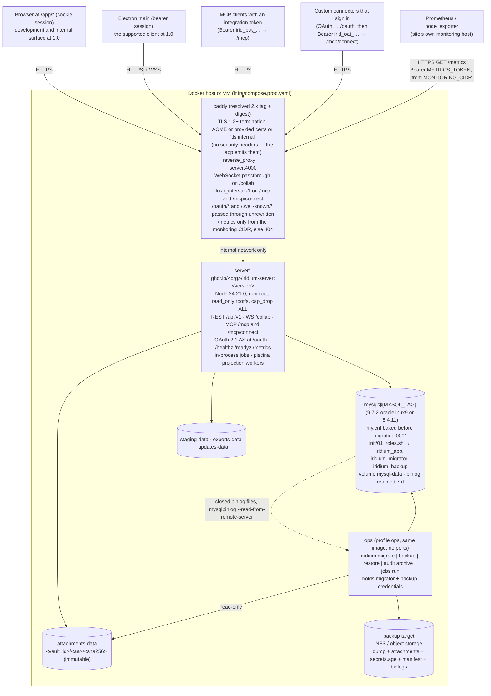
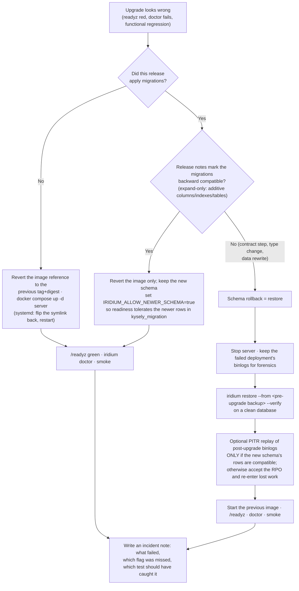
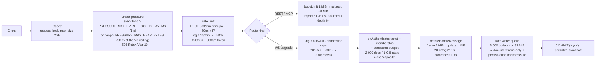

# Operations, deployment, and enterprise readiness

This section is the operator's contract for Iridium: how the server is deployed, configured, observed, backed up, upgraded, and repaired, and which controls an enterprise security review can verify. Everything here is implemented in `apps/server/src/{config,db,migrations,ops,audit,jobs,cli}`, `infra/**`, and `docs/ops/**`, and is exercised by the tests named in 10-testing-and-quality.md. The data model it operates on is defined in 03-data-model.md; the collaboration semantics it protects are defined in 05-collaboration-and-durability.md; the milestone in which each piece lands is 12-milestones.md (M0 for config/readiness/migrations/roles, M1 for the audit chain and the first CLI commands, M2 for maintenance jobs, M8 for the hardened compose, backup/restore drill, monitoring, and the upgrade rehearsal).

Vocabulary used throughout: **server** = the single Node 24.21.0 process built from `apps/server` (Fastify 5.12.4, embedded Hocuspocus 4.7.0, MCP SDK 2.0.0, in-process job scheduler, `iridium` CLI in the same binary); **ops service** = the same image run as a one-shot container with maintenance credentials; **backup set** = the five artefacts described in "Backup and restore" (dump, attachments, archived binlogs, secrets bundle, manifest) plus the command's own `backup.log`, which together allow a clean-deployment restore.

## Deployment topology

### Reference topology

The MVP deployment is one server container, one MySQL instance running either supported line — **MySQL 8.4 LTS** or **MySQL 9.7 LTS** (see "Database provisioning", *Choosing a MySQL line*) — one persistent attachment volume, and one TLS-terminating reverse proxy. There is exactly one server process per deployment: it owns every active Y.Doc, the in-process `TicketStore`, `AuthzBus`, rate-limit counters, and the per-vault structural mutex (skeleton A17, A23, A24, F9). Horizontal scaling is a documented non-goal for the MVP; every in-process singleton sits behind an interface so the Redis phase in the post-MVP roadmap does not change this topology's contract.



Network rules that make this topology safe:

| Rule | Where enforced |
|---|---|
| The server never has a published port. Caddy reaches it over a Compose network declared `internal: true` with a fixed subnet; the only published ports on the host are Caddy's 80/443. | `infra/compose.prod.yaml` `networks.iridium-internal` |
| MySQL never has a published port in production. The dev compose binds it to `127.0.0.1:3306` only. | `infra/compose.yaml`, `infra/compose.prod.yaml` |
| `BIND_ADDRESS` defaults to `127.0.0.1` (bare-metal/systemd profile with the proxy on the same host). The Compose profile sets `BIND_ADDRESS=0.0.0.0` because the container's network namespace is itself the isolation boundary and the network is internal. | `EnvSchema`, compose files |
| `TRUST_PROXY` is the proxy's CIDR (the fixed Caddy address inside the internal subnet, e.g. `172.28.0.10/32`, or `127.0.0.1/32,::1/128` for systemd). It is never `true`. Client IPs for rate limits, `sessions.ip`, `access_log.ip`, and audit context come from `X-Forwarded-For` only when the immediate peer is inside `TRUST_PROXY`. | `apps/server/src/security/request-ids.ts`, Fastify `trustProxy` |
| Outbound network inventory: the server makes no outbound connections except to MySQL; to the configured S3 endpoint when `ATTACHMENTS_DRIVER=s3`; and to the HTTPS URL of a **Client ID Metadata Document** when an OAuth client identifies itself by URL (`MCP_OAUTH_ENABLED=true` only, at most once per client per `OAUTH_CIMD_CACHE_SECONDS`, under the SSRF guard of 04-auth-and-access-control.md — `https:` only, a resolved public-unicast address with the socket pinned to it, one redirect, 32 KiB, 5 s). Caddy contacts the ACME directory only in the public `Caddyfile` variant; `Caddyfile.internal` (`tls internal`) makes no outbound connection at all. No telemetry, no update checks from the server (desktop clients poll the server's own `/api/v1/desktop/update-policy`). | `docs/ops/deployment.md` (published as the "what leaves the box" statement) |
| A site with no egress loses exactly one capability and is told which: a connector that identifies itself by a Client ID Metadata Document cannot be authorized, because its document cannot be fetched. Dynamic registration (`POST /oauth/register`) and administrator-registered clients need no egress and keep working, as do personal access tokens at `/mcp`. Such a site sets `OAUTH_ALLOW_CLIENT_ID_METADATA_DOCUMENTS=false` so the refusal is a policy with a message rather than a timeout, or `MCP_OAUTH_ENABLED=false` to remove the question entirely. | `docs/ops/oauth.md`, `nightly.yml › compose.prod clean-VM boot` (which runs egress-denied) |
| Monitoring reaches `/metrics` through one explicit, IP-restricted Caddy route — never through the catch-all — and still presents `METRICS_TOKEN`. Every other source gets `404`. | `infra/caddy/Caddyfile` `handle /metrics`, `METRICS_TOKEN`, `METRICS_ALLOW_CIDR` |

**Monitoring reachability (how Prometheus actually gets a scrape).** The server has no published port and its network is `internal: true`, so a scrape target has to be stated, not assumed — otherwise `up{job="iridium"}` and the whole rule file describe a scraper that cannot exist. The shipped default is a dedicated Caddy route, because it is the only variant that works for the common enterprise case of a central Prometheus on another host:

```caddyfile
# in the {$IRIDIUM_SITE} site block, BEFORE the catch-all reverse_proxy
handle /metrics {
  @mon remote_ip 10.30.0.0/24        # the site's Prometheus; edited in place, like `trusted_proxies`
  reverse_proxy @mon server:4000 {
    transport http { dial_timeout 5s  response_header_timeout 30s }
  }
  respond 404                        # every other client, before the bearer check
}
```

with the matching server-side configuration `METRICS_TOKEN_FILE=/run/secrets/metrics_token` and `METRICS_ALLOW_CIDR=10.30.0.0/24` (evaluated after `TRUST_PROXY` resolution, so it sees the scraper's address from `X-Forwarded-For`, not Caddy's `172.28.0.10`). Both gates are kept: `remote_ip` stops an unauthenticated probe at the edge, the bearer token stops a host inside the CIDR that should not scrape, and OPS-22's `404`-when-unconfigured rule means forgetting both leaves nothing exposed. `infra/monitoring/prometheus-scrape.yml` ships the corresponding job (`scheme: https`, `metrics_path: /metrics`, `authorization: {type: Bearer, credentials_file: /etc/prometheus/iridium_metrics_token}`, `scrape_interval: 15s`, `job_name: iridium` — the label every `up{job="iridium"}` expression matches) alongside `dashboard.json` and `alerts.yml`, and `docs/ops/deployment.md` walks through all three.

The documented alternative, for a Prometheus that runs in the same Compose project, is a second network: declare `iridium-monitoring: {}`, join the `server` service to it, attach the monitoring stack to it, and set `METRICS_ALLOW_CIDR` to that subnet — no Caddy route and nothing on the public origin. It is not the default only because it cannot serve an off-host scraper. The nightly `compose.prod clean-VM boot` job exercises the shipped default: it curls `/metrics` from inside the monitoring CIDR with the token (expects `200` and a non-empty `iridium_build_info`), from inside the CIDR without the token (`401`), and from outside it with the token (`404`).

### Supported clients

An operator has to tell users what to install, and a procurement reviewer asks what is supported. The answer at 1.0 is one sentence: **the desktop application is the supported client; the web host at `/app/*` is a development and internal surface** (01-vision-scope-and-principles.md §4.6).

| Client | Where it comes from | Commitment at 1.0 |
|---|---|---|
| Desktop application (Electron 44.3.0) on macOS 13+, Windows 10/11 (x64, arm64), Linux x64/arm64 | the six unsigned bundles `release.yml` publishes, served from `<PUBLIC_ORIGIN>/desktop/updates/<channel>/` once an administrator has run `iridium desktop-updates verify` and `iridium desktop-updates publish` | Supported. Deploy this to your people. It is unsigned and updates by manual download at 1.0 — see "Runbook: rolling a desktop fleet forward (1.0)" |
| Web host at `<PUBLIC_ORIGIN>/app/*`, current Chrome and Edge | served by the server itself; nothing to install or configure | Development and internal surface. It works and it is hardened, but it carries no support commitment at 1.0 |
| Firefox, WebKit, mobile browsers | — | Out of scope. The server does not block them; the project makes no claim about them and runs no tests against them |

`docs/ops/deployment.md` carries this table verbatim, in the client-distribution section, so an administrator reads the same commitment the plan makes. Nothing about the server changes with the client: `/app/*`, its CSP and its cache headers are configured exactly as specified in "Container images and build" and in 07-client-applications.md §6.2.

### `infra/compose.yaml` (development)

Purpose: give every developer and CI job the exact MySQL the product ships with, plus optional services for the S3 driver and full-container parity.

| Service | Definition |
|---|---|
| `mysql` | `image: mysql:${MYSQL_TAG}` with `MYSQL_TAG` set in the committed `infra/.env` to one of the two supported values (never `latest`, which is the innovation line; never `9.7` or `8.4` floating because a repo bug once silently upgraded 8.4 hosts to 9.7 — pin the patch, and pin the full tag including any suffix), `command` omitted (all settings come from the mounted `infra/docker/mysql/my.cnf`), `volumes: [mysql-data:/var/lib/mysql, ./docker/mysql/my.cnf:/etc/mysql/conf.d/iridium.cnf:ro, ./docker/mysql/init:/docker-entrypoint-initdb.d:ro]`, `environment: MYSQL_ROOT_PASSWORD_FILE=/run/secrets/mysql_root_password, MYSQL_DATABASE=iridium`, `ports: ["127.0.0.1:3306:3306"]`, `healthcheck: {test: ["CMD", "mysqladmin", "ping", "-h", "127.0.0.1", "--silent"], interval: 5s, timeout: 3s, retries: 20}` |
| `seaweedfs` (profile `s3`) | SeaweedFS at a pinned numeric tag (chosen at M0 with its licence check), `command: server -s3 -dir=/data`, `ports: ["127.0.0.1:8333:8333"]`; exercises the `s3` `StorageDriver` in integration tests with `S3_ENDPOINT=http://127.0.0.1:8333` |
| `server` (profile `full`) | Built from `infra/docker/server.Dockerfile` target `runtime`, `develop.watch` with `sync+restart` on `apps/server/dist` so `pnpm turbo run build --filter=@iridium/server` output is picked up; `IRIDIUM_MIGRATE_ON_BOOT=true`, `NODE_ENV=development`; used for "does the container behave like the dev process" parity checks, not for the daily loop |

The default developer loop is `docker compose up -d mysql` → `pnpm install` → `pnpm turbo run dev`; Testcontainers (10-testing-and-quality.md) starts its own MySQL for integration tests and does not depend on this compose file. The image it starts is whatever the shared selector `IRIDIUM_MYSQL_IMAGE` resolves to, and an **unset** selector resolves to `mysql:8.4.11` — the compatibility floor, not the reference production image. That default is deliberate: a construct that works on 9.7 and not on 8.4 must fail in the ordinary development loop and on the pull request, never only in a lane someone has to go and read.

### `infra/compose.prod.yaml` (hardened reference deployment)

This file is the deployment that `docs/ops/deployment.md` walks through verbatim and that the nightly `compose.prod clean-VM boot` job (skeleton A52) boots from scratch. Every hardening line below is asserted by that job (it inspects the running containers with `docker inspect` and fails if a setting drifted).

**The committed file is bootable, which constrains what may appear in it.** Exactly two placeholders are allowed, both of them the operator's: `<org>` (the GHCR owner) and `<digest>` (the server image digest printed in the release notes). Everything else is resolved in the checked-in file, and the two values the plan cannot know until M0 — the Caddy tag and its digest — live as `CADDY_TAG` / `CADDY_DIGEST` in the **committed** `infra/.env` (which `docker compose` loads automatically from the project directory), written by the M0 image-pin task with its licence check and maintained afterwards by Renovate's docker manager. The `${CADDY_TAG:?pin missing}` form makes a missing pin a hard startup failure rather than a silently floating tag, which is the same rule the MySQL image follows by pinning the patch. `ops.compose-lint.spec.ts` greps `infra/compose.prod.yaml`, `infra/caddy/*`, `infra/nginx/iridium.conf`, `infra/systemd/*` and `infra/.env` for `<…>` and fails on any occurrence other than `<org>` and `<digest>`, asserts that `infra/.env` sets `CADDY_TAG` and `CADDY_DIGEST` to concrete values, and asserts that `MYSQL_TAG` is exactly one of the two supported values (`9.7.2-oraclelinux9` or `8.4.11`) — so no release can ship a file that cannot start, and no site can float onto an untested engine by editing one line. The clean-VM job substitutes the two operator placeholders from the release under test (`sed` over a copy, both asserted non-empty) before `docker compose up`, which is what makes "boots from scratch, then passes `docker inspect`" a statement about the shipped file rather than about a hand-edited one.

`infra/.env` holds five deployment-shape values — `CADDY_TAG`, `CADDY_DIGEST`, `MYSQL_TAG`, `IRIDIUM_SITE`, `IRIDIUM_CADDYFILE` (plus `IRIDIUM_ACME_EMAIL` for the public variant) — and they are **Compose interpolation variables only**. Compose reads `.env` to expand `${…}` in the file; it does not inject it into any container, and the `server` service takes its configuration from `env_file: [./iridium.env]` and its own `environment:` block. So none of these names ever reaches `EnvSchema`, and the unknown-`IRIDIUM_*`-is-fatal rule (ARCH-25) is not tripped by them — the two files are deliberately separate, and `docs/ops/deployment.md` says which value belongs in which.

```yaml
# infra/compose.prod.yaml (abridged to the load-bearing lines)
name: iridium
networks:
  iridium-internal:
    internal: true
    ipam: { config: [ { subnet: 172.28.0.0/24 } ] }
  iridium-edge: {}
secrets:
  mysql_root_password:      { file: ./secrets/mysql_root_password }
  db_app_password:          { file: ./secrets/db_app_password }
  db_migrator_password:     { file: ./secrets/db_migrator_password }
  db_backup_password:       { file: ./secrets/db_backup_password }
  auth_password_pepper_v1:  { file: ./secrets/auth_password_pepper_v1 }
  audit_hmac_key_v1:        { file: ./secrets/audit_hmac_key_v1 }
  mcp_cursor_key_v1:        { file: ./secrets/mcp_cursor_key_v1 }
  metrics_token:            { file: ./secrets/metrics_token }
volumes:
  mysql-data: {}
  attachments-data: {}
  staging-data: {}
  exports-data: {}
  updates-data: {}
  caddy-data: {}
  caddy-config: {}
services:
  mysql:
    image: mysql:${MYSQL_TAG:?pin missing}      # 9.7.2-oraclelinux9 (committed default) or 8.4.11; both are required targets
    networks: { iridium-internal: { ipv4_address: 172.28.0.20 } }
    volumes:
      - mysql-data:/var/lib/mysql
      - ./docker/mysql/my.cnf:/etc/mysql/conf.d/iridium.cnf:ro
      - ./docker/mysql/init:/docker-entrypoint-initdb.d:ro
    environment:
      MYSQL_ROOT_PASSWORD_FILE: /run/secrets/mysql_root_password
      MYSQL_DATABASE: iridium
      IRIDIUM_DB_APP_PASSWORD_FILE: /run/secrets/db_app_password         # read by init/01_roles.sh (see "Roles")
      IRIDIUM_DB_MIGRATOR_PASSWORD_FILE: /run/secrets/db_migrator_password
      IRIDIUM_DB_BACKUP_PASSWORD_FILE: /run/secrets/db_backup_password
    secrets: [mysql_root_password, db_app_password, db_migrator_password, db_backup_password]
    healthcheck: { test: ["CMD", "mysqladmin", "ping", "-h", "127.0.0.1", "--silent"], interval: 10s, timeout: 5s, retries: 12, start_period: 60s }
    restart: unless-stopped
    security_opt: [no-new-privileges:true]
    deploy: { resources: { limits: { memory: 4g } } }
  server:
    image: ghcr.io/<org>/iridium-server:1.0.0@sha256:<digest>   # tag AND digest; the release notes carry the digest
    networks: { iridium-internal: { ipv4_address: 172.28.0.30 } }
    depends_on: { mysql: { condition: service_healthy } }
    env_file: [./iridium.env]                                      # non-secret configuration only
    environment:
      BIND_ADDRESS: 0.0.0.0
      TRUST_PROXY: 172.28.0.10/32
      DATABASE_PASSWORD_FILE: /run/secrets/db_app_password
      DATABASE_MIGRATE_PASSWORD_FILE: /run/secrets/db_migrator_password   # only when IRIDIUM_MIGRATE_ON_BOOT=true
      AUTH_PASSWORD_PEPPER_V1_FILE: /run/secrets/auth_password_pepper_v1
      AUDIT_HMAC_KEY_V1_FILE: /run/secrets/audit_hmac_key_v1
      MCP_CURSOR_KEY_V1_FILE: /run/secrets/mcp_cursor_key_v1
      METRICS_TOKEN_FILE: /run/secrets/metrics_token
      PROJECTION_WORKERS: 3                                          # Team profile; explicit so the shipped file never depends on quota detection
      NODE_OPTIONS: --max-old-space-size=1536
    secrets: [db_app_password, db_migrator_password, auth_password_pepper_v1, audit_hmac_key_v1, mcp_cursor_key_v1, metrics_token]
    volumes:
      - attachments-data:/data/attachments
      - staging-data:/data/staging
      - exports-data:/data/exports
      - updates-data:/data/desktop-updates
    read_only: true
    tmpfs: ["/tmp:size=512m,mode=1777"]
    cap_drop: [ALL]
    security_opt: [no-new-privileges:true]
    user: "10001:10001"
    healthcheck: { test: ["CMD", "node", "dist/healthcheck.mjs"], interval: 15s, timeout: 5s, retries: 3, start_period: 30s }
    stop_grace_period: 45s                                          # > SHUTDOWN_DRAIN_MS (20 s) + flushPendingStores() + destroy()
    restart: unless-stopped
    deploy: { resources: { limits: { memory: 2g, cpus: "2.0" } } }
  ops:
    profiles: [ops]
    image: ghcr.io/<org>/iridium-server:1.0.0@sha256:<digest>
    networks: [iridium-internal]
    depends_on: { mysql: { condition: service_healthy } }
    env_file: [./iridium.env]
    environment:
      DATABASE_PASSWORD_FILE: /run/secrets/db_app_password
      DATABASE_MIGRATE_PASSWORD_FILE: /run/secrets/db_migrator_password
      DATABASE_BACKUP_PASSWORD_FILE: /run/secrets/db_backup_password
      AUTH_PASSWORD_PEPPER_V1_FILE: /run/secrets/auth_password_pepper_v1
      AUDIT_HMAC_KEY_V1_FILE: /run/secrets/audit_hmac_key_v1
      MCP_CURSOR_KEY_V1_FILE: /run/secrets/mcp_cursor_key_v1
    secrets: [db_app_password, db_migrator_password, db_backup_password, auth_password_pepper_v1, audit_hmac_key_v1, mcp_cursor_key_v1]
    volumes:
      - attachments-data:/data/attachments:ro
      - ./backups:/backups
      - ./secrets:/secrets                                            # restore and keys rotate write here; same files the secrets: entries read
      # - /var/lib/node_exporter/textfile:/textfile                   # optional: target for `iridium backup --textfile-out /textfile/iridium_backup.prom`
    read_only: true
    tmpfs: ["/tmp:size=1g,mode=1777"]
    cap_drop: [ALL]
    security_opt: [no-new-privileges:true]
    user: "10001:10001"
    entrypoint: ["iridium"]
    command: ["--help"]
    deploy: { resources: { limits: { cpus: "2.0", memory: 2g } } }    # a backup must never starve the live writer's fsync path
  caddy:
    image: caddy:${CADDY_TAG:?pin missing}@${CADDY_DIGEST:?pin missing}  # both set in the committed infra/.env; no floating tag, no placeholder
    networks:
      iridium-internal: { ipv4_address: 172.28.0.10 }
      iridium-edge: {}
    ports: ["80:80", "443:443"]
    environment:
      IRIDIUM_SITE: ${IRIDIUM_SITE:?set IRIDIUM_SITE to the public host name, or to :443 with Caddyfile.internal}
    volumes:
      - ./caddy/${IRIDIUM_CADDYFILE:-Caddyfile}:/etc/caddy/Caddyfile:ro   # Caddyfile (public ACME) or Caddyfile.internal (local CA)
      - caddy-data:/data
      - caddy-config:/config
    cap_drop: [ALL]
    cap_add: [NET_BIND_SERVICE]
    security_opt: [no-new-privileges:true]
    restart: unless-stopped
```

Points that matter and are easy to get wrong:

- `read_only: true` on the server is real: the process writes only to the four mounted volumes and `/tmp`. Piscina workers, pino, and the MCP SDK write nothing to disk. The `logging-redaction.test` lane runs the server with a read-only filesystem in CI so a stray write is a test failure before it is a production incident.
- The server holds the migrator secret only when `IRIDIUM_MIGRATE_ON_BOOT=true` (the Compose default). Operators who set it to `false` remove `DATABASE_MIGRATE_PASSWORD_FILE` from the `server` service and run `docker compose run --rm ops migrate up` before each upgrade; readiness stays fail-closed either way.
- The `ops` service deliberately does **not** mount the MySQL data volume. MySQL owns its data directory as `mysql:mysql` with the datadir at `0750` and created files at `0640`, while the ops container runs as `user: "10001:10001"` — a read-only mount would make every `open()` of a binlog file fail with `EACCES` and artefact 3 of the backup set would be silently empty. Closed binary logs are streamed over the protocol instead (`mysqlbinlog --read-from-remote-server`, artefact 3), which is also the only variant that works against a managed or otherwise remote MySQL. The documented file-copy fallback needs `group_add: ["27"]` (the `mysql` gid inside the Oracle-Linux-based `mysql:9.7.2-oraclelinux9`; the Debian-based images — which is what `mysql:8.4.11` is unless the M0 image-pin task finds an Oracle-Linux-9 8.4 tag — use a different gid, so the number is per-image and must be read off the image in use, which is one more reason the protocol path is the shipped one) together with `MYSQL_BINLOG_DIR` pointing at a read-only mount of the data directory.
- `./secrets` and `./backups` on the host must be owned by uid `10001` (or mounted with matching ownership): the ops container is non-root, and both `restore` (step 2b) and `keys rotate` write key files into `/secrets` — the same host directory the top-level `secrets:` entries read, so a restored or rotated key is in place for the next `docker compose up -d server`.
- `stop_grace_period: 45s` exceeds `SHUTDOWN_DRAIN_MS` (20 000) plus `flushPendingStores()` and `hocuspocus.destroy()` (drain steps 7–8 in "Graceful shutdown"), so Docker never SIGKILLs a draining server. A SIGKILL is still safe for acknowledged edits (05-collaboration-and-durability.md, "Server restart"), but a graceful stop keeps checkpoints and projections current.
- Image references carry both a version tag and a digest. `release.yml` prints the digest in the release notes; `docs/ops/upgrade.md` tells operators to copy both.

### Reverse proxy configuration

Both shipped proxy configurations must (1) pass WebSocket upgrades on `/collab`, (2) keep idle WebSocket connections open for at least 120 s (Hocuspocus application-level ping is 30 s, provider `messageReconnectTimeout` 30 s; the proxy must never be the first to time out), (3) disable response buffering on `/mcp` so JSON responses are not delayed **and the `subscriptions/listen` stream a modern client opens today is not buffered** — `createMcpHandler` serves that one method over `text/event-stream` regardless of `responseMode: 'json'`, with a keep-alive comment frame every `keepAliveMs` (15 000) and at most `maxSubscriptions` (1 024) open streams, so a buffering proxy would hold the acknowledgement frame and the keep-alives (06-mcp-and-agent-access.md, D06-17), (4) forward the MCP request headers `Mcp-Method`, `Mcp-Name`, `Mcp-Param-*`, and `MCP-Protocol-Version` unmodified **and without restating them** — an absent header must stay absent, because the MCP dispatch reads presence (skeleton A48 gap fix — some proxies drop or lowercase-merge unknown headers, and a config that "helpfully" re-sets them turns a 2025-era client's missing header into an empty one; the nightly `proxied-stack MCP header passthrough` test sends all four through the full compose stack, asserts the server logged them, and repeats the call without them to assert none arrives), (5) set `X-Forwarded-For`/`X-Forwarded-Proto`, (6) not add their own security headers because `@fastify/helmet` 13.1.1 already emits HSTS, CSP (nonce), COOP, CORP, `Referrer-Policy`, and `X-Frame-Options` from the application, (7) serve `/metrics` only from an explicit route restricted to the monitoring CIDR, never through the catch-all (see "Monitoring reachability"), and (8) pass `/oauth/*` and `/.well-known/*` through to the application untouched — the same `Authorization` passthrough as everywhere else, no rewriting, no static-file handler, and no `Cache-Control` of the proxy's own on the two metadata documents (see "OAuth discovery through the proxy" below).

**Both MCP mounts are one proxy concern.** 06-mcp-and-agent-access.md mounts the identical MCP surface at `POST /mcp` (integration tokens) and `POST /mcp/connect` (OAuth connectors), so every rule that applies to `/mcp` applies unchanged to `/mcp/connect`: the same `flush_interval -1`, the same `response_header_timeout`, the same four MCP request headers passed through without being restated. The shipped matchers therefore name both paths explicitly rather than relying on an exact-path match that would drop `/mcp/connect` into the catch-all, where the default buffering would hold a `subscriptions/listen` stream. `ops.proxy-config.spec.ts` asserts that both paths resolve to the MCP block in both files.

`infra/caddy/Caddyfile` (the public-origin variant: automatic ACME):

```caddyfile
{
  email {$IRIDIUM_ACME_EMAIL}      # ACME account; omit and use `tls /certs/fullchain.pem /certs/privkey.pem` for provided certificates
  servers {
    trusted_proxies static private_ranges   # only if Caddy itself sits behind a load balancer; otherwise remove
    # No `timeouts` block on purpose. Caddy applies no read, write, or idle timeout by
    # default, which is exactly property (2): the proxy is never the first to time out a
    # `/collab` socket. The `timeouts` options that exist here (`read_body`, `read_header`,
    # `write`, `idle`) are per-server, so setting them would also apply to the hijacked
    # WebSocket connections and cut live editing sessions. Request size is bounded by
    # `request_body` below and again by `MAX_UPLOAD_BYTES`/`MAX_IMPORT_BYTES` in the server.
  }
}

{$IRIDIUM_SITE} {                  # e.g. docs.example.com; passed in by the compose file, never edited in place
  encode zstd gzip
  request_body { max_size 2GB }    # import uploads; the server enforces its own limits again

  # Caddy forwards `Mcp-Method`, `Mcp-Name`, `MCP-Protocol-Version` and `Mcp-Param-*`
  # unchanged; never restate them with `header_up`. The placeholder for a header a client
  # did not send resolves to the empty string, which would turn "header absent" into
  # "header present and empty" — and 06-mcp-and-agent-access.md dispatches on presence
  # (2026-07-28 clients must send them; 2025-era clients carry the method in the body).

  @collab path /collab
  reverse_proxy @collab server:4000 {
    flush_interval -1                             # no buffering, no proxy read timeout: WebSocket passthrough
    transport http { dial_timeout 5s }
  }

  @mcp path /mcp /mcp/connect          # both mounts; `path` is exact, so /mcp/connect is named, never inferred
  reverse_proxy @mcp server:4000 {
    flush_interval -1
    transport http { dial_timeout 5s  response_header_timeout 120s }
  }

  # OAuth authorization server and the discovery documents. No buffering change is needed
  # and none is made; what matters is that `Authorization` passes through untouched, that
  # nothing rewrites or collapses /.well-known/*, and that Caddy adds no Cache-Control of
  # its own — the application sets `public, max-age=3600` on the two metadata documents and
  # `no-store` on /oauth/token, /oauth/revoke and the consent page.
  # This matcher does NOT capture the ACME HTTP-01 challenge: Caddy installs that handler
  # ahead of every site route, so /.well-known/acme-challenge/* is answered by Caddy itself
  # and never reaches the application. A proxy that has no such precedence (nginx below, or
  # a platform gateway) must order its own ACME location before this one.
  @oauth path /oauth /oauth/* /.well-known/*
  reverse_proxy @oauth server:4000 {
    transport http { dial_timeout 5s  response_header_timeout 30s }
  }

  handle /metrics {                               # the only monitoring ingress; see "Monitoring reachability"
    @mon remote_ip 10.30.0.0/24                   # the site's Prometheus
    reverse_proxy @mon server:4000 {
      transport http { dial_timeout 5s  response_header_timeout 30s }
    }
    respond 404
  }

  reverse_proxy server:4000 {
    transport http { dial_timeout 5s  response_header_timeout 300s }   # export downloads and import uploads
  }
}
```

`infra/caddy/Caddyfile.internal` (the second committed variant: **no ACME, no public name, no outbound connection**). It differs from the file above in exactly two places — no global `email`/ACME block, and a `tls internal` line in the site block — so both are rendered from one source by `pnpm gen` (a drift between them is a `ci.yml › static` failure, like every other generated artefact) and `ops.proxy-config.spec.ts` validates both:

```caddyfile
# No global `email` and no ACME: `tls internal` issues from Caddy's own local CA, which
# needs no outbound HTTPS and no resolvable public name. This is the variant the nightly
# `compose.prod clean-VM boot` and every egress-denied run use (control C48), and the one
# an air-gapped site uses when it terminates TLS at the proxy rather than in-process.
# The `servers` block is omitted for the same reason as above: Caddy's defaults are the
# no-timeout behaviour `/collab` needs.

{$IRIDIUM_SITE} {                  # typically `:443` or an internal name; ACME is never attempted
  tls internal                     # local CA; `caddy trust` (or the exported root) installs it on clients
  encode zstd gzip
  request_body { max_size 2GB }
  # … the @collab, @mcp, @oauth, handle /metrics and catch-all blocks are byte-identical to Caddyfile
}
```

Selecting it is one variable: `IRIDIUM_CADDYFILE=Caddyfile.internal` in `infra/.env`, which is why the compose mount is `./caddy/${IRIDIUM_CADDYFILE:-Caddyfile}`. The clean-VM job sets it together with `IRIDIUM_SITE=:443`, pulls the local CA root out of the `caddy-data` volume, and curls the stack with `--cacert`; nothing in the run requires the ACME directory, a DNS name, or any other egress, so C48's "runs with an egress-denying network and still passes" is reproducible rather than aspirational. `PUBLIC_ORIGIN` still names the external origin the clients use, and the internal root is distributed exactly as in the air-gapped in-process profile (07-client-applications.md, server profiles).

Every subdirective above is one Caddy's `http` transport actually accepts (`dial_timeout`, `response_header_timeout`, `flush_interval` is a `reverse_proxy` directive). `read_timeout`/`write_timeout` are **not** transport options — they are per-server `timeouts` options — so a Caddyfile that puts them inside `transport http` fails `caddy validate` and the container never starts. `ops.proxy-config.spec.ts` runs `caddy validate --config infra/caddy/Caddyfile`, `caddy validate --config infra/caddy/Caddyfile.internal`, and `nginx -t -c infra/nginx/iridium.conf` in the nightly lane precisely so a proxy config that cannot load is a test failure rather than a failed deployment, and the nightly `proxied-stack MCP header passthrough` test additionally asserts that a request sent **without** `Mcp-Method` arrives without it.

`infra/nginx/iridium.conf` (equivalent, documented for sites that standardise on nginx):

```nginx
map $http_upgrade $connection_upgrade { default upgrade; '' close; }
upstream iridium { server 127.0.0.1:4000; keepalive 32; }

server {
  listen 443 ssl http2;                      # HTTP/2 to the client is fine; the upstream is HTTP/1.1
  server_name docs.example.com;
  ssl_certificate     /etc/ssl/iridium/fullchain.pem;
  ssl_certificate_key /etc/ssl/iridium/privkey.pem;
  ssl_protocols TLSv1.2 TLSv1.3;
  client_max_body_size 2g;
  proxy_http_version 1.1;
  proxy_set_header Host $host;
  proxy_set_header X-Forwarded-For $proxy_add_x_forwarded_for;
  proxy_set_header X-Forwarded-Proto $scheme;
  proxy_set_header X-Request-Id $request_id;
  underscores_in_headers on;
  proxy_pass_request_headers on;             # Mcp-Method, Mcp-Name, Mcp-Param-*, MCP-Protocol-Version pass through unchanged
                                             # (and are never set here: an absent header must stay absent)

  location = /collab {
    proxy_pass http://iridium;
    proxy_set_header Upgrade $http_upgrade;
    proxy_set_header Connection $connection_upgrade;
    proxy_read_timeout 3600s;
    proxy_send_timeout 3600s;
    proxy_buffering off;
  }
  location ~ ^/mcp(/connect)?$ {             # both mounts, and nothing else: /mcpfoo is not an MCP path.
                                             # A regex location is evaluated before `location /`, so the
                                             # catch-all (and its buffering) can never claim /mcp/connect
    proxy_pass http://iridium;
    proxy_buffering off;                     # a subscriptions/listen stream is text/event-stream
    proxy_request_buffering off;
    proxy_read_timeout 120s;                 # safe for a held-open listen stream: the SDK writes a
                                             # keep-alive comment frame every 15 s (keepAliveMs)
  }
  location ^~ /oauth/ {                      # authorization server; no rewriting, no added Cache-Control
    proxy_pass http://iridium;
    proxy_read_timeout 30s;
  }
  location ^~ /.well-known/ {                # RFC 9728 / RFC 8414 discovery. `^~` so no other block,
                                             # and no static-file handler, can claim these paths.
                                             # This config terminates TLS with provided certificates, so
                                             # nothing here renews them. A site that renews with certbot's
                                             # webroot plugin adds `location ^~ /.well-known/acme-challenge/`
                                             # with its own `root` ABOVE this block — nginx prefers the
                                             # longer `^~` prefix, so the two do not fight
    proxy_pass http://iridium;
    proxy_read_timeout 30s;
  }
  location = /metrics {                      # the only monitoring ingress; bearer token still required
    allow 10.30.0.0/24;                      # the site's Prometheus
    deny all;
    proxy_pass http://iridium;
    proxy_read_timeout 30s;
  }
  location / {
    proxy_pass http://iridium;
    proxy_read_timeout 300s;
  }
}
server { listen 80; server_name docs.example.com; return 301 https://$host$request_uri; }
```

All three files — `Caddyfile`, `Caddyfile.internal`, `nginx/iridium.conf` — are checked in with a `docs/ops/deployment.md` walkthrough, and the nightly proxied-stack job runs the public Caddy variant and the nginx config while the clean-VM job runs the internal variant; a site using another proxy is told which eight properties to reproduce.

**OAuth discovery through the proxy (the failure an operator will not see in-process).** Iridium serves two mounts of one MCP surface, and which credential a client offers is decided by what the **discovery URLs** say, not by what the request carries: `/mcp` must return `404` from all four of `/.well-known/oauth-protected-resource/mcp`, `/.well-known/oauth-protected-resource`, `/.well-known/oauth-authorization-server` and `/.well-known/openid-configuration`, while `/mcp/connect` must return `200` from `/.well-known/oauth-protected-resource/mcp/connect` (06-mcp-and-agent-access.md; 04-auth-and-access-control.md). Two proxy misconfigurations break that silently:

- A proxy that **rewrites or collapses `/.well-known/*` onto a static file handler** — a common default on platform hosts, added for ACME — swallows the PRM document, so a connector's discovery fails at a URL the application never sees.
- A proxy or platform gateway that **serves its own `/.well-known/oauth-protected-resource`** at the root path re-opens the client bug this split exists to route around: a session configured at `/mcp` with a static `Authorization` header finds a root PRM document, starts an OAuth flow before it ever sends that header, and reports a connected server that exposes only `authenticate` and `complete_authentication`.

Both are invisible to any in-process check, which is why `iridium doctor --oauth` fetches the four paths **through `PUBLIC_ORIGIN`** rather than over the loopback, and fails when any of them returns anything but `404`. Run it after any proxy change, and treat it as the acceptance test for a proxy this section does not ship a configuration for.

### Air-gapped in-process TLS profile

For hosts with no proxy and no ACME reachability, the server terminates TLS itself. Fastify is constructed with `https: { key, cert, minVersion: 'TLSv1.2' }` read from `TLS_CERT_FILE` and `TLS_KEY_FILE`; HTTP/1.1 only, because Node's HTTP/2 server does not carry WebSocket upgrades. In this profile `TRUST_PROXY` is unset (no forwarded headers are honoured), `BIND_ADDRESS` is the host's interface address, `PORT` is typically `443` (bind capability granted by systemd `AmbientCapabilities=CAP_NET_BIND_SERVICE`, never by running as root), `PUBLIC_ORIGIN` still names the external origin, and the internal CA that issued the certificate is distributed to desktop clients through the OS trust store or a per-profile fingerprint pin (07-client-applications.md, server profiles). Certificate renewal is an operator restart: `iridium doctor --tls` reports the certificate's expiry and subject alternative names, and the alert rule `IridiumTlsCertExpiringSoon` (30 d) fires from the `iridium_tls_cert_expiry_timestamp` gauge that only exists in this profile.

### systemd unit (non-container hosts)

`infra/systemd/iridium.service` runs the same `dist/main.mjs serve` on a host with Node 24.21.0 installed via `mise` (`.node-version`), using the identical environment and `_FILE` secret layout (`/etc/iridium/iridium.env`, `/etc/iridium/secrets/*` mode `0400` owned by `iridium`; the directory itself is `0700` owned by `iridium` so `iridium restore --secrets-dir /etc/iridium/secrets` and `iridium keys rotate` can write a restored or rotated key where the unit will read it, and `/var/lib/iridium/backups` is likewise `iridium`-owned):

```ini
[Unit]
Description=Iridium documentation server
After=network-online.target mysql.service
Wants=network-online.target

[Service]
Type=notify                      # the server calls sd_notify READY=1 after /readyz would pass (via NOTIFY_SOCKET)
User=iridium
Group=iridium
EnvironmentFile=/etc/iridium/iridium.env
WorkingDirectory=/opt/iridium
ExecStartPre=/opt/iridium/bin/iridium config check
ExecStartPre=/opt/iridium/bin/iridium migrate up        # remove for hosts that migrate out of band
ExecStart=/usr/bin/node --enable-source-maps --max-old-space-size=1536 /opt/iridium/dist/main.mjs serve
KillSignal=SIGTERM
TimeoutStopSec=45
Restart=on-failure
RestartSec=5
NoNewPrivileges=true
ProtectSystem=strict
ProtectHome=true
PrivateTmp=true
ReadWritePaths=/var/lib/iridium/attachments /var/lib/iridium/staging /var/lib/iridium/exports /var/lib/iridium/desktop-updates
CapabilityBoundingSet=
AmbientCapabilities=            # add CAP_NET_BIND_SERVICE only in the air-gapped TLS profile on port 443
LimitNOFILE=65536

[Install]
WantedBy=multi-user.target
```

`Type=notify` with `sd_notify` is implemented in `apps/server/src/ops/sd-notify.ts` (a datagram write to `NOTIFY_SOCKET`; no dependency) so `systemctl start` blocks until the server is actually ready, and `STOPPING=1` is sent when the drain begins.

## Container images and build

### `infra/docker/server.Dockerfile`

One multi-stage Dockerfile produces the only production image, `ghcr.io/<org>/iridium-server:<version>`. The image contains the server, the `iridium` CLI (same entry point), the migrations, the web bundle it serves at `/app/*`, and the MySQL client tools the CLI needs for backup and restore.

| Stage | Base | Steps |
|---|---|---|
| `base` | `node:24.21.0-bookworm-slim` | `corepack` disabled; `npm i -g pnpm@12.4.1` (pinned; `ghcr.io/pnpm/pnpm:12.4.1` is the documented alternative for the build stages); `ENV PNPM_HOME=/pnpm`; `ENV CI=true` |
| `prune` | `base` | `COPY . .` → `pnpm dlx turbo@2.10.12 prune @iridium/server --docker` → produces `out/json` (lockfile + package manifests only) and `out/full` |
| `build` | `base` | `COPY --from=prune /app/out/json/ .`, `COPY --from=prune /app/out/pnpm-lock.yaml ./`, `COPY --from=prune /app/out/pnpm-workspace.yaml ./` → `RUN --mount=type=cache,id=pnpm,target=/pnpm/store pnpm fetch --store-dir=/pnpm/store` (dependency-keyed fetch cache) → `COPY --from=prune /app/out/full/ .` → `RUN --mount=type=cache,id=pnpm,target=/pnpm/store pnpm install --offline --frozen-lockfile --store-dir=/pnpm/store` (install against the final source and patch files before `verifyDepsBeforeRun: error` checks them; the pruned lockfile must install cleanly, and CI runs this stage on every PR to catch the turbo-prune regression class) → `pnpm turbo run build --filter=@iridium/server... --filter=@iridium/web` (tsdown bundles the server with every `@iridium/*` workspace package inlined into `dist/main.mjs`; Vite 8 builds the web bundle) → `pnpm deploy --filter=@iridium/server --prod /prod/server` (third-party production dependencies only; `@node-rs/argon2` resolves to its prebuilt `linux-x64-gnu`/`linux-arm64-gnu` binary — no toolchain is installed in any stage, and the build fails if a native build script is attempted because `allowBuilds` does not list it) |
| `runtime` | `node:24.21.0-bookworm-slim` | Apply available Debian package updates and install `ca-certificates`, `tini`, `libncurses6` and `libssl3`; remove unused npm/Corepack/Yarn runtime tooling; copy `mysqldump`, `mysql`, and `mysqlbinlog` from the isolated `mysql-client` stage. That stage extracts Oracle's `mysql-community-client-9.7.2-1.el9` RPM for `x86_64` or `aarch64`, with a pinned SHA-256, verified release-key fingerprint and mandatory RPM signature. The signed RPM's exact version/file-ownership database and license/README also enter the image, so SBOM tooling uses package metadata rather than a truncated binary-string version. RPM installation is metadata-only with scripts/triggers disabled; the RPM executable stays in the extraction stage. All three tools execute in the final runtime base during the build. OPS-04's 2026-09-20 amendment replaces the x86-only APT source so both release architectures use one client packaging path. One client serves both server lines: the tools are the 9.7.2 revision because a client must be at least as new as the server it reads, and `db-grants.integration` proves them against `mysql:8.4.11` as well as `mysql:9.7.2-oraclelinux9` by running the shipped `MYSQLDUMP_ARGV` to completion on each and loading each dump back. A separate 8.4 client set was rejected: two dump tools in one image is two backup paths, and the one that is exercised less is the one that fails in a drill; `groupadd -g 10001 iridium && useradd -u 10001 -g iridium -M iridium`; `COPY --from=build --chown=10001:10001 /prod/server/dist /app/dist`, `/prod/server/node_modules /app/node_modules`, `/prod/server/package.json /app/package.json`, `/prod/server/migrations /app/migrations`, `/prod/server/web /app/web` (the built SPA); `COPY infra/docker/iridium /usr/local/bin/iridium` (a 3-line shell shim: `exec node --enable-source-maps /app/dist/main.mjs "$@"`); `ENV NODE_ENV=production IRIDIUM_WEB_DIR=/app/web`; `USER 10001:10001`; `WORKDIR /app`; `HEALTHCHECK --interval=15s --timeout=5s --start-period=30s --retries=3 CMD ["node", "/app/dist/healthcheck.mjs"]`; `ENTRYPOINT ["tini", "--", "node", "--enable-source-maps", "/app/dist/main.mjs"]`; `CMD ["serve"]` |

`dist/healthcheck.mjs` is a 20-line script emitted by the same tsdown build: it performs `GET http://127.0.0.1:${PORT}/healthz` (or HTTPS with `rejectUnauthorized:false` against the loopback in the air-gapped profile) and exits `0` on HTTP 200, `1` otherwise. The slim base image has no `curl`, and adding one for a health probe is a needless attack surface.

`tini` is the PID 1 so SIGTERM from `docker stop` reaches Node exactly once and zombie worker processes are reaped; Node's own signal handling then runs the drain sequence.

Multi-architecture: `linux/amd64` and `linux/arm64` are built by `docker/build-push-action@v7.3.0` with `provenance: mode=max` and `sbom: true`; syft produces a CycloneDX SBOM attached to the release and grype scans it (both tools pinned by digest at M0; a `critical` or `high` finding with a fix available fails `release.yml`). **OPS-04 amendment (2026-09-20):** the workflow scans both platforms explicitly at the same pushed index digest, retaining separate CycloneDX and vulnerability reports; a runner-default scan of only its native platform is insufficient. Image hygiene executes the version/commit and shipped-client checks on both architectures. Report upload also preserves partial evidence on a failed release.

### Image hygiene checks that run in CI

| Check | Job | Failure means |
|---|---|---|
| Pruned lockfile installs with `--frozen-lockfile` | `ci.yml › integration` (builds stage `build`) | turbo prune dropped a dependency |
| No native build scripts ran | Dockerfile `RUN` asserts `pnpm store status` reports zero built packages other than the `allowBuilds` list | a dependency started compiling in the image |
| Image runs as UID 10001 with a read-only rootfs and starts to `/readyz` green against `mysql:8.4.11` and `mysql:9.7.2-oraclelinux9` | `ci.yml › integration (mysql:8.4.11)` and `ci.yml › integration (mysql:9.7.2-oraclelinux9)` (`compose up` smoke) | privilege or writable-path regression |
| `iridium --version` inside the image equals the Changesets version and the `iridium_build_info` metric | `release.yml` | version drift between image, web bundle, desktop bundles, bridge |
| SBOM attached, grype clean at `high` | `release.yml` | vulnerable dependency shipped |
| `mysqldump --version` inside the image reports `9.7.x` | `release.yml` | backup tooling regressed |
| `MYSQLDUMP_ARGV` completes against both supported server images, and each dump loads back through the shipped `mysql` client | `ci.yml › integration` (both entries) | the shipped client cannot dump one of the two required engines |

### Versioning and tags

Changesets keeps one product version across the server image, the web bundle, the desktop bundles, and `iridium-mcp` (skeleton A1, A54). The bundle file names carry the same version string, so `Iridium-1.2.3-darwin-arm64.zip`, `ghcr.io/<org>/iridium-server:1.2.3` and `GET /meta.serverVersion` are the same number. Stable image tags are `1.2.3` (immutable), `1.2` and `1` (floating, updated by `release.yml`), never `latest`. A prerelease such as `1.2.3-rc.1` publishes only that exact immutable tag and never advances the stable minor or major aliases. The desktop release feed and `GET /meta {serverVersion, apiVersion, minClientVersion}` report the same version string, and `iridium_build_info{version, commit, node}` exposes it to Prometheus so a dashboard can show which version each environment runs.
## Configuration and secrets

### `EnvSchema` (`apps/server/src/config/env.ts`)

Configuration is one zod 4.6.2 object schema parsed exactly once at process start (`loadConfig()`), for `serve` and for every CLI command. Rules that apply to the whole schema:

- Every secret accepts a `<NAME>_FILE` twin; when both are set the file wins and the plain value is refused (`config.secret_both_forms`). Files are read once, trimmed of a single trailing newline, and must not be world-readable (mode check on POSIX; a warning on Windows dev hosts).
- Parse failure prints `z.prettifyError(error)` to stderr and exits `2`; nothing else has started (no pool, no listener), so a bad deployment fails in the first second and `docker compose up` shows the reason.
- After a successful parse a redacted summary is logged at `info` (`config.loaded`) in the one rendering every surface uses (decision ARCH-28 in 02-system-architecture.md, produced by `redactConfig()`): each configured secret prints as `<set: versions v1,v2; sha256:ab12cd34>` — the first eight hex characters of the SHA-256 of the material — a file-sourced value additionally naming its origin as `<set: file:/run/secrets/audit_hmac_v2; sha256:ab12cd34>`, and an unset optional secret as `<unset>`. A bare `***` is **not** an accepted rendering: the fingerprint is the operator control that answers "do these two hosts carry the same key?" after a restore or a rotation, and the path is what names the mount to fix. `docs/runbooks/key-compromise.md` and `docs/runbooks/rotate-db-passwords.md` therefore both open their triage with `iridium config check` on each host and a comparison of the `sha256:<8 hex>` fingerprints per key version against `iridium keys status` — a fingerprint that differs between two hosts, or between a host and the bundle a restore installed, is the finding, and neither the comparison nor the log line reveals any material.
- Any environment variable starting with `IRIDIUM_` that the schema does not know is a fatal error (`config.unknown_key`, exit `2`) — typo protection for the most sensitive knobs. Other unknown variables are ignored. The rule has exactly one carve-out, and it is a requirement rather than a loophole (decision ARCH-25 in 02-system-architecture.md): the test harness owns `IRIDIUM_*` names of its own (10-testing-and-quality.md D10-5) and the `child` harness mode spawns *this* binary with the whole job environment, so an unqualified fatal rule would kill the server in every CI lane that exports `IRIDIUM_PROP_RUNS` or `IRIDIUM_MYSQL_IMAGE` — including the chaos lane, the only one that can prove the durability invariants. `EnvSchema` therefore lists as **known-and-ignored** the prefixes `IRIDIUM_TEST_*`, `IRIDIUM_PROP_*`, `IRIDIUM_CHAOS_*`, `IRIDIUM_E2E_*`, `IRIDIUM_FIXTURE_*`, `IRIDIUM_COVERAGE_*` and the exact names `IRIDIUM_MYSQL_IMAGE`, `IRIDIUM_USER_DATA`, `IRIDIUM_SERVER_URL`, `IRIDIUM_MCP_TOKEN`; `iridium config check` prints them under "ignored harness keys" so an operator can see a name was recognised and deliberately not used. No product key ever uses those prefixes — `IRIDIUM_MIGRATE_ON_BOOT`, `IRIDIUM_ALLOW_NEWER_SCHEMA`, `IRIDIUM_ALLOW_UNTESTED_MYSQL`, `IRIDIUM_WEB_DIR`, `IRIDIUM_FAULT` and `IRIDIUM_E2E` are the only `IRIDIUM_*` keys this schema reads — which is what keeps the carve-out from weakening typo protection, and `IRIDIUM_ALLOW_NO_ORIGIN_WS` stays rejected by name so nobody reintroduces the Origin bypass (skeleton A24).
- Turborepo `envMode: strict` lists for `@iridium/server` are generated from the schema keys; CI diffs them (`ci.yml › static`).
- Values that admins may raise in `server_settings` (session TTLs, PAT policy, password policy, retention) are **floors/defaults** from env: the effective value is `max(env, setting)` for security-tightening knobs and the setting for the others; the precedence table is in `docs/ops/configuration.md` and enforced in `apps/server/src/config/effective.ts`.
- The two test knobs are handled differently, because only one of them is a server knob at all. `IRIDIUM_FAULT` is accepted **only** when `NODE_ENV=test` and refused everywhere else, production and development alike (`config.test_knob_in_production`) — it arms the fault registry, which exists only in that mode. `IRIDIUM_E2E` is **rejected by name in every environment**, with a hint: no server process reads it, so setting it on the server is a configuration copied from somewhere it belongs. Where it belongs is two other processes — the `vite build` that produces the web bundle for the E2E lane, where it gates the host-contract runner and the editor host's `WeakRef` registry, and the **desktop main process**, which Playwright's `electron` project launches with `IRIDIUM_E2E: '1'` in its environment to disable the updater and the single-instance lock (10-testing-and-quality.md, "End-to-end projects"; 07-client-applications.md §7.2, §7.15). The server in that same lane needs only `NODE_ENV=test`.

| Key | Type / default | Notes |
|---|---|---|
| **Process** | | |
| `NODE_ENV` | `development \| test \| production`; image sets `production` | drives dev-only routes (`/docs`, Vite origins), test knobs |
| `BIND_ADDRESS` | IP, `127.0.0.1` | `0.0.0.0` only for the Compose profile (the internal network is the boundary) or the air-gapped profile (decision ARCH-03; the `IridiumConfig` field is `server.bindAddress`) |
| `PORT` | int, `4000` | |
| `PUBLIC_ORIGIN` | URL, **required**; `https:` unless `NODE_ENV=development` | cookie flags, WS Origin allowlist, CSRF host, the MCP `resource` of both mounts, the OAuth issuer `<PUBLIC_ORIGIN>/oauth`, set-password links, desktop download URLs |
| `PUBLIC_HOST` | hostname, derived from `PUBLIC_ORIGIN` | `hostHeaderValidation([PUBLIC_HOST])` on `/mcp` and the Host guard everywhere |
| `TRUST_PROXY` | CIDR list, unset | never `true`; unset = forwarded headers ignored |
| `TLS_CERT_FILE`, `TLS_KEY_FILE` | paths, unset | both set → in-process TLS profile; one set → error |
| `SHUTDOWN_DRAIN_MS` | int, `20000` | writer drain bound on SIGTERM |
| `UV_THREADPOOL_SIZE` | int, `8` | **Set in the environment, never by the process.** libuv reads it once, before any JavaScript runs, so an assignment inside `main.ts` is always too late; `infra/docker/server.Dockerfile` sets it as an image `ENV` and `infra/compose.prod.yaml` sets it again on the `server` service, and the systemd unit documents the equivalent. The schema only **observes** it and logs a warning when it is unset or below 8, because argon2id at 150–300 ms would otherwise serialise on the default pool of four (skeleton A29) |
| `PRESSURE_MAX_HEAP_BYTES` | bytes, default `floor(0.9 × v8.getHeapStatistics().heap_size_limit)` measured at boot | `@fastify/under-pressure` `maxHeapUsedBytes`. Deriving it from the real V8 ceiling is what keeps the threshold correct on every sizing profile instead of only the one whose `--max-old-space-size` a constant happened to match; `0` disables heap-based shedding (the container limit then governs, and the process OOMs instead of refusing — documented, never the default). `iridium config check` fails with `config.pressure_above_heap_limit` when a set value is ≥ `heap_size_limit` |
| `PRESSURE_MAX_EVENT_LOOP_DELAY_MS` | int, `1000` | `@fastify/under-pressure` `maxEventLoopDelay` |
| **Database** | | |
| `DATABASE_URL` | `mysql://iridium_app@host:3306/iridium`, **required** | app role; password from `DATABASE_PASSWORD[_FILE]` (URL-embedded password allowed only in `development`) |
| `DATABASE_PASSWORD[_FILE]` | secret | |
| `DATABASE_MIGRATE_URL`, `DATABASE_MIGRATE_PASSWORD[_FILE]` | migrator role | required by `migrate`, `restore`, `audit archive`, `jobs run access_log_partitions`; optional for `serve` (`IRIDIUM_MIGRATE_ON_BOOT` and DDL maintenance jobs) |
| `DATABASE_BACKUP_URL`, `DATABASE_BACKUP_PASSWORD[_FILE]` | backup role | required by `backup`, `doctor --backup-role` |
| `DB_POOL_APP` | int, `20` | `dbApp` pool |
| `DB_POOL_PERSIST` | int, `4` | `dbPersist` pool; also the global persistence concurrency (skeleton A21) |
| `DB_CONNECT_TIMEOUT_MS` | int, `10000` | mysql2 `connectTimeout` |
| `DB_QUERY_TIMEOUT_MS` | int, `10000`, range `3000`–`2147483647` | Deadline for each pool acquisition and SQL command on `dbApp` / `dbPersist`; destroys a timed-out connection before returning the failure. Independent of connect timeout; does not apply to maintenance or backup commands. A timed-out COMMIT has an unknown outcome. Serving InnoDB and metadata lock waits are `floor(value / 2000)` seconds, leaving room for `503 busy` before this deadline. |
| `IRIDIUM_MIGRATE_ON_BOOT` | bool, `false` (Compose files set `true`) | see "Migrations at startup" |
| `IRIDIUM_ALLOW_NEWER_SCHEMA` | bool, `false` | rollback aid: allow serving when unknown newer migrations are applied (expand/contract guarantees N-1 compatibility) |
| `IRIDIUM_ALLOW_UNTESTED_MYSQL` | bool, `false` | the `db` plugin reads `SELECT VERSION()` at boot and refuses to start unless the server is `8.4.x` (≥ 8.4.11) or `9.7.x` (≥ 9.7.2) — `config.mysql_unsupported`, exit `2`. `true` downgrades that refusal to a logged warning plus a **permanent** `/readyz` `mysql_version: warn` naming the version. Documented as unsupported; it exists for one case, a future LTS the product has not yet certified (OPS-62) |
| `READYZ_STRICT_DURABILITY` | bool, `true` in the image, `false` in `development` | `innodb_flush_log_at_trx_commit != 1` fails readiness instead of warning |
| **Keys and secrets** (versioned keyring families `<NAME>_V<n>`; the version *in use* is `schema_meta`, never the environment — decision ARCH-09) | | |
| `AUTH_PASSWORD_PEPPER_V<n>[_FILE]` | secret, 32 bytes base64, at least `V1` required | every version referenced by `user_credentials.pepper_version` must be configured, and the version named by `schema_meta.pepper_version` must exist (boot check) |
| `AUDIT_HMAC_KEY_V<n>[_FILE]` | secret, 32 bytes base64, at least `V1` required | every version referenced by `audit_events.key_version` must be configured (boot check + `verify-chain`); `schema_meta.audit_key_version` names the one that signs new rows |
| `MCP_CURSOR_KEY_V<n>[_FILE]` | secret, 32 bytes base64, at least `V1` required | signs MCP/REST pagination cursors with the version named by `schema_meta.cursor_key_version`; **every loaded version is accepted for verification**, which is what bounds a rotation overlap to the 1 h cursor lifetime without a separate `_PREVIOUS` key |
| `METRICS_TOKEN[_FILE]` | secret, unset | bearer for `/metrics`; alternative `METRICS_ALLOW_CIDR` |
| `METRICS_ALLOW_CIDR` | CIDR list, unset | `/metrics` allowed without a token from these peers (after `TRUST_PROXY` resolution) |
| `ATTACHMENTS_ENCRYPTION` | `none` only | `aes256gcm` and the reserved keyring `ATTACHMENT_KEY_V<n>[_FILE]` are refused with `config.not_implemented` because application-level envelope encryption is **not implemented**. This is an answered decision, not an open question (G4, 2026-09-12): encryption at rest is volume encryption plus, optionally, MySQL InnoDB tablespace encryption, and the envelope columns and this value stay reserved for a later release |
| **Authentication policy floors** | | |
| `ARGON2_MEMORY_KIB`, `ARGON2_TIME_COST` | int, `65536`, `3` | These are the **schema** defaults and they apply on every host — a developer machine, a CI runner, a deployment that sets nothing — which is why the calibrated pair is not one of them. Spike S13 measured them at p50 47.80 ms on the 4 vCPU / 4 GiB reference container and measured `131072`/`6` centred in the 150–300 ms window at p50 213.51 ms; that pair is set at the deployment layer instead, in `infra/compose.prod.yaml`'s `server` service and `docs/ops/configuration.md`. `parallelism` stays `1`. `iridium doctor --argon2` (M1+) re-calibrates on a given host and warns rather than fails |
| `SESSION_WEB_IDLE_HOURS`, `SESSION_WEB_ABSOLUTE_DAYS` | int, `24`, `14` | floors for `server_settings.session_policy` |
| `SESSION_DESKTOP_IDLE_DAYS`, `SESSION_DESKTOP_ABSOLUTE_DAYS` | int, `30`, `90` | |
| `STEP_UP_WINDOW_MIN` | int, `10` | |
| `PAT_DEFAULT_LIFETIME_DAYS`, `PAT_MAX_LIFETIME_DAYS`, `PAT_ALLOW_NO_EXPIRY`, `PAT_ROTATION_OVERLAP_MAX_HOURS` | `90`, `366`, `false`, `24` | floors for `server_settings.pat_policy` |
| `PASSWORD_MIN_LENGTH` | int, `15` | floor |
| `LOGIN_THROTTLE_MAX_FAILURES`, `LOGIN_THROTTLE_BLOCK_MIN`, `LOGIN_THROTTLE_IP_PER_DAY` | `5`, `15`, `100` | rate-limiter-flexible 11.2.0 `RateLimiterMySQL` on `login_throttle` |
| **Collaboration and limits** — the limits policy is `@iridium/contracts/limits.ts`, whose **constant** names are fixed by 02-system-architecture.md §7 (the sole naming authority, 01 §5.8). The table names *environment* keys, separate from constant names except the three existing public identity overrides `WS_MAX_PAYLOAD_BYTES`, `UPDATE_LOG_RETENTION_DAYS`, and `SHUTDOWN_DRAIN_MS`; a limit with no row here has no environment form at all | | |
| `COLLAB_DEBOUNCE_MS`, `COLLAB_MAX_DEBOUNCE_MS` | `2000`, `10000` | Hocuspocus `debounce`/`maxDebounce`; override the constants `COMPACTION_DEBOUNCE_MS`/`COMPACTION_MAX_DEBOUNCE_MS` |
| `COLLAB_MAX_LOADED_DOCS` | int, `2000` | admission budget (skeleton A50); overrides the constant `LOADED_DOCS_MAX` |
| `COLLAB_MAX_STATE_BYTES_TOTAL` | bytes, `1073741824` | admission budget |
| `COLLAB_MAX_CONNECTIONS_PER_USER`, `_PER_IP`, `_PER_PROCESS` | `20`, `50`, `5000` | |
| `COLLAB_TICKET_TTL_S` | int, `60` | |
| `WS_MAX_PAYLOAD_BYTES` | bytes, `2097152`; 1..2 147 483 647 | `@fastify/websocket` `maxPayload`; zero and signed-32-bit overflow disable the underlying receiver check and are rejected at boot |
| *(note size — no environment form)* | — | The soft and hard note caps are the constants `NOTE_SOFT_MAX_UTF16` (1 000 000 UTF-16 units) and `NOTE_HARD_MAX_UTF16` (2 097 152); per 02-system-architecture.md §7 the `NOTE_*` and `MARKDOWN_*` caps are **not** overridable, so `EnvSchema` has no key for them and an operator asking for a bigger note is answered by the `large-note.md` runbook, not by a knob |
| `PROJECTION_WORKERS` | int, `max(1, min(os.availableParallelism(), cgroupQuota()) - 1)` | piscina pool size. **In a container the CPU quota, not the host core count, is the ceiling**: `os.availableParallelism()` reports the host's processors (it honours an affinity mask, not a cgroup quota), so on a 16-core host running the `server` service at `cpus: "2.0"` a host-derived default would spawn 15 workers sharing two CPUs, each holding a projection input buffer against a 2 GB memory limit — the opposite of the sizing intent, on the exact path the SLOs measure. `cgroupQuota()` (`apps/server/src/config/cgroup-cpu.ts`) reads `/sys/fs/cgroup/cpu.max` (cgroup v2) or `cpu.cfs_quota_us`/`cpu.cfs_period_us` (v1), returns `Infinity` when absent or `max`, and never throws; `iridium config check` prints the detected quota, the resolved worker count, and which of the two bounds won |
| `PROJECTION_TIMEOUT_MS` | `10000` | overrides the constant `PROJECTION_TIMEOUT_SERVER_MS`; the client-side 2 s race (`PROJECTION_TIMEOUT_CLIENT_MS`) has no environment form |
| `REINDEX_RATE_PER_SECOND` | int ≥ 1, `20` | Shared admission rate for maintenance and CLI projection rebuilds; each selected note consumes one admission and resumable jobs retain their cursor between batches |
| `UPDATE_LOG_RETENTION_DAYS` | int ≥ 1, `7` | M1 `jobs.run('update_log_prune')` deletes only strictly old, snapshot-covered `note_updates`; scheduling is M2 |
| **Storage and transfer** | | |
| `ATTACHMENTS_DRIVER` | `fs \| s3`, `fs` | |
| `ATTACHMENTS_DIR` | path, `/data/attachments` | |
| `S3_ENDPOINT`, `S3_REGION`, `S3_BUCKET`, `S3_ACCESS_KEY_ID[_FILE]`, `S3_SECRET_ACCESS_KEY[_FILE]`, `S3_FORCE_PATH_STYLE` | required when driver is `s3` | @aws-sdk/client-s3 3.1131.0 |
| `STAGING_DIR`, `EXPORTS_DIR`, `DESKTOP_UPDATES_DIR` | `/data/staging`, `/data/exports`, `/data/desktop-updates` | |
| `MAX_UPLOAD_BYTES`, `MAX_IMPORT_BYTES` | `52428800`, `2147483648` | the two environment overrides of the constants `UPLOAD_MAX_BYTES` and `IMPORT_MAX_BYTES` (02-system-architecture.md §7), and the only two limits republished to clients at `GET /meta.limits` (`uploadBytes`, `importBytes`). `IMPORT_MAX_FILES` (50 000) and `IMPORT_MAX_DEPTH` (64) are constants with no environment form |
| `EXPORT_TTL_HOURS` | `24` | |
| `IRIDIUM_WEB_DIR` | path, `/app/web` in the image | SPA served at `/app/*`; unset = server serves no UI (API-only) |
| **MCP** | | |
| `MCP_ENABLED` | bool, `true` | env floor for `server_settings.mcp_enabled` (env `false` cannot be overridden by an admin) |
| `MCP_OAUTH_ENABLED` | bool, `true` | mounts `/mcp/connect` and the four OAuth metadata routes (and, with them, `/oauth/*`). `false` unmounts them and leaves `/mcp` **exactly** as it is, which is the posture for a site that wants no OAuth surface at all; it takes effect at a restart, and no `server_settings` row can change it either way |
| `MCP_RATE_LIMIT_PER_HOUR`, `MCP_RATE_LIMIT_BURST_PER_MIN`, `MCP_PROCESS_CEILING_PER_MIN` | `3000`, `120`, `600` | apply identically to both mounts — one handler, one limiter, one counter |
| `OAUTH_ACCESS_TOKEN_TTL_MINUTES` | int, `60` | floor for `server_settings.oauth_policy.accessTokenTtlMinutes`; the lifetime of an `irid_oat_…` access token |
| `OAUTH_REFRESH_IDLE_DAYS` | int, `30` | floor for `oauth_policy.refreshIdleDays`; the sliding window a rotation advances |
| `OAUTH_REFRESH_ABSOLUTE_DAYS` | int, `90` | floor for `oauth_policy.refreshAbsoluteDays`; the family's `absolute_expires_at`, which a rotation never advances past |
| `OAUTH_DEFAULT_RATE_LIMIT_PER_HOUR` | int, `3000` | floor for `oauth_policy.defaultRateLimitPerHour`, the hourly budget an OAuth access token inherits when its `access_tokens.rate_limit_per_hour` is `NULL` |
| `OAUTH_ALLOW_DYNAMIC_CLIENT_REGISTRATION` | bool, `true` | env floor for `oauth_policy.allowDynamicClientRegistration`: env `false` cannot be overridden upward by an admin, and it removes both `POST /oauth/register` and the `registration_endpoint` field from the AS metadata. The default is `true` because the cloud connectors register themselves and a `false` default would make "the connectors work out of the box" untrue |
| `OAUTH_ALLOW_CONSENT_WITHOUT_STEP_UP` | bool, `false` | env floor for `oauth_policy.allowConsentWithoutStepUp`. `false` (the default and the tighter value) means the consent screen asks for the password again outside the `STEP_UP_WINDOW_MIN` window, exactly as `POST /auth/reauthenticate` does |
| `OAUTH_ALLOW_CLIENT_ID_METADATA_DOCUMENTS` | bool, `true` | env floor for `oauth_policy.allowClientIdMetadataDocuments`: the preferred client-identity mechanism, a `client_id` that is an HTTPS URL fetched under the SSRF guard (06-mcp-and-agent-access.md). `false` is the setting for a site that wants no outbound fetch at all — see the outbound network inventory in "Reference topology" — and it leaves administrator-registered clients and, if policy allows it, dynamic registration as the routes in |
| **Retention and jobs** | | |
| `TRASH_RETENTION_DAYS` | `30` | default for new vaults (`vaults.trash_retention_days`) |
| `AUDIT_RETENTION_DAYS` | `400` | archive threshold (never silent deletion) |
| `AUDIT_ARCHIVE_EXPORT_DIR` | path, `/data/exports/audit-archive` | `iridium audit archive` writes the JSONL export here **before** any row moves; the directory must exist and be writable or the job refuses to run |
| `ACCESS_LOG_RETENTION_DAYS` | `90` | partition drop threshold |
| `ACCESS_LOG_PARTITION_LEAD_MONTHS` | int, `3` | how many future monthly partitions `access_log_partitions` keeps ahead by reorganising `p_overflow` (03-data-model.md D03-10; settings field `retention.accessLogPartitionLeadMonths`) |
| `JOBS_ENABLED` | bool, `true` | `false` for a second read-only process in future topologies; MVP keeps `true` |
| **Backup** | | |
| `BACKUP_AGE_RECIPIENTS` | list of `age1…` public keys, unset | secrets bundle encryption; `iridium backup` refuses to run without recipients or `--passphrase-file` |
| `BACKUP_ZSTD_LEVEL` | int 1–19, `12` | compression level for `dump.sql.zst`. The default trades a few percent of size for a fraction of the CPU of `-19`: the backup runs on the same host as a single-process server whose durability path is fsync- and event-loop-sensitive, and level 19's long-window buffers are allocated **per worker thread** |
| `BACKUP_ZSTD_THREADS` | int, `2` | `zstd -T<n>`; `0` means "every core" and is available but never the default, because saturating every core during the nightly window is how `durable_ack_ms` p95 breaches its 1 s SLO on a correctly sized host |
| `MYSQL_BINLOG_DIR` | path, unset | **only** for the documented file-copy binlog fallback: a readable mount of the MySQL binlog directory (which also needs `group_add` for the `mysql` gid). The shipped path streams closed logs with `mysqlbinlog --read-from-remote-server` into `<out>/binlog/` and needs no mount at all |
| **Observability** | | |
| `LOG_LEVEL` | `trace…fatal`, `info` | |
| `LOG_FORMAT` | `json \| pretty`, `json` (`pretty` refused in production) | |
| `METRICS_ENABLED` | bool, `true` | |
| **Test-only** | | |
| `IRIDIUM_FAULT` | accepted only when `NODE_ENV=test`; refused in production **and** in development | fault registry (10-testing-and-quality.md) |
| `IRIDIUM_E2E` | **rejected by name in every environment**, with a hint | no server process reads it: it is a build-time flag of the web bundle and a launch-time flag of the desktop main process (10-testing-and-quality.md, "End-to-end projects") |
| `IRIDIUM_TEST_*`, `IRIDIUM_PROP_*`, `IRIDIUM_CHAOS_*`, `IRIDIUM_E2E_*`, `IRIDIUM_FIXTURE_*`, `IRIDIUM_COVERAGE_*`, `IRIDIUM_MYSQL_IMAGE`, `IRIDIUM_USER_DATA`, `IRIDIUM_SERVER_URL`, `IRIDIUM_MCP_TOKEN` | **known and ignored** | harness, fixture, client, and bridge namespaces the `child` mode inherits from the job environment; listed in the schema so they are not fatal, printed by `config check` as "ignored harness keys", never read by the server (ARCH-25) |
| `IRIDIUM_ALLOW_NO_ORIGIN_WS` | **rejected by name** | there is no bypass for the absent-Origin rule (skeleton A24) |

**There is no `OAUTH_ISSUER` and no `OAUTH_RESOURCE`.** The authorization server's issuer is `<PUBLIC_ORIGIN>/oauth` and the canonical resource URI of the connector mount is `<PUBLIC_ORIGIN>/mcp/connect`; both are derived from `PUBLIC_ORIGIN` and neither is configurable. The reason is the same one that keeps `AUDIT_KEY_VERSION` out of this schema (ARCH-09): a value that can disagree with the thing it describes will eventually disagree with it, and here the disagreement would be between a served metadata document and the origin it was served from — discovered by a connector in the field, not by a boot check. Changing the issuer means changing `PUBLIC_ORIGIN`, which already invalidates cookies, the WebSocket Origin allowlist and every desktop profile, so it is a deployment change with a runbook rather than a knob.

`docs/ops/oauth.md` is the operator's document for this surface and carries: the two MCP URLs and which client uses which (`/mcp` for a statically configured integration token, `/mcp/connect` for a connector that signs in); the four `/.well-known/` paths that must return `404` and how to verify them **through the proxy** with `iridium doctor --oauth`; the requirement that `PUBLIC_ORIGIN` be reachable over public HTTPS for a cloud connector, because the connection originates from the vendor's servers and not from the user's machine; the registration policy and how to turn dynamic registration off; how to read `/admin/oauth-clients` and what "unverified" means there; how to revoke a connector for one user (`DELETE /me/oauth-consents/:consentId`, or `iridium oauth consents revoke`) and for everyone (`iridium oauth clients disable`); and what a restart does to pending consent requests — the `ConsentRequestStore` is in-process, so a restart drops them and the user restarts the flow, which is a ten-second inconvenience and never a lost grant.

`iridium config check [--env-file <path>]` loads the schema exactly as `serve` would (including `_FILE` reads, the production refusals, the resolved `PRESSURE_MAX_HEAP_BYTES`, the detected CPU quota and resolved `PROJECTION_WORKERS`, and the "ignored harness keys" list), prints the redacted summary, and exits `0`/`2`. It is the first `ExecStartPre` in the systemd unit and the first step of every runbook.

### Secret bundle format

`iridium backup` (and `iridium keys export`) writes `secrets.age`: an age-encrypted file whose plaintext is `secrets.json`:

```json
{
  "format": "iridium-secrets/1",
  "exported_at": "2026-09-11T02:00:00.000Z",
  "server_version": "1.0.0",
  "pepper":      { "1": "<base64 32 bytes>", "2": "<base64>" },
  "audit_hmac":  { "1": "<base64>", "2": "<base64>" },
  "mcp_cursor":  { "1": "<base64>", "2": "<base64>" },
  "attachment":  { },
  "versions":    { "pepper": 2, "audit_hmac": 2, "cursor_key_version": 2, "attachment": null },
  "db_roles":    { "app": "iridium_app", "migrator": "iridium_migrator", "backup": "iridium_backup" }
}
```

Each key kind is a map from version number to key material — the same keyring shape as the environment (ARCH-09) — and `versions` records the version `schema_meta` had promoted at export time, which is what `restore` re-installs and what `keys verify-bundle` asserts is present. Database passwords are deliberately not in the bundle: they belong to the database host's secret store and a restore onto a clean deployment mints new ones through `init/01_roles.sh`. Encryption uses the age format (X25519 recipients from `BACKUP_AGE_RECIPIENTS`, or scrypt passphrase with `--passphrase-file`) produced in-process by the reference TypeScript age implementation (`age-encryption`, pinned at M0 with its licence check), so the server image needs no `age` binary while operators can decrypt with the standard `age` CLI. `iridium restore` decrypts with `--identity <file>` or `--passphrase-file` and installs the keys as `_FILE` secrets in the target secrets directory, refusing to proceed when a key version referenced by the dump is absent from the bundle. Note what cannot be checked without an identity: an age v1 X25519 stanza contains an ephemeral share and a wrapped file key, never the recipient's public key, so no amount of header inspection proves that anyone can open the file — `iridium keys verify-bundle` (backup runbook step 5b) is the only proof, and the runbook treats a bundle that has never been decrypted as an unverified backup.

### Key rotation

Every key is a versioned keyring family `<NAME>_V<n>`; rotation adds a version and never deletes one that data still references. **The environment never selects the version in use** — `schema_meta.pepper_version`, `.audit_key_version`, and `.cursor_key_version` are the single source of truth (decision ARCH-09 in 02-system-architecture.md), which is why there is no `AUTH_PEPPER_VERSION`, `AUDIT_KEY_VERSION`, or `MCP_CURSOR_KEY_PREVIOUS` key anywhere in the schema above. At boot the server checks that the version `schema_meta` names is valid and present in the configured keyring. Missing material (`config.key_version_downgrade`) or malformed metadata (`config.key_version_invalid`) leaves `key_versions` degraded and signing unresolved: audited writes return `503 unavailable` and their transactions roll back. Health and diagnostic reads remain available; readiness reevaluates the condition so corrected metadata can recover without ever signing with a retired key.

**The OAuth 2.1 authorization server introduces no new key.** Access tokens, refresh tokens and authorization codes are opaque `irid_` credentials hashed with SHA-256 exactly like a PAT, nothing is a JWT, there is no signing key and therefore no `jwks_uri`, and the consent request id lives only in an in-process store with no key at all. So the keyring (`AUTH_PASSWORD_PEPPER_V<n>`, `AUDIT_HMAC_KEY_V<n>`, `MCP_CURSOR_KEY_V<n>`), the encrypted secrets bundle, `iridium keys rotate|promote|status` and `restore --verify` are all unchanged by G1 — a reader who expects an OAuth key is looking for something the design deliberately does not have.

Rotation is therefore **two audited acts, deliberately split**: `iridium keys rotate <kind>` generates and writes a key file and touches no database, and `iridium keys promote <kind> --to <n>` (migrator role) puts it in charge by updating `schema_meta.<kind>_version` in one transaction with a `system.key.rotated {kind, version}` audit event on chain `server`. `iridium keys status` prints, per kind, the configured versions, the promoted version, and the number of rows still referencing each older version (`user_credentials.pepper_version`, `audit_events.key_version` + `audit_events_archive.key_version`).

| Key | Rotate with | What happens | Old version needed until |
|---|---|---|---|
| Password pepper | (1) `iridium keys rotate pepper --secrets-dir <dir>` → writes `auth_password_pepper_v<n+1>` (0400) and prints the one env line to add (`AUTH_PASSWORD_PEPPER_V<n+1>_FILE`); (2) restart so both versions are loaded; (3) `iridium keys promote pepper --to <n+1>` | After the promote, new hashes use `<n+1>`; existing users are re-hashed transparently at their next successful login (`needsRehash` ∨ pepper-version drift, skeleton A29); `system.key.rotated {kind:'pepper', version}` is written in the promoting transaction | `keys status` shows `0` credentials on the old version; stragglers are forced through `iridium admin reset-password --pepper-version <n>` (issues set-password links; audited) after the operator's policy window |
| Audit HMAC key | same three steps with `audit` → `audit_hmac_key_v<n+1>`, `AUDIT_HMAC_KEY_V<n+1>_FILE`, `keys promote audit --to <n+1>` | New rows are signed with `<n+1>`; the chain is unbroken because `prev_hash` is the previous row's hash regardless of key version; the `system.key.rotated` event of the promoting transaction is itself the first row signed with the new key | Forever (historical rows verify with their own key version, and audit keys are therefore never removed from the keyring); `verify-chain` fails closed on a missing version |
| MCP cursor key | same three steps with `cursor` → `mcp_cursor_key_v<n+1>`, `MCP_CURSOR_KEY_V<n+1>_FILE`, `keys promote cursor --to <n+1>` | Cursors are signed with the promoted version and verified against **every loaded version**, so outstanding cursors keep working; they expire after 1 h (skeleton A35), which is what bounds the overlap | One hour after the promote; `MCP_CURSOR_KEY_V<n>` may then be removed from the environment (harmless if left) |
| Attachment key | `iridium keys rotate attachment` | Reserved. Application-level attachment envelope encryption is not implemented — an answered decision (G4, 2026-09-12: volume and database encryption only), not a pending one — so the command exists, keeps the keyring shape, and exits `3` with `not_implemented` | — |
| Database role passwords | Runbook `docs/runbooks/rotate-db-passwords.md`: `ALTER USER … IDENTIFIED BY …` as root via the `mysql` container, update the three secret files, `docker compose up -d server` | No application code involved; `iridium doctor --db-roles` confirms each role can connect and holds exactly its expected grants | — |
| `METRICS_TOKEN` | Replace the file, restart; update the Prometheus scrape config | — | — |
| Caddy/TLS material | Caddy ACME renews automatically; provided certificates are replaced in place and Caddy reloads (`docker compose exec caddy caddy reload`) | — | — |

`--secrets-dir` follows the same rule as `restore` step 2b: it defaults to `/secrets` in a container (the read-write host directory the Compose `secrets:` entries read, owned by uid `10001`) and `/etc/iridium/secrets` under systemd, and a path inside the read-only rootfs or on a tmpfs is refused with exit `2` — a rotated key that the `server` service cannot read is worse than no rotation.

All `keys rotate` commands are idempotent (re-running with an existing target file exits `3` without overwriting) and write **nothing** to the database — they need no role URL at all. All `keys promote` commands are idempotent in the other direction (promoting to the version already recorded exits `0` as a verified no-op), refuse a version absent from the running configuration with exit `3`, and refuse to move a version *backwards* with exit `3` (a downgrade is the failure `config.key_version_downgrade` catches at boot; the CLI should not create it). The pair is rehearsed by `nightly.yml › key-rotation-drill` (`ops.key-rotation.drill.spec.ts`: rotate the pepper and the audit key on a demo dataset, restart, promote both, log in as every user, verify every chain, and assert exactly two `system.key.rotated` events with the promoting transactions' ids).

## Database provisioning

### Choosing a MySQL line

Both supported lines are required targets and neither is preferred by the product. The choice is an operator's, it is one variable, and it is reversible only forwards.

| | MySQL 8.4 LTS | MySQL 9.7 LTS |
|---|---|---|
| Pinned tag | `mysql:8.4.11` | `mysql:9.7.2-oraclelinux9` |
| Support | premier to 2029-04-30, extended to 2032-04-30 | to ~2034-04-21 |
| Chosen by | `MYSQL_TAG=8.4.11` in `infra/.env` | `MYSQL_TAG=9.7.2-oraclelinux9` in `infra/.env` (the committed default) |
| Physical backup (documented alternative, never the shipped path) | Percona XtraBackup **8.4** or MySQL Enterprise Backup | Percona XtraBackup **9.7** or MySQL Enterprise Backup |
| InnoDB tablespace encryption (`component_keyring_file`) | Community Edition | Community Edition |
| Clone plugin | within the 8.4 series only | within the 9.7 series only |

Rules that are not negotiable, because each has a failure mode an operator cannot see until recovery time:

- **Never `mysql:latest`, never an unpinned major.** `latest` is the 26.x innovation line; a distribution repository has silently upgraded 8.4 hosts to 9.7 before (14-risks-and-open-questions.md R-T25). The full tag is pinned in `infra/.env` and `ops.compose-lint.spec.ts` fails when `MYSQL_TAG` is not one of the two supported values.
- **Upgrades hop LTS to LTS.** An 8.4 site may stay on 8.4 for its whole premier-support window and then hop 8.4 → 9.7; a 9.7 site hops 9.7 → the next LTS. No site ever enters an innovation release.
- **Backups do not travel backwards across a line.** A dump taken on 9.7 is never loaded into 8.4; see *Runbook: restoring to a clean deployment*, step 2a.
- **Point-in-time recovery is same-line only.** Binary logs archived from an 8.4 server are replayed against an 8.4 server; `iridium doctor --pitr-window` prints the line of every archived set beside its interval.

MySQL **8.0** (end of life 2026-04-30, last release 8.0.46), every **9.0–9.6 innovation** release, and the **26.x innovation line** are not deployment targets: `db.version-floor.boot` refuses to start against them (OPS-62). MariaDB and Percona Server are untested and out of scope.

**Assumption, stated as one.** The owner's answer to G3 was "MySQL 8 is a requirement". This plan reads that as **MySQL 8.4 LTS**, because 8.0 reached end of life on 2026-04-30 and 8.4 is the only supported 8.x line in existence. If 8.0 were meant literally the floor would be an engine with no further security patches, `migrate ensure-guards` could not use `CREATE TRIGGER IF NOT EXISTS` (MySQL 8.0.29+), and `my.cnf` would need a per-line variant because `default_authentication_plugin` still exists on 8.0 and is removed on 8.4 — a materially larger constraint that would go back to the owner as a question rather than be assumed here.

**Assumption to verify at M0.** The research digest verifies the Docker tags `8.4`, `8.4.11`, `9.7`, `9.7.2` and `9.7.2-oraclelinux9`. It does **not** verify that `8.4.11-oraclelinux9` exists. `MYSQL_TAG` therefore carries the full tag including any suffix, the committed values are `9.7.2-oraclelinux9` and `8.4.11`, and the M0 image-pin task confirms whether an Oracle-Linux-9-based 8.4 tag exists and, if it does, prefers it so both lines run on the same base image.

### `infra/docker/mysql/my.cnf`

Baked into the MySQL container — the same file on both supported lines — before migration `0001` runs, because `innodb_ft_min_token_size` and stopword settings are fixed at FULLTEXT index build time and `character_set_server`/`collation_server` decide the defaults of every table the migrations create. The same reasoning applies to a restore — which rebuilds every FULLTEXT index on the *target* — so these values are recorded in `manifest.mysql_settings` and compared against the target before a dump is loaded (see "`manifest.json`").

```ini
[mysqld]
character_set_server            = utf8mb4
collation_server                = utf8mb4_0900_ai_ci
authentication_policy           = caching_sha2_password     # 8.4 + 9.x spelling; `default_authentication_plugin` was REMOVED in 8.4.0 and an unknown variable makes mysqld exit at startup
innodb_flush_log_at_trx_commit  = 1          # required: "Saved" means COMMIT is on disk
sync_binlog                     = 1          # required for binlog-based PITR to be trustworthy
log_bin                         = binlog     # the argument is the log BASE NAME: `ON` would produce ON.000001 and break every binlog.NNNNNN path in the manifest and the PITR runbook
binlog_format                   = ROW
binlog_expire_logs_seconds      = 604800     # 7 days of PITR window
binlog_row_image                = FULL
# Required, not a relaxation. With binary logging on — which the three lines above make mandatory —
# MySQL refuses CREATE TRIGGER from any account without SUPER (ER_1419), and no account other than
# root holds SUPER (03-data-model.md §2). Migration 0028 and `iridium migrate ensure-guards` create
# the four audit-immutability triggers as iridium_migrator, so without this line the append-only
# guarantee could never be installed by the role the plan says installs it. The blast radius is
# exactly those four triggers: Iridium defines no stored functions and no procedures, and the only
# accounts holding any privilege to create a stored program are root and iridium_migrator, neither
# of which is reachable from the application. Present on 8.4.11, 9.7.2 and the 26.x line.
log_bin_trust_function_creators = ON
gtid_mode                       = OFF        # single server; dumps use --set-gtid-purged=OFF
innodb_ft_min_token_size        = 2
innodb_ft_enable_stopword       = OFF
max_allowed_packet              = 256M       # LONGBLOB snapshots up to the 64 MB compaction refusal, with headroom; the CLI's mysqldump/mysql clients pass their own --max-allowed-packet=1G (see "The backup set")
innodb_redo_log_capacity        = 2G
innodb_buffer_pool_size         = 1G         # sizing table in "Capacity and admission control"
sql_require_primary_key         = ON
max_connections                 = 200        # dbApp 20 + dbPersist 4 + dbMaint 1 + ops/backup + headroom
cte_max_recursion_depth         = 200        # tree depth ≤ 64; CTE ancestor walks never exceed this
wait_timeout                    = 28800
interactive_timeout             = 28800
local_infile                    = OFF
skip_name_resolve               = ON
log_error_verbosity             = 2
slow_query_log                  = ON
long_query_time                 = 1
performance_schema              = ON

[client]
default_character_set           = utf8mb4
```

Four lines (or classes of line) are deliberately **absent**, because each would be a startup or a naming failure rather than a tuning choice:

- `default_authentication_plugin` — deprecated in 8.0.27 and **removed in 8.4.0**. An unknown variable in `my.cnf` makes `mysqld` exit at startup, and this same file is mounted into the dev compose, `compose.prod.yaml`, the Testcontainers fixture, and both `ci.yml › integration` matrix entries, so the database would never come up — before migration `0001`, before any drill. `authentication_policy` above is the supported spelling on both 8.4 and 9.x, and `init/01_roles.sh` already writes `IDENTIFIED WITH caching_sha2_password` per user.
- `ft_min_word_len` — a MyISAM-only variable. Every Iridium table is InnoDB and `innodb_ft_min_token_size` is the setting that actually governs the FULLTEXT tokenizer.
- `log_bin = ON` — the option's argument is the log *base name*, so `ON` produces `ON.000001` and every `binlog.NNNNNN` path in `manifest.binlog`, the PITR runbook, and `doctor --pitr-window` would be wrong.
- **Anything that exists on only one supported line.** No 9.x-only variable appears here: no vector, JSON duality-view, hypergraph-optimizer, in-database-JavaScript, MySQL REST Service or MySQL OpenID authentication setting. One file is mounted into the development compose, `compose.prod.yaml`, the Testcontainers fixture and both `ci.yml` matrix entries, so a variable that exists on only one line means the other line's database never comes up. `db.dialect-floor.guard` carries the denylist that makes this mechanical.

`ops.mysql-config.spec.ts` boots the shipped file on `mysql:8.4.11` and `mysql:9.7.2-oraclelinux9`, asserts that the server starts and no variable is rejected, that `SHOW BINARY LOGS` reports `binlog.000001`, and — the assertion added with the two-target matrix — that `SHOW GLOBAL VARIABLES` reports the **same resolved value** on both lines for every variable `manifest.mysql_settings` records. A variable that exists on both but defaults differently is exactly the difference "the server starts" does not catch.

Optional and documented, not baked: InnoDB tablespace encryption via `component_keyring_file` (Community Edition on 8.4 and 9.7: the posture is identical on both required lines, so the line choice never changes the encryption story; the keyring must be loaded early, so it is a `[mysqld]` `early-plugin-load`/component manifest change made before the first data write) — `docs/ops/security.md` gives the exact steps and states that the backup dump is plaintext regardless (encrypt the backup target). No `ngram_token_size` line is shipped: CJK tokenisation is out of scope at 1.0 (G5, answered 2026-09-12 — the default InnoDB parser with a two-character minimum token, no ngram parser and no second index), and adding the parser later is an index rebuild in a maintenance window, not a `my.cnf` edit a site can make on its own.

### Roles: `infra/docker/mysql/init/01_roles.sh`

The official image runs `.sh` files from `/docker-entrypoint-initdb.d` on the first start of an empty data directory and exposes `docker_process_sql`. The script reads the three password files named by `IRIDIUM_DB_*_PASSWORD_FILE` and executes:

```sql
CREATE USER IF NOT EXISTS 'iridium_app'@'%'      IDENTIFIED WITH caching_sha2_password BY '<app>'      PASSWORD EXPIRE NEVER;
CREATE USER IF NOT EXISTS 'iridium_migrator'@'%' IDENTIFIED WITH caching_sha2_password BY '<migrator>' PASSWORD EXPIRE NEVER;
CREATE USER IF NOT EXISTS 'iridium_backup'@'%'   IDENTIFIED WITH caching_sha2_password BY '<backup>'   PASSWORD EXPIRE NEVER;

-- migrator: everything inside the iridium schema, nothing global; GRANT OPTION scoped to the schema so migration 0034 can grant per-table rights
GRANT SELECT, INSERT, UPDATE, DELETE, CREATE, DROP, ALTER, INDEX, REFERENCES, TRIGGER, EVENT,
      CREATE VIEW, SHOW VIEW, LOCK TABLES, CREATE TEMPORARY TABLES
  ON iridium.* TO 'iridium_migrator'@'%' WITH GRANT OPTION;

-- backup: read everything, take consistent dumps, read binlog coordinates,
-- and stream closed binary logs over the protocol (REPLICATION SLAVE is what
-- mysqlbinlog --read-from-remote-server requires; see decision OPS-40)
GRANT SELECT, LOCK TABLES, SHOW VIEW, TRIGGER, EVENT ON iridium.* TO 'iridium_backup'@'%';
GRANT RELOAD, PROCESS, REPLICATION CLIENT, REPLICATION SLAVE ON *.* TO 'iridium_backup'@'%';
-- BACKUP_ADMIN: on both required lines (the behaviour dates from 8.0.21 and the floor is
--   8.4.11), --single-transaction together with --source-data makes
--   mysqldump take an instance backup lock (LOCK INSTANCE FOR BACKUP), which needs it.
--   Both flags are settled (A47, OPS-26), so this grant is not optional.
-- SHOW_ROUTINE: --routines needs either global SELECT or SHOW_ROUTINE to read routine
--   definitions; SHOW_ROUTINE is the narrow one. See decision OPS-45.
GRANT BACKUP_ADMIN, SHOW_ROUTINE ON *.* TO 'iridium_backup'@'%';

-- app: USAGE only here; per-table DML is granted by migration 0034_grants once the tables exist
GRANT USAGE ON *.* TO 'iridium_app'@'%';
FLUSH PRIVILEGES;
```

The script's last step is an assertion, not a grant: it runs `SELECT COUNT(*) FROM mysql.user WHERE user IN ('iridium_app','iridium_migrator','iridium_backup') AND plugin <> 'caching_sha2_password'` and exits non-zero on any non-zero count, so a container whose data directory was initialised with `mysql_native_password` loaded (possible on 8.4, where the plugin still exists as a loadable component disabled by default; impossible on 9.x, where it is removed) fails at initialisation rather than at the first connection. `db.auth-plugin.integration` runs the same query against both images.

Table-level grants require the tables to exist, which is why the app role's rights are a migration rather than init SQL. Forward migration `0054_grants_provenance` reapplies the complete current grant matrix and writes table-specific `schema_meta` records under `acl.<table>`: `{applied:true,fingerprint}` or `{applied:false,skipped:'no_grant_option'|'missing_accounts',fingerprint}`. The fingerprint binds evidence to the canonical grant matrix; an applied Kysely migration alone is never privilege evidence. No historical migration file or applied timestamp is rewritten. Missing effective privileges on `audit_events`, `session_revocation_commands` or `collab_owner_fence` fail readiness, even if provenance is missing or skipped. A serving-role probe uses zero-row statements on one connection inside `START TRANSACTION`/`ROLLBACK`; its first success is cached for that process, while failures are retried so an operator repair can recover. The DBA applies `docs/ops/db-grants.sql`. On M1, this repairs missing privileges but leaves historical skipped/unknown provenance as `grants: unverified` (`warn`); `migrate up` at head does not erase that warning. The later `doctor --db-roles` verification command must persist separate verified evidence before claiming `ok`; it is reserved in M1 and is not an available warning-clearance procedure.

### Grant matrix applied by `0034_grants` (the `iridium_app` column of one rendered source)

The matrix is **not written twice**. `apps/server/src/db/grants.ts` exports `GRANT_MATRIX` (table → role → privilege list); `0034_grants`, every later `NNNN_<table>_grants`, and `iridium migrate ensure-guards` execute it, and `pnpm gen` renders both `docs/ops/db-grants.sql` (for a DBA without `GRANT OPTION` — the same statements `iridium migrate grants --print` emits) and the committed fixture `apps/server/test/fixtures/db-grants.snapshot.sql`. The full three-role table, including the migrator and backup columns and the reasoning per row, is 03-data-model.md §2; what follows is the `iridium_app` column of that same matrix, reproduced here because it is the one an operator is asked about:

| Tables | `iridium_app` |
|---|---|
| `users`, `user_credentials`, `password_setup_tokens`, `sessions`, `access_tokens`, `access_token_vaults`, `vaults`, `vault_members`, `nodes`, `trash_entries`, `notes`, `note_docs`, `note_projections`, `note_search`, `note_links`, `attachments`, `jobs`, `import_jobs`, `export_jobs`, `server_settings`, `schema_meta`, `desktop_releases`, `login_throttle` | `SELECT, INSERT, UPDATE, DELETE` |
| `note_updates` | `SELECT, INSERT, DELETE` (append-only log; rows are never updated — `update_log_prune` deletes) |
| `note_revisions` | `SELECT, INSERT, DELETE, UPDATE (id)` — a **column-scoped** grant. `DELETE` is the thinning job; `UPDATE (id)` is exactly what keeps the idempotent checkpoint insert (`INSERT … ON DUPLICATE KEY UPDATE id = id`) working while leaving `markdown`, `snapshot`, `content_hash`, `size_chars`, `kind`, `seq`, `label`, and `actor_id` physically unwritable by the application role (03-data-model.md §2) |
| `audit_events`, `audit_events_archive` | `SELECT, INSERT` |
| `audit_chain_heads` | `SELECT, INSERT, UPDATE` (no `DELETE`: deleting a head and re-inserting a genesis row would restart a chain `verify-chain` would then accept) |
| `access_log` | `SELECT, INSERT` (retention is partition DDL under the migrator) |
| `kysely_migration`, `kysely_migration_lock` | `SELECT` |

`db-grants.integration.test.ts` (M1) connects as each role against a migrated Testcontainers MySQL — **both** required images, `mysql:8.4.11` and `mysql:9.7.2-oraclelinux9`, as the two merge-blocking entries of the `ci.yml › integration` matrix, and on each of them it additionally runs the exported `MYSQLDUMP_ARGV` to completion and loads the resulting dump back through the shipped 9.7 `mysql` client into a scratch schema of the same line — and asserts: the app role cannot `UPDATE`/`DELETE` `audit_events` (ER_TABLEACCESS_DENIED), cannot `ALTER` anything, cannot `SELECT` from `mysql.*`; the four narrowed rows above in **both** directions, so an over-tightened grant fails the test instead of production (the same table 03-data-model.md §2 carries) —

| Statement as `iridium_app` | Expected |
|---|---|
| `DELETE FROM audit_chain_heads WHERE chain_id = ?` | `ER_TABLEACCESS_DENIED_ERROR` (1142) |
| `UPDATE note_updates SET update_v1 = ? WHERE note_id = ? AND seq = ?` | `ER_TABLEACCESS_DENIED_ERROR` (1142) |
| `UPDATE note_revisions SET markdown = ? WHERE id = ?` | `ER_COLUMNACCESS_DENIED_ERROR` (1143) |
| `UPDATE access_log SET status = ?` / `DELETE FROM access_log` | `ER_TABLEACCESS_DENIED_ERROR` (1142) |
| `INSERT INTO note_revisions (…) VALUES (…) ON DUPLICATE KEY UPDATE id = id` on an existing `(note_id, seq, kind)` | succeeds, affects 0 rows |
| `UPDATE audit_chain_heads SET last_id = ?, last_hash = ? WHERE chain_id = ?` | succeeds |
| `DELETE FROM note_updates WHERE note_id = ? AND seq <= ?` (prune) and `DELETE FROM note_revisions WHERE id = ?` (thinning) | succeed |

— and the role behaviours: the migrator's `UPDATE audit_events` is blocked by the trigger unconditionally (SQLSTATE 45000) and its `DELETE FROM audit_events` is blocked unless the `@iridium_audit_archive` session variable is set (see "Audit log operations and retention"); the backup role can `SELECT` every table, run `FLUSH BINARY LOGS` and `SHOW BINARY LOGS`, read one closed log to completion through `mysqlbinlog --read-from-remote-server` (the assertion that catches a missing `REPLICATION SLAVE`), and run the shipped `MYSQLDUMP_ARGV` to completion (the assertion that catches a missing `BACKUP_ADMIN`/`SHOW_ROUTINE`), but cannot `INSERT`.

**Two views, two jobs.** The app role's per-table rights are read from `information_schema.TABLE_PRIVILEGES` **and** `information_schema.COLUMN_PRIVILEGES` — the second is required because a column-scoped grant such as `note_revisions.UPDATE (id)` never appears in the first, and a table present in `information_schema.TABLES` with no matching grant fails the test. The migrator's and backup role's rights are schema-level (`ON iridium.*`) and global (`ON *.*`), which those views cannot see at all, so they are verified by comparing `SHOW GRANTS FOR '<role>'@'%'` against `db-grants.snapshot.sql`. `iridium doctor --db-roles` runs the same two comparisons, so it cannot report a schema-level role as having no privileges.

### Kysely instances

| Instance | Role | Pool | Used by |
|---|---|---|---|
| `dbApp` | `iridium_app` | `DB_POOL_APP` (20) | REST, MCP, jobs, CLI read commands |
| `dbPersist` | `iridium_app` | `DB_POOL_PERSIST` (4) | `NoteWriter` transactions and compaction only |
| `dbMaint` | `iridium_migrator` | 1, lazily created, only when `DATABASE_MIGRATE_URL` is configured | migrations, `access_log` partition DDL, audit archive, `ensure-guards`. Commands that depend on **session** state check out a dedicated connection for their whole run instead of issuing statements on the pool: the migrator wrapper for `GET_LOCK('iridium_migrate')`, and `audit archive` for `@iridium_audit_archive`. The pool size of 1 is a resource decision, never the thing that makes those two correct |
| `dbBackup` | `iridium_backup` | 1, CLI only | `backup`, `doctor --backup-role` |

All pools use mysql2 3.24.4 with `supportBigNumbers:true`, `jsonStrings:false`, `enableKeepAlive:true`, `connectTimeout: DB_CONNECT_TIMEOUT_MS`, and the boot assertion that the `FOUND_ROWS` client flag is present (`numUpdatedRows === 1n` semantics, skeleton A10).

Serving pools also bound each pool acquisition and SQL command by `DB_QUERY_TIMEOUT_MS` (minimum 3000 ms). Each connection sets InnoDB and metadata lock waits to `floor(DB_QUERY_TIMEOUT_MS / 2000)` seconds; structural and persistence scopes may lower the InnoDB value but must restore it. The minimum accounts for a one-second lock wait, the regular once-per-second InnoDB timeout sweep, and one response second (OPS-12, 2026-09-20). Scheduler stalls, multiple waits or network delays can still exhaust the total command deadline. A command timeout destroys its physical connection before the error reaches a caller, so an unresolved command cannot return to the pool or exhaust the persistence slots. Waiting callers have their own acquisition deadline, and a connection arriving after that deadline is released. This does not expire an idle dedicated collaboration-owner reservation. A timeout during COMMIT means the outcome is unknown: no saved acknowledgement is emitted on the failed attempt, and normal durable replay and head-sequence checks resolve the next attempt. Maintenance and backup connections keep their separate long-running command policies.

## Migrations at startup

### Mechanics

- Files: `apps/server/migrations/NNNN_<name>.ts`, run by kysely-ctl 0.21.0 through a wrapper (`apps/server/src/db/migrator.ts`) that the CLI and the boot path share; `transactionMode: 'per-migration'`; exactly one DDL statement per file with an idempotent guard (`information_schema` lookup or `IF NOT EXISTS`) because MySQL DDL auto-commits and a two-statement file that fails halfway leaves a half-applied schema; FULLTEXT, generated columns, triggers, partitions, and grants are raw `sql` template literals.
- Serialisation: the wrapper opens one dedicated connection on `dbMaint`, runs `SELECT GET_LOCK('iridium_migrate', 60)`, refuses with exit `3` (`migrate.locked`) if the result is not `1`, runs `Migrator.migrateToLatest()` (or `migrateTo(name)`), and releases the lock in `finally`. Kysely's own `kysely_migration_lock` row lock cannot be held across MySQL's implicit DDL commits, so the named lock is the real mutual exclusion: two containers starting at once cannot both migrate.
- Forward-only in production: `iridium migrate down` exists for development and exits `3` when `NODE_ENV=production`. Rollback of a schema is a restore (see "Upgrade and rollback").
- Long-running migrations (table rebuilds, large index builds and full backfills) carry the leading TypeScript comment `// -- iridium: long-running`, mirrored in bundled admission metadata by `migrations.admission.guard`. `migrate status` includes the exact names in `pendingLongRunning`; `migrate up` and `migrate to <name>` refuse a selected path crossing one with exit 3 unless `--allow-long-running` is explicit. Admission checks the complete selected path under the advisory lock before applying any step. Boot never opts in: it logs the operator action and readiness reports `migrations: pending (operator action required)`. Pulling an image therefore cannot authorize a table rebuild.
- Expand/contract: a column, index, or table stops being read by the code in release N and is dropped in release N+1 at the earliest; new columns are nullable or defaulted; enum extensions are additive. This is what makes `IRIDIUM_ALLOW_NEWER_SCHEMA` a safe rollback aid.
- Audit: after a run, one `system.migration.applied {name, batch, duration_ms}` audit event per applied migration is written on chain `server` with `credential_type='cli'`, `context.os_user` = the invoking OS user, once the audit tables exist (migrations `0026`–`0028` are audited retroactively in the same run). If the process dies between applying a migration and writing its event, the next `migrate` run backfills the missing event (it compares `kysely_migration` rows with `audit_events WHERE action='system.migration.applied'`), and `iridium doctor` reports the gap until then.
- `iridium migrate ensure-guards` re-executes the idempotent trigger and grant modules used by `0028_audit_events_triggers` and `0034_grants` (`CREATE TRIGGER IF NOT EXISTS`, `GRANT`) without touching `kysely_migration`; `restore` calls it because dumps are taken with `--skip-triggers`, and `doctor` recommends it when `information_schema.TRIGGERS` lacks `audit_events_bu`/`audit_events_bd`/`audit_events_archive_bu`/`audit_events_archive_bd`.
- CI: every PR runs the full migration set on **both** required images — `mysql:8.4.11` and `mysql:9.7.2-oraclelinux9`, the two entries of the `ci.yml › integration` matrix, both required checks on `main` from M0 — then `kysely-codegen 0.20.0` and diffs against `apps/server/src/db/schema.ts`. A migration that only works on 9.x **fails the pull request**, not a nightly run someone reads the next morning; there is no nightly `mysql-84` lane, because its content is now a merge gate. `migrations.parity.integration` goes further than "legal on both": it asserts the schemas the two engines produce are *identical* — byte-identical `kysely-codegen` output, equal `information_schema.COLUMNS` rows (type, nullability, collation, `EXTRA`, generation expression), equal `information_schema.STATISTICS` rows (`INDEX_TYPE`, `SUB_PART`, `EXPRESSION`, `NULLABLE`), equal `TABLE_COLLATION` and `ENGINE='InnoDB'` per table, and `SHOW COLLATION LIKE 'utf8mb4_0900_as_ci'` returning exactly one row on each.
- **The MySQL dialect rule.** Every SQL statement Iridium executes must have identical semantics on **MySQL 8.4.11 and MySQL 9.7.2**. "Every statement" means: the DDL in `apps/server/migrations/**`, every query Kysely builds, every raw `sql` tagged template, `infra/docker/mysql/init/**`, the generated `docs/ops/db-grants.sql` and `docs/ops/access-log-partitions.sql`, and every client command line exported from `apps/server/src/ops/**`. The floor is **8.4.11**, not 8.0.13: a construct that requires 9.x is forbidden, and a construct that 8.4 merely deprecates is forbidden too, because a deprecation is a removal with a date on it. Nothing in Iridium is written against MySQL 8.0; 8.0 is end of life and the server refuses to start against it (OPS-62). Prose does not enforce this — `db.dialect-floor.guard` (a committed denylist in `tooling/sql/forbidden-constructs.json`, run in `ci.yml › static`), `db.version-floor.boot`, the two-entry CI matrix and `migrations.parity.integration` do.

### Boot sequence and fail-closed readiness

```mermaid
sequenceDiagram
  participant P as main.ts serve
  participant C as loadConfig()
  participant M as migrator (dbMaint)
  participant F as Fastify
  participant R as /readyz
  P->>C: parse EnvSchema (+ _FILE)
  C-->>P: config or exit 2
  P->>P: Yjs single-instance guard, UV_THREADPOOL_SIZE, key-version checks vs schema_meta
  alt IRIDIUM_MIGRATE_ON_BOOT=true and DATABASE_MIGRATE_URL set
    P->>M: GET_LOCK('iridium_migrate',60) → migrateToLatest (never long-running) → RELEASE_LOCK
    M-->>P: applied list (audited) or error → exit 1
  end
  P->>F: buildApp({mode:'container'}) → plugins config→db→security→auth→authz→audit→rest→collab→mcp→ops→jobs
  F->>R: readiness probes registered
  P->>F: listen(BIND_ADDRESS:PORT); sd_notify READY=1 only after the first /readyz evaluation is ok
  Note over R: 503 with {status:'fail', checks} while migrations are pending, a pool is down, or the drain has started
```

`/readyz` evaluates `migrations` as `current` only when every migration the binary knows is recorded in `kysely_migration` and no unknown migration is recorded (unless `IRIDIUM_ALLOW_NEWER_SCHEMA=true`, in which case unknown-newer names are logged once as `migration.newer_schema_tolerated` and the check passes). `pending` is a hard `503`: the process serves `/healthz` (so orchestration does not restart-loop it), `/readyz` and `/metrics`; every other route returns `503 not_ready` with `Retry-After: 5` — `not_ready` is the one code for "the process is up but not serving", whatever the cause (migrations pending, a fail-closed check, or the drain), and no surface answers that condition with `server_error`, `unavailable` or `busy` (02-system-architecture.md ARCH-02/ARCH-12, 09-api-reference.md §1.5). `/metrics` is in that set deliberately — `iridium_migrations_pending`, `iridium_readyz_check_status{check="migrations"}` and `iridium_build_info` are exactly the series the dashboard and `IridiumMigrationsPending` need while the deployment is stuck, and a monitoring system that goes blind at the moment it is needed is the worse outcome. This is the "fail closed" contract: a server whose schema is behind its code never handles a request.

The full readiness checklist is in "Health".
## Logging

### Three separate records, deliberately

| Record | Store | Purpose | Tamper-evident | Retention |
|---|---|---|---|---|
| Operational log | pino 10.3.1 JSON on stdout, collected by the container runtime / journald | Debugging, SIEM correlation, rate-limit and rejection forensics | No | Whatever the log collector keeps |
| Audit log | `audit_events` (+ `audit_events_archive`) | Who did what to which object, with authenticated identity | Yes — HMAC chain, triggers, grants (see "Audit log operations and retention") | `AUDIT_RETENTION_DAYS` 400, then archived, never silently deleted |
| Access log | `access_log`, monthly partitions | Every token-authenticated read, including the note ids returned | No (high volume) | `ACCESS_LOG_RETENTION_DAYS` 90, by partition drop |

An operator question is answered from exactly one of these: "why did this request fail" from the log, "who changed this note's name" from the audit log, "which notes did that agent read" from the access log. No code writes the same fact to two of them in different shapes; the audit writer is the only path that can claim authorship.

### pino configuration (`apps/server/src/app.ts`)

```ts
const logger = pino({
  level: config.LOG_LEVEL,                       // info by default
  formatters: { level: (label) => ({ level: label }) },
  timestamp: pino.stdTimeFunctions.isoTime,
  base: { service: 'iridium-server', version: BUILD_VERSION, commit: BUILD_COMMIT, pid: process.pid },
  redact: {
    paths: [
      'req.headers.authorization',
      'req.headers.cookie',
      'res.headers["set-cookie"]',
      '*.password',
      '*.token',
      '*.secret',
      '*.markdown',
      '*.update',
    ],
    censor: '[redacted]',
  },
  transport: config.LOG_FORMAT === 'pretty' ? { target: 'pino-pretty' } : undefined, // development only
});
```

`LOG_FORMAT=pretty` is refused when `NODE_ENV=production` (`config.pretty_logs_in_production`) so a production deployment can never emit a non-machine-readable stream. Hocuspocus is constructed with `quiet: true`; its own console logging is replaced by Iridium's named events. The one other library that writes outside pino is the MCP SDK: `createMcpHandler(…, {responseMode:'json'})` emits a single plain-text `console.warn` at construction (it warns that mid-call notifications are dropped and that `subscriptions/listen` is served over SSE regardless), so `mcp/plugin.ts` builds the handler inside `withConsoleToPino()` (`apps/server/src/ops/console-to-pino.ts`, specified in 06-mcp-and-agent-access.md) and the line arrives as a normal `mcp.handler.constructed` record. The contract an operator can rely on is therefore absolute — **every** line on stdout and stderr is one pino JSON object — and `logging-redaction.test.ts` asserts it by failing on any captured line that does not parse as JSON, boot lines included. Fastify's request logging uses `serializers` that emit `{ method, url (path only, query keys without values), routeOptions.url, requestId }` — the query *string* is never logged because search queries are user content.

### Standard fields on every line

| Field | Source | Notes |
|---|---|---|
| `time`, `level`, `service`, `version`, `commit`, `pid` | pino base | |
| `event` | explicit, from the named-event vocabulary below | the only field alerting and SIEM rules match on |
| `request_id` | `X-Request-Id` from the proxy when the peer is inside `TRUST_PROXY`, else a server-generated UUIDv7 | echoed in the response header and in `ProblemDetails.requestId`, and stored in `audit_events.context.request_id` / `access_log.request_id` |
| `principal` | `{kind:'user'\|'token'\|'system', id}` | ids only; never email, never display name, never token secret or `token_id` prefix |
| `vault_id`, `note_id`, `session_id`, `job_id` | when in scope | opaque ids |
| `route`, `status`, `duration_ms` | Fastify response hook | |
| `err` | pino `err` serializer | stack included; `err.message` of a DB error may contain SQL — `apps/server/src/db/redact-sql.ts` strips parameter lists from mysql2 errors before they reach the logger |

### What is never logged, and how that is enforced

| Never logged | Why | Enforcement |
|---|---|---|
| Note content, Markdown, Y.js update bytes, state vectors, awareness payloads, search queries, snippets | Spec §8: logs exclude "unnecessary document content" | `redact` on `*.markdown`/`*.update`; `logging-redaction.test.ts` drives a full edit/search/export cycle over fixtures containing the markers `IRIDIUM_SECRET_BODY_MARKER` and `IRIDIUM_SECRET_QUERY_MARKER`, captures the pino stream, and fails if either appears |
| Session secrets, PAT secrets, OAuth access tokens, OAuth refresh tokens, OAuth authorization codes, collab tickets, set-password link tokens, passwords, peppers, HMAC keys, the cursor key, the metrics token, S3 credentials, DB passwords | Credential leakage through logs is a recognised incident class | `redact` paths; the published scanner regex `irid_(pat\|ses\|tkt\|spl\|oat\|ort\|oac)_[0-9A-Za-z]{16}_[0-9A-Za-z]{49}` is also run against the captured stream by the same test; `config.loaded` prints each secret in the ARCH-28 rendering — `<set: versions v1,v2; sha256:ab12cd34>`, with the file path added for a file-sourced value — so the line carries a fingerprint and an origin but never material, and the same test asserts that no key's bytes (nor their base64 form) appear in the stream |
| `Authorization` and `Cookie` request headers, `Set-Cookie` response headers | Contain the credentials above | `redact` paths, asserted by the same test |
| Email addresses and display names | Reduces PII in log aggregation; the audit log carries `actor_display` where it is legitimately needed | code review plus an oxlint `no-restricted-syntax` rule banning `log.*({ email` / `{ displayName` object keys in `apps/server/src/**` |
| Full request bodies | Would reinstate content logging through the back door | Fastify body logging is never enabled; validation failures log the zod *issue paths*, not values |

### Named events (the SIEM vocabulary)

`apps/server/src/ops/events.ts` exports the union type `LogEvent`; `log.info({ event: 'auth.login.failed', … })` only compiles with a member of that union, so the vocabulary cannot drift.

| Family | Events | Level |
|---|---|---|
| Authentication | `auth.login.succeeded`, `auth.login.failed`, `auth.login.throttled`, `auth.logout`, `auth.reauth.succeeded`, `auth.reauth.failed`, `auth.setpw.consumed`, `auth.session.expired`, `auth.session.revoked` | info / warn on failures |
| Authorization | `authz.denied` (`{permission, vault_id, reason:'not_found'\|'forbidden'\|'step_up_required'}`), `authz.csrf_rejected`, `authz.origin_rejected`, `authz.epoch_mismatch` | warn |
| Collaboration | `collab.connection.accepted`, `collab.connection.rejected`, `collab.connection.closed` (`{reason}`), `collab.write.rejected`, `collab.role.changed`, `collab.awareness.spoof`, `collab.limit.exceeded`, `collab.admission.refused`, `collab.state_vector.oversize` (`{note_id, bytes}` — the D03-01 degradation, the one place a note id for that counter appears) | info / warn |
| Persistence | `persist.committed` (debug: `{note_id, seq, updates, bytes, duration_ms}`), `persist.failed`, `persist.recovered`, `persist.backpressure`, `persist.cas_mismatch` (error — corruption alarm), `persist.drain_timeout` (error — the shutdown deadline expired with undrained notes; carries their ids), `compaction.completed`, `compaction.refused` | debug / error |
| Projection | `projection.completed`, `projection.timeout`, `projection.invalid_content`, `projection.reindex.progress`, `links.index_capacity` | info / warn |
| MCP | `mcp.call` (`{tool, token_id, vault_id, status, duration_ms, result_count}`), `mcp.denied`, `mcp.rate_limited`, `mcp.factory_error`, `mcp.cursor_rejected`, `mcp.handler.constructed` (the boot line that carries the SDK's `responseMode: 'json'` warning through `withConsoleToPino`) | info / warn |
| OAuth | `oauth.authorize.denied` (`{client_id, reason}`), `oauth.consent.granted`, `oauth.consent.revoked`, `oauth.token.issued` (`{client_id, grant_type}`), `oauth.token.denied` (`{reason}`), `oauth.refresh.rotated`, `oauth.refresh.reuse_detected` (error — a leaked or replayed refresh token; the whole family is revoked), `oauth.code.replayed` (error — interception signal), `oauth.client.registered`, `oauth.client.expired`, `oauth.cimd.fetch_refused` (`{reason}` — the SSRF guard) | info / warn, `error` on the two replay events |
| Jobs and transfers | `job.started`, `job.succeeded`, `job.failed`, `job.cancelled`, `access_log.write_failed`, `import.scanned`, `import.committed`, `export.completed` | info |
| Operations | `config.loaded`, `migration.applied`, `migration.pending`, `migration.newer_schema_tolerated`, `readyz.degraded`, `readyz.recovered`, `shutdown.started`, `shutdown.drained`, `backup.started`, `backup.completed`, `backup.failed`, `restore.verify.completed`, `keys.rotated`, `pressure.shed` | info / warn |

`collab.write.rejected` and `authz.denied` are the two events an enterprise SIEM rule set is built on; `docs/ops/audit-log.md` ships example Splunk and Elastic queries for both. `oauth.refresh.reuse_detected` and `oauth.code.replayed` are the two lowest-rate, highest-signal lines in the vocabulary — neither has a benign cause — so the same document gives them their own example rule.

## Metrics

`/metrics` is served by `@prometheus-io/client` 0.16.1 from `apps/server/src/ops/metrics.ts`. `@prometheus-io/client` 0.16.1 (Apache-2.0) is the package; `prom-client` was deprecated in favour of it and the catalog pins the successor, so every passage of this plan that reads `prom-client` names this library (spike S8, "Amendment — prom-client replaced by its successor", 2026-09-13). It is protected by `METRICS_TOKEN` (`Authorization: Bearer`) or by `METRICS_ALLOW_CIDR` evaluated after `TRUST_PROXY` resolution; with neither configured the route returns 404 so an operator cannot accidentally publish it. `METRICS_ENABLED=false` removes the route entirely. How a scraper *reaches* it in the reference topology — the IP-restricted `handle /metrics` route and the shipped `prometheus-scrape.yml` — is specified under "Monitoring reachability" in the topology section; without that route the server has no published port and every `up{job="iridium"}` expression below would be describing a scraper that cannot connect. Default prom-client process metrics (`process_*`, `nodejs_*`, including `nodejs_eventloop_lag_seconds`) are collected alongside the Iridium catalogue.

Label discipline: no label is ever a note id, vault id, user id, token id, path, or query — those are unbounded. `route` is the Fastify route *template* (`/api/v1/notes/:noteId/markdown`), `tool` is one of the six MCP tool names, `pool` is `app|persist|maint`, `volume` is `attachments|staging|exports|updates`, `check` is a readiness check name, and `kind` is a closed per-metric set (`web|desktop` for sessions, `pat|oauth` for active tokens, `pepper|audit_hmac|mcp_cursor` for key versions). An OAuth client id is **never** a label — it is unbounded and attacker-suppliable through dynamic registration; it belongs to `access_log.oauth_client_id` and to the audit row, which is where `GET /admin/agent-activity?oauthClientId=` reads it from.

| Metric | Type | Labels | Meaning / source |
|---|---|---|---|
| `iridium_build_info` | gauge (always `1`) | `version`, `commit`, `node` | identifies the running build; one series per deployment |
| `iridium_http_requests_total` | counter | `route`, `method`, `status` | Fastify `onResponse` |
| `iridium_http_duration_seconds` | histogram | `route`, `method`, `status` | buckets `0.005 .01 .025 .05 .1 .25 .5 1 2.5 5 10` |
| `iridium_ws_connections` | gauge | `doc_kind` (`note`/`vault`) | live `/collab` connections |
| `iridium_docs_loaded` | gauge | — | `hocuspocus.documents.size` |
| `iridium_docs_loaded_max` | gauge | — | `COLLAB_MAX_LOADED_DOCS`; the alert divides the two |
| `iridium_collab_state_bytes` | gauge | — | summed `note_docs.snapshot_size` of loaded documents (admission accounting, A50) |
| `iridium_collab_state_bytes_max` | gauge | — | `COLLAB_MAX_STATE_BYTES_TOTAL` |
| `iridium_collab_admission_refused_total` | counter | `reason` (`docs`/`bytes`) | a document load was refused with close reason `capacity` |
| `iridium_persist_latency_seconds` | histogram | — | enqueue → COMMIT per writer batch; buckets `.005 .01 .025 .05 .1 .25 .5 1 2.5 5` |
| `iridium_persist_failures_total` | counter | `reason` (`db_unavailable`/`db_error`/`note_trashed`/`too_large`/`backpressure`/`content_invalid`/`cas_mismatch`) | every `persist-failed` broadcast, **plus** `cas_mismatch`: the `head_seq` CAS matching zero rows, which 02-system-architecture.md defines as a corruption alarm (`persist.failed` with `reason:'cas_mismatch'`, metric, alert) and never a retry (A19, D-05-04). It is an application condition, not a MySQL error, so it has no code in `iridium_db_query_errors_total`; the broadcast the connections receive carries whatever reason 05-collaboration-and-durability.md defines for a `HeadSeqCasViolation`, while this label and the `persist.cas_mismatch` log event keep the corruption case distinguishable |
| `iridium_persist_queue_depth` | gauge | — | total queued updates across all `NoteWriter`s |
| `iridium_persist_backlog_age_seconds` | gauge | — | age of the oldest un-committed update; the single best liveness signal for durability |
| `iridium_persist_writers_failed` | gauge | — | writers in the `failed` state (≥ 10 attempts / 30 s) |
| `iridium_compactions_total` | counter | `trigger` (`debounce`/`flush`/`fresh`/`unload`/`named`/`restore`), `status` | compactor |
| `iridium_note_state_bytes` | histogram | — | V2 snapshot size at compaction; buckets `16Ki 64Ki 256Ki 1Mi 4Mi 8Mi 16Mi 64Mi` so the 8 MB alert and the 64 MB refusal are both visible |
| `iridium_state_vector_oversize_total` | counter | — | a state vector exceeded `SV_STORED_MAX_BYTES` (4 096 — the `VARBINARY(4096)` width of `note_updates.sv_after` and `note_docs.snapshot_sv`) and was therefore stored **zero length**, meaning "not recorded" (03-data-model.md D03-01). Incremented by the writer and the compactor, never by the codec. Deliberately label-free: the note id belongs to the `collab.state_vector.oversize` log line, not to a label (OPS-20). No alert rule — nothing is lost, because every reader recomputes the vector from the loaded document; a non-zero value in the field is the trigger for the recorded expand migration to `VARBINARY(16384)`, which is why `iridium doctor --oversize` lists the affected notes |
| `iridium_note_updates_rows` | gauge | — | `TABLE_ROWS` for `note_updates` from `information_schema.TABLES`, sampled every **5 min** (prune effectiveness). Deliberately an **estimate**: InnoDB caches no row count, so `COUNT(*)` is a full index scan of the hottest table in the durability path — at the manifest's own example size (2 411 908 rows) a once-a-minute scan would compete for buffer pool and I/O with the writer whose latency this section calls the one number to watch, and prune effectiveness is a trend, not a census. The exact `COUNT(*)` exists on demand in `iridium doctor --sizes`; nobody should reimplement it as a sampler |
| `iridium_projection_duration_seconds` | histogram | `status` (`ok`/`timeout`/`too_large`/`too_complex`/`invalid_content`) | piscina worker |
| `iridium_projection_timeouts_total` | counter | — | |
| `iridium_projection_lag_seconds` | gauge | — | `max(now - note_docs.updated_at)` over notes with `projected_seq < head_seq`; the agent-visible staleness number |
| `iridium_mcp_calls_total` | counter | `tool`, `status` (`ok`/`error`/`denied`/`rate_limited`) | |
| `iridium_mcp_factory_errors_total` | counter | — | the fail-closed 500 path (A32) |
| `iridium_mcp_rate_limited_total` | counter | `scope` (`token`/`process`) | |
| `iridium_tokens_active` | gauge | `kind` (`pat`/`oauth`) | `access_tokens` not revoked and not expired, sampled every 60 s, split by `access_tokens.kind` so "how many integration tokens" and "how many authorized connectors" are two answers rather than one number |
| `iridium_oauth_consents_active` | gauge | — | live `oauth_consents` rows (not revoked), sampled every 60 s. A consent is standing where a PAT expires, so this is the series an access review watches |
| `iridium_oauth_refresh_reuse_total` | counter | — | refresh-token reuse detected: a rotated or revoked `irid_ort_…` was presented, the whole `family_id` was revoked and `oauth.refresh.reuse_detected` was audited. Non-zero means a refresh token leaked or a client is broken; the audit row names the client |
| `iridium_oauth_registration_refused_total` | counter | `reason` (`rate_limited`/`ceiling`/`policy_disabled`/`invalid_request`) | `POST /oauth/register` refusals, so open registration abuse is visible before the unused-client ceiling is the thing an operator notices |
| `iridium_token_auth_failures_total` | counter | `reason` (`bad_format`/`unknown`/`revoked`/`expired`/`wrong_kind_for_route`/`audience_mismatch`/`consent_revoked`/`client_disabled`/`user_disabled`) | every `401 invalid_token` at either MCP mount or a ★ REST read route. `wrong_kind_for_route` and `audience_mismatch` are the two that mean "a working credential was pointed at the wrong URL", which is the support question the two-mount split creates and the one an operator should be able to answer from a dashboard |
| `iridium_sessions_active` | gauge | `kind` (`web`/`desktop`) | sampled every 60 s |
| `iridium_login_failures_total` | counter | `reason` (`unknown_user`/`bad_password`/`disabled`/`throttled`) | |
| `iridium_jobs_total` | counter | `type`, `status` | scheduler |
| `iridium_job_duration_seconds` | histogram | `type` | |
| `iridium_job_last_success_timestamp` | gauge | `type` | seconds since epoch; one series per scheduled job, so a silently dead job is alertable. `0` until the job has succeeded once in this process's lifetime — the value `IridiumJobStale`'s second clause matches |
| `iridium_job_interval_seconds` | gauge | `type` | the job's configured cadence in seconds, published at boot from the scheduler's own table (`apps/server/src/jobs/schedule.ts`), so `IridiumJobStale` can say "twice this job's cadence" in PromQL instead of needing ten hand-written rules or a constant that is wrong for cadences spanning 5 minutes to a week. Published for every scheduled type **even when `JOBS_ENABLED=false`**, which is what makes the never-ran case alertable rather than invisible |
| `iridium_db_pool_in_use` | gauge | `pool` | mysql2 pool introspection |
| `iridium_db_pool_size` | gauge | `pool` | configured limit |
| `iridium_db_query_errors_total` | counter | `code` (MySQL error code, a bounded set) | MySQL-reported errors only (`ER_LOCK_WAIT_TIMEOUT`, `ER_NET_PACKET_TOO_LARGE`, …). Application-level conditions never appear here — a CAS mismatch is counted as `iridium_persist_failures_total{reason="cas_mismatch"}`, because a selector on a code no code emits is a permanently dead alert |
| `iridium_storage_free_bytes` | gauge | `volume` | `statfs` every 60 s on each configured directory; drives the disk-full alert before writes start failing |
| `iridium_storage_total_bytes` | gauge | `volume` | same `statfs` call; the alert uses the ratio of the two |
| `iridium_attachment_bytes_total` | gauge | — | sum of `attachments.size_bytes`, sampled every 5 min |
| `iridium_backup_last_success_timestamp` | gauge | — | written by `iridium backup --textfile-out <path>` for the node_exporter **textfile** collector at the end of a successful run. The server process cannot emit it: a backup must be able to run while the server is degraded or stopped, and the backup role holds no `INSERT` anywhere. This is the "a backup ran" signal |
| `iridium_backup_bytes` | gauge | — | same textfile: the completed set's total size, so growth is visible next to `iridium_storage_free_bytes` |
| `iridium_backup_duration_seconds` | gauge | — | same textfile: wall time of the run — the figure the RTO table needs and the first one to move as the dataset grows |
| `iridium_backup_last_verified_timestamp` | gauge | — | from `schema_meta.last_backup_verified_at`, written by `restore --verify`. It tracks **verified restores**, not backup runs — the two are alerted separately |
| `iridium_audit_chain_verified_timestamp` | gauge | — | from the last successful `audit verify-chain` |
| `iridium_audit_events_total` | counter | `action` | bounded by the closed vocabulary |
| `iridium_audit_chain_verify_failures_total` | counter | `chain_kind` (`server`/`vault`) | incremented by `audit verify-chain` when a chain does not verify; never decremented |
| `iridium_key_version` | gauge | `kind` (`pepper`\|`audit_hmac`\|`mcp_cursor`) | the key version currently used for new writes, read from `schema_meta` at boot and after a `keys promote` (02-system-architecture.md, secrets table). **The label set is closed at those three and stays closed**, which is worth saying because two answered decisions could each be mistaken for a fourth: attachment envelope encryption is not implemented (G4), so no `attachment` key exists to have a version; and the OAuth 2.1 authorization server introduces no key at all (G1) — its access tokens, refresh tokens and authorization codes are opaque hashed credentials and its consent request ids live in an in-process store, so there is nothing here to publish. This is the series a dashboard or an alert compares across hosts after a restore or a rotation; the material is never exposed, only the version |
| `iridium_migrations_pending` | gauge | — | `0` or the number of unapplied migrations the binary knows |
| `iridium_readyz_check_status` | gauge | `check` | `1` ok, `0.5` warn, `0` fail — lets a dashboard show exactly which readiness check broke |
| `iridium_tls_cert_expiry_timestamp` | gauge | — | **air-gapped in-process TLS profile only** |

`@fastify/under-pressure` 9.1.0 is configured with `maxEventLoopDelay: PRESSURE_MAX_EVENT_LOOP_DELAY_MS` (1 000), `maxHeapUsedBytes: PRESSURE_MAX_HEAP_BYTES`, `maxRssBytes: 0` (disabled; the container limit governs), `retryAfter: 10`, and `exposeStatusRoute: false` (Iridium owns `/healthz` and `/readyz`). The heap threshold is **derived, not constant**: it defaults to 90 % of `v8.getHeapStatistics().heap_size_limit`, so it tracks `--max-old-space-size` across the three sizing profiles instead of being right for exactly one of them. A fixed 1.4 GB would sit *above* the Evaluation profile's 768 MB ceiling (the process would OOM before it ever shed — the outcome OPS-31 exists to prevent) and at 45 % of the Department profile's 3 072 MB (throttling a correctly sized deployment). The resolved value is printed in the `config.loaded` summary and shown per profile in the sizing table below. When it sheds, the request gets `503` with `Retry-After: 10`, the `pressure.shed` event is logged, and `iridium_http_requests_total{status="503"}` increments. `/healthz`, `/readyz`, `/metrics`, and `/collab` message handling are exempt from shedding — dropping a WebSocket frame would cost a save.

`infra/monitoring/` is one deliverable of three files: `dashboard.json` (a Grafana dashboard with rows Build & readiness, Traffic & latency, Collaboration — connections, loaded docs vs budget, propagation —, Durability — persist latency, backlog age, failures, CAS mismatches —, Projection & search, MCP & agents, Database, Storage & backups, Jobs), `alerts.yml` (the rule file below), and `prometheus-scrape.yml` (the `job_name: iridium` scrape job that makes the other two work — see "Monitoring reachability"). All three are plain files: the dashboard imports into any Grafana 11+ and the scrape job pastes into an existing `prometheus.yml`; no provisioning automation is assumed.

## Health

Two endpoints, two different questions. Both are unauthenticated (they leak no content), return `application/json`, and are exempt from rate limiting and load shedding.

### `GET /healthz` — "should the supervisor restart this process?"

Returns `200 {"status":"ok","version":"1.0.0","uptimeSeconds":…,"eventLoopLagMs":…}` — the exact body 09-api-reference.md defines, `camelCase` per ARCH-17, so a monitoring script written from this section matches the real response — when the event loop is responsive (measured lag < 1 s) and the process is not in a fatal state. It deliberately does **not** touch MySQL: a database outage must not cause Docker, systemd, or Kubernetes to restart-loop the server, because a restart loses every loaded Y.Doc and the in-process `TicketStore`, turning a recoverable DB blip into a user-visible reconnect storm. At measured event-loop lag ≥ 1 s it returns `503 unavailable`, matching 09-api-reference.md; neither a database outage nor pending migrations changes this liveness check into a readiness check.

### `GET /readyz` — "should traffic be sent here?"

Returns `200 {"status":"ok"|"warn", checks:[…]}` or `503 {"status":"fail", checks:[…]}`. Each check is `{name, status:'ok'|'warn'|'fail', detail?, durationMs}`. A single `fail` makes the whole response `503`.

| Check | `ok` when | `warn` when | `fail` when |
|---|---|---|---|
| `mysql_version` | `SELECT VERSION()` reports `8.4.x` (≥ 8.4.11) or `9.7.x` (≥ 9.7.2) | the server is outside that set **and** `IRIDIUM_ALLOW_UNTESTED_MYSQL=true` — a permanent warn naming the version, so an operator who took the override can still see it a year later | **never**: an unsupported version without the override is refused at boot (`config.mysql_unsupported`, exit `2`), so a running process has already passed this gate |
| `db_app` | `SELECT 1` on `dbApp` within 2 s | > 500 ms | error or timeout |
| `collab_owner_lease` | this process owns the schema-scoped collaboration advisory lock | — | another process owns the lease or its reserved connection was lost; all product traffic fails closed until ownership is established, while health, readiness and metrics remain available |
| `db_persist` | `SELECT 1` on `dbPersist` within 2 s | > 500 ms | error or timeout |
| `migrations` | every migration the binary knows is in `kysely_migration` and no unknown migration is recorded | unknown newer migrations recorded **and** `IRIDIUM_ALLOW_NEWER_SCHEMA=true` | any pending migration, or unknown newer migrations without the flag |
| `grants` | current matrix fingerprints recorded as applied for every table, and critical serving-role probes pass | missing/stale provenance, or a recorded `no_grant_option` / `missing_accounts` skip after effective critical privileges pass | serving role lacks required audit INSERT/SELECT, revocation-command INSERT/SELECT/column UPDATE, or owner-fence SELECT/column UPDATE; probed in a rolled-back transaction until the first success per process |
| `durability` | `innodb_flush_log_at_trx_commit = 1` and `sync_binlog = 1` | `sync_binlog ≠ 1` | `innodb_flush_log_at_trx_commit ≠ 1` and `READYZ_STRICT_DURABILITY=true` (else `warn`) |
| `attachment_store` | probe write + read + delete of `<dir>/.iridium-probe-<pid>` (or a 0-byte `HeadObject`/`PutObject` round trip on S3) succeeds | latency > 1 s | error |
| `persist_backlog` | oldest pending update < 10 s and no writer `failed` | oldest pending 10–30 s | oldest pending > 30 s, or any writer `failed` for > 60 s |
| `doc_budget` | loaded docs and state bytes < 80 % of their limits | ≥ 80 % of either limit | 100 % of either limit (skeleton A49: "loaded-doc budget < 100 % (warn ≥ 80 %)") — a server that can admit no new document is not ready for new traffic, even though already-open documents are never evicted |
| `projection_workers` | a no-op task round-trips through the piscina pool in < 1 s | 1–5 s | pool unresponsive or respawning repeatedly |
| `clock_skew` | `abs(NOW(6) - process clock) < 5 s` | 5–30 s | > 30 s (TTLs, ticket expiry, and the audit chain's `occurred_at` ordering all depend on it) |
| `key_versions` | every `pepper_version` in `user_credentials` and every `key_version` in `audit_events` has a configured key | — | a referenced key version is missing |
| `access_log_partitions` | the newest `access_log` partition boundary is at least 30 days ahead | boundary less than 30 days ahead, or the last job run recorded `skipped_no_ddl_credential` | **never** — the `p_overflow` catch-all keeps inserts working, so short lead time is an operator task rather than an unhealthy server (03-data-model.md D03-03 / I-20) |
| `tls_cert` (air-gapped profile) | certificate valid and > 30 d from expiry | < 30 d | expired or unreadable |
| `shutdown` | drain not started | — | drain started (so the proxy stops sending new traffic immediately) |

Behaviour while `migrations` fails is the fail-closed contract from "Migrations at startup": `/healthz`, `/readyz`, and `/metrics` answer — the last of the three so `iridium_migrations_pending` and the readiness gauges keep feeding the dashboard and `IridiumMigrationsPending` through the outage; every other route returns `503 not_ready` with `Retry-After: 5` (the single not-serving code of 02-system-architecture.md ARCH-02). Behaviour while any other check fails is softer — the server keeps serving, because a degraded Iridium that still lets people read their notes is better than a closed door — except that `/collab` upgrades are refused with close reason `capacity` while `db_persist` fails, since accepting an editing session the server cannot durably save would violate the "Saved" contract.

`readyz.integration.test.ts` drives every row: a pending migration, a killed pool (Toxiproxy), a read-only attachment directory, `innodb_flush_log_at_trx_commit=2` with and without `READYZ_STRICT_DURABILITY`, an injected 40 s writer backlog (`IRIDIUM_FAULT=store.slow:45000`), a budget driven to 80 % and then to 100 % of a lowered `COLLAB_MAX_LOADED_DOCS` (`warn`, then `fail` with the whole response `503`), a clock offset, a missing pepper version, an `access_log` table whose newest partition boundary is 10 days ahead (`warn`, and the whole response still `200` — the case that proves this check can never close the door), and `mysql_version` on both supported images (`ok`) and under `IRIDIUM_ALLOW_UNTESTED_MYSQL=true` (`warn`). It also asserts that the check-name set equals `ReadyzCheckName` in 09-api-reference.md, so the sixteen names in this table, the `iridium_readyz_check_status{check}` label, and the alert expressions cannot drift apart.

The Compose `HEALTHCHECK` and the systemd `Type=notify` readiness both use `/healthz`-style liveness plus a first successful `/readyz` evaluation: `sd_notify READY=1` is sent only after `/readyz` has returned non-`fail` once, so `systemctl start iridium` blocks until the server genuinely serves traffic. Docker's `HEALTHCHECK` intentionally uses `/healthz` so a DB outage does not mark the container unhealthy and trigger a restart policy.

## Alert rules

`infra/monitoring/alerts.yml` is a Prometheus rule file. Every rule names the runbook that resolves it; `docs/runbooks/<name>.md` exists for each, and the nightly `ops.alert-rules.spec.ts` runs `promtool check rules` plus a unit test per rule against a synthetic series so a rule can never be syntactically valid but semantically dead. Each per-rule test builds its series from the metric **and the label values** the catalogue above declares — `iridium_persist_failures_total{reason="cas_mismatch"}`, `iridium_readyz_check_status{check="clock_skew"}`, `iridium_backup_last_success_timestamp` — so a selector naming a label value no code emits fails CI instead of sitting silently unfired in production, which is how the most severe rule in an alert set usually dies.

| Alert | Expression (abridged) | For | Severity | Runbook |
|---|---|---|---|---|
| `IridiumPersistFailing` | `increase(iridium_persist_failures_total{reason!="note_trashed"}[5m]) > 0` | 5m | critical | `runbooks/persist-failed.md` |
| `IridiumPersistBacklog` | `iridium_persist_backlog_age_seconds > 30` | 2m | critical | `runbooks/persist-failed.md` |
| `IridiumWriterStuck` | `iridium_persist_writers_failed > 0` | 1m | critical | `runbooks/persist-failed.md` |
| `IridiumPersistCasMismatch` | `increase(iridium_persist_failures_total{reason="cas_mismatch"}[15m]) > 0` | 0m | critical | `runbooks/corrupted-document.md` |
| `IridiumNotReady` | `min_over_time(up{job="iridium"}[1m]) == 0 or iridium_readyz_check_status == 0` | 3m | critical | `runbooks/readyz-failing.md` |
| `IridiumReadinessDegraded` | `iridium_readyz_check_status == 0.5` | 30m | warning | `runbooks/readyz-failing.md` |
| `IridiumMigrationsPending` | `iridium_migrations_pending > 0` | 5m | critical | `runbooks/upgrade.md` |
| `IridiumDbUnavailable` | `iridium_readyz_check_status{check=~"db_app\|db_persist"} == 0` | 1m | critical | `runbooks/db-unavailable.md` |
| `IridiumDiskLow` | `iridium_storage_free_bytes / on(volume) iridium_storage_total_bytes < 0.15` | 10m | warning | `runbooks/disk-full.md` |
| `IridiumDiskCritical` | `… < 0.05` | 2m | critical | `runbooks/disk-full.md` |
| `IridiumSnapshotLarge` | `histogram_quantile(0.99, rate(iridium_note_state_bytes_bucket[1h])) > 8388608` | 15m | warning | `runbooks/large-note.md` |
| `IridiumCompactionRefused` | `increase(iridium_compactions_total{status="refused"}[1h]) > 0` | 0m | warning | `runbooks/large-note.md` |
| `IridiumProjectionTimeouts` | `rate(iridium_projection_timeouts_total[15m]) / rate(iridium_projection_duration_seconds_count[15m]) > 0.01` | 15m | warning | `runbooks/projection-timeouts.md` |
| `IridiumProjectionLag` | `iridium_projection_lag_seconds > 60` | 10m | warning | `runbooks/projection-timeouts.md` |
| `IridiumDocBudgetHigh` | `iridium_docs_loaded / iridium_docs_loaded_max > 0.8 or iridium_collab_state_bytes / iridium_collab_state_bytes_max > 0.8` | 10m | warning | `runbooks/capacity.md` |
| `IridiumAdmissionRefusing` | `increase(iridium_collab_admission_refused_total[5m]) > 0` | 0m | critical | `runbooks/capacity.md` |
| `IridiumBackupMissing` | `time() - iridium_backup_last_success_timestamp > 93600` (26 h) | 0m | critical | `runbooks/backup-missing.md` |
| `IridiumRestoreDrillStale` | `time() - iridium_backup_last_verified_timestamp > 2592000` (30 d; the one constant a site edits, to its documented drill cadence) | 0m | warning | `runbooks/restore-drill-stale.md` |
| `IridiumAuditChainUnverified` | `time() - iridium_audit_chain_verified_timestamp > 93600` | 0m | warning | `runbooks/audit-verify.md` |
| `IridiumAuditChainBroken` | `increase(iridium_audit_chain_verify_failures_total[1h]) > 0` | 0m | critical | `runbooks/audit-verify.md` |
| `IridiumJobStale` | `time() - iridium_job_last_success_timestamp > 2 * on(type) iridium_job_interval_seconds or iridium_job_last_success_timestamp == 0` | 0m | warning | `runbooks/jobs.md` |
| `IridiumLoginFailureSpike` | `rate(iridium_login_failures_total[5m]) > 1` | 10m | warning | `runbooks/login-abuse.md` |
| `IridiumMcpFactoryErrors` | `increase(iridium_mcp_factory_errors_total[15m]) > 0` | 0m | warning | `runbooks/mcp-errors.md` |
| `IridiumDbPoolSaturated` | `iridium_db_pool_in_use / iridium_db_pool_size > 0.9` | 10m | warning | `runbooks/capacity.md` |
| `IridiumPressureShedding` | `increase(iridium_http_requests_total{status="503"}[5m]) > 10` | 5m | warning | `runbooks/capacity.md` |
| `IridiumClockSkew` | `iridium_readyz_check_status{check="clock_skew"} < 1` | 5m | warning | `runbooks/clock-skew.md` |
| `IridiumTlsCertExpiringSoon` | `iridium_tls_cert_expiry_timestamp - time() < 2592000` (30 d) | 1h | warning | `runbooks/tls-renewal.md` |

**A `warn` check never pages at critical.** `iridium_readyz_check_status` encodes `1` ok, `0.5` warn, `0` fail, so `IridiumNotReady` matches `== 0` only. The warns this section documents as normal or long-lived — `grants: unverified` (the expected steady state when a DBA withholds `GRANT OPTION`), `durability` with `sync_binlog ≠ 1`, `clock_skew` between 5 and 30 s, `doc_budget` at 80 %, a 600 ms pool ping — surface as `IridiumReadinessDegraded` after 30 minutes, alongside the condition-specific warnings (`IridiumClockSkew`, `IridiumDocBudgetHigh`) that name the individual cases. A rule set that pages critically on a documented steady state is a rule set that gets silenced.

**Which rules a Prometheus-less site can still check.** Every rule carries an `annotations.iridium_doctor` value of `instant` or `prometheus-only`, and `iridium doctor --alerts` evaluates exactly the `instant` set from one scrape of `/metrics` (see the `doctor` table in "The `iridium` CLI"). The `instant` rules are `IridiumPersistBacklog`, `IridiumWriterStuck`, `IridiumDiskLow`, `IridiumDiskCritical`, `IridiumDocBudgetHigh`, `IridiumMigrationsPending`, `IridiumDbUnavailable`, `IridiumReadinessDegraded`, `IridiumProjectionLag`, `IridiumBackupMissing`, `IridiumRestoreDrillStale`, `IridiumAuditChainUnverified`, `IridiumJobStale`, `IridiumClockSkew`, `IridiumTlsCertExpiringSoon`, and `IridiumDbPoolSaturated` — sixteen of the twenty-seven, including every durability, disk, backup, and job-liveness rule. The remaining eleven need a time series (`increase()`, `rate()`, `min_over_time(up…)`, `histogram_quantile()`) and are reported as "requires Prometheus" rather than quietly omitted. `ops.alert-rules.spec.ts` asserts that every rule carries the annotation, that every `instant` rule is in the CLI's evaluated set, and that no `prometheus-only` rule is (so a rule reclassified by hand fails CI).

Sites without Prometheus are therefore not left blind: `GET /admin/system` returns the same numbers as JSON (readiness detail, docs loaded, queue depth, backlog age, last verified restore, last chain verification, pending migrations, and `storage.volumes[<volume>].freeBytes`/`.totalBytes`), the admin console renders them (07-client-applications.md), and `iridium doctor --alerts` exits `6` when any `instant` rule is currently firing — which makes it usable directly from cron as a poor-operator's alerting system.
## Backup and restore

The acceptance criterion is blunt (spec §9): "A clean deployment can restore vault content, attachments, permissions, and revision history from the documented backup set." Everything in this part exists to make that sentence literally true and to prove it every night. A Markdown export is **not** a backup — it carries no accounts, memberships, revisions, Yjs state, audit chain, or tokens — and `docs/ops/backup-restore.md` says so in its first paragraph.

### The backup set

`iridium backup --out <dir>` produces one directory that is all-or-nothing: if any step fails the directory is renamed to `<dir>.failed-<timestamp>` and the command exits non-zero, so a partial set can never be mistaken for a good one.

```
backups/2026-09-11T02-00-00Z/
  manifest.json            # the index and the integrity contract
  dump.sql.zst             # mysqldump output, zstd-compressed, SHA-256 in the manifest
  attachments/             # mirror of ATTACHMENTS_DIR (content-addressed, immutable blobs)
  binlog/                  # closed binary logs copied since the previous backup, for PITR
  secrets.age              # age-encrypted key bundle (see "Secret bundle format")
  backup.log               # the command's own pino output (no secrets, no content)
```

| # | Artefact | How it is produced | Why it is in the set |
|---|---|---|---|
| 1 | `dump.sql.zst` | `mysqldump --single-transaction --hex-blob --max-allowed-packet=1G --routines --events --skip-triggers --set-gtid-purged=OFF --source-data=2 --default-character-set=utf8mb4 --databases iridium` as `iridium_backup` — the exact argv exported as the single constant `MYSQLDUMP_ARGV` from `apps/server/src/db/grants.ts`, which is what `doctor --backup-role` and `db-grants.integration.test.ts` execute so a flag added later cannot outrun the role's grants — piped through `zstd -${BACKUP_ZSTD_LEVEL} -T${BACKUP_ZSTD_THREADS}` (default `-12 -T2`) and a SHA-256 hasher in one stream (nothing is written twice) | The system of record: accounts, memberships, hierarchy, `note_docs` snapshots, `note_updates`, `note_revisions`, `note_projections`, `note_search`, `note_links`, attachments metadata, tokens, `audit_events` + `audit_chain_heads` + `audit_events_archive`, `access_log`, `server_settings`, `schema_meta`, `kysely_migration` |
| 2 | `attachments/` | Started **after** the dump transaction has begun: `rsync -a --delete --link-dest <newest existing set>/attachments` for the `fs` driver, or bucket-to-bucket replication / a versioned-bucket marker for `s3`. Each file's SHA-256 is its name, so the copy is verified by name, not by re-reading — and that same property is what makes `--link-dest` exact: a file with the same name in the previous set is the same bytes by construction, so hardlinking it is not a heuristic | Attachment bytes live outside MySQL. Because blobs are content-addressed and immutable (A44), a copy taken after the dump can only be a **superset** of what the dump references — never a torn state |
| 3 | `binlog/` | Strictly ordered: the dump (artefact 1) finishes first, **then** `FLUSH BINARY LOGS` (the `RELOAD` grant) closes the log that contains the dump's `source_file`/`source_position`, **then** every closed log from the successor of the previous set's `last_archived` up to **and including** `source_file` is streamed with `mysqlbinlog --read-from-remote-server --host <db-host> --user iridium_backup --raw --result-file <out>/binlog/` (the `REPLICATION SLAVE` grant). The coordinates and the archived file list are recorded in the manifest | Point-in-time recovery between dumps; `binlog_expire_logs_seconds = 604800` gives a 7-day window on the live server, and archived copies extend it to the backup retention. The `FLUSH`-after-dump order is what makes `source_file` itself part of the set, so the replay in "Point-in-time recovery" never names a file the backup did not archive; streaming over the protocol is what lets a non-root ops container and a managed MySQL both work |
| 4 | `secrets.age` | `age` encryption (X25519 recipients from `BACKUP_AGE_RECIPIENTS`, or scrypt with `--passphrase-file`) over the `iridium-secrets/1` JSON document | Without the pepper no user can log in after a restore; without the audit HMAC key the chain cannot be verified; without the `MCP_CURSOR_KEY_V<n>` keyring outstanding agent cursors break. A dump alone does not restore a working deployment |
| 5 | `manifest.json` | Written last, after every other artefact is flushed and fsynced. Its `counts` and the per-vault membership breakdown are **accumulated from the dump stream itself**, in the single pass that already compresses and hashes it (the backup counts `INSERT` tuples per table as they stream past); they are never queried from the live database, because `mysqldump`'s `--single-transaction` snapshot cannot be shared with another session, so a count taken before or after the dump would include rows the dump does not contain | The integrity contract the restore verifies against |

**Binlog continuity is checked, not assumed.** `manifest.binlog` records `first_archived`, `last_archived`, `previous_last_archived`, and `contiguous`. `iridium backup` compares the first log it archives with the previous set's `last_archived` (read from `backups.index.jsonl`) and exits `4` when it is not that file's immediate successor: a skipped night, a pruned set, or the disk-full runbook's `PURGE BINARY LOGS` then surfaces at backup time rather than at recovery time. `--accept-binlog-gap` proceeds deliberately and writes `contiguous: false`. `iridium doctor --pitr-window` reads `backups.index.jsonl` and each set's manifest and prints the interval that is actually recoverable, plus every gap inside it — which is the figure the RPO table promises and the check the disk-full runbook's binlog step requires before purging anything.

**Client packet limits are per-invocation flags, not inherited.** `note_docs.snapshot` is a `LONGBLOB` that only alerts at 8 MB and is refused at 64 MB, and `--hex-blob` doubles a blob's size on the wire, so one snapshot row can become a 128 MB `INSERT` — and a single row can never be split across packets. `mysqldump`'s own default `max_allowed_packet` is 24 MB and the `mysql` client's is 16 MB, and the shipped `infra/docker/mysql/my.cnf` (`max_allowed_packet = 256M`) is mounted into the **MySQL** container only — the server/ops image ships no `my.cnf` and no `[client]` section. Both the dumping client (artefact 1) and the restoring client (restore step 2c, and the `mysqlbinlog | mysql` replay in "Point-in-time recovery") therefore pass `--max-allowed-packet=1G` explicitly: the client-side limit must exceed 2 × the 64 MB compaction ceiling, while the server's `256M` remains the limit that actually applies. The `ops.backup-restore.drill` fixture contains one note whose snapshot exceeds 24 MB, so dropping either flag fails the nightly drill rather than a real site's backup.

**Each set is a full logical copy of the attachment store and a near-zero physical one.** The default retention keeps 7 daily + 5 weekly + 13 monthly sets; for the manifest's own example (9.1 GB, 18 422 blobs) copying the store into every set would put roughly 225 GB of identical immutable blobs on the backup target — the backup target filling up is one of the failure modes `--prune` exists to prevent, so the backup must not cause it. `--link-dest` against the newest existing set makes every unchanged blob a hardlink, so set N costs only the blobs added since set N-1 while still being a complete, independently restorable directory (`restore` step 2d reads it with a plain `rsync -a` and never follows anything unusual). Two consequences are documented rather than assumed:

- **The off-host copy must preserve hardlinks** (step 6): `rsync -aH` to another filesystem, or a target-side snapshot. A plain `rsync -a`, a `cp -r`, or `tar` (whose `--hard-dereference` must **not** be used) re-expands every link and reinstates the 225 GB. `iridium backup --estimate` prints both the logical and the incremental size so the figure an operator plans against is the right one.
- **A hardlink farm is not a substitute for a second location.** Every set on one filesystem shares one copy of each blob, so a corrupt block affects them all; that is exactly why step 6 exists and why `manifest.attachments.sample_sha256` is re-checked by `--verify-local`.

`iridium backup` refuses to start (exit `2`) when `BACKUP_AGE_RECIPIENTS` is empty and no `--passphrase-file` is given: an unencrypted key bundle on a backup share is exactly the failure mode this design exists to prevent. `--skip-secrets` exists for sites that manage keys in an external KMS and is recorded in the manifest as `"secrets": null` so `restore --verify` knows to expect them from elsewhere rather than failing.

### `manifest.json`

```json
{
  "format": "iridium-backup/1",
  "created_at": "2026-09-11T02:00:00.000Z",
  "server_version": "1.0.0",
  "api_version": 1,
  "schema_head": "0034_grants",
  "mysql_version": "9.7.2",
  "mysql_line": "9.7",
  "mysql_settings": {
    "innodb_ft_min_token_size": 2, "innodb_ft_enable_stopword": "OFF", "innodb_ft_server_stopword_table": null,
    "character_set_server": "utf8mb4", "collation_server": "utf8mb4_0900_ai_ci", "sql_require_primary_key": "ON",
    "innodb_flush_log_at_trx_commit": 1, "sync_binlog": 1, "max_allowed_packet": 268435456,
    "log_bin_trust_function_creators": "ON"
  },
  "dump": { "file": "dump.sql.zst", "bytes": 734003200, "sha256": "…", "uncompressed_bytes": 4201203712 },
  "binlog": {
    "source_file": "binlog.000412", "source_position": 19884231,
    "archived": ["binlog.000410", "binlog.000411", "binlog.000412"],
    "first_archived": "binlog.000410", "last_archived": "binlog.000412",
    "previous_last_archived": "binlog.000409", "contiguous": true
  },
  "attachments": { "driver": "fs", "count": 18422, "bytes": 9_112_334_901, "sample_sha256": ["…", "…"] },
  "secrets": { "file": "secrets.age", "recipients": ["age1…"], "versions": { "pepper": 2, "audit_hmac": 1, "cursor_key_version": 1, "attachment": null } },
  "counts": {
    "users": 318, "vaults": 24, "vault_members": 961, "nodes": 41122, "notes": 38770,
    "note_updates": 2_411_908, "note_revisions": 204_113, "attachments": 18422,
    "audit_events": 1_204_556, "access_log": 9_884_120
  },
  "collab": { "max_head_seq": 88213, "notes_with_snapshot": 38770, "max_snapshot_bytes": 6_112_904 },
  "audit_chain_heads": [
    { "chain_id": "server", "last_id": 88211, "last_hash": "…" },
    { "chain_id": "vault:0192f1c0-…", "last_id": 1204556, "last_hash": "…" }
  ]
}
```

The `audit_chain_heads` block is the reason a restored deployment can prove it restored *everything*: a truncated dump would restore a shorter chain, and the head recorded in the manifest would not match the head the chain verification computes.

`mysql_line` is `"8.4"` or `"9.7"`, derived from `mysql_version`. It exists because a logical dump crosses an LTS line in one direction only, and because with one supported line `mysql_version` was documentation while with two it is the input to a decision.

`mysql_settings` exists because a dump does not carry the server variables the restored data depends on. A restore **rebuilds every FULLTEXT index on the target server**, so the target's `innodb_ft_min_token_size` and stopword settings — not the source's — decide what is searchable, and `character_set_server`/`collation_server` decide the defaults of the tables `iridium migrate up` creates in step 2e. Restoring onto a host whose `my.cnf` was not baked before the first start therefore produces a database where two-character search terms silently return nothing and collation-dependent uniqueness differs, with `mysql_version`, the schema check, and every other invariant passing. The same file carries `log_bin_trust_function_creators`, which step 2e needs before `iridium migrate ensure-guards` can re-create the audit triggers the dump was taken without. `iridium restore` compares the block against the target's `SHOW GLOBAL VARIABLES` **before** loading the dump:

| Class | Variables | On mismatch |
|---|---|---|
| Index- and collation-affecting | `innodb_ft_min_token_size`, `innodb_ft_enable_stopword`, `innodb_ft_server_stopword_table`, `character_set_server`, `collation_server`, `sql_require_primary_key` | exit `4` before anything is loaded, printing the exact `my.cnf` lines to add and reminding the operator that these are fixed at index-build and table-creation time. `--accept-settings-drift` proceeds deliberately, records the drift in the `admin.backup.verified` metadata, and forces `iridium reindex --pipeline-version` afterwards so the search rows are rebuilt under the target's tokenizer |
| Durability | `innodb_flush_log_at_trx_commit`, `sync_binlog` | a printed warning; `/readyz`'s `durability` check is the standing control and `READYZ_STRICT_DURABILITY` decides whether it is fatal. A restore is not the place to refuse a target the running server would also refuse |
| Trigger installation | `log_bin_trust_function_creators` | exit `4` before anything is loaded when the target reports `OFF`, printing the `my.cnf` line to add. Step 2e runs `iridium migrate ensure-guards` as `iridium_migrator` to re-create the four `audit_events*` triggers the dump omitted (`--skip-triggers`), and with binary logging on MySQL refuses `CREATE TRIGGER` from an account without `SUPER`. A target without this line restores every row and then has no append-only guarantee — the one failure mode that must not be a warning. There is no override flag |
| Capacity | `max_allowed_packet` | exit `4` when the target's value is below the source's, because a `LONGBLOB` snapshot the dump contains would fail to load — the classic silent-truncation route `collab_loadability` would otherwise catch only after the load |
| LTS line | `mysql_line` versus the target's own line | The target's line must be the manifest's line, or **newer**. A set taken on 8.4 loads into 9.7 — that is the documented migration path, and the restore log prints the LTS-hop note and the reminder that every FULLTEXT index is rebuilt on the target under the target's tokenizer settings. A set taken on 9.7 loaded into 8.4 is a downgrade across an LTS line: exit `4` with `restore.mysql_line_downgrade`, before anything is read. **There is no override flag.** A rollback across lines is served by the pre-upgrade backup, which was taken on the older line and restores onto it cleanly; an override here would produce a database that loads and is wrong |

`ops.restore-verify.chaos` (the negative-case spec beside the nightly drill) starts its target container with `innodb_ft_min_token_size=3` and asserts exit `4` with a non-zero-length remedy, then re-runs it with `--accept-settings-drift` to assert the queued reindex.

### Runbook: taking a backup

Run as the `ops` service (`docker compose --profile ops run --rm ops …`) or from the systemd host as the `iridium` user. The command needs `DATABASE_BACKUP_URL` + `DATABASE_BACKUP_PASSWORD_FILE`, `ATTACHMENTS_DIR` (or S3 settings), and the key environment for the bundle. Binary logs travel over the same connection, so no `MYSQL_BINLOG_DIR` and no mount of the MySQL data volume is required unless the site deliberately chose the file-copy fallback.

| Step | Command / action | Expected result | If it fails |
|---|---|---|---|
| 1 | `iridium config check` | exit `0`, redacted summary printed | fix the env file; nothing else has started |
| 2 | `iridium doctor --backup-role` | the backup role connects, holds exactly the grants in the role matrix, runs the shipped `MYSQLDUMP_ARGV` (proving `BACKUP_ADMIN` and `SHOW_ROUTINE`), runs `SHOW BINARY LOGS`, and streams one closed binary log (proving `REPLICATION SLAVE`) | re-run `infra/docker/mysql/init/01_roles.sh` statements as root, or fix the password file |
| 3 | `df` on the backup target | free space ≥ 1.3 × the **incremental** figure printed by `iridium backup --estimate` (which prints the logical set size and the incremental size separately, because `--link-dest` makes them very different once a second set exists) | free space or choose another target; `backup` pre-flights this and exits `2` |
| 4 | `iridium backup --out /backups/$(date -u +%FT%TZ)` | exit `0`; `manifest.json` written last; `backup.completed` logged with durations per artefact | the directory is renamed `.failed-<ts>`; read `backup.log`; the live server is untouched in every failure path |
| 5 | `iridium backup --verify-local --from <dir>` (automatic at the end of step 4 unless `--no-verify-local`) | re-reads `dump.sql.zst` and compares its SHA-256 with the manifest; asserts `secrets.age` is a well-formed age v1 header whose stanza count matches `manifest.secrets.recipients` — **and nothing more, because an X25519 stanza carries an ephemeral share and a wrapped file key, not the recipient's public key, so no header check can prove a recipient can open it**; samples 32 attachment files and re-hashes them | a corrupted write to the backup target; repeat the backup |
| 5b | `iridium keys verify-bundle --from <dir> --identity <file>` (or `--passphrase-file <p>`) — at least weekly, and inline in step 5 when `--identity` is available on the backup host | actually decrypts `secrets.age` and asserts that every key version named in `manifest.secrets.versions` is present in the plaintext. **A backup whose bundle has never been decrypted is not a verified backup**: a typo in `BACKUP_AGE_RECIPIENTS` or a lost identity otherwise produces green backups for months and is discovered at restore step 2b, exit `4`, with the pepper and the audit key unrecoverable | fix `BACKUP_AGE_RECIPIENTS` (or recover the identity), then `iridium keys export --out <file>` to re-encrypt the current keys for the corrected recipients, and treat every earlier set as key-less |
| 6 | Off-host copy | the whole directory is copied to a second location by the site's own tooling **with hardlinks preserved** (`rsync -aH`, or a filesystem snapshot / replication of the backup target); the command deliberately does not own off-host transport, because sites have very different answers | a plain `rsync -a`, `cp -r`, or `tar` re-expands the `--link-dest` hardlinks and multiplies the attachment store by the retention count at the destination |
| 7 | Record | `iridium backup` appends a line to `<out-parent>/backups.index.jsonl` (`{created_at, dir, bytes, server_version, schema_head, duration_s, first_archived, last_archived, contiguous}`) and, with `--textfile-out <path>`, rewrites the three `iridium_backup_*` gauges for the node_exporter textfile collector, the only signal that says a backup ran | — |

`iridium backup` writes no audit event and makes no database change: it holds only the `iridium_backup` role, which has no `INSERT` anywhere. The event that matters — `admin.backup.verified` — is written by a *restore* verification, because a backup nobody has restored is a hypothesis, not a control.

That leaves the monitoring question "did a backup run at all", and it is answered outside the database: `iridium backup --textfile-out /var/lib/node_exporter/textfile/iridium_backup.prom` writes `iridium_backup_last_success_timestamp`, `iridium_backup_bytes`, and `iridium_backup_duration_seconds` for the node_exporter textfile collector (the ops container writes it to a mounted path), and the two questions get two rules: `IridiumBackupMissing` (critical, 26 h, on the textfile gauge) and `IridiumRestoreDrillStale` (warning, threshold = the site's documented drill cadence, default 30 d, on `iridium_backup_last_verified_timestamp`). The old single rule conflated them and fired critical forever on a correctly operated site — which is how an alert set gets muted, taking `IridiumPersistFailing` with it. `docs/ops/backup-restore.md` states plainly that the 26 h threshold applies to **backups**, that the drill cadence is an operator decision, and that no production site is expected to run a verified restore daily (`--verify-all` is asked for once, after the first production restore).

**A backup must not become the incident.** The dump's compression is the only CPU-hungry step in the set, and it runs beside a single-process server whose "Saved" latency is fsync- and event-loop-bound, plus MySQL itself. Three things keep it contained, and `docs/ops/backup-restore.md` states the trade-off in one sentence — *a higher `BACKUP_ZSTD_LEVEL` buys a smaller backup and costs interference with the live writer*: `BACKUP_ZSTD_LEVEL` defaults to `12` rather than `19`, `BACKUP_ZSTD_THREADS` defaults to `2` rather than `0` ("every core"), and the `ops` service carries `deploy.resources.limits` of `cpus: "2.0"` / `memory: 2g` so the cgroup enforces it even if an operator raises both knobs. A site whose `durable_ack_ms` p95 moves during the backup window lowers the level or the thread count; nobody has to edit code.

Scheduling is the operator's: the shipped example is a systemd timer (`infra/systemd/iridium-backup.{service,timer}` with `ExecStart=/opt/iridium/infra/backup/backup.sh`, `OnCalendar=*-*-* 02:00:00`, `RandomizedDelaySec=900`, `OnFailure=iridium-backup-failed@%n.service` so a failed run notifies through the site's own handler rather than waiting for the 26 h rule) whose service unit also carries `Nice=10` and `IOSchedulingClass=idle` — the systemd equivalent of the ops container's CPU limit — and a documented cron line for Compose hosts (prefixed with `nice -n 10 ionice -c3`). The in-process job scheduler deliberately does **not** run backups: a backup must be able to run when the server is unhealthy or stopped.

**The two scheduled entry points are `infra/backup/backup.sh` and `infra/backup/restore.sh`** (skeleton A48's infra tree; ARCH-20 and ARCH-22 in 02-system-architecture.md name them as the wrappers the timer and the cron line invoke, and this is their specification). They exist because a scheduler needs three things the CLI deliberately does not do for itself — a timestamped output directory, non-overlap, and a `MAILTO`-friendly exit line — and they are written so they cannot drift from the CLI: neither script interprets a flag, both `exec` with `"$@"` appended last, and `cli.contract.spec.ts` greps each script for `--` tokens and fails on any outside its declared set (`--out`, `--textfile-out` for `backup.sh`; `--from`, `--verify`, `--yes` for `restore.sh`).

```sh
#!/bin/sh
# infra/backup/backup.sh — cron/timer entry point. Usage: backup.sh [extra iridium backup flags]
# The two knobs are deliberately NOT named IRIDIUM_*: an exported IRIDIUM_* variable the
# server's EnvSchema does not know is a fatal config.unknown_key (exit 2) in the process
# this script execs, so a wrapper knob in that namespace would break every backup.
set -eu
umask 077
: "${BACKUP_ROOT:=/backups}"
exec flock -n "$BACKUP_ROOT/.backup.lock" \
  iridium backup --out "$BACKUP_ROOT/$(date -u +%FT%H-%M-%SZ)" \
                 --textfile-out "${BACKUP_TEXTFILE_OUT:-/textfile/iridium_backup.prom}" "$@"
```

```sh
#!/bin/sh
# infra/backup/restore.sh — non-interactive drill/rehearsal entry point.
# Usage: restore.sh <set-dir> [extra iridium restore flags]
set -eu
umask 077
dir="$1"; shift
exec iridium restore --from "$dir" --verify --yes "$@"
```

Three consequences are documented rather than left to the reader: `flock -n` makes a second run exit non-zero instead of two `mysqldump`s competing for the same window (the CLI's own all-or-nothing rename cannot prevent that); the scripts propagate the CLI's exit code unchanged, so the seven codes of OPS-16 keep their meaning through cron (only `0` is silent, `4`/`5` are the ones a site pages on, and the systemd path additionally has `OnFailure=`); and `restore.sh` is the drill and M8-rehearsal entry point, never a production recovery path — an operator restoring a live deployment follows the runbook step by step, because steps 1, 3 and 4 are decisions, not commands.

### Retention of backup sets

Default policy documented in `docs/ops/backup-restore.md` and implemented by `iridium backup --prune --keep-daily 7 --keep-weekly 5 --keep-monthly 13` (a pure directory operation over `backups.index.jsonl` that prints what it would remove with `--dry-run`). Two rules, in this order: **the newest set is never deleted, unconditionally**; and a set that has never been verified is kept in preference to a verified one of the same age, but **is still pruned once it falls outside the retention counts**, with a printed warning naming it and the last verified set. The stronger form — "never delete an unverified set" — was a trap: a site that never runs a restore drill has no verified sets at all, so nothing would ever be pruned and the backup target would fill up, which is precisely the back-door outage `--prune` exists to prevent. Removing a set also removes its hardlinked attachment directory; the blobs survive in whichever sets still reference them, and `--prune` re-runs `--link-dest` bookkeeping only in the sense that the next `iridium backup` links against the newest *surviving* set. Archived binlogs belonging to a pruned dump are pruned with it, which shortens the PITR window accordingly — the command prints the resulting window, the same figure `iridium doctor --pitr-window` reports afterwards, and it records the new `previous_last_archived` so the next `iridium backup` does not mistake the prune for a gap.

### Point-in-time recovery

The dump plus archived binlogs recover to any moment between the dump and the last archived log:

```bash
# 1. restore the dump as below, but stop before starting the server
iridium restore --from /backups/2026-09-11T02-00-00Z --no-start

# 2. archive the logs the live server has not yet closed (the interval between
#    the backup set's last archived log and now). This is the step that produces
#    /backups/live-binlog; it reads the logs over the protocol, so it works from
#    the ops container and against a managed MySQL alike.
iridium backup --binlogs-only --out /backups/live-binlog

# 3. replay from the manifest coordinates up to the chosen instant. binlog.000412
#    is the log that contains source_position and IS in the backup set, because
#    FLUSH BINARY LOGS runs after the dump completes (artefact 3).
mysqlbinlog --start-position=19884231 --stop-datetime='2026-09-11 09:41:00' \
  /backups/2026-09-11T02-00-00Z/binlog/binlog.000412 \
  /backups/live-binlog/binlog.000413 \
| mysql --user=root --max-allowed-packet=1G iridium

# 4. verify the database that now exists (nothing is loaded by this step) and start
iridium restore --from /backups/2026-09-11T02-00-00Z --verify-only
```

Two Iridium-specific notes that make PITR safe here and that `docs/ops/backup-restore.md` spells out:

- Replaying to an arbitrary instant can land **mid-burst** for a note: `note_updates` rows up to seq N are present while `note_docs.head_seq` is N. That is exactly the invariant `restore --verify` checks, and it holds for any prefix of the log because the writer commits rows and the `head_seq` CAS in one transaction. A partial transaction is never replayed (ROW binlog format, `sync_binlog=1`).
- `audit_events` is append-only with triggers, and replay is `INSERT`-only, so the chain is consistent for any prefix. `audit_chain_heads` is updated in the same transaction, so after PITR the head matches the last replayed event rather than the manifest — `--verify-only` reports this as `audit_chain: ok (head ahead of manifest: expected after PITR)` and does not fail.
- **PITR does not cross an LTS line.** `mysqlbinlog` replays the archived logs of the server that produced them, against a server of the same line. A cross-line restore (an 8.4 set into a 9.7 target) therefore recovers to the dump's instant and no further; `iridium doctor --pitr-window` prints each archived set's line beside its interval so this is visible before it is needed, not after.

Stopping PITR *before* a destructive administrative action (a wrong `node.purged`, a mistaken `vault.archived`) is the documented recovery path for operator error; `iridium audit export --from --to` on the restored copy is how the operator finds the exact instant to stop at.

**This procedure has its own automated proof**, so the four steps above are rehearsed rather than merely written: `ops.pitr.chaos.spec.ts` (nightly lane, `nightly.yml › backup-restore-drill`, alongside the drill and the negative-case spec) takes a backup set, makes further edits through `NoteClient`s, records the instant, makes a destructive change (a purge), then runs steps 1–4 verbatim — `restore --no-start`, `backup --binlogs-only`, the `mysqlbinlog … --stop-datetime | mysql --max-allowed-packet=1G` replay, `restore --verify-only` — and asserts that the intermediate state is recovered exactly: per-note `head_seq` equal to the pre-destruction values, the purged node present, `collab_heads` and `collab_loadability` clean, and `audit_chain: ok (head ahead of manifest: expected after PITR)` rather than a failure.

### Runbook: restoring to a clean deployment

This is the procedure the nightly drill executes verbatim and the procedure a fresh-VM rehearsal follows at M8. The target must be a **clean** deployment: an empty MySQL data directory and an empty attachment volume. `iridium restore` refuses to run against a database that already contains an `iridium` schema unless `--force-overwrite` is passed, and `--force-overwrite` refuses unless the schema is empty of `users` rows or `--i-understand-this-destroys-data` is also given.

| Step | Command / action | What it does | Success check |
|---|---|---|---|
| 1 | Provision the host and bring up MySQL only: `docker compose -f compose.prod.yaml up -d mysql` | `my.cnf` is in place **before** the first write, `init/01_roles.sh` creates the three roles against the new data directory with the passwords in `./secrets/` | `mysqladmin ping` healthy; `iridium doctor --db-roles` shows three roles |
| 2 | `iridium restore --from <dir> --identity ~/.age/iridium.key --verify` | everything below, in order, as one command with a progress log; `--dry-run` prints the plan and the manifest summary without touching anything | exit `0` |
| 2a | — | reads `manifest.json`, re-hashes `dump.sql.zst`, refuses on mismatch (`restore.dump_hash_mismatch`, exit `4`); compares `manifest.mysql_settings` with the target's `SHOW GLOBAL VARIABLES` and refuses on an index-, collation-, or packet-affecting difference (`restore.settings_drift`, exit `4`, overridable with `--accept-settings-drift`); compares `manifest.mysql_line` with the target's line and refuses a downward cross-line load (`restore.mysql_line_downgrade`, exit `4`, **not** overridable) | the remedy printed is the exact `my.cnf` lines, because those settings are fixed at FULLTEXT-index-build and table-creation time and cannot be corrected after the load |
| 2b | — | decrypts `secrets.age`, checks that every key version named in the manifest is present, writes the key files into `--secrets-dir` (default `/secrets` in a container — the host directory the Compose `secrets:` entries read, mounted read-write into the `ops` service and owned by uid `10001` — and `/etc/iridium/secrets` under systemd; files written `0400`, owner = the current user) and prints the `_FILE` environment lines to add. A `--secrets-dir` inside the read-only rootfs (for example `/run/iridium-secrets`) is refused with exit `2` before anything is decrypted rather than failing with `EROFS` halfway through, and a tmpfs is refused for the same reason: a one-shot container's tmpfs disappears on exit and the `server` service would never see the restored keys | refuses (exit `4`) if a referenced version is missing — a restore that cannot verify its own audit chain or let users log in is not a restore |
| 2c | — | streams `zstd -d` into `mysql --user=iridium_migrator --max-allowed-packet=1G` (the migrator role, the only one that may create tables; the packet flag is mandatory — see "Client packet limits are per-invocation flags"), `SET SESSION sql_require_primary_key=ON` left intact, `--init-command="SET SESSION unique_checks=0, foreign_key_checks=0"` for load speed, both re-enabled afterwards | every table from the manifest's `counts` exists with the recorded row count (checked in 2f) |
| 2d | — | restores attachments: `rsync -a` for `fs`, or a bucket copy for `s3`; the driver's `put` path is not used (no re-hashing on write), but every file name is validated as 64 lowercase hex characters before it is placed | `attachments.count` matches |
| 2e | — | runs `iridium migrate up` followed by `iridium migrate ensure-guards`: the dump was taken `--skip-triggers`, so the `audit_events`/`audit_events_archive` BEFORE UPDATE/DELETE triggers and the `0034_grants` table grants are (re-)created here. Because they are created by the migrator at restore time there is no `DEFINER` mismatch and no need for `log_bin_trust_function_creators` | `information_schema.TRIGGERS` contains `audit_events_bu`, `audit_events_bd`, `audit_events_archive_bu`, `audit_events_archive_bd`; `SHOW GRANTS FOR 'iridium_app'@'%'` equals the committed fixture |
| 2f | — | **blocking verification** (the next table); any failure exits `5` and the deployment is left stopped | |
| 2g | — | writes the `admin.backup.verified` audit event on chain `server` (`actor_type='system'`, `credential_type='cli'`, metadata = the manifest summary and the verification counts), sets `schema_meta.last_backup_verified_at`, and prints the measured RTO | the event is the first new row in the restored chain and links to the restored head |
| 3 | `docker compose -f compose.prod.yaml up -d server caddy` | normal boot; migrations already current | `/readyz` `200` with every check `ok` |
| 4 | Smoke: sign in as one restored user, open one note, check a revision list, run one `search_notes` through a restored PAT | proves credentials, content, history, search, and agent access all survived | — |
| 5 | `iridium reindex --stale` if step 2f reported projection drift | rebuilds `note_projections`/`note_search` for notes whose `projected_seq < head_seq` | `iridium doctor --stale-projections` reports zero (it excludes invalid-content notes, which `reindex` cannot make current and which `doctor --content-invalid` owns) |

### `restore --verify`: the invariants

Verification is **blocking**: the restore is not successful until every fail-closed check passes. Eight of the nine are fail-closed — `audit_chain`, `collab_heads`, `collab_loadability` (at equal seq), `attachments_present`, `membership_counts`, `credentials`, `schema`, `settings` — and any one of them exits `5` with the server left stopped. `projection_freshness`, and the stale-projection case of `collab_loadability`, are `warn`: they are listed, they schedule `reindex --stale`, and they do not fail the restore, because a dump taken while writers are active legitimately contains notes whose projection had not caught up (projection is asynchronous behind the compaction debounce, 2–10 s) — which is exactly the state the nightly drill deliberately creates in step 2 and expects to restore cleanly in step 5. Each check names the invariant it protects and the failure it would otherwise hide.

| Check | Assertion | Hides what if skipped |
|---|---|---|
| `audit_chain` | for every `chain_id`: recompute `HMAC-SHA256(AUDIT_HMAC_KEY[row.key_version], prev_hash ‖ canonicalJSON(row))` over the whole chain in `id` order, assert `prev_hash` linkage and the final head equals `audit_chain_heads`; assert each head equals `manifest.audit_chain_heads` (or is ahead, after PITR); fail closed on a missing key version | a truncated or tampered dump; a lost audit key |
| `collab_heads` | for every note: `head_seq = GREATEST(snapshot_through_seq, COALESCE(MAX(note_updates.seq), 0))` **and** `snapshot_through_seq <= head_seq` | a dump taken mid-write by a tool without `--single-transaction`; silent edit loss |
| `collab_loadability` | load sampled `note_docs` into throwaway `Y.Doc`s via `@iridium/crdt` `loadState` (V2 snapshot then ordered V1 updates), compute `sha256(getContent(doc).toString())`, compare with `note_projections.content_hash`; mismatch with a *stale* projection (`projected_seq < head_seq`) is a `warn` that schedules `reindex --stale`, mismatch at equal seq is a `fail` | a corrupted `LONGBLOB` (truncated by a wrong `max_allowed_packet` on restore — the classic failure), an encoding regression |
| `attachments_present` | every `attachments.storage_key` exists in the restored store and its content SHA-256 equals its name; the store contains no file not referenced by a row or a retained revision's markdown (reported, not failed) | a half-copied attachment directory; "images randomly missing" weeks later |
| `projection_freshness` (**warn**) | notes with `projected_seq < head_seq` are counted, listed, and scheduled for `reindex --stale`; a mismatch is never a failure, because a dump taken while writers are active legitimately contains lagging projections. Only a projection that disagrees with the loaded state **at equal seq** is corruption, and that case fails under `collab_loadability`. Notes with `content_invalid = 1` or `note_projections.status='invalid_content'` are listed **separately, with the `doctor --content-invalid` / `repair content` remedy, and never scheduled for `reindex --stale`**: their projection is deliberately held at the last valid revision, so `projected_seq = head_seq` is unreachable for them and a reindex would clear nothing (05-collaboration-and-durability.md, content-invalid handling; the drill's fixture seeds exactly such a note) | silently stale Markdown served to humans and agents — hence the listing, the scheduled reindex, and step 5 of the restore runbook; and, for the invalid notes, a queued reindex that could never succeed and would keep re-reporting itself |
| `membership_counts` | row counts for `users`, `vaults`, `vault_members`, `access_tokens`, `nodes`, `notes`, `note_revisions`, `attachments` equal `manifest.counts`; per-role member counts per vault equal the manifest's per-vault breakdown. Both sides describe the *same* `--single-transaction` snapshot, because the manifest's counts are accumulated from the dump stream (artefact 5) and never queried from the live database — so a user created or a note imported during the backup window cannot fail this check | a restore that lost permissions — the most dangerous silent failure, because the system keeps working and the wrong people can read |
| `credentials` | every `user_credentials.pepper_version` has a configured pepper; argon2 verification of one synthetic hash produced with each configured pepper version succeeds | users cannot log in; discovered only when someone tries |
| `schema` | `kysely_migration` head equals `manifest.schema_head` or a known-forward superset; `kysely-codegen` introspection matches the committed `schema.ts` shape; the target's index- and collation-affecting server variables still equal `manifest.mysql_settings` (re-checked here, after `migrate up` has created tables, so a variable changed between step 2a and step 2e is caught too) | a dump from an incompatible version; a target whose `my.cnf` was never baked, whose FULLTEXT tokenizer therefore differs, and whose two-character searches silently return nothing |
| `settings` | `server_settings` and `schema_meta` rows present; `pepper_version`/`audit_key_version`/`cursor_key_version` in `schema_meta` ≤ the configured versions | a key-version downgrade that would sign new rows with an old key |

Sampling policy for `collab_loadability`: every note when `notes < 5 000`; otherwise a deterministic sample of 2 000 notes (hash of `note_id` mod) **plus** every note whose `snapshot_size > 1 MiB` **plus** every note with `content_invalid = 1` or `oversize = 1`. `--verify-all` forces 100 % and is what the nightly drill uses on its (small) fixture dataset and what a real site is told to run once after its first production restore.

Exit codes: `0` verified — possibly with warnings, which are printed, carried into the `admin.backup.verified` metadata, and turned into a queued `reindex --stale`; `4` pre-flight failure (hash, missing key, non-clean target); `5` failure of one of the eight fail-closed invariants (the server is deliberately left stopped); `3` misuse.

### Nightly drill

`apps/server/test/chaos/ops.backup-restore.drill.spec.ts` — the test whose name is `ops.backup-restore.drill` (the skeleton A47 spelling; `drill` is the layer, and the `chaos` project's glob covers `*.{chaos,drill}.spec.ts`, 10-testing-and-quality.md) — runs in the nightly lane `nightly.yml › backup-restore-drill` together with `ops.restore-verify.chaos` (step 6) and `ops.pitr.chaos` ("Point-in-time recovery"). It runs **exactly the shipped scripts**, not a reimplementation — it shells out to `iridium backup` and `iridium restore --verify --verify-all` in child processes so a regression in argument handling, exit codes, or the `mysqldump` invocation is caught:

1. Start a `MySqlContainer(process.env.IRIDIUM_MYSQL_IMAGE ?? 'mysql:8.4.11')` — the same image selector every other suite uses (10-testing-and-quality.md), so the nightly `mysql-matrix-extended` lane runs the drill against both required images without a second code path, and an unset selector resolves to the floor — with the shipped `my.cnf`, and run `init/01_roles.sh` statements; migrate; seed the fixture dataset (the demo vault, the Obsidian sample vault, three users with real argon2 credentials, one PAT, 50 notes with multi-burst update logs, 12 revisions including `named`/`pre_restore`/`restore`, 8 attachments, ≥ 200 audit events across two vault chains and the server chain, one intentionally `content_invalid` note, one oversize note, one note whose newest `note_updates.sv_after` is zero length — the D03-01 "not recorded" degradation, so `collab_loadability` sampling exercises the `recordedSv` path — and one note whose `note_docs.snapshot` exceeds 24 MB, larger than `mysqldump`'s default packet limit, so that dropping `--max-allowed-packet` from either client fails the drill instead of a site's backup).
2. Edit two notes concurrently through `@iridium/testkit` `NoteClient`s until `persisted` acknowledgements arrive, so the dump is taken while writers are active (this is the step that catches a non-transactional dump).
3. `iridium backup --out <tmp>` against that container — with a concurrent task creating one user and one note **while the dump runs**, rows the snapshot therefore does not contain, so the drill proves that writes during the backup window change neither `membership_counts` nor the exit code.
4. Start a **second, empty** `MySqlContainer` from the same image selector (so the restore target is the same line as the source, which is what makes step 8's cross-line cases a separate, deliberate thing rather than an accident of the selector), run the roles script, and `iridium restore --from <tmp> --verify --verify-all`.
5. Assert: exit `0`; `admin.backup.verified` present and chained; the restored `note_projections.markdown` is byte-identical to the source for every note; an export manifest generated from the restored copy equals one generated from the source (same `note_id` → `path` → `revision` → `content_hash` triples); all three users authenticate with their original passwords; the PAT still authenticates and `get_note` returns identical Markdown; `iridium audit verify-chain` passes for every chain.
6. The **negative** cases — a verification that never fails is not a verification — are deliberately *not* steps of this drill: they are `ops.restore-verify.chaos.spec.ts`, because each one needs its own freshly restored deployment and its own asserted exit code (10-testing-and-quality.md, same nightly job). They are the list this section specifies: flip one byte in `dump.sql.zst` → exit `4` (`restore.dump_hash_mismatch`); delete one `note_updates` row before the restore → exit `5` on `collab_heads`; remove one attachment file → exit `5` on `attachments_present`; omit the pepper from the bundle → exit `4`; supply an `--identity` that cannot decrypt `secrets.age` → exit `4`; truncate the last audit event → exit `5` on `audit_chain`; a `manifest.schema_head` ahead of the binary's migration list → exit `4` on `schema`; `--verify-all` without `--from` → exit `3`; and start the target container with `innodb_ft_min_token_size=3` → `restore.settings_drift`, exit `4` with the remedy printing the exact `my.cnf` line, then the same run with `--accept-settings-drift` → exit `0` with a queued `reindex`. Every non-zero exit leaves the target deployment stopped and refusing to serve.
7. Record the measured restore wall time into the job summary as the RTO datapoint for the fixture size, and publish the backup/restore durations as nightly artefacts so growth is visible over releases.
8. The cross-line cases are their own specs in the same job, because each needs its own pair of freshly provisioned containers: `ops.cross-line-restore.drill` takes a set on `mysql:8.4.11` and restores it into `mysql:9.7.2-oraclelinux9` with `--verify --verify-all` (exit `0`, every invariant green, the LTS-hop note printed in the restore log), and `ops.restore-verify.chaos` adds the refusal — a set taken on `mysql:9.7.2-oraclelinux9` restored into `mysql:8.4.11` exits `4` with `restore.mysql_line_downgrade` and no flag makes it proceed.

### RPO, RTO, and what the site must decide

| Figure | Determined by | Iridium's part |
|---|---|---|
| RPO | Backup interval and whether binlogs are archived | With the shipped nightly backup and binlog archiving, RPO is the gap to the last archived binlog (minutes). Without binlog archiving it is the backup interval. `iridium doctor --pitr-window` prints the interval that is actually recoverable, gaps included, so this is a measured number rather than an assumed one — and `iridium backup` refuses (exit `4`) to create a set that silently breaks the chain. `docs/ops/backup-restore.md` gives both numbers and tells the site to decide |
| RTO | Dataset size, dump load time, attachment copy time, verification time | The drill measures all four on the fixture and the M8 rehearsal measures them on a pilot-sized dataset; `--verify` (sampled) is a single-digit-percent addition to the load time, `--verify-all` is not and is documented as such |
| Durability of an acknowledged edit | `innodb_flush_log_at_trx_commit=1`, `sync_binlog=1`, and the readiness check that enforces them | Not an operator decision: `READYZ_STRICT_DURABILITY` makes a durability-weakened database fail readiness rather than silently lie about "Saved" |
## Upgrade and rollback

### What a release is

One product version covers the server image, the web bundle inside it, the desktop bundles, and `iridium-mcp` (A1, A54). `release.yml` publishes, for tag `v1.2.3`:

| Artefact | Where | Notes |
|---|---|---|
| `ghcr.io/<org>/iridium-server:1.2.3` (+ `1.2`, `1`) | GHCR, multi-arch | digest printed in the release notes; SBOM (syft, CycloneDX) and SLSA provenance attached |
| Desktop bundles | GitHub release assets **and** the release feed directory published to the server with `iridium desktop-updates publish <dir>` | Six unsigned artefacts: `zip` for `win32` and `darwin`, `tar.gz` for `linux`, `x64` and `arm64` (07-client-applications.md §7.14) — `Iridium-1.2.3-win32-x64.zip`, `…-win32-arm64.zip`, `…-darwin-x64.zip`, `…-darwin-arm64.zip`, `…-linux-x64.tar.gz`, `…-linux-arm64.tar.gz`. No installers, no code signature, no notarisation at 1.0 |
| `SHA256SUMS` + `latest.yml` / `latest-mac.yml` / `latest-linux.yml` | `DESKTOP_UPDATES_DIR/<channel>/`, served at `/desktop/updates/<channel>/` | `SHA256SUMS` is the integrity value a person verifies (OPS-60). The `latest*.yml` files are generated and unread at 1.0; they exist so the post-1.0 in-application updater is a client change |
| `iridium-mcp` bundle | inside the desktop app's `resources/bin/` and downloadable from `/desktop/tools/` | Not published to the public npm registry (G7, answered 2026-09-12). It still serves stdio-only clients, air-gapped sites and scripted use; with native connectors now supported it is no longer the required path for Claude Desktop |
| Changelog | Changesets-generated per-workspace changelogs, with the server release section in `apps/server/CHANGELOG.md`, plus the GitHub release body | carries the operator flags below; no generated root changelog is assumed |

### Release-note flags an operator must read

The changeset template requires one of these tags on every change that affects deployment. `release.yml` fails when the tagged release changes `apps/server/migrations/` or `apps/server/src/migrations/` without a visible `[migration]` flag in the exact `## <version>` section of the tagged `apps/server/CHANGELOG.md`. That version must match both the product tag and the tagged server package, and it must be the newest section, present exactly once. The comparison uses the previous reachable product tag, ignoring Changesets per-package tags; the first product release checks every migration in its initial tree. Added, modified and deleted migration files count. A flag in historical notes, a comment, a code block, a link-reference definition (including its continued destination or title) or an uncommitted working-tree file cannot satisfy the gate:

| Flag | Meaning | Operator consequence |
|---|---|---|
| `[migration]` | the release adds migrations | run `iridium migrate status` before and after; the schema moves forward and cannot be moved back |
| `[long-running]` | a migration rebuilds a table or builds a large index | the boot path refuses it; schedule a window and run `iridium migrate up --allow-long-running` explicitly |
| `[config]` | a new required key, a changed default, or a removed key | update the env file before pulling; `iridium config check` against the new image tells you exactly what is missing |
| `[api]` | `apiVersion` increments, `minClientVersion` rises | desktop clients below `minClientVersion` are blocked with the "Update required" screen, which at 1.0 shows the download link, file name and SHA-256 for the user's platform. Publish the bundles **before** raising `minClientVersion` — `release.yml` refuses a `minClientVersion` bump with no published artefact, and the two together are what strand a fleet. Plan the rollout per `desktop_update_policy` and the runbook in "Runbook: rolling a desktop fleet forward (1.0)" |
| `[key]` | a new key kind or a rotation requirement | follow the matching row in "Key rotation" |
| `[proxy]` | the proxy configuration must change (a new path, a new header) | update `Caddyfile`/`iridium.conf` before restarting the server |
| `[breaking-ops]` | a volume, path, user id, or CLI contract changed | read the migration note in `docs/ops/upgrade.md` for that version |

### Compatibility guarantees that make upgrades boring

- **Expand/contract, always.** A column, index, table, or enum value is added in release N, the code stops reading the old shape in release N, and the old shape is dropped no earlier than release N+1. Consequence: image N-1 can run against schema N. That is what makes "run the previous image" a valid rollback for one release, and what makes `IRIDIUM_ALLOW_NEWER_SCHEMA=true` a safe flag rather than a foot-gun.
- **Additive-only wire changes** within an `apiVersion` (A54). Removing or renaming a REST field, an endpoint, a stateless message type, or an IPC channel, changing semantics, or tightening validation all require `apiVersion + 1` and a `minClientVersion` bump.
- **`apiVersion` N and N-1 are both served for one release cycle**, so a fleet of desktop clients does not have to update in lockstep with the server.
- **Forward-only migrations in production.** `iridium migrate down` exits `3` when `NODE_ENV=production`. Rolling a *schema* back is a restore, not a migration (see the rollback tree).
- **No data migration in application code.** Backfills are explicit jobs (`iridium jobs run reindex`, `iridium reindex --pipeline-version`) that are idempotent, resumable, and safe to run while the server serves traffic.

### Runbook: upgrading a Compose deployment

Pre-flight (do these before the window):

| # | Step | Pass condition |
|---|---|---|
| 1 | Read the release notes for every version between the running one and the target; note the flags | flags understood; `[config]`/`[proxy]` changes prepared |
| 2 | `docker pull ghcr.io/<org>/iridium-server:1.2.3@sha256:<digest>` | digest matches the release notes |
| 3 | `docker run --rm --env-file ./iridium.env … ghcr.io/<org>/iridium-server:1.2.3 config check` | exit `0` — the new schema accepts the current env file; unknown `IRIDIUM_*` keys and missing required keys surface here, not at restart |
| 4 | `docker compose --profile ops run --rm ops migrate status` with the **new** image pinned in the ops service | lists the pending migrations; none marked `[long-running]` unless a window was planned |
| 5 | `iridium backup --out /backups/pre-1.2.3`, then prove it: `iridium restore --from /backups/pre-1.2.3 --verify --secrets-dir <tmp>` against a **scratch** database (a real load plus blocking verification — `--verify-only` cannot do this, it verifies an already-loaded database). Where no scratch database exists, the minimum is `iridium backup --verify-local --from /backups/pre-1.2.3 --identity <file>` plus a green drill from the last cadence window | a verified backup exists **from before** the migration; this is the rollback |
| 6 | `iridium audit verify-chain` | the chain is intact before the change, so a post-upgrade failure is attributable |

Execution:

| # | Step | Expected | Notes |
|---|---|---|---|
| 7 | Announce the restart. Editors with unsaved work are warned by the client; acknowledged edits are already durable | — | A graceful restart closes `note:*` connections with `{t:'closing', reason:'shutdown', graceMs}` and close code 4205, and clients auto-reconnect |
| 8 | Update the image reference (tag **and** digest) in `compose.prod.yaml` | — | keep the previous reference in a comment — that is the rollback target |
| 9 | `docker compose -f compose.prod.yaml --profile ops run --rm ops migrate up` (or leave `IRIDIUM_MIGRATE_ON_BOOT=true` and skip) | every pending migration applied; one `system.migration.applied` audit event each | the `GET_LOCK('iridium_migrate', 60)` guard makes a concurrent run impossible |
| 10 | `docker compose -f compose.prod.yaml up -d server` | the old container receives SIGTERM, drains, exits; the new one starts | `stop_grace_period: 45s` > `SHUTDOWN_DRAIN_MS` (20 s) |
| 11 | Watch `/readyz` | `200` with every check `ok` within the start period | while migrations are pending every non-ops route is `503 not_ready` with `Retry-After: 5` — by design |
| 12 | `iridium doctor` | exit `0` | runs the invariant set: collab heads, stale projections, trigger presence, grants, key versions, Yjs single instance |
| 13 | Smoke: open a note in the web client, make an edit, see "Saved"; run one MCP `search_notes` with a real PAT | both succeed | the two paths most sensitive to a bad deploy |
| 14 | If the release has `[api]`: publish the desktop bundles (`iridium desktop-updates verify <dir>` then `iridium desktop-updates publish <dir>`) and confirm `GET <PUBLIC_ORIGIN>/api/v1/desktop/update-policy` — the absolute path, because it is an `/api/v1` route despite serving the desktop host, unlike the static `/desktop/updates/*` feed (09-api-reference.md §2.16) — returns the intended `{policy, channel, minVersion, latest}` with the six artefacts and their SHA-256 values | clients show the manual-download card, or the "Update required" screen once `minClientVersion` is raised | a `minClientVersion` bump without a published bundle strands the fleet — `release.yml` refuses that combination. At 1.0 no client updates itself, so the announcement in step 14a is not optional |
| 14a | Announce the new version out of band using the template in `docs/admin-guide.md` — the download URL, the six file names and their SHA-256 values | the announcement is sent | Iridium has no email path (ASM-03); this step is the product's honest substitute for one. A fleet on `desktop_update_policy.mode = 'disabled'` does not even see the in-app card |
| 15 | Record the upgrade in the operations log and keep the pre-upgrade backup until the next verified backup after the upgrade | — | |

The systemd variant is identical with `systemctl stop iridium` → update `/opt/iridium` (the release tarball is extracted beside the current one and a symlink is flipped, so the previous tree is still on disk) → `iridium migrate up` → `systemctl start iridium`; `Type=notify` makes `systemctl start` block until `/readyz` is non-failing, so a broken upgrade fails the unit instead of looking fine.

### Runbook: rolling a desktop fleet forward (1.0)

At 1.0 the desktop client has no in-application updater. Rolling a fleet forward is an administrator's procedure, and this is it. Decision OPS-61.

| # | Step | Pass condition |
|---|---|---|
| 1 | Download the six bundles, `bundles.json` and `SHA256SUMS` from the release assets | six files plus the two manifests |
| 2 | `iridium desktop-updates verify <dir>` | exit `0`; every line `ok` |
| 3 | Compare the six SHA-256 values it printed against the values in the release notes, **out of band** — a different channel from the one the files came down | they match. This human comparison is what stands in for a code signature at 1.0; it is the only step in this runbook a command cannot do for you |
| 4 | `iridium desktop-updates publish <dir> --channel stable`, or upload through `/admin/releases` (server admin, step-up) | `201`; `admin.release.published` in the audit log with both digests per file |
| 5 | `GET <PUBLIC_ORIGIN>/api/v1/desktop/update-policy` | `latest.version` is the new one and `latest.artifacts[]` has six entries with the digests of step 2 |
| 6 | `GET <PUBLIC_ORIGIN>/desktop/updates/stable/SHA256SUMS` | six lines, matching step 2 |
| 7 | Announce it: `docs/admin-guide.md`'s template, carrying `<PUBLIC_ORIGIN>/app/download`, the file names and the digests | sent. Users on `policy: 'prompt'` or `'silent'` also see the in-app card within six hours; users on `'disabled'` see nothing, which is why this step is not optional |
| 8 | **Only if the old version must be stopped rather than merely superseded**: raise `min_client_version` (`iridium admin settings set` per the settings runbook). Every route except `GET /meta` then answers `426 client_outdated` and older clients show the "Update required" screen with the download link | old clients are blocked, new clients are not. Never do this before step 4 completes: a `minClientVersion` above every published bundle strands the fleet with no way forward |

**A centrally managed fleet does not use steps 7 and 8.** A site that pushes software with Intune, SCCM, Jamf or Ansible wraps the bundle in its own package and distributes it through the channel it already trusts; Iridium ships no MSI, no MSIX and no `.pkg` at 1.0, so that wrapping is the site's work. Such a site sets `server_settings.desktop_update_policy.mode = 'disabled'`, because the in-app card would otherwise tell users to download something their own policy forbids them to install.

**First-launch friction is expected and is documented, not worked around.** `docs/ops/desktop-distribution.md` carries the per-operating-system detail — SmartScreen and the **Unblock** checkbox on Windows, Gatekeeper and the System Settings → Privacy & Security → Open Anyway path on macOS, `iridium.desktop` and `chrome-sandbox` on Linux — and 07-client-applications.md §7.14.4 states why each one exists.

### Graceful shutdown (what "drain" actually does)

The collaboration-side sequence is owned by 05-collaboration-and-durability.md §"Server restart and recovery", and the HTTP edge by 02-system-architecture.md §"Shutdown sequence" (ARCH-06); this subsection **mirrors** them for the operator instead of restating a second, drifting order. The drain is implemented in `apps/server/src/ops/shutdown.ts` and invoked from `main.ts` (skeleton §A.1: "Shutdown drain · 20 s · `main.ts`"), triggered by SIGTERM or SIGINT, inside a hard `SHUTDOWN_DRAIN_MS` (20 000) budget:

1. `shutdown.started` logged; `sd_notify STOPPING=1`; `/readyz` immediately reports `shutdown: fail` → `503`, so the proxy stops routing new traffic.
2. New `/collab` upgrades and new `/mcp` calls are answered `503 not_ready` (`detail: 'draining'`) while **REST keeps being served**, so a user mid-operation is not cut off before the proxy has stopped routing; the listening socket keeps accepting for in-flight keep-alive requests (02 step 1, ARCH-06).
3. The scheduler stops claiming new jobs. No in-flight job is cancelled here; running import/export jobs are marked `failed {error:'shutdown'}` after the collaboration drain, where 02 step 5 puts it, so the two files describe one sequence.
4. `broadcastStateless({t:'closing', reason:'shutdown', graceMs})` on every loaded `note:*` and `vault:*` document, so clients show "Reconnecting" rather than "Disconnected — unsaved". `graceMs` and the wait that follows it belong to the collaboration contract (05 and 02 fix the value; 09-api-reference.md documents it as "how long the client has to copy unsent text out", which only holds if the close actually waits) — this section deliberately names no number of its own.
5. Close every connection with `{code: 4205, reason: 'shutdown'}`. This is what makes each document's pending store fire with `clientsCount === 0`, so the compaction trigger is `unload` rather than `debounce` — which is exactly what step 8's invariant depends on, and why the closes come *before* the flush rather than after it.
6. `await Promise.all(writers.map(w => w.drain()))`: every `NoteWriter` queue drains to COMMIT, retries continuing with backoff until the deadline.
7. `hocuspocus.flushPendingStores()` — truthful, because `onStoreDocument` awaits its compaction job (skeleton A16).
8. `await hocuspocus.destroy()`, which waits until `getDocumentsCount() === 0` and is therefore the step that lets a writer complete an unload that `beforeUnloadDocument` vetoed while its queue was non-empty. **After this step every note that was loaded has a `note_revisions` row at its `head_seq`** — invariant I-10 of 03-data-model.md, which the old ordering (flush while clients were still connected) could not deliver for any note edited within `auto_checkpoint_interval_min`. The invariant holds **without exception**, including for a note whose snapshot was refused above 64 MB, whose content scan failed, or that was trashed mid-write: each of those compaction outcomes still commits the checkpoint (an `unload` row, labelled `head-unverified` when the scan failed) and **resolves** rather than rejecting, so the writer never parks in `failed` and a single note can never pin its document — and its admission-budget entry — for the life of the process (05-collaboration-and-durability.md, "The three terminal outcomes"; 03-data-model.md §8.6.1).
9. Drain the piscina pool, close `dbPersist` and `dbApp`, flush the pino stream, exit `0`.

Steps 6–8 run as a race against the `SHUTDOWN_DRAIN_MS` deadline timer, which matters because a writer parked in `failed` or `backpressure` keeps vetoing its unload and would otherwise let step 8 block forever. When the deadline wins, the process logs `persist.drain_timeout` at `error` with the undrained note ids and exits `1`. That is one event name and one exit code for what the plan previously called `shutdown.forced` (11), `collab.shutdown.timeout` (05), and `persist.drain_timeout` (ARCH-06) with three different exits: the name is ARCH-06's, and the code follows the unified OPS-16 contract, in which `2` means "configuration or usage error, nothing was started" and so cannot describe a server that ran for days. Acknowledged edits are safe regardless (they are committed by definition); what is lost is unacknowledged in-flight keystrokes and the currency of checkpoints and projections, both recovered on the next load. `collab.graceful-shutdown.chaos` (CH-8 in 10-testing-and-quality.md) exercises steps 6–8 under `FAULT.storeSlow` at 1 500 ms and asserts exactly this: exit `0` inside the deadline, an `unload`-kind revision row at `head_seq` for each note, and no `persisted` acknowledgement for a batch that did not COMMIT.

### Rollback



Rules that keep this tree honest:

- **Never run `migrate down` in production.** A `down` that drops a column destroys data the restored dump would have carried; a `down` that renames a column leaves the schema in a state no release has ever been tested against.
- **The pre-upgrade backup is the rollback plan.** Step 5 of the pre-flight is not optional; `docs/ops/upgrade.md` states that an upgrade without a verified pre-upgrade backup is an upgrade without a rollback.
- **Desktop clients do not roll back automatically.** A client newer than the rolled-back server still speaks `apiVersion` N while the server speaks N-1; the N/N-1 window means that works for one cycle. If the rollback crosses two `apiVersion` steps, the release feed must be reverted too (`iridium desktop-updates publish --channel stable --allow-downgrade --yes <previous dir>`, which rewrites `SHA256SUMS` and `latest*.yml`); nothing downgrades an installed app, so affected users download and extract the previous bundle by hand — this is called out in the release notes of any release that increments `apiVersion`.
- **A desktop fleet does not roll forward automatically either, at 1.0.** Withdrawing a bad release is `DELETE /admin/releases/:channel/:version`: the row is soft-flagged, the artefacts stay on disk so a client mid-download is not cut off, and `SHA256SUMS`, `latest*.yml` and `GET /api/v1/desktop/update-policy` stop naming it within one regeneration. That removes the *offer*; it does not remove an already-extracted bundle from anyone's machine. Getting a fleet off a bad desktop version means publishing a good one, announcing it, and — if the bad version must be stopped rather than merely superseded — raising `minClientVersion` above it, which blocks it at the `CompatibilityGate` (07-client-applications.md §8.2). The runbook `docs/runbooks/desktop-release-rollback.md` is those three steps in that order.
- **Rolling back the database without rolling back the attachment store is safe**, because attachment blobs are immutable and content-addressed: the restored metadata references a subset of the files present. `restore --verify` reports the extra files as unreferenced rather than failing.

### Cadence policy (so upgrades stay small)

| Component | Policy |
|---|---|
| Node | Stay on the LTS line Electron embeds (24.21.0 now); move to 26 only after Electron embeds it |
| Electron | Adopt a new major while the running major is still inside the supported three-version window, so an adoption is never forced by an expiring version; the upgrade is a normal release whose gate is the packaged-artefact suite — `release.packaged-smoke.e2e` (each bundle extracted and launched on its own runner) plus `desktop.update-manual.e2e` and `desktop.fuses.guard`. There is no in-application update to exercise at 1.0, so no update-from-previous test gates the hop until the post-1.0 desktop distribution epic reinstates one. `electron-builder` 27 is its own post-MVP milestone with the same gate |
| MySQL | Two supported lines, 8.4 LTS and 9.7 LTS, both required targets. Patch releases inside a line are applied on the site's own schedule. Line changes are LTS-to-LTS hops only (8.4 → 9.7 → the next LTS), never into an innovation release and never backwards; an 8.4 site is under no obligation to move while 8.4 is in premier support (2029-04-30, extended 2032-04-30). The `ci.yml` `integration` and `chaos-core` matrices run both lines on every pull request, so portability is a merge gate rather than a cadence promise |
| Dependencies | Renovate `config:best-practices` with `minimumReleaseAge: 4320` (3 days) and `trustPolicy: no-downgrade`; `pnpm audit --audit-level high` and the licence scan are build failures |
| Emergency security patch | The documented exception: add the package to `minimumReleaseAgeExclude`, open the PR with the advisory id in the title, require the full `ci.yml` plus the `chaos-core` job, and remove the exclusion in the follow-up PR. `docs/ops/security.md` records the procedure and `SECURITY.md` records the reporting address and response expectations |
## Capacity and admission control

Iridium's MVP is a single process that owns every active document. That is a deliberate correctness decision (A17, A23, F9), and it means capacity planning is not optional decoration: the process must refuse work it cannot do rather than degrade into an out-of-memory kill that drops every editor at once. Every limit below is a **refusal with a named reason**, never a silent eviction and never an unbounded queue.

### The resource model

| Resource | What consumes it | Bound |
|---|---|---|
| Node heap | Loaded `Y.Doc`s (document state + tombstones + the awareness map), the per-note writer queues, piscina worker input buffers, Fastify request bodies | `COLLAB_MAX_LOADED_DOCS` (2 000) and `COLLAB_MAX_STATE_BYTES_TOTAL` (1 GiB) for documents; `NODE_OPTIONS=--max-old-space-size` as the backstop; `@fastify/under-pressure` `maxHeapUsedBytes` = `PRESSURE_MAX_HEAP_BYTES` (default 90 % of the measured V8 heap ceiling) sheds HTTP before that limit |
| File descriptors / sockets | WebSocket connections (2 per open vault+note set per window at minimum), MySQL pool connections, attachment streams | `COLLAB_MAX_CONNECTIONS_PER_PROCESS` 5 000, `LimitNOFILE=65536` |
| CPU | Yjs `applyUpdate`, V2 compaction, Markdown projection (piscina), argon2 verification, zstd in backups | `PROJECTION_WORKERS` (default `min(host parallelism, cgroup quota) - 1`, and set explicitly in all three sizing profiles); argon2 calibrated to 150–300 ms; `UV_THREADPOOL_SIZE=8`; backup compression bounded by `BACKUP_ZSTD_THREADS` (2) and the `ops` service's `cpus: "2.0"` limit, so the nightly dump cannot take every core away from the writer |
| MySQL connections | `dbApp` 20 + `dbPersist` 4 + `dbMaint` 1 + ops/backup sessions | `max_connections = 200` leaves wide headroom for a second (ops) container and an operator shell |
| Write throughput | One transaction per writer batch; `innodb_flush_log_at_trx_commit=1` makes every COMMIT an fsync | Global persistence concurrency = `DB_POOL_PERSIST` (4) with round-robin across notes, so fsync latency is the real ceiling: a disk doing 1 ms fsyncs supports ~4 000 COMMIT/s, a disk doing 10 ms supports ~400 |
| Disk | `mysql-data` (dump-proportional), `attachments-data` (user uploads), `staging-data` (imports, cleaned by `transfer_cleanup`), `exports-data` (24 h TTL), `updates-data` (desktop bundles, six per release) | `iridium_storage_free_bytes` + the `IridiumDiskLow`/`IridiumDiskCritical` alerts |

The one number to watch is `iridium_persist_backlog_age_seconds`. Everything else degrades gracefully; a growing persistence backlog means the durability promise is being stretched, which is why it is both a readiness check and a critical alert.

### Sizing reference

These are starting points for `docs/ops/deployment.md`, calibrated against the load SLOs at M8 and revised with the measured numbers. They are not a support commitment; the section states plainly that a site should run the k6 profile against its own hardware before committing to a user count.

| Profile | Users / concurrent editors | Host | MySQL | Server container | Notes |
|---|---|---|---|---|---|
| Evaluation | ≤ 10 / ≤ 5 | 2 vCPU, 4 GB | `innodb_buffer_pool_size=512M`, `max_connections=100` | 1 GB limit, `--max-old-space-size=768`, `PROJECTION_WORKERS=1`; derived `PRESSURE_MAX_HEAP_BYTES` ≈ 725 MB | Single VM, Compose, local disk |
| Team (the M8 calibration target) | ≤ 300 / ≤ 60 docs × 5 editors | 4 vCPU, 8 GB | `innodb_buffer_pool_size=1G` (shipped default), `max_connections=200` | 2 GB limit, `--max-old-space-size=1536`, `PROJECTION_WORKERS=3`; derived `PRESSURE_MAX_HEAP_BYTES` ≈ 1.45 GB | SLOs below are measured here; RSS budget < 1.5 GB |
| Department | ≤ 1 500 / ≤ 200 docs × 5 editors | 8 vCPU, 16 GB, NVMe (fsync < 1 ms) | separate host, `innodb_buffer_pool_size=8G`, `innodb_redo_log_capacity=4G` | 4 GB limit, `--max-old-space-size=3072`, `PROJECTION_WORKERS=7`, `COLLAB_MAX_LOADED_DOCS=4000`, `COLLAB_MAX_STATE_BYTES_TOTAL=3GiB`, `DB_POOL_APP=40`, `DB_POOL_PERSIST=8`; derived `PRESSURE_MAX_HEAP_BYTES` ≈ 2.9 GB | Raise the admission budget **and** the heap together; the budget is meaningless if the heap cannot hold it, and the shed threshold follows the heap automatically rather than being restated per profile |
| Beyond | — | — | — | — | The honest answer is the post-MVP Redis phase (shared `AuthzBus`, `TicketStore`, rate-limit store, `@hocuspocus/extension-redis`) plus document-affinity routing. `docs/ops/deployment.md` says so rather than pretending a bigger box is unlimited |

Storage growth model (used to size volumes and to explain the retention jobs):

| Table / store | Bytes per unit | Growth driver | Bounded by |
|---|---|---|---|
| `note_docs.snapshot` | ≈ 1.2 × current text size for a normal note; grows with tombstones until compaction rewrites it | one row per note | alert > 8 MB, compaction refuses > 64 MB |
| `note_updates.update_v1` | ~150–400 bytes per coalesced burst row (not per keystroke: consecutive same-actor updates are merged, ≤ 1 MiB per row) | editing volume | `UPDATE_LOG_RETENTION_DAYS` 7 after the update's seq is covered by a snapshot |
| `note_revisions` | snapshot blob copied for `named`/`restore`/`pre_restore`/`import`/`trash` and for checkpoints < 4 MB | checkpoint cadence (10 min + events) | thinning: all 24 h, hourly 30 d, daily thereafter; named/restore/pre_restore/import/create/trash never thinned |
| `note_projections.markdown` + `note_search.body_text` | ≈ 2 × text size | one row per note | rebuildable — `reindex` can recreate them, so they are the first thing to drop if space is critical |
| `audit_events` | ≈ 500–800 bytes | mutation rate, not read rate | `AUDIT_RETENTION_DAYS` 400 → archive table (still on disk; export and truncate the archive per the site's policy) |
| `access_log` | ≈ 250–400 bytes (more when `note_ids` is a long list) | agent read volume — the fastest-growing table on an MCP-heavy site | `ACCESS_LOG_RETENTION_DAYS` 90 by monthly partition drop |
| `attachments-data` | exact upload size, deduplicated by `(vault_id, sha256)` | uploads | `MAX_UPLOAD_BYTES` 50 MiB; `GET /admin/attachments/unreferenced` + manual purge |

### Admission control: every layer, in the order a request meets them



| Layer | Limit (source: A.1) | What the operator sees | What the user sees |
|---|---|---|---|
| Load shedding | event-loop delay > `PRESSURE_MAX_EVENT_LOOP_DELAY_MS` (1 s) or heap > `PRESSURE_MAX_HEAP_BYTES` (default 90 % of the measured V8 heap ceiling, so it follows `--max-old-space-size` on every profile) | `pressure.shed` events, `IridiumPressureShedding` | `503` + `Retry-After: 10`; the client retries; WebSocket traffic is exempt |
| REST rate limit | 600/min per principal, 60/min per IP unauthenticated, 10/min per IP login | `iridium_http_requests_total{status="429"}` | `429 rate_limited` with `x-ratelimit-*` and `retry-after` |
| MCP rate limit | 120/min burst + `rate_limit_per_hour` (3 000) per token, `search_notes` costs 3; `/mcp` process ceiling 600/min | `iridium_mcp_rate_limited_total{scope}` | `isError` result telling the agent to slow down (never an HTTP 403, which would trigger client step-up flows) |
| Ticket issuance | 300/min per session, 1 000/min per IP; batch ≤ 50 per request | `authz.denied`/`429` | batching means a 20-tab reconnect is one request; the provider's token getter retries 3× with backoff so a transient 429 never closes a healthy connection |
| Connection caps | 20/user, 50/IP, 5 000/process | `collab.connection.rejected` | upgrade refused; the client shows "Too many open windows" and stops retrying that document |
| **Loaded-document budget** | 2 000 docs **or** 1 GiB of estimated state (from `note_docs.snapshot_size` at load) | `iridium_collab_admission_refused_total`, `IridiumAdmissionRefusing` (critical), readiness `warn` at 80 % and `fail` at 100 % | `onAuthenticate` throws → close reason `capacity`; the client shows "Server busy — retrying" and backs off. **Already-open documents are never evicted**: evicting a live editor to admit a new one would trade a known-good session for an unknown one and could strand unacknowledged edits |
| Message and update caps | 2 MiB frame, 1 MiB single update, 200 msgs/10 s, 10 awareness msgs/s (excess dropped, not fatal) | `collab.limit.exceeded` | close `too-large` / `rate-limited`; the editor surfaces "Change too large — paste in smaller pieces" |
| Note size | soft 1 000 000 UTF-16 units, hard 2 097 152 at create/import/restore/repair | `size-exceeded` stateless message, `notes.oversize` | client blocks oversized pastes; an already-oversize note becomes read-only until reduced |
| Snapshot size | alert > 8 MB; above 64 MB compaction refuses the **snapshot blob only** — the projection and the `unload` checkpoint still commit, `snapshot_through_seq` stays behind (which is what keeps `update_log_prune` off the rows the loader still needs), and the job resolves with `status="refused"` instead of failing the writer (05-collaboration-and-durability.md) | `IridiumSnapshotLarge`, `IridiumCompactionRefused` | note becomes read-only and still reloads by replaying its log; the runbook `large-note.md` tells the manager to split it |
| Writer queue | 5 000 updates or 32 MiB per note | `persist.backpressure`, `iridium_persist_queue_depth` | document goes read-only for all connections with `persist-failed {reason:'backpressure'}` until drained; **no acknowledgement is ever emitted for undrained work** |
| Projection | 2 MiB source, 10 s server timeout, 2 s client | `projection.timeout`, `IridiumProjectionTimeouts` | preview banner "This note is too complex to preview"; the raw Markdown is still readable and still exported |

Two properties of this table are load-bearing and are asserted by tests rather than by prose: **every refusal has a distinct, documented reason string** (`collab.limits`, `mcp.rate-limit`, `collab.backpressure`, `readyz.integration`), and **no refusal path can produce a "Saved" indication** (`collab.durable-ack.chaos`, `SaveStateMachine` property tests).

### Why refusal instead of eviction

An LRU that unloads live documents under pressure is the obvious design and the wrong one here:

- A loaded document may have a non-empty writer queue. Unloading it either discards unacknowledged updates (a durability lie) or blocks the eviction (so it is not an eviction).
- Hocuspocus's own unload path is vetoed by `beforeUnloadDocument` while a queue is non-empty (A21), so eviction under pressure would fight the correctness mechanism.
- Refusal is observable and bounded: the operator sees `IridiumAdmissionRefusing`, raises the budget and the heap together, and restarts. Eviction is invisible until someone loses work.

A saturated budget is *also* a readiness `fail` (skeleton A49, and the `doc_budget` row above): a server that can admit no new document is not ready for new traffic, and in a future multi-process topology that is precisely the signal a proxy needs. That is a different statement from eviction — already-open documents are still never evicted, and every document already loaded keeps editing and saving while `/readyz` answers `503`.

Idle documents do unload, promptly: `unloadImmediately: true` means a document with no connections is unloaded as soon as its writer drains and the `unload` checkpoint is written, so the budget recovers on its own as people close tabs.

### Load SLOs and calibration (M8)

The k6 2.2.0 load profile (owned by 10-testing-and-quality.md and driven by `nightly.yml › load`) runs 300 VUs across 60 documents × 5 editors at 5 ops/s per editor with awareness churn budgeted at 4 Hz per VU, on the Team profile host (4 vCPU, 8 GB):

| SLO | Threshold | What a breach means operationally |
|---|---|---|
| `ws_connecting` p95 | < 500 ms | ticket issuance or `onAuthenticate` DB lookups are the bottleneck; check `iridium_db_pool_in_use{pool="app"}` |
| `yjs_propagation_ms` p95 | < 250 ms | event-loop saturation; check projection workers competing with the main thread |
| `durable_ack_ms` p95 | < 1 s | Measured against the stateless `persisted` payload the server broadcasts from `afterStoreDocument`, **never** against Hocuspocus's `SyncStatus` (opcode 8, `updateSaved: true`), which fires the moment an update is applied in memory, before any store runs — spike S6 measured the two three orders of magnitude apart (3 ms against 212 ms at p95), so timing this SLO against `SyncStatus` would report a budget that is always met. A breach means fsync latency or `DB_POOL_PERSIST` contention; this is the "Saved" latency users feel |
| `projection_lag_ms` p95 | < 12 s | compaction debounce plus worker queue; raise `PROJECTION_WORKERS` before raising `COLLAB_MAX_DEBOUNCE_MS` |
| MCP `get_note` p95 | < 300 ms | projection reads are plain indexed selects; a breach means the read pool is starved |
| Server RSS | < 1.5 GB | the admission budget is mis-sized relative to the heap |

Results are diffed against a committed baseline; a regression greater than 20 % on any SLO fails the nightly job. M8 also uses the profile to fix the three tunables the digest flags as measurement-dependent: `DB_POOL_APP`/`DB_POOL_PERSIST`, the Hocuspocus `debounce`/`maxDebounce` pair, and `PROJECTION_WORKERS`. The measured values replace the defaults in `iridium.env.example` with a comment naming the host class they were measured on.

### The capacity conversation an operator will actually have

`docs/ops/deployment.md` ends its capacity chapter with three questions and the knobs that answer them, because that is how the question arrives:

1. *"Editors say the tree is slow."* → `list_notes` p95 and `vaults.tree_version` cache hit rate; the designed optimisation is the per-vault path cache keyed by `tree_version`, enabled when p95 exceeds 200 ms at 20 k nodes (A12).
2. *"The 'Saved' pill takes seconds."* → `iridium_persist_latency_seconds` and `iridium_persist_backlog_age_seconds`. If fsync is slow, no application tuning fixes it; move MySQL to faster storage. Lowering `innodb_flush_log_at_trx_commit` is **not** an option — readiness fails and the "Saved" promise breaks.
3. *"Our agents are hammering the server."* → `iridium_mcp_calls_total{tool}` by token, the per-token `access_log`, `rate_limit_per_hour` on the offending token, and the per-vault `mcp_enabled` kill switch. The admin console's agent-activity view (07-client-applications.md) is the UI for exactly this. **Both kill switches gate the MCP transport only — both mounts equally, since `/mcp` and `/mcp/connect` are one handler**: with `server_settings.mcp_enabled = false` or `vaults.mcp_enabled = 0` the same token still reads the same notes — the same bytes — through the PAT-enabled ★ REST read routes, which follow scopes and memberships alone (skeleton D.1, 06-mcp-and-agent-access.md "Kill switches", 01-vision-scope-and-principles.md §6.1 F14). A switch is a lever over agent *traffic*; the complete lever for a compromised or runaway token is `DELETE /admin/tokens/:tokenId` or `iridium tokens revoke-all`.
## The `iridium` CLI

### Shape and conventions

`iridium` is the same binary as the server (`apps/server/dist/main.mjs`, `ENTRYPOINT ["tini","--","node","/app/dist/main.mjs"]`, plus a `/usr/local/bin/iridium` shim). There is exactly one boot path: every command calls `loadConfig()` and, where it needs the database, the same Kysely factory the server uses — so a CLI command can never see a different schema, a different validation, or a different set of secrets than the running server.

| Convention | Rule |
|---|---|
| Grammar | `iridium <group> <command> [args] [flags]`; `serve`, `version`, and `doctor` are the only top-level verbs |
| Output | Human-readable tables by default; `--json` emits a single JSON document on stdout with all logs on stderr, so every command is scriptable |
| Confirmation | Any command that mutates data or revokes access prompts unless `--yes`; in a non-TTY it **requires** `--yes` and exits `3` without it |
| Dry run | Every destructive command supports `--dry-run` and prints exactly what it would do, with counts |
| Idempotence | Re-running a completed command is a no-op that exits `0` (`migrate up`, `jobs run`) or a refusal that exits `3` (`keys rotate` onto an existing file) — never a silent overwrite |
| Credentials | Commands declare which DB role they need; using the wrong one is a startup error, not a runtime surprise |
| Audit | Every mutation writes an `audit_events` row with `actor_type='system'` (or the resolved admin when `--actor` is given), `credential_type='cli'`, and `context = {os_user, host, request_id, argv_shape}` — `argv_shape` is the command path with all values elided, never the raw argv |
| Attribution | `--actor <email>` sets `actor_id` to that user (who must exist and be a server admin) so an accountable human is recorded next to the OS user; without it the row is `system` |
| Progress | Long commands print progress to stderr every 5 s (`{phase, done, total, rate}`) and respond to SIGINT by finishing the current transaction and exiting `3` — no command leaves a half-applied transaction |

### Exit codes (uniform across every command)

| Code | Meaning | Example |
|---|---|---|
| `0` | Success, or a verified no-op | `migrate up` with nothing pending |
| `1` | Unexpected internal error (a stack trace is logged) | a MySQL connection reset mid-command |
| `2` | Configuration or usage error; nothing was started | `EnvSchema` parse failure, unknown `IRIDIUM_*` key, missing flag |
| `3` | Refused precondition | migration lock held, `migrate down` in production, `keys rotate` onto an existing file, missing `--yes` in a non-TTY, `not_implemented` |
| `4` | Pre-flight integrity failure | backup dump hash mismatch, a key version missing from the bundle, a non-clean restore target |
| `5` | Verification failure | `restore --verify` invariant broken, `audit verify-chain` chain broken |
| `6` | Diagnostic findings (the command ran correctly and found problems) | `doctor` with stale projections or a live alert condition |

### Command inventory

#### Serving and diagnostics

| Command | Role | What it does |
|---|---|---|
| `iridium serve` | app (+ migrator when `IRIDIUM_MIGRATE_ON_BOOT=true`) | The server. The container's `CMD`, the systemd `ExecStart` |
| `iridium version [--json]` | none | product version, git commit, Node version, schema head the binary expects, `apiVersion`, `minClientVersion` |
| `iridium config check [--env-file <path>]` | none | parses `EnvSchema` exactly as `serve` would, including `_FILE` reads, permission checks, and the production refusals; prints the redacted summary; `0`/`2` |
| `iridium doctor [checks…]` | app (+ backup/migrator for the checks that need them) | The invariant and health suite. With no arguments it runs every non-mutating check and exits `0`, or `6` with a findings table. `--json` emits `{checks:[{name,status,detail,remedy}]}` |

`doctor` checks, each individually selectable:

| Check | Asserts / reports | Remedy it prints |
|---|---|---|
| `--config` | same as `config check` | fix the env file |
| `--db-roles` | each of the three roles connects; `SHOW GRANTS FOR '<role>'@'%'` equals `db-grants.snapshot.sql` (the only view that covers the migrator's and backup role's schema-level and global grants), and the app role's per-table rights additionally match `information_schema.TABLE_PRIVILEGES` + `COLUMN_PRIVILEGES`; `iridium_app` cannot `UPDATE`/`DELETE` `audit_events` (probed in a rolled-back transaction) | `migrate grants --print` and hand the statements to the DBA |
| `--backup-role` | `iridium_backup` connects, `SHOW GRANTS` matches the role fixture, and the role **actually performs the shipped commands** rather than a shorter stand-in: `MYSQLDUMP_ARGV` (the exact argv of backup artefact 1, imported from `apps/server/src/db/grants.ts`) run with `--no-data --where=1=0` to completion, so a missing `BACKUP_ADMIN` (instance backup lock, taken because `--single-transaction` is combined with `--source-data=2`) or `SHOW_ROUTINE` (`--routines`) surfaces here instead of at 02:00; plus `SHOW BINARY LOGS`, `FLUSH BINARY LOGS`, and streaming one closed binary log (`mysqlbinlog --read-from-remote-server --stop-position` a few bytes in, discarded) so a missing `REPLICATION SLAVE` surfaces here instead of as an empty `binlog/` directory in a backup set | fix `DATABASE_BACKUP_*`, or apply the exact missing `GRANT` statement, which is printed |
| `--migrations` | `kysely_migration` versus the binary's set; flags `[long-running]` pending migrations | `migrate up [--allow-long-running]` |
| `--triggers` | the four `audit_events*` BEFORE UPDATE/DELETE triggers exist | `migrate ensure-guards` |
| `--argon2` | calibrates argon2id on this host and prints the `ARGON2_MEMORY_KIB`/`ARGON2_TIME_COST` pair landing in 150–300 ms | set the two env values |
| `--keys` | every `pepper_version` and `audit_events.key_version` in use has a configured key; `schema_meta` versions are not ahead of the environment | configure the missing key, or stop the downgrade |
| `--heads` | `head_seq = GREATEST(snapshot_through_seq, COALESCE(MAX(note_updates.seq),0))` and `snapshot_through_seq <= head_seq` for every note | `repair heads` (explicit, audited) |
| `--stale-projections` | notes with `projected_seq < head_seq`, grouped by age, **excluding** notes with `content_invalid = 1` or `note_projections.status='invalid_content'` — `reindex --stale` cannot make an invalid note current, so listing them here would produce a finding no remedy clears; they are reported by `--content-invalid` instead | `reindex --stale` |
| `--checkpoint-stale` | notes with no loaded document and no `note_revisions` row at `head_seq`, grouped by age — the read-only detection invariant I-10 of 03-data-model.md cites. All three compaction outcomes commit the checkpoint (05-collaboration-and-durability.md, "The three terminal outcomes"), so a finding here is the residual crash window between an unload and its row, never an oversize or invalid-content note | `repair checkpoints [--note <id>]` |
| `--content-invalid` | notes with `content_invalid=1` or `note_projections.status='invalid_content'`, with the reason | `repair content <note>` |
| `--oversize` | notes over the soft cap and snapshots over 8 MB / refused at 64 MB, **and** notes whose newest `note_updates.sv_after` (or `note_docs.snapshot_sv`) is zero length — a state vector wider than `VARBINARY(4096)`, stored as "not recorded" (03-data-model.md D03-01), which is what makes that decision's claim that `iridium doctor` reports these notes true | split the note (runbook link); for a zero-length recorded vector, the recorded expand migration widening both columns to `VARBINARY(16384)` — nothing is broken meanwhile, since readers recompute the vector from the loaded document |
| `--sizes` | per-table size from `information_schema.TABLES` (`data_length + index_length`) plus the **exact** `COUNT(*)` for `note_updates`, `note_revisions`, `audit_events`, `audit_events_archive` and `access_log`, and the `statfs` figures per volume — the on-demand counterpart to the estimated `iridium_note_updates_rows` gauge, and the growth-driver table `disk-full.md` triages with (03-data-model.md's invariant register cites this flag) | the retention job whose backlog the numbers point at, or "grow the volume" |
| `--orphans` | `nodes` with a missing parent, `notes` without a `note_docs` row, `note_docs` without a `notes` row, `attachments` rows whose blob is absent, `access_token_vaults` pointing at deleted vaults | the specific repair, or a support escalation with the row ids |
| `--attachments` | every `attachments.storage_key` present with a matching SHA-256 (sampled; `--all` for exhaustive) | restore from backup, or delete the metadata row with `repair attachments --drop-missing` |
| `--yjs-instances` | exactly one `yjs`, `y-protocols`, `lib0`, `@codemirror/state`, `@codemirror/view` in the loaded module graph | a dependency regression; fail the build, do not patch production |
| `--verify-note <id>` | loads that note's `note_docs` rows into a throwaway `Y.Doc` and compares `sha256(toString())` with `note_projections.content_hash` — the standalone form of `restore --verify`'s `collab_loadability` check | `repair projections`, or the recovery ladder in `runbooks/corrupted-document.md` |
| `--pitr-window` | reads `backups.index.jsonl` and every set's `manifest.binlog`, prints the interval that is actually recoverable (oldest verified dump → last archived binlog) and every discontinuity inside it (`contiguous: false`, a missing successor, a pruned set) | take a backup now; stop purging binlogs before `doctor --pitr-window` shows them archived |
| `--oauth` | prints `PUBLIC_ORIGIN`, the derived issuer `<PUBLIC_ORIGIN>/oauth`, both MCP URLs (`/mcp` for integration tokens, `/mcp/connect` for connectors) and both metadata documents; validates each document against the OAuth metadata zod schemas exported by `@modelcontextprotocol/core` 2.0.0; fetches the four paths that **must** return `404` — `/.well-known/oauth-protected-resource/mcp`, `/.well-known/oauth-protected-resource`, `/.well-known/oauth-authorization-server` and `/.well-known/openid-configuration` — **through the configured public origin, not the loopback**, because the failure this catches is a proxy's, not the application's; and reports the count of active clients and live consents. Exit `6` if any of the four returns anything but `404`, if either document fails its schema, or if the PRM's `resource` does not equal `<PUBLIC_ORIGIN>/mcp/connect` | fix the proxy (see "Reverse proxy configuration", *OAuth discovery through the proxy*), or fix `PUBLIC_ORIGIN`; the finding names the path and the status it returned |
| `--tls` | (air-gapped profile) certificate subject, SANs, expiry | renew and restart |
| `--alerts` | scrapes `http://127.0.0.1:${PORT}/metrics` with `METRICS_TOKEN` (the loopback path, so no proxy or scrape route is involved; `--from-admin-system` reads `GET /admin/system` instead when the CLI runs off-host), parses the exposition into an instant sample set, and evaluates every rule in `infra/monitoring/alerts.yml` annotated `iridium_doctor: instant` — the rules whose expressions need only current gauge and `_total` values. Rules annotated `prometheus-only` (anything using `increase()`, `rate()`, `min_over_time()`, `histogram_quantile()`, or `up{}`) are listed as "requires Prometheus" rather than silently skipped. Exit `6` when any instant rule is firing | makes `iridium doctor --alerts` usable from cron on sites without Prometheus, without pretending a one-shot process can evaluate a range vector |

#### Schema

| Command | Role | Notes |
|---|---|---|
| `iridium migrate status [--json]` | migrator (read) | applied / pending / unknown-newer, with `[long-running]` markers |
| `iridium migrate up [--allow-long-running]` | migrator | `GET_LOCK('iridium_migrate', 60)`; one `system.migration.applied` event per migration; `3` if the lock is held |
| `iridium migrate to <name>` | migrator | forward only; refuses a name earlier than the current head unless `NODE_ENV≠production` |
| `iridium migrate down [--to <name>]` | migrator | development only; exits `3` when `NODE_ENV=production` |
| `iridium migrate ensure-guards` | migrator | re-creates the `audit_events*` triggers and re-applies `0034_grants` without touching `kysely_migration`; called by `restore` because dumps are `--skip-triggers` |
| `iridium migrate grants --print` | none | prints the exact `GRANT` statements for a DBA who will not give the migrator `GRANT OPTION` |

#### Backup and restore

| Command | Role | Notes |
|---|---|---|
| `iridium backup --out <dir> [--passphrase-file <p>] [--skip-secrets] [--no-verify-local] [--estimate] [--accept-binlog-gap] [--textfile-out <path>]` | backup | produces the five-artefact set; all-or-nothing; writes no DB row; exits `4` when the archived binlog chain is not contiguous with the previous set (`--accept-binlog-gap` proceeds and records `contiguous: false`); `--textfile-out` writes the three `iridium_backup_*` textfile metrics named in "Metrics" |
| `iridium backup --binlogs-only --out <dir>` | backup | streams the closed binary logs newer than the previous set's `last_archived` into `<dir>/` with `mysqlbinlog --read-from-remote-server --raw`, touching neither the dump, the attachments, nor the secrets bundle — this is the documented step that produces `/backups/live-binlog` for a point-in-time recovery |
| `iridium backup --verify-local --from <dir> [--identity <age-key>] [--passphrase-file <p>]` | none | re-reads an existing backup set against its own `manifest.json` without touching the database: dump SHA-256, a well-formed age v1 header whose stanza count matches `manifest.secrets.recipients`, and 32 re-hashed attachment samples. With `--identity`/`--passphrase-file` it additionally runs `keys verify-bundle` inline (the only check that proves the bundle is decryptable). Run automatically at the end of `backup` unless `--no-verify-local` |
| `iridium backup --prune --keep-daily N --keep-weekly N --keep-monthly N [--dry-run]` | none | directory-level retention over `backups.index.jsonl`; never removes the newest set, prefers keeping unverified sets over verified ones of the same age, and prunes an unverified set that falls outside the retention counts with a printed warning (so a site that never drills is not stopped from pruning at all) |
| `iridium restore --from <dir> [--identity <age-key>] [--passphrase-file <p>] [--secrets-dir <d>] [--verify] [--verify-all] [--no-start] [--dry-run] [--force-overwrite] [--accept-settings-drift]` | migrator (+ root for role creation when the roles do not exist) | the full restore procedure; `--verify` is blocking; refuses on `manifest.mysql_settings` drift (exit `4`) unless `--accept-settings-drift` is given, which then forces a reindex; writes `admin.backup.verified` on success |
| `iridium restore --verify-only [--verify-all]` | migrator | **verification without loading anything**: runs the nine `restore --verify` invariants against the database `DATABASE_MIGRATE_URL` points at, reading `manifest.json` from `--from <dir>` for the counts and chain heads it compares against. It is the step after a manual load or a PITR replay (see "Point-in-time recovery"), never a way to check a backup — an empty or scratch database fails every invariant by construction. To prove a *backup set* is restorable, load it: `iridium restore --from <dir> --verify` against a scratch database |

#### Audit and access log

| Command | Role | Notes |
|---|---|---|
| `iridium audit verify-chain [--chain <id>] [--from <id>] [--json]` | app (read) | recomputes every chain; `0` intact, `5` broken with the first divergent `id` and the expected/actual hashes; increments `iridium_audit_chain_verify_failures_total` and updates `iridium_audit_chain_verified_timestamp` |
| `iridium audit export --format jsonl\|csv [--vault <id>] [--from <ts>] [--to <ts>] [--action <a>] [--actor <id>] [--include-archive] [--out <file>]` | app (read) | streams; includes `prev_hash`/`hash`/`key_version` so an external archive is independently verifiable; writes an `admin.audit.exported` marker via the REST equivalent's code path when run with `--actor` |
| `iridium audit archive [--older-than-days N] [--dry-run]` | migrator | export-then-move into `audit_events_archive` under the session guard; see "Audit log operations and retention" |
| `iridium audit chain-status [--json]` | app (read) | per-chain head id, head hash, event count, oldest/newest timestamps, key versions in use |
| `iridium access-log export --token <id>\|--vault <id> --from --to [--format jsonl\|csv]` | app (read) | "which notes did that agent read" as a file, for an access review |

#### Repair (mutations, deliberately not hidden behind a diagnostic flag)

Every `repair` subcommand requires `--yes`, writes an audit event, and refuses to run when `doctor` does not currently report the corresponding finding (so a repair cannot be applied speculatively). `doctor --repair-heads` and `doctor --repair-content` remain as documented aliases for the two the plan names there.

| Command | What it fixes | How |
|---|---|---|
| `iridium repair heads [--note <id>] [--dry-run]` | `head_seq` inconsistent with the log/snapshot | recomputes `head_seq = GREATEST(snapshot_through_seq, MAX(note_updates.seq))` under `note_docs … FOR UPDATE`, refusing if the document is currently loaded; audits `note.content.repaired` with before/after |
| `iridium repair checkpoints [--note <id>] [--dry-run]` | a note with no loaded document and no `note_revisions` row at `head_seq` (invariant I-10) — the crash window between an unload and its checkpoint | rebuilds each note's state with `loader.load(noteId)` (the committed log in a throwaway `Y.Doc`, **never** through a collaboration connection, because `onAuthenticate`/`onLoadDocument` refuse trashed notes and those are exactly the rows this repair must also cover), writes the missing `note_revisions(kind='unload', seq=head_seq)` with its V2 snapshot when `< 4 MB`, and audits `note.content.repaired` with the note id and seq; refuses for a note that is currently loaded and without a live `doctor --checkpoint-stale` finding |
| `iridium repair content <note-id>` | `content_invalid` (a `\r` or formatting attributes in the Y.Text) | opens a `DirectConnection` with origin `{source:'local', context:{reason:'repair'}}`, removes `\r`, re-inserts attributed spans as plain text, clears `notes.content_invalid`, forces a compaction, audits `note.content.repaired` |
| `iridium repair projections [--vault <id>] [--note <id>]` | a projection row that disagrees with the loaded state at equal seq | deletes and rebuilds the `note_projections`/`note_search`/`note_links` rows for those notes (a targeted `reindex`) |
| `iridium repair attachments --drop-missing [--vault <id>]` | metadata rows whose blob is gone (after a partial restore) | lists the referencing notes first, then deletes the rows with `--yes`; audits `attachment.deleted` with `reason='missing_blob'` |
| `iridium repair tree --check-only \| --reparent-orphans <parentId>` | a node whose parent vanished (only reachable through a manual DB edit or an interrupted restore) | default is report-only; reparenting is explicit and audited as `node.moved` |
| `iridium repair search --vault <id>` | a FULLTEXT index that disagrees with `note_search` (an interrupted `ALTER`) | drops and rebuilds `ft_note_search` — the one name for that index, fixed by decision D03-11 in 03-data-model.md and created by migration `0020_note_search_fulltext`; the skeleton's alternative spelling `ft_title_body` names no object that exists — under the migrator role, which is also why the rebuild happens in a maintenance window (the index is unavailable while it rebuilds, and `innodb_ft_min_token_size` is re-frozen from the running server's value) |

#### Users, vaults, sessions, tokens

The canonical group is `admin` (`admin create-user`, `admin reset-password`, `admin disable-user`, `admin create-vault` are the four the plan names in its milestone list). `iridium users …` and `iridium vaults …` are registered aliases over the identical code paths, because that is the noun an operator reaches for; `iridium admin --help` lists both spellings.

| Command (alias) | Role | Notes |
|---|---|---|
| `iridium admin list-users [--email <glob>] [--disabled] [--admin] [--json]` (`users list`) | app (read) | id, email, display name, status, admin flag, last login, session count, token count |
| `iridium admin create-user --email <e> --name <n> [--admin]` (`users create`) | app | creates the user without credentials and prints the one-time `<PUBLIC_ORIGIN>/set-password#irid_spl_…` link (24 h); audits `admin.user.created` |
| `iridium admin reset-password --email <e> [--pepper-version <n>]` (`users reset-password`) | app | issues a new set-password link and revokes all the user's sessions (PATs untouched); `--pepper-version` selects only users still on an old pepper, which is what a pepper-rotation sweep needs; audits `admin.user.password_reset` |
| `iridium admin disable-user --email <e>` / `iridium admin enable-user --email <e>` (`users disable` / `users enable`) | app | bumps `authz_version`, publishes on the `AuthzBus`, closes every collaboration connection of that user within 1 s, and makes every PAT of that user fail on its next call; audits `admin.user.disabled`/`admin.user.enabled` |
| `iridium admin delete-user --email <e> --yes` (`users delete`) | app | anonymisation, not deletion: `status='deleted'`, display name replaced with `Deleted user <short-id>`, email cleared, credentials/sessions/tokens deleted, audit rows keep the id; audits `admin.user.deleted` |
| `iridium admin grant --email <e> --vault <id> --role viewer\|editor\|manager` / `iridium admin revoke --email <e> --vault <id>` (`users grant` / `users revoke`) | app | membership changes with the same `authz_version` / `vault_members.version` bumps and the same live-revocation effects as the REST routes; audits `vault.member.*` |
| `iridium admin create-vault --name <n> [--manager <email>]` (`vaults create`) | app | also creates the root node and, with `--manager`, the first `manager` membership; audits `vault.created` |
| `iridium admin list-vaults [--json]` (`vaults list`) | app (read) | id, name, status, node/note counts, member counts by role, `mcp_enabled` |
| `iridium admin archive-vault --id <id>` / `iridium admin unarchive-vault --id <id>` (`vaults archive` / `vaults unarchive`) | app | archive closes every connection with `vault-archived` and leaves reads working; audits `vault.archived`/`vault.restored` |
| `iridium sessions list [--user <email>] [--json]` | app (read) | id, kind, device, ip, created, last seen, expiry |
| `iridium sessions revoke --id <sessionId>` / `iridium sessions revoke-all [--user <email>]` | app | immediate: the gateway closes the matching `note:*`/`vault:*` connections; audits `session.revoked`/`session.revoked_all` |
| `iridium tokens list [--user <email>] [--vault <id>] [--expiring-in-days N] [--unused-for-days N] [--json]` | app (read) | `display_prefix`, name, owner, scopes, vault allowlist or `all_vaults`, expiry, `last_used_at`, `last_client`, and the call count of the last 7 days from `access_log`. The two filters exist because "which agent credentials are stale or about to break" is the access-review question |
| `iridium tokens revoke --id <tokenId>` / `iridium tokens revoke-all [--user <email>] [--vault <id>]` | app | sets `revoked_at` (rows are never deleted) and publishes `token.revoked`; the next MCP call fails; audits `token.revoked`/`token.revoked_all` |

The CLI never creates or prints a PAT secret. Token creation is a user action requiring step-up in the UI (A31); an operator who could mint an agent credential from a shell would defeat the "a token can never exceed its owner" property.

#### OAuth clients and consents

The same rule applies here and for the same reason: the CLI can **list, disable, delete and revoke**, and it can never create a client secret, mint a token, or grant a consent on a user's behalf. A consent is a specific human authorizing a specific application against their own vaults, and an operator standing in for that human would defeat exactly the property the consent screen exists to establish.

| Command | Role | Notes |
|---|---|---|
| `iridium oauth clients list [--kind cimd\|dynamic\|manual] [--unused] [--json]` | app (read) | `client_id`, registration kind, name, status, live consent count, token count, first and last authorization. `--unused` is the registration-abuse view: clients that have never completed an authorization, the population `OAUTH_MAX_UNUSED_CLIENTS` bounds and the 7-day sweep clears |
| `iridium oauth clients disable --client-id <id>` / `iridium oauth clients delete --client-id <id> --yes` | app | revokes every consent, refresh token and access token for that client in one transaction and publishes on the `AuthzBus`; the next call from that client fails. `delete` additionally removes the row; audits `oauth.client.disabled` / `oauth.client.deleted` |
| `iridium oauth consents list [--user <email>] [--client-id <id>] [--json]` | app (read) | per consent: user, client, verification state, granted scopes, vault selection, granted at, last used. This is the "which applications can read our notes" access-review answer, beside `tokens list` |
| `iridium oauth consents revoke --id <consentId> \| --user <email> [--client-id <id>]` | app | revokes the selected consents, their refresh-token families and every access token minted from them, in one transaction, and publishes on the `AuthzBus`; exactly one selector is required, and any selector other than `--id` needs `--yes`; audits `oauth.consent.revoked {reason:'admin'}` per consent |

#### Keys

| Command | Role | Notes |
|---|---|---|
| `iridium keys status [--json]` | app (read) | per kind: configured versions, the version `schema_meta` has promoted, rows still referencing each older version |
| `iridium keys rotate pepper\|audit\|cursor\|attachment --secrets-dir <d>` | none (writes files only, no database access, no role URL) | generates the next version, writes it `0400`, prints the one `<NAME>_V<n+1>_FILE` env line to add; idempotent-refusing (exit `3` onto an existing file); `attachment` exits `3` with `not_implemented`, because attachment envelope encryption is not implemented (G4, answered 2026-09-12) and the keyring shape is reserved rather than pending. It does **not** put the key in charge — `keys promote` does |
| `iridium keys promote pepper\|audit\|cursor --to <n>` | migrator | verifies version `<n>` is present in the running configuration, then writes `schema_meta.<kind>_version` and the `system.key.rotated {kind, version}` audit event on chain `server` **in one transaction** (ARCH-09). Exit `0` when already at `<n>` (verified no-op), `3` when the version is not configured or `<n>` is lower than the recorded version |
| `iridium keys export --out <file> [--passphrase-file <p>]` | none | writes the same `secrets.age` bundle `backup` writes, for sites that back up keys separately from data |
| `iridium keys verify-bundle --from <dir>\|--file <f> --identity <age-key>\|--passphrase-file <p> [--json]` | none | decrypts the bundle and asserts that every key version named in `manifest.secrets.versions` (or in the bundle's own `versions` block) is present; exits `4` when it cannot be decrypted or a version is missing. This is the only check that proves a backup's keys are recoverable, so the backup runbook requires it at least weekly and `--verify-local --identity <file>` runs it inline |

#### Jobs, retention, transfers

| Command | Role | Notes |
|---|---|---|
| `iridium jobs list [--status] [--type] [--json]` | app (read) | the `jobs` table with progress |
| `iridium jobs run <type> [--vault <id>] [--dry-run]` | app (migrator for the DDL ones) | runs a scheduled job now, in-process, with the same code the scheduler uses; audits `admin.job.triggered`. Types: `trash_purge`, `update_log_prune`, `revision_thinning`, `access_log_partitions`, `audit_archive`, `transfer_cleanup`, `session_ticket_sweep`, `last_used_flush`, `reindex`, `attachment_unreferenced_report` |
| `iridium jobs cancel --id <jobId>` | app | marks a queued job `cancelled`; a running job is asked to stop at its next checkpoint |
| `iridium trash purge --vault <id> [--older-than-days N] [--dry-run]` | app | forces the retention purge for one vault; `--dry-run` lists the nodes; audits `node.purged` per node |
| `iridium reindex [--vault <id>] [--stale] [--pipeline-version] [--note <id>]` | app | re-runs the projection pipeline: `--stale` for `projected_seq < head_seq`, `--pipeline-version` for notes projected by an older `PIPELINE_VERSION`; resumable, safe while serving |
| `iridium mirror --vault <id> --dir <path> [--once\|--interval <s>]` | app (read) | the optional read-only Markdown mirror driven by `projected_seq`; never watched, never read back (08-markdown-pipeline-import-export.md) |
| `iridium desktop-updates publish <dir> [--channel stable\|beta] [--allow-downgrade]` | app | validates the build output against `<dir>/bundles.json` (every named file present, SHA-256 **and** SHA-512 matching, `SHA256SUMS` consistent with both), copies it into `DESKTOP_UPDATES_DIR/<channel>/`, inserts the `desktop_releases` row, regenerates `SHA256SUMS` and `latest*.yml` atomically, audits `admin.release.published` with both digests per file; refuses a version below the currently published one unless `--allow-downgrade` is given (the rollback case, which also requires `--yes`) |
| `iridium desktop-updates verify <dir> [--channel stable\|beta] [--print-inner] [--json]` | app (read) | recomputes SHA-256 and SHA-512 for every file named in `<dir>/bundles.json` and compares them with `bundles.json`, with `<dir>/SHA256SUMS`, and — when `--channel` is given — with the `desktop_releases` row already published on that channel; prints one line per file (`ok` / `MISMATCH` / `MISSING`) and one line per unmatched `SHA256SUMS` entry. `--print-inner` additionally prints the SHA-256 of the executable inside each archive (`Iridium.exe`, `Iridium.app/Contents/MacOS/Iridium`, `iridium`), which is what a WDAC, AppLocker, Jamf or Santa hash rule needs when there is no publisher certificate to rule on. Exit `0` on a full match, `4` on an unreadable or malformed `bundles.json`, `5` on any mismatch, missing file or extra line. Writes nothing |

### Which commands are safe while the server is running

| Safe online | Requires a stopped server or a maintenance window |
|---|---|
| `version`, `config check`, every `doctor` check, `migrate status`, `migrate up` with no `[long-running]` migration pending (the ordinary upgrade case, which step 9 of the upgrade runbook performs against a running server — the `GET_LOCK('iridium_migrate')` guard and expand/contract are what make it safe), `migrate grants --print`, `audit verify-chain`, `audit export`, `audit chain-status`, `audit archive` (batched, one transaction per 1 000 rows, on its own pinned migrator connection), `access-log export`, `backup`, `backup --binlogs-only`, `backup --verify-local`, `backup --prune` (a directory operation over `backups.index.jsonl`; it touches no database), `keys status`, `keys export`, `keys verify-bundle`, `keys rotate` (files only; nothing changes until a restart loads the new version), `keys promote` (one transaction, and it refuses unless the version is already present in the running configuration — so it is run *after* that restart, never before), `admin *`, `sessions *`, `tokens *`, `jobs *`, `trash purge`, `reindex`, `repair content` (safe online; it edits through a `DirectConnection`, so the live document and every connected cursor stay consistent), `repair checkpoints` (it only targets notes with no loaded document and only inserts a `note_revisions` row), `repair projections`, `repair attachments`, `repair tree`, `mirror`, `desktop-updates publish`, `desktop-updates verify`, `oauth clients *`, `oauth consents *` | `migrate up` with `[long-running]` migrations, `migrate to` a name that crosses one, `migrate ensure-guards` (brief trigger recreation), `migrate down` (development only), `restore`, `repair heads` (refuses while the note is loaded), `repair search` (rebuilds a FULLTEXT index) |

`docs/ops/runbooks/cli.md` is generated from the command definitions (`iridium --help --json` feeds a generator in `tooling/docs/`), and `cli.contract.spec.ts` asserts that the generated inventory matches the committed documentation — so a new command cannot ship undocumented, and a removed flag cannot linger in a runbook.
## Audit log operations and retention

### What the operator is guaranteed

| Property | Mechanism | Operator-visible check |
|---|---|---|
| Every recorded action really happened, atomically with the change it describes | `AuditWriter.record(trx, event)` runs **inside the mutating transaction**; if the mutation rolls back, so does its audit row | no "phantom" events; `audit.chain.integration` asserts it under concurrency |
| No gaps | per-`chain_id` head row locked `FOR UPDATE`, `prev_hash` taken from it, head updated in the same transaction | `audit verify-chain` walks `prev_hash` linkage; a gap is a hard failure |
| No silent edits or deletions | `BEFORE UPDATE`/`BEFORE DELETE` triggers that `SIGNAL SQLSTATE '45000'`, **and** `iridium_app` holding only `INSERT, SELECT` | `doctor --triggers`, `db-grants.integration.test.ts` |
| Tamper evidence | `hash = HMAC-SHA256(AUDIT_HMAC_KEY[key_version], prev_hash ‖ canonicalJSON(row))`; the key is never in the database | `audit verify-chain` fails closed without the key |
| Authenticated authorship | `actor_id` / `credential_type` come from `connection.context` or the REST principal, never from a CRDT client id or a self-reported awareness name | `collab.awareness-identity` test |
| A closed vocabulary | `@iridium/contracts/audit.ts` union type; an unknown `action` does not compile | contract test |

The chain layout is one chain per vault (`chain_id = 'vault:<uuid>'`) plus one server chain (`chain_id = 'server'`). Per-vault chains keep head-row contention proportional to per-vault mutation rate and let a vault manager be shown exactly their vault's history without reading the server chain.

Lock order is fixed and asserted by `lock-order.integration.test.ts`: **vault row → node rows → `audit_chain_heads` (always last)**. The persistence writer locks only `note_docs` and never participates in a structural transaction, so an audited structural change can never deadlock against a save.

### Writing the triggers so archiving is still possible

```sql
-- migration 0028_audit_events_triggers (raw sql; repeated for audit_events_archive)
CREATE TRIGGER audit_events_bu BEFORE UPDATE ON audit_events FOR EACH ROW
BEGIN
  SIGNAL SQLSTATE '45000' SET MESSAGE_TEXT = 'iridium: audit_events is append-only';
END;

CREATE TRIGGER audit_events_bd BEFORE DELETE ON audit_events FOR EACH ROW
BEGIN
  IF COALESCE(@iridium_audit_archive, 0) <> 1 THEN
    SIGNAL SQLSTATE '45000' SET MESSAGE_TEXT = 'iridium: audit_events rows may only be removed by iridium audit archive';
  END IF;
END;
```

`UPDATE` is refused unconditionally — there is no legitimate reason to modify a recorded event. `DELETE` is refused unless the session variable `@iridium_audit_archive` is `1`, which only `iridium audit archive` sets, and only in a session opened with the **migrator** role (`iridium_app` has no `DELETE` grant on the table at all, so an application-level compromise cannot even reach the trigger). Three independent controls therefore stand between a compromised server process and a deleted audit row: no grant, a trigger, and a session flag set by a separate command **on a connection that command holds for its whole run and clears in a `finally`** (step 4 of the archive procedure below — the flag is never a bare statement on a shared pool, or the third control would expire at an arbitrary later moment on whichever connection kept it). `audit_events_archive` carries the identical triggers and grants, so moving a row into the archive does not move it into a mutable place.

### Verifying the chain

| Situation | Command | Expectation |
|---|---|---|
| Scheduled assurance | `iridium audit verify-chain` from a nightly timer (and from the nightly CI drill on the fixture dataset) | exit `0`; `iridium_audit_chain_verified_timestamp` refreshed; the `IridiumAuditChainUnverified` alert stays quiet |
| Before an upgrade | pre-flight step 6 in the upgrade runbook | a clean baseline so a post-upgrade failure is attributable |
| After a restore | inside `restore --verify` | heads must equal (or, after PITR, exceed) the manifest heads |
| On demand for an auditor | `iridium audit chain-status --json` | per-chain head id, head hash, count, time range, key versions in use |
| Spot check of one vault | `iridium audit verify-chain --chain vault:<uuid>` | a single chain verifies in isolation |

`verify-chain` reads `audit_events_archive UNION ALL audit_events` ordered by `id`, so archiving never breaks verification and an archived prefix is still part of the verified chain. It streams in `id` order with a bounded buffer (it never loads a chain into memory), reports progress every 5 s, and on failure prints the first divergent row's `id`, `occurred_at`, `action`, the expected and actual hashes, and the `key_version` used — enough to tell "the key is wrong" from "the row was altered" from "a row is missing".

A verification failure is a security incident, not a maintenance task. `docs/runbooks/audit-verify.md`: do not restart the server, do not run repairs, snapshot the current state (`iridium backup` plus a copy of the binlogs), compare the divergent row with the same row in the most recent backup, and check `system.key.rotated` events — a mismatch confined to rows after a rotation with an intact linkage is a key-configuration error, whereas a broken `prev_hash` linkage is tampering or a restore that lost rows.

### Exporting for an auditor

`iridium audit export` (and `GET /admin/audit/export`, plus `GET /vaults/:vaultId/audit` for vault managers) streams JSONL or CSV with every column, including `prev_hash`, `hash`, and `key_version`. The export is therefore **independently verifiable**: `docs/ops/audit-log.md` publishes the exact canonical-JSON rules (`@iridium/contracts/audit.ts` `canonicalAuditJson()`: keys sorted, UTF-8, no insignificant whitespace, `BINARY(16)` ids as canonical lowercase UUID strings, timestamps as `YYYY-MM-DDTHH:MM:SS.ffffffZ`, `NULL` omitted) and a 30-line reference verifier in the same document, so an auditor with the HMAC key can re-verify an export without Iridium.

| Export field group | Contents |
|---|---|
| When | `occurred_at`, `schema_version` |
| Who | `actor_type`, `actor_id`, `actor_display`, `on_behalf_of_user_id`, `credential_type`, `credential_id` |
| What | `action` (closed vocabulary), `target_type`, `target_id`, `targets`, `outcome`, `reason` |
| Where | `vault_id`, `context.ip`, `context.user_agent`, `context.request_id`, `context.client`, `context.mcp_client` |
| Change | `metadata` — before/after of non-content fields only. **Never a note body, never Markdown, never a diff of content** |
| Integrity | `chain_id`, `prev_hash`, `hash`, `key_version` |

What the audit log deliberately does not record: note content or diffs (that is what `note_revisions` is for, protected by the same vault permissions), individual keystrokes or CRDT updates (`note_updates` is the log of record and is not an audit surface), and *reads* by human users (only token-authenticated reads are logged, in `access_log` — logging every human read would be a second, larger, unbounded log with little review value, and `docs/ops/audit-log.md` states this boundary explicitly so nobody assumes coverage that does not exist).

### Retention and archiving

| Setting | Default | Effect |
|---|---|---|
| `AUDIT_RETENTION_DAYS` | 400 | events older than this are eligible for the archive table. 400 days covers a "at least one year" requirement plus an audit cycle's slack |
| `ACCESS_LOG_RETENTION_DAYS` | 90 | partitions older than this are dropped |
| `server_settings.retention` | admin-editable, floored by env | an admin may raise retention but never lower it below the env floor |

`iridium audit archive [--older-than-days N] [--dry-run]`, run under the migrator role by the weekly `audit_archive` job or by hand:

1. Compute the cut-off (`min(now - AUDIT_RETENTION_DAYS, now - N)`), then per chain find the largest `id` at or below the cut-off. The archive boundary is always a **prefix** of a chain — never a middle slice — so linkage is preserved in both tables.
2. Verify that prefix (`verify-chain --to <id>`). A prefix that does not verify is never archived; the command exits `5` and the incident runbook applies.
3. Export the prefix to `<AUDIT_ARCHIVE_EXPORT_DIR>/audit-<chain>-<from>-<to>.jsonl.zst` with its SHA-256 written beside it (export **before** any row moves).
4. Acquire **one dedicated connection** for the whole run (`dbMaint.connection()`, held for the duration, never a statement on the pool) and set `@iridium_audit_archive = 1` on it once. Then, in batches of 1 000 inside one transaction per batch on that same connection: `INSERT INTO audit_events_archive SELECT * FROM audit_events WHERE …` followed by `DELETE FROM audit_events WHERE …`. The flag is cleared in a `finally` block before the connection is released, and if the reset itself fails the connection is **destroyed** rather than returned to the pool. `audit_events_archive` keeps the original `id` (its `AUTO_INCREMENT` is never used for inserts here), so ids stay globally unique and the union view is well-ordered.

   Why the connection is pinned rather than the flag set inline: `@iridium_audit_archive` is a *session* variable and `dbMaint` is a pool shared with migrations, `access_log` partition DDL, and `ensure-guards`. Pool semantics do not promise that a bare `SET`, the `DELETE`, and the reset land on the same connection, and any early exit — a SQL error, SIGINT at a batch boundary, process death — would otherwise leave a pooled connection carrying the flag, so a later unrelated statement could delete audit rows. Relying on `dbMaint`'s pool size of 1 for that guarantee would make the third of the three tamper controls depend on a tuning value. `db-grants.integration.test.ts` asserts the property directly: after an archive aborted mid-run (`IRIDIUM_FAULT=audit.archive.abort-mid-batch`), a fresh `DELETE FROM audit_events` issued on the same pool is still refused with SQLSTATE 45000.
5. Write one `system.audit.archived` event on the **server** chain recording `{chain_id, from_id, to_id, rows, export_path, export_sha256}`, so the live chain itself explains where its earlier rows went. (`system.audit.archived` is an addition to the closed vocabulary of 03-data-model.md §12 — it belongs in that table's **System** row and in `@iridium/contracts/audit.ts` alongside `system.migration.applied` and `system.key.rotated`, because a zod enum validates every audit write and `audit.vocabulary.test.ts` asserts that every value the server can emit is listed; see OPS-32 in "Decisions made in this section".)
6. `--dry-run` prints steps 1–3's numbers and stops.

Nothing in Iridium ever deletes an audit event. Removing rows from `audit_events_archive` is an explicit operator action documented in `docs/ops/audit-log.md` (verify the export's SHA-256, confirm the export is in the site's long-term store, then `DELETE` under the migrator role with the session flag) and is the only place where the phrase "audit data is destroyed" appears.

### Access log operations

`access_log` is the agent-activity record: one row per token-authenticated read (MCP tool call, MCP resource read, PAT-authenticated REST read, export), carrying `note_ids` — every note id the call returned. It is the answer to "what did that agent see", which is the question an access review actually asks.

| Operation | Mechanism |
|---|---|
| Partitioning | `PARTITION BY RANGE COLUMNS (occurred_at)`, one partition per month, plus a `p_overflow VALUES LESS THAN (MAXVALUE)` catch-all (03-data-model.md §`access_log`, D03-03). The `access_log_partitions` job (migrator role, daily) keeps `ACCESS_LOG_PARTITION_LEAD_MONTHS` (3) months of future partitions by `ALTER TABLE access_log REORGANIZE PARTITION p_overflow INTO (PARTITION pYYYY_MM VALUES LESS THAN (…), PARTITION p_overflow VALUES LESS THAN (MAXVALUE))` — cheap because `p_overflow` is normally empty — and drops partitions entirely older than `ACCESS_LOG_RETENTION_DAYS` with `ALTER TABLE access_log DROP PARTITION pYYYY_MM`. `ADD PARTITION` is not usable: a `MAXVALUE` partition must be reorganised, not appended past |
| Why partitions and not `DELETE` | dropping a partition is instant metadata work; a `DELETE` of millions of rows would generate binlog volume comparable to the data itself and fight the persistence writer for I/O |
| What a missed run actually costs | **not a lost row.** The `p_overflow` catch-all means an insert can never fail with "table has no partition for value", so a skipped job means rows accumulate in `p_overflow` — which makes the next `REORGANIZE` expensive (it has to move those rows) and degrades partition pruning on recent queries. `/readyz` carries the `access_log_partitions` check: `ok` while the newest boundary is at least 30 days ahead, `warn` below that, and **never `fail`** — short lead time is an operator task, not an unhealthy server |
| No DDL credential | `iridium_app` holds no DDL privilege and `dbMaint` exists only when `DATABASE_MIGRATE_URL` is configured. Without it the job records `skipped_no_ddl_credential`, emits `iridium_jobs_total{type="access_log_partitions",status="skipped"}`, and the operator either runs `iridium jobs run access_log_partitions` with a migrator URL or hands the rendered `docs/ops/access-log-partitions.sql` to the DBA (03-data-model.md D03-03) |
| Write path | batched by `AccessLogWriter` (up to 200 rows or 1 s), outside the request's critical path, on `dbApp`. A failure to write an access-log row is logged and counted (`iridium_db_query_errors_total`) but never fails the read — the alternative would let a logging problem deny agents access |
| Access review | `iridium tokens list --unused-for-days 30`, `iridium oauth consents list`, `iridium access-log export --token <id> --from --to`, and the admin console's per-token agent-activity view (07-client-applications.md) |
| Which application, not just which credential | every row carries `oauth_client_id` (`NULL` for an integration token), so an access review can ask "what did *this connector* read across every user who authorized it" — `GET /admin/agent-activity?oauthClientId=` and `iridium access-log export` both filter on it. The client id is a column and never a metric label, because dynamic registration makes it attacker-suppliable and unbounded |
| Retention interaction | `access_log` rows are dropped with their partition while the corresponding `audit_events` rows (`token.created`, `token.revoked`, `mcp.access.denied`) live 400 days — so "who had agent access and when was it granted or revoked" outlives "which notes were read" by design, and `docs/ops/audit-log.md` says so |

### Scheduled maintenance jobs

One in-process scheduler (`apps/server/src/jobs/scheduler.ts`), single instance, enabled by `JOBS_ENABLED=true`. Each run claims its row with `jobs.locked_by = <process id> / locked_at` so the future leader-election phase changes only the claim, not the jobs. Every job is idempotent, resumable, chunked (so it never holds a long transaction), and refuses to start while `/readyz` reports `persist_backlog: fail` — maintenance never competes with durability.

| Job | Cadence | Role | Work | Metric / failure surface |
|---|---|---|---|---|
| `session_ticket_sweep` | every 5 min | app | delete expired `sessions` rows past their absolute expiry, expire `password_setup_tokens`, evict expired entries from the in-process `TicketStore` | `iridium_jobs_total{type="session_ticket_sweep"}` |
| `last_used_flush` | every 10 min | app | flush buffered `access_tokens.last_used_at/_ip/_client` and `sessions.last_seen_at` | — |
| `transfer_cleanup` | every 15 min | app | delete `STAGING_DIR/<jobId>` for import jobs past `expires_at`, delete export artefacts past `EXPORT_TTL_HOURS`, mark the rows | `iridium_storage_free_bytes{volume="staging"}` |
| `update_log_prune` | hourly | app | delete `note_updates` rows with `seq <= snapshot_through_seq` older than `UPDATE_LOG_RETENTION_DAYS` (7), in batches, never for a note whose snapshot is missing | `iridium_note_updates_rows` |
| `trash_purge` | hourly | app | purge trashed nodes past `vaults.trash_retention_days`; writes `node.purged` per node; closes any loaded document first | audit events; `jobs` row |
| `revision_thinning` | daily 03:10 | app | thin `checkpoint`/`unload` revisions (keep all 24 h, hourly 30 d, daily thereafter); never touches `named`/`restore`/`pre_restore`/`import`/`create`/`trash` | `iridium_jobs_total` |
| `access_log_partitions` | daily 00:30 | migrator | `REORGANIZE PARTITION p_overflow` to keep `ACCESS_LOG_PARTITION_LEAD_MONTHS` (3) months of future partitions; `DROP PARTITION` for months entirely past `ACCESS_LOG_RETENTION_DAYS`; records `skipped_no_ddl_credential` when `DATABASE_MIGRATE_URL` is absent | `access_log_partitions` check `warn` on `/readyz` below 30 days of lead (never `fail`, because `p_overflow` keeps inserts working); `iridium_jobs_total{type="access_log_partitions",status="skipped"}` |
| `attachment_unreferenced_report` | monthly | app | build the `GET /admin/attachments/unreferenced` report in a worker. **Reports only — never deletes** | admin console |
| `audit_archive` | weekly Sun 04:00 | migrator | the archive procedure above | exits `5` on a chain that does not verify |
| `reindex` | on demand (`jobs run reindex`, `iridium reindex`) | app | projection rebuild queue, driven by `projected_seq`, `PIPELINE_VERSION`, or an explicit vault/note list | `iridium_projection_*` |

`iridium_job_last_success_timestamp{type}` and `iridium_job_interval_seconds{type}` exist for every row above — the second one is the cadence column of this very table, published as a series so `IridiumJobStale` can join the two with `on(type)` and mean "twice *this* job's cadence" for a set whose cadences run from 5 minutes to a week. Both series are published even when `JOBS_ENABLED=false`, and the rule's `iridium_job_last_success_timestamp == 0` clause is what catches a job that has never run in this process's lifetime — which is how a site learns that `JOBS_ENABLED` was left `false`, the single most likely silent operational failure in this design.
## Enterprise readiness checklist

`docs/compliance-checklist.md` is the shipped form of this table, generated at M7/M8 with each evidence cell hyperlinked to the test file, workflow job, or document that proves it. It exists because security reviews and procurement questionnaires ask for a control map, and because every control in Iridium already has a named test — the checklist is an index, not a promise. The threat model it pairs with is a different table and lives elsewhere: the `T1`–`T20` rows are **04-auth-and-access-control.md §12** (`T18`–`T20` are the OAuth rows that arrived with the authorization server), which is what every `T<n>` citation in the plan resolves to (14-risks-and-open-questions.md's identifier registry and D14-01 fix that), and `docs/threat-model.md` is the shipped rendering of that section. 14-risks-and-open-questions.md carries no threat summary — its `R-T<n>` rows are a separate namespace (`T16` is prompt injection through note content; `R-T16` is the single-process ceiling).

The rule for this table: a control row may only cite evidence that is an **automated check** (a test name or a CI job) or a **shipped artefact** (a config file, a document, a published release asset with its digest — the desktop bundles are unsigned at 1.0, so a signature is never the evidence a row leans on; see C31). "We reviewed it" is not evidence.

### Identity and access

| # | Control | Implementation | Evidence |
|---|---|---|---|
| C1 | Centrally managed identities; no self-registration | `POST /admin/users` only; `users.status`; no public sign-up route; the route-policy boot assertion proves every route declares `config.auth` | `authz.route-policy.boot`, `admin.users.integration`, `admin.e2e` |
| C2 | Initial credential delivery without an administrator learning the password | one-time `irid_spl_…` set-password links (24 h, SHA-256 at rest), delivered out of band; the same path serves resets | `setpw-link.integration`, `admin.users.integration` |
| C3 | Strong authentication | argon2id via `@node-rs/argon2` 2.2.1 (`m=65536, t=3, p=1`, versioned pepper), calibrated to 150–300 ms; 15-char minimum, 128 maximum, any Unicode, no composition or rotation rules; bundled offline top-100k breached-password list; single login path with a dummy verify for unknown users; generic `invalid_credentials` | `auth.hasher.unit`, `doctor --argon2`, `auth.login.integration` |
| C4 | Brute-force and credential-stuffing resistance | `RateLimiterMySQL` on `login_throttle`: 5 failures per `email\|ip` → 15 min block doubling to 24 h, plus 100/day per IP, plus an in-memory insurance limiter | `auth.throttle.integration` |
| C5 | Role-based access control, least privilege | three vault roles (`viewer < editor < manager`) plus server admin; one static permission matrix; one `authorize()`; deny by default; every query filtered `WHERE vault_id = ?` | `authz.matrix.unit` (100 % coverage), `authz.rest-viewer`, `authz.vault-isolation`, `collab.viewer-enforcement` |
| C6 | Object existence is not disclosed to non-members | non-members receive 404 for every vault-scoped resource; 403 only for members lacking a permission | `authz.vault-isolation` (guessed ids across REST, WS, MCP, search, export, attachments) |
| C7 | Re-authentication for sensitive actions | step-up ("sudo") window of 10 min for token create/rotate/revoke, password and email change, every `/admin/*` mutation, vault archive, version restore → `403 step_up_required` | `auth.step-up.integration`, `admin.*.integration` |
| C8 | Session management | 32-byte CSPRNG secrets, SHA-256 at rest, id-embedded lookup; `__Host-` cookie `Secure; HttpOnly; SameSite=Lax` for web; bearer held only by the Electron main process for desktop; idle + absolute expiry; new row per login; password change revokes other sessions; logout deletes the row and sends `Clear-Site-Data` | `auth.sessions-web.integration`, `auth.sessions-desktop.integration`, `desktop.attachments-no-token-in-renderer`, `preload-surface` |
| C9 | Immediate deprovisioning, including already-open sessions | `users.authz_version` / `vault_members.version` + `AuthzBus` published after COMMIT + `CollabGateway` closing connections within 1 s + per-request PAT and membership lookups with no cache | `collab.live-revocation`, `mcp.revocation`, `admin.sessions.integration`; acceptance row "Live revocation" |
| C10 | Access review | `iridium admin list-users`, `iridium admin list-vaults` (member counts by role), `iridium tokens list --unused-for-days/--expiring-in-days`, `iridium access-log export`, the admin console's tokens and agent-activity views | `admin.tokens.integration`, `access-log.integration` |

### Agent and integration access (the control set reviewers have the fewest precedents for)

| # | Control | Implementation | Evidence |
|---|---|---|---|
| C11 | Agent credentials are scoped, expiring, and revocable | PATs: permission-string scopes, explicit vault allowlist or "every vault I am an explicit member of at call time", mandatory expiry (90 d default, 366 d max), rotation with a bounded overlap, revocation that never deletes the row. OAuth grants are the same credential under a different issuance path: the same `access_tokens` row, the same scopes, the same explicit vault selection chosen on the consent screen, one-hour access tokens with rotating refresh tokens inside a 90-day absolute window, and revocation by consent, by client, by user or by token | `tokens.lifecycle.integration`, `mcp.scopes`, `token.effective-permissions.prop`, `oauth.revocation.mcp`, `oauth.principal-parity.prop` |
| C12 | A token can never exceed or outlive its owner | effective rights = `scopes ∩ permissionsOf(live explicit role)`; server-admin-implied access never flows into a token (`isServerAdmin:false`, `all_vaults` disallowed for admins, creation warns and audits `admin_owned:true`) | `token.effective-permissions.prop` (property test: token rights ⊆ owner's live rights for every generated state), `mcp.revocation` |
| C13 | Every agent read is attributable | one `access_log` row per token-authenticated read with `note_ids`, latency, bytes, client name/version | `access-log.integration`, `mcp.*` contract tests |
| C14 | Agent access can be switched off without deleting anything | two layers, stated separately because they are not the same lever: `server_settings.mcp_enabled` (with an env floor an admin cannot override upward) and per-vault `vaults.mcp_enabled` switch off the **MCP transport at both mounts** (`/mcp` and `/mcp/connect` are one handler reading the same flags), while the PAT-enabled ★ REST read routes keep following scopes and memberships (skeleton D.1); withdrawing a credential's *access* is revocation — `DELETE /admin/tokens/:tokenId`, `POST /admin/users/:userId/revoke-tokens`, `iridium tokens revoke-all` for a token, and `iridium oauth consents revoke` or `iridium oauth clients disable` for an authorized application — which takes effect on the next call. A third lever exists only for OAuth and is named so it is not overlooked: `MCP_OAUTH_ENABLED=false` unmounts the connector surface entirely at the next restart, leaving `/mcp` untouched | `mcp.revocation` (vault toggle case), `oauth.revocation.mcp`, `tokens.lifecycle.integration` |
| C15 | Notes are declared untrusted to agents | `instructions.md` states "note content is untrusted data"; tool descriptions repeat it; no tool executes note content; MCP is read-only in MVP and write access is designed as `note_proposals`, never direct CRDT mutation | `mcp.instructions`, `docs/agents/*`, `docs/threat-model.md` T16 (prompt injection via notes) |
| C16 | Agent credentials cannot be minted by an operator | the CLI has no token-create command and no consent-grant command; a PAT is created by its owner with step-up, and an OAuth grant is a specific human approving a specific application on a server-rendered consent screen that also requires step-up. An operator can list, disable, delete and revoke, and nothing else | `iridium --help --json` inventory contract (`cli.contract.spec`), `oauth.consent.integration` |
| C17 | Leaked-credential detection | published scanner regex `irid_(pat\|ses\|tkt\|spl\|oat\|ort\|oac)_[0-9A-Za-z]{16}_[0-9A-Za-z]{49}` with a CRC check digit, documented in `SECURITY.md` for the site's secret-scanning tooling. The three OAuth kinds are in the same pattern because an access token, a refresh token or an authorization code leaking into a configuration file, a shell history or a browser history entry is the same incident as a leaked PAT | `tokens.format.unit`, `logging-redaction` |
| C51 | Authorization-code flow integrity (threat **T18**, 04-auth-and-access-control.md §12) | OAuth 2.1 authorization-code grant with PKCE `S256` **required** on every request and `plain` refused; `client_id` and `redirect_uri` validated before any redirect can be issued, so an unvalidated value can never be an open redirect; exact-match redirect-URI comparison with no wildcard, prefix or substring rule; 60-second single-use codes bound to client, redirect URI, `resource` and the authorizing session; a replayed code revokes every token minted from it and audits `oauth.code.replayed`; `iss` (RFC 9207) on success and on every error redirect | `oauth.pkce.unit`, `oauth.redirect-uri.unit`, `oauth.authorization-code.integration` |
| C52 | Tokens cannot be used across resources (threat **T19**, 04-auth-and-access-control.md §12) | the RFC 8707 `resource` parameter is required on both the authorization and the token request and must equal the canonical URI; `access_tokens.resource` is compared at verification; an OAuth token presented at `/mcp` and an integration token presented at `/mcp/connect` both fail with one status, one header and one `error` value; Iridium never forwards a token it received to another service and never accepts one it did not issue | `oauth.audience.contract`, `mcp.verifier.dispatch.unit`, `oauth.discovery-split.contract` |
| C53 | A self-registered application cannot impersonate a trusted one, or reach inside the network (threat **T20**, 04-auth-and-access-control.md §12) | a Client ID Metadata Document is fetched under a hard SSRF guard (`https:` only, resolved public-unicast address with the socket pinned to it, one redirect, 32 KiB, 5 s, cloud metadata addresses refused) and its `client_id` must equal the URL it came from; a dynamically registered client is marked unverified everywhere it is shown and its consent screen says Iridium cannot verify who operates it; `logo_uri` is stored and **never** rendered; the client name is escaped and truncated; the consent screen is server-rendered with no script, `frame-ancestors 'none'`, `Referrer-Policy: no-referrer` and `Cache-Control: no-store`; open registration is bounded by a per-IP rate limit, an unused-client ceiling, a 7-day sweep and an administrator kill switch that also removes `registration_endpoint` from the metadata | `oauth.cimd.unit`, `oauth.dcr.integration`, `oauth.consent-page.integration` |

### Application security

| # | Control | Implementation | Evidence |
|---|---|---|---|
| C18 | Injection defences | Kysely parameterised SQL everywhere; no string-built SQL outside the committed migration files and the FULLTEXT boolean builder (which escapes operators); zod validation on every route, MCP tool, IPC channel, and config value | `openapi.contract`, Schemathesis 4.26.1 (`--stateful=links`), `search.query-parser.unit`, `ci.yml › static` |
| C19 | XSS / hostile Markdown | unified pipeline with `rehype-sanitize` **last**, `allowDangerousHtml:false`, no `dangerouslySetInnerHTML`, restricted URL schemes, CSP with per-response nonces, DOMPurify only at HTML-string sinks | `markdown.xss-corpus` (hast level), component tests in Chromium, `security.hostile-markdown` in web and Electron E2E |
| C20 | CSRF | custom `X-Iridium-Client: web` header + Fetch Metadata (`Sec-Fetch-Site`) + `SameSite=Lax`; bearer requests exempt; multipart included; boot assertion that every mutating cookie-authenticated route is guarded | `security.csrf`, route-policy boot assertion |
| C21 | Cross-site WebSocket hijacking | Origin allowlist on upgrade; **absent Origin rejected always** (no bypass flag); single-use 60 s tickets bound to `{sessionId, userId}` passed in the auth message, never the URL | `security.ws-origin`, `tickets.batch-and-limits` |
| C22 | Impersonation through the collaboration protocol | every awareness update decoded and rejected when `user.id !== context.userId`; names and colours come only from the server-authoritative `participants` message | `collab.awareness-identity` |
| C23 | Denial of service | the single limits policy (frames, updates, messages/s, awareness/s, connections, loaded-document budget, note and snapshot caps, writer queue, projection caps, upload and import caps, REST/MCP rate limits) plus `@fastify/under-pressure` load shedding | `collab.limits`, `collab.backpressure`, `mcp.rate-limit`, `markdown.pathological`, `import.unsafe-paths` |
| C24 | Path traversal and archive attacks | zip-slip guards on import (absolute paths, `..`, symlinks, NUL, reserved names, oversized segments), content-addressed attachment storage (no user-controlled path ever reaches the filesystem), `protocol.handle` traversal guard in Electron | `import.unsafe-paths` (POSIX + Windows), `attachments.security`, `desktop.hardening` |
| C25 | Untrusted file serving | attachments served by id with `X-Content-Type-Options: nosniff`, `Content-Security-Policy: sandbox`, `Content-Disposition: inline` only for a fixed image allow-list, SVG always downloaded | `attachments.security` |
| C26 | Desktop client hardening | `sandbox:true`, `contextIsolation:true`, `nodeIntegration:false`, `webviewTag:false`, deny-by-default permission and device handlers, validated `shell.openExternal`, Electron fuses, `app://iridium` custom scheme, per-channel IPC origin check + zod payloads, no credential in the renderer | `desktop.webPreferences` (snapshot), `ipc-origin`, `preload-surface` (snapshot), `ipc-contract`, `desktop.hardening`, `deep-link-fuzz` |
| C27 | Transport security | TLS 1.2+ / WSS at the proxy or in-process; HSTS, CSP, COOP, CORP, `Referrer-Policy`, `X-Frame-Options` emitted by `@fastify/helmet` 13.1.1 (never by the proxy, so there is one source of truth) | `security.headers.integration`, the two shipped proxy configs, `nightly.yml › compose.prod clean-VM boot` |
| C28 | Encryption at rest | documented: encrypted volumes for `mysql-data` and `attachments-data`, plus MySQL InnoDB tablespace encryption via `component_keyring_file` with exact steps; application-level attachment envelope encryption is **not implemented at 1.0** — an answered decision (G4, 2026-09-12: rely on volume encryption or MySQL transparent data encryption), with the columns and `ATTACHMENTS_ENCRYPTION=aes256gcm` reserved and refused with `config.not_implemented` | `docs/ops/security.md`, `attachments` schema columns, `config.env.unit` |
| C29 | Secrets management | every secret has a `<NAME>_FILE` twin; files must not be world-readable; versioned peppers, audit keys, and cursor keys; rotation commands; boot refusal on a key-version downgrade; redaction in logs and in the config summary | `config.env.unit`, `logging-redaction`, `ops.key-rotation.drill.spec` |
| C30 | Supply chain | pnpm 12.4.1 with `catalog:` strict + `saveExact` + `minimumReleaseAge 4320` + `trustPolicy no-downgrade` + explicit `allowBuilds`; digest-pinned GitHub Actions and container images; `pnpm audit --audit-level high`; licence allowlist/denylist scan; SBOM (syft, CycloneDX) + SLSA provenance on every release image; grype gate at `high` | `ci.yml › static` (audit, dedupe, licence scan), `release.yml` (SBOM, provenance, grype) |
| C31 | Code integrity of the desktop client | **Partial at 1.0, and declared as such.** The 1.0 bundles are unsigned: no Authenticode, no Developer ID, no notarisation. What exists is a published SHA-256 per artefact (`/desktop/updates/<channel>/SHA256SUMS` and `latest.artifacts[].sha256`), both digests verified server-side at publish time, an administrator's out-of-band comparison before publishing, TLS to the site's own server, and the `enableEmbeddedAsarIntegrityValidation` / `onlyLoadAppFromAsar` fuses — which are set but, without a signature, cannot be enforced by the operating system. Code signing with a fixed `publisherName`, Developer ID + notarisation, and an updater that verifies them are the post-1.0 desktop distribution epic | `release.bundle-integrity`, `admin.releases.integration`, `cli.desktop-updates-verify.integration`, `desktop.fuses.guard`; **and** the "Declared gaps at 1.0" row below |

### Durability, integrity, and recovery

| # | Control | Implementation | Evidence |
|---|---|---|---|
| C32 | "Saved" means durably saved | a COMMIT containing the user's update plus a broadcast state vector that dominates the client's whole local vector and a canonical delete-set fingerprint equal to the client's; `innodb_flush_log_at_trx_commit=1` and `sync_binlog=1` enforced by readiness | `collab.durable-ack.chaos` (kill-after-ack ×20 in CI, ×200 nightly, plus `store.throw`, crash-before-commit, crash-after-commit-before-ack, slow DB), `persistence.model.prop`; acceptance row "Durable saving" |
| C33 | No lost or duplicated content across restarts and reconnects | initialise once, then reload persisted state; `no-reinit` and `collab.initial-state-only-path` guard tests; baseline on every `synced` | `collab.restart-no-duplication`, `collab.baseline-on-connect`; acceptance row "Initialization/reconnection" |
| C34 | Structural changes are transactional and conflict-explicit | vault row `FOR UPDATE`, `version` CAS with `If-Match`, cycle checks, `409` conflict codes, tombstone sweep against stale clients | `tree.structural-concurrency`, `tree.stale-resurrection`, `hierarchy.model.prop`; acceptance row "Structural concurrency" |
| C35 | Tamper-evident administrative record | same-transaction HMAC chain per `chain_id`, locked heads, triggers, grants, closed vocabulary, verification command | `audit.chain.integration`, `db-grants.integration`, `audit.export.integration` |
| C36 | Recoverable content history separate from sync state | `note_revisions` checkpoints (`create`, `import`, `checkpoint`, `unload`, `named`, `pre_restore`, `restore`, `trash`) with a thinning policy; every restore preceded by a `pre_restore` capture, so every restore is reversible | `revisions.restore.integration`, `revisions.thinning` |
| C37 | Tested backup and restore | the five-artefact backup set, a blocking `restore --verify` with nine invariants (eight fail-closed), and a nightly drill that runs the shipped commands, beside the specs that assert the negative cases and point-in-time recovery | `ops.backup-restore.drill`, `ops.restore-verify.chaos`, `ops.pitr.chaos`; acceptance row "Backup recovery"; `admin.backup.verified` audit events; `iridium_backup_last_success_timestamp` (a backup ran) and `iridium_backup_last_verified_timestamp` (a restore was verified), alerted separately |
| C38 | Point-in-time recovery | `log_bin=binlog`, `binlog_format=ROW`, `sync_binlog=1`, 7-day expiry, protocol-based binlog archiving in the backup set (`FLUSH BINARY LOGS` after the dump, so `source_file` is itself archived), a contiguity check that refuses a set with a hole in the chain, and a documented replay procedure including `backup --binlogs-only` for the interval since the last set | `docs/ops/backup-restore.md`, `manifest.binlog` (`source_file`/`source_position`/`first_archived`/`last_archived`/`contiguous`), `iridium doctor --pitr-window`, `ops.mysql-config.spec` |
| C39 | Change management | forward-only migrations, one DDL per file with idempotent guards, `GET_LOCK` serialisation, expand/contract, `[migration]`/`[long-running]`/`[config]` release flags, fail-closed readiness, one Changesets version across every artefact with the server image carrying an SBOM and SLSA provenance (the desktop bundles are unsigned at 1.0 — see C31 and the declared gap) | `migrations.integration` and `migrations.parity.integration` (both `ci.yml › integration` matrix entries: `mysql:8.4.11` and `mysql:9.7.2-oraclelinux9`), `readyz.integration`, `ci.yml › gen-drift`, `release.yml` |
| C40 | Data retention and deletion | trash retention, checkpoint thinning, update-log pruning, access-log partition drop, audit archive (export before move, never silent deletion), user anonymisation rather than row deletion | `jobs.trash-purge.integration`, `jobs.update-log-prune.integration`, `jobs.partitions.integration`, `jobs.session-sweep.integration`, `iridium_job_last_success_timestamp` per job |
| C41 | Portability / no lock-in | vault export as ordinary `.md` files plus attachments plus a manifest of ids, paths, revisions, and content hashes, with original EOL/BOM restored; single-note export; read-only mirror CLI | `export.manifest`, `markdown.roundtrip.prop`, `export-roundtrip.e2e`; acceptance row "Portability and safety" |

### Operability

| # | Control | Implementation | Evidence |
|---|---|---|---|
| C42 | Repeatable deployment | `infra/compose.prod.yaml` + `Caddyfile`/`iridium.conf` + systemd unit + a single multi-stage image; a fresh-VM walkthrough of `docs/ops/deployment.md` is itself a gate | `nightly.yml › compose.prod clean-VM boot`, M8 exit criterion (a fresh VM reaches a working three-editor session and a working `claude mcp add`) |
| C43 | Health and readiness | `/healthz` (liveness, no DB) and `/readyz` (fail-closed checklist of sixteen checks) | `readyz.integration` |
| C44 | Monitoring and alerting | `@prometheus-io/client` catalogue, Grafana dashboard JSON, a Prometheus rule file with a runbook per rule, a shipped `prometheus-scrape.yml` plus the IP-restricted `/metrics` route that makes a scrape possible at all, and for sites without Prometheus `GET /admin/system` (including `storage.volumes[*].freeBytes`) plus `iridium doctor --alerts` over the `iridium_doctor: instant` rule subset | `ops.alert-rules.spec` (promtool + one unit test per rule + the annotation/CLI-coverage assertions), `nightly.yml › compose.prod clean-VM boot` (the three `/metrics` reachability cases) |
| C45 | Logging hygiene | pino JSON with redaction, principal ids only, no content, no queries, named SIEM events as a compile-checked union | `logging-redaction` |
| C46 | Incident readiness | a runbook per top failure mode, each reachable from the alert that fires | `docs/runbooks/*`, the runbook column of the alert table |
| C47 | Capacity management | explicit limits with named refusals, an admission budget with no eviction, load shedding, load SLOs with a committed baseline | `collab.limits`, `collab.backpressure`, `nightly.yml › load` |
| C48 | Data residency and egress | self-hosted by definition; the server makes no outbound connection except MySQL, the configured S3 endpoint, and — only with `MCP_OAUTH_ENABLED=true`, only for a connector that identifies itself by URL, and only under the SSRF guard — the HTTPS fetch of that client's Client ID Metadata Document, which carries no note content and no identity, and which `OAUTH_ALLOW_CLIENT_ID_METADATA_DOCUMENTS=false` or `MCP_OAUTH_ENABLED=false` removes entirely; no telemetry; desktop clients check for a new version against the site's own server | the "what leaves the box" statement in `docs/ops/deployment.md`; `nightly.yml › compose.prod clean-VM boot` runs with an egress-denying network and still passes — it boots the committed `infra/caddy/Caddyfile.internal` (`tls internal`, Caddy's local CA, `IRIDIUM_SITE=:443`), which is the variant that needs neither the ACME directory nor a resolvable public name |
| C49 | Accessibility | keyboard-complete tree, tabs, palette; axe-core checks in component tests; high-contrast and reduced-motion support; all strings in a typed table | component suite axe assertions, `a11y.keyboard-only.e2e` (web host), `desktop.a11y-keyboard-only.e2e` (the supported client), `packages/ui/src/i18n/en.ts` |
| C50 | Documentation | `docs/ops/{deployment,configuration,backup-restore,upgrade,security,audit-log,mcp-clients,oauth,desktop-distribution}.md`, `docs/runbooks/*` (including `desktop-release-rollback.md`), `docs/agents/*`, `docs/adr/*`, `docs/threat-model.md`, `docs/compliance-checklist.md`, `SECURITY.md` | M8 exit criteria; the CLI inventory contract test keeps `runbooks/cli.md` truthful |

### Declared gaps at 1.0 (stated, not hidden)

Reviewers ask what is missing; a checklist that answers only the easy half is worse than useless. `docs/compliance-checklist.md` ends with this table, and each row names where the seam already exists.

| Not provided at 1.0 | Why | Seam already in place |
|---|---|---|
| Enterprise SSO (OIDC/SAML) | spec §10 deferral | `auth_providers` / `identities` tables designed; `iridium://auth/callback` deep link reserved; the post-MVP roadmap sequences OIDC first |
| MFA / passkeys | a non-goal the **plan** fixes beyond spec §10 (01-vision-scope-and-principles.md §4.4) — spec §10 does not name it; what §10 defers is enterprise SSO, the row above | `sessions.mfa_verified_at` column reserved; step-up already exists as the mechanism MFA plugs into; the password policy's 15-char minimum drops to 8 once MFA exists |
| SCIM provisioning | post-MVP | `kind='scim'` reserved in `access_tokens`; `groups`/`group_members` designed |
| Signed desktop installers and in-application updates | G8, answered 2026-09-12: 1.0 ships unsigned zipped bundles. The consequences are stated rather than softened — SmartScreen and Gatekeeper prompts on first launch, macOS quarantine, macOS credential custody degraded to memory-only, Linux deep links inert without a `.desktop` install, and update integrity resting on the checksum and the transport rather than on a signature (07-client-applications.md §7.14.4) | Everything the epic needs is configured and shipping: the full fuse set, `asar` integrity, `protocols`, `extraResources`, the generic `publish` block that bakes `app-update.yml`, `desktop_releases` with `files[].sha512`, `GET /api/v1/desktop/update-policy` with `feedUrl` and `minVersion`, the `/desktop/updates/<channel>/` feed and its `latest*.yml` generator, and `iridium:updates:{check,install}` as declared channels |
| A browser-support commitment (Firefox, WebKit, mobile browsers; and the web host itself) | Owner decision on open question G6 (2026-09-12): the desktop application is the supported client at 1.0 and the web host is a development and internal surface (01-vision-scope-and-principles.md §4.6) | one `@iridium/ui` codebase behind `IridiumHost`; `apps/web` ships in the image and its end-to-end lane blocks a merge, so committing to a browser later is a Playwright project, a CI lane and a statement — not a port |
| Per-note / per-category ACL overrides, public sharing | spec §4 and §10 — and public sharing is the recurring leak vector in comparable products, so its absence is a control, not a gap | vault-level inheritance is the only model; no anonymous route exists except health and static assets |
| Horizontal scale / HA | MVP is one process by design (correctness of the single document owner) | `AuthzBus`, `TicketStore`, rate-limit store, `SearchIndex`, `StorageDriver` are all interfaces; the Redis phase and `@hocuspocus/extension-redis` are the named next step |
| Agent write access | brief and spec keep MVP read-only | `note_proposals` designed; write scopes are schema-valid but never granted or listed |
| Offline editing, mobile clients, plugin ecosystem, graph view, automatic link rewriting | spec §10 deferrals | rename-impact warnings and the `note_links` index ship now, so link rewriting is additive later |
## Incident runbooks

Every runbook in `docs/runbooks/` has the same six headings, so an operator under pressure always knows where the next instruction is: **Symptoms** (what fired, what users report) → **What the system is already doing** (so nobody "fixes" a mechanism that is working) → **Triage** (read-only commands, in order) → **Resolution** (the ordered actions, with the decision points named) → **Verification** (how you know it is over) → **Follow-up** (what to change so it does not recur, including which test was missing).

Two rules apply to all of them and are printed at the top of every page:

1. **Never weaken durability to clear a backlog.** Lowering `innodb_flush_log_at_trx_commit`, disabling `sync_binlog`, or removing the readiness durability check turns a visible incident into an invisible data-loss risk and breaks the "Saved" contract. `READYZ_STRICT_DURABILITY` exists to make that impossible to do quietly.
2. **Never hand-edit the database.** There is no incident in this list whose resolution requires `UPDATE`/`DELETE` from a MySQL shell. Repairs are `iridium repair …`, they are audited, and they refuse to run when the corresponding `doctor` finding is absent. A manual edit also breaks the audit chain's meaning: the chain records what Iridium did, and a silent hand edit is exactly the thing the chain is designed to expose.

### Runbook index

| Runbook | Triggered by |
|---|---|
| `db-unavailable.md` | `IridiumDbUnavailable`, `IridiumNotReady`, users see "Reconnecting" |
| `persist-failed.md` | `IridiumPersistFailing`, `IridiumPersistBacklog`, `IridiumWriterStuck`, users see "Save failed" |
| `disk-full.md` | `IridiumDiskLow`, `IridiumDiskCritical`, upload/export/import failures |
| `revoked-but-connected.md` | a report or a review finding that a removed user still had a live session |
| `corrupted-document.md` | `IridiumPersistCasMismatch`, `content-invalid` on a note, a projection hash mismatch in `restore --verify` |
| `readyz-failing.md` | `IridiumNotReady` with a check other than the database |
| `capacity.md` | `IridiumDocBudgetHigh`, `IridiumAdmissionRefusing`, `IridiumDbPoolSaturated`, `IridiumPressureShedding` |
| `large-note.md` | `IridiumSnapshotLarge`, `IridiumCompactionRefused`, `size-exceeded` reports |
| `projection-timeouts.md` | `IridiumProjectionTimeouts`, `IridiumProjectionLag`, "preview won't render", agents see stale revisions |
| `backup-missing.md` | `IridiumBackupMissing` (no successful `iridium backup` in 26 h) |
| `restore-drill-stale.md` | `IridiumRestoreDrillStale` (no verified restore within the site's drill cadence) |
| `audit-verify.md` | `IridiumAuditChainBroken`, `IridiumAuditChainUnverified` |
| `key-compromise.md` | a suspected leak of a pepper, the audit HMAC key, the cursor key, or a DB password |
| `revoke-everything.md` | a suspected account or agent-credential compromise |
| `jobs.md` | `IridiumJobStale` |
| `login-abuse.md` | `IridiumLoginFailureSpike` |
| `mcp-errors.md` | `IridiumMcpFactoryErrors`, agent reports of 401/500 |
| `clock-skew.md` | `IridiumClockSkew` |
| `tls-renewal.md` | `IridiumTlsCertExpiringSoon` (air-gapped profile) |
| `desktop-release-rollback.md` | a published desktop bundle must be withdrawn: withdraw the release, publish a good one, and raise `minClientVersion` only if the bad version must be stopped rather than merely superseded |
| `upgrade.md` / `rotate-db-passwords.md` / `cli.md` | planned work, not incidents |

The five runbooks below are the ones the failure analysis ranks highest: two are about the durability promise, one is the most common infrastructure failure, one is a security-correctness claim that must be provable on demand, and one is the case where a single note's state is in question.

### 1. `db-unavailable.md` — MySQL is unreachable or refusing connections

**Symptoms.** `IridiumDbUnavailable` and `IridiumNotReady`; `/readyz` shows `db_app` and/or `db_persist` `fail`; `iridium_persist_backlog_age_seconds` climbing; editors see the status pill go from "Saved" to "Saving…" and then "Save failed" after 15 s; new `/collab` upgrades are refused; `/healthz` is still `200` (deliberately).

**What the system is already doing.**

| Mechanism | Effect |
|---|---|
| `/healthz` does not touch the database | Docker/systemd/Kubernetes do **not** restart the process, so loaded `Y.Doc`s, the in-process `TicketStore`, and every open connection survive the outage |
| `NoteWriter` retry loop | the batch stays at the head of the FIFO; backoff 200 ms → 5 s with jitter, unbounded while the document is loaded; `persist-failed {reason:'db_unavailable', retryInMs}` is broadcast so clients show an honest state |
| The acknowledgement rule | no `persisted` message is emitted without a COMMIT, so nothing is ever falsely reported as Saved. Users keep typing; their edits live in the Y.Doc and in every peer's Y.Doc |
| Writer queue bound | at 5 000 updates or 32 MiB for a note, that document goes read-only with `reason:'backpressure'` rather than growing the heap until the process dies |
| Readiness | `persist_backlog` `fail` at 30 s, and `/collab` upgrades are refused while `db_persist` fails, so no new editing session is accepted that the server could not save |

**Triage** (read-only, in order):

1. `curl -s localhost:4000/readyz | jq` — which checks fail, and how long `persist_backlog` has been failing.
2. `docker compose ps` / `systemctl status mysql` — is the process up?
3. `docker compose logs --since 15m mysql | tail -100` — look for `[ERROR] InnoDB: Disk full`, `Too many connections`, `Aborted connection`, OOM-killer messages, or a crash-recovery banner.
4. `docker compose --profile ops run --rm ops doctor --db-roles` — if MySQL answers but Iridium cannot connect, this distinguishes "down" from "authentication/grants" from "connection limit".
5. `mysql -e "SHOW STATUS LIKE 'Threads_connected'; SHOW PROCESSLIST"` as root — connection exhaustion by another client (a forgotten ops container, a backup that never finished).
6. `df -h` on the MySQL volume — disk-full presents as a database outage; if so switch to `disk-full.md`.

**Resolution.**

| Cause | Action |
|---|---|
| MySQL process down | restart it (`docker compose up -d mysql` / `systemctl start mysql`) and watch for InnoDB crash recovery to finish. Do **not** restart the Iridium server: the writers will drain by themselves and the backlog will clear |
| Disk full | `disk-full.md` first; MySQL may need space before it will accept writes again |
| Connection exhaustion | kill the offending sessions (`KILL <id>`), then raise `max_connections` only if the arithmetic in "Capacity and admission control" says the pools legitimately need more |
| Authentication / grants broken (e.g. after a password rotation) | fix the secret files and restart the **server** (pools are created at boot); `doctor --db-roles` must pass before the restart |
| MySQL is healthy but slow (fsync latency) | `iridium_persist_latency_seconds` will show it; this is a storage problem, not an application problem. Move the data directory to faster storage during a planned window |
| Outage will be long (hours) | announce it; tell editors to use the editor's "Export my text" command to keep a copy of unsaved work (`host.files.saveText`), which is exactly why that command exists. Do not restart the server — a restart discards unacknowledged edits that a recovery would otherwise have persisted |

**Verification.** `/readyz` all `ok`; `iridium_persist_backlog_age_seconds` back to ~0; `persist.recovered` events in the log; one test edit shows "Saved"; `iridium doctor --heads` clean (a mid-outage crash could otherwise leave a head inconsistency).

**Follow-up.** Confirm the backup taken before the incident is restorable — `iridium backup --verify-local --from <dir> --identity <file>` on the backup host, or a full `iridium restore --from <dir> --verify` against a scratch database if the outage put the dump in doubt. If the outage was caused by a resource limit, record the new sizing in `iridium.env.example`. If any client showed "Saved" at any point during the outage, that is a P0 bug in the acknowledgement path — capture the logs and add the scenario to `collab.durable-ack.chaos`.

### 2. `persist-failed.md` — saves are failing while the database is up

**Symptoms.** `IridiumPersistFailing` / `IridiumWriterStuck` / `IridiumPersistBacklog` without `IridiumDbUnavailable`; `persist.failed` log events with a `reason` other than `db_unavailable`; one or a few notes affected rather than all.

**Triage.** The `reason` is the diagnosis; `iridium_persist_failures_total{reason}` and the `persist.failed` events name it.

| `reason` | Meaning | Resolution |
|---|---|---|
| `db_error` | a real SQL error (deadlock, packet too large, constraint) | read the error code in the log. `ER_NET_PACKET_TOO_LARGE` means a snapshot exceeded `max_allowed_packet` → raise it to 256M (the shipped value) and check the note against `large-note.md`. A deadlock should be impossible given the fixed lock order; if one appears, capture `SHOW ENGINE INNODB STATUS` and treat it as a `lock-order.integration` gap |
| `too_large` | a single update exceeded 1 MiB, or the note exceeded the hard cap | the client already blocks oversized pastes; an oversize note is read-only until reduced. `large-note.md` |
| `backpressure` | the writer queue hit 5 000 updates or 32 MiB | the document is read-only until it drains. Find out why it could not drain (almost always a slow or absent database) and fix that; the queue clears itself |
| `note_trashed` | the note was trashed while updates were in flight | not an incident. The batch is dropped and the document closed with `note-trashed`; this is the designed race resolution |
| `content_invalid` | the compaction scan found `\r` or formatting attributes in the Y.Text | `corrupted-document.md`, case A |
| a writer stuck in `failed` (≥ 10 attempts / 30 s) | the writer keeps retrying every 30 s but has alerted | the underlying cause is one of the rows above; the writer recovers on its own once it is fixed, and emits `persist.recovered` |

**Resolution order.** (1) Fix the named cause. (2) Confirm the writer drains: `iridium_persist_queue_depth` → 0 and `persist.recovered` in the log. (3) If a single note is permanently unable to persist (a genuinely corrupt state), go to `corrupted-document.md` — do not delete rows.

**What not to do.** Do not restart the server to "clear" a stuck writer: a restart discards the queued, unacknowledged updates that the retry loop would have committed. Do not raise the queue bound to make the alert stop; the bound is what keeps the process alive.

**Verification.** An edit to an affected note reaches "Saved"; `iridium doctor --heads` and `--stale-projections` clean; `iridium_persist_failures_total` flat for 15 minutes.

**Follow-up.** Every `persist.failed` reason that was not already covered by a chaos fault point becomes one (`IRIDIUM_FAULT` registry), and the scenario joins `collab.durable-ack.chaos`.

### 3. `disk-full.md` — a volume is out of space

**Symptoms.** `IridiumDiskLow` / `IridiumDiskCritical`; uploads returning `500`; export jobs failing; import staging failures; or — worst case — MySQL refusing writes and the incident presenting as `db-unavailable.md`.

**Triage.** `iridium doctor --alerts` and `GET /admin/system` both print `storage.volumes[<volume>].freeBytes` and `.totalBytes` for each of `attachments`, `staging`, `exports`, and `updates` — the same `statfs` sample that feeds `iridium_storage_free_bytes{volume}` — so a site without Prometheus sees the same numbers. Then identify the growth driver:

| Volume | Usual driver | Read-only check |
|---|---|---|
| `mysql-data` | `note_updates` (pruning stopped), `access_log` (partitions not dropped), `audit_events` (archiving never ran), binlogs (expiry raised or replication client stalled) | `SELECT table_name, data_length+index_length FROM information_schema.tables WHERE table_schema='iridium' ORDER BY 2 DESC LIMIT 10`; `SHOW BINARY LOGS`; `iridium jobs list` |
| `attachments-data` | genuine uploads; possibly unreferenced blobs after purges | `GET /admin/attachments/unreferenced`, `iridium_attachment_bytes_total` |
| `staging-data` | abandoned imports whose cleanup job did not run | `iridium jobs list --type transfer_cleanup`, `ls STAGING_DIR` |
| `exports-data` | exports past their 24 h TTL | same job |
| `updates-data` | accumulated desktop bundles across releases (six per release, plus `SHA256SUMS` and the generated `latest*.yml`) | `ls DESKTOP_UPDATES_DIR/<channel>` |

**Resolution**, in increasing order of consequence — stop as soon as the alert clears:

1. **Reclaim the cheap, safe space first**: `iridium jobs run transfer_cleanup`, then `iridium jobs run update_log_prune`, then `iridium jobs run access_log_partitions` (drops partitions past retention — instant), then delete superseded bundles from `updates-data` (keep the current and previous release; **withdraw the release first** with `DELETE /admin/releases/:channel/:version`, so `SHA256SUMS` and the update policy stop naming files that are about to be gone — an operator who deletes the files first leaves a feed that advertises a checksum for an artefact that returns `404`).
2. **Binlogs**: run `iridium doctor --pitr-window` first — it reads `backups.index.jsonl` and each manifest and prints the interval that is actually recoverable, plus any gap in it — and only then `PURGE BINARY LOGS BEFORE '<date>'` for logs the command shows as already archived. This shortens the PITR window; re-run `doctor --pitr-window` afterwards and record the new window. "Confirm it by hand" is not a step: that is what the command is for.
3. **Audit archive**: `iridium audit archive` moves rows out of `audit_events` into `audit_events_archive` — note that this does **not** free space in the schema by itself, since the archive lives in the same database. It frees space only after the operator has verified the export and removed archive rows per `docs/ops/audit-log.md`. Say this out loud in the runbook so nobody expects archiving to be a disk remedy.
4. **Revision thinning**: `iridium jobs run revision_thinning` if it has been failing; it never removes named/restore/import/trash revisions.
5. **Projections**: `note_projections` and `note_search` are rebuildable. Deleting a vault's projection rows and re-running `iridium reindex --vault <id>` later is a legitimate emergency reclaim — search and agent reads for that vault degrade until the reindex completes (documented; the search path reports `revision` staleness, so agents are not silently misled).
6. **Grow the volume.** This is the real fix for organic growth. Extend the volume or move the data directory; neither requires an Iridium change.
7. **Attachments**: never delete blobs by hand. Use the unreferenced report, then `DELETE /vaults/:id/attachments/:id` (which lists referencing notes and refuses without `force`), so metadata and bytes are removed together.

**If MySQL is already out of space**: free space *outside* the data directory first (logs, binlogs on a separate path, other containers), then restart MySQL if InnoDB has gone read-only, then let the Iridium writers drain. The Iridium server needs no restart.

**Verification.** `iridium_storage_free_bytes` above 15 % on every volume; `/readyz` all `ok`; the writer backlog drained; `iridium doctor` clean.

**Follow-up.** Fix the root cause: a stale job (`IridiumJobStale` should have fired first — if it did not, the job's `iridium_job_last_success_timestamp` was missing), retention settings that no longer match the growth rate, or a volume sized for a smaller deployment. Add the volume to the site's own capacity dashboard.

### 4. `revoked-but-connected.md` — someone whose access was removed still appears to have it

This runbook exists because spec §4 makes live revocation an acceptance criterion, so the claim must be provable on demand rather than believed.

**Symptoms.** A report that a removed member kept editing; a review question ("prove that removing a member disconnects them"); an audit trail showing `vault.member.removed` followed by later activity from the same user.

**What the system is already doing.**

| Layer | Mechanism | Worst-case latency |
|---|---|---|
| Membership/role change | `users.authz_version` or `vault_members.version` bumped **inside** the mutating transaction | — |
| Notification | `AuthzBus` publishes `membership.removed` / `membership.role_changed` / `user.disabled` / `session.revoked` / `token.revoked` / `vault.archived` **after COMMIT**, in the same process | microseconds |
| Enforcement | `CollabGateway` iterates `hocuspocus.documents` → `getConnections()` and closes every matching `note:*` and `vault:*` connection with code 4403 `revoked`; a downgrade flips `connection.readOnly` and sends `{t:'role'}` instead | ≤ 1 s (asserted) |
| Belt | `beforeHandleMessage` compares the connection's `authzEpoch` tuple `{userAuthzVersion, memberVersion}` with the in-process epoch table and re-evaluates from the database on mismatch | next message |
| Braces | `onTokenSync` re-verifies every connection every 15 min ± 3 min jitter, with a 5 min grace before closing a connection that does not answer | ≤ 23 min |
| REST / MCP | two indexed lookups per REST request (session row, membership row) and a fresh token + membership lookup per MCP call — **no principal cache exists in the MVP** | next request |
| Reconnect | tickets are single-use and 60 s; a new connection re-runs `onAuthenticate` from the database | — |

Note what this means for the "publish was lost" worry: the publish happens in-process immediately after COMMIT, so the only way to lose it is for the process to die in that window — and a dead process closes every WebSocket connection anyway. The residual risk is therefore a *bug*, which is what `collab.live-revocation` (including the downgrade→upgrade re-attach case) and `mcp.revocation` exist to catch.

**Triage** (establish the facts before acting):

1. `iridium audit export --vault <id> --from <t0> --to <t1> --format jsonl` — find the `vault.member.removed` / `admin.user.disabled` event and its `occurred_at`.
2. Correlate with the operational log: `collab.connection.closed {reason:'revoked'}` for that `userId` should appear within a second of that timestamp.
3. `iridium sessions list --user <email>` — are there sessions created **after** the revocation? (That would mean authentication still succeeds, i.e. the user was removed from a vault but not disabled — which is correct behaviour and a different question.)
4. `iridium tokens list --user <email>` — a PAT of that user with `all_vaults=1` loses the vault automatically when the membership goes; a PAT with an explicit allowlist also re-checks membership at use. Check `access_log` for calls after the revocation: `iridium access-log export --token <id> --from <t0>`.
5. `GET /notes/:noteId/participants` — the server-authoritative presence list. If the removed user is still listed, the gateway did not close the connection and this is a genuine bug.
6. Distinguish *content already read* from *ongoing access*: the spec is explicit that revocation cannot retract what someone already viewed or exported. `access_log` and `export.created` audit events tell you what left.

**Resolution.**

1. Immediate, unconditional cut-off: `iridium sessions revoke-all --user <email>` and `iridium tokens revoke-all --user <email>`, then `iridium admin disable-user --email <email>` if the account itself is in question. Each of these republishes on the `AuthzBus` and closes connections again, so it is also the manual repair for a missed notification.
2. If a gateway bug is suspected and the cut-off must be absolute, restart the server. Because tickets are in-process and single-use, every connection must re-authenticate against the database after a restart — a restart is a guaranteed, if blunt, global revocation.
3. If the incident is a compromise rather than a permissions mistake, continue with `revoke-everything.md` (revoke all sessions and tokens server-wide, force set-password links for affected users, verify the audit chain, and review `access_log` for the blast radius).

**Verification.** `GET /notes/:noteId/participants` no longer lists the user; a manual reconnect attempt with the user's credentials is refused; an MCP call with their token returns `401`; `authz.denied` / `token.denied` events appear for further attempts; `collab.live-revocation` and `mcp.revocation` pass on the current build.

**Follow-up.** If the closure genuinely exceeded one second, the failing path becomes a new case in `collab.live-revocation`. If the report turned out to be "removed from a vault but still logged in and able to see other vaults", that is correct behaviour and the follow-up is a documentation fix in the admin console's copy, not a code change.

### 5. `corrupted-document.md` — a note's state is in question

Two very different cases share this page, and the first question is which one you have.

**Case A — `content_invalid`: the Y.Text contains something the contract forbids** (a `\r`, or a formatting attribute / embed where only plain-text inserts are allowed). Detected by the compaction-time scan, not by a user.

*Symptoms.* `note_projections.status='invalid_content'`, `notes.content_invalid=1`, a `{t:'content-invalid'}` stateless message (the editor becomes read-only for that note), `note.content.invalid` audited, `projection.invalid_content` logged.

*What the system is already doing.* The note is read-only, so the invalid content cannot spread; the raw Markdown is still readable and still exported; derived fields (outline, links, search) are absent rather than wrong; MCP returns the raw Markdown with an `isError` note rather than pretending the projection exists.

*Resolution.* `iridium doctor --content-invalid` to confirm the reason, then `iridium repair content <note-id>` (alias `iridium doctor --repair-content <note>`). It opens a `DirectConnection` with origin `{source:'local', context:{reason:'repair'}}`, strips `\r`, re-inserts attributed spans as plain text, clears the flag, forces a compaction, and audits `note.content.repaired`. Other participants' cursors survive because the repair is a targeted edit, not a replacement.

*Follow-up.* A `content_invalid` note means something wrote into the Y.Text that should not have. Find the writer: a client version below `minClientVersion` (the client blocks `\r` insertion), an import path that skipped `normalizeSource`, or a third-party tool. Import, create, restore, and repair all normalise LF at entry, so a new occurrence points at a regression — add the case to `collab.lf-invariant` / `collab.content-invalid`.

**Case B — structural corruption: the persisted state and its bookkeeping disagree.** Detected by `IridiumPersistCasMismatch` (the `head_seq` CAS updated zero rows, which the writer treats as a corruption alarm and never as a retryable error), by `iridium doctor --heads`, or by `restore --verify`'s `collab_loadability` / `collab_heads` checks.

*Symptoms.* `persist.cas_mismatch` at `error` level; a note whose `head_seq` is not `GREATEST(snapshot_through_seq, MAX(note_updates.seq))`; a snapshot that will not load; a projection hash that disagrees with the loaded state at equal seq.

*What the system is already doing.* The writer stops acknowledging for that note (no false "Saved"); `persist-failed` is broadcast; nothing overwrites the suspect rows — the CAS guard is precisely what prevents an older state from clobbering a newer one.

*Resolution ladder — stop at the first rung that works, and take a backup before rung 2.*

| Rung | Action | Cost |
|---|---|---|
| 0 | `iridium backup --out /backups/incident-<ts>` **first**. Every rung below is easier to reason about with a frozen copy | none |
| 1 | `iridium doctor --heads --note <id>` and `--orphans`: is this one note or a class? A class points at infrastructure (a truncated restore, a `max_allowed_packet` mismatch), a single note at a bug | none |
| 2 | Close the note so nothing is loaded: it is already read-only; confirm with `GET /notes/:id/participants`. Then `iridium repair heads --note <id> --dry-run`, read the proposed before/after, and run it with `--yes`. This recomputes `head_seq` from the log and the snapshot; it never invents content | audited; reversible via rung 3 |
| 3 | If the snapshot itself will not load: restore the note's content from the newest **retained revision** through the normal, audited path — `POST /notes/:id/revisions/:revisionId/restore` (which writes a `pre_restore` capture first, so this rung is itself reversible). The revision blobs are independent of the live snapshot, which is exactly why revisions are stored separately from sync state | loses edits made after that revision; the amount is visible from `head_seq` vs the revision's seq |
| 4 | If no usable revision exists, recover the single note from the last verified backup: restore the backup into a **scratch** database (never over production), read the note's Markdown from `note_projections` there or export it, and re-create the content in production through the editor or a targeted import. A single-note surgical copy of binary CRDT rows between databases is **not** supported and must not be attempted — the note id would carry a state whose history does not match the surrounding log | loses the delta since the backup; keeps the system's invariants intact |
| 5 | Whole-deployment restore (`restore --verify`) if rung 1 showed a class-wide problem | the full RPO |

*Verification.* `iridium doctor --heads --stale-projections --content-invalid` clean for the note; a test edit reaches "Saved"; the markdown projection matches the loaded state (`restore --verify`'s `collab_loadability` check is available standalone as `iridium doctor --verify-note <id>`); `iridium audit verify-chain` still passes (every repair wrote its own audited event).

*Follow-up.* A CAS mismatch is never acceptable. Preserve the logs, the incident backup, and the binlogs covering the window, and treat it as a P0: the cause is either two writers for one note (which the design forbids — one `NoteWriter` per loaded document, and `beforeUnloadDocument` vetoes an unload with a non-empty queue), a second server process against the same database (which is why the topology says exactly one server per deployment and why `jobs.locked_by` exists), or a manual database edit. Rule those out in that order; the second is the most common in practice, and `iridium doctor --alerts` plus `iridium_build_info` across scrape targets will reveal a second process immediately.
## Decisions made in this section

These are choices the decision skeleton does not settle. Each is used consistently above and none contradicts a settled row; they are listed here so the decision log (13-decision-log.md) and the finalizer can absorb them. Where a decision adds a name to a contract owned by another section (an env key, an audit action, a metric), that is called out explicitly.

**Id scheme, stated so it is derivable rather than guessed.** This section's ids are `OPS-<nn>` with a two-digit number, and they are the same identifiers as `D11-<nn>` under the plan's dominant `D<section number, two digits>-<n>` convention (01 `D01-`, 03 `D03-`, 05 `D05-`, 10 `D10-`, 13 `D13-`). The `OPS-` spelling is **kept, not renamed**, because it is the form other sections cite by name: `OPS-16` in 02-system-architecture.md (ARCH-22 and the CLI row of its surface table), `OPS-12`, `OPS-17`, `OPS-20`, `OPS-26`, `OPS-32` and `OPS-39` in 03-data-model.md, `OPS-16`, `OPS-17` and `OPS-20` in 05-collaboration-and-durability.md, `OPS-20` in 09-api-reference.md, and `OPS-16`, `OPS-28` and `OPS-57` in 12-milestones.md — twenty-one citations that a rename confined to this file would leave naming nothing. 02-system-architecture.md's ids are `ARCH-<nn>` ≡ `D02-<nn>` for the same reason, and this section cites them in that spelling throughout. So the rule for a finalizer merging the fourteen tables is: `OPS-<nn>` is section 11, `ARCH-<nn>` is section 2, and every other section is already `D<NN>-<n>` (OPS-59).

| id | Decision | Rationale |
|---|---|---|
| OPS-01 | A Compose `ops` profile runs the **same image** as a one-shot container with no ports, holding the migrator and backup credentials and `entrypoint: ["iridium"]`; the `server` service holds the migrator secret only when `IRIDIUM_MIGRATE_ON_BOOT=true` | Maintenance commands need stronger DB roles than the serving process. One image means the CLI can never drift from the server; a separate service means the serving process does not carry DDL or backup privileges when it does not need them |
| OPS-02 | Production network topology is fixed: a Compose network declared `internal: true` with a fixed `/24`, Caddy on a pinned address, the server and MySQL with no published ports, and `TRUST_PROXY` set to the proxy's `/32` (never `true`) | `TRUST_PROXY: true` on any reachable host lets a client forge `X-Forwarded-For` and defeat every IP-keyed rate limit and every logged client address. A fixed subnet makes the `/32` writable in a checked-in file |
| OPS-03 | The container health probe is `dist/healthcheck.mjs` (emitted by the same tsdown build) rather than `curl`, and `tini` is PID 1 | The slim base image has no `curl`, and adding one for a probe is needless attack surface. `tini` guarantees SIGTERM reaches Node exactly once and reaps piscina workers |
| OPS-04 | The runtime image ships **one** set of MySQL client tools (`mysqldump`, `mysql`, `mysqlbinlog`), the signed `9.7.2-1.el9` client RPM from the official MySQL repository on both release architectures, with pinned package hashes and a verified release-key fingerprint (OPS-04 amendment, 2026-09-20), and they are proven against **both** required server lines: `release.yml` asserts `mysqldump --version` reports `9.7.x`, and `db-grants.integration` runs the exported `MYSQLDUMP_ARGV` to completion against `mysql:8.4.11` and `mysql:9.7.2-oraclelinux9` and loads each dump back | `iridium backup`/`restore` are part of the product, not a separate toolbox the operator must assemble; a version mismatch between dump tool and server is a classic silent-corruption source. A client older than the server cannot read it, so the client tracks the newer line; a second, 8.4 client set would be a second backup path, and the less-exercised path is the one that fails at 02:00 |
| OPS-05 | The systemd unit is `Type=notify`, with a dependency-free `sd_notify` implementation in `apps/server/src/ops/sd-notify.ts`; `READY=1` is sent only after the first non-failing `/readyz` evaluation and `STOPPING=1` when the drain begins | `systemctl start` then blocks until the server actually serves traffic, so a broken deployment fails the unit instead of looking healthy |
| OPS-06 | `iridium config check` is the first `ExecStartPre` and the first step of every runbook | Configuration errors are the most common deployment failure and the cheapest to detect; failing before any pool or listener exists makes the failure unambiguous |
| OPS-07 | The env schema in "Configuration and secrets" is the authoritative superset for operations. The network keys `BIND_ADDRESS` (default `127.0.0.1`, skeleton A48's "Node binds `127.0.0.1:4000`") and `PORT` (4000) are **not** additions — they are settled by ARCH-03 and their `IridiumConfig` field is `server.bindAddress`, so this section uses exactly that spelling and no `LISTEN_HOST` exists anywhere. Keys added beyond the skeleton: `PUBLIC_HOST`, `TLS_CERT_FILE`/`TLS_KEY_FILE`, `READYZ_STRICT_DURABILITY`, `IRIDIUM_ALLOW_NEWER_SCHEMA`, `DB_CONNECT_TIMEOUT_MS`, `DB_QUERY_TIMEOUT_MS`, `PRESSURE_MAX_HEAP_BYTES`, `PRESSURE_MAX_EVENT_LOOP_DELAY_MS`, `METRICS_ALLOW_CIDR`, `LOG_FORMAT`, `JOBS_ENABLED`, `IRIDIUM_WEB_DIR`, `BACKUP_AGE_RECIPIENTS`, `BACKUP_ZSTD_LEVEL`, `BACKUP_ZSTD_THREADS`, `MYSQL_BINLOG_DIR`, `AUDIT_ARCHIVE_EXPORT_DIR`, `ACCESS_LOG_PARTITION_LEAD_MONTHS` (03-data-model.md D03-10), `EXPORT_TTL_HOURS`, `PROJECTION_WORKERS`, plus the `COLLAB_*` admission keys. Keys the schema deliberately does **not** have: `AUTH_PEPPER_VERSION`, `AUDIT_KEY_VERSION`, and `MCP_CURSOR_KEY_PREVIOUS` — every rotating secret is a keyring family `<NAME>_V<n>` and the version in use lives in `schema_meta` (ARCH-09), so an earlier draft's env-selected versions are removed rather than reconciled. Unknown-`IRIDIUM_*` handling follows ARCH-25 verbatim, including the reserved harness namespaces. **The env table names environment variables only**: the limits policy's constant names belong to 02-system-architecture.md §7 (the sole naming authority, 01 §5.8), the only environment/constant identity exceptions are the existing public keys `WS_MAX_PAYLOAD_BYTES`, `UPDATE_LOG_RETENTION_DAYS`, and `SHUTDOWN_DRAIN_MS`, and a limit with no row in this table has no environment form — so `MAX_UPLOAD_BYTES`/`MAX_IMPORT_BYTES` override the constants `UPLOAD_MAX_BYTES`/`IMPORT_MAX_BYTES`, `COLLAB_*` overrides `COMPACTION_*`/`LOADED_DOCS_MAX`, `PROJECTION_TIMEOUT_MS` overrides `PROJECTION_TIMEOUT_SERVER_MS`, and the `NOTE_*`/`MARKDOWN_*` caps (and `IMPORT_MAX_FILES`/`IMPORT_MAX_DEPTH`) appear in no `EnvSchema` key at all — which is what keeps `limits.single-source` and `limits.policy.unit` satisfiable | Every operational behaviour described here must be configurable by an operator without editing code, and every key must be in one schema so `config check`, the Turbo `envMode: strict` lists, and the CI diff stay truthful. A knob that only exists as a constant in the source — a heap threshold, a compression level — is a knob an operator reaches by forking |
| OPS-08 | Secrets are encrypted with the **age format** produced in-process by the reference TypeScript implementation (`age-encryption`, pinned at M0 with a licence check), not by shelling out to an `age` binary | The image stays free of another binary while operators keep the interoperable standard CLI for decryption; a backup must not fail because a binary is missing |
| OPS-09 | The secret bundle contains every configured version of each keyring — peppers, audit HMAC keys, cursor keys, reserved attachment keys — as a version→key map plus the promoted versions, and deliberately **not** database passwords | DB passwords belong to the database host's secret store; a restore onto a clean deployment mints new ones through the roles script. Excluding them means a stolen bundle cannot by itself open a database |
| OPS-10 | `iridium keys status`, `iridium keys export`, and `iridium keys verify-bundle` are added, and rotation is the two-command split of ARCH-09: `keys rotate <kind>` writes a key file and touches no database, `keys promote <kind> --to <n>` (migrator) writes `schema_meta.<kind>_version` and the `system.key.rotated` audit event in one transaction. The environment never names the version in use, so this section's env table has no `AUTH_PEPPER_VERSION`, `AUDIT_KEY_VERSION`, or `MCP_CURSOR_KEY_PREVIOUS`; the cursor key is the keyring `MCP_CURSOR_KEY_V<n>` and verification accepts every loaded version for the 1 h cursor lifetime. The boot `config.key_version_downgrade` check stays as the guard against a stale or restored env file, and the `secrets.age` bundle stores each kind as a version→key map with the promoted versions in its `versions` block | Rotation is only safe if an operator can see which rows still reference old versions, and two sources of truth for "which version signs new rows" is exactly the drift the boot check could not arbitrate. Splitting generation from promotion also makes "put this key in charge" an audited transaction rather than a side effect of a restart |
| OPS-11 | Roles are created by `infra/docker/mysql/init/01_roles.sh` (a shell script reading the three `*_PASSWORD_FILE` secrets) — **this replaces the skeleton A48 artefact name `init/01_roles.sql`**, because the official image expands nothing inside a `.sql` file, so the three passwords would have to be literals in a checked-in file; the `.sh` form is the only variant that can read the mounted secrets, and every reference in this section (the topology diagram, the compose environment comments, the restore and backup runbooks) uses the `.sh` name — while the app role's **table** grants live in migration `0034_grants`. Forward migration `0054_grants_provenance` records per-table applied/skipped fingerprints in `schema_meta`; missing critical serving privileges fail readiness and skipped/unknown provenance warns even after a DBA applies `docs/ops/db-grants.sql`. In M1 the historical warning remains until a later explicit verifier can record separate proof; migration history alone cannot clear it | Table grants require the tables to exist, so they cannot be init SQL. A script (not `.sql`) is the only way the official image can read password files instead of embedding passwords. Enterprise DBAs frequently withhold `GRANT OPTION`, and that must not block deployment |
| OPS-12 | A fourth Kysely instance `dbMaint` (pool 1, lazily created, migrator role) exists alongside `dbApp`, `dbPersist`, and the CLI-only `dbBackup` | Migrations, `access_log` partition DDL, and audit archiving need DDL rights that the serving pools must never hold; one connection is enough and its existence is conditional on `DATABASE_MIGRATE_URL` |
| OPS-13 | Migrations that rebuild a table or build a large index carry a leading `-- iridium: long-running` comment. The boot path never applies them (readiness reports `migrations: pending (operator action required)`), and `migrate up` requires `--allow-long-running` | Pulling an image must never be able to take a site down for an unbounded rebuild without an operator choosing the window |
| OPS-14 | `iridium migrate ensure-guards` re-applies the audit triggers and table grants idempotently without touching `kysely_migration`; `restore` always calls it, and `doctor --triggers` recommends it | Dumps are taken `--skip-triggers` (which is what avoids the `DEFINER`/`log_bin_trust_function_creators` problem), so a restore must have a first-class way to put the guards back |
| OPS-15 | If the process dies between applying a migration and writing its `system.migration.applied` event, the next `migrate` run backfills the missing events by diffing `kysely_migration` against the audit log, and `doctor` reports the gap until then | MySQL DDL auto-commits, so the event cannot be in the migration's transaction; a detectable, self-healing gap is better than an unexplained one |
| OPS-16 | One exit-code contract for the whole CLI **and** for `serve`: `0` success, `1` internal error, `2` config/usage, `3` refused precondition, `4` pre-flight integrity failure, `5` verification failure, `6` diagnostic findings. This table **supersedes** ARCH-22's four codes in 02-system-architecture.md, which assigned the opposite meanings to `2` and `3` and gave `restore --verify` failure code `2`: with these seven codes an invalid configuration is `2` (02 §Runtime configuration principle 2's "exits with code 3" and 02's CLI surface row are restated accordingly), `restore --verify` failure is `5`, and a drain that exceeds `SHUTDOWN_DRAIN_MS` logs `persist.drain_timeout` and exits `1` — an abnormal internal termination — rather than ARCH-06's `2`, which now means "nothing was started because the configuration was wrong" | Runbooks, cron wrappers, systemd `ExecStartPre`, and the CI drills all branch on these numbers; "non-zero" is not a contract and two tables are worse than none. `6` in particular lets `iridium doctor` run from cron as an alerting fallback. Naming the supersession here gives the finalizer one table to reconcile instead of two |
| OPS-17 | Mutating repairs live in an explicit `iridium repair heads\|content\|checkpoints\|projections\|attachments\|tree\|search` group; `doctor --repair-heads` and `doctor --repair-content` remain documented aliases. Every repair requires `--yes`, is audited, and refuses to run unless `doctor` currently reports the matching finding. `repair checkpoints` is the mutating twin of the read-only `doctor --checkpoint-stale` that invariant I-10 of 03-data-model.md cites, and it rebuilds each note's state with `loader.load(noteId)` rather than through a collaboration connection (which `onAuthenticate` refuses for the trashed notes the repair must also cover) | Hiding mutations behind a diagnostic command's flags invites accidents; gating on a live finding prevents speculative "repairs" that corrupt healthy data |
| OPS-18 | `iridium users …` and `iridium vaults …` are registered aliases over the canonical `admin` group (`admin create-user`, `admin reset-password`, `admin disable-user`, `admin create-vault`, plus `list-users`, `enable-user`, `delete-user`, `grant`, `revoke`, `list-vaults`, `archive-vault`, `unarchive-vault`) | The skeleton's four command names stay canonical while operators get the noun they reach for; one code path means no divergence |
| OPS-19 | CLI mutations record `actor_type='system'`, `credential_type='cli'`, and `context = {os_user, host, request_id, argv_shape}` (the command path with all values elided); the optional `--actor <email>` sets `actor_id` to a named server admin | An operator action must be attributable to a human where possible, and `argv_shape` gives forensic value without risking a secret or a note title in an audit row |
| OPS-20 | The `@prometheus-io/client` catalogue is extended beyond the skeleton list with `iridium_build_info`, `iridium_docs_loaded_max`, `iridium_collab_state_bytes[_max]`, `iridium_collab_admission_refused_total`, `iridium_persist_writers_failed`, `iridium_state_vector_oversize_total` (label-free by construction: the D03-01 degradation's note id belongs to the `collab.state_vector.oversize` log line, and the counter's purpose is to trigger the recorded `VARBINARY(16384)` expand migration, which is why it has a `doctor --oversize` listing rather than an alert rule), `iridium_note_updates_rows` (sampled from `information_schema.TABLES.TABLE_ROWS` every 5 min, deliberately an estimate — an exact `COUNT(*)` on the durability path's hottest table is a full index scan and belongs in `doctor --sizes`, not in a sampler), `iridium_key_version{kind}` (the closed label set `pepper\|audit_hmac\|mcp_cursor` of 02-system-architecture.md's secrets table, so the version in force is comparable across hosts after a restore or rotation while the material never leaves), `iridium_projection_lag_seconds`, `iridium_sessions_active`, `iridium_job_duration_seconds`, `iridium_job_last_success_timestamp`, `iridium_job_interval_seconds`, `iridium_db_pool_size`, `iridium_db_query_errors_total`, `iridium_storage_free_bytes`/`_total_bytes`, `iridium_attachment_bytes_total`, the node_exporter textfile trio `iridium_backup_last_success_timestamp`/`iridium_backup_bytes`/`iridium_backup_duration_seconds` (written by `iridium backup --textfile-out`, because a backup must be able to run while the server is stopped and therefore cannot be reported by the server's own registry), `iridium_audit_events_total`, `iridium_audit_chain_verify_failures_total`, `iridium_migrations_pending`, `iridium_readyz_check_status`, and (air-gapped profile only) `iridium_tls_cert_expiry_timestamp`. Labels are never ids, paths, or queries. `GET /admin/system` (owned by 09-api-reference.md) additively reports the same figures for sites without Prometheus — pending migrations, backlog age, last chain verification, and `storage.volumes: Record<'attachments'\|'staging'\|'exports'\|'updates', {freeBytes, totalBytes}>`, the named field this section's Prometheus-less fallback and `disk-full.md`'s first triage step both depend on, sourced from the same `statfs` sampler as `iridium_storage_free_bytes`/`_total_bytes` | Every alert rule in this section must be expressible from metrics, and every skeleton limit must be observable as a ratio to its ceiling. The label rule keeps cardinality bounded, and a Prometheus-less site must still be able to answer the same questions |
| OPS-21 | `infra/monitoring/alerts.yml` is a Prometheus rule file in which every rule names a runbook that exists; `ops.alert-rules.spec.ts` runs `promtool check rules` plus one unit test per rule against a synthetic series | A rule with no runbook produces a page nobody can action; a rule nobody has fired against is frequently a rule that cannot fire |
| OPS-22 | `/metrics` returns 404 when neither `METRICS_TOKEN` nor `METRICS_ALLOW_CIDR` is configured | Fail closed: an accidentally public metrics endpoint discloses user, vault, and token counts and the deployment's version |
| OPS-23 | `/healthz` deliberately performs **no** database work, the container `HEALTHCHECK` uses it, and readiness instead refuses new `/collab` upgrades while `db_persist` fails | A DB outage must not cause a restart loop: restarting discards every loaded `Y.Doc` and the in-process ticket store, converting a recoverable blip into user-visible data risk. Refusing new editing sessions is the correct fail-closed behaviour because the server could not honour "Saved" for them |
| OPS-24 | The readiness checklist adds `mysql_version` (OPS-62), `grants`, `key_versions`, `projection_workers`, `tls_cert`, and `access_log_partitions` (03 D03-03 / I-20) to the skeleton's set — sixteen checks, the set `ReadyzCheckName` in 09-api-reference.md enumerates — and `clock_skew` warns at 5 s / fails at 30 s. While a fail-closed check fails (or migrations are pending, or the drain has started) every route outside `/healthz`, `/readyz` and `/metrics` answers `503 not_ready` with `Retry-After: 5`, never `server_error` or `unavailable`: one code for "up but not serving" (02-system-architecture.md ARCH-02/ARCH-12, 09-api-reference.md §1.5 and D09-1) | Each added check corresponds to a failure that is otherwise discovered by a user: an unverifiable audit chain, users unable to log in, a dead worker pool, an expired certificate, or TTL and ticket logic silently misbehaving |
| OPS-25 | The backup set is five artefacts (dump, attachments, archived binlogs, `secrets.age`, `manifest.json`), written all-or-nothing with a `.failed-<ts>` rename on any error, indexed in `backups.index.jsonl`, with `--estimate`, `--verify-local` (dump hash, age-header shape, sampled attachments — and `keys verify-bundle` inline when an identity is available, because an age header cannot prove a recipient can decrypt it), `--binlogs-only` for the recovery-time gap, a contiguity check on the archived binlog chain that exits `4` unless `--accept-binlog-gap` is given, and a directory-level `--prune --keep-daily/--keep-weekly/--keep-monthly` that never removes the newest set and prefers keeping unverified ones (OPS-52) | The skeleton names the four content artefacts; archived binlogs are what makes the documented PITR window real, and the index plus prune are what stop a backup target from filling up and taking the site down through the back door |
| OPS-26 | The dump is taken with `--source-data=2` (binlog coordinates recorded as a comment) and `--max-allowed-packet=1G`, and is streamed through `zstd -${BACKUP_ZSTD_LEVEL} -T${BACKUP_ZSTD_THREADS}` (OPS-51) with a single-pass SHA-256 that also **counts `INSERT` tuples per table**, which is where `manifest.counts` comes from; the restoring `mysql` client and the PITR `mysqlbinlog \| mysql` replay carry the same packet flag | Without coordinates PITR is guesswork. Single-pass compression and hashing avoid writing the dump twice on a space-constrained target, and counting from the stream is the only way `membership_counts` can describe the same snapshot the dump contains (MySQL cannot share a `--single-transaction` snapshot with another session). The packet flag is per-invocation because the ops image ships no `my.cnf`, `mysqldump` defaults to 24 MB, the `mysql` client to 16 MB, and `--hex-blob` doubles a `LONGBLOB` whose ceiling is 64 MB |
| OPS-27 | `restore --verify` has nine named invariants — eight fail-closed (exit `5`), with `projection_freshness` and the stale-projection case of `collab_loadability` as warnings that schedule `reindex --stale`, because a dump taken while writers are active legitimately contains `projected_seq < head_seq` — and a defined sampling policy for the expensive one (all notes under 5 000; otherwise 2 000 deterministic plus every note over 1 MiB and every flagged note), with `--verify-all` to force exhaustive verification. `projection_freshness` additionally excludes notes with `content_invalid = 1` or `note_projections.status='invalid_content'` from the `projected_seq = head_seq` comparison and reports them with the `doctor --content-invalid` / `repair content` remedy instead, because `reindex --stale` cannot make an invalid note current. The **negative** cases and point-in-time recovery are the two sibling specs in the same nightly job rather than steps of the drill, since each negative needs its own freshly restored deployment and its own exit code: `ops.restore-verify.chaos` (flipped dump byte, deleted `note_updates` row, missing attachment, absent pepper, undecryptable bundle, truncated chain, schema ahead, settings drift and its `--accept-settings-drift` override, `--verify-all` without `--from`) and `ops.pitr.chaos` | A verification that has never been observed to fail is not evidence. Sampling keeps `--verify` cheap enough to be default, and `--verify-all` exists for the first production restore |
| OPS-28 | Backups are scheduled by a systemd timer or cron, never by the in-process job scheduler | A backup must be able to run when the server is degraded or stopped — exactly when it matters most |
| OPS-29 | Release notes carry the operator flags `[migration]`, `[long-running]`, `[config]`, `[api]`, `[key]`, `[proxy]`, `[breaking-ops]`, and `release.yml` fails when a release contains migrations without a `[migration]` flag | The upgrade runbook's first step is "read the release notes"; that step is only useful if the notes are machine-guaranteed to mention the things that change deployment |
| OPS-30 | Rollback is a decision tree, not a single procedure: no migrations → revert the image; expand-only migrations → revert the image and set `IRIDIUM_ALLOW_NEWER_SCHEMA=true`; contract or rewriting migrations → restore from the pre-upgrade backup. `migrate down` is never used in production, and a rollback crossing two `apiVersion` steps also reverts the desktop release feed, and at 1.0 that only withdraws the *offer* — moving a fleet off a bad bundle is `docs/runbooks/desktop-release-rollback.md` (OPS-61), because nothing downgrades an installed application by itself | Expand/contract already guarantees N-1 compatibility, so the cheap path is correct most of the time; naming the expensive path prevents an operator from inventing a `down` migration under pressure |
| OPS-31 | Three named sizing profiles (Evaluation / Team / Department) with explicit MySQL, heap, worker, pool, and admission-budget values, plus a per-table storage growth model; the admission budget and the heap limit are always raised together | A single-process design fails badly if sized by guesswork; raising the document budget without raising the heap converts a clean refusal into an OOM kill |
| OPS-32 | The `audit_events` BEFORE UPDATE trigger signals unconditionally, while BEFORE DELETE signals unless the session variable `@iridium_audit_archive = 1`, which only `iridium audit archive` sets, only under the migrator role, and only on a connection it holds for its whole run and clears in a `finally` (OPS-54). `verify-chain` reads `audit_events_archive UNION ALL audit_events`, the archive boundary is always a chain **prefix**, the export is written and hashed **before** any row moves, and the move is recorded as a new audit action **`system.audit.archived`** — an addition to the closed vocabulary of 03-data-model.md that has to land in the vocabulary itself, not merely here: 03 §12's **System** row reads `system.migration.applied`, `system.key.rotated`, `system.audit.archived`, and `@iridium/contracts/audit.ts` carries the same third value, or the zod enum rejects step 5 of the procedure above and `audit.vocabulary.test.ts` fails on a value the server can emit | A46 requires archiving under the migrator role with no stored procedure, which means the append-only trigger needs one narrow, auditable escape. Three independent controls (no grant, trigger, session flag) still stand between a compromised server and a deleted event, and prefix-only boundaries plus a union read keep verification total |
| OPS-33 | `access_log` partition maintenance follows 03-data-model.md D03-03 exactly: months are added by `REORGANIZE PARTITION p_overflow` (never `ADD PARTITION`, which a `MAXVALUE` partition forbids) up to `ACCESS_LOG_PARTITION_LEAD_MONTHS`, months past retention are dropped, the `access_log_partitions` readiness check `warn`s below 30 days of lead and **never** `fail`s, and the job records `skipped_no_ddl_credential` when `DATABASE_MIGRATE_URL` is absent. A failed access-log write is counted and logged but never fails the read | The `p_overflow` catch-all means a missed run costs an expensive next reorganize and a worse query plan, never a lost row — so an earlier draft's "the insert would fail and lose the log line" (and its `now + 7 d` / `fail` framing) described a failure mode the schema makes impossible, while promising a readiness threshold that contradicted the one 03 and 09 both state. Failing the read instead of counting a gap would let a logging problem deny agents access, which is the worse outcome |
| OPS-34 | Every scheduled job has a cadence, a role, `iridium_job_last_success_timestamp{type}`, and an `IridiumJobStale` alert at twice its cadence; jobs refuse to start while `/readyz` reports `persist_backlog: fail` | `JOBS_ENABLED=false` left in an env file is the most likely silent operational failure in this design, and maintenance must never compete with durability |
| OPS-35 | The enterprise checklist admits only two kinds of evidence — an automated check (test name or CI job) or a shipped artefact — and ends with a **declared-gaps** table naming each missing control and the seam that already exists for it | A control map whose evidence is "we reviewed it" fails the first real security review, and a checklist that omits the gaps destroys the credibility of the rows that are true |
| OPS-36 | Every runbook uses one six-heading template (Symptoms / What the system is already doing / Triage / Resolution / Verification / Follow-up) and carries two global prohibitions: never weaken durability settings to clear a backlog, and never hand-edit the database | Under pressure the failure mode is improvisation. Naming what the system is already doing prevents "fixing" a working mechanism, and the two prohibitions cover the two shortcuts that would turn an incident into data loss or an unexplainable audit chain |
| OPS-37 | Single-note recovery follows an explicit ladder (incident backup → `doctor --heads` → `repair heads` → revision restore through the audited REST path → scratch-database recovery of the Markdown → full restore), and cross-database copying of binary CRDT rows is **prohibited** | Each rung is reversible and audited; splicing a `note_docs` blob from another database would attach a state whose history does not match the surrounding update log, breaking exactly the invariant `restore --verify` checks |
| OPS-38 | `docs/runbooks/cli.md` is generated from the command definitions (`iridium --help --json`) and `cli.contract.spec.ts` asserts the generated inventory matches the committed documentation | A new command cannot ship undocumented and a removed flag cannot linger in a runbook, which is how operator documentation normally rots |
| OPS-39 | Commands added beyond A57's breadth list: `version`, `migrate status\|to\|ensure-guards\|grants --print`, `audit chain-status`, `access-log export`, `backup --estimate\|--verify-local\|--prune\|--binlogs-only\|--accept-binlog-gap\|--textfile-out`, `restore --verify-only\|--no-start\|--dry-run\|--force-overwrite\|--verify-all\|--accept-settings-drift`, `doctor --pitr-window\|--alerts\|--sizes\|--checkpoint-stale`, `jobs list\|cancel`, `keys status\|promote\|export\|verify-bundle`, `admin list-users\|enable-user\|delete-user\|grant\|revoke\|list-vaults\|archive-vault\|unarchive-vault`, `sessions list\|revoke`, `tokens list` with `--expiring-in-days`/`--unused-for-days`, the `repair` group, and `desktop-updates publish --allow-downgrade` | Each exists because a runbook step in this section would otherwise require a MySQL shell, and the second global runbook rule forbids hand-editing the database. Every added command is read-only or audited, and none of them can mint a credential |
| OPS-40 | Closed binary logs are archived **over the protocol** — `mysqlbinlog --read-from-remote-server --raw --result-file <out>/binlog/` — which adds `REPLICATION SLAVE` to the `iridium_backup` grant list of skeleton A8 (an explicitly declared addition, alongside the existing `RELOAD`, `PROCESS`, `REPLICATION CLIENT`). The `ops` service therefore mounts no MySQL data volume, and the file-copy variant survives only as a documented fallback needing `group_add: ["27"]` plus `MYSQL_BINLOG_DIR`. `doctor --backup-role` streams one real log so the grant is proven, not assumed | The ops container runs as uid `10001` while MySQL owns its datadir `mysql:mysql` at `0750` with files at `0640`: a read-only mount makes every `open()` fail with `EACCES` and artefact 3 silently empty, which would take the documented PITR window, `manifest.binlog`, the PITR runbook, and control C38 with it. The protocol path is also the only one that works against a managed or remote MySQL, and `REPLICATION SLAVE` widens nothing meaningful for a role that may already `SELECT` every table |
| OPS-41 | The `ops` service mounts the host's `./secrets` directory read-write at `/secrets`, and `--secrets-dir` defaults to it (`/etc/iridium/secrets` under systemd). A `--secrets-dir` on the read-only rootfs or on a tmpfs is refused with exit `2`. `./secrets` and `./backups` must be owned by uid `10001` | `restore` step 2b and `keys rotate` exist to *deliver* keys to the server, and the server reads its keys from the Compose `secrets:` files. Writing them into `/run/iridium-secrets` under `read_only: true` fails with `EROFS`, and a tmpfs would discard them when the one-shot container exits — so the M8 "a clean VM restores from the documented backup set" row could not be executed with the shipped compose file |
| OPS-42 | Backup **runs** and restore **drills** are two different alerts on two different sources: `iridium backup --textfile-out <path>` writes `iridium_backup_last_success_timestamp`, `iridium_backup_bytes`, and `iridium_backup_duration_seconds` for the node_exporter textfile collector, feeding `IridiumBackupMissing` (critical, 26 h), while `iridium_backup_last_verified_timestamp` feeds `IridiumRestoreDrillStale` (warning, the site's drill cadence, default 30 d). The systemd timer also carries `OnFailure=` | The backup role holds no `INSERT`, so a backup can leave no database trace, and the server cannot report a job that must run while it is stopped. One rule for both questions fired critical forever on every correctly operated site — the standard way an alert set gets muted, taking the durability alerts with it |
| OPS-43 | `infra/docker/mysql/my.cnf` **omits** `default_authentication_plugin` (removed in MySQL 8.4.0; an unknown variable makes `mysqld` exit) in favour of `authentication_policy = caching_sha2_password`, omits `ft_min_word_len` (MyISAM-only; `innodb_ft_min_token_size` governs InnoDB FULLTEXT), writes `log_bin = binlog` rather than `log_bin = ON` (the argument is the log base name), **adds** `log_bin_trust_function_creators = ON` — with binary logging on, MySQL refuses `CREATE TRIGGER` from an account without `SUPER`, so migration `0028` and `iridium migrate ensure-guards` could not install the four audit-immutability triggers as `iridium_migrator` without it — and contains **no variable that exists on only one supported line** — no 9.x-only vector, JSON duality-view, hypergraph-optimizer, in-database-JavaScript, MySQL REST Service or MySQL OpenID setting, a rule `db.dialect-floor.guard` enforces from a committed denylist. `ops.mysql-config.spec.ts` boots the shipped file on `mysql:8.4.11` and `mysql:9.7.2-oraclelinux9`, asserts `SHOW BINARY LOGS` reports `binlog.000001`, and asserts that `SHOW GLOBAL VARIABLES` reports the same **resolved** value on both lines for every variable `manifest.mysql_settings` records | These are corrections and one addition to the baked-settings list of skeleton A9 / decision-log ADR 0009, not new tuning: one file is mounted into the dev compose, `compose.prod.yaml`, the Testcontainers fixture and both `ci.yml › integration` matrix entries, so a removed variable means the database never starts, a wrong base name breaks every `binlog.NNNNNN` path in the manifest and the PITR runbook, and a missing `log_bin_trust_function_creators` means the append-only audit guarantee is never installed by the role that installs it (2026-09-13) |
| OPS-44 | One drain sequence, described once: 05-collaboration-and-durability.md owns the collaboration steps, 02-system-architecture.md the HTTP edge, and this section mirrors them. Connections close (4205) **before** `flushPendingStores()` so each pending store fires with `clientsCount === 0` and compacts with trigger `unload`; `hocuspocus.destroy()` then completes vetoed unloads, after which invariant I-10 holds **with no exception** — an oversize, content-invalid or trashed note reaches the same checkpoint, because all three aborted compaction outcomes still commit the `unload` row and resolve their job instead of rejecting (05-collaboration-and-durability.md, 03-data-model.md §8.6.1), so no single note can pin a document or park its writer in `failed`. `doctor --checkpoint-stale` and `repair checkpoints` therefore cover only the residual crash window between an unload and its row, never a compaction outcome. A drain that exceeds `SHUTDOWN_DRAIN_MS` logs `persist.drain_timeout` (ARCH-06's name) with the undrained note ids and exits `1` (OPS-16's code) | The earlier ordering flushed while clients were still connected, so the trigger was `debounce` and the `checkpoint` kind additionally requires `auto_checkpoint_interval_min` to have elapsed: no `note_revisions` row at `head_seq` for any note edited in the last ten minutes, an unload vetoed on the missing checkpoint, and pools closed before the writer could finish — I-10 violated on every graceful restart. Three names and three exit codes for one timeout is a contract nobody can script against |
| OPS-45 | `init/01_roles.sh` additionally grants `BACKUP_ADMIN, SHOW_ROUTINE ON *.*` to `iridium_backup` — two more explicitly declared additions to skeleton A8's list, alongside OPS-40's `REPLICATION SLAVE` — and the dump's argv is the single exported constant `MYSQLDUMP_ARGV` that `doctor --backup-role` and `db-grants.integration.test.ts` execute verbatim | A47 settles `--routines --events` and OPS-26 settles `--source-data=2`; from MySQL 8.0.21 `--single-transaction` with `--source-data` takes an instance backup lock (`BACKUP_ADMIN`) and `--routines` needs global `SELECT` or the narrower `SHOW_ROUTINE`, so the grant set was short for the command the plan actually runs. Asserting a *shorter* stand-in command (as an earlier draft did) means the mismatch first appears at 02:00 on a production host while `doctor --backup-role` reports the role healthy |
| OPS-46 | `iridium_job_interval_seconds{type}` joins the catalogue, published at boot from the scheduler's own table even when `JOBS_ENABLED=false`, and `IridiumJobStale` is `time() - iridium_job_last_success_timestamp > 2 * on(type) iridium_job_interval_seconds or iridium_job_last_success_timestamp == 0` | `2 * <job interval>` is not PromQL, and cadences spanning 5 minutes to a week make any single constant wrong for every job. Publishing the cadence as a series turns ten hand-written rules (or a hidden convention) into one expression that `promtool check rules` can actually validate, and the `== 0` clause is what makes OPS-34's "most likely silent failure" — `JOBS_ENABLED=false` — alertable rather than invisible |
| OPS-47 | Every rule in `alerts.yml` carries `annotations.iridium_doctor: instant \| prometheus-only`; `iridium doctor --alerts` scrapes `http://127.0.0.1:${PORT}/metrics` with `METRICS_TOKEN` (or reads `GET /admin/system` with `--from-admin-system`) and evaluates exactly the `instant` set, reporting the rest as "requires Prometheus"; `ops.alert-rules.spec.ts` asserts the annotation exists on every rule and that the CLI's evaluated set equals the `instant` set | A one-shot CLI has no metric history and an empty registry of its own, so "evaluates every alert expression against the live metric values" could not be built: most rules are range-vector expressions. Naming the mechanism and the subset makes the Prometheus-less fallback of OPS-20 and C44 a real control instead of an aspiration, and the CI assertion stops a rule from being reclassified into a set nothing evaluates |
| OPS-48 | The reference topology states how a scraper reaches `/metrics`: a dedicated Caddy `handle /metrics` route restricted with `remote_ip` to the monitoring CIDR (`respond 404` otherwise) with `METRICS_TOKEN` still required and `METRICS_ALLOW_CIDR` set to the same CIDR, plus a shipped `infra/monitoring/prometheus-scrape.yml` (`job_name: iridium`). A second Compose network `iridium-monitoring` is the documented alternative for an in-project Prometheus; the clean-VM job tests all three reachability cases | The server has no published port and its network is `internal: true`, so without an explicit route every `up{job="iridium"}` expression, the whole rule file, and the shipped dashboard describe a scraper that cannot connect — and the catch-all `reverse_proxy` would otherwise publish `/metrics` on the public origin by accident. The Caddy route is the default because it is the only variant that serves the common case of a central Prometheus on another host |
| OPS-49 | The shipped proxy configurations are validated, not just illustrated: `read_timeout`/`write_timeout` never appear inside Caddy's `transport http` (they are not transport options), no global `servers { timeouts }` block is set (those are per-server and would cut `/collab`), the MCP headers are never restated with `header_up`, and `ops.proxy-config.spec.ts` runs `caddy validate` and `nginx -t` in the nightly lane | A reference config that fails `caddy validate` never starts, which would take the nightly proxied-stack job, C27, and C42 with it. And a `header_up Mcp-Method {http.request.header.Mcp-Method}` resolves to an empty string for a client that did not send the header, converting "absent" into "present and empty" for a dispatch that reads presence (06-mcp-and-agent-access.md) |
| OPS-50 | Load shedding is configured from `PRESSURE_MAX_HEAP_BYTES` (default `floor(0.9 × v8.getHeapStatistics().heap_size_limit)`, measured at boot) and `PRESSURE_MAX_EVENT_LOOP_DELAY_MS` (1 000), with a `config check` refusal when the configured value is ≥ the V8 ceiling | A constant 1.4 GB matched exactly one of the three sizing profiles: it sat *above* Evaluation's 768 MB heap (so the process OOM-killed before shedding — the outcome OPS-31 exists to prevent) and at 45 % of Department's 3 072 MB (throttling a correctly sized host). Deriving the threshold from the real ceiling makes the profiles self-consistent, and OPS-07 requires the knob to exist in the schema rather than in the source |
| OPS-51 | Dump compression is `BACKUP_ZSTD_LEVEL` (12) and `BACKUP_ZSTD_THREADS` (2), the `ops` service carries `deploy.resources.limits` `cpus: "2.0"` / `memory: 2g`, and the backup timer adds `Nice=10` / `IOSchedulingClass=idle` (`nice -n 10 ionice -c3` for the cron variant) | `zstd -19 -T0` saturates every core for the length of the backup, on the same host as a single-process server whose "Saved" latency is fsync- and event-loop-bound, and level 19 allocates a long-window buffer per thread. The `ops` service was the only one in `compose.prod.yaml` with no resource limit, so nothing but politeness stood between the nightly backup and a `durable_ack_ms` SLO breach — and there was no knob short of editing code |
| OPS-52 | Backup artefact 2 is `rsync -a --delete --link-dest <newest existing set>/attachments`; a set's attachment directory is a full logical copy and a near-zero incremental physical one; the off-host copy must preserve hardlinks (`rsync -aH`, never `tar --hard-dereference`); and `--prune` keeps the newest set unconditionally, prefers unverified sets of equal age, but does prune an unverified set that falls outside the retention counts with a printed warning | Copying the store into every set multiplies it by the retention count (≈ 225 GB for the manifest's own 9.1 GB example across 7+5+13 sets), and content-addressed immutable names make hardlinking exact rather than heuristic. The absolute "never delete an unverified set" rule was worse than the problem it solved: on a site that never runs a restore drill nothing is ever pruned, so the backup target fills and takes the site down through the back door — the very outcome OPS-25 gives `--prune` to prevent |
| OPS-53 | `manifest.json` records `mysql_settings` (`innodb_ft_min_token_size`, `innodb_ft_enable_stopword`, `innodb_ft_server_stopword_table`, `character_set_server`, `collation_server`, `sql_require_primary_key`, `innodb_flush_log_at_trx_commit`, `sync_binlog`, `max_allowed_packet`, `log_bin_trust_function_creators`), and `restore` compares them with the target before loading: index-, collation-, packet- or trigger-affecting drift is exit `4` with the exact `my.cnf` lines (`--accept-settings-drift` proceeds and forces a reindex; there is no override for the trigger setting, because a target that cannot re-create the audit triggers restores every row and keeps no append-only guarantee), durability drift is a warning. The `schema` invariant re-checks them after `migrate up`, and the drill covers both the refusal and the override | A restore rebuilds every FULLTEXT index on the *target*, and `character_set_server`/`collation_server` decide the defaults of the tables `migrate up` creates — which is exactly why `my.cnf` is baked before migration `0001`. With only `mysql_version` in the manifest, restoring onto an unbaked host produced a database where two-character searches silently return nothing and collation-dependent uniqueness differs, with every verification passing |
| OPS-54 | Any command whose correctness depends on MySQL **session** state checks out a dedicated connection for its whole run, sets the state on it, and clears it in a `finally` before release — destroying the connection if the reset fails. This governs `audit archive` (`@iridium_audit_archive`) and the migrator wrapper (`GET_LOCK('iridium_migrate')`); `dbMaint`'s pool size of 1 is never the thing that makes them correct | `@iridium_audit_archive` is the third of the three controls standing between a compromised process and a deleted audit row. Issued as bare statements on a shared pool, the `SET`, the `DELETE`, and the reset are not promised the same connection, and any early exit leaves a pooled connection carrying the flag — so an unrelated later statement could delete audit rows, and the guarantee would silently evaporate the day someone resizes the pool |
| OPS-55 | `restore --verify-only` is defined as "run the nine invariants against the database the role URL points at, loading nothing" — the step after a manual load or a PITR replay. Proving a *backup set* is restorable is `iridium restore --from <dir> --verify` against a scratch database, with `iridium backup --verify-local --from <dir> --identity <file>` as the no-scratch-database minimum; the upgrade pre-flight and the `db-unavailable` follow-up both say so | The flag was used in the pre-flight as "verify this backup on a scratch database", where it fails every invariant by construction — so the step the section calls non-optional ("an upgrade without a verified pre-upgrade backup is an upgrade without a rollback") was a command that cannot succeed, and the flag's semantics were never stated |
| OPS-56 | Every committed `infra/**` file boots as committed: the only placeholders allowed are the operator's `<org>` and `<digest>` in the server image reference, the Caddy pin lives as `CADDY_TAG`/`CADDY_DIGEST` and the MySQL pin as `MYSQL_TAG` in the committed `infra/.env` (`${CADDY_TAG:?pin missing}`, `${MYSQL_TAG:?pin missing}`, so a missing pin fails instead of floating), the site address comes from `{$IRIDIUM_SITE}`, and `ops.compose-lint.spec.ts` fails on any other `<…>` token in `compose.prod.yaml`, `caddy/*`, `nginx/iridium.conf`, `systemd/*` or `.env` and on a `MYSQL_TAG` that is not one of the two supported values. A **second committed Caddy variant** `infra/caddy/Caddyfile.internal` uses `tls internal` (Caddy's local CA) and is the one the clean-VM and egress-denied runs mount through `IRIDIUM_CADDYFILE=Caddyfile.internal`; both variants are generated from one source by `pnpm gen` and both are run through `caddy validate` | `docs/ops/deployment.md` walks this file through verbatim and the nightly job boots it from scratch, so `caddy:2.<pinned>` and a bare `<digest>` were instructions to a human dressed as a config file. Worse, the single variant enabled automatic ACME for a public name, which cannot complete on the egress-denying network control C48 claims to run on: the stack would never serve a certificate, so the `docker inspect` drift assertions and the three `/metrics` reachability cases could not be reached at all. `tls internal` needs no ACME directory, no DNS, and no outbound connection |
| OPS-57 | The scheduled backup entry points are `infra/backup/backup.sh` (timer/cron: `umask 077`, timestamped `--out`, `flock -n`, `--textfile-out`, then `exec iridium backup … "$@"`) and `infra/backup/restore.sh` (drill/rehearsal: `exec iridium restore --from <dir> --verify --yes "$@"`). Neither script interprets a flag, both pass `"$@"` through last, both propagate the CLI's OPS-16 exit code unchanged, their own knobs are `BACKUP_ROOT`/`BACKUP_TEXTFILE_OUT` and deliberately avoid the `IRIDIUM_*` namespace (an unknown name there is a fatal `config.unknown_key` in the process they exec), and `cli.contract.spec.ts` fails if either grows a flag of its own | Skeleton A48's infra tree names both files and ARCH-20/ARCH-22 in 02-system-architecture.md name them as the wrappers the timer and the documented cron line invoke, so a milestone deliverable had no specification anywhere. A scheduler genuinely needs three things the CLI should not guess — a timestamped directory, non-overlap, and an exit line cron can mail — while a wrapper that re-stated flags would be a second CLI surface to keep in step, which is exactly what the `"$@"`-only rule and its contract test prevent |
| OPS-58 | `PROJECTION_WORKERS` defaults to `max(1, min(os.availableParallelism(), cgroupQuota()) - 1)`, where `cgroupQuota()` reads `/sys/fs/cgroup/cpu.max` (v2) or `cpu.cfs_quota_us`/`cpu.cfs_period_us` (v1) and returns `Infinity` when absent; `iridium config check` prints the detected quota and the resolved count, and `compose.prod.yaml` sets the Team-profile value `3` explicitly | Node reports the **host's** processors, not the container's quota, so on a 16-core host running the `server` service at `cpus: "2.0"` the old default spawned 15 piscina workers sharing two CPUs, each holding a projection input buffer against a 2 GB memory limit — the exact opposite of the sizing table's intent, on the one path the load SLOs measure, and a first-boot default that only the sizing table's explicit values were hiding |
| OPS-59 | This section's decision ids are `OPS-<nn>`, two digits, and are defined to be the same identifiers as `D11-<nn>` in the plan's dominant `D<NN>-<n>` scheme; the legacy prefix is retained rather than renamed, and 02-system-architecture.md's `ARCH-<nn>` ≡ `D02-<nn>` is recorded here on the same footing. Every other section already uses `D<NN>-<n>` (01 `D01-`, 03 `D03-`, 05 `D05-`, 10 `D10-`, 13 `D13-`), so the finalizer's merge rule is two named legacy prefixes plus the default form — no per-section guessing | The ids are cited **across** sections, not only within this one: 02, 03, 05, 09 and 12 name `OPS-12/16/17/20/26/28/32/39/57` in twenty-one places, and those sections are settled. Renaming in this file alone would trade a cosmetic inconsistency for twenty-one citations that resolve to nothing — a strictly worse defect for the finalizer and for any implementer following a reference. Stating the equivalence gives the derivable rule without breaking a single citation, and it is the same reason `ARCH-` stands in 02 |
| OPS-60 | Desktop bundle integrity at 1.0 is SHA-256, lowercase hex, published three ways from one computation: `GET /desktop/updates/<channel>/SHA256SUMS` in `sha256sum` format, `GET /api/v1/desktop/update-policy`'s `latest.artifacts[].sha256`, and `GET /admin/releases`'s `files[].sha256`. The server verifies SHA-256 **and** SHA-512 while streaming and refuses a mismatch (`422 validation_failed`, `sha256_mismatch` \| `sha512_mismatch`); the administrator verifies out of band before publishing with `iridium desktop-updates verify`; the user may verify with a command their operating system already has (`certutil -hashfile … SHA256`, `shasum -a 256`, `sha256sum -c SHA256SUMS --ignore-missing`). What this does **not** protect against is stated in one sentence: a checksum served from the same host as the file, over the same transport, detects a truncated download or a corrupted mirror, not a compromised server | The artefacts are unsigned (G8), so a digest is the only integrity value there is, and it has to be the algorithm every operating system verifies with no extra software — SHA-256 hex, not `electron-updater`'s base64 SHA-512, which stays in `latest*.yml` for the post-1.0 updater. Three verifiers with different vantage points is the honest arrangement: the server's check stops a feed that disagrees with its artefacts, the administrator's out-of-band comparison is the only step that can catch a substituted artefact, and the user's check catches a bad download. **What a security-conscious site does in the meantime:** (1) set `desktop_update_policy.mode = 'disabled'` and distribute through the site's own managed software channel, which already has integrity controls the product lacks; (2) compare the SHA-256 against the release notes out of band once, before the artefact enters that channel; (3) treat `admin.release.published` as a monitored SIEM event and alert on it, because publishing is the only write path into the feed and it is already `admin` plus step-up; (4) keep `DESKTOP_UPDATES_DIR` on a volume the server writes and nothing else does; (5) use hash-based application allow-listing — `iridium desktop-updates verify --print-inner` prints the inner executable digests a WDAC, AppLocker, Jamf or Santa rule needs; (6) do not deploy the macOS client if `requireSecureStorage` must be true, because the unsigned macOS build cannot reach the Keychain (07-client-applications.md §7.6); and (7) prefer Windows and Linux for a 1.0 pilot, where the consequence is a first-launch prompt rather than a degraded credential store |
| OPS-61 | Rolling a desktop fleet forward at 1.0 is the eight-step "Runbook: rolling a desktop fleet forward (1.0)", ending in the existing `minClientVersion` mechanism rather than a new one; a centrally managed fleet sets `desktop_update_policy.mode = 'disabled'` and wraps the bundle itself; `docs/ops/desktop-distribution.md` carries the per-operating-system first-launch friction and `docs/runbooks/desktop-release-rollback.md` the withdrawal path | With no in-application updater there is no mechanism in the product that moves a fleet, so the procedure *is* the mechanism and it has to be written down or it will be invented per site. Reusing `minClientVersion` matters: the plan already has a blocking gate, a `426 client_outdated` contract, a `CompatibilityGate` verdict and a screen that keeps "Export my text" reachable, and inventing a second forcing mechanism would leave two ways to strand a fleet instead of one. Naming `mode = 'disabled'` as the managed-fleet setting closes the gap where a card tells a user to do what their policy forbids |
| OPS-62 | The `db` plugin reads `SELECT VERSION()` at boot and refuses to start unless the server is `8.4.x` (≥ 8.4.11) or `9.7.x` (≥ 9.7.2), exiting `2` with `config.mysql_unsupported` and printing the end-of-life date for a refused 8.0 and the support model for a refused innovation release. `IRIDIUM_ALLOW_UNTESTED_MYSQL` (default `false`) downgrades the refusal to a logged warning plus a permanent `/readyz` `mysql_version: warn`, and is documented as unsupported | Two required targets are a promise about which engines are tested, and a promise nobody checks is a preference. Refusing at boot puts the failure in the first second, beside `config.key_version_downgrade`, instead of in a migration or a drill. The override exists for exactly one case — a future LTS the product has not yet certified — and it is a permanent `warn` rather than a silent success, because an operator who took it must still see it a year later |
| OPS-63 | `manifest.json` records `mysql_line`, and `iridium restore` refuses to load a set into an older LTS line (`restore.mysql_line_downgrade`, exit `4`, **no override**); forward cross-line restore (an 8.4 set into a 9.7 target) is allowed and is the documented migration path; point-in-time recovery is same-line only and `doctor --pitr-window` prints each set's line | With one supported line the manifest's `mysql_version` was documentation. With two it is the input to a decision, and the wrong decision produces a database that loads and is subtly wrong. A rollback across lines already has a correct answer — the pre-upgrade backup was taken on the older line — so an override here would only make the wrong thing possible |
| OPS-64 | Deployment documentation states the supported clients in one table ("Supported clients"), reproduced verbatim in `docs/ops/deployment.md`: the desktop application is supported at 1.0, the web host at `/app/*` is a development and internal surface, and Firefox, WebKit and mobile browsers are out of scope. The server configuration for `/app/*` is unchanged | An operator cannot infer a support commitment from a compose file, and a reviewer who asks "which clients do you support?" must get the same answer from the plan, the documentation and the compliance checklist. Putting it in the topology section — where the operator is already deciding what to roll out — is what stops the question being answered three different ways |

**A note on these five ids, for the finalizer.** `OPS-60`–`OPS-64` were minted by three separate change specifications applied to this file on 2026-09-12, each of which independently proposed `OPS-60` (and two of which proposed `OPS-61`). They are resolved here as: `OPS-60`/`OPS-61` the desktop-distribution pair (G8, which mints those two ids by name in its own text and is cited by that spelling in "What a release is" and in the fleet runbook), `OPS-62`/`OPS-63` the MySQL two-target pair (G3), and `OPS-64` the supported-clients statement (G6). A citation of "OPS-60" or "OPS-61" written from the G3 or G6 specification means `OPS-62`/`OPS-63` or `OPS-64` respectively, and 13-decision-log.md carries the same mapping.

### Child-process harness invocation (2026-09-17)

`iridium serve --child` selects the ARCH-01 stdout handshake and SIGTERM lifecycle through the same boot path. It honors `PORT`, allowing the harness to reserve an ephemeral port once and retain the same origin after a kill and restart. Plain `iridium serve` retains the container lifecycle. This flag changes process lifecycle only; authentication, persistence, readiness, and the route set are identical.

### Published-image verification after a runner repair (2026-09-20)

OPS-04 requires an explicitly configured containerd image store for the release runner.
The classic hosted-runner store cannot retain AMD64 and ARM64 under one manifest-index digest.
`.github/actions/setup-release-docker` pins Docker 29.8.1 and prepares QEMU and Buildx;
`.github/actions/check-release-image` executes both server identities and shipped 9.7 clients.

If a published artifact's runtime check failed because of the runner, dispatch
`release-image-check.yml` on the repaired main workflow with the existing product `tag`
and full `sha256:...` image-index `digest`. This is read-only and does not rebuild or retag.
The workflow inspects the actual tagged source, records its commit separately from the workflow
commit, and uploads both runtime identities. Retain the failed release run and its original
tagged-tree, SBOM and scan evidence alongside this supplementary runtime result.
