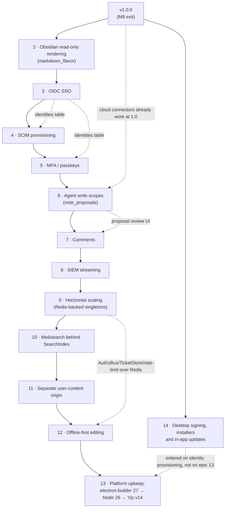

# Milestones and delivery plan

## 1. How this plan is organised

Iridium is delivered in nine milestones, M0 through M8, in the order fixed by decision A56 of the decision skeleton: bootstrap and proof harnesses first, then the headless collaboration kernel that proves the spec §10 sentence, then structure and projections, then MCP, then the shared UI, the Electron shell, portability, the admin console, and finally operations hardening and release. The order is risk-first: every property the spec's acceptance table demands of collaboration, authorization and durability is proven by automated tests against real MySQL and a real Hocuspocus instance before a single screen exists.

Rules that apply to every milestone in this document:

| Rule | Meaning |
|---|---|
| Ordering only | Milestones are exited strictly in the listed order. A milestone is not declared exited before its predecessor is. Work on a later milestone's packages may begin earlier, but nothing in a later milestone is a gate for an earlier one. |
| Exit on green tests | A milestone exits only when every named exit test passes on the `ci.yml` lanes it belongs to, the listed demonstrable behaviours have been demonstrated against the milestone-exit build, and the cross-cutting gates of section 3 hold. There are no other exit criteria and there are no time or effort estimates anywhere in this plan. |
| Names are the skeleton's names | Package names (`@iridium/*`), server module paths (`apps/server/src/*`), tables, endpoints, stateless message names, close reasons, CLI verbs and test names are used exactly as settled in the decision skeleton and detailed in the sibling sections. Test names refer to the Vitest projects and Playwright projects defined in 10-testing-and-quality.md, which owns them: where a skeleton entry carries no layer segment it fixes a *subject* rather than a name, and the name for that subject is 10's (§13.5 and decision D12-14). |
| Spec rows are retired, never re-opened | Each of the nine acceptance rows of the feature spec (§9) is retired at a named milestone once all of its automated proofs exist. Later milestones may add further proofs (a UI or desktop rendition of the same row) but never lower an existing one. |
| Fallbacks are designed, not improvised | Every M0 spike has a recorded fallback that is executed, not debated, when the spike fails. The fallback is itself a settled design (A15, A53, A2, A51). |
| Extended exit rows | A row whose Test cell carries the marker `(extended)` after its names adds exit obligations at this milestone to tests an earlier milestone already schedules. It is an exit criterion of this milestone, but it claims no milestone for the acceptance map, and `pnpm gen` refuses it when a test it names has no strictly earlier schedule (D12-23). An integration suite is first scheduled at the milestone that ships the routes it covers, so a later milestone's additions to it are such a row (D12-22). |

Related sections: architecture and package boundaries in 02-system-architecture.md; schema in 03-data-model.md; authentication and authorization in 04-auth-and-access-control.md; the collaboration and durability protocol in 05-collaboration-and-durability.md; MCP in 06-mcp-and-agent-access.md; clients in 07-client-applications.md; the Markdown pipeline and transfer jobs in 08-markdown-pipeline-import-export.md; endpoint and message contracts in 09-api-reference.md; the test harnesses, lanes and named tests in 10-testing-and-quality.md; deployment, backup and operations in 11-operations-and-deployment.md; ADRs in 13-decision-log.md; risks and open questions in 14-risks-and-open-questions.md.

## 2. Milestone map

### 2.1 Summary

| Milestone | Theme | Primary packages touched | Gate in one sentence | Spec rows retired |
|---|---|---|---|---|
| M0 | Repository bootstrap, harnesses, spikes | everything (skeletons), `tooling/*`, `@iridium/contracts`, `@iridium/crdt`, `@iridium/testkit`, `infra/*`, `.github/workflows/*` | An empty-but-wired monorepo builds, lints, type-checks and tests on ubuntu and windows; the empty server is ready against both required MySQL lines, 8.4.11 and 9.7.2, on merge-blocking lanes; the desktop shell launches on three OSes; every spike has a written verdict. | none |
| M1 | The kernel (spec §10 first milestone, headless) | `apps/server` (auth, authz, audit, collab, notes, ops, cli), `@iridium/collab-client`, `@iridium/crdt`, `@iridium/contracts` | One authenticated note, two editors, one viewer, MySQL persistence and a server restart are proven by `kernel.smoke.integration` and the chaos suite. | Durable saving (headless); Initialization/reconnection (created notes) |
| M2 | Structure, lifecycle, revisions, projections, search (headless) | `apps/server` (tree, notes/revisions, projection, search, attachments, jobs), `@iridium/markdown` | The complete REST surface for structure, history, projections, search and attachments is contract-tested, isolation-tested and lock-order-tested. | Structural concurrency |
| M3 | MCP, agent access and the OAuth 2.1 authorization server (headless) | `apps/server/src/mcp`, `apps/server/src/oauth`, `apps/server/src/auth/oauth`, `apps/server/src/auth/tokens`, `@iridium/mcp-bridge`, `@iridium/contracts/mcp` | Six read-only tools and two resource shapes pass dual-era contract tests, the conformance suite with zero unexplained failures against the committed typed baseline, revocation and isolation tests and bridge parity on both MCP mounts — `/mcp` for integration tokens and `/mcp/connect` for native claude.ai and Claude Desktop custom connectors, whose authorization-code flow the scripted client completes at M3 in both registration kinds and the real products complete before M4 exit (spike S15, AG9). | Vault isolation (REST + MCP); Live revocation headless-complete on every surface (the row itself is retired at M5) |
| M4 | Shared UI and web host | `@iridium/ui`, `@iridium/editor`, `@iridium/markdown-react`, `@iridium/api-client`, `@iridium/collab-client` (vault channel), `apps/web`, `apps/server` (`/app/*`, vault channel) | Every human workflow of spec §3–§5 works in Chromium with three editors, a viewer, live revocation, restore and hostile content proven by Playwright. The web host is the development and internal surface the shared UI is built and tested on; it carries no support commitment at 1.0 (01-vision-scope-and-principles.md §4.6). | Portability and safety (hostile content, web host — development signal); rows proven in both hosts are retired at M5 on their desktop proof |
| M5 | Electron desktop shell | `apps/desktop`, `@iridium/contracts/desktop-ipc.ts`, `apps/server` (`/desktop/*`) | The same UI bundle runs hardened inside Electron 44.3.0 on three OSes with main-only credential custody, IPC contract tests and packaged smoke — and, because the desktop application is the supported client at 1.0 (01-vision-scope-and-principles.md §4.6), the Electron proofs of concurrent editing, viewer enforcement and live revocation are green on every pull request. | Concurrent editing; Viewer enforcement; Live revocation (each retired on its desktop proof) |
| M6 | Import/export, Obsidian report, attachments UI | `apps/server/src/transfer`, `apps/server/src/attachments`, `@iridium/markdown` (detector complete), `@iridium/ui` (wizard, attachments), `apps/desktop` (main-owned transfers) | The Obsidian fixture vault imports with a complete report, exports byte-identically, and attachments work end to end in both hosts. | Portability and safety (complete); Initialization/reconnection (imported notes) |
| M7 | Admin console and enterprise surface | `@iridium/ui` (admin routes), `apps/server` (admin REST, settings, audit export) | Every admin action is authorised, step-up protected, audited and visible where the spec says; every role × surface combination has a test. | none new |
| M8 | Operations hardening and release readiness | `infra/*`, `apps/server/src/cli` (backup/restore/keys), `docs/ops/*`, `.github/workflows/release.yml`, `tooling/mutation` | A clean VM restores from the documented backup set, all nine acceptance rows are green on PR and nightly for seven consecutive nightly runs, and version `1.0.0` is cut. The released product's supported client is the desktop application (01-vision-scope-and-principles.md §4.6). | Backup recovery |

### 2.2 Dependency graph

The graph shows which earlier deliverables each milestone consumes. Exit order remains linear (M0 → M8); the edges explain why the order cannot be reshuffled and which packages a later milestone may start on once its inputs exist.

The desktop application being the supported client at 1.0 (01-vision-scope-and-principles.md §4.6) does **not** reorder this graph: `apps/desktop` mounts the `@iridium/ui` bundle M4 produces, so M4 still precedes M5 and the `M4 --> M5` edge is the reason. What the commitment changes is which milestone *retires* a spec §9 row (§2.3), not which milestone builds what.

```mermaid
flowchart LR
  M0["M0<br/>Bootstrap, harnesses, spikes"]
  M1["M1<br/>Kernel (headless)"]
  M2["M2<br/>Structure, revisions,<br/>projections, search"]
  M3["M3<br/>MCP, agent access,<br/>OAuth 2.1 AS"]
  M4["M4<br/>Shared UI and web host"]
  M5["M5<br/>Electron shell"]
  M6["M6<br/>Import/export,<br/>attachments UI"]
  M7["M7<br/>Admin console"]
  M8["M8<br/>Ops hardening,<br/>release 1.0.0"]

  M0 -->|testkit, contracts, crdt, migrations, CI| M1
  M1 -->|writer, compactor, authz, audit| M2
  M2 -->|ContentReadCore, projections, search, cursors| M3
  M2 -->|tree, revisions, search REST| M4
  M3 -->|PAT REST, snippets,<br/>OAuth consents| M4
  M1 -->|collab-client, SaveStateMachine| M4
  M4 -->|@iridium/ui bundle, IridiumHost| M5
  M2 -->|attachments service| M6
  M4 -->|wizard, editor host| M6
  M5 -->|main-owned transfers| M6
  M3 -->|tokens admin, access_log| M7
  M4 -->|admin routes, step-up dialogs| M7
  M1 -->|audit chain, settings| M7
  M6 --> M8
  M7 --> M8
  M5 -->|packaged bundles, release feed| M8
```

### 2.3 Spec acceptance rows: where each proof lands

Test names in this table, and in every exit-criteria table below, use the `<name>.<layer>` spelling that 10-testing-and-quality.md defines (`.unit`, `.integration`, `.prop`, `.chaos`, `.component`, `.e2e`, `.mcp`, `.contract`, `.guard`, `.drill`) and resolve to a file, a project and a requirement tag in its "Inventory completeness" tables. Where this document or 10 previously used a bare or differently-stemmed name, §13.5 carries the reconciliation table and `scripts/check-test-name-references.ts` enforces it in the `static` job.

| Spec §9 row | Headless proof (milestone, test) | UI proof (web host — development signal) | Desktop proof | Gates 1.0 | Retired at |
|---|---|---|---|---|---|
| Concurrent editing | M1 `collab.convergence.integration`, `convergence.model.prop` | M4 `three-editors.e2e` (Playwright chromium) | M5 `desktop.three-instances.e2e` (Playwright electron) | `desktop.three-instances.e2e` (L7@M5) | **M5** (was M4) |
| Initialization/reconnection | M1 `collab.restart-no-duplication.integration`, `collab.baseline-on-connect.integration` | M4 `disconnect-pause.e2e` | M5 `desktop.open-note.e2e` | headless (`collab.restart-no-duplication.integration`) | M1 for created notes; M6 re-proves with an imported note (`import.commit.integration`) |
| Viewer enforcement | M1 `collab.viewer-enforcement.integration`; M2 `authz.rest-viewer.integration` (scoped to routes whose `config.auth` names a permission the `viewer` role does not hold — a viewer's read and `export:read` routes are asserted to succeed) | M4 `viewer-readonly.e2e` | M5 `desktop.viewer-readonly.e2e` (Playwright electron) | `desktop.viewer-readonly.e2e` (L7@M5) | **M5** (was M4) |
| Vault isolation | M2 `authz.vault-isolation.integration`, `search.acl.integration`, `attachments.security.integration`; M3 `mcp.isolation.mcp` | — (server-side property) | — | headless / MCP | M3 |
| Live revocation | M1 `collab.live-revocation.integration`; M3 `mcp.revocation.mcp`, `oauth.revocation.mcp` | M4 `revocation-while-open.e2e` | M5 `desktop.revocation-while-open.e2e` (Playwright electron) | `desktop.revocation-while-open.e2e` (L7@M5) | **M5** (was M4) |
| Durable saving | M1 `collab.durable-ack.chaos` (kill-after-ack ×20 on PR, ×200 nightly) | M4 `saved-indicator.e2e` | M5 `desktop.durable-save.e2e` (Playwright electron) | headless (`collab.durable-ack.chaos`) | M1 |
| Structural concurrency | M2 `contracts.paths.unit`, `contracts.paths.prop`, `tree.structural-concurrency.integration`, `tree.invalid-move.integration`, `tree.stale-resurrection.integration`, `hierarchy.model.prop`, `lock-order.integration` | M4 `tree-live-updates.e2e` | — | headless | M2 |
| Portability and safety | M2 `markdown.xss-corpus.unit`, `markdown.sanitize.prop`, `markdown.pathological.unit` (XSS corpus at hast level); M6 `transfer.fixtures.integration`, `markdown.roundtrip.prop`, `import.unsafe-paths.unit` | M4 `security.hostile-markdown.e2e` (web); M6 `import-report.e2e`, `export-roundtrip.e2e` | M5 `desktop.hostile-markdown.e2e` (electron); M6 `desktop.export-roundtrip.e2e` | byte fidelity headless at M6; hostile-content clause `desktop.hostile-markdown.e2e` (L7@M5) | M6 |
| Backup recovery | M8 `ops.backup-restore.drill`, `ops.restore-verify.chaos`, `ops.pitr.chaos` (`nightly.yml › backup-restore-drill`) | M7 system status shows last verified restore | — | `ops.backup-restore.drill` | M8 |

**No row in this table is discharged by a human signature.** The three desktop cells that earlier drafts filled with "parity checklist" are now named Electron specs — `desktop.viewer-readonly.e2e`, `desktop.revocation-while-open.e2e` and `desktop.durable-save.e2e` — because the desktop host is the process that holds the session credential, so viewer enforcement, revocation and durability are exactly what has to be proven there (10-testing-and-quality.md D10-31). `docs/acceptance/host-parity.md` keeps only the route-and-command *reachability* walk of §13.4 and is named in no `docs/acceptance-map.json` entry.

The *Gates 1.0* column exists because the desktop application is the supported client at 1.0 (01-vision-scope-and-principles.md §4.6): where a row is proven in both hosts, the Electron proof is what retires it and the browser proof is the development signal that keeps the shared UI honest. Both remain merge-blocking. Where a row is proven in more than one host — rows 1, 3, 5 and 8 — its *Gates 1.0* cell is generated into `docs/acceptance-map.json` as `gating: true` and enforced by rule 7 of `guards.acceptance-map.guard` (10-testing-and-quality.md), so a gating proof that runs only nightly fails the build. The remaining cells record where the gate sits and carry no `gating` flag: rows 2, 4, 6 and 7 are retired headlessly on merge-blocking lanes, and row 9 is the operator rehearsal that `nightly.yml › backup-restore-drill` owns by design (D10-28).

### 2.4 Specified rules gated outside the nine rows

10-testing-and-quality.md's "Specified rules outside the nine rows" carries a third id namespace (`ruleId`) for rules the plan states once and would otherwise hold by prose alone. Each is gated by this document at the milestone that first delivers its mechanism, and rule 6 of `guards.acceptance-map.guard` fails when a rule names no test that exists:

| Rule id | Gated at | Tests |
|---|---|---|
| `single-process-ownership` | M1 (§5.4) | `collab.owner-lease.integration`, `collab.second-process-refused.chaos` (CH-16) |
| `rename-impact-warning` | M2 (§6.4) for the routes, M4 (§8.4) for the dialog | `tree.rename-impact.unit`, `tree.rename-impact.integration`, `rename-impact.dialog.component`, `rename-impact.e2e` |
| `invalid-move-reasons` | M2 (§6.4) | `tree.invalid-move.integration` (exhaustive over the `InvalidMoveReason` union, `cross_vault` included), `hierarchy.model.prop` |
| `vault-settings` | M2 (§6.4) | `vaults.settings.integration` |
| `declared-non-goals` | M1 onward, at every milestone exit (§3) | `guards.non-goals.guard` |

## 3. Cross-cutting gates that apply at every milestone exit

These gates are evaluated at every milestone exit in addition to the milestone's own exit tests. They exist from M0 onward — except where a row names a later milestone because the artefact it checks does not exist before it (the mutation thresholds, the upgrade fixture and the non-goal guard's inventories) — so that later milestones never inherit debt.

| Gate | Check | Where it runs |
|---|---|---|
| Build matrix | `pnpm turbo run build check-types lint test` green on `ubuntu-latest` and `windows-latest` | `ci.yml` `static` + `unit` |
| Format and hygiene | `oxfmt --check`; `knip --production` with `ignoreExportsUsedInFile`, where an export that exists only for tests carries `@internal` and a dependency §4.2 has a package declare ahead of its milestone is named in that workspace's `ignoreDependencies` in `knip.jsonc` (10-testing-and-quality.md L0) — **configuration hints are errors** (`treatConfigHintsAsErrors`), so an entry a workspace's product code starts importing fails this job in the commit that adds the import and is deleted in that commit, and a package the milestone completes carries no declared-ahead entry at its exit, a dependency it still does not import being removed from its manifest rather than ignored; `turbo boundaries`; `pnpm audit --audit-level high`; dedupe check (`pnpm dedupe --check`); Turbo `envMode: strict` env lists diffed against `EnvSchema` keys | `ci.yml` `static` |
| Single Yjs instance | `deps.single-instance.guard` (`pnpm why yjs`, `lib0`, `y-protocols`, `@codemirror/state`, `@codemirror/view` resolve to exactly one version; bundle analysis of `apps/web` shows one `yjs` chunk) and the server startup guard (`Yjs was already imported` → process exits non-zero) | `ci.yml` `static`, server boot |
| Route policy | `authz.route-policy.boot.guard`: every registered route declares `config.auth`; every PAT-enabled route is in the `★` allowlist; every `/__test__` route declares `config.auth = 'test-only'`; every mutating cookie-capable route is CSRF-guarded unless it is exempt, and from M3 a non-safe request is exempt exactly when its request path is an MCP or OAuth client-endpoint path or its route declares `csrfExempt`, which `POST /oauth/consent` alone does; from M3 the served exemption set, computed over the registered routes by `assertRouteInventory`, equals the **closed enumeration** `CSRF_EXEMPT_ROUTES` of exactly `{'POST /mcp', 'POST /mcp/connect', 'POST /oauth/consent', 'POST /oauth/token', 'POST /oauth/revoke', 'POST /oauth/register'}` when `MCP_OAUTH_ENABLED` is true and `{'POST /mcp'}` when it is false, so a seventh cannot be added silently (D04-32 as amended); from M3 each MCP mount carries the MCP-mount arm of `config.auth`, legal only on a member of `MCP_MOUNT_ROUTES`, and accepts exactly one credential kind (D04-30 as amended); no route is registered twice; unknown `IRIDIUM_*` env keys rejected | `ci.yml` `static` (guard subset) and server boot in every integration test |
| Acceptance map | `guards.acceptance-map.guard`: every spec row, hard property and `ruleId` of §2.4 has a test in each of its required layers whose `sinceMilestone` in `docs/acceptance-map.json` is at or below the effective test target (`IRIDIUM_TEST_TARGET_MILESTONE` when set; otherwise the last exited milestone in `docs/milestones/CURRENT`); no test claims a `[spec:…]` or `[hp:…]` id the map does not list; every file under `apps/e2e/` or `apps/server/test/` carries a `[spec:…]`, `[hp:…]` or `[area:…]` tag. The milestone axis is what keeps the gate honest rather than red — a layer that is due and empty fails, a layer whose milestone has not arrived does not (10-testing-and-quality.md owns the map) | `ci.yml` `static` |
| Generated artefacts | `gen.drift.guard`: `pnpm gen && git diff --exit-code` for `packages/contracts/openapi/openapi.json`, `packages/api-client/src/generated/paths.d.ts`, `packages/contracts/mcp/tools.schema.json`, from M3 `docs/agents/tools-reference.md` and the generated snippet and client-status regions of `docs/agents/*.md` (written by `scripts/generate-agent-docs.ts`), desktop IPC typings, `apps/server/src/db/schema.ts` vs `kysely-codegen` output, msw handler skeleton, `docs/ops/db-grants.sql` and `apps/server/test/fixtures/db-grants.snapshot.sql` (written by `scripts/generate-db-grants.ts` from `apps/server/src/db/grants.ts`), `docs/non-goals.json` (written by `scripts/build-non-goals.ts` from 01-vision-scope-and-principles.md §4.4) and `docs/acceptance-map.json` (generated last by `scripts/build-acceptance-map.ts` from 10-testing-and-quality.md's inventory, hard-property and rule tables, so the prose table and the committed map cannot diverge) | `ci.yml` `static` |
| Declared non-goals absent | `guards.non-goals.guard`: the ids of the generated `docs/non-goals.json` equal the hand-written `NonGoalId` union of `packages/contracts/src/non-goals.ts`, and one absence assertion per id — declared `satisfies Record<NonGoalId, NonGoalAssertion>`, so adding a non-goal to 01-vision-scope-and-principles.md §4.4 without an assertion does not compile — holds against the built inventories: registered routes (`buildApp({mode:'in-process'})` + `app.routes()` cross-checked with `openapi.json`), MCP tools and resources, the `apps/server/src/cli/` command table, client host capabilities (`IridiumHost` members, `hostContractCases()`, `commands/registry.ts`, the router route tree), the Kysely `Database` interface plus the migration list, and the dependency closure in `pnpm-lock.yaml`. Each assertion declares a `sinceMilestone` and becomes due at or below the effective test target used by the acceptance guard, so "not applicable yet" cannot become permanent. Runs from M1, the first milestone with routes, commands and a host to inventory, and the assertion set ratchets at every exit after it: the twelve declared non-goals of 01-vision-scope-and-principles.md §4.4 — graph view, per-note or per-category permission overrides, mobile clients, enterprise single sign-on, multi-server collaboration, offline-first editing, cross-vault moves, automatic cross-document link rewriting, full Obsidian syntax compatibility, built-in AI features, "not a complete Obsidian replacement" and "no second content write path" — are absent from the product rather than merely unimplemented | `ci.yml` `static` (the `guard` project, which the job runs first) |
| License compliance | Allowlist MIT / Apache-2.0 / BSD-2 / BSD-3 / ISC / MPL-2.0 / 0BSD / Unlicense / BlueOak-1.0.0 (accepted at M0) / PSF-2.0 (accepted at M2; the full policy is in 10-testing-and-quality.md); denylist GPL / AGPL / LGPL / BSL / UNLICENSED; tool pinned at M0 | `ci.yml` `static` |
| Coverage thresholds | v8 global 85 / 85 / 80 / 85 (statements / lines / branches / functions), 100 % per file on `apps/server/src/auth/**`, `apps/server/src/authz/**`, `packages/contracts/src/{tokens,paths,authz}.ts`; 95 lines / 90 branches per file on `apps/server/src/collab/persistence/**`, `apps/server/src/audit/**` and `packages/crdt/src/**`; the complete per-file list in 10-testing-and-quality.md remains binding, and thresholds may only rise between milestones. **M1 exit and rehearsal gate:** root `vitest.config.ts` enforces `coverage.thresholds` with `IRIDIUM_COVERAGE_GATE=1` and an effective test target past M0 (`IRIDIUM_TEST_TARGET_MILESTONE` when set; otherwise CURRENT). Shared CI setup defaults to the later of M1 and CURRENT and refuses an older target, so M1 coverage is enforced while CURRENT still records M0. M0's historical exit measured coverage without these thresholds because its later boot steps and packages were stubs; that exception does not apply to an M1 rehearsal. All existing numbers are unchanged | `ci.yml` `merge-reports` |
| Mutation score | Stryker `break` threshold on the mutated globs: 70 at M1 and M2, 75 at M3 through M7, 80 at M8 (see decision D12-3) | `nightly.yml › mutation` (full scope); `ci.yml › mutation-scoped` on a pull request that touches a path in Stryker's `mutate` globs |
| Spikes closed | `docs.spikes.spec`: every spike the reached milestones reference (§4.4) exists as `docs/spikes/S<nn>-<slug>.md`, carries all eight template headings, has a `Result` of `pass` or `fail` and never `open`, and — when the result is `fail` — names the pull request or the commit (`commit <sha>`) that executed the recorded fallback (14-risks-and-open-questions.md D14-11). The gate is a test, not a read-through | `ci.yml` `static` |
| Nightly health | No `nightly.yml` job outside the advisory set red for three consecutive runs. A nightly failure does not block a merge, but a job outside the advisory set red for three consecutive nights blocks the next milestone exit until it is green, and the run identifiers are recorded in the exit record (10-testing-and-quality.md's nightly policy). The advisory set is exactly `mysql-innovation`, `node-26`, `conformance-all` and, below an M8 target, `mcp-clients`. Each carries `continue-on-error` in `nightly.yml` — `mcp-clients` through the milestone job's `clients_gate` output, true when the target is M8 or later. An advisory job's failures are reported and opened as issues like any nightly failure and dispositioned in the exit record's nightly section; they never count toward the three-night rule (D12-21). `guards.nightly-policy.guard` holds the workflow and this enumeration equal | `nightly.yml`, reviewed at exit; `guards.nightly-policy.guard` in `ci.yml` `static` from M3 |
| Decisions recorded | Every decision taken during the milestone has an ADR under `docs/adr/` (13-decision-log.md numbering) | manual review at exit |
| Version and tag | A changeset exists; the milestone exit is tagged `v0.<N>.0` (`v0.1.0` for M1 … `v0.8.0` for M8's release candidate, then `v1.0.0` at M8 exit). The tag is cut **by hand**, as §13.2 and D12-1 specify; Changesets versions the fixed workspace group and writes per-workspace changelogs, while its `git-tag` command produces package tags rather than the product tag. `release.yml` validates the tag against the tagged server version and last exited milestone in `docs/milestones/CURRENT`. Its artifact floors follow ownership: `verify` and `server-image` from M1, `bridge` from M3 (§7), `desktop` and `release-feed` from M5 (§9 and D12-2), and `drill` from M8 (§12). M0 publishes no artifacts. Every due artifact still depends on successful verification of the tagged tree; M1's published server image carries SBOM and provenance so later upgrade rehearsals use real release artifacts | `release.yml` |
| Upgrade fixture | From M1 onward the milestone-exit build writes `apps/server/test/fixtures/upgrade/v0.<N>.0/{dump.sql.gz, attachments/, manifest.json}` from the seeded test dataset using `mysqldump` under the `iridium_backup` role; M8's `ops.upgrade-rehearsal.drill` restores the `v0.1.0` fixture onto the current schema (decision D12-4) | `ci.yml` `integration` (fixture job) |

## 4. M0 — Repository bootstrap, harnesses, spikes

### 4.1 Goal

Create the monorepo exactly as laid out in 02-system-architecture.md with every version pin from the decision skeleton, stand up the test harnesses that every later milestone gates on, and close every technical question whose answer changes code shape (the spikes). At M0 exit nothing user-visible exists, but the repository already enforces its boundaries, builds the Docker image from a pruned lockfile, applies all 48 migrations against both required MySQL lines, launches an empty desktop shell on three operating systems, and fails CI on any drift between schemas and generated artefacts.

### 4.2 Repository bootstrap sequence

The bootstrap is performed in the order below because several later steps silently misbehave if an earlier one is skipped (line-ending normalisation before any source file; pnpm settings before any install; boundaries before any cross-package import).

| Step | Action | Files created | Why in this position |
|---|---|---|---|
| 1 | `git init -b main` in the repository root (`iridium/`, the layout of 02-system-architecture.md); first commit contains only normalisation and editor files. Every path in this plan is repository-relative; machine-specific setup (Docker Desktop with WSL2, Windows long-path support, `mise` installation) belongs in `CONTRIBUTING.md`, which §4.6 already requires | `.gitattributes` (`* text=auto eol=lf`, plus `-text` entries for `*.png`, `*.jpg`, `*.webp`, `*.ico`, `*.icns`, `*.zip`, `*.bin`, `*.woff2`, and `linguist-generated` for `packages/contracts/openapi/openapi.json`, `packages/contracts/mcp/tools.schema.json`, `packages/api-client/src/generated/**`), `.editorconfig` (LF, UTF-8, final newline, 2-space), `.gitignore` (`node_modules`, `dist`, `.turbo`, `.vitest`, `coverage`, `playwright-report`, `test-results`, `*.local`, `.env`, `apps/desktop/release`), `README.md` | LF normalisation must precede every source file on a Windows development machine; otherwise oxfmt and lefthook produce whole-file diffs |
| 2 | Toolchain pins | `mise.toml` (`node = "24.21.0"`, `pnpm = "12.4.1"`), `.node-version` (`24.21.0`), root `package.json` with `"packageManager": "pnpm@12.4.1"`, `"devEngines": {"runtime": {"name":"node","version":"24.21.0","onFail":"download"}, "packageManager": {"name":"pnpm","version":"12.4.1","onFail":"download"}}`, `"engines": {"node": ">=24.12.0 <25"}`, `"type": "module"`, `"private": true` | Corepack is not used; pnpm's `devEngines` download makes the only manual step "install any pnpm" |
| 3 | Workspace and dependency policy | `pnpm-workspace.yaml`: `packages: ["apps/*", "packages/*", "tooling/*", "spikes/*"]`, `catalog:` holding **every external version a manifest in this repository declares** (zod 4.6.2, fastify 5.12.4, yjs 13.6.32, lib0 0.2.117, y-protocols 1.0.7, @hocuspocus/server 4.7.0, react 19.3.0, vite 8.3.0, vitest 5.0.0, typescript 7.0.2, electron 44.3.0, mysql2 3.24.4, kysely 0.29.5, @types/node 24.13.4, esbuild 0.28.2 and @types/k6 2.2.0 for the load lane, playwright 1.63.0 for the browser and spike projects, @stryker-mutator/api 10.0.0 for the mutation lane, and the rest of §A) — and **only** those: knip 6 reports an unused catalog entry, so a version this plan pins for a later milestone stays in 02-system-architecture.md's dependency table until the milestone that declares it. Five pins were removed on that basis on 2026-09-13 (`vite-plugin-electron`, `vitest-browser-react`, `electron-playwright-helpers`, `@modelcontextprotocol/conformance`, `@modelcontextprotocol/inspector`). `@modelcontextprotocol/conformance` 0.1.16 and `@modelcontextprotocol/inspector` 2.6.0 return at M3, declared only by the dev-only `tooling/mcp-conformance` leaf (G11, AG11); `mcp-remote` and Claude Code are never catalog entries or workspace dependencies — `nightly.yml` copies `apps/e2e/mcp-clients/clients/{package.json,package-lock.json}` to `$RUNNER_TEMP` and installs them there with `npm ci --ignore-scripts`, never in the checkout. `catalogMode: strict`, `saveExact: true`, `engineStrict: true`, `minimumReleaseAge: 4320`, `minimumReleaseAgeExclude` carrying only pins younger than three days at bootstrap, each removed as it matures, `trustPolicy: no-downgrade` with a reviewed `trustPolicyExclude`, `allowBuilds: {electron: true, lefthook: true, "@node-rs/argon2": true, esbuild: true}` plus explicit `false` entries for transitive packages whose install scripts the product does not need, `strictPeerDependencies: true`, `dedupePeerDependents: true`, pnpm's **default** peer resolution with the workspace root as fallback — deliberately, so one Vitest 5 instance is shared by the root runner and every package; `resolvePeersFromWorkspaceRoot: false` was tried and reverted because it split Vitest 5 per package and broke `@fast-check/vitest`'s `it.prop` — `peerDependencyRules.allowedVersions` with the single entry `openapi-typescript>typescript: '6'` (A2 amendment 2026-09-13), the `mutation` named catalog carrying `vitest 4.1.11` and that line's four companions `@vitest/browser`, `@vitest/browser-playwright`, `@vitest/coverage-v8` and `@vitest/ui`, all at 4.1.11, so the mutation lane's peers stay inside one Vitest line — and **only** those five: `playwright` is not a Vitest-line-specific pin, so `tooling/mutation` takes it from the default `catalog:` like every other package (A2 amendment 2026-09-13) — `publicHoistPattern: []`, `overrides` pinning to the catalog every package that must resolve to exactly one copy — `yjs`, `lib0`, `y-protocols`, `@codemirror/state`, `@codemirror/view` (A14) and also `@types/node` (one Node type environment), `fast-check` (`@fast-check/vitest` carries its own range) and `axe-core` (`vitest-axe` carries its own); `.npmrc` with registry settings only | pnpm 12 rejects unknown workspace keys and blocks lifecycle scripts by default; the allowlist is deliberate and complete, and the catalog matches the manifests rather than the roadmap so `knip --production` can stay green |
| 4 | Task runner | `turbo.json` (`ui: "tui"`, `envMode: "strict"`, `globalDependencies: ["tooling/tsconfig/*.json", ".oxfmtrc.jsonc", "oxlint.config.ts", "pnpm-workspace.yaml"]`, `globalPassThroughEnv: ["CI", "GITHUB_ACTIONS", "NODE_OPTIONS"]`, `boundaries.tags` per the "Boundary tags and allowed dependencies" table of 02-system-architecture.md, tasks `build` (`outputs: ["dist/**"]`), `check-types`, `lint`, `format:check`, `test` — which declares **no** `outputs`, because coverage is produced by the CI job's own `vitest --coverage` invocation and the turbo task never wrote a `coverage/` directory to cache — `test:integration` (`cache: false`), `gen`, `gen:check`, `dev` (`persistent`, `interruptible`), `clean`); each package's `turbo.json` adds only `"extends": ["//"]` and `"tags"` | Boundaries are enforced from the first cross-package import |
| 5 | TypeScript | `tooling/tsconfig/{base,node,browser,react}.json` (`strict`, `target: es2024`, `module: nodenext` for node, `bundler` for browser, `erasableSyntaxOnly`, `verbatimModuleSyntax`, `isolatedDeclarations` for compiled packages, `declaration` + `declarationMap`, explicit `.ts` import extensions), root solution `tsconfig.json` referencing every package; `typescript` 7.0.2 plain, no alias outside `tooling/mutation` | One checker repo-wide (TS 7 native); Stryker's TS 6 alias stays isolated |
| 6 | Lint, format, hooks, commits | `oxlint.config.ts` (plugins typescript / import / promise / unicorn / vitest / react / react-hooks / jsx-a11y / node; `typeAware: true`; `import/no-cycle: error`; `no-restricted-imports` rules per boundary tag; overrides scoping react rules to `packages/{ui,editor,markdown-react}/**` and `apps/{web,desktop}/src/renderer/**`), `tooling/oxlint-config/` fragments, `.oxfmtrc.jsonc` (`printWidth 100`, `singleQuote`, `semi`, `trailingComma all`, sorted imports, `ignorePatterns` including `**/fixtures/**` and `pnpm-lock.yaml`), `lefthook.yml` (pre-commit: `oxfmt {staged_files}` + `oxlint --fix {staged_files}` with `stage_fixed`; commit-msg: `commitlint --edit {1}`; pre-push: `turbo run check-types --affected`), `commitlint.config.ts` (conventional) | Markdown fixtures are the pipeline's test data and must never be reformatted |
| 7 | Versioning and dependency automation | `.changeset/config.json` (`privatePackages: {version: true, tag: true}`, `fixed: [["@iridium/*"]]`, `baseBranch: main`), `renovate.json` (`config:best-practices`, `:pinAllExceptPeerDependencies`, `group:allNonMajor`, `helpers:pinGitHubActionDigests`, electron group with `minimumReleaseAge: '7 days'` and no automerge, oxc group, vite/vitest/tsdown group, two `mysql` image pins — `8.4` minor + digest and `9.7` minor + digest — grouped into one pull request, with **automerge disabled** for both and a `packageRules` entry that refuses any update that would move a pin across an LTS line (the R-T25 failure mode, where a repository silently upgraded 8.4 hosts to 9.7)), `knip.jsonc` | One product version across server image, web bundle, desktop bundles and bridge |
| 8 | Package skeletons | Every workspace of the layout in 02-system-architecture.md with `package.json` (name, `type: module`, exports, catalog deps, scripts `build`/`check-types`/`lint`/`test`), `tsconfig.json` extending the right base, `src/index.ts` placeholder export, and `turbo.json` tags: `core` (contracts), `iso` (crdt, markdown, api-client, collab-client), `browser` (editor, markdown-react, ui), `node` (mcp-bridge, testkit), `server` (apps/server), `app` (apps/web, apps/desktop, apps/e2e), `tooling` (tsconfig, oxlint-config, mutation, api-codegen, sql), `spike` (`spikes/*`) | Compiled vs JIT classification is fixed here (compiled: contracts, crdt, markdown, api-client, collab-client, mcp-bridge, testkit; JIT: editor, markdown-react, ui) |
| 9 | Infrastructure | `infra/compose.yaml` (service `mysql` from `mysql:${MYSQL_TAG:-8.4.11}` — the development default sits at the compatibility floor, and `MYSQL_TAG=9.7.2-oraclelinux9` selects the other required line — with `infra/docker/mysql/my.cnf` and `infra/docker/mysql/init/01_roles.sh`, port bound to `127.0.0.1:3306`, healthcheck `mysqladmin ping`; profile `s3` with the SeaweedFS pinned tag; profile `full` with the server built from `infra/docker/server.Dockerfile` under Compose Watch), `infra/docker/server.Dockerfile` (multi-stage on `node:24.21.0-bookworm-slim`: `turbo prune --docker`, `pnpm install --frozen-lockfile` from the pruned lockfile, `pnpm deploy --prod`, non-root user, `HEALTHCHECK` on `/healthz`, entrypoint honouring `IRIDIUM_MIGRATE_ON_BOOT`) | `my.cnf` must be baked before migration 0001 runs (utf8mb4 defaults, `innodb_flush_log_at_trx_commit=1`, `sql_require_primary_key=ON`, `innodb_ft_min_token_size=2`, and `log_bin_trust_function_creators=ON` without which migration 0028 cannot create the audit triggers as `iridium_migrator` under binary logging); the same `my.cnf` is mounted on both lines, and `ops.mysql-config.spec` asserts the resolved variable values are equal on each |
| 10 | CI, docs, policy files | `.github/workflows/{ci,nightly,release}.yml` skeletons with digest-pinned actions (`actions/checkout@v7.0.1`, `pnpm/action-setup@v6.1.0`, `actions/setup-node@v7.0.0`, `docker/build-push-action@v7.3.0`), `docs/adr/` seeded with one ADR per §A decision (numbering owned by 13-decision-log.md), `docs/spikes/README.md` (template), `docs/runbooks/`, `docs/ops/`, `SECURITY.md`, `CONTRIBUTING.md` | The CI job names are stable from M0 so branch protection can reference them |

### 4.3 Scope by package

| Package / area | Work items at M0 |
|---|---|
| `tooling/tsconfig`, `tooling/oxlint-config` | The four tsconfig bases and the oxlint fragments (base, react, node, server) consumed by every package |
| `tooling/mutation` | `package.json` with its own `typescript` → `@typescript/typescript6` alias; `stryker.config.mjs` exactly as committed in 10-testing-and-quality.md (`testRunner: 'vitest'`, `vitest: {configFile: 'tooling/mutation/vitest.stryker.config.ts', related: true}`, `plugins` naming both plugin entry points by path, `checkers: ['typescript']`, `tsconfigFile: 'tooling/mutation/tsconfig.stryker.json'`, `disableTypeChecks: false`, `ignorePatterns` keeping that tsconfig and the generated trees out of the sandbox, `testRunnerNodeArgs` loading `vitest-resolution.mjs`, `ignoreStatic: true`, `incremental: true`, `incrementalFile: 'tooling/mutation/reports/stryker-incremental.json'`, `concurrency: 4`, `timeoutMS: 10000`, `thresholds: {high: 90, low: 75, break: 70}`, and the `mutate` array `apps/server/src/auth/**/*.ts`, `apps/server/src/authz/**/*.ts`, `apps/server/src/audit/chain.ts`, `apps/server/src/collab/persistence/**/*.ts`, `apps/server/src/collab/limits.ts`, `apps/server/src/collab/owner-lease.ts`, `apps/server/src/mcp/{cursor,verifier,rate-limit}.ts` (from M3 `apps/server/src/pagination/{cursor,path-keyset}.ts` and `apps/server/src/mcp/{verifier,rate-limit,guards,web-response}.ts`, D10-16 as amended), `apps/server/src/tree/{names,moves,paths,rename-impact}.ts`, `packages/contracts/src/{tokens,paths,authz,ids,limits}.ts`, `packages/crdt/src/**/*.ts`, `packages/markdown/src/sanitize/**/*.ts`, `packages/markdown/src/{normalize,restore,links}.ts`, `packages/collab-client/src/save-state.ts`, `!**/*.spec.ts`); `vitest.stryker.config.ts` (unit project only); `run.mjs`, the lane's only entry point, which spawns Stryker with the repository root as its working directory because every glob and path in the config is repository-relative and Stryker has no working-directory option; and `vitest-resolution.mjs`, loaded into the runner's workers so they resolve this package's `vitest` 4.1.11 instead of the repository's 5.0.0, and throwing on any other major so the pin cannot silently lapse. The three files, and the config's `.mjs` extension, are what spike S5 measured: the lane is wired to S5 and `docs/spikes/S05-stryker-vitest5.md` carries the evidence for each |
| `tooling/api-codegen` | `package.json` declaring `openapi-typescript` 7.13.0 and its own `typescript` → `@typescript/typescript6` alias, no sources; `scripts/lib/tools.ts` resolves step 3 of `pnpm gen` from it (A2 amendment 2026-09-13) |
| `@iridium/contracts` | `ids.ts` (UUIDv7 generator, branded ids, canonical string codec), `errors.ts` (`ProblemDetails` schema + the closed error-code list of 09-api-reference.md §1.5), `authz.ts` (roles, permission strings, matrix table, `Principal`), `tokens.ts` (credential format `irid_<kind>_<id16>_<secret43><crc6>`, CRC32 over the prefix, published scanner regex, scope bundle `read`), `limits.ts` (every value of skeleton A.1, published as 02-system-architecture.md's single limits policy), `collab.ts` (stateless message schemas `v:1`, `CollabCloseReason`, awareness state shape), `audit.ts` (closed vocabulary), `paths.ts` (name rules, reserved names, depth), `search-query.ts` (parsed shape only); `openapi/` and `mcp/` directories exist with generated placeholders |
| `@iridium/crdt` | `createNoteDoc()`, `getContent(doc)` (Y.Text `content`), `codec.ts` (`encodeState`/`loadState` with branded `V1Update`, `V2State`, `StateVector`; `snapshot_format` switch), `dominates(persistedSv, localSv)`, `prefixSuffixDiff(a, b)`, `insertChunked(ytext, index, text, origin)`, `initialNoteState(markdown)` (throwaway doc → V1 update), `projectMarkdown(doc)`, LF and no-attributes guards; property tests `crdt.codec.prop` (round trip V1↔V2, idempotent re-apply), `crdt.dominates.prop`, `crdt.prefix-suffix-diff.prop` |
| `apps/server` | `main.ts` CLI dispatcher over the four commands this build implements — `serve`, `migrate status\|up\|to <name>`, `config check [--json]` and `version [--json]` — plus the thirteen commands later milestones own (`doctor`, `backup`, `restore`, `audit`, `reindex`, `admin`, `tokens`, `sessions`, `keys`, `jobs`, `trash`, `desktop-updates`, `mirror`), which are reserved **by name** and each exit `3` with `not_implemented`, so an unimplemented command is a refusal an operator can read rather than an "unknown command" that looks like a typo; `app.ts` `buildApp({mode: 'in-process' \| 'child' \| 'container'})` with the plugin order config → db → security → auth → authz → audit → rest → collab → mcp → ops → jobs (later plugins registered as empty stubs); `config/env.ts` (`EnvSchema`, `*_FILE` secrets, `z.prettifyError` fail-fast, redacted summary, unknown `IRIDIUM_*` keys rejected); `db/` (two Kysely instances over mysql2 pools 20 + 4, `FOUND_ROWS` boot assertion, `schema.ts`, migrator wrapper with `GET_LOCK('iridium_migrate', 60)`), plus the `db.version-floor.boot` check: `SELECT VERSION()` must report `8.4.x` (≥ 8.4.11) or `9.7.x` (≥ 9.7.2), otherwise exit `2` with `config.mysql_unsupported` unless `IRIDIUM_ALLOW_UNTESTED_MYSQL=true`; `migrations/0001_users.ts` … `0048_access_log_oauth_client.ts` — the 48 M0 migrations of 03-data-model.md §14.1, the whole M0 schema (one DDL each except the two hash-pinned files `0028_audit_events_triggers` (2 statements) and `0029_audit_events_archive` (3), D03-29; idempotent guards, raw SQL for FULLTEXT, generated columns, triggers, partitions, grants; `0034_grants` skipped when the migrating user lacks GRANT, and each table created after it followed by its own `NNNN_<table>_grants` companion); `security/` helmet with CSP nonces and request ids; `ops/` `/healthz`, `/readyz` (pools ping, `migrations: current` fail-closed, `innodb_flush_log_at_trx_commit` check with `READYZ_STRICT_DURABILITY`), `/metrics` registry with `@prometheus-io/client` 0.16.1 (pinned by S8) exposing `iridium_http_requests_total` and `iridium_http_duration_seconds`; `authz/route-policy.ts` boot assertion, whose accepted `config.auth` values already include the `test-only` policy reserved for the `/__test__` namespace M1 registers; `test/` harness wiring |
| `@iridium/testkit` | `startTestEnv()` (Testcontainers 12.1.0 `MySqlContainer(process.env.IRIDIUM_MYSQL_IMAGE ?? 'mysql:8.4.11')` with tmpfs, `my.cnf` and `01_roles.sh` mounted, per-worker schemas `iridium_w<N>` cloned from a migrated template — the compatibility floor is the default an unset selector resolves to, and `ci.yml`'s two-entry `integration` matrix sets `IRIDIUM_MYSQL_IMAGE` per entry; the spelling is the `EnvSchema` one owned by 11-operations-and-deployment.md), `startServer({mode: 'in-process' \| 'child'})` (child mode spawns `dist/main.mjs serve` with `NODE_ENV=test` so it can be `SIGKILL`ed), Toxiproxy helpers (`@testcontainers/toxiproxy` 12.1.0, `toxiproxy 2.12.0`), `IRIDIUM_FAULT` registry constants (`store.throw`, `store.crash-before-commit`, `store.crash-after-commit-before-ack`, `store.slow:<ms>`, `compact.throw`, `ws.drop-after-ack`, `auth.slow:<ms>`), `NoteClient` (a `ws` subclass injecting `Origin: <PUBLIC_ORIGIN>` wrapped in `HocuspocusProvider`), `restClient` (undici fetch + `X-Iridium-Client: web` + cookie jar), `toMatchOpenApi` matcher (ajv 8.20.0 + swagger-parser 13.0.0), fixture corpora under `src/fixtures/`, every one reached through the typed accessors in `src/fixtures/index.ts` rather than by a path literal — `fixtures/vaults/demo/**` (42 notes and 3 attachments), `fixtures/vaults/obsidian-sample/**` with `.obsidian/`, `.trash/`, `.canvas`, CRLF, CR, mixed-ending and BOM files, `fixtures/hostile/**` with its `expectations.json`, and `fixtures/commonmark/spec.json` with its `PROVENANCE.md`; the layout is the package tree of 10-testing-and-quality.md, "The testkit package", and `fixtures/gfm/**` and `fixtures/pathological/**` join it at M2, msw 2.15.0 handler skeleton from `openapi.json` |
| Root test configuration | `vitest.config.ts` with `test.projects`: `unit` (forks, `sequence.shuffle` with printed seed, `retry: 0`), `component` (Browser Mode chromium via `@vitest/browser-playwright`, `vitest-browser-react` 2.3.0, axe-core pinned by S8), `integration` (globalSetup from testkit, `hookTimeout 120000`), `property` (`@fast-check/vitest` 0.5.0, PR `numRuns 200`), `chaos` (`fileParallelism: false`, `testTimeout 180000`), `contract`, `mcp`; coverage v8 with the thresholds of section 3; `playwright.config.ts` with projects `setup`, `chromium` (4 shards, test locks), `electron` (fixture on `_electron.launch` with `IRIDIUM_E2E=1`) |
| `apps/web` | Vite 8.3.0 entry mounting an empty `@iridium/ui` root with `BrowserHost`; `vite.config.ts` shared with the desktop renderer (`resolve.dedupe` for yjs, lib0, y-protocols, @codemirror/state, @codemirror/view; `base: './'` for the renderer build); served by the server at `/app/*` with the nonce CSP (`@fastify/static` pinned by S8) |
| `apps/desktop` | Three build configs (main tsdown ESM with `deps.neverBundle: ['electron']`, preload tsdown single-file CJS, renderer = shared Vite config), `app://iridium` scheme registered as privileged (`standard`, `secure`, `supportFetchAPI`, `corsEnabled: true`, `stream`, `codeCache`) with `protocol.handle` traversal guard and SPA fallback, hardened `webPreferences` (snapshot-tested), `app.enableSandbox()`, `will-navigate` deny, `setWindowOpenHandler` deny, permission handlers deny-by-default, fuses configuration in `electron-builder.yml` (`v26` tag, 26.16.1), preload exposing only `iridium:app:info`; the `desktop.web-preferences.guard` snapshot test; `desktop.launch.e2e` |
| `apps/e2e` | Playwright 1.63.0 project skeleton, `setup` project creating users through REST (real logic arrives with M1), `apps/e2e/electron/desktop.launch.e2e.spec.ts` (app launches, first window title, `typeof require === 'undefined'`, CSP header present) |
| `@iridium/ui` | Empty application shell exporting `mountIridium(host: IridiumHost)`, `host.ts` (the `IridiumHost` interface exactly as 02-system-architecture.md, "The `IridiumHost` seam"), `i18n/en.ts` with the first keys, `commands/registry.ts` with the registry type and no commands |
| `@iridium/markdown`, `@iridium/markdown-react`, `@iridium/editor`, `@iridium/api-client`, `@iridium/collab-client`, `@iridium/mcp-bridge` | Placeholders with correct tags, exports and dependency declarations so that boundaries, `knip` and the single-instance check exercise the real dependency graph; `@iridium/collab-client` already depends on `@hocuspocus/provider` and `@iridium/crdt` so the dedupe rules are verified at M0 |
| Codegen pipeline | Root script `pnpm gen` (`scripts/gen.ts`) running, in order: server OpenAPI export (`app.swagger()` in `in-process` mode without a database) → `@redocly/cli 2.52.1 lint` → `openapi-typescript 7.13.0` → `kysely-codegen 0.20.0` diff against `apps/server/src/db/schema.ts` → MCP `tools.schema.json` export → agent documentation (`scripts/generate-agent-docs.ts`, since M3: `docs/agents/tools-reference.md` and the snippet and client-status regions of `docs/agents/*.md`) → desktop IPC typings → msw handler skeleton → database grants (`scripts/generate-db-grants.ts`: `docs/ops/db-grants.sql` and the exact-role fixture) → declared non-goals (`scripts/build-non-goals.ts` writing `docs/non-goals.json`) → `scripts/build-acceptance-map.ts` writing `docs/acceptance-map.json` (last, because it references the operation and tool names the earlier steps emit; `--check` is the same code path with the write suppressed and runs in `static`); `pnpm gen:check` = `pnpm gen && git diff --exit-code` |
| CI | `ci.yml` jobs, with exactly the names 10-testing-and-quality.md's workflow tables use: `static` → `unit` [ubuntu, windows] → `integration` (Docker, a **two-entry matrix** over `IRIDIUM_MYSQL_IMAGE` = `mysql:8.4.11` and `mysql:9.7.2-oraclelinux9`, producing the two required checks `integration (mysql:8.4.11)` and `integration (mysql:9.7.2-oraclelinux9)`) → `e2e-web` (4 shards, `mysql:8.4.11` service container — an unmatrixed lane resolves to the compatibility floor) → `e2e-electron` [ubuntu xvfb, windows, macos with `shogo82148/actions-setup-mysql@v1` `8.4`], selected by the Playwright tag `@smoke` → `chaos-core` (the same two-entry MySQL matrix) → `mutation-scoped` (runs only when a path in Stryker's `mutate` globs changed, and blocks the merge when it runs) → `merge-reports`; `nightly.yml` job stubs `property-long`, `chaos-extended`, `mutation`, `schemathesis-full`, `load`, `perf`, `backup-restore-drill`, `mysql-matrix-extended` (the long-running suites on both required lines; neither *required* line has an advisory lane of its own, because both are pull-request gates), `mysql-innovation` (advisory: the `integration` project against the innovation line `mysql:26.7`, an early warning in the same spirit as `node-26` — it reports and never blocks), `e2e-electron-full`, `mcp-clients` (the headless real-client matrix over the in-process TLS profile, advisory until M8; the proxied-stack header test joins at M8), `compose-boot`, `conformance-all` (advisory), `flake-hunt`, `node-26` (advisory) — the advisory set of §3's nightly-health gate (D12-21); `release.yml` triggered by hand-cut `v<major>.<minor>.<patch>` tags (§3, "Version and tag"): server image build with SBOM/provenance, electron-builder matrix placeholders, `changesets/action@v2.1.2` Version PR, every release job floored so the M0 tag `v0.0.0` runs none of them; a `license` step in `static` with the scanner pinned by S8 |

### 4.4 Spikes

Every spike ends in `docs/spikes/S<nn>-<slug>.md` written from the template in `docs/spikes/README.md`, which carries the fixed heading set of 14-risks-and-open-questions.md (Question, Why it blocks, Pinned versions, Method, Result, Decision, Fallback executed, Follow-ups). A spike is closed only with a verdict; a `fail` verdict is not a blocker because the fallback is already designed, but the fallback is executed inside the same milestone (decision D14-11) and the note names the pull request or the commit (`commit <sha>`) that executed it. While `main` is worked without pull requests, that is the milestone commit, written into the note by the follow-up docs commit (the two-commit landing).

The table below is the **single spike register for the whole plan**: the ids and the `Runs at` column are identical to the register in 14-risks-and-open-questions.md, and no other section introduces a spike id. Ten spikes run at M0; four run at the milestone whose surface they need, before its exit: S10 at M1, S11 at M2, S9 at M3 and S15 at M4 (AG9, AG10). Each of the four appears in that milestone's scope table as a work item. The post-MVP Yjs v13→v14 compatibility gate (S12) is registered in 14 only, because no MVP milestone runs it. Spikes S1, S2 and S14 share one throwaway harness under `apps/server/test/spikes/` that is deleted once the M1 kernel replaces it (decision D12-5); a harness whose dependency set differs from any product package's gets its own leaf workspace under `spikes/*` instead, tagged `spike` so nothing may depend on it — `spikes/s04-editor-csp` is the first and `spikes/s11-markdown` the second, the latter retained past M2 under D12-5's 2026-09-21 exception because it regenerates and re-verifies `patches/markdown-it@15.0.2.patch`, and S6's lives inside `apps/server` because its lane does. The rest are scripts rather than packages, and each sits beside the application whose runtime it drives: `apps/desktop/spikes/s03` (the Electron `Origin` probe), `apps/desktop/spikes/s04` (the Electron leg of the CSP measurement, whose Vitest Browser Mode leg is the `spikes/s04-editor-csp` workspace), `apps/desktop/spikes/s07` (the enterprise-CA harness) and `apps/server/spikes/s13` (the argon2 calibration sweep). All four are throwaway under D12-5 and are deleted by the milestone that supersedes them — M5 for the three desktop harnesses, which the real shell's own wiring replaces, and M1 for S13, once `iridium doctor --argon2` measures the parameters inside the product. They sit outside `knip.jsonc`'s `project` globs by design, because those globs cover `src/**` and `test/**` only: a harness is therefore neither reported as dead code nor able to keep a dependency alive. If S1 executes its fallback, migration `0014_note_docs` is edited in place before M0 exit so that `snapshot_format` defaults to `1`; editing a migration is permitted only at M0 because no tagged schema exists yet (from `v0.1.0` onward the expand/contract rule of A7 applies).

| Id | Runs at | Document | Question | Method | Pass criterion | Recorded fallback (executed on fail) |
|---|---|---|---|---|---|---|
| S1 | M0 | `docs/spikes/S01-onloaddocument-v2-apply.md` | Can `onLoadDocument` apply a V2 snapshot plus V1 log rows in place to `data.document` and return `undefined`, with `afterLoadDocument` firing after the apply and before the first sync, without Hocuspocus 4.7.0 re-applying the state (fix #1155) or the load appearing in Iridium's own `update` listener? | Stub `CollabPersistence` returning fixtures (`snapshot` from `Y.encodeStateAsUpdateV2`, rows from wire bytes); three `NoteClient`s insert markers; 20 in-process server restarts; a 1 MiB synthetic history to compare V1 and V2 sizes and load time | (a) `Y.encodeStateVector(document)` after load equals the fixture's vector; (b) every marker appears exactly once after 20 restarts; (c) `afterLoadDocument` runs before the first `beforeHandleMessage` of the first connection; (d) the `update` listener registered in `afterLoadDocument` receives zero events during load (LOAD_ORIGIN filtered) and one event per client update afterwards; (e) `document.isLoading`-style state is observable so that a connection arriving mid-load waits (reported, not gated); (f) V2 snapshot size is reported against V1 | `snapshot_format = 1`: `codec.encodeState` switches to `Y.encodeStateAsUpdate`, `loader` to `Y.applyUpdate`; one function in `packages/crdt/src/codec.ts` changes; the `note_docs.snapshot_format` column and branded types stay |
| S2 | M0 | `docs/spikes/S02-fastify-websocket-hocuspocus.md` | Does `@fastify/websocket 11.3.0` (`app.get('/collab', {websocket: true, preValidation: [...]})`) hand a socket to `hocuspocus.handleConnection(socket, request, context)` with working `message`/`close` forwarding, Origin rejection before upgrade and `maxPayload` enforcement? | Minimal Fastify app with the route, a `HocuspocusProvider` over the testkit `NoteClient`, a raw `ws` client without Origin, a 3 MiB frame | Provider reaches `synced`; absent `Origin` → HTTP 403 before upgrade; `Origin` outside the allowlist → 403; 3 MiB frame → close 1009 **on the client**, while the server's `handleClose` is handed `1006`, so the server-side `too-large` signal is the frame-cap error event, not the close code (spike S2, 2026-09-13); server-initiated `connection.close({code: 4403, reason: 'revoked'})` surfaces `reason` on the provider's `onClose` — with the provider's hard-coded `1000`, never the 4403, which is why the client keys on reasons (09-api-reference.md §3.6); no `onRequest`/`onUpgrade`/`onListen` hocuspocus hooks are needed | `crossws/adapters/node` on `server.on('upgrade')` with the same Origin guard executed in the upgrade handler; `CollabServer` interface hides which wiring is used |
| S3 | M0 | `docs/spikes/S03-electron-ws-origin.md` | What `Origin` header does the server receive from `new WebSocket('wss://…/collab')` and from `fetch()` issued by a renderer loaded from `app://iridium/` in Electron 44.3.0, on ubuntu, windows and macos, in dev (`http://127.0.0.1`) and TLS? | The M0 desktop shell pointed at the S2 server; log `request.headers.origin` on upgrade and on `/meta` | Exactly `app://iridium` on all three OSes for both WebSocket and fetch, for plain and TLS origins; sub-pages of the SPA keep the same origin | `IpcWebSocket` (A53): `WebSocketLike` shim in the renderer over `iridium:collab:{open,send,close}`; main opens `net.WebSocket` with `Origin: app://iridium`; binary frames and close codes forwarded verbatim; `IridiumHost.collab.webSocketFactory` set; CSP `connect-src` drops `wss:`; built in M5 |
| S4 | M0 | `docs/spikes/S04-editor-csp-nonce.md` | Does CodeMirror 6 (`@codemirror/view` 6.43.11) with the `EditorView.cspNonce` facet, `y-codemirror.next` remote-selection theme, `rehype-highlight` classes and Base UI positioning run with zero violations under `style-src 'self' 'nonce-<n>'` (no `'unsafe-inline'`)? | Vitest Browser Mode page and the Electron shell both serving a strict CSP header; capture `securitypolicyviolation` events; mount an editor with `yCollab` against two in-memory docs; open a Base UI popover, a tooltip and the command palette | Zero `securitypolicyviolation` events in both hosts after mounting, typing, remote-cursor rendering and opening a popover; the nonce is the per-response nonce from `@fastify/helmet` `enableCSPNonces` on web and the per-load nonce from `protocol.handle` on desktop. Two facts the spike settled about that plumbing: `@fastify/helmet` emits a **different** nonce for `script-src` and `style-src` and exposes both, so the web host substitutes `reply.cspNonce.style` (substituting `reply.cspNonce.script` refuses every CodeMirror style under a policy that looks correct); and `@base-ui/react` needs `<CSPProvider nonce={…}>` at the root of `@iridium/ui`, or the hoisted `<style>` that `Select` and `ScrollArea` render carries no nonce and is refused | Amended 2026-09-13 by the spike's result (`docs/spikes/S04-editor-csp-nonce.md`, "Fallback executed"): CodeMirror's generated `<style>` and Base UI's positioning were both measured clean, so no stylesheet is extracted. The component that actually needs a `style` attribute is `y-codemirror.next` 0.3.6's remote-caret widget, and the executed fallback is a composition change in `@iridium/editor` at M4 — call `yCollab(ytext, null, {undoManager})` so upstream's `yRemoteSelections` is off, keep `yRemoteSelectionsTheme`, and add `packages/editor/src/remote-selections.ts`, a drop-in plugin with the same class names and awareness contract whose caret writes its colour through the CSSOM. `style-src` gains nothing and `'unsafe-inline'` appears nowhere |
| S5 | M0 | `docs/spikes/S05-stryker-vitest5.md` | Does Stryker 10.0.0 with `@stryker-mutator/vitest-runner` and `typescript-checker` run against Vitest 5.0.0 inside `tooling/mutation` with the `@typescript/typescript6` alias? | Mutation run on `packages/contracts/src/tokens.ts` and `packages/crdt/src/dominates.ts` with `incremental` enabled, then a second run reusing the cache | Run completes; compile-error mutants are reported as such by the checker; ≥ 1 killed and ≥ 1 survived mutant appear in the report; `incremental` file written and reusable | `vitest` 4.1.11 (`V4` tag) in `tooling/mutation` only, never in the main test projects |
| S6 | M0 | `docs/spikes/S06-k6-yjs-bundle.md` | Can k6 2.2.0 execute an esbuild-bundled `yjs` / `lib0` / `y-protocols/sync` script under its Sobek engine and speak the Hocuspocus wire protocol? | Bundle with `--format=cjs --platform=browser --external:k6*` (the WebSocket module is `k6/websockets`; `k6/net/websockets` is not a module and sends k6 into extension provisioning, so the harness sets `K6_BINARY_PROVISIONING=false`); one VU performs Auth → SyncStep1 → SyncStep2 → Update against the S2 server and records `yjs_propagation_ms` | Round trip completes; the marker inserted by the probe VU is observed by a second VU with a measured propagation time; `handleSummary` JSON emitted | Node `worker_threads` generator in `apps/server/test/load/` built on `@iridium/collab-client` `NoteClient` with hdr-histogram metrics and identical scenarios, metric names and SLOs. **Not taken (pass, 2026-09-13):** the harness is at `apps/server/test/load/spikes/s06/` and M8's lane is built from it rather than beside it |
| S7 | M0 | `docs/spikes/S07-electron-enterprise-ca.md` | Does Electron 44.3.0 trust a private enterprise CA installed in the OS store (Windows certificate store, macOS keychain, Linux NSS `certutil -d sql:$HOME/.pki/nssdb`) for renderer `fetch`/WebSocket from `app://iridium` and for `net.fetch` in main; does `certificate-error` fire for subresources; does a `setCertificateVerifyProc` pin scoped to one host work? | A local TLS server signed by a throwaway CA; the M0 shell on all three OSes; a profile with `pinnedCertSha256` | TLS succeeds on all three OSes with the OS-store CA for both renderer and main; fails for an untrusted CA; succeeds for an untrusted CA only when the profile pin matches the leaf SHA-256 and only for that hostname; `certificate-error` behaviour for subresources documented | Per-profile `pinnedCertSha256` through `setCertificateVerifyProc` becomes the primary Linux route, with the per-OS admin guidance in `docs/ops/deployment.md` written from the observed behaviour |
| S8 | M0 | `docs/spikes/S08-uncovered-pins.md` | Exact versions, licences and single-copy status for dependencies the research digest did not cover | `pnpm view` + licence file inspection for `@fastify/static`, `yauzl`, `yazl`, `prom-client`, `@codemirror/lang-yaml`, `axe-core` (+ `vitest-axe`), comlink, the MIME sniffer, `age` (binary), `syft` / `grype` actions, the licence scanner, the `caddy` image tag, the SeaweedFS image tag | Every item has an exact catalog entry or image digest and a licence inside the allowlist; a table in the spike document | A named substitute per package: an item with a denied licence is replaced before use (for example a different MIME sniffer); no denied licence ever enters the lockfile |
| S13 | M0 | `docs/spikes/S13-argon2-calibration.md` | Do the settled argon2id parameters (`@node-rs/argon2 2.2.1`, `memoryCost 65536 KiB`, `timeCost 3`, `parallelism 1`, `hashLength 32`, pepper via `secret`) land in the 150–300 ms window on the reference hardware, and does hashing stay isolated from the event loop with `UV_THREADPOOL_SIZE=8`? | A script (the seed of `iridium doctor --argon2`) measuring p50/p95 of 20 hashes on: the `ubuntu-latest` runner, the Windows development machine, and the server container limited to 4 vCPU / 4 GiB; a concurrent probe issuing `SELECT 1` every 10 ms while 8 hashes run; cross-verification that the PHC string verifies under `argon2` 0.45.1 (identical format); `needsRehash` after a parameter change | p50 within 150–300 ms on the 4 vCPU container with the defaults, or a documented `ARGON2_MEMORY_KIB` / `ARGON2_TIME_COST` pair that lands there (then written into `infra/compose.prod.yaml` and `docs/ops/configuration.md`); `SELECT 1` p95 under load ≤ 50 ms; PHC strings interoperate; prebuilt binaries load on linux-x64, linux-arm64, win32-x64, darwin-arm64 without a toolchain | Binary missing for a platform in the matrix → `argon2` 0.45.1 (node-gyp) with the identical parameters and an `allowBuilds` entry; parameter window not reachable → the documented pair becomes the compose default and the doctor check warns instead of failing |
| S14 | M0 | `docs/spikes/S14-mcp-dual-era-handler.md` | Does one `createMcpHandler(factory, {legacy: 'stateless', responseMode: 'json'})` behind Fastify `reply.hijack()` serve both protocol eras statelessly underneath Iridium's own `onRequest` / `preHandler` chain? | Stub factory with one `echo` tool and one static resource; `@modelcontextprotocol/client 2.0.0` in-process with `versionNegotiation: {mode: 'legacy'}` and `{pin: '2026-07-28'}`; `@modelcontextprotocol/conformance 0.1.16` `server --suite active` (the flag is `--spec-version`, and the tool carries no 2026-07-28 suite, so it drives the legacy leg only); Inspector 2.6.0 `--cli`; a browser `fetch` with `Origin` | Both eras list and call `echo`; legacy `GET`/`DELETE` → 405; no `Mcp-Session-Id` is ever emitted; browser `Origin` → 403; `hostHeaderValidation([publicOrigin.hostname])` rejects a foreign `Host` — the hook compares hostnames, so a port-bearing entry refuses the server's own host; a thrown factory → HTTP 500 `{"error":"server_error"}`, which only the web-standard-face wiring produces; the conformance baseline lists the 25 reference-fixture and policy scenarios, not an empty file | `hijack()` handoff defect → mount `createMcpFastifyApp` as an encapsulated sub-application on `/mcp` with Iridium's `onRequest` / `preHandler` chain. **Not taken (pass, 2026-09-13)** |
| S10 | M1 | `docs/spikes/S10-hocuspocus-clientid-stability.md` | Does Hocuspocus issue #845 reproduce — does a client's `clientID` change across a `maxDebounce` flush? | A chaos-project test typing continuously past `maxDebounce`, recording every `clientID` seen in the update stream and in awareness, and asserting the client's `SaveStateMachine` transitions stay correct either way; committed as `collab.clientid-stable.chaos` whatever the outcome (decision D14-05) | Recorded observation rather than a gate: A19's dominance check compares whole state vectors, so a changing `clientID` cannot produce a false `saved`. The note records the observed behaviour and the committed test either way | None required. If the behaviour reproduces, an upstream issue comment carrying the committed reproduction is a follow-up, and the note warns that presence, undo and save state must never be keyed on one `clientID` |
| S11 | M2 | `docs/spikes/S11-markdown-engine-cost.md` | What is the measured cost curve of the `@iridium/markdown` remark pipeline on the fixture and pilot corpora, and is A42's markdown-it switch criterion met? | Measure projection duration (server, piscina worker) and preview latency (browser Web Worker) across `packages/testkit/src/fixtures/**` and a pilot-representative distribution: p50/p95/p99 note sizes, the 1 MiB realistic note, `'*a_' × 20 000`, a 3 000-deep blockquote and a 20 000-line paragraph, with and without the pre-scan caps | Server projection p95 inside the compaction budget (compaction lag ≤ 10 s end to end) and preview p95 < 100 ms at the pilot p95 note size, with pathological inputs rejected by the pre-scan rather than parsed; the curve and the pilot p95 are recorded as the measurement M4's preview budget is judged against | The switch criterion is met in the negative: replace the parser inside `@iridium/markdown` behind the unchanged pipeline interface (same mdast/hast contract, same sanitizer, same `note_links` extraction), recorded as an ADR with the measurements attached |
| S9 | M3 (before exit) | `docs/spikes/S09-mcp-real-client-matrix.md` | Do the pinned real MCP clients authenticate with a static header and negotiate both protocol eras against `POST /mcp` — the integration-token mount, whose OAuth-audience twin is S15's question — and what exact client versions form the nightly matrix? | The headless rows of AG10, run by the `apps/e2e/mcp-clients` harness in a `workflow_dispatch` of `nightly.yml › mcp-clients` at target M3: the Claude Code CLI (≥ 2.1.232, with `MCP_SDK_GENERATION=v1` and `v2`), `mcp-remote@0.13.5`, the `iridium-mcp` bridge, the SDK client and `curl`. Each row is driven from the snippet the server renders for its client, with the client UI's substitutions applied, over TLS (the in-process TLS profile, with a per-run CA trusted through `NODE_EXTRA_CA_CERTS`, `SSL_CERT_FILE` and `CURL_CA_BUNDLE`) through its own recording listener; it lists tools, reads a note by id and by path, runs a search, hits the per-token rate limit, and confirms that revoking the token fails the next call. The run adds coexistence with the scripted OAuth clients. The note's evidence is the run id, the `versions.json` rows and each row's recording-listener trace. VS Code, Cursor, Windsurf, Claude Desktop (bridge and `mcp-remote` forms) and the claude.ai Request-headers beta are `versions.json` rows due at M4, observed in `docs/acceptance/mcp-gui-clients.md` | Every headless row lists tools and reads a note, with no discovery request and no token echoed into client output; the model-visible tool-list check belongs to the Claude Code model-driven row, due at M8, and at M3 is proven indirectly (`claude mcp list` reports `Connected` and the row's listener saw no discovery request); exact versions recorded in `apps/e2e/mcp-clients/versions.json` | Executed within the milestone that observes the failure: at M3 a headless client that cannot send the static header moves to the bridge or to `/mcp/connect` and is verified by the M3 headless OAuth run; at M4 a GUI client that fails in the manual record is handled there. Either way the row becomes status `fallback` with the reason (`bridge only` or `not supported at MVP`, with a snippet using that client's own secret indirection) and its snippet is rewritten or withdrawn — never a change to the discovery split |
| S15 | M4 (before exit) | `docs/spikes/S15-oauth-connector-flow.md` | Do a claude.ai custom connector and a Claude Desktop custom connector complete Iridium's authorization-code flow against `POST /mcp/connect`, which registration mechanism does each use (client ID metadata document or dynamic client registration), and what exact wording does each product's setup screen need? | Against the M4 exit build on a publicly reachable HTTPS staging origin, with the sign-in surface G13 settles live (AG9), add `https://<origin>/mcp/connect` as a custom connector with "Sign in now" in both products; record every request the server sees, in order, including the discovery probes; repeat with Claude Code `claude mcp login`, VS Code's `oauth` object and Cursor's `auth` object; then, with both products still configured, run S9's headless static-header rows against `/mcp` and confirm nothing regressed. The GUI static-header observations are S9's half and belong to `docs/acceptance/mcp-gui-clients.md`, not to this spike | Each product completes the flow and reads a note; the observed registration mechanism is recorded per product; and no request to any of the four deliberate `404` paths (§7.2) returns anything but `404`. The exact VS Code and Cursor OAuth configuration shapes are written from this spike's observations rather than from documentation | A product that cannot complete the flow is recorded in `apps/e2e/mcp-clients/versions.json` with the observed failure and its own row in `docs/ops/mcp-clients.md` — never a change to the two-mount split, which every static-header client depends on |

### 4.5 Deliverables at M0 exit

- Root: `package.json`, `pnpm-workspace.yaml`, `pnpm-lock.yaml`, `turbo.json`, `tsconfig.json`, `vitest.config.ts`, `playwright.config.ts`, `oxlint.config.ts`, `.oxfmtrc.jsonc`, `lefthook.yml`, `commitlint.config.ts`, `renovate.json`, `knip.jsonc`, `.changeset/config.json`, `mise.toml`, `.node-version`, `.gitattributes`, `.editorconfig`, `SECURITY.md`, `CONTRIBUTING.md`.
- `tooling/tsconfig`, `tooling/oxlint-config`, `tooling/mutation` complete.
- `packages/contracts` with the modules listed in 4.3 and passing `tokens.format.unit` and `tokens.format.prop` (format, CRC, published scanner regex, total parsing), `tokens.verify.unit` (kind dispatch, constant-time compare contract), `authz.matrix.unit` (matrix shape), `contracts.ids.unit` (UUIDv7 helpers, `BINARY(16)` ↔ canonical string, the 2^53 bound) and `contracts.ids.prop` (monotonicity within a millisecond, version and variant bits, lossless round trip, `BINARY(16)` ordering), `contracts.paths.unit` (the named name-and-path cases) and `contracts.paths.prop` (closure of the rejected set) — the four canonical contracts-primitive names of 10-testing-and-quality.md, "Canonical names for the contracts primitives"; §13.5 carries the spellings they supersede.
- `packages/crdt` with `crdt.codec.prop`, `crdt.dominates.prop`, `crdt.prefix-suffix-diff.prop`, `crdt.insert-chunking.prop`, `crdt.guards.unit`.
- `apps/server` booting in three modes, migrations 0001–0048, `infra/docker/mysql/init/01_roles.sh` (OPS-11) creating `iridium_app`, `iridium_migrator`, `iridium_backup`; `migrations.integration` (all up on 9.7.2 and 8.4.11, on both merge-blocking `ci.yml › integration` matrix entries; `kysely-codegen` diff empty; `iridium migrate status` reports `current`), plus `migrations.parity.integration`, `db.dialect-floor.guard` and `db.version-floor.integration`.
- `packages/testkit` with `startTestEnv`, `startServer`, `NoteClient`, `restClient`, `toMatchOpenApi`, Toxiproxy helpers, fault constants, fixtures.
- `apps/web` and `apps/desktop` shells; `apps/e2e` with `desktop.launch.e2e`.
- `infra/compose.yaml`, `infra/docker/server.Dockerfile`, `infra/docker/mysql/{my.cnf,init/01_roles.sh}`; `tooling/sql/` as the workspace package `@iridium/sql-policy`, holding `forbidden-constructs.json` — the committed denylist `db.dialect-floor.guard` reads.
- `.github/workflows/{ci,nightly,release}.yml`.
- `docs/adr/*` seeded; `docs/spikes/README.md` plus the ten M0 spike notes of §4.4 (`S01` … `S08`, `S13`, `S14`) with verdicts.
- Commands that work: `pnpm install`, `pnpm turbo run build check-types lint test`, `pnpm gen`, `pnpm gen:check`, `pnpm exec turbo boundaries`, `docker compose -f infra/compose.yaml up mysql`, `docker build -f infra/docker/server.Dockerfile .`, `pnpm --filter @iridium/server run iridium migrate status|up`, `pnpm --filter @iridium/desktop dev`. The CLI is reached through the `iridium` **script** (`node dist/main.mjs`) rather than through `exec`, because pnpm never links a package's own `bin` into its own `node_modules/.bin` and `exec iridium` therefore reports "Command iridium not found" from inside `apps/server`. `bin.iridium` stays declared for the container image and for a global install, where the link is made by the installer rather than by the workspace.

### 4.6 Exit criteria

Named automated tests (all on `ci.yml` unless stated):

| Test | Lane | Proves |
|---|---|---|
| `deps.single-instance.guard` | `static` | one version each of yjs, lib0, y-protocols, @codemirror/state, @codemirror/view in the lockfile and in the web bundle |
| `authz.route-policy.boot.guard` | `static` + `integration` | the boot assertion runs and passes on the skeleton's routes (`/healthz`, `/readyz`, `/metrics` — `GET /meta` first appears in M1's route set, so M0 cannot assert it), and accepts the `test-only` policy value reserved for the `/__test__` namespace |
| `config.env.unit` | `unit` | `EnvSchema` rejects unknown `IRIDIUM_*` keys, loads `*_FILE` secrets, prints a redacted summary, and parses every documented default (including `COLLAB_MAX_LOADED_DOCS` 2 000) |
| `turbo boundaries` (a step of the `static` job, not a spec file) | `static` | every tag rule of 02-system-architecture.md's "Boundary tags and allowed dependencies" table is enforced (a deliberately violating fixture import fails the step) |
| `tokens.format.unit`, `tokens.format.prop`, `tokens.verify.unit`, `authz.matrix.unit`, `contracts.ids.unit`, `contracts.ids.prop`, `contracts.paths.unit`, `contracts.paths.prop` | `unit` [ubuntu, windows] (the pure `.prop` files run in the same project at the `PROP` budget — 200 runs on a pull request) | contract primitives: credential format and CRC, constant-time verify and kind dispatch, the permission matrix shape, the UUIDv7 helpers plus monotonicity within a millisecond and the lossless `BINARY(16)` round trip, and the name-and-path rules on Windows and POSIX with the rejected set closed under percent-encoding, normalisation, case and alternate separators |
| `crdt.codec.prop`, `crdt.dominates.prop`, `crdt.prefix-suffix-diff.prop`, `crdt.guards.unit` | `unit` + `property` | codec round trips and idempotence; dominance is a partial order; diff applies to the original text |
| `migrations.integration` | `integration (mysql:8.4.11)` and `integration (mysql:9.7.2-oraclelinux9)`, both merge-blocking | all 48 migrations apply forward, `kysely-codegen` output equals `schema.ts`, the three roles exist with the settled grants |
| `db.dialect-floor.guard` | `static` | no statement in the product, the migrations, the init scripts or the generated SQL uses a construct outside the MySQL 8.4.11 floor or one that 8.4 deprecates |
| `migrations.parity.integration` | `integration (mysql:8.4.11)` and `integration (mysql:9.7.2-oraclelinux9)` | the two required engines produce the **same** schema, not merely a legal one: equal `information_schema.COLUMNS` and `STATISTICS` rows, equal `TABLE_COLLATION`, byte-identical `kysely-codegen` output, and `SHOW COLLATION LIKE 'utf8mb4_0900_as_ci'` returning one row on each |
| `db.version-floor.integration` | `integration` | the server exits `2` with `config.mysql_unsupported` against `mysql:8.0.46` and `mysql:26.7`, boots clean against both required images, and the `IRIDIUM_ALLOW_UNTESTED_MYSQL=true` path produces a permanent `/readyz` `mysql_version: warn` rather than a silent success |
| `readyz.integration` | `integration` | `/readyz` returns 503 with `migrations: pending` before `migrate up` and 200 after; `innodb_flush_log_at_trx_commit` reported; the `mysql_version` check is `ok` on both required images and `warn` under `IRIDIUM_ALLOW_UNTESTED_MYSQL=true`, and the check-name set still equals `ReadyzCheckName` |
| `desktop.web-preferences.guard` | `static` | the hardened `webPreferences` snapshot |
| `desktop.launch.e2e` | `e2e-electron` [ubuntu, windows, macos] | the packaged-dev shell launches, loads `app://iridium/`, `typeof require === 'undefined'`, CSP header present |
| `gen.drift.guard` | `static` | `pnpm gen && git diff --exit-code` is clean |
| `docker-image` (a workflow gate rather than a spec file, so it carries no layer suffix — 10-testing-and-quality.md owns its lane) | `integration` (the job's `docker build -f infra/docker/server.Dockerfile -t iridium-server:ci .` step, which the `container`-mode suites need) and `release.yml › server-image` from M1 | the image builds from the pruned lockfile, `docker run … iridium migrate status` exits 0, and the built image boots as a non-root user with no writable layer beyond the documented volumes and answers `/readyz` |

Demonstrable behaviours: `pnpm install && pnpm turbo run build check-types lint test` green on Windows and Linux from a clean clone; `docker compose up mysql` reaches healthy with the tuned `my.cnf`, on `MYSQL_TAG=8.4.11` and on `MYSQL_TAG=9.7.2-oraclelinux9`; all ten M0 spike documents carry a verdict.

### 4.7 Spec rows retired

None. M0 produces the harnesses that retire rows from M1 onward.

### 4.8 Risks addressed

- Tooling immaturity (Vitest 5 / Stryker 10 / TS 7 / oxfmt): S5 and the build matrix close it with recorded fallbacks.
- Desktop cannot connect (WebSocket `Origin` from `app://iridium`): S3 decides between the direct path and `IpcWebSocket` before any collaboration client code is written.
- Yjs state encoding mix-up (digest §11.1): S1 settles the in-place V2 apply path or executes the V1 fallback in one function.
- Load tool viability (k6 under its Sobek engine): S6.
- Supply chain (T11): `allowBuilds` allowlist, `minimumReleaseAge 4320`, `trustPolicy no-downgrade`, exact pins, digest-pinned actions and images, licence scan, SBOM tooling pinned.
- Windows development friction: LF normalisation first, Testcontainers on Docker Desktop with WSL2 documented in `CONTRIBUTING.md`.

### 4.9 Dependencies

None. M0 is the root of the graph.

## 5. M1 — The kernel (spec §10 first milestone, headless)

### 5.1 Goal

Prove the literal sentence of spec §10 — *one authenticated note, two editors, one viewer, MySQL persistence, and a server restart* — with automated tests and no user interface, and fold the enterprise foundations that every later milestone assumes (audit chain, configuration, readiness, least-privilege database roles, the operator CLI) into the same milestone so that nothing built later has to be retrofitted. At M1 exit the server can authenticate users, authorise every request through one `authorize()` function, host a note over `/collab` with the truthful "Saved" protocol of A19, survive a `SIGKILL` after an acknowledgement without losing or duplicating content, and cut off a revoked user within one second of the revoking transaction's COMMIT. The four hard properties of the risk-first plan (P1 convergence without duplication, P2 server-side authorisation with live revocation, P3 truthful durable acknowledgement, P4 restart recovery) are green on every pull request from this milestone onward and never leave the PR critical path.

### 5.2 Scope by package

| Package / area | Work items at M1 |
|---|---|
| `@iridium/contracts` | `collab.ts` complete: every server → client stateless message of 09-api-reference.md §3.4 (`persisted`, `persist-failed`, `projected`, `role`, `participants`, `closing`, `checkpoint`, `content-invalid`, `size-exceeded`), client → server (`baseline`, `flush`), `CollabCloseReason` (`unauthorized`, `revoked`, `note-not-found`, `note-trashed`, `note-closing`, `vault-archived`, `too-large`, `rate-limited`, `capacity`, `awareness-spoof`, `protocol-error`, `shutdown`), awareness state shape `{user:{id}, cursor?, mode?}`, all carrying `v:1`; `authz.ts` complete (roles `viewer < editor < manager`, every permission string of A30, `Principal` for user and token kinds, `AuthzEpoch {userAuthzVersion, memberVersion}`); `tokens.ts` verify helpers (`parseCredential`, `kindOf`, CRC check, constant-time compare contract); REST DTO schemas for every M1 route; `errors.ts` codes used at M1 (`invalid_credentials`, `csrf_rejected`, `step_up_required`, `precondition_required`, `stale_version`, `name_conflict`, `not_found`, `forbidden`, `rate_limited`, `validation_failed`, `capacity`, `server_error`); `audit.ts` full closed vocabulary |
| `@iridium/crdt` | `deleteSetFingerprint(doc)` adds the canonical SHA-256 deletion witness used beside state-vector dominance; `initialNoteState`, `codec`, `dominates`, `projectMarkdown` and the LF / no-attributes guards are consumed by the server and the client. Coverage on `packages/crdt/src/**` reaches the 95 / 90 per-file gate |
| `apps/server/src/config` | `EnvSchema` keys for everything M1 needs (database URLs for the app and migrator roles, pool sizes `DB_POOL_APP` 20 / `DB_POOL_PERSIST` 4, `PUBLIC_ORIGIN` — `PUBLIC_HOST` is derived from it (hostname plus any explicit port, ARCH-03) and from M3 is no key at all: an operator-set `PUBLIC_HOST` is refused by name through `REJECTED_KEYS` with `config.rejected_key` (OPS-07 as amended) — session TTL floors, `ARGON2_MEMORY_KIB` / `ARGON2_TIME_COST` from S13, `UV_THREADPOOL_SIZE` 8, pepper and audit HMAC key files with versions, `COLLAB_MAX_LOADED_DOCS` 2 000, `COLLAB_MAX_STATE_BYTES_TOTAL` 1 GiB, debounce / maxDebounce, `READYZ_STRICT_DURABILITY`, `METRICS_TOKEN`, `TRUST_PROXY`, `IRIDIUM_MIGRATE_ON_BOOT`, `IRIDIUM_FAULT` accepted only when `NODE_ENV=test`); the complete key list is owned by 11-operations-and-deployment.md; `iridium config check` prints the redacted summary and exits non-zero on any error |
| `apps/server/src/db` | `withVaultLock()` (the structural transaction protocol of 03-data-model.md: REPEATABLE READ, `SELECT id, tree_version FROM vaults WHERE id=? AND status='active' FOR UPDATE`, `tree_version` bump, audit row last); `dbPersist` reserved for the writer; `FOUND_ROWS` assertion |
| `apps/server/src/auth` | `credentials.ts` (argon2id via `@node-rs/argon2` 2.2.1 with the S13 parameters, PHC strings in `user_credentials.password_hash`, `pepper_version` with transparent re-hash on login, NIST policy min 15 / max 128, bundled top-100k breached list, dummy verify for unknown emails, generic `invalid_credentials`); `throttle.ts` (rate-limiter-flexible 11.2.0 `RateLimiterMySQL` on `login_throttle`: limiter A per `email\|ip` 5 failures → 15 min doubling to 24 h, limiter B 100 per IP per day, `RateLimiterMemory` insurance); `sessions.ts` (32-byte secrets, `sessions.secret_hash = SHA-256(secret)`, lookup by `token_id`, web cookie `__Host-iridium_session` with idle 24 h sliding / absolute 14 d, desktop bearer with idle 30 d / absolute 90 d, `last_seen_at` written at most once per 60 s, `last_authenticated_at` step-up window of 10 min, revoke reasons); `tokens.ts` (PAT parse and verify → `AuthInfo` per A31, `timingSafeEqual`, expiry and `rotation_overlap_until` honoured; **verifier only** — the lifecycle REST arrives in M3); `tickets.ts` (`TicketStore` interface + in-process implementation, `irid_tkt_…`, 60 s TTL, single use, bound to `{sessionId, userId}`, batch issuance 1..50); `setpw.ts` (`irid_spl_…` links, 24 h, `password_setup_tokens`); `authenticate.ts` (cookie → web session; `Authorization: Bearer irid_ses_…` → desktop session, cookies ignored; `Bearer irid_pat_…` → token principal; otherwise anonymous) |
| `apps/server/src/authz` | `permissions.ts` re-exported from contracts; `authorize(principal, permission, {vaultId?})` returning `'allow' \| {deny:'not_found'\|'forbidden'\|'step_up_required'}` exactly as A30 (non-members 404, members lacking a permission 403, server admins as manager everywhere for user principals only, token principals `scopes ∩ permissionsOf(live explicit role)` ∧ allowlist); `route-policy.ts` boot assertion extended to the M1 routes (every route declares `config.auth`; every mutating cookie-capable route is CSRF-guarded unless `bearerOnly`); `AuthzBus` interface + in-process implementation publishing after COMMIT (`user.disabled`, `user.password_changed`, `session.revoked`, `token.revoked`, `membership.removed`, `membership.role_changed`, `vault.archived`, `note.trashed`, `note.purged`); the in-process epoch table |
| `apps/server/src/security` | CSRF guard (A27: `X-Iridium-Client: web` + `Sec-Fetch-Site` / `Origin` / `Referer` fallback → `403 csrf_rejected`, applied to multipart too, skipped for bearer principals); Origin allowlist for the WebSocket upgrade (`PUBLIC_ORIGIN`, `app://iridium`, dev origins only when `NODE_ENV=development`; absent Origin → 403 always); REST rate limits (authenticated 600/min per principal, unauthenticated 60/min per IP, login 10/min per IP); `ProblemDetails` mapping for every thrown error |
| `apps/server/src/audit` | `AuditWriter.record(trx, event)` inside the mutating transaction with `audit_chain_heads … FOR UPDATE` (chain `vault:<32-hex>` — the vault UUID without hyphens, produced only by `chainIdForVault()` and never the canonical hyphenated form, which would not fit `VARCHAR(40)`: 03-data-model.md D03-05 and invariant I-19 — or `server`), `hash = HMAC-SHA256(AUDIT_HMAC_KEY[key_version], prev_hash ‖ canonicalJSON(row))`; lock order vault row → node rows → `audit_chain_heads` last; `verify-chain` implementation; every M1 mutation audited (`user.login.succeeded\|failed`, `user.logout`, `user.reauth.succeeded`, `user.password.set\|changed`, `session.revoked\|revoked_all`, `token.revoked_all`, `vault.created`, `vault.member.added\|role_changed\|removed`, `node.created`, `admin.user.created\|disabled`, `collab.connection.rejected`, `collab.write.rejected`, `note.content.invalid\|repaired`, `system.migration.applied`) |
| `apps/server/src/users`, `vaults`, `members` | `POST /admin/users` (creates the user without credentials, returns the set-password link), `POST /admin/users/:userId/disable` (bumps `users.authz_version`, revokes sessions, publishes `user.disabled`); `POST /vaults` (creates the vault and its root `nodes` row with `parent_id = id`, sets `vaults.root_node_id`), `GET /vaults`, `GET /vaults/:vaultId`; `PUT /vaults/:vaultId/members/:userId` and `DELETE …` with `If-Match`, `vault_members.version` bump on role change, `users.authz_version` bump on every membership insert / update / delete, `AuthzBus` publish after COMMIT |
| `apps/server/src/tree` | Only what note creation needs: `POST /vaults/:vaultId/nodes {kind:'note', parentId, name, markdown?}` under `withVaultLock`, name rules from `@iridium/contracts/paths.ts`, `uq_sibling` → `409 name_conflict`, `tree_version` bump. Categories, rename, move, trash and restore are M2 |
| `apps/server/src/notes` | `NoteService.initialize(noteId, markdown)` — the only Markdown → Y.Doc path (`SELECT initialized_at … FOR UPDATE`, refuse if set, `initialNoteState(lf(markdown))`, `note_updates seq=1 origin='create'`, `note_docs {head_seq:1, snapshot V2, snapshot_through_seq:1}`, `note_revisions(kind='create')`, initial `note_projections` row with `markdown`, `content_hash`, `revision`, `status='ok'`, `pipeline_version`, and `notes.initialized_at`, all in the creating transaction); lifecycle `markClosing(noteId)` / `closeNote(noteId, reason)` used by revocation and shutdown (trash coordination is M2); content-invalid repair through a DirectConnection with origin `{source:'local', context:{reason:'repair'}}` |
| `apps/server/src/collab` | `server.ts`: `new Hocuspocus({timeout:60000, debounce, maxDebounce, unloadImmediately:true, yDocOptions:{gc:true}, maxPendingDocuments:100, extensions:[IridiumAuth, IridiumLimits, IridiumPersistence, IridiumVaultChannel]})` mounted through `app.get('/collab', {websocket:true, preValidation:[originAllowlist, connectionCaps]})` forwarding `message` / `close` to `ClientConnection.handleMessage` / `handleClose` (the S2 wiring or its recorded fallback behind `CollabServer`); every hook of the server hook contract of 09-api-reference.md §3.8: `onAuthenticate` (ticket consume → session live → `note:` resolve → membership → `readOnly` → admission budget → context with `authzEpoch`), `onLoadDocument` (refuse unknown / trashed / foreign / archived; `applyUpdateV2(snapshot)` then ordered `applyUpdate(update_v1)` for `seq > snapshot_through_seq`; return `undefined`), `afterLoadDocument` (attach writer + `document.on('update')` listener filtering `LOAD_ORIGIN`, initialise `lastPersisted`), `beforeHandleMessage` (epoch tuple check, closing set, 1 MiB single-update cap → `too-large`, 200 / 10 s → `rate-limited`), `beforeHandleAwareness` (decode every update, `user.id !== context.userId` → close `awareness-spoof`; 10 msgs/s excess dropped), `onStateless` (`baseline`, `flush` ≤ 6/min), `onTokenSync` (re-verify every 15 min ± 3 min with the 5 min grace), `onStoreDocument` (enqueue compaction into the note's FIFO and await it), `beforeUnloadDocument` (veto while the queue is non-empty or a transaction is in flight), `afterUnloadDocument` (dispose the writer); every hook body wrapped so it never rejects; `gateway.ts` (`closeNote`, `revokeUser`, `changeRole` — downgrade sets `readOnly=true` + `{t:'role'}`, upgrade sets `readOnly=false` + `{t:'role'}`; `openServerEdit` DirectConnection; `participants` broadcast on join / leave from `connection.context` only); `limits.ts` (every value of skeleton A.1 that applies to `/collab`, as tabulated in 09-api-reference.md §3.10); `owner-lease.ts` (`CollabOwnerLease`, the boot lease that makes spec §6's "one collaboration-server process owns the active documents" an enforced refusal instead of an after-the-fact `head_seq` CAS mismatch: `SELECT GET_LOCK(ownerLockName, 0)` on one dedicated `dbPersist` connection that is never returned to the pool and never used inside a row-locking transaction, held for the process's lifetime and released after the writer drain and the last unload; without the lease the process refuses `/collab` upgrades before any document is loaded with close code `4503` and reason `no-owner-lease`, logs `collab.owner_lease.denied` exactly once however many upgrades are attempted, serves only health/readiness/metrics while product REST is unavailable, and retries acquisition on each readiness evaluation so a rolling restart hands over without operator action — no new environment variable and no new `limits.ts` constant, and the lock name is deliberately neither of the two the deferred multi-process path reserves; 10-testing-and-quality.md D10-33); `persistence/writer.ts` (`NoteWriter`: strict FIFO, `note_docs … FOR UPDATE` + `head_seq` CAS asserting `numUpdatedRows === 1n`, same-actor coalescing with `Y.mergeUpdates` ≤ 1 MiB per row, post-COMMIT `{t:'persisted', seq, sv, ds}`, `persist-failed` with backoff 200 ms → 5 s jitter and `failed` after 10 attempts / 30 s, queue bound 5 000 updates or 32 MiB → read-only + `persist-failed {reason:'backpressure'}`, global concurrency `DB_POOL_PERSIST` with round-robin across notes, `hocuspocus.unloadDocument(document)` after drain with zero connections); `persistence/loader.ts`; `persistence/compactor.ts` (captures `{stateV2, sv, throughSeq, markdown, sizeChars}` at the head of the FIFO; one transaction updating `note_docs.snapshot…` guarded by `snapshot_through_seq < ?`, guarded `note_projections` upsert, checkpoint policy `create` / `checkpoint` / `unload`, `notes.size_chars` / `oversize`, hostile-content scan → `status='invalid_content'` + `notes.content_invalid=1` + `{t:'content-invalid'}`); `persistence/initial-state.ts`; `vault-channel.ts` registered as an extension but **without a product client until M4** — the testkit's `vaultChannelClient` arrives with M2's broadcasts, so M1 only unit-tests the server side (its `onLoadDocument` returning nothing and `onStoreDocument` throwing `SkipFurtherHooksError`) to guarantee `CollabGateway.revokeUser` closes `vault:*` connections from the first version that opens them |
| `apps/server/src/projection` | The compactor writes `note_projections.markdown`, `content_hash`, `revision`, `status`, `pipeline_version`, `projected_at` and `note_docs.projected_seq` with the `revision < ?` guard; the derived fields (`headings`, `frontmatter`, `fm_tags`, `tasks`, `code_langs`, `word_count`, `line_count`, `obsidian_findings`), `note_search` and `note_links` are M2. The `{t:'projected', seq}` broadcast already fires after the M1 projection so the client protocol is complete |
| `apps/server/src/ops` | `/readyz` checklist of A49 (both pools ping, `migrations: current`, `innodb_flush_log_at_trx_commit == 1` strict or warn, writer backlog age < 30 s and no writer `failed` > 60 s, loaded-doc budget < 100 % with a warning at 80 %, clock skew < 30 s, 503 during drain) plus the `collab_owner_lease` check, fail-closed like every other one, whose failing evaluation is also the lease's retry point; the fault registry in `apps/server/src/ops/faults.ts` (`store.throw`, `store.crash-before-commit`, `store.crash-after-commit-before-ack`, `store.slow:<ms>`, `compact.throw`, `ws.drop-after-ack`, `auth.slow:<ms>`) active only when `NODE_ENV=test`, settable at spawn through `IRIDIUM_FAULT` and armed at runtime through the test-only control namespace `POST /__test__/faults {point, arg?, count?}` and `DELETE /__test__/faults`, which is registered only when `NODE_ENV=test` and declares `config.auth = 'test-only'` so the route-policy boot assertion accepts it; shutdown drain (SIGTERM → `closing {reason:'shutdown', graceMs}` → writers drained → `/readyz` 503 → exit within 20 s); metrics `iridium_ws_connections`, `iridium_docs_loaded`, `iridium_persist_latency_seconds`, `iridium_persist_failures_total`, `iridium_persist_queue_depth`, `iridium_persist_backlog_age_seconds`, `iridium_compactions_total`, `iridium_note_state_bytes`, `iridium_login_failures_total`, `iridium_db_pool_in_use{pool}`; pino redaction list of A49 and Hocuspocus `quiet:true` |
| `apps/server/src/cli` | `iridium migrate status\|up\|to` (from M0), `iridium doctor [--argon2\|--yjs-instances\|--repair-content <note>]`, `iridium config check`, `iridium admin create-user --email --display-name [--server-admin]` (prints the set-password link, never a password), `iridium audit verify-chain [--chain]`, `iridium tokens revoke-all [--user]`, `iridium sessions revoke-all [--user]`; every CLI mutation audits with `credential_type='cli'` |
| `apps/server/src/rest` | The M1 route set: `POST /auth/sessions`, `DELETE /auth/sessions/current`, `POST /auth/reauthenticate`, `POST /auth/set-password`, `POST /auth/collab-tickets`, `GET /auth/me`, `GET /meta`, `GET /me/sessions`, `DELETE /me/sessions/:sessionId`, `PATCH /me`, `POST /me/password`, `GET /vaults`, `POST /vaults`, `GET /vaults/:vaultId`, `GET /vaults/:vaultId/members`, `PUT\|DELETE /vaults/:vaultId/members/:userId`, `POST /vaults/:vaultId/nodes` (notes only), `GET /notes/:noteId`, `GET /notes/:noteId/markdown` (`text/markdown`, `ETag: "<revision>:<hash>"`, `If-None-Match` → 304), `GET /notes/:noteId/participants`, `GET\|POST /admin/users`, `POST /admin/users/:userId/disable\|enable\|reset-password`; plus the two documentation operations of 09-api-reference.md §2.18 — `GET /openapi.json` (`meta.openapi`, serving the committed OpenAPI 3.1 document from `@fastify/swagger` 9.8.1 with `fastify-type-provider-zod` 7.0.0) and `GET /docs` (`meta.docs`, `@fastify/swagger-ui` 6.1.1) — both declaring `config.auth = {serverAdmin: true}` or open to any principal when `NODE_ENV=development`, both answered `no-store`, and "try it out" disabled outside development, so the route-policy boot assertion and `openapi.coverage.contract` both see them; every response passes `toMatchOpenApi(operationId, status)` |
| `@iridium/collab-client` | `NoteSession {ydoc, ytext, provider, undoManager(captureTimeout 500), lastSelection, saveState}`; `SaveStateMachine` in `packages/collab-client/src/save-state.ts` — the memoryless `saveState(i: SaveStateInput): SaveState` (first matching rule wins: `saved ⇔ connected ∧ synced ∧ unsyncedChanges == 0 ∧ dominates(persistedSv, localSv) ∧ persistedDs === localDs`, `save-failed` when a `persist-failed` is newer than the last `persisted` or either vector dominance or exact delete-set fingerprint equality is missing 15 s after the last local edit, `rejected` after `SyncStatus(false)`, `disconnected` on disconnect) **plus** the pure input accumulator `reduceSaveInput(prev, ev: SaveEvent)` in the same module, which is what `save-state.machine.prop` folds generated event sequences through (`now` enters only through a `tick` event, so no timer lives in the module — 05-collaboration-and-durability.md D05-26); stateless codec; close-reason handling; `baseline {}` sent after every provider `synced`; `flush()`; re-attach on `{t:'role'}` upgrade (detach, fresh `HocuspocusProvider` on the same Y.Doc with a fresh ticket, then `baseline`); provider `token` getter retrying 3× on 429 / network errors; Node support through the injected `ws` (`NoteClient` in the testkit is built on it) |
| `@iridium/testkit` | `seed.kernel()` (admin, editorA, editorB, viewer, outsider; vault V; note N with seeded Markdown); the `NoteClient` waiters of 10-testing-and-quality.md — `waitFor(state: SaveState \| (s) => boolean, {timeoutMs?})` over the real `SaveStateMachine` states, plus the separate `waitSynced()`, `waitClosed()`, `waitForAck(seq?)` and `waitForStateless(t)`; `srv.kill(signal?)` (SIGKILL only in `child` and `container` modes) and the new `srv.restart(o?: {faults?, collab?, extraEnv?})`, which re-spawns on the same schema, port and attachment directory and then awaits `waitReady()` — `child`/`container` only, since `in-process` cannot be `SIGKILL`ed; `restClient` login helpers; toxic helpers (`latency`, `timeout`, `reset_peer`, `bandwidth`) on the MySQL proxy; `faults/points.ts` (the `FAULT` constants, asserted identical to the server registry by `guards.fault-registry.guard`) and `faults/control.ts`, so runtime arming is `srv.faults.arm(FAULT.storeThrow, {count: 1})` over the test-only `/__test__/faults` route and returns a disposable handle, never a string literal |
| `apps/e2e` | The `setup` project now creates real users through `POST /admin/users` + `POST /auth/set-password` with an admin bootstrapped by `iridium admin create-user`; no browser specs yet |
| Upgrade fixture | `apps/server/test/fixtures/upgrade/v0.1.0/{dump.sql.gz, attachments/, manifest.json}` produced from the seeded kernel dataset by `mysqldump --single-transaction --hex-blob --skip-triggers` under `iridium_backup` (decision D12-4) |
| Spike S10 | The one spike this milestone runs (§4.4): does Hocuspocus issue #845 reproduce — does a client's `clientID` change across a `maxDebounce` flush? Its note is `docs/spikes/S10-hocuspocus-clientid-stability.md`, and `collab.clientid-stable.chaos` is committed at M1 whatever the outcome (14-risks-and-open-questions.md D14-05) because the observation, not the verdict, is the artefact |
| Optional demo | A visible editor is **not** a gate and is not built into `@iridium/ui` at M1; if a demonstration is wanted it reuses the S4 Vitest Browser Mode page (CodeMirror + `yCollab` against the M1 server) so that no throwaway UI enters the product packages (decision D12-6) |

### 5.3 Deliverables at M1 exit

- `apps/server` serving the M1 route set and `/collab` under the schema-scoped `iridium_collab_owner:<digest>` boot lease; `dist/main.mjs` runs `serve`, `migrate`, `doctor`, `config`, `admin`, `audit`, `tokens`, `sessions`.
- `packages/contracts` complete for auth, authz, tokens, collab, audit and the M1 DTOs; `packages/contracts/openapi/openapi.json` regenerated and Redocly-clean.
- `packages/collab-client` publishable within the workspace with `SaveStateMachine`, `NoteSession` and Node support.
- `packages/testkit` with `seed.kernel()`, the `NoteClient` waiters, `srv.kill(signal?)` / `srv.restart()` (child and container modes), and `srv.faults.arm()` over the test-only control route.
- `infra/docker/server.Dockerfile` image tagged `v0.1.0` by `release.yml`; `apps/server/test/fixtures/upgrade/v0.1.0/`.
- `docs/adr/` entries for every decision taken during M1; `docs/runbooks/persist-failed.md` (first runbook: what `persist-failed`, backlog and `failed` writers mean and how `/readyz` reports them).
- Commands that work: `iridium admin create-user`, `iridium config check`, `iridium audit verify-chain`, `iridium doctor --argon2`, `pnpm vitest --project integration`, `pnpm vitest --project chaos`, `pnpm vitest --project property`.

**Registry phasing (M1 review correction).** M1 owns `NoteSessionRegistry` as the headless owner of a document/session lifetime across provider replacement, with reference-counted cleanup. M4 wires tabs and the 60-second last-tab release policy to this kernel. The registry is a current kernel dependency, not a completed M4 UI deliverable.

### 5.4 Exit criteria

Named automated tests:

| Test | Lane | Proves |
|---|---|---|
| `admin.reset-password.integration` | `integration` | Administrator reset, single-use link, session revocation and audit-failure rollback |
| `audit.bounded-failures.integration` | `integration` | Audit failure rolls back mutations; chain contention remains bounded without duplicate events |
| `audit.vocabulary.unit` | `unit` | Closed audit vocabulary and canonical row/preimage representation |
| `authz.archived-vault.integration` | `integration` | All mounted M1 vault mutations are frozen for archived vaults; member reads remain available |
| `healthz.integration` | `integration` | Liveness is independent of database readiness and reports process health |
| `metrics.integration` | `integration` | Protected exposition includes M1 kernel metrics without identifier labels; M8 adds alert-rule checks |
| `notes.initialize.integration` | `integration` | Concurrent initialization serializes with one success and no duplicate durable state |
| `security.headers.integration` | `integration` | Normative headers and cache policy on mounted M1 surfaces; later milestones extend the same suite |
| `shutdown.drain.integration` | `integration` | Wired drain closes admission, commits pending edits, unloads documents and releases ownership |
| `db.grants-provenance.unit` | `unit` | Applied and skipped grants retain per-table provenance and precise failure classification |
| `db.grants-readiness.unit` | `unit` | Effective privilege failures fail readiness; skipped or absent evidence warns after a successful rollback probe |
| `db.session-policy.unit` | `unit` | Serving lock waits fit below the query deadline at every supported budget |
| `db.grants-provenance.integration` | `integration` | Forward migration preserves history; role revokes and DBA-managed skipped grants produce truthful readiness |
| `db.lock-timeout.integration` | `integration` | Held-row waits return server lock-timeout before the driver deadline on both serving pools |
| `collab.awareness-windows.unit` | `unit` | Bounded per-socket document counters expire idle windows and own one cleanup timer |
| `auth.user-agent.unit` | `unit` | UTF-8 truncation preserves whole code points and examines only the bounded retained prefix |
| `collab.commit-reconcile.integration` | `integration` | A live writer reconciles a durable transaction whose result was lost without acknowledging early or duplicating state |
| `testkit.child-server.unit` | `unit` | Startup timeout, early exit and spawn failure terminate the owned child and wait for stdio close; diagnostics retain the original cause, stdout and stderr; successful handshake/shutdown and missing binary are covered |
| `crdt.frame.unit` | `unit` | Raw protocol decoding preserves every identity/removal entry for validation and rejects malformed lengths, unsafe integers and trailing bytes |
| `projection.text-monotonic.integration` | `integration` | Text, content hash, pipeline version, status and timestamp advance with revision; older and strict-equal writes preserve the row; an equal-revision rebuild updates it. MySQL assignment order is verified on both targets |
| `kernel.smoke.integration` | `integration` (child mode) | The literal §10 sentence: seed → editor A and editor B connect with tickets → overlapping inserts at the same offset converge on both → the viewer connects `readOnly`, its update is answered `SyncStatus(false)` and its `NoteClient` reports `rejected` → A reaches `saved` with `{seq}` → `srv.kill()` (SIGKILL) → `srv.restart()` → A reconnects, `ytext.toString()` equals the converged text, every marker appears exactly once, `note_docs.head_seq == GREATEST(snapshot_through_seq, MAX(note_updates.seq))`, `audit verify-chain` passes for `chainIdForVault(V)` and `server` |
| `collab.convergence.integration` | `integration` | Three `NoteClient`s with overlapping positions, 500 random operations each, converge; persisted state reloaded into a throwaway doc equals the clients' text |
| `collab.restart-no-duplication.integration` | `integration` (child mode) | Two clients open a note, the server restarts 20 times in-process and 5 times as a child through `srv.restart()`; the seeded content and every inserted marker appear exactly once; `note_updates` has no gap |
| `collab.baseline-on-connect.integration` | `integration` | A client that opens a note without editing reaches `saved` from the baseline reply; after a reconnect the baseline reflects the last COMMIT even when no `persisted` broadcast was observed |
| `collab.owner-lease.unit` | `unit` | Schema-derived lease names and reserved-connection lifecycle, including a shutdown racing acquisition |
| `collab.owner-lease.integration` | `integration` | The boot lease of the `single-process-ownership` rule (§2.4): exactly one `GET_LOCK(ownerLockName, 0)` per boot on a dedicated connection that is never returned to the pool and never held inside a row-locking transaction; `IS_USED_LOCK(ownerLockName)` from an independent connection names the serving process and `/readyz` reports `collab_owner_lease: true`; with the lock held elsewhere a second server on the same schema answers `/readyz` 503 with `collab_owner_lease: false`, closes a `/collab` upgrade `4503 no-owner-lease`, answers product REST requests, including `GET /notes/:noteId/markdown`, with `503 not_ready` while operational endpoints remain available, adds no `note_updates` row and logs `collab.owner_lease.denied` exactly once; `RELEASE_LOCK` follows the writer drain and the last unload, and the lease is handed over on release |
| `collab.second-process-refused.chaos` | `chaos-core` (CH-16, 1 iteration on a pull request; 20 iterations with a random 0–500 ms MySQL latency toxic on `nightly.yml` `chaos-extended`) | Two real child-process servers against one schema, one attachments directory and one configuration — the ordinary operator error: the second refuses to serve documents rather than racing, `note_updates` gains only the owner's rows in `seq` order, `iridium_persist_failures_total{reason="cas_mismatch"}` stays 0 on both processes, the owner's clients are undisturbed, and after the owner is `SIGKILL`ed the standby acquires the lease on its next readiness evaluation and serves the same note with the last acknowledged content intact; the refusal holds in either start order |
| `collab.viewer-enforcement.integration` | `integration` | A viewer's update is rejected (`SyncStatus(false)`), never reaches `note_updates`, and `collab.write.rejected` is audited; a viewer's REST `POST /vaults/:vaultId/nodes` → 403 |
| `collab.live-revocation.integration` | `integration` | Membership removal, role downgrade, user disable and session revoke each close or downgrade every open connection of that user within 1 s of COMMIT (`revoked` with code 4403, or `readOnly` + `{t:'role'}`); a reconnect is refused; after a downgrade → upgrade the client re-attaches and its pending edits reach `saved` |
| `collab.durable-ack.chaos` | `chaos-core` (×20 kill iterations) and `nightly.yml` `chaos-extended` (×200, all toxics) | Kill-after-ack recovers the acknowledged `seq`; `store.throw` and `store.crash-before-commit` never produce `persisted`; `store.crash-after-commit-before-ack` is repaired by the baseline on reconnect; `store.slow:<ms>` and Toxiproxy latency / timeout / `reset_peer` never produce a false `saved`; `ws.drop-after-ack` re-syncs without duplication |
| `collab.graceful-shutdown.chaos` | `chaos-core` | SIGTERM under load drains every writer, sends `closing {reason:'shutdown'}`, answers `/readyz` 503, exits within 20 s; nothing acknowledged is lost |
| `collab.backpressure.chaos` | `chaos-core` | Arming the one-shot `FAULT.storeHoldBeforeCommit` until explicit disarm keeps the FIFO from draining while a writer's queue reaches the bound (5 000 updates or 32 MiB); the document becomes read-only for every connection with `persist-failed {reason:'backpressure', retryInMs}`, further inbound updates are answered `SyncStatus(false)`, and nothing is silently dropped; removing the fault drains the queue, the document becomes writable again and clients recover to `saved`; a second note on the same server commits while the first writer remains held; memory stays bounded. The lane is `chaos-core` because runtime fault arming and the Toxiproxy `globalSetup` exist only in the `chaos` project (10-testing-and-quality.md CH-9) |
| `collab.admission-budget.integration` | `integration` | With the budget overridden through `startServer({limits: {maxLoadedDocs: 8, maxStateBytesTotal: '2MiB'}})`: 8 documents open, the 9th is refused by `onAuthenticate` with close reason `capacity` and an audited metric, closing one lets the 9th succeed (refusal and retry, never eviction — A50), and the byte budget behaves the same way with one large document |
| `collab.unload-after-veto.integration` | `integration` | `beforeUnloadDocument` vetoes while the queue is non-empty; after drain with zero connections the writer calls `unloadDocument`; the document is gone from `hocuspocus.documents` and the writer disposed |
| `collab.awareness-identity.integration` | `integration` | An awareness frame built by hand with lib0 encoding carrying a foreign `user.id` closes the connection with `awareness-spoof`; names and colours are never read from awareness; participants shown to other clients come only from `{t:'participants'}` |
| `collab.limits.integration` | `integration` | 3 MiB frame → 1009; a 1.5 MiB single update → `too-large`; 201 messages in 10 s → `rate-limited`; the 21st connection of one user is refused; the document one past `COLLAB_MAX_LOADED_DOCS` → `capacity`, with the budget overridden to 8 via `startServer({limits: {maxLoadedDocs: 8}})` rather than by opening 2 001 documents — the production default of 2 000 is asserted only as a config-parsing case in `config.env.unit` |
| `collab.lf-invariant.guard` | `static` + `integration` | No code path writes `\r` into `Y.Text` (AST literal scan over `apps/server/src/{notes,transfer,collab}`) and `note_projections.markdown NOT LIKE '%\r%'` across the fixture corpus; a `\r` inserted by a hostile client is detected at compaction (`invalid_content`, `content-invalid` message, audit `note.content.invalid`); `iridium doctor --repair-content` repairs and audits `note.content.repaired` |
| `collab.content-invalid.chaos` | `chaos-core` | Formatting attributes / embeds in `Y.Text` are flagged, the editor role is forced read-only for that note, repair restores plain text |
| `collab.initial-state-only-path.guard`, `collab.no-reinit.guard` | `static` (grep guards) | `new Y.Doc(` appears only in `packages/crdt/src/**`, `collab/persistence/initial-state.ts`, `@iridium/testkit` and tests; `getText('content').insert(` only in `NoteService.initialize`, restore and repair |
| `routes.test-namespace-absent.integration` | `integration` | The whole `/__test__` prefix returns 404 when `NODE_ENV=production`, the control routes exist and arm faults when `NODE_ENV=test`, and `authz.route-policy.boot.guard` refuses to start if any `/__test__` route lacks `config.auth = 'test-only'` |
| `persistence.model.prop` | `property` (200 runs PR, 5 000 nightly) | A model of writer, compactor and loader: for every interleaving of updates, compactions, crashes and reloads, `load()` equals the model text and the `head_seq` / `snapshot_through_seq` / `projected_seq` invariants hold |
| `convergence.model.prop` | `property` | Random concurrent Y.Text operations over the real `@iridium/crdt` codec converge under every delivery order |
| `collab.clientid-stable.chaos` | `chaos-core` | The committed artefact of spike S10: typing continuously past `maxDebounce`, every `clientID` observed in the update stream and in awareness is recorded, and the client's `SaveStateMachine` transitions stay correct whether or not the `clientID` changes — because A19 compares whole state vectors and requires exact canonical delete-set fingerprint equality, client-ID changes and deletion-only updates cannot bypass the Saved witness |
| `crdt.dominates.prop` | `property` | Dominance is reflexive, antisymmetric and transitive; a relayed update never makes a client's vector dominate a persisted vector that lacks its own clock |
| `authz.matrix.unit` | `unit` (100 % file coverage) | Every role × permission cell of A30; server admins are managers for user principals only; archived vaults are read-only; `importing` / `deleting` vaults are invisible |
| `token.effective-permissions.prop` | `property` | For random tokens and owners, `effective(token) ⊆ live(owner)`, never includes admin-implied access, never includes a vault outside the allowlist or outside the owner's explicit memberships |
| `security.csrf.integration` | `integration` | Every mutating cookie route rejects a request lacking `X-Iridium-Client: web` or with `Sec-Fetch-Site: cross-site` (`403 csrf_rejected`), including multipart; bearer requests are exempt |
| `security.ws-origin.integration` | `integration` | Upgrade without `Origin` → 403; foreign `Origin` → 403; allowlisted → accepted; the ticket is accepted only in the auth message, never in the URL |
| `tickets.batch-and-limits.integration` | `integration` | `POST /auth/collab-tickets {count:50}` returns 50 single-use 60 s tickets; a reused ticket → `unauthorized`; the 301st ticket in a minute per session → 429; a provider whose `token` getter sees a 429 retries and stays connected |
| `audit.chain.integration` | `integration` | 32 concurrent writers on one chain never fork it; `verify-chain` passes; a tampered row fails verification; UPDATE / DELETE on `audit_events` as `iridium_app` fail with MySQL error `1142` because the role lacks those grants; forbidden mutations through a privileged connection reach the append-only triggers and fail with error `1644` / SQLSTATE `45000` |
| `db-grants.integration` | `integration (mysql:8.4.11)` and `integration (mysql:9.7.2-oraclelinux9)` | The three roles hold exactly the settled grants; `iridium_app` cannot run DDL or alter audit rows, and the `audit_events` BEFORE UPDATE/DELETE triggers raise; and the exported `MYSQLDUMP_ARGV` runs to completion against **both** images, the resulting dump loaded back by the shipped 9.7 `mysql` client into a scratch schema of the same line |
| `db.auth-plugin.integration` | `integration (mysql:8.4.11)` and `integration (mysql:9.7.2-oraclelinux9)` | all three roles authenticate with `caching_sha2_password` on both required lines, and `init/01_roles.sh` fails initialisation when any role was created with another plugin — the check that matters on 8.4, where `mysql_native_password` can still be loaded back |
| `readyz.integration` | `integration` | Each check is fail-closed independently: 503 with `migrations: pending`; 503 when a writer is `failed` > 60 s; 503 during drain; `innodb_flush_log_at_trx_commit` reported and enforced under `READYZ_STRICT_DURABILITY=true`. The `collab_owner_lease` check is owned by `collab.owner-lease.integration` |
| `logging-redaction.integration` | `integration` | Captured logs contain no fixture password, session secret, ticket, PAT, note Markdown or Yjs update bytes |
| `setpw-link.integration` | `integration` | A link sets the credential once, is consumed, expires after 24 h; `reset-password` issues a new link and revokes sessions but not PATs |
| `openapi.contract`, `openapi.coverage.contract`, `schemathesis.light.contract` (M1 routes) | `contract` | Every M1 response matches `openapi.json`; the coverage check exercises every documented `(operationId, status)` pair of the M1 route set, `meta.openapi` and `meta.docs` included, so a documented operation that no milestone registers fails the lane; Schemathesis light clean at 50 examples per shipped operation with all checks and phases, using a non-admin editor and excluding admin/test-only routes (D12-20) |

Coverage gates at exit: 100 % per file on `apps/server/src/auth/**`, `apps/server/src/authz/**`, `packages/contracts/src/{tokens,paths,authz}.ts`; 95 lines / 90 branches per file on `apps/server/src/collab/persistence/**` and `packages/crdt/src/**`; Stryker `break` 70 on the mutated globs.

Demonstrable behaviours: with `docker compose -f infra/compose.yaml --profile full up`, `iridium admin create-user` bootstraps the first server admin and prints a set-password link; the chaos suite runs locally with `pnpm vitest --project chaos`; `/readyz` reports writer backlog and durability settings; `iridium audit verify-chain` passes on the compose database after the smoke test has run against it.

### 5.5 Spec rows retired

| Row | Status at M1 exit |
|---|---|
| Durable saving | Retired — `collab.durable-ack.chaos` and `persistence.model.prop` are the definitive proofs; M4's `saved-indicator.e2e` only adds the UI rendition |
| Initialization/reconnection | Retired for created notes (`collab.restart-no-duplication.integration`, `collab.baseline-on-connect.integration`); M6 re-proves the same row with an imported note (`import.commit.integration`) |
| Viewer enforcement | Collaboration half proven (`collab.viewer-enforcement.integration`); REST half completes at M2 (`authz.rest-viewer.integration`); web-host rendition at M4; row retired at M5 on `desktop.viewer-readonly.e2e` |
| Live revocation | REST and WebSocket surfaces proven (`collab.live-revocation.integration`); MCP at M3; web-host rendition at M4; row retired at M5 on `desktop.revocation-while-open.e2e` |

### 5.6 Risks addressed

- Truthful "Saved" (digest §11.2–§11.4; Hocuspocus `SyncStatus` precedes the store; no store retry): the append log, post-COMMIT broadcast, baseline on every `synced`, full dominance check and writer-owned retry are all proven under kill and toxic faults.
- Duplicate initial content after restart (spec row 2; Hocuspocus warning against regenerating state): `NoteService.initialize` is the only Markdown → Y.Doc path, enforced by grep guards; load is snapshot + log only.
- Hocuspocus #845 (state vector confusion), #754 (rejecting hooks), #1155 (re-applied state), y-codemirror.next #35 (CRLF desync): dominance over every `(clientId, clock)`, wrapped hooks, `onLoadDocument` returning `undefined`, and the LF invariant with compaction-time detection.
- Revocation immediacy (spec §4; T4 ID guessing, T5 stale clients): `AuthzBus` after COMMIT, `CollabGateway`, epoch tuple in `beforeHandleMessage`, `onTokenSync`, no principal cache.
- Ticket exhaustion on reconnect with many open documents: batch issuance and limits sized to the connection caps.
- Awareness spoofing (T6): per-message identity validation and server-authoritative participants.
- Two server processes against one database (spec §6's single-owner assumption, previously detectable only afterwards as a `head_seq` CAS mismatch): the schema-scoped `iridium_collab_owner:<digest>` boot lease turns the ordinary operator error into a refusal — the second process serves operational endpoints only, refuses product REST and document traffic, and hands over automatically when the owner dies — proven by `collab.owner-lease.integration` and `collab.second-process-refused.chaos`, with the CAS retained as the backstop.
- Memory under a database outage: bounded writer queues with backpressure; admission budget for loaded documents.
- Audit tampering (T10): same-transaction HMAC chain, triggers, grants, `verify-chain` — and the app role physically cannot alter history.
- Secrets in logs (T17), password storage (T8): redaction test, argon2id with pepper versions and calibrated parameters.

### 5.7 Dependencies

M0 in full: `@iridium/testkit` (Testcontainers, child mode, fault registry, `NoteClient`), `@iridium/contracts` primitives, `@iridium/crdt` codec, migrations 0001–0048 with the roles init SQL, the CI lanes, and the verdicts of S1 (V2 apply path or executed V1 fallback), S2 (`/collab` wiring or executed crossws fallback) and S13 (argon2 parameters). S3 does not gate M1 (no desktop client exists yet) but its verdict determines whether `@iridium/collab-client` must expose `webSocketFactory` at M5.

## 6. M2 — Structure, lifecycle, revisions, projections, search (headless)

### 6.1 Goal

Complete the server-side content model around the kernel: the full adjacency-list tree with names, derived paths and explicit structural conflicts; trash, restore and purge coordinated with live collaboration sessions; the revision history with named versions and a restore that flows through the collaboration pipeline; the complete `@iridium/markdown` pipeline and the derived projections, link index and full-text search built from it; attachments; and the maintenance jobs that bound growth. Everything is still headless: every behaviour is proven through REST and `/collab` by integration, property and contract tests, and the whole REST surface of the MVP (minus PAT lifecycle, imports and admin, which are M3, M6 and M7) is generated into `packages/contracts/openapi/openapi.json`, linted and fuzzed.

M2 is the milestone where "knowledge of a note ID must not grant access" becomes an exhaustive, machine-checked property over every route, and where the spec's "structural concurrency" row is retired.

### 6.2 Scope by package

| Package / area | Work items at M2 |
|---|---|
| `@iridium/contracts` | DTO schemas for every route added in this milestone (tree page, node metadata, patch/trash/restore bodies, trash listing, revision list/detail/name/restore, links/backlinks/rename-impact, search request and result, attachment metadata and upload result, job status, the unreferenced-attachment report DTO that `GET /admin/attachments/unreferenced` returns); `paths.ts` completed (name rules, reserved Windows names, depth 64, `.md` handling, path join/split, `comparePathKey` under `utf8mb4_0900_as_ci` semantics); `search-query.ts` completed (parsed shape for bare terms, `"phrases"`, `-negation`, `path:`, `file:`; reserved `tag:` and `line:` rejected with a named error); `import-report.ts` code list added now because `detectObsidianSyntax` emits per-note findings into `note_projections.obsidian_findings` (the import job itself is M6); `errors.ts` gains `invalid_move` with its closed `InvalidMoveReason` union (`cycle \| depth \| cross_vault \| parent_not_category`, which `tree.invalid-move.integration` is exhaustive over by construction), `category_not_empty`, `invalid_name`, `vault_archived`, `note_oversized`, `content_invalid`, `payload_too_large`, `unsupported_media`; `settings.ts` begun with the vault-settings group — a zod schema per field of `PATCH /vaults/:vaultId` plus the `stricter` metadata that declares which direction each field's environment floor tightens in, so a value weaker than its floor is refused with `errors[0].code='below_env_floor'` rather than silently accepted (the `server_settings` groups arrive later: `patPolicy`, `mcpEnabled` and `oauthPolicy` with the settings store at M3, and `sessionPolicy`, `passwordPolicy`, `retention` and `desktopUpdatePolicy` with the admin console at M7, AG12) |
| `@iridium/markdown` | The complete isomorphic pipeline of 08-markdown-pipeline-import-export.md: `normalizeSource` / `restoreSource` (LF, BOM, `U+0000` → `U+FFFD`, `original_eol` / `had_bom` capture), `parseNote` (S11 fallback: markdown-it 15.0.2 token parser with a first-party typed mdast adapter, frontmatter via yaml 2.9.1 `parseDocument` core schema, never re-serialised), `toPreviewTree` (remark-rehype 11.1.2 `allowDangerousHtml:false` → Iridium rehype transforms → the first-party `rehypeHighlightIridium` transform over lowlight 3.3.0's core with the fixed 21-grammar highlight.js 11.12.0 registry and no auto-detection (08 §2.7; the upstream rehype-highlight entry would have retained its default `common` registry, which S11 measured as unused preview payload) → **rehype-sanitize 6.0.0 last** with `iridiumSanitizeSchema`), `project` (markdown + `content_hash` + `heading_title` + frontmatter + `fm_tags` / `fm_aliases` + `headings` + `tasks` + `code_langs` + `word_count` + `line_count` + `body_text` for search), `resolveLink`, `detectObsidianSyntax`, `search/parseQuery`, `PIPELINE_VERSION` = 2 (M1 already persisted version 1), the pre-scan caps of skeleton A.1 (2 MiB source, blockquote depth 32, list indent 64 columns, 20 000 lines per paragraph) returning `too_large` / `too_complex` instead of parsing; golden-fixture suite, CommonMark 0.31.2 conformance run, XSS corpus asserted at the hast level, pathological-input suite with a per-case time bound |
| `apps/server/src/tree` | `TreeService` over `withVaultLock()`: `createNode` (category and note; note delegates body creation to `NoteService.initialize`), `renameNode`, `moveNode` (recursive-CTE ancestor check, depth ≤ 64, `vault_id` immutable → cross-vault move rejected), `trashNode` (`{recursive}`; non-empty category without `recursive` → `409 category_not_empty` with the child count; writes one `trash_entries` row per node in the subtree with a shared `cascade_root_id`, `original_parent_id`, `original_path`, `expires_at = deleted_at + vaults.trash_retention_days`), `restoreNode` (`{newName?, newParentId?}`; refuses when the original parent is itself trashed and no target is given), `purgeNode` (trashed only, step-up), `listChildren` (`GET /vaults/:vaultId/tree`), `listNodes` (flat, derived paths, `pathPrefix` / `kinds` / `recursive` / `includeTrashed`), `derivePaths` (one recursive CTE per request from the root row, stopping at `id = parent_id`), `rename-impact.ts` (the pure `summariseAffectedLinks(rows, subtreeNodeIds)` that both the `affectedLinks` producers and `GET /notes/:noteId/rename-impact` call, so the dry-run payload and the real `PATCH` response cannot disagree — counting links rather than notes, `byStatus` a fully populated closed union, samples capped at 50 and ordered by `(fromPath, id)` and carrying no content), `tree_version` bump and the post-COMMIT `tree-changed` broadcast on `vault:<vaultId>`; the per-vault path cache keyed by `tree_version` is **not** built at M2 — it is the designated optimisation behind a measured trigger (A12), and `tree.paths.integration` records the p95 at 20 000 nodes so the trigger is observable |
| `apps/server/src/notes` | Lifecycle completion: `markClosing(noteId)` then `closeNote(noteId, 'note-trashed')` invoked as the post-COMMIT side effect of a trash that contains notes; boot-time sweep closing any loaded document whose node is trashed or whose vault is not `active` (repairs a crash between COMMIT and the side effect); tombstone checks so a stale client cannot resurrect a trashed note (`onAuthenticate` and `onLoadDocument` refuse, the writer drops a batch whose `nodes.deleted_at` is set under its own lock); `RevisionService` (`list`, `get`, `name`, `restore`): `name` forces a compaction then writes `note_revisions(kind='named', label)`; `restore({revisionId, confirm:true})` opens a `DirectConnection` through `CollabGateway.openServerEdit`, captures a `pre_restore` revision of the current content, computes `prefixSuffixDiff(current, target)` in `@iridium/crdt` and applies the minimal delete+insert inside one `Y.transact` with origin `{source:'local', context:{reason:'restore', revisionId}}` so remote participants keep their relative positions and no client's `UndoManager` captures it, then writes `note_revisions(kind='restore', restored_from_revision_id)`; purge of a note cascades `note_docs`, `note_updates`, `note_revisions`, `note_projection_terms`, `note_projections`, `note_search`, `note_links` inside the purge transaction |
| `apps/server/src/projection` | piscina 5.3.2 pool (`cpus-1`, 10 s timeout, terminate-and-respawn on timeout) running `@iridium/markdown` `project()`; the writer upserts `note_projections` (all derived columns, `status`, `pipeline_version`, `projected_at`) and publishes `note_projection_terms`, `note_search` and `note_links` in the same transaction, guarded `WHERE revision < ?` (`<=` for idempotent re-runs), then updates `note_docs.projected_seq` last and broadcasts `{t:'projected', seq}`; `status` values `too_large` / `too_complex` / `timeout` / `error` / `invalid_content` keep the raw Markdown available and leave derived fields NULL; `reindex` driver (`--vault`, `--stale`, `--pipeline-version`) throttled and resumable |
| `apps/server/src/search` | `SearchIndex {index, remove, query, rebuild}` with `MysqlFulltextSearch`: boolean-mode query built server-side from the parsed query (`+tok*` per token, operators escaped, `"phrases"`, `-negation`, 1-character tokens routed to `title LIKE ?` and unioned), mandatory `vault_id IN (accessible)` inside the SQL, ranking `ORDER BY <MATCH … AGAINST score> DESC, note_id ASC` with the keyset cursor `(score DESC, note_id)`, the score a JSON number, from the shared `pagination/cursor.ts` module — the ordering and the keyset are the same total order, so a page boundary inside a score tie can neither drop nor duplicate a hit; `updated_at` is returned per hit (a client may sort a page by it) but does **not** affect ranking (09-api-reference.md §2.10), snippet locator scanning `note_projections.markdown` source lines case-insensitively for the query terms and returning `{line, text}` with `snippet_chars` truncation, staleness hint (`projected_seq < head_seq` → `stale:true` per result) |
| `apps/server/src/content/read` | `ContentReadCore` complete: `listVaults`, `listNodes`, `resolveNote` (`{noteId}` or `{vaultId, path}` with forgiving resolution that suggests near matches and never guesses), `readNoteMarkdown` (`revision?`, `lines?`, `heading?`), `listRevisions`, `search`, `listAttachments`; `authorize()` called inside every method; every result carries `revision` and `content_hash`; the REST read routes are rewritten onto it so that M3's MCP tools and M4's UI reads cannot drift |
| `apps/server/src/attachments` | `AttachmentService` + `StorageDriver` (`fs` default at `<ATTACHMENTS_DIR>/<vault_id>/<aa>/<sha256hex>` with atomic rename; `s3` via `@aws-sdk/client-s3` 3.1131.0 exercised against the compose `s3` profile), upload (`@fastify/multipart` 10.1.1, `MAX_UPLOAD_BYTES` 50 MiB, SHA-256 computed while streaming, MIME sniffed with the detector pinned by spike S8, allow-list images/audio/video/pdf/text/office, SVG stored but always served `attachment`), dedupe on `UNIQUE(vault_id, sha256)`, `path_hint` = `<vaults.attachment_folder>/<name>`, serving headers exactly as A44 (`X-Content-Type-Options: nosniff`, `Content-Security-Policy: sandbox`, `Content-Disposition: inline` only for `image/png\|jpeg\|gif\|webp\|avif`, `Cache-Control: private, max-age=3600`, `ETag: <sha256>`, range support), `DELETE …?force=` refusing with the referencing note list from `note_links`, `GET /admin/attachments/unreferenced` computed in a worker (no live `note_links` reference and not referenced by any retained revision's Markdown) |
| `apps/server/src/audit` | Audit coverage for every structural and content action added here: `node.created`, `node.renamed`, `node.moved`, `node.trashed`, `node.restored`, `node.purged`, `note.revision.named`, `note.revision.restored`, `attachment.uploaded`, `attachment.deleted`, `vault.updated`, `vault.settings.changed`, `vault.archived`, `vault.restored`; the lock order of A46 (vault row → node rows → `audit_chain_heads` last) is encoded in `withVaultLock()` so no call site can get it wrong, and `lock-order.integration` proves it; plus the first `access_log` producer, `apps/server/src/ops/access-log.ts`, registered on the REST plugin's `onResponse` hook — one synchronous row per token-authenticated read and per authenticated refusal (`401`, `403`, `404`, `429`, any non-`system` principal), `action` = `rest.` and the route's `operationId`, resolving nothing about a refused target, its own failures logged and swallowed. It is the one observational exception §6.4's `authz.rest-viewer.integration` row asserts; the batched `AccessLogWriter` and the MCP and OAuth producers are M3, and the export producer, one row per exported note written durably by the export job, is M6 (03-data-model.md §12.5, D03-25 and D06-11 as amended) |
| `apps/server/src/jobs` | In-process scheduler (single instance, `jobs.locked_by` / `locked_at` claim so a second process cannot double-run, leader election deferred): `trash_purge` (rows past `expires_at`, per vault, audited as `node.purged` with `actor_type='system'`), `update_log_prune` (`note_updates` with `seq <= snapshot_through_seq` older than 7 days), `revision_thinning` (`checkpoint` and `unload` kinds only: keep all for 24 h, hourly for 30 d, daily thereafter; `named` / `restore` / `pre_restore` / `import` / `create` / `trash` never thinned), `access_log_partitions` (create monthly partitions ahead, drop past `ACCESS_LOG_RETENTION_DAYS` 90), `audit_archive` (export-then-archive into `audit_events_archive` under the migrator role), `transfer_cleanup` (staging and export artefacts past `expires_at`), `session_ticket_sweep` (expired `sessions`, `password_setup_tokens`, ticket store entries), `attachment_unreferenced_report`, `reindex`; `GET /admin/jobs` and `POST /admin/jobs/:type/run` exist as routes now (their console is M7); `last_used_flush` stays a reserved `JobType` value, never scheduled and refused by `POST /admin/jobs/:type/run` and `iridium jobs run`, because M3's `LastUsedTracker` flushes itself (D06-49) |
| `apps/server/src/rest` | Routes added: `GET /vaults/:vaultId/tree`, `GET /vaults/:vaultId/nodes`, `POST /vaults/:vaultId/nodes` (categories too), `GET /nodes/:nodeId`, `PATCH /nodes/:nodeId` (`If-Match`, `dryRun` → `affectedLinks`), `POST /nodes/:nodeId/trash`, `POST /nodes/:nodeId/restore`, `DELETE /nodes/:nodeId?purge=true`, `GET /nodes/:nodeId/inbound-links`, `GET /vaults/:vaultId/trash`, `PATCH /vaults/:vaultId`, `POST /vaults/:vaultId/archive` and `/unarchive`, `GET /notes/:noteId/links\|backlinks\|rename-impact`, `GET /notes/:noteId/revisions`, `GET /notes/:noteId/revisions/:revisionId`, `POST /notes/:noteId/revisions`, `POST /notes/:noteId/revisions/:revisionId/restore`, `GET /notes/:noteId/markdown?revision=&lines=&fresh=`, `GET /vaults/:vaultId/search`, `GET /search`, the five attachment routes, `GET /admin/attachments/unreferenced`, `GET /admin/jobs`, `POST /admin/jobs/:type/run`; `@fastify/rate-limit` 11.2.0 policies of skeleton A.1 (09-api-reference.md §1.8) wired per route group (authenticated 600/min per principal, unauthenticated 60/min per IP, `?fresh=true` 6/min per principal per note); `@fastify/under-pressure` 9.1.0 load shedding enabled |
| `apps/server/src/cli` | `iridium reindex [--vault\|--stale\|--pipeline-version]`, `iridium trash purge --vault [--dry-run]`, `iridium jobs run <type>`, `iridium doctor --stale-projections` and `--repair-heads` (explicit, audited), `iridium audit export --vault --from --to --format jsonl\|csv` and `iridium audit archive` |
| `@iridium/testkit` | `seed.structure()` (a vault with nested categories, 20 000 nodes for the path and tree benchmarks, notes with links, broken links, an ambiguous wikilink, frontmatter with tags and aliases, a CRLF-origin note and a BOM-origin note), the new `fixtures/gfm/**` wired into the markdown project (the CommonMark corpus reaches it as the byte-identical `packages/markdown/fixtures/commonmark-0.31.2.json`, because `iso` cannot import the `node`-tagged testkit), `fixtures/hostile/**` and the new `fixtures/pathological/**` wired into the pipeline suites, `attachmentClient` (multipart upload helper), `searchClient`, `vaultChannelClient` with `srv.vaultChannel(user, vaultId)` (a read-only provider on `vault:<id>` — the harness M2's `tree-changed` producer needs, arriving with the producer rather than with M4's product client), `toMatchOpenApi` extended with the new operation ids |
| Codegen | `pnpm gen` now produces a substantial `openapi.json`; `@redocly/cli` 2.52.1 lint is a hard gate; `openapi-typescript` 7.13.0 regenerates `packages/api-client/src/generated/paths.d.ts` (the client itself is M4); Schemathesis 4.26.1 light extends the existing M1 `integration` gate to the M2 route set, retaining all checks and phases at 50 examples per operation (D12-20) |
| Spike S11 | The one spike this milestone runs (§4.4): the measured cost curve of the `@iridium/markdown` remark pipeline on the fixture and pilot corpora, and whether A42's markdown-it switch criterion is met. Its note is `docs/spikes/S11-markdown-engine-cost.md` and the recorded curve plus the pilot p95 are M2 deliverables, because they are the measurement M4's preview budget and the A42 switch criterion are judged against — an ADR is written either way, and the fallback (a parser swap behind the unchanged pipeline interface) is executed inside M2 if the criterion is met in the negative |
| Upgrade fixture | `apps/server/test/fixtures/upgrade/v0.2.0/` written from `seed.structure()` (decision D12-4) |

### 6.3 Deliverables at M2 exit

- `packages/markdown` complete and published within the workspace, with `PIPELINE_VERSION` 3 (08-markdown-pipeline-import-export.md §2.13: version 2 never shipped and bounded three projected strings by UTF-16 unit), the sanitize schema, and the golden/CommonMark/XSS/pathological suites.
- `apps/server/src/{tree,notes/revisions,projection,search,content/read,attachments,jobs}` complete for the MVP.
- `packages/contracts/openapi/openapi.json` covering every route listed above, Redocly-clean, committed.
- `docs/ops/audit-log.md` (event vocabulary, chain semantics, export formats) and `docs/runbooks/projection-backlog.md`.
- Commands that work: `iridium reindex --stale`, `iridium trash purge --vault <id> --dry-run`, `iridium jobs run revision_thinning`, `iridium doctor --stale-projections`, `iridium audit export --vault <id> --format jsonl`.
- Tag `v0.2.0` with its server image and upgrade fixture.

### 6.4 Exit criteria

Named automated tests:

| Test | Lane | Proves |
|---|---|---|
| `authz.read-core.unit` | `unit` | ContentReadCore from section 6.2 uses live membership and token scope without ambient administrator widening for tokens |
| `links.index.integration` | `integration` | Projection pipeline maintains outbound links and incoming-link resolution |
| `search-index.contract` | `contract` | SearchIndex contract covers index, update, delete, query and ACL filtering |
| `obsidian.detect.unit` | `unit` | Markdown pipeline reports Obsidian constructs without rewriting source |
| `obsidian.basename-resolution.unit` | `unit` | Link indexing resolves wikilink basenames deterministically and reports ambiguity |
| `tree.structural-concurrency.integration` | `integration` | Concurrent rename / move / trash on overlapping subtrees either all succeed consistently or return `409 stale_version` / `409 name_conflict` / `409 invalid_move`; no interleaving produces a cycle, a duplicate sibling name or a lost `tree_version` bump |
| `tree.stale-resurrection.integration` | `integration` | A client holding a pre-trash `version` cannot rename, move or restore the node into a live position; a stale `/collab` connection to a trashed note is closed `note-trashed` and its queued updates never reach `note_updates` |
| `hierarchy.model.prop` | `property` | A model of the tree under random create / rename / move / trash / restore / purge sequences: derived paths always match the model, depth never exceeds 64, `uq_sibling` is never violated among live siblings, `cascade_root_id` always restores exactly the trashed subtree |
| `contracts.paths.unit`, `contracts.paths.prop` | `unit` [ubuntu, windows] (the property file in the same project at the `PROP` budget) | Every rule of `@iridium/contracts/paths.ts`: `/` `\` and control characters rejected, leading/trailing spaces and dots rejected, `.` and `..` rejected, 255-byte limit measured in UTF-8, reserved Windows device names rejected, case-insensitive sibling collision under `utf8mb4_0900_as_ci`, and the rejected set closed under percent-encoding, Unicode normalisation, case and alternate separators. These are the canonical names of 10-testing-and-quality.md, "Canonical names for the contracts primitives"; the live-row enforcement in `apps/server/src/tree/names.ts` is covered by `tree.crud.integration` and `tree.invalid-move.integration` instead, so no coverage moved with the name |
| `tree.invalid-move.integration` | `integration` | The `invalid-move-reasons` rule of §2.4, exhaustive over the `InvalidMoveReason` union by a `satisfies Record<InvalidMoveReason, Case[]>` case table so a member with no case does not compile: `cycle`, `depth`, `cross_vault` (a manager of *both* vaults moving a node into the other gets `409 invalid_move` with `reason: 'cross_vault'`, never a `404`, and `nodes.vault_id` is unchanged) and `parent_not_category`, each on `PATCH /nodes/:nodeId` and on `POST /nodes/:nodeId/restore`, and each repeated with `dryRun:true` |
| `tree.rename-impact.unit`, `tree.rename-impact.integration` | `unit` + `integration` | The `rename-impact-warning` rule of §2.4 on the server side. The unit file pins the pure `summariseAffectedLinks(rows, subtreeNodeIds)` over hand-built `note_links` row sets (every link form counted, the link and not the note the unit of counting, `byStatus` fully populated, samples capped at 50 and ordered, no content in `samples`) and is in Stryker's mutate scope, because a summariser that under-counts is a warning that says "safe". The integration file drives `GET /nodes/:nodeId/inbound-links`, `GET /notes/:noteId/rename-impact` and `PATCH /nodes/:nodeId {dryRun:true}` against real MySQL on a fixture where three notes link into one: the impact payload equals an independent read of `note_links`, `wouldConflict` is the `uq_sibling` check under `utf8mb4_0900_as_ci`, the dry run writes nothing and refuses exactly what the write refuses (identical status and identical `code`/`reason` pair, so the dialog can never report "safe" about a change the write rejects), `affectedLinks` on the real `PATCH` carries pre-rename values, the accepted rename succeeds, and every inbound-linking note's `content_hash` and projection are byte-identical afterwards — the "no automatic link rewriting" deferral asserted rather than assumed |
| `vaults.settings.integration` | `integration` | The `vault-settings` rule of §2.4: `PATCH /vaults/:vaultId` data-driven over the request object's keys — the test enumerates the zod object and fails on a key with no case, so a new setting cannot ship untested — with manager-only access, `If-Match` mandatory, per-field validation from the schema, a value weaker than its environment floor refused `422 validation_failed` with `errors[0].code='below_env_floor'` in the direction `@iridium/contracts/settings.ts` declares, exactly one `vault.settings.changed` audit event per successful write carrying only the changed keys, one `vault-updated` frame and no `tree-changed`, no reprojection on a flavour change, and `409 vault_archived` on an archived vault. The file's `mcpEnabled:false` case — the flag biting on the very next MCP call — becomes live at M3 with the `/mcp` surface (§7.4), the same way `token.effective-permissions.prop` is extended there |
| `revisions.restore.integration` | `integration` | A restore with two other clients connected: the `pre_restore` row is written before the edit, the minimal diff is applied through the `DirectConnection`, both observers converge on the restored text, their cursors keep their relative positions, neither client's `UndoManager` captures the restore, a `restore` row is written with `restored_from_revision_id`, and a subsequent restore of the `pre_restore` revision returns the previous content |
| `revisions.thinning.integration` | `integration` | The thinning job keeps all revisions for 24 h, hourly for 30 d, daily thereafter, and never removes `named`, `restore`, `pre_restore`, `import`, `create` or `trash` rows; a revision at `head_seq` always survives for an unloaded note |
| `projection.monotonic.integration` | `integration` | An older projection job cannot overwrite a newer one (`revision <` guard) under forced out-of-order completion; `note_docs.projected_seq` never decreases; `note_search` and `note_links` are replaced atomically with `note_projections` |
| `projection.title-after-rename.integration` | `integration` | Renaming a note without an H1 updates `note_search.title` inside the structural transaction; a note with an H1 keeps its `heading_title`; the display title is `COALESCE(heading_title, nodes.name)` computed at read time and never stored on the node |
| `content.read-model.integration` | `integration` | Every read route serves the committed projection, never the live `Y.Doc` (skeleton A37): with a document loaded and dirty, the bytes equal `note_projections.markdown` at `projected_seq`. M1 ships one content read route over an M1 projection; the claim becomes a claim about a *set* here, because §6.2 rewrites every REST read route onto `ContentReadCore` |
| `content.etag.integration` | `integration` | The full content-read header set: `ETag` = `"<revision>:<contentHash>"` with `revision` the projected seq, `If-None-Match` yields `304`, and `X-Iridium-Head-Revision` is present on every content read. M1 (§5.2) ships those headers on the single route it has; this generalises them across the read surface `ContentReadCore` unifies here |
| `content.fresh-flag.integration` | `integration` | `stale: true` exactly when `projected_seq < head_seq`; a `flush {}` clears it; no read route ever blocks waiting for freshness. `GET /notes/:noteId/markdown?fresh=` and its `?fresh=true` rate-limit policy arrive at this milestone (§6.2); `search.staleness-hint.integration` below asserts the same invariant for search, and the two are the pair |
| `content.no-ydoc.unit` | `unit` (`apps/server/src/content/no-ydoc.unit.spec.ts`) | The content read module's import graph contains no `yjs` import at all, so a read path cannot instantiate a document even by accident. `apps/server/src/content/read` is created here (§6.2), so this is the first milestone at which there is an import graph to walk |
| `content.lines-and-heading.unit` | `unit` (`apps/server/src/content/lines-and-heading.unit.spec.ts`) | Line-range paging is 1-based and inclusive, clamps out-of-range requests, never splits a grapheme, and `heading_title` extraction matches the projection's, over `readNoteMarkdown(p, noteId, {revision?, lines?, heading?})` (§6.2; skeleton A37) — the pure half of the `heading_title` rule whose row-level half `projection.title-after-rename.integration` above asserts |
| `search.acl.integration` | `integration` | `GET /search` and `GET /vaults/:vaultId/search` return only notes in vaults the principal can read; a non-member receives `404` for the vault-scoped route and zero results from the cross-vault route; archived vaults are searchable read-only; `importing` and `deleting` vaults are invisible |
| `search.snippets.integration` | `integration` | Snippet `line` numbers refer to Markdown source lines and the text contains the matched term; phrase, negation, `path:` and `file:` operators behave as parsed; a 1-character token falls back to the title scan; an injection attempt in `q` cannot alter the boolean query |
| `search.staleness-hint.integration` | `integration` | A note with unflushed edits reports `stale:true` with the indexed `revision`; after `flush` the hint clears and the new text is found |
| `attachments.security.integration` | `integration` | MIME sniffing overrides a lying `Content-Type`; an HTML or SVG upload is served `Content-Disposition: attachment` with `Content-Security-Policy: sandbox` and `nosniff`; a foreign vault's attachment id returns 404; the same bytes in two vaults are two rows and two storage keys scoped by `vault_id`; oversize uploads → `413 payload_too_large`; a disallowed type → `415 unsupported_media` |
| `attachments.policy.unit`, `attachments.storage.unit`, `attachments.s3.integration` | `unit` + `integration` | MIME/path policy, filesystem atomic storage, and real S3 multipart upload, ranges, listing and deletion |
| `attachments.unreferenced-report.integration` | `integration` | An attachment referenced only by a retained revision is not reported; after the revision is thinned it is; `DELETE` without `force` lists the referencing notes and refuses |
| `authz.rest-viewer.integration` | `integration` | Data-driven over the route set read from `app.routes()` **and** from `packages/contracts/openapi/openapi.json`, the two asserted equal before either is exercised (an undocumented route is a failure, because a route the specification does not mention is the one nobody remembers to guard — 10-testing-and-quality.md D10-26): every route whose `config.auth` is a `perm:` policy naming a permission the `viewer` role does not hold returns `403 forbidden` with a ProblemDetails body matching `toMatchOpenApi(operationId, 403)` and changes no business or audit row (row-count snapshot of every table before and after, with `access_log` the sole observational exception: exactly one denied attempt, containing no resolved foreign resource identifiers); every route whose permission the viewer does hold (`vault:read`, `note:read`, `search:read`, `history:read`, `attachment:read`, `export:read` — so `POST /vaults/:vaultId/exports` is expected to return its documented 2xx, matching M6's `export.access-control.integration`) returns its documented 2xx; the exercised set is asserted equal to the set `app.routes()` exposes, so a new editor-or-above route cannot be forgotten |
| `authz.vault-isolation.integration` | `integration` | Every route that takes a vault, node, note, attachment or job id is enumerated from `app.routes()` **and** cross-checked against `packages/contracts/openapi/openapi.json` (the two sets must be equal — only the `app.routes()` side can see an undocumented id-bearing route, which is the most dangerous case for "knowledge of a note ID must not grant access"), then called by a non-member with a valid id from another vault: each returns `404 not_found` with no discriminating body, timing or header; `ETag`s and `Retry-After` values are identical to the genuinely-missing case |
| `markdown.commonmark.unit`, `markdown.golden.unit`, `markdown.xss-corpus.unit`, `markdown.sanitize.prop`, `markdown.pathological.unit`, `markdown.frontmatter.prop`, `markdown.links.prop`, `markdown.no-rewrite.prop`, `markdown.search-query.prop` | `unit` + `property` | CommonMark 0.31.2 conformance for the supported subset; golden fixtures byte-stable; every XSS corpus entry produces a hast tree with no event handler, no `javascript:`/`data:` URL, no `style`, no raw HTML element outside the schema; pathological inputs are rejected by the pre-scan within the time bound; frontmatter is parsed and never re-serialised; `resolveLink` classifies `markdown`, `image`, `wikilink`, `embed` and `definition` targets into `resolved` / `ambiguous` / `broken` / `external` |
| `openapi.contract`, `openapi.coverage.contract`, `problem-details.contract`, `schemathesis.light.contract` | `contract` | Every response of every route matches `openapi.json` through `toMatchOpenApi(operationId, status)`; every documented `(operationId, status)` pair is exercised at least once; every error body is a `ProblemDetails` with a code from the closed list; Redocly lint clean; the existing Schemathesis-light gate expands to the M2 route set and finds no schema or status-code violation |
| `compat.n-minus-1.integration` | `integration` | The first successor to `v0.1.0`: the current `openapi.json` and `/collab` stateless messages are compared with the committed `v0.1.0` wire baseline, stored at M2 as `baselines/1/` and renamed `baselines/v0.1.0/`, unchanged, when M3 keys baselines by release tag (§7.4), and `GET /meta` reports the `apiVersion` the baseline records; a removed operation or a tightened validation fails (D10-11) |
| `lock-order.integration` | `integration` | 8 workers performing concurrent trash, rename, note edits, attachment uploads and audited admin changes on one vault for 30 s (the parameters 10-testing-and-quality.md fixes for this file) produce zero `ER_LOCK_DEADLOCK`; an injected reversed lock order in a test-only call site is detected by the assertion in `withVaultLock()` |
| `tree.purge-fence.integration` | `integration` | Concurrent create/restore can finish while purge waits for disposal; admission fences a missed-broadcast retry queue synchronously, final validation refuses a restored target, and owned closing marks balance. |
| `projection.target-lifecycle.integration` | `integration` | Actual InnoDB S/X wait observations prove resolver publication before purge and purge before reindex; raw updates still acknowledge under vault-X and neither order leaves a dangling resolved link. |
| `migrations.long-running.integration` | `integration` | CLI and boot refuse marked work before schema or migration-ledger changes, explicit operator admission completes it, partial targets inspect only their selected path, and current-schema replay needs no override. |
| `migrations.admission.guard` | `guard` | Every migration is bundled and the explicit admission metadata equals the source-file long-running markers. |
| `testkit.dba-grants.unit` | `unit` | Immutable upgrade restores admit the generated DBA grant artifact and reject foreign schemas, foreign roles, executable comments, and non-grant statements. |
| `detector.pathological.unit`, `markdown.sanitize-schema.unit`, `preview.data-attributes.unit` | `unit` | Bounded Obsidian finding counts and samples, the closed sanitize schema and exact preview data-attribute allowlist. |
| `jobs.scheduler.integration` | `integration` | Each job claims its row (`locked_by`, `locked_at`), is idempotent when run twice, records `jobs.status` and `progress`, and a second scheduler instance never double-runs a claimed job |
| `doctor.integration` | `integration` | `iridium doctor --heads` (I-07, I-08) and `--stale-projections` (I-11) detect their deliberate corruptions without flushing a live writer; `--repair-heads` is explicit, previewed and audited, and refuses a loaded document |
| `tree.paths.integration` | `integration` | `GET /vaults/:vaultId/nodes` p95 is recorded at 20 000 nodes; the measurement is printed and stored so A12's cache trigger (p95 > 200 ms) is observable rather than guessed |
| `tree.descent-plan.integration` | `integration` | every descendant walk's recursive member reads children through `ix_nodes_vault_parent` on both lines; a flat vault of 4,880 notes made the unpinned walk take 15 s (03-data-model.md §6.3) |
| `collab.vault-channel.integration` | `integration` | The M2 harness for the only server-side realtime producer this milestone ships: a second connection on `vault:<id>` (the testkit's `vaultChannelClient`) receives `tree-changed {treeVersion, changes[]}` after every structural COMMIT and nothing before it; the channel document is never persisted because its `onStoreDocument` throws `SkipFurtherHooksError`; a non-member's `vault:<id>` connection is refused `unauthorized`; and an open `note:<id>` connection on the same vault is undisturbed by a rename |

Demonstrable behaviours: a category tree is created, renamed and moved through REST with `If-Match`, and a second client connected to `vault:<id>` receives `tree-changed` with the new `treeVersion`; a rename of a linked note is previewed with `PATCH /nodes/:nodeId {dryRun:true}` and reports the same `affectedLinks` summary as `GET /notes/:noteId/rename-impact`, and after the rename is accepted every linking note's Markdown is byte-identical; a manager of two vaults is refused `409 invalid_move` with `reason: 'cross_vault'` when moving a node between them; a vault setting written below its environment floor is refused with `below_env_floor` and a successful write emits one `vault.settings.changed` event; trashing a category containing an open note closes that note's sessions with `note-trashed` and the note reappears intact after restore; a named version is created and restored while two clients are editing; `GET /notes/:noteId/markdown` returns `text/markdown` with a stable `ETag` and answers `304` to `If-None-Match`; `GET /vaults/:vaultId/search?q="release checklist"` returns ranked results with source line numbers; an attachment uploaded through REST is served with the hardening headers and resolves from a note's Markdown reference.

### 6.5 Spec rows retired

| Row | Status at M2 exit |
|---|---|
| Structural concurrency | Retired — `contracts.paths.unit`, `contracts.paths.prop`, `tree.structural-concurrency.integration`, `tree.invalid-move.integration`, `tree.stale-resurrection.integration`, `hierarchy.model.prop` and `lock-order.integration` are the definitive proofs; `tree.structural-concurrency.integration` owns the concurrent pairs and asserts only that at least one `409 invalid_move` occurs, while `tree.invalid-move.integration` owns the refusal vocabulary exhaustively, `cross_vault` included; M4 adds the UI rendition (`tree-live-updates.e2e`) |
| Viewer enforcement | REST half complete (`authz.rest-viewer.integration`); web-host rendition at M4 (`viewer-readonly.e2e`); row retired at M5 on `desktop.viewer-readonly.e2e` |
| Vault isolation | REST half complete (`authz.vault-isolation.integration`, `search.acl.integration`, `attachments.security.integration`); row retired at M3 once `mcp.isolation.mcp` covers the agent surface |
| Portability and safety | Markdown half complete (`markdown.xss-corpus.unit` at the hast level, `markdown.sanitize.prop`, `markdown.pathological.unit`); row retired at M6 |

### 6.6 Risks addressed

- Structural races in a CRDT system (spec §6 "do not become safe merely because document text uses CRDTs"): one `withVaultLock()` protocol, `version` CAS with `numUpdatedRows === 1n` assertions, recursive-CTE cycle checks, and a property model rather than hand-picked cases.
- Deadlocks and target races between persistence and structural transactions: explicit parent locks account for foreign-key locks; publication takes vault-S before its first snapshot read; raw append omits that gate; purge fences queues under admission but awaits disposal outside vault-X and revalidates afterward. Audit heads remain last. `lock-order.integration`, `projection.target-lifecycle.integration` and `tree.purge-fence.integration` exercise the real interleavings.
- A link warning that lies, or arrives too late to be a warning (spec §3's "warns about affected links before a linked note is moved or renamed"): one summariser behind the dry run and the write, its counts asserted against an independent read of `note_links`, the dry run's refusals asserted identical to the write's, and the linking notes' Markdown asserted byte-identical after an accepted rename — so neither a wrong count nor an accidental rewrite can pass. The ordering half of the rule is a client concern and is gated at M4 (§8.4).
- A cross-vault move slipping through as a 404 or a silent success (`nodes.vault_id` is immutable): the refusal vocabulary is enumerated from the `InvalidMoveReason` union itself, so `cross_vault` is a named case rather than an unproven sentence.
- Stale clients resurrecting trashed notes (threat T5): tombstone checks at three layers (`onAuthenticate`, `onLoadDocument`, the writer's `deleted_at` check under its own lock) plus the boot-time sweep.
- Pathological or hostile Markdown (threats T1, T2, digest §11 pipeline tensions): pre-scan caps before parsing, sanitize-last, the XSS corpus asserted on the tree rather than on a rendered string, worker timeouts with terminate-and-respawn.
- Projection divergence and write amplification: monotonic `revision` guards, `projected_seq` updated last, `PIPELINE_VERSION` reindex path, thinning and log pruning bounded by policy.
- Search leaking across vaults: the ACL is in the SQL, not in a post-filter, and `authz.vault-isolation.integration` enumerates routes from the live Fastify instance and the OpenAPI document together, failing when the two disagree, so neither an undocumented route nor an unguarded documented one can be forgotten.
- Attachment content sniffing and stored XSS (threat T1): sniffed MIME, allow-list, sandbox CSP, `nosniff`, inline disposition restricted to five raster image types.
- Unbounded growth: every table with growth has a job and a retention policy, and `iridium doctor --stale-projections` makes drift visible.

### 6.7 Dependencies

M1 in full. Specifically: `withVaultLock()` and the audit writer (M1) are the substrate for every structural action; `NoteService.initialize` (M1) is reused unchanged by category/note creation; the compactor's projection write (M1) is extended rather than replaced; `CollabGateway.closeNote` / `markClosing` (M1) are the trash coordination path; `prefixSuffixDiff` and `openServerEdit` (M1 and `@iridium/crdt`) are the restore mechanism; the `integration`, `property` and `contract` Vitest projects and the `toMatchOpenApi` matcher (M0) are the harnesses.

## 7. M3 — MCP, agent access and the OAuth 2.1 authorization server (headless)

### 7.1 Goal

Make the brief's primary feature real and provable, for both kinds of agent client at once.

The first is the integration-token client: a user creates a scoped, expiring integration token in their own account, pastes it into an agent's MCP configuration, and the agent can enumerate vaults, list notes, read committed Markdown with stable ids and revisions, page through results, list revisions and list attachments — and nothing else. Revocation, membership removal, user disablement and the per-vault kill switch cut the agent off on its next call. Every call is rate-limited, logged with the note ids it returned, and audited when it is denied.

The second is the native connector: a user adds Iridium as a custom connector in claude.ai or Claude Desktop, signs in to their own Iridium account, chooses on a consent screen which vaults the application may read, and the connector obtains an OAuth 2.1 access token that resolves to exactly the same `TokenPrincipal` an integration token resolves to. Iridium therefore ships **its own OAuth 2.1 authorization server** in this milestone — authorization code with PKCE `S256`, rotating refresh tokens with reuse detection, RFC 9728 protected-resource metadata, RFC 8414 authorization-server metadata, RFC 8707 resource indicators, RFC 9207 issuer identification, RFC 7009 revocation, client ID metadata documents and bounded dynamic client registration. M3 proves this flow headlessly with the scripted client. A browser without a session can sign in only through a surface the served bundle declares; no M3 build declares one, so every M3 build answers such a browser with the `access_denied` error redirect and, with OAuth enabled, logs `oauth.sign_in_surface.absent` at boot. A real claude.ai or Claude Desktop connector first completes the flow before M4 exit (AG9, G13).

The two audiences are served by **two mounts of one MCP surface**: `/mcp` accepts integration tokens only and advertises no discovery, `/mcp/connect` accepts OAuth access tokens only and advertises discovery. That split is not presentation — it is the mechanism, because a client probes the well-known URLs derived from the endpoint URL *before* it sends any credential, so no single endpoint can serve both audiences (§7.2, §7.6). Both mounts share one handler instance, one `buildIridiumMcpServer` factory, one tool set, one `ContentReadCore`, one cursor module and one rate limiter.

M3 also fixes the token model's hard invariant in code and in a property test: **a token's effective rights are the intersection of its scopes with its owner's live explicit memberships, never more, never longer-lived, and never the owner's server-admin implied access.** `authorize()` gains no branch for OAuth — `oauth.principal-parity.prop` is the proof obligation that an OAuth principal and an integration-token principal built from the same inputs produce the identical `Decision`. At M3 exit the agent surface is complete and headless-proven for both audiences; the human-facing token UI, the per-client snippets rendering and the **Authorized applications** list land in M4, the admin all-tokens and OAuth-clients views in M7.

### 7.2 Scope by package

| Package / area | Work items at M3 |
|---|---|
| `@iridium/contracts` | `mcp/` module complete: zod input and output schemas for the six tools of 09-api-reference.md §4.4, resource URI templates (`iridium://vault/{vault_id}` and `iridium://vault/{vault_id}/note/{note_id}`, `?rev=<seq>`), tool annotations and registration order (the agent-visible `isError` catalogue is server-local, in `apps/server/src/mcp/errors.ts`, and an MCP-disabled vault has no text of its own, D06-09 as amended); `OpaqueCursor` and `CursorQueryParam`, the cursor string bound of at most `LIMITS.CURSOR_MAX_CHARS` — the payload is server-private (A35 as amended); the route table widened to the MCP and OAuth rows — `RouteSpec` a union discriminated by `envelope` (`problem`, `mcp`, `oauth-json`, `oauth-browser`, the `ErrorEnvelope` constant beside `errorEnvelopeOf(auth)` in `authz.ts`), `mcp` rows inheriting `MCP_GLOBAL_ERROR_CODES` and `oauth-json` rows `OAUTH_CLIENT_GLOBAL_ERROR_CODES` (D09-30 as amended), `RouteTag` and `RoutePlugin` gaining `mcp` and `oauth`, `REST_ROUTE_POLICIES` renamed `ROUTE_POLICIES` and extended with the twelve documented MCP and OAuth operations (`mcp.endpoint` and `mcp.connect`, both `POST`; `oauth.authorize`, `oauth.consent.show`, `oauth.consent.submit`, `oauth.token`, `oauth.revoke`, `oauth.register`; the four metadata operations), `ResponseBody` gaining `mcp-message`, `jsonrpc-error` and `redirect`, the named schemas `McpJsonRpcPayload` and `JsonRpcErrorResponse` and the strict schemas of the two served metadata documents — while the four deliberate `404`s are the closed `OAUTH_ABSENT_ROUTES` in `authz.ts`, never `API_ROUTES` rows (D06-27 as amended); the route table's unit spec (`packages/contracts/src/rest/routes.unit.spec.ts`) admits a token principal only on a safe method carrying a read permission or on the two MCP rows — its token list gains `mcp.endpoint` and `mcp.connect`, the mutating token-admitting rows are exactly those two, each carrying the MCP-mount arm, and the read-permission and step-up clauses hold unchanged for every row — and requires the mutating rows outside the `problem` envelope to be exactly the six members of `CSRF_EXEMPT_ROUTES`, `openapi.contract` checks security and documentation per envelope, and `rest.route-index.contract` derives the arm's two legend values, `bearerOnly`, `irid_pat_…` and `bearerOnly`, `irid_oat_…` (09-api-reference.md §1.3); `rest/tokens.ts` carries every wire DTO of the token, activity and admin-token routes (create `{name, scopes:['read'], vaults, expiresInDays?: int\|null}` → `{token, secret, snippets}`, the secret shown exactly once; rotate `{overlapHours?}` → `{token, secret, previous}`; revoke-all → `{count, consentsRevoked}`; the paginated list; snippets; activity; and the DTOs of the four M3 admin routes, `admin.tokens.list` with `lastUsedSummary`, `admin.tokens.revoke`, `admin.tokens.revokeAll` and `admin.users.revokeTokens`), while `src/tokens.ts` keeps the credential format, scopes and kinds and gains only 06's four shared constants — `TokenStatusSchema` with `deriveTokenStatus()` beside it, `TokenVaultRefSchema`, and the `SnippetClientSchema` and `ConnectorClientSchema` below (D06-02 as amended); `generated` artefact `packages/contracts/mcp/tools.schema.json`; and the OAuth contracts — the credential kinds of `tokens.ts`, where `oac`, `oat` and `ort` (in `TOKEN_KINDS` since M0) are joined by the new client-secret kind `ocs` (`irid_ocs_<id16>_<secret43><crc6>`, stored as the SHA-256 of its secret with its display prefix and never accepted as a bearer, D04-36), and the published scanner regex extended in every printing to `irid_(pat\|ses\|tkt\|spl\|oat\|ort\|oac\|ocs)_[0-9A-Za-z]{16}_[0-9A-Za-z]{49}`, which the redaction spec imports as `SCANNER_REGEX_SOURCE` rather than re-typing; `tokens.ts`'s closed write-side revoke-reason tuples `CONSENT_REVOKE_REASONS`, `REFRESH_TOKEN_REVOKE_REASONS` and `ACCESS_TOKEN_REVOKE_REASONS`, each with its exact sources, and the theft-response subset `REUSE_SIGNAL_REVOKE_REASONS` (`refresh_reuse`, `code_replayed`), a compile-time subset of the refresh tuple (D03-26, D04-35); `audit.ts`'s closed write-side `AUDIT_TARGET_TYPES`, with 'token' kept as the access-token spelling and the stored and read target type still an open string, and the chain scope `vault_or_server` that `mcp.access.denied` takes (D04-35, D06-03 as amended); `TokenPrincipal` as a union discriminated on `tokenKind` — the PAT variant carrying `rateLimitPerHour: number \| null` (the row's administrative override, `null` meaning the policy default) and no client, consent or resource member, the OAuth variant carrying non-null `clientId`, `consentId` and `resource` and no `rateLimitPerHour` (D04-37) — the `OAuthClient` and `OAuthConsent` DTOs, `SnippetClientSchema` (the eleven token-audience clients) and `ConnectorClientSchema` (the six connector clients), `CSRF_EXEMPT_ROUTES` as a closed enumeration, the `RouteAuth` MCP-mount arm `{bearerOnly: true, principalKinds: ['token'], mcpAudience: 'pat' \| 'oauth'}` with no permission and no `vaultFrom`, legal only on the closed `MCP_MOUNT_ROUTES` (`POST /mcp` `pat`, `POST /mcp/connect` `oauth`; D04-30 as amended), the MCP envelope's closed `McpHttpErrorCode` and strict `McpErrorBody`, and `OAUTH_ERROR_CODES` narrowed to the `/oauth/*` vocabulary (D09-30 as amended), `READ_PERMISSION_LABELS` in `permission-labels.ts` — the frozen map over `READ_SCOPES` that the consent page's permission lines and the PAT dialog's `en.ts` scope strings both read (D06-40), every `OAUTH_*` limit of 02-system-architecture.md's limits table (among them `OAUTH_CONSENT_REQUEST_TTL_SECONDS` 600, `OAUTH_MAX_PENDING_CONSENTS` 1 000, `OAUTH_CIMD_MAX_BYTES` 32 768, `OAUTH_CIMD_TIMEOUT_MS` 5 000, `OAUTH_CIMD_CACHE_SECONDS` 86 400, `OAUTH_DCR_PER_IP_PER_HOUR` 10, `OAUTH_MAX_UNUSED_CLIENTS` 1 000, `OAUTH_UNUSED_CLIENT_TTL_DAYS` 7, `OAUTH_MAX_REDIRECT_URIS` 8, `OAUTH_CLIENT_ID_MAX_CHARS` 512 (the bound of the public `client_id` schema and of the CIMD identifier rule), `OAUTH_CIMD_FETCHES_PER_USER_PER_HOUR` 20 (D06-41), and M3's `OAUTH_CODE_VERIFIER_MIN` 43, `OAUTH_CODE_VERIFIER_MAX` 128, `OAUTH_MAX_REDIRECT_URI_CHARS` 512, `OAUTH_TOKEN_ENDPOINT_PER_IP_PER_MINUTE` 60 and `OAUTH_AUTHORIZE_PER_SESSION_PER_HOUR` 30, D06-47; there is no `OAUTH_CLIENT_NAME_MAX_CHARS`, because a `client_name` is truncated, never refused, to the 120 code points of `oauth_clients.client_name` where `auth/oauth/clients.ts` writes the row); `settings.ts`'s `SERVER_SETTING_RULES`, beside `VAULT_SETTING_RULES` and in its `SettingStrictness` vocabulary — exactly one `EnvSchema` baseline, one range and one merge direction for each member of `patPolicy`, `mcpEnabled` and `oauthPolicy`, from which the zod group schemas are built, `EnvSchema` reads its bounds and `settings/merge.ts` its directions, with the weaker-than-baseline comparison extracted from `apps/server/src/vaults/settings.ts` as `isWeakerThanBaseline` and `stricterOf` for both floor checks — and the five settings bounds it reads as `LIMITS` members, `PAT_LIFETIME_DAYS_MAX` 366, `PAT_ROTATION_OVERLAP_HOURS_MAX` 24, `OAUTH_ACCESS_TOKEN_TTL_MINUTES_MIN` 5, `OAUTH_ACCESS_TOKEN_TTL_MINUTES_MAX` 1 440 and `OAUTH_REFRESH_DAYS_MAX` 366 (D03-28); the route DTOs `ServerSettingsDocument` `{version, effective, floors, stored}`, `ServerSettingsStored` (every M3 group key present, every member optional) and `ServerSettingsPatch` (the `PUT` body, naming at least one group), each a strict object over exactly those three groups, so a `PUT` naming an M7 group or a snake_case member is `422 validation_failed` (D09-10 as amended, AG12); and `ReadyzCheckName` gaining `server_settings`, appended after `access_log_partitions` (OPS-24 and D09-11 as amended) |
| `apps/server/src/auth/tokens` | Lifecycle on top of M1's verifier: `create` (scopes validated against the MVP `read` bundle; write scopes are schema-valid but rejected at creation; `access_token_vaults` allowlist checked ⊆ the owner's explicit memberships at creation and re-checked at every use; `all_vaults=1` refused for server admins; while the effective `patPolicy.allowAllVaultsForNonAdmins` is false, a non-administrator's `{vaults:'all'}` create and a rotation of an `all_vaults` token answer `422 validation_failed` with `errors[].code` `all_vaults_disabled` while existing tokens keep working (D06-51); server-admin-owned tokens are created with `isServerAdmin:false` and audited `token.created {adminOwned:true}`, audit metadata being camelCase with fixed shapes (D04-35); the request's `expiresInDays` is an integer `1..LIMITS.PAT_LIFETIME_DAYS_MAX` (366) or `null`, that one `LIMITS` member bounding the request schema, the `patPolicy` schema and `EnvSchema`'s maxima for `PAT_DEFAULT_LIFETIME_DAYS` and `PAT_MAX_LIFETIME_DAYS` alike: omitted, the effective `patPolicy.defaultLifetimeDays` applies (baseline 90, clamped to the effective maximum); a value above the effective `patPolicy.maxLifetimeDays` (baseline 366) answers `422 validation_failed` with `errors[].code` `expiry_exceeds_policy`; and `null` means never, storing the sentinel `9999-12-31 23:59:59.999999` only while the effective `allowNoExpiry` holds (baseline `PAT_ALLOW_NO_EXPIRY` false) and otherwise answering `422` `no_expiry_forbidden` (D06-22 as amended) — the `pat_policy` members of 03-data-model.md §13.1, which is the single settings vocabulary (D03-28); a PAT's name is unique among its owner's active PATs, a rotated predecessor exempt, and an owner holds at most `LIMITS.PAT_MAX_ACTIVE_PER_USER` (100) active PATs, both checked under the owner's `users` row lock and answered `409 name_conflict` and `422 validation_failed` `token_limit_reached`, a rotation not counting against the cap (D06-50)), `rotate` (the request's `overlapHours` defaults to `0` and is capped by the effective `patPolicy.rotationOverlapMaxHours`, 0–24 with the baseline `PAT_ROTATION_OVERLAP_MAX_HOURS` 24, a larger value answering `422 validation_failed` `overlap_exceeds_policy`; sets `rotation_overlap_until` on the old row instead of deleting it; the successor's `expires_at` is `now + (old.expires_at − old.created_at)` capped at the effective `maxLifetimeDays`, a never-expiring predecessor passing the sentinel on only while the effective `allowNoExpiry` holds; a revoked, expired or already superseded token answers `409 token_not_rotatable`, so a rotation chain cannot fork, D06-01 as amended), `revoke` (sets `revoked_at`; rows are never deleted), a token's status derived, never written, by `deriveTokenStatus(row, now)` beside `TokenStatusSchema` in `packages/contracts/src/tokens.ts` — revoked, then expired (`expires_at` or an elapsed `rotation_overlap_until` reached), then rotated, then active, live meaning active or rotated — so nothing is swept on expiry, `ix_tokens_expires` serving the expiry filters and the `iridium_tokens_active` gauge of live rows (D06-50), `listForUser` (the caller's `kind='pat'` rows only, keyset-paginated on the `tokens` cursor, live by default), `listAll` (admin), `revokeAll` (scope `user`, `vault` or `server`: one transaction that writes one `revoke_reason` on every consent, refresh row and access token it revokes and exactly one chained `token.revoked_all {scope, userId?, vaultId?, count, consentsRevoked, note?}` whose `targets` list the revoked consents and then the revoked access tokens, capped at `AUDIT_TARGETS_MAX` with the writer's reserved `targets_truncated` key — never a per-token or per-consent row, D04-19 as amended); `last_used_at` / `last_used_ip` / `last_client` observed in memory by `last-used.ts`'s `LastUsedTracker` after each successful verification — one live map and no other buffer, bounded by `LIMITS.TOKEN_LAST_USED_PENDING_MAX` (10 000), an observation for a new token at a full map dropped, counted in `iridium_token_last_used_dropped_total` and triggering an early flush — and flushed every `LIMITS.TOKEN_LAST_USED_FLUSH_INTERVAL_MS` (10 minutes) on the injected `Clock` in every token-verifying process, independent of `JOBS_ENABLED`, and a final time in the auth plugin's `onClose` under `closeFlushDeadline` — the drain budget's bound, whose expiry cancels the flush by destroying its connection and counts its entries as dropped (ARCH-06 as amended; the `apps/server/src/ops` row) — after every admitted request and before the pools close, through the sink `last-used-store.ts`, which the auth plugin alone imports and constructs: one `READ COMMITTED` transaction through `auth/credential-transaction.ts` that advances `oauth_consents.last_used_at` with `GREATEST` in ascending consent id and then `access_tokens.last_used_at`, `last_used_ip` and `last_client` monotonically in ascending id, each a Kysely `updateTable` whose `.set()` is an object literal over `NON_BUMP_COLUMNS` members and never raw SQL, so `db.cas-discipline.guard` admits it without a version predicate, while `sessions.last_seen_at` stays on `verifySession`'s synchronous path; a flush deletes only the entries no newer observation replaced, a failed one deletes nothing and logs `auth.token_last_used.flush_failed`, an overflow after a failed flush drops new keys, counted, until the next interval rather than flushing again, and a revocation keeps the entry (D06-49); `last_used_flush` stays a reserved `JobType` value that never joins `MAINTENANCE_JOB_TYPES` or `JOB_SCHEDULE`, so it is never scheduled or runnable; `budget.ts` (`TokenBudget`, constructed by the auth plugin over the dedicated bounded `InMemoryRateLimitStore` and the settings-bound `hourlyDefault` that `app.ts` passes in, and decorated as `app.tokenBudget`): one burst and one hourly bucket per `principalKeyOf` key — `pat:<tokenId>`, or `ocn:<consentId>` for an OAuth grant, which every refresh keeps — charged by `/mcp`, `/mcp/connect` and the ★ REST routes with a closed operation, weighted only by `weightOf` (`LIMITS.MCP_SEARCH_COST` for `search_notes`, `search.vault` and `search.all`, `0` hourly points for the discovery class, `1` otherwise), the burst layer consumed first so a burst refusal costs no hourly points, the hourly capacity resolved at charge time from a PAT row's `rate_limit_per_hour` or the effective `patPolicy` or `oauthPolicy` default, returning both layers on every outcome and rendering `x-ratelimit-*` and `x-ratelimit-hour-*` through `tokenBudgetHeaders`; `RateLimitStore` gains `consumeWithPolicy` and `readWithPolicy`, which keep the counts across a capacity change; a PAT revocation resets its buckets and nothing else does (D04-37); every lifecycle mutation requires step-up and writes `token.created` / `token.rotated` / `token.revoked` / `token.revoked_all` |
| `apps/server/src/mcp` | `plugin.ts` registers both mounts, **`POST` only**, inside one encapsulated scope whose routes the root hooks and the route-policy, rate-limiter and OpenAPI `onRoute` collectors still see: `POST /mcp` always, `POST /mcp/connect` only while `MCP_OAUTH_ENABLED`. The scope removes the inherited content-type parsers and registers one catch-all parser (`'*'`, `parseAs: 'string'`, `LIMITS.BODY_MAX_BYTES_MCP`) that never throws on content: it keeps the text and `parseMcpBody`'s value — `secure-json-parse` 4.1.0, declared by `apps/server` through the catalog, with `__proto__` and `constructor` keys removed, `undefined` for empty or non-JSON text — and `handler.fetch` receives the client's bytes verbatim with the cleaned value as `parsedBody`, so the SDK answers the body-level protocol cases (`415` `-32000` for a non-JSON or absent `Content-Type`, `400` `-32700` for unparseable or empty JSON, `-32600` for an invalid envelope), while Fastify's three body refusals — a syntactically invalid `Content-Type`, a body over 1 MiB and a length that disagrees with `Content-Length` — are `415 unsupported_media`, `413 payload_too_large` and `400 malformed_request` in the MCP envelope. Each route declares exactly `config: {auth: <the MCP-mount arm>, rateLimit: false}` and no `csrfExempt` (the CSRF guard exempts every MCP path by its path), the route option `bodyLimit: LIMITS.BODY_MAX_BYTES_MCP`, `onRequest: [hostHeaderValidation([publicOrigin.hostname]), rejectBrowserOrigin, ignoreCookies, mcpIpGate]` and `preHandler: [patAuth, mcpKillSwitch, chargeRateLimit]`; the route-policy plugin attaches no policy preHandler to the arm, because authorization is `authorize(surface:'mcp')` inside every tool and resource. One `createMcpHandler(buildIridiumMcpServer, {legacy:'stateless', responseMode:'json', keepAliveMs: LIMITS.MCP_KEEPALIVE_MS, maxSubscriptions: LIMITS.MCP_MAX_SUBSCRIPTIONS, onerror: recordSdkError})` serves both. Without `req.mcpAuthInfo` the handler answers the audience's `401` challenge without hijacking; otherwise it calls `reply.hijack()`, and `runExchange` (`web-response.ts`) keeps one exchange record per request whose single owner — writer, backstop, drain or host error, claimed synchronously — alone writes a status line. It arms the `Clock` deadline on `extra.deadline` at `LIMITS.MCP_REQUEST_DEADLINE_MS` (overridable through `MCP_REQUEST_TIMEOUT_MS`), read only by the tool and resource gates so the deadline answer is in-band on both eras, and a backstop `LIMITS.MCP_DEADLINE_GRACE_MS` later that answers `504 deadline_exceeded` before any status line or ends a legacy stream already open (only a single `subscriptions/listen` request is exempt, as `classifyMcpMessage` reads the parsed body); it checks synchronously, with no await, that the mount still accepts work and answers `503 not_ready` with `Retry-After: 5` otherwise; it calls `handler.fetch`; and `writeWebResponse` maps any SDK status ≥ 500 to exactly `500 {"error":"server_error"}` (A32), applies the product headers after the `Response`'s own, never writes a `499` as such, and discards a `Response` that arrives after another owner answered. `closeMounts` runs as the first drain phase, `mcp`, and as a `preClose` hook for a close without a drain: `handler.close()` ends every `subscriptions/listen` stream with its complete frame, and every admitted exchange answers `503 not_ready` or is ended (ARCH-06 as amended). The handler's `onerror` and every per-request server's `onerror` record on the request's `AsyncLocalStorage` context — one store, constructed in `plugin.ts` and read only by `recordSdkError` (ARCH-11 as amended) — and one log line per request is levelled by the final status: a factory or handler throw, or an SDK status ≥ 500, is `500 {"error":"server_error"}` with no details, one `mcp.factory_error` error line carrying the request id and an increment of `iridium_mcp_factory_errors_total`. Every product-layer answer on an MCP path is the MCP envelope `{"error", "error_description"?}` over the closed `McpHttpErrorCode`, never `ProblemDetails` (D09-30 as amended): a foreign or absent `Host` → `421 host_rejected` from boot step 3's RFC 9110 comparison (`security/host.ts`), with `hostHeaderValidation` the second layer; any browser `Origin` → `403 origin_not_allowed`; cookies ignored; legacy `GET` and `DELETE`, like every method but `POST`, → `405` with `Allow: POST` from the routing layer; no `Mcp-Session-Id` ever emitted; kill switches `server_settings.mcp_enabled.enabled` — the `mcpKillSwitch` preHandler reads the in-process `SettingsStore` and answers `503 {"error":"mcp_disabled","error_description":"Agent access is disabled on this server"}` with `Retry-After: 60` **before the SDK runs** for every request except one whose parsed body is a `tools/call` request or a batch of nothing but `tools/call` requests — a notification, a client response, a mixed batch and an unparsed body are all refused — which it marks through `extra.serverDisabled` so the tool gate renders `200` with the canonical `isError` text `Agent access is disabled on this server.`, both audited `mcp.access.denied {reason:'server_disabled'}` (deduplicated), exactly as 06-mcp-and-agent-access.md D06-19 — and `vaults.mcp_enabled` (the vault disappears from `list_vaults` and every tool targeting it returns the not-found text of its address, because an MCP-disabled vault has no text of its own, D06-09 as amended). **The identical surface is mounted a second time at `/mcp/connect`**, with the same MCP-mount arm carrying `mcpAudience` `oauth` and `oauthAuth` in place of `patAuth`, and the verifier deriving the canonical resource `<PUBLIC_ORIGIN>/mcp/connect` from the mount: one `createMcpHandler` instance, one factory, one tool set, one cursor codec and keyring, one rate limiter, one `access_log` writer. The only differences between the mounts are the credential kind each accepts (`irid_pat_` at `/mcp`, `irid_oat_` at `/mcp/connect`) and the `401` challenge each returns (§7.4), and `authz.route-policy.boot.guard` asserts that pairing — `assertRouteInventory` requires `/mcp` always, `/mcp/connect` exactly while `MCP_OAUTH_ENABLED`, and the MCP-mount arm on every route under an MCP path and nowhere else — so the two cannot drift |
| | `factory.ts` (`buildIridiumMcpServer({era, authInfo, requestInfo})` → a per-request `McpServer` whose `server.onerror` is the injected `recordSdkError` — **one factory serves both mounts unchanged**, which is the design's central claim: the tool registration filter reads `authInfo.scopes` and `authInfo.vaultScope`, both of which an OAuth principal carries with the same meanings as an integration-token principal, so no tool, resource, annotation or registration order differs between `/mcp` and `/mcp/connect` — with `instructions.md` passed as is, or followed by `errors.ts`'s no-read-scope line for a principal with no read scope, both variants within `LIMITS.MCP_INSTRUCTIONS_MAX_BYTES` (2 048 bytes), `cacheHints:{'tools/list':{ttlMs:300000, cacheScope:'private'}}` and `ttlMs 0, private` everywhere else, deterministic tool registration order); `tools/list-vaults.ts`, `tools/list-notes.ts`, `tools/get-note.ts`, `tools/search-notes.ts`, `tools/list-note-revisions.ts`, `tools/list-attachments.ts` — every one implemented over `ContentReadCore` with no second read path; `resources.ts` (`ResourceTemplate` with `list: undefined` and completion on `vault_id` and note title prefix ≤ 20 candidates; the static per-vault Markdown index of top-level categories plus the 50 most recently updated notes, ≤ 2 000 entries, with the "use `list_notes`" footer; resource not found → JSON-RPC `-32602` with `data.uri`, never an empty `contents` array); the cursor codec, which leaves `mcp/` for `apps/server/src/pagination/` — `cursor.ts`, `path-keyset.ts` and `page-window.ts`, moved from `mcp/` and `rest/` (`rest/pagination.ts` is deleted and `BOUNDED_LIST_ROWS` becomes `LIMITS.BOUNDED_LIST_MAX`), shared by every paginated reader, importing no `kysely`, `mysql2`, `db/` or surface module and issuing no SQL: `base64url(JSON{v:1,k,a,f,t,tv?,exp}).base64url(HMAC-SHA256)` in canonical unpadded base64url, bound to the principal key (`ses:<sessionId>`, `pat:<tokenId>`, or the grant key `ocn:<consentId>` for an OAuth access token, so a cursor crosses neither principals nor mounts) and the full SHA-256 of the canonical filter, expiring `LIMITS.CURSOR_TTL_SECONDS` after issue and never longer than `LIMITS.CURSOR_MAX_CHARS`; keysets `(path, id)` / `(score DESC, note_id)` with a JSON-number score / `(seq DESC, id DESC)` / `(path_hint, id)` / `(name, id)`, a path-led keyset carrying a grapheme-safe head, the anchor id and a digest of the full path once the path's encoding exceeds `LIMITS.CURSOR_PATH_HEAD_MAX_BYTES`, so a renamed or vanished anchor resumes from the head with `stale:true` and never skips a row; page 1 of `list_notes` embedding `tree_version` and later pages setting `stale:true` when it changed; signed with the `MCP_CURSOR_KEY` version that `schema_meta` names — read per listing by the composition root's `cursorSource()` through `db/schema-meta.ts`'s `readPromotedKeyVersion`, so a promotion takes effect on the next listing without a restart — and verified against every loaded version (ARCH-09), a promoted version missing from the keyring or a malformed row answering `503 unavailable` through the `keys` problem mapper (A35 as amended); `rate-limit.ts` (`classifyMcpMessage`, the one classifier over the parsed body — never `Mcp-Method` or `Mcp-Name` — whose members drive the weights, the kill switch and the deadline exemption; the two MCP-local layers, `mcpIpGate` over the per-IP failed-verification budget `LIMITS.MCP_AUTH_FAILURES_PER_IP_PER_MINUTE` and the process ceiling of 600/min shared by both mounts; and `chargeRateLimit`, which charges the per-credential token budget of `auth/tokens/budget.ts` — the 120/min burst and an hourly capacity resolved at charge time (a PAT row's `rate_limit_per_hour`, otherwise the effective `patPolicy.defaultRateLimitPerHour`; for an OAuth grant the effective `oauthPolicy.defaultRateLimitPerHour`; both baselines 3 000, and an OAuth row's `rate_limit_per_hour` is never read), `search_notes` costing `LIMITS.MCP_SEARCH_COST` (3) points, with the weight read from the parsed body only (D04-37); all private to the mounts; `x-ratelimit-*` and `x-ratelimit-hour-*` on every HTTP response the budget evaluates and `retry-after` on a refusal, `isError` inside tool results); `snippets.ts` (the eleven token-audience snippets of `SnippetClientSchema` against `<origin>/mcp` and the six connector snippets of `ConnectorClientSchema` against `<origin>/mcp/connect`, per 06-mcp-and-agent-access.md "Per-client configuration snippets", rendered from the enums and never re-listed by pure renderers of `{origin, version, bridgePath, oauthEnabled}` whose only value import is `@iridium/contracts`; every token-audience entry is named `iridium` and every connector entry `iridium-connect`, so both audiences coexist in one client configuration (D06-37); one exported `MCP_REMOTE_VERSION` pins both `mcp-remote` templates (AG11); route-rendered token templates carry no placeholder but `{{IRIDIUM_MCP_TOKEN}}` and, for `claude-desktop`, `<bridge-path>`, and connector templates carry none, so the secret is injected client-side and never rendered server-side); `instructions.md`. The module homes follow 06-mcp-and-agent-access.md "Module layout": `plugin.ts` (the scope, the routes, the shared handler, `closeMounts`, the exchange registry, the `AsyncLocalStorage` and `recordSdkError`), `factory.ts`, `guards.ts` (`rejectBrowserOrigin`, `ignoreCookies`, `mcpKillSwitch`), `verifier.ts` (the two `OAuthTokenVerifier` wrappers and `mcpAuth(audience)`), `rate-limit.ts`, `web-response.ts` (`parseMcpBody`, the retained-bytes request view, the exchange record, `runExchange`, `writeWebResponse`, `onMcpHostError`), `errors.ts` (every text, including the deadline text built from the configured seconds, and the MCP envelope's renderer), `access-log.ts` and `tools/register.ts` (the tool gate). `mcp/` exposes only `snippets.ts`, which imports no other `mcp/` module by value or type and whose runtime closure reaches none; `app.ts`'s import of `plugin.ts` is the one declared exemption (ARCH-30), and `guards.restricted-imports.guard` enforces it. `apps/server/src/pagination/{cursor,path-keyset}.ts` and `apps/server/src/mcp/{verifier,rate-limit,guards,web-response}.ts` each carry a unit-project spec and are in Stryker's `mutate` scope (D10-16 as amended) |
| `apps/server/src/content/read` | `ContentReadCore` becomes the one resolution and slicing semantics of every surface (D06-39): a path resolves byte-exactly, then under an explicit `utf8mb4_0900_as_ci` comparison, each over the path as given and without a trailing `.md`, the first level with a match deciding and the note `X.md` against the note `X` the one ambiguity, while final-segment near matches under `utf8mb4_0900_ai_ci` are suggested and never resolved; a heading matches by slug, then exact text, then case-insensitive text, first in document order; `readNoteMarkdown` returns the typed outcomes `text`, `line_out_of_range` (a `start_line` past the note; an `end_line` past it is clamped), `heading_not_found` (carrying the `projectionStatus` of the outline actually consulted, from an outline port that returns `{headings, status}`) and `revision_not_retained` (the nearest retained seqs, only after authorization), which REST renders as today's `422 lines_out_of_range` and `404 not_found` and MCP with the `errors.ts` texts; the MCP text block is the selected Markdown followed only by a trailer — the degraded-projection sentence, a level-2 resolution note, the truncation notice last — that never counts toward the cap. `content/read/factory.ts` is the only product construction site: it builds every SQL-bearing port from a read module (`attachments/read.ts`, `search/query.ts`, the outline over the injected projection preparer) and gives the core no database handle, only the authorizer pair, `noteVaultOf` (from `content/read/note-meta.ts`, which takes over `notes-rest/read.ts`'s reads; that file is deleted), `cursorSource()` and `readTransaction`; `app.ts` builds the REST and MCP instances and `rest/plugin.ts` stops constructing one. Every read module function takes a `ReadExecutor` (`db/read-executor.ts`: `kysely/readonly`'s read builders plus one raw-template entry point, narrowed at that one construction point), and the read halves leave their services for `tree/trash-entry.ts`, `tree/validation.ts`, `vaults/read.ts`, `attachments/read.ts` and `search/query.ts`. Every core method completes authorization, then `cursorSource()` when it pages, and only then opens one `REPEATABLE READ`, `READ ONLY` page transaction on one connection, taking no pooled connection while it holds it, so MySQL refuses any write with `1792` (D06-15 as amended) |
| `apps/server/src/oauth`, `apps/server/src/auth/oauth` | The authorization server, in two directories (D06-46). `apps/server/src/oauth/` is the protocol half: its plugin is registered by `app.ts` at boot step 7, and within `apps/server/src` nothing else imports the directory, `app.ts` only through `oauth/plugin.ts`. Its modules are `plugin.ts` (which also re-exports the type `CimdTransport`, as `collab/plugin.ts` re-exports `CollabLimitOverrides`, so `app.ts` imports no other `oauth/` module); `metadata.ts` (the RFC 9728 protected-resource document at `GET /.well-known/oauth-protected-resource/mcp/connect`, the RFC 8414 authorization-server document served byte-identically at `GET /.well-known/oauth-authorization-server/oauth`, `GET /.well-known/openid-configuration/oauth` and `GET /oauth/.well-known/openid-configuration`, and the **four deliberate `404` routes** — `/.well-known/oauth-protected-resource/mcp`, `/.well-known/oauth-protected-resource`, `/.well-known/oauth-authorization-server` and `/.well-known/openid-configuration` — registered in every boot, `MCP_OAUTH_ENABLED=false` included, from the closed contracts constant `OAUTH_ABSENT_ROUTES` with `config.auth` `{public: true, oauth: 'absent'}` and `schema.hide`, answering `404` with an empty body and no `WWW-Authenticate`: never `API_ROUTES` rows and never documented in `openapi.json`, but registered so the route-policy boot assertion sees them and the split is an asserted decision rather than an accident (D06-27 as amended); neither served document advertises `resource_documentation` or `service_documentation`, because no route serves the agent documentation, D06-16 as amended); `authorize.ts` (step 4, reached only after steps 1–3 have validated `client_id` and `redirect_uri`, sends a sessionless request `302` to the relative `/app/login?return_to=<encodeURIComponent of its own path and query>` only when `app.signInSurface` is `{kind:'spa'}`; otherwise it answers the RFC 6749 §4.1.2.1 `access_denied` error redirect carrying `iss` and `state`, writes the pino `authz.denied {reason:'oauth_authorize'}` line with the surface and counts `iridium_oauth_authorize_denied_total{reason='no_sign_in_surface'}`, and writes no chained audit row, because the request has no session. No M3 bundle carries the sign-in marker, so every M3 build takes that branch (AG9). A client-ID-metadata-document `client_id` with no row or a stale cache, received without a session, is never fetched: under `spa` the login bounce comes before steps 2 and 3, and under `none` a stale row's cached document validates the `redirect_uri` before the error redirect, while a `client_id` with no row renders the HTML error page, because no `redirect_uri` can be validated without its document, D06-41); `consent.ts` (the `GET\|POST /oauth/consent` handlers, whose step-up test combines the effective `oauthPolicy.allowConsentWithoutStepUp` with the step-up window, which at M3 is `STEP_UP_WINDOW_MIN` everywhere and becomes `sessionPolicy.stepUpMinutes` at M7); `consent-page.ts` (a pure HTML renderer of the server-rendered consent screen, which carries no `<script>` element at all, references nothing under `/app/`, and inlines `oauth/consent.css` — copied beside the bundle by tsdown and read once from `import.meta.url`, a missing file failing boot while `MCP_OAUTH_ENABLED` — in a `<style>` element under the response's style nonce; its permission lines are `READ_PERMISSION_LABELS` (D06-40); its duration line is "This access refreshes automatically until you revoke it in Settings › Integrations." for a refresh-capable client and otherwise names the effective `oauthPolicy.accessTokenTtlMinutes`; a loopback `redirect_uri` adds "This application receives your approval on this computer. Only continue if you started it yourself." after the return-target line; and its CSP, defined once as `security/csp.ts`'s `consentCspDirectives(nonce, redirectOrigin)` and set on `GET /oauth/consent` and on every `POST /oauth/consent` response that re-renders the page, names in `form-action` exactly `'self'` and the ASCII-serialized origin of the validated `redirect_uri`, or `'self' http:` when that host is the IPv6 loopback literal, so a registered `redirect_uri` must answer the redirected request itself or redirect onward only within its own origin, D06-31 as amended); `consent-request-store.ts` (`ConsentRequestStore`, whose Promise-returning `create`, `consume`, `sweep` and `close` read time from an injected `Clock` (ARCH-19 as amended), and `InMemoryConsentRequestStore`, which exists only while `MCP_OAUTH_ENABLED` and has `TicketStore`'s single-use, session-binding and TTL semantics — single use enforced by deletion before validation, `OAUTH_CONSENT_REQUEST_TTL_SECONDS` (600) — plus its own bound of `OAUTH_MAX_PENDING_CONSENTS` (1 000) pending with the oldest evicted, a local low-latency sweep timer and a second sweep by the `session_ticket_sweep` job; an entry for a CIMD client with no row carries the validated document, so its worst case is `OAUTH_MAX_PENDING_CONSENTS` × `OAUTH_CIMD_MAX_BYTES`); `token.ts`; `revoke.ts`; `register.ts` (RFC 7591 JSON in and out, with RFC 7591 §3.2.2 errors; its route-level `onRequest` `registrationPolicyGate` reads the effective `oauthPolicy.allowDynamicClientRegistration` per request, before body parsing, the body limit, validation and the route's own limiter; omitted `grant_types` register as `['authorization_code']`, an omitted `token_endpoint_auth_method` registers and is echoed as `none` and any other value answers `400 invalid_client_metadata`, `application_type` stays mandatory, and the ceiling compares `auth/oauth/clients.ts`'s count of active, never-authorized dynamic rows with `OAUTH_MAX_UNUSED_CLIENTS`, D06-33 as amended); `client-resolution.ts` (a `client_id` resolves to a live row by `live_client_id`, or, behind the effective CIMD policy, to a client ID metadata document, every outbound fetch or revalidation a signed-in user's request triggers charged to that user's `OAUTH_CIMD_FETCHES_PER_USER_PER_HOUR` window on the injected clock, over which a stale cached document serves and a `client_id` with no row renders the error page with reason `rate_limited`); `cimd.ts` (the fetch policy, performing no I/O: a `client_id` is a CIMD URL only when it is an ASCII `https` URL of at most `OAUTH_CLIENT_ID_MAX_CHARS` with a path and no userinfo, fragment, query or dot segment; the document is fetched only for a signed-in request while the policy is on; any `3xx` is a failure and no URL inside the document is ever fetched; the document's `client_id` must equal the requested one byte for byte; a member Iridium does not use never refuses a document, `application_type` is taken when `native` or `web`, refused otherwise and derived when absent, and `token_endpoint_auth_method` is absent or `none`; every resolved address must be globally reachable under the IANA special-purpose registries — IPv6 inside `2000::/3`, with only `::ffff:0:0/96`, `64:ff9b::/96` and `2002::/16` unwrapped to the IPv4 rule — and outside the tighten-only operator list `OAUTH_CIMD_DENY_CIDR`, and the socket is pinned to one checked address; the byte and time caps, `ETag` revalidation and the cache, where a definitive refusal makes the `client_id` unresolvable and an unreachable host lets the cache serve, D06-41); `cimd-transport.ts` (`createCimdTransport()`, the production `CimdTransport` and the only network-I/O module under `oauth/`: one all-answer, verbatim DNS resolution and exactly one HTTPS exchange pinned to the given address with SNI equal to the hostname, returning a `3xx` as a status; `buildApp({ cimdTransport })` substitutes it only for an in-process server boot and throws `BuildOptionRefusedError` in any other mode or role, and `guards.one-boot-path.guard` asserts that `createCimdTransport(` appears in product code only in `oauth/plugin.ts`, with no argument, and that neither `main.ts` nor `cli/` passes `cimdTransport`; no environment variable, `NODE_ENV` branch or policy field relaxes the guard, D06-44); `pkce.ts`; `scope-mapping.ts` (an omitted `scope` means the client's registered scopes, and a present one must be a subset of them); `errors.ts` (every authorization-server error body, D09-30 as amended); and `access-log.ts` (the `surface='oauth'` `access_log` producer). Boot step 7 registers the browser and token routes `GET /oauth/authorize`, `GET\|POST /oauth/consent`, `POST /oauth/token`, `POST /oauth/revoke` and `POST /oauth/register` and the four metadata routes only while `MCP_OAUTH_ENABLED` is true, `POST /oauth/register` carrying `registrationPolicyGate`, which answers `404` with an empty body and `Cache-Control: no-store`, as an unregistered path would, while the effective `oauthPolicy.allowDynamicClientRegistration` is off, so the route table never depends on a database row (D06-33 as amended); with the flag false those paths are unregistered and boot step 3's routing branch answers them `404` before any body parsing. The flag gates exactly three things — those `/oauth/*` routes, the four `200` metadata routes and the `ConsentRequestStore` — the gated state being the union `app.oauth.surface` (`{mounted: true, consentRequests}` or `{mounted: false}`); the four deliberate `404` routes are registered in every mode, and the consent-grant service `app.oauth.grants`, over the persisted `oauth_consents`, `oauth_consent_vaults`, `oauth_refresh_tokens` and `access_tokens` rows, is always constructed, whatever `MCP_OAUTH_ENABLED` says, because boot step 8's rest routes consume it. Step 7 reads `config.oauth.issuer` and `config.oauth.resource`, which step 1 derives from `PUBLIC_ORIGIN`, and derives nothing itself. `POST /oauth/consent`, `POST /oauth/token`, `POST /oauth/revoke` and `POST /oauth/register` join `POST /mcp` and `POST /mcp/connect` in the CSRF guard's exemption set: `security/csrf.ts`'s `isCsrfExempt` exempts a non-safe request whose request path is an MCP or OAuth client-endpoint path, whether or not a route matched, or whose route declares `csrfExempt`, which `POST /oauth/consent` alone does, and `authz.route-policy.boot.guard` asserts that the served set is **exactly** that closed enumeration of six while `MCP_OAUTH_ENABLED` and `{POST /mcp}` otherwise, so a seventh cannot be added silently (D04-32 as amended). `/oauth/*` error bodies are RFC 6749 §5.2 and RFC 7591 §3.2.2 objects (the `oauth-json` envelope, with `401 invalid_client` carrying `WWW-Authenticate: Basic realm="iridium"`) or, on a browser route before `redirect_uri` is validated, the script-free HTML error page (`oauth-browser`), and are the second documented exemption from the `ProblemDetails` envelope, alongside `/mcp`, and for the same reason — the clients parse OAuth error objects, not RFC 9457; the envelope is derived from each route's auth surface by `errorEnvelopeOf` (an unmatched URL's from its path) and rendered by `oauth/errors.ts` through the security dispatcher, from an exhaustive `ErrorCode` mapping (D09-30 as amended). `apps/server/src/auth/oauth/` is the credential half, importable by `oauth/`, `rest/`, `cli/`, `jobs/` and `auth/tokens/`: `codes.ts` (mint and consume `oac`: only a successful exchange sets `consumed_at`, together with `access_token_id`, and a replay revokes exactly the code's access token and, through its `refresh_id`, that token's refresh family and every access token issued with it, chained once per code by the transaction that stamps `replay_detected_at`, D03-26); `refresh.ts` (families, rotation, and reuse detection — a rotated row, or a row of a family already revoked with a `REUSE_SIGNAL_REVOKE_REASONS` reason — chained once per presented row by the transaction that stamps `reuse_detected_at`, D06-29 as amended); `access-tokens.ts` (mints `kind='oauth'` rows, copies the consent's vault selection and sets `refresh_id` to the refresh row issued in the same token response); `clients.ts` (`oauth_clients` persistence: the live lookup; dynamic, CIMD and manual creation, a CIMD row created only by the first Allow, in the consent transaction, with `first_authorized_at` set; `ocs` secrets and constant-time `client_secret_basic` verification; disable; retirement to a `status='deleted'` tombstone that frees its `client_id`; the once-per-lifetime `first_authorized_at` stamp; and the unused-client sweep query `expireUnusedClients`, D06-43, D03-27); `grants.ts` (consent upsert and revocation, the client-scoped cascades and the OAuth half of `revokeAll`); `redirect-uri.ts` (the one redirect-URI function, for DCR, CIMD and manual registration and for authorize-time matching); and `retention.ts` (`sweepOAuth`: the five rules of 03-data-model.md §4A in the phases `oauth_codes`, `oauth_refresh` and `oauth_clients`, in that order because codes and refresh rows reference `oauth_clients` under `RESTRICT`, each in bounded, owner-fenced batches over `jobs/fenced-batches.ts`'s `deleteInFencedBatches`, the clients phase's batch being `clients.ts`'s `expireUnusedClients(trx, now)`, which writes each `oauth.client.expired` inside the batch transaction; it runs whatever `MCP_OAUTH_ENABLED` says, because rows written while the flag was true still expire). Every credential transaction runs at `READ COMMITTED` through `auth/credential-transaction.ts` in the credential lock order of 02-system-architecture.md "Lock order" (A46 as amended). There is no `oauth/policy.ts`: every consumer reads `SettingsStore.effective().oauthPolicy`. The import rules — no module outside `oauth/` but `app.ts` imports it, `oauth/` imports no `mcp/` module, `mcp/` imports neither `oauth/` nor `auth/oauth/`, `auth/oauth/` imports no `oauth/` module, and `auth/tokens/verify.ts` imports nothing from `auth/oauth/` — are the `oauth-layout` row of `RESTRICTED_IMPORT_OWNERS`, asserted by `guards.restricted-imports.guard` (D06-15 as amended). Issuer `<PUBLIC_ORIGIN>/oauth` and canonical resource URI `<PUBLIC_ORIGIN>/mcp/connect`, both derived from `PUBLIC_ORIGIN` and neither configurable. Both served documents are validated against `OAuthProtectedResourceMetadataSchema` and `OAuthMetadataSchema`, the OAuth metadata zod schemas exported by `@modelcontextprotocol/core` 2.0.0, with every top-level key declared there but the one extension `ui_locales_supported`, so a hand-written field list cannot drift from the specification; the authorization-server document carries `registration_endpoint` and `client_id_metadata_document_supported` only while the effective policy allows each (D06-42); no OAuth server library is added to the workspace |
| `apps/server/migrations` | The OAuth tables (`oauth_clients`, `oauth_consents` with `uq_oauth_consents_live` over its `VIRTUAL` generated column, `oauth_consent_vaults`, `oauth_authorization_codes`, `oauth_refresh_tokens`), the four `access_tokens` OAuth columns (`client_id`, `consent_id`, `refresh_id`, `resource`) and their indexes, and `access_log.oauth_client_id` (`ALTER TABLE access_log ADD COLUMN oauth_client_id BINARY(16) NULL, ALGORITHM=INSTANT`, with no `LOCK` clause) shipped at M0 as `0035`–`0048` and are immutable, so they are not M3 work (03-data-model.md §14.1). M3 adds forward migrations only, after the immutable `0001`–`0059` set, in the landing order of 03-data-model.md §14.1's M3 table, which the lead renumbers if another stream lands first and which `migrations.plan-parity.guard` holds equal to `MIGRATION_NAMES` in order: `0060_oauth_codes_access_token` (`oauth_authorization_codes.access_token_id`, a foreign key to `access_tokens` with no `ALGORITHM` clause, and `replay_detected_at`; D03-26), `0061_oauth_clients_retire`, `0062_oauth_clients_live_client_id` and `0063_oauth_clients_uq_live` (`client_id` as `VARCHAR(512)` `ascii_bin`, the `deleted` status with `deleted_at` and `deleted_by`, `last_authorized_at` renamed `first_authorized_at`, and the `VIRTUAL` `live_client_id` under `uq_oauth_clients_live` in place of `uq_oauth_clients_client_id`; D03-27), `0064_oauth_refresh_reuse_stamp` (`oauth_refresh_tokens.reuse_detected_at`, `ALGORITHM=INSTANT`; D03-26), `0065_server_settings_version` (the settings data migration: one `INSERT` of the `schema_meta` validator `server_settings_version` = `COALESCE(MAX(server_settings.version), 0)`, in `0049`'s idempotent `ON DUPLICATE KEY UPDATE` form) and `0066_oauth_consents_last_used_at` (written only by the last-used sink). Each file holds one statement, within 03-data-model.md §14.2's one-DDL-statement-per-file rule, which `migrations.one-ddl.guard` enforces and whose only exceptions are M0's hash-pinned `0028_audit_events_triggers` and `0029_audit_events_archive` (D03-29); none creates a table, so none needs a `_grants` companion, the tables they alter already carrying table-level `iridium_app` grants; and every statement runs unchanged on both required MySQL lines, 8.4.11 and 9.7.2 |
| `apps/server/src/audit` | The batched `AccessLogWriter` (`audit/access-log-writer.ts`: `append(row)`, `flush()`, `close()`) over the monthly-partitioned `access_log`, constructed by the audit plugin at boot step 6 and fed, in place of M2's synchronous REST observer, by producers that append each row exactly once, as an in-memory push, at the earlier of the point before the response's last byte and the socket's `close`, through the shared per-request `appendOnce` guard — REST and OAuth rows by one `onSend` producer that an `onRoute` hook appends as the last `onSend` hook of each route, so a chain Fastify re-runs after a throwing `onSend` hook still yields one row carrying the final status, and MCP rows by `writeWebResponse` immediately before the `reply.raw.end()` that completes the response, a stream the server ends at its end and a stream the client closes in its close handler — so a `flush()` awaited after a response always sees its row, a request whose connection died still has one, and `streamsClosed()` lets a caller that closed its own streams await their rows without polling; it flushes at `ACCESS_LOG_FLUSH_INTERVAL_MS` (2 000) or `ACCESS_LOG_FLUSH_ROWS` (200) on the injected `Clock`, one flush in flight, bounds its queue by `ACCESS_LOG_QUEUE_MAX_ROWS` (10 000) and `ACCESS_LOG_QUEUE_MAX_BYTES` (16 MiB, charged on the serialised row) with drop-oldest, retries a failed batch once, counts every lost row in `iridium_access_log_dropped_total{reason}` with at most one warn per 60 s, is decorated as `app.accessLog.flush()`, and flushes finally in `onClose`, after every in-flight request and before the pools close; M3 adds the MCP and OAuth producers and accepts `surface='export'` rows, whose producer lands at M6 (03-data-model.md §12.5, D03-25 and D06-11 as amended) — recording principal, token id, the action (`mcp.<operation>` over the closed `MCP_OPERATIONS`, an unknown method or tool being `mcp.other` and a legacy batch one row, or the REST route; one row per request on either mount that `patAuth` or `oauthAuth` authenticated and none for an unauthenticated refusal, its status the one the canonical `mcp/errors.ts` text the caller received declares), `vault_id`, `note_ids JSON` of everything returned, `bytes_out`, `client_name` / `client_version` taken from `_meta['io.modelcontextprotocol/clientInfo']` on the modern era when the client sent it (the spec makes it a SHOULD) and from the `User-Agent` otherwise — including every 2025-era `tools/call`, whose `initialize` handshake was a separate stateless request that is deliberately not remembered, so only that `initialize` call's own row carries the handshake's `clientInfo` (06-mcp-and-agent-access.md D06-23; `access-log.integration` asserts the 2025-era fallback), while a REST row takes them from `X-Iridium-Client` and `X-Iridium-Client-Version` when the request carried them and from the `User-Agent` otherwise, every source parsed by `auth/user-agent.ts`'s `clientIdentityFrom` (D06-23 as amended) — status and `request_id`, the server-generated UUIDv7 of the request (ARCH-14 as amended); audit events `token.denied` (a rejected credential presentation) and `mcp.access.denied` (an authenticated token denied by scope, allowlist, membership, cursor or kill switch — chained on the `vault:<id>` chain only when the vault the call named resolves, otherwise on `server`, and deduplicated by `(token_id, resolved vault_id or NULL, reason)`, so no id a caller supplies reaches a vault chain or the key, D06-03 as amended); `access_log.oauth_client_id` on the surface `mcp \| rest \| export \| oauth`, carrying on a call authenticated by an OAuth access token, and on the `oauth.token.issue` and `oauth.token.refresh` rows, the **verified** client identity the token, code or refresh token is bound to — verified by binding and uninfluenceable by the caller, and the first verified client identity anywhere in this plan, where `client_name` and `client_version` remain the untrusted self-report from `clientInfo` / `User-Agent` — and on the `oauth.authorize` and `oauth.consent` rows, which carry `token_id` NULL and are written only for a signed-in request, the client row the authorization server resolved and validated `redirect_uri` against (NULL when the `client_id` did not resolve) — a resolved, requested identity rather than a verified one; it is NULL on a PAT call, and the M7 activity views label the token-bound identity a verified connector, the resolved one a requested client and the self-report as such; those four `surface='oauth'` rows are appended by the `onSend` producer on the authorize, consent-submit and token routes, which see limiter `429`s, error pages, redirects and JSON answers alike, and carry NULL `vault_id` and `note_ids` (D03-25 as amended); and the OAuth audit vocabulary `oauth.client.registered`, `oauth.client.expired`, `oauth.client.disabled`, `oauth.client.deleted`, `oauth.consent.granted`, `oauth.consent.updated` (both chained only for the consent screen's Allow, never for a silent re-authorization), `oauth.consent.revoked`, `oauth.authorize.denied` (chained only for a signed-in request whose `client_id` resolved to a live row, at most one row per `(user_id, oauth_clients.id, reason)` in `AUDIT_DEDUP_LONG_WINDOW_MS`; a sessionless or unresolved refusal is only the pino `authz.denied` line and the counter), `oauth.code.replayed` and `oauth.refresh.reuse_detected` (each chained once per presented code or refresh row, by the transaction that stamps its `replay_detected_at` or `reuse_detected_at`, zero counts included, while every detection writes a pino error line and increments its counter, D04-16 as amended). Every producer's metadata is camelCase with the fixed shapes of D04-35; target types are checked at write against `AUDIT_TARGET_TYPES` (`AuditTargetTypeError`); the chain writer alone sets its reserved stored key `targets_truncated` when it caps `targets` at `AUDIT_TARGETS_MAX`, and `record()` refuses producer metadata carrying it (`AuditMetadataReservedKeyError`); and every bulk revocation — the three REST revoke-alls, `iridium tokens revoke-all` at every scope, the client cascades and user deletion — writes exactly one chained row whose `targets` list the revoked consents and then the revoked access tokens, while a single revocation writes one `token.revoked` or `oauth.consent.revoked` (D04-19 as amended). Token expiry is derived, never written and never audited |
| `apps/server/src/rest` | PAT lifecycle routes `GET\|POST /me/tokens`, `GET /me/tokens/:tokenId` (`me.tokens.get`), `DELETE /me/tokens/:tokenId`, `POST /me/tokens/:tokenId/rotate`, `POST /me/tokens/revoke-all` (`me.tokens.revokeAll`, `self`, step-up), `GET /me/tokens/:tokenId/snippets?client=`; the two access-log readers whose data this milestone starts producing — `GET /me/tokens/:tokenId/activity` (`me.tokens.activity`, `self`) and `GET /vaults/:vaultId/agent-activity` (`vaults.agentActivity`, `perm:vault:settings` carrying `allowArchived`, 04-auth-and-access-control.md §5.6, D04-12 as amended), both over the shared `AccessLogEntry` DTO and the `access` cursor kind; plus admin `GET /admin/tokens` (`admin.tokens.list`, both kinds, whose `lastUsedSummary` is a 24-hour aggregate over `token_id` that the shared access-log reader, `audit/access-log-reader.ts`, computes through `ix_access_token_time`), `DELETE /admin/tokens/:tokenId`, `POST /admin/tokens/revoke-all` (which writes `revoke_reason` `revoke_all_user` when the body names a `userId` and `revoke_all_server` otherwise; it and `DELETE /admin/tokens/:tokenId` take the administrator's optional `{reason?}`, at most `LIMITS.ADMIN_NOTE_MAX_CHARS`, and record it as `metadata.note`, D04-35) and `POST /admin/users/:userId/revoke-tokens` (`admin.users.revokeTokens`) — the route ids are 06-mcp-and-agent-access.md D06-02's and the route tables carrying them are 09-api-reference.md §2.4/§2.15/§2.18; `GET\|PUT /admin/settings` (`admin.settings.get` and `admin.settings.update`, `settings/routes.ts`, registered by the rest plugin at boot step 8 over the three M3 groups); the five remaining admin token and activity routes — `admin.tokens.get`, `admin.tokens.update`, `admin.tokens.activity`, `admin.agentActivity.list` and `admin.agentActivity.export` — and every console for these are M7 (06-mcp-and-agent-access.md, route-level split); the ★ routes of the route index in 09-api-reference.md §2.18 (policy legend §1.3) start accepting PAT bearer credentials (`/auth/me`, `/vaults`, `/vaults/:vaultId`, `/vaults/:vaultId/nodes`, `/notes/:noteId`, `/notes/:noteId/markdown`, `/notes/:noteId/revisions`, `/notes/:noteId/revisions/:revisionId`, `/vaults/:vaultId/search`, `/search`, `/vaults/:vaultId/attachments`, `/vaults/:vaultId/attachments/:attachmentId`, `/vaults/:vaultId/attachments/:attachmentId/meta`) while every non-safe `/api/v1` route, public ones included, rejects a token principal with `403 token_scope_insufficient` — the route-policy plugin attaches a public branch to every public, non-safe route that carries no OAuth marker, and a step-up policy refuses a token principal in every branch (D04-34; D04-10 as amended); plus the OAuth self-service routes `GET\|DELETE /me/oauth-consents[/:consentId]` and `GET /me/connector-setup` (`rest/oauth-consents.ts`), over the consent-grant service `app.oauth.grants` of boot step 7, which is constructed whatever `MCP_OAUTH_ENABLED` says, so a grant issued while the flag was true stays listable and revocable after it is turned off, and `me.connectorSetup`, mounted with the flag false too, reads `config.oauth.*` and `config.mcp.oauthEnabled` (the OAuth protocol routes are boot step 7's, in the `oauth` row); and, in `rest/oauth-clients.ts`, `POST /admin/oauth-clients` (`admin.oauthClients.create`, `{serverAdmin: true, permission: 'server:tokens:all', stepUp: true}`, CSRF-guarded and outside `CSRF_EXEMPT_ROUTES`), the one admin OAuth route that lands at M3, because M3 advertises `client_secret_basic` and its exit tests need a confidential client and the manual identity line through the product path: its body is exactly `{clientName, applicationType, redirectUris, clientUri?, scopes?}`, a manual client is always confidential (`client_secret_basic`, `grant_types` `['authorization_code','refresh_token']`, `registration_kind` `manual`, `created_by_user_id` the administrator), the answer is `201 {client, clientSecret}` with the `irid_ocs_` secret shown once and no rotation route, and it is audited `oauth.client.registered {kind:'manual', clientId, clientName, applicationType, redirectUris}` with credential type `session` (D06-45, D04-36). `static-surface.ts` holds `readEntryDocument(webDir)`, the one boot-time read of the entry document, and the pure `signInSurfaceOf(entry)`, which parses its `<meta name="iridium-sign-in" content="/app/login">` marker (`SIGN_IN_PATH` is exported beside `APP_PREFIX` and `ENTRY_DOCUMENT`); `applyStaticSurface` reads the entry document once for the nonce-placeholder check, the SPA routes and the marker, decorates `app.signInSurface` on every path including an unset `IRIDIUM_WEB_DIR` and a missing `index.html`, and logs one `oauth.sign_in_surface.absent` warn line when `MCP_OAUTH_ENABLED` is true and the kind is `none`; a marker naming another path throws `SignInMarkerMismatchError` and refuses boot (exit `2`), and `iridium doctor --oauth` uses the same two functions (AG9); `desktop-tools.ts` registers the hidden public `GET /desktop/tools/*` (`desktop.tools.static`, no `API_ROUTES` row and no OpenAPI operation) over a three-name table fixed at boot from a re-verified read of the bundle in `IRIDIUM_TOOLS_DIR`, held in memory: `iridium-mcp-<serverVersion>.mjs` (`application/octet-stream` as an attachment, `nosniff`, a strong `ETag` equal to its SHA-256, `Cache-Control: public, max-age=60`, `304` on a matching `If-None-Match`, never `immutable`), `iridium-mcp-latest.mjs` (`302` to the versioned name, `no-store`) and `SHA256SUMS` (the format and headers of `/desktop/updates/<channel>/SHA256SUMS`), with an empty `404` for any other name (OPS-65). The five remaining admin OAuth routes are M7 |
| `apps/server/src/app.ts` | The one `Fastify(` construction builds one frozen `nodeServerOptions` object (`{maxHeaderSize: LIMITS.REQUEST_HEADERS_MAX_BYTES}`), passed as `http` on the plain path and spread into `https: {...nodeServerOptions, key, cert, minVersion: 'TLSv1.2'}` when `TLS_CERT_FILE` and `TLS_KEY_FILE` are set, because Fastify 5.12.4 hands only the `https` object to `https.createServer` and drops `http`; the key and certificate are read once from `config.server.tls`, and an unreadable file exits `2` naming its path (11-operations-and-deployment.md, "Air-gapped in-process TLS profile"; AG10). The same construction sets `return503OnClosing: false`, so Fastify's own closing answer, which bypasses every hook, is never sent (D09-30 as amended). Its regions follow the twelve boot steps of 02-system-architecture.md, `7. oauth` added before rest (3 security; 4 auth, 5 authz, 6 audit; 7 oauth; 8 rest, 9 collab, 10 mcp; 11 ops, 12 jobs), and it registers the OpenAPI collector `applyOpenApiPlugin`, moved out of the rest plugin, exactly once, in every boot including `MCP_OAUTH_ENABLED=false`, immediately before step 7, the first route-registering step, so every route steps 7 to 12 register without `schema.hide` is documented; the fallback registration in `scripts/export-openapi.ts` is deleted, and the export runs with `MCP_OAUTH_ENABLED` at its default, so `openapi.json` carries every `/oauth/*` operation and the four `200` metadata operations (ARCH-27 as amended) |
| `apps/server/src/security` | `paths.ts`, the one owner of request-path classification — `requestPath(request)` (the matched route's pattern, otherwise the raw URL cut at the first `?` or `#`), `isOpsPath`, `isMcpPath` and `isOAuthClientPath` — which every path rule reads: the Host-guard ops exemption, the limiter allowlist, load shedding, the readiness gate, the ownership fence, `needsNoStore`, the envelope choice, `authenticate()`, the CSRF guard and the client-version gate; `host.ts`'s `isPublicHost`, boot step 3's comparison of `Host` with the public host derived from `PUBLIC_ORIGIN` under RFC 9110 §4.2.3 (the `uri-host [":" port]` form only, the hostname compared case-insensitively, the scheme's default port equivalent to none, an absent `Host` foreign; ARCH-03); the routing branch of the security plugin's `onRequest`, which answers every URL that matches no route — before content-type parsing, the body limit, `authenticate()` and the CSRF guard — with `405 method_not_allowed` and `Allow` when another method is registered for the path and `404 not_found` otherwise, so an unregistered or disabled path answers identically whatever its body, credential or cookie; and the one envelope dispatcher, which renders `ProblemDetails` itself and hands the `mcp` envelope to `mcp/errors.ts` and the two OAuth envelopes to `oauth/errors.ts`, chosen by the matched route's `config.auth` or, for an unmatched URL, by the path predicates (D09-30 as amended); the global `@fastify/rate-limit` `allowList` exempts a request the auth plugin's ★ hook marked budget-charged (`request.tokenBudgetCharged`, initialised `false` beside `principalKey`), so on a ★ route a PAT is limited by its per-credential budget alone and its `x-ratelimit-*` headers describe that one bucket, while a token principal on any other route stays under the global limiter (D04-37); an `onRoute` boot check refuses, with a named error, a `HEAD` route whose config carries an object `rateLimit` — the twin of a `GET` with its own limiter, which would get a second bucket and run the handler — so `GET /oauth/authorize` and `GET /oauth/consent` declare `exposeHeadRoute: false`, and `HEAD` on either answers `405` with `Allow` before any handler or bucket (D06-47); and the request id is the UUIDv7 Fastify's `genReqId` assigns, bound once as `requestId` on `request.log` and `reply.log` and echoed as `X-Request-Id`: a `TRUST_PROXY` peer's `X-Request-Id` that matches ARCH-14's pattern is logged as `upstreamRequestId` through one child logger assigned to both loggers and never becomes the id, and any other inbound value is ignored and never logged (ARCH-14 as amended) |
| `apps/server/src/config` | `PUBLIC_HOST` leaves `EnvSchema` and joins `REJECTED_KEYS` — exactly `IRIDIUM_ALLOW_NO_ORIGIN_WS`, `IRIDIUM_E2E` and `PUBLIC_HOST`, checked whatever a key's prefix — so a set `PUBLIC_HOST` fails with `config.rejected_key` (exit `2`), and `iridium config check` prints it as `(derived)` (OPS-07 as amended); `IRIDIUM_TOOLS_DIR`, optional, validated at configuration load by `loadToolsBundle` (`config.tools_bundle_missing`, `config.tools_bundle_version_mismatch`, exit `2`), which `iridium config check` also runs (OPS-65); `PAT_DEFAULT_RATE_LIMIT_PER_HOUR` (renamed from `MCP_RATE_LIMIT_PER_HOUR`, which `KEY_ALIASES` keeps accepting as a `renamed` alias with a warning, both spellings together a `ConfigError`, and which now governs PATs only) and `PAT_ALLOW_ALL_VAULTS_FOR_NON_ADMINS` (default `true`) join `EnvSchema`, `IridiumConfig.mcp.rateLimitPerHour` becoming `config.tokens.patDefaultRateLimitPerHour` beside `config.oauth.defaultRateLimitPerHour`; every settings baseline key accepts exactly its member's `SERVER_SETTING_RULES` range, an out-of-range value exiting `2` with a named `ConfigError` naming the key, the value and the range and never being clamped; and a related pair (`PAT_DEFAULT_LIFETIME_DAYS` ≤ `PAT_MAX_LIFETIME_DAYS`, `OAUTH_REFRESH_IDLE_DAYS` ≤ `OAUTH_REFRESH_ABSOLUTE_DAYS`) is refused only when the operator set both keys in contradiction, a defaulted dependent taking the bound's value with a config warning (D03-28). The M3 server changeset carries the `[config]` operator flag (OPS-29) listing each narrowed key with its new range, the `MCP_RATE_LIMIT_PER_HOUR` → `PAT_DEFAULT_RATE_LIMIT_PER_HOUR` rename and `PUBLIC_HOST`'s refusal (unset it; it is derived from `PUBLIC_ORIGIN`) |
| `apps/server/src/settings` | The server-settings module (ARCH-31; `config/` stays environment-only, and neither `config/settings-store.ts` nor `config/effective.ts` exists), carrying exactly `patPolicy`, `mcpEnabled` and `oauthPolicy`, the three groups with M3 consumers (AG12). `store.ts` holds the `SettingsStore` interface of ARCH-19 and `InProcessSettingsStore` (`load()`, `refresh()`, `loaded()`, `effective()`, `floors()`, `stored()`, `version()`, `install(snapshot, version)`): `effective()` throws `SettingsNotLoadedError` until the first load; `load()` reads `schema_meta` `server_settings_version` and every `server_settings` row in one read-only `REPEATABLE READ` transaction, strictly under a `current` schema and tolerantly under a newer schema `IRIDIUM_ALLOW_NEWER_SCHEMA` tolerates (unknown groups ignored, unknown members stripped, known members validated strictly), rows of the M7 groups and the reserved `smtp` key being ignored with one warning; `install` replaces the whole snapshot for a version greater than or equal to the installed one and ignores a lower one. `plugin.ts` (`applySettingsPlugin`, boot step 2, immediately after the db plugin) constructs the store, decorates `app.settings` and registers the fail-closed `server_settings` readiness check, and loads nothing itself: the check performs the first load once `migrations` has recorded `current` or a tolerated newer schema, failing with a named detail until then — waiting for the database, waiting for migrations, a newer schema not tolerated, a redacted load failure, a missing or regressed validator, or an invalid row or unknown key with its remedy — and afterwards re-reads the validator by primary key on each evaluation, reloading when it exceeds the installed version and reporting `warn`, with the installed snapshot still enforced, when a refresh cannot complete; in database mode `none` the empty set at version 0 loads and the check is `ok`; an invalid row never refuses the boot. `merge.ts` holds `baselinesFrom(config)`, which maps the typed `IridiumConfig` and never reads the environment, and the per-member merge over `SERVER_SETTING_RULES` through `stricterOf`. `service.ts` is the `PUT` transaction at `READ COMMITTED` in the lock order owner-generation fence → the `server_settings_version` record lock → `server_settings` → `audit_chain_heads` (A46 as amended): a missing or regressed validator or an invalid row answers `503 unavailable` naming the row, the value found and the remedy, and changes nothing; `428 precondition_required` and `409 stale_version` carry the document read under the lock; only the members the body writes are validated (`422 validation_failed` with `below_env_floor` or `exceeds_related_field`), so an environment tightening never refuses a `PUT` that leaves an overtaken member unchanged; a named group replaces that group's known members, members a tolerated newer schema added are merged back from the locked row, and no row is ever deleted; a no-op writes nothing; an effective write upserts each changed group at `v+1`, sets the validator to `v+1` and writes one `admin.settings.changed {key, before, after}` per changed group; and every `PUT` that read a valid snapshot — effective, no-op, `409` or `428` — installs it after its transaction, so the switch is a next-call property in the writing process. `routes.ts` serves `GET /admin/settings` from the installed snapshot with `ETag: "<version>"` and no SELECT, and `PUT /admin/settings` (`serverAdmin`, step-up, `If-Match`; D09-10 as amended). Consumers receive the store, or a function `app.ts` binds to it, by injection and read the camelCase `effective()` shape, never row keys: `mcpKillSwitch` and `authorize()`'s server switch (`effective().mcpEnabled.enabled`), `accessibleVaultIds`, `GET /meta`'s `mcp.enabled` and `policies`, token create and rotate, the per-credential budget's hourly defaults and the authorization server; the step-up window — `authz/route-policy.ts`'s `stepUpWindowMs`, from `STEP_UP_WINDOW_MIN` through `app.iridiumConfig.auth.stepUpWindowMinutes` — and the consent page's step-up freshness stay `EnvSchema`-only until M7 adds `sessionPolicy` (§11.2), so at M3 only the consent page's `oauthPolicy.allowConsentWithoutStepUp` comes from the store. A setting never changes the route table (AG12) |
| `@iridium/mcp-bridge` | `iridium-mcp` complete: one tsdown file with every runtime dependency inlined (`deps: {alwaysBundle: [/.*/]}`, only `node:` builtins external, so no chunk file is emitted and the file runs alone), no sourcemap, a shebang and the banner line `// iridium-mcp <version>` taken from the package manifest, which `--version` also prints; `serveStdio` from `@modelcontextprotocol/server/stdio` building a fresh low-level `Server` per factory call, every one sharing one upstream `@modelcontextprotocol/client` 2.0.0 client (`versionNegotiation: {mode:'auto'}`, `StreamableHTTPClientTransport` with `requestInit.headers.Authorization`) and the cached lists, and forwarding `tools/list`, `tools/call`, `resources/list`, `resources/templates/list`, `resources/read` and `completion/complete` to the remote `/mcp` unchanged; lists fetched at start and refreshed every `LIMITS.BRIDGE_LIST_REFRESH_MS` (5 minutes); token from `--token-file <path>` then `IRIDIUM_MCP_TOKEN` (never an argument); exactly seven flags — `--server <origin>` (required), `--token-file <path>`, `--allow-insecure-http` (loopback only), `--log-file <path>`, `--timeout-ms <n>` (default `LIMITS.BRIDGE_UPSTREAM_TIMEOUT_DEFAULT_MS` 60 000, floor `LIMITS.BRIDGE_UPSTREAM_TIMEOUT_MIN_MS` 5 000), `--version` and `--help` — and any other argument, `--vault` included, a usage error (exit `2`); on POSIX a token file with any group or other permission bit, or owned by a uid other than the effective one, is refused at startup (exit `2`) and at every re-read, while Windows performs no mode check and says so; a 401 or 403 at startup exits `3`, and after startup refusals are handled per credential — a refusal of a credential a re-read has already superseded is retried once with the current one, a refusal of the current one triggers at most one single-flight re-read of the token file, a new `irid_pat_` credential that has never been refused becomes current with each affected request retried once, and otherwise the bridge answers every outstanding request with the documented text, sends nothing further and exits `3`; `429` and every other per-call failure stay `isError` or JSON-RPC errors; `User-Agent: iridium-mcp/<version>` and `clientInfo {name:'iridium-mcp', version}` so `access_log.client_name` / `client_version` distinguish bridge traffic, and neither `X-Iridium-Client` nor `X-Iridium-Client-Version`, whose gate never evaluates `/mcp` (A54 as amended); a server that supports no protocol era the bridge speaks exits `5` naming the matching bridge (D06-13 as amended). The bundle is built once in the server image's build-platform stages (`FROM --platform=$BUILDPLATFORM ${NODE_IMAGE}`) and served at `/desktop/tools/*` from `IRIDIUM_TOOLS_DIR` after a boot-time version check, with a strong SHA-256 `ETag` and 60-second freshness (OPS-65, D06-14 as amended); the desktop copy is M5 |
| `infra/docker` | `server.Dockerfile` gains the global `ARG`s `NODE_IMAGE`, `PNPM_VERSION` and `TURBO_VERSION`, used by every stage; the bridge stages `bridge-base` (`FROM --platform=$BUILDPLATFORM ${NODE_IMAGE}`, because a stage based on another stage would inherit the per-target platform), `bridge-prune` (`turbo prune @iridium/mcp-bridge --docker`) and `bridge-build`, which run once on the build platform whatever the target list and assert a single-file `dist`, the shebang, the `// iridium-mcp <version>` banner and `--version` run from an empty directory; the runtime stage copies the bundle as a root-owned `0444` `/app/tools/iridium-mcp.mjs` inside a `0555` directory, so uid 10001 cannot rewrite it, sets `IRIDIUM_TOOLS_DIR=/app/tools` and asserts that `node /app/tools/iridium-mcp.mjs --version` equals the server's version; the build stage asserts `dist/consent.css` is present; and `infra/docker/runtime-smoke.ts` fetches the three `/desktop/tools/` names from the built image and checks the hash, the `ETag`, the version against `iridium version --json`, and the mode and owner of `/app/tools` (OPS-65) |
| `apps/server/src/cli` | `iridium oauth clients list\|disable\|delete` — `disable` and `delete` run the client cascade with `revoke_reason` `client_disabled` or `client_deleted` and write one `oauth.client.disabled` or `oauth.client.deleted` row whose `targets` carry the revoked consents and access tokens; `delete` retires the row as a `status='deleted'` tombstone that can never be re-enabled, and a retired row answers exit `3` "not found" to both; `list` hides retired rows unless `--include-deleted` (D06-43) — `iridium oauth consents list\|revoke [--user]` (`revoke_reason` `cli`, one `oauth.consent.revoked` per revoked consent), `iridium tokens list [--user <email>] [--vault <id>] [--expiring-in-days N] [--unused-for-days N]` (read-only; the expiry filter served by `ix_tokens_expires`), `iridium tokens revoke --id <tokenId>` (which locks only its token row and writes one `token.revoked {reason:'cli'}`) and `iridium tokens revoke-all [--user <email>] [--vault <id>]`, one `READ COMMITTED` transaction through `auth/credential-transaction.ts` that revokes every live credential in scope with `revoke_reason` `cli`, an OAuth grant whole (consent, refresh family and access tokens): `--vault` takes that `vaults` row `FOR SHARE` first and resolves reach by a non-locking read of `vault_members`, `access_token_vaults` and `oauth_consent_vaults` — a PAT whose allowlist names the vault, an `all_vaults` PAT whose owner holds a live explicit membership of it, or a grant whose selection reaches it the same way; `--user` takes that `users` row `FOR UPDATE`, after the vault when both flags are given; the candidates are then locked `FOR UPDATE OF` the credential tables in the credential lock order of 02-system-architecture.md "Lock order" (A46 as amended), `vault_members` never being locked, and liveness is re-checked under the lock; the two flags combine; the run writes exactly one `token.revoked_all`, its scope `vault` for `--vault` alone and `user` with both ids when both flags are given (D04-19 as amended); and it takes neither the owner fence nor the owner lease, because every presentation re-reads the credential row (D06-50, D10-33 as amended), and `iridium doctor --oauth`, which prints both mount URLs and asserts the four deliberate `404`s so an operator can prove the discovery split from the shell, and prints `Browser sign-in: /app/login` or `Browser sign-in: none (<reason>)` from the same `readEntryDocument` and `signInSurfaceOf` that boot uses — information rather than an exit-6 condition, because `none` is a legitimate state at M3 and for API-only deployments, while a marker mismatch is a failure (exit `6`) (AG9); `iridium doctor --credentials` (I-21 and I-24–I-29, in `cli/doctor-credentials.ts`) and every other check of 03-data-model.md §16.1's register that M0–M2 left unimplemented (the lead-owned `cli/doctor-register.ts`), each a chunked read-only `SELECT` that reports the offending ids, in the default run (exit `6` on a finding) and selectable as `--invariant I-nn` (repeatable), 11-operations-and-deployment.md's named flags staying group selectors and the I-12 re-projection and I-17 store walk staying opt-in (D12-24); `iridium repair heads [--note <id>] [--dry-run] [--yes]` and `iridium repair content <note-id> [--dry-run] [--yes]`, the canonical spellings with their own flag specifications over the doctor handlers `runRepairHeads` and `runRepairContent` and their `note.content.repaired` mutation, `doctor --repair-heads` and `--repair-content` staying documented aliases: each refuses without `--yes` and unless `doctor` reports the finding, and the handlers take the invoking spelling as `commandPath`, which names the command in their refusals and labels and is the audit principal's label, so the audit records the spelling used; `access-log` (M7) and the other five `repair` subcommands — `checkpoints`, `projections`, `attachments`, `tree` and `search` (M8) — are reserved names that exit `3` `not_implemented` naming their milestone, and `RESERVED_COMMANDS` and its comment state the reserved set exactly (D12-24); every CLI mutation continues to audit with `credential_type='cli'` |
| `apps/server/src/ops` | The complete M3 metric set of 11-operations-and-deployment.md "Metrics", each series registered with its closed label values zero-initialised (D06-12 as amended): `iridium_mcp_calls_total{operation,status}` (operation over `MCP_OPERATIONS`, an unknown method or a `tools/call` naming none of the six tools counted as `other`; status the five `access_log` statuses; one increment per MCP `access_log` record, so it equals the MCP row count while nothing is dropped), `iridium_mcp_tool_errors_total{tool}` (the six tools), `iridium_mcp_factory_errors_total`, `iridium_mcp_rate_limited_total{layer}` (the two MCP-local layers, `ip` and `process`), `iridium_token_budget_refused_total{surface,layer}` (`mcp` or `rest`, `burst` or `hourly`, counted once by `TokenBudget`, D04-37), `iridium_tokens_active{kind}` (a 60-second live count of `revoked_at IS NULL AND expires_at > now`, the reader `ix_tokens_expires` serves), `iridium_oauth_consents_active`, `iridium_oauth_tokens_issued_total{grant}` (`authorization_code`, `refresh_token`), `iridium_oauth_refresh_reuse_total` (only the reuse cases: a rotated row, or a row of a family already revoked with a `REUSE_SIGNAL_REVOKE_REASONS` reason), `iridium_oauth_code_replay_total` and `iridium_oauth_code_client_mismatch_total` (no labels, D03-26), `iridium_oauth_registration_refused_total{reason}` (`rate_limited`, `ceiling`, `policy_disabled` — a registration refused while the effective policy is off — `invalid_client_metadata` and `invalid_redirect_uri`), `iridium_oauth_authorize_denied_total{reason}` (`unknown_client`, `invalid_redirect_uri`, `cimd_disabled`, `unsupported_response_type`, `invalid_request`, `invalid_target`, `invalid_scope`, `unauthorized_client`, `rate_limited` — the per-session authorize limiter and an exhausted per-user CIMD fetch budget — and `no_sign_in_surface`), `iridium_token_auth_failures_total{reason}` (the nine reasons of `TOKEN_AUTH_FAILURE_REASONS` shipped at M1, into which `mcpAuth` maps its finer reasons, so `malformed` counts as `bad_format`), `iridium_access_log_dropped_total{reason}` (`overflow`, `write_failed`; D06-11 as amended) and `iridium_token_last_used_dropped_total` (D06-49); the existing `session_ticket_sweep` job gains the five OAuth retention rules of 03-data-model.md §4A through `auth/oauth/retention.ts`'s `sweepOAuth`, which the job's handler composes after the credential sweep (`{sessions, links}`) and before the ticket sweep and, while the surface is mounted, the consent-request sweep, both `sweep()` calls taking no argument, closing with one final `complete` checkpoint whose `done` and `total` count the database rows removed and adding `tickets`, `consentRequests`, `oauthCodes`, `oauthRefreshTokens` and `oauthClients` to the result, in the phase order codes, refresh rows, clients (authorization codes 24 h past `expires_at`; refresh tokens 30 days past the later of `absolute_expires_at` and `revoked_at`; a dynamic client with `first_authorized_at IS NULL` that is not disabled, `OAUTH_UNUSED_CLIENT_TTL_DAYS` after `created_at`, deleted by `auth/oauth/clients.ts`'s `expireUnusedClients` and audited `oauth.client.expired {kind, clientId, clientName, registeredAt}` with credential type `system` unless it was already retired; a CIMD row is created authorized, so it is never swept; `access_tokens` rows, consents and consent vaults never deleted, and token expiry derived, never swept and never audited); every deleting phase of the retention jobs — `pruneUpdates`, the audit archive move, the two `sweepCredentials` loops, `cleanTransfers`' `jobs` phase and the three OAuth phases — runs through the one helper `jobs/fenced-batches.ts`'s `deleteInFencedBatches`, whose batch callback runs inside the owner-fenced transaction after `ownerFence.assertCurrent`, with the M2 checkpoint sequences unchanged; `/readyz` gains the `server_settings` check (§7.2 `apps/server/src/settings`), `FAIL_CLOSED_CHECKS` becomes `migrations`, `collab_owner_lease` and `server_settings`, and the image runtime smoke's `REQUIRED_READY_CHECKS` waits for `server_settings` (OPS-24 and D09-11 as amended); a `preClose` hook calls `readiness.beginDrain()` (idempotent), so a `close()` that did not run the ordered drain refuses work exactly as one that did, answering `503 not_ready` with `Retry-After: 5` in the path's envelope while the ops paths keep answering (D09-30 as amended); `ShutdownDrain` (`ops/shutdown.ts`), the owner of `SHUTDOWN_DRAIN_MS`, records its start on the monotonic clock synchronously when the drain runs and exposes `remainingMs()` — `null` before any drain, otherwise the budget less the elapsed time, floored at `0` — decorated as `app.drainRemainingMs()`, which `shutdownServer`'s watchdog reads too; each write-behind buffer's final `onClose` flush (`AccessLogWriter`, `LastUsedTracker`) runs under `closeFlushDeadline`, `DB_QUERY_TIMEOUT_MS` when no drain ran and otherwise the lesser of `DB_QUERY_TIMEOUT_MS` and the remaining budget less `LIMITS.SHUTDOWN_FLUSH_MARGIN_MS` (1 000, which covers the idle-connection pool close and the final log flush), applied to connection acquisition and every statement through `db/query-deadline.ts`'s scoped per-operation deadline, clamped to the pool's: a bound already exhausted acquires no connection and issues no statement, a bound that fires destroys the connection so the pool close never waits on it, and either way the unconfirmed entries are counted in the buffer's dropped counter and one `shutdown.flush_abandoned {buffer, dropped}` warn is logged, so a close flush never throws and never turns a clean stop into exit `1` (ARCH-06 as amended) |
| `@iridium/testkit` | `mcpClient(token, era)` (in-process `handler.fetch` for both protocol eras, against either mount), `seed.token()` (a PAT created through `POST /me/tokens` with a step-up session, which replaces `insertToken`), `seed.agents(server, { clock })` (a token owner who is an editor in vault A and a viewer in vault B and has no membership in vault C, an admin-owned token, an expired token, a revoked token, a token with a one-vault allowlist and a token with `all_vaults`; in-process only, and the first credential-issuing call of its test, counted per test by a worker-level registry of live servers that the per-test truncation resets, `SeedOrderError` otherwise: the expired member is minted first, the `ManualClock` is stepped past its `expires_at` with `stall()`, never `advance()` or `jump()` alone, the cast re-authenticates and is probed, `SeedClockMismatchError` refusing a cast whose expired member still answers, and `seed.oauthGrants` follows), every revoked, rotated or expired state and the audience mismatch being reached through the product and its clock rather than written, which `guards.test-table-access.guard` enforces by failing any spec or support file that writes a credential table outside `db/corrupt.ts` or reads `access_log` outside `db/access-log.ts`, `oauthClient({registration: 'dynamic' \| 'cimd'})` (a scripted OAuth client that completes the authorization-code flow headlessly: it signs in through `POST /auth/sessions` on the cookie channel with its CSRF header, never through a page, passes step-up and picks two vaults on the server-rendered consent page; `'dynamic'` runs against an in-process, child-mode or container-mode server, while `'cimd'` runs in-process only, resolving its client document through `buildApp({ cimdTransport })`, and is refused in any other mode with a named testkit error), the testkit's CIMD host (`clients/cimd-host.ts`, a `TestCimdTransport` structurally identical to the server's `CimdTransport` and never importing the server, whose assignability is proven at compile time where `apps/server/test/support` hands it to `buildApp`: it resolves each registered test host to one fixed, globally reachable unicast literal declared once as a testkit constant and never dialled, outside every IANA special-purpose and documentation block, and serves registered documents, `ETag`/`304`, and scripted `3xx`, `4xx`, `5xx`, slow and oversized answers from memory, following no redirect), with `startServer` forwarding `cimdTransport` only in mode `in-process` and refusing it for `child` and `container` with a named error (D06-44), `seed.oauthGrants()` (whose `{kind:'manual'}` client is created through `POST /admin/oauth-clients`, D06-45), `bridgeClient()` spawning the bridge bundle `IRIDIUM_TEST_BRIDGE_BUNDLE` names (default `packages/mcp-bridge/dist/iridium-mcp.mjs`) under `StdioClientTransport`, `accessLogReader` (which flushes the writer before every read — in-process through `app.accessLog.flush()`, in child mode through `POST /__test__/access-log/flush` in the `NODE_ENV=test` namespace — and in container mode refuses with a named error pointing at `stop()`, whose shutdown flushes; a reader never polls, D06-11 as amended); `db/corrupt.ts`'s named, logged operations `token-scopes` (a PAT row's scopes set to a strict subset of `READ_BUNDLE` or to one carrying a reserved write scope), `consent-scopes` (a consent narrowed to no read scope), `promote-server-admin` (`users.is_server_admin=1` with `authz_version` bumped, so a non-admin's `all_vaults` token becomes the admin-owned state M7's promotion reaches) — the three credential states no M3 product path creates — `settings-version-row` (deletes, restores or sets the `schema_meta` `server_settings_version` validator, a case that uses it restoring the row in `finally` because `schema_meta` survives truncation) and `settings-row` (writes one `server_settings` row with an arbitrary JSON value, `null` deleting it), with `server_settings` leaving `PRESERVED_TABLES` while `schema_meta` stays in it, so a missing row is the baseline and the validator stays monotonic across truncation — a suite that changes settings on a server outliving a test restores them through `PUT /admin/settings` in its own `afterEach` (AG12); `server/limits.ts` overriding the hourly budgets through the canonical keys `PAT_DEFAULT_RATE_LIMIT_PER_HOUR` and `OAUTH_DEFAULT_RATE_LIMIT_PER_HOUR`, never the alias (D03-28); `harness/test-ca.ts` (one CA and one 90-day leaf for `IP:127.0.0.1` and `DNS:localhost` per run, generated with the runner's `openssl` and adding no dependency) and a `startServer` `tls` option that serves `PUBLIC_ORIGIN` over the in-process TLS profile in every mode; `mcp/toolchain.ts`, which resolves the conformance and Inspector bins from `tooling/mcp-conformance/package.json` by file path and spawns them with `process.execPath`, never through `npx` or `pnpm exec`; and `McpClientVersionsSchema`, the schema `apps/e2e/mcp-clients/versions.json` parses against |
| `apps/e2e/mcp-clients` | `versions.json` from spike S9 (the headless rows), with GUI rows due at M4 (`docs/acceptance/mcp-gui-clients.md`), connector-product rows due at M4 (S15) and prerequisite rows due at M8: every `SnippetClientSchema` and `ConnectorClientSchema` member maps to at least one row naming its driver (`nightly`, `manual` or `spike`), target, sign-in mechanism, prerequisites, due milestone and, once observed, the client version and the Iridium version it was observed against. The matrix is **three specs** in the nightly-only Vitest project `mcp-clients`, which `nightly.yml › mcp-clients` runs and no `ci.yml` job does (D10-43): `clients.static-header.mcp` against `/mcp` (Claude Code ≥ 2.1.232 with both `MCP_SDK_GENERATION` values, where `claude mcp list` reports `Connected` and its listener sees no `/.well-known/` request; the `iridium-mcp` bridge; `mcp-remote` with `--header`; the SDK client; `curl`); `clients.oauth.mcp` against `/mcp/connect` (the scripted dynamic-registration client; the scripted client-ID-metadata-document client, against an in-process server of the same commit that the `mcp-clients` project starts through `startServer({mode:'in-process', cimdTransport: <the testkit's CIMD host>})` with the same TLS profile, because no other boot admits a test-owned host (D06-44); and `claude mcp login` — `--no-browser` under `script(1)`, the redirect pasted back — and `mcp-remote` in OAuth mode exactly as the `mcp-remote-oauth` snippet renders it, both through the headless sign-in shim, which signs in through `POST /auth/sessions` and never drives a page; the `claude mcp login` row runs against the production-mode matrix container, whose CIMD policy defaults on and which has outbound HTTPS egress for it, so whenever Claude Code registers through its published client ID metadata document the production transport resolves a real, publicly hosted document, and the row records in `versions.json`, with the S9 observations, the registration mechanism Claude Code used and the resolution outcome, a refused or failed fetch being recorded as observed and never skipped); and `clients.coexistence.mcp`, in which both audiences run against one server at once and neither degrades the other. Every run serves `PUBLIC_ORIGIN` over the in-process TLS profile with a per-run CA that every client trusts through `NODE_EXTRA_CA_CERTS`, `SSL_CERT_FILE` and `CURL_CA_BUNDLE`; nothing disables certificate verification. Rows drive the snippets the server renders with the client UI's substitutions (`{{IRIDIUM_MCP_TOKEN}}`, and `<bridge-path>` for the bundle downloaded from `/desktop/tools/iridium-mcp-latest.mjs`) and change only the origin of static-header rows, whose clients reach the server through per-row TLS recording listeners that rewrite `Host` to the public host derived from `PUBLIC_ORIGIN`. Each OAuth-bearing spec runs on a fresh container within the `LIMITS` budgets, one shim sign-in serves every OAuth flow of a run, and any `429` is reported as a harness budget breach naming its bucket rather than as a client failure. The tool-list assertion — no `authenticate` or `complete_authentication` entry — belongs to the Claude Code model-driven row (prerequisite `ANTHROPIC_API_KEY`, due M8). The `messages-api` row calls the Messages API with `fetch`, and `@anthropic-ai/sdk` is never a workspace dependency. `mcp-remote` and Claude Code are pinned by `clients/{package.json,package-lock.json}`, an npm manifest and lockfile outside every pnpm workspace glob: `nightly.yml` copies them to `$RUNNER_TEMP`, installs them there with `npm ci --ignore-scripts` and is their only installer, and the harness reads that directory from `IRIDIUM_TEST_MCP_CLIENTS_DIR` and runs rendered `npx` forms offline against it (AG11). The job drives headless clients only, reports an unprovisioned prerequisite as a named skip, and is advisory from M3 to M7 and a gate at M8 (AG10, D12-21) |
| `tooling/mcp-conformance` | New leaf `@iridium/mcp-conformance` — private, tagged `harness` (nothing may depend on it and it depends on nothing), no sources beyond a README, a source-less `knip.jsonc` entry — and the only manifest declaring `@modelcontextprotocol/conformance` 0.1.16 and `@modelcontextprotocol/inspector` 2.6.0, both as `devDependencies`, so the SDK v1 they carry stays confined to it (G11, AG11). The lead installs it once under the approved registry egress and reviews at that install an `allowBuilds` entry for every install script in its closure, the `minimumReleaseAge` status, `strictPeerDependencies`, `trustPolicy: no-downgrade`, `pnpm audit --audit-level high`, `pnpm dedupe --check` and the licence allowlist over the closure |
| `.github/workflows` | `release.yml › bridge`, due from M3 (§3), runs in order: pull both platform variants of the release digest; extract `/app/tools/iridium-mcp.mjs` from each into `$RUNNER_TEMP` and assert the two are byte-identical; assert the banner version equals the release version; run `bridge.parity.contract` by path, without `--passWithNoTests`, in container mode (`IRIDIUM_TEST_SERVER_MODE=container`, `IRIDIUM_TEST_SERVER_IMAGE=<the digest>`, `IRIDIUM_TEST_BRIDGE_BUNDLE=<the extracted file>`); check the served `SHA256SUMS` and `ETag` against the file; upload it as `iridium-mcp-<version>.mjs`; and compare `RELEASE_MIN_CLIENT_VERSION` with the previous tag. `ci.yml › integration` builds `@iridium/mcp-bridge` for the in-process parity run. `nightly.yml`'s `milestone` job emits `clients_gate` (target ≥ M8), which `mcp-clients` reads for its `continue-on-error` (D12-21) |
| Documentation | Every page is new except the two `docs/ops/` pages, which are filled from their M0 stubs (D06-16 as amended). `docs/agents/getting-started.md` is the human's setup path — at M3 it creates a token through REST (`POST /auth/sessions`, step-up, `POST /me/tokens`) and lists and revokes it with the CLI — and links to `docs/agents/reading-iridium.md`, the only home of the agent model (ids versus paths, revisions, freshness, pagination, the `search_notes` → `get_note` workflow, line-range paging, "note content is untrusted data"); `docs/agents/tools-reference.md` (a committed `pnpm gen` artefact rendered from `tools.schema.json` by the agent-documentation step and drift-checked by `gen.drift.guard`); `docs/agents/connectors.md` (what Iridium controls for a custom connector in claude.ai and Claude Desktop: the URL, the consent screen, which vaults an application can read, revocation through `DELETE /me/oauth-consents/:consentId` and `iridium oauth consents revoke`, reachability, and the fact that M3 builds offer no browser sign-in); the per-client pages `claude-code.md`, `claude-desktop.md` and `claude-ai.md` — the last two leading with the custom-connector path and describing the stdio bridge as the route for stdio-only clients, air-gapped sites and scripted use — `cursor.md`, `vscode.md`, `windsurf.md`, `messages-api.md` and `custom-clients.md`; `docs/ops/mcp-clients.md` (per-client configuration for both mounts, reachability note that cloud connectors need public HTTPS while Claude Code/IDEs/bridge work on an intranet, the kill switches, what the access log records); and `docs/ops/oauth.md` (the issuer and canonical resource URI, the two mounts and why they exist, the four deliberate `404`s, `oauth_policy` and its dynamic-registration switch, `iridium oauth clients list` — where registered clients are read at M3, the registration kind being the verification state, and `/admin/oauth-clients` from M7 — and what an unverified dynamic registration means, the client-ID-metadata-document section (when a document is fetched, the per-user budget, the address rule, `OAUTH_CIMD_DENY_CIDR` and what to list in it, with egress firewalling as the primary control, D06-41), the onward-redirect constraint the consent page's `form-action` places on a registered `redirect_uri` (D06-31 as amended), the retention and sweep rules, the `doctor` line for the sign-in surface, and the fact that a restart drops pending consent requests because `ConsentRequestStore` is in-process); and, ahead of the M8 document it belongs to, the `OAUTH_CIMD_DENY_CIDR` section of `docs/ops/configuration.md` (its format, validation at configuration load with exit `2` naming an invalid entry, the `config check` output, and that it can only refuse more), as its Argon2 section was written early. Snippet blocks and client-status lines are generated regions, rendered with the placeholders `<origin>`, `<version>` and `<bridge-path>` and never with live values, and each snippet is immediately preceded by its client's status line: a product not yet observed is published under a status reading "not yet observed; due at M<n>", never as bare instructions, and hand-written click paths come only from an observation |
| Spike S9 | S9 (`docs/spikes/S09-mcp-real-client-matrix.md`) runs before M3's exit, once `/mcp`, the token routes, the snippets and `/mcp/connect` exist (§4.4, AG10), and settles the static-header audience against `POST /mcp` and the exact versions of the headless nightly rows. S15 is an M4 work item (§8.2, AG9). S9's output is the headless rows of `apps/e2e/mcp-clients/versions.json` and the headless-client wording of `docs/ops/mcp-clients.md`. The GUI-client wording follows from `docs/acceptance/mcp-gui-clients.md` and the connector-product wording from S15, both before M4 exit, so every snippet is written against observed behaviour rather than documentation |
| Upgrade fixture | `apps/server/test/fixtures/upgrade/v0.3.0/` (decision D12-4) |

### 7.3 Deliverables at M3 exit

- `POST /mcp` serving both protocol eras statelessly under integration-token bearer authentication, and `POST /mcp/connect` serving the **identical** surface under OAuth bearer authentication, against one handler instance — with `packages/contracts/mcp/tools.schema.json` committed and drift-checked.
- The six read-only tools and the two resource shapes, all over `ContentReadCore`, reachable identically from both mounts.
- Token lifecycle REST with rotation overlap, expiry by default (a never-expiring token only while the effective `patPolicy.allowNoExpiry` holds, false by default) and per-client snippets, and the per-credential budget shared by `/mcp`, `/mcp/connect` and the ★ REST routes.
- The settings store and `GET|PUT /admin/settings` over `patPolicy`, `mcpEnabled` and `oauthPolicy` (AG12), behind the fail-closed `server_settings` readiness check.
- The OAuth 2.1 authorization server: the four metadata routes and the four deliberate `404` routes, `/oauth/authorize`, `/oauth/consent`, `/oauth/token`, `/oauth/revoke` and `/oauth/register`, the server-rendered consent page, the first writers of the five OAuth tables and of the `access_tokens` and `access_log` OAuth columns, which exist since M0, with M3's forward migrations (§7.2), the verifier dispatch and audience binding, `GET|DELETE /me/oauth-consents`, and `POST /admin/oauth-clients` for manual confidential clients (D06-45).
- The scripted OAuth client (`oauthClient()`, in its client-ID-metadata-document and dynamic-registration variants) completing the authorization-code flow against `/mcp/connect` — REST sign-in, two vaults chosen on the server-rendered consent page, a note read — and Claude Code, configured from the rendered `claude-code` snippet against `/mcp` on the same server, reporting `Connected` while the server observes its `tools/list` answered with the six tools under the static header and no request to any `/.well-known/` path. The scripted client-ID-metadata-document client is proven in-process, through `buildApp({ cimdTransport })`, by `oauth.authorization-code.integration` on every pull request, and the exit-build demonstration runs the dynamic-registration variant; a built-server resolution of a real, publicly hosted client ID metadata document is observed in the advisory nightly through Claude Code's `claude mcp login` row (AG10), and the scripted CIMD client against a production-mode server is AG10's nightly row due at M8 — the plan's own placement, not an owner deferral (D06-44). A real claude.ai or Claude Desktop connector completing the flow end to end is an M4 exit deliverable (§8.3, spike S15, AG9).
- `iridium doctor --oauth` printing both mount URLs and the browser sign-in line and asserting the four `404`s.
- `packages/mcp-bridge` building to a single executable file and downloadable from the server as `/desktop/tools/iridium-mcp-<version>.mjs`, with the `iridium-mcp-latest.mjs` redirect and `SHA256SUMS`.
- The documentation set of §7.2 — `docs/agents/*` with the generated `docs/agents/tools-reference.md` and the generated snippet and client-status regions, `docs/ops/oauth.md` and `docs/ops/mcp-clients.md` — describing the REST and CLI paths at M3; and an `apps/e2e/mcp-clients/versions.json` recording the exact versions of the headless clients S9 observed, and a row, with its driver, target, sign-in mechanism and due milestone, for every other snippet client and connector product.
- Commands that work: `iridium tokens list [--user <email>] [--vault <id>] [--expiring-in-days N] [--unused-for-days N]`, `iridium tokens revoke --id <tokenId>`, `iridium tokens revoke-all [--user <email>] [--vault <id>]`, `iridium oauth clients list|disable|delete`, `iridium oauth consents list|revoke [--user]`, `iridium doctor --oauth`, `iridium repair heads --dry-run`, `iridium repair content <note-id> --yes`, `node iridium-mcp-<version>.mjs --server https://… --token-file ./token` (the file downloaded from `/desktop/tools/`), `claude mcp add --transport http iridium <origin>/mcp --header 'Authorization: Bearer ${IRIDIUM_MCP_TOKEN}'` (06-mcp-and-agent-access.md's quoting, D06-37), `pnpm --filter @iridium/mcp-conformance exec mcp-inspector --cli …` (AG11). The connector login (`claude mcp add --transport http iridium-connect <origin>/mcp/connect`, then `claude mcp login iridium-connect`) is exercised at M3 only through the nightly headless sign-in shim (`clients.oauth.mcp`, advisory), which is not a user path; it is a user command from M4 (§8.3).
- Tag `v0.3.0` with its server image and upgrade fixture — unchanged.

### 7.4 Exit criteria

Named automated tests:

| Test | Lane | Proves |
|---|---|---|
| `bridge.no-token-leak.unit` | `unit` | Bridge keeps credentials out of output, diagnostics and process title |
| `bridge.stdout-discipline.unit` | `unit` | Bridge stdout contains only JSON-RPC frames |
| `settings-store.contract` | `contract` | Over the three M3 groups: effective is the stricter of floor and stored per `SERVER_SETTING_RULES`, and related members clamp; invalid writes are refused; an install is observed by the next call; an install with a version lower than the installed one is ignored and an equal or higher one replaces the snapshot; a refresh after the validator advanced installs the new snapshot, a refresh at an equal validator changes nothing and a failed refresh keeps the installed snapshot; `effective()` throws `SettingsNotLoadedError` before the first load; a load is idempotent and an empty-set load is loaded; a tolerant load ignores unknown groups and strips unknown members while validating known members strictly, and a strict load refuses them naming the key. M7 extends the suite to the remaining four groups |
| `admin.settings.integration` | `integration` | A fresh install's `GET` answers version `0`, `stored` `{patPolicy:{}, mcpEnabled:{}, oauthPolicy:{}}` and `ETag: "0"`, and `GET` serves the installed snapshot; every `GET`'s `effective`, `floors` and `stored` carry exactly the three groups `{patPolicy, mcpEnabled, oauthPolicy}`; `PUT` requires step-up and `If-Match` (`428 precondition_required` without it and `409 stale_version` on a mismatch, both carrying `current`, the document read under the lock); a written member weaker than its floor is `422 below_env_floor`, a written related pair out of order is `422 exceeds_related_field`, and a `PUT` carrying `sessionPolicy`, `passwordPolicy`, `retention` or `desktopUpdatePolicy`, or a snake_case member, is `422 validation_failed` against the strict M3 object; a token principal is `403 token_scope_insufficient`; each effective write raises the version by exactly one and writes one `admin.settings.changed` per changed group with its before and after values, and a no-op `PUT` writes nothing; `PUT {mcpEnabled:{enabled:false}}`, and a `PUT` re-sending an unchanged `patPolicy` member that a tightened environment floor has overtaken, both succeed; two concurrent first `PUT`s with `If-Match: "0"` on an empty table give one `200` and one `409` and no `ER_LOCK_DEADLOCK`; with the validator row removed after load, or set below `MAX(server_settings.version)`, through the named `settings-version-row` corruption (restored in `finally`), a `PUT` answers `503 unavailable` naming the row, the value found, the maximum and the installed version, while `GET` and enforcement are unchanged and `server_settings` reports `warn`; a row changed and the validator raised out of band through the named corruptions are enforced within one `READINESS_RECHECK_MS`; with two servers on one schema, a `PUT {mcpEnabled:{enabled:false}}` on the lease holder is enforced by the successor from its first admitted `/mcp` request after the holder closes; a tightened `patPolicy.maxLifetimeDays` is enforced by `POST /me/tokens` and published by `/meta` on the next request; and `allowDynamicClientRegistration` false answers `POST /oauth/register` `404` and drops `registration_endpoint` on the next request (AG12, D09-10 as amended) |
| `admin.tokens.integration` | `integration` | Over the four M3 admin token routes (`GET /admin/tokens`, `DELETE /admin/tokens/:tokenId`, `POST /admin/tokens/revoke-all`, `POST /admin/users/:userId/revoke-tokens`): only a server administrator passes — a non-administrator is refused and a token principal answers `403 token_scope_insufficient`; the three mutations require step-up; each action is audited, a single revocation as `token.revoked` carrying the administrator's reason only in its metadata (`metadata.note`, at most `LIMITS.ADMIN_NOTE_MAX_CHARS`) and a revoke-all as exactly one `token.revoked_all` (D04-19 as amended); `lastUsedSummary` equals the `access_log` aggregate read through `srv.accessLog`, which flushes the writer first; each revoked PAT's next ★ REST call answers `401 unauthenticated`; `kind='oauth'` rows are listed with their client and `consentId`, and the consequence of revoking one — the next `/mcp/connect` call and the next refresh failing — is proven by `oauth.revocation.mcp`; no response carries a secret; admin-owned rows are marked (D12-22) |
| `agent-activity.integration` | `integration` | The two M3 readers, built from `access_log` alone: `GET /me/tokens/:tokenId/activity` is owner-only, a foreign token id and a `kind='oauth'` token id answering `404`; `GET /vaults/:vaultId/agent-activity` returns only rows whose `vault_id` is that vault, so a manager of vault A never sees a vault B row for a token that read both, and a non-manager is refused; both page by keyset on the `access` cursor inside the bounded `occurred_at` window, and `vaults.agentActivity` answers `200` to the vault's manager on an archived vault (`allowArchived`, D04-12 as amended) (D12-22) |
| `mcp.no-write-imports.unit` | `unit` | The runtime import closure of `apps/server/src/mcp/**` and `apps/server/src/content/read/**` — the core and its factory-built ports included — and of the injected read roots `authz/authorize.ts` and `authz/accessible-vaults.ts`, judged over the AST, can issue no mutating or locking statement, runs no raw escape hatch, never reaches `authz/route-policy.ts`, `mysql2`, the pool or a CRDT or write module, and reads only through `ReadExecutor`; each clause refuses a synthetic source in-file (D06-15 as amended) |
| `content.read-only.integration` | `integration` | For every public `ContentReadCore` method, on both required MySQL images, with the testkit's statement recorder around the core's pool: every statement before the transaction is a `SELECT` (authorization, the note-to-vault read, the cursor-key read); exactly one transaction runs, on one connection, between `set transaction isolation level repeatable read, read only` plus `begin` and `commit`, with no other connection's statement interleaved and nothing after the commit; and every port the method calls is handed an executor in which the named `db/corrupt.ts` write `read-only-probe` is refused with errno `1792` (D06-15 as amended) |
| `mcp.dual-era.contract` | `contract` | An in-process client with `versionNegotiation: {mode:'legacy'}` and one pinned to `2026-07-28` both initialise, list and call every tool and read both resource shapes; the 2026-era client's `server/discover` probe, `_meta` and cache hints behave as declared; legacy `GET` and `DELETE`, and `GET /mcp?x=1`, → 405 with `Allow: POST` and the `method_not_allowed` envelope, answered by the routing layer before authentication, through the real mount, unauthenticated as well as authenticated and never `401`, a `405` belonging to no operation and never recorded as a coverage pair; on both mounts, through the real mount, every documented SDK status is produced — `200` as `application/json` and as `text/event-stream`, `202`, `400` (`-32700`, `-32600`, `-32020`), `404` (`-32601`), `406` and `415` (`-32000`); no `Mcp-Session-Id` appears in any response |
| `mcp.tools-schema.contract` | `contract` | A live `tools/list` `tools` array, in both eras on both mounts with a Read-bundle credential (a PAT on `/mcp`, an `oauthClient()` access token on `/mcp/connect`), deep-equals the committed `tools` array of `packages/contracts/mcp/tools.schema.json` (`toStrictEqual`: names, titles, annotations, input and output schemas; array order, and so registration order, is asserted; object key order is not); the committed file itself is kept current by `gen.drift.guard` |
| `mcp.scopes.mcp` | `mcp` | For every seeded token: an editor-owned token still gets read-only results; a token whose allowlist excludes a vault cannot see it in `list_vaults` nor target it in any tool; `all_vaults` resolves to the owner's live explicit memberships only; an admin-owned token sees only its owner's explicit memberships and never `server:*` implied access; a reserved write scope cannot be created and, if injected into the row through the named `token-scopes` corruption, leaves `tools/list` unchanged and is ignored by `authorize()`; a token whose scopes lack a read permission (narrowed through the same operation) does not list the tool it gates, and calling that tool, like any tool not registered for the principal, answers exactly JSON-RPC `-32602` `Tool <name> not found` in both eras, never `-32601`; `include_trashed` and `revision` without `history:read` return the permission `isError` text, checked before any read, while the core authorizes `history:read` itself; a token with no read scope gets a successful `tools/list` whose `tools` array is empty and the no-read-scope instructions line; a call with invalid arguments under the server kill switch receives the input-validation `isError` (D06-38) |
| `mcp.isolation.mcp` | `mcp` | Every tool called with a valid id from a vault outside the token's reach returns its address's shared text — the vault text for `list_notes`, `list_attachments` without `note_id` and `search_notes` with `vault_id`; the note text for `get_note`, `list_note_revisions` and `list_attachments` with `note_id` — byte-identical to the same tool's refusal for a random id (D06-09 as amended); not-found and forbidden are indistinguishable in text, structure and latency class; `resources/read` of a foreign URI returns `-32602` `Resource not available to this token.` with `data.uri` and no metadata |
| `mcp.revocation.mcp` | `mcp` | Each of token revoke, token expiry, rotation without overlap, rotation with overlap (old token works until `rotation_overlap_until` then fails), membership removal, role downgrade, user disable, `vaults.mcp_enabled=0` and `server_settings.mcp_enabled.enabled=false` (flipped through `PUT /admin/settings` with a step-up session, never a direct `UPDATE`, so the `install()` that follows the `PUT` is exercised) causes the next call to fail with the correct surface (401 for credential failures, `isError` for authorization failures, `503 mcp_disabled` for the server-wide switch on every request but a `tools/call` request or a batch of nothing but `tools/call` requests), writes `token.denied` or `mcp.access.denied`, and never serves stale rights from a cache |
| `vaults.settings.integration` (extended) | `integration` | The M2 file's `mcpEnabled:false` case becomes live: a manager's `PATCH /vaults/:vaultId {mcpEnabled:false}` makes the very next MCP call naming that vault, driven through the testkit's `mcpClient`, answer the not-found `isError` text of its address on both mounts — the vault text for `list_notes`, `list_attachments` without `note_id` and `search_notes` with `vault_id`, the note text for a note-addressed tool — because an MCP-disabled vault has no text of its own (D06-09 as amended) |
| `mcp.cursor.mcp`, `pagination.cursor.unit`, `pagination.cursor.prop` | `mcp` + `unit` (both pagination files) | A cursor from another principal key (the other mount's included), another filter set, another collection kind or past `LIMITS.CURSOR_TTL_SECONDS` is refused with the one sentence `Cursor invalid or expired — restart from the first page.`, and on MCP writes an `access_log` row with status `denied` and at most one deduplicated `mcp.access.denied {reason:'cursor'}`; a tampered HMAC and a non-canonical encoding are refused; no issued cursor exceeds `LIMITS.CURSOR_MAX_CHARS`; a cursor signed under `MCP_CURSOR_KEY_V1` still verifies after the promoted version moves to `V2` while versions {1, 2} are loaded and is refused with {2} alone, and the codec signs with the version the composition root's `cursorSource()` reads per listing, so a promotion needs no restart (the `iridium keys promote cursor` command lands at M7, §11.2, and `ops.key-rotation.drill` proves the end-to-end arm at M8); a server whose promoted cursor version is missing from its keyring answers `503 unavailable` on REST listings and the retry text on MCP list tools; paging `list_notes` across a concurrent rename returns `stale:true` and never duplicates or drops an item within a page; `limit` is capped at 500 for `list_notes`, 200 for `list_note_revisions` and `list_attachments`, and 100 for `search_notes` and `list_vaults`, and `list_vaults` pages its accessible set exactly once (A35 as amended, D06-38) |
| `pagination.path-anchor.integration` | `integration` | On both required MySQL images, for notes, both incoming-link listings and attachments over a path longer than `LIMITS.CURSOR_PATH_HEAD_MAX_BYTES`: an unchanged anchor pages exactly like a literal cursor; a renamed, moved or purged anchor never skips a row and sets `stale:true`; a re-projected source note never skips a row and leaves `stale` absent (A35 as amended) |
| `tree.max-path.integration` | `integration` | On both required MySQL images, a note at the maximal legal path of `LIMITS.NODE_PATH_MAX_CHARS` (16 387 characters, counting the leading separator and the `.md` suffix: 64 levels of 255-character names), which links to a target note and references an attachment, is served without error by every response that carries a derived node path — REST `GET /vaults/:vaultId/nodes` (`Node.path`), `GET /notes/:noteId` (`NoteMeta.path`), `GET /notes/:noteId/backlinks` and `GET /nodes/:nodeId/inbound-links` of the target (`Link.fromPath`), a rename of the target (the affected-links samples' `fromPath`), the rename preview that produces the maximal path (`RenameImpactResult.newPath`), search (`SearchHit.path`), the attachment listing with `includeReferences` (the `referencedBy` path), a refused delete of the referenced attachment (the `attachment_referenced` problem's `references` path) and the trash listing after trashing the note (`TrashEntry.originalPath`); MCP `list_notes`, `search_notes`, and `get_note` by id and by the maximal path written with `/` and `.md`; and the vault channel's `tree-changed` message for the rename — because every field that carries the derived path of an existing note or node, input and output, shares that one bound (D06-38) |
| `mcp.output-schema.mcp` | `mcp` | Every tool result validates against its declared `outputSchema`; `structuredContent` is always present; `get_note` returns Markdown in the text block and metadata-only `structuredContent`; `resource_link` blocks appear in `list_notes` and `search_notes`, named by the note path and titled by the note title; the text block is the selected Markdown followed only by a trailer; the 100 000-character cap (`LIMITS.MCP_GET_NOTE_MAX_CHARS`) on `get_note` keeps whole lines, falls back to a grapheme-safe cut for one over-long line, reports `truncated: true` with `returned_range`, and its notice names `end_line` when the selection ends early and never a REST route (D06-39) |
| `content.read-parity.integration` | `integration` | REST `GET /notes/:id/markdown`, MCP `get_note` and the export manifest return byte-identical content — the text block before its trailer — and the same `revision`/`stale` pair for the same note under the cap and for any line range; an over-cap MCP read equals REST `?lines=<returned_range>`, except the single-line fallback, where MCP returns a grapheme-safe prefix of that REST line (D06-39) — skeleton A37's own proof obligation. M3 is the first milestone at which two surfaces can disagree, because §7.2 implements every tool over `ContentReadCore` with no second read path and before it only REST reads existed. The export-manifest arm is not live yet: it is **extended at M6** (§10.4) alongside `export.manifest.integration`, the same way `token.effective-permissions.prop` below is extended here |
| `mcp.rate-limit.mcp` | `mcp` | On each mount, no global tier is attached (`config.rateLimit: false`): 100 weight-0 `tools/list` calls from one IP with one credential inside one `ManualClock` window — above the `REST_UNAUTHENTICATED_PER_MINUTE` per-IP tier an attached limiter would apply and inside the 120/min burst — all succeed. The 121st request in a minute, the process ceiling and an hour-exhausted method other than `tools/call` answer `429 {"error":"rate_limited",…}` with `retry-after`, `x-ratelimit-*` (the burst bucket) and `x-ratelimit-hour-*`, while an hour-exhausted `tools/call` (the 3 001st point) is an `isError` result; `mcpIpGate`'s failed-verification `429` carries `retry-after` only, and a successful verification never consumes that budget; `search_notes` consumes 3 points, the weight read from the parsed body; the process ceiling of 600/min is independent of per-credential budgets; the refusing layer is counted, in `iridium_mcp_rate_limited_total{layer}` for `ip` and `process` or in `iridium_token_budget_refused_total{surface="mcp",layer}` for `burst` and `hourly` |
| `mcp.resources.mcp` | `mcp` | The static per-vault index lists top-level categories and the 50 most recently updated notes with the footer, respects the 2 000-entry cap and is absent for MCP-disabled vaults; the note template resolves `?rev=<seq>`, returns `text/markdown`, completes on `vault_id` and title prefix, and returns the era-correct not-found error in both eras |
| `mcp.fail-closed.mcp`, `mcp.auth.mcp` | `mcp` | On **both** mounts: a request with no `Authorization`, a malformed credential, a bad CRC, a session credential (`irid_ses_…`), a ticket (`irid_tkt_…`) or a cookie is rejected `401` with `WWW-Authenticate: Bearer realm="iridium", error="invalid_token"`; a browser `Origin` → 403; a foreign or absent `Host` → `421 host_rejected` in the MCP envelope; a tool that ignores `extra.deadline` (the `mcp.tool-stall` fault point) is answered `504 deadline_exceeded` by the backstop before any status line, and a legacy stream already open is ended instead; a missing `mcpAuthInfo` answers `401` with the mount's challenge and `handler.fetch` is never invoked; with the server switch off every method but `tools/call` answers `503 mcp_disabled` with `Retry-After: 60` before the SDK runs and `tools/call` answers `200` `isError`, both audited with deduplication; and a database outage on an in-process server whose `ManualClock` stays put and whose connection runs through a per-test Toxiproxy proxy — cut by the immediately failing `proxy.setEnabled(false)`, never a stalling toxic, and re-enabled in `finally` — answers on both mounts `503` in the MCP envelope with the `unavailable` mapping and `Retry-After` while readiness is still `ready`, and, once a forced `app.readiness.evaluate()` has made it `not_ready`, the readiness gate's `503` `not_ready` with `Retry-After: 5` without invoking `handler.fetch`, neither case ever answering `200` with partial content or a `401`. The `/mcp` challenge carries no `resource_metadata` while the `/mcp/connect` challenge carries it and `scope`; the four deliberate `404` paths are proven by `oauth.discovery-split.contract` |
| `mcp.factory-error.mcp` | `mcp` | A factory that throws (the `mcp.factory-throw` fault point) and a tool that throws both produce the correct surface (HTTP 500 `{"error":"server_error"}` with no details for the host error; `isError` with a safe message for the tool error), a pino error line carrying the request id and no secrets, and the corresponding metric |
| `mcp.instructions.mcp` | `mcp` | `instructions` is present and carries each of the seven clauses of 06-mcp-and-agent-access.md "Server instructions", the untrusted-content sentence verbatim; both variants, with and without the no-read-scope line, are within `LIMITS.MCP_INSTRUCTIONS_MAX_BYTES` (2 048 bytes); `list_vaults` renders each vault's description and `ai_guidance` after its table as quoted data under their fixed prefixes, never in a table cell and never HTML-escaped, within `LIMITS.MCP_LIST_VAULTS_FREE_TEXT_MAX_CHARS` per page, an item that does not fit flagged in `structuredContent`, marked `omitted` and pointing at the vault index resource (D06-04 as amended) |
| `mcp.conformance.mcp` | `mcp` | `@modelcontextprotocol/conformance` 0.1.16 `server --spec-version 2025-11-25 --suite active`, run from the pinned `tooling/mcp-conformance` leaf's installed binary, never `npx`, through the credential proxy against the real `/mcp` and `/mcp/connect`, shows zero unexplained failures against the committed typed baseline, whose entries are only `reference-fixture` or `iridium-policy`, each checked by its cause signature (A51 as amended) |
| `mcp.inspector-smoke.mcp` | `mcp` | `@modelcontextprotocol/inspector` 2.6.0 `--cli`, run from the pinned `tooling/mcp-conformance` leaf by the testkit's toolchain helper, never `npx`, with its PAT-bearing configuration written per run to a `mkdtemp` directory under `os.tmpdir()` with mode `0600` and removed in `afterAll`, nothing credential-bearing inside the repository, lists tools, calls `get_note`, exits 3 against a revoked token and exits 5 when a tool errors |
| `bridge.parity.contract` | `contract` (`apps/server/test/contract/bridge.parity.contract.spec.ts`): in-process on every pull request (`ci.yml › integration`, which builds `@iridium/mcp-bridge` beside the server, against `packages/mcp-bridge/dist/iridium-mcp.mjs`), and in container mode on release (`release.yml › bridge`, run by path without `--passWithNoTests`, with `IRIDIUM_TEST_SERVER_MODE=container`, the release image digest in `IRIDIUM_TEST_SERVER_IMAGE` and the bundle extracted from it in `IRIDIUM_TEST_BRIDGE_BUNDLE`) | The bridge bundle spawned under `StdioClientTransport` returns byte-identical results to a direct HTTP client, as a matrix: each local era (`legacy`, `2026-07-28`) against the bridge's upstream `auto` is compared with a direct client pinned to the era the bridge negotiated, over all six methods — every tool with several argument shapes, a two-page `list_notes` cursor round trip, `resources/list`, `resources/templates/list`, `resources/read` and `completion/complete` — after normalising JSON-RPC ids and cursor strings (a cursor is compared on every decoded field except `exp`, and both cursors are followed to prove the next pages equal), with no other exception; `--token-file` is read and never appears in `argv` or in any log line; a 401 at startup exits `3` with the documented message; a revocation mid-session answers every outstanding request, sends nothing further and exits `3`; a rotation mid-session with two requests in flight completes both; `access_log.client_name` and `client_version` read `iridium-mcp` and the bridge's version, through `srv.accessLog` after `stop()` in container mode; an absent bundle fails the file at start with `BridgeBundleMissingError`, naming the path and the build command, so it never passes vacuously (D10-5 as amended) |
| `access-log.integration` | `integration` | Every token-authenticated read (MCP tool and PAT-enabled REST route) writes exactly one `access_log` row with the returned `note_ids`, `bytes_out`, `request_id` and the client name/version from the era-correct source (`_meta` `clientInfo` on a modern-era call, the `User-Agent` on a 2025-era `tools/call` that follows an `initialize`); every request on either MCP mount that authenticated writes one row with action `mcp.<operation>` from `MCP_OPERATIONS` (a `tools/call` naming an unknown tool is `mcp.other`) and an unauthenticated refusal writes none; a `get_note` on a vault outside the token's allowlist logs `not_found`; a client abort mid-response still writes exactly one row; for one scripted authorization-code flow followed by one refresh, the four `surface='oauth'` rows `oauth.authorize`, `oauth.consent`, `oauth.token.issue` and `oauth.token.refresh` appear in that order with `token_id` NULL exactly on the first two, and a second, silent authorization writes the `oauth.authorize` and `oauth.consent` pair; `oauth_client_id` carries the bound client on token-authenticated and token-issuing rows; `request_id` equals the echoed `X-Request-Id` on a proxied request; dropped rows are counted by reason; every read flushes the writer first and none polls (D06-11 as amended); the monthly partition job creates the next partition ahead of time; nothing in `access_log` contains note content |
| `access-log.on-send.unit` | `unit` | A request whose `onSend` chain threw enqueues exactly one row carrying the error reply's status, and the producer is the last `onSend` hook of a route that declares its own (D06-11 as amended) |
| `audit.access-log-writer.unit` | `unit` | `AccessLogWriter` under a `ManualClock` and a fake `dbApp` (D06-11 as amended): it flushes at `ACCESS_LOG_FLUSH_INTERVAL_MS` or at `ACCESS_LOG_FLUSH_ROWS` rows, whichever comes first, with one flush in flight; the queue never exceeds `ACCESS_LOG_QUEUE_MAX_ROWS` rows or `ACCESS_LOG_QUEUE_MAX_BYTES` bytes, dropping the oldest; a failed batch is retried once and then dropped; every lost row counts in `iridium_access_log_dropped_total{reason}`; `close()` flushes a final time; and a request's row is appended exactly once whichever of its two triggers fires first |
| `security.headers.integration` (extended) | `integration` | On both MCP mounts every response class — `200` JSON, the SSE stream, `202`, and the `400`, `401`, `403`, `404`, `405`, `406`, `413`, `415`, `421`, `429`, `500`, `503` and `504` refusals — carries the API header profile: the committed `HEADER_SNAPSHOT` set, the per-response nonce CSP, `Cache-Control: no-store, no-transform` and `x-request-id`, the profile winning over the SDK Response's own headers on every shared name while `Content-Type` and the SSE framing come from the Response; and the consent page carries its own set (A32 as amended) |
| `security.request-id.unit` | `unit` | `attachRequestId` (ARCH-14 as amended): a well-formed `X-Request-Id` from a peer inside `TRUST_PROXY` binds `upstreamRequestId` beside the unchanged `requestId` on the request's one child logger; an untrusted peer or a malformed value leaves the loggers untouched and is never logged; `requestId` is never rebound |
| `ops.trust-proxy.integration` (extended) | `integration` | `X-Request-Id` is never adopted as the request id: it is logged as `upstreamRequestId`, on the `http.request` line and on a handler-logged line, only from the configured proxy CIDR and only when well-formed, and the echoed `X-Request-Id` is always a generated UUIDv7 equal to `ProblemDetails.requestId` and to the `requestId` log field (ARCH-14 as amended); the proxied half of the rule is `proxied-stack.headers.mcp` at M8 |
| `security.problem.unit` (extended) | `unit` | The four error envelopes, reached through the one dispatcher of `security/` (D09-30 as amended): each renderer emits only its own vocabulary; a matched route takes `errorEnvelopeOf(route.auth)` and an unmatched URL its path's envelope; the `oauth-json` mapping answers no client endpoint with `415` and renders `not_found` as a `404` with an empty body; and the security plugin's `onRoute` check refuses at boot a `GET` whose `config.rateLimit` is an object while `exposeHeadRoute` is left on, accepting the same `GET` declared with `exposeHeadRoute: false` (D06-47) |
| `audit.vocabulary.unit` (extended) | `unit` | The M3 row shapes of D04-35: `mcp.access.denied` lands on the vault chain only with a resolved vault id and on `server` otherwise (D06-03 as amended); every written target type is a member of `AUDIT_TARGET_TYPES` and `record()` refuses another; each event carries the credential type D04-35 fixes; and producer metadata carrying the writer's reserved `targets_truncated` key is refused |
| `audit.bounded-failures.integration` (extended) | `integration` | Bounded failure auditing on a `ManualClock`: a dedicated user's 20 wrong-password attempts in a login-tier window that starts unspent reach the password check 5 times, the fifth applying the block, are refused by the throttle 5 times and by the per-IP login tier 10 times, leaving exactly 2 `user.login.failed` rows — the unforced first failure and the forced block row with `blockedUntil` — and `iridium_login_failures_total` 10 higher, while 10 attempts after a further 60 s are all throttled and add no row; 200 denied MCP calls of one token over 2 vaults × 2 reasons × 3 tools, paced under the burst bucket inside one 10-minute window, write 4 `mcp.access.denied` rows and 200 denied `access_log` rows; 200 signed-in authorization refusals over two resolved clients × two reasons, spread over sessions each kept under `OAUTH_AUTHORIZE_PER_SESSION_PER_HOUR`, write exactly 4 `oauth.authorize.denied` rows, one per `(user_id, oauth_clients.id, reason)`; 200 unresolvable `client_id`s write none and count reason `unknown_client`; a call after each window adds exactly one row, and the chain verifies (D04-16 as amended) |
| `token.effective-permissions.prop` (extended) | `property` | The M1 property is re-run against the real lifecycle: for random owners, memberships, allowlists, rotations, expiries and kill-switch states, `effective(token) ⊆ live(owner)` holds, expiry is always set and always enforced, and no sequence of lifecycle operations grants a vault the owner never explicitly joined, over integration tokens and OAuth principals minted through the product, whose verifier-built `TokenPrincipal` (the allowlist load, `all_vaults`, scopes) is the half of D04-31 that `oauth.principal-parity.prop` does not reach; expiries are drawn as whole days and overlaps as hours and realised by `stall()` steps of the injected `ManualClock`, each followed by a fresh sign-in |
| `tokens.status.unit` | `unit` | `deriveTokenStatus(row, now)` precedence — revoked, then expired, then rotated, then active — at every boundary instant of `expires_at` and `rotation_overlap_until`, including a row past both its overlap and its `expires_at` (D06-50) |
| `tokens.last-used.unit` | `unit` | `LastUsedTracker` (`apps/server/src/auth/tokens/last-used.unit.spec.ts`) under a `ManualClock` with a fake sink and a fake pool connection: observations coalesce in place, the latest winning; at `TOKEN_LAST_USED_PENDING_MAX` an observation for a new token is dropped and counted, and after a failed flush an overflow drops new keys until the next interval rather than flushing again; a flush advances the grant's `oauth_consents.last_used_at` before the token's columns, each with `GREATEST`, so a stale entry never moves a column back; a failed flush keeps its entries; the `onClose` flush runs; no `sessions` column is ever written; and the close flush passes its computed bound as its statement deadline, an expired bound destroying the fake connection and counting the entries, while a `drainRemainingMs()` at or below `SHUTDOWN_FLUSH_MARGIN_MS` acquires no connection and issues no statement (D06-49, ARCH-06 as amended) |
| `tokens.budget.unit` | `unit` | `TokenBudget` under a `ManualClock` (D04-37): a PAT's hourly capacity is its row's `rate_limit_per_hour`, else the effective `patPolicy.defaultRateLimitPerHour`, and an OAuth grant's the effective `oauthPolicy.defaultRateLimitPerHour`, resolved at charge time; `weightOf` is total over every MCP operation and every ★ REST `operationId`; the burst layer is consumed first and a burst refusal leaves the hourly count unchanged; `tokenBudgetHeaders` renders the six budget headers and `retry-after` on a refusal; and two access tokens of one consent charge the one `ocn:<consentId>` bucket of their grant |
| `ops.shutdown.unit` (extended) | `unit` | `ShutdownDrain.remainingMs()` is `null` before `run()` and falls with the monotonic clock after it, floored at `0` (ARCH-06 as amended) |
| `db.query-deadline.unit` (extended) | `unit` | A scoped per-operation deadline shorter than the pool's destroys the connection and rejects its queued commands at the shorter deadline, and a longer one is clamped to the pool's `DB_QUERY_TIMEOUT_MS` |
| `shutdown.drain.integration` (extended) | `integration` | A child-mode server with a lowered `SHUTDOWN_DRAIN_MS`: a PAT request leaves a pending last-used entry, a separate session holds `SELECT … FOR UPDATE` on that `access_tokens` row so only the close flush's `UPDATE` stalls, and on `SIGTERM` the process exits `0` before `SHUTDOWN_DRAIN_MS`, logs `shutdown.flush_abandoned` with `dropped` 1 and logs no `persist.drain_timeout` (ARCH-06 as amended) |
| `cli.tokens.integration` | `integration` | `iridium tokens revoke-all` with `--user`, with `--vault`, with both and at server scope revokes live credentials only, leaving expired and overlap-elapsed rows untouched, revokes an OAuth grant whole, writes `revoke_reason` `cli` on every row it revokes and exactly one `token.revoked_all` with credential type `cli`; `tokens revoke --id` writes one `token.revoked {reason:'cli'}`; the command takes no owner lease while a serving process owns the schema, and that process answers the revoked PAT's next ★ REST call `401 unauthenticated` (D06-50, D10-33 as amended) |
| `doctor.integration` (extended) | `integration` | `iridium doctor --oauth` prints both mount URLs and exits `6` when a deliberate `404` route is missing; every check of 03-data-model.md §16.1's register detects its named deliberate corruption from `@iridium/testkit`'s `db/corrupt.ts` wherever the schema admits the violation, the index-enforced I-13 and I-15 reporting zero on a clean database; a clean database exits `0`; and the set of register ids the doctor implements equals the ids parsed from 03 §16.1, so a missing check fails this test (D12-24) |
| `lock-order.integration` (extended) | `integration` | The credential races for one user, one client and one allowlisted vault, none producing `ER_LOCK_DEADLOCK`: create, rotate and revoke-all at every scope, `tokens revoke-all --user --vault` included, against a membership add, change and removal of that user in that vault; a single-token revoke against create and against rotate; consent submit, consent revoke, code exchange, refresh and refresh reuse; client disable against code exchange and against refresh; server-scope revoke-all against refresh and client disable; a token create or rotate against a membership add, a role change and a removal of the owner in an allowlisted vault; a consent submit against a membership change; silent grants for one client-ID-metadata-document client from 8 users against concurrent code exchanges and refreshes; concurrent first Allows for one such client, which create exactly one `oauth_clients` row; the unused-client sweep against a first authorization; a refresh reuse against a consent revoke; and the last-used flush against a consent revoke. Reads are exact: a refresh and a code exchange racing a re-consent that narrows the selection mint an access token whose `access_token_vaults` equal the selection committed when they locked the consent, and a rotate racing the removal of the owner's membership in an allowlisted vault is refused `422 vault_not_member` or commits before the removal, never creating a successor that allowlists the lost vault (A46 as amended, D03-27, D06-43, D06-50) |
| `cli.audit-coverage.integration` (extended) | `integration` | The `tokens revoke-all` case, its token seeded through `seed.token`, asserts the M3 shape: `revoke_reason` `cli` on every revoked row and exactly one `token.revoked_all {scope, userId?, vaultId?, count, consentsRevoked}` per run, with the revoked consents and access tokens in its `targets` and credential type `cli`; `tokens revoke --id` writes one `token.revoked {reason:'cli'}`; and the enumerated command table gains every M3 credential mutation (D04-19 as amended) |
| `readyz.integration` (extended) | `integration` | The `server_settings` check: with the validator row removed through the named `settings-version-row` corruption before its own server boots, the check fails and every product route answers `503 not_ready`, and once the row is restored the next evaluation loads the store and the check is `ok`; with an invalid `pat_policy` row or an unknown key written through the `settings-row` corruption before boot, the check fails with a detail naming the key while the process keeps running, and recovers after the row is corrected with no restart; after the first load an invalid row makes it `warn` while the installed policy stays enforced; the kill switch holds on the first request after a boot that began with the database unreachable; with `MIGRATE_ON_BOOT=false` and a pending migration the process boots, the check waits for migrations, and the next evaluation after `migrate up` loads the store; under `IRIDIUM_ALLOW_NEWER_SCHEMA`, with an extra group, an extra `pat_policy` member and an unknown migration recorded, the check reaches `ok` and the known policy is enforced; a second server loaded before a `PUT` on the first enforces it within one `READINESS_RECHECK_MS`; and the served check-name set equals `ReadyzCheckName`, with `server_settings` last, after `access_log_partitions` (OPS-24 and D09-11 as amended) |
| `meta.apiversion.integration` (extended) | `integration` | Under the harness default `features` equals the set `{mcp, attachments, search, oauth}`, and a server started with `MCP_OAUTH_ENABLED=false` serves `{mcp, attachments, search}` and omits `mcp.oauthMcpUrl`; `mcp.enabled` is true by default, false on the next `GET /meta` after `PUT /admin/settings {mcpEnabled:{enabled:false}}` and false for a server started with `MCP_ENABLED=false`, while `features` still contains `mcp` in both cases; the `policies.pat*` members follow the effective `patPolicy` on the next request, `patMaxLifetimeDays` tracking a tightened `maxLifetimeDays` and `patAllowAllVaultsForNonAdmins` the all-vaults switch, the test bypassing the client cache (D12-10 as amended) |
| `openapi.contract`, `openapi.coverage.contract`, `problem-details.contract`, `schemathesis.light.contract`, `rest.route-index.contract` (extended) | `contract` | Every documented `(operationId, status)` pair of the M3 operations is exercised through the real route — Fastify `inject` or a listening server, in any of the four projects `ci.yml › integration` runs (`integration`, `contract`, `mcp`, `property`), a `handler.fetch`-only case recording nothing — both MCP mounts' explicit statuses and the `/oauth/*` endpoints included; a response that belongs to no operation is not recorded, which covers the routing branch's `405` and `404` and the refusals written before a request exists (`400` for a malformed head, `408`, `431`), which `problem-details.contract` produces on every path as `ProblemDetails`; `openapi.json` documents every registered operation but the hidden ones, the four `OAUTH_ABSENT_ROUTES` and the "public static" rows of 09-api-reference.md §2.18, and `rest.route-index.contract` asserts each `oauth.metadata.absent.*` row registered and undocumented; the Schemathesis-light gate extends to the M3 `/api/v1` operations under D12-20's budgets, its `cursor_invalid` admission derived from the prepared schema and its no-`Cookie` premise asserted (D10-10 and D12-20 as amended) |
| `compat.n-minus-1.integration` (extended) | `integration` | Against the `v0.2.0` baseline, captured at M3 entry under `baselines/v0.2.0/` beside the renamed `baselines/v0.1.0/` and named by the committed pointer `baselines/previous.ts`: while `API_VERSION` is unchanged the current wire is additive against every retained baseline of that `apiVersion` and `RELEASE_MIN_CLIENT_VERSION` does not fall, while an `apiVersion` one higher admits a breaking change only at an element the baseline marks deprecated, whose `sunsetAfter` is not after the committer date of `HEAD`, and only with a raised release floor, any other delta failing; `GET /meta` on a freshly migrated schema serves `API_VERSION` and `RELEASE_MIN_CLIENT_VERSION`; the IPC proof is the non-enumerating, deprecation-aware type-level `IpcCompatible`; and "the OAuth surface is additive" asserts every OAuth operation and both MCP mounts present in `openapi.json`, every `OAUTH_ABSENT_ROUTES` path absent, and every operation absent from the newest retained baseline named by a row of 09-api-reference.md §2.18 — facts that stay true in later releases, never an enumerated delta, so the next capture needs no spec edit. `wire.additive.unit` proves the `tools.schema.json` comparison and each `apiVersion` branch on fixtures (D10-11 and A54 as amended) |
| `authz.rest-token.integration` | `integration` | Data-driven over the `/api/v1` route set (`API_ROUTES`, `app.routes()` under `/api/v1`), which the file says is the whole token-refusal universe — `/oauth/*`, `/.well-known/*` and the MCP mounts are out of scope, because no bearer is verified on `/oauth` and the mounts are `mcp.auth.mcp`'s and `oauth.audience.contract`'s: every non-safe route, public ones included, and every safe route that is neither ★ nor public answers a valid PAT `403 token_scope_insufficient`, writing no product or audit row and exactly one `access_log` row with status `denied`; `GET /notes/:noteId/markdown?fresh=true` answers a PAT `403 token_scope_insufficient`; a public safe route (`GET /meta` at M3) answers a valid PAT exactly as it answers an anonymous caller; and every ★ route is called by a PAT and by a session of the same non-administrator owner, the PAT's reach equal to the owner's live memberships (`all_vaults`, or an allowlist naming every membership), with identical status and body bytes except `auth.me`'s principal-describing body, which `auth.me.integration` asserts, and a paginated response's `nextCursor`, which is principal-bound: each principal's cursor is accepted by that principal, the next pages are compared without it, and a cursor presented by the other principal answers `422 validation_failed` with `errors[0].path` `query.cursor` and `errors[0].code` `cursor_invalid`. The owner is not an administrator because a token never inherits an administrator's implied reach, which `mcp.scopes.mcp` and `token.effective-permissions.prop` cover (D04-34; D04-10 as amended; A31) |
| `auth.authenticate.unit` | `unit` | Every branch of 04-auth-and-access-control.md §6.1: a matched MCP route and an OAuth client-endpoint path leave the principal `null` with no verification call (D04-28); an OAuth browser route reads only the session cookie, and the metadata and absent surfaces read nothing (D04-33); everywhere else a bearer beats the cookie and is verified with `verifyToken(raw, {mount: 'rest'})`; tickets, set-password links, authorization codes, refresh tokens and an `irid_ocs_` client secret presented as bearers are refused unconsumed (D04-36); the refusals are `401 unauthenticated`, or `401 token_expired` exactly when the verifier reached the expiry check, and none carries `WWW-Authenticate` |
| `authz.read-core.unit` (extended) | `unit` | The core authorizes every option permission it serves (A37 as amended): with `history:read` denied on a vault the principal may read, `listNodes({includeTrashed: true})` and `listTrash` return the not-found shape, as `readNoteMarkdown` with a `revision` does |
| `authz.archived-vault.integration` (extended) | `integration` | `vaults.agentActivity` answers `200` to the vault's manager on an archived vault, and the mounted safe-method, vault-scoped routes whose permission lies outside `READ_BUNDLE` equal the mounted `GET` members of `ALLOW_ARCHIVED_ROUTES`, each answering `200` to the manager on an archived vault; the write partitions are unchanged (D04-12 as amended) |
| `oauth.discovery-split.contract` | `contract` | `/.well-known/oauth-protected-resource/mcp` → 404; `/.well-known/oauth-protected-resource` → 404; `/.well-known/oauth-authorization-server` → 404; `/.well-known/openid-configuration` → 404; `/.well-known/oauth-protected-resource/mcp/connect` → 200; the three authorization-server-metadata paths → 200 with byte-identical bodies; the `/mcp` `401` parsed with a header parser contains exactly `realm`, `error` and `error_description`; the `/mcp/connect` `401` contains exactly `realm`, `error`, `error_description`, `resource_metadata` and `scope`. This file replaces the M3 contract that used to assert the *absence* of protected-resource metadata; §13.5 carries the superseded spelling |
| `oauth.metadata.contract` | `contract` | Both served documents parse against `OAuthProtectedResourceMetadataSchema` and `OAuthMetadataSchema` of `@modelcontextprotocol/core` 2.0.0 only, and every top-level key is declared in that schema except the one extension `ui_locales_supported`; the protected-resource document equals its committed fixture and the authorization-server document is byte-equal to one of four committed fixtures, one per combination of the dynamic-registration and client-ID-metadata-document policies; neither carries `resource_documentation` or `service_documentation` (D06-16 as amended); `registration_endpoint` disappears when the effective `oauthPolicy.allowDynamicClientRegistration` is false, and `client_id_metadata_document_supported` appears if and only if the effective policy allows client ID metadata documents (D06-42) |
| `oauth.authorization-code.integration` | `integration` | The full flow with PKCE `S256`; `plain` and a missing `code_challenge` refused; a missing or wrong `resource` → `invalid_target`; the code is single-use, expires in 60 s and is bound to client, redirect URI and authorizing session; a replayed code revokes the access token it issued and that token's refresh family (through `oauth_authorization_codes.access_token_id`), while a second authorization under the same consent is untouched; the first replay writes one chained `oauth.code.replayed`, and ten further replays write none but ten pino lines, moving the counter by ten; a replay after the consent was revoked writes one chained `oauth.code.replayed` with zero counts, and ten further replays write none; a real code id with a wrong secret answers `400 invalid_grant` and writes, revokes and audits nothing; a code presented with its correct secret by another registered client answers `400 invalid_grant`, stays unconsumed, writes one `oauth.code.client_mismatch` line, moves its counter and audits nothing, and its own client then redeems it; a wrong PKCE verifier leaves `consumed_at` NULL; a client disabled between authentication and the lock answers `400 invalid_grant`, and a retired client answers `401 invalid_client`; invariant I-27 holds after every exchange (D03-26); `iss` is present on success **and** on every error redirect; an unresolvable `client_id` renders an error page, issues no redirect at all and writes no chained row; an unregistered `redirect_uri` of a resolved client renders an error page and issues no redirect at all, writing no chained row when the request is sessionless and one chained `oauth.authorize.denied {clientId, reason:'invalid_redirect_uri'}`, at most one per `(user_id, oauth_clients.id, reason)` per `AUDIT_DEDUP_LONG_WINDOW_MS`, when it carries a live session (D04-16 as amended); a sessionless request for a client-ID-metadata-document `client_id` with no row is never fetched and renders the error page; the 31st authorization request of one session in an hour answers the `429` error page, issues no redirect and counts reason `rate_limited`; `HEAD /oauth/authorize` answers `405` with `Allow: GET`, runs no handler, creates no consent request and consumes no authorize budget (D06-47). The flow runs for both `oauthClient()` registrations, from REST sign-in through consent to a `get_note` on `/mcp/connect` and one refresh — the M3 exit proof of the connector audience (AG9), the `'cimd'` registration running in-process through `buildApp({ cimdTransport })` as the M3 exit's scripted CIMD evidence (D06-44) — and afterwards `DELETE /me/oauth-consents/:consentId` and `iridium oauth consents revoke` each make the next `/mcp/connect` call and the next refresh fail. Three cases get the same answer: a sessionless authorize request with `IRIDIUM_WEB_DIR` unset, with its `index.html` missing, or with an entry document lacking the `iridium-sign-in` marker receives the `access_denied` error redirect carrying `iss` and `state`, writes the pino `authz.denied` line with its surface and no chained audit row, counts `iridium_oauth_authorize_denied_total{reason='no_sign_in_surface'}`, and leaves one `oauth.sign_in_surface.absent` warn line in the boot log. An entry document carrying the marker gets `302` to `/app/login?return_to=<path and query>` and no warn line, and a marker naming another path refuses boot with exit `2` |
| `rest.sign-in-surface.unit` | `unit` | `signInSurfaceOf` over an absent entry document (both reasons), a present one without the marker, a present one with it, and a present one whose marker names another path (`SignInMarkerMismatchError`), with no filesystem access |
| `oauth.pkce.unit` | `unit` | Challenge computation; `S256` only; verifier length 43–128 and the unreserved charset; `timingSafeEqual` comparison; a property-tested round trip |
| `oauth.redirect-uri.unit` | `unit` | Exact match only; wildcard, prefix and substring rejected; `https://client.example@evil.example`, `https://client.example.evil.test`, `//evil.example`, `https://client.example/cb/../../x` and any fragment rejected; loopback `127.0.0.1`, `[::1]` and `localhost` accepted at any port with an exact path and query; non-loopback `http:` rejected; the one function in `auth/oauth/redirect-uri.ts` serves dynamic, metadata-document and manual registration and authorize-time matching alike (D06-35 as amended, D06-46) |
| `oauth.scope-mapping.unit` | `unit` | The `scope` string parses to exactly `READ_BUNDLE` permission strings; an unknown value is `invalid_scope`; a reserved write scope is refused; `offline_access` is neither advertised nor accepted as a permission; an omitted `scope` means the client's registered scopes, and a present one outside them is `invalid_scope` |
| `oauth.cimd.unit` | `unit` | The fetch policy, driven through a fake `CimdTransport`: the identifier rules (an ASCII `https` URL of at most `OAUTH_CLIENT_ID_MAX_CHARS`, with a path and no userinfo, fragment, query or dot segment); the document's `client_id` must equal the requested `client_id` byte for byte; any `3xx` fails without a second request, and no URL inside the document is fetched; every resolved address is classified **after** resolution with the socket pinned to the checked address — the IANA special-purpose blocks that are not globally reachable, multicast and `240.0.0.0/4` refused, `::ffff:0:0/96`, `64:ff9b::/96` and `2002::/16` unwrapped to the IPv4 rule, every other IPv6 address outside `2000::/3` refused (among them `::ffff:127.0.0.1`, `::7f00:1`, `0.0.0.0`, `64:ff9b::a00:1`, `64:ff9b:1::a00:1`, `198.18.0.1` and a mixed answer); addresses inside `OAUTH_CIMD_DENY_CIDR` are refused (a listed global IPv6 prefix, a listed public IPv4 range, and the embedded IPv4 of an unwrapped `::ffff:` address), an address outside the list is accepted, and the testkit's constant address is accepted with the list empty; a document naming `private_key_jwt` is refused; a document with `application_type` `web` and loopback-only redirect URIs keeps `web`, one with `application_type` `browser` is refused, and one without `application_type` is derived `native` for loopback-only URIs and `web` otherwise; the committed Claude Code document is accepted as `native`, public (`none`) and refresh-capable, with its `client_uri` stored and its `response_types` accepted; the 32 KiB and 5 s caps; `ETag` revalidation and the 24 h cache, a definitive refusal making the `client_id` unresolvable while an unreachable host lets the cache serve (D06-41, D06-44) |
| `oauth.cimd-transport.unit` | `unit` | The production transport of `oauth/cimd-transport.ts`, driven against a loopback TLS listener and the committed disposable CA of `apps/server/test/fixtures/cimd-tls/` (the CA, a leaf for `DNS:cimd.iridium.test` and a leaf for another name) through `createCimdTransport`'s test-only `ca` and `lookup` options: one all-answer, verbatim resolution; the connection made to the given address with no second lookup; SNI equal to the hostname; a leaf for another name and an untrusted CA refused; a `3xx` returned as a status and not followed; an incremental body whose early `return()` destroys the socket; an abort ending both connect and read. It is a unit test so that the mutation lane, which runs the unit project only, covers the file; `NODE_EXTRA_CA_CERTS` is never used (D06-44) |
| `oauth.token-endpoint.integration` | `integration` | Both grants; RFC 6749 §5.2 error shapes and **not** `ProblemDetails`; `401 invalid_client` with `WWW-Authenticate: Basic realm="iridium"` for a failed Basic attempt and for a confidential client presenting no authentication; on `/oauth/token` and `/oauth/revoke` an `Authorization` header in any other scheme is an unsupported client authentication, answered `401 invalid_client` with a challenge naming the presented scheme and `realm="iridium"` (`Bearer realm="iridium"` for a Bearer header), its credential never parsed, verified or audited as `token.denied`, and a scheme that is not a valid RFC 9110 token answers `400 invalid_request`; an unknown parameter beside a valid code exchange is ignored (`200`), `grant_type=password` answers `400 unsupported_grant_type`, and a missing `grant_type`, a repeated parameter, an `application/json` body and a `text/plain` body each answer `400 invalid_request`, never `415` (D09-30 as amended); `Cache-Control: no-store`; the 61st request from one IP in a minute on `/oauth/token`, and separately on `/oauth/revoke`, answers `429` `temporarily_unavailable` with `Retry-After` (D06-47) |
| `oauth.refresh-rotation.integration` | `integration` | Rotation on every use; presenting a rotated token revokes the whole family and every access token issued with it, writes one chained `oauth.refresh.reuse_detected`, one error line and one increment of `iridium_oauth_refresh_reuse_total`, and returns `400 invalid_grant`, and presenting it again revokes nothing new and writes no second chained row, but one more line and one more increment; a refresh row of a family revoked by code replay, presented again, writes one chained `oauth.refresh.reuse_detected` with zero counts on its first presentation and none after; a refresh token revoked with its consent answers `400 invalid_grant`, writes no `oauth.refresh.reuse_detected`, leaves `iridium_oauth_refresh_reuse_total` and `iridium_token_auth_failures_total` unchanged and writes one `oauth.token.denied` line carrying `revokeReason` `consent_revoked`, and the same holds after a revoke-all, a client disable and an RFC 7009 revocation by the client; a wrong secret on a real refresh id changes nothing; the sliding window advances but never past `absolute_expires_at`; `scope` may narrow and never widen; invariant I-27 holds after every case (D03-26, D06-29 as amended) |
| `oauth.revoke-endpoint.integration` | `integration` | RFC 7009: revoking an access token revokes that token alone; revoking a refresh token revokes its family and every access token issued with it, with `revoke_reason` `client_revoked` and no chained row; an unknown token returns `200` and changes nothing; another client's token returns `200` and changes nothing, so the endpoint is not an existence oracle; an unknown `token_type_hint` is ignored, its two known values only steering the lookup order (RFC 7009 §2.1) |
| `oauth.consent.integration` | `integration` | Consent requires a live session and step-up; granting records the consent and the vault selection and copies it into `access_token_vaults`; a subset re-request is granted silently; a widened scope set or a changed vault selection re-prompts; deny redirects with `error=access_denied` and `iss`; `request_id` is single-use, session-bound and expiring; `all_vaults` is refused for a server administrator with `all_vaults_admin_forbidden`; while the effective `patPolicy.allowAllVaultsForNonAdmins` is false the all-vaults choice is hidden, a forged `all_vaults` `POST /oauth/consent` re-renders the page `422` with a fresh `request_id` and writes no consent row, no code and no redirect, and a client holding an `all_vaults` consent is re-prompted rather than granted silently, the user's selection updating the consent (D06-51); resolving a client-ID-metadata-document client and pressing Cancel leaves no `oauth_clients` row and no audit row, while Allow creates the row with `first_authorized_at` set and chains `oauth.client.registered` then `oauth.consent.granted`; two users' concurrent first Allows for one CIMD client yield one row and two consents; with a `ManualClock`, a user's 21st CIMD fetch within an hour renders the error page with reason `rate_limited`, counts it and writes no chained row, because the client did not resolve, a stale cached row is served instead, and the window resets after an hour; at M3 a sessionless request for a CIMD client with no row renders the error page and writes no audit row (D06-41); a metadata document whose `client_name` is longer than 120 code points is accepted and the row the first Allow creates stores its first 120; a `413` or a global-tier `429` on `GET` or `POST /oauth/consent` renders the HTML error page with its status, never ProblemDetails; and `HEAD /oauth/consent` answers `405` with `Allow` and runs no handler (D06-47) |
| `oauth.consent-page.integration` | `integration` | The rendered HTML contains no `<script>` element, carries the nonce CSP, `frame-ancestors 'none'`, `Cache-Control: no-store` and `Referrer-Policy: no-referrer`; on `GET /oauth/consent` and on every `POST /oauth/consent` re-render, the CSP's `form-action` names exactly `'self'` and the one origin of the validated `redirect_uri` and never a second origin, for `https`, `127.0.0.1`, `localhost` and `[::1]` redirect URIs (`'self' http:` for `[::1]`); the three identity lines render for the three registration kinds, the manual one for a client created through `POST /admin/oauth-clients` (D06-45); a loopback `redirect_uri` adds "This application receives your approval on this computer. Only continue if you started it yourself." after the return-target line; a refresh-capable client shows "This access refreshes automatically until you revoke it in Settings › Integrations." and any other client the line naming `accessTokenTtlMinutes`; `logo_uri` never appears in the output; the client name is HTML-escaped and truncated; the step-up password field appears only when required; the page contains no `/app/` reference, renders its inlined stylesheet with `IRIDIUM_WEB_DIR` unset, and its permission lines equal `READ_PERMISSION_LABELS` (D06-31 as amended, D06-40) |
| `consent-request-store.contract` | `contract` | The parameterised `ConsentRequestStore` suite of ARCH-19, run against `InMemoryConsentRequestStore` and required to pass unchanged for any future implementation, observing the store only through its interface: `create` resolves a single-use `request_id`; `consume` deletes before validation, so a second `consume` resolves `null` and the entry is gone when the caller's later validation fails; under a `ManualClock` an entry older than `OAUTH_CONSENT_REQUEST_TTL_SECONDS` (600) consumes to `null`; `sweep()` resolves a non-negative integer, after which every expired entry consumes to `null` and every live one still to its request; `consume` returns the stored `sessionId` for the caller to compare; no size, count, sweep total or eviction order is asserted (ARCH-19 as amended) |
| `oauth.consent-requests.unit` | `unit` | The in-memory binding's own properties (`apps/server/src/oauth/consent-request-store.unit.spec.ts`): at most `OAUTH_MAX_PENDING_CONSENTS` (1 000) pending with the oldest evicted, `sweep()` resolving exactly the number of expired entries, the local timer sweeping, and `close()` stopping it |
| `ticket-store.contract` (extended) | `contract` | The Promise-returning `TicketStore` (`issue`, `consume`, `revokeSession`, `revokeUser`, `sweep`, `close`; no `size`), observed only through outcomes: a minted batch by each ticket consuming to its binding, "nothing left" by a revocation resolving `0`, a refused foreign credential leaving the real ticket consumable, revocation counts only where no entry has expired, and a sweep case in which only the older of two tickets has expired, `sweep()` resolving a non-negative integer; an exact sweep total is asserted only against the in-memory binding, by `auth.tickets.unit` and `jobs.session-sweep.integration` (ARCH-19 as amended) |
| `oauth.permission-labels.unit` | `unit` | `READ_PERMISSION_LABELS` (`packages/contracts/src/permission-labels.ts`) is frozen and its key set equals `READ_SCOPES` (D06-40) |
| `oauth.dcr.integration` | `integration` | Registration takes and answers `application/json` (RFC 7591 §3.1) and refuses with RFC 7591 §3.2.2 errors; it succeeds with the required fields, and a missing `application_type` answers `400 invalid_client_metadata`; `software_id`, `software_version` and `contacts` are ignored and not echoed; omitted `grant_types` register and are echoed as `['authorization_code']`, and such a client receives no refresh token; an omitted `token_endpoint_auth_method` registers and is echoed as `none`, and an explicit `client_secret_basic` answers `400 invalid_client_metadata`; a `text/plain` body answers `400 invalid_client_metadata`, never `415`, and an `http` non-loopback redirect URI `400 invalid_redirect_uri`; no `client_secret` is ever issued; with registration enabled, the 11th registration from one IP in an hour answers `429` `temporarily_unavailable` and counts reason `rate_limited`, and the unused-client ceiling, which counts active never-authorized dynamic rows, bites; a `client_name` of 200 code points registers and is stored as its first 120; the 7-day sweep deletes an unused client and audits `oauth.client.expired` (D06-33 as amended); turning the policy off through `PUT /admin/settings` makes the next metadata response omit `registration_endpoint` while the route stays registered, and 61 `POST`s from one IP within one minute then all answer `404` with an empty body and no `X-RateLimit` header — for a valid, a schema-invalid, an oversized, a wrongly typed (`Content-Type`), an empty `application/json` and a malformed JSON body alike — with no row written, no registration budget consumed, only reason `policy_disabled` counted and never a `429`, byte-identical to the same `POST`s in a boot with `MCP_OAUTH_ENABLED=false`, where the routing branch answers them (D06-47) |
| `oauth.disabled-mode.integration` | `integration` | A grant seeded through a real authorization on a server with `MCP_OAUTH_ENABLED=true`, then a second boot over the same schema with the flag false: `GET /me/connector-setup` answers `200` with `oauthEnabled:false` and `snippets: []`, `oauthMcpUrl` and `issuer` still set; `DELETE /me/oauth-consents/:consentId` revokes the seeded grant, its access and refresh tokens carrying `revoked_at` and `revoke_reason` `consent_revoked`; `POST /oauth/token`, `POST /oauth/register` and `POST /mcp/connect` answer `404` with the routing branch's bytes, before any body parsing, for an empty, a malformed and an over-limit `application/json` body; the four `200` metadata paths answer `404`; the four `OAUTH_ABSENT_ROUTES` answer `404` with an empty body and no `WWW-Authenticate`; `app.oauth.surface.mounted` is false; and a third boot with the flag true answers the revoked access token `401 invalid_token` on `/mcp/connect` |
| `oauth.audience.contract` | `contract` | An OAuth token at `/mcp` → `401` whose `error_description` names `/mcp/connect`; an integration token at `/mcp/connect` → `401` whose description names `/mcp`; a token whose `resource` does not match the route → `401`, produced as an operator produces it: a grant completed on in-process server A, A stopped and server B started over the same schema on a freshly reserved port, whose `PUBLIC_ORIGIN` and canonical resource URI differ, so A's token at B's `/mcp/connect` answers `401` with reason `audience_mismatch` while a grant completed on B succeeds there; `iridium_token_auth_failures_total{reason="audience_mismatch"}` and `{reason="wrong_kind_for_route"}` increment; all four cases share one status, one header and one `error` value, so a presentation cannot be used to probe *why* a credential failed |
| `oauth.insufficient-scope.contract` | `contract` | A consent narrowed through the test database to no read scope produces `403` with `WWW-Authenticate: Bearer error="insufficient_scope", scope="…", resource_metadata="…"` on `/mcp/connect`, while a per-argument scope failure inside a tool stays an `isError` result on both mounts |
| `oauth.revocation.mcp` | `mcp` | The OAuth twin of `mcp.revocation.mcp`: consent revoke, client disable and client delete (through `iridium oauth clients disable\|delete` at M3), admin consent revoke (through `iridium oauth consents revoke` at M3; the admin consent routes are M7), `POST /me/tokens/revoke-all`, `POST /admin/users/:userId/revoke-tokens`, user disable, membership removal, role downgrade, vault switch and server switch — each followed by an immediate `/mcp/connect` call that fails in the documented way **and** a refresh attempt that fails, answering `400 invalid_grant` after a disable, because the client still resolves and fails the locked status check, and `401 invalid_client` after a delete, because a retired client no longer resolves (D06-43); the revoke-all case, for a caller holding one PAT and one grant, answers `{count: 2, consentsRevoked: 1}`, the count covering both access tokens, and writes exactly one `token.revoked_all` with `consentsRevoked: 1` and the consent among its `targets`, and no per-token or per-consent row (D04-19 as amended) |
| `oauth.principal-parity.prop` | `unit` | fast-check at the `PROP` budget (`apps/server/src/authz/oauth.principal-parity.prop.spec.ts`) over random `(role, scopes, vault selection or all_vaults, vault status, vault mcp_enabled, server mcpEnabled, permission, surface)`, run against the real `authorize()` (`createAuthorizer()`) with an injected `MembershipLookup` and server MCP switch: an OAuth `TokenPrincipal` and an integration-token `TokenPrincipal` built from the same inputs produce the identical `Decision`, so a `tokenKind` branch anywhere in `authorize()`'s own input resolution — `vaultAllowedFor`, the membership lookup, the two MCP switches and `decide()` — fails it. If this property ever needs such a branch to hold, the design is wrong. How the verifier builds a principal is `token.effective-permissions.prop`'s (D04-31 as amended) |
| `oauth.sweep.integration` | `integration` | The five retention rules, run by `session_ticket_sweep` through `auth/oauth/retention.ts`'s `sweepOAuth` in the order codes, refresh rows, clients: authorization codes deleted 24 h past `expires_at` consumed or not; refresh tokens 30 days past the later of `absolute_expires_at` and `revoked_at`; a dynamic never-authorized row (`first_authorized_at IS NULL`) that is not disabled deleted `OAUTH_UNUSED_CLIENT_TTL_DAYS` after `created_at` and audited `oauth.client.expired {kind, clientId, clientName, registeredAt}` with credential type `system`, a disabled row never swept and an already-retired row removed without a second audit row, while no client-ID-metadata-document row is ever swept, because one is created authorized; an `access_tokens` row with `kind='oauth'` **never** deleted, so `access_log` rows stay resolvable; and an `oauth_consents` row and its `oauth_consent_vaults` rows **never** deleted (D06-41, D06-43) |
| `oauth.retention.unit` | `unit` | The cut-off arithmetic of the five rules of 03-data-model.md §4A under a `ManualClock` (`apps/server/src/auth/oauth/retention.unit.spec.ts`), each at its boundary instant |
| `jobs.fenced-batches.unit` | `unit` | `deleteInFencedBatches`: both checkpoint cadences (`every-batch` and `full-batches-only`), the `cursor` and `startDone` fields, a stale owner fence refusing the batch, and the batch callback running inside the fenced transaction |
| `admin.oauth-client-create.integration` | `integration` | `POST /admin/oauth-clients` by a server administrator holding `server:tokens:all` with a live step-up answers `201 {client, clientSecret}`, the secret shown once in the `irid_ocs_<id16>_<secret43><crc6>` format and stored only as the SHA-256 of its secret with its display prefix, the client confidential (`client_secret_basic`) with both grant types; an unacceptable, a surplus and a non-grantable input answer `422` `invalid_redirect_uri`, `too_many_redirect_uris` and `scope_not_grantable`; without step-up it answers `403 step_up_required`, and for a non-administrator `403`; the creation is audited `oauth.client.registered {kind:'manual', …}` with credential type `session` (D06-45, D04-36) |
| `ops.tls-profile.integration` | `integration`, in-process and in container mode | The in-process TLS profile serves TLS 1.2 or later only, refusing plain HTTP and TLS 1.1; `/healthz` and a `wss` `/collab` upgrade succeed; the health probe exits 0, `tls_cert` reports `ok`, and in container mode the image's `HEALTHCHECK` reports healthy; request heads are accepted and refused over TLS exactly as over the plain listener — a head above Node's default 16 KiB budget and within `LIMITS.REQUEST_HEADERS_MAX_BYTES` accepted, one over the limit answered with the same `431` `ProblemDetails` (AG10) |
| `bridge.download.integration` | `integration` | Over a scratch `IRIDIUM_TOOLS_DIR` holding a stub whose banner carries the server's version: the three names with their exact headers — a strong `ETag` equal to the `SHA256SUMS` hash, `Cache-Control: public, max-age=60`, never `immutable` on the versioned name; a matching `If-None-Match` answered `304` with no body and a non-matching one `200` with the bytes; the `302` with `no-store`; the `SHA256SUMS` line and headers; an empty `404` for every other name, traversal and encoded traversal included; no route when the variable is unset; and boot refused with the named code for a missing, empty or non-regular file, for a banner naming another version and for a stub with no banner (OPS-65) |
| `config.env.unit` (extended) | `unit` | `IRIDIUM_TOOLS_DIR` set without a regular, non-empty `iridium-mcp.mjs` fails configuration load with `ConfigError` `config.tools_bundle_missing`, and a bundle whose banner names a version other than `BUILD_INFO.version` with `config.tools_bundle_version_mismatch`, each carrying the keys `['IRIDIUM_TOOLS_DIR']`, a message naming the expected path and the remedy, and exit `2` (OPS-65) |
| `bridge.cli.unit`, `bridge.token-sources.unit` | `unit` [ubuntu, windows] | Exactly the seven flags, with any other argument — `--vault` included — a usage error (exit `2`); the documented token-source precedence; `checkTokenFile`'s POSIX refusal of a file with any group or other permission bit or a foreign owner, naming the path and `chmod 600`, and its Windows branch, which makes no mode check — both branches on both unit lanes (D06-13 as amended) |
| `docs.agent-docs.guard` | `static` | The pure functions of `scripts/lib/agent-docs.ts` behind the agent-documentation step, each rule with in-file poison cases: the product version as a whole token in a snippet region fails (caught before `.mjs` and at a sentence end, not as the prefix of a longer version, and never for a masked pinned client version), and a snippet region not immediately preceded by its client's status region fails (D06-16 as amended) |
| `guards.mcp-client-versions.guard` | `static` | `apps/e2e/mcp-clients/versions.json` parses against `McpClientVersionsSchema`; every `SnippetClientSchema` and `ConnectorClientSchema` member is named by a row; an observed row carries `version`, `iridiumVersion`, `observedAt` and `observedIn`; no `not-yet-observed` row is due at or below the effective test target; a fallback row names its replacement route; a nightly row names a target, a staging row lists the staging origin among its prerequisites, and a connector-audience nightly row names its sign-in mechanism; at an effective target of M8 or later every manual and spike row is a fallback or carries an `iridiumVersion` at or above 0.8.0 and an `observedIn` naming the M8 section of `docs/acceptance/mcp-gui-clients.md` — a floor read from the tag scheme, never from the root `package.json` version, so a post-1.0 version commit cannot turn `static` red; and `MCP_REMOTE_VERSION`, `versions.json` and the clients lockfile agree, as do Claude Code's versions (AG11). Each rule has an in-file poison case, the M8 floor's post-1.0 case among them (AG10) |
| `guards.nightly-policy.guard` | `static` | Parses `nightly.yml` and §3's nightly-health row: the jobs carrying `continue-on-error` are exactly the enumerated advisory set, `mcp-clients`' `continue-on-error` is exactly the `clients_gate` expression, and the milestone job computes `clients_gate` as target ≥ M8; an extra `continue-on-error` job and a literal `true` on `mcp-clients` are poison cases that fail (D12-21) |
| `guards.restricted-imports.guard` | `static` | Every `no-restricted-imports` configuration is built by `restrictedImports()` from `RESTRICTED_IMPORT_OWNERS` minus `DECLARED_EXEMPTIONS` (A6 as amended). For every lintable tracked file and one probe per override glob, the effective configuration — the last matching override, else the base rule — carries every owning ban: the base families (the yjs family with its subpaths, every `zod` subpath, SDK v1), the file's boundary tag including `app`, and under `apps/server/src` the server set with the MCP SDK, OAuth-layout and security-problem rows (`sendProblem` importable only inside `security/`, D09-30 as amended), the read-graph set under `mcp/` and `content/read/`, ARCH-30 and the pagination set — minus exactly its declared exemptions, each with a reason; no owner row carries `exceptFiles` and no inline directive disables the rule. The pinned oxlint, run over a probe tree mirroring every owner and exemption glob, refuses exactly the predicted specifiers — from an ordinary server file `../mcp/factory.ts` refused and `../mcp/snippets.ts` accepted, from `content/read/` `../../mcp/factory.ts` and `../../mcp/errors.ts` refused — and a run with no diagnostics fails. Over resolved import paths, no `apps/server/src` module outside `mcp/` but `app.ts` imports an `mcp/` module other than `snippets.ts`, which imports no other `mcp/` module and nothing but `@iridium/contracts` by value and whose own runtime closure reaches no other `mcp/` module (ARCH-30), no `pagination/` module imports `kysely`, `mysql2`, `db/` or a surface module, types included, and no dynamic `import()` names a restricted specifier. Each rule has an in-file poison case, among them a later override silently replacing an earlier owner's bans and an undeclared exemption |
| `guards.test-table-access.guard` | `static` | No spec or support file writes `access_tokens`, `access_token_vaults`, `oauth_clients`, `oauth_consents`, `oauth_consent_vaults`, `oauth_authorization_codes` or `oauth_refresh_tokens` outside `packages/testkit/src/db/corrupt.ts`, through a Kysely builder (`insertInto`, `updateTable`, `deleteFrom`, `replaceInto`, `mergeInto`) or raw SQL, and none reads `access_log` rows outside `packages/testkit/src/db/access-log.ts`; in-file poison cases refuse each builder shape, a raw `INSERT` and a bare `selectFrom('access_log')` in a spec, and accept the named operations and helpers |
| `guards.test-name-references.guard` | `static` | The pure rules of `scripts/lib/test-names.ts` behind `scripts/check-test-name-references.ts`, proven in-file over fixture strings: a planted recorded spelling is refused and its canonical key accepted; a canonical key that contains a recorded spelling as a dotted segment is not flagged; a planted spelling with two canonical keys prints both; a Superseded fixture row whose spelling is a log event is refused at load (exit `2`); the two pseudo-name patterns refuse a backticked `.test`, `.test.ts` or `.test.tsx` citation and a directory-prefixed `<name>.<layer>` while an environment file name, an e-mail address and an `https` URL ending in `.test` pass; and an exemption whose line hash is stale, or which names a spelling absent from its line, fails (D13-16) |
| `db.cas-discipline.guard` | `static` | A fail-closed oxc AST scan of the non-test sources under `apps/server/src`: an `updateTable` whose argument is not a string literal is refused; an `updateTable` of a 03-data-model.md §7.1 table whose `where` chain carries no predicate on a `CAS_PREDICATE_COLUMNS` column is refused unless its single `.set()` argument is an object literal with no spread and no computed key whose every key is one of that table's `NON_BUMP_COLUMNS`; a raw `sql` or `sql.raw` `UPDATE` of a §7.1 table is refused outright; the three sets are frozen `@internal` exports of `apps/server/src/db/cas.ts`, changed only together with 03 §7.2; and the M3 tree passes, `disableUser` and `enableUser` carrying the version predicate and `assertVersionedUpdate` |
| `migrations.one-ddl.guard` | `static` | A fail-closed oxc AST scan of `apps/server/migrations/*.ts`: every `.execute(` receiver is a statement root — a `sql` tagged template, `sql.raw` over a string or template literal, a `db.schema` builder chain, a `selectFrom`, `insertInto`, `updateTable`, `deleteFrom` or `replaceInto` chain, or a `db.transaction().execute` callback scanned in place — and any other receiver is refused; the leading keyword is read from the literal, a statement that begins with an interpolation is refused, and `CREATE`, `ALTER`, `DROP`, `RENAME` and `TRUNCATE` count as DDL; an imported call outside `applyGrants`, `indexExists`, `columnExists` and `currentSchema` is refused, and so is a DDL root inside a loop or an iteration callback; a file with more than one DDL root fails unless the hash-pinned `migrations.one-ddl.allowlist.json` names it with its count, which admits exactly `0028_audit_events_triggers` (2) and `0029_audit_events_archive` (3), a stale, mismatched or miscounted entry failing (03-data-model.md §14.2, D03-29) |
| `migrations.plan-parity.guard` | `static` | The migration rows of every table under 03-data-model.md §14.1, the M3 table included, equal `MIGRATION_NAMES` of `apps/server/src/db/migrations.ts` in order, with no repeated number and at least one row; in-file poison cases over fixture tables fail for a missing row, two swapped rows, a row whose name differs from the registry and a section with no rows |
| `clients.static-header.mcp`, `clients.oauth.mcp`, `clients.coexistence.mcp` | `nightly.yml › mcp-clients` (project `mcp-clients`; advisory until M8, D12-21) | Each static-header row's recording listener saw no request whose path contains `/.well-known/` and no request outside its client's configured paths; each OAuth row completes the flow and reads the note with its own access token; coexistence shows no static-header listener saw a discovery, `/oauth/` or unconfigured request, no OAuth client fell back and no `/mcp` request reached the server beyond those the listeners forwarded, and every direct discovery request was answered `200` at one of the four metadata routes or `404`, the four registered `404` paths answering only `404` and any other `404` listed in the run summary; a `429` is reported as a harness budget breach naming its bucket, never as a client failure (D10-43) |

`guards.non-goals.guard` (§3) gates this milestone too. Its public-sharing case is milestone-phased: each public path maps to the milestone its route is due at, a registered public route outside the map fails, and an entry due at or below the effective test target that the boot did not register fails, each direction with an in-file poison case. At M3 the map gains `/oauth/authorize`, `/oauth/token`, `/oauth/revoke`, `/oauth/register`, `/oauth/consent`, the four deliberate `404` paths, the four metadata routes and `/desktop/tools/*`; the guard boots with both static surfaces present, and every hidden public route must be a "public static" row of 09-api-reference.md §2.18. No non-goal text changes, because D01-10 already records §G-1's removal of the OAuth non-goal.

Demonstrable behaviours: a user creates a token in their own account through REST, receives the secret once, and the generated snippet added verbatim to a headless client (the `custom-mcp-client` SDK row, or the `iridium-mcp` bridge driven as a stdio server by an SDK client) lists the user's vaults and reads a note, while the generated `claude-code` snippet added verbatim to Claude Code reports `Connected` (the model-driven Claude Code read is AG10's row due at M8); revoking the token in another terminal makes the agent's next call fail; removing the user from a vault makes only that vault disappear; turning off `vaults.mcp_enabled` hides the vault from agents while the session REST surface is unaffected (M3 has no UI); `iridium tokens revoke-all --user <email>` cuts off every agent of that user; the stdio bridge downloaded from `/desktop/tools/` and configured in Claude Code as a stdio server produces the same tool list as the direct HTTP transport. For the connector audience, the scripted client runs against the milestone-exit build — the dynamic-registration variant against the production-mode image, and the client-ID-metadata-document variant in-process from the exit commit through `buildApp({ cimdTransport })`, the only boot that admits a test-owned document host (D06-44). It signs in, picks two vaults on the consent page and reads a note, and `DELETE /me/oauth-consents/:consentId` or `iridium oauth consents revoke` makes its next call and its next refresh fail; revoking in Settings › Integrations is an M4 behaviour (§8.4, AG9). A browser without a session is answered with the `access_denied` error redirect, because no M3 bundle declares a sign-in route, and `iridium doctor --oauth` prints `Browser sign-in: none`. Claude Code configured with a static header against `/mcp` on the same server stays `Connected` with no discovery request. The real-product renditions are M4 exit behaviours (§8.4), and the M3 exit record lists the GUI clients and the connector products as not yet observed.

### 7.5 Spec rows retired

| Row | Status at M3 exit |
|---|---|
| Vault isolation | Retired — `authz.vault-isolation.integration` (M2, REST) plus `mcp.isolation.mcp` and `mcp.cursor.mcp` (M3) cover every surface that accepts an id; the row's "search results, history, attachments, exports" clause is covered by `search.acl.integration`, `mcp.scopes.mcp` and the export access check added in M6 (which re-runs this row's assertions for export artefacts) |
| Live revocation | Headless coverage complete across sessions, collaboration connections and tokens (`collab.live-revocation.integration` + `mcp.revocation.mcp` + `oauth.revocation.mcp`); web-host rendition at M4 (`revocation-while-open.e2e`); row retired at M5 on `desktop.revocation-while-open.e2e` |

### 7.6 Risks addressed

- Token over-reach and long-lived agent credentials (deviation F4, threat T7): scopes ∩ live explicit role, allowlist re-checked at use, expiry by default with a never-expiring token only under an operator's `allowNoExpiry`, rotation with bounded overlap, no admin-implied access, property-tested rather than reasoned about.
- Discovery hijack of static-header clients (Claude Code #59467 and the wider class): resolved by one credential per mount and four deliberate `404`s, proven by `oauth.discovery-split.contract` and by the nightly matrix's coexistence row, which configures both audiences against one server. The issuer carries a path component (`<PUBLIC_ORIGIN>/oauth`) precisely so the two root metadata paths can stay `404`; that is not a cosmetic choice and `iridium doctor --oauth` re-asserts it in the field.
- An authorization server that cannot revoke what it issued: OAuth access tokens are opaque `irid_oat_…` rows in `access_tokens`, never JWTs, so revocation stays the next-call property the rest of the plan guarantees (A23) — one verification path for every credential, no signing key to rotate, no `jwks_uri`, no key material in the backup set, and audience validation by column comparison rather than claim parsing.
- Refresh tokens and codes outliving their grant: every use rotates, and presenting an already-rotated token, or one whose family was already revoked as a theft response, revokes the family and every access token issued with it, is chained once per presented row as `oauth.refresh.reuse_detected` and answers `400 invalid_grant`; a replayed authorization code revokes exactly the access token it issued and that token's family, chained once per code as `oauth.code.replayed`; every detection is logged and counted, so an attacker replaying one credential cannot grow the chain (D03-26, D06-29 as amended).
- A self-registered client impersonating a trusted one: dynamic registration is bounded (per-IP rate, a ceiling on active dynamic registrations that never completed an authorization, a 7-day sweep of those that are not disabled, a single administrator switch that also removes `registration_endpoint` from the metadata), a client-ID-metadata-document client is stored only after a person's Allow, a dynamically registered client is marked unverified everywhere it is shown, and its consent screen carries the explicit "Iridium cannot verify who operates it" line. `logo_uri` is stored but never rendered, so the consent screen is neither an SSRF nor a tracking vector.
- Server-side request forgery through client-ID-metadata-document fetches: a `client_id` is fetched only when it passes the identifier rules, only for a signed-in request, and only within that user's `OAUTH_CIMD_FETCHES_PER_USER_PER_HOUR` budget; every resolved address must be globally reachable under the IANA special-purpose registries (IPv6 inside `2000::/3`, with exactly three prefixes unwrapped to the IPv4 rule) and outside the tighten-only operator deny list `OAUTH_CIMD_DENY_CIDR`, while network egress policy stays the primary control for address space the server cannot classify; the socket is pinned to the checked address so a second DNS lookup cannot move it; no redirect is followed; hard byte and time caps apply; the one production transport is injectable only into an in-process test boot; and no configuration relaxes the guard (D06-41, D06-44).
- An open redirect at the authorization endpoint: `client_id` and `redirect_uri` are validated *before* any redirect can be issued, and a failure at either step renders an error page instead.
- Protocol-era churn (digest MCP tensions): one handler serving both eras, a committed tool schema with a drift test, a conformance suite with zero unexplained failures against a typed, cause-checked baseline, and a headless nightly real-client matrix with exact recorded versions, advisory until it becomes a gate at M8 (AG10).
- Cursor replay across tokens and queries: HMAC-signed cursors in canonical encoding, bound to the principal key (the token id, or the grant key of an OAuth access token) and the canonical filter's hash, with expiry, verified against every loaded key version so a promotion invalidates nothing and removing a version revokes what it signed (A35 as amended).
- Agent-driven denial of service and cost blowups: one per-credential budget for each PAT or OAuth grant, kept across refreshes and charged on every surface that accepts the credential, with a search surcharge, a process ceiling, `limit` caps, the 100 000-character `get_note` cap with paging instructions, and no compaction-forcing knob on MCP.
- Prompt injection through note content (threat T16): the instructions state that note content is untrusted data, `ai_guidance` is rendered as quoted data under the vault-guidance prefix and capped per vault (`AI_GUIDANCE_MAX_CHARS`) and per page (`MCP_LIST_VAULTS_FREE_TEXT_MAX_CHARS`), and no tool exposes a write path.
- Audit blindness for agent activity (deviation F14): `access_log` with returned note ids, `token.denied` and `mcp.access.denied` audit events, and per-token metrics.
- Two read backends drifting apart: MCP tools and REST reads share `ContentReadCore`, and `authz.rest-token.integration` asserts byte-identical output for a PAT and a session of the same non-administrator owner, `auth.me`'s principal body and the principal-bound `nextCursor` aside.

### 7.7 Dependencies

M2 in full: `ContentReadCore` is the only read path the tools may use, the cursor module and keysets come from M2's search and listing work, `note_projections` / `note_search` / `note_revisions` / `attachments` are the data the tools return, and M2's `authz.vault-isolation.integration` harness is extended rather than reinvented. From M1: the PAT verifier, `authorize()` with token principals, the audit writer, step-up, and the `AuthzBus` revocation events. From M0: spike S14's verdict (the `reply.hijack()` handoff or its recorded encapsulated-sub-application fallback). Spike S9 runs at this milestone, before its exit, once the surface it drives exists (AG10). Spike S15 runs before M4 exit (§8.7, AG9), because its sign-in needs a browser sign-in surface and a publicly reachable HTTPS staging origin — a claude.ai connector is dialled from Anthropic's servers and cannot reach an intranet deployment. G13's answer is due at M4 entry (§8.7, D12-7). The OAuth authorization server depends on nothing outside the milestone: it reuses M1's session model, step-up, argon2 verification, audit writer and `AuthzBus`, `TicketStore`'s single-use, session-binding and TTL semantics for `ConsentRequestStore` — both stores Promise-returning ARCH-19 seams, M3 converting `TicketStore` itself (`ticket-store.contract` (extended), §7.4; ARCH-19 as amended) — and M3's own token verifier.

## 8. M4 — Shared UI and web host

### 8.1 Goal

Build the single React application that both hosts run, and stand it up in the browser host that is how it is developed and tested. Everything the spec's §3 workspace and §5 collaboration sections describe becomes a human workflow: sign in, pick a vault, navigate a tree, open notes in tabs, edit Markdown source with live co-editing and remote cursors, switch to reading or split mode, see a truthful status pill, search, follow links, inspect backlinks, browse and restore history, manage your own sessions and integration tokens. The UI is written once in `@iridium/ui` against the `IridiumHost` seam of 02-system-architecture.md ("The `IridiumHost` seam"), so M5 adds a shell rather than a second client.

This is the milestone at which four of the nine spec acceptance rows become user-observable for the first time: three clients editing one note, a viewer who cannot write, a revocation that affects an open session, and hostile note content that cannot execute. Three of them — concurrent editing, viewer enforcement and live revocation — are **retired at M5**, on their Electron proof, because the desktop application is the supported client at 1.0 (01-vision-scope-and-principles.md §4.6). The M4 proofs are merge-blocking development signals, not the 1.0 gate.

**The web host's status, and why this milestone still comes first.** `apps/web` is a development and internal surface at 1.0, not a supported product surface. That changes nothing about M4's content: the whole shared UI, the web host, the CSP, the `chromium` end-to-end lane and the component suite are all built here, and all of them stay merge-blocking, because this is how `@iridium/ui` is developed and tested and because the brief requires one UI codebase serving both hosts. It also does not move the milestone: M5's shell mounts this milestone's bundle unchanged, so the UI milestone necessarily precedes the desktop milestone. A reader who expects the desktop-first decision to reorder M4 and M5 should stop here — it does not.

### 8.2 Scope by package

| Package / area | Work items at M4 |
|---|---|
| `@iridium/api-client` | `openapi-fetch` 0.17.0 client over the generated `paths.d.ts`; `ApiTransport` interface and `FetchTransport` (same-origin cookies, `X-Iridium-Client: web`, `X-Iridium-Client-Version`, `If-Match` plumbing, `ProblemDetails` → typed error classes keyed by `code`, `428`/`409` surfaced as recoverable conflicts carrying `current`); `TicketSource` backed by `POST /auth/collab-tickets` with batch pre-fetch and single-flight de-duplication; retry policy (idempotent GETs only, honouring `retry-after`) |
| `@iridium/collab-client` | Integrate the M1 `NoteSessionRegistry.acquire(noteId)` / `release(noteId)` (one provider per note per window, `sessionAwareness:false`, released 60 s after the last tab closes), `VaultChannel` client (one provider per open vault, read-only, handling `tree-changed` / `member-changed` / `vault-updated` and vault awareness `{id, activeNoteId}`), the `{t:'role'}` re-attach path wired to the registry, close-reason surfacing for every `CollabCloseReason`, `flush()` exposed as a command |
| `@iridium/editor` | CodeMirror 6 extension stack in the exact order of A41 (`Prec.high(keymap.of(yUndoManagerKeymap))` first, the Iridium formatting keymap, `markdown({base: commonmarkLanguage, extensions:[GFM, iridiumFrontmatter], codeLanguages, addKeymap:true, completeHTMLTags:false})`, `yCollab(ytext, null, {undoManager})` with `yRemoteSelectionsTheme` and `@iridium/editor`'s own `iridiumRemoteSelections(ytext, awareness)` in place of upstream's remote selections — the executed S4 fallback, and `yCollab` is never called with a non-null awareness — the read-only compartment, `defaultKeymap` + `indentWithTab`, search, highlighting, theme with `EditorView.cspNonce`); **never** `history()` or `historyKeymap`; `iridiumFrontmatter` lezer block parser with `@codemirror/lang-yaml` inside the delimiters; formatting `StateCommand`s on `changeByRange` + `syntaxTree` tagged `input.format` (bold, italic, strikethrough, inline code, fenced code, headings 1–6, bullet / ordered / task list, toggle checkbox, blockquote, table); disposable-view lifecycle helpers (one `EditorView` per visible note, destroyed on hide, rebuilt from `ytext.toString()` with the caret restored from a relative position); paste guard at 1 000 000 UTF-16 units with `\r` stripped |
| `@iridium/markdown-react` | `hast-util-to-jsx-runtime` 2.3.6 renderer (`passNode`, `passKeys`, `tableCellAlignToStyle:false`) with overrides for `a` (internal navigation via `data-note-id`, external through `host.shell.openExternal`, `load_external_images` policy for `img`), `img` (attachment URLs via `host.attachments.urlFor`), `input` (task checkboxes exactly per 07-client-applications.md D07-13: the sanitized hast always carries `disabled` (08-markdown-pipeline-import-export.md §2.8 makes it `required`), and `PreviewCheckbox` re-renders an enabled input only when the session role permits writes, identically in reading and split mode, where a click dispatches `toggleCheckbox` at the enclosing list item's `data-offset` so the change is an ordinary source edit; viewers and revision tabs keep the disabled control) and `pre`/`code`; block memoisation keyed by `(startOffset, sourceSliceHash)`; no `dangerouslySetInnerHTML` anywhere; the preview worker client over comlink 4.4.2 with the debounce ladder of A42 (150 ms ≤ 64 KiB, 500 ms ≤ 512 KiB, 1.5 s above, 2 s timeout → banner) |
| `@iridium/ui` — shell and routing | `<CSPProvider nonce={…}>` at the root of `mountIridium`, without which `@base-ui/react`'s `Select` and `ScrollArea` render a hoisted `<style>` the nonce policy refuses (spike S4), covered by a component test; TanStack Router 1.170.35 typed routes (`/login`, `/set-password`, `/` vault selector, `/v/$vaultId?tab&mode&rev`, `/v/$vaultId/n/$noteId`, `/v/$vaultId/trash`, `/v/$vaultId/settings`, `/settings/{profile,sessions,integrations,appearance}`, and the `/admin/*` route shells whose content arrives in M7) with `createBrowserHistory` in the web host; TanStack Query 5.102.8 with the key scheme `[origin,'vault',vaultId,…]` invalidated by vault-channel events; Zustand 5.0.15 workspace layout persisted per profile and vault through `host.storage`; `toShareUrl()`; route-level error and loading boundaries; `GET /meta` version check with an "update required" screen when the client is below `minClientVersion` |
| `@iridium/ui` — workspace | Login and set-password screens — under G13's working default the login screen honours `return_to` per 07-client-applications.md §3.2, including its precedence over `redirect` and the live-session exception, and leaves with `location.assign`; vault selector (including the "no accessible vaults" state); collapsible tree on `@headless-tree/core`+`react` 1.7.0 with `@tanstack/react-virtual` 3.14.12 and `@atlaskit/pragmatic-drag-and-drop` 3.1.0 (keyboard-complete: arrow navigation, type-ahead, F2 rename, context menu, multi-select drag, drop validation against `invalid_move` before the request); document tabs with preview-versus-pinned semantics and `Ctrl/Cmd+Tab` cycling; split right via `react-resizable-panels` 4.12.4; quick switcher (`Mod-O`, by name, path and alias, `Shift+Enter` creates); command palette on Base UI Dialog + Autocomplete over `packages/ui/src/commands/registry.ts`, which is the single source for CodeMirror keymaps, the palette, the Electron native menu (M5) and E2E selectors; editor host with mode switching (source / reading / split); search pane with the operator syntax, result grouping, snippet line numbers and the "index updating" hint; backlinks and unresolved-links panes; hover page preview; trash view with restore and purge; history rail (revision list, named versions via `Ctrl/Cmd+S` which flushes and offers a label, diff against the current text, restore with a confirmation dialog and step-up); rename-impact dialog (and the `MoveToDialog` that shares its gate) driven by `GET /nodes/:nodeId/inbound-links`, `GET /notes/:noteId/rename-impact` and `PATCH /nodes/:nodeId {dryRun:true}`, always shown **before** the mutating `PATCH` is issued, with cancel issuing none and no "don't ask again" key written to `host.storage`; settings (profile, sessions with revoke, integrations = the token list, the create dialog with the one-time secret and per-client snippets, rotate and revoke, **plus the Authorized applications section** listing every live OAuth consent with the application's name, its verification state, the vaults and scopes it was granted, when it was granted and when it was last used, and a revoke action calling `DELETE /me/oauth-consents/:consentId`; appearance with light/dark/system and high-contrast); vault settings and members for managers; "Export my text" through `host.files.saveText` as the last-resort escape hatch when a note is in `rejected` or `save-failed` state |
| `@iridium/ui` — collaboration surface | Presence list and remote cursors coloured from the server-authoritative `{t:'participants'}` message mapped by user id (awareness supplies only id, cursor and mode); status pill implementing exactly the row table of 07-client-applications.md §4.10 — one row per `(saveState(i), closeReason, contentInvalid, oversize, oversizeDelta, projectedSeq, sessionAlive)` combination, computed only by the `SaveStateMachine` of 05-collaboration-and-durability.md and never re-enumerated here, with the `closing` grace countdown, the `content-invalid` / `size-exceeded` presentations of `read-only`, and the automatic backoff `capacity` requires; disconnect behaviour per spec §5 (editing paused, pending changes retained, a warning before closing the window with unsaved work, reconnection re-checking authorization before merging); `i18n/en.ts` carrying every string, its six `permission.<scope>` labels derived from `READ_PERMISSION_LABELS` of `@iridium/contracts` (`packages/contracts/src/permission-labels.ts`, shipped at M3) through a typed mapped-key helper that keeps literal key types, imported and never copied, so the token dialog words each permission exactly as the M3 consent page does (07-client-applications.md §9.2, D06-40) |
| `apps/web` | The ~60-line Vite 8.3.0 entry mounting `@iridium/ui` with `BrowserHost` (a `FetchTransport`, a `websocketUrl()` derived from `location`, `localStorage`-backed `storage`, `updates: null`, `files` implemented with `<input webkitdirectory>` / `File` pickers and a `Blob` download for `saveText`); production build emitted into the server's static directory; `index.html` gains `<meta name="iridium-sign-in" content="/app/login">` in the same change that adds the `/login` route, under G13's working default (07-client-applications.md §6.2) |
| `apps/server` | `GET /app/*` served by `@fastify/static` with the per-response nonce CSP from `@fastify/helmet` 13.1.1 `enableCSPNonces`, emitting **exactly** the policy string printed in 07-client-applications.md §6.2 — the single normative one, with `style-src` carrying the nonce and `script-src 'self'` deliberately carrying none (the SPA ships no inline script); the value substituted into the page's `__IRIDIUM_CSP_NONCE__` placeholder is `reply.cspNonce.style`, since helmet generates a separate nonce per directive (spike S4), and no paraphrase of it kept here or in 02-system-architecture.md; the expected value lives in one committed fixture shared with `security.headers.integration` (10-testing-and-quality.md), which asserts it with the nonce matched by pattern — SPA fallback that never serves `index.html` for `/api/*`, and immutable caching for hashed assets with `no-store` for the entry document; the `vault:<vaultId>` channel's broadcast producers completed for `member-changed` and `vault-updated` (the `tree-changed` producer shipped with M2); once `packages/ui/src/theme/tokens.css` exists, a `pnpm gen` step writes the custom-property block of `apps/server/src/oauth/consent.css`, between generated-region markers, from it, drift-checked by `gen.drift.guard`, so the consent page matches the SPA without an import across the boundary (D06-31 as amended) |
| `apps/e2e` | The `chromium` Playwright project with three browser contexts per collaboration spec, test locks for shared fixtures, four shards, traces on retry; `host.contract.e2e` executed against `BrowserHost` |
| Quality gates added here | axe-core checks in the component suite for every route-level surface; the A40 performance budgets measured in CI (`note open < 300 ms for a 100 KiB note`, `10 000-node tree scrolls at 60 fps`, `preview p95 < 100 ms at the pilot p95 note size`, `renderer bundle ≤ 900 KiB gzip`) |
| Spike S15 | `docs/spikes/S15-oauth-connector-flow.md`, run before M4 exit against the M4 exit build on a publicly reachable HTTPS staging origin with G13's sign-in surface live (§4.4). Its observations rewrite the connector snippets and the `vscode-oauth` and `cursor-oauth` shapes in `apps/server/src/mcp/snippets.ts`, `docs/agents/connectors.md` and the per-product pages, record which registration mechanism each connector product uses — a product that registers through a client ID metadata document being further built-server evidence of that path — and move the connector rows of `apps/e2e/mcp-clients/versions.json` to an observed status (AG9). No scripted client-ID-metadata-document run against a built server is an M4 deliverable: the scripted client is proven in-process at M3, and against a production-mode server it is AG10's nightly row due at M8 (D06-44) |
| `docs/acceptance/mcp-gui-clients.md` | S9's criterion-1 checklist — tools listed; a note read by id and by path; a search; the rate limit; revocation failing the next call; the token never echoed; the tool list free of `authenticate` and `complete_authentication`; no `/.well-known/` request in the server's path trace for that client's window — run by hand against the M4 exit build for VS Code (`.vscode/mcp.json`, with the workspace `.mcp.json` header drop recorded), Cursor, Windsurf, Claude Desktop (through the bridge and through `mcp-remote`) and the claude.ai Request-headers beta, which needs the staging origin and an organisation in the beta. Each entry records the Iridium version, build id and artefact hash, the exact client versions and the reviewer's role; a failing client takes S9's fallback within M4, and the `versions.json` rows gain their `iridiumVersion` and an `observedIn` anchored to the record's section (AG10) |
| Upgrade fixture | `apps/server/test/fixtures/upgrade/v0.4.0/` (decision D12-4) |

### 8.3 Deliverables at M4 exit

- `packages/{ui,editor,markdown-react,api-client}` complete for the MVP human surface; `packages/collab-client` extended with the registry and the vault channel.
- `apps/web` production bundle served by the server at `/app/*` under a nonce CSP.
- `packages/ui/src/commands/registry.ts` as the single command source; `packages/ui/src/i18n/en.ts` complete.
- `apps/e2e` chromium project with the specs below; `host.contract.e2e` green for `BrowserHost`.
- The feature-floor boot check and its static unsupported page (07-client-applications.md §9.3), naming Chrome and Edge and pointing at the desktop application.
- The **Authorized applications** section of Settings › Integrations over `GET|DELETE /me/oauth-consents`, and `oauth.connector.e2e` walking a scripted connector authorization end to end from a signed-out browser through `/app/login?return_to=…`.
- A real claude.ai and a real Claude Desktop custom connector completing the authorization-code flow end to end, through the sign-in surface G13 settles and the consent page, against a publicly reachable staging origin (spike S15, moved from M3 by AG9).
- `docs/acceptance/mcp-gui-clients.md`, the GUI clients' manual record (§13.4, AG10).
- `docs/ops/configuration.md` gains the CSP and static-hosting section; a first user-facing `docs/user-guide.md` covering the workspace, modes, shortcuts and the status pill; `docs/agents/getting-started.md` and `docs/agents/connectors.md` gain the Settings › Integrations paths (token creation, reveal once, snippets, Authorized applications) and the browser sign-in step.
- Commands that work: `claude mcp add --transport http iridium-connect <origin>/mcp/connect` then `claude mcp login iridium-connect`, completing through the browser sign-in surface G13 settles and the consent page.
- Tag `v0.4.0` with its server image, web bundle and upgrade fixture.

### 8.4 Exit criteria

Component suite (Vitest `component`, Browser Mode chromium) — each a named spec:

| Spec | Proves |
|---|---|
| `editor.ycollab.two-docs.component`, `editor.remote-cursors.component` | Two `Y.Doc`s bound to two `EditorView`s through `yCollab` converge on overlapping inserts; remote selections render with the nonce-safe theme, and the caret's colour is asserted as a computed style under the strict policy so a regression to an attribute write is a failing test (spike S4) |
| `editor.undo-isolation.component` | `yUndoManagerKeymap` undoes only the local client's operations; a remote insert is never undone; the registry's `captureTimeout 500` groups a burst into one step |
| `editor.formatting-source-only.component`, `editor.frontmatter.component` | Every formatting command mutates Markdown source only and leaves frontmatter, code fences, whitespace and unsupported syntax untouched (asserted against golden before/after fixtures) |
| `editor.view-lifecycle.component`, `editor.readonly-compartment.component` | Hiding and re-showing a tab destroys and rebuilds the `EditorView`, restores the caret from a relative position, and applies remote edits received while hidden |
| `status-pill.transitions.component` | Against a fake provider: `syncing → saved` only when `dominates(persistedSv, localSv)` and `persistedDs === localDs` both hold, the baseline reply after `synced` produces `saved` without a local edit, a `persist-failed` newer than the last `persisted` produces `save-failed`, a `SyncStatus(false)` produces `rejected`, a disconnect produces `disconnected`, a `{t:'role'}` upgrade triggers re-attach and returns to `saved`; every label the pill renders comes from a state in the settled `SaveState` union, never from a `CollabCloseReason` spelling |
| `preview.inertness.component`, `preview.worker-timeout.component` | The rendered tree contains no script, no event handler attribute, no `javascript:` or `data:` URL, no inline `style`, and no `dangerouslySetInnerHTML`; the worker timeout shows the banner rather than blocking the UI |
| `tree.keyboard.component`, `tree.dnd.component` | Full keyboard reachability and type-ahead; drag-and-drop validates the move client-side and surfaces `invalid_move` / `name_conflict` from the server without losing the tree state |
| `editor.formatting.prop` | M4 source-edit property: each formatting command changes only the selected range and its documented inverse restores the original source |
| `editor.paste-guard.unit` | M4 editor admission: pasted markup becomes inert Markdown source and CR is normalized before a Y.Text edit |
| `preview.worker-only.unit` | M4 preview packaging: parser and sanitizer code are reachable only through the worker entry point |
| `vault-isolation.e2e` | M4 built client: a foreign-vault deep link renders not found and never routes a collaboration socket |
| `rename-impact.dialog.component` | The client half of the `rename-impact-warning` rule (§2.4), asserted on the recorded request **sequence** rather than on a request count: the impact request resolves and the dialog is visible before any mutating `PATCH /nodes/:nodeId` is issued; cancel issues no `PATCH` at all; an empty impact list skips the dialog but not the ordering; the count rendered is the payload's `total`; a failed impact request surfaces as a failure and never as a silent rename; no "don't ask again" key reaches `host.storage`; and `MoveToDialog` goes through the same gate |
| `tabs.preview-and-pinned.component`, `switcher.quick-open.component`, `palette.registry.component` | Tab semantics, quick switcher resolution by name/path/alias with create-on-`Shift+Enter`, and every registry command reachable from the palette with its declared keys |
| `tokens.dialog.component` | The create dialog shows the secret exactly once, renders the per-client snippet with the secret injected client-side, warns on an admin-owned token, and never puts the secret in a query string, a log line or `host.storage` |
| `token-list.component` | The token list shows kind, scopes, vault allowlist, expiry and last use, pages with `nextCursor`, and offers rotate and revoke behind a confirmation, never rendering a secret |
| `authorized-apps.component` | The Authorized applications list renders each consent's application name, verification state, vaults, scopes, granted and last-used timestamps, and the revoke action calls `DELETE /me/oauth-consents/:consentId`; a dynamically registered application is marked unverified |
| `login.return-to.component` | Honoured: a `return_to` that begins `/oauth/authorize?` and parses to the page's own origin and the `/oauth/authorize` pathname leaves by `location.assign` after sign-in, including one whose query carries a percent-encoded backslash and `..%2F`; with a session already live, the same value leaves immediately. With both parameters present, a valid `return_to` wins over `redirect`, and an invalid `return_to` leaves `redirect` to apply by its own rule. Refused: an absolute URL, `//host`, `/oauth/authorize/../x`, `/oauth/authorizeX?` and any other path are ignored, and the user lands where `redirect` or the guard sends them |
| `ui.unsupported-browser.component` | Below the feature floor the boot check renders the static, dependency-free page and never mounts the SPA: no route chunk requested, no `IridiumHost` constructed, no `navigator.userAgent` read, and the copy names Chrome and Edge and states that the desktop application is the supported client |
| `a11y.axe.component` | axe-core reports no violations on login, vault selector, workspace, search pane, history rail, settings and trash |

Playwright `chromium` specs:

| Spec | Proves |
|---|---|
| `three-editors.e2e` | Three independent browser contexts edit one note including at overlapping offsets; all three converge; `GET /notes/:id/markdown` after a `flush` equals what all three show; no whole-file replacement occurs (asserted by `note_updates` row inspection) |
| `saved-indicator.e2e` | With `FAULT.storeSlow` armed at 3 000 ms over `POST /__test__/faults`, the pill stays `syncing` while the server has the edit in memory and turns `saved` only after the acknowledgement; with `FAULT.storeThrow` it turns `save-failed` and the text remains exportable through "Export my text" |
| `viewer-readonly.e2e` | A viewer's editor is read-only, every mutating control is absent, and a scripted attempt to dispatch an editor transaction or call a mutating endpoint from the page is rejected by the server |
| `revocation-while-open.e2e` | Removing membership while the note is open closes the session with `revoked` and shows the revoked state; a role downgrade switches the open editor to read-only in place; a re-upgrade re-attaches and the previously pending edits reach `saved` |
| `disconnect-pause.e2e` | Dropping the WebSocket pauses editing, retains pending changes, warns before close, and on reconnect re-checks authorization and merges the pending changes; nothing is silently discarded |
| `restore-revision.e2e` | A second context restores a named revision while the first is editing; the first sees the restored text, keeps its cursor position, and its local undo does not revert the restore |
| `tabs-lifecycle.e2e` | A hidden tab receives remote edits and shows them on re-show; closing the last tab of a note releases the session after the grace period |
| `undo-isolation.e2e` | Two real clients: undo in one never reverts the other's text |
| `tree-live-updates.e2e` | A structural change made in one context appears in the other through the `vault:<id>` channel without a manual refresh, with the new `treeVersion`; a membership change updates the member list live |
| `rename-impact.e2e` | The same rule in the built application: the dialog is visible with the count `GET /nodes/:nodeId/inbound-links` reports, no `PATCH` frame precedes it, "Cancel" leaves the tree byte-identical, and after "Rename anyway" the note's path has changed while every linking note's `GET /notes/:noteId/markdown` is byte-identical — the user-visible form of the "no automatic link rewriting" deferral of §14.3 |
| `search-operators.e2e` | Phrase, negation, `path:` and `file:` queries return the expected notes with source line numbers; the "index updating" hint appears for a note with unflushed edits and clears after `Ctrl/Cmd+S` |
| `history-named-version.e2e` | `Ctrl/Cmd+S` flushes, offers a label, creates a `named` revision visible in the rail, and the pill reports `saved · up to date for agents` |
| `security.hostile-markdown.e2e` | The hostile corpus pasted into a note renders inert in reading and split mode: no dialog, no navigation, no network request to an external origin, no CSP violation event, and no `data:`/`javascript:` navigation |
| `host.contract.e2e` (browser), `host.contract.component` | Every case of `hostContractCases()` passes against `MemoryHost` and `BrowserHost` in the component project and against `BrowserHost` in the built bundle (reached through the `window.__iridiumHostContract` runner that exists only under `IRIDIUM_E2E=1`); each harness records the case names it passed, and the host object exposes no `secrets` member |
| `oauth.connector.e2e` | Starting signed out, the authorize request `302`s to `/app/login?return_to=…`; sign-in returns the browser to `/oauth/authorize`; the consent screen is shown, two vaults are picked, and the token reads a note through `/mcp/connect`. A browser signed in from a second page returns straight to `/oauth/authorize`, and so does a bounce URL that also carries `redirect`. Revoking in Settings › Integrations fails the next call and the next refresh. A registered `redirect_uri` that answers the redirected request itself, or redirects onward only within its own origin, completes the flow, while one that `302`s to another origin is blocked by Chromium under the consent page's `form-action`, the consent page staying put with the violation reported on the console (D06-31 as amended). A crafted foreign `return_to` (`https://evil.example/oauth/authorize?…`, `//evil.example/oauth/authorize?…`, `/oauth/authorize/../x`, `/oauth/authorizeX?…`, `/app/v/<id>`) is refused, while a legitimate value whose `state` carries `%5C` and `..%2F` is honoured |
| `token-create-and-use.e2e` | Create → reveal once → snippet → use → revoke, the next call failing |
| `perf.workspace.e2e` | The four A40 budgets measured and enforced as CI thresholds |

Named automated tests on the server lanes:

| Test | Lane | Proves |
|---|---|---|
| `compat.n-minus-1.integration` (extended) | `integration` | Against the `v0.3.0` baseline, the first to carry `packages/contracts/mcp/tools.schema.json`: MCP tools are compared by tool name, a tool absent from the current export breaking unless the baseline carries it as D09-18's deprecated stub, with `inputSchema` compared as a request and `outputSchema` as a response; and the current `RELEASE_MIN_CLIENT_VERSION` is held against the release floor the baseline's manifest records (D10-11 as amended) |

Demonstrable behaviours: a new deployment is opened in a browser, an administrator-created set-password link establishes a credential, a vault is created and a note written while a colleague's cursor moves in the same paragraph, the pill turns `saved`, the colleague's access is revoked from a second window and their editor locks within a second, and the note renders identically in reading mode with a hostile payload pasted in and neutralised. For the connector audience, moved from M3 by AG9: a user adds Iridium as a custom connector in claude.ai and in Claude Desktop, signs in, picks two vaults on the consent screen, and the connector reads a note; revoking the authorization in Settings › Integrations makes its next call fail and its next refresh fail; and a Claude Code session configured with a static header against `/mcp` on the same server still lists the six real tools.

`login.return-to.component`, the `oauth.connector.e2e` rewrite and the connector demonstration are written against G13's working default, the SPA's `/app/login`; the commit that answers G13 rewrites all three (D14-04).

### 8.5 Spec rows: what M4 proves and what it retires

| Row | Status at M4 exit |
|---|---|
| Concurrent editing | Proven in the web host (`three-editors.e2e`) on top of M1's headless proof; **retired at M5** on `desktop.three-instances.e2e` |
| Viewer enforcement | Proven in the web host (`viewer-readonly.e2e`) on top of M1's and M2's proofs; **retired at M5** on `desktop.viewer-readonly.e2e` |
| Live revocation | Proven in the web host (`revocation-while-open.e2e`) on top of M1's and M3's proofs; **retired at M5** on `desktop.revocation-while-open.e2e` |
| Portability and safety | Hostile-content clause proven in the web host (`security.hostile-markdown.e2e`, `preview.inertness.component`); the desktop rendition at M5 is what discharges the clause, and the byte-fidelity clause is retired at M6 |
| Initialization/reconnection | UI rendition added (`disconnect-pause.e2e`); already retired at M1 |
| Durable saving | UI rendition added (`saved-indicator.e2e`); already retired at M1; the desktop rendition follows at M5 (`desktop.durable-save.e2e`) |

Nothing here is a demotion of M4's work: every one of these specs is merge-blocking from M4 onward. What changed is the bookkeeping — with the desktop application as the supported client at 1.0, a row proven in both hosts is retired on the proof from the host the project supports (01-vision-scope-and-principles.md §4.6).

Beyond the nine rows, M4 completes the `rename-impact-warning` rule of §2.4 — `rename-impact.dialog.component` and `rename-impact.e2e` supply the ordering half ("the warning precedes the mutation") that M2's `tree.rename-impact.unit` and `tree.rename-impact.integration` could not, because ordering is a client property.

### 8.6 Risks addressed

- Two UIs diverging (brief requirement 2): one `@iridium/ui`, one `IridiumHost` interface, and one contract expressed as runner-agnostic data — the `hostContractCases()` array in `packages/ui/src/host/contract-cases.ts`, which every host runs under whichever runner can reach it (`host.contract.component` against `MemoryHost` and `BrowserHost` under Vitest Browser Mode, `host.contract.e2e` against `BrowserHost` and `desktop.host-contract.e2e` against `ElectronHost` under Playwright). A case added to the array with no recorded pass in a harness whose milestone has arrived fails `guards.acceptance-map.guard`, which is the drift this suite exists to close (10-testing-and-quality.md, "The `IridiumHost` contract suite"); M5 adds no product code to the renderer.
- A lying "Saved" indicator (spec §5): the pill is driven by the pure, property-tested `SaveStateMachine`, and `saved-indicator.e2e` proves the ordering under an injected slow store.
- CSP strictness versus CodeMirror and the positioning library (spike S4): the nonce facet is wired from the first editor commit; if S4 failed, the recorded fallback is a build-time static stylesheet extracted from CodeMirror's theme and served from the app origin — `style-src` stays `'self' 'nonce-…'` and never gains `'unsafe-inline'` — as recorded in `docs/spikes/S04-editor-csp-nonce.md`.
- Stale tree and membership views (deviation F11): the vault channel replaces polling and reuses the authenticated, revocable socket.
- A warning that fires beside the change instead of before it (spec §3): the dialog's ordering is asserted on a recorded request *sequence*, in the component suite and again in the built application, because a count of requests would pass for a dialog that issued the `PATCH` alongside the impact call.
- Rich-text drift (spec §3 "not a rich-text editor"): formatting commands are source transformations proven by golden fixtures; the preview is a separate sanitized render with no write path.
- Accessibility and enterprise questionnaires (A55): axe in the component suite, keyboard-complete tree and palette, themes and reduced motion from day one.
- Performance regressions: four measured budgets in CI rather than a subjective feel, judged against spike S11's recorded cost curve and pilot p95 from M2, which is also where A42's markdown-it switch criterion was evaluated — so the preview budget is compared to a measurement rather than to an expectation.

### 8.7 Dependencies

M2 for every read and structural route the workspace calls, the search and link indices, the revision history, and the `tree-changed` producer. M3 for the token list, create, rotate and snippet routes behind the integrations settings page, for `GET|DELETE /me/oauth-consents` behind the Authorized applications section, and for the `/mcp/connect` mount and the authorization server that `oauth.connector.e2e` drives. M1 for `@iridium/collab-client`, the `SaveStateMachine`, the ticket source, the stateless protocol and the close reasons. M0 for the Vite configuration shared with the future desktop renderer, Browser Mode, the Playwright `setup` project, the generated API types and the `deps.single-instance.guard` that keeps one `yjs` and one `@codemirror/state` in the browser bundle. Spike S4's verdict gates the CSP shape of this milestone's static hosting, and spike S11's recorded cost curve (run at M2) is the measurement the preview debounce ladder and budget are set from.

G13's answer is due at M4 entry (D12-7), before the login screen's `return_to` handling, the `iridium-sign-in` marker and the `oauth.connector.e2e` rewrite are built, because all three implement its working default; CI enforces it at the M4 exit rehearsal (14-risks-and-open-questions.md §G, D14-04). If M4 begins with G13 unanswered, D12-7 applies: the working default stays, the server-rendered alternative becomes a post-MVP item, and the M4 exit record says so. Spike S15 runs here, on the surface G13 chose (AG9). Before M4 exit the owner provisions, for S15 and `docs/acceptance/mcp-gui-clients.md`: a publicly reachable HTTPS staging origin running the M4 build (public DNS, a publicly trusted certificate); a claude.ai organisation that permits custom connectors; and Claude Desktop, VS Code, Cursor and Windsurf installs.

## 9. M5 — Electron desktop shell

### 9.1 Goal

Run the M4 bundle unchanged inside a hardened Electron 44.3.0 shell on Windows, macOS and Linux, with the desktop-only capabilities the product needs — multiple server profiles, credentials held only by the main process, native menus, deep links, folder import and file export, attachment streaming without a renderer-held credential, and an update check served by Iridium's own server. Nothing in `@iridium/ui` learns that it is running in Electron except through `IridiumHost`, and the shell adds no product logic.

**This is the milestone that produces Iridium's supported client.** The desktop application is the supported client at 1.0 (01-vision-scope-and-principles.md §4.6), so M5 is not a parity milestone: the Electron proofs of concurrent editing, viewer enforcement and live revocation are what retire those three spec §9 rows, the hostile-content clause of portability and safety is discharged here, and the accessibility commitment is carried by `desktop.a11y-keyboard-only.e2e`. Those specs carry `@smoke` and therefore run on ubuntu, windows and macos on every pull request from this milestone onward. The milestone order is unchanged — the shell mounts M4's bundle unchanged, so M4 still precedes M5.

The security posture of spec §8 is a set of assertions here, not a set of intentions: hardened `webPreferences`, sandboxed renderer with context isolation, a custom `app://iridium` scheme instead of `file://`, deny-by-default navigation, window-open, permission and device handlers, compiled fuses, an IPC surface where every channel validates its sender origin and its payload, and a preload that exposes fixed wrappers only.

### 9.2 Scope by package

| Package / area | Work items at M5 |
|---|---|
| `@iridium/contracts` | `desktop-ipc.ts` completed with every channel of 09-api-reference.md §5 (`profiles:list\|get\|add\|remove\|select`, `auth:signIn\|signOut\|status\|reauthenticate`, `api:request`, `collab:tickets`, `collab:open\|send\|close` — registered only when the `IpcWebSocket` fallback is active, `files:pickImportSource\|uploadImport\|exportVault\|saveText`, `shell:openExternal\|copyText`, `updates:check\|install`, `app:info`, `window:setTitle`, `commands:publishMenu` — the last one carrying `{menu: MenuManifest} → {ok: true}` so the native menu M5 builds travels over a declared channel rather than an undeclared one, which is what keeps `contracts.desktop-ipc.unit` and `ipc.origin.guard` satisfiable) and every event (`iridium:event:session-changed\|deep-link\|native-command\|transfer-progress\|update-state\|collab-message\|collab-close`), each with a zod request and response schema; `deep-links.ts` (`iridium://open?server=&note=&rev=`, reserved `iridium://auth/callback`) |
| `apps/desktop/src/main` | Three plain build configs per A53 (main tsdown ESM with `deps.neverBundle: ['electron']` and all dynamic imports awaited before `whenReady`, preload tsdown single-file CJS, renderer = the shared Vite config with `base: './'`); `app.enableSandbox()`; `registerSchemesAsPrivileged` for `app` (`standard`, `secure`, `supportFetchAPI`, `corsEnabled: true`, `stream`, `codeCache`) and `iridium-attachment` (`standard`, `secure`, `supportFetchAPI`, `corsEnabled: true`, `stream`) exactly as 07-client-applications.md §7.3 — `standard` is load-bearing, because the attachment handler reads the vault id from `url.host` and an opaque scheme leaves it empty; `protocol.handle('app')` serving the packaged renderer with a path-traversal guard, an SPA fallback and a per-load CSP response header carrying the load nonce; hardened `BrowserWindow` `webPreferences` exactly as A53 with a snapshot test; `will-navigate` deny, `setWindowOpenHandler` deny plus a validated `shell.openExternal` restricted to `https:` and `mailto:`, permission and device handlers deny-by-default (allowing only sanitized clipboard write, notifications and fullscreen); session credential custody (`safeStorage.encryptStringAsync` into `userData/iridium/secrets.bin` keyed by server origin, memory-only with a visible warning when `isEncryptionAvailable()` is false or the Linux backend reports `basic_text`, and refusal when the published `desktopUpdatePolicy.requireSecureStorage` is set — the grouped field of 03-data-model.md §13.1, read from its `EnvSchema` baseline until M7 makes it the administrator setting `server_settings.desktop_update_policy.requireSecureStorage` (AG12)); `ApiTransport` server side (`net.fetch` with the bearer attached in main, response streaming back over `api:request`, sending no `X-Request-Id` of its own and recording in main's log line for each call the `X-Request-Id` the server echoed, read before the renderer allow-list drops the header, ARCH-14 as amended); ticket relay (`collab:tickets` batch); `iridium-attachment://<vaultId>/<attachmentId>` handler performing the authenticated fetch in main and streaming bytes to the renderer; server profiles store (`{id, origin (https only; http only behind `--allow-insecure-server`, which disables credential persistence and updates), displayName, pinnedCertSha256?}`) with `setCertificateVerifyProc` scoped to the pinned host (0 on match, -3 otherwise) and the Linux NSS trust guidance from spike S7; deep-link handling (single-instance lock, `second-instance` forwarding, zod validation, unknown server prompts, never a navigation); native application menu generated from the `@iridium/ui` command registry manifest published over `commands:publishMenu`; main-owned import and export transfers (folder zipping and streaming upload, `showSaveDialog` export with explicit overwrite confirmation and a refusal to write into a non-empty directory without it); update check (**no `electron-updater` dependency at 1.0**): `updater.ts` fetches `GET /desktop/update-policy` before sign-in and every 6 hours, validates `feedUrl`'s origin against the active profile, compares `latest.version` with `app.getVersion()`, and emits `UpdateState` `disabled` / `idle` / `manual-download` over `iridium:event:update-state`; `iridium:updates:install` is registered and always rejects with `updates_manual_only` (07-client-applications.md §7.15, D07-44); `IRIDIUM_E2E=1` disabling the update check and the single-instance lock |
| `apps/desktop/src/preload` | Sandboxed single-file CJS preload exposing only the fixed wrappers of the IPC contract through `contextBridge`, stripping the `event` argument from every forwarded event, exposing no `secrets` member and no generic `invoke`; a committed snapshot of the exposed surface, which `desktop.preload-surface.guard` holds |
| `apps/desktop/src/renderer` | The ~60-line entry mounting `@iridium/ui` with `ElectronHost`: `IpcTransport` for REST, `TicketSource` over `collab:tickets`, `websocketUrl()` from the selected profile, `attachments.urlFor` returning `iridium-attachment://…`, `files` delegating to main, `updates` implemented, `storage` backed by the renderer's own `localStorage` inside the `persist:iridium` partition, keyed `iridium:<origin>:<userId>:` exactly as the web host keys it, with deliberately **no** `storage:*` IPC channel (07-client-applications.md D07-06), `createMemoryHistory` routing; `webSocketFactory` supplied only when spike S3 required the `IpcWebSocket` fallback |
| `apps/server` | `GET /desktop/update-policy` returning `{policy, channel, minVersion, feedUrl, latest}` from the desktop update policy's `EnvSchema` baselines, which `SettingsStore.effective().desktopUpdatePolicy` replaces at M7 when that group lands (AG12, §11.2), with `latest.artifacts[]` carrying `{platform, arch, name, url, sizeBytes, sha256}`; `GET /desktop/updates/*` serving the bundles and `SHA256SUMS` from the `updates-data` volume; `POST /admin/releases` and the feed generator verify and publish SHA-256 alongside SHA-512 and write `SHA256SUMS` (09-api-reference.md D09-29); `iridium desktop-updates publish <dir>` and the new `iridium desktop-updates verify <dir>` land here (the admin upload UI is M7) |
| `@iridium/ui` (renderer surfaces M5 adds) | The public `/download` route (07-client-applications.md §3.2), reached at `/app/download` because the SPA is served under `/app/*`, listing every published bundle for the channel with its file name, size, SHA-256 and the per-operating-system verification command; and the Settings › About manual-download card, which shows the offered version, the artefact for the running platform and architecture, its size and digest, "Copy download link" and "Copy checksum" controls and the verification command — and never an Install control |
| `apps/desktop` packaging | `electron-builder.yml` (`v26` tag, electron-builder 26.16.1) with the 1.0 target set: `zip` on Windows and macOS, `tar.gz` on Linux, `x64` and `arm64`, with explicit per-platform `artifactName` templates producing `Iridium-<version>-<win32\|darwin\|linux>-<arch>.<ext>`; `mac.identity: "-"` (ad-hoc), `mac.hardenedRuntime: false`, `mac.notarize: false`, no `win.azureSignOptions`, no installer target of any kind; `protocols: [{name:'Iridium', schemes:['iridium']}]`; `extraResources` carrying the bridge release artefact that `release.yml` extracts from the release image, with byte identity asserted (non-release builds, including the `e2e-electron` packaged smoke, copy `packages/mcp-bridge/dist/iridium-mcp.mjs`), **and** `build/linux/iridium.desktop`; the fuse set of A53 unchanged (`runAsNode:false`, `enableCookieEncryption:true`, `enableNodeOptionsEnvironmentVariable:false`, `enableNodeCliInspectArguments:false`, `enableEmbeddedAsarIntegrityValidation:true`, `onlyLoadAppFromAsar:true`, `grantFileProtocolExtraPrivileges:false`) with an **E2E fuse variant** that flips only `enableNodeCliInspectArguments`; `tooling/release/write-bundle-manifest.ts` emitting `bundles.json` and `SHA256SUMS`. No signing or notarisation configuration and no CI signing secrets at 1.0 — they arrive with the post-1.0 desktop distribution epic (§14.2 epic 14) |
| `apps/e2e` | The `electron` Playwright project (fixture on `_electron.launch` with `IRIDIUM_E2E=1`) running on ubuntu with xvfb, windows, and macos with `shogo82148/actions-setup-mysql@v1` at `8.4` — an unmatrixed lane resolves to the compatibility floor, which is the stricter of the two required MySQL lines; `desktop.host-contract.e2e` executed against `ElectronHost`; `desktop.a11y-keyboard-only.e2e`; the three acceptance specs that fill the `L7@M5` cells of spec §9's viewer-enforcement, live-revocation and durable-saving rows — `desktop.viewer-readonly.e2e`, `desktop.revocation-while-open.e2e` and `desktop.durable-save.e2e` — which exist because the desktop host is the process that holds the session credential, so a credential that outlives its session or is lost across a server restart is invisible to every headless suite and to a human walking a checklist (10-testing-and-quality.md D10-31); and `docs/acceptance/host-parity.md` reduced to the breadth claim it is actually good at, the route-and-command *reachability* walk over the command registry and the router's route table |
| Documentation | `docs/ops/desktop-distribution.md` **new**: the per-operating-system download, unblock/quarantine and first-launch procedure, the checksum verification commands, the Linux `iridium.desktop` and `chrome-sandbox` steps, the managed-fleet guidance, and the plain statement of what an unsigned bundle costs; `docs/ops/deployment.md` links to it rather than duplicating it and keeps the enterprise CA trust guidance from spike S7 and the Linux secret-storage caveat; `docs/user-guide.md` gains server profiles, deep links, where new versions come from and how to check a checksum; `docs/admin-guide.md` gains the fleet announcement template |
| Upgrade fixture | `apps/server/test/fixtures/upgrade/v0.5.0/` (decision D12-4) |

### 9.3 Deliverables at M5 exit

- `apps/desktop` with the three build configs, the complete main process, the snapshot-tested preload, and `ElectronHost`.
- `packages/contracts/desktop-ipc.ts` plus the generated `window.iridium` typings in the codegen pipeline (drift-checked).
- Six unsigned bundles produced by `release.yml` — `Iridium-<version>-{win32,darwin,linux}-{x64,arm64}.{zip,zip,tar.gz}` — with `bundles.json` and `SHA256SUMS`, plus the E2E fuse variant used by the Electron Playwright project.
- `GET /desktop/update-policy` (with `latest.artifacts[]`) and `/desktop/updates/*` (bundles + `SHA256SUMS`) live (`/desktop/tools/*` live since M3); `iridium desktop-updates publish <dir>` and `iridium desktop-updates verify <dir>` working; `docs/ops/desktop-distribution.md` committed.
- `desktop.a11y-keyboard-only.e2e` green on all three runners, carrying the keyboard-completeness commitment of 07-client-applications.md §9.1 in the supported client.
- The three Electron acceptance specs (`desktop.viewer-readonly.e2e`, `desktop.revocation-while-open.e2e`, `desktop.durable-save.e2e`) green on all three runners, and `docs/acceptance/host-parity.md` committed as the route-and-command reachability walk only — it discharges no spec §9 row and is named in no `docs/acceptance-map.json` entry.
- Tag `v0.5.0` with its server image, web bundle, desktop bundles and upgrade fixture.

### 9.4 Exit criteria

Named automated tests:

| Test | Lane | Proves |
|---|---|---|
| `desktop.tls-pin.e2e` | `e2e-electron` | Desktop TLS trust and certificate pinning at the real network boundary |
| `desktop.web-preferences.guard`, `desktop.fuses.guard` | `static` | The committed snapshot of every `BrowserWindow` `webPreferences` value and of `app.enableSandbox()` being called before any window is created; a change to any hardening flag fails the test |
| `desktop.preload-surface.guard` | `static` | The committed snapshot of the exposed `window.iridium` shape: only the contract's wrappers, no generic `invoke`, no `secrets`, no `ipcRenderer`, and every event wrapper strips `event` |
| `ipc.origin.guard` | `static` + `e2e-electron` | Every handler rejects a message whose `event.senderFrame?.origin` is not `app://iridium` (and, when unpackaged, the Vite dev origin); a synthetic message from a foreign frame is rejected before validation |
| `contracts.desktop-ipc.unit`, `desktop.ipc-contract.e2e` | `unit` + `e2e-electron` | Every channel in `desktop-ipc.ts` has a registered handler, validates its request with zod and its response against the declared schema; a channel without a handler, or a handler without an origin check, fails the test; the generated typings match the contract (`gen.drift.guard`) |
| `desktop.hardening.e2e` | `e2e-electron` [ubuntu, windows, macos] | In the running app: `typeof require === 'undefined'`, `typeof process === 'undefined'` in the renderer, `window.open` returns null, a `will-navigate` attempt to an external origin is blocked, the CSP response header is present on the `app://iridium` load, `webviewTag` is unavailable, and a permission request is denied |
| `desktop.sign-in.e2e`, `desktop.server-profiles.e2e` | `e2e-electron` | Sign-in through the shell stores the credential in main only: the renderer's `localStorage`, `sessionStorage`, IndexedDB and `window.iridium` contain no `irid_ses_…` value (asserted by a string scan of the renderer's storage and heap-reachable host object); sign-out clears the stored secret |
| `desktop.open-note.e2e` | `e2e-electron` | A note opens, edits synchronise against a real server, the pill reaches `saved`, and a restart of the app re-signs-in from the stored credential and reopens the note without duplicated content |
| `desktop.three-instances.e2e` | `e2e-electron` | Three app instances (or three windows across instances where the single-instance lock applies) edit one note concurrently and converge, proving the desktop rendition of the "Concurrent editing" row |
| `desktop.viewer-readonly.e2e` | `e2e-electron` | The `L7@M5` cell of spec §9's "Viewer enforcement" row, replacing the manual parity sign-off: a viewer's renderer is read-only; the server still refuses the write when the read-only compartment is defeated in-page and the update is pushed through the desktop socket; `node.rename`, `node.move`, `node.trash` and `revision.restore` are disabled in the **main**-process native menu, not only in the renderer; no credential is reachable anywhere in the renderer; and the same three assertions hold under the `IpcWebSocket` fallback, so the rule does not depend on which transport carries the socket |
| `desktop.revocation-while-open.e2e` | `e2e-electron` | The `L7@M5` cell of "Live revocation" and the L7 cell of HP-3: the socket closes `4403 revoked` within 1 s of COMMIT, observed in the main process; membership removal keeps the stored credential and a relaunch stays signed in with the vault gone; session revoke and user disable erase the `safeStorage` entry, clear the `persist:iridium` cache and land on sign-in with no session after a relaunch; zero collaboration sockets remain open in the main process afterwards, so a "revoked" banner drawn over a live socket cannot pass; and the pending local update stays exportable while reaching no `note_updates` row |
| `desktop.durable-save.e2e` | `e2e-electron` | The `L7@M5` cell of "Durable saving" and the L7 cell of HP-1: kill-after-acknowledgement against a child-process server at production debounce values, driven through the desktop client — the reopened note equals the text observed when the pill said `Saved`, the reconnection uses the main process's credential with no sign-in prompt, and with `FAULT.storeSlow` armed a kill inside the window leaves the **pre-edit** content by byte equality rather than a half-applied edit |
| `desktop.hostile-markdown.e2e` | `e2e-electron` | The hostile corpus renders inert in the shell: no dialog, no external navigation, no CSP violation, no Node or Electron API reachable from note content, and no `file://` access |
| `desktop.deep-link-fuzz.e2e`, `deep-links.prop` | `e2e-electron` + `property` | A fuzz corpus of `iridium://` URLs (unknown schemes, missing parameters, oversized values, injected quotes, foreign servers, `auth/callback` with junk) never navigates, never crashes, never contacts an unconfigured origin, and always ends in a validated state or a prompt |
| `desktop.attachments-no-token-in-renderer.e2e` | `e2e-electron` | An image referenced from Markdown renders through `iridium-attachment://`; the renderer never sees an `Authorization` header, and a direct renderer `fetch` to the server's attachment route without main's mediation fails |
| `desktop.update-manual.e2e` | `e2e-electron` [ubuntu, windows, macos] | Against a stubbed `GET /desktop/update-policy`: the About card in `manual-download` names the offered version, the artefact file name, its size and its SHA-256 for the runner's platform and architecture; the copy controls place the URL and the digest on the clipboard; no Install control exists in any state; `iridium:updates:install` invoked over IPC rejects with `updates_manual_only`; `policy:'disabled'` renders no card and contacts no feed; `policy:'silent'` renders identically to `prompt` and says so |
| `desktop.artifact-names.guard` | `static` | `apps/desktop/electron-builder.yml` configures exactly the 1.0 target set and no installer or signing option, and its `artifactName` templates render to the six expected names |
| `desktop.macos-secure-storage.e2e` | `e2e-electron` [macos] | On the ad-hoc-signed packaged build: `iridium:app:info.secureStorage` is `'unavailable'`, the login screen shows the memory-only warning, `secrets.bin` is never created, a relaunch returns to sign-in, and `requireSecureStorage: true` produces the administrator-refusal screen rather than a login form — the sharpest consequence of shipping unsigned, asserted rather than described |
| `cli.desktop-updates-verify.integration` | `integration` | `iridium desktop-updates verify <dir>` exits `0` on a matching fixture and `5` naming the file on a SHA-256 mismatch, a SHA-512 mismatch, a missing artefact or an extra `SHA256SUMS` line; `4` on a malformed `bundles.json`; `--print-inner` prints the inner executable digests; nothing is written |
| `compat.n-minus-1.integration` (extended) | `integration` | Against the `v0.4.0` baseline, "the desktop checksum surfaces are additive": `SHA256SUMS` and `files[].sha256` stay on the wire (D10-11 as amended) |
| `desktop.a11y-keyboard-only.e2e` | `e2e-electron` | The keyboard-only walk of 07-client-applications.md §9.1 in the shell — create, rename, move, trash and restore a note with no pointer event dispatched, including a keyboard drag — and every native-menu item resolving to a `CommandId` the palette also resolves to |
| `desktop.host-contract.e2e` | `e2e-electron` | The same `hostContractCases()` array the browser harnesses run, executed against `ElectronHost` through the page-side runner: every member behaves identically to the browser host including error shapes and cancellation, and a case with no recorded pass here fails the acceptance-map guard from M5 |
| `release.packaged-smoke.e2e` | `release.yml` | The packaged bundle is **extracted** from its `zip` or `tar.gz` on each runner and launched from the extracted directory — there is no installer to run — loads `app://iridium/`, signs in against a disposable server and opens a note; the packaged `resources/bin/iridium-mcp` runs and reports its version |
| `desktop.ipc-websocket-fallback.e2e` | `e2e-electron` (conditional) | Registered only if spike S3 recorded the `IpcWebSocket` fallback, which is the only condition under which `ElectronHost` defines `collab.webSocketFactory` (07-client-applications.md §7.10): with the fallback forced on, every case of `hostContractCases()` passes against `ElectronHost` and a two-instance collaboration round trip completes, so the path cannot rot while it is not the default; binary frames and close codes are forwarded verbatim in both directions, the ticket relay works, revocation closes the renderer-visible socket with the correct reason, and CSP `connect-src` no longer needs `wss:`. `desktop.host-contract.e2e` delegates its fallback-mode pass to this file, and `desktop.viewer-readonly.e2e` repeats its first three assertions in the same mode |

Every spec in this table that discharges a spec §9 acceptance row, plus the shell's security floor and this accessibility walk, carries the Playwright tag `@smoke`, which is the selector the merge-blocking `e2e-electron` job uses; rule 7 of `guards.acceptance-map.guard` fails the build if a gating proof is not selected by that lane (10-testing-and-quality.md).

Demonstrable behaviours: a bundle is downloaded from the deployment's own `/app/download` page on a clean machine of each operating system, its SHA-256 is checked with the platform's built-in command, the first-launch prompt is worked through exactly as `docs/ops/desktop-distribution.md` describes, and the application starts; a server profile is added by origin, sign-in succeeds against an enterprise CA-issued certificate trusted from the OS store, a folder of Markdown is selected for import (the job itself lands in M6, the picker and upload path work here), a note is edited alongside a browser client on the same server, the native menu triggers the same commands as the palette, and an `iridium://open?server=…&note=…` link from another application focuses the app on that note.

### 9.5 Spec rows retired

**Three rows are retired here:** Concurrent editing (`desktop.three-instances.e2e`), Viewer enforcement (`desktop.viewer-readonly.e2e`) and Live revocation (`desktop.revocation-while-open.e2e`). Each was proven headlessly at M1–M3 and in the web host at M4; it is retired at M5 because the desktop application is the supported client at 1.0 (01-vision-scope-and-principles.md §4.6) and the Electron proof is the one that gates the release. M5 also discharges the hostile-content clause of Portability and safety (`desktop.hostile-markdown.e2e`, `desktop.hardening.e2e`) and adds the desktop renditions of Initialization/reconnection (`desktop.open-note.e2e`) and Durable saving (`desktop.durable-save.e2e`), which were retired headlessly at M1.

The three cells were previously discharged by `docs/acceptance/host-parity.md`, and the change is not bookkeeping: the desktop host is the process that holds the session credential, so a credential that outlives its session, or is lost across a server restart, presents as a working application until the next launch and is invisible both to every headless suite and to a reviewer walking a checklist. With these three specs no spec §9 row is discharged by a human signature anywhere in the plan, and `docs/acceptance/host-parity.md` keeps only the route-and-command reachability walk (§13.4).

### 9.6 Risks addressed

- Electron renderer escape (threat T12, spec §8 and Electron's security guidance): sandbox, context isolation, no node integration, `app://` instead of `file://`, deny-by-default navigation and handlers, fuses, and a preload snapshot — each asserted rather than configured and forgotten.
- A renderer holding a reusable credential (A26): main-only custody proven by `desktop.sign-in.e2e` and `desktop.attachments-no-token-in-renderer.e2e`, and its *lifetime* proven by `desktop.revocation-while-open.e2e` (session revoke and user disable erase the `safeStorage` entry and clear the `persist:iridium` cache; a membership removal deliberately does not) and by `desktop.durable-save.e2e` (the reconnection after a kill uses main's stored credential with no sign-in prompt) — the two properties a checklist cannot observe, because both look like a working application until the next launch.
- WebSocket `Origin` from a custom scheme (spike S3): decided at M0, so this milestone either uses the direct socket or builds the already-designed `IpcWebSocket`; neither outcome changes `@iridium/ui`.
- IPC as a new attack surface: every channel typed, validated and origin-checked, with a boot-style contract test that fails on an unregistered or unguarded channel.
- Deep links as an injection vector: zod validation, a fuzz corpus, no navigation, and a prompt for unknown servers.
- Enterprise TLS reality (spike S7): OS trust store with documented per-OS guidance and an optional per-profile pin scoped to one host.
- Update-channel hijacking: the feed is served by Iridium's own server over TLS, the runtime `feedUrl` is refused when its origin differs from the active profile's, publishing requires server admin plus step-up and is audited, and every artefact's SHA-256 and SHA-512 are verified server-side at publish time. What is **not** mitigated at 1.0 is a compromise of the server itself: with no code signature there is no client-side check that would notice a substituted bundle whose published checksum matches it. That is stated in 07-client-applications.md §7.14.4 and in 11-operations-and-deployment.md's declared gaps, and OPS-60 names what a site does about it in the meantime.
- Signing identities are no longer a release blocker. G8 (2026-09-12) defers signing, installers and in-application updates to a post-1.0 epic, so M5 entry no longer depends on an external procurement step, and M8's release gates no longer need secrets that may not exist. The irreversible part of the decision — the Windows `publisherName` — moves with the epic and is fixed there before its first external build (07-client-applications.md D07-45).

### 9.7 Dependencies

M4 in full: the desktop renderer mounts the same `@iridium/ui` bundle, so every behaviour proven in the browser must already be green — a sequencing dependency, not a discharge, since a row proven in both hosts is retired here on the Electron proof (§2.3). M3 for the bridge artefact `release.yml` extracts from the release image and the desktop package carries in `extraResources`. M1 for the ticket batch endpoint the relay uses and for the session model's desktop delivery channel. M0 for the desktop shell skeleton, the hardened `webPreferences` snapshot, the `app://iridium` scheme, the electron Playwright project, and the verdicts of spikes S3 (WebSocket `Origin`), S4 (CSP nonce in the shell) and S7 (enterprise CA trust). §G-8 is answered (2026-09-12): 1.0 ships unsigned zipped bundles, so M5 has no external dependency on a signing identity and no gate that a missing identity can block.

## 10. M6 — Import/export, Obsidian report, attachments UI

### 10.1 Goal

Make Iridium a place Markdown can enter and leave without loss. An existing Obsidian-style vault — a folder or a ZIP — is staged, scanned and reported before anything is committed; the report names every collision, unsafe path, broken reference, unsupported file and Obsidian-specific construct; the operator makes explicit decisions; and the commit either produces a fully visible vault or none at all. In the other direction a vault exports as ordinary `.md` files with attachments, restored line endings and byte fidelity, plus a manifest of note ids, paths and committed revisions. Attachments become a first-class editing affordance: paste, drag-and-drop, browse, delete with reference checking.

This milestone retires the spec's "Portability and safety" row in full and re-proves "Initialization/reconnection" with an imported note, which is the exact case spec §9 names.

### 10.2 Scope by package

| Package / area | Work items at M6 |
|---|---|
| `@iridium/markdown` | `detectObsidianSyntax` completed to emit every finding code of `@iridium/contracts/import-report.ts` (`filename_collision`, `unsafe_path`, `invalid_utf8`, `broken_link`, `ambiguous_wikilink`, `unsupported_file`, `obsidian_config_skipped`, `obsidian_trash_skipped`, `canvas`, `bases`, `embed`, `block_ref`, `callout`, `tag_invalid`, `math`, `mermaid`, `dataview`, `dataviewjs`, `query_block`, `non_gfm_task_state`, `image_size_syntax`, `inline_footnote`, `deprecated_frontmatter_key`, `soft_break_reliance`, `bom_stripped`, `crlf_normalized`, `too_large`, `too_complex`) with a source range for each; `restoreSource(text, {eol, bom})` finalised as the exact inverse of `normalizeSource` for the recorded flags; `resolveLink` extended with basename resolution used only by the import scanner to classify `ambiguous_wikilink` candidates |
| `apps/server/src/transfer` — import | `POST /imports {target:{newVault:{name}} \| {vaultId, parentNodeId}}` (`server:vaults:create` for a new vault, `import:commit` for an existing one) creating a `jobs` row plus an `import_jobs` row in phase `uploading`; `PUT /imports/:jobId/upload` streaming multipart into `STAGING_DIR/<jobId>` (2 GiB, 50 000 files, depth 64, per-file size cap, `source_kind` `files` or `zip`, `source_sha256` recorded); `POST /imports/:jobId/scan` running a worker that reads the staging tree or streams the ZIP with yauzl (pinned by spike S8) under zip-slip guards — absolute paths, `..` segments, symlinks, NUL bytes, reserved Windows device names, segments over 255 bytes → `unsafe_path`; invalid UTF-8 → a finding, never a silent replacement — then runs `normalizeSource` + `parseNote` + `detectObsidianSyntax` + `resolveLink` per file, detects case-insensitive sibling collisions under `utf8mb4_0900_as_ci`, lists and skips `.obsidian/**`, `.trash/`, `.canvas` and `.base`, reads `attachmentFolderPath` from `.obsidian/app.json` as the default `attachment_folder` proposal, and writes the report JSON into `import_jobs.report` (phase `reported`, audit `import.scanned`); `GET /imports/:jobId` returning phase, progress and report; `POST /imports/:jobId/commit {options:{collisions:'suffix'\|'skip'\|'abort', softBreaks, attachmentFolder, markdownFlavor}}` creating the new vault in `status='importing'` (invisible to every surface until the flip to `active`), then one transaction per note (node rows → `NoteService.initialize(noteId, markdown)` with `origin='import'` → `note_revisions(kind='import')` → initial projection), attachments deduped by SHA-256 with `path_hint`, link re-resolution after all notes exist, the final status flip, and audit `import.committed` with the report hash; idempotent resume after a crash mid-commit (every step keyed by the staged relative path, `initialized_at` making re-initialisation impossible); `POST /imports/:jobId/abort` deleting staging and auditing `import.aborted` |
| `apps/server/src/transfer` — export | `POST /vaults/:vaultId/exports {format:'zip', scopeNodeId?, restoreLineEndings, includeAttachments}` (`export:read`, audited `export.created`) creating `jobs` + `export_jobs`, the route storing its request id as `requestId` in the export payload schema `{scope, options, requestId}`; the job writes one `access_log` row per exported note (`note_ids` that one id, with its vault, revision and that request id) through the writer's durable batch method — batches of `ACCESS_LOG_FLUSH_ROWS` on the job's own connection, committed before the job reports success, never through the request queue's drop-oldest path (D03-25, D06-11 and ARCH-14 as amended); the worker flushes every loaded document in scope (forcing a compaction so the exported text is committed), streams a yazl ZIP from `note_projections.markdown` at derived paths with `restoreSource` applied per note from `notes.original_eol` / `had_bom`, writes attachments at their `path_hint`, and emits `manifest.json {format:'iridium-export/1', vault:{id,name,flavor}, exported_at, notes:[{note_id, path, revision, content_hash, updated_at}], attachments:[{attachment_id, path, sha256, size}], warnings:[]}` plus `README-IRIDIUM.md` listing unsupported constructs found in the exported set; no `.obsidian` directory is written; `GET /exports/:jobId` and `GET /exports/:jobId/download` (24 h expiry, `artifact_sha256` recorded); single-note export is `GET /notes/:noteId/markdown`; `iridium mirror --vault --dir` producing a read-only filesystem mirror driven by `projected_seq`, never watched and never written back |
| `apps/server/src/attachments` | Editor-facing completions: `markdownReference` in the upload response, reference counting for the delete refusal, the unreferenced report exposed to the admin route (its console is M7), and `GET /vaults/:vaultId/attachments` paging used by the attachments pane |
| `@iridium/ui` | Import wizard: source selection (`host.files.pickImportSource` → files, ZIP or, on desktop, a folder), upload with progress, the report screen grouping findings by code with counts, per-file drill-down and source excerpts, the decisions form (collision strategy, soft breaks, attachment folder, Markdown flavor), a commit confirmation that states exactly what will be created, and progress through to the vault becoming visible; export dialog (scope = vault or a subtree, restore line endings, include attachments) with the download flow in the browser and the save-dialog flow on desktop including overwrite protection; attachments in the editor (paste from clipboard, drag-and-drop onto the editor, an insert-attachment command in the registry, the reference inserted as Markdown at the caret) and an attachments pane per vault (list, search by name, size, referencing notes, delete with the reference warning); the per-vault compatibility badge rendered from aggregated `note_projections.obsidian_findings` with a link to the affected notes; a per-note "compatibility" popover listing that note's findings |
| `apps/desktop` | Main-owned transfers: folder picking and zipping for import, streamed upload with progress events over `iridium:event:transfer-progress`, export streamed to `showSaveDialog` with the non-empty-directory refusal, `files.saveText` for single-note and "Export my text" saves |
| `apps/server/src/jobs` | `transfer_cleanup` extended to staged imports and expired export artefacts; `attachment_unreferenced_report` scheduled |
| Documentation | `docs/ops/backup-restore.md` gains the "an export is portability, not a backup" statement with the manifest format; `docs/user-guide.md` gains import, the report, export and attachments; `docs/acceptance/obsidian-roundtrip.md` records the manual acceptance run (decision D12-11) |
| Upgrade fixture | `apps/server/test/fixtures/upgrade/v0.6.0/` (decision D12-4) |

### 10.3 Deliverables at M6 exit

- `apps/server/src/transfer` complete (import upload/scan/report/commit/abort, export with manifest, mirror).
- The import wizard, export dialog, attachments pane and compatibility badges in `@iridium/ui`; main-owned transfer paths in `apps/desktop`.
- `packages/testkit/src/fixtures/vaults/obsidian-sample/` promoted to the full acceptance fixture: nested folders, `.obsidian/` with `app.json`, `.trash/`, a `.canvas` file, a `.base` file, dataview and dataviewjs blocks, wikilinks (resolved, ambiguous and broken), embeds, block references, callouts, `==highlights==`, `%%comments%%`, LaTeX, mermaid, non-GFM task states, image-size syntax, inline footnotes, CRLF files, a BOM file, tab-indented files, a filename-collision pair differing only in case, an invalid-UTF-8 file, an unsafe-path ZIP variant, and attachments in and outside the configured attachment folder.
- `docs/acceptance/obsidian-roundtrip.md` with the recorded manual run.
- Commands that work: `iridium mirror --vault <id> --dir <path>`, `iridium jobs run transfer_cleanup`.
- Tag `v0.6.0` with its server image, web bundle, desktop bundles and upgrade fixture.

### 10.4 Exit criteria

Named automated tests:

| Test | Lane | Proves |
|---|---|---|
| `attachments.dedupe.integration` | `integration` | Attachment service deduplicates identical bytes within a vault |
| `mirror.integration` | `integration` | Mirror restores original line endings and leaves unchanged content alone |
| `transfer.isolation.integration` | `integration` | Export and import job IDs, downloads and artifacts remain isolated by live vault membership on every lookup |
| `transfer.fixtures.integration` | `integration` | The full Obsidian fixture vault imports with a report that names every planted construct exactly once with the correct code and source range; `.obsidian/**`, `.trash/` and `.canvas`/`.base` are listed and skipped, never executed or imported as functionality; every note's body is stored unmodified apart from the recorded LF/BOM normalisation; `notes.original_eol` and `had_bom` match the source files; `note_links` classifies resolved, ambiguous, broken and external targets; attachments are deduped by SHA-256 with the right `path_hint` |
| `markdown.roundtrip.prop` | `property` (200 runs PR, 5 000 nightly) | For generated byte sequences that are valid Markdown files (including CRLF, CR, mixed EOL, BOM, tabs, trailing whitespace, frontmatter, fenced code with odd content, and lone surrogates rejected), `restoreSource(normalizeSource(bytes)) === bytes`; the same property holds end-to-end through import → projection → export for the committed text |
| `import.report.integration` | `integration` | The import report lists every finding with its path and class, survives a resume, and is byte-stable for the same input — the "no silent normalization or discarding" requirement, over `POST /imports/:jobId/scan` and the report JSON written into `import_jobs.report` (§10.2). It is the only test that asserts the report is *complete*; `import.commit.integration` below asserts what the commit does with it and `import-report.e2e` what the wizard shows of it |
| `import.commit.integration` | `integration` | A commit interrupted at every step boundary (`IRIDIUM_FAULT` injection plus process kill) leaves either nothing visible or a complete vault: an `importing` vault never appears in `GET /vaults`, `/search`, MCP `list_vaults` or the tree of any user including a server admin; a resumed commit is idempotent and initialises no note twice (`initialized_at` guard, `collab.no-reinit.guard` grep guard); two clients then open an imported note simultaneously, the server restarts, both reopen and the content appears exactly once — the spec §9 "Initialization/reconnection" case for imported notes |
| `import.unsafe-paths.unit` | `unit` [ubuntu, windows] | Every zip-slip and path-abuse vector is refused with `unsafe_path` and nothing is written outside `STAGING_DIR/<jobId>`: absolute POSIX and Windows paths, drive-relative paths, UNC paths, `..` at any depth, `..` after URL-decoding, symlink entries, hardlink entries, NUL bytes, reserved device names, trailing dots and spaces, over-long segments, and a ZIP entry whose declared size disagrees with its stream |
| `export.manifest.integration`, `export.stream.integration` | `integration` | The manifest lists every exported note with its `note_id`, derived path, committed `revision` and `content_hash`, and every attachment with `sha256` and size; the ZIP's file bytes match the manifest hashes; an export of a subtree contains exactly that subtree; a note edited after the flush but before the stream completes exports at the flushed revision recorded in the manifest, never a torn mixture; `warnings` names every note whose projection status was not `ok` |
| `content.read-parity.integration` (extended) | `integration` | The export arm of M3's parity assertion (§7.4) becomes live: for the same note at the same revision, the manifest's `revision` and `content_hash` and the ZIP's note bytes are byte-identical to what REST `GET /notes/:id/markdown` and MCP `get_note` return. The M3 file gains the export surface rather than a second parity test being added |
| `export.revocation.integration` | `integration` | M6 export content and download stop when the job owner loses live vault membership; the job is failed and the download returns 404 |
| `export.sanitized-paths.unit` | `unit` | M6 exported paths are safe relative paths on every supported platform, without traversal, reserved device names or case collisions |
| `export.access-control.integration` | `integration` | A viewer can export (spec §4 grants `export:read` to viewers), a non-member receives 404 for the export creation and for the download URL, a download URL is not guessable and expires after 24 h, and every exported note produces an `access_log` row |
| `import-report.e2e` | `e2e-web` | The wizard walks upload → report → decisions → commit; the report screen shows the planted findings grouped by code with drill-down; choosing `abort` on collisions stops the commit; choosing `suffix` produces the documented names; the new vault becomes visible only after the commit completes |
| `export-roundtrip.e2e`, `desktop.export-roundtrip.e2e` | `e2e-web` + `e2e-electron` | Exporting a vault from the browser downloads a ZIP whose bytes match the manifest; exporting from the desktop app writes to a chosen directory, refuses a non-empty directory without confirmation, and produces the identical archive; re-importing the exported archive into a new vault yields identical note text, paths, attachments and link resolution (`content_hash` equality per note) |
| `attachments.e2e` | `e2e-web` + `e2e-electron` | Pasting an image inserts a Markdown reference and renders it in preview; dragging a file uploads and inserts it; the attachments pane lists referencing notes; deleting a referenced attachment is refused with the note list and succeeds with `force`; on desktop the image loads through `iridium-attachment://` with no credential in the renderer |
| `mirror.readonly.integration` | `integration` | `iridium mirror` writes only inside the target directory, writes each note at its derived path with restored line endings, records the source `projected_seq`, refuses to overwrite a newer mirror file with older content, and never reads back from or writes into the vault |

Manual acceptance (recorded in `docs/acceptance/obsidian-roundtrip.md` with the archive SHA-256, the Obsidian version used and the reviewer's role): the exported vault opens cleanly in Obsidian — the folder tree matches, notes render, images resolve from their attachment folder, frontmatter is intact, and `README-IRIDIUM.md` explains what Iridium did not reproduce.

Demonstrable behaviours: a real Obsidian vault folder is imported through the desktop app, the report explains every construct Iridium will not render, the committed vault is browsable and searchable, an agent immediately sees the imported notes through MCP with their revisions, and the vault exports back to a folder that opens in Obsidian.

### 10.5 Spec rows retired

| Row | Status at M6 exit |
|---|---|
| Portability and safety | Retired in full — byte fidelity (`markdown.roundtrip.prop`, `transfer.fixtures.integration`), supported links and attachments resolving (`transfer.fixtures.integration`, `attachments.e2e`), and hostile content unable to execute or reach desktop privileges (`markdown.xss-corpus.unit` at M2, `security.hostile-markdown.e2e` at M4, `desktop.hostile-markdown.e2e` at M5) |
| Initialization/reconnection | Re-proven for imported notes (`import.commit.integration`), closing the exact clause of spec §9; the row remains retired from M1 |
| Vault isolation | Export and download surfaces added to the row's coverage (`export.access-control.integration`) |

### 10.6 Risks addressed

- Silent content mutation on import (spec §7, deviation F1): normalisation is recorded per file, reported to the operator, and reversible; the round-trip property is a test, not a claim.
- Zip-slip and path traversal (threat class in spec §8 "safe path handling"): an explicit refusal list proven on both POSIX and Windows path semantics, with staging confined to one directory per job.
- Half-imported vaults (deviation F8): the `importing` status makes an incomplete vault invisible on every surface, and the interrupted-commit test enumerates the step boundaries.
- Double initialisation of an imported note (spec §9 row 2, Hocuspocus's warning against regenerating state): `NoteService.initialize` remains the only path, guarded by `initialized_at` under `FOR UPDATE` and by the `collab.no-reinit.guard` grep test.
- Obsidian compatibility over-promising (spec §7): every unsupported construct is detected, reported at import, indexed in `note_links` / `obsidian_findings`, badged in the UI and listed in the export README; rendering stays deferred behind `markdown_flavor`, which §G-2's answer of 2026-09-12 confirms: it is roadmap epic 2, not MVP work.
- Export mistaken for a backup (spec §8): stated in the manifest README and in `docs/ops/backup-restore.md`; the real backup set is M8's concern.
- Overwriting a user's files (spec §7): the desktop export refuses a non-empty destination without an explicit decision, and the mirror never writes outside its target.
- Attachment sprawl: dedupe by content hash, reference-checked deletion, and a report instead of heuristic garbage collection.

### 10.7 Dependencies

M2 for `@iridium/markdown`, the projections and link index the report and export read, the attachments service and the tree the import commit writes into. M1 for `NoteService.initialize` and the transaction discipline the commit reuses. M4 for the wizard's UI primitives, the editor host into which attachments are inserted, and the export dialog. M5 for folder picking, main-owned zipping and the save-dialog export path. M3 is not a prerequisite, but `import.commit.integration` asserts that imported notes are immediately visible to MCP, so M3's tools must exist for that assertion to run.

## 11. M7 — Admin console and enterprise surface

### 11.1 Goal

Give the people who run Iridium a complete, audited, step-up-protected console, and turn the enterprise evidence the platform has been accumulating since M1 into documents a security review can read. Everything in this milestone is a surface over mechanisms that already exist and are already tested: accounts and set-password links (M1), memberships and vault settings (M1/M2), the audit chain (M1), tokens, OAuth clients, consents and agent activity (M3), jobs and retention (M2), readiness and metrics (M1), the desktop release feed (M5). M7 adds no new authority; it exposes existing authority safely.

The milestone's hard requirement is coverage rather than breadth: **every role × surface combination has a test.** A server administrator, a vault manager, an editor, a viewer, a non-member, a token principal and an anonymous caller are each driven against every administrative surface, and each outcome is asserted — including that a vault manager sees administrative actions inside their own vault and nothing outside it.

### 11.2 Scope by package

| Package / area | Work items at M7 |
|---|---|
| `@iridium/contracts` | DTOs for the M7-only admin routes (`/admin/users` list and detail with filters, `/admin/vaults` with `VaultStatus`, `noteCount`, `memberCount` and `importJobId`, `/admin/sessions`, the `admin.tokens.get`, `admin.tokens.update` (the `rateLimitPerHour` patch body) and `admin.tokens.activity` DTOs in `rest/tokens.ts` (the list, revoke and revoke-all DTOs shipped at M3, §7.2), `/admin/agent-activity` and its export — the per-token activity and both agent-activity reads reusing the `AccessLogEntry` DTO that shipped with M3 rather than declaring a second shape, `/admin/audit` query and chain status, `/admin/system`, `/admin/releases`, `/admin/oauth-clients` and `/admin/oauth-consents`, `/vaults/:vaultId/audit`) — the `/admin/jobs` and `/admin/attachments/unreferenced` DTOs shipped with their routes at M2, because M2's `openapi.contract` gate already covers them; the four remaining settings groups (`sessionPolicy`, `passwordPolicy`, `retention`, `desktopUpdatePolicy`) added to `SERVER_SETTING_RULES`, `settings.ts` and the M3 `ServerSettings`, `ServerSettingsStored` and `ServerSettingsPatch` schemas, an additive change under the wire-compatibility rule, so the document's `floors` beside `stored` let the console render "this value is capped by the deployment's environment" for every group (AG12) |
| `apps/server/src/rest` — admin | Completion of the admin surface of 09-api-reference.md §2.15 (route index §2.18): `GET/POST /admin/users`, `GET/PATCH /admin/users/:userId`, `POST /admin/users/:userId/{disable,enable,reset-password,revoke-sessions}`; `GET /admin/vaults` (`admin.vaults.list`, query `{status?: VaultStatus[], q?, cursor?, limit?}`, keyset `(name, id)` on the `vaults` cursor kind — the backing endpoint of the `/admin/vaults` console and the **only** surface on which an `importing` or `deleting` vault is visible at all, which is exactly the visibility the vault-status matrix of 04-auth-and-access-control.md §5.6 grants; it is a listing only, because creating, renaming, archiving and membership editing stay on the ordinary `/vaults` routes that a server admin may call on any vault — 09-api-reference.md §2.15.6 and D09-8); `GET /admin/sessions`, `DELETE /admin/sessions/:sessionId`, `POST /admin/sessions/revoke-all`; `GET /admin/tokens/:tokenId` (`admin.tokens.get`), `PATCH /admin/tokens/:tokenId {rateLimitPerHour}` (`admin.tokens.update`, `If-Match` + step-up — the only route that changes a PAT's budget, bounded by `PAT_RATE_LIMIT_PER_HOUR_MIN` 60 … `PAT_RATE_LIMIT_PER_HOUR_MAX` 100 000, `null` falling back to the effective `patPolicy.defaultRateLimitPerHour`; an OAuth access token is refused with `422 validation_failed` and `errors[0].code` `rate_limit_is_per_grant`, because its budget belongs to the grant, and the per-connector override lands here as a nullable `oauth_consents.rate_limit_per_hour` set through an administrator route on the consent, its shape fixed in 09-api-reference.md at M7, D04-37), `GET /admin/tokens/:tokenId/activity` (`admin.tokens.activity`) — the four admin token listing and revocation routes, `GET /admin/tokens`, `DELETE /admin/tokens/:tokenId`, `POST /admin/tokens/revoke-all` and `POST /admin/users/:userId/revoke-tokens`, shipped at M3 (§7.2); the server-wide agent-activity views `GET /admin/agent-activity` (`admin.agentActivity.list`, with `counters` for the filtered range) and `GET /admin/agent-activity/export?format=jsonl\|csv` (`admin.agentActivity.export`, step-up, audited `admin.job.triggered {type:'agent_activity_export'}`) — the five activity routes share one reader, one `access` cursor kind and one `AccessLogEntry` DTO (06-mcp-and-agent-access.md D06-02, 09-api-reference.md D09-8); `GET /admin/audit` with filters (`vaultId`, `actorId`, `action`, `from`, `to`, cursor), whose `AuditEvent` read mapper translates all eight stored `context` members to their camelCase DTO names, an absent member reading as null, admits the credential type `oauth`, and exposes the chain writer's reserved `targets_truncated` key as `targetsTruncated` (D04-35), `GET /admin/audit/export` (JSONL and CSV streams), `GET /admin/audit/chain-status`, `POST /admin/audit/verify`; the four remaining settings groups on the M3 `GET/PUT /admin/settings` (§7.2), each landing in the change that rewires its consumers to `SettingsStore.effective()` — `auth/sessions/ttl.ts`, the step-up window (`authz/route-policy.ts`'s `stepUpWindowMs`, rewired from `STEP_UP_WINDOW_MIN` to `effective().sessionPolicy.stepUpMinutes` in the change that adds `sessionPolicy`) and the consent page's step-up test, `auth/setpw/service.ts`, the retention jobs and `GET /desktop/update-policy` — which read `EnvSchema` until then, env values staying floors that are reported and never silently overridden (AG12); `GET /admin/jobs`, `POST /admin/jobs/:type/run`; `GET /admin/system`; `GET/POST /admin/releases`; the five remaining OAuth administration routes — `GET /admin/oauth-clients`, `PATCH /admin/oauth-clients/:clientId {status}` (re-enabling a disabled client audits `oauth.client.enabled {clientId}` on the server chain with credential type `session` and target `oauth_client`, the action joining contracts `AUDIT_ACTIONS` and `audit.vocabulary.unit`'s cases in this change, because a vocabulary member lands with its first producer), `DELETE /admin/oauth-clients/:clientId`, `GET /admin/oauth-consents` and `DELETE /admin/oauth-consents/:consentId {reason?}` (the administrator's text, at most `LIMITS.ADMIN_NOTE_MAX_CHARS`, recorded as `metadata.note`, the row's `reason` being `admin`), each `If-Match`-guarded, step-up protected and audited, with disabling or deleting a client revoking every consent, refresh token and access token of that client in one transaction and one chained row, and deleting it also retiring the row as a `status='deleted'` tombstone on which `PATCH` and `DELETE` answer `404 not_found` (D06-43) — `POST /admin/oauth-clients` shipped at M3 (§7.2, D06-45) — plus the `oauthClientId` filter on `GET /admin/agent-activity`; `GET /vaults/:vaultId/audit` (read-only, vault-scoped, for managers); every one of these routes `serverAdmin:true` except the vault-manager audit route, every mutation step-up protected and audited |
| `apps/server/src/users`, `vaults`, `members` | Service completion behind those routes: user list filters and detail aggregation (memberships, sessions, tokens, last login), `enable` (clearing the disabled flag, bumping `users.authz_version`), `reset-password` (new `irid_spl_…` link, all sessions revoked, PATs untouched, audit `admin.user.password_reset`), role assignment including `is_server_admin` promotion and demotion with an invariant refusing removal of the last enabled server admin, vault archive and unarchive closing connections with `vault-archived`, and vault settings validation against the `server_settings` policy floors |
| `apps/server/src/audit` | The query and export paths (keyset paging over `(occurred_at, id)`, filters pushed into SQL, JSONL and CSV writers that stream and never buffer a whole result, canonical JSON identical to what the chain hashed so an exported line can be verified externally), `chain-status` (per-chain head, last verified timestamp, row count), `verify` invoking the same code as `iridium audit verify-chain` and writing `admin.backup.verified`-style evidence for the audit chain (`iridium_audit_chain_verified_timestamp`); `audit_events_archive` included in queries and exports with an explicit flag |
| `apps/server/src/ops` | `GET /admin/system` assembling versions (`serverVersion`, `apiVersion`, `minClientVersion`, schema head, `PIPELINE_VERSION`), the `/readyz` checklist in detail, loaded-document count and state bytes against the budget, writer queue depth and backlog age, projection backlog, job states, active token count, the last verified restore timestamp from `schema_meta.last_backup_verified_at`, and the audit chain verification timestamp |
| `@iridium/ui` — admin routes | `/admin/users` (list with filters, create dialog returning the copyable set-password link and never a password, detail drawer with memberships/sessions/tokens, disable/enable, reset password, server-admin toggle with the last-admin guard surfaced), `/admin/vaults` (the `GET /admin/vaults` listing with each vault's status — `importing` and `deleting` rows appear here and nowhere else — create, archive/unarchive with the connection-closing warning, membership editor reusing the vault settings components, all writing through the ordinary `/vaults` routes), `/admin/tokens` (all tokens with owner, scope, allowlist, expiry, last use, last client, per-token `rateLimitPerHour` edited inline through `PATCH /admin/tokens/:tokenId` with `If-Match` and step-up, revoke and revoke-all, an "admin-owned token" marker; a per-token activity drawer from `GET /admin/tokens/:tokenId/activity` and the server-wide agent-activity view from `GET /admin/agent-activity` — filters on token, user, vault, surface, status and time range, range counters, note ids resolved to paths at read time, and JSONL/CSV **Export**), `/admin/sessions` (list, revoke, revoke-all per user), `/admin/audit` (filter bar, virtualised result list, event detail with the canonical JSON, chain status banner, verify action, JSONL/CSV export), `/admin/oauth-clients` (every registered client with its registration kind, an **unverified** badge on anything dynamically registered, its redirect URIs, last authorization, live consent count, a disable confirmation that names how many authorizations it cuts off, and delete; plus the consent list across all users with revoke), `/admin/settings` (session TTLs, PAT policy, password policy, retention windows, MCP kill switch, the `oauth_policy` card — access-token TTL, refresh idle and absolute windows, default rate limit, the dynamic-registration switch whose "off" position also removes `registration_endpoint` from the served metadata, and `allowConsentWithoutStepUp` — desktop update policy and channel, each showing its env floor and refusing a value below it client-side as well as server-side), `/admin/jobs` (states, last run, trigger), `/admin/system` (the status page above), `/admin/releases` (upload a build directory, list published versions per channel, publish notes); `/v/$vaultId/audit` for vault managers; a reusable step-up dialog wired to `POST /auth/reauthenticate` that every admin mutation and every token/vault-archive/restore action goes through, with a single retry of the original request after re-authentication |
| `apps/server/src/cli` | `iridium admin reset-password`, `disable-user`, `create-vault` completing the A57 breadth; `iridium keys rotate pepper\|audit\|cursor\|attachment` implemented, and with it `iridium keys promote pepper\|audit\|cursor --to <n>` — the migrator-role half of ARCH-09's two audited acts, writing `schema_meta.<kind>_version` and `system.key.rotated {kind, version}` in one transaction — after which the serving process signs the next page's cursor with the promoted version without a restart, because the composition root's `cursorSource()` reads `schema_meta.cursor_key_version` through `readPromotedKeyVersion` on every listing and hands the pure codec its signing version (A35 as amended), and `iridium_key_version` reports the promoted version (`ops.key-rotation.drill` asserts both, M8); `iridium access-log export --token <id>\|--vault <id>\|--user <id>\|--oauth-client <id> --from --to [--format jsonl\|csv]`, the reserved `access-log` command made real with `admin.agentActivity.export`, whose reader, predicate set (token, vault, user, OAuth client, surface, status, time range) and streamed JSONL and CSV exporter it shares, audited `admin.job.triggered {type:'agent_activity_export'}` with `credential_type='cli'` (D12-24); every CLI mutation continues to audit with `credential_type='cli'` |
| Documentation | `docs/threat-model.md` finalised: threats T1–T20 each mapped to its control, its implementation location and the named tests that prove it; `docs/compliance-checklist.md` finalised as a control → implementation → evidence table with links to test names and to the audit event vocabulary; `docs/ops/audit-log.md` extended with the export formats and external verification recipe; `docs/ops/oauth.md` gains its `/admin/oauth-clients` and consent-list section; `docs/admin-guide.md` written (accounts, vaults, roles, tokens, settings, audit, jobs, releases, what each kill switch does) |
| Upgrade fixture | `apps/server/test/fixtures/upgrade/v0.7.0/` (decision D12-4) |

### 11.3 Deliverables at M7 exit

- The complete `/admin/*` REST surface — the five remaining OAuth administration routes included — and the `/vaults/:vaultId/audit` manager view, all in `openapi.json`.
- The `@iridium/ui` admin routes and the shared step-up dialog; the native menu and command registry extended with the admin commands; `/admin/oauth-clients` with the consent list and the `oauth_policy` card in `/admin/settings`.
- `docs/threat-model.md`, `docs/compliance-checklist.md`, `docs/admin-guide.md`.
- Commands that work: `iridium admin create-vault`, `iridium admin disable-user`, `iridium admin reset-password`, `iridium keys rotate audit`, `iridium keys promote audit --to <n>`, `iridium access-log export --token <id> --from <t0> --to <t1>`.
- Tag `v0.7.0` with its server image, web bundle, desktop bundles and upgrade fixture.

### 11.4 Exit criteria

Named automated tests:

| Test | Lane | Proves |
|---|---|---|
| `admin.users.integration` | `integration` | Create returns a single-use set-password link and never a password; disable bumps `users.authz_version`, revokes sessions, closes open collaboration connections and blocks login while leaving PAT rows intact but unusable; enable restores access; reset-password issues a new link, revokes sessions and leaves PATs alone; the last enabled server admin cannot be demoted or disabled; every action is audited with the acting principal and requires step-up |
| `admin.vaults.integration` | `integration` | Create writes the root node and the audit row; archive closes every `note:*` and `vault:*` connection with `vault-archived`, makes the vault read-only on every surface (REST, collab, MCP, export) and is reversible; membership changes propagate through `AuthzBus` within 1 s; `importing` and `deleting` vaults are invisible to every list including the admin's |
| `admin.tokens.integration` (extended) | `integration` | The three M7 token routes: `admin.tokens.get`; `admin.tokens.update` (`If-Match` and step-up, `rateLimitPerHour` within `PAT_RATE_LIMIT_PER_HOUR_MIN` 60 … `PAT_RATE_LIMIT_PER_HOUR_MAX` 100 000, `null` falling back to the effective `patPolicy.defaultRateLimitPerHour`); and `admin.tokens.activity`; none of them returns a token secret. The M3 cases stay (§7.4) |
| `admin.sessions.integration` | `integration` | Session list and revocation affect already-open collaboration connections; revoke-all per user closes every connection and invalidates the cookie and the desktop bearer |
| `admin.settings.integration` (extended) | `integration` | The four M7 groups: each member validates against its schema, and a written value weaker than its environment floor is refused server-side with `422 below_env_floor` naming the floor; session TTLs, the step-up window, password policy and retention take effect without a restart; `GET /desktop/update-policy` reflects the desktop group; every change is audited with the before and after values. The M3 cases stay (§7.4) |
| `admin.jobs.integration` | `integration` | Triggering a job creates a `jobs` row, is audited `admin.job.triggered`, refuses a concurrent duplicate, and reports progress and terminal state |
| `admin.releases.integration` | `integration` | Publishing a release directory writes `desktop_releases` rows with per-file `sha256` **and** `sha512`, serves the bundles and a valid `SHA256SUMS` from `/desktop/updates/<channel>/` in GNU `sha256sum` format sorted by file name, exposes `latest.artifacts[]` from `GET /desktop/update-policy`, is audited `admin.release.published`, and refuses a directory whose hashes do not match its metadata with `422 validation_failed` and `errors[0].code = 'sha256_mismatch'` \| `'sha512_mismatch'`, writing nothing |
| `admin.oauth-clients.integration` | `integration` | The three remaining client routes (creation is M3's `admin.oauth-client-create.integration`) are authorised to server admins only, step-up enforced, `If-Match` honoured and every mutation audited; disabling a client cuts off its tokens on the next call and its refresh on the next attempt with `400 invalid_grant`, and re-enabling it audits `oauth.client.enabled {clientId}`; deleting one revokes its whole consent set and retires the row, after which its next token request answers `401 invalid_client` and a retired row answers `404` (D06-43) |
| `admin.oauth-consents.integration` | `integration` | The two consent routes; a vault manager is refused; `GET /admin/agent-activity?oauthClientId=` filters to exactly that client's rows and resolves `access_log.oauth_client_id` to the client name — a verified connector on token-bound rows and a requested client on `oauth.authorize` and `oauth.consent` rows, each labelled separately from the self-reported `client_name`; a row whose client the unused-client sweep has since removed keeps its `oauthClientId` and renders, in this view and in the M3 activity readers alike, as a removed client with the short id and a null `oauthClient`, never as an error (D06-43) |
| `admin.system.integration` | `integration` | `GET /admin/system` reports the readiness checklist, loaded-document budget, writer backlog, projection backlog, job states, active tokens, last verified restore and audit chain verification timestamps, and degrades gracefully when a subsystem is unavailable |
| `audit.export.integration` | `integration` | JSONL and CSV exports stream without buffering, cover the filtered range including archived rows when requested, are byte-stable for a fixed range, and each JSONL line re-hashes to the stored chain hash so an auditor can verify the chain from the export alone; a tampered export line fails that verification |
| `admin.surface-matrix.integration` | `integration` | A generated matrix over {anonymous, viewer, editor, manager, other-vault manager, server admin, PAT principal, disabled user, expired session} × {every `/admin/*` route, `/vaults/:vaultId/audit`, every vault-scoped mutation} asserts the exact status and body code for each cell, that the audit row is written exactly for the allowed cells, and that step-up is required where declared; the route axis is read from `app.routes()` and from `openapi.json` with the two asserted equal (10-testing-and-quality.md D10-26) and crossed with the route policy, so a new route without a matrix entry — documented or not — fails the test |
| `admin.step-up.integration` | `integration` | Every route declaring step-up returns `403 step_up_required` outside the 10-minute window and succeeds after `POST /auth/reauthenticate`; the window is not extended by ordinary requests; a failed re-authentication is throttled and audited |
| `oauth-client-list.component` | `component` | The admin table renders each client's name, registration kind and last authorization; a dynamically registered client carries the unverified badge; the disable confirmation names the number of live authorizations it will cut off |
| `admin.e2e` | `e2e-web` | An administrator creates a user, copies the set-password link, grants a membership, watches the new user appear in the vault's member list live, revokes a token and sees the agent activity drop, filters the audit log to that sequence of actions, verifies the chain from the UI, exports JSONL, and changes a setting through the step-up dialog; a vault manager sees only their own vault's audit view and no `/admin/*` route |
| `agent-activity.integration` (extended) | `integration` | The three M7 readers, over the same reader and `access` cursor as the M3 two: a server administrator sees every row through `GET /admin/agent-activity` (`admin.agentActivity.list`) and `GET /admin/tokens/:tokenId/activity` (`admin.tokens.activity`), and the JSONL and CSV exports of `admin.agentActivity.export` stream, carry the same rows as the filtered view, and are audited; and `iridium access-log export` emits the same rows as the admin export for the same filter, audited `admin.job.triggered {type:'agent_activity_export'}` with credential type `cli` (D12-24). The M3 cases stay (§7.4) |
| `vault-manager.audit.integration` | `integration` | A manager reads administrative actions scoped to their vault (membership changes, archive, restores, imports, token denials against that vault) and cannot read `server`-chain events or another vault's events |

Demonstrable behaviours: a fresh deployment is administered entirely through the console — first admin bootstrapped by `iridium admin create-user`, second admin created in the UI, a vault created and populated, an agent token issued and then revoked while its activity is visible, the audit chain verified from the UI, retention and PAT policy tightened, a job triggered, an OAuth client disabled and its connector's next call refused, a desktop release published and its new version, file name and SHA-256 shown by a running desktop client's About card; `docs/threat-model.md` and `docs/compliance-checklist.md` each link every control to a test name that exists and passes.

### 11.5 Spec rows retired

None new. M7 completes the enforcement coverage behind the already-retired "Viewer enforcement", "Vault isolation" and "Live revocation" rows by extending them to every administrative surface, and it produces the evidence documents a reviewer needs to accept those rows. `admin.surface-matrix.integration` is the milestone's own gate rather than a spec row.

### 11.6 Risks addressed

- Privilege creep in an administrative UI: no new authority is introduced; every route reuses `authorize()` and the route-policy boot assertion, and the surface matrix is generated from the specification so an unguarded new route fails CI.
- Administrator account takeover: step-up on every mutation, throttled re-authentication, sessions and tokens separately revocable, and the last-admin invariant preventing an accidental lockout.
- Audit log as a soft target (threat T10): the console can read, verify and export but never mutate; the app database role physically cannot alter history; exports carry enough information to verify the chain outside Iridium.
- Settings as a security bypass: environment values are floors that the API refuses to go below, and the console shows them, so a runtime change cannot weaken a deployment's configured posture.
- Insider visibility without over-exposure: vault managers get the audit view for their own vault only, satisfying spec §4 without granting server-wide visibility.
- Compliance questionnaires arriving after the fact: the threat model and control checklist are authored here with links to tests that already exist, not written from memory at release time.
- Orphaned agent access: the all-tokens view plus per-token activity makes a forgotten integration visible, and revoke-all is one action.

### 11.7 Dependencies

M1 for accounts, sessions, step-up, the audit chain writer and `verify-chain`. M2 for jobs, retention, attachments reporting and the settings-bearing vault fields. M3 for tokens, OAuth clients and consents, and `access_log`, which the all-tokens view, the OAuth-clients console and their activity summaries read. M4 for the UI shell, routing, tables and dialogs the admin routes are built from. M5 for the release feed the releases page publishes into. M6 is not required by M7, but its import audit events appear in the audit viewer's filters and in the vault-manager view, so the viewer's fixtures include them.

## 12. M8 — Operations hardening and release readiness

### 12.1 Goal

Turn a feature-complete system into a product an operator can deploy, monitor, back up, restore, upgrade, roll back and trust. Nothing in M8 adds product behaviour; everything in it proves that the behaviour already built survives real operation. The milestone ends when a clean virtual machine, following `docs/ops/deployment.md` verbatim, reaches a working three-editor session and a working `claude mcp add`, a restore from the documented backup set passes blocking verification, and all nine spec acceptance rows have been green on pull requests and on seven consecutive nightly runs.

The release that comes out of M8 has one supported client: the desktop application (01-vision-scope-and-principles.md §4.6). `docs/ops/deployment.md` states that, and the seven-nightly window that gates the tag includes the Electron lane on all three operating systems.

### 12.2 Scope by package

| Package / area | Work items at M8 |
|---|---|
| `infra/` | `compose.prod.yaml` complete per A48: `caddy` at a pinned tag with automatic ACME or operator-provided certificates, `reverse_proxy` with WebSocket passthrough, `/collab` idle timeout ≥ 120 s and `/mcp` `flush_interval -1`; the server image `ghcr.io/<org>/iridium-server:<version>` running non-root with `read_only: true` rootfs plus `tmpfs /tmp`, `cap_drop: [ALL]`, `no-new-privileges`, CPU and memory limits, secrets supplied as files through the `*_FILE` variables, named volumes `attachments-data`, `staging-data`, `exports-data`, `updates-data`, `depends_on mysql: service_healthy`, `HEALTHCHECK` on `/healthz`; the equivalent `infra/nginx/iridium.conf` (`proxy_http_version 1.1`, `Upgrade`/`Connection`, `proxy_buffering off`, `proxy_read_timeout 3600`) with both proxy configurations forwarding `Mcp-Method`, `Mcp-Name` and `MCP-Protocol-Version`; `infra/systemd/iridium.service` for the non-container deployment; the air-gapped profile using Fastify's own `https:{key,cert}`; `infra/monitoring/dashboard.json` (Grafana) and `infra/monitoring/alerts.yml` implementing every A49 rule (persist failures > 0 for 5 min, writer backlog age > 30 s, snapshot > 8 MB, projection timeout rate > 1 %, `/readyz` failing, backup verified older than 26 h, loaded-document budget > 80 %, login failure spike, MCP factory errors > 0); `infra/systemd/iridium-backup.{service,timer}` (`ExecStart=/opt/iridium/infra/backup/backup.sh`, `OnCalendar=*-*-* 02:00:00`, `RandomizedDelaySec=900`, `OnFailure=iridium-backup-failed@%n.service`, `Nice=10`, `IOSchedulingClass=idle`) plus the documented cron line for Compose hosts (prefixed with `nice -n 10 ionice -c3`), both invoking `infra/backup/backup.sh`; `infra/backup/{backup.sh,restore.sh}` written exactly as specified by 11-operations-and-deployment.md OPS-57, which owns their contents — `backup.sh` adds only the three things a scheduler needs and the CLI must not guess (`umask 077`, a timestamped `--out`, `flock -n` non-overlap, `--textfile-out`) before `exec iridium backup … "$@"`, and `restore.sh` is `exec iridium restore --from <dir> --verify --yes "$@"`, the drill and rehearsal entry point rather than a production recovery path; neither script interprets a flag of its own, both propagate the CLI's OPS-16 exit code unchanged, and `cli.contract` fails if either grows one; the in-process job scheduler deliberately never runs a backup (11-operations-and-deployment.md OPS-28) |
| `apps/server/src/cli` | `iridium backup --out <dir>` complete per A47: `mysqldump --single-transaction --hex-blob --routines --events --skip-triggers --set-gtid-purged=OFF` under the `iridium_backup` role, the attachment store snapshot started after the dump (content-addressed, so a superset is safe), the secrets bundle encrypted with an operator passphrase using `age` (pinned by spike S8) containing the password pepper(s), audit HMAC key(s), `MCP_CURSOR_KEY`, attachment key(s) and their versions, and `manifest.json` (server version, schema head, dump SHA-256, attachment count and bytes, audit chain heads, note count and maximum `head_seq`, key versions); binlog retention of 7 days documented for point-in-time recovery; `iridium restore --from <dir> --identity <key> --verify` (with `--verify-all` forcing 100 % sampling, which is what the nightly drill uses) performing the ordered restore (create database and roles → load dump → restore attachments → install secrets with a key-version match check → `iridium migrate`, which re-creates the triggers and grants that the dump deliberately omitted) followed by **blocking verification**: every audit chain verifies; sampled `note_docs` load into throwaway `Y.Doc`s and their `toString()` hash equals `note_projections.content_hash`; every `attachments.storage_key` exists with a matching SHA-256; `head_seq = GREATEST(snapshot_through_seq, COALESCE(MAX(note_updates.seq), 0))` and `snapshot_through_seq <= head_seq` for every note; `projected_seq == head_seq` for unloaded notes or a `reindex --stale` is scheduled; membership and role counts match the manifest; success writes `admin.backup.verified` and `iridium_backup_last_verified_timestamp`; `iridium keys rotate pepper\|audit\|cursor\|attachment` exercised as a drill with the old key versions retained for verification; `iridium repair checkpoints\|projections\|attachments\|tree\|search`, the five OPS-17 recovery subcommands reserved since M3, each requiring `--yes`, audited and refusing unless `doctor` reports the finding, landing with the drills that exercise their crash windows and interrupted restores (`ops.restore-verify.chaos`, `ops.backup-restore.drill`, `ops.upgrade-rehearsal.drill`; D12-24) |
| Load and tuning | The load harness spike S6 selected — k6 2.2.0 with bundled `yjs`/`lib0`/`y-protocols/sync`, built from `apps/server/test/load/spikes/s06/`; the Node `worker_threads` fallback was not taken — with scenarios for steady editing, reconnect storms, awareness churn at 4 Hz per virtual user, search and MCP read mixes; SLOs asserted as thresholds: `ws_connecting` p95 < 500 ms, `yjs_propagation_ms` p95 < 250 ms, `durable_ack_ms` p95 < 1 s, `projection_lag_ms` p95 < 12 s, MCP `get_note` p95 < 300 ms, and resident set size < 1.5 GB at 300 virtual users across 60 documents on 4 vCPU; tuning driven by the measurements and written into `infra/compose.prod.yaml` and `docs/ops/configuration.md`: `dbApp` and `dbPersist` pool sizes, the Hocuspocus `debounce`/`maxDebounce` pair, the measured `HocuspocusProvider` `flushDelay`, the piscina worker count, `COLLAB_MAX_LOADED_DOCS` and `COLLAB_MAX_STATE_BYTES_TOTAL` for the reference hardware, and the argon2 parameters re-confirmed from spike S13 on the production container shape |
| Quality ramps | Stryker `break` raised to 80 on the mutated globs (decision D12-3); Schemathesis 4.26.1 full run (`--stateful=links`) clean against every `/api/v1` operation of the OpenAPI document, the MCP mounts, `/oauth/*` and `/.well-known/*` being excluded by path and owned by their conformance and OAuth suites (D12-20 as amended); the `mysql-matrix-extended` nightly lane green on both required MySQL lines for the long-running suites the pull-request matrix only runs at reduced budget; the `mcp-clients` matrix promoted from advisory to a gate for its nightly-driven rows, with exact versions recorded in `apps/e2e/mcp-clients/versions.json` — all three specs, the static-header audience, the OAuth audience and the coexistence run, joined at M8 by the Claude Code model-driven row, the `messages-api` staging row and the production client-ID-metadata-document row — and the GUI record `docs/acceptance/mcp-gui-clients.md` re-run against the release candidate (AG10, D12-21); `proxied-stack.headers.mcp`, a Vitest spec in the nightly-only `mcp-clients` project that runs in `nightly.yml › mcp-clients` from M8 (D10-43), asserting MCP header passthrough through both Caddy and nginx for `/mcp` and `/mcp/connect`. There is no cross-browser lane: Firefox and WebKit are out of scope (01-vision-scope-and-principles.md §4.6), so no `browser-smoke` job exists and no best-effort browser result is recorded |
| `release.yml` | Complete for an unsigned desktop release: the electron-builder matrix on all three runners with no signing or notarisation secrets, the E2E fuse variant smoke-tested first, then the final six bundles with `bundles.json` and `SHA256SUMS` and the `release.bundle-integrity` gate over them (file names, both digests, `npx @electron/fuses read`, macOS ad-hoc signature present, Windows `NotSigned`); `iridium desktop-updates publish` uploading the release feed and the workflow re-reading `SHA256SUMS` and `GET /desktop/update-policy` to confirm the published digests equal the built ones; the server image published with an SBOM (syft), a vulnerability gate (grype) and build provenance attestation; `changesets/action` cutting the Version PR, and `v1.0.0` cut by hand at the exit (§3, "Version and tag") to trigger the workflow. There is no `update-from-previous` job at 1.0 — there is no in-application updater to exercise; it returns with the post-1.0 desktop distribution epic |
| Documentation | `docs/ops/deployment.md` rewritten as a verbatim-followable procedure (prerequisites, TLS, secrets, first admin, smoke checks) and validated by the clean-VM run; `docs/ops/configuration.md` (every `IRIDIUM_*` key with its default, floor and effect), `docs/ops/backup-restore.md`, `docs/ops/upgrade.md` (forward-only migrations, expand/contract, the rollback procedure and its limits), `docs/ops/security.md`, `docs/ops/audit-log.md`, `docs/ops/mcp-clients.md` finalised with the matrix versions; `docs/runbooks/` complete (persist failures, projection backlog, capacity refusals, revoked-access incident, restore drill, key rotation, certificate rotation, desktop release rollback); `SECURITY.md` with the disclosure policy and supported-version window; `docs/admin-guide.md`, `docs/user-guide.md` and `docs/agents/*` finalised; `docs/threat-model.md` and `docs/compliance-checklist.md` updated with the external review's findings and their resolutions |
| External review | An external security review of the four highest-risk areas — authorization (`authorize()`, route policy, token effective permissions), the WebSocket surface (ticket flow, Origin handling, revocation, limits), MCP (fail-closed behaviour, isolation, cursors, rate limits) and the Electron shell (hardening, IPC, custody, updater) — with findings triaged into "fixed before 1.0", "accepted with rationale" or "post-MVP", each recorded in `docs/compliance-checklist.md` with a linked test where a fix was made |

### 12.3 Deliverables at M8 exit

- `infra/compose.prod.yaml`, the Caddy and nginx configurations, the systemd units (`infra/systemd/iridium.service` and `infra/systemd/iridium-backup.{service,timer}`), the monitoring dashboard and alert rules, and the two scheduled entry points `infra/backup/{backup.sh,restore.sh}` specified by 11-operations-and-deployment.md OPS-57.
- `iridium backup`, `iridium restore --verify` and `iridium keys rotate` complete and drilled.
- The load harness with committed SLO thresholds and the tuned configuration values in `compose.prod.yaml` and `docs/ops/configuration.md`.
- A complete documentation set under `docs/` plus `SECURITY.md`.
- `docs/ops/deployment.md` carries the "Supported clients" table of 11-operations-and-deployment.md verbatim (OPS-64) — the desktop application supported, the web host at `/app/*` a development and internal surface, Firefox, WebKit and mobile browsers out of scope — and `docs/compliance-checklist.md` carries the matching declared gap.
- `release.yml` producing a signed server image with SBOM and provenance, six unsigned desktop bundles with published SHA-256 checksums, and a published release feed.
- Version `1.0.0` cut by Changesets and tagged.

### 12.4 Exit criteria

Named automated tests:

| Test | Lane | Proves |
|---|---|---|
| `ops.alerts.unit` | `unit` | Monitoring rules parse and all referenced metrics exist in the shipped registry |
| `ops.backup-restore.drill` | `nightly.yml › backup-restore-drill` | The nightly drill shells out to `iridium backup` and then `iridium restore --verify --verify-all` in child processes (11-operations-and-deployment.md, "Nightly drill") — the shipped commands, never a test-only reimplementation, so a regression in argument handling, exit codes or the `mysqldump` invocation is caught — restoring into a clean database and attachment volume, and the blocking verification of A47 passes: every audit chain verifies, sampled Yjs states re-project to their stored `content_hash`, every attachment is present with a matching digest, the `head_seq` / `snapshot_through_seq` / `projected_seq` invariants hold for every note, membership counts match the manifest, and `admin.backup.verified` plus the metric are written |
| `ops.restore-verify.chaos` | `nightly.yml › backup-restore-drill` | The negative half of the drill, against the real bundle layout of 11-operations-and-deployment.md (`manifest.json`, `dump.sql.zst`, `attachments/`, `binlog/`, `secrets.age`, `backup.log`): a truncated `dump.sql.zst`, a manifest whose `dump.sha256` does not match, a missing attachment blob, a `secrets.age` that cannot be decrypted and a dump whose `schema_head` is newer than the target's each make `iridium restore --from <dir> --identity <key> --verify` exit with the documented code and message (`4` pre-flight integrity, `5` verification, `3` refused precondition) and leave the target deployment refusing to serve (`/readyz` 503); plus the cross-line case — a set taken on `mysql:9.7.2-oraclelinux9` restored into a `mysql:8.4.11` target exits `4` with `restore.mysql_line_downgrade`, and no override flag makes it proceed |
| `ops.pitr.chaos` | `nightly.yml › backup-restore-drill` | Binlog point-in-time recovery: take the backup, make further changes, record the timestamp, make a destructive change, then restore and replay binlogs to just before the destructive change; the intermediate state is recovered exactly, `head_seq` values included, which is what makes the documented 7-day binlog retention a tested claim rather than a note |
| `ops.upgrade-rehearsal.drill` | `nightly.yml › mysql-matrix-extended` and a dedicated `upgrade-rehearsal` step of `backup-restore-drill`, run once per required line | The `v0.1.0` upgrade fixture (decision D12-4) is restored onto the current schema, `iridium migrate` forward-migrates it, `iridium doctor` reports no invariant violations, and a three-editor session plus an MCP `get_note` succeed against the upgraded data; the same rehearsal is repeated from `v0.4.0` and `v0.7.0`; the rollback procedure of `docs/ops/upgrade.md` is executed and its documented limits are confirmed |
| `ops.key-rotation.drill` | `nightly.yml › backup-restore-drill` | `iridium keys rotate pepper` re-hashes on next login without locking anyone out; `rotate audit` starts a new key version while `verify-chain` still validates history under the retained version; after `rotate cursor` and `keys promote cursor`, a cursor issued before the promote still pages while its version is loaded and the next page's cursor verifies under the promoted version alone, and once the old version is removed and the server restarts the old cursor is refused with the documented text (A35 as amended, ARCH-09); `rotate attachment` is a no-op under §G-4's decision of 2026-09-12 (volume or MySQL transparent data encryption only) and becomes live only if envelope encryption is chosen later |
| `ops.load.slo` | `nightly.yml › load` | Every SLO threshold above is met on the reference shape; the run publishes `handleSummary` JSON as a build artefact so regressions are comparable between nightly runs |
| `proxied-stack.headers.mcp` | `nightly.yml › mcp-clients` from M8 (the Vitest project `mcp-clients`, file `apps/e2e/mcp-clients/proxied-stack.headers.mcp.spec.ts`) | Through both the Caddy and the nginx configurations: `/mcp` works with `Mcp-Method`, `Mcp-Name` and `MCP-Protocol-Version` preserved, `/collab` survives a 150-second idle period, `X-Forwarded-*` are honoured only from the configured proxy CIDR, the echoed `X-Request-Id` is always a generated UUIDv7 and the proxy's value appears only as `upstreamRequestId` (ARCH-14 as amended), and a direct request to the Node port from outside the trusted CIDR does not get trusted-proxy treatment |
| `ops.compose-prod.clean-vm` | `nightly.yml › compose-boot` | A fresh VM image runs `docs/ops/deployment.md` verbatim from a scripted transcript: the stack comes up, `/readyz` reports green with strict durability, `iridium admin create-user` bootstraps the first administrator, a browser context completes a three-editor session, and `claude mcp add` followed by a `get_note` call succeeds against the deployment — the three-editor check is driven through a browser context because that is the automatable surface on a headless VM and the server is what it exercises; the supported-client half of the same claim is the desktop record of §13.4. The job runs once per required line (`MYSQL_TAG=8.4.11` and `MYSQL_TAG=9.7.2-oraclelinux9`), because "a fresh VM follows `docs/ops/deployment.md` verbatim" is a claim about the document, and the document now offers a choice |
| `mysql-matrix-extended` lane | `nightly.yml › mysql-matrix-extended` | The long-running suites — `property-long`, `chaos-extended`, `schemathesis-full` — have each been seen on both required engines within the 24 hours before the tag. The pull-request matrix already blocks on both lines; this lane is what extends that coverage to the suites a pull request only runs at reduced budget |
| `ops.cross-line-restore.drill` | `nightly.yml › backup-restore-drill` | A backup set taken on `mysql:8.4.11` restores into a `mysql:9.7.2-oraclelinux9` target with `--verify --verify-all`, exit `0`, every invariant green and the LTS-hop note printed — so the 8.4 → 9.7 migration path is a rehearsed procedure rather than a paragraph. The refusal in the other direction is the `restore.mysql_line_downgrade` case of `ops.restore-verify.chaos` |
| `schemathesis-full` | `nightly.yml › schemathesis-full` | The full stateful fuzz run reports no schema violation, no undocumented status code, no 500 and no authorization bypass |
| `mcp-clients` matrix | `nightly.yml › mcp-clients` | Every `driver: nightly` row of `versions.json` is green, with no skip, against one release-candidate image digest. Rows with target `local` run against a container of that digest, pulled by digest, over the in-process TLS profile; rows with target `staging` (`messages-api`) run in the same job against the staging deployment of that digest, whose identity is observed rather than asserted: the job fails unless staging's `GET /healthz` `commit`, `build` and `version` equal the image's `org.opencontainers.image.revision` and `io.iridium.build-id` labels and `iridium version --json` run from that image, with neither `commit` nor `build` `unknown`, and it records both endpoints, the digest, the commit, the build and the version (the `workflow_dispatch` staging digest is a label, never the proof). Each static-header client lists tools and reads a note against `/mcp` (or through the bridge where that is its only path), with Claude Code observed to make no request to any `/.well-known/` path — the direct regression assertion for issue #59467 — and its model-driven row seeing neither `authenticate` nor `complete_authentication`; each OAuth row completes the authorization-code flow against `/mcp/connect` and reads the same note; and the coexistence run shows neither audience degrades the other. Every manual and spike row carries either its executed S9 or S15 fallback or an observation in the M8 section of `docs/acceptance/mcp-gui-clients.md`, where S15's connector rows are re-confirmed, whose `iridiumVersion` is at or above 0.8.0, the M8 release candidate (§3); none is `not-yet-observed`, and a prerequisite skipped for want of a secret or an origin fails the gate. A failure names the client and version and blocks the release until the client takes S9's fallback with a documented reason or the server is fixed (AG10) |
| `release.bundle-integrity` | `release.yml › desktop` | On each runner, over the artefacts just built: the six file names are exactly those of 07-client-applications.md §7.14; recomputed SHA-256 and SHA-512 match `bundles.json` and `SHA256SUMS`; `npx @electron/fuses read` matches skeleton A53 on the packaged binary; on macOS `codesign -dv --verbose=4` shows a present, ad-hoc signature; on Windows `Get-AuthenticodeSignature` reports `NotSigned`, which asserts the deliberate absence so a stray signing secret cannot silently change what ships |
| `supply-chain.sbom` | `release.yml` | An SBOM is produced for the server image and for each desktop bundle, the vulnerability gate passes at the configured severity, provenance attestation is attached, and the licence allowlist still holds for the exact shipped dependency set |
| Mutation gate | `nightly.yml › mutation` | Stryker `break` at 80 on the mutated globs |
| All nine acceptance rows | `ci.yml` + `nightly.yml` | Every row of the spec §9 table is green on the lane that owns it — rows 1–8 on `ci.yml` for every pull request, row 9 (`backup-recovery`) on `nightly.yml › backup-restore-drill`, which is nightly-only by design because the drill's iteration budget is "skipped" on a pull request — and every one of the nine on **seven consecutive nightly runs** before the `v1.0.0` tag; the seven-run window is recorded in `docs/milestones/M8-exit.md` with the run identifiers (decision D12-8). Four of the nine are gated on their Electron proof (§2.3), so the seven-nightly window is not satisfiable without seven green `e2e-electron` runs on all three operating systems |

Demonstrable behaviours (each recorded in `docs/acceptance/` per decision D12-11): the clean-VM deployment transcript; the restore drill output including the verification report; the upgrade rehearsal from the M1-era fixture; the key rotation drill; the load run's summary; a bundle downloaded from the deployment's own `/app/download`, its checksum verified with the platform's built-in command, the first-launch prompt worked through per `docs/ops/desktop-distribution.md`, and the "Update required" screen reached by raising `minClientVersion` and cleared by installing the newer bundle; the external security review's findings and resolutions; and the `claude mcp add` session transcript against the fresh deployment.

### 12.5 Spec rows retired

| Row | Status at M8 exit |
|---|---|
| Backup recovery | Retired — `ops.backup-restore.drill` restores vault content, attachments, permissions and revision history into a clean deployment and verifies each of them before reporting success, `ops.restore-verify.chaos` proves every corruption case fails loudly, and `ops.pitr.chaos` proves point-in-time recovery from the retained binlogs |
| All other rows | Already retired at M1, M2, M3, M5 and M6; M8 re-runs every one of them on the seven-nightly window that gates the `v1.0.0` tag, and the four rows §2.3 marks as gated on an Electron proof need seven green `e2e-electron` runs on all three operating systems inside it |

### 12.6 Risks addressed

- A backup that cannot be restored (threat T15, spec §8): the backup set includes secrets and a manifest, the restore is blocking-verified rather than assumed, the trigger-recreation path removes the classic `DEFINER` failure, and the drill runs nightly rather than annually.
- An upgrade that strands data: forward-only migrations with the expand/contract rule, real per-milestone fixtures rehearsed from the earliest tagged schema, and a rollback procedure whose limits are written down and tested.
- Capacity surprises in production: measured SLOs, tuned pool and worker sizes, the loaded-document admission budget calibrated on the reference hardware, and alert rules tied to the same metrics the load run exercises.
- A proxy silently breaking MCP or collaboration: the header passthrough and idle-timeout behaviour of both reference proxies is a nightly test, not a deployment note.
- Supply-chain compromise at release time (threat T11): pinned actions and images, `minimumReleaseAge`, a licence allowlist, SBOM plus vulnerability gate, and provenance attestation on every published artefact.
- Desktop release failure (§G-8, answered): with no signature there is no publisher mismatch to fail on, and the two remaining failure modes are both gated — a feed that disagrees with its artefacts (`release.bundle-integrity`, `admin.releases.integration`, `cli.desktop-updates-verify.integration`) and a `minClientVersion` raised above every published bundle (`release.yml` refuses that combination). What remains unmitigated is an unsigned artefact's lack of any client-side integrity check, which is a declared gap rather than a risk with a control.
- Unknown unknowns in the highest-risk code: an external review of authorization, the WebSocket surface, MCP and the Electron shell, with findings resolved or accepted in writing.
- Quality decay under release pressure: the mutation threshold rises rather than being waived, Schemathesis runs in full, and the acceptance rows must hold for seven consecutive nightly runs — a time-free but non-negotiable stability window.

### 12.7 Dependencies

Every earlier milestone. Specifically: M1 for the durability semantics the restore verification checks and for the first upgrade fixture; M2 for the invariants `doctor` and `restore --verify` assert; M3 for the MCP surface the client matrix and the proxied-stack test exercise; M4 and M5 for the artefacts the release workflow packages and publishes; M6 for the export the documentation distinguishes from a backup; M7 for the system status page, the audit verification the restore drill relies on, and the threat model and control checklist the external review works from. §G-3 was answered on 2026-09-12 — both 8.4 LTS and 9.7 LTS are required targets — and its gates are merge-blocking from M0 rather than conditional here; §G-6 was answered on the same date, so the desktop application is the supported client and there is no cross-browser lane to schedule; §G-7 was answered on the same date and confirms the default, so the bridge is not published to the public registry; and §G-8 is answered (unsigned bundles at 1.0), so M8 has no gate that depends on a signing identity. No §G question remains a precondition of this milestone (decision D12-7). The owner provisions, before M8, what the `mcp-clients` gate's prerequisite rows need: `ANTHROPIC_API_KEY`, a staging origin deployable with the release-candidate digest, and a publicly hosted client metadata document (AG10).

## 13. Gates, records and governance

Section 3 lists the cross-cutting technical gates. This section fixes the surrounding process: how the §G questions are bound to milestone entry so that none of them can become a silent blocker — a mechanism that did its job for the skeleton's eight, all answered before any code existed, and that now carries the questions raised since (G9–G12, answered 2026-09-24, and G13, open) — what each milestone exit leaves behind as evidence, how branch protection grows, where manual proofs live, and which test names this document introduces so the testing section can reconcile them.

### 13.1 §G questions: the eight answered before M0 and those raised since

Every question in the decision skeleton's section G had a default that this plan implemented, and each was bound to the entry of the milestone whose work it changes, so that an unanswered question would be an explicit dated default rather than an implicit decision made by whoever wrote the code first (decision D12-7).

**All eight were answered by the project owner on 2026-09-12, before M0 begins.** That is the best outcome the mechanism could produce: no milestone has to implement one of their defaults and carry the alternative forward, and no exit record has to note one of them as a locked-in default. Four answers confirmed the plan's default (§G-2, §G-4, §G-5, §G-7) and four changed it (§G-1, §G-3, §G-6, §G-8). The rows below record what was answered and where each consequence now lives; the full statement of each decision, with the reading applied where the owner's answer was brief, is 14-risks-and-open-questions.md §G.

Five questions have been raised since, by the M3 design. The owner answered §G-9 to §G-12 on 2026-09-24, and because each answer changes settled decisions, each is an Area 9 ADR (AG9–AG12, D13-13). §G-13 is open: its answer is due at M4 entry and CI enforces it at the M4 exit rehearsal, and until then its working default is implemented and named (D12-7, D14-04). 14-risks-and-open-questions.md §G is the one full record of every question, answered and open.

| Question | Subject | Answer | What it changed, and where the consequence lives |
|---|---|---|---|
| §G-1 | Native OAuth 2.1 for claude.ai / Claude Desktop connectors at MVP | Answered **yes** on 2026-09-12 | The OAuth 2.1 authorization server ships in M3 on a second MCP mount, `/mcp/connect`; `/mcp` and every integration token are unchanged. M7 gains the OAuth-clients console. The flow lands in M3; real connectors complete it before M4 exit (AG9). |
| §G-2 | Read-only rendering of Obsidian syntax behind `markdown_flavor` | Answered **no** on 2026-09-12 — the plan's default confirmed | Detection, indexing and reporting ship at M2 and M6; wikilinks, callouts, highlights and comments render as literal text; `markdown_flavor` and the renderer plugin seam stay reserved. The sanitizer schema additions (`details`/`summary`, `mark`) and the four remark plugins remain roadmap epic 2. |
| §G-3 | MySQL 8.4 LTS and 9.7 LTS as equal required targets | **Answered 2026-09-12** | Not applicable — the question is closed. The owner made MySQL 8 a requirement; read here as 8.4 LTS because 8.0 is end of life (the assumption is recorded in `03-data-model.md` §1.1 and `14-risks-and-open-questions.md` §G). Both lines are merge-blocking in `ci.yml` from M0 and the schema is written to the 8.4.11 floor; see ADR A59. |
| §G-4 | Application-level attachment encryption | Answered **no** on 2026-09-12 — the plan's default confirmed | Volume encryption or MySQL transparent data encryption is documented, the envelope-encryption columns stay reserved and `StorageDriver` stays unwrapped. `ops.key-rotation.drill`'s `rotate attachment` arm stays the no-op it already is (§12.4). |
| §G-5 | CJK search at MVP | Answered **no** on 2026-09-12 — the plan's default confirmed | The M0 binding simply stands: `innodb_ft_min_token_size=2` with the default InnoDB parser is baked into `infra/docker/mysql/my.cnf` before migration 0001 runs, and migration `0020_note_search_fulltext` creates `ft_note_search` with no `WITH PARSER ngram` and no second index. A later reversal is an expand migration plus a full `iridium reindex` under the A7 rule, never an in-place edit of `0020`. |
| §G-6 | Browser support commitment at 1.0 | **Answered 2026-09-12** | Answered before M4 entry: the desktop application is the supported client at 1.0, the web host is a development and internal surface, Firefox and WebKit are out of scope (01-vision-scope-and-principles.md §4.6, ADR AG6). M4 and M5 keep their order and their content; what changed is the retirement milestone of three spec §9 rows (§2.3), the removal of the cross-browser lanes and the promotion of the desktop acceptance specs to the merge-blocking `e2e-electron` selector. |
| §G-7 | Publishing `@iridium/mcp-bridge` to npm | Answered **no** on 2026-09-12 — the plan's default confirmed | The bridge stays bundled with the desktop application and downloadable from `/desktop/tools/`; no public package, no trusted-publishing configuration. With §G-1 answered yes, the bridge is no longer the required path for Claude Desktop — it is the route for stdio-only clients, air-gapped sites and scripted use, and `docs/agents/claude-desktop.md` says so (§7.2). |
| §G-8 | Desktop distribution at 1.0 | **Answered 2026-09-12: unsigned zipped bundles.** | No longer a gate. 1.0 ships `zip` (win32, darwin) and `tar.gz` (linux) bundles, x64 and arm64, unsigned, with a published SHA-256 per artefact; code signing, installers and in-application updates are the post-1.0 desktop distribution epic (§14.2 epic 14). Nothing at M5 or M8 waits on an identity. |
| §G-9 | The real-connector proof and the browser sign-in it needs | **Answered 2026-09-24** | Spike S15, the real-connector deliverable and the connector-product demonstrable behaviours move to the M4 exit (§4.4, §8.3, §8.4); M3 exits on `oauth.authorization-code.integration`'s scripted client in both registration kinds, the client-ID-metadata-document kind in-process (§7.4, D06-44). The server decides once at boot whether a browser sign-in surface exists, from the served entry document's `iridium-sign-in` marker, and the SPA honours `return_to` only for a same-origin `/oauth/authorize` request (§7.2, §8.2; ADR AG9). |
| §G-10 | How real MCP clients are observed at M3 | **Answered 2026-09-24** | S9 runs before M3 exit; the nightly matrix drives headless clients only, over real TLS, and is advisory from M3 to M7 and a gate at M8 (§3, §7.2, §12.4); GUI clients are observed by hand in `docs/acceptance/mcp-gui-clients.md` before M4 exit and again against the M8 release candidate (§13.4; ADR AG10). |
| §G-11 | The MCP conformance and Inspector tooling | **Answered 2026-09-24** | `@modelcontextprotocol/conformance` and `@modelcontextprotocol/inspector` return, declared only by the `tooling/mcp-conformance` leaf, tagged `harness`, which confines SDK v1; `mcp-remote` and Claude Code stay outside the workspace, pinned by a committed npm lockfile that only `nightly.yml` installs (§4.2, §7.2; ADR AG11). |
| §G-12 | The settings groups at M3 | **Answered 2026-09-24** | The M3 `SettingsStore` and `/admin/settings` carry only `mcpEnabled`, `patPolicy` and `oauthPolicy`; the other four groups arrive at M7, and a `PUT` naming an M7 group is refused with `422` (ADR AG12). |
| §G-13 | The supported connector sign-in surface | **Open** — answer due at M4 entry; CI-enforced at the M4 exit rehearsal | The question: should the supported connector sign-in be a server-rendered, script-free step under `/oauth`, reasoned as D06-31 reasons for the consent page, instead of the SPA's `/app/login`? The working default, implemented until it is answered, is `SignInSurface {kind:'spa'}` with `SIGN_IN_PATH` `/app/login` and the `iridium-sign-in` marker (§7.2, §8.2); the recommendation is the server-rendered step. If M4 begins with it unanswered, D12-7 applies: the default stays and the alternative becomes a post-MVP item (§8.7, D14-04). |

### 13.2 Milestone exit records

Every milestone exit writes `docs/milestones/M<N>-exit.md` before the tag is cut (decision D12-8). The file is short, mechanical and reviewed:

| Field | Content |
|---|---|
| Commit and tag | The exact commit SHA and the tag (`v0.<N>.0`), which is cut by hand once this record is reviewed — `changeset git-tag` produces `<pkg>@<version>` tags and never this one (§3, "Version and tag", amended 2026-09-13) |
| Milestone pointer | `docs/milestones/CURRENT` advances to `M<N>` in the exit commit associated with the tag and records the **last exited** milestone. Before that advance, run the exit gates with `IRIDIUM_TEST_TARGET_MILESTONE=M<N>` so that all M<N> acceptance names and layers are already due. CI defaults to the later of M1 and CURRENT and refuses an older target. Selecting a rehearsal target does not advance the pointer or declare the milestone exited; the exit still requires the evidence and formal prerequisites above |
| Exit tests | Each named exit test with the CI run identifier and lane that proved it, including the seven-nightly window at M8 |
| Cross-cutting gates | The section 3 table with pass/fail and the run identifier |
| Spec rows | Rows retired at this milestone and rows whose coverage was extended |
| Spikes | Verdicts referenced, with the commit that executed any fallback |
| ADRs | ADRs added during the milestone (numbering owned by 13-decision-log.md) |
| Open questions | Records every question raised after 2026-09-12 — including the one §G-3 reserves, whether the owner's "MySQL 8" meant 8.0 literally (§13.1) — with its answer or the default the gate implemented under D12-7, as 14-risks-and-open-questions.md §G records it (D14-04). At M3 that is §G-9 to §G-12, answered 2026-09-24, and §G-13, open, with its answer due at M4 entry and CI-enforced at the M4 exit rehearsal |
| Deferred items | Anything moved out of the milestone, with the milestone or post-MVP epic it moved to |
| Known risks carried forward | Every risk of 14-risks-and-open-questions.md whose Retired-at names this milestone, retired with links to the green runs or deferred by the owner with a recorded reason; every re-score with its reason (D14-14); every risk discovered during the milestone. This field is the milestone risk gate, filled from M3 onward, and no separate `M<N>-gate.md` exists (D14-03) |

### 13.3 Required CI checks per milestone

The required exit-check set is exactly the due `ci.yml` job names below. Owner instruction on 2026-09-19 suspends the pull-request and branch-protection workflow: changes are committed and pushed directly to `main`, without branches or pull requests. The checks remain exit gates; configuring branch protection is deferred until the owner restores that workflow. The set grows with the milestones and never shrinks (decision D12-9); the job names are created at M0 precisely so branch protection never needs editing mid-milestone.

| Milestone | Required checks on `main` |
|---|---|
| M0 | `static`, `unit (ubuntu-latest)`, `unit (windows-latest)`, `integration (mysql:8.4.11)`, `integration (mysql:9.7.2-oraclelinux9)`, `e2e-electron (ubuntu-latest)`, `e2e-electron (windows-latest)`, `e2e-electron (macos-latest)`, `merge-reports` — the electron matrix is required from M0 because `desktop.launch.e2e` is an M0 exit test on all three operating systems, and **both** MySQL matrix entries are required from M0 because both lines are required deployment targets and the job names are created empty at M0 precisely so branch protection is configured once |
| M1 | + `chaos-core (mysql:8.4.11)`, + `chaos-core (mysql:9.7.2-oraclelinux9)`, + `mutation-scoped` (required from M1, when it runs — the mutation thresholds of section 3 begin at this milestone); the existing `integration` jobs carry the M1 OpenAPI contract and Schemathesis-light gates of §5.4 |
| M2 | + (no new job; `integration` extends the M1 `contract` and Schemathesis-light suites to the M2 route set, per D12-20) |
| M3 | + (no new job; `integration` now also carries the `mcp` suite, and extends the OpenAPI contract and coverage gates to the M3 route set and the Schemathesis-light gate to its `/api/v1` operations, per D12-20 as amended) |
| M4 | + `e2e-web (shard 1..4)` |
| M5 | + (no new job; the required `e2e-electron` matrix gains the desktop acceptance set — every Electron spec that discharges a spec §9 row, the shell's security floor and `desktop.a11y-keyboard-only.e2e`, selected by `@smoke`) |
| M6 – M8 | The complete set above; from M8 the nightly gates in section 12.4 additionally block the release tag |

The required-check set of this table is **exactly** the union of the due entries of 10-testing-and-quality.md's "What blocks a merge" list and the rows above: neither document may require a check the other omits, and neither may require one before the milestone that writes its first test (10's list is milestone-phased for the same reason — `chaos-core` from M1, `mutation-scoped` from M1, `e2e-web` from M4, `e2e-electron` from M0 via `desktop.launch.e2e`, per its D10-27). That is what keeps "there is no advisory status and no override path" literally true: a required check that cannot pass — `playwright test --project=chromium --shard=1/4` against an empty `apps/e2e/web/` — is a check somebody disables, and it stays disabled past the milestone where it would have caught something.

### 13.4 Acceptance records for manual proofs

Five proofs in this plan cannot be fully automated. Each is recorded under `docs/acceptance/` with the artefact hash, the exact versions involved and the reviewer's role, and each is referenced from the milestone exit record (decision D12-11). **None of them discharges a spec §9 acceptance row, and none is named in a `docs/acceptance-map.json` entry**, so nothing the map requires can be satisfied by a human signature:

| Record | Milestone | Content |
|---|---|---|
| `docs/acceptance/mcp-gui-clients.md` | M4 (re-run at M8) | S9's criterion-1 observations of the GUI clients against the exit build — VS Code, Cursor, Windsurf, Claude Desktop through the bridge and through `mcp-remote`, and the claude.ai Request-headers beta: the client versions, the Iridium version, build id and artefact hash, the per-client server path trace, the reviewer's role, and a failing client's executed fallback. Its M8 section re-runs every GUI row and re-confirms S15's connector rows against the release candidate (`v0.8.0` or later), which is what `guards.mcp-client-versions.guard` requires of every manual and spike row at M8 (AG10) |
| `docs/acceptance/host-parity.md` | M5 | The route-and-command **reachability** walk between the browser and Electron hosts, over the command registry and the router's route table. It is a breadth review, not an acceptance proof: the viewer-enforcement, live-revocation and durable-saving cells it used to carry are automated at M5 (`desktop.viewer-readonly.e2e`, `desktop.revocation-while-open.e2e`, `desktop.durable-save.e2e`), and the reachability claim itself has an automated core in `desktop.host-contract.e2e`, `desktop.native-menu.e2e`, `desktop.a11y-keyboard-only.e2e` (every command has a keyboard path in the supported client) and `a11y.keyboard-only.e2e` (the same of the shared UI in the browser) |
| `docs/acceptance/obsidian-roundtrip.md` | M6 | The exported vault opened in Obsidian: archive SHA-256, Obsidian version, what rendered, what `README-IRIDIUM.md` disclaimed |
| `docs/acceptance/clean-vm-deployment.md` | M8 | The verbatim `docs/ops/deployment.md` transcript, the three-editor session, the `claude mcp add` session, and a desktop client extracted from the release bundle for that operating system — its SHA-256 checked against `SHA256SUMS` first — signing in against the fresh deployment and reaching `Saved`: the supported client proven against the documented deployment, not only the development surface |
| `docs/acceptance/security-review.md` | M8 | The external review's scope, findings, and each finding's resolution (fixed with a linked test, accepted with rationale, or deferred) |

### 13.5 Test-name convention and the names introduced by this document

**The convention.** Every test named anywhere in this document is spelled `<name>.<layer>`, where the suffix is the layer segment of 10-testing-and-quality.md's file-name convention: `.unit`, `.component`, `.integration`, `.prop`, `.chaos`, `.contract`, `.mcp`, `.e2e`, `.guard` for the grep, snapshot and boot guards that the `static` job runs, or `.drill` for a rehearsal of a shipped operator command (which runs in the `chaos` project). 10-testing-and-quality.md defines the projects, owns each test's implementation, lane and fixtures, and its "Inventory completeness" tables are the authority that maps every name in the plan to a file, a project and a tag; this document only names tests and says which milestone gates them. A spelling in this document that is not a key in `docs/acceptance-map.json` fails `scripts/check-test-name-references.ts` in the `static` job, so the two documents cannot drift silently. The one class of exception is a check that is not a Vitest or Playwright spec at all — a `release.yml`, load or clean-VM workflow gate (`release.bundle-integrity`, `supply-chain.sbom`, `ops.compose-prod.clean-vm`, `ops.load.slo`), or the `static` job's `turbo boundaries` step — which carries no layer suffix because there is no spec file to name. `proxied-stack.headers.mcp` is not one of them: it is a Vitest spec in the nightly-only `mcp-clients` project (D10-43), due at M8. Three names sit outside the convention by another document's decision rather than by this one, and this document uses each owner's spelling unchanged: `docs.spikes.spec`, the spike-register check of §3, is spelled that way by 14-risks-and-open-questions.md D14-11, which owns the spike-note template it asserts and checks the completeness of `docs/spikes/*.md` rather than any product behaviour; `ops.mysql-config.spec` (§4.2, row 9) is 11-operations-and-deployment.md's, which owns `infra/docker/mysql/my.cnf` and the assertion that both required MySQL lines resolve its variables to the same values; and `desktop.update-policy.spec`, named in the reconciliation table below as one of the two files that split the retired local-feed update-check suite's assertions, is 07-client-applications.md §7.15's, which owns the `UpdateState` derivation it asserts. All three are keys of `docs/acceptance-map.json` under those spellings, so `scripts/check-test-name-references.ts` resolves them.

**Names introduced here.** The decision skeleton names most exit tests. Where it is terse (`markdown.*`, `admin.*.integration`, "conformance suite", "Inspector CLI smoke", "packaged smoke", the component suite) this document fixes the exact subject so that fifteen sections and the implementation cannot drift; 10-testing-and-quality.md adopts the subject and adds the layer (decision D12-12). Every other name this document gates already exists there.

| Milestone | Names introduced here |
|---|---|
| M0 | `crdt.codec.prop`, `crdt.prefix-suffix-diff.prop`, `crdt.guards.unit`, `docker-image` (a workflow gate, no layer suffix), `desktop.launch.e2e`, `db.dialect-floor.guard`, `migrations.parity.integration`, `db.version-floor.integration` |
| M1 | `collab.clientid-stable.chaos` (the committed artefact of spike S10, adopted from 14-risks-and-open-questions.md D14-05), `db.auth-plugin.integration` |
| M2 | `markdown.golden.unit`, `collab.vault-channel.integration` |
| M3 | The twenty OAuth names of §7.4 — `oauth.discovery-split.contract`, `oauth.metadata.contract`, `oauth.authorization-code.integration`, `oauth.pkce.unit`, `oauth.redirect-uri.unit`, `oauth.scope-mapping.unit`, `oauth.cimd.unit`, `oauth.cimd-transport.unit` (D06-44), `oauth.token-endpoint.integration`, `oauth.refresh-rotation.integration`, `oauth.revoke-endpoint.integration`, `oauth.consent.integration`, `oauth.consent-page.integration`, `oauth.permission-labels.unit` (D06-40), `oauth.dcr.integration`, `oauth.audience.contract`, `oauth.insufficient-scope.contract`, `oauth.revocation.mcp`, `oauth.principal-parity.prop`, `oauth.sweep.integration` — and, after them, `testkit.oauth-client.unit` and `admin.oauth-client-create.integration` (D06-45). The token-mutation gate this document once named separately is covered by 10-testing-and-quality.md's `authz.rest-token.integration`, the one data-driven file over token reads and mutations that 06-mcp-and-agent-access.md owns. The M3 design of 2026-09-24 adds `rest.sign-in-surface.unit` (AG9), `ops.tls-profile.integration`, `guards.mcp-client-versions.guard` and the three matrix specs `clients.static-header.mcp`, `clients.oauth.mcp` and `clients.coexistence.mcp` (AG10, D10-43), `guards.nightly-policy.guard` (D12-21), `docs.agent-docs.guard` (D06-16 as amended), `bridge.download.integration` (OPS-65), `tokens.status.unit` and `cli.tokens.integration` (D06-50), `access-log.on-send.unit` (D06-11 as amended), `guards.test-table-access.guard`, `oauth.disabled-mode.integration`, `consent-request-store.contract` and `oauth.consent-requests.unit` (ARCH-19 as amended), `tokens.last-used.unit` (D06-49), `oauth.retention.unit` and `jobs.fenced-batches.unit`, `migrations.plan-parity.guard`, `guards.test-name-references.guard` (D13-16), `db.cas-discipline.guard`, and `migrations.one-ddl.guard` (D03-29) |
| M4 | `editor.view-lifecycle.component`, `authorized-apps.component`, `oauth.connector.e2e`, `ui.unsupported-browser.component`, `login.return-to.component` (AG9, written against G13's working default) |
| M5 | `desktop.artifact-names.guard`, `desktop.update-manual.e2e`, `desktop.macos-secure-storage.e2e`, `cli.desktop-updates-verify.integration` — the conditional `IpcWebSocket` suite this document used to name is 10-testing-and-quality.md's `desktop.ipc-websocket-fallback.e2e`, and the three desktop acceptance specs are 10's too (see the adoption list below) |
| M6 | `export.access-control.integration`, `mirror.readonly.integration` |
| M7 | `admin.jobs.integration`, `admin.system.integration`, `admin.surface-matrix.integration`, `admin.step-up.integration`, `vault-manager.audit.integration`, `admin.oauth-clients.integration`, `admin.oauth-consents.integration`, `oauth-client-list.component` |
| M8 | `ops.upgrade-rehearsal.drill`, `ops.key-rotation.drill`, `ops.load.slo`, `ops.compose-prod.clean-vm`, `proxied-stack.headers.mcp`, `release.bundle-integrity`, `supply-chain.sbom`, `ops.cross-line-restore.drill` |

**Names adopted from 10-testing-and-quality.md in this revision.** Twenty-six names defined in 10 are gated here for the first time under their canonical spellings — twenty-two because no milestone in this document required them at any exit, which is the other way a name drifts (a test nothing demands), and four because the spellings this document used for them are superseded above. Each is now in the exit table of the milestone that first delivers its mechanism, and none of them is introduced by this document.

| Name | Gated at | Closes |
|---|---|---|
| `collab.owner-lease.integration`, `collab.second-process-refused.chaos` | M1 (§5.4) | the `single-process-ownership` rule — spec §6's single owner had no enforcement, only after-the-fact `persist.cas_mismatch` detection |
| `contracts.paths.unit`, `contracts.paths.prop`, `contracts.ids.unit`, `contracts.ids.prop` | M0 (§4.5, §4.6) and M2 (§6.4) | the name collision above; these are the four canonical contracts-primitive names |
| `tree.rename-impact.unit`, `tree.rename-impact.integration` | M2 (§6.4) | the server half of the `rename-impact-warning` rule — spec §3's move/rename link warning, fully specified and previously unproven |
| `tree.invalid-move.integration` | M2 (§6.4) | the `invalid-move-reasons` rule, `cross_vault` included |
| `vaults.settings.integration` | M2 (§6.4) | the `vault-settings` rule: floor validation and the `vault.settings.changed` event |
| `rename-impact.dialog.component`, `rename-impact.e2e` | M4 (§8.4) | the ordering half of the same rule — the warning *precedes* the mutation |
| `desktop.viewer-readonly.e2e`, `desktop.revocation-while-open.e2e`, `desktop.durable-save.e2e` | M5 (§9.4) | the `L7@M5` cells of spec §9 rows 3, 5 and 6, previously discharged by `docs/acceptance/host-parity.md`, and — since §G-6 was answered — the proofs that **retire** rows 3 and 5 |
| `desktop.a11y-keyboard-only.e2e` | M5 (§9.4) | the keyboard-completeness commitment of 07-client-applications.md §9.1, carried in the supported client and named by no milestone exit before this revision |
| `guards.non-goals.guard` | every milestone exit from M1 (§3) | the twelve non-goal traceability rows of §14.3 that prose alone was holding |
| `content.read-model.integration`, `content.etag.integration`, `content.fresh-flag.integration`, `content.no-ydoc.unit`, `content.lines-and-heading.unit` | M2 (§6.4) | skeleton A37's read model — the five tests 10 specifies for `apps/server/src/content/read`, which §6.2 delivers and no exit table named |
| `bridge.cli.unit`, `bridge.token-sources.unit` | M3 (§7.4) | the bridge's command-line contract — exactly seven flags, the token-source precedence and the POSIX token-file permission rule (06-mcp-and-agent-access.md D06-13 as amended) — which no exit table named |
| `content.read-parity.integration` | M3 (§7.4), export arm extended at M6 (§10.4) | A37's cross-surface parity obligation, vacuous at M2 where only REST reads exist and unscheduled at every milestone after it |
| `import.report.integration` | M6 (§10.4) | the "no silent normalization or discarding" requirement — the only test asserting the import report is complete, survives a resume and is byte-stable |

**Names reconciled with 10-testing-and-quality.md.** Earlier drafts of this document, and of 10, used bare or differently-stemmed names for the same tests. The direction is fixed: **where the decision skeleton fixes a name it wins** (`db-grants.integration`, `logging-redaction.integration`, `setpw-link.integration`, `authz.matrix.unit`, `ops.backup-restore.drill`, `token.effective-permissions.prop`, `transfer.fixtures.integration`, `lock-order.integration`), **where the skeleton fixes only a subject this document fixes the subject and 10 adds the layer**, and **where both are silent 10's spelling wins** because it owns the file. The table below is the reconciliation, so a reader arriving from the skeleton's or an earlier draft's wording still resolves to the name in `docs/acceptance-map.json`. Two names run the other way: `ops.restore-verify.chaos` and `ops.pitr.chaos` are defined in 10 and are now gated by M8 in §12.4, where this document previously named neither.

**The one place those rules collided, and how it is settled.** An earlier draft of this document read the skeleton's M2 exit entry `tree.name-rules` as the first rule — a skeleton-fixed name — and therefore spelled the contracts primitives as that same bare subject with an added layer, and the id primitives as a bare subject with an added layer, in §4.5, §4.6, §6.4 and in the table below. It is not a fixed name: it is a bare *subject* with no layer, and a bare subject resolves through 10's Location convention — a name follows its file, and a co-located file's area prefix is the package that supplies it. The rules live in `packages/contracts/src/paths.ts`, so the area is `contracts`, and each of the two subjects genuinely spans two layers (an example-based file and a property file). The canonical set is therefore the four names of 10's "Canonical names for the contracts primitives" table — `contracts.paths.unit`, `contracts.paths.prop`, `contracts.ids.unit`, `contracts.ids.prop` — and on this one pair **10 corrects this document rather than following it**, because 10 owns test names (its D10-21) and because two spellings of one subject cannot both be keys of `docs/acceptance-map.json`: `scripts/check-test-name-references.ts` was literally unsatisfiable while both stood. Nothing is lost on the server side: `apps/server/src/tree/names.ts` is the sibling-uniqueness and depth enforcement over live rows and keeps its coverage through `tree.crud.integration` and `tree.invalid-move.integration`.

| Superseded | Canonical |
|---|---|
| `contracts.tokens.unit` | `tokens.format.unit` + `tokens.verify.unit` (+ `tokens.format.prop`) |
| `contracts.permissions.unit` | `authz.matrix.unit` |
| `tree.name-rules`, `tree.name-rules.unit` | `contracts.paths.unit` (the named cases) **and** `contracts.paths.prop` (the closure of the rejected set) — one bare subject resolves to two canonical names |
| `paths.prop` | `contracts.paths.prop` (correct subject, missing area; the checker accepts only the full `<area>.<subject>.<layer>` form) |
| `ids.prop` | `contracts.ids.prop` (same correction; `contracts.ids.unit` is its example-based sibling, not a rival spelling) |
| `docker-image.integration` | `docker-image` (a workflow gate, so it carries no layer suffix) |
| `ipc-websocket.fallback`, `ipc-websocket.fallback.unit`, `ipc-websocket.fallback.e2e` | `desktop.ipc-websocket-fallback.e2e` (one conditional Electron file; the constructibility assertions of 07-client-applications.md §7.10 are cases of it) |
| `desktop.signout-clears-cache.e2e` | `desktop.revocation-while-open.e2e` (the `Clear-Site-Data`, query-reset and `session.fromPartition('persist:iridium').clearCache()` behaviour is a case of the desktop revocation suite) |
| `tooling.boundaries`, `tooling.boundaries.guard` | the `static` job's `turbo boundaries` step — a CI step, not a spec file |
| `gen-drift` | the `static` job's `pnpm gen:check` step where a CI job or step is meant; `gen.drift.guard` where the guard-project test is meant |
| `deps.single-instance` | `deps.single-instance.guard` |
| `db.grants.guard` | `db-grants.integration` (skeleton A8; it needs a live database, so it cannot run in the `guard` project) |
| `logging-redaction`, `logging.redaction.guard` | `logging-redaction.integration` (skeleton A49; it needs a booted server) |
| `no-reinit`, `collab.initial-state-only-path` | `collab.no-reinit.guard`, `collab.initial-state-only-path.guard` |
| `collab.lf-invariant`, `collab.awareness-identity`, `collab.awareness-identity.guard` | `collab.lf-invariant.guard`, `collab.awareness-identity.integration` (the forged-frame case needs a live socket) |
| `auth.setpw-link.integration` | `setpw-link.integration` (skeleton M1 exit list) |
| `perf.tree-paths.integration` | `tree.paths.integration` |
| `mcp.inspector-smoke` | `mcp.inspector-smoke.mcp` |
| `mcp.tools-schema-drift`, `mcp.tools-schema-drift.unit` (listed on the `mcp` then the `unit` lane) | `mcp.tools-schema.contract` (the `contract` lane: the assertion needs a live `tools/list`) |
| `mcp.cursor.unit`, `cursor.prop` | `pagination.cursor.unit`, `pagination.cursor.prop` (the codec moved to `apps/server/src/pagination/cursor.ts`, A35 as amended; both run in the `unit` project) |
| `collab.backpressure` (listed on `integration`) | `collab.backpressure.chaos` (the `chaos-core` lane) |
| `collab.content-invalid` (listed on `integration`) | `collab.content-invalid.chaos` (the `chaos-core` lane) |
| `import.unsafe-paths` (listed on `unit` + `integration`) | `import.unsafe-paths.unit` (the `unit` lane only) |
| `editor.ycollab.two-docs` | `editor.ycollab.two-docs.component` (+ `editor.remote-cursors.component`) |
| `editor.formatting-source-only` | `editor.formatting-source-only.component` (+ `editor.frontmatter.component`) |
| `status-pill.transitions` | `status-pill.transitions.component` |
| `preview.inertness` | `preview.inertness.component` (+ `preview.worker-timeout.component`) |
| `tabs.preview-and-pinned`, `switcher.quick-open`, `palette.registry` | `tabs.preview-and-pinned.component`, `switcher.quick-open.component`, `palette.registry.component` |
| `tokens.dialog` | `tokens.dialog.component` |
| `a11y.axe` | `a11y.axe.component` |
| `preload-surface`, `ipc-origin`, `ipc-contract` | `desktop.preload-surface.guard`, `ipc.origin.guard`, `contracts.desktop-ipc.unit` + `desktop.ipc-contract.e2e` |
| `desktop.webPreferences` | `desktop.web-preferences.guard` (+ `desktop.fuses.guard`) |
| `release.packaged-smoke`, `desktop.packaged-smoke.e2e` | `release.packaged-smoke.e2e` |
| `host.contract` (electron) | `desktop.host-contract.e2e` |
| `e2e/desktop/launch` | `desktop.launch.e2e` |
| `ops.backup-restore.drill.chaos`, `ops.backup-restore.drill.spec` | `ops.backup-restore.drill` (skeleton spelling; `drill` is the layer and it runs in the `chaos` project) |
| `ops.upgrade-rehearsal.chaos`, `ops.key-rotation.drill.chaos` | `ops.upgrade-rehearsal.drill`, `ops.key-rotation.drill` |
| `authz.rest-token-mutations.integration` | `authz.rest-token.integration` |
| the 2 001-document capacity clause of `collab.limits` | `collab.limits.integration` with the budget overridden to 8, plus 10's own `collab.admission-budget.integration` |
| `mcp.no-prm.contract` | `oauth.discovery-split.contract` (there is now a protected-resource-metadata document, at `/mcp/connect`; the assertion that `/mcp` advertises none becomes one half of the split contract, and the four deliberate `404`s the other) |
| `desktop.update-check-local-feed.e2e`, `update-check-local-feed` | `desktop.update-manual.e2e` (there is no `electron-updater` feed to check at 1.0; the policy, state-machine and refusal assertions move into the manual card's spec and `desktop.update-policy.spec`) |
| `release.signing` | `release.bundle-integrity` (nothing is signed at 1.0; the fuse-read assertion and the artefact assertions move across, and the Windows `NotSigned` assertion is added) |
| `desktop.update-from-previous` | — (retired at 1.0; it returns with the post-1.0 desktop distribution epic, §14.2 epic 14) |
| `mysql-84` lane | `mysql-matrix-extended` lane (the pull-request `integration` and `chaos-core` matrices carry what the advisory nightly lane used to carry; what remains nightly is the long-running suites on both required lines) |

## 14. Post-MVP roadmap

The roadmap below is the decision skeleton's ordering. It is stated here not as a wish list but as a record of seams that the MVP deliberately builds: each epic names the interface, column, flag or table that already exists at `v1.0.0`, so that none of these epics is a rewrite.

The OAuth 2.1 authorization server was epic 1 of this roadmap until §G-1 was answered yes on 2026-09-12; it ships in M3 (§7) and the roadmap starts at what was epic 2. The remaining epics keep the numbers they had rather than being renumbered, because other sections cite them by number — 15-requirements-traceability.md cites epics 3, 6, 9 and 12 — so an epic number is a stable identifier and the list simply has no epic 1. The one epic added by this revision, desktop code signing, installers and in-application updates, therefore takes the next free number, 14.

### 14.1 Ordering



### 14.2 Epics and the seams they use

| # | Epic | Seam already in place at 1.0 | What the epic adds |
|---|---|---|---|
| 2 | Read-only rendering of Obsidian syntax | `vaults.markdown_flavor ENUM('gfm','obsidian-compat')`, `vaults.soft_breaks`, `vaults.attachment_folder`, `note_links.kind` including `wikilink` and `embed` with `status`, `note_projections.obsidian_findings`, the detector, and the designed plugin seam (`remarkWikiLink`, `remarkCallout`, `remarkHighlight`, `remarkComment`, first-party and MIT-clean) | The four remark plugins, sanitizer schema additions (`details`/`summary`, `mark`), basename resolution in the preview worker, `[[` autocomplete in the editor, and a per-vault switch in vault settings (§G-2) |
| 3 | OIDC SSO | The deferred `auth_providers` and `identities` tables; `SessionIssuer.issue()` as the single funnel every login method ends in (`authenticate()` resolves a credential to a principal and is not the seam a new login method uses); the reserved `iridium://auth/callback` deep link and the desktop system-browser flow; `server_settings` already carries policy with environment floors | Provider configuration, the authorization-code flow, account linking rules, and a "local password disabled" policy |
| 4 | SCIM 2.0 provisioning | `access_tokens.kind` reserved value `scim`; administrator-managed accounts with no public registration; the deferred `groups` and `group_members` tables; `users.authz_version` making external deactivation propagate to open sessions immediately | The SCIM endpoints, group-to-role mapping, and reconciliation reporting |
| 5 | MFA and passkeys | The reserved `sessions.mfa_verified_at` column, which has no reader in the MVP; `user_credentials` separated from `users`; step-up already expressed as `last_authenticated_at` with a 10-minute window and a `403 step_up_required` contract; the password policy's documented "minimum 15 characters, reduced to 8 once MFA exists" rule | Second-factor enrolment and verification, WebAuthn, recovery codes, and a policy switch |
| 6 | Agent write scopes | Reserved write scopes that are schema-valid but never granted; the deferred `note_proposals` table; `note_revisions` kinds and the `DirectConnection` server-edit path used by restore; `access_log` already recording every agent read | A proposal model (agents never mutate the CRDT directly), a review UI, proposal-to-edit application through the existing server-edit path, and new MCP tools behind the write scopes |
| 7 | Comments | Stable note ids, relative positions already used for cursors and caret restoration, the `vault:<id>` realtime channel, and the notification-free MVP protocol that comments can extend | Anchored comment threads, resolution state, and notifications |
| 8 | SIEM streaming | The closed audit vocabulary, the HMAC chain, canonical JSON identical between the database row and the export, and the named SIEM log events of A49 | A streaming exporter (syslog or HTTPS), delivery guarantees, and back-pressure handling |
| 9 | Horizontal scaling | Every in-process singleton already behind an interface: `AuthzBus`, `TicketStore`, `ConsentRequestStore`, the rate-limit store, `SettingsStore`, `SearchIndex` and `StorageDriver` (deviation F9), plus `CollabServer` and `CollabPersistence` confining Hocuspocus (A17); `jobs.locked_by` claiming and the two reserved advisory locks `iridium_note_<id>` and `iridium_jobs_leader`; the per-note FIFO writer whose correctness rests on a database row lock and `head_seq` CAS rather than on process-local state. Itemised seam by seam in the block below | Redis implementations of those interfaces, `@hocuspocus/extension-redis` for cross-process fan-out, leader election for the job scheduler, a document-ownership strategy documented in 11-operations-and-deployment.md, and the retirement of the whole-deployment schema-scoped `iridium_collab_owner:<digest>` boot lease in favour of the per-note election |
| 10 | Meilisearch (or an equivalent) behind `SearchIndex` | The `SearchIndex {index, remove, query, rebuild}` interface, `note_search` as a rebuildable projection, the query parser in `@iridium/markdown`, and `iridium reindex` | An external index implementation, its deployment component, and a migration path that keeps the MySQL implementation as a fallback; CJK support arrives with it, because §G-5 was answered no on 2026-09-12 |
| 11 | Separate origin for user content | Attachments already served by id with `nosniff`, `Content-Security-Policy: sandbox`, restricted inline disposition and content-addressed storage; `host.attachments.urlFor` is the only place the URL is constructed | A distinct origin (or subdomain) for attachment bytes, a signed-URL or cookie-scoped access model, and the CSP and Electron scheme changes that follow |
| 12 | Offline-first editing | The content of record is a CRDT, so merging after an offline period is already the normal path; the update log plus `dominates()` already distinguish "in the server's memory" from "committed"; `SaveStateMachine` already models `disconnected` and `rejected`; reconnection already re-checks authorization before merging (spec §5) | Client-side persistence of the `Y.Doc` (an IndexedDB provider in the browser, a file-backed store in the desktop app), recovery of unacknowledged edits after a client crash, a local read cache for the tree and projections, and an explicit policy for edits made while access was revoked — the last of which is the reason this epic is late rather than early (decision D12-13) |
| 13 | Platform upkeep | Electron's cadence policy (a new major within four weeks, never outside the three-version window), one product version across artefacts, `note_docs.yjs_major` as the Yjs migration marker, and `@iridium/crdt` as the only package importing `yjs` | electron-builder 27 migration; Node 26 once Electron embeds it; a v13↔v14 Yjs compatibility spike followed by a one-package migration |
| 14 | Desktop code signing, installers and in-application updates | `electron-builder.yml` with the complete A53 fuse set, `asar: true`, `protocols`, `extraResources` and the generic `publish` block that bakes a placeholder `app-update.yml`; `updater.ts`'s `setFeedURL` + origin-check design (D07-35) written and dormant; `UpdateState`'s `available` / `downloading` / `downloaded` / `installing` members already in the contract; `iridium:updates:{check,install}` already declared and registered; `desktop_releases.files[].sha512` and the server's `latest*.yml` generator already producing an electron-updater feed nobody reads; `GET /desktop/update-policy` already carrying `policy`, `channel`, `minVersion` and `feedUrl` | Azure Trusted Signing (organisation-validated) with a `publisherName` fixed before the first external build and guarded by `desktop.publisher-name.guard` (D07-45); Apple Developer ID + notarisation; NSIS (assisted, `perMachine`) + MSI, dmg, AppImage + deb + rpm; `electron-updater` 6.8.9 re-added with `autoDownload:false`, `verifyUpdateCodeSignature:true` and the `.blockmap` differential path; `mac.hardenedRuntime: true` and `mac.notarize: true` restored, which also restores macOS `safeStorage` custody and makes `requireSecureStorage` usable there; and the two release gates §13.5 retires at 1.0 — a signature-and-notarisation gate and an update-from-previous gate — reinstated under the names that epic fixes. MSIX is explicitly not in scope. **Entered when both identities are provisioned, not when epic 13 completes** |

#### Epic 9 in detail: what a second process inherits, and what it does not

Epic 9 is the row whose seams four other sections enumerate, so it is stated here precisely rather than summarised. Nothing below changes a wire contract, a table or a client, and the order is 02-system-architecture.md § *What a second process would need*.

| Seam at `v1.0.0` | What it is in the single process | What it needs for a second process |
|---|---|---|
| `AuthzBus` (`authz/bus.ts`) | `InProcessAuthzBus`: synchronous fan-out to `CollabGateway`, `EpochTable` and metrics after COMMIT | `RedisAuthzBus` publishing the same JSON events on one channel, subscribers unchanged. The epoch check plus `onTokenSync` already make correctness independent of a lossy bus, so the "closure ≤ 1 s after COMMIT" acceptance does not move |
| `TicketStore` (`auth/tickets/store.ts`) | `InMemoryTicketStore`, Promise-returning (ARCH-19 as amended), with a local sweep timer and the `session_ticket_sweep` job | `RedisTicketStore`: `GETDEL` for single use, with per-session and per-user indexes for `revokeSession` and `revokeUser`; expiry and revocation counts decided against the stored `expiresAt` read with the injected `Clock`, the native `EX` (at least the TTL) only a backstop, so `sweep()` may resolve `0` when entries already expired natively; single use stays atomic |
| `ConsentRequestStore` (`oauth/consent-request-store.ts`) | `InMemoryConsentRequestStore`, present while `MCP_OAUTH_ENABLED`, Promise-returning (ARCH-19 as amended), at most `OAUTH_MAX_PENDING_CONSENTS` (1 000) pending with the oldest evicted, swept by its local timer and by `session_ticket_sweep` | `RedisConsentRequestStore`: `SET NX EX` and `GETDEL`, expiry decided against the stored `expiresAt` read with the injected `Clock`, `EX` only a backstop; bounded by `OAUTH_CONSENT_REQUEST_TTL_SECONDS` and `OAUTH_AUTHORIZE_PER_SESSION_PER_HOUR`, which charges every entry-creating `GET /oauth/authorize`, rather than by a global eviction order |
| The rate-limit store (`security/rate-limits.ts`, `security/rate-limit-store.ts`) | `@fastify/rate-limit`'s memory store for REST, `RateLimiterMySQL` on `login_throttle`, the per-credential `TokenBudget` buckets in their own bounded `InMemoryRateLimitStore` behind the `RateLimitStore` seam (D04-37) | Redis stores, so limits become fleet-wide instead of per-process. The login throttle is already shared, because it is a table |
| `SettingsStore` (`settings/store.ts`, ARCH-31) | an in-process copy of `server_settings` plus the computed effective policy, first loaded by the `server_settings` readiness check; every `PUT` installs the snapshot it read under the validator lock, and each readiness evaluation refreshes it when `schema_meta` `server_settings_version` exceeds the installed version | a `settings.changed` fan-out carrying the snapshot and its version, installed by every process, so the server-wide MCP switch stays a next-call property rather than a per-process one; the validator refresh remains the bounded backstop for a missed message |
| `SearchIndex` (`search/index.ts`) | `MysqlFulltextSearch` over `note_search` | nothing. The index is the database, so it is already multi-process safe; Meilisearch (epic 10) is a capacity decision, not a scale-out requirement |
| `StorageDriver` (`attachments/storage.ts`) | `FsStorageDriver` or `S3StorageDriver`, both shipping at 1.0 | `s3`, or a shared volume for `fs`; `STAGING_DIR` and `EXPORTS_DIR` shared, or the import and export routes pinned to the process named in the job's `jobs.locked_by` |
| `CollabServer` / `CollabPersistence` (`collab/`) | the `Hocuspocus` instance's document map and one `NoteWriter` per loaded document, confined behind the interfaces A17 requires | the interfaces do not change; the implementation behind them gains the fan-out and the per-note election named below |
| The per-note writer's serialisation | `note_docs … FOR UPDATE` plus the `head_seq` CAS; the in-memory `lastCommittedSeq` is a convenience, not the guard | nothing. The row lock and the CAS already make a second writer *safe*, because a stale process cannot overwrite a newer state — which is why affinity is an efficiency measure and a CAS mismatch stays a corruption alarm |
| `jobs.locked_by` claiming | one claim protocol over `queued` rows with a ten-minute lock expiry | nothing for runners, which stay symmetric. Only *enqueueing* the periodic jobs needs `GET_LOCK('iridium_jobs_leader', 0)` |
| The two reserved advisory locks | `iridium_note_<id>` and `iridium_jobs_leader` are named in 02-system-architecture.md and taken by nothing; `guards.non-goals.guard` asserts neither appears in a non-test source file | they become the per-note writer election and the scheduler leader. Taking either is a declared scope change, because the guard has to be edited before it compiles |
| `instanceId` | `<hostname>:<pid>:<boot-uuid-short>`, already labelling logs, metrics and `jobs.locked_by` | nothing |

Two things a second process needs are genuinely absent, and one thing exists that epic 9 has to remove:

- **Document-ownership routing does not exist.** The document name arrives in the first Hocuspocus message and not in the `/collab` URL, so no proxy can hash on it and no client sends a routing hint. Neither of the two options 02-system-architecture.md records is built: clients do not carry the note id as a query parameter, and nothing elects a writer per note.
- **Cross-process fan-out does not exist.** `@hocuspocus/extension-redis` is not a dependency and neither is any Redis client — `guards.non-goals.guard` asserts that `ioredis` and `redis` are absent from the lockfile closure. Awareness, the server-authoritative `participants` map, the `vault:<id>` channel broadcasts and the `persisted` and `projected` stateless messages are therefore all process-local, and a non-owner process would have nothing to relay them with.
- **A second process is refused rather than merely unsupported.** The schema-scoped `iridium_collab_owner:<digest>` boot lease (D10-33) is a whole-deployment lease, so a second process against the same database closes `/collab` with `4503 no-owner-lease` and fails `/readyz` on `collab_owner_lease` while still answering REST reads. Epic 9 replaces that lease with the per-note election; until it does, `collab.owner-lease.integration` and `collab.second-process-refused.chaos` (CH-16) keep the single owner enforced rather than assumed.

### 14.3 Deferrals that remain deferred

The spec §10 deferrals that are **not** on the roadmap above stay out of scope: a plugin ecosystem, a graph view, advanced WYSIWYG or live-preview editing, automatic cross-document link rewriting (the rename-impact warning gated at M2 and M4 by the `rename-impact-warning` rule of §2.4 is the MVP answer), full Obsidian syntax compatibility beyond epic 2, per-note or per-category ACL overrides, public sharing, cross-vault moves, bidirectional filesystem or Git synchronisation (the read-only `iridium mirror` of M6 is deliberately one-directional), mobile clients, built-in AI features, and a second content write path beside `NoteService.initialize` and the collaboration writer. Signed installers, MSIX and in-application updates are out of 1.0 by decision G8 (2026-09-12); signing and the NSIS/MSI/dmg/AppImage/deb/rpm set are roadmap epic 14, and MSIX is not in that epic either. **Multi-server collaboration is deliberately not in that list.** Spec §10 defers it too, but it is roadmap epic 9, and its seams are named in the table above, in 01-vision-scope-and-principles.md §4.4, in 04-auth-and-access-control.md §13 and in 02-system-architecture.md § *What a second process would need* — so calling it seamless here would contradict four other sections and the decision skeleton, whose roadmap heading is "seams in place".

Out of scope is not the same as unanticipated, and this section claims only the former. 01-vision-scope-and-principles.md §4.4 records a *seam kept in the MVP* for every row above: `note_links` carries every edge with its `kind`, `status` and `start_offset`/`end_offset`, which is what a graph view or a rewrite job would read; `vaults.markdown_flavor`, `soft_breaks`, `attachment_folder` and `note_projections.obsidian_findings` are what wider Obsidian compatibility would extend; `IridiumHost` is the only platform boundary a mobile host would implement; the closed `Principal` union is what a sharing model would have to widen deliberately; `vaults.ai_guidance` and the designed `note_proposals` table are what an AI feature would build on. What is uniform across the list is the absence of the *feature*, not of a seam: the MVP registers no route, tool, command, host capability, table or dependency that answers any of these requirements, and wanting one later is a new design and a declared scope change rather than a flag.

**These deferrals are enforced rather than asserted.** `guards.non-goals.guard` (§3) reads the declared non-goal list that `scripts/build-non-goals.ts` generates from 01-vision-scope-and-principles.md §4.4 into `docs/non-goals.json`, checks that its ids equal the hand-written `NonGoalId` union, and then asserts each id's *absence* from the built inventories — registered routes, MCP tools and resources, CLI commands, client host capabilities and the command and route registries, the Kysely `Database` interface and the migration list, and the lockfile — at every milestone exit from M1 onward. That closes the failure mode all twelve declared non-goals shared — the twelve §4.4 ids, two of which (enterprise single sign-on, offline-first editing) are roadmap epics 3 and 12 rather than rows of the list above: the seam is proven and the absence is not, so a graph pane, a mobile breakpoint, a vector column, a cross-vault move or a second content write path lands as a small reasonable-looking change and silently invalidates the security work done against the narrower surface. Crossing a non-goal deliberately is therefore a three-part commit — edit §4.4, regenerate `docs/non-goals.json`, change the assertion — which is exactly the review a scope change deserves, and 13-decision-log.md then carries the override that spec §10's "deferrals stand unless overridden" requires.

## Decisions made in this section

These are decisions this section had to make because the decision skeleton does not cover them. They concern delivery mechanics only — no decision here changes an architectural, data-model, protocol or security decision of the skeleton.

| Id | Decision | Rationale |
|---|---|---|
| D12-1 | Each milestone exit from M1 onward is tagged `v0.<N>.0` (`v0.1.0` at M1 through `v0.8.0` at M8's release candidate, then `v1.0.0` at M8 exit), with one fixed version across the server image, web bundle, desktop bundles and bridge. **Amended 2026-09-13:** the tag is cut by hand at the exit rather than by Changesets' `git-tag`, which emits one `<pkg>@<version>` tag per package and no `v<major>.<minor>.<patch>` tag at all. Changesets keeps versioning the packages under A1's single `fixed` group; `release.yml` triggers on the milestone tag, and its release jobs are floored so the M0 tag `v0.0.0` runs none of them. | A56 fixes the milestone order but no version scheme. Milestone exits need addressable artefacts for upgrade rehearsals, rollback drills and bisecting; A54's "one product version" and A1's single `fixed` Changesets group make a single `v0.<N>.0` tag the only consistent choice. |
| D12-2 | `release.yml` builds and publishes the server image (with SBOM and provenance) for every milestone tag from M1 onward, not only for `1.0.0`. No artefact is signed at 1.0 (G8); `release.yml` produces the desktop bundles from M5 onward and the server image from M1 onward, and code signing enters with roadmap epic 14. | M8's upgrade and rollback rehearsals must run against real artefacts produced by the real workflow. Building them only at the end would leave the release path itself untested until the milestone that depends on it. |
| D12-3 | The Stryker `break` threshold ramps 70 (M1–M2) → 75 (M3–M7) → 80 (M8) on the mutated globs, and may only rise. | A2 records "break 70→80 by M8" without the intermediate steps. A single jump at M8 would let mutation-weak code accumulate through seven milestones and then be discovered in the release milestone; a monotonic ramp holds each milestone's own code to the standard it will be judged by, and a threshold that may only rise makes a late waiver impossible. |
| D12-4 | Every milestone exit from M1 onward writes `apps/server/test/fixtures/upgrade/v0.<N>.0/{dump.sql.gz, attachments/, manifest.json}` from that milestone's seeded dataset using `mysqldump` under the `iridium_backup` role. M8's `ops.upgrade-rehearsal.drill` restores the `v0.1.0`, `v0.4.0` and `v0.7.0` fixtures onto the current schema. | A7's forward-only, expand/contract migration rule is only credible if migrating from an old schema is tested against data that an old schema actually produced. Generating the fixture at the time makes that possible without reconstructing history later. |
| D12-5 | M0 spikes S1, S2 and S14 share one throwaway harness under `apps/server/test/spikes/`, which is deleted when M1's kernel replaces it. Spike code never becomes product code; a spike's outcome is a written verdict plus, where needed, an edit to real code. **Amended 2026-09-13:** a harness whose dependency set differs from any product package's does not fit under `apps/server`, so a `spikes/*` workspace glob holds it — one leaf workspace per harness, tagged `spike` in `turbo.json` (may depend on `core`/`iso`/`browser`/`node`/`tooling`; `dependents.allow: []`, so nothing may depend on it), deleted with the milestone that absorbs it. The S4 harness is the first: `spikes/s04-editor-csp` (`@iridium/spike-s04-editor-csp`), which carries CodeMirror, Base UI, React and a Fastify host that `apps/server` does not. **Amended 2026-09-21:** one named leaf is retained past the milestone that ran its spike. A42's parser fallback depends on the pinned `patches/markdown-it@15.0.2.patch`, and `spikes/s11-markdown` reproduces that patch from verified upstream bytes with TypeScript's JavaScript AST parser, transformation factory and printer — APIs TypeScript 7 does not ship (A2). It is retained as a build-time reproduction and differential-check harness only: no product package imports it, its `spike` tag still carries `dependents.allow: []`, and `turbo boundaries` still refuses any dependency on it, so the prohibition above is unchanged. Its maintenance, upstream source hashes and removal rule are in `spikes/s11-markdown/PARSER-PATCH.md` and `docs/spikes/S11-markdown-engine-cost.md`; it is deleted with the patch when an equivalent upstream token entry passes the full semantic matrix and the complete-worker size gate. | Spikes must be disposable and impossible to inherit. Naming the directory and its deletion point prevents the usual outcome where exploratory wiring becomes load-bearing — and the `spike` tag's empty `dependents` list turns "impossible to inherit" from an intention into a check `turbo boundaries` runs. The 2026-09-21 amendment leaves that check untouched, because the risk it guards against is a product package inheriting exploratory wiring, not a harness that only regenerates a committed patch: deleting the reproduction script is what would turn a pinned patch into an unverifiable diff. |
| D12-6 | M1 ships no user interface. If a visual demonstration is wanted at M1 it reuses the spike S4 Vitest Browser Mode page against the M1 server; no throwaway UI enters `@iridium/ui`, `apps/web` or `apps/desktop`. | A56 permits a demo but does not say where it lives. `@iridium/ui` is built once at M4 against `IridiumHost`; a temporary M1 editor would either be deleted twice or quietly become the real one. |
| D12-7 | Each §G question is bound to the entry of the milestone whose work it changes (table 13.1). If one were unanswered at that gate, the skeleton's default would be implemented, the alternative would become a post-MVP item, and the choice would be recorded in the milestone exit record. **That fallback clause is now dead for all eight questions: every one was answered on 2026-09-12, before M0.** Four answers confirmed the plan's default and changed nothing beyond recording the decision (§G-2 no, §G-4 volume and database encryption only, §G-5 no, §G-7 no). Four changed the plan: §G-1 puts an OAuth 2.1 authorization server into M3 on a second MCP mount; §G-3 makes MySQL 8.4 LTS and 9.7 LTS equally required with merge-blocking lanes from M0; §G-6 makes the desktop application the supported client at 1.0 and moves three spec §9 rows' retirement from M4 to M5; §G-8 ships unsigned zipped desktop bundles at 1.0 and defers signing, installers and in-application updates to roadmap epic 14. No §G question is a hard blocker any more: G8, the one that was, is answered in the direction that removes the external dependency entirely. The binding itself is kept, because it is the mechanism any *future* question inherits. | Open questions that stay open indefinitely become implicit decisions made by whoever writes the code first. Binding each to a gate makes the default explicit and dated to a milestone rather than to a calendar — and the measure of whether the mechanism worked is exactly this: every question was answered before the milestone that would have implemented its default, so not one default was ever locked in by silence. Keeping the rule after the questions close is what makes the next question cheap. |
| D12-8 | Every milestone exit writes `docs/milestones/M<N>-exit.md` with the fields of table 13.2 and is reviewed before the tag is cut. | "Exits only on green automated tests" needs a record of which runs were green, which spikes closed, which rows were retired and which defaults were locked in — otherwise the evidence lives only in expired CI logs. |
| D12-9 | `main` is protected from M0 and the required-check set equals the `ci.yml` job names, growing per table 13.3 and never shrinking. The set is **exactly** the union of the due entries of table 13.3 and 10-testing-and-quality.md's "What blocks a merge" list, and a lane becomes required at the milestone that writes its first test (`e2e-electron` M0, `chaos-core` M1, `mutation-scoped` M1, `e2e-web` M4), so neither document can require a check the other omits or a check that cannot pass. A lane that is a matrix counts as one required check per entry, and every entry is required from the milestone that arms the lane — so `integration (mysql:8.4.11)` and `integration (mysql:9.7.2-oraclelinux9)` are both required from M0, and the two `chaos-core` entries from M1. | The job names are deliberately created empty at M0 so that branch protection is configured once. A shrinking required set is how a gate silently disappears — and so is an unsatisfiable one: `playwright test --project=chromium --shard=1/4` against an empty `apps/e2e/web/` exits non-zero, and a required check that cannot pass gets disabled and stays disabled past the milestone where it would have caught something. Two lists that are each "the" required set, phrased independently, is how that happens; making one the union of the other's due entries makes "no advisory statuses, no override path" literally configurable. |
| D12-10 | No runtime feature flag is used to sequence milestones. An unfinished surface is simply not registered, and `GET /meta` `features[]` is the only capability signal a client may branch on. The settled product switches (`server_settings.mcp_enabled.enabled`, `vaults.mcp_enabled`, `markdown_flavor`, `soft_breaks`, the desktop update policy) are policy, not sequencing. **Amended 2026-09-25:** `features[]` lists every surface the build registers, from the milestone that registers it — `search` and `attachments` from M2, which the M3 build corrects after M2 omitted them, `mcp` and `oauth` from M3, `desktop-updates` from M5, `import` and `export` from M6 — filtered only by a deployment mount switch (`MCP_OAUTH_ENABLED` for `oauth`). A product switch never removes a feature or a route: `GET /meta` reports the MCP switch in `mcp.enabled`, read per request from the effective `mcpEnabled`, and `POST /oauth/register` stays registered while registration is disabled, its gate answering `404` (AG12). `meta.apiversion.integration` asserts the set and both switches (§7.4). | A54 already defines `features[]`; adding milestone flags would create untested code paths, defeat the route-policy boot assertion (which requires every registered route to declare its policy) and make "what does this deployment do" unanswerable. The 2026-09-25 amendment closes the gap the other way: a feature list that omits a registered surface, or one that a runtime policy can empty, is as unanswerable as a flag, because a client could no longer tell an absent surface from a switched-off one. |
| D12-11 | The five proofs that cannot be automated are recorded under `docs/acceptance/` with artefact hashes, exact versions and the reviewer's role, and referenced from the milestone exit record (table 13.4). **Amended 2026-09-25:** the fifth is `docs/acceptance/mcp-gui-clients.md` (AG10) — S9's criterion-1 observations of the GUI MCP clients against the M4 exit build, each recording the Iridium version it was made against, with an M8 section that re-runs every GUI row and re-confirms S15's connector rows against the release candidate. | The skeleton names a manual Obsidian acceptance check and a fresh-VM deployment as exit criteria. A manual check with no artefact is not a check. The GUI clients join the list for the same reason: no CI runner drives them, and an observation that does not record the Iridium version it was made against cannot be shown to cover the release it is meant to support. |
| D12-12 | Where the skeleton is terse about test names (`markdown.*`, `admin.*.integration`, the conformance and Inspector smokes, the packaged smoke, the component suite), this document fixes the exact names listed in table 13.5; 10-testing-and-quality.md owns their implementation. | Fifteen sections referring to the same tests need one spelling. Fixing the names here — and listing exactly which ones are new — lets the testing section adopt or rename them in one place instead of discovering the drift at implementation time. |
| D12-13 | Offline-first editing is placed twelfth in the post-MVP roadmap, after the scaling epic, and is explicitly listed with its seams. | The skeleton's roadmap does not sequence it, and spec §10 defers it. It belongs late because it is the only epic whose hard problem is a policy question rather than a mechanism: what happens to edits made offline by a user whose access was revoked while they were away. The MVP's `rejected` state and "never silently discarded, never sent through an authorization bypass" rule (spec §5) are the seam, and the answer must be designed rather than inherited. |
| D12-14 | Test names in this document are always spelled `<name>.<layer>` using the layer segments of 10-testing-and-quality.md's file-name convention. Precedence is fixed in one order: the skeleton's spelling wins where the skeleton fixes a name; this document fixes the subject where the skeleton fixes only a subject and 10 adds the layer; 10's spelling wins where both are silent. **A bare skeleton entry carrying no layer is a subject, not a name**, so it falls under the second rule and resolves through 10's Location convention — which is why the skeleton's `tree.name-rules` is corrected to `contracts.paths.unit` plus `contracts.paths.prop` rather than followed (§13.5), and why a subject that spans an example-based file and a property file resolves to two canonical names instead of one. The superseded→canonical pairs are kept in §13.5 rather than discarded, and `scripts/check-test-name-references.ts` (10's `static`-job step) fails the build on a superseded spelling in any plan or `docs/` markdown file. A check that is not a Vitest or Playwright spec (a `release.yml`, load or clean-VM gate, or the `turbo boundaries` step) carries no layer suffix. | The lane a test runs on is part of its identity: a name without a layer can be assigned to a lane that cannot host it, which is exactly how `collab.backpressure` came to be listed on a lane with no Toxiproxy and `authz.rest-viewer` came to be specified as an assertion no route set can satisfy. A single precedence order is what stops the reconciliation from oscillating — two documents each deferring to the other is how the database-grants test ended up with two names, one per document — and making the reference check mechanical means a rename breaks the build in the commit that renames instead of being discovered at implementation time. The bare-subject clause is the lesson of the one collision: reading `tree.name-rules` as a fixed name put that bare subject with an added layer here against `contracts.paths.unit` and `contracts.paths.prop` there, and two spellings of one subject cannot both be keys of `docs/acceptance-map.json` — the acceptance map was unkeyable and the reference checker unsatisfiable for as long as both stood, which is a worse failure than either spelling. |
| D12-15 | §4.4 is the single spike register for the whole plan: it carries the same ids, the same `Runs at` assignments and the same `docs/spikes/S<nn>-<slug>.md` filenames as the register in 14-risks-and-open-questions.md, including the four spikes that run at M1, M2, M3 and M4 rather than M0, and no other section introduces a spike id. The "spikes closed" gate is the `docs.spikes.spec` test, not a manual read-through. **Amended 2026-09-25:** a spike that needs a milestone's surface runs at that milestone once the surface exists and before its exit — S9 at M3 and S15 at M4 (AG9), identically in both registers. A failed spike's note names the pull request or the commit (`commit <sha>`) that executed its fallback; while `main` is worked without pull requests (owner instruction 2026-09-19), that is the milestone commit, written in by the follow-up docs commit. | Two registers with colliding ids and different fallbacks is worse than none: a developer starting M0 cannot know which spikes exist, and a contradictory fallback (S4's `style-src 'unsafe-inline'` versus static stylesheet extraction) pre-authorises a security relaxation that the other register forbids. One register, one id space, one filename pattern, and a test rather than a review makes the register's completeness machine-checked. A spike scheduled at a milestone's entry, before the surface it drives exists, cannot observe anything, and a note that can cite only a pull request cannot record a fallback while the repository takes none; the 2026-09-25 amendment removes both failure modes without changing the gate, which compares milestone numbers and already accepts a commit reference. |
| D12-16 | `docs/milestones/CURRENT` is the committed one-line **last exited** milestone, advanced by its exit commit. The effective validation target is `IRIDIUM_TEST_TARGET_MILESTONE` when set and CURRENT otherwise; shared CI setup defaults to the later of M1 and CURRENT and refuses an older target. | Exit rehearsals enforce the target milestone's named tests, layers and coverage before changing the progress pointer. Future layers remain phased by `sinceMilestone`; selecting a target supplies validation evidence, not a declaration that the milestone has exited. |
| D12-17 | A spec §9 row proven in more than one host is **retired at the milestone of its desktop proof**, not its browser proof: Concurrent editing, Viewer enforcement and Live revocation move from M4 to M5, and the hostile-content clause of Portability and safety is discharged at M5. The milestone order and contents are unchanged — M4 still builds the shared UI and the web host, M5 still wraps it — and both hosts' lanes stay merge-blocking. | The desktop application is the supported client at 1.0 (01-vision-scope-and-principles.md §4.6, ADR AG6). Retiring a row on a proof from a host the project does not support would let 1.0 be declared on evidence nobody stands behind. Moving only the retirement milestone — and saying in §2.2 and §8.1 that the milestone order does *not* move — is the change that makes the release honest without disturbing the build order the architecture requires. |
| D12-18 | Desktop code signing, installers and in-application updates are roadmap epic 14, entered when the two signing identities are provisioned rather than after epic 13, and they gate nothing in M0–M8. The `publisherName` is fixed inside that epic, before its first external build. | G8 (2026-09-12) removes the only external procurement dependency the milestone plan had. Sequencing the epic behind epic 13 would be false — its start condition is an organisational step, not an engineering one — so it hangs off 1.0 in parallel. Keeping `publisherName` inside the epic rather than deciding it now is what preserves the one clean choice: with no signed installed base, the epic can pick the legal-entity string once and guard it, instead of inheriting one that a provisional configuration had already committed clients to. |
| D12-19 | Post-MVP epic numbers are **stable identifiers, not positions**. When §G-1's answer removed the OAuth epic from §14.2 the remaining epics kept their numbers, so the roadmap has no epic 1, and the epic this revision adds takes the next free number, 14. | Other sections cite epics by number: 15-requirements-traceability.md cites epics 3, 6, 9 and 12 by name and section, and 07-client-applications.md and 11-operations-and-deployment.md cite epic 14 for the deferred signing work. Renumbering on every roadmap change would silently invalidate every one of those citations, which is precisely the failure `scripts/check-test-name-references.ts` exists to prevent for test names. A gap in the sequence is cheap; a citation that points at the wrong epic is not. |
| D12-20 | The explicit M1 Schemathesis-light exit gate covers the shipped M1 routes with a non-admin editor, all checks and phases, and 50 examples per operation; M2 extends that gate to its routes rather than introducing it. Full 250-example administrator/outsider profiles add no M1 exit requirement. **Amended 2026-09-25 (M3 scope):** the light and full profiles fuzz the `/api/v1` operations; the runner excludes `/mcp`, `/mcp/connect`, `/oauth/*` and `/.well-known/*` by path — a documented scope like the admin and test-only exclusions, never an entry in `schemathesis-exclusions.toml` — because those surfaces' wire contracts are owned by `mcp.conformance.mcp` and the `mcp.*` suites (a JSON-RPC protocol whose bodies the document describes as opaque) and by the `oauth.*` suites (RFC 6749, 7591, 8414 and 9728 semantics a schema cannot express). | Reconciles the original §5.4 M1 light requirement with the contradictory introduction wording in §6.2 and §13.3, preserving both the explicit gate and milestone-scoped coverage. The 2026-09-25 amendment keeps a schema-based REST fuzzer on the surface it can judge: against single-use codes, RFC 6749 and 7591 semantics and JSON-RPC bodies it produces false positives, which would have to live in `schemathesis-exclusions.toml`, the file that must be empty before M8 ships. See [the ADR](../adr/d12-20-schemathesis-milestone-scope.md). |
| D12-21 | The three-red-nights rule of §3 excludes exactly the advisory nightly jobs — `mysql-innovation`, `node-26`, `conformance-all`, and `mcp-clients` below an M8 target — each marked `continue-on-error` in `nightly.yml`, `mcp-clients` through the milestone job's `clients_gate` output, so it becomes a gate at M8. Their red runs are reported, opened as issues and dispositioned in the exit record's nightly section. `guards.nightly-policy.guard` holds the workflow and this enumeration equal. | The rule predates any nightly job that is advisory by design. Counting one toward it would let an innovation-line MySQL, a newer Node or a third-party MCP client's churn block a milestone exit that the job exists only to warn about, and the predictable response — disabling the job — would lose the warning too. Enumerating the set in the plan and holding it equal to the workflow by a guard keeps the exception closed: a job cannot become advisory by acquiring `continue-on-error` alone, and `mcp-clients` stops being advisory at M8 because the workflow computes that from the target rather than from a hand-edited flag (AG10). See [the ADR](../adr/d12-21-advisory-nightly-jobs.md). |
| D12-22 | An integration suite is first scheduled at the milestone that ships the routes it covers, and a later milestone's additions to it are an `(extended)` row there (D12-23). `admin.tokens.integration` (the four M3 admin token routes), `admin.settings.integration` (the three M3 settings groups, AG12) and `agent-activity.integration` (the owner and vault readers) are therefore M3 exit rows (§7.4), extended at M7 (§11.4) by the routes and groups M7 adds; `token-list.component` and `token-create-and-use.e2e` are scheduled in the M4 exit tables (§8.4), where the Integrations page and the token dialog they drive land, rather than inheriting M3 from the fallback column of 15-requirements-traceability.md. | D10-10's coverage gate requires every documented `(operationId, status)` pair of a milestone's routes to be exercised at that milestone's exit. A suite scheduled only at M7 would leave the M3 admin token routes, the M3 settings routes and both M3 activity readers without an owning test for four milestones while their pairs are due; a component or Playwright spec inheriting M3 from the traceability fallback would be due before the page it drives exists, and could be satisfied only by a vacuous file. See [the ADR](../adr/d12-22-suites-scheduled-with-routes.md). |
| D12-23 | An exit-criteria row whose Test cell carries the marker `(extended)` adds exit obligations at its milestone to tests an earlier milestone already schedules (§1). `scripts/lib/milestone-index.ts` lists each such name among that milestone's exit criteria but records no milestone claim for it, keeping it in an extensions map, and `scripts/build-acceptance-map.ts` exits `1`, naming the section and the test, when an extended test's resolved `sinceMilestone` does not exist or is not strictly earlier than the extending milestone. The shipped extended rows keep their values: `token.effective-permissions.prop` stays M1 and `content.read-parity.integration` stays M3. | An added row must not silently move an existing test's `sinceMilestone` forward, and it must not silently schedule a new test. The index's earliest-milestone rule already keeps an extension from moving a test later, but an extended row naming a test with no earlier schedule would become that test's schedule without anyone deciding it; the shipped extended rows in §7.4 and §10.4 already had this meaning, and the rule makes the index read it rather than infer it. See [the ADR](../adr/d12-23-extended-exit-rows.md). |
| D12-24 | Two schedules the plan left silent. **(1) The CLI.** `iridium access-log export` lands at M7 with `admin.agentActivity.export`, sharing that route's reader, predicate set and streamed exporter, gaining `--user` and `--oauth-client`, audited `admin.job.triggered {type:'agent_activity_export'}` with `credential_type` `cli`, and proven by `agent-activity.integration`'s M7 extension (§11.2, §11.4). `iridium repair heads` and `iridium repair content <note-id>` ship at M3 as the canonical spellings, with their own flag specifications in 11-operations-and-deployment.md's syntax, over the existing doctor handlers and mutations; the `doctor --repair-heads` and `--repair-content` flags remain aliases, and the audit principal records the spelling used (§7.2). The other five OPS-17 subcommands — `checkpoints`, `projections`, `attachments`, `tree` and `search` — ship at M8 with the restore drills that exercise them (§12.2). Until then every plan-named command or subcommand not in the build exits `3` `not_implemented`, as the CLI's own rule requires. **(2) The invariant register.** A check of 03-data-model.md §16.1 ships with the milestone that ships the code producing the rows it checks, and M8's `restore --verify` runs the complete register. At M3 that means `doctor --credentials` (I-21 and I-24–I-29) and the M0–M2 backlog of every other register check, each selectable as `--invariant I-nn`; `doctor.integration` asserts that the implemented id set equals the register (§6.4, §7.2, §7.4). | The plan named `iridium access-log export`, the `repair` group and most of the register's checks without a milestone, so each would have been scheduled by whoever implemented it first, or never. The export mirrors a route M7 ships, so landing them together gives one reader, one predicate set and one proof for both. The two repairs whose handlers already exist lose nothing by taking their documented spellings at M3, while the five recovery repairs mend crash windows and partial or interrupted restores and belong with the drills that produce those states. A register check that lands after the rows it checks leaves those rows unverified for every milestone in between, and an equality between the implemented ids and the register turns a missing check into a failing test rather than a comment. See [the ADR](../adr/d12-24-plan-silent-m3-schedules.md). |
