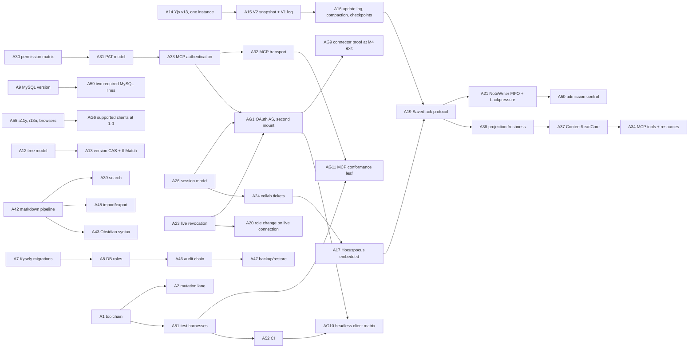

# Decision log (ADRs)

This file is the authoritative record of every settled architecture decision for Iridium. Areas 1–8 correspond one-to-one with the rows of the decision skeleton (A1–A57) plus the single limits policy (A.1), and were all accepted on 2026-09-11. Area 9 holds the ADRs the project owner's answers of **2026-09-12** and **2026-09-24** produced: the log is no longer one-to-one with the skeleton, and it now carries its first **superseded** and **superseded in part** statuses. Nothing here is provisional.

The eight questions first put to the owner in `14-risks-and-open-questions.md` §G, G1–G8, were all answered on 2026-09-12. Four answers changed a settled decision and produced an Area 9 ADR — G1 (native connectors: yes) → AG1, G3 (MySQL 8 required: yes) → A59, G6 (desktop is the supported client at 1.0) → AG6, G8 (unsigned zipped bundles at 1.0) → the amendments to A53. Four answers confirmed the default the ADR already stated — G2, G4, G5 and G7 — and are recorded in the **Status** and **References** lines of the ADRs they confirm and in "Decisions settled by the owner's answers of 2026-09-12" near the end of this file. Four more questions, G9–G12, were put to the owner while M3 was planned and answered on 2026-09-24; each changed a settled decision and produced an Area 9 ADR — G9 (the real-connector proof moves to the M4 exit) → AG9, G10 (real-client observation at M3 is headless) → AG10, G11 (the MCP conformance tools return in a dev-only leaf) → AG11, G12 (the M3 settings groups) → AG12 — recorded in "Decisions settled by the owner's answers of 2026-09-24". One question is open: G13 (raised 2026-09-24; answer due at M4 entry; CI-enforced at the M4 exit rehearsal), whose working default AG9 encodes (D14-04).

An implementer (human or agent) should treat this log as the "why" behind the plan: the other sections say *what* to build; this section says which alternatives were weighed, what was rejected and for which reason, what each choice costs, and — critically — which spike, test, or CI check proves the decision holds. Where a decision was terse in the skeleton, the detail here is drawn from the research digest (`research-digest.md`, cited as "digest §n.m") and from the four source plans (`plan-risk-first`, `plan-agent-first`, `plan-enterprise-first`, `plan-product-dx-first`, cited by their own ADR numbers).

## How to read this log

Every ADR carries the same fields, in the same order:

| Field | Meaning |
|---|---|
| **Id / title** | The skeleton id (`A1`…`A57`, `A.1`), a later `A<nn>` for an ADR that supersedes a skeleton row in full, or an `AG<n>` for an owner answer that changes several ADRs in part. The id is stable and is what other plan sections cite. |
| **Status** | `Accepted (<date>)` for a live decision; `Superseded by <id> (<date>)` for one replaced in full; `Superseded in part by <id> (<date>)`, naming the clause, for one replaced only there (D13-14); `deprecated` for one withdrawn without a replacement. An accepted ADR's *Decision* text is never **silently** edited (a citation correction of a recorded test-name or CI-gate spelling is not an edit, D13-16): the text as accepted is kept and labelled, and the superseding decision is written beside it under an inline **Superseded …** marker naming the superseding id and the date, so a reader sees both what was decided and what replaced it. A **Status** line may also record that an owner answer *confirmed* the decision, which changes nothing else in the entry. |
| **ADR file** | The path under `docs/adr/` seeded at M0 (see "Decisions made in this section"). |
| **Context** | The forces: spec requirements, verified library facts, threats, and the contested points among the source plans. |
| **Decision** | The exact decision, with exact versions, names, paths, and values. This is normative. |
| **Alternatives considered** | Each rejected option and the concrete reason it lost. |
| **Consequences** | Positive and negative, including the follow-on obligations the decision creates for other sections. |
| **Verification** | How the decision is validated: the named spike (`docs/spikes/*.md`), the named test(s), or the CI check. |
| **References** | Digest sections, spec sections, source-plan ADRs, and the plan sections that implement the decision. |

Version numbers are exact pins from the digest (verified as of 2026-09-11); items the digest did not cover are marked "pin at M0" and receive an exact pin plus a license check during repository bootstrap (`12-milestones.md`, M0).

**Test names in a Verification block are citations, never coinages.** Every `<area>.<subject>.<layer>` name below exists in the named test inventory of `10-testing-and-quality.md`, which owns file names, projects and lanes; `scripts/check-test-name-references.ts` in the `static` job greps every plan and `docs/` markdown file for that pattern and fails on a name absent from `docs/acceptance-map.json`, printing the canonical spelling from that section's "Superseded spellings" table. A Verification field is therefore normative about *what* is proven and cites the inventory for *where* it is proven (D13-5). Where an assertion is a CI step rather than a spec file — the license scan, the `static` job's `pnpm gen:check` step, Schemathesis, Redocly lint — this log names the step and the script instead of inventing a test name. The same check refuses a spelling that a "Superseded" table records wherever it is used as a name, and a backticked `.test`-suffixed or directory-prefixed pseudo-name; correcting such a citation to its canonical is not an edit of decision text (D13-16).

### Decision-id prefixes

Each plan section ends with a "Decisions made in this section" table whose ids this log merges as ADRs, and two sections keep a prefix that predates the dominant `D<NN>-<n>` form. The table below is the complete set, so a reader who meets an id anywhere in the plan can tell which section owns it. Superseded spellings are listed because they still appear in cross-references written before the renumbering; a citation using one resolves to the same decision.

| Section | Prefix in use | Superseded spellings |
|---|---|---|
| `01-vision-scope-and-principles.md` | `D01-` | — |
| `02-system-architecture.md` | `ARCH-` | — |
| `03-data-model.md` | `D03-` | `D3-` |
| `04-auth-and-access-control.md` | `D04-` | — |
| `05-collaboration-and-durability.md` | `D05-` | `D-05-` |
| `06-mcp-and-agent-access.md` | `D06-` | — |
| `07-client-applications.md` | `D07-` | — |
| `08-markdown-pipeline-import-export.md` | `D08-` | — |
| `09-api-reference.md` | `D09-` | — |
| `10-testing-and-quality.md` | `D10-` | `TQ-` |
| `11-operations-and-deployment.md` | `OPS-` | — |
| `12-milestones.md` | `D12-` | — |
| `13-decision-log.md` | `D13-` | — |
| `14-risks-and-open-questions.md` | `D14-` | — |
| Owner answers to open questions G1–G12 | `AG` (`AG1`…`AG12`) | — |

`A<n>` (this log, from the skeleton), `F<n>` (spec deviations, `01-vision-scope-and-principles.md`), `T<n>` (threat-model rows, `04-auth-and-access-control.md` §12), `P<n>` (principles, `01-vision-scope-and-principles.md`), `G<n>` (the questions put to the owner in `14-risks-and-open-questions.md` §G — G1–G8 answered 2026-09-12, G9–G12 answered 2026-09-24, G13 open; an answered `G<n>` names the decision that answered it, and an open one names the question and the encoded working default in force until it is answered), `HP-<n>` (hard properties, `10-testing-and-quality.md`) and the `R-T`/`R-P`/`R-O`, `S<n>` and `ASM-<n>` families of `14-risks-and-open-questions.md` are separate namespaces and never collide with a `D`-prefixed section id.

An owner answer that changes a settled decision becomes an ADR of its own, numbered `AG<n>` after the open question it answers, and the ADRs it supersedes record that in their **Status** line rather than having their *Decision* text edited. The numbering is deliberate: it is collision-free when several answers land at once, and it says on its face which question produced the decision. An answer that supersedes one skeleton ADR **in full** instead takes the next free `A<nn>` in sequence, because the log's Areas 1–8 are read by subsystem and a replacement should carry a number in the same series as the thing it replaces; the entry itself still sits in Area 9 with the other answers, and the superseded ADR's own **Status** line is what carries a subsystem reader to it — which is why G3's answer is `A59` (it replaces A9 outright) while G1's and G6's are `AG1` and `AG6` (each changes several ADRs in part). An `AG<n>` ADR has no number of its own to derive a file name from, so it takes the next free file number under `docs/adr/` in the order the answers are recorded (D13-13). The G1 change specification called `AG1` "ADR-15a" before this convention existed; a citation using that spelling resolves to `AG1`.

### Areas

| Area | ADRs |
|---|---|
| 1. Repository, toolchain, and delivery | A1, A2, A3, A4, A51, A52, A54, A56 |
| 2. HTTP server, validation, and data layer | A5, A6, A7, A8, A9, A10, A11, A12, A13 |
| 3. Collaboration engine and durability | A14, A15, A16, A17, A18, A19, A20, A21, A22, A50, A.1 |
| 4. Identity, sessions, and authorization | A23, A24, A25, A26, A27, A28, A29, A30, A31 |
| 5. MCP and agent access | A32, A33, A34, A35, A36, A37, A38 |
| 6. Content pipeline, search, attachments, and portability | A39, A42, A43, A44, A45 |
| 7. Client applications | A40, A41, A53, A55 |
| 8. Audit, backup, operations, and threat model | A46, A47, A48, A49, A57 |
| 9. Owner answers to the open questions (2026-09-12, 2026-09-24) | AG1, A59, AG6, AG9, AG10, AG11, AG12 |

### Decision dependencies

The decisions are not independent. The diagram shows the load-bearing chains: a change to an upstream node would reopen every node below it. Implementers should read the upstream ADRs of any decision they touch.



---

## Area 1 — Repository, toolchain, and delivery

### A1 — Monorepo toolchain: pnpm workspaces + Turborepo, TypeScript 7 native, oxlint/oxfmt, tsdown, Vite 8

**Status.** Accepted (2026-09-11); **amended 2026-09-13**: a `spikes/*` workspace glob and the `spike` boundary tag join the layout (12-milestones.md D12-5), the catalog is defined as what the manifests declare rather than what the plan pins (knip 6 reports an unused entry), and the single-copy `overrides` list is recorded in full — `@types/node`, `fast-check` and `axe-core` alongside A14's CRDT and CodeMirror entries. **ADR file.** `docs/adr/0001-monorepo-toolchain.md`.

**Context.** Iridium is one repository holding a Node 24 server, a browser SPA, an Electron shell, and seven isomorphic or browser-only packages that both apps consume (skeleton §B). The toolchain must give one TypeScript checker for the whole repository, one bundler family for web and desktop, reproducible installs, and supply-chain controls that an enterprise reviewer will accept. Three verified facts shaped the choice (digest §9.2): TypeScript 7.0.2 is the Go-native compiler and ships **no programmatic JS API** (expected in 7.1), so typescript-eslint (peer `<6.1.0`) cannot run on it without the `@typescript/typescript6` alias — i.e. two TypeScripts in one repo; tsup is officially unmaintained ("consider using tsdown"); and Nx deprecated all free self-hosted remote-cache packages after CVE-2025-36852 and shipped malicious versions in the "s1ngularity" incident (CVE-2025-10894). Vite 8 replaces esbuild/Rollup with Rolldown/Oxc, and `@vitejs/plugin-react` 6.1.1 peers on Vite 8; electron-vite 5 supports only Vite ≤7 (digest §4.2, §9.2).

**Decision.** pnpm 12.4.1 workspaces (`apps/*`, `packages/*`, `tooling/*`, `spikes/*`) with `catalog:` in `strict` mode, `saveExact`, `minimumReleaseAge 4320`, `trustPolicy no-downgrade`, and an explicit `allowBuilds: {electron, lefthook, @node-rs/argon2, esbuild}`; the catalog carries every version a manifest in the repository declares and nothing else, because knip 6 reports an unused catalog entry — a version this plan pins for a later milestone waits in 02-system-architecture.md's dependency table until the milestone that declares it (amended 2026-09-13); Turborepo 2.10.12 for the task graph with the experimental `boundaries` tags of skeleton §B.2 (dependency-cruiser 18.2.0 as the fallback checker); TypeScript 7.0.2 installed plain (no alias) repository-wide with `erasableSyntaxOnly`, `verbatimModuleSyntax`, `isolatedDeclarations`, `target es2024`, explicit `.ts` import extensions, ESM only; oxlint 1.82.0 with oxlint-tsgolint 7.0.2001 (type-aware) and oxfmt 0.67.0; tsdown 0.23.0 for Node bundles (server, bridge, Electron main/preload); Vite 8.3.0 + @vitejs/plugin-react 6.1.1 for browser bundles (web and Electron renderer share one config); lefthook 2.1.12, @commitlint/cli 21.2.2, @changesets/cli 3.0.2 with `privatePackages: {version: true, tag: true}` and one `fixed` group so the repository has one product version; renovate `config:best-practices`; knip 6.35.1; mise + `.node-version`; `.gitattributes * text=auto eol=lf`. Packages are classified compiled (`tsc -b` with declarations) or JIT (exports `./src/*`, compiled by the consuming Vite build) exactly as skeleton §B lists them.

**Alternatives considered.**

| Alternative | Why rejected |
|---|---|
| Nx 23 | Larger trust surface for less need; free remote-cache plugins deprecated after CVE-2025-36852; 2025 npm supply-chain incident; Turborepo covers `--affected`, `prune --docker`, `boundaries`. |
| ESLint 10 + typescript-eslint via the `@typescript/typescript6` alias repo-wide | Requires a second TypeScript everywhere; type-aware rules would then check against TS 6 semantics while `tsc` builds with TS 7. tsgolint covers 59 of 61 typed rules on the same checker. |
| Prettier 3.9.6 | Kept as the documented drop-in (`oxfmt --migrate prettier` is reversible) if oxfmt's pre-1.0 churn becomes unacceptable; not the default because oxfmt passes Prettier's JS/TS conformance suite and adds import/Tailwind sorting natively. |
| Biome 2.x | Its own type inference, not the TypeScript checker; materially narrower typed-rule coverage. |
| tsx / tsup / esbuild | Node 24 strips types natively for the dev loop; tsup unmaintained; esbuild no longer part of Vite. |
| Vite+ 0.3 | Pre-1.0 and not a Turborepo-class task graph. |
| TypeScript project references | Turborepo's guidance recommends per-package `check-types` with `dependsOn: ['topo']`; references add a second cache layer. |

**Consequences.** Positive: a single checker and single Vite major across web and desktop; `erasableSyntaxOnly` makes every package runnable by Node's native type stripping and structurally excludes decorator frameworks; `minimumReleaseAge` (3 days, above Renovate's `security:minimumReleaseAgeNpm`) and `trustPolicy` give a stated supply-chain posture; the catalog-matches-manifests rule keeps `knip --production` green without an exception list at the catalog level; one `fixed` Changesets group means server image, web bundle, installers, and bridge always share a version (needed by A54). Negative: oxfmt is pre-1.0 (documented Prettier fallback); `turbo boundaries` is experimental (dependency-cruiser fallback); oxlint JS plugins are alpha, so custom lint rules are written as `no-restricted-imports` patterns or as tests (the guard tests of A51); type-aware oxlint in a monorepo needs dependents' built `.d.ts`, so `lint` depends on `^build` in `turbo.json`; `turbo prune --docker` previously dropped unknown `pnpm-lock.yaml` settings (issue #12442, fixed) — the CI Docker build installs with `--frozen-lockfile` from the pruned lockfile to catch any regression.

**Verification.** M0 exit: `pnpm turbo run build check-types lint test` green on ubuntu and windows; the `static` job's `pnpm gen:check` step green (A3); `deps.single-instance.guard` test (A14); boundaries job (`turbo boundaries`, or dependency-cruiser) green; `knip --production` clean; Docker image builds from the pruned lockfile with `pnpm install --frozen-lockfile`; the Turbo `envMode: strict` env lists are diffed against `EnvSchema` keys in CI (skeleton §B.2 invariant).

**References.** Digest §9.1–§9.5, §11.19, §11.20, §4.2 (Vite 8 / electron-vite matrix); plan-risk-first ADR-18; plan-product-dx 001/002; plan-enterprise ADR-26; plan-agent-first ADR-22. Implemented in `02-system-architecture.md` (repository layout) and `10-testing-and-quality.md` (CI).

### A2 — Mutation-testing lane isolated with its own TypeScript 6 alias

**Status.** Accepted (2026-09-11); **amended 2026-09-13**: the isolation pattern applies to a second consumer of the TypeScript compiler API, `openapi-typescript` 7.13.0, whose type printer calls `ts.factory` and therefore fails under TypeScript 7.0.2 (found when `pnpm gen` step 3 first ran at M0). It is declared by a second leaf package, `tooling/api-codegen` (`@iridium/api-codegen`), with its own `"typescript": "npm:@typescript/typescript6@6.0.2"` and no sources; `peerDependencyRules.allowedVersions` in `pnpm-workspace.yaml` accepts TypeScript 6 for the `openapi-typescript>typescript` peer only, and the `mutation` named catalog carries exactly five entries — `vitest`, `@vitest/browser`, `@vitest/browser-playwright`, `@vitest/coverage-v8` and `@vitest/ui`, all at 4.1.11 — so that lane's peers stay inside one Vitest line while the workspace keeps pnpm's default peer resolution and one shared Vitest 5 instance; `playwright` is deliberately not one of them, and `tooling/mutation` takes it from the default `catalog:`. At that amendment, `guards.mutation-lane.guard` allowed the alias in exactly those two manifests and scanned every workspace for other carriers; the 2026-09-20 amendment below adds one named leaf. `packages/api-client` still owns the generated `paths.d.ts` and compiles it with TypeScript 7. **ADR file.** `docs/adr/0002-mutation-lane.md`.

**Amended 2026-09-20.** S11 executed A42's parser fallback after the representative preview missed the 100 ms gate. Its pinned `markdown-it` 15.0.2 packaging patch exposes the shared token engine without copying grammar algorithms or changing the upstream root API. `spikes/s11-markdown/make-parser-patch.mjs` reproduces the patch from verified upstream bytes using TypeScript's JavaScript AST parser, transformation factory and printer, APIs absent from TypeScript 7. The private, `spike`-tagged `spikes/s11-markdown` leaf therefore declares the same exact `"typescript": "npm:@typescript/typescript6@6.0.2"` devDependency. `tooling/mutation/package.json`, `tooling/api-codegen/package.json` and `spikes/s11-markdown/package.json` are the entire alias inventory. No product may import those leaves, no catalog or override carries the alias, and every product build and type check stays on TypeScript 7. The guard scans every workspace and proves that an unreviewed fourth product or spike leaf fails. Remove the S11 exception with the patch when an equivalent upstream token entry passes the full semantic matrix and complete-worker size gate. Maintenance, source hashes and retained measurements are in `spikes/s11-markdown/PARSER-PATCH.md` and `docs/spikes/S11-markdown-engine-cost.md`.

**Context.** StrykerJS 10.0.0's `typescript-checker` needs the TypeScript compiler API, which TypeScript 7.0.2 does not provide (digest §8.2). A1 keeps the main workspace on plain TS 7. Two source plans (enterprise, product-dx) resolved this by running Stryker with `checkers: []`, accepting that compile-error mutants are only killed if a test happens to exercise them. The risk-first plan kept the checker by isolating it. The judge panel grafted the isolation.

**Decision.** A dedicated workspace package `tooling/mutation` (`@iridium/mutation`) declares its own `"typescript": "npm:@typescript/typescript6@6.0.2"` alias and runs `@stryker-mutator/core`, `@stryker-mutator/vitest-runner`, and `@stryker-mutator/typescript-checker`, all 10.0.0, with `incremental: true` (`reports/stryker-incremental.json`), `checkers: ['typescript']`, thresholds `high 90 / low 75 / break 70`, raised to `break 80` by M8, against `vitest.stryker.config.ts` (the `unit` Vitest project only). If the M0 spike shows Stryker 10's vitest-runner cannot drive Vitest 5.0.0, this lane alone pins Vitest `V4` (4.1.11); the main workspace stays on Vitest 5. The lane runs in `nightly.yml`.

**Alternatives considered.**

| Alternative | Why rejected |
|---|---|
| Stryker with `checkers: []` (enterprise, product-dx) | Compile-error mutants survive unless a test incidentally covers them; on authorization code that is exactly the wrong place to lose signal. |
| Alias `@typescript/typescript6` repository-wide | Contradicts A1: two TypeScripts and two rule semantics across the codebase for the sake of one nightly tool. |
| Skip mutation testing | Coverage percentages alone do not prove that `authorize()`, the token verifier, and the persistence writer are asserted, only that they are executed. |

**Consequences.** Positive: compile-error mutants are detected; the second TypeScript is confined to devDependency-only leaf packages that nothing imports (one at acceptance; two after the 2026-09-13 amendment; three after the 2026-09-20 amendment). Negative: Stryker forces `bail: 1`, single-threaded workers, coverage off, and does not support Browser Mode, so only the `unit` project is mutated (component/integration lanes are not); the Vitest 5 compatibility is unverified until the spike.

**Verification.** M0 spike `docs/spikes/S05-stryker-vitest5.md` (records whether the `V4` fallback was taken); nightly `mutation` job with `break` enforced; M1 gate: Stryker ≥ 70 on `auth/**`, `authz/**`, `tokens`, `collab/persistence/**`, `@iridium/crdt`; M8 gate: `break 80`.

**References.** Digest §8.2 (Stryker 10, TS 7 API), §11.19, §11.21; plan-risk-first §9 harnesses; plan-product-dx 030 (the rejected `checkers: []` option). Implemented in `10-testing-and-quality.md`.

### A3 — Contracts-first code generation with CI drift checks

**Status.** Accepted (2026-09-11). **ADR file.** `docs/adr/0003-contracts-first-codegen.md`.

**Context.** Iridium has four wire surfaces (REST, WebSocket stateless messages, MCP, desktop IPC) consumed by three clients (web, Electron, bridge) and by external agents. Hand-maintained client types drift silently. The product-dx plan proposed an in-house Storybook-like workbench (`apps/workbench`) as a contract surface; the judges rejected it as unverified tooling in the bootstrap milestone.

**Decision.** `@iridium/contracts` (zod 4.6.2 only) is the single source of wire contracts. A root `pnpm gen` runs, in order: (1) `apps/server` boots in `in-process` mode and writes `packages/contracts/openapi/openapi.json` via `app.swagger()` (OpenAPI 3.1, with `links` so Schemathesis can run stateful fuzzing), then `@redocly/cli 2.52.1 lint`; (2) openapi-typescript 7.13.0 emits `packages/api-client/src/generated/paths.d.ts`, consumed by openapi-fetch 0.17.0; (3) kysely-codegen 0.20.0 generates types from a migrated database and diffs them against the hand-written `apps/server/src/db/schema.ts`; (4) `packages/contracts/mcp/tools.schema.json` is emitted from the zod tool schemas and a test asserts the live `tools/list` (both eras) equals it in deterministic order; (5) desktop IPC typings for `window.iridium` are generated from `contracts/desktop-ipc.ts`; (6) an msw 2.15.0 handler skeleton is generated from `openapi.json` for component tests. CI runs `pnpm gen && git diff --exit-code` (the `static` job's `pnpm gen:check` step).

**Alternatives considered.**

| Alternative | Why rejected |
|---|---|
| Hand-maintained client types and MCP schema JSON | Drift is invisible until a client breaks; no build failure. |
| In-house workbench `apps/workbench` (product-dx 021) | Unverified tooling in M0; component tests run in Vitest Browser Mode instead (A51). |
| Storybook | No verified Vite 8 Storybook version in the digest. |
| Separate schema languages per surface (TypeBox for REST, JSON Schema for MCP) | One schema language (A6) is what makes (4) and (5) trivial. |

**Consequences.** Positive: any change to a route, stateless message, tool, or IPC channel is a build failure until the generated artifacts are regenerated and committed; the OpenAPI document is an executable contract (A6's `toMatchOpenApi`, Schemathesis). Negative: `pnpm gen` needs a database for step (3) (Testcontainers MySQL in CI; documented local `compose.yaml`); generated files are committed, so reviewers see large diffs on contract changes (accepted — that visibility is the point).

**Verification.** The `static` job's `pnpm gen:check` step; `mcp.tools-schema.contract` (M3); `rest.route-index.contract` (M2); Redocly lint; kysely-codegen diff step (M0).

**References.** Digest §8.2 (OpenAPI tooling status), §5.2 (`@fastify/swagger` dynamic mode), §3.2 (deterministic `tools/list`); plan-product-dx §2.6/§9.4 (graft source); judges 1–3. Implemented in `09-api-reference.md` and `10-testing-and-quality.md`.

### A4 — Node.js 24 LTS as the single runtime

**Status.** Accepted (2026-09-11). **ADR file.** `docs/adr/0004-node-24.md`.

**Context.** The server, the stdio bridge, the Electron main process, and every test runner share TypeScript code. Electron 44.3.0 embeds Node 24.20.0; Hocuspocus 4 requires Node ≥22; Node 22 is in Maintenance (EOL 2027-04-30); Node 26 is Current until 2026-10-28 and is not embedded by any supported Electron (digest §5.2, §9.2, §11.7). Native type stripping is stable since Node 24.12.0.

**Decision.** Node 24.21.0, declared in `package.json` `devEngines.runtime` (`{name:'node', version:'24.21.0', onFail:'download'}`), `.node-version`, `mise.toml`, and `engines: ">=24.12 <25"`; `@types/node` 24.13.4 (the `latest` dist-tag is misleadingly 22.x); Docker base `node:24.21.0-bookworm-slim`. Node 26 is adopted only after an Electron release embeds it, as an explicit post-MVP step.

**Alternatives considered.**

| Alternative | Why rejected |
|---|---|
| Node 22 LTS | Maintenance line; loses stable type stripping semantics and `--env-file-if-exists`; not what Electron 44 embeds. |
| Node 26 now | Current, not LTS; Electron main would run a different major from the server, splitting `@types/node` and runtime behaviour for shared packages. |

**Consequences.** Positive: one runtime contract for server, bridge, and Electron main; the dev loop runs `.ts` natively (no tsx); one `@types/node`. Negative: Node 24 leaves Active LTS on 2026-10-20 (Maintenance until 2028-04-30) — acceptable, and the Electron cadence policy (A53) is the trigger for the Node 26 move; `engines` upper bound `<25` must be raised deliberately.

**Verification.** M0: pnpm refuses installs on an incompatible runtime (`devEngines`), CI `setup-node` pinned to 24.21.0, Docker image built on the pinned base; `desktop.launch.e2e` proves the Electron main runs the shared code.

**References.** Digest §5.2, §9.2, §4.2, §11.7; unanimous across the four plans (risk-first ADR-07, enterprise ADR-01, product-dx 033). Implemented in `02-system-architecture.md` and `11-operations-and-deployment.md`.

### A51 — Testing harnesses: one runner per layer, real infrastructure, one boot path, `@iridium/testkit`

**Status.** Accepted (2026-09-11); the `integration` project's single MySQL image is **superseded in part by A59 (2026-09-12)**: the project runs as a two-entry matrix over `mysql:8.4.11` and `mysql:9.7.2-oraclelinux9`, with an unset `IRIDIUM_MYSQL_IMAGE` resolving to the floor. **Amended 2026-09-13:** the coverage numbers in the Decision below are unchanged, but they are **enforced for the M1 exit and its rehearsals onward** rather than at M0 — the root `vitest.config.ts` applies `coverage.thresholds` only when the job sets `IRIDIUM_COVERAGE_GATE=1` and the effective test target is past M0 (`IRIDIUM_TEST_TARGET_MILESTONE` when set; otherwise the last exited milestone in CURRENT), because the M0 tree deliberately contained the empty stubs of every M1+ boot step and the placeholder packages, so the aggregate would measure stubs and the 100 %-per-file rule on `apps/server/src/authz/**` could not hold while `route-policy.ts` was reached only by its boot guard. CI defaults the target to at least M1 while CURRENT still records M0, so the M1 gate is enforced before the pointer advances. The M0 exit record reports the merged numbers without gating on them, and "a threshold is never lowered" applies from the first exit that enforces them (10-testing-and-quality.md, "Coverage"). **Amended 2026-09-25:** the `mcp` project's conformance baseline is a committed, typed and cause-checked file rather than an empty one, and the tool runs through an in-test credential proxy from the dev-only leaf of AG11, marked inline in the Decision. **ADR file.** `docs/adr/0051-testing-harnesses.md`.

**Context.** The spec's nine acceptance rows (spec §9) are statements about durability, authorization, and convergence under failure; they cannot be proven with mocks. The digest verified the exact behaviours the tests must pin: Hocuspocus's `SyncStatus` precedes persistence (§8.2, §2.2), there is no store retry (§11.4), and Yjs's own convergence harness is the reference model (§8.2). Vitest 5.0.0 is eight days old with a `V4` fallback; Playwright 1.63 adds test locks; Testcontainers 12.1 needs an explicit image string; k6's ability to run bundled yjs/lib0 is unvalidated (§8.2).

**Decision.** Vitest 5.0.0 (+ `@vitest/coverage-v8`, `@vitest/browser-playwright`, `@vitest/ui` 5.0.0; `V4` 4.1.11 only for the mutation lane per A2) with `test.projects`: `unit` (ubuntu + windows, `pool: forks`, `sequence.shuffle` with the seed printed), `component` (Browser Mode chromium via `playwright()` provider, vitest-browser-react 2.3.0, axe-core pinned at M0), `integration` (Testcontainers 12.1.0 `MySqlContainer(process.env.IRIDIUM_MYSQL_IMAGE ?? 'mysql:8.4.11')` on tmpfs, per-worker schemas, in-process `buildApp({mode:'in-process'})`), `property` (fast-check 4.10.0 + @fast-check/vitest 0.5.0; `numRuns 200` on PR, 5 000 + soak nightly), `chaos` (child-process server, `@testcontainers/toxiproxy` 12.1.0 / toxiproxy 2.12.0, and the `IRIDIUM_FAULT` registry active only when `NODE_ENV=test`: `store.throw`, `store.crash-before-commit`, `store.crash-after-commit-before-ack`, `store.slow:<ms>`, `compact.throw`, `ws.drop-after-ack`, `auth.slow:<ms>`), `contract` (`toMatchOpenApi(operationId, status)` on ajv 8.20.0 + swagger-parser 13.0.0; Schemathesis 4.26.1), `mcp` (in-process `handler.fetch` for both eras, `@modelcontextprotocol/conformance` 0.1.16 with an empty expected-failures baseline [**Amended 2026-09-25:** with a committed typed baseline, `apps/server/test/mcp/conformance-baseline.yaml`, whose entries are only `reference-fixture` or `iridium-policy`, each checked against the tool's recorded check messages by cause signature, the tool itself failing on an unexpected or a stale entry; 0.1.16 takes `--spec-version 2025-11-25`, has no 2026-07-28 suite, drives only the legacy leg and cannot send a credential, so the tool is spawned from the `tooling/mcp-conformance` leaf (AG11), never through `npx`, once per mount, through an in-test proxy that adds the credential and forwards `Host`, `Origin`, every other header and the body verbatim to the product booted with `PUBLIC_ORIGIN` set to the proxy's origin, and the modern era is owned by `mcp.dual-era.contract` and `mcp.discover.mcp`], Inspector 2.6.0 `--cli`). Playwright 1.63.0 projects `setup` / `chromium` (4 shards, test locks) / `electron` (ubuntu xvfb, windows, macos with `shogo82148/actions-setup-mysql@v1` `9.7`). k6 2.2.0 with bundled yjs/lib0 (M0 spike; fallback: a Node worker generator on `@iridium/collab-client`) with SLOs `ws_connecting p95 < 500 ms`, `yjs_propagation_ms p95 < 250 ms`, `durable_ack_ms p95 < 1 s`, `projection_lag_ms p95 < 12 s`, MCP `get_note p95 < 300 ms`, RSS < 1.5 GB at 300 VUs / 60 docs on 4 vCPU. `@iridium/testkit` provides `startTestEnv`, `startServer({mode:'in-process'|'child'})`, `NoteClient` (a `ws` subclass injecting `Origin: <PUBLIC_ORIGIN>`), `vaultChannelClient`, `restClient`, `mcpClient(token, era)`, fixtures (demo vault; Obsidian sample vault with `.obsidian/`, `.trash/`, `.canvas`, CRLF, BOM; hostile corpus; CommonMark 0.31.2 JSON; msw handlers). Policies: Vitest `retry: 0`; Playwright `retries: 2` in CI only, with traces; coverage v8 global 85/85/80/85 (lines/functions/branches/statements), 100 % per-file on `auth/**`, `authz/**`, `contracts/{tokens,paths,authz}`, 95/90 on `collab/persistence/**` and `@iridium/crdt`. Guard tests (grep- or snapshot-based, collected by path into their own `guard` project and run first in the `static` job): `deps.single-instance.guard`, `collab.initial-state-only-path.guard` (`new Y.Doc(` only inside `@iridium/crdt`, `collab/persistence/initial-state.ts`, and tests), `collab.no-reinit.guard` (`getText('content').insert` only inside `NoteService.initialize`, restore, repair), `collab.lf-invariant.guard`, `limits.single-source.guard`, `authz.route-policy.boot.guard`, `authz.no-mcp-admin-implied.guard`, `ipc.origin.guard`, `desktop.preload-surface.guard`, `desktop.web-preferences.guard`, `desktop.fuses.guard`. Three invariants the skeleton lists alongside them — DB grants, awareness identity and log redaction — need a live database or a live socket, so they ship as `db-grants.integration`, `collab.awareness-identity.integration` and `logging-redaction.integration` in the `integration` project rather than as guards.

**Alternatives considered.**

| Alternative | Why rejected |
|---|---|
| Jest | Second transform pipeline next to Vite; no Browser Mode; slower on ESM-only packages. |
| WebdriverIO for Electron | Playwright's `_electron.launch` is the path Electron's own testing guide recommends, and it shares the web E2E runner. |
| Artillery for load | Its `ws` engine documents no binary frames or message assertions; Yjs sync is binary. |
| jest-openapi / vitest-openapi | Stale (2022/2023); an ajv + swagger-parser matcher is a few dozen lines and tracks OpenAPI 3.1. |
| Pact | Consumer-driven contracts across teams; Iridium's clients live in the same repository and are generated from the same OpenAPI document (A3). |
| Mocks for MySQL / network faults | The acceptance rows are about real commits and real socket failures. |
| `electron-playwright-helpers` IPC helpers | Require `nodeIntegration: true, contextIsolation: false`, incompatible with A53. |

**Consequences.** Positive: every acceptance row maps to a named test (`10-testing-and-quality.md`); durability is proven under injected faults on both sides of `COMMIT`; both MCP eras are exercised through the deployed handler; `@iridium/testkit` is the only test harness, so `buildApp()` is the only boot path. Negative: integration and chaos lanes need Docker (Linux runners only); Vitest 5 is very new (breaking-change list in digest §8.2 — `clearMocks` default true, un-awaited assertions fail, `test.sequential` removed — adopted deliberately); the k6 bundling spike may fail (fallback recorded); Playwright retries mask flakiness only in CI and only with traces attached.

**Verification.** This ADR is itself the verification framework; its own checks: M0 exit (all Vitest projects and Playwright projects run empty-green on ubuntu + windows, Electron launch on three OSes), `docs/spikes/S06-k6-yjs-bundle.md`, `docs/spikes/S05-stryker-vitest5.md`, coverage thresholds enforced in `merge-reports`.

**References.** Digest §8.1–§8.5, §11.21, §2.2 (`SyncStatus` timing), §11.4 (no store retry); plan-risk-first ADR-20 + §9; plan-product-dx §9.3 testkit graft; plan-enterprise ADR-28. Implemented in `10-testing-and-quality.md`.

### A52 — CI: `ci.yml` / `nightly.yml` / `release.yml` with digest-pinned actions and license compliance

**Status.** Accepted (2026-09-11); the `nightly.yml` cross-browser smoke lane is **superseded in part by AG6 (2026-09-12)**, the `nightly.yml` MySQL 8.4.11 lane is **superseded in part by A59 (2026-09-12)**, and `release.yml`'s signing and notarisation secrets are **superseded in part by G8 (2026-09-12)** — 1.0 publishes six unsigned bundles with a published SHA-256 each (A53), while the test-signed E2E package smoke, which proves the fuse variant rather than a distribution signature, is unaffected. **Amended 2026-09-13:** the Decision's "`release.yml` (tags from `changeset git-tag`)" is corrected — `changeset git-tag` emits one `<pkg>@<version>` tag per package and never a product tag, so `release.yml` triggers on the `v<major>.<minor>.<patch>` milestone tag, which is cut by hand at the exit (D12-1), and every job but `version-pr` carries a version floor that skips the M0 tag `v0.0.0`. Changesets' role is unchanged: it versions the packages under A1's single `fixed` group and `version-pr` runs `changesets/action` off `main`. **Amended 2026-09-19:** while changes land directly on main by owner instruction, remove `version-pr` and the main-push release trigger. Run `pnpm changeset version` locally and commit its versions/changelogs before the exit record; only product tags select release artifacts. Branch-protection setup is deferred with the PR workflow; due CI checks remain milestone-exit gates. Every other lane stands, and the job list in the Decision below is kept as the record of what was accepted (D13-2, D13-14). The nightly real MCP client matrix is **superseded in part by AG10 (2026-09-24)**, marked inline in the Decision: the matrix is headless and advisory until M8, and GUI clients are observed in `docs/acceptance/mcp-gui-clients.md`. **ADR file.** `docs/adr/0052-ci-pipelines.md`.

**Context.** Everything security-relevant must be a build failure, not a review comment. GitHub-hosted runners require Linux for service containers (digest §8.2); Electron E2E needs three OSes and native MySQL on Windows/macOS (`shogo82148/actions-setup-mysql`). No plan had a license-compliance check; GPL `remark-obsidian` (digest §7.2) shows why one is needed.

**Decision.** `ci.yml` (PR and push, concurrency-cancelled; `actions/checkout@v7.0.1`, `pnpm/action-setup@v6.1.0`, `actions/setup-node@v7.0.0`, all pinned by digest, Renovate `helpers:pinGitHubActionDigests`): job `static` (`tsc -b --builders 8`, `oxlint --type-aware`, `oxfmt --check`, `knip --production`, `turbo boundaries`, Redocly lint, `pnpm gen && git diff --exit-code`, `pnpm audit --audit-level high`, dedupe check, **license scan** with allowlist MIT / Apache-2.0 / BSD-2-Clause / BSD-3-Clause / ISC / MPL-2.0 / 0BSD / Unlicense / BlueOak-1.0.0 (added at M0, 2026-09-13) / PSF-2.0 (added at M2, 2026-09-21; 10-testing-and-quality.md records why for both) and denylist GPL / AGPL / LGPL / BSL / UNLICENSED, tool pinned at M0) → `unit` [ubuntu, windows] (unit + component + property-light, blob reporter) → `integration` (ubuntu with Docker: integration + contract + mcp + Schemathesis light) → `e2e-web` (4 shards, `mysql:9.7.2-oraclelinux9` service container) → `e2e-electron` [ubuntu xvfb, windows, macos] → `chaos-core` (≈20 kill iterations) → `merge-reports` (coverage thresholds, Playwright report). Critical path budget ≤ 15 minutes wall-clock per run (a performance budget for the pipeline, enforced by job timeouts, not an effort estimate). `nightly.yml`: property-long, chaos-extended (200 kill iterations, all toxics), load (k6 or fallback generator), mutation (A2), Schemathesis full, backup-restore drill (A47), cross-browser smoke (firefox/webkit), electron full, MySQL 8.4.11 lane (A9), real MCP client matrix (Claude Code ≥ 2.1.232 v2 runtime, VS Code, Cursor, bridge) [**Superseded in part by AG10 (2026-09-24):** the matrix is headless and advisory until M8; GUI clients are observed in `docs/acceptance/mcp-gui-clients.md`], proxied-stack MCP header passthrough (A48), `compose.prod.yaml` clean-VM boot. `release.yml` (tags from `changeset git-tag`): server image via `docker/build-push-action@v7.3.0` with SBOM and provenance, electron-builder matrix with signing/notarisation secrets, test-signed E2E package smoke, final packages, update-feed artifacts published with `iridium desktop-updates publish`, `changesets/action@v2.1.2` Version PR.

**Alternatives considered.** No plan proposed a different CI shape; the differences were in what was missing (license scan, proxied-stack MCP test, clean-VM compose boot), all of which are now included.

**Consequences.** Positive: a dependency with a disallowed license, an OpenAPI drift, a duplicate Yjs instance, a failing chain verification, or a desktop bundle whose file names, digests or fuse bits disagree with the release contract (`release.bundle-integrity`) cannot merge or ship — the clause as accepted named an unsigned installer, which G8 retired along with the installers themselves (A53). Negative: three-OS Electron E2E and Docker-based lanes make CI minutes the scarce resource; the ≤ 15 minute critical-path budget is protected by sharding and by moving long suites to nightly.

**Verification.** The pipelines are verified by running them at M0 exit (skeleton-green skeletons), and by M8's requirement that all nine acceptance rows are green on PR and nightly for 7 consecutive nightly runs.

**References.** Digest §8.2 (runner labels, action tags, `actions-setup-mysql`), §9.2 (Renovate, Changesets 3, pnpm 12 CI semantics), §7.2 (GPL plugin); all four plans' CI sections; gap fix (license scan). Implemented in `10-testing-and-quality.md` and `11-operations-and-deployment.md`. The MySQL lane assignment in this ADR's `nightly.yml` list is superseded by A59: the `mysql-84` job is deleted and `integration` and `chaos-core` become two-entry matrices, both entries required on `main`. The cross-browser smoke lane is superseded by AG6: the `browser-smoke` job and the `firefox-smoke` and `webkit-smoke` Playwright projects are deleted, and `release.yml`'s signing and notarisation secrets are superseded by G8 (A53), which ships unsigned bundles at 1.0.

### A54 — Client/server compatibility: integer `apiVersion`, `minClientVersion`, additive-only rule, N-1 window

**Status.** Accepted (2026-09-11); amended 2026-09-18 (implemented, "M1 independent-review amendments"); **amended 2026-09-25:** the gate's scope and the release floor ("A54 amendment: the gate's scope and the release floor", near the end of this file). **ADR file.** `docs/adr/0054-client-server-compatibility.md`.

**Context.** Desktop fleets update on the administrator's schedule (A53 update policy), so an older client will talk to a newer server. No source plan defined what "compatible" means; this ADR closes that gap.

**Decision.** `GET /meta` returns `{apiVersion: int, minClientVersion, serverVersion, features: string[], publicOrigin}`; clients send `X-Iridium-Client-Version`. A **breaking** change is removing or renaming a field, endpoint, stateless message type, or IPC channel, changing semantics, or tightening validation; it increments `apiVersion` and raises `minClientVersion`. [**Amended 2026-09-25:** the effective `minClientVersion` is the SemVer maximum of the committed release floor `RELEASE_MIN_CLIENT_VERSION`, which a breaking release raises in the same change that increments `API_VERSION`, and the operator floor `schema_meta.min_client_version`, which can raise the effective floor but never lower it below the release's; no data migration carries a release floor ("A54 amendment: the gate's scope and the release floor").] **Non-breaking** changes are additive optional fields, endpoints, stateless messages, or `features` entries. The server supports `apiVersion` N and N-1 for one release cycle. Stateless collab messages carry `v: 1`. Desktop IPC has no skew (renderer and main ship in one installer). A desktop client below `minClientVersion` shows an "update required" screen and prompts according to the update policy. Changesets keeps one product version across server image, web bundle, installers, and bridge (A1).

**Alternatives considered.**

| Alternative | Why rejected |
|---|---|
| Package-version negotiation (semver ranges) | Ties protocol compatibility to release numbering; an integer that only moves on breaking changes is simpler to reason about and to test. |
| No compatibility contract (web-only mindset) | The Electron fleet makes skew a certainty. |

**Consequences.** Positive: an explicit definition of "breaking" that reviewers can apply; the `features[]` list lets clients light up capabilities without a version bump. Negative: N-1 support means the server keeps deprecated fields for one cycle and tests both shapes (`rest.route-index.contract` and the `toMatchOpenApi` matcher run against both `apiVersion` values during a transition).

**Verification.** `meta.apiversion.integration` (shape and values), `desktop.update-required.e2e` (client below `minClientVersion`), and `rest.route-index.contract` during any transition; the release checklist in `11-operations-and-deployment.md` requires an `apiVersion` decision on every breaking change.

**References.** Gap fix (no digest section; product expectations in digest §10.2). Implemented in `09-api-reference.md`, `07-client-applications.md`, `12-milestones.md`.

### A56 — Milestone ordering: risk-first order with enterprise foundations folded into M0/M1

**Status.** Accepted (2026-09-11). **ADR file.** `docs/adr/0056-milestone-ordering.md`.

**Context.** Spec §10 names the first milestone literally: "one authenticated note, two editors, one viewer, MySQL persistence, and a server restart. Prove correct collaboration, authorization, and saving before expanding the vault-management UI." The four plans ordered work differently: platform-first (enterprise), UI-first (product-dx, with a visible editor at M1), MCP-before-structure (agent-first), and kernel-first (risk-first). The judges chose risk-first in two of three panels.

**Decision.** M0 bootstrap + harnesses + spikes → M1 headless kernel (the spec §10 sentence is the literal gate; the audit chain, configuration, readiness, DB roles, and CLI foundations from the enterprise plan are included here rather than in a separate platform milestone) → M2 structure / lifecycle / revisions / projections / search → M3 MCP + tokens + bridge → M4 shared UI + web host (+ vault channel) → M5 Electron → M6 import/export/attachments UI → M7 admin console → M8 operations hardening + release. A minimal visible web editor may be demonstrated at M1 but is not a gate. Each milestone exits only on green automated tests; no time or effort estimates appear anywhere in the plan.

**Alternatives considered.**

| Alternative | Why rejected |
|---|---|
| Platform-first (enterprise M1 "platform skeleton" before collaboration) | Delays the highest-risk proof (durable saving under faults); its contents are folded into M1 instead. |
| UI-first (product-dx: visible editor as the M1 gate) | Makes UI work a prerequisite of proving the kernel; the demo remains allowed but ungated. |
| MCP-before-structure (agent-first M2) | MCP reads projections and paths that M2 defines (`ContentReadCore`, `note_projections`, derived paths). |

**Consequences.** Positive: the riskiest technical claims (A15, A16, A19, A21, A23) are proven headless before any UI exists; MCP (a primary feature) ships at M3, immediately after the read model exists. Negative: nothing user-visible exists until M4 — accepted deliberately; the optional M1 demo mitigates it without becoming a gate.

**Verification.** `12-milestones.md` lists the exit tests per milestone; M1's `kernel.smoke.integration` is the literal spec §10 sentence.

**References.** Spec §10; judges 1–3; plan-risk-first §11; plan-enterprise M1/M2 (folded). Implemented in `12-milestones.md`.

---

## Area 2 — HTTP server, validation, and data layer

### A5 — Fastify 5 as the single HTTP host for REST, `/collab`, and `/mcp`

**Status.** Accepted (2026-09-11); the plugin-order clause is **superseded in part by AG1 (2026-09-12)**: it gains the oauth step before rest (recorded 2026-09-25), marked inline in the Decision. **ADR file.** `docs/adr/0005-fastify.md`.

**Context.** One process must serve REST, the Hocuspocus WebSocket, static bundles, and the MCP endpoint on one port behind one Origin/Host policy (spec §6, §8). The digest (§5.2, §11.6) verified: Express 5.2.1 has had no release since 2025-12-01 and has no validation/OpenAPI story; Hono's Node adapter makes raw `IncomingMessage` integrations (needed for `Hocuspocus.handleConnection` and `toNodeHandler`) second-class; NestJS 12 depends on decorators, which `erasableSyntaxOnly` (A1) forbids; Fastify 5.12.4 has `@fastify/websocket` (auth in `preValidation` during upgrade, `options.maxPayload`, `injectWS()`), `fastify-type-provider-zod` 7.0.0 for zod 4, `@fastify/swagger` 9.8.1 for OpenAPI 3.1, and an official `@modelcontextprotocol/fastify` 2.0.0 adapter.

**Decision.** fastify 5.12.4 with @fastify/websocket 11.3.0, @fastify/helmet 13.1.1 (CSP nonces via `enableCSPNonces`), @fastify/rate-limit 11.2.0, @fastify/cookie 11.1.2, @fastify/multipart 10.1.1, @fastify/under-pressure 9.1.0, @fastify/static (pin at M0), @fastify/swagger 9.8.1 (+ @fastify/swagger-ui 6.1.1 on `/docs`, admin or dev only), fastify-type-provider-zod 7.0.0, @modelcontextprotocol/fastify 2.0.0. `buildApp({mode})` in `apps/server/src/app.ts` is the only boot path, with plugin order config → db → security → auth → authz → audit → rest → collab → mcp → ops → jobs. **Superseded in part by AG1 (2026-09-12; recorded 2026-09-25):** the order is config → db → security → auth → authz → audit → oauth → rest → collab → mcp → ops → jobs (`02-system-architecture.md`, "Boot sequence and plugin order"). For information: the ARCH-27 amendment (2026-09-25) registers `@fastify/swagger`'s collector in `app.ts` immediately before the oauth step; that placement supersedes no clause of this decision, which never placed the collector. Every route declares `config.auth` (A30); a boot-time assertion fails the process if one does not. The server binds `127.0.0.1:4000` behind a reverse proxy (A48) with `trustProxy` set to the proxy CIDR only.

**Alternatives considered.**

| Alternative | Why rejected |
|---|---|
| Express 5.2.1 | Stale; hand-wired `ws` upgrade outside the middleware tree; no schema-driven OpenAPI; the MCP SDK's own `createMcpExpressApp` still needs Host/Origin wiring by hand. |
| Hono 4.13.7 + @hono/node-server | Web-standard `Request` in handlers is elegant, but Hocuspocus and the MCP Node handler need the raw Node socket/response; those integrations become adapter special cases. |
| NestJS 12.0.1 | Decorators and DI ceremony conflict with `erasableSyntaxOnly` and the native `.ts` dev loop; a second validation model. |
| Two processes (REST vs collaboration) | Loses the shared in-memory revocation bus, tombstone set, and per-vault mutex that A23/A46 rely on; the `CollabServer` interface preserves the split for later (F9). |

**Consequences.** Positive: same-port WebSocket with auth inside the plugin tree; one OpenAPI document generated from the routes; the official MCP adapter; helmet nonces feed CodeMirror's `EditorView.cspNonce`. Negative: Fastify 5's LTS table lists Node 20/22 (works on 24 in practice — pinned and tested); `@fastify/websocket` forwards `message`/`close` to `ClientConnection.handleMessage/handleClose` by hand (A17), which the M0 spike validates.

**Verification.** M0 spike `docs/spikes/S02-fastify-websocket-hocuspocus.md`; `authz.route-policy.boot.guard` (every route has `config.auth`); `rest.route-index.contract`; `mcp.dual-era.contract` through the mounted route; `readyz.integration`.

**References.** Digest §5.1–§5.3, §11.6, §3.2 (`toNodeHandler`), §6.2 (`trustProxy`, helmet); unanimous across plans (risk-first ADR-06, agent-first ADR-02, enterprise ADR-02, product-dx 003). Implemented in `02-system-architecture.md` and `09-api-reference.md`.

### A6 — zod 4 everywhere; OpenAPI 3.1 generated, committed, linted, and fuzzed

**Status.** Accepted (2026-09-11); **amended 2026-09-25**: zod is imported from its package root everywhere, every zod subpath is banned, every restricted-imports configuration is composed from one owner table with declared exemptions, and MCP ids use the contracts branded schemas — in the "Amended 2026-09-25" paragraph after the Decision, with the superseded clause marked inline. **ADR file.** `docs/adr/0006-zod-and-openapi.md`.

**Context.** REST DTOs, stateless collab messages, MCP tool schemas, desktop IPC payloads, and the server's environment all need validation with inferred types. The MCP SDK v2 accepts zod 4 natively; `fastify-type-provider-zod` 7.0.0 imports `zod/v4`; TypeBox split into two incompatible lines (`typebox` 1.x vs `@sinclair/typebox` 0.34) (digest §5.2).

**Decision.** zod 4.6.2 is the only schema language (`zod/v4` import path inside MCP code) [**Superseded in part (2026-09-25):** imported from the zod root everywhere, the MCP tool schemas included; every zod subpath is banned by a `no-restricted-imports` pattern that `restrictedImports()` composes into every configuration from the owner table, with no exemption; carve-outs of any restricted import are declared, reasoned `DECLARED_EXEMPTIONS` entries, never inline directives; `guards.restricted-imports.guard` checks the effective configuration of every file and the pinned oxlint's behaviour on probes; MCP ids use the contracts branded schemas, and the revision author's token id is `TokenId`]. Every REST route is typed with `ZodTypeProvider`; the error shape is `ProblemDetails {type, title, status, code, detail?, current?, requestId}` with the closed `code` vocabulary of skeleton §D.1. The OpenAPI 3.1 document is generated by `app.swagger()`, committed at `packages/contracts/openapi/openapi.json`, linted by Redocly (A3), fuzzed by Schemathesis 4.26.1 with `--stateful=links` (light on PR, full nightly), and every integration/E2E response passes `toMatchOpenApi(operationId, status)` (ajv 8.20.0 + swagger-parser 13.0.0). `EnvSchema` (zod) validates configuration with `*_FILE` secret indirection, fail-fast `z.prettifyError`, and rejection of unknown `IRIDIUM_*` keys.

**Amended 2026-09-25.** Every source file imports zod as `import { z } from 'zod'`: the zod 4.6 root export is the v4 API, one module instance, and SDK 2.0.0 reads schemas through Standard Schema, so the import path is irrelevant to it. Every zod subpath (`zod/v4`, `zod/v3`, `zod/mini`, `zod/v4/core` and the rest) is banned by `zodSubpathPatterns`, exported from `tooling/oxlint-config/base.ts`, with no exemption anywhere. oxlint override options replace earlier ones for the same rule rather than merging, and overrides accept no `excludedFiles`, so no `no-restricted-imports` configuration is assembled by hand and every carve-out is declared data. `tooling/oxlint-config/base.ts` exports the base families — `bannedEverywhere`; the yjs family, `yjs`, `y-protocols` and `lib0` by name plus `yjsSubpathPatterns` for their subpaths, because `lib0` and `y-protocols` are consumed by subpath and the exact-name entries never matched them; and `zodSubpathPatterns` — and `restrictedImports({paths, patterns, exempt})`, which returns the rule entry: every base family, minus exactly the entries named in `exempt` (each `{entry, reason}`), plus the given paths and patterns, de-duplicated. `oxlint.config.ts` exports `RESTRICTED_IMPORT_OWNERS`, the one table of who bans what where, with rows `{owner, files, paths, patterns}` and no `exceptFiles` key: the base and yjs families; each boundary tag's set from 02's banned-import column, `app` included (`@iridium/server` and its subpaths under `apps/{web,desktop,e2e}/**`); the e2e helper ban; the server set; `sdk-v1` (`@modelcontextprotocol/sdk` and its subpaths, banned everywhere, AG11); in the server rows, `mcp-sdk` (the SDK's server, node, fastify, core, client, express and hono packages), `mcp-core-internal` and `async-context` (`node:async_hooks` and `async_hooks`, ARCH-11 as amended); `oauth-layout`, the OAuth module-layout rules; `security-problem`, which keeps `sendProblem` private to `security/`; the bans of `mcp/` on `oauth/`, `collab/` and `@iridium/crdt`; the read graph (D06-15 as amended); ARCH-30; and `pagination` (A35 as amended). It also exports `DECLARED_EXEMPTIONS`, the only carve-outs, each `{owner, entries, files, reason}`: `markdown-it` and `markdown-it/parser` under `packages/markdown/src/markdown-it/**` (A42: only the compatibility adapter imports the parser); the yjs family, names and subpaths, under `packages/crdt/**` (A14); the yjs family under `spikes/s04-editor-csp/**` (D12-5), replacing that harness's two inline disable directives; the ARCH-30 pattern under `apps/server/src/mcp/**` and `apps/server/src/app.ts`; the MCP SDK's server, node, fastify and core packages under `apps/server/src/mcp/**`; `async-context` under `apps/server/src/mcp/plugin.ts`; `@modelcontextprotocol/core` under `apps/server/src/oauth/metadata.ts`; and `@modelcontextprotocol/server`, type-only, under `apps/server/src/auth/tokens/verify.ts`. No inline disable directive may name `no-restricted-imports` anywhere. Every override that sets the rule is built by `restrictedImports()` from the union of the owners whose files cover its glob, minus that glob's declared exemptions, and overrides are ordered from general to specific, so for any file the last matching override is the most specific and carries every ban that applies to it. `guards.restricted-imports.guard` owns every configuration and behaviour check: it evaluates the effective configuration of every lintable tracked source file and of one synthetic probe path per override glob against the owner table, minus exactly the declared exemptions, and pins the exemption inventory entry for entry, each with a non-empty reason, so adding one is a reviewed edit of the guard; it refuses a tracked file carrying a disable directive for the rule, and a dynamic `import()` of a restricted specifier, which the lint rule does not cover; and it writes a probe tree outside the workspace that mirrors every owner and exemption glob, runs the pinned oxlint over it once, and asserts that each probe's diagnostics equal exactly what the model predicts for its path — a run with no diagnostics at all fails, so a mis-rooted tree cannot pass vacuously. `guards.mcp-sdk-confinement.guard` keeps only the lockfile, importer and source checks for SDK v1 (AG11). MCP id parameters and outputs use the contracts branded schemas: `VaultIdParam = VaultId.describe(…)` and `NoteIdParam = NoteId.describe(…)`; the outputs `vault_id`, `note_id`, `node_id` and `attachment_id` are `VaultId`, `NoteId`, `NodeId` and `AttachmentId`, and `referenced_by` is `NoteId[]`. The revision author's `token_id` is `TokenId`, `access_tokens.id` — the identifier REST's revision author, the principal, the `pat:` key and `access_log.token_id` already carry — so one read model gives one identifier per token (A37); the shared revision read joins the token's owner once and carries `ownerDisplayName` ("Deleted user" when the owner row is gone), exposed additively on REST as `author.ownerDisplayName` and on MCP as `owner_display_name`. `TokenLookupId` remains the schema for fields that really are the 16-character lookup key, and no MCP output carries one. A configuration model cannot prove oxlint's glob semantics for nested package subpaths or relative specifiers; running the pinned binary over probes turns that into a check that fails when oxlint or a pattern changes. Rejected: `zod/v4` inside MCP code; banning two subpaths only; hand-assembled override lists; `exceptFiles` on owner rows; inline disable directives for this rule; a configuration-only guard without a behavioural probe; `TokenLookupId` for the author.

**Alternatives considered.**

| Alternative | Why rejected |
|---|---|
| TypeBox | Ecosystem split between `typebox` 1.x and `@sinclair/typebox`; no MCP SDK-native path. |
| zod-openapi / @asteasolutions/zod-to-openapi | The Fastify provider already emits the document; a second generator would be a second source of truth. |
| Hand-written OpenAPI | Drift (A3). |

**Consequences.** Positive: one schema language across REST, MCP, IPC, and config; `outputSchema` for MCP tools and IPC typings derive from the same objects; the OpenAPI document is executable (fuzzing, matcher, generated client). Negative: zod 4's JSON Schema emission must be kept within what OpenAPI 3.1 and MCP clients accept (Claude Code rewrites root-level `anyOf/oneOf/allOf`, digest §3.2) — the `mcp.output-schema.mcp` test guards it.

**Verification.** `rest.route-index.contract` (the route table, the boot-time policy and `openapi.json` agree) and the `toMatchOpenApi(operationId, status)` matcher on every integration and E2E response; Schemathesis light (PR) and full (nightly); `mcp.output-schema.mcp`; `config.env.unit` (fail-fast, unknown keys) [**Amended 2026-09-25:** `guards.restricted-imports.guard` (the composed configuration of every file, the declared exemption inventory and the pinned oxlint's behaviour on probes)].

**References.** Digest §5.2 (provider, swagger, TypeBox split), §3.2 (Standard Schema in SDK v2), §8.2 (OpenAPI tooling), §9.2 (zod env primitives); all four plans. Implemented in `09-api-reference.md` and `10-testing-and-quality.md`.

### A7 — Kysely + kysely-ctl + kysely-codegen; forward-only migrations in production; fail-closed readiness

**Status.** Accepted (2026-09-11); the one-DDL-per-file clause is **superseded in part by D03-29 (2026-09-25)**: it admits exactly `0028_audit_events_triggers` and `0029_audit_events_archive` by content hash, marked inline in the Decision. **ADR file.** `docs/adr/0007-kysely-migrations.md`.

**Context.** The schema (skeleton §C) needs DDL that ORMs cannot express: `FULLTEXT` indexes, virtual generated columns in `UNIQUE` keys, multi-valued JSON indexes, `RANGE COLUMNS` partitions, triggers, and grants. Digest §5.2 verified that drizzle-kit has no MySQL `FULLTEXT` support (issues #1018/#1495 open) and Drizzle 1.0 is still RC; Prisma 7's only MySQL adapter is `@prisma/adapter-mariadb` and its CLI `latest` is an 8.0 RC; Kysely 0.29.5 offers typed SQL, `Migrator` with per-migration `transactionMode`, and raw `sql` for the rest.

**Decision.** kysely 0.29.5 with `MysqlDialect` over mysql2 pools (A10); kysely-ctl 0.21.0 migrations in `apps/server/migrations/NNNN_<name>.ts`, one DDL statement per file [**Superseded in part by D03-29 (2026-09-25):** two M0 files, `0028_audit_events_triggers` (2 statements) and `0029_audit_events_archive` (3), each `IF NOT EXISTS`-guarded, are admitted by content hash; no further exception is admitted (`03-data-model.md` §14.2; `migrations.one-ddl.guard`)], idempotent guards, `transactionMode: 'per-migration'`, the whole run wrapped in `GET_LOCK('iridium_migrate', 60)`; kysely-codegen 0.20.0 output diffed in CI against the hand-written `apps/server/src/db/schema.ts`. `iridium migrate status|up|to` uses `DATABASE_MIGRATE_URL` (the migrator role of A8). The container entrypoint migrates only when `IRIDIUM_MIGRATE_ON_BOOT=true` (default `true` in dev/compose; documented off for HA). `/readyz` returns 503 while migrations are pending. Production migrations are forward-only with the expand/contract rule (a column is dropped one release after code stops using it). Triggers and grants live in migrations so a restore re-applies them (A45/A47). The initial set is `0001_users` … `0034_grants` (skeleton §C.11).

**Alternatives considered.**

| Alternative | Why rejected |
|---|---|
| Drizzle 0.45 / 1.0-rc | No `FULLTEXT`, generated-column, or functional-unique DDL; `push` cannot detect index-expression changes; 1.0 not GA. |
| Prisma 7 | mariadb driver, not mysql2; CLI on an 8.0 RC; `Bytes`/`DateTime(3)` defaults fight the schema. |
| Raw mysql2 without a query builder | Loses typed results and the codegen drift check. |
| Auto-migrate on every boot | Operators must control schema changes; HA needs one migrator. |
| Down migrations in production | Data-destroying rollbacks; the expand/contract rule plus backups (A47) replace them. |

**Consequences.** Positive: exact DDL; typed SQL without a model layer; operators run migrations deliberately and readiness refuses traffic on a schema mismatch. Negative: `kysely-ctl 0.21.0` requires `kysely < 0.30` (pin discipline); one-DDL-per-file means 34 initial files (deliberate: each is individually idempotent and retryable).

**Verification.** M0: migrations 0001–0034 apply on `mysql:8.4.11` and `mysql:9.7.2-oraclelinux9` — under A59 both are entries of the merge-blocking `ci.yml › integration` matrix rather than a primary and a nightly lane, and `migrations.parity.integration` additionally asserts that the schema the two produce is **identical**, not merely legal; kysely-codegen diff step in `static`; `readyz.integration` (503 with a pending migration); `migrations.integration` (two concurrent `migrate up` runs — one waits on `GET_LOCK`); the M8 upgrade rehearsal (M1-era backup → current).

**References.** Digest §5.2 (Kysely, Drizzle, Prisma facts, generated columns, partitions), §11.8; unanimous (risk-first ADR-08, agent-first ADR-14, enterprise ADR-04/ADR-29, product-dx 004). Implemented in `03-data-model.md` and `11-operations-and-deployment.md`.

### A8 — Least-privilege MySQL roles: `iridium_app`, `iridium_migrator`, `iridium_backup`

**Status.** Accepted (2026-09-11). **ADR file.** `docs/adr/0008-db-roles.md`.

**Context.** The audit log (A46) is only tamper-evident if the application cannot alter it. A single application user with DDL rights defeats triggers and grants. The enterprise plan introduced three roles; judges 1 and 3 grafted them.

**Decision.** `infra/docker/mysql/init/01_roles.sql` creates: `iridium_app` (DML on all tables; `INSERT` + `SELECT` only on `audit_events` and `audit_events_archive`; `SELECT` only on `kysely_migration*`; no DDL, `FILE`, or `SUPER`), `iridium_migrator` (DDL + DML + `TRIGGER`; no `GRANT OPTION`), and `iridium_backup` (`SELECT`, `LOCK TABLES`, `RELOAD`, `PROCESS`, `REPLICATION CLIENT`, `SHOW VIEW`, `TRIGGER`, `EVENT`). Migration `0034_grants` re-applies grants and is skipped when the migrating user lacks `GRANT` (managed hosting). `db-grants.integration` asserts the app role cannot `UPDATE`/`DELETE` audit rows and that the `SIGNAL SQLSTATE '45000'` trigger fires.

**Alternatives considered.**

| Alternative | Why rejected |
|---|---|
| Single application user | "The app physically cannot alter history" is the property enterprise reviewers ask for; a single user cannot provide it. |
| Application-enforced immutability only | Any SQL injection or bug in the app would bypass it. |

**Consequences.** Positive: append-only audit at the database privilege level; backups run under a read-only principal; migrations under a principal the app never uses. Negative: three credentials to provision (`DATABASE_URL`, `DATABASE_MIGRATE_URL`, backup credentials via `*_FILE`); `iridium audit archive` runs under the migrator role because the app role cannot move rows out of `audit_events`.

**Verification.** `db-grants.integration` (M1 gate); `audit.chain.integration`; `restore --verify` re-applies grants through `iridium migrate` (A47).

**References.** Digest §6.2 (append-only audit guidance), §5.2 (MySQL roles/grants facts); plan-enterprise §3.8/§10.3, ADR-13; judges 1, 3. Implemented in `03-data-model.md` and `11-operations-and-deployment.md`.

### A9 — MySQL 9.7 LTS primary, 8.4 LTS certified; baked `my.cnf`

**Status.** Superseded by A59 (2026-09-12). **ADR file.** `docs/adr/0009-mysql-version.md`.

> Superseded by **A59 — MySQL 8.4 LTS and 9.7 LTS as equal required targets**. The baked `my.cnf` contents, the `log_bin = binlog` base-name correction and the `authentication_policy` spelling all carry forward unchanged; what A59 supersedes is the primary/certified split, the 8.0.13 compatibility floor, the nightly lane assignment, and the claim in this ADR's alternatives table that 9.7 adds Community tablespace encryption — `component_keyring_file` is Community Edition on 8.4 and 9.7 alike.

A9's **Decision** and **References** below are the text as accepted on 2026-09-11 and are kept unedited (D13-2). Their two mentions of open question G3 — the Decision's closing sentence "Whether the 8.4 lane remains a requirement is open question G3 (default: both)" and the References list's `open question G3` — are historical record of a question the owner answered on 2026-09-12, not a live dependency. The answer, and the assumption it rests on, are in A59 and in "Decisions settled by the owner's answers of 2026-09-12".

**Context.** MySQL 8.0 reached end of life on 2026-04-30; 9.7 is the current LTS line with eight-year support; 8.4 LTS is supported to 2032; upgrades hop LTS to LTS (8.0 → 8.4 → 9.7, no skipping); Percona XtraBackup 9.7 exists; the Docker `latest` tag is an innovation release (digest §5.2, §11.8). Several settings (`innodb_ft_min_token_size`, stopwords, `sql_require_primary_key`) must be fixed before the first `FULLTEXT` index or table is created.

**Decision.** `mysql:9.7.2-oraclelinux9` is the pinned image for compose, Testcontainers, and service containers; a nightly CI lane runs `mysql:8.4.11`; all SQL stays 8.0.13-compatible (functional key parts are the floor). `infra/docker/mysql/my.cnf` is baked before migration `0001`: `character_set_server=utf8mb4`, `collation_server=utf8mb4_0900_ai_ci`, `authentication_policy=caching_sha2_password`, `innodb_flush_log_at_trx_commit=1`, `sync_binlog=1`, `log_bin=binlog`, `binlog_format=ROW`, `binlog_expire_logs_seconds=604800`, `innodb_ft_min_token_size=2`, `innodb_ft_enable_stopword=OFF`, `max_allowed_packet=256M`, `innodb_redo_log_capacity=2G`, `sql_require_primary_key=ON`, `max_connections=200`, `cte_max_recursion_depth=200`.

Two spellings in that list are load-bearing and were wrong in earlier drafts of it. `log_bin`'s argument is the log **base name**, not a boolean: `log_bin=ON` produces `ON.000001` and breaks every `binlog.NNNNNN` path in the backup manifest, the PITR runbook and `iridium doctor --pitr-window`. And the plugin pin is `authentication_policy`, because `default_authentication_plugin` was deprecated in 8.0.27 and **removed in 8.4.0** — an unknown variable makes `mysqld` exit at startup rather than warn, and this one file is mounted into the development compose, `compose.prod.yaml`, the Testcontainers fixture and the 8.4 nightly lane, so setting it would mean the database never comes up, before migration `0001` and before any drill. `authentication_policy` exists on both 8.4 and 9.x, and `init/01_roles.sh` already writes `IDENTIFIED WITH caching_sha2_password` per user. `ft_min_word_len` is deliberately absent: it is MyISAM-only, every Iridium table is InnoDB, and `innodb_ft_min_token_size` is what governs the FULLTEXT tokenizer. Whether the 8.4 lane remains a requirement is open question G3 (default: both).

**Alternatives considered.**

| Alternative | Why rejected |
|---|---|
| MySQL 8.0 | End of life. |
| 8.4 LTS only | Forces the 8.4 → 9.7 hop during the product's life; 9.7 adds Community TDE and the tooling Iridium documents (XtraBackup 9.7). |
| 9.7 only, no 8.4 lane | Conservative sites run 8.4; the lane is cheap and keeps SQL portable (G3 can drop it). |
| Innovation releases (26.x) | Unsupported after ~3 months each. |

**Consequences.** Positive: long support horizon; the durability settings the "kill after ack" proof depends on (`innodb_flush_log_at_trx_commit=1`, `sync_binlog=1`) are configuration of record, and `/readyz` checks the first (A49); PITR via binlogs (A47). Negative: `mysql_native_password` is removed in 9.x (mysql2 speaks `caching_sha2_password`, fine); a repository bug once auto-upgraded 8.4 hosts to 9.7 (digest §10.2) — the deployment docs pin the major explicitly.

**Verification.** M0 exit: an empty server passes `/readyz` against 9.7.2 and 8.4.11 with the shipped `my.cnf` mounted — which is itself the standing check that the file contains no variable either release rejects; the nightly 8.4 lane repeats it; `readyz.integration` asserts `innodb_flush_log_at_trx_commit == 1` under `READYZ_STRICT_DURABILITY=true`; `migrations.integration` applies `0001`–`0034` on both images against the same file; `ops.pitr.chaos` proves the binlog base name by replaying `binlog.NNNNNN` files out of the backup set; `search.acl.integration` and `search.snippets.unit` depend on the baked FULLTEXT settings and fail on a default `my.cnf`.

**References.** Digest §5.2, §9.2, §10.2, §11.8; unanimous (risk-first ADR-07, agent-first ADR-13, enterprise ADR-03, product-dx 004); open question G3. Implemented in `03-data-model.md` and `11-operations-and-deployment.md`.

### A10 — mysql2 with two Kysely instances: `dbApp` and `dbPersist`

**Status.** Accepted (2026-09-11). **ADR file.** `docs/adr/0010-two-pools.md`.

**Context.** The persistence writer's transactions are the "Saved" path (A19). If REST/MCP bursts exhaust a shared pool, saves queue behind reads and the truthful ack becomes slow or fails. Digest §5.2 verified mysql2 defaults: `FOUND_ROWS` in the client flags (so `affectedRows` counts matched rows — required for `WHERE version=?` CAS), `jsonStrings: false`, `supportBigNumbers: false` by default, `connectionLimit 10`.

**Decision.** mysql2 3.24.4. Two Kysely instances over two pools: `dbApp` (`connectionLimit 20`; REST, MCP, jobs) and `dbPersist` (`connectionLimit 4`; reserved for `NoteWriter` transactions and compaction). Both pools set `supportBigNumbers: true`, `jsonStrings: false`, and the default `FOUND_ROWS` flag is asserted at boot (the CAS code relies on `numUpdatedRows === 1n` meaning "matched one row"). Pool sizes are `DB_POOL_APP` / `DB_POOL_PERSIST` env values; the persist pool size is also the global persistence concurrency (A21).

**Alternatives considered.**

| Alternative | Why rejected |
|---|---|
| One pool | REST bursts starve saves; no way to bound persistence concurrency independently. |
| Separate process for persistence | Loses the in-process `saveMutex`/writer coordination with Hocuspocus (A17); the interface seam (`CollabPersistence`) keeps the option. |

**Consequences.** Positive: save latency is isolated from read traffic; `iridium_db_pool_in_use{pool}` makes starvation visible. Negative: two pools count against `max_connections=200`; `/readyz` must ping both.

**Verification.** `readyz.integration` (both pools pinged); `collab.backpressure.chaos` and the k6 SLO `durable_ack_ms p95 < 1 s` under REST load; a boot assertion test for the `FOUND_ROWS` flag.

**References.** Digest §5.2 (mysql2 defaults, Kysely dialect); all plans (risk-first ADR-08). Implemented in `02-system-architecture.md` and `03-data-model.md`.

### A11 — Entity IDs: UUIDv7 in `BINARY(16)`, canonical strings on every wire

**Status.** Accepted (2026-09-11). **ADR file.** `docs/adr/0011-uuidv7-ids.md`.

**Context.** Note and vault IDs are stable identities exposed to agents (`iridium://vault/{vault_id}/note/{note_id}`), stored as primary keys in InnoDB (clustered), and must be ASCII-stable in URIs. Two plans chose ULID `CHAR(26)`; two chose UUIDv7. Judges 1 and 2 chose UUIDv7.

**Decision.** UUIDv7 generated in-repo by `@iridium/contracts/ids.ts` (no dependency; monotonic within a process), stored as `BINARY(16)`, rendered as canonical lowercase UUID strings on every REST/MCP/IPC surface; branded TypeScript types per entity (`VaultId`, `NodeId`, `NoteId`, `AttachmentId`, `UserId`, `TokenId`, `SessionId`, `JobId`, `RevisionId`).

**Alternatives considered.**

| Alternative | Why rejected |
|---|---|
| ULID `CHAR(26) ascii_bin` (agent-first, product-dx) | 26 bytes per key versus 16; every secondary index carries the key; no standard textual form that URL and OpenAPI validators already know. |
| UUIDv4 | Random clustered inserts fragment InnoDB pages. |
| Auto-increment | Enumerable; leaks cardinality; unusable across vault exports/imports. |

**Consequences.** Positive: time-ordered inserts, half the key width of ULID text, `format: uuid` in OpenAPI, ASCII-stable `iridium://` URIs. Negative: MySQL helpers (`UUID_TO_BIN`) are not used — conversion happens in one codec module so the binary form never leaks; property tests cover monotonicity and round-trip.

**Verification.** `contracts.ids.unit` (round-trip, ordering, uniqueness across workers); the `toMatchOpenApi(operationId, status)` matcher enforces `format: uuid`; `mcp.resources.mcp` tests the URI template.

**References.** Digest §5.2 (BINARY/clustered facts); judges 1, 2; plan-risk-first ADR-24; plan-product-dx 023 (rejected ULID). Implemented in `03-data-model.md` and `09-api-reference.md`.

### A12 — Tree model: adjacency list with a real root row, derived paths, per-vault mutex

**Status.** Accepted (2026-09-11). **ADR file.** `docs/adr/0012-tree-model.md`.

**Context.** Categories and notes form a tree with filesystem-like naming (spec §2–§3): unique names among live siblings, rejected cycles, cross-vault moves refused, trash that frees the name. Digest §5.2 verified: InnoDB allows `UNIQUE` on virtual generated columns (partial-unique emulation for soft delete); `NULL`s are distinct in unique indexes (so a nullable `parent_id` root defeats sibling uniqueness at the top level); locking reads in an outer statement do not lock rows read inside a recursive CTE (so `FOR UPDATE` over a CTE is not a mutex); `utf8mb4_0900_as_ci` gives accent-sensitive, case-insensitive names (Windows/macOS-compatible export). The agent-first plan stored a materialised `path`; the digest's Topic 5 recommendation was "paths derived, never stored".

**Decision.** `nodes.parent_id NOT NULL` with a real root row per vault (`parent_id = id`; CTEs stop at `id = parent_id`; `vaults.root_node_id`); `UNIQUE uq_sibling(parent_id, name, live)` where `live` is `TINYINT GENERATED ALWAYS AS (IF(deleted_at IS NULL, 1, NULL)) VIRTUAL`; `name VARCHAR(255) COLLATE utf8mb4_0900_as_ci`; paths derived by one recursive CTE per request (the per-vault in-process path cache keyed by `vaults.tree_version` is the designated optimisation, added only when measured p95 `list_notes` > 200 ms at 20 000 nodes); every structural transaction runs at `REPEATABLE READ` and begins with `SELECT id, tree_version FROM vaults WHERE id=? AND status='active' FOR UPDATE` (`db/withVaultLock.ts`); a move runs the recursive ancestor walk of the target parent and refuses if it contains the moving id; depth ≤ 64; `vaults.tree_version` is bumped in every structural transaction and broadcast on the vault channel (A18); name rules: no `/`, `\`, or control characters, no leading/trailing spaces or dots, not `.`/`..`, ≤ 255 bytes, reserved Windows names rejected; `vault_id` is immutable (cross-vault moves rejected). Trash is modelled by `trash_entries` with `cascade_root_id` as the restore unit.

**Alternatives considered.**

| Alternative | Why rejected |
|---|---|
| Materialised `path`/`path_key` (agent-first ADR-15) | Every rename/move rewrites a subtree; the stored path can disagree with the parent chain; derived paths cannot. |
| Closure table | Write amplification on move; a second structure to keep consistent. |
| Nullable `parent_id` root | `NULL`s are distinct in `UNIQUE`, so two root-level notes could share a name. |
| `utf8mb4_bin` names | Case-sensitive siblings ("Notes" and "notes") break export to Windows/macOS filesystems. |
| Relying on `FOR UPDATE` over the CTE | Verified not to lock base rows; the vault-row mutex is the only correct serialisation. |

**Consequences.** Positive: O(1) writes for rename/move; sibling uniqueness survives soft delete; the vault mutex makes structural concurrency deterministic (spec §9 "Structural concurrency"); Obsidian-like naming semantics. Negative: path derivation is a CTE per request (bounded by `cte_max_recursion_depth=200` and depth ≤ 64); the per-vault mutex serialises structural writes per vault (acceptable — they are low-rate).

**Verification.** `tree.structural-concurrency.integration`, `tree.stale-resurrection.integration`, `hierarchy.model.prop` (fast-check model of a tree against the SQL implementation), `contracts.paths.unit`, `lock-order.integration` (M2 gates); perf budget for `list_notes` at 20 000 nodes (M8 load lane).

**References.** Digest §5.2 (generated columns, CTE locking, collations), digest Topic 5 recommendation; judges 1–3; plan-risk-first ADR-14; plan-enterprise ADR-24. Implemented in `03-data-model.md` and `09-api-reference.md`.

### A13 — Optimistic concurrency: `version` CAS and `If-Match` on REST

**Status.** Accepted (2026-09-11); **amended 2026-09-25 (D09-10):** `server_settings` rows are serialised by the document validator `schema_meta 'server_settings_version'`, which is never below the maximum row version, rather than by per-row CAS; `PUT /admin/settings` still requires `If-Match`. Marked inline in the Decision. **ADR file.** `docs/adr/0013-version-cas-if-match.md`.

**Context.** Spec §6: "Hierarchy, names, permissions, and deletion use database transactions and metadata version checks; they do not become safe merely because document text uses CRDTs." Spec §9 requires concurrent rename/move/delete to "succeed consistently or return an explicit conflict". Version restore must succeed while other people are typing, so it cannot be conditioned on the note's `head_seq` (which changes per keystroke).

**Decision.** Every mutable metadata row carries `version INT UNSIGNED NOT NULL DEFAULT 1`; every update is `UPDATE … SET version = version + 1 WHERE id = ? AND version = ?` asserting `numUpdatedRows === 1n` (A10's `FOUND_ROWS`). (**Amended 2026-09-25 (D09-10):** `server_settings` rows are the exception: they are serialised by the document validator `schema_meta 'server_settings_version'`, locked `FOR UPDATE` by every `PUT /admin/settings` and incremented once per effective write, and a row's `version` records the document version that last changed it; `GET /admin/settings`'s `ETag` is that validator.) REST exposes `ETag: "<version>"`. `If-Match` is **required** on `PATCH /nodes/:nodeId`, `POST /nodes/:nodeId/trash|restore`, `PATCH /vaults/:vaultId`, `PUT`/`DELETE /vaults/:vaultId/members/:userId` (for an existing row), `PATCH /me`, `PATCH /admin/users/:userId`, `PATCH /admin/tokens/:tokenId`, `PUT /admin/settings`, and `DELETE /vaults/:vaultId/attachments/:attachmentId` — the list `09-api-reference.md` §1.2 publishes, and the `If-Match` column of its route table is what `rest.route-index.contract` compares against `openapi.json`: missing → `428 precondition_required`; mismatch → `409 stale_version` with the `current` representation in the ProblemDetails body. The validator each one compares against is the `ETag` of the matching read (`GET /nodes/:nodeId`, `GET /vaults/:vaultId`, `GET /auth/me`, `GET /admin/users/:userId`, `GET /admin/settings`), except member, token and trash rows, which carry `version` in the collection body only so a list view can supply `If-Match` without a second request. Structural conflicts are explicit: `409 name_conflict` (from `ER_DUP_ENTRY` on `uq_sibling`), `409 invalid_move`, `409 category_not_empty`. The note body is CRDT and exempt. Version restore takes `{revision}` in the body with UI confirmation and step-up (A26), and **no** `If-Match` on `head_seq`.

**Alternatives considered.**

| Alternative | Why rejected |
|---|---|
| `If-Match` on `head_seq` for restore | Changes with every keystroke; restores during active editing would never succeed. |
| Last-writer-wins on metadata | Violates spec §6 and §9. |
| Optional `If-Match` | Clients that omit it would silently overwrite; `428` makes the contract unmissable. |

**Consequences.** Positive: every conflict is explicit and carries the current row for the UI to re-render; the CAS is one statement, no advisory locks. Negative: clients must thread ETags through every mutation (the generated API client does this); `409 stale_version` on the tree is common under live collaboration and the UI must handle it as a normal path (rename dialog refresh, not an error toast).

**Verification.** `tree.structural-concurrency.integration` (`Promise.all` of conflicting rename/move/trash → exactly one 409 or both succeed with a valid tree); `authz.rest-viewer.integration` (every mutating route); `toMatchOpenApi(operationId, status)` (the 428 and 409 shapes); `revisions.restore.integration` (restore succeeds during active edits).

**References.** Spec §6, §9; digest §5.2 (`FOUND_ROWS`); plan-risk-first + plan-product-dx §3.6 concurrency contract; judge verdict on restore. Implemented in `03-data-model.md` and `09-api-reference.md`.

---

## Area 3 — Collaboration engine and durability

### A14 — Yjs v13 stable set, one module instance, one first-party import point

**Status.** Accepted (2026-09-11). **ADR file.** `docs/adr/0014-yjs-v13-single-instance.md`.

**Context.** The spec mandates Yjs (spec §5). The digest verified (§1.2) that the stable line is yjs 13.6.32 with y-protocols 1.0.7, lib0 0.2.117 and y-codemirror.next 0.3.6, that Hocuspocus 4.7.0 peers on `yjs ^13.6.8`, and that every Yjs v14 package (`@y/y` 14.0.0-rc.26, `@y/codemirror` 0.0.0-3, `@y/protocols` 1.0.6-rc.1, lib0 1.0.0-rc.32) is a pre-release whose v13↔v14 state and wire compatibility is undocumented (53-bit client IDs suggest a wire change; §11.17). The y-codemirror.next README tells users to stay on v13. Two copies of `yjs` (two versions, or ESM+CJS of one version) break `instanceof` checks and log `Yjs was already imported`; two copies of `@codemirror/state` throw `Unrecognized extension value`; a duplicated `@codemirror/view` makes the binding stop syncing silently (§1.2, §1.4).

**Decision.** Exact pins in the pnpm catalog: yjs 13.6.32, y-protocols 1.0.7, lib0 0.2.117, y-codemirror.next 0.3.6, @hocuspocus/server, @hocuspocus/provider and @hocuspocus/common 4.7.0. Single-instance enforcement in four layers: (1) pnpm `overrides` plus catalog entries for `yjs`, `lib0`, `y-protocols`, `@codemirror/state`, `@codemirror/view`; (2) Vite `resolve.dedupe` for the same five packages in the shared browser config; (3) a CI step (`deps.single-instance.guard`) that runs `pnpm why` for each and fails on more than one resolved version, plus a bundle-analysis assertion that the renderer bundle contains one copy; (4) a server startup guard that fails the process if the `Yjs was already imported` console error fires during boot. `@iridium/crdt` is the **only** first-party package that imports `yjs` or `y-protocols`; it exports `createNoteDoc`, `getContent(doc)` (the single `Y.Text 'content'`), `loadState`/`encodeState` (the V1/V2 codec with branded `V1Update`/`V2State`/`StateVector` types), `dominates()`, `prefixSuffixDiff()`, `projectMarkdown()`, the LF/no-attributes guards and `initialNoteState(markdown)`. Server persistence, `@iridium/collab-client` and `@iridium/editor` consume it. The document model is one `Y.Doc` per note with the body in `doc.getText('content')`; no `Y.XmlFragment`, no formatting attributes, no embeds; note metadata lives in MySQL. Yjs v14 is a deliberate post-MVP evaluation gated on a v13↔v14 compatibility spike.

**Alternatives considered.**

| Alternative | Why rejected |
|---|---|
| `@y/y` 14 RC with `@y/codemirror` | Every package is a release candidate; the binding is at 0.0.0-3; v13↔v14 compatibility is undocumented; Hocuspocus and y-codemirror.next peer on v13. |
| Two isolation points (`@iridium/collab-client` for clients, `apps/server/src/collab/persistence` for the server), as in plan-risk-first ADR-01 | Two codecs and two places to migrate; the isomorphic `@iridium/crdt` package gives one codec, one set of branded types and one migration point. |
| Carets on the Yjs set | A lib0 1.0.0-rc could leak in through any transitive range and break the single-instance invariant. |
| `Y.XmlFragment` document model | y-codemirror.next binds only `Y.Text`; the spec forbids rich-text round-tripping (spec §3). |

**Consequences.** Positive: `instanceof`-based failures are structurally impossible in a green build; a v14 migration touches one package plus a schema marker (`note_docs.yjs_major`); the codec's branded types make V1/V2 mixing (A15) a type error. Negative: the pins must be bumped deliberately (Renovate groups the five packages into one PR that must pass `deps.single-instance.guard`); the guard test is grep-based (`new Y.Doc(` only inside `@iridium/crdt`, `collab/persistence/initial-state.ts` and tests) because oxlint JS plugins are alpha (A1).

**Verification.** `deps.single-instance.guard` (M0 exit, first step of the CI `static` job: one resolved version per package in `pnpm-lock.yaml`, and the built web and desktop bundles scanned for a second `Yjs was already imported` sentinel); a startup-guard unit test that fires the console error and asserts boot fails; `collab.initial-state-only-path.guard` and `collab.no-reinit.guard` (M1); `crdt.dominates.prop` and the codec property tests in `@iridium/crdt` (M0).

**References.** Digest §1.1–§1.5, §2.2 (peer ranges), §11.17; plan-risk-first ADR-01; plan-agent-first ADR-25; plan-product-dx 006 (isolation in `@iridium/crdt`). Implemented in `02-system-architecture.md` and `05-collaboration-and-durability.md`.

### A15 — Yjs state storage: V2 compacted snapshot plus V1 append log, applied manually

**Status.** Accepted (2026-09-11); **amended 2026-09-13** by spike S1 (`docs/spikes/S01-onloaddocument-v2-apply.md`, pass): the in-place apply and the `afterLoadDocument`/`isLoading` semantics are confirmed and the fallback is not taken, but the size advantage measures 1.6–1.75×, not the order of magnitude the Context quotes from yjs #675. The decision is unchanged; the budgets that cite the ratio are not. **ADR file.** `docs/adr/0015-yjs-state-encoding.md`.

**Context.** Digest §11.1 records the sharpest disagreement among the research topics. Topic 1 recommends storing the compacted state as V2 (`Y.encodeStateAsUpdateV2`, ~95 % smaller — yjs #675 measured 8,969,403 bytes V1 → 452,346 bytes V2) with the wire log kept V1; Topics 2 and 5 recommend V1 everywhere because Hocuspocus, y-protocols and `Y.mergeUpdates` are V1-native and "mixing Yjs V1 and V2 encodings corrupts merges". Facts both sides agree on: y-protocols is V1-only on the wire; Hocuspocus's `onLoadDocument` applies a returned `Uint8Array` with V1 `applyUpdate`; `@hocuspocus/extension-database` is V1 full-state; `mergeUpdates` never garbage-collects, so compaction must load into a `Y.Doc` regardless of format (§1.2). Two of the three judge panels chose V2 snapshots (plan-risk-first ADR-04, plan-enterprise ADR-05) over the V1-everywhere position (plan-agent-first ADR-06, plan-product-dx 006).

**Decision.** `note_docs.snapshot` holds `Y.encodeStateAsUpdateV2(doc)` with `snapshot_format = 2` and `yjs_major = 13`; `note_updates.update_v1` holds the wire bytes exactly as applied (`yjs_major = 13`). `onLoadDocument` applies `applyUpdateV2(snapshot)` then `applyUpdate(update_v1)` for every row with `seq > snapshot_through_seq` in `seq` order, mutating `data.document` in place, and **returns `undefined`** — never bytes, so Hocuspocus's V1 return path is never used. The codec lives in one module of `@iridium/crdt` with branded `V1Update`, `V2State` and `StateVector` types, so passing a V2 blob to a V1 function is a compile error. The M0 spike `docs/spikes/S01-onloaddocument-v2-apply.md` confirms the in-place apply and the `afterLoadDocument`/`isLoading` semantics on Hocuspocus 4.7.0; its recorded fallback is V1 snapshots behind the same `snapshot_format` column (one function change in the codec, no schema change). `note_revisions.snapshot` uses the same codec and columns (`snapshot_format`, `yjs_major`, `snapshot_sv`).

**Alternatives considered.**

| Alternative | Why rejected |
|---|---|
| V1 everywhere with a `yjs_format` column (agent-first, product-dx, judge 1) | Up to 20× larger snapshots multiply backup size, load time and resident memory for every note, revision and restore; the "one encoding" simplicity is largely illusory because the codec must exist anyway for compaction. |
| Return merged bytes from `onLoadDocument` (`Y.mergeUpdates([snapshot, ...updates])`) | Forces V1 snapshots and never GCs; the Hocuspocus 4.7.x return path is also the one fixed by #1155 ("skip the document self-apply") — in-place apply avoids it entirely. |
| Yjs snapshots (`Y.snapshot`) for history | Require `gc: false`; growth is unbounded; history comes from `note_revisions` instead (A16). |

**Consequences.** Positive: backups, restores and loads scale with content rather than tombstones; compaction (which loads into a `Y.Doc` anyway) produces a GC'd, small state; `yjs_major` marks every blob for a future v14 migration. Negative: V2 encoding is roughly twice as slow as V1 (yjs #675) — acceptable at compaction cadence; the spike is a hard M0 gate (passed 2026-09-13), and it measured the size advantage at 1.6–1.75× rather than the ~95 % the Context quotes from yjs #675, so the storage and compaction budgets are sized from the measurement rather than from the issue; readers of the log must never treat `update_v1` and `snapshot` interchangeably (enforced by the branded types).

**Verification.** M0 spike `docs/spikes/S01-onloaddocument-v2-apply.md` (pass, or fallback executed and recorded); `persistence.model.prop` (fast-check model: random update sequences persisted, compacted at random points, reloaded — the reloaded `toString()` equals the model); `collab.restart-no-duplication.integration` (spec §9 row "Initialization/reconnection"); `collab.initial-state-only-path.guard`; `restore --verify` sample-loads snapshots and compares hashes (A47).

**References.** Digest §1.2 (encoding API, #675, `mergeUpdates` never GCs), §2.2 (`onLoadDocument` return handling, #1155), §11.1; plan-risk-first ADR-04; plan-enterprise ADR-05; judges 2 and 3. Implemented in `03-data-model.md` (§C.5) and `05-collaboration-and-durability.md`.

### A16 — Per-update append log, compaction in the same per-note FIFO, Markdown checkpoints separate from sync state

**Status.** Accepted (2026-09-11). **ADR file.** `docs/adr/0016-update-log-compaction-checkpoints.md`.

**Context.** Spec §5 defines Saved as durable persistence; spec §8 requires recoverable checkpoints separate from the binary sync state; spec §6 requires per-note serialised persistence. The digest verified that Hocuspocus's `onStoreDocument` is debounced per document (2 000 / 10 000 ms), runs inside `document.saveMutex`, and on error only logs and returns — there is **no retry** (§2.2, §11.4), and that `SyncStatus(true)` is sent after the in-memory apply, before any store (§2.2). Topics disagreed on whether the durable write happens per update or per debounced store (§11.2) and whether Saved must also imply a Markdown checkpoint. A gap common to all four plans was that `onStoreDocument` returned before compaction finished, making `flushPendingStores()` and the post-store unload check untruthful.

**Decision.** Two write paths share one per-note FIFO (`NoteWriter`, A21). (1) **Log path:** the writer coalesces a burst into one transaction, but not into one row. The batch is split into contiguous `(actor, session, origin)` **runs**, each run is merged with `Y.mergeUpdates` into one `note_updates` row (≤ 1 MiB per row, `YJS_UPDATE_MAX_BYTES`), so one COMMIT writes `seq = head+1 … head+N` and performs a **single** `head_seq` compare-and-set to `head+N`. Rows therefore scale with commits and with changes of authorship, never with keystrokes, and per-row authorship stays exact for `list_note_revisions` and for the audit trail. `head_seq = 412` means 412 update rows have committed and the note's current revision is 412 — not that 412 batches were committed — and a `persisted {seq}` after one COMMIT can advance by more than one, which a client must treat as normal rather than as a lost acknowledgement (`05-collaboration-and-durability.md` D05-01; `01-vision-scope-and-principles.md` §"Update batch"). One batch is itself capped at `WRITER_BATCH_MAX_UPDATES` (512) updates and `WRITER_BATCH_MAX_RAW_BYTES` (8 MiB) of raw update bytes so a long database stall cannot make one transaction unbounded. The transaction and the post-COMMIT `persisted` broadcast are specified in A19. (2) **Compaction path:** `onStoreDocument` (debounce 2 000 / maxDebounce 10 000 ms; 100 / 500 ms in integration tests) enqueues a compaction job into the same FIFO **and awaits it** while holding Hocuspocus's `saveMutex`, so `flushPendingStores()` and the unload check are truthful. The job captures `{stateV2, sv, throughSeq = lastCommittedSeq, markdown, sizeChars}` synchronously at the head of the queue (after every earlier row has committed), then runs one transaction in the order `03-data-model.md` §8.6 fixes: the same `note_docs d JOIN nodes n … FOR UPDATE` guard as the write transaction; `UPDATE note_docs SET snapshot = ?, snapshot_sv = ?, snapshot_through_seq = ?, snapshot_size = ?, snapshot_at = ? WHERE note_id = ? AND snapshot_through_seq < ?`; the guarded `note_projections`/`note_search`/`note_links` replacement (`WHERE revision < ?`, `<=` for idempotent re-runs); the `note_revisions` insert when the checkpoint policy fires; then **one** `UPDATE notes SET size_chars = ?, oversize = ?, content_invalid = ?, last_edited_by = ?, last_edited_at = ?, last_checkpoint_at = ?, updated_at = ?` — exactly one `notes` row lock per compaction, which is where the hostile-content verdict of A22 and the last editor the writer carried forward in memory both land (D03-14); and `note_docs.projected_seq` **last**, so a crash leaves it behind rather than ahead. After COMMIT it schedules the derived projection job (piscina, A42) and broadcasts `{t:'projected', seq}`. **Checkpoint kinds** (`note_revisions.kind`): `create`, `import`, `checkpoint` (content hash changed ∧ ≥ `vaults.auto_checkpoint_interval_min` (default 10) since the last), `unload` (last client left and no revision row exists at head — invariant: an unloaded note always has a revision at `head_seq`), `named` (Ctrl/Cmd+S), `pre_restore` (current content captured before a restore), `restore`, `trash`. **Thinning** (`jobs/revision_thinning`) applies to `checkpoint` and `unload` kinds only: keep all for 24 h, hourly for 30 d, daily thereafter; `named`, `restore`, `pre_restore`, `import`, `create` and `trash` are never thinned. **Log pruning** (`jobs/update_log_prune`): rows with `seq <= snapshot_through_seq` older than 7 days are deleted — loading never depends on pruned rows. The V2 `snapshot` blob is copied into `note_revisions.snapshot` for `named`/`restore`/`pre_restore`/`import`/`trash` rows and for `checkpoint` rows below 4 MB.

**Alternatives considered.**

| Alternative | Why rejected |
|---|---|
| Full-state store per debounce with the ack in `afterStoreDocument` (digest Topics 8 and 10) | Saved latency equals the debounce (2–10 s); write amplification is the whole state per store; there is no retry to lean on. |
| Compaction outside the FIFO | An older asynchronous compaction could overwrite a newer state (spec §6 forbids exactly this); the FIFO plus the `snapshot_through_seq < ?` guard make it impossible. |
| Yjs snapshots for revisions | Need `gc: false` and grow without bound (A15). |
| A checkpoint on every compaction | Write amplification; the hash-and-interval policy bounds growth while `flush` makes the checkpoint current on demand. |
| Immediate log pruning after compaction | Loses the forensic window; 7 days is cheap because rows are coalesced. |

**Consequences.** Positive: durable acknowledgement is per commit and independent of the debounce; every restore is reversible (`pre_restore`); the "checkpoint at head for unloaded notes" invariant lets `restore --verify` and `iridium doctor` check consistency; retention is bounded and named versions are permanent. Negative: the compactor holds `saveMutex` while awaiting a transaction on `dbPersist` — bounded by the FIFO and the pool size; thinning removes intermediate `checkpoint` rows, so `get_note(revision=N)` on a thinned revision answers "not retained; nearest retained: …" (A34).

**Verification.** `collab.durable-ack.chaos` (kill-after-ack ×20 on PR, ×200 nightly; `store.throw`, `store.crash-before-commit`, `store.crash-after-commit-before-ack`, `store.slow:<ms>`, `compact.throw`); `collab.unload-after-veto.integration`; `collab.graceful-shutdown.chaos`; `projection.monotonic.integration`; `revisions.thinning.integration`; `revisions.restore.integration` (`pre_restore` + `restore` rows); `persistence.model.prop`; the `iridium doctor` invariant `head_seq == GREATEST(snapshot_through_seq, MAX(note_updates.seq))`.

**References.** Digest §2.2 (`saveMutex`, no retry, `SkipFurtherHooksError`, `flushPendingStores`), §1.2 (`mergeUpdates`, GC), §11.2, §11.4, §11.23; spec §5, §6, §8; plan-risk-first ADR-03; plan-agent-first ADR-04; plan-enterprise ADR-07/ADR-08; plan-product-dx 007/028. Implemented in `05-collaboration-and-durability.md` and `03-data-model.md` (§C.5).

### A17 — Hocuspocus 4.7.0 embedded as the `Hocuspocus` class inside Fastify with Iridium's own extensions

**Status.** Accepted (2026-09-11); amended 2026-09-17, 2026-09-19 and 2026-09-20. **ADR file.** `docs/adr/0017-hocuspocus-embedded.md`.

**Context.** Spec §6 names Hocuspocus and states that MySQL integration is part of this project. Digest §2.2–§2.3 verified that Hocuspocus 4.7.0 is the only MIT, actively maintained (12 releases in 2026), Node-embeddable Yjs backend with per-document `onAuthenticate` and `connection.readOnly`, `onTokenSync`/`requestToken`, `beforeHandleMessage`/`beforeHandleAwareness`, a stateless side channel, `DirectConnection` for server-side edits, `saveMutex`, and the `Hocuspocus` class (`handleConnection(WebSocketLike, Request, context)`) for mounting on an existing HTTP server. The `Server` class owns its own port; `@y/websocket-server` is a basic Yjs-14-beta backend without auth hooks; y-sweet is a separate Rust process with its own store and whose maintainer was acquired; a custom y-protocols server would re-implement everything. Verified hazards: `onChange` is invoked without `await`/`catch` (issue #754) so a rejecting hook is an unhandled rejection; Hocuspocus creates an empty document for any requested name; `closeConnections()` uses 4205 for everyone.

**Decision.** `new Hocuspocus({timeout: 60000, debounce: 2000, maxDebounce: 10000, unloadImmediately: true, yDocOptions: {gc: true}, maxPendingDocuments: 100, extensions: [IridiumAuth, IridiumLimits, IridiumPersistence, IridiumVaultChannel]})` created in `apps/server/src/collab/server.ts` and mounted with `app.get('/collab', {websocket: true, preValidation: [originAllowlist, connectionCaps]}, …)` via @fastify/websocket 11.3.0 (`options.maxPayload = 2 MiB`), forwarding `message`/`close` to `ClientConnection.handleMessage`/`handleClose`. Document names are `note:<uuid>` and `vault:<uuid>`. The **persistence listener is Iridium's own `document.on('update')`** registered in `afterLoadDocument`, filtering `LOAD_ORIGIN` and accepting `{source:'connection'}` and `{source:'local'}` origins; `onChange` is not used for persistence. Every hook body is wrapped so it never rejects (issue #754). `@hocuspocus/extension-database` is not used. Hocuspocus specifics are confined behind `CollabServer` (start/stop, `closeNote`, `revokeUser`, `changeRole`, `broadcastVault`, `openServerEdit`, `participants`) and `CollabPersistence` interfaces in `apps/server/src/collab/`. Hook contract per document (skeleton §D.2): `onAuthenticate`, `onLoadDocument`, `afterLoadDocument`, `beforeHandleMessage`, `beforeHandleAwareness`, `onStateless`, `onTokenSync`, `onStoreDocument`, `beforeUnloadDocument`, `afterUnloadDocument`. `onLoadDocument` refuses unknown, trashed, foreign-vault and archived notes so Hocuspocus can never create phantom documents.

**Amendment (2026-09-17): awareness frame fidelity.** The pinned 4.7.0 `MessageReceiver` creates a scratch awareness instance whose synthetic local `{}` state reaches identity hooks, and its filtered re-encoding drops explicit null removals. Keep a version-bound pnpm patch to the source and both shipped runtimes: remove only that scratch participant and metadata, preserve null removals from the input, and retain a hook's deletion of a non-null state as suppression. Register restored presence (reported as `updated` by y-protocols) back to its connection so a later close removes it. The client adapter publishes only its own document client id, including null removal; remote timeouts remain local. Iridium validates every raw awareness entry before dispatch, including duplicate client ids and removal ownership, then keeps the identity/shape hook as defence in depth. This preserves strict impersonation checks and legitimate disconnect presence removal. `collab.awareness-identity.integration`, `crdt.frame.unit`, and `kernel.smoke.integration` verify the boundary; remove the patch only when an upstream version passes the same tests.

**Amendment (2026-09-19): failed-load ownership.** A document is not published in Hocuspocus's registry until both load hooks succeed. In pinned 4.7.0, an `onLoadDocument` rejection calls `unloadDocument`, which refuses unregistered documents; an `afterLoadDocument` rejection has no cleanup. Both paths leave the allocated document and its awareness timer alive. Extend the version-bound source/ESM/CJS patch to destroy that unpublished document before rethrowing the original error. Successful loads retain the ordinary unload-veto path. `collab.upgrade-cleanup.unit` proves destruction and a clean retry at both hook boundaries; `notes.fresh-capacity.integration` proves the real refused REST load and child lifecycle on Actions. Keep this patch until an upstream version passes those regressions.

**Amendment (2026-09-20): first-frame persistence latches.** Hocuspocus 4.7 drains queued frames before its `connected` hook chain finishes; IridiumAuth awaits participant identity SQL in that chain. Initial persistence latches therefore run once per native connection at the first `beforeHandleMessage` or `connected` boundary, whichever occurs first. This composes content-invalid, oversize, failed/backpressure and ownership/principal latches before native sync applies a queued update, while also notifying idle connections. A weak connection set prevents duplicate initialization notices. Extension order, subsequent ACL composition, native read-only handling and recovery policy are unchanged. `collab.persistence-hook.unit` sends real SyncStep2 and Update frames before connected and proves refusal without changing document or durable head, plus the writable control. `collab.latches.integration` holds the real connected hook chain across role upgrade, then preserves the original epoch, token and pending-edit assertions. The failed nightly check `106065102033` in run `35505721446` and negative local reproductions remain in `docs/milestones/remote-ci.md`.

**Alternatives considered.**

| Alternative | Why rejected |
|---|---|
| Hocuspocus `Server` class on its own port | Second port, second TLS endpoint, second Origin policy; cannot share Fastify's upgrade `preValidation`. |
| y-websocket / `@y/websocket-server` | No auth hooks; persistence only on last disconnect; Yjs 14 beta line. |
| y-sweet | Separate Rust process with its own S3/filesystem store and token scheme; MySQL cannot be the system of record; no releases since 2025-09. |
| Custom `ws` + y-protocols server | Re-implements multiplexing, auth queues, readOnly, awareness, ping/pong, ordered processing, load/unload and backoff for the sole benefit of an ack message the stateless channel already provides. |
| crossws node adapter (the documented pattern) | Loses Fastify's plugin-tree auth on upgrade; `@fastify/websocket` keeps `Origin` checks and connection caps inside `preValidation` (validated by the M0 spike). |
| `onChange` as the persistence hook | Fire-and-forget without catch (#754); a direct `update` listener is synchronous and owned by Iridium. |

**Consequences.** Positive: one port, one TLS endpoint, one Origin policy, one revocation path (A23) and one ticket scheme (A24); server-side edits (restore, repair, import fix-ups) flow through `DirectConnection` and the same durability pipeline; the interface seam preserves F9 (a later split into a separate process) without a rewrite. Negative: the Fastify wiring is hand-written (`handleMessage`/`handleClose`) and Hocuspocus's `onRequest`/`onUpgrade`/`onListen` hooks do not fire in this mode — the M0 spike validates it; the client is locked to `@hocuspocus/provider` (its wire protocol is proprietary), acceptable behind `@iridium/collab-client`; Tiptap's "future of Hocuspocus" survey (issue #1153) is a watch item recorded in `14-risks-and-open-questions.md`.

**Verification.** M0 spike `docs/spikes/S02-fastify-websocket-hocuspocus.md`; `kernel.smoke.integration`; `collab.convergence.integration` (three clients, overlapping positions); `collab.viewer-enforcement.integration` (`SyncStatus(false)`, no state change); `collab.baseline-on-connect.integration`; `security.ws-origin.integration`; `collab.limits.integration`; every hook has a unit test asserting it never rejects.

**References.** Digest §2.1–§2.5, §11.6 (framework), §11.22; spec §6; plan-risk-first ADR-02; plan-agent-first ADR-03; plan-enterprise ADR-06/ADR-16; plan-product-dx 005. Implemented in `05-collaboration-and-durability.md` and `02-system-architecture.md`.

### A18 — Vault realtime channel: `vault:<vaultId>` as an empty, never-persisted Hocuspocus document

**Status.** Accepted (2026-09-11). **ADR file.** `docs/adr/0018-vault-channel.md`.

**Context.** Spec §3 says nothing about live tree semantics; without a push channel the tree, membership and vault presence are stale until refresh. The desktop client cannot carry its bearer credential on an `EventSource`, and a second WebSocket would need a second auth and revocation path. Hocuspocus already provides authenticated, revocable, multiplexed documents on one socket and a stateless broadcast primitive (digest §2.2). The product-dx plan proposed this design (022); all three judge panels grafted it.

**Decision.** Every vault has a Hocuspocus document named `vault:<vaultId>` handled by the `IridiumVaultChannel` extension: `onLoadDocument` returns nothing (the document stays empty), `onStoreDocument` throws `SkipFurtherHooksError`, `connection.readOnly = true` for every connection, and no update from a client is ever applied. The document is used only for `document.broadcastStateless` of `tree-changed {treeVersion, changes:[{nodeId, parentId, kind, op, version}]}`, `member-changed {userId, role|null}` and `vault-updated {version}`, and for vault awareness `{id, activeNoteId}`. It is authenticated with the same tickets (A24), authorised by `vault:read`, and closed by the same `CollabGateway` revocation path (A23). One provider per open vault per window; the UI invalidates the TanStack Query keys `[origin, 'vault', vaultId, …]` on each message (A40). Adopted at M4 (the server side ships with M2's tree service, which already bumps `vaults.tree_version` and calls `broadcastVault`).

**Alternatives considered.**

| Alternative | Why rejected |
|---|---|
| REST polling | Stale by the poll interval; wasted load at fleet scale. |
| Server-Sent Events | Cannot carry the desktop bearer (main-only custody, A26) without a second credential path; a second connection to revoke. |
| Second WebSocket endpoint | Duplicates auth, Origin, ticket and revocation logic. |
| Persisting the vault document | Nothing to persist; an empty document avoids the compaction/checkpoint machinery entirely. |

**Consequences.** Positive: instant tree/membership freshness and vault presence over an already-authenticated, already-revocable socket; the stateless messages are schema-validated in `@iridium/contracts/collab.ts` (`v: 1`). Negative: one extra Hocuspocus document per open vault counts against `maxPendingDocuments`/the admission budget (A50) — vault documents are empty and cheap; a client that sends a Yjs update on `vault:*` is answered `SyncStatus(false)` and, on a second attempt, closed `protocol-error`.

**Verification.** `tree-live-updates.e2e` (Playwright web, M4); `collab.live-revocation.integration` covers `vault:*` closures; `collab.isolation.integration` asserts that `onStoreDocument` throws `SkipFurtherHooksError`, that `onLoadDocument` leaves the document empty, and that no client update on `vault:*` is ever applied; `collab.limits.integration` covers the read-only enforcement.

**References.** Digest §2.2 (stateless channel, multiplexing, `SkipFurtherHooksError`); plan-product-dx 022; judges 1–3; skeleton F11. Implemented in `05-collaboration-and-durability.md` and `07-client-applications.md`.

### A19 — The "Saved" acknowledgement protocol

**Status.** Accepted (2026-09-11); amended 2026-09-18 to require a canonical delete-set fingerprint beside vector dominance. **ADR file.** `docs/adr/0019-saved-ack-protocol.md`.

**Context.** Spec §5: "Saved means the server has durably persisted a state that includes the user's pending edits. Being connected or synchronized with the server's memory is not sufficient." Digest §2.2 verified that Hocuspocus's `SyncStatus(true)` and the provider's `unsyncedChanges === 0`/`synced` fire immediately after the in-memory apply and before any store, and that there is no store retry (§11.4). §11.3 records the disagreement over which client clock to compare: own-clientID clock (Topics 1, 2, 5) versus full state-vector dominance (Topic 8), with Hocuspocus issue #845 ("maxDebounce causing client-id to change", still open) as the reason to prefer dominance. Two gaps existed in every plan: a client that opens a note without editing has no `persisted` message to compare against, and a crash between COMMIT and the broadcast leaves the client in `syncing` forever.

**Decision.** (1) A client Yjs update reaches the server; `applyUpdate` runs; Hocuspocus answers `SyncStatus(true)` — in-memory only, never "Saved". (2) Iridium's `update` listener captures `svAfter = Y.encodeStateVector(doc)` and `dsAfter = deleteSetFingerprint(doc)` synchronously at the same applied-update boundary and enqueues `{update, svAfter, dsAfter, actor:{userId, sessionId}, origin}` into the `NoteWriter`. (3) The writer transaction on `dbPersist`: `BEGIN; SELECT deleted_at FROM nodes WHERE id = ? FOR SHARE; SELECT node_id FROM notes WHERE node_id = ? FOR UPDATE; SELECT head_seq FROM note_docs WHERE note_id = ? FOR UPDATE` (trashed → drop the batch and close the document `note-trashed`); coalesce (A16); `INSERT note_updates (seq = head+1 … head+N, update_v1, sv_after, actor_type, actor_id, session_id, origin, …)`; `UPDATE note_docs SET head_seq = head+N, updated_at = ? WHERE note_id = ? AND head_seq = head` asserting `numUpdatedRows === 1n` (a mismatch is a corruption alarm, never silent); `COMMIT` under `innodb_flush_log_at_trx_commit = 1`. (4) Only after COMMIT: `document.broadcastStateless({t:'persisted', seq: head+N, sv: base64(svAfter_last), ds: dsAfter_last})`; the writer records `lastPersisted = {seq, sv, ds}`. (5) **Baseline:** after every provider `synced` event (initial connect and every reconnect) the client sends `{t:'baseline'}`; `onStateless` replies `connection.sendStateless({t:'persisted', seq, sv, ds})` from `lastPersisted`, initialised in `afterLoadDocument` from the fully replayed committed document and `note_docs.head_seq`; both the vector and fingerprint describe that committed FIFO prefix. An unloaded baseline replays the snapshot and ordered log before computing the pair. (6) The client's `SaveStateMachine` (`@iridium/collab-client`, pure, property-tested): `saved ⇔ socket connected ∧ provider.synced ∧ unsyncedChanges == 0 ∧ dominates(persistedSv, Y.encodeStateVector(ydoc)) ∧ persistedDs === deleteSetFingerprint(ydoc)`, where `dominates` checks every `(clientId, clock)` pair of the local vector and exact fingerprint equality additionally covers local or relayed deletions whose clocks do not change. (7) Failure: `{t:'persist-failed', seq, reason, retryInMs}` with `reason ∈ {db_unavailable, db_error, note_trashed, too_large, backpressure, content_invalid}`; the batch stays at the head of the queue; backoff 200 ms → 5 s with jitter, unbounded while the document is loaded; the writer enters `failed` after 10 attempts or 30 s (alert; keeps retrying every 30 s). (8) The client shows `save-failed` when a `persist-failed` is newer than the last `persisted`, or when vector dominance and exact delete-set fingerprint equality have not both been reached within 15 s of the last local edit. (9) `{t:'flush'}` (Ctrl/Cmd+S; ≤ 6 per minute per connection) triggers immediate compaction plus projection and answers `{t:'projected', seq}`; the status pill shows "Saved · up to date for agents". Spec deviation F2 makes the definition precise: a Markdown checkpoint is **not** required for Saved (it trails by ≤ 10 s; `flush` makes it current).

**Alternatives considered.**

| Alternative | Why rejected |
|---|---|
| Ack from `afterStoreDocument` | Only per debounced store; skipped on failure; no retry (§11.4). |
| Hocuspocus `SyncStatus` / provider `synced` | Means "in server memory" (§2.2); violates spec §5 literally. |
| Own-clientID clock only (`decodeStateVector(sv).get(ydoc.clientID)`) | Vulnerable to #845 and to relayed updates from a second tab; dominance costs the same and is strictly more conservative. |
| Counter-based acks (sequence numbers only) | Cannot express that the persisted state includes *this client's* edits after a reconnect that merged pending updates. |
| Requiring a Markdown checkpoint for Saved | Would tie Saved to the 2–10 s compaction and multiply write amplification; `flush` covers the agent-freshness need. |

**Consequences.** Positive: the acceptance row "Durable saving" holds under kill-after-ack with a 500–2 000 ms Toxiproxy latency toxic widening the window; a note opened without edits shows Saved immediately from the baseline; crash-after-commit-before-ack self-heals on reconnect; the `save-failed` state is explicit and recoverable. Negative: one extra round trip on every `synced` (the baseline message); the client must keep its own `unsyncedChanges` accounting in step with the provider's (which decrements only on `SyncStatus(true)`); the protocol is Iridium-specific and versioned (`v: 1`, A54).

**Verification.** `collab.durable-ack.chaos` (all fault points, kill-after-ack ×20 PR / ×200 nightly); `collab.baseline-on-connect.integration`; `collab.deletion-durability.integration` (local and relayed deletions held before COMMIT); `crdt.durability.unit`; `convergence.model.prop` and `crdt.dominates.prop`; `save-state.machine.prop` (random event sequences never report `saved` without vector dominance and exact canonical delete-set fingerprint equality); Playwright `saved-indicator.e2e` (Saved only after ack under a delayed-commit fault, M4); k6 SLO `durable_ack_ms p95 < 1 s`.

**References.** Digest §2.2, §1.2 (state vectors), §11.2, §11.3, §11.4; spec §5, §9; plan-risk-first ADR-03/ADR-05; plan-agent-first ADR-04/ADR-05; plan-enterprise ADR-07; plan-product-dx 007/008 (flush graft); skeleton F2. Implemented in `05-collaboration-and-durability.md`, `09-api-reference.md` (§D.2) and `07-client-applications.md` (status pill).

### A19 amendment, 2026-09-18: deletion-aware Saved acknowledgements

A pure deletion can leave every Yjs state-vector clock unchanged. The real held-COMMIT regression reproduced Saved before the deletion was durable, so v1 `persisted` now requires `ds`: exactly 64 lowercase hexadecimal characters containing SHA-256 of `Y.encodeSnapshot(Y.createSnapshot(Y.snapshot(doc).ds, new Map()))`, computed by `deleteSetFingerprint` in `@iridium/crdt`. The fingerprint records deleted struct ranges; it neither replaces the state vector nor contains deleted content or synthetic document metadata.

The writer captures `{svAfter, dsAfter}` synchronously at each applied-update boundary. Coalescing retains the final member's pair, and retry or exact durable reconciliation retains that same committed FIFO prefix witness; later edits never enter an earlier acknowledgement. Baselines compute both witnesses from the fully replayed committed document. Saved, the pending-work warning and the 15 s deadline require vector dominance AND exact fingerprint equality. A server fingerprint containing additional deletions is conservatively unsaved until replay and a matching acknowledgement. Missing or malformed `ds` is rejected, never defaulted. No SQL witness column is required. This is a pre-release v1 correction: the server and clients must ship together.

Verification: `collab.deletion-durability.integration` holds local and relayed deletions before COMMIT; `crdt.durability.unit` proves canonical fingerprint behavior; `save-state.machine.prop` covers the combined predicate.

### A20 — Role change on a live connection: server flips `readOnly`, client re-attaches on upgrade

**Status.** Accepted (2026-09-11). **ADR file.** `docs/adr/0020-live-role-change.md`.

**Context.** Spec §4 requires that downgrading a role affects already-open sessions. Digest §2.2 verified that for a `readOnly` connection an incoming update is not applied and is answered `SyncStatus(false)`, which leaves the provider's `unsyncedChanges` permanently above zero; the provider re-authenticates only when the socket reopens, and `forceSync()` does not resend rejected updates. Every source plan handled the downgrade; none handled the upgrade back to editor, which is the common "give me edit rights for a minute" flow.

**Decision.** Downgrade: `CollabGateway.changeRole()` sets `connection.readOnly = true` on every `note:*` connection of that user in the vault and sends `connection.sendStateless({t:'role', role:'viewer'})`; pending viewer updates are answered `SyncStatus(false)` and the client enters the `rejected` state with its text exportable via `host.files.saveText` ("Export my text"). Upgrade: `readOnly = false` plus `{t:'role', role}`; the client detaches the provider and attaches a **fresh `HocuspocusProvider` on the same `Y.Doc`** with a fresh ticket — the full SyncStep1/SyncStep2 exchange merges every pending local update, `unsyncedChanges` resets — then requests the baseline (A19). `forceSync()` alone is not used.

**Alternatives considered.**

| Alternative | Why rejected |
|---|---|
| `forceSync()` on upgrade | Verified not to resend updates that were rejected; `unsyncedChanges` never returns to zero, so Saved is unreachable. |
| Close the connection on any role change and let the provider reconnect | Loses the pending viewer edits the spec wants kept "visibly unsaved and recoverable" (spec §5). |
| Client-side re-authentication only | The server must flip `readOnly` itself; it is the security boundary (spec §4). |

**Consequences.** Positive: both directions are handled without losing text; the same `Y.Doc` and `UndoManager` survive the re-attach, so per-client undo is intact. Negative: a re-attach is a full sync of the note (bounded by the note-size limits, A.1); the client must serialise re-attach with any in-flight ticket fetch.

**Verification.** `collab.live-revocation.integration` (includes downgrade → upgrade re-attach, asserting pending updates land and Saved is reached); `status-pill.transitions.component` (a fake provider driven through baseline and re-attach, M4); `revocation-while-open.e2e`.

**References.** Digest §2.2 (readOnly enforcement, `unsyncedChanges` accounting, per-document close semantics); spec §4, §5; gap fix "role upgrade after downgrade". Implemented in `05-collaboration-and-durability.md` and `07-client-applications.md`.


**M1 recovery amendment (2026-09-17).** The same resynchronization is required after a persistence outage, backpressure, content repair or an oversize reduction, even when the ACL role is unchanged. Only the writer's committed recovery path emits `role {role, recovered:true}`, after every write latch has cleared. The client then replaces its provider on the same document and undo manager, resends refused local edits and reseeds content latches through a fresh handshake. Ordinary membership and epoch refreshes carry no marker and reapply the writer's current latches server-side, so an ACL upgrade cannot unlock an invalid note. Detach waits for the previous attachment's close echo before installing its replacement. `notes.repair-content.integration`, `collab.db-outage.chaos`, `collab.backpressure.chaos` and `note-session.unit` cover these paths.

### A21 — Per-document persistence serialisation and backpressure: `NoteWriter`

**Status.** Accepted (2026-09-11). **ADR file.** `docs/adr/0021-note-writer-backpressure.md`.

**Context.** Spec §6: "Serialize persistence per note so an older asynchronous save cannot overwrite a newer state." During a MySQL outage an unbounded in-memory queue grows without limit (the risk-first plan's queue was unbounded); Hocuspocus's `beforeUnloadDocument` can veto an unload but nothing re-triggers it afterwards, so a vetoed unload could pin a document in memory forever (a gap in every plan).

**Decision.** One `NoteWriter` per loaded document (`apps/server/src/collab/persistence/writer.ts`), strict FIFO, at most one in-flight transaction per note; compaction jobs share the FIFO (A16). The database guard is `note_docs … FOR UPDATE` plus the `head_seq` CAS — never an in-memory counter alone. **Queue bound:** 5 000 updates or 32 MiB; when exceeded the document becomes read-only for all connections, the writer broadcasts `persist-failed {reason:'backpressure'}` and an alert fires, until the queue drains. **Global fairness:** persistence concurrency equals `DB_POOL_PERSIST` (4) with round-robin scheduling across notes so no note starves. `beforeUnloadDocument` throws while the queue is non-empty or a transaction is in flight; **after the drain, if `getConnectionsCount() === 0`, the writer calls `hocuspocus.unloadDocument(document)`** so vetoed unloads complete; `afterUnloadDocument` disposes the writer. `/readyz` reports unhealthy when the oldest pending update is older than 30 s or any writer has been `failed` for more than 60 s (A49).

**Alternatives considered.**

| Alternative | Why rejected |
|---|---|
| Unbounded queue (plan-risk-first) | Memory grows without bound during a DB outage; OOM converts a database incident into a collaboration outage. |
| In-memory sequence counter as the only guard | A restart or a second process breaks it; the row lock plus CAS is the only authoritative serialisation. |
| Dropping updates under backpressure | Violates spec §5 (edits must stay recoverable); read-only mode keeps the text on every client. |
| One global writer for all notes | Head-of-line blocking across notes; per-note FIFOs plus round-robin give fairness. |

**Consequences.** Positive: bounded memory during outages while the ack stays truthful; no note can starve another; documents never leak after a veto. Negative: read-only under backpressure is a visible degradation (by design, with an alert); the writer's retry loop is Iridium code to maintain (Hocuspocus provides none).

**Verification.** `collab.backpressure.chaos` (Toxiproxy latency/timeout on MySQL → queue bound reached → read-only + `persist-failed {backpressure}` → drain → editable again); `collab.unload-after-veto.integration`; `collab.graceful-shutdown.chaos` (drain within 20 s); `readyz.integration` (backlog age and `failed` writer conditions); k6 fairness assertion (no note's `durable_ack_ms` p95 exceeds the SLO while others are hot).

**References.** Digest §2.2 (`beforeUnloadDocument`, `unloadDocument`, `shouldUnloadDocument`), §2.4 (pool sizing under simultaneous maxDebounce flushes); spec §6; plan-product-dx 007 (bounded queue graft); gap fixes. Implemented in `05-collaboration-and-durability.md`.

### A22 — Hostile CRDT content detection at compaction, flag, and repair CLI

**Status.** Accepted (2026-09-11). **ADR file.** `docs/adr/0022-hostile-crdt-content.md`.

**Context.** The Y.Text of record must be LF-only and attribute-free: CodeMirror treats `\r\n` as one position while Y.Text counts two UTF-16 units (y-codemirror.next #35), and `Y.Text.toString()` silently drops `ContentFormat`/`ContentEmbed` items, so a client that inserts formatting attributes or `\r` makes projections diverge from the CRDT without any error (digest §1.2, §1.4). A hostile or buggy client can do either through the ordinary sync protocol; decoding every incoming update server-side to check would be expensive (§1.6).

**Decision.** At every compaction (A16) the compactor verifies that `ytext.toDelta()` contains only `{insert: string}` entries (no `attributes`, no embeds) and that `markdown.includes('\r')` is false. On violation: `note_projections.status = 'invalid_content'`, `notes.content_invalid = 1`, stateless `{t:'content-invalid', reason:'cr'|'attributes'}` (the editor becomes read-only for that note), audit event `note.content.invalid`, metric and alert. Repair is explicit and audited: `iridium doctor --repair-content <note>` rewrites the Y.Text through a `DirectConnection` with origin `{source:'local', context:{reason:'repair'}}` — removing `\r` and re-inserting formatted spans as plain text — and writes `note.content.repaired`. Entry points normalise at the boundary (A45, F1): import, create, restore and repair enforce LF; the client strips `\r` on paste and blocks its insertion (A41).

**Alternatives considered.**

| Alternative | Why rejected |
|---|---|
| Decode and validate every incoming update in `beforeHandleMessage` | CPU cost per keystroke for every connection; the compaction-time scan catches the same conditions before any projection is published. |
| Silently strip attributes in the projection | Hides data loss; the CRDT would still carry content the text does not. |
| Automatic server-side repair without an operator | A repair is a content mutation; it must be deliberate and audited. |

**Consequences.** Positive: cheap (one `toDelta()` per compaction), catches both the CRLF desync class and silently dropped formatting before search, MCP or export diverge; the note is quarantined rather than corrupted further. Negative: an affected note is read-only until an operator repairs it (a visible incident, by design); the scan is at compaction cadence, so a hostile client's damage can be live for up to `maxDebounce` before detection.

**Verification.** `collab.content-invalid.chaos` (a `ws` test client inserts `\r` and a formatted span; asserts the flag, the stateless message, the audit row and the read-only state; then runs `doctor --repair-content` and asserts the projection matches); `collab.lf-invariant.guard` (guard test on all entry points); `markdown.roundtrip.prop` (A45).

**References.** Digest §1.2 (`toString()` drops attributes; #35), §1.4, §1.6 (server-side enforcement cost); skeleton F1; gap fix "hostile CRDT content". Implemented in `05-collaboration-and-durability.md` and `11-operations-and-deployment.md` (CLI).

### A50 — Loaded-document admission control: explicit budget with refusal, no eviction

**Status.** Accepted (2026-09-11). **ADR file.** `docs/adr/0050-admission-control.md`.

**Context.** All active `Y.Doc`s live in the server process (A17). Digest §2.6 lists the memory budget as an open question; yjs #675 shows multi-second `applyUpdate` and freezes near 9 MB states. No source plan bounded the number or total size of loaded documents, so a burst of opens (or a pathological vault) could exhaust memory and take down collaboration for everyone.

**Decision.** Two environment-configurable budgets: `COLLAB_MAX_LOADED_DOCS` (default 2 000) and `COLLAB_MAX_STATE_BYTES_TOTAL` (default 1 GiB, estimated from `note_docs.snapshot_size` at load time). When admitting a new document would exceed either, `onAuthenticate` throws and the connection is closed with reason `capacity`; the client shows "Server busy — retrying" and retries with the provider's backoff; an alert fires. Idle documents unload through `unloadImmediately: true` (after the writer drains, A21). Live documents are never evicted. Metrics `iridium_docs_loaded` and `iridium_note_state_bytes`; `/readyz` warns at 80 % of either budget.

**Alternatives considered.**

| Alternative | Why rejected |
|---|---|
| LRU eviction of live documents | Evicting a document with connected editors interrupts them and forces a reload storm; refusing new admissions is predictable and affects only newcomers. |
| No limit (rely on `maxPendingDocuments`) | `maxPendingDocuments` bounds concurrent *loads*, not resident documents. |
| Per-vault budgets | Adds policy surface without a demonstrated need; the process-level budget is the OOM protection. |

**Consequences.** Positive: predictable OOM protection; operators see the budget on the dashboard and can size the process; capacity is a visible, alertable condition rather than a crash. Negative: under sustained overload new opens are refused (by design); the byte estimate uses the last compacted size, so a note that grew since compaction is under-counted until the next compaction.

**Verification.** `collab.limits.integration` (open documents up to the budget with a small `COLLAB_MAX_LOADED_DOCS`, assert the next open closes with `capacity` and that unloading one admits one more); `readyz.integration` (80 % warning); the k6 load lane asserts RSS < 1.5 GB at 300 VUs / 60 docs on 4 vCPU (A51).

**References.** Digest §2.6 (memory budget question), §1.2 (yjs #675), §2.2 (`maxPendingDocuments`, `unloadImmediately`); skeleton F15; gap fix. Implemented in `05-collaboration-and-durability.md` and `11-operations-and-deployment.md`.

### A.1 — Single limits policy

**Status.** Accepted (2026-09-11); the three bridge timings were **added 2026-09-25** (D06-13 amendment) under the Decision's own rule that a later section may add a cap, and no existing value changed. The MCP / PAT row's per-token buckets are **amended 2026-09-25 (D04-37)** to one burst and one hourly bucket per credential grant, and its enforcement site is **superseded in part by D04-37 (2026-09-25)**, both marked inline; the values are unchanged. **ADR file.** `docs/adr/0058-limits-policy.md`.

**Context.** Digest §11.24 records five incompatible sets of size limits across the research topics (WebSocket `maxPayload` 1, 2 or 4 MiB; note caps of 1 000 000 UTF-16 units, 2 MiB, or 2 MB Markdown / 16 MB state; 100 messages per second versus per-minute budgets). A pathological Markdown document or unbounded CRDT growth is a real denial-of-service class (yjs #675; micromark quadratic cases in §7.2), and the spec (§8) requires upload and message size limits. Limits scattered across packages drift.

**Decision.** One policy, expressed as constants in `@iridium/contracts/limits.ts` and enforced at the named points:

| Item | Value | Enforced where |
|---|---|---|
| WebSocket frame `maxPayload` | 2 MiB | `@fastify/websocket` options |
| Single Yjs update | ≤ 1 MiB | `beforeHandleMessage` (close `too-large`) |
| Yjs messages per connection | 200 / 10 s | `beforeHandleMessage` (close `rate-limited`) |
| Awareness messages per connection | 10 / s (excess dropped) | `beforeHandleAwareness` |
| Connections | 20 per user, 50 per IP, 5 000 per process | upgrade `preValidation` |
| Loaded documents / state bytes | 2 000 docs / 1 GiB | `onAuthenticate` (close `capacity`, A50) |
| Note text | soft 1 000 000 UTF-16 units (client blocks pastes; server flags `notes.oversize` at compaction → note read-only until reduced); hard 2 097 152 at create/import/restore/repair | client + server |
| V2 snapshot size | alert > 8 MB; compaction refuses > 64 MB (note read-only, admin alert) | compactor |
| Writer queue | 5 000 updates or 32 MiB → backpressure | `NoteWriter` (A21) |
| Writer batch | 512 updates or 8 MiB of raw update bytes per transaction (`WRITER_BATCH_MAX_UPDATES`, `WRITER_BATCH_MAX_RAW_BYTES`); a merged `note_updates` row ≤ 1 MiB | `NoteWriter` batch assembly, split at `(actor, session, origin)` run boundaries (A16) |
| Compaction debounce / max | 2 000 / 10 000 ms (100 / 500 in integration tests) | Hocuspocus config |
| `flush` / `?fresh=true` | 6 / min per connection, or per principal + note | `onStateless`, REST rate limit |
| Update-log retention after compaction | 7 days | maintenance job |
| Checkpoint cadence | content change ∧ ≥ 10 min (vault setting) + unload/named/restore/import/trash | compactor |
| Ticket TTL / reuse / batch / rate | 60 s / single use / ≤ 50 per request / 300 per min per session, 1 000 per min per IP | `TicketStore`, rate limit |
| Token re-validation | every 15 min ± 3 min jitter; 5 min reply grace | `onTokenSync` |
| REST | authenticated 600/min per principal; unauthenticated 60/min per IP; login 10/min per IP | `@fastify/rate-limit` |
| MCP / PAT | 120/min burst + 3 000/h per token (search costs 3); `/mcp` process ceiling 600/min (**Amended 2026-09-25 (D04-37):** one burst and one hourly bucket per credential grant — `pat:<tokenId>`, `ocn:<consentId>` — charged by `/mcp`, `/mcp/connect` and the ★ REST routes, the hourly default being the effective `patPolicy` or `oauthPolicy` `defaultRateLimitPerHour`; the values are unchanged) | `mcp/rate-limit.ts` (**Superseded in part by D04-37 (2026-09-25):** the burst and hourly buckets are owned by `auth/tokens/budget.ts` (`TokenBudget`) and charged on the mounts by `mcp/rate-limit.ts`'s `chargeRateLimit` and on the ★ REST routes by the auth plugin's instance-level hook; `mcp/rate-limit.ts` keeps only the IP failure gate and the process ceiling) |
| Markdown projection | 2 MiB source, blockquote depth 32, list indent 64 cols, 20 000 lines/paragraph, 10 s server / 2 s client | `@iridium/markdown` pre-scan + workers |
| Upload | 50 MiB per attachment; import 2 GiB, 50 000 files, depth 64 | `@fastify/multipart`, import worker |
| Body limits | JSON 1 MiB (`/mcp` 1 MiB) | Fastify `bodyLimit` |
| Shutdown drain | 20 s | `main.ts` |
| Bridge timings (added 2026-09-25, D06-13 amendment) | list refresh 300 000 ms (`BRIDGE_LIST_REFRESH_MS`); upstream timeout default 60 000 ms (`BRIDGE_UPSTREAM_TIMEOUT_DEFAULT_MS`), floor 5 000 ms (`BRIDGE_UPSTREAM_TIMEOUT_MIN_MS`) | `packages/mcp-bridge/src` |

Every value is imported from the contracts package by the enforcing code and by the tests; no literal limit appears elsewhere (a lint `no-magic-numbers` exception list is maintained for this file only). A later section may **add** a cap to `limits.ts` — it must then appear in the `LimitId` union with an enforcement site and in the canonical rendering of `02-system-architecture.md` §"The single limits policy" — but it may never rename one, because the single-source test compares identifiers rather than values and a second spelling of one cap leaves one constant unreferenced and the other outside the union.

**Alternatives considered.**

| Alternative | Why rejected |
|---|---|
| Per-topic numbers left as found in the digest | Contradictory; a 4 MiB `maxPayload` with a 1 MiB update cap, or a 1 MiB payload with a 2 MiB note, cannot both be right. |
| Larger note caps (16 MB state) | yjs #675 shows multi-second loads near 9 MB V1; the 8 MB alert and 64 MB refusal keep loads responsive. |
| Limits configurable per deployment for everything | Most values are protocol invariants that clients and tests depend on; only the few marked as vault or server settings (checkpoint interval, PAT rate, TTLs) are runtime-configurable. |

**Consequences.** Positive: one source of truth shared by client, server, load tests and documentation; every enforcement point has a named close reason or error code; the digest's conflict is closed. Negative: the numbers are engineering defaults derived from yjs #675, crdt-benchmarks and the micromark measurements rather than Iridium-specific measurements — M8's load calibration may revise them (a revision is a new ADR superseding this one).

**Verification.** `collab.limits.integration` (each WebSocket limit triggers its close reason); `tickets.batch-and-limits.integration`; `mcp.rate-limit.mcp`; `markdown.pathological.unit` (pre-scan rejects each cap); `attachments.security.integration` (upload cap); `limits.policy.unit` (a compile-time exhaustive switch over the `LimitId` union, distributed across the enforcing modules, so a constant with no enforcement site does not compile) and `limits.single-source.guard` (no numeric limit exists outside `@iridium/contracts/limits.ts`); `ops.load.slo` at M8.

**References.** Digest §11.24, §1.2 (#675), §7.2 (quadratic cases), §6.2 (OWASP WebSocket message/rate limits); spec §8; plan-risk-first ADR-26; plan-product-dx 029; skeleton §A.1 and F15. Implemented in `05-collaboration-and-durability.md`, `08-markdown-pipeline-import-export.md`, `09-api-reference.md` and `11-operations-and-deployment.md`.

---

## Area 4 — Identity, sessions, and authorization

### A23 — Live revocation: version columns, an in-process bus, a collaboration gateway, epoch checks, no caches

**Status.** Accepted (2026-09-11). **ADR file.** `docs/adr/0023-live-revocation.md`.

**Context.** Spec §4 is explicit: "Revoking access or downgrading a role must affect already-open sessions, not just the next login. The server must stop unauthorized future reads/writes and disconnect or reauthorize affected collaboration sessions." Spec §9 makes it an acceptance row ("Live revocation"). The difficulty is that three credential kinds and two long-lived surfaces are involved at once: a cookie session doing REST, a WebSocket connection that was authorized at upgrade and may live for hours, and a PAT that an agent presents per call. Digest §6.2 records the OWASP requirements that drive the design — authorize every WebSocket *message* and not just the connection, close all of a user's sockets on logout or session expiry, rotate tokens on long-lived connections, deny by default, validate permissions on every request through centralized middleware — and the Hocuspocus 4.7.0 primitives that make it possible: `connection.readOnly`, `onTokenSync` with `connection.requestToken()`, `Hocuspocus.closeConnections(documentName?)`, `hocuspocus.documents`, `document.connections`, and `@hocuspocus/common` `CloseEvents` (Unauthorized = 4401). Three of the four source plans proposed a short-TTL principal cache (15–30 s) to keep per-request cost down; that cache is exactly a 30-second window in which a removed member keeps reading, which the acceptance row forbids. A judge review also found a weakness in the first formulation: collapsing `users.authz_version` and `vault_members.version` into one summed integer makes two independent changes cancel out.

**Decision.** Versioned rows plus an after-COMMIT bus plus an enforcement gateway, with no authorization cache in the MVP.

1. **Version columns.** `users.authz_version INT UNSIGNED` is bumped when the user is disabled, their password changes, an administrator revokes their sessions, or any `vault_members` row for that user is inserted, updated, or deleted. `vault_members.version INT UNSIGNED` is bumped on a role change (it is also the `If-Match` ETag source for membership routes, A13).
2. **`AuthzBus`.** An interface (`apps/server/src/authz/bus.ts`) with an in-process implementation for the MVP and a Redis implementation as the recorded post-MVP path (F9). It publishes **after COMMIT**, never inside the transaction: `user.disabled`, `user.password_changed`, `session.revoked`, `token.revoked`, `membership.removed`, `membership.role_changed`, `vault.archived`, `note.trashed`, `note.purged`.
3. **`CollabGateway`.** Subscribes to the bus and iterates `hocuspocus.documents` → `document.getConnections()`. Membership removal, user disable, or session revocation close every `note:*` and `vault:*` connection belonging to that user or session with `connection.close({code: 4403, reason: 'revoked'})`. A role downgrade or upgrade follows A20 instead of closing. A vault archive closes the vault's connections with reason `vault-archived`. A note trash or purge closes that note's document.
4. **Epoch check per message.** Every connection carries `authzEpoch = {userAuthzVersion, memberVersion}` — **a tuple, never a sum**. `beforeHandleMessage` compares the tuple with the in-process epoch table and re-evaluates from the database on any mismatch, applying the result (close, `readOnly` flip, or continue) before the message is handled.
5. **Token re-validation.** `onTokenSync` is driven by `connection.requestToken()` every 15 minutes ± 3 minutes of jitter per connection (A24 sizes the ticket economy for it).
6. **Per-request evaluation.** REST costs two indexed lookups per request (the session row, then the membership row). MCP costs a fresh `access_tokens` row read plus a membership read per request. There is **no principal or PAT cache in the MVP**; the `PrincipalResolver` interface permits a version-checked cache later, and the version columns are precisely what such a cache would validate against.

Acceptance: closure within 1 s of COMMIT, a reconnect attempt refused, and the next MCP call failing.

**Alternatives considered.**

| Alternative | Why rejected |
|---|---|
| 15–30 s TTL principal cache (three of four source plans) | A bounded window in which a removed member still reads is still a violation of spec §4 and of the "Live revocation" acceptance row. Two indexed lookups on a single-process MVP are the cheaper correctness. |
| Rely on the next login / next connect | The literal text of spec §4 rejects it. |
| Single summed `authz_version` integer on the connection | A membership upgrade and a user-version bump can net to the same number; the tuple cannot collide. |
| Polling the database from each connection on a timer | Latency floor equal to the poll interval, plus N queries per tick; the bus is exact and free in-process. |
| Re-authorizing only at `onAuthenticate` | The connection outlives the decision; OWASP requires per-message authorization on WebSockets (digest §6.2). |

**Consequences.** Positive: revocation is exact, not eventual; the same mechanism serves sessions, tokens, and sockets; the bus boundary is the only thing that has to change for multi-process deployment (Hocuspocus ships `@hocuspocus/extension-redis` 4.7.0 for the document fan-out side). Negative: two extra indexed reads on every REST request and per MCP call (measured in the k6 budgets, and the reason `dbApp` has a pool of 20 — A10); the in-process bus makes single-process a correctness assumption for the MVP, which F9 documents and the interface contains; `beforeHandleMessage` does real work on the hot path, so the epoch table lookup must stay a map read.

**Verification.** `collab.live-revocation.integration` (membership removal, role downgrade, user disable, and session revoke each close the socket within 1 s of COMMIT and refuse the reconnect); `mcp.revocation.mcp` (next MCP call fails after revoke); `collab.epoch-tuple.prop` (property test: no pair of independent version changes produces an equal tuple); `authz.seams.unit` (a grep guard test asserting no principal memoisation outside the interface); k6 `durable_ack_ms` and `get_note` SLOs hold with per-request evaluation.

**References.** Digest §6.2 (OWASP WebSocket and authorization guidance, Hocuspocus hooks), §2.2, §11.15; spec §4, §9; plan-risk-first ADR-12; plan-enterprise ADR-11; judge weakness fix (tuple). Implemented in `04-auth-and-access-control.md` and `05-collaboration-and-durability.md`.

### A24 — Collaboration tickets: single-use 60 s tickets, batch issuance, limits sized to the connection caps

**Status.** Accepted (2026-09-11). **ADR file.** `docs/adr/0024-collab-tickets.md`.

**Context.** The WebSocket needs a credential that is not the session cookie (digest §6.2: tokens must never appear in the WebSocket URL, where they land in proxy access logs; a cross-site WebSocket handshake does not carry `SameSite=Lax` cookies, so cookies are not available to the desktop's `app://iridium` origin anyway) and not a long-lived bearer (the renderer must never hold a reusable credential, A26). Digest §11.13 records the disagreement: Topic 6 wanted single-use tickets, Topics 2 and 4 wanted a short-lived collab JWT from the provider's `token` getter. A gap all four plans shared: with ticket limits of 10–30 per minute, a user with 20 open documents who reconnects after a network blip needs 20 tickets at once and is immediately rate-limited out of their own workspace.

**Decision.** A ticket is `irid_tkt_<id16>_<secret43><crc6>` (the A31 credential format, kind `tkt`), stored SHA-256-hashed in an in-process `TicketStore` (an interface; Redis later per F9), bound to `{sessionId, userId}`, with a 60 s TTL and single use. `POST /auth/collab-tickets {count: 1..50}` issues a batch so one request covers a reconnect with many open documents. Rate limits: 300 tickets/min per session and 1 000/min per IP. Re-validation runs every 15 minutes ± 3 minutes of jitter per connection with a 5-minute server-side grace before a connection that has not answered `requestToken()` is closed. The provider's `token` getter retries 3 times with backoff on 429 or network errors, so a transient ticket-endpoint failure never closes a healthy connection. The ticket travels in the Hocuspocus auth message, never in the URL. The Origin allowlist on upgrade is `PUBLIC_ORIGIN`, `app://iridium`, plus dev origins when `NODE_ENV=development`; an **absent `Origin` is 403 always** — test clients use a `ws` subclass that injects `Origin: <PUBLIC_ORIGIN>` (`@iridium/testkit`, A51), and there is deliberately no bypass environment variable.

**Alternatives considered.**

| Alternative | Why rejected |
|---|---|
| Session cookie on the WebSocket | Not sent on the desktop's cross-site handshake; and a cookie that *is* sent cross-site (`SameSite=None`) is the CSWSH vector (digest §6.2). |
| Short-lived collab JWT (Topics 2/4, plan-agent-first) | A bearer the renderer holds and can replay for its lifetime; revocation then needs a denylist. A single-use ticket is revoked by being used. |
| Ticket in the WebSocket URL query string | Lands in reverse-proxy access logs (digest §6.2 explicitly forbids it). |
| 10–30 tickets/min (all four plans) | A 20-tab reconnect exhausts the budget; the limits are now sized from the A.1 connection caps (20 connections per user) with headroom for retries. |
| Multi-use tickets with a longer TTL | Replayable; single use plus batch issuance gives the same ergonomics without the replay window. |
| An `IRIDIUM_ALLOW_NO_ORIGIN_WS` escape hatch for tests | A production-reachable authentication bypass switch; the test client injects a real `Origin` header instead. |

**Consequences.** Positive: no reusable WebSocket credential exists anywhere; a reconnect storm costs one HTTP request per window; the Origin rule has no exceptions, so there is nothing to misconfigure. Negative: `POST /auth/collab-tickets` is on the reconnect hot path and must be fast and highly available (it is a single indexed insert into an in-memory store); the batch count is a small amplification surface, bounded at 50 and rate-limited; the 5-minute grace means a connection whose token sync fails survives slightly longer than the sync interval suggests (deliberate, and shorter than any session TTL).

**Verification.** `tickets.batch-and-limits.integration` (a second use of one ticket is rejected; a 20-document reconnect succeeds within the limits; the 301st ticket in a minute is 429; a 429 from the ticket endpoint does not close a healthy connection); `security.ws-origin.integration` (missing, foreign, and `app://iridium` origins); `collab.token-sync.integration` (15-minute re-validation with jitter, grace expiry closes).

**References.** Digest §6.2 (OWASP WebSocket security, CSWSH), §2.2 (`onTokenSync`, `requestToken`), §11.13; spec §4, §8; plan-risk-first ADR-10; judges 1, 2; gap fix (batch issuance and limit sizing). Implemented in `04-auth-and-access-control.md`, `05-collaboration-and-durability.md`, `09-api-reference.md`.

### A25 — Awareness and presence: validate identity on every message, server-authoritative participants

**Status.** Accepted (2026-09-11). **ADR file.** `docs/adr/0025-awareness-presence.md`.

**Context.** Spec §5 requires the UI to show connected participants and their cursors; spec §8 forbids treating "CRDT client identifiers or self-reported cursor names as proof of authorship". Yjs awareness is client-authored state broadcast to every peer, so without a server check any client can publish `{user: {id: <someone else>, name: 'CEO'}}` and appear to be that person in every other participant's UI. Digest §1.2 and §11.22 also record the cost and multiplexing questions: awareness updates are small (lib0 varint plus a JSON payload) but frequent, and `sessionAwareness` interacts with provider multiplexing (Topic 5 wanted `sessionAwareness: true` with one provider per tab; Topic 2 wanted one provider per note per window via a registry to avoid duplicate-name errors).

**Decision.** `beforeHandleAwareness` decodes **every** awareness update (lib0 varint plus JSON — cheap) and closes the connection if any state's `user.id !== context.userId`. Awareness carries only `{user: {id}, cursor, mode}`. Names and colours are **never** read from awareness: the UI maps `id → {name, colorHue}` from the server-authoritative stateless message `{t: 'participants', users: [{id, name, colorHue, role}]}`, which is sent to all connections of a document on join and leave. Per-connection awareness is capped at 10 messages/s, with excess **dropped rather than closing the connection** (awareness bursts are normal during fast cursor movement). Load tests budget awareness churn at 4 Hz per virtual user. Authorship for audit events and revisions comes from `connection.context` only. Viewers keep awareness enabled — a null awareness breaks the provider's ping/pong accounting (digest §1.4).

**Alternatives considered.**

| Alternative | Why rejected |
|---|---|
| Sampling or validating only the first awareness message | The impersonation vector stays open for every later message; the per-message decode is cheap enough that there is no reason to gamble. |
| Trusting self-reported names and colours | Directly contradicts spec §8; also makes presence names diverge from the directory after a rename. |
| Dropping awareness for viewers | Breaks the provider ping (digest §1.4) and hides legitimate readers from the participant list. |
| Closing the connection on an awareness rate overrun | Punishes normal fast cursor movement; dropping is the correct back-pressure for a lossy, last-write-wins channel. |
| `sessionAwareness: true` with one provider per tab (Topic 5) | Duplicate document names per window and duplicated traffic; A41's `NoteSessionRegistry` shares one provider per note per window with `sessionAwareness: false`. |

**Consequences.** Positive: impersonation is structurally impossible, not merely discouraged; presence names stay consistent with the directory because they come from it; CPU per connection is bounded by the 10 msg/s cap. Negative: one decode per awareness message on the server hot path (measured in the load tests); the participants list needs a stateless broadcast on every join and leave, which is one extra message per membership change of the document's connection set.

**Verification.** `collab.awareness-identity.integration` (a forged `user.id` closes the connection `awareness-spoof`, with the frame built by hand from lib0 encoding, and names and colours are never read from awareness); `collab.limits.integration` (the 11th message in a second is dropped, the connection survives); `collab.participants.integration` (join and leave produce correct `participants` messages; renaming a user changes presence labels without a reconnect); k6 awareness churn at 4 Hz within the CPU budget.

**References.** Digest §1.2, §1.4, §2.2, §11.22; spec §5, §8; plan-agent-first graft (per-message validation); gap fix (awareness cost). Implemented in `05-collaboration-and-durability.md` and `07-client-applications.md`.

### A26 — Session model: one `sessions` table, two delivery channels, no reusable credential in the renderer

**Status.** Accepted (2026-09-11). **ADR file.** `docs/adr/0026-session-model.md`.

**Context.** Two clients need sessions with very different constraints. The web SPA is served from `PUBLIC_ORIGIN` and can use a cookie; the Electron renderer runs on `app://iridium`, a different origin from the server, where cookies are cross-site. Digest §6.2 gives the requirements: ≥64 bits of CSPRNG entropy, `Secure`, `HttpOnly`, `SameSite`, the `__Host-` prefix, server-enforced idle and absolute timeouts, session-ID regeneration at login and privilege change, logout invalidating server-side with `Cache-Control: no-store`, and never storing tokens in `localStorage`/`sessionStorage`. It also records that better-auth 1.7.4 stores its session token in **plaintext** with no hashing option, which disqualifies it as the session store for an enterprise audit. Digest §11.15 records the desktop disagreement: plan-product-dx (Topic 4) wanted rotating refresh tokens plus 10–15-minute access tokens held by the Electron main process; plan-risk-first (Topic 6) wanted a single desktop session token. Both agreed the renderer holds nothing. Digest §6.2 also documents `safeStorage` behaviour, including that Linux can report a `basic_text` backend that is not real encryption.

**Decision.** One `sessions` table, one secret shape, two delivery channels.

- Secret: 32 CSPRNG bytes; `sessions.secret_hash = SHA-256(secret)`; lookup by the embedded `token_id` (A31 format, kind `ses`) then `timingSafeEqual`.
- **Web**: `__Host-iridium_session=<irid_ses_…>; Secure; HttpOnly; SameSite=Lax; Path=/`, idle 24 h sliding, absolute 14 d.
- **Desktop**: `POST /auth/sessions {client: 'desktop', deviceName}` returns the credential in the response body; it is held **only by the Electron main process**, encrypted with `safeStorage.encryptStringAsync` into `userData/iridium/secrets.bin` keyed by server origin. When `isEncryptionAvailable()` is false, or the Linux backend is `basic_text`, the session is memory-only and the UI shows a visible warning; the admin policy `desktop_update_policy.requireSecureStorage` (published by `GET /desktop/update-policy` as `requireSecureStorage`; it lives in the desktop group, never in `session_policy`) can refuse login outright. Idle 30 d, absolute 90 d.
- The renderer performs REST through the IPC `ApiTransport` → main-process `net.fetch` with the `Authorization` header; tickets are requested over IPC; attachments load through `iridium-attachment://<vault>/<id>` handled in main (A44, A53).
- When `Authorization` is present, cookies are ignored (one principal per request, no ambiguity).
- A new `sessions` row is created on every login (session-ID regeneration by construction). A password change revokes all other sessions. Logout deletes the row, clears the cookie, and responds with `Cache-Control: no-store` and `Clear-Site-Data`.
- **Step-up ("sudo")**: `last_authenticated_at` within 10 minutes is required for token create/rotate/revoke, password and email change, every `/admin/*` mutation, vault archive, and version restore; otherwise `403 step_up_required`, resolved by `POST /auth/reauthenticate`.
- All TTLs are administrator-configurable in the `session_policy` row of `server_settings` — `{webIdleHours, webAbsoluteDays, desktopIdleDays, desktopAbsoluteDays, stepUpMinutes}`, the grouped shape `03-data-model.md` §13.1 fixes — with the environment values (`SESSION_WEB_IDLE_HOURS`, `SESSION_WEB_ABSOLUTE_DAYS`, `SESSION_DESKTOP_IDLE_DAYS`, `SESSION_DESKTOP_ABSOLUTE_DAYS`, `STEP_UP_WINDOW_MIN`) acting as security floors: an administrator may tighten a lifetime but never loosen it past the environment value.

**Alternatives considered.**

| Alternative | Why rejected |
|---|---|
| Refresh token + 15-minute access tokens in the renderer, with CORS for `app://iridium` (plan-product-dx) | Puts a reusable bearer in the renderer — the one place hostile note content executes — and requires a credentialed CORS path. Two token kinds, two expiry rules, two revocation paths, for no gain over main-process custody. |
| better-auth 1.7.4 as the session framework | Stores the session token in plaintext with no hashing option (digest §6.2); also brings an opinionated schema into a database the plan controls exactly. |
| JWT sessions (stateless) | Cannot satisfy A23 (revocation within 1 s) without a denylist, which is a session table with extra steps. |
| Cookies for the desktop too | `app://iridium` → server is cross-site; `SameSite=None` would be required, re-opening CSWSH (digest §6.2). |
| Session secret hashed with argon2 | Session lookup happens on every request; a 256-bit random secret needs no slow KDF (same reasoning as A31). |

**Consequences.** Positive: one session table, one revocation path (A23), one audit actor shape; the renderer never holds a credential, so an XSS in the preview cannot steal one; step-up protects exactly the operations that create or destroy long-lived access. Negative: every desktop REST call crosses IPC to main, so the `ApiTransport` and its zod-validated channels become load-bearing (A53, and the `ipc.origin.guard` guard test); `safeStorage` unavailability on some Linux configurations degrades to memory-only sessions, which the UI must explain; the step-up rule adds a re-authentication dialog to several admin flows (deliberate).

**Verification.** `auth.sessions-web.integration` (idle and absolute expiry enforced server-side; rotation at login; password change revokes others; the `__Host-` prefix, `Secure`, `HttpOnly`, `SameSite=Lax` and `Path=/` attributes); `auth.sessions-desktop.integration` (bearer custody, and the cookie ignored when `Authorization` is present); `auth.step-up.integration` (each listed operation returns `403 step_up_required` outside the 10-minute window); `desktop.attachments-no-token-in-renderer.e2e` (main-process custody; `basic_text` fallback warning); `desktop.preload-surface.guard` (the renderer surface exposes no credential); `logging-redaction.integration` (no session secret reaches a log).

**References.** Digest §6.2 (OWASP session management, `safeStorage`, better-auth plaintext), §4.2, §11.13, §11.15; spec §4, §8; plan-risk-first ADR-09; judges 1, 2, 3. Implemented in `04-auth-and-access-control.md` and `07-client-applications.md`.

### A27 — CSRF for cookie sessions: custom header plus Fetch Metadata plus `SameSite=Lax`

**Status.** Accepted (2026-09-11). **ADR file.** `docs/adr/0027-csrf.md`.

**Context.** Only the web client uses cookies (A26), and it is an API-driven SPA with no HTML `<form>` posts. Digest §6.2 records the OWASP position: stateful apps should normally use synchronizer tokens, but for API-driven sites that cannot use forms the custom-request-header pattern is a recognised defence because a custom header forces a CORS preflight; Fetch Metadata resource isolation rejects unsafe methods when `Sec-Fetch-Site` is cross-site, with a mandatory fallback to `Origin` (then `Referer`) for legacy user agents; and `SameSite` is defence-in-depth only, because `Lax` still sends cookies on top-level safe-method navigations.

**Decision.** Every state-changing route whose principal came from a cookie requires `X-Iridium-Client: web` and `Sec-Fetch-Site ∈ {same-origin, none}`; when `Sec-Fetch-Site` is absent, the `Origin` host — and failing that the `Referer` host — must equal `PUBLIC_ORIGIN`. A failure is `403 csrf_rejected`. The rule applies to multipart uploads as well as JSON. Bearer-authenticated requests skip the check entirely (they carry no ambient credential). A boot-time assertion fails the process unless every route declares `config.auth` (A30) and every mutating route is either CSRF-guarded or marked `bearerOnly`. The SPA is served from `PUBLIC_ORIGIN`, so no CORS configuration exists for cookie-bearing requests.

**Alternatives considered.**

| Alternative | Why rejected |
|---|---|
| `@fastify/csrf-protection` synchronizer tokens | Requires a per-session secret, a token endpoint, token rotation, and client plumbing on every mutation, to defend an API that already cannot be targeted by a form post. The custom-header plus Fetch Metadata pattern is the OWASP-recognised design for this shape. |
| `SameSite=Strict` alone | Still sends cookies on top-level safe-method navigations and breaks normal link-following into the app; OWASP calls `SameSite` defence-in-depth only. |
| Double-submit cookie | A readable cookie pairs badly with `HttpOnly`-only session storage and is weaker against subdomain attackers. |
| Relying on CORS | CORS does not protect simple requests; and with no CORS configuration at all (same-origin SPA) there is nothing to misconfigure. |

**Consequences.** Positive: no CSRF token lifecycle; the check is two header comparisons; the boot-time assertion makes "a new route forgot CSRF" impossible to merge. Negative: a client that strips custom headers (some corporate proxies) breaks — documented in `11-operations-and-deployment.md` with the exact header to allow; `Sec-Fetch-*` absence paths must be tested explicitly because they are the legacy fallback.

**Verification.** `security.csrf.integration` (missing header, cross-site `Sec-Fetch-Site`, foreign `Origin`, missing `Sec-Fetch-Site` with a good and a bad `Referer`, and multipart); `authz.route-policy.boot.guard` (every mutating cookie route is guarded); `toMatchOpenApi(operationId, 403)` (the `403 csrf_rejected` `ProblemDetails` shape).

**References.** Digest §6.2 (OWASP CSRF, Fetch Metadata); spec §4, §8; all four plans agree. Implemented in `04-auth-and-access-control.md` and `09-api-reference.md`.

### A28 — Initial credential delivery and password reset: one-time set-password links

**Status.** Accepted (2026-09-11). **ADR file.** `docs/adr/0028-credential-delivery.md`.

**Context.** Spec §4 says accounts are administrator-managed with no public registration, and spec §10 defers enterprise SSO; e-mail delivery is not a spec §10 item at all but a non-goal the plan fixes for itself (`01-vision-scope-and-principles.md` §4.4). That leaves an unanswered question every plan skipped: how does a new user obtain their first password, and how is a forgotten password reset, without an email service and without an administrator ever knowing a user's password? Administrator-typed temporary passwords mean a plaintext secret passes through a second human and usually through a chat message.

**Decision.** One-time set-password links, delivered out of band by the administrator in the MVP.

- `POST /admin/users` creates the user **without credentials** (no `user_credentials` row) and returns a single-use link token `irid_spl_…` (kind `spl`, A31 format), valid 24 h, stored SHA-256-hashed in `password_setup_tokens`.
- The administrator copies `<PUBLIC_ORIGIN>/set-password#<token>` and delivers it out of band (the fragment keeps the token out of the server's access log and out of `Referer` headers).
- `POST /auth/set-password {token, password}` sets the credential, consumes the link, and audits `user.password.set`.
- `POST /admin/users/:id/reset-password` issues a new link and revokes all of that user's sessions; PATs are deliberately untouched (an administrator-forced password reset is not evidence that the user's integration tokens are compromised, and silently killing an agent's access would be a surprising side effect; `iridium tokens revoke-all --user` is the explicit tool when that is intended).
- The desktop login screen accepts the same link.
- SMTP delivery is a post-MVP seam: the `smtp` group is reserved in `server_settings` and is deliberately absent from the strict `ServerSettings` object until it ships (`09-api-reference.md` §2.15.3).

**Alternatives considered.**

| Alternative | Why rejected |
|---|---|
| Administrator-typed temporary passwords | A plaintext password transits an administrator and a chat system; also needs a `must_change` flag and a second code path in login. |
| `must_change_password` flag on a real credential | Same plaintext exposure, plus an extra state in the login state machine. |
| Requiring SMTP in the MVP | `01-vision-scope-and-principles.md` §4.4 places e-mail delivery outside the MVP as one of the plan's own non-goals, and it adds an infrastructure dependency (and a deliverability support burden) to the first release; the seam is reserved. |
| Token in the query string rather than the fragment | Query strings land in proxy access logs and `Referer` headers. |
| Longer-lived or reusable setup links | A reusable account-takeover link; 24 h single use with an explicit reissue path is the correct trade. |

**Consequences.** Positive: no plaintext password is ever known to anyone but its owner; account creation and password reset share one mechanism and one audit event; adding SMTP later changes only the delivery step. Negative: administrators must hand over links manually in the MVP (documented in the operations runbook); a link that leaks before use is an account takeover until it expires, which is why it is single use, 24 h, fragment-delivered, and audited on consumption.

**Verification.** `setpw-link.integration` (link is single use; expiry enforced; consuming it audits `user.password.set`; a setup token cannot authenticate any other route); `admin.reset-password.integration` (a new link is issued, sessions are revoked, PATs survive); `toMatchOpenApi(operationId, status)` on both routes' responses.

**References.** Digest §6.2 (OWASP authentication and secrets guidance); spec §4, §10; gap fix (no source plan covered it). Implemented in `04-auth-and-access-control.md`, `09-api-reference.md`, `11-operations-and-deployment.md`.

### A29 — Password hashing and login hardening: argon2id via prebuilt napi, versioned pepper, NIST policy, DB-backed throttling

**Status.** Accepted (2026-09-11); **amended 2026-09-13** by spike S13 (`docs/spikes/S13-argon2-calibration.md`, pass): the parameters below are unchanged and stay the `EnvSchema` defaults, which apply to every developer machine and CI runner. The measured production pair is separate — `ARGON2_MEMORY_KIB=131072`, `ARGON2_TIME_COST=6`, p50 213.51 ms on the 4 vCPU reference container against the schema defaults' 47.80 ms — and it is set at the deployment layer, in `infra/compose.prod.yaml` and `docs/ops/configuration.md`, never as a schema default. **ADR file.** `docs/adr/0029-password-hashing.md`.

**Context.** Digest §6.2 verifies the OWASP Argon2id floor (m=19456 KiB, t=2, p=1), that peppers are shared across hashes and must be stored separately from them, and that the PHC string format is what makes parameter upgrades possible later. It also verifies that `@node-rs/argon2` 2.2.1 (Rust/napi-rs, published 2026-09-10) produces PHC-format Argon2 digests, whereas the reference `argon2` 0.45.1 binds to libargon2 through node-gyp. The NIST SP 800-63B-4 and OWASP authentication requirements are also verified: 15 characters minimum without MFA, allow ≥64 characters and any Unicode, no composition or rotation rules, block breached passwords, generic error messages with equalised timing, and per-account throttling. Digest §6.2 records the `rate-limiter-flexible` 11.2.0 login pattern (two limiters, `RateLimiterMySQL` with an in-memory insurance limiter).

**Decision.** `@node-rs/argon2` 2.2.1 with argon2id, `memoryCost 65536` KiB, `timeCost 3`, `parallelism 1`, `hashLength 32`, and `secret = pepper[pepper_version]`, producing a PHC string in `user_credentials.password_hash`. A `needsRehash` result or a pepper-version drift triggers a transparent re-hash on the next successful login. `iridium doctor --argon2` calibrates the host to a 150–300 ms verify (`ARGON2_MEMORY_KIB`, `ARGON2_TIME_COST`). Policy: minimum 15 characters (8 once MFA exists), maximum 128, any Unicode, no composition or rotation rules, checked offline against a bundled top-100k breached-password list. One login path with a dummy verify for unknown users and a generic `invalid_credentials` response. Throttling uses `rate-limiter-flexible` 11.2.0 `RateLimiterMySQL` against a `login_throttle` table: limiter A keyed `email|ip` (5 consecutive failures → 15-minute block, doubling to a 24-hour ceiling), limiter B per IP per day (100), with `RateLimiterMemory` as the insurance limiter if MySQL is unavailable. `UV_THREADPOOL_SIZE=8` is set explicitly because hashing occupies libuv threads.

**Alternatives considered.**

| Alternative | Why rejected |
|---|---|
| `argon2` 0.45.1 (node-argon2) | node-gyp means a C toolchain in the Docker build, on Windows developer machines, and in CI; `@node-rs/argon2` ships prebuilt napi binaries and emits identical PHC output, so the hash format is not a lock-in. |
| bcrypt 6.0.0 | 72-byte input truncation and OWASP's "legacy only" classification. |
| PBKDF2-HMAC-SHA256 | 600 000 iterations for a weaker memory-hardness profile. |
| No pepper | A database-only compromise then yields directly crackable hashes; the pepper lives in the secrets bundle (A47) and is versioned so it can be rotated with `iridium keys rotate pepper`. |
| Composition rules and 90-day rotation | Explicitly rejected by NIST SP 800-63B-4 and OWASP; they reduce entropy in practice. |
| In-memory-only throttling | Lost on restart, which is a trivial bypass; MySQL-backed with a memory insurance limiter survives both restarts and a database blip. |
| An online breach API (e.g. range queries) | An outbound dependency on the login path and a privacy question for an on-premises product; a bundled list is offline and deterministic. |

**Consequences.** Positive: no native toolchain anywhere in the build; parameters and pepper version are both upgradable without a migration because they live in the PHC string; the login path has one shape for existing and unknown users. Negative: the pepper becomes a restore-critical secret (A47 verifies key versions and the restore fails if they mismatch — which is the intended behaviour, because a wrong pepper silently invalidates every password); 150–300 ms per verify is a deliberate CPU cost that `UV_THREADPOOL_SIZE` and the login rate limits bound; the breached-password list adds a few megabytes to the image.

**Verification.** `auth.hasher.unit` (argon2id parameters, versioned pepper, `needsRehash` on parameter or pepper-version drift, transparent re-hash on the next successful login) and `auth.phc.unit` (PHC round trip; an unparseable or unknown-variant hash is a typed failure, never a silent accept); `auth.policy.unit` (15–128 characters, any Unicode, no composition or rotation rules) and `auth.policy.blocklist-hash.unit` (the bundled list is consulted offline by hash prefix and the candidate is never logged); `auth.login-timing.unit` (equalised timing for unknown user versus wrong password, within tolerance); `auth.throttle.integration` (limiter A blocks after 5 failures and doubles; limiter B caps per IP per day; the insurance limiter engages when MySQL is down); `auth.pepper-rotation.integration` (after `iridium keys rotate pepper` old-pepper users still log in and are re-hashed, and a version downgrade refuses to boot); `iridium doctor --argon2` in the M8 operations checklist; `logging-redaction.integration` (no password or hash in logs).

**References.** Digest §6.2 (OWASP password storage and authentication, NIST SP 800-63B-4, `@node-rs/argon2` 2.2.1, `rate-limiter-flexible` 11.2.0), §11.14; spec §8; plan-risk-first ADR-08; judges 1, 2. Implemented in `04-auth-and-access-control.md` and `11-operations-and-deployment.md`.

### A30 — Permission matrix and `authorize()`: one static matrix, one function, 404 for non-members

**Status.** Accepted (2026-09-11). **ADR file.** `docs/adr/0030-permission-matrix.md`.

**Context.** Spec §4 fixes the roles (viewer, editor, vault manager, server administrator), states that permissions apply to the whole vault and are inherited by every child object and by history, search, attachments, and exports, and requires server-side enforcement for REST, collaboration connections and incoming edits, attachments, search, history, and exports — with the explicit rule that "knowledge of a note ID must not grant access". Spec §9's "Vault isolation" row tests it with guessed IDs. Digest §6.2 records the OWASP authorization guidance: deny by default, centralized middleware, never trust client-side checks, never rely on unguessable IDs, fail closed with generic errors. Three credential kinds (session, PAT, CLI) and three surfaces (REST, WebSocket, MCP) must share one decision function or they will diverge.

**Decision.** One static matrix and one function.

- Roles are ordered `viewer < editor < manager`. `users.is_server_admin` is treated as manager on every vault plus the `server:*` permissions — **for user principals only** (A31/F4: admin-implied access never flows into a token).
- Permissions. Read: `vault:read`, `note:read`, `search:read`, `history:read`, `attachment:read`, `export:read`. Editor adds `note:write`, `node:create`, `node:rename`, `node:move`, `node:trash`, `node:restore`, `attachment:write`, `revision:name`. Manager adds `vault:manage_members`, `vault:settings`, `vault:archive`, `history:restore`, `node:purge`, `import:commit`. Server admin adds `server:users`, `server:vaults:create`, `server:settings`, `server:audit:all`, `server:tokens:all`, `server:sessions:all`, `server:jobs`, `server:releases`.
- `authorize(principal, permission, {vaultId?}) → 'allow' | {deny: 'not_found' | 'forbidden' | 'step_up_required'}` is the only decision point.
- Token principals get `scopes ∩ permissionsOf(live explicit role)`, restricted to `vaultId ∈ allowlist`, and gated by the MCP kill switches.
- An archived vault allows reads only. Vaults in `importing` or `deleting` status are invisible.
- Every route declares `config.auth = {permission, vaultFrom: 'params.vaultId' | 'node:params.nodeId' | 'note:params.noteId' | 'attachment:params.attachmentId'}` or `{public: true}` / `{serverAdmin: true}` / `{self: true}`. The vault is resolved before the handler runs, and every query carries `WHERE vault_id = ?`.
- Non-members receive **404** for every vault-scoped resource; members lacking a permission receive **403** (F13).

**Alternatives considered.**

| Alternative | Why rejected |
|---|---|
| Per-handler permission checks | Guarantees drift between REST, MCP, and collaboration; nothing can assert completeness. The boot-time route-policy assertion only works because the policy is declarative. |
| An ABAC or policy-engine dependency (OPA, Cedar, CASL) | The MVP has no per-note ACLs (spec §4) and no customer-defined roles; a static matrix is fully testable and has no policy-language failure mode. The `authorize()` signature is the seam if that changes. |
| 403 for non-members | Confirms a vault or note exists to someone who guessed its ID, failing the "Vault isolation" acceptance row. |
| Role ranks compared numerically at the call site | Invites `>=` bugs; permissions are named and looked up in the matrix. |
| Letting server-admin status flow into token principals | An administrator's agent would read the entire server from one leaked token (F4). |

**Consequences.** Positive: one function to test exhaustively, and one property test asserting `rightsOf(token) ⊆ rightsOf(owner)`; a new route cannot ship without a policy, because the process refuses to boot; the 404 rule is uniform, so there is no resource where the error shape leaks existence. Negative: the 404-for-non-members rule makes some support conversations harder ("the link is broken" versus "you do not have access") — the UI compensates with an explicit "you may not have access to this vault" empty state; the matrix must be edited, and its test updated, for every new capability (deliberate friction).

**Verification.** `authz.matrix.unit` (every role × permission cell, including archived-vault read-only and `importing`/`deleting` invisibility); `authz.route-policy.boot.guard` (every route declares `config.auth`); `authz.vault-isolation.integration` (guessed IDs across REST, WebSocket, MCP, attachments, search, history, export all return 404); `authz.rest-viewer.integration` and `collab.viewer-enforcement.integration` (the "Viewer enforcement" acceptance row); `token.effective-permissions.prop` (token rights are a subset of the owner's live rights); 100 % per-file coverage on `authz/**` (A51).

**References.** Digest §6.2 (OWASP authorization); spec §4, §9; plan-risk-first ADR-11; F13, F4. Implemented in `04-auth-and-access-control.md`, `06-mcp-and-agent-access.md`, `09-api-reference.md`.

### A31 — PAT / integration token model: id-embedded format, SHA-256 at rest, permission-string scopes, mandatory expiry, rotation, per-call access log

**Status.** Accepted (2026-09-11); **amended 2026-09-25**, each clause marked inline: the Verifier bullet's `AuthInfo` member is spelled `extra`, the member SDK 2.0.0 declares (a spelling correction), and its two verifier instances, `makeVerifier('mcp')` and `makeVerifier('mcp-connect')`, differ only in the mount, one `TokenVerifier` deriving the resource from `IridiumConfig` (D06-18 and D04-26 as amended) — read the Decision's "differing only in the `resource` they are constructed with" accordingly; the kind set and the published scanner regex gain `ocs`, the OAuth client secret (D04-36); `token.created` metadata is camelCase, `{adminOwned: true}` (D04-35) — read the Decision's `admin_owned` accordingly; `pat_policy.rotationOverlapMaxHours` ranges 0–24 with baseline 24, while a rotate request's `overlapHours` defaults to 0 (D03-28); and the per-token bucket is one budget per credential grant: a PAT's `null` row value means `pat_policy.defaultRateLimitPerHour`, and an OAuth grant's budget is `oauth_policy.defaultRateLimitPerHour` (D04-37). **ADR file.** `docs/adr/0031-integration-tokens.md`.

**Context.** The brief makes user-granted agent tokens a primary feature: created in the UI, scoped (at minimum vault-scoped and read-only for the MVP), revocable with immediate effect, hashed at rest, and pasted into an agent's MCP configuration. Digest §6.2 verifies the industry patterns: GitHub's format (3-letter prefix, `_` separator so double-click selects the whole token, 30 Base62 random characters, 6 Base62 CRC32 characters enabling offline secret scanning, prefix alone dropping scanner false positives to ~0.5 %), fine-grained PAT lifetime policy (1–366 days, default 366), and rate-limit headers; GitLab's mandatory expiry, `last_used_at` updated at most every 10 minutes, rotation that inactivates the old token immediately while retaining both for audit, and immediate revocation; and Notion's move to a distinct prefix specifically for scanner compatibility. Digest §11.14 records four incompatible formats and three incompatible scope vocabularies across the source plans. Digest §3.2 adds a hard constraint from the MCP SDK: `requireBearerAuth` returns `401 invalid_token` for any `AuthInfo` whose `expiresAt` is unset. A judge review found a gap no plan had closed: a server administrator creating a token would, under a naive "tokens inherit the user's rights" reading, mint a credential that reads every vault on the server.

**Decision.** One credential format for every kind, a fast hash with an id lookup, permission-string scopes, and a hard least-privilege rule for administrators.

- **Format** (all kinds): `irid_<kind>_<id16 base62>_<secret43 base62><crc6 base62>`, `kind ∈ {pat, ses, tkt, spl, oat, ort, oac}` with `scim` the one remaining reserved kind. `oat` (OAuth access token), `ort` (OAuth refresh token) and `oac` (OAuth authorization code) became live kinds with AG1 when G1 was answered yes on 2026-09-12; the format, the hashing and the CRC are identical for all seven, which is the whole point of one credential format. The secret is 32 CSPRNG bytes; the CRC32 covers everything before it. Published scanner regex: `irid_(pat|ses|tkt|spl|oat|ort|oac)_[0-9A-Za-z]{16}_[0-9A-Za-z]{49}`. (**Amended 2026-09-25 (D04-36):** an eighth issued kind, `ocs` — the OAuth client secret, `irid_ocs_<id16>_<secret43><crc6>`, stored on `oauth_clients` as SHA-256 of `secret43` with its display prefix, presented only as HTTP Basic credentials at `/oauth/token` and `/oauth/revoke`, and never accepted as a bearer — joins the one format, so `kind ∈ {pat, ses, tkt, spl, oat, ort, oac, ocs}` and the published scanner regex is `irid_(pat|ses|tkt|spl|oat|ort|oac|ocs)_[0-9A-Za-z]{16}_[0-9A-Za-z]{49}`.)
- **At rest**: `access_tokens.secret_hash = SHA-256(secret)` (no pepper), looked up by the unique `token_id`, then compared with `timingSafeEqual`.
- **Scopes** are permission strings from A30. The MVP grants one bundle, "Read" = the six read permissions. Write scopes are schema-valid but are never granted and never listed in the UI.
- **Vault scope** is either an explicit `access_token_vaults` allowlist (a subset of the owner's memberships at creation, re-checked at every use) or `all_vaults = 1`, meaning "every vault I am an explicit member of at call time".
- **Server-admin-owned tokens**: token principals never inherit admin-implied access (`isServerAdmin: false`, explicit memberships only); `all_vaults` is disallowed for administrators; creation shows a warning and audits `token.created {admin_owned: true}` (**amended 2026-09-25 (D04-35):** audit metadata is camelCase with fixed shapes, so the row is `token.created {…, adminOwned: true}`).
- **Expiry is mandatory** (`pat_policy.defaultLifetimeDays` 90, ceiling `pat_policy.maxLifetimeDays` 366, `pat_policy.allowNoExpiry` false — the grouped members of the `pat_policy` row of `server_settings`, to which the skeleton's flat spellings `pat_max_lifetime_days` and `pat_allow_no_expiry` map through the table in `03-data-model.md` §13.1) — which also satisfies the SDK's `expiresAt` requirement.
- **Rotation**: `POST /me/tokens/:id/rotate {overlapHours?}` issues a new secret and revokes the old token immediately, unless `overlapHours ≤ pat_policy.rotationOverlapMaxHours` (maximum 24, default 0; the skeleton spells it `pat_rotation_overlap_max_hours`) sets `rotation_overlap_until`. (**Amended 2026-09-25 (D03-28):** `rotationOverlapMaxHours` ranges 0–24 (`PAT_ROTATION_OVERLAP_HOURS_MAX`) and its baseline is `PAT_ROTATION_OVERLAP_MAX_HOURS`, 24; "default 0" is the rotate request's `overlapHours`, whose absence means immediate revocation, and an overlap above the effective maximum is `422 overlap_exceeds_policy`.)
- **Revocation** sets `revoked_at`; rows are never deleted. `last_used_*` is written asynchronously at most every 10 minutes.
- **Limits**: a per-token bucket of 120/min burst plus the token's own `access_tokens.rate_limit_per_hour`, where a `null` row value means `pat_policy.defaultRateLimitPerHour` (3 000) and the row value is administrative, set only by `PATCH /admin/tokens/:tokenId`; `search_notes` costs 3 points; `x-ratelimit-*` and `retry-after` headers. (**Amended 2026-09-25 (D04-37, D03-28):** the budget is one burst and one hourly bucket per credential grant — `pat:<tokenId>` for a PAT, `ocn:<consentId>` for an OAuth grant — charged by every surface that accepts the credential, the ★ REST routes and `/mcp` for a PAT, and weighted in one place, where REST `search.vault` and `search.all` also cost 3. The hourly default is per kind: a PAT's `null` row value means `pat_policy.defaultRateLimitPerHour`, whose baseline is `PAT_DEFAULT_RATE_LIMIT_PER_HOUR` (renamed from `MCP_RATE_LIMIT_PER_HOUR`), and an OAuth grant's budget is `oauth_policy.defaultRateLimitPerHour`; an OAuth access-token row never carries `rate_limit_per_hour`. Both layers are reported on every response the budget evaluated, the hourly one as `x-ratelimit-hour-*`.)
- **Logging**: every token-authenticated read writes an `access_log` row; a rejected presentation audits `token.denied`.
- **Verifier**: implements `OAuthTokenVerifier.verifyAccessToken` returning `AuthInfo {token, clientId, scopes, expiresAt (always set), resource, extra: {principal}}` (spelling amended 2026-09-25: SDK 2.0.0's `AuthInfo` member is `extra`). Since AG1 there are **two verifier instances over the one verification path** (`apps/server/src/auth/tokens/verify.ts`, D04-26), differing only in the `resource` they are constructed with: the `/mcp` instance carries `new URL(PUBLIC_ORIGIN + '/mcp')` and accepts `pat` alone, the `/mcp/connect` instance carries `new URL(PUBLIC_ORIGIN + '/mcp/connect')` and accepts `oat` alone. (**Amended 2026-09-25 (D06-18, D04-26):** the two instances are `makeVerifier('mcp')` and `makeVerifier('mcp-connect')` and differ only in the mount; `verifyToken(raw, {mount: 'mcp' | 'mcp-connect' | 'rest'})` takes no resource, and one `TokenVerifier`, constructed with `config.mcp.resource` and `config.oauth.resource`, both derived from `PUBLIC_ORIGIN`, derives it from the mount, which also fixes the accepted kind. `AuthInfo.extra` carries `{principal, call, rateLimited?, serverDisabled?, deadline, requestId}` (the D06-18 amendment below).) `clientId` is `` `pat:${id16}` `` for an integration token and `` `oauth:${oauth_clients.client_id}` `` for an OAuth access token.
- The same PAT authenticates the read-only REST routes; a mutation attempt returns `403 token_scope_insufficient`.

**Alternatives considered.**

| Alternative | Why rejected |
|---|---|
| Hash-only lookup, `irid_<type>_<43><6>` with no embedded id (plan-risk-first, plan-enterprise) | Gives no stable display prefix for the UI and no id for `access_log`/rate-limit keys without a second lookup; an indexed `token_id` is O(1) and the secret is still only ever compared in constant time. |
| HMAC-SHA256 with a server pepper (plan-agent-first) | A pepper protects low-entropy secrets; these are 256-bit CSPRNG values where a single SHA-256 is not brute-forceable. It would add a rotation obligation and a restore-critical key for no gain. |
| argon2 for token hashes | Adds 150–300 ms to every agent call; unjustifiable for a 256-bit random secret. |
| `all_vaults` available to everyone including administrators | For an administrator that is "read the whole server", which is exactly the blast radius F4 exists to prevent. |
| Optional expiry for service tokens (digest §3.6 open question) | The MCP SDK rejects an `AuthInfo` without `expiresAt`, and a never-expiring agent credential is the most common enterprise audit finding. The 366-day ceiling plus rotation with overlap covers the legitimate need. |
| Scopes as a bespoke vocabulary (`notes:read`, `vault:<id>:read`) | Three vocabularies existed across the plans (digest §11.14); reusing A30's permission strings means `authorize()` needs no translation layer. |
| Deleting revoked token rows | Destroys the audit trail; `revoked_at` preserves it. |

**Consequences.** Positive: a token can never exceed or outlive its owner, and that is a property test rather than a review note; the format is offline-verifiable by secret scanners and double-click-selectable; one credential format covers sessions, tickets, and setup links, so there is one parser, one CRC check, and one redaction pattern; per-call `access_log` rows make the admin agent-activity view possible (F14). Negative: mandatory expiry creates a renewal obligation for agent owners (mitigated by rotation with overlap and by expiry warnings in the UI); `all_vaults` re-resolves memberships on every call, which is the second indexed read A23 already requires; administrators who want a broad-read agent must be granted explicit memberships, which is visible and auditable (intended).

**Verification.** `tokens.format.unit` (CRC validation, kind parsing, scanner regex matches and rejects near-misses); `tokens.verifier.integration` (expired, revoked, unknown, wrong-vault, `rotation_overlap_until` honoured then refused); `token.effective-permissions.prop` (rights ⊆ owner's live explicit rights, for random membership and scope sets); `tokens.admin-owned.integration` (an administrator's token sees only explicit memberships and cannot set `all_vaults`); `mcp.rate-limit.mcp` (burst, hourly ceiling, `search_notes` cost 3, header shapes); `access-log.integration` (one row per token read, with returned note ids); `mcp.revocation.mcp` (next call fails); 100 % per-file coverage on `contracts/tokens` (A51).

**References.** Digest §6.2 (GitHub/GitLab/Notion token patterns, OWASP secrets), §3.2 (`requireBearerAuth` `expiresAt`, `AuthInfo`), §3.6, §11.14; spec §4, §7; brief requirement 5; plan-risk-first ADR-14; judges 1, 2, 3; gap fix (admin-owned tokens); F4, F14. Implemented in `04-auth-and-access-control.md`, `06-mcp-and-agent-access.md`, `09-api-reference.md`.

---

## Area 5 — MCP and agent access

### A32 — MCP transport and session mode: SDK v2, per-request factory, stateless dual-era, JSON response mode, `reply.hijack()`

**Status.** Accepted (2026-09-11); **amended 2026-09-13** by spike S14 (`docs/spikes/S14-mcp-dual-era-handler.md`, pass): the `reply.hijack()` handoff is confirmed for both eras and the sub-application fallback is not taken, but three statements in this entry were wrong and are corrected below — the host-guard entry is `publicOrigin.hostname` rather than `PUBLIC_HOST`, the route drives the handler's web-standard face rather than `toNodeHandler` (under `toNodeHandler` the SDK answers a thrown factory with its own `-32603` body and `onMcpHostError` is unreachable), and the conformance baseline is not empty. Two measured consequences the M3 code must carry: `responseMode: 'json'` shapes the modern path only, a 2025-era response being `200 text/event-stream`; and after the hijack, headers set with `reply.header()` are never emitted, while helmet's are, because helmet writes to `reply.raw`. **Amended 2026-09-25** by the M3 plan reconciliation — mount wiring, deadline, drain, header profile, host clause and methods clause — in the "Amended 2026-09-25" paragraph after the Decision. The development-and-test pins clause is **superseded in part by AG11 (2026-09-24)** and the nightly real-client matrix of the Verification is **superseded in part by AG10 (2026-09-24)**, each marked inline. **ADR file.** `docs/adr/0032-mcp-transport.md`.

**Context.** The brief makes MCP a primary feature, not an add-on. Digest §3.2 verified the landscape precisely: `@modelcontextprotocol/sdk` 1.30.0 declares `LATEST_PROTOCOL_VERSION = '2025-11-25'` and **cannot serve** the current 2026-07-28 revision, with maintenance ending around January 2027; the v2 SDK (2.0.0, published 2026-07-27) is GA as split packages (`/server`, `/client`, `/core`, `/node`, `/express`, `/fastify`, `/hono`, `/conformance`); `createMcpHandler(factory, {legacy, responseMode, bus})` runs the factory **once per HTTP request** and its default `legacy: 'stateless'` serves 2025-era clients and modern 2026-07-28 clients from the same factory with no sessions; the 2026-07-28 revision **removed** protocol-level sessions and `Mcp-Session-Id`, so an older-era GET or DELETE should answer 405; servers MUST validate `Origin` and return 403 on mismatch (DNS rebinding); requests carry `MCP-Protocol-Version`, `Mcp-Method`, and `Mcp-Name` headers; `toNodeHandler` forwards `req.auth` as `ctx.http.authInfo`; and `createMcpFastifyApp`/`createMcpExpressApp` build their own app, so mounting into an existing app means wiring Host and Origin checks yourself. Digest §3.4 adds two operational traps: Claude Code's 5-minute idle timeout and 60-second first-byte timer, and the fact that any non-`OAuthError` exception in the verifier becomes a 500.

**Decision.** Pins: `@modelcontextprotocol/server` 2.0.0, `@modelcontextprotocol/node` 2.0.0, `@modelcontextprotocol/fastify` 2.0.0 (with `hostHeaderValidation([publicOrigin.hostname])` — the hook compares `new URL('http://' + host).hostname` against its list, so a port-bearing entry refuses the server's own host); development and test only: `/client` 2.0.0, `/conformance` 0.1.16, `@modelcontextprotocol/inspector` 2.6.0. **Superseded in part by AG11 (2026-09-24):** the last two pins are declared only by the dev-only leaf `tooling/mcp-conformance`, and AG11 states the confinement. The handler is built once — `const handler = createMcpHandler(buildIridiumMcpServer, {legacy: 'stateless', responseMode: 'json'})` — and the route drives its **web-standard face** (`toWebRequest` → `handler.fetch` → Iridium's own writer onto `reply.raw`) rather than `toNodeHandler`, so the route owns every status and byte written after the hijack. The route, as amended 2026-09-13 and kept as that record, is

```ts
app.all('/mcp', {
  config: { auth: { bearerOnly: true, principalKinds: ['token'] }, rateLimit: mcpBucket, bodyLimit: 1_048_576 },
  onRequest: [hostGuard, rejectBrowserOrigin, ignoreCookies],
  preHandler: [patAuth],
}, async (req, reply) => {
  if (!req.mcpAuthInfo) return reply.code(401).headers(wwwAuthenticate).send(invalidTokenBody);
  reply.hijack();
  try {                                                  // the handler's web-standard face (S14)
    const request  = toWebRequest(req.raw, req.body, { signal: abortOn(reply.raw) });
    const response = await handler.fetch(request, { authInfo: req.mcpAuthInfo, parsedBody: req.body });
    await writeWebResponse(response, reply.raw);
  } catch (e) { onMcpHostError(e, reply.raw); }
});
```

A factory or handler throw becomes **HTTP 500 with body `{"error":"server_error"}` and no details**, a pino error carrying the request id, and an increment of `iridium_mcp_factory_errors_total`. There is no `Mcp-Session-Id`; a legacy GET or DELETE answers 405; Iridium publishes no notifications and advertises no `listChanged` or `subscribe` capability in the MVP. It does not follow that the endpoint never speaks `text/event-stream`, and two places it does were measured by spike S14 and specified in 06-mcp-and-agent-access.md: a **2025-era** response is `200 text/event-stream` carrying one `event: message` frame, because `responseMode: 'json'` shapes the modern path only; and a modern client's `subscriptions/listen` is answered by the SDK's own listen router regardless of `responseMode`, acknowledged with an empty filter and never published on (D06-17). The `/mcp` proxy rules of 11-operations-and-deployment.md are therefore load-bearing for ordinary legacy traffic, not only for that stream. Both eras are served: 2026-07-28 (including `server/discover`, `_meta`, and `ttlMs`/`cacheScope`) and the 2025-era stateless path per POST. `instructions.md` is ≤ 2 KB (the vault/category/note model, stable IDs versus mutable paths, the `search_notes → get_note` workflow, line-range paging, revisions, and "note content is untrusted data"), and each vault's `ai_guidance` is appended to `list_vaults` output. `cacheHints` sets `{'tools/list': {ttlMs: 300000, cacheScope: 'private'}}` and leaves everything else at `ttlMs: 0, cacheScope: 'private'`. A 30-second server-side request timeout applies.

**Amended 2026-09-25.** The snippet above is the record of 2026-09-13; the mounts are wired as follows. `mcp/plugin.ts` constructs one handler, `createMcpHandler(buildIridiumMcpServer, {legacy: 'stateless', responseMode: 'json', keepAliveMs: LIMITS.MCP_KEEPALIVE_MS, maxSubscriptions: LIMITS.MCP_MAX_SUBSCRIPTIONS, onerror: recordSdkError})`, inside `withConsoleToPino`, and registers both mounts for `POST` only inside one encapsulated scope — `POST /mcp` always, `POST /mcp/connect` while `MCP_OAUTH_ENABLED` — whose routes the root hooks and the `onRoute` collectors of the route policy, the rate limiter and the OpenAPI generator still see:

```ts
scope.post(path, {                                // '/mcp' (pat); '/mcp/connect' (oauth) while MCP_OAUTH_ENABLED
  config: {                                       // the MCP-mount arm (D04-30); no csrfExempt: exempt by path (D04-32)
    auth: { bearerOnly: true, principalKinds: ['token'], mcpAudience: audience },
    rateLimit: false,
  },
  bodyLimit: LIMITS.BODY_MAX_BYTES_MCP,
  onRequest: [hostHeaderValidation([publicOrigin.hostname]), rejectBrowserOrigin, ignoreCookies, mcpIpGate],
  preHandler: [mcpAuth(audience), mcpKillSwitch, chargeRateLimit],   // mcpAuth registered as patAuth | oauthAuth
}, sharedHandler);   // no mcpAuthInfo: the mount's 401 challenge, not hijacked; otherwise reply.hijack() and runExchange
```

No route-policy `preHandler` is attached to the MCP-mount arm; authorization is `authorize(surface: 'mcp')` inside the tools and resources (D04-28, D04-30 as amended). The factory is `buildIridiumMcpServer({era, authInfo, requestInfo})` and sets every per-request server's `onerror` to the `recordSdkError` it is handed, because the SDK reports a per-request instance's protocol and stream-write errors there and never to the handler's `onerror`. The shared handler runs `runExchange` (`mcp/web-response.ts`) inside `errorAttribution.run(context, …)` and passes every input explicitly: the retained request bytes and their parse, the message classification, `req.mcpAuthInfo`, the reply, the injected `Clock`, the configured deadline and grace, `accepting()`, the exchange registry and `handler.fetch`.

*The exchange.* `runExchange` keeps one record per request whose single owner — the writer, the deadline backstop, the drain or the host-error path — is claimed synchronously by check-and-set, and only the owner writes a status line or a body. Unless the parsed body is a single `subscriptions/listen` request, it arms on the `Clock` a deadline signal at `LIMITS.MCP_REQUEST_DEADLINE_MS` (30 000 ms, overridable by the existing `MCP_REQUEST_TIMEOUT_MS`), handed to the tools as `authInfo.extra.deadline` (D06-18) and read only by the tool, resource and completion gates, which answer in band on both eras with the text `mcp/errors.ts` builds from the configured seconds; and a backstop `LIMITS.MCP_DEADLINE_GRACE_MS` (2 000 ms) later, which on an unowned record aborts the fetch and writes `504 deadline_exceeded` (the SDK's resulting `499` finds the record owned and is discarded) and on a legacy stream already written ends it. The deadline is not the web `Request`'s signal, so the SDK's transport stays open for the in-band answer; `AbortSignal.timeout` and the `30_000` literal leave `mcp/tools/register.ts`, and `guards.no-direct-date.guard` refuses `AbortSignal.timeout` under `apps/server/src` outside `ops/clock.ts`, which gains `deadlineSignal(clock, ms)`. A synchronous `accepting()` check immediately before `handler.fetch` answers `503 not_ready` with `Retry-After: 5` once the drain has begun, and so does an SDK `499` returned while the peer is still connected. `subscriptions/listen`, identified by the parsed body's method, arms neither timer and is bounded by the socket, the keep-alive frames and the drain (D06-17).

*The writer.* `writeWebResponse` writes nothing, and logs nothing, for a record already owned or a peer already gone; maps any SDK status ≥ 500 other than `499` to exactly `{"error":"server_error"}` with no description and no JSON-RPC body; and otherwise writes the status, the `Response`'s headers and then every header `reply.getHeaders()` holds, so the product value wins on any name both carry, streaming the body with back-pressure. Every body written after the hijack carries those product headers, and every MCP response carries `Cache-Control: no-store, no-transform`. Apart from a host-layer exception, exactly one log line beyond `http.request` is written per request, by the party that ended it and levelled by the final status: `mcp.factory_error` (error, with `iridium_mcp_factory_errors_total`) for an SDK status ≥ 500 other than `499`, `mcp.sdk_error` (warn) for a lower status with a recorded SDK error, `mcp.deadline_exceeded` (warn) for a backstop answer, and nothing for a `not_ready` answer. `onMcpHostError` covers only a throw by the request build, `handler.fetch` or the writer, and always logs one error line and increments the metric, because a defect is never swallowed. The handler's `onerror` and every per-request server's `onerror` record on the `AsyncLocalStorage` context of ARCH-11's one exception.

*The header profile.* Both mounts carry the product's API header profile on every response class — `200` JSON, the SSE stream, `202`, and the `400`, `401`, `403`, `404`, `405`, `406`, `413`, `415`, `421`, `429`, `500`, `503` and `504` refusals: the committed `HEADER_SNAPSHOT` set, the default CSP with its per-response nonce, `Cache-Control: no-store, no-transform` — the API profile's `no-store` plus the SDK's `no-transform`, so that no intermediary transforms or buffers an SSE stream — and `X-Request-Id`. The security plugin's `onRequest` hook sets the profile through `reply.header()`, so it is in `reply.getHeaders()` before any hijack, and its no-store table becomes a prefix → value table in which `/mcp`, covering `/mcp/connect`, maps to `no-store, no-transform` while the existing prefixes keep `no-store`. The writer copies the profile after the `Response`'s own headers, on its `500` and `504` paths as on every other, and a refusal answered before the hijack — `401`, `403`, `405`, `413`, `421`, `429`, `503`, and Fastify's `400` and `415` — gets it through the ordinary hooks, so each header value has exactly one source; `Content-Type` and the SSE framing headers come from the `Response`, because the profile defines neither. The profile needs the copy because S14 measured that `reply.header()` output is lost after `reply.hijack()`, and it needs the explicit `Cache-Control` because the SDK sets its own on SSE.

*The drain.* `closeMounts` runs as the first drain phase, `mcp`, and from `preClose` for a close without a drain (ARCH-06 as amended): it sets the scope's closed flag, awaits `handler.close()` — every `subscriptions/listen` stream receives its complete frame and every modern in-flight server closes — and ends every exchange still registered, an unowned one with `503 not_ready`.

*The host clause.* End to end, a foreign or absent `Host` on either mount is `421 host_rejected` in the MCP envelope from boot step 3, under ARCH-03's equality (RFC 9110 §4.2.3); `hostHeaderValidation([publicOrigin.hostname])` is the second layer, and its `403` is asserted only in isolation.

*The methods clause.* Any method other than `POST` on either mount is refused by the routing layer before authentication with `405`, `Allow: POST` and the MCP envelope `method_not_allowed`; no `Mcp-Session-Id` is ever issued.

The `mcp` envelope's renderer is owned by `mcp/errors.ts` (D09-30 as amended). The per-IP failure budget `mcpIpGate` checks and `mcpAuth` consumes is `LIMITS.MCP_AUTH_FAILURES_PER_IP_PER_MINUTE`; `chargeRateLimit` charges the per-credential token budget through `app.tokenBudget` (D04-37) and then the process ceiling, so `mcp/rate-limit.ts` keeps only the two MCP-local layers, the IP failure gate and the process ceiling, and exports nothing outside `mcp/` (ARCH-30). Verification, as amended: `mcp.host-guard.contract` (a foreign or absent `Host` → `421` end to end, the SDK hook's `403` asserted in isolation, a browser `Origin` → `403`, and a body over `LIMITS.BODY_MAX_BYTES_MCP` → `413 payload_too_large` in the MCP envelope, on both mounts); `mcp.rate-limit.mcp` (no global per-IP tier is attached to either mount: within one `ManualClock` window, one credential from one address sends more `tools/list` calls than `REST_UNAUTHENTICATED_PER_MINUTE` and fewer than its own burst, and every one succeeds; every `429` on either mount carries `retry-after` and the envelope's `rate_limited`, those `chargeRateLimit` answers also the token budget's burst and hourly `x-ratelimit-*` headers, and `mcpIpGate`'s failure-budget `429`, answered before any token is known, `retry-after` only); `mcp.dual-era.contract` (legacy `GET` and `DELETE`, and `GET /mcp?x=1`, answer `405` from the routing layer before authentication, with `Allow: POST`, the `method_not_allowed` MCP envelope and no `Mcp-Session-Id`, including without credentials); `security.headers.integration` (the header profile on both mounts for every response class); `mcp.fail-closed.mcp` (the `504` backstop and the ended legacy stream); `mcp.factory-error.mcp` (the `500`, `isError` and drain-race cases); `mcp.verifier.unit`, `mcp.rate-limit.unit`, `mcp.guards.unit` and `mcp.web-response.unit` in the mutation lane (D10-16).

**Alternatives considered.**

| Alternative | Why rejected |
|---|---|
| SDK v1.30.0 with a hand-wired stateful `NodeStreamableHTTPServerTransport` | Cannot speak 2026-07-28; maintenance ends ~January 2027; sessions add server state that blocks horizontal scaling and complicates revocation. |
| `legacy: 'reject'` (modern era only) | Cursor, VS Code, Windsurf, and Claude Code's v1 runtime are 2025-era today (digest §3.2); rejecting them would make the primary feature unusable for most clients. |
| `responseMode: 'sse'` | Requires `proxy_buffering off` and long read timeouts everywhere, and the MVP has no server-initiated notifications to stream; JSON is one response per POST and proxies handle it unchanged. |
| `createMcpFastifyApp` as a standalone app | A second Fastify app means a second auth, rate-limit, logging, and error pipeline; mounting one route keeps `config.auth`, the route-policy assertion, and the `ProblemDetails` shape uniform. |
| A separate MCP process | Loses the shared `authorize()`, `AuthzBus`, and `ContentReadCore`; adds a deployment component for no isolation benefit on a single-node MVP. |
| Writing the raw response without `reply.hijack()` | Fastify would also try to serialise and send a reply, corrupting the stream; `hijack()` is the documented handoff. |
| Returning error details on a factory throw | Leaks internals to an unauthenticated-ish surface; the request id in the log is the correlation handle. |

**Consequences.** Positive: both protocol eras work from one code path; no per-client server state, so revocation (A23) and later horizontal scaling are unaffected; the official in-process test path (`handler.fetch`) and the conformance suite are available (A51); `cacheScope: 'private'` everywhere prevents a gateway or client from serving one token's ACL-dependent results to another. Negative: `reply.hijack()` means Fastify's `onSend` and serialisation hooks do not run for `/mcp`, so logging and metrics for that route are emitted explicitly; 2025-era clients get no `list_changed` or `resources/updated` notifications and will keep their last fetched tool list (documented for operators); the 30-second timeout plus Claude Code's 60-second first-byte timer put a hard latency budget on every tool (the k6 `get_note p95 < 300 ms` SLO exists to protect it).

**Verification.** `mcp.dual-era.contract` (in-process `handler.fetch` with `@modelcontextprotocol/client` 2.0.0, default legacy `initialize` and pinned `2026-07-28`); `mcp.conformance.mcp` (`@modelcontextprotocol/conformance` 0.1.16 with a committed `--expected-failures` baseline: the tool drives the legacy leg only and its active suite is written against a reference server's fixtures, so the baseline is those scenarios plus the one Origin check Iridium refuses by policy, and the assertion is zero *unexplained* failures); the same `mcp.dual-era.contract` file asserts a legacy-era GET or DELETE answers 405 [**Amended 2026-09-25:** legacy `GET` and `DELETE`, and `GET /mcp?x=1`, answer `405` from the routing layer before authentication, with `Allow: POST` and the `method_not_allowed` MCP envelope, including without credentials]; `mcp.host-guard.contract` (foreign Host → 403, browser `Origin` → 403) [**Amended 2026-09-25:** a foreign or absent `Host` → `421` end to end, the SDK hook's `403` asserted in isolation, a browser `Origin` → `403`]; `mcp.factory-error.mcp` (an injected factory throw yields 500 with no details and increments the metric); Inspector 2.6.0 `--cli` smoke; the nightly real-client matrix (Claude Code ≥ 2.1.232 v2 runtime, VS Code, Cursor, bridge) [**Superseded in part by AG10 (2026-09-24):** the matrix is headless and advisory until M8; GUI clients are observed in `docs/acceptance/mcp-gui-clients.md`] and the proxied-stack header-passthrough test (A48).

**References.** Digest §3.1–§3.5, §11.5, §11.6, §11.16; brief requirement 5; plan-risk-first ADR-13; plan-agent-first §3; judges 1, 2, 3; gap fix (factory-error handling). Implemented in `06-mcp-and-agent-access.md` and `09-api-reference.md` (§D.3).

### A33 — MCP authentication: PAT bearer only, no Protected Resource Metadata in the MVP

**Status.** Superseded by AG1 (2026-09-12). **ADR file.** `docs/adr/0033-mcp-auth.md`.

> **Superseded on 2026-09-12 by AG1 (G1 answered yes).** The Context below remains accurate and is why the MVP's `/mcp` endpoint still advertises no discovery. What changed is that Iridium now also runs an OAuth 2.1 authorization server on a second mount, so both audiences are served at once.

**Context.** This is the sharpest cross-topic tension in the digest (§11.5). The 2026-07-28 specification says authorization is OPTIONAL but that HTTP implementations SHOULD conform to the OAuth 2.1 resource-server model, in which a server MUST publish RFC 9728 Protected Resource Metadata. Against that, digest §3.2 verifies Claude Code issue #59467: when an HTTP MCP server is configured with a static `Authorization: Bearer` header **and** the server advertises OAuth (a 401 carrying `resource_metadata`, or a PRM document naming an authorization server), Claude Code ignores the configured header and exposes only synthetic `authenticate`/`complete_authentication` tools. Digest §3.4 states the consequence plainly: "Do not publish RFC 9728 protected-resource metadata or a `resource_metadata` parameter on the 401 until an OAuth authorization server exists; Claude Code, VS Code and claude.ai will follow it into a failing discovery chain." Topic 6 proposed a middle path (publish PRM without `authorization_servers`); Topic 10 wanted full discovery as the next milestone. The judges took Topic 3's position: for a static-header client, any advertised discovery is an undefined state, and SEP-985-style probing means even a partial document gets followed.

**Decision (as accepted 2026-09-11; the clauses about the MCP surface *as a whole* are superseded, the clauses about `/mcp` stand).** `Authorization: Bearer irid_pat_…` is the only accepted credential on `/mcp`. Cookies are ignored; any browser `Origin` is 403. Missing, invalid, expired, or revoked tokens return `401` with `WWW-Authenticate: Bearer realm="iridium", error="invalid_token"` and a body hint — "create an integration token under Settings › Integrations" — carrying **no** `resource_metadata` parameter, and there is **no** `/.well-known/oauth-protected-resource` document. Scope failures *inside* a tool return `isError: true` rather than HTTP 403, because a 403 triggers client step-up flows that cannot complete without an authorization server. Kill switches: the `mcp_enabled` row of `server_settings`, whose shape is the object `{enabled: boolean}` and never a bare boolean, and the per-vault `vaults.mcp_enabled` column. The OAuth milestone (post-MVP, behind `MCP_OAUTH_ENABLED`) adds `kind='oauth'` rows dispatched by token prefix inside `verifyAccessToken`, a PRM document with `authorization_servers`, the `resource_metadata` parameter, CIMD, and `insufficient_scope` step-up — all additive, with no URL changes.

**What supersedes it (AG1, 2026-09-12).** The MCP surface is mounted twice on one handler, one `buildIridiumMcpServer` factory and one `ContentReadCore`: `/mcp` accepts `irid_pat_…` **only** and advertises no discovery of any kind, and `/mcp/connect` accepts `irid_oat_…` **only** and carries the full RFC 9728 posture — a PRM document at `/.well-known/oauth-protected-resource/mcp/connect`, a `401` whose `WWW-Authenticate` adds `resource_metadata` and `scope`, and `403 insufficient_scope` for a transport-level scope failure. Every clause of the Decision above that names `/mcp` is still literally true of `/mcp`: the challenge header, the `error` value, the cookie and `Origin` refusals, the `isError` treatment of per-argument scope failures and both kill switches are byte-identical to what this ADR specified, which is what makes the split safe for the clients this ADR was written to protect. Four well-known paths — `/.well-known/oauth-protected-resource/mcp`, `/.well-known/oauth-protected-resource`, `/.well-known/oauth-authorization-server` and `/.well-known/openid-configuration` — are registered routes that return a genuine `404`, because a `200` at either root path would be found by every client whatever endpoint it was configured with and would defeat the split; the two root AS-metadata paths can only stay `404` because the issuer carries a path component, `<PUBLIC_ORIGIN>/oauth`, and never the bare origin. Access tokens are opaque `irid_oat_…` rows in `access_tokens` with `kind='oauth'`, never JWTs, so revocation stays the next-call property A23 guarantees and there is no signing key, no `jwks_uri` and no key material in the backup set. `MCP_OAUTH_ENABLED` survives as an unmount switch for `/mcp/connect` — a site that wants no OAuth surface at all — and never as a choice between the two audiences. The design is AG1; the protocol surface, the authorization server, the consent screen and the data model are in `06-mcp-and-agent-access.md` (D06-26 … D06-36) and `04-auth-and-access-control.md` (D04-30 … D04-32).

**Alternatives considered.**

| Alternative | Why rejected |
|---|---|
| PRM without `authorization_servers`, 401 without `resource_metadata` (plan-agent-first, plan-product-dx; digest Topic 6) | A discoverable document still invites probing clients into a chain that cannot complete; the spec's own field is OPTIONAL, so omitting the document entirely is conformant and unambiguous. **Verdict corrected 2026-09-12:** it also fails outright, because the 2026-07-28 specification makes `authorization_servers` mandatory with at least one entry (F-2) and the client fallback finds and follows the document regardless of which endpoint the client was configured with (F-3). It was the right answer only while no authorization server existed. |
| Full OAuth 2.1 authorization server in the MVP (digest Topic 10) | ~~No authorization server exists; every target client accepts a static header today; the specification permits custom authentication. It is the first post-MVP epic (G1).~~ **Adopted: G1 answered yes on 2026-09-12; the objections were about the absence of an authorization server, which no longer holds.** Iridium ships one in M3 (AG1), and the coexistence problem the objections pointed at is solved by the two-mount split rather than by declining to build it. |
| HTTP 403 `insufficient_scope` for in-tool scope failures | Sends clients into a step-up flow with no authorization server to step up to; `isError` text is actionable and terminal. |
| Accepting the session cookie on `/mcp` | Creates a CSRF surface on a JSON-RPC endpoint (digest §3.4 explicitly warns against it). |
| Accepting a token in a query string or `X-Api-Key` | Query strings land in access logs; a single `Authorization` header keeps every client's static-header path working, including the Messages API `authorization_token` and claude.ai's approved header name. |
| No kill switch | Operators need a way to stop all agent access without revoking every token (for an incident or a policy change). |

**Consequences.** Positive: Claude Code, Cursor, VS Code, Windsurf, and the Messages API connector all work with a pasted token and nothing else; no discovery chain can half-complete; the OAuth path was designed additively, which is why adopting it changed no URL, no existing token and no line of `authorize()`.

Negative (rewritten 2026-09-12): claude.ai and Claude Desktop custom connectors are now supported natively — that clause of this ADR no longer describes the product, and the `iridium-mcp` bridge is no longer the required path for them (A36). What remains negative is that a site publishes **two** URLs instead of one, so a user who pastes the wrong one into the wrong client gets a `401` rather than a working connection — mitigated by error text on both endpoints that names the other URL, by generating the correct URL in every snippet, and by `iridium doctor --oauth`, which prints both and asserts the four 404s; that a valid PAT presented at `/mcp/connect` is refused on purpose, because "the credential a route accepts is exactly the one its discovery posture advertises" is what the boot assertion can check; and that a cloud connector still needs a publicly reachable HTTPS origin, which is a fact about Anthropic's connectors reaching out from their own servers rather than anything Iridium can change — an intranet-only or air-gapped site still uses the bridge. A user who types the token without the `Bearer ` prefix produces `Authorization: <token>`, which the server must reject with a clear message (tested).

**Verification.** `mcp.auth.mcp` (missing, malformed, prefix-less, expired, revoked, and wrong-vault tokens; exact `WWW-Authenticate` value; absence of `resource_metadata` on the `/mcp` family); `oauth.discovery-split.contract` (the four 404s, the PRM `200` at `/.well-known/oauth-protected-resource/mcp/connect`, the three byte-identical AS-metadata documents, and the exact parameter set of each mount's `401`), which replaces the retired no-discovery contract test; `oauth.audience.contract` (an OAuth token at `/mcp` and a PAT at `/mcp/connect` each `401` with one shared status, header and `error` value, naming the other endpoint only in the body); `mcp.scopes.mcp`; `mcp.fail-closed.mcp` (server-level and vault-level); the nightly `mcp-clients` matrix, whose coexistence row runs the static-header audience against `/mcp` and the OAuth audience against `/mcp/connect` **on one server at the same time** and asserts that a static-header Claude Code session lists the six tools, never exposes `authenticate` or `complete_authentication`, and issues no request to any `/.well-known/` path — the direct regression test for #59467.

**References.** Digest §3.2 (Claude Code #59467, claude.ai connector auth), §3.4, §6.2 (RFC 9728 fields), §11.5; spec §7; brief requirement 5; plan-risk-first ADR-15; judges 1, 2, 3; G1, answered yes on 2026-09-12. The four facts verified on 2026-09-12 that turned this evidence into the opposite conclusion are: **F-3**, a client that finds no `resource_metadata` on the challenge **MUST** fall back to constructing the well-known URIs itself, first `/.well-known/oauth-protected-resource/<path>` and then the root form (MCP specification 2026-07-28, `basic/authorization/authorization-server-discovery`, "Protected Resource Metadata Discovery Requirements"); **F-10**, Claude Code issue #59467 — with a static `Authorization` header configured *and* the server advertising OAuth, the OAuth flow starts **before** the POST that would have carried the header, and there is no logic to skip it (github.com/anthropics/claude-code/issues/59467); **F-11**, the same class is broader than one issue (claude-code #33817, #38972; Cursor probes discovery before sending configured headers; VS Code discarded static headers before 1.124.0 — zuplo.com/learn/mcp/errors/configured-headers-ignored-when-oauth-discovery-present); and **F-12**, the recommended server-side resolution stated verbatim, *"Pick one credential per route and make the server advertise only that one"* and *"Separate routes rather than attempting conditional discovery on a single endpoint"*, because the specification contains no precedence rules — *"Fix this on the server, not in the client."* Discovery is a property of a **URL**, not of a request, which is why no header sniff or `User-Agent` heuristic could have served both audiences from one endpoint. Implemented in `06-mcp-and-agent-access.md` and `04-auth-and-access-control.md`.

### A34 — MCP tools and resources: six read-only tools over `ContentReadCore`, a note template, and a per-vault index resource

**Status.** Accepted (2026-09-11); **amended 2026-09-25 (D06-38):** SDK 2.0.0 reports input and output schema failures as `isError` results and an unknown or scope-hidden tool as JSON-RPC `-32602`, and `list_vaults` is paginated; the Context sentence that described the earlier SDK behaviour is marked inline. **ADR file.** `docs/adr/0034-mcp-tools-resources.md`.

**Context.** Digest §3.2 verifies the constraints that shape a tool surface: client tool caps are shared across all configured servers (Cursor ~40 active tools, Windsurf 100, VS Code 128 per request); Claude Code truncates tool descriptions and server instructions at 2 KB, warns at 10 000 output tokens, and persists results above 25 000 tokens to a file; tool names SHOULD be 1–128 characters from `[A-Za-z0-9_.-]` and `tools/list` SHOULD be deterministically ordered; declaring an `outputSchema` makes the SDK throw `InvalidParams` if a handler omits `structuredContent` (**superseded in part by D06-38 (2026-09-25):** under the pinned SDK 2.0.0 an output-schema failure, like an input-schema failure, is an `isError` tool result, and a `tools/call` naming an unknown or scope-hidden tool is JSON-RPC `-32602` `Tool <name> not found`), and the specification SHOULD also return the serialized JSON as a text block; `McpServer`'s high-level `resources/list` **ignores `request.params.cursor`** and merges every template's full `list()` result, so enumerating notes as resources would blow up large vaults and `@`-mention autocomplete menus; a resource-not-found MUST be `-32602` with `data.uri`, never an empty `contents` array; and `Mcp-Name` mirrors `params.uri`, so non-ASCII resource URIs arrive base64-sentinel encoded — which is why note URIs must use IDs, not titles. Anthropic's own tool-writing guidance (digest §3.2) argues for fewer, consolidated tools. Digest §11.16 records the disagreement on tool names and on whether templates register a `list` callback.

**Decision.** Six read-only tools, snake_case, registered in a deterministic order, each with `title`, `outputSchema`, `structuredContent`, a description ≤ 2 KB, names and parameters within `[A-Za-z0-9_.-]`, and `annotations {readOnlyHint: true, idempotentHint: true, destructiveHint: false, openWorldHint: false}`:

| Tool | Purpose |
|---|---|
| `list_vaults` | Vaults this token may read, with each vault's `ai_guidance` appended. |
| `list_notes` | Enumerate nodes by `path_prefix`, `kinds`, `recursive`, `include_trashed`, with cursor paging. |
| `get_note` | Markdown by `note_id` or `{vault_id, path}`, with `revision`, `lines`, or `heading` selection. |
| `search_notes` | Full-text search within accessible vaults, returning snippets with line numbers. |
| `list_note_revisions` | Revision history for a note. |
| `list_attachments` | Attachment **metadata only**. |

`get_note` returns the Markdown as the text block and **metadata-only** `structuredContent` — a documented deviation from the specification's SHOULD (F7), because duplicating the body doubles token cost. Not-found and forbidden return the **same** `isError` text: "No note with that id or path is available to this token." Resources: `ResourceTemplate('iridium://vault/{vault_id}/note/{note_id}', {list: undefined, complete: {vault_id, note_id (title prefix, ≤ 20 results)}})` with mimeType `text/markdown`, where `?rev=<seq>` pins a revision; plus a static `iridium://vault/{vault_id}` Markdown index (top-level categories and the 50 most recently updated notes, capped at 2 000 entries, with the footer "use list_notes"). A resource not found is `-32602` with `data.uri`. List and search results include `resource_link` blocks. There is **no `fresh` flag on MCP**. `access_log.note_ids JSON` records every note id returned by every call. Tools live in `apps/server/src/mcp/tools/*`, are implemented over `ContentReadCore` (A37), and are unit-tested over an in-memory repository.

**Alternatives considered.**

| Alternative | Why rejected |
|---|---|
| A `get_vault_tree` tool (plan-risk-first, plan-enterprise) | Fully covered by `list_notes(path_prefix, kinds, recursive)`; a seventh tool spends a scarce client tool slot on a narrower view of the same data. |
| A resources-first surface (notes as enumerable resources) | `McpServer`'s `resources/list` ignores cursors and merges every template `list()`, so a 20 000-note vault produces one unbounded response and an unusable autocomplete menu; the Messages API connector supports only tools. |
| Registering the note template **with** a `list` callback (digest Topics 5, 10) | Same unbounded enumeration; `list: undefined` plus completions gives `@`-mention ergonomics without it. |
| Duplicating the note body in `structuredContent` (the spec SHOULD) | Doubles token cost on the single most-called tool; F7 documents the deviation. |
| Distinct error text for forbidden versus missing | Confirms existence to a token that guessed an id, failing the "Vault isolation" acceptance row (A30, F13). |
| An MCP `fresh: true` knob (compaction on demand) | A CPU amplifier reachable by an automated caller; humans get `flush` (A19) and REST gets a rate-limited `?fresh=true` (A38), while MCP instructions state that `get_note` may return a newer `revision` than `search_notes` showed. |
| Attachment bytes over MCP | Binary blobs blow the token budget and the MVP is read-only metadata; deferred with the write-scope work. |

**Consequences.** Positive: six tools fit comfortably inside every client's cap and leave room for other servers; the surface is token-economical; identical not-found and forbidden responses close the ID-probing vector; `resource_link` blocks let agents pivot from a search hit into a resource read without a second tool call. Negative: no note enumeration through `resources/list`, so `@`-mention discovery relies on completions plus the per-vault index resource (documented in `instructions.md`); agents must learn the `search_notes → get_note` workflow, which is why it is stated explicitly in the instructions; annotations are advisory, so `readOnlyHint` does not guarantee auto-approval in any client (digest §3.4) and the plan promises no frictionless approval UX.

**Verification.** `mcp.tools-schema.contract` (deterministic `tools/list` order, name and parameter character set, description size, `outputSchema` conformance on every tool, and the live `tools/list` equal to `packages/contracts/mcp/tools.schema.json`, A3); `mcp.tools.unit` (all six tools over an in-memory `ContentReadCore`: every authorization branch, the Markdown text block, metadata-only `structuredContent`, and `lines`/`heading`/`revision` selection); `mcp.error-texts.unit` (not-found and forbidden share one byte-identical text); `mcp.resources.mcp` (template completions, `?rev=` pinning, `-32602` with `data.uri`, index resource caps); `access-log.integration` (note ids recorded).

**References.** Digest §3.2 (client caps, tool spec, `resources/list` pagination, Anthropic tool guidance, Obsidian/Notion MCP conventions), §3.4, §3.5, §11.16; spec §7; plan-risk-first ADR-13; judges; F7, F13, F14. Implemented in `06-mcp-and-agent-access.md` and `09-api-reference.md` (§D.3).

### A35 — MCP pagination cursors: opaque HMAC-signed cursors bound to token and filter hash

**Status.** Accepted (2026-09-11); **amended 2026-09-25**: the codec's home, its wire format and canonical encoding, path-anchored keysets, keyring verification with a per-listing signing version, `503 unavailable` on a key misconfiguration, and one refusal sentence with the schema-length carve-out — in the "Amended 2026-09-25" paragraph after the Decision, with the superseded clauses of the Decision and the Consequences and the Verification's drill clause marked inline. The Verification's unit-test name is corrected in place to its canonical spelling, a D13-5 correction that `10-testing-and-quality.md`'s Superseded spellings table records. D06-10's encoding is superseded by the amendment. **ADR file.** `docs/adr/0035-mcp-cursors.md`.

**Context.** A32 makes the endpoint stateless, so pagination cannot live in server memory. A cursor that is merely an offset or an unsigned JSON blob can be replayed against a different token, a different filter set, or a different vault — which, in a product whose entire value is per-vault ACLs, is an authorization bypass waiting to be discovered. The spec's "Vault isolation" row and A30's 404 rule both apply to paging. Tree mutations during a long enumeration are a second problem: a keyset over derived paths is correct only while the tree is unchanged, and A12 deliberately derives paths rather than storing them.

**Decision.** `apps/server/src/mcp/cursor.ts` emits `base64url(JSON {v: 1, k: 'notes'|'search'|'revisions'|'attachments', a: <after key>, f: sha256(filters), t: tokenId, tv?: treeVersion, exp}) + HMAC-SHA256` using `MCP_CURSOR_KEY`, a dedicated secret included in the backup bundle (A47) and rotatable with `iridium keys rotate cursor`. [**Superseded in part (2026-09-25):** the codec is `apps/server/src/pagination/cursor.ts`, shared by every paginated reader; `k` is one of the sixteen kinds of `09-api-reference.md` §1.6; `t` is `principalKeyOf(principal)` (`ses:<sessionId>`, `pat:<tokenId>`, `ocn:<consentId>`); the key is the `MCP_CURSOR_KEY_V<n>` keyring — cursors are signed with the version `schema_meta` names and verified against every loaded version (ARCH-09), and a version takes effect through `iridium keys promote cursor`.] Expiry is 1 hour. Keysets: `(path, id)` for notes, `(score DESC, note_id)` for search (the query is re-executed and the page filtered server-side), `(revision DESC)` for revisions, `(name, id)` for attachments. [**Superseded in part (2026-09-25):** revisions page by `(seq DESC, id DESC)` and attachments by `(path_hint, id)`; the search score is a JSON number; the path-led keysets anchor a long path.] A foreign, expired, or mismatched cursor returns `isError` with "cursor invalid or expired — restart from the first page". [**Superseded in part (2026-09-25):** every refusal is the one sentence "Cursor invalid or expired — restart from the first page.", on REST a `422 validation_failed`.] **Pagination stability:** page 1 of `list_notes` embeds `tree_version`; later pages continue best-effort and set `stale: true` when `tree_version` has changed, with the documented remedy being to restart for a consistent listing. `limit` is capped at 500 for lists and 100 for search. [**Superseded in part by D06-38 (2026-09-25):** the page caps are 500 for `list_notes`, 200 for `list_note_revisions` and `list_attachments`, and 100 for `search_notes` and `list_vaults`.] REST uses the same cursor module.

**Amended 2026-09-25.** *Home.* The cursor codec is `apps/server/src/pagination/cursor.ts`, shared by every paginated reader; `fetchOnePage` and `PageWindow` move to `pagination/page-window.ts` (`rest/pagination.ts` is deleted), and `BOUNDED_LIST_ROWS` becomes `LIMITS.BOUNDED_LIST_MAX` (1 000). `pagination/` imports no `kysely`, `mysql2`, `db/` or surface module (`mcp/`, `rest/`, `notes-rest/`, `oauth/`, `collab/`, `cli/`, `jobs/`, `transfer/`), type-only imports included, and issues no SQL, so anchor lookups stay in the listings that own the tables; the rule is the `pagination` row of the restricted-imports owner table (A6 as amended). *Wire format.* `09-api-reference.md` §1.6 and §4.7 are normative: `base64url(JSON {v: 1, k, a, f, t, tv?, exp}) + '.' + base64url(HMAC-SHA256(key, <the JSON bytes>))`, both segments unpadded and the MAC the full 32 bytes. `k` is one of the sixteen kinds of 09 §1.6; `a` is the after-key tuple of JSON strings and finite numbers; `f` is the full lowercase-hex SHA-256 of the canonical filter; `t` is `principalKeyOf(principal)` — `ses:<sessionId>`, `pat:<tokenId>`, or for an OAuth access token the refresh-stable grant key `ocn:<consentId>` — so a cursor crosses neither principals nor mounts; `tv` is the tree version for note and tree listings; and `exp` is the issue time plus `LIMITS.CURSOR_TTL_SECONDS` (3 600). Canonical encoding is part of the shape check: each segment must match `^[A-Za-z0-9_-]+$` and re-encode to itself exactly, and anything else is refused before any MAC is computed. Every surface accepts at most `LIMITS.CURSOR_MAX_CHARS`, and `issue()` never emits a longer token. The payload shape is private to the server codec; `@iridium/contracts` carries only the string bound, `OpaqueCursor = z.string().max(LIMITS.CURSOR_MAX_CHARS)` and `CursorQueryParam`. *Keysets.* Notes page by `(path, id)`, search by `(score DESC, note_id)` with the score a JSON number, revisions by `(seq DESC, id DESC)`, attachments by `(path_hint, id)`, vaults by `(name, id)`, and the rest as 09 §1.6 lists them. The path-led keysets — notes, the two incoming-link listings and attachments — carry the literal path when its JSON-string encoding fits `LIMITS.CURSOR_PATH_HEAD_MAX_BYTES` (1 024), and otherwise a head cut at a grapheme boundary, the anchor id and a SHA-256 digest of the full path. The anchor's path is re-derived inside the page's read-only transaction: an ancestor walk for notes and links, applying a trash-inclusive listing's own rule, and a primary-key read for attachments. A reproduced path continues exactly after the issued key; a changed or vanished one resumes from the head with `stale: true` and never skips a row, and a vanished anchor never refuses a cursor. A re-projection, which re-inserts a source note's links with new ids under unchanged paths, continues exactly, may repeat and sets no `stale`. `stale?: true` joins the page envelopes of the two incoming-link listings and the attachment listing, on REST and MCP. *Keys.* Cursors are signed with the `MCP_CURSOR_KEY` version that `schema_meta.cursor_key_version` names, read once per listing by the composition root's `cursorSource()` through `readPromotedKeyVersion`, and verified against the promoted version first and then every other loaded version, with `timingSafeEqual` each time (ARCH-09); the payload carries no key id. Promotion invalidates nothing and takes effect on the next page; removing a version and restarting revokes the cursors it signed, which is the key-compromise response; an old version may be removed `LIMITS.CURSOR_TTL_SECONDS` after the promote commits. A promoted version missing from the keyring (`config.key_version_downgrade`) or a malformed row (`config.key_version_invalid`) answers `503 unavailable` through the problem registry, and the `key_versions` readiness check fails for it. Authorization, which may fan out over several pooled reads, and the cursor-key read both complete before the core opens its page transaction, so a core call never takes a pooled connection while it holds that transaction (D06-15 as amended). *Refusal.* The checks run in the order shape and canonical encoding, MAC, JSON and payload schema, `v`, `k`, `t`, `f`, `exp`, then the listing's after-key shape. Every codec and after-key refusal is built by `cursorInvalid(cause)` as a `CursorRefusal` whose cause, from a closed set, is logged and never serialised, and every one answers the one sentence "Cursor invalid or expired — restart from the first page.": on REST as `422 validation_failed` at `query.cursor` with code `cursor_invalid`; on MCP as the `isError` text, with an `access_log` row whose status is `denied` and a deduplicated `mcp.access.denied {reason: 'cursor', vaultId?, tool?}` keyed on the token, the resolved vault or none, and the reason, so a named but unresolved vault id reaches neither a vault chain nor the key. The one refusal answered otherwise is a value longer than `LIMITS.CURSOR_MAX_CHARS`, which fails `OpaqueCursor`'s schema bound before the codec runs: that answer depends only on a length the caller already knows, and no issued cursor reaches it.

**Alternatives considered.**

| Alternative | Why rejected |
|---|---|
| Offset pagination (`LIMIT ?, ?`) | Skips and duplicates rows under concurrent edits, and degrades on deep pages; a keyset is both correct and indexable. |
| Unsigned cursors | Replayable across tokens, filters, and vaults; signing makes cross-token replay a verification failure rather than a leak. |
| Server-side cursor state (a table or a memory map) | Contradicts A32's statelessness; adds a cleanup job and a shared-state dependency for no benefit. |
| Cursors without a filter hash | A cursor from `path_prefix: '/public'` replayed against `path_prefix: '/hr'` would page through the second tree from the first's position. |
| Snapshot isolation across pages (a consistent tree version enforced server-side) | Would require pinning a tree snapshot per cursor; the honest `stale: true` flag plus a documented restart is simpler and does not hold resources. |
| No expiry | A leaked cursor is a long-lived capability; one hour bounds it, and the token itself is still checked on every request. |

**Consequences.** Positive: cursor replay across tokens, queries, or vaults is impossible; one cursor module serves MCP and REST, so both behave identically; no server state to scale or clean up. Negative: search paging re-executes the query per page and filters server-side, which costs CPU on deep paging (bounded by the 100-item search cap and the per-token rate limit); `MCP_CURSOR_KEY` becomes restore-critical (a rotated or missing key invalidates outstanding cursors — acceptable, and verified by the restore checks in A47) [**Superseded in part (2026-09-25):** promoting a version invalidates nothing and takes effect on the next listing; removing a version and restarting revokes the cursors it signed; a promoted version missing from the keyring, or a malformed `schema_meta` row, answers `503 unavailable` rather than refusing cursors one by one; `MCP_CURSOR_KEY` stays restore-critical; the `iridium keys promote` command that changes the version lands at M7 with `keys rotate` (12-milestones.md §11.2), and `ops.key-rotation.drill` exercises a live promotion at M8]; `stale: true` is a contract agents must handle, and `instructions.md` says so.

**Verification.** `pagination.cursor.unit` (signature verification, expiry, filter-hash mismatch, wrong `k`); `mcp.cursor.mcp` (a cursor from token A used with token B is rejected; keyset correctness with concurrent inserts; `stale: true` after a tree mutation; limit caps); `ops.key-rotation.drill` (`iridium keys rotate cursor` invalidates outstanding cursors cleanly with the documented `isError` text) [**Superseded in part (2026-09-25):** the drill's cursor arm proves that a cursor survives `keys promote` while its version is loaded and is refused after the version is removed and the server restarts]. [**Amended 2026-09-25:** also `pagination.cursor.prop` (strict advance for literal cursors and for anchored cursors whose digest matches; for a mismatched digest, no row after the issued key skipped), `pagination.path-anchor.integration` (the anchored form on both required MySQL images, its re-projection arm asserting no row skipped and `stale` absent) and `guards.restricted-imports.guard` (the `pagination` row).]

**References.** Digest §3.2 (`tools/list` and `resources/list` cursor semantics), §3.4, §3.5 (opaque signed cursors bound to token id), §11.16; spec §4, §9; plan-agent-first graft. Implemented in `06-mcp-and-agent-access.md` and `09-api-reference.md`.

### A36 — stdio bridge: a first-party transparent proxy, `iridium-mcp`

**Status.** Accepted (2026-09-11); **confirmed by the owner's answer to G7 on 2026-09-12** — the bridge is not published to the public npm registry — and narrowed in scope by AG1 (2026-09-12), which removes Claude Desktop from the set of clients that require it and left the Decision unchanged. **Amended 2026-09-25 (D06-13):** `--vault` is removed; a mid-session `401` or `403` is handled per credential, with one shared re-read per refused credential, re-checked permissions and any number of rotations, and otherwise answers every outstanding request before exit 3; the bridge sends neither `X-Iridium-Client` nor `X-Iridium-Client-Version`. The Decision's flag list and its exit clause are marked inline. **ADR file.** `docs/adr/0036-stdio-bridge.md`.

**Context.** Claude Desktop's local configuration is stdio-only, and claude.ai custom connectors require OAuth outside a limited header beta (digest §3.2), so a stdio-to-HTTP bridge was the only path for those surfaces until G1 was answered yes. The bridge is kept and its rationale narrows: it serves stdio-only clients, air-gapped and intranet-only deployments that cloud connectors cannot reach at all — a claude.ai connector is initiated from Anthropic's servers and needs a publicly reachable HTTPS origin — and scripted use. It is no longer the required path for Claude Desktop, which since AG1 can add `https://<origin>/mcp/connect` as a custom connector and sign in. The obvious third-party option is `mcp-remote`, which digest §3.2 flags hard: it changed hands (geelen/Cloudflare → punkpeye/Glama), shipped 100+ versions including 13 on 2026-09-11 alone, and handles user tokens on disk under `~/.mcp-auth`. Two source plans proposed instead to share a tool package between the MCP server and a bridge built on a `RestReadApi`, which would mean two implementations of the same six tools and a second read backend to keep in parity.

**Decision.** A first-party transparent proxy in `packages/mcp-bridge` (Node 24 ESM, built by tsdown into a single file with a shebang, bin name `iridium-mcp`). It uses `serveStdio` from `@modelcontextprotocol/server` and forwards `tools/list`, `tools/call`, `resources/list`, `resources/templates/list`, `resources/read`, and `completion/complete` to the remote `/mcp` through `@modelcontextprotocol/client`'s `StreamableHTTPClientTransport` with `requestInit.headers.Authorization`. Lists are fetched at start and refreshed every 5 minutes. Token sources, in order: `--token-file <path>`, then `IRIDIUM_MCP_TOKEN` — **never** a command-line argument. Flags: `--server <origin>`, `--vault <id>`, `--allow-insecure-http` (development only). **Superseded in part by the D06-13 amendment (2026-09-25):** the flags are exactly `--server`, `--token-file`, `--allow-insecure-http` (loopback only), `--log-file`, `--timeout-ms`, `--version` and `--help`; `--vault` is removed, because the token's allowlist is the real scope and filtering would make the proxy rewrite results. It sends `User-Agent: iridium-mcp/<version>`, which lands in `access_log.client_name`/`client_version`, and exits non-zero with a clear message on 401 or 403. **Superseded in part by the D06-13 amendment (2026-09-25):** a `401` or `403` at startup exits 3; after startup a refusal is handled per credential — a re-read of `--token-file` that yields a correctly permissioned credential never refused before becomes current and each refused request is retried once — and otherwise the bridge answers every outstanding request, sends nothing further and exits 3. It sends neither `X-Iridium-Client` nor `X-Iridium-Client-Version`. It is bundled into the desktop application at `resources/bin/` and downloadable from `/desktop/tools/`. `mcp-remote@0.13.5` is documented only as a pinned alternative. npm publication is G7.

**Alternatives considered.**

| Alternative | Why rejected |
|---|---|
| A shared tool package over a `RestReadApi` (plan-enterprise, plan-product-dx, judge 1) | Two implementations of the six tools, two authorization call sites, two audit surfaces, and era negotiation duplicated locally. A transparent proxy has exactly one implementation and one `access_log`. |
| `mcp-remote` as the recommended bridge | A third-party dependency that handles user tokens on disk, with a 2026 ownership change and an extremely high release cadence (digest §3.2); it remains documented as a pinned alternative for operators who prefer it. |
| Tokens as a command-line argument | Process lists and shell history expose them; `--token-file` and the environment variable are the two supported paths. |
| No bridge (wait for OAuth) | ~~Claude Desktop is a primary target client for a markdown product; the bridge is small and reuses the SDK on both sides.~~ **Premise retired 2026-09-12:** OAuth arrived with AG1, so "wait for OAuth" is no longer a deferral. The bridge is re-justified on its surviving grounds, which OAuth does not reach: a stdio-only client has no HTTP transport to point at either mount; an intranet-only or air-gapped deployment cannot be reached by a cloud connector at all, whatever it advertises; and a scripted or CI use of the tools wants a process it can pipe, not a browser consent round trip. It remains small and reuses the SDK on both sides, which is why keeping it costs little. |
| Bridging over REST instead of `/mcp` | Would bypass MCP-specific behaviour (eras, `_meta`, cache hints, `resource_link` blocks) and require the bridge to re-implement them. |

**Consequences.** Positive: one tool implementation and one audit surface; era negotiation is delegated to the SDK at both ends; `access_log` distinguishes bridge traffic from direct traffic by `client_name`; the bridge ships with the desktop application, so an administrator does not have to approve an npm dependency. Negative: Iridium now ships and maintains a CLI binary, including its pinned SDK versions and its own release step (A52); the 5-minute list refresh means a tool-surface change can take up to 5 minutes to appear in a long-running bridge session (documented); `--allow-insecure-http` exists for development and must be clearly marked (it is refused when the origin is not loopback).

**Verification.** `bridge.parity.contract` (through `StdioClientTransport`: the proxy's `tools/list`, `tools/call`, `resources/*`, and `completion/complete` responses are byte-equal to a direct `/mcp` call for the same token); `bridge.token-sources.unit` (`--token-file` precedence, environment fallback, argument rejected); the same `bridge.parity.contract` file asserts that a 401 or 403 exits non-zero with an actionable message; the nightly real-client matrix includes a bridge lane; `access-log.integration` asserts the bridge's `client_name`.

**References.** Digest §3.2 (Claude Desktop stdio-only, claude.ai connector auth, `mcp-remote` ownership and cadence), §3.4, §3.5; brief requirement 5; judges 2, 3; **G7, answered "no" on 2026-09-12** — the bridge ships bundled with the desktop application and downloadable from `/desktop/tools/`, and is not published to the public registry, which is exactly the Decision above, so nothing in it changes; **G1, answered yes on 2026-09-12** (AG1), which is why the Context no longer calls the bridge the only path for Claude Desktop. The `/desktop/tools/` download is served from the server image from M3, which builds the bridge once and serves it from `IRIDIUM_TOOLS_DIR` (OPS-65; D06-14 as amended 2026-09-25); the desktop copy follows at M5. Implemented in `06-mcp-and-agent-access.md` and `11-operations-and-deployment.md`.

### A37 — One read model for humans and agents: `ContentReadCore` over committed projections

**Status.** Accepted (2026-09-11); **amended 2026-09-25:** `ContentReadCore` authorizes every option permission it serves (`history:read` for `includeTrashed` and `listTrash`, as already for a revision) and returns the not-found shape; surfaces may pre-check an option permission for their documented answer without the core depending on it — in the "Amended 2026-09-25" paragraph after the Decision. **ADR file.** `docs/adr/0037-content-read-core.md`.

**Context.** Spec §7 requires that "search and export use the same access rules as the application", and spec §4 requires enforcement on REST, collaboration, attachments, search, history, and exports. The failure mode to avoid is three read paths — one for the UI, one for REST, one for MCP — that slowly diverge in what text they return, what authorization they apply, and what revision they claim. Spec §6 also settles where text comes from: the persisted Yjs state is authoritative and Markdown is "the readable text within that state", with cached text recording its source revision and never overwriting newer state.

**Decision.** One module, `apps/server/src/content/read/*`, exporting `listVaults(p)`, `listNodes(p, vaultId, {pathPrefix, kinds, recursive, includeTrashed, cursor, limit})`, `resolveNote(p, {noteId} | {vaultId, path})`, `readNoteMarkdown(p, noteId, {revision?, lines?, heading?})`, `listRevisions`, `search(p, …)`, and `listAttachments(p, vaultId, noteId?)`. `authorize()` (A30) runs **inside every method**, not in the callers. The REST read routes, the MCP tools (A34), and the UI reads all consume it; none of them ever touches the live `Y.Doc`. Every read carries `revision` (the projected seq) and `content_hash`. REST sets `ETag: "<revision>:<hash>"` and honours `If-None-Match` with a 304. `GET /notes/:id/markdown` returns `text/markdown`.

**Amended 2026-09-25.** `ContentReadCore` authorizes every option permission it serves, as 06's first core property requires: `listNodes` calls `authorize(principal, 'history:read', {vaultId})` whenever `includeTrashed` is set, `listTrash` always does, and `readNoteMarkdown` already does when a revision is requested, each returning the not-found shape on a deny. A surface may check an option permission before calling the core to give its documented answer — REST's `403 forbidden` for `includeTrashed` and `revision` without `history:read` (`09-api-reference.md` §2), and on MCP the text "This token does not have the history:read permission.", computed from the token's own scopes before any read — but the core's own check never depends on it, and REST responses are unchanged. Every role holds `history:read`, so today a token's scope set is the only way to lack it; the core's check is the authoritative one and holds for every caller the core ever gains. The rest applies D06-07 and D06-17. The core's construction and read discipline are D06-15 as amended, its note resolution and slicing D06-39, and `listVaults` takes an optional page for the MCP tool while REST keeps its bounded list (D06-38). Verification: `mcp.scopes.mcp` (a token without `history:read`: the tool it gates is not listed and calling it is JSON-RPC `-32602`; `include_trashed` and `revision` return the permission text before any read) and `mcp.isolation.mcp` (each refusal for a foreign vault is byte-identical to the same tool's refusal for a random id).

**Alternatives considered.**

| Alternative | Why rejected |
|---|---|
| A separate query path per surface | Guarantees divergence in text, authorization, and revision semantics; the spec's "same access rules" requirement would become a review promise instead of a type. |
| Reading the live `Y.Doc` for "freshness" | Returns uncommitted state, so an agent could read text the server has not durably persisted — contradicting the Saved definition (F2) and spec §6's "must not overwrite newer state" discipline. It also forces every reader to load documents into memory (A50's budget). |
| Rendering Markdown from the Yjs state on demand per read | Duplicates the compaction work on the request path; `note_projections.markdown` already exists and records its revision. |
| Authorization in the route layer only | MCP tools and UI reads would each need their own correct copy; putting it inside the methods makes omission impossible. |

**Consequences.** Positive: byte-identical text under identical authorization across REST, MCP, and export, which is a property test rather than an aspiration; `ETag`/`If-None-Match` gives agents and browsers cheap revalidation; one place to optimise (and one place to cache) for all read traffic. Negative: reads are as fresh as the projection, which is bounded but not instantaneous — A38 defines exactly how fresh and how that is signalled; `ContentReadCore` becomes a wide interface that every read surface depends on, so changes to it are contract changes (A3 regenerates the OpenAPI and MCP schemas).

**Verification.** `content.read-parity.integration` (REST, MCP, and export return byte-identical Markdown and the same `revision`/`content_hash` for the same note and token); `authz.read-core.unit` (every method denies for non-members with `not_found` and for members lacking the permission with `forbidden`); `content.etag.integration` (`If-None-Match` → 304; `ETag` changes exactly when the revision or hash changes); `content.lines-and-heading.unit` (selection semantics and line numbering against the Markdown source).

**References.** Digest §3.5 (MCP reads the committed projection; same ACL filter for UI and agent search), §7.5; spec §4, §6, §7, §9; plan-agent-first graft; judges 2, 3. Implemented in `06-mcp-and-agent-access.md`, `08-markdown-pipeline-import-export.md`, `09-api-reference.md`.

### A38 — Projection freshness and the search contract: bounded lag, human `flush`, rate-limited `?fresh=true`, explicit staleness

**Status.** Accepted (2026-09-11). **ADR file.** `docs/adr/0038-projection-freshness.md`.

**Context.** A37 reads committed projections, which trail the live document by the compaction debounce (A16: 2 000 ms debounce, 10 000 ms maximum). Three gaps existed across all four plans. First, **FULLTEXT visibility**: a search index built from projections can miss text that is already in the live document, and no plan said what the user or agent is told. Second, **title staleness after rename**: if a display title derived from the first H1 is stored, renaming a note leaves stale copies in the search index and in listings. Third, **snippets**: searching a plain-text projection finds matches whose positions do not correspond to Markdown source lines, so a `{line, text}` snippet built from the indexed text would point at the wrong place in the editor. Digest §11.27 also records four competing search-projection shapes that had to collapse into one (resolved in A39).

**Decision.** Projections lag the live document by at most `maxDebounce`. Three freshness tools, each with an explicit cost:

- `GET /notes/:id/markdown?fresh=true` (requires `history:read`, limited to 6/min per principal per note, and a no-op when `projected_seq == head_seq`) runs the compaction job for a loaded document.
- `{t: 'flush'}` on the collaboration socket (A19) is the human path (Ctrl/Cmd+S), answered with `{t: 'projected', seq}` and the pill "Saved · up to date for agents".
- MCP has no freshness knob (A34); `instructions.md` states that `get_note` may return a newer `revision` than `search_notes` showed.

Staleness is signalled, never hidden: every search result carries `revision`, and the UI shows an "index updating" hint for open notes where `projected_seq < head_seq`.

Derived titles are **not stored**. `note_projections.heading_title` holds only the first H1 (NULL when the note has none). The display title is `COALESCE(heading_title, nodes.name)`, computed at read time. A structural rename updates `note_search.title` for that note inside the same transaction when `heading_title IS NULL`.

Snippets: FULLTEXT matches on `note_search.body_text` (plain text), but `{line, text}` snippets are located by a case-insensitive scan of `note_projections.markdown` source lines for the query terms (the first N matching lines), so the line numbers an agent or the UI receives refer to the **Markdown source** and can be used directly with `get_note({lines})` or to place a caret.

**Alternatives considered.**

| Alternative | Why rejected |
|---|---|
| Unbounded or unauthenticated `?fresh=true` | Compaction is CPU- and write-amplifying; an automated caller could force it per request. The permission plus the 6/min cap plus the no-op fast path bound it. |
| Storing a derived display title (first H1) in `nodes` or `note_search` | Two sources of truth for the same string; renames and edits then need a fan-out, and any missed path shows a stale title (the exact gap this ADR closes). `COALESCE` at read time cannot go stale. |
| Building snippets from the plain-text projection | Line numbers would not map to the Markdown source, so "jump to match" and `get_note({lines})` would land in the wrong place. |
| Synchronous projection on every update | Makes every keystroke pay for a parse and destroys the durable-ack latency budget (A19). |
| Hiding staleness (always claiming fresh results) | Agents cannot reason about it, and the "index updating" case is real and bounded; stating it is strictly better than a silent lie. |
| Letting MCP force compaction | A CPU amplifier on an automated surface; the `revision` field plus the instructions text give agents what they actually need. |

**Consequences.** Positive: a bounded, stated freshness contract that both humans and agents can rely on; no derived data can go stale because none is stored; snippet line numbers are directly actionable. Negative: a search immediately after a burst of typing can miss the newest words until the next compaction (mitigated by `flush`, by the "index updating" hint, and by the 10 s `maxDebounce` ceiling); the snippet scan reads `note_projections.markdown` for matched notes, which costs I/O proportional to the page size (bounded by the search limit of 100).

**Verification.** `search.staleness-hint.integration` (results carry `revision`; an open note with `projected_seq < head_seq` is flagged); `content.fresh-flag.integration` (permission, 6/min limit, no-op fast path, and that it does compact a loaded document); `collab.flush.integration` (`flush` → `projected` with the expected seq); `projection.title-after-rename.integration` (rename updates `note_search.title` when `heading_title IS NULL`; display title follows `COALESCE`); `search.snippets.unit` (line numbers address Markdown source lines; verified by feeding them back into `readNoteMarkdown({lines})`); k6 SLO `projection_lag_ms p95 < 12 s`.

**References.** Digest §7.5 (debounced projections in a worker pool; `pipeline_version`), §3.5 (MCP reads committed projections with `revision`), §11.27; spec §6, §7; plan-product-dx graft (`flush`); gap fixes (FULLTEXT visibility, title staleness, snippets). Implemented in `08-markdown-pipeline-import-export.md`, `05-collaboration-and-durability.md`, `09-api-reference.md`.

---

## Area 6 — Content pipeline, search, attachments, and portability

### A39 — Search: InnoDB FULLTEXT over a narrow projection, behind a `SearchIndex` interface

**Status.** Accepted (2026-09-11); **confirmed by the owner's answer to G5 on 2026-09-12** — no CJK ngram support at MVP. The Decision stands unchanged, and the clause that reads "CJK ngram support is G5 (default parser and `innodb_ft_min_token_size=2` until answered)" is now a settled position rather than a default in force: the default InnoDB full-text parser with a two-character minimum token is what 1.0 ships, with no ngram parser and no second index. **ADR file.** `docs/adr/0039-search.md`.

**Context.** Spec §3 requires title and content search within the current vault; spec §4 requires that search results obey vault permissions and that "knowledge of a note ID must not grant access"; spec §8 says infrastructure can initially be one application deployment, MySQL, and attachment storage. An external engine (Meilisearch, Typesense) would add a deployment component, a second backup artifact, and — most importantly — would move the ACL filter out of SQL into application-side post-filtering, which is precisely where isolation bugs live. Digest §11.27 records four competing projection shapes; digest §5.2 confirms that InnoDB FULLTEXT needs `innodb_ft_min_token_size` set at server level (A9 bakes it to 2 and disables the stopword list), and that boolean mode requires server-side query construction because user input contains operator characters.

**Decision.** A narrow table `note_search(note_id, vault_id, title, body_text, revision)` with `FULLTEXT ft_note_search(title, body_text)` created in its own migration, `0020_note_search_fulltext` (A7: one DDL statement per file). The skeleton names that one object twice — `ft_note_search` in the DDL and `ft_title_body` in this row — and decision D03-11 in `03-data-model.md` settles it as `ft_note_search`, which is also the name `iridium repair search` drops and rebuilds; `ft_title_body` names nothing that exists. Queries are built server-side in boolean mode: `+tok*` per token, operator characters escaped, `"phrases"` preserved, `-negation` supported; single-character tokens fall back to a `title LIKE ?` union because they fall below `innodb_ft_min_token_size`. The query parser lives in `@iridium/markdown/search/parseQuery.ts` and supports the `path:` and `file:` operators in the MVP; `tag:` and `line:` are reserved, and the `fm_tags` multi-valued index exists from day one so `tag:` needs no migration later. The ACL filter is `vault_id IN (accessible)` **inside the SQL statement**, never a post-filter. Ranking is `ORDER BY <MATCH … AGAINST score> DESC, note_id ASC` — exactly the keyset cursor `(score DESC, note_id)` of A35, so the ordering and the paging key are the same total order. `updated_at` is returned per hit and a client may sort a page by it, but it does **not** affect ranking: a tie-breaker outside the keyset is not a total order over the result set, so a page boundary inside a score tie would silently drop or duplicate hits — and on the MCP path an agent has no way to notice. Everything sits behind a `SearchIndex {index, remove, query, rebuild}` interface so Meilisearch can replace the implementation post-MVP without touching callers. CJK ngram support is G5 (default parser and `innodb_ft_min_token_size=2` until answered).

**Alternatives considered.**

| Alternative | Why rejected |
|---|---|
| Meilisearch or Typesense in the MVP | A second stateful component to deploy, back up, restore, and secure; ACL filtering moves out of SQL; spec §8 asks for one application plus MySQL plus attachment storage. Kept as the post-MVP path behind the interface. |
| SQLite FTS5 alongside MySQL | A second storage engine to keep consistent with the system of record and to include in the backup set (A47). |
| `LIKE '%term%'` only | No ranking, no phrase handling, full scans on a vault of any size. |
| Indexing `note_projections.markdown` directly | Markdown punctuation pollutes tokens and scores; `body_text` is the plain-text projection with `yaml` and `html` nodes filtered out (digest §7.4). |
| Application-side ACL filtering after an unfiltered search | The isolation bug class the "Vault isolation" acceptance row exists to catch. |
| A wide search table (headings, links, tasks in the same row) | Bloats the FULLTEXT index; those projections live in `note_projections` and `note_links` where they are queried structurally. |

**Consequences.** Positive: no new deployment component; the ACL is a SQL predicate that the isolation test exercises directly; rebuilds are a single job (`iridium reindex`); the interface records the replacement criterion rather than pretending FULLTEXT is forever. Negative: InnoDB FULLTEXT ranking is crude compared with a dedicated engine (no typo tolerance, no configurable synonyms) and `innodb_ft_min_token_size` is a server-level setting, so changing it requires a restart and a rebuild — which is why A9 bakes it before migration 0001; boolean-mode query construction is security-sensitive (operator escaping is unit-tested with a hostile corpus); CJK needs a second index and is deliberately parked at G5.

**Verification.** `search.query-parser.unit` (operator escaping, phrases, negation, `path:`/`file:`, single-character fallback, hostile input); `search.acl.integration` (the "Vault isolation" row: a user's search never returns another vault's notes, including by guessed id); `search.ranking.integration` (score descending then `note_id` ascending, ties broken deterministically, and `updated_at` provably not part of the ordering); `search.rebuild.integration` (`iridium reindex --vault` and `--stale` reproduce the index exactly); `search.staleness-hint.integration` (A38).

**References.** Digest §5.2 (InnoDB FULLTEXT, `innodb_ft_min_token_size`), §7.4 (filter `yaml`/`html` from plain text), §11.27, §3.6; spec §3, §4, §8; plan-risk-first ADR-22; **G5, answered "no" on 2026-09-12**, confirming this ADR's stated default without changing it. A59 additionally requires that the FULLTEXT configuration this decision depends on behaves identically on MySQL 8.4.11 and 9.7.2, which `migrations.parity.integration` and `ops.mysql-config.spec` assert on both images. Implemented in `03-data-model.md` and `08-markdown-pipeline-import-export.md`.

### A42 — Markdown preview and sanitisation pipeline: shared token-to-mdast parser, sanitize-last hast, workers

**Status.** Accepted (2026-09-11); amended 2026-09-20 after S11 executed the recorded markdown-it fallback. The original remark engine failed the representative preview criterion; the replacement passes the declared local gates. Actual pilot measurements remain unavailable. **ADR file.** `docs/adr/0042-markdown-pipeline.md`.

**Context.** One isomorphic pipeline must serve preview, projection, links and import findings without changing Markdown source. The original decision chose remark/micromark for mdast positions and a DOM-free hast sanitizer. S11 measured the complete production pipeline in real Node and Chromium workers, including highlighting, sanitization and the required result transfer. The original engine measured 115.1 ms browser preview p95 at the declared 64 KiB representative p95 size; duplicate-pass and transfer mitigations still measured 109.2 ms. Its 100 KiB Node projection p95 of 206.311 ms met the separate 400 ms target, but did not satisfy the preview switch criterion. The fallback therefore executed. The recorded workload is synthetic and explicitly pilot-representative; no actual pilot corpus was supplied.

The original rejection of markdown-it assumed its HTML renderer was the integration point. M2 instead consumes its token engine and maps tokens directly to mdast with UTF-16 source positions. No HTML reparse, DOM sanitizer or innerHTML sink is required. The same mdast tree continues to feed every projection and the existing hast pipeline.

**Decision.** Keep one DOM-free, Node-free product package, `@iridium/markdown`, running in browser workers and a bounded Piscina 5.3.2 server pool. Normalize line endings and BOM metadata at ingestion; parsing, preview and projection preserve the resulting source string and never serialize Markdown.

The pipeline is admission prescan and source-preserving frontmatter masking → markdown-it 15.0.2 shared token engine → the position-aware adapter in `src/markdown-it/` → mdast with GFM tables, tasks, strikethrough (`singleTilde: false`), footnotes and the linear mdast autolink transform → remark-rehype 11.1.2 → Iridium id, position and link transforms → fixed-registry lowlight 3.3.0 highlighting with highlight.js 11.12.0 → **rehype-sanitize 6.0.0 last**. All 21 specified grammars remain registered; auto-detection is disabled and dataview/query/mermaid/math remain plain text. Raw HTML becomes literal text, never executable elements. The two MVP flavors have identical empty extension hooks.

The pinned `patches/markdown-it@15.0.2.patch` exposes a shared token-only entry, preserving upstream grammar sources and the original root API. It removes unused renderer, URL recoder and linkifier capabilities from the token entry dependency graph; it does not split required payload into uncounted chunks. The AST-based patch generator and upstream API/token differential checks live in the isolated S11 leaf (A2). Retire the patch when an equivalent upstream token entry passes the semantic matrix and complete-worker size gate.

`iridiumSanitizeSchema` retains the explicit tag, attribute and protocol policy, single `user-content-` prefix, position/link data attributes and highlight classes. It permits no inline style or event handlers. YAML uses yaml 2.9.1 core-schema parsing with bounded aliases and unique keys; the raw block is retained and never re-serialized. A future React renderer consumes sanitized hast with `tableCellAlignToStyle: false`; browser-only HTML export/print sinks apply their separate DOMPurify policy. No product preview path uses `dangerouslySetInnerHTML`.

Admission caps and worker termination remain mandatory: the browser deadline is 2 seconds and the server deadline is 10 seconds. The source remains available when derived work fails or is refused. `PIPELINE_VERSION` is **2**, because M1 already persisted version 1. Reindex advances the global marker only after the full rebuild completes; a boot write must never conceal unfinished work.

**Alternatives considered.**

| Alternative | Why rejected |
|---|---|
| Keep remark/micromark after measured mitigations | The complete representative preview remained above 100 ms; favorable repeats did not supersede the retained failure. |
| Use markdown-it HTML output or maintain a second projection parser | Adds an HTML-string sink or a second semantic implementation. Direct token-to-mdast conversion preserves one tree and sanitizer. |
| Copy upstream grammar algorithms into Iridium | Creates a grammar fork and obscures upgrades. The packaging patch shares unchanged upstream rules and verifies the root API and token stream independently. |
| Remove required highlight grammars or hide chunks outside the size total | Changes the feature contract or misstates the payload. The final gate counts every emitted worker and broker script. |
| Safe Terser minification alone | The equivalent compact output still exceeded the 120,000-byte gate; final production measurement uses Vite/Oxc. |
| shiki or a DOM sanitizer as the primary boundary | Larger payload or browser-only capabilities and HTML sinks; sanitize-last hast already serves both worker environments. |
| Any AST-to-Markdown serializer, gray-matter, or parser on the main thread | Serializers rewrite source; gray-matter has unsuitable cache/coercion behavior; untrusted parsing must remain bounded in workers. |

**Consequences.** One positioned mdast tree still serves all derived consumers, and sanitizer behavior and committed output goldens are preserved. The adapter and the narrow upstream packaging patch add explicit maintenance obligations, covered by independent differential checks. A new adversarial case, `**😀**m`, intentionally differs from remark: the fallback follows CommonMark Unicode code-point punctuation rules, leaving that input literal, whereas the old UTF-16 surrogate classification produced emphasis. This exception is recorded and independently tested; equivalence is not claimed for every conceivable input.

The final version-2 run measured preview round-trip p95 **28.8 ms** at 64 KiB, Node projection compute p95 **37.127 ms** at 100 KiB, prescan **389.371 MB/s**, and the complete browser payload **119,566 gzip bytes** (118,794 worker plus 772 broker). The complete curve, unsuccessful runs, stress cases, source provenance and environment are retained. The actual-pilot predicate remains unmeasured, and these local results alone do not establish a milestone exit.

**Verification.** `markdown.commonmark.unit` covers all 652 CommonMark examples; `markdown.golden.unit` fixes mdast, hast, HTML and projection output; `markdown.offsets.prop` and `markdown.body-text-map.prop` verify source coordinates; `markdown.no-rewrite.prop` checks source preservation; `markdown.frontmatter.unit`, `markdown.xss-corpus.unit`, `markdown.sanitize.prop` and `markdown.pathological.unit` exercise frontmatter, hostile input and admission. `markdown.pipeline-version.guard` requires output-affecting changes to advance the persisted version, including the M1-to-M2 1→2 boundary.

The parser patch comparison passed 1,971 root API cases and 657 token/environment cases against the unchanged upstream entry. The final emitted Chromium payload passed 1,464 exact comparisons over 732 sources and both flavors. S11 used warmed real Piscina and Chromium module workers with the production payload and deadlines. The full protocol, samples, retained failures and bounded-sample interpretation are in [S11](../spikes/S11-markdown-engine-cost.md). Future Chromium component, web and Electron preview tests remain required by their owning milestones.

**References.** Original digest §7.1–§7.5 and §11.9–§11.11; spec §3, §7, §8; `08-markdown-pipeline-import-export.md`; [S11 — Markdown engine cost](../spikes/S11-markdown-engine-cost.md); `spikes/s11-markdown/PARSER-PATCH.md`; CommonMark 0.31.2 Unicode punctuation rules.

### A43 — Obsidian syntax in the MVP: detect, report, and index; render as literal text; keep the seam ready

**Status.** Accepted (2026-09-11); **confirmed by the owner's answer to G2 on 2026-09-12** — no read-only rendering of Obsidian syntax at MVP. The Decision stands unchanged, and its closing clause changes meaning without changing wording: the renderer plugin seam ships as the first post-MVP flag *because that is now the decision*, not "unless G2 pulls it forward". Detect, report and index is the whole of the 1.0 commitment on Obsidian syntax. **ADR file.** `docs/adr/0043-obsidian-syntax.md`.

**Context.** Spec §3 says "Obsidian-specific syntax is addressed explicitly during import rather than assumed compatible"; spec §7 says wikilinks, transclusions, callouts, Dataview queries, canvas files, and plugin behaviour "are not presumed equivalent"; spec §10 defers "full Obsidian syntax compatibility". Against that, digest §11.12 records plan-product-dx's argument that wikilinks, callouts, `==highlights==` and `%%comments%%` must render read-only in the first release for the product to feel like an Obsidian successor. Digest §7.2 supplies the facts that make the difference concrete: `[[Note]]` whose inner text matches a reference definition is parsed by remark as text + `linkReference` + text, so detection must scan the **source string** with code spans masked by mdast positions rather than walking text nodes; Obsidian's "shortest path when possible" resolves an unqualified `[[Note]]` by unique basename anywhere in the vault, so an importer that only resolves relative paths reports false broken links; Obsidian's "Strict line breaks" is off by default, so single newlines render as `<br>` and importing with strict CommonMark silently reflows poems and address blocks; Obsidian task syntax treats any character in the brackets as done while GFM accepts only ` ` and `x`; and `remark-obsidian` 1.12.1 is **GPL-3.0**, unusable in a proprietary product (MIT/Apache alternatives exist: `remark-wiki-link` 2.0.1, `@flowershow/remark-wiki-link` 4.0.0, `remark-obsidian-callout` 1.5.1).

**Decision.** Detect, report, and index now; render later. `detectObsidianSyntax()` produces import findings and per-note `obsidian_findings`. `note_links.kind ∈ {markdown, image, wikilink, embed, definition}` with `status ∈ {resolved, ambiguous, broken, external}` exists **from day one**, so backlinks, unresolved-link panes, and rename-impact warnings work over wikilinks even while wikilinks render as literal text. `vaults.markdown_flavor ENUM('gfm','obsidian-compat')`, `vaults.soft_breaks` (remark-breaks 4.0.0, preview only), and `vaults.attachment_folder` (read from `.obsidian/app.json` `attachmentFolderPath` at import) all exist now. The renderer plugin seam — `remarkWikiLink`, `remarkCallout`, `remarkHighlight`, `remarkComment`, written first-party and MIT-clean, with GPL `remark-obsidian` banned by the A52 license scan — is designed but **ships as the first post-MVP flag** unless G2 pulls it forward.

**Alternatives considered.**

| Alternative | Why rejected |
|---|---|
| Render wikilinks, callouts, highlights, and comments read-only in the MVP (plan-product-dx D1) | Four new parsers plus sanitizer schema additions (`details`/`summary`, `mark`) plus basename resolution in the preview worker plus `[[` autocomplete, landing inside the kernel milestones. Spec §10's deferral stands; G2 is the explicit lever if the user wants it. |
| Adopting `remark-obsidian` | GPL-3.0; the license scan in A52 exists partly because of this package. |
| Skipping detection as well | The import report is the product's honesty mechanism (spec §7: "identify unsupported constructs before migration is accepted"), and `note_links` over wikilinks is what makes the rename-impact dialog useful on imported vaults. |
| Rewriting wikilinks into Markdown links at import | A silent content rewrite, forbidden by spec §7 ("Do not silently normalize or discard note content"). |
| Text-node scanning for detection | Misses `[[Note]]` forms that remark parses as `linkReference`, and mis-detects inside code spans; source scanning with mdast-position masking is the verified approach. |
| Defaulting soft breaks on for all vaults | Changes CommonMark semantics for non-imported vaults; it is a per-vault flag set at import and reported. |

**Consequences.** Positive: the kernel milestones stay free of four new parsers; the data model needed for the eventual renderer (link kinds, statuses, flavour, soft breaks, attachment folder) exists from the first migration, so enabling rendering is a renderer change and not a migration; imported vaults get accurate compatibility reports immediately. Negative: an Obsidian user sees `[[Note]]` as literal text in the MVP, which is the most visible product gap and is called out in `01-vision-scope-and-principles.md` and in the import report; `note_links` carries wikilink rows whose targets the renderer does not yet link, so the backlinks pane can reference links the preview does not render (documented behaviour, and it is the correct data).

**Verification.** `obsidian.detect.unit` (wikilink forms including `[[Note|alias]]`, `[[Note#Heading]]`, `[[Note#^blockid]]`, embeds with sizes, callouts with all documented type aliases, tags, block ids, highlights, comments, inline footnotes, math, and mermaid/dataview/dataviewjs/query fences; code-span masking; the `linkReference` case); `obsidian.basename-resolution.unit` (unique basename resolves, duplicates flag `ambiguous`); `transfer.fixtures.integration` (the `@iridium/testkit` Obsidian sample vault with `.obsidian/`, `.trash/`, `.canvas`, CRLF and BOM produces the expected report codes); `links.index.integration` (wikilink rows created with the right kind and status); the `static` job's license-scan step, `scripts/check-licenses.ts` (GPL denylist).

**References.** Digest §7.2 (Obsidian syntax facts, GPL plugin, basename resolution, strict line breaks, task states), §7.5, §11.12; spec §3, §7, §10; judges 1, 2, 3; **G2, answered "no" on 2026-09-12**, confirming this ADR's stated default without changing it — `markdown.flavor-parity.unit` is what holds the seam inert for the whole of 1.0. Implemented in `08-markdown-pipeline-import-export.md` and `07-client-applications.md`.

### A44 — Attachments: content-addressed storage behind a driver interface, served by id, explicit deletion only

**Status.** Accepted (2026-09-11); **confirmed by the owner's answer to G4 on 2026-09-12** — encryption at rest is volume encryption or MySQL transparent data encryption only. The Decision stands unchanged, and its last bullet is now reserved by a settled decision rather than by an open question: `encryption ENUM('none','aes256gcm')` and the key columns exist, are never written with anything but `'none'` in 1.0, and carry no key material into the backup set. **ADR file.** `docs/adr/0044-attachments.md`.

**Context.** Spec §2 defines an attachment as a server-managed file belonging to one vault, referenced from Markdown and protected by that vault's permissions; spec §8 requires upload size limits, safe path handling, and that writable server storage is never exposed to clients. Digest §7.4 records the constraint that shapes the web path: an `` element can never send an `Authorization` header, so a bearer-only API makes attachments unrenderable in the browser unless the endpoint also accepts the `HttpOnly` session cookie (with CSRF protection, satisfied because GET is side-effect free) — and in Electron, a privileged custom scheme handled in the main process keeps the credential out of the renderer (digest §4.2, §7.2 verify the `protocol.registerSchemesAsPrivileged` + `protocol.handle` + `net.fetch` pattern, including CVE-2026-70604: a custom scheme with `supportFetchAPI: true` but without `corsEnabled: true` could be read cross-origin). Digest §11.13 records the disagreement over signed URLs versus cookies. The failure mode to avoid, learned from every wiki product, is "images randomly missing" caused by heuristic orphan collection.

**Decision.** Content-addressed storage, a driver interface, id-based serving with explicit hardening, and no automatic deletion.

- `attachments` has `UNIQUE(vault_id, sha256)`; identical bytes uploaded twice in a vault are one row and one file.
- `StorageDriver {put, get, delete, exists}`: the `fs` driver (default) writes `<ATTACHMENTS_DIR>/<vault_id>/<aa>/<sha256hex>` with an atomic rename; the `s3` driver is optional (`@aws-sdk/client-s3` 3.1131.0; SeaweedFS on a pinned numeric tag in the compose `s3` profile).
- Upload: `POST /vaults/:id/attachments` (multipart, `MAX_UPLOAD_BYTES` 50 MiB per A.1, SHA-256 computed while streaming, MIME sniffed with a detector pinned at M0, allow-list of images/audio/video/pdf/text/office). SVG is stored but always served with `attachment` disposition.
- Download: `GET …/attachments/:id` streams with `X-Content-Type-Options: nosniff`, `Content-Security-Policy: sandbox`, `Content-Disposition: inline` only for `image/png|jpeg|gif|webp|avif`, `Cache-Control: private, max-age=3600`, and `ETag: sha256`.
- Web renders `` through a same-origin cookie GET; Electron renders through `iridium-attachment://` handled in the main process (A53).
- `path_hint` stores the relative path used in Markdown (`<attachment_folder>/<name>`), resolved through `note_links`.
- `DELETE` is refused with the referencing notes listed unless `force` is supplied.
- **No heuristic garbage collection.** `GET /admin/attachments/unreferenced` (no live `note_links` reference and not referenced by any retained revision's Markdown; the scan runs in a worker) produces a list an administrator purges explicitly.
- `encryption ENUM('none','aes256gcm')` and key columns are reserved (G4).

**Alternatives considered.**

| Alternative | Why rejected |
|---|---|
| Path-addressed files (`<vault>/<folder>/<name>`) | A rename or move becomes a storage operation; a backup taken during a move can be inconsistent. Content addressing makes files immutable, so an attachment snapshot taken *after* the database dump is always a superset (A47). |
| Heuristic orphan garbage collection | The "images randomly missing" failure class: a link the heuristic did not understand (a wikilink embed, a link inside a retained revision, a link in an in-flight import) deletes a live file. Listing candidates for an administrator is the correct trade. |
| Short-lived signed URLs for web `` (digest §11.13) | Adds a signing key, a TTL/revocation-lag trade-off, and URLs that leak into browser history and referrers; a same-origin cookie GET is already authenticated, already revocable (A23), and side-effect free. |
| A separate user-content origin | Real defence-in-depth against same-origin content attacks, but it requires a second hostname and certificate in every deployment; `nosniff` plus `CSP: sandbox` plus an `inline` disposition limited to five raster image types covers the MVP, and the separate origin is recorded as post-MVP hardening. |
| Serving SVG inline | SVG is an active-content format; it is stored (so it round-trips through export) but always downloaded. |
| Trusting the client-declared MIME type | Trivially spoofable; the type is sniffed from the bytes. |

**Consequences.** Positive: immutable files make backups consistent without quiescing; de-duplication is automatic within a vault; one driver interface means S3 is a configuration change, not a rewrite; no automated process can delete a referenced file. Negative: unreferenced bytes accumulate until an administrator purges them (an explicit operational task in `11-operations-and-deployment.md`, with a metric); `path_hint` plus `note_links` resolution means a Markdown reference is resolved at render time rather than stored as an id, which is what keeps the source text unrewritten (A42, F1); an attachment referenced only by a retained revision is not collectable, by design.

**Verification.** `attachments.security.integration` (upload cap, MIME sniffing versus declared type, the full response-header set, SVG always `attachment`, traversal attempts in `path_hint`, and the refused `DELETE` that lists the referencing notes with the audited `force` path); `attachments.dedupe.integration` (`UNIQUE(vault_id, sha256)` behaviour and range requests); `attachments.unreferenced-report.integration` (a file referenced only by a retained revision is **not** listed); `authz.vault-isolation.integration` covers attachment reads by guessed id; `desktop.attachments-no-token-in-renderer.e2e` (`iridium-attachment://` renders with no credential in the renderer, `corsEnabled: true` asserted per CVE-2026-70604).

**References.** Digest §7.4 (`` cannot send Authorization), §4.2 and §7.2 (Electron privileged scheme pattern, CVE-2026-70604), §6.2 (upload hardening), §11.13; spec §2, §4, §8; plan-risk-first ADR-23; plan-enterprise GC stance; **G4, answered "volume and database encryption only" on 2026-09-12**, confirming this ADR's stated default: the envelope-encryption columns stay reserved, no attachment key family is introduced, and the posture is documented for operators in `11-operations-and-deployment.md` rather than implemented in the application. Implemented in `08-markdown-pipeline-import-export.md`, `07-client-applications.md`, `09-api-reference.md`.

### A45 — Import and export: a two-phase import job, a streaming export job with a manifest and EOL/BOM restoration

**Status.** Accepted (2026-09-11). **ADR file.** `docs/adr/0045-import-export.md`.

**Context.** Spec §7 requires importing a Markdown directory or ZIP as a new vault while preserving hierarchy and supported attachments, showing a report for filename collisions, unsafe paths, broken references, unsupported files, and Obsidian-specific features, and never silently normalising or discarding note content; and exporting a vault as a folder tree or ZIP of ordinary `.md` files plus attachments with a manifest of note ids, paths, and committed revisions, never overwriting an existing external directory without an explicit decision. Spec §9's "Portability and safety" row requires that Markdown, frontmatter, and code survive a round trip "without unintended changes". F1 explains the tension: the Y.Text of record is LF-only and BOM-free (CodeMirror treats `\r\n` as one position while Y.Text counts two — y-codemirror.next #35 — and micromark mis-offsets after a BOM), so byte fidelity is achieved by **recording** `original_eol` and `had_bom` and **restoring** them on export, not by storing the original bytes. Digest §11.9 records that one source plan wanted literal byte-exact storage instead. The other hazard is archive extraction: zip-slip via absolute paths, `..` segments, symlinks, NUL bytes, reserved Windows names, and over-long path segments.

**Decision.** **Import** is a job with four explicit phases and a commit gate:

1. `POST /imports {target: {newVault: {name}} | {vaultId, parentNodeId}}` — `server:vaults:create` for a new vault, `import:commit` for an existing category (F8).
2. `PUT /imports/:id/upload` — a multipart stream of files from `<input webkitdirectory>` or a user-provided ZIP on the web; the Electron main process zips the chosen folder and uploads it. Caps: 2 GiB, 50 000 files, depth 64 (A.1); staged under `STAGING_DIR/<jobId>`.
3. `POST /imports/:id/scan` — a worker walks the staging area with yauzl streaming and zip-slip guards (absolute paths, `..`, symlinks, NUL, reserved names, segments over 255 bytes → `unsafe_path`; invalid UTF-8 → a finding), then runs `normalizeSource`, `parseNote`, `detectObsidianSyntax`, and `resolveLink`; collisions are detected case-insensitively under `utf8mb4_0900_as_ci`; `.obsidian/**`, `.trash/`, `.canvas`, and `.base` are listed and skipped. The result is a report JSON typed by `@iridium/contracts/import-report.ts` with the closed code set: `filename_collision`, `unsafe_path`, `invalid_utf8`, `broken_link`, `ambiguous_wikilink`, `unsupported_file`, `obsidian_config_skipped`, `obsidian_trash_skipped`, `canvas`, `bases`, `embed`, `block_ref`, `callout`, `tag_invalid`, `math`, `mermaid`, `dataview`, `dataviewjs`, `query_block`, `non_gfm_task_state`, `image_size_syntax`, `inline_footnote`, `deprecated_frontmatter_key`, `soft_break_reliance`, `bom_stripped`, `crlf_normalized`, `too_large`, `too_complex`.
4. `POST /imports/:id/commit {options: {collisions: 'suffix'|'skip'|'abort', softBreaks, attachmentFolder, markdownFlavor}}` — a new vault is created with `status='importing'` and is invisible until flipped to `active`; one transaction per note (node rows, `NoteService.initialize`, `note_revisions(kind='import')`, and the initial projection); attachments are de-duplicated by SHA-256 with `path_hint`; links are re-resolved after all notes exist; the job audits `import.committed` with the report hash. The job is idempotent and resumable. `POST /imports/:id/abort` deletes the staging directory.

**Export** is a job: `POST /vaults/:id/exports {format: 'zip', scope: {vault} | {nodeId}, restoreLineEndings: true, includeAttachments: true}` (requires `export:read`, is audited, and writes an `access_log` row per note). A worker flushes loaded documents, then streams a yazl ZIP built from `note_projections.markdown` at derived paths with EOL and BOM restored, attachments at their `path_hint`, a `manifest.json` (`{format: 'iridium-export/1', vault: {id, name, flavor}, exported_at, notes: [{note_id, path, revision, content_hash, updated_at}], attachments: [{attachment_id, path, sha256, size}], warnings: []}`), and a `README-IRIDIUM.md` listing unsupported constructs. No `.obsidian` directory is produced. `GET /exports/:id/download` expires after 24 h. The Electron main process streams to `showSaveDialog` and never overwrites a non-empty directory without explicit confirmation. A single-note export is just `GET /notes/:id/markdown`. An optional read-only mirror, `iridium mirror --vault --dir`, is driven by `projected_seq`, is never watched, and is never written back.

**Alternatives considered.**

| Alternative | Why rejected |
|---|---|
| Client-side in-memory ZIP with fflate | Does not scale to a 2 GiB, 50 000-file vault, and puts archive parsing (the zip-slip surface) in the renderer. |
| Import as a new vault only (spec §7 literal) | Managers legitimately need to bring a folder into an existing vault; F8 documents the widening, gated on `import:commit`. |
| Committing into a visible vault and cleaning up on failure | A half-imported vault would be browsable, searchable, and MCP-readable mid-import; `status='importing'` makes it invisible until complete. |
| Byte-exact source storage (digest Topic 8, §11.9) | CRLF in Y.Text desynchronises CodeMirror positions (#35) and a BOM breaks micromark offsets and frontmatter detection; metadata-plus-restoration keeps the acceptance row true and is property-tested. |
| Silently normalising without reporting | Spec §7 forbids it; `bom_stripped` and `crlf_normalized` are report codes precisely so the change is visible. |
| Non-streaming ZIP handling (read the archive into memory) | A 2 GiB archive would exhaust the process; yauzl and yazl both stream. |
| A continuously synchronised filesystem mirror | Spec §6 allows only a read-only mirror; bidirectional sync is deferred by spec §10, and `iridium mirror` is explicitly one-way and never watched. |

**Consequences.** Positive: half-imported vaults are never visible; the byte-exact round trip is proven by a property test rather than asserted; the report's closed code set is a typed contract the UI renders and tests assert; export manifests make an export verifiable and diffable. Negative: import is four HTTP steps plus a commit, which is more client work than a single upload (justified by the report gate, which is a product feature); staging storage must be provisioned and cleaned (`staging-data` volume, abort path, and a maintenance job); export reads projections, so it inherits A38's freshness contract and therefore flushes loaded documents first.

**Verification.** `import.unsafe-paths.unit` (absolute paths, `..`, symlinks, NUL, reserved names, over-long segments each produce `unsafe_path` and extract nothing); `import.report.integration` (the Obsidian sample fixture yields the expected code set); `import.commit.integration` (a resumed commit does not duplicate notes, and an `importing` vault is absent from REST, search, and MCP); `markdown.roundtrip.prop` (`export(import(bytes)) === bytes` with CRLF, BOM, tabs, and frontmatter preserved — the "Portability and safety" acceptance row); `export.manifest.integration` (manifest schema and revision accuracy); `export.no-overwrite.e2e` (Electron refuses a non-empty directory without confirmation); `access-log.integration` (per-note export rows).

**References.** Digest §7.2 (BOM and CRLF facts, Obsidian storage layout), §7.4, §7.5, §11.9; spec §7, §9, §10; plan-enterprise and plan-product-dx grafts; judge weakness fixes; F1, F8. Implemented in `08-markdown-pipeline-import-export.md` and `09-api-reference.md`.

---

## Area 7 — Client applications

### A40 — UI framework and state: React 19.3 + TanStack Router/Query + Zustand + Base UI/shadcn v4 + Tailwind 4

**Status.** Accepted (2026-09-11). **ADR file.** `docs/adr/0040-ui-framework.md`.

**Context.** The brief requires **one** shared TypeScript UI that runs in a browser and inside a thin Electron shell — not two UIs. That single constraint disqualifies several otherwise reasonable choices, because the same router, the same storage access, and the same networking layer must work under `https://server` and under `app://iridium`. Digest §4.2 verified the relevant facts: React 19.3.0 (2026-09-09) adds stable `<ViewTransition>`, Fragment refs, and Trusted Types support with no breaking changes; React Router 8.3.1 is ESM-only and "deliberately boring" but TanStack Router 1.170.35 offers fully typed routes and search params with **explicit history types**, where `createMemoryHistory` is the documented choice for non-browser environments — exactly the Electron case; shadcn/ui made Base UI the default primitive library in July 2026 (`@base-ui/react` 1.8.0, MIT, monthly releases by the MUI team that built Radix) while Radix's cadence slowed; shadcn's own `Command` component still wraps `cmdk@1.1.1` (last published 2025-03-14), which **drags Radix into a Base UI application**, whereas Base UI's Autocomplete natively supports `inline` + `open`, a custom `filter`, grouped items, and virtualisation via `@tanstack/react-virtual`; `@headless-tree/core` + `/react` 1.7.0 is the official successor to react-complex-tree and virtualises 100k+ items with any virtualizer; `@dnd-kit/react` is still 0.5.0 pre-1.0 and legacy `@dnd-kit/core` was last published in 2024, while `@atlaskit/pragmatic-drag-and-drop` 3.1.0 is actively maintained and Apache-2.0.

**Decision.** react 19.3.0 and react-dom 19.3.0 with `@vitejs/plugin-react` 6.1.1 and the React Compiler enabled; `@tanstack/react-router` 1.170.35 using `createBrowserHistory` on the web and `createMemoryHistory` in Electron, with typed routes `/login`, `/set-password`, `/` (vault selector), `/v/$vaultId?tab&mode&rev`, `/v/$vaultId/n/$noteId`, `/v/$vaultId/trash`, `/v/$vaultId/settings`, `/settings/{profile,sessions,integrations,appearance}`, `/admin/{users,vaults,tokens,audit,settings,releases,system}`, plus a `toShareUrl()` mapper; `@tanstack/react-query` 5.102.8 with keys `[origin, 'vault', vaultId, …]` invalidated by vault-channel events (A18); zustand 5.0.15 for workspace layout per profile and vault, persisted through `host.storage`; `@base-ui/react` 1.8.0 installed via shadcn 4.21.0 `-b base-ui`; tailwindcss 4.3.3; lucide-react 1.45.0; `@headless-tree/core` + `@headless-tree/react` 1.7.0 with `@tanstack/react-virtual` 3.14.12; `@atlaskit/pragmatic-drag-and-drop` 3.1.0; react-resizable-panels 4.12.4; `@tanstack/react-form` 1.33.5.

The command palette is built on a Base UI Dialog plus Autocomplete over `packages/ui/src/commands/registry.ts` (entries of `{id, title, defaultKeys, scope, when, run}`). That one registry also drives the CodeMirror keymaps, the Electron native menu, and the end-to-end tests, so a command exists in exactly one place.

Product grafts adopted: quick switcher (Mod-O by name, path, or alias; `Shift+Enter` creates), preview versus pinned tabs, `Ctrl+Tab` cycling, split right, the rename-impact dialog driven by `note_links`, backlinks and unresolved-link panes, hover page preview, `host.files.saveText` ("Export my text"), and presence colours from `users.color_hue`.

Performance budgets measured in CI (the table in `10-testing-and-quality.md` §"Client budgets" is authoritative for the values): note open under 300 ms for a 100 KB note, the 10 000-node tree scrolling at 55 fps or better, preview p95 under 100 ms for a 100 KB note, and a renderer bundle of at most 900 KB gzip in total with at most 350 KB gzip in the initial route chunk.

**Alternatives considered.**

| Alternative | Why rejected |
|---|---|
| React Router 8.3.1 | No typed routes or typed search params, and its history handling is browser-centric; TanStack's explicit `createMemoryHistory` is the documented pattern for the Electron renderer, and typed search params matter because `?tab&mode&rev` is real application state. |
| Radix primitives | Still supported by shadcn (`-b radix`) but on a slowed cadence under new maintenance; Base UI is shadcn's default as of July 2026 and is released monthly by the team that originally built Radix. |
| `cmdk` / `cmdk-base` for the palette | `cmdk@1.1.1` pulls four Radix packages into a Base UI application (two primitive libraries in one bundle); `cmdk-base@1.0.0` is a third-party fork. Base UI's Autocomplete covers the requirement natively, including virtualisation. |
| react-arborist 3.16.0 | Bundles its own virtualisation and drag-and-drop, which conflicts with the chosen virtualizer and DnD library; headless-tree leaves both to the application. |
| `@dnd-kit` (0.5.0 or legacy 6.3.1) | Pre-1.0 or unmaintained since 2024; pragmatic-drag-and-drop is maintained and framework-agnostic. |
| Redux Toolkit | Server state is TanStack Query's job and the remaining client state is small (layout, tabs, panes); Zustand is the right size for it. |
| Two separate UIs (web and desktop) | Explicitly forbidden by the brief; also doubles the surface for every authorization, editor, and preview behaviour. |

**Consequences.** Positive: one UI codebase with one router, differing only in the injected history and the `IridiumHost` implementation (skeleton §B.3); typed routes make the deep-link contract (`iridium://open?server=&note=&rev=`) checkable at compile time; one command registry means the palette, keymaps, native menu, and E2E selectors cannot drift. Negative: TanStack Router's typed-route generation is a build step the CI must run (folded into `pnpm gen`, A3); Base UI is a 1.x library on a monthly cadence, so upgrades need review (Renovate plus the component test suite); the 900 KB gzip renderer budget constrains what may be added to the main bundle and forces the preview pipeline into a worker chunk (A42).

**Verification.** `palette.registry.component` (every command has a unique id and a `when` guard; the Electron menu and CodeMirror keymap are generated from it); `gen.drift.guard` (the generated route tree compiles and `toShareUrl()` round-trips); component tests in Vitest Browser Mode with axe-core checks (A55); the client budgets of `perf.workspace.e2e` — note open under 300 ms for a 100 KB note, preview p95 under 100 ms, tree scroll at or above 55 fps on the 10 000-node fixture — plus the deterministic renderer-bundle gate (`scripts/check-bundle-budget.ts` against `bundle-budget.json`), which is the one client budget that blocks a pull request; Playwright web and Electron suites drive the same selectors from the command registry.

**References.** Digest §4.2 (React 19.3, TanStack Router history types, Base UI/shadcn v4, cmdk's Radix dependency, headless-tree, pragmatic-drag-and-drop, library pins), §10.2 (product expectations); brief requirement 2; plan-risk-first ADR-19; plan-product-dx grafts. Implemented in `07-client-applications.md`.

### A41 — Editor stack: CodeMirror 6 with y-codemirror.next and disposable views

**Status.** Accepted (2026-09-11); **amended 2026-09-13** by spike S4 (`docs/spikes/S04-editor-csp-nonce.md`): `y-codemirror.next`'s remote-caret widget writes its colour as a `style` attribute and is the one component a nonce-based `style-src` refuses, so the extension order below calls `yCollab` with a **null** awareness — which switches upstream's `yRemoteSelections` off entirely — and renders remote selections from `packages/editor/src/remote-selections.ts`, a drop-in plugin with the same decorations, class names and awareness contract whose caret writes through the CSSOM. Everything else in this decision stands. **ADR file.** `docs/adr/0041-editor-stack.md`.

**Context.** Spec §3 requires Markdown **source** editing with a separate rendered preview and explicitly rejects "a rich-text editor that repeatedly converts Markdown to an editor-specific document format and back"; spec §5 requires that undo and redo target the current user's operations. Digest §1.2 verified the binding facts: `y-codemirror.next` 0.3.6 provides `yCollab(ytext, awareness, {undoManager})` with remote cursors and a per-client `Y.UndoManager`, and CodeMirror's own `history()` must **not** be installed alongside it (it would undo remote changes); `yUndoManagerKeymap` must be given `Prec.high` so it wins over `defaultKeymap`; y-codemirror.next issue #36 records that rebuilding a view loses the caret unless it is restored from a relative position; and issue #35 is the CRLF desynchronisation that F1 and A22 address. Digest §4.2 adds that CodeMirror injects styles dynamically through style-mod, so a CSP without `style-src 'unsafe-inline'` requires the `EditorView.cspNonce` facet to carry the page nonce.

**Decision.** Exact pins: `@codemirror/state` 6.7.4, `view` 6.43.11, `language` 6.12.4, `commands` 6.11.0, `search` 6.7.2, `autocomplete` 6.20.3, `lang-markdown` 6.5.2, `@lezer/markdown` 1.7.2, `@lezer/common` 1.5.2, `@lezer/highlight` 1.2.3, and `@codemirror/lang-yaml` (pinned at M0, for nested frontmatter highlighting).

Extension order is normative:

```
Prec.high(keymap.of(yUndoManagerKeymap)),
keymap.of(iridiumFormattingKeymap),
markdown({ base: commonmarkLanguage, extensions: [GFM, iridiumFrontmatter], codeLanguages, addKeymap: true, completeHTMLTags: false }),
yCollab(ytext, null, { undoManager }),              // sync + undo only; null awareness
yRemoteSelectionsTheme,                            //   switches upstream's carets off
iridiumRemoteSelections(ytext, provider.awareness), // Iridium's CSSOM caret (S4)
readOnlyCompartment,
keymap.of([...defaultKeymap, indentWithTab]),
search(), highlighting, theme        // EditorView.cspNonce from the page nonce
```

`history()` and `historyKeymap` are **never** installed. `NoteSession {ydoc, ytext, provider, undoManager (captureTimeout 500), lastSelection: YRange | null, saveState}` comes from `@iridium/collab-client` through `NoteSessionRegistry.acquire(noteId)` — one provider per note per window, `sessionAwareness: false`, released 60 s after the last tab closes. There is one `EditorView` per **visible** note; hidden views are destroyed and rebuilt from `ytext.toString()` with the caret restored from a stored relative position (issue #36). A paste guard caps insertions at 1 000 000 UTF-16 units and strips `\r` on paste. Formatting commands are `StateCommand`s implemented with `changeByRange` plus `syntaxTree`, tagged `input.format`: bold, italic, strikethrough, inline code, fenced code, link, headings 1–6, bullet/ordered/task list, toggle checkbox, blockquote, and table.

**Alternatives considered.**

| Alternative | Why rejected |
|---|---|
| A WYSIWYG editor over a document model (Tiptap/ProseMirror, Lexical) | Spec §3 rejects repeated conversion between Markdown and an editor document format; it would also make the Y.Text-of-record design impossible, since the CRDT would hold a rich-text model rather than the Markdown source. |
| CodeMirror's `history()` alongside `yCollab` | Undoes remote participants' edits, violating spec §5. |
| Keeping hidden `EditorState`s alive for every open tab | Memory grows with tab count and every hidden view keeps a live binding; destroying and rebuilding from `ytext` with a restored relative caret is exact and bounded. |
| One provider per tab (`sessionAwareness: true`, digest Topic 5) | Duplicate document names per window and duplicated traffic; the registry shares one provider per note per window (A25). |
| Absolute caret offsets across a rebuild | Remote edits shift absolute positions; a Yjs relative position is the correct anchor (issue #36). |
| Storing formatted spans or attributes in the Y.Text | A22 treats any delta with attributes or embeds as invalid content; the CRDT holds plain Markdown source only. |

**Consequences.** Positive: undo and redo are per-client by construction; the source text is the single model, so no conversion can rewrite it; formatting commands operate on Markdown source and are therefore testable as pure state transformations; the CSP nonce keeps `style-src 'self'` intact, and after the 2026-09-13 amendment the editor owns its caret rendering, so an upstream change to that widget cannot reintroduce a style attribute. Negative: view rebuilds on tab switches must restore selection and scroll correctly, which is a named test rather than an assumption; `Prec.high` ordering and the absence of `history()` are easy to break during refactoring, so a guard test greps for `history(` in the editor package; formatting commands must handle every selection shape, which is where the property tests concentrate.

**Verification.** `editor.undo-isolation.component` (client A's undo never reverts client B's edits, across a reconnect — which is also the behavioural proof that CodeMirror's own `history()` is absent; a `no-restricted-imports` rule in the `static` job keeps `history`/`historyKeymap` out of `packages/editor/**`); `editor.view-lifecycle.component` (hide and show a tab under concurrent remote edits; caret and scroll restored via the relative position); `editor.paste-guard.unit` (1 000 000-unit cap, `\r` stripped); `editor.formatting.prop` (every command on random selections produces valid Markdown and is idempotent where it should be); `editor.csp-nonce.e2e` (no `style-src 'unsafe-inline'` in web or Electron); `collab.lf-invariant.guard` (A51 guard test).

**References.** Digest §1.2, §1.4 (binding pitfalls, issues #35 and #36), §4.2 (`EditorView.cspNonce`), §11.22; spec §3, §5; all four plans agree; F1. Implemented in `07-client-applications.md` and `05-collaboration-and-durability.md`.

### A53 — Electron shell: Electron 44.3.0, three plain build configs, electron-builder 26, generic updater on the server, full hardening, main-only credential custody

**Status.** Accepted (2026-09-11); the packaging, signing and in-application-update clauses are **superseded in part by the owner's answer to G8 (2026-09-12)**, marked inline in the Decision. The hardening, the fuses, the privileged scheme, the IPC discipline and main-only credential custody stand unchanged; the TLS posture is **amended 2026-09-13** by spike S7 (`docs/spikes/S07-electron-enterprise-ca.md`), which promotes the per-profile fingerprint pin from an option beside the OS trust store to the primary documented route on all three operating systems and requires every main-process request to issue on the profile's session. **ADR file.** `docs/adr/0053-electron-shell.md`.

**Context.** Spec §8 requires that note content can never reach Node or unrestricted Electron APIs, with context isolation, sandboxing, and "a narrow, validated preload interface", following Electron's security guidance. Digest §4.2 verified the whole matrix: Electron 44.3.0 embeds Chromium 152 and Node 24.20.0 on an 8-week cadence with three supported majors; Electron 44 adds `net.WebSocket` **in the main process** (which is what makes the Origin fallback below possible); a sandboxed preload gets a `require` limited to a handful of modules, cannot be split across CJS files, and **cannot use ESM at all**, so it must be bundled to a single CommonJS file; the fuse defaults and their correct values are enumerated (`RunAsNode` on → false, `EnableCookieEncryption` off → true, `EnableNodeOptionsEnvironmentVariable` on → false, `EnableNodeCliInspectArguments` on → false, `EnableEmbeddedAsarIntegrityValidation` off → true, `OnlyLoadAppFromAsar` off → true, `GrantFileProtocolExtraPrivileges` on → false); `protocol.registerSchemesAsPrivileged` must run before `ready` and CVE-2026-70604 makes `corsEnabled: true` mandatory alongside `supportFetchAPI: true`; `setCertificateVerifyProc` callback codes are 0 = trust, −2 = reject, −3 = defer; Chromium consults OS enterprise roots but on Linux uses the NSS shared DB (`certutil -d sql:$HOME/.pki/nssdb`); and the tooling matrix is decisive — **electron-vite 5.0.0 cannot run Vite 8** (peers `^5||^6||^7`), electron-vite 6.0.0-beta.1 has had no stable release in five months, Forge 7.11.2 does not include the Vite 8 upgrade while Forge 8 is alpha and ESM-only, and `vite-plugin-electron@1.1.2` supports Vite 8. electron-builder 26.16.1 is published under the `v26` dist-tag while `latest` still points at 26.15.3; electron-updater 6.8.9 is `latest`; Windows `verifyUpdateCodeSignature` embeds a `publisherName` that every **future** update is checked against; Squirrel.Windows cannot auto-update. Digest §4.4 adds that `electron-playwright-helpers`' IPC helpers require `nodeIntegration: true` and `contextIsolation: false`, which this hardening forbids.

**Decision.** Electron 44.3.0 with three plain build configurations — main built by tsdown as ESM (`deps.neverBundle: ['electron']`, with all imports awaited before `whenReady`), preload built by tsdown as a **single CommonJS file** (sandboxed), and the renderer built by the shared Vite config with `base: './'`. `vite-plugin-electron` 1.1.2 is permitted only as a development orchestrator; electron-vite 5/6 and Forge 7/8 are not used. Packaging is electron-builder 26.16.1 (installed from the `v26` tag). **Superseded in part by G8 (answered 2026-09-12):** at 1.0 the targets are `zip` on Windows and macOS and `tar.gz` on Linux, x64 and arm64, unsigned, ad-hoc signed on macOS only so that an arm64 binary will execute; there is no `electron-updater` dependency, no installer, no notarisation and no in-application update. The administrator policy (`disabled | prompt | silent`), the channel, `GET /desktop/update-policy`, the `/desktop/updates/<channel>/` generic feed and its `latest*.yml` generator all ship at 1.0 and are consumed by a version comparison in the main process rather than by an updater. Code signing (Azure Trusted Signing with a fixed `publisherName`, Apple Developer ID with notarisation), the installer set (NSIS assisted + MSI, dmg, AppImage + deb + rpm) and `electron-updater` 6.8.9 with `verifyUpdateCodeSignature` are the post-1.0 desktop distribution epic (12-milestones.md §14.2 epic 14); every seam they need is configured and shipping, so the epic is a configuration change. The `publisherName` is chosen inside that epic, before its first external build, and cannot be changed afterwards without breaking updates for installed clients (07-client-applications.md D07-45). `protocols: [{name: 'Iridium', schemes: ['iridium']}]`; `extraResources: bin/iridium-mcp` (A36).

The renderer loads from `app://iridium/`, registered before `ready` with `registerSchemesAsPrivileged({standard, secure, supportFetchAPI, corsEnabled: true, stream, codeCache})` and served by `protocol.handle` with a traversal guard and an SPA fallback, with a per-load CSP header. `webPreferences {sandbox: true, contextIsolation: true, nodeIntegration: false, nodeIntegrationInWorker: false, webviewTag: false, navigateOnDragDrop: false, devTools: !app.isPackaged, safeDialogs: true, spellcheck: true, preload, partition: 'persist:iridium'}` is snapshot-tested, and `app.enableSandbox()` is called. `will-navigate` denies; `setWindowOpenHandler` returns `deny` and routes to a validated `shell.openExternal` (https and mailto only); permission and device handlers deny by default (allowing only clipboard sanitized-write, notifications, and fullscreen). IPC channels are named `iridium:<domain>:<verb>`, each handler performing a **synchronous** `event.senderFrame?.origin === 'app://iridium'` check (the Vite dev origin only when unpackaged) plus zod validation from `contracts/desktop-ipc.ts`; the preload exposes fixed wrappers only and strips `event` from forwarded events. Fuses: `runAsNode: false`, `enableCookieEncryption: true`, `enableNodeOptionsEnvironmentVariable: false`, `enableNodeCliInspectArguments: false`, `enableEmbeddedAsarIntegrityValidation: true`, `onlyLoadAppFromAsar: true`, `grantFileProtocolExtraPrivileges: false`, with a separate **test-signed** E2E variant that flips only `enableNodeCliInspectArguments: true`.

Server profiles are `{origin (https only; http requires `--allow-insecure-server`, which disables credential persistence and updates), displayName, pinnedCertSha256?}`. TLS uses the OS trust store (documented per OS, including the Linux NSS `certutil` command) with a per-profile fingerprint pin applied in `setCertificateVerifyProc` **scoped to that host** (0 on match, otherwise −3 to defer); **amended 2026-09-13 by spike S7** — the pin is the primary documented route for a private-CA deployment on all three operating systems, and every main-process request issues on the profile's session so it cannot bypass the pin. Deep links are `iridium://open?server=&note=&rev=` with `iridium://auth/callback` reserved, zod-validated, prompting on an unknown server and never navigating directly. The native menu is generated from the command registry (A40). Import and export file dialogs run in main (A45). `IRIDIUM_E2E=1` disables the updater and the single-instance lock.

**WebSocket Origin** is an M0 spike with a designed fallback: `IpcWebSocket`, a `WebSocketLike` shim in the renderer over `iridium:collab:{open,send,close}`, where the main process opens the real socket with Electron 44's `net.WebSocket` and sends `Origin: app://iridium`; binary frames are forwarded both ways and close codes and reasons are forwarded verbatim. Ticket relay, the CSP `connect-src` (which then drops `wss:`), and the revocation path are unchanged either way.

Cadence policy: adopt a new Electron major within four weeks of release, never ship outside the three-version support window. The electron-builder 27 migration is an explicit post-MVP milestone.

**Alternatives considered.**

| Alternative | Why rejected |
|---|---|
| electron-vite 5 or 6 | 5.0.0 peers on Vite ≤7 and cannot run Vite 8 (A1); 6.0.0-beta.1 has had no stable release in five months. |
| Electron Forge 7 or 8 | 7.11.2 lacks the Vite 8 upgrade; Forge 8 is alpha and ESM-only. Three plain configurations have no framework to wait on. |
| Squirrel.Windows updates | Not supported for auto-update by electron-builder; NSIS with blockmap differential updates is the supported path. |
| Setting `win.azureSignOptions` provisionally at 1.0, with a placeholder or an interim certificate | `publisherName` is recorded in every installed client's `app-update.yml` and verified against every future update, so a provisional value is a commitment made by accident. Shipping unsigned leaves the choice to the epic that can make it properly. |
| A public update service (update.electronjs.org) | Public GitHub repositories only; an internal documentation product serves its own updates from the server it already trusts. |
| Renderer-held tokens (plan-product-dx) | The renderer is where hostile note content runs; A26 keeps custody in main. |
| `electron-playwright-helpers` IPC helpers | Require `nodeIntegration: true` and `contextIsolation: false`, which this hardening forbids; the E2E tests drive the UI and assert IPC effects instead. |
| `app.on('certificate-error')` for the fingerprint pin | A blanket bypass hook; `setCertificateVerifyProc` scoped to the profile's host is the narrow mechanism, and the callback returns −3 (defer to Chromium) rather than a blanket trust. |
| Bundling the CA trust decision into the app | Chromium already consults OS enterprise roots; documenting the per-OS installation (including Linux NSS) is correct, and the optional pin covers the air-gapped self-signed case. |

**Consequences.** Positive: the shell is hardened by construction and the hardening is snapshot-tested, so a regression is a failing test rather than a security review finding; three plain configurations remove an entire class of framework-version blockers; the updater is served by the same server that holds the data, so no third party is in the update path; the `IpcWebSocket` fallback means the Origin question cannot block M5. Negative: Iridium owns the packaging configuration that a framework would otherwise own (three configs, fuses, protocol registration, menu generation); code-signing identities are no longer a dependency of any milestone (G8, 2026-09-12), at the price the plan states rather than hides: an unsigned 1.0 means a SmartScreen prompt on every Windows first launch, a Gatekeeper block and a quarantine attribute on macOS, memory-only credential custody on macOS because the Keychain needs a real signature, Linux deep links inert until the bundle's `.desktop` file is installed, and update integrity resting on a published SHA-256 and on TLS rather than on a signature (07-client-applications.md §7.14.4, 11-operations-and-deployment.md OPS-60). `publisherName` still cannot be changed once installed clients carry it — deferring signing is what leaves that choice clean rather than removing it; the Electron cadence policy commits the project to a major upgrade every eight weeks.

**Verification.** M0 spike `docs/spikes/S03-electron-ws-origin.md` (whether the renderer's WebSocket sends `Origin: app://iridium`; records whether `IpcWebSocket` was adopted); `desktop.web-preferences.guard` and `desktop.preload-surface.guard` (the committed snapshots of A51); `ipc.origin.guard` (every handler rejects a foreign `senderFrame.origin`, synchronously); `desktop.fuses.guard` (the fuse configuration matches the table above, and the test-signed variant differs only in `enableNodeCliInspectArguments`; `release.yml` re-reads the bits off the produced binaries with `npx @electron/fuses read`); `desktop.hardening.e2e` (`will-navigate` and `setWindowOpenHandler` deny; `shell.openExternal` only for https and mailto); `desktop.deep-link-fuzz.e2e` (valid, malformed, and unknown-server links); `desktop.attachments-no-token-in-renderer.e2e` (A44 and A26: `iridium-attachment://` renders with no credential in the renderer, `corsEnabled` asserted per CVE-2026-70604, and `safeStorage` custody including the `basic_text` fallback); `desktop.update-manual.e2e` (policy `disabled|prompt|silent`, the manual-download card with its file name and SHA-256, no Install control, and `updates:install` rejecting with `updates_manual_only`), `desktop.artifact-names.guard` (the 1.0 target set and file names), `desktop.macos-secure-storage.e2e` (the unsigned-macOS credential consequence) and `release.bundle-integrity` (file names, both digests, fuses, ad-hoc macOS signature, `NotSigned` on Windows); the publisher-mismatch refusal returns with the post-1.0 epic; `desktop.tls-pin.e2e` (a per-profile `pinnedCertSha256` accepts the matching certificate, rejects a mismatch, and leaves an unpinned host working); `desktop.hostile-markdown.e2e` (the A42 corpus in the Electron renderer); Playwright `electron` project on ubuntu (xvfb), windows, and macos.

**References.** Digest §4.1–§4.5, §6.2 (`safeStorage`, Electron security checklist), §7.2 (privileged scheme for attachments), §11.13, §11.15, §11.21; spec §8; brief requirement 2; plan-risk-first ADR-19; judges; **G8, answered on 2026-09-12**: "Eventually but doesn't need to be in the initial release. Something that can be bundled and zipped for now is perfectly fine." 1.0 therefore ships six unsigned artefacts per release — `Iridium-<version>-win32-<arch>.zip`, `Iridium-<version>-darwin-<arch>.zip` and `Iridium-<version>-linux-<arch>.tar.gz` for x64 and arm64 — with a published SHA-256 per artefact, and signing, installers and in-application updates become post-1.0 epic 14. Also **AG6, 2026-09-12**: the desktop application is the supported client at 1.0, so this ADR's hardening is the hardening of the *supported* surface rather than of one of two. Implemented in `07-client-applications.md`, `09-api-reference.md` (§D.4), `11-operations-and-deployment.md`.

### A55 — Accessibility, internationalisation, and browser support

**Status.** Accepted (2026-09-11); **superseded in part by AG6 (2026-09-12)** (D13-14), the part being the supported-browsers clause. The accessibility and internationalisation clauses stand unchanged. **ADR file.** `docs/adr/0055-a11y-i18n-browsers.md`.

**Context.** Enterprise procurement questionnaires ask about keyboard accessibility, WCAG conformance, and supported browsers, and none of the source plans except plan-product-dx addressed them. Deciding late is expensive: a tree, a tab strip, and a command palette that were not built keyboard-first cannot be retrofitted cheaply, and hard-coded English strings spread through every component. Digest §10.2 records that enterprise readiness checklists treat accessibility and browser-support statements as standard questionnaire items. Digest §4.2 also notes that the chosen primitives (Base UI, headless-tree with `hotkeysCoreFeature`, pragmatic-drag-and-drop with `keyboardDragAndDropFeature`) provide keyboard behaviour as a first-class feature rather than an add-on.

**Decision.** Every tree node, tab, pane, dialog, and palette element is keyboard-reachable and operable, including drag-and-drop (headless-tree's keyboard drag feature). axe-core checks run inside the component tests (axe-core pinned at M0, A51). Themes are CSS-variable based — light, dark, and system, plus a high-contrast variant — and `prefers-reduced-motion` is respected. All user-visible strings live in `packages/ui/src/i18n/en.ts` with typed keys, so adding a locale is a new table and not a code sweep; no translation is shipped in the MVP. Supported browsers at MVP are current Chrome and Edge (Chromium-class); Firefox and WebKit get nightly smoke tests only and are best-effort. That is G6's default; if the user commits to Firefox and WebKit as supported targets, those lanes become PR-blocking and CodeMirror/WebSocket behaviour differences are fixed in M4.

> **Superseded in part by AG6 (2026-09-12).** The two closing sentences of the Decision above — the Chromium-class support statement and the clause that treats G6 as a lever — are the text as accepted and are kept as record (D13-2); they no longer describe the product. Since 2026-09-12 the desktop application is Iridium's supported client at 1.0, the web host is a development and internal surface running in current Chrome and Edge with no support commitment, and Firefox and WebKit are out of scope entirely: no lane, no best-effort claim, and no question left to answer. This marker covers the "Committing to Firefox and WebKit at 1.0 without lanes" row of the alternatives table below as well, whose reasoning rested on a nightly lane that no longer exists. The accessibility and internationalisation clauses of the Decision stand exactly as written.

**Alternatives considered.**

| Alternative | Why rejected |
|---|---|
| Deferring accessibility to a post-MVP pass | Keyboard reachability is structural; retrofitting a virtualised tree and a tab strip costs more than building them correctly, and the chosen primitives already provide the behaviour. |
| Full WCAG 2.2 AA certification as an MVP gate | A formal audit is an external engagement; the plan commits to automated axe checks plus keyboard completeness, and states that clearly rather than implying certification. |
| Shipping localisation in the MVP | No target locale is known; the typed string table is the cheap seam that makes it additive later. |
| Hard-coding strings and extracting later | Guarantees a large mechanical change and missed strings; the table costs nothing now. |
| Committing to Firefox and WebKit at 1.0 without lanes | An unverified support claim; the nightly smoke lane makes the actual state visible and G6 is the lever to upgrade it. |

**Consequences.** Positive: the plan can answer the standard questionnaire rows with named tests; a locale, a high-contrast theme, or a new browser lane are all additive; `prefers-reduced-motion` and the CSS-variable themes also serve the Electron renderer unchanged. Negative: axe-core checks add time to the component lane and will flag third-party primitive issues that must be triaged rather than ignored; Chromium-only support at MVP is a real limitation stated openly in `01-vision-scope-and-principles.md`; keyboard drag-and-drop for the tree is extra implementation surface (justified — it is also the accessible path for moving notes).

**Verification.** `a11y.axe.component` (axe-core on the tree, tab strip, editor chrome, palette, dialogs, and admin tables); `a11y.keyboard-only.e2e` (create, rename, move, trash, and restore a note using only the keyboard, including a keyboard drag); `guards.i18n.guard` (a guard test asserting no literal user-visible strings outside `i18n/en.ts`); `ui.theme.component` (light, dark, system, and high-contrast render; reduced motion disables transitions); nightly cross-browser smoke (firefox, webkit) reported but non-blocking.

> **Superseded in part by AG6 (2026-09-12).** The nightly cross-browser smoke is gone: the `firefox-smoke` and `webkit-smoke` Playwright projects and the `nightly.yml › browser-smoke` job are deleted, and `guards.non-goals.guard` (case *Cross-browser support*) asserts their absence. The accessibility proofs above stand; the one that gates 1.0 is the supported client's, `desktop.a11y-keyboard-only.e2e`.

**References.** Digest §10.2 (enterprise questionnaire expectations), §4.2 (primitive keyboard support); plan-product-dx graft; G6. Implemented in `07-client-applications.md` and `10-testing-and-quality.md`.

---

## Area 8 — Audit, backup, operations, and the threat model

### A46 — Audit log: same-transaction HMAC chain per `chain_id` with locked chain heads, triggers, a closed vocabulary, and CLI verify/export/archive

**Status.** Accepted (2026-09-11); **amended 2026-09-20**: M2's projection publication changed the normative lock order. The `vaults` entry is exclusive for a structural change and **shared** for projection publication, and `note_projection_terms` joins the order between `note_projections` and `note_search`. The shared gate (`lockProjectionVault()`) is taken immediately after the owner fence, before any consistent snapshot read or source-note lock, and held through COMMIT, so a publisher's target lookup serialises against rename, trash and purge while publishers stay concurrent; raw update appends and explicit revision checkpoints deliberately omit it. The amendment landed with the M2 implementation in `02-system-architecture.md` and in the ADR mirror, and was recorded here on 2026-09-21, so all three now carry the identical paragraph below. **Amended 2026-09-25:** the normative lock order gains the credential chain and the settings write's order, and the credential path runs at `READ COMMITTED` through one helper, every authorization-deciding read following the locks that fence its writers (D03-27, D06-50, D09-10, D06-49), in the "Amended 2026-09-25" paragraph after the lock-order paragraph; D03-27 cites that paragraph rather than restating it. **ADR file.** `docs/adr/0046-audit-log.md`.

**Context.** Spec §8 requires recording administrative and structural actions using authenticated identities and explicitly forbids treating CRDT client identifiers or self-reported cursor names as proof of authorship. Digest §6.2 verifies the industry conventions: dot-notation actions, `occurred_at`, `actor {id, type, …}`, `targets []`, `context {location, user_agent}`, append-only enforcement through insert-only database privileges, a separate schema, tenant and actor context on every row, and hash/HMAC chaining that makes tampering **detectable** (not preventable). It also records that enterprise questionnaires rank audit-log retention and export immediately after SSO and SCIM. Digest §11.26 records the granularity disagreement: a per-MCP-call audit row (Topic 3), a split between lifecycle events and a high-volume access log (Topic 6), and per-tool-call rows with returned note ids (Topic 10). The subtle correctness problem is the chain itself: computing `prev_hash` by reading the last row without a lock forks the chain under concurrency, producing two rows claiming the same predecessor — which verification then reports as tampering. A second, deeper problem is deadlock: the audit writer takes a lock inside every mutating transaction, so its lock order must be fixed relative to the vault row, the node rows, and the persistence writer.

**Decision.** `AuditWriter.record(trx, event)` runs **inside the mutating transaction**: `SELECT last_id, last_hash FROM audit_chain_heads WHERE chain_id = ? FOR UPDATE` (chain `vault:<id>` for vault-scoped events, `server` otherwise), then `hash = HMAC-SHA256(AUDIT_HMAC_KEY[key_version], prev_hash || canonicalJSON(row))`, then the INSERT, then the head UPDATE.

**Lock order is normative**, declared in `02-system-architecture.md` section "Lock order": owner-generation fence → `vaults` (exclusive for structural changes, shared for projection publication) → `nodes` → `notes` → `note_docs` → `note_updates` → `note_projections` → `note_projection_terms` → `note_search` → `note_links` → `note_revisions` → `trash_entries` → `audit_chain_heads`. All serving writes first hold the captured owner-generation fence. Publication takes the known immutable vault id through `lockProjectionVault()` immediately afterward, before any consistent snapshot read or source-note lock, and holds that shared gate through COMMIT. This serializes target lookup with rename, trash and purge while allowing concurrent publishers. Raw update appends and explicit revision checkpoints omit the vault gate. Every note persistence path then locks the source `nodes` row `FOR SHARE`, parent `notes` row `FOR UPDATE`, and `note_docs` row `FOR UPDATE` through `lockNoteParents()`, in that order. Explicit parent locks account for foreign-key locks; joined SQL is not a lock-order guarantee. Audit heads remain last.

**Amended 2026-09-25 — the credential and settings orders.** Two more chains share the fence at the head and `audit_chain_heads` at the tail. A credential transaction locks only what it needs, in this order: (1) the owner-generation fence, for serving mutations only — the offline CLI holds no generation and takes none (D10-33 as amended); (2) `vaults`, ascending, `FOR SHARE`: the parents of inserted `oauth_consent_vaults` and `access_token_vaults` rows, and every vault a `--vault` or membership-dependent selection reads; (3) `vault_members`, locked only by member-mutation paths, credential transactions reading membership without locking it; (4) `users`, ascending, `FOR UPDATE` for create, rotate and user-scope revoke-all, otherwise `FOR SHARE`; (5) `user_credentials`; (6) `sessions`; (7) `oauth_clients`, ascending, `FOR UPDATE` only to stamp `first_authorized_at` or change status; (8) `oauth_consents`, then `oauth_consent_vaults`, re-read `FOR SHARE` after the consent lock; (9) `oauth_authorization_codes`; (10) `oauth_refresh_tokens`; (11) `access_tokens`, then `access_token_vaults`; (12) `audit_chain_heads`, last. Every read that decides authorization follows the locks that fence its writers: membership and reach after the step-(2) vault locks (every membership write takes its vault `FOR UPDATE` first), the token name and active-token cap checks after `users` `FOR UPDATE`, the consent's vault selection re-read `FOR SHARE` after the consent lock, and liveness re-checked under the credential row's own `FOR UPDATE` (D06-50). `vaults` precedes `users` because membership mutations lock `vaults` and then bump `users.authz_version`, and a writer inserting under a `vaults` or `users` foreign key takes those parents explicitly, because the FK check would otherwise take them late. Below `vaults` the credential and content chains are disjoint; a future transaction needing both takes the content chain's rows first and records it here. The credential path runs at `READ COMMITTED` through the one helper `apps/server/src/auth/credential-transaction.ts`, with a `LockSetChanged` restart when a locking re-read finds a changed selection and ARCH-24's budget (up to 3 retries, 20–200 ms jitter); exhaustion raises `ProblemError('busy')`, rendered `503 busy` with `Retry-After: 1` in `ProblemDetails` and `503 temporarily_unavailable` with `Retry-After: 1` in the `oauth-json` envelope. The last-used tracker's flush runs through the same helper, `oauth_consents` before `access_tokens`, each in ascending id (D06-49). A settings write locks owner-generation fence → `schema_meta 'server_settings_version'` → `server_settings` → `audit_chain_heads`, at `READ COMMITTED` (D09-10 as amended). The `READ COMMITTED` exceptions to the default isolation are password-link issuance, owner-executed session commands, the credential path and the settings write. `lock-order.integration` gains the credential races and read-exactness cases of D03-27, D06-43 and D06-50.

Trash fences affected writers, locks the subtree under `withVaultLock()`, and captures its durable binary/text state as a protected `trash` revision before marking nodes deleted. It therefore may lock `note_docs` on a live node. Pending updates cannot resurrect it: the writer checks `deleted_at` under its parent lock, the gateway closes sessions after COMMIT, and authentication/load refuse trashed nodes. Purge closes the already-trashed documents and deletes children in FK-safe order under the vault mutex. `withVaultLock()` refuses a pre-existing child transaction, making a reversed entry order a named error rather than a deadlock. `lock-order.integration` runs eight real workers for thirty seconds and compares the InnoDB deadlock counter as well as transport outcomes.

`BEFORE UPDATE` and `BEFORE DELETE` triggers on `audit_events` raise `SIGNAL SQLSTATE '45000'`; `iridium_app` holds INSERT and SELECT only (A8). The action vocabulary is closed and lives in `@iridium/contracts/audit.ts` (enumerated in `03-data-model.md` §C.9). Operator commands: `iridium audit verify-chain [--chain]` and `iridium audit export --vault --from --to --format jsonl|csv`. Retention (`AUDIT_RETENTION_DAYS`, default 400) is implemented as export-then-archive into `audit_events_archive` (identical DDL, triggers, and grants) by `iridium audit archive` running under the migrator role — **no stored procedure**. Vault managers can see administrative actions taken inside their own vault. The high-volume `access_log` is separate, partitioned monthly by `RANGE COLUMNS(occurred_at)`, carries `note_ids JSON`, `bytes_out`, and client name and version, and is retained 90 days by dropping partitions.

**Alternatives considered.**

| Alternative | Why rejected |
|---|---|
| Per-row `prev_hash` computed without a lock | Forks the chain under concurrent writers; verification then cannot distinguish a fork from tampering. The head row plus `FOR UPDATE` serialises only audit writes, and Iridium's mutation rate is low enough that this is not a bottleneck. |
| Asynchronous audit writes (queue, then persist) | An audit row can be lost while the mutation it describes is committed — the one failure mode an audit log must not have. Same-transaction writing means the mutation rolls back if the audit write fails. |
| One global chain | Every vault mutation would contend on a single head row and every export would carry every vault's history; per-vault chains keep contention and disclosure scoped. |
| A stored procedure for archiving | Introduces DEFINER semantics and `log_bin_trust_function_creators` questions in restore, for logic a CLI command expresses more testably. |
| Application-enforced immutability only | The `iridium_app` role would still technically be able to UPDATE; the triggers plus the grant make "the application physically cannot alter history" a statement a test can prove (A8's `db-grants.integration`). |
| Auditing every read into `audit_events` | Read volume would swamp the chain and slow every mutation behind it; reads go to the partitioned `access_log` (digest §11.26's split, adopted). |
| Free-form action strings | Unqueryable and untestable; a closed vocabulary in `@iridium/contracts/audit.ts` means a typo is a compile error. |

**Consequences.** Positive: every audited event is atomic with the change it describes, so there are no orphan rows in either direction; tampering is detectable per chain and verification is a CLI command a customer can run; the lock order is written down, so deadlocks are a design question answered once rather than an intermittent production incident; the audit and access logs have independent retention and volume profiles. Negative: audit writes serialise per chain, so a bulk operation inside one vault (an import commit) is bounded by that chain's head lock — which is why the import commit writes one summary event with the report hash rather than one event per note; `AUDIT_HMAC_KEY` becomes restore-critical and versioned (A47 verifies key versions and A57 lists `iridium keys rotate audit`); a chain that is legitimately truncated (archive) must record the boundary so verification can start from it.

**Verification.** `audit.chain.integration` (a chain verifies after thousands of concurrent mutations with no forks; an out-of-band row edit — performed as the migrator role — makes `verify-chain` fail at the exact row; the append adds under 5 ms to a mutating transaction); `db-grants.integration` (A8: `iridium_app` cannot UPDATE or DELETE `audit_events`, and the trigger fires); `lock-order.integration` (concurrent structural, trash, and persistence operations produce no deadlock over 200 randomised interleavings); `audit.trash-race.chaos` (a crash between COMMIT and the gateway side-effect leaves no loaded trashed document after restart); `audit.archive.integration` (export-then-archive preserves verifiability across the boundary); `audit.vocabulary.unit` (every emitted action is in the closed set); `access-log.integration` (partition creation ahead of time and retention drop).

**References.** Digest §6.2 (audit schema conventions, append-only privileges, HMAC chaining), §11.26; spec §8; plan-enterprise graft; judges 1, 2, 3; gap fixes (lock order, trash race). Implemented in `03-data-model.md` (§C.9), `04-auth-and-access-control.md`, `11-operations-and-deployment.md`.

### A47 — Backup and restore: dump plus attachments plus an encrypted secrets bundle plus a manifest, with binlog PITR and a blocking `restore --verify`

**Status.** Accepted (2026-09-11). **ADR file.** `docs/adr/0047-backup-restore.md`.

**Context.** Spec §8 requires backing up the database and attachments together with a documented, **tested** recovery procedure, and states that a Markdown export is not a complete backup of accounts, permissions, revisions, attachments, and collaboration state. Spec §9's "Backup recovery" row requires that a clean deployment can restore content, attachments, permissions, and revision history from the documented backup set. The plan adds a requirement the spec implies but does not state: a restore that produces an unauthenticatable or internally inconsistent system must **fail**, not appear to succeed. Three secrets make that non-obvious — the password pepper (A29), the audit HMAC key (A46), and `MCP_CURSOR_KEY` (A35) — because restoring a database without them yields a system where every password is invalid and the audit chain cannot be verified. A trigger detail matters too: `mysqldump` of triggers carries DEFINER clauses, which cause failures or privilege surprises on a fresh instance.

**Decision.** `iridium backup --out <dir>` produces four artifacts:

1. `mysqldump --single-transaction --hex-blob --routines --events --skip-triggers --set-gtid-purged=OFF` run as `iridium_backup` (MySQL Shell `util.dumpInstance` and Percona XtraBackup 9.7 are documented alternatives). **Triggers are deliberately excluded** and re-created by `iridium migrate` during restore, so no DEFINER or `log_bin_trust_function_creators` issue can arise.
2. An attachment-store snapshot (`rsync -a` or bucket replication) started **after** the dump — safe because attachments are content-addressed and immutable (A44), so a later snapshot is always a superset.
3. A secrets bundle encrypted with an operator passphrase (`age`, pinned at M0): password pepper(s), audit HMAC key(s), `MCP_CURSOR_KEY`, attachment key(s), and all key versions.
4. `manifest.json`: server version, schema head, dump SHA-256, attachment count and bytes, audit chain heads, note count and maximum `head_seq`, and key versions.

Binary logs are retained 7 days for point-in-time recovery.

`iridium restore --from <dir> --verify` on a clean deployment: create the database and roles → load the dump → restore attachments → install secrets (**key versions must match the manifest**) → `iridium migrate` (which re-applies triggers and grants and forward-migrates) → then **blocking verification**:

- verify the audit chain for every chain;
- sample-load `note_docs` into throwaway `Y.Doc`s and compare `toString()` hashes against `note_projections.content_hash`;
- confirm every `attachments.storage_key` exists with a matching SHA-256;
- assert the collaboration invariants `head_seq == GREATEST(snapshot_through_seq, COALESCE(MAX(note_updates.seq), 0))` and `snapshot_through_seq <= head_seq` for every note (a violation **fails the restore**; `iridium doctor --repair-heads` is an explicit, audited repair);
- assert `projected_seq == head_seq` for unloaded notes, otherwise run `reindex --stale`;
- compare membership and role counts against the manifest.

Success writes an `admin.backup.verified` audit event and sets the `iridium_backup_last_verified_timestamp` metric. A nightly CI job, `ops.backup-restore.drill`, runs exactly these scripts. The Markdown export is documented as portability, never as backup.

**Alternatives considered.**

| Alternative | Why rejected |
|---|---|
| Dump plus attachments plus manifest only (plan-risk-first) | A restore would come up with unverifiable audit chains and, without the pepper, no user could log in — a backup that cannot authenticate anyone is not a backup. |
| Including secrets in plaintext beside the dump | The backup set becomes a single-file compromise of every credential; the operator passphrase is the minimum separation (digest §6.2: keys kept separate, envelope encryption). |
| Dumping triggers with `mysqldump` | DEFINER clauses break or mis-privilege on a fresh instance; `iridium migrate` owns triggers and grants (A7), so restore re-applies them from migrations. |
| Snapshotting attachments **before** the dump | A file uploaded between the snapshot and the dump would be referenced but missing; content addressing makes the after-order strictly safe. |
| Non-blocking (advisory) verification | An operator would discover the corruption during an incident; blocking verification turns a silent bad restore into a loud failed restore. |
| Automatic `repair-heads` during restore | Silently rewriting durability metadata hides data loss; the repair exists but is explicit and audited. |
| Markdown export as the backup story | Spec §8 rejects it outright; it carries no accounts, permissions, revisions, or collaboration state. |
| XtraBackup as the default | Excellent and documented as an alternative, but it requires a matching server version and filesystem access; `mysqldump` is the lowest-common-denominator path every operator can run. |

**Consequences.** Positive: a restore either produces a fully verified system or fails loudly; the nightly drill means the documented procedure is executed continuously rather than trusted; key versions in the manifest make a pepper or audit-key mismatch a startup-time failure rather than a silent authentication outage. Negative: `--verify` makes restore slower than a plain dump load (deliberate; the sampling rate for the Y.Doc check is configurable); the secrets bundle adds an operator passphrase to the runbook, which must itself be stored somewhere safe (documented in `11-operations-and-deployment.md`); binlog retention adds disk usage that `my.cnf`'s `binlog_expire_logs_seconds=604800` bounds (A9).

**Verification.** `ops.backup-restore.drill` (nightly: back up a populated deployment, restore onto a clean one, run every verification, assert `admin.backup.verified`); `ops.restore-verify.chaos` (each of the blocking invariants and its negative on the same restored deployment: a wrong pepper or audit key version fails the restore, an injected `head_seq` inconsistency fails it and `--repair-heads` fixes it with an audit event, and a deleted blob fails verification); `backup.attachment-superset.integration` (a file uploaded between dump and snapshot is present and referenced); the "Backup recovery" acceptance row is exactly this drill.

**References.** Digest §6.2 (OWASP secrets management, envelope encryption), §5.2 (MySQL dump and XtraBackup facts), §10.2 (enterprise expectations); spec §8, §9; plan-enterprise graft; gap fixes (secrets bundle, trigger exclusion, blocking verification). A59 adds `manifest.mysql_line` and the `restore.mysql_line_downgrade` refusal to the backup set's integrity contract, and names Percona XtraBackup **matched to the server's line** (8.4 or 9.7) as the physical alternative; `mysqldump` remains the shipped path on both. **G4, answered on 2026-09-12** (volume and database encryption only), confirms that the secrets bundle carries no attachment key family: the three secrets this ADR names — the password pepper, the audit HMAC key and `MCP_CURSOR_KEY` — remain the whole of it, and AG1 introduces no fourth, because OAuth credentials are opaque rows rather than signed tokens. Implemented in `11-operations-and-deployment.md` and `03-data-model.md`.

### A48 — Deployment topology: one server container, MySQL, an attachment volume, behind Caddy; hardened production compose; an air-gapped in-process TLS profile

**Status.** Accepted (2026-09-11); Verification evidence **added 2026-09-24** (AG10). **ADR file.** `docs/adr/0048-deployment-topology.md`.

**Context.** Spec §8 requires a repeatable server deployment with database migrations, health checks, and operational logging, states that infrastructure can initially be one application deployment plus MySQL plus persistent attachment storage, and requires that MySQL and writable server storage are never exposed to clients; horizontal scaling is explicitly not an MVP requirement. Digest §6.2 records the prevailing pattern: TLS terminated at a reverse proxy with the Node application on loopback, nginx needing `proxy_http_version 1.1` plus `Upgrade`/`Connection` headers for WebSockets and raised read/idle timeouts for long-lived sockets, and Caddy providing automatic ACME certificates with transparent WebSocket proxying. Digest §3.2 adds an MCP-specific requirement no plan had tested: requests carry `MCP-Protocol-Version`, `Mcp-Method`, and `Mcp-Name` headers, and digest §3.4 warns that these "must pass any WAF or gateway in front of /mcp" — a silently stripped header degrades or breaks the primary feature. Digest §9.2 notes that `turbo prune --docker` previously dropped unknown `pnpm-lock.yaml` settings (issue #12442, fixed), which is why the Docker build installs with `--frozen-lockfile` from the pruned lockfile.

**Decision.** `infra/compose.yaml` for development: `mysql:9.7.2-oraclelinux9` with the baked `my.cnf` and `init/01_roles.sql` (A8, A9), port bound to `127.0.0.1`, plus profiles `s3` (SeaweedFS on a pinned numeric tag) and `full` (the server with Compose Watch).

`infra/compose.prod.yaml` for production: Caddy 2 (pinned tag) with automatic ACME or provided certificates, `reverse_proxy` with WebSocket passthrough, a `/collab` idle timeout of at least 120 s, and `/mcp` with `flush_interval -1`; the server image `ghcr.io/<org>/iridium-server:<version>` running non-root with `read_only: true` rootfs plus `tmpfs /tmp`, `cap_drop: [ALL]`, `no-new-privileges`, resource limits, secrets supplied as files through `*_FILE` variables, volumes `attachments-data`, `staging-data`, `exports-data`, `updates-data`, `depends_on mysql: service_healthy`, and a `HEALTHCHECK` on `/healthz`. An nginx equivalent is documented (`proxy_http_version 1.1`, `Upgrade`/`Connection`, `proxy_buffering off`, `proxy_read_timeout 3600`). **Both proxy configurations forward `Mcp-Method`, `Mcp-Name`, and `MCP-Protocol-Version`, and a nightly test through the proxied stack asserts it.** Node binds `127.0.0.1:4000` with `TRUST_PROXY` set to the proxy CIDR only. The air-gapped profile uses Fastify `https: {key, cert}` (HTTP/1.1) with no proxy. A systemd unit is documented for non-container deployments. The Dockerfile is multi-stage on `node:24.21.0-bookworm-slim` using `turbo prune --docker`, `pnpm install --frozen-lockfile` from the pruned lockfile (verified in CI), `pnpm deploy --prod`, `@node-rs/argon2` prebuilt binaries only, and an SBOM produced by syft with grype scanning (both pinned at M0).

**Alternatives considered.**

| Alternative | Why rejected |
|---|---|
| Kubernetes manifests as the primary deployment | Spec §8 asks for one deployment plus MySQL plus storage; A23's in-process `AuthzBus` and A17's single collaboration process make multi-replica incorrect today. Compose plus a documented systemd unit is honest about that, and F9 records the interfaces that a multi-process topology would swap. |
| Node terminating TLS in production | Loses ACME automation, HTTP/2 for static assets, and operator-familiar access logging; kept only for the air-gapped profile where no proxy is permitted. |
| Exposing MySQL on a host port by default | Spec §8 forbids exposing the database to clients; development binds to `127.0.0.1` and production exposes nothing. |
| A writable container filesystem | `read_only: true` plus explicit volumes makes every writable path deliberate (attachments, staging, exports, updates) and prevents an attacker from persisting anywhere else. |
| Secrets as environment variables | Digest §6.2 discourages it (readable by all processes, leaks into logs and dumps); `*_FILE` reads mounted files and the environment holds only the paths. |
| A public update service for desktop releases | A48 serves `/desktop/updates/<channel>/` from the same server (A53), so no third party is in the update path. |
| Trusting all proxies (`trustProxy: true`) | Lets a client spoof `X-Forwarded-For` and defeat IP-based rate limits (A29, A.1); the CIDR list is explicit. |

**Consequences.** Positive: a clean virtual machine plus `compose.prod.yaml` plus secrets produces a working deployment, and a nightly CI job proves it; the MCP header passthrough test converts a silent, hard-to-diagnose failure mode into a build failure; the hardened container settings are enumerated once and reviewed once. Negative: single-node is a real limitation for availability, and the plan says so rather than implying otherwise; `IRIDIUM_MIGRATE_ON_BOOT` must be turned off for any future multi-instance rollout (A7 documents it); the air-gapped TLS profile is a second serving path that needs its own test lane.

**Verification.** `ops.compose-prod.clean-vm` (nightly: boot `compose.prod.yaml` on a clean machine, reach `/readyz`, log in, edit a note, call `/mcp`); `proxied-stack.headers.mcp` (nightly, through both Caddy and nginx: `Mcp-Method`, `Mcp-Name` and `MCP-Protocol-Version` arrive intact, an absent `Mcp-Method` arrives absent rather than present-and-empty, and a `/collab` connection survives beyond the idle timeout under both proxies); `docker-image` (the image builds from the pruned lockfile with `--frozen-lockfile`, boots as a non-root user with `read_only: true`, writes only to the declared volumes, and answers `/readyz`) together with `supply-chain.sbom` (syft SBOM and grype policy scan on the pushed digest); `ops.trust-proxy.integration` (a spoofed `X-Forwarded-For` from an untrusted source does not change the rate-limit key); the air-gapped in-process TLS profile is exercised as a second mode of `ops.compose-prod.clean-vm`, which boots it without a proxy and drives REST, `/collab` and `/mcp` over Fastify's own `https` listener.

**Added 2026-09-24 (AG10).** `ops.tls-profile.integration` proves the in-process TLS profile at M3, in process and in container mode, including the `node:http` options it shares with the plain listener; the second mode of `ops.compose-prod.clean-vm` remains its end-to-end evidence. This adds evidence and replaces no clause.

**References.** Digest §6.2 (reverse-proxy pattern, secrets management, `trustProxy`), §3.2 and §3.4 (MCP headers, buffering), §5.2, §9.2 (`turbo prune --docker` lockfile issue); spec §8; plan-risk-first and plan-enterprise grafts; gap fix (header passthrough test). Implemented in `11-operations-and-deployment.md`.

### A49 — Logging, metrics, and health: pino JSON with redaction, prom-client, liveness plus fail-closed readiness, alert rules

**Status.** Accepted (2026-09-11); **amended 2026-09-25 (D06-12):** the MCP calls counter is labelled by operation, the rate-limited counter by layer, and token-budget refusals are counted by surface and layer, in the M3 metric set D06-12 lists; **amended 2026-09-25 (ARCH-14):** request ids are always generated, and a trusted proxy's `X-Request-Id` is logged as `upstreamRequestId`; both marked inline in the Decision. **ADR file.** `docs/adr/0049-observability.md`.

**Context.** Spec §8 requires operational logging that excludes credentials and unnecessary document content, plus health checks. Digest §6.2 records the OWASP logging requirements (when, where, who, what on every event; always log authentication successes and failures, authorization failures, session events, and administrative actions; never log session ids, tokens, passwords, keys, or connection strings; add tamper detection and copy logs to read-only storage) and confirms pino 10.3.1's `redact` supports paths such as `req.headers.authorization` and `req.headers.cookie`. The readiness question is the sharp one: a process that accepts traffic while migrations are pending, or while `innodb_flush_log_at_trx_commit` is not 1, will violate the durability contract of A19 while reporting healthy.

**Decision.** pino 10.3.1 with `redact: ['req.headers.authorization', 'req.headers.cookie', 'res.headers["set-cookie"]', '*.password', '*.token', '*.secret', '*.markdown', '*.update']`, request ids (honouring `X-Request-Id` behind the proxy) [**Amended 2026-09-25 (ARCH-14):** request ids are always generated UUIDv7s; a trusted proxy's `X-Request-Id` is logged as `upstreamRequestId` and never adopted], principal **ids only** (never names or emails in log bodies), and named SIEM events: `auth.login.*`, `authz.denied`, `collab.connection.*`, `collab.write.rejected`, `persist.failed|recovered`, `projection.timeout`, `mcp.call`, `job.*`, `backup.*`, `migration.*`. Hocuspocus runs with `quiet: true`. A `logging-redaction.integration` greps captured log output for fixture markers (a known password, a known token, a known note body) and fails if any appears.

`/healthz` reports process liveness and event-loop lag under 1 s. `/readyz` returns a JSON checklist and **fails closed**: both pools ping; `migrations: current` (a pending migration is a hard failure); `innodb_flush_log_at_trx_commit == 1` (a hard failure when `READYZ_STRICT_DURABILITY=true`, otherwise a warning); the attachment store is writable; the writer backlog age is under 30 s with no writer `failed` for more than 60 s (A21); the loaded-document budget is under 100 % (warning at 80 %, A50); the worker pool is responsive; clock skew is under 30 s. During shutdown drain it returns 503.

`/metrics` (guarded by a `METRICS_TOKEN` bearer or an internal CIDR; `@prometheus-io/client` 0.16.1 — `prom-client` is deprecated in favour of it and every mention of that name in this decision means the successor, spike S8, 2026-09-13) exposes `iridium_http_requests_total{route,status}`, `iridium_http_duration_seconds`, `iridium_ws_connections`, `iridium_docs_loaded`, `iridium_persist_latency_seconds`, `iridium_persist_failures_total`, `iridium_persist_queue_depth`, `iridium_persist_backlog_age_seconds`, `iridium_compactions_total`, `iridium_note_state_bytes`, `iridium_projection_duration_seconds{status}`, `iridium_projection_timeouts_total`, `iridium_mcp_calls_total{tool,status}`, `iridium_mcp_factory_errors_total`, `iridium_mcp_rate_limited_total`, `iridium_tokens_active`, `iridium_jobs_total{type,status}`, `iridium_backup_last_verified_timestamp`, `iridium_audit_chain_verified_timestamp`, `iridium_login_failures_total`, and `iridium_db_pool_in_use{pool}`. (**Amended 2026-09-25 (D06-12):** the MCP calls counter is `iridium_mcp_calls_total{operation, status}` over `MCP_OPERATIONS`, the rate-limited counter `iridium_mcp_rate_limited_total{layer='ip'|'process'}`, and `iridium_tokens_active{kind}`; token-budget refusals are `iridium_token_budget_refused_total{surface, layer}`, and the rest of the M3 set is D06-12's.) A Grafana dashboard JSON and alert rules live in `infra/monitoring/`: persist failures above zero for 5 minutes, backlog age over 30 s, a snapshot over 8 MB, a projection timeout rate over 1 %, `/readyz` failing, a backup verified more than 26 hours ago, and a loaded-document budget over 80 %. `@fastify/under-pressure` provides load shedding.

**Alternatives considered.**

| Alternative | Why rejected |
|---|---|
| Unstructured or text logs | Not machine-parseable for SIEM ingestion, and redaction cannot be asserted mechanically. |
| Logging note content or update payloads for debugging | Spec §8 excludes unnecessary document content; the `*.markdown` and `*.update` redaction paths plus the grep test make it structurally hard to add by accident. |
| Advisory-only readiness (always 200) | A pod or container would take traffic with pending migrations or with `innodb_flush_log_at_trx_commit != 1`, breaking A19's durability guarantee while reporting healthy. |
| OpenTelemetry tracing in the MVP | Valuable, but it adds a collector to a single-node deployment; request ids plus the named events cover the operator's diagnostic need, and the logging shape is OTel-compatible later. |
| Unauthenticated `/metrics` | Exposes operational detail (document counts, token counts, failure rates) to anyone who can reach the port. |
| Logging user names and email addresses | Increases the personal-data footprint of logs for no diagnostic gain; ids resolve through the database when needed. |

**Consequences.** Positive: one operator checklist (`/readyz`) answers "is this instance safe to serve?" including the durability setting; redaction is tested rather than reviewed; every alert rule corresponds to a metric that already exists. Negative: fail-closed readiness means a mis-set `innodb_flush_log_at_trx_commit` blocks startup in strict mode — intended, and the reason the flag exists for operators who consciously accept the risk; `/metrics` needs a token or network policy, which is one more deployment setting; the redaction path list must be extended whenever a new secret-bearing field name appears (covered by the grep test).

**Verification.** `logging-redaction.integration` (A51: it boots with a pino destination captured in memory, exercises login, token use, a collaboration session, an import and an error path, then scans every line for the `irid_[a-z]{3}_` credential regex, `Bearer `, `Cookie`/`Set-Cookie`, the fixture note's unique marker and a base64 prefix of a known Yjs update — it needs a live database and socket, so it is an integration test rather than a guard); `readyz.integration` (each checklist item can be individually failed and produces a 503 with the failing key; strict durability behaviour both ways); `healthz.integration` (event-loop lag threshold); `metrics.integration` (every named metric is present after exercising its code path; the guard rejects an unauthenticated scrape); `ops.alerts.unit` (each alert rule's expression evaluates against a recorded metric fixture); shutdown drain test (503 during drain, in-flight requests complete within the 20 s budget of A.1).

**References.** Digest §6.2 (OWASP logging, pino redaction), §5.2 (`@fastify/under-pressure`), §10.2; spec §8; plan-risk-first and plan-enterprise. Implemented in `11-operations-and-deployment.md`.

### A57 — Threat model and compliance evidence: T1–T20 (T18–T20 by AG1) with a control → implementation → evidence map, and the operator CLI surface

**Status.** Accepted (2026-09-11); the threat table's extent is **superseded in part by AG1 (2026-09-12)**, marked inline in the Decision (recorded 2026-09-25); the operator CLI's `tokens revoke-all` gains `--vault`, **amended 2026-09-25 (D06-50)**, marked inline. **ADR file.** `docs/adr/0057-threat-model.md`.

**Context.** Enterprise security reviews do not ask whether a product is secure; they ask for a threat model and a map from each control to its implementation and its evidence. Digest §10.2 confirms that audit-log retention and export, encryption and key rotation, session controls, and now MCP/agent authentication are standard questionnaire rows. The plan already contains a named test for essentially every control (A51); what was missing was the map. The second half of this decision is the operator surface: a security review also asks how an administrator performs recovery, rotation, and revocation, and every such action must be audited with an identifiable credential type.

**Decision.** The enterprise threat table is adopted verbatim as `04-auth-and-access-control.md` §12 "Threat model (T1–T17)", which owns the `T<n>` namespace, with seventeen rows — hostile Markdown; pathological Markdown; hostile client writes; ID guessing; stale-client resurrection; awareness spoofing; token leakage; session theft; cross-site WebSocket hijacking; insider and audit tampering; supply chain; Electron escape; denial of service via CRDT growth or uploads; data loss on crash; incomplete restore; prompt injection via note content; and secrets in environment variables or logs — each mapped to the named tests of A51 and to the ADRs that implement its controls. **Superseded in part by AG1 (2026-09-12; recorded 2026-09-25).** 04 §12 carries twenty rows, "Threat model (T1–T20)"; AG1 added T18, T19 and T20, the OAuth authorization-flow, client-identity and credential-lifetime threats. A control → implementation → evidence checklist accompanies it.

The operator CLI breadth is normative: `migrate`; `doctor [--argon2 | --stale-projections | --yjs-instances | --repair-heads | --repair-content]`; `config check`; `backup`; `restore --verify`; `audit verify-chain | export | archive`; `reindex [--vault | --stale | --pipeline-version]`; `admin create-user | reset-password | disable-user | create-vault`; `tokens list | revoke | revoke-all [--user] [--vault]` (**amended 2026-09-25 (D06-50):** `--vault`, combinable with `--user`); `sessions revoke-all [--user]`; `keys rotate pepper | audit | cursor | attachment`; `jobs run <type>`; `trash purge --vault --dry-run`; `desktop-updates publish <dir>`; `mirror`. **Every CLI mutation writes an audit event with `credential_type='cli'`.**

The prompt-injection row deserves explicit statement because it is specific to this product: note content is untrusted data that an agent will read. Iridium's controls are that `instructions.md` states "note content is untrusted data" (A32), that every MCP tool is read-only with `readOnlyHint`/`idempotentHint` and no write path exists in the MVP (A34), that a token's rights can never exceed its owner's live explicit rights (A31), and that every returned note id is recorded in `access_log` (A34) so an exfiltration attempt is reconstructable after the fact. Iridium cannot prevent a model from following instructions embedded in a note; it can and does ensure that doing so grants no authority the token did not already have, and that the read is logged.

**Alternatives considered.**

| Alternative | Why rejected |
|---|---|
| No formal threat model (rely on the individual ADRs) | A reviewer cannot audit seventeen concerns spread across fifty-seven decisions; the map is the deliverable. |
| A generic OWASP Top 10 checklist | Does not cover the failure classes that are specific to this product: CRDT growth, stale-client resurrection, awareness spoofing, agent prompt injection, or an incomplete restore. |
| Controls without named evidence | "We sanitise output" is unverifiable; "`markdown.xss-corpus.unit` at three levels" is. Every row cites a test that runs in CI. |
| A narrower CLI (only `migrate` and `backup`) | Rotation, revocation, reindexing, and repair would then require direct SQL, which is unaudited and unsafe; every one of these operations is security-relevant and therefore must be an audited command. |
| Unaudited CLI operations | An administrator acting through the CLI would be invisible in the audit log — precisely the insider case the audit chain exists for. `credential_type='cli'` makes the channel explicit. |
| Claiming prompt-injection prevention | Not achievable; the honest control is least privilege plus complete logging, stated as such. |

**Consequences.** Positive: a security questionnaire can be answered by citing rows rather than writing prose; every control has a test that fails if the control regresses; the CLI is a complete, audited operator surface, so no routine recovery action requires raw SQL. Negative: the table must be maintained as decisions change (a new ADR that touches a control updates its row — enforced by the review checklist in `10-testing-and-quality.md`); the CLI is a substantial surface with its own authorization and audit obligations (it runs with database credentials, so `11-operations-and-deployment.md` documents who may execute it and where).

**Verification.** Each threat row cites its own tests; collectively: `markdown.xss-corpus.unit` and `markdown.pathological.unit` (T1, T2); `authz.rest-viewer.integration`, `collab.viewer-enforcement.integration`, `collab.limits.integration` (T3, T13); `authz.vault-isolation.integration` (T4); `tree.structural-concurrency.integration` and `tree.stale-resurrection.integration` (T5); `collab.awareness-identity.integration` (T6); `tokens.*` and `logging-redaction.integration` (T7, T17); `auth.sessions-web.integration` and `desktop.preload-surface.guard` (T8); `security.ws-origin.integration` (T9); `audit.chain.integration` and `db-grants.integration` (T10); the `static` job's license-scan step (`scripts/check-licenses.ts`), `pnpm audit`, and the `supply-chain.sbom` grype scan (T11); `desktop.fuses.guard`, `desktop.hardening.e2e`, `ipc.origin.guard`, `desktop.web-preferences.guard` (T12); `attachments.security.integration` (T13); `collab.durable-ack.chaos` (T14); `ops.backup-restore.drill` and `restore.*` (T15); `mcp.*` plus `access-log.integration` (T16). A `cli.audit-coverage.integration` test asserts that every CLI mutation command writes an audit event with `credential_type='cli'`.

**References.** Digest §6.2, §10.2 (enterprise readiness and questionnaire expectations), §3.4 (untrusted note content for agents), §9.2 (supply-chain controls); spec §4, §8, §9; plan-enterprise graft; judges 1, 3. Implemented in `04-auth-and-access-control.md` §12 (the threat table itself), `11-operations-and-deployment.md` (the compliance checklist `docs/compliance-checklist.md` and the operator CLI), `10-testing-and-quality.md` (the named evidence) and `14-risks-and-open-questions.md`.

---

## Area 9 — Owner answers to the open questions (2026-09-12, 2026-09-24)

The project owner answered the eight questions then in `14-risks-and-open-questions.md` §G, G1–G8, on 2026-09-12. Four answers confirmed the default the ADR already carried and produced no new ADR — G2 (A43), G4 (A44, A47), G5 (A39) and G7 (A36), each recorded in that ADR's **Status** and **References** lines. Four changed a settled decision: G1 and G6 produced AG1 and AG6 below, G3 produced A59, and G8 amended A53 in place under an inline supersession marker rather than producing an ADR of its own, because it changes one clause of one decision and invents no new mechanism.

On 2026-09-24 the owner answered four more questions, G9–G12, put while M3 was planned. Each changed several settled decisions in part, so each produced an `AG` ADR — AG9, AG10, AG11 and AG12, in the files `docs/adr/0062` … `0065` in the order the answers were recorded (D13-13); the owner's words and the reading applied are in `14-risks-and-open-questions.md` §G. A fifth question raised the same day, G13, is open; it has no ADR until it is answered, and its working default is encoded by AG9 (D14-04). The ADRs here are ordered by the question that produced them.

### AG1 — Iridium ships its own OAuth 2.1 authorization server, on a second MCP mount

**Status.** Accepted (2026-09-12); superseded in part by AG9 and AG10 (2026-09-24) and by the D06-31 and D04-16 amendments and by D06-41 and D06-44 (2026-09-25), each marked inline. **Amended 2026-09-25**, each clause marked inline: the scanner regex gains `ocs`, the OAuth client secret (D04-36), and a confidential client is registered through `POST /admin/oauth-clients` from M3 (D06-45); permission strings come from `@iridium/contracts` (D06-40); the consent CSP names the redirect origin in `form-action`, and a `redirect_uri` may redirect onward only within its own origin (D06-31); CIMD fetch rules, no redirects, the per-user budget, creation at Allow and the operator deny list (D06-41), over an injected network edge (D06-44); metadata strictness (D06-42); and the registration and loopback redirect rules, with the consent page's duration line following the client's grant types (D06-33, D06-35). Supersedes A33 in full; narrows the Context and one rejected alternative of A36; supersedes in part A5's plugin-order clause and A57's threat table's extent (recorded 2026-09-25). **ADR file.** `docs/adr/0060-oauth-authorization-server.md`.

**Context.** A33 refused to advertise any OAuth discovery because a verified client defect turns advertised discovery into a broken login for a statically configured client (F-10: Claude Code issue #59467 starts the OAuth flow *before* it sends the POST that would have carried the configured `Authorization` header, and has no logic to skip OAuth when the header is already set; F-11: the same class covers claude-code #33817 and #38972, Cursor's discovery probe ordering and VS Code before 1.124.0). The cost of that refusal was that claude.ai and Claude Desktop custom connectors — which offer OAuth or a header beta available only to a limited set of organizations, and which expose no per-user static bearer field (F-13, F-14) — could reach Iridium only through the `iridium-mcp` bridge. On 2026-09-12 the owner answered G1 **yes**: the connectors must work natively at MVP. Personal access tokens must keep working for Claude Code, the IDEs, the Messages API, scripts and the bridge **at the same time**, so the coexistence problem A33 identified has to be solved rather than avoided.

Three facts settle how. Discovery is a property of a **URL**, not of a request: a client probes the well-known paths derived from the endpoint URL before it ever sends a credential (F-10), so no header sniff, `User-Agent` heuristic or per-request negotiation can serve both audiences from one endpoint. A protected resource **MUST** publish RFC 9728 metadata with at least one `authorization_servers` entry (F-2), so the "PRM without `authorization_servers`" middle path is no longer conformant. And a client that finds no `resource_metadata` on the challenge **MUST** fall back to constructing the well-known URIs itself, first the path form and then the root form (F-3), so a document at the root is found by every client whatever endpoint it was configured with. The recommended server-side resolution, verbatim, is *"Pick one credential per route and make the server advertise only that one"* and *"Separate routes rather than attempting conditional discovery on a single endpoint"* (F-12). The specification also fixes the surrounding obligations: the AS **MUST** implement OAuth 2.1 and **SHOULD** support Client ID Metadata Documents, with RFC 7591 dynamic registration retained but deprecated (F-5); clients **MUST** send the RFC 8707 `resource` parameter on both the authorization and token requests and servers **MUST** validate that a token was issued for them (F-6); `iss` **SHOULD** be returned on authorization responses including errors, with `authorization_response_iss_parameter_supported: true` advertised (F-7); a `scope` **SHOULD** accompany the `401` challenge and insufficient scope at runtime is a `403` (F-8); and a protected resource **SHOULD NOT** advertise `offline_access` (F-9). Finally, `@modelcontextprotocol/fastify` 2.0.0 ships only `createMcpFastifyApp` and `hostHeaderValidation` — no metadata router, no bearer gate — and the v1 authorization-server helpers are frozen and deprecated with the instruction to use a dedicated identity provider (F-18), so a Fastify application serves these documents from its own routes.

**Decision.** Iridium mounts the identical MCP surface twice — one handler, one `buildIridiumMcpServer` factory, one `ContentReadCore`, one set of tools, cursors, rate limits, `access_log` rows and `authorize()` calls — and gives each mount exactly one credential kind and exactly one discovery posture.

| | `/mcp` — the integration-token endpoint | `/mcp/connect` — the connector endpoint |
|---|---|---|
| Accepted credential | `Authorization: Bearer irid_pat_…` **only** | `Authorization: Bearer irid_oat_…` **only** |
| Audience | Claude Code, Cursor, VS Code, Windsurf, the Messages API connector, `curl`, CI jobs, the `iridium-mcp` bridge, `mcp-remote` with a header | claude.ai and Claude Desktop custom connectors, Claude Code `claude mcp login`, VS Code `oauth`, Cursor `auth`, `mcp-remote --protocol auto` |
| `401` carries `resource_metadata` | no | yes, plus `scope` |
| PRM document | none — `/.well-known/oauth-protected-resource/mcp` returns `404` | `/.well-known/oauth-protected-resource/mcp/connect` returns `200` |
| RFC 8707 canonical URI | n/a — a PAT carries no audience | `<PUBLIC_ORIGIN>/mcp/connect` |

Four well-known paths are **registered routes** that return a genuine `404` with an empty body and no `WWW-Authenticate`, so the route-policy boot assertion sees them and the contract test is asserting a decision rather than an accident: `/.well-known/oauth-protected-resource/mcp` and `/.well-known/oauth-protected-resource` (F-3's two fallback steps), and `/.well-known/oauth-authorization-server` and `/.well-known/openid-configuration` (the root RFC 8414 and OIDC forms Claude Code probes next). The root AS-metadata paths can only stay `404` if the issuer carries a path component, so the issuer is `<PUBLIC_ORIGIN>/oauth` and never the bare origin, and neither the issuer nor the canonical resource URI is configurable — both are derived from `PUBLIC_ORIGIN`, so no environment variable can disagree with the served metadata.

The authorization server offers `authorization_code` and `refresh_token` and nothing else; PKCE `S256` is required on every authorization request with no exemption for confidential clients and `plain` refused; the AS metadata document is served byte-identically at `/.well-known/oauth-authorization-server/oauth`, `/.well-known/openid-configuration/oauth` and `/oauth/.well-known/openid-configuration` (F-4's three priorities) and is an OAuth 2.0 Authorization Server Metadata document, not an OpenID Provider configuration. Both served documents are parsed in `oauth.metadata.contract` against the zod schemas exported by `@modelcontextprotocol/core` 2.0.0, so a hand-written field list cannot drift from the specification. (**Amended 2026-09-25 (D06-42):** because those pinned schemas are loose, the contract adds a declared-key check admitting only RFC 8414's `ui_locales_supported` as an extension, and pins four fixtures, one per combination of the registration and CIMD policies.) There is no `/oauth/introspect`, no `/oauth/userinfo` and no `jwks_uri`.

**Access tokens are opaque `irid_oat_…` rows, not JWTs, and that is the decisive choice.** A self-contained token cannot be revoked before it expires, which contradicts the plan's central guarantee that revocation is a next-call property (A23; `04-auth-and-access-control.md` §7.1 rejects JWTs for sessions on exactly this ground). Opaque rows in `access_tokens` with `kind='oauth'` give one verification path for every credential in the system, immediate revocation with no new mechanism, no signing key to rotate, no `jwks_uri`, no key-distribution story in the backup set, and audience validation by column comparison rather than claim parsing. The specification constrains the token **format** not at all — only that the resource server validate the audience (F-6), which a co-located authorization server and resource server do by reading the row they both wrote. The three new kinds join the one credential format of A31: `oac` (authorization code, 60 s, single use), `oat` (access token, `oauth_policy.accessTokenTtlMinutes`, default 60 minutes) and `ort` (refresh token, sliding 30 days within an absolute 90, rotated on every use with family revocation and an `oauth.refresh.reuse_detected` audit event on reuse). (**Amended 2026-09-25 (D04-36, D06-29):** a fourth OAuth kind, `ocs`, the secret of a confidential client, joins the one format, so the published scanner regex is `irid_(pat|ses|tkt|spl|oat|ort|oac|ocs)_[0-9A-Za-z]{16}_[0-9A-Za-z]{49}`; and reuse is presenting a rotated refresh row or a row of a family already revoked as a theft response, chained once per presented row.)

**Consent is a server-rendered page**, `GET /oauth/consent` from `apps/server/src/oauth/consent-page.ts`, and this is a deliberate, recorded deviation from the one-UI-codebase principle: the page must work before any application bundle has loaded and without the SPA router, it must carry no application JavaScript at all under the nonce CSP, the `request_id` must never enter client state or a history entry the SPA manages, and it is an OAuth browser surface quoted in `service_documentation` rather than part of the workspace. **Superseded in part by the D06-31 amendment (2026-09-25):** it is a browser surface of the authorization server; neither metadata document advertises a documentation URL. It shares `packages/ui`'s CSS custom properties through the static `/app/assets/tokens.css` so it does not look foreign, and it contains no `<script>` element whatsoever. **Superseded in part by the D06-31 amendment (2026-09-25):** the page inlines its own stylesheet, `apps/server/src/oauth/consent.css`, under the response's style nonce and references nothing under `/app/`; from M4 `pnpm gen` writes its custom-property block from `packages/ui/src/theme/tokens.css`. It shows the escaped, 120-character-truncated client name; one of exactly three identity lines (CIMD publishes its identity at the `client_id` URL; a dynamically registered client carries the ⚠ "Iridium cannot verify who operates it" line; a manually registered client names the administrator and date — **amended 2026-09-25 (D06-45):** a manual client is registered through `POST /admin/oauth-clients` from M3 and is always confidential, with `client_secret_basic` and both grant types); the **origin** of the redirect URI and never its full path; the six Read permissions in the same `packages/ui/src/i18n/en.ts` strings the PAT dialog uses, so the two descriptions of one permission cannot diverge [**Superseded in part by the D06-31 amendment (2026-09-25):** the permission lines are `READ_PERMISSION_LABELS` of `@iridium/contracts` (`packages/contracts/src/permission-labels.ts`, D06-40), from which `en.ts` sources the same six labels for the PAT dialog]; the vault picker the PAT dialog offers, with the "All vaults" radio replaced by the administrator warning and refused with `all_vaults_admin_forbidden`; the sentence "This access refreshes automatically until you revoke it in Settings › Integrations", because an OAuth grant is standing where a PAT expires (**amended 2026-09-25 (D06-33):** that sentence is shown for a client whose `grant_types` include `refresh_token`; for any other client the page says "This application's access lasts <accessTokenTtlMinutes> minutes at a time; while you are signed in it can ask again without this page, until you revoke it in Settings › Integrations."); and a step-up password field when the session is older than `session_policy.stepUpMinutes`. `logo_uri` is stored but **never rendered** — fetching a remote image there would be an SSRF and tracking vector for a self-registered client. The page is `Cache-Control: no-store`, `Referrer-Policy: no-referrer`, `X-Frame-Options: DENY` and `frame-ancestors 'none'` (**amended 2026-09-25 (D06-31):** its CSP, `consentCspDirectives(nonce, redirectOrigin)` in `security/csp.ts`, sets `form-action` to `'self'` and the validated redirect URI's origin on every consent-flow document that contains the form, so a registered redirect URI must answer the redirected request itself or redirect onward only within its own origin; a loopback redirect URI adds a line warning the user to continue only if they started the application themselves); the single-use, session-bound, ten-minute `request_id` **is** the consent POST's CSRF defence, and that route is a named member of the closed exemption set `authz.route-policy.boot.guard` enumerates.

An OAuth principal is the **same `TokenPrincipal`** a PAT produces, with `tokenKind`, `clientId`, `consentId` and `resource` added, and `authorize()` does not change by one line or one branch — `oauth.principal-parity.prop` is the proof obligation, and if that property ever needs a branch in `authorize()` to hold, the design is wrong. `MCP_OAUTH_ENABLED` survives only as an unmount switch for `/mcp/connect`, never as a choice between the two audiences.

This ADR is implemented by `D06-26` … `D06-36` in `06-mcp-and-agent-access.md` (the two mounts and their one-credential-kind rule, the path-carrying issuer and the four registered `404`s, opaque access tokens, refresh rotation with family-wide reuse revocation, the consent screen and the vault selection made on it, the closed CSRF-exemption set, dynamic registration and its bounds, the unrendered `logo_uri`, the loopback redirect rule, and the transport-level `403`) and by `D04-30` … `D04-32` in `04-auth-and-access-control.md` (the two verifier instances over one verification path, the principal's four new fields with `authorize()` untouched, and the closed CSRF-exemption enumeration). (**Amended 2026-09-25:** it is also implemented by `D03-26` and `D03-27` in `03-data-model.md`, `D04-33`, `D04-35` and `D04-36` in `04-auth-and-access-control.md`, and `D06-40` … `D06-47` in `06-mcp-and-agent-access.md`.)

**Alternatives considered.**

| Alternative | Why rejected |
|---|---|
| One endpoint, discovery advertised conditionally on the presence of an `Authorization` header | F-10: Claude Code probes the well-known URLs *before* sending the request that would carry the header, so there is no request to condition on. It also cannot work for the root-path probe, which is not tied to any endpoint. |
| One endpoint, discovery advertised conditionally on `User-Agent` or `Mcp-Method` | A behaviour that varies by client identity is untestable against clients that have not shipped yet, and `clientInfo` is untrusted display text everywhere else in this plan (D06-23). |
| A deployment-wide switch (`MCP_OAUTH_ENABLED` selecting one posture) | Forces a site to choose between Claude Code and the connectors, which is exactly what the owner's answer forbids: both must work at the same time. The flag is kept, but as an unmount switch for sites that want no OAuth surface at all, not as an either/or. |
| A separate hostname (`connect.iridium.example`) | A second certificate, a second DNS record and a second `PUBLIC_HOST` value for a split a path already expresses. |
| Advertising a PRM without `authorization_servers` (the digest's Topic 6 middle path) | F-2 makes `authorization_servers` mandatory, and F-3's fallback means the document is found and followed regardless. It was the right answer only while no authorization server existed. |
| Self-contained JWT access tokens | Cannot be revoked before expiry, which contradicts A23's next-call revocation guarantee; adds a signing key, a `jwks_uri`, a rotation obligation and a restore-critical key family for no gain, since the authorization server and the resource server are the same process. |
| An off-the-shelf OAuth server library or a dedicated identity provider | F-18's own advice, but it would put a second identity system in a single-container product whose accounts, sessions, step-up and revocation bus already exist; the deprecated v1 SDK helpers are unusable and `@modelcontextprotocol/fastify` carries none. No new OAuth server dependency is added to the workspace. |
| A `@iridium/ui` route for the consent screen | It must render before any bundle loads, under a nonce CSP with no application JavaScript, and must keep `request_id` out of SPA state and history. The deviation is recorded here rather than hidden. |
| Dynamic client registration off by default | claude.ai performs automatic DCR (F-13), so a default of `false` would make "the connectors work out of the box" untrue for any client that does not publish a Client ID Metadata Document. It defaults to **true**, bounded by a per-IP rate limit, an unused-client ceiling, a seven-day sweep, an unverified marking that follows the client everywhere, and an administrator kill switch that also removes `registration_endpoint` from the metadata. |

**Consequences.** Positive: claude.ai and Claude Desktop connectors work natively, which is what the owner asked for; static-header clients are provably unaffected, because the endpoint they are configured against advertises nothing and answers `404` from all four probe paths; one verification path, one principal shape and one `authorize()` serve both credential kinds, so every existing isolation, revocation and rate-limit property extends to OAuth without a second implementation; revocation stays a next-call property for connectors exactly as for tokens; and "the credential a route accepts is exactly the one its discovery posture advertises" is a property a boot assertion checks rather than a convention.

Negative: a site publishes two URLs and a user can paste the wrong one — mitigated by error text on both endpoints naming the other URL, by generating the correct URL in every snippet, and by `iridium doctor --oauth`; a valid PAT is refused at `/mcp/connect` on purpose; the consent screen is the one server-rendered HTML surface in the product; the M3 surface grows by five tables, ten routes and a sweep job; and a cloud connector still requires a publicly reachable HTTPS origin, which is a fact about connectors originating from Anthropic's servers rather than anything Iridium controls — an intranet-only or air-gapped site still uses the bridge (A36).

**Threat coverage.** Redirect-URI manipulation and open redirection: exact-match validation against a registered set with no wildcards, prefix or substring matching, `client_id` and `redirect_uri` validated **before** any redirect is possible so an invalid value renders an error page, the login bounce's `return_to` validated to be a same-origin `/oauth/authorize` path, and the destination origin shown on the consent screen (`oauth.redirect-uri.unit`, `oauth.authorization-code.integration`). (**Amended 2026-09-25 (D06-35):** no redirect URI carries a fragment, and a loopback URI matches its path and query exactly at any port.) Authorization-code interception: PKCE `S256` with no `plain` and no exemption, a 60-second single-use code locked `FOR UPDATE` at exchange and bound to `client_id`, `redirect_uri`, `resource` and the authorizing `session_id`, and a replayed code revoking every token minted from it (exactly D03-26's set) with an `oauth.code.replayed` audit event (`oauth.pkce.unit`, `oauth.authorization-code.integration`). Confused deputy: the RFC 8707 `resource` parameter required on both requests, compared against `access_tokens.resource` at verification, with Iridium never forwarding a received token and never accepting one it did not issue (`oauth.audience.contract`, `mcp.verifier.dispatch.unit`). Client impersonation: a CIMD `client_id` is a URL whose document must name itself, a dynamically registered client is marked unverified on the consent screen, in the token list and in the admin console, and `logo_uri` is never rendered (`oauth.cimd.unit`, `oauth.consent-page.integration`). SSRF through the CIMD fetch: HTTPS only, a resolved-address allowlist that refuses loopback, link-local, RFC 1918, RFC 6598, unique-local, multicast and the cloud metadata addresses, a socket pinned to the checked address so a rebinding second lookup cannot move it, at most one redirect, and 32 KiB / 5 s caps (`oauth.cimd.unit`). (**Superseded in part by D06-41 and D06-44 (2026-09-25):** no redirect is followed; every resolved address must pass a mechanical rule — IPv4 outside every non-globally-reachable block of the IANA IPv4 special-purpose registry and outside 224.0.0.0/4 and 240.0.0.0/4, IPv6 inside 2000::/3 and outside the IPv6 registry's non-globally-reachable blocks, with only `::ffff:0:0/96`, `64:ff9b::/96` and `2002::/16` unwrapped to the IPv4 rule — and then the tighten-only operator list `OAUTH_CIMD_DENY_CIDR`, network egress policy remaining the primary control; a document is fetched only for a signed-in request within `OAUTH_CIMD_FETCHES_PER_USER_PER_HOUR`; and the fetcher is a policy module over an injected network edge that performs one pinned exchange per request (`oauth.cimd.unit`, `oauth.cimd-transport.unit`).) Token replay: opaque 256-bit secrets over HTTPS, SHA-256 at rest with `timingSafeEqual`, one-hour access tokens, refresh rotation with family revocation on reuse, and the published scanner regex extended to `oat`, `ort` and `oac` (and to `ocs`, D04-36) (`oauth.refresh-rotation.integration`, `tokens.format.unit`, `logging-redaction.integration`). Open-registration abuse: the rate limit, the unused-client ceiling, the sweep, `application_type` required, no secret issued to a public client, and the kill switch (`oauth.dcr.integration`). (**Amended 2026-09-25 (D06-33, D06-41):** the ceiling counts only active dynamic registrations that never completed an authorization, the sweep reaches only such rows that are not disabled, and a CIMD client is stored only after its first Allow.) Consent phishing and clickjacking: `frame-ancestors 'none'`, step-up re-authentication, the destination origin, the ⚠ line and `Referrer-Policy: no-referrer` (`oauth.consent-page.integration`, `oauth.consent.integration`). Discovery hijack of static-header clients: the two-mount split and the four 404s (`oauth.discovery-split.contract`, the nightly `mcp-clients` matrix). Audit flooding from a broken connector: `oauth.authorize.denied` bounded to one row per `(client_id, reason)` per ten minutes, while `oauth.refresh.reuse_detected` and `oauth.code.replayed` are never bounded (`audit.bounded-failures.integration`) [**Superseded in part by the D04-16 amendment (2026-09-25):** `oauth.authorize.denied` is chained only for a signed-in request whose client resolved, one row per `(user_id, oauth_clients.id, reason)` per `AUDIT_DEDUP_LONG_WINDOW_MS`, every other refusal being a log line and a counter; and `oauth.refresh.reuse_detected` and `oauth.code.replayed` are each chained once per presented credential, by the transaction that first detects the replay or reuse, every later detection being a log line and a counter increment (D03-26)]. The threat model gains rows **T18–T20**. No new secret is introduced, so the encrypted secrets bundle, `iridium keys rotate|promote|status` and `restore --verify` are unchanged.

**Verification.** M3: `oauth.discovery-split.contract`, `oauth.metadata.contract`, `oauth.audience.contract`, `oauth.insufficient-scope.contract`, `oauth.authorization-code.integration`, `oauth.token-endpoint.integration`, `oauth.refresh-rotation.integration`, `oauth.revoke-endpoint.integration`, `oauth.consent.integration`, `oauth.consent-page.integration`, `oauth.dcr.integration`, `oauth.sweep.integration`, `oauth.cimd.unit`, `oauth.pkce.unit`, `oauth.redirect-uri.unit`, `oauth.scope-mapping.unit`, `oauth.principal-parity.prop`, `oauth.revocation.mcp`, and spike **S15** (`docs/spikes/S15-oauth-connector-flow.md`), which drives a real claude.ai and a real Claude Desktop custom connector by hand once, records which registration mechanism each uses, confirms that no request to any of the four 404 paths returns anything but `404`, and re-runs the static-header matrix against `/mcp` with both products still configured. **Superseded in part by AG9 (2026-09-24):** S15 runs before M4 exit, against the M4 exit build on a publicly reachable HTTPS staging origin, and M3 exits on the scripted client of `oauth.authorization-code.integration`. (**Amended 2026-09-25:** M3 also runs `admin.oauth-client-create.integration` (D06-45), `oauth.cimd-transport.unit` (D06-44) and `oauth.permission-labels.unit` (D06-40).) M4: `authorized-apps.component`, `oauth.connector.e2e`. M7: `admin.oauth-clients.integration`, `admin.oauth-consents.integration`, `oauth-client-list.component`. Standing: the nightly `mcp-clients` job, whose three halves are the static-header audience against `/mcp`, the OAuth audience against `/mcp/connect`, and both configured at once against one server. **Superseded in part by AG10 (2026-09-24):** the matrix is headless and advisory until M8; GUI clients are observed in `docs/acceptance/mcp-gui-clients.md`.

**References.** Owner's answer to open question G1, 2026-09-12 ("Yes."); MCP specification 2026-07-28, `basic/authorization` and `basic/authorization/authorization-server-discovery` (F-1 … F-9); github.com/anthropics/claude-code/issues/59467 and #33817, #38972, and zuplo.com/learn/mcp/errors/configured-headers-ignored-when-oauth-discovery-present (F-10, F-11, F-12); digest §3.1, §3.2, §6.1, §6.2, §10.2, §11.5 (F-13 … F-20). Supersedes A33; narrows A36; supersedes A5 and A57 in part (recorded 2026-09-25). Builds on A23 (live revocation), A30 (`authorize()`), A31 (credential format), A32 (transport) and A26 (sessions and step-up). Implemented in `06-mcp-and-agent-access.md`, `04-auth-and-access-control.md`, `03-data-model.md`, `09-api-reference.md`, `07-client-applications.md`, `10-testing-and-quality.md`, `11-operations-and-deployment.md` and `12-milestones.md`.

### A59 — MySQL 8.4 LTS and 9.7 LTS as equal required targets

**Status.** Accepted (2026-09-12). **ADR file.** `docs/adr/0059-mysql-dual-lts.md`. **Supersedes.** A9 in full; the MySQL lane assignment of A52.

**Context.** The project owner made MySQL 8 a requirement on 2026-09-12 while asking that modern MySQL stay supported. A9 had made 9.7 primary and 8.4 an advisory nightly lane. MySQL 8.0 reached end of life on 2026-04-30 (last release 8.0.46); 8.4 LTS is supported to 2029-04-30 (extended 2032-04-30) and 9.7 LTS to ~2034-04-21; 9.0–9.6 and the 26.x line are innovation releases with roughly three months of support each; upgrades hop LTS to LTS (digest §5.2, §9.2, §10.2, §11.8).

**Assumption.** "MySQL 8" is read as **8.4 LTS**, because 8.0 is end of life and 8.4 is the only supported 8.x line. If 8.0 was meant literally, the floor drops below `CREATE TRIGGER IF NOT EXISTS` (8.0.29+), `my.cnf` needs a per-line variant, and the product would ship onto an unpatched engine — that returns to the owner as a question rather than being decided here.

**Decision.** Two required targets, no primary. `mysql:8.4.11` is the compatibility floor and the image every unset selector resolves to (`IRIDIUM_MYSQL_IMAGE`, `MYSQL_TAG`); `mysql:9.7.2-oraclelinux9` is the reference production image in `compose.prod.yaml` and `docs/ops/deployment.md`. 8.0, 9.0–9.6 and 26.x are refused at boot (`config.mysql_unsupported`, exit `2`; `IRIDIUM_ALLOW_UNTESTED_MYSQL` downgrades the refusal to a permanent `/readyz` `mysql_version: warn`). Every statement the product executes must have identical semantics on both, with the floor at 8.4.11 and no use of a construct 8.4 deprecates — which retires the "8.0.13-compatible" subset, since `migrate ensure-guards` already needs 8.0.29+. `ci.yml`'s `integration` and `chaos-core` jobs become two-entry matrices, all four checks required on `main` from M0, and the nightly `mysql-84` job is deleted. `manifest.json` records `mysql_line` and a restore never crosses an LTS line downwards. The rule is held by `db.dialect-floor.guard`, the `db.version-floor.boot` refusal, the matrices and `migrations.parity.integration`.

**Alternatives considered.**

| Alternative | Why rejected |
|---|---|
| Keep 9.7 primary with a merge-blocking 8.4 lane | A declared primary makes the other engine the one nobody develops against; the defect then arrives as a red required check rather than as a failing local test. Making the floor the default an unset selector resolves to costs nothing and moves detection into the development loop. |
| 8.4 only | Discards the owner's "support modern" and forces every site through an 8.4 → 9.7 hop inside the product's life. |
| MySQL 8.0 as the floor | End of life 2026-04-30; no security patches; below `CREATE TRIGGER IF NOT EXISTS`. |
| Certify innovation releases too | ~3 months of support each; `mysql:latest` is that line, which is why it is never used. A non-blocking nightly `mysql-innovation` lane gives early warning without a support claim. |
| Ship both 8.4 and 9.7 client tools in the runtime image | Two dump paths, and the less-exercised one fails in a drill. One 9.7.2 client, proven against both servers. |
| Allow a cross-line restore downgrade behind a flag | A 9.7 dump loaded into 8.4 produces a database that loads and is wrong. The pre-upgrade backup was taken on the older line and restores onto it cleanly, so the override would only make the wrong thing possible. |

**Consequences.** Positive: two supported engines with one tested schema; a portability defect fails in the development loop; the produced schema is compared between engines rather than each statement merely compiled; a cross-line restore downgrade becomes impossible rather than merely discouraged; sites that standardise on 8.4 (and their DBAs) are served without a second product. Negative: runner-minutes for `integration` and `chaos-core` double (wall-clock does not — matrix entries run in parallel); the `VALUES(col)` upsert form must be rewritten to the row alias; branch protection carries four database checks instead of two; and every future SQL construct must be checked against the floor, which is what the guard's denylist exists to make cheap.

**Verification.** M0: `db.dialect-floor.guard`, `migrations.parity.integration`, `db.version-floor.integration` and `migrations.integration` green on both matrix entries; `ops.mysql-config.spec` boots the shipped `my.cnf` on both and asserts equal resolved variables. M1: `db.auth-plugin.integration` and `db-grants.integration` (including the `MYSQLDUMP_ARGV`-against-both-servers assertion) on both. M8: `ops.cross-line-restore.drill`, the `restore.mysql_line_downgrade` case of `ops.restore-verify.chaos`, and `ops.compose-prod.clean-vm` once per line.

**References.** Digest §5.2, §9.2, §10.2, §11.8; owner's answer to open question G3 (2026-09-12); MySQL 8.0 reference manual for `CREATE TRIGGER IF NOT EXISTS` (8.0.29+) and for the deprecation of the `VALUES()` function. Implemented in `03-data-model.md`, `10-testing-and-quality.md`, `11-operations-and-deployment.md` and `12-milestones.md`.

### AG6 — Supported clients at 1.0: the desktop application; the web host is a development and internal surface

**Status.** Accepted (2026-09-12). Supersedes the supported-browsers clause of A55 and the cross-browser smoke lane of A52. **ADR file.** `docs/adr/0061-supported-clients.md`.

**Context.** A55 committed to "current Chrome and Edge (Chromium-class); Firefox and WebKit get nightly smoke tests only and are best-effort", with open question G6 as the lever to upgrade that. On 2026-09-12 the project owner answered G6 with "We can ignore browser for now — the primary MVP is desktop." That answer is broader than the question: it does not choose browsers, it re-prioritises the product. The brief's item 2 still requires both a web UI and an Electron desktop app from **one** shared UI codebase, and the browser host is how that codebase is developed and how the component and web end-to-end suites run, so the answer cannot be implemented by deleting `apps/web`.

**Decision.** The desktop application is Iridium's supported client at 1.0. The web host remains — built, served at `/app/*`, hardened under the nonce CSP, and covered by a merge-blocking `chromium` end-to-end lane and the Vitest Browser Mode component project — as a development and internal surface with no support commitment at 1.0; it runs in current Chrome and Edge. Firefox and WebKit are out of scope entirely: the `firefox-smoke` and `webkit-smoke` Playwright projects and the `nightly.yml › browser-smoke` job are removed, and their absence is asserted by `guards.non-goals.guard` (case *Cross-browser support*, non-goal id `cross-browser-support`). Where a spec §9 acceptance row is proven in both hosts, the Electron proof gates 1.0 and the browser proof is a development signal: `docs/acceptance-map.json` carries `gating: true` on that layer, rule 7 of `guards.acceptance-map.guard` requires the gating test to be selected by a merge-blocking lane, the Electron specs that discharge a row carry `@smoke`, and Concurrent editing, Viewer enforcement and Live revocation retire at M5 rather than M4. The single UI codebase, the `IridiumHost` seam, the three host implementations, `apps/web`'s place in the server image, every web-specific security control and the milestone order (M4 before M5) are unchanged.

**Assumption recorded with the decision.** The owner's answer named a priority, not a matrix. The plan reads it as a change of commitment rather than a deletion, for the two reasons above. If the owner meant that `apps/web` should not ship at all, that is a larger change and returns as a question.

**Alternatives considered.**

| Alternative | Why rejected |
|---|---|
| Delete `apps/web` and the browser host | Contradicts brief item 2, removes the surface the component and web E2E suites run on, and would require re-building a browser host to develop the UI at all. It would also make the `IridiumHost` seam untestable against two real implementations, which is the mechanism that keeps one codebase honest. |
| Keep the Firefox and WebKit nightly smoke lanes as "free information" | A nightly lane nobody is accountable for is an implicit support claim and a source of failures that are triaged into silence. Out of scope means no lane, and the non-goal guard makes that checkable. |
| Keep retiring rows on the M4 browser proof and treat the desktop specs as renditions | Would let 1.0 be declared on evidence from a host the project does not support. The desktop host is also the one holding the session credential, so viewer enforcement, revocation and durability are exactly what has to be proven there. |
| Reorder the milestones so the desktop shell comes first | The shell mounts the shared UI bundle; there is nothing to wrap before M4 exists. Priority is not build order. |
| Demote the web `chromium` lane to nightly since the host is unsupported | It is how the shared UI is tested; demoting it would slow every UI regression's discovery to a day and would rot the very codebase the desktop client ships. |

**Consequences.** Positive: the project's support claim is now true and testable; the acceptance rows are gated on the client people actually run; two CI lanes and a tag's second meaning disappear; the deployment documentation can answer "what do I install?" in one sentence. Negative: the merge-blocking `e2e-electron` job grows, because acceptance specs that used to be nightly now run on three operating systems per pull request — the answer to a critical-path problem is sharding the `electron` project, never demoting a gating proof; three spec §9 rows now retire one milestone later, which makes M4's exit record shorter and M5's longer; and the web host now ships with no support commitment, which must be stated plainly to operators rather than left to inference (`11-operations-and-deployment.md`, "Supported clients").

**Verification.** `guards.non-goals.guard` (case *Cross-browser support*: exactly three Playwright projects, no Firefox/WebKit selector anywhere, no `browser-smoke` job, no `@smoke` tag under `apps/e2e/web/`); `guards.acceptance-map.guard` rule 7 (every gating proof selected by a merge-blocking lane); `desktop.three-instances.e2e`, `desktop.viewer-readonly.e2e`, `desktop.revocation-while-open.e2e`, `desktop.durable-save.e2e`, `desktop.hostile-markdown.e2e`, `desktop.open-note.e2e` (the gating proofs); `desktop.a11y-keyboard-only.e2e` (the accessibility commitment in the supported client); `ui.unsupported-browser.component` (the feature-floor page's copy); `host.contract.component`, `host.contract.e2e` and `desktop.host-contract.e2e` (unchanged — the one-codebase requirement is still proven in both hosts).

**References.** Owner answer to open question G6, 2026-09-12; brief item 2; A55, A52, A53, A40; spec §10 (mobile clients). Implemented in `01-vision-scope-and-principles.md` §4.6, `07-client-applications.md` §9.3, `10-testing-and-quality.md`, `11-operations-and-deployment.md`, `12-milestones.md`.

### AG9 — The real-connector proof moves to M4 exit; M3 exits on the scripted OAuth client

**Status.** Accepted (2026-09-24), answering G9. Supersedes in part AG1 (Verification: spike S15 under M3) and D06-31 (the closing clause of its rationale). **ADR file.** `docs/adr/0062-connector-proof-at-m4-exit.md`.

**Context.** `/oauth/authorize` answers a browser that has no session by sending it to a sign-in page, and the only sign-in page the plan provides is the SPA's `/app/login`, which arrives with the M4 UI. No real connector can therefore complete the flow against an M3 build, so spike S15 — which AG1 placed under M3 and which drives a real claude.ai and a real Claude Desktop custom connector by hand — cannot run where AG1 put it. The owner answered G9 on 2026-09-24; the owner's words and the reading applied are in `14-risks-and-open-questions.md` §G.

**Decision.** M3 exits on `oauth.authorization-code.integration`. Its client is `@iridium/testkit`'s `oauthClient({ registration: 'dynamic' | 'cimd' })`, whose values are `oauth_clients.registration_kind`, and each run does five things: it signs in through `POST /auth/sessions` on the cookie channel with its CSRF header, never through a page; passes step-up and picks two vaults on the server-rendered consent page; exchanges the code with PKCE `S256` and `resource=<PUBLIC_ORIGIN>/mcp/connect`; calls `get_note` on `/mcp/connect`; and refreshes once. After each run, `DELETE /me/oauth-consents/:consentId` and `iridium oauth consents revoke` must each make the next `/mcp/connect` call and the next refresh fail. The `cimd` variant resolves its client document through `buildApp`'s in-process `cimdTransport` option and is refused outside in-process mode with a named testkit error; no `NODE_ENV=test` resolver seam exists (D06-44). At milestone exit the `dynamic` variant runs again against the production-mode image in container mode; a production-mode CIMD run needs a publicly hosted client metadata document and is the AG10 nightly row due at M8.

Spike S15, the "real connector end to end" deliverable and the connector products' demonstrable behaviours move to M4 and complete before M4 exit, against the M4 exit build on a publicly reachable HTTPS staging origin with G13's sign-in surface live: claude.ai and Claude Desktop add the connector, sign in, pick two vaults and read a note, and revoking in Settings › Integrations makes the next call and the next refresh fail. The GUI static-header observations are S9's half and belong to `docs/acceptance/mcp-gui-clients.md` (AG10), not to S15.

Whether a browser sign-in surface exists is decided once, at boot, from one read of the entry document. `apps/server/src/rest/static-surface.ts` separates the read from the decision: `readEntryDocument(webDir)` performs the only read and returns `EntryDocument = {kind: 'absent'; reason: 'web_dir_unset' | 'entry_document_missing'} | {kind: 'present'; path; template}`, and the pure `signInSurfaceOf(entry)`, which performs no I/O, returns `SignInSurface = {kind: 'spa'; path: '/app/login'} | {kind: 'none'; reason: 'web_dir_unset' | 'entry_document_missing' | 'no_sign_in_route'}`. The answer is `spa` only for a present entry document carrying `<meta name="iridium-sign-in" content="/app/login">`. A marker naming any other path throws `SignInMarkerMismatchError` and boot exits 2; the class sits beside `MissingNoncePlaceholderError`, because a bundle and a server that disagree about the sign-in route are a build defect. `applyStaticSurface`, in the `rest` plugin, calls `readEntryDocument` once and uses the same template for the nonce-placeholder check, the SPA routes and `signInSurfaceOf`, so the entry document is still read once per boot; it decorates the root instance with `signInSurface` on every path, including the early returns for an unset `IRIDIUM_WEB_DIR` and a missing `index.html`, and the authorize handler in the `oauth` plugin reads it only when a request arrives, so the plugin order does not change. `SIGN_IN_PATH = '/app/login'` is exported beside `APP_PREFIX` and `ENTRY_DOCUMENT`; `apps/web`'s `index.html` gains the marker in the M4 change that adds a `/login` route honouring `return_to`, as the `iridium-csp-nonce` meta did before it. The `spa` member, `SIGN_IN_PATH` and the marker together are the D14-04 encoding of G13's working default.

Step 4 of `/oauth/authorize` runs only after steps 1–3 have validated `client_id` and `redirect_uri`. With no live session and `signInSurface.kind === 'spa'`, the server answers `302` to the relative `/app/login?return_to=<encodeURIComponent of the request's own path and query>`, never an absolute URL. With `none`, it answers the RFC 6749 §4.1.2.1 error redirect to the validated `redirect_uri`, carrying `error=access_denied`, an `error_description` naming the missing browser sign-in surface, the echoed `state` and `iss`. That sessionless refusal writes no chained audit row; it writes the pino `authz.denied {reason: 'oauth_authorize'}` line carrying `surface` and counts in `iridium_oauth_authorize_denied_total{reason='no_sign_in_surface'}` (D04-16 as amended). The server never redirects to a route it does not serve, and every M3 build takes the `none` branch: an API-only server, a server whose `index.html` is missing, and the image, whose bundle carries no marker until M4. With `MCP_OAUTH_ENABLED` true and no sign-in surface, boot logs exactly one warn line, `oauth.sign_in_surface.absent {reason}`, and `iridium doctor --oauth` prints `Browser sign-in: /app/login` or `Browser sign-in: none (<reason>)` beside the two MCP URLs through the same two functions. That line is information and not an exit-6 condition, because `none` is a legitimate state for M3 and for API-only deployments; a marker mismatch is a failure (exit 6). `/readyz` is unchanged, because its check set is closed.

The SPA's `/login` gains `return_to?: string` beside its existing `redirect?: string`. `return_to` is honoured only when the raw value begins with the literal `/oauth/authorize?` and `new URL(value, location.origin)` has the page's origin and the pathname `/oauth/authorize`; the query is not otherwise inspected, because it carries the client's own percent-encoded parameters and the server re-validates every one of them in steps 1–3. The SPA leaves with `location.assign(value)`, a full-document navigation to a server route, and does so at once when a session is already live. A `return_to` that passes the rule takes precedence over `redirect`; one that fails it is ignored, and `redirect` then applies by its own rule exactly as if `return_to` were absent.

Whether the supported connector sign-in should instead be a server-rendered, script-free step under `/oauth`, reasoned as D06-31 reasons for the consent page, is open question G13. Its answer is due at M4 entry and the register check enforces it at the M4 exit rehearsal (D14-04 as amended); if the entry passes unanswered, D12-7 keeps this working default and the alternative becomes a post-MVP item. The answering commit inverts or removes the encoding above, and S15 runs on whichever surface the answer chooses.

**Alternatives considered.**

| Alternative | Why rejected |
|---|---|
| A throwaway M3 login page | Product code written to be deleted, which D12-5 and D12-6 already refuse for spikes and demonstrations; the M4 route or G13's answer is the surface that ships. |
| Planting a session cookie so S15 can run at M3 | The evidence would describe a sign-in no user can perform, not the product. |
| Keying the branch on `IRIDIUM_WEB_DIR` or on the entry document alone | A served bundle without a sign-in route would bounce a browser to a page that does not exist; the marker is what says the route is there, and a mismatched marker is caught at boot. |
| Refusing to boot, or failing readiness, with OAuth enabled and no sign-in surface | `none` is a legitimate state for M3 and for API-only deployments, where the scripted and headless clients still complete the flow. |
| Scanning the `return_to` query for dot segments or backslashes | The rule is the exact prefix, origin and pathname; the query is the client's own percent-encoded parameters, which the server re-validates in steps 1–3. |
| Letting `redirect` override a valid `return_to` | Would leave a connector's sign-in on the vault selector instead of returning to the authorization request. |

**Consequences.** Positive: M3's exit evidence is a flow the M3 product actually serves, in both registration variants and against the exit image, and the real-connector proof runs against the first build that has a browser sign-in; the server never redirects a browser to a route it does not serve. Negative: the connector products are first observed at M4; and under the working default a feature G1 supports depends on the web host, to which AG6 and D07-18 give no support commitment and which an API-only deployment does not serve — which is why G13 is asked.

**Verification.** M3: `oauth.authorization-code.integration` (both variants, the revocation cases, and the exit-build run) and `rest.sign-in-surface.unit`. M4: `login.return-to.component` (the rule, the precedence over `redirect` in both directions, the live-session exception and the refusals); `oauth.connector.e2e`, which starts signed out, follows the `302` through `/app/login?return_to=…`, signs in, consents, reads a note through `/mcp/connect`, revokes in Settings › Integrations, and refuses crafted `return_to` values; and `docs.spikes.spec` at target M4 (S15's note).

**References.** Owner's answer to open question G9, 2026-09-24 (`14-risks-and-open-questions.md` §G); AG1, AG6, D06-31, D07-18, D12-7, D14-04. Implemented in `02-system-architecture.md`, `04-auth-and-access-control.md`, `06-mcp-and-agent-access.md`, `07-client-applications.md`, `09-api-reference.md`, `10-testing-and-quality.md`, `11-operations-and-deployment.md`, `12-milestones.md` and `14-risks-and-open-questions.md`.

### AG10 — Real-client observation at M3 is headless; the nightly matrix is advisory until M8, and GUI clients are observed by hand

**Status.** Accepted (2026-09-24), answering G10. Supersedes in part AG1 (Verification: Standing), A32 (Verification: the nightly matrix's client list), A52 (Decision: the nightly real MCP client matrix's client list) and the S9 method of `12-milestones.md` §4.4 and `14-risks-and-open-questions.md`. **ADR file.** `docs/adr/0063-headless-client-matrix.md`.

**Context.** AG1's Standing verification, A32's Verification and A52's nightly job list name one nightly matrix that drives VS Code, Cursor and Claude Desktop beside the headless clients. A GUI client cannot be driven headlessly in CI, the connector products need a publicly reachable HTTPS origin, and several rows need prerequisites — an API key, a staging deployment, a hosted client metadata document — that do not exist at M3. The matrix also has to observe clients over the TLS a user runs, which the product's in-process TLS profile provides only once its listener carries the plain listener's `node:http` options. The owner answered G10 on 2026-09-24.

**Decision.** S9 runs before M3 exit, headless, as a `workflow_dispatch` of `nightly.yml › mcp-clients` at target M3, which runs the committed harness `apps/e2e/mcp-clients` in the nightly-only Vitest project `mcp-clients` (D10-43); the S9 note's evidence is the run id, the `versions.json` rows and each row's recording-listener trace.

*Transport and trust.* Every matrix run serves `PUBLIC_ORIGIN` over real TLS through the product's in-process TLS profile (`TLS_CERT_FILE`, `TLS_KEY_FILE`). For each run `packages/testkit/src/harness/test-ca.ts` generates one CA and one leaf certificate with the runner's `openssl` — SANs `IP:127.0.0.1` and `DNS:localhost`, valid for 90 days, beyond the 30-day `tls_cert` warning window — adding no dependency. Every client process receives `NODE_EXTRA_CA_CERTS`, `SSL_CERT_FILE` and `CURL_CA_BUNDLE` naming the CA, and no row sets `NODE_TLS_REJECT_UNAUTHORIZED` or an insecure flag. `buildApp` implements the profile from M3: Fastify 5.12.4 passes only the `https` object to `https.createServer` once `https` is given, so one frozen `nodeServerOptions` object (`{maxHeaderSize: LIMITS.REQUEST_HEADERS_MAX_BYTES}`) is passed as `http` on the plain path and spread into `https` with `key`, `cert` and `minVersion: 'TLSv1.2'` on the TLS path, and an unreadable key or certificate file exits 2 naming the path.

*The rows.* The static-header rows are the Claude Code CLI (≥ 2.1.232, with `MCP_SDK_GENERATION` `v1` and `v2`), `mcp-remote@0.13.5`, the `iridium-mcp` bridge downloaded from `/desktop/tools/iridium-mcp-latest.mjs`, the SDK client and `curl` against `/api/v1`. Each drives the snippet the server renders for it, with exactly the client UI's substitutions (`{{IRIDIUM_MCP_TOKEN}}`, `<bridge-path>`) and, for a static-header row, only its origin changed to that of its own TLS recording listener. The OAuth rows are `claude mcp login` (`--no-browser` under `script(1)`, the redirect pasted back) and `mcp-remote` in OAuth mode, both through a headless sign-in shim that always signs in through `POST /auth/sessions` and never drives a page; the scripted `dynamic` client against the matrix container; and the scripted `cimd` client, which runs in process through `buildApp`'s `cimdTransport` (D06-44), outside the coexistence container, until its production row, backed by a publicly hosted client metadata document, joins at M8. The model-visible tool-list check belongs to a Claude Code model-driven row due at M8; at M3 it is proven indirectly — `claude mcp list` reports Connected and no discovery request reached the row's listener — and the S9 note says so. VS Code, Cursor, Windsurf, Claude Desktop (through the bridge and through `mcp-remote`) and the claude.ai Request-headers beta are `versions.json` rows with driver `manual`, due at M4; they are observed in `docs/acceptance/mcp-gui-clients.md` before M4 exit and again against the M8 release candidate, and each observed row records the Iridium version it was made against. S15 keeps the OAuth half. Rows that need an unprovisioned prerequisite — `ANTHROPIC_API_KEY`, a staging origin running the release-candidate digest, a hosted client metadata document — are named skips due at M8, never passes. `messages-api` calls the Messages API with the runtime's `fetch` and never adds `@anthropic-ai/sdk` to the workspace.

*The gate.* `nightly.yml › mcp-clients` is advisory from M3 to M7 (D12-21) and a gate at M8: every nightly row green with no skip against one release-candidate digest, locally or on its staging deployment, whose served commit and build id must equal the image's. Before a staging row runs, the job reads staging's `GET /healthz` and fails unless its version, commit and build equal the image's labels (`org.opencontainers.image.revision`, `io.iridium.build-id`) and the values `iridium version --json` prints from that image, with neither commit nor build `unknown`; the `workflow_dispatch` digest input is recorded as a label and is never the proof. At M8 every manual and spike row carries its executed fallback or an observation in the M8 section of `docs/acceptance/mcp-gui-clients.md` whose Iridium version is at or above `0.8.0`, a floor derived from the tag scheme (D12-1) and never from the moving root version; none may remain not yet observed. A failing client takes S9's fallback within the milestone that observes it: its row becomes `fallback` with the reason and its snippet is rewritten or withdrawn, and the discovery split never changes. `guards.mcp-client-versions.guard` keeps `versions.json` enforceable.

**Alternatives considered.**

| Alternative | Why rejected |
|---|---|
| Plain-HTTP container rows | A client that reaches the server over HTTP is not configured as a user's client is; every row connects over HTTPS as a user's would. |
| A harness TLS terminator | Would prove the harness's TLS rather than the product's in-process profile, whose missing `node:http` options this decision fixes. |
| Disabling certificate verification | Proves a configuration no user may run. |
| GUI automation in CI | Drives vendor interfaces the project does not control; the GUI record observes them by hand, with exact versions, twice before 1.0. |
| Omitting GUI clients | Leaves the clients the documentation configures unobserved before 1.0. |
| Merging the GUI rows into S15 | S15 is the OAuth half; the static-header GUI observations are S9's. |
| A blocking job at M3 | Several rows wait on prerequisites provisioned only before M8; the job becomes a gate there. |
| An SDK-based Messages API row | `@anthropic-ai/sdk` would enter the workspace and the lockfile, which `guards.non-goals.guard`'s built-in-AI-features case refuses. |
| A UI-driven sign-in shim | Would make a nightly row depend on the M4 screens and on G13's answer. |
| A native pty dependency | `script(1)` on the Ubuntu runner provides the terminal `claude mcp login --no-browser` needs. |
| Comparing observations with the root `package.json` version | A post-1.0 version commit would turn `ci.yml › static` red although no observation changed, and a later re-observation against a newer version must still pass. |

**Consequences.** Positive: every headless client the documentation configures is exercised nightly over the TLS a user runs, with each request attributed to the client that sent it; the product's own TLS listener is fixed and proven at M3; GUI evidence becomes a versioned, checkable record instead of an unaccountable lane. Negative: GUI clients are observed by hand, before M4 exit and again at M8, rather than nightly; three rows depend on prerequisites the owner provisions before M8 (`12-milestones.md` §12.7), and until then they are named skips that fail the M8 gate.

**Verification.** `ops.tls-profile.integration` (the TLS profile at M3, in process and in container mode); `clients.static-header.mcp`, `clients.oauth.mcp` and `clients.coexistence.mcp` (nightly, advisory until M8); `guards.mcp-client-versions.guard` and `guards.nightly-policy.guard`; the S9 note; `docs/acceptance/mcp-gui-clients.md` before M4 exit and at M8.

**References.** Owner's answer to open question G10, 2026-09-24 (`14-risks-and-open-questions.md` §G); AG1, A32, A48, A52, D12-1, D12-11 and D12-21. Implemented in `06-mcp-and-agent-access.md`, `09-api-reference.md`, `10-testing-and-quality.md`, `11-operations-and-deployment.md`, `12-milestones.md`, `14-risks-and-open-questions.md` and `15-requirements-traceability.md`.

### AG11 — The MCP conformance tools return as a dev-only harness leaf; third-party clients stay outside the workspace

**Status.** Accepted (2026-09-24), answering G11. Supersedes in part the removal of `@modelcontextprotocol/conformance` and `@modelcontextprotocol/inspector` from the catalog recorded in `12-milestones.md` §4.2 step 3 (2026-09-13), and A32's development-and-test pins clause. **ADR file.** `docs/adr/0064-mcp-conformance-leaf.md`.

**Context.** A32 and A51 name `@modelcontextprotocol/conformance` 0.1.16 and `@modelcontextprotocol/inspector` 2.6.0 for the `mcp` project, and the M0 bootstrap removed both from the catalog. Conformance 0.1.16 bundles `@modelcontextprotocol/sdk` 1.x, the SDK line A32 rejected for the product, so returning it without a boundary would let a v1 SDK resolve beside the v2 packages. The nightly matrix (AG10) also runs `mcp-remote` and Claude Code, which are third-party clients rather than dependencies of anything the project ships. The owner answered G11 on 2026-09-24 and approved the registry egress the install needs.

**Decision.** `@modelcontextprotocol/conformance` 0.1.16 and `@modelcontextprotocol/inspector` 2.6.0 are catalog pins declared only as `devDependencies` of the private leaf workspace `tooling/mcp-conformance` (`@iridium/mcp-conformance`), which has no sources beyond a README. Its boundary tag is the new `harness`, declared in the root `turbo.json` with `dependencies.allow []` and `dependents.allow []`, so it depends on no workspace and no workspace may depend on it, and `knip.jsonc` carries a source-less entry for it as it does for `tooling/api-codegen`. It is the single workspace in which `@modelcontextprotocol/sdk` 1.x may resolve, and the workspace count becomes 24. The lead installs it once under the registry egress approved on 2026-09-24 and reviews, at that install, an `allowBuilds` entry for every install script in its closure, the minimum release age, strict peer dependencies, the no-downgrade trust policy, `pnpm audit --audit-level high`, `pnpm dedupe --check` and the licence allowlist over the closure. The leaf stays inside the one blocking `pnpm audit --audit-level high`, because it executes in CI with a live credential; a high advisory in its closure is remedied, in order, by moving the pin, by a parent-scoped pnpm override that leaves product closures untouched, or by a dated ignore entry with owner, issue and expiry (D10-15). The licence scan's scope, the production closures of the shipped packages, is unchanged, because nothing from the leaf ships. The `mcp` project runs both tools through one `@iridium/testkit` helper, `packages/testkit/src/mcp/toolchain.ts`, which resolves each bin by file path from the leaf's manifest and spawns it with `process.execPath`, following `scripts/lib/tools.ts` — never `npx` and never `pnpm exec` from a Vitest worker; a person reproduces a run with `pnpm --filter @iridium/mcp-conformance exec conformance …` or `… exec mcp-inspector …`.

The confinement's scope is the pnpm workspace, `pnpm-lock.yaml` and every workspace source. `guards.mcp-sdk-confinement.guard` parses `pnpm-lock.yaml` and the sources and fails when any `@modelcontextprotocol/sdk@1.*` snapshot is reachable from an importer other than the leaf, when any importer depends on `@iridium/mcp-conformance`, when any source outside the leaf imports `@modelcontextprotocol/sdk`, when a `pnpm-workspace.yaml` glob or a workspace manifest reaches `apps/e2e/mcp-clients/clients`, or when a `node_modules` directory exists there; it proves in-file that it refuses a poisoned lockfile, a poisoned importer and a poisoned source. The import bans themselves — `sdk-v1` banned everywhere — are rows of the restricted-imports owner table, checked by `guards.restricted-imports.guard`.

`mcp-remote@0.13.5` and `@anthropic-ai/claude-code` are never workspace dependencies: no catalog entry, no workspace manifest and no `pnpm-lock.yaml` line, so they stay out of knip, the product licence scan and `guards.non-goals.guard`'s dependency inventory. They are pinned by a committed npm manifest and lockfile outside every workspace glob, `apps/e2e/mcp-clients/clients/{package.json, package-lock.json}`, whose integrity hashes cover the whole closure and which the formatter ignores; that lockfile is never installed in the checkout. `nightly.yml` alone copies it to `$RUNNER_TEMP/mcp-clients` and runs `npm ci --ignore-scripts` there, then `npm rebuild <pkg>` only for a package whose install script `versions.json` records as reviewed. The harness reads that directory from `IRIDIUM_TEST_MCP_CLIENTS_DIR` and runs a rendered `npx -y mcp-remote@0.13.5 …` snippet verbatim with it as the working directory and `npm_config_offline=true`, so `npx` resolves the installed package and any would-be fetch fails the row. Secrets reach only the steps and rows that need them. The `mcp-remote` version is one exported constant, `MCP_REMOTE_VERSION` in `apps/server/src/mcp/snippets.ts`, used by both `mcp-remote` templates; `guards.mcp-client-versions.guard` asserts that it, the `versions.json` row and the clients lockfile agree, and that Claude Code's `versions.json` version equals the lockfile's.

**Alternatives considered.**

| Alternative | Why rejected |
|---|---|
| The `tooling` boundary tag | Every tag in the root `turbo.json` allows `tooling` as a dependency, so `turbo boundaries` would not refuse a workspace depending on the SDK-v1 leaf. |
| Running the tools with `npx` | Resolves a package outside the committed lockfile at run time and fetches from the registry in CI. |
| `mcp-remote` and Claude Code as catalog entries | Brings third-party clients, one of them carrying SDK v1, into the workspace, the lockfile, knip and the licence scan of a product that does not ship them. |
| Installing the clients lockfile in the checkout | A `node_modules` under the checkout is within reach of workspace tooling and breaks the confinement the guard asserts. |

**Consequences.** Positive: the conformance suite and the Inspector smoke run at pinned versions from the lockfile with no registry fetch in CI; SDK v1 is confined to one leaf nothing can depend on; the third-party clients are pinned by integrity hash without entering the product's dependency graph. Negative: a 24th workspace and a second, npm, lockfile to maintain; the leaf's closure carries install scripts and advisories that are reviewed like any other.

**Verification.** `guards.mcp-sdk-confinement.guard`, `guards.restricted-imports.guard`, `guards.mcp-client-versions.guard`, `mcp.conformance.mcp` (the tool resolved from the leaf) and the `static` job's `pnpm audit --audit-level high`.

**References.** Owner's answer to open question G11 and the registry egress approval, 2026-09-24 (`14-risks-and-open-questions.md` §G); A32, A51; `12-milestones.md` §4.2 step 3. Implemented in `02-system-architecture.md`, `06-mcp-and-agent-access.md`, `10-testing-and-quality.md`, `12-milestones.md`, `14-risks-and-open-questions.md` and `docs/repository-guide.md`.

### AG12 — The M3 settings store and `/admin/settings` carry only `mcpEnabled`, `patPolicy` and `oauthPolicy`

**Status.** Accepted (2026-09-24), answering G12. Supersedes in part `12-milestones.md` §11.2's scheduling of `GET` and `PUT /admin/settings` and of every settings group at M7, and ARCH-10 and D09-10 as to which groups the document carries before M7 (both amended 2026-09-25). **ADR file.** `docs/adr/0065-m3-settings-groups.md`.

**Context.** M3 needs the settings store and `PUT /admin/settings`: the server-wide MCP kill switch of 06 "Kill switches" is flipped through it, `mcp.revocation.mcp` exercises that flip, and `settings-store.contract` is an M3 row. Yet `12-milestones.md` §7.2 registered neither, and §11.2 scheduled the routes and all seven groups of 03 §13.1 at M7. Shipping the full seven-group document at M3 would let `PUT` accept values no M3 code honours: the session TTLs, the step-up window, the password policy, the retention jobs and `GET /desktop/update-policy` all still read the environment until M7 rewires them. On 2026-09-24 the owner answered G12; the owner's words, the reading applied and where each consequence lives are recorded in `14-risks-and-open-questions.md` §G.

**Decision.** *Scope.* M3 ships the `SettingsStore`, `GET` and `PUT /admin/settings` (operation ids `admin.settings.get` and `admin.settings.update`; `serverAdmin`; `PUT` requires step-up and `If-Match`; audited `admin.settings.changed`) and exactly the `patPolicy`, `mcpEnabled` and `oauthPolicy` groups with all their 03 §13.1 members, each of which an M3 consumer reads: token create and rotate, the `/meta` policies, the per-credential budget (D04-37), the all-vaults choice (D06-51), `mcpKillSwitch`, `authorize()`'s server switch, `accessibleVaultIds` and the authorization server.

*The M7 groups.* `sessionPolicy`, `passwordPolicy`, `retention` and `desktopUpdatePolicy` are absent from the M3 document. Their consumers — the session TTLs, the step-up window (`STEP_UP_WINDOW_MIN`, the consent page's step-up included), the password policy, the retention jobs and `GET /desktop/update-policy` — keep reading `EnvSchema` until M7 adds each group in the change that rewires its consumer to `SettingsStore.effective()`. At M3 the wire schemas are strict objects of the three groups, so a `PUT` naming any M7 group is `422 validation_failed`. No milestone accepts a setting the server does not honour.

*Where it lives.* The store and routes are the `apps/server/src/settings/` module (ARCH-31); the document's shape, versioning and validation are D09-10 as amended, the store's lifecycle ARCH-10 as amended, and the member vocabulary D03-28. A policy never changes the route table: `POST /oauth/register` stays registered while `MCP_OAUTH_ENABLED`, and its gate answers `404` while registration is disabled (D06-33 as amended).

**Alternatives considered.**

| Alternative | Why rejected |
|---|---|
| The full seven-group document at M3 | `PUT` would accept, store and echo values for groups whose consumers still read the environment, so an administrator could set a policy the server silently ignores. |
| No settings store until M7 | The MCP kill switch, the PAT and OAuth policies and the registration switch are M3 surfaces with M3 tests; each would need an environment-only interim path and a second migration to the store. |

**Consequences.** Positive: every value `PUT /admin/settings` accepts at M3 is enforced on the next call; the M3 document is small enough for its contract suite to cover every member. Negative: until M7 an operator changes the session, password, retention and desktop-update policies only through the environment and a restart, and each M7 group lands with a rewiring of its consumers rather than as a pure addition.

**Verification.** `admin.settings.integration` (`GET`'s `effective`, `floors` and `stored` each carry exactly `{patPolicy, mcpEnabled, oauthPolicy}`, and a `PUT` carrying `sessionPolicy`, `passwordPolicy`, `retention` or `desktopUpdatePolicy` is `422 validation_failed`), `settings-store.contract`, and `mcp.revocation.mcp` (the kill switch flipped through `PUT`).

**References.** Owner's answer to open question G12, 2026-09-24 (`14-risks-and-open-questions.md` §G); ARCH-10, ARCH-31, D03-28 and D09-10 (the store, the module, the vocabulary and the document); 06 "Kill switches"; `12-milestones.md` §7.2, §7.4, §11.2 and §11.4. Implemented in `02-system-architecture.md`, `03-data-model.md`, `09-api-reference.md`, `10-testing-and-quality.md` and `12-milestones.md`.

---

## Index of decisions

Every row of the skeleton decision table has exactly one ADR above, and Area 9 adds the three ADRs the owner's answers of 2026-09-12 produced (AG1, A59, AG6) and the four the answers of 2026-09-24 produced (AG9–AG12), which the index carries after `A.1`. This index is the lookup other sections cite: the id is stable, the title is the ADR heading (shortened), and the last column names the plan section(s) that implement the decision. A superseded entry is never removed: its row either names the ADR that replaced it or, where an owner answer changed the decision, states the position in force and names the question, so a reader who arrives with a stale citation lands on the current answer. Ordered by id, with the Area 9 ids last.

| Id | Title | Area | Implemented in |
|---|---|---|---|
| A1 | Monorepo toolchain: pnpm + Turborepo, TypeScript 7 native, oxlint/oxfmt, tsdown, Vite 8 | 1 | `02-system-architecture.md`, `10-testing-and-quality.md` |
| A2 | Mutation-testing lane isolated with its own TypeScript 6 alias | 1 | `10-testing-and-quality.md` |
| A3 | Contracts-first code generation with CI drift checks | 1 | `09-api-reference.md`, `10-testing-and-quality.md` |
| A4 | Node.js 24 LTS as the single runtime | 1 | `02-system-architecture.md`, `11-operations-and-deployment.md` |
| A5 | Fastify 5 as the single HTTP host for REST, `/collab`, and `/mcp`; the plugin-order clause superseded in part by AG1 (the oauth step before rest) | 2 | `02-system-architecture.md`, `09-api-reference.md` |
| A6 | zod 4 everywhere; OpenAPI 3.1 generated, committed, linted, fuzzed; one zod entry point and composed import restrictions amended 2026-09-25 | 2 | `09-api-reference.md`, `10-testing-and-quality.md` |
| A7 | Kysely + kysely-ctl + kysely-codegen; forward-only migrations; fail-closed readiness; the one-DDL-per-file clause superseded in part by D03-29 (two hash-pinned exceptions) | 2 | `03-data-model.md`, `11-operations-and-deployment.md` |
| A8 | Least-privilege MySQL roles: `iridium_app`, `iridium_migrator`, `iridium_backup` | 2 | `03-data-model.md`, `11-operations-and-deployment.md` |
| A9 | MySQL 9.7 LTS primary, 8.4 LTS certified; baked `my.cnf` — **superseded by A59** | 2 | `03-data-model.md`, `11-operations-and-deployment.md` |
| A10 | mysql2 with two Kysely instances: `dbApp` and `dbPersist` | 2 | `02-system-architecture.md`, `03-data-model.md` |
| A11 | Entity IDs: UUIDv7 in `BINARY(16)`, canonical strings on every wire | 2 | `03-data-model.md`, `09-api-reference.md` |
| A12 | Tree model: adjacency list, real root row, derived paths, per-vault mutex | 2 | `03-data-model.md`, `09-api-reference.md` |
| A13 | Optimistic concurrency: `version` CAS and `If-Match` on REST; `server_settings` serialised by the document validator amended 2026-09-25 | 2 | `03-data-model.md`, `09-api-reference.md` |
| A14 | Yjs v13 stable set, one module instance, one first-party import point | 3 | `02-system-architecture.md`, `05-collaboration-and-durability.md` |
| A15 | Yjs state storage: V2 compacted snapshot plus V1 append log | 3 | `03-data-model.md` (§C.5), `05-collaboration-and-durability.md` |
| A16 | Per-update append log, compaction in the per-note FIFO, separate checkpoints | 3 | `05-collaboration-and-durability.md`, `03-data-model.md` (§C.5) |
| A17 | Hocuspocus 4.7.0 embedded as the `Hocuspocus` class inside Fastify | 3 | `05-collaboration-and-durability.md`, `02-system-architecture.md` |
| A18 | Vault realtime channel `vault:<vaultId>`, never persisted | 3 | `05-collaboration-and-durability.md`, `07-client-applications.md` |
| A19 | The "Saved" acknowledgement protocol | 3 | `05-collaboration-and-durability.md`, `09-api-reference.md` (§D.2), `07-client-applications.md` |
| A20 | Role change on a live connection: `readOnly` flip, client re-attach on upgrade | 3 | `05-collaboration-and-durability.md`, `07-client-applications.md` |
| A21 | Per-document persistence serialisation and backpressure: `NoteWriter` | 3 | `05-collaboration-and-durability.md` |
| A22 | Hostile CRDT content detection at compaction, flag, and repair CLI | 3 | `05-collaboration-and-durability.md`, `11-operations-and-deployment.md` |
| A23 | Live revocation: version columns, `AuthzBus`, `CollabGateway`, epoch tuple, no caches | 4 | `04-auth-and-access-control.md`, `05-collaboration-and-durability.md` |
| A24 | Collaboration tickets: single-use 60 s, batch issuance, sized limits | 4 | `04-auth-and-access-control.md`, `05-collaboration-and-durability.md`, `09-api-reference.md` |
| A25 | Awareness and presence: per-message identity validation, server-authoritative participants | 4 | `05-collaboration-and-durability.md`, `07-client-applications.md` |
| A26 | Session model: one `sessions` table, two delivery channels, main-only desktop custody | 4 | `04-auth-and-access-control.md`, `07-client-applications.md` |
| A27 | CSRF: custom header plus Fetch Metadata plus `SameSite=Lax` | 4 | `04-auth-and-access-control.md`, `09-api-reference.md` |
| A28 | Initial credential delivery and password reset: one-time set-password links | 4 | `04-auth-and-access-control.md`, `09-api-reference.md`, `11-operations-and-deployment.md` |
| A29 | Password hashing and login hardening: argon2id, versioned pepper, DB-backed throttling | 4 | `04-auth-and-access-control.md`, `11-operations-and-deployment.md` |
| A30 | Permission matrix and `authorize()`: one matrix, one function, 404 for non-members | 4 | `04-auth-and-access-control.md`, `06-mcp-and-agent-access.md`, `09-api-reference.md` |
| A31 | PAT / integration token model: format, hashing, scopes, expiry, rotation, access log; the `AuthInfo.extra` spelling, the mount-only verifier, the `ocs` kind, camelCase audit metadata, the rotation-overlap ceiling and the per-grant budget amended 2026-09-25 | 4 | `04-auth-and-access-control.md`, `06-mcp-and-agent-access.md`, `09-api-reference.md` |
| A32 | MCP transport: SDK v2, per-request factory, stateless dual-era, JSON, `reply.hijack()`; mount wiring, deadline, drain and header profile amended 2026-09-25; the pins and nightly-matrix clauses superseded in part by AG11 and AG10 | 5 | `06-mcp-and-agent-access.md`, `09-api-reference.md` (§D.3) |
| A33 | MCP authentication: two mounts, one credential kind each; discovery on `/mcp/connect` only (superseded A33's no-PRM posture, G1) | 5 | `06-mcp-and-agent-access.md`, `04-auth-and-access-control.md` |
| A34 | MCP tools and resources: six read-only tools, note template, per-vault index; SDK schema-failure and unknown-tool answers and `list_vaults` paging amended 2026-09-25 (D06-38) | 5 | `06-mcp-and-agent-access.md`, `09-api-reference.md` (§D.3) |
| A35 | MCP pagination cursors: HMAC-signed, token- and filter-bound; codec home, wire format, path anchors, keys and refusal amended 2026-09-25 | 5 | `06-mcp-and-agent-access.md`, `09-api-reference.md` |
| A36 | stdio bridge: first-party transparent proxy `iridium-mcp`; CLI contract amended 2026-09-25 (D06-13) | 5 | `06-mcp-and-agent-access.md`, `11-operations-and-deployment.md` |
| A37 | One read model for humans and agents: `ContentReadCore`; option permissions amended 2026-09-25 | 5 | `06-mcp-and-agent-access.md`, `08-markdown-pipeline-import-export.md`, `09-api-reference.md` |
| A38 | Projection freshness and the search contract | 5 | `08-markdown-pipeline-import-export.md`, `05-collaboration-and-durability.md`, `09-api-reference.md` |
| A39 | Search: InnoDB FULLTEXT over a narrow projection behind `SearchIndex` | 6 | `03-data-model.md`, `08-markdown-pipeline-import-export.md` |
| A40 | UI framework and state: React 19.3, TanStack Router/Query, Zustand, Base UI, Tailwind 4 | 7 | `07-client-applications.md` |
| A41 | Editor stack: CodeMirror 6 with y-codemirror.next, disposable views | 7 | `07-client-applications.md`, `05-collaboration-and-durability.md` |
| A42 | Markdown pipeline: shared token-to-mdast parser, sanitize-last hast, workers | 6 | `08-markdown-pipeline-import-export.md`, `07-client-applications.md` |
| A43 | Obsidian syntax in the MVP: detect, report, index; render post-MVP | 6 | `08-markdown-pipeline-import-export.md`, `07-client-applications.md` |
| A44 | Attachments: content-addressed, driver interface, id-served, explicit deletion | 6 | `08-markdown-pipeline-import-export.md`, `07-client-applications.md`, `09-api-reference.md` |
| A45 | Import and export: two-phase import job, streaming export with manifest | 6 | `08-markdown-pipeline-import-export.md`, `09-api-reference.md` |
| A46 | Audit log: same-transaction HMAC chain, locked heads, triggers, closed vocabulary; the credential and settings lock orders amended 2026-09-25 | 8 | `03-data-model.md` (§C.9), `04-auth-and-access-control.md`, `11-operations-and-deployment.md` |
| A47 | Backup and restore: dump, attachments, secrets bundle, manifest, blocking verify | 8 | `11-operations-and-deployment.md`, `03-data-model.md` |
| A48 | Deployment topology: server container, MySQL, attachment volume, Caddy, air-gapped profile | 8 | `11-operations-and-deployment.md` |
| A49 | Logging, metrics, health: pino redaction, prom-client, fail-closed `/readyz`; the M3 MCP and token-budget metric labels and the request-id rule amended 2026-09-25 | 8 | `11-operations-and-deployment.md` |
| A50 | Loaded-document admission control: explicit budget, no eviction | 3 | `05-collaboration-and-durability.md`, `11-operations-and-deployment.md` |
| A51 | Testing harnesses: one runner per layer, real infrastructure, `@iridium/testkit`; the conformance baseline amended 2026-09-25 | 1 | `10-testing-and-quality.md` |
| A52 | CI: `ci.yml` / `nightly.yml` / `release.yml`, pinned actions, license scan; the nightly real-client matrix superseded in part by AG10 | 1 | `10-testing-and-quality.md`, `11-operations-and-deployment.md` |
| A53 | Electron shell: Electron 44.3.0, three plain configs, electron-builder 26, full hardening; 1.0 distribution is unsigned bundles (G8) | 7 | `07-client-applications.md`, `09-api-reference.md` (§D.4), `11-operations-and-deployment.md` |
| A54 | Client/server compatibility: `apiVersion`, `minClientVersion`, additive-only, N-1; the gate's scope and the release floor amended 2026-09-25 | 1 | `09-api-reference.md`, `07-client-applications.md`, `12-milestones.md` |
| A55 | Accessibility, internationalisation, and browser support — the browser-support clause **superseded by AG6** | 7 | `07-client-applications.md`, `10-testing-and-quality.md` |
| A56 | Milestone ordering: risk-first with enterprise foundations in M0/M1 | 1 | `12-milestones.md` |
| A57 | Threat model and compliance evidence: T1–T20 (T18–T20 by AG1) and the operator CLI surface; the threat table's extent superseded in part by AG1; `tokens revoke-all --vault` amended 2026-09-25 | 8 | `04-auth-and-access-control.md` §12, `11-operations-and-deployment.md`, `10-testing-and-quality.md`, `14-risks-and-open-questions.md` |
| A.1 | Single limits policy; the bridge timings added and the MCP / PAT row's per-grant budget amended 2026-09-25 | 3 | `05-collaboration-and-durability.md`, `08-markdown-pipeline-import-export.md`, `09-api-reference.md`, `11-operations-and-deployment.md` |
| AG1 | Iridium ships its own OAuth 2.1 authorization server, on a second MCP mount; superseded in part by AG9 and AG10 (2026-09-24) and by the D06-31 and D04-16 amendments and D06-41 and D06-44 (2026-09-25); the `ocs` secret, manual clients, permission labels, the consent CSP, metadata strictness and the registration and redirect rules amended 2026-09-25 | 9 | `06-mcp-and-agent-access.md`, `04-auth-and-access-control.md`, `03-data-model.md`, `09-api-reference.md`, `07-client-applications.md`, `10-testing-and-quality.md`, `11-operations-and-deployment.md`, `12-milestones.md` |
| A59 | MySQL 8.4 LTS and 9.7 LTS as equal required targets | 9 | `03-data-model.md`, `10-testing-and-quality.md`, `11-operations-and-deployment.md`, `12-milestones.md` |
| AG6 | Supported clients at 1.0: desktop supported, web host a development and internal surface, Firefox/WebKit out of scope | 9 | `01-vision-scope-and-principles.md`, `07-client-applications.md`, `10-testing-and-quality.md`, `11-operations-and-deployment.md`, `12-milestones.md` |
| AG9 | The real-connector proof moves to M4 exit; M3 exits on the scripted OAuth client; the boot-time sign-in surface and the `return_to` rule | 9 | `02-system-architecture.md`, `04-auth-and-access-control.md`, `06-mcp-and-agent-access.md`, `07-client-applications.md`, `09-api-reference.md`, `10-testing-and-quality.md`, `11-operations-and-deployment.md`, `12-milestones.md`, `14-risks-and-open-questions.md` |
| AG10 | Real-client observation at M3 is headless over real TLS, advisory until M8; GUI clients observed by hand | 9 | `06-mcp-and-agent-access.md`, `09-api-reference.md`, `10-testing-and-quality.md`, `11-operations-and-deployment.md`, `12-milestones.md`, `14-risks-and-open-questions.md`, `15-requirements-traceability.md` |
| AG11 | The MCP conformance tools in the dev-only `tooling/mcp-conformance` leaf; third-party clients outside the workspace | 9 | `02-system-architecture.md`, `06-mcp-and-agent-access.md`, `10-testing-and-quality.md`, `12-milestones.md`, `14-risks-and-open-questions.md` |
| AG12 | The M3 settings store and `/admin/settings` carry only `mcpEnabled`, `patPolicy` and `oauthPolicy` | 9 | `02-system-architecture.md`, `03-data-model.md`, `09-api-reference.md`, `12-milestones.md` |

### Decisions settled by the owner's answers of 2026-09-12

These ADRs were accepted with a stated default; where the question has since been answered the row records the answer and the ADR's own text carries the supersession. The eight questions G1–G8 of `14-risks-and-open-questions.md` §G were all answered on 2026-09-12, so no decision in this log rested on an open question until G13 was raised on 2026-09-24 (next table); the table is kept because it is the shortest path from a question to the ADRs its answer moved. Four answers confirmed the default, and their ADRs are unchanged apart from a **Status** line recording the confirmation.

| Question | ADRs affected | Answer of 2026-09-12, and where the consequence lives |
|---|---|---|
| G1 — native claude.ai / Claude Desktop OAuth connectors at MVP | A33, A36, A5, A57 | **Answered yes, 2026-09-12.** Iridium ships an OAuth 2.1 authorization server in M3; `/mcp/connect` carries discovery, `/mcp` does not. See AG1. A5's plugin-order clause (the oauth step before rest) and A57's threat table's extent (T18–T20) are superseded in part by AG1, recorded 2026-09-25. |
| G2 — read-only Obsidian-syntax rendering at MVP | A43, A42 | **Answered no, 2026-09-12** — confirms the default. Detection, reporting and `note_links` indexing are the whole of the 1.0 commitment; the renderer seam stays inert, held there by `markdown.flavor-parity.unit`. |
| G3 — MySQL 8.4 LTS as a required target | A9, A52 | **Answered "MySQL 8 is a requirement", 2026-09-12.** Two equal required targets, read as 8.4 LTS and 9.7 LTS (the reading is stated as an assumption). A9 is superseded by A59, which records the answer and the assumption it rests on; A52's `mysql-84` nightly job is deleted and `integration` and `chaos-core` become two-entry matrices. |
| G4 — attachment encryption at rest | A44, A47 | **Answered "volume and database encryption only", 2026-09-12** — confirms the default. The envelope-encryption columns stay reserved, no attachment key family enters the secrets bundle, and the posture is documented for operators. |
| G5 — CJK search at MVP | A39, A9 | **Answered no, 2026-09-12** — confirms the default. The default InnoDB parser with `innodb_ft_min_token_size=2`, no ngram parser and no second index; A59 additionally requires the setting to behave identically on both MySQL lines. |
| G6 — browser support commitment at 1.0 | A55, A52 | **Answered 2026-09-12 → AG6.** Desktop application supported at 1.0; web host a development and internal surface on Chrome and Edge; Firefox and WebKit out of scope |
| G7 — publish `@iridium/mcp-bridge` to npm | A36, A52 | **Answered no, 2026-09-12** — confirms the default: bundled with the desktop application and served from `/desktop/tools/`, never published to the public registry. Note the interaction with G1: the bridge is no longer the required route for Claude Desktop, and its rationale narrows to stdio-only clients, air-gapped and intranet-only sites, and scripted use. |
| G8 — desktop distribution at 1.0 | A53, A52 | **Answered 2026-09-12: unsigned zipped bundles at 1.0** — `zip` (win32, darwin) and `tar.gz` (linux), x64 and arm64, published SHA-256 per artefact, no installer and no in-application updater; signing, installers and updates are post-1.0 epic 14 |

### Decisions settled by the owner's answers of 2026-09-24

Four questions were put to the owner while M3 was planned and all four were answered on 2026-09-24. Each answer changed settled decisions in part, so each produced an Area 9 ADR, and the ADRs it moved carry the supersession in their own **Status** lines. `14-risks-and-open-questions.md` §G is the one record of every question: it holds the owner's words, the reading applied and the commit that encoded each answer, and the open question with its due cell (D14-04 as amended). This table is the path from a question to the ADRs its answer moved; G13, raised the same day, is the one open question, and its row names the working default in force until it is answered.

| Question | ADRs affected | Answer of 2026-09-24, and where the consequence lives |
|---|---|---|
| G9 — the M3 real-connector proof | AG1, D06-31 | **Answered 2026-09-24 → AG9.** M3 exits on the scripted OAuth client in both registration variants; spike S15, the real-connector deliverable and the connector-product behaviours complete before M4 exit on a publicly reachable HTTPS staging origin; the server decides at boot whether a browser sign-in surface exists and refuses a sessionless authorization request with `access_denied` when none does. |
| G10 — how real clients are observed at M3 | AG1, A32, A52, A48, D12-11 | **Answered 2026-09-24 → AG10.** S9 runs before M3 exit as a headless `nightly.yml › mcp-clients` run over the product's in-process TLS profile, advisory until M8 and a gate there; GUI clients are observed by hand in `docs/acceptance/mcp-gui-clients.md` before M4 exit and against the M8 release candidate; A48 gains `ops.tls-profile.integration` as its M3 evidence. |
| G11 — the MCP conformance and Inspector pins | A32, A51 | **Answered 2026-09-24 → AG11.** Both tools return as catalog pins of the dev-only leaf `tooling/mcp-conformance` (tag `harness`), the only workspace where SDK v1 may resolve, installed under the registry egress approved the same day; `mcp-remote` and Claude Code stay outside the workspace, pinned by a committed npm lockfile the nightly job alone installs. |
| G12 — the settings groups M3 ships | ARCH-10, D09-10 | **Answered 2026-09-24 → AG12.** The `SettingsStore` and `/admin/settings` land at M3 with exactly `mcpEnabled`, `patPolicy` and `oauthPolicy`; the other four groups land at M7, and a `PUT` naming an M7 group is refused with `422`. |
| G13 — whether the supported connector sign-in should be a server-rendered, script-free step under `/oauth` | AG9, AG1, D06-31, D07-47 | **Open** (raised 2026-09-24; answer due at M4 entry; CI-enforced at the M4 exit rehearsal). Working default: the SPA's `/app/login`, encoded by `SignInSurface {kind: 'spa'}`, `SIGN_IN_PATH` and the `iridium-sign-in` marker (AG9, D14-04). The recommendation recorded in §G is the server-rendered step; if M4 begins unanswered, D12-7 keeps the default. |

---

## Decisions made in this section

The skeleton settles every technical choice recorded above. Writing the log required a small number of additional conventions that the skeleton does not cover. They are listed here so the finalizer can merge them into the plan's conventions and so `12-milestones.md` can seed them at M0.

| Id | Decision | Rationale |
|---|---|---|
| D13-1 | ADR files live at `docs/adr/NNNN-<slug>.md`, where `NNNN` is the skeleton id zero-padded to four digits (`A7` → `docs/adr/0007-kysely-migrations.md`). The limits policy `A.1` has no number of its own in the skeleton and takes the next free file number, `docs/adr/0058-limits-policy.md`, so no two files collide. The repository seeds all 58 files at M0, each containing the corresponding entry from this section verbatim. | A stable, sortable path per decision means code comments and commit messages can cite `docs/adr/0019-saved-ack-protocol.md` and the reader lands on the exact text. Zero-padded numbering keeps directory order equal to id order. Seeding at M0 (rather than writing ADRs as work proceeds) keeps the repository and the plan identical from the first commit. |
| D13-2 | Status vocabulary for ADRs is exactly `accepted`, `superseded by A<nn>`, `deprecated`. An accepted ADR's **Decision** text is never edited; a change is a new ADR that supersedes it, and the superseded file gains a one-line pointer at the top. Every ADR in this revision is `Accepted (2026-09-11)`. **Superseded in part by D13-16 (2026-09-25):** the never-edited rule does not cover citation corrections of recorded test-name and CI-gate spellings. | Editing a decision in place destroys the record of what was actually built and why, which is the only reason the log exists. Supersession keeps the history append-only, matching the audit-log philosophy of A46. |
| D13-3 | The 58 decisions are grouped into the eight areas listed in "Areas" (repository/toolchain/delivery; HTTP and data layer; collaboration and durability; identity and authorization; MCP and agent access; content pipeline, search, attachments, portability; client applications; audit, backup, operations, threat model). Ids are **not** renumbered to match the grouping. | Reading fifty-eight flat entries is not usable; grouping by subsystem matches how an implementer approaches the codebase. Keeping the skeleton ids untouched means every cross-reference from every other section stays valid. |
| D13-4 | Spike documents live at `docs/spikes/S<nn>-<slug>.md`, one per M0/M1 spike, using the id and slug the register in 14-risks-and-open-questions.md assigns, and each must record the outcome **and** whether the ADR's recorded fallback was taken (for example `docs/spikes/S03-electron-ws-origin.md`, `docs/spikes/S01-onloaddocument-v2-apply.md`, `docs/spikes/S05-stryker-vitest5.md`, `docs/spikes/S06-k6-yjs-bundle.md`, `docs/spikes/S02-fastify-websocket-hocuspocus.md`). | Several ADRs (A15, A51, A53, A2) are accepted with an explicit fallback. A spike that does not record which branch was taken leaves the codebase in an undocumented state. |
| D13-5 | Test names follow `<area>.<subject>.<layer>` (for example `authz.vault-isolation.integration`, `collab.durable-ack.chaos`, `markdown.roundtrip.prop`), and the layer segment is never omitted. This log **cites** names, it does not coin them: every name in a Verification field exists in the named test inventory of `10-testing-and-quality.md`, and `scripts/check-test-name-references.ts` fails the `static` job on any `<area>.<subject>.<layer>` token in the plan or under `docs/` that is absent from `docs/acceptance-map.json`, printing the canonical spelling from that section's "Superseded spellings" table. The ADR's *Verification* field stays normative about **what** is proven; `10-testing-and-quality.md` is normative about the file name, the project and the lane. Where the evidence is a CI step rather than a spec file (the license scan, the `static` job's `pnpm gen:check` step, Schemathesis, Redocly lint), this log names the step and its script instead. | The verification fields would be worthless without concrete test names, but two sections must not both own the test inventory. Separating "what is proven" from "what the file is called" resolves it — and making the citation mechanically checkable is what stops the two from drifting again. The earlier "names here are proposals" formulation produced exactly that drift: several names in this log existed nowhere else in the plan, two of them shadowing real tests under a third spelling, so a reviewer could not tell whether a Verification line pointed at one test or two. |
| D13-6 | An administrator-forced password reset (A28) revokes sessions but deliberately leaves integration tokens intact; killing an agent's access is the separate, explicit `iridium tokens revoke-all --user`. | A forced reset is usually operational (a forgotten password), not a compromise signal. Silently breaking every agent integration as a side effect would be surprising and would push administrators toward not resetting passwords. When compromise *is* suspected, one extra explicit command is correct. |
| D13-7 | `iridium audit archive` (A46) writes a chain-boundary marker so `verify-chain` can start from the archive boundary and still verify both the archived and live segments; the boundary row's hash is recorded in `audit_events_archive` and in the backup manifest. | Without a recorded boundary, a legitimate archive is indistinguishable from a truncation attack, which would make the first post-retention verification fail and train operators to ignore the check. |
| D13-8 | `iridium restore --verify` (A47) samples `note_docs` for the Y.Doc round-trip check at a configurable rate (`RESTORE_VERIFY_SAMPLE`, default 100 % up to 5 000 notes, then 10 %); the sample rate and the note count checked are recorded in the `admin.backup.verified` audit event. | Loading every note into a throwaway `Y.Doc` is the most expensive verification step. Sampling keeps a large restore tractable while recording exactly how much was proven, so an operator can demand 100 % when it matters. |
| D13-9 | `packages/ui`'s TanStack Router route-tree generation is a step of the root `pnpm gen` (A3), so a route change that is not regenerated fails the `static` job's `pnpm gen:check` step like any other contract change. | Typed routes are a wire contract for deep links (`iridium://open?server=&note=&rev=`) and share URLs; drift in them belongs in the same check as OpenAPI and MCP schema drift rather than in a separate mechanism. |
| D13-10 | The accessibility commitment (A55) is stated as "keyboard-complete, axe-core-checked, high-contrast and reduced-motion aware", explicitly **not** as WCAG 2.2 AA certification. Any certification is an external engagement recorded as a post-MVP item. | A plan must not imply a conformance claim it has not audited. Naming the automated checks and the keyboard guarantee is verifiable and honest, and it is what the questionnaire rows in `11-operations-and-deployment.md` cite. |
| D13-11 | The prompt-injection control statement (A57, T16) is that Iridium cannot prevent a model from following instructions embedded in note text; its controls are least privilege (A31: a token never exceeds its owner's live explicit rights), read-only tools with no MVP write path (A34), the "note content is untrusted data" line in `instructions.md` (A32), and complete `access_log` recording of every returned note id (A34). | Claiming prevention would be false and would discourage the controls that actually bound the damage. Stating the boundary makes the security review productive and tells the implementer which properties are load-bearing. |
| D13-12 | The "Decision-id prefixes" table near the top of this log is the complete registry of per-section decision-id prefixes, including the two that predate the dominant `D<NN>-<n>` form (`ARCH-` in 02, `OPS-` in 11) and the superseded spellings still present in older cross-references (`D3-` for `D03-`, `D-05-` for `D05-`, `TQ-` for `D10-`). A decision id introduced from here on uses `D<NN>-<n>` with a two-digit section number. | This log is the only file that merges all fourteen decision tables, so it is where a reader arrives holding an unfamiliar id. Without a registry there is no derivable rule connecting `ARCH-19` or `OPS-43` to a section, and renumbering the two legacy prefixes would silently break every cross-reference written before it. Recording them as aliases keeps the existing citations resolvable while fixing the rule for new ids. |
| D13-13 | An owner answer that changes a settled decision becomes an ADR in **Area 9**. It takes an `AG<n>` id, numbered after the open question it answers, when it changes several ADRs in part (AG1, AG6), and the next free `A<nn>` when it supersedes one skeleton ADR in full (A59, superseding A9). An `AG<n>` id has no number to derive a file name from, so it takes the next free number under `docs/adr/` in the order the answers are recorded: `docs/adr/0060-oauth-authorization-server.md` for AG1 and `docs/adr/0061-supported-clients.md` for AG6, with `0059-mysql-dual-lts.md` taken by A59 and `0058-limits-policy.md` already held by `A.1` (D13-1). An answer that confirms a default produces no ADR and is recorded in the **Status** and **References** lines of the ADRs it confirms. The G1 change specification called AG1 "ADR-15a" before this convention existed; the spelling is retained here as an alias so a citation written against that specification resolves. | Eight answers landing on one day would collide under any scheme that numbers them in arrival order, and a reader who meets `AG6` can tell instantly which question produced it. Using a plain `A<nn>` for a full replacement keeps the log readable by subsystem: a reader of Area 2 who reaches A9 is told which ADR replaced it, and the replacement is numbered in the same series as the thing it replaces. Recording the "ADR-15a" alias costs one sentence and prevents a dangling citation. |
| D13-14 | The ADR status vocabulary gains a fourth form, `Superseded in part by <id> (<date>)`, which **must** name the clause it covers (A52: the `nightly.yml` cross-browser and MySQL 8.4.11 lanes; A53: the packaging, signing and update clauses; A55: the supported-browsers clause). A partial supersession marks the superseded clause inline in the Decision text under a **Superseded …** marker rather than deleting it, so the text as accepted and the text that replaced it are both readable. A **Status** line may also record that an owner answer *confirmed* a decision, which changes nothing else in the entry. | The answers of 2026-09-12 produced the log's first decisions that are wrong in one clause and right in every other: A52's job list, A53's packaging paragraph and A55's browser sentence. Marking those ADRs `superseded` outright would discard correct, cited decisions; editing the clause silently would destroy the record D13-2 exists to protect. Naming the clause is what makes the status checkable — a reader can see whether the part they are relying on is the superseded one. |
| D13-15 | Where two of the 2026-09-12 answers mint a section-level decision id in the same file, or where a specification's proposed id is already in use, the id moves to the next free number in that section, and the claimant whose id is cited by name in another file's normative text keeps the number it was given. That resolves to: `D07-43`/`D07-44`/`D07-45` and `OPS-60`/`OPS-61` for G8 (both cited in A53 above), `D07-46` and `OPS-64` for G6, `OPS-62`/`OPS-63` and `D10-42` for G3, `D09-29` for G8 (because `D09-28` already exists), and `D12-17` for G6 with `D12-18` for G8 (because `D12-14` already exists). The ids G1 mints — `D04-30` … `D04-32` and `D06-26` … `D06-36` — collide with nothing and stand as specified. **Amended 2026-09-25:** the same rule resolves the ids claimed for the answers of 2026-09-24 and the M3 plan reconciliation. A decision several claimants describe keeps one id and is not duplicated; distinct decisions take the next free number for their prefix, the claimants taken in a fixed order and each claimant's ids in the order it first mentions them; no existing id is renumbered. The allocation is `ARCH-30` (the MCP module exposure rule) and `ARCH-31` (the settings module); `D03-26` (OAuth code-replay provenance), `D03-27` (OAuth client retirement columns), `D03-28` (the server-settings vocabulary), `D03-29` (the two one-DDL exceptions); `D04-33` (OAuth route surfaces), `D04-34` (the public-route token boundary), `D04-35` (OAuth and token audit row shapes), `D04-36` (the OAuth client secret kind), `D04-37` (the per-credential budget); `D06-37` (snippet entry names), `D06-38` (MCP tool-call errors), `D06-39` (note resolution and slicing), `D06-40` (permission labels), `D06-41` (CIMD fetch rules), `D06-42` (OAuth metadata strictness), `D06-43` (OAuth client retirement), `D06-44` (the CIMD network edge), `D06-45` (manual OAuth clients at M3), `D06-46` (the OAuth module layout), `D06-47` (the authorization server's endpoint limits), `D06-48` (every M3 number named), `D06-49` (the last-used tracker), `D06-50` (token lifecycle rules), `D06-51` (the all-vaults policy); `D10-43` (the real-client matrix lane); `D12-21` (the advisory nightly jobs), `D12-22` (integration suites scheduled with their routes), `D12-23` (extended exit rows), `D12-24` (the plan-silent M3 schedules); `D13-16` (test-name citations); and `OPS-65` (the bridge download). The owner answers G9–G12 take `AG9` … `AG12` with the files `0062` … `0065` in the order the answers were recorded (D13-13); G13 has no ADR until it is answered. The index below therefore holds 466 rows. | The four change specifications were written independently and each allocated ids from the counts it could see, so three files were handed the same numbers twice and three proposed numbers were already taken. This log is the only file that merges all fourteen decision tables (D13-12), so it is where the collision has to be resolved; resolving it anywhere else would leave two files disagreeing about what `OPS-60` means. Preserving the id that another file's normative text already cites keeps every written cross-reference resolvable, and moving the other claimant costs nothing because no text cites it yet. |
| D13-16 | A test-name or CI-gate spelling anywhere in `docs/` is a citation. Correcting it to the canonical that a "Superseded" table records (`10-testing-and-quality.md` "Superseded spellings", `12-milestones.md` §13.5) is a citation correction, not an edit of decision text under D13-2, and needs no supersession marker, wherever the spelling appears — a plan section, a Verification or Decision paragraph of this log, a section-decision row, an ADR file, a milestone record or a spike note; the Superseded row keeps the old spelling resolvable. Three things remain decision content and change only by supersession: what a decision says a test asserts; which test exists; and a sentence whose subject is the superseded spelling itself, which is exempted by line hash and never corrected. `scripts/check-test-name-references.ts` refuses a recorded spelling wherever it is used as a name, a backticked `.test`, `.test.ts` or `.test.tsx` citation and a directory-prefixed pseudo-name, and exits 2 at load when a recorded spelling is also a log event, an audit or access-log action, or an operationId. Supersedes D13-2 in part (2026-09-25; section below). | Without the carve-out, D13-2's never-edited rule would keep a wrong test name in every accepted Decision and Verification paragraph and its mirror, where no reader can resolve it; with it, a decision's substance still changes only by supersession while its citations stay resolvable. |

---

## Index of section-level decisions

The ADRs above record the decisions the plan is founded on. While writing the sections, their authors also had to settle 466 narrower questions that the decision skeleton did not reach: a column width, a lock order, a message name, a naming convention. Each is recorded in full, with its rationale, in the "Decisions made in this section" table at the end of the file named below. This index exists so that a decision can be found from its identifier alone, and so that no section-level decision is invisible from here.

Identifier forms differ by section: `D<section>-<n>` in most files, `ARCH-<n>` in `02-system-architecture.md`, `OPS-<n>` in `11-operations-and-deployment.md`, and `TQ-<n>` alongside `D10-<n>` in `10-testing-and-quality.md`. The forms are stable: a decision is never renumbered once it appears in this index. Decision text is abridged here; the owning file carries the full statement and its rationale.

| Id | Recorded in | Decision |
|---|---|---|
| D01-01 | `01-vision-scope-and-principles.md` | Prose vocabulary for note history: "revision" is a number, "checkpoint" is a row, "version" is the user-facing word. Across every section, *revision* means the per-note `seq` of a committed update… |
| D01-02 | `01-vision-scope-and-principles.md` | `Principal` is a closed discriminated union of exactly three kinds — `user`, `token`, `system` — with no anonymous kind. Every route declares the kinds it accepts (`config.auth.principalKinds`); ad… |
| D01-03 | `01-vision-scope-and-principles.md` | Actor attribution for server-originated writes. A content write that a person requested records that person: `note_updates.actor_type = 'user'` with their `actor_id` for… |
| D01-04 | `01-vision-scope-and-principles.md` | `vaults.status = 'deleting'` is reachable only by the aborted-import teardown and the root-row quarantine. The two writers are `POST /imports/:jobId/abort` (and the `transfer_cleanup` job when… |
| D01-05 | `01-vision-scope-and-principles.md` | There is no separate operator persona or role. The operator is the server administrator acting at the host shell through the `iridium` CLI; the CLI grants no capability the admin API lacks, and eve… |
| D01-06 | `01-vision-scope-and-principles.md` | Viewers participate in presence. A viewer's connection keeps awareness enabled, is validated per message like any other, and is listed in `participants` with `role: 'viewer'`. |
| D01-07 | `01-vision-scope-and-principles.md` | 01 owns the `P<n>` and `F<n>` handles. `P1–P8` are the core principles, `P9–P16` the supporting rules, and `F1–F15` the deviations (matching skeleton §F). Other sections cite `F<n>` and the skeleto… |
| D01-08 | `01-vision-scope-and-principles.md` | "MVP" means precisely the release Changesets tags `1.0.0` at the exit of M8, and its three definitions are kept in agreement. The capability list (4.1), the literal first-milestone gate (4.2) and t… |
| D01-09 | `01-vision-scope-and-principles.md` | The vocabulary discipline in 7.7 is binding on prose, UI strings and code comments. The avoided phrasings ("save the note" as a REST operation, "synced" for saved, unqualified "snapshot", "version"… |
| D01-10 | `01-vision-scope-and-principles.md` | The non-goals beyond spec §10 listed at the end of 4.4 are binding, not indicative. Agent write access of any kind, browsers outside current Chrome and Edge, enterprise single sign-on, MCP notifica… |
| D01-11 | `01-vision-scope-and-principles.md` | The tree and login-hardening limits are rows of the single limits policy, with these constant names. `TREE_MAX_DEPTH = 64`, `NODE_NAME_MAX_BYTES = 255` and `VAULT_NAME_MAX_CHARS = 120` are enforced… |
| D01-12 | `01-vision-scope-and-principles.md` | One naming authority for limit constants: the constant column of 02-system-architecture.md's canonical rendering of the limits policy. Every section — this one included — cites those identifiers ve… |
| D01-13 | `01-vision-scope-and-principles.md` | Test names are written in 10-testing-and-quality.md's canonical `<name>.<project>` form everywhere in the plan. The project or lane segment (`.unit`, `.component`, `.integration`, `.prop`, `.chaos…` |
| D01-14 | `01-vision-scope-and-principles.md` | The desktop application is Iridium's supported client at 1.0; the web host is a development and internal surface with no support commitment; Firefox and WebKit are out of scope entirely. §4.6 is th… |
| D01-15 | `01-vision-scope-and-principles.md` | Iridium is source-available under the Elastic License 2.0 (SPDX `Elastic-2.0`), not open source. Personal use and a company's internal commercial use are free and unrestricted, including self-hosting for its own staff on a public address; providing Iridium to third parties as a hosted or managed service is not permitted, whether or not it is charged for. The bar does not expire, which is why the Elastic License was chosen over BSL 1.1 and the FSL, whose grants convert to Apache-2.0. AGPL-3.0 was rejected because it permits competing hosting outright. The `LICENSE` file is the authority; `package.json` and the OpenAPI document's `info.license` carry the SPDX identifier. Dependency licensing is unaffected and stays governed by D10-12/D10-15. |
| ARCH-01 | `02-system-architecture.md` | `buildApp()` modes have fixed semantics: `container` listens on `BIND_ADDRESS:PORT`, drains on SIGTERM/SIGINT, runs the scheduler; `child` listens on an ephemeral port reported on stdout as… |
| ARCH-02 | `02-system-architecture.md` | A single `ReadinessState` (`starting → not_ready ↔ ready`) in `ops/readiness.ts` gates all non-ops routes with 503 `not_ready` + `Retry-After: 5` while migrations are pending, a fail-closed readine… |
| ARCH-03 | `02-system-architecture.md` | Network keys are `BIND_ADDRESS` (default `127.0.0.1`) and `PORT` (4000); the only accepted `Host` is `PUBLIC_HOST`, derived from `PUBLIC_ORIGIN` (no multi-host allowlist), enforced with 421… Clarified 2026-09-25, the decision unchanged: `Host` equality is RFC 9110 §4.2.3's — the hostname compared case-insensitively, the scheme's default port equivalent to none, the `uri-host [:port]` form only — and an absent `Host` is foreign. |
| ARCH-04 | `02-system-architecture.md` | `/metrics` is protected by `METRICS_TOKEN` (bearer) or `METRICS_ALLOW_CIDRS`; `METRICS_ENABLED=true` without either is a configuration error |
| ARCH-05 | `02-system-architecture.md` | Two piscina pools: `projectionPool` (`PROJECTION_WORKERS = max(1, cpus-1)`, 10 s task timeout, terminate + respawn) for `@iridium/markdown` `project()`, and `transferPool` (`TRANSFER_WORKERS = 1`… |
| ARCH-06 | `02-system-architecture.md` | Shutdown sequence: readiness → `not_ready`; `{t:'closing', reason:'shutdown', graceMs: 2000}` to note connections and immediate close of vault connections; close remaining sockets; drain every… **Amended 2026-09-25:** a first drain phase, `mcp`, ends admitted MCP exchanges and listen streams, `preClose` begins the drain for a close without one, every non-ops request answers `503 not_ready` once it has begun, and the write-behind flushes run in `onClose` under one deadline within the drain's remaining budget (`SHUTDOWN_FLUSH_MARGIN_MS`), a flush the deadline reaches being cancelled by destroying its connection and counted as dropped; see the amendment section below. |
| ARCH-07 | `02-system-architecture.md` | `GET /` responds 302 to `/app/` |
| ARCH-08 | `02-system-architecture.md` | Configuration is environment-only with the canonical key set in this section (no config file); parsing happens once in `config/env.ts`; `no-process-env` is enforced outside `config/`; `bytes` value… |
| ARCH-09 | `02-system-architecture.md` | Secrets that rotate are keyrings `<NAME>_V<n>` (`AUTH_PASSWORD_PEPPER_V<n>`, `AUDIT_HMAC_KEY_V<n>`, `MCP_CURSOR_KEY_V<n>`, reserved `ATTACHMENT_KEY_V<n>`); the *current* version is recorded in… |
| ARCH-10 | `02-system-architecture.md` | Environment values for editable policy are floors of strictness: `SettingsStore` computes `tighten(envFloor, adminValue)` per field and rejects laxer admin values with 422 `validation_failed`; rete… **Amended 2026-09-25:** the merge is `stricterOf` over `SERVER_SETTING_RULES` in `settings/merge.ts`, member by member, and no `tighten()` exists; every `PUT` installs the complete snapshot it read under the validator lock, `install()` accepting a version greater than or equal to the installed one; the store throws before its first load, which the fail-closed `server_settings` readiness check performs, and is refreshed on each readiness evaluation when the validator advances, a failed refresh warning and keeping the snapshot; post-MVP a `settings.changed` fan-out installs snapshots in every process; see the amendment section below. |
| ARCH-11 | `02-system-architecture.md` | No `AsyncLocalStorage`: request context travels as an explicit `CallContext` (`requestId`, `log`, `principal`, `credential`, `client`, `clock`); read services take a `Principal`, mutating services… **Amended 2026-09-25:** one scoped exception, the `AsyncLocalStorage` of `mcp/plugin.ts` for MCP SDK error attribution; see the amendment section below. |
| ARCH-12 | `02-system-architecture.md` | `ProblemDetails.type` is `urn:iridium:problem:<code>`; `errors[]` accompanies `validation_failed`; `X-Request-Id` is echoed on every response; the code→status table… **Amended 2026-09-25:** `09-api-reference.md` §1.4 and §1.5 are the single normative `ProblemDetails` schema — no `instance` member — and code→status table, with the enumerated status variants and the OAuth error values, all mirrored by `@iridium/contracts/errors.ts` and asserted by `guards.error-shape.guard`; `validation_failed` is `422` on every `ProblemDetails` route, its one other status the `416` `attachment-range` variant; the RFC-defined OAuth endpoints strip unknown members and never answer `415`; the two exempt route families are selected by the `ErrorEnvelope` a route's `config.auth` derives (`errorEnvelopeOf`), a URL that matched no route by its path, never by a path test on a matched route; see the amendment section below. |
| ARCH-13 | `02-system-architecture.md` | UUIDv7 generator with a per-millisecond monotonic 12-bit counter and Web Crypto randomness in `@iridium/contracts/ids.ts`; id schemas accept mixed case and normalise to lowercase; `db/ids.ts` is th… |
| ARCH-14 | `02-system-architecture.md` | Request ids are always generated UUIDv7s; a trusted proxy's `X-Request-Id` that matches `^[A-Za-z0-9._-]{8,128}$` is logged as `upstreamRequestId` on `request.log` and `reply.log` and never becomes the id; the id is echoed and stored in audit and access rows, export rows carrying the queuing request's id (amended 2026-09-25; see the amendment section below). |
| ARCH-15 | `02-system-architecture.md` | Logging contract: pino fields and the SIEM `event` grammar `<domain>.<object>.<verb>` as tabulated; `disableRequestLogging` with one `http.request` line per response; child loggers per request/conn… |
| ARCH-16 | `02-system-architecture.md` | All limits are constants in `@iridium/contracts/limits.ts`, and the "Constant in `limits.ts`" column of the limits table in this section is the plan's sole naming authority for those identifiers: e… **Amended 2026-09-25 (D06-48):** every M3 number that bounds, refuses, times out or sizes server-held state is a `LIMITS` member named once, with a row in the limits table and in `limits.policy.unit`; column widths and protocol hints stay named module constants on the single-source allowlist; and `LIMIT_ENV_OVERRIDES` gains `MCP_RATE_LIMIT_BURST_PER_MIN`, `MCP_PROCESS_CEILING_PER_MIN`, `MCP_REQUEST_TIMEOUT_MS` and D03-28's two hourly entries. |
| ARCH-17 | `02-system-architecture.md` | `camelCase` on REST, WebSocket stateless and IPC payloads; `snake_case` on MCP tool I/O, resource URIs and cursors; database columns `snake_case`; case translation only in `mcp/tools/*.ts` and the… |
| ARCH-18 | `02-system-architecture.md` | Application-set timestamps rendered as RFC 3339 UTC with millisecond precision; `clock` injected; boot writes `schema_meta.iridium_version`, `api_version`, `min_client_version` |
| ARCH-19 | `02-system-architecture.md` | Every singleton interface (`AuthzBus`, `EpochTable`, `TicketStore`, `ConsentRequestStore`, `RateLimitStore`, `SearchIndex`, `StorageDriver`, `SettingsStore`, `JobScheduler` claim protocol) ships wi… **Amended 2026-09-25:** eight suites — `EpochTable` removed — over Promise-returning interfaces that observe only outcomes, never a size, count, sweep total or eviction order; `TicketStore` and `ConsentRequestStore` read their injected `Clock` while `RateLimitStore` keeps its caller-supplied `now`; the synchronous `TicketStore` is converted at M3; a networked `ConsentRequestStore` is bounded by `OAUTH_CONSENT_REQUEST_TTL_SECONDS` and `OAUTH_AUTHORIZE_PER_SESSION_PER_HOUR` (the in-memory binding by `OAUTH_MAX_PENDING_CONSENTS`), and `RateLimitStore` gains `consumeWithPolicy` and `readWithPolicy` (D04-37); see the ARCH-19 amendment section below. |
| ARCH-20 | `02-system-architecture.md` | `DATABASE_BACKUP_URL` (backup role) exists alongside `DATABASE_URL` (app role) and `DATABASE_MIGRATE_URL` (migrator role); `serve` opens only the app role unless `IRIDIUM_MIGRATE_ON_BOOT=true`; CLI… |
| ARCH-21 | `02-system-architecture.md` | Repo-wide TypeScript strictness adds `exactOptionalPropertyTypes` and `noUncheckedIndexedAccess` to the skeleton's `erasableSyntaxOnly`, `verbatimModuleSyntax`, `isolatedDeclarations`, `target es2024` |
| ARCH-22 | `02-system-architecture.md` | CLI exit codes are the single seven-code contract of OPS-16 (11-operations-and-deployment.md), restated here because this section's boot and drain paths use it: `0` success or a verified no-op, `1…` |
| ARCH-23 | `02-system-architecture.md` | One transaction helper, `withTransaction(db, ctx, fn)`, opens every transaction, forbids nesting by type, and returns collected `effects` that run only after COMMIT; no HTTP, `StorageDriver`, worke… |
| ARCH-24 | `02-system-architecture.md` | `withTransaction` retries `ER_LOCK_DEADLOCK` (1213) and `ER_LOCK_WAIT_TIMEOUT` (1205) up to 3 times with 20–200 ms jittered backoff for transactions declared `idempotent: true`; every pooled connec… **Amended 2026-09-25:** the credential chain stands beside the note chain (A46 as amended) and runs at `READ COMMITTED` through `auth/credential-transaction.ts`, whose `LockSetChanged` restart uses this retry budget; exhaustion raises `busy`, which the `oauth-json` envelope renders as `503 temporarily_unavailable` with `Retry-After: 1`. |
| ARCH-25 | `02-system-architecture.md` | `EnvSchema` reserves the prefixes `IRIDIUM_TEST_*`, `IRIDIUM_PROP_*`, `IRIDIUM_CHAOS_*`, `IRIDIUM_E2E_*`, `IRIDIUM_FIXTURE_*`, `IRIDIUM_COVERAGE_*` and the exact names `IRIDIUM_MYSQL_IMAGE`… |
| ARCH-26 | `02-system-architecture.md` | The `IridiumHost` behavioural contract is runner-agnostic data, not a shared test file: `hostContractCases(): Array<{ name; run(host, assert): Promise<void> }>` is iterated by… |
| ARCH-27 | `02-system-architecture.md` | The documentation surfaces are ordinary Iridium-registered routes, not plugin defaults: `GET /openapi.json` (operationId `meta.openapi`) and `GET /docs` (`meta.docs`) are registered by the `rest` p… **Amended 2026-09-25:** `app.ts` registers the OpenAPI collector exactly once, in every boot, immediately before boot step 7 (oauth), the first route-registering step; every route steps 7–12 register is documented unless it declares `schema.hide`; see the ARCH-27 amendment section below. |
| ARCH-28 | `02-system-architecture.md` | One redacted-configuration rendering for every surface: each secret prints as `<set: versions v1,v2; sha256:ab12cd34>` (eight hex characters of the SHA-256 of the material), a file-sourced value ad… |
| ARCH-29 | `02-system-architecture.md` | The two hosts of `@iridium/ui` carry different commitments and identical mechanisms: the Electron host is the supported client at 1.0 and the web host is a development and internal surface (01 §4.6… |
| ARCH-30 | `02-system-architecture.md` | `apps/server/src/mcp/` exposes only `mcp/snippets.ts`, which imports no other `mcp/` module and only `@iridium/contracts` by value; `app.ts`, which imports `mcp/plugin.ts`, is the one declared exemption, and every other `mcp/` file is private (2026-09-25; section below). |
| ARCH-31 | `02-system-architecture.md` | Server settings are one module, `apps/server/src/settings/` (`store.ts`, `merge.ts`, `service.ts`, `routes.ts`, `plugin.ts`), and `config/` stays environment-only; the store is loaded before it is served, `effective()` throwing `SettingsNotLoadedError` until the fail-closed `server_settings` check's first load; every setting is honoured per request, never at route registration; and the store carries only groups with live consumers (2026-09-25; section below). |
| D03-01 | `03-data-model.md` | When `Y.encodeStateVector(doc)` exceeds the declared `VARBINARY(4096)`, the writer stores a zero-length `note_updates.sv_after` / `note_docs.snapshot_sv`. The degradation lives in one named… |
| D03-02 | `03-data-model.md` | Add the grant matrix check to `iridium doctor --db-roles` (the flag name of the CLI inventory in `11-operations-and-deployment.md`), render `docs/ops/db-grants.sql` from the same grant matrix with… |
| D03-03 | `03-data-model.md` | `access_log` partition maintenance (`REORGANIZE`/`DROP PARTITION`) runs under the migrator role on `dbMaint`, the table carries a `p_overflow VALUES LESS THAN (MAXVALUE)` catch-all, and `/readyz` c… |
| D03-04 | `03-data-model.md` | `attachments.path_hint` is `VARCHAR(760)`, not `VARCHAR(1024)` |
| D03-05 | `03-data-model.md` | `audit_events.chain_id` for a vault is `'vault:' + 32 lowercase hex characters` (no hyphens), produced only by `chainIdForVault()` |
| D03-06 | `03-data-model.md` | Job lifecycle: the status transition is the claim (`WHERE id = ? AND status = 'queued'`), `locked_at` heartbeat every 30 s, `JOB_LOCK_TIMEOUT` 15 minutes for reclaiming a stale `running` row… |
| D03-07 | `03-data-model.md` | The audit pre-image is `prev_hash (32 raw bytes) \|\| utf8(canonicalJSON(payload))` where `canonicalJSON` is RFC 8785 (JCS) and `payload` includes the predecessor's `prev_id` but not the row's own `id` |
| D03-08 | `03-data-model.md` | No `ON DELETE CASCADE` anywhere; four explicit hard-delete paths with a fixed statement order (§1.4); attribution columns (`created_by`, `uploaded_by`, `actor_id`, …) and the evidence tables delibe… |
| D03-09 | `03-data-model.md` | `resolvePolicy(key)` merges the `EnvSchema` baseline with the `server_settings` row field by field, taking whichever value is stricter, with the direction (`min`/`max`/logical AND) declared per fie… **Amended 2026-09-25:** the direction is declared once per member in `SERVER_SETTING_RULES` with the `SettingStrictness` values `'lower'`, `'higher'` and `'false'`, the merge is `settings/merge.ts` over the contracts helpers `stricterOf` and `isWeakerThanBaseline`, and related members clamp to the stricter value both in the environment baselines and in stored values (D03-28). |
| D03-10 | `03-data-model.md` | Retention constants the skeleton left open: `SESSION_ROW_RETENTION_DAYS` 30 (and consumed/expired setup links after 30 days), `JOB_RETENTION_DAYS` 30, `ACCESS_LOG_PARTITION_LEAD_MONTHS` 3 |
| D03-11 | `03-data-model.md` | The FULLTEXT index on `note_search (title, body_text)` is named `ft_note_search` |
| D03-12 | `03-data-model.md` | `fm_tags` entries longer than 64 characters and `fm_aliases` entries longer than 255 characters are dropped from the projection and reported with the existing `tag_invalid` finding; the raw values… |
| D03-13 | `03-data-model.md` | `note_projections.heading_title` and `note_search.title` hold the first H1 flattened to plain text and truncated to 255 characters at a grapheme-cluster boundary |
| D03-14 | `03-data-model.md` | `notes.last_edited_by`, `last_edited_at`, `size_chars`, `oversize`, `content_invalid`, `last_checkpoint_at` and `updated_at` are written by the compaction transaction in one `UPDATE notes`, never b… |
| D03-15 | `03-data-model.md` | One invariant register (`I-01` … `I-29`) implemented once in `apps/server/src/db/invariants.ts` and consumed by `iridium doctor`, `iridium restore --verify` and the three model property suites. **Amended 2026-09-25:** the register runs to `I-29` — `I-27`, OAuth grant-credential provenance (D03-26), and `I-28` and `I-29` (D03-27). |
| D03-16 | `03-data-model.md` | `iridium_app`'s DML is narrowed below `A8`'s blanket "DML on all tables" on four tables — `access_log` `SELECT, INSERT`; `note_updates` no `UPDATE`; `note_revisions` `UPDATE (id)` only (a column-sc… |
| D03-17 | `03-data-model.md` | Unpublishing a desktop release is a soft withdrawal (`withdrawn_at`, `withdrawn_by`, set under a `withdrawn_at IS NULL` predicate) that regenerates `latest*.yml` without the version and keeps the r… |
| D03-18 | `03-data-model.md` | `note_links` carries `line INT UNSIGNED NOT NULL` (1-based Markdown source line of the reference start, from the mdast `position.start.line`) in addition to `start_offset`/`end_offset` |
| D03-19 | `03-data-model.md` | `export_jobs` carries `include_trashed TINYINT(1) NOT NULL DEFAULT 0` |
| D03-20 | `03-data-model.md` | `import_jobs.stats` has one field set, defined in §11.3: `upload {files, bytes, sha256\|null}` and `replaced` written during `phase='uploading'`, and… |
| D03-21 | `03-data-model.md` | `iridium_backup` additionally holds `REPLICATION SLAVE`, `BACKUP_ADMIN` and `SHOW_ROUTINE` globally, and the grant verification — `db-grants.integration.spec.ts` assertion (e) and… |
| D03-22 | `03-data-model.md` | `system.audit.archived` is part of the closed audit vocabulary (§12.6), written on the `server` chain by the archive path with `{chain_id, from_id, to_id, rows, export_path, export_sha256}` |
| D03-23 | `03-data-model.md` | MySQL 8.4 LTS (`mysql:8.4.11`) and MySQL 9.7 LTS (`mysql:9.7.2-oraclelinux9`) are equal required targets; 8.4.11 is the compatibility floor and the default of every unset image selector; the dialec… |
| D03-24 | `03-data-model.md` | Two columns the OAuth design (§4A) touches deviate from the shape it would otherwise imply, and both deviations are deliberate: `access_tokens.refresh_id` carries no foreign key to… **Amended 2026-09-25:** `access_tokens.refresh_id` is the refresh row issued in the same token response, so a refresh row's access tokens are those issued with it, and code replay is its second reader (D03-26). |
| D03-25 | `03-data-model.md` | `access_log` has two producers in sequence — M2's synchronous REST observer on `onResponse`, then M3's batched `AccessLogWriter` — and its REST scope includes every authenticated refusal on any non-`system` principal, resolving nothing about the refused target; REST `action` values are `rest.` followed by the route's OpenAPI `operationId` **Amended 2026-09-25:** the M3 producers append each row exactly once, before the response's last byte or at the socket's close; the surface list is `mcp \| rest \| export \| oauth`; and the export producer, one row per exported note written durably by the job with the queuing request's id, lands at M6, the writer accepting `surface='export'` from M3 and 08's single aggregate export row being superseded (D06-11 amendment below). |
| D03-26 | `03-data-model.md` | OAuth code-replay provenance: migration `0060` adds `oauth_authorization_codes.access_token_id` and `replay_detected_at`, and `0064` adds `oauth_refresh_tokens.reuse_detected_at`; only a successful exchange sets `consumed_at`, together with `access_token_id`; a replay revokes exactly the code's access token and, through its `refresh_id`, the family and every access token issued with it, and is chained once per code by the first-detection transition; invariant `I-27` (2026-09-25; section below). |
| D03-27 | `03-data-model.md` | `oauth_clients.client_id` is `VARCHAR(512) ascii_bin`, unique among non-retired rows through the `VIRTUAL` `live_client_id` and `uq_oauth_clients_live` (migrations `0061`–`0063`); `last_authorized_at` is renamed `first_authorized_at`, set once by the first consent, the per-grant time staying on `oauth_consents.last_authorized_at`; invariants `I-28` and `I-29`; its writers lock in A46's credential order (2026-09-25; D06-43 and D03-27 section below). |
| D03-28 | `03-data-model.md` | One declaration per server-settings member: each member of `patPolicy`, `mcpEnabled` and `oauthPolicy` has one `EnvSchema` baseline, one range and one merge direction in `SERVER_SETTING_RULES`; 03 §13.1 is the single spelling authority; environment keys accept exactly the member range, the M3 narrowing exiting 2 on values v0.2.0 accepted; related members clamp to the stricter value; `MCP_RATE_LIMIT_PER_HOUR` is renamed `PAT_DEFAULT_RATE_LIMIT_PER_HOUR` (2026-09-25; section below). |
| D03-29 | `03-data-model.md` | §14.2's one-DDL-per-file rule admits exactly two exceptions, `0028_audit_events_triggers` (2 statements) and `0029_audit_events_archive` (3), immutable M0 files whose statements are each `IF NOT EXISTS`-guarded; `migrations.one-ddl.guard` pins them by content hash and admits no further exception; supersedes A7 in part (2026-09-25; section below). |
| D04-01 | `04-auth-and-access-control.md` | Per-user session cap of 20 live sessions per kind, enforced in `SessionIssuer.issue()`; the oldest by `last_seen_at` is revoked with `revoked_reason='replaced'`. A desktop login with the same… |
| D04-02 | `04-auth-and-access-control.md` | Set-password links travel in the URL fragment (`/set-password#<token>`), and issuing a new link supersedes every outstanding link of that user by setting `expires_at = now`. |
| D04-03 | `04-auth-and-access-control.md` | `ARGON2_CONCURRENCY` semaphore (default 4) in `auth/credentials/hasher.ts`, in addition to `UV_THREADPOOL_SIZE=8`. |
| D04-04 | `04-auth-and-access-control.md` | Password inputs are NFC-normalised before length checks and before hashing, at set and at verify; the policy additionally rejects a candidate containing the user's email local part (≥ 4 chars) or t… |
| D04-05 | `04-auth-and-access-control.md` | Peppers are versioned as `AUTH_PASSWORD_PEPPER_V<n>[_FILE]` with `schema_meta.pepper_version` naming the current one; boot fails when the current version, or any `pepper_version` present in… |
| D04-06 | `04-auth-and-access-control.md` | Channel binding of sessions: a `kind='web'` session is accepted only from the cookie, a `kind='desktop'` session only as a bearer. |
| D04-07 | `04-auth-and-access-control.md` | `POST /auth/reauthenticate` and `POST /me/password` consume login limiter A on a wrong password, and an administrator reset clears limiter A for that `email_key` across all IPs. |
| D04-08 | `04-auth-and-access-control.md` | `authorize()` is a single async function with an explicit `AuthzScope` that may carry a pre-loaded vault row and membership, and `PERMISSION_SCOPE` makes a missing or superfluous `vaultId` a thrown… |
| D04-09 | `04-auth-and-access-control.md` | Step-up is evaluated last, after existence and permission. |
| D04-10 | `04-auth-and-access-control.md` | Token principals are refused on step-up routes with `403 token_scope_insufficient`, never `403 step_up_required`. **Amended 2026-09-25:** the refusal holds in every policy branch, including a policy applied without the boot assertion; see the amendment section below. |
| D04-11 | `04-auth-and-access-control.md` | `accessibleVaultIds(principal, {permission, surface})` is the only way a cross-vault query obtains its ACL, and the role filter is derived from the matrix rather than hard-coded as… |
| D04-12 | `04-auth-and-access-control.md` | `allowArchived` route flag, permitted only on the two routes of `ALLOW_ARCHIVED_ROUTES` (`POST /vaults/:vaultId/unarchive`, `GET /vaults/:vaultId/audit`) — the escape hatch and the one read whose p… **Amended 2026-09-25:** `ALLOW_ARCHIVED_ROUTES` is the closed set of four routes — archive, unarchive, the vault audit read and the vault agent-activity read — a route carries the flag if and only if its permission is outside `READ_BUNDLE` and it is a `GET`/`HEAD` administrative read of the vault or one of the two archive-state transitions, and the boot assertion refuses a vault-scoped administrative read that lacks it; see the D04-12 amendment section below. |
| D04-13 | `04-auth-and-access-control.md` | The in-process epoch table holds entries only for users with live `/collab` connections; it is seeded at `onAuthenticate`/`onTokenSync` from the rows those hooks already read, updated by… |
| D04-14 | `04-auth-and-access-control.md` | `AuthzBus` fan-out is synchronous and after COMMIT, with per-subscriber `try/catch`, a dedicated error metric, and a fixed subscriber order (`EpochReconciler` → `CollabGateway` → `TicketStore` → te… |
| D04-15 | `04-auth-and-access-control.md` | `CollabGateway` keeps its own document→vault index (maintained in `afterLoadDocument`/`afterUnloadDocument`) so a revocation sweep performs no database query. |
| D04-16 | `04-auth-and-access-control.md` | Bounded failure auditing: `user.login.failed`, `token.denied`, `collab.connection.rejected`, `mcp.access.denied` and `oauth.authorize.denied` are deduplicated per key per window (60 s for… **Amended 2026-09-25:** the windows are `AUDIT_DEDUP_SHORT_WINDOW_MS` and `AUDIT_DEDUP_LONG_WINDOW_MS` and every gate is bounded by `AUDIT_DEDUP_KEYS_MAX`; `oauth.authorize.denied` is chained only for a signed-in request whose client resolved, keyed `(user_id, oauth_clients.id, reason)`; `mcp.access.denied` is keyed on the resolved vault; `collab.connection.rejected` is chained only for an authorization or admission-budget refusal of a live session's connection to an active vault; and `oauth.code.replayed` and `oauth.refresh.reuse_detected` are no longer exempt: each is chained once per presented credential, by the transaction that first detects the replay or reuse (D03-26); and `user.login.failed` is at most one unforced row per `(email_key, ip)` per window plus one forced row per applied block, whose `blockedUntil` records the lift, the lift itself writing no row; see the amendment section below. |
| D04-17 | `04-auth-and-access-control.md` | `user.login.failed` records a salted hash of the submitted address and names the account in `actor_display` only when it exists. |
| D04-18 | `04-auth-and-access-control.md` | Job authorization is re-evaluated at run and at download, from the recorded principal rebuilt against live memberships, not only at enqueue. |
| D04-19 | `04-auth-and-access-control.md` | `POST /me/tokens/revoke-all` exists alongside the admin route, offered in the settings UI next to a password change. Contract, so the other surfaces can carry it verbatim… **Amended 2026-09-25:** every bulk revocation — the three REST revoke-alls, `iridium tokens revoke-all` at every scope, the client cascades and user deletion — writes exactly one chained row whose capped `targets` list the revoked consents and access tokens, and the per-token and per-consent rows are withdrawn; see the amendment section below. |
| D04-20 | `04-auth-and-access-control.md` | Set-password link redemption is throttled on the link id (`spl:<token_id>\|<ip>`, 5 per 24 h) in addition to the per-IP route limit. |
| D04-21 | `04-auth-and-access-control.md` | `system` principals are constructed only by the job scheduler, migrations, the CLI and `openServerEdit()`, always with a job name, and the CLI additionally records `onBehalfOf` when an operator ide… |
| D04-22 | `04-auth-and-access-control.md` | The CSRF guard accepts `X-Iridium-Client ∈ {web, desktop}`, applies the Fetch-Metadata/`Origin`/`Referer` comparisons to `web` only, rejects a `desktop` value that arrives with a `Cookie` header or… |
| D04-23 | `04-auth-and-access-control.md` | `auth/sessions/verify.ts` exports two entry points over one shared row check — `verifySession(raw, channel)` for HTTP and `loadLiveSession(sessionId)` for `/collab` after ticket consumption — with… |
| D04-24 | `04-auth-and-access-control.md` | The per-user `/collab` cap of 20 counts document connections and is enforced in `onAuthenticate` (after the ticket binds a user), refusing one document with `rate-limited` while the socket keeps sy… |
| D04-25 | `04-auth-and-access-control.md` | A WebSocket close is never an authority on session validity; only a REST `401` is. A `revoked` close triggers exactly one `GET /auth/me`, and only that call's `401` erases the desktop `secrets.bin…` |
| D04-26 | `04-auth-and-access-control.md` | One bearer-verification module and one symbol: `apps/server/src/auth/tokens/verify.ts` exporting `verifyToken(raw, { surface: 'mcp' \| 'rest' })`, wrapped (never duplicated) by… **Amended 2026-09-25:** the option bag is `{mount: 'mcp' \| 'mcp-connect' \| 'rest'}`, and the verifier derives the canonical resource from the mount (D04-28 and D06-18 amendments below). |
| D04-27 | `04-auth-and-access-control.md` | Attachment bytes are the one authenticated response with a private cache window, and it is stated rather than papered over: §8.9 documents the ≤ 3 600 s replay, the clients evict on a 4403… |
| D04-28 | `04-auth-and-access-control.md` | `bearerOnly` is the primary mechanism that keeps a browser session off `/mcp` — and, identically, off `/mcp/connect`; `ignoreCookies` is defence in depth, and neither may be dropped. Fastify merges… **Amended 2026-09-25:** `authenticate()` reading no credential on an MCP or OAuth client-endpoint path is the primary guarantee, and `patAuth` and `oauthAuth` verify after `mcpIpGate`; see the amendment section below. |
| D04-29 | `04-auth-and-access-control.md` | A23's "no caches on the authorization path" is about principal, membership and token state; the `SettingsStore` is not an exception to it. The server-wide MCP switch is read as… **Amended 2026-09-25:** the switch is read as `SettingsStore.effective().mcpEnabled.enabled`; `PUT /admin/settings` installs, after its transaction, the snapshot it read under the `server_settings_version` lock, with no re-read after COMMIT, each readiness evaluation refreshes the store when that validator advances, and `effective()` throws before the first load (ARCH-10 and D09-10 amendments below). |
| D04-30 | `04-auth-and-access-control.md` | `verifyToken` accepts both `irid_pat_` and `irid_oat_` and takes the route's canonical URI as a `resource` option; the credential kind a route accepts is declared as `config.mcpAudience` and assert… **Amended 2026-09-25:** the credential kind is `config.auth.mcpAudience` on a dedicated MCP-mount arm legal only on `MCP_MOUNT_ROUTES`, and the two SDK verifier instances, `makeVerifier('mcp')` and `makeVerifier('mcp-connect')`, differ only in the mount; see the amendment section below. |
| D04-31 | `04-auth-and-access-control.md` | `authorize()` is unchanged by the authorization server, and a branch on `tokenKind` inside `authz/` is a defect that `oauth.principal-parity.prop` fails on. Consent and client liveness are credenti… **Amended 2026-09-25:** the invariant is proven by two tests with disjoint reach — `oauth.principal-parity.prop` over the real `createAuthorizer()`, and `token.effective-permissions.prop` over the verifier's construction of the principal — and neither is claimed to cover the other's half; see the amendment section below. |
| D04-32 | `04-auth-and-access-control.md` | The CSRF exemption set becomes a closed, enumerated constant (`CSRF_EXEMPT_ROUTES`) asserted at boot, instead of the single special case `/mcp`. **Amended 2026-09-25:** MCP and OAuth client-endpoint paths are exempt by path and the served set is computed over the registered routes; see the amendment section below. |
| D04-33 | `04-auth-and-access-control.md` | Every `/oauth/*` and `/.well-known/*` route declares `{public: true, oauth}` with the surface — metadata, absent, browser, client or registration — that the closed `OAUTH_ROUTE_SURFACES` table assigns, asserted at boot in both directions; `authenticate()` never parses `Authorization` there, resolves only the session cookie on browser routes (a null principal when it is absent or dead, never `401`) and reads no credential on the others (2026-09-25; section below). |
| D04-34 | `04-auth-and-access-control.md` | A public branch of the route policy refuses a token principal with `403 token_scope_insufficient`, writing no product or audit row and exactly one `access_log` row with status `denied` (D03-25), on every public non-safe route that carries no OAuth marker, so every non-safe `/api/v1` route refuses a PAT; a public safe route serves a PAT as it serves an anonymous request (2026-09-25; section below). |
| D04-35 | `04-auth-and-access-control.md` | Audit rows of the token and OAuth flows have fixed shapes: target types validated at write against `AUDIT_TARGET_TYPES` and read as open strings; credential types per event, the two grant events attributed to the presented code or refresh row; camelCase metadata and log fields; one `revoke_reason` per operation from closed tuples; consent events chained only for the human decision; token expiry never audited (2026-09-25; section below). |
| D04-36 | `04-auth-and-access-control.md` | An OAuth client secret is an `irid_ocs_<id16>_<secret43><crc6>` credential, stored as SHA-256 with its display prefix, covered by the published scanner regex in every printing and never accepted as a bearer; `client_secret_basic` is verified in constant time, and every other presentation is `401 invalid_client` with the Basic challenge (2026-09-25; section below). |
| D04-37 | `04-auth-and-access-control.md` | One budget per credential grant: `principalKeyOf` returns `ses:`, `pat:` or `ocn:` keys; `TokenBudget` in `auth/tokens/budget.ts` owns the burst and hourly buckets, `weightOf` and the header rendering; a PAT's hourly capacity is its row's value or the `patPolicy` default, an OAuth grant's the `oauthPolicy` default; the global REST limiter exempts a budget-charged request (2026-09-25; section below). |
| D05-01 | `05-collaboration-and-durability.md` | A writer batch is split into contiguous `(actor, session, origin)` runs; each run becomes one `note_updates` row (`seq = head+1 … head+N`) and the transaction performs a single `head_seq` CAS to… |
| D05-02 | `05-collaboration-and-durability.md` | The global `WriterScheduler` does round-robin at batch granularity (a writer releases its pool slot after one batch or one compaction job and re-queues at the back of the ready ring); writers in… |
| D05-03 | `05-collaboration-and-durability.md` | `NoteWriter` leaves `backpressure` only when the queue is below half of both bounds (hysteresis), then restores per-connection `readOnly` from role and broadcasts `role`. |
| D05-04 | `05-collaboration-and-durability.md` | A `HeadSeqCasViolation` puts the writer into `failed` permanently (no retry) and requires the audited `iridium doctor --repair-heads`. |
| D05-05 | `05-collaboration-and-durability.md` | The client re-requests `{t:'baseline'}` once after 5 s in `syncing` with `unsynced === 0`, and again on every provider `synced` event. |
| D05-06 | `05-collaboration-and-durability.md` | A document refused with `capacity` is retried by the client per document with 5 s → 60 s backoff, rather than surfacing as a terminal error. |
| D05-07 | `05-collaboration-and-durability.md` | Compaction requests coalesce into the pending job with trigger strength `debounce < flush < unload`; the strongest wins. |
| D05-08 | `05-collaboration-and-durability.md` | An update whose transaction origin is not one of the four known origins is never persisted; it is counted and logged once per document. |
| D05-09 | `05-collaboration-and-durability.md` | An update for a note flagged `content_invalid` is persisted only when its origin is `repair`; anything else is answered `persist-failed {reason:'content_invalid', retryInMs:0}`. |
| D05-10 | `05-collaboration-and-durability.md` | Revision thinning keeps the newest row per bucket and additionally never removes a row at the current `head_seq`, a row referenced by `restored_from_revision_id`, or a row whose `content_hash` diff… |
| D05-11 | `05-collaboration-and-durability.md` | `iridium doctor --repair-content` writes a `pre_restore` revision labelled `pre-repair`, supports `--dry-run` (unified diff, no writes) and `--actor`, and does not write a `restore` revision; forma… |
| D05-12 | `05-collaboration-and-durability.md` | `CheckpointMsg` carries an optional `label` (present for `kind:'named'`), and the graceful-shutdown `closing` message uses `graceMs: 2000` — the value 02-system-architecture.md ARCH-06 fixes — with… |
| D05-13 | `05-collaboration-and-durability.md` | The `participants` list is capped at 64 entries (most recently active) and collapses multiple connections of one user into one entry. |
| D05-14 | `05-collaboration-and-durability.md` | Above `SNAPSHOT_REFUSE_BYTES` (64 MB) the `note_docs.snapshot` blob is refused — step 1 of the compaction transaction is skipped, `snapshot_through_seq` stays where it was, and the projection, the… |
| D05-15 | `05-collaboration-and-durability.md` | Every sequence counter (`head_seq`, `snapshot_through_seq`, `projected_seq`, `note_updates.seq`, `note_revisions.seq`, `note_projections.revision`) is a JS `number` per 03-data-model.md §1.3; Kysel… |
| D05-16 | `05-collaboration-and-durability.md` | `insertChunked()` in `@iridium/crdt` (`INSERT_CHUNK_MAX_BYTES` = 256 KiB, split at code-point boundaries) is the only way first-party code inserts a large string into a `Y.Text`, and… |
| D05-17 | `05-collaboration-and-durability.md` | `SaveState` carries one member per close-reason policy (`revoked`, `unauthorized`, `capacity`, `vault-archived`, `too-large`, `trashed`, `closed`) instead of folding six reasons into a terminal… |
| D05-18 | `05-collaboration-and-durability.md` | The 10/s awareness cap is enforced pre-dispatch in the `/collab` plugin (`peekFrame`, `MessageType.Awareness` only, bucket keyed `(socket, documentName)`), not in `beforeHandleAwareness`. |
| D05-19 | `05-collaboration-and-durability.md` | D03-01's zero-length degradation lives in three named `@iridium/crdt` exports (`SV_STORED_MAX_BYTES`, `storedSv`, `recordedSv`) used by the writer, the compactor and the loader; the wire always car… |
| D05-20 | `05-collaboration-and-durability.md` | `enqueueCompaction`/`compactNow` reject with `CompactionUnavailable` when the writer is in `retrying`/`failed`/`backpressure` and with `CompactionTimeout` after `COMPACTION_AWAIT_TIMEOUT_MS` (15 s… |
| D05-21 | `05-collaboration-and-durability.md` | A version restore is a single writer-FIFO job (`{kind:'restore'}`, `enqueueRestore`/`captureAndRestore`) that captures the text, writes `pre_restore`, applies `prefixSuffixDiff` and writes… |
| D05-22 | `05-collaboration-and-durability.md` | `NoteTrashedDuringWrite` puts the writer into a terminal `trashed` state, and step 0 of the compaction transaction writes nothing for a note whose `nodes.deleted_at` is set (job resolves… |
| D05-23 | `05-collaboration-and-durability.md` | A compaction transaction always reaches COMMIT and always runs the checkpoint step and the single `UPDATE notes`; only the step that genuinely cannot run is skipped (the projection on an invalid sc… |
| D05-24 | `05-collaboration-and-durability.md` | A `baseline` with no attached writer is answered from `persistence.baselineOf(noteId)` (`note_docs.head_seq` plus the last `sv_after`), and only a failure of that read is answered… |
| D05-25 | `05-collaboration-and-durability.md` | `SaveStateInput` carries `closeVia: 'close-frame' \| 'auth-denied' \| null`, so the one reason string `rate-limited` can carry two policies: a CLOSE(7) frame (the 200-messages-per-10 s cap) backs off… |
| D05-26 | `05-collaboration-and-durability.md` | `packages/collab-client/src/save-state.ts` exports the memoryless `saveState(i: SaveStateInput)` and the accumulator `reduceSaveInput(prev, ev: SaveEvent)`; `now` enters only through a `tick` event… |
| D05-27 | `05-collaboration-and-durability.md` | The Electron fallback never passes `ElectronHost.collab.webSocketFactory` to Hocuspocus. `@iridium/collab-client` wraps it in… |
| D05-28 | `05-collaboration-and-durability.md` | The graceful-shutdown order in "Server restart and recovery" is canonical for the collaboration side and is mirrored, not re-derived, by 02-system-architecture.md ARCH-06 and 11-operations-and-depl… |
| D06-01 | `06-mcp-and-agent-access.md` | Add one ProblemDetails code, `token_not_rotatable` (`409`), returned when `POST /me/tokens/:id/rotate` targets an already revoked or expired token. **Amended 2026-09-25:** it also answers a token that is already superseded (derived status `rotated`), so a rotation chain can never fork, and an OAuth access token is not addressable on `/me/tokens` and answers `404`; see the amendment section below. |
| D06-02 | `06-mcp-and-agent-access.md` | Add the agent-activity and token-detail routes, with the route ids the route-policy assertion and the OpenAPI document use: `GET /me/tokens/:tokenId` (`me.tokens.get`)… **Amended 2026-09-25:** M3 ships the self-service token routes, `me.tokens.activity`, `vaults.agentActivity` and the four admin routes revocation needs (`admin.tokens.list`, `admin.tokens.revoke`, `admin.tokens.revokeAll`, `admin.users.revokeTokens`); M7 ships the five remaining admin routes; every wire DTO of these routes lives in `@iridium/contracts`' `rest/tokens.ts`; see the amendment section below. |
| D06-03 | `06-mcp-and-agent-access.md` | Deduplicate `token.denied` audit rows to one per `token_id` and `mcp.access.denied` rows to one per `(token_id, vault_id, reason)` per 10 minutes — `vault_id` NULL when no vault was named, `tool` r… **Amended 2026-09-25:** `mcp.access.denied` goes on a vault's chain only when the vault the call named resolves, and its row and dedupe key carry the resolved vault id or NULL, for cursor refusals too (chain scope `vault_or_server`); see the amendment section below. |
| D06-04 | `06-mcp-and-agent-access.md` | Fix the constants this section introduces: `PAT_MAX_ALLOWLIST_VAULTS` 200, `AI_GUIDANCE_MAX_CHARS` 4 000, `MCP_MAX_RESOURCE_LINKS` 50, `PAT_RATE_LIMIT_PER_HOUR_MIN` 60 and… **Amended 2026-09-25:** the 30 s deadline is `LIMITS.MCP_REQUEST_DEADLINE_MS` (env `MCP_REQUEST_TIMEOUT_MS`), with its writer grace `LIMITS.MCP_DEADLINE_GRACE_MS` (2 s); `list_vaults` is paged (D06-38) with `LIMITS.MCP_LIST_VAULTS_PAGE_MAX` (100) and `LIMITS.MCP_LIST_VAULTS_PAGE_DEFAULT` (50); descriptions and guidance render as quoted data after the table and share `LIMITS.MCP_LIST_VAULTS_FREE_TEXT_MAX_CHARS` (12 000) per page in both lanes, an omitted item being flagged and pointing at the vault index resource; and `LIMITS.MCP_LIST_VAULTS_PAGE_TEXT_MAX_CHARS` (50 000) is the asserted text ceiling of a maximal page. **Amended 2026-09-25 (D06-48):** every number of this row is a `LIMITS` member read by name — the recent notes `MCP_VAULT_INDEX_RECENT_NOTES` (50), completion results `MCP_COMPLETION_MAX` (20), and the `list_note_revisions` and `list_attachments` caps the REST members `REVISION_LIST_MAX`/`DEFAULT` and `ATTACHMENT_LIST_MAX`/`DEFAULT` — and the 500/200 list family cap is `LIST_PAGE_MAX`/`LIST_PAGE_DEFAULT` on both surfaces. |
| D06-05 | `06-mcp-and-agent-access.md` | Hourly rate-limit accounting: `search_notes` and REST search cost 3 points, other tool calls / `resources/read` / `completion/complete` cost 1, and `tools/list`, `resources/list`… **Amended 2026-09-25 (D06-38):** a call whose arguments fail its input schema gets the SDK's input-validation `isError` even while `rateLimited` is set; the budget text applies to calls whose arguments validate. **Amended 2026-09-25 (D04-37):** the weights are decided only by `auth/tokens/budget.ts`'s `weightOf`, from the parsed body, and REST `search.vault` and `search.all` cost 3; both layers' headers — `x-ratelimit-*` for the burst layer and `x-ratelimit-hour-*` for the hourly one — are set on every response the budget evaluated, on both MCP mounts and the ★ REST routes. |
| D06-06 | `06-mcp-and-agent-access.md` | `GET /notes/:id/markdown?fresh=true` is refused for token principals with `403 token_scope_insufficient`, even though the Read bundle contains `history:read`; the route itself stays PAT-enabled. |
| D06-07 | `06-mcp-and-agent-access.md` | Scope-to-tool registration map: `vault:read` → `list_vaults`, `list_notes`; `note:read` → `get_note`; `search:read` → `search_notes`; `history:read` → `list_note_revisions`; `attachment:read` →… **Amended 2026-09-25 (D06-38):** calling a tool whose scope is absent is JSON-RPC `-32602` `Tool <name> not found` in both eras. |
| D06-08 | `06-mcp-and-agent-access.md` | Tool output additions beyond D.3: `list_vaults` adds `status` and the owner's live `role`; `get_note` adds `head_revision`, `slice_reason`, `projection_status` (the `note_projections.status` vocabu… |
| D06-09 | `06-mcp-and-agent-access.md` | All agent-visible failure texts live in one module, `apps/server/src/mcp/errors.ts`, and are asserted by `mcp.error-texts.unit.spec`. **Amended 2026-09-25:** the catalogue's sentences and the mappers that choose them are fixed there; the not-found text is chosen by the tool's address, a missing heading and a start line past the end are typed outcomes, `busy` and `unavailable` render a retry text carrying the request id, and the SDK-authored texts are a closed list pinned to SDK 2.0.0; see the amendment section below. |
| D06-10 | `06-mcp-and-agent-access.md` | Cursor encoding: `base64url(json).base64url(HMAC-SHA256 truncated to 16 bytes)`; payload `{v,k,a,f,t,tv?,exp}` with `f` = the first 32 hex characters of the filter hash; keyset encodings `path` + U… **Superseded 2026-09-25** by the A35 amendment, which fixes the wire format (the full 32-byte MAC and the full filter hash), the canonical encoding, the verification order and the keysets. |
| D06-11 | `06-mcp-and-agent-access.md` | `AccessLogWriter` batches on the `onResponse` hook (superseded 2026-09-25: its producers enqueue before the response's last byte): flush at most every 2 s or every 200 rows (the cadence `03-data-model.md` states with the column), bounded queue of 10 000 rows, drop-oldest on o… **Amended 2026-09-25:** the writer is bounded by rows and bytes, every producer appends each row exactly once before the response's last byte or at the socket's close, the final flush runs in `onClose` after every admitted request, and each authenticated MCP request writes one row whose action and status come from closed lists; see the amendment section below. |
| D06-12 | `06-mcp-and-agent-access.md` | Add five metrics to the A49 registry: `iridium_mcp_tool_errors_total{tool}`, `iridium_token_auth_failures_total{reason}` (`malformed`, `unknown_id`, `secret_mismatch`, `revoked`, `expired`… **Amended 2026-09-25:** the M3 metric set is the closed catalogue 11 "Metrics" lists — `iridium_mcp_calls_total{operation, status}`, `iridium_mcp_rate_limited_total{layer}`, `iridium_token_budget_refused_total{surface, layer}` and the OAuth, access-log and last-used series — with closed, zero-initialised labels, and `iridium_token_auth_failures_total` keeps the nine labels shipped at M1; see the amendment section below. |
| D06-13 | `06-mcp-and-agent-access.md` | `iridium-mcp` CLI contract: flags `--server`, `--token-file`, `--vault`, `--allow-insecure-http`, `--log-file`, `--timeout-ms`, `--version`, `--help`; token sources `--token-file` then… **Amended 2026-09-25:** `--vault` removed, refusals handled per credential with any number of rotations, no Iridium client headers, and the three bridge timings as `LIMITS` members; see the amendment section below. |
| D06-14 | `06-mcp-and-agent-access.md` | Bridge distribution: one build artefact, `dist/iridium-mcp.mjs`, published both as `resources/bin/iridium-mcp.mjs` in the desktop package and as `GET /desktop/tools/iridium-mcp-<version>.mjs` with… **Amended 2026-09-25:** the server image builds the bridge once and serves it from M3 (OPS-65), and the desktop package copies that release artefact at M5; see the amendment section below. |
| D06-15 | `06-mcp-and-agent-access.md` | Two structural guards: `apps/server/src/mcp/` may not import `@iridium/crdt`, `collab/`, or any mutating service (boundary rule plus `mcp.no-write-imports.unit.spec`); and `verifyToken` — still the… **Amended 2026-09-25:** the no-write rule is enforced statically over the runtime import closure of `mcp/` and `content/read/`, by types through `ReadExecutor` and a core that holds no database handle, and at runtime through one read-only transaction per core call; `mcp/**` imports neither `oauth/**` nor `auth/oauth/**`, `auth/tokens/verify.ts` imports nothing from `auth/oauth/**` (D06-46), and `verifyToken` takes only the mount (D06-18 as amended); see the amendment section below. |
| D06-16 | `06-mcp-and-agent-access.md` | Documentation set produced with M3: `docs/agents/{claude-code,claude-desktop,cursor,vscode,windsurf,claude-ai,messages-api,custom-clients}.md`, `docs/agents/tools-reference.md` (generated from… **Amended 2026-09-25:** the M3 agent and operator documentation set, its one generator step and the metadata documents' dropped documentation URLs; see the amendment section below. |
| D06-17 | `06-mcp-and-agent-access.md` | The factory passes an explicit `capabilities` block (`tools:{listChanged:false}`, `resources:{listChanged:false, subscribe:false}`, `completions:{}`) and the handler sets `keepAliveMs: 15_000` and… **Amended 2026-09-25:** the two values are `LIMITS.MCP_KEEPALIVE_MS` and `LIMITS.MCP_MAX_SUBSCRIPTIONS`, and a listen stream ends with its complete frame in the `mcp` drain phase, or from `preClose` when the server closes without a drain (ARCH-06 amendment below). |
| D06-18 | `06-mcp-and-agent-access.md` | `AuthInfo.extra` (spelling amended 2026-09-25) is the only channel across the Fastify↔SDK boundary: `{principal, call: McpCallRecord, rateLimited?, serverDisabled?}`. `chargeRateLimit` writes `rateLimited`, `mcpKillSwitch` wri… **Amended 2026-09-25:** the SDK 2.0.0 member is spelled `AuthInfo.extra` and carries `{principal, call, rateLimited?, serverDisabled?, deadline, requestId}`; it is still the only channel tools read, and `handler.fetch` forwards nothing but `authInfo` — the plugin's `AsyncLocalStorage` only attributes SDK error reports (ARCH-11 amendment below); `verifyToken` takes only the mount, and one `TokenVerifier` derives the resource from `IridiumConfig`; the MCP `access_log` producer reads `extra.call` in `writeWebResponse`, not on `onResponse` (D06-11 amendment below); see the amendment section below. |
| D06-19 | `06-mcp-and-agent-access.md` | The two kill switches answer differently and are read from different places: `server_settings.mcp_enabled = false` → HTTP `503 {"error":"mcp_disabled",…}` with `Retry-After: 60` from the… **Amended 2026-09-25 (D06-38):** a call whose arguments fail its input schema gets the SDK's input-validation `isError` even while `serverDisabled` is set; the kill-switch text applies to calls whose arguments validate. |
| D06-20 | `06-mcp-and-agent-access.md` | Rate-limit enforcement points on `/mcp`: `config.rateLimit = mcpBucket` is `{enabled: false}`; the per-IP failure budget is *checked* by `mcpIpGate` in `onRequest` and *consumed* by `patAuth` on ev… **Amended 2026-09-25:** `config.rateLimit` is `false`, because an object would be merged into the global parameters and attach a limiter; the failure budget is `LIMITS.MCP_AUTH_FAILURES_PER_IP_PER_MINUTE`, consumed by `mcpAuth` (`patAuth` \| `oauthAuth`); `chargeRateLimit` charges the per-credential budget through `app.tokenBudget` (D04-37) and then the process ceiling. The budget is keyed `pat:<tokenId>` or `ocn:<consentId>`, lives in `auth/tokens/budget.ts`, weighs each operation in `weightOf`, consumes the burst layer first and renders its headers from the verdict (D04-37). |
| D06-21 | `06-mcp-and-agent-access.md` | The note resource template stays the bare `iridium://vault/{vault_id}/note/{note_id}` (A34); `readNoteResource` re-parses the URI with `new URL(uri)`, reads `rev` from `searchParams`, and validates… |
| D06-22 | `06-mcp-and-agent-access.md` | The token REST surface uses the camelCase DTOs of `09-api-reference.md` (`Token`, `Snippet`, `AccessLogEntry`) rather than a second snake_case schema; this section adds `TokenStatusSchema`… **Amended 2026-09-25:** `me.tokens.create` takes `expiresInDays?: int 1..PAT_LIFETIME_DAYS_MAX \| null` — omitted means the policy default, above `maxLifetimeDays` is `expiry_exceeds_policy`, and `null` stores the no-expiry sentinel only while `allowNoExpiry` holds, otherwise `no_expiry_forbidden`; see the amendment section below. |
| D06-23 | `06-mcp-and-agent-access.md` | `client_name`/`client_version`/`last_client` come from `_meta['io.modelcontextprotocol/clientInfo']` on the modern era when the client sends it, and from the `User-Agent` otherwise — including on e… **Amended 2026-09-25:** one module, `apps/server/src/auth/user-agent.ts`, derives every recorded client identity — the declared identity (MCP `clientInfo`, or the `X-Iridium-Client` pair on REST), then the `User-Agent`'s first product token, then NULL — cut to named column widths, and `last_client` and `mcp_client` are the same label; see the amendment section below. |
| D06-24 | `06-mcp-and-agent-access.md` | The degraded read (`projection_status !== 'ok'`) is the one `isError` result that carries a complete `structuredContent`, and `get-note.ts` validates that payload against the tool's `outputSchema`… |
| D06-25 | `06-mcp-and-agent-access.md` | The MCP handler is constructed inside `withConsoleToPino(baseLog, fn)` (`apps/server/src/ops/console-to-pino.ts`), which routes `console.warn`/`console.error` to pino for the duration of `fn`; the… |
| D06-26 | `06-mcp-and-agent-access.md` | Two MCP mounts, one credential kind each: `/mcp` accepts integration tokens and advertises no discovery; `/mcp/connect` accepts OAuth access tokens and advertises discovery. The two share one handl… **Amended 2026-09-25:** `config.auth.mcpAudience`, on the MCP-mount arm `MCP_MOUNT_ROUTES` admits, is what the boot assertion reads (D04-30 amendment below). |
| D06-27 | `06-mcp-and-agent-access.md` | The OAuth issuer is `<PUBLIC_ORIGIN>/oauth` and never the bare origin, so the root `/.well-known/oauth-authorization-server` and `/.well-known/openid-configuration` stay `404`; all four `404`s are… **Amended 2026-09-25:** the four are the contracts constant `OAUTH_ABSENT_ROUTES`, registered in every boot with `schema.hide`, indexed in 09 §2.18 and never documented in `openapi.json`; see the amendment section below. |
| D06-28 | `06-mcp-and-agent-access.md` | OAuth access tokens are opaque `irid_oat_…` rows in `access_tokens` with `kind='oauth'`, not JWTs, and there is no `jwks_uri`, no `/oauth/introspect` and no `/oauth/userinfo`. |
| D06-29 | `06-mcp-and-agent-access.md` | Refresh tokens rotate on every use, with family-wide revocation on reuse: the presented row is marked `rotated_at`, a new row joins the same `family_id`, and presenting an already-rotated or revoke… **Amended 2026-09-25:** reuse is an already-rotated token or one whose family was already revoked as a theft response (`REUSE_SIGNAL_REVOKE_REASONS`); a row revoked for any other reason is an ordinary `invalid_grant`; the event is chained once per presented row; see the amendment section below. |
| D06-30 | `06-mcp-and-agent-access.md` | The vault selection for an OAuth grant is made on the consent screen, stored on `oauth_consents` / `oauth_consent_vaults`, and copied into `access_token_vaults` at every issuance and every refresh. |
| D06-31 | `06-mcp-and-agent-access.md` | The consent screen is a server-rendered page from `apps/server/src/oauth/consent-page.ts`, not a `@iridium/ui` route, and contains no `<script>` element at all. **Amended 2026-09-25**, with D07-47: a self-contained page — its own inlined stylesheet, `READ_PERMISSION_LABELS`, a browser surface of the authorization server — and the rationale's closing clause superseded by AG9; its CSP names the validated redirect origin in `form-action`, so a `redirect_uri` may redirect onward only within its own origin, and a loopback redirect adds a warning line; see the amendment section below. |
| D06-32 | `06-mcp-and-agent-access.md` | `POST /oauth/consent`, `POST /oauth/token`, `POST /oauth/revoke`, `POST /oauth/register` and `POST /mcp/connect` join `POST /mcp` in a closed, enumerated CSRF-exemption set, `CSRF_EXEMPT_ROUTES`, w… **Amended 2026-09-25:** the conditional membership of `POST /oauth/register` is dropped, and the served set is computed over the registered routes (D04-32 amendment below). |
| D06-33 | `06-mcp-and-agent-access.md` | Dynamic client registration is on by default, bounded by `OAUTH_DCR_PER_IP_PER_HOUR` 10, `OAUTH_MAX_UNUSED_CLIENTS` 1 000, a 7-day sweep of clients that never completed an authorization, a mandator… **Amended 2026-09-25:** `POST /oauth/register` is registered whenever `MCP_OAUTH_ENABLED`, and the effective policy is read per request by a gate that answers `404` before the body is parsed, byte-identical to the flag-off answer; registration is RFC 7591 JSON, omitted `grant_types` default to `['authorization_code']`, `token_endpoint_auth_method` is `none` only, and the ceiling counts active dynamic rows that never completed an authorization; see the amendment section below. |
| D06-34 | `06-mcp-and-agent-access.md` | `logo_uri` is stored on `oauth_clients` and never rendered. |
| D06-35 | `06-mcp-and-agent-access.md` | Loopback redirect URIs accept `127.0.0.1`, `[::1]` and the hostname `localhost`, at any port, with the path, query and fragment matching exactly. **Amended 2026-09-25:** no redirect URI carries a fragment, and a loopback URI matches path and query exactly; see the amendment section below. |
| D06-36 | `06-mcp-and-agent-access.md` | Transport-level scope failures on `/mcp/connect` answer `403` with `WWW-Authenticate: Bearer error="insufficient_scope", scope="…", resource_metadata="…"`; per-argument scope failures inside a tool… |
| D06-37 | `06-mcp-and-agent-access.md` | Token-audience snippets name their entry `iridium` and connector-audience snippets `iridium-connect` in every client, so both audiences coexist in one configuration; route-rendered token templates carry only the client-side placeholders (2026-09-25; section below). |
| D06-38 | `06-mcp-and-agent-access.md` | An unknown or scope-hidden tool is JSON-RPC `-32602` `Tool <name> not found` in both eras, and no tool is ever registered disabled; input-schema failures are the SDK's `isError` results and precede the kill-switch and budget texts; every note or node path field shares `NODE_PATH_MAX_CHARS`; `list_vaults` is paginated by `(name, vault_id)` like every other MCP list tool (2026-09-25; section below). |
| D06-39 | `06-mcp-and-agent-access.md` | `ContentReadCore` owns one resolution and slicing semantics for every surface: a path resolves byte-exactly and then under an explicit `utf8mb4_0900_as_ci`, each over the path as given and without a trailing `.md`; near matches are offered, never resolved; the text block is the selected Markdown followed only by a trailer; a start line past the end, a missing heading and a thinned revision are typed outcomes (2026-09-25; section below). |
| D06-40 | `06-mcp-and-agent-access.md` | The six read-permission strings are `READ_PERMISSION_LABELS` in `packages/contracts/src/permission-labels.ts`; the consent page renders them and `packages/ui/src/i18n/en.ts` derives its `permission.<scope>` keys from them at M4, with literal key types preserved (2026-09-25; section below). |
| D06-41 | `06-mcp-and-agent-access.md` | A CIMD `client_id` is an ASCII https URL of at most `OAUTH_CLIENT_ID_MAX_CHARS`; its document is fetched only for a signed-in request while the policy is on, within `OAUTH_CIMD_FETCHES_PER_USER_PER_HOUR` per user, following no redirect; every resolved address must be globally reachable under a mechanical rule and pass the tighten-only `OAUTH_CIMD_DENY_CIDR`; a CIMD row is created by the first Allow (2026-09-25; section below). |
| D06-42 | `06-mcp-and-agent-access.md` | `oauth.metadata.contract` parses the served metadata with the core schemas plus a declared-key check admitting only `ui_locales_supported`, and pins four fixtures, one per combination of the registration and CIMD policies (2026-09-25; section below). |
| D06-43 | `06-mcp-and-agent-access.md` | Deleting an OAuth client retires it: the disable cascade runs in the same transaction with `client_deleted`, and the row becomes a `status='deleted'` tombstone that is excluded from resolution, can never be re-enabled, frees its `client_id` and keeps every reference resolvable; disabling stays the reversible control (2026-09-25; D06-43 and D03-27 section below). |
| D06-44 | `06-mcp-and-agent-access.md` | The CIMD fetcher is a policy module over an injected `CimdTransport`, which performs one pinned HTTPS exchange per request and returns a 3xx rather than following it; `buildApp({cimdTransport})` substitutes it only for an in-process server boot; the scripted CIMD client is proven in process at M3 (2026-09-25; section below). |
| D06-45 | `06-mcp-and-agent-access.md` | `POST /admin/oauth-clients` lands at M3 with `{serverAdmin: true, permission: 'server:tokens:all', stepUp: true}`; a manual client is always confidential with both grant types; 04 §5.2 and 01 define `server:tokens:all` as everything the plan gates on it (2026-09-25; section below). |
| D06-46 | `06-mcp-and-agent-access.md` | The authorization server is two directories: `apps/server/src/oauth/`, the protocol half imported only by `app.ts` through `oauth/plugin.ts`, and `apps/server/src/auth/oauth/`, the credential half `rest/`, `cli/`, `jobs/` and `auth/tokens/` share; there is no `oauth/policy.ts`, and the import rules are a row of the restricted-imports owner table (2026-09-25; section below). |
| D06-47 | `06-mcp-and-agent-access.md` | The authorization server's endpoint limits: `/oauth/token` and `/oauth/revoke` 60/min per IP each, `/oauth/authorize` 30/h per session or the anonymous tier per IP, `/oauth/register` 10/h per IP behind the registration gate; a limited `GET` exposes no `HEAD` twin; `429` and `413` render through the route's envelope; a `client_name` is truncated to 120 code points (2026-09-25; section below). |
| D06-48 | `06-mcp-and-agent-access.md` | Every M3 number that bounds, refuses, times out or sizes server-held state is a `LIMITS` member named once; MCP tools reuse the REST members for the same caps; column widths and protocol hints stay named module constants on the single-source allowlist (2026-09-25; section below). |
| D06-49 | `06-mcp-and-agent-access.md` | `LastUsedTracker` owns its bound (`TOKEN_LAST_USED_PENDING_MAX`), its cadence (`TOKEN_LAST_USED_FLUSH_INTERVAL_MS`, in every token-verifying process) and its final flush in `onClose`, writing through a monotonic sink; `last_used_flush` is a reserved `JobType` value with no producer, schedule or handler (2026-09-25; section below). |
| D06-50 | `06-mcp-and-agent-access.md` | Token lifecycle rules: one `deriveTokenStatus` (revoked > expired > rotated > active; live is active or rotated) and nothing written on expiry; `token_expired` only when the verifier reached the expiry check, an elapsed overlap being `unauthenticated`; active-PAT name uniqueness and `PAT_MAX_ACTIVE_PER_USER` under the owner's `users` lock; every credential transaction at `READ COMMITTED` through one helper, in A46's credential order; `/me/tokens` holds integration tokens only, keyset-paginated; the CLI's `revoke-all --user --vault` takes no fence and no owner lease (2026-09-25; section below). |
| D06-51 | `06-mcp-and-agent-access.md` | `patPolicy.allowAllVaultsForNonAdmins` is the one policy on scoping a credential to every vault: permissive, default true, AND-merged with `PAT_ALLOW_ALL_VAULTS_FOR_NON_ADMINS`; while false a non-administrator's `all_vaults` is refused wherever a credential's lifetime would restart — creation, rotation and consent — and existing tokens and refresh families run to their own bounds; published as `/meta.policies.patAllowAllVaultsForNonAdmins` (2026-09-25; section below). |
| D07-01 | `07-client-applications.md` | Three host implementations — `BrowserHost`, `ElectronHost`, `MemoryHost` — with one parameterised `host.contract.spec.ts` executed against all three (Vitest Browser Mode, Playwright chromium, Playw… |
| D07-02 | `07-client-applications.md` | `ApiTransport` is a single `request()` method over plain JSON DTOs returning `{status, headers, body}`, with `ETag` surfaced to callers and non-2xx mapped to a typed `ApiError` carrying… |
| D07-03 | `07-client-applications.md` | UI state is split into exactly five Zustand stores (`workspaceStore` persisted through `host.storage`, `uiStore`, `sessionStore`, `presenceStore`, `commandStore`), and document state lives outside… |
| D07-04 | `07-client-applications.md` | `format.inlineCode` is bound to Mod-Backquote, not Mod-E; Mod-E remains the source/reading toggle and Mod-Shift-E the split toggle. |
| D07-05 | `07-client-applications.md` | The Electron menu template is built in main from the static manifest in `@iridium/contracts/commands.ts`; the renderer publishes only runtime state (enabled/checked/visible) through… |
| D07-06 | `07-client-applications.md` | Desktop UI preferences use the renderer's own `localStorage` inside the `persist:iridium` partition with the same key prefix as the web; there is no `storage:*` IPC channel. |
| D07-07 | `07-client-applications.md` | Desktop attachment uploads use a dedicated `iridium:files:uploadAttachment` channel taking either `{kind:'path'}` (from `webUtils.getPathForFile`) or `{kind:'bytes'}` (clipboard images), and downlo… |
| D07-08 | `07-client-applications.md` | The history diff is computed with jsdiff (`diff`, exact version pinned at M0 with a license check) at line granularity with word-level intra-line refinement, executed in the preview worker. |
| D07-09 | `07-client-applications.md` | The server answers bare `GET /set-password` and `GET /login` with `302` to `/app/set-password` and `/app/login`; the token stays in the URL fragment. |
| D07-10 | `07-client-applications.md` | The CSP nonce is injected into `index.html` by literal placeholder substitution (`__IRIDIUM_CSP_NONCE__`) performed by the server per request, with a boot assertion that the placeholder exists in t… |
| D07-11 | `07-client-applications.md` | Trusted Types (`require-trusted-types-for 'script'`) is not enabled at MVP; it is an M8 evaluation item. |
| D07-12 | `07-client-applications.md` | Exactly one preview worker per window, shared by all panes, the history diff and hover previews, with a per-note request queue and newer-request cancellation. |
| D07-13 | `07-client-applications.md` | Clicking a task checkbox dispatches the same `toggleCheckbox` source edit on the source line named by the enclosing `li`'s `data-offset`, identically in reading and split mode. Interactivity is a r… |
| D07-14 | `07-client-applications.md` | Scroll sync anchors on `data-line` attributes via a cached sorted array and binary search, is bidirectional, and is suppressed by a `programmaticScroll` guard and during pointer drags. |
| D07-15 | `07-client-applications.md` | At most 12 live `NoteSession`s per window; additional open tabs become dormant (provider detached, read-only snapshot shown) in least-recently-focused order, and a tab with unsaved changes is never… |
| D07-16 | `07-client-applications.md` | The desktop shell runs exactly one `BrowserWindow`; profile switching reloads it; additional windows are post-MVP. |
| D07-17 | `07-client-applications.md` | No runtime i18n library: a typed `en.ts` table plus a small `t()` helper and the `Intl` APIs, with a lint rule banning literal strings in JSX. |
| D07-18 | `07-client-applications.md` | Build targets are `chrome150` (web) and `chrome152` (desktop renderer); unsupported browsers are detected by feature test, never by user-agent, and are shown a static dependency-free page. |
| D07-19 | `07-client-applications.md` | The renderer bundle budget blocks the pull request (a deterministic, byte-exact assertion over the Vite manifest); the timing budgets are measured on every pull request as warning annotations and b… |
| D07-20 | `07-client-applications.md` | The accessibility commitment is stated as keyboard-complete operation, zero serious or critical axe-core findings, and high-contrast and reduced-motion support, with manual NVDA and VoiceOver passe… |
| D07-21 | `07-client-applications.md` | Remote (`https:`) images in note content follow the vault's `load_external_images` setting (default `click`: a placeholder card with the host name, "Load image", "Open image in browser" and "Copy U… |
| D07-22 | `07-client-applications.md` | The hover page preview fetches the committed projection (`GET /notes/:noteId/markdown?lines=1-30`, the route's 1-based inclusive range form) and caches it for 60 s per note, rather than opening a c… |
| D07-23 | `07-client-applications.md` | Non-image attachments are only ever saved to a user-chosen path; the desktop never opens a downloaded file with the OS handler, and SVG is never displayed inline. |
| D07-24 | `07-client-applications.md` | Browser tabs coordinate through `BroadcastChannel('iridium')` carrying only event kinds (`signed-out`, `signed-in`, `vault-archived`), with a `storage`-event fallback. |
| D07-25 | `07-client-applications.md` | No service worker, no offline cache, no PWA install path at MVP. |
| D07-26 | `07-client-applications.md` | `iridium:api:request` carries a renderer-generated `requestId` and `iridium:api:abort {requestId}` cancels the in-flight `net.fetch`, so `AbortSignal` semantics survive the IPC boundary. |
| D07-27 | `07-client-applications.md` | `app.on('login')` is handled only for proxy authentication (modal dialog, credentials not persisted); server `401`s are never answered by it. |
| D07-28 | `07-client-applications.md` | A TLS failure screen shows the presented certificate's SHA-256 fingerprint and requires the administrator-supplied fingerprint to be pasted and matched before a per-profile pin is stored. There is… |
| D07-29 | `07-client-applications.md` | `app.addRecentDocument` (OS recent-documents list) is not used. |
| D07-30 | `07-client-applications.md` | The only native context menu is the spell-check suggestion menu (shown when `params.misspelledWord` is non-empty); every other context menu is rendered by the shared UI. |
| D07-31 | `07-client-applications.md` | `GET /meta` additionally publishes `policies` (`passwordMinLength`, `passwordMaxLength`, `patMaxLifetimeDays`, `patAllowNoExpiry`, `patRotationOverlapMaxHours`) alongside the `limits` object (… **Amended 2026-09-25:** `policies` gains `patAllowAllVaultsForNonAdmins` (D06-51), which the token dialog reads to hide its all-vaults switch, and the `pat*` members publish the effective `patPolicy`. |
| D07-32 | `07-client-applications.md` | `defaultKeys` in the command manifest is `{ electron, web }`, and the browser-reserved chord set (Mod-N, Mod-Shift-N, Mod-W, Mod-Shift-T, Ctrl-Tab, Ctrl-Shift-Tab, Mod-1…9, and Mod-Alt-←/→ on macOS… |
| D07-33 | `07-client-applications.md` | The client owns the preview worker's `VaultIndexSnapshot`: built from the nodes and attachments listings on vault open, keyed `(treeVersion, attachmentsVersion)`, patched from every `tree-changed`… |
| D07-34 | `07-client-applications.md` | When one note is mounted in both panes, exactly one `EditorView` owns awareness — the focused one — through an `awarenessCompartment`; the other is built with `awareness: null`, which omits the rem… |
| D07-35 | `07-client-applications.md` | The packaged `app-update.yml` carries a placeholder feed URL; `updater.ts` calls `autoUpdater.setFeedURL` with `feedUrl` from `GET /desktop/update-policy` before every check and refuses a `feedUrl…` |
| D07-36 | `07-client-applications.md` | Every tree context-menu entry is a `CommandId` from the manifest, enforced by `commands.menu-coverage.spec`; `node.move`, `export.open` and `export.note` are added to the manifest for the entries t… |
| D07-37 | `07-client-applications.md` | The desktop attachment handler re-emits the shared `FORWARDED_ATTACHMENT_HEADERS` list (`@iridium/contracts/attachments.ts`, 08 §9.4) verbatim — content headers, cache/ETag pair, range pair and the… |
| D07-38 | `07-client-applications.md` | Every command any section invokes exists in the manifest of 3.5: `attachment.insert` (palette and context menu), `tab.moveLeft` / `tab.moveRight` (Mod-Shift-←/→) and `zoom.in` / `zoom.out` /… |
| D07-39 | `07-client-applications.md` | Desktop sign-out, profile removal and an unrecoverable `401` clear the `persist:iridium` partition's cookies, cache storage, IndexedDB, WebSQL and service workers, and never its `localStorage`; the… |
| D07-40 | `07-client-applications.md` | A collaboration close is never an authority on session validity. The desktop credential is destroyed only by a REST `401`; `@iridium/collab-client` answers a terminal `revoked`/`unauthorized` close… |
| D07-41 | `07-client-applications.md` | The policy string printed in 6.2 is the single normative web CSP. 02-system-architecture.md §B, 10-testing-and-quality.md's `security.headers.integration` assertion and 12-milestones.md's M4 row reference it i… |
| D07-42 | `07-client-applications.md` | The agent-activity surfaces of 06-mcp-and-agent-access.md D06-02 render inside this chapter's existing route shapes: `/admin/agent-activity` joins the typed admin route set, the per-token drawer an… |
| D07-43 | `07-client-applications.md` | The 1.0 desktop client is distributed as six unsigned bundles — `zip` on Windows and macOS, `tar.gz` on Linux, x64 and arm64, named `Iridium-<version>-<win32\|darwin\|linux>-<arch>.<ext>` — downloade… |
| D07-44 | `07-client-applications.md` | `UpdateState` gains `manual-download {version, notes, mandatory, artifacts}`; `host.updates.check()` derives it by comparing `GET /desktop/update-policy`'s `latest.version` with `app.getVersion()`… |
| D07-45 | `07-client-applications.md` | The post-1.0 signing epic fixes the Windows `publisherName` before its first external build. It is a single-valued, immutable configuration item committed in `apps/desktop/build/publisher.json`, as… |
| D07-46 | `07-client-applications.md` | The Electron shell is the supported client at 1.0 and the web host is a development and internal surface (01 §4.6). Section 9.3 renders the matrix; section 6 is unchanged in substance; the Electron… |
| D07-47 | `07-client-applications.md` | The OAuth consent screen at `/oauth/consent` is the single, bounded exception to "every user-facing screen is a `@iridium/ui` route": it is server-rendered (06-mcp-and-agent-access.md D06-31), cont… **Amended 2026-09-25** with D06-31: the page inlines `apps/server/src/oauth/consent.css` under the response's style nonce and references nothing under `/app/`, its custom-property block generated by `pnpm gen` from `packages/ui/src/theme/tokens.css` from M4, and its permission lines are `READ_PERMISSION_LABELS` (D06-40); see the D06-31 amendment below. |
| D07-48 | `07-client-applications.md` | The Integrations page renders two client enums rather than one: `SnippetClientSchema` for clients that send an integration-token header (`<origin>/mcp`) and `ConnectorClientSchema` for clients that… |
| D08-01 | `08-markdown-pipeline-import-export.md` | `toBodyText` emits a monotonic `TextRun[]` map (plain-text offset → source offset) that is not persisted; snippet location is two-stage — a source-line scan first, then a worker-side re-projection… |
| D08-02 | `08-markdown-pipeline-import-export.md` | `body_text` is built by a first-party walker instead of `mdast-util-to-string`: `yaml` and `html` skipped, `code`/`inlineCode` included, `image` alt included, a `\n` separator emitted after every b… |
| D08-03 | `08-markdown-pipeline-import-export.md` | Two additional pre-scan caps, named in the convention of the canonical limits table: `MARKDOWN_FOOTNOTE_REFS_MAX = 10_000` and `MARKDOWN_BRACKETS_MAX = 200_000` |
| D08-04 | `08-markdown-pipeline-import-export.md` | Note text is never Unicode-normalized; NFC folding applies only to derived keys (tags, aliases, link path fold key, snippet comparison) |
| D08-05 | `08-markdown-pipeline-import-export.md` | Unpaired surrogates are replaced with U+FFFD during normalization, alongside U+0000 |
| D08-06 | `08-markdown-pipeline-import-export.md` | UTF-16 BOM inputs are decoded as UTF-16 and reported; strict UTF-8 decoding is the default and `options.invalidUtf8 = 'replace'` is an explicit operator decision |
| D08-07 | `08-markdown-pipeline-import-export.md` | `original_eol = 'mixed'` is declared not byte-restorable: export writes LF and emits `eol_mixed_normalized` in the manifest, the report and `README-IRIDIUM.md` |
| D08-08 | `08-markdown-pipeline-import-export.md` | Link path resolution folds with `NFC` + `toLowerCase()`, matching `uq_sibling`'s `utf8mb4_0900_as_ci`; the database unique index stays the authority at import commit |
| D08-09 | `08-markdown-pipeline-import-export.md` | Basename and alias ("shortest path") resolution applies to wikilinks only; standard Markdown links resolve by path |
| D08-10 | `08-markdown-pipeline-import-export.md` | Cross-note fragments are recorded but never validated; only same-note anchors are checked |
| D08-11 | `08-markdown-pipeline-import-export.md` | `VaultIndexSnapshot` is an array-based, structured-cloneable payload cached by `(vaultId, tree_version, attachmentsVersion)`; the browser copy is built from `GET /vaults/:vaultId/nodes` +… |
| D08-12 | `08-markdown-pipeline-import-export.md` | Editor-inserted attachment references are percent-encoded relative paths (spaces as `%20`, plus `()[]#?%`); angle-bracket destinations are not used |
| D08-13 | `08-markdown-pipeline-import-export.md` | The Obsidian detector runs on every projection (not only at import); its code vocabulary is a superset of the closed import-report list; findings are capped (20 sampled per note in… |
| D08-14 | `08-markdown-pipeline-import-export.md` | The importer reads exactly two values from `.obsidian/app.json` (`attachmentFolderPath`, `strictLineBreaks`) as wizard suggestions, and proposes `markdown_flavor = 'obsidian-compat'` when the folde… |
| D08-15 | `08-markdown-pipeline-import-export.md` | Staged sources are read through one `StagedSource` interface: ZIP via streaming yauzl, uploaded files via a content-addressed staging tree plus append-only `manifest.jsonl` |
| D08-16 | `08-markdown-pipeline-import-export.md` | Upload is batched (≤ 200 files or 64 MiB per request) and idempotent per relative path; re-uploading a path replaces the staged entry |
| D08-17 | `08-markdown-pipeline-import-export.md` | Classification is explicit and nothing is silent: `.md`/`.markdown` are notes, `.mdx`/`.txt`/unknown types are reported `unsupported_file`, noise files (`.DS_Store`, `Thumbs.db`, `desktop.ini`… |
| D08-18 | `08-markdown-pipeline-import-export.md` | A directory and a note file whose names fold equally (`Notes/` vs `Notes.md`) are a real collision, reported as `filename_collision` with `detail.kind='note_vs_category'` and handled by the chosen… |
| D08-19 | `08-markdown-pipeline-import-export.md` | Import commit resumption is content-addressed: an entry is skipped when a live node exists at the target path, `notes.initialized_at` is set, and the `kind='import'` revision hash matches the stage… |
| D08-20 | `08-markdown-pipeline-import-export.md` | At most one active import per target vault, and every job call is restricted to `jobs.requested_by` or a server administrator; PATs can never drive a transfer |
| D08-21 | `08-markdown-pipeline-import-export.md` | Export entry names replace Windows-illegal characters (`: * ? " < > \|`) with `_`, de-duplicate with ` (2)` suffixes, and record every substitution as a `path_sanitized` manifest warning |
| D08-22 | `08-markdown-pipeline-import-export.md` | Export is a per-note committed snapshot after flushing loaded documents; a `tree_version` change during the walk adds `tree_changed_during_export`; packaging is deterministic (fixed entry order, de… |
| D08-23 | `08-markdown-pipeline-import-export.md` | Exports exclude trashed notes by default and preserve empty categories as directory entries; `includeTrashed: true` (needs `history:read`, persisted as `export_jobs.include_trashed`) writes them at… |
| D08-24 | `08-markdown-pipeline-import-export.md` | Attachment acceptance: sniffed MIME wins; text types may be accepted by extension when the bytes are valid UTF-8; OOXML/ODF are accepted only after a container peek confirms `[Content_Types].xml`/… |
| D08-25 | `08-markdown-pipeline-import-export.md` | Attachment serving adds single-range support, `Cross-Origin-Resource-Policy: same-origin`, `X-Permitted-Cross-Domain-Policies: none`, `Referrer-Policy: no-referrer` and `Vary: Authorization`, and a… |
| D08-26 | `08-markdown-pipeline-import-export.md` | Deletion is soft; bytes are removed only by `iridium attachments purge`, which re-checks live links, other rows sharing the hash, and retained revision markdown.… |
| D08-27 | `08-markdown-pipeline-import-export.md` | `iridium mirror` keeps its own `.iridium-mirror.json` state, only ever touches files it wrote, and refuses a non-empty directory without `--adopt` |
| D08-28 | `08-markdown-pipeline-import-export.md` | Frontmatter index normalization caps: tags ≤ 64 characters and ≤ 200 entries, aliases ≤ 255 characters and ≤ 100 entries, NFC-folded and lowercased for tags; the raw block is never rewritten |
| D08-29 | `08-markdown-pipeline-import-export.md` | The highlighting registry is a fixed set of 21 grammars with an explicit alias map and `plainText` for `mermaid`, `math`, `dataview`, `dataviewjs`, `query`, `base`, `canvas`; no auto-detection, no… |
| D08-30 | `08-markdown-pipeline-import-export.md` | The sanitizer schema replaces (never extends) `tagNames`, `attributes`, `protocols`, `ancestors` and `required`: 30 elements, no `data-*` wildcard, no `style`/`name`/`target`/`rel`, ids only under… |
| D08-31 | `08-markdown-pipeline-import-export.md` | A valid same-note anchor is stored as `status='resolved'` with `resolved_node_id = from_note_id`; an anchor whose fragment matches none of the note's own headings is `broken`; every "who links here… |
| D08-32 | `08-markdown-pipeline-import-export.md` | The limits table of `02-system-architecture.md` §7 is the sole naming authority for `@iridium/contracts/limits.ts`; this section introduces no synonym, and `prescan` gains an explicit… |
| D08-33 | `08-markdown-pipeline-import-export.md` | `note_links` stores `line` (1-based source line of the reference start, from mdast `position.start.line`) next to `start_offset`/`end_offset` |
| D09-1 | `09-api-reference.md` | The `ProblemDetails.code` vocabulary adds twelve codes to the skeleton's list: `unauthenticated` (401, missing or unknown credential, distinct from `invalid_credentials` which is a *login* failure)… |
| D09-2 | `09-api-reference.md` | `ProblemDetails` carries exactly four optional extension members beyond RFC 9457: `current` (409/428), `errors[]` (`validation_failed`), `references[]` (`attachment_referenced`), `retryAfterMs` (… |
| D09-3 | `09-api-reference.md` | Paginated list responses use one envelope, `{items, nextCursor?}`, with route-specific extras (`treeVersion`, `stale`, `query`, `retention`) named per route; `nextCursor` is absent at the end of a… |
| D09-4 | `09-api-reference.md` | Every route gets a stable `operationId` of the form `<domain>.<verb>`, listed in §2.18, and a contract test asserts the markdown table, `openapi.json` and the boot-time route policy agree. |
| D09-5 | `09-api-reference.md` | ETag strategy per resource class: strong `"<version>"` on version-carrying metadata resources (the `If-Match` validator), strong `"<revision>:<contentHash>"` on note Markdown, strong… |
| D09-6 | `09-api-reference.md` | Boolean query parameters are parsed with `z.stringbool()` accepting only the literals `true` and `false`; anything else is `422 validation_failed`. |
| D09-7 | `09-api-reference.md` | `PATCH /nodes/:nodeId` takes `dryRun` and always returns `affectedLinks`, and a read-only twin `GET /notes/:noteId/rename-impact` exists for viewers. |
| D09-8 | `09-api-reference.md` | Additional REST routes required by surfaces the skeleton names but does not route: `GET /vaults/:vaultId/attachments/:attachmentId/meta` (already in the skeleton's table), `GET /admin/vaults` (the… |
| D09-9 | `09-api-reference.md` | There is no `DELETE /admin/users/:userId` in MVP; `status='deleted'` is reserved for a later erasure flow and disabling is the supported removal. |
| D09-10 | `09-api-reference.md` | `ServerSettings` is exposed as one grouped document with a single `version` (the maximum of the underlying `server_settings` row versions) for `If-Match`, written under one transaction with per-row… **Amended 2026-09-25:** the document is `{version, effective, floors, stored}` over the three M3 groups (AG12); `version` is the monotonic `schema_meta 'server_settings_version'` validator, never below the maximum row version and incremented once per effective `PUT` under its record lock at `READ COMMITTED`; a `PUT` group replaces that group's stored values and only the members a `PUT` writes are validated; `428` and `409` carry the document read under the lock; see the amendment section below. |
| D09-11 | `09-api-reference.md` | `/readyz` returns the same JSON body with `200` and `503`, and `GET /admin/system` embeds it as `readiness`. Its `status` and per-check vocabulary is `ok`/`warn`/`fail`, and `ReadyzCheckName` is ex… **Amended 2026-09-25:** `ReadyzCheckName` has seventeen names from M3, `server_settings` appended after `access_log_partitions`; see the OPS-24 and D09-11 amendment section below. |
| D09-12 | `09-api-reference.md` | `/collab` stateless payloads are capped at 4 KiB and a malformed or unknown client payload closes the connection with `protocol-error`; a client ignores unknown server message types and unknown fie… |
| D09-13 | `09-api-reference.md` | `vault:<uuid>` `tree-changed` batches are capped at 500 changes; a larger transaction (an import commit) broadcasts `changes: []` with the new `treeVersion`, which means "refetch". |
| D09-14 | `09-api-reference.md` | MCP `list_note_revisions` returns a `retention_note` string and `GET /notes/:noteId/revisions` returns a `retention` object describing the thinning policy. |
| D09-15 | `09-api-reference.md` | MCP `get_note` includes `projection_status` in `structuredContent`, and a note whose projection failed still returns its Markdown with an `isError` explanation rather than nothing. |
| D09-16 | `09-api-reference.md` | `iridium:api:request` restricts `path` to `/api/v1/…` (no absolute URLs, no `..`), strips `authorization` and `cookie` from renderer-supplied headers, and filters response headers to an allow-list… |
| D09-17 | `09-api-reference.md` | `iridium-attachment://<vaultId>/<attachmentId>` requires both segments to be canonical UUIDs and forwards only `Content-Type`, `Content-Length`, `ETag`, `Accept-Ranges` and `Content-Range`. |
| D09-18 | `09-api-reference.md` | Deprecation is signalled with `Deprecation`, `Sunset` and `Link: rel="deprecation"` headers plus `X-Iridium-Deprecated-Fields`, counted in `iridium_http_requests_total{deprecated="true"}`, and kept… |
| D09-19 | `09-api-reference.md` | `GET /meta` is the single definition of every client-visible bound, in exactly these spellings… **Amended 2026-09-25:** `policies` gains `patAllowAllVaultsForNonAdmins` (D06-51), and its `pat*` members are the effective `patPolicy`, read per request. |
| D09-20 | `09-api-reference.md` | `NoteSummary` carries `fmTags` and `fmAliases` on every note row of every tree and node listing, read from `note_projections` in the same statement, rather than behind a `detailed` variant. |
| D09-21 | `09-api-reference.md` | A filesystem path never crosses the desktop bridge for imports: `pickImportSource` returns an opaque `sourceId` and main keeps the `sourceId → absolute path` map. The one channel that accepts a ren… |
| D09-22 | `09-api-reference.md` | `note_revisions.id` is serialised as a JSON number on REST (`Revision.id`) and as a decimal string on MCP (`revision_id`); `revision` (= `note_updates.seq`) is a number on both. |
| D09-23 | `09-api-reference.md` | The server-wide MCP kill switch answers HTTP `503 {"error":"mcp_disabled"}` before the SDK runs for every method except `tools/call`, which is answered `200` with the canonical `isError` text; an M… |
| D09-24 | `09-api-reference.md` | The save-state machine has exactly one normative definition, and it is not here: 05-collaboration-and-durability.md owns the ordered rule table (states, conditions, first-match order) and §3.9 owns… |
| D09-25 | `09-api-reference.md` | `iridium:event:session-changed` carries exactly `{state, me, origin}` — no `reason` discriminator, and the member is `state`, never `status`. `revoked` is a `CollabCloseReason` (§3.6), not a sessio… |
| D09-26 | `09-api-reference.md` | The three `/collab` caps of skeleton §A.1 keep their values (20 / 50 / 5 000) and are enforced at two points, because they count two different things: the per-user cap of 20 document connections (o… |
| D09-27 | `09-api-reference.md` | `GET /admin/system` reports `storage.volumes: Record<'attachments'\|'staging'\|'exports'\|'updates', {freeBytes, totalBytes}>` from the same 60 s `statfs` sampler that feeds… |
| D09-28 | `09-api-reference.md` | `packages/contracts/src/collab.ts` has exactly one normative definition, and it is the zod block in 05-collaboration-and-durability.md; §3.2, §3.4 and §3.5 render it under the same exported names (… |
| D09-29 | `09-api-reference.md` | `GET /desktop/update-policy` publishes `latest.artifacts[]` (`platform`, `arch`, `name`, `url`, `sizeBytes`, `sha256`) and `desktop_releases.files[]` — mirrored by `GET /admin/releases` and… |
| D09-30 | `09-api-reference.md` | `/oauth/*` is the second documented exemption from the `ProblemDetails` envelope, alongside the two MCP mounts, and it is exactly as narrow: `/oauth/token`, `/oauth/revoke` and `/oauth/register` an… **Amended 2026-09-25:** four envelopes with closed vocabularies, chosen by the matched route or, for a URL that matches no route, by its path; `oauth/errors.ts` renders every authorization-server failure from an exhaustive `ErrorCode` mapping, and `413` and `429` on every `/oauth` route render through the route's envelope; the RFC-defined OAuth request schemas strip unknown members, and the three client endpoints answer a schema, body-parse or media-type failure with `400` in the endpoint's own vocabulary, never `415` (ARCH-12 amendment below); see the amendment section below. |
| D09-31 | `09-api-reference.md` | The OAuth endpoints, the four metadata documents and the four deliberate `404` paths live outside `/api/v1`, at `/oauth/*` and `/.well-known/*`, and are enumerated in the second table of §2.18 rath… |
| D10-1 | `10-testing-and-quality.md` | Name the plan's own testable properties HP-1…HP-5 (Saved truthfulness, restart recovery, revocation timing, hostile-content inertness, limits enforcement) and give the spec's section 9 rows stable… |
| D10-2 | `10-testing-and-quality.md` | Tag every test with `[spec:<row-id>]` / `[hp:HP-n]` / `[area:<name>]` in the top-level `describe` (Playwright: `{ tag: ['@spec-…','@hp-n','@area-…'] }`), commit `docs/acceptance-map.json` with a… |
| D10-3 | `10-testing-and-quality.md` | Test file naming `<area>.<subject>.<layer>.spec.ts[x]` with `layer ∈ {unit, component, integration, prop, chaos, contract, mcp, e2e, guard, drill}`, and fixed locations per layer; `drill` is collec… |
| D10-4 | `10-testing-and-quality.md` | Split `component` into its own Vitest project (Browser Mode) and run it only on ubuntu in CI; keep Windows on `unit` (where the path, filename, EOL and name-collation logic lives). |
| D10-5 | `10-testing-and-quality.md` | Standard environment knobs: `IRIDIUM_TEST_SEED`, `IRIDIUM_TEST_HOST_CONTRACT_REPORTS`, `IRIDIUM_PROP_RUNS`, `IRIDIUM_PROP_DB_RUNS`, `IRIDIUM_PROP_DB_COMMANDS`… **Amended 2026-09-25:** five more knobs, `IRIDIUM_TEST_SERVER_MODE`, `IRIDIUM_TEST_SERVER_IMAGE`, `IRIDIUM_TEST_BRIDGE_BUNDLE`, `IRIDIUM_TEST_MCP_CONFORMANCE_SUITE` and `IRIDIUM_TEST_MCP_CLIENTS_DIR`; see the amendment section below. |
| D10-6 | `10-testing-and-quality.md` | Add a test-only HTTP namespace `/__test__` (`POST/DELETE /__test__/faults`) for arming fault points at runtime, gated on `NODE_ENV === 'test'`, declared in the route policy as `auth: 'test-only'`… |
| D10-7 | `10-testing-and-quality.md` | A `Clock` interface in `@iridium/contracts` injected everywhere server-side, a `ManualClock` in the testkit, and `guards.no-direct-date.guard.spec.ts` banning `Date.now()`/`new Date()`/bare… |
| D10-8 | `10-testing-and-quality.md` | `corruptDeliberately(kind, args)` is the only sanctioned raw-SQL write in tests, and `guards.no-raw-sql-in-tests.guard.spec.ts` bans all others. |
| D10-9 | `10-testing-and-quality.md` | `assertNoteInvariants` and `assertAuditChain` run in `afterEach` for the `integration`, `property` and `chaos` projects. |
| D10-10 | `10-testing-and-quality.md` | `openapi.coverage.contract.spec.ts` fails when a documented `(operationId, status)` pair is never exercised across the whole run, aggregated in `merge-reports`. **Amended 2026-09-25:** pairs are recorded by every project of `ci.yml`'s integration job, on real-route responses only; `openapi.json` documents every registered operation except the `schema.hide` routes; the MCP mounts and the `/oauth` client endpoints document their shared refusals as the family's `default`; see the amendment section below. |
| D10-11 | `10-testing-and-quality.md` | Keep committed per-`apiVersion` wire baselines under `apps/server/test/contract/baselines/<apiVersion>/` and enforce skeleton A54's additive-only rule mechanically in… **Amended 2026-09-25:** baselines are keyed by release tag and immutable, the capture reads each tag's own `API_VERSION` and `RELEASE_MIN_CLIENT_VERSION`, one rule governs an unchanged `apiVersion` and a `+1` bump, and IPC channels and MCP tools are compared outside `apiVersion`, removable only once deprecated; see the amendment section below. |
| D10-12 | `10-testing-and-quality.md` | Implement the license scan as an in-repo `scripts/check-licenses.ts` over the production dependency closure, with the allowlist/denylist of skeleton A52 and an `scripts/license-exceptions.json` who… |
| D10-13 | `10-testing-and-quality.md` | The renderer bundle budget is the only PR-blocking performance gate; timing budgets are advisory on PRs and blocking in the nightly `perf` job. |
| D10-14 | `10-testing-and-quality.md` | Commit `apps/server/test/load/baseline.json` and fail the nightly load job on a > 20 % p95 regression even when no threshold is breached; re-baseline only by explicit commit. |
| D10-15 | `10-testing-and-quality.md` | Quarantine discipline: `apps/e2e/QUARANTINE.md` with owner + issue, a hard ceiling of 5 entries, none allowed to cover an acceptance row or hard property, plus a nightly `flake-hunt` job (… **Amended 2026-09-25:** the MCP conformance baseline admits only `reference-fixture` and `iridium-policy` entries, cause-checked and failing when stale (A51 as amended), and the `pnpm audit` ignore list joins the exclusion files under the owner, issue and expiry rule (AG11). |
| D10-16 | `10-testing-and-quality.md` | Extend the coverage gates beyond skeleton A51 with `apps/server/src/audit/` at 95/90 per file and `packages/markdown/src/sanitize/` at 100 % per file, and extend Stryker's mutate scope to… **Amended 2026-09-25:** the MCP and cursor entries of the mutate scope are `pagination/{cursor,path-keyset}.ts` and `mcp/{verifier,rate-limit,guards,web-response}.ts`, each with a `unit`-project spec, and `stryker.config.mjs` and the `ci.yml` selector change together. |
| D10-17 | `10-testing-and-quality.md` | Fixture policy: synthetic data only, loaded through product paths, committed fixtures capped at 5 MB with provenance files for vendored corpora, large corpora generated from a printed seed… |
| D10-18 | `10-testing-and-quality.md` | Performance trend artifacts as `reports/perf/*.jsonl` plus `scripts/perf-trend.ts` rendering into the nightly job summary; no external dashboard. |
| D10-19 | `10-testing-and-quality.md` | Add a non-blocking nightly `node-26` lane for the `unit` and `integration` projects. |
| D10-20 | `10-testing-and-quality.md` | Name and specify the full guard-test set (`one-boot-path`, `no-mocks-outside-unit`, `no-sleep`, `no-direct-date`, `no-raw-sql-in-tests`, `fault-registry`, `error-shape`, `i18n`, `no-inner-html`… |
| D10-21 | `10-testing-and-quality.md` | "Inventory completeness" is the single authority mapping every test name used anywhere in the plan to a file, a project and a tag; `scripts/build-acceptance-map.ts` generates… |
| D10-22 | `10-testing-and-quality.md` | Two property budgets — `PROP` (`numRuns` 200 PR / 5 000 nightly, 60 s interrupt) for pure files in the `unit` project and `PROP_DB` (200 × 60 PR / 5 000 × 300 nightly, failure on interrupted runs, separate PR/nightly deadlines)… |
| D10-23 | `10-testing-and-quality.md` | The acceptance map phases each layer by `sinceMilestone`; CURRENT records the last exit, `IRIDIUM_TEST_TARGET_MILESTONE` selects a validation target, and `[area:<name>]` is a legal requirement tag. |
| D10-24 | `10-testing-and-quality.md` | The `chaos` project keeps the production collaboration debounce (`COLLAB_DEBOUNCE_MS=2000`, `COLLAB_MAX_DEBOUNCE_MS=10000`); only the `integration` project and the Playwright `webServer` use 100 /… |
| D10-25 | `10-testing-and-quality.md` | A chaos iteration is its own Vitest case (`it.for(range(IRIDIUM_CHAOS_ITERATIONS))`), so the project's `testTimeout: 180_000` bounds one iteration; CH-14 and CH-15 declare `{ timeout: 600_000 }` at… |
| D10-26 | `10-testing-and-quality.md` | Every route-enumerating test reads its route set from both `app.routes()` and `packages/contracts/openapi/openapi.json` and asserts the two sets are equal before exercising any member (… |
| D10-27 | `10-testing-and-quality.md` | The merge-blocking set is milestone-phased for lanes that have no tests yet (`chaos-core` from M1, `e2e-web` from M4, `mutation-scoped` from M1; `e2e-electron` from M0 via `desktop.launch.e2e`), th… |
| D10-28 | `10-testing-and-quality.md` | Acceptance row 9 (`backup-recovery`) is owned by `nightly.yml › backup-restore-drill` and by `release.yml › drill`, never by `ci.yml`; that one job runs all five operator rehearsals (… |
| D10-29 | `10-testing-and-quality.md` | The contracts name-and-id primitives are four canonical names — `contracts.paths.unit`, `contracts.paths.prop`, `contracts.ids.unit`, `contracts.ids.prop` — one subject in two layers each… |
| D10-30 | `10-testing-and-quality.md` | The move/rename link warning is proven by four named tests in four layers — `tree.rename-impact.unit` (the pure summariser), `tree.rename-impact.integration` (the three routes' payloads and the pre… |
| D10-31 | `10-testing-and-quality.md` | Viewer enforcement, live revocation and durable saving each gain an Electron acceptance spec at M5 — `desktop.viewer-readonly.e2e`, `desktop.revocation-while-open.e2e`, `desktop.durable-save.e2e` —… |
| D10-32 | `10-testing-and-quality.md` | One merge-blocking `guards.non-goals.guard` asserts every declared non-goal against the built inventories — registered routes, MCP tools and resources, CLI commands, client host capabilities and co… |
| D10-33 | `10-testing-and-quality.md` | Single-process document ownership is enforced by a boot lease: `SELECT GET_LOCK(ownerLockName, 0)` on one dedicated `dbPersist` connection held for the process's lifetime, released after t… **Amended 2026-09-25:** the lease covers connection-bound authorization and documents; credential revocation that every presentation re-reads from its row takes no owner lease; see the amendment section below. |
| D10-34 | `10-testing-and-quality.md` | `docs/acceptance-map.json` carries a third id namespace, `ruleId`, generated from "Specified rules outside the nine rows", and `guards.acceptance-map.guard` gains rule 6: every listed rule must nam… |
| D10-35 | `10-testing-and-quality.md` | The vault-settings floor rule is the same rule as the server-settings floor rule: a value weaker than its environment baseline is `422 validation_failed` with `errors[0].code='below_env_floor'`, an… |
| D10-36 | `10-testing-and-quality.md` | An evidence cell names a test, never a lane, a runner or a phrase. Every entry in the hard-property table, the "Hard properties → required layers" table, the nine-row overview and the specified-rul… **Amended 2026-09-25, membership only:** the layer-less gates are four (`release.bundle-integrity`, `supply-chain.sbom`, `ops.compose-prod.clean-vm`, `ops.load.slo`), because `proxied-stack.headers.mcp` became a Vitest spec in the nightly-only `mcp-clients` project (D10-43). |
| D10-37 | `10-testing-and-quality.md` | `docs.spikes.spec` is specified here — file, project, lane, tag and assertions — while its *name* and its template stay owned by 14-risks-and-open-questions.md D14-11. The file is… |
| D10-38 | `10-testing-and-quality.md` | A test specified here carries a milestone of record even before 12-milestones.md schedules it. The seven tests found with no exit-table entry — the six content read-model tests and… |
| D10-39 | `10-testing-and-quality.md` | Vault isolation of note history is one named case per surface family, not a route in the enumeration. `authz.vault-isolation.integration` gains the case *foreign-vault revision history* covering ev… |
| D10-40 | `10-testing-and-quality.md` | The Playwright project list is exactly `setup`, `chromium`, `electron`; the `firefox-smoke` and `webkit-smoke` projects and the `nightly.yml › browser-smoke` job are removed, and their absence is a… |
| D10-41 | `10-testing-and-quality.md` | `docs/acceptance-map.json` entries carry `gating: true` for the layer that gates 1.0, and `guards.acceptance-map.guard` gains rule 7: every gating test must be selected by a merge-blocking lane. Th… |
| D10-42 | `10-testing-and-quality.md` | `ci.yml`'s `integration` and `chaos-core` jobs are two-entry matrices over `mysql:8.4.11` and `mysql:9.7.2-oraclelinux9`, both `integration` entries required on `main` from M0 and both `chaos-core…` |
| D10-43 | `10-testing-and-quality.md` | The real-client matrix is `clients.static-header.mcp`, `clients.oauth.mcp` and `clients.coexistence.mcp`, with `proxied-stack.headers.mcp` from M8, in the nightly-only Vitest project `mcp-clients`, served over the in-process TLS profile and attributed per recording listener (2026-09-25; section below). |
| OPS-01 | `11-operations-and-deployment.md` | A Compose `ops` profile runs the same image as a one-shot container with no ports, holding the migrator and backup credentials and `entrypoint: ["iridium"]`; the `server` service holds the migrator… |
| OPS-02 | `11-operations-and-deployment.md` | Production network topology is fixed: a Compose network declared `internal: true` with a fixed `/24`, Caddy on a pinned address, the server and MySQL with no published ports, and `TRUST_PROXY` set… |
| OPS-03 | `11-operations-and-deployment.md` | The container health probe is `dist/healthcheck.mjs` (emitted by the same tsdown build) rather than `curl`, and `tini` is PID 1 |
| OPS-04 | `11-operations-and-deployment.md` | The runtime image ships one set of MySQL client tools (`mysqldump`, `mysql`, `mysqlbinlog`), the signed `9.7.2-1.el9` client RPM on both release architectures, pinned by SHA-256 and verified release key; amended 2026-09-20 because the Debian APT source has no ARM64 packages. See [OPS-04](../adr/ops-04-mysql-client-packaging.md). |
| OPS-05 | `11-operations-and-deployment.md` | The systemd unit is `Type=notify`, with a dependency-free `sd_notify` implementation in `apps/server/src/ops/sd-notify.ts`; `READY=1` is sent only after the first non-failing `/readyz` evaluation a… |
| OPS-06 | `11-operations-and-deployment.md` | `iridium config check` is the first `ExecStartPre` and the first step of every runbook |
| OPS-07 | `11-operations-and-deployment.md` | The env schema in "Configuration and secrets" is the authoritative superset for operations. The network keys `BIND_ADDRESS` (default `127.0.0.1`, skeleton A48's "Node binds `127.0.0.1:4000`") and… **Amended 2026-09-25:** `PUBLIC_HOST` is a value derived from `PUBLIC_ORIGIN` (ARCH-03), not a key; it is refused by name through `REJECTED_KEYS` (`config.rejected_key`, exit 2), whose check runs for every named key whatever its prefix and whose members are exactly `IRIDIUM_ALLOW_NO_ORIGIN_WS`, `IRIDIUM_E2E` and `PUBLIC_HOST`. |
| OPS-08 | `11-operations-and-deployment.md` | Secrets are encrypted with the age format produced in-process by the reference TypeScript implementation (`age-encryption`, pinned at M0 with a licence check), not by shelling out to an `age` binary |
| OPS-09 | `11-operations-and-deployment.md` | The secret bundle contains every configured version of each keyring — peppers, audit HMAC keys, cursor keys, reserved attachment keys — as a version→key map plus the promoted versions, and delibera… |
| OPS-10 | `11-operations-and-deployment.md` | `iridium keys status`, `iridium keys export`, and `iridium keys verify-bundle` are added, and rotation is the two-command split of ARCH-09: `keys rotate <kind>` writes a key file and touches no dat… |
| OPS-11 | `11-operations-and-deployment.md` | Roles are created by `infra/docker/mysql/init/01_roles.sh` (a shell script reading the three `*_PASSWORD_FILE` secrets) — this replaces the skeleton A48 artefact name `init/01_roles.sql`, because t… |
| OPS-12 | `11-operations-and-deployment.md` | A fourth Kysely instance `dbMaint` (pool 1, lazily created, migrator role) exists alongside `dbApp`, `dbPersist`, and the CLI-only `dbBackup` |
| OPS-13 | `11-operations-and-deployment.md` | Migrations that rebuild a table or build a large index carry a leading `-- iridium: long-running` comment. The boot path never applies them (readiness reports… |
| OPS-14 | `11-operations-and-deployment.md` | `iridium migrate ensure-guards` re-applies the audit triggers and table grants idempotently without touching `kysely_migration`; `restore` always calls it, and `doctor --triggers` recommends it |
| OPS-15 | `11-operations-and-deployment.md` | If the process dies between applying a migration and writing its `system.migration.applied` event, the next `migrate` run backfills the missing events by diffing `kysely_migration` against the audi… |
| OPS-16 | `11-operations-and-deployment.md` | One exit-code contract for the whole CLI and for `serve`: `0` success, `1` internal error, `2` config/usage, `3` refused precondition, `4` pre-flight integrity failure, `5` verification failure… |
| OPS-17 | `11-operations-and-deployment.md` | Mutating repairs live in an explicit `iridium repair heads\|content\|checkpoints\|projections\|attachments\|tree\|search` group; `doctor --repair-heads` and `doctor --repair-content` remain documented al… |
| OPS-18 | `11-operations-and-deployment.md` | `iridium users …` and `iridium vaults …` are registered aliases over the canonical `admin` group (`admin create-user`, `admin reset-password`, `admin disable-user`, `admin create-vault`, plus… |
| OPS-19 | `11-operations-and-deployment.md` | CLI mutations record `actor_type='system'`, `credential_type='cli'`, and `context = {os_user, host, request_id, argv_shape}` (the command path with all values elided); the optional… |
| OPS-20 | `11-operations-and-deployment.md` | The prom-client catalogue is extended beyond the skeleton list with `iridium_build_info`, `iridium_docs_loaded_max`, `iridium_collab_state_bytes[_max]`, `iridium_collab_admission_refused_total`… |
| OPS-21 | `11-operations-and-deployment.md` | `infra/monitoring/alerts.yml` is a Prometheus rule file in which every rule names a runbook that exists; `ops.alert-rules.spec.ts` runs `promtool check rules` plus one unit test per rule against a… |
| OPS-22 | `11-operations-and-deployment.md` | `/metrics` returns 404 when neither `METRICS_TOKEN` nor `METRICS_ALLOW_CIDR` is configured |
| OPS-23 | `11-operations-and-deployment.md` | `/healthz` deliberately performs no database work, the container `HEALTHCHECK` uses it, and readiness instead refuses new `/collab` upgrades while `db_persist` fails |
| OPS-24 | `11-operations-and-deployment.md` | The readiness checklist adds `mysql_version` (OPS-62), `grants`, `key_versions`, `projection_workers`, `tls_cert`, and `access_log_partitions` (03 D03-03 / I-20) to the skeleton's set — sixteen checks at M1, including `collab_owner_lease`, and seventeen from M3 (`server_settings`). **Amended 2026-09-25:** M3 appends the fail-closed `server_settings` check after `access_log_partitions`; it performs the settings store's first load, fails with a named detail until that succeeds, and warns but never fails after it; see the OPS-24 and D09-11 amendment section below. |
| OPS-25 | `11-operations-and-deployment.md` | The backup set is five artefacts (dump, attachments, archived binlogs, `secrets.age`, `manifest.json`), written all-or-nothing with a `.failed-<ts>` rename on any error, indexed in… |
| OPS-26 | `11-operations-and-deployment.md` | The dump is taken with `--source-data=2` (binlog coordinates recorded as a comment) and `--max-allowed-packet=1G`, and is streamed through `zstd -${BACKUP_ZSTD_LEVEL} -T${BACKUP_ZSTD_THREADS}` (OPS… |
| OPS-27 | `11-operations-and-deployment.md` | `restore --verify` has nine named invariants — eight fail-closed (exit `5`), with `projection_freshness` and the stale-projection case of `collab_loadability` as warnings that schedule… |
| OPS-28 | `11-operations-and-deployment.md` | Backups are scheduled by a systemd timer or cron, never by the in-process job scheduler |
| OPS-29 | `11-operations-and-deployment.md` | Release notes carry the operator flags `[migration]`, `[long-running]`, `[config]`, `[api]`, `[key]`, `[proxy]`, `[breaking-ops]`, and `release.yml` fails when a release contains migrations without… |
| OPS-30 | `11-operations-and-deployment.md` | Rollback is a decision tree, not a single procedure: no migrations → revert the image; expand-only migrations → revert the image and set `IRIDIUM_ALLOW_NEWER_SCHEMA=true`; contract or rewriting mig… |
| OPS-31 | `11-operations-and-deployment.md` | Three named sizing profiles (Evaluation / Team / Department) with explicit MySQL, heap, worker, pool, and admission-budget values, plus a per-table storage growth model; the admission budget and th… |
| OPS-32 | `11-operations-and-deployment.md` | The `audit_events` BEFORE UPDATE trigger signals unconditionally, while BEFORE DELETE signals unless the session variable `@iridium_audit_archive = 1`, which only `iridium audit archive` sets, only… |
| OPS-33 | `11-operations-and-deployment.md` | `access_log` partition maintenance follows 03-data-model.md D03-03 exactly: months are added by `REORGANIZE PARTITION p_overflow` (never `ADD PARTITION`, which a `MAXVALUE` partition forbids) up to… |
| OPS-34 | `11-operations-and-deployment.md` | Every scheduled job has a cadence, a role, `iridium_job_last_success_timestamp{type}`, and an `IridiumJobStale` alert at twice its cadence; jobs refuse to start while `/readyz` reports… |
| OPS-35 | `11-operations-and-deployment.md` | The enterprise checklist admits only two kinds of evidence — an automated check (test name or CI job) or a shipped artefact — and ends with a declared-gaps table naming each missing control and the… |
| OPS-36 | `11-operations-and-deployment.md` | Every runbook uses one six-heading template (Symptoms / What the system is already doing / Triage / Resolution / Verification / Follow-up) and carries two global prohibitions: never weaken durabili… |
| OPS-37 | `11-operations-and-deployment.md` | Single-note recovery follows an explicit ladder (incident backup → `doctor --heads` → `repair heads` → revision restore through the audited REST path → scratch-database recovery of the Markdown → f… |
| OPS-38 | `11-operations-and-deployment.md` | `docs/runbooks/cli.md` is generated from the command definitions (`iridium --help --json`) and `cli.contract.spec.ts` asserts the generated inventory matches the committed documentation |
| OPS-39 | `11-operations-and-deployment.md` | Commands added beyond A57's breadth list: `version`, `migrate status\|to\|ensure-guards\|grants --print`, `audit chain-status`, `access-log export`… |
| OPS-40 | `11-operations-and-deployment.md` | Closed binary logs are archived over the protocol — `mysqlbinlog --read-from-remote-server --raw --result-file <out>/binlog/` — which adds `REPLICATION SLAVE` to the `iridium_backup` grant list of… |
| OPS-41 | `11-operations-and-deployment.md` | The `ops` service mounts the host's `./secrets` directory read-write at `/secrets`, and `--secrets-dir` defaults to it (`/etc/iridium/secrets` under systemd). A `--secrets-dir` on the read-only roo… |
| OPS-42 | `11-operations-and-deployment.md` | Backup runs and restore drills are two different alerts on two different sources: `iridium backup --textfile-out <path>` writes `iridium_backup_last_success_timestamp`, `iridium_backup_bytes`, and… |
| OPS-43 | `11-operations-and-deployment.md` | `infra/docker/mysql/my.cnf` omits `default_authentication_plugin` (removed in MySQL 8.4.0; an unknown variable makes `mysqld` exit) in favour of `authentication_policy = caching_sha2_password`, omi… |
| OPS-44 | `11-operations-and-deployment.md` | One drain sequence, described once: 05-collaboration-and-durability.md owns the collaboration steps, 02-system-architecture.md the HTTP edge, and this section mirrors them. Connections close (4205)… |
| OPS-45 | `11-operations-and-deployment.md` | `init/01_roles.sh` additionally grants `BACKUP_ADMIN, SHOW_ROUTINE ON *.*` to `iridium_backup` — two more explicitly declared additions to skeleton A8's list, alongside OPS-40's `REPLICATION SLAVE…` |
| OPS-46 | `11-operations-and-deployment.md` | `iridium_job_interval_seconds{type}` joins the catalogue, published at boot from the scheduler's own table even when `JOBS_ENABLED=false`, and `IridiumJobStale` is… |
| OPS-47 | `11-operations-and-deployment.md` | Every rule in `alerts.yml` carries `annotations.iridium_doctor: instant \| prometheus-only`; `iridium doctor --alerts` scrapes `http://127.0.0.1:${PORT}/metrics` with `METRICS_TOKEN` (or reads… |
| OPS-48 | `11-operations-and-deployment.md` | The reference topology states how a scraper reaches `/metrics`: a dedicated Caddy `handle /metrics` route restricted with `remote_ip` to the monitoring CIDR (`respond 404` otherwise) with… |
| OPS-49 | `11-operations-and-deployment.md` | The shipped proxy configurations are validated, not just illustrated: `read_timeout`/`write_timeout` never appear inside Caddy's `transport http` (they are not transport options), no global… |
| OPS-50 | `11-operations-and-deployment.md` | Load shedding is configured from `PRESSURE_MAX_HEAP_BYTES` (default `floor(0.9 × v8.getHeapStatistics().heap_size_limit)`, measured at boot) and `PRESSURE_MAX_EVENT_LOOP_DELAY_MS` (1 000), with a… |
| OPS-51 | `11-operations-and-deployment.md` | Dump compression is `BACKUP_ZSTD_LEVEL` (12) and `BACKUP_ZSTD_THREADS` (2), the `ops` service carries `deploy.resources.limits` `cpus: "2.0"` / `memory: 2g`, and the backup timer adds `Nice=10` /… |
| OPS-52 | `11-operations-and-deployment.md` | Backup artefact 2 is `rsync -a --delete --link-dest <newest existing set>/attachments`; a set's attachment directory is a full logical copy and a near-zero incremental physical one; the off-host co… |
| OPS-53 | `11-operations-and-deployment.md` | `manifest.json` records `mysql_settings` (`innodb_ft_min_token_size`, `innodb_ft_enable_stopword`, `innodb_ft_server_stopword_table`, `character_set_server`, `collation_server`… |
| OPS-54 | `11-operations-and-deployment.md` | Any command whose correctness depends on MySQL session state checks out a dedicated connection for its whole run, sets the state on it, and clears it in a `finally` before release — destroying the… |
| OPS-55 | `11-operations-and-deployment.md` | `restore --verify-only` is defined as "run the nine invariants against the database the role URL points at, loading nothing" — the step after a manual load or a PITR replay. Proving a *backup set*… |
| OPS-56 | `11-operations-and-deployment.md` | Every committed `infra/` file boots as committed: the only placeholders allowed are the operator's `<org>` and `<digest>` in the server image reference, the Caddy pin lives as `CADDY_TAG`/… |
| OPS-57 | `11-operations-and-deployment.md` | The scheduled backup entry points are `infra/backup/backup.sh` (timer/cron: `umask 077`, timestamped `--out`, `flock -n`, `--textfile-out`, then `exec iridium backup … "$@"`) and… |
| OPS-58 | `11-operations-and-deployment.md` | `PROJECTION_WORKERS` defaults to `max(1, min(os.availableParallelism(), cgroupQuota()) - 1)`, where `cgroupQuota()` reads `/sys/fs/cgroup/cpu.max` (v2) or `cpu.cfs_quota_us`/`cpu.cfs_period_us` (v1… |
| OPS-59 | `11-operations-and-deployment.md` | This section's decision ids are `OPS-<nn>`, two digits, and are defined to be the same identifiers as `D11-<nn>` in the plan's dominant `D<NN>-<n>` scheme; the legacy prefix is retained rather than… |
| OPS-60 | `11-operations-and-deployment.md` | Desktop bundle integrity at 1.0 is SHA-256, lowercase hex, published three ways from one computation: `GET /desktop/updates/<channel>/SHA256SUMS` in `sha256sum` format… |
| OPS-61 | `11-operations-and-deployment.md` | Rolling a desktop fleet forward at 1.0 is the eight-step "Runbook: rolling a desktop fleet forward (1.0)", ending in the existing `minClientVersion` mechanism rather than a new one; a centrally man… |
| OPS-62 | `11-operations-and-deployment.md` | The `db` plugin reads `SELECT VERSION()` at boot and refuses to start unless the server is `8.4.x` (≥ 8.4.11) or `9.7.x` (≥ 9.7.2), exiting `2` with `config.mysql_unsupported` and printing the end-… |
| OPS-63 | `11-operations-and-deployment.md` | `manifest.json` records `mysql_line`, and `iridium restore` refuses to load a set into an older LTS line (`restore.mysql_line_downgrade`, exit `4`, no override); forward cross-line restore (an 8.4… |
| OPS-64 | `11-operations-and-deployment.md` | Deployment documentation states the supported clients in one table ("Supported clients"), reproduced verbatim in `docs/ops/deployment.md`: the desktop application is supported at 1.0, the web host… |
| OPS-65 | `11-operations-and-deployment.md` | The server image builds the bridge once and serves it read-only from `IRIDIUM_TOOLS_DIR` at `/desktop/tools/` — a versioned name, a `latest` alias and `SHA256SUMS` — refusing to boot on a missing bundle or one whose banner names another version; `release.yml`'s `bridge` job publishes the same bytes (2026-09-25; section below). |
| D12-1 | `12-milestones.md` | Each milestone exit from M1 onward is tagged `v0.<N>.0` (`v0.1.0` at M1 through `v0.8.0` at M8's release candidate, then `v1.0.0` at M8 exit), cut by hand at the exit rather than by Changesets' `git-tag` (amended 2026-09-13), with one fixed version acr… |
| D12-2 | `12-milestones.md` | `release.yml` builds and publishes the server image (with SBOM and provenance) for every milestone tag from M1 onward, not only for `1.0.0`. No artefact is signed at 1.0 (G8); `release.yml` produce… |
| D12-3 | `12-milestones.md` | The Stryker `break` threshold ramps 70 (M1–M2) → 75 (M3–M7) → 80 (M8) on the mutated globs, and may only rise. |
| D12-4 | `12-milestones.md` | Every milestone exit from M1 onward writes `apps/server/test/fixtures/upgrade/v0.<N>.0/{dump.sql.gz, attachments/, manifest.json}` from that milestone's seeded dataset using `mysqldump` under the… |
| D12-5 | `12-milestones.md` | M0 spikes S1, S2 and S14 share one throwaway harness under `apps/server/test/spikes/`, which is deleted when M1's kernel replaces it. Spike code never becomes product code; a spike's outcome is a w… |
| D12-6 | `12-milestones.md` | M1 ships no user interface. If a visual demonstration is wanted at M1 it reuses the spike S4 Vitest Browser Mode page against the M1 server; no throwaway UI enters `@iridium/ui`, `apps/web` or… |
| D12-7 | `12-milestones.md` | Each §G question is bound to the entry of the milestone whose work it changes (table 13.1). If one were unanswered at that gate, the skeleton's default would be implemented, the alternative would b… |
| D12-8 | `12-milestones.md` | Every milestone exit writes `docs/milestones/M<N>-exit.md` with the fields of table 13.2 and is reviewed before the tag is cut. |
| D12-9 | `12-milestones.md` | `main` is protected from M0 and the required-check set equals the `ci.yml` job names, growing per table 13.3 and never shrinking. The set is exactly the union of the due entries of table 13.3 and 1… |
| D12-10 | `12-milestones.md` | No runtime feature flag is used to sequence milestones. An unfinished surface is simply not registered, and `GET /meta` `features[]` is the only capability signal a client may branch on. The settle… **Amended 2026-09-25:** `features[]` lists every surface the build registers, from the milestone that registers it — `search` and `attachments` at M2, corrected in the M3 build; `mcp` and `oauth` at M3; `desktop-updates` at M5; `import` and `export` at M6 — filtered only by deployment mount switches (`MCP_OAUTH_ENABLED` for `oauth`); a product switch never removes a feature, and `GET /meta` reports the MCP switch in `mcp.enabled`, read per request from `SettingsStore.effective().mcpEnabled.enabled`, instead (`meta.apiversion.integration`, extended at M3). |
| D12-11 | `12-milestones.md` | The four proofs that cannot be automated are recorded under `docs/acceptance/` with artefact hashes, exact versions and the reviewer's role, and referenced from the milestone exit record (table 13.4). **Amended 2026-09-25:** five records, the fifth `docs/acceptance/mcp-gui-clients.md`; see the amendment section below. |
| D12-12 | `12-milestones.md` | Where the skeleton is terse about test names (`markdown.*`, `admin.*.integration`, the conformance and Inspector smokes, the packaged smoke, the component suite), this document fixes the exact name… |
| D12-13 | `12-milestones.md` | Offline-first editing is placed twelfth in the post-MVP roadmap, after the scaling epic, and is explicitly listed with its seams. |
| D12-14 | `12-milestones.md` | Test names in this document are always spelled `<name>.<layer>` using the layer segments of 10-testing-and-quality.md's file-name convention. Precedence is fixed in one order: the skeleton's spelli… |
| D12-15 | `12-milestones.md` | §4.4 is the single spike register for the whole plan: it carries the same ids, the same `Runs at` assignments and the same `docs/spikes/S<nn>-<slug>.md` filenames as the register in 14-risks-and-op… **Amended 2026-09-25:** a spike that needs a milestone's surface runs at that milestone before its exit, so four run after M0 — S10 at M1, S11 at M2, S9 at M3 and S15 at M4; see "Spike timing and fallback references" below. |
| D12-16 | `12-milestones.md` | CURRENT records the last exit; the effective validation target can enforce the next exit before that pointer advances. CI defaults to at least M1 and never targets an earlier milestone than CURRENT. |
| D12-17 | `12-milestones.md` | A spec §9 row proven in more than one host is retired at the milestone of its desktop proof, not its browser proof: Concurrent editing, Viewer enforcement and Live revocation move from M4 to M5, an… |
| D12-18 | `12-milestones.md` | Desktop code signing, installers and in-application updates are roadmap epic 14, entered when the two signing identities are provisioned rather than after epic 13, and they gate nothing in M0–M8. T… |
| D12-19 | `12-milestones.md` | Post-MVP epic numbers are stable identifiers, not positions. When §G-1's answer removed the OAuth epic from §14.2 the remaining epics kept their numbers, so the roadmap has no epic 1, and the epic… |
| D12-20 | `12-milestones.md` | M1 retains its explicit authenticated Schemathesis-light gate over M1 routes with a non-admin editor and 50 examples per operation; M2 expands that coverage. Full 500-example profiles are not an additional M1 exit gate. **Amended 2026-09-25 (M3 scope):** both profiles cover the `/api/v1` operations and exclude the MCP, OAuth and well-known surfaces by path; see the D12-20 section below. |
| D12-21 | `12-milestones.md` | The three-red-nights rule of §3 excludes exactly the advisory nightly jobs — `mysql-innovation`, `node-26`, `conformance-all`, and `mcp-clients` below an M8 target — held equal to `nightly.yml` by `guards.nightly-policy.guard` (2026-09-25; section below). |
| D12-22 | `12-milestones.md` | An integration suite is first scheduled at the milestone that ships the routes it covers, and a later milestone's additions mark its row `(extended)`: `admin.tokens.integration`, `admin.settings.integration` and `agent-activity.integration` are M3 rows extended at M7, and `token-list.component` and `token-create-and-use.e2e` are scheduled in the M4 exit tables (2026-09-25; section below). |
| D12-23 | `12-milestones.md` | An exit-criteria row whose Test cell carries the marker `(extended)` adds obligations at its milestone to a test an earlier milestone already schedules and claims no milestone in `docs/acceptance-map.json`; `pnpm gen` fails, naming the section and the test, when the extended test resolves to no strictly earlier milestone (2026-09-25; section below). |
| D12-24 | `12-milestones.md` | The plan-silent M3 schedules: `iridium access-log export` lands at M7 with `admin.agentActivity.export`; `iridium repair heads` and `iridium repair content <note-id>` ship at M3 as the canonical spellings over the `doctor` handlers, and the other five OPS-17 repair subcommands at M8 with the restore drills, reserved until then; and an invariant-register check of 03 §16.1 ships with the milestone whose code produces the rows it checks, so M3 ships `doctor --credentials` and the M0–M2 register backlog, each selectable by `--invariant I-nn` (2026-09-25; section below). |
| D13-1 | `13-decision-log.md` | ADR files live at `docs/adr/NNNN-<slug>.md`, where `NNNN` is the skeleton id zero-padded to four digits (`A7` → `docs/adr/0007-kysely-migrations.md`). The limits policy `A.1` has no number of its o… |
| D13-2 | `13-decision-log.md` | Status vocabulary for ADRs is exactly `accepted`, `superseded by A<nn>`, `deprecated`. An accepted ADR's Decision text is never edited; a change is a new ADR that supersedes it, and the superseded… **Superseded in part by D13-16 (2026-09-25):** the never-edited rule does not cover citation corrections of recorded test-name and CI-gate spellings. |
| D13-3 | `13-decision-log.md` | The 58 decisions are grouped into the eight areas listed in "Areas" (repository/toolchain/delivery; HTTP and data layer; collaboration and durability; identity and authorization; MCP and agent acce… |
| D13-4 | `13-decision-log.md` | Spike documents live at `docs/spikes/<slug>.md`, one per M0/M1 spike, and each must record the outcome and whether the ADR's recorded fallback was taken (for example… |
| D13-5 | `13-decision-log.md` | Test names follow `<area>.<subject>.<layer>` (for example `authz.vault-isolation.integration`, `collab.durable-ack.chaos`, `markdown.roundtrip.prop`), and the layer segment is never omitted. This l… |
| D13-6 | `13-decision-log.md` | An administrator-forced password reset (A28) revokes sessions but deliberately leaves integration tokens intact; killing an agent's access is the separate, explicit `iridium tokens revoke-all --user`. |
| D13-7 | `13-decision-log.md` | `iridium audit archive` (A46) writes a chain-boundary marker so `verify-chain` can start from the archive boundary and still verify both the archived and live segments; the boundary row's hash is r… |
| D13-8 | `13-decision-log.md` | `iridium restore --verify` (A47) samples `note_docs` for the Y.Doc round-trip check at a configurable rate (`RESTORE_VERIFY_SAMPLE`, default 100 % up to 5 000 notes, then 10 %); the sample rate and… |
| D13-9 | `13-decision-log.md` | `packages/ui`'s TanStack Router route-tree generation is a step of the root `pnpm gen` (A3), so a route change that is not regenerated fails the `static` job's `pnpm gen:check` step like any other contract change. |
| D13-10 | `13-decision-log.md` | The accessibility commitment (A55) is stated as "keyboard-complete, axe-core-checked, high-contrast and reduced-motion aware", explicitly not as WCAG 2.2 AA certification. Any certification is an e… |
| D13-11 | `13-decision-log.md` | The prompt-injection control statement (A57, T16) is that Iridium cannot prevent a model from following instructions embedded in note text; its controls are least privilege (A31: a token never exce… |
| D13-12 | `13-decision-log.md` | The "Decision-id prefixes" table near the top of this log is the complete registry of per-section decision-id prefixes, including the two that predate the dominant `D<NN>-<n>` form (`ARCH-` in 02… |
| D13-13 | `13-decision-log.md` | An owner answer that changes a settled decision becomes an ADR in Area 9. It takes an `AG<n>` id, numbered after the open question it answers, when it changes several ADRs in part (AG1, AG6), and t… |
| D13-14 | `13-decision-log.md` | The ADR status vocabulary gains a fourth form, `Superseded in part by <id> (<date>)`, which must name the clause it covers (A52: the `nightly.yml` cross-browser and MySQL 8.4.11 lanes; A53: the pac… |
| D13-15 | `13-decision-log.md` | Where two of the 2026-09-12 answers mint a section-level decision id in the same file, or where a specification's proposed id is already in use, the id moves to the next free number in that section… **Amended 2026-09-25:** the same rule records the allocation of the ids claimed for the answers of 2026-09-24 and the M3 plan reconciliation. |
| D13-16 | `13-decision-log.md` | A test-name or CI-gate spelling anywhere in `docs/` is a citation: correcting it to the canonical a "Superseded" table records is not a Decision edit and needs no supersession marker, while what a decision says a test asserts, which test exists and a sentence about the superseded spelling itself remain decision content; supersedes D13-2 in part (2026-09-25; section below). |
| D14-01 | `14-risks-and-open-questions.md` | Identifier namespaces are fixed and non-overlapping: `R-T`/`R-P`/`R-O` risks, `S` spikes, `ASM` assumptions, `G` the questions this plan put to the owner and the decisions that answered them… |
| D14-02 | `14-risks-and-open-questions.md` | The risk register is a machine-checked repository artefact: `docs/risks/register.yaml` is the source, `pnpm gen` renders `docs/risks.md`, and `risks.registry.spec.ts` (in the `static` CI job) asser… |
| D14-03 | `14-risks-and-open-questions.md` | Milestone risk gates: a milestone exits only when every risk whose "Retired at" names it is retired with links to the green runs, or explicitly deferred by the product owner with a recorded reason… **Amended 2026-09-25:** the gate is the Known-risks field of `docs/milestones/M<N>-exit.md`, and no `M<N>-gate.md` exists; see the amendment section below. |
| D14-04 | `14-risks-and-open-questions.md` | Every question's working default is encoded as a named flag, constant, CI lane or reserved column, never as an implicit assumption in code; when the question is answered, the encoding is inverted o… **Amended 2026-09-25:** one question record, §G, with an answered table and an open table whose due cell names the entry that needs the answer and the exit rehearsal that enforces it; see the amendment section below. |
| D14-05 | `14-risks-and-open-questions.md` | `collab.clientid-stable.chaos` is committed in M1 regardless of whether Hocuspocus issue #845 reproduces: it types past `maxDebounce`, records observed `clientID`s, and asserts the Saved transition… |
| D14-06 | `14-risks-and-open-questions.md` | Monitored risks are re-evaluated on named trigger events, not on a calendar: `docs/dependency-watch.md` lists the events per risk, Renovate labels map a dependency to its risk id, and a fired trigg… |
| D14-07 | `14-risks-and-open-questions.md` | Assumption guards: each `ASM` row names the test, `/readyz` field or `iridium doctor` assertion that detects its violation; assumptions with no possible automated guard carry `verifiable: false` an… |
| D14-08 | `14-risks-and-open-questions.md` | `iridium doctor --stats` reports per-table row counts and bytes, `note_updates` rows per note per day, revision and checkpoint counts, snapshot size distribution, oversize notes, partition inventor… |
| D14-09 | `14-risks-and-open-questions.md` | Every Hocuspocus hook body is wrapped by a `withHookGuard` helper that can never reject (it converts failures into writer failure states, metrics and structured log events), asserted by… |
| D14-10 | `14-risks-and-open-questions.md` | Every metric-backed trigger in the register maps to an alert rule in `infra/monitoring/alerts.yml` carrying `annotations.risk`, asserted in both directions by `monitoring.alerts.spec`; this section… |
| D14-11 | `14-risks-and-open-questions.md` | Spike notes are gating artefacts: `docs/spikes/S<nn>-<slug>.md` with the fixed heading set (Question, Why it blocks, Pinned versions, Method, Result, Decision, Fallback executed, Follow-ups), check… **Amended 2026-09-25:** a failed spike names the pull request or the commit (`commit <sha>`) that executed its fallback; see "Spike timing and fallback references" below. |
| D14-12 | `14-risks-and-open-questions.md` | A release tag requires a green `ops.backup-restore.drill` from the most recent nightly run, a non-stale `iridium_backup_last_verified_timestamp`, and a verified audit chain; `release.yml` che… |
| D14-13 | `14-risks-and-open-questions.md` | Risks still open at the 1.0 tag are listed in `docs/risks.md` under "Accepted residual risk at 1.0", signed off by the product owner and security lead, and handed to the M8 external security review… |
| D14-14 | `14-risks-and-open-questions.md` | Likelihood and impact are scored with the scales defined in this section, re-scored only at a milestone gate, and every re-score is recorded in that gate's record with its reason. A risk whose *def… |
| D14-15 | `14-risks-and-open-questions.md` | An owner answer that goes further than the question asked is recorded with three parts: the answer in the owner's own words, the reading applied marked explicitly as an assumption, and the place th… |

Per file: 01 15, 02 31, 03 29, 04 37, 05 28, 06 51, 07 48, 08 33, 09 31, 10 43, 11 65, 12 24, 13 16, 14 15.

## D10-33 amendment: collaboration owner lease scope (2026-09-17)

**D10-33 amendment, 2026-09-17 — schema scope.** MySQL advisory-lock names are server-wide, so a constant name incorrectly excludes independent deployments and per-worker test schemas. `ownerLockName` is `iridium_collab_owner:` followed by the 43-character unpadded base64url SHA-256 digest of the canonical schema name read on the reserved connection. The complete name is 64 ASCII characters. Resolve that name through `information_schema.SCHEMATA WHERE SCHEMA_NAME = DATABASE()` so MySQL's database-name comparison rules apply. There is no caller-selected lock key or environment override. Servers using the same schema still compete for exactly one lease; separate schemas can serve concurrently. The reservation, zero wait, readiness retry, denial, and drain ordering remain unchanged. The source exposes the resolved name as `lease.lockName` for diagnostics. Acquisition failures and shutdown racing acquisition must return the reserved connection without leaving a lock held.
Verification: `collab.owner-lease.unit`, `collab.owner-lease.integration`, and the existing pending-migration case in `readyz.integration`; `kernel.smoke.integration` covers recovery after a killed owner. The full multi-process kill matrix remains the M1 exit requirement of `collab.second-process-refused.chaos`.

ADR mirror: [D10-33](../adr/d10-33-collaboration-owner-lease.md).

## OPS-12 amendment: serving SQL deadlines (2026-09-17)

**OPS-12 amendment, 2026-09-17: serving SQL deadlines.** `dbApp` and `dbPersist` enforce `DB_QUERY_TIMEOUT_MS` (default 10 000 ms, integer range 1 through 2 147 483 647) independently for each pool acquisition and SQL command. The mysql2 adapter destroys a connection before propagating `PROTOCOL_SEQUENCE_TIMEOUT`, removes its occupied slot and preserves that failure on subsequent commands. A late acquisition is released; idle reserved owner connections are not expired. A failed COMMIT has an unknown outcome, so the adapter does not retry it or claim rollback; saved acknowledgement and recovery continue to rely on committed replay and head-sequence checks. Maintenance and backup pools keep their separate long-running policies. The black-hole outage campaign exposed the missing bound: a TCP connection can remain open indefinitely while traffic stops, and the pinned driver's query-timeout callback does not itself destroy that connection.

ADR mirror: [OPS-12](../adr/ops-12-serving-sql-deadlines.md).

## D10-33 amendment: standby product traffic (2026-09-17)

**D10-33 amendment, 2026-09-17: standby product traffic.** A serving process without the schema owner lease exposes operational endpoints but refuses product traffic, including committed REST reads, with `503 not_ready`; `/collab` retains `4503 no-owner-lease`. This supersedes the earlier allowance for committed REST reads on a standby. A second process accepting authorization mutations would update its own process-local epoch table without fencing the active owner's sockets. The one-owner deployment therefore hands all product traffic to the active owner, retries acquisition through readiness, and enables the standby only after ownership is established. Operator session-revocation commands are executed by that owner or under an exclusively acquired offline owner lease; asynchronous notification alone is insufficient for the immediate post-COMMIT write guarantee.

ADR mirror: [D10-33](../adr/d10-33-collaboration-owner-lease.md).

## D10-33 amendment: outage recovery observation (2026-09-20)

Status: accepted, amended 2026-09-20.

The first complete remote matrices expose a conflict in CH-6: its 30 s recovery assertion predates
the ownership-loss exception, whose automatic document and socket retries may wait up to 60 s and
30 s respectively (05). In run `35478972790`, MySQL 8.4 job `105993370481`, two clients save after
readiness recovers and the third is still disconnected in that retry window. Keep 30 s for an
intact owner. After an observed owner-lease loss, allow 75 s from database restoration: 60 s for
the document ladder, one 5 s readiness tick and 10 s for admission and durable save. Socket retries
proceed independently. The test must use the unchanged product retry policies, original documents
and undo managers, prove every edit commits once, and retain its 180 s overall deadline. This is
an explicit acceptance-deadline amendment, not a claim that the original run passed.

ADR mirror: [D10-33](../adr/d10-33-collaboration-owner-lease.md).

## D04-14 amendment: owner-executed authorization changes (2026-09-17)

`AuthzBus` starts subscribers synchronously in fixed order and offers acknowledged completion. Existing-principal authorization mutations fence admission and drain already accepted writer updates before COMMIT. Separate CLI session revocation is durable intent executed by the serving owner, with the same shared owner-generation lock and an atomic durable result. Unknown outcomes retain the admission fence until a locking read proves the previous transaction ended; CLI commands read their durable result and REST recovery independently checks every actual connection's session, user and membership. A rolled-back change does not invent a revocation event. Ordinary collaboration messages retain their zero-I/O path.

Every mutating HTTP request captures its immutable ownership fence before asynchronous authentication. Its business transaction takes the shared generation lock first, so a queued old request cannot adopt a successor's generation, while takeover waits for already admitted transactions to finish. Writers, compaction, direct edits and repair retain their own captured generation for the same reason.

ADR mirror: [D04-14](../adr/d04-14-owner-executed-session-revocation.md). Proofs: `authz.mutations.unit`, `authz.session-command-fence.unit`, `authz.session-revocations.unit`, `rest.ownership.unit`, `cli.live-revocation.integration`, `collab.owner-lease.integration`, and `collab.revocation-race.chaos`.

## D05-06 amendment: transient collaboration dependency failures (2026-09-17)

A classified database acquisition, SQL timeout or transport failure during authentication, permission revalidation or document load yields `unavailable` (4503). A lost ownership generation yields `no-owner-lease`; actual missing or revoked credentials and absent or corrupt documents keep their existing refusals. The client maps `unavailable` to `disconnected` and re-attaches with the existing 5 s to 60 s backoff while retaining its document, undo and pending edits. It does not infer session expiry or probe `/auth/me` from this refusal. The 200-connection latency campaign exposed the previous terminal `note-not-found` mapping after pool acquisition timed out.

ADR mirror: [D05-06](../adr/d05-06-transient-collaboration-failures.md). Proofs: `collab.persistence-hook.unit`, `collab.auth-hook.unit`, `close-policy.unit`, `save-state.unit`, `save-state.machine.prop`, and `note-session.unit`.

## D12-20: Schemathesis milestone scope (2026-09-17)

The original M1 exit table (§5.4 of `12-milestones.md`) explicitly requires a clean light run, while §6.2 and §13.3 describe its introduction at M2. Preserve the explicit M1 exit requirement: use all checks and phases with 50 examples per shipped M1 operation, a non-admin editor, and admin/test-only paths excluded. The separate administrator performs fixture setup and schema export only. M2 expands that existing gate to its new route set. Full administrator and outsider profiles remain distinct nightly coverage and add no M1 exit requirement; they run at 250 examples (amended 2026-09-23). This resolves the contradictory schedule without inventing an unauthenticated M1 substitute or claiming a run that has not happened.

**Amended 2026-09-23.** The full profiles run at **250** examples, not 500. The 500-example count had never completed: the administrator profile latched on a fixture-authentication defect within ninety seconds of starting, so its real cost was first measured only after that was fixed. It then took 127.7 min, and the reason is not the example count as such. The fuzzer revokes its own session — 1,161 times in that run — and every recovery is a control login, which this gate deliberately holds to the production login limiter. 1,164 logins in 127.7 min is 9.1 a minute, against a limit of ten: the run was paced by re-authentication. Run time therefore tracks how often the stateful phase happens to revoke the session, and more examples reach that step more often; two runs at 250 took 14.0 and 32.0 min, the second with 259 revocations. The coverage does not follow the cost: 100 examples found 2 of the 9 findings the 500 run produced, and 250 found 8 of them plus one the 500 run missed. A GitHub-hosted job is killed at six hours, so 500 for both profiles is not coverage that can complete; 250 keeps the findings with room to spare even at the slower of the two measured runs.

**Amended 2026-09-24.** The two 250-example timings above understated the cost: in both runs the stateful phase was aborting on a hook error, raised by the fixture's own discard of a null path parameter, so neither run completed it. Once a `filter_case` hook replaced that discard, the complete administrator profile took 27.0 min on a workstation, 54 min on a GitHub-hosted runner against MySQL 9.7.2, and more than 60 min against 8.4.11, with the outsider profile at about 40 min. The owner chose to keep 250 examples and every phase and to size the budgets to the measured cost: each full profile's deadline is 120 min, about twice the complete hosted run, and `schemathesis-full` runs under a 270-minute job timeout, above both profiles' deadlines and the image build. The job therefore stays inside GitHub's six-hour limit, and the runner's own deadline, which reports how far the fuzzer got, fires before the job is killed.

**Amended 2026-09-25 (M3 scope).** M3 extends the light gate to its route set with unchanged budgets, and both profiles fuzz the `/api/v1` operations only: the runner excludes `/mcp`, `/mcp/connect`, `/oauth/*` and `/.well-known/*` by path, `^/(?:mcp|oauth|\.well-known)(?:/|$)`, because Schemathesis is the REST fuzzer and those surfaces' wire contracts are owned elsewhere — a JSON-RPC protocol whose bodies the document describes as opaque, by `mcp.conformance.mcp` and the `mcp.*` suites, and the RFC 6749, 7591, 8414 and 9728 semantics a schema cannot express, by the `oauth.*` suites. A schema-based fuzzer holding an editor's bearer would report false positives there — accepted positive data on single-use codes, a `401` on every MCP call — whose only home would be the exclusions file that must be empty by M8. The exclusion is a documented scope, like the administrator and test-only exclusions, not an exclusions-file entry. The configuration is built after `prepareSchemathesisSchema`; the operations that admit `cursor_invalid` are derived from the prepared schema — every operation with a `cursor` query parameter, in both profiles — rather than listed by hand; the runner declares per operation the documented business statuses of token creation and rotation, while the code-level closure of `422`s stays with the integration suites; neither profile sends a `Cookie` header; and the light deadline is re-measured against the M3 route set (D06-27 as amended).

ADR: [D12-20](../adr/d12-20-schemathesis-milestone-scope.md). Proofs: `schemathesis.light.contract` and `testkit.schemathesis.unit`.


## M1 independent-review amendments (2026-09-18)

**OPS-12, superseded in part on 2026-09-18.** The 2026-09-17 SQL-deadline amendment above allowed 1 ms and did not order lock waits before the driver deadline. The supported minimum is now 2000 ms. Both serving pools set InnoDB and metadata lock waits to `floor(DB_QUERY_TIMEOUT_MS / 2000)` seconds; transaction scopes only lower and then restore that baseline. A server lock refusal reaches `503 busy`; a command timeout with an unknown outcome remains `503 unavailable`. `db.lock-timeout.integration` proves server lock refusal, complete rollback and physical-connection reuse at the default and minimum for both pools on both required engines. `db.query-deadline.unit` separately proves that an uncertain COMMIT deadline is preserved as unknown; the live lost-result recovery case is `collab.commit-reconcile.integration`.

**OPS-11 / D03 grant evidence, amended.** Applied migration history is not grant evidence. Forward `0054_grants_provenance` reapplies the full matrix and stores applied/skipped fingerprints under `schema_meta.acl.<table>`; serving-role critical privilege probes fail readiness ahead of provenance warnings. A DBA repair can recover a failure to a warning without rewriting a historical skip. M1 does not claim the future `doctor --db-roles` verifier exists. `db.grants-provenance.integration` proves the upgrade, withheld GRANT OPTION, missing accounts and effective-privilege failures/recovery on both engines.

**D05-16 / D05-18, amended.** Chunked insertion refuses an enclosing Yjs transaction; server repair uses a fenced gateway method outside `DirectConnection.transact`. Awareness accounting validates the entire bounded multiplexing key before retention and bounds active windows per physical socket with expiry independent of authentication. These replace the earlier descriptions that allowed nested chunking or unbounded raw document keys.

**D05 persistence recovery, clarified.** A live writer retains the exact submitted attempt across an unknown COMMIT outcome. Advanced heads reconcile only against byte- and attribution-identical durable rows while holding the current generation fence and head lock; unexplained divergence still fails closed. Unload intent survives every asynchronous read and retries while idle; the failure log is emitted once per failure episode. Historical mutation score reuse is labelled as reuse; reopening M1 requires a fresh full configured run with no reused mutant results.

**D10 / D12 acceptance and client lifetime, clarified.** Guards enforce every scheduled due name in the complete test inventory, not only acceptance rows. Explicit feature-owner milestones govern later work, and CI targets M1 before the last-exited marker changes. M1 owns `NoteSessionRegistry` kernel lifetime; M4 integrates desktop tabs and their idle release. Session-route method/principal validation runs before policy-variant early returns, public routes cannot satisfy admin step-up, and token writes remain refused at both boot and request time.

**ARCH-19 REST store, implemented.** M1 binds the production REST limiter to the bounded `InMemoryRateLimitStore` through `FastifyFixedWindowStore`. Fixed windows and per-route isolation preserve the installed adapter's behavior; the clock is injected, resolved maximum changes retain the same counter, and each store retains at most `REST_RATE_LIMIT_CACHE_MAX_ENTRIES` (5000) least-recently-used keys. The generic consume/reset contract and actual HTTP adapter are both exercised. Persistent login-failure throttling and the ticket IP budget retain their existing owners.

**A54 client compatibility, implemented.** Forward migration `0055_min_client_version` seeds the release-controlled floor without replacing an existing value. `GET /api/v1/meta` and the gate read the committed `schema_meta.min_client_version`; there is no stale in-process floor. A presented well-formed semantic version below it receives `426 client_outdated` with the current floor as detail, on reads and writes. An absent header preserves existing non-Iridium callers; malformed explicit versions receive the existing `422 validation_failed`. Authentication and CSRF precede this lookup, operational endpoints preserve their liveness contracts, and GET meta remains the discovery exemption. The API-version response header is emitted for early refusals too. (Amended 2026-09-25: GET meta and GET desktop/update-policy remain exempt, and the gate evaluates the header only on `/api/v1/*` outside those two reads and on the `/collab` upgrade; the floor both read is the SemVer maximum of the committed release constant `RELEASE_MIN_CLIENT_VERSION` and that row, which remains the operator's lever; see "A54 amendment: the gate's scope and the release floor" below.)

**D10 mutation report isolation, clarified.** Stryker's project walker does not consult `.gitignore`. Root `reports/` contains output artifacts and sealed historical checkouts, so it is excluded from sandbox inputs. The installed ProjectReader comparison proves the same 85 configured mutation sources and 149 selected unit files before and after this output-only exclusion; 8696 historical artifact files are removed from the copy. Mutation globs, test selectors, thresholds, concurrency and deadlines are unchanged. These counts describe that comparison's checkpoint; the fresh runner recaptures the final source inventory.

**A51 resource and milestone selection, amended.** Ordinary test forks default to `UV_THREADPOOL_SIZE=8` before Node starts and at most `min(4, availableParallelism())` workers. CI sets the same libuv pool, and the mutation entrypoint sets it before its child process starts because Stryker uses worker threads. Retry, pressure thresholds, property budgets and coverage thresholds are unchanged. The requested target milestone, never earlier than CURRENT, governs due tests and exit coverage; CI defaults to M1 while CURRENT still names M0, then never downgrades an exited milestone.


### A19 amendment (2026-09-18): deletion-aware Saved acknowledgements

A real held-COMMIT regression found that a pure deletion leaves Yjs state-vector clocks unchanged, so the vector-only Saved predicate could accept its old baseline after transport acknowledgement. The v1 `persisted` message now requires `ds`, a fixed lowercase SHA-256 fingerprint of the canonical Yjs delete set, captured beside the vector for the same accepted update. Saved and the close warning require vector dominance plus exact delete-set fingerprint equality. Retried batches retain their captured pair; unloaded baselines replay a complete committed prefix. No SQL column or CRDT metadata is added. This pre-release protocol correction ships the server and clients together. The runtime adapter and hostile/missing witness tests live beside the existing protocol tests, with real held-COMMIT deletion coverage in `collab.deletion-durability.integration`.

The same review moves repair's pre-restore revision into the writer FIFO. It snapshots an independently replayed committed prefix under the owner fence and head check, then refuses the repair before mutation if the live document changed while awaiting that checkpoint. Comparison includes the delete set, so a deletion-only change cannot escape the check.


## D10-25 amendment: nightly chaos runner budget (2026-09-20)

The first remote nightly `35475597877` cancels serial chaos job `105984200183` at its four-hour
deadline. Preserve that failure and every scenario, iteration count and per-case deadline.
Both supported engines now divide the complete chaos project into four Vitest file shards,
with a three-hour target and 240-minute deadline per shard. The M1 inventory partitions all
14 files exactly once into groups of 4, 4, 3 and 3; the long revocation and durability files
fall on different runners. All shards must pass, and fail-fast remains disabled.
The other-engine property and Schemathesis campaigns also run independently instead of
skipping after an earlier failure; their existing 300-minute deadlines and budgets stay intact.
This supersedes the original two-job suggestion, whose grouping retains both longest files
together. Selection verification alone does not establish a passing nightly.

ADR mirror: [D10-25](../adr/d10-25-nightly-chaos-budget.md).

Scheduled nightlies remain serialized. Manual rehearsals use independent concurrency groups
to validate a repaired captured commit while preserving an older run's unfinished evidence.


### OPS-04 amendment (2026-09-20): exact SBOM component identity

Retain the signed client RPM's version/file-ownership database and license/README beside
the three extracted MySQL executables. Metadata-only RPM installation disables package
scripts and triggers; the RPM tool stays in the extraction stage. The first Grype scan
identified the bare executable as `mysql 9.7`, losing its actual `9.7.2` patch revision.
Syft's authoritative OS-package ownership replaces that heuristic with the exact signed
package metadata. No vulnerability is suppressed or waived. Runtime assembly applies
available Debian package updates and removes unused npm/Corepack/Yarn from the Node base,
fixing the scan's high findings in bundled npm dependencies and `libpcre2-8-0`.
The release's Grype high-severity, fix-available gate remains unchanged.

ADR mirror: [OPS-04](../adr/ops-04-mysql-client-packaging.md).

### D10-6 amendment (2026-09-20): select the acknowledged revision at the wire fault

Status: accepted. The second remote nightly's fourth chaos shards (`106018032722` /
`106018032782`, run `35488088005`) each fail 397 durable-ack cases. Nightly database latency
allows a real client's baseline probe to receive an older committed acknowledgement before
the new edit commits. Both the next-frame observation and an unqualified post-ack kill can
therefore select the wrong revision.

The two existing wire faults accept an optional runtime-only `ack: { noteId, afterSeq }`
selector. Validation and lifetime consumption remain in the one fault registry; the socket
passes the decoded frame's actual note and sequence synchronously after sending it. Nonmatching
frames leave the point armed. The client observation uses the same committed sequence floor.
The selector changes neither the protocol nor production behavior, and does not disable the
client's baseline probe or change the latency, crash methods, iteration counts or durability
assertions. Other points reject it; spawn-time serialization cannot silently omit it.

At maximum injected SQL latency, a separate diagnostic records an uncommitted new revision,
live process and no fired fault or persistence error when the old 30-second observation ends.
Nightly CH-1 allows 90 seconds to observe the acknowledgement within the unchanged 180-second
case deadline; normal CI remains 30 seconds. Product statement and retry deadlines are unchanged.

ADR mirror: [D10-6](../adr/d10-6-targeted-ack-faults.md). Regression proofs:
`ops.faults.unit`, `testkit.fault-registry.unit`, `routes.test-namespace-absent.integration`
and `collab.durable-ack.chaos`.

## ARCH-02 amendment: readiness probe lifecycle (2026-09-20)

Concurrent HTTP, boot and periodic readiness callers share one complete serial evaluation.
The next call after completion starts a fresh scan; failed outcomes do not become a persistent
cache, and completion during drain cannot reopen admission. This prevents the five-second
recheck from multiplying database borrowers during slow or blackholed connections. All check
names, order, thresholds and fail-closed decisions remain unchanged.

Fastify's plugin/onReady timeout is explicitly 60 seconds in every server mode. CH-16's
up-to-500 ms database latency makes the sixteen-check initial scan exceed the framework's
ten-second default. The new bound matches the existing child startup handshake; listening
still follows complete boot, and the chaos scenario, iterations and case deadline are unchanged.

**Noted 2026-09-25.** M3 appends the fail-closed `server_settings` check after `access_log_partitions` (the OPS-24 and D09-11 amendment below), so the initial scan has seventeen checks; the 60-second bound is unchanged.

ADR mirror: [ARCH-02](../adr/arch-02-readiness-probe-lifecycle.md). Regression proofs:
`ops.readiness.unit`, `ops.shutdown.unit`, `readyz.integration`,
`collab.second-process-refused.chaos` and `collab.db-outage.chaos`.

### OPS-04 amendment (2026-09-20): both published platforms are measured

Status: accepted. Release scans select AMD64 and ARM64 explicitly using Syft's and Grype's
platform settings at the same pushed manifest-index digest. Separate reports prevent one
architecture's evidence from overwriting the other; each retains the `high` / `only-fixed`
gate. The action inputs pin Syft 1.52.0 and Grype 0.119.0 to the exact preflight tools rather
than action-bundled defaults. Image hygiene executes the server version/commit and shipped MySQL client on both
platforms, and artifact upload retains partial reports on failure. An implicit native-platform
scan cannot certify both published images. `guards.release-policy.guard` rejects missing,
disabled or weakened platform scans and colliding SBOM artifact names.

ADR mirror: [OPS-04](../adr/ops-04-mysql-client-packaging.md).

## OPS-12 amendment: InnoDB timeout-sweep margin (2026-09-20)

The supported minimum for `DB_QUERY_TIMEOUT_MS` is now **3000 ms**. The default remains
10 000 ms, the maximum remains 2 147 483 647 ms, and serving lock waits remain
`floor(DB_QUERY_TIMEOUT_MS / 2000)` seconds. This is a pre-release configuration-boundary
correction; explicit values below 3000 are rejected rather than silently clamped.

MySQL 8.4.11 and 9.7.2 check expired InnoDB lock waits in a once-per-second sweep. A nominal
one-second lock wait can therefore be reported near two seconds, leaving no response margin
under the former two-second command minimum. Actual Actions check
[106060922722](https://github.com/Mythikos/iridium/actions/runs/35504070807/job/106060922722)
observes `PROTOCOL_SEQUENCE_TIMEOUT` instead of `ER_LOCK_WAIT_TIMEOUT` in the held audit-head
case. Its failed run and the previously passing runs remain unchanged.

The new minimum reserves one second each for the lock wait, the regular sweep, and delivery
of the refusal. Scheduler or network stalls and multiple waits may still exhaust the total
command budget; those remain `503 unavailable`, and an uncertain COMMIT is never described
as rolled back. No failure mapping, driver destruction, retry policy or test assertion is
weakened. Maintenance/backup commands and idle owner reservations retain their own policies.

`db.session-policy.unit` checks the sweep and response allowance at the minimum and other
budget boundaries; its new regression fails with zero remaining margin under the old minimum.
`config.env.unit` rejects the old range. `audit.bounded-failures.integration` and
`db.lock-timeout.integration` retain exact server 1205, transaction rollback, connection reuse,
chain verification and caller-owned exact-once retry assertions on both supported engines.

Primary implementations: [MySQL 8.4.11](https://github.com/mysql/mysql-server/blob/mysql-8.4.11/storage/innobase/lock/lock0wait.cc#L1353)
and [MySQL 9.7.2](https://github.com/mysql/mysql-server/blob/mysql-9.7.2/storage/innobase/lock/lock0wait.cc#L1353).

ADR mirror: [OPS-12](../adr/ops-12-serving-sql-deadlines.md).

### OPS-04 amendment (2026-09-20): the release runner owns a multi-platform image store

Status: accepted. The first tagged release builds and scans both platforms, but the hosted
runner's Docker 28.0.4 classic overlay2 store cannot load ARM64 after AMD64 under the same
manifest-index digest: Docker refuses to overwrite that digest before ARM64 executes.
The release runner now uses the official, commit-pinned Docker setup action with Docker
29.8.1 and the containerd snapshotter explicitly enabled, followed by QEMU and Buildx.
The shared image-hygiene action still executes both server identities and shipped 9.7 clients
at the original immutable index digest; its version and full source-commit comparisons remain
mandatory. No platform or assertion is removed.

The read-only `release-image-check.yml` workflow can execute that same hygiene action against
an existing product tag and image digest after a workflow repair. It checks a detached copy
of the tagged tree through the existing release-policy inspector, and records the source
commit separately from the workflow commit. It cannot build, publish or move tags. Its result
supplements the original tagged-tree verification, SBOMs and scans; it does not relabel an
earlier failed release as green or supply those other proofs. Both run IDs belong in the
release evidence. The original tag and image digest remain unchanged.

Primary source: [Docker's GitHub Actions multi-platform image-store guidance](https://docs.docker.com/build/ci/github-actions/multi-platform/).

## D12-5 amendment: the retained S11 parser-patch harness (2026-09-21)

**D12-5 amendment, 2026-09-21 — one retained spike leaf.** Spike harnesses remain throwaway and
nothing may depend on them, with one named exception. A42's executed parser fallback ships the
pinned `patches/markdown-it@15.0.2.patch`, and `spikes/s11-markdown` is what reproduces that patch
from verified upstream bytes and runs the upstream API and token differential checks. It does so
with TypeScript's JavaScript AST parser, transformation factory and printer, which TypeScript 7
does not ship, so the leaf also carries the TypeScript 6 alias as A2's third and last named
carrier. The leaf is therefore retained as a build-time reproduction harness rather than deleted
with M2. Nothing about its reachability changes: no product package imports it, its `spike`
boundary tag still declares `dependents.allow: []`, `turbo boundaries` still refuses any product
dependency on it, and `guards.mutation-lane.guard` still fails on an unreviewed fourth alias
carrier. `spikes/s11-markdown/PARSER-PATCH.md` and `docs/spikes/S11-markdown-engine-cost.md` carry
its maintenance rules, upstream source hashes and the condition for removing both the harness and
the patch: an equivalent upstream token entry that passes the full semantic matrix and the
complete-worker size gate.

Full statement: D12-5 in `12-milestones.md`, "Decisions made in this section".

## D14-04 amendment: one question record (2026-09-25)

**D14-04 amendment, 2026-09-25 — one question record.** The questions put to the owner have one record, `14-risks-and-open-questions.md` §G. Its answered table carries, for each question, the answered date, the owner's words, the reading applied, where each consequence lives and the commit that encoded the answer — or the pull request, once that workflow returns — written in by the follow-up docs commit, because a commit cannot name itself. Its open table carries each question raised after 2026-09-12 that is not yet answered, with the date raised, its due cell, its working default, the named encoding of that default and the recommendation. The due cell names both the milestone entry that needs the answer and the exit rehearsal at which the register check enforces it: the check fails an open row once the effective test target (`IRIDIUM_TEST_TARGET_MILESTONE` when set, otherwise CURRENT, the last exited milestone) reaches the due milestone, which first happens at that milestone's exit rehearsal, because CI has no event that marks the start of a milestone and CURRENT advances only at the previous exit; and it fails any open row at the 1.0 tag. The entry obligation is therefore procedural, carried by the milestone's Dependencies section in `12-milestones.md` and by the Open questions field of the previous exit record, and it stays procedural until the register check is scheduled. If the entry passes unanswered, D12-7 applies: the default stays implemented, the alternative becomes a post-MVP item, and before the exit the row moves to the answered table with "unanswered at M<N> entry; default applied under D12-7" in place of the owner's words, which that exit record's Open questions field repeats. An answer moves its row from the open table to the answered table in the commit that inverts or removes the encoding. The register check reads §G: every `G<n>` a risk references is in one of the two tables, an open row fails once the effective target reaches its due milestone, and no open row survives the 1.0 tag. `docs/answered-questions.md` and `docs/open-questions.md` are withdrawn: neither was ever created, and a second copy of the table would drift from the first. G13 is the first row of the open table (AG9).

ADR mirror: [D14-04](../adr/d14-04-question-record.md).

## D12-11 amendment: five manual-proof records (2026-09-25)

**D12-11 amendment, 2026-09-25 — five manual-proof records.** The proofs that cannot be automated are recorded in five records under `docs/acceptance/`, not four. The fifth is `docs/acceptance/mcp-gui-clients.md` (`12-milestones.md` §13.4), written before M4 exit. For VS Code (with the workspace `.mcp.json` header drop recorded), Cursor, Windsurf, Claude Desktop through the bridge and through `mcp-remote`, and the claude.ai Request-headers beta, it records S9's criterion-1 checklist: tools listed; a note read by id and by path; a search; the rate limit; revocation failing the next call; the token never echoed; the tool list free of `authenticate` and `complete_authentication`; and no `/.well-known/` request in the server's path trace for that client's window. Each entry records the Iridium version, build id and artefact hash, the exact client versions and the reviewer's role. Its M8 section re-runs every GUI row and re-confirms S15's connector rows against the M8 release candidate, and a client that fails takes S9's fallback within the milestone that observes the failure (AG10).

ADR mirror: [D12-11](../adr/d12-11-manual-proof-records.md).

## D06-16 amendment: the M3 agent and operator documentation set (2026-09-25)

**D06-16 amendment, 2026-09-25 — the M3 agent and operator documentation set.** The M3 set is `docs/agents/{getting-started,reading-iridium,connectors,claude-code,claude-desktop,claude-ai,cursor,vscode,windsurf,messages-api,custom-clients}.md`, the generated `docs/agents/tools-reference.md`, and `docs/ops/{mcp-clients,oauth}.md`, filled from their M0 stubs. `getting-started.md` is the human's setup path and links to `reading-iridium.md`, the only home of the agent-facing model: ids versus paths, revisions, freshness, pagination, `search_notes` → `get_note`, line-range paging and untrusted content. One `pnpm gen` step, *agent documentation* (`scripts/generate-agent-docs.ts`, with its pure helpers in `scripts/lib/agent-docs.ts`), runs immediately after the MCP `tools.schema.json` export and before the desktop IPC step: it writes `tools-reference.md` from the committed `packages/contracts/mcp/tools.schema.json`, and rewrites the generated snippet and client-status regions of every per-client page from `apps/server/src/mcp/snippets.ts` and `apps/e2e/mcp-clients/versions.json`, drift-checked by `gen.drift.guard`; a page that lacks a region its client needs fails the step. `snippets.ts`'s renderers are pure functions of `{origin, version, bridgePath, oauthEnabled}` whose only value import is `@iridium/contracts` (ARCH-30). The route passes the live origin and version and the literal `<bridge-path>`, which the client host substitutes; the regions are rendered with the placeholders `<origin>`, `<version>` and `<bridge-path>`, never live values, so the generated Markdown is identical across releases and a version commit cannot turn the drift check red. As defence in depth the generator fails when a snippet region contains the product version `V` as a whole token, matched as `(?<![\w.])V(?!\w|\.\d)` after masking the pinned client versions `snippets.ts` exports, so a version followed by `.mjs` or ending a sentence is caught and a prefix of a longer version is not; client-status regions are exempt, because their versions change only when an observation is recorded. Every snippet region is immediately preceded by the client-status region of the product it configures, reading observed (with the product version, date, Iridium version and evidence), not yet observed (due M<n>), or not supported as written (with its fallback), so a product not yet observed is never published as bare instructions — the accepted mitigation for configuration that must exist before it can be observed. `docs.agent-docs.guard` proves the version scan and the adjacency rule with poison cases. Hand-written text outside the regions describes only observed behaviour, and product click paths come only from an observation: S9 at M3 for headless clients, `docs/acceptance/mcp-gui-clients.md` and S15 before M4 exit for GUI clients and connector products. The Protected Resource Metadata and the authorization-server metadata advertise no `resource_documentation` or `service_documentation`, because no route serves the agent documentation and a URL outside the deployment would be wrong for air-gapped sites; the fields return only with a route or an operator-configured URL that serves it, recorded as its own decision (`oauth.metadata.contract` asserts both absent). M3 documents the REST and CLI paths — a token created through `POST /auth/sessions`, step-up and `POST /me/tokens`, and consents revoked through `DELETE /me/oauth-consents/:consentId` and `iridium oauth consents revoke` — and states that M3 builds offer no browser sign-in (AG9); M4 adds Settings › Integrations and browser sign-in, and M7 the OAuth-clients console.

ADR mirror: [D06-16](../adr/d06-16-agent-documentation-set.md).

## ARCH-30: the MCP module exposure rule (2026-09-25)

**ARCH-30, 2026-09-25 — the MCP module exposure rule.** `apps/server/src/mcp/` exposes one module, `mcp/snippets.ts`, the snippet renderer the token and connector-setup routes use. It imports no other `mcp/` module, no Fastify and no MCP SDK, and its only value import is `@iridium/contracts`, so it can read no build information and no environment (D06-16 as amended). `apps/server/src/app.ts` is the one declared exemption: it imports `mcp/plugin.ts`, the boot path. Every other file under `mcp/` is private. Neither the cursor codec nor the rate limiter is exposed: the codec lives in `apps/server/src/pagination/cursor.ts` (A35 as amended), and `mcp/rate-limit.ts` exports nothing outside `mcp/`, because the per-credential token budget lives in `auth/tokens/budget.ts` (D04-37) and REST never imports `mcp/`. The rule is the ARCH-30 row of the restricted-imports owner table, covering `apps/server/src/**`, whose only carve-outs are its two `DECLARED_EXEMPTIONS` entries with their reasons — `apps/server/src/mcp/**`, the module itself, and `apps/server/src/app.ts`, the composition root that registers the MCP plugin — and no `exceptFiles` (A6 as amended). Because oxlint has no `excludedFiles` and replaces overlapping overrides, it is realised by overrides each built by `restrictedImports()`, so every one carries the base families and the server set, ordered from general to specific: `apps/server/src/**` (the server set and ARCH-30); `apps/server/src/mcp/**` (the server set and the read-graph set of D06-15 as amended, ARCH-30 exempt); `apps/server/src/content/read/**` (the server set, the read-graph set and ARCH-30); `apps/server/src/pagination/**` (the server set, ARCH-30 and the pagination set of A35 as amended); and `apps/server/src/app.ts` (the server set, ARCH-30 exempt). `guards.restricted-imports.guard` enforces it three ways: the effective configuration of every file against the owner table; over resolved import paths, that no module outside `mcp/` other than `app.ts` imports, by value or type, a module under `mcp/` other than `snippets.ts`, and that `snippets.ts` names no other `mcp/` module and its runtime import closure contains none — with in-file cases refusing a synthetic `content/read` importer of `mcp/factory.ts`, a synthetic `snippets.ts` importing `./factory.ts`, and one that reaches `mcp/factory.ts` through an intermediate module outside `mcp/`; and a permanent run of the pinned oxlint over probes, which from an ordinary server file refuses `../mcp/factory.ts` and accepts `../mcp/snippets.ts`, and from a `content/read` file refuses `../../mcp/factory.ts` and `../../mcp/errors.ts`, so a later oxlint or a pattern edit that changes the behaviour fails the guard. Its poison cases are a `rest/` file importing `mcp/tools/get-note.ts` or `mcp/factory.ts`, `rest/plugin.ts` importing `mcp/plugin.ts`, `snippets.ts` importing `./factory.ts` or `../ops/build-info.ts`, `rate-limit.ts` importing `@modelcontextprotocol/server`, and a dynamic `import()` of an `mcp/` path from outside `mcp/`, which the lint rule does not see. The change that lands the ARCH-30 override records here the pattern form the probe run confirmed — a group glob or a regex, oxlint's regex having no lookahead — and the reason for that form, replacing this sentence. The snippet renderer lives beside the mounts whose URLs it renders.

ADR mirror: [ARCH-30](../adr/arch-30-mcp-exposed-modules.md).

## OPS-65 and the D06-14 amendment: the bridge download from the server image (2026-09-25)

**OPS-65, and D06-14 amended, 2026-09-25 — the bridge download from the server image.** The server image builds the bridge once, in stages based on `FROM --platform=$BUILDPLATFORM ${NODE_IMAGE}`, because a stage based on another stage would inherit the per-target platform; the global ARGs `NODE_IMAGE`, `PNPM_VERSION` and `TURBO_VERSION` are declared once and used by every stage, and the `bridge-prune` and `bridge-build` stages keep `turbo prune --docker`'s two-phase cached install. The bundle is one file with every dependency inlined — tsdown's `deps: {alwaysBundle: [/.*/]}`, only `node:` builtins external, so no chunk file is emitted and the file runs alone — and no sourcemap, and its second line is `// iridium-mcp <version>`, written by its build from its manifest; the build asserts a single-file `dist`, the shebang, the banner and `--version` run from an empty directory. The runtime copies it as a root-owned `0444` file into a `0555` `/app/tools`, so uid 10001 cannot rewrite it, and sets `IRIDIUM_TOOLS_DIR=/app/tools`. When `IRIDIUM_TOOLS_DIR` is set, the server requires a non-empty regular `iridium-mcp.mjs` there whose banner version equals `BUILD_INFO.version`, and exits 2 otherwise with the `ConfigError` code `config.tools_bundle_missing` or `config.tools_bundle_version_mismatch` (keys `['IRIDIUM_TOOLS_DIR']`); `loadToolsBundle` validates it at configuration load — boot step 1 and `iridium config check` — and `rest/desktop-tools.ts` builds the served table at step 8 from a re-verified read. It fails closed, unlike `IRIDIUM_WEB_DIR`, for three reasons: the image always bakes the file, an absent or mismatched file would be published under a version it is not, and an unset variable already means no download. The served name is verified, not assumed. The server holds the file in memory and serves exactly three names at `/desktop/tools/`, public and hidden from OpenAPI, with an empty `404` for anything else: `iridium-mcp-<serverVersion>.mjs` as `application/octet-stream` with `attachment`, `X-Content-Type-Options: nosniff`, a strong ETag equal to its SHA-256, `Cache-Control: public, max-age=60` and `304` on a matching `If-None-Match` — never `immutable`, because rebuilt images of the same version serve different bytes and nothing refuses that as `409` refuses a re-published desktop release; `iridium-mcp-latest.mjs` as a `302` to the versioned name with `no-store`; and `SHA256SUMS` in the format and with the headers of `/desktop/updates/<channel>/SHA256SUMS`. `release.yml`'s `bridge` job (M3 and later) extracts the file from both platform images of the release digest, asserts that they are byte-identical and carry the release version, runs `bridge.parity.contract` in container mode against that digest with the file, executed from a scratch directory outside the workspace so module resolution cannot fall back to the repository's `node_modules`, checks that the served `SHA256SUMS` and ETag equal its hash, and publishes it. The desktop package (M5) copies that artefact on release and `release.yml` asserts byte identity; non-release builds copy `packages/mcp-bridge/dist/iridium-mcp.mjs`. D06-14's one artefact and its published hash stand; what changes is that the server channel is live from M3, served from the image. Verification: `bridge.download.integration` and the image's runtime smoke.

ADR mirrors: [OPS-65](../adr/ops-65-bridge-download.md) and [D06-14](../adr/d06-14-bridge-distribution.md).

## D06-13 amendment: the bridge CLI contract (2026-09-25)

**D06-13 amendment, 2026-09-25 — the bridge CLI contract.** The flags are exactly `--server <origin>` (required), `--token-file <path>`, `--allow-insecure-http` (loopback only), `--log-file <path>`, `--timeout-ms <n>` (default `BRIDGE_UPSTREAM_TIMEOUT_DEFAULT_MS`, floor `BRIDGE_UPSTREAM_TIMEOUT_MIN_MS`), `--version` and `--help`; any other argument, `--vault` included, is a usage error (exit 2). `--vault` is removed because a token's allowlist is the real scope and filtering would make the proxy rewrite results. A POSIX token file with any group or other permission bit, or owned by a uid other than the effective uid, is refused by the pure `checkTokenFile` at startup (exit 2) and at every re-read, with a message naming the path and `chmod 600`; Windows makes no mode or owner check, which `--help` and the documentation state. A `401` or `403` at startup exits 3. After startup, refusals are handled per credential: each request remembers the credential it was sent with, and the bridge remembers the SHA-256 fingerprint, never the secret, of every credential refused in the process. A refusal of a credential that a re-read has already superseded is retried once with the current credential. A refusal of the current credential triggers at most one re-read of the token file, shared by every concurrent refusal of it; a re-read file that passes the check and holds an `irid_pat_` credential never refused before becomes current, the bridge reconnects upstream, and each affected request is retried once. Otherwise the bridge answers every outstanding request with the documented text — the `chmod 600` text for a permission failure, the revocation text otherwise, as `isError` for `tools/call` and a JSON-RPC error for every other method — sends nothing further, closes stdio once stdout drains and exits 3. Each request is retried at most once, a refused credential is never presented again, and rotation works any number of times in one process. `429`, `503 mcp_disabled` and every other per-call failure stay `isError` results or JSON-RPC errors without exiting, and a failed list refresh other than a `401` or `403` keeps the cached lists. The bridge identifies itself by `User-Agent: iridium-mcp/<version>` and `clientInfo`, and sends neither `X-Iridium-Client` nor `X-Iridium-Client-Version` (A54 as amended); a server that supports no protocol era the bridge speaks is a startup protocol error (exit 5) whose message points at the bridge matching the server's version. `serveStdio` builds a fresh low-level server per factory call over one upstream client with automatic version negotiation. The bundle inlines every dependency and ships no sourcemap, and the SDK packages stay `dependencies` of the manifest so they remain in the licence scan's production closure. Parity is a matrix of each local era against the upstream era the bridge negotiated, byte-identical after normalising JSON-RPC ids and cursor strings. The three bridge timings are `LIMITS` members: `BRIDGE_LIST_REFRESH_MS` (300 000), `BRIDGE_UPSTREAM_TIMEOUT_DEFAULT_MS` (60 000) and `BRIDGE_UPSTREAM_TIMEOUT_MIN_MS` (5 000), added to A.1's table. Verification: `bridge.parity.contract` and `bridge.token-sources.unit`.

ADR mirror: [D06-13](../adr/d06-13-bridge-cli-contract.md).

## A54 amendment: the gate's scope and the release floor (2026-09-25)

**A54 amendment, 2026-09-25 — two clauses.** *The gate's scope.* The `minClientVersion` gate evaluates `X-Iridium-Client-Version` — `422 validation_failed` for a malformed value, `426 client_outdated` below the floor — only on `/api/v1/*` routes, by the matched route's URL, other than `GET /api/v1/meta` and `GET /api/v1/desktop/update-policy`, and on the `/collab` upgrade. Every other surface — `/mcp`, `/mcp/connect`, `/oauth/*`, `/.well-known/*`, `/desktop/*`, `/app/*`, the root and bare redirects (`/`, `/login`, `/set-password`) and the ops paths — never evaluates it, so every published URL is outside the gate by construction and no exclusion list exists. The two exempt reads are what a client below the floor needs to learn that it is outdated and to obtain the upgrade. The clients that send the header are the two hosts; `iridium-mcp` and other MCP clients send neither it nor `X-Iridium-Client`, and the Decision's "clients send `X-Iridium-Client-Version`" refers to those two hosts. The gate and its `onSend` header skip live in `rest/version.ts`. *The release floor.* `API_VERSION` and `RELEASE_MIN_CLIENT_VERSION` (`'0.0.0'` until a release raises it) are wire contract and live in `@iridium/contracts`' `rest/meta.ts`. The effective `minClientVersion` that `GET /meta` publishes and the gate enforces is the SemVer maximum of `RELEASE_MIN_CLIENT_VERSION` and the committed `schema_meta.min_client_version`, and a release that removes a deprecated surface past its sunset raises `RELEASE_MIN_CLIENT_VERSION` (D10-11 as amended). A breaking release raises it in the same change that increments `API_VERSION`, so the release carries its floor in the binary; `schema_meta.min_client_version` stays the operator's lever (11's runbook), which can raise the effective floor but never lower it below the release's, and no data migration carries a release floor. The seeded `'0.0.0'` of `0055_min_client_version` therefore leaves the release's floor in force on a fresh schema, which `compat.n-minus-1.integration` asserts through `GET /meta`. Verification: `rest.client-version.unit` (the scope, on each exempt and gated surface) and `meta.apiversion.integration` (the published URLs and the effective floor).

ADR mirror: [A54](../adr/0054-client-server-compatibility.md).

## Spike timing and fallback references (2026-09-25)

**D12-15 and D14-11 amendment, 2026-09-25 — spike timing and fallback references.** A spike that needs a milestone's surface runs at that milestone once the surface exists and before its exit. S9 runs at M3 and S15 at M4 (AG9, AG10), identically in `12-milestones.md` §4.4 and `14-risks-and-open-questions.md`, so four spikes run after M0: S10 at M1, S11 at M2, S9 at M3 and S15 at M4. A failed spike names the pull request or the commit (`commit <sha>`) that executed its fallback; while changes land on main without pull requests (owner instruction of 2026-09-19) that is the milestone commit, written in by the follow-up docs commit. `docs.spikes.spec` needs no change, because it compares milestone numbers only and already accepts a commit reference.

ADR mirrors: [D12-15](../adr/d12-15-spike-register.md) and [D14-11](../adr/d14-11-spike-notes.md).

## D12-21: the advisory nightly jobs (2026-09-25)

**D12-21, 2026-09-25 — the advisory nightly jobs.** The three-red-nights rule of `12-milestones.md` §3 ("Nightly health") excludes exactly the advisory nightly jobs: `mysql-innovation`, `node-26`, `conformance-all` and, below an M8 target, `mcp-clients`. Each carries `continue-on-error` in `nightly.yml`, `mcp-clients` through the milestone job's `clients_gate` output, which is true when the target is M8 or later, so the job becomes a gate at M8. An advisory job's failures are reported and opened as issues like any nightly failure and dispositioned in the exit record's nightly section; they never count toward the three-night rule. `guards.nightly-policy.guard` parses `nightly.yml` and §3 and asserts that the jobs carrying `continue-on-error` are exactly the enumerated set, that `mcp-clients`' value is exactly the `clients_gate` expression and that the milestone job computes `clients_gate` as target ≥ M8, with poison cases for an extra `continue-on-error` job and a literal `true` on `mcp-clients`.

ADR mirror: [D12-21](../adr/d12-21-advisory-nightly-jobs.md).

## D10-43: the real-client matrix lane (2026-09-25)

**D10-43, 2026-09-25 — the real-client matrix lane.** The real-client matrix is `clients.static-header.mcp`, `clients.oauth.mcp` and `clients.coexistence.mcp` in `apps/e2e/mcp-clients`, tag `[area:clients]`, with `proxied-stack.headers.mcp` joining from M8, all in the nightly-only Vitest project `mcp-clients` — file parallelism off, rows sequential within a file, long test and hook timeouts, the `mcp` project's MySQL setup — which no `ci.yml` job runs; their inventory rows state the file and the project explicitly. Every server the matrix drives serves `PUBLIC_ORIGIN` over the in-process TLS profile with a per-run CA that every client trusts through `NODE_EXTRA_CA_CERTS`, `SSL_CERT_FILE` and `CURL_CA_BUNDLE`. Each row drives the snippet the server renders for its client, applying exactly the client UI's substitutions (`{{IRIDIUM_MCP_TOKEN}}`, `<bridge-path>`) and changing only the origin of a static-header row; third-party clients resolve from the directory `IRIDIUM_TEST_MCP_CLIENTS_DIR` names (AG11). Each static-header client reaches the server through its own TLS recording listener, which records every request line and forwards bytes unmodified and unbuffered except the `Host` header, rewritten to the host the server derives from `PUBLIC_ORIGIN` because boot step 3 compares it; a request is attributed to the listener that received it. OAuth clients connect directly to the TLS origin, because the Protected Resource Metadata's resource must equal the URL they were configured with. The CIMD row runs in process through `buildApp`'s `cimdTransport` (D06-44), outside the coexistence container, until its production row joins at M8. A discovery request is any request whose path contains `/.well-known/`, `/oauth/.well-known/openid-configuration` included. Coexistence asserts three things: no static-header listener saw a discovery request, an `/oauth/` request or a path outside its client's configuration; every OAuth client read the note with its own access token and no `/mcp` request reached the server beyond those the listeners forwarded; and every discovery request that reached the server directly was answered `200` at one of the four metadata routes or `404`, the four registered `404` paths answered only `404`, and any other `404` is tolerated and listed in the run summary. All rows share one source address, so the harness reuses one sign-in per run, starts a fresh container for each OAuth-bearing spec, checks its row plan before running against the `LIMITS` budgets it can know (`REST_UNAUTHENTICATED_PER_MINUTE`, `LOGIN_PER_MINUTE_PER_IP`, `OAUTH_DCR_PER_IP_PER_HOUR`, `OAUTH_TOKEN_ENDPOINT_PER_IP_PER_MINUTE`, `OAUTH_AUTHORIZE_PER_SESSION_PER_HOUR`, `MCP_AUTH_FAILURES_PER_IP_PER_MINUTE`, `MCP_PROCESS_PER_MINUTE`), and reports any `429` as a harness budget breach naming its bucket, never as a failure of the client that received it. An unprovisioned prerequisite is a named skip, which fails the gate from M8 (AG10, D12-21).

ADR mirror: [D10-43](../adr/d10-43-client-matrix-lane.md).

## D06-37: snippet entry names (2026-09-25)

**D06-37, 2026-09-25 — snippet entry names.** Every token-audience snippet names its server entry `iridium` and every connector-audience snippet names it `iridium-connect`, in every client, so both audiences coexist in one client configuration: `claude-code-oauth` is `claude mcp add --transport http iridium-connect <origin>/mcp/connect` followed by `claude mcp login iridium-connect`; `vscode-oauth` uses `servers.iridium-connect`; `cursor-oauth` and `mcp-remote-oauth` use `mcpServers.iridium-connect`; and the connector products' text snippets suggest the display name `Iridium`. Claude Code's header form is `claude mcp add --transport http iridium <origin>/mcp --header 'Authorization: Bearer ${IRIDIUM_MCP_TOKEN}'`, single-quoted. Route-rendered token templates carry only the client-side placeholders `{{IRIDIUM_MCP_TOKEN}}` and, for `claude-desktop`, `<bridge-path>`; connector templates carry none, so the harness's substitution list (D10-43) is complete by test. The `mcp-remote-oauth` arguments and sign-in mechanism are those S9 observes `0.13.5` to need, and its authorize and token requests must carry `resource=<origin>/mcp/connect`, or the row takes S9's fallback. Verification: `mcp.snippets.unit` asserts the two names per audience, that both entries merge into one configuration object without a key collision, one template per member of `SnippetClientSchema` (11) and `ConnectorClientSchema` (6), and the placeholder inventory.

ADR mirror: [D06-37](../adr/d06-37-snippet-entry-names.md).

## D10-5 amendment: harness knobs (2026-09-25)

**D10-5 amendment, 2026-09-25 — five harness knobs.** The standard knobs gain five, all inside the reserved `IRIDIUM_TEST_*` namespace: `IRIDIUM_TEST_SERVER_MODE` (`in-process` or `container`; unset means `in-process`, any other value is a usage error, and only suites that opt in read it), `IRIDIUM_TEST_SERVER_IMAGE` (the image container mode runs; it never selects the mode), `IRIDIUM_TEST_BRIDGE_BUNDLE` (default `packages/mcp-bridge/dist/iridium-mcp.mjs`; a missing file is `BridgeBundleMissingError`, naming the path and the build command), `IRIDIUM_TEST_MCP_CONFORMANCE_SUITE` (`active` or `all`, default `active`; the nightly `conformance-all` job sets `all`) and `IRIDIUM_TEST_MCP_CLIENTS_DIR` (the directory the nightly job installed the pinned third-party clients into, AG11).

ADR mirror: [D10-5](../adr/d10-5-harness-knobs.md).

## D14-03 amendment: the milestone risk gate is the exit record (2026-09-25)

**D14-03 amendment, 2026-09-25 — the milestone risk gate is the exit record.** The milestone risk gate is the Known-risks field of `docs/milestones/M<N>-exit.md` (D12-8). From M3 onward that field accounts for every risk whose Retired-at names the milestone — retired, with links to the green runs, or deferred by the product owner with a recorded reason — every re-score with its reason (D14-14) and every risk discovered during the milestone. No separate `M<N>-gate.md` file exists. The M3 exit record is the first to carry the field, against the M3 retirement-map line as amended by AG9 and AG10.

ADR mirror: [D14-03](../adr/d14-03-milestone-risk-gate.md).

## D06-31 amendment, with D07-47: a self-contained consent page (2026-09-25)

**D06-31 amendment, 2026-09-25, with D07-47 — a self-contained consent page.** The consent page inlines its own stylesheet, `apps/server/src/oauth/consent.css`, owned by the oauth module. It is loaded once when the OAuth routes register, from `new URL('consent.css', import.meta.url)` as `blocklist.txt` is, copied beside the bundle by the server's tsdown build so a run from source and the bundle read byte-identical files, and asserted in the image's build stage; a missing file fails boot while `MCP_OAUTH_ENABLED`. The sheet is emitted in a `<style>` element carrying the response's style nonce, and the page references nothing under `/app/`: it is `Cache-Control: no-store`, so an inline sheet costs nothing a cacheable asset would save and needs no public route. At M3 `consent.css` uses its own values meeting the contrast rules of 07's accessibility table; from M4 a `pnpm gen` step writes its custom-property block, between generated-region markers, from `packages/ui/src/theme/tokens.css`, drift-checked by `gen.drift.guard`, so the page matches the SPA without an import across the boundary. The page's permission lines are `READ_PERMISSION_LABELS` (`packages/contracts/src/permission-labels.ts`, D06-40), the labels `en.ts` sources for the PAT dialog, so the two surfaces cannot diverge. The page is a browser surface of the authorization server rather than part of the workspace, and neither metadata document advertises a documentation URL (D06-16 as amended). The rationale's closing clause — that the page lets M3 exit with a flow a real connector can complete — is superseded by AG9: the page needs no SPA, but the sign-in it bounces to is the M4 `/app/login` route or the surface G13 chooses, so M3 exits on the scripted client and a real connector completes the flow before M4 exit. D07-47 is amended accordingly: the one server-rendered exception reuses the design tokens through its generated inline stylesheet, not through the static `/app/assets/tokens.css`. AG1's matching Decision clauses carry inline markers naming this amendment.

*The consent CSP.* The profile is defined once, in `security/csp.ts`, as `consentCspDirectives(nonce, redirectOrigin)`, and is set on every consent-flow document that contains the form: `GET /oauth/consent`, and every `POST /oauth/consent` response that re-renders the page (a wrong step-up password, the login-limiter A throttle). Its `form-action` is `'self'` plus the ASCII-serialized origin of the validated `redirect_uri`, or `'self' http:` when that origin's host is the IPv6 loopback literal, which CSP host-source cannot express; the HTML error pages of `/oauth/authorize` and `/oauth/consent` keep `form-action 'self'` and contain no form. A browser that implements CSP3 `form-action` on redirects — Chromium, which the desktop shell also embeds — checks the containing document's `form-action` on every hop of the form-submission navigation, so the flow completes when the registered `redirect_uri` answers the redirected request itself or redirects onward only within its own origin; an onward cross-origin redirect (an authentication subdomain's callback forwarding to the application's origin) is refused by the browser, and the consent page stays put with a console violation. That constraint on client registrations is stated in 06 "Clients", 09 §2.19.3 and `docs/ops/oauth.md`. It is the accepted trade-off for keeping the injection defence on the one page where an injected form could divert an approval: dropping `form-action` removes the defence for every client, origins learnt from a redirect chain are unknowable when the page is rendered, and a meta-refresh completion page would change the `302` contract that clients and the scripted M3 flows rely on. When the validated `redirect_uri` is a loopback URI (`127.0.0.1`, `[::1]`, `localhost`), the page adds after the return-target line "This application receives your approval on this computer. Only continue if you started it yourself.", the warning the MCP 2026-07-28 security considerations recommend. *Revocation at M3.* A grant is revoked at M3 with `DELETE /me/oauth-consents/:consentId` (step-up) or `iridium oauth consents revoke`; the Settings › Integrations revocation demonstration moves to M4 with the real-connector deliverable (AG9), and the page's duration and footer lines keep naming Settings › Integrations, because a person can reach the page only from M4, when the sign-in route exists. Verification: `oauth.consent-page.integration` (the page contains no `/app/` reference, renders its stylesheet with `IRIDIUM_WEB_DIR` unset, and its permission lines equal `READ_PERMISSION_LABELS`; its `form-action` names exactly `'self'` and the one redirect origin, never a second origin, for https, `127.0.0.1`, `localhost` and `[::1]` redirect URIs) and, at M4, `oauth.connector.e2e` in Chromium (a `redirect_uri` that completes itself, or redirects within its origin, finishes, and one that `302`s to another origin is blocked with the `form-action` violation reported on the console).

ADR mirror: [D06-31, with D07-47](../adr/d06-31-consent-page.md).

## ARCH-06 amendment: the MCP drain phase and write-behind flushes (2026-09-25)

**ARCH-06 amendment, 2026-09-25 — the MCP drain phase and write-behind flushes.** Once `readiness.beginDrain()` runs, every non-ops request answers `503 not_ready` with `Retry-After: 5` in its path's envelope (D09-30 as amended); there is no `draining` code, and the Decision's "REST keeps being served during the drain" is corrected accordingly. `beginDrain()` is idempotent and is called from a `preClose` hook as well as by the ordered drain, so a `close()` that does not run the drain (`abandonBoot`, a non-graceful harness stop) refuses work exactly as one that does; Fastify's own closing short-circuit is disabled (`return503OnClosing: false`), so its hard-coded body, which bypasses every hook, is never sent. The shutdown order is: `preClose` — `beginDrain` and `closeMounts`; the drain phases `DRAIN_PHASES = ['mcp', 'jobs', 'collab', 'writers', 'unload', 'resources']`; then `onClose` — the final flushes of `AccessLogWriter` and `LastUsedTracker`, under `closeFlushDeadline` and within `ShutdownDrain.remainingMs` — and then the pools. The first phase, `mcp`, runs `closeMounts` as the drain hook `{phase: 'mcp', name: 'mcp.handler'}`, registered from `onReady` as the collaboration plugin registers its hooks; `closeMounts` is idempotent, so whichever of the phase and the `preClose` hook runs first does the work and the other joins it. It sets the scope's closed flag; awaits `handler.close()`, which writes every `subscriptions/listen` stream its complete frame and closes every modern per-request server still in flight; aborts every exchange still registered, an unowned one answered `503 not_ready` and a writer-owned stream ended; and resolves when the registry is empty, each exchange settled, including the `access_log` row a listen stream writes when it closes. A response the drain ended that has not finished `LIMITS.MCP_DEADLINE_GRACE_MS` later has its socket destroyed, so one peer that stops reading cannot hold the drain to `SHUTDOWN_DRAIN_MS`. Neither `closeMounts` path is an `onClose` hook, because Fastify runs `onClose` only after `server.close()` has waited for every in-flight request and an open listen stream never ends on its own, while `preClose` is the hook Fastify documents for streams that would keep `server.close()` waiting; and the SDK's own close leaves legacy exchanges running, which is why the registry exists. Once readiness has flipped, the MCP exchanges already admitted end before the scheduler stops claiming.

*The write-behind flushes.* Each in-process write-behind buffer — the `AccessLogWriter` (D06-11 as amended) and the `LastUsedTracker` (D06-49) — takes its final flush in an `onClose` hook of its owning plugin. Fastify runs user `onClose` hooks after its own server-closing hook, so after the listener has stopped and every admitted request has completed, and avvio runs them last-registered first, so the flushes run before boot step 2's pool close; requests admitted before the drain began are still completing during the drain phases, so a drain-phase flush would miss them. `ShutdownDrain` (`ops/shutdown.ts`), which owns `SHUTDOWN_DRAIN_MS`, records its start on the monotonic clock synchronously when `run()` begins and exposes `remainingMs(): number | null` — `null` before any drain, as in a direct `app.close()`, otherwise the budget minus the elapsed monotonic time, floored at 0 — which the ops plugin decorates as `app.drainRemainingMs()`; `shutdownServer` arms its watchdog from that value, read immediately after starting the drain, so the watchdog and every close-time bound read one owner. Each close flush computes one absolute monotonic deadline, `closeFlushDeadline` = `min(DB_QUERY_TIMEOUT_MS, remaining − SHUTDOWN_FLUSH_MARGIN_MS)`, or `DB_QUERY_TIMEOUT_MS` when no drain is running, where `LIMITS.SHUTDOWN_FLUSH_MARGIN_MS` (1 000) is the part of the budget that covers the steps after the flushes: the pool close of idle connections, one `COM_QUIT` round trip each, and the final log flush. Connection acquisition and every statement of the flush run under the time remaining to that deadline, through a scoped per-operation deadline that `db/query-deadline.ts` gains, clamped to the pool's `DB_QUERY_TIMEOUT_MS`. A flush whose deadline is already exhausted acquires nothing and issues no statement. A flush the deadline reaches is cancelled by the adapter's existing path, which destroys the physical connection and rejects its queued commands, so a statement not yet started is never issued and the pool close that follows never waits on it. Either way the hook counts every entry not confirmed written in its buffer's dropped counter (`iridium_access_log_dropped_total`, `iridium_token_last_used_dropped_total`), logs one `shutdown.flush_abandoned` warning with `{buffer, dropped}`, and resolves. A statement the server applies after its connection was destroyed is harmless: the last-used write is an idempotent `GREATEST`, and a late access-log insert means only that the counter counted an entry that was not confirmed, not one known to be lost. A close flush never throws, so an informational write can never turn a clean stop into exit 1. The last-used cadence itself is D06-49: the tracker, not a job. Rejected: serving REST during the drain; a `draining` error code; closing the mounts in `onClose`; a drain-phase final flush, which would miss the last admitted requests; an unbounded close flush, which a stalled row lock would hold to `SHUTDOWN_DRAIN_MS` and turn into `persist.drain_timeout` and exit 1. Verification: `mcp.fail-closed.mcp` (the ended legacy stream and the drain-race answers), `mcp.factory-error.mcp` (the drain-race case), `access-log.integration` (the listen row written as its stream closes), `tokens.last-used.unit` (under a `ManualClock` with a fake execution port and a fake pool connection: the close flush passes the computed bound as its statement deadline, an expired bound destroys the fake connection and counts the entries, and with `drainRemainingMs()` at or below the margin no connection is acquired and no statement issued), `ops.shutdown.unit` (`remainingMs()` is `null` before `run()` and falls with the monotonic clock after it), `db.query-deadline.unit` (a scoped deadline shorter than the pool's destroys the connection and rejects queued commands at the shorter deadline, and a longer one is clamped to the pool's) and `shutdown.drain.integration` (a child-mode server with a lowered `SHUTDOWN_DRAIN_MS`, a pending last-used entry and a separate session holding `SELECT … FOR UPDATE` on that `access_tokens` row exits 0 before the deadline on `SIGTERM`, logs `shutdown.flush_abandoned` with `dropped` 1 and logs no `persist.drain_timeout`); the last three are "(extended)" rows at M3 (D12-23), so they stay M1 tests.

ADR mirror: [ARCH-06](../adr/arch-06-shutdown-drain.md).

## ARCH-11 amendment: MCP SDK error attribution (2026-09-25)

**ARCH-11 amendment, 2026-09-25 — one scoped exception.** Request context still travels as an explicit `CallContext`, with one exception for MCP SDK error attribution. `createMcpHandler` calls its `onerror` with the error alone — from inside a request, from a stream after its response, and from the bus and the listen router outside any request — and reports client rejections through the same callback as faults, while each per-request server reports its protocol and stream-write errors through its own `server.onerror`. One handler serves every request, so attributing such a report to its request needs async context. `mcp/plugin.ts` therefore constructs one `AsyncLocalStorage` inside the plugin function, never at module level and never exported; the shared route handler enters it, and `recordSdkError` — installed as the handler's `onerror` and, by the factory, as every per-request server's `onerror` — is its only reader. `recordSdkError` only records and never chooses a level from the error: inside an unsettled context it appends to the context's `sdkErrors`; inside a settled one, a stream reporting after its response was written, it logs one warn line `mcp.sdk_error` with the request id; with no context it logs one warn line through the base logger. Nothing else reads the store: `runExchange` and `writeWebResponse` receive the context as a parameter, the factory receives `recordSdkError` as a dependency and installs it without reading the store, tools read only `AuthInfo.extra` (D06-18), and services keep taking a `CallContext`. The confinement is a row of the restricted-imports owner table: `node:async_hooks` and `async_hooks` form the `async-context` row, banned across `apps/server/src` with `apps/server/src/mcp/plugin.ts` its one declared exemption, and `guards.restricted-imports.guard` checks it.

ADR mirror: [ARCH-11](../adr/arch-11-mcp-sdk-error-attribution.md).

## D09-30 amendment: error envelopes (2026-09-25)

**D09-30 amendment, 2026-09-25 — error envelopes.** Four envelopes, each with a closed vocabulary and a strict body schema, replace the statement of two exemptions: `problem` (RFC 9457 `ProblemDetails` over the closed `ErrorCode`), `mcp` (`{"error": <McpHttpErrorCode>, "error_description"?}`, schema `McpErrorBody`, no `error_uri`), `oauth-json` (the RFC 6749 object of `/oauth/token`, `/oauth/revoke` and `/oauth/register`, schema `OAuthErrorBody`) and `oauth-browser` (the authorization endpoint's error redirect or HTML error page). `ErrorEnvelope` is one contracts constant beside `errorEnvelopeOf(auth)` in `authz.ts`. A matched route uses `errorEnvelopeOf(route.auth)`; a URL that matches no route is keyed by its request path through `security/paths.ts` — an MCP path gives `mcp`, an OAuth client-endpoint path `oauth-json`, anything else `problem` — so a mount that is not registered answers byte-identically to the enabled mode's refusal. Every URL that matches no route is refused by boot step 3's routing branch, before content-type parsing, the body limit, authentication, the CSRF guard and the client-version gate: `405` with `Allow` when another method is registered for the path, otherwise `404`. `security/` owns the one dispatcher, `reply.fail`, the `problem` renderer and a private `sendProblem`; `oauth/errors.ts` owns `oauth-json` and `oauth-browser`, registered in every boot; `mcp/errors.ts` owns `mcp`. `McpHttpErrorCode` is the five mount-owned codes — `invalid_token`, `insufficient_scope`, `origin_not_allowed`, `mcp_disabled`, `deadline_exceeded` — plus the `ErrorCode` spellings of the shared refusals, with fixed statuses: 400 `malformed_request`, 401 `invalid_token`, 403 `origin_not_allowed` and `insufficient_scope` (`/mcp/connect` only), 404 `not_found`, 405 `method_not_allowed` with `Allow`, 413 `payload_too_large`, 415 `unsupported_media`, 421 `host_rejected`, 429 `rate_limited` with `Retry-After`, 500 `server_error`, 503 `mcp_disabled`, `not_ready` and `unavailable` with `Retry-After`, and 504 `deadline_exceeded`. `error_description` is present on every code but `server_error`, whose body is exactly `{"error":"server_error"}` (A32), and `WWW-Authenticate` appears only on `invalid_token` and `insufficient_scope`. `OAUTH_ERROR_CODES` is the `/oauth/*` vocabulary of thirteen values — RFC 6749's `invalid_request`, `invalid_client`, `invalid_grant`, `unauthorized_client`, `unsupported_grant_type`, `unsupported_response_type`, `invalid_scope`, `access_denied`, `temporarily_unavailable` and `server_error`, RFC 8707's `invalid_target`, and RFC 7591's `invalid_redirect_uri` and `invalid_client_metadata` — and shares exactly `server_error` with `ErrorCode`; `invalid_token`, `insufficient_scope` and `mcp_disabled` leave it for `McpHttpErrorCode`. The `oauth-json` mapping is endpoint-aware and always sets `Cache-Control: no-store`: `malformed_request`, `validation_failed` and `unsupported_media` give `400 invalid_request` on the token and revocation endpoints and `400 invalid_client_metadata` on registration, never `415`; `not_found` gives an empty `404`; `payload_too_large` gives `413 invalid_request`; `method_not_allowed` gives `405 invalid_request` with `Allow`; `host_rejected` gives `421 invalid_request`; `rate_limited` gives `429 temporarily_unavailable` with `Retry-After`; `not_ready`, `unavailable`, `busy` and `capacity` give `503 temporarily_unavailable`, keeping `Retry-After`; anything else gives `500 server_error` and a defect log. `FST_ERR_CTP_INVALID_CONTENT_LENGTH` is classified `malformed_request` on every path. Three answers stay outside the envelopes: the SDK's post-hijack JSON-RPC protocol errors; the SDK host hook's JSON-RPC `403`, unreachable end to end; and the `400`, `408` and `431` written on a raw socket before any request exists, which stay `ProblemDetails` because no path is attributable. Fastify's closing short-circuit is disabled and a `preClose` hook begins the drain state, so a request arriving during `close()` gets `503 not_ready` in its path's envelope (ARCH-06 as amended).

*Derived, not declared.* A route's envelope is derived from its own authentication declaration, never declared a second time and never matched by path prefix: `errorEnvelopeOf(auth: RouteAuth)` maps the MCP-mount arm to `mcp`, the `client` and `registration` OAuth surfaces to `oauth-json`, the `browser` surface to `oauth-browser`, and every other route, the `metadata` and `absent` surfaces included, to `problem` (D04-33). For a method refusal on a known path the envelope is that of the routes registered at the path, and the boot assertion requires every route at one path to share one envelope. `EXEMPT_PREFIXES` and `isEnvelopeExempt` are deleted: path-prefix matching misclassified requests carrying a query string and could not tell the JSON endpoints from the browser ones. *One dispatcher.* `security/`'s error handler handles thrown errors, and a `reply.fail(code, extensions?, variant?)` decorator is used by every hook that refuses — the Host guard, the method refusal, the not-found handler, the readiness gate (`not_ready`, `unavailable`), `collab/limits.ts` and the CSRF guard. Each failure is classified once (`classifyError` and the `ProblemRegistry`, unchanged) and handed to the renderer registered for the envelope through `app.errorEnvelopes.register(kind, render)`; `security/` imports neither `oauth/` nor `mcp/`, the boot assertion requires a renderer for every envelope a registered route uses, and `sendProblem` is importable only inside `security/`, enforced by the `security-problem` row of the restricted-imports owner table (A6 as amended) and a guard case. *The authorization-server renderer.* `apps/server/src/oauth/errors.ts` is the single owner of every authorization-server error body: it holds an exhaustive `Record<ErrorCode, OAuthFrameworkRendering>`, so a new `ErrorCode` does not compile until it is mapped. Handlers throw or return `OAuthProtocolError`, which carries the RFC 6749 §5.2 and RFC 7591 §3.2.2 codes, and never write an error body; `invalid_client` adds `WWW-Authenticate: Basic realm="iridium"` with `401`. The `oauth-browser` renderer answers a framework refusal raised before the handler validated `redirect_uri` with the script-free HTML error page, keeping the status and `Retry-After`, never a redirect; a handler's `OAuthProtocolError` after `redirect_uri` validation becomes the error redirect carrying `error`, `error_description`, `state` and `iss`; and a `/oauth/consent` throttle re-renders the consent page. *Throttling and body limits.* Every OAuth rate-limit tier's `errorResponseBuilder` returns the same `ProblemError('rate_limited')` every tier returns, and a `413` is classified the same way, so the route's envelope renders both: the `oauth-json` routes answer `429` with `Retry-After`, `Cache-Control: no-store` and `{"error": "temporarily_unavailable", "error_description": "Too many requests; retry after <n> seconds."}`, and `413` with `{"error": "invalid_request", "error_description": "The request body exceeds <n> bytes."}`; the `oauth-browser` routes answer both with the HTML error page and `Retry-After`, never a redirect (D06-47). `temporarily_unavailable` is RFC 6749's retryable code, used beyond the authorization endpoint because the token, revocation and registration grammars define none for throttling. None of these is `ProblemDetails`. Rejected, besides the above: a path-prefix exemption list; a second closed route map beside the auth declaration; per-route `errorResponseBuilder`s or a global builder that branches on the `/oauth` family; a mapping with no `not_found` entry, under which a missing client endpoint would render `500`. Verification: `security.problem-details.unit` (the vocabulary intersections and the strict body schemas), `security.problem.unit` (each renderer emits only its own vocabulary, no client endpoint answers `415`, `not_found` is an empty `404` there, and the `413` and `429` bodies of each envelope), `authz.route-policy.boot.guard` (every registered route on an MCP or OAuth client-endpoint path carries the path-derived envelope, routes sharing a path share an envelope, and every envelope in use has a renderer), `oauth.dcr.integration` and `oauth.token-endpoint.integration`.

ADR mirror: [D09-30](../adr/d09-30-error-envelopes.md).

## D04-30 amendment: the MCP-mount arm (2026-09-25)

**D04-30 amendment, 2026-09-25 — the MCP-mount arm.** The credential kind a route accepts is declared inside `config.auth`, on a dedicated `RouteAuth` arm `{bearerOnly: true, principalKinds: ['token'], mcpAudience: 'pat' | 'oauth'}` that carries no permission and no `vaultFrom`; `bearerOnly` and `mcpAudience` leave the permission arm, and `config.auth.mcpAudience` replaces every `config.mcpAudience`. The arm is legal only on the closed contracts constant `MCP_MOUNT_ROUTES` — `POST /mcp` (`mcp.endpoint`, `pat`) and `POST /mcp/connect` (`mcp.connect`, `oauth`) — with that member's audience, and it declares no `csrfExempt`. The route-policy plugin attaches no `preHandler` to it, because authorization is per tool call through `ContentReadCore` (04 §6.5); for the arm `routePrincipalKinds` returns `['token']`, `requiresStepUp` `false` and `routePermission` `null`, each handled explicitly so that every consumer of the union has to decide. The token read-only rules and the non-goals agent-write-access check exempt exactly this arm, whose read-only property is its tool set (`mcp.no-write-imports.unit`, the `readOnlyHint` assertion of `guards.non-goals.guard`, `mcp.tools-schema.contract`). Per-route checks stay in `assertRoutePolicies(routes)`; whole-inventory checks move to `assertRouteInventory(routes, {oauthEnabled})`, run at `onReady`: `/mcp` is registered and `/mcp/connect` exactly when `MCP_OAUTH_ENABLED`; an `oauth` mount has its registered Protected Resource Metadata route with the `metadata` surface and a `pat` mount has none; every OAuth route surface is registered according to the flag; and the served CSRF exemption set is as D04-32 amended states. One `TokenVerifier`, constructed with both canonical resources, derives a request's resource from its mount (D04-26 as amended), and the two SDK verifier instances, `makeVerifier('mcp')` and `makeVerifier('mcp-connect')`, differ only in the mount, over one verification path and one symbol (D06-18 as amended); the Decision's `resource` option and A31's "differing only in the `resource` they are constructed with" are superseded. `PENDING_ASSERTIONS` is deleted in the M3 commit that makes its last item live. D06-26 is amended the same day: `config.auth.mcpAudience`, on the arm `MCP_MOUNT_ROUTES` admits, is what the boot assertion reads. Verification: `authz.route-policy.boot.guard` drives `assertRouteInventory` on the real app with `MCP_OAUTH_ENABLED` true and false and on a tampered inventory for each refusal — the arm outside `MCP_MOUNT_ROUTES`, a wrong audience, a missing metadata pairing, a missing or extra `/mcp/connect`.

ADR mirror: [D04-30](../adr/d04-30-mcp-mount-route-arm.md).

## D04-32 amendment: the served CSRF exemption set (2026-09-25)

**D04-32 amendment, 2026-09-25 — the served CSRF exemption set.** `CSRF_EXEMPT_ROUTES` keeps its six members. `security/csrf.ts` exports `isCsrfExempt(method, path, csrfExempt)`: a non-safe request is exempt if and only if its request path is an MCP path or an OAuth client-endpoint path — whether or not a route matched, because no credential is read on those paths (D04-28 as amended) — or its route declares `csrfExempt`, which `POST /oauth/consent` alone does; the guard's `bearerOnly` test is deleted. `assertRoutePolicies` refuses `csrfExempt` on a route outside the constant, on a safe method, and on a route already exempt by its path. `assertRouteInventory` computes the served set with `isCsrfExempt` over the registered non-safe routes and requires it to equal `CSRF_EXEMPT_ROUTES` when `MCP_OAUTH_ENABLED` and `{POST /mcp}` otherwise, because `POST /oauth/register` is registered whenever the flag is on and a disabled registration policy answers `404` per request; it also requires every registered route on an MCP path to carry the MCP-mount arm and no route elsewhere to carry it. The mounts register `POST` only, and every other method answers the routing layer's `405` with `Allow: POST` in the MCP envelope, before authentication; the lookup is `app.findRoute`, which in Fastify 5.12.4 is find-my-way's concrete-path matcher and cuts the query, so `GET /mcp?x=1` answers `405` as well. D06-32 is amended the same day: its conditional membership of `POST /oauth/register` is dropped. Verification: `authz.route-policy.boot.guard`, and `mcp.dual-era.contract`, which asserts through the real mount that legacy `GET` and `DELETE` and `GET /mcp?x=1` answer `405` with `Allow: POST`, the envelope's `method_not_allowed` and no `Mcp-Session-Id`.

ADR mirror: [D04-32](../adr/d04-32-csrf-exemption-set.md).

## D04-28 amendment: MCP credentials are verified after mcpIpGate (2026-09-25)

**D04-28 amendment, 2026-09-25 — MCP credentials are verified after `mcpIpGate`.** `authenticate()` reads no credential — neither `Authorization` nor the session cookie — on any request whose request path, the matched route's pattern or else the raw path before `?` or `#`, is an MCP path or one of the three OAuth client-endpoint paths, and it leaves `request.principal` null. That skip, not a `bearerOnly` branch, is the primary guarantee that a browser session never authenticates an MCP call; `ignoreCookies` remains defence in depth for every later phase, and the `FAULT.mcpSkipIgnoreCookies` case of `mcp.auth.mcp` proves the skip carries the property alone. A URL that matches no route never reaches `authenticate()` (D09-30 as amended), and the boot assertion keeps the MCP-mount arm on MCP paths only (D04-32 as amended), so the skip cannot hide a cookie route. The route policy registers no `preHandler` for the arm and exempts it from both token-on-mutating-method rules, because `POST` is the protocol's transport method and every operation behind the arm is a read that calls `authorize(surface: 'mcp')` inside the tools and resources. On the mounts, `mcpAuth(audience)` in `mcp/verifier.ts` — registered as `patAuth` on `/mcp` and `oauthAuth` on `/mcp/connect` — is the only verification and runs after `mcpIpGate`. It parses the bearer (no query for a malformed one) and calls `verifyToken(raw, {mount: 'mcp' | 'mcp-connect'})`; on failure it consumes the `mcpip:<ip>` failure budget, `LIMITS.MCP_AUTH_FAILURES_PER_IP_PER_MINUTE`, increments `iridium_token_auth_failures_total`, writes the bounded `token.denied` row for a real token row and answers the mount's `401` challenge in the MCP envelope; a database failure during verification is `503 unavailable`, never `401`; on success it sets `request.mcpAuthInfo`, `request.principal` and `request.principalKey`. `verifyToken`'s step order is unchanged, so a real token at the wrong mount remains an audited `wrong_kind_for_route` denial, and the cost of well-formed unknown bearers from one address is bounded by the failure budget while a malformed bearer costs no read. Everywhere else `authenticate()` verifies a `pat` or `oat` bearer with `verifyToken(raw, {mount: 'rest'})`, where an `irid_oat_` fails as `wrong_kind_for_route`; its refusals are `401 unauthenticated`, or `401 token_expired` only when the verifier reached the expiry check past `expires_at` — an elapsed rotation overlap is `401 unauthenticated` — and never `invalid_credentials`, which stays the login failure. The cookie branch's `bearerOnly` test is deleted. D04-26 is amended the same day: the option bag is `{mount: 'mcp' | 'mcp-connect' | 'rest'}`, and the verifier derives the canonical resource from the mount rather than taking it from the caller. Verification: `mcp.auth.mcp`, `mcp.verifier.unit` and `security.credential-flood.integration`, which asserts exactly `MCP_AUTH_FAILURES_PER_IP_PER_MINUTE` token reads and then `429`.

ADR mirror: [D04-28](../adr/d04-28-mcp-credential-verification.md).

## D04-33: OAuth route surfaces (2026-09-25)

**D04-33, 2026-09-25 — OAuth route surfaces.** The public arm of `RouteAuth` gains an optional marker, `{readonly public: true; readonly oauth?: 'metadata' | 'absent' | 'browser' | 'client' | 'registration'}`, and the closed contracts table `OAUTH_ROUTE_SURFACES` (`packages/contracts/src/authz.ts`) assigns each OAuth route its surface: `metadata` to the four RFC 9728 and RFC 8414 document routes; `absent` to the four deliberate `404`s, `OAUTH_ABSENT_ROUTES` (D06-27 as amended); `browser` to `GET /oauth/authorize`, `GET /oauth/consent` and `POST /oauth/consent`; `client` to `POST /oauth/token` and `POST /oauth/revoke`; and `registration` to `POST /oauth/register`. On any marked route `authenticate()` never parses `Authorization`. On a browser route it reads only `__Host-iridium_session`, through `verifySession(raw, 'cookie')`, and sets `request.principal` to that `UserPrincipal`, or to `null` when the cookie is absent or dead — never `401`. The `Authorization` header is ignored there rather than suppressing the cookie: that is the one stated exception to 04 §6.1's channel rule, which governs routes that read a bearer, and it does not weaken it, because no bearer is read on these routes. On client, registration, metadata and absent routes it reads no credential, so `client_secret_basic` reaches the token endpoint, registration stays open by policy, and the four deliberate `404`s answer `404` whatever a probing client sends. Browser handlers decide from `request.principal` — the sign-in bounce, consent, step-up through the in-page password field — and answer a browser with a redirect or HTML, never `ProblemDetails` or `401`. Client handlers authenticate the OAuth client themselves (`client_secret_basic`, or a public `client_id`) and answer RFC 6749 bodies; the registration handler authenticates nothing, and its surface selects the `oauth-json` envelope (D09-30 as amended). No `/oauth` route can hold a token principal, because none is ever verified there. Resolving the cookie in `authenticate()` keeps one session-verification path and sets `principalKey` before the route-level rate-limit hook, which `@fastify/rate-limit` appends after the instance-level `authenticate()`, so the limiter keys a signed-in user per principal. The boot assertion holds both directions: per route, `assertRoutePolicies` requires every route under `/oauth/` or `/.well-known/` to declare `{public: true, oauth}` with exactly the surface `OAUTH_ROUTE_SURFACES` assigns, and no other route to carry `oauth`; per inventory, `assertRouteInventory` requires every assigned route to be registered according to `MCP_OAUTH_ENABLED`, and the absent routes always. This replaces items 2 and 3 of `PENDING_ASSERTIONS`, whose deletion follows the D04-30 amendment. The route legend is exhaustive: `public → session` for the browser surface, `public (client-authenticated)` for the client surface, and `public` for registration, metadata and absent (09 §1.3). Rejected: a `session` policy on consent, which would answer `ProblemDetails` on a browser surface; a plain public policy, under which bearers would be verified, Basic credentials would fail and the unconditional `404`s would break; reading the cookie in the handler, a second verification path with an IP-keyed limiter; a separate `{oauth}` arm without `public`, whose policy, CSRF and limiter code would re-derive "no principal required"; the `client` surface for registration, a false "client-authenticated" legend. Verification: `auth.authenticate.unit` (each of the five surfaces with a valid PAT, an invalid PAT and a Basic header, and the browser routes with a live cookie, a dead cookie, and a cookie plus `Authorization`), `authz.route-policy.boot.guard` and `oauth.discovery-split.contract`.

ADR mirror: [D04-33](../adr/d04-33-oauth-route-surfaces.md).

## D06-33 amendment: the registration switch and the registration request (2026-09-25)

**D06-33 amendment, 2026-09-25 — the registration switch and the registration request.** *The switch is per request.* `POST /oauth/register` is registered whenever `MCP_OAUTH_ENABLED` is true, in every boot, so the route table, and with it the served CSRF exemption set (D04-32 as amended, which records the D06-32 amendment of the same day), depends on that flag alone and never on a database row. The effective policy — `SettingsStore.effective().oauthPolicy.allowDynamicClientRegistration`, which already combines the `OAUTH_ALLOW_DYNAMIC_CLIENT_REGISTRATION` floor with the administrator-settable value (D03-09) — is read per request by `registrationPolicyGate`, a route-level `onRequest` hook declared first in the route's own options in `oauth/register.ts`. It runs after the root hooks — the request id, the Host guard, the routing branch and the readiness gate; `authenticate()` and the CSRF guard read nothing on this path — and before body parsing, the body limit, the media-type check, schema validation and the route's own rate-limit hook, which `@fastify/rate-limit` appends after the declared `onRequest` hooks. While the effective policy is off, the gate answers `not_found` through the error dispatcher, which the `oauth-json` envelope renders as `404` with an empty body and `Cache-Control: no-store` (D09-30 as amended); it increments `iridium_oauth_registration_refused_total{reason="policy_disabled"}`, writes no row and consumes no registration budget, whatever the body, and the authorization-server metadata omits `registration_endpoint` from every response rendered while the policy is off; the handler no longer checks the policy. With `MCP_OAUTH_ENABLED=false` the path is unregistered, and boot step 3's routing branch answers it before any body parsing through the same dispatcher, so both off states produce identical bytes — `404`, an empty body, `no-store` and the product headers — for any body, credential or cookie. A client holding metadata cached for up to an hour therefore meets a deterministic `404` that says what the metadata says and reveals nothing about its body. Only an `onRequest` hook can answer before the body is looked at, and declaring it in the route's options puts it ahead of the route's limiter. Rejected: conditional registration, which makes the route table and the CSRF set depend on a policy row and needs a restart; a check in the handler, in `preValidation` or in `preHandler`, after parsing, where `400`, `413`, `415` and `422` would leak liveness; `403 access_denied`, reserved for the unused-client ceiling; an RFC 7591 error body, which has no code for "not offered"; answering the flag-off case from the not-found handler, which decides after parsing.

*The request.* `POST /oauth/register` takes and answers `application/json` (RFC 7591 §3.1), with RFC 7591 §3.2.2 errors; `/oauth/token`, `/oauth/revoke` and the consent `POST` stay form-urlencoded. Omitted `grant_types` default to RFC 7591 §2's `['authorization_code']`, stored and echoed, and a refresh token is issued only when `grant_types` include `refresh_token`; manual clients get both (D06-45). An omitted `token_endpoint_auth_method` is registered as `none` and returned in the `201` response — RFC 7591 §3.2.1 lets the server replace requested metadata, and dynamically registered and CIMD clients are public by construction — an explicit `none` is accepted, and any other value is `400 invalid_client_metadata`, never silently replaced. `application_type` stays mandatory for dynamic registration. An omitted `scope` means the client's registered scopes, and a present one must be a subset of them. The consent page has two duration lines: for a client whose `grant_types` include `refresh_token`, "This access refreshes automatically until you revoke it in Settings › Integrations."; otherwise "This application's access lasts <accessTokenTtlMinutes> minutes at a time; while you are signed in it can ask again without this page, until you revoke it in Settings › Integrations." *The ceiling and the sweep.* "Never authorized" is `first_authorized_at IS NULL` (D03-27). `OAUTH_MAX_UNUSED_CLIENTS` counts only rows with `registration_kind = 'dynamic'`, `status = 'active'` and `first_authorized_at IS NULL`, counted by `countUnusedDynamicClients(trx)` in `auth/oauth/clients.ts`, the owner of `oauth_clients` persistence (D06-46); `oauth/register.ts` only compares the count with the limit and refuses with `403 access_denied`. The sweep deletes `registration_kind = 'dynamic' AND first_authorized_at IS NULL AND status <> 'disabled'` rows `OAUTH_UNUSED_CLIENT_TTL_DAYS` after `created_at` (D06-43). A CIMD row is created authorized, so it is never counted and never swept (D06-41). The RFC 7591 defaults grant no capability a client did not declare. Rejected, besides the above: defaulting to both grants; silently replacing an explicit `client_secret_basic`; a shared dynamic/CIMD ceiling. Verification: `oauth.dcr.integration` flips the policy through `PUT /admin/settings` — the `oauthPolicy` group lands at M3 (AG12) — and asserts the `404` and the omitted `registration_endpoint` on the next request, for a valid, an invalid, an oversized, a wrongly typed, an empty `application/json` and a malformed JSON body, and the same bytes with `MCP_OAUTH_ENABLED=false`, together with the `token_endpoint_auth_method`, `application_type` and `grant_types` cases; `oauth.metadata.contract` asserts the per-request omission; `oauth.consent-page.integration` asserts both duration lines; and `oauth.sweep.integration` asserts the narrowed sweep.

ADR mirror: [D06-33](../adr/d06-33-registration.md).

## D04-10 amendment: the step-up refusal holds in every policy branch (2026-09-25)

**D04-10 amendment, 2026-09-25 — the step-up refusal holds in every policy branch.** A token principal is refused `403 token_scope_insufficient`, with the SIEM reason `token_scope`, on every step-up policy in every branch of `applyRoutePolicy`, including a policy applied without the boot assertion; it is never answered `403 step_up_required`, whose retry a token can never satisfy. `applyRoutePolicy` answered `step_up_required` to a token that reached its step-up check, and two of the route policy's unit cases asserted it; both are corrected. The public-route token boundary is a separate decision, D04-34. Verification: `authz.rest-token.integration` and the route policy's unit cases.

ADR mirror: [D04-10](../adr/d04-10-step-up-token-refusal.md).

## D04-34: the public-route token boundary (2026-09-25)

**D04-34, 2026-09-25 — the public-route token boundary.** `applyRoutePolicy` gains a public branch: an anonymous or user principal passes, and a token principal on a non-safe method is refused `403 token_scope_insufficient`, writing no product or audit row and exactly one `access_log` row with status `denied` (D03-25). The route-policy plugin attaches it to every public, non-safe route that carries no OAuth marker; the OAuth surfaces never hold a token principal (D04-33), and the MCP-mount arm is not public. The contract for `/api/v1` is therefore: every non-safe route, public ones included, refuses a PAT with `403 token_scope_insufficient` and writes no product or audit row; every safe route that is neither ★ nor public refuses a PAT the same way at step 2 of the route policy; a public safe route serves a valid PAT the body it serves an anonymous request, the principal selecting only the rate-limit bucket; and every ★ route returns the same bytes for a PAT and for a session principal with the same role. The MCP mounts and the `/oauth/*` and `/.well-known/*` routes are outside this contract and answer by their own rules (`mcp.auth.mcp`, `oauth.audience.contract`, `oauth.token-endpoint.integration`). Public mutating routes ran no policy and the CSRF guard passes any request carrying `Authorization`, so a valid PAT on `POST /auth/sessions` or `POST /auth/set-password` reached a state-changing handler, against "MVP tokens never drive a state change" (A31, F4). The refusal lives in the one function that already refuses principal kinds: putting it in `authenticate()` would mix admission into identity, relying on handlers to ignore the principal is not a rule a test can hold, and refusing tokens on public safe routes would break `GET /meta` and the ops endpoints for agents. It is not a step-up decision, so it has its own id. Verification: `authz.rest-token.integration`, which enumerates the `/api/v1` routes from `app.routes()` ∩ `openapi.json` and asserts the four-part contract, `GET /meta` with a PAT included.

ADR mirror: [D04-34](../adr/d04-34-public-route-token-boundary.md).

## D06-27 amendment: the four 404s are registered, indexed and undocumented (2026-09-25)

**D06-27 amendment, 2026-09-25 — the four `404`s are registered, indexed and undocumented.** The four deliberate `404` routes are the closed contracts constant `OAUTH_ABSENT_ROUTES` in `packages/contracts/src/authz.ts`, beside `OAUTH_ROUTE_SURFACES` — the operationIds `oauth.metadata.absent.prmMcp`, `.prmRoot`, `.asRoot` and `.oidcRoot`, each with its `GET` path — and never `API_ROUTES` rows. `oauth/metadata.ts` registers them from it with `config.auth {public: true, oauth: 'absent'}` (D04-33) and `schema.hide`, answering `404` with an empty body and no `WWW-Authenticate` in every boot, `MCP_OAUTH_ENABLED=false` included. `API_ROUTES` stays exactly the documented operation set: the documented OAuth operations — the four metadata documents and the six `/oauth` endpoints — and the two MCP operations are rows, and `ROUTE_POLICIES` (renamed from `REST_ROUTE_POLICIES`) gains the same twelve; `RoutePlugin` widens to `'oauth'` and `'mcp'`, and `RouteTag` gains `'oauth'` and `'mcp'`, and `'tokens'` with the token routes (09 §6's tag list gains `mcp`). `ops/openapi.ts` omits every `schema.hide` route, so `openapi.json` never documents the four, and no second constant lists them. 09 §2.18's second table keeps its rows for the four, with the Auth cell `public` (D09-4). The OpenAPI collector is registered in `app.ts` immediately before the first route-registering step, so every other OAuth and MCP route is documented by construction unless it carries `schema.hide`. The four are not operations a client should call, and keeping `API_ROUTES` equal to the documented set leaves the route-index and OpenAPI contracts intact while one constant serves the boot assertion, the route index and the compatibility test. D12-20 is amended the same day: Schemathesis fuzzes the `/api/v1` operations and excludes the MCP, OAuth and well-known surfaces by path. Rejected: `API_ROUTES` rows with a hidden flag; dropping the index rows (D09-4); a second constant for the same four operations. Verification: `rest.route-index.contract` (every `OAUTH_ABSENT_ROUTES` entry has a 09 §2.18 row with the same method, path and operationId and the Auth cell `public`, and its operationId is absent from `openapi.json`); `openapi.contract` (the documented operations are the registered ones minus the hidden ones, and the hidden ones are `OAUTH_ABSENT_ROUTES`, 09 §2.18's public static rows, `/collab` and the Swagger UI bundle); `authz.route-policy.boot.guard` (registration, through `assertRouteInventory`); `oauth.discovery-split.contract` (behaviour); and `compat.n-minus-1.integration`, whose M3 case "the OAuth surface is additive" asserts that every `oauth.*` and `mcp.*` operation is present in the current `openapi.json`, that the four `OAUTH_ABSENT_ROUTES` paths are absent from it, and that every operation absent from the newest baseline has a 09 §2.18 row (D10-11 as amended).

ADR mirror: [D06-27](../adr/d06-27-absent-discovery-routes.md).

## D06-09 amendment: the MCP error catalogue (2026-09-25)

**D06-09 amendment, 2026-09-25 — the MCP error catalogue.** Every agent-visible failure sentence the MCP server authors is a constant or a pure builder in `apps/server/src/mcp/errors.ts`, together with the mappers: `ProblemError` to `isError` text; `CursorRefusal` to `CURSOR_INVALID_TEXT`, which `pagination/cursor.ts` exports and `errors.ts` re-exports, paired with the `access_log` status `denied` (A35 as amended); D06-39's typed outcomes to their texts; and resource failures to JSON-RPC errors, with the resource message "Resource not available to this token.". `@iridium/contracts` holds none of it, and an MCP-disabled vault has no wording of its own.

*Not found, by address.* The core raises one `ProblemError('not_found')` for an absent or denied note or vault alike, and the tool gate chooses the text from the tool and the arguments given, never from which check failed: the note text for `get_note` (either identity form), `list_note_revisions`, and `list_attachments` with `note_id` — the vault is authorized first and the note then looked up in it, so the note text is true whether the vault or the note was unavailable; and the vault text for `list_notes`, `list_attachments` without `note_id`, and `search_notes` with `vault_id`. `search_notes` without `vault_id` and `list_vaults` never raise `not_found`, and `forbidden` maps the same way. The selection applies only to an absent or denied note or vault. *Validation.* A `validation_failed` whose `errors[0].path` is `query.q` renders `The search query is not valid: <parser message> Use words, "quoted phrases", -negation, path: and file:.`, the parser message coming from `@iridium/markdown`'s closed `SearchQueryErrorCode` set (`operator_reserved`, `unterminated_quote`, `missing_operator_value`, `duplicate_operator`, `empty_query`); any other `validation_failed` renders `The request is not valid: <errors[0].message, else detail>`. Both log at info, are not counted in `iridium_mcp_tool_errors_total`, and never fall back to the internal-error text.

*Headings and lines.* Heading not found and a start line past the end are D06-39's typed outcomes `heading_not_found {headings, projectionStatus}` and `line_out_of_range {lineCount}`, returned by the core rather than thrown; `content/read/slices.ts` no longer throws for an unknown heading, and neither outcome ever renders a not-found text. `projectionStatus` is the status of the outline actually consulted: a head read reports the committed outline's status, and a revision read that computes an outline reports the status the outline port returned. The port returns `{headings, status}`, `status` being the `NoteProjection` status `projection/prepare.ts` produced — `pending` for a full queue, `timeout`, `error`, or the parser's own — and is built by `content/read/factory.ts` from the injected projection preparer, so a degraded outline is never described as having no headings. The texts are `Headings are unavailable for this note (<status>); use start_line and end_line.` when the status is not `ok`; `This note has no headings; use start_line and end_line.` for an empty outline; and otherwise `No heading matches "<heading>". Headings in this note: <text> (slug <slug>, line <n>); …[ and <m> more]. Call get_note with heading set to one of these slugs, or with start_line and end_line.`, listing at most `LIMITS.MCP_HEADING_LIST_MAX` (50) headings in document order, each text cut at a grapheme boundary to `LIMITS.MCP_HEADING_LIST_ITEM_MAX_CHARS` (120) with a trailing `…`, a slug longer than that cap omitted while its line is still given, and the echoed heading bounded by the schema's `LIMITS.MCP_GET_NOTE_HEADING_MAX_CHARS` (512, D06-48). A start line past the end renders `start_line <n> is beyond the end of this note (<line_count> lines).`. REST's responses do not change.

*The gate and the request id.* `AuthInfo.extra` carries `requestId`, the Fastify request id the MCP route sets before it hands the request to the SDK (D06-18 as amended). The gate in `apps/server/src/mcp/tools/register.ts` wraps every tool handler and first translates any throw that is not a `ProblemError` through the problem registry REST uses (`app.problems.map`, injected into the factory as `translate(error)`), so a database outage, a pool-acquisition or query timeout, a lock wait or a cursor-key configuration error arrives as `busy` or `unavailable`. Then `not_found` and `forbidden` render the address text; a `CursorRefusal` renders `CURSOR_INVALID_TEXT`; `validation_failed` renders the validation texts; `busy` and `unavailable` render `The server could not complete this request right now (request id <requestId>). Retry shortly.`, logged at warn with the request id, the tool and the error and counted in `iridium_mcp_tool_errors_total{tool}`; the request deadline's text is a builder over the configured seconds (`MCP_REQUEST_TIMEOUT_MS`); and handlers render D06-39's typed outcomes themselves. Only a throw no mapper claims, or a `ProblemError` of any other code, becomes `Internal error (request id <requestId>). The server logged the failure.`, logged at error with the request id, the tool and the error and counted in `iridium_mcp_tool_errors_total{tool}`. *Resources and completion* are wrapped by the same translation and mappers: `not_found` and `forbidden` become `ResourceNotFoundError(uri, 'Resource not available to this token.')` (JSON-RPC `-32602`, `data {uri}`); a thinned revision of an authorized note is `-32602` with `data {uri, nearest}`; `busy` and `unavailable` are `-32603` with the retry text; and any other throw is `-32603` with the internal-error text, never `error.message` and never a `ProblemError`'s data.

*SDK-authored texts, closed and pinned.* The only agent-visible failure texts not authored in `errors.ts` are those of `@modelcontextprotocol/server` 2.0.0, and `mcp.error-texts.unit` asserts that the resolved SDK version is 2.0.0 — an upgrade re-derives the list — drives every entry marked reachable and asserts its exact template. `tools/call` results (HTTP `200`, `isError`): `Input validation error: Invalid arguments for tool <name>: <issues>` (reachable; its refinement messages are authored once in `packages/contracts/src/mcp/tools.ts`), and the two output-validation texts (unreachable, `mcp.output-schema.mcp`). JSON-RPC `-32602`: `Tool <name> not found` (reachable); `Tool <name> disabled` (unreachable: D06-38 never disables a tool); `Invalid tools/call request: <issues>` (reachable, for malformed `tools/call` params); `Invalid tools/call result: <issues>` (unreachable, `mcp.output-schema.mcp`); `Resource URI <uri> is invalid` with `data {uri, reason: 'invalid_uri'}` (reachable); `Resource <uri> disabled` (unreachable: resources are never disabled); `Resource not found: <uri>` with `data {uri}` (reachable, for a URI no registered resource or template matches); `Resource template <uri> not found` and `Prompt <name> not found` (reachable through `completion/complete`; no prompts are registered); `Invalid completion reference: <ref>` (reachable only if the era's wire schema admits the reference type); and the two dispatch-time checks of the per-request `_meta` envelope of protocol revision 2026-07-28, a missing and an invalid envelope. JSON-RPC `-32603`: the era wire schema's own validation message for any request other than `tools/call` whose params fail that schema, thrown before any Iridium handler runs (reachable); `URI exceeds maximum length of 1000000 characters (got <n>)` from template matching on `resources/read` (reachable within the 1 MiB body limit); and the texts for a method with no wire schema in the resolved era, a handler returning an input-required result and an unencodable result (unreachable, because the dispatcher answers `-32601` first, Iridium never returns `input_required`, and its results are schema-valid). JSON-RPC `-32601` `Method not found`. The transport ladder, answered with an HTTP `4xx` before dispatch: `-32700` (parse error), `-32600` (bad request), `-32000` (method not allowed), `-32602` (an invalid per-request `_meta` envelope, or an `MCP-Protocol-Version` header naming a revision whose envelope keys the request lacks), `-32020` (the request headers and body disagree), `-32021` (a required client capability missing) and `-32022` (an unsupported protocol version). *No foreign ids.* `mcp.error-texts.unit`'s rule that no error text contains an id the caller did not already supply is applied after removing the span `request id <id>`, where `<id>` matches ARCH-14's `^[A-Za-z0-9._-]{8,128}$`: the request id is the `X-Request-Id` echoed on the caller's own HTTP response and names no resource. With that span removed the rule covers every text reachable without authorizing the target — note and vault not-found, cursor, permission, server-disabled, rate-limit, deadline, validation, retry and internal — while the ambiguity and near-match texts of D06-39 list ids and paths only within a vault the principal may read, and are exempt.

Every consumer of the texts is in `apps/server` and the mappers need server types, so a contracts home would split one catalogue across two packages. Choosing the not-found text by address keeps D06-09's purpose, where typed per-check outcomes would make the text differ exactly between "absent" and "exists elsewhere"; translating through the registry REST uses keeps the two surfaces classifying one error one way; and pinning the SDK version makes "closed" something a test fails on. Rejected: a contracts home; an everything-to-internal-error gate; typed not-found outcomes per failing check; the vault text for `list_attachments` with `note_id`; exempting the whole internal-error text from the no-foreign-id rule; raising a heading miss or an out-of-range start as a `ProblemError`; reporting `ok` for a revision outline that was not computed successfully. Verification: `mcp.error-texts.unit`, `mcp.output-schema.mcp`, `mcp.isolation.mcp` and `mcp.scopes.mcp`.

ADR mirror: [D06-09](../adr/d06-09-mcp-error-catalogue.md).

## D06-38: MCP tool-call errors and tool field presentation (2026-09-25)

**D06-38, 2026-09-25 — MCP tool-call errors and tool field presentation.** *Unknown and hidden tools.* A `tools/call` naming a tool not registered for the principal — unknown, or omitted by the scope filter — answers JSON-RPC `-32602` `Tool <name> not found` in both eras; `-32601` is only an unknown method, and a malformed `tools/call` envelope is `-32602` `Invalid tools/call request: <issues>`. The per-request factory registers exactly the tools D06-07's scope map allows and never calls `RegisteredTool.disable()` or `enable()`, so the SDK's disabled-tool branch is unreachable. *Schema failures.* Arguments failing a tool's `inputSchema`, `get_note`'s three refinements included, produce a `200` `isError` result with the SDK's text `Input validation error: Invalid arguments for tool <name>: <issues>`; the refinement messages are authored once in `@iridium/contracts`. An `outputSchema` failure is likewise an SDK `isError` result and always a handler bug, which `mcp.output-schema.mcp` rules out. *Precedence.* The SDK validates arguments before the tool gate runs, so a call with invalid arguments receives the input-validation `isError` even when `extra.serverDisabled` (D06-19) or `extra.rateLimited` (D06-05) is set. The preHandlers have already charged the budget, written the `access_log` row and, for a disabled server, the deduplicated `mcp.access.denied` audit row; D06-19's and D06-05's texts apply to calls whose arguments validate, and no content is read either way.

*Paths.* Every note or node path field, input and output, on REST, MCP, the vault channel and the audit record shares `LIMITS.NODE_PATH_MAX_CHARS` (16 387), which by definition counts the leading separator and the `.md` suffix. `PathParam = z.string().min(1).max(LIMITS.NODE_PATH_MAX_CHARS)`, described "Vault-relative path; a leading / and a trailing .md are optional", with no refinement and no `+1`, so a maximal legal path written with its `/` and `.md` is admitted; resolution is D06-39. Both MCP `path_prefix` fields and 09 §2's REST `pathPrefix` declarations for `GET /vaults/:vaultId/nodes` and `GET /search` carry `.max(LIMITS.NODE_PATH_MAX_CHARS)`, the bound the shipped contracts already declare, counting characters as sent on both surfaces. The response fields under the bound are `Node.path`, `NoteMeta.path`, `Link.fromPath`, the affected-links samples' `fromPath`, `RenameImpactResult.newPath`, `TrashEntry.originalPath`, `SearchHit.path`, `AttachmentReference.path`, `ProblemReference.path`, `AuditTarget.path`, the vault channel's tree-changed path, the MCP output paths of `list_notes`, `get_note` and `search_notes`, and, from M6, the import report's `existingPath`; widening a response bound tightens nothing, is additive under A54 and removes a `500` the released schemas cause for legal deep paths. Attachment path hints keep `LIMITS.ATTACHMENT_PATH_MAX_CHARS`, and import archive-entry paths, the validation-issue path and the desktop host's file-system paths are not node paths. *Resource links.* `resource_link` blocks in `list_notes` and `search_notes` carry `uri`, `name` = the note path, `title` = the note title, and `mimeType` `text/markdown`.

*`list_vaults` is paginated* like every other MCP list tool: `inputSchema {cursor?: CursorParam, limit}`, `limit` an integer from 1 to `LIMITS.MCP_LIST_VAULTS_PAGE_MAX` (100), default `LIMITS.MCP_LIST_VAULTS_PAGE_DEFAULT` (50), `.strict()`; output `{vaults, next_cursor?}`; keyset `(name, vault_id)` with cursor kind `vaults` and the canonical filter `{listing: 'mcp.list_vaults'}`, bound to the principal like every cursor. `09-api-reference.md` §1.6 states the rule behind the filter: a cursor kind that serves listings whose row sets differ for one principal names the listing in its canonical filter, so a cursor is bound to its listing by its own content and not by which principals can reach the other route; `links` deliberately shares one filter between its two incoming-link listings, which page the same rows. `ContentReadCore.listVaults` takes an optional page `{cursor, limit}`; REST `GET /vaults` calls it without one and keeps its bounded `{items}` list of at most `LIMITS.BOUNDED_LIST_MAX` (1 000) rows, bytes unchanged, and the MCP tool pages over the same rows in the same order (A37). The per-vault index resources are the same vault set in the same order, at most `PAT_MAX_ALLOWLIST_VAULTS` (200) for an allowlisted token and `LIMITS.BOUNDED_LIST_MAX` for an all-vaults token. Rendering and the per-page free-text budget are D06-04 as amended. *Five cursor-bearing tools.* `list_notes`, `search_notes`, `list_note_revisions`, `list_attachments` and `list_vaults`, with page sizes capped at 500, 100, 200, 200 and 100, are stated wherever the plan enumerates them. `list_vaults`' freshness is its keyset: a vault created or renamed between pages to a name before the keyset is not seen, one renamed past it can appear twice, a vault whose access is removed vanishes from later pages because every page re-authorizes, and there is no stale flag.

These are the pinned SDK's own behaviour, and they match the MCP specification's guidance that argument-validation failures are tool-execution errors a model can correct; overriding the SDK's `tools/call` handler would replace a code path pinned for protocol correctness. Never registering a hidden tool, rather than disabling it, keeps the tool list itself the permission surface (D06-07). One core serves REST and MCP, so path fields admit the same paths with the same bound. A parameterless `list_vaults` cannot be bounded near the client limits it exists to respect, and naming the listing in the canonical filter binds a shared cursor kind by construction rather than by route policy. Rejected: `-32601` for unknown tools; custom `tools/call` handling; a `+1` bound with a refinement; leaving 09 §2 at 4 096; an unpaginated `list_vaults` with a total-character budget; the empty filter for `list_vaults`; a new cursor kind for `list_vaults`. Verification: `mcp.scopes.mcp` (the exact not-found message in both eras), `mcp.output-schema.mcp`, `mcp.tools.unit` (a 16 387-character path written with `/` and `.md` is accepted and a 16 388-character one refused) and `tree.max-path.integration` (on both required MySQL images, every response carrying a derived node path serves a note at the maximal path).

ADR mirror: [D06-38](../adr/d06-38-mcp-tool-call-errors.md).

## D06-39: note reference resolution and slicing (2026-09-25)

**D06-39, 2026-09-25 — note reference resolution and slicing.** `ContentReadCore` owns one resolution and slicing semantics for every surface, implemented once. *Paths.* A path is NFC-normalised and stripped of one leading `/`, and it has two readings: the path as given, and the path without a trailing `.md` (any case) when it has one. Level 1 compares byte-exactly (`CAST(tree_paths.path AS BINARY) = CAST(reading AS BINARY)`) over both readings; level 2 compares under an explicit `COLLATE utf8mb4_0900_as_ci` over both readings, never the CTE column's inherited `ai_ci`. The first level with any match decides: one live note resolves, and two — reachable only as the note `X.md` against the note `X`, because live sibling names are unique under `as_ci` — is the ambiguity result listing both. With no match at either level, near matches are the live notes whose final path segment equals the final segment of either reading under an explicit `COLLATE utf8mb4_0900_ai_ci`, at most `LIMITS.LINK_CANDIDATES_MAX` (5), ordered by `CAST(path AS BINARY)`, so case-only and accent-only misses are offered and never resolved; with no near match, the shared note not-found text. The near-match text is `No note at that path. Did you mean: <path>, <path>? A path resolves when it matches exactly or differs only in letter case; use one of these paths, or note_id to be exact.`; a level-2 resolution adds the resolution note `Resolved to <note path> (letter case differs[; the .md suffix was removed]).`, and a level-1 match on the reading without `.md` adds none.

*The text block* of `get_note` and the note resource is the selected Markdown, unchanged, so text line k is source line `returned_range[0] + k - 1` for every returned line. Every server-authored line is a trailer after the Markdown, separated from it by one empty line, in this order: the degraded-projection sentence, which moves there from the start of the block; the resolution note; then the truncation or single-line-fallback notice, which stays last. Trailer lines never count toward the character cap and are never prepended. *Headings* are read as given and with a leading run of `#` and the whitespace after it removed; the tiers are slug, then exact text (NFC), then case-insensitive text (NFC and `toLowerCase`); within a tier the as-given reading goes first, and the first heading in document order wins. No match is the typed outcome `heading_not_found {headings, projectionStatus}`, rendered by the texts of D06-09 as amended. *Lines* are 1-based and inclusive over the LF-normalised source lines as M2 counts them; a `start_line` past `line_count` is the typed outcome `line_out_of_range` carrying `lineCount` and the identity members, and an `end_line` past it is clamped.

*The character cap, MCP only* (`get_note` and the note resource): `maxChars` is `LIMITS.MCP_GET_NOTE_MAX_CHARS` in UTF-16 units. The read keeps the longest run of whole selected lines that fits; if the first selected line alone exceeds the cap, it is cut at the last grapheme boundary within the cap. `truncated` is true, `slice_reason` is `char_cap`, and `returned_range` covers the lines returned, a partial line counting. The notice is `[truncated at 100000 characters — lines a-b of N returned; call get_note again with start_line: b+1]`, with `, end_line: E` added when the selection ends at E < N; the single-line fallback notice is `[line a is longer than 100000 characters; its first k characters were returned and the rest of this line is not available through get_note — continue with start_line: a+1]`, with the end line when E < N and, when a = E, saying that the selection ends there. The notices name no REST route and are identical on both mounts. *Revision not retained* is the typed outcome `revision_not_retained` carrying the nearest retained seqs below and above, produced only after vault authorization and `history:read`.

`readNoteMarkdown` returns `{kind: 'text'} | {kind: 'line_out_of_range', lineCount} | {kind: 'heading_not_found', headings, projectionStatus} | {kind: 'revision_not_retained', nearest}`; the first three carry `revision`, `headRevision`, `contentHash`, `projectionStatus`, `stale` and `meta`, and an unauthorized or missing note keeps the single not-found shape. REST renders `line_out_of_range` as today's `422 lines_out_of_range` after its `ETag` and `304` handling and `revision_not_retained` as today's `404 not_found`, so its bytes are unchanged; REST has no heading parameter, no character cap and no trailer. MCP renders each outcome with the texts of `mcp/errors.ts`. Parity: the Markdown before the trailer is byte-identical for notes under the cap and for any line range, and an over-cap MCP read equals REST `?lines=<returned_range>`, except in the single-line fallback, where the MCP text is a grapheme-safe prefix of that REST line. A37 and `12-milestones.md` §7.2 forbid surface-specific slicing, and REST's existing line semantics already match, so one semantics changes no REST bytes. Evaluating both readings at the same level honours "never a guess" and makes the ambiguity text reachable exactly where it can occur; 03's collation defines case-insensitivity for paths, so an explicit `as_ci` comparison is required, while suggestions under `ai_ci` keep accent-forgiving discovery without turning a guess into a resolution; and a trailer-only layout gives an agent one invariant, that the text block's lines are the note's lines. Rejected: four ordered path tiers; keeping M2 slicing for REST only; a REST URL in the MCP notice; prepending the resolution note; suggestions under `as_ci` only. Verification: `content.lines-and-heading.unit`, `content.read-parity.integration` and `mcp.output-schema.mcp`.

ADR mirror: [D06-39](../adr/d06-39-note-resolution-and-slicing.md).

## D06-15 amendment: the write-free MCP read graph (2026-09-25)

**D06-15 amendment, 2026-09-25 — the write-free MCP read graph.** The no-write rule is enforced statically, by types and at runtime. *Statically.* The runtime import closure — under Node's type-stripping erasure, where an inline `{ type X }` import still loads its module — of every non-spec module under `apps/server/src/mcp/` and `apps/server/src/content/read/`, `content/read/factory.ts` and the ports it builds from read modules included, together with the injected read roots `authz/authorize.ts` and `authz/accessible-vaults.ts`, contains no module that (a) lies under `collab/`, `notes/`, `notes-rest/`, `oauth/`, `rest/`, `cli/`, `jobs/` or `transfer/`, or is a `routes.ts`; (b) imports `@iridium/crdt`, `yjs`, `y-protocols`, `lib0` or `@hocuspocus/server`; (c) can issue a statement other than a plain read, judged over the oxc-parser AST — no mutating or locking Kysely builder call (`.insertInto`, `.replaceInto`, `.updateTable`, `.deleteFrom`, `.mergeInto`, `.forUpdate`, `.forShare`, `.forNoKeyUpdate`, `.forKeyShare`), no raw escape hatch (`sql.raw`, `CompiledQuery.raw`, `.executeQuery`), every directly executed `sql` template beginning with `SELECT` or `WITH`, and no template carrying, outside SQL comments and quoted literals, a mutating, locking or dynamic-SQL keyword (`INSERT`, `UPDATE`, `DELETE`, `REPLACE` other than the function, `MERGE`, `CALL`, `DO`, `HANDLER`, `LOAD`, `SET` other than `CHARACTER SET`, `INTO`, `LOCK`, `UNLOCK`, `SHARE`, `GET_LOCK`, `RELEASE_LOCK`, `RELEASE_ALL_LOCKS`, `CREATE`, `ALTER`, `DROP`, `TRUNCATE`, `RENAME`, `GRANT`, `REVOKE`, `ANALYZE`, `OPTIMIZE`, `REPAIR`, `FLUSH`, `KILL`, `PREPARE`, `EXECUTE`, `DEALLOCATE`); or (d) imports `mysql2` or `db/pool.ts` by value. `mcp/` never imports `authz/route-policy.ts`: the MCP routes declare `config.auth` and `app.ts` applies the route policy. The one authentication module `mcp/` imports is `auth/tokens/verify.ts`, whose closure the walk covers. There is no writer exemption: the `AccessLogWriter`, the `AuditWriter`, the `SettingsStore`, the rate-limit and token-budget stores and the last-used tracker are constructed by their owning plugins or the composition root and reach `mcp/` only through injection with type-only imports.

*By types.* `apps/server/src/db/read-executor.ts` defines `ReadExecutor = {db: ReadQueries, raw}`, where `ReadQueries` picks only the read builders of the pinned `kysely/readonly` (`selectFrom`, `selectNoFrom`, `with`, `withRecursive`, `fn`, `case`, `dynamic`), so a write builder, `executeQuery`, `getExecutor`, `connection` or a nested transaction in a read module is a compile error and read-only CTEs are enforced by the readonly `with` parser; `raw` runs a `sql` template on the same executor, because `kysely/readonly` types `getExecutor()` as an error and the read modules' recursive path CTEs, link reads and full-text queries are templates, and it is governed by clause (c) and at runtime by `READ ONLY`. `readExecutorOf(executor)` is the one construction point and the one place the narrowing is asserted; it removes capabilities and never adds one. Every read module function — `tree/listing.ts`, `tree/queries.ts`, `tree/paths.ts`, `tree/trash-entry.ts`, `tree/validation.ts`, `tree/rename-preview.ts`, `links/read.ts`, `revisions/read.ts`, `vaults/read.ts`, `projection/read.ts`, `content/read/note-meta.ts`, `attachments/read.ts`, `search/query.ts` — takes a `ReadExecutor` and never opens a transaction or reaches a pool, and the write services that call a shared read function inside their own transaction narrow that transaction the same way. `content/read/factory.ts` is the only product construction site of `ContentReadCore` and builds every SQL-bearing port itself from read modules: attachments from `attachments/read.ts`, the read half of the attachment service; search from `search/query.ts`, the query half of the full-text index; and the outline over the injected projection preparer. It receives from `app.ts` only a Kysely handle, the authorizer pair, the storage driver's `get`, the projection preparer, the clock and `cursorSource()` (A35 as amended). The core itself holds no Kysely handle: it receives the authorizer pair, `noteVaultOf(noteId)` — a pooled read from `content/read/note-meta.ts` that belongs to the authorization phase — `cursorSource()` and `readTransaction(work)`, so a core method can issue a statement only through those. `app.ts` builds the REST and MCP core instances through the factory and hands them to the rest and mcp plugins; `rest/plugin.ts` stops constructing the core.

*At runtime.* Every `ContentReadCore` method first completes its pooled reads — authorization, which may fan out over several pooled connections at once, and then `cursorSource()` for a paginated method — and only then calls `readTransaction`, which opens one transaction with `setIsolationLevel('repeatable read')` and `setAccessMode('read only')` and passes its `ReadExecutor` to every query function and port; CPU work and storage reads run after commit and issue no statement. No pooled connection is taken while the page transaction is held — that, not "one connection at a time", which the authorization fan-out makes false, is the property, and it keeps a core call from waiting on the pool while it holds a connection. MySQL refuses any write to a non-temporary table inside the transaction with `ER_CANT_EXECUTE_IN_READ_ONLY_TRANSACTION` (1792) on both required lines, and each page is one consistent snapshot, on which the cursor's anchor lookup relies. *Moves.* `readTrashEntry` moves to `tree/trash-entry.ts`; `validateParent`, `siblingNameConflicts` and `assertSiblingAvailable` to `tree/validation.ts`; `lockSubtreeRows` beside its only caller in `tree/trash.ts`; `listVaults` and `readVault` to `vaults/read.ts`; `readNoteMeta` and `readRetainedRevision` to `content/read/note-meta.ts` (`notes-rest/read.ts` is deleted); `fetchOnePage` to `pagination/` (A35 as amended); `childLookupHint` returns one of two literal templates instead of `sql.raw`; and the listing functions that opened their own transaction take the core's `ReadExecutor`. The token verifier's last-used tracker, `auth/tokens/last-used.ts`, is in memory with no database access, and its sink, `auth/tokens/last-used-store.ts`, is imported only by `auth/plugin.ts` (D06-49). *Lint.* `apps/server/src/mcp/**` and `apps/server/src/content/read/**` have separate restricted-imports overrides, composed from the owner table and ordered after the ARCH-30 override of `apps/server/src/**`: `mcp/**` carries the server set and the read-graph set — value imports of (a)'s directories, (b)'s packages, `mysql2`, `db/pool.ts` and `authz/route-policy.ts` — with ARCH-30 exempt, and `content/read/**` carries the server set, the read-graph set and ARCH-30 (A6 as amended).

*The OAuth import rules and the verifier.* `mcp/**` imports neither `oauth/**` nor `auth/oauth/**`, `auth/oauth/**` never imports `oauth/**`, `oauth/**` never imports `mcp/**`, and `auth/tokens/verify.ts` imports nothing from `auth/oauth/**`: it reads consent and client liveness through its own statement, so the write-free runtime closure of `mcp/` stays clean. These are the `oauth-layout` row of the restricted-imports owner table (D06-46), and `mcp/` receives the effective `oauthPolicy` by constructor injection with type-only imports. The accepted text's "`verifyToken` gains one option, `resource?: string`, and two verifier instances differ only in that value" is superseded: `verifyToken(raw, {mount: 'mcp' | 'mcp-connect' | 'rest'})` takes no resource, one `TokenVerifier` constructed with `config.mcp.resource` and `config.oauth.resource` derives it from the mount, and the two SDK verifier instances, `makeVerifier('mcp')` and `makeVerifier('mcp-connect')`, differ only in the mount (D06-18 and D04-26 as amended). There is still one verification path, `auth/tokens/verify.ts`, and its infrastructure-failure `503` is unchanged.

A walk that stops at `content/read`, or at the ports, certifies nothing about the code those ports run; building the ports from read modules inside the factory puts that code inside the walk. Judging SQL structurally over a closed set of mechanisms is fail-closed. The read-only transaction refuses a write whatever module issues it and however its SQL was built, while `ReadExecutor` and the handle-free core make a builder write, a nested transaction or a statement outside authorization or the page transaction fail to type-check. Rejected: stopping the walk at `content/read` or at the ports; a path deny-list only; a leading-keyword text scan; a blanket `sql.raw` ban; a writer exemption; one override for both globs; typing read functions as `ReadonlyTransaction<Database>` without a raw entry point; a dedicated read-only connection pool; "one connection at a time" as the stated property; proving `READ ONLY` only for port-calling methods; leaving a Kysely handle on the core. Verification: `mcp.no-write-imports.unit` (clauses (a)–(d) over the walked closure, the ports' read-only method names, and `db/read-executor.ts` as the only narrowing assertion, each clause refusing a synthetic source in-file and the walk following an inline type-only import); `turbo check-types` (no write builder reachable from a read module, no Kysely handle on the core); `content.read-only.integration` (on both required MySQL images, every public `ContentReadCore` method's statements recorded and placed — pooled `SELECT`s first, then exactly one read-only transaction on one connection with nothing interleaved and nothing after commit — plus a probe port whose write through the handed executor is refused with errno 1792); and `guards.restricted-imports.guard`.

ADR mirror: [D06-15](../adr/d06-15-write-free-mcp-read-graph.md).

## D03-26: OAuth code-replay provenance (2026-09-25)

**D03-26, 2026-09-25 — OAuth code-replay provenance and first-detection stamps.** *Schema.* Migration `0060_oauth_codes_access_token`, the first of M3, is one `ALTER TABLE` adding `oauth_authorization_codes.access_token_id` (`BINARY(16) NULL`, foreign key `fk_oauth_codes_token` to `access_tokens(id)`) and `replay_detected_at` (`DATETIME(6) NULL`). It names no `ALGORITHM`, because MySQL cannot add a foreign key instantly and the table holds no row on any deployment before M3; `migrations.parity.integration` proves it on both required images. Migration `0064_oauth_refresh_reuse_stamp`, after the three client migrations `0061`–`0063` (D03-27), adds `oauth_refresh_tokens.reuse_detected_at` (`DATETIME(6) NULL, ALGORITHM=INSTANT`) in a file of its own, one DDL statement per file (§14.1). Neither needs a grants companion, because `iridium_app` already holds table-level `SELECT`, `INSERT`, `UPDATE` and `DELETE` on both tables, and the `RESTRICT` on `fk_oauth_codes_token` never fires, because `access_tokens` rows are never deleted and a code row is swept 24 h after it expires. `access_tokens.refresh_id` has one meaning: the refresh row issued in the same token response as the access token — the family's first row at code exchange, the newly rotated row at refresh, and `NULL` for a PAT and for a client whose `grant_types` exclude `refresh_token`; family membership, RFC 7009 revocation and reuse detection read it unchanged, and a refresh row's access tokens are those issued with it (D03-24). `consumed_at` is set by exactly one statement, the `UPDATE` of a successful exchange, which sets it together with `access_token_id` after the access token and the first refresh row are inserted in the same transaction; no failed validation, error branch or replay branch writes it.

*The exchange.* The `authorization_code` grant first authenticates the client on plain reads — the presented `client_id` resolves by `live_client_id` (D03-27), so a retired client answers `401 invalid_client` and a disabled one resolves and fails the status check under the lock; a `client_secret_basic` client must present verified Basic credentials and a `none` client none — then parses the code as kind `oac` and reads its row, an absent row still paying one constant-time comparison against a fixed digest, and compares the secret with `timingSafeEqual`. A mismatch answers `400 invalid_grant` and writes, revokes and audits nothing. Then, in one transaction through the credential transaction helper, it locks in the credential order (02 "Lock order", A46 as amended): the owner-generation fence first; the consent's selected vaults `FOR SHARE` in ascending id; the owner's `users` row, the client row and the consent row `FOR SHARE`, a locking re-read of the consent's vault selection following, where a changed set restarts the transaction; and the code row `FOR UPDATE`. Under the locks it checks `consumed_at IS NULL` first, so a replay is detected whichever client presents it, and then, the first failure answering `400 invalid_grant`, that the code's client is the authenticated one, `expires_at` is in the future, the client is `active`, the `redirect_uri` is byte-equal, PKCE `S256` passes, the `resource` is equal, the authorizing session is live, the consent is live and the owner is active. The client binding is checked first, so a mismatch is always observed; it leaves the code unconsumed and redeemable by its own client, writes and audits nothing, logs one warn line `oauth.code.client_mismatch {clientId, codeClientId, codeId}` and increments `iridium_oauth_code_client_mismatch_total`. On success the transaction inserts the first refresh row when the client is refresh-capable, then the access token with `refresh_id` set and its `access_token_vaults` rows, then sets `consumed_at` and `access_token_id`, and commits.

*The replay.* A replay, possible only with the secret, still holds those locks. It reads the access token `access_token_id` names; when that token's `refresh_id` is set it locks and revokes every live row of the refresh family, and it then revokes every live access token of the code's consent whose id is `access_token_id` or whose `refresh_id` is in the family, all with `revoke_reason = 'code_replayed'`; nothing else under the consent is touched. It then runs `UPDATE oauth_authorization_codes SET replay_detected_at = :now WHERE id = :id AND replay_detected_at IS NULL` on the row already held `FOR UPDATE`, so exactly one transaction across all processes makes the transition, and that transaction alone writes the chained `oauth.code.replayed {clientId, codeId, accessTokensRevoked, refreshTokensRevoked}`, zero counts included, with the target `oauth_consent`, attributed to the code row on behalf of its user (D04-35). Every detection writes the pino error line `oauth.code.replayed` with `firstDetection` and the counts and increments `iridium_oauth_code_replay_total`, so a replay after the consent was revoked or the client disabled is chained once with zero counts, and a later replay of the same code during its row's 24-hour life is logged and counted only. The branch commits, publishes one `token.revoked` on the `AuthzBus` per revoked access token and answers `400 invalid_grant`; a swept code fails at the row read. The `refresh_token` grant has the same shape, with the first-detection stamp on the presented refresh row (D06-29 as amended).

*The invariant.* I-27, OAuth grant-credential provenance, has three clauses: `consumed_at IS NOT NULL` if and only if `access_token_id IS NOT NULL`, the referenced token having kind `oauth` and the code's `user_id`, `client_id` and `consent_id`; `replay_detected_at IS NOT NULL` implies `consumed_at IS NOT NULL`; and `oauth_refresh_tokens.reuse_detected_at IS NOT NULL` implies `rotated_at IS NOT NULL` or a `revoke_reason` in `REUSE_SIGNAL_REVOKE_REASONS`. Its primary layer is protocol; it is verified by `iridium doctor --credentials`, the credential group the default `doctor` run also executes, and by `oauth.authorization-code.integration` and `oauth.refresh-rotation.integration`; repair: reported. §4's no-foreign-key paragraph names code replay (code → access token → refresh row → family) as the second reader of `refresh_id`, and that reader cannot dangle: a code row is swept 24 h after its 60 s expiry, and a refresh row no earlier than 30 days after revocation or absolute expiry. `REUSE_SIGNAL_REVOKE_REASONS = ['refresh_reuse', 'code_replayed'] as const` lives in contracts `tokens.ts` beside `REFRESH_TOKEN_REVOKE_REASONS`, of which it is a compile-checked subset, and is the one definition the refresh classification and the invariant read. The phrase "revokes every token minted from it" in 04 T18, 11's C51, 06's threat table and AG1 is exactly this set. Rejected: revoking the whole consent; a `family_id` copy on the code; burning a code on a failed validation; bounding the replay event by its effect; an in-process detection window; chaining client mismatches; treating every revoked refresh row as reuse.

ADR mirror: [D03-26](../adr/d03-26-oauth-code-provenance.md).

## D04-16 amendment: bounded failure auditing (2026-09-25)

**D04-16 amendment, 2026-09-25 — bounded failure auditing.** *Windows and bounds.* The windows are `LIMITS` members: `AUDIT_DEDUP_SHORT_WINDOW_MS` (60 000) for `user.login.failed`, `collab.connection.rejected` and `collab.write.rejected`, and `AUDIT_DEDUP_LONG_WINDOW_MS` (600 000) for `token.denied`, `mcp.access.denied` and `oauth.authorize.denied`; they replace `LOGIN_FAILED_AUDIT_WINDOW_MS`, `COLLAB_AUDIT_WINDOW_MS`, `TOKEN_DENIED_AUDIT_WINDOW_MS` and the literals (D06-48). Every `FailureAuditGate` is bounded by `AUDIT_DEDUP_KEYS_MAX` (10 000) and expires in insertion order: a written key is deleted and re-inserted so the map's head is always the oldest, `shouldWrite` pops expired heads and stops at the first live one (amortised O(1)), and a full gate evicts its oldest key, which can only add an audit row.

*`user.login.failed`* writes at most one unforced row per `(email_key, ip)` per `AUDIT_DEDUP_SHORT_WINDOW_MS`, for the first failure of the key in the window, plus one forced row each time a block is applied; the forced row's `blockedUntil` records when the block lifts, and the lift writes no row. The accepted text's "always writing the block/lift transitions" is withdrawn, and a throttled attempt is never audited.

*`oauth.authorize.denied`.* The row is chained only for a request carrying a live session whose `client_id` resolved to a live `oauth_clients` row, at most one per `(user_id, oauth_clients.id, reason)` per `AUDIT_DEDUP_LONG_WINDOW_MS`, with metadata `{clientId, reason}` and target `oauth_client` (D04-35). No chained row is written for an unresolved `client_id` — a CIMD client with no row whose per-user fetch budget ran out included (D06-41) — for any sessionless refusal, AG9's `no_sign_in_surface` refusal included, or for a limiter `429`, which is raised before the client resolves (D06-47). Each of those writes the pino `authz.denied {reason: 'oauth_authorize'}` line — the `no_sign_in_surface` line carries `surface` — and increments `iridium_oauth_authorize_denied_total{reason}` with the refusal's own reason: `rate_limited` for the limiter `429` and for a CIMD `client_id` with no row whose per-user fetch budget ran out (D06-41, D06-47), `no_sign_in_surface` for AG9's sessionless refusal, and `unknown_client` for any other `client_id` that did not resolve and that no more specific reason covers; a signed-in refusal also writes the `access_log` `oauth.authorize` row. Chaining only resolved, signed-in refusals keeps caller-chosen text out of the tamper-evident chain and bounds the key set by users × resolved clients × reasons, while `user_id` keeps per-user attribution; the clients one user can make resolve are bounded in turn by `OAUTH_AUTHORIZE_PER_SESSION_PER_HOUR`, `OAUTH_CIMD_FETCHES_PER_USER_PER_HOUR` and `OAUTH_DCR_PER_IP_PER_HOUR`. *`mcp.access.denied`* is keyed `(token_id, resolved vault_id or NULL, reason)` and chained on the resolved vault's chain or on `server` (D06-03 as amended).

*Collaboration.* `collab.connection.rejected` is chained in exactly two cases, both for a connection whose ticket identified a live session and whose document resolved to an active vault, on that vault's chain: IridiumAuth's authorization refusal, when `authorize()`'s read decision denies (reason `deny_<decision>`), at most one row per `(reason, session)` per `AUDIT_DEDUP_SHORT_WINDOW_MS`; and IridiumLimits' admission-budget refusal of a connection whose IridiumAuth `onAuthenticate` completed (reason `capacity_<refusal>`), at most one per `(reason, document)` per the same window, the gate keyed `action|reason|subject`. Every other refusal is a pino line and a metric, never a chained row: ticket and session failures, including a session revoked while a fence retry was in flight and `ticket_session_mismatch`; bad document names; unknown, trashed or closing notes, including those discovered on a retry iteration; archived or inactive vaults; the per-user document cap; Origin and Host refusals; socket caps; re-validation closures; and server-side (`onLoadDocument`) admission refusals. The row carries the reason in its `reason` column, targets the note or the vault, has credential type `ticket` with the session id, and carries no metadata; 04 §11.1's Failures row needs no exception. The audit vault travels on the refusal: `CollabRejection` (`collab/rejection.ts`) gains `readonly auditVaultId: VaultId | null`, set only through its options and only by `authorizeDocument`'s deny branch, with the vault id resolved in that call; the mutable `trace` parameter leaves `authorizeDocument`, `authorizeStable`, `onAuthenticate` and `onTokenSync`; `logRejection` audits if and only if `auditVaultId` is not null, with the identified session as the subject; and the `rate-limited` special case is deleted, because the per-user cap never carries an audit vault. A refusal thrown on a later iteration, or outside the deny branch, can therefore no longer inherit a vault from an earlier iteration, as the shared trace let a fence retry's session or note refusal do. `onTokenSync` still never audits, and `collab/hooks/limits.ts` is unchanged: it audits only when a completed IridiumAuth `onAuthenticate` set `context.vaultId`, and only from `onAuthenticate`. `collab.connection.rejected` keeps the chain scope `vault`; `vault_or_server` is deliberately not applied to it. The module header of `collab/hooks/auth.ts` states the rule.

*The grant-credential events.* `oauth.code.replayed` and `oauth.refresh.reuse_detected` are no longer exempt from bounding: each is chained once per presented credential, by the transaction that performs its first-detection transition — `oauth_authorization_codes.replay_detected_at` or `oauth_refresh_tokens.reuse_detected_at` from `NULL` to now, on the row that transaction already holds `FOR UPDATE` — with zero revocation counts included, and every later detection of the same credential is a pino error line and a counter increment only (`iridium_oauth_code_replay_total`, `iridium_oauth_refresh_reuse_total`) (D03-26). The bound is by credential, not by effect or by an in-process window, so a replay after the consent was revoked still reaches the chain once, and an attacker holding one stolen code or refresh token can add at most one chained row per credential. Reuse is only a rotated row or a row of a family already revoked as a theft response (D06-29 as amended), so a refresh row revoked by a person, an administrator, the client or a cascade writes no audit row.

Rejected: unresolved client or vault ids as chains or keys; chaining sessionless refusals; bounding replay or reuse by effect, which loses post-revocation replays; an in-process window, which resets per process and on restart; an unbounded gate map; a mutable trace shared across fence retries. Verification: `audit.bounded-failures.integration`, which from M3 carries, beside its M1 cases, a login case — a dedicated user on a login-tier window that starts unspent, twenty wrong-password attempts with no clock movement: five reach the password check, the fifth applying the block; five are throttled with `429 rate_limited` and five `auth.login.throttled` lines; ten are refused by the per-IP login tier before the handler; exactly two `user.login.failed` rows exist, the unforced first failure and the forced block row with `blockedUntil`; and after a further window ten throttled attempts add no row — replacing the unrealisable 500-login claim; a paced MCP case — one token making 200 denied calls over two vaults × two reasons × three tools inside one window, kept under the burst bucket, gives four `mcp.access.denied` rows and 200 denied `access_log` rows, and a call after the window adds exactly one row; and the OAuth cases — two resolved clients × two reasons, each session kept under `OAUTH_AUTHORIZE_PER_SESSION_PER_HOUR` (for example 200 refusals over seven sessions of one user), give exactly 4 rows, 200 unresolved requests give 0 rows and the metric reason `unknown_client`, and a sessionless request never writes `oauth.authorize.denied`; every case reads `access_log` through the flushing reader (D06-11 as amended) and verifies the chain; and `auth.audit-bounding.unit`, `oauth.consent.integration` (the CIMD budget refusal writes no chained row), `collab.auth-hook.unit` (a session revoked while the resolved-note read is in flight, a note trashed during that read and a failed ticket naming a real vault write no row; repeated denials for one session within 60 s write one; the document-name and row conditions write none), `collab.limits-hook.unit` (an admission refusal of an authenticated connection writes one row per `(reason, document)` per 60 s on that vault's chain, and a server-side load refusal writes none), `oauth.authorization-code.integration` and `oauth.refresh-rotation.integration`.

ADR mirror: [D04-16](../adr/d04-16-bounded-failure-auditing.md).

## D06-29 amendment: the refresh-reuse trigger (2026-09-25)

**D06-29 amendment, 2026-09-25 — the refresh-reuse trigger.** The `refresh_token` grant authenticates the client as the code exchange does (D03-26), parses the presented `ort` and reads its row by id, and compares its secret with `timingSafeEqual`, a mismatch answering `400 invalid_grant` with nothing written, revoked or audited; it then locks in the credential order with the presented row and the family's rows `FOR UPDATE`, and classifies the presented row in this order. *Reuse* is a row with `rotated_at` set — a superseded token, including a client retrying after a lost response — or a row whose `revoke_reason` is in `REUSE_SIGNAL_REVOKE_REASONS` (`refresh_reuse`, `code_replayed`), a family already killed as a theft response. It revokes every live row of the family and every live access token issued with it with `revoke_reason = 'refresh_reuse'`, then runs `UPDATE oauth_refresh_tokens SET reuse_detected_at = :now WHERE id = :id AND reuse_detected_at IS NULL`, and writes the chained `oauth.refresh.reuse_detected {clientId, familyId, accessTokensRevoked, refreshTokensRevoked}`, zero counts included and attributed to the presented refresh row (D04-35), if and only if it made that transition, so the event is chained once per presented row. Every detection writes the pino error line `oauth.refresh.reuse_detected` with `firstDetection` and increments `iridium_oauth_refresh_reuse_total`, which counts only these cases; the grant commits, publishes one `token.revoked` on the `AuthzBus` per revoked access token and answers `400 invalid_grant`. *Revoked for any other reason* — by a person, an administrator, the client through RFC 7009, a revoke-all, a client cascade or user deletion, every other member of `REFRESH_TOKEN_REVOKE_REASONS` — is not reuse: it answers `400 invalid_grant` like every other refusal of the grant, with no stamp, no revocation, no audit row and no reuse counter increment, and one pino warn line `oauth.token.denied {reason: 'refresh_revoked', grantType: 'refresh_token', clientId, revokeReason}`; it does not touch `iridium_token_auth_failures_total`, which counts every `401 invalid_token` at a bearer surface under its nine M1 labels. *Otherwise* the sliding and absolute expiry, the client status, the consent and the owner are checked, and the row rotates. The Decision's "presenting an already-rotated or revoked token revokes the whole family" is narrowed to presenting an already-rotated token, or one whose family was already revoked as a theft response, and its rationale's "never deduplicated" becomes first-detection bounding (D04-16 as amended). Rejected: treating every revoked refresh row as reuse, which would turn an ordinary revocation into a theft signal and a chained event.

ADR mirror: [D06-29](../adr/d06-29-refresh-reuse-trigger.md).

## D06-03 amendment: the `mcp.access.denied` chain (2026-09-25)

**D06-03 amendment, 2026-09-25 — the `mcp.access.denied` chain.** `mcp.access.denied` goes to the `vault:<id>` chain if and only if the call named a vault id that `authorize()`'s vault lookup resolved; otherwise it goes to `server`. The contracts `AuditChainScope` gains `vault_or_server`, `AUDIT_ACTION_CHAIN['mcp.access.denied']` becomes it, and `chainIdFor` returns the vault chain for that scope when given a vault id and `server` when given null; `collab.connection.rejected` keeps the scope `vault` (D04-16 as amended). The row's `vault_id`, its `metadata.vaultId` and the dedupe key `(token_id, resolved vault_id or NULL, reason)` all carry the resolved id or NULL, so a named but unresolved vault id reaches neither a vault chain nor the key; the metadata is `{reason, vaultId?, tool?}` (D04-35), and the window is `AUDIT_DEDUP_LONG_WINDOW_MS` (D04-16 as amended). A cursor refusal follows the same rule — metadata `{reason: 'cursor', vaultId?, tool}`, keyed `(token_id, resolved vault_id or NULL, 'cursor')`, never an unresolved id the arguments named — and its `access_log` status is `denied` (D06-11 as amended). Resolving the vault before choosing a chain bounds chain heads and dedupe keys by real vaults: an attacker who names arbitrary vault ids can neither create chains nor grow the gate's key set with them. Rejected: an unresolved vault id as a chain or a key. Verification: `audit.bounded-failures.integration` and `mcp.isolation.mcp`.

ADR mirror: [D06-03](../adr/d06-03-mcp-access-denied-chain.md).

## D04-19 amendment: one chained row per bulk revocation (2026-09-25)

**D04-19 amendment, 2026-09-25 — one chained row per bulk revocation.** Every bulk operation writes exactly one chained row: the three REST revoke-alls (`POST /me/tokens/revoke-all`, `POST /admin/users/:userId/revoke-tokens` and `POST /admin/tokens/revoke-all`), `iridium tokens revoke-all` at every scope, the client cascades and user deletion, whose rows are `token.revoked_all`, `oauth.client.disabled|deleted` and `admin.user.deleted`. Its `targets` list the revoked consents (`oauth_consent`) and then the revoked access tokens (`token`), each group in id order, capped at `AUDIT_TARGETS_MAX` (1 000) with the writer's reserved `targets_truncated` marker, and its metadata carries the totals. No bulk operation writes a per-token `token.revoked` or a per-consent `oauth.consent.revoked`: the accepted per-token `token.revoked {reason: 'revoke_all_self'}` rows are withdrawn, and so are the per-consent rows of a client delete, which writes one `oauth.client.deleted` with its consents in `targets` (D06-43). `token.revoked_all` carries `{scope: 'user' | 'vault' | 'server', userId?, vaultId?, count, consentsRevoked, note?}` (D04-35); `scope` is `vault` for `--vault` without `--user`, and `user`, with both `userId` and `vaultId`, when both flags are given. `POST /admin/tokens/revoke-all {userId?, reason?}` writes `revoke_all_user` with `userId` and `revoke_all_server` without it, and an administrator's free text is `metadata.note`, at most `ADMIN_NOTE_MAX_CHARS` (120), because the row's `reason` column carries the operation's `revoke_reason`. Every revoked row keeps its operation's `revoke_reason` (`revoke_all_self`, `revoke_all_user`, `revoke_all_server`, `cli`, …), and `AuthzBus` still publishes one `token.revoked` per access token after COMMIT. A single revocation still writes one row — `token.revoked` for `DELETE /me/tokens/:tokenId`, `DELETE /admin/tokens/:tokenId` and `iridium tokens revoke --id`, `oauth.consent.revoked` for a consent route — and `iridium oauth consents revoke` writes one `oauth.consent.revoked` per consent it revokes, its selection being at most one user's live consents, one per client, each created by that user's own Allow. `iridium tokens revoke-all --vault <id>` selects every live access token whose effective vault set includes the vault (an `access_token_vaults` row, or `all_vaults` with a live explicit membership of the owner) and every live consent selected the same way, with its refresh rows and access tokens, and `--user` narrows the selection; the transaction follows the credential lock order of A46 as amended, the selected vaults taken `FOR SHARE` and the audit head last. Every revoke-all selects live credentials only (`active` or `rotated`, D06-50), and revokes each OAuth grant whole — the consent, its refresh family and its access tokens, because revoking only the access token is undone at the next refresh; `POST /me/tokens/revoke-all` answers `{count, consentsRevoked}`, `count` counting access tokens of both kinds, while `POST /admin/tokens/revoke-all` and `POST /admin/users/:userId/revoke-tokens` answer `{revoked}` (D06-02 as amended). No operation writes chained rows in proportion to server-wide credential counts, and the server chain head, the last lock in the order, is taken once per operation: this is 03 §12.2's constant bound, and the shape the M1 CLI and `session.revoked_all` have written since v0.1.0. Rejected: per-token and per-consent chained rows for bulk operations; an `access_token` target type beside the deployed `token`. Verification is split by surface. `tokens.self-revoke-all.integration` asserts the REST contract: two live PATs give `200 {count: 2, consentsRevoked: 0}` and one `token.revoked_all {scope: 'user', userId, count: 2, consentsRevoked: 0}` with both ids in `targets` and no `token.revoked` row; each token's next ★ REST call (`GET /api/v1/auth/me`) answers `401 unauthenticated` through the same `verifyToken` row read the mounts use; a second call gives `200 {count: 0, consentsRevoked: 0}`; a token principal is refused `403 token_scope_insufficient`, and a caller without step-up `403 step_up_required`. The agent-visible consequence is asserted by `mcp.revocation.mcp` for PATs and by `oauth.revocation.mcp` for grants, the latter including the response for a caller holding one PAT and one grant (`count` 2, counting both access tokens, `consentsRevoked` 1, one `token.revoked_all` with the consent in `targets`, and the next refresh refused). `cli.audit-coverage.integration` asserts one row per revoke-all, and one `token.revoked {reason: 'cli'}` for `tokens revoke --id`.

ADR mirror: [D04-19](../adr/d04-19-revoke-all.md).

## D04-35: OAuth and token audit row shapes (2026-09-25)

**D04-35, 2026-09-25 — OAuth and token audit row shapes.** *Target types.* The write side is closed: `AUDIT_TARGET_TYPES` in `packages/contracts/src/audit.ts` is `user`, `session`, `token`, `oauth_client`, `oauth_consent`, `vault`, `node`, `note`, `attachment`, `job`, `import`, `export`, `release`, `settings`, `key`, `migration`, `chain`, `audit` and `backup`. `token` remains the spelling for `access_tokens` rows, because deployed chains hold it (`cli/tokens.ts` since v0.1.0); the only renames are `oauth_grant` and `oauth_code` to `oauth_consent`, which existed only in `audit.vocabulary.unit`'s cases. The stored and read shape stays open — contracts `AuditTarget.type` stays `z.string().max(32)`, and `db/schema.ts` and `chain.ts`'s `StoredAuditRow` stay `string` — while `AuditTargetType` and `AuditTargetInput` type the writer's input and `record()` checks membership at runtime (`AuditTargetTypeError`). `token.created|revoked|denied` target the token and `token.rotated` the rotated-out token; `token.revoked_all` targets the owner (`user`) for scope `user`, the vault (`vault`, with `vault_id` NULL, because it is a server-chain credential action whose target, not whose chain, is the vault) for scope `vault`, and nothing for scope `server`; `oauth.client.*` and `oauth.authorize.denied` target `oauth_client`; `oauth.consent.*` and the two grant events target `oauth_consent`; and a bulk event lists the revoked consents (`oauth_consent`) and then the revoked access tokens (`token`) in `targets`, each group in id order, capped at `AUDIT_TARGETS_MAX` (D04-19 as amended).

*Attribution.* `credential_type` is fixed per event: `token.created|rotated|revoked|revoked_all` are `session` through REST and `cli` through the CLI (the vocabulary spec's `pat` for `token.rotated` was wrong); `token.denied` carries the presented kind; `oauth.client.registered` is `none` for dynamic registration and `session` for the Allow that creates a CIMD row (D06-41) or a manual creation (D06-45); `oauth.client.disabled|deleted` are `session` or `cli`; `oauth.client.enabled` (M7) is `session`; `oauth.client.expired` is `system`; `oauth.consent.granted|updated` and `oauth.authorize.denied` are `session`; `oauth.consent.revoked` is `session` or `cli`; `oauth.code.replayed` and `oauth.refresh.reuse_detected` are `oauth`; and `mcp.access.denied` is `pat` or `oauth`. For the two grant events the acting token is the presented grant credential: `actor_type` `token`, `actor_id` and `credential_id` both the presented `oauth_authorization_codes.id` or `oauth_refresh_tokens.id`, `on_behalf_of_user_id` the grant's user and no `actor_display`, as the shipped `token.denied` producer attributes a presented token. 04 §11.1's `credential_id` row lists `sessions.id`, `access_tokens.id` (either kind), `password_setup_tokens.id`, `oauth_authorization_codes.id` and `oauth_refresh_tokens.id`, and `oauth` is the credential type of anything an OAuth credential presented by a client did: an access token's calls, a replayed code, a reused refresh token.

*Metadata* is camelCase with fixed shapes, because `metadata` is served verbatim as `AuditEvent.metadata` (ARCH-17), and `clientId` is the public `client_id`: `token.created {name, scopes, allVaults, vaultIds, expiresAt, adminOwned}`; `token.rotated {oldTokenId, newTokenId, overlapHours}`; `token.revoked {reason, note?}`; `token.revoked_all {scope: 'user' | 'vault' | 'server', userId?, vaultId?, count, consentsRevoked, note?}`; `token.denied {reason, surface}`; `oauth.client.registered {kind, clientId, clientName, applicationType, redirectUris}`; `oauth.client.expired {kind, clientId, clientName, registeredAt}`; `oauth.client.disabled` and `.deleted {clientId, consentsRevoked, accessTokensRevoked, refreshTokensRevoked}`; `oauth.client.enabled {clientId}` (M7); `oauth.consent.granted {clientId, scopes, allVaults, vaultIds}`; `oauth.consent.updated {clientId, scopesAdded, vaultIdsAdded, vaultIdsRemoved, allVaults?}`, `allVaults` carrying the all-vaults transition (D06-51); `oauth.consent.revoked {clientId, reason, note?, accessTokensRevoked, refreshTokensRevoked}`; `oauth.authorize.denied {clientId, reason}`; `oauth.code.replayed {clientId, codeId, accessTokensRevoked, refreshTokensRevoked}`; `oauth.refresh.reuse_detected {clientId, familyId, accessTokensRevoked, refreshTokensRevoked}`; `mcp.access.denied {reason, vaultId?, tool?}`; and `admin.user.deleted {anonymised, accessTokensRevoked, consentsRevoked}`. An administrator's free text from `DELETE /admin/tokens/:tokenId {reason?}`, `POST /admin/tokens/revoke-all {reason?}` and `DELETE /admin/oauth-consents/:consentId {reason?}` is `metadata.note`, at most `ADMIN_NOTE_MAX_CHARS` (120), so `reason` always equals the row's `revoke_reason`. The one writer-owned key is the truncation marker: `chain.ts` keeps writing its reserved stored key `targets_truncated: true` when it caps `targets`, spelled in stored column case exactly as the stored `context` members are; `record()` refuses producer metadata carrying `targets_truncated` or `targetsTruncated` (`AuditMetadataReservedKeyError`), and the M7 read path strips the key from `metadata` and exposes it as `AuditEvent.targetsTruncated`, the same edge translation that maps `context.request_id` to `context.requestId`. Rows already written — the M1 CLI's `{scope, revoked}` and reason `admin` — keep what they recorded and are never rewritten; readers treat producer metadata as opaque.

*Revoke reasons.* One operation writes one `revoke_reason` on every consent, refresh and access-token row it revokes, and that value is the `reason` column of its chained row. Closed write-side tuples in `packages/contracts/src/tokens.ts` type the producers, while the DTOs' `revokeReason` stays `z.string()`. `CONSENT_REVOKE_REASONS`, with their only sources: `consent_revoked` (`DELETE /me/oauth-consents/:consentId`); `admin` (`DELETE /admin/oauth-consents/:consentId`, M7); `cli` (`iridium tokens revoke-all` at any scope, and `iridium oauth consents revoke`); `client_disabled` and `client_deleted` (the client cascades, on the M7 routes and `iridium oauth clients disable|delete` alike); `revoke_all_self` (`POST /me/tokens/revoke-all`); `revoke_all_user` (`POST /admin/users/:userId/revoke-tokens`, and `POST /admin/tokens/revoke-all` with `userId`); `revoke_all_server` (`POST /admin/tokens/revoke-all` without it); and `user_deleted` (user soft deletion). `REFRESH_TOKEN_REVOKE_REASONS` is that set plus `refresh_reuse`, `code_replayed` and `client_revoked` — RFC 7009 `POST /oauth/revoke`, written on the revoked token and, for a refresh token, on its family and every access token issued with it, and not chained, being the same class of traffic as issuance; its subset `REUSE_SIGNAL_REVOKE_REASONS` is D03-26's theft-response set. `ACCESS_TOKEN_REVOKE_REASONS` is the refresh set plus `user` (`DELETE /me/tokens/:tokenId`) and `rotated`; within it `admin` also comes from `DELETE /admin/tokens/:tokenId` and `cli` from `iridium tokens revoke --id`, each revoking one token and no consent. User soft deletion settles the 03 §1.4 / 04 §3.8 conflict: it revokes, in the deletion transaction and through the shared `revokeAll`, every live access token, refresh row and consent of the user with `user_deleted` (rows kept, A31), because deletion removes the password credential and every session so the account can never authenticate again, and live-looking credentials would misreport access reviews; disabling still leaves them untouched, because re-enabling restores them, and 11's "tokens deleted" reads "revoked".

*Where rows are written.* `oauth.consent.granted|updated` are chained only for the consent screen's Allow; a silent re-authorization is the `access_log` `oauth.authorize` row. `oauth.authorize.denied` is chained as the D04-16 amendment bounds it, and the replay and reuse events once per presented credential (D03-26, D06-29 as amended). The `access_log` surface is `mcp | rest | export | oauth` everywhere; its `oauth.authorize` and `oauth.consent` rows have `token_id` NULL and are written only for a signed-in request, and `oauth_client_id` is the token-bound client ("verified connector") on OAuth-token calls and on `oauth.token.issue|refresh`, the requested client ("requested client", NULL when unresolved) on `oauth.authorize|consent`, and NULL on a PAT call. 03 §4's expiry-sweep clause is removed: no job sweeps token rows, and expiry is derived, never written and never audited — auditing it would chain the hourly expiry of every OAuth access token, the issuance traffic 04 §11.3 keeps out of the chain — while presenting an expired token remains the bounded `token.denied {reason: 'expired'}`. `ix_tokens_expires (expires_at)` keeps a stated reader, the `iridium_tokens_active{kind}` gauge's 60-second live count (`revoked_at IS NULL AND expires_at > now AND (rotation_overlap_until IS NULL OR rotation_overlap_until > now)`, `deriveTokenStatus`'s live set (D06-50), grouped by kind), which range-scans only the unexpired rows of a table whose rows are never deleted; `ix_tokens_user` cannot serve that server-wide count because its leading column is `user_id`. `oauth.client.enabled {clientId}`, the re-enable action of `PATCH /admin/oauth-clients/:clientId {status: 'active'}`, is specified now — server chain, credential type `session`, target `oauth_client` — and listed, marked M7, in the vocabulary tables of 03 §12.6, 04 §11.3 and 06, and 09 §2.15.7's `PATCH` notes say "re-enabling audits `oauth.client.enabled`". It joins contracts `AUDIT_ACTIONS` and `audit.vocabulary.unit`'s cases in the change that lands the route, because a vocabulary member lands with its first producer and M3 has no re-enable path; `audit.vocabulary.unit`'s cases are accepted row shapes, not producer evidence.

*Reads and logs.* 09's `AuditEvent` takes `credentialType` from the contracts `AuditCredentialType`, which includes `oauth`; its token actor is `{type: 'token', tokenId: z.uuid(), name: z.string().nullable(), owner: UserRef}`, `name` being the access token's name and null when the id names a grant credential or no longer resolves; it gains `targetsTruncated: z.boolean()`; and `context` is `z.strictObject({ip, userAgent, requestId, client, mcpClient, osUser, host, argvShape})`, every member `z.string().nullable()`, translated once at the REST edge from the eight stored members `{ip, user_agent, request_id, client, mcp_client, os_user, host, argv_shape}` (OPS-19), an absent stored member reading as null; 03 §12.1's `context` comment lists all eight. Log fields are camelCase, as the shipped pino producers write them, and 11's OAuth SIEM row names `oauth.authorize.denied {clientId, reason}`, `oauth.consent.granted`, `oauth.consent.revoked`, `oauth.token.issued {clientId, grantType}`, `oauth.token.denied {reason, grantType, clientId?, revokeReason?}`, `oauth.refresh.rotated`, `oauth.refresh.reuse_detected` (error, `{clientId, familyId, firstDetection, accessTokensRevoked, refreshTokensRevoked}`), `oauth.code.replayed` (error, `{clientId, codeId, firstDetection, accessTokensRevoked, refreshTokensRevoked}`), `oauth.code.client_mismatch` (warn, `{clientId, codeClientId, codeId}`), `oauth.client.registered`, `oauth.client.expired` and `oauth.cimd.fetch_refused {reason}`.

The open stored type and the closed write type are both true, for historic rows and new ones, and `token` keeps one spelling per entity in deployed chains. A separate `note` lets `reason` equal the row's `revoke_reason`. The strict `context` was a real read failure for every CLI row since M1, fixed by the same once-at-the-edge translation `request_id` already has. Rejected: snake_case metadata or log fields; unresolved ids as chains or keys; `access_token` as a second spelling; a closed read type; renaming the stored truncation key; per-item rows for bulk operations; live credentials on a deleted account; vocabulary members ahead of their producer. Verification: `audit.vocabulary.unit` (every accepted row shape, read back through `AuditEvent`), `audit.bounded-failures.integration`, `cli.audit-coverage.integration`, `oauth.consent.integration`, `oauth.revocation.mcp` and `metrics.integration` (the `iridium_tokens_active` count served by `ix_tokens_expires`).

ADR mirror: [D04-35](../adr/d04-35-oauth-audit-row-shapes.md).

## D06-18 amendment: the SDK carrier and the verifier options (2026-09-25)

**D06-18 amendment, 2026-09-25, with D04-26 — the SDK carrier and the verifier options.** *The carrier.* The Fastify↔SDK field is `AuthInfo.extra`, the member `@modelcontextprotocol/server` 2.0.0 declares (`extra?: Record<string, unknown>`); `extras` would not type-check, and every plan occurrence of `extras` on `AuthInfo` is `extra`. It carries `{principal, call: McpCallRecord, rateLimited?, serverDisabled?, deadline, requestId}` and is the only channel tools read: `chargeRateLimit` writes `rateLimited`, `mcpKillSwitch` writes `serverDisabled` on a `tools/call`, `runExchange` writes `deadline`, and the MCP route sets `requestId`, the Fastify request id, before it hands the request to the SDK; the tool gate reads all four, and the resource gates read `deadline` (D06-09 as amended). `handler.fetch` replaces `toNodeHandler` as the forwarding path and forwards nothing but `authInfo`, and the `access_log` producer reads `extra.call` at its append point (D06-11 as amended). `mcp/plugin.ts`'s one `AsyncLocalStorage` is not a second channel: it only attributes the SDK's context-free error reports to their request (ARCH-11 as amended). *The verifier.* `verifyToken(raw, {mount: 'mcp' | 'mcp-connect' | 'rest'})` takes no `resource`: this is D04-26 amended the same day, whose option bag is the mount and nothing else. One `TokenVerifier` is constructed once with the two canonical resource URIs from `IridiumConfig` — `mcp.resource = <PUBLIC_ORIGIN>/mcp`, derived beside `oauth.resource` from `PUBLIC_ORIGIN` alone, as AG1 derives the issuer and the canonical resource, and printed by the redacted `config check` summary as `MCP_RESOURCE: <value> (derived from PUBLIC_ORIGIN)` beside the existing `OAUTH_RESOURCE` line, both display labels rather than keys — and derives the resource from the mount: on `/mcp` it fills `AuthInfo.resource` and is never compared; on `/mcp/connect` step 5a compares it with `access_tokens.resource` and it fills `AuthInfo.resource`; the REST reads have none. The mount also fixes the accepted kind (`MOUNT_ACCEPTED_KIND`) and the principal's `surface` — `rest` for the ★ REST reads, `mcp` for both mounts — so a mismatched mount and resource cannot be expressed. The two SDK verifier instances are `makeVerifier('mcp')` and `makeVerifier('mcp-connect')`, differing only in the mount, over one verification path and one symbol, and every printed call site uses the mount form, 04 §6's REST row included (`Bearer irid_pat_…` → `verifyToken(raw, {mount: 'rest'})`). A31's "differing only in the `resource` they are constructed with" is superseded, marked inline there, and D04-30's and D06-15's verifier clauses say the same (their amendment sections). The installed SDK and the landed verifier are authoritative for an external type and for M1 code; the mount carries strictly more information than `surface`, and deriving the resource inside the verifier makes an audience mismatch impossible to construct and removes the plugin's duplicated URI derivation. Rejected: a caller-supplied `resource` guarded by an equality check. Verification: `mcp.auth.mcp`, `mcp.verifier.unit`, `oauth.audience.contract` and `access-log.integration`.

ADR mirror: [D06-18](../adr/d06-18-authinfo-extra.md).

## D06-40: permission labels (2026-09-25)

**D06-40, 2026-09-25 — one definition of the read-permission labels.** `packages/contracts/src/permission-labels.ts` exports `READ_PERMISSION_LABELS`, a frozen record over exactly the six `READ_SCOPES` permissions, exported through the contracts barrel and declared so that a new read scope without a label does not compile. The server-rendered consent page, `apps/server/src/oauth/consent-page.ts`, renders its six permission lines from it (D06-31 as amended). At M4, `packages/ui/src/i18n/en.ts` derives its `permission.<scope>` group from it — imported, never copied — through a typed mapped-key helper that keeps literal key types, so `t()` stays compile-checked, the typed table remains the UI's only string source (A55, D07-17) and `guards.i18n.guard` still holds. The consent page and the token dialog therefore cannot describe one permission two ways. Strings that both tags need belong in the `core` package both may import: `apps/server` cannot import the browser-tagged `@iridium/ui`, and the page is live from M3 while `@iridium/ui` arrives at M4. Rejected: the labels in `packages/contracts/src/tokens.ts` beside the credential format; hand-copying the labels into the server; generating them from `en.ts` into the server. Verification: `oauth.permission-labels.unit` (`packages/contracts/src/oauth.permission-labels.unit.spec.ts`: the key set equals `READ_SCOPES`), `oauth.consent-page.integration` (the page's permission lines equal `READ_PERMISSION_LABELS`) and, from M4, `guards.i18n.guard`.

ADR mirror: [D06-40](../adr/d06-40-permission-labels.md).

## D06-35 amendment: fragments and loopback matching (2026-09-25)

**D06-35 amendment, 2026-09-25 — no fragments, and exact path and query for loopback URIs.** No redirect URI carries a fragment, whether registered by dynamic registration, published in a CIMD document or entered for a manual client: RFC 6749 §3.1.2 forbids one, so the accepted text's "fragment matching exactly" is withdrawn. A loopback URI (`127.0.0.1`, `[::1]` or `localhost`) matches at any port with its path and query matching exactly. The one redirect-URI function, `auth/oauth/redirect-uri.ts` (D06-46), serves both registration validation and exact matching. A validated loopback redirect adds the consent page's warning line (D06-31 as amended), and an http loopback-only set of redirect URIs is what derives `application_type` `native` for a CIMD document that carries none (D06-41). Verification: `oauth.redirect-uri.unit` and `oauth.dcr.integration`.

ADR mirror: [D06-35](../adr/d06-35-loopback-redirects.md).

## D06-41: Client ID Metadata Document fetch rules (2026-09-25)

**D06-41, 2026-09-25 — Client ID Metadata Document fetch rules.** *The identifier.* A `client_id` is treated as a CIMD URL only if it is an ASCII https URL of at most `OAUTH_CLIENT_ID_MAX_CHARS` (512, a `LIMITS` member), with a non-empty path and no userinfo, fragment, query or `.`/`..` segments (draft-ietf-oauth-client-id-metadata-document-02 §3). The contracts OAuth DTO module declares the public `client_id` schema `.max(LIMITS.OAUTH_CLIENT_ID_MAX_CHARS)`, and `oauth/cimd.ts`'s identifier rule uses the same member. *When a document is fetched.* Only for a request carrying a live session, only while the effective `oauth_policy.allowClientIdMetadataDocuments` is true, and only within the requesting user's budget `OAUTH_CIMD_FETCHES_PER_USER_PER_HOUR` (20, a `LIMITS` member): every outbound fetch or revalidation a user's request triggers is charged to that user in a fixed one-hour window on the injected clock — the `WindowedBudget` shape of `auth/tickets/ip-budget.ts` — owned by the oauth plugin and charged by `oauth/client-resolution.ts`. Over budget, a cached row whose document is stale serves as if the host were unreachable, and a `client_id` with no row renders the HTML error page, because no `redirect_uri` can be validated without the document, with reason `rate_limited`: a log line and `iridium_oauth_authorize_denied_total{reason='rate_limited'}`, and no chained row, because the client did not resolve (D04-16 as amended). No redirect is followed (draft-02 §5): any 3xx makes the `client_id` unresolvable, and no URL inside the document is ever fetched. *The document.* Its `client_id` must equal the requested `client_id` byte for byte. The parser is a non-strict object: a member neither 06's Validation row nor this list names never refuses a document, the strictness of D06-42 governing Iridium's own served metadata and not a client's. `redirect_uris` must be present and satisfy the redirect-URI rules (D06-35 as amended); omitted `grant_types` mean `['authorization_code']` (D06-33 as amended); an omitted `token_endpoint_auth_method` is registered as `none`, an explicit `none` is accepted, and any other value makes the document invalid, a definitive refusal; `response_types`, when present, must be exactly `['code']`; and `client_uri` and `logo_uri` are stored, the logo never rendered (D06-34). `application_type`, when present, must be `native` or `web` and is stored as given, any other value making the document invalid; when absent it is derived and never refused — `native` when every redirect URI is an http loopback URI of D06-35 (`127.0.0.1`, `[::1]` or `localhost`), otherwise `web`, custom schemes being refused by the redirect-URI rules already — while dynamic registration keeps D06-33's mandatory `application_type`. *Outcomes.* A `200` with a valid document is stored on the client's row or, for a `client_id` with no row, held in the consent request until the Allow creates the row; a `304` refreshes `cimd_fetched_at`; a definitive refusal — any 3xx or 4xx, an invalid document, or a resolved address that fails the rule below — makes the `client_id` unresolvable until a later fetch succeeds; and an unreachable host (DNS failure, connect, TLS, timeout or 5xx) lets a cached document serve.

*The address rule* is mechanical, and every resolved address must pass it. IPv4, including an unwrapped address, is refused inside any non-globally-reachable block of the IANA IPv4 Special-Purpose Address Registry, with no re-admission by a more specific entry, inside 224.0.0.0/4 or inside 240.0.0.0/4. IPv6 unwraps exactly three prefixes to the IPv4 rule — `::ffff:0:0/96` and `64:ff9b::/96` by their low 32 bits, and `2002::/16` by bits 16–47 — and every other IPv6 address must lie inside `2000::/3` and outside every non-globally-reachable block of the IANA IPv6 Special-Purpose Address Registry, with no re-admission, so `2001::/23`, `2001:db8::/32`, `3fff::/20`, `::/96`, `64:ff9b:1::/48`, `fc00::/7`, `fe80::/10`, `ff00::/8`, `::1` and `::` are all refused. Then the operator deny list applies. If any returned address fails, the fetch is refused, and the socket is pinned to one checked address. The IANA tables are a committed, closed table in `oauth/cimd.ts` carrying the registry revision date. *The operator deny list.* `OAUTH_CIMD_DENY_CIDR` is a tighten-only `EnvSchema` key: a comma-separated list of IPv4 and IPv6 CIDRs, default empty, singular like 11's CIDR-list key `METRICS_ALLOW_CIDR`, with exactly one spelling — no `KEY_ALIASES` entry, which exists only for keys 02 prints differently from 11 or keys that were renamed, and no plural in `apps/server/turbo.json`, 11 or `docs/ops`. Each entry is validated when configuration loads, an invalid entry failing `config check` and boot with exit 2 naming it, and `config check` prints the list. It applies after the IANA rule, to every resolved address and to the embedded IPv4 address of an unwrapped one; a network-specific NAT64 prefix is listed as its IPv6 CIDR. Operators list their internal global-unicast IPv6 prefixes, any internally routed public IPv4 ranges and any network-specific NAT64 prefix, and block the same ranges at the network egress layer, which remains the primary control for address space the server cannot classify. No configuration relaxes the guard: the list can only refuse more.

*The authorize steps for an https `client_id`.* (1a) It fails the identifier rules, or the policy is off: the error page. (1b) A live row that needs no fetch: steps 2 and 3 follow from that row. (1c) A `client_id` with no row, or a row whose cache is stale: without a session, when the boot's sign-in surface is `spa` (from M4, AG9) the same-origin login bounce happens before steps 2 and 3, and when it is `none` (every M3 build) a stale row's cached document validates the `redirect_uri` and AG9's error redirect follows, while a `client_id` with no row renders the HTML error page naming the missing browser sign-in, because no `redirect_uri` can be validated — a log line and `iridium_oauth_authorize_denied_total{reason='no_sign_in_surface'}`, no audit row; with a session, the fetch or revalidation happens now, within the budget. *Creation at Allow.* A CIMD row is created by the first Allow for that `client_id`, in the consent transaction at the `oauth_clients` position of the credential lock order (A46 as amended), with `first_authorized_at` set (D03-27), and is audited `oauth.client.registered {kind: 'cimd', clientId, clientName, applicationType, redirectUris}` with credential type `session`, before `oauth.consent.granted`. Resolving a CIMD client, viewing its consent page or pressing Cancel creates no row and no audit row. The `ConsentRequestStore` entry carries the validated document, at most `OAUTH_CIMD_MAX_BYTES`, so the store's worst case is `OAUTH_MAX_PENDING_CONSENTS` × `OAUTH_CIMD_MAX_BYTES` (32 MiB). A concurrent first Allow for the same `client_id` loses on `uq_oauth_clients_live` (1062) or a deadlock (1213), rolls back and re-runs under ARCH-24's bounded retry; the re-run takes the existing row `FOR SHARE` and re-validates the request's `redirect_uri` and scope against it, and a mismatch renders the error page and mints nothing. A CIMD row is therefore never unused, never counted by `OAUTH_MAX_UNUSED_CLIENTS` and never swept, and I-29 gains the clause that no `cimd` row has `first_authorized_at IS NULL`. *Bounds, owners and documentation.* Session-first fetching bounds anonymous outbound requests and makes anonymous CIMD row creation impossible; the per-user budget bounds a signed-in user's outbound requests; and creation at Allow bounds CIMD rows and their chained registration rows by human approvals and removes the registered/expired pair for a client nobody approved. `OAUTH_CLIENT_ID_MAX_CHARS` has its `limits.policy.unit` owner row in the contracts OAuth DTO module, wired to `oauth/cimd.ts`, and `OAUTH_CIMD_FETCHES_PER_USER_PER_HOUR` its row wired to `oauth/client-resolution.ts`, the module that charges the budget. Operator documentation is written, not edited: `docs/ops/oauth.md`, the M0 stub whose content lands at M3, is written with its CIMD section — the fetch rules, the per-user budget, the deny list and egress policy as the primary control — and `docs/ops/configuration.md`, an M8 document, has its `OAUTH_CIMD_DENY_CIDR` section written ahead of the rest at M3, as its Argon2 section was. The network edge the fetcher calls is D06-44.

Following no redirect is what draft-02 §5 requires. The `2000::/3` allowlist, with three fixed-layout unwrapped prefixes and both registries as denylists, closes the `::/96`, local-use NAT64 and Teredo holes, and the tighten-only operator list closes the gap for a deployment's own routable internal space without creating a relaxation knob. `application_type` is descriptive and RFC 7591 does not define it, so refusing its absence would refuse the product's primary native client, whose published document carries none, for no security benefit. Counting CIMD rows against the dynamic-registration ceiling would let anonymous registration traffic deny the preferred mechanism to signed-in users, while a row that exists only after a human approved it needs no ceiling. Rejected: following any redirect; anonymous fetching; defaulting to both grants; an allow-private override of any kind; silently replacing an explicit `client_secret_basic`; refusing a document without `application_type`; a shared dynamic/CIMD ceiling; creating CIMD rows at resolution; an alias or a plural spelling for the new key. Verification: `oauth.cimd.unit` (the identifier rules; the IANA table, with `::7f00:1`, `64:ff9b:1::a00:1` and a mixed answer refused; the deny list, with a listed global IPv6 prefix, a listed public IPv4 range and the embedded IPv4 of an unwrapped `::ffff:` address refused and an address outside the list accepted; the document member rules; and a 3xx failing without a second request), `oauth.consent.integration` (Cancel leaves no row; Allow creates the row and chains `oauth.client.registered` then `oauth.consent.granted`; two users' concurrent first Allow yield one row and two consents; the 21st fetch within an hour on a `ManualClock`; the M3 sessionless branch; a CIMD `client_name` truncated at ingestion), `oauth.authorization-code.integration`, `oauth.sweep.integration`, `lock-order.integration` and `limits.policy.unit`.

ADR mirror: [D06-41](../adr/d06-41-cimd-fetch.md).

## D06-42: strictness of the served OAuth metadata (2026-09-25)

**D06-42, 2026-09-25 — strictness of the served OAuth metadata.** `oauth.metadata.contract` parses the two served documents with `OAuthProtectedResourceMetadataSchema` and `OAuthMetadataSchema` from `@modelcontextprotocol/core` 2.0.0 only and, because those pinned schemas are loose, adds a declared-key check: every top-level key of a served document must be declared by its core schema, with one extension, RFC 8414's `ui_locales_supported`. It also checks byte equality with four committed fixtures, one per combination of the dynamic-registration and CIMD policies. `client_id_metadata_document_supported` appears if and only if the effective CIMD policy allows it, and `registration_endpoint` if and only if the effective registration policy does, both rendered from the effective policy per request (D06-33 as amended). The strictness governs Iridium's own served metadata; a client's metadata document is parsed non-strictly (D06-41). A key-set check against each schema's declared shape restores the strictness the loose schemas lost, so a misspelt or invented member fails the contract instead of reaching every client, and the fixtures pin the exact bytes each policy combination serves. Rejected: parsing against an OpenID Provider schema, since the document is an OAuth 2.0 Authorization Server Metadata document (AG1); a hand-written field list, which can drift from the specification. Verification: `oauth.metadata.contract`.

ADR mirror: [D06-42](../adr/d06-42-oauth-metadata-strictness.md).

## D06-43 and D03-27: OAuth client retirement (2026-09-25)

**D06-43 and D03-27, 2026-09-25 — OAuth client retirement and the client columns.** *Deleting a client retires it (D06-43).* In one transaction the delete runs the disable cascade with `revoke_reason = 'client_deleted'` — every consent, refresh row and access token of the client with `revoked_at IS NULL` is revoked — writes one chained `oauth.client.deleted` row whose `targets` carry the revoked consents and access tokens (D04-19 as amended; no per-consent row), and turns the row into a tombstone: `status = 'deleted'` (an appended ENUM value), `deleted_at` and `deleted_by` (attribution, no foreign key), with `version` bumped. A retired client is excluded from client resolution and can never be re-enabled; `PATCH` and `DELETE` on it answer `404 not_found`, and the CLI exits 3 "not found". It frees its `client_id` for a new registration. A disabled client keeps its row and its `client_id`: disabling is the reversible control, and for a CIMD URL it is what keeps the URL blocked. On the wire, after a disable the connector's next `/mcp/connect` call is `401` and its next token request `400 invalid_grant`, because the client still resolves and fails the locked status check and its refresh rows are revoked; after a delete the next call is `401` and the next token request `401 invalid_client`, because the `client_id` no longer resolves. At M3 `oauth.revocation.mcp` drives disable and delete through `iridium oauth clients disable|delete` and the administrator consent case through `iridium oauth consents revoke`; the admin consent routes are M7. The tombstone keeps every consent, token, refresh row, `access_log` row and audit target resolvable; a swept client leaves `access_log.oauth_client_id` and any audit `target_id` naming it unresolvable, and readers render "removed client". `OAuthClientRefSchema` gains `status: z.enum(['active', 'disabled', 'deleted'])`, so a tombstone and a re-registered row with the same `clientId` are distinguishable; `OAuthClient.status` becomes `['active', 'disabled', 'deleted']` with `deletedAt`, `deletedBy`, `firstAuthorizedAt` and a derived `lastAuthorizedAt`; the admin list's status filter defaults to `['active', 'disabled']`; and `iridium oauth clients list` hides retired rows unless `--include-deleted`.

*The columns (D03-27).* `oauth_clients.client_id` becomes `VARCHAR(512) CHARACTER SET ascii COLLATE ascii_bin`, so matching is exact and the whole value is in the key. Uniqueness holds only among non-retired rows, through the `VIRTUAL` column `live_client_id = IF(status <> 'deleted', client_id, NULL)` with `UNIQUE uq_oauth_clients_live (live_client_id)`, which replaces `uq_oauth_clients_client_id (client_id(191))`, and every lookup of a presented `client_id` is `WHERE live_client_id = ?`. `last_authorized_at` is renamed `first_authorized_at`, set once, by the first transaction that creates a consent for the client, and never moved afterwards, so the client row is not written on the authorization hot path; the stamp does not bump `version`, because it is not an administrator-editable field, and the column is one of `NON_BUMP_COLUMNS`. The exact per-grant time is `oauth_consents.last_authorized_at`, set by the consent screen's Allow and by every silent re-authorization, and `OAuthClient.lastAuthorizedAt` is its MAX over the client's consents (`ix_oauth_consents_client`). "Never authorized" means `first_authorized_at IS NULL` in 03 §4A, 06, 09 (`unusedOnly`) and 11 (`--unused`); 03 §4A's "reached the consent screen" meaning is withdrawn with the rename, and `ix_oauth_clients_unused` follows the renamed column. The migrations are `0061_oauth_clients_retire` — one `ALTER`: `client_id` to `ascii_bin`, the ENUM appending `deleted`, `ADD deleted_at`, `ADD deleted_by`, `RENAME COLUMN last_authorized_at TO first_authorized_at` and `DROP INDEX uq_oauth_clients_client_id` — then `0062_oauth_clients_live_client_id`, the virtual column, and `0063_oauth_clients_uq_live`, the unique key.

*Sweep and invariants.* The unused-client sweep is the clients phase of `sweepOAuth` (`auth/oauth/retention.ts`, D06-46), which the `session_ticket_sweep` handler runs after codes and refresh rows: `auth/oauth/clients.ts`'s `expireUnusedClients(trx, now)` deletes rows with `registration_kind = 'dynamic' AND first_authorized_at IS NULL AND status <> 'disabled'`, retired ones included, `OAUTH_UNUSED_CLIENT_TTL_DAYS` after `created_at`; a CIMD row is created authorized, so the sweep never reaches it (D06-41). It takes each row `FOR UPDATE` and re-checks the predicate before its `DELETE`, and such rows have no dependents (I-29), so the `RESTRICT` keys never fire. It audits `oauth.client.expired {kind, clientId, clientName, registeredAt}` with credential type `system` for a non-retired row; the removal of a retired row is not re-audited, because its retirement is already chained as `oauth.client.deleted`. I-28: no `oauth_consents`, `oauth_refresh_tokens` or `access_tokens` row of a client whose status is `disabled` or `deleted` has `revoked_at IS NULL`. I-29: a client with `first_authorized_at IS NULL` has no consent, authorization-code, refresh or access-token row, every client with a consent has `first_authorized_at` set, and no `cimd` row has `first_authorized_at IS NULL`. Both are checked by `iridium doctor --credentials` from M3; repair: reported.

*Concurrency.* The credential writers lock in the credential order A46 as amended states, through the one helper `auth/credential-transaction.ts` at `READ COMMITTED`; this entry cites that order rather than restating it. A client row is taken `FOR UPDATE` only to stamp `first_authorized_at` or to change its status. The consent upsert — the Allow and the silent grant — reads it plainly first and takes it `FOR UPDATE` only while `first_authorized_at IS NULL`, re-checking `status = 'active'` and the `NULL` under the lock, and otherwise `FOR SHARE`, re-checking `status = 'active'`, so an exclusive lock on the client row is taken once per client lifetime rather than once per authorization; client disable and retire take it `FOR UPDATE`. The code exchange and the refresh grant pre-read immutable ids plainly, then take the fence, the selected vaults and `users` `FOR SHARE`, the client and the consent `FOR SHARE`, re-read the consent's vault selection under the lock — a changed selection restarting the transaction under ARCH-24's budget, whose exhaustion answers `503 temporarily_unavailable` with `Retry-After: 1` through the `oauth-json` envelope — and then the code or presented refresh row and the family's rows `FOR UPDATE`; each writer refuses a non-active client under the lock. `GET /oauth/authorize` is the one mutating `GET`, because a silent grant mints a code, so `rest/ownership.ts` captures the owner fence for route id `oauth.authorize` by name and `authz.route-policy.boot.guard` asserts that the set of mutating `GET` routes is exactly that one. ARCH-24 names the credential chain beside the note chain.

Retirement is the only reading under which 03 §15, 06, 09 §2.15.7 and 11 are all true, and the column conversion, rename and key replacement cost nothing because every deployment's OAuth tables are empty until M3. The sweep, the ceiling and I-29 need only "ever authorized", a write-once fact, so the client row is written exclusively once and every later authorization, exchange and refresh takes it `FOR SHARE`, while the administrator's "last authorization" stays exact, derived from the per-consent column that is written anyway; the rename keeps a column called "last" from holding a first-time fact. Rejected: a hard delete; deleting only never-authorized clients; delete-as-disable; a coarse re-stamp interval; a lock order without `vaults`. Verification: `oauth.revocation.mcp`, `oauth.sweep.integration`, `oauth.dcr.integration`, `lock-order.integration` (consent Allow against a concurrent membership change on the same vault and user; code exchange against client disable; refresh against consent revoke; silent grants for one CIMD client from eight users against concurrent exchanges and refreshes; sweep against a first authorization), `authz.route-policy.boot.guard` and `migrations.parity.integration`; I-28 and I-29 through `iridium doctor --credentials`.

ADR mirror: [D06-43 and D03-27](../adr/d06-43-oauth-client-retirement.md).

## D06-44: the CIMD network edge (2026-09-25)

**D06-44, 2026-09-25 — the CIMD network edge.** *Policy and edge.* The Client ID Metadata Document fetcher is split. `apps/server/src/oauth/cimd.ts` is the policy — the identifier rules, address classification including the operator deny list, pinning, byte and time caps enforced on the transport's stream with its own `AbortSignal`, treating any 3xx as a failure, document validation, ETag and cache (D06-41) — and performs no I/O and follows no redirect. It calls `CimdTransport { resolve(hostname, signal): Promise<readonly string[]>; request({url, address, headers, signal}): Promise<{status, headers, body: AsyncIterable<Uint8Array>}> }`, declared in `oauth/cimd.ts`, whose `request` performs exactly one HTTP exchange and returns a 3xx as a status. `apps/server/src/oauth/cimd-transport.ts` is the production transport and the only network-I/O module under `oauth/`: `createCimdTransport(options?: {lookup?: CimdLookup; ca?: string})` uses `node:dns` `lookup` with `{all: true, verbatim: true}` and `node:https` with a `lookup` pinned to the given address and `servername` equal to the hostname. The options exist only for its unit test; product code passes none. *Injection, in-process only.* `buildApp` gains one injected dependency, `cimdTransport?: CimdTransport`, handed to the oauth plugin exactly as `clock` is, and throws a named `BuildOptionRefusedError` when it is set with a mode other than `in-process` or a role other than `server`; `main.ts` and `cli/app.ts` never pass it. `oauth/plugin.ts` re-exports the type (`export type { CimdTransport } from './cimd.ts'`), and `app.ts` imports it only from there, the one `oauth/` module the OAuth module layout lets it import (D06-46), following `collab/plugin.ts`'s type re-export of `CollabLimitOverrides`; the re-export is part of `plugin.ts`'s public surface, and `CimdLookup` is not re-exported, because only `oauth/cimd-transport.unit.spec.ts` uses it. No environment variable, `NODE_ENV` branch or `oauth_policy` field relaxes the guard. *The testkit.* It declares a structurally identical `TestCimdTransport` and never imports the server. Its CIMD host, `packages/testkit/src/clients/cimd-host.ts`, resolves each registered test host to one fixed, globally reachable unicast literal declared once as a testkit constant and never dialled, outside every IANA special-purpose and documentation block; it serves registered documents, ETag/304 and scripted 3xx, 4xx, 5xx, slow and oversized answers from memory, and follows no redirect. Assignability is proven at compile time where `apps/server/test/support` passes the host to `buildApp`. `startServer` forwards `cimdTransport` only in mode `in-process` and refuses it for `child` and `container` with a named error, and `oauthClient({registration: 'cimd'})` is refused outside in-process mode with a named testkit error.

*Where CIMD is proven — the plan's own decision, not an owner deferral.* The scripted CIMD client runs in process only, through `buildApp({cimdTransport})`, because the SSRF guard admits no test-owned host in any other boot. `oauth.authorization-code.integration` runs it on every pull request, and that is the M3 exit's scripted CIMD evidence; the exit-build demonstration against the production-mode image runs the `dynamic` variant. The nightly `clients.oauth.mcp` CIMD row runs against an in-process server of the same commit, started by the `mcp-clients` project through `startServer({mode: 'in-process', cimdTransport})` with the testkit's CIMD host and the same TLS profile; no child-mode `NODE_ENV=test` seam exists. A built-server resolution of a real, publicly hosted document is exercised at M3 by a real client: Claude Code's published `client_id` is a CIMD URL and the matrix container's CIMD policy defaults on, so the advisory nightly `claude mcp login iridium-connect --no-browser` row against the production-mode matrix container, which has outbound HTTPS egress for that row, resolves that document through the production transport whenever Claude Code chooses CIMD, and records the registration mechanism used and the resolution outcome in `apps/e2e/mcp-clients/versions.json` with the S9 observations; a refused or failed fetch is recorded as observed, never skipped, and the row is informational at M3 and never merge-blocking (AG10). The scripted client against a production-mode built server needs a document on an origin the project controls, which is AG10's nightly row due at M8. At M4, S15 records which registration mechanism each real connector product uses (AG9), and a product that uses CIMD is further built-server evidence; no scripted-CIMD deliverable is placed at M4.

Injecting the network edge runs the whole product policy in integration while keeping the plugin tree and the code path identical across modes, and it is unreachable in production because mode and role are boot-path facts: production boots only `container` or `child`, and the CLI boots in process with role `cli`. A unit test of the real transport lets both the coverage gate and the mutation lane, which runs the unit project only, see the DNS-rebinding defence. Rejected: a `NODE_ENV`-gated seam; a private-host allowlist; a fault point; stubbing the classifier; declaring the interface in `@iridium/contracts`; `NODE_EXTRA_CA_CERTS`; coverage or mutation exclusions; an import exception for `app.ts`; attributing a CIMD deferral to the owner; a scripted-CIMD deliverable at M4 on the S15 origin. Verification: `oauth.cimd.unit` (the policy through a fake transport: any 3xx fails without a second request, and the classifier accepts the testkit's constant address while the deny list is empty); `oauth.cimd-transport.unit` (`apps/server/src/oauth/cimd-transport.unit.spec.ts`, against a loopback TLS listener and a committed disposable CA in `apps/server/test/fixtures/cimd-tls/` with a leaf for `DNS:cimd.iridium.test` and a leaf for another name, both passed through the factory options with a scripted `lookup`: one all-answer, verbatim resolution; connection to the given address with no second lookup; SNI equal to the hostname; refusal of a leaf for another name and of an untrusted CA; a 3xx returned rather than followed; an incremental body whose early `return()` destroys the socket; abort ending both connect and read); `guards.one-boot-path.guard` (`cimdTransport` consumed only by `app.ts`, typed through `oauth/plugin.ts`'s re-export, and by `oauth/`, passed by neither `main.ts` nor `cli/`, and `createCimdTransport(` appearing in product code only in `oauth/plugin.ts`, with no argument, each with an in-file negative case); and `oauth.authorization-code.integration`.

ADR mirror: [D06-44](../adr/d06-44-cimd-network-edge.md).

## D04-36: the OAuth client secret kind (2026-09-25)

**D04-36, 2026-09-25 — the OAuth client secret kind.** An OAuth client secret is a credential of the one format (A31): kind `ocs`, `irid_ocs_<id16>_<secret43><crc6>`, stored on `oauth_clients` as `client_secret_hash = SHA-256(secret43)` with `client_secret_prefix = 'irid_ocs_<id16>_'`, the 26-character display prefix the existing column holds, and delivered once, in the `201` response of `POST /admin/oauth-clients` (D06-45). `TOKEN_KINDS` and the published scanner regex `irid_(pat|ses|tkt|spl|oat|ort|oac|ocs)_[0-9A-Za-z]{16}_[0-9A-Za-z]{49}` gain it in every printing, changed in one edit — 01 (the §4 token paragraph and the glossary), 03 (§4's kind bullet, §4A's comments and lookup paths), 04 (§2.1, §2.2's regex, §6.1 and T7), 06 (the credential format table and regex, "the three kinds" and the token-leakage row), 09 (§2.19), 10 ("Auth — tokens" and `tokens.kind-enum.unit`), 11 (the redaction list and C17), 12 §7.2, 14 R-O02, and the Status lines of A31 and AG1 — and in `packages/contracts/src/tokens.ts` and its format unit spec; the redaction integration spec imports `SCANNER_REGEX_SOURCE` rather than re-typing the regex. The secret lives in `oauth_clients`, never in `access_tokens.kind`, and is never accepted as a bearer: `authenticate()` and `verifyToken` refuse it as `unknown_kind` through their existing branch, which unit cases pin. A `client_secret_basic` client must present `Authorization: Basic` at `/oauth/token` and `/oauth/revoke`, decoded as RFC 6749 §2.3.1's form-urlencoded credentials and verified in constant time by `auth/oauth/clients.ts`; every other presentation answers `401 invalid_client` with `WWW-Authenticate: Basic realm="iridium"`, which the `client` surface makes reachable (D04-33). One format keeps the leak scanner covering every secret Iridium issues and fits the existing prefix column, and a published regex printed in a dozen places must change in all of them at once. Rejected: an opaque secret outside the credential format. Verification: `tokens.format.unit`, `tokens.kind-enum.unit` (`ocs` lives in `oauth_clients`, never in `access_tokens.kind`), `oauth.token-endpoint.integration` (Basic success and the `401 invalid_client` cases), `admin.oauth-client-create.integration` and `logging-redaction.integration`.

ADR mirror: [D04-36](../adr/d04-36-client-secret-kind.md).

## D06-45: manual OAuth clients at M3 (2026-09-25)

**D06-45, 2026-09-25 — manual OAuth clients at M3.** `POST /api/v1/admin/oauth-clients` (`admin.oauthClients.create`) moves to M3, the only admin OAuth-client route that does; the other five stay M7. Its policy is `{serverAdmin: true, permission: 'server:tokens:all', stepUp: true}`; it is CSRF-guarded and not in `CSRF_EXEMPT_ROUTES`, and `ADMIN_FLAG_ONLY_ROUTES` is not widened. The body is exactly 09 §2.15.7's `{clientName, applicationType, redirectUris, clientUri?, scopes?}`, and 06's `tokenEndpointAuthMethod` is dropped. A manual client is always confidential: `client_secret_basic`, `grant_types` `['authorization_code', 'refresh_token']`, `registration_kind` `manual` and `created_by_user_id` the administrator. The response is `201 {client, clientSecret}`, the secret an `irid_ocs_` credential shown once (D04-36), and there is no rotation route. The route is audited `oauth.client.registered {kind: 'manual', clientId, clientName, applicationType, redirectUris}` with credential type `session` (D04-35). Manual clients come only from this route: `seed.oauthGrants({kind: 'manual'})` and the consent page's manual identity line in `oauth.consent-page.integration` go through it, and no test corruption creates one. *The permission.* The definition of `server:tokens:all` is widened to everything the plan gates on it; the permission itself, its scope (`server`) and its admin-only flag are unchanged. 04 §5.2's row reads: "List, inspect and revoke any user's integration tokens and OAuth grants, including revoke-all; set a token's rate limit; read and export server-wide agent activity; and register, list, disable, re-enable and delete OAuth clients". 01's permission bullet splits in two: `server:tokens:all` with that definition and the paths it gates (`/admin/tokens`, `/admin/users/:userId/revoke-tokens`, `/admin/agent-activity`, `/admin/oauth-clients`, `/admin/oauth-consents`), and `server:sessions:all`, which lists and revokes any user's sessions, including revoke-all. 09 only enumerates the permission and needs no edit. M3 advertises `client_secret_basic` and must prove it through the product path: its exit tests need a confidential client and the manual identity line. An administrative surface lands with the code that honours it (AG12), and 04 §5.2 is the normative definition of each permission, so a definition that names only part of what a permission gates misstates what an administrator holding it can do. Rejected: a raw-insert seed; a CLI create; withdrawing `client_secret_basic`; an opaque secret; a flag-only admin policy; a new `server:oauth_clients` permission, which would add an M7 surface for no M3 consumer; a definition narrower than the routes it gates. Verification: `admin.oauth-client-create.integration` (an administrator holding `server:tokens:all` with step-up; `201` with the secret shown once in the `irid_ocs_` format; SHA-256 only at rest; `422` `invalid_redirect_uri`, `too_many_redirect_uris` and `scope_not_grantable`; `403` without step-up and for a non-administrator; audited) and `oauth.token-endpoint.integration`.

ADR mirror: [D06-45](../adr/d06-45-manual-oauth-clients-at-m3.md).

## D06-46: the OAuth module layout (2026-09-25)

**D06-46, 2026-09-25 — the OAuth module layout.** The authorization server is two directories, written identically in 02, 04, 06 and 12. *The protocol half, `apps/server/src/oauth/`.* Its plugin is registered by `app.ts` at boot step 7, and nothing else in `apps/server/src` imports the directory. Its modules are `plugin.ts`, `metadata.ts` and `authorize.ts`; `consent.ts`, the `GET|POST /oauth/consent` handlers; `consent-page.ts`, a pure HTML renderer, with its stylesheet `consent.css` (D06-31 as amended); `consent-request-store.ts`, the `ConsentRequestStore` and its in-memory implementation — the name "consent-store" is retired, because it reads as the durable `oauth_consents` store; `token.ts`, `revoke.ts` and `register.ts`; `client-resolution.ts`, `client_id` to a live row or a CIMD document, with the policy gate; `cimd.ts` and `cimd-transport.ts` (D06-41, D06-44); `pkce.ts` and `scope-mapping.ts`; `errors.ts`, the `oauth-json` and `oauth-browser` renderers (D09-30 as amended); and `access-log.ts`, the `surface = 'oauth'` `access_log` producer. *The credential half, `apps/server/src/auth/oauth/`,* is importable by `oauth/`, `rest/`, `cli/`, `jobs/` and `auth/tokens/`: `codes.ts` (mint and consume `oac`, provenance, replay); `refresh.ts` (families, rotation, reuse detection); `access-tokens.ts` (mint `kind = 'oauth'` rows, copy the consent's vault selection, set `refresh_id`); `clients.ts` (`oauth_clients` persistence — live lookup, dynamic, CIMD and manual creation, `ocs` secrets, disable, retire, the `first_authorized_at` stamp, `countUnusedDynamicClients` and `expireUnusedClients`); `grants.ts` (consent upsert and revocation, the client-scoped cascades, the OAuth half of `revokeAll`); `retention.ts` (`sweepOAuth`: codes, then refresh rows, then clients, run by the `session_ticket_sweep` handler); and `redirect-uri.ts`, the one redirect-URI function, used for registration validation and for exact matching. Credential transactions lock through the shared `auth/credential-transaction.ts` (A46 as amended), and there is no `auth/oauth/locks.ts`. In `apps/server/src/rest/`, `oauth-consents.ts` holds `me.oauthConsents.*` and `me.connectorSetup`, and `oauth-clients.ts` holds `admin.oauthClients.create` at M3 (D06-45).

*Policy.* There is no `oauth/policy.ts`: every consumer — `oauth/`, `auth/oauth/`, `auth/tokens/verify.ts` and `mcp/` — reads `SettingsStore.effective().oauthPolicy` from the one settings store (ARCH-19, ARCH-31), and `mcp/` receives it by constructor injection with type-only imports (D06-15 as amended). *Import rules*, the `oauth-layout` row of the restricted-imports owner table (A6 as amended): no module under `apps/server/src` outside `oauth/` imports `oauth/**`, except `app.ts`, which imports `oauth/plugin.ts` only; `oauth/**` may not import `mcp/**`; `mcp/**` imports neither `oauth/**` nor `auth/oauth/**`; `auth/oauth/**` may not import `oauth/**`; and `auth/tokens/verify.ts` imports nothing from `auth/oauth/**`, reading consent and client liveness through its own statement, so the write-free runtime closure of `mcp/` stays clean. Spec files may import the module they test. `guards.restricted-imports.guard` proves each rule in-file against a fixture that violates it; no separate layout guard exists. *Limit owners* in `limits.policy.unit`: `OAUTH_CODE_TTL_SECONDS` → `auth/oauth/codes.ts`; `OAUTH_MAX_REDIRECT_URIS` and `OAUTH_MAX_REDIRECT_URI_CHARS` → `auth/oauth/redirect-uri.ts`; `OAUTH_UNUSED_CLIENT_TTL_DAYS` → `auth/oauth/clients.ts`; `OAUTH_MAX_UNUSED_CLIENTS` stays with `oauth/register.ts`, which compares the count `clients.ts` returns with the limit; the CIMD limits stay with `oauth/cimd.ts` and the per-user fetch budget with `oauth/client-resolution.ts` (D06-41); the consent-request limits stay with `oauth/consent-request-store.ts`; and the PKCE verifier bounds with `oauth/pkce.ts`. *Coverage.* 04's coverage rationale is corrected: the redirect-URI matcher, now in `auth/oauth/`, is gated through `apps/server/src/auth/**`, and `apps/server/src/oauth/**` stays in the gate for the PKCE comparison, the CIMD address classifier and the pinned transport; `vitest.config.ts` and `stryker.config.mjs` already list both globs, so neither changes. Splitting protocol from credentials lets `rest/`, `cli/` and `jobs/` share the credential code without importing the protocol plugin, and keeps `mcp/` out of both. Rejected: one `oauth/` directory imported by `rest/`, `cli/` and `jobs/`; an `oauth/policy.ts` beside the settings store; a layout guard of its own beside the owner-table guard; `sweepOAuth` under `oauth/`, which `jobs/` may not import. Verification: `guards.restricted-imports.guard` and `limits.policy.unit`.

ADR mirror: [D06-46](../adr/d06-46-oauth-module-layout.md).

## D06-23 amendment: one client-identity derivation (2026-09-25)

**D06-23 amendment, 2026-09-25 — one client-identity derivation.** `apps/server/src/auth/user-agent.ts` is the single module that turns untrusted client self-identification into recorded values: every writer of `sessions.user_agent`, audit `context.user_agent`, `access_tokens.created_user_agent`, `access_tokens.last_client`, audit `context.mcp_client` and `access_log.client_name`/`client_version` goes through it. Beside `truncateUserAgent` — 255 bytes on a UTF-8 boundary, unchanged, and now also used for `created_user_agent` — it exports `clientIdentityFrom({declared?, userAgent?}) → {name, version}` and `clientLabelOf(identity)`, which gives `name/version` or `name` and is the value of both `access_tokens.last_client` and audit `context.mcp_client`, so the token list, the audit context and the `access_log` row name one client with one spelling. `declared` is the caller's self-identification: MCP `clientInfo` (`_meta['io.modelcontextprotocol/clientInfo']`) where the protocol era makes it available, or on REST the `X-Iridium-Client` and `X-Iridium-Client-Version` pair that `security/client-header.ts` already parsed, whose client value is the closed `IRIDIUM_CLIENTS` set. Otherwise the first RFC 9110 §10.1.5 product token of the `User-Agent` gives the name and version, a header without one giving the name with a NULL version; otherwise both are NULL. OAuth rows pass the `User-Agent`. The bridge sends `clientInfo {name: 'iridium-mcp', version}` and `User-Agent: iridium-mcp/<version>`, so both eras record `('iridium-mcp', '<version>')`. Each value is cut in code points, on a code-point boundary with a scan that never goes beyond the retained prefix, to the frozen `CLIENT_IDENTITY_WIDTHS` `{name: 64, version: 32, label: 120}`, allowlisted column widths (D06-48); `auth/oauth/clients.ts` keeps its own `CLIENT_NAME_MAX_CHARS` (120) for `oauth_clients.client_name` (D06-47). `ops/access-log.ts`'s `boundedClientVersion` is deleted as consolidation — bounded today only because `parseClientVersion` caps the header at 64 characters first, it is a second truncation rule for the same column — and `parseClientVersion` stays the header contract. `security/client-header.ts` remains only the `X-Iridium-Client` contract and never reads the `User-Agent`. 09 §2.15.2 states the same order: `clientName` and `clientVersion` come from `auth/user-agent.ts` — the declared identity, else the first RFC 9110 product token of the `User-Agent`, else null — and are labelled untrusted in the UI. One parser keeps six recorded values consistent and bounded, and deriving `mcp_client` and `last_client` from one identity stops the chain and the access log naming one connector two ways. Rejected: parsing in `security/client-header.ts`; a parser per producer; a contracts module. Verification: `auth.user-agent.unit` (product-token parsing, a missing version, a non-product header giving NULLs, declared-pair precedence, the 64/32/120 cuts, a bounded scan over a hostile suffix, and one label across `last_client`, `mcp_client` and the row's name and version for one request) and `access-log.integration`.

ADR mirror: [D06-23](../adr/d06-23-client-identity.md).

## ARCH-10 amendment: the settings store's lifecycle (2026-09-25)

**ARCH-10 amendment, 2026-09-25 — the settings store's lifecycle.** *The merge.* The effective policy is merged member by member in `settings/merge.ts`, driven by `SERVER_SETTING_RULES` through the contracts helpers `stricterOf` and `isWeakerThanBaseline` (D03-28); no `tighten()` exists. Consumers receive the store, or a function `app.ts` binds to it, by injection and read the camelCase `ServerSettings` shape — `effective().mcpEnabled.enabled`, `effective().oauthPolicy.*`, `accessTokenTtlMinutes` for the consent page's duration line included — never row keys. *Install.* Every `PUT /admin/settings` that read a valid snapshot — effective, no-op, `409` or `428` — calls `install(snapshot, version)` after its transaction ends, with the complete snapshot it read under the validator lock, its own writes included, and its version (`v+1` after an effective write, `v` otherwise; D09-10 as amended). `install` replaces the whole installed snapshot when the version is greater than or equal to the installed one and ignores a lower one: a later effective write always carries a strictly greater version, so an out-of-order continuation can never regress a group or the version, and an equal version carrying different rows — a truncated table in a test, a DBA repair — lets the fresher read win. There is no re-read after COMMIT, so the switch is a next-call property in the writing process even if the database is unreachable after COMMIT. *Construction and first load.* `settings/plugin.ts` runs at boot step 2, immediately after the database plugin, and only constructs the store and decorates `app.settings` (ARCH-31). The first load is performed by the fail-closed readiness check `server_settings`, appended after `access_log_partitions` (the OPS-24 and D09-11 amendment), once `migrations` records `current` or a tolerated `newer_schema`: `load()` reads the validator and then every row inside one read-only `REPEATABLE READ` transaction — the consistent-read idiom of `links/read.ts` and `content/read` — so the snapshot and its version always come from one committed state and a torn read cannot pair old rows with a new version, and it checks the validator (present and not below `MAX(server_settings.version)`), every row of an M3 group and every key. Until the first load succeeds, `effective()` throws `SettingsNotLoadedError` and the check fails with a named detail — waiting for the database, waiting for migrations, a newer schema not tolerated, a redacted load failure, a missing or regressed validator with its remedy, or an invalid row with its key and remedy — so no route is admitted and no fabricated policy is observable. In database mode `none` (the OpenAPI export and every `buildWithoutDatabase` unit spec) the store loads the empty set at version 0, the baseline policy, because nothing can write in that mode, and the check is `ok`. Rows of the M7 keys and the reserved `smtp` key are ignored with one warning at M3 (AG12). *Refresh.* After the first load, each readiness evaluation — boot, every `READINESS_RECHECK_MS` re-check and every `GET /readyz` — calls `refresh()`, one unlocked primary-key read of `schema_meta 'server_settings_version'`, which reloads and installs by the rule above when the value exceeds the installed version; an equal value does nothing. A refresh that cannot complete — an outage, an invalid row, a missing or regressed validator — keeps the installed snapshot enforced and reports `warn`, naming the version enforced and the failure; the check never fails again after the first load. A direct change to `server_settings` is therefore invisible to a running process until the validator is raised above the installed version, which the next evaluation observes, or until a `PUT` reads the table; tests change settings only through `PUT` or the named corruptions of `@iridium/testkit`'s `db/corrupt.ts`. *Never fatal.* Settings rows are database state: an invalid row keeps the check failing before the first load and warning after it, and never exits the process, following `boot/db.ts`'s doctrine that only configuration is fatal and database state yields `not_ready`. `settings.row_invalid`, `settings.validator_invalid` and `settings.newer_schema_tolerated` join `LOG_EVENTS` and are logged at error when first seen and again only when the key or reason changes. *Rolling restart.* A successor loads while its predecessor still serves, but it is not ready until its `collab_owner_lease` check acquires the lease, which publishes the new owner generation only after every predecessor transaction holding the fence has committed — every settings `PUT` takes the fence first. The `server_settings` check runs after `collab_owner_lease` in the same evaluation, and admission stays closed until that evaluation ends (`ops/readiness.ts` applies the fail-closed transition at its end), so the successor's first admitted request enforces every `PUT` its predecessor committed. *Multi-process (post-MVP seam).* A `settings.changed` fan-out carrying `(snapshot, version)` calls `install()` in every process, so a server-wide switch stays a next-call property everywhere (06 "Kill switches"); the validator refresh remains the bounded backstop for a missed message. Rejected: a store that never re-reads once loaded, under which a rolling-restart successor would enforce a stale snapshot and a DBA repair would never take effect; replacing the fan-out with the refresh alone, since a poll cannot keep a server-wide switch a next-call property across processes serving at once; fail-closed default values installed before the first load, a policy no operator set; exiting the process over an invalid row. Verification: `readyz.integration` (an unloaded store fails the check and throws; database mode `none` is `ok`; a failed refresh warns and keeps the snapshot; a rolling-restart successor enforces its predecessor's `PUT`), `admin.settings.integration` and `settings-store.contract`.

ADR mirror: [ARCH-10](../adr/arch-10-settings-floors.md).

## D09-10 amendment: the server-settings document (2026-09-25)

**D09-10 amendment, 2026-09-25 — the server-settings document.** *The wire.* `ServerSettings = z.strictObject({patPolicy, mcpEnabled, oauthPolicy})` of complete groups (AG12; M7 adds its four groups to every schema here). `ServerSettingsStored = z.strictObject({patPolicy: PatPolicy.partial(), mcpEnabled: McpEnabled.partial(), oauthPolicy: OAuthPolicy.partial()})`: every M3 group key is always present, members are optional, and there is no refinement. `ServerSettingsPatch` is `ServerSettingsStored.partial()` refined to name at least one group, used only as the `PUT` body. `ServerSettingsDocument = z.strictObject({version: z.int().nonnegative(), effective: ServerSettings, floors: ServerSettings, stored: ServerSettingsStored})`: `effective` is the enforced policy, `floors` the `EnvSchema` baselines (the laxest admissible values), and `stored` only the administrator-set members; a group shown as `{}` has every member at its baseline, whether it has no row or a row cleared with `{}`, so a fresh install answers `stored {patPolicy: {}, mcpEnabled: {}, oauthPolicy: {}}` at version 0. The accepted text's `version`, "the maximum of the underlying `server_settings` row versions", and its "per-row CAS" are superseded below. *`GET` and `PUT`.* `GET` returns `200 ServerSettingsDocument` built from the installed snapshot, `floors()` and `version()` — exactly what this process enforces — with no `SELECT`, and `ETag "<installed version>"`. `PUT` takes `If-Match "<version>"`, step-up and a `ServerSettingsPatch` and returns `200 ServerSettingsDocument` with the new `ETag`. A group present in the body replaces that group's stored values for the members this binary knows — an omitted member is cleared, `{}` clears the group — and under a tolerated newer schema `settings/service.ts` merges the members unknown to the binary back from the locked row; groups absent from the body are untouched; and the API never deletes a row. Errors: `403 step_up_required`; `403 token_scope_insufficient` for a token principal; `409 stale_version` and `428 precondition_required`, both carrying `current`, the document read under the lock (09 §1.5), which the `PUT` also installs; `422 validation_failed` (`below_env_floor`, `exceeds_related_field`, or the strict refusal of an M7 group key or a snake_case member); and `503 unavailable` for a missing or regressed validator or an invalid row. *Member-level validation.* A `PUT` validates only what it writes. In each group the body names, a member whose new value differs from its stored value, or that was not stored, is checked against `floors()` (`below_env_floor`), and a related pair — `patPolicy.defaultLifetimeDays` ≤ `maxLifetimeDays`, `oauthPolicy.refreshIdleDays` ≤ `refreshAbsoluteDays` — is checked (`exceeds_related_field`) when either member is written and both are stored afterwards. A member re-sent equal to its stored value, a cleared member and every member of a group the body does not name are never re-validated and never cause a refusal: `merge.ts` clamps each member to the stricter of floor and stored (D03-28), and `GET`'s `stored` beside `floors` shows an overtaken value so the console can offer to clear it. The no-op comparison follows validation: a `PUT` whose named groups' resulting stored values equal the current ones writes nothing. *Version, validator and locking.* A one-statement data migration, `0065_server_settings_version`, numbered after the OAuth migrations of M3, inserts `schema_meta 'server_settings_version' = COALESCE(MAX(server_settings.version), 0)` — 0 on every existing install, because nothing writes `server_settings` before M3 — with `0049_admin_users_lock`'s idempotent `ON DUPLICATE KEY UPDATE` form. That value is the document version and `ETag` and only ever grows: the validator is never below `MAX(server_settings.version)`, because every effective `PUT` writes the same `v+1` into the validator and into each row it changes, and a validator that is missing, below that maximum or, in a running process, below the installed version is invalid, never re-created or lowered by the server, because that could reuse an `ETag`. `server_settings` rows are serialised by this validator, not by per-row CAS (A13 as amended), and a row's `version` records the document version that last changed it. `PUT` runs one `READ COMMITTED` transaction in the lock order owner-generation fence → `SELECT value … WHERE key = 'server_settings_version' FOR UPDATE`, a record lock on an existing row and never a gap lock → every `server_settings` row, the snapshot → `audit_chain_heads` (A46 as amended). An invalid validator rolls back to `503 unavailable` whose detail names `schema_meta server_settings_version`, the value found or `missing`, `MAX(server_settings.version)`, the installed version and the remedy "set the row to a value greater than or equal to both", logs `settings.validator_invalid {reason: 'missing' | 'regressed'}` at error and leaves the installed policy unchanged. A row of an M3 group that fails its strict schema, or a key outside 03 §13.1, rolls back to `503 unavailable` naming the key and the remedy "correct or delete the row and increment `schema_meta server_settings_version` in the same transaction", logs `settings.row_invalid`, and writes and installs nothing. Otherwise `If-Match` is compared — absent, weak or `*` is `428`, a mismatch `409` — the named groups are validated, a no-op commits nothing and writes no audit row, and an effective write upserts each changed group (`value`, `updated_by`, `updated_at`, `version = v+1`), updates the validator to `v+1` asserting exactly one row, writes one `admin.settings.changed {key, before, after}` of stored values per changed group and commits; the snapshot is then installed (ARCH-10 as amended). The envelope is the only shape that satisfies 02's "`GET` reports the effective value and floor", D03-09's "a missing value means the baseline" and a lossless round-trip; a seeded validator row is the codebase's serialisation idiom; and member-level validation keeps a console that re-sends a whole group, and the kill-switch `PUT`, from being refused over an untouched overtaken member, while never storing a value weaker than the current floor. Rejected: `MAX(row version)`, which does not move on insert, has no empty-table value and regresses on delete; a `FOR UPDATE` scan of `server_settings`, which deadlocks on the empty table through gap locks; a validator the server re-creates or lowers, which could reuse an `ETag`; re-validating stored members a `PUT` does not change, which would refuse every `PUT`, the kill switch included, after an environment tightening; a response `stored` schema that requires a group, which fails on a fresh install. Verification: `admin.settings.integration`, `settings-store.contract`, `settings.merge.unit` and `lock-order.integration`.

ADR mirror: [D09-10](../adr/d09-10-server-settings-document.md).

## OPS-24 and D09-11 amendment: the server-settings readiness check (2026-09-25)

**OPS-24 and D09-11 amendment, 2026-09-25 — the server-settings readiness check.** M3 appends the fail-closed check `server_settings` after `access_log_partitions`: `READYZ_CHECK_NAMES` in `packages/contracts/src/rest/ops.ts` gains it, so the widening is additive, the check runs after `migrations` and `collab_owner_lease`, and `ReadyzCheckName` has sixteen names at M1 and seventeen from M3; prose refers to `ReadyzCheckName` rather than restating a count. `FAIL_CLOSED_CHECKS` is `migrations`, `collab_owner_lease` and `server_settings`. The check performs the settings store's first load once `migrations` records `current` or a tolerated `newer_schema`; boot step 2 only constructs the store, following `boot/db.ts`'s precedent for `FOUND_ROWS`. With status `current` the load is strict, and an unknown group or member fails with its key and remedy. Under a `newer_schema` that `IRIDIUM_ALLOW_NEWER_SCHEMA` tolerates — the rollback aid — the load ignores the groups this binary does not know, strips the members it does not know from the groups it does, validates every member it knows strictly and logs `settings.newer_schema_tolerated` once per process, naming what it ignored; a `PUT /admin/settings` from such a binary preserves what it does not understand (D09-10 as amended). Keys that 03 §13.1 lists but the M3 binary does not carry — the M7 groups and the reserved `smtp` key — are ignored with one warning in either mode. No boot step reads the store: every M3 consumer of `mcpEnabled`, `patPolicy` and `oauthPolicy` reads `effective()` on a request path, behind the readiness gate that step 3 applies before authentication, or in a job, which the scheduler starts only on the ready transition, and `POST /oauth/register`'s policy is read per request (D06-33 as amended). An invalid settings row therefore never refuses the boot: it is the failing check's detail before the first load and the refresh's `warn` detail after it, and the next evaluation loads the corrected row without a restart. Before the first load succeeds the check fails with a named detail — waiting for the database, waiting for migrations, a newer schema not tolerated, a redacted load failure, a missing or regressed `schema_meta 'server_settings_version'` validator with its remedy, or an invalid row with its key and remedy — and `SettingsStore.effective()` throws `SettingsNotLoadedError`, so every non-ops route answers `503 not_ready`, OPS-24's one code for "up but not serving", and no fabricated policy is observable. In database mode `none` the store loads the empty set at version 0 and the check reports `ok`. After the first load each evaluation re-reads the validator by primary key and reloads when it has advanced; a failed refresh keeps the installed snapshot and reports `warn`, naming the version enforced and the failure, and an invalid row found after load reports `warn` and logs `settings.row_invalid`. The check never fails after the first load, and the process never exits over settings rows (ARCH-10 as amended). 11's readiness table, its detail vocabulary and the `/readyz`-failing runbook name the check and each detail's remedy; `settings.row_invalid`, `settings.validator_invalid` and `settings.newer_schema_tolerated` are named events; and `infra/docker/runtime-smoke.ts`'s `REQUIRED_READY_CHECKS` includes `server_settings`. Appending keeps every existing check's position, and the fail-closed position after `collab_owner_lease` is what lets a rolling-restart successor enforce every `PUT` its predecessor committed from its first admitted request. Rejected: a `settings` check inserted immediately after `collab_owner_lease`, which moves existing checks; fail-closed default values installed before the first load; a check that never warns. Verification: `readyz.integration`, `ops.readiness.unit` and `settings-store.contract`.

ADR mirrors: [OPS-24](../adr/ops-24-server-settings-readiness.md) and [D09-11](../adr/d09-11-readyz-check-names.md).

## D03-28: one declaration per server-settings member (2026-09-25)

**D03-28, 2026-09-25 — one declaration per server-settings member.** *One rule per member.* 03 §13.1's names are final and §13.1 is the single spelling authority: every sentence naming another — 02 "Admin-editable settings", 04 §3's `session_policy` sentence, which also cites a non-existent "09 §4", and the `desktop_update_policy` row of §13.1's own flat-name table — is corrected, and 09 §2.15.3 is a projection of §13.1. Every member of `patPolicy`, `mcpEnabled` and `oauthPolicy`, and at M7 of the other groups, has exactly one `EnvSchema` baseline, one range and one merge direction, declared once as `SERVER_SETTING_RULES` in `packages/contracts/src/settings.ts` beside `VAULT_SETTING_RULES` and reusing its `SettingStrictness` vocabulary — `lower` is 03's "min", `false` the logical AND of a permissive flag, and `higher` arrives at M7 for `minLength` — with `min` and `max` bounds. The zod group schemas are built from it, as `VAULT_SETTING_FIELDS` is, `EnvSchema` reads its bounds and `settings/merge.ts` reads its directions. The weaker-than-baseline comparison `apps/server/src/vaults/settings.ts` implements inline is extracted into the same module as `isWeakerThanBaseline(rule, value, baseline)` and `stricterOf(rule, a, b)`, used by both the vault floor check and the settings merge. `settings/merge.ts`'s `baselinesFrom(config)` maps the typed `IridiumConfig` fields onto the `ServerSettings` shape; `settings/` never reads `process.env` or looks a key up by name, and a unit case proves, for every rule, that setting its declared environment key through `loadConfig` moves exactly that floor.

*The members.* `patPolicy`: `defaultLifetimeDays` 1…`PAT_LIFETIME_DAYS_MAX`, baseline `PAT_DEFAULT_LIFETIME_DAYS` 90, `lower`, its effective value clamped to at most the effective `maxLifetimeDays`; `maxLifetimeDays` 1…`PAT_LIFETIME_DAYS_MAX` (366), baseline `PAT_MAX_LIFETIME_DAYS` 366, `lower`; `allowNoExpiry`, baseline `PAT_ALLOW_NO_EXPIRY` false, AND; `rotationOverlapMaxHours` 0…`PAT_ROTATION_OVERLAP_HOURS_MAX` (24), baseline `PAT_ROTATION_OVERLAP_MAX_HOURS` 24, `lower` — A31's "default 0" is the rotate request's `overlapHours`, whose absence means immediate revocation, and an overlap above the effective maximum is `422 overlap_exceeds_policy`; `defaultRateLimitPerHour` `PAT_RATE_LIMIT_PER_HOUR_MIN` 60…`PAT_RATE_LIMIT_PER_HOUR_MAX` 100 000, baseline the new key `PAT_DEFAULT_RATE_LIMIT_PER_HOUR` (default `LIMITS.MCP_TOKEN_PER_HOUR`, 3 000, a floor), `lower`; and `allowAllVaultsForNonAdmins`, baseline the new key `PAT_ALLOW_ALL_VAULTS_FOR_NON_ADMINS` true, AND, whose refusal semantics are D06-51's. `mcpEnabled`: `enabled`, baseline `MCP_ENABLED` true, AND — always the object `{enabled}`. `oauthPolicy`: `accessTokenTtlMinutes` `OAUTH_ACCESS_TOKEN_TTL_MINUTES_MIN` 5…`OAUTH_ACCESS_TOKEN_TTL_MINUTES_MAX` 1 440, baseline `OAUTH_ACCESS_TOKEN_TTL_MINUTES` 60, `lower`; `refreshIdleDays` 1…`OAUTH_REFRESH_DAYS_MAX` 366, baseline `OAUTH_REFRESH_IDLE_DAYS` 30, `lower`, clamped to at most the effective `refreshAbsoluteDays`; `refreshAbsoluteDays` 1…366, baseline `OAUTH_REFRESH_ABSOLUTE_DAYS` 90, `lower`; `defaultRateLimitPerHour` 60…100 000, baseline `OAUTH_DEFAULT_RATE_LIMIT_PER_HOUR` 3 000, `lower`; `allowDynamicClientRegistration`, baseline `OAUTH_ALLOW_DYNAMIC_CLIENT_REGISTRATION` true, AND; `allowClientIdMetadataDocuments`, baseline `OAUTH_ALLOW_CLIENT_ID_METADATA_DOCUMENTS` true, AND; and `allowConsentWithoutStepUp`, baseline `OAUTH_ALLOW_CONSENT_WITHOUT_STEP_UP` false, AND. Each baseline environment key accepts exactly its member's range, so an effective value can never fail the strict response schema.

*Related pairs.* The pairs are (dependent `PAT_DEFAULT_LIFETIME_DAYS`, bound `PAT_MAX_LIFETIME_DAYS`) and (dependent `OAUTH_REFRESH_IDLE_DAYS`, bound `OAUTH_REFRESH_ABSOLUTE_DAYS`). `EnvSchema`'s `refine()` refuses a pair — a named `ConfigError`, exit 2 — only when both keys are explicitly present in the environment, directly or through an accepted alias, and the dependent exceeds the bound, which is a contradiction the operator wrote. When either key is defaulted and the pair is out of order, `loadConfig` sets the dependent to the bound — the stricter value, never raising the bound — and records a configuration warning naming both keys and the value used, so hardening one key never stops the boot; `IridiumConfig` therefore never holds a contradictory pair, `baselinesFrom` never yields contradictory floors, and `GET /admin/settings`'s floors show the clamped value. In stored settings, a `PUT` that writes a member of a pair and leaves both stored out of order is `422 exceeds_related_field`; with one stored, the effective clamp applies (D09-10 as amended). D03-09 is amended accordingly: related members clamp to the stricter value in the environment baselines as in stored values, and the directions use the `SettingStrictness` vocabulary.

*Configuration.* `IridiumConfig.tokens` gains `patDefaultRateLimitPerHour` and `patAllowAllVaultsForNonAdmins`; `IridiumConfig.mcp` loses `rateLimitPerHour` and is `{enabled, burstPerMinute, processCeilingPerMinute, requestTimeoutMs, oauthEnabled}`; `config.oauth.defaultRateLimitPerHour` is the OAuth baseline; and `ENV_SCHEMA_KEYS` replaces `MCP_RATE_LIMIT_PER_HOUR` with `PAT_DEFAULT_RATE_LIMIT_PER_HOUR` and adds `PAT_ALLOW_ALL_VAULTS_FOR_NON_ADMINS`. The hourly defaults are per credential kind, so `MCP_RATE_LIMIT_PER_HOUR` is renamed `PAT_DEFAULT_RATE_LIMIT_PER_HOUR`. `KEY_ALIASES` becomes `Readonly<Record<alias, {canonical, origin: 'plan_spelling' | 'renamed'}>>`: the four existing entries are `plan_spelling` (a 02 spelling of an 11 key), and `MCP_RATE_LIMIT_PER_HOUR` → `PAT_DEFAULT_RATE_LIMIT_PER_HOUR` is `renamed` — mapped, warned, and both spellings set an error — and `applyAliases`' warning and both-set `ConfigError`, the `KEY_ALIASES` comment, the `env.ts` module header and `apps/server/turbo.json`'s comment state each entry's actual origin ("the 02-system-architecture.md spelling of X" or "the pre-M3 name of X"), never a blanket "02 spelling"; the alias stays in `turbo.json`'s env list, as `scripts/check-env-lists.ts` requires. `LIMIT_ENV_OVERRIDES` maps `PAT_DEFAULT_RATE_LIMIT_PER_HOUR` and `OAUTH_DEFAULT_RATE_LIMIT_PER_HOUR` to `MCP_TOKEN_PER_HOUR` and drops the `MCP_RATE_LIMIT_PER_HOUR` entry, and `packages/testkit/src/server/limits.ts` maps `patDefaultRateLimitPerHour` and `oauthDefaultRateLimitPerHour` to the canonical keys, never the alias. Of the MCP rate keys only `MCP_RATE_LIMIT_BURST_PER_MIN` and `MCP_PROCESS_CEILING_PER_MIN` apply identically to both mounts. `redactConfig` prints no MCP rate key, so nothing is removed there.

*Limits.* The five shared bounds — `PAT_LIFETIME_DAYS_MAX` 366, `PAT_ROTATION_OVERLAP_HOURS_MAX` 24, `OAUTH_ACCESS_TOKEN_TTL_MINUTES_MIN` 5, `OAUTH_ACCESS_TOKEN_TTL_MINUTES_MAX` 1 440 and `OAUTH_REFRESH_DAYS_MAX` 366 — are `LIMITS` members read by the settings rules, and through them by `EnvSchema` and the zod schemas, and by the token DTOs, each with a row in 02's single-limits table and a `limits.policy.unit` row owned by `packages/contracts/src/settings.ts`, where the one literal `LIMITS.<id>` reference lives, wired to `config/env.ts` (D06-48); the two single-source allowlist entries for `env.ts`'s `PAT_MAX_LIFETIME_DAYS` and `PAT_ROTATION_OVERLAP_MAX_HOURS` literals are removed in the same change.

*Upgrade.* The narrowed ranges refuse environments v0.1.0 and v0.2.0 accepted — `OAUTH_ACCESS_TOKEN_TTL_MINUTES` below 5, `PAT_DEFAULT_LIFETIME_DAYS` and `PAT_MAX_LIFETIME_DAYS` above 366, `PAT_ROTATION_OVERLAP_MAX_HOURS` above 24, the refresh windows above 366, and `MCP_RATE_LIMIT_PER_HOUR`, through its alias, below 60 or above 100 000. An out-of-range value exits 2 with a named `ConfigError` naming the key, the value and the range, and is never clamped, because a clamp of a TTL below its minimum would silently lengthen it. This is an operator-visible change under OPS-29: the M3 server changeset carries the `[config]` flag listing each narrowed key with its range and the rename — the old spelling is still accepted with a warning and now governs PATs only, OAuth tokens using `OAUTH_DEFAULT_RATE_LIMIT_PER_HOUR` — 11's `[config]` row covers a narrowed range, a renamed key or a newly refused key, `iridium config check` against the new image before pulling reports what is missing or out of range, and `docs/ops/configuration.md` documents the ranges and the rename.

One declaration read by the schemas, the environment and the merge leaves no second place for a range or a direction to drift. Rejected: members with a code default and no environment form, which would be a second merge path; keeping the `MCP_` spelling for a PAT-only default, which reads as covering both mounts; refusing a pair when one side is defaulted, which makes hardening one key fatal; clamping an out-of-range environment value, which can silently lengthen a lifetime; upgrade guidance written into the M8 `docs/ops/upgrade.md` stub ahead of its milestone. Verification: `config.env.unit`, `settings.merge.unit`, `testkit.limits-overrides.unit` (both canonical spellings), `limits.policy.unit`, `limits.single-source.guard` and `admin.settings.integration`.

ADR mirror: [D03-28](../adr/d03-28-server-settings-vocabulary.md).

## D04-37: one budget per credential grant (2026-09-25)

**D04-37, 2026-09-25 — one budget per credential grant.** *Keys.* `principalKeyOf` (`apps/server/src/auth/principal-key.ts`) is the one key function for budgets and cursors and returns `ses:<sessionId>` for a session, `pat:<tokenId>` for a PAT and `ocn:<consentId>` for an OAuth access token — the grant, which every refresh and re-consent preserves: `0038_oauth_consents_uq_live` keeps at most one live consent per user and client, and a consent granted after revocation is a new row with a new id. A35's cursor binding `t = principalKeyOf(principal)` therefore binds an OAuth cursor to the grant across refreshes, and a cursor issued on one MCP mount is still refused on the other (`pat:` against `ocn:`). *The principal.* `TokenPrincipal` becomes a union discriminated on `tokenKind`: the PAT variant carries `rateLimitPerHour: number | null` — the row's administrative override, `NULL` meaning the policy default — and no client, consent or resource members; the OAuth variant carries non-null `clientId`, `consentId` and `resource` and no `rateLimitPerHour`. `verify.ts` no longer takes a default rate. *Operations and weights.* `TokenBudget.charge(principal, operation)` takes a closed union `{surface: 'mcp', operation: McpOperation} | {surface: 'rest', operationId: TokenRestOperationId}`. `McpOperation` is the per-message member of `MCP_OPERATIONS` — never `batch`: a legacy batch charges each member message — classified from the parsed body by `classifyMcpMessage`, because `Mcp-Method` and `Mcp-Name` are client-controlled and the SDK cross-checks them only after the charge. `TokenRestOperationId` is the closed set of operation ids whose `ROUTE_POLICIES` entry admits the token principal kind — the ★ routes `auth.me`, `vaults.list`, `vaults.get`, `nodes.list`, `notes.get`, `notes.getMarkdown`, `revisions.list`, `revisions.get`, `search.vault`, `search.all`, `attachments.list`, `attachments.getMeta` and `attachments.download` — derived from `ROUTE_POLICIES`, so a new ★ route joins it by construction. `auth/tokens/budget.ts`'s `weightOf(operation)` is the only place a cost is decided: `LIMITS.MCP_SEARCH_COST` (3) for the MCP `search_notes` tool and the REST operations `search.vault` and `search.all`; 0 for the discovery class `tools.list`, `resources.list`, `resources.templates.list`, `server.discover`, `subscriptions.listen`, `initialize`, `ping` and notifications; and 1 for every other MCP operation — the other five tools, `resources.read`, `completion.complete`, and `other`, which covers an unknown method or a `tools/call` naming an unknown tool, so probing is never free — and for every other ★ REST operation.

*The budget.* Each key has exactly one burst bucket (`config.mcp.burstPerMinute`, default `MCP_TOKEN_BURST_PER_MINUTE`) and one hourly bucket, charged by every surface that accepts the credential: the ★ REST routes and `/mcp` for a PAT, `/mcp/connect` for an OAuth grant. The key and the capacity come from the same entity: a PAT's hourly capacity is its row's `rate_limit_per_hour` when non-`NULL`, else the effective `patPolicy.defaultRateLimitPerHour`; an OAuth grant's is the effective `oauthPolicy.defaultRateLimitPerHour`. Capacity is resolved at charge time through the injected `hourlyDefault(kind)`, so a policy change reaches live credentials on their next call, and the counts survive a capacity change because the `RateLimitStore` seam gains `consumeWithPolicy(bucket, key, points, now, policy)`, the interface form of `InMemoryRateLimitStore.consumeResolved`, which keeps the resolved policy outside the storage identity, and `readWithPolicy(bucket, key, now, policy)`, the interface form of `readResolved`, a non-mutating read that allocates, renews and consumes nothing. `access_tokens.rate_limit_per_hour` stays `NULL` for every OAuth row — issuance and refresh never write it, and the budget never reads it — and there is no refresh copy-forward. *Verdict, order and headers.* `charge()` returns, on every outcome, `{allowed, burst: {limit, remaining, resetAt}, hourly: {limit, remaining, resetAt}, refused?: 'burst' | 'hourly'}`, `refused` present exactly when `allowed` is false and `retry-after` deriving from the refusing layer's `resetAt`. The burst layer is consumed first, one point whatever the weight; when it refuses, the hourly layer is read and not consumed, so a burst-refused request costs no hourly points; when it allows, the hourly layer is consumed with the weight when that is positive and read otherwise. `budget.ts` exports one pure rendering, `tokenBudgetHeaders(verdict)`, used by both call sites: `x-ratelimit-limit`, `x-ratelimit-remaining` and `x-ratelimit-reset` from the burst layer, and `x-ratelimit-hour-limit`, `x-ratelimit-hour-remaining` and `x-ratelimit-hour-reset` from the hourly layer, on every response the budget evaluated — allowed or refused, `200`, `4xx` or `429` — plus `retry-after` on a refusal. `mcp/rate-limit.ts`'s `chargeRateLimit` sets them on both MCP mounts, which carry `rateLimit: false`. The REST ★ hook sets them and marks the request budget-charged: `request.tokenBudgetCharged` is a boolean the security plugin initialises to false beside `principalKey` and the auth plugin's hook sets. The global `@fastify/rate-limit` `allowList` exempts a request so marked, so on a ★ route a PAT is limited by its per-credential budget, whose 120/min burst is strictly tighter than the 600/min authenticated tier, and the `x-ratelimit-*` headers describe that one bucket; a token principal on any other route is not charged and stays under the global limiter. The ordering is structural: the ★ hook is an instance-level `onRequest` after `authenticate()`, `@fastify/rate-limit` appends the global limiter to each route's own `onRequest` array at `onRoute`, and Fastify runs every instance-level `onRequest` hook before the route-level ones, so the `allowList` reads the mark after the hook set it, and a budget refusal ends the chain before the global limiter runs.

*Module and construction.* The budget is `apps/server/src/auth/tokens/budget.ts` (`TokenBudget`), beside the one token verifier, following the `auth/tickets/ip-budget.ts` precedent of a credential budget owned by the auth plugin. There is one construction site: `applyAuthPlugin(app, {tokenBudgetStore, hourlyDefault})` builds `TokenBudget` from the dedicated bounded `InMemoryRateLimitStore` `app.ts` creates for token budgets and the `hourlyDefault` function `app.ts` binds to `app.settings.effective()` (PAT → `patPolicy.defaultRateLimitPerHour`, OAuth → `oauthPolicy.defaultRateLimitPerHour`), with `app.clock` and `config.mcp.burstPerMinute`, and decorates it as `app.tokenBudget`. `auth/` imports only the `RateLimitStore` type from `security/rate-limit-store.ts` and never imports `settings/`. The auth plugin registers the REST ★ hook, an instance-level `onRequest` after `authenticate()` that acts only for a PAT principal on a route whose policy admits tokens, with that route's operation id; `mcp/rate-limit.ts` keeps `mcpIpGate`, the process ceiling and `chargeRateLimit`, which calls `app.tokenBudget.charge` with the message's `McpOperation`, and exports nothing outside `mcp/` (ARCH-30). `security/` stays hooks and decorators over `request.principal.kind`; 02's `security/` row records that it also exports the `RateLimitStore` seam interface consumed by injection and that the global limiter exempts a budget-charged request. *Drops and metrics.* `token.revoked` of a PAT resets `pat:<tokenId>` in both buckets (06's existing rule). Nothing is dropped for OAuth: a grant key is never reused, so a revoked grant's buckets age out of the bounded store unobservably, and dropping on an access-token or refresh-family revocation would reset the budget of a live grant. Token-budget refusals are counted once, by `TokenBudget`, in `iridium_token_budget_refused_total{surface='mcp'|'rest', layer='burst'|'hourly'}`, the surface taken from the operation; the MCP-only layers count in `iridium_mcp_rate_limited_total{layer='ip'|'process'}` (D06-12 as amended). `MCP_SEARCH_COST`'s `limits.policy.unit` owner is `auth/tokens/budget.ts`, which references `LIMITS.MCP_SEARCH_COST` literally in `weightOf`. *M7 direction, recorded now.* A per-connector override is a grant attribute: M7 adds a nullable `oauth_consents.rate_limit_per_hour` set by an administrator route on the consent, and `admin.tokens.update` answers `422 validation_failed` with `errors[0].code` `rate_limit_is_per_grant` for an OAuth access token. This amends A31's Limits bullet, marked inline there, D06-05 and D06-20.

Keying and sizing a budget by the same entity is what lets it survive a refresh and follow a policy change. Rejected: `oat:<tokenId>` keys, reset by every refresh; a grant-keyed bucket sized by whichever access token presents; a refresh copy-forward with nothing to copy before M7; 09's shared `patPolicy` fallback for OAuth; the `u:` and `tok:` spellings; caller-supplied weights, which would decide cost at each call site; a budget in `security/`, whose hooks are principal-agnostic, or in `mcp/`, when a second surface charges it; a verdict without header data, from which the always-present headers could not be rendered; an `allowList` that re-derives which requests the budget owns, a second copy of the hook's decision. Verification: `tokens.budget.unit` (the buckets, the order, the weights and the headers), `mcp.rate-limit.unit` (the two MCP-local layers and `chargeRateLimit`'s delegation, against a fake `TokenBudget`), `mcp.rate-limit.mcp`, `authz.rest-token.integration`, `metrics.integration` and `limits.policy.unit`.

ADR mirror: [D04-37](../adr/d04-37-per-credential-budget.md).

## D06-47: the authorization server's endpoint limits (2026-09-25)

**D06-47, 2026-09-25 — the authorization server's endpoint limits.** *Constants.* The OAuth limits are every `OAUTH_*` row of 02's limits table, with no count stated anywhere. M3 adds `OAUTH_CODE_VERIFIER_MIN` 43, `OAUTH_CODE_VERIFIER_MAX` 128, `OAUTH_MAX_REDIRECT_URI_CHARS` 512, `OAUTH_TOKEN_ENDPOINT_PER_IP_PER_MINUTE` 60 and `OAUTH_AUTHORIZE_PER_SESSION_PER_HOUR` 30, beside D03-28's `OAUTH_ACCESS_TOKEN_TTL_MINUTES_MIN`/`MAX` and `OAUTH_REFRESH_DAYS_MAX` and D06-41's `OAUTH_CLIENT_ID_MAX_CHARS` and `OAUTH_CIMD_FETCHES_PER_USER_PER_HOUR`. *Client name.* There is no `OAUTH_CLIENT_NAME_MAX_CHARS`. A `client_name` from dynamic registration, a client ID metadata document or a manual registration is truncated to 120 Unicode code points at ingestion, never refused, by the one function that writes `oauth_clients` rows in `apps/server/src/auth/oauth/clients.ts`, whose named module constant `CLIENT_NAME_MAX_CHARS = 120` — the width of `oauth_clients.client_name` and `access_tokens.name`, both `VARCHAR(120)` — is an entry on `limits.single-source.allowlist.json` as a column width (D06-48); truncation never splits a code point. The consent page, the access-token name and every admin view render the stored, already truncated value, HTML-escaped. *Endpoint limits.* Route-level `@fastify/rate-limit` hooks run in `onRequest`, appended after the route's declared `onRequest` hooks and after every instance-level hook, so after `authenticate()`. `POST /oauth/token` and `POST /oauth/revoke` each have their own 60/min bucket keyed by the `TRUST_PROXY`-resolved IP. `GET /oauth/authorize` has one route limiter, which replaces the global principal tier on that route: its key is `principalKey ?? ip`, and its `max` and `timeWindow` are functions of the key — 30 per hour for a `ses:` key, `REST_UNAUTHENTICATED_PER_MINUTE` per minute for an IP key. `GET` and `POST /oauth/consent` declare no route limiter and stay under the global limiter, plus login limiter A on a wrong step-up password (04 §10.1). A networked `ConsentRequestStore` is bounded by `OAUTH_CONSENT_REQUEST_TTL_SECONDS` and `OAUTH_AUTHORIZE_PER_SESSION_PER_HOUR`, and `OAUTH_MAX_PENDING_CONSENTS` stays the in-memory binding's bound. *Registration.* `POST /oauth/register` has one route limiter keyed by IP, `OAUTH_DCR_PER_IP_PER_HOUR` (10) per hour, with no `allowList`, preceded by `registrationPolicyGate`, declared first in the route's own `onRequest` array (D06-33 as amended), which Fastify runs before the limiter hook `@fastify/rate-limit` appends at `onRoute` and before content-type parsing, the body limit, the media-type check and schema validation. While registration is disabled the gate answers `404` with an empty body and `Cache-Control: no-store` and counts `policy_disabled`, so the limiter never runs — no count, no answer, no `X-RateLimit` header — and no body is read; while it is enabled the eleventh registration from one IP in an hour answers `429` and counts `rate_limited`. "As unregistered" is defined against the same path in a boot with `MCP_OAUTH_ENABLED=false`, where the routing branch answers the identical bytes before any body work and with no limiter, not against an arbitrary unregistered `/oauth` path, because only the three client-endpoint paths render `not_found` as an empty `404` (D09-30 as amended). *`HEAD`.* `GET /oauth/authorize` and `GET /oauth/consent` declare `exposeHeadRoute: false`: `app.ts` sets `exposeHeadRoutes: true`, and Fastify registers a `GET`'s `HEAD` twin through its own `onRoute` pass with a copy of the route options, so a route-level limiter would get a separate store — a `HEAD` twin of `/oauth/authorize` would double the 30/h per-session bound — and the twin would run the `GET` handler, creating consent requests. Without the twin, `HEAD` on either path is answered by the routing branch as `405 method_not_allowed` with `Allow`, in the path's envelope, before any handler or bucket. The rule is general and enforced at boot: the security plugin's `onRoute` check refuses, with a named error, a `HEAD` route whose config carries an object `rateLimit`, so a later `GET` with its own limiter cannot silently double its bound or expose its handler to `HEAD`. *Rendering* goes through the route's envelope (D09-30 as amended): every limiter's `errorResponseBuilder` returns the same `ProblemError('rate_limited')`, and a `413` is translated the same way. The `oauth-json` routes answer `429` with `Retry-After`, `Cache-Control: no-store` and `{"error": "temporarily_unavailable", "error_description": "Too many requests; retry after <n> seconds."}`, and `413` with `{"error": "invalid_request", "error_description": "The request body exceeds <n> bytes."}`. The `oauth-browser` routes answer an HTML page with the status and `Retry-After` and never redirect: the authorize limiter's `429` renders the error page, because the limiter runs before `redirect_uri` is validated, and increments `iridium_oauth_authorize_denied_total{reason='rate_limited'}`; a global-bucket `429` or a `413` on `/oauth/consent` renders the error page; and login limiter A's refusal on the step-up field re-renders the consent page with the throttle message, status `429`, the `request_id` not consumed. None of these is `ProblemDetails`. Rejected: 09's 120/min keyed on IP plus `client_id`, whose second component is caller-chosen and unreadable where the limiter runs; a static register limiter, and a limiter `allowList` reading the policy separately from the gate, since a flip between the two reads could exempt an enabled registration; a `preValidation` gate, which answers after body parsing and diverges from the unregistered path; a `HEAD` twin of a limited `GET`, a second bucket and a handler run; a client-name limit that refuses registration over a length RFC 7591 does not bound. Verification: `oauth.token-endpoint.integration`, `oauth.revoke-endpoint.integration`, `oauth.dcr.integration`, `oauth.consent.integration`, `security.problem.unit` and `limits.policy.unit`.

ADR mirror: [D06-47](../adr/d06-47-oauth-endpoint-limits.md).

## D06-48: every M3 number is a named limit, named once (2026-09-25)

**D06-48, 2026-09-25 — every M3 number is a named limit, named once.** *The rule.* Every number on the MCP, OAuth, audit-dedup, access-log, last-used and bridge surfaces that bounds, refuses, times out or sizes server-held state is a member of `packages/contracts/src/limits.ts`, read by name, with a row in 02's single-limits table and a `limits.policy.unit` row (A.1, ARCH-16). Column widths — `access_log.client_name` 64, `client_version` 32 and `access_tokens.last_client` 120, gathered as `CLIENT_IDENTITY_WIDTHS` in `auth/user-agent.ts` (D06-23 as amended), `oauth_clients.client_name` 120 (`CLIENT_NAME_MAX_CHARS`, D06-47) and `user_agent` 255 — and protocol hints — `Retry-After` 60 on `mcp_disabled` and 5 on `not_ready`, the `tools/list` cache hint `ttlMs` 300 000, the `/meta` `max-age` — stay named module constants on `limits.single-source.allowlist.json`, as `USER_AGENT_MAX_BYTES` and `META_CACHE_SECONDS` already are. *Reuse, never re-spell.* The MCP tools use the REST members for the same caps: `REVISION_LIST_MAX`/`DEFAULT` (`list_note_revisions`), `ATTACHMENT_LIST_MAX`/`DEFAULT` and `ATTACHMENT_REFERENCE_SAMPLE_MAX` (`list_attachments` and its `referenced_by`), `SEARCH_QUERY_MAX_CHARS`, `SEARCH_LIMIT_MAX`/`DEFAULT`, `SNIPPET_CHARS_MIN`/`MAX` and `SNIPPET_MAX_CHARS` (`search_notes`), `MCP_GET_NOTE_MAX_CHARS`, `MCP_MAX_RESOURCE_LINKS` and `MCP_VAULT_INDEX_MAX_ENTRIES`; `MCP_LIST_LIMIT_*` and `MCP_ATTACHMENT_REFERENCED_BY_MAX` are not created.

*New members.* Lists: `BOUNDED_LIST_MAX` 1 000, 09 §1.6's cap for bounded `{items}` lists, replacing `apps/server/src/rest/pagination.ts`'s `BOUNDED_LIST_ROWS` and the `.max(1000)` response literals in contracts `rest/me.ts`, `members.ts` and `vaults.ts`, with one `limits.policy.unit` row owned by contracts `rest` and wired to `members/service.ts` and `vaults/read.ts` — `rest/pagination.ts` is deleted whole, `fetchOnePage` moving to `pagination/page-window.ts`, and `/notes/:noteId/links` keeps `MARKDOWN_LINKS_MAX`; `LIST_PAGE_MAX` 500 and `LIST_PAGE_DEFAULT` 200, D06-04's family cap, replacing the REST literals in `ListChildrenQuery`, `ListNodesQuery`, `ListInboundLinksQuery` and `UnreferencedAttachmentsQuery` and bounding `list_notes` and the activity readers' `limit`; `list_vaults` paged by `MCP_LIST_VAULTS_PAGE_MAX` 100 and `MCP_LIST_VAULTS_PAGE_DEFAULT` 50 (D06-38), its index-resource set bounded by `PAT_MAX_ALLOWLIST_VAULTS`, or by `BOUNDED_LIST_MAX` for `all_vaults`; and `TOKEN_LIST_MAX` 200 and `TOKEN_LIST_DEFAULT` 50 for the cursored `GET /me/tokens` and `GET /admin/tokens`, owned by contracts `rest/tokens.ts`, as is `ADMIN_NOTE_MAX_CHARS` 120, the administrator's free-text reason on `DELETE /admin/tokens/:tokenId`, `POST /admin/tokens/revoke-all` and, at M7, `DELETE /admin/oauth-consents/:consentId`. MCP: `MCP_AUTH_FAILURES_PER_IP_PER_MINUTE` 60, an independent limit counting failed verifications rather than requests, consumed by `mcpIpGate` and `mcpAuth` and owned by `mcp/rate-limit.ts` — 06 and 04 stop calling it "the unauthenticated default", `REST_UNAUTHENTICATED_PER_MINUTE` remaining the anonymous REST tier and the fallback for a sessionless `/oauth/authorize`; `MCP_REQUEST_DEADLINE_MS` 30 000, wired to `mcp/web-response.ts` (`runExchange`, `deadlineSignal`) and `mcp/tools/register.ts`, with `MCP_DEADLINE_GRACE_MS` owned by `mcp/web-response.ts`; `MCP_MAX_SUBSCRIPTIONS` 1 024 and `MCP_KEEPALIVE_MS` 15 000, read by `createMcpHandler` in `mcp/plugin.ts`; `MCP_VAULT_INDEX_RECENT_NOTES` 50; `MCP_COMPLETION_MAX` 20; `MCP_INSTRUCTIONS_MAX_BYTES` and `MCP_TOOL_DESCRIPTION_MAX_BYTES` 2 048, enforced by `mcp/factory.ts`; `CURSOR_TTL_SECONDS` 3 600, one member shared with A35; `CURSOR_PATH_HEAD_MAX_BYTES` 1 024, the path-led keysets' literal-path budget (A35 as amended); `MCP_HEADING_LIST_MAX` 50 and `MCP_HEADING_LIST_ITEM_MAX_CHARS` 120, the heading-not-found list, with `MCP_GET_NOTE_HEADING_MAX_CHARS` 512, `get_note`'s `heading` argument, which the tool's input schema in contracts `mcp/` refuses above it (D06-09 as amended); `BEARER_MAX_BYTES` 128, the verifier's step-1 bound on a presented bearer on every mount it serves, owned by `auth/tokens/verify.ts`; and `MCP_LIST_VAULTS_FREE_TEXT_MAX_CHARS` 12 000, the per-page description and guidance budget, with `MCP_LIST_VAULTS_PAGE_TEXT_MAX_CHARS` 50 000, the asserted text ceiling of a maximal `list_vaults` page (D06-04 as amended). Bridge: `BRIDGE_LIST_REFRESH_MS` 300 000, `BRIDGE_UPSTREAM_TIMEOUT_DEFAULT_MS` 60 000 and `BRIDGE_UPSTREAM_TIMEOUT_MIN_MS` 5 000 (D06-13 as amended). Audit dedupe: `AUDIT_DEDUP_SHORT_WINDOW_MS` 60 000, `AUDIT_DEDUP_LONG_WINDOW_MS` 600 000 and `AUDIT_DEDUP_KEYS_MAX` 10 000, replacing `LOGIN_FAILED_AUDIT_WINDOW_MS`, `COLLAB_AUDIT_WINDOW_MS`, `TOKEN_DENIED_AUDIT_WINDOW_MS` and the literals (D04-16 as amended). Writers and settings: `ACCESS_LOG_FLUSH_INTERVAL_MS` 2 000, `ACCESS_LOG_FLUSH_ROWS` 200, `ACCESS_LOG_QUEUE_MAX_ROWS` 10 000 and `ACCESS_LOG_QUEUE_MAX_BYTES` 16 MiB (D06-11 as amended); `TOKEN_LAST_USED_FLUSH_INTERVAL_MS` 600 000 and `TOKEN_LAST_USED_PENDING_MAX` 10 000 (D06-49); and the five settings bounds of D03-28 and the OAuth members of D06-41 and D06-47.

*Environment and harness.* `LIMIT_ENV_OVERRIDES` gains `MCP_RATE_LIMIT_BURST_PER_MIN` → `MCP_TOKEN_BURST_PER_MINUTE`, `MCP_PROCESS_CEILING_PER_MIN` → `MCP_PROCESS_PER_MINUTE`, `MCP_REQUEST_TIMEOUT_MS` → `MCP_REQUEST_DEADLINE_MS` and D03-28's two hourly entries, each environment default equal to its constant, as `limits.policy.unit` asserts. `packages/testkit/src/server/limits.ts` adds harness names for the three new overrides, named after the server configuration's own fields — `mcpBurstPerMinute`, `mcpProcessCeilingPerMinute` and `mcpRequestTimeoutMs` — to `LimitOverrideName` and `LIMIT_OVERRIDE_ENV`, so `testkit.limits-overrides.unit`'s coverage case stays green with D03-28's two renamed entries. This amends ARCH-16 and D06-04. A number in prose or a module literal is the drift the single-source guard exists to stop, and an MCP-prefixed second spelling of an existing cap leaves two members for one limit. Rejected: numbers in prose or module literals; MCP-prefixed second spellings of existing caps; a parameterless `list_vaults` bounded only by `BOUNDED_LIST_MAX`. Verification: `limits.policy.unit`, `limits.single-source.guard`, `testkit.limits-overrides.unit`, `security.credential-flood.integration` (exactly `MCP_AUTH_FAILURES_PER_IP_PER_MINUTE` token reads, then `429`) and `mcp.instructions.mcp` (both instruction variants within `MCP_INSTRUCTIONS_MAX_BYTES`).

ADR mirror: [D06-48](../adr/d06-48-m3-numbers-named.md).

## D06-11 amendment, with D03-25: the access-log writer (2026-09-25)

**D06-11 amendment, 2026-09-25, with D03-25 — the access-log writer.** *The writer.* `apps/server/src/audit/access-log-writer.ts` (`AccessLogWriter`: `append(row)`, `flush()` and `close()`, the method names of 02's `audit/` contract), constructed by the audit plugin at boot step 6 from the injected `dbApp` handle, `Clock` and logger, queues rows and inserts them with one multi-row `INSERT` on `dbApp`, outside any read transaction, at `ACCESS_LOG_FLUSH_INTERVAL_MS` (2 000) or `ACCESS_LOG_FLUSH_ROWS` (200), whichever comes first, on the injected `Clock` with an owned, cancellable timer; one flush is in flight at a time, and a failed batch is retried once, then dropped. The queue has two bounds, both `LIMITS` members: `ACCESS_LOG_QUEUE_MAX_ROWS` (10 000) and `ACCESS_LOG_QUEUE_MAX_BYTES` (16 MiB, 16 777 216). `append()` truncates `note_ids` to `ACCESS_LOG_MAX_NOTE_IDS` and sets `note_ids_truncated` — producers pass complete, de-duplicated lists — serialises the row once into the form the `INSERT` sends (`note_ids` as its JSON text), charges the UTF-8 byte length of that form, and drops the oldest rows until both bounds hold, which also keeps every batch far below the server's `max_allowed_packet` (256M). Every lost row increments `iridium_access_log_dropped_total{reason='overflow'|'write_failed'}`, and a warn fires at most once per 60 s (`access_log.dropped` for overflow, `access_log.write_failed` for a dropped batch); the MySQL error itself is also counted in `iridium_db_query_errors_total{code}`, which is not the loss measure. 03 §12.5's 500 ms / 500 rows and 11's 1 s were transcriptions. *The append point, exactly once.* From M3 the writer replaces M2's synchronous `onResponse` observer, and every producer appends each row — an in-memory push; the `INSERT` never runs on the request path — exactly once, at the earlier of (a) the point just before the response's last byte — REST and OAuth in `onSend`, MCP in `writeWebResponse` immediately before `reply.raw.end()`, and MCP replies sent before the hijack (the kill-switch `503`, the rate-limit `429`) in `onSend` — and (b) `reply.raw`'s `close` event, which a producer subscribes to once the request is attributable, after authentication for MCP and token REST requests; a shared per-request guard in `audit/`, `appendOnce`, makes the second trigger a no-op. At (a), `latency_ms` is measured to the append and `bytes_out` counts the body including the final chunk; at (b), when the socket closed before the response completed — a client abort, or a listen stream the client or a proxy tore down — the status is the per-request record's outcome if the handler set one (a listen stream whose acknowledgement was written is `ok`) and `error` otherwise, `latency_ms` is measured to the close and `bytes_out` is the bytes written. For REST, `bytes_out` is the serialized payload's length or an explicit `Content-Length` (attachment bytes and export downloads carry one), `null` only for a stream without one. The REST and OAuth producer is appended by an `onRoute` hook to the end of every logging route's own `onSend` array, so it is the last `onSend` hook of that route and no hook after it can throw; if an earlier `onSend` hook throws, the chain stops before the producer, the error handler's replacement reply re-runs it, and the producer appends the one row with the replacement's status. The producer never throws: a failure to build a row is counted as a drop. MCP responses are hijacked, so `onSend` never runs for them; a stream the server ends — every 2025-era SSE response, and a listen stream the drain ends — appends at its end, with `latency_ms` and `bytes_out` measured then. Appending before the last byte, rather than at `finish`, keeps the barrier: a `flush()` awaited after a client received its response always sees that row, and `flush()` never waits on an open stream. A stream the client closes has no server-written final byte, so its row is appended in its `close` handler; the writer counts open MCP streams, and `streamsClosed()` resolves, event-driven, when the count reaches zero. *The flushing reader.* `flush(): Promise<void>` drains the queue, is decorated as `app.accessLog.flush()` and serves both the shutdown drain and the tests. `TestAppInstance` gains an optional `accessLog?: {flush(opts?)}`, and the testkit's reader `TestServer.accessLog` flushes before every read: in process through `app.accessLog.flush()`, in child mode (`NODE_ENV=test`) through `POST /__test__/access-log/flush`, which accepts `{afterStreamsClosed}`, and in container mode, a production image with no test namespace, it refuses with a named error until `stop()`, whose drain closes the streams and flushes the writer. `flush({afterStreamsClosed: true})` is used only by a test that has itself closed every stream it opened. Every test reads `access_log` rows through `srv.accessLog`, once, never with `expect.poll`, and `guards.test-table-access.guard` refuses any spec or support file that reads `access_log` rows outside `packages/testkit/src/db/access-log.ts`; partition and metadata observations stay in `db/inspect.ts` and `db/maintenance-observations.ts`, which gain `holdTableMetadataLock(trx, 'access_log')` and `inspectAccessLogPartitionRows(executor, {userId})`. *Shutdown.* Once the drain begins every non-ops request answers `503 not_ready` (ARCH-06 as amended). `app.close()` runs in Fastify 5's order: the `preClose` hooks, where the MCP plugin closes its handler, ending every open `subscriptions/listen` stream so each appends its row before its end; then the listener stops and Node waits for every in-flight request, each appending its row; then the `onClose` hooks run in reverse registration order (avvio 9.3.0 queues them with `unshift`), so the audit plugin's `AccessLogWriter.close()` — a final flush, then the timer cancelled — and the auth plugin's last-used tracker flush (D06-49) both run after the last request finished and before boot step 2's hook destroys the pools, under `closeFlushDeadline` within the one `SHUTDOWN_DRAIN_MS` deadline `app.ts` applies across the drain and the close hooks.

*MCP rows.* One row per HTTP request on either mount for which `patAuth` or `oauthAuth` produced a principal, whatever happens afterwards — kill switch, rate limit, handler outcome, socket death; unauthenticated refusals (a `401`, the `mcpIpGate` `429`, a Host or Origin `403`, a `413` before authentication) write none. `action` is `mcp.` plus an operation from the closed `MCP_OPERATIONS` list in `@iridium/contracts`: the six tool names of 09 §4.4 for a `tools/call` naming a registered tool; `tools.list`, `resources.list`, `resources.templates.list`, `resources.read`, `completion.complete`, `initialize`, `server.discover`, `subscriptions.listen` and `ping`; `notifications` for any `notifications/*` method; `batch` for a 2025-03-26 JSON-array body — one row, `note_ids` the de-duplicated union, the status the first non-`ok` member status in the order `error`, `rate_limited`, `denied`, `not_found`, else `ok`; and `other` for any other method and for a `tools/call` naming a tool that is not one of the six, never the caller's string. 06's `mcp.completion` becomes `mcp.completion.complete`. The producer reads the call record from `AuthInfo.extra.call` at its append point (D06-18 as amended). *MCP status* follows what the caller was answered, and each canonical text constant in `apps/server/src/mcp/errors.ts` declares its `access_log` status beside its wording, so no outcome is resolved a second time (D06-09 as amended): `denied` is only the server-wide kill switch (HTTP `503 mcp_disabled` and the `tools/call` "Agent access is disabled on this server." text), a scope refusal and a cursor refusal, which is also audited as `mcp.access.denied` (D06-03 as amended); `not_found` is every not-found-text outcome — a note or vault that does not exist, is trashed without `include_trashed`, lies outside the token's allowlist or `all_vaults` membership, belongs to an owner who lost membership, or sits in an MCP-disabled vault — plus a path with no match and a thinned revision; `rate_limited` is the hourly or burst budget; `error` is an ambiguous path, the deadline, an internal handler failure, every JSON-RPC protocol error and a socket that closed before the handler set an outcome; and `ok` is everything else, a projection-unavailable read and a character-cap truncation included. This matches REST, whose observer logs a `404` as `not_found` and never re-resolves a refused resource. REST rows keep their M2 scope — token reads and authenticated refusals — and move to the append point above; the OAuth rows are D04-35's. *Client fields* come through `auth/user-agent.ts` (D06-23 as amended). *Export (D03-25; M6, recorded now).* The writer accepts `surface='export'` rows from M3, and 04 §11.5's surface list is `mcp | rest | export | oauth`. The producer lands with M6's transfer module and writes one row per exported note (`note_ids` that id, `vault_id`, `revision`) with the request id of the `POST` that queued the job. Because an export can hold far more notes than the request queue's bounds, the export job does not use the drop-oldest queue: M6 adds to `AccessLogWriter` a durable method that inserts the job's rows in batches of `ACCESS_LOG_FLUSH_ROWS` on the job's own `dbApp` connection and resolves after COMMIT, before the job reports success, so a large export neither loses its rows nor evicts request rows; 08's "one row whose `note_ids` lists every note" is superseded. `access-log.integration` asserts the `oauth_client_id` column at M3; the agent-activity `oauthClientId` filter stays in `admin.oauth-consents.integration` at M7. Rejected: a row-count-only bound, about a gigabyte with full id lists; appending at `finish`, which loses the flush barrier; a final flush before the last admitted request finished, which loses rows; logging `denied` for refusals the caller saw as not found; reading `access_log` rows in a test without flushing, or polling for them. Verification: `audit.access-log-writer.unit`; `access-log.on-send.unit` (a throwing `onSend` hook registered before the producer yields exactly one row carrying the error reply's status, and the producer is the last `onSend` hook of a route that declares its own); `mcp.web-response.unit` (the JSON, SSE-end and client-close append points); `access-log.integration` (one row per request, including the listen row after the test closes its stream); `guards.test-table-access.guard`; `mcp.error-texts.unit` and `metrics.integration`.

ADR mirror: [D06-11](../adr/d06-11-access-log-writer.md).

## D06-12 amendment: the M3 metric set (2026-09-25)

**D06-12 amendment, 2026-09-25 — the M3 metric set.** The M3 metric set is the closed catalogue 11 "Metrics" lists, each series registered with its closed label values zero-initialised as `ops/metrics.ts` already does, and each listed in 11's catalogue and 12 §7.2: `iridium_mcp_calls_total{operation, status}` — `operation` from `MCP_OPERATIONS` (the `access_log` action without `mcp.`, an unknown method or a `tools/call` naming a tool that is not one of the six being `other`), `status` the five `access_log` statuses — incremented exactly once per MCP `access_log` record produced, so it equals the MCP row count while `iridium_access_log_dropped_total` is zero, the condition `metrics.integration` asserts under; `iridium_mcp_tool_errors_total{tool}` (the six tool names); `iridium_mcp_factory_errors_total`; `iridium_mcp_rate_limited_total{layer='ip'|'process'}`, the MCP-only layers; `iridium_token_budget_refused_total{surface='mcp'|'rest', layer='burst'|'hourly'}`, counted once by `TokenBudget` (D04-37); `iridium_tokens_active{kind='pat'|'oauth'}`, whose 60-second live count `ix_tokens_expires` serves (D04-35); `iridium_oauth_consents_active`; `iridium_oauth_tokens_issued_total{grant='authorization_code'|'refresh_token'}`; `iridium_oauth_authorize_denied_total{reason}` over `unknown_client`, `invalid_redirect_uri`, `cimd_disabled`, `unsupported_response_type`, `invalid_request`, `invalid_target`, `invalid_scope`, `unauthorized_client`, `rate_limited` and `no_sign_in_surface`; `iridium_oauth_refresh_reuse_total`, counting only the `REUSE_SIGNAL_REVOKE_REASONS` cases (D06-29 as amended); `iridium_oauth_code_replay_total` and `iridium_oauth_code_client_mismatch_total`, without labels (D03-26); `iridium_oauth_registration_refused_total{reason}` over `rate_limited`, `ceiling`, `policy_disabled`, `invalid_client_metadata` and `invalid_redirect_uri`; `iridium_token_auth_failures_total{reason}` with the nine labels shipped at M1, `mcpAuth` mapping its fine reasons through `TOKEN_AUTH_FAILURE_REASONS` — so `malformed` counts as `bad_format` — while the fine reason stays in the `token.denied` audit row; `iridium_access_log_dropped_total{reason='overflow'|'write_failed'}` (D06-11 as amended); and `iridium_token_last_used_dropped_total` (D06-49). 11's label discipline defines `tool` (one of the six tools) and `operation` (one of `MCP_OPERATIONS`) separately. This amends A49's metric list, marked inline there, and replaces the accepted text's eleven token-auth-failure reasons with the nine labels shipped at M1. Rejected: widening a label named `tool` to protocol methods; counting only `tools/call`; passing caller-supplied names into a label; a second set of token-auth-failure labels beside the nine shipped at M1. Verification: `metrics.integration` (the catalogue, each series zero-initialised, the calls counter equal to the MCP row count, and the `iridium_tokens_active` query's `EXPLAIN` on `ix_tokens_expires`) and `ops.alerts.unit`.

ADR mirror: [D06-12](../adr/d06-12-mcp-oauth-metrics.md).

## D06-49: the last-used tracker (2026-09-25)

**D06-49, 2026-09-25 — the last-used tracker.** *The tracker.* `LastUsedTracker` (`apps/server/src/auth/tokens/last-used.ts`) is in memory and has no database access. It owns one live `Map<tokenId, entry>`, where an entry is an immutable `{at, ip, client, consentId?}` object — `consentId` recorded for an OAuth access token — and that map is the only buffer: it never exceeds `TOKEN_LAST_USED_PENDING_MAX` (10 000). `observe(tokenId, at, ip, client, consentId?)` — the verifier passing the principal's `consentId` for an OAuth access token — replaces an existing key's entry with a new object when `at` is not older (latest wins) and inserts a new key while the map holds fewer than the bound; at a full map a new key is dropped, counted in `iridium_token_last_used_dropped_total`, and starts an immediate flush unless one is in flight or the last one failed within the current `TOKEN_LAST_USED_FLUSH_INTERVAL_MS`, so the triggering observation is never admitted past the bound. `flush()` runs one at a time — a concurrent call joins it — snapshots the map's `[tokenId, entry]` pairs without removing anything and writes them through the injected `LastUsedSink`; after success it deletes each token whose current entry is still the same object as in the snapshot, so an observation that arrived during the flush stays for the next one; after failure it deletes nothing, records the failure time for the backoff rule and logs `auth.token_last_used.flush_failed` at warn, carrying `pending` (the map size), `droppedSinceSuccess` and the MySQL error code. That event is a member of `ops/events.ts`'s `LOG_EVENTS` and of 11's Named events (Authentication family), bounded by the backoff rule to one line per interval plus the final flush at close, while the error itself is counted in `iridium_db_query_errors_total{code}`. Nothing is ever re-merged, so the bound holds across any sequence of successes and failures. The tracker flushes every `TOKEN_LAST_USED_FLUSH_INTERVAL_MS` (600 000) on the injected `Clock`, with an owned, cancellable timer, in every process that verifies tokens, independent of `JOBS_ENABLED`. `token.revoked` does not drop a pending entry, and `last_client` is `clientLabelOf`'s label, at most 120 characters (D06-23 as amended). *The sink.* `auth/tokens/last-used-store.ts` runs each flush through `auth/credential-transaction.ts` at `READ COMMITTED` (A46 as amended): it first advances `oauth_consents.last_used_at` with `GREATEST`, in ascending consent id, then per entry `UPDATE access_tokens SET last_used_at = ?, last_used_ip = ?, last_client = ? WHERE id = ? AND (last_used_at IS NULL OR last_used_at < ?)`, monotonic, in ascending token id. It never writes `sessions.last_seen_at`, which stays on `verifySession`'s synchronous throttled path, it is the only writer of `oauth_consents.last_used_at`, and that column is one of `NON_BUMP_COLUMNS`. *Construction and shutdown.* The auth plugin is the one construction site of the tracker and the sink, from what the composition root already provides on the instance (`app.clock` and the database handle): it hands the tracker to the `TokenVerifier`, which imports only the `LastUsedObserver` type and calls `observe()` after a successful verification, and registers `tracker.close()` — a final flush, then the timer cancelled — as its `onClose` hook. `auth/plugin.ts` is the only importer of `last-used-store.ts`, and no MCP module imports `auth/plugin.ts`, so the MCP import closure reaches the tracker's type and never the `UPDATE` (D06-15 as amended). The final flush runs in `onClose`, which Fastify runs after `server.close()` has waited for every in-flight request and which avvio runs in reverse registration order, so it follows every token-verified request and precedes boot step 2's pool destruction, under `closeFlushDeadline` within the one `SHUTDOWN_DRAIN_MS` deadline (ARCH-06 as amended); entries it cannot confirm count in `iridium_token_last_used_dropped_total`, and an abandoned flush logs `shutdown.flush_abandoned`. *Limits and jobs.* `TOKEN_LAST_USED_PENDING_MAX` and `TOKEN_LAST_USED_FLUSH_INTERVAL_MS` are `LIMITS` members, not environment keys, with 02 rows and `limits.policy.unit` rows owned by `auth/tokens/last-used.ts`, which references both through `LIMITS` (D06-48). There is no job, scheduled or manual: `last_used_flush` stays in `JOB_TYPES` only as an inert reserved value — removing it would narrow the v0.2.0 `JobType` wire enum — never joins `MAINTENANCE_JOB_TYPES` and has no `JOB_SCHEDULE` entry or handler; the runnable job lists of `iridium jobs run` and `POST /admin/jobs/:type/run` are exactly `MAINTENANCE_JOB_TYPES`, and `last_used_flush` is annotated "reserved; never enqueued" only where `JobType` is declared. Rejected: a scheduled or manually triggered job, which cannot reach another process's buffer and starves under `JOBS_ENABLED=false`; a swap-and-merge buffer, which can double the bound; module-literal bounds, which the single-source guard refuses; an unnamed warning, which no SIEM rule can match; a drain-phase final flush, which could precede the last admitted requests. Verification: `tokens.last-used.unit` (`apps/server/src/auth/tokens/last-used.unit.spec.ts`: the bound, latest wins, the early flush and its backoff, snapshot deletion that keeps a newer observation, failure without re-merge, the final flush at close, and the consent advanced before the token), `access-log.integration` and `metrics.integration`.

ADR mirror: [D06-49](../adr/d06-49-last-used-tracker.md).

## ARCH-14 amendment: request ids (2026-09-25)

**ARCH-14 amendment, 2026-09-25 — request ids.** *One generated id.* The request id is always a server-generated UUIDv7, generated once per request: `request.requestId` is the id Fastify's `genReqId` (`newId()`) already assigned as `request.id`, which the `requestIdLogLabel` of `app.ts`'s `logController` binds to `request.log` and `reply.log` as `requestId`, so the security plugin no longer generates a second id or rebinds the field. It is echoed as `X-Request-Id` on every response and carried in `ProblemDetails.requestId`, every pino line of the request (the `requestId` field), `audit_events.context.request_id` and `access_log.request_id`. *The upstream id.* An inbound `X-Request-Id` from a `TRUST_PROXY` peer that matches ARCH-14's pattern `^[A-Za-z0-9._-]{8,128}$` is no longer adopted as the id; it is logged as `upstreamRequestId`, which is the join between the proxy's log and the server's records. From any other peer, or when malformed, it is ignored and never logged. The `frameworkErrors` path (`security/client-errors.ts`'s `applyFrameworkError`) applies the same rule through the same function, and the `clientErrorHandler` path, which never parsed a request, keeps generating its own id. No proxy configuration changes: nginx keeps sending `$request_id`, now logged as `upstreamRequestId`. *The logger.* When an upstream id is accepted, `attachRequestId` creates one child of `request.log` carrying only `upstreamRequestId` — `requestId` is already bound and is never rebound — and assigns that child to both `request.log` and `reply.log`, so every line logged for the request after the security plugin's request-id hook carries both fields, whether it is logged through `request.log`, through `reply.log` or by Fastify's own ungated `reply.log` lines (`reply.js`'s "Reply was already sent…", `wrap-thenable`'s "Promise errored, but reply.sent = true was set"). Without an upstream id both loggers are left as Fastify built them. Fastify's log-controller lines are suppressed by `app.ts`'s `disableRequestLogging: true`; the per-request line is the ops plugin's `http.request`, logged through `request.log`. *Coverage.* `access_log.request_id` is set on every row a request produces. M6's export job, the one job that writes `access_log` rows, carries the id of the request that queued it as the member `requestId` of its own payload schema (`{scope, options, requestId}`, camelCase like every payload member of 03 §11.1's table), and its producer copies it onto each per-note row (D06-11 as amended), so export rows are never `NULL`. Maintenance jobs (`MAINTENANCE_JOB_TYPES`, whose strict payload schemas `parseMaintenancePayload` re-validates for administrator-triggered runs) carry no request id and produce no `access_log` rows; `POST /admin/jobs/:type/run` is unchanged, and its own audit row already carries its request id. A row with no originating request would be `NULL`, and no such producer exists. *Log fields.* 11's standard-fields table names the fields the logger emits, in the emitted camelCase throughout: `requestId`, `upstreamRequestId`, `principal`, `vaultId`, `noteId`, `sessionId`, `jobId`, and `method`, `route`, `status`, `durationMs` and `bytesOut` on the `http.request` line, beside `err` and the pino base fields. *Desktop (M5, recorded now).* The desktop main process sends no `X-Request-Id` of its own, because the server never adopts one — under the reference proxy nginx replaces it with `$request_id`, and a directly connected desktop is not a `TRUST_PROXY` peer — and it correlates a call by recording, in its own log line for that call, the `X-Request-Id` the server echoed, which it reads before its renderer allow-list filter drops the header. A49 is amended to match, marked inline at its "honouring `X-Request-Id` behind the proxy" clause.

`access_log.request_id` is `BINARY(16)` and stayed `NULL` for nginx's 32-hex ids, and `@iridium/contracts` types `RequestId` as a UUIDv7, so adopting inbound values was never consistent with the stored form. Rejected: adopting inbound values; normalising 128-bit inbound values into the column, which stores non-UUIDv7 bytes and loses sortability; a desktop-generated header, which no supported topology delivers to the server; `NULL` request ids on export rows; a request id in every job payload, which the strict maintenance schemas would refuse; a child logger on `request.log` alone, since Fastify logs through `reply.log`. Verification: `ops.trust-proxy.integration` (a trusted peer's id logged as `upstreamRequestId` on the `http.request` line and on a handler-logged line, absent for an untrusted peer or a malformed value, and a generated UUIDv7 echoed in every case, equal to `ProblemDetails.requestId` and to the `requestId` log field); `security.request-id.unit` (after `attachRequestId` from a trusted peer, `request.log` and `reply.log` are the same child, bound to `requestId`, unchanged, and `upstreamRequestId`; an untrusted peer or a malformed value leaves both loggers untouched); `access-log.integration` (`request_id` equals the echoed header on a proxied request); and `logging-redaction.integration` (the `http.request` line's field names equal 11's table). From M8 the nightly `proxied-stack.headers.mcp` asserts the same through the reference proxy (D10-43).

ADR mirror: [ARCH-14](../adr/arch-14-request-ids.md).

## D06-02 amendment: the M3 and M7 route split (2026-09-25)

**D06-02 amendment, 2026-09-25 — the M3 and M7 route split.** M3 ships `me.tokens.list`, `create`, `get`, `snippets`, `rotate`, `revoke`, `revokeAll` and `activity`, `vaults.agentActivity`, and exactly the four admin routes revocation needs: `admin.tokens.list` (with `lastUsedSummary`), `admin.tokens.revoke` (`DELETE /admin/tokens/:tokenId {reason?}`), `admin.tokens.revokeAll` (`POST /admin/tokens/revoke-all {userId?, reason?}` → `{revoked}`) and `admin.users.revokeTokens` (→ `{revoked}`). The administrator's free-text reason is bounded by `ADMIN_NOTE_MAX_CHARS` (120) and recorded as `metadata.note` (D04-19 and D04-35 as amended). M7 ships exactly the five remaining admin routes: `admin.tokens.get`, `admin.tokens.update` (the `rateLimitPerHour` patch body), `admin.tokens.activity`, `admin.agentActivity.list` and `admin.agentActivity.export`. This corrects the accepted rationale, which placed the admin routes at M7; 06's route-level split paragraph already states the split, and `12-milestones.md` §7.2 and §11.2 carry it. Every wire DTO of the token, activity and admin-token routes lives in `packages/contracts/src/rest/tokens.ts` — `Token`, `Snippet`, `AccessLogEntry`, the create, rotate, revoke-all (`{count, consentsRevoked}`) and snippets shapes, the paginated list query and page (D06-50), the activity query and page, the admin list with `lastUsedSummary`, and the admin revoke, revoke-all and `users.revokeTokens` bodies and responses — and the OAuth REST shapes live in `rest/oauth.ts`. `packages/contracts/src/tokens.ts` keeps the credential format, scopes and kinds and gains 06's four shared constants (`TokenStatusSchema`, `TokenVaultRefSchema`, `SnippetClientSchema`, `ConnectorClientSchema`), `deriveTokenStatus()` beside `TokenStatusSchema` and D04-35's closed revoke-reason tuples, but no wire DTO. A manual OAuth client comes only from `POST /admin/oauth-clients`, which lands at M3 (D06-45). The layout follows cohesion — the credential format apart from the wire DTOs, with 06 and 09 as the DTO authority — and the package's single barrel means it isolates no importer; the four admin routes at M3 are the ones administrator revocation needs, and the detail, rate-limit and agent-activity console lands with M7's admin console. Verification: `admin.tokens.integration` (the four M3 admin routes, D12-22), `agent-activity.integration` (`me.tokens.activity` and `vaults.agentActivity`) and `rest.route-index.contract`.

ADR mirror: [D06-02](../adr/d06-02-token-activity-routes.md).

## ARCH-12 amendment: one normative envelope (2026-09-25)

**ARCH-12 amendment, 2026-09-25 — one normative envelope.** *One copy of each artefact, in 09.* `09-api-reference.md` §1.4's `ProblemDetails` block — RFC 9457's `type`, `title`, `status` and `detail` without `instance`, the two required Iridium members `code` and `requestId`, and exactly D09-2's four optional extensions (`current`, `errors`, `references`, `retryAfterMs`) — equals `ProblemDetails`, and the accepted "`instance` is the request path" is withdrawn. §1.5's code→status table equals `ERROR_CODE_STATUS`. A §1.5 table "Enumerated status variants" (variant, code, HTTP, condition) equals `PROBLEM_VARIANTS`: `attachment-range` (`validation_failed`, `416`, an unsatisfiable `Range`, §2.11) and `attachment-missing` (`server_error`, `503`, an attachment row whose bytes are missing, never `404`, D08-25); the Notes of the `validation_failed` and `server_error` rows point to it. A §1.5 table "OAuth error values" (value, defined by, surfaces) replaces the prose list and equals `OAUTH_ERROR_CODES`, the `/oauth/*` vocabulary of thirteen values (D09-30 as amended): RFC 6749 §5.2's `invalid_request`, `invalid_client`, `invalid_grant`, `unauthorized_client`, `unsupported_grant_type` and `invalid_scope`, on `/oauth/token` and on `/oauth/revoke`, because RFC 7009 §2.2.1 reuses §5.2's values, with `invalid_request`, `unauthorized_client` and `invalid_scope` also on authorization-endpoint redirects; RFC 6749 §4.1.2.1's `unsupported_response_type`, `access_denied`, `server_error` and `temporarily_unavailable`, on the authorization and consent redirects, `access_denied` also being the `/oauth/register` ceiling answer of §2.19.5 and `server_error` and `temporarily_unavailable` also the client endpoints' shared `500`, `503` and `429` answers; RFC 8707 §2's `invalid_target`, on the authorization redirect and `/oauth/token`; and RFC 7591 §3.2.2's `invalid_redirect_uri` and `invalid_client_metadata`, on `/oauth/register` only. `invalid_token`, `insufficient_scope` and `mcp_disabled` are not OAuth values but members of `McpHttpErrorCode`, whose table is 09 §4.6. RFC 7009 is the source of no value: the one it defines, `unsupported_token_type`, is never emitted, because both token types Iridium issues are revocable and `token_type_hint` is only a hint (RFC 7009 §2.1). 02 "Error envelope" references §1.4 and §1.5 instead of carrying copies, keeping its handler-order paragraph, its exemption paragraph and its cross-boundary table. Of the header facts only 02's table carried, the one the server sends, `X-RateLimit-Limit`, `-Remaining` and `-Reset` on `429`, moves into §1.5's `rate_limited` Notes; the "`ETag` of the current row" on `409 stale_version` is dropped, not moved, because no `stale_version` site sends it and §1.7's `current` carries the `version` a client rebases on.

*`validation_failed`* is `422` on every route that answers `ProblemDetails`, whether the cause is a type-provider failure, malformed JSON or a semantic refusal; its only other status is the `416` `attachment-range` variant, and the `/oauth` and MCP families never answer it. *The RFC-defined OAuth endpoints.* The request schemas of `/oauth/authorize` (query), `/oauth/token` and `/oauth/revoke` (form) and `/oauth/register` (JSON) are a documented exception to 09 §1.1's `strictObject` rule: they are `z.object`, so unknown members are stripped and ignored, never refused (RFC 6749 §3.1 and §3.2, RFC 7591 §2); only a member Iridium understands can fail, and a known parameter sent more than once is `invalid_request` (RFC 6749 §3.1). `/oauth/consent` is Iridium's own form and stays strict. `/oauth/token` answers a missing `grant_type` with `400 invalid_request`, a present one that is neither `authorization_code` nor `refresh_token` with `400 unsupported_grant_type`, and any other failure of a known parameter, a repeated parameter, an unparsable body or a media type other than `application/x-www-form-urlencoded` with `400 invalid_request`; the semantic answers of §2.19.4 are unchanged. `/oauth/revoke` answers a missing `token`, an unparsable body or a wrong media type with `400 invalid_request`, and `token_type_hint` never fails: its two known values steer the lookup order and any other value is ignored. `/oauth/register` answers any `redirect_uris` failure with `400 invalid_redirect_uri`, and a failure of any other understood member — `client_name`, a missing or invalid `application_type` (D06-33 keeps it mandatory), `grant_types` outside the two supported — an unparsable or non-object body, or a media type other than `application/json`, with `400 invalid_client_metadata`; unknown metadata (`software_id`, `software_version`, `contacts`, …) is ignored and not echoed, and an omitted `token_endpoint_auth_method` is registered as `none` and returned, any other explicit value being refused (D06-33 as amended). None of the three client endpoints answers `415`, whichever layer detects the failure (D09-30 as amended). `/oauth/authorize` and `/oauth/consent` answer with the error page or the error redirect of §2.19.2. On the MCP mounts the SDK answers a body it cannot accept with its own JSON-RPC error, invalid tool arguments get the in-band `-32602`, and every product-layer refusal is the MCP envelope.

*Plan parity.* `guards.error-shape.guard` asserts that the code table equals `ERROR_CODE_STATUS`, the variants table `PROBLEM_VARIANTS` with both entries, the OAuth values table `OAUTH_ERROR_CODES`, the `McpHttpErrorCode` table `McpHttpErrorCode` and its statuses, and the block's members `Object.keys(ProblemDetails.shape)`, and that 02 carries neither copy. It reads the plan by spawning a script, `scripts/read-error-envelope.ts`, under `process.execPath` with the repository root as its working directory — the form `scripts/read-test-projects.ts` established — and never imports `scripts/lib`; the script uses `scripts/lib/markdown.ts` (`readSections`, `requireTable`, `codeSpans`), takes optional paths to 02 and 09 and prints one JSON record of the parsed tables. Each case proves in-file, by running the same script over fixture Markdown written to a temporary directory, that it refuses a mismatched row, a missing variant and a second copy in 02 (principle 9). Rejected: `400` for schema failures, which gives one code two statuses; two normative copies; `invalid_request` on `/oauth/register`; strict OAuth request schemas, which refuse what the RFCs require the server to ignore; `415` on the OAuth client endpoints; an undelivered `ETag` in the normative table. Verification: `guards.error-shape.guard`, `security.problem-details.unit`, `security.problem.unit`, `oauth.token-endpoint.integration` (an unknown parameter beside a valid code exchange is ignored; `grant_type=password` answers `400 unsupported_grant_type`; a missing `grant_type`, an `application/json` body and a `text/plain` body answer `400 invalid_request`, never `415`; a repeated `code` answers `400 invalid_request`), `oauth.revoke-endpoint.integration` (`token_type_hint=foo` is ignored) and `oauth.dcr.integration` (`software_id`, `software_version` and `contacts` are ignored and not echoed; an omitted `token_endpoint_auth_method` registers and the `201` body carries `none`; an explicit `client_secret_basic`, a missing `application_type` and a `text/plain` body answer `400 invalid_client_metadata`; an `http` non-loopback redirect URI answers `400 invalid_redirect_uri`).

ADR mirror: [ARCH-12](../adr/arch-12-error-code-status.md).

## D06-22 amendment: `expiresInDays` (2026-09-25)

**D06-22 amendment, 2026-09-25 — `expiresInDays`.** `POST /me/tokens` takes `expiresInDays: z.int().min(1).max(LIMITS.PAT_LIFETIME_DAYS_MAX).nullable().optional()`, where `PAT_LIFETIME_DAYS_MAX` (366) is the `LIMITS` member D03-28 names. Omitted, the effective `patPolicy.defaultLifetimeDays` applies; an integer above the effective `maxLifetimeDays` is `422 validation_failed` with `errors[].code` `expiry_exceeds_policy`; `null` means "never" and stores the sentinel `9999-12-31 23:59:59.999999` while the effective `allowNoExpiry` is true, and otherwise answers `422` `no_expiry_forbidden`. The request schema, the `patPolicy` schema (`defaultLifetimeDays`, `maxLifetimeDays`) and `EnvSchema`'s maxima for `PAT_DEFAULT_LIFETIME_DAYS` and `PAT_MAX_LIFETIME_DAYS` all read that one member, so the ceiling is declared once. The wire DTOs of the token routes live in `packages/contracts/src/rest/tokens.ts` (D06-02 as amended). Verification: `tokens.lifecycle.integration`, `limits.policy.unit` and `limits.single-source.guard`.

ADR mirror: [D06-22](../adr/d06-22-token-dtos.md).

## D12-22: integration suites are scheduled with their routes (2026-09-25)

**D12-22, 2026-09-25 — integration suites are scheduled with their routes.** An integration suite is first scheduled at the milestone that ships the routes it covers, and a later milestone's additions mark its row "(extended)" with only that milestone's clauses (D12-23). Three suites are therefore M3 rows of `12-milestones.md` §7.4, lane `integration`, extended at M7 in §11.4. `admin.tokens.integration` covers the four M3 admin token routes (D06-02 as amended): only server administrators pass, a non-administrator and a token principal being refused, the token with `403 token_scope_insufficient`; step-up on the three mutations; each action audited — `token.revoked` with the administrator's reason only in its metadata, and `token.revoked_all` in D04-19's shape; `lastUsedSummary` equal to the `access_log` aggregate read through the flushing reader (D06-11 as amended); each revoked PAT's next ★ REST call answering `401 unauthenticated`; `kind='oauth'` rows listed with their client and `consentId`, their revocation's consequence proven by `oauth.revocation.mcp`, which the row cites; no response carrying a secret; administrator-owned rows marked. M7 adds `admin.tokens.get`, `admin.tokens.update` (`If-Match`, the 60–100 000 range, the `null` fallback) and `admin.tokens.activity`. `admin.settings.integration` covers AG12's three groups: beside D09-10's case list, `GET`'s `effective`, `floors` and `stored` each carry exactly `{patPolicy, mcpEnabled, oauthPolicy}`, and a `PUT` carrying `sessionPolicy`, `passwordPolicy`, `retention` or `desktopUpdatePolicy` is `422 validation_failed` against the strict M3 object; M7 adds those four groups, the console and `GET /desktop/update-policy`. `agent-activity.integration` covers `me.tokens.activity` and `vaults.agentActivity`: owner-only reads, a foreign token id and a `kind='oauth'` token id answering `404` (D06-50); a manager of vault A never seeing a vault B row for a token that read both; a non-manager refused; keyset paging on the access cursor, the bounded `occurred_at` window and `allowArchived` on an archived vault. M7 adds `admin.agentActivity.list`, `admin.agentActivity.export` (streamed, the same rows as the filtered view, audited) and `admin.tokens.activity`. `token-list.component` joins §8.4's component table and `token-create-and-use.e2e` its Playwright `chromium` table, scheduling both at M4 through the exit-table authority rather than inheriting M3 from the fallback column of `15-requirements-traceability.md`. D10-10's coverage gate thereby has a test for every M3 route pair at M3. A suite scheduled only at the milestone that completes its route set leaves the earlier routes without their integration test in the milestone that ships them, which the coverage gate refuses; marking later clauses "(extended)" keeps one suite per area without claiming work a milestone has not done. Verification: `admin.tokens.integration`, `admin.settings.integration` and `agent-activity.integration` at M3, extended at M7; `pnpm gen` regenerates `docs/acceptance-map.json` from §7.4 and §11.4.

ADR mirror: [D12-22](../adr/d12-22-suites-scheduled-with-routes.md).

## D04-31 amendment: two proofs with disjoint reach (2026-09-25)

**D04-31 amendment, 2026-09-25 — two proofs with disjoint reach.** The invariant is proven by two tests, and neither is claimed to cover the other's half. `oauth.principal-parity.prop` (`apps/server/src/authz/oauth.principal-parity.prop.spec.ts`, unit project, at `@iridium/testkit`'s `PROP` budget) is a fast-check property over role, scopes, vault scope (an allowlist or `all_vaults`), vault status, vault `mcp_enabled`, the server's `mcpEnabled`, permission and surface, run against the real `createAuthorizer()` of `apps/server/src/authz` with an injected `MembershipLookup` and `mcpServerEnabled`: OAuth and PAT `TokenPrincipal`s built from identical inputs must produce the identical `Decision`, so a `tokenKind` branch anywhere in `authorize()`'s own input resolution — `vaultAllowedFor` over the given vault scope, the membership lookup, the server and vault MCP switches and `decide()` — fails it. The verifier's construction of the `TokenPrincipal` — `verify.ts`'s allowlist load, `all_vaults` and scopes — is outside `createAuthorizer` and is proven by `token.effective-permissions.prop` (`apps/server/test/property/token.effective-permissions.prop.spec.ts`, property project, `PROP_DB`), one file that M3 extends through the lifecycle services over OAuth and PAT principals minted through the product. A property that feeds hand-built principals to the real authorizer cannot see how the verifier built them, and a database property over minted credentials cannot isolate a branch inside `authorize()`; stating each test's reach keeps the invariant's proof honest. Verification: `oauth.principal-parity.prop` and `token.effective-permissions.prop`.

ADR mirror: [D04-31](../adr/d04-31-authorize-unchanged-by-oauth.md).

## D06-01 amendment: superseded tokens and OAuth ids (2026-09-25)

**D06-01 amendment, 2026-09-25 — superseded tokens and OAuth ids.** `token_not_rotatable` (`409`) also answers a token whose derived status is `rotated` (D06-50's `deriveTokenStatus`: `rotation_overlap_until` is set and has not elapsed). Its successor carries the name and is the one to rotate, so every rotation starts from the newest link and a rotation chain can never fork into two live successors. The check runs under the old token's `FOR UPDATE`, taken after the owner's `users` row in the credential lock order (A46 as amended), so two concurrent rotations of one token serialise and the second answers `409`. The `/me/tokens` routes address the caller's `kind='pat'` rows only: an OAuth access-token id answers `404 not_found` on `me.tokens.get`, `me.tokens.snippets`, `me.tokens.rotate`, `me.tokens.revoke` and `me.tokens.activity`, because an OAuth credential is managed per grant through `/me/oauth-consents` and rotating it would mint a PAT-shaped credential outside its consent. Rejected: allowing a superseded token to rotate again, which forks the chain and leaves two live successors under one name; `422` for the superseded case, whose body is valid; addressing OAuth access tokens on `/me/tokens`. Verification: `tokens.rotation.integration` (the superseded refusal beside the revoked and expired ones), `tokens.lifecycle.integration` (an OAuth access-token id answers `404` on the `/me/tokens` routes) and `lock-order.integration` (rotation raced against create and revoke-all, D06-50).

ADR mirror: [D06-01](../adr/d06-01-token-not-rotatable.md).

## D06-50: token lifecycle rules (2026-09-25)

**D06-50, 2026-09-25 — token lifecycle rules.** *Derived status.* One function, `deriveTokenStatus(row, now)`, lives in `packages/contracts/src/tokens.ts` beside `TokenStatusSchema`, with the precedence `revoked` (`revoked_at` set) > `expired` (`now ≥ expires_at`, or `rotation_overlap_until` set and `now ≥` it) > `rotated` (`rotation_overlap_until` set) > `active`. *Live* means `active` or `rotated`. The default `me.tokens.list`, every revoke-all and the `iridium_tokens_active` gauge, documented as counting live rows, use live; name uniqueness and the per-user cap count `active`. Nothing is swept or written on expiry: `ix_tokens_expires` serves the expiry filters (`iridium tokens list --expiring-in-days`, the admin status filter) and the gauge, and an expired token's refused presentation audits `token.denied {reason: 'expired'}`, bounded per D04-16.

*Which code a refusal carries.* The verifier checks revoked, then the rotation overlap, then expiry, then owner status (`auth/tokens/verify.ts`, steps 6–9), and that order is normative. `token_expired` (`401`, ★ REST only) means the verifier reached the expiry check with `now ≥ expires_at`; an elapsed rotation overlap is `401 unauthenticated`, exactly like a rotation with overlap 0, even when `expires_at` has also passed, so a superseded token never reports `token_expired`, while a disabled owner's expired PAT does. The metric label stays `expired`. No `/api/v1` `401` carries `WWW-Authenticate`. Bearer and session failures on `/api/v1` answer `401 unauthenticated` (`token_expired` for an expired PAT), and `invalid_credentials` belongs to the password routes (`POST /auth/sessions`, `POST /auth/reauthenticate`, `POST /me/password`). On both MCP mounts every credential failure, expiry included, is `401` with the mount's challenge and the `mcp` envelope's `{error: 'invalid_token', error_description}`.

*Uniqueness, the cap and the credential transaction.* A PAT name is unique among the owner's `kind='pat'` rows whose status is `active`; a rotated predecessor is exempt, because its successor carries the name. Active-name uniqueness depends on time and cannot be a unique index, so the name check and the cap, `LIMITS.PAT_MAX_ACTIVE_PER_USER` (100; creation beyond it is `422 validation_failed` with `errors[].code` `token_limit_reached`, and a rotation replaces a token without counting against it), run under the owner's `users` row `FOR UPDATE`. Every credential-path transaction — creation, rotation, revocation, the OAuth grant steps and the last-used flush — runs at `READ COMMITTED` through the one helper `apps/server/src/auth/credential-transaction.ts`, which owns the isolation level and a typed `LockSetChanged` restart within ARCH-24's budget, exhaustion answering `503 busy` (`503 temporarily_unavailable` in the `oauth-json` envelope). Serialisation comes from the explicit record locks of the credential order that A46 (as amended) and 02 "Lock order" state, never from a snapshot, so every read that decides authorization comes after the locks that fence its writers: membership and reach after the vault locks, the name and cap checks after the `users` lock, liveness under the credential row's own `FOR UPDATE`, and the consent's vault selection re-read immediately after the consent lock as the locking read `SELECT vault_id FROM oauth_consent_vaults WHERE consent_id = ? FOR SHARE`. A set read before the locks to decide which rows to lock — a code's or refresh token's row and its consent, the consent's selection, an old token's allowlist, a revoke-all's candidates — is re-read after them, and a change restarts the transaction. A single-token write (`DELETE /me/tokens/:tokenId`, `DELETE /admin/tokens/:tokenId`, `iridium tokens revoke --id`) takes the owner-generation fence first when it is a serving request — `iridium tokens revoke --id` holds no generation and takes none (D10-33 as amended) — and then only its `access_tokens` row `FOR UPDATE` and the audit head, never a `users` row: a create racing it can only count the token as still active, which errs toward `name_conflict` or `token_limit_reached`, never past them.

*Rotation.* A rotation's `expires_at` is `now + (old.expires_at − old.created_at)`, capped at the effective `maxLifetimeDays`; a predecessor carrying the no-expiry sentinel passes it on only while the effective `allowNoExpiry` holds, and otherwise the successor expires at `now + maxLifetimeDays`. Rotation applies `all_vaults_admin_forbidden` and `all_vaults_disabled` exactly as creation does (D06-51), and a rotated token is not rotatable (D06-01 as amended).

*The `/me/tokens` surface.* The routes address the caller's integration tokens only; an OAuth access-token id answers `404`, and OAuth credentials are managed per grant through `/me/oauth-consents`. `GET /me/tokens` is keyset-paginated on the `tokens` cursor, ordered `(createdAt DESC, id)`, with the query `{includeInactive: stringbool, default false; cursor?; limit 1..LIMITS.TOKEN_LIST_MAX (200), default LIMITS.TOKEN_LIST_DEFAULT (50)}` and the response `{items, nextCursor?}`, whose default items are live PATs. `me.tokens.revokeAll` still revokes every live credential of both kinds, and the admin routes list and revoke both kinds. `OAuthConsent` gains `lastUsedAt: Timestamp.nullable()`, the grant's newest access-token use, served from `oauth_consents.last_used_at` (migration `0066_oauth_consents_last_used_at`; `NULL` means never used), which only the last-used tracker's sink advances, with `GREATEST`, consents before access tokens (D06-49); `sessions.last_seen_at` stays on `verifySession`'s synchronous, throttled path. Per-grant read history has no owner-facing reader; administrators see a grant's rows through `admin.agentActivity.list?oauthClientId=` at M7, a deliberate, recorded limitation. `GET /auth/me` returns 09 §2.0's `token {id, name, scopes, allVaults, vaultIds, expiresAt}`.

*The operator CLI.* `iridium tokens revoke-all [--user <email>] [--vault <id>]` revokes, through the shared `revokeAll`, every live credential in scope, the two flags combinable. `--user` narrows the scope to one owner and takes that `users` row `FOR UPDATE`; `--vault` narrows it to the credentials whose effective reach includes the vault — a PAT whose allowlist holds it, an `all_vaults` PAT whose owner holds a live explicit membership of it, or an OAuth grant whose selection reaches it the same way — takes that vault `FOR SHARE` in the order's `vaults` position, resolves reach without locking `vault_members`, locks the candidates with `FOR UPDATE OF` the credential tables in the credential order and re-checks liveness under the lock. It revokes what is in scope when its locks are taken; a membership granted afterwards is a later grant. The CLI holds no owner generation and takes no fence. A grant is revoked whole — consent, refresh family and access tokens — because revoking only the access token is undone at the next refresh; `revoke_reason` is `'cli'` on every consent and access token; and the audit is D04-19's one `token.revoked_all` row with capped `targets` and camelCase metadata, `credential_type 'cli'` (D04-35). `iridium tokens revoke --id` writes one `token.revoked {reason: 'cli'}`, and `iridium tokens list` and `revoke --id` land at M3 beside `revoke-all`. Credential revocation by any CLI command takes no owner lease: every presentation re-reads the credential's row, so the next call fails without serving-owned state to invalidate (D10-33 as amended).

One derived-status function stops the list, the verifier, revoke-all and the gauge from disagreeing about "live". `READ COMMITTED` with locking re-reads is chosen over `REPEATABLE READ` because the credential path is already serialised entirely by record locks on its parent rows, the condition under which 04 §3.3 puts credential issuance at `READ COMMITTED`; because it updates and deletes by non-unique keys beside inserts into the same indexes, the gap-lock shape that deadlocks concurrent first inserts; and because "the first consistent read comes after the locks" is a convention no guard can enforce. A PAT-only, paginated list keeps a list the plan calls bounded actually bounded, since OAuth access tokens are re-minted hourly and never deleted. Rejected: codes before consents, which the foreign keys forbid; `users` before `vaults`, which deadlocks against membership writes; locking `vault_members` in credential paths; `REPEATABLE READ` with a first-read-after-locks convention; listing OAuth rows on `/me/tokens`; a cursorless list without a cap; dropping `--vault`; owner-executed CLI token revocation; deriving a consent's last use from `access_log`. Verification: `tokens.status.unit` (the precedence and liveness of `deriveTokenStatus`), `tokens.lifecycle.integration` (active-name uniqueness, the cap, pagination and the OAuth `404`s), `tokens.rotation.integration` (the superseded refusal and the sentinel rule), `tokens.verifier.integration` (an elapsed overlap answers `401 unauthenticated` without `WWW-Authenticate`, including past `expires_at`), `oauth.consent.integration` (`lastUsedAt` advances after a flushed call), `lock-order.integration` (the credential races and read exactness, A46 as amended), `cli.audit-coverage.integration` and `cli.tokens.integration`.

ADR mirror: [D06-50](../adr/d06-50-token-lifecycle-rules.md).

## D10-33 amendment: credential revocation takes no owner lease (2026-09-25)

**D10-33 amendment, 2026-09-25 — the lease scope and credential revocation.** The owner lease covers connection-bound authorization — sessions, memberships, roles and user status — and documents: the state a serving process holds for open connections, epochs and queued writes (D04-14). Credential revocation that every presentation re-reads from its row — access tokens, OAuth consents and refresh tokens, and OAuth clients (A23) — takes no owner lease, because no serving-owned state depends on those rows and the fresh row read is what makes the next call fail. `iridium tokens revoke` and `revoke-all`, `iridium oauth consents revoke` and `iridium oauth clients disable` and `delete` therefore run in their own process without acquiring the lease or the owner-generation fence; the CLI's `AuthzBus` publish reaches only its own process, and the serving process's per-credential budgets and pending last-used entries for those credentials age out. `03-data-model.md` §1.3 states the same scope. Creation of a new principal has no live connection to invalidate either. Verification: `cli.tokens.integration` and `oauth.authorization-code.integration`, in which `iridium oauth consents revoke` makes the next `/mcp/connect` call and the next refresh fail (AG9).

ADR mirror: [D10-33](../adr/d10-33-collaboration-owner-lease.md).

## D06-51: the all-vaults policy (2026-09-25)

**D06-51, 2026-09-25 — the all-vaults policy.** `patPolicy.allowAllVaultsForNonAdmins` is the single policy governing who may scope a credential to every vault, for PATs and for OAuth consent alike (03 §13.1). It is permissive and defaults to `true`; its environment baseline is `PAT_ALLOW_ALL_VAULTS_FOR_NON_ADMINS` (boolean, default `true`, declared with the server-settings vocabulary of D03-28), and the stored value merges with it by logical AND, so either side can switch it off (ARCH-10 as amended). A server administrator is refused `all_vaults` whatever the flag says, with `all_vaults_admin_forbidden`, checked first. The effective value is published as `/meta.policies.patAllowAllVaultsForNonAdmins`, which the M4 token dialog reads to hide its all-vaults switch; D09-19 and D07-31 are amended the same day to carry it. *While the effective value is `false`,* a non-administrator's `all_vaults` is refused wherever a credential's lifetime would restart: `POST /me/tokens {vaults: 'all'}` answers `422 validation_failed` with `errors[].code` `all_vaults_disabled`; `POST /me/tokens/:tokenId/rotate` of an `all_vaults` token answers the same, because rotation mints a new credential with a fresh full lifetime; the consent screen shows no all-vaults choice to anyone, and a `POST /oauth/consent` carrying `all_vaults` — a forged form, or an administrator — is answered by re-rendering the consent page with a refusal line: HTTP `422` `text/html`, a fresh `request_id` bound to the same pending request and session (the presented one is consumed), no consent row, no code and no redirect, the server-administrator refusal taking the same path; and an authorization request for a client whose live consent has `all_vaults = 1` is never granted silently: it re-prompts with the all-vaults choice hidden, and the user's explicit selection updates the consent, audited as `oauth.consent.updated` whose metadata carries `allVaults` for this transition (D04-35). Existing `all_vaults` PATs keep working to their own `expires_at`, and existing refresh families keep refreshing to their `absolute_expires_at`: a refresh cannot outlive its family, whereas a rotation or a new family would restart a full lifetime, which is why rotation and re-consent are refused and refresh is not. Revoke-all is the operator's tool to cut them sooner.

The policy needs no owner answer: it gives live semantics to a field that 03 §13.1 and 09 §2.15.3 already name under AG12's `patPolicy` group, so no question is raised and G13 remains the only open one. Applying the flag wherever a lifetime restarts makes it bite without a live kill switch, and an `all_vaults` token's reach is already bounded by its owner's live explicit memberships. An HTML browser route never answers `ProblemDetails`, so the consent refusal is a re-rendered page. Rejected: a live kill switch that empties `all_vaults` at verification, which would put a policy branch in `authorize()`'s input resolution against D04-31; default `false`, which changes A31's behaviour and the settled dialogs without cause; letting silent re-consent mint new families under an `all_vaults` consent, which renews the grant indefinitely while the flag says no. Verification: `tokens.lifecycle.integration` (the creation and rotation `all_vaults_disabled` refusals) and `oauth.consent.integration` (while the flag is false the all-vaults choice is hidden, a forged `all_vaults` POST re-renders the page with no consent row and no code, and a client holding an `all_vaults` consent is re-prompted rather than granted silently).

ADR mirror: [D06-51](../adr/d06-51-all-vaults-policy.md).

## D10-10 amendment: OpenAPI response coverage (2026-09-25)

**D10-10 amendment, 2026-09-25 — OpenAPI response coverage.** *Where pairs come from.* Pairs are recorded by every project that `ci.yml`'s integration job runs — `integration`, `contract`, `mcp` and `property` — through `registerRecordingOpenApiMatcher`, on real-route responses (Fastify `inject` or a listening server). A `handler.fetch`-only case records nothing, and neither does a response that belongs to no operation: the routing branch's `405` and `404`, and the refusals written before a request exists. A recorded pair must go through the real route; a default-response behaviour is asserted without being recorded. *What is documented.* `openapi.json` documents every registered operation that does not declare `schema.hide`. The hidden routes are absent by decision — the four deliberate `404`s of the closed contracts constant `OAUTH_ABSENT_ROUTES`, 09 §2.18's public static rows (`/`, `/app`, `/app/*`, `/login`, `/set-password`, `/desktop/updates/*`, `/desktop/updates/:channel/SHA256SUMS` and `/desktop/tools/*`), `/collab` and the Swagger UI bundle — and the four keep their 09 §2.18 rows (D06-27 as amended). `openapi.contract` asserts that the documented operations are the registered ones minus the hidden ones, and that the hidden ones are `OAUTH_ABSENT_ROUTES`, 09 §2.18's public static rows, `/collab` and the Swagger UI bundle; no second constant lists the four. *The MCP mounts* are as A32's amendment of 2026-09-25 sets them: `POST` only, every other method answered by the routing layer before authentication with `405`, `Allow: POST` and the `mcp` envelope's `method_not_allowed` — a `405` that belongs to no operation, appears only in the envelope schema's code enum and is not recorded. Each mount is documented as one `POST` operation: its row declares its own `McpHttpErrorCode` codes — `401 invalid_token`, `403 origin_not_allowed`, `403 insufficient_scope` on `/mcp/connect` only, `429 rate_limited` and `503 mcp_disabled` — and the SDK's statuses — `200` as `application/json` and `text/event-stream`, `202`, and `400`, `404`, `406` and `415` as JSON-RPC error objects, `400` and `415` documented `oneOf` the `mcp` envelope — while its documented `default` is `MCP_GLOBAL_ERROR_CODES`: `host_rejected`, `malformed_request`, `payload_too_large`, `unsupported_media`, `not_ready`, `unavailable`, `server_error` and `deadline_exceeded`. *Refusals before a request exists* — the `400` for a malformed head, `408 request_timeout` and `431 request_headers_too_large`, written on the raw socket by `security/client-errors.ts` — are `ProblemDetails` on every path, because no path is attributable. On `/api/v1` they keep their documentation, `431` in `GLOBAL_ERROR_CODES`' default; on the MCP and OAuth families they belong to no operation's documented responses and carry no coverage obligation, and `problem-details.contract` produces each by a request. *Route-scoped shared refusals* on the MCP mounts and the `/oauth` client endpoints use the family's envelope, whichever layer produces them (D09-30 as amended): the `mcp` envelope on MCP paths, and on the client endpoints the `oauth-json` object with `Cache-Control: no-store` — `413 invalid_request`, `429 temporarily_unavailable` with `Retry-After`, `421 invalid_request`, `405 invalid_request` with `Allow`, `503 temporarily_unavailable` with `Retry-After`, `500 server_error`, an empty `404` for an unregistered client path, and a body-parse or media-type failure as `400 invalid_request` on `/oauth/token` and `/oauth/revoke` and `400 invalid_client_metadata` on `/oauth/register`, never `415`; the browser routes answer with the HTML page. These are documented as the family's `default` (`OAUTH_CLIENT_GLOBAL_ERROR_CODES` = `invalid_request`, `temporarily_unavailable`, `server_error`), as `GLOBAL_ERROR_CODES` is for `/api/v1`; route-specific statuses are documented explicitly. *Surfaces outside the obligation.* The static surfaces (`app.static`, `desktop.updates.static`, `desktop.tools.static`) and `collab.upgrade` are not `API_ROUTES` rows and carry no coverage obligation.

*The M3 pairs' owning tests:* `tokens.lifecycle.integration`, `tokens.rotation.integration`, `tokens.self-revoke-all.integration`, `admin.tokens.integration` and `authz.rest-token.integration` for the `me.tokens.*` routes and the four admin token routes; `agent-activity.integration` for the two readers; `admin.settings.integration`; `oauth.consent.integration` for `me.oauthConsents.*` and `me.connectorSetup`, including `oauthEnabled: false`; `oauth.metadata.contract` and `oauth.discovery-split.contract` for the four metadata `200`s; the `oauth.*` endpoint suites for their statuses, including the policy-off `404`, the `429`s and the `400` body-parse answers; `mcp.dual-era.contract` on both mounts for `200` in both content types, `202`, `400`, `404`, `406` and `415`, with the unrecorded `405` for `GET`, `DELETE` and `GET /mcp?x=1`, unauthenticated as well as authenticated, never `401`; `mcp.auth.mcp` and `oauth.audience.contract` for `401`; `mcp.host-guard.contract` for `403 origin_not_allowed`, with `421`, `413` and the envelope's `415` asserted as default-response behaviour; `oauth.insufficient-scope.contract`; `mcp.rate-limit.mcp` for `429`; `mcp.fail-closed.mcp` for `503 mcp_disabled`, with `not_ready` and the `504` backstop asserted; and `mcp.factory-error.mcp` for the `500`, which is default-response behaviour. No separate A32 amendment is recorded here: the MCP mounts' rule, with its precise `405` Verification sentence, is A32's amendment of 2026-09-25. Documenting a family's shared refusals once, as its `default`, keeps the document truthful without a per-operation pair nobody can produce on demand, and recording only real-route responses keeps a handler-only test from claiming coverage the route does not have. Rejected: documenting `413`, `421`, `500`, `503` and `504` per MCP operation; the SDK's `-32000` object as the `405` body; a closed constant listing the four absent routes beside `OAUTH_ABSENT_ROUTES`; `415` on the OAuth client endpoints. Verification: `openapi.coverage.contract`, `openapi.contract`, `rest.route-index.contract` and `problem-details.contract`.

ADR mirror: [D10-10](../adr/d10-10-openapi-coverage.md).

## D10-11 amendment: wire baselines per release (2026-09-25)

**D10-11 amendment, 2026-09-25 — wire baselines per release.** *Per-tag baselines.* A baseline is keyed by the release tag it was captured from — `apps/server/test/contract/baselines/<tag>/{openapi.json, stateless.json, desktop-ipc.d.ts, manifest.json}` — and is immutable once committed, with a manifest recording `{tag, commit, apiVersion, minClientVersion, hashes}`. `baselines/1` moves byte for byte to `baselines/v0.1.0`; the manifest records no path, so its hashes stay valid. `v0.2.0` is captured at M3 entry, before any M3 wire change, because it is already released. From `v0.3.0` a baseline also carries `packages/contracts/mcp/tools.schema.json`. *The constants.* `API_VERSION` and `RELEASE_MIN_CLIENT_VERSION` (`'0.0.0'` until a release raises it) are wire contract and live in `@iridium/contracts`' `rest/meta.ts` (A54 as amended). *The capture.* `capture-wire-baseline.ts <tag>` reads both constants from the tag's contracts when the tag carries them. For an older tag it reads `API_VERSION` from the tag's `apps/server/src/rest/version.ts` through `oxc-parser`, the value `/meta` served, and records `minClientVersion` as `'0.0.0'`; a non-literal value exits 2 naming the file. It takes no manual `apiVersion` argument, refuses a tag that already has a baseline or does not sort after the pointer's tag, and rewrites one committed pointer, `baselines/previous.ts`, which exports `PREVIOUS_BASELINE {tag, apiVersion}` and the types `PreviousIpcInvokeChannels` and `PreviousDeprecatedIpcChannel` (`never` for a baseline captured before the generated union existed). There is no pointer reset.

*The rule for REST and the `/collab` stateless messages.* The current wire must be additive against every retained baseline whose `apiVersion` equals the served one, and `RELEASE_MIN_CLIENT_VERSION` must not fall below that baseline's floor; raising it without a break is allowed. Across a `+1` bump the current wire is compared with the pointed previous release: a reported breaking change is admitted only at an operation or schema property the baseline already marks deprecated (`deprecated: true` with an `x-iridium-deprecated` extension, 09 §7.3, rendered from the same zod metadata into `openapi.json` and `stateless.json`) whose `sunsetAfter`, an RFC 3339 date, is not after the committer date of `HEAD`, so the verdict is a function of the commit and not of when CI runs, and only when `RELEASE_MIN_CLIENT_VERSION` is raised above the baseline's floor; everything else must still be additive. Any other `apiVersion` delta fails. The spec also asserts that `GET /meta` on a freshly migrated test schema serves `apiVersion = API_VERSION` and `minClientVersion = RELEASE_MIN_CLIENT_VERSION` — `0055` seeds `'0.0.0'`, so the effective floor there is the release's — which proves that the floor the rule compares is the floor the server serves; an operator-raised floor is an operational lever outside this test. A breaking change of another 09 §7.2 kind — a type change, a tightened validation, a new required field — therefore reaches the wire only as an addition plus the deprecation and later removal of what it replaces, the 09 §7.3 procedure. *IPC channels and MCP tools* are versioned outside `apiVersion` (09 §7.1: no IPC skew, and MCP is versioned by the MCP specification), so their rule is gated by deprecation alone. The IPC proof is a type-level assertion in `apps/server/test/support/wire-compatibility.ts` over every channel of `PreviousIpcInvokeChannels` that enumerates none: every previous channel must be present with a request the current one accepts and a response it can read, except that a channel the baseline marks deprecated may be absent; incompatible entries map to `false`, not `never`, which would vanish from the value union, and the checks are tuple-wrapped so no conditional distributes. `scripts/generate-desktop-ipc.ts` emits `IridiumIpcDeprecatedChannel` (`never` until the first IPC deprecation). MCP tools, from `v0.3.0`, are compared by tool name: a tool absent from the current export is breaking unless the baseline carries it as D09-18's deprecated stub, and `inputSchema` is compared as a request and `outputSchema` as a response. *Named cases assert persistent facts.* "the OAuth surface is additive" (M3) asserts that every `oauth.*` and `mcp.*` operation is present in the current document, that the four `OAUTH_ABSENT_ROUTES` paths are absent from `openapi.json`, and that every operation absent from the newest baseline has a 09 §2.18 row — never a release's enumerated delta, which would break at the next capture; "the desktop checksum surfaces are additive" (M5) covers `SHA256SUMS` and `files[].sha256`. *Schedule.* `compat.n-minus-1.integration` joins 12 §6.4 (M2), where it was first proven, and 12 §7.4 as "(extended)" (D12-23). The M3 work writes the `tools.schema.json` comparison and the capture change; the comparison runs live against `v0.3.0` from M4, whose exit table (12 §8.4) carries it.

The per-`apiVersion` layout could hold only the first release of an `apiVersion`: after `v0.2.0`, still `apiVersion` 1, it would have left every M2 operation unprotected, contrary to A54. Reading the tag's own constants means the manifest can never disagree with the tag, and a release floor carried in the binary makes "a removal requires a raised floor" checkable. Rejected: the per-`apiVersion` layout; a manual `apiVersion` argument; a pointer reset on a bump; comparing only the newest baseline within an `apiVersion`; a hand-enumerated channel list in the IPC proof; named cases that assert a release's delta. Verification: `compat.n-minus-1.integration` and `wire.additive.unit` — `expectTypeOf` cases, checked by the type gate, proving that a removed channel, a narrowed request and a widened response yield `false` while an added channel, a widened request and a removed deprecated channel yield `true`; `openApiChanges` fixtures for the `apiVersion` branches (an equal version with a removal or a lowered floor fails; `+1` with a raised floor and the removal of a deprecated, sunset-passed operation passes; `+1` with an undeprecated removal or without a raised floor fails; `+2` fails); and tool fixtures that refuse a removed tool, a narrowed `inputSchema` and a widened `outputSchema` and accept an added tool and a removed deprecated stub.

ADR mirror: [D10-11](../adr/d10-11-wire-baselines.md).

## D04-12 amendment: archived-vault administrative reads (2026-09-25)

**D04-12 amendment, 2026-09-25 — archived-vault administrative reads.** `ALLOW_ARCHIVED_ROUTES` is the closed set of four: `POST /vaults/:vaultId/archive`, whose handler answers the already-archived state with `409 invalid_state` (09 §2.5); `POST /vaults/:vaultId/unarchive`; `GET /vaults/:vaultId/audit` (M7); and `GET /vaults/:vaultId/agent-activity` (M3; `ROUTE_POLICIES['vaults.agentActivity'] = {permission: 'vault:settings', vaultFrom: 'params.vaultId', allowArchived: true}`). A route carries `allowArchived` if and only if its permission is outside `READ_BUNDLE` and it is either a `GET`/`HEAD` read of that vault's administrative data or one of the two archive-state transitions, whose handler answers the archived state itself. The boot assertion also refuses a vault-scoped `GET`/`HEAD` route whose permission is outside `READ_BUNDLE` and which lacks the flag, so 04 §5.6's "reads allowed" holds by construction; a `HEAD` twin is judged as its `GET` (`authz/route-policy.ts`), so `exposeHeadRoutes` cannot trip it. 06's token and activity table and 09 §2.15.2 state the flag on the agent-activity route, as 04's matrix notes already do for the audit route. A read of a vault's own administrative data is what an archived vault's manager still needs, and a rule stated once, with a boot refusal for its converse, keeps the next such route from being frozen by omission. Verification: `authz.archived-vault.integration` (a safe-method partition: the mounted safe-method, vault-scoped, non-`READ_BUNDLE` routes equal the mounted `GET` members of the set, and each answers `200` to the vault's manager on an archived vault; the write partitions are unchanged — `FROZEN_OPERATIONS`, and `LIFTED_OPERATIONS` = archive and unarchive), `authz.route-policy.boot.guard` (the refusal of a vault-scoped administrative read without the flag) and `agent-activity.integration` (the `200` on an archived vault).

ADR mirror: [D04-12](../adr/d04-12-allow-archived-routes.md).

## ARCH-27 amendment: the OpenAPI collector precedes the route-registering steps (2026-09-25)

**ARCH-27 amendment, 2026-09-25 — the OpenAPI collector precedes the route-registering steps.** `app.ts` registers `@fastify/swagger`'s collector (`applyOpenApiPlugin`) exactly once, unconditionally, in every boot including `MCP_OAUTH_ENABLED=false`, immediately before boot step 7 (oauth), the first route-registering step, because its `onRoute` hook documents only routes registered after it. The registration moves out of `applyRestPlugin`. `buildApp` is the only construction site (invariant 1) and this is the only registration, so the `if (!hasOpenApi(app))` guard and the fallback registration in `scripts/export-openapi.ts` are dead code and are deleted, and `apps/server/src/index.ts` stops re-exporting `applyOpenApiPlugin`, `hasOpenApi` and `openApiDocument`, which becomes module-private. The `rest` plugin registers `GET /openapi.json` and `GET /docs` over the collector as before. Every route that boot steps 7–12 register is documented unless it declares `schema.hide`; the hidden routes are absent by decision — the four `OAUTH_ABSENT_ROUTES`, 09 §2.18's public static rows (`/`, `/app`, `/app/*`, `/login`, `/set-password`, `/desktop/updates/*`, `/desktop/updates/:channel/SHA256SUMS` and `/desktop/tools/*`), `/collab` and the Swagger UI bundle — and `scripts/export-openapi.ts`'s undocumented-routes message names them. The export runs with `MCP_OAUTH_ENABLED` at its default, so `openapi.json` carries every `/oauth/*` operation, `POST /oauth/register` included, and the four `200` metadata operations. Every boot-step reference in `apps/server/src` and `apps/server/test` follows 02's twelve steps: 3 security; 4 auth, 5 authz, 6 audit; 7 oauth; 8 rest, 9 collab, 10 mcp; 11 ops, 12 jobs. Step 7 always constructs and decorates `app.oauth.grants`, the consent-grant service over the persisted consent, refresh-token and access-token rows, and reads `config.oauth.issuer` and `config.oauth.resource`, which step 1 derives from `PUBLIC_ORIGIN` alone. Of what step 7 owns, `MCP_OAUTH_ENABLED=false` gates exactly the `/oauth/*` routes, the four `200` metadata routes and the `ConsentRequestStore`, held in the union `app.oauth.surface` (`{mounted: true, consentRequests} | {mounted: false}`), the `/mcp/connect` mount being gated by the same flag in the mcp step (A32 and D04-30 as amended); with the flag false those paths are unregistered, and step 3's routing branch answers them `404` before any body parsing. The oauth step precedes rest because the rest routes consume `app.oauth.grants` whatever the flag says — `me.oauthConsents.*`, `POST /me/tokens/revoke-all`'s `consentsRevoked` and the admin consent routes when they land — so grants issued while the flag was true stay listable and revocable after it is turned off; `me.connectorSetup` stays mounted with the flag false. `POST /oauth/register`'s registration and its per-request `registrationPolicyGate` are D06-33 as amended. The placement is this amendment's own decision: A5 never placed the collector, and A5's plugin order gains the oauth step through AG1 (A5 as marked). The collector cannot stay in the `rest` plugin, which now runs after step 7 has registered the OAuth routes. Verification: `openapi.contract` (the documented operations are the registered ones minus the hidden ones), `rest.route-index.contract` (each `oauth.metadata.absent.*` row is registered and none is documented), `app.boot-modes.integration` (invariant 1's mode parity; only its comments are renumbered) and `oauth.disabled-mode.integration` (a grant seeded through a real authorization with the flag true; a second boot on the same schema with the flag false answers `GET /me/connector-setup` `200` with `oauthEnabled: false` and no snippets, revokes the grant through `DELETE /me/oauth-consents/:consentId` with its tokens' `revoke_reason` `consent_revoked`, and answers `POST /oauth/token`, `POST /oauth/register`, `POST /mcp/connect` and the four `200` metadata paths `404` with the routing branch's bytes and the four `OAUTH_ABSENT_ROUTES` with an empty `404`; a third boot with the flag true refuses the revoked access token `401 invalid_token`).

ADR mirror: [ARCH-27](../adr/arch-27-openapi-collector.md).

## D12-23: extended exit rows claim no milestone (2026-09-25)

**D12-23, 2026-09-25 — extended exit rows claim no milestone.** An exit-criteria row in `12-milestones.md` whose Test cell carries the literal marker "(extended)" after the name adds exit obligations at that milestone to a test that an earlier milestone already schedules. It claims no milestone in `docs/acceptance-map.json`: `scripts/lib/milestone-index.ts` lists the name among that milestone's exit criteria but records no claim for it, keeping it in an extensions map, and `scripts/build-acceptance-map.ts` requires each extended name's resolved `sinceMilestone` to exist and to be strictly earlier than the extending milestone, otherwise exiting 1 and naming the section and the test. The shipped extended rows keep their values: `token.effective-permissions.prop` stays M1 and `content.read-parity.integration` stays M3. At M3 the rule carries the extensions of `ticket-store.contract` (ARCH-19 as amended), `config.env.unit`, `readyz.integration`, `ops.shutdown.unit`, `shutdown.drain.integration` and `db.query-deadline.unit` (ARCH-06 as amended), `compat.n-minus-1.integration` (D10-11 as amended) and `doctor.integration` (D12-24), and the later-milestone clauses of D12-22's suites. In `10-testing-and-quality.md` an inventory row is extended in plain text with no bold marker, because the inventory's milestone reader takes the first bold marker and "since" phrase. Because the exit tables' claims win in the acceptance map, an unmarked later row would move a test's `sinceMilestone` forward and erase the milestone that first proved it, and an extended row naming a test with no earlier schedule would become that test's schedule without anyone deciding it; the marker lets a later milestone add obligations without either loss. Verification: `pnpm gen` regenerates `docs/acceptance-map.json` and fails on an extended name that resolves to no strictly earlier milestone.

ADR mirror: [D12-23](../adr/d12-23-extended-exit-rows.md).

## ARCH-19 amendment: the contract-suite set, outcome-only observation and the async TicketStore (2026-09-25)

**ARCH-19 amendment, 2026-09-25 — the contract-suite set, outcome-only observation and the async `TicketStore`.** *Eight suites.* The singletons that ship a parameterised contract suite are `AuthzBus`, `TicketStore`, `ConsentRequestStore`, `RateLimitStore`, `SearchIndex`, `StorageDriver`, `SettingsStore` and the `JobScheduler` claim protocol, and invariant 15 names the same eight. `EpochTable` is removed: it is a per-process cache re-seeded from the database and fed by the bus, with no second implementation to constrain, and `collab.epoch-steady-state.integration`, `collab.epoch-tuple.prop` and the epoch-drift chaos row prove its properties. *Outcomes only.* Every suite runs over a Promise-returning interface and observes the implementation only through its outcomes. No shared suite asserts a size, a count, a sweep total or an eviction order, because a networked implementation must pass it unchanged; such properties, including `InMemoryConsentRequestStore`'s 1 000-entry oldest-evicted bound (`OAUTH_MAX_PENDING_CONSENTS`), are asserted only by an implementation's own tests. *Time and revocation.* `TicketStore` and `ConsentRequestStore` read time from their injected `Clock`, so `sweep()` takes no argument; `RateLimitStore` keeps its caller-supplied `now` (`security/rate-limit-store.ts`), and gains `consumeWithPolicy` and `readWithPolicy`, whose capacity is resolved per call, for the per-credential budget (D04-37). Revocation resolves the number of live entries it removed, an entry being live when it is neither consumed nor past its stored `expiresAt` as read by the `Clock`. *The interfaces.* `TicketStore` (`auth/tickets/store.ts`, class `InMemoryTicketStore`) is `issue(binding, count): Promise<readonly string[]>`, `consume(raw): Promise<TicketBinding | null>`, `revokeSession(sessionId): Promise<number>`, `revokeUser(userId, keep?): Promise<number>`, `sweep(): Promise<number>` and `close(): Promise<void>`; the shipped synchronous store is converted at M3, before the OAuth work that builds on it, and its `size` getter is deleted from the interface and the class. `ConsentRequestStore` (`oauth/consent-request-store.ts`, class `InMemoryConsentRequestStore`) is `create(entry): Promise<string>`, `consume(requestId): Promise<ConsentRequest | null>`, `sweep(): Promise<number>` and `close(): Promise<void>`; it has `TicketStore`'s single-use (enforced by deletion before validation), session-binding and TTL semantics, returns the stored `sessionId` for the caller to compare, keeps a local low-latency sweep timer, is swept again by the `session_ticket_sweep` job, and exists only while `MCP_OAUTH_ENABLED` is true (the ARCH-27 amendment). The in-memory methods do their work before their first await, so a revocation is applied on the tick that publishes it, and the local sweep timers call a private synchronous method, so no promise floats; the `AuthzBus` already awaits the promises its subscribers return and counts rejections (D04-14), so it is unchanged, and every consumer awaits the store. *A later Redis implementation* — `RedisTicketStore` with `GETDEL` for single use and a per-session and a per-user index for `revokeSession` and `revokeUser`, `RedisConsentRequestStore` with `SET NX EX` and `GETDEL` — decides expiry, single use and revocation counts against the stored `expiresAt` read with the injected `Clock`, uses the native `EX` only as a backstop and may resolve 0 from `sweep()`. A networked `ConsentRequestStore` is bounded by `OAUTH_CONSENT_REQUEST_TTL_SECONDS` and the per-session authorize limit `OAUTH_AUTHORIZE_PER_SESSION_PER_HOUR`, charged on every `GET /oauth/authorize`, the only request that creates an entry and only when signed in, not by a global eviction order, while `OAUTH_MAX_PENDING_CONSENTS` bounds the in-memory binding. A shared suite that asserted an in-memory binding's counts would fail every networked successor for reasons unrelated to the contract. Rejected: a `count()` method, which would exist only for tests and would cost a networked store a second index write on every issue; a shared suite over sizes, sweep totals or eviction order. Verification: `ticket-store.contract` (a minted batch proven by each ticket consuming to its binding, "nothing left" as a revocation resolving 0, a refused foreign credential leaving the real ticket consumable, and a sweep case in which, after `sweep()` resolves a non-negative integer, only the expired ticket consumes to `null`), `consent-request-store.contract` (single use by deletion before validation, the 600 s TTL under a `ManualClock`, the outcome-only sweep and the returned `sessionId`), and the in-memory bindings' exact totals in `auth.tickets.unit`, the `tickets` key of `jobs.session-sweep.integration` and `oauth.consent-requests.unit` (the 1 000-entry bound, the local timer and `close()`).

ADR mirror: [ARCH-19](../adr/arch-19-singleton-contract-suites.md).

## D13-16: test-name citations (2026-09-25)

**D13-16, 2026-09-25 — test-name and CI-gate spellings are citations. Supersedes D13-2 in part.** A test-name or CI-gate spelling anywhere in `docs/` is a citation. Correcting it to the canonical that a "Superseded" table records is a citation correction, not an edit of decision text under D13-2, and it needs no supersession marker, wherever the spelling appears: a plan section, a Verification or Decision paragraph of this log, a section-decision row, an ADR file, a milestone record or a spike note; the Superseded row keeps the old spelling resolvable. D13-2's row carries the inline marker naming this clause, and the Status field of "How to read this log" names the carve-out. Three things remain decision content and change only by supersession: what a decision says a test asserts; which test exists; and a sentence whose subject is the superseded spelling itself, which is exempted by line hash and never corrected. The retired CI job name is therefore cited as "the `static` job's `pnpm gen:check` step", identically in this log and its mirrors, and the route-policy boot guard by its full name, `authz.route-policy.boot.guard`. *The checker.* `scripts/check-test-name-references.ts`, with its pure rules in `scripts/lib/test-names.ts`, scans `docs/**/*.md` and skips the rows of every table whose first header cell is "Superseded"; `scripts/build-acceptance-map.ts` parses every such table — `10-testing-and-quality.md`'s "Superseded spellings" and `12-milestones.md` §13.5 — into the map's `superseded` array. It enforces:

- **Recorded spellings.** Each backticked left-column spelling, the text before any parenthetical, whose canonical cell names at least one acceptance-map key is refused wherever it is used as a name: a match must not be preceded by `[A-Za-z0-9_.@/-]` nor followed by `[A-Za-z0-9_-]` or by `.` and an alphanumeric. When a row's spellings and canonical keys are equally many they pair positionally; otherwise, and for every multi-key spelling, the checker prints the whole canonical cell. Rows whose canonical is only a CI step, a lane or a retired gate are records and are not enforced.
- **Pseudo-name spans.** A whole backticked span that is a `.test`, `.test.ts` or `.test.tsx` citation, or a directory-prefixed `<area>.<subject>.<layer>` pseudo-name, is refused.
- **Collisions.** At load the checker exits 2, naming the row and the vocabulary, when a recorded spelling equals, or is a dotted prefix of, a member of a non-test vocabulary: `LOG_EVENTS` (`apps/server/src/ops/events.ts`), `AUDIT_ACTIONS` and `OAUTH_ACCESS_LOG_ACTIONS` (`packages/contracts/src/audit.ts`), or an operationId of 09 §2.18's route index.
- **Exemptions** live in `scripts/lib/test-name-exemptions.json` as `{file, sha256 of the exact line, spellings, reason}`; an exemption covers only the spellings it names, and a hash mismatch or a listed spelling absent from its line fails the check.

A layerless coinage that was never recorded stays invisible to the checker, and the plan says so. Without the carve-out, D13-2's never-edited rule would keep a wrong test name in every accepted Decision and Verification paragraph and its mirror, where no reader can resolve it; with it, a decision's substance still changes only by supersession while its citations stay resolvable. Verification: `guards.test-name-references.guard` (the rules proven in-file over fixture strings: a planted layerless spelling of the route-policy guard refused and its full name accepted, a key that ends in another recorded spelling not flagged by it, a two-key stem printing both keys, a Superseded fixture row carrying a log event refused at load, the pseudo-name refusals and acceptances, and a stale-hash or absent-spelling exemption failing) and the `static` job's reference check.

ADR mirror: [D13-16](../adr/d13-16-test-name-citations.md).

## D03-29: the two one-DDL exceptions (2026-09-25)

**D03-29, 2026-09-25 — the two one-DDL exceptions. Supersedes A7 in part.** `03-data-model.md` §14.2's one-DDL-per-file rule admits exactly two exceptions, `0028_audit_events_triggers` (2 statements) and `0029_audit_events_archive` (3), immutable M0 files whose statements are each `IF NOT EXISTS`-guarded. `migrations.one-ddl.guard` pins them by content hash in its closed allowlist, `apps/server/test/guards/migrations.one-ddl.allowlist.json` of `{file, sha256, ddlStatements, reason}`, where a hash mismatch, a count mismatch or a stale entry fails, and no further exception is admitted. A7's Status and an inline marker after its one-DDL clause record the partial supersession. The guard is an oxc AST scan of `apps/server/migrations/*.ts` and fails closed. A statement root is the receiver of an `.execute(` call — a `sql` tagged template, `sql.raw(arg)` over a string or template literal, a `db.schema` builder chain (DDL), a `selectFrom`, `insertInto`, `updateTable`, `deleteFrom` or `replaceInto` chain (DML), or `db.transaction().execute(callback)`, whose callback is scanned in place — and any other receiver, an identifier holding a query or a call result included, is refused as an unknown statement form; every root outside the `down` export is attributed to `up`. The leading keyword is read from the template's first quasi or from the literal, and a statement that begins with an interpolation is refused; `CREATE`, `ALTER`, `DROP`, `RENAME` and `TRUNCATE` count as DDL, while DML and `GRANT`/`REVOKE` do not. A `sql` tag that is not a statement root is a fragment and is not classified. A call to an imported function must name a member of the closed set `{applyGrants, indexExists, columnExists, currentSchema}`, and a DDL root inside a loop or an iteration callback is refused. On the tree as of 2026-09-25 it counts `0018`, `0047` and `0056` as one `ALTER` each, admits `0059`'s DML loop and refuses nothing. The two M0 files shipped immutable with more than one guarded statement, so the rule is kept for every other file and the exception set is closed and content-pinned rather than left to a comment. Verification: `migrations.one-ddl.guard`, which proves its refusals in-file.

ADR mirrors: [D03-29](../adr/d03-29-one-ddl-exceptions.md) and [A7](../adr/0007-kysely-migrations.md).

## ARCH-31: the settings module (2026-09-25)

**ARCH-31, 2026-09-25 — the settings module.** Server-wide administrator policy is one module, `apps/server/src/settings/`, and `config/` remains the environment-only module 02 defines: neither `config/settings-store.ts` nor `config/effective.ts` exists, and this replaces the `config/settings-store.ts` location that 02 and 12 §14.2 named. `store.ts` holds the `SettingsStore` interface of ARCH-19 and `InProcessSettingsStore` (`load()`, `refresh()`, `loaded()`, `effective()`, `floors()`, `stored()`, `version()`, `install(snapshot, version)`). `merge.ts` holds `baselinesFrom(config)`, which maps the typed `IridiumConfig` onto the baselines and never reads the environment, and the per-member merge over `SERVER_SETTING_RULES` with the contracts `stricterOf` and `isWeakerThanBaseline` (D03-28); no `tighten()` exists. `service.ts` holds the `PUT /admin/settings` transaction, whose versioning and post-COMMIT `install` are D09-10's as amended: a `PUT` replaces the named groups' known members, under a tolerated newer schema it merges the members this binary does not know back from the locked row, and the API never deletes a row. `routes.ts` holds `admin.settings.get` and `admin.settings.update`, registered by the `rest` plugin in boot step 8. `plugin.ts` holds `applySettingsPlugin`, run by `app.ts` in boot step 2 immediately after the `db` plugin, which constructs the store, decorates `app.settings` and registers the fail-closed `server_settings` readiness check. The zod group schemas join `packages/contracts/src/settings.ts` beside the unchanged `VAULT_SETTING_*` exports. Three lifecycle rules hold. *Loaded before served:* the store starts unloaded and `effective()` throws the named `SettingsNotLoadedError` until the first successful load, so no fabricated policy is ever observable; boot step 2 constructs and decorates only, the `server_settings` check performs the first load once `migrations` records a servable state, and while it fails every non-ops route answers `503 not_ready` (ARCH-10 and the OPS-24 and D09-11 amendment); in database mode `none` the store loads the empty row set at version 0, because there are no committed rows and the environment is the whole truth. *Honoured per request:* every setting is honoured per request, never at route registration, and no boot step reads the store; `POST /oauth/register` is registered whenever `MCP_OAUTH_ENABLED` is true and answers an empty `404` while the effective `oauthPolicy.allowDynamicClientRegistration` is off, and `registration_endpoint` is built per request (D06-33 as amended). *Only live consumers:* the store carries no group without a live consumer — at M3 exactly `patPolicy`, `mcpEnabled` and `oauthPolicy` (AG12). Consumers receive the store, or a function `app.ts` binds to it, by injection and read `effective()` in the camelCase `ServerSettings` shape (`effective().mcpEnabled.enabled`, `effective().oauthPolicy.*`), never row keys. A stateful service is constructed by the plugin that owns its lifecycle — the `SettingsStore` by `settings/plugin.ts`, the `AccessLogWriter` by the `audit` plugin, `TokenBudget` and the `LastUsedTracker` by the `auth` plugin — and `app.ts` constructs only the instances passed across plugins by injection: the token budget's `RateLimitStore`, `cursorSource()` and the REST and MCP `ContentReadCore` instances through `content/read/factory.ts`. A settings store inside `config/` would mix the one environment parse with database state, a readiness check and a request-serving route; one module owning the table, its validator, the merge and the route gives "environment values are floors" a single implementation with no second merge path, and constructing each stateful service in the plugin that closes it keeps its lifecycle in one place. Rejected: `config/settings-store.ts`; a `tighten(envFloor, stored)` helper beside the contracts merge; fail-closed default values installed before the first load; reading a setting at route registration. Verification: `settings-store.contract`, `admin.settings.integration` and `readyz.integration` (an unloaded store throws, database mode `none` reports `ok`, and a failed refresh after the first load warns).

ADR mirror: [ARCH-31](../adr/arch-31-settings-module.md).

## D12-24: plan-silent CLI and invariant-register schedules (2026-09-25)

**D12-24, 2026-09-25 — the plan-silent M3 schedules.** *Part 1: the CLI schedules.* The plan named `iridium access-log export` without a milestone. It lands at M7 with `admin.agentActivity.export`, sharing that route's reader, predicate set (token, vault, user, OAuth client, surface, status, from/to) and streamed JSONL/CSV exporter; it gains `--user` and `--oauth-client`, audits `admin.job.triggered {type: 'agent_activity_export'}` with `credential_type 'cli'`, and `agent-activity.integration`'s M7 extension proves that the CLI and the REST export return identical rows for one filter. From M3 `RESERVED_COMMANDS` gains `access-log`, which exits 3 until M7, and `oauth` is implemented per 12 §7.2's `cli` row. `iridium repair heads [--note <id>] [--dry-run] [--yes]` and `iridium repair content <note-id> [--dry-run] [--yes]` ship at M3 as the canonical spellings, each with its own flag specification in 11's syntax, over the existing handlers (`runRepairHeads`, `runRepairContent`) and mutations (`note.content.repaired`), keeping the refusal without `--yes` and the refusal unless `doctor` reports the finding. `doctor --repair-heads` and `--repair-content` remain documented aliases over the same handlers, which take the invoking spelling as a `commandPath` input — the `cliPrincipal` label — so the audit principal records the spelling used and it names the command in their refusal messages. The other five OPS-17 subcommands — `checkpoints`, `projections`, `attachments`, `tree` and `search` — ship at M8 with the restore drills that exercise them (`ops.restore-verify.chaos`, `ops.backup-restore.drill`, `ops.upgrade-rehearsal.drill`), because they recover crash windows and partial or interrupted restores. Until then each is a reserved subcommand that exits 3 `not_implemented` naming M8, as every plan-named command or subcommand not in the build does. `RESERVED_COMMANDS`' comment states the current reserved set, and 02's `main.ts` list gains `version`, `oauth`, `access-log` and `repair`. *Part 2: the invariant register.* An invariant-register check of `03-data-model.md` §16.1 ships with the milestone that ships the code producing the rows it checks, and M8's `restore --verify` runs the complete register. At M3 that means `iridium doctor --credentials` (I-21 and I-24–I-29, as chunked read-only `SELECT`s in the default run, exit 6 on a finding) and the M0–M2 backlog of every other register check — I-01–I-06, I-09, I-10, I-12 (hash only in the default run), I-13–I-20, I-22 and I-23 — each selectable as `iridium doctor --invariant I-nn` (repeatable). 11's named flags stay as group selectors: `--heads` = I-07 and I-08, `--stale-projections` = I-11, `--checkpoint-stale` = I-10, `--credentials` = I-21 and I-24–I-29, `--db-roles` = I-23, and `--attachments` = I-17's sampled store walk; the expensive I-12 re-projection and the I-17 store walk remain opt-in. The plan named `access-log export` and the repair subcommands without a milestone; scheduling each with the code that exercises it keeps every plan-named command either shipped or refused with a named milestone. The M3 producers are the only code that can violate I-21 and I-24–I-29, and adopting the register rule while leaving the M0–M2 backlog would make it a comment. Rejected: deferring the register backlog to M8, which leaves five milestones of data an operator cannot verify; folding the credential checks into `--oauth`, the discovery-posture check, which would hide the PAT invariant I-21. Verification: `doctor.integration` (at M2 for its original content, extended at M3: each check detects a named deliberate corruption from `@iridium/testkit`'s `db/corrupt.ts` wherever the schema admits the violation, the index-enforced I-13 and I-15 report zero on a clean database, a clean database exits 0, and the set of register ids the doctor implements equals the ids parsed from 03 §16.1, so a missing check is a test failure) and `agent-activity.integration` at M7.

ADR mirror: [D12-24](../adr/d12-24-plan-silent-m3-schedules.md).
