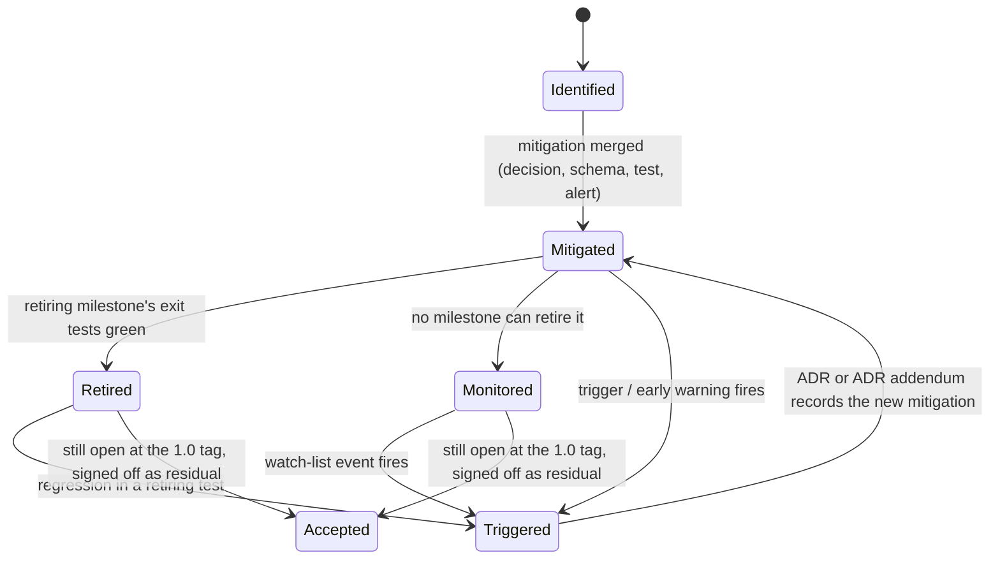
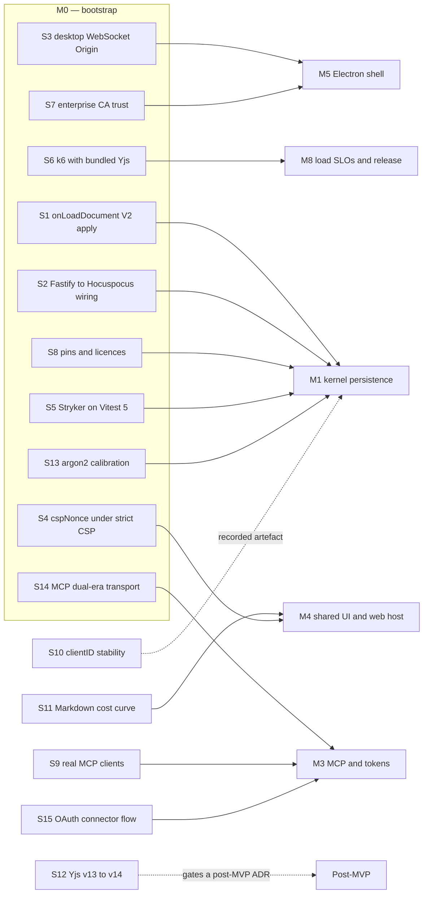

# Risks and open questions

This section is the project's risk register, the record of the eight questions section G put to the project owner and the answers they gave on 2026-09-12, the spikes that must conclude before the work that depends on them, and the assumptions the whole plan rests on. Nothing in section G is open: every other section of the plan is now written against an answer rather than against a default, so this section is where an implementer checks whether the *assumptions* still hold before starting a milestone, where the reading applied to each answer is recorded so the owner can correct it, and where a risk is formally retired when its evidence exists.

The register is deliberately concrete: each risk names the mitigation that already exists in the plan (a decision in 13-decision-log.md, a table or column in 03-data-model.md, a test in 10-testing-and-quality.md, an alert in 11-operations-and-deployment.md), the signal that says the risk is materialising, the role that owns it, and the milestone whose exit criteria retire it. A risk without a retiring milestone is monitored, not retired; its trigger events say when it must be re-evaluated.

## How to read the register

### Identifiers

| Prefix | Meaning | Examples |
|---|---|---|
| `R-T` | Technical risk: a library, protocol, runtime or algorithmic hazard | Yjs v14, Hocuspocus hook semantics, MySQL FULLTEXT limits |
| `R-P` | Product risk: a gap between what users or agents expect and what the MVP ships | Obsidian syntax, agent write access, enterprise SSO |
| `R-O` | Operational risk: a way a correctly built system is lost or compromised in operation | backup drill failure, secrets custody |
| `G` | A question this plan put to the project owner, and the decision that answered it on 2026-09-12 — the row carries the owner's words, the reading applied to them and where the consequence lives (numbering follows the plan's decision skeleton and 13-decision-log.md) | `G1` … `G8`, all eight answered |
| `S` | Spike: a bounded experiment with a pass criterion and a recorded fallback | `S1` … `S15` |
| `ASM` | Assumption the plan rests on | `ASM-01` … `ASM-33` |
| `D14-` | Decision made in this section (merged into 13-decision-log.md by the finalizer) | `D14-01` … `D14-15` |

Four identifier namespaces are owned by other sections. The first three are referenced here and never redefined; the fourth is listed only because its handles resemble ids this section owns (D14-01):

| Prefix | Owner section | What it names |
|---|---|---|
| `A<n>` | 13-decision-log.md | A row of the plan's final decision table (for example `A19` = the durable-ack protocol, `A53` = the Electron shell). Every `A<n>` reference in this section is a settled decision, not an assumption. |
| `F<n>` | 01-vision-scope-and-principles.md | A deliberate deviation from the feature spec (for example `F1` = the LF-only Y.Text invariant). |
| `T<n>` | 04-auth-and-access-control.md §12 | A row of the threat model `T1`–`T17` (for example `T16` = prompt injection through note content). The control-to-evidence map that pairs with it is the compliance checklist in 11-operations-and-deployment.md, which is a different table. |
| `P<n>` | 01-vision-scope-and-principles.md | A numbered plan principle (`P1`–`P8` the core, `P9`–`P16` the supporting rules). This section never cites a principle by number, and `P<n>` is unrelated to the product-risk ids `R-P01`–`R-P14` above, which only look similar. |

### Scales

| Likelihood | Meaning |
|---|---|
| High | Expected to happen at least once during the MVP milestones unless the mitigation is in place |
| Medium | Plausible during the MVP milestones; depends on external events or usage patterns we cannot control |
| Low | Requires an unusual combination of events, or the mitigation is structural and already verified by research |

| Impact | Meaning |
|---|---|
| Critical | Violates a spec acceptance row (spec §9), loses or corrupts data, or breaks a security boundary |
| High | Blocks a milestone exit, or forces an architecture change touching more than one package |
| Medium | Confined rework inside one package, degraded performance, or a missing product expectation with a documented workaround |
| Low | Cosmetic, or fully absorbed by an existing fallback |

Exposure is read from the pair (likelihood, impact); the register is ordered by exposure within each category. "Retired at" names the milestone whose exit tests (12-milestones.md) provide the evidence; "Monitored" means the risk cannot be retired and lists the events that force a re-evaluation. Likelihood and impact are scored once here and re-scored only at a milestone gate, with the change recorded in that gate's record (D14-14) — a register whose numbers drift silently between reviews is decoration.

### Owner roles

The register assigns each risk to one role. Roles are responsibilities, not head-count; in a small team one person holds several.

| Role | Owns |
|---|---|
| Collaboration lead | `apps/server/src/collab/**`, `@iridium/crdt`, `@iridium/collab-client`, `@iridium/editor`; the durable-ack protocol and every CRDT invariant |
| Platform lead | `apps/server` boot path, Fastify plugins, Kysely/migrations, MySQL configuration, projections, search, jobs |
| Security lead | `auth/`, `authz/`, `audit/`, `security/`, `apps/server/src/oauth/**` (the authorization server G1 brought into M3), the credential model for both kinds, threat model, external security review |
| Agent-access lead | `apps/server/src/mcp/**` (both mounts), `@iridium/mcp-bridge`, client snippets and connector setup wording, real-client matrix, `docs/agents/*` |
| Client lead | `@iridium/ui`, `@iridium/markdown-react`, `apps/web`, `IridiumHost` contract, accessibility and performance budgets |
| Desktop and release lead | `apps/desktop`, electron-builder, the 1.0 bundle set and its published checksums, the update feed, `release.yml`; code signing and notarisation arrive with the post-1.0 desktop distribution epic (G8) |
| Markdown lead | `@iridium/markdown`, import/export, Obsidian detection, sanitizer schema |
| Quality lead | `@iridium/testkit`, Vitest/Playwright projects, chaos and property lanes, mutation lane, CI workflows |
| Operations lead | `infra/**`, backup/restore, monitoring, runbooks, secrets handling, deployment documentation |
| Product owner | Scope decisions, the answered questions `G1`–`G8` and the reading applied to each answer, acceptance of deviations from the spec |

### Where the register lives and how it stays true

The register is not prose that rots. `docs/risks/register.yaml` is the source of truth, `pnpm gen` renders `docs/risks.md` from it, and `risks.registry.spec.ts` fails the `static` CI job when the register stops matching the repository (D14-02):

| Assertion | Why |
|---|---|
| Every `retiredBy` entry names a test that exists (collected from `vitest list --json` and `playwright test --list --reporter=json`) | A risk cannot claim evidence from a test nobody wrote |
| Every `owner` is one of the roles above | No orphan risks |
| Every risk has at least one `trigger` | A risk with no early warning cannot be monitored |
| Every `G<n>` referenced by a risk exists in `docs/answered-questions.md` carrying an `answered` date, the owner's own words and the reading applied, and every `S<n>` has a `docs/spikes/S<nn>-*.md` note once its milestone is reached | A decision cannot quietly lose the provenance that makes it correctable, and a spike cannot quietly disappear |
| No `G<n>` row carries `answered: null` | `docs/open-questions.md` does not exist: all eight questions were answered on 2026-09-12, before M0 began. A question raised afterwards is minted as a new `G<n>` with `answered: null`, which fails this assertion until the owner answers it and blocks the 1.0 tag (D14-04) |
| Every metric-backed trigger names an alert rule present in `infra/monitoring/alerts.yml` with a matching `annotations.risk` | The trigger actually fires in production (D14-10) |

Each risk therefore has one of five states, and the transitions are recorded artefacts rather than opinions:

Milestone gates are the review points (D14-03). A milestone exits only when every risk whose "Retired at" column names that milestone is either retired with links to the green runs, or explicitly deferred by the product owner with a recorded reason, in `docs/milestones/M<n>-gate.md`. That file also lists re-scored risks and any risk discovered during the milestone. Monitored risks are not reviewed on a calendar; each has named trigger events (D14-06) collected in `docs/dependency-watch.md`, and Renovate labels map a dependency update to the risk id it can disturb, so the re-evaluation happens when the world changes rather than when a date passes.

## Technical risk register

Thirty-four technical risks, ordered by exposure. The table is the register; the subsections below it carry the detail an implementer needs — exactly which behaviour is hazardous, which file or test contains the answer, and what the fallback is if the mitigation fails. Rows whose mitigation lives in another section cite it by file name rather than restating it.

| Id | Risk | Likelihood | Impact | Mitigation in the plan | Trigger / early warning | Owner | Retired at |
|---|---|---|---|---|---|---|---|
| R-T01 | Durable-ack protocol has a gap (an edit is shown as Saved without a committed row, or a committed row is never acknowledged) | Medium | Critical | Append log with post-COMMIT `persisted` broadcast, full state-vector dominance, `baseline` on every `synced`, `persist-failed` path, no reliance on `SyncStatus` (A19) | `collab.durable-ack.chaos` failure; `iridium_persist_failures_total` > 0 without a matching `persist-failed`; support report of a lost edit | Collaboration lead | M1 (`collab.durable-ack.chaos` ×20, `collab.baseline-on-connect`, `persistence.model.prop`; ×200 nightly from M8) |
| R-T02 | Hocuspocus behavioural hazards: hooks that reject are unhandled (#754), `onStoreDocument` has no retry, `onLoadDocument` changed in 4.7.x (#1155/#1157), `maxDebounce` clientID change (#845) | High | High | Every hook body wrapped (never rejects); writer owns retry/backoff; `onLoadDocument` returns `undefined` after in-place apply (S1); dominance check immune to clientID changes (A19) | Node `unhandledRejection` in server logs; S1 spike failure; `collab.clientid-stable.chaos` reproduction succeeds | Collaboration lead | M1 (S1 note, `collab.hooks-never-reject.unit`, `collab.unload-after-veto`) |
| R-T03 | Hocuspocus direction change (Tiptap "future of Hocuspocus" survey, issue #1153) or a breaking 5.x line | Medium | High | Hocuspocus confined to `collab/server.ts` + `collab/hooks/*` behind `CollabServer`/`CollabPersistence` interfaces (A17); wire schema (`note_docs`/`note_updates`) is transport-agnostic; Redis extension never adopted in MVP | A deprecation notice, a licence change, a release that removes `Hocuspocus` class embedding, `handleConnection`, `readOnly`, `onTokenSync`, stateless messages or `DirectConnection` | Collaboration lead | Monitored (event-driven, see D14-06) |
| R-T04 | Yjs v14 (`@y/y`) becomes the maintained line while v13↔v14 state and wire compatibility stays undocumented (53-bit client IDs suggest a wire change) | Medium | High | Exact v13 pins (A14); `@iridium/crdt` is the only importer of `yjs`/`y-protocols`; `note_docs.yjs_major`, `note_updates.yjs_major`, `note_revisions.yjs_major` recorded on every row; migration gated on S12 | `@y/y` reaches a stable dist-tag; Hocuspocus or y-codemirror.next drop v13 peer ranges; a security advisory against yjs 13.x | Collaboration lead | Monitored; post-MVP evaluation gated on S12 |
| R-T05 | y-codemirror.next #36: a `yCollab` `EditorState` that is not mounted in an `EditorView` silently stops receiving remote updates | High | Critical | Disposable-view policy (A41): one `EditorView` per visible note, destroyed when hidden, rebuilt from `ytext.toString()` with the caret restored from a `YRange`; `NoteSession` keeps the Y.Doc/provider/UndoManager alive | Component test `yCollab two-doc` or Playwright `tabs-lifecycle` failure; a lint rule flagging a retained `EditorState` outside `@iridium/editor` lifecycle helpers | Client lead | M4 (`tabs-lifecycle`, `three-editors`, `undo-isolation`) |
| R-T06 | y-codemirror.next #35: any `\r` in the Y.Text desynchronises CodeMirror and Y.Text positions (RangeError, wrong inserts) | High | Critical | LF-only invariant (F1): normalise at the only text-entry points (`NoteService.initialize`, restore, repair), client strips `\r` on paste and blocks insertion, compaction scan flags `content_invalid` (A22), `doctor --repair-content` | `collab.lf-invariant` or `collab.content-invalid` failure; `note.content.invalid` audit events in production; `note_projections.status='invalid_content'` count > 0 | Collaboration lead | M1 (`collab.lf-invariant`, `collab.content-invalid`, `collab.initial-state-only-path`) and M6 (`markdown.roundtrip.prop`) |
| R-T07 | Duplicate module instances of `yjs`, `lib0`, `y-protocols`, `@codemirror/state` or `@codemirror/view` break `instanceof` checks and silently stop syncing | Medium | Critical | pnpm `overrides` + catalog, Vite `resolve.dedupe`, `pnpm why` one-version CI check, bundle analysis, server startup guard on "Yjs was already imported", `@iridium/crdt` single importer (A14) | `deps.single-instance` failure; "Unrecognized extension value" in renderer console; sync stalls with no error | Collaboration lead | M0 (`deps.single-instance`), re-asserted on every Renovate PR touching those packages |
| R-T08 | MCP SDK v2 churn: `@modelcontextprotocol/*` 2.0.0 is new, the 2026-07-28 era is served by few clients, v1 reaches end of maintenance around January 2027, and helper APIs (`createMcpHandler`, `toNodeHandler`, `requireBearerAuth`) may change in 2.x | Medium | High | Stateless per-request factory with `legacy:'stateless'` (A32); no v1 SDK anywhere; SDK confined to `mcp/plugin.ts`, `mcp/factory.ts`, `mcp/verifier.ts`; both eras covered by `mcp.dual-era.contract` and conformance 0.1.16 with an empty baseline; S14 pins the `reply.hijack()` handoff at M0 with the sub-application mount as the recorded fallback | Conformance suite regression on a Renovate PR; SDK changelog announcing removal of `legacy:'stateless'` or of `toNodeHandler`; `iridium_mcp_factory_errors_total` > 0 | Agent-access lead | M3 (`mcp.dual-era.contract`, conformance baseline empty); monitored afterwards |
| R-T09 | MCP client compatibility: Claude Code header bugs (#29562, #50464, #60909), the discovery-hijacks-a-static-header class (Claude Code #59467, #33817, #38972; Cursor probing discovery before sending configured headers; VS Code discarding them before 1.124.0), VS Code dropping headers from workspace `.mcp.json` (#319528), Cursor ~40-tool cap, Claude Desktop config being stdio-only, `mcp-remote` ownership and release churn | High | Medium | One credential kind per MCP mount, with discovery advertised on `/mcp/connect` only and four deliberate 404s (D06-26), so an advertised authorization server cannot reach a client configured against `/mcp`; the nightly matrix's coexistence row configures both audiences against one server; six tools only (A34); snippets use each client's secret indirection and warn about echoed headers; first-party `iridium-mcp` bridge instead of `mcp-remote` (A36); nightly real-client matrix pinned to versions | Nightly matrix job red in either audience or in the coexistence row; support tickets "Needs authentication" with a static header; a client release note changing header or discovery handling; any of the four 404 paths answering something other than 404 | Agent-access lead | M3 (matrix wired, both audiences) and M8 (matrix documented with versions); monitored afterwards |
| R-T10 | TypeScript 7 toolchain: no programmatic compiler API until 7.1, so anything needing it (typescript-eslint, Stryker's checker, ts-morph) cannot run on the repo-wide `typescript@7.0.2`; `oxlint-tsgolint` tracks TS releases with a lag; `oxfmt` is pre-1.0; `turbo boundaries` is experimental | Medium | Medium | Toolchain chosen to need no TS JS API (A1); each consumer lives in its own leaf package with a `@typescript/typescript6` alias (A2): Stryker's checker in `tooling/mutation`, and — found at M0 — openapi-typescript 7.13.0 in `tooling/api-codegen`; Prettier 3.9.6 documented as the oxfmt drop-in; dependency-cruiser 18.2.0 as the boundaries fallback; Markdown fixtures excluded from formatting | `pnpm turbo run check-types lint` red after a Renovate PR; oxfmt diff noise on Markdown/YAML; a needed lint rule missing from oxlint | Quality lead | M0 (S5, toolchain green on ubuntu + windows); monitored on every TS/oxc major |
| R-T11 | Vitest 5.0.0 freshness: Stryker `vitest-runner` 10.0.0 predates Vitest 5; `@vitest/browser-playwright` and coverage companions must match exactly; breaking defaults (`clearMocks`, 1-based worker ids, unawaited assertions fail) change test semantics silently | Medium | Medium | Exact 5.0.0 pins with the `V4` 4.1.11 fallback reserved for the mutation lane only (A2, A51); per-worker DB naming uses the 1-based id; `retry:0`; `.vitest/` in outputs and `.gitignore` | S5 failure; coverage merge producing empty reports; flaky property lane after an upgrade | Quality lead | M0 (S5) and M1 (coverage gates enforced) |
| R-T12 | MySQL InnoDB FULLTEXT limits: `innodb_ft_min_token_size` and stopwords are baked at index build, only committed rows are visible, `MATCH()` must list the exact index columns, no FULLTEXT on partitioned tables, `%` is not a wildcard, adding an index to a populated table rebuilds it, relevance ranking is crude, CJK needs a separate `ngram` index fixed at deploy | High | Medium | `my.cnf` baked before migration 0001 (A9); narrow `note_search` projection with its own migration `0020_note_search_fulltext` (A39); server-built boolean queries (`+tok*`), 1-char tokens via `title LIKE`; `SearchIndex` interface for Meilisearch later; results carry `revision` and the UI shows the "index updating" hint (A38); CJK tokenisation is out of scope by decision (`G5` answered *no*, 2026-09-12) | `search.acl`/`search.snippets` failures; support reports of missing short tokens or CJK results; p95 of `GET /vaults/:id/search` above budget in `perf.workspace`; a host running MySQL without the `my.cnf` (detected by `iridium doctor`) | Platform lead | M2 (search tests) with the Meilisearch seam kept; CJK is a post-MVP engine change behind `SearchIndex`, not a deferred question |
| R-T13 | Electron signing and notarisation — **deferred with the post-1.0 desktop distribution epic (G8, 2026-09-12), not mitigated at 1.0.** 1.0 ships unsigned, so no `publisherName` is recorded anywhere and nothing verifies a signature. What is live at 1.0 is the *consequence* of that: SmartScreen and Gatekeeper prompts, macOS quarantine, macOS memory-only credential custody, and update integrity resting on a checksum and TLS | High | Medium (at 1.0; High when the epic starts) | 1.0: published SHA-256 per artefact, both digests verified server-side at publish, `iridium desktop-updates verify` for the administrator's out-of-band check, the documented per-OS first-launch procedure, and the honest statement of what is unprotected (07-client-applications.md §7.14.4, 11-operations-and-deployment.md OPS-60). Epic: `publisherName` fixed before the first external build, committed in `apps/desktop/build/publisher.json` and asserted by `desktop.publisher-name.guard` (D07-45); Developer ID + notarisation; `verifyUpdateCodeSignature` | 1.0: a user report of a blocked launch that the documentation does not cover; `release.bundle-integrity` red. Epic: a proposal to change the certificate subject after the first external build; a notarisation or Trusted Signing step red in `release.yml` | Desktop and release lead | Not retired at 1.0 — it is a **declared gap** (11-operations-and-deployment.md). Retired by the post-1.0 epic |
| R-T14 | Electron `app://iridium` renderer sends an unexpected WebSocket `Origin` (or none), or enterprise CA trust behaves differently per OS (Linux NSS store), or `safeStorage` falls back to `basic_text` | Medium | High | S3 (Origin on three OSes) with the designed `IpcWebSocket` fallback (A53); S7 (enterprise CA on three OSes) with documented `certutil` steps and per-profile fingerprint pin; Linux secret-storage warning and `desktop.require_secure_storage` policy (A26) | S3/S7 failures; `security.ws-origin` rejecting the desktop client; support tickets from Linux fleets | Desktop and release lead | M0 (S3, S7 notes) and M5 (`ipc-contract`, `sign-in`, `attachments-no-token-in-renderer` on three OSes) |
| R-T15 | Electron cadence (a new major every 8 weeks upstream, three supported majors) and packaging churn: electron-builder `v26` dist-tag lags `latest`, 27 is alpha with a schema rewrite, `vite-plugin-electron` is single-maintainer | High | Medium | Written cadence policy (A53); electron-builder pinned to 26.16.1 by exact version; three plain build configs so the orchestrator is replaceable; electron-builder 27 migration is an explicit post-MVP milestone using `migrate-schema`; the 1.0 target set is `zip`/`tar.gz` only (G8), which removes NSIS, MSI, dmg, AppImage, deb and rpm from the surface the 27 schema rewrite touches, so that migration is sequenced after the signing epic and done once against the final target set | Electron 44 leaving the support window (2027-03-02) without a 45/46 bump merged; Renovate major PR for electron-builder | Desktop and release lead | Monitored (every Electron major, every electron-builder major) |
| R-T16 | Single-process ceiling: every loaded Y.Doc, the `TicketStore`, the `AuthzBus`, rate-limit stores and the job scheduler live in one Node process; memory or event-loop saturation degrades every surface at once; a restart drops every live session | Medium | High | Admission budget `COLLAB_MAX_LOADED_DOCS` 2 000 / `COLLAB_MAX_STATE_BYTES_TOTAL` 1 GiB with refusal (A50); `unloadImmediately`; projections in a piscina pool; `@fastify/under-pressure`; graceful 20 s drain; every singleton behind an interface with the Redis phase designed (F9); load SLOs in M8 | `iridium_docs_loaded` ≥ 80 % of budget; `/readyz` warning; event-loop lag alert; RSS > 1.5 GB at the M8 load profile | Platform lead | M8 (load SLOs met on the reference 4 vCPU profile); Redis phase post-MVP |
| R-T17 | Write amplification: a row per commit in `note_updates`, one audit row per structural action under a locked chain head, projection CPU per compaction, binlog volume with `sync_binlog=1` | Medium | Medium | Same-actor coalescing with `Y.mergeUpdates` (A16); `dbPersist` pool isolation (A10); compaction debounce 2 000 / 10 000 ms; `note_updates` pruning after 7 days; thinning of checkpoints; provider `flushDelay` measured in M8; audit chain per vault | `iridium_persist_latency_seconds` p95 > 1 s; `iridium_db_pool_in_use{pool="persist"}` pegged at 4; `iridium doctor --stats` showing rows per note per day above the M8 baseline (D14-08) | Collaboration lead | M8 (`durable_ack_ms p95 < 1 s` under load; `flushDelay` decision recorded) |
| R-T18 | CRDT state growth: tombstones cannot be garbage-collected while order is preserved; multi-megabyte states make `applyUpdate` and `encodeStateAsUpdate` take seconds (yjs #675); a hostile or pasted note can pin memory | Medium | High | V2 compacted snapshots (A15); compaction loads into a Y.Doc with `gc:true`; soft cap 1 000 000 UTF-16 units and hard cap 2 097 152 (A.1); `notes.oversize` read-only flag; snapshot alert > 8 MB and refusal > 64 MB; `iridium_note_state_bytes` | Alert "snapshot > 8 MB"; `notes.oversize=1` rows; `collab.limits` failure; note open time > 300 ms for 100 KB in `perf.workspace` | Collaboration lead | M1 (`collab.limits`) and M8 (load profile with the largest fixture note) |
| R-T19 | Pathological Markdown stalls the projection pipeline or the preview (remark quadratic autolinks, deep blockquote nesting, 20 000-line paragraphs) | High | Medium | Worker isolation (piscina server pool, Web Worker client) with hard timeouts, pre-scan caps (A.1), linear autolink transform, `status` values `too_large\|too_complex\|timeout` (A42); the recorded markdown-it switch criterion was evaluated at M2, met in the negative, and the parser swap executed (A42 amended 2026-09-20) | `iridium_projection_timeouts_total` rate > 1 %; preview p95 > 100 ms at the pilot p95 size; `markdown.pathological` suite regression | Markdown lead | M2 (`markdown.*` incl. pathological suite) and M4 (preview budget) |
| R-T20 | Structural concurrency and lock ordering: a wrong lock order between the vault row, node rows, `audit_chain_heads` and `note_docs` deadlocks or lets a stale client resurrect a trashed note | Medium | Critical | Fixed order vault → nodes → chain head last; the persistence writer locks only `note_docs`; trash never locks `note_docs`; `markClosing` + writer `deleted_at` check; boot-time sweep of loaded trashed documents (A46, C.4) | `lock-order.integration` or `tree.stale-resurrection` failure; MySQL `ER_LOCK_DEADLOCK` in logs | Platform lead | M2 (`lock-order.integration`, `tree.structural-concurrency`, `tree.stale-resurrection`, `hierarchy.model.prop`) |
| R-T21 | Supply-chain and package-manager hazards: `turbo prune` dropping unknown lockfile settings (#12442), pnpm 12 rejecting unknown workspace keys, `minimumReleaseAge 4320` refusing an urgent security patch, blocked postinstall scripts silently doing nothing | Medium | Medium | turbo pinned ≥ 2.10.12 and CI installs from the pruned lockfile (A48, A52); explicit `allowBuilds`; documented `minimumReleaseAgeExclude` procedure; digest-pinned actions and images; licence scan; SBOM + provenance | Docker build red with `ERR_PNPM_LOCKFILE_CONFIG_MISMATCH`; `ERR_PNPM_UNRECOGNIZED_WORKSPACE_SETTINGS`; a GHSA on a pinned package older than the release-age window | Quality lead | M0 (Docker image from pruned lockfile) ; monitored |
| R-T22 | k6 2.2.0's `crypto.getRandomValues` fills **one byte per element**, so a `Uint32Array` draw carries 8 bits per element — which is where `lib0` mints `Y.Doc.clientID`, and where `lib0/random.uuidv4()` draws too | High (measured) | Low | Re-scored 2026-09-13 by S6 (pass): the script assigns every `Y.Doc` its own `clientID` instead of letting `lib0` draw one, and a k6 script never takes a random number from a library that routes through `getRandomValues` with a typed array wider than `Uint8Array`. No shim: `crypto` is present, and `performance` is absent but nothing on these paths wants it. The upstream report is filed against `grafana/k6` | A clientID collision in a load run; a k6 upgrade that changes the fill behaviour | Quality lead | M0 (S6 note), enforced by the M8 lane rules of 10-testing-and-quality.md L9 |
| R-T23 | Windows developer environment friction: Testcontainers needs Docker Desktop/WSL2, deep virtual stores hit path limits, CRLF leaks into fixtures | Medium | Low | `.gitattributes * text=auto eol=lf` before the first commit; unit/component/property lanes run natively on Windows in CI; repo near the drive root; documented WSL2 setup | Windows CI lane red; fixture diffs showing `\r\n` | Quality lead | M0 (windows lane green) |
| R-T24 | Runtime alignment drift: Node 24 leaves Active LTS on 2026-10-20 (maintenance to 2028-04-30), Node 26 becomes Active LTS, Electron stays on Node 24 until it embeds 26 | Low | Low | Node 24.21.0 contract for server, bridge and Electron main (A4); Node 26 only after Electron ships it; `engines` and `devEngines.runtime` enforced | Electron release notes announcing Node 26; a dependency requiring Node ≥ 26 | Platform lead | Monitored |
| R-T25 | MySQL version drift on customer hosts: a distribution repository silently upgrading 8.4 → 9.7, `mysql:latest` being the innovation line, `mysql_native_password` removed in 9.x and merely disabled in 8.4 | Medium | Medium | Two required targets with exact pins (`mysql:8.4.11`, `mysql:9.7.2-oraclelinux9`) and `MYSQL_TAG` asserted by `ops.compose-lint.spec.ts`; Renovate refuses an update that crosses an LTS line; `db.version-floor.boot` refuses any other server at boot (`config.mysql_unsupported`, exit `2`) with `IRIDIUM_ALLOW_UNTESTED_MYSQL` as a permanent, visible `warn`; `db.auth-plugin.integration` asserts the role plugin on both lines; `manifest.mysql_line` plus `restore.mysql_line_downgrade` stop a cross-line restore downgrade | `/readyz` `mysql_version: warn`; a refused boot in a site's logs; either `ci.yml` MySQL matrix entry red | Platform lead | M0 (both matrix entries green, boot refusal proven by `db.version-floor.integration`) |
| R-T26 | CSP and Trusted Types friction: CodeMirror injects `<style>` elements (needs `EditorView.cspNonce`), Base UI positions via CSSOM, `require-trusted-types-for 'script'` may break the editor or Base UI | Medium | Medium | S4 proves `EditorView.cspNonce` under strict `style-src` (nonce from the page); no `dangerouslySetInnerHTML` (A42); Trusted Types enforcement is a post-MVP hardening evaluation, not an MVP gate | S4 failure; CSP violation reports in `security.hostile-markdown` | Client lead | M0 (S4) and M4 (`security.hostile-markdown` web) |
| R-T27 | Attachment isolation on the web host: SVG/HTML uploads served from the app origin are a stored-XSS vector; `` cannot send bearer headers, so web attachments ride on the session cookie | Medium | High | `nosniff`, `Content-Security-Policy: sandbox`, `inline` only for raster images, SVG always `attachment`, content-addressed keys, MIME sniffing with an allow-list (A44); separate user-content origin planned post-MVP | `attachments.security` failure; a new browser behaviour weakening the `sandbox` CSP | Security lead | M2 (`attachments.security`) ; separate origin post-MVP |
| R-T28 | DOMPurify bypass cadence (three 2026 CVEs) and sanitizer configuration drift | Medium | High | rehype-sanitize on hast is the only security boundary for preview and projections; DOMPurify ≥ 3.4.15 only at browser HTML-string sinks with explicit `CUSTOM_ELEMENT_HANDLING` (A42); XSS corpus asserted at hast level, in Chromium, and in web + Electron E2E | GHSA on dompurify or rehype-sanitize; XSS corpus failure | Markdown lead | M2 (hast corpus), M4 and M5 (browser and Electron E2E); monitored on advisories |
| R-T29 | Argon2 parameters saturate the libuv thread pool or are mis-calibrated for the host (150–300 ms target) | Low | Medium | `@node-rs/argon2` prebuilt, `parallelism 1`, `UV_THREADPOOL_SIZE=8`, `iridium doctor --argon2` calibration, admin-tunable `ARGON2_*` (A29); S13 measures the parameters on the 4 vCPU reference container before the login path is written | Login p95 > 1 s; `/readyz` event-loop lag warning during login bursts | Security lead | M0 (S13 note), M1 (`setpw-link.integration`, throttle tests) and M8 (calibration on the reference profile) |
| R-T30 | Projection freshness contract misread by agents and humans: `search_notes` shows an older `revision` than `get_note`, or an agent believes a note is final while `projected_seq < head_seq` | Medium | Medium | Compaction lag ≤ 10 s; `flush` (Ctrl/Cmd+S) and `?fresh=true` rate-limited; every read carries `revision` and `content_hash`; `instructions.md` states the contract; UI "index updating" hint (A38) | `search.staleness-hint` or `projection.monotonic` failure; agent complaints about inconsistent revisions | Agent-access lead | M2 (`projection.monotonic`, `search.staleness-hint`) and M3 (`mcp.instructions`) |
| R-T31 | The `IridiumHost` seam leaks platform assumptions (a route or command that works only in one host), breaking the "one shared UI" requirement | Medium | Medium | `host.contract.spec` run against both hosts; boundary tags forbid `electron`/`node:*` in browser packages (B.2); the route-and-command reachability walk at M5 (`docs/acceptance/host-parity.md`) | `host.contract.e2e` or `desktop.host-contract.e2e` failure in either project; a feature merged with a `kind === 'electron'` branch outside `packages/ui/src/host.ts` consumers | Client lead | M5 (the reachability walk: every route usable in both hosts) |
| R-T32 | UI dependency freshness: React 19.3, TanStack Router/Query majors, Tailwind 4 and a pre-1.0 component library (Base UI) can rename or remove parts mid-milestone | Medium | Medium | Exact catalog pins (A40); `@iridium/ui` is the only package that may depend on the component library, Tailwind or the router (B.2 boundary tags), so an upstream break is a contained change; shadcn v4 components are vendored source in the repository, not a runtime dependency; per-primitive component tests with axe checks; Renovate groups UI majors for manual review with a longer release age | Renovate UI major PR failing the component project; an axe regression after a primitive upgrade; a deprecation notice on a Base UI part used by `@iridium/ui` | Client lead | Monitored; the containment boundary is asserted from M4 (`boundaries` job + component suite) |
| R-T33 | Hostile or malformed import archives: zip-slip and absolute/`..` paths, symlinks, Windows reserved names, 2 GiB/50 000-file bombs, or a resumed import that initialises a note twice | Medium | High | Two-phase import job into an `importing`-status vault that is never visible until commit (A45); path sanitisation plus `import.unsafe-paths` (Windows + POSIX corpora); import caps 2 GiB / 50 000 files / depth 64 (A.1) enforced in the import worker; once-only `NoteService.initialize` with idempotent resume asserted by `import.commit.integration`; attachment MIME allow-list (A44) | `import.unsafe-paths` or `import.commit.integration` red; an import job stuck in `scanning`; `jobs` rows failing with path errors on a pilot corpus | Markdown lead | M6 (`transfer.fixtures.integration`, `import.unsafe-paths`, `import.commit.integration`) |
| R-T34 | Generated-artifact drift: four codegen outputs (OpenAPI 3.1 from zod, `kysely-codegen` types, desktop IPC typings, `mcp/tools.schema.json`) silently diverge from the code that ships | Medium | Medium | Contracts-first codegen with `pnpm gen && git diff --exit-code` in CI (A3); `openapi.contract` (`toMatchOpenApi`) on every REST test; `mcp.tools-schema-drift` against the committed tool schema; `ipc-contract` validating every channel; Redocly lint; Schemathesis fuzzing the committed document | `gen-drift` job red; a PR that edits a generated file by hand; a client bug report whose payload is valid per the document but rejected by the server | Platform lead | M0 (`gen-drift` wired) and M2 (`openapi.contract`, full generation committed) |

### R-T01 Durable-ack protocol correctness

The single most important technical risk: spec §5 defines Saved as "the server has durably persisted a state that includes the user's pending edits", and spec §9 requires that killing the server immediately after an acknowledgement never loses the acknowledged revision. Hocuspocus's own `SyncStatus` acknowledgement fires after the in-memory apply and before the debounced store, and there is no store retry, so a naive implementation is wrong by construction (research digest §2, §8, §11.2–11.4).

Mitigation in the plan (05-collaboration-and-durability.md): the `NoteWriter` appends `note_updates` rows in a `dbPersist` transaction with `SELECT … FOR UPDATE` on `note_docs` and a `head_seq` CAS; `persisted {seq, sv, ds}` is broadcast only after COMMIT; the client's `SaveStateMachine` (pure, in `@iridium/collab-client`) shows Saved only when the persisted state vector dominates every `(clientId, clock)` of the local vector and its canonical delete-set fingerprint equals the local fingerprint; every `synced` event sends `baseline {}` so a client that opened without editing, or reconnected after a crash between COMMIT and broadcast, still learns the truth; `innodb_flush_log_at_trx_commit=1` is asserted by `/readyz`.

Trigger and early warning: any red run of `collab.durable-ack.chaos` (fault points `store.throw`, `store.crash-before-commit`, `store.crash-after-commit-before-ack`, `store.slow:<ms>`, `ws.drop-after-ack`); `iridium_persist_failures_total` incrementing without a `persist-failed` stateless message in the same window; a `save-failed` pill reported by users while `/readyz` is green.

Retired at M1 by `collab.durable-ack.chaos` (kill-after-ack ×20), `collab.baseline-on-connect`, `collab.restart-no-duplication`, `persistence.model.prop` and `crdt.dominates.prop`; hardened at M8 by the nightly 200-iteration chaos lane and the k6 `durable_ack_ms p95 < 1 s` SLO. Residual: the protocol is only as durable as the MySQL host's fsync configuration, which is R-O03.

### R-T02 Hocuspocus behavioural hazards

Four verified behaviours of Hocuspocus 4.7.0 would each break the design if forgotten: (1) `onChange` and several other hooks are invoked without `await`/`catch` (issue #754), so a rejecting hook is an unhandled rejection that terminates Node; (2) a thrown `onStoreDocument` is logged and the document stays in memory, with no retry; (3) 4.7.x changed `onLoadDocument` handling ("skip the document self-apply", #1155; "destroy the document when onLoadDocument throws", #1157), which is exactly the path the V2 in-place apply relies on; (4) issue #845 reports the client's `clientID` changing across `maxDebounce` flushes, which would defeat any Saved comparison keyed on one clientID.

Mitigation: every hook body in `apps/server/src/collab/hooks/*` is wrapped by a helper that converts rejections into writer failure states and metrics, verified by `collab.hooks-never-reject.unit` (D14-09); the writer owns retry with 200 ms → 5 s jittered backoff and the `failed` state after 10 attempts/30 s; S1 pins the `onLoadDocument` contract before M1 code is written and records the V1-snapshot fallback; the dominance check in `SaveStateMachine` compares whole vectors, so #845 cannot produce a false Saved, and `collab.clientid-stable.chaos` records whether the reproduction succeeds (D14-05).

Trigger: `unhandledRejection` entries in pino logs; `beforeUnloadDocument` vetoes that never complete (`collab.unload-after-veto` red); S1 failing on either `afterLoadDocument` ordering or `isLoading` semantics.

Retired at M1 (S1 note committed, `collab.hooks-never-reject.unit`, `collab.unload-after-veto`, `collab.graceful-shutdown.chaos`). The clientID reproduction is an M1 artifact regardless of outcome.

### R-T03 Hocuspocus direction change

Hocuspocus is MIT, actively released (twelve releases in 2026, last commit 2026-09-10) and explicitly positioned by Tiptap as the open-source backend behind their paid product; there is no deprecation. The risk is a direction change signalled by the Aug–Sep 2026 user survey (issue #1153), or a 5.x line that removes an API this plan depends on: `Hocuspocus` class embedding, `handleConnection`/`handleMessage`/`handleClose`, `connection.readOnly`, `onTokenSync`/`requestToken`, `sendStateless`/`broadcastStateless`, `DirectConnection`, `beforeUnloadDocument` veto.

Mitigation: A17 confines Hocuspocus to `collab/server.ts` and `collab/hooks/*` behind the `CollabServer` and `CollabPersistence` interfaces (02-system-architecture.md); the persistence schema (`note_docs`, `note_updates`, `note_revisions`) knows nothing about Hocuspocus; the client-side provider is wrapped by `NoteSession` so a different provider implementation is a `@iridium/collab-client` change; the stateless message schemas live in `@iridium/contracts/collab.ts` with `v:1`. The list of depended-upon APIs above is the checklist for any major-version PR.

Trigger events (D14-06): a Hocuspocus major release, a licence-field change on any `@hocuspocus/*` package, a repository archival or transfer, a published roadmap that drops self-hosting. Owner re-evaluates against the API checklist and records the outcome as an ADR addendum in `docs/adr/`.

Not retirable; monitored.

### R-T04 Yjs v14 migration

`@y/y` 14.0.0-rc.26 is a release candidate; every v14-line package (`@y/codemirror` 0.0.0-3, `@y/protocols` 1.0.6-rc.1, `lib0` 1.0.0-rc.32) is pre-release; y-codemirror.next's own README tells users to stay on v13; Hocuspocus 4.7.0 peers on `yjs ^13.6.8`. The digest records a conflict (§11.17): one source calls the binary format stable, another notes 53-bit client IDs, which implies a wire change. No primary source documents v13↔v14 compatibility.

Mitigation: A14 pins the whole v13 set exactly and makes `@iridium/crdt` the only first-party importer; `yjs_major` columns on `note_docs`, `note_updates` and `note_revisions` mark every persisted blob with the producing library major, so a migration can be incremental and verifiable; branded `V1Update`/`V2State`/`StateVector` types keep encodings from mixing; S12 (post-MVP) defines the compatibility gate and must pass before any migration ADR.

Trigger: `@y/y` gaining a stable `latest` dist-tag; Hocuspocus or y-codemirror.next announcing a v14-only line; a security advisory against yjs 13.x with no 13.x fix. Any of these opens S12 and a migration ADR; none of them changes MVP code.

Not retirable during MVP; monitored.

### R-T05 y-codemirror.next issue #36

`ySync` is a `ViewPlugin`, not a `StateField`: it subscribes to `ytext.observe` in the plugin constructor and only runs while an `EditorView` holds that state. A tabbed UI that keeps `EditorState` objects alive and swaps them into one view loses remote edits for hidden states and, per the open issue, cannot recover.

Mitigation (07-client-applications.md, A41): one `EditorView` per visible note; hiding a tab destroys the view; showing it rebuilds `EditorState.create({doc: ytext.toString(), extensions})` and restores the caret from `NoteSession.lastSelection` (a `YRange` of relative positions, null-safe because anchors can be garbage-collected); the Y.Doc, provider and `Y.UndoManager` live in `NoteSession`, acquired through `NoteSessionRegistry.acquire(noteId)` and released 60 s after the last tab closes, so undo history and presence survive tab switches. `@iridium/editor` exposes disposable-view lifecycle helpers and nothing else creates views.

Trigger: `tabs-lifecycle` (open A, open B, remote edits A, return to A, assert content and caret) or the component test `yCollab two-doc` failing; a code-review finding of a retained `yCollab` state.

Retired at M4.

### R-T06 y-codemirror.next issue #35 and hostile carriage returns

CodeMirror splits on `/\r\n?|\n/` and writes `\n` back; Y.Text counts `\r\n` as two UTF-16 units. Any `\r` inside the Y.Text makes positions diverge. Because Y.Text accepts any string from any client, the invariant must be enforced server-side, not only at import.

Mitigation: F1 makes the Y.Text of record LF-only and BOM-free, normalised once at `NoteService.initialize`, restore and repair, with `notes.original_eol`/`had_bom` recorded so export restores the original bytes (`markdown.roundtrip.prop` proves `restore(normalize(bytes)) === bytes`); the client strips `\r` on paste and blocks its insertion; A22's compaction scan flags `\r` (and formatting attributes or embeds, which `toString()` would silently drop) as `content_invalid`, makes the note read-only for editors, audits `note.content.invalid`, and `iridium doctor --repair-content <note>` rewrites the text through a `DirectConnection` with a non-tracked origin.

Trigger: `collab.lf-invariant` or `collab.content-invalid` red; production count of `note_projections.status='invalid_content'` > 0 (a metric-backed alert is part of A22).

Retired at M1 for the invariant and at M6 for byte-fidelity restoration.

### R-T07 Duplicate module instances

Two copies of `yjs` (two versions, or ESM + CJS of the same version) break constructor checks and log "Yjs was already imported"; two copies of `@codemirror/state` throw "Unrecognized extension value"; the Yjs community reports y-codemirror.next silently stopping without an error when two `@codemirror/view` copies resolve. Electron plus a UI library that also depends on CodeMirror is the classic cause.

Mitigation: pnpm `overrides` and a strict catalog entry for `yjs`, `lib0`, `y-protocols`, `@codemirror/state`, `@codemirror/view`; Vite `resolve.dedupe` in the shared renderer config; `deps.single-instance` (CI `pnpm why` one-version check plus bundle analysis); the server startup guard fails on the duplicate-import error; `@iridium/crdt` is the only package importing `yjs`/`y-protocols` and the preload never imports Yjs.

Retired at M0 and re-asserted on every dependency PR by the same test.

### R-T08 MCP SDK v2 churn

Mitigation detail beyond the register row: `mcp/plugin.ts` owns the only call sites of `createMcpHandler`, `toNodeHandler`, `hostHeaderValidation` and the `reply.hijack()` handoff; `mcp/verifier.ts` implements `OAuthTokenVerifier.verifyAccessToken`, and since M3 that one verifier dispatches on the credential kind for both `irid_pat_` and `irid_oat_` (D06-26), which is why adding the OAuth mount was a branch inside one file rather than a rewrite; tools are pure functions over `ContentReadCore` and are unit-tested over an in-memory repository, so an SDK API change never touches business logic. `mcp.tools-schema-drift` asserts the live `tools/list` equals `packages/contracts/mcp/tools.schema.json`, which is the artifact clients are documented against.

Trigger: conformance regression on a Renovate PR; a 2.x changelog entry removing `legacy:'stateless'`, `responseMode:'json'` or `toNodeHandler`; `iridium_mcp_factory_errors_total` > 0 in production (the factory-error path returns HTTP 500 with no details and logs the request id, so this metric is the only visible symptom).

Retired at M3 for the current SDK; monitored afterwards.

### R-T09 MCP client compatibility

The real-client landscape is the least controllable part of the plan. Verified facts (digest §3, re-verified 2026-09-12): Claude Code has shipped header bugs (#29562 custom headers not sent during session establishment, #50464 headers missing on tool calls, #60909 header echoed to stdout); VS Code silently drops headers for HTTP servers configured in a workspace `.mcp.json` (#319528) but not `.vscode/mcp.json`; Cursor's practical cap is ~40 active tools across all servers; Claude Desktop's local config is stdio-only; `mcp-remote` changed owners and shipped thirteen releases in one day.

One further fact used to decide the plan's entire discovery posture, and it no longer does. Claude Code issue #59467: with a static `Authorization` header configured **and** the server advertising OAuth, Claude Code starts the OAuth flow *before* it sends the POST that would have carried the header, and it has no logic to skip OAuth when `Authorization` is already set — the client reports ✓ Connected while the tool list contains only `authenticate` and `complete_authentication`. The class is broader than that one issue: claude-code #33817 ("Authorization header not recognized, falls back to OAuth") and #38972 ("static Bearer token shown as needing authentication") are the same shape; an independent write-up confirms that Cursor probes the discovery endpoints before sending configured headers and that VS Code discarded static headers before 1.124.0 (`zuplo.com/learn/mcp/errors/configured-headers-ignored-when-oauth-discovery-present`).

The conclusion this register used to draw from that — advertise no discovery anywhere, and accept that OAuth-only clients are unsupported (A33, superseded by ADR-15a) — was replaced when G1 was answered *yes* on 2026-09-12. What settles it is that discovery is a property of a **URL**, not of a request: a client probes the well-known paths derived from the endpoint URL before it ever presents a credential, so no header sniff or `User-Agent` heuristic can make one endpoint serve both audiences — but one server can publish two. `/mcp` accepts `irid_pat_…` only and advertises nothing; `/mcp/connect` accepts `irid_oat_…` only and carries `resource_metadata` and `scope` in its `401`; four well-known paths (`/.well-known/oauth-protected-resource/mcp`, `/.well-known/oauth-protected-resource`, `/.well-known/oauth-authorization-server`, `/.well-known/openid-configuration`) return a deliberate `404` so no probe made by a client configured at `/mcp` ever finds a document (D06-26). `oauth.discovery-split.contract` asserts the four 404s and the two challenge shapes, and the nightly matrix's coexistence row configures both audiences against one server at once — including the assertion that Claude Code's static-header run produced no request to any `/.well-known/` path, which is the direct regression test for #59467.

The split makes the risk asymmetric in Iridium's favour: a client that regresses on static headers can be moved to the OAuth mount, and a client that regresses on OAuth can be moved to a token header, without a server change.

Remaining mitigation: A34 (six tools, ASCII ids in URIs, deterministic order), A36 (first-party `iridium-mcp` bridge bundled with the desktop app and served from `/desktop/tools/`; `mcp-remote@0.13.5` documented only as a pinned alternative), snippets generated by `mcp/snippets.ts` with per-client secret indirection (`${IRIDIUM_MCP_TOKEN}`, `${env:…}`, `promptString password:true`, `--token-file`) and a UI warning that `claude mcp add` has echoed header values; the nightly real-client matrix (Claude Code ≥ 2.1.232 v2 runtime, VS Code, Cursor, Windsurf, the bridge, and the scripted CIMD and DCR clients that stand in for the connector products) pinned to exact versions; `docs/ops/mcp-clients.md` states the reachability matrix (cloud connectors need a publicly reachable HTTPS origin).

Trigger: nightly matrix red in either audience or in the coexistence row; a client release changing header, discovery, era-negotiation or tool-cap behaviour; support reports of "Needs authentication" with a valid token; a request to one of the four 404 paths answered with anything but 404.

Retired at M3 (matrix wired for both audiences) and M8 (matrix documented with versions); monitored afterwards because client releases are outside our control.

### R-T10 TypeScript 7 toolchain

Mitigation detail: the repo needs no TypeScript JS API because linting is oxlint + `oxlint-tsgolint` (which tracks TS 7.0.2), formatting is oxfmt, builds are `tsc -b`, tsdown and Vite; the tools that need the API are isolated in leaf packages that declare `"typescript": "npm:@typescript/typescript6@6.0.2"`: Stryker's `typescript-checker` in `tooling/mutation`, and openapi-typescript 7.13.0 (whose printer calls `ts.factory`; found when `pnpm gen` step 3 first ran at M0) in `tooling/api-codegen`, with `peerDependencyRules.allowedVersions` accepting TypeScript 6 for that one parent only. Documented fallbacks: Prettier 3.9.6 (`oxfmt --migrate prettier` converts config; identical JS/TS output) if oxfmt's beta churn is rejected; dependency-cruiser 18.2.0 if `turbo boundaries` misses cases; the alias pair repo-wide only if a future tool needs the API and TS 7.1 has not shipped it. Markdown fixtures are excluded from formatting because they are the Markdown engine's test data.

Trigger: `static` CI job red after a Renovate PR grouped `oxlint`/`oxlint-tsgolint`/`oxfmt`/`typescript`; a type-aware rule regression when TS minor and tsgolint versions diverge.

Retired at M0 (toolchain green on ubuntu + windows, boundary rules asserted); monitored on every TS or oxc major.

### R-T11 Vitest 5 freshness

Vitest 5.0.0 was eight days old on the plan date; `@stryker-mutator/vitest-runner` 10.0.0 was released before it and only nominally allows it. Vitest 5 also changed defaults that silently alter semantics (`clearMocks: true`, `test.sequential` removed, un-awaited async assertions fail, 1-based `VITEST_WORKER_ID`, config not searched in parent directories, `.vitest/` artifacts).

Mitigation: exact pins for `vitest`, `@vitest/coverage-v8`, `@vitest/browser-playwright`, `@vitest/ui`; S5 proves Stryker 10 on Vitest 5 with the `V4` 4.1.11 lane as the only fallback (never the main projects); the testkit derives per-worker schema names from the 1-based id; `retry: 0` everywhere in Vitest; blob reporters merged before thresholds.

Retired at M0 (S5) and M1 (coverage gates active).

### R-T12 MySQL FULLTEXT limits

Every listed limitation has a concrete answer in 03-data-model.md and A39: `innodb_ft_min_token_size=2` and `innodb_ft_enable_stopword=OFF` are in `my.cnf` before migration 0001 (changing them later means restart + drop/re-create of the index, which `docs/ops/upgrade.md` must describe); `note_search` is created empty and indexed in its own migration, so no populated-table rebuild occurs at install; searches only see committed rows, which is consistent with the "committed projection" contract; `note_search` is not partitioned (only `access_log` is); boolean queries are built server-side with `+tok*` prefixes, escaped operators and phrase support, with a `title LIKE ?` union for one-character tokens; ranking is score then `updated_at`; `SearchIndex {index, remove, query, rebuild}` isolates the engine so Meilisearch can replace it post-MVP without touching callers; CJK tokenisation is out of scope, because `ngram_token_size` is read-only at runtime and must be fixed in the base image — `G5` was answered *no* on 2026-09-12, so the default parser with `innodb_ft_min_token_size=2` is the settled MVP engine rather than a working default.

Trigger: p95 of `GET /vaults/:vaultId/search` above the M4 budget; support reports of missing short-token or CJK matches; `iridium doctor` reporting a host whose `innodb_ft_min_token_size` differs from the index-build value.

Retired at M2 for the MVP search contract; `G5`'s answer (no ngram parser, no second index) and the Meilisearch seam cover what remains — a site that needs CJK tokenisation is a post-MVP engine change behind `SearchIndex`, not an index that was left undecided.

### R-T13 Electron signing and notarisation

**Status: deferred, not mitigated.** G8 was answered on 2026-09-12: 1.0 ships unsigned zipped bundles and the signing, installer and in-application-update work is one post-1.0 epic. The risk does not disappear with that answer; it changes shape, and the plan records both halves.

What 1.0 actually carries: Windows shows Microsoft Defender SmartScreen on every first launch and an unsigned executable can never accrue reputation, so it never stops; macOS quarantines the download and Gatekeeper blocks it until the user goes through System Settings → Privacy & Security → Open Anyway (Control-click → Open no longer works from macOS 15); macOS `safeStorage` needs a real code signature, so every macOS installation runs in memory-only credential mode and a site that requires secure storage cannot deploy the macOS client at all; Linux loses the `x-scheme-handler/iridium` registration the deb and rpm targets provided, so deep links are inert until the bundle's `iridium.desktop` is installed; and update integrity rests on a SHA-256 served from the same host as the file plus TLS, which does not protect against a compromise of that host. Each of those is stated in 07-client-applications.md §7.14.4 and 11-operations-and-deployment.md's declared gaps, and OPS-60 lists what a security-conscious site does instead.

What the epic must still get right, unchanged by the deferral: Windows update verification compares a downloaded installer's Authenticode subject with the `publisherName` recorded in the installed app's `app-update.yml`, so changing the certificate subject after installations exist breaks their updates and is recoverable only through an intermediate release signed with the old subject. Azure Trusted Signing needs organisation validation; Apple notarisation needs a Developer ID account and credentials in CI; macOS auto-update requires signed and notarised builds with the `zip` target; fuses must be flipped before signing; `EnableEmbeddedAsarIntegrityValidation` works only on macOS and Windows. Deferring is what keeps the `publisherName` choice clean — no installed client carries one yet — and D07-45 is how the epic commits to it once.

Trigger at 1.0: a blocked-launch report the documentation does not cover; `release.bundle-integrity` red. Trigger in the epic: any proposal to change the certificate subject after the first external build.

Not retired at 1.0; it is a declared gap. Retired by the post-1.0 desktop distribution epic.

### R-T14 Electron origin, CA trust and secret storage

Three OS-dependent behaviours are unverified by documentation: the exact `Origin` header a page on `app://iridium` sends on a WebSocket upgrade (the digest says custom schemes send `scheme://host`, which the allowlist expects, but this is a spike); whether Electron consults the platform trust store for private enterprise CAs on all three OSes (Linux uses the NSS database, not `/etc/ssl/certs`); and whether `safeStorage` on Linux falls back to `basic_text`.

Mitigation: S3 decides between the direct WebSocket path and the designed `IpcWebSocket` fallback (renderer shim over `iridium:collab:{open,send,close}`, main opens `net.WebSocket` with `Origin: app://iridium`, binary frames forwarded, close codes forwarded verbatim, CSP `connect-src` drops `wss:`); S7 documents per-OS CA steps and the per-profile SHA-256 fingerprint pin in `setCertificateVerifyProc` scoped to one host; A26's Linux warning and `desktop.require_secure_storage` policy. `security.ws-origin` keeps "absent Origin → 403" with no bypass knob, so the fallback cannot be a weakening.

Retired at M0 (spike notes) and M5 (`sign-in`, `open-note`, `ipc-contract`, `attachments-no-token-in-renderer` on three OSes).

### R-T15 Electron cadence and packaging churn

Mitigation detail: adopt each new stable major within its first four weeks and never ship a major outside the three-version window (A53); Renovate groups `electron` and `electron-builder` with a longer release age and manual review (`electron-updater` is not in the 1.0 dependency set — G8 — and rejoins the group with the post-1.0 epic); every Electron bump runs the desktop smoke on three OSes; the three plain build configs (main tsdown ESM, preload tsdown CJS, renderer shared Vite) make `vite-plugin-electron`, `electron-vite 6` or Forge 8 interchangeable orchestrators; electron-builder 27 is a named post-MVP milestone executed with `electron-builder migrate-schema` and a full updater re-test. The 1.0 target set is `zip`/`tar.gz` only (G8), which removes NSIS, MSI, dmg, AppImage, deb and rpm from the surface electron-builder 27's schema rewrite touches, so the 27 migration is now sequenced **after** the signing epic and is done once against the final target set.

Monitored; the trigger is each Electron and electron-builder major.

### R-T16 Single-process ceiling

The MVP intentionally runs one process (spec §6, F9). What that process holds: every loaded `Document`, the `NoteWriter` queues (bounded at 5 000 updates or 32 MiB each), the `TicketStore` (60 s single-use tickets), the `AuthzBus`, rate-limit stores, the `SearchIndex` implementation, the piscina projection pool, the job scheduler and the Hocuspocus instance.

Mitigation: A50's admission budget refuses loads beyond 2 000 documents or 1 GiB of estimated state instead of evicting active editors; `unloadImmediately` releases idle documents; `@fastify/under-pressure` sheds load; readiness reports the budget and writer backlog; the load lane in M8 calibrates pool sizes and worker counts on a 4 vCPU reference profile with SLOs `ws_connecting p95 < 500 ms`, `yjs_propagation_ms p95 < 250 ms`, `durable_ack_ms p95 < 1 s`, `projection_lag_ms p95 < 12 s`, MCP `get_note p95 < 300 ms`, RSS < 1.5 GB at 300 VUs/60 docs; every singleton is an interface with the Redis-backed phase designed (`AuthzBus`, `TicketStore`, rate-limit store, `@hocuspocus/extension-redis`, `SearchIndex`, `StorageDriver`).

Trigger: `iridium_docs_loaded` ≥ 80 % of `COLLAB_MAX_LOADED_DOCS`; `/readyz` warnings; RSS above the SLO; event-loop lag > 1 s on `/healthz`.

Retired at M8 for the pilot profile; the horizontal-scaling phase is post-MVP.

### R-T17 Write amplification

Mitigation detail: the writer merges consecutive same-actor updates with `Y.mergeUpdates` into one `note_updates` row (≤ 1 MiB), so rows scale with commits rather than keystrokes; the `dbPersist` pool (4) is separate from `dbApp` (20) so REST bursts cannot starve saves and saves cannot starve REST; compaction runs at most every 2 000/10 000 ms per document and prunes `note_updates` rows with `seq <= snapshot_through_seq` older than 7 days; checkpoints are written only when the content hash changed and ≥ `auto_checkpoint_interval_min` elapsed, then thinned; audit chains are per vault so unrelated vaults never contend on `audit_chain_heads`; `sync_binlog=1` and `binlog_expire_logs_seconds=604800` bound binlog growth. Provider `flushDelay` (off by default) is measured in M8 and enabled only if it reduces rows without hurting remote-cursor latency.

Trigger: `iridium_persist_latency_seconds` p95 > 1 s; `iridium_db_pool_in_use{pool="persist"}` at 4 for sustained periods; `iridium doctor --stats` (D14-08) reporting `note_updates` rows per note per day above the M8 baseline; binlog directory growth beyond the sizing in `docs/ops/deployment.md`.

Retired at M8.

### R-T18 CRDT state growth

Mitigation detail: V2 snapshots are roughly 95 % smaller than V1 for tombstone-heavy documents (yjs #675) and compaction always loads into a `gc:true` Y.Doc so tombstones are collapsed to GC structs before re-encoding; the soft cap (1 000 000 UTF-16 units) is enforced by the client paste guard and flagged by the server at compaction (`notes.oversize` → read-only until reduced); the hard cap (2 097 152) applies at create/import/restore/repair; snapshots above 8 MB alert and above 64 MB are refused with the note read-only and an admin alert; `note_revisions.snapshot` is copied only for named/restore/pre_restore/import/trash kinds and for checkpoints under 4 MB, so history never multiplies the largest states.

Trigger: alert "snapshot > 8 MB"; `SELECT COUNT(*) FROM notes WHERE oversize=1` > 0 in `iridium doctor --stats`; `collab.limits` regression; `perf.workspace` note-open budget missed on the largest fixture.

Retired at M1 (limits) and M8 (load profile including the largest fixture note).

### R-T19 Pathological Markdown

Measured costs from the digest (§7): a realistic 1 MB note costs 3–5 s in remark; `'*a_' × 20000` (60 KB) costs 13–20 s; `mdast-util-to-hast` throws `RangeError` at ~3 000 nested `>`; the GFM autolink-literal extension is quadratic in lines per paragraph.

Mitigation: projections never run on the main thread (piscina pool `cpus-1`, 10 s timeout, terminate and respawn); previews run in a Web Worker with size-tiered debounce and a 2 s timeout; a per-line pre-scan (≈4 ms/MB) rejects > 32 nested blockquotes, > 64 indentation columns or > 20 000 lines per paragraph with `status='too_complex'` before parsing; the parser is the markdown-it 15.0.2 token engine behind the first-party positioned-mdast adapter of 08-markdown-pipeline-import-export.md §2.4, and literal autolinks run as the linear `transforms` pass of `mdast-util-gfm-autolink-literal` only — the quadratic micromark autolink syntax extension is never registered; over-limit notes still return raw Markdown through REST and MCP with derived fields absent. The recorded switch criterion (p95 preview > 100 ms at the pilot p95 note size after these mitigations) was evaluated by S11 and met in the negative — the complete representative preview stayed above 100 ms even after the duplicate-pass and transfer mitigations — so A42's fallback executed at M2 and the swap is the decision the measurement forced rather than a reaction (A42 amended 2026-09-20). `remarkGfmIridium` survives only as the development-only differential oracle under `packages/markdown/test/`, outside the production dependency graph (08 §2.4).

Retired at M2 (`markdown.*` including the pathological suite and CommonMark 0.31.2 regression) and M4 (preview budget in `perf.workspace`).

### R-T20 Structural concurrency and lock ordering

Mitigation detail (C.4, A46): every structural transaction is `REPEATABLE READ`, starts with `SELECT id, tree_version FROM vaults WHERE id=? AND status='active' FOR UPDATE`, then node rows, then `audit_chain_heads` last; `numUpdatedRows === 1n` assertions on every CAS; `ER_DUP_ENTRY` on `uq_sibling` maps to `409 name_conflict`; the recursive-CTE ancestor walk runs inside the same transaction after the vault lock (because `FOR UPDATE` over a CTE does not lock base rows); the persistence writer locks only `note_docs`, never participates in structural transactions, and drops the batch with close reason `note-trashed` when it observes `deleted_at`; `markClosing` closes editing sessions before the trash commit; a crash between COMMIT and the gateway side-effect is repaired by `onAuthenticate`/`onLoadDocument` refusing trashed notes and by the boot-time sweep.

Retired at M2 (`lock-order.integration` under concurrent trash + edits + audits, `tree.structural-concurrency`, `tree.stale-resurrection`, `hierarchy.model.prop`).

### R-T21 Supply chain and package manager hazards

Mitigation detail: `pnpm 12.4.1` with `catalogMode: strict`, `saveExact`, `minimumReleaseAge 4320`, `trustPolicy no-downgrade`, explicit `allowBuilds: {electron, lefthook, @node-rs/argon2}` and never `dangerouslyAllowAllBuilds`; turbo ≥ 2.10.12 and a CI step that installs from the pruned lockfile (the exact failure mode of #12442); Renovate `config:best-practices` with digest pinning for actions and images; the licence scan (allow MIT/Apache-2.0/BSD/ISC/MPL-2.0/0BSD/Unlicense, deny GPL/AGPL/LGPL/BSL/UNLICENSED — which also flags `@sesamecare-oss/redlock` if the Redis extension is ever added); SBOM and provenance in `release.yml`; and no npm publish token of any lifetime, because G7 was answered *no* on 2026-09-12 — `@iridium/mcp-bridge` stays private and `release.yml` has no publish step, so the public-registry threat surface is absent rather than guarded. The override procedure for `minimumReleaseAgeExclude` (an urgent Electron or mysql2 patch) is written in `CONTRIBUTING.md`.

Two of the 2026-09-12 answers moved the dependency set itself, and this policy is where that is recorded. `electron-updater` leaves it at 1.0 (G8) and rejoins with the post-1.0 desktop distribution epic, so one package fewer is resolved, pinned and scanned. G1 adds **none**: the OAuth 2.1 authorization server is implemented in `apps/server/src/oauth/**` against the zod metadata schemas already exported by `@modelcontextprotocol/core` 2.0.0, and the deprecated v1 authorization-server helpers are not adopted. If a later phase adds `jose` (the pinned candidate for the OIDC SSO work that spec §10 still defers), it enters this same catalog, release-age, licence and single-copy policy like any other dependency — there is no OAuth exemption.

Retired at M0 for the build path; monitored for advisories.

### R-T22 k6 and bundled Yjs

**Re-scored 2026-09-13 from S6's measurements** (`docs/spikes/S06-k6-yjs-bundle.md`). The bundle runs: k6 2.2.0 executes `yjs` 13.6.32, `lib0` 0.2.117 and `y-protocols` 1.0.7 bundled by esbuild and speaks the Hocuspocus wire protocol, so the Node worker fallback is not taken. The risk this row names was the wrong one. `performance` is indeed absent from Sobek, and nothing on these paths wants it. `crypto` is **present** and wrong: `crypto.getRandomValues` writes one byte per element regardless of the typed array's width, so a `Uint32Array` draw yields 8 bits per element — and that is exactly how `lib0` mints `Y.Doc.clientID`, and how `lib0/random.uuidv4()` draws. The mitigation is a rule, not a shim: every `Y.Doc` in a load script is constructed with a script-assigned `clientID`, and no k6 script takes a random number from a library routing through `getRandomValues` with an array wider than `Uint8Array`. Impact stays Low because the mitigation is one line per document and the fallback remains available.

### R-T23 Windows developer environment

Mitigation detail: `.gitattributes * text=auto eol=lf` is in the first commit; `.editorconfig` LF; Testcontainers runs on Docker Desktop with the WSL2 backend (documented in `CONTRIBUTING.md`), while unit, component and property lanes run natively on Windows in CI so the Windows lane never depends on Docker; the repository lives near the drive root to avoid path-length failures in pnpm's virtual store.

Retired at M0 (windows lane green).

### R-T24 Runtime alignment drift

Node 24.21.0 is the single runtime contract (server bundle, `iridium-mcp`, Electron main); `engines >=24.12 <25` and `devEngines.runtime` refuse other majors; the Node 26 move happens only after Electron embeds Node 26, so shared code never straddles two majors. Low impact: all chosen libraries already allow Node 26.

### R-T25 MySQL version drift on hosts

Mitigation detail: two exact pins — `mysql:8.4.11` and `mysql:9.7.2-oraclelinux9` — selected by `MYSQL_TAG` in `infra/.env` for compose and by `IRIDIUM_MYSQL_IMAGE` for the test harness and the `ci.yml` matrices, both resolving to the floor when unset, with `ops.compose-lint.spec.ts` failing when `MYSQL_TAG` in any committed `infra/**` file is not one of the two supported values; `db.version-floor.boot` refuses any other server version at boot with `config.mysql_unsupported` and exit code `2`, and `IRIDIUM_ALLOW_UNTESTED_MYSQL` downgrades the refusal to a permanent, visible `/readyz` `warn` rather than to silence; `iridium doctor` verifies the `my.cnf` values the schema depends on (`character_set_server`, `collation_server`, `innodb_ft_min_token_size`, `innodb_flush_log_at_trx_commit`, `sql_require_primary_key`, `cte_max_recursion_depth`) and refuses `mysql_native_password`-only setups; `docs/ops/upgrade.md` documents the LTS-hop rule in both directions it admits: 8.4 → 9.7 forward only, never backwards, never into an innovation release. G3 was answered on 2026-09-12: both lines are required, so drift is now a *supported-matrix* question and the boot refusal is its enforcement.

### R-T26 CSP nonces and Trusted Types

S4 proves that `EditorView.cspNonce` supplied with the page nonce satisfies `style-src 'self' 'nonce-…'` in both hosts; the preview path never uses HTML strings (`hast-util-to-jsx-runtime`, `tableCellAlignToStyle:false`), so `style` attributes never appear; Trusted Types enforcement (`require-trusted-types-for 'script'`) is evaluated post-MVP once CodeMirror, y-codemirror.next and Base UI have been checked for `innerHTML`/`DOMParser` usage. Retired at M0 (S4) and M4.

### R-T27 Web attachment isolation

Mitigation detail: attachments are served by id with `X-Content-Type-Options: nosniff`, `Content-Security-Policy: sandbox`, `Content-Disposition: inline` only for `image/png|jpeg|gif|webp|avif`, SVG always as `attachment`, `Cache-Control: private`, `ETag: sha256`; MIME is sniffed server-side against an allow-list (detector pinned at M0); web `` loads use the same-origin `__Host-` cookie on a GET that has no side effects; Electron uses `iridium-attachment://` handled in main so the renderer never holds a credential. A separate user-content origin is the documented post-MVP hardening step. Retired at M2 (`attachments.security`).

### R-T28 Sanitizer drift and DOMPurify advisories

rehype-sanitize 6.0.0 with `iridiumSchema` runs last in the pipeline and is the only boundary for preview and projections; DOMPurify 3.4.15 is confined to browser HTML-string sinks (print, HTML export) with explicit config; the XSS corpus (javascript:/data:/vbscript: URLs in links, images, definitions and autolinks, raw HTML, event handlers, SVG/MathML, DOM-clobbering ids, CSS injection, encoding tricks) is asserted at the hast level, in Chromium component tests, and in web + Electron E2E. Renovate treats `dompurify`, `rehype-sanitize`, `micromark*` and `hast-util-*` as a security group with GHSA watch. Retired at M2/M4/M5; monitored on advisories.

### R-T29 Argon2 calibration

`@node-rs/argon2` prebuilt binaries keep Docker, Windows and CI toolchain-free; `parallelism 1` avoids saturating the libuv pool; `UV_THREADPOOL_SIZE=8` is explicit; `iridium doctor --argon2` calibrates `ARGON2_MEMORY_KIB`/`ARGON2_TIME_COST` to 150–300 ms on the target host and the values are documented in `docs/ops/configuration.md`, where S13's measured production pair `131072`/`6` already lives while the schema defaults stay `65536`/`3`; S13 runs that calibration at M0, so M1's login path is built against measured numbers. Retired at M0 (S13 note), M1 (tests) and M8 (calibration on the reference profile).

### R-T30 Projection freshness contract

The read model is the committed projection, never the live Y.Doc (A37). The contract is explicit: `search_notes` results and `list_notes` entries carry `revision`; `get_note` may return a newer `revision` than search showed; a `flush` (Ctrl/Cmd+S) or `GET /notes/:id/markdown?fresh=true` (≤ 6/min, `history:read`) forces compaction for a loaded document; the UI shows "index updating" while `projected_seq < head_seq`; `instructions.md` tells agents to treat `revision` as the identity of what they read. Retired at M2 and M3.

### R-T31 Host seam leakage

`host.contract.spec.ts` runs against `BrowserHost` and `ElectronHost`; boundary tags forbid `electron` and `node:*` in `browser` packages; the route-and-command reachability walk at M5 (`docs/acceptance/host-parity.md`) exercises every route in both hosts; features that genuinely differ (import source picking, export destination, updates) exist only as `IridiumHost` members, and `updates` is `null` on the web host rather than a branch in UI code.

The risk is unchanged by the supported-client decision and if anything sharper: with the desktop application supported at 1.0 and the web host the surface the UI is developed on, a seam leak shows up first in the host nobody is supported on. `hostContractCases()` still runs in all three harnesses, and the boundary tags still forbid `electron`/`node:*` in `browser` packages. Retired at M5.

### R-T32 UI dependency freshness

The UI stack (A40) is the part of the dependency graph with the most pre-1.0 and fast-moving surface: a component library below 1.0 can rename a part, TanStack Router and Query ship majors with codemods, and Tailwind 4's engine changes affect every generated class. The containment rule is what keeps this a Medium-impact risk: only `@iridium/ui` may import the component library, Tailwind or the router (enforced by the B.2 boundary tags and the `boundaries` CI job), shadcn-style components are vendored into the repository as first-party source rather than resolved from a registry at install time, and every primitive has a component test with an axe check. An upstream break is therefore a set of edits inside one package with a test suite that proves the primitives still behave, never a change that ripples into feature code in `apps/web` or `apps/desktop`.

Trigger: a grouped Renovate UI major PR that fails the `component` project; an axe violation appearing after an upgrade; a deprecation notice on a part `@iridium/ui` uses. Monitored, because the UI stack keeps moving after 1.0; the containment boundary itself is asserted from M4 onwards.

### R-T33 Hostile or malformed import archives

Import is the only place where Iridium ingests a directory tree produced elsewhere, so it carries the classic archive hazards: entries with absolute paths or `..` segments (zip-slip), symlinks pointing outside the staging directory, names that are reserved on Windows (`CON`, `NUL`, trailing dots and spaces), case-colliding names on a case-insensitive collation, deeply nested paths beyond the OS limit, and decompression bombs. A second hazard is internal: a resumed or retried import job must never initialise the same note twice, because a second `NoteService.initialize` on an existing note would duplicate the initial content (the failure mode the spec's "Initialization/reconnection" acceptance row forbids).

Mitigation (08-markdown-pipeline-import-export.md, A45): the job scans into a staging area and produces a report before anything is committed; the target vault is created in `importing` status and is invisible to members until commit, so a failed import never leaves a half-built vault; path sanitisation rejects absolute, `..`, symlinked and reserved-name entries and records them in the report instead of silently renaming them; caps from A.1 (2 GiB, 50 000 files, depth 64, 50 MiB per attachment) are enforced while streaming; commit is idempotent, with `NoteService.initialize` called exactly once per note and the job's progress row as the resume point.

Trigger: `import.unsafe-paths` or `import.commit.integration` red; an import job stuck in `scanning` on a pilot corpus; report rows showing unexpected normalisation. Retired at M6.

### R-T34 Generated-artifact drift

Four artefacts are generated and committed: the OpenAPI 3.1 document (from the zod route schemas), the Kysely database types (`kysely-codegen` against the migrated schema), the desktop IPC typings (from `@iridium/contracts/desktop-ipc.ts`) and `packages/contracts/mcp/tools.schema.json` (the artefact agent documentation and the nightly client matrix are written against). Drift between any of them and the running code produces the worst class of bug: a client, an agent or a test that is "correct" against a document the server no longer honours.

Mitigation (A3): `pnpm gen` regenerates all four, and the `gen-drift` CI job runs `pnpm gen && git diff --exit-code`, so a hand-edited generated file or a forgotten regeneration fails the build; `openapi.contract` asserts every REST response against the committed document via `toMatchOpenApi`; `mcp.tools-schema-drift` asserts the live `tools/list` equals the committed tool schema; `ipc-contract` validates every channel's payload; Redocly lints the document and Schemathesis fuzzes it.

Trigger: `gen-drift` red; a PR diff that touches a generated file without touching its source; a client report whose request validates against the document but is rejected by the server. Retired at M0 for the mechanism and M2 for the full generated surface.

## Product risk register

Product risks are gaps between what a user or an agent expects and what the MVP ships. Almost all of them are consequences of deferrals the spec made deliberately (spec §10), so the mitigation is rarely "build it": it is disclosure (say what is missing, before migration is accepted), an escape hatch (export, a documented workaround), and a seam that makes the later answer additive. A product risk is retired only when the disclosure and the seam are both proven by a test; the expectation gap itself is monitored until the roadmap closes it.

| Id | Risk | Likelihood | Impact | Mitigation in the plan | Trigger / early warning | Owner | Retired at |
|---|---|---|---|---|---|---|---|
| R-P01 | Obsidian expectation gap: imported vaults render `[[wikilinks]]`, `![[transclusions]]`, callouts, `==highlights==`, `%%comments%%`, Dataview blocks and `.canvas` files as literal text, so migrated notes look broken | High | High | Detect-report-index (A43): `detectObsidianSyntax()` drives the import report and per-note `obsidian_findings`; `note_links.kind ∈ {markdown, image, wikilink, embed, definition}` is indexed from day one; source text is never rewritten; `vaults.markdown_flavor`, `soft_breaks` and `attachment_folder` columns exist now; the compatibility badge shows per-vault findings; `G2` was answered *no* on 2026-09-12, so read-only rendering does not move into the MVP and the `markdown_flavor` flag is the whole of the later path | Import reports showing a high wikilink/callout density on the pilot corpus; support requests to "fix the broken links"; a pilot team asking for wikilink rendering as a condition of adoption | Product owner (with Markdown lead) | M6 retires the disclosure half (`transfer.fixtures.integration`, report wizard, badge); the expectation gap closes only with the post-MVP `markdown_flavor` rendering flag |
| R-P02 | Cloud-connector reachability and behaviour: claude.ai and Claude Desktop custom connectors are supported at MVP through `/mcp/connect`, but their connection originates from Anthropic's servers, so an Iridium published only on a corporate network or behind a VPN stays unreachable by them whatever credential it would accept; and a connector product can change its registration mechanism or its redirect URIs without notice | Medium | Medium | The auth half is closed: the OAuth 2.1 authorization server ships in M3 (G1 answered yes, ADR-15a) with the two-mount split that keeps integration tokens working at the same time (D06-26). The network half is disclosed rather than mitigated — `docs/ops/mcp-clients.md`'s reachability matrix says per client which deployments it can reach, and ASM-09 states the trade a site makes either way. Behaviour drift is watched: spike S15 drives both connector products by hand once at M3 entry and its observations fix the snippet wording, and the nightly `mcp-clients` matrix runs the scripted CIMD and DCR flows afterwards | A connector product changing its registration mechanism or its redirect URIs, so S15's recorded observations no longer match; a pilot on an intranet-only origin asking for cloud connectors; the nightly matrix's OAuth audience red | Agent-access lead (with Product owner) | M3 for the auth half (the matrix's OAuth audience and coexistence row; `oauth.connector.e2e` at M4); the reachability half is monitored, because it is a network fact and not a product gap |
| R-P03 | Deferred Obsidian-class features (plugin ecosystem, graph view, live-preview WYSIWYG, automatic link rewriting, full syntax compatibility, canvas) make the product read as "an incomplete Obsidian" to power users | Medium | Medium | Explicit non-goals in 01-vision-scope-and-principles.md; the rename-impact dialog plus `note_links` inbound view replace automatic link rewriting (spec §3); Markdown source editing with a sanitized preview is the stated editing contract, not a stepping stone to WYSIWYG; export and "Export my text" are always available; the post-MVP roadmap order is published | Pilot feedback naming a specific deferral as adoption-blocking; repeated requests for the same missing feature in support | Product owner | Monitored |
| R-P04 | Online-first editing: a detected disconnect pauses editing instead of buffering offline, which Obsidian users do not expect | Medium | Medium | Spec §5 decision implemented visibly: the status pill distinguishes syncing/saved/disconnected/save-failed, pending changes are retained in the session, the client warns before closing with unsaved work, reconnection re-checks authorization before merging, and rejected changes stay visibly unsaved and exportable ("Export my text"); `disconnect-pause` and `saved-indicator` Playwright tests prove the behaviour | Support tickets describing lost typing; WebSocket reconnect churn in `iridium_ws_connections`; pilot sites on unreliable links | Client lead | M4 retires the UX correctness half; the expectation gap is monitored (offline-first is a spec §10 deferral) |
| R-P05 | Agent write expectations: agents can enumerate, read and search but cannot write, and an agent that tries will simply find no tool | Medium | Medium | Six read-only tools with `annotations.readOnlyHint:true` and `destructiveHint:false` (A34); `instructions.md` states the read-only contract and names the post-MVP proposal path; reserved write scopes are schema-valid but never granted or listed on either mount (A31), and are not advertised in the authorization server's `scopes_supported`; a tool-level scope failure returns `isError` text rather than HTTP 403, so a client does not start a step-up flow that no re-authorization could satisfy — the transport-level `403 insufficient_scope` that `/mcp/connect` can return is a different case, and no MVP flow produces it because Read is the only grantable bundle; the post-MVP design is `note_proposals` reviewed by a human, never direct CRDT mutation by a token | `iridium_mcp_calls_total{status="error"}` rising for unknown tool names; user requests for agent editing; agents attempting `PATCH`/`POST` on PAT-enabled REST routes (`403 token_scope_insufficient` rate) | Agent-access lead | Monitored (post-MVP `note_proposals`); the read-only boundary itself is retired at M3 (`mcp.scopes`, `authz.rest-viewer`) |
| R-P06 | Agent context economy: tool-count caps (Cursor ≈ 40 active tools), large vault index resources and verbose search results waste the agent's context and make the server look expensive to use | Medium | Medium | Exactly six tools, deterministic registration order, descriptions ≤ 2 KB (A34); `get_note` returns Markdown once with metadata-only `structuredContent` (F7); the per-vault index resource is capped (top-level categories + 50 most recently updated notes, ≤ 2 000 entries, with a footer pointing at `list_notes`); HMAC cursors keyset-paginate instead of returning everything (A35); `search_notes` costs 3 rate-limit points so agents are nudged towards targeted reads | Agent reports of truncated context; Cursor users disabling Iridium to stay under the cap; `access_log.bytes_out` p95 per call rising | Agent-access lead | M3 |
| R-P07 | No email at MVP: initial credentials and resets are one-time `set-password` links an administrator must deliver out of band, which administrators expect the product to send | Medium | Medium | One path for create and reset (A28): `POST /admin/users` returns `irid_spl_…` with a 24 h single-use link, the admin console shows a copy button and the expiry, `POST /admin/users/:id/reset-password` reissues and revokes sessions, and `server_settings.smtp` is the prepared seam; no plaintext password ever transits an administrator | Administrator friction reported in the pilot; a rising count of expired-link failures before `user.password.set`; requests for bulk onboarding | Product owner | Monitored (SMTP delivery is post-MVP); the link mechanism is retired at M1 (`setpw-link.integration`) and its console surface at M7 |
| R-P08 | Search expectation gap: users expect Obsidian-grade search (regex, tag filters, CJK, fuzzy) and get boolean title+body FULLTEXT with `path:`/`file:` operators | Medium | Medium | Server-built boolean queries with prefix matching and phrases, `path:`/`file:` operators in MVP, `tag:`/`line:` reserved with the `fm_tags` multi-valued index already present (A39); one-character tokens answered by a `title LIKE` union; explicit staleness signalling (A38); `SearchIndex {index, remove, query, rebuild}` lets Meilisearch replace the engine post-MVP without touching callers; CJK tokenisation is out by `G5`'s answer of 2026-09-12 rather than pending a decision | Pilot searches returning nothing for terms the user can see in a note; a pilot corpus in a CJK script, which is a post-MVP `SearchIndex` change rather than a setting; requests for regex or fuzzy search | Platform lead | M2 retires the MVP search contract (`search.acl`, `search.snippets`, `search.staleness-hint`); the expectation gap is monitored behind the `SearchIndex` seam |
| R-P09 | Vault-level-only permissions: no per-note or per-category ACL overrides and no public sharing, so teams create extra vaults to share a single document | Medium | Medium | Spec §4 decision, enforced uniformly (permissions inherit to categories, notes, attachments, history, search, exports); vault creation is an administrator action with no hidden cost; non-members receive 404 for every vault-scoped resource (F13) so the boundary is also unobservable; single-note export and "Export my text" cover one-off sharing; per-note ACLs and public sharing are roadmap items | Requests to share one note outside a vault; vault-count growth in the pilot that correlates with single-note sharing; a workaround documented by users themselves | Product owner | Monitored |
| R-P10 | Enterprise SSO/MFA absence: organisations that mandate SSO cannot deploy even a technically complete MVP | Medium | High | Seams designed now: `identities`/`auth_providers` tables, one `SessionIssuer.issue(user, {kind, method, mfa})` path, `iridium://auth/callback` reserved in the desktop shell, `access_tokens.kind` now carrying a live `oauth` and still reserving `scim`. G1 does **not** close this gap and the plan says so where a reader could assume otherwise: the authorization server issued by M3 authorizes agents against Iridium's own accounts and is not an identity-provider integration. NIST-aligned password policy, DB-backed login throttling, step-up re-authentication and a complete audit trail make the MVP defensible without SSO; the roadmap order is OIDC SSO → SCIM → MFA/passkeys | A procurement questionnaire requiring SSO before a pilot; an IdP mandate from a pilot's security team | Product owner (with Security lead) | Monitored |
| R-P11 | The optional filesystem mirror is mistaken for two-way sync, and users edit mirror files expecting the edits to reach the server | Low | High | Spec §6 stance implemented literally: `iridium mirror` output is strictly read-only to employees and integrations, each generated file records its source revision, and no writable filesystem surface exists anywhere in the product; the mirror is documented in `docs/ops/deployment.md` as a read-only projection, and bidirectional filesystem/Git sync is a named deferral | Support reports of edits made inside the mirror; a request to enable write-back; mirror directories found on a shared drive with user modifications | Operations lead | Monitored |
| R-P12 | Version-history granularity: Google-Docs users expect to scrub to any moment, while checkpoints are written on content change and at least every 10 minutes, plus named versions | Medium | Medium | Automatic checkpoints plus user-named versions on Ctrl/Cmd+S, with `pre_restore`/`restore`/`import`/`trash` kinds and a thinning policy (F12); the history rail shows a diff per revision and names what it is; `note_updates` rows are retained 7 days after compaction for forensic recovery by an administrator (not a user-facing feature); the restore path is a coordinated content change (F10), so every restore is itself reversible | Requests for minute-level history; confusion tickets about a missing intermediate version; history rail bug reports after thinning | Product owner (with Collaboration lead) | M4 retires the disclosure (`history-named-version`, `restore-revision`); granularity itself is monitored |
| R-P13 | Cross-vault moves are deferred, so content that was organised into the wrong vault can only be exported and re-imported, losing note ids | Medium | Medium | Import can target an existing category inside an existing vault (F8), so export-then-import is a supported workflow rather than an improvisation; the export manifest records the original note ids, paths and revisions so the move is auditable; stable ids are documented as vault-scoped; the rename-impact dialog warns about links before the move | A pilot team reorganising vaults; requests to move a category between vaults; exports immediately followed by imports in the `jobs` table | Product owner | Monitored |
| R-P14 | Attachment and image workflow mismatch: Obsidian resolves images through its own attachment folder setting, and an imported vault whose images do not display reads as data loss | Medium | Medium | `vaults.attachment_folder` is read from `.obsidian/app.json` `attachmentFolderPath` at import and used for `path_hint` generation (A44); `note_links.kind ∈ {image, embed}` with `status ∈ {resolved, ambiguous, broken, external}` makes unresolved references visible in the import report and the unresolved-links pane; attachments are content-addressed with `UNIQUE(vault_id, sha256)` so duplicates collapse rather than multiply; paste and drag-drop upload in the editor land at M6 | `transfer.fixtures.integration` reporting unresolved image links on the Obsidian fixture vault; pilot notes with missing images; `note_links` rows with `status='broken'` and `kind='image'` above the import report's baseline | Markdown lead | M6 (`transfer.fixtures.integration`, `attachments.e2e`, manual acceptance that the export opens cleanly in Obsidian) |

### R-P01 Obsidian expectations versus the deferrals

This is the product risk most likely to decide whether a pilot succeeds. The spec is explicit (§7): "Wikilinks, transclusions, callouts, Dataview queries, canvas files, and plugin behavior are not presumed equivalent; preserve source text and identify unsupported constructs before migration is accepted." The plan honours that literally, and the honesty is the mitigation — an import that silently renders `[[Note]]` as plain text and leaves the user to discover it later is the failure mode.

What exists at MVP, so that the gap is visible and measurable rather than surprising:

| Capability | Where |
|---|---|
| Per-file and per-vault detection of wikilinks, embeds, callouts, highlights, comments, Dataview, canvas, `.obsidian` configuration and `.trash` | `detectObsidianSyntax()` in `@iridium/markdown`, surfaced in the import report and stored per note in `obsidian_findings` |
| Link graph including unsupported kinds | `note_links` with `kind` and `status` from day one, so `[[wikilinks]]` are indexed and count as inbound links even while they render as literal text |
| Per-vault flavour switches already in the schema | `vaults.markdown_flavor ENUM('gfm','obsidian-compat')`, `vaults.soft_breaks`, `vaults.attachment_folder` |
| Renderer seam | First-party `remarkWikiLink`, `remarkCallout`, `remarkHighlight`, `remarkComment` plugins are designed and licence-clean (the GPL `remark-obsidian` package is banned by the licence scan); the sanitizer schema additions (`details`/`summary`, `mark`) are identified |
| Disclosure surface | Import report wizard with per-finding decisions, and a per-vault compatibility badge computed from `obsidian_findings` |

`G2` was answered *no* on 2026-09-12, so none of that rendering work is in the MVP and the gap above is the shipped position rather than a provisional one. The shape of the later answer is still recorded, because recording it is what keeps this a disclosure risk rather than a design risk: four first-party parsers, the sanitizer schema additions (`details`/`summary`, `mark`), basename resolution in the preview worker and `[[` autocomplete, behind `vaults.markdown_flavor`. Nothing about the MVP data model changes when that flag is built, which is the point of indexing wikilinks now, and `markdown.flavor-parity.unit` asserts that the seam stays empty for the whole of 1.0 so it cannot acquire a plugin by accident.

### R-P02 Agent OAuth expectations, and what remains after G1

The brief makes MCP a primary draw, and the user-granted token model is the brief's own instruction ("token auth, granted by a user, given to the agent at the time of configuring the mcp"). The risk as this register first stated it — that one important client class, cloud-hosted connectors, negotiates OAuth and cannot be configured with a static header outside a beta, so a PAT-only MVP excludes those users — is **retired**. G1 was answered *yes* on 2026-09-12: Iridium ships its own OAuth 2.1 authorization server in M3, the connectors are supported at MVP, and integration tokens keep working unchanged at the same time because the two credentials live on two mounts (D06-26).

Coverage at MVP, stated in `docs/ops/mcp-clients.md` so nobody discovers it by trial:

| Client | MVP path |
|---|---|
| Claude Code, Cursor, VS Code, Windsurf, other header-capable clients | Direct HTTP to `POST /mcp` with `Authorization: Bearer irid_pat_…`, configured from a generated per-client snippet |
| Claude Desktop | A custom connector against `https://<host>/mcp/connect` where the origin is publicly reachable; the `iridium-mcp` stdio bridge (bundled with the desktop app, downloadable from `/desktop/tools/`) stays as the route for stdio-only use, air-gapped sites and scripted runs, and is no longer the required path |
| claude.ai custom connectors and other OAuth-only cloud clients | Supported at MVP through `/mcp/connect`, provided the origin is publicly reachable over HTTPS |
| Claude Code `claude mcp login`, VS Code's `oauth` object, Cursor's `auth` object | Either mount: `/mcp/connect` where the site prefers a consented, revocable grant, `/mcp` where it prefers a pasted credential |
| Anthropic Messages API and custom agents | Direct HTTP with the same header |

What is left is not an authentication gap. A cloud connector's connection originates from Anthropic's servers, so an Iridium published only on a corporate network or behind a VPN is unreachable by it no matter which credential it would have presented — a network fact that belongs in the reachability matrix and in ASM-09, not in the auth design, and the honest answer to a pilot that asks for connectors on an intranet origin is an infrastructure decision with its own hardening review. The second residual is that a connector product can change its registration mechanism or its redirect URIs without notice: S15 records what each product actually does at M3 entry, the nightly matrix's OAuth audience watches the scripted CIMD and DCR flows afterwards, and a product that stops completing the flow earns its own row in `docs/ops/mcp-clients.md` rather than a change to the split, which every other client depends on.

The scores above are not a re-score of the retired risk under D14-14. That risk no longer exists; the row is a new one scored at first entry, and the M3 gate record repeats the scoring with the evidence that closed the auth half.

The escalation this register called "cheap by construction" is exactly what happened, and it is worth recording that it held: `mcp/verifier.ts` already implemented `OAuthTokenVerifier.verifyAccessToken`, `access_tokens.kind` already reserved `oauth`, `MCP_OAUTH_ENABLED` already existed (now an unmount switch for a site that wants no OAuth surface at all, never an either/or between the two audiences), and no URL moved. The answer arriving before M3 began is why none of the client matrix, the snippets or `docs/ops/mcp-clients.md` had to be written twice — the rule of D14-04 working as intended.

### R-P05 and R-P06 together: what an agent can actually do

Two expectations fail in opposite directions, and both are managed by the same artefact — the MCP instructions document. An agent that expects write access finds none; an agent that expects to dump an entire vault into its context finds pagination and point costs. `instructions.md` (M3) states, in the words the server sends to every client: the six tools and what each returns, that everything is read-only, that `revision` identifies exactly what was read, that search results can be older than `get_note`, that note ids and paths are both accepted, and that a revoked token stops working immediately. 06-mcp-and-agent-access.md owns the wording; this register owns the fact that the wording is the mitigation for both risks, and `mcp.instructions` is the test that it exists and matches the tool set.

## Operational risk register

Operational risks are the ways a correctly built Iridium is lost, corrupted or compromised after it is running. They are the risks a code review cannot retire, because their evidence is a drill, a metric, a runbook rehearsal or a documented custody arrangement. Every row below names an artefact in 11-operations-and-deployment.md and, where the trigger is a metric, an alert rule in `infra/monitoring/alerts.yml` carrying `annotations.risk` (D14-10).

| Id | Risk | Likelihood | Impact | Mitigation in the plan | Trigger / early warning | Owner | Retired at |
|---|---|---|---|---|---|---|---|
| R-O01 | Backup drill failure, or a backup set that only looks complete: the dump restores but the audit chain, attachments or collaboration invariants are broken, and this is discovered during a real incident | Medium | Critical | `iridium backup` writes dump + attachment snapshot + `age`-encrypted secrets bundle + `manifest.json` with binlog retention for PITR (A47); `iridium restore --from <dir> --verify` performs **blocking** verification on a clean deployment: every audit chain verifies, sampled `note_docs` are loaded into throwaway Y.Docs and their `toString()` hash compared with `note_projections.content_hash`, every `attachments.storage_key` exists with a matching SHA-256, `head_seq == GREATEST(snapshot_through_seq, COALESCE(MAX(note_updates.seq),0))` and `snapshot_through_seq <= head_seq` for every note, `projected_seq == head_seq` for unloaded notes, membership/role counts match the manifest; success writes `admin.backup.verified` and sets `iridium_backup_last_verified_timestamp`; the nightly `ops.backup-restore.drill` runs exactly the shipped scripts, never a test-only variant | `ops.backup-restore.drill` red; `iridium_backup_last_verified_timestamp` older than 26 h (alert); a `restore --verify` that reports invariant violations; a drill that was silently skipped (job missing from the nightly summary) | Operations lead | M8 (spec §9 "Backup recovery" row, drill green, runbook rehearsed); monitored afterwards by the freshness alert |
| R-O02 | Secrets custody: the password pepper, `AUDIT_HMAC_KEY` and `MCP_CURSOR_KEY` are lost (nobody can log in, no chain verifies) or leaked (forged audit rows, forged cursors, offline password attacks). G4's answer means there is no attachment key family at 1.0 to lose or leak | Medium | Critical | Every secret is versioned in the database-facing model and supplied as a file (`*_FILE`) rather than an inline environment value (A48); the backup's secrets bundle is encrypted with an operator passphrase and lists key versions, and `restore --verify` fails when a key version is missing (A47); `iridium keys rotate pepper\|audit\|cursor\|attachment` performs versioned rotation with transparent re-hash on next login for the pepper; pino redaction plus `logging-redaction` keep secrets out of logs; the published scanner regex `irid_(pat\|oat\|ort\|oac\|ses\|tkt\|spl)_[0-9A-Za-z]{16}_[0-9A-Za-z]{49}` — extended with the three OAuth kinds when G1 brought them in, so a leaked access, refresh or authorization code is findable by the same scan — lets a secret scanner catch leaked credentials; custody (who holds the passphrase, where the bundle is stored, who can rotate) is written into `docs/ops/backup-restore.md` and rehearsed as the M8 key-rotation drill | `iridium config check` reporting a missing or unknown key version; `restore --verify` key-version mismatch; `audit verify-chain` failing on rows whose `key_version` no longer resolves; a hit from the secret scanner; an unexplained `keys rotate` audit event | Security lead (custody documented with Operations lead) | M8 (rotation drill executed, custody documented, restore verifies key versions); monitored afterwards |
| R-O03 | MySQL durability misconfiguration makes the durable-save acknowledgement untrue: `innodb_flush_log_at_trx_commit != 1` or `sync_binlog != 1` on a host tuned for throughput | Medium | Critical | `/readyz` asserts `innodb_flush_log_at_trx_commit == 1` and fails closed when `READYZ_STRICT_DURABILITY=true` (warns otherwise); `iridium doctor` prints and verifies every `my.cnf` value the schema and the ack protocol depend on; `docs/ops/deployment.md` ships the `my.cnf` and states that changing these values invalidates the Saved contract (spec §5) | `/readyz` durability warning or failure; `iridium doctor` reporting a drifted value; a host provisioned without the shipped `my.cnf` | Operations lead (with Platform lead) | M1 (`readyz.integration`) for the check, M8 for the documented deployment; monitored |
| R-O04 | Single-node deployment has no high availability: a host or disk failure is a total outage, and every restart drops live collaboration sessions | Medium | High | Deliberate MVP topology (spec §8, F9): one server container + MySQL + attachment volume behind Caddy; graceful 20 s drain on shutdown, client reconnect with `baseline` on `synced` so no acknowledged edit is lost across a restart; RPO/RTO documented from the backup set plus 7 days of binlogs for PITR; every in-process singleton is behind an interface with the Redis-backed phase designed for the horizontal step | A pilot SLA requiring HA; unplanned outages recorded in the incident log; restart frequency rising (deployments, OOM) | Operations lead | Monitored (horizontal scaling is post-MVP); restart-safety is retired at M1 (`collab.restart-no-duplication`, `collab.graceful-shutdown.chaos`) |
| R-O05 | Upgrade and rollback: migrations are forward-only, so a bad upgrade cannot be stepped back and must be recovered from backup, with clients possibly outside the supported version window | Medium | High | Forward-only `iridium migrate` with fail-closed readiness (`migrations: current`) so a half-migrated server never serves traffic (A7); the M8 exit rehearses an upgrade from an M1-era backup to the current schema and a rollback by restore; `apiVersion`/`minClientVersion` with an additive-only rule and an N-1 support window (A54) so a server upgrade does not strand desktop fleets; the desktop update-policy endpoint still lets administrators control the client side of an upgrade, though at 1.0 it drives a manual download rather than an in-application install and its `silent` value waits for the post-1.0 epic (G8), which leaves `minClientVersion` as the hard cut-over lever | Rehearsal failure at M8; a proposed migration that cannot be expressed additively; a desktop fleet reporting "update required" screens after a server upgrade | Platform lead (with Operations lead) | M8 (upgrade/rollback rehearsal in `docs/ops/upgrade.md`) |
| R-O06 | Attachment store divergence: the volume or bucket is lost, restored out of order, or misconfigured, so rows in `attachments` point at bytes that are not there | Medium | High | Content-addressed storage (`<vault_id>/<aa>/<sha256hex>`, atomic rename) with `UNIQUE(vault_id, sha256)` makes the store idempotent and a superset safe; the backup starts the attachment snapshot **after** the dump so the snapshot can only be a superset of what the dump references (A47); `restore --verify` checks every `storage_key` with its SHA-256; deletion is explicit and refuses while notes reference the file — there is no heuristic orphan GC that could delete live content; `GET /admin/attachments/unreferenced` reports candidates for manual purge | `restore --verify` reporting missing keys; 404 rate on `GET /vaults/:vaultId/attachments/:id`; `iridium doctor` attachment-store write check failing | Operations lead | M8 (drill covers attachments); the storage invariants are retired at M2 (`attachments.security`, `attachments.unreferenced-report`) |
| R-O07 | Audit trail breakage or false alarm: an archive job, a restore, or a manual DBA edit breaks the HMAC chain, and operators stop trusting the audit log entirely | Medium | High | Chain rows are written in the same transaction as the mutation they describe, per `chain_id`, under a locked chain head (A46); `BEFORE UPDATE`/`BEFORE DELETE` triggers `SIGNAL SQLSTATE '45000'` and the application role has INSERT+SELECT only, so the application cannot rewrite history; retention is export-then-archive into `audit_events_archive` under the migrator role (no chain rewriting); `iridium audit verify-chain [--chain]` plus `iridium_audit_chain_verified_timestamp` and its staleness alert; `restore --verify` verifies every chain before the restore is accepted | `audit.chain.integration` red; `verify-chain` failing on any chain; `iridium_audit_chain_verified_timestamp` stale; an `ER_SIGNAL_EXCEPTION` from the triggers in the MySQL error log (someone attempted an update) | Security lead | M1 (`audit.chain.integration`, `db-grants.integration`) and M8 (archive + restore verification rehearsed); monitored |
| R-O08 | Sensitive data leaking into logs, metrics, exports or support bundles: note content, tokens, cookies or passwords | Medium | High | pino `redact` list covering authorization/cookie headers, `*.password`, `*.token`, `*.secret`, `*.markdown`, `*.update` (A49); `logging-redaction` greps captured logs for fixture markers and fails the build; principal ids only, never display names or content, in structured events; `access_log` stores note ids, byte counts and client name/version — never content; `/metrics` requires `METRICS_TOKEN` or an internal CIDR; error responses carry codes and request ids, not internals; Hocuspocus is configured `quiet:true` | `logging-redaction` red; a support bundle or screenshot containing note text; a metric label containing a user-supplied string | Security lead | M1 (`logging-redaction`) ; monitored on every new log statement (the test is a grep-based guard, so new leaks fail CI) |
| R-O09 | Destructive operator commands run by mistake: `trash purge`, `keys rotate`, `restore`, `admin disable-user`, `audit archive` are irreversible or disruptive | Medium | High | Every CLI mutation writes an audit event with `credential_type='cli'` (A57); `trash purge --vault --dry-run` is the documented first step; `restore --verify` refuses to complete on a set that fails verification rather than leaving a half-restored system; `keys rotate` is versioned so the previous version stays readable; runbooks in `docs/runbooks/*.md` give the exact command sequences; step-up re-authentication guards the equivalent admin-console actions | An audit event for a destructive CLI command outside a change window; a purge without a preceding dry run in the audit trail; a restore started on a live deployment | Operations lead | M8 (runbooks rehearsed); monitored |
| R-O10 | Monitoring is never wired in the pilot deployment, so every metric-backed trigger in this register is silent and the first symptom is a user complaint | Medium | High | Alert rules and a Grafana dashboard ship as files in `infra/monitoring/` rather than as instructions; `/readyz` is a self-contained checklist an uptime monitor can poll without Prometheus; `iridium doctor` gives an operator the same answers from the command line; `docs/ops/deployment.md` includes wiring `/metrics` and the alert receiver as numbered steps, and the M8 exit requires a fresh-VM deployment that follows that document verbatim; `monitoring.alerts.spec` asserts every metric-backed trigger in the register maps to a shipped rule (D14-10) | No `iridium_*` series present in the pilot's Prometheus; alert receiver unconfigured; `iridium_backup_last_verified_timestamp` absent rather than stale | Operations lead | M8 (fresh-VM deployment reaches a working three-editor session and `claude mcp add`) |
| R-O11 | Desktop release mis-publish: a feed whose digests do not match the artefacts, or a `minClientVersion` raised above every published bundle, strands installed clients | Medium | High | Both digests (SHA-256 and SHA-512) recorded in `desktop_releases.files[]` and re-verified by the server while streaming, so the feed cannot disagree with the artefacts; `SHA256SUMS` regenerated by the same atomic step as `latest*.yml`, on publish and on withdrawal; `iridium desktop-updates verify <dir>` for the administrator's pre-publish check; publishing requires server admin plus step-up and audits `admin.release.published` with both digests; `release.yml` refuses a `minClientVersion` bump with no published artefact; withdrawal is a soft flag that keeps the artefacts on disk. The signature half of this risk does not exist at 1.0 — there is no signature to mismatch — and returns with the post-1.0 epic | `admin.releases.integration`, `cli.desktop-updates-verify.integration` or `release.bundle-integrity` red; a publish performed by hand instead of through the CLI or the admin route; a `426 client_outdated` rate that does not fall after a release | Desktop and release lead | M5 (`admin.releases.integration`, `cli.desktop-updates-verify.integration`), M8 (`release.bundle-integrity`) |
| R-O12 | Capacity and retention drift: `access_log` partitions not dropped, binlogs, export staging and update artefacts filling the disk until MySQL or the server stops | Medium | Medium | `access_log` is RANGE-partitioned monthly with partition drop as the retention mechanism (90 days), audit retention is export-then-archive at 400 days, `note_updates` rows are pruned 7 days after they are covered by a snapshot, checkpoints are thinned, `binlog_expire_logs_seconds=604800` bounds binlogs, and maintenance jobs clean `staging-data` and `exports-data`; `iridium doctor --stats` (D14-08) reports rows, bytes and growth per table against the M8 baseline; disk sizing and the alerting threshold are in `docs/ops/deployment.md` | `iridium_jobs_total{type="partition-maintenance",status="error"}` > 0; disk utilisation above the documented threshold; `doctor --stats` showing a table above its baseline growth | Operations lead | M8 (baseline recorded, jobs verified); monitored |
| R-O13 | Clock skew or an unsynchronised host: 60-second tickets, token expiry, `rotation_overlap_until`, throttle windows and audit ordering all depend on a sane clock | Low | Medium | `/readyz` includes a clock-skew check (< 30 s) against the database's `NOW()`; NTP is a documented prerequisite in `docs/ops/deployment.md`; ticket and token checks use server time only, never client-supplied timestamps; audit rows order by the chain, not by wall clock, so a skewed clock cannot reorder history | `/readyz` clock-skew warning; tickets rejected as expired immediately after issuance; throttle blocks that expire early | Operations lead | M1 (`readyz.integration`) ; monitored |
| R-O14 | Insider and administrator over-reach: the spec explicitly trusts server administrators with all vault content, so the only control is detection | Medium | High | Every administrative and structural action is audited in a tamper-evident chain, and vault managers can see administrative actions taken inside their own vaults (A46) — the audit surface is not administrator-only; step-up re-authentication is required for every `/admin/*` mutation, token operations, vault archive and version restore; administrator-owned integration tokens and OAuth grants never inherit administrator-implied access, cannot use `all_vaults` — refused at creation for a token and at the consent step for a grant — and are audited with `admin_owned:true` (A31, F4); `access_log` records which notes a token actually read; the trust boundary is stated in `docs/threat-model.md` (T-row for insider/audit tampering) | Audit review finding administrative reads of vaults the administrator is not a member of; a token created with `admin_owned:true`; `sessions revoke-all`/`tokens revoke-all` used outside an incident | Security lead | Monitored (structural: the spec grants this trust); the detection machinery is retired at M1/M7 |

### R-O01 Backup drill failures

The spec's acceptance row is "a clean deployment can restore vault content, attachments, permissions, and revision history from the documented backup set", and the failure mode this register cares about is a drill that passes for the wrong reason. Three rules make the drill meaningful:

1. **The drill runs the shipped scripts.** `ops.backup-restore.drill` (`apps/server/test/chaos/ops.backup-restore.drill.chaos.spec.ts`, the nightly `backup-restore-drill` job) invokes `iridium backup` and `iridium restore --from … --verify` exactly as an operator would, against a container started from the pinned MySQL image. There is no test-only backup path, so the drill cannot pass while the real command is broken.
2. **Verification is blocking and semantic.** A restore that loads rows but leaves `head_seq` inconsistent with `note_updates`, or an audit chain that does not verify, or an attachment whose bytes hash differently, fails the restore. `iridium doctor --repair-heads` exists as an explicit, audited repair, not as something the restore does silently.
3. **Freshness is a metric, not a habit.** `iridium_backup_last_verified_timestamp` is set only by a successful verified restore; the alert fires when it is older than 26 hours, which detects both a failing drill and a drill that stopped running. A release tag requires a green drill and a non-stale timestamp (D14-12).

What a drill failure means in practice: the deployment is running without a proven recovery path, which is a Critical-impact condition even though nothing is visibly wrong. The runbook `docs/runbooks/backup-drill-failed.md` therefore treats it as an incident — diagnose from the verification output (which invariant failed), fix forward, and re-run the drill before any other change is deployed.

### R-O02 Secrets custody

Four secret families, four different consequences, and they are asymmetric in a way that matters for custody decisions:

| Secret | Loss | Leak | Rotation |
|---|---|---|---|
| Password pepper (versioned) | No user can authenticate; recovery requires reissuing set-password links to everyone | Offline attack on stolen hashes becomes possible (argon2id still applies) | `iridium keys rotate pepper` adds a version; login re-hashes transparently on next successful authentication |
| `AUDIT_HMAC_KEY` (versioned) | Existing chains can no longer be verified; the audit log degrades to ordinary rows | Audit rows could be forged with a matching chain | `keys rotate audit` adds a version; verification selects by the row's `key_version` |
| `MCP_CURSOR_KEY` | Outstanding agent pagination cursors become invalid (self-healing, agents restart their listing) | Cursors could be forged, but cursors are bound to token and filter hash, so authorization is unaffected | `keys rotate cursor`; lowest-consequence rotation |
| Attachment key(s) — **reserved and never generated at 1.0**: `G4` was answered on 2026-09-12 in favour of volume encryption and MySQL transparent data encryption, so no such key exists to lose, leak or rotate | Encrypted attachment bytes are unrecoverable (post-MVP only, if envelope encryption is ever built) | Attachment bytes could be decrypted from a stolen volume (post-MVP only) | `keys rotate attachment` exists in the CLI surface with key versions recorded per row, and reports that no attachment key family is configured |

Custody rules the plan commits to: secrets are mounted as files, never baked into an image or a compose file; the backup bundle is encrypted with an operator passphrase that is **not** stored with the backup; `manifest.json` records key versions so a restore cannot silently produce a system whose chain cannot verify; and the M8 key-rotation drill proves that rotation works on a live deployment before an incident requires it. The single most important operational sentence in `docs/ops/backup-restore.md` is that a backup without its secrets bundle is not a backup — it restores content but not the ability to authenticate or to prove the audit trail.

## Section G: the eight questions, and the answers of 2026-09-12

These were the only questions whose answers could change the work; everything else in the plan is settled (13-decision-log.md). The project owner answered all eight on 2026-09-12, before M0 began. Four changed the work — **G1** (native connectors, and therefore an OAuth 2.1 authorization server in the MVP), **G3** (MySQL 8.4 LTS becomes a required target alongside 9.7 LTS), **G6** (the desktop application is the supported client at 1.0) and **G8** (unsigned zipped bundles at 1.0, with signing, installers and in-application updates deferred to one post-1.0 epic). Four confirmed the default the plan already assumed — **G2**, **G4**, **G5** and **G7** — and are recorded here as decisions rather than left as working assumptions, because a confirmed default and an unanswered one are different things to a contributor reading the plan a year from now.

Each row carries the question, the owner's own words, the reading this plan applied to them, and where the consequence now lives. Where an answer was brief, the reading is marked as an assumption: it is the owner's to correct, and it is never presented as their words.

`docs/answered-questions.md` carries this table in the repository, each row annotated with the pull request that encoded the answer. It replaces `docs/open-questions.md`, which never acquired a pending row — the encoding discipline of D14-04 meant that the four answers that moved the work were a scope change rather than an archaeology exercise.

| # | Question | Owner's answer (2026-09-12) | Reading applied | Where the consequence lives |
|---|---|---|---|---|
| G1 | Must claude.ai / Claude Desktop custom connectors work **natively** at MVP (they only accept OAuth outside the request-headers beta)? | **Yes** — "Yes." | Iridium ships its own OAuth 2.1 authorization server in M3, and integration tokens keep working unchanged at the same time on a second mount. It authorizes agents against Iridium's own accounts: it is not enterprise single sign-on (spec §10 still defers that) and it does not make Iridium an identity provider for anything but its own API | 06-mcp-and-agent-access.md (the server, the two mounts, the connector snippets), 04-auth-and-access-control.md (credential kinds, the verifier, revocation, T18–T20), 03-data-model.md §4A, 09-api-reference.md §2.19 and §4.9, 12-milestones.md M3/M4/M7, 13-decision-log.md ADR-15a |
| G2 | Read-only rendering of Obsidian syntax (`[[wikilinks]]`, callouts, `==highlights==`, `%%comments%%`) in MVP behind `markdown_flavor`, or first post-MVP flag? | **No** — "No." | The plan's default becomes a decision: Obsidian syntax is detected, reported and indexed in `note_links`; the `markdown_flavor` column and the renderer plugin seam stay reserved and provably empty; wikilinks, callouts, highlights and comments render as the literal text they are for the whole of 1.0 | 08-markdown-pipeline-import-export.md §2.12 and the flavor tables (`markdown.flavor-parity.unit`), 07-client-applications.md (no `[[` autocomplete at MVP), 10-testing-and-quality.md (`guards.non-goals.guard` case *Full Obsidian syntax compatibility*), R-P01 above |
| G3 | Is MySQL 8.4 LTS a required deployment target, or is 9.7 LTS alone acceptable? | **Required** — "I'd say support modern, but MySQL 8 is a requirement for this." | Both 8.4 LTS and 9.7 LTS are required targets with no primary. **Assumption recorded as an assumption:** "MySQL 8" is read as **8.4 LTS**, because 8.0 reached end of life on 2026-04-30 and shipping a new product onto an end-of-life release would be indefensible; if 8.0 was meant literally, that is a larger constraint and returns as a question | ADR A59 (supersedes A9); 03-data-model.md §1.1 and D03-23; 10-testing-and-quality.md D10-34 and the `ci.yml` matrices; 11-operations-and-deployment.md (*Choosing a MySQL line*, the boot version refusal, and the dump and restore flags per line); 12-milestones.md §4.6, §5.4, §12.4, §13.3 |
| G4 | Attachment encryption at rest: volume encryption / MySQL TDE (documented), or application-level AES-256-GCM envelope encryption with a KMS-backed key? | **Volume and database encryption only** — "Agreed." | The plan's default becomes a decision: at-rest protection is the operator's volume encryption or MySQL transparent data encryption, `attachments.encryption` and the key-version columns stay reserved with `'none'` the only value ever written, no attachment key family is generated (R-O02 above), and the posture is documented rather than implied | 03-data-model.md (`attachments.encryption` and the reserved key-version columns), 11-operations-and-deployment.md (the at-rest posture and what a site configures itself), 08-markdown-pipeline-import-export.md (`StorageDriver` unchanged) |
| G5 | CJK search support at MVP (a second `FULLTEXT … WITH PARSER ngram` index, `ngram_token_size` fixed in `my.cnf` at deploy time)? | **No** — "Agreed." | The plan's default becomes a decision: the default InnoDB parser with a two-character minimum token, one query path, no ngram parser and no second index. A site that needs CJK tokenisation is a post-MVP engine change behind `SearchIndex`, not a setting a deployment can turn on | 03-data-model.md (migration `0020_note_search_fulltext`), 11-operations-and-deployment.md (the shipped `my.cnf`), 09-api-reference.md (search semantics), R-T12 and R-P08 above |
| G6 | Browser support commitment at 1.0: Chromium-class only, or Firefox/WebKit as supported targets? | **The desktop application is the primary client** — "We can ignore browser for now — the primary MVP is desktop." | **The answer goes further than the question asked, so the reading is stated as an assumption:** the shared UI codebase and the browser host both remain, because the brief requires one codebase serving both hosts and the browser host is how the UI is developed and how the component and end-to-end suites run. The **desktop application is the supported client at 1.0**; the web host is a development and internal surface, working and Chromium-class, with no support commitment; Firefox and WebKit are out entirely — no lane, no smoke run, no best-effort claim. Where an acceptance row is proven in both hosts, the desktop proof gates 1.0. Milestone order is unchanged: the shell wraps the shared UI, so M4 still precedes M5 | ADR AG6; 01-vision-scope-and-principles.md §4.6; 07-client-applications.md §9.3; 10-testing-and-quality.md (Playwright projects, `guards.non-goals.guard` case *Cross-browser support*, `guards.acceptance-map.guard` rule 7); 11-operations-and-deployment.md ("Supported clients"); 12-milestones.md §2.3, §8.5, §9.5 |
| G7 | Publish `@iridium/mcp-bridge` to npm (`npx iridium-mcp`) in addition to bundling with the desktop app and serving from `/desktop/tools/`? | **No** — "Agreed." | The plan's default becomes a decision: the bridge ships inside the desktop application and at `/desktop/tools/`, Changesets keeps it private, and `release.yml` has no publish step and needs no registry credential of any lifetime (R-T21 above). The interaction with G1 is recorded rather than left to inference — with connectors supported natively, the bridge is no longer the required path for Claude Desktop; it serves stdio-only clients, air-gapped sites and scripted use | 06-mcp-and-agent-access.md (the bridge's role and the setup snippets), 11-operations-and-deployment.md (`release.yml`, Changesets `privatePackages`), 12-milestones.md M5/M8 |
| G8 | Windows installer formats, managed-fleet update policy, and who owns the signing identities before the first externally distributed desktop build | **A zipped bundle for 1.0; signing and installers come later** — "Eventually but doesn't need to be in the initial release. Something that can be bundled and zipped for now is perfectly fine." | 1.0 distributes the desktop client as six unsigned bundles — `zip` on `win32` and `darwin`, `tar.gz` on `linux`, `x64` and `arm64` — downloaded from the site's own server with a published SHA-256 per artefact. No installer, no code signature, no notarisation, no in-application updater. Code signing, the installer set and `electron-updater` become one post-1.0 epic with every seam kept. **Assumption stated as such in the plan:** that an ad-hoc macOS signature does not satisfy the Keychain, so every macOS installation runs in memory-only credential mode; `desktop.macos-secure-storage.e2e` tests the behaviour rather than the reading | 07-client-applications.md §7.14, §7.15, D07-43/44/45; 11-operations-and-deployment.md OPS-60, OPS-61, C31, "Declared gaps at 1.0"; 12-milestones.md §9, §12, §14.2 epic 14, D12-14; 09-api-reference.md §2.16, D09-28; 03-data-model.md §13.3 |

### Where each decision is encoded

No answer is "needed before" anything any more; this table is where each decision is encoded, so that a contributor can find the artefact that holds it rather than the prose that describes it. The third column records when the answer arrived relative to the work it touches, because that is what decided whether anything had to be written twice.

| # | How the decision is encoded | Answered relative to the work | Sections that carry it | What the decision still constrains |
|---|---|---|---|---|
| G1 | `MCP_OAUTH_ENABLED` is now an unmount switch for a site that wants no OAuth surface at all, never an either/or between the two audiences; `/mcp` and `/mcp/connect` both registered, `/.well-known/oauth-protected-resource/mcp/connect` served and four well-known paths deliberately `404` (`oauth.discovery-split.contract`); `access_tokens.kind='oauth'` live beside `'pat'`; one `verifyToken` path dispatching on credential kind and comparing the RFC 8707 audience by column | Before M3 began | 03, 04, 06, 09, 10, 12, 13 | The issuer must keep a path component (`<PUBLIC_ORIGIN>/oauth`), because the root AS-metadata paths can only stay `404` while it does; and the credential a mount accepts must stay exactly the one its discovery posture advertises, which is what the boot assertion can check |
| G2 | `vaults.markdown_flavor ENUM('gfm','obsidian-compat')` present and always `'gfm'`; `note_links.kind` indexes `wikilink`/`embed` from the first migration; `obsidianCompatFlavor` byte-identical to `gfmFlavor`, asserted by `markdown.flavor-parity.unit` | Before M4 entry | 07, 08, 10 | The sanitizer schema and the preview worker are not re-opened after their M4 security sign-off; the post-1.0 flag touches `flavors.ts` and the sanitizer extension only |
| G4 | `attachments.encryption ENUM('none','aes256gcm') DEFAULT 'none'` plus reserved key-version columns, with `'none'` the only value ever written; `StorageDriver` unchanged; no attachment key family in the secrets bundle | Before M6 entry | 03, 08, 11 | At-rest protection is the operator's to configure and the deployment documentation states it plainly rather than implying the application does it; envelope encryption after 1.0 needs a re-encryption job over existing content-addressed objects and a backup set spanning both states |
| G5 | `innodb_ft_min_token_size=2` with the default parser in the shipped `my.cnf`; no ngram index; one code path in the query builder | Before M2 entry | 03, 09, 11 | `ngram_token_size` is read-only at runtime and the index is built with the values in force, so adding CJK later is a restart plus a drop-and-rebuild of the FULLTEXT index on a populated table — an operational procedure in `docs/ops/upgrade.md`, not a setting |
| G6 | **AG6.** Exactly three Playwright projects (`setup`, `chromium`, `electron`); `guards.non-goals.guard` case *Cross-browser support* asserting the absence of any Firefox/WebKit lane; `gating: true` on the four daggered `L7` entries of `docs/acceptance-map.json` (rows 1, 3, 5 and 8) with rule 7 of `guards.acceptance-map.guard`; the "Supported clients" table in `docs/ops/deployment.md` | Before M4 entry | 01, 07, 10, 11, 12, 13, 15 | The web host keeps its merge-blocking `chromium` and component lanes, because it is the surface the UI is developed and tested on; removing `apps/web` would renegotiate the brief's one-codebase requirement and is a question, not a cleanup (ASM-33) |
| G7 | Changesets `privatePackages:{version,tag}` with `@iridium/mcp-bridge` private; `release.yml` has no npm publish step; the bridge binary ships in `resources/bin/` and at `/desktop/tools/` | Before M8 (release workflow finalisation) | 06, 11, 12 | Publishing after 1.0 stays additive (OIDC trusted publishing, no long-lived token); the only cost is that published documentation and snippets change form once |
| G8 | **Answered.** The default (NSIS + MSI, `prompt`, identities before M5) is superseded. In force: `electron-builder` targets `zip`/`zip`/`tar.gz`; `mac.identity: "-"`, `mac.notarize: false`, no `win.azureSignOptions`; no `electron-updater` dependency; `SHA256SUMS` per channel; `GET /desktop/update-policy` default `prompt`, presented as prompt-or-manual | — (answered 2026-09-12) | 03, 07, 09, 11, 12, 13 | The one irreversible element survives the deferral and moves with the epic: once an externally distributed **installed** client records a `publisherName`, changing the certificate subject breaks its updates. Shipping 1.0 unsigned means no client records one, so the epic makes that choice once and guards it (07-client-applications.md D07-45) |

G3 has no row here. Its default is superseded by the answer above; the encodings that carried it — the nightly `mysql-84` job and the 8.0.13-compatible SQL subset — are gone. What stands in their place is not a default but a required matrix: two exact pins selected by `MYSQL_TAG` in `infra/.env` for compose and by `IRIDIUM_MYSQL_IMAGE` for the test harness and the `ci.yml` matrices, both resolving to the floor when unset, two merge-blocking `ci.yml` entries, `db.dialect-floor.guard` in place of review, and `db.version-floor.boot` refusing anything else.

### G1 — answered yes, and what it moved

The answer arrived on 2026-09-12, before M3 began. M3 changes from "MCP and agent access" to "MCP, agent access and an OAuth 2.1 authorization server", and the list the question itself drew up is the checklist that milestone must satisfy: the two mounts and the four deliberate 404s; the authorization endpoint with PKCE (`S256` only, `plain` refused, no exemption for confidential clients); the token endpoint with the `authorization_code` and `refresh_token` grants and rotation with reuse detection; client registration through Client ID Metadata Documents, with RFC 7591 dynamic registration retained and bounded because the connector products use it; RFC 8707 resource indicators required on both requests and validated as the audience; RFC 9207 issuer identification on success **and** on every error redirect; a server-rendered consent screen that selects vaults and scopes from the user's own memberships; `/.well-known/oauth-protected-resource/mcp/connect` carrying `authorization_servers`; `WWW-Authenticate` carrying `resource_metadata` and `scope` on `/mcp/connect` and on nothing else; `403 insufficient_scope` as a live transport-level response; `access_tokens.kind='oauth'` rows with the same hashing and revocation model as a PAT; and `GET|DELETE /me/oauth-consents`. M4 adds the Authorized applications section of Settings › Integrations and `oauth.connector.e2e`; M7 adds `/admin/oauth-clients`, the consent list and the `oauth_policy` card. The integration-token path is untouched, and the snippets generator gains a per-client decision about which mount to recommend.

One thing the question itself got wrong is worth keeping, because the lesson outlives the decision. The question assumed that a yes would force Iridium to advertise discovery everywhere and therefore break static-header clients — that the two answers were "not additive in the client matrix even though they are additive in code". They are additive in both. Discovery is a property of a **URL**, not of a request, so a server that publishes two URLs publishes two postures, and a client configured against `/mcp` never reaches the authorization server's metadata at all. That is D06-26, and it is the reason both audiences are supported at once rather than one being traded for the other. The plan's original caution (A33, superseded by ADR-15a) was the right answer only while no authorization server existed; what made it look permanent was reasoning about a client's behaviour instead of about the address space that client probes.

### Settled defaults a pilot may challenge

These are **not** open questions — the plan has decided them and every section is written against the decision. They are listed because they are the decisions most likely to be questioned by a pilot deployment, and because each is a configuration value rather than a structural choice, so a challenge is answered by changing a setting and recording it, not by reopening the design. The first three rows arrived with the answers of 2026-09-12: they are settled in exactly the same sense as the rest, and they are first because they are the three a pilot is most likely to raise.

| Topic | Settled value | Where it is configured | Signal that would reopen it |
|---|---|---|---|
| MySQL line | Both 8.4 LTS and 9.7 LTS supported; the site chooses with one variable | `MYSQL_TAG` in `infra/.env` | A site needing a line neither pin covers — a future LTS, or a MySQL-compatible engine. `IRIDIUM_ALLOW_UNTESTED_MYSQL` exists for the first case and is a permanent `/readyz` warn, not a support statement; the second is a new decision |
| Supported client at 1.0 | The desktop application. The web host ships, works on current Chrome and Edge and carries the merge-blocking `chromium` and component lanes, but it is a development and internal surface with no support commitment; Firefox and WebKit are out entirely (G6) | The Playwright project list, `docs/acceptance-map.json` `gating` flags, and the "Supported clients" table in `docs/ops/deployment.md` | A pilot whose users cannot install a desktop application at all — a locked-down fleet or a browser-only contractor population. That is a support-commitment decision with a test-lane cost, not a code change, because the web host already works |
| Desktop distribution at 1.0 | Six unsigned bundles (`zip` on `win32` and `darwin`, `tar.gz` on `linux`, `x64` and `arm64`) downloaded from the site's own server with a published SHA-256 per artefact; no installer, no signature, no in-application updater (G8) | `apps/desktop/electron-builder.yml` targets and `GET /desktop/updates/<channel>/SHA256SUMS` | A site that requires signed executables, macOS Keychain credential custody, or centrally installed MSI/MSIX packages; or the first external report of a user blocked by SmartScreen or Gatekeeper who did not reach the documentation. Any of those starts the post-1.0 desktop distribution epic rather than changing a setting |
| Session lifetimes | Web idle 24 h sliding / absolute 14 d; desktop idle 30 d / absolute 90 d (A26) | `server_settings` (environment values are floors) | A security team requiring OWASP-style short absolute lifetimes |
| Step-up window | Re-authentication required when `last_authenticated_at` is older than 10 minutes for token, password, admin, archive and restore operations | `server_settings` | Administrator complaints about prompt frequency, or an auditor requiring a shorter window |
| PAT policy | Default 90 d, maximum 366 d, no-expiry disabled, rotation overlap default 0 h with a 24 h maximum (A31) | `server_settings.pat_*` | Long-running service agents that cannot be rotated on that schedule |
| Access-log retention and granularity | One row per token-authenticated read with note ids, monthly partitions, 90 d retention, no sampling (A46) | `ACCESS_LOG_RETENTION_DAYS`, partition maintenance job | Volume from a high-frequency agent, or a privacy review objecting to per-read note ids |
| Audit retention | 400 d, export-then-archive (A46) | `AUDIT_RETENTION_DAYS` | A compliance requirement for longer retention or for SIEM streaming (post-MVP) |
| Link scheme allowlist | `http`, `https`, `mailto` only in the sanitizer schema | `iridiumSchema` in `@iridium/markdown` | A pilot needing `tel:`, `msteams:` or `slack:` links (each addition needs an XSS-corpus case) |
| Name collation | `utf8mb4_0900_as_ci` — case-insensitive, accent-sensitive sibling uniqueness (A11/C.4) | Schema-level; changing it is a migration | An import corpus where `Note.md` and `note.md` must coexist |
| Soft line breaks | Off for `gfm` vaults, on for vaults imported from Obsidian, per-vault flag (A43) | `vaults.soft_breaks` | Pilot authors expecting Obsidian's default in new vaults too |
| Attachment isolation | Same origin with `nosniff` + `Content-Security-Policy: sandbox`, SVG always downloaded; separate user-content origin is post-MVP (A44, R-T27) | Serving headers in `apps/server/src/attachments` | A browser behaviour change weakening `sandbox`, or a security review requiring origin separation before 1.0 |
| Update feed host | Served by the Iridium server at `/desktop/updates/<channel>/` (A53) | `desktop_releases` + `iridium desktop-updates publish` | An IT policy requiring updates from a corporate static host or an internal package manager |
| Web authentication channel | Cookie-only (`__Host-iridium_session`), bearer tokens accepted only on PAT-enabled read routes (A26/A31) | Route `config.auth` declarations | A browser-extension or embedded-iframe integration requirement |
| Argon2 parameters | 64 MiB, t=3, p=1, calibrated to 150–300 ms per hash (A29) | `ARGON2_MEMORY_KIB`, `ARGON2_TIME_COST`, `iridium doctor --argon2` | Login latency on the pilot's actual hardware |

## Spikes

A spike in this plan is not exploratory coding. It is a bounded experiment against pinned versions with one question, one pass criterion, and a fallback that is already designed — so a failed spike changes an implementation choice without changing the architecture, and a passed spike is recorded evidence that a decision was verified rather than assumed. Every spike ends in `docs/spikes/S<nn>-<slug>.md`, and a spike whose criterion fails must have its recorded fallback executed inside the same milestone (D14-11); "we will look at it later" is not an outcome a gate accepts.

Ten spikes belong to M0 and gate the milestones that depend on them; four run at the milestone that needs them (S10 at M1, S11 at M2, S9 and S15 at M3 entry); one is post-MVP and gates a migration that must not start on assumption. The ids, the filename pattern and the milestone assignments below are the same register that 12-milestones.md §4.4 carries inside the milestone scopes — one register, two views: this section owns the question, the pass criterion and the fallback, and 12-milestones.md owns which milestone's scope and exit record the note belongs to.

| Id | Question | Runs at | Blocks | Owner | Recorded fallback |
|---|---|---|---|---|---|
| S1 | Can a V2 snapshot plus V1 update-log rows be applied **in place** inside `onLoadDocument` (returning `undefined`), and what are the exact `afterLoadDocument` / `isLoading` semantics in Hocuspocus 4.7.0? | M0 | M1 persistence (loader, writer, compactor) | Collaboration lead | V1 snapshots behind the same `note_docs.snapshot_format` column (one function change) |
| S2 | Does `@fastify/websocket` hand a raw socket to `Hocuspocus.handleConnection` cleanly, with `maxPayload`, close codes and an `Origin` check in `preValidation`? | M0 | M1 collaboration transport | Collaboration lead | Raw `ws` server attached to Fastify's underlying `server` with manual upgrade routing for `/collab` only |
| S3 | What `Origin` header does a renderer page on `app://iridium` send on a WebSocket upgrade, on Windows, macOS and Linux? | M0 | M5 desktop connectivity; `security.ws-origin` policy | Desktop and release lead | `IpcWebSocket`: renderer `WebSocketLike` shim over `iridium:collab:{open,send,close}`, main opens `net.WebSocket` with `Origin: app://iridium`, binary frames and close codes forwarded verbatim, CSP `connect-src` drops `wss:` |
| S4 | Does `EditorView.cspNonce` satisfy a strict `style-src 'self' 'nonce-…'` policy in both hosts, and do Base UI's CSSOM-positioned popovers survive it? | M0 | M4 web host CSP; M5 Electron per-load CSP | Client lead | Amended 2026-09-13 by the spike's result (`docs/spikes/S04-editor-csp-nonce.md`, "Fallback executed"): CodeMirror's generated `<style>` and Base UI's positioning were both measured clean, so no stylesheet is extracted. The component that actually needs a `style` attribute is `y-codemirror.next` 0.3.6's remote-caret widget, and the executed fallback is a composition change in `@iridium/editor` at M4 — call `yCollab(ytext, null, {undoManager})` so upstream's `yRemoteSelections` is off, keep `yRemoteSelectionsTheme`, and add `packages/editor/src/remote-selections.ts`, a drop-in plugin with the same class names and awareness contract whose caret writes its colour through the CSSOM. `style-src` gains nothing and `'unsafe-inline'` appears nowhere |
| S5 | Does Stryker 10 with `typescript-checker` run against Vitest 5.0.0, and are compile-error mutants still detected? | M0 | mutation lane thresholds (M1 onwards) | Quality lead | Vitest `V4` (4.1.11) inside `tooling/mutation` only, never in the main test projects |
| S6 | Can `yjs`/`y-protocols`/`lib0` be bundled into a k6 script and run under the Sobek engine? | M0 | M8 load SLOs | Quality lead | Node worker generator over `@iridium/collab-client` in `apps/server/test/load/`, same scenarios and same SLO metric names. **Not taken (pass, 2026-09-13):** the M8 lane is built from the spike harness at `apps/server/test/load/spikes/s06/`, importing `k6/websockets` |
| S7 | Does Electron trust a private enterprise CA from the platform store on all three OSes, and does the per-profile fingerprint pin behave as designed? | M0 | M5 desktop TLS; enterprise deployment documentation | Desktop and release lead | Per-profile `pinnedCertSha256` via `setCertificateVerifyProc` as the primary path, with documented per-OS trust steps (including Linux NSS `certutil`) |
| S8 | Exact version, licence and single-copy status for every dependency the research digest did not cover | M0 | M0 exit (catalog complete, licence scan green) | Platform lead | Named substitute per package (below) |
| S9 | Do the pinned real MCP clients authenticate with a static header and negotiate both protocol eras against `POST /mcp`, with no discovery probe reaching the server? | M3 start | M3 snippets, `docs/ops/mcp-clients.md`, nightly matrix | Agent-access lead | For a client that fails on the header: move it to `/mcp/connect` (S15's route) or to the `iridium-mcp` bridge, with the reason and the observed behaviour recorded in its own row of the matrix — never a change to the discovery split, which the other clients depend on |
| S10 | Does Hocuspocus issue #845 reproduce — does a client's `clientID` change across a `maxDebounce` flush? | M1 | nothing (the dominance check is immune); produces a recorded artefact and, if reproduced, an upstream report | Collaboration lead | None required; `collab.clientid-stable.chaos` records the outcome either way (D14-05) |
| S11 | What is the measured cost curve of the remark pipeline on the pilot corpus, and is the markdown-it switch criterion met? | M2 | M4 preview budget decision | Markdown lead | Swap the parser inside `@iridium/markdown` behind the unchanged pipeline interface (criterion recorded in the ADR) |
| S12 | Can Yjs v14 read v13 V2 snapshots and V1 updates byte-identically, and can a v14 server converge with a v13 client? | Post-MVP, before any migration ADR | any Yjs v14 migration | Collaboration lead | Stay on v13; if an advisory forces the move, a conversion job re-encodes every `note_docs`/`note_revisions` row and stamps `yjs_major=14` under maintenance |
| S13 | Do the settled argon2id parameters (`@node-rs/argon2` 2.2.1, `memoryCost 65536` KiB, `timeCost 3`, `parallelism 1`, `hashLength 32`, pepper via `secret`) land in the 150–300 ms window on the 4 vCPU reference container, and does hashing stay off the event loop with `UV_THREADPOOL_SIZE=8`? | M0 | M1 login path; the `ARGON2_*` defaults in `infra/compose.prod.yaml` and `iridium doctor --argon2` | Security lead | A documented `ARGON2_MEMORY_KIB`/`ARGON2_TIME_COST` pair becomes the compose default and `doctor --argon2` warns instead of failing; a platform with no prebuilt binary falls back to `argon2` 0.45.1 (node-gyp) with identical parameters and an `allowBuilds` entry. **Executed 2026-09-13:** the measured pair is `131072`/`6`, carried by `infra/compose.prod.yaml` and `docs/ops/configuration.md` while `EnvSchema` keeps `65536`/`3` |
| S14 | Does one `createMcpHandler(buildIridiumMcpServer, {legacy:'stateless', responseMode:'json'})` behind Fastify `reply.hijack()` serve both protocol eras on `POST /mcp` with a static bearer header, no `Mcp-Session-Id` and legacy `GET`/`DELETE` → 405? | M0 | M3 MCP transport (the real-client half of this question is S9) | Agent-access lead | Mount `createMcpFastifyApp` as an encapsulated sub-application on `/mcp` carrying Iridium's own `onRequest`/`preHandler` chain; the route path, auth model and tool surface are unchanged. **Not taken (pass, 2026-09-13):** the handoff is correct, and the note's Decision adopts the handler's web-standard face (`toWebRequest` + `handler.fetch` + Iridium's writer) rather than `toNodeHandler`, so the route owns every byte after the hijack |
| S15 | Do a claude.ai custom connector and a Claude Desktop custom connector complete Iridium's authorization-code flow against `/mcp/connect`, which registration mechanism does each use, and what exact wording does each product's setup screen need? | M3 entry | M3 connector snippets and `docs/agents/connectors.md`; the VS Code and Cursor OAuth configuration shapes; the nightly matrix's OAuth audience | Agent-access lead | A product that cannot complete the flow is recorded in `apps/e2e/mcp-clients/versions.json` with the observed failure and gets its own row in `docs/ops/mcp-clients.md` — never a change to the two-mount split, which every static-header client depends on |

### Spike note template

`docs/spikes/S<nn>-<slug>.md` has fixed headings, and `docs.spikes.spec` asserts that every spike referenced by a reached milestone exists and carries all of them, and that a spike whose `Result` is `fail` names the pull request that executed the fallback:

| Heading | Content |
|---|---|
| Question | The single yes/no or measurement question |
| Why it blocks | The milestone scope that cannot be written honestly without the answer |
| Pinned versions | Exact versions of every package, image and client involved |
| Method | The commands or harness used, reproducible from the repository |
| Result | `pass` or `fail` with the evidence (log excerpts, measurements, a committed reproduction test) |
| Decision | What the plan now does, in one sentence |
| Fallback executed | `n/a` on pass; on fail, the fallback taken and the pull request or commit that implemented it |
| Follow-ups | Upstream issues filed, tests added, register rows re-scored |

### S1 — `onLoadDocument` in-place V2 apply

**Why it blocks.** A15 stores a V2 compacted snapshot plus a V1 append log, and the loader applies `applyUpdateV2(snapshot)` then each `update_v1` with `seq > snapshot_through_seq` in order, returning `undefined` so Hocuspocus does not self-apply a returned document. Hocuspocus 4.7.x changed `onLoadDocument` handling twice (#1155 "skip the document self-apply", #1157 "destroy the document when `onLoadDocument` throws"), so the exact contract must be pinned before M1 code depends on it.

**Method.** A child-process Hocuspocus instance with the Iridium persistence extension against a Testcontainers MySQL on whichever required image `IRIDIUM_MYSQL_IMAGE` selects, unset resolving to the floor `mysql:8.4.11`: seed a note with a V2 snapshot and three V1 updates, connect two `NoteClient`s, assert `toString()` and the state vector equal a reference document built directly in `@iridium/crdt`; restart the server and reconnect; assert no duplicated initial content; instrument `onLoadDocument`, `afterLoadDocument` and `isLoading` ordering; throw inside `onLoadDocument` once and observe whether the document is destroyed and how the client is closed.

**Pass criterion.** Identical content and state vector; `afterLoadDocument` observed after the in-place apply; no duplication across restart or across a second connection; a thrown load produces a clean close with no half-loaded document left in memory.

**Fallback if it fails.** V1 snapshots written under `snapshot_format=1` with the same log semantics — a single codec function changes in `@iridium/crdt`, and the `yjs_major`/`snapshot_format` columns already distinguish the rows. State sizes grow (yjs #675), which raises exposure on R-T18 and is recorded as a re-score at the M0 gate.

### S2 — Fastify WebSocket to Hocuspocus wiring

**Why it blocks.** The whole collaboration transport is "one port, Fastify owns routing, Hocuspocus owns the protocol". The pieces are documented separately but not together: `@fastify/websocket` 11.3.0 route handlers, `Hocuspocus.handleConnection(socket, request)`, 2 MiB `maxPayload`, per-connection limits in `preValidation`, and close codes that the client's `SaveStateMachine` interprets.

**Method.** Boot `buildApp()` in-process, register the `/collab` route, connect with a `ws` subclass that injects an `Origin`, and assert: a ticket-authenticated upgrade succeeds; an absent `Origin` is rejected with 403 before the upgrade; a frame above `maxPayload` closes with the expected code; `beforeHandleMessage` rejection closes with `too-large`/`rate-limited`; a server-side `connection.readOnly` flip takes effect on the live connection; a graceful shutdown drains with the documented close code.

**Pass criterion.** All of the above, with no reliance on Hocuspocus's own HTTP server and no second listening socket.

**Fallback.** A raw `ws` server attached to Fastify's `server` with manual upgrade routing scoped to `/collab`; the `preValidation` checks move into the upgrade handler. The authorization and limits policy is unchanged, so this is a transport-wiring change only.

### S3 — Electron WebSocket `Origin`

**Why it blocks.** `security.ws-origin` rejects an absent or unexpected `Origin` with no bypass knob, because CSWSH is in the threat model. If a packaged renderer on `app://iridium` sends no `Origin`, or sends `null`, the desktop app cannot connect and the policy must not be weakened to fix it.

**Method.** Package the M0 desktop shell for Windows, macOS and Linux; connect to a test server that logs the raw upgrade headers; repeat unpackaged (Vite dev origin) and after a renderer reload; record the exact header bytes per OS.

**Pass criterion.** `Origin: app://iridium` on all three, in packaged builds.

**Fallback.** `IpcWebSocket`, which is already designed in A53: the renderer talks to a `WebSocketLike` shim over `iridium:collab:{open,send,close}`, the main process opens the real socket with `net.WebSocket` and an explicit `Origin: app://iridium`, binary frames are forwarded both ways, close codes and reasons are forwarded verbatim, the CSP `connect-src` no longer needs `wss:`, and the ticket relay and revocation paths are unchanged. The fallback is strictly more hardened than the direct path (no network capability in the renderer at all), so the spike's real purpose is to avoid the extra IPC hop if it is unnecessary.

### S4 — `EditorView.cspNonce` under a strict style policy

**Why it blocks.** Both hosts serve a per-load nonce CSP. CodeMirror injects `<style>` elements at runtime, and Base UI positions floating elements through CSSOM. If the nonce plumbing does not work, the only wrong answer is `'unsafe-inline'`, which would undo the hostile-Markdown defence.

**Method.** Serve the M0 web shell with `style-src 'self' 'nonce-<per-load>'` and no `'unsafe-inline'`; mount an editor with `EditorView.cspNonce` set from the page nonce; open a Base UI popover, a tooltip and the command palette; collect CSP violation reports; repeat inside the packaged Electron renderer with its per-load CSP header.

**Pass criterion.** Zero CSP violations, editor styling correct, popovers positioned correctly, in both hosts.

**Fallback (amended 2026-09-13, executed).** The recorded fallback aimed at CodeMirror's generated theme and at Base UI's inline style attributes; the spike measured both clean and found the one offender to be `y-codemirror.next` 0.3.6's remote-caret widget, which sets `style` as an attribute. What executes instead is a composition change that lands in `packages/editor` at M4: `yCollab(ytext, null, {undoManager})` switches upstream's `yRemoteSelections` off, `yRemoteSelectionsTheme` stays, and `packages/editor/src/remote-selections.ts` renders the same decorations and class names with a caret that writes its colour through the CSSOM. `style-src` stays `'self' 'nonce-…'` and never gains `'unsafe-inline'`. The verified reference is `spikes/s04-editor-csp/src/remote-selections.ts`.

**Plumbing the spike settled.** `@fastify/helmet` with `enableCSPNonces: true` emits a different nonce for `script-src` and `style-src` and exposes both, so the web host's HTML route substitutes `reply.cspNonce.style` into `__IRIDIUM_CSP_NONCE__`. `@base-ui/react` needs `<CSPProvider nonce={…}>` at the root of `@iridium/ui`, or the React 19 hoisted `<style>` that `Select` and `ScrollArea` render is refused. And a shadow root bypasses the mechanism entirely — `style-mod` uses `adoptedStyleSheets` there and constructed stylesheets are outside CSP — so moving the editor into one would silently remove the check rather than fix anything.

### S5 — Stryker 10 on Vitest 5

**Why it blocks.** Mutation thresholds are milestone exit criteria from M1 (≥ 70 on `auth`, `authz`, `collab`, `persistence`, `crdt`, rising to 80 by M8). `@stryker-mutator/vitest-runner` 10.0.0 predates Vitest 5.0.0 and only nominally allows it, and the TypeScript checker needs the compiler API that `typescript@7.0.2` does not expose — which is why `tooling/mutation` aliases `typescript` to `@typescript/typescript6`.

**Method.** Run the mutation lane over `@iridium/crdt` (the smallest package with property tests) with `incremental` enabled; verify the run completes, the score is reported, compile-error mutants are marked as detected rather than surviving, and the incremental cache is reusable on a second run.

**Pass criterion.** A completed run with compile-error mutants detected.

**Fallback.** Pin `vitest@4.1.11` inside `tooling/mutation` only, with its own config; the main `unit`, `component`, `integration`, `property`, `chaos`, `contract` and `mcp` projects stay on 5.0.0. Two Vitest versions in one repository is acceptable only because the mutation lane is an isolated tooling package with no product code, and `pnpm why vitest` is asserted to show exactly this shape.

### S6 — k6 with bundled Yjs

**Why it blocks.** Nothing structurally; the M8 load SLOs need a generator that speaks the real wire protocol. k6 2.2.0 has `TextEncoder`/`TextDecoder` but no Node module resolution and no Node core APIs, and `lib0` reaches for `crypto` and `performance`.

**Method (corrected 2026-09-13).** Bundle a minimal Hocuspocus client (sync step 1/2, update, awareness, stateless) with `yjs`/`y-protocols`/`lib0` into a single k6 script — `--format=cjs --platform=browser --external:k6*`, the WebSocket module being `k6/websockets` — run one VU against a local server; assert a completed sync, an applied update, and the **stateless `persisted` payload the server broadcasts from `afterStoreDocument`**. Hocuspocus 4.7.0 has no `persisted` message of its own: what it sends per update is `MessageType.SyncStatus` (opcode 8) with `updateSaved: true`, emitted the moment the update is applied **in memory**, before any `onStoreDocument` runs, so timing durability against it would be meaningless (measured 3 ms at p95 against the real acknowledgement's 212 ms). Measure `ws_connecting` — which `k6/websockets` emits natively and records for a *rejected* handshake too, so a threshold on it also guards the upgrade-refusal path — plus `yjs_propagation_ms` and `durable_ack_ms` as custom trends.

**Pass criterion.** One VU completes the scenario and emits the three metrics.

**Fallback (not taken).** The Node worker generator over `@iridium/collab-client`, emitting the same metric names into the same summary format, so the SLO table in 11-operations-and-deployment.md would not change. Impact is Low precisely because the fallback is complete. S6 passed, so the M8 lane is built from the spike harness at `apps/server/test/load/spikes/s06/` rather than beside it.

### S7 — Enterprise CA trust and certificate pinning in Electron

**Why it blocks.** Enterprises terminate TLS with a private CA. Electron's network stack does not read `/etc/ssl/certs` on Linux (NSS database), and the behaviour differs per OS. If this is undocumented, desktop rollouts fail at first launch with an opaque error.

**Method.** Stand up a server with a certificate from a locally created CA; install the CA per OS (Windows certificate store, macOS keychain, Linux `certutil` into the NSS profile); launch the packaged app on each OS and connect; then, with the CA uninstalled, set `pinnedCertSha256` in the server profile and assert `setCertificateVerifyProc` returns 0 for the matching fingerprint and -3 for a mismatch, scoped to that host only.

**Pass criterion.** A successful connection after the documented per-OS step on all three, and a pin that accepts only the pinned certificate for the pinned host.

**Fallback.** The per-profile fingerprint pin becomes the primary documented path for private-CA deployments; `--allow-insecure-server` stays a development-only flag that disables persistence of credentials and updates.

### S8 — Pins and licences for dependencies the digest did not cover

**Why it blocks.** M0 exits with a complete catalog and a green licence scan. The digest did not verify: `@fastify/static`, `yauzl`/`yazl`, `prom-client`, `@codemirror/lang-yaml`, `axe-core`, the MIME sniffer, `comlink`, `age`, `syft`/`grype`, the licence scanner, the Caddy image tag and the SeaweedFS image tag.

**Method.** For each: choose an exact version, record the licence (allowlist MIT/Apache-2.0/BSD-2/BSD-3/ISC/MPL-2.0/0BSD/Unlicense), check maintenance status and whether it pulls transitive copies of anything in the single-instance list, add it to the pnpm catalog with `saveExact`, and confirm `pnpm why` shows one copy.

**Pass criterion.** Every entry pinned, licence-clean, single-copy, and the `static` job's licence scan green.

**Fallbacks (named per package, so a rejected dependency does not stall M0).**

| Dependency | Substitute if rejected |
|---|---|
| `@fastify/static` | Serve the SPA from Caddy in production and a tiny Fastify route for development |
| `yauzl` / `yazl` | A streaming ZIP reader/writer implemented in `@iridium/markdown/transfer` over `node:zlib` |
| MIME sniffer | A magic-bytes table maintained in `@iridium/contracts` for the allow-listed types only |
| `comlink` | Hand-written `postMessage` RPC with zod-validated messages (the worker surface is small) |
| `age` | `gpg --symmetric --cipher-algo AES256` for the secrets bundle, documented identically |
| `prom-client` | **Executed, in the named-substitute form (2026-09-13):** `prom-client` 15.1.3 carries a deprecation notice, so the catalog pins its successor `@prometheus-io/client` 0.16.1 (Apache-2.0, the same library renamed) and the hand-rolled exposition is not needed |
| Licence scanner | A script over `pnpm licenses list --json` with the same allow/deny lists |

### S9 — Real MCP client matrix

**Why it blocks.** The MVP's agent story is "paste a token into your client and it works". The verified client landscape includes header bugs and workspace-configuration quirks (R-T09), so the snippets and the reachability matrix must be written against observed behaviour, not documentation. S9 owns the **integration-token** half of that question; S15 owns the OAuth half, and the two must not be merged, because they have different pass criteria and one of them would be wrong for the other's endpoint.

**Method.** For each pinned client — Claude Code (≥ 2.1.232, v2 runtime, both `MCP_SDK_GENERATION` values), VS Code (both `.vscode/mcp.json` and workspace `.mcp.json`), Cursor, Windsurf, the `iridium-mcp` bridge and `mcp-remote@0.13.5` with `--header` — configure the server at `POST /mcp` with the generated snippet, then: list tools, read a note by id and by path, run a search, hit the rate limit, and revoke the token and confirm the next call fails. Record client version, transport, era negotiated, whether the token ever appears in client output, and every request the server saw from that client — the path list included. The run happens against a server whose OAuth endpoint is **live**, because a matrix run against a server with no authorization server would prove nothing about the split.

**Pass criteria**, which are per audience rather than global:

1. **`/mcp`, the audience this spike owns.** Tools list and a note read succeed with a static header (or through the bridge), with no OAuth prompt, no `authenticate` or `complete_authentication` in the tool list, no token echoed into a log the user would paste into a ticket, and — the assertion that makes the split provable — **no request from that client to any `/.well-known/` path**, which is the direct regression test for Claude Code #59467.
2. **`/mcp/connect`.** Not this spike's criterion. "No OAuth prompt" is the correct pass criterion for `/mcp` and the *wrong* one for `/mcp/connect`, where an OAuth flow is the expected behaviour; S15 carries that half.
3. **Both at once.** With a client from criterion 1 and a client from S15 configured against the same running server, neither degrades the other: the static-header client still sees no discovery, and the OAuth client still completes its flow. This is the coexistence row of the nightly matrix, and it is asserted here first.

**Fallback.** A client that fails on the header is moved to `/mcp/connect` or to the bridge and gets its own matrix row naming the observed behaviour, plus a snippet that uses the client's own secret indirection — never a change to the discovery split. This spike institutionalises into the nightly matrix job, which is what keeps R-T09 observable after M3.

### S10 — Hocuspocus clientID stability (#845)

**Why it runs anyway.** The Saved indicator compares whole state vectors and requires exact canonical delete-set fingerprint equality, so client-ID changes and deletion-only updates cannot bypass its durability witness (A19). The spike exists to know whether the reported behaviour is real, because if it is, other assumptions people commonly make (keying presence or undo on one clientID) become traps for future contributors.

**Method.** A chaos-project test that types continuously past `maxDebounce`, records every `clientID` observed in the update stream and in awareness, and asserts that the client's Saved transitions remain correct regardless. Whatever the outcome, the test is committed as `collab.clientid-stable.chaos` (D14-05) and the note records the observation; if reproduced, an upstream issue comment with the reproduction is part of the follow-ups.

### S11 — Markdown engine cost baseline

**Why it runs at M2.** A19-adjacent decision A42 keeps unified/remark, with a recorded switch criterion to markdown-it. The criterion needs numbers from this codebase and this corpus, not from the digest's synthetic cases.

**Method.** Measure projection duration (server, piscina worker) and preview latency (browser Web Worker) across the fixture corpus and a pilot-representative distribution: p50/p95/p99 note sizes, the 1 MB realistic note, the `'*a_' × 20000` pathological case, a 3 000-deep blockquote, and a 20 000-line paragraph, with and without the pre-scan caps. Record the curve and the p95 at the pilot p95 note size.

**Pass criterion.** Server projection p95 within the compaction budget (compaction lag ≤ 10 s end to end) and preview p95 < 100 ms at the pilot p95 note size, with pathological inputs rejected by the pre-scan rather than parsed.

**Fallback.** The switch criterion is met in the negative: replace the parser inside `@iridium/markdown` behind the unchanged pipeline interface (same mdast/hast contract, same sanitizer, same `note_links` extraction), recorded as an ADR with the measurements attached.

### S12 — Yjs v13 to v14 compatibility gate

**Why it exists.** R-T04's entire mitigation is "do not migrate on assumption". The digest contains a direct conflict about v14 binary-format stability, and no primary source documents v13↔v14 state or wire compatibility; 53-bit client IDs imply a wire change.

**Method (post-MVP, before any migration ADR).** Build a harness that: reads a corpus of real `note_docs` V2 snapshots and `note_updates` V1 rows with v14 and compares `toString()` and structural equality against v13; runs a v14 server with a v13 client and vice versa through the actual Hocuspocus wire protocol; checks `y-codemirror.next`/`@y/codemirror` peer compatibility; and measures snapshot size and load time changes.

**Pass criterion.** Byte-identical text reconstruction in both directions, convergence between mixed-major peers, and maintained bindings on both sides — or a documented one-way conversion with an acceptable operational procedure.

**Fallback.** Stay on the pinned v13 set. If a security advisory against 13.x forces a move without a compatibility story, the `yjs_major` columns on `note_docs`, `note_updates` and `note_revisions` allow a maintenance-window conversion job that re-encodes every row and stamps the new major, with `restore --verify`-style content-hash comparison before and after.

### S13 — Argon2id parameter calibration

**Why it blocks.** A29 settles the argon2id parameters, and R-T29 is the risk that they are wrong for the host: too cheap weakens the hash, too expensive turns every login into libuv-thread-pool pressure that surfaces as a `/readyz` event-loop-lag warning. M1 builds the login path against one set of numbers, so the numbers must be measured before it does — and the harness is the seed of `iridium doctor --argon2`, so the measurement ships rather than being thrown away.

**Method.** Measure p50/p95 of 20 sequential hashes with `@node-rs/argon2` 2.2.1 at `memoryCost 65536` KiB, `timeCost 3`, `parallelism 1`, `hashLength 32` and a pepper supplied through `secret`, on the `ubuntu-latest` runner, the Windows development machine and the server container limited to 4 vCPU / 4 GiB; run a `SELECT 1` probe every 10 ms while eight hashes run concurrently; verify the PHC string under `argon2` 0.45.1 (identical format); confirm `needsRehash` reports true after a parameter change; confirm prebuilt binaries load on linux-x64, linux-arm64, win32-x64 and darwin-arm64 with no build toolchain.

**Pass criterion.** p50 inside 150–300 ms on the 4 vCPU container with the settled defaults, or a documented `ARGON2_MEMORY_KIB`/`ARGON2_TIME_COST` pair that lands there; `SELECT 1` p95 ≤ 50 ms while hashing; interoperable PHC strings; prebuilt binaries on every platform in the matrix.

**Fallback (executed 2026-09-13, in its first half).** The measured pair becomes the default in `infra/compose.prod.yaml` and `docs/ops/configuration.md` — **not** in `EnvSchema`, which keeps `65536`/`3`, because a schema default applies to every developer machine and CI runner and only the reference container is the calibration target. S13 measured `65536`/`3` at p50 47.80 ms / p95 56.45 ms on the 4 vCPU / 4 GiB reference container, well under the window, and `131072`/`6` centred in it at p50 213.51 ms / p95 224.58 ms with the concurrent `SELECT 1` probe at p95 44.52 ms against the 50 ms ceiling — 11 percent of headroom, which is why a heavier pair is re-measured rather than assumed. `parallelism` stays `1`. `iridium doctor --argon2` (an M1+ deliverable; the M0 CLI ships `serve` and `migrate` only) warns instead of failing on a host that cannot reach the window. The second half is untouched: a platform with no prebuilt binary uses `argon2` 0.45.1 (node-gyp) with identical parameters and an `allowBuilds` entry.

### S14 — MCP dual-era transport through one handler

**Why it blocks.** A32 serves both protocol eras from a single stateless per-request factory mounted on `POST /mcp` through Fastify's `reply.hijack()`. Every M3 deliverable — the snippets, the conformance baseline, the nightly matrix — assumes that handoff behaves inside Fastify exactly as it does in the SDK's own Node server, and R-T08 is the risk that it does not. S14 answers the transport question at M0; S9 answers the real-client question at M3, and the two must not be merged into one late spike.

**Method (corrected 2026-09-13).** A stub factory with one `echo` tool and one static resource behind the real route configuration (`auth:{bearerOnly:true, principalKinds:['token']}`, `hostHeaderValidation([publicOrigin.hostname])`, 1 MiB body limit): `@modelcontextprotocol/client` 2.0.0 in-process with `versionNegotiation: {mode:'legacy'}` and with `{pin:'2026-07-28'}`; `@modelcontextprotocol/conformance` 0.1.16 `server --suite active` (the flag is `--spec-version`, not `--requirements`, and the tool carries no 2026-07-28 suite, so it drives the server through the legacy leg only); Inspector 2.6.0 `--cli`; a browser `fetch` carrying an `Origin`; a foreign `Host` header; and a factory that throws.

**Pass criterion (corrected 2026-09-13).** Both eras list and call `echo`; no `Mcp-Session-Id` is ever emitted; legacy `GET`/`DELETE` on `/mcp` return 405; a browser `Origin` and a foreign `Host` are rejected before the handler runs; a thrown factory returns HTTP 500 with no details, logs the request id and increments `iridium_mcp_factory_errors_total`; and the conformance baseline lists only the reference-fixture scenarios the stub does not carry plus the one `localhost-host-valid-accepted` Origin check Iridium refuses by policy — 25 entries, not an empty file, with zero unexplained failures.

**Fallback.** Mount `createMcpFastifyApp` as an encapsulated sub-application on `/mcp` with Iridium's own `onRequest`/`preHandler` chain applied to it. The URL, the bearer-only auth policy and the six-tool surface are unchanged, so only the mounting code differs and `mcp/plugin.ts` stays the single call site (R-T08's containment holds either way).

### S15 — OAuth connector flow against the real products

**Why it blocks.** G1's answer is only true if a real connector product actually completes Iridium's authorization-code flow. The two products cannot be driven in CI — the nightly matrix exercises their *shape* through a scripted Client-ID-Metadata-Document client and a scripted dynamic-registration client — so the products themselves are driven by hand exactly once, at M3 entry, and what they do becomes the source for the connector snippets and for `docs/agents/connectors.md`. The spike also settles the VS Code and Cursor OAuth configuration shapes, which the research digest marks `[likely]` rather than verified; writing those snippets from the digest would be guessing in a document users paste from. Note `docs/spikes/S15-oauth-connector-flow.md`.

**Method.** Against a publicly reachable staging origin, add `https://<origin>/mcp/connect` as a custom connector with "Sign in now" in claude.ai and in Claude Desktop, and record every request the server sees, in order, including the discovery probes and which registration mechanism each product used (CIMD or dynamic registration). Repeat with Claude Code `claude mcp login`, with VS Code's `oauth` object and with Cursor's `auth` object. Then, with both products still configured, run S9's static-header matrix against `/mcp` on the same server and confirm nothing regressed.

**Pass criterion.** Each product completes the flow, reaches the consent screen, grants a vault selection and reads a note through `/mcp/connect`; the observed registration mechanism is recorded per product; the redirect URI each product actually used is recorded; and no request to any of the four deliberate 404 paths returns anything but `404`.

**Fallback.** A product that cannot complete the flow is recorded in `apps/e2e/mcp-clients/versions.json` with the observed failure and given its own row in `docs/ops/mcp-clients.md`, with the `iridium-mcp` bridge named as its route where the product supports stdio. The fallback is never a change to the two-mount split: every static-header client depends on it, and S9's criterion 1 is the assertion that would break.

## Assumptions the plan rests on

An assumption is something the plan treats as true without proving it inside the plan. Every assumption below is either machine-checked (a named test, a `/readyz` check or an `iridium doctor` assertion) or explicitly labelled unverifiable and reviewed at each milestone gate (D14-07). The "If false" column is the part that matters: it says which risk row activates and what changes, so an implementer who discovers a broken assumption knows where to look rather than improvising.

Assumptions are numbered `ASM-nn` to keep them distinct from the decision-table rows `A<n>`, which are settled decisions, not assumptions.

### Deployment, organisation and operating environment

| Id | Assumption | Why the plan depends on it | How a violation is detected | If false |
|---|---|---|---|---|
| ASM-01 | The deployment is single-tenant and single-node: one server process owns every active document, behind one reverse proxy, for one organisation | The durable-ack protocol, the `AuthzBus`, the `TicketStore`, rate-limit stores and the per-note writer FIFO are all in-process; correctness of "Saved" and of live revocation depends on there being exactly one owner of a document | Deployment review; a second server instance pointed at the same database would show duplicate `head_seq` CAS failures and `ER_LOCK_WAIT_TIMEOUT` on `note_docs` | R-O04 and R-T16 activate; the Redis-backed phase (F9) must be built before a second instance runs — running two instances against one database is not a supported configuration and `iridium doctor` documents it as unsupported |
| ASM-02 | Pilot scale stays within the reference profile: ≤ 2 000 concurrently loaded notes, ≤ 1 GiB of loaded CRDT state, ≤ 300 concurrent collaborating clients, notes typically under 100 KB, on a 4 vCPU / 8 GiB host | Every limit in A.1, the admission budget, the pool sizes and the M8 SLOs are calibrated against this profile | `iridium_docs_loaded` and `iridium_note_state_bytes` against the budget; `/readyz` warning at 80 %; `doctor --stats` growth report | R-T16 activates; the admission budget refuses new loads (predictable degradation rather than OOM) and the horizontal phase moves from post-MVP roadmap into scope |
| ASM-03 | Accounts are administrator-provisioned and an administrator can deliver a one-time set-password link out of band (chat, ticket, in person) | There is no SMTP dependency in the MVP, and no public registration surface to secure | Administrator feedback; the count of expired `password_setup_tokens` relative to consumed ones | R-P07 activates; the `server_settings.smtp` seam is implemented earlier than planned |
| ASM-04 | Server administrators are trusted with all vault content, as the spec states, so detection (audit) rather than prevention is the control over them | The permission matrix gives administrators implied access to every vault; only tokens are excluded from that inheritance (F4) | Audit review; vault-manager visibility of administrative actions inside their vault | R-O14 activates; per-vault administrative segregation would be a new access-control feature, not a configuration change |
| ASM-05 | The operator controls MySQL configuration: the shipped `my.cnf` can be installed before migration 0001, and the server runs one of the two required lines, `mysql:8.4.11` or `mysql:9.7.2-oraclelinux9` — neither is a fallback for the other | `innodb_ft_min_token_size=2`, stopword handling, `innodb_flush_log_at_trx_commit=1`, collation and `cte_max_recursion_depth` are baked into index builds and into the truthfulness of the Saved contract | `iridium doctor` verifies each value and refuses `mysql_native_password`-only servers; `/readyz` re-checks durability | R-O03, R-T12 and R-T25 activate; a hosted MySQL that forbids these settings means rebuilding the FULLTEXT index after a configuration change and, for durability, a documented deviation from the Saved contract — which the plan does not accept silently |
| ASM-06 | TLS terminates at a reverse proxy that forwards WebSocket upgrades and the MCP headers (`Mcp-Method`, `Mcp-Name`, `MCP-Protocol-Version`), or the air-gapped in-process TLS profile is used | `/collab` needs long-lived upgrades, `/mcp` needs unbuffered streaming and its headers intact; `TRUST_PROXY` is set to the proxy CIDR so client IPs in throttling are real | The nightly proxied-stack MCP header test; WebSocket disconnects at a fixed interval indicate a proxy idle timeout | Collaboration appears to "randomly disconnect" and MCP era negotiation misbehaves; both Caddy and nginx configurations ship in `infra/`, so the fix is configuration, and the nightly test is what makes the failure visible |
| ASM-07 | The organisation will own and provision the code-signing identities (Apple Developer ID with notarisation, Azure Trusted Signing with a fixed `publisherName`) **before the post-1.0 desktop distribution epic begins** — not before 1.0 | 1.0 needs neither (G8, 2026-09-12): it ships unsigned bundles. The epic cannot start without both, and Windows update verification then compares the recorded `publisherName` for the life of every installation | The epic is proposed without an owner named for either identity; a proposal to set `win.azureSignOptions` before the identity exists (`desktop.artifact-names.guard` fails on it at 1.0) | The epic does not start. 1.0 is unaffected — this assumption no longer gates any milestone, which is the substantive change G8 made |
| ASM-08 | An operator exists who watches the nightly backup-restore drill, holds the secrets-bundle passphrase, and wires the shipped alert rules into a receiver | Every metric-backed trigger in this register assumes something is listening; the backup is only proven by the drill | `iridium_backup_last_verified_timestamp` stale or absent; no `iridium_*` series in the pilot's monitoring | R-O01, R-O02 and R-O10 activate; `/readyz` plus `iridium doctor` remain as the minimum manual substitute, and the deployment documentation marks monitoring as a required step rather than an optional one |
| ASM-09 | Clients and agents reach the server directly on the corporate network or through a VPN. A site that also exposes a public HTTPS origin gets the cloud connectors as well — that is a supported configuration, not an out-of-scope one — and a site that does not gets every header-capable client and the stdio bridge, and no cloud connector, whatever credential it configures | The two-mount split (D06-26) and `docs/ops/mcp-clients.md`'s reachability matrix, which states per client which deployments it can reach | A request for a claude.ai connector from a site with no public origin; agents failing to resolve the origin | Nothing in the auth design changes, because the gap is network reachability rather than authentication: R-P02's monitored half is exactly this. Exposing the origin is an infrastructure decision with its own hardening review, and the reachability matrix is what keeps a site from discovering the constraint by trial |
| ASM-10 | CI provides Ubuntu, Windows and macOS runners, with Docker available for the integration, chaos and Electron lanes, and developers can run Docker locally (Docker Desktop with WSL2 on Windows) | The `integration`, `chaos`, `contract`, `mcp` and `e2e` projects use Testcontainers and service containers; the Windows lane runs the Docker-free projects natively | A CI lane red for environment reasons rather than test reasons; `CONTRIBUTING.md` setup failures reported by contributors | R-T23 activates; the Docker-free lanes (unit, component, property) still gate every pull request, and integration lanes move to the runners that have Docker |
| ASM-11 | Backups are written to storage that does not share a failure domain with the MySQL data directory or the attachment volume | A backup on the same disk does not survive the failure it exists for | Deployment review; `docs/ops/backup-restore.md` requires the destination to be off-host and the drill restores onto a clean deployment | R-O01's impact becomes unmitigated; the restore procedure still works but there may be nothing to restore from |

### External components and verified facts

Every version below is an exact pin recorded in the decision table; the assumption is about behaviour, not availability.

| Id | Assumption | Why the plan depends on it | How a violation is detected | If false |
|---|---|---|---|---|
| ASM-12 | Yjs 13.x patch releases keep state and wire compatibility, and `encodeStateAsUpdateV2`/`applyUpdateV2` round-trip exactly | `note_docs.snapshot` is the content of record; every load and every compaction round-trips it | `crdt.dominates.prop`, `persistence.model.prop` and the round-trip property tests in `@iridium/crdt` | R-T04 activates immediately rather than as a future evaluation; the `yjs_major`/`snapshot_format` columns make a re-encode migration possible |
| ASM-13 | Hocuspocus 4.7.0 keeps the APIs the plan depends on (class embedding, `handleConnection`, `connection.readOnly`, `onTokenSync`, stateless messages, `DirectConnection`, `beforeUnloadDocument` veto) under an MIT licence | The collaboration server is Hocuspocus behind `CollabServer`/`CollabPersistence` | `docs/dependency-watch.md` trigger events (major release, licence change, archival); the API checklist on any upgrade pull request | R-T03 activates; the confinement means a replacement implements two interfaces, and the persistence schema is transport-agnostic |
| ASM-14 | `onLoadDocument` can apply state in place and return `undefined` without Hocuspocus self-applying or duplicating content (to be pinned by S1) | The V2-snapshot-plus-log loader design | S1; `collab.restart-no-duplication`; `collab.initial-state-only-path` | The V1-snapshot fallback is executed (a single codec change), and R-T18's exposure is re-scored upward at the M0 gate |
| ASM-15 | y-codemirror.next's issues #35 (carriage returns) and #36 (unmounted `EditorState`) are the only position-affecting defects in the binding | The LF-only invariant and the disposable-view policy are built specifically for these two | `collab.lf-invariant`, `collab.content-invalid`, `tabs-lifecycle`, `undo-isolation`; any user report of a caret jumping or an insert landing in the wrong place | R-T05/R-T06 remain open past their retiring milestones; the containment of the binding inside `@iridium/editor` keeps a fix local, and a reproduction becomes an upstream issue plus a regression test |
| ASM-16 | Exactly one module instance of `yjs`, `lib0`, `y-protocols`, `@codemirror/state` and `@codemirror/view` exists in every bundle and in the server process | `instanceof` checks inside Yjs and CodeMirror silently fail otherwise, and sync stops with no error | `deps.single-instance` in CI (pnpm why + bundle analysis) and the server startup guard on "Yjs was already imported" | R-T07 activates; the failure is silent in production, which is why the check is a build gate rather than a runtime warning |
| ASM-17 | MCP SDK 2.0.0's stateless per-request factory, dual-era negotiation (`legacy:'stateless'`), `responseMode:'json'` and `toNodeHandler` remain available through the 2.x line | `/mcp` is a stateless handler mounted inside Fastify with `reply.hijack()` | `mcp.dual-era.contract`, the conformance suite with an empty baseline, `iridium_mcp_factory_errors_total` | R-T08 activates; the SDK is confined to three files (`mcp/plugin.ts`, `mcp/factory.ts`, `mcp/verifier.ts`) and the tools are pure functions over `ContentReadCore`, so a rewrite does not touch business logic |
| ASM-18 | Header-capable MCP clients keep accepting a static `Authorization` header, and Claude Desktop keeps supporting locally configured stdio servers | One of the two MVP agent-onboarding paths, not the whole of it: since G1 was answered yes, the OAuth mount is a second, independent route to the same tool surface | The nightly real-client matrix (both audiences and the coexistence row); S9 and S15 at M3 | Clients move between the two mounts without a server change: the bridge covers a stdio regression and `/mcp/connect` covers a header regression. The blast radius is materially lower than when this assumption carried the whole path, which is worth recording — an assumption whose failure has a designed answer is a different kind of assumption |
| ASM-19 | InnoDB FULLTEXT boolean search over a narrow projection gives acceptable relevance for title+body search at pilot corpus size, and "only committed rows are visible" is an acceptable contract | `note_search` plus the server-built boolean query is the whole MVP search engine | `search.acl`, `search.snippets`, `search.staleness-hint`; p95 of `GET /vaults/:vaultId/search` in `perf.workspace`; user reports of missing matches | R-P08/R-T12 activate; `SearchIndex {index, remove, query, rebuild}` allows Meilisearch to replace the engine without touching callers |
| ASM-20 | The MySQL features the schema depends on behave identically on **both required** lines — `sql_require_primary_key`, recursive-CTE depth limits, `utf8mb4_0900_as_ci` comparison semantics (and its existence at all), multi-valued indexes for `fm_tags`, `RANGE COLUMNS` partitioning on `access_log`, `CREATE TRIGGER IF NOT EXISTS`, and no FULLTEXT on partitioned tables | Tree integrity, sibling uniqueness, tag search and log retention | `migrations.parity.integration` on both `ci.yml › integration` entries — which asserts the two engines produce the **same** schema rather than each producing a legal one, and which resolves the `utf8mb4_0900_as_ci` availability question by asserting `SHOW COLLATION LIKE 'utf8mb4_0900_as_ci'` returns one row on each; plus `db.dialect-floor.guard` and the full integration and chaos suites on both | The parity test names the differing `information_schema` row, which is a design question with a known shape rather than a production incident. A collation that does not exist on either line is caught at M0 and answered by choosing an available accent-sensitive, case-insensitive collation and re-stating §6.5's folding rule |
| ASM-21 | Node 24.21.0 serves as one runtime for the server bundle, the `iridium-mcp` bridge and the Electron main process until Electron embeds Node 26 | Shared code never straddles two Node majors; `engines` and `devEngines.runtime` enforce it | `engines` enforcement at install; Electron release notes in the dependency watch list | R-T24 activates; the Node 26 move happens as a single coordinated bump after Electron embeds it |
| ASM-22 | `typescript@7.0.2` plus `oxlint` and `oxlint-tsgolint` cover the repository's type-aware linting needs without the TypeScript JS API, and `erasableSyntaxOnly` holds (no decorator-based framework) | The whole toolchain choice (A1), and the reason NestJS was rejected | The `static` CI job after any TS or oxc bump; a needed rule found missing during review | R-T10 activates; documented fallbacks are Prettier 3.9.6 for formatting, dependency-cruiser 18.2.0 for boundaries, and the `@typescript/typescript6` alias pair if some tool ever genuinely requires the API (exercised at M0, 2026-09-13: openapi-typescript 7.13.0 does, and is isolated in `tooling/api-codegen` per A2) |
| ASM-23 | Vitest 5.0.0 works with `@vitest/coverage-v8`, `@vitest/browser-playwright` and Playwright 1.63.0, and Stryker 10 can run against it (S5) | Every test lane and every coverage/mutation gate | S5; coverage merge producing non-empty reports; flakiness after an upgrade | R-T11 activates; the `V4` 4.1.11 fallback is confined to `tooling/mutation` |
| ASM-24 | Electron 44's `net.WebSocket`, privileged custom schemes, fuses, ASAR integrity validation and `safeStorage` behave as documented, and a packaged `app://iridium` page sends `Origin: app://iridium` (S3) | The desktop security model: no renderer credential, no Node in the renderer, a strict WS Origin policy | S3, S7, `desktop.webPreferences`, `ipc-origin`, `preload-surface`, `attachments-no-token-in-renderer` | R-T14 activates; `IpcWebSocket` is the designed fallback for the Origin case, and the Linux `basic_text` case is handled by a visible warning plus the `desktop.require_secure_storage` policy |
| ASM-25 | rehype-sanitize on hast is a sufficient security boundary for rendered Markdown, and advisories in the sanitizer chain (rehype-sanitize, DOMPurify, micromark, hast utilities) are patched upstream promptly | Hostile note content is the primary application-level threat (spec §8) | The XSS corpus at hast level, in Chromium component tests and in web + Electron E2E; Renovate security group with GHSA watch | R-T28 activates; the pipeline puts sanitisation last and never renders HTML strings in the preview, so a DOMPurify advisory affects only the print/HTML-export sinks |

### Product and usage

| Id | Assumption | Why the plan depends on it | How a violation is detected | If false |
|---|---|---|---|---|
| ASM-26 | Markdown stays the content format of record and users accept source editing with a rendered preview rather than a WYSIWYG editor | Spec §3 explicitly rejects repeated conversion to an editor-specific document model; the CRDT holds Markdown text, and every projection derives from it | Pilot feedback; feature requests for rich-text editing | R-P03 activates; live-preview editing is a post-MVP client change (the data model does not move), but "rich text" as the format of record would be a different product |
| ASM-27 | Users accept CRDT convergence semantics: concurrent edits to the same sentence converge deterministically but not necessarily sensibly, and intentional deletions delete (spec §5) | No merge-conflict UI exists; per-client undo plus history and named versions are the recovery tools | Support reports of "mangled" paragraphs; requests for a conflict view | The recovery story shifts weight onto history (checkpoints, named versions, restore) — already built — and a comment/suggestion workflow becomes a product priority (post-MVP) |
| ASM-28 | Usage is online-first: editors are connected while editing, and a disconnect pausing the editor is acceptable | Spec §5; the durable-ack protocol and live revocation both assume a server round trip | `disconnect-pause` behaviour reported as blocking; reconnect churn metrics | R-P04 activates; offline-first editing is a spec §10 deferral whose implementation would add client-side persistence and a conflict-recovery path |
| ASM-29 | Import corpora are Obsidian or plain Markdown vaults within the caps (2 GiB, 50 000 files, depth 64, 50 MiB per attachment), predominantly UTF-8 | The two-phase import job, the report, and the staging design are sized for this | Import jobs rejected by the caps; encoding findings in the import report | R-T33 activates; larger corpora are handled by splitting the import (documented), and non-UTF-8 encodings are reported rather than guessed |
| ASM-30 | Vault-level RBAC matches how the pilot organises documentation: content that must be shared differently lives in different vaults | Spec §4; there are no per-note ACL overrides in the MVP, and permissions inherit to every derived surface | Vault-count growth driven by single-note sharing; requests for note-level exceptions | R-P09 activates; per-note ACLs are additive to the permission matrix but touch every read path (search, history, export, MCP), so it is a milestone of its own |
| ASM-31 | Agents need enumerate, read and search at MVP; write access is acceptable as a later, human-reviewed path | The brief's own framing; six read-only tools and reserved-but-never-granted write scopes | Requests for agent editing; `mcp.scopes` denials in `access_log` | R-P05 activates; the post-MVP design is `note_proposals` reviewed by a human, never direct CRDT mutation by a token, so the collaboration invariants stay intact |
| ASM-32 | The supply-chain posture is acceptable to the organisation's security review: `minimumReleaseAge 4320`, `trustPolicy no-downgrade`, explicit `allowBuilds`, digest-pinned actions and images, SBOM and provenance on release | A1, A48, A52; the cost is that an urgent patch needs a documented override | `pnpm audit --audit-level high` failing against a package younger than the release-age window; the override procedure in `CONTRIBUTING.md` being used | R-T21 activates; the override procedure (`minimumReleaseAgeExclude` for a named package, with the advisory recorded) is the sanctioned path, and it is deliberately written down rather than improvised during an incident |
| ASM-33 | The owner's "ignore browser for now" means the web host loses its **support commitment**, not its existence: `apps/web` continues to ship in the server image and to carry the merge-blocking `chromium` and component lanes | The brief's one-codebase requirement, the development surface the UI is built on, and every web-specific security control | Restated to the owner at the next review; contradicted only by an instruction to remove `apps/web` | If wrong, `apps/web` and its lanes are removed, `IridiumHost` collapses to one implementation, and the brief's item 2 must be renegotiated — a change large enough to return as a question (AG6) |

### Assumptions that cannot be machine-checked

Five assumptions have no automated guard and are therefore reviewed at every milestone gate by the named owner: ASM-04 (administrator trust), ASM-07 (identity ownership, which since G8 gates the post-1.0 epic rather than M5), ASM-08 (an operator exists and watches), ASM-30 (vault-level sharing matches the organisation), and ASM-33 (the reading applied to G6's answer, which only the owner can confirm). Each is recorded in `docs/risks/register.yaml` with `verifiable: false`, which is what makes `risks.registry.spec.ts` accept the absence of a test reference for them rather than failing the build (D14-07).

## Retirement map: which milestone produces which evidence

This is the register read by milestone rather than by category. A milestone's gate record (`docs/milestones/M<n>-gate.md`) must account for every row in its line before the milestone exits (D14-03); the tests named in each risk row are the evidence, and 12-milestones.md owns the full exit criteria.

| Milestone | Risks retired (fully or in the named part) |
|---|---|
| M0 | R-T07 (single module instance), R-T21 (pruned-lockfile build path), R-T22 (k6 fallback decided), R-T23 (Windows lane), R-T10 and R-T11 (toolchain green), R-T26 (S4 nonce), R-T29's calibration (S13), R-T34 (drift mechanism wired); spike notes S1–S8, S13 and S14 committed |
| M1 | R-T01 (durable-ack chaos), R-T02 (hook guards, S1 contract), R-T06 (LF invariant), R-T18 (limits enforced), R-T29 (Argon2 in the login path), R-O03 (readiness durability check), R-O07 (audit chain + grants), R-O08 (log redaction), R-O13 (clock skew), R-P07 (set-password mechanism); the S10 note and `collab.clientid-stable.chaos` committed whatever the outcome (D14-05) |
| M2 | R-T12 (search contract), R-T19 (Markdown pipeline incl. pathological suite), R-T20 (lock order and stale resurrection), R-T27 (attachment serving), R-T28 (hast-level XSS corpus), R-T30 (projection freshness), R-T34 (generated surface committed), R-P08 (MVP search contract), R-O06 (attachment invariants); the S11 note with the measured Markdown cost curve and the markdown-it switch criterion, which is the input M4's preview-budget decision reads |
| M3 | R-T08 (SDK confinement, conformance baseline empty), R-T09 (client matrix wired for both audiences, including the coexistence row), R-P02's authentication half (the OAuth mount and the two-mount split), R-P05 (read-only boundary), R-P06 (context economy); the S9 and S15 notes (the static-header matrix with exact client versions, and the observed connector behaviour per product) committed at the start of the milestone |
| M4 | R-T05 (disposable views), R-T26 (browser CSP), R-T32 (containment boundary asserted), R-P04 (disconnect UX), R-P12 (history disclosure) |
| M5 | R-T13 is **not** addressed at M5 — it is deferred with the post-1.0 desktop distribution epic; M5 instead produces the unsigned bundle set and its checksum publication (`desktop.artifact-names.guard`, `desktop.update-manual.e2e`, `cli.desktop-updates-verify.integration`, `desktop.macos-secure-storage.e2e`), and R-O11's publish half (`admin.releases.integration`, `cli.desktop-updates-verify.integration`). R-T14 (Origin, CA trust, secret storage on three OSes), R-T31 (host parity) |
| M6 | R-T06 (byte-fidelity restoration), R-T33 (import safety), R-P01 (Obsidian disclosure), R-P14 (attachment resolution) |
| M7 | R-P07 (administration console surface), R-O14's detection machinery (audit viewer, step-up, agent-activity views) |
| M8 | The unsigned bundle set built, published and re-verified end to end on three OSes (`release.bundle-integrity`) — R-T13 itself is not retired here either, it is a declared gap; R-T16 (load SLOs), R-T17 (write amplification measured), R-T18 (load profile), R-O01 (backup drill), R-O02 (secrets custody and rotation drill), R-O05 (upgrade/rollback rehearsal), R-O10 (monitoring wired on a fresh VM), R-O11 (`release.bundle-integrity`), R-O12 (retention baselines) |

### Monitored risks and their watch-list events

These risks have no retiring milestone. Each has named trigger events collected in `docs/dependency-watch.md`, and Renovate labels map the relevant dependency to the risk id so an upgrade pull request carries the re-evaluation with it (D14-06).

| Risk | Watch-list events that force a re-evaluation |
|---|---|
| R-T03 Hocuspocus direction | A major release; a licence-field change on any `@hocuspocus/*` package; repository archival or transfer; a published roadmap that drops self-hosting; removal of any API on the depended-upon checklist |
| R-T04 Yjs v14 | `@y/y` gaining a stable `latest` dist-tag; Hocuspocus or y-codemirror.next announcing a v14-only line; a security advisory against yjs 13.x with no 13.x fix → opens S12 |
| R-T13 Desktop distribution and signing | Every Electron major (fuse and ASAR-integrity behaviour); a blocked-launch report that the documented per-OS first-launch procedure does not cover; and, from the start of the post-1.0 desktop distribution epic, any proposal to change the Windows certificate subject |
| R-T15 Electron cadence | Every Electron major; Electron 44 approaching the end of its support window without a successor merged; every electron-builder major |
| R-T24 Runtime alignment | Electron release notes announcing Node 26; any dependency requiring Node ≥ 26 |
| R-T25 MySQL drift | A new MySQL LTS; a host reporting an unexpected server version at `/readyz` or refused at boot; either `ci.yml` MySQL matrix entry turning red on a pull request |
| R-T32 UI dependency freshness | Any grouped UI major pull request; a deprecation notice on a component-library part used by `@iridium/ui` |
| R-P02 Cloud-connector reachability and behaviour | A connector product changing its registration mechanism or its redirect URIs, so S15's recorded observations no longer match; a pilot on an intranet-only origin asking for cloud connectors (an infrastructure decision now, not an escalation); an upstream change to static-header or stdio support in a major client |
| R-P03, R-P09, R-P10, R-P11, R-P13 Product deferrals | Pilot feedback naming the deferral as adoption-blocking; a procurement requirement; repeated support requests |
| R-O04 Single-node topology | A pilot SLA requiring HA; sustained budget pressure on the admission limits |
| R-O09, R-O14 Operator and insider risk | Any audit review finding; any destructive CLI event outside a change window |

## Triggers that must fire on their own

A trigger only counts if something reports it without a human remembering to look. The register's metric-backed triggers map onto the alert rules shipped in `infra/monitoring/alerts.yml`, and `monitoring.alerts.spec` asserts the mapping in both directions: every rule carries an `annotations.risk` naming at least one register row, and every metric-backed trigger in `docs/risks/register.yaml` names an existing rule (D14-10).

| Alert rule | Fires on | Register rows |
|---|---|---|
| `IridiumPersistFailures` | `iridium_persist_failures_total` increasing for 5 minutes | R-T01, R-T02, R-T17 |
| `IridiumPersistBacklog` | `iridium_persist_backlog_age_seconds` > 30 s | R-T17, R-T16 |
| `IridiumSnapshotOversize` | snapshot size above 8 MB | R-T18 |
| `IridiumProjectionTimeouts` | `iridium_projection_timeouts_total` rate > 1 % | R-T19, R-T30 |
| `IridiumReadyzFailing` | `/readyz` failing | R-O03, R-O13, R-T16, R-O06 |
| `IridiumBackupStale` | `iridium_backup_last_verified_timestamp` older than 26 h | R-O01, R-O02 |
| `IridiumDocBudget` | `iridium_docs_loaded` or state bytes above 80 % of budget | R-T16, ASM-02 |
| `IridiumAuditChainStale` | `iridium_audit_chain_verified_timestamp` older than 26 h (the one rule this section adds to the shipped set) | R-O07, R-O14 |

Triggers that are not metrics are covered by an equally automatic mechanism, and the register records which one: a named test in CI or the nightly lane (for example `collab.durable-ack.chaos`, `deps.single-instance`, the real-client matrix, `ops.backup-restore.drill`), a `/readyz` checklist field, an `iridium doctor` assertion (including `--stats`, D14-08), or an audit event that appears in the administration console's audit viewer. A register row whose only trigger is "someone notices" fails `risks.registry.spec.ts`.

## Residual risk accepted at 1.0

The following will still be open when the 1.0 tag is cut, and the plan says so deliberately rather than pretending otherwise. `docs/risks.md` carries them in an "Accepted residual risk at 1.0" section signed off by the product owner and the security lead, and the external security review at M8 is given this list explicitly so it can challenge the acceptance (D14-13).

| Residual risk | Why it is accepted | What would change the decision |
|---|---|---|
| R-T03, R-T04, R-T15, R-T24, R-T25, R-T32 — dependency direction and cadence | Confinement behind interfaces plus exact pins makes each a bounded change; no amount of MVP work removes the possibility that an upstream project changes direction | A watch-list event; then an ADR addendum, not a scramble |
| R-O04 — no high availability | Spec §8 states horizontal scaling is not an MVP requirement; restart safety and recovery are proven instead | A pilot SLA; the Redis-backed phase is designed |
| R-O14 — administrator trust | Spec §4 grants it explicitly; detection is complete (tamper-evident audit, vault-manager visibility, token non-inheritance) | A customer requiring administrative segregation, which is a feature, not a hardening tweak |
| R-P01, R-P03, R-P09, R-P10, R-P11, R-P13 — product deferrals | Each is a spec §10 deferral with disclosure and a seam in place | Pilot feedback that names one as adoption-blocking; each has a defined roadmap position |
| R-T13 — unsigned desktop client at 1.0 | G8's answer (2026-09-12). The consequences are enumerated rather than summarised (07-client-applications.md §7.14.4), the compensating controls are named (published SHA-256, both digests verified at publish, out-of-band administrator comparison, TLS, step-up-guarded and audited publishing), and what they do **not** cover is stated in the same place: with no signature there is no client-side check that a substituted bundle would fail | A site that requires signed executables, macOS Keychain custody, or centrally installed MSI/MSIX packages; or the first external report of a user blocked by SmartScreen or Gatekeeper who did not reach the documentation. Any of those starts the post-1.0 desktop distribution epic, whose entry condition is the two identities of ASM-07 |
| R-T09, R-T18, R-T30, R-P02 — partially external or workload-dependent | Client releases, connector-product behaviour, hostile content and projection lag are ongoing conditions with alerts and nightly coverage rather than one-time proofs. R-P02's authentication half was retired by G1 and is not residual; what remains is a real product's freedom to change its registration or redirect behaviour, and the network fact that a cloud connector cannot reach an origin it cannot resolve | A sustained alert or a matrix regression, handled as an incident with a recorded outcome |

## Decisions made in this section

Fifteen decisions the skeleton did not settle. They are process and traceability decisions that keep this register honest, plus four small artefacts (a test, a CLI flag, a watch list and an alert rule) that other sections reference. The finalizer merges them into 13-decision-log.md.

| Id | Decision | Rationale |
|---|---|---|
| D14-01 | Identifier namespaces are fixed and non-overlapping: `R-T`/`R-P`/`R-O` risks, `S` spikes, `ASM` assumptions, `G` the questions this plan put to the owner and the decisions that answered them, `D14-` decisions from this section; `A<n>` remains the decision table in 13-decision-log.md, `F<n>` the spec deviations in 01-vision-scope-and-principles.md, `T<n>` the threat-model rows in 04-auth-and-access-control.md §12, and `P<n>` the principles in 01-vision-scope-and-principles.md — which this section never cites by number and which are unrelated to the `R-P<n>` product risks | The plan's fourteen sections cross-reference each other constantly; a collision between "assumption A19" and "decision A19" would make the plan unreadable and the generated register ambiguous, and `R-P12` (version-history granularity) must never be read as principle `P12` |
| D14-02 | The risk register is a machine-checked repository artefact: `docs/risks/register.yaml` is the source, `pnpm gen` renders `docs/risks.md`, and `risks.registry.spec.ts` (in the `static` CI job) asserts that every `retiredBy` test exists, every owner is a defined role, every risk has a trigger, every referenced `G<n>`/`S<nn>` exists, and every metric trigger names a shipped alert rule | A prose register drifts from reality within one milestone; a checked one fails the build instead of lying |
| D14-03 | Milestone risk gates: a milestone exits only when every risk whose "Retired at" names it is retired with links to the green runs, or explicitly deferred by the product owner with a recorded reason, in `docs/milestones/M<n>-gate.md` — which also records re-scores and newly discovered risks | Ties risk retirement to the same evidence discipline as the rest of the plan; makes "we forgot about that risk" impossible to do quietly |
| D14-04 | Every question's working default is encoded as a named flag, constant, CI lane or reserved column, never as an implicit assumption in code; when the question is answered, the encoding is **inverted or removed in the same commit** as the decision, and the row moves to `docs/answered-questions.md` carrying the owner's words, the reading applied and the pull request that encoded it. A question raised after the eight were answered is minted as a new `G<n>` and must be answered before the 1.0 tag | Answering a question late must be a configuration and scope change, not an archaeology exercise — and the discipline was tested on 2026-09-12, when all eight were answered before M0. Four answers moved the work and three of their encodings inverted rather than merely lapsed: `MCP_OAUTH_ENABLED` turned from a "no OAuth" default into an unmount switch, the nightly `mysql-84` advisory lane became a merge-blocking matrix entry, and the electron-builder installer targets became `zip`/`tar.gz` with `electron-updater` dropped. G1 is the worked example and it is the argument for the rule: because the encoding existed, the yes cost a second mount, five tables and a consent page instead of a redesign, and because the answer arrived before M3 the client matrix, the snippets and `docs/ops/mcp-clients.md` were written once |
| D14-05 | `collab.clientid-stable.chaos` is committed in M1 regardless of whether Hocuspocus issue #845 reproduces: it types past `maxDebounce`, records observed `clientID`s, and asserts the Saved transitions remain correct | Turns an unverified upstream report into a permanent regression guard, and documents for future contributors that no invariant may be keyed on a single `clientID` |
| D14-06 | Monitored risks are re-evaluated on named trigger events, not on a calendar: `docs/dependency-watch.md` lists the events per risk, Renovate labels map a dependency to its risk id, and a fired trigger produces an ADR addendum in `docs/adr/` | A periodic review is either theatre or overhead; an event-driven watch fires exactly when the world changes, and it fits the plan's rule against time-based planning |
| D14-07 | Assumption guards: each `ASM` row names the test, `/readyz` field or `iridium doctor` assertion that detects its violation; assumptions with no possible automated guard carry `verifiable: false` and are reviewed by their owner at every milestone gate | Makes the difference between "we checked" and "we hoped" explicit and enumerable, and keeps `risks.registry.spec.ts` from demanding impossible evidence |
| D14-08 | `iridium doctor --stats` reports per-table row counts and bytes, `note_updates` rows per note per day, revision and checkpoint counts, snapshot size distribution, oversize notes, partition inventory and binlog footprint, compared against a baseline recorded at M8 | Write amplification, CRDT growth and retention drift are all slow failures; an operator needs one command that answers "is this deployment growing the way the plan says it should" |
| D14-09 | Every Hocuspocus hook body is wrapped by a `withHookGuard` helper that can never reject (it converts failures into writer failure states, metrics and structured log events), asserted by `collab.hooks-never-reject.unit` over every registered hook | Hocuspocus invokes several hooks without `await`/`catch` (issue #754), so an unguarded rejection is an `unhandledRejection` that terminates the process and drops every live session |
| D14-10 | Every metric-backed trigger in the register maps to an alert rule in `infra/monitoring/alerts.yml` carrying `annotations.risk`, asserted in both directions by `monitoring.alerts.spec`; this section adds exactly one rule to the shipped set, `IridiumAuditChainStale` on `iridium_audit_chain_verified_timestamp` | An early warning nobody receives is not a mitigation; the audit chain already has a freshness metric and deserves the same alert treatment as the backup timestamp |
| D14-11 | Spike notes are gating artefacts: `docs/spikes/S<nn>-<slug>.md` with the fixed heading set (Question, Why it blocks, Pinned versions, Method, Result, Decision, Fallback executed, Follow-ups), checked by `docs.spikes.spec` in the `static` CI job — which is what the "spikes closed" milestone gate asserts, not a manual read-through — and carrying the same ids and filenames as the spike register in 12-milestones.md §4.4; a spike whose result is `fail` must name the pull request that executed its recorded fallback in the same milestone | A spike that ends in a conversation instead of a decision leaves the milestone resting on an assumption; the template also makes the pinned versions part of the evidence |
| D14-12 | A release tag requires a green `ops.backup-restore.drill` from the most recent nightly run, a non-stale `iridium_backup_last_verified_timestamp`, and a verified audit chain; `release.yml` checks these artefacts before it publishes | Shipping a version whose recovery path is unproven is the one operational mistake that cannot be corrected after the fact |
| D14-13 | Risks still open at the 1.0 tag are listed in `docs/risks.md` under "Accepted residual risk at 1.0", signed off by the product owner and security lead, and handed to the M8 external security review as an explicit input | Residual risk that is written down and accepted is a decision; residual risk that is merely unlisted is an accident waiting to be discovered by a customer |
| D14-14 | Likelihood and impact are scored with the scales defined in this section, re-scored only at a milestone gate, and every re-score is recorded in that gate's record with its reason. A risk whose *definition* is replaced — as R-P02's was when G1 was answered — is not a re-score: the old row is retired and the new one is scored at first entry, and the row says so | Silent re-scoring is how registers become decoration; tying changes to gates keeps the numbers auditable. Separating a replacement from a re-score keeps the rule enforceable, because otherwise every inconvenient re-score can be dressed as a new risk |
| D14-15 | An owner answer that goes further than the question asked is recorded with three parts: the answer in the owner's own words, the **reading applied** marked explicitly as an assumption, and the place the consequence now lives. G6 is the worked example: the answer named a priority, the reading kept the shared codebase and the browser host, and the consequence lives in 01-vision-scope-and-principles.md §4.6 | An answer quoted without its reading invites two readers to implement two different plans; a reading presented as the owner's words is a fabrication. Separating them keeps the register honest and gives the owner a single place to correct the reading if it is wrong |
